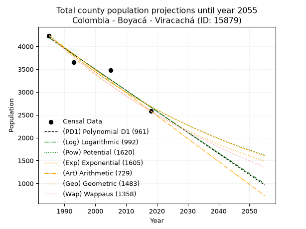
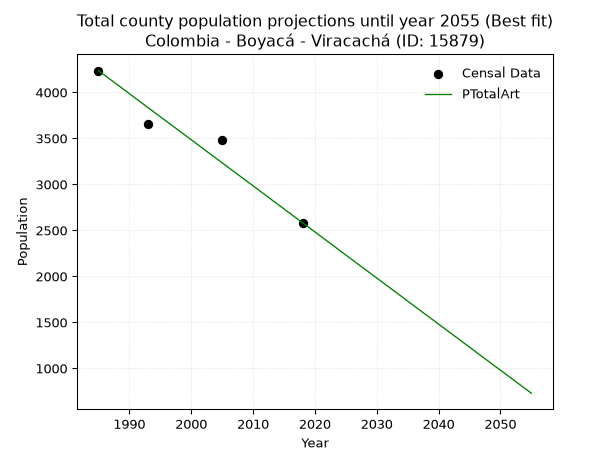
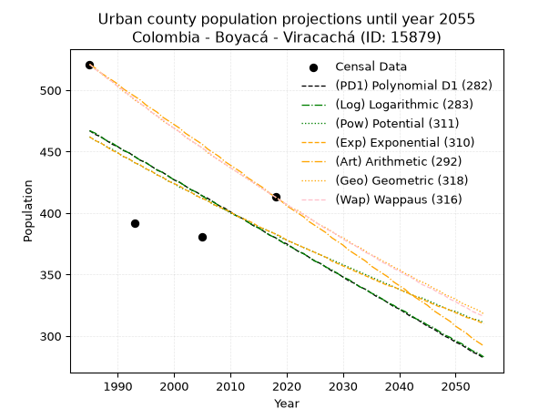
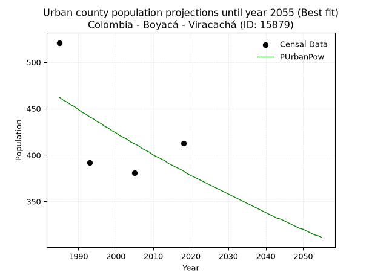
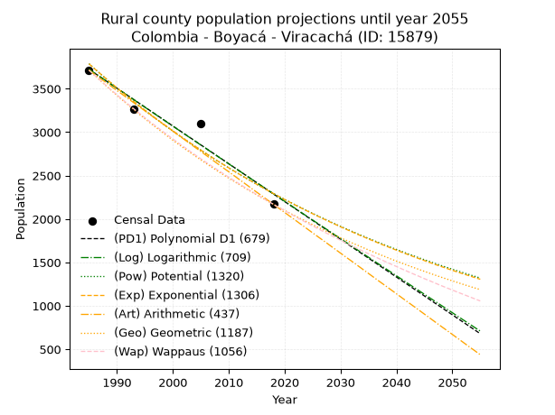

<div align="center">


</div>

# 📜 _“Population and Public Services Demand Projections (PPSD) until Year 2050 for Colombia - Boyacá - Viracachá (ID: 15879)”_
Keywords: `population` `public-service` `projection` `lineal` `polynomial` `logarithmic` `potential` `exponential` `arithmetic` `geometric` `wappaus` `dane` `colombia` `south-america`

PPSD are analytical estimates used by governments and planners to anticipate future changes in population size, age distribution, and the resulting community needs for utilities, healthcare, education, and infrastructure as sizing future water treatment facilities, electrical grids, and road networks based on spatial growth.

<div align="center">

</img>

</div>


> **General running parameters**: • app_version: _v20260806_. • Python version: _3.14.7_. • Pandas version: _3.0.5_. • NumPy version: _2.5.1_. • Creates, save and include plots into reports (create_plot): _False_. • Projection until year: _2050_. • Process polynomial degree 2 and up: _False_. • Process Wappaus: _True_. • Process Wappaus: _True_. • Set negative values to zero: _True_. • Set infinite values to zero: _True_. • Drop dataset notes: _True_. 
<div align="center">

Maps & GIS Layers: [:earth_americas:Google](http://maps.google.com/maps?q=5.436833292,-73.2968937) [:earth_americas:OSM](https://www.openstreetmap.org/#map=18/5.436833292/-73.2968937&layers=P) [:earth_americas:Bing](https://www.bing.com/maps?cp=5.436833292~-73.2968937&lvl=18) [:earth_americas:Apple](https://maps.apple.com/frame?center=5.436833292%2C-73.2968937&span=0.003%2C0.006) [:earth_americas:GISMobile](https://github.com/rcfdtools/R.GISMobile/blob/main/file/gis/CountyLayer_CO/Readme.md)

</div>


<div align="center">

```geojson
{
  "type": "Feature",
  "geometry": {
    "type": "Point", 
    "coordinates": [-73.2968937, 5.436833292]
  }, 
  "properties": {
    "Name": "Colombia - Boyacá - Viracachá (ID: 15879)"
  }
}
```

</div>


## 0. Census Data (4 records)

Census data are official statistics collected by a government about the people and housing in a country. They usually include counts of total population, age, sex, race, income, education, and jobs.

📅Global census file: [Population.xlsx](../data/Population.xlsx)

| Source   |   Year |   CountryID | CountryName   |   StateID | StateName   |   CountyID | CountyName   |   PTotal |   PUrban |   PRural |
|:---------|-------:|------------:|:--------------|----------:|:------------|-----------:|:-------------|---------:|---------:|---------:|
| DANE     |   1985 |          57 | Colombia      |        15 | Boyacá      |      15879 | Viracachá    |     4235 |      521 |     3714 |
| DANE     |   1993 |          57 | Colombia      |        15 | Boyacá      |      15879 | Viracachá    |     3654 |      392 |     3262 |
| DANE     |   2005 |          57 | Colombia      |        15 | Boyacá      |      15879 | Viracachá    |     3477 |      381 |     3096 |
| DANE     |   2018 |          57 | Colombia      |        15 | Boyacá      |      15879 | Viracachá    |     2582 |      413 |     2169 |

> 🔥Some records could had specific notes about the registered values or the corresponding urban or rural distribution.

📅[SUI-RUPS](https://www.datos.gov.co/Hacienda-y-Cr-dito-P-blico/Registro-nico-de-Prestadores-de-Servicios-P-blicos/4qkq-csdn/about_data) - Local public utility companies: [RUPS.csv](../data/RUPS.csv)

 | SERVICIO       | ESTADO    | NOMBRE                                                                                                                 | NIT         | DEPARTAMENTO_DOMICILIO   | MUNICIPIO_DOMICILIO   | DIRECCION                       |   TELEFONO | EMAIL                               | TIPO_PRESTADOR          | CLASIFICACION                 |
|:---------------|:----------|:-----------------------------------------------------------------------------------------------------------------------|:------------|:-------------------------|:----------------------|:--------------------------------|-----------:|:------------------------------------|:------------------------|:------------------------------|
| ACUEDUCTO      | OPERATIVA | ASOCIACION DE SUSCRIPTORES DEL ACUEDUCTO EL ARROYITO DEL MUNICIPIO DE VIRACACHA                                        | 820005470-6 | BOYACA                   | VIRACACHA             | VEREDA PUEBLO VIEJO             |    7377006 | v.d.a.l@hotmail.com                 | ORGANIZACION AUTORIZADA | HASTA 2500 SUSCRIPTORES       |
| ACUEDUCTO      | OPERATIVA | ASOCIACION DE SUSCRIPTORES DE PRO-ACUEDUCTO DE LA VEREDA CAROS SECTOR EL GAQUE – AGUAREGADA DEL MUNICIPIO DE VIRACACHA | 900166320-1 | BOYACA                   | VIRACACHA             | VEREDA DE CAROS SECTOR EL GAQUE |    7377006 | alvargas_vercaros@yahoo.es          | ORGANIZACION AUTORIZADA | HASTA 2500 SUSCRIPTORES       |
| ACUEDUCTO      | OPERATIVA | ASOCIACION DE SUSCRIPTORES DEL ACUEDUCTO DE LA VEREDA CAROS Y GALINDOS DEL MUNICIPIO DE VIRACACHA                      | 900021830-1 | BOYACA                   | VIRACACHA             | VEREDA CAROS Y GALINDO          |    7452830 | contactenos@viracacha-boyaca.gov.co | ORGANIZACION AUTORIZADA | HASTA 2500 SUSCRIPTORES       |
| ACUEDUCTO      | OPERATIVA | ADMINISTRACION PUBLICA COOPERATIVA EMPRESA DE SERVICIOS PUBLICOS DE ACUEDUCTO, ALCANTARILLADO Y ASEO                   | 900251903-7 | BOYACA                   | VIRACACHA             | Carrera 6 No. 4 - 37            |    7377006 | fredyjufuerte@gmail.com             | ORGANIZACION AUTORIZADA | MENOR O IGUAL A 2500 USUARIOS |
| ALCANTARILLADO | OPERATIVA | ADMINISTRACION PUBLICA COOPERATIVA EMPRESA DE SERVICIOS PUBLICOS DE ACUEDUCTO, ALCANTARILLADO Y ASEO                   | 900251903-7 | BOYACA                   | VIRACACHA             | Carrera 6 No. 4 - 37            |    7377006 | fredyjufuerte@gmail.com             | ORGANIZACION AUTORIZADA | MENOR O IGUAL A 2500 USUARIOS |

## 1. Total

### 1.1. Coefficients and Parameters

* (PD1) Polynomial Deg 1: -46.13247691690025, 95763.48695302973 (lineal)
* (Log) Logarithmic: -92323.08404682147, 705235.5016706545
* (Pow) Potential: -27.792249190002718, 95.28001798313792
* (Exp) Exponential: -0.01388998086127599, 3998415208413938.0
* (Art) Arithmetic: Year diff. 2018 - 1985 = 33, Population diff. 2582 - 4235 = -1653, Annual growth = -50.09090909090909
* (Geo) Geometric: Year diff. 2018 - 1985 = 33, Population diff. 2582 - 4235 = -1653, Annual growth % = -0.014882658257498016
* (Wap) Wappaus: i = -1.4695880619307347, Condition values only valid for < 200)

<sub>
Wappaus condition values: ['-0.00', '-1.47', '-2.94', '-4.41', '-5.88', '-7.35', '-8.82', '-10.29', '-11.76', '-13.23', '-14.70', '-16.17', '-17.64', '-19.10', '-20.57', '-22.04', '-23.51', '-24.98', '-26.45', '-27.92', '-29.39', '-30.86', '-32.33', '-33.80', '-35.27', '-36.74', '-38.21', '-39.68', '-41.15', '-42.62', '-44.09', '-45.56', '-47.03', '-48.50', '-49.97', '-51.44', '-52.91', '-54.37', '-55.84', '-57.31', '-58.78', '-60.25', '-61.72', '-63.19', '-64.66', '-66.13', '-67.60', '-69.07', '-70.54', '-72.01', '-73.48', '-74.95', '-76.42', '-77.89', '-79.36', '-80.83', '-82.30', '-83.77', '-85.24', '-86.71', '-88.18', '-89.64', '-91.11', '-92.58', '-94.05', '-95.52']
</sub>


### 1.2. Projected Dataset

|   Year |   CountyID |   PTotalPD1 |   PTotalLog |   PTotalPow |   PTotalExp |   PTotalArt |   PTotalGeo |   PTotalWap |
|-------:|-----------:|------------:|------------:|------------:|------------:|------------:|------------:|------------:|
|   1985 |      15879 |        4191 |        4192 |        4245 |        4243 |        4235 |        4235 |        4235 |
|   1986 |      15879 |        4144 |        4145 |        4186 |        4185 |        4185 |        4172 |        4173 |
|   1987 |      15879 |        4098 |        4099 |        4127 |        4127 |        4135 |        4110 |        4112 |
|   1988 |      15879 |        4052 |        4052 |        4070 |        4070 |        4085 |        4049 |        4052 |
|   1989 |      15879 |        4006 |        4006 |        4014 |        4014 |        4035 |        3988 |        3993 |
|   1990 |      15879 |        3960 |        3960 |        3958 |        3958 |        3985 |        3929 |        3935 |
|   1991 |      15879 |        3914 |        3913 |        3903 |        3904 |        3934 |        3871 |        3877 |
|   1992 |      15879 |        3868 |        3867 |        3849 |        3850 |        3884 |        3813 |        3821 |
|   1993 |      15879 |        3821 |        3820 |        3796 |        3797 |        3834 |        3756 |        3765 |
|   1994 |      15879 |        3775 |        3774 |        3743 |        3745 |        3784 |        3700 |        3710 |
|   1995 |      15879 |        3729 |        3728 |        3691 |        3693 |        3734 |        3645 |        3655 |
|   1996 |      15879 |        3683 |        3682 |        3640 |        3642 |        3684 |        3591 |        3602 |
|   1997 |      15879 |        3637 |        3635 |        3590 |        3592 |        3634 |        3538 |        3549 |
|   1998 |      15879 |        3591 |        3589 |        3540 |        3542 |        3584 |        3485 |        3496 |
|   1999 |      15879 |        3545 |        3543 |        3491 |        3493 |        3534 |        3433 |        3445 |
|   2000 |      15879 |        3499 |        3497 |        3443 |        3445 |        3484 |        3382 |        3394 |
|   2001 |      15879 |        3452 |        3451 |        3396 |        3398 |        3434 |        3332 |        3344 |
|   2002 |      15879 |        3406 |        3404 |        3349 |        3351 |        3383 |        3282 |        3294 |
|   2003 |      15879 |        3360 |        3358 |        3303 |        3305 |        3333 |        3233 |        3246 |
|   2004 |      15879 |        3314 |        3312 |        3257 |        3259 |        3283 |        3185 |        3197 |
|   2005 |      15879 |        3268 |        3266 |        3212 |        3214 |        3233 |        3138 |        3150 |
|   2006 |      15879 |        3222 |        3220 |        3168 |        3170 |        3183 |        3091 |        3103 |
|   2007 |      15879 |        3176 |        3174 |        3125 |        3126 |        3133 |        3045 |        3056 |
|   2008 |      15879 |        3129 |        3128 |        3082 |        3083 |        3083 |        3000 |        3010 |
|   2009 |      15879 |        3083 |        3082 |        3039 |        3040 |        3033 |        2955 |        2965 |
|   2010 |      15879 |        3037 |        3036 |        2998 |        2998 |        2983 |        2911 |        2921 |
|   2011 |      15879 |        2991 |        2990 |        2956 |        2957 |        2933 |        2868 |        2876 |
|   2012 |      15879 |        2945 |        2944 |        2916 |        2916 |        2883 |        2825 |        2833 |
|   2013 |      15879 |        2899 |        2899 |        2876 |        2876 |        2832 |        2783 |        2790 |
|   2014 |      15879 |        2853 |        2853 |        2836 |        2836 |        2782 |        2742 |        2747 |
|   2015 |      15879 |        2807 |        2807 |        2798 |        2797 |        2732 |        2701 |        2705 |
|   2016 |      15879 |        2760 |        2761 |        2759 |        2759 |        2682 |        2661 |        2664 |
|   2017 |      15879 |        2714 |        2715 |        2721 |        2721 |        2632 |        2621 |        2623 |
|   2018 |      15879 |        2668 |        2670 |        2684 |        2683 |        2582 |        2582 |        2582 |
|   2019 |      15879 |        2622 |        2624 |        2648 |        2646 |        2532 |        2544 |        2542 |
|   2020 |      15879 |        2576 |        2578 |        2611 |        2609 |        2482 |        2506 |        2502 |
|   2021 |      15879 |        2530 |        2532 |        2576 |        2574 |        2432 |        2468 |        2463 |
|   2022 |      15879 |        2484 |        2487 |        2541 |        2538 |        2382 |        2432 |        2424 |
|   2023 |      15879 |        2437 |        2441 |        2506 |        2503 |        2332 |        2395 |        2386 |
|   2024 |      15879 |        2391 |        2395 |        2472 |        2468 |        2281 |        2360 |        2348 |
|   2025 |      15879 |        2345 |        2350 |        2438 |        2434 |        2231 |        2325 |        2311 |
|   2026 |      15879 |        2299 |        2304 |        2405 |        2401 |        2181 |        2290 |        2274 |
|   2027 |      15879 |        2253 |        2259 |        2372 |        2368 |        2131 |        2256 |        2237 |
|   2028 |      15879 |        2207 |        2213 |        2340 |        2335 |        2081 |        2222 |        2201 |
|   2029 |      15879 |        2161 |        2168 |        2308 |        2303 |        2031 |        2189 |        2166 |
|   2030 |      15879 |        2115 |        2122 |        2276 |        2271 |        1981 |        2157 |        2130 |
|   2031 |      15879 |        2068 |        2077 |        2246 |        2240 |        1931 |        2125 |        2095 |
|   2032 |      15879 |        2022 |        2031 |        2215 |        2209 |        1881 |        2093 |        2061 |
|   2033 |      15879 |        1976 |        1986 |        2185 |        2178 |        1831 |        2062 |        2027 |
|   2034 |      15879 |        1930 |        1940 |        2155 |        2148 |        1781 |        2031 |        1993 |
|   2035 |      15879 |        1884 |        1895 |        2126 |        2119 |        1730 |        2001 |        1959 |
|   2036 |      15879 |        1838 |        1850 |        2097 |        2089 |        1680 |        1971 |        1926 |
|   2037 |      15879 |        1792 |        1804 |        2069 |        2061 |        1630 |        1942 |        1893 |
|   2038 |      15879 |        1745 |        1759 |        2041 |        2032 |        1580 |        1913 |        1861 |
|   2039 |      15879 |        1699 |        1714 |        2013 |        2004 |        1530 |        1885 |        1829 |
|   2040 |      15879 |        1653 |        1669 |        1986 |        1977 |        1480 |        1856 |        1797 |
|   2041 |      15879 |        1607 |        1623 |        1959 |        1949 |        1430 |        1829 |        1766 |
|   2042 |      15879 |        1561 |        1578 |        1933 |        1922 |        1380 |        1802 |        1735 |
|   2043 |      15879 |        1515 |        1533 |        1906 |        1896 |        1330 |        1775 |        1704 |
|   2044 |      15879 |        1469 |        1488 |        1881 |        1870 |        1280 |        1748 |        1673 |
|   2045 |      15879 |        1423 |        1443 |        1855 |        1844 |        1230 |        1722 |        1643 |
|   2046 |      15879 |        1376 |        1397 |        1830 |        1819 |        1179 |        1697 |        1614 |
|   2047 |      15879 |        1330 |        1352 |        1806 |        1793 |        1129 |        1672 |        1584 |
|   2048 |      15879 |        1284 |        1307 |        1781 |        1769 |        1079 |        1647 |        1555 |
|   2049 |      15879 |        1238 |        1262 |        1757 |        1744 |        1029 |        1622 |        1526 |
|   2050 |      15879 |        1192 |        1217 |        1734 |        1720 |         979 |        1598 |        1497 |
<div align="center">

</img>

</div>


### 1.3. Best fit with absolute and relative error (%)

Relative error puts that difference into context by dividing the absolute error by the true value, creating a unitless ratio or percentage that shows the scale of the mistake.

Absolute and relative error

|   Year | Source   |   CountryID | CountryName   |   StateID | StateName   |   CountyID_x | CountyName   |   PTotal |   PUrban |   PRural |   CountyID_y |   PTotalPD1 |   PTotalLog |   PTotalPow |   PTotalExp |   PTotalArt |   PTotalGeo |   PTotalWap |   PTotalPD1AbsError |   PTotalLogAbsError |   PTotalPowAbsError |   PTotalExpAbsError |   PTotalArtAbsError |   PTotalGeoAbsError |   PTotalWapAbsError |   PTotalPD1RelError |   PTotalLogRelError |   PTotalPowRelError |   PTotalExpRelError |   PTotalArtRelError |   PTotalGeoRelError |   PTotalWapRelError |
|-------:|:---------|------------:|:--------------|----------:|:------------|-------------:|:-------------|---------:|---------:|---------:|-------------:|------------:|------------:|------------:|------------:|------------:|------------:|------------:|--------------------:|--------------------:|--------------------:|--------------------:|--------------------:|--------------------:|--------------------:|--------------------:|--------------------:|--------------------:|--------------------:|--------------------:|--------------------:|--------------------:|
|   1985 | DANE     |          57 | Colombia      |        15 | Boyacá      |        15879 | Viracachá    |     4235 |      521 |     3714 |        15879 |        4191 |        4192 |        4245 |        4243 |        4235 |        4235 |        4235 |                  44 |                  43 |                  10 |                   8 |                   0 |                   0 |                   0 |             1.03896 |             1.01535 |            0.236128 |            0.188902 |             0       |             0       |             0       |
|   1993 | DANE     |          57 | Colombia      |        15 | Boyacá      |        15879 | Viracachá    |     3654 |      392 |     3262 |        15879 |        3821 |        3820 |        3796 |        3797 |        3834 |        3756 |        3765 |                 167 |                 166 |                 142 |                 143 |                 180 |                 102 |                 111 |             4.57033 |             4.54297 |            3.88615  |            3.91352  |             4.92611 |             2.79146 |             3.03777 |
|   2005 | DANE     |          57 | Colombia      |        15 | Boyacá      |        15879 | Viracachá    |     3477 |      381 |     3096 |        15879 |        3268 |        3266 |        3212 |        3214 |        3233 |        3138 |        3150 |                 209 |                 211 |                 265 |                 263 |                 244 |                 339 |                 327 |             6.01093 |             6.06845 |            7.62151  |            7.56399  |             7.01754 |             9.74978 |             9.40466 |
|   2018 | DANE     |          57 | Colombia      |        15 | Boyacá      |        15879 | Viracachá    |     2582 |      413 |     2169 |        15879 |        2668 |        2670 |        2684 |        2683 |        2582 |        2582 |        2582 |                  86 |                  88 |                 102 |                 101 |                   0 |                   0 |                   0 |             3.33075 |             3.40821 |            3.95043  |            3.9117   |             0       |             0       |             0       |

Relative error mean

| Method    |   RelError | Best   |
|:----------|-----------:|:-------|
| PTotalPD1 |    3.73774 |        |
| PTotalLog |    3.75874 |        |
| PTotalPow |    3.92355 |        |
| PTotalExp |    3.89453 |        |
| PTotalArt |    2.98591 | True   |
| PTotalGeo |    3.13531 |        |
| PTotalWap |    3.11061 |        |

💙Best method: _**PTotalArt**_
<div align="center">

</img>

</div>


### 1.4. Fresh water supply demand in liters per capita per day (lpcd)

The fresh water supply demand typically ranges from 100 to 300 liters per capita per day (lpcd) for standard domestic and municipal planning, though absolute survival minimums set by the World Health Organization are as low as 7.5 to 20 liters per day, and total consumption in high-income nations can exceed 400 liters.

> `CZ`: Level in meters above the sea level (masl)<br> `WS`: Fresh water supply demand in liters per capita per day (lpcd or l/h/d)<br> `WSAll`: Zonal fresh water supply demand in liters per second (l/s)<br> `A`: Zonal area in square meters<br> `DP`: Population density (people/hectare or p/ha)

Reference values (RAS Colombia)

|    CZ |   WS |
|------:|-----:|
|  1000 |  120 |
|  2000 |  130 |
| 99999 |  140 |

County shapefile geometry properties and water supply values

|   CountyID |      ATotal |   CZTotal |   WSTotal |
|-----------:|------------:|----------:|----------:|
|      15879 | 6.24699e+07 |   2888.54 |       140 |

Projected values for best method: PTotalArt

|   CountyID |   Year |   PTotalArt |   DPTotal |   WSTotal |   WSTotalAll |
|-----------:|-------:|------------:|----------:|----------:|-------------:|
|      15879 |   1985 |        4235 |      0.68 |       140 |      6.86227 |
|      15879 |   1986 |        4185 |      0.67 |       140 |      6.78125 |
|      15879 |   1987 |        4135 |      0.66 |       140 |      6.70023 |
|      15879 |   1988 |        4085 |      0.65 |       140 |      6.61921 |
|      15879 |   1989 |        4035 |      0.65 |       140 |      6.53819 |
|      15879 |   1990 |        3985 |      0.64 |       140 |      6.45718 |
|      15879 |   1991 |        3934 |      0.63 |       140 |      6.37454 |
|      15879 |   1992 |        3884 |      0.62 |       140 |      6.29352 |
|      15879 |   1993 |        3834 |      0.61 |       140 |      6.2125  |
|      15879 |   1994 |        3784 |      0.61 |       140 |      6.13148 |
|      15879 |   1995 |        3734 |      0.6  |       140 |      6.05046 |
|      15879 |   1996 |        3684 |      0.59 |       140 |      5.96944 |
|      15879 |   1997 |        3634 |      0.58 |       140 |      5.88843 |
|      15879 |   1998 |        3584 |      0.57 |       140 |      5.80741 |
|      15879 |   1999 |        3534 |      0.57 |       140 |      5.72639 |
|      15879 |   2000 |        3484 |      0.56 |       140 |      5.64537 |
|      15879 |   2001 |        3434 |      0.55 |       140 |      5.56435 |
|      15879 |   2002 |        3383 |      0.54 |       140 |      5.48171 |
|      15879 |   2003 |        3333 |      0.53 |       140 |      5.40069 |
|      15879 |   2004 |        3283 |      0.53 |       140 |      5.31968 |
|      15879 |   2005 |        3233 |      0.52 |       140 |      5.23866 |
|      15879 |   2006 |        3183 |      0.51 |       140 |      5.15764 |
|      15879 |   2007 |        3133 |      0.5  |       140 |      5.07662 |
|      15879 |   2008 |        3083 |      0.49 |       140 |      4.9956  |
|      15879 |   2009 |        3033 |      0.49 |       140 |      4.91458 |
|      15879 |   2010 |        2983 |      0.48 |       140 |      4.83356 |
|      15879 |   2011 |        2933 |      0.47 |       140 |      4.75255 |
|      15879 |   2012 |        2883 |      0.46 |       140 |      4.67153 |
|      15879 |   2013 |        2832 |      0.45 |       140 |      4.58889 |
|      15879 |   2014 |        2782 |      0.45 |       140 |      4.50787 |
|      15879 |   2015 |        2732 |      0.44 |       140 |      4.42685 |
|      15879 |   2016 |        2682 |      0.43 |       140 |      4.34583 |
|      15879 |   2017 |        2632 |      0.42 |       140 |      4.26481 |
|      15879 |   2018 |        2582 |      0.41 |       140 |      4.1838  |
|      15879 |   2019 |        2532 |      0.41 |       140 |      4.10278 |
|      15879 |   2020 |        2482 |      0.4  |       140 |      4.02176 |
|      15879 |   2021 |        2432 |      0.39 |       140 |      3.94074 |
|      15879 |   2022 |        2382 |      0.38 |       140 |      3.85972 |
|      15879 |   2023 |        2332 |      0.37 |       140 |      3.7787  |
|      15879 |   2024 |        2281 |      0.37 |       140 |      3.69606 |
|      15879 |   2025 |        2231 |      0.36 |       140 |      3.61505 |
|      15879 |   2026 |        2181 |      0.35 |       140 |      3.53403 |
|      15879 |   2027 |        2131 |      0.34 |       140 |      3.45301 |
|      15879 |   2028 |        2081 |      0.33 |       140 |      3.37199 |
|      15879 |   2029 |        2031 |      0.33 |       140 |      3.29097 |
|      15879 |   2030 |        1981 |      0.32 |       140 |      3.20995 |
|      15879 |   2031 |        1931 |      0.31 |       140 |      3.12894 |
|      15879 |   2032 |        1881 |      0.3  |       140 |      3.04792 |
|      15879 |   2033 |        1831 |      0.29 |       140 |      2.9669  |
|      15879 |   2034 |        1781 |      0.29 |       140 |      2.88588 |
|      15879 |   2035 |        1730 |      0.28 |       140 |      2.80324 |
|      15879 |   2036 |        1680 |      0.27 |       140 |      2.72222 |
|      15879 |   2037 |        1630 |      0.26 |       140 |      2.6412  |
|      15879 |   2038 |        1580 |      0.25 |       140 |      2.56019 |
|      15879 |   2039 |        1530 |      0.24 |       140 |      2.47917 |
|      15879 |   2040 |        1480 |      0.24 |       140 |      2.39815 |
|      15879 |   2041 |        1430 |      0.23 |       140 |      2.31713 |
|      15879 |   2042 |        1380 |      0.22 |       140 |      2.23611 |
|      15879 |   2043 |        1330 |      0.21 |       140 |      2.15509 |
|      15879 |   2044 |        1280 |      0.2  |       140 |      2.07407 |
|      15879 |   2045 |        1230 |      0.2  |       140 |      1.99306 |
|      15879 |   2046 |        1179 |      0.19 |       140 |      1.91042 |
|      15879 |   2047 |        1129 |      0.18 |       140 |      1.8294  |
|      15879 |   2048 |        1079 |      0.17 |       140 |      1.74838 |
|      15879 |   2049 |        1029 |      0.16 |       140 |      1.66736 |
|      15879 |   2050 |         979 |      0.16 |       140 |      1.58634 |

## 2. Urban

### 2.1. Coefficients and Parameters

* (PD1) Polynomial Deg 1: -2.644319550381389, 5716.0501806503735 (lineal)
* (Log) Logarithmic: -5308.530959560228, 40776.93636351464
* (Pow) Potential: -11.437171823644148, 40.381721256939656
* (Exp) Exponential: -0.005696257998088426, 37590231.462787986
* (Art) Arithmetic: Year diff. 2018 - 1985 = 33, Population diff. 413 - 521 = -108, Annual growth = -3.272727272727273
* (Geo) Geometric: Year diff. 2018 - 1985 = 33, Population diff. 413 - 521 = -108, Annual growth % = -0.007014749126263764
* (Wap) Wappaus: i = -0.7007981312049835, Condition values only valid for < 200)

<sub>
Wappaus condition values: ['-0.00', '-0.70', '-1.40', '-2.10', '-2.80', '-3.50', '-4.20', '-4.91', '-5.61', '-6.31', '-7.01', '-7.71', '-8.41', '-9.11', '-9.81', '-10.51', '-11.21', '-11.91', '-12.61', '-13.32', '-14.02', '-14.72', '-15.42', '-16.12', '-16.82', '-17.52', '-18.22', '-18.92', '-19.62', '-20.32', '-21.02', '-21.72', '-22.43', '-23.13', '-23.83', '-24.53', '-25.23', '-25.93', '-26.63', '-27.33', '-28.03', '-28.73', '-29.43', '-30.13', '-30.84', '-31.54', '-32.24', '-32.94', '-33.64', '-34.34', '-35.04', '-35.74', '-36.44', '-37.14', '-37.84', '-38.54', '-39.24', '-39.95', '-40.65', '-41.35', '-42.05', '-42.75', '-43.45', '-44.15', '-44.85', '-45.55']
</sub>


### 2.2. Projected Dataset

|   Year |   CountyID |   PUrbanPD1 |   PUrbanLog |   PUrbanPow |   PUrbanExp |   PUrbanArt |   PUrbanGeo |   PUrbanWap |
|-------:|-----------:|------------:|------------:|------------:|------------:|------------:|------------:|------------:|
|   1985 |      15879 |         467 |         467 |         462 |         462 |         521 |         521 |         521 |
|   1986 |      15879 |         464 |         465 |         459 |         459 |         518 |         517 |         517 |
|   1987 |      15879 |         462 |         462 |         457 |         457 |         514 |         514 |         514 |
|   1988 |      15879 |         459 |         459 |         454 |         454 |         511 |         510 |         510 |
|   1989 |      15879 |         456 |         457 |         452 |         451 |         508 |         507 |         507 |
|   1990 |      15879 |         454 |         454 |         449 |         449 |         505 |         503 |         503 |
|   1991 |      15879 |         451 |         451 |         446 |         446 |         501 |         499 |         500 |
|   1992 |      15879 |         449 |         449 |         444 |         444 |         498 |         496 |         496 |
|   1993 |      15879 |         446 |         446 |         441 |         441 |         495 |         492 |         493 |
|   1994 |      15879 |         443 |         443 |         439 |         439 |         492 |         489 |         489 |
|   1995 |      15879 |         441 |         441 |         436 |         436 |         488 |         486 |         486 |
|   1996 |      15879 |         438 |         438 |         434 |         434 |         485 |         482 |         482 |
|   1997 |      15879 |         435 |         435 |         431 |         431 |         482 |         479 |         479 |
|   1998 |      15879 |         433 |         433 |         429 |         429 |         478 |         475 |         476 |
|   1999 |      15879 |         430 |         430 |         426 |         426 |         475 |         472 |         472 |
|   2000 |      15879 |         427 |         427 |         424 |         424 |         472 |         469 |         469 |
|   2001 |      15879 |         425 |         425 |         421 |         422 |         469 |         466 |         466 |
|   2002 |      15879 |         422 |         422 |         419 |         419 |         465 |         462 |         462 |
|   2003 |      15879 |         419 |         419 |         417 |         417 |         462 |         459 |         459 |
|   2004 |      15879 |         417 |         417 |         414 |         414 |         459 |         456 |         456 |
|   2005 |      15879 |         414 |         414 |         412 |         412 |         456 |         453 |         453 |
|   2006 |      15879 |         412 |         411 |         410 |         410 |         452 |         449 |         450 |
|   2007 |      15879 |         409 |         409 |         407 |         407 |         449 |         446 |         446 |
|   2008 |      15879 |         406 |         406 |         405 |         405 |         446 |         443 |         443 |
|   2009 |      15879 |         404 |         403 |         403 |         403 |         442 |         440 |         440 |
|   2010 |      15879 |         401 |         401 |         400 |         401 |         439 |         437 |         437 |
|   2011 |      15879 |         398 |         398 |         398 |         398 |         436 |         434 |         434 |
|   2012 |      15879 |         396 |         396 |         396 |         396 |         433 |         431 |         431 |
|   2013 |      15879 |         393 |         393 |         394 |         394 |         429 |         428 |         428 |
|   2014 |      15879 |         390 |         390 |         391 |         392 |         426 |         425 |         425 |
|   2015 |      15879 |         388 |         388 |         389 |         389 |         423 |         422 |         422 |
|   2016 |      15879 |         385 |         385 |         387 |         387 |         420 |         419 |         419 |
|   2017 |      15879 |         382 |         382 |         385 |         385 |         416 |         416 |         416 |
|   2018 |      15879 |         380 |         380 |         383 |         383 |         413 |         413 |         413 |
|   2019 |      15879 |         377 |         377 |         380 |         381 |         410 |         410 |         410 |
|   2020 |      15879 |         375 |         374 |         378 |         378 |         406 |         407 |         407 |
|   2021 |      15879 |         372 |         372 |         376 |         376 |         403 |         404 |         404 |
|   2022 |      15879 |         369 |         369 |         374 |         374 |         400 |         402 |         401 |
|   2023 |      15879 |         367 |         367 |         372 |         372 |         397 |         399 |         399 |
|   2024 |      15879 |         364 |         364 |         370 |         370 |         393 |         396 |         396 |
|   2025 |      15879 |         361 |         361 |         368 |         368 |         390 |         393 |         393 |
|   2026 |      15879 |         359 |         359 |         366 |         366 |         387 |         390 |         390 |
|   2027 |      15879 |         356 |         356 |         364 |         364 |         384 |         388 |         387 |
|   2028 |      15879 |         353 |         354 |         362 |         361 |         380 |         385 |         385 |
|   2029 |      15879 |         351 |         351 |         360 |         359 |         377 |         382 |         382 |
|   2030 |      15879 |         348 |         348 |         358 |         357 |         374 |         380 |         379 |
|   2031 |      15879 |         345 |         346 |         356 |         355 |         370 |         377 |         376 |
|   2032 |      15879 |         343 |         343 |         354 |         353 |         367 |         374 |         374 |
|   2033 |      15879 |         340 |         340 |         352 |         351 |         364 |         372 |         371 |
|   2034 |      15879 |         338 |         338 |         350 |         349 |         361 |         369 |         368 |
|   2035 |      15879 |         335 |         335 |         348 |         347 |         357 |         366 |         366 |
|   2036 |      15879 |         332 |         333 |         346 |         345 |         354 |         364 |         363 |
|   2037 |      15879 |         330 |         330 |         344 |         343 |         351 |         361 |         360 |
|   2038 |      15879 |         327 |         327 |         342 |         341 |         348 |         359 |         358 |
|   2039 |      15879 |         324 |         325 |         340 |         340 |         344 |         356 |         355 |
|   2040 |      15879 |         322 |         322 |         338 |         338 |         341 |         354 |         353 |
|   2041 |      15879 |         319 |         320 |         336 |         336 |         338 |         351 |         350 |
|   2042 |      15879 |         316 |         317 |         334 |         334 |         334 |         349 |         348 |
|   2043 |      15879 |         314 |         314 |         332 |         332 |         331 |         346 |         345 |
|   2044 |      15879 |         311 |         312 |         331 |         330 |         328 |         344 |         342 |
|   2045 |      15879 |         308 |         309 |         329 |         328 |         325 |         342 |         340 |
|   2046 |      15879 |         306 |         307 |         327 |         326 |         321 |         339 |         338 |
|   2047 |      15879 |         303 |         304 |         325 |         324 |         318 |         337 |         335 |
|   2048 |      15879 |         300 |         301 |         323 |         323 |         315 |         334 |         333 |
|   2049 |      15879 |         298 |         299 |         321 |         321 |         312 |         332 |         330 |
|   2050 |      15879 |         295 |         296 |         320 |         319 |         308 |         330 |         328 |
<div align="center">

</img>

</div>


### 2.3. Best fit with absolute and relative error (%)

Relative error puts that difference into context by dividing the absolute error by the true value, creating a unitless ratio or percentage that shows the scale of the mistake.

Absolute and relative error

|   Year | Source   |   CountryID | CountryName   |   StateID | StateName   |   CountyID_x | CountyName   |   PTotal |   PUrban |   PRural |   CountyID_y |   PUrbanPD1 |   PUrbanLog |   PUrbanPow |   PUrbanExp |   PUrbanArt |   PUrbanGeo |   PUrbanWap |   PUrbanPD1AbsError |   PUrbanLogAbsError |   PUrbanPowAbsError |   PUrbanExpAbsError |   PUrbanArtAbsError |   PUrbanGeoAbsError |   PUrbanWapAbsError |   PUrbanPD1RelError |   PUrbanLogRelError |   PUrbanPowRelError |   PUrbanExpRelError |   PUrbanArtRelError |   PUrbanGeoRelError |   PUrbanWapRelError |
|-------:|:---------|------------:|:--------------|----------:|:------------|-------------:|:-------------|---------:|---------:|---------:|-------------:|------------:|------------:|------------:|------------:|------------:|------------:|------------:|--------------------:|--------------------:|--------------------:|--------------------:|--------------------:|--------------------:|--------------------:|--------------------:|--------------------:|--------------------:|--------------------:|--------------------:|--------------------:|--------------------:|
|   1985 | DANE     |          57 | Colombia      |        15 | Boyacá      |        15879 | Viracachá    |     4235 |      521 |     3714 |        15879 |         467 |         467 |         462 |         462 |         521 |         521 |         521 |                  54 |                  54 |                  59 |                  59 |                   0 |                   0 |                   0 |            10.3647  |            10.3647  |            11.3244  |            11.3244  |              0      |              0      |              0      |
|   1993 | DANE     |          57 | Colombia      |        15 | Boyacá      |        15879 | Viracachá    |     3654 |      392 |     3262 |        15879 |         446 |         446 |         441 |         441 |         495 |         492 |         493 |                  54 |                  54 |                  49 |                  49 |                 103 |                 100 |                 101 |            13.7755  |            13.7755  |            12.5     |            12.5     |             26.2755 |             25.5102 |             25.7653 |
|   2005 | DANE     |          57 | Colombia      |        15 | Boyacá      |        15879 | Viracachá    |     3477 |      381 |     3096 |        15879 |         414 |         414 |         412 |         412 |         456 |         453 |         453 |                  33 |                  33 |                  31 |                  31 |                  75 |                  72 |                  72 |             8.66142 |             8.66142 |             8.13648 |             8.13648 |             19.685  |             18.8976 |             18.8976 |
|   2018 | DANE     |          57 | Colombia      |        15 | Boyacá      |        15879 | Viracachá    |     2582 |      413 |     2169 |        15879 |         380 |         380 |         383 |         383 |         413 |         413 |         413 |                  33 |                  33 |                  30 |                  30 |                   0 |                   0 |                   0 |             7.99031 |             7.99031 |             7.26392 |             7.26392 |              0      |              0      |              0      |

Relative error mean

| Method    |   RelError | Best   |
|:----------|-----------:|:-------|
| PUrbanPD1 |    10.198  |        |
| PUrbanLog |    10.198  |        |
| PUrbanPow |     9.8062 | True   |
| PUrbanExp |     9.8062 | True   |
| PUrbanArt |    11.4901 |        |
| PUrbanGeo |    11.102  |        |
| PUrbanWap |    11.1657 |        |

💙Best method: _**PUrbanPow**_
<div align="center">

</img>

</div>


### 2.4. Fresh water supply demand in liters per capita per day (lpcd)

The fresh water supply demand typically ranges from 100 to 300 liters per capita per day (lpcd) for standard domestic and municipal planning, though absolute survival minimums set by the World Health Organization are as low as 7.5 to 20 liters per day, and total consumption in high-income nations can exceed 400 liters.

> `CZ`: Level in meters above the sea level (masl)<br> `WS`: Fresh water supply demand in liters per capita per day (lpcd or l/h/d)<br> `WSAll`: Zonal fresh water supply demand in liters per second (l/s)<br> `A`: Zonal area in square meters<br> `DP`: Population density (people/hectare or p/ha)

Reference values (RAS Colombia)

|    CZ |   WS |
|------:|-----:|
|  1000 |  120 |
|  2000 |  130 |
| 99999 |  140 |

County shapefile geometry properties and water supply values

|   CountyID |   AUrban |   CZUrban |   WSUrban |
|-----------:|---------:|----------:|----------:|
|      15879 |   476786 |   2533.71 |       140 |

Projected values for best method: PUrbanPow

|   CountyID |   Year |   PUrbanPow |   DPUrban |   WSUrban |   WSUrbanAll |
|-----------:|-------:|------------:|----------:|----------:|-------------:|
|      15879 |   1985 |         462 |      9.69 |       140 |     0.748611 |
|      15879 |   1986 |         459 |      9.63 |       140 |     0.74375  |
|      15879 |   1987 |         457 |      9.59 |       140 |     0.740509 |
|      15879 |   1988 |         454 |      9.52 |       140 |     0.735648 |
|      15879 |   1989 |         452 |      9.48 |       140 |     0.732407 |
|      15879 |   1990 |         449 |      9.42 |       140 |     0.727546 |
|      15879 |   1991 |         446 |      9.35 |       140 |     0.722685 |
|      15879 |   1992 |         444 |      9.31 |       140 |     0.719444 |
|      15879 |   1993 |         441 |      9.25 |       140 |     0.714583 |
|      15879 |   1994 |         439 |      9.21 |       140 |     0.711343 |
|      15879 |   1995 |         436 |      9.14 |       140 |     0.706481 |
|      15879 |   1996 |         434 |      9.1  |       140 |     0.703241 |
|      15879 |   1997 |         431 |      9.04 |       140 |     0.69838  |
|      15879 |   1998 |         429 |      9    |       140 |     0.695139 |
|      15879 |   1999 |         426 |      8.93 |       140 |     0.690278 |
|      15879 |   2000 |         424 |      8.89 |       140 |     0.687037 |
|      15879 |   2001 |         421 |      8.83 |       140 |     0.682176 |
|      15879 |   2002 |         419 |      8.79 |       140 |     0.678935 |
|      15879 |   2003 |         417 |      8.75 |       140 |     0.675694 |
|      15879 |   2004 |         414 |      8.68 |       140 |     0.670833 |
|      15879 |   2005 |         412 |      8.64 |       140 |     0.667593 |
|      15879 |   2006 |         410 |      8.6  |       140 |     0.664352 |
|      15879 |   2007 |         407 |      8.54 |       140 |     0.659491 |
|      15879 |   2008 |         405 |      8.49 |       140 |     0.65625  |
|      15879 |   2009 |         403 |      8.45 |       140 |     0.653009 |
|      15879 |   2010 |         400 |      8.39 |       140 |     0.648148 |
|      15879 |   2011 |         398 |      8.35 |       140 |     0.644907 |
|      15879 |   2012 |         396 |      8.31 |       140 |     0.641667 |
|      15879 |   2013 |         394 |      8.26 |       140 |     0.638426 |
|      15879 |   2014 |         391 |      8.2  |       140 |     0.633565 |
|      15879 |   2015 |         389 |      8.16 |       140 |     0.630324 |
|      15879 |   2016 |         387 |      8.12 |       140 |     0.627083 |
|      15879 |   2017 |         385 |      8.07 |       140 |     0.623843 |
|      15879 |   2018 |         383 |      8.03 |       140 |     0.620602 |
|      15879 |   2019 |         380 |      7.97 |       140 |     0.615741 |
|      15879 |   2020 |         378 |      7.93 |       140 |     0.6125   |
|      15879 |   2021 |         376 |      7.89 |       140 |     0.609259 |
|      15879 |   2022 |         374 |      7.84 |       140 |     0.606019 |
|      15879 |   2023 |         372 |      7.8  |       140 |     0.602778 |
|      15879 |   2024 |         370 |      7.76 |       140 |     0.599537 |
|      15879 |   2025 |         368 |      7.72 |       140 |     0.596296 |
|      15879 |   2026 |         366 |      7.68 |       140 |     0.593056 |
|      15879 |   2027 |         364 |      7.63 |       140 |     0.589815 |
|      15879 |   2028 |         362 |      7.59 |       140 |     0.586574 |
|      15879 |   2029 |         360 |      7.55 |       140 |     0.583333 |
|      15879 |   2030 |         358 |      7.51 |       140 |     0.580093 |
|      15879 |   2031 |         356 |      7.47 |       140 |     0.576852 |
|      15879 |   2032 |         354 |      7.42 |       140 |     0.573611 |
|      15879 |   2033 |         352 |      7.38 |       140 |     0.57037  |
|      15879 |   2034 |         350 |      7.34 |       140 |     0.56713  |
|      15879 |   2035 |         348 |      7.3  |       140 |     0.563889 |
|      15879 |   2036 |         346 |      7.26 |       140 |     0.560648 |
|      15879 |   2037 |         344 |      7.21 |       140 |     0.557407 |
|      15879 |   2038 |         342 |      7.17 |       140 |     0.554167 |
|      15879 |   2039 |         340 |      7.13 |       140 |     0.550926 |
|      15879 |   2040 |         338 |      7.09 |       140 |     0.547685 |
|      15879 |   2041 |         336 |      7.05 |       140 |     0.544444 |
|      15879 |   2042 |         334 |      7.01 |       140 |     0.541204 |
|      15879 |   2043 |         332 |      6.96 |       140 |     0.537963 |
|      15879 |   2044 |         331 |      6.94 |       140 |     0.536343 |
|      15879 |   2045 |         329 |      6.9  |       140 |     0.533102 |
|      15879 |   2046 |         327 |      6.86 |       140 |     0.529861 |
|      15879 |   2047 |         325 |      6.82 |       140 |     0.52662  |
|      15879 |   2048 |         323 |      6.77 |       140 |     0.52338  |
|      15879 |   2049 |         321 |      6.73 |       140 |     0.520139 |
|      15879 |   2050 |         320 |      6.71 |       140 |     0.518519 |

## 3. Rural

### 3.1. Coefficients and Parameters

* (PD1) Polynomial Deg 1: -43.488157366518884, 90047.43677237941 (lineal)
* (Log) Logarithmic: -87014.55308726121, 664458.5653071395
* (Pow) Potential: -30.42241787472299, 103.90430514439292
* (Exp) Exponential: -0.015207363003102381, 4.877478700946347e+16
* (Art) Arithmetic: Year diff. 2018 - 1985 = 33, Population diff. 2169 - 3714 = -1545, Annual growth = -46.81818181818182
* (Geo) Geometric: Year diff. 2018 - 1985 = 33, Population diff. 2169 - 3714 = -1545, Annual growth % = -0.016166181400957047
* (Wap) Wappaus: i = -1.5916431010770633, Condition values only valid for < 200)

<sub>
Wappaus condition values: ['-0.00', '-1.59', '-3.18', '-4.77', '-6.37', '-7.96', '-9.55', '-11.14', '-12.73', '-14.32', '-15.92', '-17.51', '-19.10', '-20.69', '-22.28', '-23.87', '-25.47', '-27.06', '-28.65', '-30.24', '-31.83', '-33.42', '-35.02', '-36.61', '-38.20', '-39.79', '-41.38', '-42.97', '-44.57', '-46.16', '-47.75', '-49.34', '-50.93', '-52.52', '-54.12', '-55.71', '-57.30', '-58.89', '-60.48', '-62.07', '-63.67', '-65.26', '-66.85', '-68.44', '-70.03', '-71.62', '-73.22', '-74.81', '-76.40', '-77.99', '-79.58', '-81.17', '-82.77', '-84.36', '-85.95', '-87.54', '-89.13', '-90.72', '-92.32', '-93.91', '-95.50', '-97.09', '-98.68', '-100.27', '-101.87', '-103.46']
</sub>


### 3.2. Projected Dataset

|   Year |   CountyID |   PRuralPD1 |   PRuralLog |   PRuralPow |   PRuralExp |   PRuralArt |   PRuralGeo |   PRuralWap |
|-------:|-----------:|------------:|------------:|------------:|------------:|------------:|------------:|------------:|
|   1985 |      15879 |        3723 |        3725 |        3788 |        3787 |        3714 |        3714 |        3714 |
|   1986 |      15879 |        3680 |        3681 |        3731 |        3730 |        3667 |        3654 |        3655 |
|   1987 |      15879 |        3636 |        3637 |        3674 |        3674 |        3620 |        3595 |        3598 |
|   1988 |      15879 |        3593 |        3593 |        3618 |        3618 |        3574 |        3537 |        3541 |
|   1989 |      15879 |        3549 |        3549 |        3563 |        3564 |        3527 |        3480 |        3485 |
|   1990 |      15879 |        3506 |        3506 |        3509 |        3510 |        3480 |        3423 |        3430 |
|   1991 |      15879 |        3463 |        3462 |        3456 |        3457 |        3433 |        3368 |        3375 |
|   1992 |      15879 |        3419 |        3418 |        3404 |        3405 |        3386 |        3314 |        3322 |
|   1993 |      15879 |        3376 |        3375 |        3352 |        3353 |        3339 |        3260 |        3269 |
|   1994 |      15879 |        3332 |        3331 |        3301 |        3303 |        3293 |        3207 |        3218 |
|   1995 |      15879 |        3289 |        3287 |        3251 |        3253 |        3246 |        3155 |        3166 |
|   1996 |      15879 |        3245 |        3244 |        3202 |        3204 |        3199 |        3104 |        3116 |
|   1997 |      15879 |        3202 |        3200 |        3154 |        3155 |        3152 |        3054 |        3066 |
|   1998 |      15879 |        3158 |        3156 |        3106 |        3108 |        3105 |        3005 |        3018 |
|   1999 |      15879 |        3115 |        3113 |        3059 |        3061 |        3059 |        2956 |        2969 |
|   2000 |      15879 |        3071 |        3069 |        3013 |        3015 |        3012 |        2908 |        2922 |
|   2001 |      15879 |        3028 |        3026 |        2967 |        2969 |        2965 |        2861 |        2875 |
|   2002 |      15879 |        2984 |        2982 |        2923 |        2924 |        2918 |        2815 |        2829 |
|   2003 |      15879 |        2941 |        2939 |        2879 |        2880 |        2871 |        2770 |        2783 |
|   2004 |      15879 |        2897 |        2896 |        2835 |        2837 |        2824 |        2725 |        2738 |
|   2005 |      15879 |        2854 |        2852 |        2793 |        2794 |        2778 |        2681 |        2694 |
|   2006 |      15879 |        2810 |        2809 |        2751 |        2752 |        2731 |        2638 |        2650 |
|   2007 |      15879 |        2767 |        2765 |        2709 |        2710 |        2684 |        2595 |        2607 |
|   2008 |      15879 |        2723 |        2722 |        2668 |        2669 |        2637 |        2553 |        2565 |
|   2009 |      15879 |        2680 |        2679 |        2628 |        2629 |        2590 |        2512 |        2523 |
|   2010 |      15879 |        2636 |        2635 |        2589 |        2589 |        2544 |        2471 |        2481 |
|   2011 |      15879 |        2593 |        2592 |        2550 |        2550 |        2497 |        2431 |        2441 |
|   2012 |      15879 |        2549 |        2549 |        2512 |        2512 |        2450 |        2392 |        2400 |
|   2013 |      15879 |        2506 |        2506 |        2474 |        2474 |        2403 |        2353 |        2360 |
|   2014 |      15879 |        2462 |        2462 |        2437 |        2437 |        2356 |        2315 |        2321 |
|   2015 |      15879 |        2419 |        2419 |        2400 |        2400 |        2309 |        2278 |        2282 |
|   2016 |      15879 |        2375 |        2376 |        2364 |        2364 |        2263 |        2241 |        2244 |
|   2017 |      15879 |        2332 |        2333 |        2329 |        2328 |        2216 |        2205 |        2206 |
|   2018 |      15879 |        2288 |        2290 |        2294 |        2293 |        2169 |        2169 |        2169 |
|   2019 |      15879 |        2245 |        2247 |        2260 |        2258 |        2122 |        2134 |        2132 |
|   2020 |      15879 |        2201 |        2204 |        2226 |        2224 |        2075 |        2099 |        2096 |
|   2021 |      15879 |        2158 |        2161 |        2193 |        2191 |        2029 |        2065 |        2060 |
|   2022 |      15879 |        2114 |        2118 |        2160 |        2157 |        1982 |        2032 |        2024 |
|   2023 |      15879 |        2071 |        2074 |        2128 |        2125 |        1935 |        1999 |        1989 |
|   2024 |      15879 |        2027 |        2031 |        2096 |        2093 |        1888 |        1967 |        1955 |
|   2025 |      15879 |        1984 |        1988 |        2065 |        2061 |        1841 |        1935 |        1920 |
|   2026 |      15879 |        1940 |        1946 |        2034 |        2030 |        1794 |        1904 |        1887 |
|   2027 |      15879 |        1897 |        1903 |        2004 |        2000 |        1748 |        1873 |        1853 |
|   2028 |      15879 |        1853 |        1860 |        1974 |        1969 |        1701 |        1843 |        1820 |
|   2029 |      15879 |        1810 |        1817 |        1944 |        1940 |        1654 |        1813 |        1788 |
|   2030 |      15879 |        1766 |        1774 |        1915 |        1910 |        1607 |        1784 |        1755 |
|   2031 |      15879 |        1723 |        1731 |        1887 |        1882 |        1560 |        1755 |        1723 |
|   2032 |      15879 |        1680 |        1688 |        1859 |        1853 |        1514 |        1726 |        1692 |
|   2033 |      15879 |        1636 |        1645 |        1831 |        1825 |        1467 |        1699 |        1661 |
|   2034 |      15879 |        1593 |        1603 |        1804 |        1798 |        1420 |        1671 |        1630 |
|   2035 |      15879 |        1549 |        1560 |        1777 |        1770 |        1373 |        1644 |        1600 |
|   2036 |      15879 |        1506 |        1517 |        1751 |        1744 |        1326 |        1618 |        1570 |
|   2037 |      15879 |        1462 |        1474 |        1725 |        1717 |        1279 |        1591 |        1540 |
|   2038 |      15879 |        1419 |        1432 |        1699 |        1692 |        1233 |        1566 |        1510 |
|   2039 |      15879 |        1375 |        1389 |        1674 |        1666 |        1186 |        1540 |        1481 |
|   2040 |      15879 |        1332 |        1346 |        1650 |        1641 |        1139 |        1515 |        1453 |
|   2041 |      15879 |        1288 |        1304 |        1625 |        1616 |        1092 |        1491 |        1424 |
|   2042 |      15879 |        1245 |        1261 |        1601 |        1592 |        1045 |        1467 |        1396 |
|   2043 |      15879 |        1201 |        1218 |        1577 |        1568 |         999 |        1443 |        1368 |
|   2044 |      15879 |        1158 |        1176 |        1554 |        1544 |         952 |        1420 |        1341 |
|   2045 |      15879 |        1114 |        1133 |        1531 |        1521 |         905 |        1397 |        1313 |
|   2046 |      15879 |        1071 |        1091 |        1509 |        1498 |         858 |        1374 |        1287 |
|   2047 |      15879 |        1027 |        1048 |        1486 |        1475 |         811 |        1352 |        1260 |
|   2048 |      15879 |         984 |        1006 |        1464 |        1453 |         764 |        1330 |        1233 |
|   2049 |      15879 |         940 |         963 |        1443 |        1431 |         718 |        1309 |        1207 |
|   2050 |      15879 |         897 |         921 |        1421 |        1409 |         671 |        1288 |        1182 |
<div align="center">

</img>

</div>


### 3.3. Best fit with absolute and relative error (%)

Relative error puts that difference into context by dividing the absolute error by the true value, creating a unitless ratio or percentage that shows the scale of the mistake.

Absolute and relative error

|   Year | Source   |   CountryID | CountryName   |   StateID | StateName   |   CountyID_x | CountyName   |   PTotal |   PUrban |   PRural |   CountyID_y |   PRuralPD1 |   PRuralLog |   PRuralPow |   PRuralExp |   PRuralArt |   PRuralGeo |   PRuralWap |   PRuralPD1AbsError |   PRuralLogAbsError |   PRuralPowAbsError |   PRuralExpAbsError |   PRuralArtAbsError |   PRuralGeoAbsError |   PRuralWapAbsError |   PRuralPD1RelError |   PRuralLogRelError |   PRuralPowRelError |   PRuralExpRelError |   PRuralArtRelError |   PRuralGeoRelError |   PRuralWapRelError |
|-------:|:---------|------------:|:--------------|----------:|:------------|-------------:|:-------------|---------:|---------:|---------:|-------------:|------------:|------------:|------------:|------------:|------------:|------------:|------------:|--------------------:|--------------------:|--------------------:|--------------------:|--------------------:|--------------------:|--------------------:|--------------------:|--------------------:|--------------------:|--------------------:|--------------------:|--------------------:|--------------------:|
|   1985 | DANE     |          57 | Colombia      |        15 | Boyacá      |        15879 | Viracachá    |     4235 |      521 |     3714 |        15879 |        3723 |        3725 |        3788 |        3787 |        3714 |        3714 |        3714 |                   9 |                  11 |                  74 |                  73 |                   0 |                   0 |                   0 |            0.242326 |            0.296177 |             1.99246 |             1.96554 |             0       |           0         |            0        |
|   1993 | DANE     |          57 | Colombia      |        15 | Boyacá      |        15879 | Viracachá    |     3654 |      392 |     3262 |        15879 |        3376 |        3375 |        3352 |        3353 |        3339 |        3260 |        3269 |                 114 |                 113 |                  90 |                  91 |                  77 |                   2 |                   7 |            3.49479  |            3.46413  |             2.75904 |             2.7897  |             2.36052 |           0.0613121 |            0.214592 |
|   2005 | DANE     |          57 | Colombia      |        15 | Boyacá      |        15879 | Viracachá    |     3477 |      381 |     3096 |        15879 |        2854 |        2852 |        2793 |        2794 |        2778 |        2681 |        2694 |                 242 |                 244 |                 303 |                 302 |                 318 |                 415 |                 402 |            7.81654  |            7.88114  |             9.78682 |             9.75452 |            10.2713  |          13.4044    |           12.9845   |
|   2018 | DANE     |          57 | Colombia      |        15 | Boyacá      |        15879 | Viracachá    |     2582 |      413 |     2169 |        15879 |        2288 |        2290 |        2294 |        2293 |        2169 |        2169 |        2169 |                 119 |                 121 |                 125 |                 124 |                   0 |                   0 |                   0 |            5.4864   |            5.57861  |             5.76302 |             5.71692 |             0       |           0         |            0        |

Relative error mean

| Method    |   RelError | Best   |
|:----------|-----------:|:-------|
| PRuralPD1 |    4.26001 |        |
| PRuralLog |    4.30501 |        |
| PRuralPow |    5.07534 |        |
| PRuralExp |    5.05667 |        |
| PRuralArt |    3.15796 | True   |
| PRuralGeo |    3.36643 |        |
| PRuralWap |    3.29977 |        |

💙Best method: _**PRuralArt**_
<div align="center">

</img>

</div>


### 3.4. Fresh water supply demand in liters per capita per day (lpcd)

The fresh water supply demand typically ranges from 100 to 300 liters per capita per day (lpcd) for standard domestic and municipal planning, though absolute survival minimums set by the World Health Organization are as low as 7.5 to 20 liters per day, and total consumption in high-income nations can exceed 400 liters.

> `CZ`: Level in meters above the sea level (masl)<br> `WS`: Fresh water supply demand in liters per capita per day (lpcd or l/h/d)<br> `WSAll`: Zonal fresh water supply demand in liters per second (l/s)<br> `A`: Zonal area in square meters<br> `DP`: Population density (people/hectare or p/ha)

Reference values (RAS Colombia)

|    CZ |   WS |
|------:|-----:|
|  1000 |  120 |
|  2000 |  130 |
| 99999 |  140 |

County shapefile geometry properties and water supply values

|   CountyID |      ARural |   CZRural |   WSRural |
|-----------:|------------:|----------:|----------:|
|      15879 | 6.19931e+07 |   2891.31 |       140 |

Projected values for best method: PRuralArt

|   CountyID |   Year |   PRuralArt |   DPRural |   WSRural |   WSRuralAll |
|-----------:|-------:|------------:|----------:|----------:|-------------:|
|      15879 |   1985 |        3714 |      0.6  |       140 |      6.01806 |
|      15879 |   1986 |        3667 |      0.59 |       140 |      5.9419  |
|      15879 |   1987 |        3620 |      0.58 |       140 |      5.86574 |
|      15879 |   1988 |        3574 |      0.58 |       140 |      5.7912  |
|      15879 |   1989 |        3527 |      0.57 |       140 |      5.71505 |
|      15879 |   1990 |        3480 |      0.56 |       140 |      5.63889 |
|      15879 |   1991 |        3433 |      0.55 |       140 |      5.56273 |
|      15879 |   1992 |        3386 |      0.55 |       140 |      5.48657 |
|      15879 |   1993 |        3339 |      0.54 |       140 |      5.41042 |
|      15879 |   1994 |        3293 |      0.53 |       140 |      5.33588 |
|      15879 |   1995 |        3246 |      0.52 |       140 |      5.25972 |
|      15879 |   1996 |        3199 |      0.52 |       140 |      5.18356 |
|      15879 |   1997 |        3152 |      0.51 |       140 |      5.10741 |
|      15879 |   1998 |        3105 |      0.5  |       140 |      5.03125 |
|      15879 |   1999 |        3059 |      0.49 |       140 |      4.95671 |
|      15879 |   2000 |        3012 |      0.49 |       140 |      4.88056 |
|      15879 |   2001 |        2965 |      0.48 |       140 |      4.8044  |
|      15879 |   2002 |        2918 |      0.47 |       140 |      4.72824 |
|      15879 |   2003 |        2871 |      0.46 |       140 |      4.65208 |
|      15879 |   2004 |        2824 |      0.46 |       140 |      4.57593 |
|      15879 |   2005 |        2778 |      0.45 |       140 |      4.50139 |
|      15879 |   2006 |        2731 |      0.44 |       140 |      4.42523 |
|      15879 |   2007 |        2684 |      0.43 |       140 |      4.34907 |
|      15879 |   2008 |        2637 |      0.43 |       140 |      4.27292 |
|      15879 |   2009 |        2590 |      0.42 |       140 |      4.19676 |
|      15879 |   2010 |        2544 |      0.41 |       140 |      4.12222 |
|      15879 |   2011 |        2497 |      0.4  |       140 |      4.04606 |
|      15879 |   2012 |        2450 |      0.4  |       140 |      3.96991 |
|      15879 |   2013 |        2403 |      0.39 |       140 |      3.89375 |
|      15879 |   2014 |        2356 |      0.38 |       140 |      3.81759 |
|      15879 |   2015 |        2309 |      0.37 |       140 |      3.74144 |
|      15879 |   2016 |        2263 |      0.37 |       140 |      3.6669  |
|      15879 |   2017 |        2216 |      0.36 |       140 |      3.59074 |
|      15879 |   2018 |        2169 |      0.35 |       140 |      3.51458 |
|      15879 |   2019 |        2122 |      0.34 |       140 |      3.43843 |
|      15879 |   2020 |        2075 |      0.33 |       140 |      3.36227 |
|      15879 |   2021 |        2029 |      0.33 |       140 |      3.28773 |
|      15879 |   2022 |        1982 |      0.32 |       140 |      3.21157 |
|      15879 |   2023 |        1935 |      0.31 |       140 |      3.13542 |
|      15879 |   2024 |        1888 |      0.3  |       140 |      3.05926 |
|      15879 |   2025 |        1841 |      0.3  |       140 |      2.9831  |
|      15879 |   2026 |        1794 |      0.29 |       140 |      2.90694 |
|      15879 |   2027 |        1748 |      0.28 |       140 |      2.83241 |
|      15879 |   2028 |        1701 |      0.27 |       140 |      2.75625 |
|      15879 |   2029 |        1654 |      0.27 |       140 |      2.68009 |
|      15879 |   2030 |        1607 |      0.26 |       140 |      2.60394 |
|      15879 |   2031 |        1560 |      0.25 |       140 |      2.52778 |
|      15879 |   2032 |        1514 |      0.24 |       140 |      2.45324 |
|      15879 |   2033 |        1467 |      0.24 |       140 |      2.37708 |
|      15879 |   2034 |        1420 |      0.23 |       140 |      2.30093 |
|      15879 |   2035 |        1373 |      0.22 |       140 |      2.22477 |
|      15879 |   2036 |        1326 |      0.21 |       140 |      2.14861 |
|      15879 |   2037 |        1279 |      0.21 |       140 |      2.07245 |
|      15879 |   2038 |        1233 |      0.2  |       140 |      1.99792 |
|      15879 |   2039 |        1186 |      0.19 |       140 |      1.92176 |
|      15879 |   2040 |        1139 |      0.18 |       140 |      1.8456  |
|      15879 |   2041 |        1092 |      0.18 |       140 |      1.76944 |
|      15879 |   2042 |        1045 |      0.17 |       140 |      1.69329 |
|      15879 |   2043 |         999 |      0.16 |       140 |      1.61875 |
|      15879 |   2044 |         952 |      0.15 |       140 |      1.54259 |
|      15879 |   2045 |         905 |      0.15 |       140 |      1.46644 |
|      15879 |   2046 |         858 |      0.14 |       140 |      1.39028 |
|      15879 |   2047 |         811 |      0.13 |       140 |      1.31412 |
|      15879 |   2048 |         764 |      0.12 |       140 |      1.23796 |
|      15879 |   2049 |         718 |      0.12 |       140 |      1.16343 |
|      15879 |   2050 |         671 |      0.11 |       140 |      1.08727 |

#

<div align="center"><br><sub>Share this research</sub></div><br>

<sub>**APPS & TOOLS & CONTENT DISCLAIMER**: • NO WARRANTY - This content and software is provided by <a href="https://github.com/rcfdtools" target="_blank">github.com/rcfdtools</a> "as is", without any express or implied warranty, including warranties of merchantability, fitness for a particular purpose, or non-infringement. There is no guarantee that the software will be error-free or operate without interruption. • LIMITATION OF LIABILITY - Neither the authors nor copyright holders will be liable for claims or damages arising from the software or its use. You are responsible for determining if the software is appropriate for your use and assume all associated risks, including errors, legal compliance, and data loss. • NO PROFESSIONAL ADVICE - The software provides general information and does not offer professional advice. It should not replace consultation with professional advisors. [Clauses and global license for rcfdtools use.](https://github.com/rcfdtools/rcfdtools/blob/main/LICENSE.md)</sub>

| [:house: Home](Readme.md)  | [:beginner: Help / Collab](https://github.com/rcfdtools/R.HydroTools/discussions/31) |
|----------------------------|-------------------------------------------------------------------------------------------|