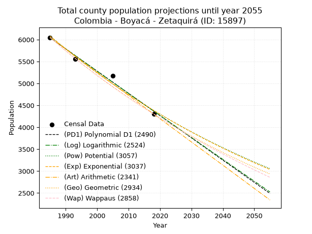
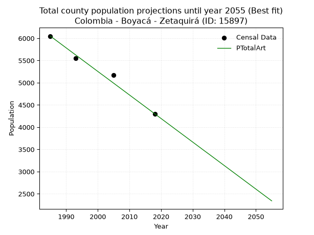
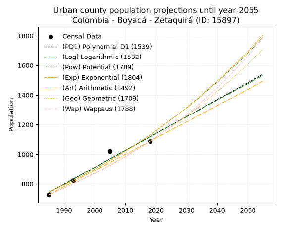
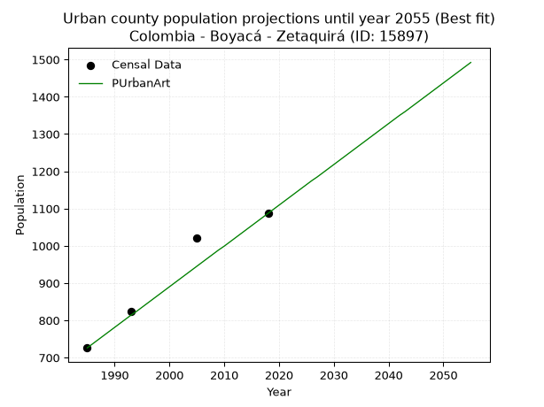
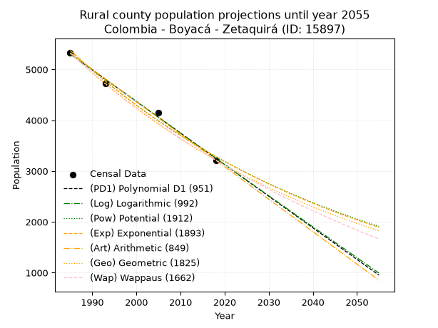
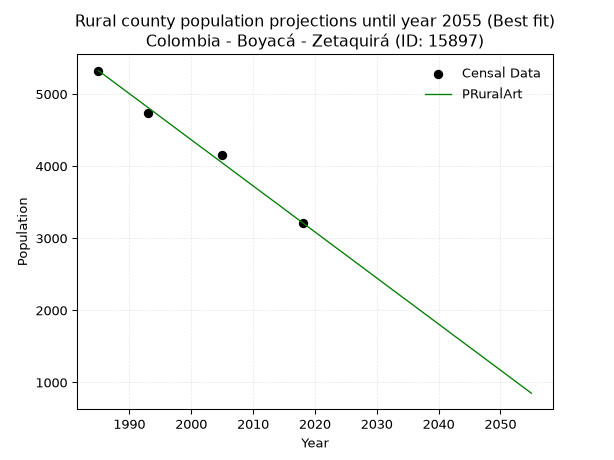

<div align="center">


</div>

# 📜 _“Population and Public Services Demand Projections (PPSD) until Year 2050 for Colombia - Boyacá - Zetaquirá (ID: 15897)”_
Keywords: `population` `public-service` `projection` `lineal` `polynomial` `logarithmic` `potential` `exponential` `arithmetic` `geometric` `wappaus` `dane` `colombia` `south-america`

PPSD are analytical estimates used by governments and planners to anticipate future changes in population size, age distribution, and the resulting community needs for utilities, healthcare, education, and infrastructure as sizing future water treatment facilities, electrical grids, and road networks based on spatial growth.

<div align="center">

</img>

</div>


> **General running parameters**: • app_version: _v20260806_. • Python version: _3.14.7_. • Pandas version: _3.0.5_. • NumPy version: _2.5.1_. • Creates, save and include plots into reports (create_plot): _False_. • Projection until year: _2050_. • Process polynomial degree 2 and up: _False_. • Process Wappaus: _True_. • Process Wappaus: _True_. • Set negative values to zero: _True_. • Set infinite values to zero: _True_. • Drop dataset notes: _True_. 
<div align="center">

Dynamic map: [:earth_americas:Google](http://maps.google.com/maps?q=5.283442633,-73.1709795) [:earth_americas:OSM](https://www.openstreetmap.org/#map=18/5.283442633/-73.1709795&layers=P) [:earth_americas:Bing](https://www.bing.com/maps?cp=5.283442633~-73.1709795&lvl=18) [:earth_americas:Apple](https://maps.apple.com/frame?center=5.283442633%2C-73.1709795&span=0.003%2C0.006)

</div>


<div align="center">

```geojson
{
  "type": "Feature",
  "geometry": {
    "type": "Point", 
    "coordinates": [-73.1709795, 5.283442633]
  }, 
  "properties": {
    "Name": "Colombia - Boyacá - Zetaquirá (ID: 15897)"
  }
}
```

</div>


## 0. Census Data (4 records)

Census data are official statistics collected by a government about the people and housing in a country. They usually include counts of total population, age, sex, race, income, education, and jobs.

📅Global census file: [Population.xlsx](../data/Population.xlsx)

| Source   |   Year |   CountryID | CountryName   |   StateID | StateName   |   CountyID | CountyName   |   PTotal |   PUrban |   PRural |
|:---------|-------:|------------:|:--------------|----------:|:------------|-----------:|:-------------|---------:|---------:|---------:|
| DANE     |   1985 |          57 | Colombia      |        15 | Boyacá      |      15897 | Zetaquirá    |     6049 |      726 |     5323 |
| DANE     |   1993 |          57 | Colombia      |        15 | Boyacá      |      15897 | Zetaquirá    |     5554 |      824 |     4730 |
| DANE     |   2005 |          57 | Colombia      |        15 | Boyacá      |      15897 | Zetaquirá    |     5171 |     1022 |     4149 |
| DANE     |   2018 |          57 | Colombia      |        15 | Boyacá      |      15897 | Zetaquirá    |     4301 |     1087 |     3214 |

> 🔥Some records could had specific notes about the registered values or the corresponding urban or rural distribution.

📅[SUI-RUPS](https://www.datos.gov.co/Hacienda-y-Cr-dito-P-blico/Registro-nico-de-Prestadores-de-Servicios-P-blicos/4qkq-csdn/about_data) - Local public utility companies: [RUPS.csv](../data/RUPS.csv)

 | SERVICIO       | ESTADO    | NOMBRE                                                                                                                         | NIT         | DEPARTAMENTO_DOMICILIO   | MUNICIPIO_DOMICILIO   | DIRECCION            |   TELEFONO | EMAIL                          | TIPO_PRESTADOR                 | CLASIFICACION                 |
|:---------------|:----------|:-------------------------------------------------------------------------------------------------------------------------------|:------------|:-------------------------|:----------------------|:---------------------|-----------:|:-------------------------------|:-------------------------------|:------------------------------|
| ACUEDUCTO      | OPERATIVA | UNIDAD DE SERVICIOS PUBLICOS DEL MUNICIPIO DE ZETAQUIRA                                                                        | 891802106-7 | BOYACA                   | ZETAQUIRA             | Carrera 3 No. 2 - 08 |    7344095 | dianagaitan18@GMAIL.COM        | MUNICIPIO (PRESTACIÓN DIRECTA) | MENOR O IGUAL A 2500 USUARIOS |
| ALCANTARILLADO | OPERATIVA | UNIDAD DE SERVICIOS PUBLICOS DEL MUNICIPIO DE ZETAQUIRA                                                                        | 891802106-7 | BOYACA                   | ZETAQUIRA             | Carrera 3 No. 2 - 08 |    7344095 | dianagaitan18@GMAIL.COM        | MUNICIPIO (PRESTACIÓN DIRECTA) | MENOR O IGUAL A 2500 USUARIOS |
| ACUEDUCTO      | OPERATIVA | ASOCIACION DESUSCRIPTORES DEL ACUEDUCTO JURACAMBITA-ASAJ, VEREDA JURACAMBITA DEL MUNICIPIO DE ZETAQUIRA DEPARTAMENTO DE BOYACA | 900229308-2 | BOYACA                   | ZETAQUIRA             | VEREDA JURACAMBITA   |    0000000 | acueductojuracambita@gmail.com | ORGANIZACION AUTORIZADA        | HASTA 2500 SUSCRIPTORES       |

## 1. Total

### 1.1. Coefficients and Parameters

* (PD1) Polynomial Deg 1: -50.75672420714517, 106794.88759534214 (lineal)
* (Log) Logarithmic: -101579.14679209416, 777372.658770904
* (Pow) Potential: -19.856306732762384, 69.26553273090423
* (Exp) Exponential: -0.00992295154535676, 2179726135429.6943
* (Art) Arithmetic: Year diff. 2018 - 1985 = 33, Population diff. 4301 - 6049 = -1748, Annual growth = -52.96969696969697
* (Geo) Geometric: Year diff. 2018 - 1985 = 33, Population diff. 4301 - 6049 = -1748, Annual growth % = -0.010281489938663957
* (Wap) Wappaus: i = -1.0235690235690236, Condition values only valid for < 200)

<sub>
Wappaus condition values: ['-0.00', '-1.02', '-2.05', '-3.07', '-4.09', '-5.12', '-6.14', '-7.16', '-8.19', '-9.21', '-10.24', '-11.26', '-12.28', '-13.31', '-14.33', '-15.35', '-16.38', '-17.40', '-18.42', '-19.45', '-20.47', '-21.49', '-22.52', '-23.54', '-24.57', '-25.59', '-26.61', '-27.64', '-28.66', '-29.68', '-30.71', '-31.73', '-32.75', '-33.78', '-34.80', '-35.82', '-36.85', '-37.87', '-38.90', '-39.92', '-40.94', '-41.97', '-42.99', '-44.01', '-45.04', '-46.06', '-47.08', '-48.11', '-49.13', '-50.15', '-51.18', '-52.20', '-53.23', '-54.25', '-55.27', '-56.30', '-57.32', '-58.34', '-59.37', '-60.39', '-61.41', '-62.44', '-63.46', '-64.48', '-65.51', '-66.53']
</sub>


### 1.2. Projected Dataset

|   Year |   CountyID |   PTotalPD1 |   PTotalLog |   PTotalPow |   PTotalExp |   PTotalArt |   PTotalGeo |   PTotalWap |
|-------:|-----------:|------------:|------------:|------------:|------------:|------------:|------------:|------------:|
|   1985 |      15897 |        6043 |        6044 |        6084 |        6082 |        6049 |        6049 |        6049 |
|   1986 |      15897 |        5992 |        5993 |        6023 |        6022 |        5996 |        5987 |        5987 |
|   1987 |      15897 |        5941 |        5942 |        5964 |        5963 |        5943 |        5925 |        5926 |
|   1988 |      15897 |        5891 |        5891 |        5904 |        5904 |        5890 |        5864 |        5866 |
|   1989 |      15897 |        5840 |        5840 |        5846 |        5846 |        5837 |        5804 |        5806 |
|   1990 |      15897 |        5789 |        5789 |        5788 |        5788 |        5784 |        5744 |        5747 |
|   1991 |      15897 |        5738 |        5738 |        5730 |        5731 |        5731 |        5685 |        5689 |
|   1992 |      15897 |        5687 |        5687 |        5673 |        5674 |        5678 |        5627 |        5631 |
|   1993 |      15897 |        5637 |        5636 |        5617 |        5618 |        5625 |        5569 |        5573 |
|   1994 |      15897 |        5586 |        5585 |        5561 |        5563 |        5572 |        5512 |        5516 |
|   1995 |      15897 |        5535 |        5534 |        5506 |        5508 |        5519 |        5455 |        5460 |
|   1996 |      15897 |        5484 |        5483 |        5452 |        5453 |        5466 |        5399 |        5404 |
|   1997 |      15897 |        5434 |        5432 |        5398 |        5400 |        5413 |        5343 |        5349 |
|   1998 |      15897 |        5383 |        5381 |        5344 |        5346 |        5360 |        5289 |        5294 |
|   1999 |      15897 |        5332 |        5330 |        5292 |        5294 |        5307 |        5234 |        5240 |
|   2000 |      15897 |        5281 |        5279 |        5239 |        5241 |        5254 |        5180 |        5186 |
|   2001 |      15897 |        5231 |        5229 |        5187 |        5190 |        5201 |        5127 |        5133 |
|   2002 |      15897 |        5180 |        5178 |        5136 |        5138 |        5149 |        5074 |        5081 |
|   2003 |      15897 |        5129 |        5127 |        5086 |        5088 |        5096 |        5022 |        5029 |
|   2004 |      15897 |        5078 |        5077 |        5035 |        5037 |        5043 |        4971 |        4977 |
|   2005 |      15897 |        5028 |        5026 |        4986 |        4988 |        4990 |        4919 |        4926 |
|   2006 |      15897 |        4977 |        4975 |        4937 |        4938 |        4937 |        4869 |        4875 |
|   2007 |      15897 |        4926 |        4925 |        4888 |        4890 |        4884 |        4819 |        4825 |
|   2008 |      15897 |        4875 |        4874 |        4840 |        4841 |        4831 |        4769 |        4775 |
|   2009 |      15897 |        4825 |        4823 |        4792 |        4793 |        4778 |        4720 |        4726 |
|   2010 |      15897 |        4774 |        4773 |        4745 |        4746 |        4725 |        4672 |        4677 |
|   2011 |      15897 |        4723 |        4722 |        4699 |        4699 |        4672 |        4624 |        4628 |
|   2012 |      15897 |        4672 |        4672 |        4652 |        4653 |        4619 |        4576 |        4580 |
|   2013 |      15897 |        4622 |        4621 |        4607 |        4607 |        4566 |        4529 |        4533 |
|   2014 |      15897 |        4571 |        4571 |        4562 |        4561 |        4513 |        4483 |        4485 |
|   2015 |      15897 |        4520 |        4520 |        4517 |        4516 |        4460 |        4436 |        4439 |
|   2016 |      15897 |        4469 |        4470 |        4473 |        4472 |        4407 |        4391 |        4392 |
|   2017 |      15897 |        4419 |        4420 |        4429 |        4428 |        4354 |        4346 |        4347 |
|   2018 |      15897 |        4368 |        4369 |        4385 |        4384 |        4301 |        4301 |        4301 |
|   2019 |      15897 |        4317 |        4319 |        4342 |        4341 |        4248 |        4257 |        4256 |
|   2020 |      15897 |        4266 |        4269 |        4300 |        4298 |        4195 |        4213 |        4211 |
|   2021 |      15897 |        4216 |        4218 |        4258 |        4255 |        4142 |        4170 |        4167 |
|   2022 |      15897 |        4165 |        4168 |        4216 |        4213 |        4089 |        4127 |        4123 |
|   2023 |      15897 |        4114 |        4118 |        4175 |        4172 |        4036 |        4084 |        4079 |
|   2024 |      15897 |        4063 |        4068 |        4134 |        4131 |        3983 |        4042 |        4036 |
|   2025 |      15897 |        4013 |        4018 |        4094 |        4090 |        3930 |        4001 |        3993 |
|   2026 |      15897 |        3962 |        3967 |        4054 |        4049 |        3877 |        3960 |        3951 |
|   2027 |      15897 |        3911 |        3917 |        4014 |        4009 |        3824 |        3919 |        3909 |
|   2028 |      15897 |        3860 |        3867 |        3975 |        3970 |        3771 |        3879 |        3867 |
|   2029 |      15897 |        3809 |        3817 |        3937 |        3931 |        3718 |        3839 |        3825 |
|   2030 |      15897 |        3759 |        3767 |        3898 |        3892 |        3665 |        3799 |        3784 |
|   2031 |      15897 |        3708 |        3717 |        3860 |        3853 |        3612 |        3760 |        3744 |
|   2032 |      15897 |        3657 |        3667 |        3823 |        3815 |        3559 |        3722 |        3703 |
|   2033 |      15897 |        3606 |        3617 |        3786 |        3778 |        3506 |        3683 |        3663 |
|   2034 |      15897 |        3556 |        3567 |        3749 |        3740 |        3453 |        3645 |        3623 |
|   2035 |      15897 |        3505 |        3517 |        3712 |        3703 |        3401 |        3608 |        3584 |
|   2036 |      15897 |        3454 |        3467 |        3676 |        3667 |        3348 |        3571 |        3545 |
|   2037 |      15897 |        3403 |        3417 |        3641 |        3631 |        3295 |        3534 |        3506 |
|   2038 |      15897 |        3353 |        3368 |        3605 |        3595 |        3242 |        3498 |        3468 |
|   2039 |      15897 |        3302 |        3318 |        3571 |        3559 |        3189 |        3462 |        3429 |
|   2040 |      15897 |        3251 |        3268 |        3536 |        3524 |        3136 |        3426 |        3392 |
|   2041 |      15897 |        3200 |        3218 |        3502 |        3489 |        3083 |        3391 |        3354 |
|   2042 |      15897 |        3150 |        3168 |        3468 |        3455 |        3030 |        3356 |        3317 |
|   2043 |      15897 |        3099 |        3119 |        3434 |        3421 |        2977 |        3322 |        3280 |
|   2044 |      15897 |        3048 |        3069 |        3401 |        3387 |        2924 |        3288 |        3243 |
|   2045 |      15897 |        2997 |        3019 |        3368 |        3354 |        2871 |        3254 |        3207 |
|   2046 |      15897 |        2947 |        2970 |        3336 |        3320 |        2818 |        3220 |        3171 |
|   2047 |      15897 |        2896 |        2920 |        3303 |        3288 |        2765 |        3187 |        3135 |
|   2048 |      15897 |        2845 |        2870 |        3272 |        3255 |        2712 |        3154 |        3099 |
|   2049 |      15897 |        2794 |        2821 |        3240 |        3223 |        2659 |        3122 |        3064 |
|   2050 |      15897 |        2744 |        2771 |        3209 |        3191 |        2606 |        3090 |        3029 |
<div align="center">

</img>

</div>


### 1.3. Best fit with absolute and relative error (%)

Relative error puts that difference into context by dividing the absolute error by the true value, creating a unitless ratio or percentage that shows the scale of the mistake.

Absolute and relative error

|   Year | Source   |   CountryID | CountryName   |   StateID | StateName   |   CountyID_x | CountyName   |   PTotal |   PUrban |   PRural |   CountyID_y |   PTotalPD1 |   PTotalLog |   PTotalPow |   PTotalExp |   PTotalArt |   PTotalGeo |   PTotalWap |   PTotalPD1AbsError |   PTotalLogAbsError |   PTotalPowAbsError |   PTotalExpAbsError |   PTotalArtAbsError |   PTotalGeoAbsError |   PTotalWapAbsError |   PTotalPD1RelError |   PTotalLogRelError |   PTotalPowRelError |   PTotalExpRelError |   PTotalArtRelError |   PTotalGeoRelError |   PTotalWapRelError |
|-------:|:---------|------------:|:--------------|----------:|:------------|-------------:|:-------------|---------:|---------:|---------:|-------------:|------------:|------------:|------------:|------------:|------------:|------------:|------------:|--------------------:|--------------------:|--------------------:|--------------------:|--------------------:|--------------------:|--------------------:|--------------------:|--------------------:|--------------------:|--------------------:|--------------------:|--------------------:|--------------------:|
|   1985 | DANE     |          57 | Colombia      |        15 | Boyacá      |        15897 | Zetaquirá    |     6049 |      726 |     5323 |        15897 |        6043 |        6044 |        6084 |        6082 |        6049 |        6049 |        6049 |                   6 |                   5 |                  35 |                  33 |                   0 |                   0 |                   0 |           0.0991899 |           0.0826583 |            0.578608 |            0.545545 |             0       |            0        |            0        |
|   1993 | DANE     |          57 | Colombia      |        15 | Boyacá      |        15897 | Zetaquirá    |     5554 |      824 |     4730 |        15897 |        5637 |        5636 |        5617 |        5618 |        5625 |        5569 |        5573 |                  83 |                  82 |                  63 |                  64 |                  71 |                  15 |                  19 |           1.49442   |           1.47641   |            1.13432  |            1.15232  |             1.27836 |            0.270076 |            0.342096 |
|   2005 | DANE     |          57 | Colombia      |        15 | Boyacá      |        15897 | Zetaquirá    |     5171 |     1022 |     4149 |        15897 |        5028 |        5026 |        4986 |        4988 |        4990 |        4919 |        4926 |                 143 |                 145 |                 185 |                 183 |                 181 |                 252 |                 245 |           2.76542   |           2.8041    |            3.57764  |            3.53897  |             3.50029 |            4.87333  |            4.73796  |
|   2018 | DANE     |          57 | Colombia      |        15 | Boyacá      |        15897 | Zetaquirá    |     4301 |     1087 |     3214 |        15897 |        4368 |        4369 |        4385 |        4384 |        4301 |        4301 |        4301 |                  67 |                  68 |                  84 |                  83 |                   0 |                   0 |                   0 |           1.55778   |           1.58103   |            1.95303  |            1.92978  |             0       |            0        |            0        |

Relative error mean

| Method    |   RelError | Best   |
|:----------|-----------:|:-------|
| PTotalPD1 |    1.4792  |        |
| PTotalLog |    1.48605 |        |
| PTotalPow |    1.8109  |        |
| PTotalExp |    1.79165 |        |
| PTotalArt |    1.19466 | True   |
| PTotalGeo |    1.28585 |        |
| PTotalWap |    1.27001 |        |

💙Best method: _**PTotalArt**_
<div align="center">

</img>

</div>


### 1.4. Fresh water supply demand in liters per capita per day (lpcd)

The fresh water supply demand typically ranges from 100 to 300 liters per capita per day (lpcd) for standard domestic and municipal planning, though absolute survival minimums set by the World Health Organization are as low as 7.5 to 20 liters per day, and total consumption in high-income nations can exceed 400 liters.

> `CZ`: Level in meters above the sea level (masl)<br> `WS`: Fresh water supply demand in liters per capita per day (lpcd or l/h/d)<br> `WSAll`: Zonal fresh water supply demand in liters per second (l/s)<br> `A`: Zonal area in square meters<br> `DP`: Population density (people/hectare or p/ha)

Reference values (RAS Colombia)

|    CZ |   WS |
|------:|-----:|
|  1000 |  120 |
|  2000 |  130 |
| 99999 |  140 |

County shapefile geometry properties and water supply values

|   CountyID |      ATotal |   CZTotal |   WSTotal |
|-----------:|------------:|----------:|----------:|
|      15897 | 2.51042e+08 |    2264.5 |       140 |

Projected values for best method: PTotalArt

|   CountyID |   Year |   PTotalArt |   DPTotal |   WSTotal |   WSTotalAll |
|-----------:|-------:|------------:|----------:|----------:|-------------:|
|      15897 |   1985 |        6049 |      0.24 |       140 |      9.80162 |
|      15897 |   1986 |        5996 |      0.24 |       140 |      9.71574 |
|      15897 |   1987 |        5943 |      0.24 |       140 |      9.62986 |
|      15897 |   1988 |        5890 |      0.23 |       140 |      9.54398 |
|      15897 |   1989 |        5837 |      0.23 |       140 |      9.4581  |
|      15897 |   1990 |        5784 |      0.23 |       140 |      9.37222 |
|      15897 |   1991 |        5731 |      0.23 |       140 |      9.28634 |
|      15897 |   1992 |        5678 |      0.23 |       140 |      9.20046 |
|      15897 |   1993 |        5625 |      0.22 |       140 |      9.11458 |
|      15897 |   1994 |        5572 |      0.22 |       140 |      9.0287  |
|      15897 |   1995 |        5519 |      0.22 |       140 |      8.94282 |
|      15897 |   1996 |        5466 |      0.22 |       140 |      8.85694 |
|      15897 |   1997 |        5413 |      0.22 |       140 |      8.77106 |
|      15897 |   1998 |        5360 |      0.21 |       140 |      8.68519 |
|      15897 |   1999 |        5307 |      0.21 |       140 |      8.59931 |
|      15897 |   2000 |        5254 |      0.21 |       140 |      8.51343 |
|      15897 |   2001 |        5201 |      0.21 |       140 |      8.42755 |
|      15897 |   2002 |        5149 |      0.21 |       140 |      8.34329 |
|      15897 |   2003 |        5096 |      0.2  |       140 |      8.25741 |
|      15897 |   2004 |        5043 |      0.2  |       140 |      8.17153 |
|      15897 |   2005 |        4990 |      0.2  |       140 |      8.08565 |
|      15897 |   2006 |        4937 |      0.2  |       140 |      7.99977 |
|      15897 |   2007 |        4884 |      0.19 |       140 |      7.91389 |
|      15897 |   2008 |        4831 |      0.19 |       140 |      7.82801 |
|      15897 |   2009 |        4778 |      0.19 |       140 |      7.74213 |
|      15897 |   2010 |        4725 |      0.19 |       140 |      7.65625 |
|      15897 |   2011 |        4672 |      0.19 |       140 |      7.57037 |
|      15897 |   2012 |        4619 |      0.18 |       140 |      7.48449 |
|      15897 |   2013 |        4566 |      0.18 |       140 |      7.39861 |
|      15897 |   2014 |        4513 |      0.18 |       140 |      7.31273 |
|      15897 |   2015 |        4460 |      0.18 |       140 |      7.22685 |
|      15897 |   2016 |        4407 |      0.18 |       140 |      7.14097 |
|      15897 |   2017 |        4354 |      0.17 |       140 |      7.05509 |
|      15897 |   2018 |        4301 |      0.17 |       140 |      6.96921 |
|      15897 |   2019 |        4248 |      0.17 |       140 |      6.88333 |
|      15897 |   2020 |        4195 |      0.17 |       140 |      6.79745 |
|      15897 |   2021 |        4142 |      0.16 |       140 |      6.71157 |
|      15897 |   2022 |        4089 |      0.16 |       140 |      6.62569 |
|      15897 |   2023 |        4036 |      0.16 |       140 |      6.53981 |
|      15897 |   2024 |        3983 |      0.16 |       140 |      6.45394 |
|      15897 |   2025 |        3930 |      0.16 |       140 |      6.36806 |
|      15897 |   2026 |        3877 |      0.15 |       140 |      6.28218 |
|      15897 |   2027 |        3824 |      0.15 |       140 |      6.1963  |
|      15897 |   2028 |        3771 |      0.15 |       140 |      6.11042 |
|      15897 |   2029 |        3718 |      0.15 |       140 |      6.02454 |
|      15897 |   2030 |        3665 |      0.15 |       140 |      5.93866 |
|      15897 |   2031 |        3612 |      0.14 |       140 |      5.85278 |
|      15897 |   2032 |        3559 |      0.14 |       140 |      5.7669  |
|      15897 |   2033 |        3506 |      0.14 |       140 |      5.68102 |
|      15897 |   2034 |        3453 |      0.14 |       140 |      5.59514 |
|      15897 |   2035 |        3401 |      0.14 |       140 |      5.51088 |
|      15897 |   2036 |        3348 |      0.13 |       140 |      5.425   |
|      15897 |   2037 |        3295 |      0.13 |       140 |      5.33912 |
|      15897 |   2038 |        3242 |      0.13 |       140 |      5.25324 |
|      15897 |   2039 |        3189 |      0.13 |       140 |      5.16736 |
|      15897 |   2040 |        3136 |      0.12 |       140 |      5.08148 |
|      15897 |   2041 |        3083 |      0.12 |       140 |      4.9956  |
|      15897 |   2042 |        3030 |      0.12 |       140 |      4.90972 |
|      15897 |   2043 |        2977 |      0.12 |       140 |      4.82384 |
|      15897 |   2044 |        2924 |      0.12 |       140 |      4.73796 |
|      15897 |   2045 |        2871 |      0.11 |       140 |      4.65208 |
|      15897 |   2046 |        2818 |      0.11 |       140 |      4.5662  |
|      15897 |   2047 |        2765 |      0.11 |       140 |      4.48032 |
|      15897 |   2048 |        2712 |      0.11 |       140 |      4.39444 |
|      15897 |   2049 |        2659 |      0.11 |       140 |      4.30856 |
|      15897 |   2050 |        2606 |      0.1  |       140 |      4.22269 |

## 2. Urban

### 2.1. Coefficients and Parameters

* (PD1) Polynomial Deg 1: 11.406262545162537, -21900.626655961365 (lineal)
* (Log) Logarithmic: 22840.782388929376, -172698.2199727952
* (Pow) Potential: 25.311141367624142, -80.59836111164019
* (Exp) Exponential: 0.012638651689453155, 9.472627707797691e-09
* (Art) Arithmetic: Year diff. 2018 - 1985 = 33, Population diff. 1087 - 726 = 361, Annual growth = 10.93939393939394
* (Geo) Geometric: Year diff. 2018 - 1985 = 33, Population diff. 1087 - 726 = 361, Annual growth % = 0.012306223355829093
* (Wap) Wappaus: i = 1.206772635344064, Condition values only valid for < 200)

<sub>
Wappaus condition values: ['0.00', '1.21', '2.41', '3.62', '4.83', '6.03', '7.24', '8.45', '9.65', '10.86', '12.07', '13.27', '14.48', '15.69', '16.89', '18.10', '19.31', '20.52', '21.72', '22.93', '24.14', '25.34', '26.55', '27.76', '28.96', '30.17', '31.38', '32.58', '33.79', '35.00', '36.20', '37.41', '38.62', '39.82', '41.03', '42.24', '43.44', '44.65', '45.86', '47.06', '48.27', '49.48', '50.68', '51.89', '53.10', '54.30', '55.51', '56.72', '57.93', '59.13', '60.34', '61.55', '62.75', '63.96', '65.17', '66.37', '67.58', '68.79', '69.99', '71.20', '72.41', '73.61', '74.82', '76.03', '77.23', '78.44']
</sub>


### 2.2. Projected Dataset

|   Year |   CountyID |   PUrbanPD1 |   PUrbanLog |   PUrbanPow |   PUrbanExp |   PUrbanArt |   PUrbanGeo |   PUrbanWap |
|-------:|-----------:|------------:|------------:|------------:|------------:|------------:|------------:|------------:|
|   1985 |      15897 |         741 |         740 |         744 |         745 |         726 |         726 |         726 |
|   1986 |      15897 |         752 |         752 |         754 |         754 |         737 |         735 |         735 |
|   1987 |      15897 |         764 |         763 |         763 |         764 |         748 |         744 |         744 |
|   1988 |      15897 |         775 |         775 |         773 |         773 |         759 |         753 |         753 |
|   1989 |      15897 |         786 |         786 |         783 |         783 |         770 |         762 |         762 |
|   1990 |      15897 |         798 |         798 |         793 |         793 |         781 |         772 |         771 |
|   1991 |      15897 |         809 |         809 |         803 |         803 |         792 |         781 |         781 |
|   1992 |      15897 |         821 |         821 |         814 |         813 |         803 |         791 |         790 |
|   1993 |      15897 |         832 |         832 |         824 |         824 |         814 |         801 |         800 |
|   1994 |      15897 |         843 |         844 |         835 |         834 |         824 |         810 |         809 |
|   1995 |      15897 |         855 |         855 |         845 |         845 |         835 |         820 |         819 |
|   1996 |      15897 |         866 |         867 |         856 |         856 |         846 |         831 |         829 |
|   1997 |      15897 |         878 |         878 |         867 |         867 |         857 |         841 |         839 |
|   1998 |      15897 |         889 |         889 |         878 |         878 |         868 |         851 |         850 |
|   1999 |      15897 |         900 |         901 |         889 |         889 |         879 |         862 |         860 |
|   2000 |      15897 |         912 |         912 |         900 |         900 |         890 |         872 |         870 |
|   2001 |      15897 |         923 |         924 |         912 |         911 |         901 |         883 |         881 |
|   2002 |      15897 |         935 |         935 |         924 |         923 |         912 |         894 |         892 |
|   2003 |      15897 |         946 |         947 |         935 |         935 |         923 |         905 |         903 |
|   2004 |      15897 |         958 |         958 |         947 |         947 |         934 |         916 |         914 |
|   2005 |      15897 |         969 |         969 |         959 |         959 |         945 |         927 |         925 |
|   2006 |      15897 |         980 |         981 |         971 |         971 |         956 |         939 |         937 |
|   2007 |      15897 |         992 |         992 |         984 |         983 |         967 |         950 |         948 |
|   2008 |      15897 |        1003 |        1004 |         996 |         996 |         978 |         962 |         960 |
|   2009 |      15897 |        1015 |        1015 |        1009 |        1008 |         989 |         974 |         972 |
|   2010 |      15897 |        1026 |        1026 |        1022 |        1021 |         999 |         986 |         984 |
|   2011 |      15897 |        1037 |        1038 |        1035 |        1034 |        1010 |         998 |         996 |
|   2012 |      15897 |        1049 |        1049 |        1048 |        1047 |        1021 |        1010 |        1009 |
|   2013 |      15897 |        1060 |        1060 |        1061 |        1061 |        1032 |        1023 |        1021 |
|   2014 |      15897 |        1072 |        1072 |        1074 |        1074 |        1043 |        1035 |        1034 |
|   2015 |      15897 |        1083 |        1083 |        1088 |        1088 |        1054 |        1048 |        1047 |
|   2016 |      15897 |        1094 |        1094 |        1102 |        1102 |        1065 |        1061 |        1060 |
|   2017 |      15897 |        1106 |        1106 |        1116 |        1116 |        1076 |        1074 |        1073 |
|   2018 |      15897 |        1117 |        1117 |        1130 |        1130 |        1087 |        1087 |        1087 |
|   2019 |      15897 |        1129 |        1128 |        1144 |        1144 |        1098 |        1100 |        1101 |
|   2020 |      15897 |        1140 |        1140 |        1158 |        1159 |        1109 |        1114 |        1115 |
|   2021 |      15897 |        1151 |        1151 |        1173 |        1174 |        1120 |        1128 |        1129 |
|   2022 |      15897 |        1163 |        1162 |        1188 |        1189 |        1131 |        1142 |        1143 |
|   2023 |      15897 |        1174 |        1174 |        1203 |        1204 |        1142 |        1156 |        1158 |
|   2024 |      15897 |        1186 |        1185 |        1218 |        1219 |        1153 |        1170 |        1173 |
|   2025 |      15897 |        1197 |        1196 |        1233 |        1234 |        1164 |        1184 |        1188 |
|   2026 |      15897 |        1208 |        1207 |        1249 |        1250 |        1175 |        1199 |        1203 |
|   2027 |      15897 |        1220 |        1219 |        1264 |        1266 |        1185 |        1213 |        1219 |
|   2028 |      15897 |        1231 |        1230 |        1280 |        1282 |        1196 |        1228 |        1235 |
|   2029 |      15897 |        1243 |        1241 |        1296 |        1298 |        1207 |        1244 |        1251 |
|   2030 |      15897 |        1254 |        1252 |        1313 |        1315 |        1218 |        1259 |        1267 |
|   2031 |      15897 |        1265 |        1264 |        1329 |        1332 |        1229 |        1274 |        1284 |
|   2032 |      15897 |        1277 |        1275 |        1346 |        1349 |        1240 |        1290 |        1301 |
|   2033 |      15897 |        1288 |        1286 |        1363 |        1366 |        1251 |        1306 |        1318 |
|   2034 |      15897 |        1300 |        1297 |        1380 |        1383 |        1262 |        1322 |        1336 |
|   2035 |      15897 |        1311 |        1309 |        1397 |        1401 |        1273 |        1338 |        1353 |
|   2036 |      15897 |        1323 |        1320 |        1414 |        1419 |        1284 |        1355 |        1371 |
|   2037 |      15897 |        1334 |        1331 |        1432 |        1437 |        1295 |        1371 |        1390 |
|   2038 |      15897 |        1345 |        1342 |        1450 |        1455 |        1306 |        1388 |        1409 |
|   2039 |      15897 |        1357 |        1353 |        1468 |        1473 |        1317 |        1405 |        1428 |
|   2040 |      15897 |        1368 |        1365 |        1486 |        1492 |        1328 |        1423 |        1447 |
|   2041 |      15897 |        1380 |        1376 |        1505 |        1511 |        1339 |        1440 |        1467 |
|   2042 |      15897 |        1391 |        1387 |        1524 |        1530 |        1350 |        1458 |        1487 |
|   2043 |      15897 |        1402 |        1398 |        1543 |        1550 |        1360 |        1476 |        1508 |
|   2044 |      15897 |        1414 |        1409 |        1562 |        1570 |        1371 |        1494 |        1529 |
|   2045 |      15897 |        1425 |        1421 |        1581 |        1590 |        1382 |        1512 |        1550 |
|   2046 |      15897 |        1437 |        1432 |        1601 |        1610 |        1393 |        1531 |        1572 |
|   2047 |      15897 |        1448 |        1443 |        1621 |        1630 |        1404 |        1550 |        1594 |
|   2048 |      15897 |        1459 |        1454 |        1641 |        1651 |        1415 |        1569 |        1616 |
|   2049 |      15897 |        1471 |        1465 |        1662 |        1672 |        1426 |        1588 |        1639 |
|   2050 |      15897 |        1482 |        1476 |        1682 |        1693 |        1437 |        1608 |        1663 |
<div align="center">

</img>

</div>


### 2.3. Best fit with absolute and relative error (%)

Relative error puts that difference into context by dividing the absolute error by the true value, creating a unitless ratio or percentage that shows the scale of the mistake.

Absolute and relative error

|   Year | Source   |   CountryID | CountryName   |   StateID | StateName   |   CountyID_x | CountyName   |   PTotal |   PUrban |   PRural |   CountyID_y |   PUrbanPD1 |   PUrbanLog |   PUrbanPow |   PUrbanExp |   PUrbanArt |   PUrbanGeo |   PUrbanWap |   PUrbanPD1AbsError |   PUrbanLogAbsError |   PUrbanPowAbsError |   PUrbanExpAbsError |   PUrbanArtAbsError |   PUrbanGeoAbsError |   PUrbanWapAbsError |   PUrbanPD1RelError |   PUrbanLogRelError |   PUrbanPowRelError |   PUrbanExpRelError |   PUrbanArtRelError |   PUrbanGeoRelError |   PUrbanWapRelError |
|-------:|:---------|------------:|:--------------|----------:|:------------|-------------:|:-------------|---------:|---------:|---------:|-------------:|------------:|------------:|------------:|------------:|------------:|------------:|------------:|--------------------:|--------------------:|--------------------:|--------------------:|--------------------:|--------------------:|--------------------:|--------------------:|--------------------:|--------------------:|--------------------:|--------------------:|--------------------:|--------------------:|
|   1985 | DANE     |          57 | Colombia      |        15 | Boyacá      |        15897 | Zetaquirá    |     6049 |      726 |     5323 |        15897 |         741 |         740 |         744 |         745 |         726 |         726 |         726 |                  15 |                  14 |                  18 |                  19 |                   0 |                   0 |                   0 |            2.06612  |            1.92837  |             2.47934 |             2.61708 |             0       |             0       |             0       |
|   1993 | DANE     |          57 | Colombia      |        15 | Boyacá      |        15897 | Zetaquirá    |     5554 |      824 |     4730 |        15897 |         832 |         832 |         824 |         824 |         814 |         801 |         800 |                   8 |                   8 |                   0 |                   0 |                  10 |                  23 |                  24 |            0.970874 |            0.970874 |             0       |             0       |             1.21359 |             2.79126 |             2.91262 |
|   2005 | DANE     |          57 | Colombia      |        15 | Boyacá      |        15897 | Zetaquirá    |     5171 |     1022 |     4149 |        15897 |         969 |         969 |         959 |         959 |         945 |         927 |         925 |                  53 |                  53 |                  63 |                  63 |                  77 |                  95 |                  97 |            5.18591  |            5.18591  |             6.16438 |             6.16438 |             7.53425 |             9.2955  |             9.49119 |
|   2018 | DANE     |          57 | Colombia      |        15 | Boyacá      |        15897 | Zetaquirá    |     4301 |     1087 |     3214 |        15897 |        1117 |        1117 |        1130 |        1130 |        1087 |        1087 |        1087 |                  30 |                  30 |                  43 |                  43 |                   0 |                   0 |                   0 |            2.75989  |            2.75989  |             3.95584 |             3.95584 |             0       |             0       |             0       |

Relative error mean

| Method    |   RelError | Best   |
|:----------|-----------:|:-------|
| PUrbanPD1 |    2.7457  |        |
| PUrbanLog |    2.71126 |        |
| PUrbanPow |    3.14989 |        |
| PUrbanExp |    3.18433 |        |
| PUrbanArt |    2.18696 | True   |
| PUrbanGeo |    3.02169 |        |
| PUrbanWap |    3.10095 |        |

💙Best method: _**PUrbanArt**_
<div align="center">

</img>

</div>


### 2.4. Fresh water supply demand in liters per capita per day (lpcd)

The fresh water supply demand typically ranges from 100 to 300 liters per capita per day (lpcd) for standard domestic and municipal planning, though absolute survival minimums set by the World Health Organization are as low as 7.5 to 20 liters per day, and total consumption in high-income nations can exceed 400 liters.

> `CZ`: Level in meters above the sea level (masl)<br> `WS`: Fresh water supply demand in liters per capita per day (lpcd or l/h/d)<br> `WSAll`: Zonal fresh water supply demand in liters per second (l/s)<br> `A`: Zonal area in square meters<br> `DP`: Population density (people/hectare or p/ha)

Reference values (RAS Colombia)

|    CZ |   WS |
|------:|-----:|
|  1000 |  120 |
|  2000 |  130 |
| 99999 |  140 |

County shapefile geometry properties and water supply values

|   CountyID |   AUrban |   CZUrban |   WSUrban |
|-----------:|---------:|----------:|----------:|
|      15897 |   270487 |   1671.11 |       130 |

Projected values for best method: PUrbanArt

|   CountyID |   Year |   PUrbanArt |   DPUrban |   WSUrban |   WSUrbanAll |
|-----------:|-------:|------------:|----------:|----------:|-------------:|
|      15897 |   1985 |         726 |     26.84 |       130 |      1.09236 |
|      15897 |   1986 |         737 |     27.25 |       130 |      1.10891 |
|      15897 |   1987 |         748 |     27.65 |       130 |      1.12546 |
|      15897 |   1988 |         759 |     28.06 |       130 |      1.14201 |
|      15897 |   1989 |         770 |     28.47 |       130 |      1.15856 |
|      15897 |   1990 |         781 |     28.87 |       130 |      1.17512 |
|      15897 |   1991 |         792 |     29.28 |       130 |      1.19167 |
|      15897 |   1992 |         803 |     29.69 |       130 |      1.20822 |
|      15897 |   1993 |         814 |     30.09 |       130 |      1.22477 |
|      15897 |   1994 |         824 |     30.46 |       130 |      1.23981 |
|      15897 |   1995 |         835 |     30.87 |       130 |      1.25637 |
|      15897 |   1996 |         846 |     31.28 |       130 |      1.27292 |
|      15897 |   1997 |         857 |     31.68 |       130 |      1.28947 |
|      15897 |   1998 |         868 |     32.09 |       130 |      1.30602 |
|      15897 |   1999 |         879 |     32.5  |       130 |      1.32257 |
|      15897 |   2000 |         890 |     32.9  |       130 |      1.33912 |
|      15897 |   2001 |         901 |     33.31 |       130 |      1.35567 |
|      15897 |   2002 |         912 |     33.72 |       130 |      1.37222 |
|      15897 |   2003 |         923 |     34.12 |       130 |      1.38877 |
|      15897 |   2004 |         934 |     34.53 |       130 |      1.40532 |
|      15897 |   2005 |         945 |     34.94 |       130 |      1.42188 |
|      15897 |   2006 |         956 |     35.34 |       130 |      1.43843 |
|      15897 |   2007 |         967 |     35.75 |       130 |      1.45498 |
|      15897 |   2008 |         978 |     36.16 |       130 |      1.47153 |
|      15897 |   2009 |         989 |     36.56 |       130 |      1.48808 |
|      15897 |   2010 |         999 |     36.93 |       130 |      1.50313 |
|      15897 |   2011 |        1010 |     37.34 |       130 |      1.51968 |
|      15897 |   2012 |        1021 |     37.75 |       130 |      1.53623 |
|      15897 |   2013 |        1032 |     38.15 |       130 |      1.55278 |
|      15897 |   2014 |        1043 |     38.56 |       130 |      1.56933 |
|      15897 |   2015 |        1054 |     38.97 |       130 |      1.58588 |
|      15897 |   2016 |        1065 |     39.37 |       130 |      1.60243 |
|      15897 |   2017 |        1076 |     39.78 |       130 |      1.61898 |
|      15897 |   2018 |        1087 |     40.19 |       130 |      1.63553 |
|      15897 |   2019 |        1098 |     40.59 |       130 |      1.65208 |
|      15897 |   2020 |        1109 |     41    |       130 |      1.66863 |
|      15897 |   2021 |        1120 |     41.41 |       130 |      1.68519 |
|      15897 |   2022 |        1131 |     41.81 |       130 |      1.70174 |
|      15897 |   2023 |        1142 |     42.22 |       130 |      1.71829 |
|      15897 |   2024 |        1153 |     42.63 |       130 |      1.73484 |
|      15897 |   2025 |        1164 |     43.03 |       130 |      1.75139 |
|      15897 |   2026 |        1175 |     43.44 |       130 |      1.76794 |
|      15897 |   2027 |        1185 |     43.81 |       130 |      1.78299 |
|      15897 |   2028 |        1196 |     44.22 |       130 |      1.79954 |
|      15897 |   2029 |        1207 |     44.62 |       130 |      1.81609 |
|      15897 |   2030 |        1218 |     45.03 |       130 |      1.83264 |
|      15897 |   2031 |        1229 |     45.44 |       130 |      1.84919 |
|      15897 |   2032 |        1240 |     45.84 |       130 |      1.86574 |
|      15897 |   2033 |        1251 |     46.25 |       130 |      1.88229 |
|      15897 |   2034 |        1262 |     46.66 |       130 |      1.89884 |
|      15897 |   2035 |        1273 |     47.06 |       130 |      1.91539 |
|      15897 |   2036 |        1284 |     47.47 |       130 |      1.93194 |
|      15897 |   2037 |        1295 |     47.88 |       130 |      1.9485  |
|      15897 |   2038 |        1306 |     48.28 |       130 |      1.96505 |
|      15897 |   2039 |        1317 |     48.69 |       130 |      1.9816  |
|      15897 |   2040 |        1328 |     49.1  |       130 |      1.99815 |
|      15897 |   2041 |        1339 |     49.5  |       130 |      2.0147  |
|      15897 |   2042 |        1350 |     49.91 |       130 |      2.03125 |
|      15897 |   2043 |        1360 |     50.28 |       130 |      2.0463  |
|      15897 |   2044 |        1371 |     50.69 |       130 |      2.06285 |
|      15897 |   2045 |        1382 |     51.09 |       130 |      2.0794  |
|      15897 |   2046 |        1393 |     51.5  |       130 |      2.09595 |
|      15897 |   2047 |        1404 |     51.91 |       130 |      2.1125  |
|      15897 |   2048 |        1415 |     52.31 |       130 |      2.12905 |
|      15897 |   2049 |        1426 |     52.72 |       130 |      2.1456  |
|      15897 |   2050 |        1437 |     53.13 |       130 |      2.16215 |

## 3. Rural

### 3.1. Coefficients and Parameters

* (PD1) Polynomial Deg 1: -62.16298675230772, 128695.51425130351 (lineal)
* (Log) Logarithmic: -124419.9291810235, 950070.8787436988
* (Pow) Potential: -29.828515400684864, 102.09769317622208
* (Exp) Exponential: -0.014905643000075115, 3.801868545276951e+16
* (Art) Arithmetic: Year diff. 2018 - 1985 = 33, Population diff. 3214 - 5323 = -2109, Annual growth = -63.90909090909091
* (Geo) Geometric: Year diff. 2018 - 1985 = 33, Population diff. 3214 - 5323 = -2109, Annual growth % = -0.015172232760209292
* (Wap) Wappaus: i = -1.497225978894012, Condition values only valid for < 200)

<sub>
Wappaus condition values: ['-0.00', '-1.50', '-2.99', '-4.49', '-5.99', '-7.49', '-8.98', '-10.48', '-11.98', '-13.48', '-14.97', '-16.47', '-17.97', '-19.46', '-20.96', '-22.46', '-23.96', '-25.45', '-26.95', '-28.45', '-29.94', '-31.44', '-32.94', '-34.44', '-35.93', '-37.43', '-38.93', '-40.43', '-41.92', '-43.42', '-44.92', '-46.41', '-47.91', '-49.41', '-50.91', '-52.40', '-53.90', '-55.40', '-56.89', '-58.39', '-59.89', '-61.39', '-62.88', '-64.38', '-65.88', '-67.38', '-68.87', '-70.37', '-71.87', '-73.36', '-74.86', '-76.36', '-77.86', '-79.35', '-80.85', '-82.35', '-83.84', '-85.34', '-86.84', '-88.34', '-89.83', '-91.33', '-92.83', '-94.33', '-95.82', '-97.32']
</sub>


### 3.2. Projected Dataset

|   Year |   CountyID |   PRuralPD1 |   PRuralLog |   PRuralPow |   PRuralExp |   PRuralArt |   PRuralGeo |   PRuralWap |
|-------:|-----------:|------------:|------------:|------------:|------------:|------------:|------------:|------------:|
|   1985 |      15897 |        5302 |        5304 |        5375 |        5373 |        5323 |        5323 |        5323 |
|   1986 |      15897 |        5240 |        5241 |        5295 |        5294 |        5259 |        5242 |        5244 |
|   1987 |      15897 |        5178 |        5179 |        5216 |        5215 |        5195 |        5163 |        5166 |
|   1988 |      15897 |        5115 |        5116 |        5138 |        5138 |        5131 |        5084 |        5089 |
|   1989 |      15897 |        5053 |        5053 |        5062 |        5062 |        5067 |        5007 |        5013 |
|   1990 |      15897 |        4991 |        4991 |        4987 |        4987 |        5003 |        4931 |        4939 |
|   1991 |      15897 |        4929 |        4928 |        4912 |        4913 |        4940 |        4856 |        4865 |
|   1992 |      15897 |        4867 |        4866 |        4839 |        4841 |        4876 |        4783 |        4793 |
|   1993 |      15897 |        4805 |        4803 |        4767 |        4769 |        4812 |        4710 |        4721 |
|   1994 |      15897 |        4743 |        4741 |        4697 |        4699 |        4748 |        4639 |        4651 |
|   1995 |      15897 |        4680 |        4679 |        4627 |        4629 |        4684 |        4568 |        4582 |
|   1996 |      15897 |        4618 |        4616 |        4558 |        4561 |        4620 |        4499 |        4513 |
|   1997 |      15897 |        4556 |        4554 |        4491 |        4493 |        4556 |        4431 |        4445 |
|   1998 |      15897 |        4494 |        4492 |        4424 |        4427 |        4492 |        4364 |        4379 |
|   1999 |      15897 |        4432 |        4429 |        4359 |        4361 |        4428 |        4297 |        4313 |
|   2000 |      15897 |        4370 |        4367 |        4294 |        4297 |        4364 |        4232 |        4248 |
|   2001 |      15897 |        4307 |        4305 |        4231 |        4233 |        4300 |        4168 |        4184 |
|   2002 |      15897 |        4245 |        4243 |        4168 |        4170 |        4237 |        4105 |        4121 |
|   2003 |      15897 |        4183 |        4181 |        4106 |        4109 |        4173 |        4042 |        4059 |
|   2004 |      15897 |        4121 |        4119 |        4046 |        4048 |        4109 |        3981 |        3997 |
|   2005 |      15897 |        4059 |        4056 |        3986 |        3988 |        4045 |        3921 |        3937 |
|   2006 |      15897 |        3997 |        3994 |        3927 |        3929 |        3981 |        3861 |        3877 |
|   2007 |      15897 |        3934 |        3932 |        3869 |        3871 |        3917 |        3803 |        3818 |
|   2008 |      15897 |        3872 |        3870 |        3812 |        3814 |        3853 |        3745 |        3759 |
|   2009 |      15897 |        3810 |        3808 |        3756 |        3757 |        3789 |        3688 |        3702 |
|   2010 |      15897 |        3748 |        3747 |        3700 |        3702 |        3725 |        3632 |        3645 |
|   2011 |      15897 |        3686 |        3685 |        3646 |        3647 |        3661 |        3577 |        3588 |
|   2012 |      15897 |        3624 |        3623 |        3592 |        3593 |        3597 |        3523 |        3533 |
|   2013 |      15897 |        3561 |        3561 |        3539 |        3540 |        3534 |        3469 |        3478 |
|   2014 |      15897 |        3499 |        3499 |        3487 |        3487 |        3470 |        3417 |        3424 |
|   2015 |      15897 |        3437 |        3437 |        3436 |        3436 |        3406 |        3365 |        3371 |
|   2016 |      15897 |        3375 |        3376 |        3386 |        3385 |        3342 |        3314 |        3318 |
|   2017 |      15897 |        3313 |        3314 |        3336 |        3335 |        3278 |        3264 |        3266 |
|   2018 |      15897 |        3251 |        3252 |        3287 |        3285 |        3214 |        3214 |        3214 |
|   2019 |      15897 |        3188 |        3191 |        3239 |        3237 |        3150 |        3165 |        3163 |
|   2020 |      15897 |        3126 |        3129 |        3191 |        3189 |        3086 |        3117 |        3113 |
|   2021 |      15897 |        3064 |        3068 |        3145 |        3142 |        3022 |        3070 |        3063 |
|   2022 |      15897 |        3002 |        3006 |        3098 |        3095 |        2958 |        3023 |        3014 |
|   2023 |      15897 |        2940 |        2944 |        3053 |        3050 |        2894 |        2977 |        2965 |
|   2024 |      15897 |        2878 |        2883 |        3008 |        3004 |        2831 |        2932 |        2917 |
|   2025 |      15897 |        2815 |        2822 |        2964 |        2960 |        2767 |        2888 |        2870 |
|   2026 |      15897 |        2753 |        2760 |        2921 |        2916 |        2703 |        2844 |        2823 |
|   2027 |      15897 |        2691 |        2699 |        2878 |        2873 |        2639 |        2801 |        2776 |
|   2028 |      15897 |        2629 |        2637 |        2836 |        2831 |        2575 |        2758 |        2731 |
|   2029 |      15897 |        2567 |        2576 |        2795 |        2789 |        2511 |        2716 |        2685 |
|   2030 |      15897 |        2505 |        2515 |        2754 |        2747 |        2447 |        2675 |        2640 |
|   2031 |      15897 |        2442 |        2453 |        2714 |        2707 |        2383 |        2635 |        2596 |
|   2032 |      15897 |        2380 |        2392 |        2674 |        2667 |        2319 |        2595 |        2552 |
|   2033 |      15897 |        2318 |        2331 |        2636 |        2627 |        2255 |        2555 |        2509 |
|   2034 |      15897 |        2256 |        2270 |        2597 |        2588 |        2191 |        2517 |        2466 |
|   2035 |      15897 |        2194 |        2209 |        2559 |        2550 |        2128 |        2478 |        2423 |
|   2036 |      15897 |        2132 |        2147 |        2522 |        2512 |        2064 |        2441 |        2381 |
|   2037 |      15897 |        2070 |        2086 |        2485 |        2475 |        2000 |        2404 |        2340 |
|   2038 |      15897 |        2007 |        2025 |        2449 |        2439 |        1936 |        2367 |        2299 |
|   2039 |      15897 |        1945 |        1964 |        2414 |        2402 |        1872 |        2331 |        2258 |
|   2040 |      15897 |        1883 |        1903 |        2379 |        2367 |        1808 |        2296 |        2218 |
|   2041 |      15897 |        1821 |        1842 |        2344 |        2332 |        1744 |        2261 |        2178 |
|   2042 |      15897 |        1759 |        1781 |        2310 |        2297 |        1680 |        2227 |        2139 |
|   2043 |      15897 |        1697 |        1720 |        2277 |        2263 |        1616 |        2193 |        2100 |
|   2044 |      15897 |        1634 |        1660 |        2244 |        2230 |        1552 |        2160 |        2061 |
|   2045 |      15897 |        1572 |        1599 |        2211 |        2197 |        1488 |        2127 |        2023 |
|   2046 |      15897 |        1510 |        1538 |        2179 |        2164 |        1425 |        2095 |        1986 |
|   2047 |      15897 |        1448 |        1477 |        2148 |        2132 |        1361 |        2063 |        1948 |
|   2048 |      15897 |        1386 |        1416 |        2117 |        2101 |        1297 |        2032 |        1911 |
|   2049 |      15897 |        1324 |        1356 |        2086 |        2070 |        1233 |        2001 |        1875 |
|   2050 |      15897 |        1261 |        1295 |        2056 |        2039 |        1169 |        1970 |        1838 |
<div align="center">

</img>

</div>


### 3.3. Best fit with absolute and relative error (%)

Relative error puts that difference into context by dividing the absolute error by the true value, creating a unitless ratio or percentage that shows the scale of the mistake.

Absolute and relative error

|   Year | Source   |   CountryID | CountryName   |   StateID | StateName   |   CountyID_x | CountyName   |   PTotal |   PUrban |   PRural |   CountyID_y |   PRuralPD1 |   PRuralLog |   PRuralPow |   PRuralExp |   PRuralArt |   PRuralGeo |   PRuralWap |   PRuralPD1AbsError |   PRuralLogAbsError |   PRuralPowAbsError |   PRuralExpAbsError |   PRuralArtAbsError |   PRuralGeoAbsError |   PRuralWapAbsError |   PRuralPD1RelError |   PRuralLogRelError |   PRuralPowRelError |   PRuralExpRelError |   PRuralArtRelError |   PRuralGeoRelError |   PRuralWapRelError |
|-------:|:---------|------------:|:--------------|----------:|:------------|-------------:|:-------------|---------:|---------:|---------:|-------------:|------------:|------------:|------------:|------------:|------------:|------------:|------------:|--------------------:|--------------------:|--------------------:|--------------------:|--------------------:|--------------------:|--------------------:|--------------------:|--------------------:|--------------------:|--------------------:|--------------------:|--------------------:|--------------------:|
|   1985 | DANE     |          57 | Colombia      |        15 | Boyacá      |        15897 | Zetaquirá    |     6049 |      726 |     5323 |        15897 |        5302 |        5304 |        5375 |        5373 |        5323 |        5323 |        5323 |                  21 |                  19 |                  52 |                  50 |                   0 |                   0 |                   0 |            0.394514 |            0.356942 |            0.976893 |            0.93932  |             0       |            0        |            0        |
|   1993 | DANE     |          57 | Colombia      |        15 | Boyacá      |        15897 | Zetaquirá    |     5554 |      824 |     4730 |        15897 |        4805 |        4803 |        4767 |        4769 |        4812 |        4710 |        4721 |                  75 |                  73 |                  37 |                  39 |                  82 |                  20 |                   9 |            1.58562  |            1.54334  |            0.782241 |            0.824524 |             1.73362 |            0.422833 |            0.190275 |
|   2005 | DANE     |          57 | Colombia      |        15 | Boyacá      |        15897 | Zetaquirá    |     5171 |     1022 |     4149 |        15897 |        4059 |        4056 |        3986 |        3988 |        4045 |        3921 |        3937 |                  90 |                  93 |                 163 |                 161 |                 104 |                 228 |                 212 |            2.1692   |            2.2415   |            3.92866  |            3.88045  |             2.50663 |            5.4953   |            5.10966  |
|   2018 | DANE     |          57 | Colombia      |        15 | Boyacá      |        15897 | Zetaquirá    |     4301 |     1087 |     3214 |        15897 |        3251 |        3252 |        3287 |        3285 |        3214 |        3214 |        3214 |                  37 |                  38 |                  73 |                  71 |                   0 |                   0 |                   0 |            1.15121  |            1.18233  |            2.27131  |            2.20909  |             0       |            0        |            0        |

Relative error mean

| Method    |   RelError | Best   |
|:----------|-----------:|:-------|
| PRuralPD1 |    1.32514 |        |
| PRuralLog |    1.33103 |        |
| PRuralPow |    1.98978 |        |
| PRuralExp |    1.96335 |        |
| PRuralArt |    1.06006 | True   |
| PRuralGeo |    1.47953 |        |
| PRuralWap |    1.32498 |        |

💙Best method: _**PRuralArt**_
<div align="center">

</img>

</div>


### 3.4. Fresh water supply demand in liters per capita per day (lpcd)

The fresh water supply demand typically ranges from 100 to 300 liters per capita per day (lpcd) for standard domestic and municipal planning, though absolute survival minimums set by the World Health Organization are as low as 7.5 to 20 liters per day, and total consumption in high-income nations can exceed 400 liters.

> `CZ`: Level in meters above the sea level (masl)<br> `WS`: Fresh water supply demand in liters per capita per day (lpcd or l/h/d)<br> `WSAll`: Zonal fresh water supply demand in liters per second (l/s)<br> `A`: Zonal area in square meters<br> `DP`: Population density (people/hectare or p/ha)

Reference values (RAS Colombia)

|    CZ |   WS |
|------:|-----:|
|  1000 |  120 |
|  2000 |  130 |
| 99999 |  140 |

County shapefile geometry properties and water supply values

|   CountyID |      ARural |   CZRural |   WSRural |
|-----------:|------------:|----------:|----------:|
|      15897 | 2.50771e+08 |   2265.11 |       140 |

Projected values for best method: PRuralArt

|   CountyID |   Year |   PRuralArt |   DPRural |   WSRural |   WSRuralAll |
|-----------:|-------:|------------:|----------:|----------:|-------------:|
|      15897 |   1985 |        5323 |      0.21 |       140 |      8.62523 |
|      15897 |   1986 |        5259 |      0.21 |       140 |      8.52153 |
|      15897 |   1987 |        5195 |      0.21 |       140 |      8.41782 |
|      15897 |   1988 |        5131 |      0.2  |       140 |      8.31412 |
|      15897 |   1989 |        5067 |      0.2  |       140 |      8.21042 |
|      15897 |   1990 |        5003 |      0.2  |       140 |      8.10671 |
|      15897 |   1991 |        4940 |      0.2  |       140 |      8.00463 |
|      15897 |   1992 |        4876 |      0.19 |       140 |      7.90093 |
|      15897 |   1993 |        4812 |      0.19 |       140 |      7.79722 |
|      15897 |   1994 |        4748 |      0.19 |       140 |      7.69352 |
|      15897 |   1995 |        4684 |      0.19 |       140 |      7.58981 |
|      15897 |   1996 |        4620 |      0.18 |       140 |      7.48611 |
|      15897 |   1997 |        4556 |      0.18 |       140 |      7.38241 |
|      15897 |   1998 |        4492 |      0.18 |       140 |      7.2787  |
|      15897 |   1999 |        4428 |      0.18 |       140 |      7.175   |
|      15897 |   2000 |        4364 |      0.17 |       140 |      7.0713  |
|      15897 |   2001 |        4300 |      0.17 |       140 |      6.96759 |
|      15897 |   2002 |        4237 |      0.17 |       140 |      6.86551 |
|      15897 |   2003 |        4173 |      0.17 |       140 |      6.76181 |
|      15897 |   2004 |        4109 |      0.16 |       140 |      6.6581  |
|      15897 |   2005 |        4045 |      0.16 |       140 |      6.5544  |
|      15897 |   2006 |        3981 |      0.16 |       140 |      6.45069 |
|      15897 |   2007 |        3917 |      0.16 |       140 |      6.34699 |
|      15897 |   2008 |        3853 |      0.15 |       140 |      6.24329 |
|      15897 |   2009 |        3789 |      0.15 |       140 |      6.13958 |
|      15897 |   2010 |        3725 |      0.15 |       140 |      6.03588 |
|      15897 |   2011 |        3661 |      0.15 |       140 |      5.93218 |
|      15897 |   2012 |        3597 |      0.14 |       140 |      5.82847 |
|      15897 |   2013 |        3534 |      0.14 |       140 |      5.72639 |
|      15897 |   2014 |        3470 |      0.14 |       140 |      5.62269 |
|      15897 |   2015 |        3406 |      0.14 |       140 |      5.51898 |
|      15897 |   2016 |        3342 |      0.13 |       140 |      5.41528 |
|      15897 |   2017 |        3278 |      0.13 |       140 |      5.31157 |
|      15897 |   2018 |        3214 |      0.13 |       140 |      5.20787 |
|      15897 |   2019 |        3150 |      0.13 |       140 |      5.10417 |
|      15897 |   2020 |        3086 |      0.12 |       140 |      5.00046 |
|      15897 |   2021 |        3022 |      0.12 |       140 |      4.89676 |
|      15897 |   2022 |        2958 |      0.12 |       140 |      4.79306 |
|      15897 |   2023 |        2894 |      0.12 |       140 |      4.68935 |
|      15897 |   2024 |        2831 |      0.11 |       140 |      4.58727 |
|      15897 |   2025 |        2767 |      0.11 |       140 |      4.48356 |
|      15897 |   2026 |        2703 |      0.11 |       140 |      4.37986 |
|      15897 |   2027 |        2639 |      0.11 |       140 |      4.27616 |
|      15897 |   2028 |        2575 |      0.1  |       140 |      4.17245 |
|      15897 |   2029 |        2511 |      0.1  |       140 |      4.06875 |
|      15897 |   2030 |        2447 |      0.1  |       140 |      3.96505 |
|      15897 |   2031 |        2383 |      0.1  |       140 |      3.86134 |
|      15897 |   2032 |        2319 |      0.09 |       140 |      3.75764 |
|      15897 |   2033 |        2255 |      0.09 |       140 |      3.65394 |
|      15897 |   2034 |        2191 |      0.09 |       140 |      3.55023 |
|      15897 |   2035 |        2128 |      0.08 |       140 |      3.44815 |
|      15897 |   2036 |        2064 |      0.08 |       140 |      3.34444 |
|      15897 |   2037 |        2000 |      0.08 |       140 |      3.24074 |
|      15897 |   2038 |        1936 |      0.08 |       140 |      3.13704 |
|      15897 |   2039 |        1872 |      0.07 |       140 |      3.03333 |
|      15897 |   2040 |        1808 |      0.07 |       140 |      2.92963 |
|      15897 |   2041 |        1744 |      0.07 |       140 |      2.82593 |
|      15897 |   2042 |        1680 |      0.07 |       140 |      2.72222 |
|      15897 |   2043 |        1616 |      0.06 |       140 |      2.61852 |
|      15897 |   2044 |        1552 |      0.06 |       140 |      2.51481 |
|      15897 |   2045 |        1488 |      0.06 |       140 |      2.41111 |
|      15897 |   2046 |        1425 |      0.06 |       140 |      2.30903 |
|      15897 |   2047 |        1361 |      0.05 |       140 |      2.20532 |
|      15897 |   2048 |        1297 |      0.05 |       140 |      2.10162 |
|      15897 |   2049 |        1233 |      0.05 |       140 |      1.99792 |
|      15897 |   2050 |        1169 |      0.05 |       140 |      1.89421 |

#

<div align="center"><br><sub>Share this research</sub></div><br>

<sub>**APPS & TOOLS & CONTENT DISCLAIMER**: • NO WARRANTY - This content and software is provided by <a href="https://github.com/rcfdtools" target="_blank">github.com/rcfdtools</a> "as is", without any express or implied warranty, including warranties of merchantability, fitness for a particular purpose, or non-infringement. There is no guarantee that the software will be error-free or operate without interruption. • LIMITATION OF LIABILITY - Neither the authors nor copyright holders will be liable for claims or damages arising from the software or its use. You are responsible for determining if the software is appropriate for your use and assume all associated risks, including errors, legal compliance, and data loss. • NO PROFESSIONAL ADVICE - The software provides general information and does not offer professional advice. It should not replace consultation with professional advisors. [Clauses and global license for rcfdtools use.](https://github.com/rcfdtools/rcfdtools/blob/main/LICENSE.md)</sub>

| [:house: Home](Readme.md)  | [:beginner: Help / Collab](https://github.com/rcfdtools/R.HydroTools/discussions/31) |
|----------------------------|-------------------------------------------------------------------------------------------|