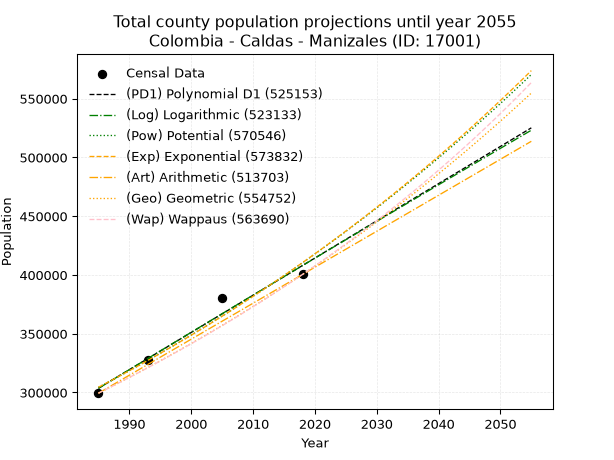
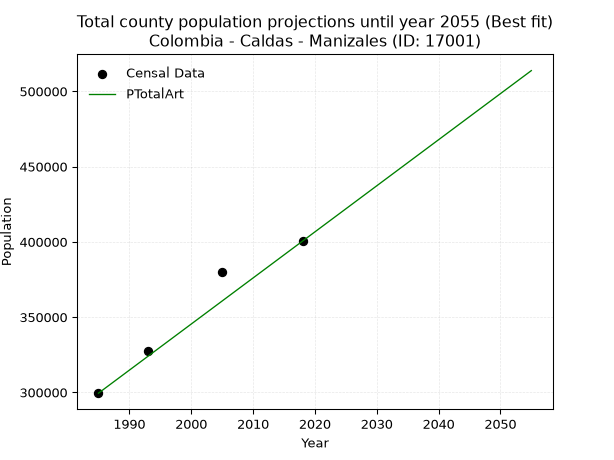
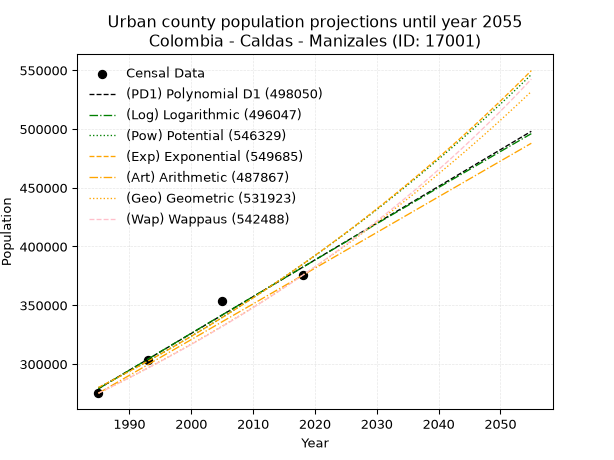
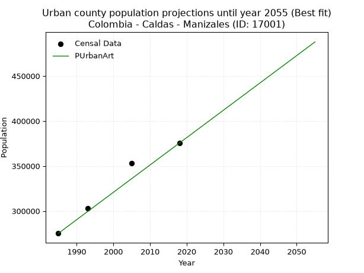
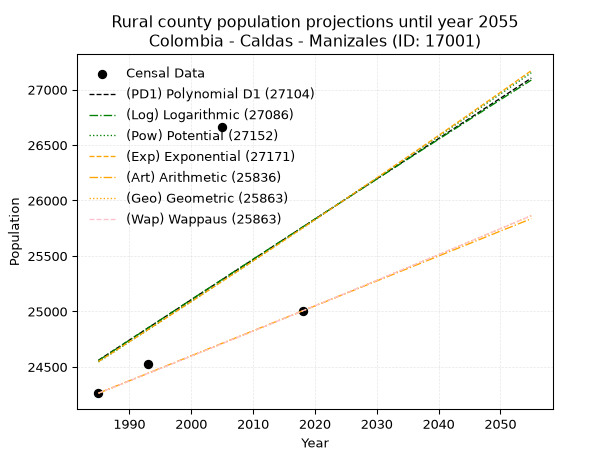
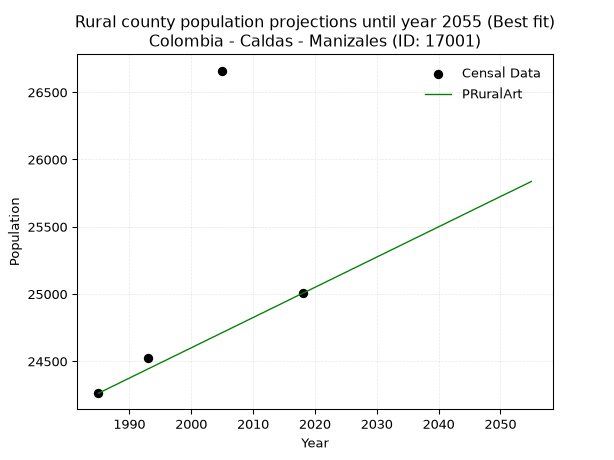

<div align="center">


</div>

# _“Population and Public Services Demand Projections (PPSD) until Year 2050 for Colombia - Caldas - Manizales (ID: 17001)”_
Keywords: `population` `public-service` `projection` `lineal` `polynomial` `logarithmic` `potential` `exponential` `arithmetic` `geometric` `wappaus` `dane` `colombia` `south-america`

PPSD are analytical estimates used by governments and planners to anticipate future changes in population size, age distribution, and the resulting community needs for utilities, healthcare, education, and infrastructure as sizing future water treatment facilities, electrical grids, and road networks based on spatial growth.

> **General running parameters**: • app_version: _v20260806_. • Python version: _3.14.7_. • Pandas version: _3.0.5_. • NumPy version: _2.5.1_. • Creates, save and include plots into reports (create_plot): _False_. • Projection until year: _2050_. • Process polynomial degree 2 and up: _False_. • Process Wappaus: _True_. • Process Wappaus: _True_. • Set negative values to zero: _True_. • Set infinite values to zero: _True_. • Drop dataset notes: _True_. 
<div align="center">

Dynamic map: [:earth_americas:Google](http://maps.google.com/maps?q=5.057656545,-75.4910252) [:earth_americas:OSM](https://www.openstreetmap.org/#map=18/5.057656545/-75.4910252&layers=P) [:earth_americas:Bing](https://www.bing.com/maps?cp=5.057656545~-75.4910252&lvl=18) [:earth_americas:Apple](https://maps.apple.com/frame?center=5.057656545%2C-75.4910252&span=0.003%2C0.006)

</div>


<div align="center">

```geojson
{
  "type": "Feature",
  "geometry": {
    "type": "Point", 
    "coordinates": [-75.4910252, 5.057656545]
  }, 
  "properties": {
    "Name": "Colombia - Caldas - Manizales (ID: 17001)"
  }
}
```

</div>


## 0. Census Data (4 records)

Census data are official statistics collected by a government about the people and housing in a country. They usually include counts of total population, age, sex, race, income, education, and jobs.

📅Global census file: [Population.xlsx](../data/Population.xlsx)

| Source   |   Year |   CountryID | CountryName   |   StateID | StateName   |   CountyID | CountyName   |   PTotal |   PUrban |   PRural |
|:---------|-------:|------------:|:--------------|----------:|:------------|-----------:|:-------------|---------:|---------:|---------:|
| DANE     |   1985 |          57 | Colombia      |        17 | Caldas      |      17001 | Manizales    |   299414 |   275152 |    24262 |
| DANE     |   1993 |          57 | Colombia      |        17 | Caldas      |      17001 | Manizales    |   327663 |   303136 |    24527 |
| DANE     |   2005 |          57 | Colombia      |        17 | Caldas      |      17001 | Manizales    |   379972 |   353312 |    26660 |
| DANE     |   2018 |          57 | Colombia      |        17 | Caldas      |      17001 | Manizales    |   400436 |   375432 |    25004 |

> 🔥Some records could had specific notes about the registered values or the corresponding urban or rural distribution.

## 1. Total

### 1.1. Coefficients and Parameters

* (PD1) Polynomial Deg 1: 3164.971095945386, -5978862.184664759 (lineal)
* (Log) Logarithmic: 6337593.711878082, -47820229.340274006
* (Pow) Potential: 18.131781099437255, -54.31088841816457
* (Exp) Exponential: 0.009054251207433042, 0.0047653008767292995
* (Art) Arithmetic: Year diff. 2018 - 1985 = 33, Population diff. 400436 - 299414 = 101022, Annual growth = 3061.2727272727275
* (Geo) Geometric: Year diff. 2018 - 1985 = 33, Population diff. 400436 - 299414 = 101022, Annual growth % = 0.008848822067972328
* (Wap) Wappaus: i = 0.8748368156812824, Condition values only valid for < 200)

<sub>
Wappaus condition values: ['0.00', '0.87', '1.75', '2.62', '3.50', '4.37', '5.25', '6.12', '7.00', '7.87', '8.75', '9.62', '10.50', '11.37', '12.25', '13.12', '14.00', '14.87', '15.75', '16.62', '17.50', '18.37', '19.25', '20.12', '21.00', '21.87', '22.75', '23.62', '24.50', '25.37', '26.25', '27.12', '27.99', '28.87', '29.74', '30.62', '31.49', '32.37', '33.24', '34.12', '34.99', '35.87', '36.74', '37.62', '38.49', '39.37', '40.24', '41.12', '41.99', '42.87', '43.74', '44.62', '45.49', '46.37', '47.24', '48.12', '48.99', '49.87', '50.74', '51.62', '52.49', '53.37', '54.24', '55.11', '55.99', '56.86']
</sub>


### 1.2. Projected Dataset

|   Year |   CountyID |   PTotalPD1 |   PTotalLog |   PTotalPow |   PTotalExp |   PTotalArt |   PTotalGeo |   PTotalWap |
|-------:|-----------:|------------:|------------:|------------:|------------:|------------:|------------:|------------:|
|   1985 |      17001 |      303605 |      303491 |      304357 |      304460 |      299414 |      299414 |      299414 |
|   1986 |      17001 |      306770 |      306683 |      307149 |      307229 |      302475 |      302063 |      302045 |
|   1987 |      17001 |      309935 |      309873 |      309965 |      310023 |      305537 |      304736 |      304699 |
|   1988 |      17001 |      313100 |      313062 |      312806 |      312843 |      308598 |      307433 |      307377 |
|   1989 |      17001 |      316265 |      316249 |      315672 |      315688 |      311659 |      310153 |      310078 |
|   1990 |      17001 |      319430 |      319435 |      318562 |      318560 |      314720 |      312898 |      312804 |
|   1991 |      17001 |      322595 |      322619 |      321477 |      321457 |      317782 |      315667 |      315554 |
|   1992 |      17001 |      325760 |      325801 |      324417 |      324381 |      320843 |      318460 |      318329 |
|   1993 |      17001 |      328925 |      328982 |      327383 |      327331 |      323904 |      321278 |      321129 |
|   1994 |      17001 |      332090 |      332161 |      330374 |      330308 |      326965 |      324121 |      323955 |
|   1995 |      17001 |      335255 |      335338 |      333391 |      333313 |      330027 |      326989 |      326806 |
|   1996 |      17001 |      338420 |      338514 |      336434 |      336344 |      333088 |      329882 |      329684 |
|   1997 |      17001 |      341585 |      341689 |      339503 |      339404 |      336149 |      332801 |      332588 |
|   1998 |      17001 |      344750 |      344862 |      342599 |      342491 |      339211 |      335746 |      335519 |
|   1999 |      17001 |      347915 |      348033 |      345722 |      345606 |      342272 |      338717 |      338478 |
|   2000 |      17001 |      351080 |      351202 |      348871 |      348749 |      345333 |      341715 |      341464 |
|   2001 |      17001 |      354245 |      354370 |      352047 |      351921 |      348394 |      344738 |      344478 |
|   2002 |      17001 |      357410 |      357537 |      355251 |      355122 |      351456 |      347789 |      347521 |
|   2003 |      17001 |      360575 |      360702 |      358482 |      358352 |      354517 |      350866 |      350592 |
|   2004 |      17001 |      363740 |      363865 |      361741 |      361611 |      357578 |      353971 |      353693 |
|   2005 |      17001 |      366905 |      367027 |      365028 |      364900 |      360639 |      357103 |      356824 |
|   2006 |      17001 |      370070 |      370187 |      368344 |      368219 |      363701 |      360263 |      359985 |
|   2007 |      17001 |      373235 |      373345 |      371687 |      371568 |      366762 |      363451 |      363176 |
|   2008 |      17001 |      376400 |      376502 |      375059 |      374948 |      369823 |      366667 |      366399 |
|   2009 |      17001 |      379565 |      379657 |      378461 |      378358 |      372885 |      369912 |      369653 |
|   2010 |      17001 |      382730 |      382811 |      381891 |      381799 |      375946 |      373185 |      372939 |
|   2011 |      17001 |      385895 |      385964 |      385351 |      385272 |      379007 |      376487 |      376257 |
|   2012 |      17001 |      389060 |      389114 |      388840 |      388776 |      382068 |      379819 |      379609 |
|   2013 |      17001 |      392225 |      392263 |      392359 |      392312 |      385130 |      383180 |      382993 |
|   2014 |      17001 |      395390 |      395411 |      395908 |      395880 |      388191 |      386571 |      386412 |
|   2015 |      17001 |      398555 |      398557 |      399488 |      399481 |      391252 |      389991 |      389865 |
|   2016 |      17001 |      401720 |      401701 |      403098 |      403114 |      394313 |      393442 |      393353 |
|   2017 |      17001 |      404885 |      404844 |      406739 |      406781 |      397375 |      396924 |      396876 |
|   2018 |      17001 |      408049 |      407985 |      410411 |      410481 |      400436 |      400436 |      400436 |
|   2019 |      17001 |      411214 |      411125 |      414114 |      414214 |      403497 |      403979 |      404032 |
|   2020 |      17001 |      414379 |      414263 |      417849 |      417982 |      406559 |      407554 |      407665 |
|   2021 |      17001 |      417544 |      417400 |      421615 |      421783 |      409620 |      411161 |      411336 |
|   2022 |      17001 |      420709 |      420535 |      425414 |      425620 |      412681 |      414799 |      415046 |
|   2023 |      17001 |      423874 |      423669 |      429245 |      429491 |      415742 |      418469 |      418794 |
|   2024 |      17001 |      427039 |      426801 |      433109 |      433397 |      418804 |      422172 |      422582 |
|   2025 |      17001 |      430204 |      429931 |      437005 |      437339 |      421865 |      425908 |      426409 |
|   2026 |      17001 |      433369 |      433060 |      440935 |      441317 |      424926 |      429677 |      430278 |
|   2027 |      17001 |      436534 |      436187 |      444897 |      445331 |      427987 |      433479 |      434188 |
|   2028 |      17001 |      439699 |      439313 |      448894 |      449381 |      431049 |      437315 |      438141 |
|   2029 |      17001 |      442864 |      442438 |      452924 |      453469 |      434110 |      441184 |      442136 |
|   2030 |      17001 |      446029 |      445560 |      456989 |      457593 |      437171 |      445088 |      446174 |
|   2031 |      17001 |      449194 |      448681 |      461088 |      461755 |      440233 |      449027 |      450257 |
|   2032 |      17001 |      452359 |      451801 |      465222 |      465955 |      443294 |      453000 |      454385 |
|   2033 |      17001 |      455524 |      454919 |      469391 |      470193 |      446355 |      457009 |      458559 |
|   2034 |      17001 |      458689 |      458036 |      473595 |      474469 |      449416 |      461053 |      462779 |
|   2035 |      17001 |      461854 |      461151 |      477834 |      478785 |      452478 |      465132 |      467046 |
|   2036 |      17001 |      465019 |      464264 |      482110 |      483140 |      455539 |      469248 |      471361 |
|   2037 |      17001 |      468184 |      467376 |      486421 |      487534 |      458600 |      473401 |      475725 |
|   2038 |      17001 |      471349 |      470487 |      490769 |      491968 |      461661 |      477590 |      480139 |
|   2039 |      17001 |      474514 |      473596 |      495154 |      496443 |      464723 |      481816 |      484604 |
|   2040 |      17001 |      477679 |      476703 |      499576 |      500958 |      467784 |      486079 |      489119 |
|   2041 |      17001 |      480844 |      479809 |      504035 |      505515 |      470845 |      490381 |      493688 |
|   2042 |      17001 |      484009 |      482914 |      508531 |      510112 |      473907 |      494720 |      498309 |
|   2043 |      17001 |      487174 |      486016 |      513066 |      514752 |      476968 |      499098 |      502985 |
|   2044 |      17001 |      490339 |      489118 |      517638 |      519434 |      480029 |      503514 |      507715 |
|   2045 |      17001 |      493504 |      492218 |      522249 |      524158 |      483090 |      507969 |      512502 |
|   2046 |      17001 |      496669 |      495316 |      526899 |      528926 |      486152 |      512464 |      517346 |
|   2047 |      17001 |      499834 |      498413 |      531588 |      533737 |      489213 |      516999 |      522248 |
|   2048 |      17001 |      502999 |      501508 |      536317 |      538591 |      492274 |      521574 |      527210 |
|   2049 |      17001 |      506164 |      504602 |      541085 |      543490 |      495335 |      526189 |      532231 |
|   2050 |      17001 |      509329 |      507694 |      545893 |      548433 |      498397 |      530845 |      537314 |
<div align="center">

</img>

</div>


### 1.3. Best fit with absolute and relative error (%)

Relative error puts that difference into context by dividing the absolute error by the true value, creating a unitless ratio or percentage that shows the scale of the mistake.

Absolute and relative error

|   Year | Source   |   CountryID | CountryName   |   StateID | StateName   |   CountyID_x | CountyName   |   PTotal |   PUrban |   PRural |   CountyID_y |   PTotalPD1 |   PTotalLog |   PTotalPow |   PTotalExp |   PTotalArt |   PTotalGeo |   PTotalWap |   PTotalPD1AbsError |   PTotalLogAbsError |   PTotalPowAbsError |   PTotalExpAbsError |   PTotalArtAbsError |   PTotalGeoAbsError |   PTotalWapAbsError |   PTotalPD1RelError |   PTotalLogRelError |   PTotalPowRelError |   PTotalExpRelError |   PTotalArtRelError |   PTotalGeoRelError |   PTotalWapRelError |
|-------:|:---------|------------:|:--------------|----------:|:------------|-------------:|:-------------|---------:|---------:|---------:|-------------:|------------:|------------:|------------:|------------:|------------:|------------:|------------:|--------------------:|--------------------:|--------------------:|--------------------:|--------------------:|--------------------:|--------------------:|--------------------:|--------------------:|--------------------:|--------------------:|--------------------:|--------------------:|--------------------:|
|   1985 | DANE     |          57 | Colombia      |        17 | Caldas      |        17001 | Manizales    |   299414 |   275152 |    24262 |        17001 |      303605 |      303491 |      304357 |      304460 |      299414 |      299414 |      299414 |                4191 |                4077 |                4943 |                5046 |                   0 |                   0 |                   0 |            1.39973  |            1.36166  |           1.65089   |            1.68529  |             0       |             0       |             0       |
|   1993 | DANE     |          57 | Colombia      |        17 | Caldas      |        17001 | Manizales    |   327663 |   303136 |    24527 |        17001 |      328925 |      328982 |      327383 |      327331 |      323904 |      321278 |      321129 |                1262 |                1319 |                 280 |                 332 |                3759 |                6385 |                6534 |            0.385152 |            0.402548 |           0.0854537 |            0.101324 |             1.14722 |             1.94865 |             1.99412 |
|   2005 | DANE     |          57 | Colombia      |        17 | Caldas      |        17001 | Manizales    |   379972 |   353312 |    26660 |        17001 |      366905 |      367027 |      365028 |      364900 |      360639 |      357103 |      356824 |               13067 |               12945 |               14944 |               15072 |               19333 |               22869 |               23148 |            3.43894  |            3.40683  |           3.93292   |            3.96661  |             5.08801 |             6.0186  |             6.09203 |
|   2018 | DANE     |          57 | Colombia      |        17 | Caldas      |        17001 | Manizales    |   400436 |   375432 |    25004 |        17001 |      408049 |      407985 |      410411 |      410481 |      400436 |      400436 |      400436 |                7613 |                7549 |                9975 |               10045 |                   0 |                   0 |                   0 |            1.90118  |            1.8852   |           2.49103   |            2.50852  |             0       |             0       |             0       |

Relative error mean

| Method    |   RelError | Best   |
|:----------|-----------:|:-------|
| PTotalPD1 |    1.78125 |        |
| PTotalLog |    1.76406 |        |
| PTotalPow |    2.04008 |        |
| PTotalExp |    2.06543 |        |
| PTotalArt |    1.55881 | True   |
| PTotalGeo |    1.99181 |        |
| PTotalWap |    2.02154 |        |

💙Best method: _**PTotalArt**_
<div align="center">

</img>

</div>


### 1.4. Fresh water supply demand in liters per capita per day (lpcd)

The fresh water supply demand typically ranges from 100 to 300 liters per capita per day (lpcd) for standard domestic and municipal planning, though absolute survival minimums set by the World Health Organization are as low as 7.5 to 20 liters per day, and total consumption in high-income nations can exceed 400 liters.

> `CZ`: Level in meters above the sea level (masl).<br> `WS`: Fresh water supply demand in liters per capita per day (lpcd or l/h/d).<br> `WSAll`: Zonal fresh water supply demand in liters per second (l/s).<br> `A`: Zonal area in square meters.

Reference values (RAS Colombia)

|    CZ |   WS |
|------:|-----:|
|  1000 |  120 |
|  2000 |  130 |
| 99999 |  140 |

County shapefile geometry properties and water supply values

|   CountyID |      ATotal |   CZTotal |   WSTotal |
|-----------:|------------:|----------:|----------:|
|      17001 | 4.40888e+08 |   1996.16 |       130 |

Projected values for best method: PTotalArt

|   CountyID |   Year |   PTotalArt |   WSTotal |   WSTotalAll |
|-----------:|-------:|------------:|----------:|-------------:|
|      17001 |   1985 |      299414 |       130 |      450.507 |
|      17001 |   1986 |      302475 |       130 |      455.113 |
|      17001 |   1987 |      305537 |       130 |      459.72  |
|      17001 |   1988 |      308598 |       130 |      464.326 |
|      17001 |   1989 |      311659 |       130 |      468.931 |
|      17001 |   1990 |      314720 |       130 |      473.537 |
|      17001 |   1991 |      317782 |       130 |      478.144 |
|      17001 |   1992 |      320843 |       130 |      482.75  |
|      17001 |   1993 |      323904 |       130 |      487.356 |
|      17001 |   1994 |      326965 |       130 |      491.961 |
|      17001 |   1995 |      330027 |       130 |      496.568 |
|      17001 |   1996 |      333088 |       130 |      501.174 |
|      17001 |   1997 |      336149 |       130 |      505.78  |
|      17001 |   1998 |      339211 |       130 |      510.387 |
|      17001 |   1999 |      342272 |       130 |      514.993 |
|      17001 |   2000 |      345333 |       130 |      519.598 |
|      17001 |   2001 |      348394 |       130 |      524.204 |
|      17001 |   2002 |      351456 |       130 |      528.811 |
|      17001 |   2003 |      354517 |       130 |      533.417 |
|      17001 |   2004 |      357578 |       130 |      538.022 |
|      17001 |   2005 |      360639 |       130 |      542.628 |
|      17001 |   2006 |      363701 |       130 |      547.235 |
|      17001 |   2007 |      366762 |       130 |      551.841 |
|      17001 |   2008 |      369823 |       130 |      556.447 |
|      17001 |   2009 |      372885 |       130 |      561.054 |
|      17001 |   2010 |      375946 |       130 |      565.659 |
|      17001 |   2011 |      379007 |       130 |      570.265 |
|      17001 |   2012 |      382068 |       130 |      574.871 |
|      17001 |   2013 |      385130 |       130 |      579.478 |
|      17001 |   2014 |      388191 |       130 |      584.084 |
|      17001 |   2015 |      391252 |       130 |      588.689 |
|      17001 |   2016 |      394313 |       130 |      593.295 |
|      17001 |   2017 |      397375 |       130 |      597.902 |
|      17001 |   2018 |      400436 |       130 |      602.508 |
|      17001 |   2019 |      403497 |       130 |      607.114 |
|      17001 |   2020 |      406559 |       130 |      611.721 |
|      17001 |   2021 |      409620 |       130 |      616.326 |
|      17001 |   2022 |      412681 |       130 |      620.932 |
|      17001 |   2023 |      415742 |       130 |      625.538 |
|      17001 |   2024 |      418804 |       130 |      630.145 |
|      17001 |   2025 |      421865 |       130 |      634.751 |
|      17001 |   2026 |      424926 |       130 |      639.356 |
|      17001 |   2027 |      427987 |       130 |      643.962 |
|      17001 |   2028 |      431049 |       130 |      648.569 |
|      17001 |   2029 |      434110 |       130 |      653.175 |
|      17001 |   2030 |      437171 |       130 |      657.78  |
|      17001 |   2031 |      440233 |       130 |      662.388 |
|      17001 |   2032 |      443294 |       130 |      666.993 |
|      17001 |   2033 |      446355 |       130 |      671.599 |
|      17001 |   2034 |      449416 |       130 |      676.205 |
|      17001 |   2035 |      452478 |       130 |      680.812 |
|      17001 |   2036 |      455539 |       130 |      685.417 |
|      17001 |   2037 |      458600 |       130 |      690.023 |
|      17001 |   2038 |      461661 |       130 |      694.629 |
|      17001 |   2039 |      464723 |       130 |      699.236 |
|      17001 |   2040 |      467784 |       130 |      703.842 |
|      17001 |   2041 |      470845 |       130 |      708.447 |
|      17001 |   2042 |      473907 |       130 |      713.055 |
|      17001 |   2043 |      476968 |       130 |      717.66  |
|      17001 |   2044 |      480029 |       130 |      722.266 |
|      17001 |   2045 |      483090 |       130 |      726.872 |
|      17001 |   2046 |      486152 |       130 |      731.479 |
|      17001 |   2047 |      489213 |       130 |      736.084 |
|      17001 |   2048 |      492274 |       130 |      740.69  |
|      17001 |   2049 |      495335 |       130 |      745.296 |
|      17001 |   2050 |      498397 |       130 |      749.903 |

## 2. Urban

### 2.1. Coefficients and Parameters

* (PD1) Polynomial Deg 1: 3128.6166198313754, -5931257.393817708 (lineal)
* (Log) Logarithmic: 6264591.257040479, -47290450.34604842
* (Pow) Potential: 19.29781579244747, -58.19257845630386
* (Exp) Exponential: 0.009636757400996754, 0.0013789469010265397
* (Art) Arithmetic: Year diff. 2018 - 1985 = 33, Population diff. 375432 - 275152 = 100280, Annual growth = 3038.787878787879
* (Geo) Geometric: Year diff. 2018 - 1985 = 33, Population diff. 375432 - 275152 = 100280, Annual growth % = 0.009461255865864437
* (Wap) Wappaus: i = 0.9341723370964791, Condition values only valid for < 200)

<sub>
Wappaus condition values: ['0.00', '0.93', '1.87', '2.80', '3.74', '4.67', '5.61', '6.54', '7.47', '8.41', '9.34', '10.28', '11.21', '12.14', '13.08', '14.01', '14.95', '15.88', '16.82', '17.75', '18.68', '19.62', '20.55', '21.49', '22.42', '23.35', '24.29', '25.22', '26.16', '27.09', '28.03', '28.96', '29.89', '30.83', '31.76', '32.70', '33.63', '34.56', '35.50', '36.43', '37.37', '38.30', '39.24', '40.17', '41.10', '42.04', '42.97', '43.91', '44.84', '45.77', '46.71', '47.64', '48.58', '49.51', '50.45', '51.38', '52.31', '53.25', '54.18', '55.12', '56.05', '56.98', '57.92', '58.85', '59.79', '60.72']
</sub>


### 2.2. Projected Dataset

|   Year |   CountyID |   PUrbanPD1 |   PUrbanLog |   PUrbanPow |   PUrbanExp |   PUrbanArt |   PUrbanGeo |   PUrbanWap |
|-------:|-----------:|------------:|------------:|------------:|------------:|------------:|------------:|------------:|
|   1985 |      17001 |      279047 |      278935 |      279896 |      279995 |      275152 |      275152 |      275152 |
|   1986 |      17001 |      282175 |      282090 |      282629 |      282707 |      278191 |      277755 |      277734 |
|   1987 |      17001 |      285304 |      285244 |      285388 |      285444 |      281230 |      280383 |      280341 |
|   1988 |      17001 |      288432 |      288396 |      288173 |      288208 |      284268 |      283036 |      282973 |
|   1989 |      17001 |      291561 |      291546 |      290983 |      290999 |      287307 |      285714 |      285629 |
|   1990 |      17001 |      294690 |      294695 |      293819 |      293817 |      290346 |      288417 |      288311 |
|   1991 |      17001 |      297818 |      297842 |      296682 |      296662 |      293385 |      291146 |      291019 |
|   1992 |      17001 |      300947 |      300988 |      299571 |      299535 |      296424 |      293900 |      293753 |
|   1993 |      17001 |      304076 |      304132 |      302486 |      302435 |      299462 |      296681 |      296513 |
|   1994 |      17001 |      307204 |      307275 |      305429 |      305364 |      302501 |      299488 |      299301 |
|   1995 |      17001 |      310333 |      310416 |      308398 |      308321 |      305540 |      302322 |      302115 |
|   1996 |      17001 |      313461 |      313555 |      311395 |      311306 |      308579 |      305182 |      304958 |
|   1997 |      17001 |      316590 |      316693 |      314420 |      314321 |      311617 |      308069 |      307828 |
|   1998 |      17001 |      319719 |      319829 |      317472 |      317364 |      314656 |      310984 |      310727 |
|   1999 |      17001 |      322847 |      322964 |      320552 |      320438 |      317695 |      313926 |      313655 |
|   2000 |      17001 |      325976 |      326097 |      323661 |      323541 |      320734 |      316897 |      316613 |
|   2001 |      17001 |      329104 |      329228 |      326798 |      326673 |      323773 |      319895 |      319600 |
|   2002 |      17001 |      332233 |      332358 |      329964 |      329837 |      326811 |      322921 |      322618 |
|   2003 |      17001 |      335362 |      335487 |      333160 |      333031 |      329850 |      325977 |      325666 |
|   2004 |      17001 |      338490 |      338613 |      336384 |      336256 |      332889 |      329061 |      328746 |
|   2005 |      17001 |      341619 |      341739 |      339638 |      339512 |      335928 |      332174 |      331857 |
|   2006 |      17001 |      344748 |      344862 |      342922 |      342799 |      338967 |      335317 |      335001 |
|   2007 |      17001 |      347876 |      347985 |      346236 |      346119 |      342005 |      338489 |      338177 |
|   2008 |      17001 |      351005 |      351105 |      349580 |      349470 |      345044 |      341692 |      341387 |
|   2009 |      17001 |      354133 |      354224 |      352955 |      352854 |      348083 |      344925 |      344630 |
|   2010 |      17001 |      357262 |      357342 |      356361 |      356271 |      351122 |      348188 |      347908 |
|   2011 |      17001 |      360391 |      360458 |      359798 |      359721 |      354160 |      351482 |      351220 |
|   2012 |      17001 |      363519 |      363572 |      363267 |      363204 |      357199 |      354808 |      354568 |
|   2013 |      17001 |      366648 |      366685 |      366767 |      366721 |      360238 |      358165 |      357952 |
|   2014 |      17001 |      369776 |      369796 |      370299 |      370272 |      363277 |      361554 |      361372 |
|   2015 |      17001 |      372905 |      372906 |      373863 |      373858 |      366316 |      364974 |      364830 |
|   2016 |      17001 |      376034 |      376014 |      377460 |      377478 |      369354 |      368427 |      368325 |
|   2017 |      17001 |      379162 |      379121 |      381090 |      381133 |      372393 |      371913 |      371859 |
|   2018 |      17001 |      382291 |      382226 |      384752 |      384824 |      375432 |      375432 |      375432 |
|   2019 |      17001 |      385420 |      385329 |      388448 |      388550 |      378471 |      378984 |      379044 |
|   2020 |      17001 |      388548 |      388432 |      392178 |      392313 |      381510 |      382570 |      382697 |
|   2021 |      17001 |      391677 |      391532 |      395942 |      396112 |      384548 |      386189 |      386391 |
|   2022 |      17001 |      394805 |      394631 |      399740 |      399947 |      387587 |      389843 |      390127 |
|   2023 |      17001 |      397934 |      397728 |      403572 |      403820 |      390626 |      393532 |      393905 |
|   2024 |      17001 |      401063 |      400824 |      407439 |      407731 |      393665 |      397255 |      397726 |
|   2025 |      17001 |      404191 |      403919 |      411342 |      411679 |      396704 |      401013 |      401591 |
|   2026 |      17001 |      407320 |      407012 |      415279 |      415665 |      399742 |      404807 |      405501 |
|   2027 |      17001 |      410448 |      410103 |      419253 |      419690 |      402781 |      408637 |      409456 |
|   2028 |      17001 |      413577 |      413193 |      423262 |      423754 |      405820 |      412504 |      413457 |
|   2029 |      17001 |      416706 |      416281 |      427308 |      427858 |      408859 |      416406 |      417506 |
|   2030 |      17001 |      419834 |      419368 |      431391 |      432001 |      411897 |      420346 |      421602 |
|   2031 |      17001 |      422963 |      422453 |      435510 |      436184 |      414936 |      424323 |      425747 |
|   2032 |      17001 |      426092 |      425537 |      439667 |      440408 |      417975 |      428338 |      429942 |
|   2033 |      17001 |      429220 |      428619 |      443861 |      444672 |      421014 |      432390 |      434187 |
|   2034 |      17001 |      432349 |      431700 |      448094 |      448978 |      424053 |      436481 |      438483 |
|   2035 |      17001 |      435477 |      434779 |      452364 |      453326 |      427091 |      440611 |      442832 |
|   2036 |      17001 |      438606 |      437857 |      456673 |      457715 |      430130 |      444780 |      447235 |
|   2037 |      17001 |      441735 |      440933 |      461021 |      462148 |      433169 |      448988 |      451691 |
|   2038 |      17001 |      444863 |      444007 |      465408 |      466623 |      436208 |      453236 |      456203 |
|   2039 |      17001 |      447992 |      447080 |      469835 |      471141 |      439247 |      457524 |      460771 |
|   2040 |      17001 |      451121 |      450152 |      474302 |      475703 |      442285 |      461853 |      465397 |
|   2041 |      17001 |      454249 |      453222 |      478809 |      480310 |      445324 |      466223 |      470081 |
|   2042 |      17001 |      457378 |      456291 |      483356 |      484961 |      448363 |      470634 |      474825 |
|   2043 |      17001 |      460506 |      459358 |      487945 |      489657 |      451402 |      475086 |      479630 |
|   2044 |      17001 |      463635 |      462424 |      492575 |      494398 |      454440 |      479581 |      484497 |
|   2045 |      17001 |      466764 |      465488 |      497246 |      499186 |      457479 |      484119 |      489426 |
|   2046 |      17001 |      469892 |      468550 |      501959 |      504020 |      460518 |      488699 |      494421 |
|   2047 |      17001 |      473021 |      471611 |      506715 |      508900 |      463557 |      493323 |      499480 |
|   2048 |      17001 |      476149 |      474671 |      511513 |      513828 |      466596 |      497990 |      504607 |
|   2049 |      17001 |      479278 |      477729 |      516355 |      518804 |      469634 |      502702 |      509802 |
|   2050 |      17001 |      482407 |      480786 |      521240 |      523827 |      472673 |      507458 |      515067 |
<div align="center">

</img>

</div>


### 2.3. Best fit with absolute and relative error (%)

Relative error puts that difference into context by dividing the absolute error by the true value, creating a unitless ratio or percentage that shows the scale of the mistake.

Absolute and relative error

|   Year | Source   |   CountryID | CountryName   |   StateID | StateName   |   CountyID_x | CountyName   |   PTotal |   PUrban |   PRural |   CountyID_y |   PUrbanPD1 |   PUrbanLog |   PUrbanPow |   PUrbanExp |   PUrbanArt |   PUrbanGeo |   PUrbanWap |   PUrbanPD1AbsError |   PUrbanLogAbsError |   PUrbanPowAbsError |   PUrbanExpAbsError |   PUrbanArtAbsError |   PUrbanGeoAbsError |   PUrbanWapAbsError |   PUrbanPD1RelError |   PUrbanLogRelError |   PUrbanPowRelError |   PUrbanExpRelError |   PUrbanArtRelError |   PUrbanGeoRelError |   PUrbanWapRelError |
|-------:|:---------|------------:|:--------------|----------:|:------------|-------------:|:-------------|---------:|---------:|---------:|-------------:|------------:|------------:|------------:|------------:|------------:|------------:|------------:|--------------------:|--------------------:|--------------------:|--------------------:|--------------------:|--------------------:|--------------------:|--------------------:|--------------------:|--------------------:|--------------------:|--------------------:|--------------------:|--------------------:|
|   1985 | DANE     |          57 | Colombia      |        17 | Caldas      |        17001 | Manizales    |   299414 |   275152 |    24262 |        17001 |      279047 |      278935 |      279896 |      279995 |      275152 |      275152 |      275152 |                3895 |                3783 |                4744 |                4843 |                   0 |                   0 |                   0 |            1.41558  |            1.37488  |            1.72414  |            1.76012  |              0      |             0       |             0       |
|   1993 | DANE     |          57 | Colombia      |        17 | Caldas      |        17001 | Manizales    |   327663 |   303136 |    24527 |        17001 |      304076 |      304132 |      302486 |      302435 |      299462 |      296681 |      296513 |                 940 |                 996 |                 650 |                 701 |                3674 |                6455 |                6623 |            0.310092 |            0.328565 |            0.214425 |            0.231249 |              1.212  |             2.12941 |             2.18483 |
|   2005 | DANE     |          57 | Colombia      |        17 | Caldas      |        17001 | Manizales    |   379972 |   353312 |    26660 |        17001 |      341619 |      341739 |      339638 |      339512 |      335928 |      332174 |      331857 |               11693 |               11573 |               13674 |               13800 |               17384 |               21138 |               21455 |            3.30954  |            3.27558  |            3.87023  |            3.9059   |              4.9203 |             5.98281 |             6.07254 |
|   2018 | DANE     |          57 | Colombia      |        17 | Caldas      |        17001 | Manizales    |   400436 |   375432 |    25004 |        17001 |      382291 |      382226 |      384752 |      384824 |      375432 |      375432 |      375432 |                6859 |                6794 |                9320 |                9392 |                   0 |                   0 |                   0 |            1.82696  |            1.80965  |            2.48247  |            2.50165  |              0      |             0       |             0       |

Relative error mean

| Method    |   RelError | Best   |
|:----------|-----------:|:-------|
| PUrbanPD1 |    1.71554 |        |
| PUrbanLog |    1.69717 |        |
| PUrbanPow |    2.07282 |        |
| PUrbanExp |    2.09973 |        |
| PUrbanArt |    1.53307 | True   |
| PUrbanGeo |    2.02806 |        |
| PUrbanWap |    2.06434 |        |

💙Best method: _**PUrbanArt**_
<div align="center">

</img>

</div>


### 2.4. Fresh water supply demand in liters per capita per day (lpcd)

The fresh water supply demand typically ranges from 100 to 300 liters per capita per day (lpcd) for standard domestic and municipal planning, though absolute survival minimums set by the World Health Organization are as low as 7.5 to 20 liters per day, and total consumption in high-income nations can exceed 400 liters.

> `CZ`: Level in meters above the sea level (masl).<br> `WS`: Fresh water supply demand in liters per capita per day (lpcd or l/h/d).<br> `WSAll`: Zonal fresh water supply demand in liters per second (l/s).<br> `A`: Zonal area in square meters.

Reference values (RAS Colombia)

|    CZ |   WS |
|------:|-----:|
|  1000 |  120 |
|  2000 |  130 |
| 99999 |  140 |

County shapefile geometry properties and water supply values

|   CountyID |      AUrban |   CZUrban |   WSUrban |
|-----------:|------------:|----------:|----------:|
|      17001 | 3.73854e+07 |   2088.49 |       140 |

Projected values for best method: PUrbanArt

|   CountyID |   Year |   PUrbanArt |   WSUrban |   WSUrbanAll |
|-----------:|-------:|------------:|----------:|-------------:|
|      17001 |   1985 |      275152 |       140 |      445.848 |
|      17001 |   1986 |      278191 |       140 |      450.772 |
|      17001 |   1987 |      281230 |       140 |      455.697 |
|      17001 |   1988 |      284268 |       140 |      460.619 |
|      17001 |   1989 |      287307 |       140 |      465.544 |
|      17001 |   1990 |      290346 |       140 |      470.468 |
|      17001 |   1991 |      293385 |       140 |      475.392 |
|      17001 |   1992 |      296424 |       140 |      480.317 |
|      17001 |   1993 |      299462 |       140 |      485.239 |
|      17001 |   1994 |      302501 |       140 |      490.164 |
|      17001 |   1995 |      305540 |       140 |      495.088 |
|      17001 |   1996 |      308579 |       140 |      500.012 |
|      17001 |   1997 |      311617 |       140 |      504.935 |
|      17001 |   1998 |      314656 |       140 |      509.859 |
|      17001 |   1999 |      317695 |       140 |      514.784 |
|      17001 |   2000 |      320734 |       140 |      519.708 |
|      17001 |   2001 |      323773 |       140 |      524.632 |
|      17001 |   2002 |      326811 |       140 |      529.555 |
|      17001 |   2003 |      329850 |       140 |      534.479 |
|      17001 |   2004 |      332889 |       140 |      539.403 |
|      17001 |   2005 |      335928 |       140 |      544.328 |
|      17001 |   2006 |      338967 |       140 |      549.252 |
|      17001 |   2007 |      342005 |       140 |      554.175 |
|      17001 |   2008 |      345044 |       140 |      559.099 |
|      17001 |   2009 |      348083 |       140 |      564.023 |
|      17001 |   2010 |      351122 |       140 |      568.948 |
|      17001 |   2011 |      354160 |       140 |      573.87  |
|      17001 |   2012 |      357199 |       140 |      578.795 |
|      17001 |   2013 |      360238 |       140 |      583.719 |
|      17001 |   2014 |      363277 |       140 |      588.643 |
|      17001 |   2015 |      366316 |       140 |      593.568 |
|      17001 |   2016 |      369354 |       140 |      598.49  |
|      17001 |   2017 |      372393 |       140 |      603.415 |
|      17001 |   2018 |      375432 |       140 |      608.339 |
|      17001 |   2019 |      378471 |       140 |      613.263 |
|      17001 |   2020 |      381510 |       140 |      618.188 |
|      17001 |   2021 |      384548 |       140 |      623.11  |
|      17001 |   2022 |      387587 |       140 |      628.034 |
|      17001 |   2023 |      390626 |       140 |      632.959 |
|      17001 |   2024 |      393665 |       140 |      637.883 |
|      17001 |   2025 |      396704 |       140 |      642.807 |
|      17001 |   2026 |      399742 |       140 |      647.73  |
|      17001 |   2027 |      402781 |       140 |      652.654 |
|      17001 |   2028 |      405820 |       140 |      657.579 |
|      17001 |   2029 |      408859 |       140 |      662.503 |
|      17001 |   2030 |      411897 |       140 |      667.426 |
|      17001 |   2031 |      414936 |       140 |      672.35  |
|      17001 |   2032 |      417975 |       140 |      677.274 |
|      17001 |   2033 |      421014 |       140 |      682.199 |
|      17001 |   2034 |      424053 |       140 |      687.123 |
|      17001 |   2035 |      427091 |       140 |      692.046 |
|      17001 |   2036 |      430130 |       140 |      696.97  |
|      17001 |   2037 |      433169 |       140 |      701.894 |
|      17001 |   2038 |      436208 |       140 |      706.819 |
|      17001 |   2039 |      439247 |       140 |      711.743 |
|      17001 |   2040 |      442285 |       140 |      716.666 |
|      17001 |   2041 |      445324 |       140 |      721.59  |
|      17001 |   2042 |      448363 |       140 |      726.514 |
|      17001 |   2043 |      451402 |       140 |      731.438 |
|      17001 |   2044 |      454440 |       140 |      736.361 |
|      17001 |   2045 |      457479 |       140 |      741.285 |
|      17001 |   2046 |      460518 |       140 |      746.21  |
|      17001 |   2047 |      463557 |       140 |      751.134 |
|      17001 |   2048 |      466596 |       140 |      756.058 |
|      17001 |   2049 |      469634 |       140 |      760.981 |
|      17001 |   2050 |      472673 |       140 |      765.905 |

## 3. Rural

### 3.1. Coefficients and Parameters

* (PD1) Polynomial Deg 1: 36.3544761140112, -47604.79084705089 (lineal)
* (Log) Logarithmic: 73002.4548376029, -529778.9942255784
* (Pow) Potential: 2.9136542986856893, -5.218583637045809
* (Exp) Exponential: 0.001451068197719548, 1377.43399198847
* (Art) Arithmetic: Year diff. 2018 - 1985 = 33, Population diff. 25004 - 24262 = 742, Annual growth = 22.484848484848484
* (Geo) Geometric: Year diff. 2018 - 1985 = 33, Population diff. 25004 - 24262 = 742, Annual growth % = 0.0009132795654596126
* (Wap) Wappaus: i = 0.0912793751668432, Condition values only valid for < 200)

<sub>
Wappaus condition values: ['0.00', '0.09', '0.18', '0.27', '0.37', '0.46', '0.55', '0.64', '0.73', '0.82', '0.91', '1.00', '1.10', '1.19', '1.28', '1.37', '1.46', '1.55', '1.64', '1.73', '1.83', '1.92', '2.01', '2.10', '2.19', '2.28', '2.37', '2.46', '2.56', '2.65', '2.74', '2.83', '2.92', '3.01', '3.10', '3.19', '3.29', '3.38', '3.47', '3.56', '3.65', '3.74', '3.83', '3.93', '4.02', '4.11', '4.20', '4.29', '4.38', '4.47', '4.56', '4.66', '4.75', '4.84', '4.93', '5.02', '5.11', '5.20', '5.29', '5.39', '5.48', '5.57', '5.66', '5.75', '5.84', '5.93']
</sub>


### 3.2. Projected Dataset

|   Year |   CountyID |   PRuralPD1 |   PRuralLog |   PRuralPow |   PRuralExp |   PRuralArt |   PRuralGeo |   PRuralWap |
|-------:|-----------:|------------:|------------:|------------:|------------:|------------:|------------:|------------:|
|   1985 |      17001 |       24559 |       24556 |       24544 |       24547 |       24262 |       24262 |       24262 |
|   1986 |      17001 |       24595 |       24593 |       24580 |       24583 |       24284 |       24284 |       24284 |
|   1987 |      17001 |       24632 |       24629 |       24616 |       24618 |       24307 |       24306 |       24306 |
|   1988 |      17001 |       24668 |       24666 |       24653 |       24654 |       24329 |       24329 |       24329 |
|   1989 |      17001 |       24704 |       24703 |       24689 |       24690 |       24352 |       24351 |       24351 |
|   1990 |      17001 |       24741 |       24740 |       24725 |       24726 |       24374 |       24373 |       24373 |
|   1991 |      17001 |       24777 |       24776 |       24761 |       24762 |       24397 |       24395 |       24395 |
|   1992 |      17001 |       24813 |       24813 |       24797 |       24798 |       24419 |       24418 |       24418 |
|   1993 |      17001 |       24850 |       24850 |       24834 |       24834 |       24442 |       24440 |       24440 |
|   1994 |      17001 |       24886 |       24886 |       24870 |       24870 |       24464 |       24462 |       24462 |
|   1995 |      17001 |       24922 |       24923 |       24906 |       24906 |       24487 |       24484 |       24484 |
|   1996 |      17001 |       24959 |       24959 |       24943 |       24942 |       24509 |       24507 |       24507 |
|   1997 |      17001 |       24995 |       24996 |       24979 |       24978 |       24532 |       24529 |       24529 |
|   1998 |      17001 |       25031 |       25033 |       25016 |       25015 |       24554 |       24552 |       24552 |
|   1999 |      17001 |       25068 |       25069 |       25052 |       25051 |       24577 |       24574 |       24574 |
|   2000 |      17001 |       25104 |       25106 |       25089 |       25087 |       24599 |       24597 |       24596 |
|   2001 |      17001 |       25141 |       25142 |       25125 |       25124 |       24622 |       24619 |       24619 |
|   2002 |      17001 |       25177 |       25179 |       25162 |       25160 |       24644 |       24641 |       24641 |
|   2003 |      17001 |       25213 |       25215 |       25198 |       25197 |       24667 |       24664 |       24664 |
|   2004 |      17001 |       25250 |       25251 |       25235 |       25233 |       24689 |       24686 |       24686 |
|   2005 |      17001 |       25286 |       25288 |       25272 |       25270 |       24712 |       24709 |       24709 |
|   2006 |      17001 |       25322 |       25324 |       25309 |       25307 |       24734 |       24732 |       24732 |
|   2007 |      17001 |       25359 |       25361 |       25345 |       25343 |       24757 |       24754 |       24754 |
|   2008 |      17001 |       25395 |       25397 |       25382 |       25380 |       24779 |       24777 |       24777 |
|   2009 |      17001 |       25431 |       25433 |       25419 |       25417 |       24802 |       24799 |       24799 |
|   2010 |      17001 |       25468 |       25470 |       25456 |       25454 |       24824 |       24822 |       24822 |
|   2011 |      17001 |       25504 |       25506 |       25493 |       25491 |       24847 |       24845 |       24845 |
|   2012 |      17001 |       25540 |       25542 |       25530 |       25528 |       24869 |       24867 |       24867 |
|   2013 |      17001 |       25577 |       25579 |       25567 |       25565 |       24892 |       24890 |       24890 |
|   2014 |      17001 |       25613 |       25615 |       25604 |       25602 |       24914 |       24913 |       24913 |
|   2015 |      17001 |       25649 |       25651 |       25641 |       25639 |       24937 |       24936 |       24936 |
|   2016 |      17001 |       25686 |       25687 |       25678 |       25676 |       24959 |       24958 |       24958 |
|   2017 |      17001 |       25722 |       25723 |       25715 |       25714 |       24982 |       24981 |       24981 |
|   2018 |      17001 |       25759 |       25760 |       25752 |       25751 |       25004 |       25004 |       25004 |
|   2019 |      17001 |       25795 |       25796 |       25789 |       25789 |       25026 |       25027 |       25027 |
|   2020 |      17001 |       25831 |       25832 |       25827 |       25826 |       25049 |       25050 |       25050 |
|   2021 |      17001 |       25868 |       25868 |       25864 |       25863 |       25071 |       25073 |       25073 |
|   2022 |      17001 |       25904 |       25904 |       25901 |       25901 |       25094 |       25095 |       25095 |
|   2023 |      17001 |       25940 |       25940 |       25939 |       25939 |       25116 |       25118 |       25118 |
|   2024 |      17001 |       25977 |       25976 |       25976 |       25976 |       25139 |       25141 |       25141 |
|   2025 |      17001 |       26013 |       26012 |       26013 |       26014 |       25161 |       25164 |       25164 |
|   2026 |      17001 |       26049 |       26048 |       26051 |       26052 |       25184 |       25187 |       25187 |
|   2027 |      17001 |       26086 |       26084 |       26088 |       26090 |       25206 |       25210 |       25210 |
|   2028 |      17001 |       26122 |       26120 |       26126 |       26128 |       25229 |       25233 |       25233 |
|   2029 |      17001 |       26158 |       26156 |       26163 |       26165 |       25251 |       25256 |       25256 |
|   2030 |      17001 |       26195 |       26192 |       26201 |       26203 |       25274 |       25279 |       25279 |
|   2031 |      17001 |       26231 |       26228 |       26239 |       26241 |       25296 |       25302 |       25303 |
|   2032 |      17001 |       26268 |       26264 |       26276 |       26280 |       25319 |       25326 |       25326 |
|   2033 |      17001 |       26304 |       26300 |       26314 |       26318 |       25341 |       25349 |       25349 |
|   2034 |      17001 |       26340 |       26336 |       26352 |       26356 |       25364 |       25372 |       25372 |
|   2035 |      17001 |       26377 |       26372 |       26389 |       26394 |       25386 |       25395 |       25395 |
|   2036 |      17001 |       26413 |       26408 |       26427 |       26433 |       25409 |       25418 |       25418 |
|   2037 |      17001 |       26449 |       26444 |       26465 |       26471 |       25431 |       25441 |       25442 |
|   2038 |      17001 |       26486 |       26480 |       26503 |       26509 |       25454 |       25465 |       25465 |
|   2039 |      17001 |       26522 |       26515 |       26541 |       26548 |       25476 |       25488 |       25488 |
|   2040 |      17001 |       26558 |       26551 |       26579 |       26586 |       25499 |       25511 |       25511 |
|   2041 |      17001 |       26595 |       26587 |       26617 |       26625 |       25521 |       25535 |       25535 |
|   2042 |      17001 |       26631 |       26623 |       26655 |       26664 |       25544 |       25558 |       25558 |
|   2043 |      17001 |       26667 |       26658 |       26693 |       26702 |       25566 |       25581 |       25581 |
|   2044 |      17001 |       26704 |       26694 |       26731 |       26741 |       25589 |       25605 |       25605 |
|   2045 |      17001 |       26740 |       26730 |       26769 |       26780 |       25611 |       25628 |       25628 |
|   2046 |      17001 |       26776 |       26766 |       26807 |       26819 |       25634 |       25651 |       25652 |
|   2047 |      17001 |       26813 |       26801 |       26845 |       26858 |       25656 |       25675 |       25675 |
|   2048 |      17001 |       26849 |       26837 |       26884 |       26897 |       25679 |       25698 |       25699 |
|   2049 |      17001 |       26886 |       26873 |       26922 |       26936 |       25701 |       25722 |       25722 |
|   2050 |      17001 |       26922 |       26908 |       26960 |       26975 |       25724 |       25745 |       25746 |
<div align="center">

</img>

</div>


### 3.3. Best fit with absolute and relative error (%)

Relative error puts that difference into context by dividing the absolute error by the true value, creating a unitless ratio or percentage that shows the scale of the mistake.

Absolute and relative error

|   Year | Source   |   CountryID | CountryName   |   StateID | StateName   |   CountyID_x | CountyName   |   PTotal |   PUrban |   PRural |   CountyID_y |   PRuralPD1 |   PRuralLog |   PRuralPow |   PRuralExp |   PRuralArt |   PRuralGeo |   PRuralWap |   PRuralPD1AbsError |   PRuralLogAbsError |   PRuralPowAbsError |   PRuralExpAbsError |   PRuralArtAbsError |   PRuralGeoAbsError |   PRuralWapAbsError |   PRuralPD1RelError |   PRuralLogRelError |   PRuralPowRelError |   PRuralExpRelError |   PRuralArtRelError |   PRuralGeoRelError |   PRuralWapRelError |
|-------:|:---------|------------:|:--------------|----------:|:------------|-------------:|:-------------|---------:|---------:|---------:|-------------:|------------:|------------:|------------:|------------:|------------:|------------:|------------:|--------------------:|--------------------:|--------------------:|--------------------:|--------------------:|--------------------:|--------------------:|--------------------:|--------------------:|--------------------:|--------------------:|--------------------:|--------------------:|--------------------:|
|   1985 | DANE     |          57 | Colombia      |        17 | Caldas      |        17001 | Manizales    |   299414 |   275152 |    24262 |        17001 |       24559 |       24556 |       24544 |       24547 |       24262 |       24262 |       24262 |                 297 |                 294 |                 282 |                 285 |                   0 |                   0 |                   0 |             1.22414 |             1.21177 |             1.16231 |             1.17468 |            0        |            0        |            0        |
|   1993 | DANE     |          57 | Colombia      |        17 | Caldas      |        17001 | Manizales    |   327663 |   303136 |    24527 |        17001 |       24850 |       24850 |       24834 |       24834 |       24442 |       24440 |       24440 |                 323 |                 323 |                 307 |                 307 |                  85 |                  87 |                  87 |             1.31692 |             1.31692 |             1.25168 |             1.25168 |            0.346557 |            0.354711 |            0.354711 |
|   2005 | DANE     |          57 | Colombia      |        17 | Caldas      |        17001 | Manizales    |   379972 |   353312 |    26660 |        17001 |       25286 |       25288 |       25272 |       25270 |       24712 |       24709 |       24709 |                1374 |                1372 |                1388 |                1390 |                1948 |                1951 |                1951 |             5.15379 |             5.14629 |             5.2063  |             5.2138  |            7.30683  |            7.31808  |            7.31808  |
|   2018 | DANE     |          57 | Colombia      |        17 | Caldas      |        17001 | Manizales    |   400436 |   375432 |    25004 |        17001 |       25759 |       25760 |       25752 |       25751 |       25004 |       25004 |       25004 |                 755 |                 756 |                 748 |                 747 |                   0 |                   0 |                   0 |             3.01952 |             3.02352 |             2.99152 |             2.98752 |            0        |            0        |            0        |

Relative error mean

| Method    |   RelError | Best   |
|:----------|-----------:|:-------|
| PRuralPD1 |    2.67859 |        |
| PRuralLog |    2.67462 |        |
| PRuralPow |    2.65295 |        |
| PRuralExp |    2.65692 |        |
| PRuralArt |    1.91335 | True   |
| PRuralGeo |    1.9182  |        |
| PRuralWap |    1.9182  |        |

💙Best method: _**PRuralArt**_
<div align="center">

</img>

</div>


### 3.4. Fresh water supply demand in liters per capita per day (lpcd)

The fresh water supply demand typically ranges from 100 to 300 liters per capita per day (lpcd) for standard domestic and municipal planning, though absolute survival minimums set by the World Health Organization are as low as 7.5 to 20 liters per day, and total consumption in high-income nations can exceed 400 liters.

> `CZ`: Level in meters above the sea level (masl).<br> `WS`: Fresh water supply demand in liters per capita per day (lpcd or l/h/d).<br> `WSAll`: Zonal fresh water supply demand in liters per second (l/s).<br> `A`: Zonal area in square meters.

Reference values (RAS Colombia)

|    CZ |   WS |
|------:|-----:|
|  1000 |  120 |
|  2000 |  130 |
| 99999 |  140 |

County shapefile geometry properties and water supply values

|   CountyID |      ARural |   CZRural |   WSRural |
|-----------:|------------:|----------:|----------:|
|      17001 | 4.03503e+08 |   1987.66 |       130 |

Projected values for best method: PRuralArt

|   CountyID |   Year |   PRuralArt |   WSRural |   WSRuralAll |
|-----------:|-------:|------------:|----------:|-------------:|
|      17001 |   1985 |       24262 |       130 |      36.5053 |
|      17001 |   1986 |       24284 |       130 |      36.5384 |
|      17001 |   1987 |       24307 |       130 |      36.573  |
|      17001 |   1988 |       24329 |       130 |      36.6061 |
|      17001 |   1989 |       24352 |       130 |      36.6407 |
|      17001 |   1990 |       24374 |       130 |      36.6738 |
|      17001 |   1991 |       24397 |       130 |      36.7084 |
|      17001 |   1992 |       24419 |       130 |      36.7416 |
|      17001 |   1993 |       24442 |       130 |      36.7762 |
|      17001 |   1994 |       24464 |       130 |      36.8093 |
|      17001 |   1995 |       24487 |       130 |      36.8439 |
|      17001 |   1996 |       24509 |       130 |      36.877  |
|      17001 |   1997 |       24532 |       130 |      36.9116 |
|      17001 |   1998 |       24554 |       130 |      36.9447 |
|      17001 |   1999 |       24577 |       130 |      36.9793 |
|      17001 |   2000 |       24599 |       130 |      37.0124 |
|      17001 |   2001 |       24622 |       130 |      37.047  |
|      17001 |   2002 |       24644 |       130 |      37.0801 |
|      17001 |   2003 |       24667 |       130 |      37.1147 |
|      17001 |   2004 |       24689 |       130 |      37.1478 |
|      17001 |   2005 |       24712 |       130 |      37.1824 |
|      17001 |   2006 |       24734 |       130 |      37.2155 |
|      17001 |   2007 |       24757 |       130 |      37.2501 |
|      17001 |   2008 |       24779 |       130 |      37.2832 |
|      17001 |   2009 |       24802 |       130 |      37.3178 |
|      17001 |   2010 |       24824 |       130 |      37.3509 |
|      17001 |   2011 |       24847 |       130 |      37.3855 |
|      17001 |   2012 |       24869 |       130 |      37.4186 |
|      17001 |   2013 |       24892 |       130 |      37.4532 |
|      17001 |   2014 |       24914 |       130 |      37.4863 |
|      17001 |   2015 |       24937 |       130 |      37.5209 |
|      17001 |   2016 |       24959 |       130 |      37.5541 |
|      17001 |   2017 |       24982 |       130 |      37.5887 |
|      17001 |   2018 |       25004 |       130 |      37.6218 |
|      17001 |   2019 |       25026 |       130 |      37.6549 |
|      17001 |   2020 |       25049 |       130 |      37.6895 |
|      17001 |   2021 |       25071 |       130 |      37.7226 |
|      17001 |   2022 |       25094 |       130 |      37.7572 |
|      17001 |   2023 |       25116 |       130 |      37.7903 |
|      17001 |   2024 |       25139 |       130 |      37.8249 |
|      17001 |   2025 |       25161 |       130 |      37.858  |
|      17001 |   2026 |       25184 |       130 |      37.8926 |
|      17001 |   2027 |       25206 |       130 |      37.9257 |
|      17001 |   2028 |       25229 |       130 |      37.9603 |
|      17001 |   2029 |       25251 |       130 |      37.9934 |
|      17001 |   2030 |       25274 |       130 |      38.028  |
|      17001 |   2031 |       25296 |       130 |      38.0611 |
|      17001 |   2032 |       25319 |       130 |      38.0957 |
|      17001 |   2033 |       25341 |       130 |      38.1288 |
|      17001 |   2034 |       25364 |       130 |      38.1634 |
|      17001 |   2035 |       25386 |       130 |      38.1965 |
|      17001 |   2036 |       25409 |       130 |      38.2311 |
|      17001 |   2037 |       25431 |       130 |      38.2642 |
|      17001 |   2038 |       25454 |       130 |      38.2988 |
|      17001 |   2039 |       25476 |       130 |      38.3319 |
|      17001 |   2040 |       25499 |       130 |      38.3666 |
|      17001 |   2041 |       25521 |       130 |      38.3997 |
|      17001 |   2042 |       25544 |       130 |      38.4343 |
|      17001 |   2043 |       25566 |       130 |      38.4674 |
|      17001 |   2044 |       25589 |       130 |      38.502  |
|      17001 |   2045 |       25611 |       130 |      38.5351 |
|      17001 |   2046 |       25634 |       130 |      38.5697 |
|      17001 |   2047 |       25656 |       130 |      38.6028 |
|      17001 |   2048 |       25679 |       130 |      38.6374 |
|      17001 |   2049 |       25701 |       130 |      38.6705 |
|      17001 |   2050 |       25724 |       130 |      38.7051 |

<div align="center"><br><sub>Share this research</sub></div><br>

<sub>**APPS & TOOLS & CONTENT DISCLAIMER**: • NO WARRANTY - This content and software is provided by <a href="https://github.com/rcfdtools" target="_blank">github.com/rcfdtools</a> "as is", without any express or implied warranty, including warranties of merchantability, fitness for a particular purpose, or non-infringement. There is no guarantee that the software will be error-free or operate without interruption. • LIMITATION OF LIABILITY - Neither the authors nor copyright holders will be liable for claims or damages arising from the software or its use. You are responsible for determining if the software is appropriate for your use and assume all associated risks, including errors, legal compliance, and data loss. • NO PROFESSIONAL ADVICE - The software provides general information and does not offer professional advice. It should not replace consultation with professional advisors. [Clauses and global license for rcfdtools use.](https://github.com/rcfdtools/rcfdtools/blob/main/LICENSE.md)</sub>

| [:house: Home](Readme.md)  | [:beginner: Help / Collaborate](https://github.com/rcfdtools/R.HydroTools/discussions/31) |
|----------------------------|-------------------------------------------------------------------------------------------|