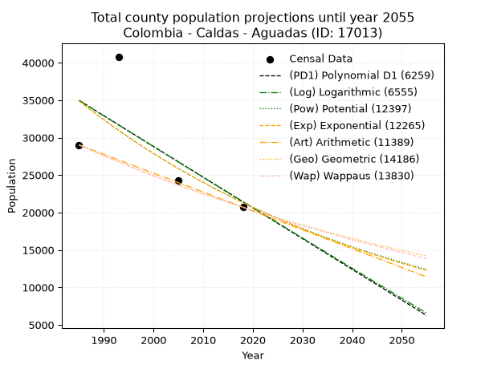
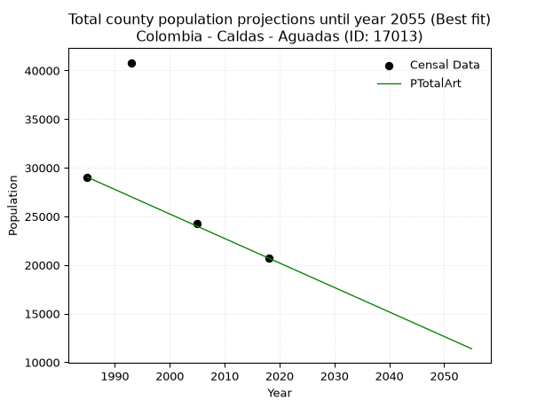
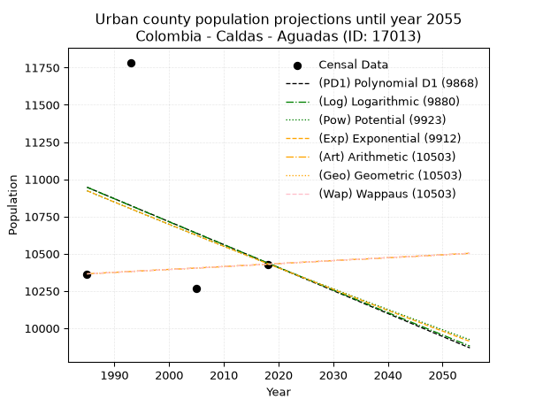
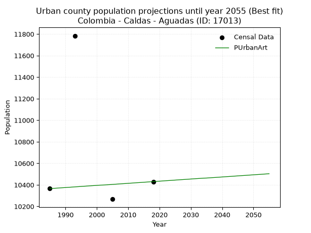
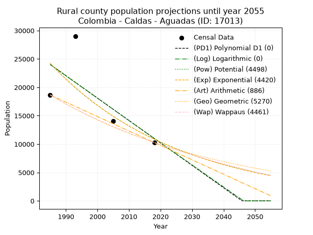
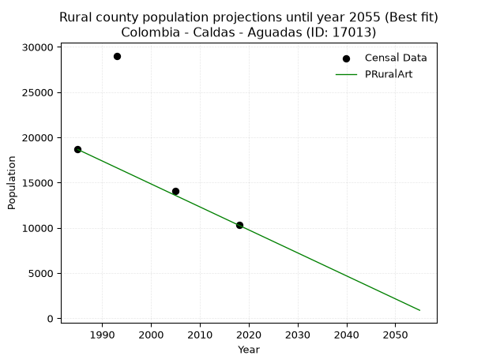

<div align="center">


</div>

# _“Population and Public Services Demand Projections (PPSD) until Year 2050 for Colombia - Caldas - Aguadas (ID: 17013)”_
Keywords: `population` `public-service` `projection` `lineal` `polynomial` `logarithmic` `potential` `exponential` `arithmetic` `geometric` `wappaus` `dane` `colombia` `south-america`

PPSD are analytical estimates used by governments and planners to anticipate future changes in population size, age distribution, and the resulting community needs for utilities, healthcare, education, and infrastructure as sizing future water treatment facilities, electrical grids, and road networks based on spatial growth.

> **General running parameters**: • app_version: _v20260806_. • Python version: _3.14.7_. • Pandas version: _3.0.5_. • NumPy version: _2.5.1_. • Creates, save and include plots into reports (create_plot): _True_. • Projection until year: _2050_. • Process polynomial degree 2 and up: _False_. • Process Wappaus: _True_. • Process Wappaus: _True_. • Set negative values to zero: _True_. • Set infinite values to zero: _True_. • Drop dataset notes: _True_. 
<div align="center">

Dynamic map: [:earth_americas:Google](http://maps.google.com/maps?q=5.610244266,-75.4548695) [:earth_americas:OSM](https://www.openstreetmap.org/#map=18/5.610244266/-75.4548695&layers=P) [:earth_americas:Bing](https://www.bing.com/maps?cp=5.610244266~-75.4548695&lvl=18) [:earth_americas:Apple](https://maps.apple.com/frame?center=5.610244266%2C-75.4548695&span=0.003%2C0.006)

</div>


<div align="center">

```geojson
{
  "type": "Feature",
  "geometry": {
    "type": "Point", 
    "coordinates": [-75.4548695, 5.610244266]
  }, 
  "properties": {
    "Name": "Colombia - Caldas - Aguadas (ID: 17013)"
  }
}
```

</div>


## 0. Census Data (4 records)

Census data are official statistics collected by a government about the people and housing in a country. They usually include counts of total population, age, sex, race, income, education, and jobs.

📅Global census file: [Population.xlsx](../data/Population.xlsx)

| Source   |   Year |   CountryID | CountryName   |   StateID | StateName   |   CountyID | CountyName   |   PTotal |   PUrban |   PRural |
|:---------|-------:|------------:|:--------------|----------:|:------------|-----------:|:-------------|---------:|---------:|---------:|
| DANE     |   1985 |          57 | Colombia      |        17 | Caldas      |      17013 | Aguadas      |    29027 |    10365 |    18662 |
| DANE     |   1993 |          57 | Colombia      |        17 | Caldas      |      17013 | Aguadas      |    40807 |    11784 |    29023 |
| DANE     |   2005 |          57 | Colombia      |        17 | Caldas      |      17013 | Aguadas      |    24308 |    10267 |    14041 |
| DANE     |   2018 |          57 | Colombia      |        17 | Caldas      |      17013 | Aguadas      |    20712 |    10430 |    10282 |

> 🔥Some records has specific notes about the registered values or the corresponding urban or rural distribution.

## 1. Total

### 1.1. Coefficients and Parameters

* (PD1) Polynomial Deg 1: -410.13488558811406, 849085.8048976251 (lineal)
* (Log) Logarithmic: -819978.1072379057, 6261373.66400749
* (Pow) Potential: -29.87054860900393, 103.04882327752951
* (Exp) Exponential: -0.014938828884017142, 2.6375511162442906e+17
* (Art) Arithmetic: Year diff. 2018 - 1985 = 33, Population diff. 20712 - 29027 = -8315, Annual growth = -251.96969696969697
* (Geo) Geometric: Year diff. 2018 - 1985 = 33, Population diff. 20712 - 29027 = -8315, Annual growth % = -0.010175547605357882
* (Wap) Wappaus: i = -1.013167522345431, Condition values only valid for < 200)

<sub>
Wappaus condition values: ['-0.00', '-1.01', '-2.03', '-3.04', '-4.05', '-5.07', '-6.08', '-7.09', '-8.11', '-9.12', '-10.13', '-11.14', '-12.16', '-13.17', '-14.18', '-15.20', '-16.21', '-17.22', '-18.24', '-19.25', '-20.26', '-21.28', '-22.29', '-23.30', '-24.32', '-25.33', '-26.34', '-27.36', '-28.37', '-29.38', '-30.40', '-31.41', '-32.42', '-33.43', '-34.45', '-35.46', '-36.47', '-37.49', '-38.50', '-39.51', '-40.53', '-41.54', '-42.55', '-43.57', '-44.58', '-45.59', '-46.61', '-47.62', '-48.63', '-49.65', '-50.66', '-51.67', '-52.68', '-53.70', '-54.71', '-55.72', '-56.74', '-57.75', '-58.76', '-59.78', '-60.79', '-61.80', '-62.82', '-63.83', '-64.84', '-65.86']
</sub>


### 1.2. Projected Dataset

|   Year |   CountyID |   PTotalPD1 |   PTotalLog |   PTotalPow |   PTotalExp |   PTotalArt |   PTotalGeo |   PTotalWap |
|-------:|-----------:|------------:|------------:|------------:|------------:|------------:|------------:|------------:|
|   1985 |      17013 |       34968 |       34973 |       34907 |       34899 |       29027 |       29027 |       29027 |
|   1986 |      17013 |       34558 |       34560 |       34385 |       34382 |       28775 |       28732 |       28734 |
|   1987 |      17013 |       34148 |       34147 |       33872 |       33872 |       28523 |       28439 |       28445 |
|   1988 |      17013 |       33738 |       33735 |       33367 |       33370 |       28271 |       28150 |       28158 |
|   1989 |      17013 |       33328 |       33322 |       32869 |       32875 |       28019 |       27863 |       27874 |
|   1990 |      17013 |       32917 |       32910 |       32380 |       32388 |       27767 |       27580 |       27593 |
|   1991 |      17013 |       32507 |       32498 |       31897 |       31907 |       27515 |       27299 |       27314 |
|   1992 |      17013 |       32097 |       32087 |       31423 |       31434 |       27263 |       27021 |       27039 |
|   1993 |      17013 |       31687 |       31675 |       30955 |       30968 |       27011 |       26747 |       26766 |
|   1994 |      17013 |       31277 |       31264 |       30495 |       30509 |       26759 |       26474 |       26496 |
|   1995 |      17013 |       30867 |       30853 |       30041 |       30056 |       26507 |       26205 |       26228 |
|   1996 |      17013 |       30457 |       30442 |       29595 |       29611 |       26255 |       25938 |       25963 |
|   1997 |      17013 |       30046 |       30031 |       29155 |       29172 |       26003 |       25674 |       25700 |
|   1998 |      17013 |       29636 |       29620 |       28723 |       28739 |       25751 |       25413 |       25440 |
|   1999 |      17013 |       29226 |       29210 |       28297 |       28313 |       25499 |       25155 |       25182 |
|   2000 |      17013 |       28816 |       28800 |       27877 |       27893 |       25247 |       24899 |       24927 |
|   2001 |      17013 |       28406 |       28390 |       27464 |       27480 |       24995 |       24645 |       24674 |
|   2002 |      17013 |       27996 |       27980 |       27057 |       27072 |       24744 |       24394 |       24424 |
|   2003 |      17013 |       27586 |       27571 |       26656 |       26671 |       24492 |       24146 |       24176 |
|   2004 |      17013 |       27175 |       27162 |       26262 |       26275 |       24240 |       23901 |       23930 |
|   2005 |      17013 |       26765 |       26753 |       25874 |       25886 |       23988 |       23657 |       23686 |
|   2006 |      17013 |       26355 |       26344 |       25491 |       25502 |       23736 |       23417 |       23445 |
|   2007 |      17013 |       25945 |       25935 |       25114 |       25124 |       23484 |       23178 |       23206 |
|   2008 |      17013 |       25535 |       25527 |       24743 |       24751 |       23232 |       22942 |       22969 |
|   2009 |      17013 |       25125 |       25118 |       24378 |       24384 |       22980 |       22709 |       22734 |
|   2010 |      17013 |       24715 |       24710 |       24018 |       24023 |       22728 |       22478 |       22501 |
|   2011 |      17013 |       24305 |       24303 |       23664 |       23666 |       22476 |       22249 |       22271 |
|   2012 |      17013 |       23894 |       23895 |       23315 |       23316 |       22224 |       22023 |       22042 |
|   2013 |      17013 |       23484 |       23487 |       22972 |       22970 |       21972 |       21799 |       21815 |
|   2014 |      17013 |       23074 |       23080 |       22634 |       22629 |       21720 |       21577 |       21591 |
|   2015 |      17013 |       22664 |       22673 |       22301 |       22294 |       21468 |       21357 |       21368 |
|   2016 |      17013 |       22254 |       22266 |       21972 |       21963 |       21216 |       21140 |       21148 |
|   2017 |      17013 |       21844 |       21860 |       21649 |       21637 |       20964 |       20925 |       20929 |
|   2018 |      17013 |       21434 |       21453 |       21331 |       21317 |       20712 |       20712 |       20712 |
|   2019 |      17013 |       21023 |       21047 |       21018 |       21001 |       20460 |       20501 |       20497 |
|   2020 |      17013 |       20613 |       20641 |       20709 |       20689 |       20208 |       20293 |       20284 |
|   2021 |      17013 |       20203 |       20235 |       20405 |       20382 |       19956 |       20086 |       20073 |
|   2022 |      17013 |       19793 |       19830 |       20106 |       20080 |       19704 |       19882 |       19863 |
|   2023 |      17013 |       19383 |       19424 |       19811 |       19782 |       19452 |       19679 |       19656 |
|   2024 |      17013 |       18973 |       19019 |       19521 |       19489 |       19200 |       19479 |       19450 |
|   2025 |      17013 |       18563 |       18614 |       19235 |       19200 |       18948 |       19281 |       19245 |
|   2026 |      17013 |       18153 |       18209 |       18953 |       18915 |       18696 |       19085 |       19043 |
|   2027 |      17013 |       17742 |       17804 |       18676 |       18635 |       18444 |       18891 |       18842 |
|   2028 |      17013 |       17332 |       17400 |       18403 |       18359 |       18192 |       18698 |       18643 |
|   2029 |      17013 |       16922 |       16996 |       18134 |       18086 |       17940 |       18508 |       18446 |
|   2030 |      17013 |       16512 |       16592 |       17869 |       17818 |       17688 |       18320 |       18250 |
|   2031 |      17013 |       16102 |       16188 |       17608 |       17554 |       17436 |       18133 |       18055 |
|   2032 |      17013 |       15692 |       15784 |       17351 |       17294 |       17184 |       17949 |       17863 |
|   2033 |      17013 |       15282 |       15381 |       17098 |       17037 |       16932 |       17766 |       17672 |
|   2034 |      17013 |       14871 |       14978 |       16849 |       16785 |       16680 |       17585 |       17482 |
|   2035 |      17013 |       14461 |       14575 |       16603 |       16536 |       16429 |       17406 |       17294 |
|   2036 |      17013 |       14051 |       14172 |       16361 |       16291 |       16177 |       17229 |       17108 |
|   2037 |      17013 |       13641 |       13769 |       16123 |       16049 |       15925 |       17054 |       16923 |
|   2038 |      17013 |       13231 |       13367 |       15888 |       15811 |       15673 |       16881 |       16739 |
|   2039 |      17013 |       12821 |       12964 |       15657 |       15577 |       15421 |       16709 |       16557 |
|   2040 |      17013 |       12411 |       12562 |       15430 |       15346 |       15169 |       16539 |       16377 |
|   2041 |      17013 |       12001 |       12160 |       15205 |       15118 |       14917 |       16370 |       16197 |
|   2042 |      17013 |       11590 |       11759 |       14985 |       14894 |       14665 |       16204 |       16020 |
|   2043 |      17013 |       11180 |       11357 |       14767 |       14673 |       14413 |       16039 |       15843 |
|   2044 |      17013 |       10770 |       10956 |       14553 |       14456 |       14161 |       15876 |       15668 |
|   2045 |      17013 |       10360 |       10555 |       14342 |       14241 |       13909 |       15714 |       15495 |
|   2046 |      17013 |        9950 |       10154 |       14134 |       14030 |       13657 |       15554 |       15322 |
|   2047 |      17013 |        9540 |        9753 |       13929 |       13822 |       13405 |       15396 |       15151 |
|   2048 |      17013 |        9130 |        9353 |       13727 |       13617 |       13153 |       15239 |       14982 |
|   2049 |      17013 |        8719 |        8953 |       13528 |       13415 |       12901 |       15084 |       14813 |
|   2050 |      17013 |        8309 |        8553 |       13333 |       13216 |       12649 |       14931 |       14646 |
<div align="center">

</img>

</div>


### 1.3. Best fit with absolute error and relative error (%)

Relative error puts that difference into context by dividing the absolute error by the true value, creating a unitless ratio or percentage that shows the scale of the mistake.

Absolute and relative error

|   Year | Source   |   CountryID | CountryName   |   StateID | StateName   |   CountyID_x | CountyName   |   PTotal |   PUrban |   PRural |   CountyID_y |   PTotalPD1 |   PTotalLog |   PTotalPow |   PTotalExp |   PTotalArt |   PTotalGeo |   PTotalWap |   PTotalPD1AbsError |   PTotalLogAbsError |   PTotalPowAbsError |   PTotalExpAbsError |   PTotalArtAbsError |   PTotalGeoAbsError |   PTotalWapAbsError |   PTotalPD1RelError |   PTotalLogRelError |   PTotalPowRelError |   PTotalExpRelError |   PTotalArtRelError |   PTotalGeoRelError |   PTotalWapRelError |
|-------:|:---------|------------:|:--------------|----------:|:------------|-------------:|:-------------|---------:|---------:|---------:|-------------:|------------:|------------:|------------:|------------:|------------:|------------:|------------:|--------------------:|--------------------:|--------------------:|--------------------:|--------------------:|--------------------:|--------------------:|--------------------:|--------------------:|--------------------:|--------------------:|--------------------:|--------------------:|--------------------:|
|   1985 | DANE     |          57 | Colombia      |        17 | Caldas      |        17013 | Aguadas      |    29027 |    10365 |    18662 |        17013 |       34968 |       34973 |       34907 |       34899 |       29027 |       29027 |       29027 |                5941 |                5946 |                5880 |                5872 |                   0 |                   0 |                   0 |             20.4672 |            20.4844  |            20.257   |            20.2294  |             0       |             0       |             0       |
|   1993 | DANE     |          57 | Colombia      |        17 | Caldas      |        17013 | Aguadas      |    40807 |    11784 |    29023 |        17013 |       31687 |       31675 |       30955 |       30968 |       27011 |       26747 |       26766 |                9120 |                9132 |                9852 |                9839 |               13796 |               14060 |               14041 |             22.3491 |            22.3785  |            24.1429  |            24.1111  |            33.8079  |            34.4549  |            34.4083  |
|   2005 | DANE     |          57 | Colombia      |        17 | Caldas      |        17013 | Aguadas      |    24308 |    10267 |    14041 |        17013 |       26765 |       26753 |       25874 |       25886 |       23988 |       23657 |       23686 |                2457 |                2445 |                1566 |                1578 |                 320 |                 651 |                 622 |             10.1078 |            10.0584  |             6.44232 |             6.49169 |             1.31644 |             2.67813 |             2.55883 |
|   2018 | DANE     |          57 | Colombia      |        17 | Caldas      |        17013 | Aguadas      |    20712 |    10430 |    10282 |        17013 |       21434 |       21453 |       21331 |       21317 |       20712 |       20712 |       20712 |                 722 |                 741 |                 619 |                 605 |                   0 |                   0 |                   0 |              3.4859 |             3.57764 |             2.98861 |             2.92101 |             0       |             0       |             0       |

Relative error mean

| Method    |   RelError | Best   |
|:----------|-----------:|:-------|
| PTotalPD1 |   14.1025  |        |
| PTotalLog |   14.1247  |        |
| PTotalPow |   13.4577  |        |
| PTotalExp |   13.4383  |        |
| PTotalArt |    8.78109 | True   |
| PTotalGeo |    9.28325 |        |
| PTotalWap |    9.24179 |        |

💙Best method: _**PTotalArt**_
<div align="center">

</img>

</div>


### 1.4. Fresh water supply demand in liters per capita per day (lpcd)

The fresh water supply demand typically ranges from 100 to 300 liters per capita per day (lpcd) for standard domestic and municipal planning, though absolute survival minimums set by the World Health Organization are as low as 7.5 to 20 liters per day, and total consumption in high-income nations can exceed 400 liters.

> `CZ`: Level in meters above the sea level (masl).<br> `WS`: Fresh water supply demand in liters per capita per day (lpcd or l/h/d).<br> `WSAll`: Zonal fresh water supply demand in liters per second (l/s).<br> `A`: Zonal area in square meters.

Reference values (RAS Colombia)

|    CZ |   WS |
|------:|-----:|
|  1000 |  120 |
|  2000 |  130 |
| 99999 |  140 |

County shapefile geometry properties and water supply values

|   CountyID |      ATotal |   CZTotal |   WSTotal |
|-----------:|------------:|----------:|----------:|
|      17013 | 4.75551e+08 |   1813.94 |       130 |

Projected values for best method: PTotalArt

|   CountyID |   Year |   PTotalArt |   WSTotal |   WSTotalAll |
|-----------:|-------:|------------:|----------:|-------------:|
|      17013 |   1985 |       29027 |       130 |      43.6749 |
|      17013 |   1986 |       28775 |       130 |      43.2957 |
|      17013 |   1987 |       28523 |       130 |      42.9166 |
|      17013 |   1988 |       28271 |       130 |      42.5374 |
|      17013 |   1989 |       28019 |       130 |      42.1582 |
|      17013 |   1990 |       27767 |       130 |      41.7791 |
|      17013 |   1991 |       27515 |       130 |      41.3999 |
|      17013 |   1992 |       27263 |       130 |      41.0207 |
|      17013 |   1993 |       27011 |       130 |      40.6416 |
|      17013 |   1994 |       26759 |       130 |      40.2624 |
|      17013 |   1995 |       26507 |       130 |      39.8832 |
|      17013 |   1996 |       26255 |       130 |      39.5041 |
|      17013 |   1997 |       26003 |       130 |      39.1249 |
|      17013 |   1998 |       25751 |       130 |      38.7457 |
|      17013 |   1999 |       25499 |       130 |      38.3666 |
|      17013 |   2000 |       25247 |       130 |      37.9874 |
|      17013 |   2001 |       24995 |       130 |      37.6082 |
|      17013 |   2002 |       24744 |       130 |      37.2306 |
|      17013 |   2003 |       24492 |       130 |      36.8514 |
|      17013 |   2004 |       24240 |       130 |      36.4722 |
|      17013 |   2005 |       23988 |       130 |      36.0931 |
|      17013 |   2006 |       23736 |       130 |      35.7139 |
|      17013 |   2007 |       23484 |       130 |      35.3347 |
|      17013 |   2008 |       23232 |       130 |      34.9556 |
|      17013 |   2009 |       22980 |       130 |      34.5764 |
|      17013 |   2010 |       22728 |       130 |      34.1972 |
|      17013 |   2011 |       22476 |       130 |      33.8181 |
|      17013 |   2012 |       22224 |       130 |      33.4389 |
|      17013 |   2013 |       21972 |       130 |      33.0597 |
|      17013 |   2014 |       21720 |       130 |      32.6806 |
|      17013 |   2015 |       21468 |       130 |      32.3014 |
|      17013 |   2016 |       21216 |       130 |      31.9222 |
|      17013 |   2017 |       20964 |       130 |      31.5431 |
|      17013 |   2018 |       20712 |       130 |      31.1639 |
|      17013 |   2019 |       20460 |       130 |      30.7847 |
|      17013 |   2020 |       20208 |       130 |      30.4056 |
|      17013 |   2021 |       19956 |       130 |      30.0264 |
|      17013 |   2022 |       19704 |       130 |      29.6472 |
|      17013 |   2023 |       19452 |       130 |      29.2681 |
|      17013 |   2024 |       19200 |       130 |      28.8889 |
|      17013 |   2025 |       18948 |       130 |      28.5097 |
|      17013 |   2026 |       18696 |       130 |      28.1306 |
|      17013 |   2027 |       18444 |       130 |      27.7514 |
|      17013 |   2028 |       18192 |       130 |      27.3722 |
|      17013 |   2029 |       17940 |       130 |      26.9931 |
|      17013 |   2030 |       17688 |       130 |      26.6139 |
|      17013 |   2031 |       17436 |       130 |      26.2347 |
|      17013 |   2032 |       17184 |       130 |      25.8556 |
|      17013 |   2033 |       16932 |       130 |      25.4764 |
|      17013 |   2034 |       16680 |       130 |      25.0972 |
|      17013 |   2035 |       16429 |       130 |      24.7196 |
|      17013 |   2036 |       16177 |       130 |      24.3404 |
|      17013 |   2037 |       15925 |       130 |      23.9612 |
|      17013 |   2038 |       15673 |       130 |      23.5821 |
|      17013 |   2039 |       15421 |       130 |      23.2029 |
|      17013 |   2040 |       15169 |       130 |      22.8237 |
|      17013 |   2041 |       14917 |       130 |      22.4446 |
|      17013 |   2042 |       14665 |       130 |      22.0654 |
|      17013 |   2043 |       14413 |       130 |      21.6862 |
|      17013 |   2044 |       14161 |       130 |      21.3071 |
|      17013 |   2045 |       13909 |       130 |      20.9279 |
|      17013 |   2046 |       13657 |       130 |      20.5487 |
|      17013 |   2047 |       13405 |       130 |      20.1696 |
|      17013 |   2048 |       13153 |       130 |      19.7904 |
|      17013 |   2049 |       12901 |       130 |      19.4112 |
|      17013 |   2050 |       12649 |       130 |      19.0321 |

## 2. Urban

### 2.1. Coefficients and Parameters

* (PD1) Polynomial Deg 1: -15.414692894419971, 41544.73946206355 (lineal)
* (Log) Logarithmic: -30777.05998991413, 244648.17961521767
* (Pow) Potential: -2.771416405483056, 13.177803208538784
* (Exp) Exponential: -0.0013880247277727599, 171759.6476778904
* (Art) Arithmetic: Year diff. 2018 - 1985 = 33, Population diff. 10430 - 10365 = 65, Annual growth = 1.9696969696969697
* (Geo) Geometric: Year diff. 2018 - 1985 = 33, Population diff. 10430 - 10365 = 65, Annual growth % = 0.00018945803960290775
* (Wap) Wappaus: i = 0.018943947772993217, Condition values only valid for < 200)

<sub>
Wappaus condition values: ['0.00', '0.02', '0.04', '0.06', '0.08', '0.09', '0.11', '0.13', '0.15', '0.17', '0.19', '0.21', '0.23', '0.25', '0.27', '0.28', '0.30', '0.32', '0.34', '0.36', '0.38', '0.40', '0.42', '0.44', '0.45', '0.47', '0.49', '0.51', '0.53', '0.55', '0.57', '0.59', '0.61', '0.63', '0.64', '0.66', '0.68', '0.70', '0.72', '0.74', '0.76', '0.78', '0.80', '0.81', '0.83', '0.85', '0.87', '0.89', '0.91', '0.93', '0.95', '0.97', '0.99', '1.00', '1.02', '1.04', '1.06', '1.08', '1.10', '1.12', '1.14', '1.16', '1.17', '1.19', '1.21', '1.23']
</sub>


### 2.2. Projected Dataset

|   Year |   CountyID |   PUrbanPD1 |   PUrbanLog |   PUrbanPow |   PUrbanExp |   PUrbanArt |   PUrbanGeo |   PUrbanWap |
|-------:|-----------:|------------:|------------:|------------:|------------:|------------:|------------:|------------:|
|   1985 |      17013 |       10947 |       10946 |       10923 |       10923 |       10365 |       10365 |       10365 |
|   1986 |      17013 |       10931 |       10931 |       10908 |       10908 |       10367 |       10367 |       10367 |
|   1987 |      17013 |       10916 |       10915 |       10892 |       10893 |       10369 |       10369 |       10369 |
|   1988 |      17013 |       10900 |       10900 |       10877 |       10878 |       10371 |       10371 |       10371 |
|   1989 |      17013 |       10885 |       10884 |       10862 |       10862 |       10373 |       10373 |       10373 |
|   1990 |      17013 |       10870 |       10869 |       10847 |       10847 |       10375 |       10375 |       10375 |
|   1991 |      17013 |       10854 |       10854 |       10832 |       10832 |       10377 |       10377 |       10377 |
|   1992 |      17013 |       10839 |       10838 |       10817 |       10817 |       10379 |       10379 |       10379 |
|   1993 |      17013 |       10823 |       10823 |       10802 |       10802 |       10381 |       10381 |       10381 |
|   1994 |      17013 |       10808 |       10807 |       10787 |       10787 |       10383 |       10383 |       10383 |
|   1995 |      17013 |       10792 |       10792 |       10772 |       10772 |       10385 |       10385 |       10385 |
|   1996 |      17013 |       10777 |       10776 |       10757 |       10757 |       10387 |       10387 |       10387 |
|   1997 |      17013 |       10762 |       10761 |       10742 |       10743 |       10389 |       10389 |       10389 |
|   1998 |      17013 |       10746 |       10746 |       10727 |       10728 |       10391 |       10391 |       10391 |
|   1999 |      17013 |       10731 |       10730 |       10712 |       10713 |       10393 |       10393 |       10393 |
|   2000 |      17013 |       10715 |       10715 |       10697 |       10698 |       10395 |       10394 |       10394 |
|   2001 |      17013 |       10700 |       10699 |       10682 |       10683 |       10397 |       10396 |       10396 |
|   2002 |      17013 |       10685 |       10684 |       10668 |       10668 |       10398 |       10398 |       10398 |
|   2003 |      17013 |       10669 |       10669 |       10653 |       10653 |       10400 |       10400 |       10400 |
|   2004 |      17013 |       10654 |       10653 |       10638 |       10639 |       10402 |       10402 |       10402 |
|   2005 |      17013 |       10638 |       10638 |       10624 |       10624 |       10404 |       10404 |       10404 |
|   2006 |      17013 |       10623 |       10623 |       10609 |       10609 |       10406 |       10406 |       10406 |
|   2007 |      17013 |       10607 |       10607 |       10594 |       10594 |       10408 |       10408 |       10408 |
|   2008 |      17013 |       10592 |       10592 |       10580 |       10580 |       10410 |       10410 |       10410 |
|   2009 |      17013 |       10577 |       10577 |       10565 |       10565 |       10412 |       10412 |       10412 |
|   2010 |      17013 |       10561 |       10561 |       10550 |       10550 |       10414 |       10414 |       10414 |
|   2011 |      17013 |       10546 |       10546 |       10536 |       10536 |       10416 |       10416 |       10416 |
|   2012 |      17013 |       10530 |       10531 |       10521 |       10521 |       10418 |       10418 |       10418 |
|   2013 |      17013 |       10515 |       10515 |       10507 |       10507 |       10420 |       10420 |       10420 |
|   2014 |      17013 |       10500 |       10500 |       10492 |       10492 |       10422 |       10422 |       10422 |
|   2015 |      17013 |       10484 |       10485 |       10478 |       10477 |       10424 |       10424 |       10424 |
|   2016 |      17013 |       10469 |       10470 |       10464 |       10463 |       10426 |       10426 |       10426 |
|   2017 |      17013 |       10453 |       10454 |       10449 |       10448 |       10428 |       10428 |       10428 |
|   2018 |      17013 |       10438 |       10439 |       10435 |       10434 |       10430 |       10430 |       10430 |
|   2019 |      17013 |       10422 |       10424 |       10421 |       10419 |       10432 |       10432 |       10432 |
|   2020 |      17013 |       10407 |       10409 |       10406 |       10405 |       10434 |       10434 |       10434 |
|   2021 |      17013 |       10392 |       10393 |       10392 |       10391 |       10436 |       10436 |       10436 |
|   2022 |      17013 |       10376 |       10378 |       10378 |       10376 |       10438 |       10438 |       10438 |
|   2023 |      17013 |       10361 |       10363 |       10364 |       10362 |       10440 |       10440 |       10440 |
|   2024 |      17013 |       10345 |       10348 |       10349 |       10347 |       10442 |       10442 |       10442 |
|   2025 |      17013 |       10330 |       10332 |       10335 |       10333 |       10444 |       10444 |       10444 |
|   2026 |      17013 |       10315 |       10317 |       10321 |       10319 |       10446 |       10446 |       10446 |
|   2027 |      17013 |       10299 |       10302 |       10307 |       10304 |       10448 |       10448 |       10448 |
|   2028 |      17013 |       10284 |       10287 |       10293 |       10290 |       10450 |       10450 |       10450 |
|   2029 |      17013 |       10268 |       10272 |       10279 |       10276 |       10452 |       10452 |       10452 |
|   2030 |      17013 |       10253 |       10257 |       10265 |       10262 |       10454 |       10454 |       10454 |
|   2031 |      17013 |       10237 |       10241 |       10251 |       10247 |       10456 |       10456 |       10456 |
|   2032 |      17013 |       10222 |       10226 |       10237 |       10233 |       10458 |       10458 |       10458 |
|   2033 |      17013 |       10207 |       10211 |       10223 |       10219 |       10460 |       10460 |       10460 |
|   2034 |      17013 |       10191 |       10196 |       10209 |       10205 |       10462 |       10462 |       10462 |
|   2035 |      17013 |       10176 |       10181 |       10195 |       10191 |       10463 |       10464 |       10464 |
|   2036 |      17013 |       10160 |       10166 |       10181 |       10176 |       10465 |       10466 |       10466 |
|   2037 |      17013 |       10145 |       10151 |       10167 |       10162 |       10467 |       10468 |       10468 |
|   2038 |      17013 |       10130 |       10135 |       10154 |       10148 |       10469 |       10470 |       10470 |
|   2039 |      17013 |       10114 |       10120 |       10140 |       10134 |       10471 |       10472 |       10472 |
|   2040 |      17013 |       10099 |       10105 |       10126 |       10120 |       10473 |       10474 |       10474 |
|   2041 |      17013 |       10083 |       10090 |       10112 |       10106 |       10475 |       10476 |       10476 |
|   2042 |      17013 |       10068 |       10075 |       10099 |       10092 |       10477 |       10478 |       10478 |
|   2043 |      17013 |       10053 |       10060 |       10085 |       10078 |       10479 |       10480 |       10480 |
|   2044 |      17013 |       10037 |       10045 |       10071 |       10064 |       10481 |       10481 |       10481 |
|   2045 |      17013 |       10022 |       10030 |       10058 |       10050 |       10483 |       10483 |       10483 |
|   2046 |      17013 |       10006 |       10015 |       10044 |       10036 |       10485 |       10485 |       10485 |
|   2047 |      17013 |        9991 |       10000 |       10030 |       10022 |       10487 |       10487 |       10487 |
|   2048 |      17013 |        9975 |        9985 |       10017 |       10008 |       10489 |       10489 |       10489 |
|   2049 |      17013 |        9960 |        9970 |       10003 |        9994 |       10491 |       10491 |       10491 |
|   2050 |      17013 |        9945 |        9955 |        9990 |        9981 |       10493 |       10493 |       10493 |
<div align="center">

</img>

</div>


### 2.3. Best fit with absolute error and relative error (%)

Relative error puts that difference into context by dividing the absolute error by the true value, creating a unitless ratio or percentage that shows the scale of the mistake.

Absolute and relative error

|   Year | Source   |   CountryID | CountryName   |   StateID | StateName   |   CountyID_x | CountyName   |   PTotal |   PUrban |   PRural |   CountyID_y |   PUrbanPD1 |   PUrbanLog |   PUrbanPow |   PUrbanExp |   PUrbanArt |   PUrbanGeo |   PUrbanWap |   PUrbanPD1AbsError |   PUrbanLogAbsError |   PUrbanPowAbsError |   PUrbanExpAbsError |   PUrbanArtAbsError |   PUrbanGeoAbsError |   PUrbanWapAbsError |   PUrbanPD1RelError |   PUrbanLogRelError |   PUrbanPowRelError |   PUrbanExpRelError |   PUrbanArtRelError |   PUrbanGeoRelError |   PUrbanWapRelError |
|-------:|:---------|------------:|:--------------|----------:|:------------|-------------:|:-------------|---------:|---------:|---------:|-------------:|------------:|------------:|------------:|------------:|------------:|------------:|------------:|--------------------:|--------------------:|--------------------:|--------------------:|--------------------:|--------------------:|--------------------:|--------------------:|--------------------:|--------------------:|--------------------:|--------------------:|--------------------:|--------------------:|
|   1985 | DANE     |          57 | Colombia      |        17 | Caldas      |        17013 | Aguadas      |    29027 |    10365 |    18662 |        17013 |       10947 |       10946 |       10923 |       10923 |       10365 |       10365 |       10365 |                 582 |                 581 |                 558 |                 558 |                   0 |                   0 |                   0 |           5.61505   |           5.6054    |           5.3835    |           5.3835    |             0       |             0       |             0       |
|   1993 | DANE     |          57 | Colombia      |        17 | Caldas      |        17013 | Aguadas      |    40807 |    11784 |    29023 |        17013 |       10823 |       10823 |       10802 |       10802 |       10381 |       10381 |       10381 |                 961 |                 961 |                 982 |                 982 |                1403 |                1403 |                1403 |           8.15513   |           8.15513   |           8.33333   |           8.33333   |            11.906   |            11.906   |            11.906   |
|   2005 | DANE     |          57 | Colombia      |        17 | Caldas      |        17013 | Aguadas      |    24308 |    10267 |    14041 |        17013 |       10638 |       10638 |       10624 |       10624 |       10404 |       10404 |       10404 |                 371 |                 371 |                 357 |                 357 |                 137 |                 137 |                 137 |           3.61352   |           3.61352   |           3.47716   |           3.47716   |             1.33437 |             1.33437 |             1.33437 |
|   2018 | DANE     |          57 | Colombia      |        17 | Caldas      |        17013 | Aguadas      |    20712 |    10430 |    10282 |        17013 |       10438 |       10439 |       10435 |       10434 |       10430 |       10430 |       10430 |                   8 |                   9 |                   5 |                   4 |                   0 |                   0 |                   0 |           0.0767018 |           0.0862895 |           0.0479386 |           0.0383509 |             0       |             0       |             0       |

Relative error mean

| Method    |   RelError | Best   |
|:----------|-----------:|:-------|
| PUrbanPD1 |    4.3651  |        |
| PUrbanLog |    4.36508 |        |
| PUrbanPow |    4.31048 |        |
| PUrbanExp |    4.30809 |        |
| PUrbanArt |    3.31009 | True   |
| PUrbanGeo |    3.31009 | True   |
| PUrbanWap |    3.31009 | True   |

💙Best method: _**PUrbanArt**_
<div align="center">

</img>

</div>


### 2.4. Fresh water supply demand in liters per capita per day (lpcd)

The fresh water supply demand typically ranges from 100 to 300 liters per capita per day (lpcd) for standard domestic and municipal planning, though absolute survival minimums set by the World Health Organization are as low as 7.5 to 20 liters per day, and total consumption in high-income nations can exceed 400 liters.

> `CZ`: Level in meters above the sea level (masl).<br> `WS`: Fresh water supply demand in liters per capita per day (lpcd or l/h/d).<br> `WSAll`: Zonal fresh water supply demand in liters per second (l/s).<br> `A`: Zonal area in square meters.

Reference values (RAS Colombia)

|    CZ |   WS |
|------:|-----:|
|  1000 |  120 |
|  2000 |  130 |
| 99999 |  140 |

County shapefile geometry properties and water supply values

|   CountyID |     AUrban |   CZUrban |   WSUrban |
|-----------:|-----------:|----------:|----------:|
|      17013 | 1.2769e+06 |   2172.73 |       140 |

Projected values for best method: PUrbanArt

|   CountyID |   Year |   PUrbanArt |   WSUrban |   WSUrbanAll |
|-----------:|-------:|------------:|----------:|-------------:|
|      17013 |   1985 |       10365 |       140 |      16.7951 |
|      17013 |   1986 |       10367 |       140 |      16.7984 |
|      17013 |   1987 |       10369 |       140 |      16.8016 |
|      17013 |   1988 |       10371 |       140 |      16.8049 |
|      17013 |   1989 |       10373 |       140 |      16.8081 |
|      17013 |   1990 |       10375 |       140 |      16.8113 |
|      17013 |   1991 |       10377 |       140 |      16.8146 |
|      17013 |   1992 |       10379 |       140 |      16.8178 |
|      17013 |   1993 |       10381 |       140 |      16.8211 |
|      17013 |   1994 |       10383 |       140 |      16.8243 |
|      17013 |   1995 |       10385 |       140 |      16.8275 |
|      17013 |   1996 |       10387 |       140 |      16.8308 |
|      17013 |   1997 |       10389 |       140 |      16.834  |
|      17013 |   1998 |       10391 |       140 |      16.8373 |
|      17013 |   1999 |       10393 |       140 |      16.8405 |
|      17013 |   2000 |       10395 |       140 |      16.8438 |
|      17013 |   2001 |       10397 |       140 |      16.847  |
|      17013 |   2002 |       10398 |       140 |      16.8486 |
|      17013 |   2003 |       10400 |       140 |      16.8519 |
|      17013 |   2004 |       10402 |       140 |      16.8551 |
|      17013 |   2005 |       10404 |       140 |      16.8583 |
|      17013 |   2006 |       10406 |       140 |      16.8616 |
|      17013 |   2007 |       10408 |       140 |      16.8648 |
|      17013 |   2008 |       10410 |       140 |      16.8681 |
|      17013 |   2009 |       10412 |       140 |      16.8713 |
|      17013 |   2010 |       10414 |       140 |      16.8745 |
|      17013 |   2011 |       10416 |       140 |      16.8778 |
|      17013 |   2012 |       10418 |       140 |      16.881  |
|      17013 |   2013 |       10420 |       140 |      16.8843 |
|      17013 |   2014 |       10422 |       140 |      16.8875 |
|      17013 |   2015 |       10424 |       140 |      16.8907 |
|      17013 |   2016 |       10426 |       140 |      16.894  |
|      17013 |   2017 |       10428 |       140 |      16.8972 |
|      17013 |   2018 |       10430 |       140 |      16.9005 |
|      17013 |   2019 |       10432 |       140 |      16.9037 |
|      17013 |   2020 |       10434 |       140 |      16.9069 |
|      17013 |   2021 |       10436 |       140 |      16.9102 |
|      17013 |   2022 |       10438 |       140 |      16.9134 |
|      17013 |   2023 |       10440 |       140 |      16.9167 |
|      17013 |   2024 |       10442 |       140 |      16.9199 |
|      17013 |   2025 |       10444 |       140 |      16.9231 |
|      17013 |   2026 |       10446 |       140 |      16.9264 |
|      17013 |   2027 |       10448 |       140 |      16.9296 |
|      17013 |   2028 |       10450 |       140 |      16.9329 |
|      17013 |   2029 |       10452 |       140 |      16.9361 |
|      17013 |   2030 |       10454 |       140 |      16.9394 |
|      17013 |   2031 |       10456 |       140 |      16.9426 |
|      17013 |   2032 |       10458 |       140 |      16.9458 |
|      17013 |   2033 |       10460 |       140 |      16.9491 |
|      17013 |   2034 |       10462 |       140 |      16.9523 |
|      17013 |   2035 |       10463 |       140 |      16.9539 |
|      17013 |   2036 |       10465 |       140 |      16.9572 |
|      17013 |   2037 |       10467 |       140 |      16.9604 |
|      17013 |   2038 |       10469 |       140 |      16.9637 |
|      17013 |   2039 |       10471 |       140 |      16.9669 |
|      17013 |   2040 |       10473 |       140 |      16.9701 |
|      17013 |   2041 |       10475 |       140 |      16.9734 |
|      17013 |   2042 |       10477 |       140 |      16.9766 |
|      17013 |   2043 |       10479 |       140 |      16.9799 |
|      17013 |   2044 |       10481 |       140 |      16.9831 |
|      17013 |   2045 |       10483 |       140 |      16.9863 |
|      17013 |   2046 |       10485 |       140 |      16.9896 |
|      17013 |   2047 |       10487 |       140 |      16.9928 |
|      17013 |   2048 |       10489 |       140 |      16.9961 |
|      17013 |   2049 |       10491 |       140 |      16.9993 |
|      17013 |   2050 |       10493 |       140 |      17.0025 |

## 3. Rural

### 3.1. Coefficients and Parameters

* (PD1) Polynomial Deg 1: -394.7201926936941, 807541.0654355616 (lineal)
* (Log) Logarithmic: -789201.0472479914, 6016725.4843922695
* (Pow) Potential: -48.59409758967194, 164.63609541351525
* (Exp) Exponential: -0.024301381141620188, 2.1569694062301134e+25
* (Art) Arithmetic: Year diff. 2018 - 1985 = 33, Population diff. 10282 - 18662 = -8380, Annual growth = -253.93939393939394
* (Geo) Geometric: Year diff. 2018 - 1985 = 33, Population diff. 10282 - 18662 = -8380, Annual growth % = -0.01790130542344681
* (Wap) Wappaus: i = -1.7546945407641925, Condition values only valid for < 200)

<sub>
Wappaus condition values: ['-0.00', '-1.75', '-3.51', '-5.26', '-7.02', '-8.77', '-10.53', '-12.28', '-14.04', '-15.79', '-17.55', '-19.30', '-21.06', '-22.81', '-24.57', '-26.32', '-28.08', '-29.83', '-31.58', '-33.34', '-35.09', '-36.85', '-38.60', '-40.36', '-42.11', '-43.87', '-45.62', '-47.38', '-49.13', '-50.89', '-52.64', '-54.40', '-56.15', '-57.90', '-59.66', '-61.41', '-63.17', '-64.92', '-66.68', '-68.43', '-70.19', '-71.94', '-73.70', '-75.45', '-77.21', '-78.96', '-80.72', '-82.47', '-84.23', '-85.98', '-87.73', '-89.49', '-91.24', '-93.00', '-94.75', '-96.51', '-98.26', '-100.02', '-101.77', '-103.53', '-105.28', '-107.04', '-108.79', '-110.55', '-112.30', '-114.06']
</sub>


### 3.2. Projected Dataset

|   Year |   CountyID |   PRuralPD1 |   PRuralLog |   PRuralPow |   PRuralExp |   PRuralArt |   PRuralGeo |   PRuralWap |
|-------:|-----------:|------------:|------------:|------------:|------------:|------------:|------------:|------------:|
|   1985 |      17013 |       24021 |       24027 |       24233 |       24224 |       18662 |       18662 |       18662 |
|   1986 |      17013 |       23627 |       23629 |       23647 |       23642 |       18408 |       18328 |       18337 |
|   1987 |      17013 |       23232 |       23232 |       23075 |       23075 |       18154 |       18000 |       18018 |
|   1988 |      17013 |       22837 |       22835 |       22518 |       22521 |       17900 |       17678 |       17705 |
|   1989 |      17013 |       22443 |       22438 |       21974 |       21980 |       17646 |       17361 |       17397 |
|   1990 |      17013 |       22048 |       22041 |       21444 |       21452 |       17392 |       17050 |       17094 |
|   1991 |      17013 |       21653 |       21645 |       20927 |       20937 |       17138 |       16745 |       16795 |
|   1992 |      17013 |       21258 |       21248 |       20422 |       20435 |       16884 |       16445 |       16502 |
|   1993 |      17013 |       20864 |       20852 |       19930 |       19944 |       16630 |       16151 |       16214 |
|   1994 |      17013 |       20469 |       20456 |       19450 |       19465 |       16377 |       15862 |       15931 |
|   1995 |      17013 |       20074 |       20061 |       18982 |       18998 |       16123 |       15578 |       15652 |
|   1996 |      17013 |       19680 |       19665 |       18526 |       18542 |       15869 |       15299 |       15377 |
|   1997 |      17013 |       19285 |       19270 |       18080 |       18096 |       15615 |       15025 |       15107 |
|   1998 |      17013 |       18890 |       18875 |       17646 |       17662 |       15361 |       14756 |       14841 |
|   1999 |      17013 |       18495 |       18480 |       17222 |       17238 |       15107 |       14492 |       14579 |
|   2000 |      17013 |       18101 |       18085 |       16808 |       16824 |       14853 |       14233 |       14321 |
|   2001 |      17013 |       17706 |       17691 |       16405 |       16420 |       14599 |       13978 |       14068 |
|   2002 |      17013 |       17311 |       17296 |       16011 |       16026 |       14345 |       13728 |       13818 |
|   2003 |      17013 |       16917 |       16902 |       15627 |       15641 |       14091 |       13482 |       13572 |
|   2004 |      17013 |       16522 |       16508 |       15253 |       15266 |       13837 |       13241 |       13329 |
|   2005 |      17013 |       16127 |       16115 |       14888 |       14899 |       13583 |       13004 |       13090 |
|   2006 |      17013 |       15732 |       15721 |       14531 |       14541 |       13329 |       12771 |       12855 |
|   2007 |      17013 |       15338 |       15328 |       14184 |       14192 |       13075 |       12542 |       12623 |
|   2008 |      17013 |       14943 |       14935 |       13844 |       13852 |       12821 |       12318 |       12395 |
|   2009 |      17013 |       14548 |       14542 |       13513 |       13519 |       12567 |       12097 |       12170 |
|   2010 |      17013 |       14153 |       14149 |       13191 |       13195 |       12314 |       11881 |       11948 |
|   2011 |      17013 |       13759 |       13757 |       12876 |       12878 |       12060 |       11668 |       11729 |
|   2012 |      17013 |       13364 |       13364 |       12568 |       12569 |       11806 |       11459 |       11514 |
|   2013 |      17013 |       12969 |       12972 |       12268 |       12267 |       11552 |       11254 |       11301 |
|   2014 |      17013 |       12575 |       12580 |       11976 |       11972 |       11298 |       11052 |       11092 |
|   2015 |      17013 |       12180 |       12188 |       11690 |       11685 |       11044 |       10855 |       10885 |
|   2016 |      17013 |       11785 |       11797 |       11412 |       11404 |       10790 |       10660 |       10681 |
|   2017 |      17013 |       11390 |       11405 |       11140 |       11131 |       10536 |       10469 |       10480 |
|   2018 |      17013 |       10996 |       11014 |       10875 |       10863 |       10282 |       10282 |       10282 |
|   2019 |      17013 |       10601 |       10623 |       10616 |       10602 |       10028 |       10098 |       10086 |
|   2020 |      17013 |       10206 |       10232 |       10364 |       10348 |        9774 |        9917 |        9893 |
|   2021 |      17013 |        9812 |        9842 |       10118 |       10099 |        9520 |        9740 |        9703 |
|   2022 |      17013 |        9417 |        9451 |        9877 |        9857 |        9266 |        9565 |        9515 |
|   2023 |      17013 |        9022 |        9061 |        9643 |        9620 |        9012 |        9394 |        9330 |
|   2024 |      17013 |        8627 |        8671 |        9414 |        9389 |        8758 |        9226 |        9147 |
|   2025 |      17013 |        8233 |        8281 |        9191 |        9164 |        8504 |        9061 |        8966 |
|   2026 |      17013 |        7838 |        7892 |        8973 |        8944 |        8250 |        8899 |        8788 |
|   2027 |      17013 |        7443 |        7502 |        8760 |        8729 |        7997 |        8739 |        8612 |
|   2028 |      17013 |        7049 |        7113 |        8553 |        8520 |        7743 |        8583 |        8438 |
|   2029 |      17013 |        6654 |        6724 |        8350 |        8315 |        7489 |        8429 |        8267 |
|   2030 |      17013 |        6259 |        6335 |        8153 |        8115 |        7235 |        8278 |        8097 |
|   2031 |      17013 |        5864 |        5947 |        7960 |        7921 |        6981 |        8130 |        7930 |
|   2032 |      17013 |        5470 |        5558 |        7772 |        7730 |        6727 |        7985 |        7765 |
|   2033 |      17013 |        5075 |        5170 |        7588 |        7545 |        6473 |        7842 |        7602 |
|   2034 |      17013 |        4680 |        4782 |        7409 |        7364 |        6219 |        7701 |        7441 |
|   2035 |      17013 |        4285 |        4394 |        7234 |        7187 |        5965 |        7563 |        7281 |
|   2036 |      17013 |        3891 |        4006 |        7064 |        7014 |        5711 |        7428 |        7124 |
|   2037 |      17013 |        3496 |        3618 |        6897 |        6846 |        5457 |        7295 |        6969 |
|   2038 |      17013 |        3101 |        3231 |        6734 |        6682 |        5203 |        7164 |        6815 |
|   2039 |      17013 |        2707 |        2844 |        6576 |        6521 |        4949 |        7036 |        6664 |
|   2040 |      17013 |        2312 |        2457 |        6421 |        6365 |        4695 |        6910 |        6514 |
|   2041 |      17013 |        1917 |        2070 |        6270 |        6212 |        4441 |        6786 |        6366 |
|   2042 |      17013 |        1522 |        1684 |        6122 |        6063 |        4187 |        6665 |        6219 |
|   2043 |      17013 |        1128 |        1297 |        5978 |        5917 |        3934 |        6546 |        6075 |
|   2044 |      17013 |         733 |         911 |        5838 |        5775 |        3680 |        6429 |        5932 |
|   2045 |      17013 |         338 |         525 |        5701 |        5636 |        3426 |        6313 |        5790 |
|   2046 |      17013 |           0 |         139 |        5567 |        5501 |        3172 |        6200 |        5650 |
|   2047 |      17013 |           0 |           0 |        5436 |        5369 |        2918 |        6089 |        5512 |
|   2048 |      17013 |           0 |           0 |        5309 |        5240 |        2664 |        5980 |        5376 |
|   2049 |      17013 |           0 |           0 |        5184 |        5114 |        2410 |        5873 |        5241 |
|   2050 |      17013 |           0 |           0 |        5063 |        4992 |        2156 |        5768 |        5107 |
<div align="center">

</img>

</div>


### 3.3. Best fit with absolute error and relative error (%)

Relative error puts that difference into context by dividing the absolute error by the true value, creating a unitless ratio or percentage that shows the scale of the mistake.

Absolute and relative error

|   Year | Source   |   CountryID | CountryName   |   StateID | StateName   |   CountyID_x | CountyName   |   PTotal |   PUrban |   PRural |   CountyID_y |   PRuralPD1 |   PRuralLog |   PRuralPow |   PRuralExp |   PRuralArt |   PRuralGeo |   PRuralWap |   PRuralPD1AbsError |   PRuralLogAbsError |   PRuralPowAbsError |   PRuralExpAbsError |   PRuralArtAbsError |   PRuralGeoAbsError |   PRuralWapAbsError |   PRuralPD1RelError |   PRuralLogRelError |   PRuralPowRelError |   PRuralExpRelError |   PRuralArtRelError |   PRuralGeoRelError |   PRuralWapRelError |
|-------:|:---------|------------:|:--------------|----------:|:------------|-------------:|:-------------|---------:|---------:|---------:|-------------:|------------:|------------:|------------:|------------:|------------:|------------:|------------:|--------------------:|--------------------:|--------------------:|--------------------:|--------------------:|--------------------:|--------------------:|--------------------:|--------------------:|--------------------:|--------------------:|--------------------:|--------------------:|--------------------:|
|   1985 | DANE     |          57 | Colombia      |        17 | Caldas      |        17013 | Aguadas      |    29027 |    10365 |    18662 |        17013 |       24021 |       24027 |       24233 |       24224 |       18662 |       18662 |       18662 |                5359 |                5365 |                5571 |                5562 |                   0 |                   0 |                   0 |            28.7161  |            28.7483  |            29.8521  |            29.8039  |             0       |             0       |             0       |
|   1993 | DANE     |          57 | Colombia      |        17 | Caldas      |        17013 | Aguadas      |    40807 |    11784 |    29023 |        17013 |       20864 |       20852 |       19930 |       19944 |       16630 |       16151 |       16214 |                8159 |                8171 |                9093 |                9079 |               12393 |               12872 |               12809 |            28.1122  |            28.1535  |            31.3303  |            31.2821  |            42.7006  |            44.351   |            44.134   |
|   2005 | DANE     |          57 | Colombia      |        17 | Caldas      |        17013 | Aguadas      |    24308 |    10267 |    14041 |        17013 |       16127 |       16115 |       14888 |       14899 |       13583 |       13004 |       13090 |                2086 |                2074 |                 847 |                 858 |                 458 |                1037 |                 951 |            14.8565  |            14.771   |             6.03233 |             6.11068 |             3.26188 |             7.38551 |             6.77302 |
|   2018 | DANE     |          57 | Colombia      |        17 | Caldas      |        17013 | Aguadas      |    20712 |    10430 |    10282 |        17013 |       10996 |       11014 |       10875 |       10863 |       10282 |       10282 |       10282 |                 714 |                 732 |                 593 |                 581 |                   0 |                   0 |                   0 |             6.94417 |             7.11924 |             5.76736 |             5.65065 |             0       |             0       |             0       |

Relative error mean

| Method    |   RelError | Best   |
|:----------|-----------:|:-------|
| PRuralPD1 |    19.6572 |        |
| PRuralLog |    19.698  |        |
| PRuralPow |    18.2455 |        |
| PRuralExp |    18.2118 |        |
| PRuralArt |    11.4906 | True   |
| PRuralGeo |    12.9341 |        |
| PRuralWap |    12.7267 |        |

💙Best method: _**PRuralArt**_
<div align="center">

</img>

</div>


### 3.4. Fresh water supply demand in liters per capita per day (lpcd)

The fresh water supply demand typically ranges from 100 to 300 liters per capita per day (lpcd) for standard domestic and municipal planning, though absolute survival minimums set by the World Health Organization are as low as 7.5 to 20 liters per day, and total consumption in high-income nations can exceed 400 liters.

> `CZ`: Level in meters above the sea level (masl).<br> `WS`: Fresh water supply demand in liters per capita per day (lpcd or l/h/d).<br> `WSAll`: Zonal fresh water supply demand in liters per second (l/s).<br> `A`: Zonal area in square meters.

Reference values (RAS Colombia)

|    CZ |   WS |
|------:|-----:|
|  1000 |  120 |
|  2000 |  130 |
| 99999 |  140 |

County shapefile geometry properties and water supply values

|   CountyID |      ARural |   CZRural |   WSRural |
|-----------:|------------:|----------:|----------:|
|      17013 | 4.74274e+08 |   1812.95 |       130 |

Projected values for best method: PRuralArt

|   CountyID |   Year |   PRuralArt |   WSRural |   WSRuralAll |
|-----------:|-------:|------------:|----------:|-------------:|
|      17013 |   1985 |       18662 |       130 |     28.0794  |
|      17013 |   1986 |       18408 |       130 |     27.6972  |
|      17013 |   1987 |       18154 |       130 |     27.315   |
|      17013 |   1988 |       17900 |       130 |     26.9329  |
|      17013 |   1989 |       17646 |       130 |     26.5507  |
|      17013 |   1990 |       17392 |       130 |     26.1685  |
|      17013 |   1991 |       17138 |       130 |     25.7863  |
|      17013 |   1992 |       16884 |       130 |     25.4042  |
|      17013 |   1993 |       16630 |       130 |     25.022   |
|      17013 |   1994 |       16377 |       130 |     24.6413  |
|      17013 |   1995 |       16123 |       130 |     24.2591  |
|      17013 |   1996 |       15869 |       130 |     23.877   |
|      17013 |   1997 |       15615 |       130 |     23.4948  |
|      17013 |   1998 |       15361 |       130 |     23.1126  |
|      17013 |   1999 |       15107 |       130 |     22.7304  |
|      17013 |   2000 |       14853 |       130 |     22.3483  |
|      17013 |   2001 |       14599 |       130 |     21.9661  |
|      17013 |   2002 |       14345 |       130 |     21.5839  |
|      17013 |   2003 |       14091 |       130 |     21.2017  |
|      17013 |   2004 |       13837 |       130 |     20.8196  |
|      17013 |   2005 |       13583 |       130 |     20.4374  |
|      17013 |   2006 |       13329 |       130 |     20.0552  |
|      17013 |   2007 |       13075 |       130 |     19.673   |
|      17013 |   2008 |       12821 |       130 |     19.2909  |
|      17013 |   2009 |       12567 |       130 |     18.9087  |
|      17013 |   2010 |       12314 |       130 |     18.528   |
|      17013 |   2011 |       12060 |       130 |     18.1458  |
|      17013 |   2012 |       11806 |       130 |     17.7637  |
|      17013 |   2013 |       11552 |       130 |     17.3815  |
|      17013 |   2014 |       11298 |       130 |     16.9993  |
|      17013 |   2015 |       11044 |       130 |     16.6171  |
|      17013 |   2016 |       10790 |       130 |     16.235   |
|      17013 |   2017 |       10536 |       130 |     15.8528  |
|      17013 |   2018 |       10282 |       130 |     15.4706  |
|      17013 |   2019 |       10028 |       130 |     15.0884  |
|      17013 |   2020 |        9774 |       130 |     14.7063  |
|      17013 |   2021 |        9520 |       130 |     14.3241  |
|      17013 |   2022 |        9266 |       130 |     13.9419  |
|      17013 |   2023 |        9012 |       130 |     13.5597  |
|      17013 |   2024 |        8758 |       130 |     13.1775  |
|      17013 |   2025 |        8504 |       130 |     12.7954  |
|      17013 |   2026 |        8250 |       130 |     12.4132  |
|      17013 |   2027 |        7997 |       130 |     12.0325  |
|      17013 |   2028 |        7743 |       130 |     11.6503  |
|      17013 |   2029 |        7489 |       130 |     11.2682  |
|      17013 |   2030 |        7235 |       130 |     10.886   |
|      17013 |   2031 |        6981 |       130 |     10.5038  |
|      17013 |   2032 |        6727 |       130 |     10.1216  |
|      17013 |   2033 |        6473 |       130 |      9.73947 |
|      17013 |   2034 |        6219 |       130 |      9.35729 |
|      17013 |   2035 |        5965 |       130 |      8.97512 |
|      17013 |   2036 |        5711 |       130 |      8.59294 |
|      17013 |   2037 |        5457 |       130 |      8.21076 |
|      17013 |   2038 |        5203 |       130 |      7.82859 |
|      17013 |   2039 |        4949 |       130 |      7.44641 |
|      17013 |   2040 |        4695 |       130 |      7.06424 |
|      17013 |   2041 |        4441 |       130 |      6.68206 |
|      17013 |   2042 |        4187 |       130 |      6.29988 |
|      17013 |   2043 |        3934 |       130 |      5.91921 |
|      17013 |   2044 |        3680 |       130 |      5.53704 |
|      17013 |   2045 |        3426 |       130 |      5.15486 |
|      17013 |   2046 |        3172 |       130 |      4.77269 |
|      17013 |   2047 |        2918 |       130 |      4.39051 |
|      17013 |   2048 |        2664 |       130 |      4.00833 |
|      17013 |   2049 |        2410 |       130 |      3.62616 |
|      17013 |   2050 |        2156 |       130 |      3.24398 |

<div align="center"><br><sub>Share this research</sub></div><br>

<sub>**APPS & TOOLS & CONTENT DISCLAIMER**: • NO WARRANTY - This content and software is provided by <a href="https://github.com/rcfdtools" target="_blank">github.com/rcfdtools</a> "as is", without any express or implied warranty, including warranties of merchantability, fitness for a particular purpose, or non-infringement. There is no guarantee that the software will be error-free or operate without interruption. • LIMITATION OF LIABILITY - Neither the authors nor copyright holders will be liable for claims or damages arising from the software or its use. You are responsible for determining if the software is appropriate for your use and assume all associated risks, including errors, legal compliance, and data loss. • NO PROFESSIONAL ADVICE - The software provides general information and does not offer professional advice. It should not replace consultation with professional advisors. [Clauses and global license for rcfdtools use.](https://github.com/rcfdtools/rcfdtools/blob/main/LICENSE.md)</sub>