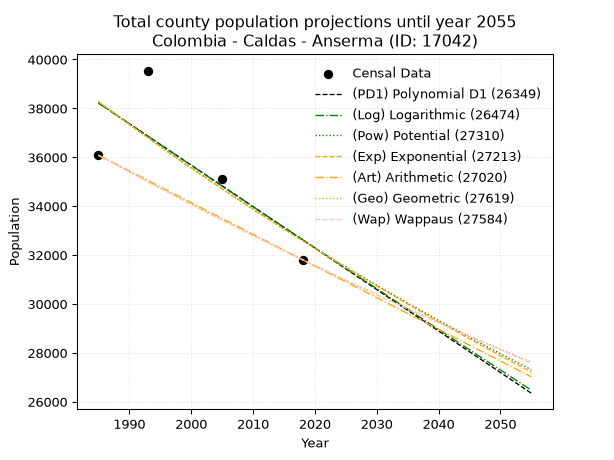
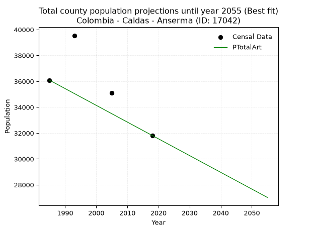
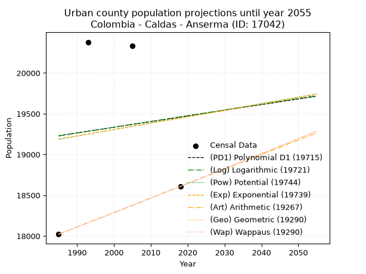
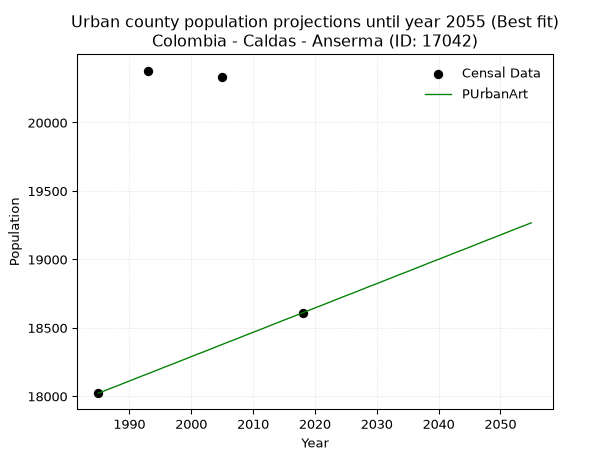
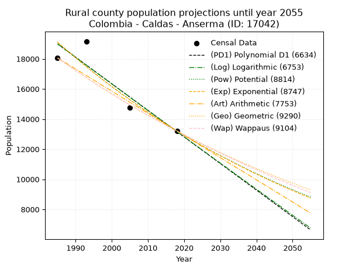
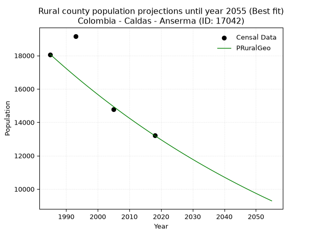

<div align="center">


</div>

# 📜 _“Population and Public Services Demand Projections (PPSD) until Year 2050 for Colombia - Caldas - Anserma (ID: 17042)”_
Keywords: `population` `public-service` `projection` `lineal` `polynomial` `logarithmic` `potential` `exponential` `arithmetic` `geometric` `wappaus` `dane` `colombia` `south-america`

PPSD are analytical estimates used by governments and planners to anticipate future changes in population size, age distribution, and the resulting community needs for utilities, healthcare, education, and infrastructure as sizing future water treatment facilities, electrical grids, and road networks based on spatial growth.

<div align="center">

</img>

</div>


> **General running parameters**: • app_version: _v20260806_. • Python version: _3.14.7_. • Pandas version: _3.0.5_. • NumPy version: _2.5.1_. • Creates, save and include plots into reports (create_plot): _False_. • Projection until year: _2050_. • Process polynomial degree 2 and up: _False_. • Process Wappaus: _True_. • Process Wappaus: _True_. • Set negative values to zero: _True_. • Set infinite values to zero: _True_. • Drop dataset notes: _True_. 
<div align="center">

Dynamic map: [:earth_americas:Google](http://maps.google.com/maps?q=5.236470839,-75.7843429) [:earth_americas:OSM](https://www.openstreetmap.org/#map=18/5.236470839/-75.7843429&layers=P) [:earth_americas:Bing](https://www.bing.com/maps?cp=5.236470839~-75.7843429&lvl=18) [:earth_americas:Apple](https://maps.apple.com/frame?center=5.236470839%2C-75.7843429&span=0.003%2C0.006)

</div>


<div align="center">

```geojson
{
  "type": "Feature",
  "geometry": {
    "type": "Point", 
    "coordinates": [-75.7843429, 5.236470839]
  }, 
  "properties": {
    "Name": "Colombia - Caldas - Anserma (ID: 17042)"
  }
}
```

</div>


## 0. Census Data (4 records)

Census data are official statistics collected by a government about the people and housing in a country. They usually include counts of total population, age, sex, race, income, education, and jobs.

📅Global census file: [Population.xlsx](../data/Population.xlsx)

| Source   |   Year |   CountryID | CountryName   |   StateID | StateName   |   CountyID | CountyName   |   PTotal |   PUrban |   PRural |
|:---------|-------:|------------:|:--------------|----------:|:------------|-----------:|:-------------|---------:|---------:|---------:|
| DANE     |   1985 |          57 | Colombia      |        17 | Caldas      |      17042 | Anserma      |    36084 |    18022 |    18062 |
| DANE     |   1993 |          57 | Colombia      |        17 | Caldas      |      17042 | Anserma      |    39543 |    20379 |    19164 |
| DANE     |   2005 |          57 | Colombia      |        17 | Caldas      |      17042 | Anserma      |    35097 |    20334 |    14763 |
| DANE     |   2018 |          57 | Colombia      |        17 | Caldas      |      17042 | Anserma      |    31811 |    18609 |    13202 |

> 🔥Some records could had specific notes about the registered values or the corresponding urban or rural distribution.

📅[SUI-RUPS](https://www.datos.gov.co/Hacienda-y-Cr-dito-P-blico/Registro-nico-de-Prestadores-de-Servicios-P-blicos/4qkq-csdn/about_data) - Local public utility companies: [RUPS.csv](../data/RUPS.xlsx)

 | SERVICIO       | ESTADO    | NOMBRE                                                                     | NIT         | DEPARTAMENTO_DOMICILIO   | MUNICIPIO_DOMICILIO   | DIRECCION              |   TELEFONO | EMAIL                              | TIPO_PRESTADOR                             | CLASIFICACION                 |
|:---------------|:----------|:---------------------------------------------------------------------------|:------------|:-------------------------|:----------------------|:-----------------------|-----------:|:-----------------------------------|:-------------------------------------------|:------------------------------|
| ACUEDUCTO      | OPERATIVA | EMPRESA DE OBRAS SANITARIAS DE CALDAS  S. A. EMPRESA DE SERVICIOS PUBLICOS | 890803239-9 | CALDAS                   | MANIZALES             | Carrera 23 Nro 75 - 82 |    8867080 | lorena.grisalest@empocaldas.com.co | SOCIEDADES (EMPRESA DE SERVICIOS PUBLICOS) | MAYOR O IGUAL A 5001 USUARIOS |
| ALCANTARILLADO | OPERATIVA | EMPRESA DE OBRAS SANITARIAS DE CALDAS  S. A. EMPRESA DE SERVICIOS PUBLICOS | 890803239-9 | CALDAS                   | MANIZALES             | Carrera 23 Nro 75 - 82 |    8867080 | lorena.grisalest@empocaldas.com.co | SOCIEDADES (EMPRESA DE SERVICIOS PUBLICOS) | MAYOR O IGUAL A 5001 USUARIOS |
| ACUEDUCTO      | OPERATIVA | ASOCIACION DE USUARIOS DE SERVICIOS COLECTIVOS DE SAN PEDRO                | 800207288-6 | CALDAS                   | ANSERMA               | VEREDA SAN PEDRO       |    3136232 | aguasanpedro@outlook.com           | ORGANIZACION AUTORIZADA                    | MENOR O IGUAL A 2500 USUARIOS |
| ACUEDUCTO      | OPERATIVA | ASOCIACION DE USUARIOS SERVICIOS COLECTIVOS DE LA VEREDA EL CERRO          | 810003381-3 | CALDAS                   | ANSERMA               | VEREDA EL CERRO        |    3113509 | contactenos@anserma-caldas.gov.co  | ORGANIZACION AUTORIZADA                    | HASTA 2500 SUSCRIPTORES       |
| ACUEDUCTO      | OPERATIVA | ASOCIACION DE USUARIOS DE SERVICIOS COLECTIVOS DE MARAPRA                  | 810003052-5 | CALDAS                   | ANSERMA               | VEREDA MARAPRA         |    8534979 | acueductomarapra346@gamil.com      | ORGANIZACION AUTORIZADA                    | MENOR O IGUAL A 2500 USUARIOS |
| ACUEDUCTO      | OPERATIVA | ASOCIACIÓN DE USUARIOS DEL ACUEDUCTO DE LA VEREDA EL CARMELO BAJO          | 900014180-3 | CALDAS                   | ANSERMA               | VEREDA EL CARMELO BAJO |    0000000 | asocasantana@hotmail.com           | ORGANIZACION AUTORIZADA                    | HASTA 2500 SUSCRIPTORES       |
| ACUEDUCTO      | OPERATIVA | ASOCIACIÓN DE USUARIOS DE SERVICIOS COLECTIVOS DE EL HORRO                 | 800168457-6 | CALDAS                   | ANSERMA               | VEREDA EL HORRO        |    8536430 | acueductoelhorro@gmail.com         | ORGANIZACION AUTORIZADA                    | MENOR O IGUAL A 2500 USUARIOS |

## 1. Total

### 1.1. Coefficients and Parameters

* (PD1) Polynomial Deg 1: -169.58932155760516, 374854.7904455997 (lineal)
* (Log) Logarithmic: -338965.85978590447, 2612115.966534587
* (Pow) Potential: -9.733294657436353, 36.68090171122492
* (Exp) Exponential: -0.00486962471361199, 603655133.8260176
* (Art) Arithmetic: Year diff. 2018 - 1985 = 33, Population diff. 31811 - 36084 = -4273, Annual growth = -129.4848484848485
* (Geo) Geometric: Year diff. 2018 - 1985 = 33, Population diff. 31811 - 36084 = -4273, Annual growth % = -0.003812031202437227
* (Wap) Wappaus: i = -0.3814267574485558, Condition values only valid for < 200)

<sub>
Wappaus condition values: ['-0.00', '-0.38', '-0.76', '-1.14', '-1.53', '-1.91', '-2.29', '-2.67', '-3.05', '-3.43', '-3.81', '-4.20', '-4.58', '-4.96', '-5.34', '-5.72', '-6.10', '-6.48', '-6.87', '-7.25', '-7.63', '-8.01', '-8.39', '-8.77', '-9.15', '-9.54', '-9.92', '-10.30', '-10.68', '-11.06', '-11.44', '-11.82', '-12.21', '-12.59', '-12.97', '-13.35', '-13.73', '-14.11', '-14.49', '-14.88', '-15.26', '-15.64', '-16.02', '-16.40', '-16.78', '-17.16', '-17.55', '-17.93', '-18.31', '-18.69', '-19.07', '-19.45', '-19.83', '-20.22', '-20.60', '-20.98', '-21.36', '-21.74', '-22.12', '-22.50', '-22.89', '-23.27', '-23.65', '-24.03', '-24.41', '-24.79']
</sub>


### 1.2. Projected Dataset

|   Year |   CountyID |   PTotalPD1 |   PTotalLog |   PTotalPow |   PTotalExp |   PTotalArt |   PTotalGeo |   PTotalWap |
|-------:|-----------:|------------:|------------:|------------:|------------:|------------:|------------:|------------:|
|   1985 |      17042 |       38220 |       38221 |       38267 |       38266 |       36084 |       36084 |       36084 |
|   1986 |      17042 |       38050 |       38051 |       38080 |       38080 |       35955 |       35946 |       35947 |
|   1987 |      17042 |       37881 |       37880 |       37894 |       37895 |       35825 |       35809 |       35810 |
|   1988 |      17042 |       37711 |       37709 |       37709 |       37711 |       35696 |       35673 |       35673 |
|   1989 |      17042 |       37542 |       37539 |       37525 |       37528 |       35566 |       35537 |       35538 |
|   1990 |      17042 |       37372 |       37369 |       37342 |       37345 |       35437 |       35401 |       35402 |
|   1991 |      17042 |       37202 |       37198 |       37159 |       37164 |       35307 |       35267 |       35268 |
|   1992 |      17042 |       37033 |       37028 |       36978 |       36983 |       35178 |       35132 |       35133 |
|   1993 |      17042 |       36863 |       36858 |       36798 |       36804 |       35048 |       34998 |       34999 |
|   1994 |      17042 |       36694 |       36688 |       36619 |       36625 |       34919 |       34865 |       34866 |
|   1995 |      17042 |       36524 |       36518 |       36441 |       36447 |       34789 |       34732 |       34733 |
|   1996 |      17042 |       36355 |       36348 |       36263 |       36270 |       34660 |       34599 |       34601 |
|   1997 |      17042 |       36185 |       36178 |       36087 |       36094 |       34530 |       34468 |       34469 |
|   1998 |      17042 |       36015 |       36009 |       35911 |       35918 |       34401 |       34336 |       34338 |
|   1999 |      17042 |       35846 |       35839 |       35737 |       35744 |       34271 |       34205 |       34207 |
|   2000 |      17042 |       35676 |       35670 |       35563 |       35570 |       34142 |       34075 |       34077 |
|   2001 |      17042 |       35507 |       35500 |       35391 |       35397 |       34012 |       33945 |       33947 |
|   2002 |      17042 |       35337 |       35331 |       35219 |       35225 |       33883 |       33816 |       33818 |
|   2003 |      17042 |       35167 |       35161 |       35048 |       35054 |       33753 |       33687 |       33689 |
|   2004 |      17042 |       34998 |       34992 |       34879 |       34884 |       33624 |       33558 |       33560 |
|   2005 |      17042 |       34828 |       34823 |       34710 |       34715 |       33494 |       33430 |       33432 |
|   2006 |      17042 |       34659 |       34654 |       34542 |       34546 |       33365 |       33303 |       33305 |
|   2007 |      17042 |       34489 |       34485 |       34374 |       34378 |       33235 |       33176 |       33178 |
|   2008 |      17042 |       34319 |       34316 |       34208 |       34211 |       33106 |       33049 |       33051 |
|   2009 |      17042 |       34150 |       34148 |       34043 |       34045 |       32976 |       32923 |       32925 |
|   2010 |      17042 |       33980 |       33979 |       33878 |       33880 |       32847 |       32798 |       32800 |
|   2011 |      17042 |       33811 |       33810 |       33715 |       33715 |       32717 |       32673 |       32675 |
|   2012 |      17042 |       33641 |       33642 |       33552 |       33551 |       32588 |       32548 |       32550 |
|   2013 |      17042 |       33471 |       33473 |       33390 |       33388 |       32458 |       32424 |       32426 |
|   2014 |      17042 |       33302 |       33305 |       33229 |       33226 |       32329 |       32301 |       32302 |
|   2015 |      17042 |       33132 |       33137 |       33069 |       33065 |       32199 |       32178 |       32178 |
|   2016 |      17042 |       32963 |       32969 |       32910 |       32904 |       32070 |       32055 |       32056 |
|   2017 |      17042 |       32793 |       32800 |       32751 |       32744 |       31940 |       31933 |       31933 |
|   2018 |      17042 |       32624 |       32632 |       32593 |       32585 |       31811 |       31811 |       31811 |
|   2019 |      17042 |       32454 |       32465 |       32437 |       32427 |       31682 |       31690 |       31689 |
|   2020 |      17042 |       32284 |       32297 |       32281 |       32269 |       31552 |       31569 |       31568 |
|   2021 |      17042 |       32115 |       32129 |       32126 |       32113 |       31423 |       31449 |       31448 |
|   2022 |      17042 |       31945 |       31961 |       31971 |       31957 |       31293 |       31329 |       31327 |
|   2023 |      17042 |       31776 |       31794 |       31818 |       31801 |       31164 |       31209 |       31207 |
|   2024 |      17042 |       31606 |       31626 |       31665 |       31647 |       31034 |       31090 |       31088 |
|   2025 |      17042 |       31436 |       31459 |       31513 |       31493 |       30905 |       30972 |       30969 |
|   2026 |      17042 |       31267 |       31291 |       31362 |       31340 |       30775 |       30854 |       30850 |
|   2027 |      17042 |       31097 |       31124 |       31212 |       31188 |       30646 |       30736 |       30732 |
|   2028 |      17042 |       30928 |       30957 |       31062 |       31036 |       30516 |       30619 |       30614 |
|   2029 |      17042 |       30758 |       30790 |       30914 |       30886 |       30387 |       30502 |       30497 |
|   2030 |      17042 |       30588 |       30623 |       30766 |       30736 |       30257 |       30386 |       30380 |
|   2031 |      17042 |       30419 |       30456 |       30619 |       30586 |       30128 |       30270 |       30263 |
|   2032 |      17042 |       30249 |       30289 |       30472 |       30438 |       29998 |       30155 |       30147 |
|   2033 |      17042 |       30080 |       30122 |       30327 |       30290 |       29869 |       30040 |       30032 |
|   2034 |      17042 |       29910 |       29956 |       30182 |       30143 |       29739 |       29925 |       29916 |
|   2035 |      17042 |       29741 |       29789 |       30038 |       29996 |       29610 |       29811 |       29801 |
|   2036 |      17042 |       29571 |       29622 |       29895 |       29851 |       29480 |       29698 |       29687 |
|   2037 |      17042 |       29401 |       29456 |       29752 |       29706 |       29351 |       29584 |       29573 |
|   2038 |      17042 |       29232 |       29290 |       29610 |       29561 |       29221 |       29472 |       29459 |
|   2039 |      17042 |       29062 |       29123 |       29469 |       29418 |       29092 |       29359 |       29346 |
|   2040 |      17042 |       28893 |       28957 |       29329 |       29275 |       28962 |       29247 |       29233 |
|   2041 |      17042 |       28723 |       28791 |       29189 |       29132 |       28833 |       29136 |       29120 |
|   2042 |      17042 |       28553 |       28625 |       29051 |       28991 |       28703 |       29025 |       29008 |
|   2043 |      17042 |       28384 |       28459 |       28912 |       28850 |       28574 |       28914 |       28896 |
|   2044 |      17042 |       28214 |       28293 |       28775 |       28710 |       28444 |       28804 |       28785 |
|   2045 |      17042 |       28045 |       28127 |       28638 |       28571 |       28315 |       28694 |       28674 |
|   2046 |      17042 |       27875 |       27962 |       28502 |       28432 |       28185 |       28585 |       28563 |
|   2047 |      17042 |       27705 |       27796 |       28367 |       28294 |       28056 |       28476 |       28453 |
|   2048 |      17042 |       27536 |       27630 |       28233 |       28156 |       27926 |       28367 |       28343 |
|   2049 |      17042 |       27366 |       27465 |       28099 |       28019 |       27797 |       28259 |       28234 |
|   2050 |      17042 |       27197 |       27300 |       27966 |       27883 |       27667 |       28151 |       28124 |
<div align="center">

</img>

</div>


### 1.3. Best fit with absolute and relative error (%)

Relative error puts that difference into context by dividing the absolute error by the true value, creating a unitless ratio or percentage that shows the scale of the mistake.

Absolute and relative error

|   Year | Source   |   CountryID | CountryName   |   StateID | StateName   |   CountyID_x | CountyName   |   PTotal |   PUrban |   PRural |   CountyID_y |   PTotalPD1 |   PTotalLog |   PTotalPow |   PTotalExp |   PTotalArt |   PTotalGeo |   PTotalWap |   PTotalPD1AbsError |   PTotalLogAbsError |   PTotalPowAbsError |   PTotalExpAbsError |   PTotalArtAbsError |   PTotalGeoAbsError |   PTotalWapAbsError |   PTotalPD1RelError |   PTotalLogRelError |   PTotalPowRelError |   PTotalExpRelError |   PTotalArtRelError |   PTotalGeoRelError |   PTotalWapRelError |
|-------:|:---------|------------:|:--------------|----------:|:------------|-------------:|:-------------|---------:|---------:|---------:|-------------:|------------:|------------:|------------:|------------:|------------:|------------:|------------:|--------------------:|--------------------:|--------------------:|--------------------:|--------------------:|--------------------:|--------------------:|--------------------:|--------------------:|--------------------:|--------------------:|--------------------:|--------------------:|--------------------:|
|   1985 | DANE     |          57 | Colombia      |        17 | Caldas      |        17042 | Anserma      |    36084 |    18022 |    18062 |        17042 |       38220 |       38221 |       38267 |       38266 |       36084 |       36084 |       36084 |                2136 |                2137 |                2183 |                2182 |                   0 |                   0 |                   0 |            5.91952  |            5.92229  |             6.04977 |             6.047   |             0       |             0       |              0      |
|   1993 | DANE     |          57 | Colombia      |        17 | Caldas      |        17042 | Anserma      |    39543 |    20379 |    19164 |        17042 |       36863 |       36858 |       36798 |       36804 |       35048 |       34998 |       34999 |                2680 |                2685 |                2745 |                2739 |                4495 |                4545 |                4544 |            6.77743  |            6.79008  |             6.94181 |             6.92664 |            11.3674  |            11.4938  |             11.4913 |
|   2005 | DANE     |          57 | Colombia      |        17 | Caldas      |        17042 | Anserma      |    35097 |    20334 |    14763 |        17042 |       34828 |       34823 |       34710 |       34715 |       33494 |       33430 |       33432 |                 269 |                 274 |                 387 |                 382 |                1603 |                1667 |                1665 |            0.766447 |            0.780694 |             1.10266 |             1.08841 |             4.56734 |             4.74969 |              4.744  |
|   2018 | DANE     |          57 | Colombia      |        17 | Caldas      |        17042 | Anserma      |    31811 |    18609 |    13202 |        17042 |       32624 |       32632 |       32593 |       32585 |       31811 |       31811 |       31811 |                 813 |                 821 |                 782 |                 774 |                   0 |                   0 |                   0 |            2.55572  |            2.58087  |             2.45827 |             2.43312 |             0       |             0       |              0      |

Relative error mean

| Method    |   RelError | Best   |
|:----------|-----------:|:-------|
| PTotalPD1 |    4.00478 |        |
| PTotalLog |    4.01848 |        |
| PTotalPow |    4.13813 |        |
| PTotalExp |    4.12379 |        |
| PTotalArt |    3.98368 | True   |
| PTotalGeo |    4.06088 |        |
| PTotalWap |    4.05882 |        |

💙Best method: _**PTotalArt**_
<div align="center">

</img>

</div>


### 1.4. Fresh water supply demand in liters per capita per day (lpcd)

The fresh water supply demand typically ranges from 100 to 300 liters per capita per day (lpcd) for standard domestic and municipal planning, though absolute survival minimums set by the World Health Organization are as low as 7.5 to 20 liters per day, and total consumption in high-income nations can exceed 400 liters.

> `CZ`: Level in meters above the sea level (masl)<br> `WS`: Fresh water supply demand in liters per capita per day (lpcd or l/h/d)<br> `WSAll`: Zonal fresh water supply demand in liters per second (l/s)<br> `A`: Zonal area in square meters<br> `DP`: Population density (people/hectare or p/ha)

Reference values (RAS Colombia)

|    CZ |   WS |
|------:|-----:|
|  1000 |  120 |
|  2000 |  130 |
| 99999 |  140 |

County shapefile geometry properties and water supply values

|   CountyID |     ATotal |   CZTotal |   WSTotal |
|-----------:|-----------:|----------:|----------:|
|      17042 | 2.0916e+08 |   1315.62 |       130 |

Projected values for best method: PTotalArt

|   CountyID |   Year |   PTotalArt |   DPTotal |   WSTotal |   WSTotalAll |
|-----------:|-------:|------------:|----------:|----------:|-------------:|
|      17042 |   1985 |       36084 |      1.73 |       130 |      54.2931 |
|      17042 |   1986 |       35955 |      1.72 |       130 |      54.099  |
|      17042 |   1987 |       35825 |      1.71 |       130 |      53.9034 |
|      17042 |   1988 |       35696 |      1.71 |       130 |      53.7093 |
|      17042 |   1989 |       35566 |      1.7  |       130 |      53.5137 |
|      17042 |   1990 |       35437 |      1.69 |       130 |      53.3196 |
|      17042 |   1991 |       35307 |      1.69 |       130 |      53.124  |
|      17042 |   1992 |       35178 |      1.68 |       130 |      52.9299 |
|      17042 |   1993 |       35048 |      1.68 |       130 |      52.7343 |
|      17042 |   1994 |       34919 |      1.67 |       130 |      52.5402 |
|      17042 |   1995 |       34789 |      1.66 |       130 |      52.3446 |
|      17042 |   1996 |       34660 |      1.66 |       130 |      52.1505 |
|      17042 |   1997 |       34530 |      1.65 |       130 |      51.9549 |
|      17042 |   1998 |       34401 |      1.64 |       130 |      51.7608 |
|      17042 |   1999 |       34271 |      1.64 |       130 |      51.5652 |
|      17042 |   2000 |       34142 |      1.63 |       130 |      51.3711 |
|      17042 |   2001 |       34012 |      1.63 |       130 |      51.1755 |
|      17042 |   2002 |       33883 |      1.62 |       130 |      50.9814 |
|      17042 |   2003 |       33753 |      1.61 |       130 |      50.7858 |
|      17042 |   2004 |       33624 |      1.61 |       130 |      50.5917 |
|      17042 |   2005 |       33494 |      1.6  |       130 |      50.3961 |
|      17042 |   2006 |       33365 |      1.6  |       130 |      50.202  |
|      17042 |   2007 |       33235 |      1.59 |       130 |      50.0064 |
|      17042 |   2008 |       33106 |      1.58 |       130 |      49.8123 |
|      17042 |   2009 |       32976 |      1.58 |       130 |      49.6167 |
|      17042 |   2010 |       32847 |      1.57 |       130 |      49.4226 |
|      17042 |   2011 |       32717 |      1.56 |       130 |      49.227  |
|      17042 |   2012 |       32588 |      1.56 |       130 |      49.0329 |
|      17042 |   2013 |       32458 |      1.55 |       130 |      48.8373 |
|      17042 |   2014 |       32329 |      1.55 |       130 |      48.6432 |
|      17042 |   2015 |       32199 |      1.54 |       130 |      48.4476 |
|      17042 |   2016 |       32070 |      1.53 |       130 |      48.2535 |
|      17042 |   2017 |       31940 |      1.53 |       130 |      48.0579 |
|      17042 |   2018 |       31811 |      1.52 |       130 |      47.8638 |
|      17042 |   2019 |       31682 |      1.51 |       130 |      47.6697 |
|      17042 |   2020 |       31552 |      1.51 |       130 |      47.4741 |
|      17042 |   2021 |       31423 |      1.5  |       130 |      47.28   |
|      17042 |   2022 |       31293 |      1.5  |       130 |      47.0844 |
|      17042 |   2023 |       31164 |      1.49 |       130 |      46.8903 |
|      17042 |   2024 |       31034 |      1.48 |       130 |      46.6947 |
|      17042 |   2025 |       30905 |      1.48 |       130 |      46.5006 |
|      17042 |   2026 |       30775 |      1.47 |       130 |      46.305  |
|      17042 |   2027 |       30646 |      1.47 |       130 |      46.1109 |
|      17042 |   2028 |       30516 |      1.46 |       130 |      45.9153 |
|      17042 |   2029 |       30387 |      1.45 |       130 |      45.7212 |
|      17042 |   2030 |       30257 |      1.45 |       130 |      45.5256 |
|      17042 |   2031 |       30128 |      1.44 |       130 |      45.3315 |
|      17042 |   2032 |       29998 |      1.43 |       130 |      45.1359 |
|      17042 |   2033 |       29869 |      1.43 |       130 |      44.9418 |
|      17042 |   2034 |       29739 |      1.42 |       130 |      44.7462 |
|      17042 |   2035 |       29610 |      1.42 |       130 |      44.5521 |
|      17042 |   2036 |       29480 |      1.41 |       130 |      44.3565 |
|      17042 |   2037 |       29351 |      1.4  |       130 |      44.1624 |
|      17042 |   2038 |       29221 |      1.4  |       130 |      43.9668 |
|      17042 |   2039 |       29092 |      1.39 |       130 |      43.7727 |
|      17042 |   2040 |       28962 |      1.38 |       130 |      43.5771 |
|      17042 |   2041 |       28833 |      1.38 |       130 |      43.383  |
|      17042 |   2042 |       28703 |      1.37 |       130 |      43.1874 |
|      17042 |   2043 |       28574 |      1.37 |       130 |      42.9933 |
|      17042 |   2044 |       28444 |      1.36 |       130 |      42.7977 |
|      17042 |   2045 |       28315 |      1.35 |       130 |      42.6036 |
|      17042 |   2046 |       28185 |      1.35 |       130 |      42.408  |
|      17042 |   2047 |       28056 |      1.34 |       130 |      42.2139 |
|      17042 |   2048 |       27926 |      1.34 |       130 |      42.0183 |
|      17042 |   2049 |       27797 |      1.33 |       130 |      41.8242 |
|      17042 |   2050 |       27667 |      1.32 |       130 |      41.6286 |

## 2. Urban

### 2.1. Coefficients and Parameters

* (PD1) Polynomial Deg 1: 6.925732637495934, 5482.803291848761 (lineal)
* (Log) Logarithmic: 14240.027396954198, -88902.56235666682
* (Pow) Potential: 0.8267889923353854, 1.5564397624107742
* (Exp) Exponential: 0.00040328404896724374, 8617.892397704101
* (Art) Arithmetic: Year diff. 2018 - 1985 = 33, Population diff. 18609 - 18022 = 587, Annual growth = 17.78787878787879
* (Geo) Geometric: Year diff. 2018 - 1985 = 33, Population diff. 18609 - 18022 = 587, Annual growth % = 0.0009717476242934175
* (Wap) Wappaus: i = 0.09711926394517642, Condition values only valid for < 200)

<sub>
Wappaus condition values: ['0.00', '0.10', '0.19', '0.29', '0.39', '0.49', '0.58', '0.68', '0.78', '0.87', '0.97', '1.07', '1.17', '1.26', '1.36', '1.46', '1.55', '1.65', '1.75', '1.85', '1.94', '2.04', '2.14', '2.23', '2.33', '2.43', '2.53', '2.62', '2.72', '2.82', '2.91', '3.01', '3.11', '3.20', '3.30', '3.40', '3.50', '3.59', '3.69', '3.79', '3.88', '3.98', '4.08', '4.18', '4.27', '4.37', '4.47', '4.56', '4.66', '4.76', '4.86', '4.95', '5.05', '5.15', '5.24', '5.34', '5.44', '5.54', '5.63', '5.73', '5.83', '5.92', '6.02', '6.12', '6.22', '6.31']
</sub>


### 2.2. Projected Dataset

|   Year |   CountyID |   PUrbanPD1 |   PUrbanLog |   PUrbanPow |   PUrbanExp |   PUrbanArt |   PUrbanGeo |   PUrbanWap |
|-------:|-----------:|------------:|------------:|------------:|------------:|------------:|------------:|------------:|
|   1985 |      17042 |       19230 |       19227 |       19186 |       19189 |       18022 |       18022 |       18022 |
|   1986 |      17042 |       19237 |       19234 |       19194 |       19197 |       18040 |       18040 |       18040 |
|   1987 |      17042 |       19244 |       19242 |       19202 |       19205 |       18058 |       18057 |       18057 |
|   1988 |      17042 |       19251 |       19249 |       19210 |       19213 |       18075 |       18075 |       18075 |
|   1989 |      17042 |       19258 |       19256 |       19218 |       19220 |       18093 |       18092 |       18092 |
|   1990 |      17042 |       19265 |       19263 |       19226 |       19228 |       18111 |       18110 |       18110 |
|   1991 |      17042 |       19272 |       19270 |       19234 |       19236 |       18129 |       18127 |       18127 |
|   1992 |      17042 |       19279 |       19277 |       19242 |       19244 |       18147 |       18145 |       18145 |
|   1993 |      17042 |       19286 |       19285 |       19250 |       19251 |       18164 |       18163 |       18163 |
|   1994 |      17042 |       19293 |       19292 |       19258 |       19259 |       18182 |       18180 |       18180 |
|   1995 |      17042 |       19300 |       19299 |       19266 |       19267 |       18200 |       18198 |       18198 |
|   1996 |      17042 |       19307 |       19306 |       19274 |       19275 |       18218 |       18216 |       18216 |
|   1997 |      17042 |       19313 |       19313 |       19282 |       19283 |       18235 |       18233 |       18233 |
|   1998 |      17042 |       19320 |       19320 |       19290 |       19290 |       18253 |       18251 |       18251 |
|   1999 |      17042 |       19327 |       19327 |       19298 |       19298 |       18271 |       18269 |       18269 |
|   2000 |      17042 |       19334 |       19334 |       19306 |       19306 |       18289 |       18286 |       18286 |
|   2001 |      17042 |       19341 |       19342 |       19314 |       19314 |       18307 |       18304 |       18304 |
|   2002 |      17042 |       19348 |       19349 |       19322 |       19321 |       18324 |       18322 |       18322 |
|   2003 |      17042 |       19355 |       19356 |       19330 |       19329 |       18342 |       18340 |       18340 |
|   2004 |      17042 |       19362 |       19363 |       19338 |       19337 |       18360 |       18358 |       18358 |
|   2005 |      17042 |       19369 |       19370 |       19346 |       19345 |       18378 |       18376 |       18375 |
|   2006 |      17042 |       19376 |       19377 |       19354 |       19353 |       18396 |       18393 |       18393 |
|   2007 |      17042 |       19383 |       19384 |       19362 |       19360 |       18413 |       18411 |       18411 |
|   2008 |      17042 |       19390 |       19391 |       19370 |       19368 |       18431 |       18429 |       18429 |
|   2009 |      17042 |       19397 |       19398 |       19378 |       19376 |       18449 |       18447 |       18447 |
|   2010 |      17042 |       19404 |       19406 |       19386 |       19384 |       18467 |       18465 |       18465 |
|   2011 |      17042 |       19410 |       19413 |       19394 |       19392 |       18484 |       18483 |       18483 |
|   2012 |      17042 |       19417 |       19420 |       19402 |       19400 |       18502 |       18501 |       18501 |
|   2013 |      17042 |       19424 |       19427 |       19410 |       19407 |       18520 |       18519 |       18519 |
|   2014 |      17042 |       19431 |       19434 |       19418 |       19415 |       18538 |       18537 |       18537 |
|   2015 |      17042 |       19438 |       19441 |       19426 |       19423 |       18556 |       18555 |       18555 |
|   2016 |      17042 |       19445 |       19448 |       19434 |       19431 |       18573 |       18573 |       18573 |
|   2017 |      17042 |       19452 |       19455 |       19442 |       19439 |       18591 |       18591 |       18591 |
|   2018 |      17042 |       19459 |       19462 |       19450 |       19447 |       18609 |       18609 |       18609 |
|   2019 |      17042 |       19466 |       19469 |       19458 |       19454 |       18627 |       18627 |       18627 |
|   2020 |      17042 |       19473 |       19476 |       19466 |       19462 |       18645 |       18645 |       18645 |
|   2021 |      17042 |       19480 |       19483 |       19474 |       19470 |       18662 |       18663 |       18663 |
|   2022 |      17042 |       19487 |       19490 |       19482 |       19478 |       18680 |       18681 |       18681 |
|   2023 |      17042 |       19494 |       19497 |       19490 |       19486 |       18698 |       18700 |       18700 |
|   2024 |      17042 |       19500 |       19504 |       19497 |       19494 |       18716 |       18718 |       18718 |
|   2025 |      17042 |       19507 |       19511 |       19505 |       19501 |       18734 |       18736 |       18736 |
|   2026 |      17042 |       19514 |       19518 |       19513 |       19509 |       18751 |       18754 |       18754 |
|   2027 |      17042 |       19521 |       19525 |       19521 |       19517 |       18769 |       18772 |       18772 |
|   2028 |      17042 |       19528 |       19532 |       19529 |       19525 |       18787 |       18791 |       18791 |
|   2029 |      17042 |       19535 |       19539 |       19537 |       19533 |       18805 |       18809 |       18809 |
|   2030 |      17042 |       19542 |       19547 |       19545 |       19541 |       18822 |       18827 |       18827 |
|   2031 |      17042 |       19549 |       19554 |       19553 |       19549 |       18840 |       18845 |       18846 |
|   2032 |      17042 |       19556 |       19561 |       19561 |       19557 |       18858 |       18864 |       18864 |
|   2033 |      17042 |       19563 |       19568 |       19569 |       19565 |       18876 |       18882 |       18882 |
|   2034 |      17042 |       19570 |       19575 |       19577 |       19572 |       18894 |       18900 |       18901 |
|   2035 |      17042 |       19577 |       19582 |       19585 |       19580 |       18911 |       18919 |       18919 |
|   2036 |      17042 |       19584 |       19589 |       19593 |       19588 |       18929 |       18937 |       18937 |
|   2037 |      17042 |       19591 |       19596 |       19601 |       19596 |       18947 |       18956 |       18956 |
|   2038 |      17042 |       19597 |       19603 |       19609 |       19604 |       18965 |       18974 |       18974 |
|   2039 |      17042 |       19604 |       19610 |       19617 |       19612 |       18983 |       18992 |       18993 |
|   2040 |      17042 |       19611 |       19616 |       19625 |       19620 |       19000 |       19011 |       19011 |
|   2041 |      17042 |       19618 |       19623 |       19633 |       19628 |       19018 |       19029 |       19030 |
|   2042 |      17042 |       19625 |       19630 |       19641 |       19636 |       19036 |       19048 |       19048 |
|   2043 |      17042 |       19632 |       19637 |       19649 |       19644 |       19054 |       19066 |       19067 |
|   2044 |      17042 |       19639 |       19644 |       19657 |       19651 |       19071 |       19085 |       19085 |
|   2045 |      17042 |       19646 |       19651 |       19665 |       19659 |       19089 |       19103 |       19104 |
|   2046 |      17042 |       19653 |       19658 |       19673 |       19667 |       19107 |       19122 |       19122 |
|   2047 |      17042 |       19660 |       19665 |       19680 |       19675 |       19125 |       19141 |       19141 |
|   2048 |      17042 |       19667 |       19672 |       19688 |       19683 |       19143 |       19159 |       19159 |
|   2049 |      17042 |       19674 |       19679 |       19696 |       19691 |       19160 |       19178 |       19178 |
|   2050 |      17042 |       19681 |       19686 |       19704 |       19699 |       19178 |       19196 |       19197 |
<div align="center">

</img>

</div>


### 2.3. Best fit with absolute and relative error (%)

Relative error puts that difference into context by dividing the absolute error by the true value, creating a unitless ratio or percentage that shows the scale of the mistake.

Absolute and relative error

|   Year | Source   |   CountryID | CountryName   |   StateID | StateName   |   CountyID_x | CountyName   |   PTotal |   PUrban |   PRural |   CountyID_y |   PUrbanPD1 |   PUrbanLog |   PUrbanPow |   PUrbanExp |   PUrbanArt |   PUrbanGeo |   PUrbanWap |   PUrbanPD1AbsError |   PUrbanLogAbsError |   PUrbanPowAbsError |   PUrbanExpAbsError |   PUrbanArtAbsError |   PUrbanGeoAbsError |   PUrbanWapAbsError |   PUrbanPD1RelError |   PUrbanLogRelError |   PUrbanPowRelError |   PUrbanExpRelError |   PUrbanArtRelError |   PUrbanGeoRelError |   PUrbanWapRelError |
|-------:|:---------|------------:|:--------------|----------:|:------------|-------------:|:-------------|---------:|---------:|---------:|-------------:|------------:|------------:|------------:|------------:|------------:|------------:|------------:|--------------------:|--------------------:|--------------------:|--------------------:|--------------------:|--------------------:|--------------------:|--------------------:|--------------------:|--------------------:|--------------------:|--------------------:|--------------------:|--------------------:|
|   1985 | DANE     |          57 | Colombia      |        17 | Caldas      |        17042 | Anserma      |    36084 |    18022 |    18062 |        17042 |       19230 |       19227 |       19186 |       19189 |       18022 |       18022 |       18022 |                1208 |                1205 |                1164 |                1167 |                   0 |                   0 |                   0 |             6.70292 |             6.68627 |             6.45877 |             6.47542 |             0       |             0       |             0       |
|   1993 | DANE     |          57 | Colombia      |        17 | Caldas      |        17042 | Anserma      |    39543 |    20379 |    19164 |        17042 |       19286 |       19285 |       19250 |       19251 |       18164 |       18163 |       18163 |                1093 |                1094 |                1129 |                1128 |                2215 |                2216 |                2216 |             5.36336 |             5.36827 |             5.54002 |             5.53511 |            10.869   |            10.8739  |            10.8739  |
|   2005 | DANE     |          57 | Colombia      |        17 | Caldas      |        17042 | Anserma      |    35097 |    20334 |    14763 |        17042 |       19369 |       19370 |       19346 |       19345 |       18378 |       18376 |       18375 |                 965 |                 964 |                 988 |                 989 |                1956 |                1958 |                1959 |             4.74575 |             4.74083 |             4.85886 |             4.86377 |             9.61936 |             9.62919 |             9.63411 |
|   2018 | DANE     |          57 | Colombia      |        17 | Caldas      |        17042 | Anserma      |    31811 |    18609 |    13202 |        17042 |       19459 |       19462 |       19450 |       19447 |       18609 |       18609 |       18609 |                 850 |                 853 |                 841 |                 838 |                   0 |                   0 |                   0 |             4.56768 |             4.5838  |             4.51932 |             4.5032  |             0       |             0       |             0       |

Relative error mean

| Method    |   RelError | Best   |
|:----------|-----------:|:-------|
| PUrbanPD1 |    5.34493 |        |
| PUrbanLog |    5.34479 |        |
| PUrbanPow |    5.34424 |        |
| PUrbanExp |    5.34438 |        |
| PUrbanArt |    5.1221  | True   |
| PUrbanGeo |    5.12578 |        |
| PUrbanWap |    5.12701 |        |

💙Best method: _**PUrbanArt**_
<div align="center">

</img>

</div>


### 2.4. Fresh water supply demand in liters per capita per day (lpcd)

The fresh water supply demand typically ranges from 100 to 300 liters per capita per day (lpcd) for standard domestic and municipal planning, though absolute survival minimums set by the World Health Organization are as low as 7.5 to 20 liters per day, and total consumption in high-income nations can exceed 400 liters.

> `CZ`: Level in meters above the sea level (masl)<br> `WS`: Fresh water supply demand in liters per capita per day (lpcd or l/h/d)<br> `WSAll`: Zonal fresh water supply demand in liters per second (l/s)<br> `A`: Zonal area in square meters<br> `DP`: Population density (people/hectare or p/ha)

Reference values (RAS Colombia)

|    CZ |   WS |
|------:|-----:|
|  1000 |  120 |
|  2000 |  130 |
| 99999 |  140 |

County shapefile geometry properties and water supply values

|   CountyID |      AUrban |   CZUrban |   WSUrban |
|-----------:|------------:|----------:|----------:|
|      17042 | 2.13359e+06 |   1751.12 |       130 |

Projected values for best method: PUrbanArt

|   CountyID |   Year |   PUrbanArt |   DPUrban |   WSUrban |   WSUrbanAll |
|-----------:|-------:|------------:|----------:|----------:|-------------:|
|      17042 |   1985 |       18022 |     84.47 |       130 |      27.1164 |
|      17042 |   1986 |       18040 |     84.55 |       130 |      27.1435 |
|      17042 |   1987 |       18058 |     84.64 |       130 |      27.1706 |
|      17042 |   1988 |       18075 |     84.72 |       130 |      27.1962 |
|      17042 |   1989 |       18093 |     84.8  |       130 |      27.2233 |
|      17042 |   1990 |       18111 |     84.88 |       130 |      27.2503 |
|      17042 |   1991 |       18129 |     84.97 |       130 |      27.2774 |
|      17042 |   1992 |       18147 |     85.05 |       130 |      27.3045 |
|      17042 |   1993 |       18164 |     85.13 |       130 |      27.3301 |
|      17042 |   1994 |       18182 |     85.22 |       130 |      27.3572 |
|      17042 |   1995 |       18200 |     85.3  |       130 |      27.3843 |
|      17042 |   1996 |       18218 |     85.39 |       130 |      27.4113 |
|      17042 |   1997 |       18235 |     85.47 |       130 |      27.4369 |
|      17042 |   1998 |       18253 |     85.55 |       130 |      27.464  |
|      17042 |   1999 |       18271 |     85.63 |       130 |      27.4911 |
|      17042 |   2000 |       18289 |     85.72 |       130 |      27.5182 |
|      17042 |   2001 |       18307 |     85.8  |       130 |      27.5453 |
|      17042 |   2002 |       18324 |     85.88 |       130 |      27.5708 |
|      17042 |   2003 |       18342 |     85.97 |       130 |      27.5979 |
|      17042 |   2004 |       18360 |     86.05 |       130 |      27.625  |
|      17042 |   2005 |       18378 |     86.14 |       130 |      27.6521 |
|      17042 |   2006 |       18396 |     86.22 |       130 |      27.6792 |
|      17042 |   2007 |       18413 |     86.3  |       130 |      27.7047 |
|      17042 |   2008 |       18431 |     86.38 |       130 |      27.7318 |
|      17042 |   2009 |       18449 |     86.47 |       130 |      27.7589 |
|      17042 |   2010 |       18467 |     86.55 |       130 |      27.786  |
|      17042 |   2011 |       18484 |     86.63 |       130 |      27.8116 |
|      17042 |   2012 |       18502 |     86.72 |       130 |      27.8387 |
|      17042 |   2013 |       18520 |     86.8  |       130 |      27.8657 |
|      17042 |   2014 |       18538 |     86.89 |       130 |      27.8928 |
|      17042 |   2015 |       18556 |     86.97 |       130 |      27.9199 |
|      17042 |   2016 |       18573 |     87.05 |       130 |      27.9455 |
|      17042 |   2017 |       18591 |     87.13 |       130 |      27.9726 |
|      17042 |   2018 |       18609 |     87.22 |       130 |      27.9997 |
|      17042 |   2019 |       18627 |     87.3  |       130 |      28.0267 |
|      17042 |   2020 |       18645 |     87.39 |       130 |      28.0538 |
|      17042 |   2021 |       18662 |     87.47 |       130 |      28.0794 |
|      17042 |   2022 |       18680 |     87.55 |       130 |      28.1065 |
|      17042 |   2023 |       18698 |     87.64 |       130 |      28.1336 |
|      17042 |   2024 |       18716 |     87.72 |       130 |      28.1606 |
|      17042 |   2025 |       18734 |     87.8  |       130 |      28.1877 |
|      17042 |   2026 |       18751 |     87.88 |       130 |      28.2133 |
|      17042 |   2027 |       18769 |     87.97 |       130 |      28.2404 |
|      17042 |   2028 |       18787 |     88.05 |       130 |      28.2675 |
|      17042 |   2029 |       18805 |     88.14 |       130 |      28.2946 |
|      17042 |   2030 |       18822 |     88.22 |       130 |      28.3201 |
|      17042 |   2031 |       18840 |     88.3  |       130 |      28.3472 |
|      17042 |   2032 |       18858 |     88.39 |       130 |      28.3743 |
|      17042 |   2033 |       18876 |     88.47 |       130 |      28.4014 |
|      17042 |   2034 |       18894 |     88.55 |       130 |      28.4285 |
|      17042 |   2035 |       18911 |     88.63 |       130 |      28.4541 |
|      17042 |   2036 |       18929 |     88.72 |       130 |      28.4811 |
|      17042 |   2037 |       18947 |     88.8  |       130 |      28.5082 |
|      17042 |   2038 |       18965 |     88.89 |       130 |      28.5353 |
|      17042 |   2039 |       18983 |     88.97 |       130 |      28.5624 |
|      17042 |   2040 |       19000 |     89.05 |       130 |      28.588  |
|      17042 |   2041 |       19018 |     89.14 |       130 |      28.615  |
|      17042 |   2042 |       19036 |     89.22 |       130 |      28.6421 |
|      17042 |   2043 |       19054 |     89.3  |       130 |      28.6692 |
|      17042 |   2044 |       19071 |     89.38 |       130 |      28.6948 |
|      17042 |   2045 |       19089 |     89.47 |       130 |      28.7219 |
|      17042 |   2046 |       19107 |     89.55 |       130 |      28.749  |
|      17042 |   2047 |       19125 |     89.64 |       130 |      28.776  |
|      17042 |   2048 |       19143 |     89.72 |       130 |      28.8031 |
|      17042 |   2049 |       19160 |     89.8  |       130 |      28.8287 |
|      17042 |   2050 |       19178 |     89.89 |       130 |      28.8558 |

## 3. Rural

### 3.1. Coefficients and Parameters

* (PD1) Polynomial Deg 1: -176.515054195101, 369371.9871537507 (lineal)
* (Log) Logarithmic: -353205.88718285825, 2701018.5288912514
* (Pow) Potential: -22.333940562049307, 77.93329812511618
* (Exp) Exponential: -0.011161738555895646, 80064755912325.14
* (Art) Arithmetic: Year diff. 2018 - 1985 = 33, Population diff. 13202 - 18062 = -4860, Annual growth = -147.27272727272728
* (Geo) Geometric: Year diff. 2018 - 1985 = 33, Population diff. 13202 - 18062 = -4860, Annual growth % = -0.009453275113763482
* (Wap) Wappaus: i = -0.9421233832697496, Condition values only valid for < 200)

<sub>
Wappaus condition values: ['-0.00', '-0.94', '-1.88', '-2.83', '-3.77', '-4.71', '-5.65', '-6.59', '-7.54', '-8.48', '-9.42', '-10.36', '-11.31', '-12.25', '-13.19', '-14.13', '-15.07', '-16.02', '-16.96', '-17.90', '-18.84', '-19.78', '-20.73', '-21.67', '-22.61', '-23.55', '-24.50', '-25.44', '-26.38', '-27.32', '-28.26', '-29.21', '-30.15', '-31.09', '-32.03', '-32.97', '-33.92', '-34.86', '-35.80', '-36.74', '-37.68', '-38.63', '-39.57', '-40.51', '-41.45', '-42.40', '-43.34', '-44.28', '-45.22', '-46.16', '-47.11', '-48.05', '-48.99', '-49.93', '-50.87', '-51.82', '-52.76', '-53.70', '-54.64', '-55.59', '-56.53', '-57.47', '-58.41', '-59.35', '-60.30', '-61.24']
</sub>


### 3.2. Projected Dataset

|   Year |   CountyID |   PRuralPD1 |   PRuralLog |   PRuralPow |   PRuralExp |   PRuralArt |   PRuralGeo |   PRuralWap |
|-------:|-----------:|------------:|------------:|------------:|------------:|------------:|------------:|------------:|
|   1985 |      17042 |       18990 |       18994 |       19112 |       19107 |       18062 |       18062 |       18062 |
|   1986 |      17042 |       18813 |       18816 |       18898 |       18895 |       17915 |       17891 |       17893 |
|   1987 |      17042 |       18637 |       18638 |       18687 |       18685 |       17767 |       17722 |       17725 |
|   1988 |      17042 |       18460 |       18461 |       18478 |       18478 |       17620 |       17555 |       17559 |
|   1989 |      17042 |       18284 |       18283 |       18272 |       18273 |       17473 |       17389 |       17394 |
|   1990 |      17042 |       18107 |       18105 |       18068 |       18070 |       17326 |       17224 |       17231 |
|   1991 |      17042 |       17931 |       17928 |       17866 |       17869 |       17178 |       17061 |       17069 |
|   1992 |      17042 |       17754 |       17751 |       17667 |       17671 |       17031 |       16900 |       16909 |
|   1993 |      17042 |       17577 |       17573 |       17470 |       17475 |       16884 |       16740 |       16750 |
|   1994 |      17042 |       17401 |       17396 |       17276 |       17281 |       16737 |       16582 |       16593 |
|   1995 |      17042 |       17224 |       17219 |       17083 |       17089 |       16589 |       16425 |       16437 |
|   1996 |      17042 |       17048 |       17042 |       16893 |       16899 |       16442 |       16270 |       16282 |
|   1997 |      17042 |       16871 |       16865 |       16705 |       16712 |       16295 |       16116 |       16129 |
|   1998 |      17042 |       16695 |       16688 |       16519 |       16526 |       16147 |       15964 |       15977 |
|   1999 |      17042 |       16518 |       16512 |       16336 |       16343 |       16000 |       15813 |       15827 |
|   2000 |      17042 |       16342 |       16335 |       16154 |       16161 |       15853 |       15664 |       15678 |
|   2001 |      17042 |       16165 |       16158 |       15975 |       15982 |       15706 |       15515 |       15530 |
|   2002 |      17042 |       15989 |       15982 |       15798 |       15805 |       15558 |       15369 |       15384 |
|   2003 |      17042 |       15812 |       15806 |       15623 |       15629 |       15411 |       15224 |       15238 |
|   2004 |      17042 |       15636 |       15629 |       15449 |       15456 |       15264 |       15080 |       15094 |
|   2005 |      17042 |       15459 |       15453 |       15278 |       15284 |       15117 |       14937 |       14952 |
|   2006 |      17042 |       15283 |       15277 |       15109 |       15114 |       14969 |       14796 |       14810 |
|   2007 |      17042 |       15106 |       15101 |       14942 |       14947 |       14822 |       14656 |       14670 |
|   2008 |      17042 |       14930 |       14925 |       14776 |       14781 |       14675 |       14517 |       14531 |
|   2009 |      17042 |       14753 |       14749 |       14613 |       14617 |       14527 |       14380 |       14393 |
|   2010 |      17042 |       14577 |       14573 |       14452 |       14455 |       14380 |       14244 |       14256 |
|   2011 |      17042 |       14400 |       14398 |       14292 |       14294 |       14233 |       14110 |       14120 |
|   2012 |      17042 |       14224 |       14222 |       14134 |       14135 |       14086 |       13976 |       13986 |
|   2013 |      17042 |       14047 |       14047 |       13978 |       13979 |       13938 |       13844 |       13853 |
|   2014 |      17042 |       13871 |       13871 |       13824 |       13823 |       13791 |       13713 |       13720 |
|   2015 |      17042 |       13694 |       13696 |       13671 |       13670 |       13644 |       13584 |       13589 |
|   2016 |      17042 |       13518 |       13521 |       13521 |       13518 |       13497 |       13455 |       13459 |
|   2017 |      17042 |       13341 |       13345 |       13372 |       13368 |       13349 |       13328 |       13330 |
|   2018 |      17042 |       13165 |       13170 |       13225 |       13220 |       13202 |       13202 |       13202 |
|   2019 |      17042 |       12988 |       12995 |       13079 |       13073 |       13055 |       13077 |       13075 |
|   2020 |      17042 |       12812 |       12821 |       12935 |       12928 |       12907 |       12954 |       12949 |
|   2021 |      17042 |       12635 |       12646 |       12793 |       12784 |       12760 |       12831 |       12824 |
|   2022 |      17042 |       12459 |       12471 |       12653 |       12643 |       12613 |       12710 |       12700 |
|   2023 |      17042 |       12282 |       12296 |       12514 |       12502 |       12466 |       12590 |       12577 |
|   2024 |      17042 |       12106 |       12122 |       12376 |       12363 |       12318 |       12471 |       12456 |
|   2025 |      17042 |       11929 |       11947 |       12240 |       12226 |       12171 |       12353 |       12335 |
|   2026 |      17042 |       11752 |       11773 |       12106 |       12090 |       12024 |       12236 |       12215 |
|   2027 |      17042 |       11576 |       11599 |       11974 |       11956 |       11877 |       12120 |       12095 |
|   2028 |      17042 |       11399 |       11424 |       11842 |       11824 |       11729 |       12006 |       11977 |
|   2029 |      17042 |       11223 |       11250 |       11713 |       11692 |       11582 |       11892 |       11860 |
|   2030 |      17042 |       11046 |       11076 |       11585 |       11563 |       11435 |       11780 |       11744 |
|   2031 |      17042 |       10870 |       10902 |       11458 |       11434 |       11287 |       11668 |       11628 |
|   2032 |      17042 |       10693 |       10728 |       11333 |       11307 |       11140 |       11558 |       11514 |
|   2033 |      17042 |       10517 |       10555 |       11209 |       11182 |       10993 |       11449 |       11400 |
|   2034 |      17042 |       10340 |       10381 |       11086 |       11058 |       10846 |       11341 |       11288 |
|   2035 |      17042 |       10164 |       10207 |       10965 |       10935 |       10698 |       11233 |       11176 |
|   2036 |      17042 |        9987 |       10034 |       10846 |       10814 |       10551 |       11127 |       11065 |
|   2037 |      17042 |        9811 |        9860 |       10727 |       10694 |       10404 |       11022 |       10954 |
|   2038 |      17042 |        9634 |        9687 |       10610 |       10575 |       10257 |       10918 |       10845 |
|   2039 |      17042 |        9458 |        9514 |       10495 |       10457 |       10109 |       10815 |       10736 |
|   2040 |      17042 |        9281 |        9341 |       10380 |       10341 |        9962 |       10712 |       10629 |
|   2041 |      17042 |        9105 |        9168 |       10267 |       10227 |        9815 |       10611 |       10522 |
|   2042 |      17042 |        8928 |        8995 |       10156 |       10113 |        9667 |       10511 |       10416 |
|   2043 |      17042 |        8752 |        8822 |       10045 |       10001 |        9520 |       10412 |       10310 |
|   2044 |      17042 |        8575 |        8649 |        9936 |        9890 |        9373 |       10313 |       10206 |
|   2045 |      17042 |        8399 |        8476 |        9828 |        9780 |        9226 |       10216 |       10102 |
|   2046 |      17042 |        8222 |        8303 |        9721 |        9672 |        9078 |       10119 |        9999 |
|   2047 |      17042 |        8046 |        8131 |        9616 |        9564 |        8931 |       10023 |        9896 |
|   2048 |      17042 |        7869 |        7958 |        9512 |        9458 |        8784 |        9929 |        9795 |
|   2049 |      17042 |        7693 |        7786 |        9408 |        9353 |        8637 |        9835 |        9694 |
|   2050 |      17042 |        7516 |        7613 |        9306 |        9249 |        8489 |        9742 |        9594 |
<div align="center">

</img>

</div>


### 3.3. Best fit with absolute and relative error (%)

Relative error puts that difference into context by dividing the absolute error by the true value, creating a unitless ratio or percentage that shows the scale of the mistake.

Absolute and relative error

|   Year | Source   |   CountryID | CountryName   |   StateID | StateName   |   CountyID_x | CountyName   |   PTotal |   PUrban |   PRural |   CountyID_y |   PRuralPD1 |   PRuralLog |   PRuralPow |   PRuralExp |   PRuralArt |   PRuralGeo |   PRuralWap |   PRuralPD1AbsError |   PRuralLogAbsError |   PRuralPowAbsError |   PRuralExpAbsError |   PRuralArtAbsError |   PRuralGeoAbsError |   PRuralWapAbsError |   PRuralPD1RelError |   PRuralLogRelError |   PRuralPowRelError |   PRuralExpRelError |   PRuralArtRelError |   PRuralGeoRelError |   PRuralWapRelError |
|-------:|:---------|------------:|:--------------|----------:|:------------|-------------:|:-------------|---------:|---------:|---------:|-------------:|------------:|------------:|------------:|------------:|------------:|------------:|------------:|--------------------:|--------------------:|--------------------:|--------------------:|--------------------:|--------------------:|--------------------:|--------------------:|--------------------:|--------------------:|--------------------:|--------------------:|--------------------:|--------------------:|
|   1985 | DANE     |          57 | Colombia      |        17 | Caldas      |        17042 | Anserma      |    36084 |    18022 |    18062 |        17042 |       18990 |       18994 |       19112 |       19107 |       18062 |       18062 |       18062 |                 928 |                 932 |                1050 |                1045 |                   0 |                   0 |                   0 |            5.13786  |            5.16     |            5.81331  |            5.78563  |             0       |             0       |             0       |
|   1993 | DANE     |          57 | Colombia      |        17 | Caldas      |        17042 | Anserma      |    39543 |    20379 |    19164 |        17042 |       17577 |       17573 |       17470 |       17475 |       16884 |       16740 |       16750 |                1587 |                1591 |                1694 |                1689 |                2280 |                2424 |                2414 |            8.28115  |            8.30202  |            8.83949  |            8.8134   |            11.8973  |            12.6487  |            12.5965  |
|   2005 | DANE     |          57 | Colombia      |        17 | Caldas      |        17042 | Anserma      |    35097 |    20334 |    14763 |        17042 |       15459 |       15453 |       15278 |       15284 |       15117 |       14937 |       14952 |                 696 |                 690 |                 515 |                 521 |                 354 |                 174 |                 189 |            4.71449  |            4.67385  |            3.48845  |            3.52909  |             2.39789 |             1.17862 |             1.28023 |
|   2018 | DANE     |          57 | Colombia      |        17 | Caldas      |        17042 | Anserma      |    31811 |    18609 |    13202 |        17042 |       13165 |       13170 |       13225 |       13220 |       13202 |       13202 |       13202 |                  37 |                  32 |                  23 |                  18 |                   0 |                   0 |                   0 |            0.280261 |            0.242388 |            0.174216 |            0.136343 |             0       |             0       |             0       |

Relative error mean

| Method    |   RelError | Best   |
|:----------|-----------:|:-------|
| PRuralPD1 |    4.60344 |        |
| PRuralLog |    4.59457 |        |
| PRuralPow |    4.57887 |        |
| PRuralExp |    4.56612 |        |
| PRuralArt |    3.5738  |        |
| PRuralGeo |    3.45683 | True   |
| PRuralWap |    3.46919 |        |

💙Best method: _**PRuralGeo**_
<div align="center">

</img>

</div>


### 3.4. Fresh water supply demand in liters per capita per day (lpcd)

The fresh water supply demand typically ranges from 100 to 300 liters per capita per day (lpcd) for standard domestic and municipal planning, though absolute survival minimums set by the World Health Organization are as low as 7.5 to 20 liters per day, and total consumption in high-income nations can exceed 400 liters.

> `CZ`: Level in meters above the sea level (masl)<br> `WS`: Fresh water supply demand in liters per capita per day (lpcd or l/h/d)<br> `WSAll`: Zonal fresh water supply demand in liters per second (l/s)<br> `A`: Zonal area in square meters<br> `DP`: Population density (people/hectare or p/ha)

Reference values (RAS Colombia)

|    CZ |   WS |
|------:|-----:|
|  1000 |  120 |
|  2000 |  130 |
| 99999 |  140 |

County shapefile geometry properties and water supply values

|   CountyID |      ARural |   CZRural |   WSRural |
|-----------:|------------:|----------:|----------:|
|      17042 | 2.07026e+08 |   1311.16 |       130 |

Projected values for best method: PRuralGeo

|   CountyID |   Year |   PRuralGeo |   DPRural |   WSRural |   WSRuralAll |
|-----------:|-------:|------------:|----------:|----------:|-------------:|
|      17042 |   1985 |       18062 |      0.87 |       130 |      27.1766 |
|      17042 |   1986 |       17891 |      0.86 |       130 |      26.9193 |
|      17042 |   1987 |       17722 |      0.86 |       130 |      26.665  |
|      17042 |   1988 |       17555 |      0.85 |       130 |      26.4138 |
|      17042 |   1989 |       17389 |      0.84 |       130 |      26.164  |
|      17042 |   1990 |       17224 |      0.83 |       130 |      25.9157 |
|      17042 |   1991 |       17061 |      0.82 |       130 |      25.6705 |
|      17042 |   1992 |       16900 |      0.82 |       130 |      25.4282 |
|      17042 |   1993 |       16740 |      0.81 |       130 |      25.1875 |
|      17042 |   1994 |       16582 |      0.8  |       130 |      24.9498 |
|      17042 |   1995 |       16425 |      0.79 |       130 |      24.7135 |
|      17042 |   1996 |       16270 |      0.79 |       130 |      24.4803 |
|      17042 |   1997 |       16116 |      0.78 |       130 |      24.2486 |
|      17042 |   1998 |       15964 |      0.77 |       130 |      24.0199 |
|      17042 |   1999 |       15813 |      0.76 |       130 |      23.7927 |
|      17042 |   2000 |       15664 |      0.76 |       130 |      23.5685 |
|      17042 |   2001 |       15515 |      0.75 |       130 |      23.3443 |
|      17042 |   2002 |       15369 |      0.74 |       130 |      23.1247 |
|      17042 |   2003 |       15224 |      0.74 |       130 |      22.9065 |
|      17042 |   2004 |       15080 |      0.73 |       130 |      22.6898 |
|      17042 |   2005 |       14937 |      0.72 |       130 |      22.4747 |
|      17042 |   2006 |       14796 |      0.71 |       130 |      22.2625 |
|      17042 |   2007 |       14656 |      0.71 |       130 |      22.0519 |
|      17042 |   2008 |       14517 |      0.7  |       130 |      21.8427 |
|      17042 |   2009 |       14380 |      0.69 |       130 |      21.6366 |
|      17042 |   2010 |       14244 |      0.69 |       130 |      21.4319 |
|      17042 |   2011 |       14110 |      0.68 |       130 |      21.2303 |
|      17042 |   2012 |       13976 |      0.68 |       130 |      21.0287 |
|      17042 |   2013 |       13844 |      0.67 |       130 |      20.8301 |
|      17042 |   2014 |       13713 |      0.66 |       130 |      20.633  |
|      17042 |   2015 |       13584 |      0.66 |       130 |      20.4389 |
|      17042 |   2016 |       13455 |      0.65 |       130 |      20.2448 |
|      17042 |   2017 |       13328 |      0.64 |       130 |      20.0537 |
|      17042 |   2018 |       13202 |      0.64 |       130 |      19.8641 |
|      17042 |   2019 |       13077 |      0.63 |       130 |      19.676  |
|      17042 |   2020 |       12954 |      0.63 |       130 |      19.491  |
|      17042 |   2021 |       12831 |      0.62 |       130 |      19.3059 |
|      17042 |   2022 |       12710 |      0.61 |       130 |      19.1238 |
|      17042 |   2023 |       12590 |      0.61 |       130 |      18.9433 |
|      17042 |   2024 |       12471 |      0.6  |       130 |      18.7642 |
|      17042 |   2025 |       12353 |      0.6  |       130 |      18.5867 |
|      17042 |   2026 |       12236 |      0.59 |       130 |      18.4106 |
|      17042 |   2027 |       12120 |      0.59 |       130 |      18.2361 |
|      17042 |   2028 |       12006 |      0.58 |       130 |      18.0646 |
|      17042 |   2029 |       11892 |      0.57 |       130 |      17.8931 |
|      17042 |   2030 |       11780 |      0.57 |       130 |      17.7245 |
|      17042 |   2031 |       11668 |      0.56 |       130 |      17.556  |
|      17042 |   2032 |       11558 |      0.56 |       130 |      17.3905 |
|      17042 |   2033 |       11449 |      0.55 |       130 |      17.2265 |
|      17042 |   2034 |       11341 |      0.55 |       130 |      17.064  |
|      17042 |   2035 |       11233 |      0.54 |       130 |      16.9015 |
|      17042 |   2036 |       11127 |      0.54 |       130 |      16.742  |
|      17042 |   2037 |       11022 |      0.53 |       130 |      16.584  |
|      17042 |   2038 |       10918 |      0.53 |       130 |      16.4275 |
|      17042 |   2039 |       10815 |      0.52 |       130 |      16.2726 |
|      17042 |   2040 |       10712 |      0.52 |       130 |      16.1176 |
|      17042 |   2041 |       10611 |      0.51 |       130 |      15.9656 |
|      17042 |   2042 |       10511 |      0.51 |       130 |      15.8152 |
|      17042 |   2043 |       10412 |      0.5  |       130 |      15.6662 |
|      17042 |   2044 |       10313 |      0.5  |       130 |      15.5172 |
|      17042 |   2045 |       10216 |      0.49 |       130 |      15.3713 |
|      17042 |   2046 |       10119 |      0.49 |       130 |      15.2253 |
|      17042 |   2047 |       10023 |      0.48 |       130 |      15.0809 |
|      17042 |   2048 |        9929 |      0.48 |       130 |      14.9395 |
|      17042 |   2049 |        9835 |      0.48 |       130 |      14.798  |
|      17042 |   2050 |        9742 |      0.47 |       130 |      14.6581 |

#

<div align="center"><br><sub>Share this research</sub></div><br>

<sub>**APPS & TOOLS & CONTENT DISCLAIMER**: • NO WARRANTY - This content and software is provided by <a href="https://github.com/rcfdtools" target="_blank">github.com/rcfdtools</a> "as is", without any express or implied warranty, including warranties of merchantability, fitness for a particular purpose, or non-infringement. There is no guarantee that the software will be error-free or operate without interruption. • LIMITATION OF LIABILITY - Neither the authors nor copyright holders will be liable for claims or damages arising from the software or its use. You are responsible for determining if the software is appropriate for your use and assume all associated risks, including errors, legal compliance, and data loss. • NO PROFESSIONAL ADVICE - The software provides general information and does not offer professional advice. It should not replace consultation with professional advisors. [Clauses and global license for rcfdtools use.](https://github.com/rcfdtools/rcfdtools/blob/main/LICENSE.md)</sub>

| [:house: Home](Readme.md)  | [:beginner: Help / Collab](https://github.com/rcfdtools/R.HydroTools/discussions/31) |
|----------------------------|-------------------------------------------------------------------------------------------|