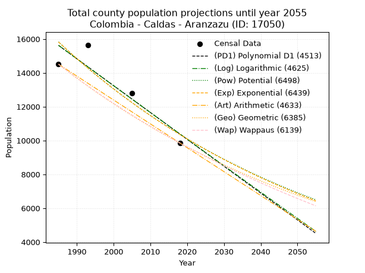
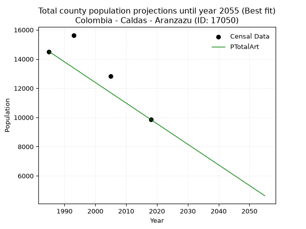
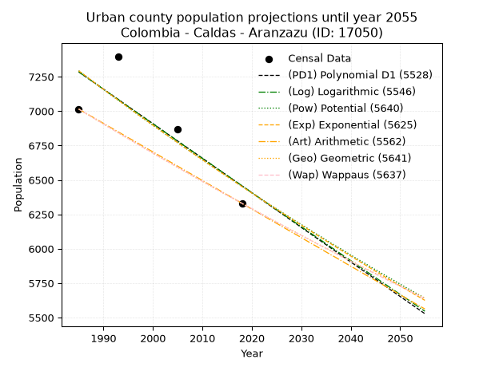
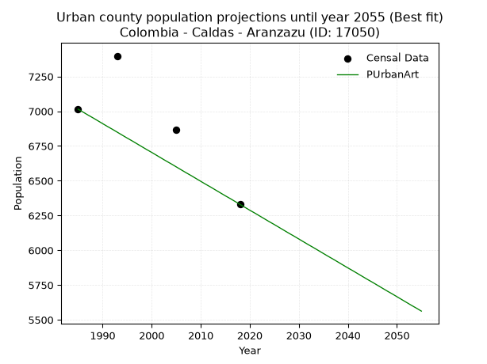
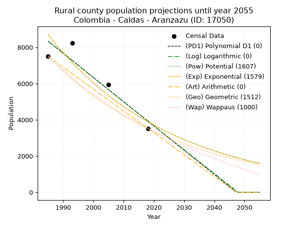
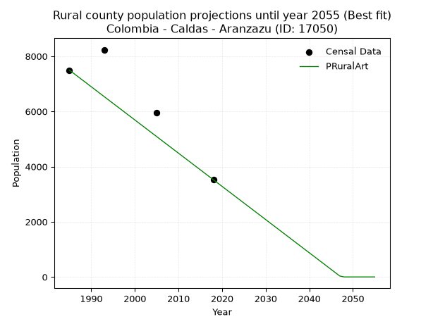

<div align="center">


</div>

# _“Population and Public Services Demand Projections (PPSD) until Year 2050 for Colombia - Caldas - Aranzazu (ID: 17050)”_
Keywords: `population` `public-service` `projection` `lineal` `polynomial` `logarithmic` `potential` `exponential` `arithmetic` `geometric` `wappaus` `dane` `colombia` `south-america`

PPSD are analytical estimates used by governments and planners to anticipate future changes in population size, age distribution, and the resulting community needs for utilities, healthcare, education, and infrastructure as sizing future water treatment facilities, electrical grids, and road networks based on spatial growth.

> **General running parameters**: • app_version: _v20260806_. • Python version: _3.14.7_. • Pandas version: _3.0.5_. • NumPy version: _2.5.1_. • Creates, save and include plots into reports (create_plot): _True_. • Projection until year: _2050_. • Process polynomial degree 2 and up: _False_. • Process Wappaus: _True_. • Process Wappaus: _True_. • Set negative values to zero: _True_. • Set infinite values to zero: _True_. • Drop dataset notes: _True_. 
<div align="center">

Dynamic map: [:earth_americas:Google](http://maps.google.com/maps?q=5.271195058,-75.4912899) [:earth_americas:OSM](https://www.openstreetmap.org/#map=18/5.271195058/-75.4912899&layers=P) [:earth_americas:Bing](https://www.bing.com/maps?cp=5.271195058~-75.4912899&lvl=18) [:earth_americas:Apple](https://maps.apple.com/frame?center=5.271195058%2C-75.4912899&span=0.003%2C0.006)

</div>


<div align="center">

```geojson
{
  "type": "Feature",
  "geometry": {
    "type": "Point", 
    "coordinates": [-75.4912899, 5.271195058]
  }, 
  "properties": {
    "Name": "Colombia - Caldas - Aranzazu (ID: 17050)"
  }
}
```

</div>


## 0. Census Data (4 records)

Census data are official statistics collected by a government about the people and housing in a country. They usually include counts of total population, age, sex, race, income, education, and jobs.

📅Global census file: [Population.xlsx](../data/Population.xlsx)

| Source   |   Year |   CountryID | CountryName   |   StateID | StateName   |   CountyID | CountyName   |   PTotal |   PUrban |   PRural |
|:---------|-------:|------------:|:--------------|----------:|:------------|-----------:|:-------------|---------:|---------:|---------:|
| DANE     |   1985 |          57 | Colombia      |        17 | Caldas      |      17050 | Aranzazu     |    14511 |     7015 |     7496 |
| DANE     |   1993 |          57 | Colombia      |        17 | Caldas      |      17050 | Aranzazu     |    15633 |     7398 |     8235 |
| DANE     |   2005 |          57 | Colombia      |        17 | Caldas      |      17050 | Aranzazu     |    12815 |     6867 |     5948 |
| DANE     |   2018 |          57 | Colombia      |        17 | Caldas      |      17050 | Aranzazu     |     9854 |     6330 |     3524 |

> 🔥Some records has specific notes about the registered values or the corresponding urban or rural distribution.

## 1. Total

### 1.1. Coefficients and Parameters

* (PD1) Polynomial Deg 1: -158.73504616619624, 330713.026093934 (lineal)
* (Log) Logarithmic: -317445.11379300035, 2426106.1037860885
* (Pow) Potential: -25.689513379022493, 88.91729959361048
* (Exp) Exponential: -0.012846428348918443, 1879006926616923.5
* (Art) Arithmetic: Year diff. 2018 - 1985 = 33, Population diff. 9854 - 14511 = -4657, Annual growth = -141.12121212121212
* (Geo) Geometric: Year diff. 2018 - 1985 = 33, Population diff. 9854 - 14511 = -4657, Annual growth % = -0.011659660352202561
* (Wap) Wappaus: i = -1.1583928760206208, Condition values only valid for < 200)

<sub>
Wappaus condition values: ['-0.00', '-1.16', '-2.32', '-3.48', '-4.63', '-5.79', '-6.95', '-8.11', '-9.27', '-10.43', '-11.58', '-12.74', '-13.90', '-15.06', '-16.22', '-17.38', '-18.53', '-19.69', '-20.85', '-22.01', '-23.17', '-24.33', '-25.48', '-26.64', '-27.80', '-28.96', '-30.12', '-31.28', '-32.44', '-33.59', '-34.75', '-35.91', '-37.07', '-38.23', '-39.39', '-40.54', '-41.70', '-42.86', '-44.02', '-45.18', '-46.34', '-47.49', '-48.65', '-49.81', '-50.97', '-52.13', '-53.29', '-54.44', '-55.60', '-56.76', '-57.92', '-59.08', '-60.24', '-61.39', '-62.55', '-63.71', '-64.87', '-66.03', '-67.19', '-68.35', '-69.50', '-70.66', '-71.82', '-72.98', '-74.14', '-75.30']
</sub>


### 1.2. Projected Dataset

|   Year |   CountyID |   PTotalPD1 |   PTotalLog |   PTotalPow |   PTotalExp |   PTotalArt |   PTotalGeo |   PTotalWap |
|-------:|-----------:|------------:|------------:|------------:|------------:|------------:|------------:|------------:|
|   1985 |      17050 |       15624 |       15627 |       15828 |       15825 |       14511 |       14511 |       14511 |
|   1986 |      17050 |       15465 |       15467 |       15625 |       15623 |       14370 |       14342 |       14344 |
|   1987 |      17050 |       15306 |       15307 |       15424 |       15424 |       14229 |       14175 |       14179 |
|   1988 |      17050 |       15148 |       15147 |       15226 |       15227 |       14088 |       14009 |       14015 |
|   1989 |      17050 |       14989 |       14988 |       15031 |       15033 |       13947 |       13846 |       13854 |
|   1990 |      17050 |       14830 |       14828 |       14838 |       14841 |       13805 |       13685 |       13694 |
|   1991 |      17050 |       14672 |       14668 |       14648 |       14651 |       13664 |       13525 |       13536 |
|   1992 |      17050 |       14513 |       14509 |       14460 |       14464 |       13523 |       13367 |       13380 |
|   1993 |      17050 |       14354 |       14350 |       14275 |       14280 |       13382 |       13211 |       13226 |
|   1994 |      17050 |       14195 |       14191 |       14092 |       14097 |       13241 |       13057 |       13073 |
|   1995 |      17050 |       14037 |       14031 |       13911 |       13917 |       13100 |       12905 |       12922 |
|   1996 |      17050 |       13878 |       13872 |       13734 |       13740 |       12959 |       12755 |       12773 |
|   1997 |      17050 |       13719 |       13713 |       13558 |       13564 |       12818 |       12606 |       12625 |
|   1998 |      17050 |       13560 |       13554 |       13385 |       13391 |       12676 |       12459 |       12479 |
|   1999 |      17050 |       13402 |       13396 |       13214 |       13220 |       12535 |       12314 |       12334 |
|   2000 |      17050 |       13243 |       13237 |       13045 |       13052 |       12394 |       12170 |       12191 |
|   2001 |      17050 |       13084 |       13078 |       12879 |       12885 |       12253 |       12028 |       12050 |
|   2002 |      17050 |       12925 |       12919 |       12714 |       12721 |       12112 |       11888 |       11910 |
|   2003 |      17050 |       12767 |       12761 |       12552 |       12558 |       11971 |       11749 |       11771 |
|   2004 |      17050 |       12608 |       12603 |       12392 |       12398 |       11830 |       11612 |       11634 |
|   2005 |      17050 |       12449 |       12444 |       12235 |       12240 |       11689 |       11477 |       11498 |
|   2006 |      17050 |       12291 |       12286 |       12079 |       12083 |       11547 |       11343 |       11364 |
|   2007 |      17050 |       12132 |       12128 |       11925 |       11929 |       11406 |       11211 |       11231 |
|   2008 |      17050 |       11973 |       11970 |       11774 |       11777 |       11265 |       11080 |       11099 |
|   2009 |      17050 |       11814 |       11811 |       11624 |       11627 |       11124 |       10951 |       10969 |
|   2010 |      17050 |       11656 |       11653 |       11476 |       11478 |       10983 |       10823 |       10840 |
|   2011 |      17050 |       11497 |       11496 |       11331 |       11332 |       10842 |       10697 |       10713 |
|   2012 |      17050 |       11338 |       11338 |       11187 |       11187 |       10701 |       10572 |       10586 |
|   2013 |      17050 |       11179 |       11180 |       11045 |       11044 |       10560 |       10449 |       10461 |
|   2014 |      17050 |       11021 |       11022 |       10905 |       10903 |       10418 |       10327 |       10337 |
|   2015 |      17050 |       10862 |       10865 |       10767 |       10764 |       10277 |       10207 |       10215 |
|   2016 |      17050 |       10703 |       10707 |       10630 |       10627 |       10136 |       10088 |       10093 |
|   2017 |      17050 |       10544 |       10550 |       10496 |       10491 |        9995 |        9970 |        9973 |
|   2018 |      17050 |       10386 |       10393 |       10363 |       10357 |        9854 |        9854 |        9854 |
|   2019 |      17050 |       10227 |       10235 |       10232 |       10225 |        9713 |        9739 |        9736 |
|   2020 |      17050 |       10068 |       10078 |       10103 |       10094 |        9572 |        9626 |        9619 |
|   2021 |      17050 |        9909 |        9921 |        9975 |        9966 |        9431 |        9513 |        9504 |
|   2022 |      17050 |        9751 |        9764 |        9849 |        9838 |        9290 |        9402 |        9389 |
|   2023 |      17050 |        9592 |        9607 |        9725 |        9713 |        9148 |        9293 |        9276 |
|   2024 |      17050 |        9433 |        9450 |        9602 |        9589 |        9007 |        9184 |        9163 |
|   2025 |      17050 |        9275 |        9293 |        9481 |        9466 |        8866 |        9077 |        9052 |
|   2026 |      17050 |        9116 |        9137 |        9361 |        9346 |        8725 |        8971 |        8942 |
|   2027 |      17050 |        8957 |        8980 |        9243 |        9226 |        8584 |        8867 |        8832 |
|   2028 |      17050 |        8798 |        8823 |        9127 |        9108 |        8443 |        8764 |        8724 |
|   2029 |      17050 |        8640 |        8667 |        9012 |        8992 |        8302 |        8661 |        8617 |
|   2030 |      17050 |        8481 |        8510 |        8899 |        8877 |        8161 |        8560 |        8511 |
|   2031 |      17050 |        8322 |        8354 |        8787 |        8764 |        8019 |        8461 |        8405 |
|   2032 |      17050 |        8163 |        8198 |        8677 |        8652 |        7878 |        8362 |        8301 |
|   2033 |      17050 |        8005 |        8042 |        8568 |        8542 |        7737 |        8264 |        8198 |
|   2034 |      17050 |        7846 |        7886 |        8460 |        8433 |        7596 |        8168 |        8095 |
|   2035 |      17050 |        7687 |        7730 |        8354 |        8325 |        7455 |        8073 |        7994 |
|   2036 |      17050 |        7528 |        7574 |        8249 |        8219 |        7314 |        7979 |        7893 |
|   2037 |      17050 |        7370 |        7418 |        8146 |        8114 |        7173 |        7886 |        7793 |
|   2038 |      17050 |        7211 |        7262 |        8044 |        8010 |        7032 |        7794 |        7694 |
|   2039 |      17050 |        7052 |        7106 |        7943 |        7908 |        6890 |        7703 |        7597 |
|   2040 |      17050 |        6894 |        6951 |        7844 |        7807 |        6749 |        7613 |        7499 |
|   2041 |      17050 |        6735 |        6795 |        7745 |        7708 |        6608 |        7524 |        7403 |
|   2042 |      17050 |        6576 |        6639 |        7649 |        7609 |        6467 |        7437 |        7308 |
|   2043 |      17050 |        6417 |        6484 |        7553 |        7512 |        6326 |        7350 |        7213 |
|   2044 |      17050 |        6259 |        6329 |        7459 |        7416 |        6185 |        7264 |        7119 |
|   2045 |      17050 |        6100 |        6173 |        7365 |        7322 |        6044 |        7179 |        7026 |
|   2046 |      17050 |        5941 |        6018 |        7274 |        7228 |        5903 |        7096 |        6934 |
|   2047 |      17050 |        5782 |        5863 |        7183 |        7136 |        5761 |        7013 |        6843 |
|   2048 |      17050 |        5624 |        5708 |        7093 |        7045 |        5620 |        6931 |        6752 |
|   2049 |      17050 |        5465 |        5553 |        7005 |        6955 |        5479 |        6850 |        6662 |
|   2050 |      17050 |        5306 |        5398 |        6918 |        6866 |        5338 |        6771 |        6573 |
<div align="center">

</img>

</div>


### 1.3. Best fit with absolute error and relative error (%)

Relative error puts that difference into context by dividing the absolute error by the true value, creating a unitless ratio or percentage that shows the scale of the mistake.

Absolute and relative error

|   Year | Source   |   CountryID | CountryName   |   StateID | StateName   |   CountyID_x | CountyName   |   PTotal |   PUrban |   PRural |   CountyID_y |   PTotalPD1 |   PTotalLog |   PTotalPow |   PTotalExp |   PTotalArt |   PTotalGeo |   PTotalWap |   PTotalPD1AbsError |   PTotalLogAbsError |   PTotalPowAbsError |   PTotalExpAbsError |   PTotalArtAbsError |   PTotalGeoAbsError |   PTotalWapAbsError |   PTotalPD1RelError |   PTotalLogRelError |   PTotalPowRelError |   PTotalExpRelError |   PTotalArtRelError |   PTotalGeoRelError |   PTotalWapRelError |
|-------:|:---------|------------:|:--------------|----------:|:------------|-------------:|:-------------|---------:|---------:|---------:|-------------:|------------:|------------:|------------:|------------:|------------:|------------:|------------:|--------------------:|--------------------:|--------------------:|--------------------:|--------------------:|--------------------:|--------------------:|--------------------:|--------------------:|--------------------:|--------------------:|--------------------:|--------------------:|--------------------:|
|   1985 | DANE     |          57 | Colombia      |        17 | Caldas      |        17050 | Aranzazu     |    14511 |     7015 |     7496 |        17050 |       15624 |       15627 |       15828 |       15825 |       14511 |       14511 |       14511 |                1113 |                1116 |                1317 |                1314 |                   0 |                   0 |                   0 |             7.67004 |             7.69072 |             9.07587 |             9.0552  |             0       |              0      |              0      |
|   1993 | DANE     |          57 | Colombia      |        17 | Caldas      |        17050 | Aranzazu     |    15633 |     7398 |     8235 |        17050 |       14354 |       14350 |       14275 |       14280 |       13382 |       13211 |       13226 |                1279 |                1283 |                1358 |                1353 |                2251 |                2422 |                2407 |             8.18141 |             8.207   |             8.68675 |             8.65477 |            14.399   |             15.4929 |             15.3969 |
|   2005 | DANE     |          57 | Colombia      |        17 | Caldas      |        17050 | Aranzazu     |    12815 |     6867 |     5948 |        17050 |       12449 |       12444 |       12235 |       12240 |       11689 |       11477 |       11498 |                 366 |                 371 |                 580 |                 575 |                1126 |                1338 |                1317 |             2.85603 |             2.89504 |             4.52595 |             4.48693 |             8.78658 |             10.4409 |             10.277  |
|   2018 | DANE     |          57 | Colombia      |        17 | Caldas      |        17050 | Aranzazu     |     9854 |     6330 |     3524 |        17050 |       10386 |       10393 |       10363 |       10357 |        9854 |        9854 |        9854 |                 532 |                 539 |                 509 |                 503 |                   0 |                   0 |                   0 |             5.39882 |             5.46986 |             5.16542 |             5.10453 |             0       |              0      |              0      |

Relative error mean

| Method    |   RelError | Best   |
|:----------|-----------:|:-------|
| PTotalPD1 |    6.02658 |        |
| PTotalLog |    6.06566 |        |
| PTotalPow |    6.8635  |        |
| PTotalExp |    6.82536 |        |
| PTotalArt |    5.7964  | True   |
| PTotalGeo |    6.48344 |        |
| PTotalWap |    6.41848 |        |

💙Best method: _**PTotalArt**_
<div align="center">

</img>

</div>


### 1.4. Fresh water supply demand in liters per capita per day (lpcd)

The fresh water supply demand typically ranges from 100 to 300 liters per capita per day (lpcd) for standard domestic and municipal planning, though absolute survival minimums set by the World Health Organization are as low as 7.5 to 20 liters per day, and total consumption in high-income nations can exceed 400 liters.

> `CZ`: Level in meters above the sea level (masl).<br> `WS`: Fresh water supply demand in liters per capita per day (lpcd or l/h/d).<br> `WSAll`: Zonal fresh water supply demand in liters per second (l/s).<br> `A`: Zonal area in square meters.

Reference values (RAS Colombia)

|    CZ |   WS |
|------:|-----:|
|  1000 |  120 |
|  2000 |  130 |
| 99999 |  140 |

County shapefile geometry properties and water supply values

|   CountyID |     ATotal |   CZTotal |   WSTotal |
|-----------:|-----------:|----------:|----------:|
|      17050 | 1.4953e+08 |   2161.13 |       140 |

Projected values for best method: PTotalArt

|   CountyID |   Year |   PTotalArt |   WSTotal |   WSTotalAll |
|-----------:|-------:|------------:|----------:|-------------:|
|      17050 |   1985 |       14511 |       140 |     23.5132  |
|      17050 |   1986 |       14370 |       140 |     23.2847  |
|      17050 |   1987 |       14229 |       140 |     23.0562  |
|      17050 |   1988 |       14088 |       140 |     22.8278  |
|      17050 |   1989 |       13947 |       140 |     22.5993  |
|      17050 |   1990 |       13805 |       140 |     22.3692  |
|      17050 |   1991 |       13664 |       140 |     22.1407  |
|      17050 |   1992 |       13523 |       140 |     21.9123  |
|      17050 |   1993 |       13382 |       140 |     21.6838  |
|      17050 |   1994 |       13241 |       140 |     21.4553  |
|      17050 |   1995 |       13100 |       140 |     21.2269  |
|      17050 |   1996 |       12959 |       140 |     20.9984  |
|      17050 |   1997 |       12818 |       140 |     20.7699  |
|      17050 |   1998 |       12676 |       140 |     20.5398  |
|      17050 |   1999 |       12535 |       140 |     20.3113  |
|      17050 |   2000 |       12394 |       140 |     20.0829  |
|      17050 |   2001 |       12253 |       140 |     19.8544  |
|      17050 |   2002 |       12112 |       140 |     19.6259  |
|      17050 |   2003 |       11971 |       140 |     19.3975  |
|      17050 |   2004 |       11830 |       140 |     19.169   |
|      17050 |   2005 |       11689 |       140 |     18.9405  |
|      17050 |   2006 |       11547 |       140 |     18.7104  |
|      17050 |   2007 |       11406 |       140 |     18.4819  |
|      17050 |   2008 |       11265 |       140 |     18.2535  |
|      17050 |   2009 |       11124 |       140 |     18.025   |
|      17050 |   2010 |       10983 |       140 |     17.7965  |
|      17050 |   2011 |       10842 |       140 |     17.5681  |
|      17050 |   2012 |       10701 |       140 |     17.3396  |
|      17050 |   2013 |       10560 |       140 |     17.1111  |
|      17050 |   2014 |       10418 |       140 |     16.881   |
|      17050 |   2015 |       10277 |       140 |     16.6525  |
|      17050 |   2016 |       10136 |       140 |     16.4241  |
|      17050 |   2017 |        9995 |       140 |     16.1956  |
|      17050 |   2018 |        9854 |       140 |     15.9671  |
|      17050 |   2019 |        9713 |       140 |     15.7387  |
|      17050 |   2020 |        9572 |       140 |     15.5102  |
|      17050 |   2021 |        9431 |       140 |     15.2817  |
|      17050 |   2022 |        9290 |       140 |     15.0532  |
|      17050 |   2023 |        9148 |       140 |     14.8231  |
|      17050 |   2024 |        9007 |       140 |     14.5947  |
|      17050 |   2025 |        8866 |       140 |     14.3662  |
|      17050 |   2026 |        8725 |       140 |     14.1377  |
|      17050 |   2027 |        8584 |       140 |     13.9093  |
|      17050 |   2028 |        8443 |       140 |     13.6808  |
|      17050 |   2029 |        8302 |       140 |     13.4523  |
|      17050 |   2030 |        8161 |       140 |     13.2238  |
|      17050 |   2031 |        8019 |       140 |     12.9938  |
|      17050 |   2032 |        7878 |       140 |     12.7653  |
|      17050 |   2033 |        7737 |       140 |     12.5368  |
|      17050 |   2034 |        7596 |       140 |     12.3083  |
|      17050 |   2035 |        7455 |       140 |     12.0799  |
|      17050 |   2036 |        7314 |       140 |     11.8514  |
|      17050 |   2037 |        7173 |       140 |     11.6229  |
|      17050 |   2038 |        7032 |       140 |     11.3944  |
|      17050 |   2039 |        6890 |       140 |     11.1644  |
|      17050 |   2040 |        6749 |       140 |     10.9359  |
|      17050 |   2041 |        6608 |       140 |     10.7074  |
|      17050 |   2042 |        6467 |       140 |     10.4789  |
|      17050 |   2043 |        6326 |       140 |     10.2505  |
|      17050 |   2044 |        6185 |       140 |     10.022   |
|      17050 |   2045 |        6044 |       140 |      9.79352 |
|      17050 |   2046 |        5903 |       140 |      9.56505 |
|      17050 |   2047 |        5761 |       140 |      9.33495 |
|      17050 |   2048 |        5620 |       140 |      9.10648 |
|      17050 |   2049 |        5479 |       140 |      8.87801 |
|      17050 |   2050 |        5338 |       140 |      8.64954 |

## 2. Urban

### 2.1. Coefficients and Parameters

* (PD1) Polynomial Deg 1: -25.11200321156122, 57132.78442392533 (lineal)
* (Log) Logarithmic: -50196.75344324345, 388448.42517363053
* (Pow) Potential: -7.416347127534794, 28.3202524926659
* (Exp) Exponential: -0.003710172061623113, 11517163.263644887
* (Art) Arithmetic: Year diff. 2018 - 1985 = 33, Population diff. 6330 - 7015 = -685, Annual growth = -20.757575757575758
* (Geo) Geometric: Year diff. 2018 - 1985 = 33, Population diff. 6330 - 7015 = -685, Annual growth % = -0.003108808446640743
* (Wap) Wappaus: i = -0.3110914313611953, Condition values only valid for < 200)

<sub>
Wappaus condition values: ['-0.00', '-0.31', '-0.62', '-0.93', '-1.24', '-1.56', '-1.87', '-2.18', '-2.49', '-2.80', '-3.11', '-3.42', '-3.73', '-4.04', '-4.36', '-4.67', '-4.98', '-5.29', '-5.60', '-5.91', '-6.22', '-6.53', '-6.84', '-7.16', '-7.47', '-7.78', '-8.09', '-8.40', '-8.71', '-9.02', '-9.33', '-9.64', '-9.95', '-10.27', '-10.58', '-10.89', '-11.20', '-11.51', '-11.82', '-12.13', '-12.44', '-12.75', '-13.07', '-13.38', '-13.69', '-14.00', '-14.31', '-14.62', '-14.93', '-15.24', '-15.55', '-15.87', '-16.18', '-16.49', '-16.80', '-17.11', '-17.42', '-17.73', '-18.04', '-18.35', '-18.67', '-18.98', '-19.29', '-19.60', '-19.91', '-20.22']
</sub>


### 2.2. Projected Dataset

|   Year |   CountyID |   PUrbanPD1 |   PUrbanLog |   PUrbanPow |   PUrbanExp |   PUrbanArt |   PUrbanGeo |   PUrbanWap |
|-------:|-----------:|------------:|------------:|------------:|------------:|------------:|------------:|------------:|
|   1985 |      17050 |        7285 |        7286 |        7293 |        7293 |        7015 |        7015 |        7015 |
|   1986 |      17050 |        7260 |        7260 |        7266 |        7266 |        6994 |        6993 |        6993 |
|   1987 |      17050 |        7235 |        7235 |        7239 |        7239 |        6973 |        6971 |        6971 |
|   1988 |      17050 |        7210 |        7210 |        7212 |        7212 |        6953 |        6950 |        6950 |
|   1989 |      17050 |        7185 |        7185 |        7185 |        7185 |        6932 |        6928 |        6928 |
|   1990 |      17050 |        7160 |        7159 |        7158 |        7159 |        6911 |        6907 |        6907 |
|   1991 |      17050 |        7135 |        7134 |        7132 |        7132 |        6890 |        6885 |        6885 |
|   1992 |      17050 |        7110 |        7109 |        7105 |        7106 |        6870 |        6864 |        6864 |
|   1993 |      17050 |        7085 |        7084 |        7079 |        7080 |        6849 |        6842 |        6843 |
|   1994 |      17050 |        7059 |        7059 |        7053 |        7053 |        6828 |        6821 |        6821 |
|   1995 |      17050 |        7034 |        7033 |        7026 |        7027 |        6807 |        6800 |        6800 |
|   1996 |      17050 |        7009 |        7008 |        7000 |        7001 |        6787 |        6779 |        6779 |
|   1997 |      17050 |        6984 |        6983 |        6974 |        6975 |        6766 |        6758 |        6758 |
|   1998 |      17050 |        6959 |        6958 |        6948 |        6950 |        6745 |        6737 |        6737 |
|   1999 |      17050 |        6934 |        6933 |        6923 |        6924 |        6724 |        6716 |        6716 |
|   2000 |      17050 |        6909 |        6908 |        6897 |        6898 |        6704 |        6695 |        6695 |
|   2001 |      17050 |        6884 |        6883 |        6872 |        6873 |        6683 |        6674 |        6674 |
|   2002 |      17050 |        6859 |        6858 |        6846 |        6847 |        6662 |        6653 |        6654 |
|   2003 |      17050 |        6833 |        6833 |        6821 |        6822 |        6641 |        6633 |        6633 |
|   2004 |      17050 |        6808 |        6808 |        6796 |        6797 |        6621 |        6612 |        6612 |
|   2005 |      17050 |        6783 |        6782 |        6771 |        6771 |        6600 |        6591 |        6592 |
|   2006 |      17050 |        6758 |        6757 |        6746 |        6746 |        6579 |        6571 |        6571 |
|   2007 |      17050 |        6733 |        6732 |        6721 |        6721 |        6558 |        6551 |        6551 |
|   2008 |      17050 |        6708 |        6707 |        6696 |        6696 |        6538 |        6530 |        6530 |
|   2009 |      17050 |        6683 |        6682 |        6671 |        6672 |        6517 |        6510 |        6510 |
|   2010 |      17050 |        6658 |        6657 |        6647 |        6647 |        6496 |        6490 |        6490 |
|   2011 |      17050 |        6633 |        6632 |        6622 |        6622 |        6475 |        6469 |        6470 |
|   2012 |      17050 |        6607 |        6608 |        6598 |        6598 |        6455 |        6449 |        6450 |
|   2013 |      17050 |        6582 |        6583 |        6574 |        6573 |        6434 |        6429 |        6429 |
|   2014 |      17050 |        6557 |        6558 |        6549 |        6549 |        6413 |        6409 |        6409 |
|   2015 |      17050 |        6532 |        6533 |        6525 |        6525 |        6392 |        6389 |        6389 |
|   2016 |      17050 |        6507 |        6508 |        6501 |        6501 |        6372 |        6370 |        6370 |
|   2017 |      17050 |        6482 |        6483 |        6477 |        6476 |        6351 |        6350 |        6350 |
|   2018 |      17050 |        6457 |        6458 |        6454 |        6452 |        6330 |        6330 |        6330 |
|   2019 |      17050 |        6432 |        6433 |        6430 |        6429 |        6309 |        6310 |        6310 |
|   2020 |      17050 |        6407 |        6408 |        6406 |        6405 |        6288 |        6291 |        6291 |
|   2021 |      17050 |        6381 |        6383 |        6383 |        6381 |        6268 |        6271 |        6271 |
|   2022 |      17050 |        6356 |        6359 |        6360 |        6357 |        6247 |        6252 |        6251 |
|   2023 |      17050 |        6331 |        6334 |        6336 |        6334 |        6226 |        6232 |        6232 |
|   2024 |      17050 |        6306 |        6309 |        6313 |        6310 |        6205 |        6213 |        6213 |
|   2025 |      17050 |        6281 |        6284 |        6290 |        6287 |        6185 |        6194 |        6193 |
|   2026 |      17050 |        6256 |        6259 |        6267 |        6264 |        6164 |        6174 |        6174 |
|   2027 |      17050 |        6231 |        6235 |        6244 |        6241 |        6143 |        6155 |        6155 |
|   2028 |      17050 |        6206 |        6210 |        6221 |        6217 |        6122 |        6136 |        6135 |
|   2029 |      17050 |        6181 |        6185 |        6199 |        6194 |        6102 |        6117 |        6116 |
|   2030 |      17050 |        6155 |        6160 |        6176 |        6172 |        6081 |        6098 |        6097 |
|   2031 |      17050 |        6130 |        6136 |        6154 |        6149 |        6060 |        6079 |        6078 |
|   2032 |      17050 |        6105 |        6111 |        6131 |        6126 |        6039 |        6060 |        6059 |
|   2033 |      17050 |        6080 |        6086 |        6109 |        6103 |        6019 |        6041 |        6040 |
|   2034 |      17050 |        6055 |        6062 |        6087 |        6081 |        5998 |        6022 |        6021 |
|   2035 |      17050 |        6030 |        6037 |        6064 |        6058 |        5977 |        6004 |        6003 |
|   2036 |      17050 |        6005 |        6012 |        6042 |        6036 |        5956 |        5985 |        5984 |
|   2037 |      17050 |        5980 |        5988 |        6020 |        6013 |        5936 |        5966 |        5965 |
|   2038 |      17050 |        5955 |        5963 |        5999 |        5991 |        5915 |        5948 |        5946 |
|   2039 |      17050 |        5929 |        5938 |        5977 |        5969 |        5894 |        5929 |        5928 |
|   2040 |      17050 |        5904 |        5914 |        5955 |        5947 |        5873 |        5911 |        5909 |
|   2041 |      17050 |        5879 |        5889 |        5933 |        5925 |        5853 |        5893 |        5891 |
|   2042 |      17050 |        5854 |        5865 |        5912 |        5903 |        5832 |        5874 |        5872 |
|   2043 |      17050 |        5829 |        5840 |        5891 |        5881 |        5811 |        5856 |        5854 |
|   2044 |      17050 |        5804 |        5815 |        5869 |        5859 |        5790 |        5838 |        5836 |
|   2045 |      17050 |        5779 |        5791 |        5848 |        5837 |        5770 |        5820 |        5817 |
|   2046 |      17050 |        5754 |        5766 |        5827 |        5816 |        5749 |        5802 |        5799 |
|   2047 |      17050 |        5729 |        5742 |        5806 |        5794 |        5728 |        5783 |        5781 |
|   2048 |      17050 |        5703 |        5717 |        5785 |        5773 |        5707 |        5765 |        5763 |
|   2049 |      17050 |        5678 |        5693 |        5764 |        5751 |        5687 |        5748 |        5745 |
|   2050 |      17050 |        5653 |        5668 |        5743 |        5730 |        5666 |        5730 |        5727 |
<div align="center">

</img>

</div>


### 2.3. Best fit with absolute error and relative error (%)

Relative error puts that difference into context by dividing the absolute error by the true value, creating a unitless ratio or percentage that shows the scale of the mistake.

Absolute and relative error

|   Year | Source   |   CountryID | CountryName   |   StateID | StateName   |   CountyID_x | CountyName   |   PTotal |   PUrban |   PRural |   CountyID_y |   PUrbanPD1 |   PUrbanLog |   PUrbanPow |   PUrbanExp |   PUrbanArt |   PUrbanGeo |   PUrbanWap |   PUrbanPD1AbsError |   PUrbanLogAbsError |   PUrbanPowAbsError |   PUrbanExpAbsError |   PUrbanArtAbsError |   PUrbanGeoAbsError |   PUrbanWapAbsError |   PUrbanPD1RelError |   PUrbanLogRelError |   PUrbanPowRelError |   PUrbanExpRelError |   PUrbanArtRelError |   PUrbanGeoRelError |   PUrbanWapRelError |
|-------:|:---------|------------:|:--------------|----------:|:------------|-------------:|:-------------|---------:|---------:|---------:|-------------:|------------:|------------:|------------:|------------:|------------:|------------:|------------:|--------------------:|--------------------:|--------------------:|--------------------:|--------------------:|--------------------:|--------------------:|--------------------:|--------------------:|--------------------:|--------------------:|--------------------:|--------------------:|--------------------:|
|   1985 | DANE     |          57 | Colombia      |        17 | Caldas      |        17050 | Aranzazu     |    14511 |     7015 |     7496 |        17050 |        7285 |        7286 |        7293 |        7293 |        7015 |        7015 |        7015 |                 270 |                 271 |                 278 |                 278 |                   0 |                   0 |                   0 |             3.8489  |             3.86315 |             3.96294 |             3.96294 |             0       |             0       |             0       |
|   1993 | DANE     |          57 | Colombia      |        17 | Caldas      |        17050 | Aranzazu     |    15633 |     7398 |     8235 |        17050 |        7085 |        7084 |        7079 |        7080 |        6849 |        6842 |        6843 |                 313 |                 314 |                 319 |                 318 |                 549 |                 556 |                 555 |             4.23087 |             4.24439 |             4.31198 |             4.29846 |             7.42092 |             7.51554 |             7.50203 |
|   2005 | DANE     |          57 | Colombia      |        17 | Caldas      |        17050 | Aranzazu     |    12815 |     6867 |     5948 |        17050 |        6783 |        6782 |        6771 |        6771 |        6600 |        6591 |        6592 |                  84 |                  85 |                  96 |                  96 |                 267 |                 276 |                 275 |             1.22324 |             1.2378  |             1.39799 |             1.39799 |             3.88816 |             4.01922 |             4.00466 |
|   2018 | DANE     |          57 | Colombia      |        17 | Caldas      |        17050 | Aranzazu     |     9854 |     6330 |     3524 |        17050 |        6457 |        6458 |        6454 |        6452 |        6330 |        6330 |        6330 |                 127 |                 128 |                 124 |                 122 |                   0 |                   0 |                   0 |             2.00632 |             2.02212 |             1.95893 |             1.92733 |             0       |             0       |             0       |

Relative error mean

| Method    |   RelError | Best   |
|:----------|-----------:|:-------|
| PUrbanPD1 |    2.82733 |        |
| PUrbanLog |    2.84187 |        |
| PUrbanPow |    2.90796 |        |
| PUrbanExp |    2.89668 |        |
| PUrbanArt |    2.82727 | True   |
| PUrbanGeo |    2.88369 |        |
| PUrbanWap |    2.87667 |        |

💙Best method: _**PUrbanArt**_
<div align="center">

</img>

</div>


### 2.4. Fresh water supply demand in liters per capita per day (lpcd)

The fresh water supply demand typically ranges from 100 to 300 liters per capita per day (lpcd) for standard domestic and municipal planning, though absolute survival minimums set by the World Health Organization are as low as 7.5 to 20 liters per day, and total consumption in high-income nations can exceed 400 liters.

> `CZ`: Level in meters above the sea level (masl).<br> `WS`: Fresh water supply demand in liters per capita per day (lpcd or l/h/d).<br> `WSAll`: Zonal fresh water supply demand in liters per second (l/s).<br> `A`: Zonal area in square meters.

Reference values (RAS Colombia)

|    CZ |   WS |
|------:|-----:|
|  1000 |  120 |
|  2000 |  130 |
| 99999 |  140 |

County shapefile geometry properties and water supply values

|   CountyID |   AUrban |   CZUrban |   WSUrban |
|-----------:|---------:|----------:|----------:|
|      17050 |   596265 |   1881.36 |       130 |

Projected values for best method: PUrbanArt

|   CountyID |   Year |   PUrbanArt |   WSUrban |   WSUrbanAll |
|-----------:|-------:|------------:|----------:|-------------:|
|      17050 |   1985 |        7015 |       130 |     10.555   |
|      17050 |   1986 |        6994 |       130 |     10.5234  |
|      17050 |   1987 |        6973 |       130 |     10.4918  |
|      17050 |   1988 |        6953 |       130 |     10.4617  |
|      17050 |   1989 |        6932 |       130 |     10.4301  |
|      17050 |   1990 |        6911 |       130 |     10.3985  |
|      17050 |   1991 |        6890 |       130 |     10.3669  |
|      17050 |   1992 |        6870 |       130 |     10.3368  |
|      17050 |   1993 |        6849 |       130 |     10.3052  |
|      17050 |   1994 |        6828 |       130 |     10.2736  |
|      17050 |   1995 |        6807 |       130 |     10.242   |
|      17050 |   1996 |        6787 |       130 |     10.2119  |
|      17050 |   1997 |        6766 |       130 |     10.1803  |
|      17050 |   1998 |        6745 |       130 |     10.1487  |
|      17050 |   1999 |        6724 |       130 |     10.1171  |
|      17050 |   2000 |        6704 |       130 |     10.087   |
|      17050 |   2001 |        6683 |       130 |     10.0554  |
|      17050 |   2002 |        6662 |       130 |     10.0238  |
|      17050 |   2003 |        6641 |       130 |      9.99225 |
|      17050 |   2004 |        6621 |       130 |      9.96215 |
|      17050 |   2005 |        6600 |       130 |      9.93056 |
|      17050 |   2006 |        6579 |       130 |      9.89896 |
|      17050 |   2007 |        6558 |       130 |      9.86736 |
|      17050 |   2008 |        6538 |       130 |      9.83727 |
|      17050 |   2009 |        6517 |       130 |      9.80567 |
|      17050 |   2010 |        6496 |       130 |      9.77407 |
|      17050 |   2011 |        6475 |       130 |      9.74248 |
|      17050 |   2012 |        6455 |       130 |      9.71238 |
|      17050 |   2013 |        6434 |       130 |      9.68079 |
|      17050 |   2014 |        6413 |       130 |      9.64919 |
|      17050 |   2015 |        6392 |       130 |      9.61759 |
|      17050 |   2016 |        6372 |       130 |      9.5875  |
|      17050 |   2017 |        6351 |       130 |      9.5559  |
|      17050 |   2018 |        6330 |       130 |      9.52431 |
|      17050 |   2019 |        6309 |       130 |      9.49271 |
|      17050 |   2020 |        6288 |       130 |      9.46111 |
|      17050 |   2021 |        6268 |       130 |      9.43102 |
|      17050 |   2022 |        6247 |       130 |      9.39942 |
|      17050 |   2023 |        6226 |       130 |      9.36782 |
|      17050 |   2024 |        6205 |       130 |      9.33623 |
|      17050 |   2025 |        6185 |       130 |      9.30613 |
|      17050 |   2026 |        6164 |       130 |      9.27454 |
|      17050 |   2027 |        6143 |       130 |      9.24294 |
|      17050 |   2028 |        6122 |       130 |      9.21134 |
|      17050 |   2029 |        6102 |       130 |      9.18125 |
|      17050 |   2030 |        6081 |       130 |      9.14965 |
|      17050 |   2031 |        6060 |       130 |      9.11806 |
|      17050 |   2032 |        6039 |       130 |      9.08646 |
|      17050 |   2033 |        6019 |       130 |      9.05637 |
|      17050 |   2034 |        5998 |       130 |      9.02477 |
|      17050 |   2035 |        5977 |       130 |      8.99317 |
|      17050 |   2036 |        5956 |       130 |      8.96157 |
|      17050 |   2037 |        5936 |       130 |      8.93148 |
|      17050 |   2038 |        5915 |       130 |      8.89988 |
|      17050 |   2039 |        5894 |       130 |      8.86829 |
|      17050 |   2040 |        5873 |       130 |      8.83669 |
|      17050 |   2041 |        5853 |       130 |      8.8066  |
|      17050 |   2042 |        5832 |       130 |      8.775   |
|      17050 |   2043 |        5811 |       130 |      8.7434  |
|      17050 |   2044 |        5790 |       130 |      8.71181 |
|      17050 |   2045 |        5770 |       130 |      8.68171 |
|      17050 |   2046 |        5749 |       130 |      8.65012 |
|      17050 |   2047 |        5728 |       130 |      8.61852 |
|      17050 |   2048 |        5707 |       130 |      8.58692 |
|      17050 |   2049 |        5687 |       130 |      8.55683 |
|      17050 |   2050 |        5666 |       130 |      8.52523 |

## 3. Rural

### 3.1. Coefficients and Parameters

* (PD1) Polynomial Deg 1: -133.62304295463508, 273580.24167000875 (lineal)
* (Log) Logarithmic: -267248.3603497568, 2037657.6786124564
* (Pow) Potential: -48.738395113358145, 164.66711346111114
* (Exp) Exponential: -0.02437195422310382, 8.909054714429396e+24
* (Art) Arithmetic: Year diff. 2018 - 1985 = 33, Population diff. 3524 - 7496 = -3972, Annual growth = -120.36363636363636
* (Geo) Geometric: Year diff. 2018 - 1985 = 33, Population diff. 3524 - 7496 = -3972, Annual growth % = -0.02261232493751908
* (Wap) Wappaus: i = -2.184458010229335, Condition values only valid for < 200)

<sub>
Wappaus condition values: ['-0.00', '-2.18', '-4.37', '-6.55', '-8.74', '-10.92', '-13.11', '-15.29', '-17.48', '-19.66', '-21.84', '-24.03', '-26.21', '-28.40', '-30.58', '-32.77', '-34.95', '-37.14', '-39.32', '-41.50', '-43.69', '-45.87', '-48.06', '-50.24', '-52.43', '-54.61', '-56.80', '-58.98', '-61.16', '-63.35', '-65.53', '-67.72', '-69.90', '-72.09', '-74.27', '-76.46', '-78.64', '-80.82', '-83.01', '-85.19', '-87.38', '-89.56', '-91.75', '-93.93', '-96.12', '-98.30', '-100.49', '-102.67', '-104.85', '-107.04', '-109.22', '-111.41', '-113.59', '-115.78', '-117.96', '-120.15', '-122.33', '-124.51', '-126.70', '-128.88', '-131.07', '-133.25', '-135.44', '-137.62', '-139.81', '-141.99']
</sub>


### 3.2. Projected Dataset

|   Year |   CountyID |   PRuralPD1 |   PRuralLog |   PRuralPow |   PRuralExp |   PRuralArt |   PRuralGeo |   PRuralWap |
|-------:|-----------:|------------:|------------:|------------:|------------:|------------:|------------:|------------:|
|   1985 |      17050 |        8339 |        8341 |        8701 |        8697 |        7496 |        7496 |        7496 |
|   1986 |      17050 |        8205 |        8206 |        8490 |        8488 |        7376 |        7326 |        7334 |
|   1987 |      17050 |        8071 |        8072 |        8284 |        8284 |        7255 |        7161 |        7176 |
|   1988 |      17050 |        7938 |        7937 |        8083 |        8084 |        7135 |        6999 |        7020 |
|   1989 |      17050 |        7804 |        7803 |        7888 |        7890 |        7015 |        6841 |        6868 |
|   1990 |      17050 |        7670 |        7669 |        7697 |        7700 |        6894 |        6686 |        6720 |
|   1991 |      17050 |        7537 |        7534 |        7511 |        7514 |        6774 |        6535 |        6574 |
|   1992 |      17050 |        7403 |        7400 |        7329 |        7333 |        6653 |        6387 |        6431 |
|   1993 |      17050 |        7270 |        7266 |        7152 |        7157 |        6533 |        6243 |        6291 |
|   1994 |      17050 |        7136 |        7132 |        6979 |        6984 |        6413 |        6101 |        6154 |
|   1995 |      17050 |        7002 |        6998 |        6811 |        6816 |        6292 |        5963 |        6020 |
|   1996 |      17050 |        6869 |        6864 |        6646 |        6652 |        6172 |        5829 |        5888 |
|   1997 |      17050 |        6735 |        6730 |        6486 |        6492 |        6052 |        5697 |        5759 |
|   1998 |      17050 |        6601 |        6596 |        6330 |        6336 |        5931 |        5568 |        5632 |
|   1999 |      17050 |        6468 |        6463 |        6177 |        6183 |        5811 |        5442 |        5508 |
|   2000 |      17050 |        6334 |        6329 |        6028 |        6034 |        5691 |        5319 |        5386 |
|   2001 |      17050 |        6201 |        6195 |        5883 |        5889 |        5570 |        5199 |        5266 |
|   2002 |      17050 |        6067 |        6062 |        5742 |        5747 |        5450 |        5081 |        5148 |
|   2003 |      17050 |        5933 |        5928 |        5604 |        5609 |        5329 |        4966 |        5033 |
|   2004 |      17050 |        5800 |        5795 |        5469 |        5474 |        5209 |        4854 |        4919 |
|   2005 |      17050 |        5666 |        5662 |        5338 |        5342 |        5089 |        4744 |        4808 |
|   2006 |      17050 |        5532 |        5528 |        5210 |        5213 |        4968 |        4637 |        4699 |
|   2007 |      17050 |        5399 |        5395 |        5085 |        5088 |        4848 |        4532 |        4591 |
|   2008 |      17050 |        5265 |        5262 |        4963 |        4965 |        4728 |        4430 |        4486 |
|   2009 |      17050 |        5132 |        5129 |        4844 |        4846 |        4607 |        4329 |        4382 |
|   2010 |      17050 |        4998 |        4996 |        4728 |        4729 |        4487 |        4232 |        4280 |
|   2011 |      17050 |        4864 |        4863 |        4614 |        4615 |        4367 |        4136 |        4180 |
|   2012 |      17050 |        4731 |        4730 |        4504 |        4504 |        4246 |        4042 |        4082 |
|   2013 |      17050 |        4597 |        4597 |        4396 |        4396 |        4126 |        3951 |        3985 |
|   2014 |      17050 |        4463 |        4465 |        4291 |        4290 |        4005 |        3862 |        3890 |
|   2015 |      17050 |        4330 |        4332 |        4188 |        4187 |        3885 |        3774 |        3796 |
|   2016 |      17050 |        4196 |        4199 |        4088 |        4086 |        3765 |        3689 |        3704 |
|   2017 |      17050 |        4063 |        4067 |        3991 |        3987 |        3644 |        3606 |        3613 |
|   2018 |      17050 |        3929 |        3934 |        3895 |        3891 |        3524 |        3524 |        3524 |
|   2019 |      17050 |        3795 |        3802 |        3803 |        3798 |        3404 |        3444 |        3436 |
|   2020 |      17050 |        3662 |        3670 |        3712 |        3706 |        3283 |        3366 |        3350 |
|   2021 |      17050 |        3528 |        3537 |        3623 |        3617 |        3163 |        3290 |        3265 |
|   2022 |      17050 |        3394 |        3405 |        3537 |        3530 |        3043 |        3216 |        3181 |
|   2023 |      17050 |        3261 |        3273 |        3453 |        3445 |        2922 |        3143 |        3099 |
|   2024 |      17050 |        3127 |        3141 |        3371 |        3362 |        2802 |        3072 |        3018 |
|   2025 |      17050 |        2994 |        3009 |        3291 |        3281 |        2681 |        3003 |        2938 |
|   2026 |      17050 |        2860 |        2877 |        3212 |        3202 |        2561 |        2935 |        2859 |
|   2027 |      17050 |        2726 |        2745 |        3136 |        3125 |        2441 |        2868 |        2781 |
|   2028 |      17050 |        2593 |        2613 |        3061 |        3050 |        2320 |        2804 |        2705 |
|   2029 |      17050 |        2459 |        2482 |        2989 |        2976 |        2200 |        2740 |        2630 |
|   2030 |      17050 |        2325 |        2350 |        2918 |        2905 |        2080 |        2678 |        2556 |
|   2031 |      17050 |        2192 |        2218 |        2849 |        2835 |        1959 |        2618 |        2483 |
|   2032 |      17050 |        2058 |        2087 |        2781 |        2766 |        1839 |        2558 |        2411 |
|   2033 |      17050 |        1925 |        1955 |        2715 |        2700 |        1719 |        2501 |        2340 |
|   2034 |      17050 |        1791 |        1824 |        2651 |        2635 |        1598 |        2444 |        2270 |
|   2035 |      17050 |        1657 |        1693 |        2588 |        2571 |        1478 |        2389 |        2201 |
|   2036 |      17050 |        1524 |        1561 |        2527 |        2509 |        1357 |        2335 |        2133 |
|   2037 |      17050 |        1390 |        1430 |        2467 |        2449 |        1237 |        2282 |        2065 |
|   2038 |      17050 |        1256 |        1299 |        2409 |        2390 |        1117 |        2230 |        1999 |
|   2039 |      17050 |        1123 |        1168 |        2352 |        2332 |         996 |        2180 |        1934 |
|   2040 |      17050 |         989 |        1037 |        2296 |        2276 |         876 |        2131 |        1870 |
|   2041 |      17050 |         856 |         906 |        2242 |        2222 |         756 |        2082 |        1806 |
|   2042 |      17050 |         722 |         775 |        2189 |        2168 |         635 |        2035 |        1744 |
|   2043 |      17050 |         588 |         644 |        2138 |        2116 |         515 |        1989 |        1682 |
|   2044 |      17050 |         455 |         513 |        2087 |        2065 |         395 |        1944 |        1621 |
|   2045 |      17050 |         321 |         383 |        2038 |        2015 |         274 |        1900 |        1561 |
|   2046 |      17050 |         187 |         252 |        1990 |        1967 |         154 |        1857 |        1501 |
|   2047 |      17050 |          54 |         121 |        1943 |        1919 |          33 |        1815 |        1443 |
|   2048 |      17050 |           0 |           0 |        1898 |        1873 |           0 |        1774 |        1385 |
|   2049 |      17050 |           0 |           0 |        1853 |        1828 |           0 |        1734 |        1328 |
|   2050 |      17050 |           0 |           0 |        1809 |        1784 |           0 |        1695 |        1272 |
<div align="center">

</img>

</div>


### 3.3. Best fit with absolute error and relative error (%)

Relative error puts that difference into context by dividing the absolute error by the true value, creating a unitless ratio or percentage that shows the scale of the mistake.

Absolute and relative error

|   Year | Source   |   CountryID | CountryName   |   StateID | StateName   |   CountyID_x | CountyName   |   PTotal |   PUrban |   PRural |   CountyID_y |   PRuralPD1 |   PRuralLog |   PRuralPow |   PRuralExp |   PRuralArt |   PRuralGeo |   PRuralWap |   PRuralPD1AbsError |   PRuralLogAbsError |   PRuralPowAbsError |   PRuralExpAbsError |   PRuralArtAbsError |   PRuralGeoAbsError |   PRuralWapAbsError |   PRuralPD1RelError |   PRuralLogRelError |   PRuralPowRelError |   PRuralExpRelError |   PRuralArtRelError |   PRuralGeoRelError |   PRuralWapRelError |
|-------:|:---------|------------:|:--------------|----------:|:------------|-------------:|:-------------|---------:|---------:|---------:|-------------:|------------:|------------:|------------:|------------:|------------:|------------:|------------:|--------------------:|--------------------:|--------------------:|--------------------:|--------------------:|--------------------:|--------------------:|--------------------:|--------------------:|--------------------:|--------------------:|--------------------:|--------------------:|--------------------:|
|   1985 | DANE     |          57 | Colombia      |        17 | Caldas      |        17050 | Aranzazu     |    14511 |     7015 |     7496 |        17050 |        8339 |        8341 |        8701 |        8697 |        7496 |        7496 |        7496 |                 843 |                 845 |                1205 |                1201 |                   0 |                   0 |                   0 |            11.246   |            11.2727  |             16.0752 |             16.0219 |              0      |              0      |              0      |
|   1993 | DANE     |          57 | Colombia      |        17 | Caldas      |        17050 | Aranzazu     |    15633 |     7398 |     8235 |        17050 |        7270 |        7266 |        7152 |        7157 |        6533 |        6243 |        6291 |                 965 |                 969 |                1083 |                1078 |                1702 |                1992 |                1944 |            11.7183  |            11.7668  |             13.1512 |             13.0905 |             20.6679 |             24.1894 |             23.6066 |
|   2005 | DANE     |          57 | Colombia      |        17 | Caldas      |        17050 | Aranzazu     |    12815 |     6867 |     5948 |        17050 |        5666 |        5662 |        5338 |        5342 |        5089 |        4744 |        4808 |                 282 |                 286 |                 610 |                 606 |                 859 |                1204 |                1140 |             4.74109 |             4.80834 |             10.2555 |             10.1883 |             14.4418 |             20.2421 |             19.1661 |
|   2018 | DANE     |          57 | Colombia      |        17 | Caldas      |        17050 | Aranzazu     |     9854 |     6330 |     3524 |        17050 |        3929 |        3934 |        3895 |        3891 |        3524 |        3524 |        3524 |                 405 |                 410 |                 371 |                 367 |                   0 |                   0 |                   0 |            11.4926  |            11.6345  |             10.5278 |             10.4143 |              0      |              0      |              0      |

Relative error mean

| Method    |   RelError | Best   |
|:----------|-----------:|:-------|
| PRuralPD1 |    9.7995  |        |
| PRuralLog |    9.87059 |        |
| PRuralPow |   12.5024  |        |
| PRuralExp |   12.4287  |        |
| PRuralArt |    8.77743 | True   |
| PRuralGeo |   11.1079  |        |
| PRuralWap |   10.6932  |        |

💙Best method: _**PRuralArt**_
<div align="center">

</img>

</div>


### 3.4. Fresh water supply demand in liters per capita per day (lpcd)

The fresh water supply demand typically ranges from 100 to 300 liters per capita per day (lpcd) for standard domestic and municipal planning, though absolute survival minimums set by the World Health Organization are as low as 7.5 to 20 liters per day, and total consumption in high-income nations can exceed 400 liters.

> `CZ`: Level in meters above the sea level (masl).<br> `WS`: Fresh water supply demand in liters per capita per day (lpcd or l/h/d).<br> `WSAll`: Zonal fresh water supply demand in liters per second (l/s).<br> `A`: Zonal area in square meters.

Reference values (RAS Colombia)

|    CZ |   WS |
|------:|-----:|
|  1000 |  120 |
|  2000 |  130 |
| 99999 |  140 |

County shapefile geometry properties and water supply values

|   CountyID |      ARural |   CZRural |   WSRural |
|-----------:|------------:|----------:|----------:|
|      17050 | 1.48933e+08 |   2162.27 |       140 |

Projected values for best method: PRuralArt

|   CountyID |   Year |   PRuralArt |   WSRural |   WSRuralAll |
|-----------:|-------:|------------:|----------:|-------------:|
|      17050 |   1985 |        7496 |       140 |   12.1463    |
|      17050 |   1986 |        7376 |       140 |   11.9519    |
|      17050 |   1987 |        7255 |       140 |   11.7558    |
|      17050 |   1988 |        7135 |       140 |   11.5613    |
|      17050 |   1989 |        7015 |       140 |   11.3669    |
|      17050 |   1990 |        6894 |       140 |   11.1708    |
|      17050 |   1991 |        6774 |       140 |   10.9764    |
|      17050 |   1992 |        6653 |       140 |   10.7803    |
|      17050 |   1993 |        6533 |       140 |   10.5859    |
|      17050 |   1994 |        6413 |       140 |   10.3914    |
|      17050 |   1995 |        6292 |       140 |   10.1954    |
|      17050 |   1996 |        6172 |       140 |   10.0009    |
|      17050 |   1997 |        6052 |       140 |    9.80648   |
|      17050 |   1998 |        5931 |       140 |    9.61042   |
|      17050 |   1999 |        5811 |       140 |    9.41597   |
|      17050 |   2000 |        5691 |       140 |    9.22153   |
|      17050 |   2001 |        5570 |       140 |    9.02546   |
|      17050 |   2002 |        5450 |       140 |    8.83102   |
|      17050 |   2003 |        5329 |       140 |    8.63495   |
|      17050 |   2004 |        5209 |       140 |    8.44051   |
|      17050 |   2005 |        5089 |       140 |    8.24606   |
|      17050 |   2006 |        4968 |       140 |    8.05      |
|      17050 |   2007 |        4848 |       140 |    7.85556   |
|      17050 |   2008 |        4728 |       140 |    7.66111   |
|      17050 |   2009 |        4607 |       140 |    7.46505   |
|      17050 |   2010 |        4487 |       140 |    7.2706    |
|      17050 |   2011 |        4367 |       140 |    7.07616   |
|      17050 |   2012 |        4246 |       140 |    6.88009   |
|      17050 |   2013 |        4126 |       140 |    6.68565   |
|      17050 |   2014 |        4005 |       140 |    6.48958   |
|      17050 |   2015 |        3885 |       140 |    6.29514   |
|      17050 |   2016 |        3765 |       140 |    6.10069   |
|      17050 |   2017 |        3644 |       140 |    5.90463   |
|      17050 |   2018 |        3524 |       140 |    5.71019   |
|      17050 |   2019 |        3404 |       140 |    5.51574   |
|      17050 |   2020 |        3283 |       140 |    5.31968   |
|      17050 |   2021 |        3163 |       140 |    5.12523   |
|      17050 |   2022 |        3043 |       140 |    4.93079   |
|      17050 |   2023 |        2922 |       140 |    4.73472   |
|      17050 |   2024 |        2802 |       140 |    4.54028   |
|      17050 |   2025 |        2681 |       140 |    4.34421   |
|      17050 |   2026 |        2561 |       140 |    4.14977   |
|      17050 |   2027 |        2441 |       140 |    3.95532   |
|      17050 |   2028 |        2320 |       140 |    3.75926   |
|      17050 |   2029 |        2200 |       140 |    3.56481   |
|      17050 |   2030 |        2080 |       140 |    3.37037   |
|      17050 |   2031 |        1959 |       140 |    3.17431   |
|      17050 |   2032 |        1839 |       140 |    2.97986   |
|      17050 |   2033 |        1719 |       140 |    2.78542   |
|      17050 |   2034 |        1598 |       140 |    2.58935   |
|      17050 |   2035 |        1478 |       140 |    2.39491   |
|      17050 |   2036 |        1357 |       140 |    2.19884   |
|      17050 |   2037 |        1237 |       140 |    2.0044    |
|      17050 |   2038 |        1117 |       140 |    1.80995   |
|      17050 |   2039 |         996 |       140 |    1.61389   |
|      17050 |   2040 |         876 |       140 |    1.41944   |
|      17050 |   2041 |         756 |       140 |    1.225     |
|      17050 |   2042 |         635 |       140 |    1.02894   |
|      17050 |   2043 |         515 |       140 |    0.834491  |
|      17050 |   2044 |         395 |       140 |    0.640046  |
|      17050 |   2045 |         274 |       140 |    0.443981  |
|      17050 |   2046 |         154 |       140 |    0.249537  |
|      17050 |   2047 |          33 |       140 |    0.0534722 |
|      17050 |   2048 |           0 |       140 |    0         |
|      17050 |   2049 |           0 |       140 |    0         |
|      17050 |   2050 |           0 |       140 |    0         |

<div align="center"><br><sub>Share this research</sub></div><br>

<sub>**APPS & TOOLS & CONTENT DISCLAIMER**: • NO WARRANTY - This content and software is provided by <a href="https://github.com/rcfdtools" target="_blank">github.com/rcfdtools</a> "as is", without any express or implied warranty, including warranties of merchantability, fitness for a particular purpose, or non-infringement. There is no guarantee that the software will be error-free or operate without interruption. • LIMITATION OF LIABILITY - Neither the authors nor copyright holders will be liable for claims or damages arising from the software or its use. You are responsible for determining if the software is appropriate for your use and assume all associated risks, including errors, legal compliance, and data loss. • NO PROFESSIONAL ADVICE - The software provides general information and does not offer professional advice. It should not replace consultation with professional advisors. [Clauses and global license for rcfdtools use.](https://github.com/rcfdtools/rcfdtools/blob/main/LICENSE.md)</sub>