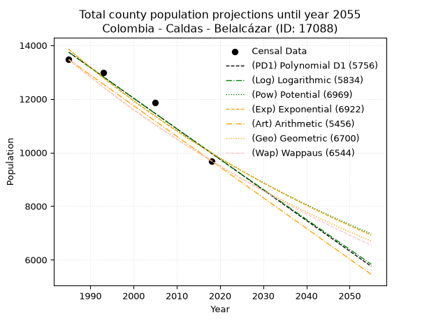
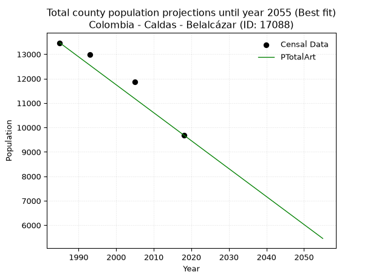
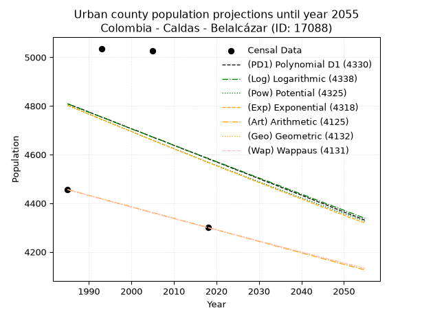
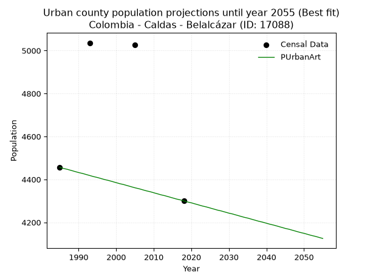
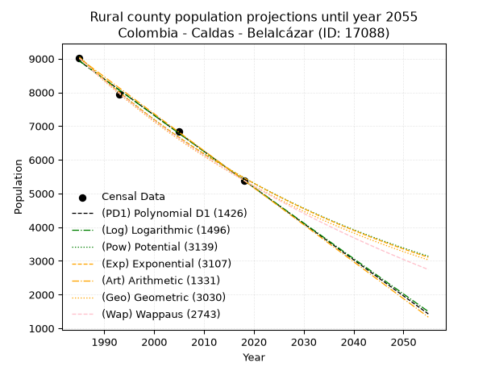
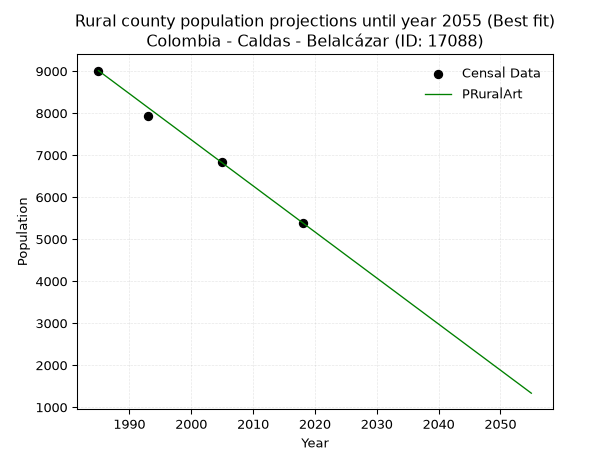

<div align="center">


</div>

# _“Population and Public Services Demand Projections (PPSD) until Year 2050 for Colombia - Caldas - Belalcázar (ID: 17088)”_
Keywords: `population` `public-service` `projection` `lineal` `polynomial` `logarithmic` `potential` `exponential` `arithmetic` `geometric` `wappaus` `dane` `colombia` `south-america`

PPSD are analytical estimates used by governments and planners to anticipate future changes in population size, age distribution, and the resulting community needs for utilities, healthcare, education, and infrastructure as sizing future water treatment facilities, electrical grids, and road networks based on spatial growth.

> **General running parameters**: • app_version: _v20260806_. • Python version: _3.14.7_. • Pandas version: _3.0.5_. • NumPy version: _2.5.1_. • Creates, save and include plots into reports (create_plot): _False_. • Projection until year: _2050_. • Process polynomial degree 2 and up: _False_. • Process Wappaus: _True_. • Process Wappaus: _True_. • Set negative values to zero: _True_. • Set infinite values to zero: _True_. • Drop dataset notes: _True_. 
<div align="center">

Dynamic map: [:earth_americas:Google](http://maps.google.com/maps?q=4.993784894,-75.8119176) [:earth_americas:OSM](https://www.openstreetmap.org/#map=18/4.993784894/-75.8119176&layers=P) [:earth_americas:Bing](https://www.bing.com/maps?cp=4.993784894~-75.8119176&lvl=18) [:earth_americas:Apple](https://maps.apple.com/frame?center=4.993784894%2C-75.8119176&span=0.003%2C0.006)

</div>


<div align="center">

```geojson
{
  "type": "Feature",
  "geometry": {
    "type": "Point", 
    "coordinates": [-75.8119176, 4.993784894]
  }, 
  "properties": {
    "Name": "Colombia - Caldas - Belalcázar (ID: 17088)"
  }
}
```

</div>


## 0. Census Data (4 records)

Census data are official statistics collected by a government about the people and housing in a country. They usually include counts of total population, age, sex, race, income, education, and jobs.

📅Global census file: [Population.xlsx](../data/Population.xlsx)

| Source   |   Year |   CountryID | CountryName   |   StateID | StateName   |   CountyID | CountyName   |   PTotal |   PUrban |   PRural |
|:---------|-------:|------------:|:--------------|----------:|:------------|-----------:|:-------------|---------:|---------:|---------:|
| DANE     |   1985 |          57 | Colombia      |        17 | Caldas      |      17088 | Belalcázar   |    13466 |     4456 |     9010 |
| DANE     |   1993 |          57 | Colombia      |        17 | Caldas      |      17088 | Belalcázar   |    12974 |     5036 |     7938 |
| DANE     |   2005 |          57 | Colombia      |        17 | Caldas      |      17088 | Belalcázar   |    11872 |     5027 |     6845 |
| DANE     |   2018 |          57 | Colombia      |        17 | Caldas      |      17088 | Belalcázar   |     9690 |     4300 |     5390 |

> 🔥Some records could had specific notes about the registered values or the corresponding urban or rural distribution.

📅   [RUPS](https://www.datos.gov.co/Hacienda-y-Cr-dito-P-blico/Registro-nico-de-Prestadores-de-Servicios-P-blicos/4qkq-csdn/about_data) - Local public utility companies: [RUPS.csv](../data/RUPS.xlsx)

 | SERVICIO       | ESTADO    | NOMBRE                                                                     | NIT         | DEPARTAMENTO_DOMICILIO   | MUNICIPIO_DOMICILIO   | DIRECCION              |   TELEFONO | EMAIL                              | TIPO_PRESTADOR                             | CLASIFICACION                 |
|:---------------|:----------|:---------------------------------------------------------------------------|:------------|:-------------------------|:----------------------|:-----------------------|-----------:|:-----------------------------------|:-------------------------------------------|:------------------------------|
| ACUEDUCTO      | OPERATIVA | EMPRESA DE OBRAS SANITARIAS DE CALDAS  S. A. EMPRESA DE SERVICIOS PUBLICOS | 890803239-9 | CALDAS                   | MANIZALES             | Carrera 23 Nro 75 - 82 |    8867080 | lorena.grisalest@empocaldas.com.co | SOCIEDADES (EMPRESA DE SERVICIOS PUBLICOS) | MAYOR O IGUAL A 5001 USUARIOS |
| ALCANTARILLADO | OPERATIVA | EMPRESA DE OBRAS SANITARIAS DE CALDAS  S. A. EMPRESA DE SERVICIOS PUBLICOS | 890803239-9 | CALDAS                   | MANIZALES             | Carrera 23 Nro 75 - 82 |    8867080 | lorena.grisalest@empocaldas.com.co | SOCIEDADES (EMPRESA DE SERVICIOS PUBLICOS) | MAYOR O IGUAL A 5001 USUARIOS |
| ACUEDUCTO      | OPERATIVA | ASOCIACION DE USUARIOS ACUEDUCTO EL MADROÑO                                | 900480454-3 | CALDAS                   | BELALCAZAR            | VEREDA EL MADRONO      |    3113546 | claudiamilenar9@gmail.com          | ORGANIZACION AUTORIZADA                    | HASTA 2500 SUSCRIPTORES       |

## 1. Total

### 1.1. Coefficients and Parameters

* (PD1) Polynomial Deg 1: -114.05620232838078, 240141.41870734363 (lineal)
* (Log) Logarithmic: -228187.47262302472, 1746455.3079872567
* (Pow) Potential: -19.818760434673365, 69.49902123562364
* (Exp) Exponential: -0.00990708366329902, 4808938505701.669
* (Art) Arithmetic: Year diff. 2018 - 1985 = 33, Population diff. 9690 - 13466 = -3776, Annual growth = -114.42424242424242
* (Geo) Geometric: Year diff. 2018 - 1985 = 33, Population diff. 9690 - 13466 = -3776, Annual growth % = -0.009922371388269013
* (Wap) Wappaus: i = -0.9882902265006255, Condition values only valid for < 200)

<sub>
Wappaus condition values: ['-0.00', '-0.99', '-1.98', '-2.96', '-3.95', '-4.94', '-5.93', '-6.92', '-7.91', '-8.89', '-9.88', '-10.87', '-11.86', '-12.85', '-13.84', '-14.82', '-15.81', '-16.80', '-17.79', '-18.78', '-19.77', '-20.75', '-21.74', '-22.73', '-23.72', '-24.71', '-25.70', '-26.68', '-27.67', '-28.66', '-29.65', '-30.64', '-31.63', '-32.61', '-33.60', '-34.59', '-35.58', '-36.57', '-37.56', '-38.54', '-39.53', '-40.52', '-41.51', '-42.50', '-43.48', '-44.47', '-45.46', '-46.45', '-47.44', '-48.43', '-49.41', '-50.40', '-51.39', '-52.38', '-53.37', '-54.36', '-55.34', '-56.33', '-57.32', '-58.31', '-59.30', '-60.29', '-61.27', '-62.26', '-63.25', '-64.24']
</sub>


### 1.2. Projected Dataset

|   Year |   CountyID |   PTotalPD1 |   PTotalLog |   PTotalPow |   PTotalExp |   PTotalArt |   PTotalGeo |   PTotalWap |
|-------:|-----------:|------------:|------------:|------------:|------------:|------------:|------------:|------------:|
|   1985 |      17088 |       13740 |       13742 |       13851 |       13849 |       13466 |       13466 |       13466 |
|   1986 |      17088 |       13626 |       13628 |       13714 |       13712 |       13352 |       13332 |       13334 |
|   1987 |      17088 |       13512 |       13513 |       13578 |       13577 |       13237 |       13200 |       13202 |
|   1988 |      17088 |       13398 |       13398 |       13443 |       13443 |       13123 |       13069 |       13073 |
|   1989 |      17088 |       13284 |       13283 |       13310 |       13310 |       13008 |       12939 |       12944 |
|   1990 |      17088 |       13170 |       13168 |       13178 |       13179 |       12894 |       12811 |       12817 |
|   1991 |      17088 |       13056 |       13054 |       13047 |       13049 |       12779 |       12684 |       12690 |
|   1992 |      17088 |       12941 |       12939 |       12918 |       12921 |       12665 |       12558 |       12566 |
|   1993 |      17088 |       12827 |       12825 |       12790 |       12793 |       12551 |       12433 |       12442 |
|   1994 |      17088 |       12713 |       12710 |       12664 |       12667 |       12436 |       12310 |       12319 |
|   1995 |      17088 |       12599 |       12596 |       12538 |       12542 |       12322 |       12188 |       12198 |
|   1996 |      17088 |       12485 |       12481 |       12415 |       12419 |       12207 |       12067 |       12078 |
|   1997 |      17088 |       12371 |       12367 |       12292 |       12296 |       12093 |       11947 |       11958 |
|   1998 |      17088 |       12257 |       12253 |       12171 |       12175 |       11978 |       11829 |       11840 |
|   1999 |      17088 |       12143 |       12139 |       12050 |       12055 |       11864 |       11711 |       11723 |
|   2000 |      17088 |       12029 |       12025 |       11932 |       11936 |       11750 |       11595 |       11608 |
|   2001 |      17088 |       11915 |       11911 |       11814 |       11819 |       11635 |       11480 |       11493 |
|   2002 |      17088 |       11801 |       11797 |       11698 |       11702 |       11521 |       11366 |       11379 |
|   2003 |      17088 |       11687 |       11683 |       11582 |       11587 |       11406 |       11253 |       11266 |
|   2004 |      17088 |       11573 |       11569 |       11468 |       11472 |       11292 |       11142 |       11154 |
|   2005 |      17088 |       11459 |       11455 |       11356 |       11359 |       11178 |       11031 |       11044 |
|   2006 |      17088 |       11345 |       11341 |       11244 |       11247 |       11063 |       10922 |       10934 |
|   2007 |      17088 |       11231 |       11227 |       11133 |       11136 |       10949 |       10813 |       10825 |
|   2008 |      17088 |       11117 |       11114 |       11024 |       11027 |       10834 |       10706 |       10717 |
|   2009 |      17088 |       11003 |       11000 |       10916 |       10918 |       10720 |       10600 |       10611 |
|   2010 |      17088 |       10888 |       10886 |       10809 |       10810 |       10605 |       10495 |       10505 |
|   2011 |      17088 |       10774 |       10773 |       10703 |       10704 |       10491 |       10391 |       10400 |
|   2012 |      17088 |       10660 |       10660 |       10598 |       10598 |       10377 |       10287 |       10296 |
|   2013 |      17088 |       10546 |       10546 |       10494 |       10494 |       10262 |       10185 |       10193 |
|   2014 |      17088 |       10432 |       10433 |       10391 |       10390 |       10148 |       10084 |       10090 |
|   2015 |      17088 |       10318 |       10320 |       10289 |       10288 |       10033 |        9984 |        9989 |
|   2016 |      17088 |       10204 |       10206 |       10189 |       10186 |        9919 |        9885 |        9888 |
|   2017 |      17088 |       10090 |       10093 |       10089 |       10086 |        9804 |        9787 |        9789 |
|   2018 |      17088 |        9976 |        9980 |        9990 |        9987 |        9690 |        9690 |        9690 |
|   2019 |      17088 |        9862 |        9867 |        9893 |        9888 |        9576 |        9594 |        9592 |
|   2020 |      17088 |        9748 |        9754 |        9796 |        9791 |        9461 |        9499 |        9495 |
|   2021 |      17088 |        9634 |        9641 |        9701 |        9694 |        9347 |        9404 |        9399 |
|   2022 |      17088 |        9520 |        9528 |        9606 |        9599 |        9232 |        9311 |        9303 |
|   2023 |      17088 |        9406 |        9415 |        9512 |        9504 |        9118 |        9219 |        9208 |
|   2024 |      17088 |        9292 |        9303 |        9419 |        9410 |        9003 |        9127 |        9114 |
|   2025 |      17088 |        9178 |        9190 |        9328 |        9318 |        8889 |        9037 |        9021 |
|   2026 |      17088 |        9064 |        9077 |        9237 |        9226 |        8775 |        8947 |        8929 |
|   2027 |      17088 |        8949 |        8965 |        9147 |        9135 |        8660 |        8858 |        8837 |
|   2028 |      17088 |        8835 |        8852 |        9058 |        9045 |        8546 |        8770 |        8746 |
|   2029 |      17088 |        8721 |        8740 |        8970 |        8956 |        8431 |        8683 |        8656 |
|   2030 |      17088 |        8607 |        8627 |        8883 |        8867 |        8317 |        8597 |        8567 |
|   2031 |      17088 |        8493 |        8515 |        8797 |        8780 |        8202 |        8512 |        8478 |
|   2032 |      17088 |        8379 |        8402 |        8711 |        8693 |        8088 |        8427 |        8390 |
|   2033 |      17088 |        8265 |        8290 |        8627 |        8608 |        7974 |        8344 |        8303 |
|   2034 |      17088 |        8151 |        8178 |        8543 |        8523 |        7859 |        8261 |        8216 |
|   2035 |      17088 |        8037 |        8066 |        8460 |        8439 |        7745 |        8179 |        8130 |
|   2036 |      17088 |        7923 |        7954 |        8378 |        8355 |        7630 |        8098 |        8045 |
|   2037 |      17088 |        7809 |        7842 |        8297 |        8273 |        7516 |        8018 |        7960 |
|   2038 |      17088 |        7695 |        7730 |        8217 |        8192 |        7402 |        7938 |        7876 |
|   2039 |      17088 |        7581 |        7618 |        8137 |        8111 |        7287 |        7859 |        7793 |
|   2040 |      17088 |        7467 |        7506 |        8058 |        8031 |        7173 |        7781 |        7711 |
|   2041 |      17088 |        7353 |        7394 |        7981 |        7952 |        7058 |        7704 |        7629 |
|   2042 |      17088 |        7239 |        7282 |        7904 |        7873 |        6944 |        7628 |        7547 |
|   2043 |      17088 |        7125 |        7171 |        7827 |        7796 |        6829 |        7552 |        7467 |
|   2044 |      17088 |        7011 |        7059 |        7752 |        7719 |        6715 |        7477 |        7387 |
|   2045 |      17088 |        6896 |        6947 |        7677 |        7643 |        6601 |        7403 |        7307 |
|   2046 |      17088 |        6782 |        6836 |        7603 |        7567 |        6486 |        7329 |        7228 |
|   2047 |      17088 |        6668 |        6724 |        7530 |        7493 |        6372 |        7257 |        7150 |
|   2048 |      17088 |        6554 |        6613 |        7457 |        7419 |        6257 |        7185 |        7072 |
|   2049 |      17088 |        6440 |        6501 |        7385 |        7346 |        6143 |        7113 |        6995 |
|   2050 |      17088 |        6326 |        6390 |        7314 |        7273 |        6028 |        7043 |        6919 |
<div align="center">

</img>

</div>


### 1.3. Best fit with absolute and relative error (%)

Relative error puts that difference into context by dividing the absolute error by the true value, creating a unitless ratio or percentage that shows the scale of the mistake.

Absolute and relative error

|   Year | Source   |   CountryID | CountryName   |   StateID | StateName   |   CountyID_x | CountyName   |   PTotal |   PUrban |   PRural |   CountyID_y |   PTotalPD1 |   PTotalLog |   PTotalPow |   PTotalExp |   PTotalArt |   PTotalGeo |   PTotalWap |   PTotalPD1AbsError |   PTotalLogAbsError |   PTotalPowAbsError |   PTotalExpAbsError |   PTotalArtAbsError |   PTotalGeoAbsError |   PTotalWapAbsError |   PTotalPD1RelError |   PTotalLogRelError |   PTotalPowRelError |   PTotalExpRelError |   PTotalArtRelError |   PTotalGeoRelError |   PTotalWapRelError |
|-------:|:---------|------------:|:--------------|----------:|:------------|-------------:|:-------------|---------:|---------:|---------:|-------------:|------------:|------------:|------------:|------------:|------------:|------------:|------------:|--------------------:|--------------------:|--------------------:|--------------------:|--------------------:|--------------------:|--------------------:|--------------------:|--------------------:|--------------------:|--------------------:|--------------------:|--------------------:|--------------------:|
|   1985 | DANE     |          57 | Colombia      |        17 | Caldas      |        17088 | Belalcázar   |    13466 |     4456 |     9010 |        17088 |       13740 |       13742 |       13851 |       13849 |       13466 |       13466 |       13466 |                 274 |                 276 |                 385 |                 383 |                   0 |                   0 |                   0 |             2.03475 |             2.04961 |             2.85905 |             2.8442  |             0       |             0       |             0       |
|   1993 | DANE     |          57 | Colombia      |        17 | Caldas      |        17088 | Belalcázar   |    12974 |     5036 |     7938 |        17088 |       12827 |       12825 |       12790 |       12793 |       12551 |       12433 |       12442 |                 147 |                 149 |                 184 |                 181 |                 423 |                 541 |                 532 |             1.13304 |             1.14845 |             1.41822 |             1.3951  |             3.26037 |             4.16988 |             4.10051 |
|   2005 | DANE     |          57 | Colombia      |        17 | Caldas      |        17088 | Belalcázar   |    11872 |     5027 |     6845 |        17088 |       11459 |       11455 |       11356 |       11359 |       11178 |       11031 |       11044 |                 413 |                 417 |                 516 |                 513 |                 694 |                 841 |                 828 |             3.47877 |             3.51247 |             4.34636 |             4.32109 |             5.84569 |             7.08389 |             6.97439 |
|   2018 | DANE     |          57 | Colombia      |        17 | Caldas      |        17088 | Belalcázar   |     9690 |     4300 |     5390 |        17088 |        9976 |        9980 |        9990 |        9987 |        9690 |        9690 |        9690 |                 286 |                 290 |                 300 |                 297 |                   0 |                   0 |                   0 |             2.9515  |             2.99278 |             3.09598 |             3.06502 |             0       |             0       |             0       |

Relative error mean

| Method    |   RelError | Best   |
|:----------|-----------:|:-------|
| PTotalPD1 |    2.39951 |        |
| PTotalLog |    2.42582 |        |
| PTotalPow |    2.9299  |        |
| PTotalExp |    2.90635 |        |
| PTotalArt |    2.27651 | True   |
| PTotalGeo |    2.81344 |        |
| PTotalWap |    2.76873 |        |

💙Best method: _**PTotalArt**_
<div align="center">

</img>

</div>


### 1.4. Fresh water supply demand in liters per capita per day (lpcd)

The fresh water supply demand typically ranges from 100 to 300 liters per capita per day (lpcd) for standard domestic and municipal planning, though absolute survival minimums set by the World Health Organization are as low as 7.5 to 20 liters per day, and total consumption in high-income nations can exceed 400 liters.

> `CZ`: Level in meters above the sea level (masl)<br> `WS`: Fresh water supply demand in liters per capita per day (lpcd or l/h/d)<br> `WSAll`: Zonal fresh water supply demand in liters per second (l/s)<br> `A`: Zonal area in square meters<br> `DP`: Population density (people/hectare or p/ha)

Reference values (RAS Colombia)

|    CZ |   WS |
|------:|-----:|
|  1000 |  120 |
|  2000 |  130 |
| 99999 |  140 |

County shapefile geometry properties and water supply values

|   CountyID |      ATotal |   CZTotal |   WSTotal |
|-----------:|------------:|----------:|----------:|
|      17088 | 1.13316e+08 |   1186.15 |       130 |

Projected values for best method: PTotalArt

|   CountyID |   Year |   PTotalArt |   DPTotal |   WSTotal |   WSTotalAll |
|-----------:|-------:|------------:|----------:|----------:|-------------:|
|      17088 |   1985 |       13466 |      1.19 |       130 |     20.2613  |
|      17088 |   1986 |       13352 |      1.18 |       130 |     20.0898  |
|      17088 |   1987 |       13237 |      1.17 |       130 |     19.9168  |
|      17088 |   1988 |       13123 |      1.16 |       130 |     19.7453  |
|      17088 |   1989 |       13008 |      1.15 |       130 |     19.5722  |
|      17088 |   1990 |       12894 |      1.14 |       130 |     19.4007  |
|      17088 |   1991 |       12779 |      1.13 |       130 |     19.2277  |
|      17088 |   1992 |       12665 |      1.12 |       130 |     19.0561  |
|      17088 |   1993 |       12551 |      1.11 |       130 |     18.8846  |
|      17088 |   1994 |       12436 |      1.1  |       130 |     18.7116  |
|      17088 |   1995 |       12322 |      1.09 |       130 |     18.54    |
|      17088 |   1996 |       12207 |      1.08 |       130 |     18.367   |
|      17088 |   1997 |       12093 |      1.07 |       130 |     18.1955  |
|      17088 |   1998 |       11978 |      1.06 |       130 |     18.0225  |
|      17088 |   1999 |       11864 |      1.05 |       130 |     17.8509  |
|      17088 |   2000 |       11750 |      1.04 |       130 |     17.6794  |
|      17088 |   2001 |       11635 |      1.03 |       130 |     17.5064  |
|      17088 |   2002 |       11521 |      1.02 |       130 |     17.3348  |
|      17088 |   2003 |       11406 |      1.01 |       130 |     17.1618  |
|      17088 |   2004 |       11292 |      1    |       130 |     16.9903  |
|      17088 |   2005 |       11178 |      0.99 |       130 |     16.8188  |
|      17088 |   2006 |       11063 |      0.98 |       130 |     16.6457  |
|      17088 |   2007 |       10949 |      0.97 |       130 |     16.4742  |
|      17088 |   2008 |       10834 |      0.96 |       130 |     16.3012  |
|      17088 |   2009 |       10720 |      0.95 |       130 |     16.1296  |
|      17088 |   2010 |       10605 |      0.94 |       130 |     15.9566  |
|      17088 |   2011 |       10491 |      0.93 |       130 |     15.7851  |
|      17088 |   2012 |       10377 |      0.92 |       130 |     15.6135  |
|      17088 |   2013 |       10262 |      0.91 |       130 |     15.4405  |
|      17088 |   2014 |       10148 |      0.9  |       130 |     15.269   |
|      17088 |   2015 |       10033 |      0.89 |       130 |     15.0959  |
|      17088 |   2016 |        9919 |      0.88 |       130 |     14.9244  |
|      17088 |   2017 |        9804 |      0.87 |       130 |     14.7514  |
|      17088 |   2018 |        9690 |      0.86 |       130 |     14.5799  |
|      17088 |   2019 |        9576 |      0.85 |       130 |     14.4083  |
|      17088 |   2020 |        9461 |      0.83 |       130 |     14.2353  |
|      17088 |   2021 |        9347 |      0.82 |       130 |     14.0638  |
|      17088 |   2022 |        9232 |      0.81 |       130 |     13.8907  |
|      17088 |   2023 |        9118 |      0.8  |       130 |     13.7192  |
|      17088 |   2024 |        9003 |      0.79 |       130 |     13.5462  |
|      17088 |   2025 |        8889 |      0.78 |       130 |     13.3747  |
|      17088 |   2026 |        8775 |      0.77 |       130 |     13.2031  |
|      17088 |   2027 |        8660 |      0.76 |       130 |     13.0301  |
|      17088 |   2028 |        8546 |      0.75 |       130 |     12.8586  |
|      17088 |   2029 |        8431 |      0.74 |       130 |     12.6855  |
|      17088 |   2030 |        8317 |      0.73 |       130 |     12.514   |
|      17088 |   2031 |        8202 |      0.72 |       130 |     12.341   |
|      17088 |   2032 |        8088 |      0.71 |       130 |     12.1694  |
|      17088 |   2033 |        7974 |      0.7  |       130 |     11.9979  |
|      17088 |   2034 |        7859 |      0.69 |       130 |     11.8249  |
|      17088 |   2035 |        7745 |      0.68 |       130 |     11.6534  |
|      17088 |   2036 |        7630 |      0.67 |       130 |     11.4803  |
|      17088 |   2037 |        7516 |      0.66 |       130 |     11.3088  |
|      17088 |   2038 |        7402 |      0.65 |       130 |     11.1373  |
|      17088 |   2039 |        7287 |      0.64 |       130 |     10.9642  |
|      17088 |   2040 |        7173 |      0.63 |       130 |     10.7927  |
|      17088 |   2041 |        7058 |      0.62 |       130 |     10.6197  |
|      17088 |   2042 |        6944 |      0.61 |       130 |     10.4481  |
|      17088 |   2043 |        6829 |      0.6  |       130 |     10.2751  |
|      17088 |   2044 |        6715 |      0.59 |       130 |     10.1036  |
|      17088 |   2045 |        6601 |      0.58 |       130 |      9.93206 |
|      17088 |   2046 |        6486 |      0.57 |       130 |      9.75903 |
|      17088 |   2047 |        6372 |      0.56 |       130 |      9.5875  |
|      17088 |   2048 |        6257 |      0.55 |       130 |      9.41447 |
|      17088 |   2049 |        6143 |      0.54 |       130 |      9.24294 |
|      17088 |   2050 |        6028 |      0.53 |       130 |      9.06991 |

## 2. Urban

### 2.1. Coefficients and Parameters

* (PD1) Polynomial Deg 1: -6.843436370934929, 18393.333600962593 (lineal)
* (Log) Logarithmic: -13578.622864215948, 107915.97120316008
* (Pow) Potential: -3.0182103496599084, 13.63479331784346
* (Exp) Exponential: -0.0015205869563390433, 98261.23211255592
* (Art) Arithmetic: Year diff. 2018 - 1985 = 33, Population diff. 4300 - 4456 = -156, Annual growth = -4.7272727272727275
* (Geo) Geometric: Year diff. 2018 - 1985 = 33, Population diff. 4300 - 4456 = -156, Annual growth % = -0.001079310456104654
* (Wap) Wappaus: i = -0.10797790605922172, Condition values only valid for < 200)

<sub>
Wappaus condition values: ['-0.00', '-0.11', '-0.22', '-0.32', '-0.43', '-0.54', '-0.65', '-0.76', '-0.86', '-0.97', '-1.08', '-1.19', '-1.30', '-1.40', '-1.51', '-1.62', '-1.73', '-1.84', '-1.94', '-2.05', '-2.16', '-2.27', '-2.38', '-2.48', '-2.59', '-2.70', '-2.81', '-2.92', '-3.02', '-3.13', '-3.24', '-3.35', '-3.46', '-3.56', '-3.67', '-3.78', '-3.89', '-4.00', '-4.10', '-4.21', '-4.32', '-4.43', '-4.54', '-4.64', '-4.75', '-4.86', '-4.97', '-5.07', '-5.18', '-5.29', '-5.40', '-5.51', '-5.61', '-5.72', '-5.83', '-5.94', '-6.05', '-6.15', '-6.26', '-6.37', '-6.48', '-6.59', '-6.69', '-6.80', '-6.91', '-7.02']
</sub>


### 2.2. Projected Dataset

|   Year |   CountyID |   PUrbanPD1 |   PUrbanLog |   PUrbanPow |   PUrbanExp |   PUrbanArt |   PUrbanGeo |   PUrbanWap |
|-------:|-----------:|------------:|------------:|------------:|------------:|------------:|------------:|------------:|
|   1985 |      17088 |        4809 |        4808 |        4802 |        4803 |        4456 |        4456 |        4456 |
|   1986 |      17088 |        4802 |        4802 |        4795 |        4796 |        4451 |        4451 |        4451 |
|   1987 |      17088 |        4795 |        4795 |        4788 |        4789 |        4447 |        4446 |        4446 |
|   1988 |      17088 |        4789 |        4788 |        4781 |        4781 |        4442 |        4442 |        4442 |
|   1989 |      17088 |        4782 |        4781 |        4773 |        4774 |        4437 |        4437 |        4437 |
|   1990 |      17088 |        4775 |        4774 |        4766 |        4767 |        4432 |        4432 |        4432 |
|   1991 |      17088 |        4768 |        4767 |        4759 |        4759 |        4428 |        4427 |        4427 |
|   1992 |      17088 |        4761 |        4761 |        4752 |        4752 |        4423 |        4422 |        4422 |
|   1993 |      17088 |        4754 |        4754 |        4744 |        4745 |        4418 |        4418 |        4418 |
|   1994 |      17088 |        4748 |        4747 |        4737 |        4738 |        4413 |        4413 |        4413 |
|   1995 |      17088 |        4741 |        4740 |        4730 |        4731 |        4409 |        4408 |        4408 |
|   1996 |      17088 |        4734 |        4733 |        4723 |        4723 |        4404 |        4403 |        4403 |
|   1997 |      17088 |        4727 |        4727 |        4716 |        4716 |        4399 |        4399 |        4399 |
|   1998 |      17088 |        4720 |        4720 |        4709 |        4709 |        4395 |        4394 |        4394 |
|   1999 |      17088 |        4713 |        4713 |        4702 |        4702 |        4390 |        4389 |        4389 |
|   2000 |      17088 |        4706 |        4706 |        4695 |        4695 |        4385 |        4384 |        4384 |
|   2001 |      17088 |        4700 |        4699 |        4687 |        4688 |        4380 |        4380 |        4380 |
|   2002 |      17088 |        4693 |        4693 |        4680 |        4681 |        4376 |        4375 |        4375 |
|   2003 |      17088 |        4686 |        4686 |        4673 |        4673 |        4371 |        4370 |        4370 |
|   2004 |      17088 |        4679 |        4679 |        4666 |        4666 |        4366 |        4366 |        4366 |
|   2005 |      17088 |        4672 |        4672 |        4659 |        4659 |        4361 |        4361 |        4361 |
|   2006 |      17088 |        4665 |        4666 |        4652 |        4652 |        4357 |        4356 |        4356 |
|   2007 |      17088 |        4659 |        4659 |        4645 |        4645 |        4352 |        4351 |        4351 |
|   2008 |      17088 |        4652 |        4652 |        4638 |        4638 |        4347 |        4347 |        4347 |
|   2009 |      17088 |        4645 |        4645 |        4631 |        4631 |        4343 |        4342 |        4342 |
|   2010 |      17088 |        4638 |        4638 |        4624 |        4624 |        4338 |        4337 |        4337 |
|   2011 |      17088 |        4631 |        4632 |        4617 |        4617 |        4333 |        4333 |        4333 |
|   2012 |      17088 |        4624 |        4625 |        4611 |        4610 |        4328 |        4328 |        4328 |
|   2013 |      17088 |        4617 |        4618 |        4604 |        4603 |        4324 |        4323 |        4323 |
|   2014 |      17088 |        4611 |        4611 |        4597 |        4596 |        4319 |        4319 |        4319 |
|   2015 |      17088 |        4604 |        4605 |        4590 |        4589 |        4314 |        4314 |        4314 |
|   2016 |      17088 |        4597 |        4598 |        4583 |        4582 |        4309 |        4309 |        4309 |
|   2017 |      17088 |        4590 |        4591 |        4576 |        4575 |        4305 |        4305 |        4305 |
|   2018 |      17088 |        4583 |        4585 |        4569 |        4568 |        4300 |        4300 |        4300 |
|   2019 |      17088 |        4576 |        4578 |        4562 |        4561 |        4295 |        4295 |        4295 |
|   2020 |      17088 |        4570 |        4571 |        4556 |        4554 |        4291 |        4291 |        4291 |
|   2021 |      17088 |        4563 |        4564 |        4549 |        4547 |        4286 |        4286 |        4286 |
|   2022 |      17088 |        4556 |        4558 |        4542 |        4540 |        4281 |        4281 |        4281 |
|   2023 |      17088 |        4549 |        4551 |        4535 |        4533 |        4276 |        4277 |        4277 |
|   2024 |      17088 |        4542 |        4544 |        4529 |        4527 |        4272 |        4272 |        4272 |
|   2025 |      17088 |        4535 |        4538 |        4522 |        4520 |        4267 |        4268 |        4268 |
|   2026 |      17088 |        4529 |        4531 |        4515 |        4513 |        4262 |        4263 |        4263 |
|   2027 |      17088 |        4522 |        4524 |        4508 |        4506 |        4257 |        4258 |        4258 |
|   2028 |      17088 |        4515 |        4517 |        4502 |        4499 |        4253 |        4254 |        4254 |
|   2029 |      17088 |        4508 |        4511 |        4495 |        4492 |        4248 |        4249 |        4249 |
|   2030 |      17088 |        4501 |        4504 |        4488 |        4485 |        4243 |        4245 |        4245 |
|   2031 |      17088 |        4494 |        4497 |        4482 |        4479 |        4239 |        4240 |        4240 |
|   2032 |      17088 |        4487 |        4491 |        4475 |        4472 |        4234 |        4235 |        4235 |
|   2033 |      17088 |        4481 |        4484 |        4468 |        4465 |        4229 |        4231 |        4231 |
|   2034 |      17088 |        4474 |        4477 |        4462 |        4458 |        4224 |        4226 |        4226 |
|   2035 |      17088 |        4467 |        4471 |        4455 |        4451 |        4220 |        4222 |        4222 |
|   2036 |      17088 |        4460 |        4464 |        4448 |        4445 |        4215 |        4217 |        4217 |
|   2037 |      17088 |        4453 |        4457 |        4442 |        4438 |        4210 |        4213 |        4213 |
|   2038 |      17088 |        4446 |        4451 |        4435 |        4431 |        4205 |        4208 |        4208 |
|   2039 |      17088 |        4440 |        4444 |        4429 |        4424 |        4201 |        4204 |        4204 |
|   2040 |      17088 |        4433 |        4437 |        4422 |        4418 |        4196 |        4199 |        4199 |
|   2041 |      17088 |        4426 |        4431 |        4416 |        4411 |        4191 |        4195 |        4194 |
|   2042 |      17088 |        4419 |        4424 |        4409 |        4404 |        4187 |        4190 |        4190 |
|   2043 |      17088 |        4412 |        4417 |        4403 |        4398 |        4182 |        4185 |        4185 |
|   2044 |      17088 |        4405 |        4411 |        4396 |        4391 |        4177 |        4181 |        4181 |
|   2045 |      17088 |        4399 |        4404 |        4390 |        4384 |        4172 |        4176 |        4176 |
|   2046 |      17088 |        4392 |        4397 |        4383 |        4378 |        4168 |        4172 |        4172 |
|   2047 |      17088 |        4385 |        4391 |        4377 |        4371 |        4163 |        4167 |        4167 |
|   2048 |      17088 |        4378 |        4384 |        4370 |        4364 |        4158 |        4163 |        4163 |
|   2049 |      17088 |        4371 |        4378 |        4364 |        4358 |        4153 |        4158 |        4158 |
|   2050 |      17088 |        4364 |        4371 |        4357 |        4351 |        4149 |        4154 |        4154 |
<div align="center">

</img>

</div>


### 2.3. Best fit with absolute and relative error (%)

Relative error puts that difference into context by dividing the absolute error by the true value, creating a unitless ratio or percentage that shows the scale of the mistake.

Absolute and relative error

|   Year | Source   |   CountryID | CountryName   |   StateID | StateName   |   CountyID_x | CountyName   |   PTotal |   PUrban |   PRural |   CountyID_y |   PUrbanPD1 |   PUrbanLog |   PUrbanPow |   PUrbanExp |   PUrbanArt |   PUrbanGeo |   PUrbanWap |   PUrbanPD1AbsError |   PUrbanLogAbsError |   PUrbanPowAbsError |   PUrbanExpAbsError |   PUrbanArtAbsError |   PUrbanGeoAbsError |   PUrbanWapAbsError |   PUrbanPD1RelError |   PUrbanLogRelError |   PUrbanPowRelError |   PUrbanExpRelError |   PUrbanArtRelError |   PUrbanGeoRelError |   PUrbanWapRelError |
|-------:|:---------|------------:|:--------------|----------:|:------------|-------------:|:-------------|---------:|---------:|---------:|-------------:|------------:|------------:|------------:|------------:|------------:|------------:|------------:|--------------------:|--------------------:|--------------------:|--------------------:|--------------------:|--------------------:|--------------------:|--------------------:|--------------------:|--------------------:|--------------------:|--------------------:|--------------------:|--------------------:|
|   1985 | DANE     |          57 | Colombia      |        17 | Caldas      |        17088 | Belalcázar   |    13466 |     4456 |     9010 |        17088 |        4809 |        4808 |        4802 |        4803 |        4456 |        4456 |        4456 |                 353 |                 352 |                 346 |                 347 |                   0 |                   0 |                   0 |             7.9219  |             7.89946 |             7.76481 |             7.78725 |              0      |              0      |              0      |
|   1993 | DANE     |          57 | Colombia      |        17 | Caldas      |        17088 | Belalcázar   |    12974 |     5036 |     7938 |        17088 |        4754 |        4754 |        4744 |        4745 |        4418 |        4418 |        4418 |                 282 |                 282 |                 292 |                 291 |                 618 |                 618 |                 618 |             5.59968 |             5.59968 |             5.79825 |             5.7784  |             12.2716 |             12.2716 |             12.2716 |
|   2005 | DANE     |          57 | Colombia      |        17 | Caldas      |        17088 | Belalcázar   |    11872 |     5027 |     6845 |        17088 |        4672 |        4672 |        4659 |        4659 |        4361 |        4361 |        4361 |                 355 |                 355 |                 368 |                 368 |                 666 |                 666 |                 666 |             7.06187 |             7.06187 |             7.32047 |             7.32047 |             13.2485 |             13.2485 |             13.2485 |
|   2018 | DANE     |          57 | Colombia      |        17 | Caldas      |        17088 | Belalcázar   |     9690 |     4300 |     5390 |        17088 |        4583 |        4585 |        4569 |        4568 |        4300 |        4300 |        4300 |                 283 |                 285 |                 269 |                 268 |                   0 |                   0 |                   0 |             6.5814  |             6.62791 |             6.25581 |             6.23256 |              0      |              0      |              0      |

Relative error mean

| Method    |   RelError | Best   |
|:----------|-----------:|:-------|
| PUrbanPD1 |    6.79121 |        |
| PUrbanLog |    6.79723 |        |
| PUrbanPow |    6.78484 |        |
| PUrbanExp |    6.77967 |        |
| PUrbanArt |    6.38003 | True   |
| PUrbanGeo |    6.38003 | True   |
| PUrbanWap |    6.38003 | True   |

💙Best method: _**PUrbanArt**_
<div align="center">

</img>

</div>


### 2.4. Fresh water supply demand in liters per capita per day (lpcd)

The fresh water supply demand typically ranges from 100 to 300 liters per capita per day (lpcd) for standard domestic and municipal planning, though absolute survival minimums set by the World Health Organization are as low as 7.5 to 20 liters per day, and total consumption in high-income nations can exceed 400 liters.

> `CZ`: Level in meters above the sea level (masl)<br> `WS`: Fresh water supply demand in liters per capita per day (lpcd or l/h/d)<br> `WSAll`: Zonal fresh water supply demand in liters per second (l/s)<br> `A`: Zonal area in square meters<br> `DP`: Population density (people/hectare or p/ha)

Reference values (RAS Colombia)

|    CZ |   WS |
|------:|-----:|
|  1000 |  120 |
|  2000 |  130 |
| 99999 |  140 |

County shapefile geometry properties and water supply values

|   CountyID |   AUrban |   CZUrban |   WSUrban |
|-----------:|---------:|----------:|----------:|
|      17088 |   594783 |   1572.96 |       130 |

Projected values for best method: PUrbanArt

|   CountyID |   Year |   PUrbanArt |   DPUrban |   WSUrban |   WSUrbanAll |
|-----------:|-------:|------------:|----------:|----------:|-------------:|
|      17088 |   1985 |        4456 |     74.92 |       130 |      6.70463 |
|      17088 |   1986 |        4451 |     74.83 |       130 |      6.69711 |
|      17088 |   1987 |        4447 |     74.77 |       130 |      6.69109 |
|      17088 |   1988 |        4442 |     74.68 |       130 |      6.68356 |
|      17088 |   1989 |        4437 |     74.6  |       130 |      6.67604 |
|      17088 |   1990 |        4432 |     74.51 |       130 |      6.66852 |
|      17088 |   1991 |        4428 |     74.45 |       130 |      6.6625  |
|      17088 |   1992 |        4423 |     74.36 |       130 |      6.65498 |
|      17088 |   1993 |        4418 |     74.28 |       130 |      6.64745 |
|      17088 |   1994 |        4413 |     74.2  |       130 |      6.63993 |
|      17088 |   1995 |        4409 |     74.13 |       130 |      6.63391 |
|      17088 |   1996 |        4404 |     74.04 |       130 |      6.62639 |
|      17088 |   1997 |        4399 |     73.96 |       130 |      6.61887 |
|      17088 |   1998 |        4395 |     73.89 |       130 |      6.61285 |
|      17088 |   1999 |        4390 |     73.81 |       130 |      6.60532 |
|      17088 |   2000 |        4385 |     73.72 |       130 |      6.5978  |
|      17088 |   2001 |        4380 |     73.64 |       130 |      6.59028 |
|      17088 |   2002 |        4376 |     73.57 |       130 |      6.58426 |
|      17088 |   2003 |        4371 |     73.49 |       130 |      6.57674 |
|      17088 |   2004 |        4366 |     73.4  |       130 |      6.56921 |
|      17088 |   2005 |        4361 |     73.32 |       130 |      6.56169 |
|      17088 |   2006 |        4357 |     73.25 |       130 |      6.55567 |
|      17088 |   2007 |        4352 |     73.17 |       130 |      6.54815 |
|      17088 |   2008 |        4347 |     73.09 |       130 |      6.54063 |
|      17088 |   2009 |        4343 |     73.02 |       130 |      6.53461 |
|      17088 |   2010 |        4338 |     72.93 |       130 |      6.52708 |
|      17088 |   2011 |        4333 |     72.85 |       130 |      6.51956 |
|      17088 |   2012 |        4328 |     72.77 |       130 |      6.51204 |
|      17088 |   2013 |        4324 |     72.7  |       130 |      6.50602 |
|      17088 |   2014 |        4319 |     72.61 |       130 |      6.4985  |
|      17088 |   2015 |        4314 |     72.53 |       130 |      6.49097 |
|      17088 |   2016 |        4309 |     72.45 |       130 |      6.48345 |
|      17088 |   2017 |        4305 |     72.38 |       130 |      6.47743 |
|      17088 |   2018 |        4300 |     72.3  |       130 |      6.46991 |
|      17088 |   2019 |        4295 |     72.21 |       130 |      6.46238 |
|      17088 |   2020 |        4291 |     72.14 |       130 |      6.45637 |
|      17088 |   2021 |        4286 |     72.06 |       130 |      6.44884 |
|      17088 |   2022 |        4281 |     71.98 |       130 |      6.44132 |
|      17088 |   2023 |        4276 |     71.89 |       130 |      6.4338  |
|      17088 |   2024 |        4272 |     71.82 |       130 |      6.42778 |
|      17088 |   2025 |        4267 |     71.74 |       130 |      6.42025 |
|      17088 |   2026 |        4262 |     71.66 |       130 |      6.41273 |
|      17088 |   2027 |        4257 |     71.57 |       130 |      6.40521 |
|      17088 |   2028 |        4253 |     71.51 |       130 |      6.39919 |
|      17088 |   2029 |        4248 |     71.42 |       130 |      6.39167 |
|      17088 |   2030 |        4243 |     71.34 |       130 |      6.38414 |
|      17088 |   2031 |        4239 |     71.27 |       130 |      6.37812 |
|      17088 |   2032 |        4234 |     71.19 |       130 |      6.3706  |
|      17088 |   2033 |        4229 |     71.1  |       130 |      6.36308 |
|      17088 |   2034 |        4224 |     71.02 |       130 |      6.35556 |
|      17088 |   2035 |        4220 |     70.95 |       130 |      6.34954 |
|      17088 |   2036 |        4215 |     70.87 |       130 |      6.34201 |
|      17088 |   2037 |        4210 |     70.78 |       130 |      6.33449 |
|      17088 |   2038 |        4205 |     70.7  |       130 |      6.32697 |
|      17088 |   2039 |        4201 |     70.63 |       130 |      6.32095 |
|      17088 |   2040 |        4196 |     70.55 |       130 |      6.31343 |
|      17088 |   2041 |        4191 |     70.46 |       130 |      6.3059  |
|      17088 |   2042 |        4187 |     70.4  |       130 |      6.29988 |
|      17088 |   2043 |        4182 |     70.31 |       130 |      6.29236 |
|      17088 |   2044 |        4177 |     70.23 |       130 |      6.28484 |
|      17088 |   2045 |        4172 |     70.14 |       130 |      6.27731 |
|      17088 |   2046 |        4168 |     70.08 |       130 |      6.2713  |
|      17088 |   2047 |        4163 |     69.99 |       130 |      6.26377 |
|      17088 |   2048 |        4158 |     69.91 |       130 |      6.25625 |
|      17088 |   2049 |        4153 |     69.82 |       130 |      6.24873 |
|      17088 |   2050 |        4149 |     69.76 |       130 |      6.24271 |

## 3. Rural

### 3.1. Coefficients and Parameters

* (PD1) Polynomial Deg 1: -107.21276595744582, 221748.08510638104 (lineal)
* (Log) Logarithmic: -214608.84975880894, 1638539.3367840976
* (Pow) Potential: -30.55213701365243, 104.71027079529912
* (Exp) Exponential: -0.015265775030047314, 1.3082498731990918e+17
* (Art) Arithmetic: Year diff. 2018 - 1985 = 33, Population diff. 5390 - 9010 = -3620, Annual growth = -109.6969696969697
* (Geo) Geometric: Year diff. 2018 - 1985 = 33, Population diff. 5390 - 9010 = -3620, Annual growth % = -0.015448808156683591
* (Wap) Wappaus: i = -1.5235690235690236, Condition values only valid for < 200)

<sub>
Wappaus condition values: ['-0.00', '-1.52', '-3.05', '-4.57', '-6.09', '-7.62', '-9.14', '-10.66', '-12.19', '-13.71', '-15.24', '-16.76', '-18.28', '-19.81', '-21.33', '-22.85', '-24.38', '-25.90', '-27.42', '-28.95', '-30.47', '-31.99', '-33.52', '-35.04', '-36.57', '-38.09', '-39.61', '-41.14', '-42.66', '-44.18', '-45.71', '-47.23', '-48.75', '-50.28', '-51.80', '-53.32', '-54.85', '-56.37', '-57.90', '-59.42', '-60.94', '-62.47', '-63.99', '-65.51', '-67.04', '-68.56', '-70.08', '-71.61', '-73.13', '-74.65', '-76.18', '-77.70', '-79.23', '-80.75', '-82.27', '-83.80', '-85.32', '-86.84', '-88.37', '-89.89', '-91.41', '-92.94', '-94.46', '-95.98', '-97.51', '-99.03']
</sub>


### 3.2. Projected Dataset

|   Year |   CountyID |   PRuralPD1 |   PRuralLog |   PRuralPow |   PRuralExp |   PRuralArt |   PRuralGeo |   PRuralWap |
|-------:|-----------:|------------:|------------:|------------:|------------:|------------:|------------:|------------:|
|   1985 |      17088 |        8931 |        8934 |        9050 |        9046 |        9010 |        9010 |        9010 |
|   1986 |      17088 |        8824 |        8826 |        8912 |        8909 |        8900 |        8871 |        8874 |
|   1987 |      17088 |        8716 |        8718 |        8776 |        8774 |        8791 |        8734 |        8740 |
|   1988 |      17088 |        8609 |        8610 |        8642 |        8641 |        8681 |        8599 |        8607 |
|   1989 |      17088 |        8502 |        8502 |        8510 |        8510 |        8571 |        8466 |        8477 |
|   1990 |      17088 |        8395 |        8394 |        8380 |        8381 |        8462 |        8335 |        8349 |
|   1991 |      17088 |        8287 |        8286 |        8253 |        8254 |        8352 |        8206 |        8222 |
|   1992 |      17088 |        8180 |        8179 |        8127 |        8129 |        8242 |        8080 |        8098 |
|   1993 |      17088 |        8073 |        8071 |        8003 |        8006 |        8132 |        7955 |        7975 |
|   1994 |      17088 |        7966 |        7963 |        7882 |        7885 |        8023 |        7832 |        7854 |
|   1995 |      17088 |        7859 |        7856 |        7762 |        7765 |        7913 |        7711 |        7734 |
|   1996 |      17088 |        7751 |        7748 |        7644 |        7648 |        7803 |        7592 |        7617 |
|   1997 |      17088 |        7644 |        7641 |        7528 |        7532 |        7694 |        7475 |        7501 |
|   1998 |      17088 |        7537 |        7533 |        7414 |        7418 |        7584 |        7359 |        7386 |
|   1999 |      17088 |        7430 |        7426 |        7301 |        7305 |        7474 |        7245 |        7273 |
|   2000 |      17088 |        7323 |        7318 |        7190 |        7195 |        7365 |        7133 |        7162 |
|   2001 |      17088 |        7215 |        7211 |        7081 |        7086 |        7255 |        7023 |        7052 |
|   2002 |      17088 |        7108 |        7104 |        6974 |        6978 |        7145 |        6915 |        6944 |
|   2003 |      17088 |        7001 |        6997 |        6869 |        6873 |        7035 |        6808 |        6837 |
|   2004 |      17088 |        6894 |        6890 |        6765 |        6768 |        6926 |        6703 |        6732 |
|   2005 |      17088 |        6786 |        6783 |        6662 |        6666 |        6816 |        6599 |        6628 |
|   2006 |      17088 |        6679 |        6676 |        6562 |        6565 |        6706 |        6497 |        6525 |
|   2007 |      17088 |        6572 |        6569 |        6462 |        6465 |        6597 |        6397 |        6423 |
|   2008 |      17088 |        6465 |        6462 |        6365 |        6367 |        6487 |        6298 |        6323 |
|   2009 |      17088 |        6358 |        6355 |        6269 |        6271 |        6377 |        6201 |        6225 |
|   2010 |      17088 |        6250 |        6248 |        6174 |        6176 |        6268 |        6105 |        6127 |
|   2011 |      17088 |        6143 |        6141 |        6081 |        6082 |        6158 |        6011 |        6031 |
|   2012 |      17088 |        6036 |        6035 |        5989 |        5990 |        6048 |        5918 |        5936 |
|   2013 |      17088 |        5929 |        5928 |        5899 |        5900 |        5938 |        5826 |        5842 |
|   2014 |      17088 |        5822 |        5821 |        5810 |        5810 |        5829 |        5736 |        5749 |
|   2015 |      17088 |        5714 |        5715 |        5723 |        5722 |        5719 |        5648 |        5658 |
|   2016 |      17088 |        5607 |        5608 |        5637 |        5635 |        5609 |        5560 |        5567 |
|   2017 |      17088 |        5500 |        5502 |        5552 |        5550 |        5500 |        5475 |        5478 |
|   2018 |      17088 |        5393 |        5396 |        5468 |        5466 |        5390 |        5390 |        5390 |
|   2019 |      17088 |        5286 |        5289 |        5386 |        5383 |        5280 |        5307 |        5303 |
|   2020 |      17088 |        5178 |        5183 |        5305 |        5302 |        5171 |        5225 |        5217 |
|   2021 |      17088 |        5071 |        5077 |        5226 |        5221 |        5061 |        5144 |        5132 |
|   2022 |      17088 |        4964 |        4971 |        5147 |        5142 |        4951 |        5065 |        5048 |
|   2023 |      17088 |        4857 |        4864 |        5070 |        5064 |        4842 |        4986 |        4965 |
|   2024 |      17088 |        4749 |        4758 |        4994 |        4988 |        4732 |        4909 |        4883 |
|   2025 |      17088 |        4642 |        4652 |        4919 |        4912 |        4622 |        4833 |        4801 |
|   2026 |      17088 |        4535 |        4546 |        4846 |        4838 |        4512 |        4759 |        4721 |
|   2027 |      17088 |        4428 |        4441 |        4773 |        4764 |        4403 |        4685 |        4642 |
|   2028 |      17088 |        4321 |        4335 |        4702 |        4692 |        4293 |        4613 |        4564 |
|   2029 |      17088 |        4213 |        4229 |        4632 |        4621 |        4183 |        4542 |        4486 |
|   2030 |      17088 |        4106 |        4123 |        4562 |        4551 |        4074 |        4471 |        4410 |
|   2031 |      17088 |        3999 |        4017 |        4494 |        4482 |        3964 |        4402 |        4334 |
|   2032 |      17088 |        3892 |        3912 |        4427 |        4414 |        3854 |        4334 |        4259 |
|   2033 |      17088 |        3785 |        3806 |        4361 |        4347 |        3745 |        4267 |        4185 |
|   2034 |      17088 |        3677 |        3701 |        4296 |        4281 |        3635 |        4201 |        4112 |
|   2035 |      17088 |        3570 |        3595 |        4232 |        4217 |        3525 |        4137 |        4040 |
|   2036 |      17088 |        3463 |        3490 |        4169 |        4153 |        3415 |        4073 |        3968 |
|   2037 |      17088 |        3356 |        3384 |        4107 |        4090 |        3306 |        4010 |        3897 |
|   2038 |      17088 |        3248 |        3279 |        4046 |        4028 |        3196 |        3948 |        3827 |
|   2039 |      17088 |        3141 |        3174 |        3986 |        3967 |        3086 |        3887 |        3758 |
|   2040 |      17088 |        3034 |        3069 |        3926 |        3907 |        2977 |        3827 |        3689 |
|   2041 |      17088 |        2927 |        2963 |        3868 |        3848 |        2867 |        3768 |        3621 |
|   2042 |      17088 |        2820 |        2858 |        3811 |        3789 |        2757 |        3709 |        3554 |
|   2043 |      17088 |        2712 |        2753 |        3754 |        3732 |        2648 |        3652 |        3488 |
|   2044 |      17088 |        2605 |        2648 |        3698 |        3675 |        2538 |        3596 |        3422 |
|   2045 |      17088 |        2498 |        2543 |        3643 |        3620 |        2428 |        3540 |        3357 |
|   2046 |      17088 |        2391 |        2438 |        3589 |        3565 |        2318 |        3485 |        3293 |
|   2047 |      17088 |        2284 |        2333 |        3536 |        3511 |        2209 |        3432 |        3229 |
|   2048 |      17088 |        2176 |        2229 |        3484 |        3458 |        2099 |        3379 |        3166 |
|   2049 |      17088 |        2069 |        2124 |        3432 |        3405 |        1989 |        3326 |        3104 |
|   2050 |      17088 |        1962 |        2019 |        3382 |        3354 |        1880 |        3275 |        3042 |
<div align="center">

</img>

</div>


### 3.3. Best fit with absolute and relative error (%)

Relative error puts that difference into context by dividing the absolute error by the true value, creating a unitless ratio or percentage that shows the scale of the mistake.

Absolute and relative error

|   Year | Source   |   CountryID | CountryName   |   StateID | StateName   |   CountyID_x | CountyName   |   PTotal |   PUrban |   PRural |   CountyID_y |   PRuralPD1 |   PRuralLog |   PRuralPow |   PRuralExp |   PRuralArt |   PRuralGeo |   PRuralWap |   PRuralPD1AbsError |   PRuralLogAbsError |   PRuralPowAbsError |   PRuralExpAbsError |   PRuralArtAbsError |   PRuralGeoAbsError |   PRuralWapAbsError |   PRuralPD1RelError |   PRuralLogRelError |   PRuralPowRelError |   PRuralExpRelError |   PRuralArtRelError |   PRuralGeoRelError |   PRuralWapRelError |
|-------:|:---------|------------:|:--------------|----------:|:------------|-------------:|:-------------|---------:|---------:|---------:|-------------:|------------:|------------:|------------:|------------:|------------:|------------:|------------:|--------------------:|--------------------:|--------------------:|--------------------:|--------------------:|--------------------:|--------------------:|--------------------:|--------------------:|--------------------:|--------------------:|--------------------:|--------------------:|--------------------:|
|   1985 | DANE     |          57 | Colombia      |        17 | Caldas      |        17088 | Belalcázar   |    13466 |     4456 |     9010 |        17088 |        8931 |        8934 |        9050 |        9046 |        9010 |        9010 |        9010 |                  79 |                  76 |                  40 |                  36 |                   0 |                   0 |                   0 |           0.876804  |            0.843507 |            0.443951 |            0.399556 |            0        |             0       |            0        |
|   1993 | DANE     |          57 | Colombia      |        17 | Caldas      |        17088 | Belalcázar   |    12974 |     5036 |     7938 |        17088 |        8073 |        8071 |        8003 |        8006 |        8132 |        7955 |        7975 |                 135 |                 133 |                  65 |                  68 |                 194 |                  17 |                  37 |           1.70068   |            1.67549  |            0.818846 |            0.856639 |            2.44394  |             0.21416 |            0.466112 |
|   2005 | DANE     |          57 | Colombia      |        17 | Caldas      |        17088 | Belalcázar   |    11872 |     5027 |     6845 |        17088 |        6786 |        6783 |        6662 |        6666 |        6816 |        6599 |        6628 |                  59 |                  62 |                 183 |                 179 |                  29 |                 246 |                 217 |           0.861943  |            0.905771 |            2.67348  |            2.61505  |            0.423667 |             3.59386 |            3.1702   |
|   2018 | DANE     |          57 | Colombia      |        17 | Caldas      |        17088 | Belalcázar   |     9690 |     4300 |     5390 |        17088 |        5393 |        5396 |        5468 |        5466 |        5390 |        5390 |        5390 |                   3 |                   6 |                  78 |                  76 |                   0 |                   0 |                   0 |           0.0556586 |            0.111317 |            1.44712  |            1.41002  |            0        |             0       |            0        |

Relative error mean

| Method    |   RelError | Best   |
|:----------|-----------:|:-------|
| PRuralPD1 |   0.873771 |        |
| PRuralLog |   0.88402  |        |
| PRuralPow |   1.34585  |        |
| PRuralExp |   1.32032  |        |
| PRuralArt |   0.716902 | True   |
| PRuralGeo |   0.952006 |        |
| PRuralWap |   0.909077 |        |

💙Best method: _**PRuralArt**_
<div align="center">

</img>

</div>


### 3.4. Fresh water supply demand in liters per capita per day (lpcd)

The fresh water supply demand typically ranges from 100 to 300 liters per capita per day (lpcd) for standard domestic and municipal planning, though absolute survival minimums set by the World Health Organization are as low as 7.5 to 20 liters per day, and total consumption in high-income nations can exceed 400 liters.

> `CZ`: Level in meters above the sea level (masl)<br> `WS`: Fresh water supply demand in liters per capita per day (lpcd or l/h/d)<br> `WSAll`: Zonal fresh water supply demand in liters per second (l/s)<br> `A`: Zonal area in square meters<br> `DP`: Population density (people/hectare or p/ha)

Reference values (RAS Colombia)

|    CZ |   WS |
|------:|-----:|
|  1000 |  120 |
|  2000 |  130 |
| 99999 |  140 |

County shapefile geometry properties and water supply values

|   CountyID |      ARural |   CZRural |   WSRural |
|-----------:|------------:|----------:|----------:|
|      17088 | 1.12722e+08 |   1183.93 |       130 |

Projected values for best method: PRuralArt

|   CountyID |   Year |   PRuralArt |   DPRural |   WSRural |   WSRuralAll |
|-----------:|-------:|------------:|----------:|----------:|-------------:|
|      17088 |   1985 |        9010 |      0.8  |       130 |     13.5567  |
|      17088 |   1986 |        8900 |      0.79 |       130 |     13.3912  |
|      17088 |   1987 |        8791 |      0.78 |       130 |     13.2272  |
|      17088 |   1988 |        8681 |      0.77 |       130 |     13.0617  |
|      17088 |   1989 |        8571 |      0.76 |       130 |     12.8962  |
|      17088 |   1990 |        8462 |      0.75 |       130 |     12.7322  |
|      17088 |   1991 |        8352 |      0.74 |       130 |     12.5667  |
|      17088 |   1992 |        8242 |      0.73 |       130 |     12.4012  |
|      17088 |   1993 |        8132 |      0.72 |       130 |     12.2356  |
|      17088 |   1994 |        8023 |      0.71 |       130 |     12.0716  |
|      17088 |   1995 |        7913 |      0.7  |       130 |     11.9061  |
|      17088 |   1996 |        7803 |      0.69 |       130 |     11.7406  |
|      17088 |   1997 |        7694 |      0.68 |       130 |     11.5766  |
|      17088 |   1998 |        7584 |      0.67 |       130 |     11.4111  |
|      17088 |   1999 |        7474 |      0.66 |       130 |     11.2456  |
|      17088 |   2000 |        7365 |      0.65 |       130 |     11.0816  |
|      17088 |   2001 |        7255 |      0.64 |       130 |     10.9161  |
|      17088 |   2002 |        7145 |      0.63 |       130 |     10.7506  |
|      17088 |   2003 |        7035 |      0.62 |       130 |     10.5851  |
|      17088 |   2004 |        6926 |      0.61 |       130 |     10.4211  |
|      17088 |   2005 |        6816 |      0.6  |       130 |     10.2556  |
|      17088 |   2006 |        6706 |      0.59 |       130 |     10.09    |
|      17088 |   2007 |        6597 |      0.59 |       130 |      9.92604 |
|      17088 |   2008 |        6487 |      0.58 |       130 |      9.76053 |
|      17088 |   2009 |        6377 |      0.57 |       130 |      9.59502 |
|      17088 |   2010 |        6268 |      0.56 |       130 |      9.43102 |
|      17088 |   2011 |        6158 |      0.55 |       130 |      9.26551 |
|      17088 |   2012 |        6048 |      0.54 |       130 |      9.1     |
|      17088 |   2013 |        5938 |      0.53 |       130 |      8.93449 |
|      17088 |   2014 |        5829 |      0.52 |       130 |      8.77049 |
|      17088 |   2015 |        5719 |      0.51 |       130 |      8.60498 |
|      17088 |   2016 |        5609 |      0.5  |       130 |      8.43947 |
|      17088 |   2017 |        5500 |      0.49 |       130 |      8.27546 |
|      17088 |   2018 |        5390 |      0.48 |       130 |      8.10995 |
|      17088 |   2019 |        5280 |      0.47 |       130 |      7.94444 |
|      17088 |   2020 |        5171 |      0.46 |       130 |      7.78044 |
|      17088 |   2021 |        5061 |      0.45 |       130 |      7.61493 |
|      17088 |   2022 |        4951 |      0.44 |       130 |      7.44942 |
|      17088 |   2023 |        4842 |      0.43 |       130 |      7.28542 |
|      17088 |   2024 |        4732 |      0.42 |       130 |      7.11991 |
|      17088 |   2025 |        4622 |      0.41 |       130 |      6.9544  |
|      17088 |   2026 |        4512 |      0.4  |       130 |      6.78889 |
|      17088 |   2027 |        4403 |      0.39 |       130 |      6.62488 |
|      17088 |   2028 |        4293 |      0.38 |       130 |      6.45937 |
|      17088 |   2029 |        4183 |      0.37 |       130 |      6.29387 |
|      17088 |   2030 |        4074 |      0.36 |       130 |      6.12986 |
|      17088 |   2031 |        3964 |      0.35 |       130 |      5.96435 |
|      17088 |   2032 |        3854 |      0.34 |       130 |      5.79884 |
|      17088 |   2033 |        3745 |      0.33 |       130 |      5.63484 |
|      17088 |   2034 |        3635 |      0.32 |       130 |      5.46933 |
|      17088 |   2035 |        3525 |      0.31 |       130 |      5.30382 |
|      17088 |   2036 |        3415 |      0.3  |       130 |      5.13831 |
|      17088 |   2037 |        3306 |      0.29 |       130 |      4.97431 |
|      17088 |   2038 |        3196 |      0.28 |       130 |      4.8088  |
|      17088 |   2039 |        3086 |      0.27 |       130 |      4.64329 |
|      17088 |   2040 |        2977 |      0.26 |       130 |      4.47928 |
|      17088 |   2041 |        2867 |      0.25 |       130 |      4.31377 |
|      17088 |   2042 |        2757 |      0.24 |       130 |      4.14826 |
|      17088 |   2043 |        2648 |      0.23 |       130 |      3.98426 |
|      17088 |   2044 |        2538 |      0.23 |       130 |      3.81875 |
|      17088 |   2045 |        2428 |      0.22 |       130 |      3.65324 |
|      17088 |   2046 |        2318 |      0.21 |       130 |      3.48773 |
|      17088 |   2047 |        2209 |      0.2  |       130 |      3.32373 |
|      17088 |   2048 |        2099 |      0.19 |       130 |      3.15822 |
|      17088 |   2049 |        1989 |      0.18 |       130 |      2.99271 |
|      17088 |   2050 |        1880 |      0.17 |       130 |      2.8287  |

<div align="center"><br><sub>Share this research</sub></div><br>

<sub>**APPS & TOOLS & CONTENT DISCLAIMER**: • NO WARRANTY - This content and software is provided by <a href="https://github.com/rcfdtools" target="_blank">github.com/rcfdtools</a> "as is", without any express or implied warranty, including warranties of merchantability, fitness for a particular purpose, or non-infringement. There is no guarantee that the software will be error-free or operate without interruption. • LIMITATION OF LIABILITY - Neither the authors nor copyright holders will be liable for claims or damages arising from the software or its use. You are responsible for determining if the software is appropriate for your use and assume all associated risks, including errors, legal compliance, and data loss. • NO PROFESSIONAL ADVICE - The software provides general information and does not offer professional advice. It should not replace consultation with professional advisors. [Clauses and global license for rcfdtools use.](https://github.com/rcfdtools/rcfdtools/blob/main/LICENSE.md)</sub>

| [:house: Home](Readme.md)  | [:beginner: Help / Collab](https://github.com/rcfdtools/R.HydroTools/discussions/31) |
|----------------------------|-------------------------------------------------------------------------------------------|