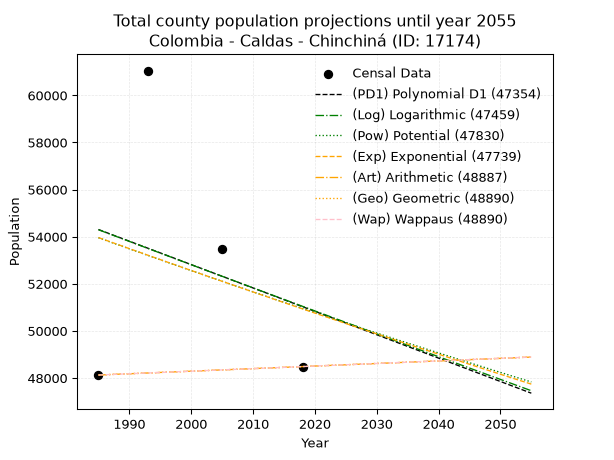
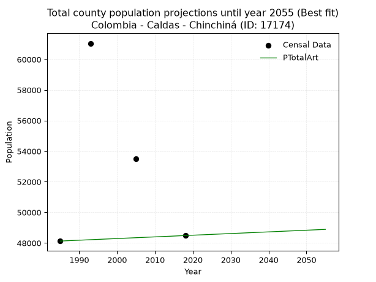
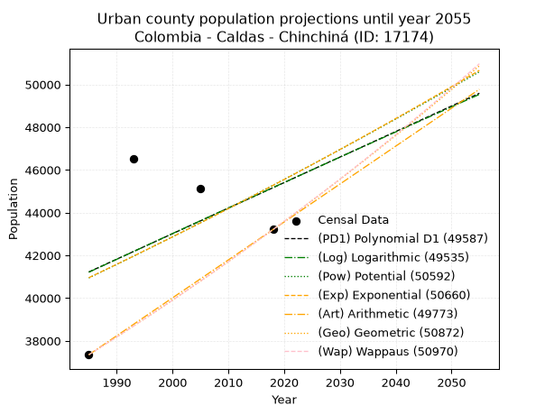
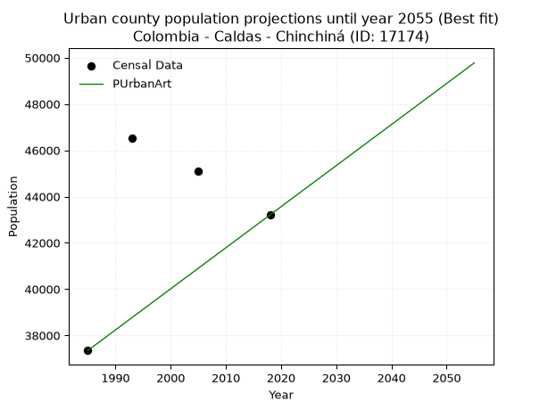
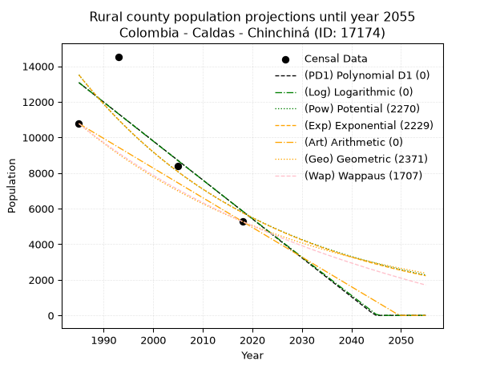
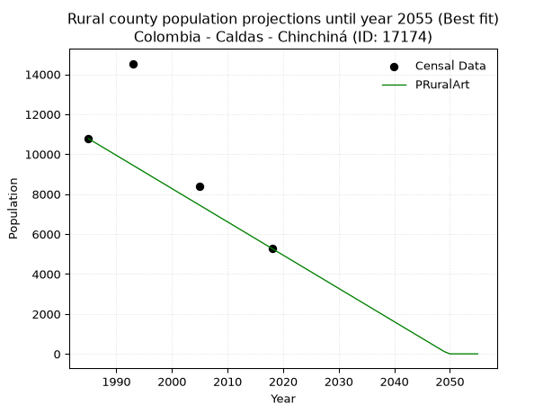

<div align="center">


</div>

# 📜 _“Population and Public Services Demand Projections (PPSD) until Year 2050 for Colombia - Caldas - Chinchiná (ID: 17174)”_
Keywords: `population` `public-service` `projection` `lineal` `polynomial` `logarithmic` `potential` `exponential` `arithmetic` `geometric` `wappaus` `dane` `colombia` `south-america`

PPSD are analytical estimates used by governments and planners to anticipate future changes in population size, age distribution, and the resulting community needs for utilities, healthcare, education, and infrastructure as sizing future water treatment facilities, electrical grids, and road networks based on spatial growth.

<div align="center">

</img>

</div>


> **General running parameters**: • app_version: _v20260806_. • Python version: _3.14.7_. • Pandas version: _3.0.5_. • NumPy version: _2.5.1_. • Creates, save and include plots into reports (create_plot): _False_. • Projection until year: _2050_. • Process polynomial degree 2 and up: _False_. • Process Wappaus: _True_. • Process Wappaus: _True_. • Set negative values to zero: _True_. • Set infinite values to zero: _True_. • Drop dataset notes: _True_. 
<div align="center">

Maps & GIS Layers: [:earth_americas:Google](http://maps.google.com/maps?q=4.985226902,-75.6075289) [:earth_americas:OSM](https://www.openstreetmap.org/#map=18/4.985226902/-75.6075289&layers=P) [:earth_americas:Bing](https://www.bing.com/maps?cp=4.985226902~-75.6075289&lvl=18) [:earth_americas:Apple](https://maps.apple.com/frame?center=4.985226902%2C-75.6075289&span=0.003%2C0.006) [:earth_americas:GISMobile](https://github.com/rcfdtools/R.GISMobile/blob/main/file/gis/CountyLayer_CO/Readme.md)

</div>


<div align="center">

```geojson
{
  "type": "Feature",
  "geometry": {
    "type": "Point", 
    "coordinates": [-75.6075289, 4.985226902]
  }, 
  "properties": {
    "Name": "Colombia - Caldas - Chinchiná (ID: 17174)"
  }
}
```

</div>


## 0. Census Data (4 records)

Census data are official statistics collected by a government about the people and housing in a country. They usually include counts of total population, age, sex, race, income, education, and jobs.

📅Global census file: [Population.xlsx](../data/Population.xlsx)

| Source   |   Year |   CountryID | CountryName   |   StateID | StateName   |   CountyID | CountyName   |   PTotal |   PUrban |   PRural |
|:---------|-------:|------------:|:--------------|----------:|:------------|-----------:|:-------------|---------:|---------:|---------:|
| DANE     |   1985 |          57 | Colombia      |        17 | Caldas      |      17174 | Chinchiná    |    48125 |    37349 |    10776 |
| DANE     |   1993 |          57 | Colombia      |        17 | Caldas      |      17174 | Chinchiná    |    61048 |    46512 |    14536 |
| DANE     |   2005 |          57 | Colombia      |        17 | Caldas      |      17174 | Chinchiná    |    53496 |    45113 |     8383 |
| DANE     |   2018 |          57 | Colombia      |        17 | Caldas      |      17174 | Chinchiná    |    48484 |    43206 |     5278 |

> 🔥Some records could had specific notes about the registered values or the corresponding urban or rural distribution.

📅[SUI-RUPS](https://www.datos.gov.co/Hacienda-y-Cr-dito-P-blico/Registro-nico-de-Prestadores-de-Servicios-P-blicos/4qkq-csdn/about_data) - Local public utility companies: [RUPS.csv](../data/RUPS.csv)

 | SERVICIO       | ESTADO    | NOMBRE                                                                               | NIT         | DEPARTAMENTO_DOMICILIO   | MUNICIPIO_DOMICILIO   | DIRECCION              |   TELEFONO | EMAIL                              | TIPO_PRESTADOR                             | CLASIFICACION                 |
|:---------------|:----------|:-------------------------------------------------------------------------------------|:------------|:-------------------------|:----------------------|:-----------------------|-----------:|:-----------------------------------|:-------------------------------------------|:------------------------------|
| ACUEDUCTO      | OPERATIVA | EMPRESA DE OBRAS SANITARIAS DE CALDAS  S. A. EMPRESA DE SERVICIOS PUBLICOS           | 890803239-9 | CALDAS                   | MANIZALES             | Carrera 23 Nro 75 - 82 |    8867080 | lorena.grisalest@empocaldas.com.co | SOCIEDADES (EMPRESA DE SERVICIOS PUBLICOS) | MAYOR O IGUAL A 5001 USUARIOS |
| ALCANTARILLADO | OPERATIVA | EMPRESA DE OBRAS SANITARIAS DE CALDAS  S. A. EMPRESA DE SERVICIOS PUBLICOS           | 890803239-9 | CALDAS                   | MANIZALES             | Carrera 23 Nro 75 - 82 |    8867080 | lorena.grisalest@empocaldas.com.co | SOCIEDADES (EMPRESA DE SERVICIOS PUBLICOS) | MAYOR O IGUAL A 5001 USUARIOS |
| ACUEDUCTO      | OPERATIVA | ASOCIACION DE USUARIOS DE SERVICIOS COLECTIVOS DE NARANJAL, LA QUIEBRA Y LA FLORESTA | 800194624-1 | CALDAS                   | CHINCHINA             | calle 15 # 9a-23       |    8404415 | luz.posada502@hotmail.com          | ORGANIZACION AUTORIZADA                    | MENOR O IGUAL A 2500 USUARIOS |

## 1. Total

### 1.1. Coefficients and Parameters

* (PD1) Polynomial Deg 1: -99.24889602568909, 251310.85427538463 (lineal)
* (Log) Logarithmic: -197198.32162448854, 1551694.272915912
* (Pow) Potential: -3.4757584508837556, 16.194232721984786
* (Exp) Exponential: -0.00175027225582033, 1741597.0580448834
* (Art) Arithmetic: Year diff. 2018 - 1985 = 33, Population diff. 48484 - 48125 = 359, Annual growth = 10.878787878787879
* (Geo) Geometric: Year diff. 2018 - 1985 = 33, Population diff. 48484 - 48125 = 359, Annual growth % = 0.00022523912010763425
* (Wap) Wappaus: i = 0.022521272094293242, Condition values only valid for < 200)

<sub>
Wappaus condition values: ['0.00', '0.02', '0.05', '0.07', '0.09', '0.11', '0.14', '0.16', '0.18', '0.20', '0.23', '0.25', '0.27', '0.29', '0.32', '0.34', '0.36', '0.38', '0.41', '0.43', '0.45', '0.47', '0.50', '0.52', '0.54', '0.56', '0.59', '0.61', '0.63', '0.65', '0.68', '0.70', '0.72', '0.74', '0.77', '0.79', '0.81', '0.83', '0.86', '0.88', '0.90', '0.92', '0.95', '0.97', '0.99', '1.01', '1.04', '1.06', '1.08', '1.10', '1.13', '1.15', '1.17', '1.19', '1.22', '1.24', '1.26', '1.28', '1.31', '1.33', '1.35', '1.37', '1.40', '1.42', '1.44', '1.46']
</sub>


### 1.2. Projected Dataset

|   Year |   CountyID |   PTotalPD1 |   PTotalLog |   PTotalPow |   PTotalExp |   PTotalArt |   PTotalGeo |   PTotalWap |
|-------:|-----------:|------------:|------------:|------------:|------------:|------------:|------------:|------------:|
|   1985 |      17174 |       54302 |       54294 |       53953 |       53961 |       48125 |       48125 |       48125 |
|   1986 |      17174 |       54203 |       54194 |       53858 |       53867 |       48136 |       48136 |       48136 |
|   1987 |      17174 |       54103 |       54095 |       53764 |       53773 |       48147 |       48147 |       48147 |
|   1988 |      17174 |       54004 |       53996 |       53670 |       53679 |       48158 |       48158 |       48158 |
|   1989 |      17174 |       53905 |       53897 |       53577 |       53585 |       48169 |       48168 |       48168 |
|   1990 |      17174 |       53806 |       53798 |       53483 |       53491 |       48179 |       48179 |       48179 |
|   1991 |      17174 |       53706 |       53698 |       53390 |       53398 |       48190 |       48190 |       48190 |
|   1992 |      17174 |       53607 |       53599 |       53297 |       53304 |       48201 |       48201 |       48201 |
|   1993 |      17174 |       53508 |       53500 |       53204 |       53211 |       48212 |       48212 |       48212 |
|   1994 |      17174 |       53409 |       53402 |       53111 |       53118 |       48223 |       48223 |       48223 |
|   1995 |      17174 |       53309 |       53303 |       53019 |       53025 |       48234 |       48234 |       48234 |
|   1996 |      17174 |       53210 |       53204 |       52926 |       52932 |       48245 |       48244 |       48244 |
|   1997 |      17174 |       53111 |       53105 |       52834 |       52840 |       48256 |       48255 |       48255 |
|   1998 |      17174 |       53012 |       53006 |       52742 |       52747 |       48266 |       48266 |       48266 |
|   1999 |      17174 |       52912 |       52908 |       52651 |       52655 |       48277 |       48277 |       48277 |
|   2000 |      17174 |       52813 |       52809 |       52559 |       52563 |       48288 |       48288 |       48288 |
|   2001 |      17174 |       52714 |       52710 |       52468 |       52471 |       48299 |       48299 |       48299 |
|   2002 |      17174 |       52615 |       52612 |       52377 |       52379 |       48310 |       48310 |       48310 |
|   2003 |      17174 |       52515 |       52513 |       52286 |       52288 |       48321 |       48320 |       48320 |
|   2004 |      17174 |       52416 |       52415 |       52196 |       52196 |       48332 |       48331 |       48331 |
|   2005 |      17174 |       52317 |       52317 |       52105 |       52105 |       48343 |       48342 |       48342 |
|   2006 |      17174 |       52218 |       52218 |       52015 |       52014 |       48353 |       48353 |       48353 |
|   2007 |      17174 |       52118 |       52120 |       51925 |       51923 |       48364 |       48364 |       48364 |
|   2008 |      17174 |       52019 |       52022 |       51835 |       51832 |       48375 |       48375 |       48375 |
|   2009 |      17174 |       51920 |       51924 |       51745 |       51742 |       48386 |       48386 |       48386 |
|   2010 |      17174 |       51821 |       51826 |       51656 |       51651 |       48397 |       48397 |       48397 |
|   2011 |      17174 |       51721 |       51727 |       51567 |       51561 |       48408 |       48408 |       48408 |
|   2012 |      17174 |       51622 |       51629 |       51478 |       51471 |       48419 |       48419 |       48419 |
|   2013 |      17174 |       51523 |       51531 |       51389 |       51381 |       48430 |       48429 |       48429 |
|   2014 |      17174 |       51424 |       51433 |       51300 |       51291 |       48440 |       48440 |       48440 |
|   2015 |      17174 |       51324 |       51336 |       51212 |       51201 |       48451 |       48451 |       48451 |
|   2016 |      17174 |       51225 |       51238 |       51124 |       51111 |       48462 |       48462 |       48462 |
|   2017 |      17174 |       51126 |       51140 |       51036 |       51022 |       48473 |       48473 |       48473 |
|   2018 |      17174 |       51027 |       51042 |       50948 |       50933 |       48484 |       48484 |       48484 |
|   2019 |      17174 |       50927 |       50945 |       50860 |       50844 |       48495 |       48495 |       48495 |
|   2020 |      17174 |       50828 |       50847 |       50773 |       50755 |       48506 |       48506 |       48506 |
|   2021 |      17174 |       50729 |       50749 |       50685 |       50666 |       48517 |       48517 |       48517 |
|   2022 |      17174 |       50630 |       50652 |       50598 |       50578 |       48528 |       48528 |       48528 |
|   2023 |      17174 |       50530 |       50554 |       50511 |       50489 |       48538 |       48539 |       48539 |
|   2024 |      17174 |       50431 |       50457 |       50425 |       50401 |       48549 |       48550 |       48550 |
|   2025 |      17174 |       50332 |       50359 |       50338 |       50313 |       48560 |       48560 |       48560 |
|   2026 |      17174 |       50233 |       50262 |       50252 |       50225 |       48571 |       48571 |       48571 |
|   2027 |      17174 |       50133 |       50165 |       50166 |       50137 |       48582 |       48582 |       48582 |
|   2028 |      17174 |       50034 |       50067 |       50080 |       50049 |       48593 |       48593 |       48593 |
|   2029 |      17174 |       49935 |       49970 |       49994 |       49962 |       48604 |       48604 |       48604 |
|   2030 |      17174 |       49836 |       49873 |       49909 |       49874 |       48615 |       48615 |       48615 |
|   2031 |      17174 |       49736 |       49776 |       49823 |       49787 |       48625 |       48626 |       48626 |
|   2032 |      17174 |       49637 |       49679 |       49738 |       49700 |       48636 |       48637 |       48637 |
|   2033 |      17174 |       49538 |       49582 |       49653 |       49613 |       48647 |       48648 |       48648 |
|   2034 |      17174 |       49439 |       49485 |       49568 |       49526 |       48658 |       48659 |       48659 |
|   2035 |      17174 |       49339 |       49388 |       49484 |       49440 |       48669 |       48670 |       48670 |
|   2036 |      17174 |       49240 |       49291 |       49399 |       49353 |       48680 |       48681 |       48681 |
|   2037 |      17174 |       49141 |       49194 |       49315 |       49267 |       48691 |       48692 |       48692 |
|   2038 |      17174 |       49042 |       49097 |       49231 |       49181 |       48702 |       48703 |       48703 |
|   2039 |      17174 |       48942 |       49001 |       49147 |       49095 |       48712 |       48714 |       48714 |
|   2040 |      17174 |       48843 |       48904 |       49063 |       49009 |       48723 |       48725 |       48725 |
|   2041 |      17174 |       48744 |       48807 |       48980 |       48923 |       48734 |       48736 |       48736 |
|   2042 |      17174 |       48645 |       48711 |       48897 |       48838 |       48745 |       48747 |       48747 |
|   2043 |      17174 |       48545 |       48614 |       48813 |       48752 |       48756 |       48758 |       48758 |
|   2044 |      17174 |       48446 |       48518 |       48730 |       48667 |       48767 |       48769 |       48769 |
|   2045 |      17174 |       48347 |       48421 |       48648 |       48582 |       48778 |       48780 |       48780 |
|   2046 |      17174 |       48248 |       48325 |       48565 |       48497 |       48789 |       48791 |       48791 |
|   2047 |      17174 |       48148 |       48229 |       48483 |       48412 |       48799 |       48802 |       48802 |
|   2048 |      17174 |       48049 |       48132 |       48400 |       48327 |       48810 |       48813 |       48813 |
|   2049 |      17174 |       47950 |       48036 |       48318 |       48243 |       48821 |       48824 |       48824 |
|   2050 |      17174 |       47851 |       47940 |       48237 |       48159 |       48832 |       48835 |       48835 |
<div align="center">

</img>

</div>


### 1.3. Best fit with absolute and relative error (%)

Relative error puts that difference into context by dividing the absolute error by the true value, creating a unitless ratio or percentage that shows the scale of the mistake.

Absolute and relative error

|   Year | Source   |   CountryID | CountryName   |   StateID | StateName   |   CountyID_x | CountyName   |   PTotal |   PUrban |   PRural |   CountyID_y |   PTotalPD1 |   PTotalLog |   PTotalPow |   PTotalExp |   PTotalArt |   PTotalGeo |   PTotalWap |   PTotalPD1AbsError |   PTotalLogAbsError |   PTotalPowAbsError |   PTotalExpAbsError |   PTotalArtAbsError |   PTotalGeoAbsError |   PTotalWapAbsError |   PTotalPD1RelError |   PTotalLogRelError |   PTotalPowRelError |   PTotalExpRelError |   PTotalArtRelError |   PTotalGeoRelError |   PTotalWapRelError |
|-------:|:---------|------------:|:--------------|----------:|:------------|-------------:|:-------------|---------:|---------:|---------:|-------------:|------------:|------------:|------------:|------------:|------------:|------------:|------------:|--------------------:|--------------------:|--------------------:|--------------------:|--------------------:|--------------------:|--------------------:|--------------------:|--------------------:|--------------------:|--------------------:|--------------------:|--------------------:|--------------------:|
|   1985 | DANE     |          57 | Colombia      |        17 | Caldas      |        17174 | Chinchiná    |    48125 |    37349 |    10776 |        17174 |       54302 |       54294 |       53953 |       53961 |       48125 |       48125 |       48125 |                6177 |                6169 |                5828 |                5836 |                   0 |                   0 |                   0 |            12.8353  |            12.8187  |            12.1101  |            12.1268  |              0      |             0       |             0       |
|   1993 | DANE     |          57 | Colombia      |        17 | Caldas      |        17174 | Chinchiná    |    61048 |    46512 |    14536 |        17174 |       53508 |       53500 |       53204 |       53211 |       48212 |       48212 |       48212 |                7540 |                7548 |                7844 |                7837 |               12836 |               12836 |               12836 |            12.3509  |            12.364   |            12.8489  |            12.8374  |             21.0261 |            21.0261  |            21.0261  |
|   2005 | DANE     |          57 | Colombia      |        17 | Caldas      |        17174 | Chinchiná    |    53496 |    45113 |     8383 |        17174 |       52317 |       52317 |       52105 |       52105 |       48343 |       48342 |       48342 |                1179 |                1179 |                1391 |                1391 |                5153 |                5154 |                5154 |             2.2039  |             2.2039  |             2.60019 |             2.60019 |              9.6325 |             9.63437 |             9.63437 |
|   2018 | DANE     |          57 | Colombia      |        17 | Caldas      |        17174 | Chinchiná    |    48484 |    43206 |     5278 |        17174 |       51027 |       51042 |       50948 |       50933 |       48484 |       48484 |       48484 |                2543 |                2558 |                2464 |                2449 |                   0 |                   0 |                   0 |             5.24503 |             5.27597 |             5.08209 |             5.05115 |              0      |             0       |             0       |

Relative error mean

| Method    |   RelError | Best   |
|:----------|-----------:|:-------|
| PTotalPD1 |    8.1588  |        |
| PTotalLog |    8.16565 |        |
| PTotalPow |    8.16033 |        |
| PTotalExp |    8.15388 |        |
| PTotalArt |    7.66464 | True   |
| PTotalGeo |    7.66511 |        |
| PTotalWap |    7.66511 |        |

💙Best method: _**PTotalArt**_
<div align="center">

</img>

</div>


### 1.4. Fresh water supply demand in liters per capita per day (lpcd)

The fresh water supply demand typically ranges from 100 to 300 liters per capita per day (lpcd) for standard domestic and municipal planning, though absolute survival minimums set by the World Health Organization are as low as 7.5 to 20 liters per day, and total consumption in high-income nations can exceed 400 liters.

> `CZ`: Level in meters above the sea level (masl)<br> `WS`: Fresh water supply demand in liters per capita per day (lpcd or l/h/d)<br> `WSAll`: Zonal fresh water supply demand in liters per second (l/s)<br> `A`: Zonal area in square meters<br> `DP`: Population density (people/hectare or p/ha)

Reference values (RAS Colombia)

|    CZ |   WS |
|------:|-----:|
|  1000 |  120 |
|  2000 |  130 |
| 99999 |  140 |

County shapefile geometry properties and water supply values

|   CountyID |      ATotal |   CZTotal |   WSTotal |
|-----------:|------------:|----------:|----------:|
|      17174 | 1.09321e+08 |   1314.52 |       130 |

Projected values for best method: PTotalArt

|   CountyID |   Year |   PTotalArt |   DPTotal |   WSTotal |   WSTotalAll |
|-----------:|-------:|------------:|----------:|----------:|-------------:|
|      17174 |   1985 |       48125 |      4.4  |       130 |      72.4103 |
|      17174 |   1986 |       48136 |      4.4  |       130 |      72.4269 |
|      17174 |   1987 |       48147 |      4.4  |       130 |      72.4434 |
|      17174 |   1988 |       48158 |      4.41 |       130 |      72.46   |
|      17174 |   1989 |       48169 |      4.41 |       130 |      72.4765 |
|      17174 |   1990 |       48179 |      4.41 |       130 |      72.4916 |
|      17174 |   1991 |       48190 |      4.41 |       130 |      72.5081 |
|      17174 |   1992 |       48201 |      4.41 |       130 |      72.5247 |
|      17174 |   1993 |       48212 |      4.41 |       130 |      72.5412 |
|      17174 |   1994 |       48223 |      4.41 |       130 |      72.5578 |
|      17174 |   1995 |       48234 |      4.41 |       130 |      72.5743 |
|      17174 |   1996 |       48245 |      4.41 |       130 |      72.5909 |
|      17174 |   1997 |       48256 |      4.41 |       130 |      72.6074 |
|      17174 |   1998 |       48266 |      4.42 |       130 |      72.6225 |
|      17174 |   1999 |       48277 |      4.42 |       130 |      72.639  |
|      17174 |   2000 |       48288 |      4.42 |       130 |      72.6556 |
|      17174 |   2001 |       48299 |      4.42 |       130 |      72.6721 |
|      17174 |   2002 |       48310 |      4.42 |       130 |      72.6887 |
|      17174 |   2003 |       48321 |      4.42 |       130 |      72.7052 |
|      17174 |   2004 |       48332 |      4.42 |       130 |      72.7218 |
|      17174 |   2005 |       48343 |      4.42 |       130 |      72.7383 |
|      17174 |   2006 |       48353 |      4.42 |       130 |      72.7534 |
|      17174 |   2007 |       48364 |      4.42 |       130 |      72.7699 |
|      17174 |   2008 |       48375 |      4.43 |       130 |      72.7865 |
|      17174 |   2009 |       48386 |      4.43 |       130 |      72.803  |
|      17174 |   2010 |       48397 |      4.43 |       130 |      72.8196 |
|      17174 |   2011 |       48408 |      4.43 |       130 |      72.8361 |
|      17174 |   2012 |       48419 |      4.43 |       130 |      72.8527 |
|      17174 |   2013 |       48430 |      4.43 |       130 |      72.8692 |
|      17174 |   2014 |       48440 |      4.43 |       130 |      72.8843 |
|      17174 |   2015 |       48451 |      4.43 |       130 |      72.9008 |
|      17174 |   2016 |       48462 |      4.43 |       130 |      72.9174 |
|      17174 |   2017 |       48473 |      4.43 |       130 |      72.9339 |
|      17174 |   2018 |       48484 |      4.44 |       130 |      72.9505 |
|      17174 |   2019 |       48495 |      4.44 |       130 |      72.967  |
|      17174 |   2020 |       48506 |      4.44 |       130 |      72.9836 |
|      17174 |   2021 |       48517 |      4.44 |       130 |      73.0001 |
|      17174 |   2022 |       48528 |      4.44 |       130 |      73.0167 |
|      17174 |   2023 |       48538 |      4.44 |       130 |      73.0317 |
|      17174 |   2024 |       48549 |      4.44 |       130 |      73.0483 |
|      17174 |   2025 |       48560 |      4.44 |       130 |      73.0648 |
|      17174 |   2026 |       48571 |      4.44 |       130 |      73.0814 |
|      17174 |   2027 |       48582 |      4.44 |       130 |      73.0979 |
|      17174 |   2028 |       48593 |      4.44 |       130 |      73.1145 |
|      17174 |   2029 |       48604 |      4.45 |       130 |      73.131  |
|      17174 |   2030 |       48615 |      4.45 |       130 |      73.1476 |
|      17174 |   2031 |       48625 |      4.45 |       130 |      73.1626 |
|      17174 |   2032 |       48636 |      4.45 |       130 |      73.1792 |
|      17174 |   2033 |       48647 |      4.45 |       130 |      73.1957 |
|      17174 |   2034 |       48658 |      4.45 |       130 |      73.2123 |
|      17174 |   2035 |       48669 |      4.45 |       130 |      73.2288 |
|      17174 |   2036 |       48680 |      4.45 |       130 |      73.2454 |
|      17174 |   2037 |       48691 |      4.45 |       130 |      73.2619 |
|      17174 |   2038 |       48702 |      4.45 |       130 |      73.2785 |
|      17174 |   2039 |       48712 |      4.46 |       130 |      73.2935 |
|      17174 |   2040 |       48723 |      4.46 |       130 |      73.3101 |
|      17174 |   2041 |       48734 |      4.46 |       130 |      73.3266 |
|      17174 |   2042 |       48745 |      4.46 |       130 |      73.3432 |
|      17174 |   2043 |       48756 |      4.46 |       130 |      73.3597 |
|      17174 |   2044 |       48767 |      4.46 |       130 |      73.3763 |
|      17174 |   2045 |       48778 |      4.46 |       130 |      73.3928 |
|      17174 |   2046 |       48789 |      4.46 |       130 |      73.4094 |
|      17174 |   2047 |       48799 |      4.46 |       130 |      73.4244 |
|      17174 |   2048 |       48810 |      4.46 |       130 |      73.441  |
|      17174 |   2049 |       48821 |      4.47 |       130 |      73.4575 |
|      17174 |   2050 |       48832 |      4.47 |       130 |      73.4741 |

## 2. Urban

### 2.1. Coefficients and Parameters

* (PD1) Polynomial Deg 1: 119.48454435969623, -195953.9598554824 (lineal)
* (Log) Logarithmic: 240173.57001608217, -1782516.2303224423
* (Pow) Potential: 6.105677430913784, -15.522881796075362
* (Exp) Exponential: 0.003038337955183651, 98.4069430869848
* (Art) Arithmetic: Year diff. 2018 - 1985 = 33, Population diff. 43206 - 37349 = 5857, Annual growth = 177.4848484848485
* (Geo) Geometric: Year diff. 2018 - 1985 = 33, Population diff. 43206 - 37349 = 5857, Annual growth % = 0.004424098069780058
* (Wap) Wappaus: i = 0.4406550766180833, Condition values only valid for < 200)

<sub>
Wappaus condition values: ['0.00', '0.44', '0.88', '1.32', '1.76', '2.20', '2.64', '3.08', '3.53', '3.97', '4.41', '4.85', '5.29', '5.73', '6.17', '6.61', '7.05', '7.49', '7.93', '8.37', '8.81', '9.25', '9.69', '10.14', '10.58', '11.02', '11.46', '11.90', '12.34', '12.78', '13.22', '13.66', '14.10', '14.54', '14.98', '15.42', '15.86', '16.30', '16.74', '17.19', '17.63', '18.07', '18.51', '18.95', '19.39', '19.83', '20.27', '20.71', '21.15', '21.59', '22.03', '22.47', '22.91', '23.35', '23.80', '24.24', '24.68', '25.12', '25.56', '26.00', '26.44', '26.88', '27.32', '27.76', '28.20', '28.64']
</sub>


### 2.2. Projected Dataset

|   Year |   CountyID |   PUrbanPD1 |   PUrbanLog |   PUrbanPow |   PUrbanExp |   PUrbanArt |   PUrbanGeo |   PUrbanWap |
|-------:|-----------:|------------:|------------:|------------:|------------:|------------:|------------:|------------:|
|   1985 |      17174 |       41223 |       41212 |       40943 |       40954 |       37349 |       37349 |       37349 |
|   1986 |      17174 |       41342 |       41333 |       41069 |       41079 |       37526 |       37514 |       37514 |
|   1987 |      17174 |       41462 |       41453 |       41196 |       41204 |       37704 |       37680 |       37680 |
|   1988 |      17174 |       41581 |       41574 |       41322 |       41329 |       37881 |       37847 |       37846 |
|   1989 |      17174 |       41701 |       41695 |       41449 |       41455 |       38059 |       38014 |       38013 |
|   1990 |      17174 |       41820 |       41816 |       41577 |       41581 |       38236 |       38183 |       38181 |
|   1991 |      17174 |       41940 |       41936 |       41705 |       41708 |       38414 |       38351 |       38350 |
|   1992 |      17174 |       42059 |       42057 |       41833 |       41835 |       38591 |       38521 |       38519 |
|   1993 |      17174 |       42179 |       42178 |       41961 |       41962 |       38769 |       38692 |       38689 |
|   1994 |      17174 |       42298 |       42298 |       42090 |       42090 |       38946 |       38863 |       38860 |
|   1995 |      17174 |       42418 |       42418 |       42219 |       42218 |       39124 |       39035 |       39032 |
|   1996 |      17174 |       42537 |       42539 |       42348 |       42346 |       39301 |       39207 |       39204 |
|   1997 |      17174 |       42657 |       42659 |       42478 |       42475 |       39479 |       39381 |       39378 |
|   1998 |      17174 |       42776 |       42779 |       42608 |       42604 |       39656 |       39555 |       39552 |
|   1999 |      17174 |       42896 |       42900 |       42738 |       42734 |       39834 |       39730 |       39726 |
|   2000 |      17174 |       43015 |       43020 |       42869 |       42864 |       40011 |       39906 |       39902 |
|   2001 |      17174 |       43135 |       43140 |       43000 |       42994 |       40189 |       40082 |       40079 |
|   2002 |      17174 |       43254 |       43260 |       43131 |       43125 |       40366 |       40260 |       40256 |
|   2003 |      17174 |       43374 |       43380 |       43263 |       43256 |       40544 |       40438 |       40434 |
|   2004 |      17174 |       43493 |       43500 |       43395 |       43388 |       40721 |       40617 |       40613 |
|   2005 |      17174 |       43613 |       43619 |       43527 |       43520 |       40899 |       40796 |       40792 |
|   2006 |      17174 |       43732 |       43739 |       43660 |       43653 |       41076 |       40977 |       40973 |
|   2007 |      17174 |       43852 |       43859 |       43793 |       43785 |       41254 |       41158 |       41154 |
|   2008 |      17174 |       43971 |       43978 |       43927 |       43919 |       41431 |       41340 |       41336 |
|   2009 |      17174 |       44090 |       44098 |       44060 |       44052 |       41609 |       41523 |       41519 |
|   2010 |      17174 |       44210 |       44218 |       44194 |       44186 |       41786 |       41707 |       41703 |
|   2011 |      17174 |       44329 |       44337 |       44329 |       44321 |       41964 |       41891 |       41888 |
|   2012 |      17174 |       44449 |       44456 |       44464 |       44456 |       42141 |       42077 |       42074 |
|   2013 |      17174 |       44568 |       44576 |       44599 |       44591 |       42319 |       42263 |       42260 |
|   2014 |      17174 |       44688 |       44695 |       44734 |       44727 |       42496 |       42450 |       42448 |
|   2015 |      17174 |       44807 |       44814 |       44870 |       44863 |       42674 |       42638 |       42636 |
|   2016 |      17174 |       44927 |       44933 |       45006 |       44999 |       42851 |       42826 |       42825 |
|   2017 |      17174 |       45046 |       45052 |       45143 |       45136 |       43029 |       43016 |       43015 |
|   2018 |      17174 |       45166 |       45172 |       45279 |       45274 |       43206 |       43206 |       43206 |
|   2019 |      17174 |       45285 |       45291 |       45417 |       45411 |       43383 |       43397 |       43398 |
|   2020 |      17174 |       45405 |       45409 |       45554 |       45549 |       43561 |       43589 |       43591 |
|   2021 |      17174 |       45524 |       45528 |       45692 |       45688 |       43738 |       43782 |       43784 |
|   2022 |      17174 |       45644 |       45647 |       45830 |       45827 |       43916 |       43976 |       43979 |
|   2023 |      17174 |       45763 |       45766 |       45969 |       45967 |       44093 |       44170 |       44175 |
|   2024 |      17174 |       45883 |       45885 |       46108 |       46106 |       44271 |       44366 |       44371 |
|   2025 |      17174 |       46002 |       46003 |       46247 |       46247 |       44448 |       44562 |       44568 |
|   2026 |      17174 |       46122 |       46122 |       46387 |       46387 |       44626 |       44759 |       44767 |
|   2027 |      17174 |       46241 |       46240 |       46527 |       46529 |       44803 |       44957 |       44966 |
|   2028 |      17174 |       46361 |       46359 |       46667 |       46670 |       44981 |       45156 |       45167 |
|   2029 |      17174 |       46480 |       46477 |       46808 |       46812 |       45158 |       45356 |       45368 |
|   2030 |      17174 |       46600 |       46595 |       46949 |       46955 |       45336 |       45556 |       45570 |
|   2031 |      17174 |       46719 |       46714 |       47090 |       47098 |       45513 |       45758 |       45774 |
|   2032 |      17174 |       46839 |       46832 |       47232 |       47241 |       45691 |       45960 |       45978 |
|   2033 |      17174 |       46958 |       46950 |       47374 |       47385 |       45868 |       46164 |       46183 |
|   2034 |      17174 |       47078 |       47068 |       47516 |       47529 |       46046 |       46368 |       46389 |
|   2035 |      17174 |       47197 |       47186 |       47659 |       47673 |       46223 |       46573 |       46597 |
|   2036 |      17174 |       47317 |       47304 |       47802 |       47818 |       46401 |       46779 |       46805 |
|   2037 |      17174 |       47436 |       47422 |       47946 |       47964 |       46578 |       46986 |       47015 |
|   2038 |      17174 |       47556 |       47540 |       48090 |       48110 |       46756 |       47194 |       47225 |
|   2039 |      17174 |       47675 |       47658 |       48234 |       48256 |       46933 |       47403 |       47437 |
|   2040 |      17174 |       47795 |       47776 |       48379 |       48403 |       47111 |       47612 |       47649 |
|   2041 |      17174 |       47914 |       47893 |       48523 |       48550 |       47288 |       47823 |       47863 |
|   2042 |      17174 |       48033 |       48011 |       48669 |       48698 |       47466 |       48035 |       48077 |
|   2043 |      17174 |       48153 |       48129 |       48815 |       48846 |       47643 |       48247 |       48293 |
|   2044 |      17174 |       48272 |       48246 |       48961 |       48995 |       47821 |       48461 |       48510 |
|   2045 |      17174 |       48392 |       48364 |       49107 |       49144 |       47998 |       48675 |       48728 |
|   2046 |      17174 |       48511 |       48481 |       49254 |       49294 |       48176 |       48890 |       48947 |
|   2047 |      17174 |       48631 |       48598 |       49401 |       49444 |       48353 |       49107 |       49167 |
|   2048 |      17174 |       48750 |       48716 |       49549 |       49594 |       48531 |       49324 |       49389 |
|   2049 |      17174 |       48870 |       48833 |       49696 |       49745 |       48708 |       49542 |       49611 |
|   2050 |      17174 |       48989 |       48950 |       49845 |       49896 |       48886 |       49761 |       49835 |
<div align="center">

</img>

</div>


### 2.3. Best fit with absolute and relative error (%)

Relative error puts that difference into context by dividing the absolute error by the true value, creating a unitless ratio or percentage that shows the scale of the mistake.

Absolute and relative error

|   Year | Source   |   CountryID | CountryName   |   StateID | StateName   |   CountyID_x | CountyName   |   PTotal |   PUrban |   PRural |   CountyID_y |   PUrbanPD1 |   PUrbanLog |   PUrbanPow |   PUrbanExp |   PUrbanArt |   PUrbanGeo |   PUrbanWap |   PUrbanPD1AbsError |   PUrbanLogAbsError |   PUrbanPowAbsError |   PUrbanExpAbsError |   PUrbanArtAbsError |   PUrbanGeoAbsError |   PUrbanWapAbsError |   PUrbanPD1RelError |   PUrbanLogRelError |   PUrbanPowRelError |   PUrbanExpRelError |   PUrbanArtRelError |   PUrbanGeoRelError |   PUrbanWapRelError |
|-------:|:---------|------------:|:--------------|----------:|:------------|-------------:|:-------------|---------:|---------:|---------:|-------------:|------------:|------------:|------------:|------------:|------------:|------------:|------------:|--------------------:|--------------------:|--------------------:|--------------------:|--------------------:|--------------------:|--------------------:|--------------------:|--------------------:|--------------------:|--------------------:|--------------------:|--------------------:|--------------------:|
|   1985 | DANE     |          57 | Colombia      |        17 | Caldas      |        17174 | Chinchiná    |    48125 |    37349 |    10776 |        17174 |       41223 |       41212 |       40943 |       40954 |       37349 |       37349 |       37349 |                3874 |                3863 |                3594 |                3605 |                   0 |                   0 |                   0 |            10.3724  |            10.343   |             9.62275 |             9.6522  |             0       |              0      |             0       |
|   1993 | DANE     |          57 | Colombia      |        17 | Caldas      |        17174 | Chinchiná    |    61048 |    46512 |    14536 |        17174 |       42179 |       42178 |       41961 |       41962 |       38769 |       38692 |       38689 |                4333 |                4334 |                4551 |                4550 |                7743 |                7820 |                7823 |             9.31588 |             9.31803 |             9.78457 |             9.78242 |            16.6473  |             16.8129 |            16.8193  |
|   2005 | DANE     |          57 | Colombia      |        17 | Caldas      |        17174 | Chinchiná    |    53496 |    45113 |     8383 |        17174 |       43613 |       43619 |       43527 |       43520 |       40899 |       40796 |       40792 |                1500 |                1494 |                1586 |                1593 |                4214 |                4317 |                4321 |             3.32498 |             3.31168 |             3.51562 |             3.53113 |             9.34099 |              9.5693 |             9.57817 |
|   2018 | DANE     |          57 | Colombia      |        17 | Caldas      |        17174 | Chinchiná    |    48484 |    43206 |     5278 |        17174 |       45166 |       45172 |       45279 |       45274 |       43206 |       43206 |       43206 |                1960 |                1966 |                2073 |                2068 |                   0 |                   0 |                   0 |             4.53641 |             4.55029 |             4.79794 |             4.78637 |             0       |              0      |             0       |

Relative error mean

| Method    |   RelError | Best   |
|:----------|-----------:|:-------|
| PUrbanPD1 |    6.88742 |        |
| PUrbanLog |    6.88075 |        |
| PUrbanPow |    6.93022 |        |
| PUrbanExp |    6.93803 |        |
| PUrbanArt |    6.49708 | True   |
| PUrbanGeo |    6.59554 |        |
| PUrbanWap |    6.59937 |        |

💙Best method: _**PUrbanArt**_
<div align="center">

</img>

</div>


### 2.4. Fresh water supply demand in liters per capita per day (lpcd)

The fresh water supply demand typically ranges from 100 to 300 liters per capita per day (lpcd) for standard domestic and municipal planning, though absolute survival minimums set by the World Health Organization are as low as 7.5 to 20 liters per day, and total consumption in high-income nations can exceed 400 liters.

> `CZ`: Level in meters above the sea level (masl)<br> `WS`: Fresh water supply demand in liters per capita per day (lpcd or l/h/d)<br> `WSAll`: Zonal fresh water supply demand in liters per second (l/s)<br> `A`: Zonal area in square meters<br> `DP`: Population density (people/hectare or p/ha)

Reference values (RAS Colombia)

|    CZ |   WS |
|------:|-----:|
|  1000 |  120 |
|  2000 |  130 |
| 99999 |  140 |

County shapefile geometry properties and water supply values

|   CountyID |      AUrban |   CZUrban |   WSUrban |
|-----------:|------------:|----------:|----------:|
|      17174 | 4.97247e+06 |   1362.88 |       130 |

Projected values for best method: PUrbanArt

|   CountyID |   Year |   PUrbanArt |   DPUrban |   WSUrban |   WSUrbanAll |
|-----------:|-------:|------------:|----------:|----------:|-------------:|
|      17174 |   1985 |       37349 |     75.11 |       130 |      56.1964 |
|      17174 |   1986 |       37526 |     75.47 |       130 |      56.4627 |
|      17174 |   1987 |       37704 |     75.83 |       130 |      56.7306 |
|      17174 |   1988 |       37881 |     76.18 |       130 |      56.9969 |
|      17174 |   1989 |       38059 |     76.54 |       130 |      57.2647 |
|      17174 |   1990 |       38236 |     76.9  |       130 |      57.531  |
|      17174 |   1991 |       38414 |     77.25 |       130 |      57.7988 |
|      17174 |   1992 |       38591 |     77.61 |       130 |      58.0652 |
|      17174 |   1993 |       38769 |     77.97 |       130 |      58.333  |
|      17174 |   1994 |       38946 |     78.32 |       130 |      58.5993 |
|      17174 |   1995 |       39124 |     78.68 |       130 |      58.8671 |
|      17174 |   1996 |       39301 |     79.04 |       130 |      59.1334 |
|      17174 |   1997 |       39479 |     79.4  |       130 |      59.4013 |
|      17174 |   1998 |       39656 |     79.75 |       130 |      59.6676 |
|      17174 |   1999 |       39834 |     80.11 |       130 |      59.9354 |
|      17174 |   2000 |       40011 |     80.47 |       130 |      60.2017 |
|      17174 |   2001 |       40189 |     80.82 |       130 |      60.4696 |
|      17174 |   2002 |       40366 |     81.18 |       130 |      60.7359 |
|      17174 |   2003 |       40544 |     81.54 |       130 |      61.0037 |
|      17174 |   2004 |       40721 |     81.89 |       130 |      61.27   |
|      17174 |   2005 |       40899 |     82.25 |       130 |      61.5378 |
|      17174 |   2006 |       41076 |     82.61 |       130 |      61.8042 |
|      17174 |   2007 |       41254 |     82.96 |       130 |      62.072  |
|      17174 |   2008 |       41431 |     83.32 |       130 |      62.3383 |
|      17174 |   2009 |       41609 |     83.68 |       130 |      62.6061 |
|      17174 |   2010 |       41786 |     84.03 |       130 |      62.8725 |
|      17174 |   2011 |       41964 |     84.39 |       130 |      63.1403 |
|      17174 |   2012 |       42141 |     84.75 |       130 |      63.4066 |
|      17174 |   2013 |       42319 |     85.11 |       130 |      63.6744 |
|      17174 |   2014 |       42496 |     85.46 |       130 |      63.9407 |
|      17174 |   2015 |       42674 |     85.82 |       130 |      64.2086 |
|      17174 |   2016 |       42851 |     86.18 |       130 |      64.4749 |
|      17174 |   2017 |       43029 |     86.53 |       130 |      64.7427 |
|      17174 |   2018 |       43206 |     86.89 |       130 |      65.009  |
|      17174 |   2019 |       43383 |     87.25 |       130 |      65.2753 |
|      17174 |   2020 |       43561 |     87.6  |       130 |      65.5432 |
|      17174 |   2021 |       43738 |     87.96 |       130 |      65.8095 |
|      17174 |   2022 |       43916 |     88.32 |       130 |      66.0773 |
|      17174 |   2023 |       44093 |     88.67 |       130 |      66.3436 |
|      17174 |   2024 |       44271 |     89.03 |       130 |      66.6115 |
|      17174 |   2025 |       44448 |     89.39 |       130 |      66.8778 |
|      17174 |   2026 |       44626 |     89.75 |       130 |      67.1456 |
|      17174 |   2027 |       44803 |     90.1  |       130 |      67.4119 |
|      17174 |   2028 |       44981 |     90.46 |       130 |      67.6797 |
|      17174 |   2029 |       45158 |     90.82 |       130 |      67.9461 |
|      17174 |   2030 |       45336 |     91.17 |       130 |      68.2139 |
|      17174 |   2031 |       45513 |     91.53 |       130 |      68.4802 |
|      17174 |   2032 |       45691 |     91.89 |       130 |      68.748  |
|      17174 |   2033 |       45868 |     92.24 |       130 |      69.0144 |
|      17174 |   2034 |       46046 |     92.6  |       130 |      69.2822 |
|      17174 |   2035 |       46223 |     92.96 |       130 |      69.5485 |
|      17174 |   2036 |       46401 |     93.32 |       130 |      69.8163 |
|      17174 |   2037 |       46578 |     93.67 |       130 |      70.0826 |
|      17174 |   2038 |       46756 |     94.03 |       130 |      70.3505 |
|      17174 |   2039 |       46933 |     94.39 |       130 |      70.6168 |
|      17174 |   2040 |       47111 |     94.74 |       130 |      70.8846 |
|      17174 |   2041 |       47288 |     95.1  |       130 |      71.1509 |
|      17174 |   2042 |       47466 |     95.46 |       130 |      71.4188 |
|      17174 |   2043 |       47643 |     95.81 |       130 |      71.6851 |
|      17174 |   2044 |       47821 |     96.17 |       130 |      71.9529 |
|      17174 |   2045 |       47998 |     96.53 |       130 |      72.2192 |
|      17174 |   2046 |       48176 |     96.89 |       130 |      72.487  |
|      17174 |   2047 |       48353 |     97.24 |       130 |      72.7534 |
|      17174 |   2048 |       48531 |     97.6  |       130 |      73.0212 |
|      17174 |   2049 |       48708 |     97.96 |       130 |      73.2875 |
|      17174 |   2050 |       48886 |     98.31 |       130 |      73.5553 |

## 3. Rural

### 3.1. Coefficients and Parameters

* (PD1) Polynomial Deg 1: -218.73344038538517, 447264.81413086667 (lineal)
* (Log) Logarithmic: -437371.89164056984, 3334210.5032383483
* (Pow) Potential: -51.47755793780795, 173.8915155019813
* (Exp) Exponential: -0.025744305265393105, 2.109635495726284e+26
* (Art) Arithmetic: Year diff. 2018 - 1985 = 33, Population diff. 5278 - 10776 = -5498, Annual growth = -166.6060606060606
* (Geo) Geometric: Year diff. 2018 - 1985 = 33, Population diff. 5278 - 10776 = -5498, Annual growth % = -0.021397280580462863
* (Wap) Wappaus: i = -2.0755707064415176, Condition values only valid for < 200)

<sub>
Wappaus condition values: ['-0.00', '-2.08', '-4.15', '-6.23', '-8.30', '-10.38', '-12.45', '-14.53', '-16.60', '-18.68', '-20.76', '-22.83', '-24.91', '-26.98', '-29.06', '-31.13', '-33.21', '-35.28', '-37.36', '-39.44', '-41.51', '-43.59', '-45.66', '-47.74', '-49.81', '-51.89', '-53.96', '-56.04', '-58.12', '-60.19', '-62.27', '-64.34', '-66.42', '-68.49', '-70.57', '-72.64', '-74.72', '-76.80', '-78.87', '-80.95', '-83.02', '-85.10', '-87.17', '-89.25', '-91.33', '-93.40', '-95.48', '-97.55', '-99.63', '-101.70', '-103.78', '-105.85', '-107.93', '-110.01', '-112.08', '-114.16', '-116.23', '-118.31', '-120.38', '-122.46', '-124.53', '-126.61', '-128.69', '-130.76', '-132.84', '-134.91']
</sub>


### 3.2. Projected Dataset

|   Year |   CountyID |   PRuralPD1 |   PRuralLog |   PRuralPow |   PRuralExp |   PRuralArt |   PRuralGeo |   PRuralWap |
|-------:|-----------:|------------:|------------:|------------:|------------:|------------:|------------:|------------:|
|   1985 |      17174 |       13079 |       13082 |       13516 |       13511 |       10776 |       10776 |       10776 |
|   1986 |      17174 |       12860 |       12862 |       13170 |       13168 |       10609 |       10545 |       10555 |
|   1987 |      17174 |       12641 |       12642 |       12833 |       12833 |       10443 |       10320 |       10338 |
|   1988 |      17174 |       12423 |       12422 |       12505 |       12507 |       10276 |       10099 |       10125 |
|   1989 |      17174 |       12204 |       12202 |       12186 |       12189 |       10110 |        9883 |        9917 |
|   1990 |      17174 |       11985 |       11982 |       11874 |       11879 |        9943 |        9671 |        9713 |
|   1991 |      17174 |       11767 |       11762 |       11571 |       11577 |        9776 |        9464 |        9513 |
|   1992 |      17174 |       11548 |       11542 |       11276 |       11283 |        9610 |        9262 |        9316 |
|   1993 |      17174 |       11329 |       11323 |       10988 |       10996 |        9443 |        9064 |        9124 |
|   1994 |      17174 |       11110 |       11104 |       10708 |       10717 |        9277 |        8870 |        8935 |
|   1995 |      17174 |       10892 |       10884 |       10436 |       10445 |        9110 |        8680 |        8750 |
|   1996 |      17174 |       10673 |       10665 |       10170 |       10179 |        8943 |        8494 |        8568 |
|   1997 |      17174 |       10454 |       10446 |        9911 |        9920 |        8777 |        8313 |        8389 |
|   1998 |      17174 |       10235 |       10227 |        9659 |        9668 |        8610 |        8135 |        8214 |
|   1999 |      17174 |       10017 |       10008 |        9413 |        9423 |        8444 |        7961 |        8042 |
|   2000 |      17174 |        9798 |        9789 |        9174 |        9183 |        8277 |        7790 |        7873 |
|   2001 |      17174 |        9579 |        9571 |        8941 |        8950 |        8110 |        7624 |        7707 |
|   2002 |      17174 |        9360 |        9352 |        8714 |        8722 |        7944 |        7460 |        7544 |
|   2003 |      17174 |        9142 |        9134 |        8493 |        8501 |        7777 |        7301 |        7384 |
|   2004 |      17174 |        8923 |        8916 |        8277 |        8284 |        7610 |        7145 |        7226 |
|   2005 |      17174 |        8704 |        8697 |        8067 |        8074 |        7444 |        6992 |        7072 |
|   2006 |      17174 |        8486 |        8479 |        7863 |        7869 |        7277 |        6842 |        6920 |
|   2007 |      17174 |        8267 |        8261 |        7664 |        7669 |        7111 |        6696 |        6770 |
|   2008 |      17174 |        8048 |        8043 |        7470 |        7474 |        6944 |        6552 |        6623 |
|   2009 |      17174 |        7829 |        7826 |        7281 |        7284 |        6777 |        6412 |        6478 |
|   2010 |      17174 |        7611 |        7608 |        7097 |        7099 |        6611 |        6275 |        6336 |
|   2011 |      17174 |        7392 |        7390 |        6917 |        6918 |        6444 |        6141 |        6196 |
|   2012 |      17174 |        7173 |        7173 |        6742 |        6742 |        6278 |        6009 |        6059 |
|   2013 |      17174 |        6954 |        6956 |        6572 |        6571 |        6111 |        5881 |        5923 |
|   2014 |      17174 |        6736 |        6738 |        6406 |        6404 |        5944 |        5755 |        5790 |
|   2015 |      17174 |        6517 |        6521 |        6245 |        6241 |        5778 |        5632 |        5659 |
|   2016 |      17174 |        6298 |        6304 |        6087 |        6083 |        5611 |        5511 |        5530 |
|   2017 |      17174 |        6079 |        6087 |        5934 |        5928 |        5445 |        5393 |        5403 |
|   2018 |      17174 |        5861 |        5871 |        5784 |        5777 |        5278 |        5278 |        5278 |
|   2019 |      17174 |        5642 |        5654 |        5639 |        5631 |        5111 |        5165 |        5155 |
|   2020 |      17174 |        5423 |        5437 |        5497 |        5488 |        4945 |        5055 |        5034 |
|   2021 |      17174 |        5205 |        5221 |        5358 |        5348 |        4778 |        4946 |        4914 |
|   2022 |      17174 |        4986 |        5005 |        5224 |        5212 |        4612 |        4841 |        4796 |
|   2023 |      17174 |        4767 |        4788 |        5092 |        5080 |        4445 |        4737 |        4681 |
|   2024 |      17174 |        4548 |        4572 |        4964 |        4951 |        4278 |        4636 |        4566 |
|   2025 |      17174 |        4330 |        4356 |        4840 |        4825 |        4112 |        4536 |        4454 |
|   2026 |      17174 |        4111 |        4140 |        4718 |        4702 |        3945 |        4439 |        4343 |
|   2027 |      17174 |        3892 |        3924 |        4600 |        4583 |        3779 |        4344 |        4234 |
|   2028 |      17174 |        3673 |        3709 |        4485 |        4466 |        3612 |        4251 |        4126 |
|   2029 |      17174 |        3455 |        3493 |        4372 |        4353 |        3445 |        4160 |        4020 |
|   2030 |      17174 |        3236 |        3278 |        4263 |        4242 |        3279 |        4071 |        3915 |
|   2031 |      17174 |        3017 |        3062 |        4156 |        4134 |        3112 |        3984 |        3812 |
|   2032 |      17174 |        2798 |        2847 |        4052 |        4029 |        2946 |        3899 |        3710 |
|   2033 |      17174 |        2580 |        2632 |        3951 |        3927 |        2779 |        3816 |        3610 |
|   2034 |      17174 |        2361 |        2417 |        3852 |        3827 |        2612 |        3734 |        3511 |
|   2035 |      17174 |        2142 |        2202 |        3756 |        3730 |        2446 |        3654 |        3413 |
|   2036 |      17174 |        1924 |        1987 |        3662 |        3635 |        2279 |        3576 |        3317 |
|   2037 |      17174 |        1705 |        1772 |        3571 |        3542 |        2112 |        3499 |        3222 |
|   2038 |      17174 |        1486 |        1557 |        3481 |        3452 |        1946 |        3425 |        3128 |
|   2039 |      17174 |        1267 |        1343 |        3395 |        3365 |        1779 |        3351 |        3036 |
|   2040 |      17174 |        1049 |        1128 |        3310 |        3279 |        1613 |        3280 |        2945 |
|   2041 |      17174 |         830 |         914 |        3228 |        3196 |        1446 |        3209 |        2855 |
|   2042 |      17174 |         611 |         700 |        3147 |        3115 |        1279 |        3141 |        2766 |
|   2043 |      17174 |         392 |         486 |        3069 |        3035 |        1113 |        3073 |        2678 |
|   2044 |      17174 |         174 |         272 |        2993 |        2958 |         946 |        3008 |        2591 |
|   2045 |      17174 |           0 |          58 |        2918 |        2883 |         780 |        2943 |        2506 |
|   2046 |      17174 |           0 |           0 |        2846 |        2810 |         613 |        2880 |        2421 |
|   2047 |      17174 |           0 |           0 |        2775 |        2738 |         446 |        2819 |        2338 |
|   2048 |      17174 |           0 |           0 |        2706 |        2669 |         280 |        2758 |        2256 |
|   2049 |      17174 |           0 |           0 |        2639 |        2601 |         113 |        2699 |        2175 |
|   2050 |      17174 |           0 |           0 |        2573 |        2535 |           0 |        2642 |        2094 |
<div align="center">

</img>

</div>


### 3.3. Best fit with absolute and relative error (%)

Relative error puts that difference into context by dividing the absolute error by the true value, creating a unitless ratio or percentage that shows the scale of the mistake.

Absolute and relative error

|   Year | Source   |   CountryID | CountryName   |   StateID | StateName   |   CountyID_x | CountyName   |   PTotal |   PUrban |   PRural |   CountyID_y |   PRuralPD1 |   PRuralLog |   PRuralPow |   PRuralExp |   PRuralArt |   PRuralGeo |   PRuralWap |   PRuralPD1AbsError |   PRuralLogAbsError |   PRuralPowAbsError |   PRuralExpAbsError |   PRuralArtAbsError |   PRuralGeoAbsError |   PRuralWapAbsError |   PRuralPD1RelError |   PRuralLogRelError |   PRuralPowRelError |   PRuralExpRelError |   PRuralArtRelError |   PRuralGeoRelError |   PRuralWapRelError |
|-------:|:---------|------------:|:--------------|----------:|:------------|-------------:|:-------------|---------:|---------:|---------:|-------------:|------------:|------------:|------------:|------------:|------------:|------------:|------------:|--------------------:|--------------------:|--------------------:|--------------------:|--------------------:|--------------------:|--------------------:|--------------------:|--------------------:|--------------------:|--------------------:|--------------------:|--------------------:|--------------------:|
|   1985 | DANE     |          57 | Colombia      |        17 | Caldas      |        17174 | Chinchiná    |    48125 |    37349 |    10776 |        17174 |       13079 |       13082 |       13516 |       13511 |       10776 |       10776 |       10776 |                2303 |                2306 |                2740 |                2735 |                   0 |                   0 |                   0 |            21.3716  |            21.3994  |            25.4269  |            25.3805  |              0      |              0      |              0      |
|   1993 | DANE     |          57 | Colombia      |        17 | Caldas      |        17174 | Chinchiná    |    61048 |    46512 |    14536 |        17174 |       11329 |       11323 |       10988 |       10996 |        9443 |        9064 |        9124 |                3207 |                3213 |                3548 |                3540 |                5093 |                5472 |                5412 |            22.0625  |            22.1037  |            24.4084  |            24.3533  |             35.0371 |             37.6445 |             37.2317 |
|   2005 | DANE     |          57 | Colombia      |        17 | Caldas      |        17174 | Chinchiná    |    53496 |    45113 |     8383 |        17174 |        8704 |        8697 |        8067 |        8074 |        7444 |        6992 |        7072 |                 321 |                 314 |                 316 |                 309 |                 939 |                1391 |                1311 |             3.82918 |             3.74568 |             3.76953 |             3.68603 |             11.2012 |             16.5931 |             15.6388 |
|   2018 | DANE     |          57 | Colombia      |        17 | Caldas      |        17174 | Chinchiná    |    48484 |    43206 |     5278 |        17174 |        5861 |        5871 |        5784 |        5777 |        5278 |        5278 |        5278 |                 583 |                 593 |                 506 |                 499 |                   0 |                   0 |                   0 |            11.0459  |            11.2353  |             9.58696 |             9.45434 |              0      |              0      |              0      |

Relative error mean

| Method    |   RelError | Best   |
|:----------|-----------:|:-------|
| PRuralPD1 |    14.5773 |        |
| PRuralLog |    14.621  |        |
| PRuralPow |    15.7979 |        |
| PRuralExp |    15.7185 |        |
| PRuralArt |    11.5596 | True   |
| PRuralGeo |    13.5594 |        |
| PRuralWap |    13.2176 |        |

💙Best method: _**PRuralArt**_
<div align="center">

</img>

</div>


### 3.4. Fresh water supply demand in liters per capita per day (lpcd)

The fresh water supply demand typically ranges from 100 to 300 liters per capita per day (lpcd) for standard domestic and municipal planning, though absolute survival minimums set by the World Health Organization are as low as 7.5 to 20 liters per day, and total consumption in high-income nations can exceed 400 liters.

> `CZ`: Level in meters above the sea level (masl)<br> `WS`: Fresh water supply demand in liters per capita per day (lpcd or l/h/d)<br> `WSAll`: Zonal fresh water supply demand in liters per second (l/s)<br> `A`: Zonal area in square meters<br> `DP`: Population density (people/hectare or p/ha)

Reference values (RAS Colombia)

|    CZ |   WS |
|------:|-----:|
|  1000 |  120 |
|  2000 |  130 |
| 99999 |  140 |

County shapefile geometry properties and water supply values

|   CountyID |      ARural |   CZRural |   WSRural |
|-----------:|------------:|----------:|----------:|
|      17174 | 1.04348e+08 |   1312.21 |       130 |

Projected values for best method: PRuralArt

|   CountyID |   Year |   PRuralArt |   DPRural |   WSRural |   WSRuralAll |
|-----------:|-------:|------------:|----------:|----------:|-------------:|
|      17174 |   1985 |       10776 |      1.03 |       130 |    16.2139   |
|      17174 |   1986 |       10609 |      1.02 |       130 |    15.9626   |
|      17174 |   1987 |       10443 |      1    |       130 |    15.7128   |
|      17174 |   1988 |       10276 |      0.98 |       130 |    15.4616   |
|      17174 |   1989 |       10110 |      0.97 |       130 |    15.2118   |
|      17174 |   1990 |        9943 |      0.95 |       130 |    14.9605   |
|      17174 |   1991 |        9776 |      0.94 |       130 |    14.7093   |
|      17174 |   1992 |        9610 |      0.92 |       130 |    14.4595   |
|      17174 |   1993 |        9443 |      0.9  |       130 |    14.2082   |
|      17174 |   1994 |        9277 |      0.89 |       130 |    13.9584   |
|      17174 |   1995 |        9110 |      0.87 |       130 |    13.7072   |
|      17174 |   1996 |        8943 |      0.86 |       130 |    13.4559   |
|      17174 |   1997 |        8777 |      0.84 |       130 |    13.2061   |
|      17174 |   1998 |        8610 |      0.83 |       130 |    12.9549   |
|      17174 |   1999 |        8444 |      0.81 |       130 |    12.7051   |
|      17174 |   2000 |        8277 |      0.79 |       130 |    12.4538   |
|      17174 |   2001 |        8110 |      0.78 |       130 |    12.2025   |
|      17174 |   2002 |        7944 |      0.76 |       130 |    11.9528   |
|      17174 |   2003 |        7777 |      0.75 |       130 |    11.7015   |
|      17174 |   2004 |        7610 |      0.73 |       130 |    11.4502   |
|      17174 |   2005 |        7444 |      0.71 |       130 |    11.2005   |
|      17174 |   2006 |        7277 |      0.7  |       130 |    10.9492   |
|      17174 |   2007 |        7111 |      0.68 |       130 |    10.6994   |
|      17174 |   2008 |        6944 |      0.67 |       130 |    10.4481   |
|      17174 |   2009 |        6777 |      0.65 |       130 |    10.1969   |
|      17174 |   2010 |        6611 |      0.63 |       130 |     9.94711  |
|      17174 |   2011 |        6444 |      0.62 |       130 |     9.69583  |
|      17174 |   2012 |        6278 |      0.6  |       130 |     9.44606  |
|      17174 |   2013 |        6111 |      0.59 |       130 |     9.19479  |
|      17174 |   2014 |        5944 |      0.57 |       130 |     8.94352  |
|      17174 |   2015 |        5778 |      0.55 |       130 |     8.69375  |
|      17174 |   2016 |        5611 |      0.54 |       130 |     8.44248  |
|      17174 |   2017 |        5445 |      0.52 |       130 |     8.19271  |
|      17174 |   2018 |        5278 |      0.51 |       130 |     7.94144  |
|      17174 |   2019 |        5111 |      0.49 |       130 |     7.69016  |
|      17174 |   2020 |        4945 |      0.47 |       130 |     7.44039  |
|      17174 |   2021 |        4778 |      0.46 |       130 |     7.18912  |
|      17174 |   2022 |        4612 |      0.44 |       130 |     6.93935  |
|      17174 |   2023 |        4445 |      0.43 |       130 |     6.68808  |
|      17174 |   2024 |        4278 |      0.41 |       130 |     6.43681  |
|      17174 |   2025 |        4112 |      0.39 |       130 |     6.18704  |
|      17174 |   2026 |        3945 |      0.38 |       130 |     5.93576  |
|      17174 |   2027 |        3779 |      0.36 |       130 |     5.686    |
|      17174 |   2028 |        3612 |      0.35 |       130 |     5.43472  |
|      17174 |   2029 |        3445 |      0.33 |       130 |     5.18345  |
|      17174 |   2030 |        3279 |      0.31 |       130 |     4.93368  |
|      17174 |   2031 |        3112 |      0.3  |       130 |     4.68241  |
|      17174 |   2032 |        2946 |      0.28 |       130 |     4.43264  |
|      17174 |   2033 |        2779 |      0.27 |       130 |     4.18137  |
|      17174 |   2034 |        2612 |      0.25 |       130 |     3.93009  |
|      17174 |   2035 |        2446 |      0.23 |       130 |     3.68032  |
|      17174 |   2036 |        2279 |      0.22 |       130 |     3.42905  |
|      17174 |   2037 |        2112 |      0.2  |       130 |     3.17778  |
|      17174 |   2038 |        1946 |      0.19 |       130 |     2.92801  |
|      17174 |   2039 |        1779 |      0.17 |       130 |     2.67674  |
|      17174 |   2040 |        1613 |      0.15 |       130 |     2.42697  |
|      17174 |   2041 |        1446 |      0.14 |       130 |     2.17569  |
|      17174 |   2042 |        1279 |      0.12 |       130 |     1.92442  |
|      17174 |   2043 |        1113 |      0.11 |       130 |     1.67465  |
|      17174 |   2044 |         946 |      0.09 |       130 |     1.42338  |
|      17174 |   2045 |         780 |      0.07 |       130 |     1.17361  |
|      17174 |   2046 |         613 |      0.06 |       130 |     0.922338 |
|      17174 |   2047 |         446 |      0.04 |       130 |     0.671065 |
|      17174 |   2048 |         280 |      0.03 |       130 |     0.421296 |
|      17174 |   2049 |         113 |      0.01 |       130 |     0.170023 |
|      17174 |   2050 |           0 |      0    |       130 |     0        |

#

<div align="center"><br><sub>Share this research</sub></div><br>

<sub>**APPS & TOOLS & CONTENT DISCLAIMER**: • NO WARRANTY - This content and software is provided by <a href="https://github.com/rcfdtools" target="_blank">github.com/rcfdtools</a> "as is", without any express or implied warranty, including warranties of merchantability, fitness for a particular purpose, or non-infringement. There is no guarantee that the software will be error-free or operate without interruption. • LIMITATION OF LIABILITY - Neither the authors nor copyright holders will be liable for claims or damages arising from the software or its use. You are responsible for determining if the software is appropriate for your use and assume all associated risks, including errors, legal compliance, and data loss. • NO PROFESSIONAL ADVICE - The software provides general information and does not offer professional advice. It should not replace consultation with professional advisors. [Clauses and global license for rcfdtools use.](https://github.com/rcfdtools/rcfdtools/blob/main/LICENSE.md)</sub>

| [:house: Home](Readme.md)  | [:beginner: Help / Collab](https://github.com/rcfdtools/R.HydroTools/discussions/31) |
|----------------------------|-------------------------------------------------------------------------------------------|