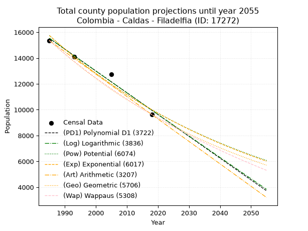
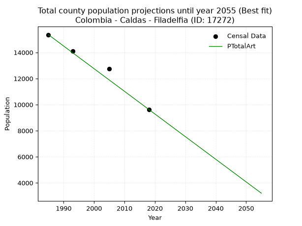
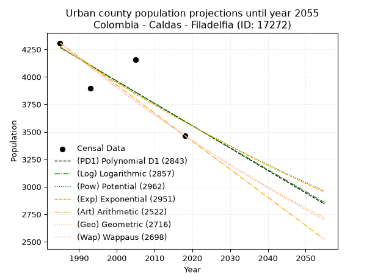
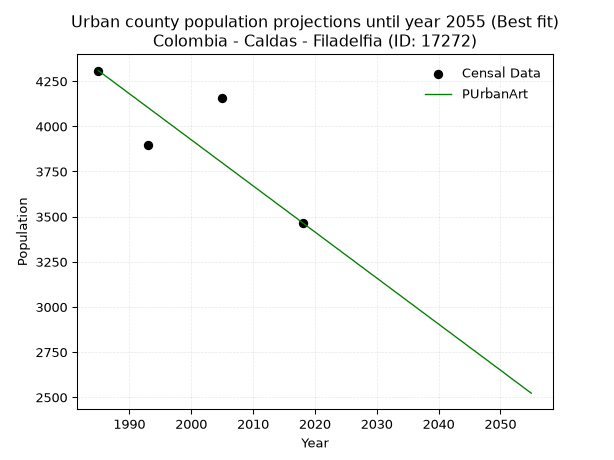
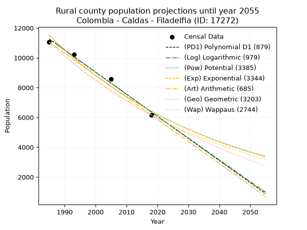

<div align="center">


</div>

# 📜 _“Population and Public Services Demand Projections (PPSD) until Year 2050 for Colombia - Caldas - Filadelfia (ID: 17272)”_
Keywords: `population` `public-service` `projection` `lineal` `polynomial` `logarithmic` `potential` `exponential` `arithmetic` `geometric` `wappaus` `dane` `colombia` `south-america`

PPSD are analytical estimates used by governments and planners to anticipate future changes in population size, age distribution, and the resulting community needs for utilities, healthcare, education, and infrastructure as sizing future water treatment facilities, electrical grids, and road networks based on spatial growth.

<div align="center">

</img>

</div>


> **General running parameters**: • app_version: _v20260806_. • Python version: _3.14.7_. • Pandas version: _3.0.5_. • NumPy version: _2.5.1_. • Creates, save and include plots into reports (create_plot): _False_. • Projection until year: _2050_. • Process polynomial degree 2 and up: _False_. • Process Wappaus: _True_. • Process Wappaus: _True_. • Set negative values to zero: _True_. • Set infinite values to zero: _True_. • Drop dataset notes: _True_. 
<div align="center">

Maps & GIS Layers: [:earth_americas:Google](http://maps.google.com/maps?q=5.297090709,-75.562474) [:earth_americas:OSM](https://www.openstreetmap.org/#map=18/5.297090709/-75.562474&layers=P) [:earth_americas:Bing](https://www.bing.com/maps?cp=5.297090709~-75.562474&lvl=18) [:earth_americas:Apple](https://maps.apple.com/frame?center=5.297090709%2C-75.562474&span=0.003%2C0.006) [:earth_americas:GISMobile](https://github.com/rcfdtools/R.GISMobile/blob/main/file/gis/CountyLayer_CO/Readme.md)

</div>


<div align="center">

```geojson
{
  "type": "Feature",
  "geometry": {
    "type": "Point", 
    "coordinates": [-75.562474, 5.297090709]
  }, 
  "properties": {
    "Name": "Colombia - Caldas - Filadelfia (ID: 17272)"
  }
}
```

</div>


## 0. Census Data (4 records)

Census data are official statistics collected by a government about the people and housing in a country. They usually include counts of total population, age, sex, race, income, education, and jobs.

📅Global census file: [Population.xlsx](../data/Population.xlsx)

| Source   |   Year |   CountryID | CountryName   |   StateID | StateName   |   CountyID | CountyName   |   PTotal |   PUrban |   PRural |
|:---------|-------:|------------:|:--------------|----------:|:------------|-----------:|:-------------|---------:|---------:|---------:|
| DANE     |   1985 |          57 | Colombia      |        17 | Caldas      |      17272 | Filadelfia   |    15359 |     4308 |    11051 |
| DANE     |   1993 |          57 | Colombia      |        17 | Caldas      |      17272 | Filadelfia   |    14105 |     3897 |    10208 |
| DANE     |   2005 |          57 | Colombia      |        17 | Caldas      |      17272 | Filadelfia   |    12737 |     4159 |     8578 |
| DANE     |   2018 |          57 | Colombia      |        17 | Caldas      |      17272 | Filadelfia   |     9630 |     3466 |     6164 |

> 🔥Some records could had specific notes about the registered values or the corresponding urban or rural distribution.

📅[SUI-RUPS](https://www.datos.gov.co/Hacienda-y-Cr-dito-P-blico/Registro-nico-de-Prestadores-de-Servicios-P-blicos/4qkq-csdn/about_data) - Local public utility companies: [RUPS.csv](../data/RUPS.csv)

 | SERVICIO       | ESTADO    | NOMBRE                                                                           | NIT         | DEPARTAMENTO_DOMICILIO   | MUNICIPIO_DOMICILIO   | DIRECCION                           |   TELEFONO | EMAIL                               | TIPO_PRESTADOR                             | CLASIFICACION                 |
|:---------------|:----------|:---------------------------------------------------------------------------------|:------------|:-------------------------|:----------------------|:------------------------------------|-----------:|:------------------------------------|:-------------------------------------------|:------------------------------|
| ACUEDUCTO      | OPERATIVA | EMPRESA DE OBRAS SANITARIAS DE CALDAS  S. A. EMPRESA DE SERVICIOS PUBLICOS       | 890803239-9 | CALDAS                   | MANIZALES             | Carrera 23 Nro 75 - 82              |    8867080 | lorena.grisalest@empocaldas.com.co  | SOCIEDADES (EMPRESA DE SERVICIOS PUBLICOS) | MAYOR O IGUAL A 5001 USUARIOS |
| ALCANTARILLADO | OPERATIVA | EMPRESA DE OBRAS SANITARIAS DE CALDAS  S. A. EMPRESA DE SERVICIOS PUBLICOS       | 890803239-9 | CALDAS                   | MANIZALES             | Carrera 23 Nro 75 - 82              |    8867080 | lorena.grisalest@empocaldas.com.co  | SOCIEDADES (EMPRESA DE SERVICIOS PUBLICOS) | MAYOR O IGUAL A 5001 USUARIOS |
| ACUEDUCTO      | OPERATIVA | ASOCIACION DE USUARIOS DE SERVICIO COLECTIVOS DE SAMARIA                         | 800155153-6 | CALDAS                   | FILADELFIA            | Calle 3 No. 3 - 05 Plaza Prinicipal |    8606125 | acueductosamaria@hotmail.com        | ORGANIZACION AUTORIZADA                    | MENOR O IGUAL A 2500 USUARIOS |
| ACUEDUCTO      | OPERATIVA | ASOCIACIO DE USUARIOS DE SERVICIOS COLECTIVOS DEL CORREGIMIENTO DE SAN LUIS      | 810000621-2 | CALDAS                   | FILADELFIA            | CORREGIMIENTO DE SAN LUIS           |    8606053 | pleyades17@yahoo.es                 | ORGANIZACION AUTORIZADA                    | HASTA 2500 SUSCRIPTORES       |
| ACUEDUCTO      | OPERATIVA | ASOCIACION CIVICA SOCIAL DE LAS VEREDAS LA AGUADITA GRANDE Y LA AGUADITA PEQUENA | 810005030-2 | CALDAS                   | FILADELFIA            | VEREDA AGUADITAS                    |    3113334 | gildardocarmonagrajales@hotmail.com | ORGANIZACION AUTORIZADA                    | HASTA 2500 SUSCRIPTORES       |

## 1. Total

### 1.1. Coefficients and Parameters

* (PD1) Polynomial Deg 1: -168.69169008430148, 350383.3030911241 (lineal)
* (Log) Logarithmic: -337547.9313661291, 2578662.2812533095
* (Pow) Potential: -27.49268459578583, 94.86154418462961
* (Exp) Exponential: -0.013741761997410758, 1.105457813719052e+16
* (Art) Arithmetic: Year diff. 2018 - 1985 = 33, Population diff. 9630 - 15359 = -5729, Annual growth = -173.6060606060606
* (Geo) Geometric: Year diff. 2018 - 1985 = 33, Population diff. 9630 - 15359 = -5729, Annual growth % = -0.014046427289477137
* (Wap) Wappaus: i = -1.3894598471812445, Condition values only valid for < 200)

<sub>
Wappaus condition values: ['-0.00', '-1.39', '-2.78', '-4.17', '-5.56', '-6.95', '-8.34', '-9.73', '-11.12', '-12.51', '-13.89', '-15.28', '-16.67', '-18.06', '-19.45', '-20.84', '-22.23', '-23.62', '-25.01', '-26.40', '-27.79', '-29.18', '-30.57', '-31.96', '-33.35', '-34.74', '-36.13', '-37.52', '-38.90', '-40.29', '-41.68', '-43.07', '-44.46', '-45.85', '-47.24', '-48.63', '-50.02', '-51.41', '-52.80', '-54.19', '-55.58', '-56.97', '-58.36', '-59.75', '-61.14', '-62.53', '-63.92', '-65.30', '-66.69', '-68.08', '-69.47', '-70.86', '-72.25', '-73.64', '-75.03', '-76.42', '-77.81', '-79.20', '-80.59', '-81.98', '-83.37', '-84.76', '-86.15', '-87.54', '-88.93', '-90.31']
</sub>


### 1.2. Projected Dataset

|   Year |   CountyID |   PTotalPD1 |   PTotalLog |   PTotalPow |   PTotalExp |   PTotalArt |   PTotalGeo |   PTotalWap |
|-------:|-----------:|------------:|------------:|------------:|------------:|------------:|------------:|------------:|
|   1985 |      17272 |       15530 |       15535 |       15749 |       15744 |       15359 |       15359 |       15359 |
|   1986 |      17272 |       15362 |       15365 |       15532 |       15529 |       15185 |       15143 |       15147 |
|   1987 |      17272 |       15193 |       15195 |       15319 |       15317 |       15012 |       14931 |       14938 |
|   1988 |      17272 |       15024 |       15025 |       15109 |       15108 |       14838 |       14721 |       14732 |
|   1989 |      17272 |       14856 |       14855 |       14901 |       14902 |       14665 |       14514 |       14528 |
|   1990 |      17272 |       14687 |       14685 |       14697 |       14699 |       14491 |       14310 |       14328 |
|   1991 |      17272 |       14518 |       14516 |       14495 |       14498 |       14317 |       14109 |       14130 |
|   1992 |      17272 |       14349 |       14346 |       14296 |       14300 |       14144 |       13911 |       13934 |
|   1993 |      17272 |       14181 |       14177 |       14100 |       14105 |       13970 |       13716 |       13742 |
|   1994 |      17272 |       14012 |       14008 |       13907 |       13913 |       13797 |       13523 |       13551 |
|   1995 |      17272 |       13843 |       13838 |       13717 |       13723 |       13623 |       13333 |       13364 |
|   1996 |      17272 |       13675 |       13669 |       13529 |       13535 |       13449 |       13146 |       13178 |
|   1997 |      17272 |       13506 |       13500 |       13344 |       13351 |       13276 |       12961 |       12995 |
|   1998 |      17272 |       13337 |       13331 |       13162 |       13168 |       13102 |       12779 |       12815 |
|   1999 |      17272 |       13169 |       13162 |       12982 |       12989 |       12929 |       12600 |       12636 |
|   2000 |      17272 |       13000 |       12993 |       12805 |       12811 |       12755 |       12423 |       12460 |
|   2001 |      17272 |       12831 |       12825 |       12630 |       12637 |       12581 |       12248 |       12286 |
|   2002 |      17272 |       12663 |       12656 |       12458 |       12464 |       12408 |       12076 |       12114 |
|   2003 |      17272 |       12494 |       12487 |       12288 |       12294 |       12234 |       11906 |       11945 |
|   2004 |      17272 |       12325 |       12319 |       12120 |       12126 |       12060 |       11739 |       11777 |
|   2005 |      17272 |       12156 |       12151 |       11955 |       11961 |       11887 |       11574 |       11612 |
|   2006 |      17272 |       11988 |       11982 |       11792 |       11798 |       11713 |       11412 |       11448 |
|   2007 |      17272 |       11819 |       11814 |       11632 |       11637 |       11540 |       11251 |       11286 |
|   2008 |      17272 |       11650 |       11646 |       11474 |       11478 |       11366 |       11093 |       11127 |
|   2009 |      17272 |       11482 |       11478 |       11318 |       11321 |       11192 |       10938 |       10969 |
|   2010 |      17272 |       11313 |       11310 |       11164 |       11167 |       11019 |       10784 |       10813 |
|   2011 |      17272 |       11144 |       11142 |       11012 |       11014 |       10845 |       10632 |       10659 |
|   2012 |      17272 |       10976 |       10974 |       10863 |       10864 |       10672 |       10483 |       10507 |
|   2013 |      17272 |       10807 |       10806 |       10715 |       10716 |       10498 |       10336 |       10357 |
|   2014 |      17272 |       10638 |       10639 |       10570 |       10569 |       10324 |       10191 |       10208 |
|   2015 |      17272 |       10470 |       10471 |       10427 |       10425 |       10151 |       10047 |       10061 |
|   2016 |      17272 |       10301 |       10304 |       10286 |       10283 |        9977 |        9906 |        9916 |
|   2017 |      17272 |       10132 |       10136 |       10146 |       10142 |        9804 |        9767 |        9772 |
|   2018 |      17272 |        9963 |        9969 |       10009 |       10004 |        9630 |        9630 |        9630 |
|   2019 |      17272 |        9795 |        9802 |        9874 |        9868 |        9456 |        9495 |        9490 |
|   2020 |      17272 |        9626 |        9635 |        9740 |        9733 |        9283 |        9361 |        9351 |
|   2021 |      17272 |        9457 |        9468 |        9608 |        9600 |        9109 |        9230 |        9213 |
|   2022 |      17272 |        9289 |        9301 |        9479 |        9469 |        8936 |        9100 |        9078 |
|   2023 |      17272 |        9120 |        9134 |        9351 |        9340 |        8762 |        8972 |        8943 |
|   2024 |      17272 |        8951 |        8967 |        9224 |        9212 |        8588 |        8846 |        8810 |
|   2025 |      17272 |        8783 |        8800 |        9100 |        9087 |        8415 |        8722 |        8679 |
|   2026 |      17272 |        8614 |        8634 |        8977 |        8963 |        8241 |        8600 |        8549 |
|   2027 |      17272 |        8445 |        8467 |        8856 |        8840 |        8068 |        8479 |        8420 |
|   2028 |      17272 |        8277 |        8300 |        8737 |        8720 |        7894 |        8360 |        8293 |
|   2029 |      17272 |        8108 |        8134 |        8619 |        8601 |        7720 |        8242 |        8167 |
|   2030 |      17272 |        7939 |        7968 |        8504 |        8483 |        7547 |        8127 |        8043 |
|   2031 |      17272 |        7770 |        7802 |        8389 |        8367 |        7373 |        8012 |        7920 |
|   2032 |      17272 |        7602 |        7635 |        8276 |        8253 |        7200 |        7900 |        7798 |
|   2033 |      17272 |        7433 |        7469 |        8165 |        8141 |        7026 |        7789 |        7677 |
|   2034 |      17272 |        7264 |        7303 |        8056 |        8029 |        6852 |        7679 |        7558 |
|   2035 |      17272 |        7096 |        7137 |        7947 |        7920 |        6679 |        7572 |        7440 |
|   2036 |      17272 |        6927 |        6972 |        7841 |        7812 |        6505 |        7465 |        7323 |
|   2037 |      17272 |        6758 |        6806 |        7736 |        7705 |        6331 |        7360 |        7207 |
|   2038 |      17272 |        6590 |        6640 |        7632 |        7600 |        6158 |        7257 |        7092 |
|   2039 |      17272 |        6421 |        6475 |        7530 |        7496 |        5984 |        7155 |        6979 |
|   2040 |      17272 |        6252 |        6309 |        7429 |        7394 |        5811 |        7055 |        6867 |
|   2041 |      17272 |        6084 |        6144 |        7330 |        7293 |        5637 |        6955 |        6755 |
|   2042 |      17272 |        5915 |        5978 |        7231 |        7194 |        5463 |        6858 |        6645 |
|   2043 |      17272 |        5746 |        5813 |        7135 |        7095 |        5290 |        6761 |        6536 |
|   2044 |      17272 |        5577 |        5648 |        7039 |        6999 |        5116 |        6666 |        6429 |
|   2045 |      17272 |        5409 |        5483 |        6945 |        6903 |        4943 |        6573 |        6322 |
|   2046 |      17272 |        5240 |        5318 |        6853 |        6809 |        4769 |        6480 |        6216 |
|   2047 |      17272 |        5071 |        5153 |        6761 |        6716 |        4595 |        6389 |        6111 |
|   2048 |      17272 |        4903 |        4988 |        6671 |        6624 |        4422 |        6300 |        6007 |
|   2049 |      17272 |        4734 |        4823 |        6582 |        6534 |        4248 |        6211 |        5905 |
|   2050 |      17272 |        4565 |        4658 |        6494 |        6445 |        4075 |        6124 |        5803 |
<div align="center">

</img>

</div>


### 1.3. Best fit with absolute and relative error (%)

Relative error puts that difference into context by dividing the absolute error by the true value, creating a unitless ratio or percentage that shows the scale of the mistake.

Absolute and relative error

|   Year | Source   |   CountryID | CountryName   |   StateID | StateName   |   CountyID_x | CountyName   |   PTotal |   PUrban |   PRural |   CountyID_y |   PTotalPD1 |   PTotalLog |   PTotalPow |   PTotalExp |   PTotalArt |   PTotalGeo |   PTotalWap |   PTotalPD1AbsError |   PTotalLogAbsError |   PTotalPowAbsError |   PTotalExpAbsError |   PTotalArtAbsError |   PTotalGeoAbsError |   PTotalWapAbsError |   PTotalPD1RelError |   PTotalLogRelError |   PTotalPowRelError |   PTotalExpRelError |   PTotalArtRelError |   PTotalGeoRelError |   PTotalWapRelError |
|-------:|:---------|------------:|:--------------|----------:|:------------|-------------:|:-------------|---------:|---------:|---------:|-------------:|------------:|------------:|------------:|------------:|------------:|------------:|------------:|--------------------:|--------------------:|--------------------:|--------------------:|--------------------:|--------------------:|--------------------:|--------------------:|--------------------:|--------------------:|--------------------:|--------------------:|--------------------:|--------------------:|
|   1985 | DANE     |          57 | Colombia      |        17 | Caldas      |        17272 | Filadelfia   |    15359 |     4308 |    11051 |        17272 |       15530 |       15535 |       15749 |       15744 |       15359 |       15359 |       15359 |                 171 |                 176 |                 390 |                 385 |                   0 |                   0 |                   0 |            1.11335  |            1.14591  |           2.53923   |             2.50667 |            0        |             0       |             0       |
|   1993 | DANE     |          57 | Colombia      |        17 | Caldas      |        17272 | Filadelfia   |    14105 |     3897 |    10208 |        17272 |       14181 |       14177 |       14100 |       14105 |       13970 |       13716 |       13742 |                  76 |                  72 |                   5 |                   0 |                 135 |                 389 |                 363 |            0.538816 |            0.510457 |           0.0354484 |             0       |            0.957107 |             2.75789 |             2.57356 |
|   2005 | DANE     |          57 | Colombia      |        17 | Caldas      |        17272 | Filadelfia   |    12737 |     4159 |     8578 |        17272 |       12156 |       12151 |       11955 |       11961 |       11887 |       11574 |       11612 |                 581 |                 586 |                 782 |                 776 |                 850 |                1163 |                1125 |            4.56151  |            4.60077  |           6.13959   |             6.09249 |            6.67347  |             9.13088 |             8.83254 |
|   2018 | DANE     |          57 | Colombia      |        17 | Caldas      |        17272 | Filadelfia   |     9630 |     3466 |     6164 |        17272 |        9963 |        9969 |       10009 |       10004 |        9630 |        9630 |        9630 |                 333 |                 339 |                 379 |                 374 |                   0 |                   0 |                   0 |            3.45794  |            3.52025  |           3.93562   |             3.8837  |            0        |             0       |             0       |

Relative error mean

| Method    |   RelError | Best   |
|:----------|-----------:|:-------|
| PTotalPD1 |    2.41791 |        |
| PTotalLog |    2.44435 |        |
| PTotalPow |    3.16247 |        |
| PTotalExp |    3.12071 |        |
| PTotalArt |    1.90764 | True   |
| PTotalGeo |    2.97219 |        |
| PTotalWap |    2.85152 |        |

💙Best method: _**PTotalArt**_
<div align="center">

</img>

</div>


### 1.4. Fresh water supply demand in liters per capita per day (lpcd)

The fresh water supply demand typically ranges from 100 to 300 liters per capita per day (lpcd) for standard domestic and municipal planning, though absolute survival minimums set by the World Health Organization are as low as 7.5 to 20 liters per day, and total consumption in high-income nations can exceed 400 liters.

> `CZ`: Level in meters above the sea level (masl)<br> `WS`: Fresh water supply demand in liters per capita per day (lpcd or l/h/d)<br> `WSAll`: Zonal fresh water supply demand in liters per second (l/s)<br> `A`: Zonal area in square meters<br> `DP`: Population density (people/hectare or p/ha)

Reference values (RAS Colombia)

|    CZ |   WS |
|------:|-----:|
|  1000 |  120 |
|  2000 |  130 |
| 99999 |  140 |

County shapefile geometry properties and water supply values

|   CountyID |     ATotal |   CZTotal |   WSTotal |
|-----------:|-----------:|----------:|----------:|
|      17272 | 1.9256e+08 |   1225.29 |       130 |

Projected values for best method: PTotalArt

|   CountyID |   Year |   PTotalArt |   DPTotal |   WSTotal |   WSTotalAll |
|-----------:|-------:|------------:|----------:|----------:|-------------:|
|      17272 |   1985 |       15359 |      0.8  |       130 |     23.1096  |
|      17272 |   1986 |       15185 |      0.79 |       130 |     22.8478  |
|      17272 |   1987 |       15012 |      0.78 |       130 |     22.5875  |
|      17272 |   1988 |       14838 |      0.77 |       130 |     22.3257  |
|      17272 |   1989 |       14665 |      0.76 |       130 |     22.0654  |
|      17272 |   1990 |       14491 |      0.75 |       130 |     21.8036  |
|      17272 |   1991 |       14317 |      0.74 |       130 |     21.5418  |
|      17272 |   1992 |       14144 |      0.73 |       130 |     21.2815  |
|      17272 |   1993 |       13970 |      0.73 |       130 |     21.0197  |
|      17272 |   1994 |       13797 |      0.72 |       130 |     20.7594  |
|      17272 |   1995 |       13623 |      0.71 |       130 |     20.4976  |
|      17272 |   1996 |       13449 |      0.7  |       130 |     20.2358  |
|      17272 |   1997 |       13276 |      0.69 |       130 |     19.9755  |
|      17272 |   1998 |       13102 |      0.68 |       130 |     19.7137  |
|      17272 |   1999 |       12929 |      0.67 |       130 |     19.4534  |
|      17272 |   2000 |       12755 |      0.66 |       130 |     19.1916  |
|      17272 |   2001 |       12581 |      0.65 |       130 |     18.9297  |
|      17272 |   2002 |       12408 |      0.64 |       130 |     18.6694  |
|      17272 |   2003 |       12234 |      0.64 |       130 |     18.4076  |
|      17272 |   2004 |       12060 |      0.63 |       130 |     18.1458  |
|      17272 |   2005 |       11887 |      0.62 |       130 |     17.8855  |
|      17272 |   2006 |       11713 |      0.61 |       130 |     17.6237  |
|      17272 |   2007 |       11540 |      0.6  |       130 |     17.3634  |
|      17272 |   2008 |       11366 |      0.59 |       130 |     17.1016  |
|      17272 |   2009 |       11192 |      0.58 |       130 |     16.8398  |
|      17272 |   2010 |       11019 |      0.57 |       130 |     16.5795  |
|      17272 |   2011 |       10845 |      0.56 |       130 |     16.3177  |
|      17272 |   2012 |       10672 |      0.55 |       130 |     16.0574  |
|      17272 |   2013 |       10498 |      0.55 |       130 |     15.7956  |
|      17272 |   2014 |       10324 |      0.54 |       130 |     15.5338  |
|      17272 |   2015 |       10151 |      0.53 |       130 |     15.2735  |
|      17272 |   2016 |        9977 |      0.52 |       130 |     15.0117  |
|      17272 |   2017 |        9804 |      0.51 |       130 |     14.7514  |
|      17272 |   2018 |        9630 |      0.5  |       130 |     14.4896  |
|      17272 |   2019 |        9456 |      0.49 |       130 |     14.2278  |
|      17272 |   2020 |        9283 |      0.48 |       130 |     13.9675  |
|      17272 |   2021 |        9109 |      0.47 |       130 |     13.7057  |
|      17272 |   2022 |        8936 |      0.46 |       130 |     13.4454  |
|      17272 |   2023 |        8762 |      0.46 |       130 |     13.1836  |
|      17272 |   2024 |        8588 |      0.45 |       130 |     12.9218  |
|      17272 |   2025 |        8415 |      0.44 |       130 |     12.6615  |
|      17272 |   2026 |        8241 |      0.43 |       130 |     12.3997  |
|      17272 |   2027 |        8068 |      0.42 |       130 |     12.1394  |
|      17272 |   2028 |        7894 |      0.41 |       130 |     11.8775  |
|      17272 |   2029 |        7720 |      0.4  |       130 |     11.6157  |
|      17272 |   2030 |        7547 |      0.39 |       130 |     11.3554  |
|      17272 |   2031 |        7373 |      0.38 |       130 |     11.0936  |
|      17272 |   2032 |        7200 |      0.37 |       130 |     10.8333  |
|      17272 |   2033 |        7026 |      0.36 |       130 |     10.5715  |
|      17272 |   2034 |        6852 |      0.36 |       130 |     10.3097  |
|      17272 |   2035 |        6679 |      0.35 |       130 |     10.0494  |
|      17272 |   2036 |        6505 |      0.34 |       130 |      9.78762 |
|      17272 |   2037 |        6331 |      0.33 |       130 |      9.52581 |
|      17272 |   2038 |        6158 |      0.32 |       130 |      9.26551 |
|      17272 |   2039 |        5984 |      0.31 |       130 |      9.0037  |
|      17272 |   2040 |        5811 |      0.3  |       130 |      8.7434  |
|      17272 |   2041 |        5637 |      0.29 |       130 |      8.4816  |
|      17272 |   2042 |        5463 |      0.28 |       130 |      8.21979 |
|      17272 |   2043 |        5290 |      0.27 |       130 |      7.95949 |
|      17272 |   2044 |        5116 |      0.27 |       130 |      7.69769 |
|      17272 |   2045 |        4943 |      0.26 |       130 |      7.43738 |
|      17272 |   2046 |        4769 |      0.25 |       130 |      7.17558 |
|      17272 |   2047 |        4595 |      0.24 |       130 |      6.91377 |
|      17272 |   2048 |        4422 |      0.23 |       130 |      6.65347 |
|      17272 |   2049 |        4248 |      0.22 |       130 |      6.39167 |
|      17272 |   2050 |        4075 |      0.21 |       130 |      6.13137 |

## 2. Urban

### 2.1. Coefficients and Parameters

* (PD1) Polynomial Deg 1: -20.35086310718548, 44664.31393014776 (lineal)
* (Log) Logarithmic: -40706.03807467455, 313364.4216033185
* (Pow) Potential: -10.599844096291914, 38.58684511876697
* (Exp) Exponential: -0.005299718966276906, 158419526.11949152
* (Art) Arithmetic: Year diff. 2018 - 1985 = 33, Population diff. 3466 - 4308 = -842, Annual growth = -25.515151515151516
* (Geo) Geometric: Year diff. 2018 - 1985 = 33, Population diff. 3466 - 4308 = -842, Annual growth % = -0.006568410877114905
* (Wap) Wappaus: i = -0.6564227300013253, Condition values only valid for < 200)

<sub>
Wappaus condition values: ['-0.00', '-0.66', '-1.31', '-1.97', '-2.63', '-3.28', '-3.94', '-4.59', '-5.25', '-5.91', '-6.56', '-7.22', '-7.88', '-8.53', '-9.19', '-9.85', '-10.50', '-11.16', '-11.82', '-12.47', '-13.13', '-13.78', '-14.44', '-15.10', '-15.75', '-16.41', '-17.07', '-17.72', '-18.38', '-19.04', '-19.69', '-20.35', '-21.01', '-21.66', '-22.32', '-22.97', '-23.63', '-24.29', '-24.94', '-25.60', '-26.26', '-26.91', '-27.57', '-28.23', '-28.88', '-29.54', '-30.20', '-30.85', '-31.51', '-32.16', '-32.82', '-33.48', '-34.13', '-34.79', '-35.45', '-36.10', '-36.76', '-37.42', '-38.07', '-38.73', '-39.39', '-40.04', '-40.70', '-41.35', '-42.01', '-42.67']
</sub>


### 2.2. Projected Dataset

|   Year |   CountyID |   PUrbanPD1 |   PUrbanLog |   PUrbanPow |   PUrbanExp |   PUrbanArt |   PUrbanGeo |   PUrbanWap |
|-------:|-----------:|------------:|------------:|------------:|------------:|------------:|------------:|------------:|
|   1985 |      17272 |        4268 |        4268 |        4277 |        4276 |        4308 |        4308 |        4308 |
|   1986 |      17272 |        4247 |        4248 |        4254 |        4254 |        4282 |        4280 |        4280 |
|   1987 |      17272 |        4227 |        4227 |        4231 |        4231 |        4257 |        4252 |        4252 |
|   1988 |      17272 |        4207 |        4207 |        4209 |        4209 |        4231 |        4224 |        4224 |
|   1989 |      17272 |        4186 |        4186 |        4186 |        4186 |        4206 |        4196 |        4196 |
|   1990 |      17272 |        4166 |        4166 |        4164 |        4164 |        4180 |        4168 |        4169 |
|   1991 |      17272 |        4146 |        4145 |        4142 |        4142 |        4155 |        4141 |        4142 |
|   1992 |      17272 |        4125 |        4125 |        4120 |        4120 |        4129 |        4114 |        4114 |
|   1993 |      17272 |        4105 |        4105 |        4098 |        4099 |        4104 |        4087 |        4088 |
|   1994 |      17272 |        4085 |        4084 |        4076 |        4077 |        4078 |        4060 |        4061 |
|   1995 |      17272 |        4064 |        4064 |        4055 |        4055 |        4053 |        4033 |        4034 |
|   1996 |      17272 |        4044 |        4043 |        4033 |        4034 |        4027 |        4007 |        4008 |
|   1997 |      17272 |        4024 |        4023 |        4012 |        4013 |        4002 |        3980 |        3982 |
|   1998 |      17272 |        4003 |        4003 |        3991 |        3991 |        3976 |        3954 |        3955 |
|   1999 |      17272 |        3983 |        3982 |        3970 |        3970 |        3951 |        3928 |        3929 |
|   2000 |      17272 |        3963 |        3962 |        3949 |        3949 |        3925 |        3903 |        3904 |
|   2001 |      17272 |        3942 |        3941 |        3928 |        3929 |        3900 |        3877 |        3878 |
|   2002 |      17272 |        3922 |        3921 |        3907 |        3908 |        3874 |        3851 |        3853 |
|   2003 |      17272 |        3902 |        3901 |        3886 |        3887 |        3849 |        3826 |        3827 |
|   2004 |      17272 |        3881 |        3880 |        3866 |        3867 |        3823 |        3801 |        3802 |
|   2005 |      17272 |        3861 |        3860 |        3845 |        3846 |        3798 |        3776 |        3777 |
|   2006 |      17272 |        3840 |        3840 |        3825 |        3826 |        3772 |        3751 |        3752 |
|   2007 |      17272 |        3820 |        3820 |        3805 |        3806 |        3747 |        3727 |        3728 |
|   2008 |      17272 |        3800 |        3799 |        3785 |        3785 |        3721 |        3702 |        3703 |
|   2009 |      17272 |        3779 |        3779 |        3765 |        3765 |        3696 |        3678 |        3679 |
|   2010 |      17272 |        3759 |        3759 |        3745 |        3746 |        3670 |        3654 |        3655 |
|   2011 |      17272 |        3739 |        3739 |        3726 |        3726 |        3645 |        3630 |        3631 |
|   2012 |      17272 |        3718 |        3718 |        3706 |        3706 |        3619 |        3606 |        3607 |
|   2013 |      17272 |        3698 |        3698 |        3687 |        3686 |        3594 |        3582 |        3583 |
|   2014 |      17272 |        3678 |        3678 |        3667 |        3667 |        3568 |        3559 |        3559 |
|   2015 |      17272 |        3657 |        3658 |        3648 |        3648 |        3543 |        3535 |        3536 |
|   2016 |      17272 |        3637 |        3637 |        3629 |        3628 |        3517 |        3512 |        3512 |
|   2017 |      17272 |        3617 |        3617 |        3610 |        3609 |        3492 |        3489 |        3489 |
|   2018 |      17272 |        3596 |        3597 |        3591 |        3590 |        3466 |        3466 |        3466 |
|   2019 |      17272 |        3576 |        3577 |        3572 |        3571 |        3440 |        3443 |        3443 |
|   2020 |      17272 |        3556 |        3557 |        3553 |        3552 |        3415 |        3421 |        3420 |
|   2021 |      17272 |        3535 |        3537 |        3535 |        3533 |        3389 |        3398 |        3398 |
|   2022 |      17272 |        3515 |        3516 |        3516 |        3515 |        3364 |        3376 |        3375 |
|   2023 |      17272 |        3495 |        3496 |        3498 |        3496 |        3338 |        3354 |        3353 |
|   2024 |      17272 |        3474 |        3476 |        3480 |        3478 |        3313 |        3332 |        3330 |
|   2025 |      17272 |        3454 |        3456 |        3461 |        3459 |        3287 |        3310 |        3308 |
|   2026 |      17272 |        3433 |        3436 |        3443 |        3441 |        3262 |        3288 |        3286 |
|   2027 |      17272 |        3413 |        3416 |        3425 |        3423 |        3236 |        3266 |        3264 |
|   2028 |      17272 |        3393 |        3396 |        3408 |        3405 |        3211 |        3245 |        3242 |
|   2029 |      17272 |        3372 |        3376 |        3390 |        3387 |        3185 |        3224 |        3221 |
|   2030 |      17272 |        3352 |        3356 |        3372 |        3369 |        3160 |        3202 |        3199 |
|   2031 |      17272 |        3332 |        3336 |        3355 |        3351 |        3134 |        3181 |        3178 |
|   2032 |      17272 |        3311 |        3316 |        3337 |        3333 |        3109 |        3161 |        3157 |
|   2033 |      17272 |        3291 |        3296 |        3320 |        3316 |        3083 |        3140 |        3135 |
|   2034 |      17272 |        3271 |        3276 |        3302 |        3298 |        3058 |        3119 |        3114 |
|   2035 |      17272 |        3250 |        3256 |        3285 |        3281 |        3032 |        3099 |        3093 |
|   2036 |      17272 |        3230 |        3236 |        3268 |        3263 |        3007 |        3078 |        3073 |
|   2037 |      17272 |        3210 |        3216 |        3251 |        3246 |        2981 |        3058 |        3052 |
|   2038 |      17272 |        3189 |        3196 |        3234 |        3229 |        2956 |        3038 |        3031 |
|   2039 |      17272 |        3169 |        3176 |        3218 |        3212 |        2930 |        3018 |        3011 |
|   2040 |      17272 |        3149 |        3156 |        3201 |        3195 |        2905 |        2998 |        2991 |
|   2041 |      17272 |        3128 |        3136 |        3184 |        3178 |        2879 |        2979 |        2970 |
|   2042 |      17272 |        3108 |        3116 |        3168 |        3161 |        2854 |        2959 |        2950 |
|   2043 |      17272 |        3088 |        3096 |        3151 |        3145 |        2828 |        2940 |        2930 |
|   2044 |      17272 |        3067 |        3076 |        3135 |        3128 |        2803 |        2920 |        2910 |
|   2045 |      17272 |        3047 |        3056 |        3119 |        3111 |        2777 |        2901 |        2890 |
|   2046 |      17272 |        3026 |        3036 |        3103 |        3095 |        2752 |        2882 |        2871 |
|   2047 |      17272 |        3006 |        3016 |        3087 |        3079 |        2726 |        2863 |        2851 |
|   2048 |      17272 |        2986 |        2996 |        3071 |        3062 |        2701 |        2844 |        2832 |
|   2049 |      17272 |        2965 |        2977 |        3055 |        3046 |        2675 |        2826 |        2812 |
|   2050 |      17272 |        2945 |        2957 |        3039 |        3030 |        2650 |        2807 |        2793 |
<div align="center">

</img>

</div>


### 2.3. Best fit with absolute and relative error (%)

Relative error puts that difference into context by dividing the absolute error by the true value, creating a unitless ratio or percentage that shows the scale of the mistake.

Absolute and relative error

|   Year | Source   |   CountryID | CountryName   |   StateID | StateName   |   CountyID_x | CountyName   |   PTotal |   PUrban |   PRural |   CountyID_y |   PUrbanPD1 |   PUrbanLog |   PUrbanPow |   PUrbanExp |   PUrbanArt |   PUrbanGeo |   PUrbanWap |   PUrbanPD1AbsError |   PUrbanLogAbsError |   PUrbanPowAbsError |   PUrbanExpAbsError |   PUrbanArtAbsError |   PUrbanGeoAbsError |   PUrbanWapAbsError |   PUrbanPD1RelError |   PUrbanLogRelError |   PUrbanPowRelError |   PUrbanExpRelError |   PUrbanArtRelError |   PUrbanGeoRelError |   PUrbanWapRelError |
|-------:|:---------|------------:|:--------------|----------:|:------------|-------------:|:-------------|---------:|---------:|---------:|-------------:|------------:|------------:|------------:|------------:|------------:|------------:|------------:|--------------------:|--------------------:|--------------------:|--------------------:|--------------------:|--------------------:|--------------------:|--------------------:|--------------------:|--------------------:|--------------------:|--------------------:|--------------------:|--------------------:|
|   1985 | DANE     |          57 | Colombia      |        17 | Caldas      |        17272 | Filadelfia   |    15359 |     4308 |    11051 |        17272 |        4268 |        4268 |        4277 |        4276 |        4308 |        4308 |        4308 |                  40 |                  40 |                  31 |                  32 |                   0 |                   0 |                   0 |            0.928505 |            0.928505 |            0.719591 |            0.742804 |             0       |             0       |             0       |
|   1993 | DANE     |          57 | Colombia      |        17 | Caldas      |        17272 | Filadelfia   |    14105 |     3897 |    10208 |        17272 |        4105 |        4105 |        4098 |        4099 |        4104 |        4087 |        4088 |                 208 |                 208 |                 201 |                 202 |                 207 |                 190 |                 191 |            5.33744  |            5.33744  |            5.15781  |            5.18347  |             5.31178 |             4.87555 |             4.90121 |
|   2005 | DANE     |          57 | Colombia      |        17 | Caldas      |        17272 | Filadelfia   |    12737 |     4159 |     8578 |        17272 |        3861 |        3860 |        3845 |        3846 |        3798 |        3776 |        3777 |                 298 |                 299 |                 314 |                 313 |                 361 |                 383 |                 382 |            7.16518  |            7.18923  |            7.54989  |            7.52585  |             8.67997 |             9.20894 |             9.1849  |
|   2018 | DANE     |          57 | Colombia      |        17 | Caldas      |        17272 | Filadelfia   |     9630 |     3466 |     6164 |        17272 |        3596 |        3597 |        3591 |        3590 |        3466 |        3466 |        3466 |                 130 |                 131 |                 125 |                 124 |                   0 |                   0 |                   0 |            3.75072  |            3.77957  |            3.60646  |            3.57761  |             0       |             0       |             0       |

Relative error mean

| Method    |   RelError | Best   |
|:----------|-----------:|:-------|
| PUrbanPD1 |    4.29546 |        |
| PUrbanLog |    4.30869 |        |
| PUrbanPow |    4.25844 |        |
| PUrbanExp |    4.25743 |        |
| PUrbanArt |    3.49794 | True   |
| PUrbanGeo |    3.52112 |        |
| PUrbanWap |    3.52153 |        |

💙Best method: _**PUrbanArt**_
<div align="center">

</img>

</div>


### 2.4. Fresh water supply demand in liters per capita per day (lpcd)

The fresh water supply demand typically ranges from 100 to 300 liters per capita per day (lpcd) for standard domestic and municipal planning, though absolute survival minimums set by the World Health Organization are as low as 7.5 to 20 liters per day, and total consumption in high-income nations can exceed 400 liters.

> `CZ`: Level in meters above the sea level (masl)<br> `WS`: Fresh water supply demand in liters per capita per day (lpcd or l/h/d)<br> `WSAll`: Zonal fresh water supply demand in liters per second (l/s)<br> `A`: Zonal area in square meters<br> `DP`: Population density (people/hectare or p/ha)

Reference values (RAS Colombia)

|    CZ |   WS |
|------:|-----:|
|  1000 |  120 |
|  2000 |  130 |
| 99999 |  140 |

County shapefile geometry properties and water supply values

|   CountyID |   AUrban |   CZUrban |   WSUrban |
|-----------:|---------:|----------:|----------:|
|      17272 |   435570 |   1586.13 |       130 |

Projected values for best method: PUrbanArt

|   CountyID |   Year |   PUrbanArt |   DPUrban |   WSUrban |   WSUrbanAll |
|-----------:|-------:|------------:|----------:|----------:|-------------:|
|      17272 |   1985 |        4308 |     98.9  |       130 |      6.48194 |
|      17272 |   1986 |        4282 |     98.31 |       130 |      6.44282 |
|      17272 |   1987 |        4257 |     97.73 |       130 |      6.40521 |
|      17272 |   1988 |        4231 |     97.14 |       130 |      6.36609 |
|      17272 |   1989 |        4206 |     96.56 |       130 |      6.32847 |
|      17272 |   1990 |        4180 |     95.97 |       130 |      6.28935 |
|      17272 |   1991 |        4155 |     95.39 |       130 |      6.25174 |
|      17272 |   1992 |        4129 |     94.8  |       130 |      6.21262 |
|      17272 |   1993 |        4104 |     94.22 |       130 |      6.175   |
|      17272 |   1994 |        4078 |     93.62 |       130 |      6.13588 |
|      17272 |   1995 |        4053 |     93.05 |       130 |      6.09826 |
|      17272 |   1996 |        4027 |     92.45 |       130 |      6.05914 |
|      17272 |   1997 |        4002 |     91.88 |       130 |      6.02153 |
|      17272 |   1998 |        3976 |     91.28 |       130 |      5.98241 |
|      17272 |   1999 |        3951 |     90.71 |       130 |      5.94479 |
|      17272 |   2000 |        3925 |     90.11 |       130 |      5.90567 |
|      17272 |   2001 |        3900 |     89.54 |       130 |      5.86806 |
|      17272 |   2002 |        3874 |     88.94 |       130 |      5.82894 |
|      17272 |   2003 |        3849 |     88.37 |       130 |      5.79132 |
|      17272 |   2004 |        3823 |     87.77 |       130 |      5.7522  |
|      17272 |   2005 |        3798 |     87.2  |       130 |      5.71458 |
|      17272 |   2006 |        3772 |     86.6  |       130 |      5.67546 |
|      17272 |   2007 |        3747 |     86.03 |       130 |      5.63785 |
|      17272 |   2008 |        3721 |     85.43 |       130 |      5.59873 |
|      17272 |   2009 |        3696 |     84.85 |       130 |      5.56111 |
|      17272 |   2010 |        3670 |     84.26 |       130 |      5.52199 |
|      17272 |   2011 |        3645 |     83.68 |       130 |      5.48438 |
|      17272 |   2012 |        3619 |     83.09 |       130 |      5.44525 |
|      17272 |   2013 |        3594 |     82.51 |       130 |      5.40764 |
|      17272 |   2014 |        3568 |     81.92 |       130 |      5.36852 |
|      17272 |   2015 |        3543 |     81.34 |       130 |      5.3309  |
|      17272 |   2016 |        3517 |     80.74 |       130 |      5.29178 |
|      17272 |   2017 |        3492 |     80.17 |       130 |      5.25417 |
|      17272 |   2018 |        3466 |     79.57 |       130 |      5.21505 |
|      17272 |   2019 |        3440 |     78.98 |       130 |      5.17593 |
|      17272 |   2020 |        3415 |     78.4  |       130 |      5.13831 |
|      17272 |   2021 |        3389 |     77.81 |       130 |      5.09919 |
|      17272 |   2022 |        3364 |     77.23 |       130 |      5.06157 |
|      17272 |   2023 |        3338 |     76.64 |       130 |      5.02245 |
|      17272 |   2024 |        3313 |     76.06 |       130 |      4.98484 |
|      17272 |   2025 |        3287 |     75.46 |       130 |      4.94572 |
|      17272 |   2026 |        3262 |     74.89 |       130 |      4.9081  |
|      17272 |   2027 |        3236 |     74.29 |       130 |      4.86898 |
|      17272 |   2028 |        3211 |     73.72 |       130 |      4.83137 |
|      17272 |   2029 |        3185 |     73.12 |       130 |      4.79225 |
|      17272 |   2030 |        3160 |     72.55 |       130 |      4.75463 |
|      17272 |   2031 |        3134 |     71.95 |       130 |      4.71551 |
|      17272 |   2032 |        3109 |     71.38 |       130 |      4.67789 |
|      17272 |   2033 |        3083 |     70.78 |       130 |      4.63877 |
|      17272 |   2034 |        3058 |     70.21 |       130 |      4.60116 |
|      17272 |   2035 |        3032 |     69.61 |       130 |      4.56204 |
|      17272 |   2036 |        3007 |     69.04 |       130 |      4.52442 |
|      17272 |   2037 |        2981 |     68.44 |       130 |      4.4853  |
|      17272 |   2038 |        2956 |     67.87 |       130 |      4.44769 |
|      17272 |   2039 |        2930 |     67.27 |       130 |      4.40856 |
|      17272 |   2040 |        2905 |     66.69 |       130 |      4.37095 |
|      17272 |   2041 |        2879 |     66.1  |       130 |      4.33183 |
|      17272 |   2042 |        2854 |     65.52 |       130 |      4.29421 |
|      17272 |   2043 |        2828 |     64.93 |       130 |      4.25509 |
|      17272 |   2044 |        2803 |     64.35 |       130 |      4.21748 |
|      17272 |   2045 |        2777 |     63.76 |       130 |      4.17836 |
|      17272 |   2046 |        2752 |     63.18 |       130 |      4.14074 |
|      17272 |   2047 |        2726 |     62.58 |       130 |      4.10162 |
|      17272 |   2048 |        2701 |     62.01 |       130 |      4.064   |
|      17272 |   2049 |        2675 |     61.41 |       130 |      4.02488 |
|      17272 |   2050 |        2650 |     60.84 |       130 |      3.98727 |

## 3. Rural

### 3.1. Coefficients and Parameters

* (PD1) Polynomial Deg 1: -148.34082697711605, 305718.98916097643 (lineal)
* (Log) Logarithmic: -296841.8932914546, 2265297.8596499916
* (Pow) Potential: -35.30884294880831, 120.50106602459525
* (Exp) Exponential: -0.017648093622708784, 1.882578950254883e+19
* (Art) Arithmetic: Year diff. 2018 - 1985 = 33, Population diff. 6164 - 11051 = -4887, Annual growth = -148.0909090909091
* (Geo) Geometric: Year diff. 2018 - 1985 = 33, Population diff. 6164 - 11051 = -4887, Annual growth % = -0.017535194939270582
* (Wap) Wappaus: i = -1.7204868903968527, Condition values only valid for < 200)

<sub>
Wappaus condition values: ['-0.00', '-1.72', '-3.44', '-5.16', '-6.88', '-8.60', '-10.32', '-12.04', '-13.76', '-15.48', '-17.20', '-18.93', '-20.65', '-22.37', '-24.09', '-25.81', '-27.53', '-29.25', '-30.97', '-32.69', '-34.41', '-36.13', '-37.85', '-39.57', '-41.29', '-43.01', '-44.73', '-46.45', '-48.17', '-49.89', '-51.61', '-53.34', '-55.06', '-56.78', '-58.50', '-60.22', '-61.94', '-63.66', '-65.38', '-67.10', '-68.82', '-70.54', '-72.26', '-73.98', '-75.70', '-77.42', '-79.14', '-80.86', '-82.58', '-84.30', '-86.02', '-87.74', '-89.47', '-91.19', '-92.91', '-94.63', '-96.35', '-98.07', '-99.79', '-101.51', '-103.23', '-104.95', '-106.67', '-108.39', '-110.11', '-111.83']
</sub>


### 3.2. Projected Dataset

|   Year |   CountyID |   PRuralPD1 |   PRuralLog |   PRuralPow |   PRuralExp |   PRuralArt |   PRuralGeo |   PRuralWap |
|-------:|-----------:|------------:|------------:|------------:|------------:|------------:|------------:|------------:|
|   1985 |      17272 |       11262 |       11266 |       11507 |       11502 |       11051 |       11051 |       11051 |
|   1986 |      17272 |       11114 |       11117 |       11304 |       11301 |       10903 |       10857 |       10862 |
|   1987 |      17272 |       10966 |       10967 |       11105 |       11103 |       10755 |       10667 |       10677 |
|   1988 |      17272 |       10817 |       10818 |       10909 |       10909 |       10607 |       10480 |       10495 |
|   1989 |      17272 |       10669 |       10669 |       10717 |       10718 |       10459 |       10296 |       10316 |
|   1990 |      17272 |       10521 |       10520 |       10529 |       10531 |       10311 |       10115 |       10140 |
|   1991 |      17272 |       10372 |       10370 |       10344 |       10347 |       10162 |        9938 |        9966 |
|   1992 |      17272 |       10224 |       10221 |       10162 |       10166 |       10014 |        9764 |        9796 |
|   1993 |      17272 |       10076 |       10072 |        9983 |        9988 |        9866 |        9593 |        9628 |
|   1994 |      17272 |        9927 |        9923 |        9808 |        9813 |        9718 |        9424 |        9463 |
|   1995 |      17272 |        9779 |        9775 |        9636 |        9641 |        9570 |        9259 |        9300 |
|   1996 |      17272 |        9631 |        9626 |        9467 |        9473 |        9422 |        9097 |        9140 |
|   1997 |      17272 |        9482 |        9477 |        9301 |        9307 |        9274 |        8937 |        8983 |
|   1998 |      17272 |        9334 |        9329 |        9138 |        9144 |        9126 |        8781 |        8828 |
|   1999 |      17272 |        9186 |        9180 |        8978 |        8984 |        8978 |        8627 |        8675 |
|   2000 |      17272 |        9037 |        9032 |        8821 |        8827 |        8830 |        8475 |        8525 |
|   2001 |      17272 |        8889 |        8883 |        8667 |        8673 |        8682 |        8327 |        8377 |
|   2002 |      17272 |        8741 |        8735 |        8515 |        8521 |        8533 |        8181 |        8231 |
|   2003 |      17272 |        8592 |        8587 |        8366 |        8372 |        8385 |        8037 |        8088 |
|   2004 |      17272 |        8444 |        8438 |        8220 |        8225 |        8237 |        7896 |        7946 |
|   2005 |      17272 |        8296 |        8290 |        8077 |        8081 |        8089 |        7758 |        7807 |
|   2006 |      17272 |        8147 |        8142 |        7936 |        7940 |        7941 |        7622 |        7669 |
|   2007 |      17272 |        7999 |        7994 |        7797 |        7801 |        7793 |        7488 |        7534 |
|   2008 |      17272 |        7851 |        7847 |        7661 |        7665 |        7645 |        7357 |        7400 |
|   2009 |      17272 |        7702 |        7699 |        7528 |        7531 |        7497 |        7228 |        7269 |
|   2010 |      17272 |        7554 |        7551 |        7397 |        7399 |        7349 |        7101 |        7139 |
|   2011 |      17272 |        7406 |        7403 |        7268 |        7270 |        7201 |        6977 |        7011 |
|   2012 |      17272 |        7257 |        7256 |        7141 |        7142 |        7053 |        6854 |        6885 |
|   2013 |      17272 |        7109 |        7108 |        7017 |        7017 |        6904 |        6734 |        6761 |
|   2014 |      17272 |        6961 |        6961 |        6895 |        6895 |        6756 |        6616 |        6638 |
|   2015 |      17272 |        6812 |        6814 |        6775 |        6774 |        6608 |        6500 |        6517 |
|   2016 |      17272 |        6664 |        6666 |        6658 |        6656 |        6460 |        6386 |        6398 |
|   2017 |      17272 |        6516 |        6519 |        6542 |        6539 |        6312 |        6274 |        6280 |
|   2018 |      17272 |        6367 |        6372 |        6429 |        6425 |        6164 |        6164 |        6164 |
|   2019 |      17272 |        6219 |        6225 |        6317 |        6312 |        6016 |        6056 |        6049 |
|   2020 |      17272 |        6071 |        6078 |        6208 |        6202 |        5868 |        5950 |        5936 |
|   2021 |      17272 |        5922 |        5931 |        6100 |        6093 |        5720 |        5845 |        5825 |
|   2022 |      17272 |        5774 |        5784 |        5995 |        5987 |        5572 |        5743 |        5715 |
|   2023 |      17272 |        5625 |        5637 |        5891 |        5882 |        5424 |        5642 |        5606 |
|   2024 |      17272 |        5477 |        5491 |        5789 |        5779 |        5275 |        5543 |        5499 |
|   2025 |      17272 |        5329 |        5344 |        5689 |        5678 |        5127 |        5446 |        5393 |
|   2026 |      17272 |        5180 |        5198 |        5591 |        5579 |        4979 |        5351 |        5288 |
|   2027 |      17272 |        5032 |        5051 |        5494 |        5481 |        4831 |        5257 |        5185 |
|   2028 |      17272 |        4884 |        4905 |        5399 |        5385 |        4683 |        5165 |        5083 |
|   2029 |      17272 |        4735 |        4758 |        5306 |        5291 |        4535 |        5074 |        4982 |
|   2030 |      17272 |        4587 |        4612 |        5214 |        5199 |        4387 |        4985 |        4883 |
|   2031 |      17272 |        4439 |        4466 |        5125 |        5108 |        4239 |        4898 |        4785 |
|   2032 |      17272 |        4290 |        4320 |        5036 |        5018 |        4091 |        4812 |        4688 |
|   2033 |      17272 |        4142 |        4174 |        4950 |        4930 |        3943 |        4727 |        4592 |
|   2034 |      17272 |        3994 |        4028 |        4864 |        4844 |        3795 |        4644 |        4497 |
|   2035 |      17272 |        3845 |        3882 |        4781 |        4759 |        3646 |        4563 |        4404 |
|   2036 |      17272 |        3697 |        3736 |        4698 |        4676 |        3498 |        4483 |        4311 |
|   2037 |      17272 |        3549 |        3590 |        4618 |        4594 |        3350 |        4404 |        4220 |
|   2038 |      17272 |        3400 |        3444 |        4538 |        4514 |        3202 |        4327 |        4130 |
|   2039 |      17272 |        3252 |        3299 |        4460 |        4435 |        3054 |        4251 |        4041 |
|   2040 |      17272 |        3104 |        3153 |        4384 |        4357 |        2906 |        4177 |        3952 |
|   2041 |      17272 |        2955 |        3008 |        4309 |        4281 |        2758 |        4103 |        3865 |
|   2042 |      17272 |        2807 |        2862 |        4235 |        4206 |        2610 |        4032 |        3779 |
|   2043 |      17272 |        2659 |        2717 |        4162 |        4133 |        2462 |        3961 |        3694 |
|   2044 |      17272 |        2510 |        2572 |        4091 |        4060 |        2314 |        3891 |        3610 |
|   2045 |      17272 |        2362 |        2427 |        4021 |        3989 |        2166 |        3823 |        3527 |
|   2046 |      17272 |        2214 |        2282 |        3952 |        3920 |        2017 |        3756 |        3445 |
|   2047 |      17272 |        2065 |        2137 |        3884 |        3851 |        1869 |        3690 |        3363 |
|   2048 |      17272 |        1917 |        1992 |        3818 |        3784 |        1721 |        3626 |        3283 |
|   2049 |      17272 |        1769 |        1847 |        3753 |        3718 |        1573 |        3562 |        3203 |
|   2050 |      17272 |        1620 |        1702 |        3689 |        3653 |        1425 |        3500 |        3125 |
<div align="center">

</img>

</div>


### 3.3. Best fit with absolute and relative error (%)

Relative error puts that difference into context by dividing the absolute error by the true value, creating a unitless ratio or percentage that shows the scale of the mistake.

Absolute and relative error

|   Year | Source   |   CountryID | CountryName   |   StateID | StateName   |   CountyID_x | CountyName   |   PTotal |   PUrban |   PRural |   CountyID_y |   PRuralPD1 |   PRuralLog |   PRuralPow |   PRuralExp |   PRuralArt |   PRuralGeo |   PRuralWap |   PRuralPD1AbsError |   PRuralLogAbsError |   PRuralPowAbsError |   PRuralExpAbsError |   PRuralArtAbsError |   PRuralGeoAbsError |   PRuralWapAbsError |   PRuralPD1RelError |   PRuralLogRelError |   PRuralPowRelError |   PRuralExpRelError |   PRuralArtRelError |   PRuralGeoRelError |   PRuralWapRelError |
|-------:|:---------|------------:|:--------------|----------:|:------------|-------------:|:-------------|---------:|---------:|---------:|-------------:|------------:|------------:|------------:|------------:|------------:|------------:|------------:|--------------------:|--------------------:|--------------------:|--------------------:|--------------------:|--------------------:|--------------------:|--------------------:|--------------------:|--------------------:|--------------------:|--------------------:|--------------------:|--------------------:|
|   1985 | DANE     |          57 | Colombia      |        17 | Caldas      |        17272 | Filadelfia   |    15359 |     4308 |    11051 |        17272 |       11262 |       11266 |       11507 |       11502 |       11051 |       11051 |       11051 |                 211 |                 215 |                 456 |                 451 |                   0 |                   0 |                   0 |             1.90933 |             1.94553 |             4.12632 |             4.08108 |             0       |             0       |             0       |
|   1993 | DANE     |          57 | Colombia      |        17 | Caldas      |        17272 | Filadelfia   |    14105 |     3897 |    10208 |        17272 |       10076 |       10072 |        9983 |        9988 |        9866 |        9593 |        9628 |                 132 |                 136 |                 225 |                 220 |                 342 |                 615 |                 580 |             1.2931  |             1.33229 |             2.20415 |             2.15517 |             3.35031 |             6.02469 |             5.68182 |
|   2005 | DANE     |          57 | Colombia      |        17 | Caldas      |        17272 | Filadelfia   |    12737 |     4159 |     8578 |        17272 |        8296 |        8290 |        8077 |        8081 |        8089 |        7758 |        7807 |                 282 |                 288 |                 501 |                 497 |                 489 |                 820 |                 771 |             3.28748 |             3.35743 |             5.84052 |             5.79389 |             5.70063 |             9.55934 |             8.98811 |
|   2018 | DANE     |          57 | Colombia      |        17 | Caldas      |        17272 | Filadelfia   |     9630 |     3466 |     6164 |        17272 |        6367 |        6372 |        6429 |        6425 |        6164 |        6164 |        6164 |                 203 |                 208 |                 265 |                 261 |                   0 |                   0 |                   0 |             3.29332 |             3.37443 |             4.29916 |             4.23426 |             0       |             0       |             0       |

Relative error mean

| Method    |   RelError | Best   |
|:----------|-----------:|:-------|
| PRuralPD1 |    2.44581 |        |
| PRuralLog |    2.50242 |        |
| PRuralPow |    4.11754 |        |
| PRuralExp |    4.0661  |        |
| PRuralArt |    2.26274 | True   |
| PRuralGeo |    3.89601 |        |
| PRuralWap |    3.66748 |        |

💙Best method: _**PRuralArt**_
<div align="center">

</img>

</div>


### 3.4. Fresh water supply demand in liters per capita per day (lpcd)

The fresh water supply demand typically ranges from 100 to 300 liters per capita per day (lpcd) for standard domestic and municipal planning, though absolute survival minimums set by the World Health Organization are as low as 7.5 to 20 liters per day, and total consumption in high-income nations can exceed 400 liters.

> `CZ`: Level in meters above the sea level (masl)<br> `WS`: Fresh water supply demand in liters per capita per day (lpcd or l/h/d)<br> `WSAll`: Zonal fresh water supply demand in liters per second (l/s)<br> `A`: Zonal area in square meters<br> `DP`: Population density (people/hectare or p/ha)

Reference values (RAS Colombia)

|    CZ |   WS |
|------:|-----:|
|  1000 |  120 |
|  2000 |  130 |
| 99999 |  140 |

County shapefile geometry properties and water supply values

|   CountyID |      ARural |   CZRural |   WSRural |
|-----------:|------------:|----------:|----------:|
|      17272 | 1.92125e+08 |   1224.48 |       130 |

Projected values for best method: PRuralArt

|   CountyID |   Year |   PRuralArt |   DPRural |   WSRural |   WSRuralAll |
|-----------:|-------:|------------:|----------:|----------:|-------------:|
|      17272 |   1985 |       11051 |      0.58 |       130 |     16.6277  |
|      17272 |   1986 |       10903 |      0.57 |       130 |     16.405   |
|      17272 |   1987 |       10755 |      0.56 |       130 |     16.1823  |
|      17272 |   1988 |       10607 |      0.55 |       130 |     15.9596  |
|      17272 |   1989 |       10459 |      0.54 |       130 |     15.7369  |
|      17272 |   1990 |       10311 |      0.54 |       130 |     15.5142  |
|      17272 |   1991 |       10162 |      0.53 |       130 |     15.29    |
|      17272 |   1992 |       10014 |      0.52 |       130 |     15.0674  |
|      17272 |   1993 |        9866 |      0.51 |       130 |     14.8447  |
|      17272 |   1994 |        9718 |      0.51 |       130 |     14.622   |
|      17272 |   1995 |        9570 |      0.5  |       130 |     14.3993  |
|      17272 |   1996 |        9422 |      0.49 |       130 |     14.1766  |
|      17272 |   1997 |        9274 |      0.48 |       130 |     13.9539  |
|      17272 |   1998 |        9126 |      0.48 |       130 |     13.7312  |
|      17272 |   1999 |        8978 |      0.47 |       130 |     13.5086  |
|      17272 |   2000 |        8830 |      0.46 |       130 |     13.2859  |
|      17272 |   2001 |        8682 |      0.45 |       130 |     13.0632  |
|      17272 |   2002 |        8533 |      0.44 |       130 |     12.839   |
|      17272 |   2003 |        8385 |      0.44 |       130 |     12.6163  |
|      17272 |   2004 |        8237 |      0.43 |       130 |     12.3936  |
|      17272 |   2005 |        8089 |      0.42 |       130 |     12.1709  |
|      17272 |   2006 |        7941 |      0.41 |       130 |     11.9483  |
|      17272 |   2007 |        7793 |      0.41 |       130 |     11.7256  |
|      17272 |   2008 |        7645 |      0.4  |       130 |     11.5029  |
|      17272 |   2009 |        7497 |      0.39 |       130 |     11.2802  |
|      17272 |   2010 |        7349 |      0.38 |       130 |     11.0575  |
|      17272 |   2011 |        7201 |      0.37 |       130 |     10.8348  |
|      17272 |   2012 |        7053 |      0.37 |       130 |     10.6122  |
|      17272 |   2013 |        6904 |      0.36 |       130 |     10.388   |
|      17272 |   2014 |        6756 |      0.35 |       130 |     10.1653  |
|      17272 |   2015 |        6608 |      0.34 |       130 |      9.94259 |
|      17272 |   2016 |        6460 |      0.34 |       130 |      9.71991 |
|      17272 |   2017 |        6312 |      0.33 |       130 |      9.49722 |
|      17272 |   2018 |        6164 |      0.32 |       130 |      9.27454 |
|      17272 |   2019 |        6016 |      0.31 |       130 |      9.05185 |
|      17272 |   2020 |        5868 |      0.31 |       130 |      8.82917 |
|      17272 |   2021 |        5720 |      0.3  |       130 |      8.60648 |
|      17272 |   2022 |        5572 |      0.29 |       130 |      8.3838  |
|      17272 |   2023 |        5424 |      0.28 |       130 |      8.16111 |
|      17272 |   2024 |        5275 |      0.27 |       130 |      7.93692 |
|      17272 |   2025 |        5127 |      0.27 |       130 |      7.71424 |
|      17272 |   2026 |        4979 |      0.26 |       130 |      7.49155 |
|      17272 |   2027 |        4831 |      0.25 |       130 |      7.26887 |
|      17272 |   2028 |        4683 |      0.24 |       130 |      7.04618 |
|      17272 |   2029 |        4535 |      0.24 |       130 |      6.8235  |
|      17272 |   2030 |        4387 |      0.23 |       130 |      6.60081 |
|      17272 |   2031 |        4239 |      0.22 |       130 |      6.37812 |
|      17272 |   2032 |        4091 |      0.21 |       130 |      6.15544 |
|      17272 |   2033 |        3943 |      0.21 |       130 |      5.93275 |
|      17272 |   2034 |        3795 |      0.2  |       130 |      5.71007 |
|      17272 |   2035 |        3646 |      0.19 |       130 |      5.48588 |
|      17272 |   2036 |        3498 |      0.18 |       130 |      5.26319 |
|      17272 |   2037 |        3350 |      0.17 |       130 |      5.04051 |
|      17272 |   2038 |        3202 |      0.17 |       130 |      4.81782 |
|      17272 |   2039 |        3054 |      0.16 |       130 |      4.59514 |
|      17272 |   2040 |        2906 |      0.15 |       130 |      4.37245 |
|      17272 |   2041 |        2758 |      0.14 |       130 |      4.14977 |
|      17272 |   2042 |        2610 |      0.14 |       130 |      3.92708 |
|      17272 |   2043 |        2462 |      0.13 |       130 |      3.7044  |
|      17272 |   2044 |        2314 |      0.12 |       130 |      3.48171 |
|      17272 |   2045 |        2166 |      0.11 |       130 |      3.25903 |
|      17272 |   2046 |        2017 |      0.1  |       130 |      3.03484 |
|      17272 |   2047 |        1869 |      0.1  |       130 |      2.81215 |
|      17272 |   2048 |        1721 |      0.09 |       130 |      2.58947 |
|      17272 |   2049 |        1573 |      0.08 |       130 |      2.36678 |
|      17272 |   2050 |        1425 |      0.07 |       130 |      2.1441  |

#

<div align="center"><br><sub>Share this research</sub></div><br>

<sub>**APPS & TOOLS & CONTENT DISCLAIMER**: • NO WARRANTY - This content and software is provided by <a href="https://github.com/rcfdtools" target="_blank">github.com/rcfdtools</a> "as is", without any express or implied warranty, including warranties of merchantability, fitness for a particular purpose, or non-infringement. There is no guarantee that the software will be error-free or operate without interruption. • LIMITATION OF LIABILITY - Neither the authors nor copyright holders will be liable for claims or damages arising from the software or its use. You are responsible for determining if the software is appropriate for your use and assume all associated risks, including errors, legal compliance, and data loss. • NO PROFESSIONAL ADVICE - The software provides general information and does not offer professional advice. It should not replace consultation with professional advisors. [Clauses and global license for rcfdtools use.](https://github.com/rcfdtools/rcfdtools/blob/main/LICENSE.md)</sub>

| [:house: Home](Readme.md)  | [:beginner: Help / Collab](https://github.com/rcfdtools/R.HydroTools/discussions/31) |
|----------------------------|-------------------------------------------------------------------------------------------|