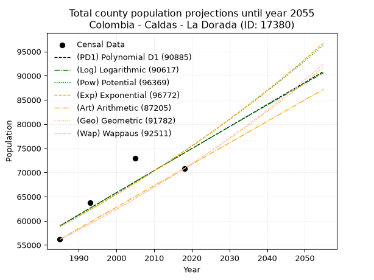
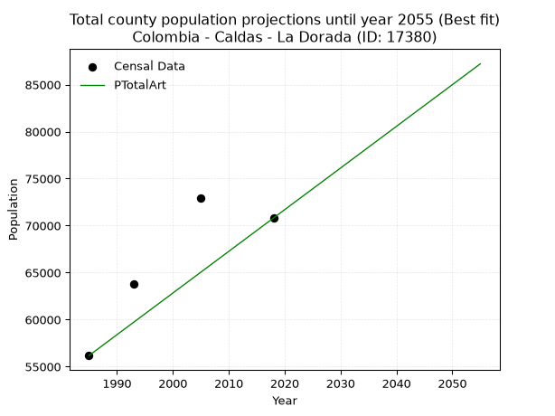
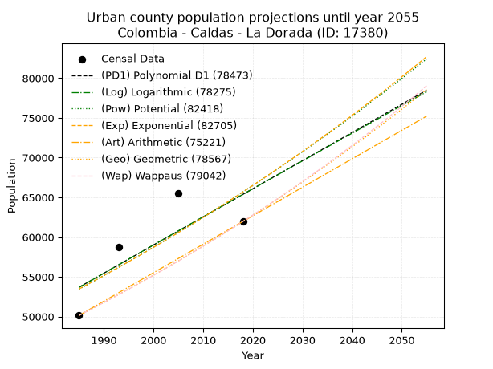
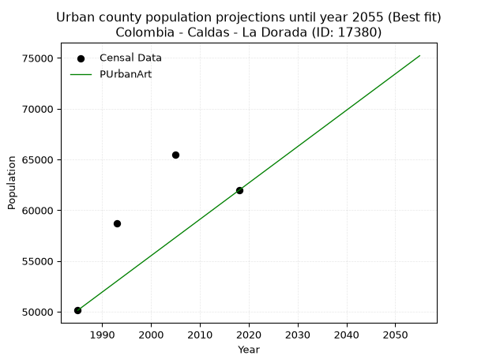
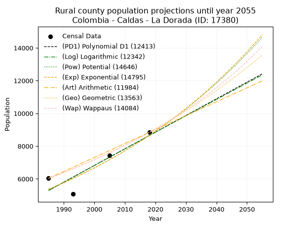
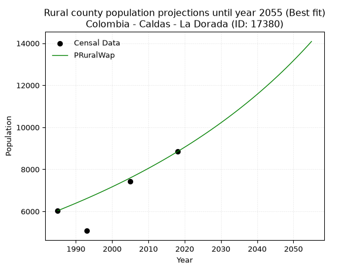

<div align="center">


</div>

# _“Population and Public Services Demand Projections (PPSD) until Year 2050 for Colombia - Caldas - La Dorada (ID: 17380)”_
Keywords: `population` `public-service` `projection` `lineal` `polynomial` `logarithmic` `potential` `exponential` `arithmetic` `geometric` `wappaus` `dane` `colombia` `south-america`

PPSD are analytical estimates used by governments and planners to anticipate future changes in population size, age distribution, and the resulting community needs for utilities, healthcare, education, and infrastructure as sizing future water treatment facilities, electrical grids, and road networks based on spatial growth.

> **General running parameters**: • app_version: _v20260806_. • Python version: _3.14.7_. • Pandas version: _3.0.5_. • NumPy version: _2.5.1_. • Creates, save and include plots into reports (create_plot): _False_. • Projection until year: _2050_. • Process polynomial degree 2 and up: _False_. • Process Wappaus: _True_. • Process Wappaus: _True_. • Set negative values to zero: _True_. • Set infinite values to zero: _True_. • Drop dataset notes: _True_. 
<div align="center">

Dynamic map: [:earth_americas:Google](http://maps.google.com/maps?q=5.460834287,-74.6688191) [:earth_americas:OSM](https://www.openstreetmap.org/#map=18/5.460834287/-74.6688191&layers=P) [:earth_americas:Bing](https://www.bing.com/maps?cp=5.460834287~-74.6688191&lvl=18) [:earth_americas:Apple](https://maps.apple.com/frame?center=5.460834287%2C-74.6688191&span=0.003%2C0.006)

</div>


<div align="center">

```geojson
{
  "type": "Feature",
  "geometry": {
    "type": "Point", 
    "coordinates": [-74.6688191, 5.460834287]
  }, 
  "properties": {
    "Name": "Colombia - Caldas - La Dorada (ID: 17380)"
  }
}
```

</div>


## 0. Census Data (4 records)

Census data are official statistics collected by a government about the people and housing in a country. They usually include counts of total population, age, sex, race, income, education, and jobs.

📅Global census file: [Population.xlsx](../data/Population.xlsx)

| Source   |   Year |   CountryID | CountryName   |   StateID | StateName   |   CountyID | CountyName   |   PTotal |   PUrban |   PRural |
|:---------|-------:|------------:|:--------------|----------:|:------------|-----------:|:-------------|---------:|---------:|---------:|
| DANE     |   1985 |          57 | Colombia      |        17 | Caldas      |      17380 | La Dorada    |    56172 |    50140 |     6032 |
| DANE     |   1993 |          57 | Colombia      |        17 | Caldas      |      17380 | La Dorada    |    63810 |    58736 |     5074 |
| DANE     |   2005 |          57 | Colombia      |        17 | Caldas      |      17380 | La Dorada    |    72925 |    65501 |     7424 |
| DANE     |   2018 |          57 | Colombia      |        17 | Caldas      |      17380 | La Dorada    |    70802 |    61964 |     8838 |

> 🔥Some records could had specific notes about the registered values or the corresponding urban or rural distribution.

**Local public utility companies (RUPS)**

 | SERVICIO       | ESTADO    | NOMBRE                                                                     | NIT         | DEPARTAMENTO_DOMICILIO   | MUNICIPIO_DOMICILIO   | DIRECCION                                  |   TELEFONO | EMAIL                              | TIPO_INSCRIPCION    | REPRESENTANTE_LEGAL           | TIPO_PRESTADOR                             | CLASIFICACION                 |
|:---------------|:----------|:---------------------------------------------------------------------------|:------------|:-------------------------|:----------------------|:-------------------------------------------|-----------:|:-----------------------------------|:--------------------|:------------------------------|:-------------------------------------------|:------------------------------|
| ACUEDUCTO      | OPERATIVA | EMPRESA DE OBRAS SANITARIAS DE CALDAS  S. A. EMPRESA DE SERVICIOS PUBLICOS | 890803239-9 | CALDAS                   | MANIZALES             | Carrera 23 Nro 75 - 82                     |    8867080 | lorena.grisalest@empocaldas.com.co | Registro por la ESP | WILDER IBERSON ESCOBAR  ORTIZ | SOCIEDADES (EMPRESA DE SERVICIOS PUBLICOS) | MAYOR O IGUAL A 5001 USUARIOS |
| ALCANTARILLADO | OPERATIVA | EMPRESA DE OBRAS SANITARIAS DE CALDAS  S. A. EMPRESA DE SERVICIOS PUBLICOS | 890803239-9 | CALDAS                   | MANIZALES             | Carrera 23 Nro 75 - 82                     |    8867080 | lorena.grisalest@empocaldas.com.co | Registro por la ESP | WILDER IBERSON ESCOBAR  ORTIZ | SOCIEDADES (EMPRESA DE SERVICIOS PUBLICOS) | MAYOR O IGUAL A 5001 USUARIOS |
| ASEO           | OPERATIVA | EMPRESA DE SERVICIOS PUBLICOS DE LA DORADA E.S.P.                          | 810004450-8 | CALDAS                   | LA DORADA             | CENTRO COMERCIAL DORADA PLAZA LOCAL N202-1 |    8576097 | gerente.espladorada@gmail.com      | Registro por la ESP | ANGELA MARITZA GARCIA MAYORGA | EMPRESA INDUSTRIAL Y COMERCIAL DEL ESTADO  | MAYOR O IGUAL A 5001 USUARIOS |
| ASEO           | OPERATIVA | AGUAS Y SERVICIOS AMBIENTALES DEL ALTO MAGDALENA S.A.S. E.S.P.             | 900700883-5 | BOGOTA, D.C.             | BOGOTA, D.C.          | Calle 12C No. 8-79 Ofic. 703               |    3365015 | asemagcolombia@gmail.com           | Registro por la ESP | IVANHOE OCAMPO MARTINEZ       | SOCIEDADES (EMPRESA DE SERVICIOS PUBLICOS) | MAS DE 2500 SUSCRIPTORES      |
| ASEO           | OPERATIVA | CORPORACION COLOMBIANA SOCIAL AMBIENTAL CULTURAL Y DE PAZ                  | 900197002-5 | ANTIOQUIA                | PUERTO TRIUNFO        | Doradal Antioquia                          |    5771022 | juanfernandomanrique5@hotmail.com  | Registro por la ESP | GRISELDA CALDERON GALLEGO     | ORGANIZACION AUTORIZADA                    | MENOR O IGUAL A 2500 USUARIOS |

> [📅RUPS Database: Registro Único de Prestadores de Servicios Públicos de Colombia Suramérica - RUPS](https://www.datos.gov.co/Hacienda-y-Cr-dito-P-blico/Registro-nico-de-Prestadores-de-Servicios-P-blicos/4qkq-csdn/about_data)

## 1. Total

### 1.1. Coefficients and Parameters

* (PD1) Polynomial Deg 1: 455.8550782818151, -845896.8703332007 (lineal)
* (Log) Logarithmic: 913648.0602455395, -6878718.977442409
* (Pow) Potential: 14.238628183625366, -42.18595880250221
* (Exp) Exponential: 0.0071040878014448595, 0.04421087089885238
* (Art) Arithmetic: Year diff. 2018 - 1985 = 33, Population diff. 70802 - 56172 = 14630, Annual growth = 443.3333333333333
* (Geo) Geometric: Year diff. 2018 - 1985 = 33, Population diff. 70802 - 56172 = 14630, Annual growth % = 0.007038864342817863
* (Wap) Wappaus: i = 0.6983056898787678, Condition values only valid for < 200)

<sub>
Wappaus condition values: ['0.00', '0.70', '1.40', '2.09', '2.79', '3.49', '4.19', '4.89', '5.59', '6.28', '6.98', '7.68', '8.38', '9.08', '9.78', '10.47', '11.17', '11.87', '12.57', '13.27', '13.97', '14.66', '15.36', '16.06', '16.76', '17.46', '18.16', '18.85', '19.55', '20.25', '20.95', '21.65', '22.35', '23.04', '23.74', '24.44', '25.14', '25.84', '26.54', '27.23', '27.93', '28.63', '29.33', '30.03', '30.73', '31.42', '32.12', '32.82', '33.52', '34.22', '34.92', '35.61', '36.31', '37.01', '37.71', '38.41', '39.11', '39.80', '40.50', '41.20', '41.90', '42.60', '43.29', '43.99', '44.69', '45.39']
</sub>


### 1.2. Projected Dataset

|   Year |   CountyID |   PTotalPD1 |   PTotalLog |   PTotalPow |   PTotalExp |   PTotalArt |   PTotalGeo |   PTotalWap |
|-------:|-----------:|------------:|------------:|------------:|------------:|------------:|------------:|------------:|
|   1985 |      17380 |       58975 |       58953 |       58834 |       58855 |       56172 |       56172 |       56172 |
|   1986 |      17380 |       59431 |       59413 |       59257 |       59274 |       56615 |       56567 |       56566 |
|   1987 |      17380 |       59887 |       59873 |       59684 |       59697 |       57059 |       56966 |       56962 |
|   1988 |      17380 |       60343 |       60332 |       60113 |       60123 |       57502 |       57367 |       57361 |
|   1989 |      17380 |       60799 |       60792 |       60545 |       60551 |       57945 |       57770 |       57763 |
|   1990 |      17380 |       61255 |       61251 |       60979 |       60983 |       58389 |       58177 |       58168 |
|   1991 |      17380 |       61711 |       61710 |       61417 |       61418 |       58832 |       58586 |       58576 |
|   1992 |      17380 |       62166 |       62169 |       61858 |       61856 |       59275 |       58999 |       58987 |
|   1993 |      17380 |       62622 |       62627 |       62302 |       62297 |       59719 |       59414 |       59400 |
|   1994 |      17380 |       63078 |       63086 |       62748 |       62741 |       60162 |       59832 |       59817 |
|   1995 |      17380 |       63534 |       63544 |       63198 |       63188 |       60605 |       60253 |       60236 |
|   1996 |      17380 |       63990 |       64002 |       63650 |       63639 |       61049 |       60678 |       60659 |
|   1997 |      17380 |       64446 |       64459 |       64106 |       64092 |       61492 |       61105 |       61085 |
|   1998 |      17380 |       64902 |       64917 |       64564 |       64549 |       61935 |       61535 |       61514 |
|   1999 |      17380 |       65357 |       65374 |       65026 |       65009 |       62379 |       61968 |       61946 |
|   2000 |      17380 |       65813 |       65831 |       65491 |       65473 |       62822 |       62404 |       62381 |
|   2001 |      17380 |       66269 |       66288 |       65959 |       65940 |       63265 |       62843 |       62819 |
|   2002 |      17380 |       66725 |       66744 |       66429 |       66410 |       63709 |       63286 |       63261 |
|   2003 |      17380 |       67181 |       67200 |       66903 |       66883 |       64152 |       63731 |       63706 |
|   2004 |      17380 |       67637 |       67656 |       67381 |       67360 |       64595 |       64180 |       64154 |
|   2005 |      17380 |       68093 |       68112 |       67861 |       67840 |       65039 |       64632 |       64606 |
|   2006 |      17380 |       68548 |       68568 |       68344 |       68324 |       65482 |       65086 |       65061 |
|   2007 |      17380 |       69004 |       69023 |       68831 |       68811 |       65925 |       65545 |       65520 |
|   2008 |      17380 |       69460 |       69478 |       69321 |       69302 |       66369 |       66006 |       65982 |
|   2009 |      17380 |       69916 |       69933 |       69814 |       69796 |       66812 |       66471 |       66447 |
|   2010 |      17380 |       70372 |       70388 |       70311 |       70293 |       67255 |       66938 |       66916 |
|   2011 |      17380 |       70828 |       70842 |       70810 |       70794 |       67699 |       67410 |       67389 |
|   2012 |      17380 |       71284 |       71296 |       71313 |       71299 |       68142 |       67884 |       67865 |
|   2013 |      17380 |       71739 |       71750 |       71820 |       71807 |       68585 |       68362 |       68345 |
|   2014 |      17380 |       72195 |       72204 |       72329 |       72319 |       69029 |       68843 |       68829 |
|   2015 |      17380 |       72651 |       72658 |       72843 |       72835 |       69472 |       69328 |       69316 |
|   2016 |      17380 |       73107 |       73111 |       73359 |       73354 |       69915 |       69816 |       69808 |
|   2017 |      17380 |       73563 |       73564 |       73879 |       73877 |       70359 |       70307 |       70303 |
|   2018 |      17380 |       74019 |       74017 |       74402 |       74404 |       70802 |       70802 |       70802 |
|   2019 |      17380 |       74475 |       74469 |       74929 |       74934 |       71245 |       71300 |       71305 |
|   2020 |      17380 |       74930 |       74922 |       75459 |       75469 |       71689 |       71802 |       71812 |
|   2021 |      17380 |       75386 |       75374 |       75993 |       76007 |       72132 |       72308 |       72323 |
|   2022 |      17380 |       75842 |       75826 |       76530 |       76549 |       72575 |       72817 |       72838 |
|   2023 |      17380 |       76298 |       76278 |       77070 |       77094 |       73019 |       73329 |       73358 |
|   2024 |      17380 |       76754 |       76729 |       77615 |       77644 |       73462 |       73845 |       73881 |
|   2025 |      17380 |       77210 |       77181 |       78162 |       78198 |       73905 |       74365 |       74409 |
|   2026 |      17380 |       77666 |       77632 |       78714 |       78755 |       74349 |       74889 |       74941 |
|   2027 |      17380 |       78121 |       78083 |       79269 |       79316 |       74792 |       75416 |       75478 |
|   2028 |      17380 |       78577 |       78533 |       79827 |       79882 |       75235 |       75947 |       76019 |
|   2029 |      17380 |       79033 |       78984 |       80390 |       80451 |       75679 |       76481 |       76564 |
|   2030 |      17380 |       79489 |       79434 |       80956 |       81025 |       76122 |       77019 |       77114 |
|   2031 |      17380 |       79945 |       79884 |       81525 |       81603 |       76565 |       77562 |       77668 |
|   2032 |      17380 |       80401 |       80333 |       82099 |       82184 |       77009 |       78108 |       78227 |
|   2033 |      17380 |       80857 |       80783 |       82676 |       82770 |       77452 |       78657 |       78791 |
|   2034 |      17380 |       81312 |       81232 |       83257 |       83361 |       77895 |       79211 |       79359 |
|   2035 |      17380 |       81768 |       81681 |       83842 |       83955 |       78339 |       79769 |       79933 |
|   2036 |      17380 |       82224 |       82130 |       84430 |       84553 |       78782 |       80330 |       80511 |
|   2037 |      17380 |       82680 |       82579 |       85023 |       85156 |       79225 |       80895 |       81094 |
|   2038 |      17380 |       83136 |       83027 |       85619 |       85763 |       79669 |       81465 |       81682 |
|   2039 |      17380 |       83592 |       83475 |       86219 |       86375 |       80112 |       82038 |       82275 |
|   2040 |      17380 |       84047 |       83923 |       86823 |       86991 |       80555 |       82616 |       82873 |
|   2041 |      17380 |       84503 |       84371 |       87431 |       87611 |       80999 |       83197 |       83477 |
|   2042 |      17380 |       84959 |       84819 |       88043 |       88235 |       81442 |       83783 |       84086 |
|   2043 |      17380 |       85415 |       85266 |       88659 |       88864 |       81885 |       84373 |       84700 |
|   2044 |      17380 |       85871 |       85713 |       89279 |       89498 |       82329 |       84966 |       85319 |
|   2045 |      17380 |       86327 |       86160 |       89903 |       90136 |       82772 |       85565 |       85944 |
|   2046 |      17380 |       86783 |       86607 |       90531 |       90779 |       83215 |       86167 |       86575 |
|   2047 |      17380 |       87238 |       87053 |       91163 |       91426 |       83659 |       86773 |       87211 |
|   2048 |      17380 |       87694 |       87499 |       91799 |       92078 |       84102 |       87384 |       87853 |
|   2049 |      17380 |       88150 |       87945 |       92439 |       92734 |       84545 |       87999 |       88500 |
|   2050 |      17380 |       88606 |       88391 |       93084 |       93395 |       84989 |       88619 |       89154 |
<div align="center">

</img>

</div>


### 1.3. Best fit with absolute and relative error (%)

Relative error puts that difference into context by dividing the absolute error by the true value, creating a unitless ratio or percentage that shows the scale of the mistake.

Absolute and relative error

|   Year | Source   |   CountryID | CountryName   |   StateID | StateName   |   CountyID_x | CountyName   |   PTotal |   PUrban |   PRural |   CountyID_y |   PTotalPD1 |   PTotalLog |   PTotalPow |   PTotalExp |   PTotalArt |   PTotalGeo |   PTotalWap |   PTotalPD1AbsError |   PTotalLogAbsError |   PTotalPowAbsError |   PTotalExpAbsError |   PTotalArtAbsError |   PTotalGeoAbsError |   PTotalWapAbsError |   PTotalPD1RelError |   PTotalLogRelError |   PTotalPowRelError |   PTotalExpRelError |   PTotalArtRelError |   PTotalGeoRelError |   PTotalWapRelError |
|-------:|:---------|------------:|:--------------|----------:|:------------|-------------:|:-------------|---------:|---------:|---------:|-------------:|------------:|------------:|------------:|------------:|------------:|------------:|------------:|--------------------:|--------------------:|--------------------:|--------------------:|--------------------:|--------------------:|--------------------:|--------------------:|--------------------:|--------------------:|--------------------:|--------------------:|--------------------:|--------------------:|
|   1985 | DANE     |          57 | Colombia      |        17 | Caldas      |        17380 | La Dorada    |    56172 |    50140 |     6032 |        17380 |       58975 |       58953 |       58834 |       58855 |       56172 |       56172 |       56172 |                2803 |                2781 |                2662 |                2683 |                   0 |                   0 |                   0 |             4.99003 |             4.95087 |             4.73902 |             4.7764  |             0       |              0      |             0       |
|   1993 | DANE     |          57 | Colombia      |        17 | Caldas      |        17380 | La Dorada    |    63810 |    58736 |     5074 |        17380 |       62622 |       62627 |       62302 |       62297 |       59719 |       59414 |       59400 |                1188 |                1183 |                1508 |                1513 |                4091 |                4396 |                4410 |             1.86178 |             1.85394 |             2.36327 |             2.3711  |             6.41122 |              6.8892 |             6.91114 |
|   2005 | DANE     |          57 | Colombia      |        17 | Caldas      |        17380 | La Dorada    |    72925 |    65501 |     7424 |        17380 |       68093 |       68112 |       67861 |       67840 |       65039 |       64632 |       64606 |                4832 |                4813 |                5064 |                5085 |                7886 |                8293 |                8319 |             6.62599 |             6.59993 |             6.94412 |             6.97292 |            10.8138  |             11.372  |            11.4076  |
|   2018 | DANE     |          57 | Colombia      |        17 | Caldas      |        17380 | La Dorada    |    70802 |    61964 |     8838 |        17380 |       74019 |       74017 |       74402 |       74404 |       70802 |       70802 |       70802 |                3217 |                3215 |                3600 |                3602 |                   0 |                   0 |                   0 |             4.54366 |             4.54083 |             5.0846  |             5.08743 |             0       |              0      |             0       |

Relative error mean

| Method    |   RelError | Best   |
|:----------|-----------:|:-------|
| PTotalPD1 |    4.50536 |        |
| PTotalLog |    4.48639 |        |
| PTotalPow |    4.78275 |        |
| PTotalExp |    4.80196 |        |
| PTotalArt |    4.30627 | True   |
| PTotalGeo |    4.56529 |        |
| PTotalWap |    4.57969 |        |

💙Best method: _**PTotalArt**_
<div align="center">

</img>

</div>


### 1.4. Fresh water supply demand in liters per capita per day (lpcd)

The fresh water supply demand typically ranges from 100 to 300 liters per capita per day (lpcd) for standard domestic and municipal planning, though absolute survival minimums set by the World Health Organization are as low as 7.5 to 20 liters per day, and total consumption in high-income nations can exceed 400 liters.

> `CZ`: Level in meters above the sea level (masl)<br> `WS`: Fresh water supply demand in liters per capita per day (lpcd or l/h/d)<br> `WSAll`: Zonal fresh water supply demand in liters per second (l/s)<br> `A`: Zonal area in square meters<br> `DP`: Population density (people/hectare or p/ha)

Reference values (RAS Colombia)

|    CZ |   WS |
|------:|-----:|
|  1000 |  120 |
|  2000 |  130 |
| 99999 |  140 |

County shapefile geometry properties and water supply values

|   CountyID |      ATotal |   CZTotal |   WSTotal |
|-----------:|------------:|----------:|----------:|
|      17380 | 5.49083e+08 |   204.686 |       120 |

Projected values for best method: PTotalArt

|   CountyID |   Year |   PTotalArt |   DPTotal |   WSTotal |   WSTotalAll |
|-----------:|-------:|------------:|----------:|----------:|-------------:|
|      17380 |   1985 |       56172 |      1.02 |       120 |      78.0167 |
|      17380 |   1986 |       56615 |      1.03 |       120 |      78.6319 |
|      17380 |   1987 |       57059 |      1.04 |       120 |      79.2486 |
|      17380 |   1988 |       57502 |      1.05 |       120 |      79.8639 |
|      17380 |   1989 |       57945 |      1.06 |       120 |      80.4792 |
|      17380 |   1990 |       58389 |      1.06 |       120 |      81.0958 |
|      17380 |   1991 |       58832 |      1.07 |       120 |      81.7111 |
|      17380 |   1992 |       59275 |      1.08 |       120 |      82.3264 |
|      17380 |   1993 |       59719 |      1.09 |       120 |      82.9431 |
|      17380 |   1994 |       60162 |      1.1  |       120 |      83.5583 |
|      17380 |   1995 |       60605 |      1.1  |       120 |      84.1736 |
|      17380 |   1996 |       61049 |      1.11 |       120 |      84.7903 |
|      17380 |   1997 |       61492 |      1.12 |       120 |      85.4056 |
|      17380 |   1998 |       61935 |      1.13 |       120 |      86.0208 |
|      17380 |   1999 |       62379 |      1.14 |       120 |      86.6375 |
|      17380 |   2000 |       62822 |      1.14 |       120 |      87.2528 |
|      17380 |   2001 |       63265 |      1.15 |       120 |      87.8681 |
|      17380 |   2002 |       63709 |      1.16 |       120 |      88.4847 |
|      17380 |   2003 |       64152 |      1.17 |       120 |      89.1    |
|      17380 |   2004 |       64595 |      1.18 |       120 |      89.7153 |
|      17380 |   2005 |       65039 |      1.18 |       120 |      90.3319 |
|      17380 |   2006 |       65482 |      1.19 |       120 |      90.9472 |
|      17380 |   2007 |       65925 |      1.2  |       120 |      91.5625 |
|      17380 |   2008 |       66369 |      1.21 |       120 |      92.1792 |
|      17380 |   2009 |       66812 |      1.22 |       120 |      92.7944 |
|      17380 |   2010 |       67255 |      1.22 |       120 |      93.4097 |
|      17380 |   2011 |       67699 |      1.23 |       120 |      94.0264 |
|      17380 |   2012 |       68142 |      1.24 |       120 |      94.6417 |
|      17380 |   2013 |       68585 |      1.25 |       120 |      95.2569 |
|      17380 |   2014 |       69029 |      1.26 |       120 |      95.8736 |
|      17380 |   2015 |       69472 |      1.27 |       120 |      96.4889 |
|      17380 |   2016 |       69915 |      1.27 |       120 |      97.1042 |
|      17380 |   2017 |       70359 |      1.28 |       120 |      97.7208 |
|      17380 |   2018 |       70802 |      1.29 |       120 |      98.3361 |
|      17380 |   2019 |       71245 |      1.3  |       120 |      98.9514 |
|      17380 |   2020 |       71689 |      1.31 |       120 |      99.5681 |
|      17380 |   2021 |       72132 |      1.31 |       120 |     100.183  |
|      17380 |   2022 |       72575 |      1.32 |       120 |     100.799  |
|      17380 |   2023 |       73019 |      1.33 |       120 |     101.415  |
|      17380 |   2024 |       73462 |      1.34 |       120 |     102.031  |
|      17380 |   2025 |       73905 |      1.35 |       120 |     102.646  |
|      17380 |   2026 |       74349 |      1.35 |       120 |     103.263  |
|      17380 |   2027 |       74792 |      1.36 |       120 |     103.878  |
|      17380 |   2028 |       75235 |      1.37 |       120 |     104.493  |
|      17380 |   2029 |       75679 |      1.38 |       120 |     105.11   |
|      17380 |   2030 |       76122 |      1.39 |       120 |     105.725  |
|      17380 |   2031 |       76565 |      1.39 |       120 |     106.34   |
|      17380 |   2032 |       77009 |      1.4  |       120 |     106.957  |
|      17380 |   2033 |       77452 |      1.41 |       120 |     107.572  |
|      17380 |   2034 |       77895 |      1.42 |       120 |     108.188  |
|      17380 |   2035 |       78339 |      1.43 |       120 |     108.804  |
|      17380 |   2036 |       78782 |      1.43 |       120 |     109.419  |
|      17380 |   2037 |       79225 |      1.44 |       120 |     110.035  |
|      17380 |   2038 |       79669 |      1.45 |       120 |     110.651  |
|      17380 |   2039 |       80112 |      1.46 |       120 |     111.267  |
|      17380 |   2040 |       80555 |      1.47 |       120 |     111.882  |
|      17380 |   2041 |       80999 |      1.48 |       120 |     112.499  |
|      17380 |   2042 |       81442 |      1.48 |       120 |     113.114  |
|      17380 |   2043 |       81885 |      1.49 |       120 |     113.729  |
|      17380 |   2044 |       82329 |      1.5  |       120 |     114.346  |
|      17380 |   2045 |       82772 |      1.51 |       120 |     114.961  |
|      17380 |   2046 |       83215 |      1.52 |       120 |     115.576  |
|      17380 |   2047 |       83659 |      1.52 |       120 |     116.193  |
|      17380 |   2048 |       84102 |      1.53 |       120 |     116.808  |
|      17380 |   2049 |       84545 |      1.54 |       120 |     117.424  |
|      17380 |   2050 |       84989 |      1.55 |       120 |     118.04   |

## 2. Urban

### 2.1. Coefficients and Parameters

* (PD1) Polynomial Deg 1: 354.106382978725, -649216.0425531947 (lineal)
* (Log) Logarithmic: 710131.11780633, -5338627.067079553
* (Pow) Potential: 12.496046235063787, -36.481027268544764
* (Exp) Exponential: 0.006231252392700894, 0.22714093516184874
* (Art) Arithmetic: Year diff. 2018 - 1985 = 33, Population diff. 61964 - 50140 = 11824, Annual growth = 358.3030303030303
* (Geo) Geometric: Year diff. 2018 - 1985 = 33, Population diff. 61964 - 50140 = 11824, Annual growth % = 0.006436824200118041
* (Wap) Wappaus: i = 0.6392332660797657, Condition values only valid for < 200)

<sub>
Wappaus condition values: ['0.00', '0.64', '1.28', '1.92', '2.56', '3.20', '3.84', '4.47', '5.11', '5.75', '6.39', '7.03', '7.67', '8.31', '8.95', '9.59', '10.23', '10.87', '11.51', '12.15', '12.78', '13.42', '14.06', '14.70', '15.34', '15.98', '16.62', '17.26', '17.90', '18.54', '19.18', '19.82', '20.46', '21.09', '21.73', '22.37', '23.01', '23.65', '24.29', '24.93', '25.57', '26.21', '26.85', '27.49', '28.13', '28.77', '29.40', '30.04', '30.68', '31.32', '31.96', '32.60', '33.24', '33.88', '34.52', '35.16', '35.80', '36.44', '37.08', '37.71', '38.35', '38.99', '39.63', '40.27', '40.91', '41.55']
</sub>


### 2.2. Projected Dataset

|   Year |   CountyID |   PUrbanPD1 |   PUrbanLog |   PUrbanPow |   PUrbanExp |   PUrbanArt |   PUrbanGeo |   PUrbanWap |
|-------:|-----------:|------------:|------------:|------------:|------------:|------------:|------------:|------------:|
|   1985 |      17380 |       53685 |       53664 |       53449 |       53469 |       50140 |       50140 |       50140 |
|   1986 |      17380 |       54039 |       54022 |       53787 |       53803 |       50498 |       50463 |       50462 |
|   1987 |      17380 |       54393 |       54379 |       54126 |       54139 |       50857 |       50788 |       50785 |
|   1988 |      17380 |       54747 |       54737 |       54467 |       54478 |       51215 |       51114 |       51111 |
|   1989 |      17380 |       55102 |       55094 |       54811 |       54818 |       51573 |       51443 |       51439 |
|   1990 |      17380 |       55456 |       55451 |       55156 |       55161 |       51932 |       51775 |       51769 |
|   1991 |      17380 |       55810 |       55807 |       55503 |       55506 |       52290 |       52108 |       52101 |
|   1992 |      17380 |       56164 |       56164 |       55853 |       55853 |       52648 |       52443 |       52435 |
|   1993 |      17380 |       56518 |       56520 |       56204 |       56202 |       53006 |       52781 |       52771 |
|   1994 |      17380 |       56872 |       56877 |       56558 |       56553 |       53365 |       53121 |       53110 |
|   1995 |      17380 |       57226 |       57233 |       56913 |       56906 |       53723 |       53463 |       53451 |
|   1996 |      17380 |       57580 |       57589 |       57271 |       57262 |       54081 |       53807 |       53794 |
|   1997 |      17380 |       57934 |       57944 |       57630 |       57620 |       54440 |       54153 |       54140 |
|   1998 |      17380 |       58289 |       58300 |       57992 |       57980 |       54798 |       54502 |       54487 |
|   1999 |      17380 |       58643 |       58655 |       58356 |       58343 |       55156 |       54852 |       54837 |
|   2000 |      17380 |       58997 |       59010 |       58721 |       58707 |       55515 |       55205 |       55190 |
|   2001 |      17380 |       59351 |       59365 |       59089 |       59074 |       55873 |       55561 |       55545 |
|   2002 |      17380 |       59705 |       59720 |       59459 |       59444 |       56231 |       55918 |       55902 |
|   2003 |      17380 |       60059 |       60075 |       59832 |       59815 |       56589 |       56278 |       56261 |
|   2004 |      17380 |       60413 |       60429 |       60206 |       60189 |       56948 |       56641 |       56623 |
|   2005 |      17380 |       60767 |       60783 |       60582 |       60565 |       57306 |       57005 |       56988 |
|   2006 |      17380 |       61121 |       61137 |       60961 |       60944 |       57664 |       57372 |       57355 |
|   2007 |      17380 |       61475 |       61491 |       61342 |       61325 |       58023 |       57741 |       57725 |
|   2008 |      17380 |       61830 |       61845 |       61725 |       61708 |       58381 |       58113 |       58097 |
|   2009 |      17380 |       62184 |       62199 |       62110 |       62094 |       58739 |       58487 |       58471 |
|   2010 |      17380 |       62538 |       62552 |       62498 |       62482 |       59098 |       58864 |       58849 |
|   2011 |      17380 |       62892 |       62905 |       62887 |       62872 |       59456 |       59243 |       59229 |
|   2012 |      17380 |       63246 |       63258 |       63279 |       63265 |       59814 |       59624 |       59611 |
|   2013 |      17380 |       63600 |       63611 |       63673 |       63661 |       60172 |       60008 |       59996 |
|   2014 |      17380 |       63954 |       63964 |       64070 |       64059 |       60531 |       60394 |       60384 |
|   2015 |      17380 |       64308 |       64316 |       64468 |       64459 |       60889 |       60783 |       60775 |
|   2016 |      17380 |       64662 |       64669 |       64869 |       64862 |       61247 |       61174 |       61169 |
|   2017 |      17380 |       65017 |       65021 |       65273 |       65268 |       61606 |       61568 |       61565 |
|   2018 |      17380 |       65371 |       65373 |       65678 |       65676 |       61964 |       61964 |       61964 |
|   2019 |      17380 |       65725 |       65725 |       66086 |       66086 |       62322 |       62363 |       62366 |
|   2020 |      17380 |       66079 |       66076 |       66496 |       66499 |       62681 |       62764 |       62771 |
|   2021 |      17380 |       66433 |       66428 |       66909 |       66915 |       63039 |       63168 |       63179 |
|   2022 |      17380 |       66787 |       66779 |       67324 |       67333 |       63397 |       63575 |       63589 |
|   2023 |      17380 |       67141 |       67130 |       67741 |       67754 |       63756 |       63984 |       64003 |
|   2024 |      17380 |       67495 |       67481 |       68160 |       68178 |       64114 |       64396 |       64420 |
|   2025 |      17380 |       67849 |       67832 |       68582 |       68604 |       64472 |       64810 |       64840 |
|   2026 |      17380 |       68203 |       68183 |       69007 |       69033 |       64830 |       65228 |       65263 |
|   2027 |      17380 |       68558 |       68533 |       69434 |       69464 |       65189 |       65647 |       65689 |
|   2028 |      17380 |       68912 |       68883 |       69863 |       69898 |       65547 |       66070 |       66118 |
|   2029 |      17380 |       69266 |       69233 |       70295 |       70335 |       65905 |       66495 |       66550 |
|   2030 |      17380 |       69620 |       69583 |       70729 |       70775 |       66264 |       66923 |       66986 |
|   2031 |      17380 |       69974 |       69933 |       71165 |       71217 |       66622 |       67354 |       67425 |
|   2032 |      17380 |       70328 |       70282 |       71604 |       71662 |       66980 |       67788 |       67867 |
|   2033 |      17380 |       70682 |       70632 |       72046 |       72110 |       67339 |       68224 |       68313 |
|   2034 |      17380 |       71036 |       70981 |       72490 |       72561 |       67697 |       68663 |       68761 |
|   2035 |      17380 |       71390 |       71330 |       72937 |       73015 |       68055 |       69105 |       69214 |
|   2036 |      17380 |       71745 |       71679 |       73386 |       73471 |       68413 |       69550 |       69669 |
|   2037 |      17380 |       72099 |       72028 |       73838 |       73930 |       68772 |       69998 |       70129 |
|   2038 |      17380 |       72453 |       72376 |       74292 |       74392 |       69130 |       70448 |       70592 |
|   2039 |      17380 |       72807 |       72725 |       74749 |       74857 |       69488 |       70902 |       71058 |
|   2040 |      17380 |       73161 |       73073 |       75208 |       75325 |       69847 |       71358 |       71528 |
|   2041 |      17380 |       73515 |       73421 |       75670 |       75796 |       70205 |       71817 |       72002 |
|   2042 |      17380 |       73869 |       73769 |       76135 |       76270 |       70563 |       72280 |       72479 |
|   2043 |      17380 |       74223 |       74116 |       76602 |       76747 |       70922 |       72745 |       72960 |
|   2044 |      17380 |       74577 |       74464 |       77072 |       77226 |       71280 |       73213 |       73445 |
|   2045 |      17380 |       74932 |       74811 |       77544 |       77709 |       71638 |       73684 |       73934 |
|   2046 |      17380 |       75286 |       75158 |       78019 |       78195 |       71996 |       74159 |       74426 |
|   2047 |      17380 |       75640 |       75505 |       78497 |       78684 |       72355 |       74636 |       74923 |
|   2048 |      17380 |       75994 |       75852 |       78978 |       79175 |       72713 |       75116 |       75423 |
|   2049 |      17380 |       76348 |       76199 |       79461 |       79670 |       73071 |       75600 |       75928 |
|   2050 |      17380 |       76702 |       76545 |       79947 |       80168 |       73430 |       76087 |       76436 |
<div align="center">

</img>

</div>


### 2.3. Best fit with absolute and relative error (%)

Relative error puts that difference into context by dividing the absolute error by the true value, creating a unitless ratio or percentage that shows the scale of the mistake.

Absolute and relative error

|   Year | Source   |   CountryID | CountryName   |   StateID | StateName   |   CountyID_x | CountyName   |   PTotal |   PUrban |   PRural |   CountyID_y |   PUrbanPD1 |   PUrbanLog |   PUrbanPow |   PUrbanExp |   PUrbanArt |   PUrbanGeo |   PUrbanWap |   PUrbanPD1AbsError |   PUrbanLogAbsError |   PUrbanPowAbsError |   PUrbanExpAbsError |   PUrbanArtAbsError |   PUrbanGeoAbsError |   PUrbanWapAbsError |   PUrbanPD1RelError |   PUrbanLogRelError |   PUrbanPowRelError |   PUrbanExpRelError |   PUrbanArtRelError |   PUrbanGeoRelError |   PUrbanWapRelError |
|-------:|:---------|------------:|:--------------|----------:|:------------|-------------:|:-------------|---------:|---------:|---------:|-------------:|------------:|------------:|------------:|------------:|------------:|------------:|------------:|--------------------:|--------------------:|--------------------:|--------------------:|--------------------:|--------------------:|--------------------:|--------------------:|--------------------:|--------------------:|--------------------:|--------------------:|--------------------:|--------------------:|
|   1985 | DANE     |          57 | Colombia      |        17 | Caldas      |        17380 | La Dorada    |    56172 |    50140 |     6032 |        17380 |       53685 |       53664 |       53449 |       53469 |       50140 |       50140 |       50140 |                3545 |                3524 |                3309 |                3329 |                   0 |                   0 |                   0 |             7.0702  |             7.02832 |             6.59952 |             6.63941 |             0       |              0      |              0      |
|   1993 | DANE     |          57 | Colombia      |        17 | Caldas      |        17380 | La Dorada    |    63810 |    58736 |     5074 |        17380 |       56518 |       56520 |       56204 |       56202 |       53006 |       52781 |       52771 |                2218 |                2216 |                2532 |                2534 |                5730 |                5955 |                5965 |             3.77622 |             3.77281 |             4.31081 |             4.31422 |             9.75552 |             10.1386 |             10.1556 |
|   2005 | DANE     |          57 | Colombia      |        17 | Caldas      |        17380 | La Dorada    |    72925 |    65501 |     7424 |        17380 |       60767 |       60783 |       60582 |       60565 |       57306 |       57005 |       56988 |                4734 |                4718 |                4919 |                4936 |                8195 |                8496 |                8513 |             7.22737 |             7.20294 |             7.50981 |             7.53576 |            12.5113  |             12.9708 |             12.9967 |
|   2018 | DANE     |          57 | Colombia      |        17 | Caldas      |        17380 | La Dorada    |    70802 |    61964 |     8838 |        17380 |       65371 |       65373 |       65678 |       65676 |       61964 |       61964 |       61964 |                3407 |                3409 |                3714 |                3712 |                   0 |                   0 |                   0 |             5.49835 |             5.50158 |             5.9938  |             5.99058 |             0       |              0      |              0      |

Relative error mean

| Method    |   RelError | Best   |
|:----------|-----------:|:-------|
| PUrbanPD1 |    5.89304 |        |
| PUrbanLog |    5.87641 |        |
| PUrbanPow |    6.10349 |        |
| PUrbanExp |    6.11999 |        |
| PUrbanArt |    5.56669 | True   |
| PUrbanGeo |    5.77735 |        |
| PUrbanWap |    5.78809 |        |

💙Best method: _**PUrbanArt**_
<div align="center">

</img>

</div>


### 2.4. Fresh water supply demand in liters per capita per day (lpcd)

The fresh water supply demand typically ranges from 100 to 300 liters per capita per day (lpcd) for standard domestic and municipal planning, though absolute survival minimums set by the World Health Organization are as low as 7.5 to 20 liters per day, and total consumption in high-income nations can exceed 400 liters.

> `CZ`: Level in meters above the sea level (masl)<br> `WS`: Fresh water supply demand in liters per capita per day (lpcd or l/h/d)<br> `WSAll`: Zonal fresh water supply demand in liters per second (l/s)<br> `A`: Zonal area in square meters<br> `DP`: Population density (people/hectare or p/ha)

Reference values (RAS Colombia)

|    CZ |   WS |
|------:|-----:|
|  1000 |  120 |
|  2000 |  130 |
| 99999 |  140 |

County shapefile geometry properties and water supply values

|   CountyID |      AUrban |   CZUrban |   WSUrban |
|-----------:|------------:|----------:|----------:|
|      17380 | 7.64409e+06 |   181.578 |       120 |

Projected values for best method: PUrbanArt

|   CountyID |   Year |   PUrbanArt |   DPUrban |   WSUrban |   WSUrbanAll |
|-----------:|-------:|------------:|----------:|----------:|-------------:|
|      17380 |   1985 |       50140 |     65.59 |       120 |      69.6389 |
|      17380 |   1986 |       50498 |     66.06 |       120 |      70.1361 |
|      17380 |   1987 |       50857 |     66.53 |       120 |      70.6347 |
|      17380 |   1988 |       51215 |     67    |       120 |      71.1319 |
|      17380 |   1989 |       51573 |     67.47 |       120 |      71.6292 |
|      17380 |   1990 |       51932 |     67.94 |       120 |      72.1278 |
|      17380 |   1991 |       52290 |     68.41 |       120 |      72.625  |
|      17380 |   1992 |       52648 |     68.87 |       120 |      73.1222 |
|      17380 |   1993 |       53006 |     69.34 |       120 |      73.6194 |
|      17380 |   1994 |       53365 |     69.81 |       120 |      74.1181 |
|      17380 |   1995 |       53723 |     70.28 |       120 |      74.6153 |
|      17380 |   1996 |       54081 |     70.75 |       120 |      75.1125 |
|      17380 |   1997 |       54440 |     71.22 |       120 |      75.6111 |
|      17380 |   1998 |       54798 |     71.69 |       120 |      76.1083 |
|      17380 |   1999 |       55156 |     72.16 |       120 |      76.6056 |
|      17380 |   2000 |       55515 |     72.62 |       120 |      77.1042 |
|      17380 |   2001 |       55873 |     73.09 |       120 |      77.6014 |
|      17380 |   2002 |       56231 |     73.56 |       120 |      78.0986 |
|      17380 |   2003 |       56589 |     74.03 |       120 |      78.5958 |
|      17380 |   2004 |       56948 |     74.5  |       120 |      79.0944 |
|      17380 |   2005 |       57306 |     74.97 |       120 |      79.5917 |
|      17380 |   2006 |       57664 |     75.44 |       120 |      80.0889 |
|      17380 |   2007 |       58023 |     75.91 |       120 |      80.5875 |
|      17380 |   2008 |       58381 |     76.37 |       120 |      81.0847 |
|      17380 |   2009 |       58739 |     76.84 |       120 |      81.5819 |
|      17380 |   2010 |       59098 |     77.31 |       120 |      82.0806 |
|      17380 |   2011 |       59456 |     77.78 |       120 |      82.5778 |
|      17380 |   2012 |       59814 |     78.25 |       120 |      83.075  |
|      17380 |   2013 |       60172 |     78.72 |       120 |      83.5722 |
|      17380 |   2014 |       60531 |     79.19 |       120 |      84.0708 |
|      17380 |   2015 |       60889 |     79.66 |       120 |      84.5681 |
|      17380 |   2016 |       61247 |     80.12 |       120 |      85.0653 |
|      17380 |   2017 |       61606 |     80.59 |       120 |      85.5639 |
|      17380 |   2018 |       61964 |     81.06 |       120 |      86.0611 |
|      17380 |   2019 |       62322 |     81.53 |       120 |      86.5583 |
|      17380 |   2020 |       62681 |     82    |       120 |      87.0569 |
|      17380 |   2021 |       63039 |     82.47 |       120 |      87.5542 |
|      17380 |   2022 |       63397 |     82.94 |       120 |      88.0514 |
|      17380 |   2023 |       63756 |     83.41 |       120 |      88.55   |
|      17380 |   2024 |       64114 |     83.87 |       120 |      89.0472 |
|      17380 |   2025 |       64472 |     84.34 |       120 |      89.5444 |
|      17380 |   2026 |       64830 |     84.81 |       120 |      90.0417 |
|      17380 |   2027 |       65189 |     85.28 |       120 |      90.5403 |
|      17380 |   2028 |       65547 |     85.75 |       120 |      91.0375 |
|      17380 |   2029 |       65905 |     86.22 |       120 |      91.5347 |
|      17380 |   2030 |       66264 |     86.69 |       120 |      92.0333 |
|      17380 |   2031 |       66622 |     87.15 |       120 |      92.5306 |
|      17380 |   2032 |       66980 |     87.62 |       120 |      93.0278 |
|      17380 |   2033 |       67339 |     88.09 |       120 |      93.5264 |
|      17380 |   2034 |       67697 |     88.56 |       120 |      94.0236 |
|      17380 |   2035 |       68055 |     89.03 |       120 |      94.5208 |
|      17380 |   2036 |       68413 |     89.5  |       120 |      95.0181 |
|      17380 |   2037 |       68772 |     89.97 |       120 |      95.5167 |
|      17380 |   2038 |       69130 |     90.44 |       120 |      96.0139 |
|      17380 |   2039 |       69488 |     90.9  |       120 |      96.5111 |
|      17380 |   2040 |       69847 |     91.37 |       120 |      97.0097 |
|      17380 |   2041 |       70205 |     91.84 |       120 |      97.5069 |
|      17380 |   2042 |       70563 |     92.31 |       120 |      98.0042 |
|      17380 |   2043 |       70922 |     92.78 |       120 |      98.5028 |
|      17380 |   2044 |       71280 |     93.25 |       120 |      99      |
|      17380 |   2045 |       71638 |     93.72 |       120 |      99.4972 |
|      17380 |   2046 |       71996 |     94.19 |       120 |      99.9944 |
|      17380 |   2047 |       72355 |     94.65 |       120 |     100.493  |
|      17380 |   2048 |       72713 |     95.12 |       120 |     100.99   |
|      17380 |   2049 |       73071 |     95.59 |       120 |     101.487  |
|      17380 |   2050 |       73430 |     96.06 |       120 |     101.986  |

## 3. Rural

### 3.1. Coefficients and Parameters

* (PD1) Polynomial Deg 1: 101.74869530309013, -196680.82778000605 (lineal)
* (Log) Logarithmic: 203516.9424392088, -1540091.9103628502
* (Pow) Potential: 28.972392906072084, -91.81436522801529
* (Exp) Exponential: 0.014484702586639898, 1.7493450146282505e-09
* (Art) Arithmetic: Year diff. 2018 - 1985 = 33, Population diff. 8838 - 6032 = 2806, Annual growth = 85.03030303030303
* (Geo) Geometric: Year diff. 2018 - 1985 = 33, Population diff. 8838 - 6032 = 2806, Annual growth % = 0.011642463388292557
* (Wap) Wappaus: i = 1.143648998390088, Condition values only valid for < 200)

<sub>
Wappaus condition values: ['0.00', '1.14', '2.29', '3.43', '4.57', '5.72', '6.86', '8.01', '9.15', '10.29', '11.44', '12.58', '13.72', '14.87', '16.01', '17.15', '18.30', '19.44', '20.59', '21.73', '22.87', '24.02', '25.16', '26.30', '27.45', '28.59', '29.73', '30.88', '32.02', '33.17', '34.31', '35.45', '36.60', '37.74', '38.88', '40.03', '41.17', '42.32', '43.46', '44.60', '45.75', '46.89', '48.03', '49.18', '50.32', '51.46', '52.61', '53.75', '54.90', '56.04', '57.18', '58.33', '59.47', '60.61', '61.76', '62.90', '64.04', '65.19', '66.33', '67.48', '68.62', '69.76', '70.91', '72.05', '73.19', '74.34']
</sub>


### 3.2. Projected Dataset

|   Year |   CountyID |   PRuralPD1 |   PRuralLog |   PRuralPow |   PRuralExp |   PRuralArt |   PRuralGeo |   PRuralWap |
|-------:|-----------:|------------:|------------:|------------:|------------:|------------:|------------:|------------:|
|   1985 |      17380 |        5290 |        5288 |        5366 |        5367 |        6032 |        6032 |        6032 |
|   1986 |      17380 |        5392 |        5391 |        5445 |        5446 |        6117 |        6102 |        6101 |
|   1987 |      17380 |        5494 |        5493 |        5525 |        5525 |        6202 |        6173 |        6172 |
|   1988 |      17380 |        5596 |        5596 |        5606 |        5606 |        6287 |        6245 |        6243 |
|   1989 |      17380 |        5697 |        5698 |        5688 |        5688 |        6372 |        6318 |        6314 |
|   1990 |      17380 |        5799 |        5800 |        5772 |        5771 |        6457 |        6391 |        6387 |
|   1991 |      17380 |        5901 |        5903 |        5856 |        5855 |        6542 |        6466 |        6461 |
|   1992 |      17380 |        6003 |        6005 |        5942 |        5940 |        6627 |        6541 |        6535 |
|   1993 |      17380 |        6104 |        6107 |        6029 |        6027 |        6712 |        6617 |        6610 |
|   1994 |      17380 |        6206 |        6209 |        6117 |        6115 |        6797 |        6694 |        6687 |
|   1995 |      17380 |        6308 |        6311 |        6207 |        6204 |        6882 |        6772 |        6764 |
|   1996 |      17380 |        6410 |        6413 |        6298 |        6295 |        6967 |        6851 |        6842 |
|   1997 |      17380 |        6511 |        6515 |        6390 |        6386 |        7052 |        6931 |        6921 |
|   1998 |      17380 |        6613 |        6617 |        6483 |        6480 |        7137 |        7012 |        7001 |
|   1999 |      17380 |        6715 |        6719 |        6578 |        6574 |        7222 |        7093 |        7082 |
|   2000 |      17380 |        6817 |        6821 |        6674 |        6670 |        7307 |        7176 |        7164 |
|   2001 |      17380 |        6918 |        6922 |        6771 |        6767 |        7392 |        7259 |        7247 |
|   2002 |      17380 |        7020 |        7024 |        6870 |        6866 |        7478 |        7344 |        7331 |
|   2003 |      17380 |        7122 |        7126 |        6970 |        6966 |        7563 |        7429 |        7416 |
|   2004 |      17380 |        7224 |        7227 |        7072 |        7068 |        7648 |        7516 |        7502 |
|   2005 |      17380 |        7325 |        7329 |        7174 |        7171 |        7733 |        7603 |        7590 |
|   2006 |      17380 |        7427 |        7430 |        7279 |        7276 |        7818 |        7692 |        7678 |
|   2007 |      17380 |        7529 |        7532 |        7385 |        7382 |        7903 |        7781 |        7768 |
|   2008 |      17380 |        7631 |        7633 |        7492 |        7490 |        7988 |        7872 |        7859 |
|   2009 |      17380 |        7732 |        7734 |        7601 |        7599 |        8073 |        7964 |        7951 |
|   2010 |      17380 |        7834 |        7836 |        7711 |        7710 |        8158 |        8056 |        8044 |
|   2011 |      17380 |        7936 |        7937 |        7823 |        7822 |        8243 |        8150 |        8139 |
|   2012 |      17380 |        8038 |        8038 |        7937 |        7936 |        8328 |        8245 |        8235 |
|   2013 |      17380 |        8139 |        8139 |        8052 |        8052 |        8413 |        8341 |        8332 |
|   2014 |      17380 |        8241 |        8240 |        8169 |        8170 |        8498 |        8438 |        8430 |
|   2015 |      17380 |        8343 |        8341 |        8287 |        8289 |        8583 |        8536 |        8530 |
|   2016 |      17380 |        8445 |        8442 |        8407 |        8410 |        8668 |        8636 |        8631 |
|   2017 |      17380 |        8546 |        8543 |        8528 |        8532 |        8753 |        8736 |        8734 |
|   2018 |      17380 |        8648 |        8644 |        8652 |        8657 |        8838 |        8838 |        8838 |
|   2019 |      17380 |        8750 |        8745 |        8777 |        8783 |        8923 |        8941 |        8944 |
|   2020 |      17380 |        8852 |        8846 |        8904 |        8911 |        9008 |        9045 |        9051 |
|   2021 |      17380 |        8953 |        8946 |        9032 |        9041 |        9093 |        9150 |        9159 |
|   2022 |      17380 |        9055 |        9047 |        9163 |        9173 |        9178 |        9257 |        9269 |
|   2023 |      17380 |        9157 |        9148 |        9295 |        9307 |        9263 |        9365 |        9381 |
|   2024 |      17380 |        9259 |        9248 |        9429 |        9443 |        9348 |        9474 |        9495 |
|   2025 |      17380 |        9360 |        9349 |        9565 |        9581 |        9433 |        9584 |        9610 |
|   2026 |      17380 |        9462 |        9449 |        9703 |        9720 |        9518 |        9696 |        9727 |
|   2027 |      17380 |        9564 |        9550 |        9842 |        9862 |        9603 |        9808 |        9845 |
|   2028 |      17380 |        9666 |        9650 |        9984 |       10006 |        9688 |        9923 |        9966 |
|   2029 |      17380 |        9767 |        9750 |       10128 |       10152 |        9773 |       10038 |       10088 |
|   2030 |      17380 |        9869 |        9851 |       10273 |       10300 |        9858 |       10155 |       10212 |
|   2031 |      17380 |        9971 |        9951 |       10421 |       10451 |        9943 |       10273 |       10338 |
|   2032 |      17380 |       10073 |       10051 |       10571 |       10603 |       10028 |       10393 |       10466 |
|   2033 |      17380 |       10174 |       10151 |       10722 |       10758 |       10113 |       10514 |       10596 |
|   2034 |      17380 |       10276 |       10251 |       10876 |       10915 |       10198 |       10636 |       10728 |
|   2035 |      17380 |       10378 |       10351 |       11032 |       11074 |       10284 |       10760 |       10862 |
|   2036 |      17380 |       10480 |       10451 |       11190 |       11235 |       10369 |       10885 |       10999 |
|   2037 |      17380 |       10581 |       10551 |       11351 |       11399 |       10454 |       11012 |       11137 |
|   2038 |      17380 |       10683 |       10651 |       11513 |       11566 |       10539 |       11140 |       11278 |
|   2039 |      17380 |       10785 |       10751 |       11678 |       11734 |       10624 |       11270 |       11421 |
|   2040 |      17380 |       10887 |       10851 |       11845 |       11906 |       10709 |       11401 |       11567 |
|   2041 |      17380 |       10988 |       10950 |       12015 |       12079 |       10794 |       11534 |       11715 |
|   2042 |      17380 |       11090 |       11050 |       12186 |       12256 |       10879 |       11668 |       11866 |
|   2043 |      17380 |       11192 |       11150 |       12360 |       12434 |       10964 |       11804 |       12019 |
|   2044 |      17380 |       11294 |       11249 |       12537 |       12616 |       11049 |       11941 |       12174 |
|   2045 |      17380 |       11395 |       11349 |       12716 |       12800 |       11134 |       12080 |       12333 |
|   2046 |      17380 |       11497 |       11448 |       12897 |       12987 |       11219 |       12221 |       12494 |
|   2047 |      17380 |       11599 |       11548 |       13081 |       13176 |       11304 |       12363 |       12658 |
|   2048 |      17380 |       11701 |       11647 |       13267 |       13368 |       11389 |       12507 |       12825 |
|   2049 |      17380 |       11802 |       11747 |       13456 |       13563 |       11474 |       12653 |       12995 |
|   2050 |      17380 |       11904 |       11846 |       13648 |       13761 |       11559 |       12800 |       13169 |
<div align="center">

</img>

</div>


### 3.3. Best fit with absolute and relative error (%)

Relative error puts that difference into context by dividing the absolute error by the true value, creating a unitless ratio or percentage that shows the scale of the mistake.

Absolute and relative error

|   Year | Source   |   CountryID | CountryName   |   StateID | StateName   |   CountyID_x | CountyName   |   PTotal |   PUrban |   PRural |   CountyID_y |   PRuralPD1 |   PRuralLog |   PRuralPow |   PRuralExp |   PRuralArt |   PRuralGeo |   PRuralWap |   PRuralPD1AbsError |   PRuralLogAbsError |   PRuralPowAbsError |   PRuralExpAbsError |   PRuralArtAbsError |   PRuralGeoAbsError |   PRuralWapAbsError |   PRuralPD1RelError |   PRuralLogRelError |   PRuralPowRelError |   PRuralExpRelError |   PRuralArtRelError |   PRuralGeoRelError |   PRuralWapRelError |
|-------:|:---------|------------:|:--------------|----------:|:------------|-------------:|:-------------|---------:|---------:|---------:|-------------:|------------:|------------:|------------:|------------:|------------:|------------:|------------:|--------------------:|--------------------:|--------------------:|--------------------:|--------------------:|--------------------:|--------------------:|--------------------:|--------------------:|--------------------:|--------------------:|--------------------:|--------------------:|--------------------:|
|   1985 | DANE     |          57 | Colombia      |        17 | Caldas      |        17380 | La Dorada    |    56172 |    50140 |     6032 |        17380 |        5290 |        5288 |        5366 |        5367 |        6032 |        6032 |        6032 |                 742 |                 744 |                 666 |                 665 |                   0 |                   0 |                   0 |            12.3011  |            12.3342  |            11.0411  |            11.0245  |             0       |              0      |             0       |
|   1993 | DANE     |          57 | Colombia      |        17 | Caldas      |        17380 | La Dorada    |    63810 |    58736 |     5074 |        17380 |        6104 |        6107 |        6029 |        6027 |        6712 |        6617 |        6610 |                1030 |                1033 |                 955 |                 953 |                1638 |                1543 |                1536 |            20.2996  |            20.3587  |            18.8214  |            18.782   |            32.2822  |             30.4099 |            30.272   |
|   2005 | DANE     |          57 | Colombia      |        17 | Caldas      |        17380 | La Dorada    |    72925 |    65501 |     7424 |        17380 |        7325 |        7329 |        7174 |        7171 |        7733 |        7603 |        7590 |                  99 |                  95 |                 250 |                 253 |                 309 |                 179 |                 166 |             1.33351 |             1.27963 |             3.36746 |             3.40787 |             4.16218 |              2.4111 |             2.23599 |
|   2018 | DANE     |          57 | Colombia      |        17 | Caldas      |        17380 | La Dorada    |    70802 |    61964 |     8838 |        17380 |        8648 |        8644 |        8652 |        8657 |        8838 |        8838 |        8838 |                 190 |                 194 |                 186 |                 181 |                   0 |                   0 |                   0 |             2.14981 |             2.19507 |             2.10455 |             2.04797 |             0       |              0      |             0       |

Relative error mean

| Method    |   RelError | Best   |
|:----------|-----------:|:-------|
| PRuralPD1 |    9.02099 |        |
| PRuralLog |    9.0419  |        |
| PRuralPow |    8.83364 |        |
| PRuralExp |    8.8156  |        |
| PRuralArt |    9.1111  |        |
| PRuralGeo |    8.20526 |        |
| PRuralWap |    8.12699 | True   |

💙Best method: _**PRuralWap**_
<div align="center">

</img>

</div>


### 3.4. Fresh water supply demand in liters per capita per day (lpcd)

The fresh water supply demand typically ranges from 100 to 300 liters per capita per day (lpcd) for standard domestic and municipal planning, though absolute survival minimums set by the World Health Organization are as low as 7.5 to 20 liters per day, and total consumption in high-income nations can exceed 400 liters.

> `CZ`: Level in meters above the sea level (masl)<br> `WS`: Fresh water supply demand in liters per capita per day (lpcd or l/h/d)<br> `WSAll`: Zonal fresh water supply demand in liters per second (l/s)<br> `A`: Zonal area in square meters<br> `DP`: Population density (people/hectare or p/ha)

Reference values (RAS Colombia)

|    CZ |   WS |
|------:|-----:|
|  1000 |  120 |
|  2000 |  130 |
| 99999 |  140 |

County shapefile geometry properties and water supply values

|   CountyID |      ARural |   CZRural |   WSRural |
|-----------:|------------:|----------:|----------:|
|      17380 | 5.41439e+08 |   205.005 |       120 |

Projected values for best method: PRuralWap

|   CountyID |   Year |   PRuralWap |   DPRural |   WSRural |   WSRuralAll |
|-----------:|-------:|------------:|----------:|----------:|-------------:|
|      17380 |   1985 |        6032 |      0.11 |       120 |      8.37778 |
|      17380 |   1986 |        6101 |      0.11 |       120 |      8.47361 |
|      17380 |   1987 |        6172 |      0.11 |       120 |      8.57222 |
|      17380 |   1988 |        6243 |      0.12 |       120 |      8.67083 |
|      17380 |   1989 |        6314 |      0.12 |       120 |      8.76944 |
|      17380 |   1990 |        6387 |      0.12 |       120 |      8.87083 |
|      17380 |   1991 |        6461 |      0.12 |       120 |      8.97361 |
|      17380 |   1992 |        6535 |      0.12 |       120 |      9.07639 |
|      17380 |   1993 |        6610 |      0.12 |       120 |      9.18056 |
|      17380 |   1994 |        6687 |      0.12 |       120 |      9.2875  |
|      17380 |   1995 |        6764 |      0.12 |       120 |      9.39444 |
|      17380 |   1996 |        6842 |      0.13 |       120 |      9.50278 |
|      17380 |   1997 |        6921 |      0.13 |       120 |      9.6125  |
|      17380 |   1998 |        7001 |      0.13 |       120 |      9.72361 |
|      17380 |   1999 |        7082 |      0.13 |       120 |      9.83611 |
|      17380 |   2000 |        7164 |      0.13 |       120 |      9.95    |
|      17380 |   2001 |        7247 |      0.13 |       120 |     10.0653  |
|      17380 |   2002 |        7331 |      0.14 |       120 |     10.1819  |
|      17380 |   2003 |        7416 |      0.14 |       120 |     10.3     |
|      17380 |   2004 |        7502 |      0.14 |       120 |     10.4194  |
|      17380 |   2005 |        7590 |      0.14 |       120 |     10.5417  |
|      17380 |   2006 |        7678 |      0.14 |       120 |     10.6639  |
|      17380 |   2007 |        7768 |      0.14 |       120 |     10.7889  |
|      17380 |   2008 |        7859 |      0.15 |       120 |     10.9153  |
|      17380 |   2009 |        7951 |      0.15 |       120 |     11.0431  |
|      17380 |   2010 |        8044 |      0.15 |       120 |     11.1722  |
|      17380 |   2011 |        8139 |      0.15 |       120 |     11.3042  |
|      17380 |   2012 |        8235 |      0.15 |       120 |     11.4375  |
|      17380 |   2013 |        8332 |      0.15 |       120 |     11.5722  |
|      17380 |   2014 |        8430 |      0.16 |       120 |     11.7083  |
|      17380 |   2015 |        8530 |      0.16 |       120 |     11.8472  |
|      17380 |   2016 |        8631 |      0.16 |       120 |     11.9875  |
|      17380 |   2017 |        8734 |      0.16 |       120 |     12.1306  |
|      17380 |   2018 |        8838 |      0.16 |       120 |     12.275   |
|      17380 |   2019 |        8944 |      0.17 |       120 |     12.4222  |
|      17380 |   2020 |        9051 |      0.17 |       120 |     12.5708  |
|      17380 |   2021 |        9159 |      0.17 |       120 |     12.7208  |
|      17380 |   2022 |        9269 |      0.17 |       120 |     12.8736  |
|      17380 |   2023 |        9381 |      0.17 |       120 |     13.0292  |
|      17380 |   2024 |        9495 |      0.18 |       120 |     13.1875  |
|      17380 |   2025 |        9610 |      0.18 |       120 |     13.3472  |
|      17380 |   2026 |        9727 |      0.18 |       120 |     13.5097  |
|      17380 |   2027 |        9845 |      0.18 |       120 |     13.6736  |
|      17380 |   2028 |        9966 |      0.18 |       120 |     13.8417  |
|      17380 |   2029 |       10088 |      0.19 |       120 |     14.0111  |
|      17380 |   2030 |       10212 |      0.19 |       120 |     14.1833  |
|      17380 |   2031 |       10338 |      0.19 |       120 |     14.3583  |
|      17380 |   2032 |       10466 |      0.19 |       120 |     14.5361  |
|      17380 |   2033 |       10596 |      0.2  |       120 |     14.7167  |
|      17380 |   2034 |       10728 |      0.2  |       120 |     14.9     |
|      17380 |   2035 |       10862 |      0.2  |       120 |     15.0861  |
|      17380 |   2036 |       10999 |      0.2  |       120 |     15.2764  |
|      17380 |   2037 |       11137 |      0.21 |       120 |     15.4681  |
|      17380 |   2038 |       11278 |      0.21 |       120 |     15.6639  |
|      17380 |   2039 |       11421 |      0.21 |       120 |     15.8625  |
|      17380 |   2040 |       11567 |      0.21 |       120 |     16.0653  |
|      17380 |   2041 |       11715 |      0.22 |       120 |     16.2708  |
|      17380 |   2042 |       11866 |      0.22 |       120 |     16.4806  |
|      17380 |   2043 |       12019 |      0.22 |       120 |     16.6931  |
|      17380 |   2044 |       12174 |      0.22 |       120 |     16.9083  |
|      17380 |   2045 |       12333 |      0.23 |       120 |     17.1292  |
|      17380 |   2046 |       12494 |      0.23 |       120 |     17.3528  |
|      17380 |   2047 |       12658 |      0.23 |       120 |     17.5806  |
|      17380 |   2048 |       12825 |      0.24 |       120 |     17.8125  |
|      17380 |   2049 |       12995 |      0.24 |       120 |     18.0486  |
|      17380 |   2050 |       13169 |      0.24 |       120 |     18.2903  |

<div align="center"><br><sub>Share this research</sub></div><br>

<sub>**APPS & TOOLS & CONTENT DISCLAIMER**: • NO WARRANTY - This content and software is provided by <a href="https://github.com/rcfdtools" target="_blank">github.com/rcfdtools</a> "as is", without any express or implied warranty, including warranties of merchantability, fitness for a particular purpose, or non-infringement. There is no guarantee that the software will be error-free or operate without interruption. • LIMITATION OF LIABILITY - Neither the authors nor copyright holders will be liable for claims or damages arising from the software or its use. You are responsible for determining if the software is appropriate for your use and assume all associated risks, including errors, legal compliance, and data loss. • NO PROFESSIONAL ADVICE - The software provides general information and does not offer professional advice. It should not replace consultation with professional advisors. [Clauses and global license for rcfdtools use.](https://github.com/rcfdtools/rcfdtools/blob/main/LICENSE.md)</sub>

| [:house: Home](Readme.md)  | [:beginner: Help / Collaborate](https://github.com/rcfdtools/R.HydroTools/discussions/31) |
|----------------------------|-------------------------------------------------------------------------------------------|