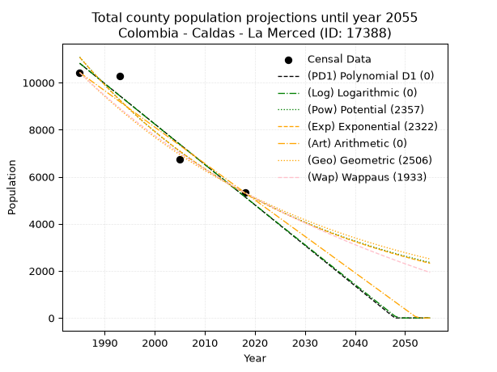
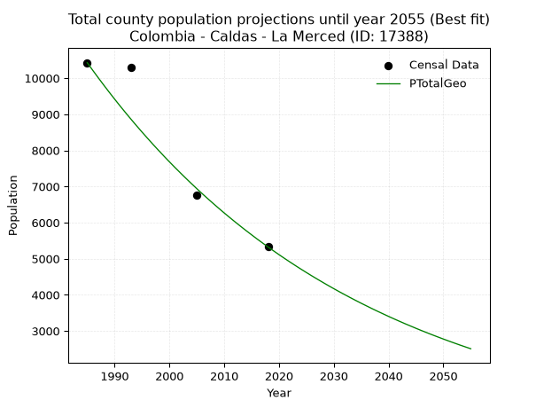
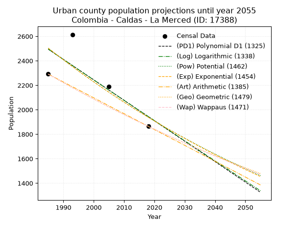
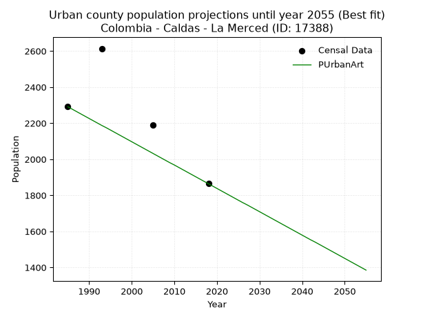
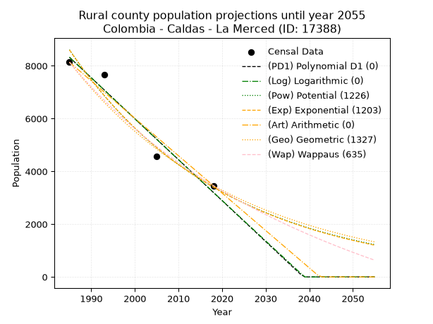
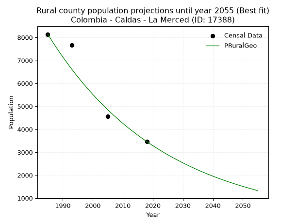

<div align="center">


</div>

# _“Population and Public Services Demand Projections (PPSD) until Year 2050 for Colombia - Caldas - La Merced (ID: 17388)”_
Keywords: `population` `public-service` `projection` `lineal` `polynomial` `logarithmic` `potential` `exponential` `arithmetic` `geometric` `wappaus` `dane` `colombia` `south-america`

PPSD are analytical estimates used by governments and planners to anticipate future changes in population size, age distribution, and the resulting community needs for utilities, healthcare, education, and infrastructure as sizing future water treatment facilities, electrical grids, and road networks based on spatial growth.

> **General running parameters**: • app_version: _v20260806_. • Python version: _3.14.7_. • Pandas version: _3.0.5_. • NumPy version: _2.5.1_. • Creates, save and include plots into reports (create_plot): _False_. • Projection until year: _2050_. • Process polynomial degree 2 and up: _False_. • Process Wappaus: _True_. • Process Wappaus: _True_. • Set negative values to zero: _True_. • Set infinite values to zero: _True_. • Drop dataset notes: _True_. 
<div align="center">

Dynamic map: [:earth_americas:Google](http://maps.google.com/maps?q=5.396470202,-75.5464861) [:earth_americas:OSM](https://www.openstreetmap.org/#map=18/5.396470202/-75.5464861&layers=P) [:earth_americas:Bing](https://www.bing.com/maps?cp=5.396470202~-75.5464861&lvl=18) [:earth_americas:Apple](https://maps.apple.com/frame?center=5.396470202%2C-75.5464861&span=0.003%2C0.006)

</div>


<div align="center">

```geojson
{
  "type": "Feature",
  "geometry": {
    "type": "Point", 
    "coordinates": [-75.5464861, 5.396470202]
  }, 
  "properties": {
    "Name": "Colombia - Caldas - La Merced (ID: 17388)"
  }
}
```

</div>


## 0. Census Data (4 records)

Census data are official statistics collected by a government about the people and housing in a country. They usually include counts of total population, age, sex, race, income, education, and jobs.

📅Global census file: [Population.xlsx](../data/Population.xlsx)

| Source   |   Year |   CountryID | CountryName   |   StateID | StateName   |   CountyID | CountyName   |   PTotal |   PUrban |   PRural |
|:---------|-------:|------------:|:--------------|----------:|:------------|-----------:|:-------------|---------:|---------:|---------:|
| DANE     |   1985 |          57 | Colombia      |        17 | Caldas      |      17388 | La Merced    |    10429 |     2291 |     8138 |
| DANE     |   1993 |          57 | Colombia      |        17 | Caldas      |      17388 | La Merced    |    10288 |     2614 |     7674 |
| DANE     |   2005 |          57 | Colombia      |        17 | Caldas      |      17388 | La Merced    |     6752 |     2190 |     4562 |
| DANE     |   2018 |          57 | Colombia      |        17 | Caldas      |      17388 | La Merced    |     5325 |     1864 |     3461 |

> 🔥Some records has specific notes about the registered values or the corresponding urban or rural distribution.

## 1. Total

### 1.1. Coefficients and Parameters

* (PD1) Polynomial Deg 1: -171.88197511039633, 352005.42071457027 (lineal)
* (Log) Logarithmic: -344038.0986828104, 2623234.8450363413
* (Pow) Potential: -44.662231805267524, 151.32999566338572
* (Exp) Exponential: -0.02231639564873009, 1.9176942297931808e+23
* (Art) Arithmetic: Year diff. 2018 - 1985 = 33, Population diff. 5325 - 10429 = -5104, Annual growth = -154.66666666666666
* (Geo) Geometric: Year diff. 2018 - 1985 = 33, Population diff. 5325 - 10429 = -5104, Annual growth % = -0.020162973337747858
* (Wap) Wappaus: i = -1.9635224916423342, Condition values only valid for < 200)

<sub>
Wappaus condition values: ['-0.00', '-1.96', '-3.93', '-5.89', '-7.85', '-9.82', '-11.78', '-13.74', '-15.71', '-17.67', '-19.64', '-21.60', '-23.56', '-25.53', '-27.49', '-29.45', '-31.42', '-33.38', '-35.34', '-37.31', '-39.27', '-41.23', '-43.20', '-45.16', '-47.12', '-49.09', '-51.05', '-53.02', '-54.98', '-56.94', '-58.91', '-60.87', '-62.83', '-64.80', '-66.76', '-68.72', '-70.69', '-72.65', '-74.61', '-76.58', '-78.54', '-80.50', '-82.47', '-84.43', '-86.39', '-88.36', '-90.32', '-92.29', '-94.25', '-96.21', '-98.18', '-100.14', '-102.10', '-104.07', '-106.03', '-107.99', '-109.96', '-111.92', '-113.88', '-115.85', '-117.81', '-119.77', '-121.74', '-123.70', '-125.67', '-127.63']
</sub>


### 1.2. Projected Dataset

|   Year |   CountyID |   PTotalPD1 |   PTotalLog |   PTotalPow |   PTotalExp |   PTotalArt |   PTotalGeo |   PTotalWap |
|-------:|-----------:|------------:|------------:|------------:|------------:|------------:|------------:|------------:|
|   1985 |      17388 |       10820 |       10825 |       11083 |       11076 |       10429 |       10429 |       10429 |
|   1986 |      17388 |       10648 |       10652 |       10836 |       10832 |       10274 |       10219 |       10226 |
|   1987 |      17388 |       10476 |       10478 |       10595 |       10593 |       10120 |       10013 |       10027 |
|   1988 |      17388 |       10304 |       10305 |       10360 |       10359 |        9965 |        9811 |        9832 |
|   1989 |      17388 |       10132 |       10132 |       10130 |       10130 |        9810 |        9613 |        9641 |
|   1990 |      17388 |        9960 |        9959 |        9905 |        9907 |        9656 |        9419 |        9453 |
|   1991 |      17388 |        9788 |        9786 |        9685 |        9688 |        9501 |        9229 |        9269 |
|   1992 |      17388 |        9617 |        9614 |        9470 |        9474 |        9346 |        9043 |        9088 |
|   1993 |      17388 |        9445 |        9441 |        9261 |        9265 |        9192 |        8861 |        8910 |
|   1994 |      17388 |        9273 |        9268 |        9055 |        9061 |        9037 |        8682 |        8736 |
|   1995 |      17388 |        9101 |        9096 |        8855 |        8861 |        8882 |        8507 |        8564 |
|   1996 |      17388 |        8929 |        8924 |        8659 |        8665 |        8728 |        8336 |        8396 |
|   1997 |      17388 |        8757 |        8751 |        8467 |        8474 |        8573 |        8167 |        8231 |
|   1998 |      17388 |        8585 |        8579 |        8280 |        8287 |        8418 |        8003 |        8068 |
|   1999 |      17388 |        8413 |        8407 |        8097 |        8104 |        8264 |        7841 |        7909 |
|   2000 |      17388 |        8241 |        8235 |        7918 |        7925 |        8109 |        7683 |        7752 |
|   2001 |      17388 |        8070 |        8063 |        7743 |        7750 |        7954 |        7528 |        7597 |
|   2002 |      17388 |        7898 |        7891 |        7573 |        7579 |        7800 |        7377 |        7446 |
|   2003 |      17388 |        7726 |        7719 |        7406 |        7412 |        7645 |        7228 |        7297 |
|   2004 |      17388 |        7554 |        7547 |        7242 |        7248 |        7490 |        7082 |        7150 |
|   2005 |      17388 |        7382 |        7376 |        7083 |        7088 |        7336 |        6939 |        7006 |
|   2006 |      17388 |        7210 |        7204 |        6927 |        6932 |        7181 |        6799 |        6864 |
|   2007 |      17388 |        7038 |        7033 |        6774 |        6779 |        7026 |        6662 |        6724 |
|   2008 |      17388 |        6866 |        6861 |        6625 |        6629 |        6872 |        6528 |        6587 |
|   2009 |      17388 |        6695 |        6690 |        6479 |        6483 |        6717 |        6396 |        6452 |
|   2010 |      17388 |        6523 |        6519 |        6337 |        6340 |        6562 |        6267 |        6318 |
|   2011 |      17388 |        6351 |        6348 |        6198 |        6200 |        6408 |        6141 |        6188 |
|   2012 |      17388 |        6179 |        6177 |        6062 |        6063 |        6253 |        6017 |        6059 |
|   2013 |      17388 |        6007 |        6006 |        5929 |        5929 |        6098 |        5896 |        5932 |
|   2014 |      17388 |        5835 |        5835 |        5799 |        5799 |        5944 |        5777 |        5807 |
|   2015 |      17388 |        5663 |        5664 |        5671 |        5671 |        5789 |        5661 |        5683 |
|   2016 |      17388 |        5491 |        5493 |        5547 |        5545 |        5634 |        5546 |        5562 |
|   2017 |      17388 |        5319 |        5323 |        5426 |        5423 |        5480 |        5435 |        5443 |
|   2018 |      17388 |        5148 |        5152 |        5307 |        5303 |        5325 |        5325 |        5325 |
|   2019 |      17388 |        4976 |        4982 |        5191 |        5186 |        5170 |        5218 |        5209 |
|   2020 |      17388 |        4804 |        4812 |        5077 |        5072 |        5016 |        5112 |        5095 |
|   2021 |      17388 |        4632 |        4641 |        4966 |        4960 |        4861 |        5009 |        4982 |
|   2022 |      17388 |        4460 |        4471 |        4858 |        4850 |        4706 |        4908 |        4871 |
|   2023 |      17388 |        4288 |        4301 |        4752 |        4743 |        4552 |        4809 |        4762 |
|   2024 |      17388 |        4116 |        4131 |        4648 |        4639 |        4397 |        4712 |        4654 |
|   2025 |      17388 |        3944 |        3961 |        4546 |        4536 |        4242 |        4617 |        4548 |
|   2026 |      17388 |        3773 |        3791 |        4447 |        4436 |        4088 |        4524 |        4443 |
|   2027 |      17388 |        3601 |        3621 |        4350 |        4338 |        3933 |        4433 |        4339 |
|   2028 |      17388 |        3429 |        3452 |        4256 |        4243 |        3778 |        4344 |        4237 |
|   2029 |      17388 |        3257 |        3282 |        4163 |        4149 |        3624 |        4256 |        4137 |
|   2030 |      17388 |        3085 |        3113 |        4072 |        4057 |        3469 |        4170 |        4038 |
|   2031 |      17388 |        2913 |        2943 |        3984 |        3968 |        3314 |        4086 |        3940 |
|   2032 |      17388 |        2741 |        2774 |        3897 |        3880 |        3160 |        4004 |        3843 |
|   2033 |      17388 |        2569 |        2605 |        3812 |        3795 |        3005 |        3923 |        3748 |
|   2034 |      17388 |        2397 |        2435 |        3730 |        3711 |        2850 |        3844 |        3654 |
|   2035 |      17388 |        2226 |        2266 |        3649 |        3629 |        2696 |        3766 |        3561 |
|   2036 |      17388 |        2054 |        2097 |        3569 |        3549 |        2541 |        3691 |        3470 |
|   2037 |      17388 |        1882 |        1928 |        3492 |        3471 |        2386 |        3616 |        3380 |
|   2038 |      17388 |        1710 |        1759 |        3416 |        3394 |        2232 |        3543 |        3290 |
|   2039 |      17388 |        1538 |        1591 |        3342 |        3319 |        2077 |        3472 |        3202 |
|   2040 |      17388 |        1366 |        1422 |        3270 |        3246 |        1922 |        3402 |        3115 |
|   2041 |      17388 |        1194 |        1253 |        3199 |        3174 |        1768 |        3333 |        3030 |
|   2042 |      17388 |        1022 |        1085 |        3130 |        3104 |        1613 |        3266 |        2945 |
|   2043 |      17388 |         851 |         916 |        3062 |        3036 |        1458 |        3200 |        2861 |
|   2044 |      17388 |         679 |         748 |        2996 |        2969 |        1304 |        3136 |        2779 |
|   2045 |      17388 |         507 |         580 |        2931 |        2903 |        1149 |        3072 |        2697 |
|   2046 |      17388 |         335 |         412 |        2868 |        2839 |         994 |        3010 |        2616 |
|   2047 |      17388 |         163 |         243 |        2806 |        2776 |         840 |        2950 |        2537 |
|   2048 |      17388 |           0 |          75 |        2745 |        2715 |         685 |        2890 |        2458 |
|   2049 |      17388 |           0 |           0 |        2686 |        2655 |         530 |        2832 |        2380 |
|   2050 |      17388 |           0 |           0 |        2628 |        2597 |         376 |        2775 |        2304 |
<div align="center">

</img>

</div>


### 1.3. Best fit with absolute error and relative error (%)

Relative error puts that difference into context by dividing the absolute error by the true value, creating a unitless ratio or percentage that shows the scale of the mistake.

Absolute and relative error

|   Year | Source   |   CountryID | CountryName   |   StateID | StateName   |   CountyID_x | CountyName   |   PTotal |   PUrban |   PRural |   CountyID_y |   PTotalPD1 |   PTotalLog |   PTotalPow |   PTotalExp |   PTotalArt |   PTotalGeo |   PTotalWap |   PTotalPD1AbsError |   PTotalLogAbsError |   PTotalPowAbsError |   PTotalExpAbsError |   PTotalArtAbsError |   PTotalGeoAbsError |   PTotalWapAbsError |   PTotalPD1RelError |   PTotalLogRelError |   PTotalPowRelError |   PTotalExpRelError |   PTotalArtRelError |   PTotalGeoRelError |   PTotalWapRelError |
|-------:|:---------|------------:|:--------------|----------:|:------------|-------------:|:-------------|---------:|---------:|---------:|-------------:|------------:|------------:|------------:|------------:|------------:|------------:|------------:|--------------------:|--------------------:|--------------------:|--------------------:|--------------------:|--------------------:|--------------------:|--------------------:|--------------------:|--------------------:|--------------------:|--------------------:|--------------------:|--------------------:|
|   1985 | DANE     |          57 | Colombia      |        17 | Caldas      |        17388 | La Merced    |    10429 |     2291 |     8138 |        17388 |       10820 |       10825 |       11083 |       11076 |       10429 |       10429 |       10429 |                 391 |                 396 |                 654 |                 647 |                   0 |                   0 |                   0 |             3.74916 |             3.7971  |            6.27098  |            6.20385  |             0       |             0       |             0       |
|   1993 | DANE     |          57 | Colombia      |        17 | Caldas      |        17388 | La Merced    |    10288 |     2614 |     7674 |        17388 |        9445 |        9441 |        9261 |        9265 |        9192 |        8861 |        8910 |                 843 |                 847 |                1027 |                1023 |                1096 |                1427 |                1378 |             8.19401 |             8.23289 |            9.9825   |            9.94362  |            10.6532  |            13.8705  |            13.3942  |
|   2005 | DANE     |          57 | Colombia      |        17 | Caldas      |        17388 | La Merced    |     6752 |     2190 |     4562 |        17388 |        7382 |        7376 |        7083 |        7088 |        7336 |        6939 |        7006 |                 630 |                 624 |                 331 |                 336 |                 584 |                 187 |                 254 |             9.33057 |             9.24171 |            4.90225  |            4.9763   |             8.64929 |             2.76955 |             3.76185 |
|   2018 | DANE     |          57 | Colombia      |        17 | Caldas      |        17388 | La Merced    |     5325 |     1864 |     3461 |        17388 |        5148 |        5152 |        5307 |        5303 |        5325 |        5325 |        5325 |                 177 |                 173 |                  18 |                  22 |                   0 |                   0 |                   0 |             3.32394 |             3.24883 |            0.338028 |            0.413146 |             0       |             0       |             0       |

Relative error mean

| Method    |   RelError | Best   |
|:----------|-----------:|:-------|
| PTotalPD1 |    6.14942 |        |
| PTotalLog |    6.13013 |        |
| PTotalPow |    5.37344 |        |
| PTotalExp |    5.38423 |        |
| PTotalArt |    4.82562 |        |
| PTotalGeo |    4.16002 | True   |
| PTotalWap |    4.28902 |        |

💙Best method: _**PTotalGeo**_
<div align="center">

</img>

</div>


### 1.4. Fresh water supply demand in liters per capita per day (lpcd)

The fresh water supply demand typically ranges from 100 to 300 liters per capita per day (lpcd) for standard domestic and municipal planning, though absolute survival minimums set by the World Health Organization are as low as 7.5 to 20 liters per day, and total consumption in high-income nations can exceed 400 liters.

> `CZ`: Level in meters above the sea level (masl).<br> `WS`: Fresh water supply demand in liters per capita per day (lpcd or l/h/d).<br> `WSAll`: Zonal fresh water supply demand in liters per second (l/s).<br> `A`: Zonal area in square meters.

Reference values (RAS Colombia)

|    CZ |   WS |
|------:|-----:|
|  1000 |  120 |
|  2000 |  130 |
| 99999 |  140 |

County shapefile geometry properties and water supply values

|   CountyID |      ATotal |   CZTotal |   WSTotal |
|-----------:|------------:|----------:|----------:|
|      17388 | 8.85774e+07 |   1361.43 |       130 |

Projected values for best method: PTotalGeo

|   CountyID |   Year |   PTotalGeo |   WSTotal |   WSTotalAll |
|-----------:|-------:|------------:|----------:|-------------:|
|      17388 |   1985 |       10429 |       130 |     15.6918  |
|      17388 |   1986 |       10219 |       130 |     15.3758  |
|      17388 |   1987 |       10013 |       130 |     15.0659  |
|      17388 |   1988 |        9811 |       130 |     14.7619  |
|      17388 |   1989 |        9613 |       130 |     14.464   |
|      17388 |   1990 |        9419 |       130 |     14.1721  |
|      17388 |   1991 |        9229 |       130 |     13.8862  |
|      17388 |   1992 |        9043 |       130 |     13.6064  |
|      17388 |   1993 |        8861 |       130 |     13.3325  |
|      17388 |   1994 |        8682 |       130 |     13.0632  |
|      17388 |   1995 |        8507 |       130 |     12.7999  |
|      17388 |   1996 |        8336 |       130 |     12.5426  |
|      17388 |   1997 |        8167 |       130 |     12.2883  |
|      17388 |   1998 |        8003 |       130 |     12.0416  |
|      17388 |   1999 |        7841 |       130 |     11.7978  |
|      17388 |   2000 |        7683 |       130 |     11.5601  |
|      17388 |   2001 |        7528 |       130 |     11.3269  |
|      17388 |   2002 |        7377 |       130 |     11.0997  |
|      17388 |   2003 |        7228 |       130 |     10.8755  |
|      17388 |   2004 |        7082 |       130 |     10.6558  |
|      17388 |   2005 |        6939 |       130 |     10.4406  |
|      17388 |   2006 |        6799 |       130 |     10.23    |
|      17388 |   2007 |        6662 |       130 |     10.0238  |
|      17388 |   2008 |        6528 |       130 |      9.82222 |
|      17388 |   2009 |        6396 |       130 |      9.62361 |
|      17388 |   2010 |        6267 |       130 |      9.42951 |
|      17388 |   2011 |        6141 |       130 |      9.23993 |
|      17388 |   2012 |        6017 |       130 |      9.05336 |
|      17388 |   2013 |        5896 |       130 |      8.8713  |
|      17388 |   2014 |        5777 |       130 |      8.69225 |
|      17388 |   2015 |        5661 |       130 |      8.51771 |
|      17388 |   2016 |        5546 |       130 |      8.34468 |
|      17388 |   2017 |        5435 |       130 |      8.17766 |
|      17388 |   2018 |        5325 |       130 |      8.01215 |
|      17388 |   2019 |        5218 |       130 |      7.85116 |
|      17388 |   2020 |        5112 |       130 |      7.69167 |
|      17388 |   2021 |        5009 |       130 |      7.53669 |
|      17388 |   2022 |        4908 |       130 |      7.38472 |
|      17388 |   2023 |        4809 |       130 |      7.23576 |
|      17388 |   2024 |        4712 |       130 |      7.08981 |
|      17388 |   2025 |        4617 |       130 |      6.94688 |
|      17388 |   2026 |        4524 |       130 |      6.80694 |
|      17388 |   2027 |        4433 |       130 |      6.67002 |
|      17388 |   2028 |        4344 |       130 |      6.53611 |
|      17388 |   2029 |        4256 |       130 |      6.4037  |
|      17388 |   2030 |        4170 |       130 |      6.27431 |
|      17388 |   2031 |        4086 |       130 |      6.14792 |
|      17388 |   2032 |        4004 |       130 |      6.02454 |
|      17388 |   2033 |        3923 |       130 |      5.90266 |
|      17388 |   2034 |        3844 |       130 |      5.7838  |
|      17388 |   2035 |        3766 |       130 |      5.66644 |
|      17388 |   2036 |        3691 |       130 |      5.55359 |
|      17388 |   2037 |        3616 |       130 |      5.44074 |
|      17388 |   2038 |        3543 |       130 |      5.3309  |
|      17388 |   2039 |        3472 |       130 |      5.22407 |
|      17388 |   2040 |        3402 |       130 |      5.11875 |
|      17388 |   2041 |        3333 |       130 |      5.01493 |
|      17388 |   2042 |        3266 |       130 |      4.91412 |
|      17388 |   2043 |        3200 |       130 |      4.81481 |
|      17388 |   2044 |        3136 |       130 |      4.71852 |
|      17388 |   2045 |        3072 |       130 |      4.62222 |
|      17388 |   2046 |        3010 |       130 |      4.52894 |
|      17388 |   2047 |        2950 |       130 |      4.43866 |
|      17388 |   2048 |        2890 |       130 |      4.34838 |
|      17388 |   2049 |        2832 |       130 |      4.26111 |
|      17388 |   2050 |        2775 |       130 |      4.17535 |

## 2. Urban

### 2.1. Coefficients and Parameters

* (PD1) Polynomial Deg 1: -16.70132476916879, 35646.574869529875 (lineal)
* (Log) Logarithmic: -33382.7751998587, 255982.49180689754
* (Pow) Potential: -15.507951792091028, 54.539980118601605
* (Exp) Exponential: -0.007758440491838742, 12212183555.736362
* (Art) Arithmetic: Year diff. 2018 - 1985 = 33, Population diff. 1864 - 2291 = -427, Annual growth = -12.93939393939394
* (Geo) Geometric: Year diff. 2018 - 1985 = 33, Population diff. 1864 - 2291 = -427, Annual growth % = -0.006230921556207081
* (Wap) Wappaus: i = -0.6228348466615614, Condition values only valid for < 200)

<sub>
Wappaus condition values: ['-0.00', '-0.62', '-1.25', '-1.87', '-2.49', '-3.11', '-3.74', '-4.36', '-4.98', '-5.61', '-6.23', '-6.85', '-7.47', '-8.10', '-8.72', '-9.34', '-9.97', '-10.59', '-11.21', '-11.83', '-12.46', '-13.08', '-13.70', '-14.33', '-14.95', '-15.57', '-16.19', '-16.82', '-17.44', '-18.06', '-18.69', '-19.31', '-19.93', '-20.55', '-21.18', '-21.80', '-22.42', '-23.04', '-23.67', '-24.29', '-24.91', '-25.54', '-26.16', '-26.78', '-27.40', '-28.03', '-28.65', '-29.27', '-29.90', '-30.52', '-31.14', '-31.76', '-32.39', '-33.01', '-33.63', '-34.26', '-34.88', '-35.50', '-36.12', '-36.75', '-37.37', '-37.99', '-38.62', '-39.24', '-39.86', '-40.48']
</sub>


### 2.2. Projected Dataset

|   Year |   CountyID |   PUrbanPD1 |   PUrbanLog |   PUrbanPow |   PUrbanExp |   PUrbanArt |   PUrbanGeo |   PUrbanWap |
|-------:|-----------:|------------:|------------:|------------:|------------:|------------:|------------:|------------:|
|   1985 |      17388 |        2494 |        2495 |        2503 |        2503 |        2291 |        2291 |        2291 |
|   1986 |      17388 |        2478 |        2478 |        2484 |        2484 |        2278 |        2277 |        2277 |
|   1987 |      17388 |        2461 |        2461 |        2464 |        2464 |        2265 |        2263 |        2263 |
|   1988 |      17388 |        2444 |        2444 |        2445 |        2445 |        2252 |        2248 |        2249 |
|   1989 |      17388 |        2428 |        2427 |        2426 |        2426 |        2239 |        2234 |        2235 |
|   1990 |      17388 |        2411 |        2411 |        2407 |        2408 |        2226 |        2221 |        2221 |
|   1991 |      17388 |        2394 |        2394 |        2389 |        2389 |        2213 |        2207 |        2207 |
|   1992 |      17388 |        2378 |        2377 |        2370 |        2371 |        2200 |        2193 |        2193 |
|   1993 |      17388 |        2361 |        2360 |        2352 |        2352 |        2187 |        2179 |        2180 |
|   1994 |      17388 |        2344 |        2344 |        2333 |        2334 |        2175 |        2166 |        2166 |
|   1995 |      17388 |        2327 |        2327 |        2315 |        2316 |        2162 |        2152 |        2153 |
|   1996 |      17388 |        2311 |        2310 |        2297 |        2298 |        2149 |        2139 |        2139 |
|   1997 |      17388 |        2294 |        2293 |        2280 |        2280 |        2136 |        2125 |        2126 |
|   1998 |      17388 |        2277 |        2277 |        2262 |        2263 |        2123 |        2112 |        2113 |
|   1999 |      17388 |        2261 |        2260 |        2245 |        2245 |        2110 |        2099 |        2100 |
|   2000 |      17388 |        2244 |        2243 |        2227 |        2228 |        2097 |        2086 |        2087 |
|   2001 |      17388 |        2227 |        2227 |        2210 |        2211 |        2084 |        2073 |        2074 |
|   2002 |      17388 |        2211 |        2210 |        2193 |        2194 |        2071 |        2060 |        2061 |
|   2003 |      17388 |        2194 |        2193 |        2176 |        2177 |        2058 |        2047 |        2048 |
|   2004 |      17388 |        2177 |        2177 |        2159 |        2160 |        2045 |        2034 |        2035 |
|   2005 |      17388 |        2160 |        2160 |        2143 |        2143 |        2032 |        2022 |        2022 |
|   2006 |      17388 |        2144 |        2143 |        2126 |        2127 |        2019 |        2009 |        2010 |
|   2007 |      17388 |        2127 |        2127 |        2110 |        2110 |        2006 |        1997 |        1997 |
|   2008 |      17388 |        2110 |        2110 |        2094 |        2094 |        1993 |        1984 |        1985 |
|   2009 |      17388 |        2094 |        2093 |        2077 |        2078 |        1980 |        1972 |        1972 |
|   2010 |      17388 |        2077 |        2077 |        2061 |        2062 |        1968 |        1960 |        1960 |
|   2011 |      17388 |        2060 |        2060 |        2046 |        2046 |        1955 |        1947 |        1948 |
|   2012 |      17388 |        2044 |        2044 |        2030 |        2030 |        1942 |        1935 |        1936 |
|   2013 |      17388 |        2027 |        2027 |        2014 |        2014 |        1929 |        1923 |        1924 |
|   2014 |      17388 |        2010 |        2010 |        1999 |        1999 |        1916 |        1911 |        1911 |
|   2015 |      17388 |        1993 |        1994 |        1984 |        1983 |        1903 |        1899 |        1900 |
|   2016 |      17388 |        1977 |        1977 |        1968 |        1968 |        1890 |        1887 |        1888 |
|   2017 |      17388 |        1960 |        1961 |        1953 |        1953 |        1877 |        1876 |        1876 |
|   2018 |      17388 |        1943 |        1944 |        1938 |        1938 |        1864 |        1864 |        1864 |
|   2019 |      17388 |        1927 |        1928 |        1923 |        1923 |        1851 |        1852 |        1852 |
|   2020 |      17388 |        1910 |        1911 |        1909 |        1908 |        1838 |        1841 |        1841 |
|   2021 |      17388 |        1893 |        1895 |        1894 |        1893 |        1825 |        1829 |        1829 |
|   2022 |      17388 |        1876 |        1878 |        1880 |        1878 |        1812 |        1818 |        1818 |
|   2023 |      17388 |        1860 |        1862 |        1865 |        1864 |        1799 |        1807 |        1806 |
|   2024 |      17388 |        1843 |        1845 |        1851 |        1849 |        1786 |        1795 |        1795 |
|   2025 |      17388 |        1826 |        1829 |        1837 |        1835 |        1773 |        1784 |        1783 |
|   2026 |      17388 |        1810 |        1812 |        1823 |        1821 |        1760 |        1773 |        1772 |
|   2027 |      17388 |        1793 |        1796 |        1809 |        1807 |        1748 |        1762 |        1761 |
|   2028 |      17388 |        1776 |        1779 |        1795 |        1793 |        1735 |        1751 |        1750 |
|   2029 |      17388 |        1760 |        1763 |        1782 |        1779 |        1722 |        1740 |        1739 |
|   2030 |      17388 |        1743 |        1746 |        1768 |        1765 |        1709 |        1729 |        1728 |
|   2031 |      17388 |        1726 |        1730 |        1755 |        1752 |        1696 |        1719 |        1717 |
|   2032 |      17388 |        1709 |        1713 |        1741 |        1738 |        1683 |        1708 |        1706 |
|   2033 |      17388 |        1693 |        1697 |        1728 |        1725 |        1670 |        1697 |        1695 |
|   2034 |      17388 |        1676 |        1681 |        1715 |        1711 |        1657 |        1687 |        1684 |
|   2035 |      17388 |        1659 |        1664 |        1702 |        1698 |        1644 |        1676 |        1674 |
|   2036 |      17388 |        1643 |        1648 |        1689 |        1685 |        1631 |        1666 |        1663 |
|   2037 |      17388 |        1626 |        1631 |        1676 |        1672 |        1618 |        1655 |        1652 |
|   2038 |      17388 |        1609 |        1615 |        1663 |        1659 |        1605 |        1645 |        1642 |
|   2039 |      17388 |        1593 |        1599 |        1651 |        1646 |        1592 |        1635 |        1631 |
|   2040 |      17388 |        1576 |        1582 |        1638 |        1634 |        1579 |        1625 |        1621 |
|   2041 |      17388 |        1559 |        1566 |        1626 |        1621 |        1566 |        1614 |        1611 |
|   2042 |      17388 |        1542 |        1549 |        1614 |        1608 |        1553 |        1604 |        1600 |
|   2043 |      17388 |        1526 |        1533 |        1601 |        1596 |        1541 |        1594 |        1590 |
|   2044 |      17388 |        1509 |        1517 |        1589 |        1584 |        1528 |        1584 |        1580 |
|   2045 |      17388 |        1492 |        1500 |        1577 |        1571 |        1515 |        1575 |        1570 |
|   2046 |      17388 |        1476 |        1484 |        1565 |        1559 |        1502 |        1565 |        1560 |
|   2047 |      17388 |        1459 |        1468 |        1554 |        1547 |        1489 |        1555 |        1549 |
|   2048 |      17388 |        1442 |        1452 |        1542 |        1535 |        1476 |        1545 |        1539 |
|   2049 |      17388 |        1426 |        1435 |        1530 |        1523 |        1463 |        1536 |        1530 |
|   2050 |      17388 |        1409 |        1419 |        1519 |        1512 |        1450 |        1526 |        1520 |
<div align="center">

</img>

</div>


### 2.3. Best fit with absolute error and relative error (%)

Relative error puts that difference into context by dividing the absolute error by the true value, creating a unitless ratio or percentage that shows the scale of the mistake.

Absolute and relative error

|   Year | Source   |   CountryID | CountryName   |   StateID | StateName   |   CountyID_x | CountyName   |   PTotal |   PUrban |   PRural |   CountyID_y |   PUrbanPD1 |   PUrbanLog |   PUrbanPow |   PUrbanExp |   PUrbanArt |   PUrbanGeo |   PUrbanWap |   PUrbanPD1AbsError |   PUrbanLogAbsError |   PUrbanPowAbsError |   PUrbanExpAbsError |   PUrbanArtAbsError |   PUrbanGeoAbsError |   PUrbanWapAbsError |   PUrbanPD1RelError |   PUrbanLogRelError |   PUrbanPowRelError |   PUrbanExpRelError |   PUrbanArtRelError |   PUrbanGeoRelError |   PUrbanWapRelError |
|-------:|:---------|------------:|:--------------|----------:|:------------|-------------:|:-------------|---------:|---------:|---------:|-------------:|------------:|------------:|------------:|------------:|------------:|------------:|------------:|--------------------:|--------------------:|--------------------:|--------------------:|--------------------:|--------------------:|--------------------:|--------------------:|--------------------:|--------------------:|--------------------:|--------------------:|--------------------:|--------------------:|
|   1985 | DANE     |          57 | Colombia      |        17 | Caldas      |        17388 | La Merced    |    10429 |     2291 |     8138 |        17388 |        2494 |        2495 |        2503 |        2503 |        2291 |        2291 |        2291 |                 203 |                 204 |                 212 |                 212 |                   0 |                   0 |                   0 |             8.86076 |             8.90441 |             9.2536  |             9.2536  |             0       |             0       |             0       |
|   1993 | DANE     |          57 | Colombia      |        17 | Caldas      |        17388 | La Merced    |    10288 |     2614 |     7674 |        17388 |        2361 |        2360 |        2352 |        2352 |        2187 |        2179 |        2180 |                 253 |                 254 |                 262 |                 262 |                 427 |                 435 |                 434 |             9.67865 |             9.71691 |            10.023   |            10.023   |            16.3351  |            16.6412  |            16.6029  |
|   2005 | DANE     |          57 | Colombia      |        17 | Caldas      |        17388 | La Merced    |     6752 |     2190 |     4562 |        17388 |        2160 |        2160 |        2143 |        2143 |        2032 |        2022 |        2022 |                  30 |                  30 |                  47 |                  47 |                 158 |                 168 |                 168 |             1.36986 |             1.36986 |             2.14612 |             2.14612 |             7.21461 |             7.67123 |             7.67123 |
|   2018 | DANE     |          57 | Colombia      |        17 | Caldas      |        17388 | La Merced    |     5325 |     1864 |     3461 |        17388 |        1943 |        1944 |        1938 |        1938 |        1864 |        1864 |        1864 |                  79 |                  80 |                  74 |                  74 |                   0 |                   0 |                   0 |             4.2382  |             4.29185 |             3.96996 |             3.96996 |             0       |             0       |             0       |

Relative error mean

| Method    |   RelError | Best   |
|:----------|-----------:|:-------|
| PUrbanPD1 |    6.03687 |        |
| PUrbanLog |    6.07076 |        |
| PUrbanPow |    6.34816 |        |
| PUrbanExp |    6.34816 |        |
| PUrbanArt |    5.88743 | True   |
| PUrbanGeo |    6.0781  |        |
| PUrbanWap |    6.06854 |        |

💙Best method: _**PUrbanArt**_
<div align="center">

</img>

</div>


### 2.4. Fresh water supply demand in liters per capita per day (lpcd)

The fresh water supply demand typically ranges from 100 to 300 liters per capita per day (lpcd) for standard domestic and municipal planning, though absolute survival minimums set by the World Health Organization are as low as 7.5 to 20 liters per day, and total consumption in high-income nations can exceed 400 liters.

> `CZ`: Level in meters above the sea level (masl).<br> `WS`: Fresh water supply demand in liters per capita per day (lpcd or l/h/d).<br> `WSAll`: Zonal fresh water supply demand in liters per second (l/s).<br> `A`: Zonal area in square meters.

Reference values (RAS Colombia)

|    CZ |   WS |
|------:|-----:|
|  1000 |  120 |
|  2000 |  130 |
| 99999 |  140 |

County shapefile geometry properties and water supply values

|   CountyID |   AUrban |   CZUrban |   WSUrban |
|-----------:|---------:|----------:|----------:|
|      17388 |   400771 |   1800.55 |       130 |

Projected values for best method: PUrbanArt

|   CountyID |   Year |   PUrbanArt |   WSUrban |   WSUrbanAll |
|-----------:|-------:|------------:|----------:|-------------:|
|      17388 |   1985 |        2291 |       130 |      3.44711 |
|      17388 |   1986 |        2278 |       130 |      3.42755 |
|      17388 |   1987 |        2265 |       130 |      3.40799 |
|      17388 |   1988 |        2252 |       130 |      3.38843 |
|      17388 |   1989 |        2239 |       130 |      3.36887 |
|      17388 |   1990 |        2226 |       130 |      3.34931 |
|      17388 |   1991 |        2213 |       130 |      3.32975 |
|      17388 |   1992 |        2200 |       130 |      3.31019 |
|      17388 |   1993 |        2187 |       130 |      3.29062 |
|      17388 |   1994 |        2175 |       130 |      3.27257 |
|      17388 |   1995 |        2162 |       130 |      3.25301 |
|      17388 |   1996 |        2149 |       130 |      3.23345 |
|      17388 |   1997 |        2136 |       130 |      3.21389 |
|      17388 |   1998 |        2123 |       130 |      3.19433 |
|      17388 |   1999 |        2110 |       130 |      3.17477 |
|      17388 |   2000 |        2097 |       130 |      3.15521 |
|      17388 |   2001 |        2084 |       130 |      3.13565 |
|      17388 |   2002 |        2071 |       130 |      3.11609 |
|      17388 |   2003 |        2058 |       130 |      3.09653 |
|      17388 |   2004 |        2045 |       130 |      3.07697 |
|      17388 |   2005 |        2032 |       130 |      3.05741 |
|      17388 |   2006 |        2019 |       130 |      3.03785 |
|      17388 |   2007 |        2006 |       130 |      3.01829 |
|      17388 |   2008 |        1993 |       130 |      2.99873 |
|      17388 |   2009 |        1980 |       130 |      2.97917 |
|      17388 |   2010 |        1968 |       130 |      2.96111 |
|      17388 |   2011 |        1955 |       130 |      2.94155 |
|      17388 |   2012 |        1942 |       130 |      2.92199 |
|      17388 |   2013 |        1929 |       130 |      2.90243 |
|      17388 |   2014 |        1916 |       130 |      2.88287 |
|      17388 |   2015 |        1903 |       130 |      2.86331 |
|      17388 |   2016 |        1890 |       130 |      2.84375 |
|      17388 |   2017 |        1877 |       130 |      2.82419 |
|      17388 |   2018 |        1864 |       130 |      2.80463 |
|      17388 |   2019 |        1851 |       130 |      2.78507 |
|      17388 |   2020 |        1838 |       130 |      2.76551 |
|      17388 |   2021 |        1825 |       130 |      2.74595 |
|      17388 |   2022 |        1812 |       130 |      2.72639 |
|      17388 |   2023 |        1799 |       130 |      2.70683 |
|      17388 |   2024 |        1786 |       130 |      2.68727 |
|      17388 |   2025 |        1773 |       130 |      2.66771 |
|      17388 |   2026 |        1760 |       130 |      2.64815 |
|      17388 |   2027 |        1748 |       130 |      2.63009 |
|      17388 |   2028 |        1735 |       130 |      2.61053 |
|      17388 |   2029 |        1722 |       130 |      2.59097 |
|      17388 |   2030 |        1709 |       130 |      2.57141 |
|      17388 |   2031 |        1696 |       130 |      2.55185 |
|      17388 |   2032 |        1683 |       130 |      2.53229 |
|      17388 |   2033 |        1670 |       130 |      2.51273 |
|      17388 |   2034 |        1657 |       130 |      2.49317 |
|      17388 |   2035 |        1644 |       130 |      2.47361 |
|      17388 |   2036 |        1631 |       130 |      2.45405 |
|      17388 |   2037 |        1618 |       130 |      2.43449 |
|      17388 |   2038 |        1605 |       130 |      2.41493 |
|      17388 |   2039 |        1592 |       130 |      2.39537 |
|      17388 |   2040 |        1579 |       130 |      2.37581 |
|      17388 |   2041 |        1566 |       130 |      2.35625 |
|      17388 |   2042 |        1553 |       130 |      2.33669 |
|      17388 |   2043 |        1541 |       130 |      2.31863 |
|      17388 |   2044 |        1528 |       130 |      2.29907 |
|      17388 |   2045 |        1515 |       130 |      2.27951 |
|      17388 |   2046 |        1502 |       130 |      2.25995 |
|      17388 |   2047 |        1489 |       130 |      2.24039 |
|      17388 |   2048 |        1476 |       130 |      2.22083 |
|      17388 |   2049 |        1463 |       130 |      2.20127 |
|      17388 |   2050 |        1450 |       130 |      2.18171 |

## 3. Rural

### 3.1. Coefficients and Parameters

* (PD1) Polynomial Deg 1: -155.18065034122753, 316358.84584504034 (lineal)
* (Log) Logarithmic: -310655.32348295173, 2367252.353229444
* (Pow) Potential: -56.24386814045131, 189.41374819724558
* (Exp) Exponential: -0.028100547869733976, 1.4432807691266533e+28
* (Art) Arithmetic: Year diff. 2018 - 1985 = 33, Population diff. 3461 - 8138 = -4677, Annual growth = -141.72727272727272
* (Geo) Geometric: Year diff. 2018 - 1985 = 33, Population diff. 3461 - 8138 = -4677, Annual growth % = -0.025575943185871308
* (Wap) Wappaus: i = -2.4437843387752864, Condition values only valid for < 200)

<sub>
Wappaus condition values: ['-0.00', '-2.44', '-4.89', '-7.33', '-9.78', '-12.22', '-14.66', '-17.11', '-19.55', '-21.99', '-24.44', '-26.88', '-29.33', '-31.77', '-34.21', '-36.66', '-39.10', '-41.54', '-43.99', '-46.43', '-48.88', '-51.32', '-53.76', '-56.21', '-58.65', '-61.09', '-63.54', '-65.98', '-68.43', '-70.87', '-73.31', '-75.76', '-78.20', '-80.64', '-83.09', '-85.53', '-87.98', '-90.42', '-92.86', '-95.31', '-97.75', '-100.20', '-102.64', '-105.08', '-107.53', '-109.97', '-112.41', '-114.86', '-117.30', '-119.75', '-122.19', '-124.63', '-127.08', '-129.52', '-131.96', '-134.41', '-136.85', '-139.30', '-141.74', '-144.18', '-146.63', '-149.07', '-151.51', '-153.96', '-156.40', '-158.85']
</sub>


### 3.2. Projected Dataset

|   Year |   CountyID |   PRuralPD1 |   PRuralLog |   PRuralPow |   PRuralExp |   PRuralArt |   PRuralGeo |   PRuralWap |
|-------:|-----------:|------------:|------------:|------------:|------------:|------------:|------------:|------------:|
|   1985 |      17388 |        8325 |        8330 |        8609 |        8602 |        8138 |        8138 |        8138 |
|   1986 |      17388 |        8170 |        8174 |        8368 |        8363 |        7996 |        7930 |        7942 |
|   1987 |      17388 |        8015 |        8017 |        8135 |        8132 |        7855 |        7727 |        7750 |
|   1988 |      17388 |        7860 |        7861 |        7908 |        7906 |        7713 |        7529 |        7562 |
|   1989 |      17388 |        7705 |        7705 |        7687 |        7687 |        7571 |        7337 |        7380 |
|   1990 |      17388 |        7549 |        7549 |        7473 |        7474 |        7429 |        7149 |        7201 |
|   1991 |      17388 |        7394 |        7393 |        7265 |        7267 |        7288 |        6966 |        7026 |
|   1992 |      17388 |        7239 |        7237 |        7062 |        7066 |        7146 |        6788 |        6856 |
|   1993 |      17388 |        7084 |        7081 |        6866 |        6870 |        7004 |        6615 |        6689 |
|   1994 |      17388 |        6929 |        6925 |        6675 |        6680 |        6862 |        6445 |        6525 |
|   1995 |      17388 |        6773 |        6769 |        6489 |        6494 |        6721 |        6281 |        6366 |
|   1996 |      17388 |        6618 |        6613 |        6309 |        6315 |        6579 |        6120 |        6210 |
|   1997 |      17388 |        6463 |        6458 |        6134 |        6140 |        6437 |        5963 |        6057 |
|   1998 |      17388 |        6308 |        6302 |        5963 |        5969 |        6296 |        5811 |        5907 |
|   1999 |      17388 |        6153 |        6147 |        5798 |        5804 |        6154 |        5662 |        5760 |
|   2000 |      17388 |        5998 |        5992 |        5637 |        5643 |        6012 |        5517 |        5617 |
|   2001 |      17388 |        5842 |        5836 |        5481 |        5487 |        5870 |        5376 |        5476 |
|   2002 |      17388 |        5687 |        5681 |        5329 |        5335 |        5729 |        5239 |        5339 |
|   2003 |      17388 |        5532 |        5526 |        5181 |        5187 |        5587 |        5105 |        5204 |
|   2004 |      17388 |        5377 |        5371 |        5038 |        5043 |        5445 |        4974 |        5071 |
|   2005 |      17388 |        5222 |        5216 |        4898 |        4903 |        5303 |        4847 |        4942 |
|   2006 |      17388 |        5066 |        5061 |        4763 |        4768 |        5162 |        4723 |        4814 |
|   2007 |      17388 |        4911 |        4906 |        4631 |        4636 |        5020 |        4602 |        4690 |
|   2008 |      17388 |        4756 |        4751 |        4503 |        4507 |        4878 |        4485 |        4567 |
|   2009 |      17388 |        4601 |        4597 |        4379 |        4382 |        4737 |        4370 |        4447 |
|   2010 |      17388 |        4446 |        4442 |        4258 |        4261 |        4595 |        4258 |        4330 |
|   2011 |      17388 |        4291 |        4288 |        4141 |        4143 |        4453 |        4149 |        4214 |
|   2012 |      17388 |        4135 |        4133 |        4027 |        4028 |        4311 |        4043 |        4100 |
|   2013 |      17388 |        3980 |        3979 |        3916 |        3916 |        4170 |        3940 |        3989 |
|   2014 |      17388 |        3825 |        3825 |        3808 |        3808 |        4028 |        3839 |        3880 |
|   2015 |      17388 |        3670 |        3670 |        3703 |        3702 |        3886 |        3741 |        3772 |
|   2016 |      17388 |        3515 |        3516 |        3601 |        3600 |        3744 |        3645 |        3667 |
|   2017 |      17388 |        3359 |        3362 |        3502 |        3500 |        3603 |        3552 |        3563 |
|   2018 |      17388 |        3204 |        3208 |        3406 |        3403 |        3461 |        3461 |        3461 |
|   2019 |      17388 |        3049 |        3054 |        3312 |        3309 |        3319 |        3372 |        3361 |
|   2020 |      17388 |        2894 |        2900 |        3221 |        3217 |        3178 |        3286 |        3262 |
|   2021 |      17388 |        2739 |        2747 |        3133 |        3128 |        3036 |        3202 |        3166 |
|   2022 |      17388 |        2584 |        2593 |        3047 |        3041 |        2894 |        3120 |        3071 |
|   2023 |      17388 |        2428 |        2439 |        2963 |        2957 |        2752 |        3040 |        2977 |
|   2024 |      17388 |        2273 |        2286 |        2882 |        2875 |        2611 |        2963 |        2885 |
|   2025 |      17388 |        2118 |        2132 |        2803 |        2795 |        2469 |        2887 |        2795 |
|   2026 |      17388 |        1963 |        1979 |        2726 |        2718 |        2327 |        2813 |        2706 |
|   2027 |      17388 |        1808 |        1826 |        2652 |        2643 |        2185 |        2741 |        2618 |
|   2028 |      17388 |        1652 |        1673 |        2579 |        2569 |        2044 |        2671 |        2532 |
|   2029 |      17388 |        1497 |        1519 |        2508 |        2498 |        1902 |        2603 |        2447 |
|   2030 |      17388 |        1342 |        1366 |        2440 |        2429 |        1760 |        2536 |        2364 |
|   2031 |      17388 |        1187 |        1213 |        2373 |        2362 |        1619 |        2471 |        2282 |
|   2032 |      17388 |        1032 |        1060 |        2308 |        2296 |        1477 |        2408 |        2201 |
|   2033 |      17388 |         877 |         908 |        2245 |        2233 |        1335 |        2347 |        2121 |
|   2034 |      17388 |         721 |         755 |        2184 |        2171 |        1193 |        2286 |        2043 |
|   2035 |      17388 |         566 |         602 |        2125 |        2111 |        1052 |        2228 |        1965 |
|   2036 |      17388 |         411 |         449 |        2067 |        2052 |         910 |        2171 |        1889 |
|   2037 |      17388 |         256 |         297 |        2010 |        1995 |         768 |        2116 |        1814 |
|   2038 |      17388 |         101 |         144 |        1956 |        1940 |         626 |        2061 |        1741 |
|   2039 |      17388 |           0 |           0 |        1902 |        1886 |         485 |        2009 |        1668 |
|   2040 |      17388 |           0 |           0 |        1851 |        1834 |         343 |        1957 |        1596 |
|   2041 |      17388 |           0 |           0 |        1800 |        1783 |         201 |        1907 |        1526 |
|   2042 |      17388 |           0 |           0 |        1751 |        1734 |          60 |        1858 |        1456 |
|   2043 |      17388 |           0 |           0 |        1704 |        1686 |         -82 |        1811 |        1387 |
|   2044 |      17388 |           0 |           0 |        1658 |        1639 |        -224 |        1765 |        1320 |
|   2045 |      17388 |           0 |           0 |        1613 |        1593 |        -366 |        1719 |        1253 |
|   2046 |      17388 |           0 |           0 |        1569 |        1549 |        -507 |        1676 |        1187 |
|   2047 |      17388 |           0 |           0 |        1526 |        1506 |        -649 |        1633 |        1122 |
|   2048 |      17388 |           0 |           0 |        1485 |        1465 |        -791 |        1591 |        1059 |
|   2049 |      17388 |           0 |           0 |        1445 |        1424 |        -933 |        1550 |         996 |
|   2050 |      17388 |           0 |           0 |        1406 |        1385 |       -1074 |        1511 |         933 |
<div align="center">

</img>

</div>


### 3.3. Best fit with absolute error and relative error (%)

Relative error puts that difference into context by dividing the absolute error by the true value, creating a unitless ratio or percentage that shows the scale of the mistake.

Absolute and relative error

|   Year | Source   |   CountryID | CountryName   |   StateID | StateName   |   CountyID_x | CountyName   |   PTotal |   PUrban |   PRural |   CountyID_y |   PRuralPD1 |   PRuralLog |   PRuralPow |   PRuralExp |   PRuralArt |   PRuralGeo |   PRuralWap |   PRuralPD1AbsError |   PRuralLogAbsError |   PRuralPowAbsError |   PRuralExpAbsError |   PRuralArtAbsError |   PRuralGeoAbsError |   PRuralWapAbsError |   PRuralPD1RelError |   PRuralLogRelError |   PRuralPowRelError |   PRuralExpRelError |   PRuralArtRelError |   PRuralGeoRelError |   PRuralWapRelError |
|-------:|:---------|------------:|:--------------|----------:|:------------|-------------:|:-------------|---------:|---------:|---------:|-------------:|------------:|------------:|------------:|------------:|------------:|------------:|------------:|--------------------:|--------------------:|--------------------:|--------------------:|--------------------:|--------------------:|--------------------:|--------------------:|--------------------:|--------------------:|--------------------:|--------------------:|--------------------:|--------------------:|
|   1985 | DANE     |          57 | Colombia      |        17 | Caldas      |        17388 | La Merced    |    10429 |     2291 |     8138 |        17388 |        8325 |        8330 |        8609 |        8602 |        8138 |        8138 |        8138 |                 187 |                 192 |                 471 |                 464 |                   0 |                   0 |                   0 |             2.29786 |             2.3593  |             5.78766 |             5.70165 |             0       |             0       |             0       |
|   1993 | DANE     |          57 | Colombia      |        17 | Caldas      |        17388 | La Merced    |    10288 |     2614 |     7674 |        17388 |        7084 |        7081 |        6866 |        6870 |        7004 |        6615 |        6689 |                 590 |                 593 |                 808 |                 804 |                 670 |                1059 |                 985 |             7.6883  |             7.72739 |            10.5291  |            10.4769  |             8.73078 |            13.7998  |            12.8355  |
|   2005 | DANE     |          57 | Colombia      |        17 | Caldas      |        17388 | La Merced    |     6752 |     2190 |     4562 |        17388 |        5222 |        5216 |        4898 |        4903 |        5303 |        4847 |        4942 |                 660 |                 654 |                 336 |                 341 |                 741 |                 285 |                 380 |            14.4673  |            14.3358  |             7.36519 |             7.47479 |            16.2429  |             6.24726 |             8.32968 |
|   2018 | DANE     |          57 | Colombia      |        17 | Caldas      |        17388 | La Merced    |     5325 |     1864 |     3461 |        17388 |        3204 |        3208 |        3406 |        3403 |        3461 |        3461 |        3461 |                 257 |                 253 |                  55 |                  58 |                   0 |                   0 |                   0 |             7.4256  |             7.31003 |             1.58914 |             1.67582 |             0       |             0       |             0       |

Relative error mean

| Method    |   RelError | Best   |
|:----------|-----------:|:-------|
| PRuralPD1 |    7.96977 |        |
| PRuralLog |    7.93313 |        |
| PRuralPow |    6.31776 |        |
| PRuralExp |    6.3323  |        |
| PRuralArt |    6.24341 |        |
| PRuralGeo |    5.01178 | True   |
| PRuralWap |    5.29131 |        |

💙Best method: _**PRuralGeo**_
<div align="center">

</img>

</div>


### 3.4. Fresh water supply demand in liters per capita per day (lpcd)

The fresh water supply demand typically ranges from 100 to 300 liters per capita per day (lpcd) for standard domestic and municipal planning, though absolute survival minimums set by the World Health Organization are as low as 7.5 to 20 liters per day, and total consumption in high-income nations can exceed 400 liters.

> `CZ`: Level in meters above the sea level (masl).<br> `WS`: Fresh water supply demand in liters per capita per day (lpcd or l/h/d).<br> `WSAll`: Zonal fresh water supply demand in liters per second (l/s).<br> `A`: Zonal area in square meters.

Reference values (RAS Colombia)

|    CZ |   WS |
|------:|-----:|
|  1000 |  120 |
|  2000 |  130 |
| 99999 |  140 |

County shapefile geometry properties and water supply values

|   CountyID |      ARural |   CZRural |   WSRural |
|-----------:|------------:|----------:|----------:|
|      17388 | 8.81766e+07 |   1359.31 |       130 |

Projected values for best method: PRuralGeo

|   CountyID |   Year |   PRuralGeo |   WSRural |   WSRuralAll |
|-----------:|-------:|------------:|----------:|-------------:|
|      17388 |   1985 |        8138 |       130 |     12.2447  |
|      17388 |   1986 |        7930 |       130 |     11.9317  |
|      17388 |   1987 |        7727 |       130 |     11.6263  |
|      17388 |   1988 |        7529 |       130 |     11.3284  |
|      17388 |   1989 |        7337 |       130 |     11.0395  |
|      17388 |   1990 |        7149 |       130 |     10.7566  |
|      17388 |   1991 |        6966 |       130 |     10.4812  |
|      17388 |   1992 |        6788 |       130 |     10.2134  |
|      17388 |   1993 |        6615 |       130 |      9.95312 |
|      17388 |   1994 |        6445 |       130 |      9.69734 |
|      17388 |   1995 |        6281 |       130 |      9.45058 |
|      17388 |   1996 |        6120 |       130 |      9.20833 |
|      17388 |   1997 |        5963 |       130 |      8.97211 |
|      17388 |   1998 |        5811 |       130 |      8.7434  |
|      17388 |   1999 |        5662 |       130 |      8.51921 |
|      17388 |   2000 |        5517 |       130 |      8.30104 |
|      17388 |   2001 |        5376 |       130 |      8.08889 |
|      17388 |   2002 |        5239 |       130 |      7.88275 |
|      17388 |   2003 |        5105 |       130 |      7.68113 |
|      17388 |   2004 |        4974 |       130 |      7.48403 |
|      17388 |   2005 |        4847 |       130 |      7.29294 |
|      17388 |   2006 |        4723 |       130 |      7.10637 |
|      17388 |   2007 |        4602 |       130 |      6.92431 |
|      17388 |   2008 |        4485 |       130 |      6.74826 |
|      17388 |   2009 |        4370 |       130 |      6.57523 |
|      17388 |   2010 |        4258 |       130 |      6.40671 |
|      17388 |   2011 |        4149 |       130 |      6.24271 |
|      17388 |   2012 |        4043 |       130 |      6.08322 |
|      17388 |   2013 |        3940 |       130 |      5.92824 |
|      17388 |   2014 |        3839 |       130 |      5.77627 |
|      17388 |   2015 |        3741 |       130 |      5.62882 |
|      17388 |   2016 |        3645 |       130 |      5.48438 |
|      17388 |   2017 |        3552 |       130 |      5.34444 |
|      17388 |   2018 |        3461 |       130 |      5.20752 |
|      17388 |   2019 |        3372 |       130 |      5.07361 |
|      17388 |   2020 |        3286 |       130 |      4.94421 |
|      17388 |   2021 |        3202 |       130 |      4.81782 |
|      17388 |   2022 |        3120 |       130 |      4.69444 |
|      17388 |   2023 |        3040 |       130 |      4.57407 |
|      17388 |   2024 |        2963 |       130 |      4.45822 |
|      17388 |   2025 |        2887 |       130 |      4.34387 |
|      17388 |   2026 |        2813 |       130 |      4.23252 |
|      17388 |   2027 |        2741 |       130 |      4.12419 |
|      17388 |   2028 |        2671 |       130 |      4.01887 |
|      17388 |   2029 |        2603 |       130 |      3.91655 |
|      17388 |   2030 |        2536 |       130 |      3.81574 |
|      17388 |   2031 |        2471 |       130 |      3.71794 |
|      17388 |   2032 |        2408 |       130 |      3.62315 |
|      17388 |   2033 |        2347 |       130 |      3.53137 |
|      17388 |   2034 |        2286 |       130 |      3.43958 |
|      17388 |   2035 |        2228 |       130 |      3.35231 |
|      17388 |   2036 |        2171 |       130 |      3.26655 |
|      17388 |   2037 |        2116 |       130 |      3.1838  |
|      17388 |   2038 |        2061 |       130 |      3.10104 |
|      17388 |   2039 |        2009 |       130 |      3.0228  |
|      17388 |   2040 |        1957 |       130 |      2.94456 |
|      17388 |   2041 |        1907 |       130 |      2.86933 |
|      17388 |   2042 |        1858 |       130 |      2.7956  |
|      17388 |   2043 |        1811 |       130 |      2.72488 |
|      17388 |   2044 |        1765 |       130 |      2.65567 |
|      17388 |   2045 |        1719 |       130 |      2.58646 |
|      17388 |   2046 |        1676 |       130 |      2.52176 |
|      17388 |   2047 |        1633 |       130 |      2.45706 |
|      17388 |   2048 |        1591 |       130 |      2.39387 |
|      17388 |   2049 |        1550 |       130 |      2.33218 |
|      17388 |   2050 |        1511 |       130 |      2.2735  |

<div align="center"><br><sub>Share this research</sub></div><br>

<sub>**APPS & TOOLS & CONTENT DISCLAIMER**: • NO WARRANTY - This content and software is provided by <a href="https://github.com/rcfdtools" target="_blank">github.com/rcfdtools</a> "as is", without any express or implied warranty, including warranties of merchantability, fitness for a particular purpose, or non-infringement. There is no guarantee that the software will be error-free or operate without interruption. • LIMITATION OF LIABILITY - Neither the authors nor copyright holders will be liable for claims or damages arising from the software or its use. You are responsible for determining if the software is appropriate for your use and assume all associated risks, including errors, legal compliance, and data loss. • NO PROFESSIONAL ADVICE - The software provides general information and does not offer professional advice. It should not replace consultation with professional advisors. [Clauses and global license for rcfdtools use.](https://github.com/rcfdtools/rcfdtools/blob/main/LICENSE.md)</sub>