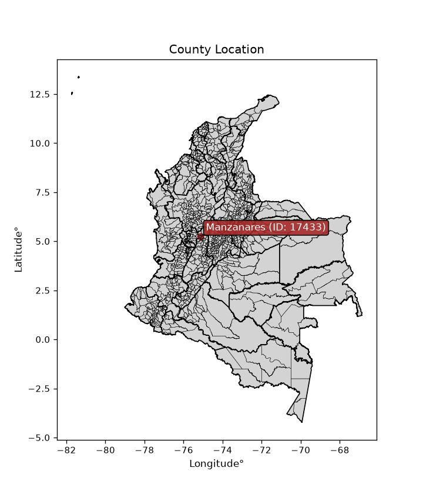
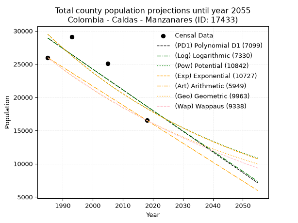
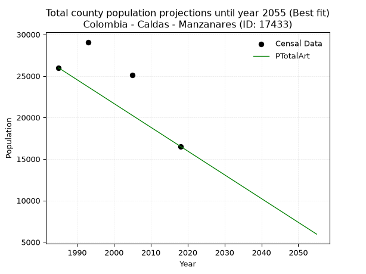
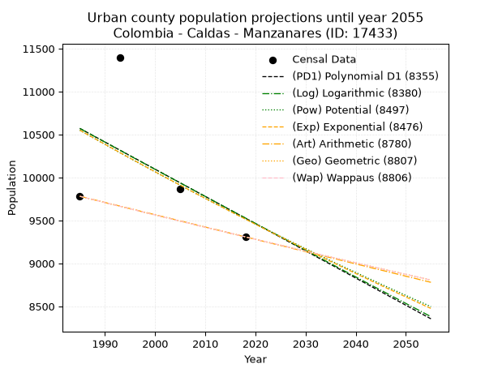
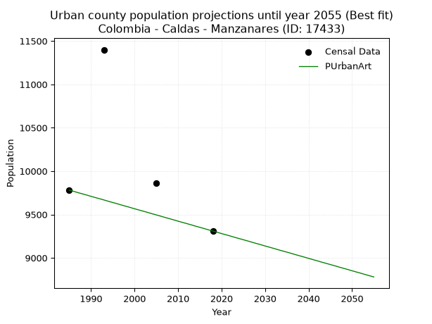
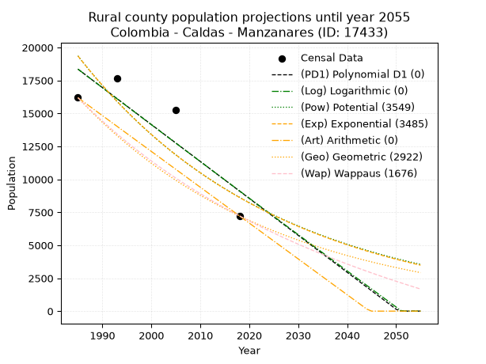
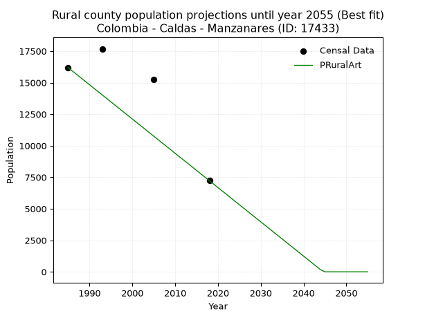

<div align="center">


</div>

# _“Population and Public Services Demand Projections (PPSD) until Year 2050 for Colombia - Caldas - Manzanares (ID: 17433)”_
Keywords: `population` `public-service` `projection` `lineal` `polynomial` `logarithmic` `potential` `exponential` `arithmetic` `geometric` `wappaus` `dane` `colombia` `south-america`

PPSD are analytical estimates used by governments and planners to anticipate future changes in population size, age distribution, and the resulting community needs for utilities, healthcare, education, and infrastructure as sizing future water treatment facilities, electrical grids, and road networks based on spatial growth.

<div align="center">

</img>

</div>


> **General running parameters**: • app_version: _v20260806_. • Python version: _3.14.7_. • Pandas version: _3.0.5_. • NumPy version: _2.5.1_. • Creates, save and include plots into reports (create_plot): _False_. • Projection until year: _2050_. • Process polynomial degree 2 and up: _False_. • Process Wappaus: _True_. • Process Wappaus: _True_. • Set negative values to zero: _True_. • Set infinite values to zero: _True_. • Drop dataset notes: _True_. 
<div align="center">

Dynamic map: [:earth_americas:Google](http://maps.google.com/maps?q=5.255699387,-75.1528291) [:earth_americas:OSM](https://www.openstreetmap.org/#map=18/5.255699387/-75.1528291&layers=P) [:earth_americas:Bing](https://www.bing.com/maps?cp=5.255699387~-75.1528291&lvl=18) [:earth_americas:Apple](https://maps.apple.com/frame?center=5.255699387%2C-75.1528291&span=0.003%2C0.006)

</div>


<div align="center">

```geojson
{
  "type": "Feature",
  "geometry": {
    "type": "Point", 
    "coordinates": [-75.1528291, 5.255699387]
  }, 
  "properties": {
    "Name": "Colombia - Caldas - Manzanares (ID: 17433)"
  }
}
```

</div>


## 0. Census Data (4 records)

Census data are official statistics collected by a government about the people and housing in a country. They usually include counts of total population, age, sex, race, income, education, and jobs.

📅Global census file: [Population.xlsx](../data/Population.xlsx)

| Source   |   Year |   CountryID | CountryName   |   StateID | StateName   |   CountyID | CountyName   |   PTotal |   PUrban |   PRural |
|:---------|-------:|------------:|:--------------|----------:|:------------|-----------:|:-------------|---------:|---------:|---------:|
| DANE     |   1985 |          57 | Colombia      |        17 | Caldas      |      17433 | Manzanares   |    25971 |     9781 |    16190 |
| DANE     |   1993 |          57 | Colombia      |        17 | Caldas      |      17433 | Manzanares   |    29079 |    11399 |    17680 |
| DANE     |   2005 |          57 | Colombia      |        17 | Caldas      |      17433 | Manzanares   |    25104 |     9864 |    15240 |
| DANE     |   2018 |          57 | Colombia      |        17 | Caldas      |      17433 | Manzanares   |    16532 |     9309 |     7223 |

> 🔥Some records could had specific notes about the registered values or the corresponding urban or rural distribution.

📅[SUI-RUPS](https://www.datos.gov.co/Hacienda-y-Cr-dito-P-blico/Registro-nico-de-Prestadores-de-Servicios-P-blicos/4qkq-csdn/about_data) - Local public utility companies: [RUPS.csv](../data/RUPS.xlsx)

 | SERVICIO       | ESTADO    | NOMBRE                                                                     | NIT         | DEPARTAMENTO_DOMICILIO   | MUNICIPIO_DOMICILIO   | DIRECCION              |   TELEFONO | EMAIL                                | TIPO_PRESTADOR                             | CLASIFICACION                 |
|:---------------|:----------|:---------------------------------------------------------------------------|:------------|:-------------------------|:----------------------|:-----------------------|-----------:|:-------------------------------------|:-------------------------------------------|:------------------------------|
| ACUEDUCTO      | OPERATIVA | EMPRESA DE OBRAS SANITARIAS DE CALDAS  S. A. EMPRESA DE SERVICIOS PUBLICOS | 890803239-9 | CALDAS                   | MANIZALES             | Carrera 23 Nro 75 - 82 |    8867080 | lorena.grisalest@empocaldas.com.co   | SOCIEDADES (EMPRESA DE SERVICIOS PUBLICOS) | MAYOR O IGUAL A 5001 USUARIOS |
| ALCANTARILLADO | OPERATIVA | EMPRESA DE OBRAS SANITARIAS DE CALDAS  S. A. EMPRESA DE SERVICIOS PUBLICOS | 890803239-9 | CALDAS                   | MANIZALES             | Carrera 23 Nro 75 - 82 |    8867080 | lorena.grisalest@empocaldas.com.co   | SOCIEDADES (EMPRESA DE SERVICIOS PUBLICOS) | MAYOR O IGUAL A 5001 USUARIOS |
| ACUEDUCTO      | OPERATIVA | JUNTA DE ACCION COMUNAL VEREDA EL TABLAZO MUNICIPIO DE MANZANARES          | 900103674-1 | CALDAS                   | MANIZALES             | EL TABLAZO             |    8550022 | contactenos@manzanares-caldas.gov.co | ORGANIZACION AUTORIZADA                    | HASTA 2500 SUSCRIPTORES       |

## 1. Total

### 1.1. Coefficients and Parameters

* (PD1) Polynomial Deg 1: -311.83219590525334, 647913.849859483 (lineal)
* (Log) Logarithmic: -623240.1694159918, 4761425.022064231
* (Pow) Potential: -28.87855135572097, 99.70432220831192
* (Exp) Exponential: -0.014449063291950335, 8.431402368880178e+16
* (Art) Arithmetic: Year diff. 2018 - 1985 = 33, Population diff. 16532 - 25971 = -9439, Annual growth = -286.030303030303
* (Geo) Geometric: Year diff. 2018 - 1985 = 33, Population diff. 16532 - 25971 = -9439, Annual growth % = -0.013594106657764282
* (Wap) Wappaus: i = -1.3459299486168177, Condition values only valid for < 200)

<sub>
Wappaus condition values: ['-0.00', '-1.35', '-2.69', '-4.04', '-5.38', '-6.73', '-8.08', '-9.42', '-10.77', '-12.11', '-13.46', '-14.81', '-16.15', '-17.50', '-18.84', '-20.19', '-21.53', '-22.88', '-24.23', '-25.57', '-26.92', '-28.26', '-29.61', '-30.96', '-32.30', '-33.65', '-34.99', '-36.34', '-37.69', '-39.03', '-40.38', '-41.72', '-43.07', '-44.42', '-45.76', '-47.11', '-48.45', '-49.80', '-51.15', '-52.49', '-53.84', '-55.18', '-56.53', '-57.87', '-59.22', '-60.57', '-61.91', '-63.26', '-64.60', '-65.95', '-67.30', '-68.64', '-69.99', '-71.33', '-72.68', '-74.03', '-75.37', '-76.72', '-78.06', '-79.41', '-80.76', '-82.10', '-83.45', '-84.79', '-86.14', '-87.49']
</sub>


### 1.2. Projected Dataset

|   Year |   CountyID |   PTotalPD1 |   PTotalLog |   PTotalPow |   PTotalExp |   PTotalArt |   PTotalGeo |   PTotalWap |
|-------:|-----------:|------------:|------------:|------------:|------------:|------------:|------------:|------------:|
|   1985 |      17433 |       28927 |       28929 |       29497 |       29494 |       25971 |       25971 |       25971 |
|   1986 |      17433 |       28615 |       28615 |       29071 |       29071 |       25685 |       25618 |       25624 |
|   1987 |      17433 |       28303 |       28302 |       28651 |       28654 |       25399 |       25270 |       25281 |
|   1988 |      17433 |       27991 |       27988 |       28238 |       28243 |       25113 |       24926 |       24943 |
|   1989 |      17433 |       27680 |       27675 |       27831 |       27837 |       24827 |       24587 |       24609 |
|   1990 |      17433 |       27368 |       27361 |       27430 |       27438 |       24541 |       24253 |       24280 |
|   1991 |      17433 |       27056 |       27048 |       27035 |       27045 |       24255 |       23923 |       23955 |
|   1992 |      17433 |       26744 |       26735 |       26646 |       26657 |       23969 |       23598 |       23634 |
|   1993 |      17433 |       26432 |       26422 |       26262 |       26274 |       23683 |       23277 |       23317 |
|   1994 |      17433 |       26120 |       26110 |       25885 |       25897 |       23397 |       22961 |       23005 |
|   1995 |      17433 |       25809 |       25797 |       25512 |       25526 |       23111 |       22649 |       22696 |
|   1996 |      17433 |       25497 |       25485 |       25146 |       25160 |       22825 |       22341 |       22391 |
|   1997 |      17433 |       25185 |       25173 |       24785 |       24799 |       22539 |       22037 |       22090 |
|   1998 |      17433 |       24873 |       24861 |       24429 |       24443 |       22253 |       21738 |       21792 |
|   1999 |      17433 |       24561 |       24549 |       24079 |       24092 |       21967 |       21442 |       21499 |
|   2000 |      17433 |       24249 |       24237 |       23733 |       23747 |       21681 |       21151 |       21208 |
|   2001 |      17433 |       23938 |       23926 |       23393 |       23406 |       21395 |       20863 |       20922 |
|   2002 |      17433 |       23626 |       23614 |       23058 |       23070 |       21108 |       20580 |       20639 |
|   2003 |      17433 |       23314 |       23303 |       22728 |       22739 |       20822 |       20300 |       20359 |
|   2004 |      17433 |       23002 |       22992 |       22403 |       22413 |       20536 |       20024 |       20082 |
|   2005 |      17433 |       22690 |       22681 |       22082 |       22092 |       20250 |       19752 |       19809 |
|   2006 |      17433 |       22378 |       22370 |       21767 |       21775 |       19964 |       19483 |       19539 |
|   2007 |      17433 |       22067 |       22060 |       21455 |       21462 |       19678 |       19218 |       19273 |
|   2008 |      17433 |       21755 |       21749 |       21149 |       21154 |       19392 |       18957 |       19009 |
|   2009 |      17433 |       21443 |       21439 |       20847 |       20851 |       19106 |       18699 |       18748 |
|   2010 |      17433 |       21131 |       21129 |       20550 |       20552 |       18820 |       18445 |       18491 |
|   2011 |      17433 |       20819 |       20819 |       20257 |       20257 |       18534 |       18194 |       18236 |
|   2012 |      17433 |       20507 |       20509 |       19968 |       19966 |       18248 |       17947 |       17984 |
|   2013 |      17433 |       20196 |       20199 |       19683 |       19680 |       17962 |       17703 |       17735 |
|   2014 |      17433 |       19884 |       19890 |       19403 |       19398 |       17676 |       17462 |       17489 |
|   2015 |      17433 |       19572 |       19580 |       19127 |       19119 |       17390 |       17225 |       17246 |
|   2016 |      17433 |       19260 |       19271 |       18855 |       18845 |       17104 |       16991 |       17005 |
|   2017 |      17433 |       18948 |       18962 |       18587 |       18575 |       16818 |       16760 |       16767 |
|   2018 |      17433 |       18636 |       18653 |       18323 |       18308 |       16532 |       16532 |       16532 |
|   2019 |      17433 |       18325 |       18344 |       18062 |       18046 |       16246 |       16307 |       16299 |
|   2020 |      17433 |       18013 |       18036 |       17806 |       17787 |       15960 |       16086 |       16069 |
|   2021 |      17433 |       17701 |       17727 |       17553 |       17532 |       15674 |       15867 |       15841 |
|   2022 |      17433 |       17389 |       17419 |       17304 |       17280 |       15388 |       15651 |       15616 |
|   2023 |      17433 |       17077 |       17111 |       17059 |       17032 |       15102 |       15438 |       15393 |
|   2024 |      17433 |       16765 |       16803 |       16817 |       16788 |       14816 |       15229 |       15173 |
|   2025 |      17433 |       16454 |       16495 |       16579 |       16547 |       14530 |       15022 |       14954 |
|   2026 |      17433 |       16142 |       16187 |       16344 |       16310 |       14244 |       14817 |       14739 |
|   2027 |      17433 |       15830 |       15880 |       16113 |       16076 |       13958 |       14616 |       14525 |
|   2028 |      17433 |       15518 |       15572 |       15885 |       15845 |       13672 |       14417 |       14314 |
|   2029 |      17433 |       15206 |       15265 |       15661 |       15618 |       13386 |       14221 |       14104 |
|   2030 |      17433 |       14894 |       14958 |       15439 |       15394 |       13100 |       14028 |       13897 |
|   2031 |      17433 |       14583 |       14651 |       15221 |       15173 |       12814 |       13837 |       13693 |
|   2032 |      17433 |       14271 |       14344 |       15006 |       14955 |       12528 |       13649 |       13490 |
|   2033 |      17433 |       13959 |       14038 |       14795 |       14741 |       12242 |       13464 |       13289 |
|   2034 |      17433 |       13647 |       13731 |       14586 |       14529 |       11956 |       13281 |       13090 |
|   2035 |      17433 |       13335 |       13425 |       14381 |       14321 |       11669 |       13100 |       12894 |
|   2036 |      17433 |       13023 |       13119 |       14178 |       14116 |       11383 |       12922 |       12699 |
|   2037 |      17433 |       12712 |       12813 |       13978 |       13913 |       11097 |       12746 |       12506 |
|   2038 |      17433 |       12400 |       12507 |       13782 |       13713 |       10811 |       12573 |       12315 |
|   2039 |      17433 |       12088 |       12201 |       13588 |       13517 |       10525 |       12402 |       12126 |
|   2040 |      17433 |       11776 |       11895 |       13397 |       13323 |       10239 |       12233 |       11939 |
|   2041 |      17433 |       11464 |       11590 |       13208 |       13132 |        9953 |       12067 |       11754 |
|   2042 |      17433 |       11153 |       11285 |       13023 |       12943 |        9667 |       11903 |       11570 |
|   2043 |      17433 |       10841 |       10980 |       12840 |       12758 |        9381 |       11741 |       11389 |
|   2044 |      17433 |       10529 |       10675 |       12660 |       12575 |        9095 |       11582 |       11209 |
|   2045 |      17433 |       10217 |       10370 |       12482 |       12394 |        8809 |       11424 |       11031 |
|   2046 |      17433 |        9905 |       10065 |       12307 |       12216 |        8523 |       11269 |       10854 |
|   2047 |      17433 |        9593 |        9761 |       12135 |       12041 |        8237 |       11116 |       10679 |
|   2048 |      17433 |        9282 |        9456 |       11965 |       11868 |        7951 |       10965 |       10506 |
|   2049 |      17433 |        8970 |        9152 |       11797 |       11698 |        7665 |       10816 |       10334 |
|   2050 |      17433 |        8658 |        8848 |       11632 |       11530 |        7379 |       10669 |       10164 |
<div align="center">

</img>

</div>


### 1.3. Best fit with absolute and relative error (%)

Relative error puts that difference into context by dividing the absolute error by the true value, creating a unitless ratio or percentage that shows the scale of the mistake.

Absolute and relative error

|   Year | Source   |   CountryID | CountryName   |   StateID | StateName   |   CountyID_x | CountyName   |   PTotal |   PUrban |   PRural |   CountyID_y |   PTotalPD1 |   PTotalLog |   PTotalPow |   PTotalExp |   PTotalArt |   PTotalGeo |   PTotalWap |   PTotalPD1AbsError |   PTotalLogAbsError |   PTotalPowAbsError |   PTotalExpAbsError |   PTotalArtAbsError |   PTotalGeoAbsError |   PTotalWapAbsError |   PTotalPD1RelError |   PTotalLogRelError |   PTotalPowRelError |   PTotalExpRelError |   PTotalArtRelError |   PTotalGeoRelError |   PTotalWapRelError |
|-------:|:---------|------------:|:--------------|----------:|:------------|-------------:|:-------------|---------:|---------:|---------:|-------------:|------------:|------------:|------------:|------------:|------------:|------------:|------------:|--------------------:|--------------------:|--------------------:|--------------------:|--------------------:|--------------------:|--------------------:|--------------------:|--------------------:|--------------------:|--------------------:|--------------------:|--------------------:|--------------------:|
|   1985 | DANE     |          57 | Colombia      |        17 | Caldas      |        17433 | Manzanares   |    25971 |     9781 |    16190 |        17433 |       28927 |       28929 |       29497 |       29494 |       25971 |       25971 |       25971 |                2956 |                2958 |                3526 |                3523 |                   0 |                   0 |                   0 |            11.3819  |            11.3896  |             13.5767 |            13.5651  |              0      |              0      |              0      |
|   1993 | DANE     |          57 | Colombia      |        17 | Caldas      |        17433 | Manzanares   |    29079 |    11399 |    17680 |        17433 |       26432 |       26422 |       26262 |       26274 |       23683 |       23277 |       23317 |                2647 |                2657 |                2817 |                2805 |                5396 |                5802 |                5762 |             9.10279 |             9.13718 |              9.6874 |             9.64614 |             18.5563 |             19.9525 |             19.815  |
|   2005 | DANE     |          57 | Colombia      |        17 | Caldas      |        17433 | Manzanares   |    25104 |     9864 |    15240 |        17433 |       22690 |       22681 |       22082 |       22092 |       20250 |       19752 |       19809 |                2414 |                2423 |                3022 |                3012 |                4854 |                5352 |                5295 |             9.616   |             9.65185 |             12.0379 |            11.9981  |             19.3356 |             21.3193 |             21.0923 |
|   2018 | DANE     |          57 | Colombia      |        17 | Caldas      |        17433 | Manzanares   |    16532 |     9309 |     7223 |        17433 |       18636 |       18653 |       18323 |       18308 |       16532 |       16532 |       16532 |                2104 |                2121 |                1791 |                1776 |                   0 |                   0 |                   0 |            12.7268  |            12.8297  |             10.8335 |            10.7428  |              0      |              0      |              0      |

Relative error mean

| Method    |   RelError | Best   |
|:----------|-----------:|:-------|
| PTotalPD1 |   10.7069  |        |
| PTotalLog |   10.7521  |        |
| PTotalPow |   11.5339  |        |
| PTotalExp |   11.488   |        |
| PTotalArt |    9.47298 | True   |
| PTotalGeo |   10.318   |        |
| PTotalWap |   10.2268  |        |

💙Best method: _**PTotalArt**_
<div align="center">

</img>

</div>


### 1.4. Fresh water supply demand in liters per capita per day (lpcd)

The fresh water supply demand typically ranges from 100 to 300 liters per capita per day (lpcd) for standard domestic and municipal planning, though absolute survival minimums set by the World Health Organization are as low as 7.5 to 20 liters per day, and total consumption in high-income nations can exceed 400 liters.

> `CZ`: Level in meters above the sea level (masl)<br> `WS`: Fresh water supply demand in liters per capita per day (lpcd or l/h/d)<br> `WSAll`: Zonal fresh water supply demand in liters per second (l/s)<br> `A`: Zonal area in square meters<br> `DP`: Population density (people/hectare or p/ha)

Reference values (RAS Colombia)

|    CZ |   WS |
|------:|-----:|
|  1000 |  120 |
|  2000 |  130 |
| 99999 |  140 |

County shapefile geometry properties and water supply values

|   CountyID |      ATotal |   CZTotal |   WSTotal |
|-----------:|------------:|----------:|----------:|
|      17433 | 1.97805e+08 |   2016.46 |       140 |

Projected values for best method: PTotalArt

|   CountyID |   Year |   PTotalArt |   DPTotal |   WSTotal |   WSTotalAll |
|-----------:|-------:|------------:|----------:|----------:|-------------:|
|      17433 |   1985 |       25971 |      1.31 |       140 |      42.0826 |
|      17433 |   1986 |       25685 |      1.3  |       140 |      41.6192 |
|      17433 |   1987 |       25399 |      1.28 |       140 |      41.1558 |
|      17433 |   1988 |       25113 |      1.27 |       140 |      40.6924 |
|      17433 |   1989 |       24827 |      1.26 |       140 |      40.2289 |
|      17433 |   1990 |       24541 |      1.24 |       140 |      39.7655 |
|      17433 |   1991 |       24255 |      1.23 |       140 |      39.3021 |
|      17433 |   1992 |       23969 |      1.21 |       140 |      38.8387 |
|      17433 |   1993 |       23683 |      1.2  |       140 |      38.3752 |
|      17433 |   1994 |       23397 |      1.18 |       140 |      37.9118 |
|      17433 |   1995 |       23111 |      1.17 |       140 |      37.4484 |
|      17433 |   1996 |       22825 |      1.15 |       140 |      36.985  |
|      17433 |   1997 |       22539 |      1.14 |       140 |      36.5215 |
|      17433 |   1998 |       22253 |      1.12 |       140 |      36.0581 |
|      17433 |   1999 |       21967 |      1.11 |       140 |      35.5947 |
|      17433 |   2000 |       21681 |      1.1  |       140 |      35.1313 |
|      17433 |   2001 |       21395 |      1.08 |       140 |      34.6678 |
|      17433 |   2002 |       21108 |      1.07 |       140 |      34.2028 |
|      17433 |   2003 |       20822 |      1.05 |       140 |      33.7394 |
|      17433 |   2004 |       20536 |      1.04 |       140 |      33.2759 |
|      17433 |   2005 |       20250 |      1.02 |       140 |      32.8125 |
|      17433 |   2006 |       19964 |      1.01 |       140 |      32.3491 |
|      17433 |   2007 |       19678 |      0.99 |       140 |      31.8856 |
|      17433 |   2008 |       19392 |      0.98 |       140 |      31.4222 |
|      17433 |   2009 |       19106 |      0.97 |       140 |      30.9588 |
|      17433 |   2010 |       18820 |      0.95 |       140 |      30.4954 |
|      17433 |   2011 |       18534 |      0.94 |       140 |      30.0319 |
|      17433 |   2012 |       18248 |      0.92 |       140 |      29.5685 |
|      17433 |   2013 |       17962 |      0.91 |       140 |      29.1051 |
|      17433 |   2014 |       17676 |      0.89 |       140 |      28.6417 |
|      17433 |   2015 |       17390 |      0.88 |       140 |      28.1782 |
|      17433 |   2016 |       17104 |      0.86 |       140 |      27.7148 |
|      17433 |   2017 |       16818 |      0.85 |       140 |      27.2514 |
|      17433 |   2018 |       16532 |      0.84 |       140 |      26.788  |
|      17433 |   2019 |       16246 |      0.82 |       140 |      26.3245 |
|      17433 |   2020 |       15960 |      0.81 |       140 |      25.8611 |
|      17433 |   2021 |       15674 |      0.79 |       140 |      25.3977 |
|      17433 |   2022 |       15388 |      0.78 |       140 |      24.9343 |
|      17433 |   2023 |       15102 |      0.76 |       140 |      24.4708 |
|      17433 |   2024 |       14816 |      0.75 |       140 |      24.0074 |
|      17433 |   2025 |       14530 |      0.73 |       140 |      23.544  |
|      17433 |   2026 |       14244 |      0.72 |       140 |      23.0806 |
|      17433 |   2027 |       13958 |      0.71 |       140 |      22.6171 |
|      17433 |   2028 |       13672 |      0.69 |       140 |      22.1537 |
|      17433 |   2029 |       13386 |      0.68 |       140 |      21.6903 |
|      17433 |   2030 |       13100 |      0.66 |       140 |      21.2269 |
|      17433 |   2031 |       12814 |      0.65 |       140 |      20.7634 |
|      17433 |   2032 |       12528 |      0.63 |       140 |      20.3    |
|      17433 |   2033 |       12242 |      0.62 |       140 |      19.8366 |
|      17433 |   2034 |       11956 |      0.6  |       140 |      19.3731 |
|      17433 |   2035 |       11669 |      0.59 |       140 |      18.9081 |
|      17433 |   2036 |       11383 |      0.58 |       140 |      18.4447 |
|      17433 |   2037 |       11097 |      0.56 |       140 |      17.9812 |
|      17433 |   2038 |       10811 |      0.55 |       140 |      17.5178 |
|      17433 |   2039 |       10525 |      0.53 |       140 |      17.0544 |
|      17433 |   2040 |       10239 |      0.52 |       140 |      16.591  |
|      17433 |   2041 |        9953 |      0.5  |       140 |      16.1275 |
|      17433 |   2042 |        9667 |      0.49 |       140 |      15.6641 |
|      17433 |   2043 |        9381 |      0.47 |       140 |      15.2007 |
|      17433 |   2044 |        9095 |      0.46 |       140 |      14.7373 |
|      17433 |   2045 |        8809 |      0.45 |       140 |      14.2738 |
|      17433 |   2046 |        8523 |      0.43 |       140 |      13.8104 |
|      17433 |   2047 |        8237 |      0.42 |       140 |      13.347  |
|      17433 |   2048 |        7951 |      0.4  |       140 |      12.8836 |
|      17433 |   2049 |        7665 |      0.39 |       140 |      12.4201 |
|      17433 |   2050 |        7379 |      0.37 |       140 |      11.9567 |

## 2. Urban

### 2.1. Coefficients and Parameters

* (PD1) Polynomial Deg 1: -31.656764351665473, 73409.69289441887 (lineal)
* (Log) Logarithmic: -63206.100724978416, 490518.3281124646
* (Pow) Potential: -6.244515626791072, 24.61617117700814
* (Exp) Exponential: -0.0031274774577584956, 5240629.926240688
* (Art) Arithmetic: Year diff. 2018 - 1985 = 33, Population diff. 9309 - 9781 = -472, Annual growth = -14.303030303030303
* (Geo) Geometric: Year diff. 2018 - 1985 = 33, Population diff. 9309 - 9781 = -472, Annual growth % = -0.0014976668963402329
* (Wap) Wappaus: i = -0.14984840547962602, Condition values only valid for < 200)

<sub>
Wappaus condition values: ['-0.00', '-0.15', '-0.30', '-0.45', '-0.60', '-0.75', '-0.90', '-1.05', '-1.20', '-1.35', '-1.50', '-1.65', '-1.80', '-1.95', '-2.10', '-2.25', '-2.40', '-2.55', '-2.70', '-2.85', '-3.00', '-3.15', '-3.30', '-3.45', '-3.60', '-3.75', '-3.90', '-4.05', '-4.20', '-4.35', '-4.50', '-4.65', '-4.80', '-4.94', '-5.09', '-5.24', '-5.39', '-5.54', '-5.69', '-5.84', '-5.99', '-6.14', '-6.29', '-6.44', '-6.59', '-6.74', '-6.89', '-7.04', '-7.19', '-7.34', '-7.49', '-7.64', '-7.79', '-7.94', '-8.09', '-8.24', '-8.39', '-8.54', '-8.69', '-8.84', '-8.99', '-9.14', '-9.29', '-9.44', '-9.59', '-9.74']
</sub>


### 2.2. Projected Dataset

|   Year |   CountyID |   PUrbanPD1 |   PUrbanLog |   PUrbanPow |   PUrbanExp |   PUrbanArt |   PUrbanGeo |   PUrbanWap |
|-------:|-----------:|------------:|------------:|------------:|------------:|------------:|------------:|------------:|
|   1985 |      17433 |       10571 |       10571 |       10550 |       10550 |        9781 |        9781 |        9781 |
|   1986 |      17433 |       10539 |       10539 |       10517 |       10517 |        9767 |        9766 |        9766 |
|   1987 |      17433 |       10508 |       10507 |       10484 |       10485 |        9752 |        9752 |        9752 |
|   1988 |      17433 |       10476 |       10475 |       10451 |       10452 |        9738 |        9737 |        9737 |
|   1989 |      17433 |       10444 |       10444 |       10418 |       10419 |        9724 |        9723 |        9723 |
|   1990 |      17433 |       10413 |       10412 |       10386 |       10387 |        9709 |        9708 |        9708 |
|   1991 |      17433 |       10381 |       10380 |       10353 |       10354 |        9695 |        9693 |        9693 |
|   1992 |      17433 |       10349 |       10348 |       10321 |       10322 |        9681 |        9679 |        9679 |
|   1993 |      17433 |       10318 |       10317 |       10288 |       10290 |        9667 |        9664 |        9664 |
|   1994 |      17433 |       10286 |       10285 |       10256 |       10257 |        9652 |        9650 |        9650 |
|   1995 |      17433 |       10254 |       10253 |       10224 |       10225 |        9638 |        9635 |        9636 |
|   1996 |      17433 |       10223 |       10221 |       10192 |       10194 |        9624 |        9621 |        9621 |
|   1997 |      17433 |       10191 |       10190 |       10160 |       10162 |        9609 |        9607 |        9607 |
|   1998 |      17433 |       10159 |       10158 |       10129 |       10130 |        9595 |        9592 |        9592 |
|   1999 |      17433 |       10128 |       10127 |       10097 |       10098 |        9581 |        9578 |        9578 |
|   2000 |      17433 |       10096 |       10095 |       10066 |       10067 |        9566 |        9564 |        9564 |
|   2001 |      17433 |       10065 |       10063 |       10034 |       10035 |        9552 |        9549 |        9549 |
|   2002 |      17433 |       10033 |       10032 |       10003 |       10004 |        9538 |        9535 |        9535 |
|   2003 |      17433 |       10001 |       10000 |        9972 |        9973 |        9524 |        9521 |        9521 |
|   2004 |      17433 |        9970 |        9969 |        9941 |        9942 |        9509 |        9506 |        9506 |
|   2005 |      17433 |        9938 |        9937 |        9910 |        9911 |        9495 |        9492 |        9492 |
|   2006 |      17433 |        9906 |        9906 |        9879 |        9880 |        9481 |        9478 |        9478 |
|   2007 |      17433 |        9875 |        9874 |        9848 |        9849 |        9466 |        9464 |        9464 |
|   2008 |      17433 |        9843 |        9843 |        9818 |        9818 |        9452 |        9450 |        9450 |
|   2009 |      17433 |        9811 |        9811 |        9787 |        9787 |        9438 |        9435 |        9435 |
|   2010 |      17433 |        9780 |        9780 |        9757 |        9757 |        9423 |        9421 |        9421 |
|   2011 |      17433 |        9748 |        9748 |        9727 |        9726 |        9409 |        9407 |        9407 |
|   2012 |      17433 |        9716 |        9717 |        9696 |        9696 |        9395 |        9393 |        9393 |
|   2013 |      17433 |        9685 |        9685 |        9666 |        9666 |        9381 |        9379 |        9379 |
|   2014 |      17433 |        9653 |        9654 |        9637 |        9636 |        9366 |        9365 |        9365 |
|   2015 |      17433 |        9621 |        9623 |        9607 |        9605 |        9352 |        9351 |        9351 |
|   2016 |      17433 |        9590 |        9591 |        9577 |        9575 |        9338 |        9337 |        9337 |
|   2017 |      17433 |        9558 |        9560 |        9547 |        9546 |        9323 |        9323 |        9323 |
|   2018 |      17433 |        9526 |        9529 |        9518 |        9516 |        9309 |        9309 |        9309 |
|   2019 |      17433 |        9495 |        9497 |        9488 |        9486 |        9295 |        9295 |        9295 |
|   2020 |      17433 |        9463 |        9466 |        9459 |        9456 |        9280 |        9281 |        9281 |
|   2021 |      17433 |        9431 |        9435 |        9430 |        9427 |        9266 |        9267 |        9267 |
|   2022 |      17433 |        9400 |        9403 |        9401 |        9397 |        9252 |        9253 |        9253 |
|   2023 |      17433 |        9368 |        9372 |        9372 |        9368 |        9237 |        9239 |        9239 |
|   2024 |      17433 |        9336 |        9341 |        9343 |        9339 |        9223 |        9226 |        9226 |
|   2025 |      17433 |        9305 |        9310 |        9314 |        9310 |        9209 |        9212 |        9212 |
|   2026 |      17433 |        9273 |        9279 |        9286 |        9281 |        9195 |        9198 |        9198 |
|   2027 |      17433 |        9241 |        9247 |        9257 |        9252 |        9180 |        9184 |        9184 |
|   2028 |      17433 |        9210 |        9216 |        9229 |        9223 |        9166 |        9171 |        9170 |
|   2029 |      17433 |        9178 |        9185 |        9200 |        9194 |        9152 |        9157 |        9157 |
|   2030 |      17433 |        9146 |        9154 |        9172 |        9165 |        9137 |        9143 |        9143 |
|   2031 |      17433 |        9115 |        9123 |        9144 |        9137 |        9123 |        9129 |        9129 |
|   2032 |      17433 |        9083 |        9092 |        9116 |        9108 |        9109 |        9116 |        9116 |
|   2033 |      17433 |        9051 |        9061 |        9088 |        9080 |        9094 |        9102 |        9102 |
|   2034 |      17433 |        9020 |        9029 |        9060 |        9051 |        9080 |        9088 |        9088 |
|   2035 |      17433 |        8988 |        8998 |        9032 |        9023 |        9066 |        9075 |        9075 |
|   2036 |      17433 |        8957 |        8967 |        9004 |        8995 |        9052 |        9061 |        9061 |
|   2037 |      17433 |        8925 |        8936 |        8977 |        8967 |        9037 |        9048 |        9047 |
|   2038 |      17433 |        8893 |        8905 |        8949 |        8939 |        9023 |        9034 |        9034 |
|   2039 |      17433 |        8862 |        8874 |        8922 |        8911 |        9009 |        9021 |        9020 |
|   2040 |      17433 |        8830 |        8843 |        8895 |        8883 |        8994 |        9007 |        9007 |
|   2041 |      17433 |        8798 |        8812 |        8868 |        8855 |        8980 |        8994 |        8993 |
|   2042 |      17433 |        8767 |        8781 |        8840 |        8828 |        8966 |        8980 |        8980 |
|   2043 |      17433 |        8735 |        8750 |        8814 |        8800 |        8951 |        8967 |        8966 |
|   2044 |      17433 |        8703 |        8719 |        8787 |        8773 |        8937 |        8953 |        8953 |
|   2045 |      17433 |        8672 |        8689 |        8760 |        8745 |        8923 |        8940 |        8939 |
|   2046 |      17433 |        8640 |        8658 |        8733 |        8718 |        8909 |        8926 |        8926 |
|   2047 |      17433 |        8608 |        8627 |        8707 |        8691 |        8894 |        8913 |        8913 |
|   2048 |      17433 |        8577 |        8596 |        8680 |        8664 |        8880 |        8900 |        8899 |
|   2049 |      17433 |        8545 |        8565 |        8654 |        8636 |        8866 |        8886 |        8886 |
|   2050 |      17433 |        8513 |        8534 |        8627 |        8610 |        8851 |        8873 |        8873 |
<div align="center">

</img>

</div>


### 2.3. Best fit with absolute and relative error (%)

Relative error puts that difference into context by dividing the absolute error by the true value, creating a unitless ratio or percentage that shows the scale of the mistake.

Absolute and relative error

|   Year | Source   |   CountryID | CountryName   |   StateID | StateName   |   CountyID_x | CountyName   |   PTotal |   PUrban |   PRural |   CountyID_y |   PUrbanPD1 |   PUrbanLog |   PUrbanPow |   PUrbanExp |   PUrbanArt |   PUrbanGeo |   PUrbanWap |   PUrbanPD1AbsError |   PUrbanLogAbsError |   PUrbanPowAbsError |   PUrbanExpAbsError |   PUrbanArtAbsError |   PUrbanGeoAbsError |   PUrbanWapAbsError |   PUrbanPD1RelError |   PUrbanLogRelError |   PUrbanPowRelError |   PUrbanExpRelError |   PUrbanArtRelError |   PUrbanGeoRelError |   PUrbanWapRelError |
|-------:|:---------|------------:|:--------------|----------:|:------------|-------------:|:-------------|---------:|---------:|---------:|-------------:|------------:|------------:|------------:|------------:|------------:|------------:|------------:|--------------------:|--------------------:|--------------------:|--------------------:|--------------------:|--------------------:|--------------------:|--------------------:|--------------------:|--------------------:|--------------------:|--------------------:|--------------------:|--------------------:|
|   1985 | DANE     |          57 | Colombia      |        17 | Caldas      |        17433 | Manzanares   |    25971 |     9781 |    16190 |        17433 |       10571 |       10571 |       10550 |       10550 |        9781 |        9781 |        9781 |                 790 |                 790 |                 769 |                 769 |                   0 |                   0 |                   0 |            8.07688  |            8.07688  |            7.86218  |             7.86218 |             0       |             0       |             0       |
|   1993 | DANE     |          57 | Colombia      |        17 | Caldas      |        17433 | Manzanares   |    29079 |    11399 |    17680 |        17433 |       10318 |       10317 |       10288 |       10290 |        9667 |        9664 |        9664 |                1081 |                1082 |                1111 |                1109 |                1732 |                1735 |                1735 |            9.48329  |            9.49206  |            9.74647  |             9.72892 |            15.1943  |            15.2206  |            15.2206  |
|   2005 | DANE     |          57 | Colombia      |        17 | Caldas      |        17433 | Manzanares   |    25104 |     9864 |    15240 |        17433 |        9938 |        9937 |        9910 |        9911 |        9495 |        9492 |        9492 |                  74 |                  73 |                  46 |                  47 |                 369 |                 372 |                 372 |            0.750203 |            0.740065 |            0.466342 |             0.47648 |             3.74088 |             3.77129 |             3.77129 |
|   2018 | DANE     |          57 | Colombia      |        17 | Caldas      |        17433 | Manzanares   |    16532 |     9309 |     7223 |        17433 |        9526 |        9529 |        9518 |        9516 |        9309 |        9309 |        9309 |                 217 |                 220 |                 209 |                 207 |                   0 |                   0 |                   0 |            2.33108  |            2.3633   |            2.24514  |             2.22365 |             0       |             0       |             0       |

Relative error mean

| Method    |   RelError | Best   |
|:----------|-----------:|:-------|
| PUrbanPD1 |    5.16036 |        |
| PUrbanLog |    5.16808 |        |
| PUrbanPow |    5.08003 |        |
| PUrbanExp |    5.07281 |        |
| PUrbanArt |    4.7338  | True   |
| PUrbanGeo |    4.74798 |        |
| PUrbanWap |    4.74798 |        |

💙Best method: _**PUrbanArt**_
<div align="center">

</img>

</div>


### 2.4. Fresh water supply demand in liters per capita per day (lpcd)

The fresh water supply demand typically ranges from 100 to 300 liters per capita per day (lpcd) for standard domestic and municipal planning, though absolute survival minimums set by the World Health Organization are as low as 7.5 to 20 liters per day, and total consumption in high-income nations can exceed 400 liters.

> `CZ`: Level in meters above the sea level (masl)<br> `WS`: Fresh water supply demand in liters per capita per day (lpcd or l/h/d)<br> `WSAll`: Zonal fresh water supply demand in liters per second (l/s)<br> `A`: Zonal area in square meters<br> `DP`: Population density (people/hectare or p/ha)

Reference values (RAS Colombia)

|    CZ |   WS |
|------:|-----:|
|  1000 |  120 |
|  2000 |  130 |
| 99999 |  140 |

County shapefile geometry properties and water supply values

|   CountyID |      AUrban |   CZUrban |   WSUrban |
|-----------:|------------:|----------:|----------:|
|      17433 | 1.29689e+06 |   1870.28 |       130 |

Projected values for best method: PUrbanArt

|   CountyID |   Year |   PUrbanArt |   DPUrban |   WSUrban |   WSUrbanAll |
|-----------:|-------:|------------:|----------:|----------:|-------------:|
|      17433 |   1985 |        9781 |     75.42 |       130 |      14.7168 |
|      17433 |   1986 |        9767 |     75.31 |       130 |      14.6957 |
|      17433 |   1987 |        9752 |     75.2  |       130 |      14.6731 |
|      17433 |   1988 |        9738 |     75.09 |       130 |      14.6521 |
|      17433 |   1989 |        9724 |     74.98 |       130 |      14.631  |
|      17433 |   1990 |        9709 |     74.86 |       130 |      14.6084 |
|      17433 |   1991 |        9695 |     74.76 |       130 |      14.5874 |
|      17433 |   1992 |        9681 |     74.65 |       130 |      14.5663 |
|      17433 |   1993 |        9667 |     74.54 |       130 |      14.5453 |
|      17433 |   1994 |        9652 |     74.42 |       130 |      14.5227 |
|      17433 |   1995 |        9638 |     74.32 |       130 |      14.5016 |
|      17433 |   1996 |        9624 |     74.21 |       130 |      14.4806 |
|      17433 |   1997 |        9609 |     74.09 |       130 |      14.458  |
|      17433 |   1998 |        9595 |     73.98 |       130 |      14.4369 |
|      17433 |   1999 |        9581 |     73.88 |       130 |      14.4159 |
|      17433 |   2000 |        9566 |     73.76 |       130 |      14.3933 |
|      17433 |   2001 |        9552 |     73.65 |       130 |      14.3722 |
|      17433 |   2002 |        9538 |     73.55 |       130 |      14.3512 |
|      17433 |   2003 |        9524 |     73.44 |       130 |      14.3301 |
|      17433 |   2004 |        9509 |     73.32 |       130 |      14.3075 |
|      17433 |   2005 |        9495 |     73.21 |       130 |      14.2865 |
|      17433 |   2006 |        9481 |     73.11 |       130 |      14.2654 |
|      17433 |   2007 |        9466 |     72.99 |       130 |      14.2428 |
|      17433 |   2008 |        9452 |     72.88 |       130 |      14.2218 |
|      17433 |   2009 |        9438 |     72.77 |       130 |      14.2007 |
|      17433 |   2010 |        9423 |     72.66 |       130 |      14.1781 |
|      17433 |   2011 |        9409 |     72.55 |       130 |      14.1571 |
|      17433 |   2012 |        9395 |     72.44 |       130 |      14.136  |
|      17433 |   2013 |        9381 |     72.33 |       130 |      14.1149 |
|      17433 |   2014 |        9366 |     72.22 |       130 |      14.0924 |
|      17433 |   2015 |        9352 |     72.11 |       130 |      14.0713 |
|      17433 |   2016 |        9338 |     72    |       130 |      14.0502 |
|      17433 |   2017 |        9323 |     71.89 |       130 |      14.0277 |
|      17433 |   2018 |        9309 |     71.78 |       130 |      14.0066 |
|      17433 |   2019 |        9295 |     71.67 |       130 |      13.9855 |
|      17433 |   2020 |        9280 |     71.56 |       130 |      13.963  |
|      17433 |   2021 |        9266 |     71.45 |       130 |      13.9419 |
|      17433 |   2022 |        9252 |     71.34 |       130 |      13.9208 |
|      17433 |   2023 |        9237 |     71.22 |       130 |      13.8983 |
|      17433 |   2024 |        9223 |     71.12 |       130 |      13.8772 |
|      17433 |   2025 |        9209 |     71.01 |       130 |      13.8561 |
|      17433 |   2026 |        9195 |     70.9  |       130 |      13.8351 |
|      17433 |   2027 |        9180 |     70.78 |       130 |      13.8125 |
|      17433 |   2028 |        9166 |     70.68 |       130 |      13.7914 |
|      17433 |   2029 |        9152 |     70.57 |       130 |      13.7704 |
|      17433 |   2030 |        9137 |     70.45 |       130 |      13.7478 |
|      17433 |   2031 |        9123 |     70.35 |       130 |      13.7267 |
|      17433 |   2032 |        9109 |     70.24 |       130 |      13.7057 |
|      17433 |   2033 |        9094 |     70.12 |       130 |      13.6831 |
|      17433 |   2034 |        9080 |     70.01 |       130 |      13.662  |
|      17433 |   2035 |        9066 |     69.91 |       130 |      13.641  |
|      17433 |   2036 |        9052 |     69.8  |       130 |      13.6199 |
|      17433 |   2037 |        9037 |     69.68 |       130 |      13.5973 |
|      17433 |   2038 |        9023 |     69.57 |       130 |      13.5763 |
|      17433 |   2039 |        9009 |     69.47 |       130 |      13.5552 |
|      17433 |   2040 |        8994 |     69.35 |       130 |      13.5326 |
|      17433 |   2041 |        8980 |     69.24 |       130 |      13.5116 |
|      17433 |   2042 |        8966 |     69.13 |       130 |      13.4905 |
|      17433 |   2043 |        8951 |     69.02 |       130 |      13.4679 |
|      17433 |   2044 |        8937 |     68.91 |       130 |      13.4469 |
|      17433 |   2045 |        8923 |     68.8  |       130 |      13.4258 |
|      17433 |   2046 |        8909 |     68.7  |       130 |      13.4047 |
|      17433 |   2047 |        8894 |     68.58 |       130 |      13.3822 |
|      17433 |   2048 |        8880 |     68.47 |       130 |      13.3611 |
|      17433 |   2049 |        8866 |     68.36 |       130 |      13.34   |
|      17433 |   2050 |        8851 |     68.25 |       130 |      13.3175 |

## 3. Rural

### 3.1. Coefficients and Parameters

* (PD1) Polynomial Deg 1: -280.17543155358777, 574504.156965064 (lineal)
* (Log) Logarithmic: -560034.0686910135, 4270906.693951769
* (Pow) Potential: -48.95306073544748, 165.72237387183972
* (Exp) Exponential: -0.02449131397805967, 2.512766097679632e+25
* (Art) Arithmetic: Year diff. 2018 - 1985 = 33, Population diff. 7223 - 16190 = -8967, Annual growth = -271.72727272727275
* (Geo) Geometric: Year diff. 2018 - 1985 = 33, Population diff. 7223 - 16190 = -8967, Annual growth % = -0.024161604347628707
* (Wap) Wappaus: i = -2.321165785907596, Condition values only valid for < 200)

<sub>
Wappaus condition values: ['-0.00', '-2.32', '-4.64', '-6.96', '-9.28', '-11.61', '-13.93', '-16.25', '-18.57', '-20.89', '-23.21', '-25.53', '-27.85', '-30.18', '-32.50', '-34.82', '-37.14', '-39.46', '-41.78', '-44.10', '-46.42', '-48.74', '-51.07', '-53.39', '-55.71', '-58.03', '-60.35', '-62.67', '-64.99', '-67.31', '-69.63', '-71.96', '-74.28', '-76.60', '-78.92', '-81.24', '-83.56', '-85.88', '-88.20', '-90.53', '-92.85', '-95.17', '-97.49', '-99.81', '-102.13', '-104.45', '-106.77', '-109.09', '-111.42', '-113.74', '-116.06', '-118.38', '-120.70', '-123.02', '-125.34', '-127.66', '-129.99', '-132.31', '-134.63', '-136.95', '-139.27', '-141.59', '-143.91', '-146.23', '-148.55', '-150.88']
</sub>


### 3.2. Projected Dataset

|   Year |   CountyID |   PRuralPD1 |   PRuralLog |   PRuralPow |   PRuralExp |   PRuralArt |   PRuralGeo |   PRuralWap |
|-------:|-----------:|------------:|------------:|------------:|------------:|------------:|------------:|------------:|
|   1985 |      17433 |       18356 |       18358 |       19360 |       19356 |       16190 |       16190 |       16190 |
|   1986 |      17433 |       18076 |       18076 |       18888 |       18888 |       15918 |       15799 |       15819 |
|   1987 |      17433 |       17796 |       17794 |       18429 |       18431 |       15647 |       15417 |       15455 |
|   1988 |      17433 |       17515 |       17513 |       17980 |       17985 |       15375 |       15045 |       15101 |
|   1989 |      17433 |       17235 |       17231 |       17543 |       17550 |       15103 |       14681 |       14754 |
|   1990 |      17433 |       16955 |       16950 |       17117 |       17125 |       14831 |       14326 |       14414 |
|   1991 |      17433 |       16675 |       16668 |       16701 |       16711 |       14560 |       13980 |       14082 |
|   1992 |      17433 |       16395 |       16387 |       16295 |       16306 |       14288 |       13642 |       13757 |
|   1993 |      17433 |       16115 |       16106 |       15900 |       15912 |       14016 |       13313 |       13439 |
|   1994 |      17433 |       15834 |       15825 |       15514 |       15527 |       13744 |       12991 |       13128 |
|   1995 |      17433 |       15554 |       15544 |       15138 |       15151 |       13473 |       12677 |       12823 |
|   1996 |      17433 |       15274 |       15264 |       14771 |       14785 |       13201 |       12371 |       12524 |
|   1997 |      17433 |       14994 |       14983 |       14413 |       14427 |       12929 |       12072 |       12232 |
|   1998 |      17433 |       14714 |       14703 |       14064 |       14078 |       12658 |       11780 |       11945 |
|   1999 |      17433 |       14433 |       14422 |       13724 |       13737 |       12386 |       11496 |       11664 |
|   2000 |      17433 |       14153 |       14142 |       13392 |       13405 |       12114 |       11218 |       11389 |
|   2001 |      17433 |       13873 |       13862 |       13068 |       13081 |       11842 |       10947 |       11119 |
|   2002 |      17433 |       13593 |       13583 |       12753 |       12764 |       11571 |       10682 |       10854 |
|   2003 |      17433 |       13313 |       13303 |       12445 |       12455 |       11299 |       10424 |       10595 |
|   2004 |      17433 |       13033 |       13023 |       12144 |       12154 |       11027 |       10172 |       10340 |
|   2005 |      17433 |       12752 |       12744 |       11851 |       11860 |       10755 |        9927 |       10090 |
|   2006 |      17433 |       12472 |       12465 |       11566 |       11573 |       10484 |        9687 |        9845 |
|   2007 |      17433 |       12192 |       12186 |       11287 |       11293 |       10212 |        9453 |        9604 |
|   2008 |      17433 |       11912 |       11907 |       11015 |       11020 |        9940 |        9224 |        9368 |
|   2009 |      17433 |       11632 |       11628 |       10750 |       10753 |        9669 |        9002 |        9136 |
|   2010 |      17433 |       11352 |       11349 |       10491 |       10493 |        9397 |        8784 |        8908 |
|   2011 |      17433 |       11071 |       11071 |       10239 |       10239 |        9125 |        8572 |        8684 |
|   2012 |      17433 |       10791 |       10792 |        9992 |        9991 |        8853 |        8365 |        8464 |
|   2013 |      17433 |       10511 |       10514 |        9752 |        9750 |        8582 |        8163 |        8248 |
|   2014 |      17433 |       10231 |       10236 |        9518 |        9514 |        8310 |        7965 |        8036 |
|   2015 |      17433 |        9951 |        9958 |        9290 |        9284 |        8038 |        7773 |        7828 |
|   2016 |      17433 |        9670 |        9680 |        9067 |        9059 |        7766 |        7585 |        7623 |
|   2017 |      17433 |        9390 |        9402 |        8849 |        8840 |        7495 |        7402 |        7421 |
|   2018 |      17433 |        9110 |        9125 |        8637 |        8626 |        7223 |        7223 |        7223 |
|   2019 |      17433 |        8830 |        8847 |        8430 |        8417 |        6951 |        7048 |        7028 |
|   2020 |      17433 |        8550 |        8570 |        8228 |        8214 |        6680 |        6878 |        6837 |
|   2021 |      17433 |        8270 |        8293 |        8031 |        8015 |        6408 |        6712 |        6648 |
|   2022 |      17433 |        7989 |        8016 |        7839 |        7821 |        6136 |        6550 |        6463 |
|   2023 |      17433 |        7709 |        7739 |        7652 |        7632 |        5864 |        6392 |        6280 |
|   2024 |      17433 |        7429 |        7462 |        7469 |        7447 |        5593 |        6237 |        6101 |
|   2025 |      17433 |        7149 |        7185 |        7290 |        7267 |        5321 |        6086 |        5924 |
|   2026 |      17433 |        6869 |        6909 |        7116 |        7091 |        5049 |        5939 |        5750 |
|   2027 |      17433 |        6589 |        6632 |        6946 |        6920 |        4777 |        5796 |        5579 |
|   2028 |      17433 |        6308 |        6356 |        6781 |        6752 |        4506 |        5656 |        5410 |
|   2029 |      17433 |        6028 |        6080 |        6619 |        6589 |        4234 |        5519 |        5244 |
|   2030 |      17433 |        5748 |        5804 |        6461 |        6429 |        3962 |        5386 |        5081 |
|   2031 |      17433 |        5468 |        5528 |        6307 |        6274 |        3691 |        5256 |        4920 |
|   2032 |      17433 |        5188 |        5253 |        6157 |        6122 |        3419 |        5129 |        4762 |
|   2033 |      17433 |        4908 |        4977 |        6011 |        5974 |        3147 |        5005 |        4605 |
|   2034 |      17433 |        4627 |        4702 |        5868 |        5829 |        2875 |        4884 |        4451 |
|   2035 |      17433 |        4347 |        4427 |        5728 |        5688 |        2604 |        4766 |        4300 |
|   2036 |      17433 |        4067 |        4151 |        5592 |        5551 |        2332 |        4651 |        4151 |
|   2037 |      17433 |        3787 |        3876 |        5459 |        5416 |        2060 |        4538 |        4003 |
|   2038 |      17433 |        3507 |        3602 |        5330 |        5285 |        1788 |        4429 |        3858 |
|   2039 |      17433 |        3226 |        3327 |        5203 |        5158 |        1517 |        4322 |        3715 |
|   2040 |      17433 |        2946 |        3052 |        5080 |        5033 |        1245 |        4217 |        3574 |
|   2041 |      17433 |        2666 |        2778 |        4959 |        4911 |         973 |        4115 |        3435 |
|   2042 |      17433 |        2386 |        2503 |        4842 |        4792 |         702 |        4016 |        3298 |
|   2043 |      17433 |        2106 |        2229 |        4727 |        4676 |         430 |        3919 |        3163 |
|   2044 |      17433 |        1826 |        1955 |        4615 |        4563 |         158 |        3824 |        3030 |
|   2045 |      17433 |        1545 |        1681 |        4506 |        4453 |           0 |        3732 |        2898 |
|   2046 |      17433 |        1265 |        1407 |        4400 |        4345 |           0 |        3642 |        2768 |
|   2047 |      17433 |         985 |        1134 |        4296 |        4240 |           0 |        3554 |        2640 |
|   2048 |      17433 |         705 |         860 |        4194 |        4137 |           0 |        3468 |        2514 |
|   2049 |      17433 |         425 |         587 |        4095 |        4037 |           0 |        3384 |        2390 |
|   2050 |      17433 |         145 |         314 |        3998 |        3940 |           0 |        3302 |        2267 |
<div align="center">

</img>

</div>


### 3.3. Best fit with absolute and relative error (%)

Relative error puts that difference into context by dividing the absolute error by the true value, creating a unitless ratio or percentage that shows the scale of the mistake.

Absolute and relative error

|   Year | Source   |   CountryID | CountryName   |   StateID | StateName   |   CountyID_x | CountyName   |   PTotal |   PUrban |   PRural |   CountyID_y |   PRuralPD1 |   PRuralLog |   PRuralPow |   PRuralExp |   PRuralArt |   PRuralGeo |   PRuralWap |   PRuralPD1AbsError |   PRuralLogAbsError |   PRuralPowAbsError |   PRuralExpAbsError |   PRuralArtAbsError |   PRuralGeoAbsError |   PRuralWapAbsError |   PRuralPD1RelError |   PRuralLogRelError |   PRuralPowRelError |   PRuralExpRelError |   PRuralArtRelError |   PRuralGeoRelError |   PRuralWapRelError |
|-------:|:---------|------------:|:--------------|----------:|:------------|-------------:|:-------------|---------:|---------:|---------:|-------------:|------------:|------------:|------------:|------------:|------------:|------------:|------------:|--------------------:|--------------------:|--------------------:|--------------------:|--------------------:|--------------------:|--------------------:|--------------------:|--------------------:|--------------------:|--------------------:|--------------------:|--------------------:|--------------------:|
|   1985 | DANE     |          57 | Colombia      |        17 | Caldas      |        17433 | Manzanares   |    25971 |     9781 |    16190 |        17433 |       18356 |       18358 |       19360 |       19356 |       16190 |       16190 |       16190 |                2166 |                2168 |                3170 |                3166 |                   0 |                   0 |                   0 |            13.3786  |            13.391   |             19.58   |             19.5553 |              0      |              0      |              0      |
|   1993 | DANE     |          57 | Colombia      |        17 | Caldas      |        17433 | Manzanares   |    29079 |    11399 |    17680 |        17433 |       16115 |       16106 |       15900 |       15912 |       14016 |       13313 |       13439 |                1565 |                1574 |                1780 |                1768 |                3664 |                4367 |                4241 |             8.85181 |             8.90271 |             10.0679 |             10      |             20.724  |             24.7002 |             23.9876 |
|   2005 | DANE     |          57 | Colombia      |        17 | Caldas      |        17433 | Manzanares   |    25104 |     9864 |    15240 |        17433 |       12752 |       12744 |       11851 |       11860 |       10755 |        9927 |       10090 |                2488 |                2496 |                3389 |                3380 |                4485 |                5313 |                5150 |            16.3255  |            16.378   |             22.2375 |             22.1785 |             29.4291 |             34.8622 |             33.7927 |
|   2018 | DANE     |          57 | Colombia      |        17 | Caldas      |        17433 | Manzanares   |    16532 |     9309 |     7223 |        17433 |        9110 |        9125 |        8637 |        8626 |        7223 |        7223 |        7223 |                1887 |                1902 |                1414 |                1403 |                   0 |                   0 |                   0 |            26.1249  |            26.3325  |             19.5764 |             19.4241 |              0      |              0      |              0      |

Relative error mean

| Method    |   RelError | Best   |
|:----------|-----------:|:-------|
| PRuralPD1 |    16.1702 |        |
| PRuralLog |    16.251  |        |
| PRuralPow |    17.8654 |        |
| PRuralExp |    17.7895 |        |
| PRuralArt |    12.5383 | True   |
| PRuralGeo |    14.8906 |        |
| PRuralWap |    14.4451 |        |

💙Best method: _**PRuralArt**_
<div align="center">

</img>

</div>


### 3.4. Fresh water supply demand in liters per capita per day (lpcd)

The fresh water supply demand typically ranges from 100 to 300 liters per capita per day (lpcd) for standard domestic and municipal planning, though absolute survival minimums set by the World Health Organization are as low as 7.5 to 20 liters per day, and total consumption in high-income nations can exceed 400 liters.

> `CZ`: Level in meters above the sea level (masl)<br> `WS`: Fresh water supply demand in liters per capita per day (lpcd or l/h/d)<br> `WSAll`: Zonal fresh water supply demand in liters per second (l/s)<br> `A`: Zonal area in square meters<br> `DP`: Population density (people/hectare or p/ha)

Reference values (RAS Colombia)

|    CZ |   WS |
|------:|-----:|
|  1000 |  120 |
|  2000 |  130 |
| 99999 |  140 |

County shapefile geometry properties and water supply values

|   CountyID |      ARural |   CZRural |   WSRural |
|-----------:|------------:|----------:|----------:|
|      17433 | 1.96508e+08 |   2017.41 |       140 |

Projected values for best method: PRuralArt

|   CountyID |   Year |   PRuralArt |   DPRural |   WSRural |   WSRuralAll |
|-----------:|-------:|------------:|----------:|----------:|-------------:|
|      17433 |   1985 |       16190 |      0.82 |       140 |    26.2338   |
|      17433 |   1986 |       15918 |      0.81 |       140 |    25.7931   |
|      17433 |   1987 |       15647 |      0.8  |       140 |    25.3539   |
|      17433 |   1988 |       15375 |      0.78 |       140 |    24.9132   |
|      17433 |   1989 |       15103 |      0.77 |       140 |    24.4725   |
|      17433 |   1990 |       14831 |      0.75 |       140 |    24.0317   |
|      17433 |   1991 |       14560 |      0.74 |       140 |    23.5926   |
|      17433 |   1992 |       14288 |      0.73 |       140 |    23.1519   |
|      17433 |   1993 |       14016 |      0.71 |       140 |    22.7111   |
|      17433 |   1994 |       13744 |      0.7  |       140 |    22.2704   |
|      17433 |   1995 |       13473 |      0.69 |       140 |    21.8313   |
|      17433 |   1996 |       13201 |      0.67 |       140 |    21.3905   |
|      17433 |   1997 |       12929 |      0.66 |       140 |    20.9498   |
|      17433 |   1998 |       12658 |      0.64 |       140 |    20.5106   |
|      17433 |   1999 |       12386 |      0.63 |       140 |    20.0699   |
|      17433 |   2000 |       12114 |      0.62 |       140 |    19.6292   |
|      17433 |   2001 |       11842 |      0.6  |       140 |    19.1884   |
|      17433 |   2002 |       11571 |      0.59 |       140 |    18.7493   |
|      17433 |   2003 |       11299 |      0.57 |       140 |    18.3086   |
|      17433 |   2004 |       11027 |      0.56 |       140 |    17.8678   |
|      17433 |   2005 |       10755 |      0.55 |       140 |    17.4271   |
|      17433 |   2006 |       10484 |      0.53 |       140 |    16.988    |
|      17433 |   2007 |       10212 |      0.52 |       140 |    16.5472   |
|      17433 |   2008 |        9940 |      0.51 |       140 |    16.1065   |
|      17433 |   2009 |        9669 |      0.49 |       140 |    15.6674   |
|      17433 |   2010 |        9397 |      0.48 |       140 |    15.2266   |
|      17433 |   2011 |        9125 |      0.46 |       140 |    14.7859   |
|      17433 |   2012 |        8853 |      0.45 |       140 |    14.3451   |
|      17433 |   2013 |        8582 |      0.44 |       140 |    13.906    |
|      17433 |   2014 |        8310 |      0.42 |       140 |    13.4653   |
|      17433 |   2015 |        8038 |      0.41 |       140 |    13.0245   |
|      17433 |   2016 |        7766 |      0.4  |       140 |    12.5838   |
|      17433 |   2017 |        7495 |      0.38 |       140 |    12.1447   |
|      17433 |   2018 |        7223 |      0.37 |       140 |    11.7039   |
|      17433 |   2019 |        6951 |      0.35 |       140 |    11.2632   |
|      17433 |   2020 |        6680 |      0.34 |       140 |    10.8241   |
|      17433 |   2021 |        6408 |      0.33 |       140 |    10.3833   |
|      17433 |   2022 |        6136 |      0.31 |       140 |     9.94259  |
|      17433 |   2023 |        5864 |      0.3  |       140 |     9.50185  |
|      17433 |   2024 |        5593 |      0.28 |       140 |     9.06273  |
|      17433 |   2025 |        5321 |      0.27 |       140 |     8.62199  |
|      17433 |   2026 |        5049 |      0.26 |       140 |     8.18125  |
|      17433 |   2027 |        4777 |      0.24 |       140 |     7.74051  |
|      17433 |   2028 |        4506 |      0.23 |       140 |     7.30139  |
|      17433 |   2029 |        4234 |      0.22 |       140 |     6.86065  |
|      17433 |   2030 |        3962 |      0.2  |       140 |     6.41991  |
|      17433 |   2031 |        3691 |      0.19 |       140 |     5.98079  |
|      17433 |   2032 |        3419 |      0.17 |       140 |     5.54005  |
|      17433 |   2033 |        3147 |      0.16 |       140 |     5.09931  |
|      17433 |   2034 |        2875 |      0.15 |       140 |     4.65856  |
|      17433 |   2035 |        2604 |      0.13 |       140 |     4.21944  |
|      17433 |   2036 |        2332 |      0.12 |       140 |     3.7787   |
|      17433 |   2037 |        2060 |      0.1  |       140 |     3.33796  |
|      17433 |   2038 |        1788 |      0.09 |       140 |     2.89722  |
|      17433 |   2039 |        1517 |      0.08 |       140 |     2.4581   |
|      17433 |   2040 |        1245 |      0.06 |       140 |     2.01736  |
|      17433 |   2041 |         973 |      0.05 |       140 |     1.57662  |
|      17433 |   2042 |         702 |      0.04 |       140 |     1.1375   |
|      17433 |   2043 |         430 |      0.02 |       140 |     0.696759 |
|      17433 |   2044 |         158 |      0.01 |       140 |     0.256019 |
|      17433 |   2045 |           0 |      0    |       140 |     0        |
|      17433 |   2046 |           0 |      0    |       140 |     0        |
|      17433 |   2047 |           0 |      0    |       140 |     0        |
|      17433 |   2048 |           0 |      0    |       140 |     0        |
|      17433 |   2049 |           0 |      0    |       140 |     0        |
|      17433 |   2050 |           0 |      0    |       140 |     0        |

<div align="center"><br><sub>Share this research</sub></div><br>

<sub>**APPS & TOOLS & CONTENT DISCLAIMER**: • NO WARRANTY - This content and software is provided by <a href="https://github.com/rcfdtools" target="_blank">github.com/rcfdtools</a> "as is", without any express or implied warranty, including warranties of merchantability, fitness for a particular purpose, or non-infringement. There is no guarantee that the software will be error-free or operate without interruption. • LIMITATION OF LIABILITY - Neither the authors nor copyright holders will be liable for claims or damages arising from the software or its use. You are responsible for determining if the software is appropriate for your use and assume all associated risks, including errors, legal compliance, and data loss. • NO PROFESSIONAL ADVICE - The software provides general information and does not offer professional advice. It should not replace consultation with professional advisors. [Clauses and global license for rcfdtools use.](https://github.com/rcfdtools/rcfdtools/blob/main/LICENSE.md)</sub>

| [:house: Home](Readme.md)  | [:beginner: Help / Collab](https://github.com/rcfdtools/R.HydroTools/discussions/31) |
|----------------------------|-------------------------------------------------------------------------------------------|