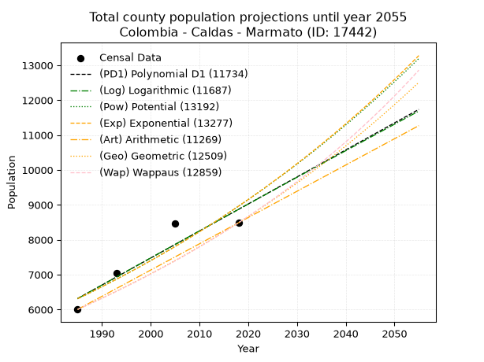
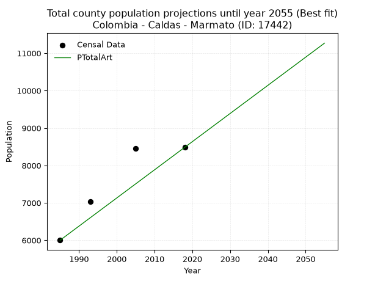
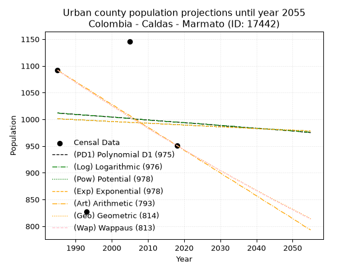
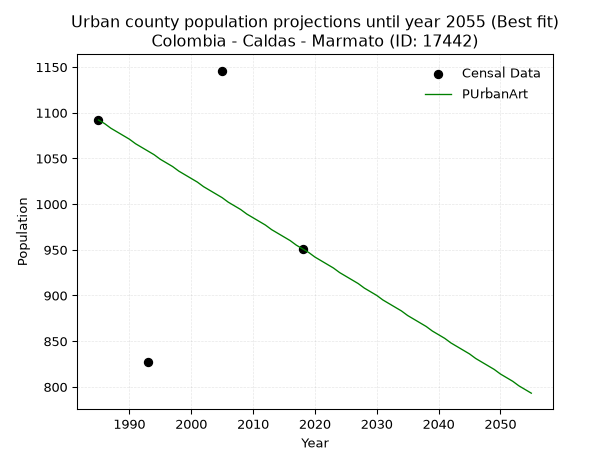
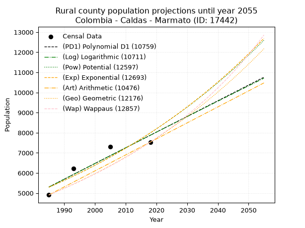
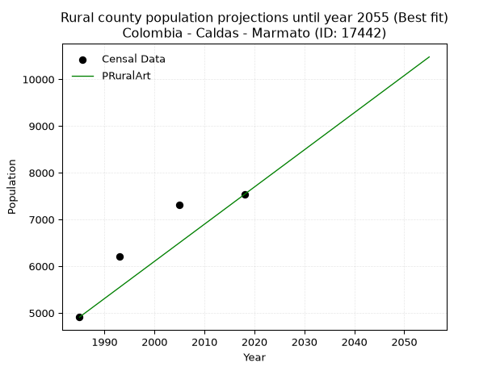

<div align="center">


</div>

# 📜 _“Population and Public Services Demand Projections (PPSD) until Year 2050 for Colombia - Caldas - Marmato (ID: 17442)”_
Keywords: `population` `public-service` `projection` `lineal` `polynomial` `logarithmic` `potential` `exponential` `arithmetic` `geometric` `wappaus` `dane` `colombia` `south-america`

PPSD are analytical estimates used by governments and planners to anticipate future changes in population size, age distribution, and the resulting community needs for utilities, healthcare, education, and infrastructure as sizing future water treatment facilities, electrical grids, and road networks based on spatial growth.

<div align="center">

</img>

</div>


> **General running parameters**: • app_version: _v20260806_. • Python version: _3.14.7_. • Pandas version: _3.0.5_. • NumPy version: _2.5.1_. • Creates, save and include plots into reports (create_plot): _False_. • Projection until year: _2050_. • Process polynomial degree 2 and up: _False_. • Process Wappaus: _True_. • Process Wappaus: _True_. • Set negative values to zero: _True_. • Set infinite values to zero: _True_. • Drop dataset notes: _True_. 
<div align="center">

Maps & GIS Layers: [:earth_americas:Google](http://maps.google.com/maps?q=5.474220322,-75.6000493) [:earth_americas:OSM](https://www.openstreetmap.org/#map=18/5.474220322/-75.6000493&layers=P) [:earth_americas:Bing](https://www.bing.com/maps?cp=5.474220322~-75.6000493&lvl=18) [:earth_americas:Apple](https://maps.apple.com/frame?center=5.474220322%2C-75.6000493&span=0.003%2C0.006) [:earth_americas:GISMobile](https://github.com/rcfdtools/R.GISMobile/blob/main/file/gis/CountyLayer_CO/Readme.md)

</div>


<div align="center">

```geojson
{
  "type": "Feature",
  "geometry": {
    "type": "Point", 
    "coordinates": [-75.6000493, 5.474220322]
  }, 
  "properties": {
    "Name": "Colombia - Caldas - Marmato (ID: 17442)"
  }
}
```

</div>


## 0. Census Data (4 records)

Census data are official statistics collected by a government about the people and housing in a country. They usually include counts of total population, age, sex, race, income, education, and jobs.

📅Global census file: [Population.xlsx](../data/Population.xlsx)

| Source   |   Year |   CountryID | CountryName   |   StateID | StateName   |   CountyID | CountyName   |   PTotal |   PUrban |   PRural |
|:---------|-------:|------------:|:--------------|----------:|:------------|-----------:|:-------------|---------:|---------:|---------:|
| DANE     |   1985 |          57 | Colombia      |        17 | Caldas      |      17442 | Marmato      |     6002 |     1092 |     4910 |
| DANE     |   1993 |          57 | Colombia      |        17 | Caldas      |      17442 | Marmato      |     7037 |      827 |     6210 |
| DANE     |   2005 |          57 | Colombia      |        17 | Caldas      |      17442 | Marmato      |     8455 |     1146 |     7309 |
| DANE     |   2018 |          57 | Colombia      |        17 | Caldas      |      17442 | Marmato      |     8485 |      951 |     7534 |

> 🔥Some records could had specific notes about the registered values or the corresponding urban or rural distribution.

📅[SUI-RUPS](https://www.datos.gov.co/Hacienda-y-Cr-dito-P-blico/Registro-nico-de-Prestadores-de-Servicios-P-blicos/4qkq-csdn/about_data) - Local public utility companies: [RUPS.csv](../data/RUPS.csv)

 | SERVICIO       | ESTADO      | NOMBRE                                                                     | NIT         | DEPARTAMENTO_DOMICILIO   | MUNICIPIO_DOMICILIO   | DIRECCION                    |   TELEFONO | EMAIL                                     | TIPO_PRESTADOR                             | CLASIFICACION                 |
|:---------------|:------------|:---------------------------------------------------------------------------|:------------|:-------------------------|:----------------------|:-----------------------------|-----------:|:------------------------------------------|:-------------------------------------------|:------------------------------|
| ACUEDUCTO      | OPERATIVA   | EMPRESA DE OBRAS SANITARIAS DE CALDAS  S. A. EMPRESA DE SERVICIOS PUBLICOS | 890803239-9 | CALDAS                   | MANIZALES             | Carrera 23 Nro 75 - 82       |    8867080 | lorena.grisalest@empocaldas.com.co        | SOCIEDADES (EMPRESA DE SERVICIOS PUBLICOS) | MAYOR O IGUAL A 5001 USUARIOS |
| ALCANTARILLADO | OPERATIVA   | EMPRESA DE OBRAS SANITARIAS DE CALDAS  S. A. EMPRESA DE SERVICIOS PUBLICOS | 890803239-9 | CALDAS                   | MANIZALES             | Carrera 23 Nro 75 - 82       |    8867080 | lorena.grisalest@empocaldas.com.co        | SOCIEDADES (EMPRESA DE SERVICIOS PUBLICOS) | MAYOR O IGUAL A 5001 USUARIOS |
| ACUEDUCTO      | CANCELACION | MUNICIPIO DE MARMATO                                                       | 890801145-6 | CALDAS                   | MARMATO               | Sector El Atrio casa redonda |    8598170 | desarrolloeconomico@marmato-caldas.gov.co | nan                                        | nan                           |
| ALCANTARILLADO | CANCELACION | MUNICIPIO DE MARMATO                                                       | 890801145-6 | CALDAS                   | MARMATO               | Sector El Atrio casa redonda |    8598170 | desarrolloeconomico@marmato-caldas.gov.co | nan                                        | nan                           |

## 1. Total

### 1.1. Coefficients and Parameters

* (PD1) Polynomial Deg 1: 77.43275792854266, -147390.12404656748 (lineal)
* (Log) Logarithmic: 155131.2597171463, -1171659.1982539257
* (Pow) Potential: 21.29658141447203, -66.43126807133743
* (Exp) Exponential: 0.010629369954525533, 4.331663845631554e-06
* (Art) Arithmetic: Year diff. 2018 - 1985 = 33, Population diff. 8485 - 6002 = 2483, Annual growth = 75.24242424242425
* (Geo) Geometric: Year diff. 2018 - 1985 = 33, Population diff. 8485 - 6002 = 2483, Annual growth % = 0.010546350623017897
* (Wap) Wappaus: i = 1.0387578414084937, Condition values only valid for < 200)

<sub>
Wappaus condition values: ['0.00', '1.04', '2.08', '3.12', '4.16', '5.19', '6.23', '7.27', '8.31', '9.35', '10.39', '11.43', '12.47', '13.50', '14.54', '15.58', '16.62', '17.66', '18.70', '19.74', '20.78', '21.81', '22.85', '23.89', '24.93', '25.97', '27.01', '28.05', '29.09', '30.12', '31.16', '32.20', '33.24', '34.28', '35.32', '36.36', '37.40', '38.43', '39.47', '40.51', '41.55', '42.59', '43.63', '44.67', '45.71', '46.74', '47.78', '48.82', '49.86', '50.90', '51.94', '52.98', '54.02', '55.05', '56.09', '57.13', '58.17', '59.21', '60.25', '61.29', '62.33', '63.36', '64.40', '65.44', '66.48', '67.52']
</sub>


### 1.2. Projected Dataset

|   Year |   CountyID |   PTotalPD1 |   PTotalLog |   PTotalPow |   PTotalExp |   PTotalArt |   PTotalGeo |   PTotalWap |
|-------:|-----------:|------------:|------------:|------------:|------------:|------------:|------------:|------------:|
|   1985 |      17442 |        6314 |        6311 |        6306 |        6309 |        6002 |        6002 |        6002 |
|   1986 |      17442 |        6391 |        6389 |        6374 |        6376 |        6077 |        6065 |        6065 |
|   1987 |      17442 |        6469 |        6467 |        6443 |        6445 |        6152 |        6129 |        6128 |
|   1988 |      17442 |        6546 |        6545 |        6512 |        6513 |        6228 |        6194 |        6192 |
|   1989 |      17442 |        6624 |        6623 |        6582 |        6583 |        6303 |        6259 |        6257 |
|   1990 |      17442 |        6701 |        6701 |        6653 |        6653 |        6378 |        6325 |        6322 |
|   1991 |      17442 |        6778 |        6779 |        6725 |        6725 |        6453 |        6392 |        6388 |
|   1992 |      17442 |        6856 |        6857 |        6797 |        6796 |        6529 |        6459 |        6455 |
|   1993 |      17442 |        6933 |        6934 |        6870 |        6869 |        6604 |        6527 |        6522 |
|   1994 |      17442 |        7011 |        7012 |        6944 |        6942 |        6679 |        6596 |        6591 |
|   1995 |      17442 |        7088 |        7090 |        7018 |        7017 |        6754 |        6666 |        6660 |
|   1996 |      17442 |        7166 |        7168 |        7094 |        7092 |        6830 |        6736 |        6729 |
|   1997 |      17442 |        7243 |        7246 |        7170 |        7167 |        6905 |        6807 |        6800 |
|   1998 |      17442 |        7321 |        7323 |        7247 |        7244 |        6980 |        6879 |        6871 |
|   1999 |      17442 |        7398 |        7401 |        7324 |        7321 |        7055 |        6952 |        6943 |
|   2000 |      17442 |        7475 |        7478 |        7403 |        7400 |        7131 |        7025 |        7016 |
|   2001 |      17442 |        7553 |        7556 |        7482 |        7479 |        7206 |        7099 |        7090 |
|   2002 |      17442 |        7630 |        7633 |        7562 |        7559 |        7281 |        7174 |        7165 |
|   2003 |      17442 |        7708 |        7711 |        7643 |        7639 |        7356 |        7250 |        7240 |
|   2004 |      17442 |        7785 |        7788 |        7724 |        7721 |        7432 |        7326 |        7316 |
|   2005 |      17442 |        7863 |        7866 |        7807 |        7804 |        7507 |        7403 |        7393 |
|   2006 |      17442 |        7940 |        7943 |        7890 |        7887 |        7582 |        7481 |        7472 |
|   2007 |      17442 |        8017 |        8020 |        7974 |        7971 |        7657 |        7560 |        7551 |
|   2008 |      17442 |        8095 |        8098 |        8060 |        8056 |        7733 |        7640 |        7630 |
|   2009 |      17442 |        8172 |        8175 |        8145 |        8142 |        7808 |        7721 |        7711 |
|   2010 |      17442 |        8250 |        8252 |        8232 |        8229 |        7883 |        7802 |        7793 |
|   2011 |      17442 |        8327 |        8329 |        8320 |        8317 |        7958 |        7884 |        7876 |
|   2012 |      17442 |        8405 |        8406 |        8408 |        8406 |        8034 |        7967 |        7960 |
|   2013 |      17442 |        8482 |        8483 |        8498 |        8496 |        8109 |        8051 |        8045 |
|   2014 |      17442 |        8559 |        8561 |        8588 |        8587 |        8184 |        8136 |        8131 |
|   2015 |      17442 |        8637 |        8638 |        8679 |        8679 |        8259 |        8222 |        8218 |
|   2016 |      17442 |        8714 |        8714 |        8772 |        8771 |        8335 |        8309 |        8306 |
|   2017 |      17442 |        8792 |        8791 |        8865 |        8865 |        8410 |        8396 |        8395 |
|   2018 |      17442 |        8869 |        8868 |        8959 |        8960 |        8485 |        8485 |        8485 |
|   2019 |      17442 |        8947 |        8945 |        9054 |        9056 |        8560 |        8574 |        8576 |
|   2020 |      17442 |        9024 |        9022 |        9150 |        9152 |        8635 |        8665 |        8669 |
|   2021 |      17442 |        9101 |        9099 |        9247 |        9250 |        8711 |        8756 |        8763 |
|   2022 |      17442 |        9179 |        9176 |        9345 |        9349 |        8786 |        8849 |        8858 |
|   2023 |      17442 |        9256 |        9252 |        9444 |        9449 |        8861 |        8942 |        8954 |
|   2024 |      17442 |        9334 |        9329 |        9544 |        9550 |        8936 |        9036 |        9051 |
|   2025 |      17442 |        9411 |        9405 |        9645 |        9652 |        9012 |        9132 |        9150 |
|   2026 |      17442 |        9489 |        9482 |        9746 |        9755 |        9087 |        9228 |        9250 |
|   2027 |      17442 |        9566 |        9559 |        9849 |        9859 |        9162 |        9325 |        9351 |
|   2028 |      17442 |        9644 |        9635 |        9953 |        9965 |        9237 |        9424 |        9454 |
|   2029 |      17442 |        9721 |        9712 |       10059 |       10071 |        9313 |        9523 |        9558 |
|   2030 |      17442 |        9798 |        9788 |       10165 |       10179 |        9388 |        9623 |        9663 |
|   2031 |      17442 |        9876 |        9864 |       10272 |       10288 |        9463 |        9725 |        9770 |
|   2032 |      17442 |        9953 |        9941 |       10380 |       10398 |        9538 |        9827 |        9879 |
|   2033 |      17442 |       10031 |       10017 |       10489 |       10509 |        9614 |        9931 |        9988 |
|   2034 |      17442 |       10108 |       10093 |       10600 |       10621 |        9689 |       10036 |       10100 |
|   2035 |      17442 |       10186 |       10170 |       10711 |       10734 |        9764 |       10142 |       10213 |
|   2036 |      17442 |       10263 |       10246 |       10824 |       10849 |        9839 |       10249 |       10327 |
|   2037 |      17442 |       10340 |       10322 |       10938 |       10965 |        9915 |       10357 |       10444 |
|   2038 |      17442 |       10418 |       10398 |       11053 |       11082 |        9990 |       10466 |       10561 |
|   2039 |      17442 |       10495 |       10474 |       11169 |       11201 |       10065 |       10576 |       10681 |
|   2040 |      17442 |       10573 |       10550 |       11286 |       11320 |       10140 |       10688 |       10802 |
|   2041 |      17442 |       10650 |       10626 |       11404 |       11441 |       10216 |       10801 |       10925 |
|   2042 |      17442 |       10728 |       10702 |       11524 |       11564 |       10291 |       10914 |       11050 |
|   2043 |      17442 |       10805 |       10778 |       11645 |       11687 |       10366 |       11030 |       11177 |
|   2044 |      17442 |       10882 |       10854 |       11767 |       11812 |       10441 |       11146 |       11306 |
|   2045 |      17442 |       10960 |       10930 |       11890 |       11938 |       10517 |       11263 |       11436 |
|   2046 |      17442 |       11037 |       11006 |       12014 |       12066 |       10592 |       11382 |       11569 |
|   2047 |      17442 |       11115 |       11082 |       12140 |       12195 |       10667 |       11502 |       11703 |
|   2048 |      17442 |       11192 |       11158 |       12267 |       12325 |       10742 |       11624 |       11840 |
|   2049 |      17442 |       11270 |       11233 |       12395 |       12457 |       10818 |       11746 |       11979 |
|   2050 |      17442 |       11347 |       11309 |       12525 |       12590 |       10893 |       11870 |       12120 |
<div align="center">

</img>

</div>


### 1.3. Best fit with absolute and relative error (%)

Relative error puts that difference into context by dividing the absolute error by the true value, creating a unitless ratio or percentage that shows the scale of the mistake.

Absolute and relative error

|   Year | Source   |   CountryID | CountryName   |   StateID | StateName   |   CountyID_x | CountyName   |   PTotal |   PUrban |   PRural |   CountyID_y |   PTotalPD1 |   PTotalLog |   PTotalPow |   PTotalExp |   PTotalArt |   PTotalGeo |   PTotalWap |   PTotalPD1AbsError |   PTotalLogAbsError |   PTotalPowAbsError |   PTotalExpAbsError |   PTotalArtAbsError |   PTotalGeoAbsError |   PTotalWapAbsError |   PTotalPD1RelError |   PTotalLogRelError |   PTotalPowRelError |   PTotalExpRelError |   PTotalArtRelError |   PTotalGeoRelError |   PTotalWapRelError |
|-------:|:---------|------------:|:--------------|----------:|:------------|-------------:|:-------------|---------:|---------:|---------:|-------------:|------------:|------------:|------------:|------------:|------------:|------------:|------------:|--------------------:|--------------------:|--------------------:|--------------------:|--------------------:|--------------------:|--------------------:|--------------------:|--------------------:|--------------------:|--------------------:|--------------------:|--------------------:|--------------------:|
|   1985 | DANE     |          57 | Colombia      |        17 | Caldas      |        17442 | Marmato      |     6002 |     1092 |     4910 |        17442 |        6314 |        6311 |        6306 |        6309 |        6002 |        6002 |        6002 |                 312 |                 309 |                 304 |                 307 |                   0 |                   0 |                   0 |             5.19827 |             5.14828 |             5.06498 |             5.11496 |             0       |             0       |             0       |
|   1993 | DANE     |          57 | Colombia      |        17 | Caldas      |        17442 | Marmato      |     7037 |      827 |     6210 |        17442 |        6933 |        6934 |        6870 |        6869 |        6604 |        6527 |        6522 |                 104 |                 103 |                 167 |                 168 |                 433 |                 510 |                 515 |             1.4779  |             1.46369 |             2.37317 |             2.38738 |             6.15319 |             7.24741 |             7.31846 |
|   2005 | DANE     |          57 | Colombia      |        17 | Caldas      |        17442 | Marmato      |     8455 |     1146 |     7309 |        17442 |        7863 |        7866 |        7807 |        7804 |        7507 |        7403 |        7393 |                 592 |                 589 |                 648 |                 651 |                 948 |                1052 |                1062 |             7.00177 |             6.96629 |             7.6641  |             7.69959 |            11.2123  |            12.4423  |            12.5606  |
|   2018 | DANE     |          57 | Colombia      |        17 | Caldas      |        17442 | Marmato      |     8485 |      951 |     7534 |        17442 |        8869 |        8868 |        8959 |        8960 |        8485 |        8485 |        8485 |                 384 |                 383 |                 474 |                 475 |                   0 |                   0 |                   0 |             4.52563 |             4.51385 |             5.58633 |             5.59811 |             0       |             0       |             0       |

Relative error mean

| Method    |   RelError | Best   |
|:----------|-----------:|:-------|
| PTotalPD1 |    4.55089 |        |
| PTotalLog |    4.52303 |        |
| PTotalPow |    5.17215 |        |
| PTotalExp |    5.20001 |        |
| PTotalArt |    4.34137 | True   |
| PTotalGeo |    4.92244 |        |
| PTotalWap |    4.96977 |        |

💙Best method: _**PTotalArt**_
<div align="center">

</img>

</div>


### 1.4. Fresh water supply demand in liters per capita per day (lpcd)

The fresh water supply demand typically ranges from 100 to 300 liters per capita per day (lpcd) for standard domestic and municipal planning, though absolute survival minimums set by the World Health Organization are as low as 7.5 to 20 liters per day, and total consumption in high-income nations can exceed 400 liters.

> `CZ`: Level in meters above the sea level (masl)<br> `WS`: Fresh water supply demand in liters per capita per day (lpcd or l/h/d)<br> `WSAll`: Zonal fresh water supply demand in liters per second (l/s)<br> `A`: Zonal area in square meters<br> `DP`: Population density (people/hectare or p/ha)

Reference values (RAS Colombia)

|    CZ |   WS |
|------:|-----:|
|  1000 |  120 |
|  2000 |  130 |
| 99999 |  140 |

County shapefile geometry properties and water supply values

|   CountyID |      ATotal |   CZTotal |   WSTotal |
|-----------:|------------:|----------:|----------:|
|      17442 | 3.68538e+07 |   1346.85 |       130 |

Projected values for best method: PTotalArt

|   CountyID |   Year |   PTotalArt |   DPTotal |   WSTotal |   WSTotalAll |
|-----------:|-------:|------------:|----------:|----------:|-------------:|
|      17442 |   1985 |        6002 |      1.63 |       130 |      9.03079 |
|      17442 |   1986 |        6077 |      1.65 |       130 |      9.14363 |
|      17442 |   1987 |        6152 |      1.67 |       130 |      9.25648 |
|      17442 |   1988 |        6228 |      1.69 |       130 |      9.37083 |
|      17442 |   1989 |        6303 |      1.71 |       130 |      9.48368 |
|      17442 |   1990 |        6378 |      1.73 |       130 |      9.59653 |
|      17442 |   1991 |        6453 |      1.75 |       130 |      9.70937 |
|      17442 |   1992 |        6529 |      1.77 |       130 |      9.82373 |
|      17442 |   1993 |        6604 |      1.79 |       130 |      9.93657 |
|      17442 |   1994 |        6679 |      1.81 |       130 |     10.0494  |
|      17442 |   1995 |        6754 |      1.83 |       130 |     10.1623  |
|      17442 |   1996 |        6830 |      1.85 |       130 |     10.2766  |
|      17442 |   1997 |        6905 |      1.87 |       130 |     10.3895  |
|      17442 |   1998 |        6980 |      1.89 |       130 |     10.5023  |
|      17442 |   1999 |        7055 |      1.91 |       130 |     10.6152  |
|      17442 |   2000 |        7131 |      1.93 |       130 |     10.7295  |
|      17442 |   2001 |        7206 |      1.96 |       130 |     10.8424  |
|      17442 |   2002 |        7281 |      1.98 |       130 |     10.9552  |
|      17442 |   2003 |        7356 |      2    |       130 |     11.0681  |
|      17442 |   2004 |        7432 |      2.02 |       130 |     11.1824  |
|      17442 |   2005 |        7507 |      2.04 |       130 |     11.2953  |
|      17442 |   2006 |        7582 |      2.06 |       130 |     11.4081  |
|      17442 |   2007 |        7657 |      2.08 |       130 |     11.5209  |
|      17442 |   2008 |        7733 |      2.1  |       130 |     11.6353  |
|      17442 |   2009 |        7808 |      2.12 |       130 |     11.7481  |
|      17442 |   2010 |        7883 |      2.14 |       130 |     11.861   |
|      17442 |   2011 |        7958 |      2.16 |       130 |     11.9738  |
|      17442 |   2012 |        8034 |      2.18 |       130 |     12.0882  |
|      17442 |   2013 |        8109 |      2.2  |       130 |     12.201   |
|      17442 |   2014 |        8184 |      2.22 |       130 |     12.3139  |
|      17442 |   2015 |        8259 |      2.24 |       130 |     12.4267  |
|      17442 |   2016 |        8335 |      2.26 |       130 |     12.5411  |
|      17442 |   2017 |        8410 |      2.28 |       130 |     12.6539  |
|      17442 |   2018 |        8485 |      2.3  |       130 |     12.7668  |
|      17442 |   2019 |        8560 |      2.32 |       130 |     12.8796  |
|      17442 |   2020 |        8635 |      2.34 |       130 |     12.9925  |
|      17442 |   2021 |        8711 |      2.36 |       130 |     13.1068  |
|      17442 |   2022 |        8786 |      2.38 |       130 |     13.2197  |
|      17442 |   2023 |        8861 |      2.4  |       130 |     13.3325  |
|      17442 |   2024 |        8936 |      2.42 |       130 |     13.4454  |
|      17442 |   2025 |        9012 |      2.45 |       130 |     13.5597  |
|      17442 |   2026 |        9087 |      2.47 |       130 |     13.6726  |
|      17442 |   2027 |        9162 |      2.49 |       130 |     13.7854  |
|      17442 |   2028 |        9237 |      2.51 |       130 |     13.8983  |
|      17442 |   2029 |        9313 |      2.53 |       130 |     14.0126  |
|      17442 |   2030 |        9388 |      2.55 |       130 |     14.1255  |
|      17442 |   2031 |        9463 |      2.57 |       130 |     14.2383  |
|      17442 |   2032 |        9538 |      2.59 |       130 |     14.3512  |
|      17442 |   2033 |        9614 |      2.61 |       130 |     14.4655  |
|      17442 |   2034 |        9689 |      2.63 |       130 |     14.5784  |
|      17442 |   2035 |        9764 |      2.65 |       130 |     14.6912  |
|      17442 |   2036 |        9839 |      2.67 |       130 |     14.8041  |
|      17442 |   2037 |        9915 |      2.69 |       130 |     14.9184  |
|      17442 |   2038 |        9990 |      2.71 |       130 |     15.0312  |
|      17442 |   2039 |       10065 |      2.73 |       130 |     15.1441  |
|      17442 |   2040 |       10140 |      2.75 |       130 |     15.2569  |
|      17442 |   2041 |       10216 |      2.77 |       130 |     15.3713  |
|      17442 |   2042 |       10291 |      2.79 |       130 |     15.4841  |
|      17442 |   2043 |       10366 |      2.81 |       130 |     15.597   |
|      17442 |   2044 |       10441 |      2.83 |       130 |     15.7098  |
|      17442 |   2045 |       10517 |      2.85 |       130 |     15.8242  |
|      17442 |   2046 |       10592 |      2.87 |       130 |     15.937   |
|      17442 |   2047 |       10667 |      2.89 |       130 |     16.0499  |
|      17442 |   2048 |       10742 |      2.91 |       130 |     16.1627  |
|      17442 |   2049 |       10818 |      2.94 |       130 |     16.2771  |
|      17442 |   2050 |       10893 |      2.96 |       130 |     16.3899  |

## 2. Urban

### 2.1. Coefficients and Parameters

* (PD1) Polynomial Deg 1: -0.5218787635486679, 2047.887996788223 (lineal)
* (Log) Logarithmic: -1043.5904845788114, 8936.339636092844
* (Pow) Potential: -0.6740897420212943, 5.223494680089241
* (Exp) Exponential: -0.00033639028556439423, 1952.0670611638263
* (Art) Arithmetic: Year diff. 2018 - 1985 = 33, Population diff. 951 - 1092 = -141, Annual growth = -4.2727272727272725
* (Geo) Geometric: Year diff. 2018 - 1985 = 33, Population diff. 951 - 1092 = -141, Annual growth % = -0.004180693852475437
* (Wap) Wappaus: i = -0.41827971343389847, Condition values only valid for < 200)

<sub>
Wappaus condition values: ['-0.00', '-0.42', '-0.84', '-1.25', '-1.67', '-2.09', '-2.51', '-2.93', '-3.35', '-3.76', '-4.18', '-4.60', '-5.02', '-5.44', '-5.86', '-6.27', '-6.69', '-7.11', '-7.53', '-7.95', '-8.37', '-8.78', '-9.20', '-9.62', '-10.04', '-10.46', '-10.88', '-11.29', '-11.71', '-12.13', '-12.55', '-12.97', '-13.38', '-13.80', '-14.22', '-14.64', '-15.06', '-15.48', '-15.89', '-16.31', '-16.73', '-17.15', '-17.57', '-17.99', '-18.40', '-18.82', '-19.24', '-19.66', '-20.08', '-20.50', '-20.91', '-21.33', '-21.75', '-22.17', '-22.59', '-23.01', '-23.42', '-23.84', '-24.26', '-24.68', '-25.10', '-25.52', '-25.93', '-26.35', '-26.77', '-27.19']
</sub>


### 2.2. Projected Dataset

|   Year |   CountyID |   PUrbanPD1 |   PUrbanLog |   PUrbanPow |   PUrbanExp |   PUrbanArt |   PUrbanGeo |   PUrbanWap |
|-------:|-----------:|------------:|------------:|------------:|------------:|------------:|------------:|------------:|
|   1985 |      17442 |        1012 |        1012 |        1001 |        1001 |        1092 |        1092 |        1092 |
|   1986 |      17442 |        1011 |        1011 |        1001 |        1001 |        1088 |        1087 |        1087 |
|   1987 |      17442 |        1011 |        1011 |        1000 |        1000 |        1083 |        1083 |        1083 |
|   1988 |      17442 |        1010 |        1010 |        1000 |        1000 |        1079 |        1078 |        1078 |
|   1989 |      17442 |        1010 |        1010 |        1000 |        1000 |        1075 |        1074 |        1074 |
|   1990 |      17442 |        1009 |        1009 |         999 |         999 |        1071 |        1069 |        1069 |
|   1991 |      17442 |        1009 |        1009 |         999 |         999 |        1066 |        1065 |        1065 |
|   1992 |      17442 |        1008 |        1008 |         999 |         999 |        1062 |        1060 |        1060 |
|   1993 |      17442 |        1008 |        1008 |         998 |         998 |        1058 |        1056 |        1056 |
|   1994 |      17442 |        1007 |        1007 |         998 |         998 |        1054 |        1052 |        1052 |
|   1995 |      17442 |        1007 |        1007 |         998 |         998 |        1049 |        1047 |        1047 |
|   1996 |      17442 |        1006 |        1006 |         997 |         997 |        1045 |        1043 |        1043 |
|   1997 |      17442 |        1006 |        1006 |         997 |         997 |        1041 |        1038 |        1039 |
|   1998 |      17442 |        1005 |        1005 |         997 |         997 |        1036 |        1034 |        1034 |
|   1999 |      17442 |        1005 |        1005 |         996 |         996 |        1032 |        1030 |        1030 |
|   2000 |      17442 |        1004 |        1004 |         996 |         996 |        1028 |        1025 |        1026 |
|   2001 |      17442 |        1004 |        1004 |         996 |         996 |        1024 |        1021 |        1021 |
|   2002 |      17442 |        1003 |        1003 |         995 |         995 |        1019 |        1017 |        1017 |
|   2003 |      17442 |        1003 |        1003 |         995 |         995 |        1015 |        1013 |        1013 |
|   2004 |      17442 |        1002 |        1002 |         995 |         995 |        1011 |        1008 |        1009 |
|   2005 |      17442 |        1002 |        1002 |         994 |         994 |        1007 |        1004 |        1004 |
|   2006 |      17442 |        1001 |        1001 |         994 |         994 |        1002 |        1000 |        1000 |
|   2007 |      17442 |        1000 |        1000 |         994 |         994 |         998 |         996 |         996 |
|   2008 |      17442 |        1000 |        1000 |         993 |         993 |         994 |         992 |         992 |
|   2009 |      17442 |         999 |         999 |         993 |         993 |         989 |         988 |         988 |
|   2010 |      17442 |         999 |         999 |         993 |         993 |         985 |         983 |         983 |
|   2011 |      17442 |         998 |         998 |         992 |         992 |         981 |         979 |         979 |
|   2012 |      17442 |         998 |         998 |         992 |         992 |         977 |         975 |         975 |
|   2013 |      17442 |         997 |         997 |         992 |         992 |         972 |         971 |         971 |
|   2014 |      17442 |         997 |         997 |         991 |         991 |         968 |         967 |         967 |
|   2015 |      17442 |         996 |         996 |         991 |         991 |         964 |         963 |         963 |
|   2016 |      17442 |         996 |         996 |         991 |         991 |         960 |         959 |         959 |
|   2017 |      17442 |         995 |         995 |         990 |         990 |         955 |         955 |         955 |
|   2018 |      17442 |         995 |         995 |         990 |         990 |         951 |         951 |         951 |
|   2019 |      17442 |         994 |         994 |         990 |         990 |         947 |         947 |         947 |
|   2020 |      17442 |         994 |         994 |         989 |         989 |         942 |         943 |         943 |
|   2021 |      17442 |         993 |         993 |         989 |         989 |         938 |         939 |         939 |
|   2022 |      17442 |         993 |         993 |         989 |         989 |         934 |         935 |         935 |
|   2023 |      17442 |         992 |         992 |         988 |         988 |         930 |         931 |         931 |
|   2024 |      17442 |         992 |         992 |         988 |         988 |         925 |         927 |         927 |
|   2025 |      17442 |         991 |         991 |         988 |         988 |         921 |         924 |         923 |
|   2026 |      17442 |         991 |         991 |         987 |         987 |         917 |         920 |         920 |
|   2027 |      17442 |         990 |         990 |         987 |         987 |         913 |         916 |         916 |
|   2028 |      17442 |         990 |         990 |         987 |         987 |         908 |         912 |         912 |
|   2029 |      17442 |         989 |         989 |         986 |         986 |         904 |         908 |         908 |
|   2030 |      17442 |         988 |         989 |         986 |         986 |         900 |         904 |         904 |
|   2031 |      17442 |         988 |         988 |         986 |         986 |         895 |         901 |         900 |
|   2032 |      17442 |         987 |         988 |         986 |         985 |         891 |         897 |         897 |
|   2033 |      17442 |         987 |         987 |         985 |         985 |         887 |         893 |         893 |
|   2034 |      17442 |         986 |         987 |         985 |         985 |         883 |         889 |         889 |
|   2035 |      17442 |         986 |         986 |         985 |         984 |         878 |         886 |         885 |
|   2036 |      17442 |         985 |         985 |         984 |         984 |         874 |         882 |         882 |
|   2037 |      17442 |         985 |         985 |         984 |         984 |         870 |         878 |         878 |
|   2038 |      17442 |         984 |         984 |         984 |         983 |         866 |         875 |         874 |
|   2039 |      17442 |         984 |         984 |         983 |         983 |         861 |         871 |         870 |
|   2040 |      17442 |         983 |         983 |         983 |         983 |         857 |         867 |         867 |
|   2041 |      17442 |         983 |         983 |         983 |         982 |         853 |         864 |         863 |
|   2042 |      17442 |         982 |         982 |         982 |         982 |         848 |         860 |         859 |
|   2043 |      17442 |         982 |         982 |         982 |         982 |         844 |         856 |         856 |
|   2044 |      17442 |         981 |         981 |         982 |         981 |         840 |         853 |         852 |
|   2045 |      17442 |         981 |         981 |         981 |         981 |         836 |         849 |         848 |
|   2046 |      17442 |         980 |         980 |         981 |         981 |         831 |         846 |         845 |
|   2047 |      17442 |         980 |         980 |         981 |         980 |         827 |         842 |         841 |
|   2048 |      17442 |         979 |         979 |         980 |         980 |         823 |         839 |         838 |
|   2049 |      17442 |         979 |         979 |         980 |         980 |         819 |         835 |         834 |
|   2050 |      17442 |         978 |         978 |         980 |         980 |         814 |         832 |         831 |
<div align="center">

</img>

</div>


### 2.3. Best fit with absolute and relative error (%)

Relative error puts that difference into context by dividing the absolute error by the true value, creating a unitless ratio or percentage that shows the scale of the mistake.

Absolute and relative error

|   Year | Source   |   CountryID | CountryName   |   StateID | StateName   |   CountyID_x | CountyName   |   PTotal |   PUrban |   PRural |   CountyID_y |   PUrbanPD1 |   PUrbanLog |   PUrbanPow |   PUrbanExp |   PUrbanArt |   PUrbanGeo |   PUrbanWap |   PUrbanPD1AbsError |   PUrbanLogAbsError |   PUrbanPowAbsError |   PUrbanExpAbsError |   PUrbanArtAbsError |   PUrbanGeoAbsError |   PUrbanWapAbsError |   PUrbanPD1RelError |   PUrbanLogRelError |   PUrbanPowRelError |   PUrbanExpRelError |   PUrbanArtRelError |   PUrbanGeoRelError |   PUrbanWapRelError |
|-------:|:---------|------------:|:--------------|----------:|:------------|-------------:|:-------------|---------:|---------:|---------:|-------------:|------------:|------------:|------------:|------------:|------------:|------------:|------------:|--------------------:|--------------------:|--------------------:|--------------------:|--------------------:|--------------------:|--------------------:|--------------------:|--------------------:|--------------------:|--------------------:|--------------------:|--------------------:|--------------------:|
|   1985 | DANE     |          57 | Colombia      |        17 | Caldas      |        17442 | Marmato      |     6002 |     1092 |     4910 |        17442 |        1012 |        1012 |        1001 |        1001 |        1092 |        1092 |        1092 |                  80 |                  80 |                  91 |                  91 |                   0 |                   0 |                   0 |             7.32601 |             7.32601 |             8.33333 |             8.33333 |              0      |              0      |              0      |
|   1993 | DANE     |          57 | Colombia      |        17 | Caldas      |        17442 | Marmato      |     7037 |      827 |     6210 |        17442 |        1008 |        1008 |         998 |         998 |        1058 |        1056 |        1056 |                 181 |                 181 |                 171 |                 171 |                 231 |                 229 |                 229 |            21.8863  |            21.8863  |            20.6771  |            20.6771  |             27.9323 |             27.6904 |             27.6904 |
|   2005 | DANE     |          57 | Colombia      |        17 | Caldas      |        17442 | Marmato      |     8455 |     1146 |     7309 |        17442 |        1002 |        1002 |         994 |         994 |        1007 |        1004 |        1004 |                 144 |                 144 |                 152 |                 152 |                 139 |                 142 |                 142 |            12.5654  |            12.5654  |            13.2635  |            13.2635  |             12.1291 |             12.3909 |             12.3909 |
|   2018 | DANE     |          57 | Colombia      |        17 | Caldas      |        17442 | Marmato      |     8485 |      951 |     7534 |        17442 |         995 |         995 |         990 |         990 |         951 |         951 |         951 |                  44 |                  44 |                  39 |                  39 |                   0 |                   0 |                   0 |             4.62671 |             4.62671 |             4.10095 |             4.10095 |              0      |              0      |              0      |

Relative error mean

| Method    |   RelError | Best   |
|:----------|-----------:|:-------|
| PUrbanPD1 |    11.6011 |        |
| PUrbanLog |    11.6011 |        |
| PUrbanPow |    11.5937 |        |
| PUrbanExp |    11.5937 |        |
| PUrbanArt |    10.0154 | True   |
| PUrbanGeo |    10.0203 |        |
| PUrbanWap |    10.0203 |        |

💙Best method: _**PUrbanArt**_
<div align="center">

</img>

</div>


### 2.4. Fresh water supply demand in liters per capita per day (lpcd)

The fresh water supply demand typically ranges from 100 to 300 liters per capita per day (lpcd) for standard domestic and municipal planning, though absolute survival minimums set by the World Health Organization are as low as 7.5 to 20 liters per day, and total consumption in high-income nations can exceed 400 liters.

> `CZ`: Level in meters above the sea level (masl)<br> `WS`: Fresh water supply demand in liters per capita per day (lpcd or l/h/d)<br> `WSAll`: Zonal fresh water supply demand in liters per second (l/s)<br> `A`: Zonal area in square meters<br> `DP`: Population density (people/hectare or p/ha)

Reference values (RAS Colombia)

|    CZ |   WS |
|------:|-----:|
|  1000 |  120 |
|  2000 |  130 |
| 99999 |  140 |

County shapefile geometry properties and water supply values

|   CountyID |   AUrban |   CZUrban |   WSUrban |
|-----------:|---------:|----------:|----------:|
|      17442 |   222826 |   1304.11 |       130 |

Projected values for best method: PUrbanArt

|   CountyID |   Year |   PUrbanArt |   DPUrban |   WSUrban |   WSUrbanAll |
|-----------:|-------:|------------:|----------:|----------:|-------------:|
|      17442 |   1985 |        1092 |     49.01 |       130 |      1.64306 |
|      17442 |   1986 |        1088 |     48.83 |       130 |      1.63704 |
|      17442 |   1987 |        1083 |     48.6  |       130 |      1.62951 |
|      17442 |   1988 |        1079 |     48.42 |       130 |      1.6235  |
|      17442 |   1989 |        1075 |     48.24 |       130 |      1.61748 |
|      17442 |   1990 |        1071 |     48.06 |       130 |      1.61146 |
|      17442 |   1991 |        1066 |     47.84 |       130 |      1.60394 |
|      17442 |   1992 |        1062 |     47.66 |       130 |      1.59792 |
|      17442 |   1993 |        1058 |     47.48 |       130 |      1.5919  |
|      17442 |   1994 |        1054 |     47.3  |       130 |      1.58588 |
|      17442 |   1995 |        1049 |     47.08 |       130 |      1.57836 |
|      17442 |   1996 |        1045 |     46.9  |       130 |      1.57234 |
|      17442 |   1997 |        1041 |     46.72 |       130 |      1.56632 |
|      17442 |   1998 |        1036 |     46.49 |       130 |      1.5588  |
|      17442 |   1999 |        1032 |     46.31 |       130 |      1.55278 |
|      17442 |   2000 |        1028 |     46.13 |       130 |      1.54676 |
|      17442 |   2001 |        1024 |     45.96 |       130 |      1.54074 |
|      17442 |   2002 |        1019 |     45.73 |       130 |      1.53322 |
|      17442 |   2003 |        1015 |     45.55 |       130 |      1.5272  |
|      17442 |   2004 |        1011 |     45.37 |       130 |      1.52118 |
|      17442 |   2005 |        1007 |     45.19 |       130 |      1.51516 |
|      17442 |   2006 |        1002 |     44.97 |       130 |      1.50764 |
|      17442 |   2007 |         998 |     44.79 |       130 |      1.50162 |
|      17442 |   2008 |         994 |     44.61 |       130 |      1.4956  |
|      17442 |   2009 |         989 |     44.38 |       130 |      1.48808 |
|      17442 |   2010 |         985 |     44.2  |       130 |      1.48206 |
|      17442 |   2011 |         981 |     44.03 |       130 |      1.47604 |
|      17442 |   2012 |         977 |     43.85 |       130 |      1.47002 |
|      17442 |   2013 |         972 |     43.62 |       130 |      1.4625  |
|      17442 |   2014 |         968 |     43.44 |       130 |      1.45648 |
|      17442 |   2015 |         964 |     43.26 |       130 |      1.45046 |
|      17442 |   2016 |         960 |     43.08 |       130 |      1.44444 |
|      17442 |   2017 |         955 |     42.86 |       130 |      1.43692 |
|      17442 |   2018 |         951 |     42.68 |       130 |      1.4309  |
|      17442 |   2019 |         947 |     42.5  |       130 |      1.42488 |
|      17442 |   2020 |         942 |     42.28 |       130 |      1.41736 |
|      17442 |   2021 |         938 |     42.1  |       130 |      1.41134 |
|      17442 |   2022 |         934 |     41.92 |       130 |      1.40532 |
|      17442 |   2023 |         930 |     41.74 |       130 |      1.39931 |
|      17442 |   2024 |         925 |     41.51 |       130 |      1.39178 |
|      17442 |   2025 |         921 |     41.33 |       130 |      1.38576 |
|      17442 |   2026 |         917 |     41.15 |       130 |      1.37975 |
|      17442 |   2027 |         913 |     40.97 |       130 |      1.37373 |
|      17442 |   2028 |         908 |     40.75 |       130 |      1.3662  |
|      17442 |   2029 |         904 |     40.57 |       130 |      1.36019 |
|      17442 |   2030 |         900 |     40.39 |       130 |      1.35417 |
|      17442 |   2031 |         895 |     40.17 |       130 |      1.34664 |
|      17442 |   2032 |         891 |     39.99 |       130 |      1.34062 |
|      17442 |   2033 |         887 |     39.81 |       130 |      1.33461 |
|      17442 |   2034 |         883 |     39.63 |       130 |      1.32859 |
|      17442 |   2035 |         878 |     39.4  |       130 |      1.32106 |
|      17442 |   2036 |         874 |     39.22 |       130 |      1.31505 |
|      17442 |   2037 |         870 |     39.04 |       130 |      1.30903 |
|      17442 |   2038 |         866 |     38.86 |       130 |      1.30301 |
|      17442 |   2039 |         861 |     38.64 |       130 |      1.29549 |
|      17442 |   2040 |         857 |     38.46 |       130 |      1.28947 |
|      17442 |   2041 |         853 |     38.28 |       130 |      1.28345 |
|      17442 |   2042 |         848 |     38.06 |       130 |      1.27593 |
|      17442 |   2043 |         844 |     37.88 |       130 |      1.26991 |
|      17442 |   2044 |         840 |     37.7  |       130 |      1.26389 |
|      17442 |   2045 |         836 |     37.52 |       130 |      1.25787 |
|      17442 |   2046 |         831 |     37.29 |       130 |      1.25035 |
|      17442 |   2047 |         827 |     37.11 |       130 |      1.24433 |
|      17442 |   2048 |         823 |     36.93 |       130 |      1.23831 |
|      17442 |   2049 |         819 |     36.76 |       130 |      1.23229 |
|      17442 |   2050 |         814 |     36.53 |       130 |      1.22477 |

## 3. Rural

### 3.1. Coefficients and Parameters

* (PD1) Polynomial Deg 1: 77.95463669209127, -149438.01204335556 (lineal)
* (Log) Logarithmic: 156174.85020172503, -1180595.5378900182
* (Pow) Potential: 25.05199488542058, -78.89227082150975
* (Exp) Exponential: 0.012503372207955646, 8.802692293189336e-08
* (Art) Arithmetic: Year diff. 2018 - 1985 = 33, Population diff. 7534 - 4910 = 2624, Annual growth = 79.51515151515152
* (Geo) Geometric: Year diff. 2018 - 1985 = 33, Population diff. 7534 - 4910 = 2624, Annual growth % = 0.013058839624074725
* (Wap) Wappaus: i = 1.2779677196263504, Condition values only valid for < 200)

<sub>
Wappaus condition values: ['0.00', '1.28', '2.56', '3.83', '5.11', '6.39', '7.67', '8.95', '10.22', '11.50', '12.78', '14.06', '15.34', '16.61', '17.89', '19.17', '20.45', '21.73', '23.00', '24.28', '25.56', '26.84', '28.12', '29.39', '30.67', '31.95', '33.23', '34.51', '35.78', '37.06', '38.34', '39.62', '40.89', '42.17', '43.45', '44.73', '46.01', '47.28', '48.56', '49.84', '51.12', '52.40', '53.67', '54.95', '56.23', '57.51', '58.79', '60.06', '61.34', '62.62', '63.90', '65.18', '66.45', '67.73', '69.01', '70.29', '71.57', '72.84', '74.12', '75.40', '76.68', '77.96', '79.23', '80.51', '81.79', '83.07']
</sub>


### 3.2. Projected Dataset

|   Year |   CountyID |   PRuralPD1 |   PRuralLog |   PRuralPow |   PRuralExp |   PRuralArt |   PRuralGeo |   PRuralWap |
|-------:|-----------:|------------:|------------:|------------:|------------:|------------:|------------:|------------:|
|   1985 |      17442 |        5302 |        5299 |        5287 |        5290 |        4910 |        4910 |        4910 |
|   1986 |      17442 |        5380 |        5377 |        5354 |        5357 |        4990 |        4974 |        4973 |
|   1987 |      17442 |        5458 |        5456 |        5422 |        5424 |        5069 |        5039 |        5037 |
|   1988 |      17442 |        5536 |        5534 |        5491 |        5492 |        5149 |        5105 |        5102 |
|   1989 |      17442 |        5614 |        5613 |        5560 |        5561 |        5228 |        5172 |        5168 |
|   1990 |      17442 |        5692 |        5691 |        5631 |        5631 |        5308 |        5239 |        5234 |
|   1991 |      17442 |        5770 |        5770 |        5702 |        5702 |        5387 |        5307 |        5301 |
|   1992 |      17442 |        5848 |        5848 |        5774 |        5774 |        5467 |        5377 |        5370 |
|   1993 |      17442 |        5926 |        5927 |        5847 |        5846 |        5546 |        5447 |        5439 |
|   1994 |      17442 |        6004 |        6005 |        5921 |        5920 |        5626 |        5518 |        5509 |
|   1995 |      17442 |        6081 |        6083 |        5996 |        5995 |        5705 |        5590 |        5580 |
|   1996 |      17442 |        6159 |        6162 |        6072 |        6070 |        5785 |        5663 |        5652 |
|   1997 |      17442 |        6237 |        6240 |        6149 |        6146 |        5864 |        5737 |        5726 |
|   1998 |      17442 |        6315 |        6318 |        6226 |        6224 |        5944 |        5812 |        5800 |
|   1999 |      17442 |        6393 |        6396 |        6305 |        6302 |        6023 |        5888 |        5875 |
|   2000 |      17442 |        6471 |        6474 |        6384 |        6381 |        6103 |        5965 |        5951 |
|   2001 |      17442 |        6549 |        6552 |        6465 |        6462 |        6182 |        6043 |        6028 |
|   2002 |      17442 |        6627 |        6630 |        6546 |        6543 |        6262 |        6122 |        6107 |
|   2003 |      17442 |        6705 |        6708 |        6629 |        6625 |        6341 |        6202 |        6186 |
|   2004 |      17442 |        6783 |        6786 |        6712 |        6709 |        6421 |        6283 |        6267 |
|   2005 |      17442 |        6861 |        6864 |        6796 |        6793 |        6500 |        6365 |        6349 |
|   2006 |      17442 |        6939 |        6942 |        6882 |        6878 |        6580 |        6448 |        6432 |
|   2007 |      17442 |        7017 |        7020 |        6968 |        6965 |        6659 |        6532 |        6516 |
|   2008 |      17442 |        7095 |        7098 |        7056 |        7053 |        6739 |        6617 |        6602 |
|   2009 |      17442 |        7173 |        7175 |        7144 |        7141 |        6818 |        6704 |        6689 |
|   2010 |      17442 |        7251 |        7253 |        7234 |        7231 |        6898 |        6791 |        6777 |
|   2011 |      17442 |        7329 |        7331 |        7325 |        7322 |        6977 |        6880 |        6866 |
|   2012 |      17442 |        7407 |        7409 |        7417 |        7414 |        7057 |        6970 |        6957 |
|   2013 |      17442 |        7485 |        7486 |        7509 |        7508 |        7136 |        7061 |        7050 |
|   2014 |      17442 |        7563 |        7564 |        7603 |        7602 |        7216 |        7153 |        7144 |
|   2015 |      17442 |        7641 |        7641 |        7699 |        7698 |        7295 |        7246 |        7239 |
|   2016 |      17442 |        7719 |        7719 |        7795 |        7795 |        7375 |        7341 |        7336 |
|   2017 |      17442 |        7796 |        7796 |        7892 |        7893 |        7454 |        7437 |        7434 |
|   2018 |      17442 |        7874 |        7874 |        7991 |        7992 |        7534 |        7534 |        7534 |
|   2019 |      17442 |        7952 |        7951 |        8091 |        8092 |        7614 |        7632 |        7636 |
|   2020 |      17442 |        8030 |        8028 |        8192 |        8194 |        7693 |        7732 |        7739 |
|   2021 |      17442 |        8108 |        8106 |        8294 |        8297 |        7773 |        7833 |        7844 |
|   2022 |      17442 |        8186 |        8183 |        8397 |        8402 |        7852 |        7935 |        7951 |
|   2023 |      17442 |        8264 |        8260 |        8502 |        8507 |        7932 |        8039 |        8059 |
|   2024 |      17442 |        8342 |        8337 |        8608 |        8615 |        8011 |        8144 |        8169 |
|   2025 |      17442 |        8420 |        8414 |        8715 |        8723 |        8091 |        8250 |        8282 |
|   2026 |      17442 |        8498 |        8491 |        8824 |        8833 |        8170 |        8358 |        8396 |
|   2027 |      17442 |        8576 |        8569 |        8933 |        8944 |        8250 |        8467 |        8512 |
|   2028 |      17442 |        8654 |        8646 |        9044 |        9056 |        8329 |        8578 |        8630 |
|   2029 |      17442 |        8732 |        8723 |        9157 |        9170 |        8409 |        8690 |        8751 |
|   2030 |      17442 |        8810 |        8799 |        9270 |        9286 |        8488 |        8803 |        8873 |
|   2031 |      17442 |        8888 |        8876 |        9386 |        9402 |        8568 |        8918 |        8998 |
|   2032 |      17442 |        8966 |        8953 |        9502 |        9521 |        8647 |        9035 |        9125 |
|   2033 |      17442 |        9044 |        9030 |        9620 |        9641 |        8727 |        9153 |        9254 |
|   2034 |      17442 |        9122 |        9107 |        9739 |        9762 |        8806 |        9272 |        9386 |
|   2035 |      17442 |        9200 |        9184 |        9860 |        9885 |        8886 |        9393 |        9520 |
|   2036 |      17442 |        9278 |        9260 |        9982 |       10009 |        8965 |        9516 |        9657 |
|   2037 |      17442 |        9356 |        9337 |       10105 |       10135 |        9045 |        9640 |        9797 |
|   2038 |      17442 |        9434 |        9414 |       10230 |       10262 |        9124 |        9766 |        9939 |
|   2039 |      17442 |        9511 |        9490 |       10357 |       10392 |        9204 |        9894 |       10084 |
|   2040 |      17442 |        9589 |        9567 |       10485 |       10522 |        9283 |       10023 |       10231 |
|   2041 |      17442 |        9667 |        9643 |       10614 |       10655 |        9363 |       10154 |       10382 |
|   2042 |      17442 |        9745 |        9720 |       10746 |       10789 |        9442 |       10286 |       10536 |
|   2043 |      17442 |        9823 |        9796 |       10878 |       10925 |        9522 |       10421 |       10692 |
|   2044 |      17442 |        9901 |        9873 |       11012 |       11062 |        9601 |       10557 |       10852 |
|   2045 |      17442 |        9979 |        9949 |       11148 |       11201 |        9681 |       10695 |       11016 |
|   2046 |      17442 |       10057 |       10026 |       11285 |       11342 |        9760 |       10834 |       11183 |
|   2047 |      17442 |       10135 |       10102 |       11424 |       11485 |        9840 |       10976 |       11353 |
|   2048 |      17442 |       10213 |       10178 |       11565 |       11629 |        9919 |       11119 |       11527 |
|   2049 |      17442 |       10291 |       10254 |       11707 |       11776 |        9999 |       11264 |       11704 |
|   2050 |      17442 |       10369 |       10331 |       11851 |       11924 |       10078 |       11411 |       11886 |
<div align="center">

</img>

</div>


### 3.3. Best fit with absolute and relative error (%)

Relative error puts that difference into context by dividing the absolute error by the true value, creating a unitless ratio or percentage that shows the scale of the mistake.

Absolute and relative error

|   Year | Source   |   CountryID | CountryName   |   StateID | StateName   |   CountyID_x | CountyName   |   PTotal |   PUrban |   PRural |   CountyID_y |   PRuralPD1 |   PRuralLog |   PRuralPow |   PRuralExp |   PRuralArt |   PRuralGeo |   PRuralWap |   PRuralPD1AbsError |   PRuralLogAbsError |   PRuralPowAbsError |   PRuralExpAbsError |   PRuralArtAbsError |   PRuralGeoAbsError |   PRuralWapAbsError |   PRuralPD1RelError |   PRuralLogRelError |   PRuralPowRelError |   PRuralExpRelError |   PRuralArtRelError |   PRuralGeoRelError |   PRuralWapRelError |
|-------:|:---------|------------:|:--------------|----------:|:------------|-------------:|:-------------|---------:|---------:|---------:|-------------:|------------:|------------:|------------:|------------:|------------:|------------:|------------:|--------------------:|--------------------:|--------------------:|--------------------:|--------------------:|--------------------:|--------------------:|--------------------:|--------------------:|--------------------:|--------------------:|--------------------:|--------------------:|--------------------:|
|   1985 | DANE     |          57 | Colombia      |        17 | Caldas      |        17442 | Marmato      |     6002 |     1092 |     4910 |        17442 |        5302 |        5299 |        5287 |        5290 |        4910 |        4910 |        4910 |                 392 |                 389 |                 377 |                 380 |                   0 |                   0 |                   0 |             7.98371 |             7.92261 |             7.67821 |             7.73931 |              0      |              0      |              0      |
|   1993 | DANE     |          57 | Colombia      |        17 | Caldas      |        17442 | Marmato      |     7037 |      827 |     6210 |        17442 |        5926 |        5927 |        5847 |        5846 |        5546 |        5447 |        5439 |                 284 |                 283 |                 363 |                 364 |                 664 |                 763 |                 771 |             4.57327 |             4.55717 |             5.84541 |             5.86151 |             10.6924 |             12.2866 |             12.4155 |
|   2005 | DANE     |          57 | Colombia      |        17 | Caldas      |        17442 | Marmato      |     8455 |     1146 |     7309 |        17442 |        6861 |        6864 |        6796 |        6793 |        6500 |        6365 |        6349 |                 448 |                 445 |                 513 |                 516 |                 809 |                 944 |                 960 |             6.12943 |             6.08838 |             7.01874 |             7.05979 |             11.0685 |             12.9156 |             13.1345 |
|   2018 | DANE     |          57 | Colombia      |        17 | Caldas      |        17442 | Marmato      |     8485 |      951 |     7534 |        17442 |        7874 |        7874 |        7991 |        7992 |        7534 |        7534 |        7534 |                 340 |                 340 |                 457 |                 458 |                   0 |                   0 |                   0 |             4.51287 |             4.51287 |             6.06583 |             6.07911 |              0      |              0      |              0      |

Relative error mean

| Method    |   RelError | Best   |
|:----------|-----------:|:-------|
| PRuralPD1 |    5.79982 |        |
| PRuralLog |    5.77026 |        |
| PRuralPow |    6.65205 |        |
| PRuralExp |    6.68493 |        |
| PRuralArt |    5.44024 | True   |
| PRuralGeo |    6.30055 |        |
| PRuralWap |    6.38749 |        |

💙Best method: _**PRuralArt**_
<div align="center">

</img>

</div>


### 3.4. Fresh water supply demand in liters per capita per day (lpcd)

The fresh water supply demand typically ranges from 100 to 300 liters per capita per day (lpcd) for standard domestic and municipal planning, though absolute survival minimums set by the World Health Organization are as low as 7.5 to 20 liters per day, and total consumption in high-income nations can exceed 400 liters.

> `CZ`: Level in meters above the sea level (masl)<br> `WS`: Fresh water supply demand in liters per capita per day (lpcd or l/h/d)<br> `WSAll`: Zonal fresh water supply demand in liters per second (l/s)<br> `A`: Zonal area in square meters<br> `DP`: Population density (people/hectare or p/ha)

Reference values (RAS Colombia)

|    CZ |   WS |
|------:|-----:|
|  1000 |  120 |
|  2000 |  130 |
| 99999 |  140 |

County shapefile geometry properties and water supply values

|   CountyID |      ARural |   CZRural |   WSRural |
|-----------:|------------:|----------:|----------:|
|      17442 | 3.66309e+07 |    1347.1 |       130 |

Projected values for best method: PRuralArt

|   CountyID |   Year |   PRuralArt |   DPRural |   WSRural |   WSRuralAll |
|-----------:|-------:|------------:|----------:|----------:|-------------:|
|      17442 |   1985 |        4910 |      1.34 |       130 |      7.38773 |
|      17442 |   1986 |        4990 |      1.36 |       130 |      7.5081  |
|      17442 |   1987 |        5069 |      1.38 |       130 |      7.62697 |
|      17442 |   1988 |        5149 |      1.41 |       130 |      7.74734 |
|      17442 |   1989 |        5228 |      1.43 |       130 |      7.8662  |
|      17442 |   1990 |        5308 |      1.45 |       130 |      7.98657 |
|      17442 |   1991 |        5387 |      1.47 |       130 |      8.10544 |
|      17442 |   1992 |        5467 |      1.49 |       130 |      8.22581 |
|      17442 |   1993 |        5546 |      1.51 |       130 |      8.34468 |
|      17442 |   1994 |        5626 |      1.54 |       130 |      8.46505 |
|      17442 |   1995 |        5705 |      1.56 |       130 |      8.58391 |
|      17442 |   1996 |        5785 |      1.58 |       130 |      8.70428 |
|      17442 |   1997 |        5864 |      1.6  |       130 |      8.82315 |
|      17442 |   1998 |        5944 |      1.62 |       130 |      8.94352 |
|      17442 |   1999 |        6023 |      1.64 |       130 |      9.06238 |
|      17442 |   2000 |        6103 |      1.67 |       130 |      9.18275 |
|      17442 |   2001 |        6182 |      1.69 |       130 |      9.30162 |
|      17442 |   2002 |        6262 |      1.71 |       130 |      9.42199 |
|      17442 |   2003 |        6341 |      1.73 |       130 |      9.54086 |
|      17442 |   2004 |        6421 |      1.75 |       130 |      9.66123 |
|      17442 |   2005 |        6500 |      1.77 |       130 |      9.78009 |
|      17442 |   2006 |        6580 |      1.8  |       130 |      9.90046 |
|      17442 |   2007 |        6659 |      1.82 |       130 |     10.0193  |
|      17442 |   2008 |        6739 |      1.84 |       130 |     10.1397  |
|      17442 |   2009 |        6818 |      1.86 |       130 |     10.2586  |
|      17442 |   2010 |        6898 |      1.88 |       130 |     10.3789  |
|      17442 |   2011 |        6977 |      1.9  |       130 |     10.4978  |
|      17442 |   2012 |        7057 |      1.93 |       130 |     10.6182  |
|      17442 |   2013 |        7136 |      1.95 |       130 |     10.737   |
|      17442 |   2014 |        7216 |      1.97 |       130 |     10.8574  |
|      17442 |   2015 |        7295 |      1.99 |       130 |     10.9763  |
|      17442 |   2016 |        7375 |      2.01 |       130 |     11.0966  |
|      17442 |   2017 |        7454 |      2.03 |       130 |     11.2155  |
|      17442 |   2018 |        7534 |      2.06 |       130 |     11.3359  |
|      17442 |   2019 |        7614 |      2.08 |       130 |     11.4563  |
|      17442 |   2020 |        7693 |      2.1  |       130 |     11.5751  |
|      17442 |   2021 |        7773 |      2.12 |       130 |     11.6955  |
|      17442 |   2022 |        7852 |      2.14 |       130 |     11.8144  |
|      17442 |   2023 |        7932 |      2.17 |       130 |     11.9347  |
|      17442 |   2024 |        8011 |      2.19 |       130 |     12.0536  |
|      17442 |   2025 |        8091 |      2.21 |       130 |     12.174   |
|      17442 |   2026 |        8170 |      2.23 |       130 |     12.2928  |
|      17442 |   2027 |        8250 |      2.25 |       130 |     12.4132  |
|      17442 |   2028 |        8329 |      2.27 |       130 |     12.5321  |
|      17442 |   2029 |        8409 |      2.3  |       130 |     12.6524  |
|      17442 |   2030 |        8488 |      2.32 |       130 |     12.7713  |
|      17442 |   2031 |        8568 |      2.34 |       130 |     12.8917  |
|      17442 |   2032 |        8647 |      2.36 |       130 |     13.0105  |
|      17442 |   2033 |        8727 |      2.38 |       130 |     13.1309  |
|      17442 |   2034 |        8806 |      2.4  |       130 |     13.2498  |
|      17442 |   2035 |        8886 |      2.43 |       130 |     13.3701  |
|      17442 |   2036 |        8965 |      2.45 |       130 |     13.489   |
|      17442 |   2037 |        9045 |      2.47 |       130 |     13.6094  |
|      17442 |   2038 |        9124 |      2.49 |       130 |     13.7282  |
|      17442 |   2039 |        9204 |      2.51 |       130 |     13.8486  |
|      17442 |   2040 |        9283 |      2.53 |       130 |     13.9675  |
|      17442 |   2041 |        9363 |      2.56 |       130 |     14.0878  |
|      17442 |   2042 |        9442 |      2.58 |       130 |     14.2067  |
|      17442 |   2043 |        9522 |      2.6  |       130 |     14.3271  |
|      17442 |   2044 |        9601 |      2.62 |       130 |     14.4459  |
|      17442 |   2045 |        9681 |      2.64 |       130 |     14.5663  |
|      17442 |   2046 |        9760 |      2.66 |       130 |     14.6852  |
|      17442 |   2047 |        9840 |      2.69 |       130 |     14.8056  |
|      17442 |   2048 |        9919 |      2.71 |       130 |     14.9244  |
|      17442 |   2049 |        9999 |      2.73 |       130 |     15.0448  |
|      17442 |   2050 |       10078 |      2.75 |       130 |     15.1637  |

#

<div align="center"><br><sub>Share this research</sub></div><br>

<sub>**APPS & TOOLS & CONTENT DISCLAIMER**: • NO WARRANTY - This content and software is provided by <a href="https://github.com/rcfdtools" target="_blank">github.com/rcfdtools</a> "as is", without any express or implied warranty, including warranties of merchantability, fitness for a particular purpose, or non-infringement. There is no guarantee that the software will be error-free or operate without interruption. • LIMITATION OF LIABILITY - Neither the authors nor copyright holders will be liable for claims or damages arising from the software or its use. You are responsible for determining if the software is appropriate for your use and assume all associated risks, including errors, legal compliance, and data loss. • NO PROFESSIONAL ADVICE - The software provides general information and does not offer professional advice. It should not replace consultation with professional advisors. [Clauses and global license for rcfdtools use.](https://github.com/rcfdtools/rcfdtools/blob/main/LICENSE.md)</sub>

| [:house: Home](Readme.md)  | [:beginner: Help / Collab](https://github.com/rcfdtools/R.HydroTools/discussions/31) |
|----------------------------|-------------------------------------------------------------------------------------------|