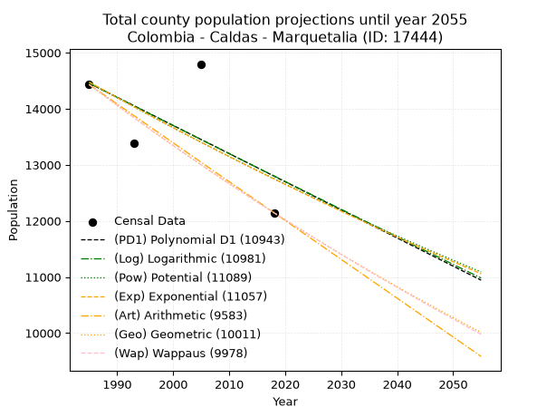
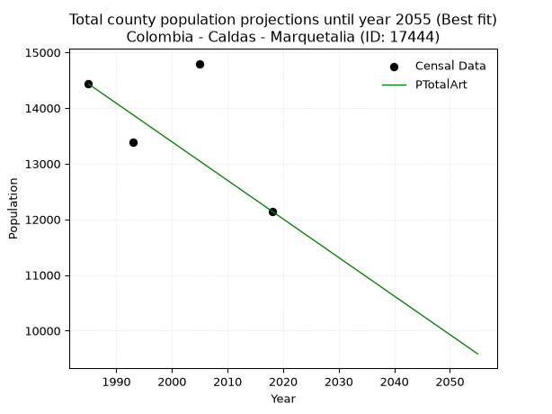
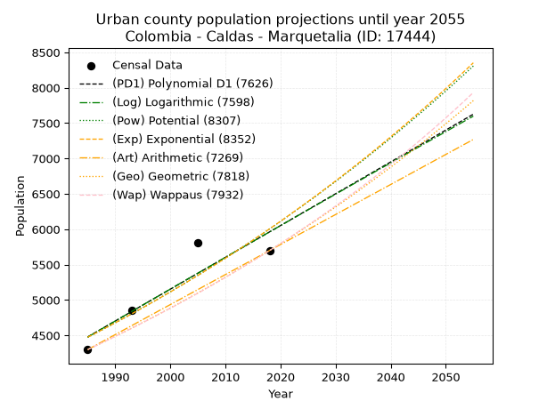
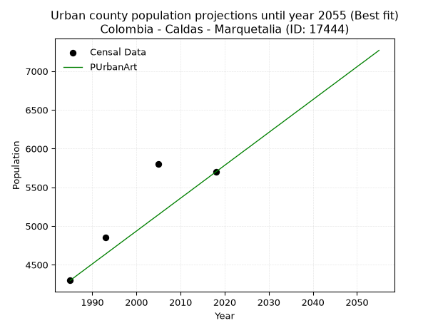
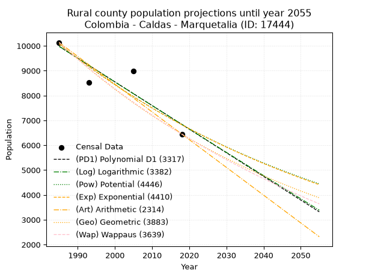
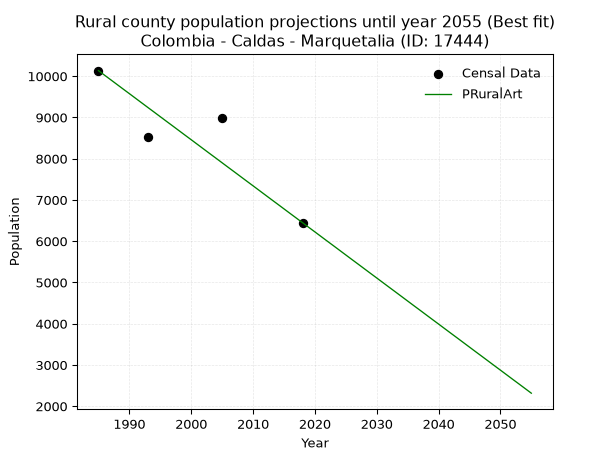

<div align="center">


</div>

# _“Population and Public Services Demand Projections (PPSD) until Year 2050 for Colombia - Caldas - Marquetalia (ID: 17444)”_
Keywords: `population` `public-service` `projection` `lineal` `polynomial` `logarithmic` `potential` `exponential` `arithmetic` `geometric` `wappaus` `dane` `colombia` `south-america`

PPSD are analytical estimates used by governments and planners to anticipate future changes in population size, age distribution, and the resulting community needs for utilities, healthcare, education, and infrastructure as sizing future water treatment facilities, electrical grids, and road networks based on spatial growth.

> **General running parameters**: • app_version: _v20260806_. • Python version: _3.14.7_. • Pandas version: _3.0.5_. • NumPy version: _2.5.1_. • Creates, save and include plots into reports (create_plot): _True_. • Projection until year: _2050_. • Process polynomial degree 2 and up: _False_. • Process Wappaus: _True_. • Process Wappaus: _True_. • Set negative values to zero: _True_. • Set infinite values to zero: _True_. • Drop dataset notes: _True_. 
<div align="center">

Dynamic map: [:earth_americas:Google](http://maps.google.com/maps?q=5.29752456,-75.053097) [:earth_americas:OSM](https://www.openstreetmap.org/#map=18/5.29752456/-75.053097&layers=P) [:earth_americas:Bing](https://www.bing.com/maps?cp=5.29752456~-75.053097&lvl=18) [:earth_americas:Apple](https://maps.apple.com/frame?center=5.29752456%2C-75.053097&span=0.003%2C0.006)

</div>


<div align="center">

```geojson
{
  "type": "Feature",
  "geometry": {
    "type": "Point", 
    "coordinates": [-75.053097, 5.29752456]
  }, 
  "properties": {
    "Name": "Colombia - Caldas - Marquetalia (ID: 17444)"
  }
}
```

</div>


## 0. Census Data (4 records)

Census data are official statistics collected by a government about the people and housing in a country. They usually include counts of total population, age, sex, race, income, education, and jobs.

📅Global census file: [Population.xlsx](../data/Population.xlsx)

| Source   |   Year |   CountryID | CountryName   |   StateID | StateName   |   CountyID | CountyName   |   PTotal |   PUrban |   PRural |
|:---------|-------:|------------:|:--------------|----------:|:------------|-----------:|:-------------|---------:|---------:|---------:|
| DANE     |   1985 |          57 | Colombia      |        17 | Caldas      |      17444 | Marquetalia  |    14432 |     4299 |    10133 |
| DANE     |   1993 |          57 | Colombia      |        17 | Caldas      |      17444 | Marquetalia  |    13386 |     4852 |     8534 |
| DANE     |   2005 |          57 | Colombia      |        17 | Caldas      |      17444 | Marquetalia  |    14798 |     5806 |     8992 |
| DANE     |   2018 |          57 | Colombia      |        17 | Caldas      |      17444 | Marquetalia  |    12146 |     5699 |     6447 |

> 🔥Some records has specific notes about the registered values or the corresponding urban or rural distribution.

## 1. Total

### 1.1. Coefficients and Parameters

* (PD1) Polynomial Deg 1: -50.18787635487603, 114078.79967884078 (lineal)
* (Log) Logarithmic: -100284.06839000914, 775950.5074585486
* (Pow) Potential: -7.689794538397864, 29.519748353621647
* (Exp) Exponential: -0.0038482763965857715, 30070568.532323796
* (Art) Arithmetic: Year diff. 2018 - 1985 = 33, Population diff. 12146 - 14432 = -2286, Annual growth = -69.27272727272727
* (Geo) Geometric: Year diff. 2018 - 1985 = 33, Population diff. 12146 - 14432 = -2286, Annual growth % = -0.005212068752957433
* (Wap) Wappaus: i = -0.5212787062437149, Condition values only valid for < 200)

<sub>
Wappaus condition values: ['-0.00', '-0.52', '-1.04', '-1.56', '-2.09', '-2.61', '-3.13', '-3.65', '-4.17', '-4.69', '-5.21', '-5.73', '-6.26', '-6.78', '-7.30', '-7.82', '-8.34', '-8.86', '-9.38', '-9.90', '-10.43', '-10.95', '-11.47', '-11.99', '-12.51', '-13.03', '-13.55', '-14.07', '-14.60', '-15.12', '-15.64', '-16.16', '-16.68', '-17.20', '-17.72', '-18.24', '-18.77', '-19.29', '-19.81', '-20.33', '-20.85', '-21.37', '-21.89', '-22.41', '-22.94', '-23.46', '-23.98', '-24.50', '-25.02', '-25.54', '-26.06', '-26.59', '-27.11', '-27.63', '-28.15', '-28.67', '-29.19', '-29.71', '-30.23', '-30.76', '-31.28', '-31.80', '-32.32', '-32.84', '-33.36', '-33.88']
</sub>


### 1.2. Projected Dataset

|   Year |   CountyID |   PTotalPD1 |   PTotalLog |   PTotalPow |   PTotalExp |   PTotalArt |   PTotalGeo |   PTotalWap |
|-------:|-----------:|------------:|------------:|------------:|------------:|------------:|------------:|------------:|
|   1985 |      17444 |       14456 |       14456 |       14476 |       14476 |       14432 |       14432 |       14432 |
|   1986 |      17444 |       14406 |       14406 |       14420 |       14420 |       14363 |       14357 |       14357 |
|   1987 |      17444 |       14355 |       14355 |       14364 |       14365 |       14293 |       14282 |       14282 |
|   1988 |      17444 |       14305 |       14305 |       14309 |       14310 |       14224 |       14208 |       14208 |
|   1989 |      17444 |       14255 |       14254 |       14254 |       14255 |       14155 |       14133 |       14134 |
|   1990 |      17444 |       14205 |       14204 |       14199 |       14200 |       14086 |       14060 |       14061 |
|   1991 |      17444 |       14155 |       14153 |       14144 |       14145 |       14016 |       13987 |       13988 |
|   1992 |      17444 |       14105 |       14103 |       14089 |       14091 |       13947 |       13914 |       13915 |
|   1993 |      17444 |       14054 |       14053 |       14035 |       14037 |       13878 |       13841 |       13842 |
|   1994 |      17444 |       14004 |       14002 |       13981 |       13983 |       13809 |       13769 |       13770 |
|   1995 |      17444 |       13954 |       13952 |       13927 |       13929 |       13739 |       13697 |       13699 |
|   1996 |      17444 |       13904 |       13902 |       13874 |       13876 |       13670 |       13626 |       13628 |
|   1997 |      17444 |       13854 |       13852 |       13820 |       13822 |       13601 |       13555 |       13557 |
|   1998 |      17444 |       13803 |       13801 |       13767 |       13769 |       13531 |       13484 |       13486 |
|   1999 |      17444 |       13753 |       13751 |       13714 |       13716 |       13462 |       13414 |       13416 |
|   2000 |      17444 |       13703 |       13701 |       13662 |       13664 |       13393 |       13344 |       13346 |
|   2001 |      17444 |       13653 |       13651 |       13609 |       13611 |       13324 |       13274 |       13276 |
|   2002 |      17444 |       13603 |       13601 |       13557 |       13559 |       13254 |       13205 |       13207 |
|   2003 |      17444 |       13552 |       13551 |       13505 |       13507 |       13185 |       13136 |       13139 |
|   2004 |      17444 |       13502 |       13501 |       13453 |       13455 |       13116 |       13068 |       13070 |
|   2005 |      17444 |       13452 |       13451 |       13402 |       13403 |       13047 |       13000 |       13002 |
|   2006 |      17444 |       13402 |       13401 |       13351 |       13352 |       12977 |       12932 |       12934 |
|   2007 |      17444 |       13352 |       13351 |       13300 |       13301 |       12908 |       12865 |       12867 |
|   2008 |      17444 |       13302 |       13301 |       13249 |       13250 |       12839 |       12798 |       12800 |
|   2009 |      17444 |       13251 |       13251 |       13198 |       13199 |       12769 |       12731 |       12733 |
|   2010 |      17444 |       13201 |       13201 |       13148 |       13148 |       12700 |       12665 |       12666 |
|   2011 |      17444 |       13151 |       13151 |       13097 |       13097 |       12631 |       12599 |       12600 |
|   2012 |      17444 |       13101 |       13101 |       13048 |       13047 |       12562 |       12533 |       12534 |
|   2013 |      17444 |       13051 |       13051 |       12998 |       12997 |       12492 |       12468 |       12469 |
|   2014 |      17444 |       13000 |       13002 |       12948 |       12947 |       12423 |       12403 |       12404 |
|   2015 |      17444 |       12950 |       12952 |       12899 |       12897 |       12354 |       12338 |       12339 |
|   2016 |      17444 |       12900 |       12902 |       12850 |       12848 |       12285 |       12274 |       12274 |
|   2017 |      17444 |       12850 |       12852 |       12801 |       12799 |       12215 |       12210 |       12210 |
|   2018 |      17444 |       12800 |       12803 |       12752 |       12749 |       12146 |       12146 |       12146 |
|   2019 |      17444 |       12749 |       12753 |       12704 |       12700 |       12077 |       12083 |       12082 |
|   2020 |      17444 |       12699 |       12703 |       12655 |       12652 |       12007 |       12020 |       12019 |
|   2021 |      17444 |       12649 |       12654 |       12607 |       12603 |       11938 |       11957 |       11956 |
|   2022 |      17444 |       12599 |       12604 |       12559 |       12555 |       11869 |       11895 |       11893 |
|   2023 |      17444 |       12549 |       12554 |       12512 |       12506 |       11800 |       11833 |       11831 |
|   2024 |      17444 |       12499 |       12505 |       12464 |       12458 |       11730 |       11771 |       11769 |
|   2025 |      17444 |       12448 |       12455 |       12417 |       12410 |       11661 |       11710 |       11707 |
|   2026 |      17444 |       12398 |       12406 |       12370 |       12363 |       11592 |       11649 |       11645 |
|   2027 |      17444 |       12348 |       12356 |       12323 |       12315 |       11523 |       11588 |       11584 |
|   2028 |      17444 |       12298 |       12307 |       12277 |       12268 |       11453 |       11528 |       11523 |
|   2029 |      17444 |       12248 |       12257 |       12230 |       12221 |       11384 |       11468 |       11462 |
|   2030 |      17444 |       12197 |       12208 |       12184 |       12174 |       11315 |       11408 |       11402 |
|   2031 |      17444 |       12147 |       12159 |       12138 |       12127 |       11245 |       11348 |       11342 |
|   2032 |      17444 |       12097 |       12109 |       12092 |       12081 |       11176 |       11289 |       11282 |
|   2033 |      17444 |       12047 |       12060 |       12046 |       12034 |       11107 |       11230 |       11222 |
|   2034 |      17444 |       11997 |       12011 |       12001 |       11988 |       11038 |       11172 |       11163 |
|   2035 |      17444 |       11946 |       11961 |       11956 |       11942 |       10968 |       11114 |       11104 |
|   2036 |      17444 |       11896 |       11912 |       11910 |       11896 |       10899 |       11056 |       11045 |
|   2037 |      17444 |       11846 |       11863 |       11866 |       11850 |       10830 |       10998 |       10987 |
|   2038 |      17444 |       11796 |       11814 |       11821 |       11805 |       10761 |       10941 |       10929 |
|   2039 |      17444 |       11746 |       11764 |       11776 |       11760 |       10691 |       10884 |       10871 |
|   2040 |      17444 |       11696 |       11715 |       11732 |       11714 |       10622 |       10827 |       10813 |
|   2041 |      17444 |       11645 |       11666 |       11688 |       11669 |       10553 |       10770 |       10756 |
|   2042 |      17444 |       11595 |       11617 |       11644 |       11625 |       10483 |       10714 |       10699 |
|   2043 |      17444 |       11545 |       11568 |       11600 |       11580 |       10414 |       10658 |       10642 |
|   2044 |      17444 |       11495 |       11519 |       11557 |       11535 |       10345 |       10603 |       10585 |
|   2045 |      17444 |       11445 |       11470 |       11513 |       11491 |       10276 |       10548 |       10529 |
|   2046 |      17444 |       11394 |       11421 |       11470 |       11447 |       10206 |       10493 |       10472 |
|   2047 |      17444 |       11344 |       11372 |       11427 |       11403 |       10137 |       10438 |       10417 |
|   2048 |      17444 |       11294 |       11323 |       11384 |       11359 |       10068 |       10384 |       10361 |
|   2049 |      17444 |       11244 |       11274 |       11342 |       11316 |        9999 |       10329 |       10306 |
|   2050 |      17444 |       11194 |       11225 |       11299 |       11272 |        9929 |       10276 |       10250 |
<div align="center">

</img>

</div>


### 1.3. Best fit with absolute error and relative error (%)

Relative error puts that difference into context by dividing the absolute error by the true value, creating a unitless ratio or percentage that shows the scale of the mistake.

Absolute and relative error

|   Year | Source   |   CountryID | CountryName   |   StateID | StateName   |   CountyID_x | CountyName   |   PTotal |   PUrban |   PRural |   CountyID_y |   PTotalPD1 |   PTotalLog |   PTotalPow |   PTotalExp |   PTotalArt |   PTotalGeo |   PTotalWap |   PTotalPD1AbsError |   PTotalLogAbsError |   PTotalPowAbsError |   PTotalExpAbsError |   PTotalArtAbsError |   PTotalGeoAbsError |   PTotalWapAbsError |   PTotalPD1RelError |   PTotalLogRelError |   PTotalPowRelError |   PTotalExpRelError |   PTotalArtRelError |   PTotalGeoRelError |   PTotalWapRelError |
|-------:|:---------|------------:|:--------------|----------:|:------------|-------------:|:-------------|---------:|---------:|---------:|-------------:|------------:|------------:|------------:|------------:|------------:|------------:|------------:|--------------------:|--------------------:|--------------------:|--------------------:|--------------------:|--------------------:|--------------------:|--------------------:|--------------------:|--------------------:|--------------------:|--------------------:|--------------------:|--------------------:|
|   1985 | DANE     |          57 | Colombia      |        17 | Caldas      |        17444 | Marquetalia  |    14432 |     4299 |    10133 |        17444 |       14456 |       14456 |       14476 |       14476 |       14432 |       14432 |       14432 |                  24 |                  24 |                  44 |                  44 |                   0 |                   0 |                   0 |            0.166297 |            0.166297 |            0.304878 |            0.304878 |             0       |             0       |             0       |
|   1993 | DANE     |          57 | Colombia      |        17 | Caldas      |        17444 | Marquetalia  |    13386 |     4852 |     8534 |        17444 |       14054 |       14053 |       14035 |       14037 |       13878 |       13841 |       13842 |                 668 |                 667 |                 649 |                 651 |                 492 |                 455 |                 456 |            4.99029  |            4.98282  |            4.84835  |            4.86329  |             3.67548 |             3.39907 |             3.40654 |
|   2005 | DANE     |          57 | Colombia      |        17 | Caldas      |        17444 | Marquetalia  |    14798 |     5806 |     8992 |        17444 |       13452 |       13451 |       13402 |       13403 |       13047 |       13000 |       13002 |                1346 |                1347 |                1396 |                1395 |                1751 |                1798 |                1796 |            9.09582  |            9.10258  |            9.43371  |            9.42695  |            11.8327  |            12.1503  |            12.1368  |
|   2018 | DANE     |          57 | Colombia      |        17 | Caldas      |        17444 | Marquetalia  |    12146 |     5699 |     6447 |        17444 |       12800 |       12803 |       12752 |       12749 |       12146 |       12146 |       12146 |                 654 |                 657 |                 606 |                 603 |                   0 |                   0 |                   0 |            5.38449  |            5.40919  |            4.9893   |            4.9646   |             0       |             0       |             0       |

Relative error mean

| Method    |   RelError | Best   |
|:----------|-----------:|:-------|
| PTotalPD1 |    4.90922 |        |
| PTotalLog |    4.91522 |        |
| PTotalPow |    4.89406 |        |
| PTotalExp |    4.88993 |        |
| PTotalArt |    3.87704 | True   |
| PTotalGeo |    3.88734 |        |
| PTotalWap |    3.88583 |        |

💙Best method: _**PTotalArt**_
<div align="center">

</img>

</div>


### 1.4. Fresh water supply demand in liters per capita per day (lpcd)

The fresh water supply demand typically ranges from 100 to 300 liters per capita per day (lpcd) for standard domestic and municipal planning, though absolute survival minimums set by the World Health Organization are as low as 7.5 to 20 liters per day, and total consumption in high-income nations can exceed 400 liters.

> `CZ`: Level in meters above the sea level (masl).<br> `WS`: Fresh water supply demand in liters per capita per day (lpcd or l/h/d).<br> `WSAll`: Zonal fresh water supply demand in liters per second (l/s).<br> `A`: Zonal area in square meters.

Reference values (RAS Colombia)

|    CZ |   WS |
|------:|-----:|
|  1000 |  120 |
|  2000 |  130 |
| 99999 |  140 |

County shapefile geometry properties and water supply values

|   CountyID |      ATotal |   CZTotal |   WSTotal |
|-----------:|------------:|----------:|----------:|
|      17444 | 9.02774e+07 |   1343.57 |       130 |

Projected values for best method: PTotalArt

|   CountyID |   Year |   PTotalArt |   WSTotal |   WSTotalAll |
|-----------:|-------:|------------:|----------:|-------------:|
|      17444 |   1985 |       14432 |       130 |      21.7148 |
|      17444 |   1986 |       14363 |       130 |      21.611  |
|      17444 |   1987 |       14293 |       130 |      21.5057 |
|      17444 |   1988 |       14224 |       130 |      21.4019 |
|      17444 |   1989 |       14155 |       130 |      21.298  |
|      17444 |   1990 |       14086 |       130 |      21.1942 |
|      17444 |   1991 |       14016 |       130 |      21.0889 |
|      17444 |   1992 |       13947 |       130 |      20.9851 |
|      17444 |   1993 |       13878 |       130 |      20.8813 |
|      17444 |   1994 |       13809 |       130 |      20.7774 |
|      17444 |   1995 |       13739 |       130 |      20.6721 |
|      17444 |   1996 |       13670 |       130 |      20.5683 |
|      17444 |   1997 |       13601 |       130 |      20.4645 |
|      17444 |   1998 |       13531 |       130 |      20.3591 |
|      17444 |   1999 |       13462 |       130 |      20.2553 |
|      17444 |   2000 |       13393 |       130 |      20.1515 |
|      17444 |   2001 |       13324 |       130 |      20.0477 |
|      17444 |   2002 |       13254 |       130 |      19.9424 |
|      17444 |   2003 |       13185 |       130 |      19.8385 |
|      17444 |   2004 |       13116 |       130 |      19.7347 |
|      17444 |   2005 |       13047 |       130 |      19.6309 |
|      17444 |   2006 |       12977 |       130 |      19.5256 |
|      17444 |   2007 |       12908 |       130 |      19.4218 |
|      17444 |   2008 |       12839 |       130 |      19.3179 |
|      17444 |   2009 |       12769 |       130 |      19.2126 |
|      17444 |   2010 |       12700 |       130 |      19.1088 |
|      17444 |   2011 |       12631 |       130 |      19.005  |
|      17444 |   2012 |       12562 |       130 |      18.9012 |
|      17444 |   2013 |       12492 |       130 |      18.7958 |
|      17444 |   2014 |       12423 |       130 |      18.692  |
|      17444 |   2015 |       12354 |       130 |      18.5882 |
|      17444 |   2016 |       12285 |       130 |      18.4844 |
|      17444 |   2017 |       12215 |       130 |      18.3791 |
|      17444 |   2018 |       12146 |       130 |      18.2752 |
|      17444 |   2019 |       12077 |       130 |      18.1714 |
|      17444 |   2020 |       12007 |       130 |      18.0661 |
|      17444 |   2021 |       11938 |       130 |      17.9623 |
|      17444 |   2022 |       11869 |       130 |      17.8584 |
|      17444 |   2023 |       11800 |       130 |      17.7546 |
|      17444 |   2024 |       11730 |       130 |      17.6493 |
|      17444 |   2025 |       11661 |       130 |      17.5455 |
|      17444 |   2026 |       11592 |       130 |      17.4417 |
|      17444 |   2027 |       11523 |       130 |      17.3378 |
|      17444 |   2028 |       11453 |       130 |      17.2325 |
|      17444 |   2029 |       11384 |       130 |      17.1287 |
|      17444 |   2030 |       11315 |       130 |      17.0249 |
|      17444 |   2031 |       11245 |       130 |      16.9196 |
|      17444 |   2032 |       11176 |       130 |      16.8157 |
|      17444 |   2033 |       11107 |       130 |      16.7119 |
|      17444 |   2034 |       11038 |       130 |      16.6081 |
|      17444 |   2035 |       10968 |       130 |      16.5028 |
|      17444 |   2036 |       10899 |       130 |      16.399  |
|      17444 |   2037 |       10830 |       130 |      16.2951 |
|      17444 |   2038 |       10761 |       130 |      16.1913 |
|      17444 |   2039 |       10691 |       130 |      16.086  |
|      17444 |   2040 |       10622 |       130 |      15.9822 |
|      17444 |   2041 |       10553 |       130 |      15.8784 |
|      17444 |   2042 |       10483 |       130 |      15.773  |
|      17444 |   2043 |       10414 |       130 |      15.6692 |
|      17444 |   2044 |       10345 |       130 |      15.5654 |
|      17444 |   2045 |       10276 |       130 |      15.4616 |
|      17444 |   2046 |       10206 |       130 |      15.3562 |
|      17444 |   2047 |       10137 |       130 |      15.2524 |
|      17444 |   2048 |       10068 |       130 |      15.1486 |
|      17444 |   2049 |        9999 |       130 |      15.0448 |
|      17444 |   2050 |        9929 |       130 |      14.9395 |

## 2. Urban

### 2.1. Coefficients and Parameters

* (PD1) Polynomial Deg 1: 44.96025692492972, -84767.75391409069 (lineal)
* (Log) Logarithmic: 90084.98128299345, -679572.6646277678
* (Pow) Potential: 17.87014446139038, -55.28096110668381
* (Exp) Exponential: 0.008918474185975283, 9.168207173889668e-05
* (Art) Arithmetic: Year diff. 2018 - 1985 = 33, Population diff. 5699 - 4299 = 1400, Annual growth = 42.42424242424242
* (Geo) Geometric: Year diff. 2018 - 1985 = 33, Population diff. 5699 - 4299 = 1400, Annual growth % = 0.008579268028771292
* (Wap) Wappaus: i = 0.8486545794007286, Condition values only valid for < 200)

<sub>
Wappaus condition values: ['0.00', '0.85', '1.70', '2.55', '3.39', '4.24', '5.09', '5.94', '6.79', '7.64', '8.49', '9.34', '10.18', '11.03', '11.88', '12.73', '13.58', '14.43', '15.28', '16.12', '16.97', '17.82', '18.67', '19.52', '20.37', '21.22', '22.07', '22.91', '23.76', '24.61', '25.46', '26.31', '27.16', '28.01', '28.85', '29.70', '30.55', '31.40', '32.25', '33.10', '33.95', '34.79', '35.64', '36.49', '37.34', '38.19', '39.04', '39.89', '40.74', '41.58', '42.43', '43.28', '44.13', '44.98', '45.83', '46.68', '47.52', '48.37', '49.22', '50.07', '50.92', '51.77', '52.62', '53.47', '54.31', '55.16']
</sub>


### 2.2. Projected Dataset

|   Year |   CountyID |   PUrbanPD1 |   PUrbanLog |   PUrbanPow |   PUrbanExp |   PUrbanArt |   PUrbanGeo |   PUrbanWap |
|-------:|-----------:|------------:|------------:|------------:|------------:|------------:|------------:|------------:|
|   1985 |      17444 |        4478 |        4476 |        4472 |        4474 |        4299 |        4299 |        4299 |
|   1986 |      17444 |        4523 |        4522 |        4512 |        4514 |        4341 |        4336 |        4336 |
|   1987 |      17444 |        4568 |        4567 |        4553 |        4554 |        4384 |        4373 |        4373 |
|   1988 |      17444 |        4613 |        4612 |        4594 |        4595 |        4426 |        4411 |        4410 |
|   1989 |      17444 |        4658 |        4658 |        4636 |        4636 |        4469 |        4448 |        4447 |
|   1990 |      17444 |        4703 |        4703 |        4678 |        4678 |        4511 |        4487 |        4485 |
|   1991 |      17444 |        4748 |        4748 |        4720 |        4720 |        4554 |        4525 |        4524 |
|   1992 |      17444 |        4793 |        4793 |        4762 |        4762 |        4596 |        4564 |        4562 |
|   1993 |      17444 |        4838 |        4839 |        4805 |        4805 |        4638 |        4603 |        4601 |
|   1994 |      17444 |        4883 |        4884 |        4848 |        4848 |        4681 |        4643 |        4640 |
|   1995 |      17444 |        4928 |        4929 |        4892 |        4891 |        4723 |        4682 |        4680 |
|   1996 |      17444 |        4973 |        4974 |        4936 |        4935 |        4766 |        4723 |        4720 |
|   1997 |      17444 |        5018 |        5019 |        4980 |        4979 |        4808 |        4763 |        4760 |
|   1998 |      17444 |        5063 |        5064 |        5025 |        5024 |        4851 |        4804 |        4801 |
|   1999 |      17444 |        5108 |        5109 |        5070 |        5069 |        4893 |        4845 |        4842 |
|   2000 |      17444 |        5153 |        5154 |        5116 |        5114 |        4935 |        4887 |        4883 |
|   2001 |      17444 |        5198 |        5200 |        5162 |        5160 |        4978 |        4929 |        4925 |
|   2002 |      17444 |        5243 |        5245 |        5208 |        5206 |        5020 |        4971 |        4967 |
|   2003 |      17444 |        5288 |        5290 |        5255 |        5253 |        5063 |        5014 |        5010 |
|   2004 |      17444 |        5333 |        5334 |        5302 |        5300 |        5105 |        5057 |        5053 |
|   2005 |      17444 |        5378 |        5379 |        5349 |        5347 |        5147 |        5100 |        5096 |
|   2006 |      17444 |        5423 |        5424 |        5397 |        5395 |        5190 |        5144 |        5140 |
|   2007 |      17444 |        5467 |        5469 |        5445 |        5444 |        5232 |        5188 |        5184 |
|   2008 |      17444 |        5512 |        5514 |        5494 |        5492 |        5275 |        5232 |        5229 |
|   2009 |      17444 |        5557 |        5559 |        5543 |        5542 |        5317 |        5277 |        5274 |
|   2010 |      17444 |        5602 |        5604 |        5593 |        5591 |        5360 |        5323 |        5319 |
|   2011 |      17444 |        5647 |        5649 |        5643 |        5641 |        5402 |        5368 |        5365 |
|   2012 |      17444 |        5692 |        5693 |        5693 |        5692 |        5444 |        5414 |        5412 |
|   2013 |      17444 |        5737 |        5738 |        5744 |        5743 |        5487 |        5461 |        5458 |
|   2014 |      17444 |        5782 |        5783 |        5795 |        5794 |        5529 |        5508 |        5505 |
|   2015 |      17444 |        5827 |        5828 |        5847 |        5846 |        5572 |        5555 |        5553 |
|   2016 |      17444 |        5872 |        5872 |        5899 |        5899 |        5614 |        5602 |        5601 |
|   2017 |      17444 |        5917 |        5917 |        5951 |        5951 |        5657 |        5651 |        5650 |
|   2018 |      17444 |        5962 |        5962 |        6004 |        6005 |        5699 |        5699 |        5699 |
|   2019 |      17444 |        6007 |        6006 |        6058 |        6058 |        5741 |        5748 |        5749 |
|   2020 |      17444 |        6052 |        6051 |        6111 |        6113 |        5784 |        5797 |        5799 |
|   2021 |      17444 |        6097 |        6095 |        6166 |        6168 |        5826 |        5847 |        5849 |
|   2022 |      17444 |        6142 |        6140 |        6221 |        6223 |        5869 |        5897 |        5900 |
|   2023 |      17444 |        6187 |        6185 |        6276 |        6279 |        5911 |        5948 |        5952 |
|   2024 |      17444 |        6232 |        6229 |        6331 |        6335 |        5954 |        5999 |        6004 |
|   2025 |      17444 |        6277 |        6274 |        6388 |        6392 |        5996 |        6050 |        6057 |
|   2026 |      17444 |        6322 |        6318 |        6444 |        6449 |        6038 |        6102 |        6110 |
|   2027 |      17444 |        6367 |        6363 |        6501 |        6507 |        6081 |        6154 |        6164 |
|   2028 |      17444 |        6412 |        6407 |        6559 |        6565 |        6123 |        6207 |        6218 |
|   2029 |      17444 |        6457 |        6451 |        6617 |        6624 |        6166 |        6261 |        6273 |
|   2030 |      17444 |        6502 |        6496 |        6675 |        6683 |        6208 |        6314 |        6328 |
|   2031 |      17444 |        6547 |        6540 |        6734 |        6743 |        6251 |        6368 |        6384 |
|   2032 |      17444 |        6591 |        6584 |        6794 |        6803 |        6293 |        6423 |        6441 |
|   2033 |      17444 |        6636 |        6629 |        6854 |        6864 |        6335 |        6478 |        6498 |
|   2034 |      17444 |        6681 |        6673 |        6914 |        6926 |        6378 |        6534 |        6556 |
|   2035 |      17444 |        6726 |        6717 |        6975 |        6988 |        6420 |        6590 |        6614 |
|   2036 |      17444 |        6771 |        6762 |        7037 |        7050 |        6463 |        6646 |        6674 |
|   2037 |      17444 |        6816 |        6806 |        7099 |        7113 |        6505 |        6703 |        6733 |
|   2038 |      17444 |        6861 |        6850 |        7161 |        7177 |        6547 |        6761 |        6794 |
|   2039 |      17444 |        6906 |        6894 |        7224 |        7242 |        6590 |        6819 |        6855 |
|   2040 |      17444 |        6951 |        6938 |        7288 |        7306 |        6632 |        6877 |        6916 |
|   2041 |      17444 |        6996 |        6983 |        7352 |        7372 |        6675 |        6936 |        6979 |
|   2042 |      17444 |        7041 |        7027 |        7417 |        7438 |        6717 |        6996 |        7042 |
|   2043 |      17444 |        7086 |        7071 |        7482 |        7505 |        6760 |        7056 |        7106 |
|   2044 |      17444 |        7131 |        7115 |        7548 |        7572 |        6802 |        7116 |        7170 |
|   2045 |      17444 |        7176 |        7159 |        7614 |        7640 |        6844 |        7177 |        7236 |
|   2046 |      17444 |        7221 |        7203 |        7681 |        7708 |        6887 |        7239 |        7302 |
|   2047 |      17444 |        7266 |        7247 |        7748 |        7777 |        6929 |        7301 |        7369 |
|   2048 |      17444 |        7311 |        7291 |        7816 |        7847 |        6972 |        7364 |        7436 |
|   2049 |      17444 |        7356 |        7335 |        7884 |        7917 |        7014 |        7427 |        7504 |
|   2050 |      17444 |        7401 |        7379 |        7954 |        7988 |        7057 |        7491 |        7574 |
<div align="center">

</img>

</div>


### 2.3. Best fit with absolute error and relative error (%)

Relative error puts that difference into context by dividing the absolute error by the true value, creating a unitless ratio or percentage that shows the scale of the mistake.

Absolute and relative error

|   Year | Source   |   CountryID | CountryName   |   StateID | StateName   |   CountyID_x | CountyName   |   PTotal |   PUrban |   PRural |   CountyID_y |   PUrbanPD1 |   PUrbanLog |   PUrbanPow |   PUrbanExp |   PUrbanArt |   PUrbanGeo |   PUrbanWap |   PUrbanPD1AbsError |   PUrbanLogAbsError |   PUrbanPowAbsError |   PUrbanExpAbsError |   PUrbanArtAbsError |   PUrbanGeoAbsError |   PUrbanWapAbsError |   PUrbanPD1RelError |   PUrbanLogRelError |   PUrbanPowRelError |   PUrbanExpRelError |   PUrbanArtRelError |   PUrbanGeoRelError |   PUrbanWapRelError |
|-------:|:---------|------------:|:--------------|----------:|:------------|-------------:|:-------------|---------:|---------:|---------:|-------------:|------------:|------------:|------------:|------------:|------------:|------------:|------------:|--------------------:|--------------------:|--------------------:|--------------------:|--------------------:|--------------------:|--------------------:|--------------------:|--------------------:|--------------------:|--------------------:|--------------------:|--------------------:|--------------------:|
|   1985 | DANE     |          57 | Colombia      |        17 | Caldas      |        17444 | Marquetalia  |    14432 |     4299 |    10133 |        17444 |        4478 |        4476 |        4472 |        4474 |        4299 |        4299 |        4299 |                 179 |                 177 |                 173 |                 175 |                   0 |                   0 |                   0 |            4.16376  |            4.11724  |            4.02419  |            4.07071  |             0       |              0      |             0       |
|   1993 | DANE     |          57 | Colombia      |        17 | Caldas      |        17444 | Marquetalia  |    13386 |     4852 |     8534 |        17444 |        4838 |        4839 |        4805 |        4805 |        4638 |        4603 |        4601 |                  14 |                  13 |                  47 |                  47 |                 214 |                 249 |                 251 |            0.288541 |            0.267931 |            0.968673 |            0.968673 |             4.41055 |              5.1319 |             5.17312 |
|   2005 | DANE     |          57 | Colombia      |        17 | Caldas      |        17444 | Marquetalia  |    14798 |     5806 |     8992 |        17444 |        5378 |        5379 |        5349 |        5347 |        5147 |        5100 |        5096 |                 428 |                 427 |                 457 |                 459 |                 659 |                 706 |                 710 |            7.37168  |            7.35446  |            7.87117  |            7.90561  |            11.3503  |             12.1598 |            12.2287  |
|   2018 | DANE     |          57 | Colombia      |        17 | Caldas      |        17444 | Marquetalia  |    12146 |     5699 |     6447 |        17444 |        5962 |        5962 |        6004 |        6005 |        5699 |        5699 |        5699 |                 263 |                 263 |                 305 |                 306 |                   0 |                   0 |                   0 |            4.61484  |            4.61484  |            5.35182  |            5.36936  |             0       |              0      |             0       |

Relative error mean

| Method    |   RelError | Best   |
|:----------|-----------:|:-------|
| PUrbanPD1 |    4.10971 |        |
| PUrbanLog |    4.08862 |        |
| PUrbanPow |    4.55396 |        |
| PUrbanExp |    4.57859 |        |
| PUrbanArt |    3.94022 | True   |
| PUrbanGeo |    4.32293 |        |
| PUrbanWap |    4.35046 |        |

💙Best method: _**PUrbanArt**_
<div align="center">

</img>

</div>


### 2.4. Fresh water supply demand in liters per capita per day (lpcd)

The fresh water supply demand typically ranges from 100 to 300 liters per capita per day (lpcd) for standard domestic and municipal planning, though absolute survival minimums set by the World Health Organization are as low as 7.5 to 20 liters per day, and total consumption in high-income nations can exceed 400 liters.

> `CZ`: Level in meters above the sea level (masl).<br> `WS`: Fresh water supply demand in liters per capita per day (lpcd or l/h/d).<br> `WSAll`: Zonal fresh water supply demand in liters per second (l/s).<br> `A`: Zonal area in square meters.

Reference values (RAS Colombia)

|    CZ |   WS |
|------:|-----:|
|  1000 |  120 |
|  2000 |  130 |
| 99999 |  140 |

County shapefile geometry properties and water supply values

|   CountyID |   AUrban |   CZUrban |   WSUrban |
|-----------:|---------:|----------:|----------:|
|      17444 |   749205 |   1539.05 |       130 |

Projected values for best method: PUrbanArt

|   CountyID |   Year |   PUrbanArt |   WSUrban |   WSUrbanAll |
|-----------:|-------:|------------:|----------:|-------------:|
|      17444 |   1985 |        4299 |       130 |      6.4684  |
|      17444 |   1986 |        4341 |       130 |      6.5316  |
|      17444 |   1987 |        4384 |       130 |      6.5963  |
|      17444 |   1988 |        4426 |       130 |      6.65949 |
|      17444 |   1989 |        4469 |       130 |      6.72419 |
|      17444 |   1990 |        4511 |       130 |      6.78738 |
|      17444 |   1991 |        4554 |       130 |      6.85208 |
|      17444 |   1992 |        4596 |       130 |      6.91528 |
|      17444 |   1993 |        4638 |       130 |      6.97847 |
|      17444 |   1994 |        4681 |       130 |      7.04317 |
|      17444 |   1995 |        4723 |       130 |      7.10637 |
|      17444 |   1996 |        4766 |       130 |      7.17106 |
|      17444 |   1997 |        4808 |       130 |      7.23426 |
|      17444 |   1998 |        4851 |       130 |      7.29896 |
|      17444 |   1999 |        4893 |       130 |      7.36215 |
|      17444 |   2000 |        4935 |       130 |      7.42535 |
|      17444 |   2001 |        4978 |       130 |      7.49005 |
|      17444 |   2002 |        5020 |       130 |      7.55324 |
|      17444 |   2003 |        5063 |       130 |      7.61794 |
|      17444 |   2004 |        5105 |       130 |      7.68113 |
|      17444 |   2005 |        5147 |       130 |      7.74433 |
|      17444 |   2006 |        5190 |       130 |      7.80903 |
|      17444 |   2007 |        5232 |       130 |      7.87222 |
|      17444 |   2008 |        5275 |       130 |      7.93692 |
|      17444 |   2009 |        5317 |       130 |      8.00012 |
|      17444 |   2010 |        5360 |       130 |      8.06481 |
|      17444 |   2011 |        5402 |       130 |      8.12801 |
|      17444 |   2012 |        5444 |       130 |      8.1912  |
|      17444 |   2013 |        5487 |       130 |      8.2559  |
|      17444 |   2014 |        5529 |       130 |      8.3191  |
|      17444 |   2015 |        5572 |       130 |      8.3838  |
|      17444 |   2016 |        5614 |       130 |      8.44699 |
|      17444 |   2017 |        5657 |       130 |      8.51169 |
|      17444 |   2018 |        5699 |       130 |      8.57488 |
|      17444 |   2019 |        5741 |       130 |      8.63808 |
|      17444 |   2020 |        5784 |       130 |      8.70278 |
|      17444 |   2021 |        5826 |       130 |      8.76597 |
|      17444 |   2022 |        5869 |       130 |      8.83067 |
|      17444 |   2023 |        5911 |       130 |      8.89387 |
|      17444 |   2024 |        5954 |       130 |      8.95856 |
|      17444 |   2025 |        5996 |       130 |      9.02176 |
|      17444 |   2026 |        6038 |       130 |      9.08495 |
|      17444 |   2027 |        6081 |       130 |      9.14965 |
|      17444 |   2028 |        6123 |       130 |      9.21285 |
|      17444 |   2029 |        6166 |       130 |      9.27755 |
|      17444 |   2030 |        6208 |       130 |      9.34074 |
|      17444 |   2031 |        6251 |       130 |      9.40544 |
|      17444 |   2032 |        6293 |       130 |      9.46863 |
|      17444 |   2033 |        6335 |       130 |      9.53183 |
|      17444 |   2034 |        6378 |       130 |      9.59653 |
|      17444 |   2035 |        6420 |       130 |      9.65972 |
|      17444 |   2036 |        6463 |       130 |      9.72442 |
|      17444 |   2037 |        6505 |       130 |      9.78762 |
|      17444 |   2038 |        6547 |       130 |      9.85081 |
|      17444 |   2039 |        6590 |       130 |      9.91551 |
|      17444 |   2040 |        6632 |       130 |      9.9787  |
|      17444 |   2041 |        6675 |       130 |     10.0434  |
|      17444 |   2042 |        6717 |       130 |     10.1066  |
|      17444 |   2043 |        6760 |       130 |     10.1713  |
|      17444 |   2044 |        6802 |       130 |     10.2345  |
|      17444 |   2045 |        6844 |       130 |     10.2977  |
|      17444 |   2046 |        6887 |       130 |     10.3624  |
|      17444 |   2047 |        6929 |       130 |     10.4256  |
|      17444 |   2048 |        6972 |       130 |     10.4903  |
|      17444 |   2049 |        7014 |       130 |     10.5535  |
|      17444 |   2050 |        7057 |       130 |     10.6182  |

## 3. Rural

### 3.1. Coefficients and Parameters

* (PD1) Polynomial Deg 1: -95.14813327980578, 198846.5535929315 (lineal)
* (Log) Logarithmic: -190369.04967300253, 1455523.1720863157
* (Pow) Potential: -23.605502314903298, 81.84857947825306
* (Exp) Exponential: -0.011800201257104605, 149910459584409.3
* (Art) Arithmetic: Year diff. 2018 - 1985 = 33, Population diff. 6447 - 10133 = -3686, Annual growth = -111.6969696969697
* (Geo) Geometric: Year diff. 2018 - 1985 = 33, Population diff. 6447 - 10133 = -3686, Annual growth % = -0.013609048617641561
* (Wap) Wappaus: i = -1.34736996015645, Condition values only valid for < 200)

<sub>
Wappaus condition values: ['-0.00', '-1.35', '-2.69', '-4.04', '-5.39', '-6.74', '-8.08', '-9.43', '-10.78', '-12.13', '-13.47', '-14.82', '-16.17', '-17.52', '-18.86', '-20.21', '-21.56', '-22.91', '-24.25', '-25.60', '-26.95', '-28.29', '-29.64', '-30.99', '-32.34', '-33.68', '-35.03', '-36.38', '-37.73', '-39.07', '-40.42', '-41.77', '-43.12', '-44.46', '-45.81', '-47.16', '-48.51', '-49.85', '-51.20', '-52.55', '-53.89', '-55.24', '-56.59', '-57.94', '-59.28', '-60.63', '-61.98', '-63.33', '-64.67', '-66.02', '-67.37', '-68.72', '-70.06', '-71.41', '-72.76', '-74.11', '-75.45', '-76.80', '-78.15', '-79.49', '-80.84', '-82.19', '-83.54', '-84.88', '-86.23', '-87.58']
</sub>


### 3.2. Projected Dataset

|   Year |   CountyID |   PRuralPD1 |   PRuralLog |   PRuralPow |   PRuralExp |   PRuralArt |   PRuralGeo |   PRuralWap |
|-------:|-----------:|------------:|------------:|------------:|------------:|------------:|------------:|------------:|
|   1985 |      17444 |        9978 |        9980 |       10076 |       10073 |       10133 |       10133 |       10133 |
|   1986 |      17444 |        9882 |        9884 |        9957 |        9955 |       10021 |        9995 |        9997 |
|   1987 |      17444 |        9787 |        9788 |        9839 |        9839 |        9910 |        9859 |        9864 |
|   1988 |      17444 |        9692 |        9692 |        9723 |        9723 |        9798 |        9725 |        9732 |
|   1989 |      17444 |        9597 |        9597 |        9608 |        9609 |        9686 |        9593 |        9601 |
|   1990 |      17444 |        9502 |        9501 |        9495 |        9496 |        9575 |        9462 |        9473 |
|   1991 |      17444 |        9407 |        9405 |        9383 |        9385 |        9463 |        9333 |        9346 |
|   1992 |      17444 |        9311 |        9310 |        9273 |        9275 |        9351 |        9206 |        9220 |
|   1993 |      17444 |        9216 |        9214 |        9163 |        9166 |        9239 |        9081 |        9097 |
|   1994 |      17444 |        9121 |        9119 |        9055 |        9058 |        9128 |        8957 |        8974 |
|   1995 |      17444 |        9026 |        9023 |        8949 |        8952 |        9016 |        8835 |        8854 |
|   1996 |      17444 |        8931 |        8928 |        8844 |        8847 |        8904 |        8715 |        8735 |
|   1997 |      17444 |        8836 |        8832 |        8740 |        8743 |        8793 |        8597 |        8617 |
|   1998 |      17444 |        8741 |        8737 |        8637 |        8641 |        8681 |        8480 |        8501 |
|   1999 |      17444 |        8645 |        8642 |        8536 |        8539 |        8569 |        8364 |        8386 |
|   2000 |      17444 |        8550 |        8547 |        8435 |        8439 |        8458 |        8250 |        8273 |
|   2001 |      17444 |        8455 |        8451 |        8336 |        8340 |        8346 |        8138 |        8161 |
|   2002 |      17444 |        8360 |        8356 |        8239 |        8242 |        8234 |        8027 |        8051 |
|   2003 |      17444 |        8265 |        8261 |        8142 |        8146 |        8122 |        7918 |        7941 |
|   2004 |      17444 |        8170 |        8166 |        8047 |        8050 |        8011 |        7810 |        7833 |
|   2005 |      17444 |        8075 |        8071 |        7953 |        7956 |        7899 |        7704 |        7727 |
|   2006 |      17444 |        7979 |        7976 |        7860 |        7862 |        7787 |        7599 |        7621 |
|   2007 |      17444 |        7884 |        7881 |        7768 |        7770 |        7676 |        7496 |        7517 |
|   2008 |      17444 |        7789 |        7787 |        7677 |        7679 |        7564 |        7394 |        7414 |
|   2009 |      17444 |        7694 |        7692 |        7587 |        7589 |        7452 |        7293 |        7312 |
|   2010 |      17444 |        7599 |        7597 |        7499 |        7500 |        7341 |        7194 |        7212 |
|   2011 |      17444 |        7504 |        7502 |        7411 |        7412 |        7229 |        7096 |        7112 |
|   2012 |      17444 |        7409 |        7408 |        7325 |        7325 |        7117 |        6999 |        7014 |
|   2013 |      17444 |        7313 |        7313 |        7239 |        7239 |        7005 |        6904 |        6917 |
|   2014 |      17444 |        7218 |        7219 |        7155 |        7154 |        6894 |        6810 |        6821 |
|   2015 |      17444 |        7123 |        7124 |        7071 |        7070 |        6782 |        6718 |        6726 |
|   2016 |      17444 |        7028 |        7030 |        6989 |        6987 |        6670 |        6626 |        6632 |
|   2017 |      17444 |        6933 |        6935 |        6908 |        6905 |        6559 |        6536 |        6539 |
|   2018 |      17444 |        6838 |        6841 |        6827 |        6824 |        6447 |        6447 |        6447 |
|   2019 |      17444 |        6742 |        6747 |        6748 |        6744 |        6335 |        6359 |        6356 |
|   2020 |      17444 |        6647 |        6652 |        6670 |        6665 |        6224 |        6273 |        6266 |
|   2021 |      17444 |        6552 |        6558 |        6592 |        6587 |        6112 |        6187 |        6177 |
|   2022 |      17444 |        6457 |        6464 |        6516 |        6510 |        6000 |        6103 |        6089 |
|   2023 |      17444 |        6362 |        6370 |        6440 |        6433 |        5889 |        6020 |        6002 |
|   2024 |      17444 |        6267 |        6276 |        6365 |        6358 |        5777 |        5938 |        5916 |
|   2025 |      17444 |        6172 |        6182 |        6292 |        6283 |        5665 |        5857 |        5831 |
|   2026 |      17444 |        6076 |        6088 |        6219 |        6210 |        5553 |        5778 |        5747 |
|   2027 |      17444 |        5981 |        5994 |        6147 |        6137 |        5442 |        5699 |        5663 |
|   2028 |      17444 |        5886 |        5900 |        6075 |        6065 |        5330 |        5621 |        5581 |
|   2029 |      17444 |        5791 |        5806 |        6005 |        5994 |        5218 |        5545 |        5499 |
|   2030 |      17444 |        5696 |        5712 |        5936 |        5923 |        5107 |        5469 |        5418 |
|   2031 |      17444 |        5601 |        5619 |        5867 |        5854 |        4995 |        5395 |        5338 |
|   2032 |      17444 |        5506 |        5525 |        5799 |        5785 |        4883 |        5322 |        5259 |
|   2033 |      17444 |        5410 |        5431 |        5732 |        5717 |        4772 |        5249 |        5181 |
|   2034 |      17444 |        5315 |        5338 |        5666 |        5650 |        4660 |        5178 |        5103 |
|   2035 |      17444 |        5220 |        5244 |        5601 |        5584 |        4548 |        5107 |        5027 |
|   2036 |      17444 |        5125 |        5150 |        5536 |        5518 |        4436 |        5038 |        4951 |
|   2037 |      17444 |        5030 |        5057 |        5472 |        5454 |        4325 |        4969 |        4875 |
|   2038 |      17444 |        4935 |        4964 |        5409 |        5390 |        4213 |        4902 |        4801 |
|   2039 |      17444 |        4840 |        4870 |        5347 |        5326 |        4101 |        4835 |        4727 |
|   2040 |      17444 |        4744 |        4777 |        5286 |        5264 |        3990 |        4769 |        4654 |
|   2041 |      17444 |        4649 |        4683 |        5225 |        5202 |        3878 |        4704 |        4582 |
|   2042 |      17444 |        4554 |        4590 |        5165 |        5141 |        3766 |        4640 |        4510 |
|   2043 |      17444 |        4459 |        4497 |        5105 |        5081 |        3655 |        4577 |        4439 |
|   2044 |      17444 |        4364 |        4404 |        5047 |        5021 |        3543 |        4515 |        4369 |
|   2045 |      17444 |        4269 |        4311 |        4989 |        4962 |        3431 |        4453 |        4299 |
|   2046 |      17444 |        4173 |        4218 |        4932 |        4904 |        3319 |        4393 |        4230 |
|   2047 |      17444 |        4078 |        4125 |        4875 |        4847 |        3208 |        4333 |        4162 |
|   2048 |      17444 |        3983 |        4032 |        4819 |        4790 |        3096 |        4274 |        4095 |
|   2049 |      17444 |        3888 |        3939 |        4764 |        4734 |        2984 |        4216 |        4028 |
|   2050 |      17444 |        3793 |        3846 |        4709 |        4678 |        2873 |        4158 |        3961 |
<div align="center">

</img>

</div>


### 3.3. Best fit with absolute error and relative error (%)

Relative error puts that difference into context by dividing the absolute error by the true value, creating a unitless ratio or percentage that shows the scale of the mistake.

Absolute and relative error

|   Year | Source   |   CountryID | CountryName   |   StateID | StateName   |   CountyID_x | CountyName   |   PTotal |   PUrban |   PRural |   CountyID_y |   PRuralPD1 |   PRuralLog |   PRuralPow |   PRuralExp |   PRuralArt |   PRuralGeo |   PRuralWap |   PRuralPD1AbsError |   PRuralLogAbsError |   PRuralPowAbsError |   PRuralExpAbsError |   PRuralArtAbsError |   PRuralGeoAbsError |   PRuralWapAbsError |   PRuralPD1RelError |   PRuralLogRelError |   PRuralPowRelError |   PRuralExpRelError |   PRuralArtRelError |   PRuralGeoRelError |   PRuralWapRelError |
|-------:|:---------|------------:|:--------------|----------:|:------------|-------------:|:-------------|---------:|---------:|---------:|-------------:|------------:|------------:|------------:|------------:|------------:|------------:|------------:|--------------------:|--------------------:|--------------------:|--------------------:|--------------------:|--------------------:|--------------------:|--------------------:|--------------------:|--------------------:|--------------------:|--------------------:|--------------------:|--------------------:|
|   1985 | DANE     |          57 | Colombia      |        17 | Caldas      |        17444 | Marquetalia  |    14432 |     4299 |    10133 |        17444 |        9978 |        9980 |       10076 |       10073 |       10133 |       10133 |       10133 |                 155 |                 153 |                  57 |                  60 |                   0 |                   0 |                   0 |             1.52966 |             1.50992 |            0.562519 |            0.592125 |             0       |             0       |             0       |
|   1993 | DANE     |          57 | Colombia      |        17 | Caldas      |        17444 | Marquetalia  |    13386 |     4852 |     8534 |        17444 |        9216 |        9214 |        9163 |        9166 |        9239 |        9081 |        9097 |                 682 |                 680 |                 629 |                 632 |                 705 |                 547 |                 563 |             7.99156 |             7.96813 |            7.37052  |            7.40567  |             8.26107 |             6.40966 |             6.59714 |
|   2005 | DANE     |          57 | Colombia      |        17 | Caldas      |        17444 | Marquetalia  |    14798 |     5806 |     8992 |        17444 |        8075 |        8071 |        7953 |        7956 |        7899 |        7704 |        7727 |                 917 |                 921 |                1039 |                1036 |                1093 |                1288 |                1265 |            10.198   |            10.2424  |           11.5547   |           11.5214   |            12.1552  |            14.3238  |            14.0681  |
|   2018 | DANE     |          57 | Colombia      |        17 | Caldas      |        17444 | Marquetalia  |    12146 |     5699 |     6447 |        17444 |        6838 |        6841 |        6827 |        6824 |        6447 |        6447 |        6447 |                 391 |                 394 |                 380 |                 377 |                   0 |                   0 |                   0 |             6.06484 |             6.11137 |            5.89421  |            5.84768  |             0       |             0       |             0       |

Relative error mean

| Method    |   RelError | Best   |
|:----------|-----------:|:-------|
| PRuralPD1 |    6.446   |        |
| PRuralLog |    6.45796 |        |
| PRuralPow |    6.34549 |        |
| PRuralExp |    6.34171 |        |
| PRuralArt |    5.10408 | True   |
| PRuralGeo |    5.18337 |        |
| PRuralWap |    5.1663  |        |

💙Best method: _**PRuralArt**_
<div align="center">

</img>

</div>


### 3.4. Fresh water supply demand in liters per capita per day (lpcd)

The fresh water supply demand typically ranges from 100 to 300 liters per capita per day (lpcd) for standard domestic and municipal planning, though absolute survival minimums set by the World Health Organization are as low as 7.5 to 20 liters per day, and total consumption in high-income nations can exceed 400 liters.

> `CZ`: Level in meters above the sea level (masl).<br> `WS`: Fresh water supply demand in liters per capita per day (lpcd or l/h/d).<br> `WSAll`: Zonal fresh water supply demand in liters per second (l/s).<br> `A`: Zonal area in square meters.

Reference values (RAS Colombia)

|    CZ |   WS |
|------:|-----:|
|  1000 |  120 |
|  2000 |  130 |
| 99999 |  140 |

County shapefile geometry properties and water supply values

|   CountyID |      ARural |   CZRural |   WSRural |
|-----------:|------------:|----------:|----------:|
|      17444 | 8.95282e+07 |   1341.86 |       130 |

Projected values for best method: PRuralArt

|   CountyID |   Year |   PRuralArt |   WSRural |   WSRuralAll |
|-----------:|-------:|------------:|----------:|-------------:|
|      17444 |   1985 |       10133 |       130 |     15.2464  |
|      17444 |   1986 |       10021 |       130 |     15.0779  |
|      17444 |   1987 |        9910 |       130 |     14.9109  |
|      17444 |   1988 |        9798 |       130 |     14.7424  |
|      17444 |   1989 |        9686 |       130 |     14.5738  |
|      17444 |   1990 |        9575 |       130 |     14.4068  |
|      17444 |   1991 |        9463 |       130 |     14.2383  |
|      17444 |   1992 |        9351 |       130 |     14.0698  |
|      17444 |   1993 |        9239 |       130 |     13.9013  |
|      17444 |   1994 |        9128 |       130 |     13.7343  |
|      17444 |   1995 |        9016 |       130 |     13.5657  |
|      17444 |   1996 |        8904 |       130 |     13.3972  |
|      17444 |   1997 |        8793 |       130 |     13.2302  |
|      17444 |   1998 |        8681 |       130 |     13.0617  |
|      17444 |   1999 |        8569 |       130 |     12.8932  |
|      17444 |   2000 |        8458 |       130 |     12.7262  |
|      17444 |   2001 |        8346 |       130 |     12.5576  |
|      17444 |   2002 |        8234 |       130 |     12.3891  |
|      17444 |   2003 |        8122 |       130 |     12.2206  |
|      17444 |   2004 |        8011 |       130 |     12.0536  |
|      17444 |   2005 |        7899 |       130 |     11.8851  |
|      17444 |   2006 |        7787 |       130 |     11.7166  |
|      17444 |   2007 |        7676 |       130 |     11.5495  |
|      17444 |   2008 |        7564 |       130 |     11.381   |
|      17444 |   2009 |        7452 |       130 |     11.2125  |
|      17444 |   2010 |        7341 |       130 |     11.0455  |
|      17444 |   2011 |        7229 |       130 |     10.877   |
|      17444 |   2012 |        7117 |       130 |     10.7084  |
|      17444 |   2013 |        7005 |       130 |     10.5399  |
|      17444 |   2014 |        6894 |       130 |     10.3729  |
|      17444 |   2015 |        6782 |       130 |     10.2044  |
|      17444 |   2016 |        6670 |       130 |     10.0359  |
|      17444 |   2017 |        6559 |       130 |      9.86887 |
|      17444 |   2018 |        6447 |       130 |      9.70035 |
|      17444 |   2019 |        6335 |       130 |      9.53183 |
|      17444 |   2020 |        6224 |       130 |      9.36481 |
|      17444 |   2021 |        6112 |       130 |      9.1963  |
|      17444 |   2022 |        6000 |       130 |      9.02778 |
|      17444 |   2023 |        5889 |       130 |      8.86076 |
|      17444 |   2024 |        5777 |       130 |      8.69225 |
|      17444 |   2025 |        5665 |       130 |      8.52373 |
|      17444 |   2026 |        5553 |       130 |      8.35521 |
|      17444 |   2027 |        5442 |       130 |      8.18819 |
|      17444 |   2028 |        5330 |       130 |      8.01968 |
|      17444 |   2029 |        5218 |       130 |      7.85116 |
|      17444 |   2030 |        5107 |       130 |      7.68414 |
|      17444 |   2031 |        4995 |       130 |      7.51562 |
|      17444 |   2032 |        4883 |       130 |      7.34711 |
|      17444 |   2033 |        4772 |       130 |      7.18009 |
|      17444 |   2034 |        4660 |       130 |      7.01157 |
|      17444 |   2035 |        4548 |       130 |      6.84306 |
|      17444 |   2036 |        4436 |       130 |      6.67454 |
|      17444 |   2037 |        4325 |       130 |      6.50752 |
|      17444 |   2038 |        4213 |       130 |      6.339   |
|      17444 |   2039 |        4101 |       130 |      6.17049 |
|      17444 |   2040 |        3990 |       130 |      6.00347 |
|      17444 |   2041 |        3878 |       130 |      5.83495 |
|      17444 |   2042 |        3766 |       130 |      5.66644 |
|      17444 |   2043 |        3655 |       130 |      5.49942 |
|      17444 |   2044 |        3543 |       130 |      5.3309  |
|      17444 |   2045 |        3431 |       130 |      5.16238 |
|      17444 |   2046 |        3319 |       130 |      4.99387 |
|      17444 |   2047 |        3208 |       130 |      4.82685 |
|      17444 |   2048 |        3096 |       130 |      4.65833 |
|      17444 |   2049 |        2984 |       130 |      4.48981 |
|      17444 |   2050 |        2873 |       130 |      4.3228  |

<div align="center"><br><sub>Share this research</sub></div><br>

<sub>**APPS & TOOLS & CONTENT DISCLAIMER**: • NO WARRANTY - This content and software is provided by <a href="https://github.com/rcfdtools" target="_blank">github.com/rcfdtools</a> "as is", without any express or implied warranty, including warranties of merchantability, fitness for a particular purpose, or non-infringement. There is no guarantee that the software will be error-free or operate without interruption. • LIMITATION OF LIABILITY - Neither the authors nor copyright holders will be liable for claims or damages arising from the software or its use. You are responsible for determining if the software is appropriate for your use and assume all associated risks, including errors, legal compliance, and data loss. • NO PROFESSIONAL ADVICE - The software provides general information and does not offer professional advice. It should not replace consultation with professional advisors. [Clauses and global license for rcfdtools use.](https://github.com/rcfdtools/rcfdtools/blob/main/LICENSE.md)</sub>