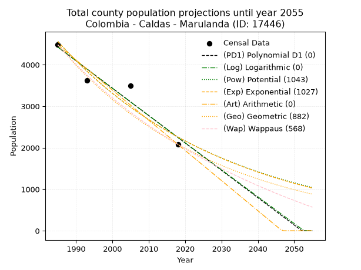
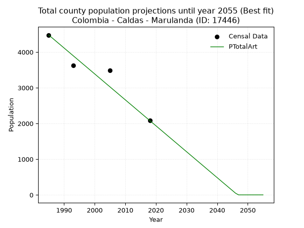
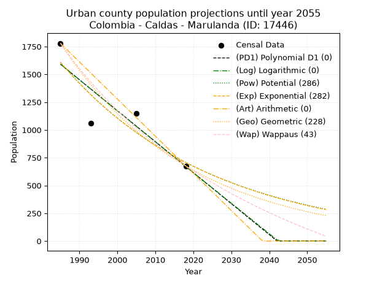
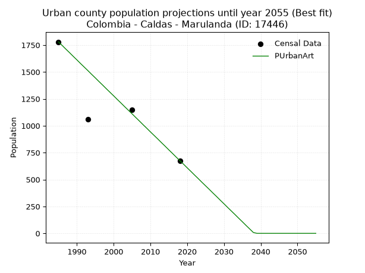
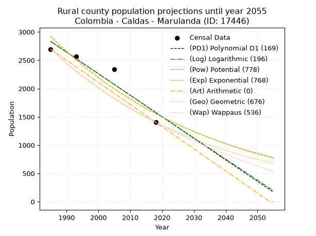
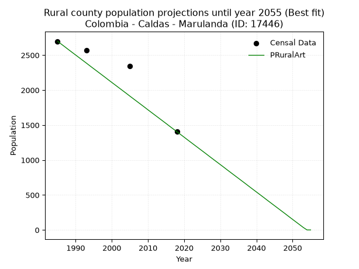

<div align="center">


</div>

# _“Population and Public Services Demand Projections (PPSD) until Year 2050 for Colombia - Caldas - Marulanda (ID: 17446)”_
Keywords: `population` `public-service` `projection` `lineal` `polynomial` `logarithmic` `potential` `exponential` `arithmetic` `geometric` `wappaus` `dane` `colombia` `south-america`

PPSD are analytical estimates used by governments and planners to anticipate future changes in population size, age distribution, and the resulting community needs for utilities, healthcare, education, and infrastructure as sizing future water treatment facilities, electrical grids, and road networks based on spatial growth.

> **General running parameters**: • app_version: _v20260806_. • Python version: _3.14.7_. • Pandas version: _3.0.5_. • NumPy version: _2.5.1_. • Creates, save and include plots into reports (create_plot): _False_. • Projection until year: _2050_. • Process polynomial degree 2 and up: _False_. • Process Wappaus: _True_. • Process Wappaus: _True_. • Set negative values to zero: _True_. • Set infinite values to zero: _True_. • Drop dataset notes: _True_. 
<div align="center">

Dynamic map: [:earth_americas:Google](http://maps.google.com/maps?q=5.284304033,-75.2597213) [:earth_americas:OSM](https://www.openstreetmap.org/#map=18/5.284304033/-75.2597213&layers=P) [:earth_americas:Bing](https://www.bing.com/maps?cp=5.284304033~-75.2597213&lvl=18) [:earth_americas:Apple](https://maps.apple.com/frame?center=5.284304033%2C-75.2597213&span=0.003%2C0.006)

</div>


<div align="center">

```geojson
{
  "type": "Feature",
  "geometry": {
    "type": "Point", 
    "coordinates": [-75.2597213, 5.284304033]
  }, 
  "properties": {
    "Name": "Colombia - Caldas - Marulanda (ID: 17446)"
  }
}
```

</div>


## 0. Census Data (4 records)

Census data are official statistics collected by a government about the people and housing in a country. They usually include counts of total population, age, sex, race, income, education, and jobs.

📅Global census file: [Population.xlsx](../data/Population.xlsx)

| Source   |   Year |   CountryID | CountryName   |   StateID | StateName   |   CountyID | CountyName   |   PTotal |   PUrban |   PRural |
|:---------|-------:|------------:|:--------------|----------:|:------------|-----------:|:-------------|---------:|---------:|---------:|
| DANE     |   1985 |          57 | Colombia      |        17 | Caldas      |      17446 | Marulanda    |     4477 |     1779 |     2698 |
| DANE     |   1993 |          57 | Colombia      |        17 | Caldas      |      17446 | Marulanda    |     3626 |     1059 |     2567 |
| DANE     |   2005 |          57 | Colombia      |        17 | Caldas      |      17446 | Marulanda    |     3489 |     1148 |     2341 |
| DANE     |   2018 |          57 | Colombia      |        17 | Caldas      |      17446 | Marulanda    |     2081 |      676 |     1405 |

> 🔥Some records has specific notes about the registered values or the corresponding urban or rural distribution.

## 1. Total

### 1.1. Coefficients and Parameters

* (PD1) Polynomial Deg 1: -65.92091529506132, 135276.5608189464 (lineal)
* (Log) Logarithmic: -131912.13558567152, 1006083.4496642026
* (Pow) Potential: -42.5777369824931, 144.0701857399903
* (Exp) Exponential: -0.02128341318519893, 1.0155366653613933e+22
* (Art) Arithmetic: Year diff. 2018 - 1985 = 33, Population diff. 2081 - 4477 = -2396, Annual growth = -72.60606060606061
* (Geo) Geometric: Year diff. 2018 - 1985 = 33, Population diff. 2081 - 4477 = -2396, Annual growth % = -0.022947890251680647
* (Wap) Wappaus: i = -2.2142744924080695, Condition values only valid for < 200)

<sub>
Wappaus condition values: ['-0.00', '-2.21', '-4.43', '-6.64', '-8.86', '-11.07', '-13.29', '-15.50', '-17.71', '-19.93', '-22.14', '-24.36', '-26.57', '-28.79', '-31.00', '-33.21', '-35.43', '-37.64', '-39.86', '-42.07', '-44.29', '-46.50', '-48.71', '-50.93', '-53.14', '-55.36', '-57.57', '-59.79', '-62.00', '-64.21', '-66.43', '-68.64', '-70.86', '-73.07', '-75.29', '-77.50', '-79.71', '-81.93', '-84.14', '-86.36', '-88.57', '-90.79', '-93.00', '-95.21', '-97.43', '-99.64', '-101.86', '-104.07', '-106.29', '-108.50', '-110.71', '-112.93', '-115.14', '-117.36', '-119.57', '-121.79', '-124.00', '-126.21', '-128.43', '-130.64', '-132.86', '-135.07', '-137.29', '-139.50', '-141.71', '-143.93']
</sub>


### 1.2. Projected Dataset

|   Year |   CountyID |   PTotalPD1 |   PTotalLog |   PTotalPow |   PTotalExp |   PTotalArt |   PTotalGeo |   PTotalWap |
|-------:|-----------:|------------:|------------:|------------:|------------:|------------:|------------:|------------:|
|   1985 |      17446 |        4424 |        4425 |        4560 |        4558 |        4477 |        4477 |        4477 |
|   1986 |      17446 |        4358 |        4359 |        4464 |        4462 |        4404 |        4374 |        4379 |
|   1987 |      17446 |        4292 |        4292 |        4369 |        4368 |        4332 |        4274 |        4283 |
|   1988 |      17446 |        4226 |        4226 |        4276 |        4276 |        4259 |        4176 |        4189 |
|   1989 |      17446 |        4160 |        4160 |        4186 |        4186 |        4187 |        4080 |        4097 |
|   1990 |      17446 |        4094 |        4093 |        4097 |        4098 |        4114 |        3986 |        4007 |
|   1991 |      17446 |        4028 |        4027 |        4010 |        4012 |        4041 |        3895 |        3919 |
|   1992 |      17446 |        3962 |        3961 |        3926 |        3927 |        3969 |        3805 |        3833 |
|   1993 |      17446 |        3896 |        3895 |        3843 |        3845 |        3896 |        3718 |        3748 |
|   1994 |      17446 |        3830 |        3829 |        3761 |        3764 |        3824 |        3633 |        3666 |
|   1995 |      17446 |        3764 |        3762 |        3682 |        3684 |        3751 |        3549 |        3584 |
|   1996 |      17446 |        3698 |        3696 |        3604 |        3607 |        3678 |        3468 |        3505 |
|   1997 |      17446 |        3632 |        3630 |        3528 |        3531 |        3606 |        3388 |        3427 |
|   1998 |      17446 |        3567 |        3564 |        3454 |        3457 |        3533 |        3311 |        3350 |
|   1999 |      17446 |        3501 |        3498 |        3381 |        3384 |        3461 |        3235 |        3275 |
|   2000 |      17446 |        3435 |        3432 |        3310 |        3313 |        3388 |        3160 |        3202 |
|   2001 |      17446 |        3369 |        3366 |        3240 |        3243 |        3315 |        3088 |        3130 |
|   2002 |      17446 |        3303 |        3300 |        3172 |        3174 |        3243 |        3017 |        3059 |
|   2003 |      17446 |        3237 |        3234 |        3105 |        3108 |        3170 |        2948 |        2989 |
|   2004 |      17446 |        3171 |        3169 |        3040 |        3042 |        3097 |        2880 |        2921 |
|   2005 |      17446 |        3105 |        3103 |        2976 |        2978 |        3025 |        2814 |        2854 |
|   2006 |      17446 |        3039 |        3037 |        2913 |        2915 |        2952 |        2750 |        2788 |
|   2007 |      17446 |        2973 |        2971 |        2852 |        2854 |        2880 |        2686 |        2723 |
|   2008 |      17446 |        2907 |        2906 |        2792 |        2794 |        2807 |        2625 |        2660 |
|   2009 |      17446 |        2841 |        2840 |        2734 |        2735 |        2734 |        2565 |        2597 |
|   2010 |      17446 |        2776 |        2774 |        2677 |        2677 |        2662 |        2506 |        2536 |
|   2011 |      17446 |        2710 |        2709 |        2620 |        2621 |        2589 |        2448 |        2476 |
|   2012 |      17446 |        2644 |        2643 |        2566 |        2566 |        2517 |        2392 |        2416 |
|   2013 |      17446 |        2578 |        2578 |        2512 |        2512 |        2444 |        2337 |        2358 |
|   2014 |      17446 |        2512 |        2512 |        2459 |        2459 |        2371 |        2284 |        2301 |
|   2015 |      17446 |        2446 |        2447 |        2408 |        2407 |        2299 |        2231 |        2245 |
|   2016 |      17446 |        2380 |        2381 |        2358 |        2356 |        2226 |        2180 |        2189 |
|   2017 |      17446 |        2314 |        2316 |        2308 |        2307 |        2154 |        2130 |        2135 |
|   2018 |      17446 |        2248 |        2250 |        2260 |        2258 |        2081 |        2081 |        2081 |
|   2019 |      17446 |        2182 |        2185 |        2213 |        2211 |        2008 |        2033 |        2028 |
|   2020 |      17446 |        2116 |        2120 |        2167 |        2164 |        1936 |        1987 |        1976 |
|   2021 |      17446 |        2050 |        2054 |        2122 |        2119 |        1863 |        1941 |        1925 |
|   2022 |      17446 |        1984 |        1989 |        2077 |        2074 |        1791 |        1896 |        1875 |
|   2023 |      17446 |        1919 |        1924 |        2034 |        2030 |        1718 |        1853 |        1825 |
|   2024 |      17446 |        1853 |        1859 |        1992 |        1988 |        1645 |        1810 |        1777 |
|   2025 |      17446 |        1787 |        1793 |        1950 |        1946 |        1573 |        1769 |        1729 |
|   2026 |      17446 |        1721 |        1728 |        1910 |        1905 |        1500 |        1728 |        1681 |
|   2027 |      17446 |        1655 |        1663 |        1870 |        1865 |        1428 |        1689 |        1635 |
|   2028 |      17446 |        1589 |        1598 |        1831 |        1825 |        1355 |        1650 |        1589 |
|   2029 |      17446 |        1523 |        1533 |        1793 |        1787 |        1282 |        1612 |        1544 |
|   2030 |      17446 |        1457 |        1468 |        1756 |        1749 |        1210 |        1575 |        1499 |
|   2031 |      17446 |        1391 |        1403 |        1719 |        1712 |        1137 |        1539 |        1456 |
|   2032 |      17446 |        1325 |        1338 |        1684 |        1676 |        1065 |        1504 |        1412 |
|   2033 |      17446 |        1259 |        1273 |        1649 |        1641 |         992 |        1469 |        1370 |
|   2034 |      17446 |        1193 |        1209 |        1615 |        1607 |         919 |        1435 |        1328 |
|   2035 |      17446 |        1127 |        1144 |        1581 |        1573 |         847 |        1402 |        1287 |
|   2036 |      17446 |        1062 |        1079 |        1549 |        1540 |         774 |        1370 |        1246 |
|   2037 |      17446 |         996 |        1014 |        1516 |        1507 |         701 |        1339 |        1206 |
|   2038 |      17446 |         930 |         949 |        1485 |        1475 |         629 |        1308 |        1166 |
|   2039 |      17446 |         864 |         885 |        1454 |        1444 |         556 |        1278 |        1127 |
|   2040 |      17446 |         798 |         820 |        1424 |        1414 |         484 |        1249 |        1088 |
|   2041 |      17446 |         732 |         755 |        1395 |        1384 |         411 |        1220 |        1050 |
|   2042 |      17446 |         666 |         691 |        1366 |        1355 |         338 |        1192 |        1013 |
|   2043 |      17446 |         600 |         626 |        1338 |        1326 |         266 |        1165 |         976 |
|   2044 |      17446 |         534 |         562 |        1310 |        1299 |         193 |        1138 |         939 |
|   2045 |      17446 |         468 |         497 |        1283 |        1271 |         121 |        1112 |         903 |
|   2046 |      17446 |         402 |         433 |        1257 |        1244 |          48 |        1086 |         868 |
|   2047 |      17446 |         336 |         368 |        1231 |        1218 |         -25 |        1061 |         832 |
|   2048 |      17446 |         271 |         304 |        1206 |        1193 |         -97 |        1037 |         798 |
|   2049 |      17446 |         205 |         239 |        1181 |        1167 |        -170 |        1013 |         764 |
|   2050 |      17446 |         139 |         175 |        1157 |        1143 |        -242 |         990 |         730 |
<div align="center">

</img>

</div>


### 1.3. Best fit with absolute error and relative error (%)

Relative error puts that difference into context by dividing the absolute error by the true value, creating a unitless ratio or percentage that shows the scale of the mistake.

Absolute and relative error

|   Year | Source   |   CountryID | CountryName   |   StateID | StateName   |   CountyID_x | CountyName   |   PTotal |   PUrban |   PRural |   CountyID_y |   PTotalPD1 |   PTotalLog |   PTotalPow |   PTotalExp |   PTotalArt |   PTotalGeo |   PTotalWap |   PTotalPD1AbsError |   PTotalLogAbsError |   PTotalPowAbsError |   PTotalExpAbsError |   PTotalArtAbsError |   PTotalGeoAbsError |   PTotalWapAbsError |   PTotalPD1RelError |   PTotalLogRelError |   PTotalPowRelError |   PTotalExpRelError |   PTotalArtRelError |   PTotalGeoRelError |   PTotalWapRelError |
|-------:|:---------|------------:|:--------------|----------:|:------------|-------------:|:-------------|---------:|---------:|---------:|-------------:|------------:|------------:|------------:|------------:|------------:|------------:|------------:|--------------------:|--------------------:|--------------------:|--------------------:|--------------------:|--------------------:|--------------------:|--------------------:|--------------------:|--------------------:|--------------------:|--------------------:|--------------------:|--------------------:|
|   1985 | DANE     |          57 | Colombia      |        17 | Caldas      |        17446 | Marulanda    |     4477 |     1779 |     2698 |        17446 |        4424 |        4425 |        4560 |        4558 |        4477 |        4477 |        4477 |                  53 |                  52 |                  83 |                  81 |                   0 |                   0 |                   0 |             1.18383 |             1.16149 |             1.85392 |             1.80925 |             0       |             0       |             0       |
|   1993 | DANE     |          57 | Colombia      |        17 | Caldas      |        17446 | Marulanda    |     3626 |     1059 |     2567 |        17446 |        3896 |        3895 |        3843 |        3845 |        3896 |        3718 |        3748 |                 270 |                 269 |                 217 |                 219 |                 270 |                  92 |                 122 |             7.44622 |             7.41864 |             5.98456 |             6.03971 |             7.44622 |             2.53723 |             3.36459 |
|   2005 | DANE     |          57 | Colombia      |        17 | Caldas      |        17446 | Marulanda    |     3489 |     1148 |     2341 |        17446 |        3105 |        3103 |        2976 |        2978 |        3025 |        2814 |        2854 |                 384 |                 386 |                 513 |                 511 |                 464 |                 675 |                 635 |            11.006   |            11.0633  |            14.7034  |            14.646   |            13.2989  |            19.3465  |            18.2001  |
|   2018 | DANE     |          57 | Colombia      |        17 | Caldas      |        17446 | Marulanda    |     2081 |      676 |     1405 |        17446 |        2248 |        2250 |        2260 |        2258 |        2081 |        2081 |        2081 |                 167 |                 169 |                 179 |                 177 |                   0 |                   0 |                   0 |             8.02499 |             8.1211  |             8.60163 |             8.50553 |             0       |             0       |             0       |

Relative error mean

| Method    |   RelError | Best   |
|:----------|-----------:|:-------|
| PTotalPD1 |    6.91526 |        |
| PTotalLog |    6.94114 |        |
| PTotalPow |    7.78587 |        |
| PTotalExp |    7.75013 |        |
| PTotalArt |    5.18629 | True   |
| PTotalGeo |    5.47094 |        |
| PTotalWap |    5.39116 |        |

💙Best method: _**PTotalArt**_
<div align="center">

</img>

</div>


### 1.4. Fresh water supply demand in liters per capita per day (lpcd)

The fresh water supply demand typically ranges from 100 to 300 liters per capita per day (lpcd) for standard domestic and municipal planning, though absolute survival minimums set by the World Health Organization are as low as 7.5 to 20 liters per day, and total consumption in high-income nations can exceed 400 liters.

> `CZ`: Level in meters above the sea level (masl).<br> `WS`: Fresh water supply demand in liters per capita per day (lpcd or l/h/d).<br> `WSAll`: Zonal fresh water supply demand in liters per second (l/s).<br> `A`: Zonal area in square meters.

Reference values (RAS Colombia)

|    CZ |   WS |
|------:|-----:|
|  1000 |  120 |
|  2000 |  130 |
| 99999 |  140 |

County shapefile geometry properties and water supply values

|   CountyID |      ATotal |   CZTotal |   WSTotal |
|-----------:|------------:|----------:|----------:|
|      17446 | 3.76091e+08 |   2970.38 |       140 |

Projected values for best method: PTotalArt

|   CountyID |   Year |   PTotalArt |   WSTotal |   WSTotalAll |
|-----------:|-------:|------------:|----------:|-------------:|
|      17446 |   1985 |        4477 |       140 |    7.2544    |
|      17446 |   1986 |        4404 |       140 |    7.13611   |
|      17446 |   1987 |        4332 |       140 |    7.01944   |
|      17446 |   1988 |        4259 |       140 |    6.90116   |
|      17446 |   1989 |        4187 |       140 |    6.78449   |
|      17446 |   1990 |        4114 |       140 |    6.6662    |
|      17446 |   1991 |        4041 |       140 |    6.54792   |
|      17446 |   1992 |        3969 |       140 |    6.43125   |
|      17446 |   1993 |        3896 |       140 |    6.31296   |
|      17446 |   1994 |        3824 |       140 |    6.1963    |
|      17446 |   1995 |        3751 |       140 |    6.07801   |
|      17446 |   1996 |        3678 |       140 |    5.95972   |
|      17446 |   1997 |        3606 |       140 |    5.84306   |
|      17446 |   1998 |        3533 |       140 |    5.72477   |
|      17446 |   1999 |        3461 |       140 |    5.6081    |
|      17446 |   2000 |        3388 |       140 |    5.48981   |
|      17446 |   2001 |        3315 |       140 |    5.37153   |
|      17446 |   2002 |        3243 |       140 |    5.25486   |
|      17446 |   2003 |        3170 |       140 |    5.13657   |
|      17446 |   2004 |        3097 |       140 |    5.01829   |
|      17446 |   2005 |        3025 |       140 |    4.90162   |
|      17446 |   2006 |        2952 |       140 |    4.78333   |
|      17446 |   2007 |        2880 |       140 |    4.66667   |
|      17446 |   2008 |        2807 |       140 |    4.54838   |
|      17446 |   2009 |        2734 |       140 |    4.43009   |
|      17446 |   2010 |        2662 |       140 |    4.31343   |
|      17446 |   2011 |        2589 |       140 |    4.19514   |
|      17446 |   2012 |        2517 |       140 |    4.07847   |
|      17446 |   2013 |        2444 |       140 |    3.96019   |
|      17446 |   2014 |        2371 |       140 |    3.8419    |
|      17446 |   2015 |        2299 |       140 |    3.72523   |
|      17446 |   2016 |        2226 |       140 |    3.60694   |
|      17446 |   2017 |        2154 |       140 |    3.49028   |
|      17446 |   2018 |        2081 |       140 |    3.37199   |
|      17446 |   2019 |        2008 |       140 |    3.2537    |
|      17446 |   2020 |        1936 |       140 |    3.13704   |
|      17446 |   2021 |        1863 |       140 |    3.01875   |
|      17446 |   2022 |        1791 |       140 |    2.90208   |
|      17446 |   2023 |        1718 |       140 |    2.7838    |
|      17446 |   2024 |        1645 |       140 |    2.66551   |
|      17446 |   2025 |        1573 |       140 |    2.54884   |
|      17446 |   2026 |        1500 |       140 |    2.43056   |
|      17446 |   2027 |        1428 |       140 |    2.31389   |
|      17446 |   2028 |        1355 |       140 |    2.1956    |
|      17446 |   2029 |        1282 |       140 |    2.07731   |
|      17446 |   2030 |        1210 |       140 |    1.96065   |
|      17446 |   2031 |        1137 |       140 |    1.84236   |
|      17446 |   2032 |        1065 |       140 |    1.72569   |
|      17446 |   2033 |         992 |       140 |    1.60741   |
|      17446 |   2034 |         919 |       140 |    1.48912   |
|      17446 |   2035 |         847 |       140 |    1.37245   |
|      17446 |   2036 |         774 |       140 |    1.25417   |
|      17446 |   2037 |         701 |       140 |    1.13588   |
|      17446 |   2038 |         629 |       140 |    1.01921   |
|      17446 |   2039 |         556 |       140 |    0.900926  |
|      17446 |   2040 |         484 |       140 |    0.784259  |
|      17446 |   2041 |         411 |       140 |    0.665972  |
|      17446 |   2042 |         338 |       140 |    0.547685  |
|      17446 |   2043 |         266 |       140 |    0.431019  |
|      17446 |   2044 |         193 |       140 |    0.312731  |
|      17446 |   2045 |         121 |       140 |    0.196065  |
|      17446 |   2046 |          48 |       140 |    0.0777778 |
|      17446 |   2047 |         -25 |       140 |   -0.0405093 |
|      17446 |   2048 |         -97 |       140 |   -0.157176  |
|      17446 |   2049 |        -170 |       140 |   -0.275463  |
|      17446 |   2050 |        -242 |       140 |   -0.39213   |

## 2. Urban

### 2.1. Coefficients and Parameters

* (PD1) Polynomial Deg 1: -27.86912886390979, 56910.72501003557 (lineal)
* (Log) Logarithmic: -55809.166140349276, 425371.4190593848
* (Pow) Potential: -49.80502298062516, 167.45139805379713
* (Exp) Exponential: -0.024881603617139588, 4.527181565404205e+24
* (Art) Arithmetic: Year diff. 2018 - 1985 = 33, Population diff. 676 - 1779 = -1103, Annual growth = -33.42424242424242
* (Geo) Geometric: Year diff. 2018 - 1985 = 33, Population diff. 676 - 1779 = -1103, Annual growth % = -0.02889591672256908
* (Wap) Wappaus: i = -2.722952539653151, Condition values only valid for < 200)

<sub>
Wappaus condition values: ['-0.00', '-2.72', '-5.45', '-8.17', '-10.89', '-13.61', '-16.34', '-19.06', '-21.78', '-24.51', '-27.23', '-29.95', '-32.68', '-35.40', '-38.12', '-40.84', '-43.57', '-46.29', '-49.01', '-51.74', '-54.46', '-57.18', '-59.90', '-62.63', '-65.35', '-68.07', '-70.80', '-73.52', '-76.24', '-78.97', '-81.69', '-84.41', '-87.13', '-89.86', '-92.58', '-95.30', '-98.03', '-100.75', '-103.47', '-106.20', '-108.92', '-111.64', '-114.36', '-117.09', '-119.81', '-122.53', '-125.26', '-127.98', '-130.70', '-133.42', '-136.15', '-138.87', '-141.59', '-144.32', '-147.04', '-149.76', '-152.49', '-155.21', '-157.93', '-160.65', '-163.38', '-166.10', '-168.82', '-171.55', '-174.27', '-176.99']
</sub>


### 2.2. Projected Dataset

|   Year |   CountyID |   PUrbanPD1 |   PUrbanLog |   PUrbanPow |   PUrbanExp |   PUrbanArt |   PUrbanGeo |   PUrbanWap |
|-------:|-----------:|------------:|------------:|------------:|------------:|------------:|------------:|------------:|
|   1985 |      17446 |        1591 |        1592 |        1608 |        1607 |        1779 |        1779 |        1779 |
|   1986 |      17446 |        1563 |        1563 |        1568 |        1568 |        1746 |        1728 |        1731 |
|   1987 |      17446 |        1535 |        1535 |        1530 |        1529 |        1712 |        1678 |        1685 |
|   1988 |      17446 |        1507 |        1507 |        1492 |        1491 |        1679 |        1629 |        1639 |
|   1989 |      17446 |        1479 |        1479 |        1455 |        1455 |        1645 |        1582 |        1595 |
|   1990 |      17446 |        1451 |        1451 |        1419 |        1419 |        1612 |        1536 |        1552 |
|   1991 |      17446 |        1423 |        1423 |        1384 |        1384 |        1578 |        1492 |        1510 |
|   1992 |      17446 |        1395 |        1395 |        1350 |        1350 |        1545 |        1449 |        1469 |
|   1993 |      17446 |        1368 |        1367 |        1316 |        1317 |        1512 |        1407 |        1430 |
|   1994 |      17446 |        1340 |        1339 |        1284 |        1285 |        1478 |        1366 |        1391 |
|   1995 |      17446 |        1312 |        1311 |        1252 |        1253 |        1445 |        1327 |        1353 |
|   1996 |      17446 |        1284 |        1283 |        1221 |        1222 |        1411 |        1289 |        1316 |
|   1997 |      17446 |        1256 |        1255 |        1191 |        1192 |        1378 |        1251 |        1279 |
|   1998 |      17446 |        1228 |        1227 |        1162 |        1163 |        1344 |        1215 |        1244 |
|   1999 |      17446 |        1200 |        1199 |        1133 |        1134 |        1311 |        1180 |        1209 |
|   2000 |      17446 |        1172 |        1171 |        1105 |        1106 |        1278 |        1146 |        1176 |
|   2001 |      17446 |        1145 |        1143 |        1078 |        1079 |        1244 |        1113 |        1143 |
|   2002 |      17446 |        1117 |        1116 |        1052 |        1053 |        1211 |        1081 |        1110 |
|   2003 |      17446 |        1089 |        1088 |        1026 |        1027 |        1177 |        1049 |        1079 |
|   2004 |      17446 |        1061 |        1060 |        1001 |        1002 |        1144 |        1019 |        1048 |
|   2005 |      17446 |        1033 |        1032 |         976 |         977 |        1111 |         990 |        1018 |
|   2006 |      17446 |        1005 |        1004 |         952 |         953 |        1077 |         961 |         988 |
|   2007 |      17446 |         977 |         976 |         929 |         930 |        1044 |         933 |         959 |
|   2008 |      17446 |         950 |         949 |         906 |         907 |        1010 |         906 |         931 |
|   2009 |      17446 |         922 |         921 |         884 |         884 |         977 |         880 |         903 |
|   2010 |      17446 |         894 |         893 |         862 |         863 |         943 |         855 |         875 |
|   2011 |      17446 |         866 |         865 |         841 |         842 |         910 |         830 |         849 |
|   2012 |      17446 |         838 |         838 |         821 |         821 |         877 |         806 |         823 |
|   2013 |      17446 |         810 |         810 |         801 |         801 |         843 |         783 |         797 |
|   2014 |      17446 |         782 |         782 |         781 |         781 |         810 |         760 |         772 |
|   2015 |      17446 |         754 |         754 |         762 |         762 |         776 |         738 |         747 |
|   2016 |      17446 |         727 |         727 |         743 |         743 |         743 |         717 |         723 |
|   2017 |      17446 |         699 |         699 |         725 |         725 |         709 |         696 |         699 |
|   2018 |      17446 |         671 |         671 |         707 |         707 |         676 |         676 |         676 |
|   2019 |      17446 |         643 |         644 |         690 |         690 |         643 |         656 |         653 |
|   2020 |      17446 |         615 |         616 |         673 |         673 |         609 |         637 |         631 |
|   2021 |      17446 |         587 |         588 |         657 |         656 |         576 |         619 |         609 |
|   2022 |      17446 |         559 |         561 |         641 |         640 |         542 |         601 |         587 |
|   2023 |      17446 |         531 |         533 |         625 |         624 |         509 |         584 |         566 |
|   2024 |      17446 |         504 |         506 |         610 |         609 |         475 |         567 |         545 |
|   2025 |      17446 |         476 |         478 |         595 |         594 |         442 |         551 |         525 |
|   2026 |      17446 |         448 |         451 |         581 |         579 |         409 |         535 |         504 |
|   2027 |      17446 |         420 |         423 |         567 |         565 |         375 |         519 |         485 |
|   2028 |      17446 |         392 |         395 |         553 |         551 |         342 |         504 |         465 |
|   2029 |      17446 |         364 |         368 |         540 |         538 |         308 |         490 |         446 |
|   2030 |      17446 |         336 |         340 |         527 |         525 |         275 |         475 |         427 |
|   2031 |      17446 |         309 |         313 |         514 |         512 |         241 |         462 |         409 |
|   2032 |      17446 |         281 |         286 |         501 |         499 |         208 |         448 |         391 |
|   2033 |      17446 |         253 |         258 |         489 |         487 |         175 |         435 |         373 |
|   2034 |      17446 |         225 |         231 |         477 |         475 |         141 |         423 |         355 |
|   2035 |      17446 |         197 |         203 |         466 |         463 |         108 |         411 |         338 |
|   2036 |      17446 |         169 |         176 |         455 |         452 |          74 |         399 |         321 |
|   2037 |      17446 |         141 |         148 |         444 |         441 |          41 |         387 |         304 |
|   2038 |      17446 |         113 |         121 |         433 |         430 |           8 |         376 |         288 |
|   2039 |      17446 |          86 |          94 |         422 |         419 |         -26 |         365 |         271 |
|   2040 |      17446 |          58 |          66 |         412 |         409 |         -59 |         355 |         256 |
|   2041 |      17446 |          30 |          39 |         402 |         399 |         -93 |         344 |         240 |
|   2042 |      17446 |           2 |          12 |         393 |         389 |        -126 |         334 |         224 |
|   2043 |      17446 |           0 |           0 |         383 |         380 |        -160 |         325 |         209 |
|   2044 |      17446 |           0 |           0 |         374 |         370 |        -193 |         315 |         194 |
|   2045 |      17446 |           0 |           0 |         365 |         361 |        -226 |         306 |         179 |
|   2046 |      17446 |           0 |           0 |         356 |         352 |        -260 |         297 |         165 |
|   2047 |      17446 |           0 |           0 |         348 |         344 |        -293 |         289 |         150 |
|   2048 |      17446 |           0 |           0 |         339 |         335 |        -327 |         280 |         136 |
|   2049 |      17446 |           0 |           0 |         331 |         327 |        -360 |         272 |         122 |
|   2050 |      17446 |           0 |           0 |         323 |         319 |        -394 |         265 |         109 |
<div align="center">

</img>

</div>


### 2.3. Best fit with absolute error and relative error (%)

Relative error puts that difference into context by dividing the absolute error by the true value, creating a unitless ratio or percentage that shows the scale of the mistake.

Absolute and relative error

|   Year | Source   |   CountryID | CountryName   |   StateID | StateName   |   CountyID_x | CountyName   |   PTotal |   PUrban |   PRural |   CountyID_y |   PUrbanPD1 |   PUrbanLog |   PUrbanPow |   PUrbanExp |   PUrbanArt |   PUrbanGeo |   PUrbanWap |   PUrbanPD1AbsError |   PUrbanLogAbsError |   PUrbanPowAbsError |   PUrbanExpAbsError |   PUrbanArtAbsError |   PUrbanGeoAbsError |   PUrbanWapAbsError |   PUrbanPD1RelError |   PUrbanLogRelError |   PUrbanPowRelError |   PUrbanExpRelError |   PUrbanArtRelError |   PUrbanGeoRelError |   PUrbanWapRelError |
|-------:|:---------|------------:|:--------------|----------:|:------------|-------------:|:-------------|---------:|---------:|---------:|-------------:|------------:|------------:|------------:|------------:|------------:|------------:|------------:|--------------------:|--------------------:|--------------------:|--------------------:|--------------------:|--------------------:|--------------------:|--------------------:|--------------------:|--------------------:|--------------------:|--------------------:|--------------------:|--------------------:|
|   1985 | DANE     |          57 | Colombia      |        17 | Caldas      |        17446 | Marulanda    |     4477 |     1779 |     2698 |        17446 |        1591 |        1592 |        1608 |        1607 |        1779 |        1779 |        1779 |                 188 |                 187 |                 171 |                 172 |                   0 |                   0 |                   0 |           10.5677   |           10.5115   |             9.61214 |             9.66835 |              0      |              0      |              0      |
|   1993 | DANE     |          57 | Colombia      |        17 | Caldas      |        17446 | Marulanda    |     3626 |     1059 |     2567 |        17446 |        1368 |        1367 |        1316 |        1317 |        1512 |        1407 |        1430 |                 309 |                 308 |                 257 |                 258 |                 453 |                 348 |                 371 |           29.1785   |           29.084    |            24.2682  |            24.3626  |             42.7762 |             32.8612 |             35.0331 |
|   2005 | DANE     |          57 | Colombia      |        17 | Caldas      |        17446 | Marulanda    |     3489 |     1148 |     2341 |        17446 |        1033 |        1032 |         976 |         977 |        1111 |         990 |        1018 |                 115 |                 116 |                 172 |                 171 |                  37 |                 158 |                 130 |           10.0174   |           10.1045   |            14.9826  |            14.8955  |              3.223  |             13.7631 |             11.324  |
|   2018 | DANE     |          57 | Colombia      |        17 | Caldas      |        17446 | Marulanda    |     2081 |      676 |     1405 |        17446 |         671 |         671 |         707 |         707 |         676 |         676 |         676 |                   5 |                   5 |                  31 |                  31 |                   0 |                   0 |                   0 |            0.739645 |            0.739645 |             4.5858  |             4.5858  |              0      |              0      |              0      |

Relative error mean

| Method    |   RelError | Best   |
|:----------|-----------:|:-------|
| PUrbanPD1 |    12.6258 |        |
| PUrbanLog |    12.6099 |        |
| PUrbanPow |    13.3622 |        |
| PUrbanExp |    13.3781 |        |
| PUrbanArt |    11.4998 | True   |
| PUrbanGeo |    11.6561 |        |
| PUrbanWap |    11.5893 |        |

💙Best method: _**PUrbanArt**_
<div align="center">

</img>

</div>


### 2.4. Fresh water supply demand in liters per capita per day (lpcd)

The fresh water supply demand typically ranges from 100 to 300 liters per capita per day (lpcd) for standard domestic and municipal planning, though absolute survival minimums set by the World Health Organization are as low as 7.5 to 20 liters per day, and total consumption in high-income nations can exceed 400 liters.

> `CZ`: Level in meters above the sea level (masl).<br> `WS`: Fresh water supply demand in liters per capita per day (lpcd or l/h/d).<br> `WSAll`: Zonal fresh water supply demand in liters per second (l/s).<br> `A`: Zonal area in square meters.

Reference values (RAS Colombia)

|    CZ |   WS |
|------:|-----:|
|  1000 |  120 |
|  2000 |  130 |
| 99999 |  140 |

County shapefile geometry properties and water supply values

|   CountyID |   AUrban |   CZUrban |   WSUrban |
|-----------:|---------:|----------:|----------:|
|      17446 |   178920 |   2842.12 |       140 |

Projected values for best method: PUrbanArt

|   CountyID |   Year |   PUrbanArt |   WSUrban |   WSUrbanAll |
|-----------:|-------:|------------:|----------:|-------------:|
|      17446 |   1985 |        1779 |       140 |    2.88264   |
|      17446 |   1986 |        1746 |       140 |    2.82917   |
|      17446 |   1987 |        1712 |       140 |    2.77407   |
|      17446 |   1988 |        1679 |       140 |    2.7206    |
|      17446 |   1989 |        1645 |       140 |    2.66551   |
|      17446 |   1990 |        1612 |       140 |    2.61204   |
|      17446 |   1991 |        1578 |       140 |    2.55694   |
|      17446 |   1992 |        1545 |       140 |    2.50347   |
|      17446 |   1993 |        1512 |       140 |    2.45      |
|      17446 |   1994 |        1478 |       140 |    2.39491   |
|      17446 |   1995 |        1445 |       140 |    2.34144   |
|      17446 |   1996 |        1411 |       140 |    2.28634   |
|      17446 |   1997 |        1378 |       140 |    2.23287   |
|      17446 |   1998 |        1344 |       140 |    2.17778   |
|      17446 |   1999 |        1311 |       140 |    2.12431   |
|      17446 |   2000 |        1278 |       140 |    2.07083   |
|      17446 |   2001 |        1244 |       140 |    2.01574   |
|      17446 |   2002 |        1211 |       140 |    1.96227   |
|      17446 |   2003 |        1177 |       140 |    1.90718   |
|      17446 |   2004 |        1144 |       140 |    1.8537    |
|      17446 |   2005 |        1111 |       140 |    1.80023   |
|      17446 |   2006 |        1077 |       140 |    1.74514   |
|      17446 |   2007 |        1044 |       140 |    1.69167   |
|      17446 |   2008 |        1010 |       140 |    1.63657   |
|      17446 |   2009 |         977 |       140 |    1.5831    |
|      17446 |   2010 |         943 |       140 |    1.52801   |
|      17446 |   2011 |         910 |       140 |    1.47454   |
|      17446 |   2012 |         877 |       140 |    1.42106   |
|      17446 |   2013 |         843 |       140 |    1.36597   |
|      17446 |   2014 |         810 |       140 |    1.3125    |
|      17446 |   2015 |         776 |       140 |    1.25741   |
|      17446 |   2016 |         743 |       140 |    1.20394   |
|      17446 |   2017 |         709 |       140 |    1.14884   |
|      17446 |   2018 |         676 |       140 |    1.09537   |
|      17446 |   2019 |         643 |       140 |    1.0419    |
|      17446 |   2020 |         609 |       140 |    0.986806  |
|      17446 |   2021 |         576 |       140 |    0.933333  |
|      17446 |   2022 |         542 |       140 |    0.878241  |
|      17446 |   2023 |         509 |       140 |    0.824769  |
|      17446 |   2024 |         475 |       140 |    0.769676  |
|      17446 |   2025 |         442 |       140 |    0.716204  |
|      17446 |   2026 |         409 |       140 |    0.662731  |
|      17446 |   2027 |         375 |       140 |    0.607639  |
|      17446 |   2028 |         342 |       140 |    0.554167  |
|      17446 |   2029 |         308 |       140 |    0.499074  |
|      17446 |   2030 |         275 |       140 |    0.445602  |
|      17446 |   2031 |         241 |       140 |    0.390509  |
|      17446 |   2032 |         208 |       140 |    0.337037  |
|      17446 |   2033 |         175 |       140 |    0.283565  |
|      17446 |   2034 |         141 |       140 |    0.228472  |
|      17446 |   2035 |         108 |       140 |    0.175     |
|      17446 |   2036 |          74 |       140 |    0.119907  |
|      17446 |   2037 |          41 |       140 |    0.0664352 |
|      17446 |   2038 |           8 |       140 |    0.012963  |
|      17446 |   2039 |         -26 |       140 |   -0.0421296 |
|      17446 |   2040 |         -59 |       140 |   -0.0956019 |
|      17446 |   2041 |         -93 |       140 |   -0.150694  |
|      17446 |   2042 |        -126 |       140 |   -0.204167  |
|      17446 |   2043 |        -160 |       140 |   -0.259259  |
|      17446 |   2044 |        -193 |       140 |   -0.312731  |
|      17446 |   2045 |        -226 |       140 |   -0.366204  |
|      17446 |   2046 |        -260 |       140 |   -0.421296  |
|      17446 |   2047 |        -293 |       140 |   -0.474769  |
|      17446 |   2048 |        -327 |       140 |   -0.529861  |
|      17446 |   2049 |        -360 |       140 |   -0.583333  |
|      17446 |   2050 |        -394 |       140 |   -0.638426  |

## 3. Rural

### 3.1. Coefficients and Parameters

* (PD1) Polynomial Deg 1: -38.051786431151555, 78365.83580891091 (lineal)
* (Log) Logarithmic: -76102.96944532228, 580712.030604818
* (Pow) Potential: -38.19461277470046, 129.42269972839222
* (Exp) Exponential: -0.019100329707044433, 8.546647034729231e+19
* (Art) Arithmetic: Year diff. 2018 - 1985 = 33, Population diff. 1405 - 2698 = -1293, Annual growth = -39.18181818181818
* (Geo) Geometric: Year diff. 2018 - 1985 = 33, Population diff. 1405 - 2698 = -1293, Annual growth % = -0.019577740305116054
* (Wap) Wappaus: i = -1.9099107083508742, Condition values only valid for < 200)

<sub>
Wappaus condition values: ['-0.00', '-1.91', '-3.82', '-5.73', '-7.64', '-9.55', '-11.46', '-13.37', '-15.28', '-17.19', '-19.10', '-21.01', '-22.92', '-24.83', '-26.74', '-28.65', '-30.56', '-32.47', '-34.38', '-36.29', '-38.20', '-40.11', '-42.02', '-43.93', '-45.84', '-47.75', '-49.66', '-51.57', '-53.48', '-55.39', '-57.30', '-59.21', '-61.12', '-63.03', '-64.94', '-66.85', '-68.76', '-70.67', '-72.58', '-74.49', '-76.40', '-78.31', '-80.22', '-82.13', '-84.04', '-85.95', '-87.86', '-89.77', '-91.68', '-93.59', '-95.50', '-97.41', '-99.32', '-101.23', '-103.14', '-105.05', '-106.95', '-108.86', '-110.77', '-112.68', '-114.59', '-116.50', '-118.41', '-120.32', '-122.23', '-124.14']
</sub>


### 3.2. Projected Dataset

|   Year |   CountyID |   PRuralPD1 |   PRuralLog |   PRuralPow |   PRuralExp |   PRuralArt |   PRuralGeo |   PRuralWap |
|-------:|-----------:|------------:|------------:|------------:|------------:|------------:|------------:|------------:|
|   1985 |      17446 |        2833 |        2834 |        2924 |        2923 |        2698 |        2698 |        2698 |
|   1986 |      17446 |        2795 |        2795 |        2869 |        2868 |        2659 |        2645 |        2647 |
|   1987 |      17446 |        2757 |        2757 |        2814 |        2814 |        2620 |        2593 |        2597 |
|   1988 |      17446 |        2719 |        2719 |        2760 |        2761 |        2580 |        2543 |        2548 |
|   1989 |      17446 |        2681 |        2681 |        2708 |        2708 |        2541 |        2493 |        2499 |
|   1990 |      17446 |        2643 |        2642 |        2656 |        2657 |        2502 |        2444 |        2452 |
|   1991 |      17446 |        2605 |        2604 |        2606 |        2607 |        2463 |        2396 |        2406 |
|   1992 |      17446 |        2567 |        2566 |        2556 |        2558 |        2424 |        2349 |        2360 |
|   1993 |      17446 |        2529 |        2528 |        2508 |        2509 |        2385 |        2303 |        2315 |
|   1994 |      17446 |        2491 |        2489 |        2460 |        2462 |        2345 |        2258 |        2271 |
|   1995 |      17446 |        2453 |        2451 |        2414 |        2415 |        2306 |        2214 |        2228 |
|   1996 |      17446 |        2414 |        2413 |        2368 |        2369 |        2267 |        2171 |        2185 |
|   1997 |      17446 |        2376 |        2375 |        2323 |        2325 |        2228 |        2128 |        2143 |
|   1998 |      17446 |        2338 |        2337 |        2279 |        2281 |        2189 |        2086 |        2102 |
|   1999 |      17446 |        2300 |        2299 |        2236 |        2237 |        2149 |        2046 |        2062 |
|   2000 |      17446 |        2262 |        2261 |        2193 |        2195 |        2110 |        2006 |        2022 |
|   2001 |      17446 |        2224 |        2223 |        2152 |        2154 |        2071 |        1966 |        1983 |
|   2002 |      17446 |        2186 |        2185 |        2111 |        2113 |        2032 |        1928 |        1944 |
|   2003 |      17446 |        2148 |        2147 |        2071 |        2073 |        1993 |        1890 |        1907 |
|   2004 |      17446 |        2110 |        2109 |        2032 |        2034 |        1954 |        1853 |        1869 |
|   2005 |      17446 |        2072 |        2071 |        1994 |        1995 |        1914 |        1817 |        1833 |
|   2006 |      17446 |        2034 |        2033 |        1956 |        1957 |        1875 |        1781 |        1797 |
|   2007 |      17446 |        1996 |        1995 |        1919 |        1920 |        1836 |        1746 |        1761 |
|   2008 |      17446 |        1958 |        1957 |        1883 |        1884 |        1797 |        1712 |        1726 |
|   2009 |      17446 |        1920 |        1919 |        1848 |        1848 |        1758 |        1679 |        1692 |
|   2010 |      17446 |        1882 |        1881 |        1813 |        1813 |        1718 |        1646 |        1658 |
|   2011 |      17446 |        1844 |        1843 |        1779 |        1779 |        1679 |        1614 |        1625 |
|   2012 |      17446 |        1806 |        1806 |        1745 |        1745 |        1640 |        1582 |        1592 |
|   2013 |      17446 |        1768 |        1768 |        1713 |        1712 |        1601 |        1551 |        1560 |
|   2014 |      17446 |        1730 |        1730 |        1680 |        1680 |        1562 |        1521 |        1528 |
|   2015 |      17446 |        1691 |        1692 |        1649 |        1648 |        1523 |        1491 |        1496 |
|   2016 |      17446 |        1653 |        1654 |        1618 |        1617 |        1483 |        1462 |        1465 |
|   2017 |      17446 |        1615 |        1617 |        1588 |        1587 |        1444 |        1433 |        1435 |
|   2018 |      17446 |        1577 |        1579 |        1558 |        1556 |        1405 |        1405 |        1405 |
|   2019 |      17446 |        1539 |        1541 |        1529 |        1527 |        1366 |        1377 |        1375 |
|   2020 |      17446 |        1501 |        1504 |        1500 |        1498 |        1327 |        1351 |        1346 |
|   2021 |      17446 |        1463 |        1466 |        1472 |        1470 |        1287 |        1324 |        1318 |
|   2022 |      17446 |        1425 |        1428 |        1444 |        1442 |        1248 |        1298 |        1289 |
|   2023 |      17446 |        1387 |        1391 |        1417 |        1415 |        1209 |        1273 |        1261 |
|   2024 |      17446 |        1349 |        1353 |        1391 |        1388 |        1170 |        1248 |        1234 |
|   2025 |      17446 |        1311 |        1315 |        1365 |        1362 |        1131 |        1223 |        1207 |
|   2026 |      17446 |        1273 |        1278 |        1339 |        1336 |        1092 |        1199 |        1180 |
|   2027 |      17446 |        1235 |        1240 |        1314 |        1311 |        1052 |        1176 |        1153 |
|   2028 |      17446 |        1197 |        1203 |        1290 |        1286 |        1013 |        1153 |        1127 |
|   2029 |      17446 |        1159 |        1165 |        1266 |        1262 |         974 |        1130 |        1102 |
|   2030 |      17446 |        1121 |        1128 |        1242 |        1238 |         935 |        1108 |        1076 |
|   2031 |      17446 |        1083 |        1090 |        1219 |        1214 |         896 |        1087 |        1051 |
|   2032 |      17446 |        1045 |        1053 |        1196 |        1191 |         856 |        1065 |        1026 |
|   2033 |      17446 |        1007 |        1015 |        1174 |        1169 |         817 |        1044 |        1002 |
|   2034 |      17446 |         969 |         978 |        1152 |        1147 |         778 |        1024 |         978 |
|   2035 |      17446 |         930 |         941 |        1131 |        1125 |         739 |        1004 |         954 |
|   2036 |      17446 |         892 |         903 |        1110 |        1104 |         700 |         984 |         931 |
|   2037 |      17446 |         854 |         866 |        1089 |        1083 |         661 |         965 |         908 |
|   2038 |      17446 |         816 |         828 |        1069 |        1062 |         621 |         946 |         885 |
|   2039 |      17446 |         778 |         791 |        1049 |        1042 |         582 |         928 |         862 |
|   2040 |      17446 |         740 |         754 |        1030 |        1022 |         543 |         909 |         840 |
|   2041 |      17446 |         702 |         716 |        1010 |        1003 |         504 |         892 |         818 |
|   2042 |      17446 |         664 |         679 |         992 |         984 |         465 |         874 |         796 |
|   2043 |      17446 |         626 |         642 |         973 |         966 |         425 |         857 |         775 |
|   2044 |      17446 |         588 |         605 |         955 |         947 |         386 |         840 |         753 |
|   2045 |      17446 |         550 |         567 |         938 |         929 |         347 |         824 |         732 |
|   2046 |      17446 |         512 |         530 |         920 |         912 |         308 |         808 |         712 |
|   2047 |      17446 |         474 |         493 |         903 |         895 |         269 |         792 |         691 |
|   2048 |      17446 |         436 |         456 |         887 |         878 |         230 |         776 |         671 |
|   2049 |      17446 |         398 |         419 |         870 |         861 |         190 |         761 |         651 |
|   2050 |      17446 |         360 |         382 |         854 |         845 |         151 |         746 |         631 |
<div align="center">

</img>

</div>


### 3.3. Best fit with absolute error and relative error (%)

Relative error puts that difference into context by dividing the absolute error by the true value, creating a unitless ratio or percentage that shows the scale of the mistake.

Absolute and relative error

|   Year | Source   |   CountryID | CountryName   |   StateID | StateName   |   CountyID_x | CountyName   |   PTotal |   PUrban |   PRural |   CountyID_y |   PRuralPD1 |   PRuralLog |   PRuralPow |   PRuralExp |   PRuralArt |   PRuralGeo |   PRuralWap |   PRuralPD1AbsError |   PRuralLogAbsError |   PRuralPowAbsError |   PRuralExpAbsError |   PRuralArtAbsError |   PRuralGeoAbsError |   PRuralWapAbsError |   PRuralPD1RelError |   PRuralLogRelError |   PRuralPowRelError |   PRuralExpRelError |   PRuralArtRelError |   PRuralGeoRelError |   PRuralWapRelError |
|-------:|:---------|------------:|:--------------|----------:|:------------|-------------:|:-------------|---------:|---------:|---------:|-------------:|------------:|------------:|------------:|------------:|------------:|------------:|------------:|--------------------:|--------------------:|--------------------:|--------------------:|--------------------:|--------------------:|--------------------:|--------------------:|--------------------:|--------------------:|--------------------:|--------------------:|--------------------:|--------------------:|
|   1985 | DANE     |          57 | Colombia      |        17 | Caldas      |        17446 | Marulanda    |     4477 |     1779 |     2698 |        17446 |        2833 |        2834 |        2924 |        2923 |        2698 |        2698 |        2698 |                 135 |                 136 |                 226 |                 225 |                   0 |                   0 |                   0 |             5.00371 |             5.04077 |             8.37658 |             8.33951 |             0       |              0      |             0       |
|   1993 | DANE     |          57 | Colombia      |        17 | Caldas      |        17446 | Marulanda    |     3626 |     1059 |     2567 |        17446 |        2529 |        2528 |        2508 |        2509 |        2385 |        2303 |        2315 |                  38 |                  39 |                  59 |                  58 |                 182 |                 264 |                 252 |             1.48033 |             1.51928 |             2.2984  |             2.25945 |             7.08999 |             10.2844 |             9.81691 |
|   2005 | DANE     |          57 | Colombia      |        17 | Caldas      |        17446 | Marulanda    |     3489 |     1148 |     2341 |        17446 |        2072 |        2071 |        1994 |        1995 |        1914 |        1817 |        1833 |                 269 |                 270 |                 347 |                 346 |                 427 |                 524 |                 508 |            11.4908  |            11.5335  |            14.8227  |            14.78    |            18.2401  |             22.3836 |            21.7001  |
|   2018 | DANE     |          57 | Colombia      |        17 | Caldas      |        17446 | Marulanda    |     2081 |      676 |     1405 |        17446 |        1577 |        1579 |        1558 |        1556 |        1405 |        1405 |        1405 |                 172 |                 174 |                 153 |                 151 |                   0 |                   0 |                   0 |            12.242   |            12.3843  |            10.8897  |            10.7473  |             0       |              0      |             0       |

Relative error mean

| Method    |   RelError | Best   |
|:----------|-----------:|:-------|
| PRuralPD1 |    7.55421 |        |
| PRuralLog |    7.61948 |        |
| PRuralPow |    9.09685 |        |
| PRuralExp |    9.03157 |        |
| PRuralArt |    6.33251 | True   |
| PRuralGeo |    8.16699 |        |
| PRuralWap |    7.87926 |        |

💙Best method: _**PRuralArt**_
<div align="center">

</img>

</div>


### 3.4. Fresh water supply demand in liters per capita per day (lpcd)

The fresh water supply demand typically ranges from 100 to 300 liters per capita per day (lpcd) for standard domestic and municipal planning, though absolute survival minimums set by the World Health Organization are as low as 7.5 to 20 liters per day, and total consumption in high-income nations can exceed 400 liters.

> `CZ`: Level in meters above the sea level (masl).<br> `WS`: Fresh water supply demand in liters per capita per day (lpcd or l/h/d).<br> `WSAll`: Zonal fresh water supply demand in liters per second (l/s).<br> `A`: Zonal area in square meters.

Reference values (RAS Colombia)

|    CZ |   WS |
|------:|-----:|
|  1000 |  120 |
|  2000 |  130 |
| 99999 |  140 |

County shapefile geometry properties and water supply values

|   CountyID |      ARural |   CZRural |   WSRural |
|-----------:|------------:|----------:|----------:|
|      17446 | 3.75912e+08 |   2970.44 |       140 |

Projected values for best method: PRuralArt

|   CountyID |   Year |   PRuralArt |   WSRural |   WSRuralAll |
|-----------:|-------:|------------:|----------:|-------------:|
|      17446 |   1985 |        2698 |       140 |     4.37176  |
|      17446 |   1986 |        2659 |       140 |     4.30856  |
|      17446 |   1987 |        2620 |       140 |     4.24537  |
|      17446 |   1988 |        2580 |       140 |     4.18056  |
|      17446 |   1989 |        2541 |       140 |     4.11736  |
|      17446 |   1990 |        2502 |       140 |     4.05417  |
|      17446 |   1991 |        2463 |       140 |     3.99097  |
|      17446 |   1992 |        2424 |       140 |     3.92778  |
|      17446 |   1993 |        2385 |       140 |     3.86458  |
|      17446 |   1994 |        2345 |       140 |     3.79977  |
|      17446 |   1995 |        2306 |       140 |     3.73657  |
|      17446 |   1996 |        2267 |       140 |     3.67338  |
|      17446 |   1997 |        2228 |       140 |     3.61019  |
|      17446 |   1998 |        2189 |       140 |     3.54699  |
|      17446 |   1999 |        2149 |       140 |     3.48218  |
|      17446 |   2000 |        2110 |       140 |     3.41898  |
|      17446 |   2001 |        2071 |       140 |     3.35579  |
|      17446 |   2002 |        2032 |       140 |     3.29259  |
|      17446 |   2003 |        1993 |       140 |     3.2294   |
|      17446 |   2004 |        1954 |       140 |     3.1662   |
|      17446 |   2005 |        1914 |       140 |     3.10139  |
|      17446 |   2006 |        1875 |       140 |     3.03819  |
|      17446 |   2007 |        1836 |       140 |     2.975    |
|      17446 |   2008 |        1797 |       140 |     2.91181  |
|      17446 |   2009 |        1758 |       140 |     2.84861  |
|      17446 |   2010 |        1718 |       140 |     2.7838   |
|      17446 |   2011 |        1679 |       140 |     2.7206   |
|      17446 |   2012 |        1640 |       140 |     2.65741  |
|      17446 |   2013 |        1601 |       140 |     2.59421  |
|      17446 |   2014 |        1562 |       140 |     2.53102  |
|      17446 |   2015 |        1523 |       140 |     2.46782  |
|      17446 |   2016 |        1483 |       140 |     2.40301  |
|      17446 |   2017 |        1444 |       140 |     2.33981  |
|      17446 |   2018 |        1405 |       140 |     2.27662  |
|      17446 |   2019 |        1366 |       140 |     2.21343  |
|      17446 |   2020 |        1327 |       140 |     2.15023  |
|      17446 |   2021 |        1287 |       140 |     2.08542  |
|      17446 |   2022 |        1248 |       140 |     2.02222  |
|      17446 |   2023 |        1209 |       140 |     1.95903  |
|      17446 |   2024 |        1170 |       140 |     1.89583  |
|      17446 |   2025 |        1131 |       140 |     1.83264  |
|      17446 |   2026 |        1092 |       140 |     1.76944  |
|      17446 |   2027 |        1052 |       140 |     1.70463  |
|      17446 |   2028 |        1013 |       140 |     1.64144  |
|      17446 |   2029 |         974 |       140 |     1.57824  |
|      17446 |   2030 |         935 |       140 |     1.51505  |
|      17446 |   2031 |         896 |       140 |     1.45185  |
|      17446 |   2032 |         856 |       140 |     1.38704  |
|      17446 |   2033 |         817 |       140 |     1.32384  |
|      17446 |   2034 |         778 |       140 |     1.26065  |
|      17446 |   2035 |         739 |       140 |     1.19745  |
|      17446 |   2036 |         700 |       140 |     1.13426  |
|      17446 |   2037 |         661 |       140 |     1.07106  |
|      17446 |   2038 |         621 |       140 |     1.00625  |
|      17446 |   2039 |         582 |       140 |     0.943056 |
|      17446 |   2040 |         543 |       140 |     0.879861 |
|      17446 |   2041 |         504 |       140 |     0.816667 |
|      17446 |   2042 |         465 |       140 |     0.753472 |
|      17446 |   2043 |         425 |       140 |     0.688657 |
|      17446 |   2044 |         386 |       140 |     0.625463 |
|      17446 |   2045 |         347 |       140 |     0.562269 |
|      17446 |   2046 |         308 |       140 |     0.499074 |
|      17446 |   2047 |         269 |       140 |     0.43588  |
|      17446 |   2048 |         230 |       140 |     0.372685 |
|      17446 |   2049 |         190 |       140 |     0.30787  |
|      17446 |   2050 |         151 |       140 |     0.244676 |

<div align="center"><br><sub>Share this research</sub></div><br>

<sub>**APPS & TOOLS & CONTENT DISCLAIMER**: • NO WARRANTY - This content and software is provided by <a href="https://github.com/rcfdtools" target="_blank">github.com/rcfdtools</a> "as is", without any express or implied warranty, including warranties of merchantability, fitness for a particular purpose, or non-infringement. There is no guarantee that the software will be error-free or operate without interruption. • LIMITATION OF LIABILITY - Neither the authors nor copyright holders will be liable for claims or damages arising from the software or its use. You are responsible for determining if the software is appropriate for your use and assume all associated risks, including errors, legal compliance, and data loss. • NO PROFESSIONAL ADVICE - The software provides general information and does not offer professional advice. It should not replace consultation with professional advisors. [Clauses and global license for rcfdtools use.](https://github.com/rcfdtools/rcfdtools/blob/main/LICENSE.md)</sub>