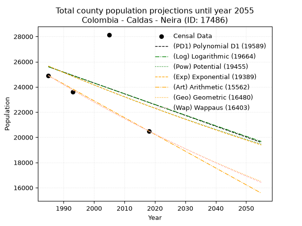
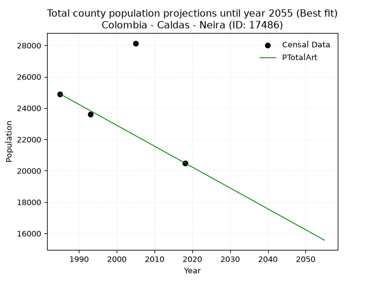
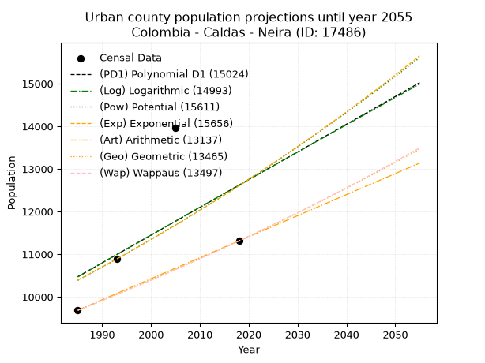
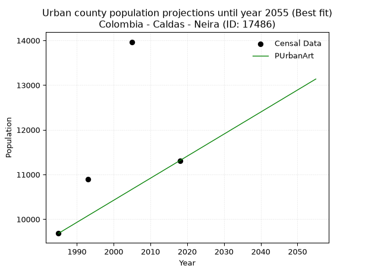
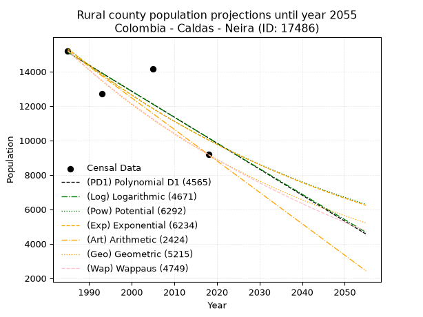
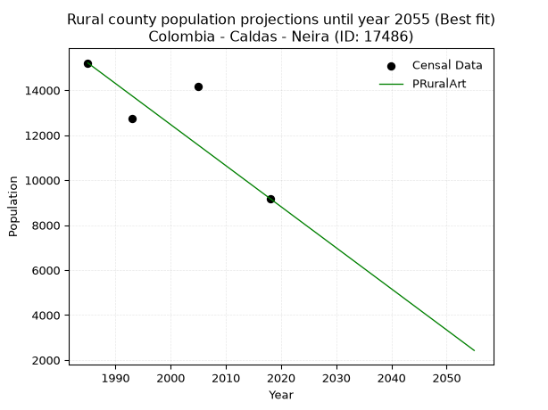

<div align="center">


</div>

# _“Population and Public Services Demand Projections (PPSD) until Year 2050 for Colombia - Caldas - Neira (ID: 17486)”_
Keywords: `population` `public-service` `projection` `lineal` `polynomial` `logarithmic` `potential` `exponential` `arithmetic` `geometric` `wappaus` `dane` `colombia` `south-america`

PPSD are analytical estimates used by governments and planners to anticipate future changes in population size, age distribution, and the resulting community needs for utilities, healthcare, education, and infrastructure as sizing future water treatment facilities, electrical grids, and road networks based on spatial growth.

> **General running parameters**: • app_version: _v20260806_. • Python version: _3.14.7_. • Pandas version: _3.0.5_. • NumPy version: _2.5.1_. • Creates, save and include plots into reports (create_plot): _False_. • Projection until year: _2050_. • Process polynomial degree 2 and up: _False_. • Process Wappaus: _True_. • Process Wappaus: _True_. • Set negative values to zero: _True_. • Set infinite values to zero: _True_. • Drop dataset notes: _True_. 
<div align="center">

Dynamic map: [:earth_americas:Google](http://maps.google.com/maps?q=5.166894865,-75.5200063) [:earth_americas:OSM](https://www.openstreetmap.org/#map=18/5.166894865/-75.5200063&layers=P) [:earth_americas:Bing](https://www.bing.com/maps?cp=5.166894865~-75.5200063&lvl=18) [:earth_americas:Apple](https://maps.apple.com/frame?center=5.166894865%2C-75.5200063&span=0.003%2C0.006)

</div>


<div align="center">

```geojson
{
  "type": "Feature",
  "geometry": {
    "type": "Point", 
    "coordinates": [-75.5200063, 5.166894865]
  }, 
  "properties": {
    "Name": "Colombia - Caldas - Neira (ID: 17486)"
  }
}
```

</div>


## 0. Census Data (4 records)

Census data are official statistics collected by a government about the people and housing in a country. They usually include counts of total population, age, sex, race, income, education, and jobs.

📅Global census file: [Population.xlsx](../data/Population.xlsx)

| Source   |   Year |   CountryID | CountryName   |   StateID | StateName   |   CountyID | CountyName   |   PTotal |   PUrban |   PRural |
|:---------|-------:|------------:|:--------------|----------:|:------------|-----------:|:-------------|---------:|---------:|---------:|
| DANE     |   1985 |          57 | Colombia      |        17 | Caldas      |      17486 | Neira        |    24895 |     9684 |    15211 |
| DANE     |   1993 |          57 | Colombia      |        17 | Caldas      |      17486 | Neira        |    23621 |    10890 |    12731 |
| DANE     |   2005 |          57 | Colombia      |        17 | Caldas      |      17486 | Neira        |    28140 |    13967 |    14173 |
| DANE     |   2018 |          57 | Colombia      |        17 | Caldas      |      17486 | Neira        |    20495 |    11312 |     9183 |

> 🔥Some records could had specific notes about the registered values or the corresponding urban or rural distribution.

📅   [RUPS](https://www.datos.gov.co/Hacienda-y-Cr-dito-P-blico/Registro-nico-de-Prestadores-de-Servicios-P-blicos/4qkq-csdn/about_data) - Local public utility companies: [RUPS.csv](../data/RUPS.xlsx)

 | SERVICIO       | ESTADO    | NOMBRE                                                                     | NIT         | DEPARTAMENTO_DOMICILIO   | MUNICIPIO_DOMICILIO   | DIRECCION                                                  |   TELEFONO | EMAIL                              | TIPO_INSCRIPCION    | REPRESENTANTE_LEGAL              | TIPO_PRESTADOR                             | CLASIFICACION                 |
|:---------------|:----------|:---------------------------------------------------------------------------|:------------|:-------------------------|:----------------------|:-----------------------------------------------------------|-----------:|:-----------------------------------|:--------------------|:---------------------------------|:-------------------------------------------|:------------------------------|
| ACUEDUCTO      | OPERATIVA | EMPRESA DE OBRAS SANITARIAS DE CALDAS  S. A. EMPRESA DE SERVICIOS PUBLICOS | 890803239-9 | CALDAS                   | MANIZALES             | Carrera 23 Nro 75 - 82                                     |    8867080 | lorena.grisalest@empocaldas.com.co | Registro por la ESP | WILDER IBERSON ESCOBAR  ORTIZ    | SOCIEDADES (EMPRESA DE SERVICIOS PUBLICOS) | MAYOR O IGUAL A 5001 USUARIOS |
| ALCANTARILLADO | OPERATIVA | EMPRESA DE OBRAS SANITARIAS DE CALDAS  S. A. EMPRESA DE SERVICIOS PUBLICOS | 890803239-9 | CALDAS                   | MANIZALES             | Carrera 23 Nro 75 - 82                                     |    8867080 | lorena.grisalest@empocaldas.com.co | Registro por la ESP | WILDER IBERSON ESCOBAR  ORTIZ    | SOCIEDADES (EMPRESA DE SERVICIOS PUBLICOS) | MAYOR O IGUAL A 5001 USUARIOS |
| ACUEDUCTO      | OPERATIVA | Asociación de Usuarios Colectivos de Cuba                                  | 901214324-9 | CALDAS                   | NEIRA                 | Caseta Junta de Acción Comunal Vereda Cuba                 |    3003971 | acueductocuba@gmail.com            | Registro por la ESP | EDGAR DE JESUS ARBOLEDA VALENCIA | ORGANIZACION AUTORIZADA                    | MENOR O IGUAL A 2500 USUARIOS |
| ACUEDUCTO      | OPERATIVA | ASOCIACIÓN DE USUARIOS DE SERVICIOS COLECTIVOS DE PUEBLO RICO              | 800168459-0 | CALDAS                   | NEIRA                 | CENTRO DE TURISMO Y TRANSPORTE CETTRAN N 1 BRR LA VARIANTE |    0000000 | ASOPRICO@GMAIL.COM                 | Registro por la ESP | ARLES VALENCIA CASTAO            | ORGANIZACION AUTORIZADA                    | MENOR O IGUAL A 2500 USUARIOS |
| ACUEDUCTO      | OPERATIVA | ASOCIACION DE USUARIOS AGUAS TAPIAS                                        | 900511439-7 | CALDAS                   | NEIRA                 | vereda tapias                                              |    3128121 | meme9894@hotmail.com               | Registro por la ESP | JORGE URIEL TAPASCO              | ORGANIZACION AUTORIZADA                    | MENOR O IGUAL A 2500 USUARIOS |

## 1. Total

### 1.1. Coefficients and Parameters

* (PD1) Polynomial Deg 1: -85.82858289843, 195966.3729425846 (lineal)
* (Log) Logarithmic: -171115.5087842082, 1324938.1035023967
* (Pow) Potential: -7.973082606394571, 30.70234594617751
* (Exp) Exponential: -0.0039972450149329325, 71613105.52605188
* (Art) Arithmetic: Year diff. 2018 - 1985 = 33, Population diff. 20495 - 24895 = -4400, Annual growth = -133.33333333333334
* (Geo) Geometric: Year diff. 2018 - 1985 = 33, Population diff. 20495 - 24895 = -4400, Annual growth % = -0.005876183245376532
* (Wap) Wappaus: i = -0.5875009179701843, Condition values only valid for < 200)

<sub>
Wappaus condition values: ['-0.00', '-0.59', '-1.18', '-1.76', '-2.35', '-2.94', '-3.53', '-4.11', '-4.70', '-5.29', '-5.88', '-6.46', '-7.05', '-7.64', '-8.23', '-8.81', '-9.40', '-9.99', '-10.58', '-11.16', '-11.75', '-12.34', '-12.93', '-13.51', '-14.10', '-14.69', '-15.28', '-15.86', '-16.45', '-17.04', '-17.63', '-18.21', '-18.80', '-19.39', '-19.98', '-20.56', '-21.15', '-21.74', '-22.33', '-22.91', '-23.50', '-24.09', '-24.68', '-25.26', '-25.85', '-26.44', '-27.03', '-27.61', '-28.20', '-28.79', '-29.38', '-29.96', '-30.55', '-31.14', '-31.73', '-32.31', '-32.90', '-33.49', '-34.08', '-34.66', '-35.25', '-35.84', '-36.43', '-37.01', '-37.60', '-38.19']
</sub>


### 1.2. Projected Dataset

|   Year |   CountyID |   PTotalPD1 |   PTotalLog |   PTotalPow |   PTotalExp |   PTotalArt |   PTotalGeo |   PTotalWap |
|-------:|-----------:|------------:|------------:|------------:|------------:|------------:|------------:|------------:|
|   1985 |      17486 |       25597 |       25594 |       25647 |       25649 |       24895 |       24895 |       24895 |
|   1986 |      17486 |       25511 |       25508 |       25544 |       25547 |       24762 |       24749 |       24749 |
|   1987 |      17486 |       25425 |       25422 |       25441 |       25445 |       24628 |       24603 |       24604 |
|   1988 |      17486 |       25339 |       25336 |       25340 |       25343 |       24495 |       24459 |       24460 |
|   1989 |      17486 |       25253 |       25250 |       25238 |       25242 |       24362 |       24315 |       24317 |
|   1990 |      17486 |       25167 |       25164 |       25137 |       25141 |       24228 |       24172 |       24174 |
|   1991 |      17486 |       25082 |       25078 |       25037 |       25041 |       24095 |       24030 |       24033 |
|   1992 |      17486 |       24996 |       24992 |       24937 |       24941 |       23962 |       23889 |       23892 |
|   1993 |      17486 |       24910 |       24906 |       24837 |       24842 |       23828 |       23748 |       23752 |
|   1994 |      17486 |       24824 |       24820 |       24738 |       24743 |       23695 |       23609 |       23613 |
|   1995 |      17486 |       24738 |       24734 |       24639 |       24644 |       23562 |       23470 |       23474 |
|   1996 |      17486 |       24653 |       24648 |       24541 |       24546 |       23428 |       23332 |       23337 |
|   1997 |      17486 |       24567 |       24563 |       24443 |       24448 |       23295 |       23195 |       23200 |
|   1998 |      17486 |       24481 |       24477 |       24346 |       24350 |       23162 |       23059 |       23064 |
|   1999 |      17486 |       24395 |       24391 |       24249 |       24253 |       23028 |       22923 |       22928 |
|   2000 |      17486 |       24309 |       24306 |       24152 |       24156 |       22895 |       22789 |       22794 |
|   2001 |      17486 |       24223 |       24220 |       24056 |       24060 |       22762 |       22655 |       22660 |
|   2002 |      17486 |       24138 |       24135 |       23961 |       23964 |       22628 |       22522 |       22527 |
|   2003 |      17486 |       24052 |       24049 |       23866 |       23868 |       22495 |       22389 |       22395 |
|   2004 |      17486 |       23966 |       23964 |       23771 |       23773 |       22362 |       22258 |       22263 |
|   2005 |      17486 |       23880 |       23879 |       23676 |       23678 |       22228 |       22127 |       22132 |
|   2006 |      17486 |       23794 |       23793 |       23582 |       23584 |       22095 |       21997 |       22002 |
|   2007 |      17486 |       23708 |       23708 |       23489 |       23490 |       21962 |       21868 |       21873 |
|   2008 |      17486 |       23623 |       23623 |       23396 |       23396 |       21828 |       21739 |       21744 |
|   2009 |      17486 |       23537 |       23538 |       23303 |       23303 |       21695 |       21611 |       21616 |
|   2010 |      17486 |       23451 |       23452 |       23211 |       23210 |       21562 |       21484 |       21489 |
|   2011 |      17486 |       23365 |       23367 |       23119 |       23117 |       21428 |       21358 |       21362 |
|   2012 |      17486 |       23279 |       23282 |       23028 |       23025 |       21295 |       21233 |       21236 |
|   2013 |      17486 |       23193 |       23197 |       22936 |       22933 |       21162 |       21108 |       21111 |
|   2014 |      17486 |       23108 |       23112 |       22846 |       22842 |       21028 |       20984 |       20986 |
|   2015 |      17486 |       23022 |       23027 |       22756 |       22750 |       20895 |       20861 |       20863 |
|   2016 |      17486 |       22936 |       22942 |       22666 |       22660 |       20762 |       20738 |       20739 |
|   2017 |      17486 |       22850 |       22857 |       22576 |       22569 |       20628 |       20616 |       20617 |
|   2018 |      17486 |       22764 |       22773 |       22487 |       22479 |       20495 |       20495 |       20495 |
|   2019 |      17486 |       22678 |       22688 |       22399 |       22390 |       20362 |       20375 |       20374 |
|   2020 |      17486 |       22593 |       22603 |       22310 |       22300 |       20228 |       20255 |       20253 |
|   2021 |      17486 |       22507 |       22518 |       22222 |       22211 |       20095 |       20136 |       20133 |
|   2022 |      17486 |       22421 |       22434 |       22135 |       22123 |       19962 |       20017 |       20014 |
|   2023 |      17486 |       22335 |       22349 |       22048 |       22034 |       19828 |       19900 |       19895 |
|   2024 |      17486 |       22249 |       22265 |       21961 |       21947 |       19695 |       19783 |       19777 |
|   2025 |      17486 |       22163 |       22180 |       21875 |       21859 |       19562 |       19667 |       19660 |
|   2026 |      17486 |       22078 |       22096 |       21789 |       21772 |       19428 |       19551 |       19543 |
|   2027 |      17486 |       21992 |       22011 |       21703 |       21685 |       19295 |       19436 |       19427 |
|   2028 |      17486 |       21906 |       21927 |       21618 |       21598 |       19162 |       19322 |       19311 |
|   2029 |      17486 |       21820 |       21842 |       21533 |       21512 |       19028 |       19208 |       19196 |
|   2030 |      17486 |       21734 |       21758 |       21449 |       21426 |       18895 |       19096 |       19082 |
|   2031 |      17486 |       21649 |       21674 |       21365 |       21341 |       18762 |       18983 |       18968 |
|   2032 |      17486 |       21563 |       21590 |       21281 |       21256 |       18628 |       18872 |       18855 |
|   2033 |      17486 |       21477 |       21505 |       21198 |       21171 |       18495 |       18761 |       18742 |
|   2034 |      17486 |       21391 |       21421 |       21115 |       21087 |       18362 |       18651 |       18630 |
|   2035 |      17486 |       21305 |       21337 |       21032 |       21002 |       18228 |       18541 |       18519 |
|   2036 |      17486 |       21219 |       21253 |       20950 |       20919 |       18095 |       18432 |       18408 |
|   2037 |      17486 |       21134 |       21169 |       20868 |       20835 |       17962 |       18324 |       18297 |
|   2038 |      17486 |       21048 |       21085 |       20787 |       20752 |       17828 |       18216 |       18188 |
|   2039 |      17486 |       20962 |       21001 |       20706 |       20669 |       17695 |       18109 |       18078 |
|   2040 |      17486 |       20876 |       20917 |       20625 |       20587 |       17562 |       18003 |       17970 |
|   2041 |      17486 |       20790 |       20833 |       20544 |       20505 |       17428 |       17897 |       17862 |
|   2042 |      17486 |       20704 |       20750 |       20464 |       20423 |       17295 |       17792 |       17754 |
|   2043 |      17486 |       20619 |       20666 |       20385 |       20341 |       17162 |       17687 |       17647 |
|   2044 |      17486 |       20533 |       20582 |       20305 |       20260 |       17028 |       17583 |       17540 |
|   2045 |      17486 |       20447 |       20498 |       20226 |       20180 |       16895 |       17480 |       17434 |
|   2046 |      17486 |       20361 |       20415 |       20148 |       20099 |       16762 |       17377 |       17329 |
|   2047 |      17486 |       20275 |       20331 |       20069 |       20019 |       16628 |       17275 |       17224 |
|   2048 |      17486 |       20189 |       20248 |       19991 |       19939 |       16495 |       17174 |       17120 |
|   2049 |      17486 |       20104 |       20164 |       19914 |       19859 |       16362 |       17073 |       17016 |
|   2050 |      17486 |       20018 |       20081 |       19836 |       19780 |       16228 |       16972 |       16912 |
<div align="center">

</img>

</div>


### 1.3. Best fit with absolute and relative error (%)

Relative error puts that difference into context by dividing the absolute error by the true value, creating a unitless ratio or percentage that shows the scale of the mistake.

Absolute and relative error

|   Year | Source   |   CountryID | CountryName   |   StateID | StateName   |   CountyID_x | CountyName   |   PTotal |   PUrban |   PRural |   CountyID_y |   PTotalPD1 |   PTotalLog |   PTotalPow |   PTotalExp |   PTotalArt |   PTotalGeo |   PTotalWap |   PTotalPD1AbsError |   PTotalLogAbsError |   PTotalPowAbsError |   PTotalExpAbsError |   PTotalArtAbsError |   PTotalGeoAbsError |   PTotalWapAbsError |   PTotalPD1RelError |   PTotalLogRelError |   PTotalPowRelError |   PTotalExpRelError |   PTotalArtRelError |   PTotalGeoRelError |   PTotalWapRelError |
|-------:|:---------|------------:|:--------------|----------:|:------------|-------------:|:-------------|---------:|---------:|---------:|-------------:|------------:|------------:|------------:|------------:|------------:|------------:|------------:|--------------------:|--------------------:|--------------------:|--------------------:|--------------------:|--------------------:|--------------------:|--------------------:|--------------------:|--------------------:|--------------------:|--------------------:|--------------------:|--------------------:|
|   1985 | DANE     |          57 | Colombia      |        17 | Caldas      |        17486 | Neira        |    24895 |     9684 |    15211 |        17486 |       25597 |       25594 |       25647 |       25649 |       24895 |       24895 |       24895 |                 702 |                 699 |                 752 |                 754 |                   0 |                   0 |                   0 |             2.81984 |             2.80779 |             3.02069 |             3.02872 |            0        |            0        |            0        |
|   1993 | DANE     |          57 | Colombia      |        17 | Caldas      |        17486 | Neira        |    23621 |    10890 |    12731 |        17486 |       24910 |       24906 |       24837 |       24842 |       23828 |       23748 |       23752 |                1289 |                1285 |                1216 |                1221 |                 207 |                 127 |                 131 |             5.45701 |             5.44007 |             5.14796 |             5.16913 |            0.876339 |            0.537657 |            0.554591 |
|   2005 | DANE     |          57 | Colombia      |        17 | Caldas      |        17486 | Neira        |    28140 |    13967 |    14173 |        17486 |       23880 |       23879 |       23676 |       23678 |       22228 |       22127 |       22132 |                4260 |                4261 |                4464 |                4462 |                5912 |                6013 |                6008 |            15.1386  |            15.1421  |            15.8635  |            15.8564  |           21.0092   |           21.3682   |           21.3504   |
|   2018 | DANE     |          57 | Colombia      |        17 | Caldas      |        17486 | Neira        |    20495 |    11312 |     9183 |        17486 |       22764 |       22773 |       22487 |       22479 |       20495 |       20495 |       20495 |                2269 |                2278 |                1992 |                1984 |                   0 |                   0 |                   0 |            11.071   |            11.1149  |             9.71944 |             9.68041 |            0        |            0        |            0        |

Relative error mean

| Method    |   RelError | Best   |
|:----------|-----------:|:-------|
| PTotalPD1 |    8.62161 |        |
| PTotalLog |    8.62623 |        |
| PTotalPow |    8.43791 |        |
| PTotalExp |    8.43367 |        |
| PTotalArt |    5.47139 | True   |
| PTotalGeo |    5.47645 |        |
| PTotalWap |    5.47625 |        |

💙Best method: _**PTotalArt**_
<div align="center">

</img>

</div>


### 1.4. Fresh water supply demand in liters per capita per day (lpcd)

The fresh water supply demand typically ranges from 100 to 300 liters per capita per day (lpcd) for standard domestic and municipal planning, though absolute survival minimums set by the World Health Organization are as low as 7.5 to 20 liters per day, and total consumption in high-income nations can exceed 400 liters.

> `CZ`: Level in meters above the sea level (masl)<br> `WS`: Fresh water supply demand in liters per capita per day (lpcd or l/h/d)<br> `WSAll`: Zonal fresh water supply demand in liters per second (l/s)<br> `A`: Zonal area in square meters<br> `DP`: Population density (people/hectare or p/ha)

Reference values (RAS Colombia)

|    CZ |   WS |
|------:|-----:|
|  1000 |  120 |
|  2000 |  130 |
| 99999 |  140 |

County shapefile geometry properties and water supply values

|   CountyID |      ATotal |   CZTotal |   WSTotal |
|-----------:|------------:|----------:|----------:|
|      17486 | 3.69199e+08 |   1977.79 |       130 |

Projected values for best method: PTotalArt

|   CountyID |   Year |   PTotalArt |   DPTotal |   WSTotal |   WSTotalAll |
|-----------:|-------:|------------:|----------:|----------:|-------------:|
|      17486 |   1985 |       24895 |      0.67 |       130 |      37.4578 |
|      17486 |   1986 |       24762 |      0.67 |       130 |      37.2576 |
|      17486 |   1987 |       24628 |      0.67 |       130 |      37.056  |
|      17486 |   1988 |       24495 |      0.66 |       130 |      36.8559 |
|      17486 |   1989 |       24362 |      0.66 |       130 |      36.6558 |
|      17486 |   1990 |       24228 |      0.66 |       130 |      36.4542 |
|      17486 |   1991 |       24095 |      0.65 |       130 |      36.2541 |
|      17486 |   1992 |       23962 |      0.65 |       130 |      36.0539 |
|      17486 |   1993 |       23828 |      0.65 |       130 |      35.8523 |
|      17486 |   1994 |       23695 |      0.64 |       130 |      35.6522 |
|      17486 |   1995 |       23562 |      0.64 |       130 |      35.4521 |
|      17486 |   1996 |       23428 |      0.63 |       130 |      35.2505 |
|      17486 |   1997 |       23295 |      0.63 |       130 |      35.0503 |
|      17486 |   1998 |       23162 |      0.63 |       130 |      34.8502 |
|      17486 |   1999 |       23028 |      0.62 |       130 |      34.6486 |
|      17486 |   2000 |       22895 |      0.62 |       130 |      34.4485 |
|      17486 |   2001 |       22762 |      0.62 |       130 |      34.2484 |
|      17486 |   2002 |       22628 |      0.61 |       130 |      34.0468 |
|      17486 |   2003 |       22495 |      0.61 |       130 |      33.8466 |
|      17486 |   2004 |       22362 |      0.61 |       130 |      33.6465 |
|      17486 |   2005 |       22228 |      0.6  |       130 |      33.4449 |
|      17486 |   2006 |       22095 |      0.6  |       130 |      33.2448 |
|      17486 |   2007 |       21962 |      0.59 |       130 |      33.0447 |
|      17486 |   2008 |       21828 |      0.59 |       130 |      32.8431 |
|      17486 |   2009 |       21695 |      0.59 |       130 |      32.6429 |
|      17486 |   2010 |       21562 |      0.58 |       130 |      32.4428 |
|      17486 |   2011 |       21428 |      0.58 |       130 |      32.2412 |
|      17486 |   2012 |       21295 |      0.58 |       130 |      32.0411 |
|      17486 |   2013 |       21162 |      0.57 |       130 |      31.841  |
|      17486 |   2014 |       21028 |      0.57 |       130 |      31.6394 |
|      17486 |   2015 |       20895 |      0.57 |       130 |      31.4392 |
|      17486 |   2016 |       20762 |      0.56 |       130 |      31.2391 |
|      17486 |   2017 |       20628 |      0.56 |       130 |      31.0375 |
|      17486 |   2018 |       20495 |      0.56 |       130 |      30.8374 |
|      17486 |   2019 |       20362 |      0.55 |       130 |      30.6373 |
|      17486 |   2020 |       20228 |      0.55 |       130 |      30.4356 |
|      17486 |   2021 |       20095 |      0.54 |       130 |      30.2355 |
|      17486 |   2022 |       19962 |      0.54 |       130 |      30.0354 |
|      17486 |   2023 |       19828 |      0.54 |       130 |      29.8338 |
|      17486 |   2024 |       19695 |      0.53 |       130 |      29.6337 |
|      17486 |   2025 |       19562 |      0.53 |       130 |      29.4336 |
|      17486 |   2026 |       19428 |      0.53 |       130 |      29.2319 |
|      17486 |   2027 |       19295 |      0.52 |       130 |      29.0318 |
|      17486 |   2028 |       19162 |      0.52 |       130 |      28.8317 |
|      17486 |   2029 |       19028 |      0.52 |       130 |      28.6301 |
|      17486 |   2030 |       18895 |      0.51 |       130 |      28.43   |
|      17486 |   2031 |       18762 |      0.51 |       130 |      28.2299 |
|      17486 |   2032 |       18628 |      0.5  |       130 |      28.0282 |
|      17486 |   2033 |       18495 |      0.5  |       130 |      27.8281 |
|      17486 |   2034 |       18362 |      0.5  |       130 |      27.628  |
|      17486 |   2035 |       18228 |      0.49 |       130 |      27.4264 |
|      17486 |   2036 |       18095 |      0.49 |       130 |      27.2263 |
|      17486 |   2037 |       17962 |      0.49 |       130 |      27.0262 |
|      17486 |   2038 |       17828 |      0.48 |       130 |      26.8245 |
|      17486 |   2039 |       17695 |      0.48 |       130 |      26.6244 |
|      17486 |   2040 |       17562 |      0.48 |       130 |      26.4243 |
|      17486 |   2041 |       17428 |      0.47 |       130 |      26.2227 |
|      17486 |   2042 |       17295 |      0.47 |       130 |      26.0226 |
|      17486 |   2043 |       17162 |      0.46 |       130 |      25.8225 |
|      17486 |   2044 |       17028 |      0.46 |       130 |      25.6208 |
|      17486 |   2045 |       16895 |      0.46 |       130 |      25.4207 |
|      17486 |   2046 |       16762 |      0.45 |       130 |      25.2206 |
|      17486 |   2047 |       16628 |      0.45 |       130 |      25.019  |
|      17486 |   2048 |       16495 |      0.45 |       130 |      24.8189 |
|      17486 |   2049 |       16362 |      0.44 |       130 |      24.6187 |
|      17486 |   2050 |       16228 |      0.44 |       130 |      24.4171 |

## 2. Urban

### 2.1. Coefficients and Parameters

* (PD1) Polynomial Deg 1: 65.03050983540895, -118614.02729827676 (lineal)
* (Log) Logarithmic: 130607.74740074981, -981287.2846179018
* (Pow) Potential: 11.75862272197916, -34.760674048323914
* (Exp) Exponential: 0.005855930099186309, 0.09298207656217618
* (Art) Arithmetic: Year diff. 2018 - 1985 = 33, Population diff. 11312 - 9684 = 1628, Annual growth = 49.333333333333336
* (Geo) Geometric: Year diff. 2018 - 1985 = 33, Population diff. 11312 - 9684 = 1628, Annual growth % = 0.0047198633295666426
* (Wap) Wappaus: i = 0.4699307804661205, Condition values only valid for < 200)

<sub>
Wappaus condition values: ['0.00', '0.47', '0.94', '1.41', '1.88', '2.35', '2.82', '3.29', '3.76', '4.23', '4.70', '5.17', '5.64', '6.11', '6.58', '7.05', '7.52', '7.99', '8.46', '8.93', '9.40', '9.87', '10.34', '10.81', '11.28', '11.75', '12.22', '12.69', '13.16', '13.63', '14.10', '14.57', '15.04', '15.51', '15.98', '16.45', '16.92', '17.39', '17.86', '18.33', '18.80', '19.27', '19.74', '20.21', '20.68', '21.15', '21.62', '22.09', '22.56', '23.03', '23.50', '23.97', '24.44', '24.91', '25.38', '25.85', '26.32', '26.79', '27.26', '27.73', '28.20', '28.67', '29.14', '29.61', '30.08', '30.55']
</sub>


### 2.2. Projected Dataset

|   Year |   CountyID |   PUrbanPD1 |   PUrbanLog |   PUrbanPow |   PUrbanExp |   PUrbanArt |   PUrbanGeo |   PUrbanWap |
|-------:|-----------:|------------:|------------:|------------:|------------:|------------:|------------:|------------:|
|   1985 |      17486 |       10472 |       10466 |       10386 |       10391 |        9684 |        9684 |        9684 |
|   1986 |      17486 |       10537 |       10532 |       10448 |       10452 |        9733 |        9730 |        9730 |
|   1987 |      17486 |       10602 |       10598 |       10510 |       10513 |        9783 |        9776 |        9775 |
|   1988 |      17486 |       10667 |       10663 |       10572 |       10575 |        9832 |        9822 |        9821 |
|   1989 |      17486 |       10732 |       10729 |       10635 |       10637 |        9881 |        9868 |        9868 |
|   1990 |      17486 |       10797 |       10795 |       10698 |       10700 |        9931 |        9915 |        9914 |
|   1991 |      17486 |       10862 |       10860 |       10761 |       10762 |        9980 |        9961 |        9961 |
|   1992 |      17486 |       10927 |       10926 |       10825 |       10826 |       10029 |       10009 |       10008 |
|   1993 |      17486 |       10992 |       10992 |       10889 |       10889 |       10079 |       10056 |       10055 |
|   1994 |      17486 |       11057 |       11057 |       10953 |       10953 |       10128 |       10103 |       10102 |
|   1995 |      17486 |       11122 |       11123 |       11018 |       11017 |       10177 |       10151 |       10150 |
|   1996 |      17486 |       11187 |       11188 |       11083 |       11082 |       10227 |       10199 |       10198 |
|   1997 |      17486 |       11252 |       11253 |       11149 |       11147 |       10276 |       10247 |       10246 |
|   1998 |      17486 |       11317 |       11319 |       11215 |       11213 |       10325 |       10295 |       10294 |
|   1999 |      17486 |       11382 |       11384 |       11281 |       11279 |       10375 |       10344 |       10343 |
|   2000 |      17486 |       11447 |       11449 |       11347 |       11345 |       10424 |       10393 |       10392 |
|   2001 |      17486 |       11512 |       11515 |       11414 |       11411 |       10473 |       10442 |       10441 |
|   2002 |      17486 |       11577 |       11580 |       11481 |       11478 |       10523 |       10491 |       10490 |
|   2003 |      17486 |       11642 |       11645 |       11549 |       11546 |       10572 |       10541 |       10539 |
|   2004 |      17486 |       11707 |       11710 |       11617 |       11614 |       10621 |       10590 |       10589 |
|   2005 |      17486 |       11772 |       11776 |       11685 |       11682 |       10671 |       10640 |       10639 |
|   2006 |      17486 |       11837 |       11841 |       11754 |       11750 |       10720 |       10691 |       10689 |
|   2007 |      17486 |       11902 |       11906 |       11823 |       11819 |       10769 |       10741 |       10740 |
|   2008 |      17486 |       11967 |       11971 |       11893 |       11889 |       10819 |       10792 |       10790 |
|   2009 |      17486 |       12032 |       12036 |       11962 |       11959 |       10868 |       10843 |       10841 |
|   2010 |      17486 |       12097 |       12101 |       12033 |       12029 |       10917 |       10894 |       10893 |
|   2011 |      17486 |       12162 |       12166 |       12103 |       12100 |       10967 |       10945 |       10944 |
|   2012 |      17486 |       12227 |       12231 |       12174 |       12171 |       11016 |       10997 |       10996 |
|   2013 |      17486 |       12292 |       12296 |       12246 |       12242 |       11065 |       11049 |       11048 |
|   2014 |      17486 |       12357 |       12361 |       12317 |       12314 |       11115 |       11101 |       11100 |
|   2015 |      17486 |       12422 |       12425 |       12389 |       12386 |       11164 |       11153 |       11153 |
|   2016 |      17486 |       12487 |       12490 |       12462 |       12459 |       11213 |       11206 |       11206 |
|   2017 |      17486 |       12553 |       12555 |       12535 |       12532 |       11263 |       11259 |       11259 |
|   2018 |      17486 |       12618 |       12620 |       12608 |       12606 |       11312 |       11312 |       11312 |
|   2019 |      17486 |       12683 |       12684 |       12682 |       12680 |       11361 |       11365 |       11366 |
|   2020 |      17486 |       12748 |       12749 |       12756 |       12754 |       11411 |       11419 |       11420 |
|   2021 |      17486 |       12813 |       12814 |       12830 |       12829 |       11460 |       11473 |       11474 |
|   2022 |      17486 |       12878 |       12878 |       12905 |       12905 |       11509 |       11527 |       11528 |
|   2023 |      17486 |       12943 |       12943 |       12980 |       12980 |       11559 |       11581 |       11583 |
|   2024 |      17486 |       13008 |       13007 |       13056 |       13057 |       11608 |       11636 |       11638 |
|   2025 |      17486 |       13073 |       13072 |       13132 |       13133 |       11657 |       11691 |       11693 |
|   2026 |      17486 |       13138 |       13136 |       13208 |       13210 |       11707 |       11746 |       11749 |
|   2027 |      17486 |       13203 |       13201 |       13285 |       13288 |       11756 |       11802 |       11805 |
|   2028 |      17486 |       13268 |       13265 |       13363 |       13366 |       11805 |       11857 |       11861 |
|   2029 |      17486 |       13333 |       13330 |       13440 |       13445 |       11855 |       11913 |       11917 |
|   2030 |      17486 |       13398 |       13394 |       13518 |       13524 |       11904 |       11970 |       11974 |
|   2031 |      17486 |       13463 |       13458 |       13597 |       13603 |       11953 |       12026 |       12031 |
|   2032 |      17486 |       13528 |       13523 |       13676 |       13683 |       12003 |       12083 |       12088 |
|   2033 |      17486 |       13593 |       13587 |       13755 |       13763 |       12052 |       12140 |       12146 |
|   2034 |      17486 |       13658 |       13651 |       13835 |       13844 |       12101 |       12197 |       12204 |
|   2035 |      17486 |       13723 |       13715 |       13915 |       13925 |       12151 |       12255 |       12262 |
|   2036 |      17486 |       13788 |       13779 |       13996 |       14007 |       12200 |       12313 |       12321 |
|   2037 |      17486 |       13853 |       13844 |       14077 |       14089 |       12249 |       12371 |       12380 |
|   2038 |      17486 |       13918 |       13908 |       14158 |       14172 |       12299 |       12429 |       12439 |
|   2039 |      17486 |       13983 |       13972 |       14240 |       14255 |       12348 |       12488 |       12499 |
|   2040 |      17486 |       14048 |       14036 |       14322 |       14339 |       12397 |       12547 |       12558 |
|   2041 |      17486 |       14113 |       14100 |       14405 |       14423 |       12447 |       12606 |       12619 |
|   2042 |      17486 |       14178 |       14164 |       14488 |       14508 |       12496 |       12665 |       12679 |
|   2043 |      17486 |       14243 |       14228 |       14572 |       14593 |       12545 |       12725 |       12740 |
|   2044 |      17486 |       14308 |       14292 |       14656 |       14679 |       12595 |       12785 |       12801 |
|   2045 |      17486 |       14373 |       14356 |       14741 |       14765 |       12644 |       12846 |       12863 |
|   2046 |      17486 |       14438 |       14419 |       14826 |       14852 |       12693 |       12906 |       12924 |
|   2047 |      17486 |       14503 |       14483 |       14911 |       14939 |       12743 |       12967 |       12987 |
|   2048 |      17486 |       14568 |       14547 |       14997 |       15027 |       12792 |       13028 |       13049 |
|   2049 |      17486 |       14633 |       14611 |       15083 |       15115 |       12841 |       13090 |       13112 |
|   2050 |      17486 |       14699 |       14675 |       15170 |       15204 |       12891 |       13152 |       13175 |
<div align="center">

</img>

</div>


### 2.3. Best fit with absolute and relative error (%)

Relative error puts that difference into context by dividing the absolute error by the true value, creating a unitless ratio or percentage that shows the scale of the mistake.

Absolute and relative error

|   Year | Source   |   CountryID | CountryName   |   StateID | StateName   |   CountyID_x | CountyName   |   PTotal |   PUrban |   PRural |   CountyID_y |   PUrbanPD1 |   PUrbanLog |   PUrbanPow |   PUrbanExp |   PUrbanArt |   PUrbanGeo |   PUrbanWap |   PUrbanPD1AbsError |   PUrbanLogAbsError |   PUrbanPowAbsError |   PUrbanExpAbsError |   PUrbanArtAbsError |   PUrbanGeoAbsError |   PUrbanWapAbsError |   PUrbanPD1RelError |   PUrbanLogRelError |   PUrbanPowRelError |   PUrbanExpRelError |   PUrbanArtRelError |   PUrbanGeoRelError |   PUrbanWapRelError |
|-------:|:---------|------------:|:--------------|----------:|:------------|-------------:|:-------------|---------:|---------:|---------:|-------------:|------------:|------------:|------------:|------------:|------------:|------------:|------------:|--------------------:|--------------------:|--------------------:|--------------------:|--------------------:|--------------------:|--------------------:|--------------------:|--------------------:|--------------------:|--------------------:|--------------------:|--------------------:|--------------------:|
|   1985 | DANE     |          57 | Colombia      |        17 | Caldas      |        17486 | Neira        |    24895 |     9684 |    15211 |        17486 |       10472 |       10466 |       10386 |       10391 |        9684 |        9684 |        9684 |                 788 |                 782 |                 702 |                 707 |                   0 |                   0 |                   0 |            8.13713  |            8.07518  |          7.24907    |          7.3007     |              0      |              0      |             0       |
|   1993 | DANE     |          57 | Colombia      |        17 | Caldas      |        17486 | Neira        |    23621 |    10890 |    12731 |        17486 |       10992 |       10992 |       10889 |       10889 |       10079 |       10056 |       10055 |                 102 |                 102 |                   1 |                   1 |                 811 |                 834 |                 835 |            0.936639 |            0.936639 |          0.00918274 |          0.00918274 |              7.4472 |              7.6584 |             7.66758 |
|   2005 | DANE     |          57 | Colombia      |        17 | Caldas      |        17486 | Neira        |    28140 |    13967 |    14173 |        17486 |       11772 |       11776 |       11685 |       11682 |       10671 |       10640 |       10639 |                2195 |                2191 |                2282 |                2285 |                3296 |                3327 |                3328 |           15.7156   |           15.687    |         16.3385     |         16.36       |             23.5985 |             23.8204 |            23.8276  |
|   2018 | DANE     |          57 | Colombia      |        17 | Caldas      |        17486 | Neira        |    20495 |    11312 |     9183 |        17486 |       12618 |       12620 |       12608 |       12606 |       11312 |       11312 |       11312 |                1306 |                1308 |                1296 |                1294 |                   0 |                   0 |                   0 |           11.5453   |           11.5629   |         11.4569     |         11.4392     |              0      |              0      |             0       |

Relative error mean

| Method    |   RelError | Best   |
|:----------|-----------:|:-------|
| PUrbanPD1 |    9.08366 |        |
| PUrbanLog |    9.06543 |        |
| PUrbanPow |    8.76341 |        |
| PUrbanExp |    8.77726 |        |
| PUrbanArt |    7.76142 | True   |
| PUrbanGeo |    7.86971 |        |
| PUrbanWap |    7.87379 |        |

💙Best method: _**PUrbanArt**_
<div align="center">

</img>

</div>


### 2.4. Fresh water supply demand in liters per capita per day (lpcd)

The fresh water supply demand typically ranges from 100 to 300 liters per capita per day (lpcd) for standard domestic and municipal planning, though absolute survival minimums set by the World Health Organization are as low as 7.5 to 20 liters per day, and total consumption in high-income nations can exceed 400 liters.

> `CZ`: Level in meters above the sea level (masl)<br> `WS`: Fresh water supply demand in liters per capita per day (lpcd or l/h/d)<br> `WSAll`: Zonal fresh water supply demand in liters per second (l/s)<br> `A`: Zonal area in square meters<br> `DP`: Population density (people/hectare or p/ha)

Reference values (RAS Colombia)

|    CZ |   WS |
|------:|-----:|
|  1000 |  120 |
|  2000 |  130 |
| 99999 |  140 |

County shapefile geometry properties and water supply values

|   CountyID |   AUrban |   CZUrban |   WSUrban |
|-----------:|---------:|----------:|----------:|
|      17486 |   898197 |   1953.87 |       130 |

Projected values for best method: PUrbanArt

|   CountyID |   Year |   PUrbanArt |   DPUrban |   WSUrban |   WSUrbanAll |
|-----------:|-------:|------------:|----------:|----------:|-------------:|
|      17486 |   1985 |        9684 |    107.82 |       130 |      14.5708 |
|      17486 |   1986 |        9733 |    108.36 |       130 |      14.6446 |
|      17486 |   1987 |        9783 |    108.92 |       130 |      14.7198 |
|      17486 |   1988 |        9832 |    109.46 |       130 |      14.7935 |
|      17486 |   1989 |        9881 |    110.01 |       130 |      14.8672 |
|      17486 |   1990 |        9931 |    110.57 |       130 |      14.9425 |
|      17486 |   1991 |        9980 |    111.11 |       130 |      15.0162 |
|      17486 |   1992 |       10029 |    111.66 |       130 |      15.0899 |
|      17486 |   1993 |       10079 |    112.21 |       130 |      15.1652 |
|      17486 |   1994 |       10128 |    112.76 |       130 |      15.2389 |
|      17486 |   1995 |       10177 |    113.3  |       130 |      15.3126 |
|      17486 |   1996 |       10227 |    113.86 |       130 |      15.3878 |
|      17486 |   1997 |       10276 |    114.41 |       130 |      15.4616 |
|      17486 |   1998 |       10325 |    114.95 |       130 |      15.5353 |
|      17486 |   1999 |       10375 |    115.51 |       130 |      15.6105 |
|      17486 |   2000 |       10424 |    116.05 |       130 |      15.6843 |
|      17486 |   2001 |       10473 |    116.6  |       130 |      15.758  |
|      17486 |   2002 |       10523 |    117.16 |       130 |      15.8332 |
|      17486 |   2003 |       10572 |    117.7  |       130 |      15.9069 |
|      17486 |   2004 |       10621 |    118.25 |       130 |      15.9807 |
|      17486 |   2005 |       10671 |    118.8  |       130 |      16.0559 |
|      17486 |   2006 |       10720 |    119.35 |       130 |      16.1296 |
|      17486 |   2007 |       10769 |    119.9  |       130 |      16.2034 |
|      17486 |   2008 |       10819 |    120.45 |       130 |      16.2786 |
|      17486 |   2009 |       10868 |    121    |       130 |      16.3523 |
|      17486 |   2010 |       10917 |    121.54 |       130 |      16.426  |
|      17486 |   2011 |       10967 |    122.1  |       130 |      16.5013 |
|      17486 |   2012 |       11016 |    122.65 |       130 |      16.575  |
|      17486 |   2013 |       11065 |    123.19 |       130 |      16.6487 |
|      17486 |   2014 |       11115 |    123.75 |       130 |      16.724  |
|      17486 |   2015 |       11164 |    124.29 |       130 |      16.7977 |
|      17486 |   2016 |       11213 |    124.84 |       130 |      16.8714 |
|      17486 |   2017 |       11263 |    125.4  |       130 |      16.9466 |
|      17486 |   2018 |       11312 |    125.94 |       130 |      17.0204 |
|      17486 |   2019 |       11361 |    126.49 |       130 |      17.0941 |
|      17486 |   2020 |       11411 |    127.04 |       130 |      17.1693 |
|      17486 |   2021 |       11460 |    127.59 |       130 |      17.2431 |
|      17486 |   2022 |       11509 |    128.13 |       130 |      17.3168 |
|      17486 |   2023 |       11559 |    128.69 |       130 |      17.392  |
|      17486 |   2024 |       11608 |    129.24 |       130 |      17.4657 |
|      17486 |   2025 |       11657 |    129.78 |       130 |      17.5395 |
|      17486 |   2026 |       11707 |    130.34 |       130 |      17.6147 |
|      17486 |   2027 |       11756 |    130.88 |       130 |      17.6884 |
|      17486 |   2028 |       11805 |    131.43 |       130 |      17.7622 |
|      17486 |   2029 |       11855 |    131.99 |       130 |      17.8374 |
|      17486 |   2030 |       11904 |    132.53 |       130 |      17.9111 |
|      17486 |   2031 |       11953 |    133.08 |       130 |      17.9848 |
|      17486 |   2032 |       12003 |    133.63 |       130 |      18.0601 |
|      17486 |   2033 |       12052 |    134.18 |       130 |      18.1338 |
|      17486 |   2034 |       12101 |    134.73 |       130 |      18.2075 |
|      17486 |   2035 |       12151 |    135.28 |       130 |      18.2828 |
|      17486 |   2036 |       12200 |    135.83 |       130 |      18.3565 |
|      17486 |   2037 |       12249 |    136.37 |       130 |      18.4302 |
|      17486 |   2038 |       12299 |    136.93 |       130 |      18.5054 |
|      17486 |   2039 |       12348 |    137.48 |       130 |      18.5792 |
|      17486 |   2040 |       12397 |    138.02 |       130 |      18.6529 |
|      17486 |   2041 |       12447 |    138.58 |       130 |      18.7281 |
|      17486 |   2042 |       12496 |    139.12 |       130 |      18.8019 |
|      17486 |   2043 |       12545 |    139.67 |       130 |      18.8756 |
|      17486 |   2044 |       12595 |    140.23 |       130 |      18.9508 |
|      17486 |   2045 |       12644 |    140.77 |       130 |      19.0245 |
|      17486 |   2046 |       12693 |    141.32 |       130 |      19.0983 |
|      17486 |   2047 |       12743 |    141.87 |       130 |      19.1735 |
|      17486 |   2048 |       12792 |    142.42 |       130 |      19.2472 |
|      17486 |   2049 |       12841 |    142.96 |       130 |      19.3209 |
|      17486 |   2050 |       12891 |    143.52 |       130 |      19.3962 |

## 3. Rural

### 3.1. Coefficients and Parameters

* (PD1) Polynomial Deg 1: -150.8590927338387, 314580.40024086094 (lineal)
* (Log) Logarithmic: -301723.2561849582, 2306225.388120299
* (Pow) Potential: -25.6996267328686, 88.93678349599043
* (Exp) Exponential: -0.012851361821787267, 1837862562208439.2
* (Art) Arithmetic: Year diff. 2018 - 1985 = 33, Population diff. 9183 - 15211 = -6028, Annual growth = -182.66666666666666
* (Geo) Geometric: Year diff. 2018 - 1985 = 33, Population diff. 9183 - 15211 = -6028, Annual growth % = -0.015176533607766052
* (Wap) Wappaus: i = -1.4976360307179362, Condition values only valid for < 200)

<sub>
Wappaus condition values: ['-0.00', '-1.50', '-3.00', '-4.49', '-5.99', '-7.49', '-8.99', '-10.48', '-11.98', '-13.48', '-14.98', '-16.47', '-17.97', '-19.47', '-20.97', '-22.46', '-23.96', '-25.46', '-26.96', '-28.46', '-29.95', '-31.45', '-32.95', '-34.45', '-35.94', '-37.44', '-38.94', '-40.44', '-41.93', '-43.43', '-44.93', '-46.43', '-47.92', '-49.42', '-50.92', '-52.42', '-53.91', '-55.41', '-56.91', '-58.41', '-59.91', '-61.40', '-62.90', '-64.40', '-65.90', '-67.39', '-68.89', '-70.39', '-71.89', '-73.38', '-74.88', '-76.38', '-77.88', '-79.37', '-80.87', '-82.37', '-83.87', '-85.37', '-86.86', '-88.36', '-89.86', '-91.36', '-92.85', '-94.35', '-95.85', '-97.35']
</sub>


### 3.2. Projected Dataset

|   Year |   CountyID |   PRuralPD1 |   PRuralLog |   PRuralPow |   PRuralExp |   PRuralArt |   PRuralGeo |   PRuralWap |
|-------:|-----------:|------------:|------------:|------------:|------------:|------------:|------------:|------------:|
|   1985 |      17486 |       15125 |       15128 |       15331 |       15328 |       15211 |       15211 |       15211 |
|   1986 |      17486 |       14974 |       14976 |       15134 |       15132 |       15028 |       14980 |       14985 |
|   1987 |      17486 |       14823 |       14824 |       14939 |       14939 |       14846 |       14753 |       14762 |
|   1988 |      17486 |       14673 |       14672 |       14747 |       14748 |       14663 |       14529 |       14543 |
|   1989 |      17486 |       14522 |       14520 |       14558 |       14560 |       14480 |       14308 |       14326 |
|   1990 |      17486 |       14371 |       14369 |       14371 |       14374 |       14298 |       14091 |       14113 |
|   1991 |      17486 |       14220 |       14217 |       14187 |       14190 |       14115 |       13877 |       13903 |
|   1992 |      17486 |       14069 |       14066 |       14005 |       14009 |       13932 |       13667 |       13696 |
|   1993 |      17486 |       13918 |       13914 |       13825 |       13830 |       13750 |       13459 |       13492 |
|   1994 |      17486 |       13767 |       13763 |       13648 |       13654 |       13567 |       13255 |       13290 |
|   1995 |      17486 |       13617 |       13612 |       13474 |       13479 |       13384 |       13054 |       13092 |
|   1996 |      17486 |       13466 |       13460 |       13301 |       13307 |       13202 |       12856 |       12896 |
|   1997 |      17486 |       13315 |       13309 |       13131 |       13137 |       13019 |       12661 |       12703 |
|   1998 |      17486 |       13164 |       13158 |       12963 |       12970 |       12836 |       12469 |       12512 |
|   1999 |      17486 |       13013 |       13007 |       12798 |       12804 |       12654 |       12279 |       12324 |
|   2000 |      17486 |       12862 |       12856 |       12634 |       12640 |       12471 |       12093 |       12139 |
|   2001 |      17486 |       12711 |       12706 |       12473 |       12479 |       12288 |       11909 |       11956 |
|   2002 |      17486 |       12560 |       12555 |       12314 |       12320 |       12106 |       11729 |       11776 |
|   2003 |      17486 |       12410 |       12404 |       12157 |       12162 |       11923 |       11551 |       11598 |
|   2004 |      17486 |       12259 |       12254 |       12002 |       12007 |       11740 |       11375 |       11422 |
|   2005 |      17486 |       12108 |       12103 |       11849 |       11854 |       11558 |       11203 |       11248 |
|   2006 |      17486 |       11957 |       11953 |       11698 |       11702 |       11375 |       11033 |       11077 |
|   2007 |      17486 |       11806 |       11802 |       11549 |       11553 |       11192 |       10865 |       10908 |
|   2008 |      17486 |       11655 |       11652 |       11402 |       11405 |       11010 |       10700 |       10741 |
|   2009 |      17486 |       11504 |       11502 |       11257 |       11260 |       10827 |       10538 |       10577 |
|   2010 |      17486 |       11354 |       11351 |       11114 |       11116 |       10644 |       10378 |       10414 |
|   2011 |      17486 |       11203 |       11201 |       10973 |       10974 |       10462 |       10221 |       10253 |
|   2012 |      17486 |       11052 |       11051 |       10834 |       10834 |       10279 |       10065 |       10095 |
|   2013 |      17486 |       10901 |       10901 |       10696 |       10696 |       10096 |        9913 |        9938 |
|   2014 |      17486 |       10750 |       10752 |       10561 |       10559 |        9914 |        9762 |        9783 |
|   2015 |      17486 |       10599 |       10602 |       10427 |       10424 |        9731 |        9614 |        9630 |
|   2016 |      17486 |       10448 |       10452 |       10295 |       10291 |        9548 |        9468 |        9480 |
|   2017 |      17486 |       10298 |       10303 |       10164 |       10160 |        9366 |        9325 |        9330 |
|   2018 |      17486 |       10147 |       10153 |       10036 |       10030 |        9183 |        9183 |        9183 |
|   2019 |      17486 |        9996 |       10004 |        9909 |        9902 |        9000 |        9044 |        9037 |
|   2020 |      17486 |        9845 |        9854 |        9783 |        9775 |        8818 |        8906 |        8894 |
|   2021 |      17486 |        9694 |        9705 |        9660 |        9651 |        8635 |        8771 |        8751 |
|   2022 |      17486 |        9543 |        9556 |        9538 |        9527 |        8452 |        8638 |        8611 |
|   2023 |      17486 |        9392 |        9406 |        9417 |        9406 |        8270 |        8507 |        8472 |
|   2024 |      17486 |        9242 |        9257 |        9298 |        9286 |        8087 |        8378 |        8335 |
|   2025 |      17486 |        9091 |        9108 |        9181 |        9167 |        7904 |        8251 |        8199 |
|   2026 |      17486 |        8940 |        8959 |        9065 |        9050 |        7722 |        8126 |        8065 |
|   2027 |      17486 |        8789 |        8810 |        8951 |        8934 |        7539 |        8002 |        7932 |
|   2028 |      17486 |        8638 |        8662 |        8838 |        8820 |        7356 |        7881 |        7801 |
|   2029 |      17486 |        8487 |        8513 |        8727 |        8708 |        7174 |        7761 |        7672 |
|   2030 |      17486 |        8336 |        8364 |        8617 |        8597 |        6991 |        7643 |        7543 |
|   2031 |      17486 |        8186 |        8216 |        8509 |        8487 |        6808 |        7527 |        7417 |
|   2032 |      17486 |        8035 |        8067 |        8402 |        8378 |        6626 |        7413 |        7291 |
|   2033 |      17486 |        7884 |        7919 |        8296 |        8271 |        6443 |        7301 |        7167 |
|   2034 |      17486 |        7733 |        7770 |        8192 |        8166 |        6260 |        7190 |        7045 |
|   2035 |      17486 |        7582 |        7622 |        8089 |        8062 |        6078 |        7081 |        6924 |
|   2036 |      17486 |        7431 |        7474 |        7988 |        7959 |        5895 |        6973 |        6804 |
|   2037 |      17486 |        7280 |        7325 |        7888 |        7857 |        5712 |        6867 |        6685 |
|   2038 |      17486 |        7130 |        7177 |        7789 |        7757 |        5530 |        6763 |        6568 |
|   2039 |      17486 |        6979 |        7029 |        7691 |        7658 |        5347 |        6661 |        6452 |
|   2040 |      17486 |        6828 |        6881 |        7595 |        7560 |        5164 |        6559 |        6337 |
|   2041 |      17486 |        6677 |        6734 |        7500 |        7463 |        4982 |        6460 |        6223 |
|   2042 |      17486 |        6526 |        6586 |        7406 |        7368 |        4799 |        6362 |        6110 |
|   2043 |      17486 |        6375 |        6438 |        7313 |        7274 |        4616 |        6265 |        5999 |
|   2044 |      17486 |        6224 |        6290 |        7222 |        7181 |        4434 |        6170 |        5889 |
|   2045 |      17486 |        6074 |        6143 |        7132 |        7089 |        4251 |        6077 |        5780 |
|   2046 |      17486 |        5923 |        5995 |        7043 |        6999 |        4068 |        5984 |        5672 |
|   2047 |      17486 |        5772 |        5848 |        6955 |        6909 |        3886 |        5894 |        5565 |
|   2048 |      17486 |        5621 |        5701 |        6868 |        6821 |        3703 |        5804 |        5460 |
|   2049 |      17486 |        5470 |        5553 |        6783 |        6734 |        3520 |        5716 |        5355 |
|   2050 |      17486 |        5319 |        5406 |        6698 |        6648 |        3338 |        5629 |        5251 |
<div align="center">

</img>

</div>


### 3.3. Best fit with absolute and relative error (%)

Relative error puts that difference into context by dividing the absolute error by the true value, creating a unitless ratio or percentage that shows the scale of the mistake.

Absolute and relative error

|   Year | Source   |   CountryID | CountryName   |   StateID | StateName   |   CountyID_x | CountyName   |   PTotal |   PUrban |   PRural |   CountyID_y |   PRuralPD1 |   PRuralLog |   PRuralPow |   PRuralExp |   PRuralArt |   PRuralGeo |   PRuralWap |   PRuralPD1AbsError |   PRuralLogAbsError |   PRuralPowAbsError |   PRuralExpAbsError |   PRuralArtAbsError |   PRuralGeoAbsError |   PRuralWapAbsError |   PRuralPD1RelError |   PRuralLogRelError |   PRuralPowRelError |   PRuralExpRelError |   PRuralArtRelError |   PRuralGeoRelError |   PRuralWapRelError |
|-------:|:---------|------------:|:--------------|----------:|:------------|-------------:|:-------------|---------:|---------:|---------:|-------------:|------------:|------------:|------------:|------------:|------------:|------------:|------------:|--------------------:|--------------------:|--------------------:|--------------------:|--------------------:|--------------------:|--------------------:|--------------------:|--------------------:|--------------------:|--------------------:|--------------------:|--------------------:|--------------------:|
|   1985 | DANE     |          57 | Colombia      |        17 | Caldas      |        17486 | Neira        |    24895 |     9684 |    15211 |        17486 |       15125 |       15128 |       15331 |       15328 |       15211 |       15211 |       15211 |                  86 |                  83 |                 120 |                 117 |                   0 |                   0 |                   0 |             0.56538 |            0.545658 |            0.788903 |             0.76918 |             0       |             0       |             0       |
|   1993 | DANE     |          57 | Colombia      |        17 | Caldas      |        17486 | Neira        |    23621 |    10890 |    12731 |        17486 |       13918 |       13914 |       13825 |       13830 |       13750 |       13459 |       13492 |                1187 |                1183 |                1094 |                1099 |                1019 |                 728 |                 761 |             9.3237  |            9.29228  |            8.5932   |             8.63247 |             8.00408 |             5.71833 |             5.97754 |
|   2005 | DANE     |          57 | Colombia      |        17 | Caldas      |        17486 | Neira        |    28140 |    13967 |    14173 |        17486 |       12108 |       12103 |       11849 |       11854 |       11558 |       11203 |       11248 |                2065 |                2070 |                2324 |                2319 |                2615 |                2970 |                2925 |            14.57    |           14.6052   |           16.3974   |            16.3621  |            18.4506  |            20.9553  |            20.6378  |
|   2018 | DANE     |          57 | Colombia      |        17 | Caldas      |        17486 | Neira        |    20495 |    11312 |     9183 |        17486 |       10147 |       10153 |       10036 |       10030 |        9183 |        9183 |        9183 |                 964 |                 970 |                 853 |                 847 |                   0 |                   0 |                   0 |            10.4977  |           10.563    |            9.2889   |             9.22357 |             0       |             0       |             0       |

Relative error mean

| Method    |   RelError | Best   |
|:----------|-----------:|:-------|
| PRuralPD1 |    8.73917 |        |
| PRuralLog |    8.75154 |        |
| PRuralPow |    8.76709 |        |
| PRuralExp |    8.74683 |        |
| PRuralArt |    6.61366 | True   |
| PRuralGeo |    6.66842 |        |
| PRuralWap |    6.65384 |        |

💙Best method: _**PRuralArt**_
<div align="center">

</img>

</div>


### 3.4. Fresh water supply demand in liters per capita per day (lpcd)

The fresh water supply demand typically ranges from 100 to 300 liters per capita per day (lpcd) for standard domestic and municipal planning, though absolute survival minimums set by the World Health Organization are as low as 7.5 to 20 liters per day, and total consumption in high-income nations can exceed 400 liters.

> `CZ`: Level in meters above the sea level (masl)<br> `WS`: Fresh water supply demand in liters per capita per day (lpcd or l/h/d)<br> `WSAll`: Zonal fresh water supply demand in liters per second (l/s)<br> `A`: Zonal area in square meters<br> `DP`: Population density (people/hectare or p/ha)

Reference values (RAS Colombia)

|    CZ |   WS |
|------:|-----:|
|  1000 |  120 |
|  2000 |  130 |
| 99999 |  140 |

County shapefile geometry properties and water supply values

|   CountyID |      ARural |   CZRural |   WSRural |
|-----------:|------------:|----------:|----------:|
|      17486 | 3.68301e+08 |   1977.85 |       130 |

Projected values for best method: PRuralArt

|   CountyID |   Year |   PRuralArt |   DPRural |   WSRural |   WSRuralAll |
|-----------:|-------:|------------:|----------:|----------:|-------------:|
|      17486 |   1985 |       15211 |      0.41 |       130 |     22.8869  |
|      17486 |   1986 |       15028 |      0.41 |       130 |     22.6116  |
|      17486 |   1987 |       14846 |      0.4  |       130 |     22.3377  |
|      17486 |   1988 |       14663 |      0.4  |       130 |     22.0624  |
|      17486 |   1989 |       14480 |      0.39 |       130 |     21.787   |
|      17486 |   1990 |       14298 |      0.39 |       130 |     21.5132  |
|      17486 |   1991 |       14115 |      0.38 |       130 |     21.2378  |
|      17486 |   1992 |       13932 |      0.38 |       130 |     20.9625  |
|      17486 |   1993 |       13750 |      0.37 |       130 |     20.6887  |
|      17486 |   1994 |       13567 |      0.37 |       130 |     20.4133  |
|      17486 |   1995 |       13384 |      0.36 |       130 |     20.138   |
|      17486 |   1996 |       13202 |      0.36 |       130 |     19.8641  |
|      17486 |   1997 |       13019 |      0.35 |       130 |     19.5888  |
|      17486 |   1998 |       12836 |      0.35 |       130 |     19.3134  |
|      17486 |   1999 |       12654 |      0.34 |       130 |     19.0396  |
|      17486 |   2000 |       12471 |      0.34 |       130 |     18.7642  |
|      17486 |   2001 |       12288 |      0.33 |       130 |     18.4889  |
|      17486 |   2002 |       12106 |      0.33 |       130 |     18.215   |
|      17486 |   2003 |       11923 |      0.32 |       130 |     17.9397  |
|      17486 |   2004 |       11740 |      0.32 |       130 |     17.6644  |
|      17486 |   2005 |       11558 |      0.31 |       130 |     17.3905  |
|      17486 |   2006 |       11375 |      0.31 |       130 |     17.1152  |
|      17486 |   2007 |       11192 |      0.3  |       130 |     16.8398  |
|      17486 |   2008 |       11010 |      0.3  |       130 |     16.566   |
|      17486 |   2009 |       10827 |      0.29 |       130 |     16.2906  |
|      17486 |   2010 |       10644 |      0.29 |       130 |     16.0153  |
|      17486 |   2011 |       10462 |      0.28 |       130 |     15.7414  |
|      17486 |   2012 |       10279 |      0.28 |       130 |     15.4661  |
|      17486 |   2013 |       10096 |      0.27 |       130 |     15.1907  |
|      17486 |   2014 |        9914 |      0.27 |       130 |     14.9169  |
|      17486 |   2015 |        9731 |      0.26 |       130 |     14.6416  |
|      17486 |   2016 |        9548 |      0.26 |       130 |     14.3662  |
|      17486 |   2017 |        9366 |      0.25 |       130 |     14.0924  |
|      17486 |   2018 |        9183 |      0.25 |       130 |     13.817   |
|      17486 |   2019 |        9000 |      0.24 |       130 |     13.5417  |
|      17486 |   2020 |        8818 |      0.24 |       130 |     13.2678  |
|      17486 |   2021 |        8635 |      0.23 |       130 |     12.9925  |
|      17486 |   2022 |        8452 |      0.23 |       130 |     12.7171  |
|      17486 |   2023 |        8270 |      0.22 |       130 |     12.4433  |
|      17486 |   2024 |        8087 |      0.22 |       130 |     12.1679  |
|      17486 |   2025 |        7904 |      0.21 |       130 |     11.8926  |
|      17486 |   2026 |        7722 |      0.21 |       130 |     11.6188  |
|      17486 |   2027 |        7539 |      0.2  |       130 |     11.3434  |
|      17486 |   2028 |        7356 |      0.2  |       130 |     11.0681  |
|      17486 |   2029 |        7174 |      0.19 |       130 |     10.7942  |
|      17486 |   2030 |        6991 |      0.19 |       130 |     10.5189  |
|      17486 |   2031 |        6808 |      0.18 |       130 |     10.2435  |
|      17486 |   2032 |        6626 |      0.18 |       130 |      9.96968 |
|      17486 |   2033 |        6443 |      0.17 |       130 |      9.69433 |
|      17486 |   2034 |        6260 |      0.17 |       130 |      9.41898 |
|      17486 |   2035 |        6078 |      0.17 |       130 |      9.14514 |
|      17486 |   2036 |        5895 |      0.16 |       130 |      8.86979 |
|      17486 |   2037 |        5712 |      0.16 |       130 |      8.59444 |
|      17486 |   2038 |        5530 |      0.15 |       130 |      8.3206  |
|      17486 |   2039 |        5347 |      0.15 |       130 |      8.04525 |
|      17486 |   2040 |        5164 |      0.14 |       130 |      7.76991 |
|      17486 |   2041 |        4982 |      0.14 |       130 |      7.49606 |
|      17486 |   2042 |        4799 |      0.13 |       130 |      7.22072 |
|      17486 |   2043 |        4616 |      0.13 |       130 |      6.94537 |
|      17486 |   2044 |        4434 |      0.12 |       130 |      6.67153 |
|      17486 |   2045 |        4251 |      0.12 |       130 |      6.39618 |
|      17486 |   2046 |        4068 |      0.11 |       130 |      6.12083 |
|      17486 |   2047 |        3886 |      0.11 |       130 |      5.84699 |
|      17486 |   2048 |        3703 |      0.1  |       130 |      5.57164 |
|      17486 |   2049 |        3520 |      0.1  |       130 |      5.2963  |
|      17486 |   2050 |        3338 |      0.09 |       130 |      5.02245 |

<div align="center"><br><sub>Share this research</sub></div><br>

<sub>**APPS & TOOLS & CONTENT DISCLAIMER**: • NO WARRANTY - This content and software is provided by <a href="https://github.com/rcfdtools" target="_blank">github.com/rcfdtools</a> "as is", without any express or implied warranty, including warranties of merchantability, fitness for a particular purpose, or non-infringement. There is no guarantee that the software will be error-free or operate without interruption. • LIMITATION OF LIABILITY - Neither the authors nor copyright holders will be liable for claims or damages arising from the software or its use. You are responsible for determining if the software is appropriate for your use and assume all associated risks, including errors, legal compliance, and data loss. • NO PROFESSIONAL ADVICE - The software provides general information and does not offer professional advice. It should not replace consultation with professional advisors. [Clauses and global license for rcfdtools use.](https://github.com/rcfdtools/rcfdtools/blob/main/LICENSE.md)</sub>

| [:house: Home](Readme.md)  | [:beginner: Help / Collaborate](https://github.com/rcfdtools/R.HydroTools/discussions/31) |
|----------------------------|-------------------------------------------------------------------------------------------|