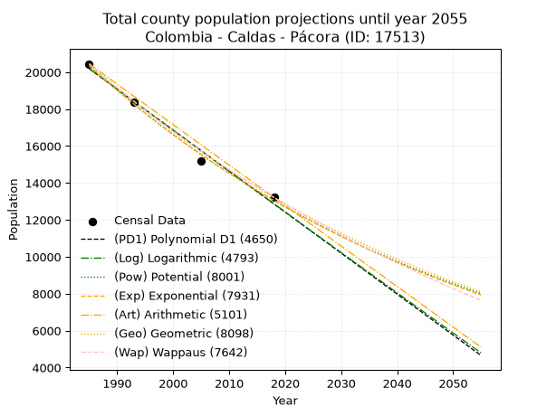
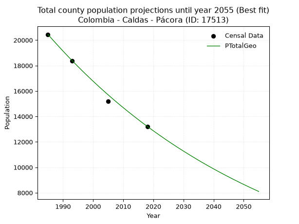
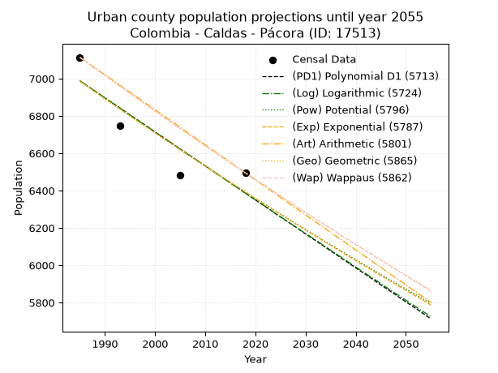
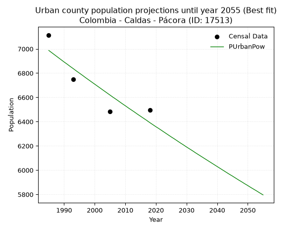
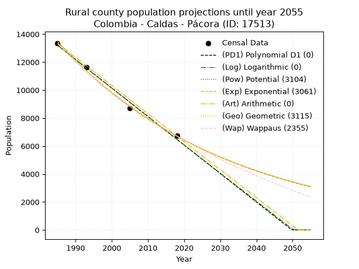
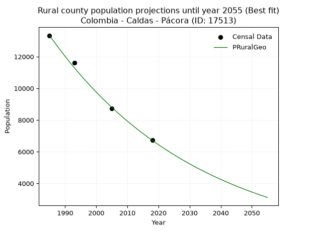

<div align="center">


</div>

# _“Population and Public Services Demand Projections (PPSD) until Year 2050 for Colombia - Caldas - Pácora (ID: 17513)”_
Keywords: `population` `public-service` `projection` `lineal` `polynomial` `logarithmic` `potential` `exponential` `arithmetic` `geometric` `wappaus` `dane` `colombia` `south-america`

PPSD are analytical estimates used by governments and planners to anticipate future changes in population size, age distribution, and the resulting community needs for utilities, healthcare, education, and infrastructure as sizing future water treatment facilities, electrical grids, and road networks based on spatial growth.

> **General running parameters**: • app_version: _v20260806_. • Python version: _3.14.7_. • Pandas version: _3.0.5_. • NumPy version: _2.5.1_. • Creates, save and include plots into reports (create_plot): _False_. • Projection until year: _2050_. • Process polynomial degree 2 and up: _False_. • Process Wappaus: _True_. • Process Wappaus: _True_. • Set negative values to zero: _True_. • Set infinite values to zero: _True_. • Drop dataset notes: _True_. 
<div align="center">

Dynamic map: [:earth_americas:Google](http://maps.google.com/maps?q=5.527171732,-75.4596212) [:earth_americas:OSM](https://www.openstreetmap.org/#map=18/5.527171732/-75.4596212&layers=P) [:earth_americas:Bing](https://www.bing.com/maps?cp=5.527171732~-75.4596212&lvl=18) [:earth_americas:Apple](https://maps.apple.com/frame?center=5.527171732%2C-75.4596212&span=0.003%2C0.006)

</div>


<div align="center">

```geojson
{
  "type": "Feature",
  "geometry": {
    "type": "Point", 
    "coordinates": [-75.4596212, 5.527171732]
  }, 
  "properties": {
    "Name": "Colombia - Caldas - Pácora (ID: 17513)"
  }
}
```

</div>


## 0. Census Data (4 records)

Census data are official statistics collected by a government about the people and housing in a country. They usually include counts of total population, age, sex, race, income, education, and jobs.

📅Global census file: [Population.xlsx](../data/Population.xlsx)

| Source   |   Year |   CountryID | CountryName   |   StateID | StateName   |   CountyID | CountyName   |   PTotal |   PUrban |   PRural |
|:---------|-------:|------------:|:--------------|----------:|:------------|-----------:|:-------------|---------:|---------:|---------:|
| DANE     |   1985 |          57 | Colombia      |        17 | Caldas      |      17513 | Pácora       |    20450 |     7114 |    13336 |
| DANE     |   1993 |          57 | Colombia      |        17 | Caldas      |      17513 | Pácora       |    18363 |     6748 |    11615 |
| DANE     |   2005 |          57 | Colombia      |        17 | Caldas      |      17513 | Pácora       |    15196 |     6482 |     8714 |
| DANE     |   2018 |          57 | Colombia      |        17 | Caldas      |      17513 | Pácora       |    13214 |     6495 |     6719 |

> 🔥Some records could had specific notes about the registered values or the corresponding urban or rural distribution.

📅   [RUPS](https://www.datos.gov.co/Hacienda-y-Cr-dito-P-blico/Registro-nico-de-Prestadores-de-Servicios-P-blicos/4qkq-csdn/about_data) - Local public utility companies: [RUPS.csv](../data/RUPS.xlsx)

 | SERVICIO       | ESTADO    | NOMBRE                                                                                      | NIT         | DEPARTAMENTO_DOMICILIO   | MUNICIPIO_DOMICILIO   | DIRECCION        |   TELEFONO | EMAIL                                 | TIPO_INSCRIPCION    | REPRESENTANTE_LEGAL            | TIPO_PRESTADOR                             | CLASIFICACION                  |
|:---------------|:----------|:--------------------------------------------------------------------------------------------|:------------|:-------------------------|:----------------------|:-----------------|-----------:|:--------------------------------------|:--------------------|:-------------------------------|:-------------------------------------------|:-------------------------------|
| ACUEDUCTO      | OPERATIVA | AGUAS MANANTIALES DE PACORA  S.A.  E.S.P.                                                   | 810005513-8 | CALDAS                   | PACORA                | CARRERA 3 6-50   |    8670105 | sistemas@aguasmanantialesdepacora.com | Registro por la ESP | LUIS FRANCISCO FLORIAN BARRERA | SOCIEDADES (EMPRESA DE SERVICIOS PUBLICOS) | DESDE 2501 HASTA 5000 USUARIOS |
| ALCANTARILLADO | OPERATIVA | AGUAS MANANTIALES DE PACORA  S.A.  E.S.P.                                                   | 810005513-8 | CALDAS                   | PACORA                | CARRERA 3 6-50   |    8670105 | sistemas@aguasmanantialesdepacora.com | Registro por la ESP | LUIS FRANCISCO FLORIAN BARRERA | SOCIEDADES (EMPRESA DE SERVICIOS PUBLICOS) | DESDE 2501 HASTA 5000 USUARIOS |
| ACUEDUCTO      | OPERATIVA | ASOCIACION DE USUARIOS DE SERVICIOS COLECTIVOS DE LAS COLES LA LOMA LAS TROJES Y EL ZANCUDO | 810000334-3 | CALDAS                   | PACORA                | VEREDA LAS COLES |    3104109 | acueductolascoles@gmail.com           | Registro por la ESP | LUIS EVELIO SALAZAR  RAMOS     | ORGANIZACION AUTORIZADA                    | MENOR O IGUAL A 2500 USUARIOS  |

## 1. Total

### 1.1. Coefficients and Parameters

* (PD1) Polynomial Deg 1: -222.0228823765543, 460907.02047370275 (lineal)
* (Log) Logarithmic: -444529.8304218079, 3395680.55327466
* (Pow) Potential: -26.943815041330648, 93.16292692743664
* (Exp) Exponential: -0.013459044833425516, 8150593548359986.0
* (Art) Arithmetic: Year diff. 2018 - 1985 = 33, Population diff. 13214 - 20450 = -7236, Annual growth = -219.27272727272728
* (Geo) Geometric: Year diff. 2018 - 1985 = 33, Population diff. 13214 - 20450 = -7236, Annual growth % = -0.013146337436225064
* (Wap) Wappaus: i = -1.302713446249568, Condition values only valid for < 200)

<sub>
Wappaus condition values: ['-0.00', '-1.30', '-2.61', '-3.91', '-5.21', '-6.51', '-7.82', '-9.12', '-10.42', '-11.72', '-13.03', '-14.33', '-15.63', '-16.94', '-18.24', '-19.54', '-20.84', '-22.15', '-23.45', '-24.75', '-26.05', '-27.36', '-28.66', '-29.96', '-31.27', '-32.57', '-33.87', '-35.17', '-36.48', '-37.78', '-39.08', '-40.38', '-41.69', '-42.99', '-44.29', '-45.59', '-46.90', '-48.20', '-49.50', '-50.81', '-52.11', '-53.41', '-54.71', '-56.02', '-57.32', '-58.62', '-59.92', '-61.23', '-62.53', '-63.83', '-65.14', '-66.44', '-67.74', '-69.04', '-70.35', '-71.65', '-72.95', '-74.25', '-75.56', '-76.86', '-78.16', '-79.47', '-80.77', '-82.07', '-83.37', '-84.68']
</sub>


### 1.2. Projected Dataset

|   Year |   CountyID |   PTotalPD1 |   PTotalLog |   PTotalPow |   PTotalExp |   PTotalArt |   PTotalGeo |   PTotalWap |
|-------:|-----------:|------------:|------------:|------------:|------------:|------------:|------------:|------------:|
|   1985 |      17513 |       20192 |       20199 |       20355 |       20346 |       20450 |       20450 |       20450 |
|   1986 |      17513 |       19970 |       19975 |       20081 |       20074 |       20231 |       20181 |       20185 |
|   1987 |      17513 |       19748 |       19752 |       19810 |       19806 |       20011 |       19916 |       19924 |
|   1988 |      17513 |       19526 |       19528 |       19544 |       19541 |       19792 |       19654 |       19666 |
|   1989 |      17513 |       19304 |       19304 |       19281 |       19280 |       19573 |       19396 |       19411 |
|   1990 |      17513 |       19081 |       19081 |       19021 |       19022 |       19354 |       19141 |       19160 |
|   1991 |      17513 |       18859 |       18858 |       18766 |       18768 |       19134 |       18889 |       18912 |
|   1992 |      17513 |       18637 |       18634 |       18513 |       18517 |       18915 |       18641 |       18666 |
|   1993 |      17513 |       18415 |       18411 |       18265 |       18270 |       18696 |       18396 |       18424 |
|   1994 |      17513 |       18193 |       18188 |       18019 |       18025 |       18477 |       18154 |       18185 |
|   1995 |      17513 |       17971 |       17965 |       17778 |       17784 |       18257 |       17915 |       17949 |
|   1996 |      17513 |       17749 |       17743 |       17539 |       17547 |       18038 |       17680 |       17715 |
|   1997 |      17513 |       17527 |       17520 |       17304 |       17312 |       17819 |       17447 |       17485 |
|   1998 |      17513 |       17305 |       17297 |       17072 |       17081 |       17599 |       17218 |       17257 |
|   1999 |      17513 |       17083 |       17075 |       16844 |       16852 |       17380 |       16992 |       17032 |
|   2000 |      17513 |       16861 |       16853 |       16618 |       16627 |       17161 |       16768 |       16810 |
|   2001 |      17513 |       16639 |       16630 |       16396 |       16405 |       16942 |       16548 |       16590 |
|   2002 |      17513 |       16417 |       16408 |       16177 |       16185 |       16722 |       16330 |       16373 |
|   2003 |      17513 |       16195 |       16186 |       15960 |       15969 |       16503 |       16115 |       16158 |
|   2004 |      17513 |       15973 |       15965 |       15747 |       15755 |       16284 |       15904 |       15946 |
|   2005 |      17513 |       15751 |       15743 |       15537 |       15545 |       16065 |       15695 |       15736 |
|   2006 |      17513 |       15529 |       15521 |       15330 |       15337 |       15845 |       15488 |       15529 |
|   2007 |      17513 |       15307 |       15300 |       15125 |       15132 |       15626 |       15285 |       15324 |
|   2008 |      17513 |       15085 |       15078 |       14924 |       14930 |       15407 |       15084 |       15121 |
|   2009 |      17513 |       14863 |       14857 |       14725 |       14730 |       15187 |       14885 |       14921 |
|   2010 |      17513 |       14641 |       14636 |       14529 |       14533 |       14968 |       14690 |       14723 |
|   2011 |      17513 |       14419 |       14414 |       14335 |       14339 |       14749 |       14497 |       14527 |
|   2012 |      17513 |       14197 |       14193 |       14144 |       14147 |       14530 |       14306 |       14333 |
|   2013 |      17513 |       13975 |       13973 |       13956 |       13958 |       14310 |       14118 |       14141 |
|   2014 |      17513 |       13753 |       13752 |       13771 |       13771 |       14091 |       13932 |       13952 |
|   2015 |      17513 |       13531 |       13531 |       13588 |       13587 |       13872 |       13749 |       13764 |
|   2016 |      17513 |       13309 |       13311 |       13407 |       13406 |       13653 |       13568 |       13579 |
|   2017 |      17513 |       13087 |       13090 |       13229 |       13226 |       13433 |       13390 |       13395 |
|   2018 |      17513 |       12865 |       12870 |       13054 |       13050 |       13214 |       13214 |       13214 |
|   2019 |      17513 |       12643 |       12650 |       12881 |       12875 |       12995 |       13040 |       13034 |
|   2020 |      17513 |       12421 |       12429 |       12710 |       12703 |       12775 |       12869 |       12857 |
|   2021 |      17513 |       12199 |       12209 |       12542 |       12533 |       12556 |       12700 |       12681 |
|   2022 |      17513 |       11977 |       11990 |       12376 |       12366 |       12337 |       12533 |       12507 |
|   2023 |      17513 |       11755 |       11770 |       12212 |       12200 |       12118 |       12368 |       12335 |
|   2024 |      17513 |       11533 |       11550 |       12050 |       12037 |       11898 |       12205 |       12165 |
|   2025 |      17513 |       11311 |       11330 |       11891 |       11876 |       11679 |       12045 |       11996 |
|   2026 |      17513 |       11089 |       11111 |       11734 |       11718 |       11460 |       11887 |       11830 |
|   2027 |      17513 |       10867 |       10892 |       11579 |       11561 |       11241 |       11730 |       11664 |
|   2028 |      17513 |       10645 |       10672 |       11426 |       11406 |       11021 |       11576 |       11501 |
|   2029 |      17513 |       10423 |       10453 |       11275 |       11254 |       10802 |       11424 |       11339 |
|   2030 |      17513 |       10201 |       10234 |       11127 |       11103 |       10583 |       11274 |       11179 |
|   2031 |      17513 |        9979 |       10015 |       10980 |       10955 |       10363 |       11126 |       11021 |
|   2032 |      17513 |        9757 |        9796 |       10835 |       10808 |       10144 |       10979 |       10864 |
|   2033 |      17513 |        9535 |        9578 |       10693 |       10664 |        9925 |       10835 |       10708 |
|   2034 |      17513 |        9312 |        9359 |       10552 |       10521 |        9706 |       10692 |       10554 |
|   2035 |      17513 |        9090 |        9141 |       10413 |       10381 |        9486 |       10552 |       10402 |
|   2036 |      17513 |        8868 |        8922 |       10276 |       10242 |        9267 |       10413 |       10251 |
|   2037 |      17513 |        8646 |        8704 |       10141 |       10105 |        9048 |       10276 |       10102 |
|   2038 |      17513 |        8424 |        8486 |       10008 |        9970 |        8829 |       10141 |        9954 |
|   2039 |      17513 |        8202 |        8268 |        9876 |        9837 |        8609 |       10008 |        9807 |
|   2040 |      17513 |        7980 |        8050 |        9747 |        9705 |        8390 |        9876 |        9662 |
|   2041 |      17513 |        7758 |        7832 |        9619 |        9575 |        8171 |        9746 |        9519 |
|   2042 |      17513 |        7536 |        7614 |        9493 |        9447 |        7951 |        9618 |        9376 |
|   2043 |      17513 |        7314 |        7397 |        9368 |        9321 |        7732 |        9492 |        9235 |
|   2044 |      17513 |        7092 |        7179 |        9246 |        9197 |        7513 |        9367 |        9096 |
|   2045 |      17513 |        6870 |        6962 |        9125 |        9074 |        7294 |        9244 |        8957 |
|   2046 |      17513 |        6648 |        6744 |        9005 |        8952 |        7074 |        9122 |        8820 |
|   2047 |      17513 |        6426 |        6527 |        8888 |        8833 |        6855 |        9003 |        8684 |
|   2048 |      17513 |        6204 |        6310 |        8771 |        8714 |        6636 |        8884 |        8550 |
|   2049 |      17513 |        5982 |        6093 |        8657 |        8598 |        6417 |        8767 |        8416 |
|   2050 |      17513 |        5760 |        5876 |        8544 |        8483 |        6197 |        8652 |        8284 |
<div align="center">

</img>

</div>


### 1.3. Best fit with absolute and relative error (%)

Relative error puts that difference into context by dividing the absolute error by the true value, creating a unitless ratio or percentage that shows the scale of the mistake.

Absolute and relative error

|   Year | Source   |   CountryID | CountryName   |   StateID | StateName   |   CountyID_x | CountyName   |   PTotal |   PUrban |   PRural |   CountyID_y |   PTotalPD1 |   PTotalLog |   PTotalPow |   PTotalExp |   PTotalArt |   PTotalGeo |   PTotalWap |   PTotalPD1AbsError |   PTotalLogAbsError |   PTotalPowAbsError |   PTotalExpAbsError |   PTotalArtAbsError |   PTotalGeoAbsError |   PTotalWapAbsError |   PTotalPD1RelError |   PTotalLogRelError |   PTotalPowRelError |   PTotalExpRelError |   PTotalArtRelError |   PTotalGeoRelError |   PTotalWapRelError |
|-------:|:---------|------------:|:--------------|----------:|:------------|-------------:|:-------------|---------:|---------:|---------:|-------------:|------------:|------------:|------------:|------------:|------------:|------------:|------------:|--------------------:|--------------------:|--------------------:|--------------------:|--------------------:|--------------------:|--------------------:|--------------------:|--------------------:|--------------------:|--------------------:|--------------------:|--------------------:|--------------------:|
|   1985 | DANE     |          57 | Colombia      |        17 | Caldas      |        17513 | Pácora       |    20450 |     7114 |    13336 |        17513 |       20192 |       20199 |       20355 |       20346 |       20450 |       20450 |       20450 |                 258 |                 251 |                  95 |                 104 |                   0 |                   0 |                   0 |            1.26161  |            1.22738  |            0.464548 |            0.508557 |             0       |            0        |             0       |
|   1993 | DANE     |          57 | Colombia      |        17 | Caldas      |        17513 | Pácora       |    18363 |     6748 |    11615 |        17513 |       18415 |       18411 |       18265 |       18270 |       18696 |       18396 |       18424 |                  52 |                  48 |                  98 |                  93 |                 333 |                  33 |                  61 |            0.283178 |            0.261395 |            0.533682 |            0.506453 |             1.81343 |            0.179709 |             0.33219 |
|   2005 | DANE     |          57 | Colombia      |        17 | Caldas      |        17513 | Pácora       |    15196 |     6482 |     8714 |        17513 |       15751 |       15743 |       15537 |       15545 |       16065 |       15695 |       15736 |                 555 |                 547 |                 341 |                 349 |                 869 |                 499 |                 540 |            3.65228  |            3.59963  |            2.24401  |            2.29666  |             5.71861 |            3.28376  |             3.55357 |
|   2018 | DANE     |          57 | Colombia      |        17 | Caldas      |        17513 | Pácora       |    13214 |     6495 |     6719 |        17513 |       12865 |       12870 |       13054 |       13050 |       13214 |       13214 |       13214 |                 349 |                 344 |                 160 |                 164 |                   0 |                   0 |                   0 |            2.64114  |            2.6033   |            1.21084  |            1.24111  |             0       |            0        |             0       |

Relative error mean

| Method    |   RelError | Best   |
|:----------|-----------:|:-------|
| PTotalPD1 |   1.95955  |        |
| PTotalLog |   1.92293  |        |
| PTotalPow |   1.11327  |        |
| PTotalExp |   1.13819  |        |
| PTotalArt |   1.88301  |        |
| PTotalGeo |   0.865867 | True   |
| PTotalWap |   0.971439 |        |

💙Best method: _**PTotalGeo**_
<div align="center">

</img>

</div>


### 1.4. Fresh water supply demand in liters per capita per day (lpcd)

The fresh water supply demand typically ranges from 100 to 300 liters per capita per day (lpcd) for standard domestic and municipal planning, though absolute survival minimums set by the World Health Organization are as low as 7.5 to 20 liters per day, and total consumption in high-income nations can exceed 400 liters.

> `CZ`: Level in meters above the sea level (masl)<br> `WS`: Fresh water supply demand in liters per capita per day (lpcd or l/h/d)<br> `WSAll`: Zonal fresh water supply demand in liters per second (l/s)<br> `A`: Zonal area in square meters<br> `DP`: Population density (people/hectare or p/ha)

Reference values (RAS Colombia)

|    CZ |   WS |
|------:|-----:|
|  1000 |  120 |
|  2000 |  130 |
| 99999 |  140 |

County shapefile geometry properties and water supply values

|   CountyID |      ATotal |   CZTotal |   WSTotal |
|-----------:|------------:|----------:|----------:|
|      17513 | 2.57193e+08 |   1789.16 |       130 |

Projected values for best method: PTotalGeo

|   CountyID |   Year |   PTotalGeo |   DPTotal |   WSTotal |   WSTotalAll |
|-----------:|-------:|------------:|----------:|----------:|-------------:|
|      17513 |   1985 |       20450 |      0.8  |       130 |      30.7697 |
|      17513 |   1986 |       20181 |      0.78 |       130 |      30.3649 |
|      17513 |   1987 |       19916 |      0.77 |       130 |      29.9662 |
|      17513 |   1988 |       19654 |      0.76 |       130 |      29.572  |
|      17513 |   1989 |       19396 |      0.75 |       130 |      29.1838 |
|      17513 |   1990 |       19141 |      0.74 |       130 |      28.8001 |
|      17513 |   1991 |       18889 |      0.73 |       130 |      28.4209 |
|      17513 |   1992 |       18641 |      0.72 |       130 |      28.0478 |
|      17513 |   1993 |       18396 |      0.72 |       130 |      27.6792 |
|      17513 |   1994 |       18154 |      0.71 |       130 |      27.315  |
|      17513 |   1995 |       17915 |      0.7  |       130 |      26.9554 |
|      17513 |   1996 |       17680 |      0.69 |       130 |      26.6019 |
|      17513 |   1997 |       17447 |      0.68 |       130 |      26.2513 |
|      17513 |   1998 |       17218 |      0.67 |       130 |      25.9067 |
|      17513 |   1999 |       16992 |      0.66 |       130 |      25.5667 |
|      17513 |   2000 |       16768 |      0.65 |       130 |      25.2296 |
|      17513 |   2001 |       16548 |      0.64 |       130 |      24.8986 |
|      17513 |   2002 |       16330 |      0.63 |       130 |      24.5706 |
|      17513 |   2003 |       16115 |      0.63 |       130 |      24.2471 |
|      17513 |   2004 |       15904 |      0.62 |       130 |      23.9296 |
|      17513 |   2005 |       15695 |      0.61 |       130 |      23.6152 |
|      17513 |   2006 |       15488 |      0.6  |       130 |      23.3037 |
|      17513 |   2007 |       15285 |      0.59 |       130 |      22.9983 |
|      17513 |   2008 |       15084 |      0.59 |       130 |      22.6958 |
|      17513 |   2009 |       14885 |      0.58 |       130 |      22.3964 |
|      17513 |   2010 |       14690 |      0.57 |       130 |      22.103  |
|      17513 |   2011 |       14497 |      0.56 |       130 |      21.8126 |
|      17513 |   2012 |       14306 |      0.56 |       130 |      21.5252 |
|      17513 |   2013 |       14118 |      0.55 |       130 |      21.2424 |
|      17513 |   2014 |       13932 |      0.54 |       130 |      20.9625 |
|      17513 |   2015 |       13749 |      0.53 |       130 |      20.6872 |
|      17513 |   2016 |       13568 |      0.53 |       130 |      20.4148 |
|      17513 |   2017 |       13390 |      0.52 |       130 |      20.147  |
|      17513 |   2018 |       13214 |      0.51 |       130 |      19.8822 |
|      17513 |   2019 |       13040 |      0.51 |       130 |      19.6204 |
|      17513 |   2020 |       12869 |      0.5  |       130 |      19.3631 |
|      17513 |   2021 |       12700 |      0.49 |       130 |      19.1088 |
|      17513 |   2022 |       12533 |      0.49 |       130 |      18.8575 |
|      17513 |   2023 |       12368 |      0.48 |       130 |      18.6093 |
|      17513 |   2024 |       12205 |      0.47 |       130 |      18.364  |
|      17513 |   2025 |       12045 |      0.47 |       130 |      18.1233 |
|      17513 |   2026 |       11887 |      0.46 |       130 |      17.8855 |
|      17513 |   2027 |       11730 |      0.46 |       130 |      17.6493 |
|      17513 |   2028 |       11576 |      0.45 |       130 |      17.4176 |
|      17513 |   2029 |       11424 |      0.44 |       130 |      17.1889 |
|      17513 |   2030 |       11274 |      0.44 |       130 |      16.9632 |
|      17513 |   2031 |       11126 |      0.43 |       130 |      16.7405 |
|      17513 |   2032 |       10979 |      0.43 |       130 |      16.5193 |
|      17513 |   2033 |       10835 |      0.42 |       130 |      16.3027 |
|      17513 |   2034 |       10692 |      0.42 |       130 |      16.0875 |
|      17513 |   2035 |       10552 |      0.41 |       130 |      15.8769 |
|      17513 |   2036 |       10413 |      0.4  |       130 |      15.6677 |
|      17513 |   2037 |       10276 |      0.4  |       130 |      15.4616 |
|      17513 |   2038 |       10141 |      0.39 |       130 |      15.2584 |
|      17513 |   2039 |       10008 |      0.39 |       130 |      15.0583 |
|      17513 |   2040 |        9876 |      0.38 |       130 |      14.8597 |
|      17513 |   2041 |        9746 |      0.38 |       130 |      14.6641 |
|      17513 |   2042 |        9618 |      0.37 |       130 |      14.4715 |
|      17513 |   2043 |        9492 |      0.37 |       130 |      14.2819 |
|      17513 |   2044 |        9367 |      0.36 |       130 |      14.0939 |
|      17513 |   2045 |        9244 |      0.36 |       130 |      13.9088 |
|      17513 |   2046 |        9122 |      0.35 |       130 |      13.7252 |
|      17513 |   2047 |        9003 |      0.35 |       130 |      13.5462 |
|      17513 |   2048 |        8884 |      0.35 |       130 |      13.3671 |
|      17513 |   2049 |        8767 |      0.34 |       130 |      13.1911 |
|      17513 |   2050 |        8652 |      0.34 |       130 |      13.0181 |

## 2. Urban

### 2.1. Coefficients and Parameters

* (PD1) Polynomial Deg 1: -18.202729827378544, 43119.76033721394 (lineal)
* (Log) Logarithmic: -36479.521297248335, 283990.88370892196
* (Pow) Potential: -5.389589210800337, 21.61783699523177
* (Exp) Exponential: -0.002689366805524043, 1454255.1163827265
* (Art) Arithmetic: Year diff. 2018 - 1985 = 33, Population diff. 6495 - 7114 = -619, Annual growth = -18.757575757575758
* (Geo) Geometric: Year diff. 2018 - 1985 = 33, Population diff. 6495 - 7114 = -619, Annual growth % = -0.002754744871429904
* (Wap) Wappaus: i = -0.27566427742781624, Condition values only valid for < 200)

<sub>
Wappaus condition values: ['-0.00', '-0.28', '-0.55', '-0.83', '-1.10', '-1.38', '-1.65', '-1.93', '-2.21', '-2.48', '-2.76', '-3.03', '-3.31', '-3.58', '-3.86', '-4.13', '-4.41', '-4.69', '-4.96', '-5.24', '-5.51', '-5.79', '-6.06', '-6.34', '-6.62', '-6.89', '-7.17', '-7.44', '-7.72', '-7.99', '-8.27', '-8.55', '-8.82', '-9.10', '-9.37', '-9.65', '-9.92', '-10.20', '-10.48', '-10.75', '-11.03', '-11.30', '-11.58', '-11.85', '-12.13', '-12.40', '-12.68', '-12.96', '-13.23', '-13.51', '-13.78', '-14.06', '-14.33', '-14.61', '-14.89', '-15.16', '-15.44', '-15.71', '-15.99', '-16.26', '-16.54', '-16.82', '-17.09', '-17.37', '-17.64', '-17.92']
</sub>


### 2.2. Projected Dataset

|   Year |   CountyID |   PUrbanPD1 |   PUrbanLog |   PUrbanPow |   PUrbanExp |   PUrbanArt |   PUrbanGeo |   PUrbanWap |
|-------:|-----------:|------------:|------------:|------------:|------------:|------------:|------------:|------------:|
|   1985 |      17513 |        6987 |        6988 |        6987 |        6986 |        7114 |        7114 |        7114 |
|   1986 |      17513 |        6969 |        6970 |        6968 |        6967 |        7095 |        7094 |        7094 |
|   1987 |      17513 |        6951 |        6951 |        6949 |        6948 |        7076 |        7075 |        7075 |
|   1988 |      17513 |        6933 |        6933 |        6930 |        6930 |        7058 |        7055 |        7055 |
|   1989 |      17513 |        6915 |        6915 |        6911 |        6911 |        7039 |        7036 |        7036 |
|   1990 |      17513 |        6896 |        6896 |        6892 |        6892 |        7020 |        7017 |        7017 |
|   1991 |      17513 |        6878 |        6878 |        6874 |        6874 |        7001 |        6997 |        6997 |
|   1992 |      17513 |        6860 |        6860 |        6855 |        6855 |        6983 |        6978 |        6978 |
|   1993 |      17513 |        6842 |        6842 |        6837 |        6837 |        6964 |        6959 |        6959 |
|   1994 |      17513 |        6824 |        6823 |        6818 |        6819 |        6945 |        6940 |        6940 |
|   1995 |      17513 |        6805 |        6805 |        6800 |        6800 |        6926 |        6920 |        6921 |
|   1996 |      17513 |        6787 |        6787 |        6782 |        6782 |        6908 |        6901 |        6902 |
|   1997 |      17513 |        6769 |        6768 |        6763 |        6764 |        6889 |        6882 |        6882 |
|   1998 |      17513 |        6751 |        6750 |        6745 |        6746 |        6870 |        6863 |        6864 |
|   1999 |      17513 |        6733 |        6732 |        6727 |        6728 |        6851 |        6844 |        6845 |
|   2000 |      17513 |        6714 |        6714 |        6709 |        6709 |        6833 |        6826 |        6826 |
|   2001 |      17513 |        6696 |        6695 |        6691 |        6691 |        6814 |        6807 |        6807 |
|   2002 |      17513 |        6678 |        6677 |        6673 |        6673 |        6795 |        6788 |        6788 |
|   2003 |      17513 |        6660 |        6659 |        6655 |        6656 |        6776 |        6769 |        6770 |
|   2004 |      17513 |        6641 |        6641 |        6637 |        6638 |        6758 |        6751 |        6751 |
|   2005 |      17513 |        6623 |        6623 |        6619 |        6620 |        6739 |        6732 |        6732 |
|   2006 |      17513 |        6605 |        6604 |        6601 |        6602 |        6720 |        6714 |        6714 |
|   2007 |      17513 |        6587 |        6586 |        6584 |        6584 |        6701 |        6695 |        6695 |
|   2008 |      17513 |        6569 |        6568 |        6566 |        6567 |        6683 |        6677 |        6677 |
|   2009 |      17513 |        6550 |        6550 |        6548 |        6549 |        6664 |        6658 |        6658 |
|   2010 |      17513 |        6532 |        6532 |        6531 |        6531 |        6645 |        6640 |        6640 |
|   2011 |      17513 |        6514 |        6514 |        6513 |        6514 |        6626 |        6622 |        6622 |
|   2012 |      17513 |        6496 |        6495 |        6496 |        6496 |        6608 |        6603 |        6604 |
|   2013 |      17513 |        6478 |        6477 |        6479 |        6479 |        6589 |        6585 |        6585 |
|   2014 |      17513 |        6459 |        6459 |        6461 |        6462 |        6570 |        6567 |        6567 |
|   2015 |      17513 |        6441 |        6441 |        6444 |        6444 |        6551 |        6549 |        6549 |
|   2016 |      17513 |        6423 |        6423 |        6427 |        6427 |        6533 |        6531 |        6531 |
|   2017 |      17513 |        6405 |        6405 |        6410 |        6410 |        6514 |        6513 |        6513 |
|   2018 |      17513 |        6387 |        6387 |        6392 |        6392 |        6495 |        6495 |        6495 |
|   2019 |      17513 |        6368 |        6369 |        6375 |        6375 |        6476 |        6477 |        6477 |
|   2020 |      17513 |        6350 |        6351 |        6358 |        6358 |        6457 |        6459 |        6459 |
|   2021 |      17513 |        6332 |        6333 |        6342 |        6341 |        6439 |        6441 |        6441 |
|   2022 |      17513 |        6314 |        6315 |        6325 |        6324 |        6420 |        6424 |        6424 |
|   2023 |      17513 |        6296 |        6296 |        6308 |        6307 |        6401 |        6406 |        6406 |
|   2024 |      17513 |        6277 |        6278 |        6291 |        6290 |        6382 |        6388 |        6388 |
|   2025 |      17513 |        6259 |        6260 |        6274 |        6273 |        6364 |        6371 |        6371 |
|   2026 |      17513 |        6241 |        6242 |        6258 |        6256 |        6345 |        6353 |        6353 |
|   2027 |      17513 |        6223 |        6224 |        6241 |        6240 |        6326 |        6336 |        6335 |
|   2028 |      17513 |        6205 |        6206 |        6224 |        6223 |        6307 |        6318 |        6318 |
|   2029 |      17513 |        6186 |        6188 |        6208 |        6206 |        6289 |        6301 |        6300 |
|   2030 |      17513 |        6168 |        6170 |        6191 |        6189 |        6270 |        6284 |        6283 |
|   2031 |      17513 |        6150 |        6153 |        6175 |        6173 |        6251 |        6266 |        6266 |
|   2032 |      17513 |        6132 |        6135 |        6159 |        6156 |        6232 |        6249 |        6248 |
|   2033 |      17513 |        6114 |        6117 |        6142 |        6140 |        6214 |        6232 |        6231 |
|   2034 |      17513 |        6095 |        6099 |        6126 |        6123 |        6195 |        6215 |        6214 |
|   2035 |      17513 |        6077 |        6081 |        6110 |        6107 |        6176 |        6197 |        6197 |
|   2036 |      17513 |        6059 |        6063 |        6094 |        6090 |        6157 |        6180 |        6180 |
|   2037 |      17513 |        6041 |        6045 |        6078 |        6074 |        6139 |        6163 |        6162 |
|   2038 |      17513 |        6023 |        6027 |        6062 |        6058 |        6120 |        6146 |        6145 |
|   2039 |      17513 |        6004 |        6009 |        6046 |        6041 |        6101 |        6129 |        6128 |
|   2040 |      17513 |        5986 |        5991 |        6030 |        6025 |        6082 |        6113 |        6111 |
|   2041 |      17513 |        5968 |        5973 |        6014 |        6009 |        6064 |        6096 |        6094 |
|   2042 |      17513 |        5950 |        5955 |        5998 |        5993 |        6045 |        6079 |        6078 |
|   2043 |      17513 |        5932 |        5938 |        5982 |        5977 |        6026 |        6062 |        6061 |
|   2044 |      17513 |        5913 |        5920 |        5966 |        5961 |        6007 |        6045 |        6044 |
|   2045 |      17513 |        5895 |        5902 |        5951 |        5945 |        5989 |        6029 |        6027 |
|   2046 |      17513 |        5877 |        5884 |        5935 |        5929 |        5970 |        6012 |        6011 |
|   2047 |      17513 |        5859 |        5866 |        5919 |        5913 |        5951 |        5996 |        5994 |
|   2048 |      17513 |        5841 |        5848 |        5904 |        5897 |        5932 |        5979 |        5977 |
|   2049 |      17513 |        5822 |        5831 |        5888 |        5881 |        5914 |        5963 |        5961 |
|   2050 |      17513 |        5804 |        5813 |        5873 |        5865 |        5895 |        5946 |        5944 |
<div align="center">

</img>

</div>


### 2.3. Best fit with absolute and relative error (%)

Relative error puts that difference into context by dividing the absolute error by the true value, creating a unitless ratio or percentage that shows the scale of the mistake.

Absolute and relative error

|   Year | Source   |   CountryID | CountryName   |   StateID | StateName   |   CountyID_x | CountyName   |   PTotal |   PUrban |   PRural |   CountyID_y |   PUrbanPD1 |   PUrbanLog |   PUrbanPow |   PUrbanExp |   PUrbanArt |   PUrbanGeo |   PUrbanWap |   PUrbanPD1AbsError |   PUrbanLogAbsError |   PUrbanPowAbsError |   PUrbanExpAbsError |   PUrbanArtAbsError |   PUrbanGeoAbsError |   PUrbanWapAbsError |   PUrbanPD1RelError |   PUrbanLogRelError |   PUrbanPowRelError |   PUrbanExpRelError |   PUrbanArtRelError |   PUrbanGeoRelError |   PUrbanWapRelError |
|-------:|:---------|------------:|:--------------|----------:|:------------|-------------:|:-------------|---------:|---------:|---------:|-------------:|------------:|------------:|------------:|------------:|------------:|------------:|------------:|--------------------:|--------------------:|--------------------:|--------------------:|--------------------:|--------------------:|--------------------:|--------------------:|--------------------:|--------------------:|--------------------:|--------------------:|--------------------:|--------------------:|
|   1985 | DANE     |          57 | Colombia      |        17 | Caldas      |        17513 | Pácora       |    20450 |     7114 |    13336 |        17513 |        6987 |        6988 |        6987 |        6986 |        7114 |        7114 |        7114 |                 127 |                 126 |                 127 |                 128 |                   0 |                   0 |                   0 |             1.78521 |             1.77116 |             1.78521 |             1.79927 |             0       |             0       |             0       |
|   1993 | DANE     |          57 | Colombia      |        17 | Caldas      |        17513 | Pácora       |    18363 |     6748 |    11615 |        17513 |        6842 |        6842 |        6837 |        6837 |        6964 |        6959 |        6959 |                  94 |                  94 |                  89 |                  89 |                 216 |                 211 |                 211 |             1.39301 |             1.39301 |             1.31891 |             1.31891 |             3.20095 |             3.12685 |             3.12685 |
|   2005 | DANE     |          57 | Colombia      |        17 | Caldas      |        17513 | Pácora       |    15196 |     6482 |     8714 |        17513 |        6623 |        6623 |        6619 |        6620 |        6739 |        6732 |        6732 |                 141 |                 141 |                 137 |                 138 |                 257 |                 250 |                 250 |             2.17525 |             2.17525 |             2.11355 |             2.12897 |             3.96483 |             3.85683 |             3.85683 |
|   2018 | DANE     |          57 | Colombia      |        17 | Caldas      |        17513 | Pácora       |    13214 |     6495 |     6719 |        17513 |        6387 |        6387 |        6392 |        6392 |        6495 |        6495 |        6495 |                 108 |                 108 |                 103 |                 103 |                   0 |                   0 |                   0 |             1.66282 |             1.66282 |             1.58584 |             1.58584 |             0       |             0       |             0       |

Relative error mean

| Method    |   RelError | Best   |
|:----------|-----------:|:-------|
| PUrbanPD1 |    1.75407 |        |
| PUrbanLog |    1.75056 |        |
| PUrbanPow |    1.70088 | True   |
| PUrbanExp |    1.70825 |        |
| PUrbanArt |    1.79144 |        |
| PUrbanGeo |    1.74592 |        |
| PUrbanWap |    1.74592 |        |

💙Best method: _**PUrbanPow**_
<div align="center">

</img>

</div>


### 2.4. Fresh water supply demand in liters per capita per day (lpcd)

The fresh water supply demand typically ranges from 100 to 300 liters per capita per day (lpcd) for standard domestic and municipal planning, though absolute survival minimums set by the World Health Organization are as low as 7.5 to 20 liters per day, and total consumption in high-income nations can exceed 400 liters.

> `CZ`: Level in meters above the sea level (masl)<br> `WS`: Fresh water supply demand in liters per capita per day (lpcd or l/h/d)<br> `WSAll`: Zonal fresh water supply demand in liters per second (l/s)<br> `A`: Zonal area in square meters<br> `DP`: Population density (people/hectare or p/ha)

Reference values (RAS Colombia)

|    CZ |   WS |
|------:|-----:|
|  1000 |  120 |
|  2000 |  130 |
| 99999 |  140 |

County shapefile geometry properties and water supply values

|   CountyID |      AUrban |   CZUrban |   WSUrban |
|-----------:|------------:|----------:|----------:|
|      17513 | 1.36093e+06 |   1818.58 |       130 |

Projected values for best method: PUrbanPow

|   CountyID |   Year |   PUrbanPow |   DPUrban |   WSUrban |   WSUrbanAll |
|-----------:|-------:|------------:|----------:|----------:|-------------:|
|      17513 |   1985 |        6987 |     51.34 |       130 |     10.5128  |
|      17513 |   1986 |        6968 |     51.2  |       130 |     10.4843  |
|      17513 |   1987 |        6949 |     51.06 |       130 |     10.4557  |
|      17513 |   1988 |        6930 |     50.92 |       130 |     10.4271  |
|      17513 |   1989 |        6911 |     50.78 |       130 |     10.3985  |
|      17513 |   1990 |        6892 |     50.64 |       130 |     10.3699  |
|      17513 |   1991 |        6874 |     50.51 |       130 |     10.3428  |
|      17513 |   1992 |        6855 |     50.37 |       130 |     10.3142  |
|      17513 |   1993 |        6837 |     50.24 |       130 |     10.2872  |
|      17513 |   1994 |        6818 |     50.1  |       130 |     10.2586  |
|      17513 |   1995 |        6800 |     49.97 |       130 |     10.2315  |
|      17513 |   1996 |        6782 |     49.83 |       130 |     10.2044  |
|      17513 |   1997 |        6763 |     49.69 |       130 |     10.1758  |
|      17513 |   1998 |        6745 |     49.56 |       130 |     10.1487  |
|      17513 |   1999 |        6727 |     49.43 |       130 |     10.1216  |
|      17513 |   2000 |        6709 |     49.3  |       130 |     10.0946  |
|      17513 |   2001 |        6691 |     49.16 |       130 |     10.0675  |
|      17513 |   2002 |        6673 |     49.03 |       130 |     10.0404  |
|      17513 |   2003 |        6655 |     48.9  |       130 |     10.0133  |
|      17513 |   2004 |        6637 |     48.77 |       130 |      9.98623 |
|      17513 |   2005 |        6619 |     48.64 |       130 |      9.95914 |
|      17513 |   2006 |        6601 |     48.5  |       130 |      9.93206 |
|      17513 |   2007 |        6584 |     48.38 |       130 |      9.90648 |
|      17513 |   2008 |        6566 |     48.25 |       130 |      9.8794  |
|      17513 |   2009 |        6548 |     48.11 |       130 |      9.85231 |
|      17513 |   2010 |        6531 |     47.99 |       130 |      9.82674 |
|      17513 |   2011 |        6513 |     47.86 |       130 |      9.79965 |
|      17513 |   2012 |        6496 |     47.73 |       130 |      9.77407 |
|      17513 |   2013 |        6479 |     47.61 |       130 |      9.7485  |
|      17513 |   2014 |        6461 |     47.47 |       130 |      9.72141 |
|      17513 |   2015 |        6444 |     47.35 |       130 |      9.69583 |
|      17513 |   2016 |        6427 |     47.22 |       130 |      9.67025 |
|      17513 |   2017 |        6410 |     47.1  |       130 |      9.64468 |
|      17513 |   2018 |        6392 |     46.97 |       130 |      9.61759 |
|      17513 |   2019 |        6375 |     46.84 |       130 |      9.59201 |
|      17513 |   2020 |        6358 |     46.72 |       130 |      9.56644 |
|      17513 |   2021 |        6342 |     46.6  |       130 |      9.54236 |
|      17513 |   2022 |        6325 |     46.48 |       130 |      9.51678 |
|      17513 |   2023 |        6308 |     46.35 |       130 |      9.4912  |
|      17513 |   2024 |        6291 |     46.23 |       130 |      9.46562 |
|      17513 |   2025 |        6274 |     46.1  |       130 |      9.44005 |
|      17513 |   2026 |        6258 |     45.98 |       130 |      9.41597 |
|      17513 |   2027 |        6241 |     45.86 |       130 |      9.39039 |
|      17513 |   2028 |        6224 |     45.73 |       130 |      9.36481 |
|      17513 |   2029 |        6208 |     45.62 |       130 |      9.34074 |
|      17513 |   2030 |        6191 |     45.49 |       130 |      9.31516 |
|      17513 |   2031 |        6175 |     45.37 |       130 |      9.29109 |
|      17513 |   2032 |        6159 |     45.26 |       130 |      9.26701 |
|      17513 |   2033 |        6142 |     45.13 |       130 |      9.24144 |
|      17513 |   2034 |        6126 |     45.01 |       130 |      9.21736 |
|      17513 |   2035 |        6110 |     44.9  |       130 |      9.19329 |
|      17513 |   2036 |        6094 |     44.78 |       130 |      9.16921 |
|      17513 |   2037 |        6078 |     44.66 |       130 |      9.14514 |
|      17513 |   2038 |        6062 |     44.54 |       130 |      9.12106 |
|      17513 |   2039 |        6046 |     44.43 |       130 |      9.09699 |
|      17513 |   2040 |        6030 |     44.31 |       130 |      9.07292 |
|      17513 |   2041 |        6014 |     44.19 |       130 |      9.04884 |
|      17513 |   2042 |        5998 |     44.07 |       130 |      9.02477 |
|      17513 |   2043 |        5982 |     43.96 |       130 |      9.00069 |
|      17513 |   2044 |        5966 |     43.84 |       130 |      8.97662 |
|      17513 |   2045 |        5951 |     43.73 |       130 |      8.95405 |
|      17513 |   2046 |        5935 |     43.61 |       130 |      8.92998 |
|      17513 |   2047 |        5919 |     43.49 |       130 |      8.9059  |
|      17513 |   2048 |        5904 |     43.38 |       130 |      8.88333 |
|      17513 |   2049 |        5888 |     43.26 |       130 |      8.85926 |
|      17513 |   2050 |        5873 |     43.15 |       130 |      8.83669 |

## 3. Rural

### 3.1. Coefficients and Parameters

* (PD1) Polynomial Deg 1: -203.8201525491756, 417787.2601364884 (lineal)
* (Log) Logarithmic: -408050.30912455963, 3111689.6695657386
* (Pow) Potential: -42.3867017008355, 143.91110855112527
* (Exp) Exponential: -0.0211765311750292, 2.4288026742854957e+22
* (Art) Arithmetic: Year diff. 2018 - 1985 = 33, Population diff. 6719 - 13336 = -6617, Annual growth = -200.5151515151515
* (Geo) Geometric: Year diff. 2018 - 1985 = 33, Population diff. 6719 - 13336 = -6617, Annual growth % = -0.020559285820784368
* (Wap) Wappaus: i = -1.9996524708566594, Condition values only valid for < 200)

<sub>
Wappaus condition values: ['-0.00', '-2.00', '-4.00', '-6.00', '-8.00', '-10.00', '-12.00', '-14.00', '-16.00', '-18.00', '-20.00', '-22.00', '-24.00', '-26.00', '-28.00', '-29.99', '-31.99', '-33.99', '-35.99', '-37.99', '-39.99', '-41.99', '-43.99', '-45.99', '-47.99', '-49.99', '-51.99', '-53.99', '-55.99', '-57.99', '-59.99', '-61.99', '-63.99', '-65.99', '-67.99', '-69.99', '-71.99', '-73.99', '-75.99', '-77.99', '-79.99', '-81.99', '-83.99', '-85.99', '-87.98', '-89.98', '-91.98', '-93.98', '-95.98', '-97.98', '-99.98', '-101.98', '-103.98', '-105.98', '-107.98', '-109.98', '-111.98', '-113.98', '-115.98', '-117.98', '-119.98', '-121.98', '-123.98', '-125.98', '-127.98', '-129.98']
</sub>


### 3.2. Projected Dataset

|   Year |   CountyID |   PRuralPD1 |   PRuralLog |   PRuralPow |   PRuralExp |   PRuralArt |   PRuralGeo |   PRuralWap |
|-------:|-----------:|------------:|------------:|------------:|------------:|------------:|------------:|------------:|
|   1985 |      17513 |       13204 |       13211 |       13487 |       13479 |       13336 |       13336 |       13336 |
|   1986 |      17513 |       13000 |       13005 |       13202 |       13196 |       13135 |       13062 |       13072 |
|   1987 |      17513 |       12797 |       12800 |       12923 |       12920 |       12935 |       12793 |       12813 |
|   1988 |      17513 |       12593 |       12595 |       12651 |       12649 |       12734 |       12530 |       12559 |
|   1989 |      17513 |       12389 |       12390 |       12384 |       12384 |       12534 |       12273 |       12310 |
|   1990 |      17513 |       12185 |       12184 |       12123 |       12124 |       12333 |       12020 |       12066 |
|   1991 |      17513 |       11981 |       11979 |       11867 |       11870 |       12133 |       11773 |       11827 |
|   1992 |      17513 |       11778 |       11775 |       11618 |       11622 |       11932 |       11531 |       11591 |
|   1993 |      17513 |       11574 |       11570 |       11373 |       11378 |       11732 |       11294 |       11361 |
|   1994 |      17513 |       11370 |       11365 |       11134 |       11140 |       11531 |       11062 |       11134 |
|   1995 |      17513 |       11166 |       11160 |       10900 |       10906 |       11331 |       10834 |       10912 |
|   1996 |      17513 |       10962 |       10956 |       10671 |       10678 |       11130 |       10612 |       10693 |
|   1997 |      17513 |       10758 |       10752 |       10446 |       10454 |       10930 |       10394 |       10479 |
|   1998 |      17513 |       10555 |       10547 |       10227 |       10235 |       10729 |       10180 |       10268 |
|   1999 |      17513 |       10351 |       10343 |       10012 |       10020 |       10529 |        9971 |       10061 |
|   2000 |      17513 |       10147 |       10139 |        9802 |        9810 |       10328 |        9766 |        9858 |
|   2001 |      17513 |        9943 |        9935 |        9597 |        9605 |       10128 |        9565 |        9658 |
|   2002 |      17513 |        9739 |        9731 |        9396 |        9404 |        9927 |        9368 |        9461 |
|   2003 |      17513 |        9535 |        9527 |        9199 |        9207 |        9727 |        9176 |        9268 |
|   2004 |      17513 |        9332 |        9324 |        9006 |        9014 |        9526 |        8987 |        9078 |
|   2005 |      17513 |        9128 |        9120 |        8818 |        8825 |        9326 |        8802 |        8891 |
|   2006 |      17513 |        8924 |        8917 |        8634 |        8640 |        9125 |        8621 |        8708 |
|   2007 |      17513 |        8720 |        8713 |        8453 |        8459 |        8925 |        8444 |        8527 |
|   2008 |      17513 |        8516 |        8510 |        8277 |        8282 |        8724 |        8270 |        8349 |
|   2009 |      17513 |        8313 |        8307 |        8104 |        8108 |        8524 |        8100 |        8174 |
|   2010 |      17513 |        8109 |        8104 |        7935 |        7938 |        8323 |        7934 |        8002 |
|   2011 |      17513 |        7905 |        7901 |        7769 |        7772 |        8123 |        7771 |        7833 |
|   2012 |      17513 |        7701 |        7698 |        7607 |        7609 |        7922 |        7611 |        7666 |
|   2013 |      17513 |        7497 |        7495 |        7448 |        7450 |        7722 |        7454 |        7502 |
|   2014 |      17513 |        7293 |        7293 |        7293 |        7293 |        7521 |        7301 |        7341 |
|   2015 |      17513 |        7090 |        7090 |        7141 |        7141 |        7321 |        7151 |        7182 |
|   2016 |      17513 |        6886 |        6888 |        6993 |        6991 |        7120 |        7004 |        7025 |
|   2017 |      17513 |        6682 |        6685 |        6847 |        6845 |        6920 |        6860 |        6871 |
|   2018 |      17513 |        6478 |        6483 |        6705 |        6701 |        6719 |        6719 |        6719 |
|   2019 |      17513 |        6274 |        6281 |        6566 |        6561 |        6518 |        6581 |        6569 |
|   2020 |      17513 |        6071 |        6079 |        6429 |        6423 |        6318 |        6446 |        6422 |
|   2021 |      17513 |        5867 |        5877 |        6296 |        6289 |        6117 |        6313 |        6277 |
|   2022 |      17513 |        5663 |        5675 |        6165 |        6157 |        5917 |        6183 |        6134 |
|   2023 |      17513 |        5459 |        5473 |        6037 |        6028 |        5716 |        6056 |        5992 |
|   2024 |      17513 |        5255 |        5272 |        5912 |        5902 |        5516 |        5932 |        5853 |
|   2025 |      17513 |        5051 |        5070 |        5790 |        5778 |        5315 |        5810 |        5716 |
|   2026 |      17513 |        4848 |        4869 |        5670 |        5657 |        5115 |        5690 |        5581 |
|   2027 |      17513 |        4644 |        4667 |        5552 |        5538 |        4914 |        5573 |        5448 |
|   2028 |      17513 |        4440 |        4466 |        5438 |        5422 |        4714 |        5459 |        5317 |
|   2029 |      17513 |        4236 |        4265 |        5325 |        5309 |        4513 |        5346 |        5187 |
|   2030 |      17513 |        4032 |        4064 |        5215 |        5197 |        4313 |        5237 |        5059 |
|   2031 |      17513 |        3829 |        3863 |        5107 |        5088 |        4112 |        5129 |        4933 |
|   2032 |      17513 |        3625 |        3662 |        5002 |        4982 |        3912 |        5023 |        4809 |
|   2033 |      17513 |        3421 |        3461 |        4899 |        4877 |        3711 |        4920 |        4687 |
|   2034 |      17513 |        3217 |        3261 |        4798 |        4775 |        3511 |        4819 |        4566 |
|   2035 |      17513 |        3013 |        3060 |        4699 |        4675 |        3310 |        4720 |        4446 |
|   2036 |      17513 |        2809 |        2859 |        4602 |        4577 |        3110 |        4623 |        4329 |
|   2037 |      17513 |        2606 |        2659 |        4507 |        4481 |        2909 |        4528 |        4212 |
|   2038 |      17513 |        2402 |        2459 |        4414 |        4387 |        2709 |        4435 |        4098 |
|   2039 |      17513 |        2198 |        2259 |        4323 |        4296 |        2508 |        4344 |        3985 |
|   2040 |      17513 |        1994 |        2059 |        4234 |        4205 |        2308 |        4254 |        3873 |
|   2041 |      17513 |        1790 |        1859 |        4147 |        4117 |        2107 |        4167 |        3763 |
|   2042 |      17513 |        1587 |        1659 |        4062 |        4031 |        1907 |        4081 |        3654 |
|   2043 |      17513 |        1383 |        1459 |        3979 |        3947 |        1706 |        3997 |        3546 |
|   2044 |      17513 |        1179 |        1259 |        3897 |        3864 |        1506 |        3915 |        3440 |
|   2045 |      17513 |         975 |        1060 |        3817 |        3783 |        1305 |        3835 |        3335 |
|   2046 |      17513 |         771 |         860 |        3739 |        3704 |        1105 |        3756 |        3232 |
|   2047 |      17513 |         567 |         661 |        3662 |        3626 |         904 |        3679 |        3129 |
|   2048 |      17513 |         364 |         462 |        3587 |        3550 |         704 |        3603 |        3028 |
|   2049 |      17513 |         160 |         262 |        3514 |        3476 |         503 |        3529 |        2929 |
|   2050 |      17513 |           0 |          63 |        3442 |        3403 |         303 |        3456 |        2830 |
<div align="center">

</img>

</div>


### 3.3. Best fit with absolute and relative error (%)

Relative error puts that difference into context by dividing the absolute error by the true value, creating a unitless ratio or percentage that shows the scale of the mistake.

Absolute and relative error

|   Year | Source   |   CountryID | CountryName   |   StateID | StateName   |   CountyID_x | CountyName   |   PTotal |   PUrban |   PRural |   CountyID_y |   PRuralPD1 |   PRuralLog |   PRuralPow |   PRuralExp |   PRuralArt |   PRuralGeo |   PRuralWap |   PRuralPD1AbsError |   PRuralLogAbsError |   PRuralPowAbsError |   PRuralExpAbsError |   PRuralArtAbsError |   PRuralGeoAbsError |   PRuralWapAbsError |   PRuralPD1RelError |   PRuralLogRelError |   PRuralPowRelError |   PRuralExpRelError |   PRuralArtRelError |   PRuralGeoRelError |   PRuralWapRelError |
|-------:|:---------|------------:|:--------------|----------:|:------------|-------------:|:-------------|---------:|---------:|---------:|-------------:|------------:|------------:|------------:|------------:|------------:|------------:|------------:|--------------------:|--------------------:|--------------------:|--------------------:|--------------------:|--------------------:|--------------------:|--------------------:|--------------------:|--------------------:|--------------------:|--------------------:|--------------------:|--------------------:|
|   1985 | DANE     |          57 | Colombia      |        17 | Caldas      |        17513 | Pácora       |    20450 |     7114 |    13336 |        17513 |       13204 |       13211 |       13487 |       13479 |       13336 |       13336 |       13336 |                 132 |                 125 |                 151 |                 143 |                   0 |                   0 |                   0 |            0.989802 |            0.937313 |            1.13227  |            1.07229  |             0       |             0       |             0       |
|   1993 | DANE     |          57 | Colombia      |        17 | Caldas      |        17513 | Pácora       |    18363 |     6748 |    11615 |        17513 |       11574 |       11570 |       11373 |       11378 |       11732 |       11294 |       11361 |                  41 |                  45 |                 242 |                 237 |                 117 |                 321 |                 254 |            0.352992 |            0.38743  |            2.08351  |            2.04046  |             1.00732 |             2.76367 |             2.18683 |
|   2005 | DANE     |          57 | Colombia      |        17 | Caldas      |        17513 | Pácora       |    15196 |     6482 |     8714 |        17513 |        9128 |        9120 |        8818 |        8825 |        9326 |        8802 |        8891 |                 414 |                 406 |                 104 |                 111 |                 612 |                  88 |                 177 |            4.75098  |            4.65917  |            1.19348  |            1.27381  |             7.02318 |             1.00987 |             2.03121 |
|   2018 | DANE     |          57 | Colombia      |        17 | Caldas      |        17513 | Pácora       |    13214 |     6495 |     6719 |        17513 |        6478 |        6483 |        6705 |        6701 |        6719 |        6719 |        6719 |                 241 |                 236 |                  14 |                  18 |                   0 |                   0 |                   0 |            3.58684  |            3.51243  |            0.208364 |            0.267897 |             0       |             0       |             0       |

Relative error mean

| Method    |   RelError | Best   |
|:----------|-----------:|:-------|
| PRuralPD1 |   2.42015  |        |
| PRuralLog |   2.37408  |        |
| PRuralPow |   1.15441  |        |
| PRuralExp |   1.16361  |        |
| PRuralArt |   2.00762  |        |
| PRuralGeo |   0.943384 | True   |
| PRuralWap |   1.05451  |        |

💙Best method: _**PRuralGeo**_
<div align="center">

</img>

</div>


### 3.4. Fresh water supply demand in liters per capita per day (lpcd)

The fresh water supply demand typically ranges from 100 to 300 liters per capita per day (lpcd) for standard domestic and municipal planning, though absolute survival minimums set by the World Health Organization are as low as 7.5 to 20 liters per day, and total consumption in high-income nations can exceed 400 liters.

> `CZ`: Level in meters above the sea level (masl)<br> `WS`: Fresh water supply demand in liters per capita per day (lpcd or l/h/d)<br> `WSAll`: Zonal fresh water supply demand in liters per second (l/s)<br> `A`: Zonal area in square meters<br> `DP`: Population density (people/hectare or p/ha)

Reference values (RAS Colombia)

|    CZ |   WS |
|------:|-----:|
|  1000 |  120 |
|  2000 |  130 |
| 99999 |  140 |

County shapefile geometry properties and water supply values

|   CountyID |      ARural |   CZRural |   WSRural |
|-----------:|------------:|----------:|----------:|
|      17513 | 2.55832e+08 |   1789.01 |       130 |

Projected values for best method: PRuralGeo

|   CountyID |   Year |   PRuralGeo |   DPRural |   WSRural |   WSRuralAll |
|-----------:|-------:|------------:|----------:|----------:|-------------:|
|      17513 |   1985 |       13336 |      0.52 |       130 |     20.0657  |
|      17513 |   1986 |       13062 |      0.51 |       130 |     19.6535  |
|      17513 |   1987 |       12793 |      0.5  |       130 |     19.2487  |
|      17513 |   1988 |       12530 |      0.49 |       130 |     18.853   |
|      17513 |   1989 |       12273 |      0.48 |       130 |     18.4663  |
|      17513 |   1990 |       12020 |      0.47 |       130 |     18.0856  |
|      17513 |   1991 |       11773 |      0.46 |       130 |     17.714   |
|      17513 |   1992 |       11531 |      0.45 |       130 |     17.3499  |
|      17513 |   1993 |       11294 |      0.44 |       130 |     16.9933  |
|      17513 |   1994 |       11062 |      0.43 |       130 |     16.6442  |
|      17513 |   1995 |       10834 |      0.42 |       130 |     16.3012  |
|      17513 |   1996 |       10612 |      0.41 |       130 |     15.9671  |
|      17513 |   1997 |       10394 |      0.41 |       130 |     15.6391  |
|      17513 |   1998 |       10180 |      0.4  |       130 |     15.3171  |
|      17513 |   1999 |        9971 |      0.39 |       130 |     15.0027  |
|      17513 |   2000 |        9766 |      0.38 |       130 |     14.6942  |
|      17513 |   2001 |        9565 |      0.37 |       130 |     14.3918  |
|      17513 |   2002 |        9368 |      0.37 |       130 |     14.0954  |
|      17513 |   2003 |        9176 |      0.36 |       130 |     13.8065  |
|      17513 |   2004 |        8987 |      0.35 |       130 |     13.5221  |
|      17513 |   2005 |        8802 |      0.34 |       130 |     13.2438  |
|      17513 |   2006 |        8621 |      0.34 |       130 |     12.9714  |
|      17513 |   2007 |        8444 |      0.33 |       130 |     12.7051  |
|      17513 |   2008 |        8270 |      0.32 |       130 |     12.4433  |
|      17513 |   2009 |        8100 |      0.32 |       130 |     12.1875  |
|      17513 |   2010 |        7934 |      0.31 |       130 |     11.9377  |
|      17513 |   2011 |        7771 |      0.3  |       130 |     11.6925  |
|      17513 |   2012 |        7611 |      0.3  |       130 |     11.4517  |
|      17513 |   2013 |        7454 |      0.29 |       130 |     11.2155  |
|      17513 |   2014 |        7301 |      0.29 |       130 |     10.9853  |
|      17513 |   2015 |        7151 |      0.28 |       130 |     10.7596  |
|      17513 |   2016 |        7004 |      0.27 |       130 |     10.5384  |
|      17513 |   2017 |        6860 |      0.27 |       130 |     10.3218  |
|      17513 |   2018 |        6719 |      0.26 |       130 |     10.1096  |
|      17513 |   2019 |        6581 |      0.26 |       130 |      9.90197 |
|      17513 |   2020 |        6446 |      0.25 |       130 |      9.69884 |
|      17513 |   2021 |        6313 |      0.25 |       130 |      9.49873 |
|      17513 |   2022 |        6183 |      0.24 |       130 |      9.30312 |
|      17513 |   2023 |        6056 |      0.24 |       130 |      9.11204 |
|      17513 |   2024 |        5932 |      0.23 |       130 |      8.92546 |
|      17513 |   2025 |        5810 |      0.23 |       130 |      8.7419  |
|      17513 |   2026 |        5690 |      0.22 |       130 |      8.56134 |
|      17513 |   2027 |        5573 |      0.22 |       130 |      8.3853  |
|      17513 |   2028 |        5459 |      0.21 |       130 |      8.21377 |
|      17513 |   2029 |        5346 |      0.21 |       130 |      8.04375 |
|      17513 |   2030 |        5237 |      0.2  |       130 |      7.87975 |
|      17513 |   2031 |        5129 |      0.2  |       130 |      7.71725 |
|      17513 |   2032 |        5023 |      0.2  |       130 |      7.55775 |
|      17513 |   2033 |        4920 |      0.19 |       130 |      7.40278 |
|      17513 |   2034 |        4819 |      0.19 |       130 |      7.25081 |
|      17513 |   2035 |        4720 |      0.18 |       130 |      7.10185 |
|      17513 |   2036 |        4623 |      0.18 |       130 |      6.9559  |
|      17513 |   2037 |        4528 |      0.18 |       130 |      6.81296 |
|      17513 |   2038 |        4435 |      0.17 |       130 |      6.67303 |
|      17513 |   2039 |        4344 |      0.17 |       130 |      6.53611 |
|      17513 |   2040 |        4254 |      0.17 |       130 |      6.40069 |
|      17513 |   2041 |        4167 |      0.16 |       130 |      6.26979 |
|      17513 |   2042 |        4081 |      0.16 |       130 |      6.14039 |
|      17513 |   2043 |        3997 |      0.16 |       130 |      6.014   |
|      17513 |   2044 |        3915 |      0.15 |       130 |      5.89062 |
|      17513 |   2045 |        3835 |      0.15 |       130 |      5.77025 |
|      17513 |   2046 |        3756 |      0.15 |       130 |      5.65139 |
|      17513 |   2047 |        3679 |      0.14 |       130 |      5.53553 |
|      17513 |   2048 |        3603 |      0.14 |       130 |      5.42118 |
|      17513 |   2049 |        3529 |      0.14 |       130 |      5.30984 |
|      17513 |   2050 |        3456 |      0.14 |       130 |      5.2     |

<div align="center"><br><sub>Share this research</sub></div><br>

<sub>**APPS & TOOLS & CONTENT DISCLAIMER**: • NO WARRANTY - This content and software is provided by <a href="https://github.com/rcfdtools" target="_blank">github.com/rcfdtools</a> "as is", without any express or implied warranty, including warranties of merchantability, fitness for a particular purpose, or non-infringement. There is no guarantee that the software will be error-free or operate without interruption. • LIMITATION OF LIABILITY - Neither the authors nor copyright holders will be liable for claims or damages arising from the software or its use. You are responsible for determining if the software is appropriate for your use and assume all associated risks, including errors, legal compliance, and data loss. • NO PROFESSIONAL ADVICE - The software provides general information and does not offer professional advice. It should not replace consultation with professional advisors. [Clauses and global license for rcfdtools use.](https://github.com/rcfdtools/rcfdtools/blob/main/LICENSE.md)</sub>

| [:house: Home](Readme.md)  | [:beginner: Help / Collaborate](https://github.com/rcfdtools/R.HydroTools/discussions/31) |
|----------------------------|-------------------------------------------------------------------------------------------|