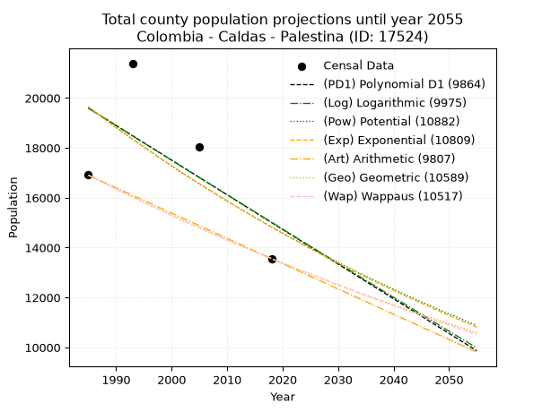
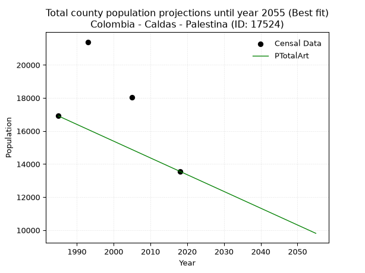
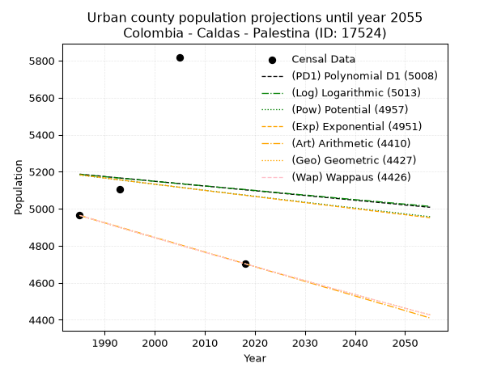
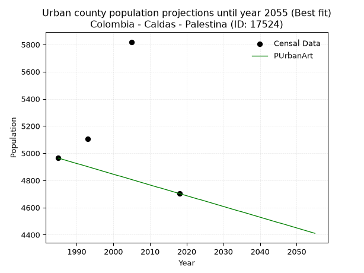
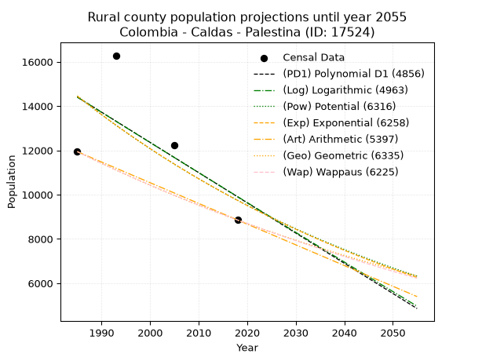
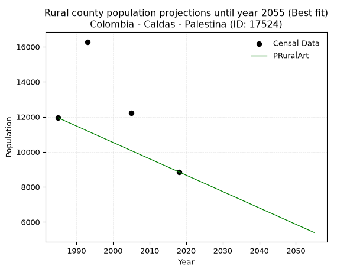

<div align="center">


</div>

# 📜 _“Population and Public Services Demand Projections (PPSD) until Year 2050 for Colombia - Caldas - Palestina (ID: 17524)”_
Keywords: `population` `public-service` `projection` `lineal` `polynomial` `logarithmic` `potential` `exponential` `arithmetic` `geometric` `wappaus` `dane` `colombia` `south-america`

PPSD are analytical estimates used by governments and planners to anticipate future changes in population size, age distribution, and the resulting community needs for utilities, healthcare, education, and infrastructure as sizing future water treatment facilities, electrical grids, and road networks based on spatial growth.

<div align="center">

</img>

</div>


> **General running parameters**: • app_version: _v20260806_. • Python version: _3.14.7_. • Pandas version: _3.0.5_. • NumPy version: _2.5.1_. • Creates, save and include plots into reports (create_plot): _False_. • Projection until year: _2050_. • Process polynomial degree 2 and up: _False_. • Process Wappaus: _True_. • Process Wappaus: _True_. • Set negative values to zero: _True_. • Set infinite values to zero: _True_. • Drop dataset notes: _True_. 
<div align="center">

Dynamic map: [:earth_americas:Google](http://maps.google.com/maps?q=5.017878766,-75.6245765) [:earth_americas:OSM](https://www.openstreetmap.org/#map=18/5.017878766/-75.6245765&layers=P) [:earth_americas:Bing](https://www.bing.com/maps?cp=5.017878766~-75.6245765&lvl=18) [:earth_americas:Apple](https://maps.apple.com/frame?center=5.017878766%2C-75.6245765&span=0.003%2C0.006)

</div>


<div align="center">

```geojson
{
  "type": "Feature",
  "geometry": {
    "type": "Point", 
    "coordinates": [-75.6245765, 5.017878766]
  }, 
  "properties": {
    "Name": "Colombia - Caldas - Palestina (ID: 17524)"
  }
}
```

</div>


## 0. Census Data (4 records)

Census data are official statistics collected by a government about the people and housing in a country. They usually include counts of total population, age, sex, race, income, education, and jobs.

📅Global census file: [Population.xlsx](../data/Population.xlsx)

| Source   |   Year |   CountryID | CountryName   |   StateID | StateName   |   CountyID | CountyName   |   PTotal |   PUrban |   PRural |
|:---------|-------:|------------:|:--------------|----------:|:------------|-----------:|:-------------|---------:|---------:|---------:|
| DANE     |   1985 |          57 | Colombia      |        17 | Caldas      |      17524 | Palestina    |    16907 |     4964 |    11943 |
| DANE     |   1993 |          57 | Colombia      |        17 | Caldas      |      17524 | Palestina    |    21392 |     5105 |    16287 |
| DANE     |   2005 |          57 | Colombia      |        17 | Caldas      |      17524 | Palestina    |    18037 |     5819 |    12218 |
| DANE     |   2018 |          57 | Colombia      |        17 | Caldas      |      17524 | Palestina    |    13560 |     4703 |     8857 |

> 🔥Some records could had specific notes about the registered values or the corresponding urban or rural distribution.

📅[SUI-RUPS](https://www.datos.gov.co/Hacienda-y-Cr-dito-P-blico/Registro-nico-de-Prestadores-de-Servicios-P-blicos/4qkq-csdn/about_data) - Local public utility companies: [RUPS.csv](../data/RUPS.csv)

 | SERVICIO       | ESTADO    | NOMBRE                                                                     | NIT         | DEPARTAMENTO_DOMICILIO   | MUNICIPIO_DOMICILIO   | DIRECCION                                      |   TELEFONO | EMAIL                              | TIPO_PRESTADOR                             | CLASIFICACION                 |
|:---------------|:----------|:---------------------------------------------------------------------------|:------------|:-------------------------|:----------------------|:-----------------------------------------------|-----------:|:-----------------------------------|:-------------------------------------------|:------------------------------|
| ACUEDUCTO      | OPERATIVA | EMPRESA DE OBRAS SANITARIAS DE CALDAS  S. A. EMPRESA DE SERVICIOS PUBLICOS | 890803239-9 | CALDAS                   | MANIZALES             | Carrera 23 Nro 75 - 82                         |    8867080 | lorena.grisalest@empocaldas.com.co | SOCIEDADES (EMPRESA DE SERVICIOS PUBLICOS) | MAYOR O IGUAL A 5001 USUARIOS |
| ALCANTARILLADO | OPERATIVA | EMPRESA DE OBRAS SANITARIAS DE CALDAS  S. A. EMPRESA DE SERVICIOS PUBLICOS | 890803239-9 | CALDAS                   | MANIZALES             | Carrera 23 Nro 75 - 82                         |    8867080 | lorena.grisalest@empocaldas.com.co | SOCIEDADES (EMPRESA DE SERVICIOS PUBLICOS) | MAYOR O IGUAL A 5001 USUARIOS |
| ACUEDUCTO      | OPERATIVA | ACUEDUCTO SAN FRANCISCO S.A. EMPRESA DE SERVICIOS PÚBLICOS DOMICILIARIOS   | 810006246-0 | CALDAS                   | PALESTINA             | SANTAGUEDA                                     |    8723535 | acueductosanfrancisco@hotmail.com  | SOCIEDADES (EMPRESA DE SERVICIOS PUBLICOS) | MENOR O IGUAL A 2500 USUARIOS |
| ACUEDUCTO      | OPERATIVA | CORPORACION CIVICA VECINOS DE SANTAGUEDA                                   | 890806891-5 | CALDAS                   | MANIZALES             | CALLE 22 # 22 - 26 EDIF DEL COMERCIO OFIC 1005 |    8848622 | vecinosdesantagueda@gmail.com      | ORGANIZACION AUTORIZADA                    | MENOR O IGUAL A 2500 USUARIOS |
| ACUEDUCTO      | OPERATIVA | ASOCIACION DE USUARIOS DE SERVICIOS COLECTIVOS DE SANTAGUEDA               | 800099579-1 | CALDAS                   | PALESTINA             | Santagueda                                     |    8705467 | jorgee.mejia@cafedecolombia.com    | ORGANIZACION AUTORIZADA                    | MENOR O IGUAL A 2500 USUARIOS |

## 1. Total

### 1.1. Coefficients and Parameters

* (PD1) Polynomial Deg 1: -138.9931754315506, 295495.0991569591 (lineal)
* (Log) Logarithmic: -277487.80538843817, 2126661.0324052363
* (Pow) Potential: -17.038317097647635, 60.48146236133255
* (Exp) Exponential: -0.008533513705591791, 446403741542.85425
* (Art) Arithmetic: Year diff. 2018 - 1985 = 33, Population diff. 13560 - 16907 = -3347, Annual growth = -101.42424242424242
* (Geo) Geometric: Year diff. 2018 - 1985 = 33, Population diff. 13560 - 16907 = -3347, Annual growth % = -0.006662658584656644
* (Wap) Wappaus: i = -0.6657973704286108, Condition values only valid for < 200)

<sub>
Wappaus condition values: ['-0.00', '-0.67', '-1.33', '-2.00', '-2.66', '-3.33', '-3.99', '-4.66', '-5.33', '-5.99', '-6.66', '-7.32', '-7.99', '-8.66', '-9.32', '-9.99', '-10.65', '-11.32', '-11.98', '-12.65', '-13.32', '-13.98', '-14.65', '-15.31', '-15.98', '-16.64', '-17.31', '-17.98', '-18.64', '-19.31', '-19.97', '-20.64', '-21.31', '-21.97', '-22.64', '-23.30', '-23.97', '-24.63', '-25.30', '-25.97', '-26.63', '-27.30', '-27.96', '-28.63', '-29.30', '-29.96', '-30.63', '-31.29', '-31.96', '-32.62', '-33.29', '-33.96', '-34.62', '-35.29', '-35.95', '-36.62', '-37.28', '-37.95', '-38.62', '-39.28', '-39.95', '-40.61', '-41.28', '-41.95', '-42.61', '-43.28']
</sub>


### 1.2. Projected Dataset

|   Year |   CountyID |   PTotalPD1 |   PTotalLog |   PTotalPow |   PTotalExp |   PTotalArt |   PTotalGeo |   PTotalWap |
|-------:|-----------:|------------:|------------:|------------:|------------:|------------:|------------:|------------:|
|   1985 |      17524 |       19594 |       19592 |       19641 |       19643 |       16907 |       16907 |       16907 |
|   1986 |      17524 |       19455 |       19453 |       19474 |       19476 |       16806 |       16794 |       16795 |
|   1987 |      17524 |       19316 |       19313 |       19307 |       19310 |       16704 |       16682 |       16683 |
|   1988 |      17524 |       19177 |       19173 |       19142 |       19146 |       16603 |       16571 |       16573 |
|   1989 |      17524 |       19038 |       19034 |       18979 |       18984 |       16501 |       16461 |       16463 |
|   1990 |      17524 |       18899 |       18894 |       18817 |       18822 |       16400 |       16351 |       16353 |
|   1991 |      17524 |       18760 |       18755 |       18657 |       18662 |       16298 |       16242 |       16245 |
|   1992 |      17524 |       18621 |       18615 |       18498 |       18504 |       16197 |       16134 |       16137 |
|   1993 |      17524 |       18482 |       18476 |       18340 |       18347 |       16096 |       16027 |       16030 |
|   1994 |      17524 |       18343 |       18337 |       18184 |       18191 |       15994 |       15920 |       15923 |
|   1995 |      17524 |       18204 |       18198 |       18030 |       18036 |       15893 |       15814 |       15818 |
|   1996 |      17524 |       18065 |       18059 |       17876 |       17883 |       15791 |       15708 |       15713 |
|   1997 |      17524 |       17926 |       17920 |       17725 |       17731 |       15690 |       15604 |       15608 |
|   1998 |      17524 |       17787 |       17781 |       17574 |       17580 |       15588 |       15500 |       15504 |
|   1999 |      17524 |       17648 |       17642 |       17425 |       17431 |       15487 |       15396 |       15401 |
|   2000 |      17524 |       17509 |       17503 |       17277 |       17283 |       15386 |       15294 |       15299 |
|   2001 |      17524 |       17370 |       17365 |       17130 |       17136 |       15284 |       15192 |       15197 |
|   2002 |      17524 |       17231 |       17226 |       16985 |       16990 |       15183 |       15091 |       15096 |
|   2003 |      17524 |       17092 |       17087 |       16841 |       16846 |       15081 |       14990 |       14995 |
|   2004 |      17524 |       16953 |       16949 |       16699 |       16703 |       14980 |       14890 |       14895 |
|   2005 |      17524 |       16814 |       16810 |       16557 |       16561 |       14879 |       14791 |       14796 |
|   2006 |      17524 |       16675 |       16672 |       16417 |       16420 |       14777 |       14693 |       14698 |
|   2007 |      17524 |       16536 |       16534 |       16278 |       16281 |       14676 |       14595 |       14600 |
|   2008 |      17524 |       16397 |       16396 |       16141 |       16142 |       14574 |       14497 |       14502 |
|   2009 |      17524 |       16258 |       16257 |       16005 |       16005 |       14473 |       14401 |       14405 |
|   2010 |      17524 |       16119 |       16119 |       15869 |       15869 |       14371 |       14305 |       14309 |
|   2011 |      17524 |       15980 |       15981 |       15735 |       15734 |       14270 |       14210 |       14213 |
|   2012 |      17524 |       15841 |       15843 |       15603 |       15601 |       14169 |       14115 |       14118 |
|   2013 |      17524 |       15702 |       15705 |       15471 |       15468 |       14067 |       14021 |       14024 |
|   2014 |      17524 |       15563 |       15568 |       15341 |       15337 |       13966 |       13927 |       13930 |
|   2015 |      17524 |       15424 |       15430 |       15212 |       15206 |       13864 |       13835 |       13837 |
|   2016 |      17524 |       15285 |       15292 |       15084 |       15077 |       13763 |       13743 |       13744 |
|   2017 |      17524 |       15146 |       15155 |       14957 |       14949 |       13661 |       13651 |       13652 |
|   2018 |      17524 |       15007 |       15017 |       14831 |       14822 |       13560 |       13560 |       13560 |
|   2019 |      17524 |       14868 |       14880 |       14706 |       14696 |       13459 |       13470 |       13469 |
|   2020 |      17524 |       14729 |       14742 |       14583 |       14571 |       13357 |       13380 |       13378 |
|   2021 |      17524 |       14590 |       14605 |       14460 |       14447 |       13256 |       13291 |       13288 |
|   2022 |      17524 |       14451 |       14468 |       14339 |       14324 |       13154 |       13202 |       13199 |
|   2023 |      17524 |       14312 |       14330 |       14219 |       14203 |       13053 |       13114 |       13110 |
|   2024 |      17524 |       14173 |       14193 |       14099 |       14082 |       12951 |       13027 |       13021 |
|   2025 |      17524 |       14034 |       14056 |       13981 |       13962 |       12850 |       12940 |       12933 |
|   2026 |      17524 |       13895 |       13919 |       13864 |       13844 |       12749 |       12854 |       12846 |
|   2027 |      17524 |       13756 |       13782 |       13748 |       13726 |       12647 |       12768 |       12759 |
|   2028 |      17524 |       13617 |       13645 |       13633 |       13610 |       12546 |       12683 |       12673 |
|   2029 |      17524 |       13478 |       13509 |       13519 |       13494 |       12444 |       12599 |       12587 |
|   2030 |      17524 |       13339 |       13372 |       13406 |       13379 |       12343 |       12515 |       12501 |
|   2031 |      17524 |       13200 |       13235 |       13294 |       13266 |       12241 |       12431 |       12417 |
|   2032 |      17524 |       13061 |       13099 |       13183 |       13153 |       12140 |       12349 |       12332 |
|   2033 |      17524 |       12922 |       12962 |       13073 |       13041 |       12039 |       12266 |       12248 |
|   2034 |      17524 |       12783 |       12826 |       12964 |       12930 |       11937 |       12185 |       12165 |
|   2035 |      17524 |       12644 |       12689 |       12856 |       12820 |       11836 |       12103 |       12082 |
|   2036 |      17524 |       12505 |       12553 |       12748 |       12711 |       11734 |       12023 |       11999 |
|   2037 |      17524 |       12366 |       12417 |       12642 |       12603 |       11633 |       11943 |       11917 |
|   2038 |      17524 |       12227 |       12280 |       12537 |       12496 |       11532 |       11863 |       11836 |
|   2039 |      17524 |       12088 |       12144 |       12433 |       12390 |       11430 |       11784 |       11755 |
|   2040 |      17524 |       11949 |       12008 |       12329 |       12285 |       11329 |       11705 |       11674 |
|   2041 |      17524 |       11810 |       11872 |       12227 |       12180 |       11227 |       11627 |       11594 |
|   2042 |      17524 |       11671 |       11736 |       12125 |       12077 |       11126 |       11550 |       11514 |
|   2043 |      17524 |       11532 |       11601 |       12024 |       11974 |       11024 |       11473 |       11435 |
|   2044 |      17524 |       11393 |       11465 |       11924 |       11873 |       10923 |       11397 |       11356 |
|   2045 |      17524 |       11254 |       11329 |       11826 |       11772 |       10822 |       11321 |       11277 |
|   2046 |      17524 |       11115 |       11193 |       11727 |       11672 |       10720 |       11245 |       11199 |
|   2047 |      17524 |       10976 |       11058 |       11630 |       11573 |       10619 |       11170 |       11122 |
|   2048 |      17524 |       10837 |       10922 |       11534 |       11474 |       10517 |       11096 |       11045 |
|   2049 |      17524 |       10698 |       10787 |       11438 |       11377 |       10416 |       11022 |       10968 |
|   2050 |      17524 |       10559 |       10651 |       11344 |       11280 |       10314 |       10949 |       10892 |
<div align="center">

</img>

</div>


### 1.3. Best fit with absolute and relative error (%)

Relative error puts that difference into context by dividing the absolute error by the true value, creating a unitless ratio or percentage that shows the scale of the mistake.

Absolute and relative error

|   Year | Source   |   CountryID | CountryName   |   StateID | StateName   |   CountyID_x | CountyName   |   PTotal |   PUrban |   PRural |   CountyID_y |   PTotalPD1 |   PTotalLog |   PTotalPow |   PTotalExp |   PTotalArt |   PTotalGeo |   PTotalWap |   PTotalPD1AbsError |   PTotalLogAbsError |   PTotalPowAbsError |   PTotalExpAbsError |   PTotalArtAbsError |   PTotalGeoAbsError |   PTotalWapAbsError |   PTotalPD1RelError |   PTotalLogRelError |   PTotalPowRelError |   PTotalExpRelError |   PTotalArtRelError |   PTotalGeoRelError |   PTotalWapRelError |
|-------:|:---------|------------:|:--------------|----------:|:------------|-------------:|:-------------|---------:|---------:|---------:|-------------:|------------:|------------:|------------:|------------:|------------:|------------:|------------:|--------------------:|--------------------:|--------------------:|--------------------:|--------------------:|--------------------:|--------------------:|--------------------:|--------------------:|--------------------:|--------------------:|--------------------:|--------------------:|--------------------:|
|   1985 | DANE     |          57 | Colombia      |        17 | Caldas      |        17524 | Palestina    |    16907 |     4964 |    11943 |        17524 |       19594 |       19592 |       19641 |       19643 |       16907 |       16907 |       16907 |                2687 |                2685 |                2734 |                2736 |                   0 |                   0 |                   0 |            15.8928  |            15.881   |            16.1708  |            16.1826  |              0      |              0      |              0      |
|   1993 | DANE     |          57 | Colombia      |        17 | Caldas      |        17524 | Palestina    |    21392 |     5105 |    16287 |        17524 |       18482 |       18476 |       18340 |       18347 |       16096 |       16027 |       16030 |                2910 |                2916 |                3052 |                3045 |                5296 |                5365 |                5362 |            13.6032  |            13.6313  |            14.267   |            14.2343  |             24.7569 |             25.0795 |             25.0654 |
|   2005 | DANE     |          57 | Colombia      |        17 | Caldas      |        17524 | Palestina    |    18037 |     5819 |    12218 |        17524 |       16814 |       16810 |       16557 |       16561 |       14879 |       14791 |       14796 |                1223 |                1227 |                1480 |                1476 |                3158 |                3246 |                3241 |             6.78051 |             6.80268 |             8.20536 |             8.18318 |             17.5085 |             17.9963 |             17.9686 |
|   2018 | DANE     |          57 | Colombia      |        17 | Caldas      |        17524 | Palestina    |    13560 |     4703 |     8857 |        17524 |       15007 |       15017 |       14831 |       14822 |       13560 |       13560 |       13560 |                1447 |                1457 |                1271 |                1262 |                   0 |                   0 |                   0 |            10.6711  |            10.7448  |             9.37316 |             9.30678 |              0      |              0      |              0      |

Relative error mean

| Method    |   RelError | Best   |
|:----------|-----------:|:-------|
| PTotalPD1 |    11.7369 |        |
| PTotalLog |    11.7649 |        |
| PTotalPow |    12.0041 |        |
| PTotalExp |    11.9767 |        |
| PTotalArt |    10.5663 | True   |
| PTotalGeo |    10.769  |        |
| PTotalWap |    10.7585 |        |

💙Best method: _**PTotalArt**_
<div align="center">

</img>

</div>


### 1.4. Fresh water supply demand in liters per capita per day (lpcd)

The fresh water supply demand typically ranges from 100 to 300 liters per capita per day (lpcd) for standard domestic and municipal planning, though absolute survival minimums set by the World Health Organization are as low as 7.5 to 20 liters per day, and total consumption in high-income nations can exceed 400 liters.

> `CZ`: Level in meters above the sea level (masl)<br> `WS`: Fresh water supply demand in liters per capita per day (lpcd or l/h/d)<br> `WSAll`: Zonal fresh water supply demand in liters per second (l/s)<br> `A`: Zonal area in square meters<br> `DP`: Population density (people/hectare or p/ha)

Reference values (RAS Colombia)

|    CZ |   WS |
|------:|-----:|
|  1000 |  120 |
|  2000 |  130 |
| 99999 |  140 |

County shapefile geometry properties and water supply values

|   CountyID |      ATotal |   CZTotal |   WSTotal |
|-----------:|------------:|----------:|----------:|
|      17524 | 1.12204e+08 |    1193.4 |       130 |

Projected values for best method: PTotalArt

|   CountyID |   Year |   PTotalArt |   DPTotal |   WSTotal |   WSTotalAll |
|-----------:|-------:|------------:|----------:|----------:|-------------:|
|      17524 |   1985 |       16907 |      1.51 |       130 |      25.4388 |
|      17524 |   1986 |       16806 |      1.5  |       130 |      25.2868 |
|      17524 |   1987 |       16704 |      1.49 |       130 |      25.1333 |
|      17524 |   1988 |       16603 |      1.48 |       130 |      24.9814 |
|      17524 |   1989 |       16501 |      1.47 |       130 |      24.8279 |
|      17524 |   1990 |       16400 |      1.46 |       130 |      24.6759 |
|      17524 |   1991 |       16298 |      1.45 |       130 |      24.5225 |
|      17524 |   1992 |       16197 |      1.44 |       130 |      24.3705 |
|      17524 |   1993 |       16096 |      1.43 |       130 |      24.2185 |
|      17524 |   1994 |       15994 |      1.43 |       130 |      24.065  |
|      17524 |   1995 |       15893 |      1.42 |       130 |      23.9131 |
|      17524 |   1996 |       15791 |      1.41 |       130 |      23.7596 |
|      17524 |   1997 |       15690 |      1.4  |       130 |      23.6076 |
|      17524 |   1998 |       15588 |      1.39 |       130 |      23.4542 |
|      17524 |   1999 |       15487 |      1.38 |       130 |      23.3022 |
|      17524 |   2000 |       15386 |      1.37 |       130 |      23.1502 |
|      17524 |   2001 |       15284 |      1.36 |       130 |      22.9968 |
|      17524 |   2002 |       15183 |      1.35 |       130 |      22.8448 |
|      17524 |   2003 |       15081 |      1.34 |       130 |      22.6913 |
|      17524 |   2004 |       14980 |      1.34 |       130 |      22.5394 |
|      17524 |   2005 |       14879 |      1.33 |       130 |      22.3874 |
|      17524 |   2006 |       14777 |      1.32 |       130 |      22.2339 |
|      17524 |   2007 |       14676 |      1.31 |       130 |      22.0819 |
|      17524 |   2008 |       14574 |      1.3  |       130 |      21.9285 |
|      17524 |   2009 |       14473 |      1.29 |       130 |      21.7765 |
|      17524 |   2010 |       14371 |      1.28 |       130 |      21.623  |
|      17524 |   2011 |       14270 |      1.27 |       130 |      21.4711 |
|      17524 |   2012 |       14169 |      1.26 |       130 |      21.3191 |
|      17524 |   2013 |       14067 |      1.25 |       130 |      21.1656 |
|      17524 |   2014 |       13966 |      1.24 |       130 |      21.0137 |
|      17524 |   2015 |       13864 |      1.24 |       130 |      20.8602 |
|      17524 |   2016 |       13763 |      1.23 |       130 |      20.7082 |
|      17524 |   2017 |       13661 |      1.22 |       130 |      20.5547 |
|      17524 |   2018 |       13560 |      1.21 |       130 |      20.4028 |
|      17524 |   2019 |       13459 |      1.2  |       130 |      20.2508 |
|      17524 |   2020 |       13357 |      1.19 |       130 |      20.0973 |
|      17524 |   2021 |       13256 |      1.18 |       130 |      19.9454 |
|      17524 |   2022 |       13154 |      1.17 |       130 |      19.7919 |
|      17524 |   2023 |       13053 |      1.16 |       130 |      19.6399 |
|      17524 |   2024 |       12951 |      1.15 |       130 |      19.4865 |
|      17524 |   2025 |       12850 |      1.15 |       130 |      19.3345 |
|      17524 |   2026 |       12749 |      1.14 |       130 |      19.1825 |
|      17524 |   2027 |       12647 |      1.13 |       130 |      19.0291 |
|      17524 |   2028 |       12546 |      1.12 |       130 |      18.8771 |
|      17524 |   2029 |       12444 |      1.11 |       130 |      18.7236 |
|      17524 |   2030 |       12343 |      1.1  |       130 |      18.5716 |
|      17524 |   2031 |       12241 |      1.09 |       130 |      18.4182 |
|      17524 |   2032 |       12140 |      1.08 |       130 |      18.2662 |
|      17524 |   2033 |       12039 |      1.07 |       130 |      18.1142 |
|      17524 |   2034 |       11937 |      1.06 |       130 |      17.9608 |
|      17524 |   2035 |       11836 |      1.05 |       130 |      17.8088 |
|      17524 |   2036 |       11734 |      1.05 |       130 |      17.6553 |
|      17524 |   2037 |       11633 |      1.04 |       130 |      17.5034 |
|      17524 |   2038 |       11532 |      1.03 |       130 |      17.3514 |
|      17524 |   2039 |       11430 |      1.02 |       130 |      17.1979 |
|      17524 |   2040 |       11329 |      1.01 |       130 |      17.0459 |
|      17524 |   2041 |       11227 |      1    |       130 |      16.8925 |
|      17524 |   2042 |       11126 |      0.99 |       130 |      16.7405 |
|      17524 |   2043 |       11024 |      0.98 |       130 |      16.587  |
|      17524 |   2044 |       10923 |      0.97 |       130 |      16.4351 |
|      17524 |   2045 |       10822 |      0.96 |       130 |      16.2831 |
|      17524 |   2046 |       10720 |      0.96 |       130 |      16.1296 |
|      17524 |   2047 |       10619 |      0.95 |       130 |      15.9777 |
|      17524 |   2048 |       10517 |      0.94 |       130 |      15.8242 |
|      17524 |   2049 |       10416 |      0.93 |       130 |      15.6722 |
|      17524 |   2050 |       10314 |      0.92 |       130 |      15.5188 |

## 2. Urban

### 2.1. Coefficients and Parameters

* (PD1) Polynomial Deg 1: -2.5592131674020453, 10266.816138095941 (lineal)
* (Log) Logarithmic: -4989.929147692, 43076.241438389545
* (Pow) Potential: -1.282616056386189, 7.944275585892533
* (Exp) Exponential: -0.0006534059038873205, 18961.592694052913
* (Art) Arithmetic: Year diff. 2018 - 1985 = 33, Population diff. 4703 - 4964 = -261, Annual growth = -7.909090909090909
* (Geo) Geometric: Year diff. 2018 - 1985 = 33, Population diff. 4703 - 4964 = -261, Annual growth % = -0.0016353663100339144
* (Wap) Wappaus: i = -0.16363072119770164, Condition values only valid for < 200)

<sub>
Wappaus condition values: ['-0.00', '-0.16', '-0.33', '-0.49', '-0.65', '-0.82', '-0.98', '-1.15', '-1.31', '-1.47', '-1.64', '-1.80', '-1.96', '-2.13', '-2.29', '-2.45', '-2.62', '-2.78', '-2.95', '-3.11', '-3.27', '-3.44', '-3.60', '-3.76', '-3.93', '-4.09', '-4.25', '-4.42', '-4.58', '-4.75', '-4.91', '-5.07', '-5.24', '-5.40', '-5.56', '-5.73', '-5.89', '-6.05', '-6.22', '-6.38', '-6.55', '-6.71', '-6.87', '-7.04', '-7.20', '-7.36', '-7.53', '-7.69', '-7.85', '-8.02', '-8.18', '-8.35', '-8.51', '-8.67', '-8.84', '-9.00', '-9.16', '-9.33', '-9.49', '-9.65', '-9.82', '-9.98', '-10.15', '-10.31', '-10.47', '-10.64']
</sub>


### 2.2. Projected Dataset

|   Year |   CountyID |   PUrbanPD1 |   PUrbanLog |   PUrbanPow |   PUrbanExp |   PUrbanArt |   PUrbanGeo |   PUrbanWap |
|-------:|-----------:|------------:|------------:|------------:|------------:|------------:|------------:|------------:|
|   1985 |      17524 |        5187 |        5186 |        5182 |        5183 |        4964 |        4964 |        4964 |
|   1986 |      17524 |        5184 |        5183 |        5179 |        5180 |        4956 |        4956 |        4956 |
|   1987 |      17524 |        5182 |        5181 |        5176 |        5176 |        4948 |        4948 |        4948 |
|   1988 |      17524 |        5179 |        5178 |        5172 |        5173 |        4940 |        4940 |        4940 |
|   1989 |      17524 |        5177 |        5176 |        5169 |        5170 |        4932 |        4932 |        4932 |
|   1990 |      17524 |        5174 |        5173 |        5166 |        5166 |        4924 |        4924 |        4924 |
|   1991 |      17524 |        5171 |        5171 |        5162 |        5163 |        4917 |        4915 |        4916 |
|   1992 |      17524 |        5169 |        5168 |        5159 |        5159 |        4909 |        4907 |        4907 |
|   1993 |      17524 |        5166 |        5166 |        5156 |        5156 |        4901 |        4899 |        4899 |
|   1994 |      17524 |        5164 |        5163 |        5152 |        5153 |        4893 |        4891 |        4891 |
|   1995 |      17524 |        5161 |        5161 |        5149 |        5149 |        4885 |        4883 |        4883 |
|   1996 |      17524 |        5159 |        5158 |        5146 |        5146 |        4877 |        4875 |        4875 |
|   1997 |      17524 |        5156 |        5156 |        5142 |        5143 |        4869 |        4867 |        4867 |
|   1998 |      17524 |        5154 |        5153 |        5139 |        5139 |        4861 |        4859 |        4860 |
|   1999 |      17524 |        5151 |        5151 |        5136 |        5136 |        4853 |        4852 |        4852 |
|   2000 |      17524 |        5148 |        5148 |        5132 |        5133 |        4845 |        4844 |        4844 |
|   2001 |      17524 |        5146 |        5146 |        5129 |        5129 |        4837 |        4836 |        4836 |
|   2002 |      17524 |        5143 |        5143 |        5126 |        5126 |        4830 |        4828 |        4828 |
|   2003 |      17524 |        5141 |        5141 |        5123 |        5123 |        4822 |        4820 |        4820 |
|   2004 |      17524 |        5138 |        5138 |        5119 |        5119 |        4814 |        4812 |        4812 |
|   2005 |      17524 |        5136 |        5136 |        5116 |        5116 |        4806 |        4804 |        4804 |
|   2006 |      17524 |        5133 |        5133 |        5113 |        5112 |        4798 |        4796 |        4796 |
|   2007 |      17524 |        5130 |        5131 |        5109 |        5109 |        4790 |        4788 |        4788 |
|   2008 |      17524 |        5128 |        5128 |        5106 |        5106 |        4782 |        4781 |        4781 |
|   2009 |      17524 |        5125 |        5126 |        5103 |        5102 |        4774 |        4773 |        4773 |
|   2010 |      17524 |        5123 |        5123 |        5100 |        5099 |        4766 |        4765 |        4765 |
|   2011 |      17524 |        5120 |        5121 |        5096 |        5096 |        4758 |        4757 |        4757 |
|   2012 |      17524 |        5118 |        5118 |        5093 |        5092 |        4750 |        4749 |        4749 |
|   2013 |      17524 |        5115 |        5116 |        5090 |        5089 |        4743 |        4742 |        4742 |
|   2014 |      17524 |        5113 |        5113 |        5087 |        5086 |        4735 |        4734 |        4734 |
|   2015 |      17524 |        5110 |        5111 |        5083 |        5082 |        4727 |        4726 |        4726 |
|   2016 |      17524 |        5107 |        5109 |        5080 |        5079 |        4719 |        4718 |        4718 |
|   2017 |      17524 |        5105 |        5106 |        5077 |        5076 |        4711 |        4711 |        4711 |
|   2018 |      17524 |        5102 |        5104 |        5074 |        5073 |        4703 |        4703 |        4703 |
|   2019 |      17524 |        5100 |        5101 |        5071 |        5069 |        4695 |        4695 |        4695 |
|   2020 |      17524 |        5097 |        5099 |        5067 |        5066 |        4687 |        4688 |        4688 |
|   2021 |      17524 |        5095 |        5096 |        5064 |        5063 |        4679 |        4680 |        4680 |
|   2022 |      17524 |        5092 |        5094 |        5061 |        5059 |        4671 |        4672 |        4672 |
|   2023 |      17524 |        5090 |        5091 |        5058 |        5056 |        4663 |        4665 |        4665 |
|   2024 |      17524 |        5087 |        5089 |        5054 |        5053 |        4656 |        4657 |        4657 |
|   2025 |      17524 |        5084 |        5086 |        5051 |        5049 |        4648 |        4649 |        4649 |
|   2026 |      17524 |        5082 |        5084 |        5048 |        5046 |        4640 |        4642 |        4642 |
|   2027 |      17524 |        5079 |        5081 |        5045 |        5043 |        4632 |        4634 |        4634 |
|   2028 |      17524 |        5077 |        5079 |        5042 |        5040 |        4624 |        4627 |        4627 |
|   2029 |      17524 |        5074 |        5076 |        5039 |        5036 |        4616 |        4619 |        4619 |
|   2030 |      17524 |        5072 |        5074 |        5035 |        5033 |        4608 |        4612 |        4611 |
|   2031 |      17524 |        5069 |        5072 |        5032 |        5030 |        4600 |        4604 |        4604 |
|   2032 |      17524 |        5066 |        5069 |        5029 |        5026 |        4592 |        4596 |        4596 |
|   2033 |      17524 |        5064 |        5067 |        5026 |        5023 |        4584 |        4589 |        4589 |
|   2034 |      17524 |        5061 |        5064 |        5023 |        5020 |        4576 |        4581 |        4581 |
|   2035 |      17524 |        5059 |        5062 |        5019 |        5017 |        4569 |        4574 |        4574 |
|   2036 |      17524 |        5056 |        5059 |        5016 |        5013 |        4561 |        4566 |        4566 |
|   2037 |      17524 |        5054 |        5057 |        5013 |        5010 |        4553 |        4559 |        4559 |
|   2038 |      17524 |        5051 |        5054 |        5010 |        5007 |        4545 |        4552 |        4551 |
|   2039 |      17524 |        5049 |        5052 |        5007 |        5003 |        4537 |        4544 |        4544 |
|   2040 |      17524 |        5046 |        5049 |        5004 |        5000 |        4529 |        4537 |        4536 |
|   2041 |      17524 |        5043 |        5047 |        5001 |        4997 |        4521 |        4529 |        4529 |
|   2042 |      17524 |        5041 |        5045 |        4997 |        4994 |        4513 |        4522 |        4522 |
|   2043 |      17524 |        5038 |        5042 |        4994 |        4990 |        4505 |        4514 |        4514 |
|   2044 |      17524 |        5036 |        5040 |        4991 |        4987 |        4497 |        4507 |        4507 |
|   2045 |      17524 |        5033 |        5037 |        4988 |        4984 |        4489 |        4500 |        4499 |
|   2046 |      17524 |        5031 |        5035 |        4985 |        4981 |        4482 |        4492 |        4492 |
|   2047 |      17524 |        5028 |        5032 |        4982 |        4977 |        4474 |        4485 |        4485 |
|   2048 |      17524 |        5026 |        5030 |        4979 |        4974 |        4466 |        4478 |        4477 |
|   2049 |      17524 |        5023 |        5027 |        4976 |        4971 |        4458 |        4470 |        4470 |
|   2050 |      17524 |        5020 |        5025 |        4972 |        4968 |        4450 |        4463 |        4463 |
<div align="center">

</img>

</div>


### 2.3. Best fit with absolute and relative error (%)

Relative error puts that difference into context by dividing the absolute error by the true value, creating a unitless ratio or percentage that shows the scale of the mistake.

Absolute and relative error

|   Year | Source   |   CountryID | CountryName   |   StateID | StateName   |   CountyID_x | CountyName   |   PTotal |   PUrban |   PRural |   CountyID_y |   PUrbanPD1 |   PUrbanLog |   PUrbanPow |   PUrbanExp |   PUrbanArt |   PUrbanGeo |   PUrbanWap |   PUrbanPD1AbsError |   PUrbanLogAbsError |   PUrbanPowAbsError |   PUrbanExpAbsError |   PUrbanArtAbsError |   PUrbanGeoAbsError |   PUrbanWapAbsError |   PUrbanPD1RelError |   PUrbanLogRelError |   PUrbanPowRelError |   PUrbanExpRelError |   PUrbanArtRelError |   PUrbanGeoRelError |   PUrbanWapRelError |
|-------:|:---------|------------:|:--------------|----------:|:------------|-------------:|:-------------|---------:|---------:|---------:|-------------:|------------:|------------:|------------:|------------:|------------:|------------:|------------:|--------------------:|--------------------:|--------------------:|--------------------:|--------------------:|--------------------:|--------------------:|--------------------:|--------------------:|--------------------:|--------------------:|--------------------:|--------------------:|--------------------:|
|   1985 | DANE     |          57 | Colombia      |        17 | Caldas      |        17524 | Palestina    |    16907 |     4964 |    11943 |        17524 |        5187 |        5186 |        5182 |        5183 |        4964 |        4964 |        4964 |                 223 |                 222 |                 218 |                 219 |                   0 |                   0 |                   0 |             4.49234 |             4.4722  |            4.39162  |            4.41176  |             0       |             0       |             0       |
|   1993 | DANE     |          57 | Colombia      |        17 | Caldas      |        17524 | Palestina    |    21392 |     5105 |    16287 |        17524 |        5166 |        5166 |        5156 |        5156 |        4901 |        4899 |        4899 |                  61 |                  61 |                  51 |                  51 |                 204 |                 206 |                 206 |             1.19491 |             1.19491 |            0.999021 |            0.999021 |             3.99608 |             4.03526 |             4.03526 |
|   2005 | DANE     |          57 | Colombia      |        17 | Caldas      |        17524 | Palestina    |    18037 |     5819 |    12218 |        17524 |        5136 |        5136 |        5116 |        5116 |        4806 |        4804 |        4804 |                 683 |                 683 |                 703 |                 703 |                1013 |                1015 |                1015 |            11.7374  |            11.7374  |           12.0811   |           12.0811   |            17.4085  |            17.4429  |            17.4429  |
|   2018 | DANE     |          57 | Colombia      |        17 | Caldas      |        17524 | Palestina    |    13560 |     4703 |     8857 |        17524 |        5102 |        5104 |        5074 |        5073 |        4703 |        4703 |        4703 |                 399 |                 401 |                 371 |                 370 |                   0 |                   0 |                   0 |             8.48395 |             8.52647 |            7.88858  |            7.86732  |             0       |             0       |             0       |

Relative error mean

| Method    |   RelError | Best   |
|:----------|-----------:|:-------|
| PUrbanPD1 |    6.47715 |        |
| PUrbanLog |    6.48275 |        |
| PUrbanPow |    6.34008 |        |
| PUrbanExp |    6.3398  |        |
| PUrbanArt |    5.35114 | True   |
| PUrbanGeo |    5.36953 |        |
| PUrbanWap |    5.36953 |        |

💙Best method: _**PUrbanArt**_
<div align="center">

</img>

</div>


### 2.4. Fresh water supply demand in liters per capita per day (lpcd)

The fresh water supply demand typically ranges from 100 to 300 liters per capita per day (lpcd) for standard domestic and municipal planning, though absolute survival minimums set by the World Health Organization are as low as 7.5 to 20 liters per day, and total consumption in high-income nations can exceed 400 liters.

> `CZ`: Level in meters above the sea level (masl)<br> `WS`: Fresh water supply demand in liters per capita per day (lpcd or l/h/d)<br> `WSAll`: Zonal fresh water supply demand in liters per second (l/s)<br> `A`: Zonal area in square meters<br> `DP`: Population density (people/hectare or p/ha)

Reference values (RAS Colombia)

|    CZ |   WS |
|------:|-----:|
|  1000 |  120 |
|  2000 |  130 |
| 99999 |  140 |

County shapefile geometry properties and water supply values

|   CountyID |      AUrban |   CZUrban |   WSUrban |
|-----------:|------------:|----------:|----------:|
|      17524 | 2.23947e+06 |   1536.92 |       130 |

Projected values for best method: PUrbanArt

|   CountyID |   Year |   PUrbanArt |   DPUrban |   WSUrban |   WSUrbanAll |
|-----------:|-------:|------------:|----------:|----------:|-------------:|
|      17524 |   1985 |        4964 |     22.17 |       130 |      7.46898 |
|      17524 |   1986 |        4956 |     22.13 |       130 |      7.45694 |
|      17524 |   1987 |        4948 |     22.09 |       130 |      7.44491 |
|      17524 |   1988 |        4940 |     22.06 |       130 |      7.43287 |
|      17524 |   1989 |        4932 |     22.02 |       130 |      7.42083 |
|      17524 |   1990 |        4924 |     21.99 |       130 |      7.4088  |
|      17524 |   1991 |        4917 |     21.96 |       130 |      7.39826 |
|      17524 |   1992 |        4909 |     21.92 |       130 |      7.38623 |
|      17524 |   1993 |        4901 |     21.88 |       130 |      7.37419 |
|      17524 |   1994 |        4893 |     21.85 |       130 |      7.36215 |
|      17524 |   1995 |        4885 |     21.81 |       130 |      7.35012 |
|      17524 |   1996 |        4877 |     21.78 |       130 |      7.33808 |
|      17524 |   1997 |        4869 |     21.74 |       130 |      7.32604 |
|      17524 |   1998 |        4861 |     21.71 |       130 |      7.314   |
|      17524 |   1999 |        4853 |     21.67 |       130 |      7.30197 |
|      17524 |   2000 |        4845 |     21.63 |       130 |      7.28993 |
|      17524 |   2001 |        4837 |     21.6  |       130 |      7.27789 |
|      17524 |   2002 |        4830 |     21.57 |       130 |      7.26736 |
|      17524 |   2003 |        4822 |     21.53 |       130 |      7.25532 |
|      17524 |   2004 |        4814 |     21.5  |       130 |      7.24329 |
|      17524 |   2005 |        4806 |     21.46 |       130 |      7.23125 |
|      17524 |   2006 |        4798 |     21.42 |       130 |      7.21921 |
|      17524 |   2007 |        4790 |     21.39 |       130 |      7.20718 |
|      17524 |   2008 |        4782 |     21.35 |       130 |      7.19514 |
|      17524 |   2009 |        4774 |     21.32 |       130 |      7.1831  |
|      17524 |   2010 |        4766 |     21.28 |       130 |      7.17106 |
|      17524 |   2011 |        4758 |     21.25 |       130 |      7.15903 |
|      17524 |   2012 |        4750 |     21.21 |       130 |      7.14699 |
|      17524 |   2013 |        4743 |     21.18 |       130 |      7.13646 |
|      17524 |   2014 |        4735 |     21.14 |       130 |      7.12442 |
|      17524 |   2015 |        4727 |     21.11 |       130 |      7.11238 |
|      17524 |   2016 |        4719 |     21.07 |       130 |      7.10035 |
|      17524 |   2017 |        4711 |     21.04 |       130 |      7.08831 |
|      17524 |   2018 |        4703 |     21    |       130 |      7.07627 |
|      17524 |   2019 |        4695 |     20.96 |       130 |      7.06424 |
|      17524 |   2020 |        4687 |     20.93 |       130 |      7.0522  |
|      17524 |   2021 |        4679 |     20.89 |       130 |      7.04016 |
|      17524 |   2022 |        4671 |     20.86 |       130 |      7.02813 |
|      17524 |   2023 |        4663 |     20.82 |       130 |      7.01609 |
|      17524 |   2024 |        4656 |     20.79 |       130 |      7.00556 |
|      17524 |   2025 |        4648 |     20.75 |       130 |      6.99352 |
|      17524 |   2026 |        4640 |     20.72 |       130 |      6.98148 |
|      17524 |   2027 |        4632 |     20.68 |       130 |      6.96944 |
|      17524 |   2028 |        4624 |     20.65 |       130 |      6.95741 |
|      17524 |   2029 |        4616 |     20.61 |       130 |      6.94537 |
|      17524 |   2030 |        4608 |     20.58 |       130 |      6.93333 |
|      17524 |   2031 |        4600 |     20.54 |       130 |      6.9213  |
|      17524 |   2032 |        4592 |     20.5  |       130 |      6.90926 |
|      17524 |   2033 |        4584 |     20.47 |       130 |      6.89722 |
|      17524 |   2034 |        4576 |     20.43 |       130 |      6.88519 |
|      17524 |   2035 |        4569 |     20.4  |       130 |      6.87465 |
|      17524 |   2036 |        4561 |     20.37 |       130 |      6.86262 |
|      17524 |   2037 |        4553 |     20.33 |       130 |      6.85058 |
|      17524 |   2038 |        4545 |     20.3  |       130 |      6.83854 |
|      17524 |   2039 |        4537 |     20.26 |       130 |      6.8265  |
|      17524 |   2040 |        4529 |     20.22 |       130 |      6.81447 |
|      17524 |   2041 |        4521 |     20.19 |       130 |      6.80243 |
|      17524 |   2042 |        4513 |     20.15 |       130 |      6.79039 |
|      17524 |   2043 |        4505 |     20.12 |       130 |      6.77836 |
|      17524 |   2044 |        4497 |     20.08 |       130 |      6.76632 |
|      17524 |   2045 |        4489 |     20.04 |       130 |      6.75428 |
|      17524 |   2046 |        4482 |     20.01 |       130 |      6.74375 |
|      17524 |   2047 |        4474 |     19.98 |       130 |      6.73171 |
|      17524 |   2048 |        4466 |     19.94 |       130 |      6.71968 |
|      17524 |   2049 |        4458 |     19.91 |       130 |      6.70764 |
|      17524 |   2050 |        4450 |     19.87 |       130 |      6.6956  |

## 3. Rural

### 3.1. Coefficients and Parameters

* (PD1) Polynomial Deg 1: -136.4339622641487, 285228.2830188634 (lineal)
* (Log) Logarithmic: -272497.87624074623, 2083584.7909668477
* (Pow) Potential: -23.88679087926891, 82.9329185224865
* (Exp) Exponential: -0.01195842816657639, 294487878479138.94
* (Art) Arithmetic: Year diff. 2018 - 1985 = 33, Population diff. 8857 - 11943 = -3086, Annual growth = -93.51515151515152
* (Geo) Geometric: Year diff. 2018 - 1985 = 33, Population diff. 8857 - 11943 = -3086, Annual growth % = -0.009017797369486158
* (Wap) Wappaus: i = -0.8991841491841492, Condition values only valid for < 200)

<sub>
Wappaus condition values: ['-0.00', '-0.90', '-1.80', '-2.70', '-3.60', '-4.50', '-5.40', '-6.29', '-7.19', '-8.09', '-8.99', '-9.89', '-10.79', '-11.69', '-12.59', '-13.49', '-14.39', '-15.29', '-16.19', '-17.08', '-17.98', '-18.88', '-19.78', '-20.68', '-21.58', '-22.48', '-23.38', '-24.28', '-25.18', '-26.08', '-26.98', '-27.87', '-28.77', '-29.67', '-30.57', '-31.47', '-32.37', '-33.27', '-34.17', '-35.07', '-35.97', '-36.87', '-37.77', '-38.66', '-39.56', '-40.46', '-41.36', '-42.26', '-43.16', '-44.06', '-44.96', '-45.86', '-46.76', '-47.66', '-48.56', '-49.46', '-50.35', '-51.25', '-52.15', '-53.05', '-53.95', '-54.85', '-55.75', '-56.65', '-57.55', '-58.45']
</sub>


### 3.2. Projected Dataset

|   Year |   CountyID |   PRuralPD1 |   PRuralLog |   PRuralPow |   PRuralExp |   PRuralArt |   PRuralGeo |   PRuralWap |
|-------:|-----------:|------------:|------------:|------------:|------------:|------------:|------------:|------------:|
|   1985 |      17524 |       14407 |       14406 |       14454 |       14455 |       11943 |       11943 |       11943 |
|   1986 |      17524 |       14270 |       14269 |       14282 |       14283 |       11849 |       11835 |       11836 |
|   1987 |      17524 |       14134 |       14132 |       14111 |       14113 |       11756 |       11729 |       11730 |
|   1988 |      17524 |       13998 |       13995 |       13942 |       13945 |       11662 |       11623 |       11625 |
|   1989 |      17524 |       13861 |       13858 |       13776 |       13780 |       11569 |       11518 |       11521 |
|   1990 |      17524 |       13725 |       13721 |       13611 |       13616 |       11475 |       11414 |       11418 |
|   1991 |      17524 |       13588 |       13584 |       13449 |       13454 |       11382 |       11311 |       11316 |
|   1992 |      17524 |       13452 |       13447 |       13289 |       13294 |       11288 |       11209 |       11214 |
|   1993 |      17524 |       13315 |       13310 |       13130 |       13136 |       11195 |       11108 |       11114 |
|   1994 |      17524 |       13179 |       13174 |       12974 |       12980 |       11101 |       11008 |       11014 |
|   1995 |      17524 |       13043 |       13037 |       12820 |       12826 |       11008 |       10909 |       10915 |
|   1996 |      17524 |       12906 |       12901 |       12667 |       12673 |       10914 |       10810 |       10817 |
|   1997 |      17524 |       12770 |       12764 |       12516 |       12522 |       10821 |       10713 |       10720 |
|   1998 |      17524 |       12633 |       12628 |       12368 |       12374 |       10727 |       10616 |       10624 |
|   1999 |      17524 |       12497 |       12491 |       12221 |       12227 |       10634 |       10520 |       10529 |
|   2000 |      17524 |       12360 |       12355 |       12076 |       12081 |       10540 |       10426 |       10434 |
|   2001 |      17524 |       12224 |       12219 |       11932 |       11938 |       10447 |       10332 |       10340 |
|   2002 |      17524 |       12087 |       12083 |       11791 |       11796 |       10353 |       10238 |       10247 |
|   2003 |      17524 |       11951 |       11947 |       11651 |       11655 |       10260 |       10146 |       10155 |
|   2004 |      17524 |       11815 |       11811 |       11513 |       11517 |       10166 |       10055 |       10063 |
|   2005 |      17524 |       11678 |       11675 |       11376 |       11380 |       10073 |        9964 |        9972 |
|   2006 |      17524 |       11542 |       11539 |       11242 |       11245 |        9979 |        9874 |        9882 |
|   2007 |      17524 |       11405 |       11403 |       11109 |       11111 |        9886 |        9785 |        9793 |
|   2008 |      17524 |       11269 |       11267 |       10977 |       10979 |        9792 |        9697 |        9705 |
|   2009 |      17524 |       11132 |       11132 |       10847 |       10848 |        9699 |        9609 |        9617 |
|   2010 |      17524 |       10996 |       10996 |       10719 |       10719 |        9605 |        9523 |        9530 |
|   2011 |      17524 |       10860 |       10860 |       10593 |       10592 |        9512 |        9437 |        9443 |
|   2012 |      17524 |       10723 |       10725 |       10468 |       10466 |        9418 |        9352 |        9357 |
|   2013 |      17524 |       10587 |       10590 |       10344 |       10342 |        9325 |        9267 |        9272 |
|   2014 |      17524 |       10450 |       10454 |       10222 |       10219 |        9231 |        9184 |        9188 |
|   2015 |      17524 |       10314 |       10319 |       10102 |       10097 |        9138 |        9101 |        9104 |
|   2016 |      17524 |       10177 |       10184 |        9983 |        9977 |        9044 |        9019 |        9021 |
|   2017 |      17524 |       10041 |       10049 |        9865 |        9859 |        8951 |        8938 |        8939 |
|   2018 |      17524 |        9905 |        9914 |        9749 |        9742 |        8857 |        8857 |        8857 |
|   2019 |      17524 |        9768 |        9779 |        9634 |        9626 |        8763 |        8777 |        8776 |
|   2020 |      17524 |        9632 |        9644 |        9521 |        9511 |        8670 |        8698 |        8695 |
|   2021 |      17524 |        9495 |        9509 |        9409 |        9398 |        8576 |        8620 |        8616 |
|   2022 |      17524 |        9359 |        9374 |        9299 |        9287 |        8483 |        8542 |        8536 |
|   2023 |      17524 |        9222 |        9239 |        9189 |        9176 |        8389 |        8465 |        8458 |
|   2024 |      17524 |        9086 |        9105 |        9082 |        9067 |        8296 |        8388 |        8380 |
|   2025 |      17524 |        8950 |        8970 |        8975 |        8959 |        8202 |        8313 |        8302 |
|   2026 |      17524 |        8813 |        8835 |        8870 |        8853 |        8109 |        8238 |        8225 |
|   2027 |      17524 |        8677 |        8701 |        8766 |        8748 |        8015 |        8164 |        8149 |
|   2028 |      17524 |        8540 |        8567 |        8663 |        8644 |        7922 |        8090 |        8073 |
|   2029 |      17524 |        8404 |        8432 |        8562 |        8541 |        7828 |        8017 |        7998 |
|   2030 |      17524 |        8267 |        8298 |        8462 |        8439 |        7735 |        7945 |        7924 |
|   2031 |      17524 |        8131 |        8164 |        8363 |        8339 |        7641 |        7873 |        7850 |
|   2032 |      17524 |        7994 |        8030 |        8265 |        8240 |        7548 |        7802 |        7776 |
|   2033 |      17524 |        7858 |        7895 |        8168 |        8142 |        7454 |        7732 |        7703 |
|   2034 |      17524 |        7722 |        7761 |        8073 |        8045 |        7361 |        7662 |        7631 |
|   2035 |      17524 |        7585 |        7628 |        7979 |        7949 |        7267 |        7593 |        7559 |
|   2036 |      17524 |        7449 |        7494 |        7886 |        7855 |        7174 |        7524 |        7488 |
|   2037 |      17524 |        7312 |        7360 |        7794 |        7762 |        7080 |        7457 |        7417 |
|   2038 |      17524 |        7176 |        7226 |        7703 |        7669 |        6987 |        7389 |        7347 |
|   2039 |      17524 |        7039 |        7092 |        7613 |        7578 |        6893 |        7323 |        7277 |
|   2040 |      17524 |        6903 |        6959 |        7524 |        7488 |        6800 |        7257 |        7208 |
|   2041 |      17524 |        6767 |        6825 |        7437 |        7399 |        6706 |        7191 |        7139 |
|   2042 |      17524 |        6630 |        6692 |        7350 |        7311 |        6613 |        7126 |        7070 |
|   2043 |      17524 |        6494 |        6558 |        7265 |        7224 |        6519 |        7062 |        7003 |
|   2044 |      17524 |        6357 |        6425 |        7180 |        7138 |        6426 |        6998 |        6935 |
|   2045 |      17524 |        6221 |        6292 |        7097 |        7053 |        6332 |        6935 |        6868 |
|   2046 |      17524 |        6084 |        6159 |        7015 |        6970 |        6239 |        6873 |        6802 |
|   2047 |      17524 |        5948 |        6025 |        6933 |        6887 |        6145 |        6811 |        6736 |
|   2048 |      17524 |        5812 |        5892 |        6853 |        6805 |        6052 |        6749 |        6671 |
|   2049 |      17524 |        5675 |        5759 |        6773 |        6724 |        5958 |        6688 |        6606 |
|   2050 |      17524 |        5539 |        5626 |        6695 |        6644 |        5865 |        6628 |        6541 |
<div align="center">

</img>

</div>


### 3.3. Best fit with absolute and relative error (%)

Relative error puts that difference into context by dividing the absolute error by the true value, creating a unitless ratio or percentage that shows the scale of the mistake.

Absolute and relative error

|   Year | Source   |   CountryID | CountryName   |   StateID | StateName   |   CountyID_x | CountyName   |   PTotal |   PUrban |   PRural |   CountyID_y |   PRuralPD1 |   PRuralLog |   PRuralPow |   PRuralExp |   PRuralArt |   PRuralGeo |   PRuralWap |   PRuralPD1AbsError |   PRuralLogAbsError |   PRuralPowAbsError |   PRuralExpAbsError |   PRuralArtAbsError |   PRuralGeoAbsError |   PRuralWapAbsError |   PRuralPD1RelError |   PRuralLogRelError |   PRuralPowRelError |   PRuralExpRelError |   PRuralArtRelError |   PRuralGeoRelError |   PRuralWapRelError |
|-------:|:---------|------------:|:--------------|----------:|:------------|-------------:|:-------------|---------:|---------:|---------:|-------------:|------------:|------------:|------------:|------------:|------------:|------------:|------------:|--------------------:|--------------------:|--------------------:|--------------------:|--------------------:|--------------------:|--------------------:|--------------------:|--------------------:|--------------------:|--------------------:|--------------------:|--------------------:|--------------------:|
|   1985 | DANE     |          57 | Colombia      |        17 | Caldas      |        17524 | Palestina    |    16907 |     4964 |    11943 |        17524 |       14407 |       14406 |       14454 |       14455 |       11943 |       11943 |       11943 |                2464 |                2463 |                2511 |                2512 |                   0 |                   0 |                   0 |            20.6313  |            20.623   |            21.0249  |            21.0332  |              0      |              0      |              0      |
|   1993 | DANE     |          57 | Colombia      |        17 | Caldas      |        17524 | Palestina    |    21392 |     5105 |    16287 |        17524 |       13315 |       13310 |       13130 |       13136 |       11195 |       11108 |       11114 |                2972 |                2977 |                3157 |                3151 |                5092 |                5179 |                5173 |            18.2477  |            18.2784  |            19.3836  |            19.3467  |             31.2642 |             31.7984 |             31.7615 |
|   2005 | DANE     |          57 | Colombia      |        17 | Caldas      |        17524 | Palestina    |    18037 |     5819 |    12218 |        17524 |       11678 |       11675 |       11376 |       11380 |       10073 |        9964 |        9972 |                 540 |                 543 |                 842 |                 838 |                2145 |                2254 |                2246 |             4.41971 |             4.44426 |             6.89147 |             6.85873 |             17.5561 |             18.4482 |             18.3827 |
|   2018 | DANE     |          57 | Colombia      |        17 | Caldas      |        17524 | Palestina    |    13560 |     4703 |     8857 |        17524 |        9905 |        9914 |        9749 |        9742 |        8857 |        8857 |        8857 |                1048 |                1057 |                 892 |                 885 |                   0 |                   0 |                   0 |            11.8324  |            11.9341  |            10.0711  |             9.9921  |              0      |              0      |              0      |

Relative error mean

| Method    |   RelError | Best   |
|:----------|-----------:|:-------|
| PRuralPD1 |    13.7828 |        |
| PRuralLog |    13.8199 |        |
| PRuralPow |    14.3428 |        |
| PRuralExp |    14.3077 |        |
| PRuralArt |    12.2051 | True   |
| PRuralGeo |    12.5616 |        |
| PRuralWap |    12.5361 |        |

💙Best method: _**PRuralArt**_
<div align="center">

</img>

</div>


### 3.4. Fresh water supply demand in liters per capita per day (lpcd)

The fresh water supply demand typically ranges from 100 to 300 liters per capita per day (lpcd) for standard domestic and municipal planning, though absolute survival minimums set by the World Health Organization are as low as 7.5 to 20 liters per day, and total consumption in high-income nations can exceed 400 liters.

> `CZ`: Level in meters above the sea level (masl)<br> `WS`: Fresh water supply demand in liters per capita per day (lpcd or l/h/d)<br> `WSAll`: Zonal fresh water supply demand in liters per second (l/s)<br> `A`: Zonal area in square meters<br> `DP`: Population density (people/hectare or p/ha)

Reference values (RAS Colombia)

|    CZ |   WS |
|------:|-----:|
|  1000 |  120 |
|  2000 |  130 |
| 99999 |  140 |

County shapefile geometry properties and water supply values

|   CountyID |      ARural |   CZRural |   WSRural |
|-----------:|------------:|----------:|----------:|
|      17524 | 1.09964e+08 |   1186.28 |       130 |

Projected values for best method: PRuralArt

|   CountyID |   Year |   PRuralArt |   DPRural |   WSRural |   WSRuralAll |
|-----------:|-------:|------------:|----------:|----------:|-------------:|
|      17524 |   1985 |       11943 |      1.09 |       130 |     17.9698  |
|      17524 |   1986 |       11849 |      1.08 |       130 |     17.8284  |
|      17524 |   1987 |       11756 |      1.07 |       130 |     17.6884  |
|      17524 |   1988 |       11662 |      1.06 |       130 |     17.547   |
|      17524 |   1989 |       11569 |      1.05 |       130 |     17.4071  |
|      17524 |   1990 |       11475 |      1.04 |       130 |     17.2656  |
|      17524 |   1991 |       11382 |      1.04 |       130 |     17.1257  |
|      17524 |   1992 |       11288 |      1.03 |       130 |     16.9843  |
|      17524 |   1993 |       11195 |      1.02 |       130 |     16.8443  |
|      17524 |   1994 |       11101 |      1.01 |       130 |     16.7029  |
|      17524 |   1995 |       11008 |      1    |       130 |     16.563   |
|      17524 |   1996 |       10914 |      0.99 |       130 |     16.4215  |
|      17524 |   1997 |       10821 |      0.98 |       130 |     16.2816  |
|      17524 |   1998 |       10727 |      0.98 |       130 |     16.1402  |
|      17524 |   1999 |       10634 |      0.97 |       130 |     16.0002  |
|      17524 |   2000 |       10540 |      0.96 |       130 |     15.8588  |
|      17524 |   2001 |       10447 |      0.95 |       130 |     15.7189  |
|      17524 |   2002 |       10353 |      0.94 |       130 |     15.5774  |
|      17524 |   2003 |       10260 |      0.93 |       130 |     15.4375  |
|      17524 |   2004 |       10166 |      0.92 |       130 |     15.2961  |
|      17524 |   2005 |       10073 |      0.92 |       130 |     15.1561  |
|      17524 |   2006 |        9979 |      0.91 |       130 |     15.0147  |
|      17524 |   2007 |        9886 |      0.9  |       130 |     14.8748  |
|      17524 |   2008 |        9792 |      0.89 |       130 |     14.7333  |
|      17524 |   2009 |        9699 |      0.88 |       130 |     14.5934  |
|      17524 |   2010 |        9605 |      0.87 |       130 |     14.452   |
|      17524 |   2011 |        9512 |      0.87 |       130 |     14.312   |
|      17524 |   2012 |        9418 |      0.86 |       130 |     14.1706  |
|      17524 |   2013 |        9325 |      0.85 |       130 |     14.0307  |
|      17524 |   2014 |        9231 |      0.84 |       130 |     13.8892  |
|      17524 |   2015 |        9138 |      0.83 |       130 |     13.7493  |
|      17524 |   2016 |        9044 |      0.82 |       130 |     13.6079  |
|      17524 |   2017 |        8951 |      0.81 |       130 |     13.4679  |
|      17524 |   2018 |        8857 |      0.81 |       130 |     13.3265  |
|      17524 |   2019 |        8763 |      0.8  |       130 |     13.1851  |
|      17524 |   2020 |        8670 |      0.79 |       130 |     13.0451  |
|      17524 |   2021 |        8576 |      0.78 |       130 |     12.9037  |
|      17524 |   2022 |        8483 |      0.77 |       130 |     12.7638  |
|      17524 |   2023 |        8389 |      0.76 |       130 |     12.6223  |
|      17524 |   2024 |        8296 |      0.75 |       130 |     12.4824  |
|      17524 |   2025 |        8202 |      0.75 |       130 |     12.341   |
|      17524 |   2026 |        8109 |      0.74 |       130 |     12.201   |
|      17524 |   2027 |        8015 |      0.73 |       130 |     12.0596  |
|      17524 |   2028 |        7922 |      0.72 |       130 |     11.9197  |
|      17524 |   2029 |        7828 |      0.71 |       130 |     11.7782  |
|      17524 |   2030 |        7735 |      0.7  |       130 |     11.6383  |
|      17524 |   2031 |        7641 |      0.69 |       130 |     11.4969  |
|      17524 |   2032 |        7548 |      0.69 |       130 |     11.3569  |
|      17524 |   2033 |        7454 |      0.68 |       130 |     11.2155  |
|      17524 |   2034 |        7361 |      0.67 |       130 |     11.0756  |
|      17524 |   2035 |        7267 |      0.66 |       130 |     10.9341  |
|      17524 |   2036 |        7174 |      0.65 |       130 |     10.7942  |
|      17524 |   2037 |        7080 |      0.64 |       130 |     10.6528  |
|      17524 |   2038 |        6987 |      0.64 |       130 |     10.5128  |
|      17524 |   2039 |        6893 |      0.63 |       130 |     10.3714  |
|      17524 |   2040 |        6800 |      0.62 |       130 |     10.2315  |
|      17524 |   2041 |        6706 |      0.61 |       130 |     10.09    |
|      17524 |   2042 |        6613 |      0.6  |       130 |      9.95012 |
|      17524 |   2043 |        6519 |      0.59 |       130 |      9.80868 |
|      17524 |   2044 |        6426 |      0.58 |       130 |      9.66875 |
|      17524 |   2045 |        6332 |      0.58 |       130 |      9.52731 |
|      17524 |   2046 |        6239 |      0.57 |       130 |      9.38738 |
|      17524 |   2047 |        6145 |      0.56 |       130 |      9.24595 |
|      17524 |   2048 |        6052 |      0.55 |       130 |      9.10602 |
|      17524 |   2049 |        5958 |      0.54 |       130 |      8.96458 |
|      17524 |   2050 |        5865 |      0.53 |       130 |      8.82465 |

#

<div align="center"><br><sub>Share this research</sub></div><br>

<sub>**APPS & TOOLS & CONTENT DISCLAIMER**: • NO WARRANTY - This content and software is provided by <a href="https://github.com/rcfdtools" target="_blank">github.com/rcfdtools</a> "as is", without any express or implied warranty, including warranties of merchantability, fitness for a particular purpose, or non-infringement. There is no guarantee that the software will be error-free or operate without interruption. • LIMITATION OF LIABILITY - Neither the authors nor copyright holders will be liable for claims or damages arising from the software or its use. You are responsible for determining if the software is appropriate for your use and assume all associated risks, including errors, legal compliance, and data loss. • NO PROFESSIONAL ADVICE - The software provides general information and does not offer professional advice. It should not replace consultation with professional advisors. [Clauses and global license for rcfdtools use.](https://github.com/rcfdtools/rcfdtools/blob/main/LICENSE.md)</sub>

| [:house: Home](Readme.md)  | [:beginner: Help / Collab](https://github.com/rcfdtools/R.HydroTools/discussions/31) |
|----------------------------|-------------------------------------------------------------------------------------------|