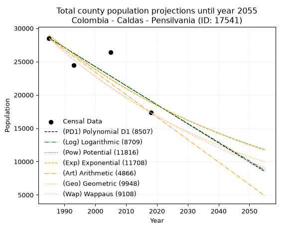
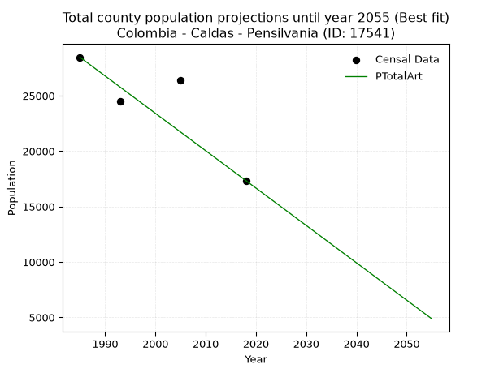
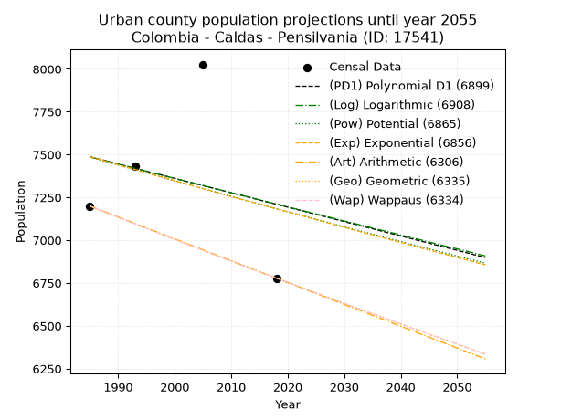
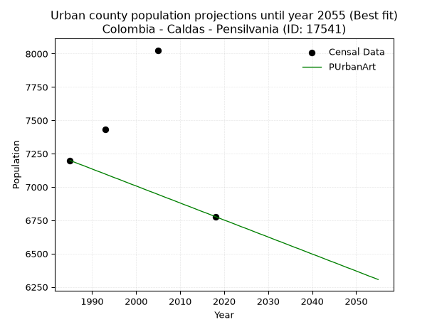
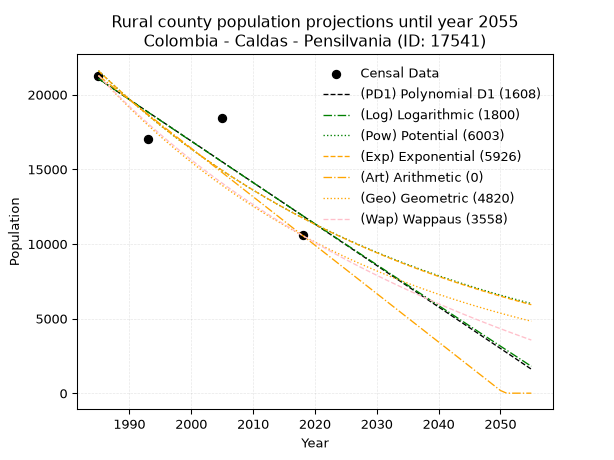
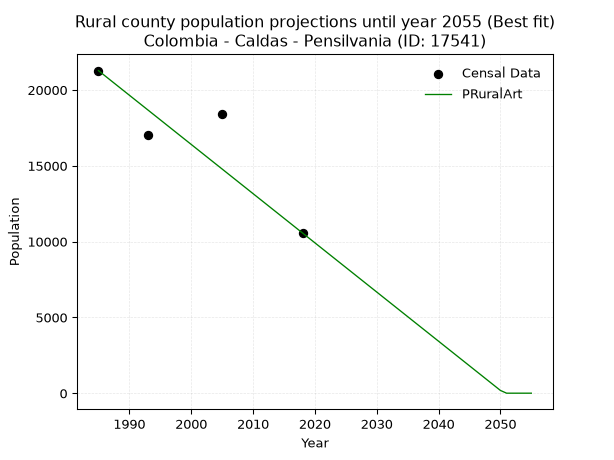

<div align="center">


</div>

# _“Population and Public Services Demand Projections (PPSD) until Year 2050 for Colombia - Caldas - Pensilvania (ID: 17541)”_
Keywords: `population` `public-service` `projection` `lineal` `polynomial` `logarithmic` `potential` `exponential` `arithmetic` `geometric` `wappaus` `dane` `colombia` `south-america`

PPSD are analytical estimates used by governments and planners to anticipate future changes in population size, age distribution, and the resulting community needs for utilities, healthcare, education, and infrastructure as sizing future water treatment facilities, electrical grids, and road networks based on spatial growth.

> **General running parameters**: • app_version: _v20260806_. • Python version: _3.14.7_. • Pandas version: _3.0.5_. • NumPy version: _2.5.1_. • Creates, save and include plots into reports (create_plot): _False_. • Projection until year: _2050_. • Process polynomial degree 2 and up: _False_. • Process Wappaus: _True_. • Process Wappaus: _True_. • Set negative values to zero: _True_. • Set infinite values to zero: _True_. • Drop dataset notes: _True_. 
<div align="center">

Dynamic map: [:earth_americas:Google](http://maps.google.com/maps?q=5.383280593,-75.1602985) [:earth_americas:OSM](https://www.openstreetmap.org/#map=18/5.383280593/-75.1602985&layers=P) [:earth_americas:Bing](https://www.bing.com/maps?cp=5.383280593~-75.1602985&lvl=18) [:earth_americas:Apple](https://maps.apple.com/frame?center=5.383280593%2C-75.1602985&span=0.003%2C0.006)

</div>


<div align="center">

```geojson
{
  "type": "Feature",
  "geometry": {
    "type": "Point", 
    "coordinates": [-75.1602985, 5.383280593]
  }, 
  "properties": {
    "Name": "Colombia - Caldas - Pensilvania (ID: 17541)"
  }
}
```

</div>


## 0. Census Data (4 records)

Census data are official statistics collected by a government about the people and housing in a country. They usually include counts of total population, age, sex, race, income, education, and jobs.

📅Global census file: [Population.xlsx](../data/Population.xlsx)

| Source   |   Year |   CountryID | CountryName   |   StateID | StateName   |   CountyID | CountyName   |   PTotal |   PUrban |   PRural |
|:---------|-------:|------------:|:--------------|----------:|:------------|-----------:|:-------------|---------:|---------:|---------:|
| DANE     |   1985 |          57 | Colombia      |        17 | Caldas      |      17541 | Pensilvania  |    28469 |     7199 |    21270 |
| DANE     |   1993 |          57 | Colombia      |        17 | Caldas      |      17541 | Pensilvania  |    24474 |     7432 |    17042 |
| DANE     |   2005 |          57 | Colombia      |        17 | Caldas      |      17541 | Pensilvania  |    26426 |     8026 |    18400 |
| DANE     |   2018 |          57 | Colombia      |        17 | Caldas      |      17541 | Pensilvania  |    17342 |     6778 |    10564 |

> 🔥Some records could had specific notes about the registered values or the corresponding urban or rural distribution.

## 1. Total

### 1.1. Coefficients and Parameters

* (PD1) Polynomial Deg 1: -286.2219991971041, 596693.3038940075 (lineal)
* (Log) Logarithmic: -572442.0300921813, 4375314.207993207
* (Pow) Potential: -25.868465009407416, 89.76981673224698
* (Exp) Exponential: -0.012935989214971228, 4106898034583411.5
* (Art) Arithmetic: Year diff. 2018 - 1985 = 33, Population diff. 17342 - 28469 = -11127, Annual growth = -337.1818181818182
* (Geo) Geometric: Year diff. 2018 - 1985 = 33, Population diff. 17342 - 28469 = -11127, Annual growth % = -0.014908492929867734
* (Wap) Wappaus: i = -1.4720561357831883, Condition values only valid for < 200)

<sub>
Wappaus condition values: ['-0.00', '-1.47', '-2.94', '-4.42', '-5.89', '-7.36', '-8.83', '-10.30', '-11.78', '-13.25', '-14.72', '-16.19', '-17.66', '-19.14', '-20.61', '-22.08', '-23.55', '-25.02', '-26.50', '-27.97', '-29.44', '-30.91', '-32.39', '-33.86', '-35.33', '-36.80', '-38.27', '-39.75', '-41.22', '-42.69', '-44.16', '-45.63', '-47.11', '-48.58', '-50.05', '-51.52', '-52.99', '-54.47', '-55.94', '-57.41', '-58.88', '-60.35', '-61.83', '-63.30', '-64.77', '-66.24', '-67.71', '-69.19', '-70.66', '-72.13', '-73.60', '-75.07', '-76.55', '-78.02', '-79.49', '-80.96', '-82.44', '-83.91', '-85.38', '-86.85', '-88.32', '-89.80', '-91.27', '-92.74', '-94.21', '-95.68']
</sub>


### 1.2. Projected Dataset

|   Year |   CountyID |   PTotalPD1 |   PTotalLog |   PTotalPow |   PTotalExp |   PTotalArt |   PTotalGeo |   PTotalWap |
|-------:|-----------:|------------:|------------:|------------:|------------:|------------:|------------:|------------:|
|   1985 |      17541 |       28543 |       28548 |       28961 |       28955 |       28469 |       28469 |       28469 |
|   1986 |      17541 |       28256 |       28259 |       28586 |       28583 |       28132 |       28045 |       28053 |
|   1987 |      17541 |       27970 |       27971 |       28216 |       28216 |       27795 |       27626 |       27643 |
|   1988 |      17541 |       27684 |       27683 |       27851 |       27853 |       27457 |       27215 |       27239 |
|   1989 |      17541 |       27398 |       27395 |       27491 |       27495 |       27120 |       26809 |       26841 |
|   1990 |      17541 |       27112 |       27108 |       27136 |       27142 |       26783 |       26409 |       26448 |
|   1991 |      17541 |       26825 |       26820 |       26786 |       26793 |       26446 |       26015 |       26061 |
|   1992 |      17541 |       26539 |       26533 |       26440 |       26448 |       26109 |       25628 |       25679 |
|   1993 |      17541 |       26253 |       26245 |       26099 |       26109 |       25772 |       25246 |       25303 |
|   1994 |      17541 |       25967 |       25958 |       25763 |       25773 |       25434 |       24869 |       24932 |
|   1995 |      17541 |       25680 |       25671 |       25431 |       25442 |       25097 |       24498 |       24566 |
|   1996 |      17541 |       25394 |       25384 |       25103 |       25115 |       24760 |       24133 |       24204 |
|   1997 |      17541 |       25108 |       25097 |       24780 |       24792 |       24423 |       23773 |       23848 |
|   1998 |      17541 |       24822 |       24811 |       24461 |       24473 |       24086 |       23419 |       23497 |
|   1999 |      17541 |       24536 |       24524 |       24147 |       24159 |       23748 |       23070 |       23150 |
|   2000 |      17541 |       24249 |       24238 |       23836 |       23848 |       23411 |       22726 |       22808 |
|   2001 |      17541 |       23963 |       23952 |       23530 |       23542 |       23074 |       22387 |       22470 |
|   2002 |      17541 |       23677 |       23666 |       23228 |       23239 |       22737 |       22053 |       22137 |
|   2003 |      17541 |       23391 |       23380 |       22930 |       22940 |       22400 |       21725 |       21808 |
|   2004 |      17541 |       23104 |       23094 |       22636 |       22646 |       22063 |       21401 |       21483 |
|   2005 |      17541 |       22818 |       22809 |       22345 |       22355 |       21725 |       21082 |       21163 |
|   2006 |      17541 |       22532 |       22523 |       22059 |       22067 |       21388 |       20767 |       20847 |
|   2007 |      17541 |       22246 |       22238 |       21776 |       21784 |       21051 |       20458 |       20534 |
|   2008 |      17541 |       21960 |       21953 |       21498 |       21504 |       20714 |       20153 |       20226 |
|   2009 |      17541 |       21673 |       21668 |       21222 |       21227 |       20377 |       19852 |       19921 |
|   2010 |      17541 |       21387 |       21383 |       20951 |       20954 |       20039 |       19556 |       19620 |
|   2011 |      17541 |       21101 |       21098 |       20683 |       20685 |       19702 |       19265 |       19323 |
|   2012 |      17541 |       20815 |       20814 |       20419 |       20419 |       19365 |       18978 |       19030 |
|   2013 |      17541 |       20528 |       20529 |       20158 |       20157 |       19028 |       18695 |       18740 |
|   2014 |      17541 |       20242 |       20245 |       19901 |       19898 |       18691 |       18416 |       18453 |
|   2015 |      17541 |       19956 |       19961 |       19647 |       19642 |       18354 |       18141 |       18171 |
|   2016 |      17541 |       19670 |       19677 |       19396 |       19390 |       18016 |       17871 |       17891 |
|   2017 |      17541 |       19384 |       19393 |       19149 |       19140 |       17679 |       17604 |       17615 |
|   2018 |      17541 |       19097 |       19109 |       18905 |       18894 |       17342 |       17342 |       17342 |
|   2019 |      17541 |       18811 |       18826 |       18664 |       18652 |       17005 |       17083 |       17072 |
|   2020 |      17541 |       18525 |       18542 |       18427 |       18412 |       16668 |       16829 |       16806 |
|   2021 |      17541 |       18239 |       18259 |       18192 |       18175 |       16330 |       16578 |       16542 |
|   2022 |      17541 |       17952 |       17976 |       17961 |       17942 |       15993 |       16331 |       16282 |
|   2023 |      17541 |       17666 |       17693 |       17733 |       17711 |       15656 |       16087 |       16025 |
|   2024 |      17541 |       17380 |       17410 |       17508 |       17483 |       15319 |       15847 |       15770 |
|   2025 |      17541 |       17094 |       17127 |       17285 |       17259 |       14982 |       15611 |       15519 |
|   2026 |      17541 |       16808 |       16844 |       17066 |       17037 |       14645 |       15378 |       15270 |
|   2027 |      17541 |       16521 |       16562 |       16849 |       16818 |       14307 |       15149 |       15024 |
|   2028 |      17541 |       16235 |       16280 |       16636 |       16602 |       13970 |       14923 |       14781 |
|   2029 |      17541 |       15949 |       15997 |       16425 |       16388 |       13633 |       14701 |       14540 |
|   2030 |      17541 |       15663 |       15715 |       16217 |       16178 |       13296 |       14482 |       14303 |
|   2031 |      17541 |       15376 |       15433 |       16012 |       15970 |       12959 |       14266 |       14067 |
|   2032 |      17541 |       15090 |       15152 |       15809 |       15764 |       12621 |       14053 |       13835 |
|   2033 |      17541 |       14804 |       14870 |       15609 |       15562 |       12284 |       13844 |       13605 |
|   2034 |      17541 |       14518 |       14588 |       15412 |       15362 |       11947 |       13637 |       13377 |
|   2035 |      17541 |       14232 |       14307 |       15217 |       15164 |       11610 |       13434 |       13152 |
|   2036 |      17541 |       13945 |       14026 |       15025 |       14970 |       11273 |       13234 |       12929 |
|   2037 |      17541 |       13659 |       13745 |       14835 |       14777 |       10936 |       13036 |       12709 |
|   2038 |      17541 |       13373 |       13464 |       14648 |       14587 |       10598 |       12842 |       12491 |
|   2039 |      17541 |       13087 |       13183 |       14463 |       14400 |       10261 |       12650 |       12275 |
|   2040 |      17541 |       12800 |       12902 |       14281 |       14215 |        9924 |       12462 |       12062 |
|   2041 |      17541 |       12514 |       12622 |       14101 |       14032 |        9587 |       12276 |       11850 |
|   2042 |      17541 |       12228 |       12341 |       13924 |       13852 |        9250 |       12093 |       11641 |
|   2043 |      17541 |       11942 |       12061 |       13749 |       13674 |        8912 |       11913 |       11434 |
|   2044 |      17541 |       11656 |       11781 |       13576 |       13498 |        8575 |       11735 |       11230 |
|   2045 |      17541 |       11369 |       11501 |       13405 |       13324 |        8238 |       11560 |       11027 |
|   2046 |      17541 |       11083 |       11221 |       13236 |       13153 |        7901 |       11388 |       10826 |
|   2047 |      17541 |       10797 |       10941 |       13070 |       12984 |        7564 |       11218 |       10628 |
|   2048 |      17541 |       10511 |       10662 |       12906 |       12817 |        7227 |       11051 |       10431 |
|   2049 |      17541 |       10224 |       10382 |       12744 |       12652 |        6889 |       10886 |       10236 |
|   2050 |      17541 |        9938 |       10103 |       12584 |       12490 |        6552 |       10724 |       10044 |
<div align="center">

</img>

</div>


### 1.3. Best fit with absolute and relative error (%)

Relative error puts that difference into context by dividing the absolute error by the true value, creating a unitless ratio or percentage that shows the scale of the mistake.

Absolute and relative error

|   Year | Source   |   CountryID | CountryName   |   StateID | StateName   |   CountyID_x | CountyName   |   PTotal |   PUrban |   PRural |   CountyID_y |   PTotalPD1 |   PTotalLog |   PTotalPow |   PTotalExp |   PTotalArt |   PTotalGeo |   PTotalWap |   PTotalPD1AbsError |   PTotalLogAbsError |   PTotalPowAbsError |   PTotalExpAbsError |   PTotalArtAbsError |   PTotalGeoAbsError |   PTotalWapAbsError |   PTotalPD1RelError |   PTotalLogRelError |   PTotalPowRelError |   PTotalExpRelError |   PTotalArtRelError |   PTotalGeoRelError |   PTotalWapRelError |
|-------:|:---------|------------:|:--------------|----------:|:------------|-------------:|:-------------|---------:|---------:|---------:|-------------:|------------:|------------:|------------:|------------:|------------:|------------:|------------:|--------------------:|--------------------:|--------------------:|--------------------:|--------------------:|--------------------:|--------------------:|--------------------:|--------------------:|--------------------:|--------------------:|--------------------:|--------------------:|--------------------:|
|   1985 | DANE     |          57 | Colombia      |        17 | Caldas      |        17541 | Pensilvania  |    28469 |     7199 |    21270 |        17541 |       28543 |       28548 |       28961 |       28955 |       28469 |       28469 |       28469 |                  74 |                  79 |                 492 |                 486 |                   0 |                   0 |                   0 |            0.259932 |            0.277495 |              1.7282 |             1.70712 |             0       |             0       |             0       |
|   1993 | DANE     |          57 | Colombia      |        17 | Caldas      |        17541 | Pensilvania  |    24474 |     7432 |    17042 |        17541 |       26253 |       26245 |       26099 |       26109 |       25772 |       25246 |       25303 |                1779 |                1771 |                1625 |                1635 |                1298 |                 772 |                 829 |            7.26894  |            7.23625  |              6.6397 |             6.68056 |             5.30359 |             3.15437 |             3.38727 |
|   2005 | DANE     |          57 | Colombia      |        17 | Caldas      |        17541 | Pensilvania  |    26426 |     8026 |    18400 |        17541 |       22818 |       22809 |       22345 |       22355 |       21725 |       21082 |       21163 |                3608 |                3617 |                4081 |                4071 |                4701 |                5344 |                5263 |           13.6532   |           13.6873   |             15.4431 |            15.4053  |            17.7893  |            20.2225  |            19.916   |
|   2018 | DANE     |          57 | Colombia      |        17 | Caldas      |        17541 | Pensilvania  |    17342 |     6778 |    10564 |        17541 |       19097 |       19109 |       18905 |       18894 |       17342 |       17342 |       17342 |                1755 |                1767 |                1563 |                1552 |                   0 |                   0 |                   0 |           10.1199   |           10.1891   |              9.0128 |             8.94937 |             0       |             0       |             0       |

Relative error mean

| Method    |   RelError | Best   |
|:----------|-----------:|:-------|
| PTotalPD1 |    7.82551 |        |
| PTotalLog |    7.84754 |        |
| PTotalPow |    8.20596 |        |
| PTotalExp |    8.18558 |        |
| PTotalArt |    5.77322 | True   |
| PTotalGeo |    5.84422 |        |
| PTotalWap |    5.82581 |        |

💙Best method: _**PTotalArt**_
<div align="center">

</img>

</div>


### 1.4. Fresh water supply demand in liters per capita per day (lpcd)

The fresh water supply demand typically ranges from 100 to 300 liters per capita per day (lpcd) for standard domestic and municipal planning, though absolute survival minimums set by the World Health Organization are as low as 7.5 to 20 liters per day, and total consumption in high-income nations can exceed 400 liters.

> `CZ`: Level in meters above the sea level (masl)<br> `WS`: Fresh water supply demand in liters per capita per day (lpcd or l/h/d)<br> `WSAll`: Zonal fresh water supply demand in liters per second (l/s)<br> `A`: Zonal area in square meters<br> `DP`: Population density (people/hectare)

Reference values (RAS Colombia)

|    CZ |   WS |
|------:|-----:|
|  1000 |  120 |
|  2000 |  130 |
| 99999 |  140 |

County shapefile geometry properties and water supply values

|   CountyID |      ATotal |   CZTotal |   WSTotal |
|-----------:|------------:|----------:|----------:|
|      17541 | 4.98944e+08 |   2228.87 |       140 |

Projected values for best method: PTotalArt

|   CountyID |   Year |   PTotalArt |   DPTotal |   WSTotal |   WSTotalAll |
|-----------:|-------:|------------:|----------:|----------:|-------------:|
|      17541 |   1985 |       28469 |      0.57 |       140 |      46.1303 |
|      17541 |   1986 |       28132 |      0.56 |       140 |      45.5843 |
|      17541 |   1987 |       27795 |      0.56 |       140 |      45.0382 |
|      17541 |   1988 |       27457 |      0.55 |       140 |      44.4905 |
|      17541 |   1989 |       27120 |      0.54 |       140 |      43.9444 |
|      17541 |   1990 |       26783 |      0.54 |       140 |      43.3984 |
|      17541 |   1991 |       26446 |      0.53 |       140 |      42.8523 |
|      17541 |   1992 |       26109 |      0.52 |       140 |      42.3062 |
|      17541 |   1993 |       25772 |      0.52 |       140 |      41.7602 |
|      17541 |   1994 |       25434 |      0.51 |       140 |      41.2125 |
|      17541 |   1995 |       25097 |      0.5  |       140 |      40.6664 |
|      17541 |   1996 |       24760 |      0.5  |       140 |      40.1204 |
|      17541 |   1997 |       24423 |      0.49 |       140 |      39.5743 |
|      17541 |   1998 |       24086 |      0.48 |       140 |      39.0282 |
|      17541 |   1999 |       23748 |      0.48 |       140 |      38.4806 |
|      17541 |   2000 |       23411 |      0.47 |       140 |      37.9345 |
|      17541 |   2001 |       23074 |      0.46 |       140 |      37.3884 |
|      17541 |   2002 |       22737 |      0.46 |       140 |      36.8424 |
|      17541 |   2003 |       22400 |      0.45 |       140 |      36.2963 |
|      17541 |   2004 |       22063 |      0.44 |       140 |      35.7502 |
|      17541 |   2005 |       21725 |      0.44 |       140 |      35.2025 |
|      17541 |   2006 |       21388 |      0.43 |       140 |      34.6565 |
|      17541 |   2007 |       21051 |      0.42 |       140 |      34.1104 |
|      17541 |   2008 |       20714 |      0.42 |       140 |      33.5644 |
|      17541 |   2009 |       20377 |      0.41 |       140 |      33.0183 |
|      17541 |   2010 |       20039 |      0.4  |       140 |      32.4706 |
|      17541 |   2011 |       19702 |      0.39 |       140 |      31.9245 |
|      17541 |   2012 |       19365 |      0.39 |       140 |      31.3785 |
|      17541 |   2013 |       19028 |      0.38 |       140 |      30.8324 |
|      17541 |   2014 |       18691 |      0.37 |       140 |      30.2863 |
|      17541 |   2015 |       18354 |      0.37 |       140 |      29.7403 |
|      17541 |   2016 |       18016 |      0.36 |       140 |      29.1926 |
|      17541 |   2017 |       17679 |      0.35 |       140 |      28.6465 |
|      17541 |   2018 |       17342 |      0.35 |       140 |      28.1005 |
|      17541 |   2019 |       17005 |      0.34 |       140 |      27.5544 |
|      17541 |   2020 |       16668 |      0.33 |       140 |      27.0083 |
|      17541 |   2021 |       16330 |      0.33 |       140 |      26.4606 |
|      17541 |   2022 |       15993 |      0.32 |       140 |      25.9146 |
|      17541 |   2023 |       15656 |      0.31 |       140 |      25.3685 |
|      17541 |   2024 |       15319 |      0.31 |       140 |      24.8225 |
|      17541 |   2025 |       14982 |      0.3  |       140 |      24.2764 |
|      17541 |   2026 |       14645 |      0.29 |       140 |      23.7303 |
|      17541 |   2027 |       14307 |      0.29 |       140 |      23.1826 |
|      17541 |   2028 |       13970 |      0.28 |       140 |      22.6366 |
|      17541 |   2029 |       13633 |      0.27 |       140 |      22.0905 |
|      17541 |   2030 |       13296 |      0.27 |       140 |      21.5444 |
|      17541 |   2031 |       12959 |      0.26 |       140 |      20.9984 |
|      17541 |   2032 |       12621 |      0.25 |       140 |      20.4507 |
|      17541 |   2033 |       12284 |      0.25 |       140 |      19.9046 |
|      17541 |   2034 |       11947 |      0.24 |       140 |      19.3586 |
|      17541 |   2035 |       11610 |      0.23 |       140 |      18.8125 |
|      17541 |   2036 |       11273 |      0.23 |       140 |      18.2664 |
|      17541 |   2037 |       10936 |      0.22 |       140 |      17.7204 |
|      17541 |   2038 |       10598 |      0.21 |       140 |      17.1727 |
|      17541 |   2039 |       10261 |      0.21 |       140 |      16.6266 |
|      17541 |   2040 |        9924 |      0.2  |       140 |      16.0806 |
|      17541 |   2041 |        9587 |      0.19 |       140 |      15.5345 |
|      17541 |   2042 |        9250 |      0.19 |       140 |      14.9884 |
|      17541 |   2043 |        8912 |      0.18 |       140 |      14.4407 |
|      17541 |   2044 |        8575 |      0.17 |       140 |      13.8947 |
|      17541 |   2045 |        8238 |      0.17 |       140 |      13.3486 |
|      17541 |   2046 |        7901 |      0.16 |       140 |      12.8025 |
|      17541 |   2047 |        7564 |      0.15 |       140 |      12.2565 |
|      17541 |   2048 |        7227 |      0.14 |       140 |      11.7104 |
|      17541 |   2049 |        6889 |      0.14 |       140 |      11.1627 |
|      17541 |   2050 |        6552 |      0.13 |       140 |      10.6167 |

## 2. Urban

### 2.1. Coefficients and Parameters

* (PD1) Polynomial Deg 1: -8.404255319148229, 24169.361702126247 (lineal)
* (Log) Logarithmic: -16672.673493347545, 134087.87482935505
* (Pow) Potential: -2.4997899739562004, 12.117990929624284
* (Exp) Exponential: -0.0012589556239970738, 91126.83756129639
* (Art) Arithmetic: Year diff. 2018 - 1985 = 33, Population diff. 6778 - 7199 = -421, Annual growth = -12.757575757575758
* (Geo) Geometric: Year diff. 2018 - 1985 = 33, Population diff. 6778 - 7199 = -421, Annual growth % = -0.0018243960142837468
* (Wap) Wappaus: i = -0.18255098744474146, Condition values only valid for < 200)

<sub>
Wappaus condition values: ['-0.00', '-0.18', '-0.37', '-0.55', '-0.73', '-0.91', '-1.10', '-1.28', '-1.46', '-1.64', '-1.83', '-2.01', '-2.19', '-2.37', '-2.56', '-2.74', '-2.92', '-3.10', '-3.29', '-3.47', '-3.65', '-3.83', '-4.02', '-4.20', '-4.38', '-4.56', '-4.75', '-4.93', '-5.11', '-5.29', '-5.48', '-5.66', '-5.84', '-6.02', '-6.21', '-6.39', '-6.57', '-6.75', '-6.94', '-7.12', '-7.30', '-7.48', '-7.67', '-7.85', '-8.03', '-8.21', '-8.40', '-8.58', '-8.76', '-8.94', '-9.13', '-9.31', '-9.49', '-9.68', '-9.86', '-10.04', '-10.22', '-10.41', '-10.59', '-10.77', '-10.95', '-11.14', '-11.32', '-11.50', '-11.68', '-11.87']
</sub>


### 2.2. Projected Dataset

|   Year |   CountyID |   PUrbanPD1 |   PUrbanLog |   PUrbanPow |   PUrbanExp |   PUrbanArt |   PUrbanGeo |   PUrbanWap |
|-------:|-----------:|------------:|------------:|------------:|------------:|------------:|------------:|------------:|
|   1985 |      17541 |        7487 |        7486 |        7487 |        7487 |        7199 |        7199 |        7199 |
|   1986 |      17541 |        7479 |        7478 |        7477 |        7478 |        7186 |        7186 |        7186 |
|   1987 |      17541 |        7470 |        7469 |        7468 |        7469 |        7173 |        7173 |        7173 |
|   1988 |      17541 |        7462 |        7461 |        7458 |        7459 |        7161 |        7160 |        7160 |
|   1989 |      17541 |        7453 |        7452 |        7449 |        7450 |        7148 |        7147 |        7147 |
|   1990 |      17541 |        7445 |        7444 |        7440 |        7440 |        7135 |        7134 |        7134 |
|   1991 |      17541 |        7436 |        7436 |        7430 |        7431 |        7122 |        7121 |        7121 |
|   1992 |      17541 |        7428 |        7427 |        7421 |        7422 |        7110 |        7108 |        7108 |
|   1993 |      17541 |        7420 |        7419 |        7412 |        7412 |        7097 |        7095 |        7095 |
|   1994 |      17541 |        7411 |        7411 |        7402 |        7403 |        7084 |        7082 |        7082 |
|   1995 |      17541 |        7403 |        7402 |        7393 |        7394 |        7071 |        7069 |        7069 |
|   1996 |      17541 |        7394 |        7394 |        7384 |        7384 |        7059 |        7056 |        7056 |
|   1997 |      17541 |        7386 |        7386 |        7375 |        7375 |        7046 |        7043 |        7043 |
|   1998 |      17541 |        7378 |        7377 |        7365 |        7366 |        7033 |        7030 |        7030 |
|   1999 |      17541 |        7369 |        7369 |        7356 |        7357 |        7020 |        7017 |        7017 |
|   2000 |      17541 |        7361 |        7361 |        7347 |        7347 |        7008 |        7004 |        7005 |
|   2001 |      17541 |        7352 |        7352 |        7338 |        7338 |        6995 |        6992 |        6992 |
|   2002 |      17541 |        7344 |        7344 |        7329 |        7329 |        6982 |        6979 |        6979 |
|   2003 |      17541 |        7336 |        7336 |        7320 |        7320 |        6969 |        6966 |        6966 |
|   2004 |      17541 |        7327 |        7327 |        7310 |        7310 |        6957 |        6954 |        6954 |
|   2005 |      17541 |        7319 |        7319 |        7301 |        7301 |        6944 |        6941 |        6941 |
|   2006 |      17541 |        7310 |        7311 |        7292 |        7292 |        6931 |        6928 |        6928 |
|   2007 |      17541 |        7302 |        7302 |        7283 |        7283 |        6918 |        6916 |        6916 |
|   2008 |      17541 |        7294 |        7294 |        7274 |        7274 |        6906 |        6903 |        6903 |
|   2009 |      17541 |        7285 |        7286 |        7265 |        7265 |        6893 |        6890 |        6890 |
|   2010 |      17541 |        7277 |        7277 |        7256 |        7255 |        6880 |        6878 |        6878 |
|   2011 |      17541 |        7268 |        7269 |        7247 |        7246 |        6867 |        6865 |        6865 |
|   2012 |      17541 |        7260 |        7261 |        7238 |        7237 |        6855 |        6853 |        6853 |
|   2013 |      17541 |        7252 |        7252 |        7229 |        7228 |        6842 |        6840 |        6840 |
|   2014 |      17541 |        7243 |        7244 |        7220 |        7219 |        6829 |        6828 |        6828 |
|   2015 |      17541 |        7235 |        7236 |        7211 |        7210 |        6816 |        6815 |        6815 |
|   2016 |      17541 |        7226 |        7228 |        7202 |        7201 |        6804 |        6803 |        6803 |
|   2017 |      17541 |        7218 |        7219 |        7193 |        7192 |        6791 |        6790 |        6790 |
|   2018 |      17541 |        7210 |        7211 |        7184 |        7183 |        6778 |        6778 |        6778 |
|   2019 |      17541 |        7201 |        7203 |        7175 |        7174 |        6765 |        6766 |        6766 |
|   2020 |      17541 |        7193 |        7195 |        7166 |        7165 |        6752 |        6753 |        6753 |
|   2021 |      17541 |        7184 |        7186 |        7158 |        7156 |        6740 |        6741 |        6741 |
|   2022 |      17541 |        7176 |        7178 |        7149 |        7147 |        6727 |        6729 |        6729 |
|   2023 |      17541 |        7168 |        7170 |        7140 |        7138 |        6714 |        6716 |        6716 |
|   2024 |      17541 |        7159 |        7162 |        7131 |        7129 |        6701 |        6704 |        6704 |
|   2025 |      17541 |        7151 |        7153 |        7122 |        7120 |        6689 |        6692 |        6692 |
|   2026 |      17541 |        7142 |        7145 |        7114 |        7111 |        6676 |        6680 |        6680 |
|   2027 |      17541 |        7134 |        7137 |        7105 |        7102 |        6663 |        6668 |        6667 |
|   2028 |      17541 |        7126 |        7129 |        7096 |        7093 |        6650 |        6655 |        6655 |
|   2029 |      17541 |        7117 |        7120 |        7087 |        7084 |        6638 |        6643 |        6643 |
|   2030 |      17541 |        7109 |        7112 |        7079 |        7075 |        6625 |        6631 |        6631 |
|   2031 |      17541 |        7100 |        7104 |        7070 |        7066 |        6612 |        6619 |        6619 |
|   2032 |      17541 |        7092 |        7096 |        7061 |        7057 |        6599 |        6607 |        6607 |
|   2033 |      17541 |        7084 |        7088 |        7052 |        7048 |        6587 |        6595 |        6595 |
|   2034 |      17541 |        7075 |        7079 |        7044 |        7039 |        6574 |        6583 |        6583 |
|   2035 |      17541 |        7067 |        7071 |        7035 |        7031 |        6561 |        6571 |        6571 |
|   2036 |      17541 |        7058 |        7063 |        7027 |        7022 |        6548 |        6559 |        6559 |
|   2037 |      17541 |        7050 |        7055 |        7018 |        7013 |        6536 |        6547 |        6547 |
|   2038 |      17541 |        7041 |        7047 |        7009 |        7004 |        6523 |        6535 |        6535 |
|   2039 |      17541 |        7033 |        7039 |        7001 |        6995 |        6510 |        6523 |        6523 |
|   2040 |      17541 |        7025 |        7030 |        6992 |        6987 |        6497 |        6511 |        6511 |
|   2041 |      17541 |        7016 |        7022 |        6984 |        6978 |        6485 |        6499 |        6499 |
|   2042 |      17541 |        7008 |        7014 |        6975 |        6969 |        6472 |        6487 |        6487 |
|   2043 |      17541 |        6999 |        7006 |        6967 |        6960 |        6459 |        6476 |        6475 |
|   2044 |      17541 |        6991 |        6998 |        6958 |        6951 |        6446 |        6464 |        6463 |
|   2045 |      17541 |        6983 |        6990 |        6949 |        6943 |        6434 |        6452 |        6451 |
|   2046 |      17541 |        6974 |        6981 |        6941 |        6934 |        6421 |        6440 |        6440 |
|   2047 |      17541 |        6966 |        6973 |        6933 |        6925 |        6408 |        6428 |        6428 |
|   2048 |      17541 |        6957 |        6965 |        6924 |        6917 |        6395 |        6417 |        6416 |
|   2049 |      17541 |        6949 |        6957 |        6916 |        6908 |        6383 |        6405 |        6404 |
|   2050 |      17541 |        6941 |        6949 |        6907 |        6899 |        6370 |        6393 |        6393 |
<div align="center">

</img>

</div>


### 2.3. Best fit with absolute and relative error (%)

Relative error puts that difference into context by dividing the absolute error by the true value, creating a unitless ratio or percentage that shows the scale of the mistake.

Absolute and relative error

|   Year | Source   |   CountryID | CountryName   |   StateID | StateName   |   CountyID_x | CountyName   |   PTotal |   PUrban |   PRural |   CountyID_y |   PUrbanPD1 |   PUrbanLog |   PUrbanPow |   PUrbanExp |   PUrbanArt |   PUrbanGeo |   PUrbanWap |   PUrbanPD1AbsError |   PUrbanLogAbsError |   PUrbanPowAbsError |   PUrbanExpAbsError |   PUrbanArtAbsError |   PUrbanGeoAbsError |   PUrbanWapAbsError |   PUrbanPD1RelError |   PUrbanLogRelError |   PUrbanPowRelError |   PUrbanExpRelError |   PUrbanArtRelError |   PUrbanGeoRelError |   PUrbanWapRelError |
|-------:|:---------|------------:|:--------------|----------:|:------------|-------------:|:-------------|---------:|---------:|---------:|-------------:|------------:|------------:|------------:|------------:|------------:|------------:|------------:|--------------------:|--------------------:|--------------------:|--------------------:|--------------------:|--------------------:|--------------------:|--------------------:|--------------------:|--------------------:|--------------------:|--------------------:|--------------------:|--------------------:|
|   1985 | DANE     |          57 | Colombia      |        17 | Caldas      |        17541 | Pensilvania  |    28469 |     7199 |    21270 |        17541 |        7487 |        7486 |        7487 |        7487 |        7199 |        7199 |        7199 |                 288 |                 287 |                 288 |                 288 |                   0 |                   0 |                   0 |            4.00056  |            3.98666  |            4.00056  |            4.00056  |             0       |             0       |             0       |
|   1993 | DANE     |          57 | Colombia      |        17 | Caldas      |        17541 | Pensilvania  |    24474 |     7432 |    17042 |        17541 |        7420 |        7419 |        7412 |        7412 |        7097 |        7095 |        7095 |                  12 |                  13 |                  20 |                  20 |                 335 |                 337 |                 337 |            0.161464 |            0.174919 |            0.269107 |            0.269107 |             4.50753 |             4.53445 |             4.53445 |
|   2005 | DANE     |          57 | Colombia      |        17 | Caldas      |        17541 | Pensilvania  |    26426 |     8026 |    18400 |        17541 |        7319 |        7319 |        7301 |        7301 |        6944 |        6941 |        6941 |                 707 |                 707 |                 725 |                 725 |                1082 |                1085 |                1085 |            8.80887  |            8.80887  |            9.03314  |            9.03314  |            13.4812  |            13.5186  |            13.5186  |
|   2018 | DANE     |          57 | Colombia      |        17 | Caldas      |        17541 | Pensilvania  |    17342 |     6778 |    10564 |        17541 |        7210 |        7211 |        7184 |        7183 |        6778 |        6778 |        6778 |                 432 |                 433 |                 406 |                 405 |                   0 |                   0 |                   0 |            6.37356  |            6.38832  |            5.98997  |            5.97521  |             0       |             0       |             0       |

Relative error mean

| Method    |   RelError | Best   |
|:----------|-----------:|:-------|
| PUrbanPD1 |    4.83611 |        |
| PUrbanLog |    4.83969 |        |
| PUrbanPow |    4.82319 |        |
| PUrbanExp |    4.8195  |        |
| PUrbanArt |    4.49718 | True   |
| PUrbanGeo |    4.51325 |        |
| PUrbanWap |    4.51325 |        |

💙Best method: _**PUrbanArt**_
<div align="center">

</img>

</div>


### 2.4. Fresh water supply demand in liters per capita per day (lpcd)

The fresh water supply demand typically ranges from 100 to 300 liters per capita per day (lpcd) for standard domestic and municipal planning, though absolute survival minimums set by the World Health Organization are as low as 7.5 to 20 liters per day, and total consumption in high-income nations can exceed 400 liters.

> `CZ`: Level in meters above the sea level (masl)<br> `WS`: Fresh water supply demand in liters per capita per day (lpcd or l/h/d)<br> `WSAll`: Zonal fresh water supply demand in liters per second (l/s)<br> `A`: Zonal area in square meters<br> `DP`: Population density (people/hectare)

Reference values (RAS Colombia)

|    CZ |   WS |
|------:|-----:|
|  1000 |  120 |
|  2000 |  130 |
| 99999 |  140 |

County shapefile geometry properties and water supply values

|   CountyID |      AUrban |   CZUrban |   WSUrban |
|-----------:|------------:|----------:|----------:|
|      17541 | 1.26646e+06 |   2040.12 |       140 |

Projected values for best method: PUrbanArt

|   CountyID |   Year |   PUrbanArt |   DPUrban |   WSUrban |   WSUrbanAll |
|-----------:|-------:|------------:|----------:|----------:|-------------:|
|      17541 |   1985 |        7199 |     56.84 |       140 |      11.665  |
|      17541 |   1986 |        7186 |     56.74 |       140 |      11.644  |
|      17541 |   1987 |        7173 |     56.64 |       140 |      11.6229 |
|      17541 |   1988 |        7161 |     56.54 |       140 |      11.6035 |
|      17541 |   1989 |        7148 |     56.44 |       140 |      11.5824 |
|      17541 |   1990 |        7135 |     56.34 |       140 |      11.5613 |
|      17541 |   1991 |        7122 |     56.24 |       140 |      11.5403 |
|      17541 |   1992 |        7110 |     56.14 |       140 |      11.5208 |
|      17541 |   1993 |        7097 |     56.04 |       140 |      11.4998 |
|      17541 |   1994 |        7084 |     55.94 |       140 |      11.4787 |
|      17541 |   1995 |        7071 |     55.83 |       140 |      11.4576 |
|      17541 |   1996 |        7059 |     55.74 |       140 |      11.4382 |
|      17541 |   1997 |        7046 |     55.64 |       140 |      11.4171 |
|      17541 |   1998 |        7033 |     55.53 |       140 |      11.3961 |
|      17541 |   1999 |        7020 |     55.43 |       140 |      11.375  |
|      17541 |   2000 |        7008 |     55.34 |       140 |      11.3556 |
|      17541 |   2001 |        6995 |     55.23 |       140 |      11.3345 |
|      17541 |   2002 |        6982 |     55.13 |       140 |      11.3134 |
|      17541 |   2003 |        6969 |     55.03 |       140 |      11.2924 |
|      17541 |   2004 |        6957 |     54.93 |       140 |      11.2729 |
|      17541 |   2005 |        6944 |     54.83 |       140 |      11.2519 |
|      17541 |   2006 |        6931 |     54.73 |       140 |      11.2308 |
|      17541 |   2007 |        6918 |     54.62 |       140 |      11.2097 |
|      17541 |   2008 |        6906 |     54.53 |       140 |      11.1903 |
|      17541 |   2009 |        6893 |     54.43 |       140 |      11.1692 |
|      17541 |   2010 |        6880 |     54.32 |       140 |      11.1481 |
|      17541 |   2011 |        6867 |     54.22 |       140 |      11.1271 |
|      17541 |   2012 |        6855 |     54.13 |       140 |      11.1076 |
|      17541 |   2013 |        6842 |     54.02 |       140 |      11.0866 |
|      17541 |   2014 |        6829 |     53.92 |       140 |      11.0655 |
|      17541 |   2015 |        6816 |     53.82 |       140 |      11.0444 |
|      17541 |   2016 |        6804 |     53.72 |       140 |      11.025  |
|      17541 |   2017 |        6791 |     53.62 |       140 |      11.0039 |
|      17541 |   2018 |        6778 |     53.52 |       140 |      10.9829 |
|      17541 |   2019 |        6765 |     53.42 |       140 |      10.9618 |
|      17541 |   2020 |        6752 |     53.31 |       140 |      10.9407 |
|      17541 |   2021 |        6740 |     53.22 |       140 |      10.9213 |
|      17541 |   2022 |        6727 |     53.12 |       140 |      10.9002 |
|      17541 |   2023 |        6714 |     53.01 |       140 |      10.8792 |
|      17541 |   2024 |        6701 |     52.91 |       140 |      10.8581 |
|      17541 |   2025 |        6689 |     52.82 |       140 |      10.8387 |
|      17541 |   2026 |        6676 |     52.71 |       140 |      10.8176 |
|      17541 |   2027 |        6663 |     52.61 |       140 |      10.7965 |
|      17541 |   2028 |        6650 |     52.51 |       140 |      10.7755 |
|      17541 |   2029 |        6638 |     52.41 |       140 |      10.756  |
|      17541 |   2030 |        6625 |     52.31 |       140 |      10.735  |
|      17541 |   2031 |        6612 |     52.21 |       140 |      10.7139 |
|      17541 |   2032 |        6599 |     52.11 |       140 |      10.6928 |
|      17541 |   2033 |        6587 |     52.01 |       140 |      10.6734 |
|      17541 |   2034 |        6574 |     51.91 |       140 |      10.6523 |
|      17541 |   2035 |        6561 |     51.81 |       140 |      10.6312 |
|      17541 |   2036 |        6548 |     51.7  |       140 |      10.6102 |
|      17541 |   2037 |        6536 |     51.61 |       140 |      10.5907 |
|      17541 |   2038 |        6523 |     51.51 |       140 |      10.5697 |
|      17541 |   2039 |        6510 |     51.4  |       140 |      10.5486 |
|      17541 |   2040 |        6497 |     51.3  |       140 |      10.5275 |
|      17541 |   2041 |        6485 |     51.21 |       140 |      10.5081 |
|      17541 |   2042 |        6472 |     51.1  |       140 |      10.487  |
|      17541 |   2043 |        6459 |     51    |       140 |      10.466  |
|      17541 |   2044 |        6446 |     50.9  |       140 |      10.4449 |
|      17541 |   2045 |        6434 |     50.8  |       140 |      10.4255 |
|      17541 |   2046 |        6421 |     50.7  |       140 |      10.4044 |
|      17541 |   2047 |        6408 |     50.6  |       140 |      10.3833 |
|      17541 |   2048 |        6395 |     50.49 |       140 |      10.3623 |
|      17541 |   2049 |        6383 |     50.4  |       140 |      10.3428 |
|      17541 |   2050 |        6370 |     50.3  |       140 |      10.3218 |

## 3. Rural

### 3.1. Coefficients and Parameters

* (PD1) Polynomial Deg 1: -277.81774387795576, 572523.942191881 (lineal)
* (Log) Logarithmic: -555769.3565988337, 4241226.333163851
* (Pow) Potential: -36.94651979649574, 126.17524733412442
* (Exp) Exponential: -0.018472961391467837, 1.8171870632149703e+20
* (Art) Arithmetic: Year diff. 2018 - 1985 = 33, Population diff. 10564 - 21270 = -10706, Annual growth = -324.42424242424244
* (Geo) Geometric: Year diff. 2018 - 1985 = 33, Population diff. 10564 - 21270 = -10706, Annual growth % = -0.0209841469505625
* (Wap) Wappaus: i = -2.038224806334375, Condition values only valid for < 200)

<sub>
Wappaus condition values: ['-0.00', '-2.04', '-4.08', '-6.11', '-8.15', '-10.19', '-12.23', '-14.27', '-16.31', '-18.34', '-20.38', '-22.42', '-24.46', '-26.50', '-28.54', '-30.57', '-32.61', '-34.65', '-36.69', '-38.73', '-40.76', '-42.80', '-44.84', '-46.88', '-48.92', '-50.96', '-52.99', '-55.03', '-57.07', '-59.11', '-61.15', '-63.18', '-65.22', '-67.26', '-69.30', '-71.34', '-73.38', '-75.41', '-77.45', '-79.49', '-81.53', '-83.57', '-85.61', '-87.64', '-89.68', '-91.72', '-93.76', '-95.80', '-97.83', '-99.87', '-101.91', '-103.95', '-105.99', '-108.03', '-110.06', '-112.10', '-114.14', '-116.18', '-118.22', '-120.26', '-122.29', '-124.33', '-126.37', '-128.41', '-130.45', '-132.48']
</sub>


### 3.2. Projected Dataset

|   Year |   CountyID |   PRuralPD1 |   PRuralLog |   PRuralPow |   PRuralExp |   PRuralArt |   PRuralGeo |   PRuralWap |
|-------:|-----------:|------------:|------------:|------------:|------------:|------------:|------------:|------------:|
|   1985 |      17541 |       21056 |       21062 |       21601 |       21594 |       21270 |       21270 |       21270 |
|   1986 |      17541 |       20778 |       20782 |       21203 |       21199 |       20946 |       20824 |       20841 |
|   1987 |      17541 |       20500 |       20502 |       20812 |       20811 |       20621 |       20387 |       20420 |
|   1988 |      17541 |       20222 |       20222 |       20429 |       20430 |       20297 |       19959 |       20008 |
|   1989 |      17541 |       19944 |       19943 |       20053 |       20056 |       19972 |       19540 |       19604 |
|   1990 |      17541 |       19667 |       19663 |       19684 |       19689 |       19648 |       19130 |       19207 |
|   1991 |      17541 |       19389 |       19384 |       19322 |       19328 |       19323 |       18729 |       18819 |
|   1992 |      17541 |       19111 |       19105 |       18967 |       18975 |       18999 |       18336 |       18437 |
|   1993 |      17541 |       18833 |       18826 |       18618 |       18627 |       18675 |       17951 |       18063 |
|   1994 |      17541 |       18555 |       18547 |       18276 |       18286 |       18350 |       17574 |       17696 |
|   1995 |      17541 |       18278 |       18269 |       17941 |       17952 |       18026 |       17205 |       17336 |
|   1996 |      17541 |       18000 |       17990 |       17612 |       17623 |       17701 |       16844 |       16982 |
|   1997 |      17541 |       17722 |       17712 |       17289 |       17300 |       17377 |       16491 |       16635 |
|   1998 |      17541 |       17444 |       17434 |       16972 |       16984 |       17052 |       16145 |       16293 |
|   1999 |      17541 |       17166 |       17156 |       16661 |       16673 |       16728 |       15806 |       15958 |
|   2000 |      17541 |       16888 |       16878 |       16356 |       16368 |       16404 |       15474 |       15629 |
|   2001 |      17541 |       16611 |       16600 |       16057 |       16068 |       16079 |       15150 |       15306 |
|   2002 |      17541 |       16333 |       16322 |       15763 |       15774 |       15755 |       14832 |       14988 |
|   2003 |      17541 |       16055 |       16045 |       15475 |       15485 |       15430 |       14521 |       14676 |
|   2004 |      17541 |       15777 |       15767 |       15192 |       15202 |       15106 |       14216 |       14369 |
|   2005 |      17541 |       15499 |       15490 |       14915 |       14924 |       14782 |       13918 |       14067 |
|   2006 |      17541 |       15222 |       15213 |       14642 |       14651 |       14457 |       13625 |       13771 |
|   2007 |      17541 |       14944 |       14936 |       14375 |       14382 |       14133 |       13340 |       13479 |
|   2008 |      17541 |       14666 |       14659 |       14113 |       14119 |       13808 |       13060 |       13192 |
|   2009 |      17541 |       14388 |       14382 |       13856 |       13861 |       13484 |       12786 |       12910 |
|   2010 |      17541 |       14110 |       14106 |       13603 |       13607 |       13159 |       12517 |       12632 |
|   2011 |      17541 |       13832 |       13829 |       13356 |       13358 |       12835 |       12255 |       12359 |
|   2012 |      17541 |       13555 |       13553 |       13113 |       13113 |       12511 |       11997 |       12091 |
|   2013 |      17541 |       13277 |       13277 |       12874 |       12873 |       12186 |       11746 |       11826 |
|   2014 |      17541 |       12999 |       13001 |       12640 |       12638 |       11862 |       11499 |       11566 |
|   2015 |      17541 |       12721 |       12725 |       12410 |       12406 |       11537 |       11258 |       11309 |
|   2016 |      17541 |       12443 |       12449 |       12185 |       12179 |       11213 |       11022 |       11057 |
|   2017 |      17541 |       12166 |       12174 |       11964 |       11956 |       10888 |       10790 |       10809 |
|   2018 |      17541 |       11888 |       11898 |       11747 |       11738 |       10564 |       10564 |       10564 |
|   2019 |      17541 |       11610 |       11623 |       11534 |       11523 |       10240 |       10342 |       10323 |
|   2020 |      17541 |       11332 |       11348 |       11324 |       11312 |        9915 |       10125 |       10086 |
|   2021 |      17541 |       11054 |       11073 |       11119 |       11105 |        9591 |        9913 |        9852 |
|   2022 |      17541 |       10776 |       10798 |       10918 |       10902 |        9266 |        9705 |        9622 |
|   2023 |      17541 |       10499 |       10523 |       10720 |       10702 |        8942 |        9501 |        9395 |
|   2024 |      17541 |       10221 |       10248 |       10526 |       10506 |        8617 |        9302 |        9171 |
|   2025 |      17541 |        9943 |        9974 |       10336 |       10314 |        8293 |        9107 |        8951 |
|   2026 |      17541 |        9665 |        9699 |       10149 |       10125 |        7969 |        8916 |        8733 |
|   2027 |      17541 |        9387 |        9425 |        9966 |        9940 |        7644 |        8728 |        8519 |
|   2028 |      17541 |        9110 |        9151 |        9786 |        9758 |        7320 |        8545 |        8308 |
|   2029 |      17541 |        8832 |        8877 |        9609 |        9579 |        6995 |        8366 |        8100 |
|   2030 |      17541 |        8554 |        8603 |        9436 |        9404 |        6671 |        8190 |        7895 |
|   2031 |      17541 |        8276 |        8329 |        9266 |        9232 |        6346 |        8019 |        7693 |
|   2032 |      17541 |        7998 |        8056 |        9099 |        9063 |        6022 |        7850 |        7493 |
|   2033 |      17541 |        7720 |        7782 |        8935 |        8897 |        5698 |        7686 |        7296 |
|   2034 |      17541 |        7443 |        7509 |        8774 |        8734 |        5373 |        7524 |        7102 |
|   2035 |      17541 |        7165 |        7236 |        8616 |        8574 |        5049 |        7366 |        6910 |
|   2036 |      17541 |        6887 |        6963 |        8461 |        8417 |        4724 |        7212 |        6721 |
|   2037 |      17541 |        6609 |        6690 |        8309 |        8263 |        4400 |        7060 |        6535 |
|   2038 |      17541 |        6331 |        6417 |        8160 |        8112 |        4076 |        6912 |        6351 |
|   2039 |      17541 |        6054 |        6144 |        8013 |        7963 |        3751 |        6767 |        6169 |
|   2040 |      17541 |        5776 |        5872 |        7869 |        7818 |        3427 |        6625 |        5990 |
|   2041 |      17541 |        5498 |        5600 |        7728 |        7675 |        3102 |        6486 |        5813 |
|   2042 |      17541 |        5220 |        5327 |        7589 |        7534 |        2778 |        6350 |        5639 |
|   2043 |      17541 |        4942 |        5055 |        7453 |        7396 |        2453 |        6217 |        5466 |
|   2044 |      17541 |        4664 |        4783 |        7320 |        7261 |        2129 |        6086 |        5296 |
|   2045 |      17541 |        4387 |        4511 |        7189 |        7128 |        1805 |        5959 |        5128 |
|   2046 |      17541 |        4109 |        4240 |        7060 |        6998 |        1480 |        5834 |        4962 |
|   2047 |      17541 |        3831 |        3968 |        6934 |        6869 |        1156 |        5711 |        4799 |
|   2048 |      17541 |        3553 |        3697 |        6810 |        6744 |         831 |        5591 |        4637 |
|   2049 |      17541 |        3275 |        3425 |        6688 |        6620 |         507 |        5474 |        4477 |
|   2050 |      17541 |        2998 |        3154 |        6569 |        6499 |         182 |        5359 |        4319 |
<div align="center">

</img>

</div>


### 3.3. Best fit with absolute and relative error (%)

Relative error puts that difference into context by dividing the absolute error by the true value, creating a unitless ratio or percentage that shows the scale of the mistake.

Absolute and relative error

|   Year | Source   |   CountryID | CountryName   |   StateID | StateName   |   CountyID_x | CountyName   |   PTotal |   PUrban |   PRural |   CountyID_y |   PRuralPD1 |   PRuralLog |   PRuralPow |   PRuralExp |   PRuralArt |   PRuralGeo |   PRuralWap |   PRuralPD1AbsError |   PRuralLogAbsError |   PRuralPowAbsError |   PRuralExpAbsError |   PRuralArtAbsError |   PRuralGeoAbsError |   PRuralWapAbsError |   PRuralPD1RelError |   PRuralLogRelError |   PRuralPowRelError |   PRuralExpRelError |   PRuralArtRelError |   PRuralGeoRelError |   PRuralWapRelError |
|-------:|:---------|------------:|:--------------|----------:|:------------|-------------:|:-------------|---------:|---------:|---------:|-------------:|------------:|------------:|------------:|------------:|------------:|------------:|------------:|--------------------:|--------------------:|--------------------:|--------------------:|--------------------:|--------------------:|--------------------:|--------------------:|--------------------:|--------------------:|--------------------:|--------------------:|--------------------:|--------------------:|
|   1985 | DANE     |          57 | Colombia      |        17 | Caldas      |        17541 | Pensilvania  |    28469 |     7199 |    21270 |        17541 |       21056 |       21062 |       21601 |       21594 |       21270 |       21270 |       21270 |                 214 |                 208 |                 331 |                 324 |                   0 |                   0 |                   0 |             1.00611 |            0.977903 |             1.55618 |             1.52327 |             0       |             0       |             0       |
|   1993 | DANE     |          57 | Colombia      |        17 | Caldas      |        17541 | Pensilvania  |    24474 |     7432 |    17042 |        17541 |       18833 |       18826 |       18618 |       18627 |       18675 |       17951 |       18063 |                1791 |                1784 |                1576 |                1585 |                1633 |                 909 |                1021 |            10.5093  |           10.4683   |             9.24774 |             9.30055 |             9.58221 |             5.33388 |             5.99108 |
|   2005 | DANE     |          57 | Colombia      |        17 | Caldas      |        17541 | Pensilvania  |    26426 |     8026 |    18400 |        17541 |       15499 |       15490 |       14915 |       14924 |       14782 |       13918 |       14067 |                2901 |                2910 |                3485 |                3476 |                3618 |                4482 |                4333 |            15.7663  |           15.8152   |            18.9402  |            18.8913  |            19.663   |            24.3587  |            23.5489  |
|   2018 | DANE     |          57 | Colombia      |        17 | Caldas      |        17541 | Pensilvania  |    17342 |     6778 |    10564 |        17541 |       11888 |       11898 |       11747 |       11738 |       10564 |       10564 |       10564 |                1324 |                1334 |                1183 |                1174 |                   0 |                   0 |                   0 |            12.5331  |           12.6278   |            11.1984  |            11.1132  |             0       |             0       |             0       |

Relative error mean

| Method    |   RelError | Best   |
|:----------|-----------:|:-------|
| PRuralPD1 |    9.95372 |        |
| PRuralLog |    9.97229 |        |
| PRuralPow |   10.2356  |        |
| PRuralExp |   10.2071  |        |
| PRuralArt |    7.31131 | True   |
| PRuralGeo |    7.42314 |        |
| PRuralWap |    7.385   |        |

💙Best method: _**PRuralArt**_
<div align="center">

</img>

</div>


### 3.4. Fresh water supply demand in liters per capita per day (lpcd)

The fresh water supply demand typically ranges from 100 to 300 liters per capita per day (lpcd) for standard domestic and municipal planning, though absolute survival minimums set by the World Health Organization are as low as 7.5 to 20 liters per day, and total consumption in high-income nations can exceed 400 liters.

> `CZ`: Level in meters above the sea level (masl)<br> `WS`: Fresh water supply demand in liters per capita per day (lpcd or l/h/d)<br> `WSAll`: Zonal fresh water supply demand in liters per second (l/s)<br> `A`: Zonal area in square meters<br> `DP`: Population density (people/hectare)

Reference values (RAS Colombia)

|    CZ |   WS |
|------:|-----:|
|  1000 |  120 |
|  2000 |  130 |
| 99999 |  140 |

County shapefile geometry properties and water supply values

|   CountyID |      ARural |   CZRural |   WSRural |
|-----------:|------------:|----------:|----------:|
|      17541 | 4.97677e+08 |   2229.35 |       140 |

Projected values for best method: PRuralArt

|   CountyID |   Year |   PRuralArt |   DPRural |   WSRural |   WSRuralAll |
|-----------:|-------:|------------:|----------:|----------:|-------------:|
|      17541 |   1985 |       21270 |      0.43 |       140 |    34.4653   |
|      17541 |   1986 |       20946 |      0.42 |       140 |    33.9403   |
|      17541 |   1987 |       20621 |      0.41 |       140 |    33.4137   |
|      17541 |   1988 |       20297 |      0.41 |       140 |    32.8887   |
|      17541 |   1989 |       19972 |      0.4  |       140 |    32.362    |
|      17541 |   1990 |       19648 |      0.39 |       140 |    31.837    |
|      17541 |   1991 |       19323 |      0.39 |       140 |    31.3104   |
|      17541 |   1992 |       18999 |      0.38 |       140 |    30.7854   |
|      17541 |   1993 |       18675 |      0.38 |       140 |    30.2604   |
|      17541 |   1994 |       18350 |      0.37 |       140 |    29.7338   |
|      17541 |   1995 |       18026 |      0.36 |       140 |    29.2088   |
|      17541 |   1996 |       17701 |      0.36 |       140 |    28.6822   |
|      17541 |   1997 |       17377 |      0.35 |       140 |    28.1572   |
|      17541 |   1998 |       17052 |      0.34 |       140 |    27.6306   |
|      17541 |   1999 |       16728 |      0.34 |       140 |    27.1056   |
|      17541 |   2000 |       16404 |      0.33 |       140 |    26.5806   |
|      17541 |   2001 |       16079 |      0.32 |       140 |    26.0539   |
|      17541 |   2002 |       15755 |      0.32 |       140 |    25.5289   |
|      17541 |   2003 |       15430 |      0.31 |       140 |    25.0023   |
|      17541 |   2004 |       15106 |      0.3  |       140 |    24.4773   |
|      17541 |   2005 |       14782 |      0.3  |       140 |    23.9523   |
|      17541 |   2006 |       14457 |      0.29 |       140 |    23.4257   |
|      17541 |   2007 |       14133 |      0.28 |       140 |    22.9007   |
|      17541 |   2008 |       13808 |      0.28 |       140 |    22.3741   |
|      17541 |   2009 |       13484 |      0.27 |       140 |    21.8491   |
|      17541 |   2010 |       13159 |      0.26 |       140 |    21.3225   |
|      17541 |   2011 |       12835 |      0.26 |       140 |    20.7975   |
|      17541 |   2012 |       12511 |      0.25 |       140 |    20.2725   |
|      17541 |   2013 |       12186 |      0.24 |       140 |    19.7458   |
|      17541 |   2014 |       11862 |      0.24 |       140 |    19.2208   |
|      17541 |   2015 |       11537 |      0.23 |       140 |    18.6942   |
|      17541 |   2016 |       11213 |      0.23 |       140 |    18.1692   |
|      17541 |   2017 |       10888 |      0.22 |       140 |    17.6426   |
|      17541 |   2018 |       10564 |      0.21 |       140 |    17.1176   |
|      17541 |   2019 |       10240 |      0.21 |       140 |    16.5926   |
|      17541 |   2020 |        9915 |      0.2  |       140 |    16.066    |
|      17541 |   2021 |        9591 |      0.19 |       140 |    15.541    |
|      17541 |   2022 |        9266 |      0.19 |       140 |    15.0144   |
|      17541 |   2023 |        8942 |      0.18 |       140 |    14.4894   |
|      17541 |   2024 |        8617 |      0.17 |       140 |    13.9627   |
|      17541 |   2025 |        8293 |      0.17 |       140 |    13.4377   |
|      17541 |   2026 |        7969 |      0.16 |       140 |    12.9127   |
|      17541 |   2027 |        7644 |      0.15 |       140 |    12.3861   |
|      17541 |   2028 |        7320 |      0.15 |       140 |    11.8611   |
|      17541 |   2029 |        6995 |      0.14 |       140 |    11.3345   |
|      17541 |   2030 |        6671 |      0.13 |       140 |    10.8095   |
|      17541 |   2031 |        6346 |      0.13 |       140 |    10.2829   |
|      17541 |   2032 |        6022 |      0.12 |       140 |     9.75787  |
|      17541 |   2033 |        5698 |      0.11 |       140 |     9.23287  |
|      17541 |   2034 |        5373 |      0.11 |       140 |     8.70625  |
|      17541 |   2035 |        5049 |      0.1  |       140 |     8.18125  |
|      17541 |   2036 |        4724 |      0.09 |       140 |     7.65463  |
|      17541 |   2037 |        4400 |      0.09 |       140 |     7.12963  |
|      17541 |   2038 |        4076 |      0.08 |       140 |     6.60463  |
|      17541 |   2039 |        3751 |      0.08 |       140 |     6.07801  |
|      17541 |   2040 |        3427 |      0.07 |       140 |     5.55301  |
|      17541 |   2041 |        3102 |      0.06 |       140 |     5.02639  |
|      17541 |   2042 |        2778 |      0.06 |       140 |     4.50139  |
|      17541 |   2043 |        2453 |      0.05 |       140 |     3.97477  |
|      17541 |   2044 |        2129 |      0.04 |       140 |     3.44977  |
|      17541 |   2045 |        1805 |      0.04 |       140 |     2.92477  |
|      17541 |   2046 |        1480 |      0.03 |       140 |     2.39815  |
|      17541 |   2047 |        1156 |      0.02 |       140 |     1.87315  |
|      17541 |   2048 |         831 |      0.02 |       140 |     1.34653  |
|      17541 |   2049 |         507 |      0.01 |       140 |     0.821528 |
|      17541 |   2050 |         182 |      0    |       140 |     0.294907 |

<div align="center"><br><sub>Share this research</sub></div><br>

<sub>**APPS & TOOLS & CONTENT DISCLAIMER**: • NO WARRANTY - This content and software is provided by <a href="https://github.com/rcfdtools" target="_blank">github.com/rcfdtools</a> "as is", without any express or implied warranty, including warranties of merchantability, fitness for a particular purpose, or non-infringement. There is no guarantee that the software will be error-free or operate without interruption. • LIMITATION OF LIABILITY - Neither the authors nor copyright holders will be liable for claims or damages arising from the software or its use. You are responsible for determining if the software is appropriate for your use and assume all associated risks, including errors, legal compliance, and data loss. • NO PROFESSIONAL ADVICE - The software provides general information and does not offer professional advice. It should not replace consultation with professional advisors. [Clauses and global license for rcfdtools use.](https://github.com/rcfdtools/rcfdtools/blob/main/LICENSE.md)</sub>

| [:house: Home](Readme.md)  | [:beginner: Help / Collaborate](https://github.com/rcfdtools/R.HydroTools/discussions/31) |
|----------------------------|-------------------------------------------------------------------------------------------|