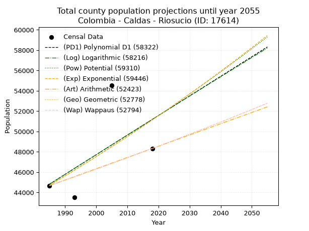
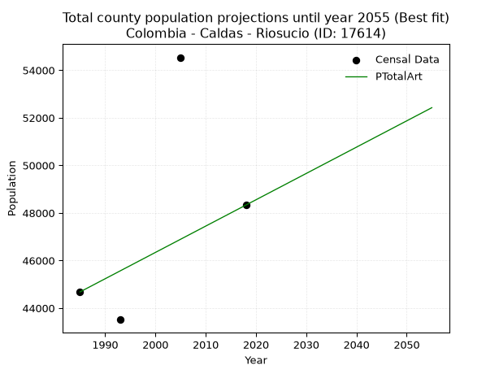
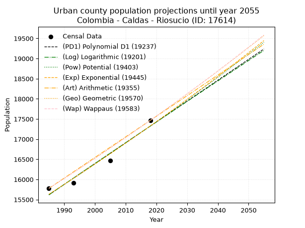
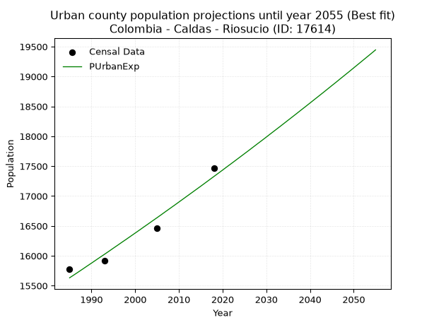
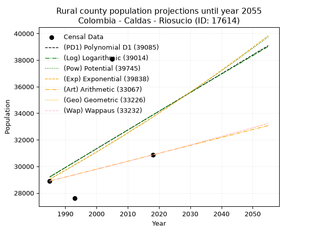
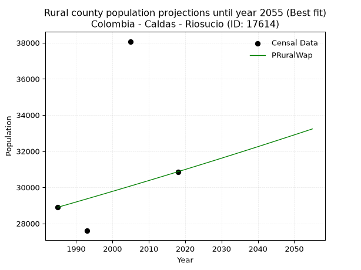

<div align="center">


</div>

# _“Population and Public Services Demand Projections (PPSD) until Year 2050 for Colombia - Caldas - Riosucio (ID: 17614)”_
Keywords: `population` `public-service` `projection` `lineal` `polynomial` `logarithmic` `potential` `exponential` `arithmetic` `geometric` `wappaus` `dane` `colombia` `south-america`

PPSD are analytical estimates used by governments and planners to anticipate future changes in population size, age distribution, and the resulting community needs for utilities, healthcare, education, and infrastructure as sizing future water treatment facilities, electrical grids, and road networks based on spatial growth.

> **General running parameters**: • app_version: _v20260806_. • Python version: _3.14.7_. • Pandas version: _3.0.5_. • NumPy version: _2.5.1_. • Creates, save and include plots into reports (create_plot): _False_. • Projection until year: _2050_. • Process polynomial degree 2 and up: _False_. • Process Wappaus: _True_. • Process Wappaus: _True_. • Set negative values to zero: _True_. • Set infinite values to zero: _True_. • Drop dataset notes: _True_. 
<div align="center">

Dynamic map: [:earth_americas:Google](http://maps.google.com/maps?q=5.423673248,-75.7021043) [:earth_americas:OSM](https://www.openstreetmap.org/#map=18/5.423673248/-75.7021043&layers=P) [:earth_americas:Bing](https://www.bing.com/maps?cp=5.423673248~-75.7021043&lvl=18) [:earth_americas:Apple](https://maps.apple.com/frame?center=5.423673248%2C-75.7021043&span=0.003%2C0.006)

</div>


<div align="center">

```geojson
{
  "type": "Feature",
  "geometry": {
    "type": "Point", 
    "coordinates": [-75.7021043, 5.423673248]
  }, 
  "properties": {
    "Name": "Colombia - Caldas - Riosucio (ID: 17614)"
  }
}
```

</div>


## 0. Census Data (4 records)

Census data are official statistics collected by a government about the people and housing in a country. They usually include counts of total population, age, sex, race, income, education, and jobs.

📅Global census file: [Population.xlsx](../data/Population.xlsx)

| Source   |   Year |   CountryID | CountryName   |   StateID | StateName   |   CountyID | CountyName   |   PTotal |   PUrban |   PRural |
|:---------|-------:|------------:|:--------------|----------:|:------------|-----------:|:-------------|---------:|---------:|---------:|
| DANE     |   1985 |          57 | Colombia      |        17 | Caldas      |      17614 | Riosucio     |    44678 |    15779 |    28899 |
| DANE     |   1993 |          57 | Colombia      |        17 | Caldas      |      17614 | Riosucio     |    43511 |    15915 |    27596 |
| DANE     |   2005 |          57 | Colombia      |        17 | Caldas      |      17614 | Riosucio     |    54537 |    16465 |    38072 |
| DANE     |   2018 |          57 | Colombia      |        17 | Caldas      |      17614 | Riosucio     |    48329 |    17465 |    30864 |

> 🔥Some records could had specific notes about the registered values or the corresponding urban or rural distribution.

📅   [RUPS](https://www.datos.gov.co/Hacienda-y-Cr-dito-P-blico/Registro-nico-de-Prestadores-de-Servicios-P-blicos/4qkq-csdn/about_data) - Local public utility companies: [RUPS.csv](../data/RUPS.xlsx)

 | SERVICIO       | ESTADO    | NOMBRE                                                                              | NIT         | DEPARTAMENTO_DOMICILIO   | MUNICIPIO_DOMICILIO   | DIRECCION                                                                            |   TELEFONO | EMAIL                              | TIPO_PRESTADOR                             | CLASIFICACION                 |
|:---------------|:----------|:------------------------------------------------------------------------------------|:------------|:-------------------------|:----------------------|:-------------------------------------------------------------------------------------|-----------:|:-----------------------------------|:-------------------------------------------|:------------------------------|
| ACUEDUCTO      | OPERATIVA | EMPRESA DE OBRAS SANITARIAS DE CALDAS  S. A. EMPRESA DE SERVICIOS PUBLICOS          | 890803239-9 | CALDAS                   | MANIZALES             | Carrera 23 Nro 75 - 82                                                               |    8867080 | lorena.grisalest@empocaldas.com.co | SOCIEDADES (EMPRESA DE SERVICIOS PUBLICOS) | MAYOR O IGUAL A 5001 USUARIOS |
| ALCANTARILLADO | OPERATIVA | EMPRESA DE OBRAS SANITARIAS DE CALDAS  S. A. EMPRESA DE SERVICIOS PUBLICOS          | 890803239-9 | CALDAS                   | MANIZALES             | Carrera 23 Nro 75 - 82                                                               |    8867080 | lorena.grisalest@empocaldas.com.co | SOCIEDADES (EMPRESA DE SERVICIOS PUBLICOS) | MAYOR O IGUAL A 5001 USUARIOS |
| ACUEDUCTO      | OPERATIVA | ASOCIACION DE USUARIOS DE SERVICIOS COLECTIVOS DE TUMBABARRETO SIPIRRA Y MIRAFLORES | 800162180-4 | CALDAS                   | RIOSUCIO              | Sector el alto de Tumbabarreto via q conduce de Tumbabarreto a Sipirra en la oficina |    3218001 | acueductocolectivo@gmail.com       | ORGANIZACION AUTORIZADA                    | MENOR O IGUAL A 2500 USUARIOS |
| ACUEDUCTO      | OPERATIVA | JUNTA DE ACCION COMUNAL DEL BARRIO SAN NICOLAS                                      | 900383055-2 | CALDAS                   | RIOSUCIO              | BARRIO SAN NICOLAS                                                                   |    3203619 | contacto@riosucio-caldas.gov.co    | ORGANIZACION AUTORIZADA                    | HASTA 2500 SUSCRIPTORES       |
| ACUEDUCTO      | OPERATIVA | ASOCIACION DE USUARIOS DEL ACUEDUCTO REGIONAL BONAFONT                              | 810004656-8 | CALDAS                   | RIOSUCIO              | CORREGIMIENTO DE BONAFONT                                                            |    3206537 | mariaesutre1962@gmail.com          | ORGANIZACION AUTORIZADA                    | MENOR O IGUAL A 2500 USUARIOS |

## 1. Total

### 1.1. Coefficients and Parameters

* (PD1) Polynomial Deg 1: 192.84825371337112, -337980.96949017054 (lineal)
* (Log) Logarithmic: 386770.78864927473, -2892084.1139097232
* (Pow) Potential: 8.157255476144577, -22.250320989415822
* (Exp) Exponential: 0.004067929347055798, 13.91867051420635
* (Art) Arithmetic: Year diff. 2018 - 1985 = 33, Population diff. 48329 - 44678 = 3651, Annual growth = 110.63636363636364
* (Geo) Geometric: Year diff. 2018 - 1985 = 33, Population diff. 48329 - 44678 = 3651, Annual growth % = 0.0023831559433966643
* (Wap) Wappaus: i = 0.23790975654813862, Condition values only valid for < 200)

<sub>
Wappaus condition values: ['0.00', '0.24', '0.48', '0.71', '0.95', '1.19', '1.43', '1.67', '1.90', '2.14', '2.38', '2.62', '2.85', '3.09', '3.33', '3.57', '3.81', '4.04', '4.28', '4.52', '4.76', '5.00', '5.23', '5.47', '5.71', '5.95', '6.19', '6.42', '6.66', '6.90', '7.14', '7.38', '7.61', '7.85', '8.09', '8.33', '8.56', '8.80', '9.04', '9.28', '9.52', '9.75', '9.99', '10.23', '10.47', '10.71', '10.94', '11.18', '11.42', '11.66', '11.90', '12.13', '12.37', '12.61', '12.85', '13.09', '13.32', '13.56', '13.80', '14.04', '14.27', '14.51', '14.75', '14.99', '15.23', '15.46']
</sub>


### 1.2. Projected Dataset

|   Year |   CountyID |   PTotalPD1 |   PTotalLog |   PTotalPow |   PTotalExp |   PTotalArt |   PTotalGeo |   PTotalWap |
|-------:|-----------:|------------:|------------:|------------:|------------:|------------:|------------:|------------:|
|   1985 |      17614 |       44823 |       44811 |       44705 |       44715 |       44678 |       44678 |       44678 |
|   1986 |      17614 |       45016 |       45006 |       44889 |       44898 |       44789 |       44784 |       44784 |
|   1987 |      17614 |       45209 |       45201 |       45074 |       45081 |       44899 |       44891 |       44891 |
|   1988 |      17614 |       45401 |       45395 |       45259 |       45264 |       45010 |       44998 |       44998 |
|   1989 |      17614 |       45594 |       45590 |       45445 |       45449 |       45121 |       45105 |       45105 |
|   1990 |      17614 |       45787 |       45784 |       45632 |       45634 |       45231 |       45213 |       45213 |
|   1991 |      17614 |       45980 |       45979 |       45819 |       45820 |       45342 |       45321 |       45320 |
|   1992 |      17614 |       46173 |       46173 |       46007 |       46007 |       45452 |       45429 |       45428 |
|   1993 |      17614 |       46366 |       46367 |       46196 |       46194 |       45563 |       45537 |       45537 |
|   1994 |      17614 |       46558 |       46561 |       46385 |       46383 |       45674 |       45645 |       45645 |
|   1995 |      17614 |       46751 |       46755 |       46575 |       46572 |       45784 |       45754 |       45754 |
|   1996 |      17614 |       46944 |       46949 |       46766 |       46762 |       45895 |       45863 |       45863 |
|   1997 |      17614 |       47137 |       47142 |       46958 |       46952 |       46006 |       45973 |       45972 |
|   1998 |      17614 |       47330 |       47336 |       47150 |       47144 |       46116 |       46082 |       46082 |
|   1999 |      17614 |       47523 |       47529 |       47343 |       47336 |       46227 |       46192 |       46191 |
|   2000 |      17614 |       47716 |       47723 |       47536 |       47529 |       46338 |       46302 |       46301 |
|   2001 |      17614 |       47908 |       47916 |       47730 |       47722 |       46448 |       46412 |       46412 |
|   2002 |      17614 |       48101 |       48110 |       47925 |       47917 |       46559 |       46523 |       46522 |
|   2003 |      17614 |       48294 |       48303 |       48121 |       48112 |       46669 |       46634 |       46633 |
|   2004 |      17614 |       48487 |       48496 |       48317 |       48308 |       46780 |       46745 |       46744 |
|   2005 |      17614 |       48680 |       48689 |       48514 |       48505 |       46891 |       46856 |       46856 |
|   2006 |      17614 |       48873 |       48882 |       48712 |       48703 |       47001 |       46968 |       46967 |
|   2007 |      17614 |       49065 |       49074 |       48910 |       48902 |       47112 |       47080 |       47079 |
|   2008 |      17614 |       49258 |       49267 |       49110 |       49101 |       47223 |       47192 |       47192 |
|   2009 |      17614 |       49451 |       49459 |       49309 |       49301 |       47333 |       47305 |       47304 |
|   2010 |      17614 |       49644 |       49652 |       49510 |       49502 |       47444 |       47417 |       47417 |
|   2011 |      17614 |       49837 |       49844 |       49711 |       49704 |       47555 |       47530 |       47530 |
|   2012 |      17614 |       50030 |       50037 |       49913 |       49906 |       47665 |       47644 |       47643 |
|   2013 |      17614 |       50223 |       50229 |       50116 |       50110 |       47776 |       47757 |       47757 |
|   2014 |      17614 |       50415 |       50421 |       50319 |       50314 |       47886 |       47871 |       47871 |
|   2015 |      17614 |       50608 |       50613 |       50524 |       50519 |       47997 |       47985 |       47985 |
|   2016 |      17614 |       50801 |       50805 |       50729 |       50725 |       48108 |       48099 |       48099 |
|   2017 |      17614 |       50994 |       50997 |       50934 |       50932 |       48218 |       48214 |       48214 |
|   2018 |      17614 |       51187 |       51188 |       51141 |       51140 |       48329 |       48329 |       48329 |
|   2019 |      17614 |       51380 |       51380 |       51348 |       51348 |       48440 |       48444 |       48444 |
|   2020 |      17614 |       51573 |       51571 |       51555 |       51557 |       48550 |       48560 |       48560 |
|   2021 |      17614 |       51765 |       51763 |       51764 |       51767 |       48661 |       48675 |       48676 |
|   2022 |      17614 |       51958 |       51954 |       51973 |       51978 |       48772 |       48791 |       48792 |
|   2023 |      17614 |       52151 |       52145 |       52183 |       52190 |       48882 |       48908 |       48908 |
|   2024 |      17614 |       52344 |       52337 |       52394 |       52403 |       48993 |       49024 |       49025 |
|   2025 |      17614 |       52537 |       52528 |       52606 |       52617 |       49103 |       49141 |       49142 |
|   2026 |      17614 |       52730 |       52719 |       52818 |       52831 |       49214 |       49258 |       49259 |
|   2027 |      17614 |       52922 |       52909 |       53031 |       53046 |       49325 |       49376 |       49377 |
|   2028 |      17614 |       53115 |       53100 |       53245 |       53263 |       49435 |       49493 |       49495 |
|   2029 |      17614 |       53308 |       53291 |       53459 |       53480 |       49546 |       49611 |       49613 |
|   2030 |      17614 |       53501 |       53481 |       53675 |       53698 |       49657 |       49729 |       49732 |
|   2031 |      17614 |       53694 |       53672 |       53891 |       53917 |       49767 |       49848 |       49851 |
|   2032 |      17614 |       53887 |       53862 |       54108 |       54136 |       49878 |       49967 |       49970 |
|   2033 |      17614 |       54080 |       54053 |       54325 |       54357 |       49989 |       50086 |       50089 |
|   2034 |      17614 |       54272 |       54243 |       54543 |       54579 |       50099 |       50205 |       50209 |
|   2035 |      17614 |       54465 |       54433 |       54763 |       54801 |       50210 |       50325 |       50329 |
|   2036 |      17614 |       54658 |       54623 |       54983 |       55025 |       50320 |       50445 |       50449 |
|   2037 |      17614 |       54851 |       54813 |       55203 |       55249 |       50431 |       50565 |       50570 |
|   2038 |      17614 |       55044 |       55003 |       55425 |       55474 |       50542 |       50685 |       50691 |
|   2039 |      17614 |       55237 |       55192 |       55647 |       55700 |       50652 |       50806 |       50812 |
|   2040 |      17614 |       55429 |       55382 |       55870 |       55927 |       50763 |       50927 |       50933 |
|   2041 |      17614 |       55622 |       55572 |       56094 |       56155 |       50874 |       51049 |       51055 |
|   2042 |      17614 |       55815 |       55761 |       56318 |       56384 |       50984 |       51170 |       51177 |
|   2043 |      17614 |       56008 |       55950 |       56544 |       56614 |       51095 |       51292 |       51300 |
|   2044 |      17614 |       56201 |       56140 |       56770 |       56845 |       51206 |       51414 |       51423 |
|   2045 |      17614 |       56394 |       56329 |       56997 |       57076 |       51316 |       51537 |       51546 |
|   2046 |      17614 |       56587 |       56518 |       57225 |       57309 |       51427 |       51660 |       51669 |
|   2047 |      17614 |       56779 |       56707 |       57453 |       57543 |       51537 |       51783 |       51793 |
|   2048 |      17614 |       56972 |       56896 |       57682 |       57777 |       51648 |       51906 |       51917 |
|   2049 |      17614 |       57165 |       57085 |       57913 |       58013 |       51759 |       52030 |       52041 |
|   2050 |      17614 |       57358 |       57273 |       58144 |       58249 |       51869 |       52154 |       52166 |
<div align="center">

</img>

</div>


### 1.3. Best fit with absolute and relative error (%)

Relative error puts that difference into context by dividing the absolute error by the true value, creating a unitless ratio or percentage that shows the scale of the mistake.

Absolute and relative error

|   Year | Source   |   CountryID | CountryName   |   StateID | StateName   |   CountyID_x | CountyName   |   PTotal |   PUrban |   PRural |   CountyID_y |   PTotalPD1 |   PTotalLog |   PTotalPow |   PTotalExp |   PTotalArt |   PTotalGeo |   PTotalWap |   PTotalPD1AbsError |   PTotalLogAbsError |   PTotalPowAbsError |   PTotalExpAbsError |   PTotalArtAbsError |   PTotalGeoAbsError |   PTotalWapAbsError |   PTotalPD1RelError |   PTotalLogRelError |   PTotalPowRelError |   PTotalExpRelError |   PTotalArtRelError |   PTotalGeoRelError |   PTotalWapRelError |
|-------:|:---------|------------:|:--------------|----------:|:------------|-------------:|:-------------|---------:|---------:|---------:|-------------:|------------:|------------:|------------:|------------:|------------:|------------:|------------:|--------------------:|--------------------:|--------------------:|--------------------:|--------------------:|--------------------:|--------------------:|--------------------:|--------------------:|--------------------:|--------------------:|--------------------:|--------------------:|--------------------:|
|   1985 | DANE     |          57 | Colombia      |        17 | Caldas      |        17614 | Riosucio     |    44678 |    15779 |    28899 |        17614 |       44823 |       44811 |       44705 |       44715 |       44678 |       44678 |       44678 |                 145 |                 133 |                  27 |                  37 |                   0 |                   0 |                   0 |            0.324545 |            0.297686 |           0.0604324 |           0.0828148 |             0       |             0       |             0       |
|   1993 | DANE     |          57 | Colombia      |        17 | Caldas      |        17614 | Riosucio     |    43511 |    15915 |    27596 |        17614 |       46366 |       46367 |       46196 |       46194 |       45563 |       45537 |       45537 |                2855 |                2856 |                2685 |                2683 |                2052 |                2026 |                2026 |            6.56156  |            6.56386  |           6.17085   |           6.16626   |             4.71605 |             4.65629 |             4.65629 |
|   2005 | DANE     |          57 | Colombia      |        17 | Caldas      |        17614 | Riosucio     |    54537 |    16465 |    38072 |        17614 |       48680 |       48689 |       48514 |       48505 |       46891 |       46856 |       46856 |                5857 |                5848 |                6023 |                6032 |                7646 |                7681 |                7681 |           10.7395   |           10.723    |          11.0439    |          11.0604    |            14.0198  |            14.084   |            14.084   |
|   2018 | DANE     |          57 | Colombia      |        17 | Caldas      |        17614 | Riosucio     |    48329 |    17465 |    30864 |        17614 |       51187 |       51188 |       51141 |       51140 |       48329 |       48329 |       48329 |                2858 |                2859 |                2812 |                2811 |                   0 |                   0 |                   0 |            5.91363  |            5.9157   |           5.81845   |           5.81638   |             0       |             0       |             0       |

Relative error mean

| Method    |   RelError | Best   |
|:----------|-----------:|:-------|
| PTotalPD1 |    5.88481 |        |
| PTotalLog |    5.87506 |        |
| PTotalPow |    5.7734  |        |
| PTotalExp |    5.78146 |        |
| PTotalArt |    4.68397 | True   |
| PTotalGeo |    4.68508 |        |
| PTotalWap |    4.68508 |        |

💙Best method: _**PTotalArt**_
<div align="center">

</img>

</div>


### 1.4. Fresh water supply demand in liters per capita per day (lpcd)

The fresh water supply demand typically ranges from 100 to 300 liters per capita per day (lpcd) for standard domestic and municipal planning, though absolute survival minimums set by the World Health Organization are as low as 7.5 to 20 liters per day, and total consumption in high-income nations can exceed 400 liters.

> `CZ`: Level in meters above the sea level (masl)<br> `WS`: Fresh water supply demand in liters per capita per day (lpcd or l/h/d)<br> `WSAll`: Zonal fresh water supply demand in liters per second (l/s)<br> `A`: Zonal area in square meters<br> `DP`: Population density (people/hectare or p/ha)

Reference values (RAS Colombia)

|    CZ |   WS |
|------:|-----:|
|  1000 |  120 |
|  2000 |  130 |
| 99999 |  140 |

County shapefile geometry properties and water supply values

|   CountyID |      ATotal |   CZTotal |   WSTotal |
|-----------:|------------:|----------:|----------:|
|      17614 | 3.84095e+08 |   2144.91 |       140 |

Projected values for best method: PTotalArt

|   CountyID |   Year |   PTotalArt |   DPTotal |   WSTotal |   WSTotalAll |
|-----------:|-------:|------------:|----------:|----------:|-------------:|
|      17614 |   1985 |       44678 |      1.16 |       140 |      72.3949 |
|      17614 |   1986 |       44789 |      1.17 |       140 |      72.5748 |
|      17614 |   1987 |       44899 |      1.17 |       140 |      72.753  |
|      17614 |   1988 |       45010 |      1.17 |       140 |      72.9329 |
|      17614 |   1989 |       45121 |      1.17 |       140 |      73.1127 |
|      17614 |   1990 |       45231 |      1.18 |       140 |      73.291  |
|      17614 |   1991 |       45342 |      1.18 |       140 |      73.4708 |
|      17614 |   1992 |       45452 |      1.18 |       140 |      73.6491 |
|      17614 |   1993 |       45563 |      1.19 |       140 |      73.8289 |
|      17614 |   1994 |       45674 |      1.19 |       140 |      74.0088 |
|      17614 |   1995 |       45784 |      1.19 |       140 |      74.187  |
|      17614 |   1996 |       45895 |      1.19 |       140 |      74.3669 |
|      17614 |   1997 |       46006 |      1.2  |       140 |      74.5468 |
|      17614 |   1998 |       46116 |      1.2  |       140 |      74.725  |
|      17614 |   1999 |       46227 |      1.2  |       140 |      74.9049 |
|      17614 |   2000 |       46338 |      1.21 |       140 |      75.0847 |
|      17614 |   2001 |       46448 |      1.21 |       140 |      75.263  |
|      17614 |   2002 |       46559 |      1.21 |       140 |      75.4428 |
|      17614 |   2003 |       46669 |      1.22 |       140 |      75.6211 |
|      17614 |   2004 |       46780 |      1.22 |       140 |      75.8009 |
|      17614 |   2005 |       46891 |      1.22 |       140 |      75.9808 |
|      17614 |   2006 |       47001 |      1.22 |       140 |      76.159  |
|      17614 |   2007 |       47112 |      1.23 |       140 |      76.3389 |
|      17614 |   2008 |       47223 |      1.23 |       140 |      76.5187 |
|      17614 |   2009 |       47333 |      1.23 |       140 |      76.697  |
|      17614 |   2010 |       47444 |      1.24 |       140 |      76.8769 |
|      17614 |   2011 |       47555 |      1.24 |       140 |      77.0567 |
|      17614 |   2012 |       47665 |      1.24 |       140 |      77.235  |
|      17614 |   2013 |       47776 |      1.24 |       140 |      77.4148 |
|      17614 |   2014 |       47886 |      1.25 |       140 |      77.5931 |
|      17614 |   2015 |       47997 |      1.25 |       140 |      77.7729 |
|      17614 |   2016 |       48108 |      1.25 |       140 |      77.9528 |
|      17614 |   2017 |       48218 |      1.26 |       140 |      78.131  |
|      17614 |   2018 |       48329 |      1.26 |       140 |      78.3109 |
|      17614 |   2019 |       48440 |      1.26 |       140 |      78.4907 |
|      17614 |   2020 |       48550 |      1.26 |       140 |      78.669  |
|      17614 |   2021 |       48661 |      1.27 |       140 |      78.8488 |
|      17614 |   2022 |       48772 |      1.27 |       140 |      79.0287 |
|      17614 |   2023 |       48882 |      1.27 |       140 |      79.2069 |
|      17614 |   2024 |       48993 |      1.28 |       140 |      79.3868 |
|      17614 |   2025 |       49103 |      1.28 |       140 |      79.565  |
|      17614 |   2026 |       49214 |      1.28 |       140 |      79.7449 |
|      17614 |   2027 |       49325 |      1.28 |       140 |      79.9248 |
|      17614 |   2028 |       49435 |      1.29 |       140 |      80.103  |
|      17614 |   2029 |       49546 |      1.29 |       140 |      80.2829 |
|      17614 |   2030 |       49657 |      1.29 |       140 |      80.4627 |
|      17614 |   2031 |       49767 |      1.3  |       140 |      80.641  |
|      17614 |   2032 |       49878 |      1.3  |       140 |      80.8208 |
|      17614 |   2033 |       49989 |      1.3  |       140 |      81.0007 |
|      17614 |   2034 |       50099 |      1.3  |       140 |      81.1789 |
|      17614 |   2035 |       50210 |      1.31 |       140 |      81.3588 |
|      17614 |   2036 |       50320 |      1.31 |       140 |      81.537  |
|      17614 |   2037 |       50431 |      1.31 |       140 |      81.7169 |
|      17614 |   2038 |       50542 |      1.32 |       140 |      81.8968 |
|      17614 |   2039 |       50652 |      1.32 |       140 |      82.075  |
|      17614 |   2040 |       50763 |      1.32 |       140 |      82.2549 |
|      17614 |   2041 |       50874 |      1.32 |       140 |      82.4347 |
|      17614 |   2042 |       50984 |      1.33 |       140 |      82.613  |
|      17614 |   2043 |       51095 |      1.33 |       140 |      82.7928 |
|      17614 |   2044 |       51206 |      1.33 |       140 |      82.9727 |
|      17614 |   2045 |       51316 |      1.34 |       140 |      83.1509 |
|      17614 |   2046 |       51427 |      1.34 |       140 |      83.3308 |
|      17614 |   2047 |       51537 |      1.34 |       140 |      83.509  |
|      17614 |   2048 |       51648 |      1.34 |       140 |      83.6889 |
|      17614 |   2049 |       51759 |      1.35 |       140 |      83.8688 |
|      17614 |   2050 |       51869 |      1.35 |       140 |      84.047  |

## 2. Urban

### 2.1. Coefficients and Parameters

* (PD1) Polynomial Deg 1: 51.70453633079014, -87015.99879566299 (lineal)
* (Log) Logarithmic: 103435.256031653, -769806.2099747165
* (Pow) Potential: 6.238245561364496, -16.37826757787962
* (Exp) Exponential: 0.0031182438902285867, 32.05112828897091
* (Art) Arithmetic: Year diff. 2018 - 1985 = 33, Population diff. 17465 - 15779 = 1686, Annual growth = 51.09090909090909
* (Geo) Geometric: Year diff. 2018 - 1985 = 33, Population diff. 17465 - 15779 = 1686, Annual growth % = 0.003081068163640621
* (Wap) Wappaus: i = 0.30736920401220724, Condition values only valid for < 200)

<sub>
Wappaus condition values: ['0.00', '0.31', '0.61', '0.92', '1.23', '1.54', '1.84', '2.15', '2.46', '2.77', '3.07', '3.38', '3.69', '4.00', '4.30', '4.61', '4.92', '5.23', '5.53', '5.84', '6.15', '6.45', '6.76', '7.07', '7.38', '7.68', '7.99', '8.30', '8.61', '8.91', '9.22', '9.53', '9.84', '10.14', '10.45', '10.76', '11.07', '11.37', '11.68', '11.99', '12.29', '12.60', '12.91', '13.22', '13.52', '13.83', '14.14', '14.45', '14.75', '15.06', '15.37', '15.68', '15.98', '16.29', '16.60', '16.91', '17.21', '17.52', '17.83', '18.13', '18.44', '18.75', '19.06', '19.36', '19.67', '19.98']
</sub>


### 2.2. Projected Dataset

|   Year |   CountyID |   PUrbanPD1 |   PUrbanLog |   PUrbanPow |   PUrbanExp |   PUrbanArt |   PUrbanGeo |   PUrbanWap |
|-------:|-----------:|------------:|------------:|------------:|------------:|------------:|------------:|------------:|
|   1985 |      17614 |       15618 |       15616 |       15630 |       15632 |       15779 |       15779 |       15779 |
|   1986 |      17614 |       15669 |       15668 |       15680 |       15680 |       15830 |       15828 |       15828 |
|   1987 |      17614 |       15721 |       15721 |       15729 |       15729 |       15881 |       15876 |       15876 |
|   1988 |      17614 |       15773 |       15773 |       15778 |       15778 |       15932 |       15925 |       15925 |
|   1989 |      17614 |       15824 |       15825 |       15828 |       15828 |       15983 |       15974 |       15974 |
|   1990 |      17614 |       15876 |       15877 |       15878 |       15877 |       16034 |       16024 |       16023 |
|   1991 |      17614 |       15928 |       15929 |       15928 |       15927 |       16086 |       16073 |       16073 |
|   1992 |      17614 |       15979 |       15981 |       15978 |       15977 |       16137 |       16122 |       16122 |
|   1993 |      17614 |       16031 |       16032 |       16028 |       16026 |       16188 |       16172 |       16172 |
|   1994 |      17614 |       16083 |       16084 |       16078 |       16076 |       16239 |       16222 |       16222 |
|   1995 |      17614 |       16135 |       16136 |       16128 |       16127 |       16290 |       16272 |       16272 |
|   1996 |      17614 |       16186 |       16188 |       16179 |       16177 |       16341 |       16322 |       16322 |
|   1997 |      17614 |       16238 |       16240 |       16229 |       16228 |       16392 |       16372 |       16372 |
|   1998 |      17614 |       16290 |       16292 |       16280 |       16278 |       16443 |       16423 |       16422 |
|   1999 |      17614 |       16341 |       16343 |       16331 |       16329 |       16494 |       16473 |       16473 |
|   2000 |      17614 |       16393 |       16395 |       16382 |       16380 |       16545 |       16524 |       16524 |
|   2001 |      17614 |       16445 |       16447 |       16433 |       16431 |       16596 |       16575 |       16575 |
|   2002 |      17614 |       16496 |       16498 |       16485 |       16483 |       16648 |       16626 |       16626 |
|   2003 |      17614 |       16548 |       16550 |       16536 |       16534 |       16699 |       16677 |       16677 |
|   2004 |      17614 |       16600 |       16602 |       16588 |       16586 |       16750 |       16729 |       16728 |
|   2005 |      17614 |       16652 |       16653 |       16639 |       16637 |       16801 |       16780 |       16780 |
|   2006 |      17614 |       16703 |       16705 |       16691 |       16689 |       16852 |       16832 |       16831 |
|   2007 |      17614 |       16755 |       16756 |       16743 |       16742 |       16903 |       16884 |       16883 |
|   2008 |      17614 |       16807 |       16808 |       16795 |       16794 |       16954 |       16936 |       16935 |
|   2009 |      17614 |       16858 |       16859 |       16847 |       16846 |       17005 |       16988 |       16988 |
|   2010 |      17614 |       16910 |       16911 |       16900 |       16899 |       17056 |       17040 |       17040 |
|   2011 |      17614 |       16962 |       16962 |       16952 |       16952 |       17107 |       17093 |       17092 |
|   2012 |      17614 |       17014 |       17014 |       17005 |       17005 |       17158 |       17146 |       17145 |
|   2013 |      17614 |       17065 |       17065 |       17058 |       17058 |       17210 |       17198 |       17198 |
|   2014 |      17614 |       17117 |       17117 |       17111 |       17111 |       17261 |       17251 |       17251 |
|   2015 |      17614 |       17169 |       17168 |       17164 |       17164 |       17312 |       17305 |       17304 |
|   2016 |      17614 |       17220 |       17219 |       17217 |       17218 |       17363 |       17358 |       17358 |
|   2017 |      17614 |       17272 |       17271 |       17270 |       17272 |       17414 |       17411 |       17411 |
|   2018 |      17614 |       17324 |       17322 |       17324 |       17326 |       17465 |       17465 |       17465 |
|   2019 |      17614 |       17375 |       17373 |       17377 |       17380 |       17516 |       17519 |       17519 |
|   2020 |      17614 |       17427 |       17424 |       17431 |       17434 |       17567 |       17573 |       17573 |
|   2021 |      17614 |       17479 |       17475 |       17485 |       17489 |       17618 |       17627 |       17627 |
|   2022 |      17614 |       17531 |       17527 |       17539 |       17543 |       17669 |       17681 |       17682 |
|   2023 |      17614 |       17582 |       17578 |       17593 |       17598 |       17720 |       17736 |       17736 |
|   2024 |      17614 |       17634 |       17629 |       17648 |       17653 |       17772 |       17790 |       17791 |
|   2025 |      17614 |       17686 |       17680 |       17702 |       17708 |       17823 |       17845 |       17846 |
|   2026 |      17614 |       17737 |       17731 |       17757 |       17763 |       17874 |       17900 |       17901 |
|   2027 |      17614 |       17789 |       17782 |       17811 |       17819 |       17925 |       17955 |       17957 |
|   2028 |      17614 |       17841 |       17833 |       17866 |       17875 |       17976 |       18011 |       18012 |
|   2029 |      17614 |       17893 |       17884 |       17921 |       17930 |       18027 |       18066 |       18068 |
|   2030 |      17614 |       17944 |       17935 |       17976 |       17986 |       18078 |       18122 |       18124 |
|   2031 |      17614 |       17996 |       17986 |       18032 |       18043 |       18129 |       18178 |       18180 |
|   2032 |      17614 |       18048 |       18037 |       18087 |       18099 |       18180 |       18234 |       18236 |
|   2033 |      17614 |       18099 |       18088 |       18143 |       18155 |       18231 |       18290 |       18292 |
|   2034 |      17614 |       18151 |       18139 |       18199 |       18212 |       18282 |       18346 |       18349 |
|   2035 |      17614 |       18203 |       18190 |       18254 |       18269 |       18334 |       18403 |       18406 |
|   2036 |      17614 |       18254 |       18240 |       18311 |       18326 |       18385 |       18459 |       18463 |
|   2037 |      17614 |       18306 |       18291 |       18367 |       18383 |       18436 |       18516 |       18520 |
|   2038 |      17614 |       18358 |       18342 |       18423 |       18441 |       18487 |       18573 |       18577 |
|   2039 |      17614 |       18410 |       18393 |       18479 |       18498 |       18538 |       18631 |       18635 |
|   2040 |      17614 |       18461 |       18443 |       18536 |       18556 |       18589 |       18688 |       18693 |
|   2041 |      17614 |       18513 |       18494 |       18593 |       18614 |       18640 |       18746 |       18751 |
|   2042 |      17614 |       18565 |       18545 |       18650 |       18672 |       18691 |       18803 |       18809 |
|   2043 |      17614 |       18616 |       18595 |       18707 |       18730 |       18742 |       18861 |       18867 |
|   2044 |      17614 |       18668 |       18646 |       18764 |       18789 |       18793 |       18919 |       18926 |
|   2045 |      17614 |       18720 |       18697 |       18821 |       18848 |       18844 |       18978 |       18985 |
|   2046 |      17614 |       18771 |       18747 |       18879 |       18906 |       18896 |       19036 |       19044 |
|   2047 |      17614 |       18823 |       18798 |       18936 |       18966 |       18947 |       19095 |       19103 |
|   2048 |      17614 |       18875 |       18848 |       18994 |       19025 |       18998 |       19154 |       19162 |
|   2049 |      17614 |       18927 |       18899 |       19052 |       19084 |       19049 |       19213 |       19222 |
|   2050 |      17614 |       18978 |       18949 |       19110 |       19144 |       19100 |       19272 |       19281 |
<div align="center">

</img>

</div>


### 2.3. Best fit with absolute and relative error (%)

Relative error puts that difference into context by dividing the absolute error by the true value, creating a unitless ratio or percentage that shows the scale of the mistake.

Absolute and relative error

|   Year | Source   |   CountryID | CountryName   |   StateID | StateName   |   CountyID_x | CountyName   |   PTotal |   PUrban |   PRural |   CountyID_y |   PUrbanPD1 |   PUrbanLog |   PUrbanPow |   PUrbanExp |   PUrbanArt |   PUrbanGeo |   PUrbanWap |   PUrbanPD1AbsError |   PUrbanLogAbsError |   PUrbanPowAbsError |   PUrbanExpAbsError |   PUrbanArtAbsError |   PUrbanGeoAbsError |   PUrbanWapAbsError |   PUrbanPD1RelError |   PUrbanLogRelError |   PUrbanPowRelError |   PUrbanExpRelError |   PUrbanArtRelError |   PUrbanGeoRelError |   PUrbanWapRelError |
|-------:|:---------|------------:|:--------------|----------:|:------------|-------------:|:-------------|---------:|---------:|---------:|-------------:|------------:|------------:|------------:|------------:|------------:|------------:|------------:|--------------------:|--------------------:|--------------------:|--------------------:|--------------------:|--------------------:|--------------------:|--------------------:|--------------------:|--------------------:|--------------------:|--------------------:|--------------------:|--------------------:|
|   1985 | DANE     |          57 | Colombia      |        17 | Caldas      |        17614 | Riosucio     |    44678 |    15779 |    28899 |        17614 |       15618 |       15616 |       15630 |       15632 |       15779 |       15779 |       15779 |                 161 |                 163 |                 149 |                 147 |                   0 |                   0 |                   0 |            1.02034  |            1.03302  |            0.944293 |            0.931618 |             0       |             0       |             0       |
|   1993 | DANE     |          57 | Colombia      |        17 | Caldas      |        17614 | Riosucio     |    43511 |    15915 |    27596 |        17614 |       16031 |       16032 |       16028 |       16026 |       16188 |       16172 |       16172 |                 116 |                 117 |                 113 |                 111 |                 273 |                 257 |                 257 |            0.728872 |            0.735156 |            0.710022 |            0.697455 |             1.71536 |             1.61483 |             1.61483 |
|   2005 | DANE     |          57 | Colombia      |        17 | Caldas      |        17614 | Riosucio     |    54537 |    16465 |    38072 |        17614 |       16652 |       16653 |       16639 |       16637 |       16801 |       16780 |       16780 |                 187 |                 188 |                 174 |                 172 |                 336 |                 315 |                 315 |            1.13574  |            1.14182  |            1.05679  |            1.04464  |             2.04069 |             1.91315 |             1.91315 |
|   2018 | DANE     |          57 | Colombia      |        17 | Caldas      |        17614 | Riosucio     |    48329 |    17465 |    30864 |        17614 |       17324 |       17322 |       17324 |       17326 |       17465 |       17465 |       17465 |                 141 |                 143 |                 141 |                 139 |                   0 |                   0 |                   0 |            0.807329 |            0.81878  |            0.807329 |            0.795877 |             0       |             0       |             0       |

Relative error mean

| Method    |   RelError | Best   |
|:----------|-----------:|:-------|
| PUrbanPD1 |   0.923072 |        |
| PUrbanLog |   0.932193 |        |
| PUrbanPow |   0.879608 |        |
| PUrbanExp |   0.867398 | True   |
| PUrbanArt |   0.939014 |        |
| PUrbanGeo |   0.881994 |        |
| PUrbanWap |   0.881994 |        |

💙Best method: _**PUrbanExp**_
<div align="center">

</img>

</div>


### 2.4. Fresh water supply demand in liters per capita per day (lpcd)

The fresh water supply demand typically ranges from 100 to 300 liters per capita per day (lpcd) for standard domestic and municipal planning, though absolute survival minimums set by the World Health Organization are as low as 7.5 to 20 liters per day, and total consumption in high-income nations can exceed 400 liters.

> `CZ`: Level in meters above the sea level (masl)<br> `WS`: Fresh water supply demand in liters per capita per day (lpcd or l/h/d)<br> `WSAll`: Zonal fresh water supply demand in liters per second (l/s)<br> `A`: Zonal area in square meters<br> `DP`: Population density (people/hectare or p/ha)

Reference values (RAS Colombia)

|    CZ |   WS |
|------:|-----:|
|  1000 |  120 |
|  2000 |  130 |
| 99999 |  140 |

County shapefile geometry properties and water supply values

|   CountyID |      AUrban |   CZUrban |   WSUrban |
|-----------:|------------:|----------:|----------:|
|      17614 | 2.48252e+06 |   1767.41 |       130 |

Projected values for best method: PUrbanExp

|   CountyID |   Year |   PUrbanExp |   DPUrban |   WSUrban |   WSUrbanAll |
|-----------:|-------:|------------:|----------:|----------:|-------------:|
|      17614 |   1985 |       15632 |     62.97 |       130 |      23.5204 |
|      17614 |   1986 |       15680 |     63.16 |       130 |      23.5926 |
|      17614 |   1987 |       15729 |     63.36 |       130 |      23.6663 |
|      17614 |   1988 |       15778 |     63.56 |       130 |      23.74   |
|      17614 |   1989 |       15828 |     63.76 |       130 |      23.8153 |
|      17614 |   1990 |       15877 |     63.96 |       130 |      23.889  |
|      17614 |   1991 |       15927 |     64.16 |       130 |      23.9642 |
|      17614 |   1992 |       15977 |     64.36 |       130 |      24.0395 |
|      17614 |   1993 |       16026 |     64.56 |       130 |      24.1132 |
|      17614 |   1994 |       16076 |     64.76 |       130 |      24.1884 |
|      17614 |   1995 |       16127 |     64.96 |       130 |      24.2652 |
|      17614 |   1996 |       16177 |     65.16 |       130 |      24.3404 |
|      17614 |   1997 |       16228 |     65.37 |       130 |      24.4171 |
|      17614 |   1998 |       16278 |     65.57 |       130 |      24.4924 |
|      17614 |   1999 |       16329 |     65.78 |       130 |      24.5691 |
|      17614 |   2000 |       16380 |     65.98 |       130 |      24.6458 |
|      17614 |   2001 |       16431 |     66.19 |       130 |      24.7226 |
|      17614 |   2002 |       16483 |     66.4  |       130 |      24.8008 |
|      17614 |   2003 |       16534 |     66.6  |       130 |      24.8775 |
|      17614 |   2004 |       16586 |     66.81 |       130 |      24.9558 |
|      17614 |   2005 |       16637 |     67.02 |       130 |      25.0325 |
|      17614 |   2006 |       16689 |     67.23 |       130 |      25.1108 |
|      17614 |   2007 |       16742 |     67.44 |       130 |      25.1905 |
|      17614 |   2008 |       16794 |     67.65 |       130 |      25.2688 |
|      17614 |   2009 |       16846 |     67.86 |       130 |      25.347  |
|      17614 |   2010 |       16899 |     68.07 |       130 |      25.4267 |
|      17614 |   2011 |       16952 |     68.29 |       130 |      25.5065 |
|      17614 |   2012 |       17005 |     68.5  |       130 |      25.5862 |
|      17614 |   2013 |       17058 |     68.71 |       130 |      25.666  |
|      17614 |   2014 |       17111 |     68.93 |       130 |      25.7457 |
|      17614 |   2015 |       17164 |     69.14 |       130 |      25.8255 |
|      17614 |   2016 |       17218 |     69.36 |       130 |      25.9067 |
|      17614 |   2017 |       17272 |     69.57 |       130 |      25.988  |
|      17614 |   2018 |       17326 |     69.79 |       130 |      26.0692 |
|      17614 |   2019 |       17380 |     70.01 |       130 |      26.1505 |
|      17614 |   2020 |       17434 |     70.23 |       130 |      26.2317 |
|      17614 |   2021 |       17489 |     70.45 |       130 |      26.3145 |
|      17614 |   2022 |       17543 |     70.67 |       130 |      26.3957 |
|      17614 |   2023 |       17598 |     70.89 |       130 |      26.4785 |
|      17614 |   2024 |       17653 |     71.11 |       130 |      26.5612 |
|      17614 |   2025 |       17708 |     71.33 |       130 |      26.644  |
|      17614 |   2026 |       17763 |     71.55 |       130 |      26.7267 |
|      17614 |   2027 |       17819 |     71.78 |       130 |      26.811  |
|      17614 |   2028 |       17875 |     72    |       130 |      26.8953 |
|      17614 |   2029 |       17930 |     72.23 |       130 |      26.978  |
|      17614 |   2030 |       17986 |     72.45 |       130 |      27.0623 |
|      17614 |   2031 |       18043 |     72.68 |       130 |      27.148  |
|      17614 |   2032 |       18099 |     72.91 |       130 |      27.2323 |
|      17614 |   2033 |       18155 |     73.13 |       130 |      27.3166 |
|      17614 |   2034 |       18212 |     73.36 |       130 |      27.4023 |
|      17614 |   2035 |       18269 |     73.59 |       130 |      27.4881 |
|      17614 |   2036 |       18326 |     73.82 |       130 |      27.5738 |
|      17614 |   2037 |       18383 |     74.05 |       130 |      27.6596 |
|      17614 |   2038 |       18441 |     74.28 |       130 |      27.7469 |
|      17614 |   2039 |       18498 |     74.51 |       130 |      27.8326 |
|      17614 |   2040 |       18556 |     74.75 |       130 |      27.9199 |
|      17614 |   2041 |       18614 |     74.98 |       130 |      28.0072 |
|      17614 |   2042 |       18672 |     75.21 |       130 |      28.0944 |
|      17614 |   2043 |       18730 |     75.45 |       130 |      28.1817 |
|      17614 |   2044 |       18789 |     75.69 |       130 |      28.2705 |
|      17614 |   2045 |       18848 |     75.92 |       130 |      28.3593 |
|      17614 |   2046 |       18906 |     76.16 |       130 |      28.4465 |
|      17614 |   2047 |       18966 |     76.4  |       130 |      28.5368 |
|      17614 |   2048 |       19025 |     76.64 |       130 |      28.6256 |
|      17614 |   2049 |       19084 |     76.87 |       130 |      28.7144 |
|      17614 |   2050 |       19144 |     77.12 |       130 |      28.8046 |

## 3. Rural

### 3.1. Coefficients and Parameters

* (PD1) Polynomial Deg 1: 141.14371738258134, -250964.9706945083 (lineal)
* (Log) Logarithmic: 283335.53261762136, -2122277.9039350036
* (Pow) Potential: 9.06047019150088, -25.416352509167133
* (Exp) Exponential: 0.00451479109404486, 3.723563872453102
* (Art) Arithmetic: Year diff. 2018 - 1985 = 33, Population diff. 30864 - 28899 = 1965, Annual growth = 59.54545454545455
* (Geo) Geometric: Year diff. 2018 - 1985 = 33, Population diff. 30864 - 28899 = 1965, Annual growth % = 0.001995426513566878
* (Wap) Wappaus: i = 0.1992719727773189, Condition values only valid for < 200)

<sub>
Wappaus condition values: ['0.00', '0.20', '0.40', '0.60', '0.80', '1.00', '1.20', '1.39', '1.59', '1.79', '1.99', '2.19', '2.39', '2.59', '2.79', '2.99', '3.19', '3.39', '3.59', '3.79', '3.99', '4.18', '4.38', '4.58', '4.78', '4.98', '5.18', '5.38', '5.58', '5.78', '5.98', '6.18', '6.38', '6.58', '6.78', '6.97', '7.17', '7.37', '7.57', '7.77', '7.97', '8.17', '8.37', '8.57', '8.77', '8.97', '9.17', '9.37', '9.57', '9.76', '9.96', '10.16', '10.36', '10.56', '10.76', '10.96', '11.16', '11.36', '11.56', '11.76', '11.96', '12.16', '12.35', '12.55', '12.75', '12.95']
</sub>


### 3.2. Projected Dataset

|   Year |   CountyID |   PRuralPD1 |   PRuralLog |   PRuralPow |   PRuralExp |   PRuralArt |   PRuralGeo |   PRuralWap |
|-------:|-----------:|------------:|------------:|------------:|------------:|------------:|------------:|------------:|
|   1985 |      17614 |       29205 |       29195 |       29034 |       29043 |       28899 |       28899 |       28899 |
|   1986 |      17614 |       29346 |       29338 |       29167 |       29175 |       28959 |       28957 |       28957 |
|   1987 |      17614 |       29488 |       29480 |       29300 |       29307 |       29018 |       29014 |       29014 |
|   1988 |      17614 |       29629 |       29623 |       29434 |       29439 |       29078 |       29072 |       29072 |
|   1989 |      17614 |       29770 |       29765 |       29569 |       29573 |       29137 |       29130 |       29130 |
|   1990 |      17614 |       29911 |       29908 |       29703 |       29706 |       29197 |       29188 |       29188 |
|   1991 |      17614 |       30052 |       30050 |       29839 |       29841 |       29256 |       29247 |       29247 |
|   1992 |      17614 |       30193 |       30192 |       29975 |       29976 |       29316 |       29305 |       29305 |
|   1993 |      17614 |       30334 |       30334 |       30112 |       30111 |       29375 |       29364 |       29363 |
|   1994 |      17614 |       30476 |       30477 |       30249 |       30248 |       29435 |       29422 |       29422 |
|   1995 |      17614 |       30617 |       30619 |       30387 |       30385 |       29494 |       29481 |       29481 |
|   1996 |      17614 |       30758 |       30761 |       30525 |       30522 |       29554 |       29540 |       29539 |
|   1997 |      17614 |       30899 |       30903 |       30664 |       30660 |       29614 |       29599 |       29598 |
|   1998 |      17614 |       31040 |       31044 |       30803 |       30799 |       29673 |       29658 |       29657 |
|   1999 |      17614 |       31181 |       31186 |       30943 |       30938 |       29733 |       29717 |       29717 |
|   2000 |      17614 |       31322 |       31328 |       31084 |       31078 |       29792 |       29776 |       29776 |
|   2001 |      17614 |       31464 |       31469 |       31225 |       31219 |       29852 |       29836 |       29835 |
|   2002 |      17614 |       31605 |       31611 |       31366 |       31360 |       29911 |       29895 |       29895 |
|   2003 |      17614 |       31746 |       31753 |       31509 |       31502 |       29971 |       29955 |       29955 |
|   2004 |      17614 |       31887 |       31894 |       31651 |       31645 |       30030 |       30015 |       30014 |
|   2005 |      17614 |       32028 |       32035 |       31795 |       31788 |       30090 |       30074 |       30074 |
|   2006 |      17614 |       32169 |       32177 |       31939 |       31932 |       30149 |       30134 |       30134 |
|   2007 |      17614 |       32310 |       32318 |       32083 |       32076 |       30209 |       30195 |       30194 |
|   2008 |      17614 |       32452 |       32459 |       32228 |       32221 |       30269 |       30255 |       30255 |
|   2009 |      17614 |       32593 |       32600 |       32374 |       32367 |       30328 |       30315 |       30315 |
|   2010 |      17614 |       32734 |       32741 |       32520 |       32514 |       30388 |       30376 |       30375 |
|   2011 |      17614 |       32875 |       32882 |       32667 |       32661 |       30447 |       30436 |       30436 |
|   2012 |      17614 |       33016 |       33023 |       32815 |       32808 |       30507 |       30497 |       30497 |
|   2013 |      17614 |       33157 |       33164 |       32963 |       32957 |       30566 |       30558 |       30558 |
|   2014 |      17614 |       33298 |       33304 |       33112 |       33106 |       30626 |       30619 |       30619 |
|   2015 |      17614 |       33440 |       33445 |       33261 |       33256 |       30685 |       30680 |       30680 |
|   2016 |      17614 |       33581 |       33586 |       33411 |       33406 |       30745 |       30741 |       30741 |
|   2017 |      17614 |       33722 |       33726 |       33561 |       33557 |       30804 |       30803 |       30802 |
|   2018 |      17614 |       33863 |       33866 |       33712 |       33709 |       30864 |       30864 |       30864 |
|   2019 |      17614 |       34004 |       34007 |       33864 |       33862 |       30924 |       30926 |       30926 |
|   2020 |      17614 |       34145 |       34147 |       34016 |       34015 |       30983 |       30987 |       30987 |
|   2021 |      17614 |       34286 |       34287 |       34169 |       34169 |       31043 |       31049 |       31049 |
|   2022 |      17614 |       34428 |       34428 |       34323 |       34324 |       31102 |       31111 |       31111 |
|   2023 |      17614 |       34569 |       34568 |       34477 |       34479 |       31162 |       31173 |       31173 |
|   2024 |      17614 |       34710 |       34708 |       34631 |       34635 |       31221 |       31235 |       31236 |
|   2025 |      17614 |       34851 |       34848 |       34787 |       34792 |       31281 |       31298 |       31298 |
|   2026 |      17614 |       34992 |       34987 |       34943 |       34949 |       31340 |       31360 |       31361 |
|   2027 |      17614 |       35133 |       35127 |       35099 |       35107 |       31400 |       31423 |       31423 |
|   2028 |      17614 |       35274 |       35267 |       35256 |       35266 |       31459 |       31485 |       31486 |
|   2029 |      17614 |       35416 |       35407 |       35414 |       35426 |       31519 |       31548 |       31549 |
|   2030 |      17614 |       35557 |       35546 |       35573 |       35586 |       31579 |       31611 |       31612 |
|   2031 |      17614 |       35698 |       35686 |       35732 |       35747 |       31638 |       31674 |       31675 |
|   2032 |      17614 |       35839 |       35825 |       35891 |       35909 |       31698 |       31737 |       31739 |
|   2033 |      17614 |       35980 |       35965 |       36052 |       36071 |       31757 |       31801 |       31802 |
|   2034 |      17614 |       36121 |       36104 |       36213 |       36234 |       31817 |       31864 |       31866 |
|   2035 |      17614 |       36262 |       36243 |       36374 |       36398 |       31876 |       31928 |       31929 |
|   2036 |      17614 |       36404 |       36383 |       36537 |       36563 |       31936 |       31992 |       31993 |
|   2037 |      17614 |       36545 |       36522 |       36700 |       36729 |       31995 |       32055 |       32057 |
|   2038 |      17614 |       36686 |       36661 |       36863 |       36895 |       32055 |       32119 |       32121 |
|   2039 |      17614 |       36827 |       36800 |       37027 |       37062 |       32114 |       32183 |       32186 |
|   2040 |      17614 |       36968 |       36939 |       37192 |       37229 |       32174 |       32248 |       32250 |
|   2041 |      17614 |       37109 |       37077 |       37358 |       37398 |       32234 |       32312 |       32314 |
|   2042 |      17614 |       37251 |       37216 |       37524 |       37567 |       32293 |       32377 |       32379 |
|   2043 |      17614 |       37392 |       37355 |       37691 |       37737 |       32353 |       32441 |       32444 |
|   2044 |      17614 |       37533 |       37494 |       37858 |       37908 |       32412 |       32506 |       32509 |
|   2045 |      17614 |       37674 |       37632 |       38026 |       38079 |       32472 |       32571 |       32574 |
|   2046 |      17614 |       37815 |       37771 |       38195 |       38252 |       32531 |       32636 |       32639 |
|   2047 |      17614 |       37956 |       37909 |       38365 |       38425 |       32591 |       32701 |       32705 |
|   2048 |      17614 |       38097 |       38048 |       38535 |       38599 |       32650 |       32766 |       32770 |
|   2049 |      17614 |       38239 |       38186 |       38706 |       38773 |       32710 |       32831 |       32836 |
|   2050 |      17614 |       38380 |       38324 |       38877 |       38949 |       32769 |       32897 |       32901 |
<div align="center">

</img>

</div>


### 3.3. Best fit with absolute and relative error (%)

Relative error puts that difference into context by dividing the absolute error by the true value, creating a unitless ratio or percentage that shows the scale of the mistake.

Absolute and relative error

|   Year | Source   |   CountryID | CountryName   |   StateID | StateName   |   CountyID_x | CountyName   |   PTotal |   PUrban |   PRural |   CountyID_y |   PRuralPD1 |   PRuralLog |   PRuralPow |   PRuralExp |   PRuralArt |   PRuralGeo |   PRuralWap |   PRuralPD1AbsError |   PRuralLogAbsError |   PRuralPowAbsError |   PRuralExpAbsError |   PRuralArtAbsError |   PRuralGeoAbsError |   PRuralWapAbsError |   PRuralPD1RelError |   PRuralLogRelError |   PRuralPowRelError |   PRuralExpRelError |   PRuralArtRelError |   PRuralGeoRelError |   PRuralWapRelError |
|-------:|:---------|------------:|:--------------|----------:|:------------|-------------:|:-------------|---------:|---------:|---------:|-------------:|------------:|------------:|------------:|------------:|------------:|------------:|------------:|--------------------:|--------------------:|--------------------:|--------------------:|--------------------:|--------------------:|--------------------:|--------------------:|--------------------:|--------------------:|--------------------:|--------------------:|--------------------:|--------------------:|
|   1985 | DANE     |          57 | Colombia      |        17 | Caldas      |        17614 | Riosucio     |    44678 |    15779 |    28899 |        17614 |       29205 |       29195 |       29034 |       29043 |       28899 |       28899 |       28899 |                 306 |                 296 |                 135 |                 144 |                   0 |                   0 |                   0 |             1.05886 |             1.02426 |            0.467144 |            0.498287 |             0       |             0       |              0      |
|   1993 | DANE     |          57 | Colombia      |        17 | Caldas      |        17614 | Riosucio     |    43511 |    15915 |    27596 |        17614 |       30334 |       30334 |       30112 |       30111 |       29375 |       29364 |       29363 |                2738 |                2738 |                2516 |                2515 |                1779 |                1768 |                1767 |             9.92173 |             9.92173 |            9.11726  |            9.11364  |             6.44659 |             6.40673 |              6.4031 |
|   2005 | DANE     |          57 | Colombia      |        17 | Caldas      |        17614 | Riosucio     |    54537 |    16465 |    38072 |        17614 |       32028 |       32035 |       31795 |       31788 |       30090 |       30074 |       30074 |                6044 |                6037 |                6277 |                6284 |                7982 |                7998 |                7998 |            15.8752  |            15.8568  |           16.4872   |           16.5056   |            20.9655  |            21.0076  |             21.0076 |
|   2018 | DANE     |          57 | Colombia      |        17 | Caldas      |        17614 | Riosucio     |    48329 |    17465 |    30864 |        17614 |       33863 |       33866 |       33712 |       33709 |       30864 |       30864 |       30864 |                2999 |                3002 |                2848 |                2845 |                   0 |                   0 |                   0 |             9.71682 |             9.72654 |            9.22758  |            9.21786  |             0       |             0       |              0      |

Relative error mean

| Method    |   RelError | Best   |
|:----------|-----------:|:-------|
| PRuralPD1 |    9.14315 |        |
| PRuralLog |    9.13233 |        |
| PRuralPow |    8.82479 |        |
| PRuralExp |    8.83384 |        |
| PRuralArt |    6.85303 |        |
| PRuralGeo |    6.85357 |        |
| PRuralWap |    6.85267 | True   |

💙Best method: _**PRuralWap**_
<div align="center">

</img>

</div>


### 3.4. Fresh water supply demand in liters per capita per day (lpcd)

The fresh water supply demand typically ranges from 100 to 300 liters per capita per day (lpcd) for standard domestic and municipal planning, though absolute survival minimums set by the World Health Organization are as low as 7.5 to 20 liters per day, and total consumption in high-income nations can exceed 400 liters.

> `CZ`: Level in meters above the sea level (masl)<br> `WS`: Fresh water supply demand in liters per capita per day (lpcd or l/h/d)<br> `WSAll`: Zonal fresh water supply demand in liters per second (l/s)<br> `A`: Zonal area in square meters<br> `DP`: Population density (people/hectare or p/ha)

Reference values (RAS Colombia)

|    CZ |   WS |
|------:|-----:|
|  1000 |  120 |
|  2000 |  130 |
| 99999 |  140 |

County shapefile geometry properties and water supply values

|   CountyID |      ARural |   CZRural |   WSRural |
|-----------:|------------:|----------:|----------:|
|      17614 | 3.81613e+08 |   2147.37 |       140 |

Projected values for best method: PRuralWap

|   CountyID |   Year |   PRuralWap |   DPRural |   WSRural |   WSRuralAll |
|-----------:|-------:|------------:|----------:|----------:|-------------:|
|      17614 |   1985 |       28899 |      0.76 |       140 |      46.8271 |
|      17614 |   1986 |       28957 |      0.76 |       140 |      46.9211 |
|      17614 |   1987 |       29014 |      0.76 |       140 |      47.0134 |
|      17614 |   1988 |       29072 |      0.76 |       140 |      47.1074 |
|      17614 |   1989 |       29130 |      0.76 |       140 |      47.2014 |
|      17614 |   1990 |       29188 |      0.76 |       140 |      47.2954 |
|      17614 |   1991 |       29247 |      0.77 |       140 |      47.391  |
|      17614 |   1992 |       29305 |      0.77 |       140 |      47.485  |
|      17614 |   1993 |       29363 |      0.77 |       140 |      47.5789 |
|      17614 |   1994 |       29422 |      0.77 |       140 |      47.6745 |
|      17614 |   1995 |       29481 |      0.77 |       140 |      47.7701 |
|      17614 |   1996 |       29539 |      0.77 |       140 |      47.8641 |
|      17614 |   1997 |       29598 |      0.78 |       140 |      47.9597 |
|      17614 |   1998 |       29657 |      0.78 |       140 |      48.0553 |
|      17614 |   1999 |       29717 |      0.78 |       140 |      48.1525 |
|      17614 |   2000 |       29776 |      0.78 |       140 |      48.2481 |
|      17614 |   2001 |       29835 |      0.78 |       140 |      48.3438 |
|      17614 |   2002 |       29895 |      0.78 |       140 |      48.441  |
|      17614 |   2003 |       29955 |      0.78 |       140 |      48.5382 |
|      17614 |   2004 |       30014 |      0.79 |       140 |      48.6338 |
|      17614 |   2005 |       30074 |      0.79 |       140 |      48.731  |
|      17614 |   2006 |       30134 |      0.79 |       140 |      48.8282 |
|      17614 |   2007 |       30194 |      0.79 |       140 |      48.9255 |
|      17614 |   2008 |       30255 |      0.79 |       140 |      49.0243 |
|      17614 |   2009 |       30315 |      0.79 |       140 |      49.1215 |
|      17614 |   2010 |       30375 |      0.8  |       140 |      49.2188 |
|      17614 |   2011 |       30436 |      0.8  |       140 |      49.3176 |
|      17614 |   2012 |       30497 |      0.8  |       140 |      49.4164 |
|      17614 |   2013 |       30558 |      0.8  |       140 |      49.5153 |
|      17614 |   2014 |       30619 |      0.8  |       140 |      49.6141 |
|      17614 |   2015 |       30680 |      0.8  |       140 |      49.713  |
|      17614 |   2016 |       30741 |      0.81 |       140 |      49.8118 |
|      17614 |   2017 |       30802 |      0.81 |       140 |      49.9106 |
|      17614 |   2018 |       30864 |      0.81 |       140 |      50.0111 |
|      17614 |   2019 |       30926 |      0.81 |       140 |      50.1116 |
|      17614 |   2020 |       30987 |      0.81 |       140 |      50.2104 |
|      17614 |   2021 |       31049 |      0.81 |       140 |      50.3109 |
|      17614 |   2022 |       31111 |      0.82 |       140 |      50.4113 |
|      17614 |   2023 |       31173 |      0.82 |       140 |      50.5118 |
|      17614 |   2024 |       31236 |      0.82 |       140 |      50.6139 |
|      17614 |   2025 |       31298 |      0.82 |       140 |      50.7144 |
|      17614 |   2026 |       31361 |      0.82 |       140 |      50.8164 |
|      17614 |   2027 |       31423 |      0.82 |       140 |      50.9169 |
|      17614 |   2028 |       31486 |      0.83 |       140 |      51.019  |
|      17614 |   2029 |       31549 |      0.83 |       140 |      51.1211 |
|      17614 |   2030 |       31612 |      0.83 |       140 |      51.2231 |
|      17614 |   2031 |       31675 |      0.83 |       140 |      51.3252 |
|      17614 |   2032 |       31739 |      0.83 |       140 |      51.4289 |
|      17614 |   2033 |       31802 |      0.83 |       140 |      51.531  |
|      17614 |   2034 |       31866 |      0.84 |       140 |      51.6347 |
|      17614 |   2035 |       31929 |      0.84 |       140 |      51.7368 |
|      17614 |   2036 |       31993 |      0.84 |       140 |      51.8405 |
|      17614 |   2037 |       32057 |      0.84 |       140 |      51.9442 |
|      17614 |   2038 |       32121 |      0.84 |       140 |      52.0479 |
|      17614 |   2039 |       32186 |      0.84 |       140 |      52.1532 |
|      17614 |   2040 |       32250 |      0.85 |       140 |      52.2569 |
|      17614 |   2041 |       32314 |      0.85 |       140 |      52.3606 |
|      17614 |   2042 |       32379 |      0.85 |       140 |      52.466  |
|      17614 |   2043 |       32444 |      0.85 |       140 |      52.5713 |
|      17614 |   2044 |       32509 |      0.85 |       140 |      52.6766 |
|      17614 |   2045 |       32574 |      0.85 |       140 |      52.7819 |
|      17614 |   2046 |       32639 |      0.86 |       140 |      52.8873 |
|      17614 |   2047 |       32705 |      0.86 |       140 |      52.9942 |
|      17614 |   2048 |       32770 |      0.86 |       140 |      53.0995 |
|      17614 |   2049 |       32836 |      0.86 |       140 |      53.2065 |
|      17614 |   2050 |       32901 |      0.86 |       140 |      53.3118 |

<div align="center"><br><sub>Share this research</sub></div><br>

<sub>**APPS & TOOLS & CONTENT DISCLAIMER**: • NO WARRANTY - This content and software is provided by <a href="https://github.com/rcfdtools" target="_blank">github.com/rcfdtools</a> "as is", without any express or implied warranty, including warranties of merchantability, fitness for a particular purpose, or non-infringement. There is no guarantee that the software will be error-free or operate without interruption. • LIMITATION OF LIABILITY - Neither the authors nor copyright holders will be liable for claims or damages arising from the software or its use. You are responsible for determining if the software is appropriate for your use and assume all associated risks, including errors, legal compliance, and data loss. • NO PROFESSIONAL ADVICE - The software provides general information and does not offer professional advice. It should not replace consultation with professional advisors. [Clauses and global license for rcfdtools use.](https://github.com/rcfdtools/rcfdtools/blob/main/LICENSE.md)</sub>

| [:house: Home](Readme.md)  | [:beginner: Help / Collab](https://github.com/rcfdtools/R.HydroTools/discussions/31) |
|----------------------------|-------------------------------------------------------------------------------------------|