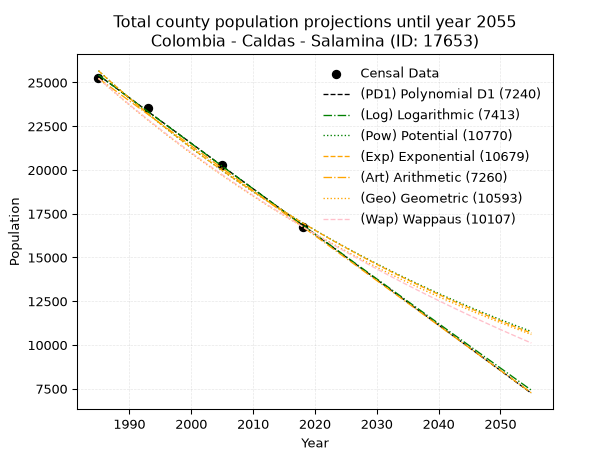
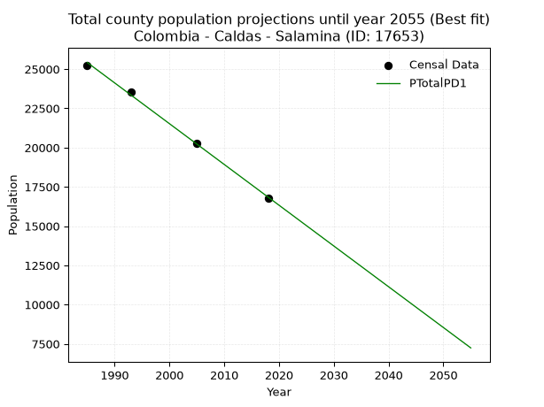
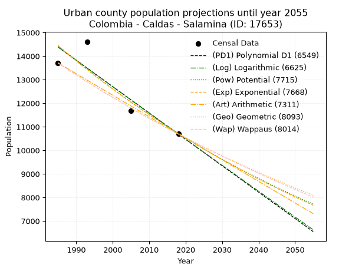
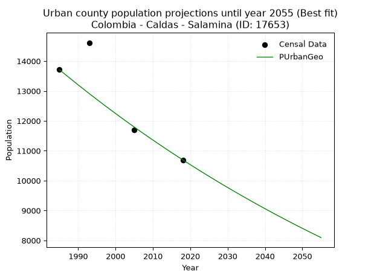
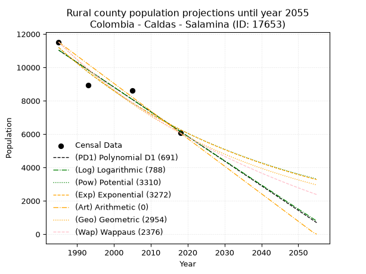
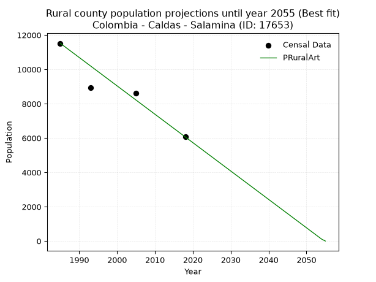

<div align="center">


</div>

# _“Population and Public Services Demand Projections (PPSD) until Year 2050 for Colombia - Caldas - Salamina (ID: 17653)”_
Keywords: `population` `public-service` `projection` `lineal` `polynomial` `logarithmic` `potential` `exponential` `arithmetic` `geometric` `wappaus` `dane` `colombia` `south-america`

PPSD are analytical estimates used by governments and planners to anticipate future changes in population size, age distribution, and the resulting community needs for utilities, healthcare, education, and infrastructure as sizing future water treatment facilities, electrical grids, and road networks based on spatial growth.

> **General running parameters**: • app_version: _v20260806_. • Python version: _3.14.7_. • Pandas version: _3.0.5_. • NumPy version: _2.5.1_. • Creates, save and include plots into reports (create_plot): _True_. • Projection until year: _2050_. • Process polynomial degree 2 and up: _False_. • Process Wappaus: _True_. • Process Wappaus: _True_. • Set negative values to zero: _True_. • Set infinite values to zero: _True_. • Drop dataset notes: _True_. 
<div align="center">

Dynamic map: [:earth_americas:Google](http://maps.google.com/maps?q=5.403024772,-75.4872228) [:earth_americas:OSM](https://www.openstreetmap.org/#map=18/5.403024772/-75.4872228&layers=P) [:earth_americas:Bing](https://www.bing.com/maps?cp=5.403024772~-75.4872228&lvl=18) [:earth_americas:Apple](https://maps.apple.com/frame?center=5.403024772%2C-75.4872228&span=0.003%2C0.006)

</div>


<div align="center">

```geojson
{
  "type": "Feature",
  "geometry": {
    "type": "Point", 
    "coordinates": [-75.4872228, 5.403024772]
  }, 
  "properties": {
    "Name": "Colombia - Caldas - Salamina (ID: 17653)"
  }
}
```

</div>


## 0. Census Data (4 records)

Census data are official statistics collected by a government about the people and housing in a country. They usually include counts of total population, age, sex, race, income, education, and jobs.

📅Global census file: [Population.xlsx](../data/Population.xlsx)

| Source   |   Year |   CountryID | CountryName   |   StateID | StateName   |   CountyID | CountyName   |   PTotal |   PUrban |   PRural |
|:---------|-------:|------------:|:--------------|----------:|:------------|-----------:|:-------------|---------:|---------:|---------:|
| DANE     |   1985 |          57 | Colombia      |        17 | Caldas      |      17653 | Salamina     |    25231 |    13711 |    11520 |
| DANE     |   1993 |          57 | Colombia      |        17 | Caldas      |      17653 | Salamina     |    23559 |    14616 |     8943 |
| DANE     |   2005 |          57 | Colombia      |        17 | Caldas      |      17653 | Salamina     |    20288 |    11690 |     8598 |
| DANE     |   2018 |          57 | Colombia      |        17 | Caldas      |      17653 | Salamina     |    16759 |    10694 |     6065 |

> 🔥Some records has specific notes about the registered values or the corresponding urban or rural distribution.

## 1. Total

### 1.1. Coefficients and Parameters

* (PD1) Polynomial Deg 1: -259.71136089923465, 540946.899638694 (lineal)
* (Log) Logarithmic: -519795.72713531746, 3972430.7373370896
* (Pow) Potential: -25.067521791589883, 87.076185147036
* (Exp) Exponential: -0.012526386743028991, 1614492306254456.0
* (Art) Arithmetic: Year diff. 2018 - 1985 = 33, Population diff. 16759 - 25231 = -8472, Annual growth = -256.72727272727275
* (Geo) Geometric: Year diff. 2018 - 1985 = 33, Population diff. 16759 - 25231 = -8472, Annual growth % = -0.012321580248225716
* (Wap) Wappaus: i = -1.2228019658360216, Condition values only valid for < 200)

<sub>
Wappaus condition values: ['-0.00', '-1.22', '-2.45', '-3.67', '-4.89', '-6.11', '-7.34', '-8.56', '-9.78', '-11.01', '-12.23', '-13.45', '-14.67', '-15.90', '-17.12', '-18.34', '-19.56', '-20.79', '-22.01', '-23.23', '-24.46', '-25.68', '-26.90', '-28.12', '-29.35', '-30.57', '-31.79', '-33.02', '-34.24', '-35.46', '-36.68', '-37.91', '-39.13', '-40.35', '-41.58', '-42.80', '-44.02', '-45.24', '-46.47', '-47.69', '-48.91', '-50.13', '-51.36', '-52.58', '-53.80', '-55.03', '-56.25', '-57.47', '-58.69', '-59.92', '-61.14', '-62.36', '-63.59', '-64.81', '-66.03', '-67.25', '-68.48', '-69.70', '-70.92', '-72.15', '-73.37', '-74.59', '-75.81', '-77.04', '-78.26', '-79.48']
</sub>


### 1.2. Projected Dataset

|   Year |   CountyID |   PTotalPD1 |   PTotalLog |   PTotalPow |   PTotalExp |   PTotalArt |   PTotalGeo |   PTotalWap |
|-------:|-----------:|------------:|------------:|------------:|------------:|------------:|------------:|------------:|
|   1985 |      17653 |       25420 |       25427 |       25674 |       25666 |       25231 |       25231 |       25231 |
|   1986 |      17653 |       25160 |       25165 |       25352 |       25346 |       24974 |       24920 |       24924 |
|   1987 |      17653 |       24900 |       24904 |       25034 |       25031 |       24718 |       24613 |       24621 |
|   1988 |      17653 |       24641 |       24642 |       24721 |       24719 |       24461 |       24310 |       24322 |
|   1989 |      17653 |       24381 |       24381 |       24411 |       24412 |       24204 |       24010 |       24026 |
|   1990 |      17653 |       24121 |       24120 |       24105 |       24108 |       23947 |       23714 |       23734 |
|   1991 |      17653 |       23862 |       23858 |       23804 |       23808 |       23691 |       23422 |       23445 |
|   1992 |      17653 |       23602 |       23597 |       23506 |       23511 |       23434 |       23134 |       23160 |
|   1993 |      17653 |       23342 |       23337 |       23212 |       23219 |       23177 |       22849 |       22878 |
|   1994 |      17653 |       23082 |       23076 |       22922 |       22930 |       22920 |       22567 |       22599 |
|   1995 |      17653 |       22823 |       22815 |       22636 |       22644 |       22664 |       22289 |       22324 |
|   1996 |      17653 |       22563 |       22555 |       22353 |       22362 |       22407 |       22014 |       22051 |
|   1997 |      17653 |       22303 |       22294 |       22074 |       22084 |       22150 |       21743 |       21782 |
|   1998 |      17653 |       22044 |       22034 |       21799 |       21809 |       21894 |       21475 |       21515 |
|   1999 |      17653 |       21784 |       21774 |       21527 |       21537 |       21637 |       21211 |       21252 |
|   2000 |      17653 |       21524 |       21514 |       21259 |       21269 |       21380 |       20949 |       20992 |
|   2001 |      17653 |       21264 |       21254 |       20994 |       21005 |       21123 |       20691 |       20734 |
|   2002 |      17653 |       21005 |       20995 |       20733 |       20743 |       20867 |       20436 |       20480 |
|   2003 |      17653 |       20745 |       20735 |       20475 |       20485 |       20610 |       20184 |       20228 |
|   2004 |      17653 |       20485 |       20476 |       20221 |       20230 |       20353 |       19936 |       19979 |
|   2005 |      17653 |       20226 |       20216 |       19969 |       19978 |       20096 |       19690 |       19733 |
|   2006 |      17653 |       19966 |       19957 |       19721 |       19729 |       19840 |       19447 |       19489 |
|   2007 |      17653 |       19706 |       19698 |       19476 |       19484 |       19583 |       19208 |       19248 |
|   2008 |      17653 |       19446 |       19439 |       19235 |       19241 |       19326 |       18971 |       19010 |
|   2009 |      17653 |       19187 |       19180 |       18996 |       19002 |       19070 |       18737 |       18774 |
|   2010 |      17653 |       18927 |       18922 |       18761 |       18765 |       18813 |       18506 |       18541 |
|   2011 |      17653 |       18667 |       18663 |       18528 |       18532 |       18556 |       18278 |       18310 |
|   2012 |      17653 |       18408 |       18405 |       18299 |       18301 |       18299 |       18053 |       18081 |
|   2013 |      17653 |       18148 |       18146 |       18072 |       18073 |       18043 |       17831 |       17855 |
|   2014 |      17653 |       17888 |       17888 |       17849 |       17848 |       17786 |       17611 |       17631 |
|   2015 |      17653 |       17629 |       17630 |       17628 |       17626 |       17529 |       17394 |       17410 |
|   2016 |      17653 |       17369 |       17372 |       17410 |       17407 |       17272 |       17180 |       17191 |
|   2017 |      17653 |       17109 |       17115 |       17195 |       17190 |       17016 |       16968 |       16974 |
|   2018 |      17653 |       16849 |       16857 |       16983 |       16976 |       16759 |       16759 |       16759 |
|   2019 |      17653 |       16590 |       16599 |       16773 |       16765 |       16502 |       16553 |       16546 |
|   2020 |      17653 |       16330 |       16342 |       16566 |       16556 |       16246 |       16349 |       16336 |
|   2021 |      17653 |       16070 |       16085 |       16362 |       16350 |       15989 |       16147 |       16128 |
|   2022 |      17653 |       15811 |       15828 |       16160 |       16146 |       15732 |       15948 |       15922 |
|   2023 |      17653 |       15551 |       15571 |       15961 |       15945 |       15475 |       15752 |       15717 |
|   2024 |      17653 |       15291 |       15314 |       15765 |       15747 |       15219 |       15558 |       15515 |
|   2025 |      17653 |       15031 |       15057 |       15571 |       15551 |       14962 |       15366 |       15315 |
|   2026 |      17653 |       14772 |       14800 |       15379 |       15357 |       14705 |       15177 |       15117 |
|   2027 |      17653 |       14512 |       14544 |       15190 |       15166 |       14448 |       14990 |       14921 |
|   2028 |      17653 |       14252 |       14287 |       15003 |       14977 |       14192 |       14805 |       14726 |
|   2029 |      17653 |       13993 |       14031 |       14819 |       14791 |       13935 |       14622 |       14534 |
|   2030 |      17653 |       13733 |       13775 |       14637 |       14607 |       13678 |       14442 |       14343 |
|   2031 |      17653 |       13473 |       13519 |       14458 |       14425 |       13422 |       14264 |       14154 |
|   2032 |      17653 |       13213 |       13263 |       14280 |       14245 |       13165 |       14089 |       13967 |
|   2033 |      17653 |       12954 |       13007 |       14105 |       14068 |       12908 |       13915 |       13782 |
|   2034 |      17653 |       12694 |       12752 |       13932 |       13893 |       12651 |       13743 |       13598 |
|   2035 |      17653 |       12434 |       12496 |       13762 |       13720 |       12395 |       13574 |       13416 |
|   2036 |      17653 |       12175 |       12241 |       13593 |       13549 |       12138 |       13407 |       13236 |
|   2037 |      17653 |       11915 |       11986 |       13427 |       13380 |       11881 |       13242 |       13058 |
|   2038 |      17653 |       11655 |       11731 |       13263 |       13214 |       11624 |       13079 |       12881 |
|   2039 |      17653 |       11395 |       11476 |       13101 |       13049 |       11368 |       12917 |       12706 |
|   2040 |      17653 |       11136 |       11221 |       12941 |       12887 |       11111 |       12758 |       12532 |
|   2041 |      17653 |       10876 |       10966 |       12783 |       12726 |       10854 |       12601 |       12360 |
|   2042 |      17653 |       10616 |       10711 |       12627 |       12568 |       10598 |       12446 |       12190 |
|   2043 |      17653 |       10357 |       10457 |       12473 |       12412 |       10341 |       12292 |       12021 |
|   2044 |      17653 |       10097 |       10203 |       12321 |       12257 |       10084 |       12141 |       11854 |
|   2045 |      17653 |        9837 |        9948 |       12170 |       12105 |        9827 |       11991 |       11688 |
|   2046 |      17653 |        9577 |        9694 |       12022 |       11954 |        9571 |       11844 |       11523 |
|   2047 |      17653 |        9318 |        9440 |       11876 |       11805 |        9314 |       11698 |       11360 |
|   2048 |      17653 |        9058 |        9186 |       11731 |       11658 |        9057 |       11554 |       11199 |
|   2049 |      17653 |        8798 |        8933 |       11589 |       11513 |        8800 |       11411 |       11039 |
|   2050 |      17653 |        8539 |        8679 |       11448 |       11370 |        8544 |       11271 |       10880 |
<div align="center">

</img>

</div>


### 1.3. Best fit with absolute error and relative error (%)

Relative error puts that difference into context by dividing the absolute error by the true value, creating a unitless ratio or percentage that shows the scale of the mistake.

Absolute and relative error

|   Year | Source   |   CountryID | CountryName   |   StateID | StateName   |   CountyID_x | CountyName   |   PTotal |   PUrban |   PRural |   CountyID_y |   PTotalPD1 |   PTotalLog |   PTotalPow |   PTotalExp |   PTotalArt |   PTotalGeo |   PTotalWap |   PTotalPD1AbsError |   PTotalLogAbsError |   PTotalPowAbsError |   PTotalExpAbsError |   PTotalArtAbsError |   PTotalGeoAbsError |   PTotalWapAbsError |   PTotalPD1RelError |   PTotalLogRelError |   PTotalPowRelError |   PTotalExpRelError |   PTotalArtRelError |   PTotalGeoRelError |   PTotalWapRelError |
|-------:|:---------|------------:|:--------------|----------:|:------------|-------------:|:-------------|---------:|---------:|---------:|-------------:|------------:|------------:|------------:|------------:|------------:|------------:|------------:|--------------------:|--------------------:|--------------------:|--------------------:|--------------------:|--------------------:|--------------------:|--------------------:|--------------------:|--------------------:|--------------------:|--------------------:|--------------------:|--------------------:|
|   1985 | DANE     |          57 | Colombia      |        17 | Caldas      |        17653 | Salamina     |    25231 |    13711 |    11520 |        17653 |       25420 |       25427 |       25674 |       25666 |       25231 |       25231 |       25231 |                 189 |                 196 |                 443 |                 435 |                   0 |                   0 |                   0 |            0.749079 |            0.776822 |             1.75578 |             1.72407 |            0        |             0       |             0       |
|   1993 | DANE     |          57 | Colombia      |        17 | Caldas      |        17653 | Salamina     |    23559 |    14616 |     8943 |        17653 |       23342 |       23337 |       23212 |       23219 |       23177 |       22849 |       22878 |                 217 |                 222 |                 347 |                 340 |                 382 |                 710 |                 681 |            0.921092 |            0.942315 |             1.4729  |             1.44319 |            1.62146  |             3.01371 |             2.89062 |
|   2005 | DANE     |          57 | Colombia      |        17 | Caldas      |        17653 | Salamina     |    20288 |    11690 |     8598 |        17653 |       20226 |       20216 |       19969 |       19978 |       20096 |       19690 |       19733 |                  62 |                  72 |                 319 |                 310 |                 192 |                 598 |                 555 |            0.305599 |            0.35489  |             1.57236 |             1.528   |            0.946372 |             2.94756 |             2.73561 |
|   2018 | DANE     |          57 | Colombia      |        17 | Caldas      |        17653 | Salamina     |    16759 |    10694 |     6065 |        17653 |       16849 |       16857 |       16983 |       16976 |       16759 |       16759 |       16759 |                  90 |                  98 |                 224 |                 217 |                   0 |                   0 |                   0 |            0.537025 |            0.58476  |             1.3366  |             1.29483 |            0        |             0       |             0       |

Relative error mean

| Method    |   RelError | Best   |
|:----------|-----------:|:-------|
| PTotalPD1 |   0.628199 | True   |
| PTotalLog |   0.664697 |        |
| PTotalPow |   1.53441  |        |
| PTotalExp |   1.49752  |        |
| PTotalArt |   0.641958 |        |
| PTotalGeo |   1.49032  |        |
| PTotalWap |   1.40656  |        |

💙Best method: _**PTotalPD1**_
<div align="center">

</img>

</div>


### 1.4. Fresh water supply demand in liters per capita per day (lpcd)

The fresh water supply demand typically ranges from 100 to 300 liters per capita per day (lpcd) for standard domestic and municipal planning, though absolute survival minimums set by the World Health Organization are as low as 7.5 to 20 liters per day, and total consumption in high-income nations can exceed 400 liters.

> `CZ`: Level in meters above the sea level (masl).<br> `WS`: Fresh water supply demand in liters per capita per day (lpcd or l/h/d).<br> `WSAll`: Zonal fresh water supply demand in liters per second (l/s).<br> `A`: Zonal area in square meters.

Reference values (RAS Colombia)

|    CZ |   WS |
|------:|-----:|
|  1000 |  120 |
|  2000 |  130 |
| 99999 |  140 |

County shapefile geometry properties and water supply values

|   CountyID |      ATotal |   CZTotal |   WSTotal |
|-----------:|------------:|----------:|----------:|
|      17653 | 3.87959e+08 |   2473.69 |       140 |

Projected values for best method: PTotalPD1

|   CountyID |   Year |   PTotalPD1 |   WSTotal |   WSTotalAll |
|-----------:|-------:|------------:|----------:|-------------:|
|      17653 |   1985 |       25420 |       140 |      41.1898 |
|      17653 |   1986 |       25160 |       140 |      40.7685 |
|      17653 |   1987 |       24900 |       140 |      40.3472 |
|      17653 |   1988 |       24641 |       140 |      39.9275 |
|      17653 |   1989 |       24381 |       140 |      39.5063 |
|      17653 |   1990 |       24121 |       140 |      39.085  |
|      17653 |   1991 |       23862 |       140 |      38.6653 |
|      17653 |   1992 |       23602 |       140 |      38.244  |
|      17653 |   1993 |       23342 |       140 |      37.8227 |
|      17653 |   1994 |       23082 |       140 |      37.4014 |
|      17653 |   1995 |       22823 |       140 |      36.9817 |
|      17653 |   1996 |       22563 |       140 |      36.5604 |
|      17653 |   1997 |       22303 |       140 |      36.1391 |
|      17653 |   1998 |       22044 |       140 |      35.7194 |
|      17653 |   1999 |       21784 |       140 |      35.2981 |
|      17653 |   2000 |       21524 |       140 |      34.8769 |
|      17653 |   2001 |       21264 |       140 |      34.4556 |
|      17653 |   2002 |       21005 |       140 |      34.0359 |
|      17653 |   2003 |       20745 |       140 |      33.6146 |
|      17653 |   2004 |       20485 |       140 |      33.1933 |
|      17653 |   2005 |       20226 |       140 |      32.7736 |
|      17653 |   2006 |       19966 |       140 |      32.3523 |
|      17653 |   2007 |       19706 |       140 |      31.931  |
|      17653 |   2008 |       19446 |       140 |      31.5097 |
|      17653 |   2009 |       19187 |       140 |      31.09   |
|      17653 |   2010 |       18927 |       140 |      30.6687 |
|      17653 |   2011 |       18667 |       140 |      30.2475 |
|      17653 |   2012 |       18408 |       140 |      29.8278 |
|      17653 |   2013 |       18148 |       140 |      29.4065 |
|      17653 |   2014 |       17888 |       140 |      28.9852 |
|      17653 |   2015 |       17629 |       140 |      28.5655 |
|      17653 |   2016 |       17369 |       140 |      28.1442 |
|      17653 |   2017 |       17109 |       140 |      27.7229 |
|      17653 |   2018 |       16849 |       140 |      27.3016 |
|      17653 |   2019 |       16590 |       140 |      26.8819 |
|      17653 |   2020 |       16330 |       140 |      26.4606 |
|      17653 |   2021 |       16070 |       140 |      26.0394 |
|      17653 |   2022 |       15811 |       140 |      25.6197 |
|      17653 |   2023 |       15551 |       140 |      25.1984 |
|      17653 |   2024 |       15291 |       140 |      24.7771 |
|      17653 |   2025 |       15031 |       140 |      24.3558 |
|      17653 |   2026 |       14772 |       140 |      23.9361 |
|      17653 |   2027 |       14512 |       140 |      23.5148 |
|      17653 |   2028 |       14252 |       140 |      23.0935 |
|      17653 |   2029 |       13993 |       140 |      22.6738 |
|      17653 |   2030 |       13733 |       140 |      22.2525 |
|      17653 |   2031 |       13473 |       140 |      21.8313 |
|      17653 |   2032 |       13213 |       140 |      21.41   |
|      17653 |   2033 |       12954 |       140 |      20.9903 |
|      17653 |   2034 |       12694 |       140 |      20.569  |
|      17653 |   2035 |       12434 |       140 |      20.1477 |
|      17653 |   2036 |       12175 |       140 |      19.728  |
|      17653 |   2037 |       11915 |       140 |      19.3067 |
|      17653 |   2038 |       11655 |       140 |      18.8854 |
|      17653 |   2039 |       11395 |       140 |      18.4641 |
|      17653 |   2040 |       11136 |       140 |      18.0444 |
|      17653 |   2041 |       10876 |       140 |      17.6231 |
|      17653 |   2042 |       10616 |       140 |      17.2019 |
|      17653 |   2043 |       10357 |       140 |      16.7822 |
|      17653 |   2044 |       10097 |       140 |      16.3609 |
|      17653 |   2045 |        9837 |       140 |      15.9396 |
|      17653 |   2046 |        9577 |       140 |      15.5183 |
|      17653 |   2047 |        9318 |       140 |      15.0986 |
|      17653 |   2048 |        9058 |       140 |      14.6773 |
|      17653 |   2049 |        8798 |       140 |      14.256  |
|      17653 |   2050 |        8539 |       140 |      13.8363 |

## 2. Urban

### 2.1. Coefficients and Parameters

* (PD1) Polynomial Deg 1: -111.94339622641436, 236592.52830188535 (lineal)
* (Log) Logarithmic: -223981.86878971325, 1715165.729548662
* (Pow) Potential: -18.09499911206449, 63.83267743137087
* (Exp) Exponential: -0.009043785178025206, 903705659744.3468
* (Art) Arithmetic: Year diff. 2018 - 1985 = 33, Population diff. 10694 - 13711 = -3017, Annual growth = -91.42424242424242
* (Geo) Geometric: Year diff. 2018 - 1985 = 33, Population diff. 10694 - 13711 = -3017, Annual growth % = -0.007502490328607281
* (Wap) Wappaus: i = -0.7492255064473872, Condition values only valid for < 200)

<sub>
Wappaus condition values: ['-0.00', '-0.75', '-1.50', '-2.25', '-3.00', '-3.75', '-4.50', '-5.24', '-5.99', '-6.74', '-7.49', '-8.24', '-8.99', '-9.74', '-10.49', '-11.24', '-11.99', '-12.74', '-13.49', '-14.24', '-14.98', '-15.73', '-16.48', '-17.23', '-17.98', '-18.73', '-19.48', '-20.23', '-20.98', '-21.73', '-22.48', '-23.23', '-23.98', '-24.72', '-25.47', '-26.22', '-26.97', '-27.72', '-28.47', '-29.22', '-29.97', '-30.72', '-31.47', '-32.22', '-32.97', '-33.72', '-34.46', '-35.21', '-35.96', '-36.71', '-37.46', '-38.21', '-38.96', '-39.71', '-40.46', '-41.21', '-41.96', '-42.71', '-43.46', '-44.20', '-44.95', '-45.70', '-46.45', '-47.20', '-47.95', '-48.70']
</sub>


### 2.2. Projected Dataset

|   Year |   CountyID |   PUrbanPD1 |   PUrbanLog |   PUrbanPow |   PUrbanExp |   PUrbanArt |   PUrbanGeo |   PUrbanWap |
|-------:|-----------:|------------:|------------:|------------:|------------:|------------:|------------:|------------:|
|   1985 |      17653 |       14385 |       14388 |       14445 |       14441 |       13711 |       13711 |       13711 |
|   1986 |      17653 |       14273 |       14275 |       14314 |       14311 |       13620 |       13608 |       13609 |
|   1987 |      17653 |       14161 |       14162 |       14184 |       14183 |       13528 |       13506 |       13507 |
|   1988 |      17653 |       14049 |       14049 |       14055 |       14055 |       13437 |       13405 |       13406 |
|   1989 |      17653 |       13937 |       13937 |       13928 |       13928 |       13345 |       13304 |       13306 |
|   1990 |      17653 |       13825 |       13824 |       13802 |       13803 |       13254 |       13204 |       13207 |
|   1991 |      17653 |       13713 |       13712 |       13677 |       13679 |       13162 |       13105 |       13108 |
|   1992 |      17653 |       13601 |       13599 |       13553 |       13556 |       13071 |       13007 |       13010 |
|   1993 |      17653 |       13489 |       13487 |       13431 |       13433 |       12980 |       12909 |       12913 |
|   1994 |      17653 |       13377 |       13374 |       13309 |       13313 |       12888 |       12813 |       12817 |
|   1995 |      17653 |       13265 |       13262 |       13189 |       13193 |       12797 |       12716 |       12721 |
|   1996 |      17653 |       13154 |       13150 |       13070 |       13074 |       12705 |       12621 |       12626 |
|   1997 |      17653 |       13042 |       13038 |       12952 |       12956 |       12614 |       12526 |       12531 |
|   1998 |      17653 |       12930 |       12925 |       12835 |       12840 |       12522 |       12432 |       12438 |
|   1999 |      17653 |       12818 |       12813 |       12720 |       12724 |       12431 |       12339 |       12344 |
|   2000 |      17653 |       12706 |       12701 |       12605 |       12609 |       12340 |       12246 |       12252 |
|   2001 |      17653 |       12594 |       12589 |       12491 |       12496 |       12248 |       12155 |       12160 |
|   2002 |      17653 |       12482 |       12478 |       12379 |       12383 |       12157 |       12063 |       12069 |
|   2003 |      17653 |       12370 |       12366 |       12268 |       12272 |       12065 |       11973 |       11979 |
|   2004 |      17653 |       12258 |       12254 |       12157 |       12161 |       11974 |       11883 |       11889 |
|   2005 |      17653 |       12146 |       12142 |       12048 |       12052 |       11883 |       11794 |       11800 |
|   2006 |      17653 |       12034 |       12030 |       11940 |       11943 |       11791 |       11705 |       11711 |
|   2007 |      17653 |       11922 |       11919 |       11833 |       11836 |       11700 |       11618 |       11623 |
|   2008 |      17653 |       11810 |       11807 |       11727 |       11729 |       11608 |       11530 |       11536 |
|   2009 |      17653 |       11698 |       11696 |       11621 |       11624 |       11517 |       11444 |       11449 |
|   2010 |      17653 |       11586 |       11584 |       11517 |       11519 |       11425 |       11358 |       11363 |
|   2011 |      17653 |       11474 |       11473 |       11414 |       11415 |       11334 |       11273 |       11277 |
|   2012 |      17653 |       11362 |       11362 |       11312 |       11313 |       11243 |       11188 |       11192 |
|   2013 |      17653 |       11250 |       11250 |       11211 |       11211 |       11151 |       11104 |       11108 |
|   2014 |      17653 |       11139 |       11139 |       11110 |       11110 |       11060 |       11021 |       11024 |
|   2015 |      17653 |       11027 |       11028 |       11011 |       11010 |       10968 |       10938 |       10941 |
|   2016 |      17653 |       10915 |       10917 |       10913 |       10911 |       10877 |       10856 |       10858 |
|   2017 |      17653 |       10803 |       10806 |       10815 |       10812 |       10785 |       10775 |       10776 |
|   2018 |      17653 |       10691 |       10695 |       10718 |       10715 |       10694 |       10694 |       10694 |
|   2019 |      17653 |       10579 |       10584 |       10623 |       10619 |       10603 |       10614 |       10613 |
|   2020 |      17653 |       10467 |       10473 |       10528 |       10523 |       10511 |       10534 |       10532 |
|   2021 |      17653 |       10355 |       10362 |       10434 |       10428 |       10420 |       10455 |       10452 |
|   2022 |      17653 |       10243 |       10251 |       10341 |       10334 |       10328 |       10377 |       10373 |
|   2023 |      17653 |       10131 |       10140 |       10249 |       10241 |       10237 |       10299 |       10294 |
|   2024 |      17653 |       10019 |       10030 |       10158 |       10149 |       10145 |       10222 |       10215 |
|   2025 |      17653 |        9907 |        9919 |       10067 |       10058 |       10054 |       10145 |       10137 |
|   2026 |      17653 |        9795 |        9808 |        9978 |        9967 |        9963 |       10069 |       10060 |
|   2027 |      17653 |        9683 |        9698 |        9889 |        9878 |        9871 |        9993 |        9983 |
|   2028 |      17653 |        9571 |        9587 |        9801 |        9789 |        9780 |        9918 |        9907 |
|   2029 |      17653 |        9459 |        9477 |        9714 |        9700 |        9688 |        9844 |        9831 |
|   2030 |      17653 |        9347 |        9367 |        9628 |        9613 |        9597 |        9770 |        9755 |
|   2031 |      17653 |        9235 |        9256 |        9543 |        9527 |        9505 |        9697 |        9680 |
|   2032 |      17653 |        9124 |        9146 |        9458 |        9441 |        9414 |        9624 |        9606 |
|   2033 |      17653 |        9012 |        9036 |        9374 |        9356 |        9323 |        9552 |        9532 |
|   2034 |      17653 |        8900 |        8926 |        9291 |        9272 |        9231 |        9480 |        9458 |
|   2035 |      17653 |        8788 |        8816 |        9209 |        9188 |        9140 |        9409 |        9385 |
|   2036 |      17653 |        8676 |        8706 |        9127 |        9105 |        9048 |        9338 |        9312 |
|   2037 |      17653 |        8564 |        8596 |        9047 |        9023 |        8957 |        9268 |        9240 |
|   2038 |      17653 |        8452 |        8486 |        8967 |        8942 |        8866 |        9199 |        9168 |
|   2039 |      17653 |        8340 |        8376 |        8887 |        8862 |        8774 |        9130 |        9097 |
|   2040 |      17653 |        8228 |        8266 |        8809 |        8782 |        8683 |        9061 |        9026 |
|   2041 |      17653 |        8116 |        8156 |        8731 |        8703 |        8591 |        8993 |        8956 |
|   2042 |      17653 |        8004 |        8046 |        8654 |        8624 |        8500 |        8926 |        8886 |
|   2043 |      17653 |        7892 |        7937 |        8578 |        8547 |        8408 |        8859 |        8816 |
|   2044 |      17653 |        7780 |        7827 |        8502 |        8470 |        8317 |        8792 |        8747 |
|   2045 |      17653 |        7668 |        7718 |        8427 |        8394 |        8226 |        8726 |        8679 |
|   2046 |      17653 |        7556 |        7608 |        8353 |        8318 |        8134 |        8661 |        8610 |
|   2047 |      17653 |        7444 |        7499 |        8279 |        8243 |        8043 |        8596 |        8542 |
|   2048 |      17653 |        7332 |        7389 |        8207 |        8169 |        7951 |        8531 |        8475 |
|   2049 |      17653 |        7221 |        7280 |        8134 |        8095 |        7860 |        8467 |        8408 |
|   2050 |      17653 |        7109 |        7171 |        8063 |        8023 |        7768 |        8404 |        8341 |
<div align="center">

</img>

</div>


### 2.3. Best fit with absolute error and relative error (%)

Relative error puts that difference into context by dividing the absolute error by the true value, creating a unitless ratio or percentage that shows the scale of the mistake.

Absolute and relative error

|   Year | Source   |   CountryID | CountryName   |   StateID | StateName   |   CountyID_x | CountyName   |   PTotal |   PUrban |   PRural |   CountyID_y |   PUrbanPD1 |   PUrbanLog |   PUrbanPow |   PUrbanExp |   PUrbanArt |   PUrbanGeo |   PUrbanWap |   PUrbanPD1AbsError |   PUrbanLogAbsError |   PUrbanPowAbsError |   PUrbanExpAbsError |   PUrbanArtAbsError |   PUrbanGeoAbsError |   PUrbanWapAbsError |   PUrbanPD1RelError |   PUrbanLogRelError |   PUrbanPowRelError |   PUrbanExpRelError |   PUrbanArtRelError |   PUrbanGeoRelError |   PUrbanWapRelError |
|-------:|:---------|------------:|:--------------|----------:|:------------|-------------:|:-------------|---------:|---------:|---------:|-------------:|------------:|------------:|------------:|------------:|------------:|------------:|------------:|--------------------:|--------------------:|--------------------:|--------------------:|--------------------:|--------------------:|--------------------:|--------------------:|--------------------:|--------------------:|--------------------:|--------------------:|--------------------:|--------------------:|
|   1985 | DANE     |          57 | Colombia      |        17 | Caldas      |        17653 | Salamina     |    25231 |    13711 |    11520 |        17653 |       14385 |       14388 |       14445 |       14441 |       13711 |       13711 |       13711 |                 674 |                 677 |                 734 |                 730 |                   0 |                   0 |                   0 |           4.91576   |          4.93764    |            5.35337  |            5.32419  |             0       |            0        |            0        |
|   1993 | DANE     |          57 | Colombia      |        17 | Caldas      |        17653 | Salamina     |    23559 |    14616 |     8943 |        17653 |       13489 |       13487 |       13431 |       13433 |       12980 |       12909 |       12913 |                1127 |                1129 |                1185 |                1183 |                1636 |                1707 |                1703 |           7.71073   |          7.72441    |            8.10755  |            8.09387  |            11.1932  |           11.679    |           11.6516   |
|   2005 | DANE     |          57 | Colombia      |        17 | Caldas      |        17653 | Salamina     |    20288 |    11690 |     8598 |        17653 |       12146 |       12142 |       12048 |       12052 |       11883 |       11794 |       11800 |                 456 |                 452 |                 358 |                 362 |                 193 |                 104 |                 110 |           3.90077   |          3.86655    |            3.06245  |            3.09666  |             1.65098 |            0.889649 |            0.940975 |
|   2018 | DANE     |          57 | Colombia      |        17 | Caldas      |        17653 | Salamina     |    16759 |    10694 |     6065 |        17653 |       10691 |       10695 |       10718 |       10715 |       10694 |       10694 |       10694 |                   3 |                   1 |                  24 |                  21 |                   0 |                   0 |                   0 |           0.0280531 |          0.00935104 |            0.224425 |            0.196372 |             0       |            0        |            0        |

Relative error mean

| Method    |   RelError | Best   |
|:----------|-----------:|:-------|
| PUrbanPD1 |    4.13883 |        |
| PUrbanLog |    4.13449 |        |
| PUrbanPow |    4.18695 |        |
| PUrbanExp |    4.17777 |        |
| PUrbanArt |    3.21105 |        |
| PUrbanGeo |    3.14216 | True   |
| PUrbanWap |    3.14815 |        |

💙Best method: _**PUrbanGeo**_
<div align="center">

</img>

</div>


### 2.4. Fresh water supply demand in liters per capita per day (lpcd)

The fresh water supply demand typically ranges from 100 to 300 liters per capita per day (lpcd) for standard domestic and municipal planning, though absolute survival minimums set by the World Health Organization are as low as 7.5 to 20 liters per day, and total consumption in high-income nations can exceed 400 liters.

> `CZ`: Level in meters above the sea level (masl).<br> `WS`: Fresh water supply demand in liters per capita per day (lpcd or l/h/d).<br> `WSAll`: Zonal fresh water supply demand in liters per second (l/s).<br> `A`: Zonal area in square meters.

Reference values (RAS Colombia)

|    CZ |   WS |
|------:|-----:|
|  1000 |  120 |
|  2000 |  130 |
| 99999 |  140 |

County shapefile geometry properties and water supply values

|   CountyID |      AUrban |   CZUrban |   WSUrban |
|-----------:|------------:|----------:|----------:|
|      17653 | 1.56553e+06 |   1816.01 |       130 |

Projected values for best method: PUrbanGeo

|   CountyID |   Year |   PUrbanGeo |   WSUrban |   WSUrbanAll |
|-----------:|-------:|------------:|----------:|-------------:|
|      17653 |   1985 |       13711 |       130 |      20.63   |
|      17653 |   1986 |       13608 |       130 |      20.475  |
|      17653 |   1987 |       13506 |       130 |      20.3215 |
|      17653 |   1988 |       13405 |       130 |      20.1696 |
|      17653 |   1989 |       13304 |       130 |      20.0176 |
|      17653 |   1990 |       13204 |       130 |      19.8671 |
|      17653 |   1991 |       13105 |       130 |      19.7182 |
|      17653 |   1992 |       13007 |       130 |      19.5707 |
|      17653 |   1993 |       12909 |       130 |      19.4233 |
|      17653 |   1994 |       12813 |       130 |      19.2788 |
|      17653 |   1995 |       12716 |       130 |      19.1329 |
|      17653 |   1996 |       12621 |       130 |      18.9899 |
|      17653 |   1997 |       12526 |       130 |      18.847  |
|      17653 |   1998 |       12432 |       130 |      18.7056 |
|      17653 |   1999 |       12339 |       130 |      18.5656 |
|      17653 |   2000 |       12246 |       130 |      18.4257 |
|      17653 |   2001 |       12155 |       130 |      18.2888 |
|      17653 |   2002 |       12063 |       130 |      18.1503 |
|      17653 |   2003 |       11973 |       130 |      18.0149 |
|      17653 |   2004 |       11883 |       130 |      17.8795 |
|      17653 |   2005 |       11794 |       130 |      17.7456 |
|      17653 |   2006 |       11705 |       130 |      17.6117 |
|      17653 |   2007 |       11618 |       130 |      17.4808 |
|      17653 |   2008 |       11530 |       130 |      17.3484 |
|      17653 |   2009 |       11444 |       130 |      17.219  |
|      17653 |   2010 |       11358 |       130 |      17.0896 |
|      17653 |   2011 |       11273 |       130 |      16.9617 |
|      17653 |   2012 |       11188 |       130 |      16.8338 |
|      17653 |   2013 |       11104 |       130 |      16.7074 |
|      17653 |   2014 |       11021 |       130 |      16.5825 |
|      17653 |   2015 |       10938 |       130 |      16.4576 |
|      17653 |   2016 |       10856 |       130 |      16.3343 |
|      17653 |   2017 |       10775 |       130 |      16.2124 |
|      17653 |   2018 |       10694 |       130 |      16.0905 |
|      17653 |   2019 |       10614 |       130 |      15.9701 |
|      17653 |   2020 |       10534 |       130 |      15.8498 |
|      17653 |   2021 |       10455 |       130 |      15.7309 |
|      17653 |   2022 |       10377 |       130 |      15.6135 |
|      17653 |   2023 |       10299 |       130 |      15.4962 |
|      17653 |   2024 |       10222 |       130 |      15.3803 |
|      17653 |   2025 |       10145 |       130 |      15.2645 |
|      17653 |   2026 |       10069 |       130 |      15.1501 |
|      17653 |   2027 |        9993 |       130 |      15.0358 |
|      17653 |   2028 |        9918 |       130 |      14.9229 |
|      17653 |   2029 |        9844 |       130 |      14.8116 |
|      17653 |   2030 |        9770 |       130 |      14.7002 |
|      17653 |   2031 |        9697 |       130 |      14.5904 |
|      17653 |   2032 |        9624 |       130 |      14.4806 |
|      17653 |   2033 |        9552 |       130 |      14.3722 |
|      17653 |   2034 |        9480 |       130 |      14.2639 |
|      17653 |   2035 |        9409 |       130 |      14.1571 |
|      17653 |   2036 |        9338 |       130 |      14.0502 |
|      17653 |   2037 |        9268 |       130 |      13.9449 |
|      17653 |   2038 |        9199 |       130 |      13.8411 |
|      17653 |   2039 |        9130 |       130 |      13.7373 |
|      17653 |   2040 |        9061 |       130 |      13.6334 |
|      17653 |   2041 |        8993 |       130 |      13.5311 |
|      17653 |   2042 |        8926 |       130 |      13.4303 |
|      17653 |   2043 |        8859 |       130 |      13.3295 |
|      17653 |   2044 |        8792 |       130 |      13.2287 |
|      17653 |   2045 |        8726 |       130 |      13.1294 |
|      17653 |   2046 |        8661 |       130 |      13.0316 |
|      17653 |   2047 |        8596 |       130 |      12.9338 |
|      17653 |   2048 |        8531 |       130 |      12.836  |
|      17653 |   2049 |        8467 |       130 |      12.7397 |
|      17653 |   2050 |        8404 |       130 |      12.6449 |

## 3. Rural

### 3.1. Coefficients and Parameters

* (PD1) Polynomial Deg 1: -147.76796467282054, 304354.37133680936 (lineal)
* (Log) Logarithmic: -295813.85834560427, 2257265.007788428
* (Pow) Potential: -35.16250023863011, 120.00662090097728
* (Exp) Exponential: -0.017569414177183634, 1.5669235893150392e+19
* (Art) Arithmetic: Year diff. 2018 - 1985 = 33, Population diff. 6065 - 11520 = -5455, Annual growth = -165.3030303030303
* (Geo) Geometric: Year diff. 2018 - 1985 = 33, Population diff. 6065 - 11520 = -5455, Annual growth % = -0.01925315665529781
* (Wap) Wappaus: i = -1.8800458379645186, Condition values only valid for < 200)

<sub>
Wappaus condition values: ['-0.00', '-1.88', '-3.76', '-5.64', '-7.52', '-9.40', '-11.28', '-13.16', '-15.04', '-16.92', '-18.80', '-20.68', '-22.56', '-24.44', '-26.32', '-28.20', '-30.08', '-31.96', '-33.84', '-35.72', '-37.60', '-39.48', '-41.36', '-43.24', '-45.12', '-47.00', '-48.88', '-50.76', '-52.64', '-54.52', '-56.40', '-58.28', '-60.16', '-62.04', '-63.92', '-65.80', '-67.68', '-69.56', '-71.44', '-73.32', '-75.20', '-77.08', '-78.96', '-80.84', '-82.72', '-84.60', '-86.48', '-88.36', '-90.24', '-92.12', '-94.00', '-95.88', '-97.76', '-99.64', '-101.52', '-103.40', '-105.28', '-107.16', '-109.04', '-110.92', '-112.80', '-114.68', '-116.56', '-118.44', '-120.32', '-122.20']
</sub>


### 3.2. Projected Dataset

|   Year |   CountyID |   PRuralPD1 |   PRuralLog |   PRuralPow |   PRuralExp |   PRuralArt |   PRuralGeo |   PRuralWap |
|-------:|-----------:|------------:|------------:|------------:|------------:|------------:|------------:|------------:|
|   1985 |      17653 |       11035 |       11040 |       11197 |       11192 |       11520 |       11520 |       11520 |
|   1986 |      17653 |       10887 |       10891 |       11001 |       10997 |       11355 |       11298 |       11305 |
|   1987 |      17653 |       10739 |       10742 |       10808 |       10805 |       11189 |       11081 |       11095 |
|   1988 |      17653 |       10592 |       10593 |       10618 |       10617 |       11024 |       10867 |       10888 |
|   1989 |      17653 |       10444 |       10444 |       10432 |       10432 |       10859 |       10658 |       10685 |
|   1990 |      17653 |       10296 |       10296 |       10249 |       10251 |       10693 |       10453 |       10486 |
|   1991 |      17653 |       10148 |       10147 |       10070 |       10072 |       10528 |       10252 |       10290 |
|   1992 |      17653 |       10001 |        9998 |        9894 |        9897 |       10363 |       10054 |       10098 |
|   1993 |      17653 |        9853 |        9850 |        9721 |        9724 |       10198 |        9861 |        9909 |
|   1994 |      17653 |        9705 |        9701 |        9551 |        9555 |       10032 |        9671 |        9723 |
|   1995 |      17653 |        9557 |        9553 |        9384 |        9389 |        9867 |        9485 |        9540 |
|   1996 |      17653 |        9410 |        9405 |        9220 |        9225 |        9702 |        9302 |        9361 |
|   1997 |      17653 |        9262 |        9257 |        9059 |        9064 |        9536 |        9123 |        9184 |
|   1998 |      17653 |        9114 |        9109 |        8901 |        8907 |        9371 |        8947 |        9011 |
|   1999 |      17653 |        8966 |        8961 |        8746 |        8751 |        9206 |        8775 |        8840 |
|   2000 |      17653 |        8818 |        8813 |        8593 |        8599 |        9040 |        8606 |        8673 |
|   2001 |      17653 |        8671 |        8665 |        8443 |        8449 |        8875 |        8440 |        8508 |
|   2002 |      17653 |        8523 |        8517 |        8296 |        8302 |        8710 |        8278 |        8345 |
|   2003 |      17653 |        8375 |        8369 |        8152 |        8158 |        8545 |        8119 |        8186 |
|   2004 |      17653 |        8227 |        8222 |        8010 |        8015 |        8379 |        7962 |        8029 |
|   2005 |      17653 |        8080 |        8074 |        7871 |        7876 |        8214 |        7809 |        7874 |
|   2006 |      17653 |        7932 |        7927 |        7734 |        7739 |        8049 |        7659 |        7722 |
|   2007 |      17653 |        7784 |        7779 |        7600 |        7604 |        7883 |        7511 |        7572 |
|   2008 |      17653 |        7636 |        7632 |        7468 |        7471 |        7718 |        7367 |        7424 |
|   2009 |      17653 |        7489 |        7485 |        7338 |        7341 |        7553 |        7225 |        7279 |
|   2010 |      17653 |        7341 |        7337 |        7211 |        7213 |        7387 |        7086 |        7136 |
|   2011 |      17653 |        7193 |        7190 |        7086 |        7088 |        7222 |        6949 |        6995 |
|   2012 |      17653 |        7045 |        7043 |        6963 |        6964 |        7057 |        6815 |        6856 |
|   2013 |      17653 |        6897 |        6896 |        6842 |        6843 |        6892 |        6684 |        6719 |
|   2014 |      17653 |        6750 |        6749 |        6724 |        6724 |        6726 |        6555 |        6585 |
|   2015 |      17653 |        6602 |        6602 |        6608 |        6607 |        6561 |        6429 |        6452 |
|   2016 |      17653 |        6454 |        6456 |        6493 |        6492 |        6396 |        6305 |        6321 |
|   2017 |      17653 |        6306 |        6309 |        6381 |        6379 |        6230 |        6184 |        6192 |
|   2018 |      17653 |        6159 |        6162 |        6271 |        6268 |        6065 |        6065 |        6065 |
|   2019 |      17653 |        6011 |        6016 |        6163 |        6158 |        5900 |        5948 |        5940 |
|   2020 |      17653 |        5863 |        5869 |        6056 |        6051 |        5734 |        5834 |        5816 |
|   2021 |      17653 |        5715 |        5723 |        5952 |        5946 |        5569 |        5721 |        5694 |
|   2022 |      17653 |        5568 |        5577 |        5849 |        5842 |        5404 |        5611 |        5574 |
|   2023 |      17653 |        5420 |        5430 |        5748 |        5741 |        5238 |        5503 |        5456 |
|   2024 |      17653 |        5272 |        5284 |        5649 |        5641 |        5073 |        5397 |        5339 |
|   2025 |      17653 |        5124 |        5138 |        5552 |        5542 |        4908 |        5293 |        5224 |
|   2026 |      17653 |        4976 |        4992 |        5456 |        5446 |        4743 |        5191 |        5110 |
|   2027 |      17653 |        4829 |        4846 |        5363 |        5351 |        4577 |        5091 |        4998 |
|   2028 |      17653 |        4681 |        4700 |        5270 |        5258 |        4412 |        4993 |        4888 |
|   2029 |      17653 |        4533 |        4554 |        5180 |        5166 |        4247 |        4897 |        4779 |
|   2030 |      17653 |        4385 |        4408 |        5091 |        5076 |        4081 |        4803 |        4671 |
|   2031 |      17653 |        4238 |        4263 |        5003 |        4988 |        3916 |        4711 |        4565 |
|   2032 |      17653 |        4090 |        4117 |        4918 |        4901 |        3751 |        4620 |        4460 |
|   2033 |      17653 |        3942 |        3972 |        4833 |        4816 |        3585 |        4531 |        4356 |
|   2034 |      17653 |        3794 |        3826 |        4750 |        4732 |        3420 |        4444 |        4254 |
|   2035 |      17653 |        3647 |        3681 |        4669 |        4649 |        3255 |        4358 |        4153 |
|   2036 |      17653 |        3499 |        3535 |        4589 |        4568 |        3090 |        4274 |        4054 |
|   2037 |      17653 |        3351 |        3390 |        4510 |        4489 |        2924 |        4192 |        3955 |
|   2038 |      17653 |        3203 |        3245 |        4433 |        4411 |        2759 |        4111 |        3858 |
|   2039 |      17653 |        3055 |        3100 |        4357 |        4334 |        2594 |        4032 |        3762 |
|   2040 |      17653 |        2908 |        2955 |        4283 |        4258 |        2428 |        3954 |        3668 |
|   2041 |      17653 |        2760 |        2810 |        4210 |        4184 |        2263 |        3878 |        3574 |
|   2042 |      17653 |        2612 |        2665 |        4138 |        4111 |        2098 |        3804 |        3482 |
|   2043 |      17653 |        2464 |        2520 |        4067 |        4040 |        1932 |        3730 |        3391 |
|   2044 |      17653 |        2317 |        2375 |        3998 |        3969 |        1767 |        3659 |        3300 |
|   2045 |      17653 |        2169 |        2231 |        3930 |        3900 |        1602 |        3588 |        3211 |
|   2046 |      17653 |        2021 |        2086 |        3863 |        3832 |        1437 |        3519 |        3123 |
|   2047 |      17653 |        1873 |        1942 |        3797 |        3766 |        1271 |        3451 |        3036 |
|   2048 |      17653 |        1726 |        1797 |        3732 |        3700 |        1106 |        3385 |        2950 |
|   2049 |      17653 |        1578 |        1653 |        3669 |        3635 |         941 |        3320 |        2865 |
|   2050 |      17653 |        1430 |        1508 |        3606 |        3572 |         775 |        3256 |        2782 |
<div align="center">

</img>

</div>


### 3.3. Best fit with absolute error and relative error (%)

Relative error puts that difference into context by dividing the absolute error by the true value, creating a unitless ratio or percentage that shows the scale of the mistake.

Absolute and relative error

|   Year | Source   |   CountryID | CountryName   |   StateID | StateName   |   CountyID_x | CountyName   |   PTotal |   PUrban |   PRural |   CountyID_y |   PRuralPD1 |   PRuralLog |   PRuralPow |   PRuralExp |   PRuralArt |   PRuralGeo |   PRuralWap |   PRuralPD1AbsError |   PRuralLogAbsError |   PRuralPowAbsError |   PRuralExpAbsError |   PRuralArtAbsError |   PRuralGeoAbsError |   PRuralWapAbsError |   PRuralPD1RelError |   PRuralLogRelError |   PRuralPowRelError |   PRuralExpRelError |   PRuralArtRelError |   PRuralGeoRelError |   PRuralWapRelError |
|-------:|:---------|------------:|:--------------|----------:|:------------|-------------:|:-------------|---------:|---------:|---------:|-------------:|------------:|------------:|------------:|------------:|------------:|------------:|------------:|--------------------:|--------------------:|--------------------:|--------------------:|--------------------:|--------------------:|--------------------:|--------------------:|--------------------:|--------------------:|--------------------:|--------------------:|--------------------:|--------------------:|
|   1985 | DANE     |          57 | Colombia      |        17 | Caldas      |        17653 | Salamina     |    25231 |    13711 |    11520 |        17653 |       11035 |       11040 |       11197 |       11192 |       11520 |       11520 |       11520 |                 485 |                 480 |                 323 |                 328 |                   0 |                   0 |                   0 |             4.21007 |             4.16667 |             2.80382 |             2.84722 |             0       |             0       |             0       |
|   1993 | DANE     |          57 | Colombia      |        17 | Caldas      |        17653 | Salamina     |    23559 |    14616 |     8943 |        17653 |        9853 |        9850 |        9721 |        9724 |       10198 |        9861 |        9909 |                 910 |                 907 |                 778 |                 781 |                1255 |                 918 |                 966 |            10.1756  |            10.142   |             8.69954 |             8.73309 |            14.0333  |            10.265   |            10.8017  |
|   2005 | DANE     |          57 | Colombia      |        17 | Caldas      |        17653 | Salamina     |    20288 |    11690 |     8598 |        17653 |        8080 |        8074 |        7871 |        7876 |        8214 |        7809 |        7874 |                 518 |                 524 |                 727 |                 722 |                 384 |                 789 |                 724 |             6.02466 |             6.09444 |             8.45545 |             8.3973  |             4.46615 |             9.17655 |             8.42056 |
|   2018 | DANE     |          57 | Colombia      |        17 | Caldas      |        17653 | Salamina     |    16759 |    10694 |     6065 |        17653 |        6159 |        6162 |        6271 |        6268 |        6065 |        6065 |        6065 |                  94 |                  97 |                 206 |                 203 |                   0 |                   0 |                   0 |             1.54988 |             1.59934 |             3.39654 |             3.34707 |             0       |             0       |             0       |

Relative error mean

| Method    |   RelError | Best   |
|:----------|-----------:|:-------|
| PRuralPD1 |    5.49004 |        |
| PRuralLog |    5.50061 |        |
| PRuralPow |    5.83884 |        |
| PRuralExp |    5.83117 |        |
| PRuralArt |    4.62487 | True   |
| PRuralGeo |    4.86039 |        |
| PRuralWap |    4.80558 |        |

💙Best method: _**PRuralArt**_
<div align="center">

</img>

</div>


### 3.4. Fresh water supply demand in liters per capita per day (lpcd)

The fresh water supply demand typically ranges from 100 to 300 liters per capita per day (lpcd) for standard domestic and municipal planning, though absolute survival minimums set by the World Health Organization are as low as 7.5 to 20 liters per day, and total consumption in high-income nations can exceed 400 liters.

> `CZ`: Level in meters above the sea level (masl).<br> `WS`: Fresh water supply demand in liters per capita per day (lpcd or l/h/d).<br> `WSAll`: Zonal fresh water supply demand in liters per second (l/s).<br> `A`: Zonal area in square meters.

Reference values (RAS Colombia)

|    CZ |   WS |
|------:|-----:|
|  1000 |  120 |
|  2000 |  130 |
| 99999 |  140 |

County shapefile geometry properties and water supply values

|   CountyID |      ARural |   CZRural |   WSRural |
|-----------:|------------:|----------:|----------:|
|      17653 | 3.86393e+08 |   2476.37 |       140 |

Projected values for best method: PRuralArt

|   CountyID |   Year |   PRuralArt |   WSRural |   WSRuralAll |
|-----------:|-------:|------------:|----------:|-------------:|
|      17653 |   1985 |       11520 |       140 |     18.6667  |
|      17653 |   1986 |       11355 |       140 |     18.3993  |
|      17653 |   1987 |       11189 |       140 |     18.1303  |
|      17653 |   1988 |       11024 |       140 |     17.863   |
|      17653 |   1989 |       10859 |       140 |     17.5956  |
|      17653 |   1990 |       10693 |       140 |     17.3266  |
|      17653 |   1991 |       10528 |       140 |     17.0593  |
|      17653 |   1992 |       10363 |       140 |     16.7919  |
|      17653 |   1993 |       10198 |       140 |     16.5245  |
|      17653 |   1994 |       10032 |       140 |     16.2556  |
|      17653 |   1995 |        9867 |       140 |     15.9882  |
|      17653 |   1996 |        9702 |       140 |     15.7208  |
|      17653 |   1997 |        9536 |       140 |     15.4519  |
|      17653 |   1998 |        9371 |       140 |     15.1845  |
|      17653 |   1999 |        9206 |       140 |     14.9171  |
|      17653 |   2000 |        9040 |       140 |     14.6481  |
|      17653 |   2001 |        8875 |       140 |     14.3808  |
|      17653 |   2002 |        8710 |       140 |     14.1134  |
|      17653 |   2003 |        8545 |       140 |     13.8461  |
|      17653 |   2004 |        8379 |       140 |     13.5771  |
|      17653 |   2005 |        8214 |       140 |     13.3097  |
|      17653 |   2006 |        8049 |       140 |     13.0424  |
|      17653 |   2007 |        7883 |       140 |     12.7734  |
|      17653 |   2008 |        7718 |       140 |     12.506   |
|      17653 |   2009 |        7553 |       140 |     12.2387  |
|      17653 |   2010 |        7387 |       140 |     11.9697  |
|      17653 |   2011 |        7222 |       140 |     11.7023  |
|      17653 |   2012 |        7057 |       140 |     11.435   |
|      17653 |   2013 |        6892 |       140 |     11.1676  |
|      17653 |   2014 |        6726 |       140 |     10.8986  |
|      17653 |   2015 |        6561 |       140 |     10.6312  |
|      17653 |   2016 |        6396 |       140 |     10.3639  |
|      17653 |   2017 |        6230 |       140 |     10.0949  |
|      17653 |   2018 |        6065 |       140 |      9.82755 |
|      17653 |   2019 |        5900 |       140 |      9.56019 |
|      17653 |   2020 |        5734 |       140 |      9.2912  |
|      17653 |   2021 |        5569 |       140 |      9.02384 |
|      17653 |   2022 |        5404 |       140 |      8.75648 |
|      17653 |   2023 |        5238 |       140 |      8.4875  |
|      17653 |   2024 |        5073 |       140 |      8.22014 |
|      17653 |   2025 |        4908 |       140 |      7.95278 |
|      17653 |   2026 |        4743 |       140 |      7.68542 |
|      17653 |   2027 |        4577 |       140 |      7.41644 |
|      17653 |   2028 |        4412 |       140 |      7.14907 |
|      17653 |   2029 |        4247 |       140 |      6.88171 |
|      17653 |   2030 |        4081 |       140 |      6.61273 |
|      17653 |   2031 |        3916 |       140 |      6.34537 |
|      17653 |   2032 |        3751 |       140 |      6.07801 |
|      17653 |   2033 |        3585 |       140 |      5.80903 |
|      17653 |   2034 |        3420 |       140 |      5.54167 |
|      17653 |   2035 |        3255 |       140 |      5.27431 |
|      17653 |   2036 |        3090 |       140 |      5.00694 |
|      17653 |   2037 |        2924 |       140 |      4.73796 |
|      17653 |   2038 |        2759 |       140 |      4.4706  |
|      17653 |   2039 |        2594 |       140 |      4.20324 |
|      17653 |   2040 |        2428 |       140 |      3.93426 |
|      17653 |   2041 |        2263 |       140 |      3.6669  |
|      17653 |   2042 |        2098 |       140 |      3.39954 |
|      17653 |   2043 |        1932 |       140 |      3.13056 |
|      17653 |   2044 |        1767 |       140 |      2.86319 |
|      17653 |   2045 |        1602 |       140 |      2.59583 |
|      17653 |   2046 |        1437 |       140 |      2.32847 |
|      17653 |   2047 |        1271 |       140 |      2.05949 |
|      17653 |   2048 |        1106 |       140 |      1.79213 |
|      17653 |   2049 |         941 |       140 |      1.52477 |
|      17653 |   2050 |         775 |       140 |      1.25579 |

<div align="center"><br><sub>Share this research</sub></div><br>

<sub>**APPS & TOOLS & CONTENT DISCLAIMER**: • NO WARRANTY - This content and software is provided by <a href="https://github.com/rcfdtools" target="_blank">github.com/rcfdtools</a> "as is", without any express or implied warranty, including warranties of merchantability, fitness for a particular purpose, or non-infringement. There is no guarantee that the software will be error-free or operate without interruption. • LIMITATION OF LIABILITY - Neither the authors nor copyright holders will be liable for claims or damages arising from the software or its use. You are responsible for determining if the software is appropriate for your use and assume all associated risks, including errors, legal compliance, and data loss. • NO PROFESSIONAL ADVICE - The software provides general information and does not offer professional advice. It should not replace consultation with professional advisors. [Clauses and global license for rcfdtools use.](https://github.com/rcfdtools/rcfdtools/blob/main/LICENSE.md)</sub>