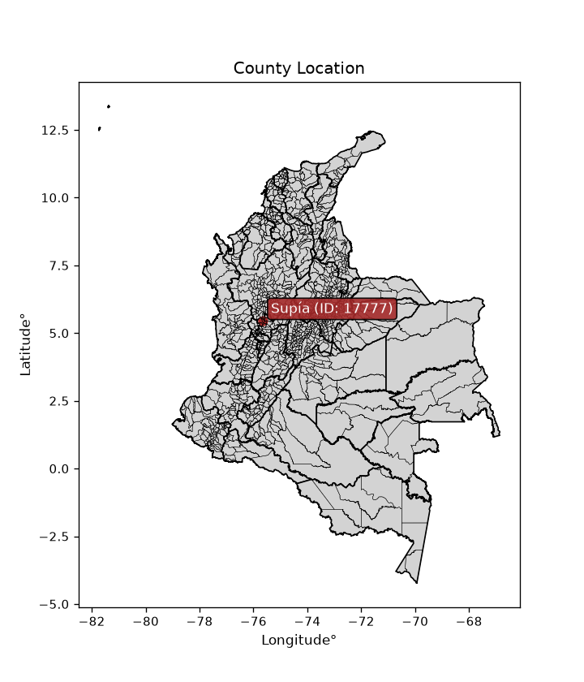
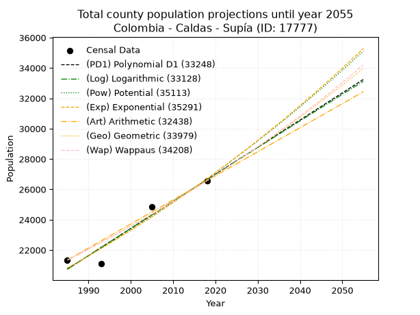
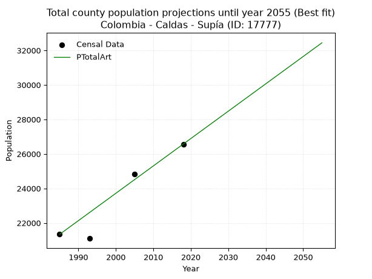
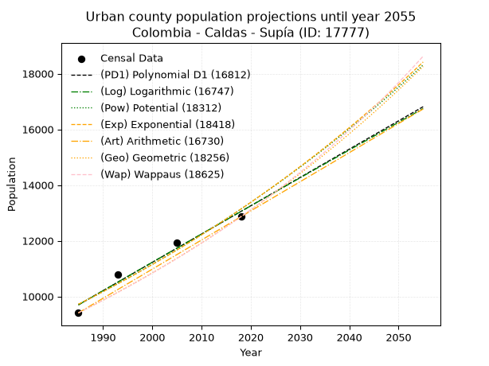
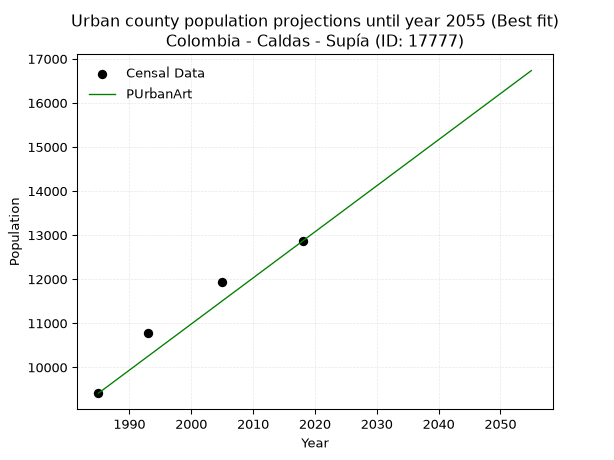
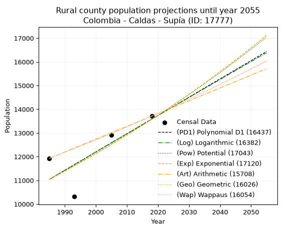
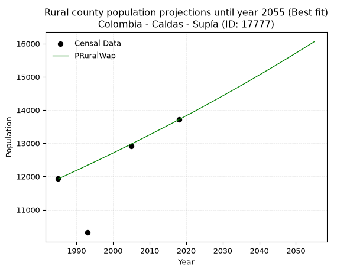

<div align="center">


</div>

# _“Population and Public Services Demand Projections (PPSD) until Year 2050 for Colombia - Caldas - Supía (ID: 17777)”_
Keywords: `population` `public-service` `projection` `lineal` `polynomial` `logarithmic` `potential` `exponential` `arithmetic` `geometric` `wappaus` `dane` `colombia` `south-america`

PPSD are analytical estimates used by governments and planners to anticipate future changes in population size, age distribution, and the resulting community needs for utilities, healthcare, education, and infrastructure as sizing future water treatment facilities, electrical grids, and road networks based on spatial growth.

> **General running parameters**: • app_version: _v20260806_. • Python version: _3.14.7_. • Pandas version: _3.0.5_. • NumPy version: _2.5.1_. • Creates, save and include plots into reports (create_plot): _False_. • Projection until year: _2050_. • Process polynomial degree 2 and up: _False_. • Process Wappaus: _True_. • Process Wappaus: _True_. • Set negative values to zero: _True_. • Set infinite values to zero: _True_. • Drop dataset notes: _True_. 
<div align="center">

Dynamic map: [:earth_americas:Google](http://maps.google.com/maps?q=5.446842981,-75.6496603) [:earth_americas:OSM](https://www.openstreetmap.org/#map=18/5.446842981/-75.6496603&layers=P) [:earth_americas:Bing](https://www.bing.com/maps?cp=5.446842981~-75.6496603&lvl=18) [:earth_americas:Apple](https://maps.apple.com/frame?center=5.446842981%2C-75.6496603&span=0.003%2C0.006)

</div>


<div align="center">

```geojson
{
  "type": "Feature",
  "geometry": {
    "type": "Point", 
    "coordinates": [-75.6496603, 5.446842981]
  }, 
  "properties": {
    "Name": "Colombia - Caldas - Supía (ID: 17777)"
  }
}
```

</div>


<div align="center">

</img>

</div>


## 0. Census Data (4 records)

Census data are official statistics collected by a government about the people and housing in a country. They usually include counts of total population, age, sex, race, income, education, and jobs.

📅Global census file: [Population.xlsx](../data/Population.xlsx)

| Source   |   Year |   CountryID | CountryName   |   StateID | StateName   |   CountyID | CountyName   |   PTotal |   PUrban |   PRural |
|:---------|-------:|------------:|:--------------|----------:|:------------|-----------:|:-------------|---------:|---------:|---------:|
| DANE     |   1985 |          57 | Colombia      |        17 | Caldas      |      17777 | Supía        |    21338 |     9410 |    11928 |
| DANE     |   1993 |          57 | Colombia      |        17 | Caldas      |      17777 | Supía        |    21098 |    10784 |    10314 |
| DANE     |   2005 |          57 | Colombia      |        17 | Caldas      |      17777 | Supía        |    24847 |    11935 |    12912 |
| DANE     |   2018 |          57 | Colombia      |        17 | Caldas      |      17777 | Supía        |    26571 |    12861 |    13710 |

> 🔥Some records could had specific notes about the registered values or the corresponding urban or rural distribution.

📅   [RUPS](https://www.datos.gov.co/Hacienda-y-Cr-dito-P-blico/Registro-nico-de-Prestadores-de-Servicios-P-blicos/4qkq-csdn/about_data) - Local public utility companies: [RUPS.csv](../data/RUPS.xlsx)

 | SERVICIO       | ESTADO    | NOMBRE                                                                     | NIT         | DEPARTAMENTO_DOMICILIO   | MUNICIPIO_DOMICILIO   | DIRECCION               |   TELEFONO | EMAIL                              | TIPO_PRESTADOR                             | CLASIFICACION                 |
|:---------------|:----------|:---------------------------------------------------------------------------|:------------|:-------------------------|:----------------------|:------------------------|-----------:|:-----------------------------------|:-------------------------------------------|:------------------------------|
| ACUEDUCTO      | OPERATIVA | EMPRESA DE OBRAS SANITARIAS DE CALDAS  S. A. EMPRESA DE SERVICIOS PUBLICOS | 890803239-9 | CALDAS                   | MANIZALES             | Carrera 23 Nro 75 - 82  |    8867080 | lorena.grisalest@empocaldas.com.co | SOCIEDADES (EMPRESA DE SERVICIOS PUBLICOS) | MAYOR O IGUAL A 5001 USUARIOS |
| ALCANTARILLADO | OPERATIVA | EMPRESA DE OBRAS SANITARIAS DE CALDAS  S. A. EMPRESA DE SERVICIOS PUBLICOS | 890803239-9 | CALDAS                   | MANIZALES             | Carrera 23 Nro 75 - 82  |    8867080 | lorena.grisalest@empocaldas.com.co | SOCIEDADES (EMPRESA DE SERVICIOS PUBLICOS) | MAYOR O IGUAL A 5001 USUARIOS |
| ACUEDUCTO      | OPERATIVA | ASOCIACION DE USUARIOS DE SERVICIOS COLECTIVOS DE TACON MUDARRA            | 800249714-2 | CALDAS                   | SUPIA                 | VEREDA CARACOLI         |    3136211 | ataconmudarra@gmail.com            | ORGANIZACION AUTORIZADA                    | MENOR O IGUAL A 2500 USUARIOS |
| ACUEDUCTO      | OPERATIVA | ASOCIACION DE USUARIOS DEL ACUEDUCTO MURILLO                               | 810004500-8 | CALDAS                   | SUPIA                 | VEREDA MURILLO LA TORRE |    3105980 | ocmafe@hotmail.com                 | ORGANIZACION AUTORIZADA                    | HASTA 2500 SUSCRIPTORES       |
| ACUEDUCTO      | OPERATIVA | JUNTA DE ACCION COMUNAL DE LA VEREDA LA QUINTA DEL MUNICIPIO DE SUPIA      | 900373907-1 | CALDAS                   | SUPIA                 | VEREDA LA QUINTA        |    8560215 | contacto@supia-caldas.gov.co       | ORGANIZACION AUTORIZADA                    | HASTA 2500 SUSCRIPTORES       |
| ACUEDUCTO      | OPERATIVA | ASOCIACIÓN DE USUARIOS DEL ACUEDUCTO DE LA VEREDA HOJAS ANCHAS             | 901384772-3 | CALDAS                   | SUPIA                 | VEREDA HOJAS ANCHAS     |    3104383 | acueductohojasanchas@gmail.com     | ORGANIZACION AUTORIZADA                    | MENOR O IGUAL A 2500 USUARIOS |

## 1. Total

### 1.1. Coefficients and Parameters

* (PD1) Polynomial Deg 1: 178.71296668004697, -334007.111601764 (lineal)
* (Log) Logarithmic: 357654.7726094555, -2695073.292669947
* (Pow) Potential: 15.099100756460997, -45.47500745551823
* (Exp) Exponential: 0.007544448607786801, 0.006522668209736244
* (Art) Arithmetic: Year diff. 2018 - 1985 = 33, Population diff. 26571 - 21338 = 5233, Annual growth = 158.57575757575756
* (Geo) Geometric: Year diff. 2018 - 1985 = 33, Population diff. 26571 - 21338 = 5233, Annual growth % = 0.006668526409100428
* (Wap) Wappaus: i = 0.6619873408994451, Condition values only valid for < 200)

<sub>
Wappaus condition values: ['0.00', '0.66', '1.32', '1.99', '2.65', '3.31', '3.97', '4.63', '5.30', '5.96', '6.62', '7.28', '7.94', '8.61', '9.27', '9.93', '10.59', '11.25', '11.92', '12.58', '13.24', '13.90', '14.56', '15.23', '15.89', '16.55', '17.21', '17.87', '18.54', '19.20', '19.86', '20.52', '21.18', '21.85', '22.51', '23.17', '23.83', '24.49', '25.16', '25.82', '26.48', '27.14', '27.80', '28.47', '29.13', '29.79', '30.45', '31.11', '31.78', '32.44', '33.10', '33.76', '34.42', '35.09', '35.75', '36.41', '37.07', '37.73', '38.40', '39.06', '39.72', '40.38', '41.04', '41.71', '42.37', '43.03']
</sub>


### 1.2. Projected Dataset

|   Year |   CountyID |   PTotalPD1 |   PTotalLog |   PTotalPow |   PTotalExp |   PTotalArt |   PTotalGeo |   PTotalWap |
|-------:|-----------:|------------:|------------:|------------:|------------:|------------:|------------:|------------:|
|   1985 |      17777 |       20738 |       20733 |       20807 |       20811 |       21338 |       21338 |       21338 |
|   1986 |      17777 |       20917 |       20913 |       20966 |       20969 |       21497 |       21480 |       21480 |
|   1987 |      17777 |       21096 |       21093 |       21126 |       21128 |       21655 |       21624 |       21622 |
|   1988 |      17777 |       21274 |       21273 |       21287 |       21288 |       21814 |       21768 |       21766 |
|   1989 |      17777 |       21453 |       21453 |       21449 |       21449 |       21972 |       21913 |       21911 |
|   1990 |      17777 |       21632 |       21633 |       21613 |       21612 |       22131 |       22059 |       22056 |
|   1991 |      17777 |       21810 |       21813 |       21777 |       21775 |       22289 |       22206 |       22203 |
|   1992 |      17777 |       21989 |       21992 |       21943 |       21940 |       22448 |       22354 |       22350 |
|   1993 |      17777 |       22168 |       22172 |       22110 |       22106 |       22607 |       22503 |       22499 |
|   1994 |      17777 |       22347 |       22351 |       22278 |       22274 |       22765 |       22653 |       22648 |
|   1995 |      17777 |       22525 |       22530 |       22447 |       22442 |       22924 |       22804 |       22799 |
|   1996 |      17777 |       22704 |       22710 |       22618 |       22612 |       23082 |       22956 |       22951 |
|   1997 |      17777 |       22883 |       22889 |       22789 |       22784 |       23241 |       23110 |       23103 |
|   1998 |      17777 |       23061 |       23068 |       22962 |       22956 |       23399 |       23264 |       23257 |
|   1999 |      17777 |       23240 |       23247 |       23136 |       23130 |       23558 |       23419 |       23412 |
|   2000 |      17777 |       23419 |       23426 |       23312 |       23305 |       23717 |       23575 |       23568 |
|   2001 |      17777 |       23598 |       23605 |       23488 |       23482 |       23875 |       23732 |       23724 |
|   2002 |      17777 |       23776 |       23783 |       23666 |       23659 |       24034 |       23890 |       23883 |
|   2003 |      17777 |       23955 |       23962 |       23845 |       23839 |       24192 |       24050 |       24042 |
|   2004 |      17777 |       24134 |       24140 |       24026 |       24019 |       24351 |       24210 |       24202 |
|   2005 |      17777 |       24312 |       24319 |       24208 |       24201 |       24510 |       24372 |       24363 |
|   2006 |      17777 |       24491 |       24497 |       24390 |       24384 |       24668 |       24534 |       24526 |
|   2007 |      17777 |       24670 |       24675 |       24575 |       24569 |       24827 |       24698 |       24690 |
|   2008 |      17777 |       24849 |       24854 |       24760 |       24755 |       24985 |       24862 |       24855 |
|   2009 |      17777 |       25027 |       25032 |       24947 |       24942 |       25144 |       25028 |       25021 |
|   2010 |      17777 |       25206 |       25210 |       25135 |       25131 |       25302 |       25195 |       25188 |
|   2011 |      17777 |       25385 |       25387 |       25325 |       25322 |       25461 |       25363 |       25356 |
|   2012 |      17777 |       25563 |       25565 |       25516 |       25513 |       25620 |       25532 |       25526 |
|   2013 |      17777 |       25742 |       25743 |       25708 |       25707 |       25778 |       25703 |       25697 |
|   2014 |      17777 |       25921 |       25921 |       25901 |       25901 |       25937 |       25874 |       25869 |
|   2015 |      17777 |       26100 |       26098 |       26096 |       26097 |       26095 |       26046 |       26043 |
|   2016 |      17777 |       26278 |       26276 |       26292 |       26295 |       26254 |       26220 |       26218 |
|   2017 |      17777 |       26457 |       26453 |       26490 |       26494 |       26412 |       26395 |       26394 |
|   2018 |      17777 |       26636 |       26630 |       26689 |       26695 |       26571 |       26571 |       26571 |
|   2019 |      17777 |       26814 |       26807 |       26889 |       26897 |       26730 |       26748 |       26750 |
|   2020 |      17777 |       26993 |       26985 |       27091 |       27101 |       26888 |       26927 |       26930 |
|   2021 |      17777 |       27172 |       27162 |       27294 |       27306 |       27047 |       27106 |       27111 |
|   2022 |      17777 |       27351 |       27338 |       27499 |       27513 |       27205 |       27287 |       27294 |
|   2023 |      17777 |       27529 |       27515 |       27705 |       27721 |       27364 |       27469 |       27478 |
|   2024 |      17777 |       27708 |       27692 |       27912 |       27931 |       27522 |       27652 |       27663 |
|   2025 |      17777 |       27887 |       27869 |       28121 |       28143 |       27681 |       27836 |       27850 |
|   2026 |      17777 |       28065 |       28045 |       28332 |       28356 |       27840 |       28022 |       28039 |
|   2027 |      17777 |       28244 |       28222 |       28544 |       28570 |       27998 |       28209 |       28229 |
|   2028 |      17777 |       28423 |       28398 |       28757 |       28787 |       28157 |       28397 |       28420 |
|   2029 |      17777 |       28601 |       28575 |       28972 |       29005 |       28315 |       28586 |       28613 |
|   2030 |      17777 |       28780 |       28751 |       29188 |       29224 |       28474 |       28777 |       28807 |
|   2031 |      17777 |       28959 |       28927 |       29406 |       29446 |       28632 |       28969 |       29003 |
|   2032 |      17777 |       29138 |       29103 |       29626 |       29669 |       28791 |       29162 |       29200 |
|   2033 |      17777 |       29316 |       29279 |       29846 |       29893 |       28950 |       29357 |       29399 |
|   2034 |      17777 |       29495 |       29455 |       30069 |       30120 |       29108 |       29552 |       29599 |
|   2035 |      17777 |       29674 |       29631 |       30293 |       30348 |       29267 |       29749 |       29801 |
|   2036 |      17777 |       29852 |       29806 |       30518 |       30578 |       29425 |       29948 |       30005 |
|   2037 |      17777 |       30031 |       29982 |       30745 |       30809 |       29584 |       30147 |       30210 |
|   2038 |      17777 |       30210 |       30157 |       30974 |       31043 |       29743 |       30349 |       30417 |
|   2039 |      17777 |       30389 |       30333 |       31204 |       31278 |       29901 |       30551 |       30626 |
|   2040 |      17777 |       30567 |       30508 |       31436 |       31515 |       30060 |       30755 |       30836 |
|   2041 |      17777 |       30746 |       30684 |       31670 |       31753 |       30218 |       30960 |       31048 |
|   2042 |      17777 |       30925 |       30859 |       31905 |       31994 |       30377 |       31166 |       31262 |
|   2043 |      17777 |       31103 |       31034 |       32142 |       32236 |       30535 |       31374 |       31477 |
|   2044 |      17777 |       31282 |       31209 |       32380 |       32480 |       30694 |       31583 |       31695 |
|   2045 |      17777 |       31461 |       31384 |       32620 |       32726 |       30853 |       31794 |       31914 |
|   2046 |      17777 |       31640 |       31559 |       32862 |       32974 |       31011 |       32006 |       32134 |
|   2047 |      17777 |       31818 |       31733 |       33105 |       33224 |       31170 |       32219 |       32357 |
|   2048 |      17777 |       31997 |       31908 |       33350 |       33475 |       31328 |       32434 |       32582 |
|   2049 |      17777 |       32176 |       32083 |       33597 |       33729 |       31487 |       32650 |       32808 |
|   2050 |      17777 |       32354 |       32257 |       33845 |       33984 |       31645 |       32868 |       33036 |
<div align="center">

</img>

</div>


### 1.3. Best fit with absolute and relative error (%)

Relative error puts that difference into context by dividing the absolute error by the true value, creating a unitless ratio or percentage that shows the scale of the mistake.

Absolute and relative error

|   Year | Source   |   CountryID | CountryName   |   StateID | StateName   |   CountyID_x | CountyName   |   PTotal |   PUrban |   PRural |   CountyID_y |   PTotalPD1 |   PTotalLog |   PTotalPow |   PTotalExp |   PTotalArt |   PTotalGeo |   PTotalWap |   PTotalPD1AbsError |   PTotalLogAbsError |   PTotalPowAbsError |   PTotalExpAbsError |   PTotalArtAbsError |   PTotalGeoAbsError |   PTotalWapAbsError |   PTotalPD1RelError |   PTotalLogRelError |   PTotalPowRelError |   PTotalExpRelError |   PTotalArtRelError |   PTotalGeoRelError |   PTotalWapRelError |
|-------:|:---------|------------:|:--------------|----------:|:------------|-------------:|:-------------|---------:|---------:|---------:|-------------:|------------:|------------:|------------:|------------:|------------:|------------:|------------:|--------------------:|--------------------:|--------------------:|--------------------:|--------------------:|--------------------:|--------------------:|--------------------:|--------------------:|--------------------:|--------------------:|--------------------:|--------------------:|--------------------:|
|   1985 | DANE     |          57 | Colombia      |        17 | Caldas      |        17777 | Supía        |    21338 |     9410 |    11928 |        17777 |       20738 |       20733 |       20807 |       20811 |       21338 |       21338 |       21338 |                 600 |                 605 |                 531 |                 527 |                   0 |                   0 |                   0 |            2.81188  |            2.83532  |            2.48852  |            2.46977  |             0       |              0      |             0       |
|   1993 | DANE     |          57 | Colombia      |        17 | Caldas      |        17777 | Supía        |    21098 |    10784 |    10314 |        17777 |       22168 |       22172 |       22110 |       22106 |       22607 |       22503 |       22499 |                1070 |                1074 |                1012 |                1008 |                1509 |                1405 |                1401 |            5.07157  |            5.09053  |            4.79666  |            4.7777   |             7.15234 |              6.6594 |             6.64044 |
|   2005 | DANE     |          57 | Colombia      |        17 | Caldas      |        17777 | Supía        |    24847 |    11935 |    12912 |        17777 |       24312 |       24319 |       24208 |       24201 |       24510 |       24372 |       24363 |                 535 |                 528 |                 639 |                 646 |                 337 |                 475 |                 484 |            2.15318  |            2.12501  |            2.57174  |            2.59991  |             1.3563  |              1.9117 |             1.94792 |
|   2018 | DANE     |          57 | Colombia      |        17 | Caldas      |        17777 | Supía        |    26571 |    12861 |    13710 |        17777 |       26636 |       26630 |       26689 |       26695 |       26571 |       26571 |       26571 |                  65 |                  59 |                 118 |                 124 |                   0 |                   0 |                   0 |            0.244628 |            0.222047 |            0.444093 |            0.466674 |             0       |              0      |             0       |

Relative error mean

| Method    |   RelError | Best   |
|:----------|-----------:|:-------|
| PTotalPD1 |    2.57032 |        |
| PTotalLog |    2.56822 |        |
| PTotalPow |    2.57525 |        |
| PTotalExp |    2.57852 |        |
| PTotalArt |    2.12716 | True   |
| PTotalGeo |    2.14277 |        |
| PTotalWap |    2.14709 |        |

💙Best method: _**PTotalArt**_
<div align="center">

</img>

</div>


### 1.4. Fresh water supply demand in liters per capita per day (lpcd)

The fresh water supply demand typically ranges from 100 to 300 liters per capita per day (lpcd) for standard domestic and municipal planning, though absolute survival minimums set by the World Health Organization are as low as 7.5 to 20 liters per day, and total consumption in high-income nations can exceed 400 liters.

> `CZ`: Level in meters above the sea level (masl)<br> `WS`: Fresh water supply demand in liters per capita per day (lpcd or l/h/d)<br> `WSAll`: Zonal fresh water supply demand in liters per second (l/s)<br> `A`: Zonal area in square meters<br> `DP`: Population density (people/hectare or p/ha)

Reference values (RAS Colombia)

|    CZ |   WS |
|------:|-----:|
|  1000 |  120 |
|  2000 |  130 |
| 99999 |  140 |

County shapefile geometry properties and water supply values

|   CountyID |     ATotal |   CZTotal |   WSTotal |
|-----------:|-----------:|----------:|----------:|
|      17777 | 1.2144e+08 |   1510.08 |       130 |

Projected values for best method: PTotalArt

|   CountyID |   Year |   PTotalArt |   DPTotal |   WSTotal |   WSTotalAll |
|-----------:|-------:|------------:|----------:|----------:|-------------:|
|      17777 |   1985 |       21338 |      1.76 |       130 |      32.1058 |
|      17777 |   1986 |       21497 |      1.77 |       130 |      32.345  |
|      17777 |   1987 |       21655 |      1.78 |       130 |      32.5828 |
|      17777 |   1988 |       21814 |      1.8  |       130 |      32.822  |
|      17777 |   1989 |       21972 |      1.81 |       130 |      33.0597 |
|      17777 |   1990 |       22131 |      1.82 |       130 |      33.299  |
|      17777 |   1991 |       22289 |      1.84 |       130 |      33.5367 |
|      17777 |   1992 |       22448 |      1.85 |       130 |      33.7759 |
|      17777 |   1993 |       22607 |      1.86 |       130 |      34.0152 |
|      17777 |   1994 |       22765 |      1.87 |       130 |      34.2529 |
|      17777 |   1995 |       22924 |      1.89 |       130 |      34.4921 |
|      17777 |   1996 |       23082 |      1.9  |       130 |      34.7299 |
|      17777 |   1997 |       23241 |      1.91 |       130 |      34.9691 |
|      17777 |   1998 |       23399 |      1.93 |       130 |      35.2068 |
|      17777 |   1999 |       23558 |      1.94 |       130 |      35.4461 |
|      17777 |   2000 |       23717 |      1.95 |       130 |      35.6853 |
|      17777 |   2001 |       23875 |      1.97 |       130 |      35.923  |
|      17777 |   2002 |       24034 |      1.98 |       130 |      36.1623 |
|      17777 |   2003 |       24192 |      1.99 |       130 |      36.4    |
|      17777 |   2004 |       24351 |      2.01 |       130 |      36.6392 |
|      17777 |   2005 |       24510 |      2.02 |       130 |      36.8785 |
|      17777 |   2006 |       24668 |      2.03 |       130 |      37.1162 |
|      17777 |   2007 |       24827 |      2.04 |       130 |      37.3554 |
|      17777 |   2008 |       24985 |      2.06 |       130 |      37.5932 |
|      17777 |   2009 |       25144 |      2.07 |       130 |      37.8324 |
|      17777 |   2010 |       25302 |      2.08 |       130 |      38.0701 |
|      17777 |   2011 |       25461 |      2.1  |       130 |      38.3094 |
|      17777 |   2012 |       25620 |      2.11 |       130 |      38.5486 |
|      17777 |   2013 |       25778 |      2.12 |       130 |      38.7863 |
|      17777 |   2014 |       25937 |      2.14 |       130 |      39.0256 |
|      17777 |   2015 |       26095 |      2.15 |       130 |      39.2633 |
|      17777 |   2016 |       26254 |      2.16 |       130 |      39.5025 |
|      17777 |   2017 |       26412 |      2.17 |       130 |      39.7403 |
|      17777 |   2018 |       26571 |      2.19 |       130 |      39.9795 |
|      17777 |   2019 |       26730 |      2.2  |       130 |      40.2188 |
|      17777 |   2020 |       26888 |      2.21 |       130 |      40.4565 |
|      17777 |   2021 |       27047 |      2.23 |       130 |      40.6957 |
|      17777 |   2022 |       27205 |      2.24 |       130 |      40.9334 |
|      17777 |   2023 |       27364 |      2.25 |       130 |      41.1727 |
|      17777 |   2024 |       27522 |      2.27 |       130 |      41.4104 |
|      17777 |   2025 |       27681 |      2.28 |       130 |      41.6497 |
|      17777 |   2026 |       27840 |      2.29 |       130 |      41.8889 |
|      17777 |   2027 |       27998 |      2.31 |       130 |      42.1266 |
|      17777 |   2028 |       28157 |      2.32 |       130 |      42.3659 |
|      17777 |   2029 |       28315 |      2.33 |       130 |      42.6036 |
|      17777 |   2030 |       28474 |      2.34 |       130 |      42.8428 |
|      17777 |   2031 |       28632 |      2.36 |       130 |      43.0806 |
|      17777 |   2032 |       28791 |      2.37 |       130 |      43.3198 |
|      17777 |   2033 |       28950 |      2.38 |       130 |      43.559  |
|      17777 |   2034 |       29108 |      2.4  |       130 |      43.7968 |
|      17777 |   2035 |       29267 |      2.41 |       130 |      44.036  |
|      17777 |   2036 |       29425 |      2.42 |       130 |      44.2737 |
|      17777 |   2037 |       29584 |      2.44 |       130 |      44.513  |
|      17777 |   2038 |       29743 |      2.45 |       130 |      44.7522 |
|      17777 |   2039 |       29901 |      2.46 |       130 |      44.9899 |
|      17777 |   2040 |       30060 |      2.48 |       130 |      45.2292 |
|      17777 |   2041 |       30218 |      2.49 |       130 |      45.4669 |
|      17777 |   2042 |       30377 |      2.5  |       130 |      45.7061 |
|      17777 |   2043 |       30535 |      2.51 |       130 |      45.9439 |
|      17777 |   2044 |       30694 |      2.53 |       130 |      46.1831 |
|      17777 |   2045 |       30853 |      2.54 |       130 |      46.4223 |
|      17777 |   2046 |       31011 |      2.55 |       130 |      46.6601 |
|      17777 |   2047 |       31170 |      2.57 |       130 |      46.8993 |
|      17777 |   2048 |       31328 |      2.58 |       130 |      47.137  |
|      17777 |   2049 |       31487 |      2.59 |       130 |      47.3763 |
|      17777 |   2050 |       31645 |      2.61 |       130 |      47.614  |

## 2. Urban

### 2.1. Coefficients and Parameters

* (PD1) Polynomial Deg 1: 101.62585307105512, -192029.612605378 (lineal)
* (Log) Logarithmic: 203503.14100063423, -1535581.5055176471
* (Pow) Potential: 18.287219024740146, -56.31938018545088
* (Exp) Exponential: 0.009131352674356533, 0.0001305368367693113
* (Art) Arithmetic: Year diff. 2018 - 1985 = 33, Population diff. 12861 - 9410 = 3451, Annual growth = 104.57575757575758
* (Geo) Geometric: Year diff. 2018 - 1985 = 33, Population diff. 12861 - 9410 = 3451, Annual growth % = 0.009512428650527482
* (Wap) Wappaus: i = 0.9391204487967094, Condition values only valid for < 200)

<sub>
Wappaus condition values: ['0.00', '0.94', '1.88', '2.82', '3.76', '4.70', '5.63', '6.57', '7.51', '8.45', '9.39', '10.33', '11.27', '12.21', '13.15', '14.09', '15.03', '15.97', '16.90', '17.84', '18.78', '19.72', '20.66', '21.60', '22.54', '23.48', '24.42', '25.36', '26.30', '27.23', '28.17', '29.11', '30.05', '30.99', '31.93', '32.87', '33.81', '34.75', '35.69', '36.63', '37.56', '38.50', '39.44', '40.38', '41.32', '42.26', '43.20', '44.14', '45.08', '46.02', '46.96', '47.90', '48.83', '49.77', '50.71', '51.65', '52.59', '53.53', '54.47', '55.41', '56.35', '57.29', '58.23', '59.16', '60.10', '61.04']
</sub>


### 2.2. Projected Dataset

|   Year |   CountyID |   PUrbanPD1 |   PUrbanLog |   PUrbanPow |   PUrbanExp |   PUrbanArt |   PUrbanGeo |   PUrbanWap |
|-------:|-----------:|------------:|------------:|------------:|------------:|------------:|------------:|------------:|
|   1985 |      17777 |        9698 |        9694 |        9716 |        9719 |        9410 |        9410 |        9410 |
|   1986 |      17777 |        9799 |        9796 |        9806 |        9809 |        9515 |        9500 |        9499 |
|   1987 |      17777 |        9901 |        9899 |        9897 |        9899 |        9619 |        9590 |        9588 |
|   1988 |      17777 |       10003 |       10001 |        9988 |        9989 |        9724 |        9681 |        9679 |
|   1989 |      17777 |       10104 |       10104 |       10080 |       10081 |        9828 |        9773 |        9770 |
|   1990 |      17777 |       10206 |       10206 |       10173 |       10173 |        9933 |        9866 |        9862 |
|   1991 |      17777 |       10307 |       10308 |       10267 |       10267 |       10037 |        9960 |        9956 |
|   1992 |      17777 |       10409 |       10410 |       10362 |       10361 |       10142 |       10055 |       10050 |
|   1993 |      17777 |       10511 |       10513 |       10458 |       10456 |       10247 |       10150 |       10145 |
|   1994 |      17777 |       10612 |       10615 |       10554 |       10552 |       10351 |       10247 |       10240 |
|   1995 |      17777 |       10714 |       10717 |       10651 |       10649 |       10456 |       10344 |       10337 |
|   1996 |      17777 |       10816 |       10819 |       10749 |       10746 |       10560 |       10443 |       10435 |
|   1997 |      17777 |       10917 |       10921 |       10848 |       10845 |       10665 |       10542 |       10534 |
|   1998 |      17777 |       11019 |       11022 |       10948 |       10944 |       10769 |       10642 |       10634 |
|   1999 |      17777 |       11120 |       11124 |       11049 |       11045 |       10874 |       10744 |       10734 |
|   2000 |      17777 |       11222 |       11226 |       11150 |       11146 |       10979 |       10846 |       10836 |
|   2001 |      17777 |       11324 |       11328 |       11252 |       11248 |       11083 |       10949 |       10939 |
|   2002 |      17777 |       11425 |       11429 |       11356 |       11352 |       11188 |       11053 |       11043 |
|   2003 |      17777 |       11527 |       11531 |       11460 |       11456 |       11292 |       11158 |       11148 |
|   2004 |      17777 |       11629 |       11633 |       11565 |       11561 |       11397 |       11264 |       11254 |
|   2005 |      17777 |       11730 |       11734 |       11671 |       11667 |       11502 |       11372 |       11361 |
|   2006 |      17777 |       11832 |       11836 |       11778 |       11774 |       11606 |       11480 |       11469 |
|   2007 |      17777 |       11933 |       11937 |       11886 |       11882 |       11711 |       11589 |       11578 |
|   2008 |      17777 |       12035 |       12038 |       11995 |       11991 |       11815 |       11699 |       11689 |
|   2009 |      17777 |       12137 |       12140 |       12104 |       12101 |       11920 |       11811 |       11800 |
|   2010 |      17777 |       12238 |       12241 |       12215 |       12212 |       12024 |       11923 |       11913 |
|   2011 |      17777 |       12340 |       12342 |       12327 |       12324 |       12129 |       12036 |       12027 |
|   2012 |      17777 |       12442 |       12443 |       12439 |       12437 |       12234 |       12151 |       12142 |
|   2013 |      17777 |       12543 |       12545 |       12553 |       12551 |       12338 |       12266 |       12259 |
|   2014 |      17777 |       12645 |       12646 |       12667 |       12666 |       12443 |       12383 |       12377 |
|   2015 |      17777 |       12746 |       12747 |       12783 |       12782 |       12547 |       12501 |       12496 |
|   2016 |      17777 |       12848 |       12848 |       12899 |       12900 |       12652 |       12620 |       12616 |
|   2017 |      17777 |       12950 |       12948 |       13017 |       13018 |       12756 |       12740 |       12738 |
|   2018 |      17777 |       13051 |       13049 |       13135 |       13137 |       12861 |       12861 |       12861 |
|   2019 |      17777 |       13153 |       13150 |       13255 |       13258 |       12966 |       12983 |       12985 |
|   2020 |      17777 |       13255 |       13251 |       13375 |       13379 |       13070 |       13107 |       13111 |
|   2021 |      17777 |       13356 |       13352 |       13497 |       13502 |       13175 |       13232 |       13239 |
|   2022 |      17777 |       13458 |       13452 |       13620 |       13626 |       13279 |       13357 |       13367 |
|   2023 |      17777 |       13559 |       13553 |       13743 |       13751 |       13384 |       13484 |       13497 |
|   2024 |      17777 |       13661 |       13654 |       13868 |       13877 |       13488 |       13613 |       13629 |
|   2025 |      17777 |       13763 |       13754 |       13994 |       14005 |       13593 |       13742 |       13762 |
|   2026 |      17777 |       13864 |       13855 |       14121 |       14133 |       13698 |       13873 |       13897 |
|   2027 |      17777 |       13966 |       13955 |       14249 |       14263 |       13802 |       14005 |       14033 |
|   2028 |      17777 |       14068 |       14055 |       14378 |       14393 |       13907 |       14138 |       14171 |
|   2029 |      17777 |       14169 |       14156 |       14508 |       14525 |       14011 |       14273 |       14311 |
|   2030 |      17777 |       14271 |       14256 |       14639 |       14659 |       14116 |       14408 |       14452 |
|   2031 |      17777 |       14372 |       14356 |       14772 |       14793 |       14220 |       14545 |       14595 |
|   2032 |      17777 |       14474 |       14456 |       14905 |       14929 |       14325 |       14684 |       14740 |
|   2033 |      17777 |       14576 |       14556 |       15040 |       15066 |       14430 |       14823 |       14886 |
|   2034 |      17777 |       14677 |       14656 |       15176 |       15204 |       14534 |       14964 |       15034 |
|   2035 |      17777 |       14779 |       14757 |       15313 |       15344 |       14639 |       15107 |       15184 |
|   2036 |      17777 |       14881 |       14856 |       15451 |       15484 |       14743 |       15251 |       15336 |
|   2037 |      17777 |       14982 |       14956 |       15591 |       15626 |       14848 |       15396 |       15490 |
|   2038 |      17777 |       15084 |       15056 |       15731 |       15770 |       14953 |       15542 |       15645 |
|   2039 |      17777 |       15186 |       15156 |       15873 |       15914 |       15057 |       15690 |       15803 |
|   2040 |      17777 |       15287 |       15256 |       16016 |       16060 |       15162 |       15839 |       15963 |
|   2041 |      17777 |       15389 |       15356 |       16160 |       16208 |       15266 |       15990 |       16124 |
|   2042 |      17777 |       15490 |       15455 |       16305 |       16356 |       15371 |       16142 |       16288 |
|   2043 |      17777 |       15592 |       15555 |       16452 |       16506 |       15475 |       16295 |       16454 |
|   2044 |      17777 |       15694 |       15655 |       16600 |       16658 |       15580 |       16450 |       16622 |
|   2045 |      17777 |       15795 |       15754 |       16749 |       16811 |       15685 |       16607 |       16792 |
|   2046 |      17777 |       15897 |       15854 |       16900 |       16965 |       15789 |       16765 |       16964 |
|   2047 |      17777 |       15999 |       15953 |       17051 |       17120 |       15894 |       16924 |       17139 |
|   2048 |      17777 |       16100 |       16052 |       17204 |       17277 |       15998 |       17085 |       17316 |
|   2049 |      17777 |       16202 |       16152 |       17359 |       17436 |       16103 |       17248 |       17496 |
|   2050 |      17777 |       16303 |       16251 |       17514 |       17596 |       16207 |       17412 |       17677 |
<div align="center">

</img>

</div>


### 2.3. Best fit with absolute and relative error (%)

Relative error puts that difference into context by dividing the absolute error by the true value, creating a unitless ratio or percentage that shows the scale of the mistake.

Absolute and relative error

|   Year | Source   |   CountryID | CountryName   |   StateID | StateName   |   CountyID_x | CountyName   |   PTotal |   PUrban |   PRural |   CountyID_y |   PUrbanPD1 |   PUrbanLog |   PUrbanPow |   PUrbanExp |   PUrbanArt |   PUrbanGeo |   PUrbanWap |   PUrbanPD1AbsError |   PUrbanLogAbsError |   PUrbanPowAbsError |   PUrbanExpAbsError |   PUrbanArtAbsError |   PUrbanGeoAbsError |   PUrbanWapAbsError |   PUrbanPD1RelError |   PUrbanLogRelError |   PUrbanPowRelError |   PUrbanExpRelError |   PUrbanArtRelError |   PUrbanGeoRelError |   PUrbanWapRelError |
|-------:|:---------|------------:|:--------------|----------:|:------------|-------------:|:-------------|---------:|---------:|---------:|-------------:|------------:|------------:|------------:|------------:|------------:|------------:|------------:|--------------------:|--------------------:|--------------------:|--------------------:|--------------------:|--------------------:|--------------------:|--------------------:|--------------------:|--------------------:|--------------------:|--------------------:|--------------------:|--------------------:|
|   1985 | DANE     |          57 | Colombia      |        17 | Caldas      |        17777 | Supía        |    21338 |     9410 |    11928 |        17777 |        9698 |        9694 |        9716 |        9719 |        9410 |        9410 |        9410 |                 288 |                 284 |                 306 |                 309 |                   0 |                   0 |                   0 |             3.06057 |             3.01807 |             3.25186 |             3.28374 |             0       |             0       |             0       |
|   1993 | DANE     |          57 | Colombia      |        17 | Caldas      |        17777 | Supía        |    21098 |    10784 |    10314 |        17777 |       10511 |       10513 |       10458 |       10456 |       10247 |       10150 |       10145 |                 273 |                 271 |                 326 |                 328 |                 537 |                 634 |                 639 |             2.53153 |             2.51298 |             3.023   |             3.04154 |             4.9796  |             5.87908 |             5.92545 |
|   2005 | DANE     |          57 | Colombia      |        17 | Caldas      |        17777 | Supía        |    24847 |    11935 |    12912 |        17777 |       11730 |       11734 |       11671 |       11667 |       11502 |       11372 |       11361 |                 205 |                 201 |                 264 |                 268 |                 433 |                 563 |                 574 |             1.71764 |             1.68412 |             2.21198 |             2.2455  |             3.62798 |             4.71722 |             4.80938 |
|   2018 | DANE     |          57 | Colombia      |        17 | Caldas      |        17777 | Supía        |    26571 |    12861 |    13710 |        17777 |       13051 |       13049 |       13135 |       13137 |       12861 |       12861 |       12861 |                 190 |                 188 |                 274 |                 276 |                   0 |                   0 |                   0 |             1.47733 |             1.46178 |             2.13047 |             2.14602 |             0       |             0       |             0       |

Relative error mean

| Method    |   RelError | Best   |
|:----------|-----------:|:-------|
| PUrbanPD1 |    2.19677 |        |
| PUrbanLog |    2.16924 |        |
| PUrbanPow |    2.65433 |        |
| PUrbanExp |    2.6792  |        |
| PUrbanArt |    2.1519  | True   |
| PUrbanGeo |    2.64907 |        |
| PUrbanWap |    2.68371 |        |

💙Best method: _**PUrbanArt**_
<div align="center">

</img>

</div>


### 2.4. Fresh water supply demand in liters per capita per day (lpcd)

The fresh water supply demand typically ranges from 100 to 300 liters per capita per day (lpcd) for standard domestic and municipal planning, though absolute survival minimums set by the World Health Organization are as low as 7.5 to 20 liters per day, and total consumption in high-income nations can exceed 400 liters.

> `CZ`: Level in meters above the sea level (masl)<br> `WS`: Fresh water supply demand in liters per capita per day (lpcd or l/h/d)<br> `WSAll`: Zonal fresh water supply demand in liters per second (l/s)<br> `A`: Zonal area in square meters<br> `DP`: Population density (people/hectare or p/ha)

Reference values (RAS Colombia)

|    CZ |   WS |
|------:|-----:|
|  1000 |  120 |
|  2000 |  130 |
| 99999 |  140 |

County shapefile geometry properties and water supply values

|   CountyID |      AUrban |   CZUrban |   WSUrban |
|-----------:|------------:|----------:|----------:|
|      17777 | 2.03981e+06 |   1160.78 |       130 |

Projected values for best method: PUrbanArt

|   CountyID |   Year |   PUrbanArt |   DPUrban |   WSUrban |   WSUrbanAll |
|-----------:|-------:|------------:|----------:|----------:|-------------:|
|      17777 |   1985 |        9410 |     46.13 |       130 |      14.1586 |
|      17777 |   1986 |        9515 |     46.65 |       130 |      14.3166 |
|      17777 |   1987 |        9619 |     47.16 |       130 |      14.473  |
|      17777 |   1988 |        9724 |     47.67 |       130 |      14.631  |
|      17777 |   1989 |        9828 |     48.18 |       130 |      14.7875 |
|      17777 |   1990 |        9933 |     48.7  |       130 |      14.9455 |
|      17777 |   1991 |       10037 |     49.21 |       130 |      15.102  |
|      17777 |   1992 |       10142 |     49.72 |       130 |      15.26   |
|      17777 |   1993 |       10247 |     50.24 |       130 |      15.4179 |
|      17777 |   1994 |       10351 |     50.74 |       130 |      15.5744 |
|      17777 |   1995 |       10456 |     51.26 |       130 |      15.7324 |
|      17777 |   1996 |       10560 |     51.77 |       130 |      15.8889 |
|      17777 |   1997 |       10665 |     52.28 |       130 |      16.0469 |
|      17777 |   1998 |       10769 |     52.79 |       130 |      16.2034 |
|      17777 |   1999 |       10874 |     53.31 |       130 |      16.3613 |
|      17777 |   2000 |       10979 |     53.82 |       130 |      16.5193 |
|      17777 |   2001 |       11083 |     54.33 |       130 |      16.6758 |
|      17777 |   2002 |       11188 |     54.85 |       130 |      16.8338 |
|      17777 |   2003 |       11292 |     55.36 |       130 |      16.9903 |
|      17777 |   2004 |       11397 |     55.87 |       130 |      17.1483 |
|      17777 |   2005 |       11502 |     56.39 |       130 |      17.3062 |
|      17777 |   2006 |       11606 |     56.9  |       130 |      17.4627 |
|      17777 |   2007 |       11711 |     57.41 |       130 |      17.6207 |
|      17777 |   2008 |       11815 |     57.92 |       130 |      17.7772 |
|      17777 |   2009 |       11920 |     58.44 |       130 |      17.9352 |
|      17777 |   2010 |       12024 |     58.95 |       130 |      18.0917 |
|      17777 |   2011 |       12129 |     59.46 |       130 |      18.2497 |
|      17777 |   2012 |       12234 |     59.98 |       130 |      18.4076 |
|      17777 |   2013 |       12338 |     60.49 |       130 |      18.5641 |
|      17777 |   2014 |       12443 |     61    |       130 |      18.7221 |
|      17777 |   2015 |       12547 |     61.51 |       130 |      18.8786 |
|      17777 |   2016 |       12652 |     62.03 |       130 |      19.0366 |
|      17777 |   2017 |       12756 |     62.54 |       130 |      19.1931 |
|      17777 |   2018 |       12861 |     63.05 |       130 |      19.351  |
|      17777 |   2019 |       12966 |     63.56 |       130 |      19.509  |
|      17777 |   2020 |       13070 |     64.07 |       130 |      19.6655 |
|      17777 |   2021 |       13175 |     64.59 |       130 |      19.8235 |
|      17777 |   2022 |       13279 |     65.1  |       130 |      19.98   |
|      17777 |   2023 |       13384 |     65.61 |       130 |      20.138  |
|      17777 |   2024 |       13488 |     66.12 |       130 |      20.2944 |
|      17777 |   2025 |       13593 |     66.64 |       130 |      20.4524 |
|      17777 |   2026 |       13698 |     67.15 |       130 |      20.6104 |
|      17777 |   2027 |       13802 |     67.66 |       130 |      20.7669 |
|      17777 |   2028 |       13907 |     68.18 |       130 |      20.9249 |
|      17777 |   2029 |       14011 |     68.69 |       130 |      21.0814 |
|      17777 |   2030 |       14116 |     69.2  |       130 |      21.2394 |
|      17777 |   2031 |       14220 |     69.71 |       130 |      21.3958 |
|      17777 |   2032 |       14325 |     70.23 |       130 |      21.5538 |
|      17777 |   2033 |       14430 |     70.74 |       130 |      21.7118 |
|      17777 |   2034 |       14534 |     71.25 |       130 |      21.8683 |
|      17777 |   2035 |       14639 |     71.77 |       130 |      22.0263 |
|      17777 |   2036 |       14743 |     72.28 |       130 |      22.1828 |
|      17777 |   2037 |       14848 |     72.79 |       130 |      22.3407 |
|      17777 |   2038 |       14953 |     73.31 |       130 |      22.4987 |
|      17777 |   2039 |       15057 |     73.82 |       130 |      22.6552 |
|      17777 |   2040 |       15162 |     74.33 |       130 |      22.8132 |
|      17777 |   2041 |       15266 |     74.84 |       130 |      22.9697 |
|      17777 |   2042 |       15371 |     75.36 |       130 |      23.1277 |
|      17777 |   2043 |       15475 |     75.87 |       130 |      23.2841 |
|      17777 |   2044 |       15580 |     76.38 |       130 |      23.4421 |
|      17777 |   2045 |       15685 |     76.89 |       130 |      23.6001 |
|      17777 |   2046 |       15789 |     77.4  |       130 |      23.7566 |
|      17777 |   2047 |       15894 |     77.92 |       130 |      23.9146 |
|      17777 |   2048 |       15998 |     78.43 |       130 |      24.0711 |
|      17777 |   2049 |       16103 |     78.94 |       130 |      24.2291 |
|      17777 |   2050 |       16207 |     79.45 |       130 |      24.3855 |

## 3. Rural

### 3.1. Coefficients and Parameters

* (PD1) Polynomial Deg 1: 77.08711360899174, -141977.49899638572 (lineal)
* (Log) Logarithmic: 154151.63160882128, -1159491.7871523004
* (Pow) Potential: 12.529240405494011, -37.27546632817662
* (Exp) Exponential: 0.006265808215315542, 0.04379396488292225
* (Art) Arithmetic: Year diff. 2018 - 1985 = 33, Population diff. 13710 - 11928 = 1782, Annual growth = 54.0
* (Geo) Geometric: Year diff. 2018 - 1985 = 33, Population diff. 13710 - 11928 = 1782, Annual growth % = 0.004228214268771291
* (Wap) Wappaus: i = 0.4212497074654809, Condition values only valid for < 200)

<sub>
Wappaus condition values: ['0.00', '0.42', '0.84', '1.26', '1.68', '2.11', '2.53', '2.95', '3.37', '3.79', '4.21', '4.63', '5.05', '5.48', '5.90', '6.32', '6.74', '7.16', '7.58', '8.00', '8.42', '8.85', '9.27', '9.69', '10.11', '10.53', '10.95', '11.37', '11.79', '12.22', '12.64', '13.06', '13.48', '13.90', '14.32', '14.74', '15.16', '15.59', '16.01', '16.43', '16.85', '17.27', '17.69', '18.11', '18.53', '18.96', '19.38', '19.80', '20.22', '20.64', '21.06', '21.48', '21.90', '22.33', '22.75', '23.17', '23.59', '24.01', '24.43', '24.85', '25.27', '25.70', '26.12', '26.54', '26.96', '27.38']
</sub>


### 3.2. Projected Dataset

|   Year |   CountyID |   PRuralPD1 |   PRuralLog |   PRuralPow |   PRuralExp |   PRuralArt |   PRuralGeo |   PRuralWap |
|-------:|-----------:|------------:|------------:|------------:|------------:|------------:|------------:|------------:|
|   1985 |      17777 |       11040 |       11039 |       11040 |       11041 |       11928 |       11928 |       11928 |
|   1986 |      17777 |       11118 |       11117 |       11110 |       11110 |       11982 |       11978 |       11978 |
|   1987 |      17777 |       11195 |       11194 |       11180 |       11180 |       12036 |       12029 |       12029 |
|   1988 |      17777 |       11272 |       11272 |       11251 |       11250 |       12090 |       12080 |       12080 |
|   1989 |      17777 |       11349 |       11350 |       11322 |       11321 |       12144 |       12131 |       12131 |
|   1990 |      17777 |       11426 |       11427 |       11393 |       11392 |       12198 |       12182 |       12182 |
|   1991 |      17777 |       11503 |       11504 |       11465 |       11464 |       12252 |       12234 |       12233 |
|   1992 |      17777 |       11580 |       11582 |       11538 |       11536 |       12306 |       12286 |       12285 |
|   1993 |      17777 |       11657 |       11659 |       11611 |       11609 |       12360 |       12337 |       12337 |
|   1994 |      17777 |       11734 |       11737 |       11684 |       11682 |       12414 |       12390 |       12389 |
|   1995 |      17777 |       11811 |       11814 |       11757 |       11755 |       12468 |       12442 |       12441 |
|   1996 |      17777 |       11888 |       11891 |       11831 |       11829 |       12522 |       12495 |       12494 |
|   1997 |      17777 |       11965 |       11968 |       11906 |       11903 |       12576 |       12547 |       12547 |
|   1998 |      17777 |       12043 |       12045 |       11981 |       11978 |       12630 |       12601 |       12600 |
|   1999 |      17777 |       12120 |       12123 |       12056 |       12053 |       12684 |       12654 |       12653 |
|   2000 |      17777 |       12197 |       12200 |       12132 |       12129 |       12738 |       12707 |       12706 |
|   2001 |      17777 |       12274 |       12277 |       12208 |       12205 |       12792 |       12761 |       12760 |
|   2002 |      17777 |       12351 |       12354 |       12285 |       12282 |       12846 |       12815 |       12814 |
|   2003 |      17777 |       12428 |       12431 |       12362 |       12359 |       12900 |       12869 |       12868 |
|   2004 |      17777 |       12505 |       12508 |       12440 |       12437 |       12954 |       12924 |       12922 |
|   2005 |      17777 |       12582 |       12585 |       12518 |       12515 |       13008 |       12978 |       12977 |
|   2006 |      17777 |       12659 |       12661 |       12596 |       12594 |       13062 |       13033 |       13032 |
|   2007 |      17777 |       12736 |       12738 |       12675 |       12673 |       13116 |       13088 |       13087 |
|   2008 |      17777 |       12813 |       12815 |       12754 |       12753 |       13170 |       13144 |       13143 |
|   2009 |      17777 |       12891 |       12892 |       12834 |       12833 |       13224 |       13199 |       13198 |
|   2010 |      17777 |       12968 |       12969 |       12914 |       12913 |       13278 |       13255 |       13254 |
|   2011 |      17777 |       13045 |       13045 |       12995 |       12994 |       13332 |       13311 |       13310 |
|   2012 |      17777 |       13122 |       13122 |       13076 |       13076 |       13386 |       13367 |       13366 |
|   2013 |      17777 |       13199 |       13198 |       13158 |       13158 |       13440 |       13424 |       13423 |
|   2014 |      17777 |       13276 |       13275 |       13240 |       13241 |       13494 |       13481 |       13480 |
|   2015 |      17777 |       13353 |       13352 |       13323 |       13324 |       13548 |       13538 |       13537 |
|   2016 |      17777 |       13430 |       13428 |       13406 |       13408 |       13602 |       13595 |       13594 |
|   2017 |      17777 |       13507 |       13504 |       13489 |       13492 |       13656 |       13652 |       13652 |
|   2018 |      17777 |       13584 |       13581 |       13573 |       13577 |       13710 |       13710 |       13710 |
|   2019 |      17777 |       13661 |       13657 |       13658 |       13662 |       13764 |       13768 |       13768 |
|   2020 |      17777 |       13738 |       13734 |       13743 |       13748 |       13818 |       13826 |       13827 |
|   2021 |      17777 |       13816 |       13810 |       13828 |       13835 |       13872 |       13885 |       13885 |
|   2022 |      17777 |       13893 |       13886 |       13914 |       13922 |       13926 |       13943 |       13944 |
|   2023 |      17777 |       13970 |       13962 |       14001 |       14009 |       13980 |       14002 |       14003 |
|   2024 |      17777 |       14047 |       14039 |       14088 |       14097 |       14034 |       14062 |       14063 |
|   2025 |      17777 |       14124 |       14115 |       14175 |       14186 |       14088 |       14121 |       14123 |
|   2026 |      17777 |       14201 |       14191 |       14263 |       14275 |       14142 |       14181 |       14183 |
|   2027 |      17777 |       14278 |       14267 |       14352 |       14365 |       14196 |       14241 |       14243 |
|   2028 |      17777 |       14355 |       14343 |       14441 |       14455 |       14250 |       14301 |       14304 |
|   2029 |      17777 |       14432 |       14419 |       14530 |       14546 |       14304 |       14361 |       14365 |
|   2030 |      17777 |       14509 |       14495 |       14620 |       14637 |       14358 |       14422 |       14426 |
|   2031 |      17777 |       14586 |       14571 |       14710 |       14729 |       14412 |       14483 |       14487 |
|   2032 |      17777 |       14664 |       14647 |       14801 |       14822 |       14466 |       14544 |       14549 |
|   2033 |      17777 |       14741 |       14722 |       14893 |       14915 |       14520 |       14606 |       14611 |
|   2034 |      17777 |       14818 |       14798 |       14985 |       15009 |       14574 |       14668 |       14673 |
|   2035 |      17777 |       14895 |       14874 |       15078 |       15103 |       14628 |       14730 |       14736 |
|   2036 |      17777 |       14972 |       14950 |       15171 |       15198 |       14682 |       14792 |       14799 |
|   2037 |      17777 |       15049 |       15025 |       15264 |       15294 |       14736 |       14854 |       14862 |
|   2038 |      17777 |       15126 |       15101 |       15358 |       15390 |       14790 |       14917 |       14926 |
|   2039 |      17777 |       15203 |       15177 |       15453 |       15486 |       14844 |       14980 |       14990 |
|   2040 |      17777 |       15280 |       15252 |       15548 |       15584 |       14898 |       15044 |       15054 |
|   2041 |      17777 |       15357 |       15328 |       15644 |       15682 |       14952 |       15107 |       15118 |
|   2042 |      17777 |       15434 |       15403 |       15740 |       15780 |       15006 |       15171 |       15183 |
|   2043 |      17777 |       15511 |       15479 |       15837 |       15880 |       15060 |       15235 |       15248 |
|   2044 |      17777 |       15589 |       15554 |       15935 |       15979 |       15114 |       15300 |       15313 |
|   2045 |      17777 |       15666 |       15630 |       16033 |       16080 |       15168 |       15364 |       15379 |
|   2046 |      17777 |       15743 |       15705 |       16131 |       16181 |       15222 |       15429 |       15445 |
|   2047 |      17777 |       15820 |       15780 |       16230 |       16283 |       15276 |       15495 |       15511 |
|   2048 |      17777 |       15897 |       15856 |       16330 |       16385 |       15330 |       15560 |       15578 |
|   2049 |      17777 |       15974 |       15931 |       16430 |       16488 |       15384 |       15626 |       15645 |
|   2050 |      17777 |       16051 |       16006 |       16531 |       16592 |       15438 |       15692 |       15712 |
<div align="center">

</img>

</div>


### 3.3. Best fit with absolute and relative error (%)

Relative error puts that difference into context by dividing the absolute error by the true value, creating a unitless ratio or percentage that shows the scale of the mistake.

Absolute and relative error

|   Year | Source   |   CountryID | CountryName   |   StateID | StateName   |   CountyID_x | CountyName   |   PTotal |   PUrban |   PRural |   CountyID_y |   PRuralPD1 |   PRuralLog |   PRuralPow |   PRuralExp |   PRuralArt |   PRuralGeo |   PRuralWap |   PRuralPD1AbsError |   PRuralLogAbsError |   PRuralPowAbsError |   PRuralExpAbsError |   PRuralArtAbsError |   PRuralGeoAbsError |   PRuralWapAbsError |   PRuralPD1RelError |   PRuralLogRelError |   PRuralPowRelError |   PRuralExpRelError |   PRuralArtRelError |   PRuralGeoRelError |   PRuralWapRelError |
|-------:|:---------|------------:|:--------------|----------:|:------------|-------------:|:-------------|---------:|---------:|---------:|-------------:|------------:|------------:|------------:|------------:|------------:|------------:|------------:|--------------------:|--------------------:|--------------------:|--------------------:|--------------------:|--------------------:|--------------------:|--------------------:|--------------------:|--------------------:|--------------------:|--------------------:|--------------------:|--------------------:|
|   1985 | DANE     |          57 | Colombia      |        17 | Caldas      |        17777 | Supía        |    21338 |     9410 |    11928 |        17777 |       11040 |       11039 |       11040 |       11041 |       11928 |       11928 |       11928 |                 888 |                 889 |                 888 |                 887 |                   0 |                   0 |                   0 |            7.44467  |            7.45305  |            7.44467  |            7.43628  |            0        |            0        |            0        |
|   1993 | DANE     |          57 | Colombia      |        17 | Caldas      |        17777 | Supía        |    21098 |    10784 |    10314 |        17777 |       11657 |       11659 |       11611 |       11609 |       12360 |       12337 |       12337 |                1343 |                1345 |                1297 |                1295 |                2046 |                2023 |                2023 |           13.0211   |           13.0405   |           12.5751   |           12.5557   |           19.8371   |           19.6141   |           19.6141   |
|   2005 | DANE     |          57 | Colombia      |        17 | Caldas      |        17777 | Supía        |    24847 |    11935 |    12912 |        17777 |       12582 |       12585 |       12518 |       12515 |       13008 |       12978 |       12977 |                 330 |                 327 |                 394 |                 397 |                  96 |                  66 |                  65 |            2.55576  |            2.53253  |            3.05143  |            3.07466  |            0.743494 |            0.511152 |            0.503408 |
|   2018 | DANE     |          57 | Colombia      |        17 | Caldas      |        17777 | Supía        |    26571 |    12861 |    13710 |        17777 |       13584 |       13581 |       13573 |       13577 |       13710 |       13710 |       13710 |                 126 |                 129 |                 137 |                 133 |                   0 |                   0 |                   0 |            0.919037 |            0.940919 |            0.999271 |            0.970095 |            0        |            0        |            0        |

Relative error mean

| Method    |   RelError | Best   |
|:----------|-----------:|:-------|
| PRuralPD1 |    5.98515 |        |
| PRuralLog |    5.99176 |        |
| PRuralPow |    6.01763 |        |
| PRuralExp |    6.0092  |        |
| PRuralArt |    5.14515 |        |
| PRuralGeo |    5.03132 |        |
| PRuralWap |    5.02938 | True   |

💙Best method: _**PRuralWap**_
<div align="center">

</img>

</div>


### 3.4. Fresh water supply demand in liters per capita per day (lpcd)

The fresh water supply demand typically ranges from 100 to 300 liters per capita per day (lpcd) for standard domestic and municipal planning, though absolute survival minimums set by the World Health Organization are as low as 7.5 to 20 liters per day, and total consumption in high-income nations can exceed 400 liters.

> `CZ`: Level in meters above the sea level (masl)<br> `WS`: Fresh water supply demand in liters per capita per day (lpcd or l/h/d)<br> `WSAll`: Zonal fresh water supply demand in liters per second (l/s)<br> `A`: Zonal area in square meters<br> `DP`: Population density (people/hectare or p/ha)

Reference values (RAS Colombia)

|    CZ |   WS |
|------:|-----:|
|  1000 |  120 |
|  2000 |  130 |
| 99999 |  140 |

County shapefile geometry properties and water supply values

|   CountyID |    ARural |   CZRural |   WSRural |
|-----------:|----------:|----------:|----------:|
|      17777 | 1.194e+08 |   1515.96 |       130 |

Projected values for best method: PRuralWap

|   CountyID |   Year |   PRuralWap |   DPRural |   WSRural |   WSRuralAll |
|-----------:|-------:|------------:|----------:|----------:|-------------:|
|      17777 |   1985 |       11928 |      1    |       130 |      17.9472 |
|      17777 |   1986 |       11978 |      1    |       130 |      18.0225 |
|      17777 |   1987 |       12029 |      1.01 |       130 |      18.0992 |
|      17777 |   1988 |       12080 |      1.01 |       130 |      18.1759 |
|      17777 |   1989 |       12131 |      1.02 |       130 |      18.2527 |
|      17777 |   1990 |       12182 |      1.02 |       130 |      18.3294 |
|      17777 |   1991 |       12233 |      1.02 |       130 |      18.4061 |
|      17777 |   1992 |       12285 |      1.03 |       130 |      18.4844 |
|      17777 |   1993 |       12337 |      1.03 |       130 |      18.5626 |
|      17777 |   1994 |       12389 |      1.04 |       130 |      18.6409 |
|      17777 |   1995 |       12441 |      1.04 |       130 |      18.7191 |
|      17777 |   1996 |       12494 |      1.05 |       130 |      18.7988 |
|      17777 |   1997 |       12547 |      1.05 |       130 |      18.8786 |
|      17777 |   1998 |       12600 |      1.06 |       130 |      18.9583 |
|      17777 |   1999 |       12653 |      1.06 |       130 |      19.0381 |
|      17777 |   2000 |       12706 |      1.06 |       130 |      19.1178 |
|      17777 |   2001 |       12760 |      1.07 |       130 |      19.1991 |
|      17777 |   2002 |       12814 |      1.07 |       130 |      19.2803 |
|      17777 |   2003 |       12868 |      1.08 |       130 |      19.3616 |
|      17777 |   2004 |       12922 |      1.08 |       130 |      19.4428 |
|      17777 |   2005 |       12977 |      1.09 |       130 |      19.5256 |
|      17777 |   2006 |       13032 |      1.09 |       130 |      19.6083 |
|      17777 |   2007 |       13087 |      1.1  |       130 |      19.6911 |
|      17777 |   2008 |       13143 |      1.1  |       130 |      19.7753 |
|      17777 |   2009 |       13198 |      1.11 |       130 |      19.8581 |
|      17777 |   2010 |       13254 |      1.11 |       130 |      19.9424 |
|      17777 |   2011 |       13310 |      1.11 |       130 |      20.0266 |
|      17777 |   2012 |       13366 |      1.12 |       130 |      20.1109 |
|      17777 |   2013 |       13423 |      1.12 |       130 |      20.1966 |
|      17777 |   2014 |       13480 |      1.13 |       130 |      20.2824 |
|      17777 |   2015 |       13537 |      1.13 |       130 |      20.3682 |
|      17777 |   2016 |       13594 |      1.14 |       130 |      20.4539 |
|      17777 |   2017 |       13652 |      1.14 |       130 |      20.5412 |
|      17777 |   2018 |       13710 |      1.15 |       130 |      20.6285 |
|      17777 |   2019 |       13768 |      1.15 |       130 |      20.7157 |
|      17777 |   2020 |       13827 |      1.16 |       130 |      20.8045 |
|      17777 |   2021 |       13885 |      1.16 |       130 |      20.8918 |
|      17777 |   2022 |       13944 |      1.17 |       130 |      20.9806 |
|      17777 |   2023 |       14003 |      1.17 |       130 |      21.0693 |
|      17777 |   2024 |       14063 |      1.18 |       130 |      21.1596 |
|      17777 |   2025 |       14123 |      1.18 |       130 |      21.2499 |
|      17777 |   2026 |       14183 |      1.19 |       130 |      21.3402 |
|      17777 |   2027 |       14243 |      1.19 |       130 |      21.4304 |
|      17777 |   2028 |       14304 |      1.2  |       130 |      21.5222 |
|      17777 |   2029 |       14365 |      1.2  |       130 |      21.614  |
|      17777 |   2030 |       14426 |      1.21 |       130 |      21.7058 |
|      17777 |   2031 |       14487 |      1.21 |       130 |      21.7976 |
|      17777 |   2032 |       14549 |      1.22 |       130 |      21.8909 |
|      17777 |   2033 |       14611 |      1.22 |       130 |      21.9841 |
|      17777 |   2034 |       14673 |      1.23 |       130 |      22.0774 |
|      17777 |   2035 |       14736 |      1.23 |       130 |      22.1722 |
|      17777 |   2036 |       14799 |      1.24 |       130 |      22.267  |
|      17777 |   2037 |       14862 |      1.24 |       130 |      22.3618 |
|      17777 |   2038 |       14926 |      1.25 |       130 |      22.4581 |
|      17777 |   2039 |       14990 |      1.26 |       130 |      22.5544 |
|      17777 |   2040 |       15054 |      1.26 |       130 |      22.6507 |
|      17777 |   2041 |       15118 |      1.27 |       130 |      22.747  |
|      17777 |   2042 |       15183 |      1.27 |       130 |      22.8448 |
|      17777 |   2043 |       15248 |      1.28 |       130 |      22.9426 |
|      17777 |   2044 |       15313 |      1.28 |       130 |      23.0404 |
|      17777 |   2045 |       15379 |      1.29 |       130 |      23.1397 |
|      17777 |   2046 |       15445 |      1.29 |       130 |      23.239  |
|      17777 |   2047 |       15511 |      1.3  |       130 |      23.3383 |
|      17777 |   2048 |       15578 |      1.3  |       130 |      23.4391 |
|      17777 |   2049 |       15645 |      1.31 |       130 |      23.5399 |
|      17777 |   2050 |       15712 |      1.32 |       130 |      23.6407 |

<div align="center"><br><sub>Share this research</sub></div><br>

<sub>**APPS & TOOLS & CONTENT DISCLAIMER**: • NO WARRANTY - This content and software is provided by <a href="https://github.com/rcfdtools" target="_blank">github.com/rcfdtools</a> "as is", without any express or implied warranty, including warranties of merchantability, fitness for a particular purpose, or non-infringement. There is no guarantee that the software will be error-free or operate without interruption. • LIMITATION OF LIABILITY - Neither the authors nor copyright holders will be liable for claims or damages arising from the software or its use. You are responsible for determining if the software is appropriate for your use and assume all associated risks, including errors, legal compliance, and data loss. • NO PROFESSIONAL ADVICE - The software provides general information and does not offer professional advice. It should not replace consultation with professional advisors. [Clauses and global license for rcfdtools use.](https://github.com/rcfdtools/rcfdtools/blob/main/LICENSE.md)</sub>

| [:house: Home](Readme.md)  | [:beginner: Help / Collab](https://github.com/rcfdtools/R.HydroTools/discussions/31) |
|----------------------------|-------------------------------------------------------------------------------------------|