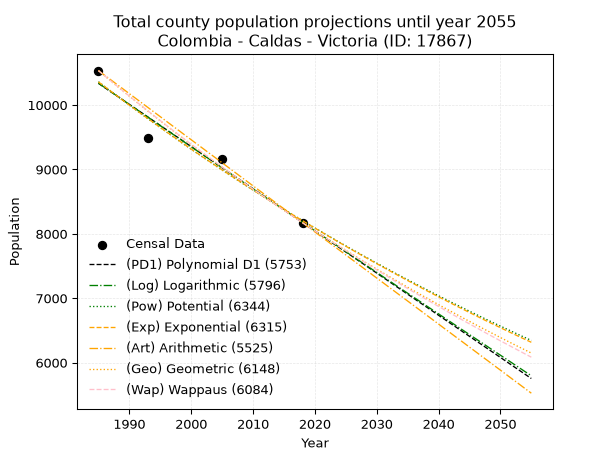
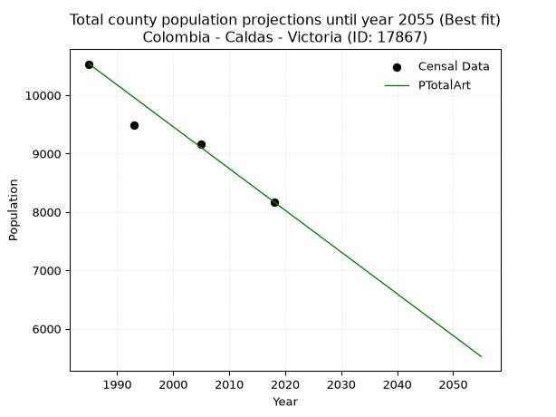
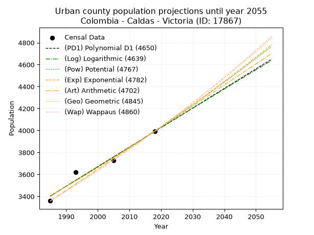
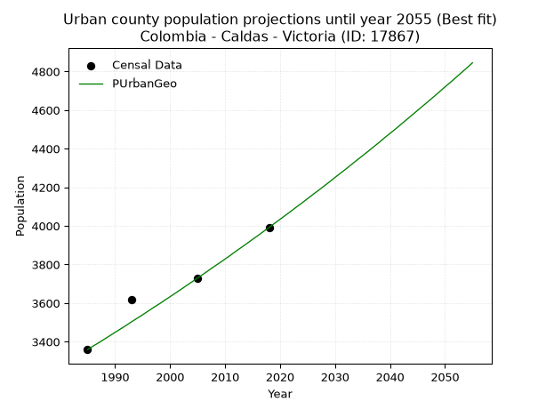
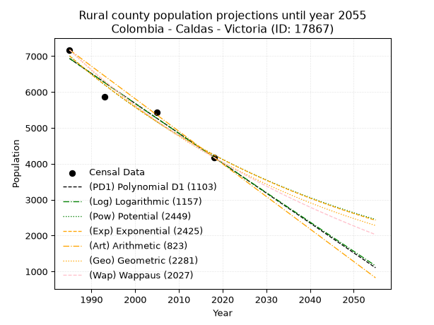
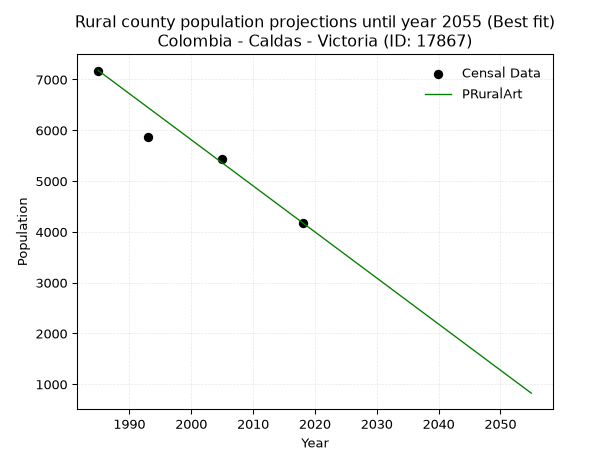

<div align="center">


</div>

# 📜 _“Population and Public Services Demand Projections (PPSD) until Year 2050 for Colombia - Caldas - Victoria (ID: 17867)”_
Keywords: `population` `public-service` `projection` `lineal` `polynomial` `logarithmic` `potential` `exponential` `arithmetic` `geometric` `wappaus` `dane` `colombia` `south-america`

PPSD are analytical estimates used by governments and planners to anticipate future changes in population size, age distribution, and the resulting community needs for utilities, healthcare, education, and infrastructure as sizing future water treatment facilities, electrical grids, and road networks based on spatial growth.

<div align="center">

</img>

</div>


> **General running parameters**: • app_version: _v20260806_. • Python version: _3.14.7_. • Pandas version: _3.0.5_. • NumPy version: _2.5.1_. • Creates, save and include plots into reports (create_plot): _False_. • Projection until year: _2050_. • Process polynomial degree 2 and up: _False_. • Process Wappaus: _True_. • Process Wappaus: _True_. • Set negative values to zero: _True_. • Set infinite values to zero: _True_. • Drop dataset notes: _True_. 
<div align="center">

Maps & GIS Layers: [:earth_americas:Google](http://maps.google.com/maps?q=5.317437378,-74.911239) [:earth_americas:OSM](https://www.openstreetmap.org/#map=18/5.317437378/-74.911239&layers=P) [:earth_americas:Bing](https://www.bing.com/maps?cp=5.317437378~-74.911239&lvl=18) [:earth_americas:Apple](https://maps.apple.com/frame?center=5.317437378%2C-74.911239&span=0.003%2C0.006) [:earth_americas:GISMobile](https://github.com/rcfdtools/R.GISMobile/blob/main/file/gis/CountyLayer_CO/Readme.md)

</div>


<div align="center">

```geojson
{
  "type": "Feature",
  "geometry": {
    "type": "Point", 
    "coordinates": [-74.911239, 5.317437378]
  }, 
  "properties": {
    "Name": "Colombia - Caldas - Victoria (ID: 17867)"
  }
}
```

</div>


## 0. Census Data (4 records)

Census data are official statistics collected by a government about the people and housing in a country. They usually include counts of total population, age, sex, race, income, education, and jobs.

📅Global census file: [Population.xlsx](../data/Population.xlsx)

| Source   |   Year |   CountryID | CountryName   |   StateID | StateName   |   CountyID | CountyName   |   PTotal |   PUrban |   PRural |
|:---------|-------:|------------:|:--------------|----------:|:------------|-----------:|:-------------|---------:|---------:|---------:|
| DANE     |   1985 |          57 | Colombia      |        17 | Caldas      |      17867 | Victoria     |    10533 |     3359 |     7174 |
| DANE     |   1993 |          57 | Colombia      |        17 | Caldas      |      17867 | Victoria     |     9480 |     3620 |     5860 |
| DANE     |   2005 |          57 | Colombia      |        17 | Caldas      |      17867 | Victoria     |     9165 |     3728 |     5437 |
| DANE     |   2018 |          57 | Colombia      |        17 | Caldas      |      17867 | Victoria     |     8172 |     3992 |     4180 |

> 🔥Some records could had specific notes about the registered values or the corresponding urban or rural distribution.

📅[SUI-RUPS](https://www.datos.gov.co/Hacienda-y-Cr-dito-P-blico/Registro-nico-de-Prestadores-de-Servicios-P-blicos/4qkq-csdn/about_data) - Local public utility companies: [RUPS.csv](../data/RUPS.csv)

 | SERVICIO       | ESTADO    | NOMBRE                                                                     | NIT         | DEPARTAMENTO_DOMICILIO   | MUNICIPIO_DOMICILIO   | DIRECCION              |   TELEFONO | EMAIL                              | TIPO_PRESTADOR                             | CLASIFICACION                 |
|:---------------|:----------|:---------------------------------------------------------------------------|:------------|:-------------------------|:----------------------|:-----------------------|-----------:|:-----------------------------------|:-------------------------------------------|:------------------------------|
| ACUEDUCTO      | OPERATIVA | EMPRESA DE OBRAS SANITARIAS DE CALDAS  S. A. EMPRESA DE SERVICIOS PUBLICOS | 890803239-9 | CALDAS                   | MANIZALES             | Carrera 23 Nro 75 - 82 |    8867080 | lorena.grisalest@empocaldas.com.co | SOCIEDADES (EMPRESA DE SERVICIOS PUBLICOS) | MAYOR O IGUAL A 5001 USUARIOS |
| ALCANTARILLADO | OPERATIVA | EMPRESA DE OBRAS SANITARIAS DE CALDAS  S. A. EMPRESA DE SERVICIOS PUBLICOS | 890803239-9 | CALDAS                   | MANIZALES             | Carrera 23 Nro 75 - 82 |    8867080 | lorena.grisalest@empocaldas.com.co | SOCIEDADES (EMPRESA DE SERVICIOS PUBLICOS) | MAYOR O IGUAL A 5001 USUARIOS |

## 1. Total

### 1.1. Coefficients and Parameters

* (PD1) Polynomial Deg 1: -65.4700923323959, 140294.05218787488 (lineal)
* (Log) Logarithmic: -131070.91609294953, 1005608.5835589127
* (Pow) Potential: -14.150369481160126, 50.67989809339854
* (Exp) Exponential: -0.007068860979721484, 12857526784.113407
* (Art) Arithmetic: Year diff. 2018 - 1985 = 33, Population diff. 8172 - 10533 = -2361, Annual growth = -71.54545454545455
* (Geo) Geometric: Year diff. 2018 - 1985 = 33, Population diff. 8172 - 10533 = -2361, Annual growth % = -0.007661394955849832
* (Wap) Wappaus: i = -0.7649874851157931, Condition values only valid for < 200)

<sub>
Wappaus condition values: ['-0.00', '-0.76', '-1.53', '-2.29', '-3.06', '-3.82', '-4.59', '-5.35', '-6.12', '-6.88', '-7.65', '-8.41', '-9.18', '-9.94', '-10.71', '-11.47', '-12.24', '-13.00', '-13.77', '-14.53', '-15.30', '-16.06', '-16.83', '-17.59', '-18.36', '-19.12', '-19.89', '-20.65', '-21.42', '-22.18', '-22.95', '-23.71', '-24.48', '-25.24', '-26.01', '-26.77', '-27.54', '-28.30', '-29.07', '-29.83', '-30.60', '-31.36', '-32.13', '-32.89', '-33.66', '-34.42', '-35.19', '-35.95', '-36.72', '-37.48', '-38.25', '-39.01', '-39.78', '-40.54', '-41.31', '-42.07', '-42.84', '-43.60', '-44.37', '-45.13', '-45.90', '-46.66', '-47.43', '-48.19', '-48.96', '-49.72']
</sub>


### 1.2. Projected Dataset

|   Year |   CountyID |   PTotalPD1 |   PTotalLog |   PTotalPow |   PTotalExp |   PTotalArt |   PTotalGeo |   PTotalWap |
|-------:|-----------:|------------:|------------:|------------:|------------:|------------:|------------:|------------:|
|   1985 |      17867 |       10336 |       10338 |       10360 |       10358 |       10533 |       10533 |       10533 |
|   1986 |      17867 |       10270 |       10272 |       10287 |       10285 |       10461 |       10452 |       10453 |
|   1987 |      17867 |       10205 |       10206 |       10214 |       10213 |       10390 |       10372 |       10373 |
|   1988 |      17867 |       10140 |       10140 |       10141 |       10141 |       10318 |       10293 |       10294 |
|   1989 |      17867 |       10074 |       10074 |       10069 |       10069 |       10247 |       10214 |       10216 |
|   1990 |      17867 |       10009 |       10008 |        9998 |        9998 |       10175 |       10136 |       10138 |
|   1991 |      17867 |        9943 |        9942 |        9927 |        9928 |       10104 |       10058 |       10060 |
|   1992 |      17867 |        9878 |        9877 |        9857 |        9858 |       10032 |        9981 |        9984 |
|   1993 |      17867 |        9812 |        9811 |        9787 |        9788 |        9961 |        9904 |        9908 |
|   1994 |      17867 |        9747 |        9745 |        9718 |        9719 |        9889 |        9829 |        9832 |
|   1995 |      17867 |        9681 |        9679 |        9649 |        9651 |        9818 |        9753 |        9757 |
|   1996 |      17867 |        9616 |        9614 |        9581 |        9583 |        9746 |        9679 |        9682 |
|   1997 |      17867 |        9550 |        9548 |        9513 |        9516 |        9674 |        9604 |        9609 |
|   1998 |      17867 |        9485 |        9482 |        9446 |        9448 |        9603 |        9531 |        9535 |
|   1999 |      17867 |        9419 |        9417 |        9379 |        9382 |        9531 |        9458 |        9462 |
|   2000 |      17867 |        9354 |        9351 |        9313 |        9316 |        9460 |        9385 |        9390 |
|   2001 |      17867 |        9288 |        9286 |        9248 |        9250 |        9388 |        9313 |        9318 |
|   2002 |      17867 |        9223 |        9220 |        9183 |        9185 |        9317 |        9242 |        9247 |
|   2003 |      17867 |        9157 |        9155 |        9118 |        9120 |        9245 |        9171 |        9176 |
|   2004 |      17867 |        9092 |        9089 |        9054 |        9056 |        9174 |        9101 |        9106 |
|   2005 |      17867 |        9027 |        9024 |        8990 |        8992 |        9102 |        9031 |        9036 |
|   2006 |      17867 |        8961 |        8959 |        8927 |        8929 |        9031 |        8962 |        8967 |
|   2007 |      17867 |        8896 |        8893 |        8864 |        8866 |        8959 |        8893 |        8898 |
|   2008 |      17867 |        8830 |        8828 |        8802 |        8804 |        8887 |        8825 |        8830 |
|   2009 |      17867 |        8765 |        8763 |        8740 |        8742 |        8816 |        8758 |        8762 |
|   2010 |      17867 |        8699 |        8698 |        8679 |        8680 |        8744 |        8691 |        8694 |
|   2011 |      17867 |        8634 |        8632 |        8618 |        8619 |        8673 |        8624 |        8628 |
|   2012 |      17867 |        8568 |        8567 |        8557 |        8558 |        8601 |        8558 |        8561 |
|   2013 |      17867 |        8503 |        8502 |        8497 |        8498 |        8530 |        8492 |        8495 |
|   2014 |      17867 |        8437 |        8437 |        8438 |        8438 |        8458 |        8427 |        8430 |
|   2015 |      17867 |        8372 |        8372 |        8379 |        8379 |        8387 |        8363 |        8365 |
|   2016 |      17867 |        8306 |        8307 |        8320 |        8320 |        8315 |        8299 |        8300 |
|   2017 |      17867 |        8241 |        8242 |        8262 |        8261 |        8244 |        8235 |        8236 |
|   2018 |      17867 |        8175 |        8177 |        8204 |        8203 |        8172 |        8172 |        8172 |
|   2019 |      17867 |        8110 |        8112 |        8147 |        8145 |        8100 |        8109 |        8109 |
|   2020 |      17867 |        8044 |        8047 |        8090 |        8088 |        8029 |        8047 |        8046 |
|   2021 |      17867 |        7979 |        7982 |        8034 |        8031 |        7957 |        7986 |        7983 |
|   2022 |      17867 |        7914 |        7917 |        7978 |        7974 |        7886 |        7924 |        7921 |
|   2023 |      17867 |        7848 |        7853 |        7922 |        7918 |        7814 |        7864 |        7860 |
|   2024 |      17867 |        7783 |        7788 |        7867 |        7862 |        7743 |        7803 |        7798 |
|   2025 |      17867 |        7717 |        7723 |        7812 |        7807 |        7671 |        7744 |        7738 |
|   2026 |      17867 |        7652 |        7658 |        7758 |        7752 |        7600 |        7684 |        7677 |
|   2027 |      17867 |        7586 |        7594 |        7704 |        7697 |        7528 |        7625 |        7617 |
|   2028 |      17867 |        7521 |        7529 |        7650 |        7643 |        7457 |        7567 |        7558 |
|   2029 |      17867 |        7455 |        7464 |        7597 |        7589 |        7385 |        7509 |        7498 |
|   2030 |      17867 |        7390 |        7400 |        7544 |        7536 |        7313 |        7452 |        7440 |
|   2031 |      17867 |        7324 |        7335 |        7492 |        7483 |        7242 |        7394 |        7381 |
|   2032 |      17867 |        7259 |        7271 |        7440 |        7430 |        7170 |        7338 |        7323 |
|   2033 |      17867 |        7193 |        7206 |        7388 |        7378 |        7099 |        7282 |        7265 |
|   2034 |      17867 |        7128 |        7142 |        7337 |        7326 |        7027 |        7226 |        7208 |
|   2035 |      17867 |        7062 |        7077 |        7286 |        7274 |        6956 |        7170 |        7151 |
|   2036 |      17867 |        6997 |        7013 |        7236 |        7223 |        6884 |        7116 |        7094 |
|   2037 |      17867 |        6931 |        6949 |        7185 |        7172 |        6813 |        7061 |        7038 |
|   2038 |      17867 |        6866 |        6884 |        7136 |        7121 |        6741 |        7007 |        6982 |
|   2039 |      17867 |        6801 |        6820 |        7086 |        7071 |        6670 |        6953 |        6927 |
|   2040 |      17867 |        6735 |        6756 |        7037 |        7021 |        6598 |        6900 |        6872 |
|   2041 |      17867 |        6670 |        6692 |        6989 |        6972 |        6526 |        6847 |        6817 |
|   2042 |      17867 |        6604 |        6627 |        6940 |        6923 |        6455 |        6795 |        6762 |
|   2043 |      17867 |        6539 |        6563 |        6893 |        6874 |        6383 |        6743 |        6708 |
|   2044 |      17867 |        6473 |        6499 |        6845 |        6826 |        6312 |        6691 |        6654 |
|   2045 |      17867 |        6408 |        6435 |        6798 |        6778 |        6240 |        6640 |        6601 |
|   2046 |      17867 |        6342 |        6371 |        6751 |        6730 |        6169 |        6589 |        6548 |
|   2047 |      17867 |        6277 |        6307 |        6704 |        6682 |        6097 |        6538 |        6495 |
|   2048 |      17867 |        6211 |        6243 |        6658 |        6635 |        6026 |        6488 |        6442 |
|   2049 |      17867 |        6146 |        6179 |        6612 |        6589 |        5954 |        6439 |        6390 |
|   2050 |      17867 |        6080 |        6115 |        6567 |        6542 |        5883 |        6389 |        6338 |
<div align="center">

</img>

</div>


### 1.3. Best fit with absolute and relative error (%)

Relative error puts that difference into context by dividing the absolute error by the true value, creating a unitless ratio or percentage that shows the scale of the mistake.

Absolute and relative error

|   Year | Source   |   CountryID | CountryName   |   StateID | StateName   |   CountyID_x | CountyName   |   PTotal |   PUrban |   PRural |   CountyID_y |   PTotalPD1 |   PTotalLog |   PTotalPow |   PTotalExp |   PTotalArt |   PTotalGeo |   PTotalWap |   PTotalPD1AbsError |   PTotalLogAbsError |   PTotalPowAbsError |   PTotalExpAbsError |   PTotalArtAbsError |   PTotalGeoAbsError |   PTotalWapAbsError |   PTotalPD1RelError |   PTotalLogRelError |   PTotalPowRelError |   PTotalExpRelError |   PTotalArtRelError |   PTotalGeoRelError |   PTotalWapRelError |
|-------:|:---------|------------:|:--------------|----------:|:------------|-------------:|:-------------|---------:|---------:|---------:|-------------:|------------:|------------:|------------:|------------:|------------:|------------:|------------:|--------------------:|--------------------:|--------------------:|--------------------:|--------------------:|--------------------:|--------------------:|--------------------:|--------------------:|--------------------:|--------------------:|--------------------:|--------------------:|--------------------:|
|   1985 | DANE     |          57 | Colombia      |        17 | Caldas      |        17867 | Victoria     |    10533 |     3359 |     7174 |        17867 |       10336 |       10338 |       10360 |       10358 |       10533 |       10533 |       10533 |                 197 |                 195 |                 173 |                 175 |                   0 |                   0 |                   0 |           1.87031   |           1.85132   |            1.64246  |            1.66144  |            0        |             0       |             0       |
|   1993 | DANE     |          57 | Colombia      |        17 | Caldas      |        17867 | Victoria     |     9480 |     3620 |     5860 |        17867 |        9812 |        9811 |        9787 |        9788 |        9961 |        9904 |        9908 |                 332 |                 331 |                 307 |                 308 |                 481 |                 424 |                 428 |           3.50211   |           3.49156   |            3.2384   |            3.24895  |            5.07384  |             4.47257 |             4.51477 |
|   2005 | DANE     |          57 | Colombia      |        17 | Caldas      |        17867 | Victoria     |     9165 |     3728 |     5437 |        17867 |        9027 |        9024 |        8990 |        8992 |        9102 |        9031 |        9036 |                 138 |                 141 |                 175 |                 173 |                  63 |                 134 |                 129 |           1.50573   |           1.53846   |            1.90944  |            1.88762  |            0.687398 |             1.46208 |             1.40753 |
|   2018 | DANE     |          57 | Colombia      |        17 | Caldas      |        17867 | Victoria     |     8172 |     3992 |     4180 |        17867 |        8175 |        8177 |        8204 |        8203 |        8172 |        8172 |        8172 |                   3 |                   5 |                  32 |                  31 |                   0 |                   0 |                   0 |           0.0367107 |           0.0611845 |            0.391581 |            0.379344 |            0        |             0       |             0       |

Relative error mean

| Method    |   RelError | Best   |
|:----------|-----------:|:-------|
| PTotalPD1 |    1.72872 |        |
| PTotalLog |    1.73563 |        |
| PTotalPow |    1.79547 |        |
| PTotalExp |    1.79434 |        |
| PTotalArt |    1.44031 | True   |
| PTotalGeo |    1.48366 |        |
| PTotalWap |    1.48057 |        |

💙Best method: _**PTotalArt**_
<div align="center">

</img>

</div>


### 1.4. Fresh water supply demand in liters per capita per day (lpcd)

The fresh water supply demand typically ranges from 100 to 300 liters per capita per day (lpcd) for standard domestic and municipal planning, though absolute survival minimums set by the World Health Organization are as low as 7.5 to 20 liters per day, and total consumption in high-income nations can exceed 400 liters.

> `CZ`: Level in meters above the sea level (masl)<br> `WS`: Fresh water supply demand in liters per capita per day (lpcd or l/h/d)<br> `WSAll`: Zonal fresh water supply demand in liters per second (l/s)<br> `A`: Zonal area in square meters<br> `DP`: Population density (people/hectare or p/ha)

Reference values (RAS Colombia)

|    CZ |   WS |
|------:|-----:|
|  1000 |  120 |
|  2000 |  130 |
| 99999 |  140 |

County shapefile geometry properties and water supply values

|   CountyID |      ATotal |   CZTotal |   WSTotal |
|-----------:|------------:|----------:|----------:|
|      17867 | 5.58466e+08 |   398.318 |       120 |

Projected values for best method: PTotalArt

|   CountyID |   Year |   PTotalArt |   DPTotal |   WSTotal |   WSTotalAll |
|-----------:|-------:|------------:|----------:|----------:|-------------:|
|      17867 |   1985 |       10533 |      0.19 |       120 |     14.6292  |
|      17867 |   1986 |       10461 |      0.19 |       120 |     14.5292  |
|      17867 |   1987 |       10390 |      0.19 |       120 |     14.4306  |
|      17867 |   1988 |       10318 |      0.18 |       120 |     14.3306  |
|      17867 |   1989 |       10247 |      0.18 |       120 |     14.2319  |
|      17867 |   1990 |       10175 |      0.18 |       120 |     14.1319  |
|      17867 |   1991 |       10104 |      0.18 |       120 |     14.0333  |
|      17867 |   1992 |       10032 |      0.18 |       120 |     13.9333  |
|      17867 |   1993 |        9961 |      0.18 |       120 |     13.8347  |
|      17867 |   1994 |        9889 |      0.18 |       120 |     13.7347  |
|      17867 |   1995 |        9818 |      0.18 |       120 |     13.6361  |
|      17867 |   1996 |        9746 |      0.17 |       120 |     13.5361  |
|      17867 |   1997 |        9674 |      0.17 |       120 |     13.4361  |
|      17867 |   1998 |        9603 |      0.17 |       120 |     13.3375  |
|      17867 |   1999 |        9531 |      0.17 |       120 |     13.2375  |
|      17867 |   2000 |        9460 |      0.17 |       120 |     13.1389  |
|      17867 |   2001 |        9388 |      0.17 |       120 |     13.0389  |
|      17867 |   2002 |        9317 |      0.17 |       120 |     12.9403  |
|      17867 |   2003 |        9245 |      0.17 |       120 |     12.8403  |
|      17867 |   2004 |        9174 |      0.16 |       120 |     12.7417  |
|      17867 |   2005 |        9102 |      0.16 |       120 |     12.6417  |
|      17867 |   2006 |        9031 |      0.16 |       120 |     12.5431  |
|      17867 |   2007 |        8959 |      0.16 |       120 |     12.4431  |
|      17867 |   2008 |        8887 |      0.16 |       120 |     12.3431  |
|      17867 |   2009 |        8816 |      0.16 |       120 |     12.2444  |
|      17867 |   2010 |        8744 |      0.16 |       120 |     12.1444  |
|      17867 |   2011 |        8673 |      0.16 |       120 |     12.0458  |
|      17867 |   2012 |        8601 |      0.15 |       120 |     11.9458  |
|      17867 |   2013 |        8530 |      0.15 |       120 |     11.8472  |
|      17867 |   2014 |        8458 |      0.15 |       120 |     11.7472  |
|      17867 |   2015 |        8387 |      0.15 |       120 |     11.6486  |
|      17867 |   2016 |        8315 |      0.15 |       120 |     11.5486  |
|      17867 |   2017 |        8244 |      0.15 |       120 |     11.45    |
|      17867 |   2018 |        8172 |      0.15 |       120 |     11.35    |
|      17867 |   2019 |        8100 |      0.15 |       120 |     11.25    |
|      17867 |   2020 |        8029 |      0.14 |       120 |     11.1514  |
|      17867 |   2021 |        7957 |      0.14 |       120 |     11.0514  |
|      17867 |   2022 |        7886 |      0.14 |       120 |     10.9528  |
|      17867 |   2023 |        7814 |      0.14 |       120 |     10.8528  |
|      17867 |   2024 |        7743 |      0.14 |       120 |     10.7542  |
|      17867 |   2025 |        7671 |      0.14 |       120 |     10.6542  |
|      17867 |   2026 |        7600 |      0.14 |       120 |     10.5556  |
|      17867 |   2027 |        7528 |      0.13 |       120 |     10.4556  |
|      17867 |   2028 |        7457 |      0.13 |       120 |     10.3569  |
|      17867 |   2029 |        7385 |      0.13 |       120 |     10.2569  |
|      17867 |   2030 |        7313 |      0.13 |       120 |     10.1569  |
|      17867 |   2031 |        7242 |      0.13 |       120 |     10.0583  |
|      17867 |   2032 |        7170 |      0.13 |       120 |      9.95833 |
|      17867 |   2033 |        7099 |      0.13 |       120 |      9.85972 |
|      17867 |   2034 |        7027 |      0.13 |       120 |      9.75972 |
|      17867 |   2035 |        6956 |      0.12 |       120 |      9.66111 |
|      17867 |   2036 |        6884 |      0.12 |       120 |      9.56111 |
|      17867 |   2037 |        6813 |      0.12 |       120 |      9.4625  |
|      17867 |   2038 |        6741 |      0.12 |       120 |      9.3625  |
|      17867 |   2039 |        6670 |      0.12 |       120 |      9.26389 |
|      17867 |   2040 |        6598 |      0.12 |       120 |      9.16389 |
|      17867 |   2041 |        6526 |      0.12 |       120 |      9.06389 |
|      17867 |   2042 |        6455 |      0.12 |       120 |      8.96528 |
|      17867 |   2043 |        6383 |      0.11 |       120 |      8.86528 |
|      17867 |   2044 |        6312 |      0.11 |       120 |      8.76667 |
|      17867 |   2045 |        6240 |      0.11 |       120 |      8.66667 |
|      17867 |   2046 |        6169 |      0.11 |       120 |      8.56806 |
|      17867 |   2047 |        6097 |      0.11 |       120 |      8.46806 |
|      17867 |   2048 |        6026 |      0.11 |       120 |      8.36944 |
|      17867 |   2049 |        5954 |      0.11 |       120 |      8.26944 |
|      17867 |   2050 |        5883 |      0.11 |       120 |      8.17083 |

## 2. Urban

### 2.1. Coefficients and Parameters

* (PD1) Polynomial Deg 1: 17.81814532316322, -31965.99518265723 (lineal)
* (Log) Logarithmic: 35670.61279882255, -267457.8637302017
* (Pow) Potential: 9.699550902979139, -28.4545568645004
* (Exp) Exponential: 0.004844775107107826, 0.2268569285124469
* (Art) Arithmetic: Year diff. 2018 - 1985 = 33, Population diff. 3992 - 3359 = 633, Annual growth = 19.181818181818183
* (Geo) Geometric: Year diff. 2018 - 1985 = 33, Population diff. 3992 - 3359 = 633, Annual growth % = 0.005245499035976708
* (Wap) Wappaus: i = 0.5218832317186283, Condition values only valid for < 200)

<sub>
Wappaus condition values: ['0.00', '0.52', '1.04', '1.57', '2.09', '2.61', '3.13', '3.65', '4.18', '4.70', '5.22', '5.74', '6.26', '6.78', '7.31', '7.83', '8.35', '8.87', '9.39', '9.92', '10.44', '10.96', '11.48', '12.00', '12.53', '13.05', '13.57', '14.09', '14.61', '15.13', '15.66', '16.18', '16.70', '17.22', '17.74', '18.27', '18.79', '19.31', '19.83', '20.35', '20.88', '21.40', '21.92', '22.44', '22.96', '23.48', '24.01', '24.53', '25.05', '25.57', '26.09', '26.62', '27.14', '27.66', '28.18', '28.70', '29.23', '29.75', '30.27', '30.79', '31.31', '31.83', '32.36', '32.88', '33.40', '33.92']
</sub>


### 2.2. Projected Dataset

|   Year |   CountyID |   PUrbanPD1 |   PUrbanLog |   PUrbanPow |   PUrbanExp |   PUrbanArt |   PUrbanGeo |   PUrbanWap |
|-------:|-----------:|------------:|------------:|------------:|------------:|------------:|------------:|------------:|
|   1985 |      17867 |        3403 |        3402 |        3406 |        3407 |        3359 |        3359 |        3359 |
|   1986 |      17867 |        3421 |        3420 |        3423 |        3423 |        3378 |        3377 |        3377 |
|   1987 |      17867 |        3439 |        3438 |        3439 |        3440 |        3397 |        3394 |        3394 |
|   1988 |      17867 |        3456 |        3456 |        3456 |        3456 |        3417 |        3412 |        3412 |
|   1989 |      17867 |        3474 |        3474 |        3473 |        3473 |        3436 |        3430 |        3430 |
|   1990 |      17867 |        3492 |        3492 |        3490 |        3490 |        3455 |        3448 |        3448 |
|   1991 |      17867 |        3510 |        3510 |        3507 |        3507 |        3474 |        3466 |        3466 |
|   1992 |      17867 |        3528 |        3528 |        3524 |        3524 |        3493 |        3484 |        3484 |
|   1993 |      17867 |        3546 |        3546 |        3541 |        3541 |        3512 |        3503 |        3502 |
|   1994 |      17867 |        3563 |        3564 |        3559 |        3558 |        3532 |        3521 |        3521 |
|   1995 |      17867 |        3581 |        3582 |        3576 |        3576 |        3551 |        3539 |        3539 |
|   1996 |      17867 |        3599 |        3600 |        3594 |        3593 |        3570 |        3558 |        3558 |
|   1997 |      17867 |        3617 |        3617 |        3611 |        3610 |        3589 |        3577 |        3576 |
|   1998 |      17867 |        3635 |        3635 |        3629 |        3628 |        3608 |        3595 |        3595 |
|   1999 |      17867 |        3652 |        3653 |        3646 |        3646 |        3628 |        3614 |        3614 |
|   2000 |      17867 |        3670 |        3671 |        3664 |        3663 |        3647 |        3633 |        3633 |
|   2001 |      17867 |        3688 |        3689 |        3682 |        3681 |        3666 |        3652 |        3652 |
|   2002 |      17867 |        3706 |        3707 |        3700 |        3699 |        3685 |        3671 |        3671 |
|   2003 |      17867 |        3724 |        3724 |        3718 |        3717 |        3704 |        3691 |        3690 |
|   2004 |      17867 |        3742 |        3742 |        3736 |        3735 |        3723 |        3710 |        3709 |
|   2005 |      17867 |        3759 |        3760 |        3754 |        3753 |        3743 |        3730 |        3729 |
|   2006 |      17867 |        3777 |        3778 |        3772 |        3771 |        3762 |        3749 |        3748 |
|   2007 |      17867 |        3795 |        3796 |        3790 |        3790 |        3781 |        3769 |        3768 |
|   2008 |      17867 |        3813 |        3813 |        3809 |        3808 |        3800 |        3789 |        3788 |
|   2009 |      17867 |        3831 |        3831 |        3827 |        3827 |        3819 |        3808 |        3808 |
|   2010 |      17867 |        3848 |        3849 |        3846 |        3845 |        3839 |        3828 |        3828 |
|   2011 |      17867 |        3866 |        3867 |        3864 |        3864 |        3858 |        3848 |        3848 |
|   2012 |      17867 |        3884 |        3884 |        3883 |        3883 |        3877 |        3869 |        3868 |
|   2013 |      17867 |        3902 |        3902 |        3902 |        3901 |        3896 |        3889 |        3889 |
|   2014 |      17867 |        3920 |        3920 |        3920 |        3920 |        3915 |        3909 |        3909 |
|   2015 |      17867 |        3938 |        3938 |        3939 |        3939 |        3934 |        3930 |        3930 |
|   2016 |      17867 |        3955 |        3955 |        3958 |        3959 |        3954 |        3950 |        3950 |
|   2017 |      17867 |        3973 |        3973 |        3977 |        3978 |        3973 |        3971 |        3971 |
|   2018 |      17867 |        3991 |        3991 |        3997 |        3997 |        3992 |        3992 |        3992 |
|   2019 |      17867 |        4009 |        4008 |        4016 |        4016 |        4011 |        4013 |        4013 |
|   2020 |      17867 |        4027 |        4026 |        4035 |        4036 |        4030 |        4034 |        4034 |
|   2021 |      17867 |        4044 |        4044 |        4055 |        4056 |        4050 |        4055 |        4056 |
|   2022 |      17867 |        4062 |        4061 |        4074 |        4075 |        4069 |        4076 |        4077 |
|   2023 |      17867 |        4080 |        4079 |        4094 |        4095 |        4088 |        4098 |        4098 |
|   2024 |      17867 |        4098 |        4096 |        4113 |        4115 |        4107 |        4119 |        4120 |
|   2025 |      17867 |        4116 |        4114 |        4133 |        4135 |        4126 |        4141 |        4142 |
|   2026 |      17867 |        4134 |        4132 |        4153 |        4155 |        4145 |        4163 |        4164 |
|   2027 |      17867 |        4151 |        4149 |        4173 |        4175 |        4165 |        4184 |        4186 |
|   2028 |      17867 |        4169 |        4167 |        4193 |        4196 |        4184 |        4206 |        4208 |
|   2029 |      17867 |        4187 |        4184 |        4213 |        4216 |        4203 |        4228 |        4230 |
|   2030 |      17867 |        4205 |        4202 |        4233 |        4236 |        4222 |        4251 |        4253 |
|   2031 |      17867 |        4223 |        4220 |        4253 |        4257 |        4241 |        4273 |        4275 |
|   2032 |      17867 |        4240 |        4237 |        4274 |        4278 |        4261 |        4295 |        4298 |
|   2033 |      17867 |        4258 |        4255 |        4294 |        4298 |        4280 |        4318 |        4321 |
|   2034 |      17867 |        4276 |        4272 |        4315 |        4319 |        4299 |        4341 |        4344 |
|   2035 |      17867 |        4294 |        4290 |        4335 |        4340 |        4318 |        4363 |        4367 |
|   2036 |      17867 |        4312 |        4307 |        4356 |        4361 |        4337 |        4386 |        4390 |
|   2037 |      17867 |        4330 |        4325 |        4377 |        4382 |        4356 |        4409 |        4414 |
|   2038 |      17867 |        4347 |        4342 |        4398 |        4404 |        4376 |        4432 |        4437 |
|   2039 |      17867 |        4365 |        4360 |        4419 |        4425 |        4395 |        4456 |        4461 |
|   2040 |      17867 |        4383 |        4377 |        4440 |        4447 |        4414 |        4479 |        4485 |
|   2041 |      17867 |        4401 |        4395 |        4461 |        4468 |        4433 |        4502 |        4509 |
|   2042 |      17867 |        4419 |        4412 |        4482 |        4490 |        4452 |        4526 |        4533 |
|   2043 |      17867 |        4436 |        4430 |        4504 |        4512 |        4472 |        4550 |        4557 |
|   2044 |      17867 |        4454 |        4447 |        4525 |        4534 |        4491 |        4574 |        4581 |
|   2045 |      17867 |        4472 |        4465 |        4547 |        4556 |        4510 |        4598 |        4606 |
|   2046 |      17867 |        4490 |        4482 |        4568 |        4578 |        4529 |        4622 |        4631 |
|   2047 |      17867 |        4508 |        4500 |        4590 |        4600 |        4548 |        4646 |        4656 |
|   2048 |      17867 |        4526 |        4517 |        4612 |        4622 |        4567 |        4670 |        4681 |
|   2049 |      17867 |        4543 |        4534 |        4634 |        4645 |        4587 |        4695 |        4706 |
|   2050 |      17867 |        4561 |        4552 |        4656 |        4667 |        4606 |        4720 |        4731 |
<div align="center">

</img>

</div>


### 2.3. Best fit with absolute and relative error (%)

Relative error puts that difference into context by dividing the absolute error by the true value, creating a unitless ratio or percentage that shows the scale of the mistake.

Absolute and relative error

|   Year | Source   |   CountryID | CountryName   |   StateID | StateName   |   CountyID_x | CountyName   |   PTotal |   PUrban |   PRural |   CountyID_y |   PUrbanPD1 |   PUrbanLog |   PUrbanPow |   PUrbanExp |   PUrbanArt |   PUrbanGeo |   PUrbanWap |   PUrbanPD1AbsError |   PUrbanLogAbsError |   PUrbanPowAbsError |   PUrbanExpAbsError |   PUrbanArtAbsError |   PUrbanGeoAbsError |   PUrbanWapAbsError |   PUrbanPD1RelError |   PUrbanLogRelError |   PUrbanPowRelError |   PUrbanExpRelError |   PUrbanArtRelError |   PUrbanGeoRelError |   PUrbanWapRelError |
|-------:|:---------|------------:|:--------------|----------:|:------------|-------------:|:-------------|---------:|---------:|---------:|-------------:|------------:|------------:|------------:|------------:|------------:|------------:|------------:|--------------------:|--------------------:|--------------------:|--------------------:|--------------------:|--------------------:|--------------------:|--------------------:|--------------------:|--------------------:|--------------------:|--------------------:|--------------------:|--------------------:|
|   1985 | DANE     |          57 | Colombia      |        17 | Caldas      |        17867 | Victoria     |    10533 |     3359 |     7174 |        17867 |        3403 |        3402 |        3406 |        3407 |        3359 |        3359 |        3359 |                  44 |                  43 |                  47 |                  48 |                   0 |                   0 |                   0 |           1.30991   |           1.28014   |            1.39923  |            1.429    |            0        |           0         |            0        |
|   1993 | DANE     |          57 | Colombia      |        17 | Caldas      |        17867 | Victoria     |     9480 |     3620 |     5860 |        17867 |        3546 |        3546 |        3541 |        3541 |        3512 |        3503 |        3502 |                  74 |                  74 |                  79 |                  79 |                 108 |                 117 |                 118 |           2.0442    |           2.0442    |            2.18232  |            2.18232  |            2.98343  |           3.23204   |            3.25967  |
|   2005 | DANE     |          57 | Colombia      |        17 | Caldas      |        17867 | Victoria     |     9165 |     3728 |     5437 |        17867 |        3759 |        3760 |        3754 |        3753 |        3743 |        3730 |        3729 |                  31 |                  32 |                  26 |                  25 |                  15 |                   2 |                   1 |           0.831545  |           0.858369  |            0.697425 |            0.670601 |            0.402361 |           0.0536481 |            0.026824 |
|   2018 | DANE     |          57 | Colombia      |        17 | Caldas      |        17867 | Victoria     |     8172 |     3992 |     4180 |        17867 |        3991 |        3991 |        3997 |        3997 |        3992 |        3992 |        3992 |                   1 |                   1 |                   5 |                   5 |                   0 |                   0 |                   0 |           0.0250501 |           0.0250501 |            0.125251 |            0.125251 |            0        |           0         |            0        |

Relative error mean

| Method    |   RelError | Best   |
|:----------|-----------:|:-------|
| PUrbanPD1 |   1.05268  |        |
| PUrbanLog |   1.05194  |        |
| PUrbanPow |   1.10106  |        |
| PUrbanExp |   1.10179  |        |
| PUrbanArt |   0.846446 |        |
| PUrbanGeo |   0.821423 | True   |
| PUrbanWap |   0.821623 |        |

💙Best method: _**PUrbanGeo**_
<div align="center">

</img>

</div>


### 2.4. Fresh water supply demand in liters per capita per day (lpcd)

The fresh water supply demand typically ranges from 100 to 300 liters per capita per day (lpcd) for standard domestic and municipal planning, though absolute survival minimums set by the World Health Organization are as low as 7.5 to 20 liters per day, and total consumption in high-income nations can exceed 400 liters.

> `CZ`: Level in meters above the sea level (masl)<br> `WS`: Fresh water supply demand in liters per capita per day (lpcd or l/h/d)<br> `WSAll`: Zonal fresh water supply demand in liters per second (l/s)<br> `A`: Zonal area in square meters<br> `DP`: Population density (people/hectare or p/ha)

Reference values (RAS Colombia)

|    CZ |   WS |
|------:|-----:|
|  1000 |  120 |
|  2000 |  130 |
| 99999 |  140 |

County shapefile geometry properties and water supply values

|   CountyID |      AUrban |   CZUrban |   WSUrban |
|-----------:|------------:|----------:|----------:|
|      17867 | 1.03276e+06 |   720.414 |       120 |

Projected values for best method: PUrbanGeo

|   CountyID |   Year |   PUrbanGeo |   DPUrban |   WSUrban |   WSUrbanAll |
|-----------:|-------:|------------:|----------:|----------:|-------------:|
|      17867 |   1985 |        3359 |     32.52 |       120 |      4.66528 |
|      17867 |   1986 |        3377 |     32.7  |       120 |      4.69028 |
|      17867 |   1987 |        3394 |     32.86 |       120 |      4.71389 |
|      17867 |   1988 |        3412 |     33.04 |       120 |      4.73889 |
|      17867 |   1989 |        3430 |     33.21 |       120 |      4.76389 |
|      17867 |   1990 |        3448 |     33.39 |       120 |      4.78889 |
|      17867 |   1991 |        3466 |     33.56 |       120 |      4.81389 |
|      17867 |   1992 |        3484 |     33.73 |       120 |      4.83889 |
|      17867 |   1993 |        3503 |     33.92 |       120 |      4.86528 |
|      17867 |   1994 |        3521 |     34.09 |       120 |      4.89028 |
|      17867 |   1995 |        3539 |     34.27 |       120 |      4.91528 |
|      17867 |   1996 |        3558 |     34.45 |       120 |      4.94167 |
|      17867 |   1997 |        3577 |     34.64 |       120 |      4.96806 |
|      17867 |   1998 |        3595 |     34.81 |       120 |      4.99306 |
|      17867 |   1999 |        3614 |     34.99 |       120 |      5.01944 |
|      17867 |   2000 |        3633 |     35.18 |       120 |      5.04583 |
|      17867 |   2001 |        3652 |     35.36 |       120 |      5.07222 |
|      17867 |   2002 |        3671 |     35.55 |       120 |      5.09861 |
|      17867 |   2003 |        3691 |     35.74 |       120 |      5.12639 |
|      17867 |   2004 |        3710 |     35.92 |       120 |      5.15278 |
|      17867 |   2005 |        3730 |     36.12 |       120 |      5.18056 |
|      17867 |   2006 |        3749 |     36.3  |       120 |      5.20694 |
|      17867 |   2007 |        3769 |     36.49 |       120 |      5.23472 |
|      17867 |   2008 |        3789 |     36.69 |       120 |      5.2625  |
|      17867 |   2009 |        3808 |     36.87 |       120 |      5.28889 |
|      17867 |   2010 |        3828 |     37.07 |       120 |      5.31667 |
|      17867 |   2011 |        3848 |     37.26 |       120 |      5.34444 |
|      17867 |   2012 |        3869 |     37.46 |       120 |      5.37361 |
|      17867 |   2013 |        3889 |     37.66 |       120 |      5.40139 |
|      17867 |   2014 |        3909 |     37.85 |       120 |      5.42917 |
|      17867 |   2015 |        3930 |     38.05 |       120 |      5.45833 |
|      17867 |   2016 |        3950 |     38.25 |       120 |      5.48611 |
|      17867 |   2017 |        3971 |     38.45 |       120 |      5.51528 |
|      17867 |   2018 |        3992 |     38.65 |       120 |      5.54444 |
|      17867 |   2019 |        4013 |     38.86 |       120 |      5.57361 |
|      17867 |   2020 |        4034 |     39.06 |       120 |      5.60278 |
|      17867 |   2021 |        4055 |     39.26 |       120 |      5.63194 |
|      17867 |   2022 |        4076 |     39.47 |       120 |      5.66111 |
|      17867 |   2023 |        4098 |     39.68 |       120 |      5.69167 |
|      17867 |   2024 |        4119 |     39.88 |       120 |      5.72083 |
|      17867 |   2025 |        4141 |     40.1  |       120 |      5.75139 |
|      17867 |   2026 |        4163 |     40.31 |       120 |      5.78194 |
|      17867 |   2027 |        4184 |     40.51 |       120 |      5.81111 |
|      17867 |   2028 |        4206 |     40.73 |       120 |      5.84167 |
|      17867 |   2029 |        4228 |     40.94 |       120 |      5.87222 |
|      17867 |   2030 |        4251 |     41.16 |       120 |      5.90417 |
|      17867 |   2031 |        4273 |     41.37 |       120 |      5.93472 |
|      17867 |   2032 |        4295 |     41.59 |       120 |      5.96528 |
|      17867 |   2033 |        4318 |     41.81 |       120 |      5.99722 |
|      17867 |   2034 |        4341 |     42.03 |       120 |      6.02917 |
|      17867 |   2035 |        4363 |     42.25 |       120 |      6.05972 |
|      17867 |   2036 |        4386 |     42.47 |       120 |      6.09167 |
|      17867 |   2037 |        4409 |     42.69 |       120 |      6.12361 |
|      17867 |   2038 |        4432 |     42.91 |       120 |      6.15556 |
|      17867 |   2039 |        4456 |     43.15 |       120 |      6.18889 |
|      17867 |   2040 |        4479 |     43.37 |       120 |      6.22083 |
|      17867 |   2041 |        4502 |     43.59 |       120 |      6.25278 |
|      17867 |   2042 |        4526 |     43.82 |       120 |      6.28611 |
|      17867 |   2043 |        4550 |     44.06 |       120 |      6.31944 |
|      17867 |   2044 |        4574 |     44.29 |       120 |      6.35278 |
|      17867 |   2045 |        4598 |     44.52 |       120 |      6.38611 |
|      17867 |   2046 |        4622 |     44.75 |       120 |      6.41944 |
|      17867 |   2047 |        4646 |     44.99 |       120 |      6.45278 |
|      17867 |   2048 |        4670 |     45.22 |       120 |      6.48611 |
|      17867 |   2049 |        4695 |     45.46 |       120 |      6.52083 |
|      17867 |   2050 |        4720 |     45.7  |       120 |      6.55556 |

## 3. Rural

### 3.1. Coefficients and Parameters

* (PD1) Polynomial Deg 1: -83.28823765555916, 172260.0473705322 (lineal)
* (Log) Logarithmic: -166741.5288917722, 1273066.4472891155
* (Pow) Potential: -30.333490410477168, 103.8782009016612
* (Exp) Exponential: -0.015155032035559499, 8.131818180995286e+16
* (Art) Arithmetic: Year diff. 2018 - 1985 = 33, Population diff. 4180 - 7174 = -2994, Annual growth = -90.72727272727273
* (Geo) Geometric: Year diff. 2018 - 1985 = 33, Population diff. 4180 - 7174 = -2994, Annual growth % = -0.016235014610105125
* (Wap) Wappaus: i = -1.5981552356398225, Condition values only valid for < 200)

<sub>
Wappaus condition values: ['-0.00', '-1.60', '-3.20', '-4.79', '-6.39', '-7.99', '-9.59', '-11.19', '-12.79', '-14.38', '-15.98', '-17.58', '-19.18', '-20.78', '-22.37', '-23.97', '-25.57', '-27.17', '-28.77', '-30.36', '-31.96', '-33.56', '-35.16', '-36.76', '-38.36', '-39.95', '-41.55', '-43.15', '-44.75', '-46.35', '-47.94', '-49.54', '-51.14', '-52.74', '-54.34', '-55.94', '-57.53', '-59.13', '-60.73', '-62.33', '-63.93', '-65.52', '-67.12', '-68.72', '-70.32', '-71.92', '-73.52', '-75.11', '-76.71', '-78.31', '-79.91', '-81.51', '-83.10', '-84.70', '-86.30', '-87.90', '-89.50', '-91.09', '-92.69', '-94.29', '-95.89', '-97.49', '-99.09', '-100.68', '-102.28', '-103.88']
</sub>


### 3.2. Projected Dataset

|   Year |   CountyID |   PRuralPD1 |   PRuralLog |   PRuralPow |   PRuralExp |   PRuralArt |   PRuralGeo |   PRuralWap |
|-------:|-----------:|------------:|------------:|------------:|------------:|------------:|------------:|------------:|
|   1985 |      17867 |        6933 |        6936 |        7008 |        7005 |        7174 |        7174 |        7174 |
|   1986 |      17867 |        6850 |        6852 |        6902 |        6900 |        7083 |        7058 |        7060 |
|   1987 |      17867 |        6766 |        6768 |        6797 |        6796 |        6993 |        6943 |        6948 |
|   1988 |      17867 |        6683 |        6684 |        6695 |        6694 |        6902 |        6830 |        6838 |
|   1989 |      17867 |        6600 |        6600 |        6593 |        6593 |        6811 |        6719 |        6730 |
|   1990 |      17867 |        6516 |        6516 |        6493 |        6494 |        6720 |        6610 |        6623 |
|   1991 |      17867 |        6433 |        6432 |        6395 |        6396 |        6630 |        6503 |        6518 |
|   1992 |      17867 |        6350 |        6349 |        6299 |        6300 |        6539 |        6397 |        6414 |
|   1993 |      17867 |        6267 |        6265 |        6203 |        6205 |        6448 |        6294 |        6312 |
|   1994 |      17867 |        6183 |        6181 |        6110 |        6112 |        6357 |        6191 |        6211 |
|   1995 |      17867 |        6100 |        6098 |        6017 |        6020 |        6267 |        6091 |        6112 |
|   1996 |      17867 |        6017 |        6014 |        5927 |        5930 |        6176 |        5992 |        6015 |
|   1997 |      17867 |        5933 |        5931 |        5837 |        5840 |        6085 |        5895 |        5919 |
|   1998 |      17867 |        5850 |        5847 |        5749 |        5753 |        5995 |        5799 |        5824 |
|   1999 |      17867 |        5767 |        5764 |        5663 |        5666 |        5904 |        5705 |        5730 |
|   2000 |      17867 |        5684 |        5680 |        5577 |        5581 |        5813 |        5612 |        5638 |
|   2001 |      17867 |        5600 |        5597 |        5494 |        5497 |        5722 |        5521 |        5548 |
|   2002 |      17867 |        5517 |        5514 |        5411 |        5414 |        5632 |        5431 |        5458 |
|   2003 |      17867 |        5434 |        5430 |        5330 |        5333 |        5541 |        5343 |        5370 |
|   2004 |      17867 |        5350 |        5347 |        5250 |        5253 |        5450 |        5257 |        5283 |
|   2005 |      17867 |        5267 |        5264 |        5171 |        5174 |        5359 |        5171 |        5197 |
|   2006 |      17867 |        5184 |        5181 |        5093 |        5096 |        5269 |        5087 |        5112 |
|   2007 |      17867 |        5101 |        5098 |        5017 |        5019 |        5178 |        5005 |        5029 |
|   2008 |      17867 |        5017 |        5015 |        4941 |        4944 |        5087 |        4923 |        4946 |
|   2009 |      17867 |        4934 |        4932 |        4867 |        4869 |        4997 |        4843 |        4865 |
|   2010 |      17867 |        4851 |        4849 |        4794 |        4796 |        4906 |        4765 |        4785 |
|   2011 |      17867 |        4767 |        4766 |        4723 |        4724 |        4815 |        4687 |        4706 |
|   2012 |      17867 |        4684 |        4683 |        4652 |        4653 |        4724 |        4611 |        4628 |
|   2013 |      17867 |        4601 |        4600 |        4582 |        4583 |        4634 |        4536 |        4551 |
|   2014 |      17867 |        4518 |        4517 |        4514 |        4514 |        4543 |        4463 |        4475 |
|   2015 |      17867 |        4434 |        4434 |        4446 |        4446 |        4452 |        4390 |        4400 |
|   2016 |      17867 |        4351 |        4352 |        4380 |        4379 |        4361 |        4319 |        4325 |
|   2017 |      17867 |        4268 |        4269 |        4315 |        4313 |        4271 |        4249 |        4252 |
|   2018 |      17867 |        4184 |        4186 |        4250 |        4248 |        4180 |        4180 |        4180 |
|   2019 |      17867 |        4101 |        4104 |        4187 |        4184 |        4089 |        4112 |        4109 |
|   2020 |      17867 |        4018 |        4021 |        4124 |        4122 |        3999 |        4045 |        4038 |
|   2021 |      17867 |        3935 |        3939 |        4063 |        4060 |        3908 |        3980 |        3969 |
|   2022 |      17867 |        3851 |        3856 |        4002 |        3998 |        3817 |        3915 |        3900 |
|   2023 |      17867 |        3768 |        3774 |        3943 |        3938 |        3726 |        3852 |        3832 |
|   2024 |      17867 |        3685 |        3691 |        3884 |        3879 |        3636 |        3789 |        3765 |
|   2025 |      17867 |        3601 |        3609 |        3826 |        3821 |        3545 |        3727 |        3699 |
|   2026 |      17867 |        3518 |        3527 |        3770 |        3763 |        3454 |        3667 |        3633 |
|   2027 |      17867 |        3435 |        3444 |        3714 |        3707 |        3363 |        3607 |        3569 |
|   2028 |      17867 |        3352 |        3362 |        3658 |        3651 |        3273 |        3549 |        3505 |
|   2029 |      17867 |        3268 |        3280 |        3604 |        3596 |        3182 |        3491 |        3442 |
|   2030 |      17867 |        3185 |        3198 |        3551 |        3542 |        3091 |        3435 |        3379 |
|   2031 |      17867 |        3102 |        3116 |        3498 |        3489 |        3001 |        3379 |        3318 |
|   2032 |      17867 |        3018 |        3034 |        3446 |        3436 |        2910 |        3324 |        3257 |
|   2033 |      17867 |        2935 |        2952 |        3395 |        3385 |        2819 |        3270 |        3196 |
|   2034 |      17867 |        2852 |        2870 |        3345 |        3334 |        2728 |        3217 |        3137 |
|   2035 |      17867 |        2768 |        2788 |        3295 |        3283 |        2638 |        3165 |        3078 |
|   2036 |      17867 |        2685 |        2706 |        3247 |        3234 |        2547 |        3113 |        3020 |
|   2037 |      17867 |        2602 |        2624 |        3199 |        3185 |        2456 |        3063 |        2962 |
|   2038 |      17867 |        2519 |        2542 |        3151 |        3138 |        2365 |        3013 |        2905 |
|   2039 |      17867 |        2435 |        2460 |        3105 |        3090 |        2275 |        2964 |        2849 |
|   2040 |      17867 |        2352 |        2378 |        3059 |        3044 |        2184 |        2916 |        2793 |
|   2041 |      17867 |        2269 |        2297 |        3014 |        2998 |        2093 |        2869 |        2738 |
|   2042 |      17867 |        2185 |        2215 |        2969 |        2953 |        2003 |        2822 |        2684 |
|   2043 |      17867 |        2102 |        2133 |        2926 |        2909 |        1912 |        2776 |        2630 |
|   2044 |      17867 |        2019 |        2052 |        2882 |        2865 |        1821 |        2731 |        2577 |
|   2045 |      17867 |        1936 |        1970 |        2840 |        2822 |        1730 |        2687 |        2524 |
|   2046 |      17867 |        1852 |        1889 |        2798 |        2779 |        1640 |        2643 |        2472 |
|   2047 |      17867 |        1769 |        1807 |        2757 |        2737 |        1549 |        2600 |        2421 |
|   2048 |      17867 |        1686 |        1726 |        2716 |        2696 |        1458 |        2558 |        2370 |
|   2049 |      17867 |        1602 |        1644 |        2677 |        2656 |        1367 |        2517 |        2319 |
|   2050 |      17867 |        1519 |        1563 |        2637 |        2616 |        1277 |        2476 |        2269 |
<div align="center">

</img>

</div>


### 3.3. Best fit with absolute and relative error (%)

Relative error puts that difference into context by dividing the absolute error by the true value, creating a unitless ratio or percentage that shows the scale of the mistake.

Absolute and relative error

|   Year | Source   |   CountryID | CountryName   |   StateID | StateName   |   CountyID_x | CountyName   |   PTotal |   PUrban |   PRural |   CountyID_y |   PRuralPD1 |   PRuralLog |   PRuralPow |   PRuralExp |   PRuralArt |   PRuralGeo |   PRuralWap |   PRuralPD1AbsError |   PRuralLogAbsError |   PRuralPowAbsError |   PRuralExpAbsError |   PRuralArtAbsError |   PRuralGeoAbsError |   PRuralWapAbsError |   PRuralPD1RelError |   PRuralLogRelError |   PRuralPowRelError |   PRuralExpRelError |   PRuralArtRelError |   PRuralGeoRelError |   PRuralWapRelError |
|-------:|:---------|------------:|:--------------|----------:|:------------|-------------:|:-------------|---------:|---------:|---------:|-------------:|------------:|------------:|------------:|------------:|------------:|------------:|------------:|--------------------:|--------------------:|--------------------:|--------------------:|--------------------:|--------------------:|--------------------:|--------------------:|--------------------:|--------------------:|--------------------:|--------------------:|--------------------:|--------------------:|
|   1985 | DANE     |          57 | Colombia      |        17 | Caldas      |        17867 | Victoria     |    10533 |     3359 |     7174 |        17867 |        6933 |        6936 |        7008 |        7005 |        7174 |        7174 |        7174 |                 241 |                 238 |                 166 |                 169 |                   0 |                   0 |                   0 |           3.35935   |            3.31754  |             2.31391 |             2.35573 |             0       |             0       |             0       |
|   1993 | DANE     |          57 | Colombia      |        17 | Caldas      |        17867 | Victoria     |     9480 |     3620 |     5860 |        17867 |        6267 |        6265 |        6203 |        6205 |        6448 |        6294 |        6312 |                 407 |                 405 |                 343 |                 345 |                 588 |                 434 |                 452 |           6.94539   |            6.91126  |             5.85324 |             5.88737 |            10.0341  |             7.40614 |             7.71331 |
|   2005 | DANE     |          57 | Colombia      |        17 | Caldas      |        17867 | Victoria     |     9165 |     3728 |     5437 |        17867 |        5267 |        5264 |        5171 |        5174 |        5359 |        5171 |        5197 |                 170 |                 173 |                 266 |                 263 |                  78 |                 266 |                 240 |           3.12672   |            3.1819   |             4.8924  |             4.83723 |             1.43461 |             4.8924  |             4.4142  |
|   2018 | DANE     |          57 | Colombia      |        17 | Caldas      |        17867 | Victoria     |     8172 |     3992 |     4180 |        17867 |        4184 |        4186 |        4250 |        4248 |        4180 |        4180 |        4180 |                   4 |                   6 |                  70 |                  68 |                   0 |                   0 |                   0 |           0.0956938 |            0.143541 |             1.67464 |             1.62679 |             0       |             0       |             0       |

Relative error mean

| Method    |   RelError | Best   |
|:----------|-----------:|:-------|
| PRuralPD1 |    3.38179 |        |
| PRuralLog |    3.38856 |        |
| PRuralPow |    3.68355 |        |
| PRuralExp |    3.67678 |        |
| PRuralArt |    2.86719 | True   |
| PRuralGeo |    3.07464 |        |
| PRuralWap |    3.03188 |        |

💙Best method: _**PRuralArt**_
<div align="center">

</img>

</div>


### 3.4. Fresh water supply demand in liters per capita per day (lpcd)

The fresh water supply demand typically ranges from 100 to 300 liters per capita per day (lpcd) for standard domestic and municipal planning, though absolute survival minimums set by the World Health Organization are as low as 7.5 to 20 liters per day, and total consumption in high-income nations can exceed 400 liters.

> `CZ`: Level in meters above the sea level (masl)<br> `WS`: Fresh water supply demand in liters per capita per day (lpcd or l/h/d)<br> `WSAll`: Zonal fresh water supply demand in liters per second (l/s)<br> `A`: Zonal area in square meters<br> `DP`: Population density (people/hectare or p/ha)

Reference values (RAS Colombia)

|    CZ |   WS |
|------:|-----:|
|  1000 |  120 |
|  2000 |  130 |
| 99999 |  140 |

County shapefile geometry properties and water supply values

|   CountyID |      ARural |   CZRural |   WSRural |
|-----------:|------------:|----------:|----------:|
|      17867 | 5.57433e+08 |   397.724 |       120 |

Projected values for best method: PRuralArt

|   CountyID |   Year |   PRuralArt |   DPRural |   WSRural |   WSRuralAll |
|-----------:|-------:|------------:|----------:|----------:|-------------:|
|      17867 |   1985 |        7174 |      0.13 |       120 |      9.96389 |
|      17867 |   1986 |        7083 |      0.13 |       120 |      9.8375  |
|      17867 |   1987 |        6993 |      0.13 |       120 |      9.7125  |
|      17867 |   1988 |        6902 |      0.12 |       120 |      9.58611 |
|      17867 |   1989 |        6811 |      0.12 |       120 |      9.45972 |
|      17867 |   1990 |        6720 |      0.12 |       120 |      9.33333 |
|      17867 |   1991 |        6630 |      0.12 |       120 |      9.20833 |
|      17867 |   1992 |        6539 |      0.12 |       120 |      9.08194 |
|      17867 |   1993 |        6448 |      0.12 |       120 |      8.95556 |
|      17867 |   1994 |        6357 |      0.11 |       120 |      8.82917 |
|      17867 |   1995 |        6267 |      0.11 |       120 |      8.70417 |
|      17867 |   1996 |        6176 |      0.11 |       120 |      8.57778 |
|      17867 |   1997 |        6085 |      0.11 |       120 |      8.45139 |
|      17867 |   1998 |        5995 |      0.11 |       120 |      8.32639 |
|      17867 |   1999 |        5904 |      0.11 |       120 |      8.2     |
|      17867 |   2000 |        5813 |      0.1  |       120 |      8.07361 |
|      17867 |   2001 |        5722 |      0.1  |       120 |      7.94722 |
|      17867 |   2002 |        5632 |      0.1  |       120 |      7.82222 |
|      17867 |   2003 |        5541 |      0.1  |       120 |      7.69583 |
|      17867 |   2004 |        5450 |      0.1  |       120 |      7.56944 |
|      17867 |   2005 |        5359 |      0.1  |       120 |      7.44306 |
|      17867 |   2006 |        5269 |      0.09 |       120 |      7.31806 |
|      17867 |   2007 |        5178 |      0.09 |       120 |      7.19167 |
|      17867 |   2008 |        5087 |      0.09 |       120 |      7.06528 |
|      17867 |   2009 |        4997 |      0.09 |       120 |      6.94028 |
|      17867 |   2010 |        4906 |      0.09 |       120 |      6.81389 |
|      17867 |   2011 |        4815 |      0.09 |       120 |      6.6875  |
|      17867 |   2012 |        4724 |      0.08 |       120 |      6.56111 |
|      17867 |   2013 |        4634 |      0.08 |       120 |      6.43611 |
|      17867 |   2014 |        4543 |      0.08 |       120 |      6.30972 |
|      17867 |   2015 |        4452 |      0.08 |       120 |      6.18333 |
|      17867 |   2016 |        4361 |      0.08 |       120 |      6.05694 |
|      17867 |   2017 |        4271 |      0.08 |       120 |      5.93194 |
|      17867 |   2018 |        4180 |      0.07 |       120 |      5.80556 |
|      17867 |   2019 |        4089 |      0.07 |       120 |      5.67917 |
|      17867 |   2020 |        3999 |      0.07 |       120 |      5.55417 |
|      17867 |   2021 |        3908 |      0.07 |       120 |      5.42778 |
|      17867 |   2022 |        3817 |      0.07 |       120 |      5.30139 |
|      17867 |   2023 |        3726 |      0.07 |       120 |      5.175   |
|      17867 |   2024 |        3636 |      0.07 |       120 |      5.05    |
|      17867 |   2025 |        3545 |      0.06 |       120 |      4.92361 |
|      17867 |   2026 |        3454 |      0.06 |       120 |      4.79722 |
|      17867 |   2027 |        3363 |      0.06 |       120 |      4.67083 |
|      17867 |   2028 |        3273 |      0.06 |       120 |      4.54583 |
|      17867 |   2029 |        3182 |      0.06 |       120 |      4.41944 |
|      17867 |   2030 |        3091 |      0.06 |       120 |      4.29306 |
|      17867 |   2031 |        3001 |      0.05 |       120 |      4.16806 |
|      17867 |   2032 |        2910 |      0.05 |       120 |      4.04167 |
|      17867 |   2033 |        2819 |      0.05 |       120 |      3.91528 |
|      17867 |   2034 |        2728 |      0.05 |       120 |      3.78889 |
|      17867 |   2035 |        2638 |      0.05 |       120 |      3.66389 |
|      17867 |   2036 |        2547 |      0.05 |       120 |      3.5375  |
|      17867 |   2037 |        2456 |      0.04 |       120 |      3.41111 |
|      17867 |   2038 |        2365 |      0.04 |       120 |      3.28472 |
|      17867 |   2039 |        2275 |      0.04 |       120 |      3.15972 |
|      17867 |   2040 |        2184 |      0.04 |       120 |      3.03333 |
|      17867 |   2041 |        2093 |      0.04 |       120 |      2.90694 |
|      17867 |   2042 |        2003 |      0.04 |       120 |      2.78194 |
|      17867 |   2043 |        1912 |      0.03 |       120 |      2.65556 |
|      17867 |   2044 |        1821 |      0.03 |       120 |      2.52917 |
|      17867 |   2045 |        1730 |      0.03 |       120 |      2.40278 |
|      17867 |   2046 |        1640 |      0.03 |       120 |      2.27778 |
|      17867 |   2047 |        1549 |      0.03 |       120 |      2.15139 |
|      17867 |   2048 |        1458 |      0.03 |       120 |      2.025   |
|      17867 |   2049 |        1367 |      0.02 |       120 |      1.89861 |
|      17867 |   2050 |        1277 |      0.02 |       120 |      1.77361 |

#

<div align="center"><br><sub>Share this research</sub></div><br>

<sub>**APPS & TOOLS & CONTENT DISCLAIMER**: • NO WARRANTY - This content and software is provided by <a href="https://github.com/rcfdtools" target="_blank">github.com/rcfdtools</a> "as is", without any express or implied warranty, including warranties of merchantability, fitness for a particular purpose, or non-infringement. There is no guarantee that the software will be error-free or operate without interruption. • LIMITATION OF LIABILITY - Neither the authors nor copyright holders will be liable for claims or damages arising from the software or its use. You are responsible for determining if the software is appropriate for your use and assume all associated risks, including errors, legal compliance, and data loss. • NO PROFESSIONAL ADVICE - The software provides general information and does not offer professional advice. It should not replace consultation with professional advisors. [Clauses and global license for rcfdtools use.](https://github.com/rcfdtools/rcfdtools/blob/main/LICENSE.md)</sub>

| [:house: Home](Readme.md)  | [:beginner: Help / Collab](https://github.com/rcfdtools/R.HydroTools/discussions/31) |
|----------------------------|-------------------------------------------------------------------------------------------|