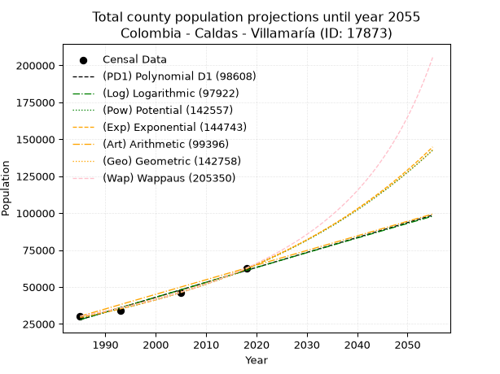
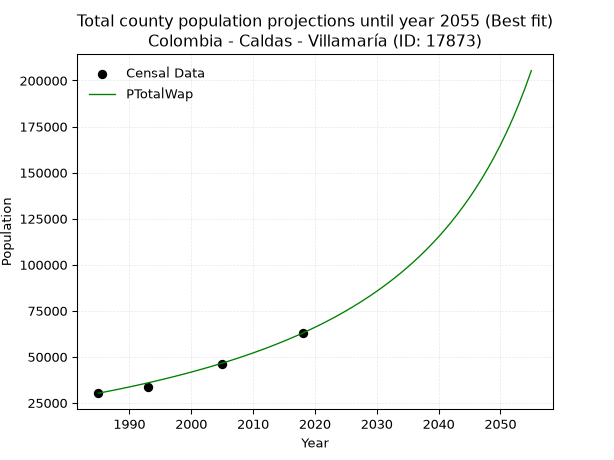
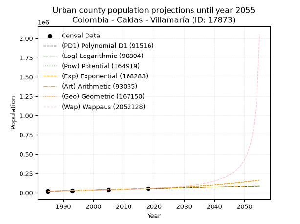
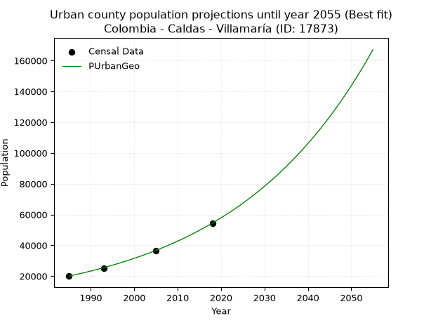
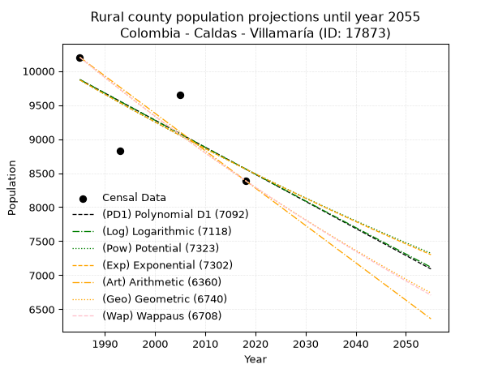
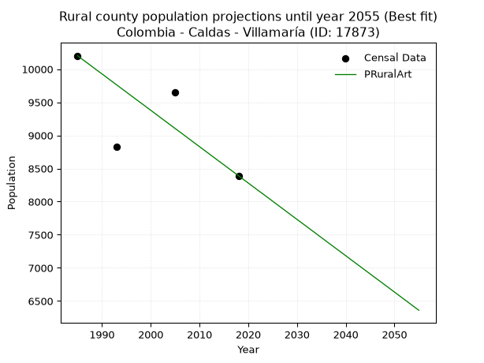

<div align="center">


</div>

# _“Population and Public Services Demand Projections (PPSD) until Year 2050 for Colombia - Caldas - Villamaría (ID: 17873)”_
Keywords: `population` `public-service` `projection` `lineal` `polynomial` `logarithmic` `potential` `exponential` `arithmetic` `geometric` `wappaus` `dane` `colombia` `south-america`

PPSD are analytical estimates used by governments and planners to anticipate future changes in population size, age distribution, and the resulting community needs for utilities, healthcare, education, and infrastructure as sizing future water treatment facilities, electrical grids, and road networks based on spatial growth.

> **General running parameters**: • app_version: _v20260806_. • Python version: _3.14.7_. • Pandas version: _3.0.5_. • NumPy version: _2.5.1_. • Creates, save and include plots into reports (create_plot): _False_. • Projection until year: _2050_. • Process polynomial degree 2 and up: _False_. • Process Wappaus: _True_. • Process Wappaus: _True_. • Set negative values to zero: _True_. • Set infinite values to zero: _True_. • Drop dataset notes: _True_. 
<div align="center">

Dynamic map: [:earth_americas:Google](http://maps.google.com/maps?q=5.038925113,-75.5024865) [:earth_americas:OSM](https://www.openstreetmap.org/#map=18/5.038925113/-75.5024865&layers=P) [:earth_americas:Bing](https://www.bing.com/maps?cp=5.038925113~-75.5024865&lvl=18) [:earth_americas:Apple](https://maps.apple.com/frame?center=5.038925113%2C-75.5024865&span=0.003%2C0.006)

</div>


<div align="center">

```geojson
{
  "type": "Feature",
  "geometry": {
    "type": "Point", 
    "coordinates": [-75.5024865, 5.038925113]
  }, 
  "properties": {
    "Name": "Colombia - Caldas - Villamaría (ID: 17873)"
  }
}
```

</div>


## 0. Census Data (4 records)

Census data are official statistics collected by a government about the people and housing in a country. They usually include counts of total population, age, sex, race, income, education, and jobs.

📅Global census file: [Population.xlsx](../data/Population.xlsx)

| Source   |   Year |   CountryID | CountryName   |   StateID | StateName   |   CountyID | CountyName   |   PTotal |   PUrban |   PRural |
|:---------|-------:|------------:|:--------------|----------:|:------------|-----------:|:-------------|---------:|---------:|---------:|
| DANE     |   1985 |          57 | Colombia      |        17 | Caldas      |      17873 | Villamaría   |    30219 |    20017 |    10202 |
| DANE     |   1993 |          57 | Colombia      |        17 | Caldas      |      17873 | Villamaría   |    33848 |    25024 |     8824 |
| DANE     |   2005 |          57 | Colombia      |        17 | Caldas      |      17873 | Villamaría   |    46322 |    36667 |     9655 |
| DANE     |   2018 |          57 | Colombia      |        17 | Caldas      |      17873 | Villamaría   |    62831 |    54440 |     8391 |

> 🔥Some records could had specific notes about the registered values or the corresponding urban or rural distribution.

**Local public utility companies (RUPS)**

 | SERVICIO       | ESTADO    | NOMBRE                                     | NIT         | DEPARTAMENTO_DOMICILIO   | MUNICIPIO_DOMICILIO   | DIRECCION                                            |      TELEFONO | EMAIL                                            | TIPO_INSCRIPCION    | REPRESENTANTE_LEGAL               | TIPO_PRESTADOR                             | CLASIFICACION                  |
|:---------------|:----------|:-------------------------------------------|:------------|:-------------------------|:----------------------|:-----------------------------------------------------|--------------:|:-------------------------------------------------|:--------------------|:----------------------------------|:-------------------------------------------|:-------------------------------|
| ASEO           | OPERATIVA | AQUAMANA E.S.P.                            | 810001898-1 | CALDAS                   | VILLAMARIA            | CALLE 9 Nº 4-29                                      |   8.77514e+06 | aagcsis@gmail.com                                | Registro por la ESP | JUAN PABLO BUITRAGO QUICENO       | EMPRESA INDUSTRIAL Y COMERCIAL DEL ESTADO  | DESDE 2501 HASTA 5000 USUARIOS |
| ACUEDUCTO      | OPERATIVA | AQUAMANA E.S.P.                            | 810001898-1 | CALDAS                   | VILLAMARIA            | CALLE 9 Nº 4-29                                      |   8.77514e+06 | aagcsis@gmail.com                                | Registro por la ESP | JUAN PABLO BUITRAGO QUICENO       | EMPRESA INDUSTRIAL Y COMERCIAL DEL ESTADO  | MAYOR O IGUAL A 5001 USUARIOS  |
| ALCANTARILLADO | OPERATIVA | AQUAMANA E.S.P.                            | 810001898-1 | CALDAS                   | VILLAMARIA            | CALLE 9 Nº 4-29                                      |   8.77514e+06 | aagcsis@gmail.com                                | Registro por la ESP | JUAN PABLO BUITRAGO QUICENO       | EMPRESA INDUSTRIAL Y COMERCIAL DEL ESTADO  | MAYOR O IGUAL A 5001 USUARIOS  |
| ASEO           | OPERATIVA | EMPRESA METROPOLITANA DE ASEO S.A.  E.S.P. | 800249174-5 | CALDAS                   | MANIZALES             | Kilometro 2 via Neira Relleno Sanitario La Esmeralda |   8.84587e+06 | german.sanchez-loaiza@veolia.com                 | Registro por la ESP | JUAN CARLOS QUINTERO NARANJO      | SOCIEDADES (EMPRESA DE SERVICIOS PUBLICOS) | MAYOR O IGUAL A 5001 USUARIOS  |
| ACUEDUCTO      | OPERATIVA | AGUAS DE MANIZALES S.A  E.S.P              | 810000598-0 | CALDAS                   | MANIZALES             | AVENIDA KEVIN ANGEL  No  59 - 181                    |   8.87977e+06 | notificacionesjudiciales@aguasdemanizales.com.co | Registro por la ESP | OMAR ELIUD NOVA HENAO             | SOCIEDADES (EMPRESA DE SERVICIOS PUBLICOS) | MAYOR O IGUAL A 5001 USUARIOS  |
| ALCANTARILLADO | OPERATIVA | AGUAS DE MANIZALES S.A  E.S.P              | 810000598-0 | CALDAS                   | MANIZALES             | AVENIDA KEVIN ANGEL  No  59 - 181                    |   8.87977e+06 | notificacionesjudiciales@aguasdemanizales.com.co | Registro por la ESP | OMAR ELIUD NOVA HENAO             | SOCIEDADES (EMPRESA DE SERVICIOS PUBLICOS) | MAYOR O IGUAL A 5001 USUARIOS  |
| ASEO           | OPERATIVA | Asociación Recicaldas                      | 901309488-7 | nan                      | nan                   | nan                                                  | nan           | nan                                              | Registro por la ESP | JOSE REINEL GOMEZ ACOSTA          | ORGANIZACION AUTORIZADA                    | MAYOR O IGUAL A 5001 USUARIOS  |
| ASEO           | OPERATIVA | Asociacion Recical                         | 901402224-7 | CALDAS                   | VILLAMARIA            | KM 8 LT 3 AVE. PANAMERICANA                          |   8.71227e+06 | asorecical@gmail.com                             | Registro por la ESP | JOHAN GUSTAVO GUTIERREZ GUTIERREZ | ORGANIZACION AUTORIZADA                    | DESDE 2501 HASTA 5000 USUARIOS |

> [📅RUPS Database: Registro Único de Prestadores de Servicios Públicos de Colombia Suramérica - RUPS](https://www.datos.gov.co/Hacienda-y-Cr-dito-P-blico/Registro-nico-de-Prestadores-de-Servicios-P-blicos/4qkq-csdn/about_data)

## 1. Total

### 1.1. Coefficients and Parameters

* (PD1) Polynomial Deg 1: 1010.1035728622932, -1977154.671617802 (lineal)
* (Log) Logarithmic: 2021129.2426632568, -15319314.569796698
* (Pow) Potential: 45.632788060862, -146.01885045636928
* (Exp) Exponential: 0.022801016556285386, 6.475251788329152e-16
* (Art) Arithmetic: Year diff. 2018 - 1985 = 33, Population diff. 62831 - 30219 = 32612, Annual growth = 988.2424242424242
* (Geo) Geometric: Year diff. 2018 - 1985 = 33, Population diff. 62831 - 30219 = 32612, Annual growth % = 0.022428973474996727
* (Wap) Wappaus: i = 2.124110530343738, Condition values only valid for < 200)

<sub>
Wappaus condition values: ['0.00', '2.12', '4.25', '6.37', '8.50', '10.62', '12.74', '14.87', '16.99', '19.12', '21.24', '23.37', '25.49', '27.61', '29.74', '31.86', '33.99', '36.11', '38.23', '40.36', '42.48', '44.61', '46.73', '48.85', '50.98', '53.10', '55.23', '57.35', '59.48', '61.60', '63.72', '65.85', '67.97', '70.10', '72.22', '74.34', '76.47', '78.59', '80.72', '82.84', '84.96', '87.09', '89.21', '91.34', '93.46', '95.58', '97.71', '99.83', '101.96', '104.08', '106.21', '108.33', '110.45', '112.58', '114.70', '116.83', '118.95', '121.07', '123.20', '125.32', '127.45', '129.57', '131.69', '133.82', '135.94', '138.07']
</sub>


### 1.2. Projected Dataset

|   Year |   CountyID |   PTotalPD1 |   PTotalLog |   PTotalPow |   PTotalExp |   PTotalArt |   PTotalGeo |   PTotalWap |
|-------:|-----------:|------------:|------------:|------------:|------------:|------------:|------------:|------------:|
|   1985 |      17873 |       27901 |       27876 |       29319 |       29338 |       30219 |       30219 |       30219 |
|   1986 |      17873 |       28911 |       28894 |       30001 |       30015 |       31207 |       30897 |       30868 |
|   1987 |      17873 |       29921 |       29911 |       30698 |       30707 |       32195 |       31590 |       31531 |
|   1988 |      17873 |       30931 |       30928 |       31411 |       31415 |       33184 |       32298 |       32208 |
|   1989 |      17873 |       31941 |       31945 |       32140 |       32140 |       34172 |       33023 |       32900 |
|   1990 |      17873 |       32951 |       32961 |       32886 |       32881 |       35160 |       33763 |       33608 |
|   1991 |      17873 |       33962 |       33976 |       33649 |       33639 |       36148 |       34521 |       34332 |
|   1992 |      17873 |       34972 |       34991 |       34429 |       34415 |       37137 |       35295 |       35073 |
|   1993 |      17873 |       35982 |       36005 |       35226 |       35209 |       38125 |       36087 |       35831 |
|   1994 |      17873 |       36992 |       37019 |       36042 |       36021 |       39113 |       36896 |       36607 |
|   1995 |      17873 |       38002 |       38033 |       36876 |       36852 |       40101 |       37723 |       37401 |
|   1996 |      17873 |       39012 |       39045 |       37729 |       37701 |       41090 |       38570 |       38214 |
|   1997 |      17873 |       40022 |       40058 |       38601 |       38571 |       42078 |       39435 |       39047 |
|   1998 |      17873 |       41032 |       41070 |       39493 |       39461 |       43066 |       40319 |       39900 |
|   1999 |      17873 |       42042 |       42081 |       40405 |       40371 |       44054 |       41223 |       40775 |
|   2000 |      17873 |       43052 |       43092 |       41338 |       41302 |       45043 |       42148 |       41672 |
|   2001 |      17873 |       44063 |       44102 |       42292 |       42254 |       46031 |       43093 |       42592 |
|   2002 |      17873 |       45073 |       45112 |       43267 |       43229 |       47019 |       44060 |       43535 |
|   2003 |      17873 |       46083 |       46121 |       44265 |       44226 |       48007 |       45048 |       44504 |
|   2004 |      17873 |       47093 |       47130 |       45284 |       45246 |       48996 |       46059 |       45498 |
|   2005 |      17873 |       48103 |       48138 |       46327 |       46289 |       49984 |       47092 |       46519 |
|   2006 |      17873 |       49113 |       49146 |       47393 |       47357 |       50972 |       48148 |       47568 |
|   2007 |      17873 |       50123 |       50153 |       48483 |       48449 |       51960 |       49228 |       48646 |
|   2008 |      17873 |       51133 |       51160 |       49598 |       49566 |       52949 |       50332 |       49754 |
|   2009 |      17873 |       52143 |       52166 |       50738 |       50709 |       53937 |       51461 |       50894 |
|   2010 |      17873 |       53154 |       53172 |       51903 |       51879 |       54925 |       52615 |       52067 |
|   2011 |      17873 |       54164 |       54177 |       53095 |       53075 |       55913 |       53795 |       53274 |
|   2012 |      17873 |       55174 |       55182 |       54313 |       54300 |       56902 |       55002 |       54518 |
|   2013 |      17873 |       56184 |       56186 |       55559 |       55552 |       57890 |       56235 |       55798 |
|   2014 |      17873 |       57194 |       57190 |       56832 |       56833 |       58878 |       57496 |       57119 |
|   2015 |      17873 |       58204 |       58194 |       58134 |       58144 |       59866 |       58786 |       58480 |
|   2016 |      17873 |       59214 |       59196 |       59466 |       59485 |       60855 |       60105 |       59884 |
|   2017 |      17873 |       60224 |       60199 |       60827 |       60857 |       61843 |       61453 |       61334 |
|   2018 |      17873 |       61234 |       61200 |       62218 |       62260 |       62831 |       62831 |       62831 |
|   2019 |      17873 |       62244 |       62202 |       63641 |       63696 |       63819 |       64240 |       64378 |
|   2020 |      17873 |       63255 |       63203 |       65095 |       65165 |       64807 |       65681 |       65977 |
|   2021 |      17873 |       64265 |       64203 |       66582 |       66668 |       65796 |       67154 |       67631 |
|   2022 |      17873 |       65275 |       65203 |       68102 |       68206 |       66784 |       68660 |       69343 |
|   2023 |      17873 |       66285 |       66202 |       69656 |       69779 |       67772 |       70200 |       71116 |
|   2024 |      17873 |       67295 |       67201 |       71245 |       71388 |       68760 |       71775 |       72953 |
|   2025 |      17873 |       68305 |       68199 |       72869 |       73034 |       69749 |       73385 |       74858 |
|   2026 |      17873 |       69315 |       69197 |       74529 |       74719 |       70737 |       75031 |       76835 |
|   2027 |      17873 |       70325 |       70194 |       76226 |       76442 |       71725 |       76714 |       78887 |
|   2028 |      17873 |       71335 |       71191 |       77962 |       78205 |       72713 |       78434 |       81020 |
|   2029 |      17873 |       72345 |       72188 |       79735 |       80009 |       73702 |       80193 |       83238 |
|   2030 |      17873 |       73356 |       73183 |       81548 |       81854 |       74690 |       81992 |       85546 |
|   2031 |      17873 |       74366 |       74179 |       83402 |       83742 |       75678 |       83831 |       87950 |
|   2032 |      17873 |       75376 |       75174 |       85296 |       85673 |       76666 |       85711 |       90456 |
|   2033 |      17873 |       76386 |       76168 |       87233 |       87649 |       77655 |       87634 |       93070 |
|   2034 |      17873 |       77396 |       77162 |       89213 |       89670 |       78643 |       89599 |       95800 |
|   2035 |      17873 |       78406 |       78156 |       91236 |       91738 |       79631 |       91609 |       98654 |
|   2036 |      17873 |       79416 |       79148 |       93305 |       93854 |       80619 |       93664 |      101640 |
|   2037 |      17873 |       80426 |       80141 |       95419 |       96019 |       81608 |       95764 |      104768 |
|   2038 |      17873 |       81436 |       81133 |       97580 |       98233 |       82596 |       97912 |      108048 |
|   2039 |      17873 |       82447 |       82124 |       99789 |      100499 |       83584 |      100108 |      111491 |
|   2040 |      17873 |       83457 |       83115 |      102047 |      102816 |       84572 |      102354 |      115110 |
|   2041 |      17873 |       84467 |       84106 |      104355 |      105188 |       85561 |      104649 |      118919 |
|   2042 |      17873 |       85477 |       85096 |      106714 |      107614 |       86549 |      106996 |      122933 |
|   2043 |      17873 |       86487 |       86085 |      109125 |      110095 |       87537 |      109396 |      127168 |
|   2044 |      17873 |       87497 |       87074 |      111589 |      112635 |       88525 |      111850 |      131645 |
|   2045 |      17873 |       88507 |       88063 |      114108 |      115232 |       89514 |      114359 |      136384 |
|   2046 |      17873 |       89517 |       89051 |      116682 |      117890 |       90502 |      116924 |      141409 |
|   2047 |      17873 |       90527 |       90039 |      119313 |      120609 |       91490 |      119546 |      146746 |
|   2048 |      17873 |       91537 |       91026 |      122002 |      123390 |       92478 |      122227 |      152425 |
|   2049 |      17873 |       92548 |       92012 |      124750 |      126236 |       93467 |      124969 |      158482 |
|   2050 |      17873 |       93558 |       92999 |      127559 |      129147 |       94455 |      127772 |      164954 |
<div align="center">

</img>

</div>


### 1.3. Best fit with absolute and relative error (%)

Relative error puts that difference into context by dividing the absolute error by the true value, creating a unitless ratio or percentage that shows the scale of the mistake.

Absolute and relative error

|   Year | Source   |   CountryID | CountryName   |   StateID | StateName   |   CountyID_x | CountyName   |   PTotal |   PUrban |   PRural |   CountyID_y |   PTotalPD1 |   PTotalLog |   PTotalPow |   PTotalExp |   PTotalArt |   PTotalGeo |   PTotalWap |   PTotalPD1AbsError |   PTotalLogAbsError |   PTotalPowAbsError |   PTotalExpAbsError |   PTotalArtAbsError |   PTotalGeoAbsError |   PTotalWapAbsError |   PTotalPD1RelError |   PTotalLogRelError |   PTotalPowRelError |   PTotalExpRelError |   PTotalArtRelError |   PTotalGeoRelError |   PTotalWapRelError |
|-------:|:---------|------------:|:--------------|----------:|:------------|-------------:|:-------------|---------:|---------:|---------:|-------------:|------------:|------------:|------------:|------------:|------------:|------------:|------------:|--------------------:|--------------------:|--------------------:|--------------------:|--------------------:|--------------------:|--------------------:|--------------------:|--------------------:|--------------------:|--------------------:|--------------------:|--------------------:|--------------------:|
|   1985 | DANE     |          57 | Colombia      |        17 | Caldas      |        17873 | Villamaría   |    30219 |    20017 |    10202 |        17873 |       27901 |       27876 |       29319 |       29338 |       30219 |       30219 |       30219 |                2318 |                2343 |                 900 |                 881 |                   0 |                   0 |                   0 |             7.67067 |             7.7534  |            2.97826  |           2.91538   |             0       |             0       |            0        |
|   1993 | DANE     |          57 | Colombia      |        17 | Caldas      |        17873 | Villamaría   |    33848 |    25024 |     8824 |        17873 |       35982 |       36005 |       35226 |       35209 |       38125 |       36087 |       35831 |                2134 |                2157 |                1378 |                1361 |                4277 |                2239 |                1983 |             6.30466 |             6.37261 |            4.07114  |           4.02092   |            12.6359  |             6.61487 |            5.85854  |
|   2005 | DANE     |          57 | Colombia      |        17 | Caldas      |        17873 | Villamaría   |    46322 |    36667 |     9655 |        17873 |       48103 |       48138 |       46327 |       46289 |       49984 |       47092 |       46519 |                1781 |                1816 |                   5 |                  33 |                3662 |                 770 |                 197 |             3.84483 |             3.92038 |            0.010794 |           0.0712404 |             7.90553 |             1.66228 |            0.425284 |
|   2018 | DANE     |          57 | Colombia      |        17 | Caldas      |        17873 | Villamaría   |    62831 |    54440 |     8391 |        17873 |       61234 |       61200 |       62218 |       62260 |       62831 |       62831 |       62831 |                1597 |                1631 |                 613 |                 571 |                   0 |                   0 |                   0 |             2.54174 |             2.59585 |            0.975633 |           0.908787  |             0       |             0       |            0        |

Relative error mean

| Method    |   RelError | Best   |
|:----------|-----------:|:-------|
| PTotalPD1 |    5.09047 |        |
| PTotalLog |    5.16056 |        |
| PTotalPow |    2.00896 |        |
| PTotalExp |    1.97908 |        |
| PTotalArt |    5.13536 |        |
| PTotalGeo |    2.06929 |        |
| PTotalWap |    1.57096 | True   |

💙Best method: _**PTotalWap**_
<div align="center">

</img>

</div>


### 1.4. Fresh water supply demand in liters per capita per day (lpcd)

The fresh water supply demand typically ranges from 100 to 300 liters per capita per day (lpcd) for standard domestic and municipal planning, though absolute survival minimums set by the World Health Organization are as low as 7.5 to 20 liters per day, and total consumption in high-income nations can exceed 400 liters.

> `CZ`: Level in meters above the sea level (masl)<br> `WS`: Fresh water supply demand in liters per capita per day (lpcd or l/h/d)<br> `WSAll`: Zonal fresh water supply demand in liters per second (l/s)<br> `A`: Zonal area in square meters<br> `DP`: Population density (people/hectare or p/ha)

Reference values (RAS Colombia)

|    CZ |   WS |
|------:|-----:|
|  1000 |  120 |
|  2000 |  130 |
| 99999 |  140 |

County shapefile geometry properties and water supply values

|   CountyID |      ATotal |   CZTotal |   WSTotal |
|-----------:|------------:|----------:|----------:|
|      17873 | 4.54871e+08 |   3040.01 |       140 |

Projected values for best method: PTotalWap

|   CountyID |   Year |   PTotalWap |   DPTotal |   WSTotal |   WSTotalAll |
|-----------:|-------:|------------:|----------:|----------:|-------------:|
|      17873 |   1985 |       30219 |      0.66 |       140 |      48.966  |
|      17873 |   1986 |       30868 |      0.68 |       140 |      50.0176 |
|      17873 |   1987 |       31531 |      0.69 |       140 |      51.0919 |
|      17873 |   1988 |       32208 |      0.71 |       140 |      52.1889 |
|      17873 |   1989 |       32900 |      0.72 |       140 |      53.3102 |
|      17873 |   1990 |       33608 |      0.74 |       140 |      54.4574 |
|      17873 |   1991 |       34332 |      0.75 |       140 |      55.6306 |
|      17873 |   1992 |       35073 |      0.77 |       140 |      56.8312 |
|      17873 |   1993 |       35831 |      0.79 |       140 |      58.0595 |
|      17873 |   1994 |       36607 |      0.8  |       140 |      59.3169 |
|      17873 |   1995 |       37401 |      0.82 |       140 |      60.6035 |
|      17873 |   1996 |       38214 |      0.84 |       140 |      61.9208 |
|      17873 |   1997 |       39047 |      0.86 |       140 |      63.2706 |
|      17873 |   1998 |       39900 |      0.88 |       140 |      64.6528 |
|      17873 |   1999 |       40775 |      0.9  |       140 |      66.0706 |
|      17873 |   2000 |       41672 |      0.92 |       140 |      67.5241 |
|      17873 |   2001 |       42592 |      0.94 |       140 |      69.0148 |
|      17873 |   2002 |       43535 |      0.96 |       140 |      70.5428 |
|      17873 |   2003 |       44504 |      0.98 |       140 |      72.113  |
|      17873 |   2004 |       45498 |      1    |       140 |      73.7236 |
|      17873 |   2005 |       46519 |      1.02 |       140 |      75.378  |
|      17873 |   2006 |       47568 |      1.05 |       140 |      77.0778 |
|      17873 |   2007 |       48646 |      1.07 |       140 |      78.8245 |
|      17873 |   2008 |       49754 |      1.09 |       140 |      80.6199 |
|      17873 |   2009 |       50894 |      1.12 |       140 |      82.4671 |
|      17873 |   2010 |       52067 |      1.14 |       140 |      84.3678 |
|      17873 |   2011 |       53274 |      1.17 |       140 |      86.3236 |
|      17873 |   2012 |       54518 |      1.2  |       140 |      88.3394 |
|      17873 |   2013 |       55798 |      1.23 |       140 |      90.4134 |
|      17873 |   2014 |       57119 |      1.26 |       140 |      92.5539 |
|      17873 |   2015 |       58480 |      1.29 |       140 |      94.7593 |
|      17873 |   2016 |       59884 |      1.32 |       140 |      97.0343 |
|      17873 |   2017 |       61334 |      1.35 |       140 |      99.3838 |
|      17873 |   2018 |       62831 |      1.38 |       140 |     101.809  |
|      17873 |   2019 |       64378 |      1.42 |       140 |     104.316  |
|      17873 |   2020 |       65977 |      1.45 |       140 |     106.907  |
|      17873 |   2021 |       67631 |      1.49 |       140 |     109.587  |
|      17873 |   2022 |       69343 |      1.52 |       140 |     112.361  |
|      17873 |   2023 |       71116 |      1.56 |       140 |     115.234  |
|      17873 |   2024 |       72953 |      1.6  |       140 |     118.211  |
|      17873 |   2025 |       74858 |      1.65 |       140 |     121.298  |
|      17873 |   2026 |       76835 |      1.69 |       140 |     124.501  |
|      17873 |   2027 |       78887 |      1.73 |       140 |     127.826  |
|      17873 |   2028 |       81020 |      1.78 |       140 |     131.282  |
|      17873 |   2029 |       83238 |      1.83 |       140 |     134.876  |
|      17873 |   2030 |       85546 |      1.88 |       140 |     138.616  |
|      17873 |   2031 |       87950 |      1.93 |       140 |     142.512  |
|      17873 |   2032 |       90456 |      1.99 |       140 |     146.572  |
|      17873 |   2033 |       93070 |      2.05 |       140 |     150.808  |
|      17873 |   2034 |       95800 |      2.11 |       140 |     155.231  |
|      17873 |   2035 |       98654 |      2.17 |       140 |     159.856  |
|      17873 |   2036 |      101640 |      2.23 |       140 |     164.694  |
|      17873 |   2037 |      104768 |      2.3  |       140 |     169.763  |
|      17873 |   2038 |      108048 |      2.38 |       140 |     175.078  |
|      17873 |   2039 |      111491 |      2.45 |       140 |     180.657  |
|      17873 |   2040 |      115110 |      2.53 |       140 |     186.521  |
|      17873 |   2041 |      118919 |      2.61 |       140 |     192.693  |
|      17873 |   2042 |      122933 |      2.7  |       140 |     199.197  |
|      17873 |   2043 |      127168 |      2.8  |       140 |     206.059  |
|      17873 |   2044 |      131645 |      2.89 |       140 |     213.314  |
|      17873 |   2045 |      136384 |      3    |       140 |     220.993  |
|      17873 |   2046 |      141409 |      3.11 |       140 |     229.135  |
|      17873 |   2047 |      146746 |      3.23 |       140 |     237.783  |
|      17873 |   2048 |      152425 |      3.35 |       140 |     246.985  |
|      17873 |   2049 |      158482 |      3.48 |       140 |     256.8    |
|      17873 |   2050 |      164954 |      3.63 |       140 |     267.287  |

## 2. Urban

### 2.1. Coefficients and Parameters

* (PD1) Polynomial Deg 1: 1049.8514652749782, -2065928.393416275 (lineal)
* (Log) Logarithmic: 2100687.2953436184, -15933303.965758348
* (Pow) Potential: 61.118320642859786, -197.25622417828782
* (Exp) Exponential: 0.03053512066837157, 9.423303400721152e-23
* (Art) Arithmetic: Year diff. 2018 - 1985 = 33, Population diff. 54440 - 20017 = 34423, Annual growth = 1043.121212121212
* (Geo) Geometric: Year diff. 2018 - 1985 = 33, Population diff. 54440 - 20017 = 34423, Annual growth % = 0.030782997313016702
* (Wap) Wappaus: i = 2.801942630299937, Condition values only valid for < 200)

<sub>
Wappaus condition values: ['0.00', '2.80', '5.60', '8.41', '11.21', '14.01', '16.81', '19.61', '22.42', '25.22', '28.02', '30.82', '33.62', '36.43', '39.23', '42.03', '44.83', '47.63', '50.43', '53.24', '56.04', '58.84', '61.64', '64.44', '67.25', '70.05', '72.85', '75.65', '78.45', '81.26', '84.06', '86.86', '89.66', '92.46', '95.27', '98.07', '100.87', '103.67', '106.47', '109.28', '112.08', '114.88', '117.68', '120.48', '123.29', '126.09', '128.89', '131.69', '134.49', '137.30', '140.10', '142.90', '145.70', '148.50', '151.30', '154.11', '156.91', '159.71', '162.51', '165.31', '168.12', '170.92', '173.72', '176.52', '179.32', '182.13']
</sub>


### 2.2. Projected Dataset

|   Year |   CountyID |   PUrbanPD1 |   PUrbanLog |   PUrbanPow |   PUrbanExp |   PUrbanArt |   PUrbanGeo |   PUrbanWap |
|-------:|-----------:|------------:|------------:|------------:|------------:|------------:|------------:|------------:|
|   1985 |      17873 |       18027 |       18001 |       19832 |       19850 |       20017 |       20017 |       20017 |
|   1986 |      17873 |       19077 |       19059 |       20452 |       20465 |       21060 |       20633 |       20586 |
|   1987 |      17873 |       20126 |       20116 |       21091 |       21100 |       22103 |       21268 |       21171 |
|   1988 |      17873 |       21176 |       21173 |       21749 |       21754 |       23146 |       21923 |       21773 |
|   1989 |      17873 |       22226 |       22230 |       22428 |       22428 |       24189 |       22598 |       22394 |
|   1990 |      17873 |       23276 |       23285 |       23128 |       23124 |       25233 |       23294 |       23033 |
|   1991 |      17873 |       24326 |       24341 |       23849 |       23841 |       26276 |       24011 |       23691 |
|   1992 |      17873 |       25376 |       25396 |       24592 |       24580 |       27319 |       24750 |       24370 |
|   1993 |      17873 |       26426 |       26450 |       25358 |       25342 |       28362 |       25512 |       25070 |
|   1994 |      17873 |       27475 |       27504 |       26148 |       26128 |       29405 |       26297 |       25793 |
|   1995 |      17873 |       28525 |       28557 |       26962 |       26938 |       30448 |       27106 |       26539 |
|   1996 |      17873 |       29575 |       29610 |       27800 |       27773 |       31491 |       27941 |       27310 |
|   1997 |      17873 |       30625 |       30662 |       28664 |       28634 |       32534 |       28801 |       28108 |
|   1998 |      17873 |       31675 |       31714 |       29555 |       29522 |       33578 |       29687 |       28932 |
|   1999 |      17873 |       32725 |       32765 |       30473 |       30438 |       34621 |       30601 |       29785 |
|   2000 |      17873 |       33775 |       33815 |       31419 |       31381 |       35664 |       31543 |       30668 |
|   2001 |      17873 |       34824 |       34865 |       32393 |       32354 |       36707 |       32514 |       31584 |
|   2002 |      17873 |       35874 |       35915 |       33398 |       33358 |       37750 |       33515 |       32532 |
|   2003 |      17873 |       36924 |       36964 |       34433 |       34392 |       38793 |       34547 |       33517 |
|   2004 |      17873 |       37974 |       38012 |       35499 |       35458 |       39836 |       35610 |       34539 |
|   2005 |      17873 |       39024 |       39060 |       36598 |       36558 |       40879 |       36707 |       35601 |
|   2006 |      17873 |       40074 |       40108 |       37731 |       37691 |       41923 |       37837 |       36705 |
|   2007 |      17873 |       41123 |       41155 |       38898 |       38860 |       42966 |       39001 |       37853 |
|   2008 |      17873 |       42173 |       42201 |       40100 |       40065 |       44009 |       40202 |       39050 |
|   2009 |      17873 |       43223 |       43247 |       41339 |       41307 |       45052 |       41439 |       40296 |
|   2010 |      17873 |       44273 |       44293 |       42616 |       42588 |       46095 |       42715 |       41597 |
|   2011 |      17873 |       45323 |       45337 |       43931 |       43908 |       47138 |       44030 |       42955 |
|   2012 |      17873 |       46373 |       46382 |       45287 |       45270 |       48181 |       45385 |       44373 |
|   2013 |      17873 |       47423 |       47426 |       46683 |       46673 |       49224 |       46782 |       45858 |
|   2014 |      17873 |       48472 |       48469 |       48122 |       48120 |       50268 |       48222 |       47412 |
|   2015 |      17873 |       49522 |       49512 |       49604 |       49612 |       51311 |       49707 |       49042 |
|   2016 |      17873 |       50572 |       50554 |       51131 |       51151 |       52354 |       51237 |       50752 |
|   2017 |      17873 |       51622 |       51596 |       52705 |       52737 |       53397 |       52814 |       52549 |
|   2018 |      17873 |       52672 |       52637 |       54326 |       54372 |       54440 |       54440 |       54440 |
|   2019 |      17873 |       53722 |       53678 |       55996 |       56058 |       55483 |       56116 |       56432 |
|   2020 |      17873 |       54772 |       54718 |       57717 |       57796 |       56526 |       57843 |       58533 |
|   2021 |      17873 |       55821 |       55757 |       59489 |       59588 |       57569 |       59624 |       60754 |
|   2022 |      17873 |       56871 |       56797 |       61315 |       61435 |       58612 |       61459 |       63103 |
|   2023 |      17873 |       57921 |       57835 |       63196 |       63340 |       59656 |       63351 |       65593 |
|   2024 |      17873 |       58971 |       58873 |       65134 |       65304 |       60699 |       65301 |       68237 |
|   2025 |      17873 |       60021 |       59911 |       67131 |       67329 |       61742 |       67311 |       71050 |
|   2026 |      17873 |       61071 |       60948 |       69187 |       69417 |       62785 |       69383 |       74047 |
|   2027 |      17873 |       62121 |       61985 |       71306 |       71569 |       63828 |       71519 |       77249 |
|   2028 |      17873 |       63170 |       63021 |       73488 |       73788 |       64871 |       73721 |       80677 |
|   2029 |      17873 |       64220 |       64057 |       75736 |       76076 |       65914 |       75990 |       84354 |
|   2030 |      17873 |       65270 |       65092 |       78051 |       78435 |       66957 |       78329 |       88311 |
|   2031 |      17873 |       66320 |       66126 |       80436 |       80867 |       68001 |       80741 |       92579 |
|   2032 |      17873 |       67370 |       67160 |       82893 |       83374 |       69044 |       83226 |       97198 |
|   2033 |      17873 |       68420 |       68194 |       85423 |       85959 |       70087 |       85788 |      102212 |
|   2034 |      17873 |       69469 |       69227 |       88030 |       88625 |       71130 |       88429 |      107673 |
|   2035 |      17873 |       70519 |       70259 |       90714 |       91372 |       72173 |       91151 |      113646 |
|   2036 |      17873 |       71569 |       71291 |       93480 |       94206 |       73216 |       93957 |      120205 |
|   2037 |      17873 |       72619 |       72323 |       96328 |       97126 |       74259 |       96849 |      127441 |
|   2038 |      17873 |       73669 |       73354 |       99261 |      100138 |       75302 |       99830 |      135464 |
|   2039 |      17873 |       74719 |       74384 |      102282 |      103243 |       76346 |      102904 |      144410 |
|   2040 |      17873 |       75769 |       75414 |      105393 |      106444 |       77389 |      106071 |      154449 |
|   2041 |      17873 |       76818 |       76444 |      108598 |      109744 |       78432 |      109336 |      165794 |
|   2042 |      17873 |       77868 |       77473 |      111898 |      113147 |       79475 |      112702 |      178716 |
|   2043 |      17873 |       78918 |       78501 |      115297 |      116655 |       80518 |      116171 |      193570 |
|   2044 |      17873 |       79968 |       79529 |      118798 |      120272 |       81561 |      119748 |      210824 |
|   2045 |      17873 |       81018 |       80557 |      122403 |      124002 |       82604 |      123434 |      231110 |
|   2046 |      17873 |       82068 |       81584 |      126115 |      127846 |       83647 |      127233 |      255306 |
|   2047 |      17873 |       83118 |       82610 |      129938 |      131811 |       84691 |      131150 |      284661 |
|   2048 |      17873 |       84167 |       83636 |      133876 |      135897 |       85734 |      135187 |      321023 |
|   2049 |      17873 |       85217 |       84662 |      137930 |      140111 |       86777 |      139349 |      367240 |
|   2050 |      17873 |       86267 |       85687 |      142105 |      144455 |       87820 |      143638 |      427948 |
<div align="center">

</img>

</div>


### 2.3. Best fit with absolute and relative error (%)

Relative error puts that difference into context by dividing the absolute error by the true value, creating a unitless ratio or percentage that shows the scale of the mistake.

Absolute and relative error

|   Year | Source   |   CountryID | CountryName   |   StateID | StateName   |   CountyID_x | CountyName   |   PTotal |   PUrban |   PRural |   CountyID_y |   PUrbanPD1 |   PUrbanLog |   PUrbanPow |   PUrbanExp |   PUrbanArt |   PUrbanGeo |   PUrbanWap |   PUrbanPD1AbsError |   PUrbanLogAbsError |   PUrbanPowAbsError |   PUrbanExpAbsError |   PUrbanArtAbsError |   PUrbanGeoAbsError |   PUrbanWapAbsError |   PUrbanPD1RelError |   PUrbanLogRelError |   PUrbanPowRelError |   PUrbanExpRelError |   PUrbanArtRelError |   PUrbanGeoRelError |   PUrbanWapRelError |
|-------:|:---------|------------:|:--------------|----------:|:------------|-------------:|:-------------|---------:|---------:|---------:|-------------:|------------:|------------:|------------:|------------:|------------:|------------:|------------:|--------------------:|--------------------:|--------------------:|--------------------:|--------------------:|--------------------:|--------------------:|--------------------:|--------------------:|--------------------:|--------------------:|--------------------:|--------------------:|--------------------:|
|   1985 | DANE     |          57 | Colombia      |        17 | Caldas      |        17873 | Villamaría   |    30219 |    20017 |    10202 |        17873 |       18027 |       18001 |       19832 |       19850 |       20017 |       20017 |       20017 |                1990 |                2016 |                 185 |                 167 |                   0 |                   0 |                   0 |             9.94155 |            10.0714  |            0.924214 |            0.834291 |              0      |             0       |            0        |
|   1993 | DANE     |          57 | Colombia      |        17 | Caldas      |        17873 | Villamaría   |    33848 |    25024 |     8824 |        17873 |       26426 |       26450 |       25358 |       25342 |       28362 |       25512 |       25070 |                1402 |                1426 |                 334 |                 318 |                3338 |                 488 |                  46 |             5.60262 |             5.69853 |            1.33472  |            1.27078  |             13.3392 |             1.95013 |            0.183824 |
|   2005 | DANE     |          57 | Colombia      |        17 | Caldas      |        17873 | Villamaría   |    46322 |    36667 |     9655 |        17873 |       39024 |       39060 |       36598 |       36558 |       40879 |       36707 |       35601 |                2357 |                2393 |                  69 |                 109 |                4212 |                  40 |                1066 |             6.42812 |             6.5263  |            0.18818  |            0.29727  |             11.4872 |             0.10909 |            2.90725  |
|   2018 | DANE     |          57 | Colombia      |        17 | Caldas      |        17873 | Villamaría   |    62831 |    54440 |     8391 |        17873 |       52672 |       52637 |       54326 |       54372 |       54440 |       54440 |       54440 |                1768 |                1803 |                 114 |                  68 |                   0 |                   0 |                   0 |             3.24761 |             3.3119  |            0.209405 |            0.124908 |              0      |             0       |            0        |

Relative error mean

| Method    |   RelError | Best   |
|:----------|-----------:|:-------|
| PUrbanPD1 |   6.30498  |        |
| PUrbanLog |   6.40204  |        |
| PUrbanPow |   0.66413  |        |
| PUrbanExp |   0.631812 |        |
| PUrbanArt |   6.20659  |        |
| PUrbanGeo |   0.514804 | True   |
| PUrbanWap |   0.772767 |        |

💙Best method: _**PUrbanGeo**_
<div align="center">

</img>

</div>


### 2.4. Fresh water supply demand in liters per capita per day (lpcd)

The fresh water supply demand typically ranges from 100 to 300 liters per capita per day (lpcd) for standard domestic and municipal planning, though absolute survival minimums set by the World Health Organization are as low as 7.5 to 20 liters per day, and total consumption in high-income nations can exceed 400 liters.

> `CZ`: Level in meters above the sea level (masl)<br> `WS`: Fresh water supply demand in liters per capita per day (lpcd or l/h/d)<br> `WSAll`: Zonal fresh water supply demand in liters per second (l/s)<br> `A`: Zonal area in square meters<br> `DP`: Population density (people/hectare or p/ha)

Reference values (RAS Colombia)

|    CZ |   WS |
|------:|-----:|
|  1000 |  120 |
|  2000 |  130 |
| 99999 |  140 |

County shapefile geometry properties and water supply values

|   CountyID |      AUrban |   CZUrban |   WSUrban |
|-----------:|------------:|----------:|----------:|
|      17873 | 5.00772e+06 |   1928.29 |       130 |

Projected values for best method: PUrbanGeo

|   CountyID |   Year |   PUrbanGeo |   DPUrban |   WSUrban |   WSUrbanAll |
|-----------:|-------:|------------:|----------:|----------:|-------------:|
|      17873 |   1985 |       20017 |     39.97 |       130 |      30.1182 |
|      17873 |   1986 |       20633 |     41.2  |       130 |      31.045  |
|      17873 |   1987 |       21268 |     42.47 |       130 |      32.0005 |
|      17873 |   1988 |       21923 |     43.78 |       130 |      32.986  |
|      17873 |   1989 |       22598 |     45.13 |       130 |      34.0016 |
|      17873 |   1990 |       23294 |     46.52 |       130 |      35.0488 |
|      17873 |   1991 |       24011 |     47.95 |       130 |      36.1277 |
|      17873 |   1992 |       24750 |     49.42 |       130 |      37.2396 |
|      17873 |   1993 |       25512 |     50.95 |       130 |      38.3861 |
|      17873 |   1994 |       26297 |     52.51 |       130 |      39.5672 |
|      17873 |   1995 |       27106 |     54.13 |       130 |      40.7845 |
|      17873 |   1996 |       27941 |     55.8  |       130 |      42.0409 |
|      17873 |   1997 |       28801 |     57.51 |       130 |      43.3348 |
|      17873 |   1998 |       29687 |     59.28 |       130 |      44.6679 |
|      17873 |   1999 |       30601 |     61.11 |       130 |      46.0432 |
|      17873 |   2000 |       31543 |     62.99 |       130 |      47.4605 |
|      17873 |   2001 |       32514 |     64.93 |       130 |      48.9215 |
|      17873 |   2002 |       33515 |     66.93 |       130 |      50.4277 |
|      17873 |   2003 |       34547 |     68.99 |       130 |      51.9804 |
|      17873 |   2004 |       35610 |     71.11 |       130 |      53.5799 |
|      17873 |   2005 |       36707 |     73.3  |       130 |      55.2304 |
|      17873 |   2006 |       37837 |     75.56 |       130 |      56.9307 |
|      17873 |   2007 |       39001 |     77.88 |       130 |      58.6821 |
|      17873 |   2008 |       40202 |     80.28 |       130 |      60.4891 |
|      17873 |   2009 |       41439 |     82.75 |       130 |      62.3503 |
|      17873 |   2010 |       42715 |     85.3  |       130 |      64.2703 |
|      17873 |   2011 |       44030 |     87.92 |       130 |      66.2488 |
|      17873 |   2012 |       45385 |     90.63 |       130 |      68.2876 |
|      17873 |   2013 |       46782 |     93.42 |       130 |      70.3896 |
|      17873 |   2014 |       48222 |     96.3  |       130 |      72.5563 |
|      17873 |   2015 |       49707 |     99.26 |       130 |      74.7906 |
|      17873 |   2016 |       51237 |    102.32 |       130 |      77.0927 |
|      17873 |   2017 |       52814 |    105.47 |       130 |      79.4655 |
|      17873 |   2018 |       54440 |    108.71 |       130 |      81.912  |
|      17873 |   2019 |       56116 |    112.06 |       130 |      84.4338 |
|      17873 |   2020 |       57843 |    115.51 |       130 |      87.0323 |
|      17873 |   2021 |       59624 |    119.06 |       130 |      89.712  |
|      17873 |   2022 |       61459 |    122.73 |       130 |      92.473  |
|      17873 |   2023 |       63351 |    126.51 |       130 |      95.3198 |
|      17873 |   2024 |       65301 |    130.4  |       130 |      98.2538 |
|      17873 |   2025 |       67311 |    134.41 |       130 |     101.278  |
|      17873 |   2026 |       69383 |    138.55 |       130 |     104.396  |
|      17873 |   2027 |       71519 |    142.82 |       130 |     107.61   |
|      17873 |   2028 |       73721 |    147.21 |       130 |     110.923  |
|      17873 |   2029 |       75990 |    151.75 |       130 |     114.337  |
|      17873 |   2030 |       78329 |    156.42 |       130 |     117.856  |
|      17873 |   2031 |       80741 |    161.23 |       130 |     121.485  |
|      17873 |   2032 |       83226 |    166.2  |       130 |     125.224  |
|      17873 |   2033 |       85788 |    171.31 |       130 |     129.079  |
|      17873 |   2034 |       88429 |    176.59 |       130 |     133.053  |
|      17873 |   2035 |       91151 |    182.02 |       130 |     137.148  |
|      17873 |   2036 |       93957 |    187.62 |       130 |     141.37   |
|      17873 |   2037 |       96849 |    193.4  |       130 |     145.722  |
|      17873 |   2038 |       99830 |    199.35 |       130 |     150.207  |
|      17873 |   2039 |      102904 |    205.49 |       130 |     154.832  |
|      17873 |   2040 |      106071 |    211.81 |       130 |     159.598  |
|      17873 |   2041 |      109336 |    218.33 |       130 |     164.51   |
|      17873 |   2042 |      112702 |    225.06 |       130 |     169.575  |
|      17873 |   2043 |      116171 |    231.98 |       130 |     174.794  |
|      17873 |   2044 |      119748 |    239.13 |       130 |     180.176  |
|      17873 |   2045 |      123434 |    246.49 |       130 |     185.722  |
|      17873 |   2046 |      127233 |    254.07 |       130 |     191.439  |
|      17873 |   2047 |      131150 |    261.9  |       130 |     197.332  |
|      17873 |   2048 |      135187 |    269.96 |       130 |     203.406  |
|      17873 |   2049 |      139349 |    278.27 |       130 |     209.669  |
|      17873 |   2050 |      143638 |    286.83 |       130 |     216.122  |

## 3. Rural

### 3.1. Coefficients and Parameters

* (PD1) Polynomial Deg 1: -39.74789241268494, 88773.72179847307 (lineal)
* (Log) Logarithmic: -79558.0526803624, 613989.3959616573
* (Pow) Potential: -8.608216833210482, 32.38210579363954
* (Exp) Exponential: -0.004301088887738657, 50358702.219179444
* (Art) Arithmetic: Year diff. 2018 - 1985 = 33, Population diff. 8391 - 10202 = -1811, Annual growth = -54.878787878787875
* (Geo) Geometric: Year diff. 2018 - 1985 = 33, Population diff. 8391 - 10202 = -1811, Annual growth % = -0.005904441580665609
* (Wap) Wappaus: i = -0.5903166555024781, Condition values only valid for < 200)

<sub>
Wappaus condition values: ['-0.00', '-0.59', '-1.18', '-1.77', '-2.36', '-2.95', '-3.54', '-4.13', '-4.72', '-5.31', '-5.90', '-6.49', '-7.08', '-7.67', '-8.26', '-8.85', '-9.45', '-10.04', '-10.63', '-11.22', '-11.81', '-12.40', '-12.99', '-13.58', '-14.17', '-14.76', '-15.35', '-15.94', '-16.53', '-17.12', '-17.71', '-18.30', '-18.89', '-19.48', '-20.07', '-20.66', '-21.25', '-21.84', '-22.43', '-23.02', '-23.61', '-24.20', '-24.79', '-25.38', '-25.97', '-26.56', '-27.15', '-27.74', '-28.34', '-28.93', '-29.52', '-30.11', '-30.70', '-31.29', '-31.88', '-32.47', '-33.06', '-33.65', '-34.24', '-34.83', '-35.42', '-36.01', '-36.60', '-37.19', '-37.78', '-38.37']
</sub>


### 3.2. Projected Dataset

|   Year |   CountyID |   PRuralPD1 |   PRuralLog |   PRuralPow |   PRuralExp |   PRuralArt |   PRuralGeo |   PRuralWap |
|-------:|-----------:|------------:|------------:|------------:|------------:|------------:|------------:|------------:|
|   1985 |      17873 |        9874 |        9875 |        9869 |        9868 |       10202 |       10202 |       10202 |
|   1986 |      17873 |        9834 |        9835 |        9826 |        9825 |       10147 |       10142 |       10142 |
|   1987 |      17873 |        9795 |        9795 |        9784 |        9783 |       10092 |       10082 |       10082 |
|   1988 |      17873 |        9755 |        9755 |        9741 |        9741 |       10037 |       10022 |       10023 |
|   1989 |      17873 |        9715 |        9715 |        9699 |        9699 |        9982 |        9963 |        9964 |
|   1990 |      17873 |        9675 |        9675 |        9657 |        9658 |        9928 |        9904 |        9905 |
|   1991 |      17873 |        9636 |        9635 |        9616 |        9616 |        9873 |        9846 |        9847 |
|   1992 |      17873 |        9596 |        9595 |        9574 |        9575 |        9818 |        9788 |        9789 |
|   1993 |      17873 |        9556 |        9555 |        9533 |        9534 |        9763 |        9730 |        9731 |
|   1994 |      17873 |        9516 |        9515 |        9492 |        9493 |        9708 |        9672 |        9674 |
|   1995 |      17873 |        9477 |        9476 |        9451 |        9452 |        9653 |        9615 |        9617 |
|   1996 |      17873 |        9437 |        9436 |        9410 |        9412 |        9598 |        9559 |        9560 |
|   1997 |      17873 |        9397 |        9396 |        9370 |        9371 |        9543 |        9502 |        9504 |
|   1998 |      17873 |        9357 |        9356 |        9330 |        9331 |        9489 |        9446 |        9448 |
|   1999 |      17873 |        9318 |        9316 |        9290 |        9291 |        9434 |        9390 |        9392 |
|   2000 |      17873 |        9278 |        9276 |        9250 |        9251 |        9379 |        9335 |        9337 |
|   2001 |      17873 |        9238 |        9237 |        9210 |        9211 |        9324 |        9280 |        9282 |
|   2002 |      17873 |        9198 |        9197 |        9170 |        9172 |        9269 |        9225 |        9227 |
|   2003 |      17873 |        9159 |        9157 |        9131 |        9133 |        9214 |        9170 |        9173 |
|   2004 |      17873 |        9119 |        9117 |        9092 |        9093 |        9159 |        9116 |        9119 |
|   2005 |      17873 |        9079 |        9078 |        9053 |        9054 |        9104 |        9062 |        9065 |
|   2006 |      17873 |        9039 |        9038 |        9014 |        9015 |        9050 |        9009 |        9011 |
|   2007 |      17873 |        9000 |        8998 |        8976 |        8977 |        8995 |        8956 |        8958 |
|   2008 |      17873 |        8960 |        8959 |        8937 |        8938 |        8940 |        8903 |        8905 |
|   2009 |      17873 |        8920 |        8919 |        8899 |        8900 |        8885 |        8850 |        8852 |
|   2010 |      17873 |        8880 |        8880 |        8861 |        8862 |        8830 |        8798 |        8800 |
|   2011 |      17873 |        8841 |        8840 |        8823 |        8824 |        8775 |        8746 |        8748 |
|   2012 |      17873 |        8801 |        8800 |        8785 |        8786 |        8720 |        8695 |        8696 |
|   2013 |      17873 |        8761 |        8761 |        8748 |        8748 |        8665 |        8643 |        8644 |
|   2014 |      17873 |        8721 |        8721 |        8711 |        8711 |        8611 |        8592 |        8593 |
|   2015 |      17873 |        8682 |        8682 |        8673 |        8673 |        8556 |        8541 |        8542 |
|   2016 |      17873 |        8642 |        8642 |        8636 |        8636 |        8501 |        8491 |        8492 |
|   2017 |      17873 |        8602 |        8603 |        8600 |        8599 |        8446 |        8441 |        8441 |
|   2018 |      17873 |        8562 |        8564 |        8563 |        8562 |        8391 |        8391 |        8391 |
|   2019 |      17873 |        8523 |        8524 |        8527 |        8525 |        8336 |        8341 |        8341 |
|   2020 |      17873 |        8483 |        8485 |        8490 |        8489 |        8281 |        8292 |        8292 |
|   2021 |      17873 |        8443 |        8445 |        8454 |        8452 |        8226 |        8243 |        8242 |
|   2022 |      17873 |        8403 |        8406 |        8418 |        8416 |        8171 |        8195 |        8193 |
|   2023 |      17873 |        8364 |        8367 |        8383 |        8380 |        8117 |        8146 |        8144 |
|   2024 |      17873 |        8324 |        8327 |        8347 |        8344 |        8062 |        8098 |        8096 |
|   2025 |      17873 |        8284 |        8288 |        8312 |        8308 |        8007 |        8050 |        8047 |
|   2026 |      17873 |        8244 |        8249 |        8276 |        8272 |        7952 |        8003 |        7999 |
|   2027 |      17873 |        8205 |        8210 |        8241 |        8237 |        7897 |        7955 |        7952 |
|   2028 |      17873 |        8165 |        8170 |        8206 |        8202 |        7842 |        7909 |        7904 |
|   2029 |      17873 |        8125 |        8131 |        8172 |        8166 |        7787 |        7862 |        7857 |
|   2030 |      17873 |        8086 |        8092 |        8137 |        8131 |        7732 |        7815 |        7810 |
|   2031 |      17873 |        8046 |        8053 |        8103 |        8096 |        7678 |        7769 |        7763 |
|   2032 |      17873 |        8006 |        8014 |        8068 |        8062 |        7623 |        7723 |        7716 |
|   2033 |      17873 |        7966 |        7974 |        8034 |        8027 |        7568 |        7678 |        7670 |
|   2034 |      17873 |        7927 |        7935 |        8000 |        7993 |        7513 |        7632 |        7624 |
|   2035 |      17873 |        7887 |        7896 |        7966 |        7958 |        7458 |        7587 |        7578 |
|   2036 |      17873 |        7847 |        7857 |        7933 |        7924 |        7403 |        7543 |        7532 |
|   2037 |      17873 |        7807 |        7818 |        7899 |        7890 |        7348 |        7498 |        7487 |
|   2038 |      17873 |        7768 |        7779 |        7866 |        7856 |        7293 |        7454 |        7442 |
|   2039 |      17873 |        7728 |        7740 |        7833 |        7823 |        7239 |        7410 |        7397 |
|   2040 |      17873 |        7688 |        7701 |        7800 |        7789 |        7184 |        7366 |        7352 |
|   2041 |      17873 |        7648 |        7662 |        7767 |        7756 |        7129 |        7323 |        7308 |
|   2042 |      17873 |        7609 |        7623 |        7734 |        7722 |        7074 |        7279 |        7264 |
|   2043 |      17873 |        7569 |        7584 |        7702 |        7689 |        7019 |        7236 |        7220 |
|   2044 |      17873 |        7529 |        7545 |        7670 |        7656 |        6964 |        7194 |        7176 |
|   2045 |      17873 |        7489 |        7506 |        7637 |        7623 |        6909 |        7151 |        7132 |
|   2046 |      17873 |        7450 |        7467 |        7605 |        7591 |        6854 |        7109 |        7089 |
|   2047 |      17873 |        7410 |        7428 |        7573 |        7558 |        6800 |        7067 |        7046 |
|   2048 |      17873 |        7370 |        7390 |        7542 |        7525 |        6745 |        7025 |        7003 |
|   2049 |      17873 |        7330 |        7351 |        7510 |        7493 |        6690 |        6984 |        6960 |
|   2050 |      17873 |        7291 |        7312 |        7478 |        7461 |        6635 |        6942 |        6918 |
<div align="center">

</img>

</div>


### 3.3. Best fit with absolute and relative error (%)

Relative error puts that difference into context by dividing the absolute error by the true value, creating a unitless ratio or percentage that shows the scale of the mistake.

Absolute and relative error

|   Year | Source   |   CountryID | CountryName   |   StateID | StateName   |   CountyID_x | CountyName   |   PTotal |   PUrban |   PRural |   CountyID_y |   PRuralPD1 |   PRuralLog |   PRuralPow |   PRuralExp |   PRuralArt |   PRuralGeo |   PRuralWap |   PRuralPD1AbsError |   PRuralLogAbsError |   PRuralPowAbsError |   PRuralExpAbsError |   PRuralArtAbsError |   PRuralGeoAbsError |   PRuralWapAbsError |   PRuralPD1RelError |   PRuralLogRelError |   PRuralPowRelError |   PRuralExpRelError |   PRuralArtRelError |   PRuralGeoRelError |   PRuralWapRelError |
|-------:|:---------|------------:|:--------------|----------:|:------------|-------------:|:-------------|---------:|---------:|---------:|-------------:|------------:|------------:|------------:|------------:|------------:|------------:|------------:|--------------------:|--------------------:|--------------------:|--------------------:|--------------------:|--------------------:|--------------------:|--------------------:|--------------------:|--------------------:|--------------------:|--------------------:|--------------------:|--------------------:|
|   1985 | DANE     |          57 | Colombia      |        17 | Caldas      |        17873 | Villamaría   |    30219 |    20017 |    10202 |        17873 |        9874 |        9875 |        9869 |        9868 |       10202 |       10202 |       10202 |                 328 |                 327 |                 333 |                 334 |                   0 |                   0 |                   0 |             3.21506 |             3.20525 |             3.26407 |             3.27387 |             0       |              0      |             0       |
|   1993 | DANE     |          57 | Colombia      |        17 | Caldas      |        17873 | Villamaría   |    33848 |    25024 |     8824 |        17873 |        9556 |        9555 |        9533 |        9534 |        9763 |        9730 |        9731 |                 732 |                 731 |                 709 |                 710 |                 939 |                 906 |                 907 |             8.29556 |             8.28422 |             8.0349  |             8.04624 |            10.6414  |             10.2675 |            10.2788  |
|   2005 | DANE     |          57 | Colombia      |        17 | Caldas      |        17873 | Villamaría   |    46322 |    36667 |     9655 |        17873 |        9079 |        9078 |        9053 |        9054 |        9104 |        9062 |        9065 |                 576 |                 577 |                 602 |                 601 |                 551 |                 593 |                 590 |             5.96582 |             5.97618 |             6.23511 |             6.22475 |             5.70689 |              6.1419 |             6.11082 |
|   2018 | DANE     |          57 | Colombia      |        17 | Caldas      |        17873 | Villamaría   |    62831 |    54440 |     8391 |        17873 |        8562 |        8564 |        8563 |        8562 |        8391 |        8391 |        8391 |                 171 |                 173 |                 172 |                 171 |                   0 |                   0 |                   0 |             2.0379  |             2.06173 |             2.04982 |             2.0379  |             0       |              0      |             0       |

Relative error mean

| Method    |   RelError | Best   |
|:----------|-----------:|:-------|
| PRuralPD1 |    4.87858 |        |
| PRuralLog |    4.88185 |        |
| PRuralPow |    4.89597 |        |
| PRuralExp |    4.89569 |        |
| PRuralArt |    4.08708 | True   |
| PRuralGeo |    4.10234 |        |
| PRuralWap |    4.0974  |        |

💙Best method: _**PRuralArt**_
<div align="center">

</img>

</div>


### 3.4. Fresh water supply demand in liters per capita per day (lpcd)

The fresh water supply demand typically ranges from 100 to 300 liters per capita per day (lpcd) for standard domestic and municipal planning, though absolute survival minimums set by the World Health Organization are as low as 7.5 to 20 liters per day, and total consumption in high-income nations can exceed 400 liters.

> `CZ`: Level in meters above the sea level (masl)<br> `WS`: Fresh water supply demand in liters per capita per day (lpcd or l/h/d)<br> `WSAll`: Zonal fresh water supply demand in liters per second (l/s)<br> `A`: Zonal area in square meters<br> `DP`: Population density (people/hectare or p/ha)

Reference values (RAS Colombia)

|    CZ |   WS |
|------:|-----:|
|  1000 |  120 |
|  2000 |  130 |
| 99999 |  140 |

County shapefile geometry properties and water supply values

|   CountyID |      ARural |   CZRural |   WSRural |
|-----------:|------------:|----------:|----------:|
|      17873 | 4.49863e+08 |   3052.23 |       140 |

Projected values for best method: PRuralArt

|   CountyID |   Year |   PRuralArt |   DPRural |   WSRural |   WSRuralAll |
|-----------:|-------:|------------:|----------:|----------:|-------------:|
|      17873 |   1985 |       10202 |      0.23 |       140 |      16.531  |
|      17873 |   1986 |       10147 |      0.23 |       140 |      16.4419 |
|      17873 |   1987 |       10092 |      0.22 |       140 |      16.3528 |
|      17873 |   1988 |       10037 |      0.22 |       140 |      16.2637 |
|      17873 |   1989 |        9982 |      0.22 |       140 |      16.1745 |
|      17873 |   1990 |        9928 |      0.22 |       140 |      16.087  |
|      17873 |   1991 |        9873 |      0.22 |       140 |      15.9979 |
|      17873 |   1992 |        9818 |      0.22 |       140 |      15.9088 |
|      17873 |   1993 |        9763 |      0.22 |       140 |      15.8197 |
|      17873 |   1994 |        9708 |      0.22 |       140 |      15.7306 |
|      17873 |   1995 |        9653 |      0.21 |       140 |      15.6414 |
|      17873 |   1996 |        9598 |      0.21 |       140 |      15.5523 |
|      17873 |   1997 |        9543 |      0.21 |       140 |      15.4632 |
|      17873 |   1998 |        9489 |      0.21 |       140 |      15.3757 |
|      17873 |   1999 |        9434 |      0.21 |       140 |      15.2866 |
|      17873 |   2000 |        9379 |      0.21 |       140 |      15.1975 |
|      17873 |   2001 |        9324 |      0.21 |       140 |      15.1083 |
|      17873 |   2002 |        9269 |      0.21 |       140 |      15.0192 |
|      17873 |   2003 |        9214 |      0.2  |       140 |      14.9301 |
|      17873 |   2004 |        9159 |      0.2  |       140 |      14.841  |
|      17873 |   2005 |        9104 |      0.2  |       140 |      14.7519 |
|      17873 |   2006 |        9050 |      0.2  |       140 |      14.6644 |
|      17873 |   2007 |        8995 |      0.2  |       140 |      14.5752 |
|      17873 |   2008 |        8940 |      0.2  |       140 |      14.4861 |
|      17873 |   2009 |        8885 |      0.2  |       140 |      14.397  |
|      17873 |   2010 |        8830 |      0.2  |       140 |      14.3079 |
|      17873 |   2011 |        8775 |      0.2  |       140 |      14.2188 |
|      17873 |   2012 |        8720 |      0.19 |       140 |      14.1296 |
|      17873 |   2013 |        8665 |      0.19 |       140 |      14.0405 |
|      17873 |   2014 |        8611 |      0.19 |       140 |      13.953  |
|      17873 |   2015 |        8556 |      0.19 |       140 |      13.8639 |
|      17873 |   2016 |        8501 |      0.19 |       140 |      13.7748 |
|      17873 |   2017 |        8446 |      0.19 |       140 |      13.6856 |
|      17873 |   2018 |        8391 |      0.19 |       140 |      13.5965 |
|      17873 |   2019 |        8336 |      0.19 |       140 |      13.5074 |
|      17873 |   2020 |        8281 |      0.18 |       140 |      13.4183 |
|      17873 |   2021 |        8226 |      0.18 |       140 |      13.3292 |
|      17873 |   2022 |        8171 |      0.18 |       140 |      13.24   |
|      17873 |   2023 |        8117 |      0.18 |       140 |      13.1525 |
|      17873 |   2024 |        8062 |      0.18 |       140 |      13.0634 |
|      17873 |   2025 |        8007 |      0.18 |       140 |      12.9743 |
|      17873 |   2026 |        7952 |      0.18 |       140 |      12.8852 |
|      17873 |   2027 |        7897 |      0.18 |       140 |      12.7961 |
|      17873 |   2028 |        7842 |      0.17 |       140 |      12.7069 |
|      17873 |   2029 |        7787 |      0.17 |       140 |      12.6178 |
|      17873 |   2030 |        7732 |      0.17 |       140 |      12.5287 |
|      17873 |   2031 |        7678 |      0.17 |       140 |      12.4412 |
|      17873 |   2032 |        7623 |      0.17 |       140 |      12.3521 |
|      17873 |   2033 |        7568 |      0.17 |       140 |      12.263  |
|      17873 |   2034 |        7513 |      0.17 |       140 |      12.1738 |
|      17873 |   2035 |        7458 |      0.17 |       140 |      12.0847 |
|      17873 |   2036 |        7403 |      0.16 |       140 |      11.9956 |
|      17873 |   2037 |        7348 |      0.16 |       140 |      11.9065 |
|      17873 |   2038 |        7293 |      0.16 |       140 |      11.8174 |
|      17873 |   2039 |        7239 |      0.16 |       140 |      11.7299 |
|      17873 |   2040 |        7184 |      0.16 |       140 |      11.6407 |
|      17873 |   2041 |        7129 |      0.16 |       140 |      11.5516 |
|      17873 |   2042 |        7074 |      0.16 |       140 |      11.4625 |
|      17873 |   2043 |        7019 |      0.16 |       140 |      11.3734 |
|      17873 |   2044 |        6964 |      0.15 |       140 |      11.2843 |
|      17873 |   2045 |        6909 |      0.15 |       140 |      11.1951 |
|      17873 |   2046 |        6854 |      0.15 |       140 |      11.106  |
|      17873 |   2047 |        6800 |      0.15 |       140 |      11.0185 |
|      17873 |   2048 |        6745 |      0.15 |       140 |      10.9294 |
|      17873 |   2049 |        6690 |      0.15 |       140 |      10.8403 |
|      17873 |   2050 |        6635 |      0.15 |       140 |      10.7512 |

<div align="center"><br><sub>Share this research</sub></div><br>

<sub>**APPS & TOOLS & CONTENT DISCLAIMER**: • NO WARRANTY - This content and software is provided by <a href="https://github.com/rcfdtools" target="_blank">github.com/rcfdtools</a> "as is", without any express or implied warranty, including warranties of merchantability, fitness for a particular purpose, or non-infringement. There is no guarantee that the software will be error-free or operate without interruption. • LIMITATION OF LIABILITY - Neither the authors nor copyright holders will be liable for claims or damages arising from the software or its use. You are responsible for determining if the software is appropriate for your use and assume all associated risks, including errors, legal compliance, and data loss. • NO PROFESSIONAL ADVICE - The software provides general information and does not offer professional advice. It should not replace consultation with professional advisors. [Clauses and global license for rcfdtools use.](https://github.com/rcfdtools/rcfdtools/blob/main/LICENSE.md)</sub>

| [:house: Home](Readme.md)  | [:beginner: Help / Collaborate](https://github.com/rcfdtools/R.HydroTools/discussions/31) |
|----------------------------|-------------------------------------------------------------------------------------------|