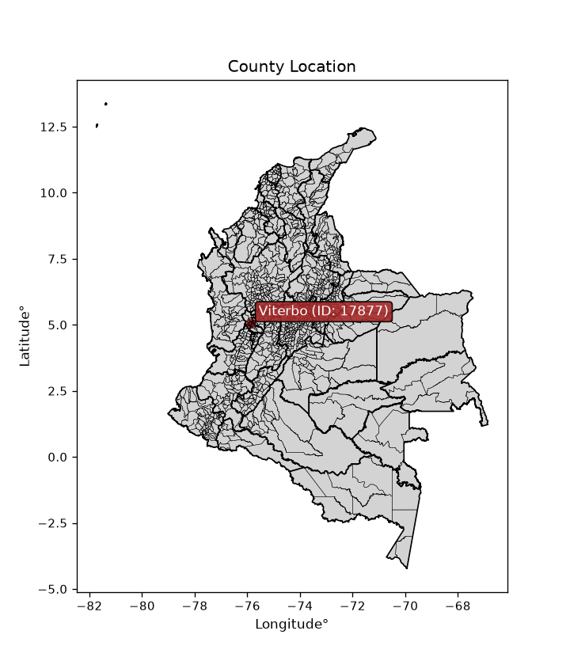
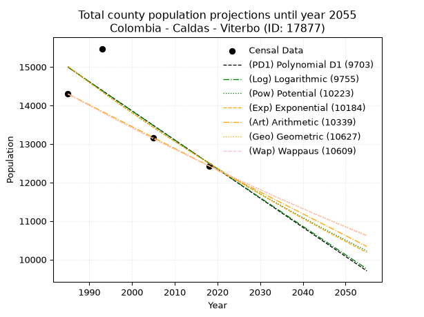
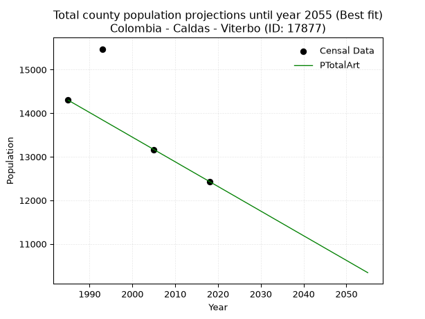
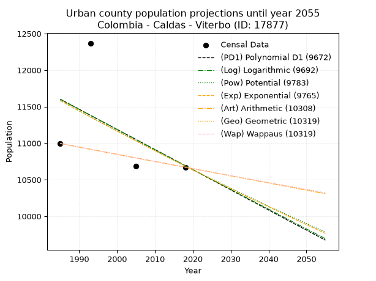
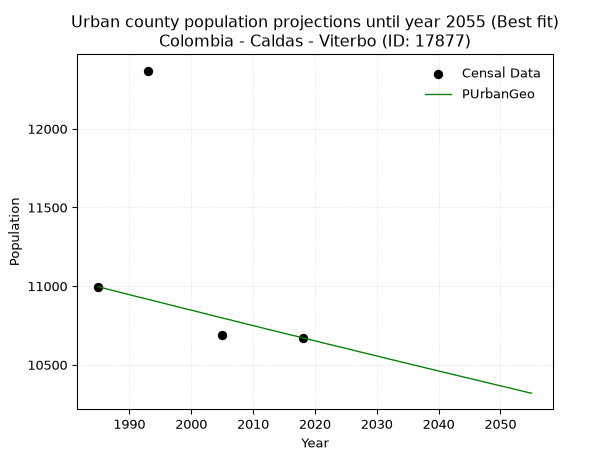
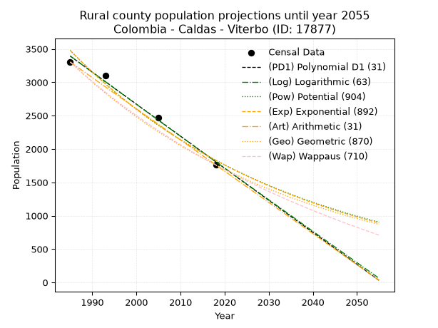
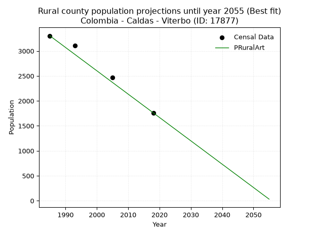

<div align="center">


</div>

# _“Population and Public Services Demand Projections (PPSD) until Year 2050 for Colombia - Caldas - Viterbo (ID: 17877)”_
Keywords: `population` `public-service` `projection` `lineal` `polynomial` `logarithmic` `potential` `exponential` `arithmetic` `geometric` `wappaus` `dane` `colombia` `south-america`

PPSD are analytical estimates used by governments and planners to anticipate future changes in population size, age distribution, and the resulting community needs for utilities, healthcare, education, and infrastructure as sizing future water treatment facilities, electrical grids, and road networks based on spatial growth.

<div align="center">

</img>

</div>


> **General running parameters**: • app_version: _v20260806_. • Python version: _3.14.7_. • Pandas version: _3.0.5_. • NumPy version: _2.5.1_. • Creates, save and include plots into reports (create_plot): _False_. • Projection until year: _2050_. • Process polynomial degree 2 and up: _False_. • Process Wappaus: _True_. • Process Wappaus: _True_. • Set negative values to zero: _True_. • Set infinite values to zero: _True_. • Drop dataset notes: _True_. 
<div align="center">

Dynamic map: [:earth_americas:Google](http://maps.google.com/maps?q=5.062664236,-75.8706098) [:earth_americas:OSM](https://www.openstreetmap.org/#map=18/5.062664236/-75.8706098&layers=P) [:earth_americas:Bing](https://www.bing.com/maps?cp=5.062664236~-75.8706098&lvl=18) [:earth_americas:Apple](https://maps.apple.com/frame?center=5.062664236%2C-75.8706098&span=0.003%2C0.006)

</div>


<div align="center">

```geojson
{
  "type": "Feature",
  "geometry": {
    "type": "Point", 
    "coordinates": [-75.8706098, 5.062664236]
  }, 
  "properties": {
    "Name": "Colombia - Caldas - Viterbo (ID: 17877)"
  }
}
```

</div>


## 0. Census Data (4 records)

Census data are official statistics collected by a government about the people and housing in a country. They usually include counts of total population, age, sex, race, income, education, and jobs.

📅Global census file: [Population.xlsx](../data/Population.xlsx)

| Source   |   Year |   CountryID | CountryName   |   StateID | StateName   |   CountyID | CountyName   |   PTotal |   PUrban |   PRural |
|:---------|-------:|------------:|:--------------|----------:|:------------|-----------:|:-------------|---------:|---------:|---------:|
| DANE     |   1985 |          57 | Colombia      |        17 | Caldas      |      17877 | Viterbo      |    14299 |    10995 |     3304 |
| DANE     |   1993 |          57 | Colombia      |        17 | Caldas      |      17877 | Viterbo      |    15474 |    12369 |     3105 |
| DANE     |   2005 |          57 | Colombia      |        17 | Caldas      |      17877 | Viterbo      |    13159 |    10689 |     2470 |
| DANE     |   2018 |          57 | Colombia      |        17 | Caldas      |      17877 | Viterbo      |    12432 |    10671 |     1761 |

> 🔥Some records could had specific notes about the registered values or the corresponding urban or rural distribution.

📅[SUI-RUPS](https://www.datos.gov.co/Hacienda-y-Cr-dito-P-blico/Registro-nico-de-Prestadores-de-Servicios-P-blicos/4qkq-csdn/about_data) - Local public utility companies: [RUPS.csv](../data/RUPS.xlsx)

 | SERVICIO       | ESTADO    | NOMBRE                                                                                       | NIT         | DEPARTAMENTO_DOMICILIO   | MUNICIPIO_DOMICILIO   | DIRECCION                       |   TELEFONO | EMAIL                              | TIPO_PRESTADOR                             | CLASIFICACION                 |
|:---------------|:----------|:---------------------------------------------------------------------------------------------|:------------|:-------------------------|:----------------------|:--------------------------------|-----------:|:-----------------------------------|:-------------------------------------------|:------------------------------|
| ACUEDUCTO      | OPERATIVA | EMPRESA DE OBRAS SANITARIAS DE CALDAS  S. A. EMPRESA DE SERVICIOS PUBLICOS                   | 890803239-9 | CALDAS                   | MANIZALES             | Carrera 23 Nro 75 - 82          |    8867080 | lorena.grisalest@empocaldas.com.co | SOCIEDADES (EMPRESA DE SERVICIOS PUBLICOS) | MAYOR O IGUAL A 5001 USUARIOS |
| ALCANTARILLADO | OPERATIVA | EMPRESA DE OBRAS SANITARIAS DE CALDAS  S. A. EMPRESA DE SERVICIOS PUBLICOS                   | 890803239-9 | CALDAS                   | MANIZALES             | Carrera 23 Nro 75 - 82          |    8867080 | lorena.grisalest@empocaldas.com.co | SOCIEDADES (EMPRESA DE SERVICIOS PUBLICOS) | MAYOR O IGUAL A 5001 USUARIOS |
| ACUEDUCTO      | OPERATIVA | ASOCIACION DE USUARIOS DEL ACUEDUCTO DE LA VEREDA EL SOCORRO DEL MUNICIPIO DE VITERBO CALDAS | 900320749-5 | CALDAS                   | VITERBO               | NUCLEO ESCOLAR RURAL EL SOCORRO |    3128513 | veredasocorro@hotamail.co          | ORGANIZACION AUTORIZADA                    | HASTA 2500 SUSCRIPTORES       |
| ACUEDUCTO      | OPERATIVA | ASOCIACIÓN DE USUARIOS DEL ACUEDUCTO EL PORVENIR                                             | 810002425-4 | CALDAS                   | VITERBO               | VEREDA EL PORVENIR              |    8848388 | contacto@viterbo-caldas.gov.co     | ORGANIZACION AUTORIZADA                    | HASTA 2500 SUSCRIPTORES       |

## 1. Total

### 1.1. Coefficients and Parameters

* (PD1) Polynomial Deg 1: -75.58892011240403, 165037.73745483617 (lineal)
* (Log) Logarithmic: -151192.95654945011, 1163059.874316686
* (Pow) Potential: -11.083387748555857, 40.72677152744463
* (Exp) Exponential: -0.005541063212322802, 897792564.0350931
* (Art) Arithmetic: Year diff. 2018 - 1985 = 33, Population diff. 12432 - 14299 = -1867, Annual growth = -56.57575757575758
* (Geo) Geometric: Year diff. 2018 - 1985 = 33, Population diff. 12432 - 14299 = -1867, Annual growth % = -0.004230897492181751
* (Wap) Wappaus: i = -0.42329697785909676, Condition values only valid for < 200)

<sub>
Wappaus condition values: ['-0.00', '-0.42', '-0.85', '-1.27', '-1.69', '-2.12', '-2.54', '-2.96', '-3.39', '-3.81', '-4.23', '-4.66', '-5.08', '-5.50', '-5.93', '-6.35', '-6.77', '-7.20', '-7.62', '-8.04', '-8.47', '-8.89', '-9.31', '-9.74', '-10.16', '-10.58', '-11.01', '-11.43', '-11.85', '-12.28', '-12.70', '-13.12', '-13.55', '-13.97', '-14.39', '-14.82', '-15.24', '-15.66', '-16.09', '-16.51', '-16.93', '-17.36', '-17.78', '-18.20', '-18.63', '-19.05', '-19.47', '-19.89', '-20.32', '-20.74', '-21.16', '-21.59', '-22.01', '-22.43', '-22.86', '-23.28', '-23.70', '-24.13', '-24.55', '-24.97', '-25.40', '-25.82', '-26.24', '-26.67', '-27.09', '-27.51']
</sub>


### 1.2. Projected Dataset

|   Year |   CountyID |   PTotalPD1 |   PTotalLog |   PTotalPow |   PTotalExp |   PTotalArt |   PTotalGeo |   PTotalWap |
|-------:|-----------:|------------:|------------:|------------:|------------:|------------:|------------:|------------:|
|   1985 |      17877 |       14994 |       14995 |       15011 |       15010 |       14299 |       14299 |       14299 |
|   1986 |      17877 |       14918 |       14919 |       14928 |       14927 |       14242 |       14239 |       14239 |
|   1987 |      17877 |       14843 |       14843 |       14845 |       14844 |       14186 |       14178 |       14178 |
|   1988 |      17877 |       14767 |       14767 |       14762 |       14762 |       14129 |       14118 |       14119 |
|   1989 |      17877 |       14691 |       14691 |       14680 |       14680 |       14073 |       14059 |       14059 |
|   1990 |      17877 |       14616 |       14615 |       14598 |       14599 |       14016 |       13999 |       14000 |
|   1991 |      17877 |       14540 |       14539 |       14517 |       14519 |       13960 |       13940 |       13940 |
|   1992 |      17877 |       14465 |       14463 |       14437 |       14438 |       13903 |       13881 |       13881 |
|   1993 |      17877 |       14389 |       14387 |       14357 |       14359 |       13846 |       13822 |       13823 |
|   1994 |      17877 |       14313 |       14311 |       14277 |       14279 |       13790 |       13764 |       13764 |
|   1995 |      17877 |       14238 |       14235 |       14198 |       14200 |       13733 |       13705 |       13706 |
|   1996 |      17877 |       14162 |       14160 |       14119 |       14122 |       13677 |       13647 |       13648 |
|   1997 |      17877 |       14087 |       14084 |       14041 |       14044 |       13620 |       13590 |       13591 |
|   1998 |      17877 |       14011 |       14008 |       13963 |       13966 |       13564 |       13532 |       13533 |
|   1999 |      17877 |       13935 |       13933 |       13886 |       13889 |       13507 |       13475 |       13476 |
|   2000 |      17877 |       13860 |       13857 |       13809 |       13812 |       13450 |       13418 |       13419 |
|   2001 |      17877 |       13784 |       13781 |       13733 |       13736 |       13394 |       13361 |       13362 |
|   2002 |      17877 |       13709 |       13706 |       13657 |       13660 |       13337 |       13305 |       13306 |
|   2003 |      17877 |       13633 |       13630 |       13582 |       13585 |       13281 |       13248 |       13249 |
|   2004 |      17877 |       13558 |       13555 |       13507 |       13510 |       13224 |       13192 |       13193 |
|   2005 |      17877 |       13482 |       13479 |       13433 |       13435 |       13167 |       13136 |       13138 |
|   2006 |      17877 |       13406 |       13404 |       13358 |       13361 |       13111 |       13081 |       13082 |
|   2007 |      17877 |       13331 |       13329 |       13285 |       13287 |       13054 |       13026 |       13027 |
|   2008 |      17877 |       13255 |       13253 |       13212 |       13214 |       12998 |       12970 |       12971 |
|   2009 |      17877 |       13180 |       13178 |       13139 |       13140 |       12941 |       12916 |       12917 |
|   2010 |      17877 |       13104 |       13103 |       13067 |       13068 |       12885 |       12861 |       12862 |
|   2011 |      17877 |       13028 |       13028 |       12995 |       12996 |       12828 |       12807 |       12807 |
|   2012 |      17877 |       12953 |       12953 |       12924 |       12924 |       12771 |       12752 |       12753 |
|   2013 |      17877 |       12877 |       12877 |       12853 |       12852 |       12715 |       12698 |       12699 |
|   2014 |      17877 |       12802 |       12802 |       12782 |       12781 |       12658 |       12645 |       12645 |
|   2015 |      17877 |       12726 |       12727 |       12712 |       12711 |       12602 |       12591 |       12592 |
|   2016 |      17877 |       12650 |       12652 |       12642 |       12641 |       12545 |       12538 |       12538 |
|   2017 |      17877 |       12575 |       12577 |       12573 |       12571 |       12489 |       12485 |       12485 |
|   2018 |      17877 |       12499 |       12502 |       12504 |       12501 |       12432 |       12432 |       12432 |
|   2019 |      17877 |       12424 |       12427 |       12436 |       12432 |       12375 |       12379 |       12379 |
|   2020 |      17877 |       12348 |       12353 |       12367 |       12363 |       12319 |       12327 |       12327 |
|   2021 |      17877 |       12273 |       12278 |       12300 |       12295 |       12262 |       12275 |       12274 |
|   2022 |      17877 |       12197 |       12203 |       12233 |       12227 |       12206 |       12223 |       12222 |
|   2023 |      17877 |       12121 |       12128 |       12166 |       12160 |       12149 |       12171 |       12170 |
|   2024 |      17877 |       12046 |       12053 |       12099 |       12092 |       12093 |       12120 |       12118 |
|   2025 |      17877 |       11970 |       11979 |       12033 |       12026 |       12036 |       12068 |       12067 |
|   2026 |      17877 |       11895 |       11904 |       11968 |       11959 |       11979 |       12017 |       12016 |
|   2027 |      17877 |       11819 |       11830 |       11902 |       11893 |       11923 |       11967 |       11964 |
|   2028 |      17877 |       11743 |       11755 |       11837 |       11827 |       11866 |       11916 |       11913 |
|   2029 |      17877 |       11668 |       11680 |       11773 |       11762 |       11810 |       11866 |       11863 |
|   2030 |      17877 |       11592 |       11606 |       11709 |       11697 |       11753 |       11815 |       11812 |
|   2031 |      17877 |       11517 |       11531 |       11645 |       11632 |       11697 |       11765 |       11762 |
|   2032 |      17877 |       11441 |       11457 |       11582 |       11568 |       11640 |       11716 |       11712 |
|   2033 |      17877 |       11365 |       11383 |       11519 |       11504 |       11583 |       11666 |       11662 |
|   2034 |      17877 |       11290 |       11308 |       11456 |       11441 |       11527 |       11617 |       11612 |
|   2035 |      17877 |       11214 |       11234 |       11394 |       11377 |       11470 |       11567 |       11562 |
|   2036 |      17877 |       11139 |       11160 |       11332 |       11315 |       11414 |       11519 |       11513 |
|   2037 |      17877 |       11063 |       11085 |       11270 |       11252 |       11357 |       11470 |       11464 |
|   2038 |      17877 |       10988 |       11011 |       11209 |       11190 |       11300 |       11421 |       11415 |
|   2039 |      17877 |       10912 |       10937 |       11149 |       11128 |       11244 |       11373 |       11366 |
|   2040 |      17877 |       10836 |       10863 |       11088 |       11067 |       11187 |       11325 |       11317 |
|   2041 |      17877 |       10761 |       10789 |       11028 |       11005 |       11131 |       11277 |       11269 |
|   2042 |      17877 |       10685 |       10715 |       10968 |       10945 |       11074 |       11229 |       11220 |
|   2043 |      17877 |       10610 |       10641 |       10909 |       10884 |       11018 |       11182 |       11172 |
|   2044 |      17877 |       10534 |       10567 |       10850 |       10824 |       10961 |       11134 |       11124 |
|   2045 |      17877 |       10458 |       10493 |       10791 |       10764 |       10904 |       11087 |       11077 |
|   2046 |      17877 |       10383 |       10419 |       10733 |       10705 |       10848 |       11040 |       11029 |
|   2047 |      17877 |       10307 |       10345 |       10675 |       10646 |       10791 |       10994 |       10982 |
|   2048 |      17877 |       10232 |       10271 |       10617 |       10587 |       10735 |       10947 |       10934 |
|   2049 |      17877 |       10156 |       10197 |       10560 |       10528 |       10678 |       10901 |       10887 |
|   2050 |      17877 |       10080 |       10124 |       10503 |       10470 |       10622 |       10855 |       10841 |
<div align="center">

</img>

</div>


### 1.3. Best fit with absolute and relative error (%)

Relative error puts that difference into context by dividing the absolute error by the true value, creating a unitless ratio or percentage that shows the scale of the mistake.

Absolute and relative error

|   Year | Source   |   CountryID | CountryName   |   StateID | StateName   |   CountyID_x | CountyName   |   PTotal |   PUrban |   PRural |   CountyID_y |   PTotalPD1 |   PTotalLog |   PTotalPow |   PTotalExp |   PTotalArt |   PTotalGeo |   PTotalWap |   PTotalPD1AbsError |   PTotalLogAbsError |   PTotalPowAbsError |   PTotalExpAbsError |   PTotalArtAbsError |   PTotalGeoAbsError |   PTotalWapAbsError |   PTotalPD1RelError |   PTotalLogRelError |   PTotalPowRelError |   PTotalExpRelError |   PTotalArtRelError |   PTotalGeoRelError |   PTotalWapRelError |
|-------:|:---------|------------:|:--------------|----------:|:------------|-------------:|:-------------|---------:|---------:|---------:|-------------:|------------:|------------:|------------:|------------:|------------:|------------:|------------:|--------------------:|--------------------:|--------------------:|--------------------:|--------------------:|--------------------:|--------------------:|--------------------:|--------------------:|--------------------:|--------------------:|--------------------:|--------------------:|--------------------:|
|   1985 | DANE     |          57 | Colombia      |        17 | Caldas      |        17877 | Viterbo      |    14299 |    10995 |     3304 |        17877 |       14994 |       14995 |       15011 |       15010 |       14299 |       14299 |       14299 |                 695 |                 696 |                 712 |                 711 |                   0 |                   0 |                   0 |            4.86048  |            4.86747  |            4.97937  |            4.97238  |           0         |            0        |            0        |
|   1993 | DANE     |          57 | Colombia      |        17 | Caldas      |        17877 | Viterbo      |    15474 |    12369 |     3105 |        17877 |       14389 |       14387 |       14357 |       14359 |       13846 |       13822 |       13823 |                1085 |                1087 |                1117 |                1115 |                1628 |                1652 |                1651 |            7.01176  |            7.02469  |            7.21856  |            7.20564  |          10.5209    |           10.676    |           10.6695   |
|   2005 | DANE     |          57 | Colombia      |        17 | Caldas      |        17877 | Viterbo      |    13159 |    10689 |     2470 |        17877 |       13482 |       13479 |       13433 |       13435 |       13167 |       13136 |       13138 |                 323 |                 320 |                 274 |                 276 |                   8 |                  23 |                  21 |            2.45459  |            2.4318   |            2.08223  |            2.09742  |           0.0607949 |            0.174785 |            0.159587 |
|   2018 | DANE     |          57 | Colombia      |        17 | Caldas      |        17877 | Viterbo      |    12432 |    10671 |     1761 |        17877 |       12499 |       12502 |       12504 |       12501 |       12432 |       12432 |       12432 |                  67 |                  70 |                  72 |                  69 |                   0 |                   0 |                   0 |            0.538932 |            0.563063 |            0.579151 |            0.555019 |           0         |            0        |            0        |

Relative error mean

| Method    |   RelError | Best   |
|:----------|-----------:|:-------|
| PTotalPD1 |    3.71644 |        |
| PTotalLog |    3.72175 |        |
| PTotalPow |    3.71483 |        |
| PTotalExp |    3.70761 |        |
| PTotalArt |    2.64542 | True   |
| PTotalGeo |    2.71269 |        |
| PTotalWap |    2.70727 |        |

💙Best method: _**PTotalArt**_
<div align="center">

</img>

</div>


### 1.4. Fresh water supply demand in liters per capita per day (lpcd)

The fresh water supply demand typically ranges from 100 to 300 liters per capita per day (lpcd) for standard domestic and municipal planning, though absolute survival minimums set by the World Health Organization are as low as 7.5 to 20 liters per day, and total consumption in high-income nations can exceed 400 liters.

> `CZ`: Level in meters above the sea level (masl)<br> `WS`: Fresh water supply demand in liters per capita per day (lpcd or l/h/d)<br> `WSAll`: Zonal fresh water supply demand in liters per second (l/s)<br> `A`: Zonal area in square meters<br> `DP`: Population density (people/hectare or p/ha)

Reference values (RAS Colombia)

|    CZ |   WS |
|------:|-----:|
|  1000 |  120 |
|  2000 |  130 |
| 99999 |  140 |

County shapefile geometry properties and water supply values

|   CountyID |      ATotal |   CZTotal |   WSTotal |
|-----------:|------------:|----------:|----------:|
|      17877 | 1.12896e+08 |   1035.31 |       130 |

Projected values for best method: PTotalArt

|   CountyID |   Year |   PTotalArt |   DPTotal |   WSTotal |   WSTotalAll |
|-----------:|-------:|------------:|----------:|----------:|-------------:|
|      17877 |   1985 |       14299 |      1.27 |       130 |      21.5147 |
|      17877 |   1986 |       14242 |      1.26 |       130 |      21.4289 |
|      17877 |   1987 |       14186 |      1.26 |       130 |      21.3447 |
|      17877 |   1988 |       14129 |      1.25 |       130 |      21.2589 |
|      17877 |   1989 |       14073 |      1.25 |       130 |      21.1747 |
|      17877 |   1990 |       14016 |      1.24 |       130 |      21.0889 |
|      17877 |   1991 |       13960 |      1.24 |       130 |      21.0046 |
|      17877 |   1992 |       13903 |      1.23 |       130 |      20.9189 |
|      17877 |   1993 |       13846 |      1.23 |       130 |      20.8331 |
|      17877 |   1994 |       13790 |      1.22 |       130 |      20.7488 |
|      17877 |   1995 |       13733 |      1.22 |       130 |      20.6631 |
|      17877 |   1996 |       13677 |      1.21 |       130 |      20.5788 |
|      17877 |   1997 |       13620 |      1.21 |       130 |      20.4931 |
|      17877 |   1998 |       13564 |      1.2  |       130 |      20.4088 |
|      17877 |   1999 |       13507 |      1.2  |       130 |      20.323  |
|      17877 |   2000 |       13450 |      1.19 |       130 |      20.2373 |
|      17877 |   2001 |       13394 |      1.19 |       130 |      20.153  |
|      17877 |   2002 |       13337 |      1.18 |       130 |      20.0672 |
|      17877 |   2003 |       13281 |      1.18 |       130 |      19.983  |
|      17877 |   2004 |       13224 |      1.17 |       130 |      19.8972 |
|      17877 |   2005 |       13167 |      1.17 |       130 |      19.8115 |
|      17877 |   2006 |       13111 |      1.16 |       130 |      19.7272 |
|      17877 |   2007 |       13054 |      1.16 |       130 |      19.6414 |
|      17877 |   2008 |       12998 |      1.15 |       130 |      19.5572 |
|      17877 |   2009 |       12941 |      1.15 |       130 |      19.4714 |
|      17877 |   2010 |       12885 |      1.14 |       130 |      19.3872 |
|      17877 |   2011 |       12828 |      1.14 |       130 |      19.3014 |
|      17877 |   2012 |       12771 |      1.13 |       130 |      19.2156 |
|      17877 |   2013 |       12715 |      1.13 |       130 |      19.1314 |
|      17877 |   2014 |       12658 |      1.12 |       130 |      19.0456 |
|      17877 |   2015 |       12602 |      1.12 |       130 |      18.9613 |
|      17877 |   2016 |       12545 |      1.11 |       130 |      18.8756 |
|      17877 |   2017 |       12489 |      1.11 |       130 |      18.7913 |
|      17877 |   2018 |       12432 |      1.1  |       130 |      18.7056 |
|      17877 |   2019 |       12375 |      1.1  |       130 |      18.6198 |
|      17877 |   2020 |       12319 |      1.09 |       130 |      18.5355 |
|      17877 |   2021 |       12262 |      1.09 |       130 |      18.4498 |
|      17877 |   2022 |       12206 |      1.08 |       130 |      18.3655 |
|      17877 |   2023 |       12149 |      1.08 |       130 |      18.2797 |
|      17877 |   2024 |       12093 |      1.07 |       130 |      18.1955 |
|      17877 |   2025 |       12036 |      1.07 |       130 |      18.1097 |
|      17877 |   2026 |       11979 |      1.06 |       130 |      18.024  |
|      17877 |   2027 |       11923 |      1.06 |       130 |      17.9397 |
|      17877 |   2028 |       11866 |      1.05 |       130 |      17.8539 |
|      17877 |   2029 |       11810 |      1.05 |       130 |      17.7697 |
|      17877 |   2030 |       11753 |      1.04 |       130 |      17.6839 |
|      17877 |   2031 |       11697 |      1.04 |       130 |      17.5997 |
|      17877 |   2032 |       11640 |      1.03 |       130 |      17.5139 |
|      17877 |   2033 |       11583 |      1.03 |       130 |      17.4281 |
|      17877 |   2034 |       11527 |      1.02 |       130 |      17.3439 |
|      17877 |   2035 |       11470 |      1.02 |       130 |      17.2581 |
|      17877 |   2036 |       11414 |      1.01 |       130 |      17.1738 |
|      17877 |   2037 |       11357 |      1.01 |       130 |      17.0881 |
|      17877 |   2038 |       11300 |      1    |       130 |      17.0023 |
|      17877 |   2039 |       11244 |      1    |       130 |      16.9181 |
|      17877 |   2040 |       11187 |      0.99 |       130 |      16.8323 |
|      17877 |   2041 |       11131 |      0.99 |       130 |      16.748  |
|      17877 |   2042 |       11074 |      0.98 |       130 |      16.6623 |
|      17877 |   2043 |       11018 |      0.98 |       130 |      16.578  |
|      17877 |   2044 |       10961 |      0.97 |       130 |      16.4922 |
|      17877 |   2045 |       10904 |      0.97 |       130 |      16.4065 |
|      17877 |   2046 |       10848 |      0.96 |       130 |      16.3222 |
|      17877 |   2047 |       10791 |      0.96 |       130 |      16.2365 |
|      17877 |   2048 |       10735 |      0.95 |       130 |      16.1522 |
|      17877 |   2049 |       10678 |      0.95 |       130 |      16.0664 |
|      17877 |   2050 |       10622 |      0.94 |       130 |      15.9822 |

## 2. Urban

### 2.1. Coefficients and Parameters

* (PD1) Polynomial Deg 1: -27.564833400240797, 66317.55800883166 (lineal)
* (Log) Logarithmic: -55090.48911196573, 429924.2492075251
* (Pow) Potential: -4.874198378348414, 20.13776649735926
* (Exp) Exponential: -0.00243869215865706, 1466067.2011310512
* (Art) Arithmetic: Year diff. 2018 - 1985 = 33, Population diff. 10671 - 10995 = -324, Annual growth = -9.818181818181818
* (Geo) Geometric: Year diff. 2018 - 1985 = 33, Population diff. 10671 - 10995 = -324, Annual growth % = -0.0009059785162175427
* (Wap) Wappaus: i = -0.09063215931119559, Condition values only valid for < 200)

<sub>
Wappaus condition values: ['-0.00', '-0.09', '-0.18', '-0.27', '-0.36', '-0.45', '-0.54', '-0.63', '-0.73', '-0.82', '-0.91', '-1.00', '-1.09', '-1.18', '-1.27', '-1.36', '-1.45', '-1.54', '-1.63', '-1.72', '-1.81', '-1.90', '-1.99', '-2.08', '-2.18', '-2.27', '-2.36', '-2.45', '-2.54', '-2.63', '-2.72', '-2.81', '-2.90', '-2.99', '-3.08', '-3.17', '-3.26', '-3.35', '-3.44', '-3.53', '-3.63', '-3.72', '-3.81', '-3.90', '-3.99', '-4.08', '-4.17', '-4.26', '-4.35', '-4.44', '-4.53', '-4.62', '-4.71', '-4.80', '-4.89', '-4.98', '-5.08', '-5.17', '-5.26', '-5.35', '-5.44', '-5.53', '-5.62', '-5.71', '-5.80', '-5.89']
</sub>


### 2.2. Projected Dataset

|   Year |   CountyID |   PUrbanPD1 |   PUrbanLog |   PUrbanPow |   PUrbanExp |   PUrbanArt |   PUrbanGeo |   PUrbanWap |
|-------:|-----------:|------------:|------------:|------------:|------------:|------------:|------------:|------------:|
|   1985 |      17877 |       11601 |       11602 |       11583 |       11583 |       10995 |       10995 |       10995 |
|   1986 |      17877 |       11574 |       11574 |       11555 |       11555 |       10985 |       10985 |       10985 |
|   1987 |      17877 |       11546 |       11546 |       11526 |       11527 |       10975 |       10975 |       10975 |
|   1988 |      17877 |       11519 |       11518 |       11498 |       11499 |       10966 |       10965 |       10965 |
|   1989 |      17877 |       11491 |       11491 |       11470 |       11471 |       10956 |       10955 |       10955 |
|   1990 |      17877 |       11464 |       11463 |       11442 |       11443 |       10946 |       10945 |       10945 |
|   1991 |      17877 |       11436 |       11435 |       11414 |       11415 |       10936 |       10935 |       10935 |
|   1992 |      17877 |       11408 |       11408 |       11386 |       11387 |       10926 |       10925 |       10925 |
|   1993 |      17877 |       11381 |       11380 |       11358 |       11359 |       10916 |       10916 |       10916 |
|   1994 |      17877 |       11353 |       11352 |       11331 |       11332 |       10907 |       10906 |       10906 |
|   1995 |      17877 |       11326 |       11325 |       11303 |       11304 |       10897 |       10896 |       10896 |
|   1996 |      17877 |       11298 |       11297 |       11275 |       11276 |       10887 |       10886 |       10886 |
|   1997 |      17877 |       11271 |       11270 |       11248 |       11249 |       10877 |       10876 |       10876 |
|   1998 |      17877 |       11243 |       11242 |       11220 |       11222 |       10867 |       10866 |       10866 |
|   1999 |      17877 |       11215 |       11214 |       11193 |       11194 |       10858 |       10856 |       10856 |
|   2000 |      17877 |       11188 |       11187 |       11166 |       11167 |       10848 |       10847 |       10847 |
|   2001 |      17877 |       11160 |       11159 |       11139 |       11140 |       10838 |       10837 |       10837 |
|   2002 |      17877 |       11133 |       11132 |       11112 |       11113 |       10828 |       10827 |       10827 |
|   2003 |      17877 |       11105 |       11104 |       11085 |       11086 |       10818 |       10817 |       10817 |
|   2004 |      17877 |       11078 |       11077 |       11058 |       11059 |       10808 |       10807 |       10807 |
|   2005 |      17877 |       11050 |       11049 |       11031 |       11032 |       10799 |       10797 |       10797 |
|   2006 |      17877 |       11023 |       11022 |       11004 |       11005 |       10789 |       10788 |       10788 |
|   2007 |      17877 |       10995 |       10994 |       10977 |       10978 |       10779 |       10778 |       10778 |
|   2008 |      17877 |       10967 |       10967 |       10951 |       10951 |       10769 |       10768 |       10768 |
|   2009 |      17877 |       10940 |       10939 |       10924 |       10924 |       10759 |       10758 |       10758 |
|   2010 |      17877 |       10912 |       10912 |       10898 |       10898 |       10750 |       10749 |       10749 |
|   2011 |      17877 |       10885 |       10885 |       10871 |       10871 |       10740 |       10739 |       10739 |
|   2012 |      17877 |       10857 |       10857 |       10845 |       10845 |       10730 |       10729 |       10729 |
|   2013 |      17877 |       10830 |       10830 |       10819 |       10818 |       10720 |       10719 |       10719 |
|   2014 |      17877 |       10802 |       10803 |       10793 |       10792 |       10710 |       10710 |       10710 |
|   2015 |      17877 |       10774 |       10775 |       10766 |       10766 |       10700 |       10700 |       10700 |
|   2016 |      17877 |       10747 |       10748 |       10740 |       10740 |       10691 |       10690 |       10690 |
|   2017 |      17877 |       10719 |       10721 |       10715 |       10713 |       10681 |       10681 |       10681 |
|   2018 |      17877 |       10692 |       10693 |       10689 |       10687 |       10671 |       10671 |       10671 |
|   2019 |      17877 |       10664 |       10666 |       10663 |       10661 |       10661 |       10661 |       10661 |
|   2020 |      17877 |       10637 |       10639 |       10637 |       10635 |       10651 |       10652 |       10652 |
|   2021 |      17877 |       10609 |       10611 |       10612 |       10609 |       10642 |       10642 |       10642 |
|   2022 |      17877 |       10581 |       10584 |       10586 |       10584 |       10632 |       10632 |       10632 |
|   2023 |      17877 |       10554 |       10557 |       10561 |       10558 |       10622 |       10623 |       10623 |
|   2024 |      17877 |       10526 |       10530 |       10535 |       10532 |       10612 |       10613 |       10613 |
|   2025 |      17877 |       10499 |       10502 |       10510 |       10506 |       10602 |       10604 |       10603 |
|   2026 |      17877 |       10471 |       10475 |       10485 |       10481 |       10592 |       10594 |       10594 |
|   2027 |      17877 |       10444 |       10448 |       10459 |       10455 |       10583 |       10584 |       10584 |
|   2028 |      17877 |       10416 |       10421 |       10434 |       10430 |       10573 |       10575 |       10575 |
|   2029 |      17877 |       10389 |       10394 |       10409 |       10404 |       10563 |       10565 |       10565 |
|   2030 |      17877 |       10361 |       10367 |       10384 |       10379 |       10553 |       10556 |       10556 |
|   2031 |      17877 |       10333 |       10339 |       10359 |       10354 |       10543 |       10546 |       10546 |
|   2032 |      17877 |       10306 |       10312 |       10335 |       10329 |       10534 |       10536 |       10536 |
|   2033 |      17877 |       10278 |       10285 |       10310 |       10303 |       10524 |       10527 |       10527 |
|   2034 |      17877 |       10251 |       10258 |       10285 |       10278 |       10514 |       10517 |       10517 |
|   2035 |      17877 |       10223 |       10231 |       10260 |       10253 |       10504 |       10508 |       10508 |
|   2036 |      17877 |       10196 |       10204 |       10236 |       10228 |       10494 |       10498 |       10498 |
|   2037 |      17877 |       10168 |       10177 |       10211 |       10203 |       10484 |       10489 |       10489 |
|   2038 |      17877 |       10140 |       10150 |       10187 |       10179 |       10475 |       10479 |       10479 |
|   2039 |      17877 |       10113 |       10123 |       10163 |       10154 |       10465 |       10470 |       10470 |
|   2040 |      17877 |       10085 |       10096 |       10138 |       10129 |       10455 |       10460 |       10460 |
|   2041 |      17877 |       10058 |       10069 |       10114 |       10104 |       10445 |       10451 |       10451 |
|   2042 |      17877 |       10030 |       10042 |       10090 |       10080 |       10435 |       10441 |       10441 |
|   2043 |      17877 |       10003 |       10015 |       10066 |       10055 |       10426 |       10432 |       10432 |
|   2044 |      17877 |        9975 |        9988 |       10042 |       10031 |       10416 |       10422 |       10422 |
|   2045 |      17877 |        9947 |        9961 |       10018 |       10006 |       10406 |       10413 |       10413 |
|   2046 |      17877 |        9920 |        9934 |        9994 |        9982 |       10396 |       10404 |       10403 |
|   2047 |      17877 |        9892 |        9907 |        9971 |        9958 |       10386 |       10394 |       10394 |
|   2048 |      17877 |        9865 |        9880 |        9947 |        9933 |       10376 |       10385 |       10385 |
|   2049 |      17877 |        9837 |        9853 |        9923 |        9909 |       10367 |       10375 |       10375 |
|   2050 |      17877 |        9810 |        9826 |        9900 |        9885 |       10357 |       10366 |       10366 |
<div align="center">

</img>

</div>


### 2.3. Best fit with absolute and relative error (%)

Relative error puts that difference into context by dividing the absolute error by the true value, creating a unitless ratio or percentage that shows the scale of the mistake.

Absolute and relative error

|   Year | Source   |   CountryID | CountryName   |   StateID | StateName   |   CountyID_x | CountyName   |   PTotal |   PUrban |   PRural |   CountyID_y |   PUrbanPD1 |   PUrbanLog |   PUrbanPow |   PUrbanExp |   PUrbanArt |   PUrbanGeo |   PUrbanWap |   PUrbanPD1AbsError |   PUrbanLogAbsError |   PUrbanPowAbsError |   PUrbanExpAbsError |   PUrbanArtAbsError |   PUrbanGeoAbsError |   PUrbanWapAbsError |   PUrbanPD1RelError |   PUrbanLogRelError |   PUrbanPowRelError |   PUrbanExpRelError |   PUrbanArtRelError |   PUrbanGeoRelError |   PUrbanWapRelError |
|-------:|:---------|------------:|:--------------|----------:|:------------|-------------:|:-------------|---------:|---------:|---------:|-------------:|------------:|------------:|------------:|------------:|------------:|------------:|------------:|--------------------:|--------------------:|--------------------:|--------------------:|--------------------:|--------------------:|--------------------:|--------------------:|--------------------:|--------------------:|--------------------:|--------------------:|--------------------:|--------------------:|
|   1985 | DANE     |          57 | Colombia      |        17 | Caldas      |        17877 | Viterbo      |    14299 |    10995 |     3304 |        17877 |       11601 |       11602 |       11583 |       11583 |       10995 |       10995 |       10995 |                 606 |                 607 |                 588 |                 588 |                   0 |                   0 |                   0 |            5.5116   |            5.52069  |            5.34789  |            5.34789  |              0      |             0       |             0       |
|   1993 | DANE     |          57 | Colombia      |        17 | Caldas      |        17877 | Viterbo      |    15474 |    12369 |     3105 |        17877 |       11381 |       11380 |       11358 |       11359 |       10916 |       10916 |       10916 |                 988 |                 989 |                1011 |                1010 |                1453 |                1453 |                1453 |            7.98771  |            7.9958   |            8.17366  |            8.16558  |             11.7471 |            11.7471  |            11.7471  |
|   2005 | DANE     |          57 | Colombia      |        17 | Caldas      |        17877 | Viterbo      |    13159 |    10689 |     2470 |        17877 |       11050 |       11049 |       11031 |       11032 |       10799 |       10797 |       10797 |                 361 |                 360 |                 342 |                 343 |                 110 |                 108 |                 108 |            3.3773   |            3.36795  |            3.19955  |            3.20891  |              1.0291 |             1.01038 |             1.01038 |
|   2018 | DANE     |          57 | Colombia      |        17 | Caldas      |        17877 | Viterbo      |    12432 |    10671 |     1761 |        17877 |       10692 |       10693 |       10689 |       10687 |       10671 |       10671 |       10671 |                  21 |                  22 |                  18 |                  16 |                   0 |                   0 |                   0 |            0.196795 |            0.206166 |            0.168681 |            0.149939 |              0      |             0       |             0       |

Relative error mean

| Method    |   RelError | Best   |
|:----------|-----------:|:-------|
| PUrbanPD1 |    4.26835 |        |
| PUrbanLog |    4.27265 |        |
| PUrbanPow |    4.22244 |        |
| PUrbanExp |    4.21808 |        |
| PUrbanArt |    3.19405 |        |
| PUrbanGeo |    3.18937 | True   |
| PUrbanWap |    3.18937 | True   |

💙Best method: _**PUrbanGeo**_
<div align="center">

</img>

</div>


### 2.4. Fresh water supply demand in liters per capita per day (lpcd)

The fresh water supply demand typically ranges from 100 to 300 liters per capita per day (lpcd) for standard domestic and municipal planning, though absolute survival minimums set by the World Health Organization are as low as 7.5 to 20 liters per day, and total consumption in high-income nations can exceed 400 liters.

> `CZ`: Level in meters above the sea level (masl)<br> `WS`: Fresh water supply demand in liters per capita per day (lpcd or l/h/d)<br> `WSAll`: Zonal fresh water supply demand in liters per second (l/s)<br> `A`: Zonal area in square meters<br> `DP`: Population density (people/hectare or p/ha)

Reference values (RAS Colombia)

|    CZ |   WS |
|------:|-----:|
|  1000 |  120 |
|  2000 |  130 |
| 99999 |  140 |

County shapefile geometry properties and water supply values

|   CountyID |      AUrban |   CZUrban |   WSUrban |
|-----------:|------------:|----------:|----------:|
|      17877 | 2.55977e+06 |   961.901 |       120 |

Projected values for best method: PUrbanGeo

|   CountyID |   Year |   PUrbanGeo |   DPUrban |   WSUrban |   WSUrbanAll |
|-----------:|-------:|------------:|----------:|----------:|-------------:|
|      17877 |   1985 |       10995 |     42.95 |       120 |      15.2708 |
|      17877 |   1986 |       10985 |     42.91 |       120 |      15.2569 |
|      17877 |   1987 |       10975 |     42.87 |       120 |      15.2431 |
|      17877 |   1988 |       10965 |     42.84 |       120 |      15.2292 |
|      17877 |   1989 |       10955 |     42.8  |       120 |      15.2153 |
|      17877 |   1990 |       10945 |     42.76 |       120 |      15.2014 |
|      17877 |   1991 |       10935 |     42.72 |       120 |      15.1875 |
|      17877 |   1992 |       10925 |     42.68 |       120 |      15.1736 |
|      17877 |   1993 |       10916 |     42.64 |       120 |      15.1611 |
|      17877 |   1994 |       10906 |     42.61 |       120 |      15.1472 |
|      17877 |   1995 |       10896 |     42.57 |       120 |      15.1333 |
|      17877 |   1996 |       10886 |     42.53 |       120 |      15.1194 |
|      17877 |   1997 |       10876 |     42.49 |       120 |      15.1056 |
|      17877 |   1998 |       10866 |     42.45 |       120 |      15.0917 |
|      17877 |   1999 |       10856 |     42.41 |       120 |      15.0778 |
|      17877 |   2000 |       10847 |     42.37 |       120 |      15.0653 |
|      17877 |   2001 |       10837 |     42.34 |       120 |      15.0514 |
|      17877 |   2002 |       10827 |     42.3  |       120 |      15.0375 |
|      17877 |   2003 |       10817 |     42.26 |       120 |      15.0236 |
|      17877 |   2004 |       10807 |     42.22 |       120 |      15.0097 |
|      17877 |   2005 |       10797 |     42.18 |       120 |      14.9958 |
|      17877 |   2006 |       10788 |     42.14 |       120 |      14.9833 |
|      17877 |   2007 |       10778 |     42.11 |       120 |      14.9694 |
|      17877 |   2008 |       10768 |     42.07 |       120 |      14.9556 |
|      17877 |   2009 |       10758 |     42.03 |       120 |      14.9417 |
|      17877 |   2010 |       10749 |     41.99 |       120 |      14.9292 |
|      17877 |   2011 |       10739 |     41.95 |       120 |      14.9153 |
|      17877 |   2012 |       10729 |     41.91 |       120 |      14.9014 |
|      17877 |   2013 |       10719 |     41.87 |       120 |      14.8875 |
|      17877 |   2014 |       10710 |     41.84 |       120 |      14.875  |
|      17877 |   2015 |       10700 |     41.8  |       120 |      14.8611 |
|      17877 |   2016 |       10690 |     41.76 |       120 |      14.8472 |
|      17877 |   2017 |       10681 |     41.73 |       120 |      14.8347 |
|      17877 |   2018 |       10671 |     41.69 |       120 |      14.8208 |
|      17877 |   2019 |       10661 |     41.65 |       120 |      14.8069 |
|      17877 |   2020 |       10652 |     41.61 |       120 |      14.7944 |
|      17877 |   2021 |       10642 |     41.57 |       120 |      14.7806 |
|      17877 |   2022 |       10632 |     41.53 |       120 |      14.7667 |
|      17877 |   2023 |       10623 |     41.5  |       120 |      14.7542 |
|      17877 |   2024 |       10613 |     41.46 |       120 |      14.7403 |
|      17877 |   2025 |       10604 |     41.43 |       120 |      14.7278 |
|      17877 |   2026 |       10594 |     41.39 |       120 |      14.7139 |
|      17877 |   2027 |       10584 |     41.35 |       120 |      14.7    |
|      17877 |   2028 |       10575 |     41.31 |       120 |      14.6875 |
|      17877 |   2029 |       10565 |     41.27 |       120 |      14.6736 |
|      17877 |   2030 |       10556 |     41.24 |       120 |      14.6611 |
|      17877 |   2031 |       10546 |     41.2  |       120 |      14.6472 |
|      17877 |   2032 |       10536 |     41.16 |       120 |      14.6333 |
|      17877 |   2033 |       10527 |     41.12 |       120 |      14.6208 |
|      17877 |   2034 |       10517 |     41.09 |       120 |      14.6069 |
|      17877 |   2035 |       10508 |     41.05 |       120 |      14.5944 |
|      17877 |   2036 |       10498 |     41.01 |       120 |      14.5806 |
|      17877 |   2037 |       10489 |     40.98 |       120 |      14.5681 |
|      17877 |   2038 |       10479 |     40.94 |       120 |      14.5542 |
|      17877 |   2039 |       10470 |     40.9  |       120 |      14.5417 |
|      17877 |   2040 |       10460 |     40.86 |       120 |      14.5278 |
|      17877 |   2041 |       10451 |     40.83 |       120 |      14.5153 |
|      17877 |   2042 |       10441 |     40.79 |       120 |      14.5014 |
|      17877 |   2043 |       10432 |     40.75 |       120 |      14.4889 |
|      17877 |   2044 |       10422 |     40.71 |       120 |      14.475  |
|      17877 |   2045 |       10413 |     40.68 |       120 |      14.4625 |
|      17877 |   2046 |       10404 |     40.64 |       120 |      14.45   |
|      17877 |   2047 |       10394 |     40.61 |       120 |      14.4361 |
|      17877 |   2048 |       10385 |     40.57 |       120 |      14.4236 |
|      17877 |   2049 |       10375 |     40.53 |       120 |      14.4097 |
|      17877 |   2050 |       10366 |     40.5  |       120 |      14.3972 |

## 3. Rural

### 3.1. Coefficients and Parameters

* (PD1) Polynomial Deg 1: -48.024086712163296, 98720.17944600464 (lineal)
* (Log) Logarithmic: -96102.46743748429, 733135.6251091603
* (Pow) Potential: -38.87699483699776, 131.74829776606683
* (Exp) Exponential: -0.01943107514399967, 1.9593707263078934e+20
* (Art) Arithmetic: Year diff. 2018 - 1985 = 33, Population diff. 1761 - 3304 = -1543, Annual growth = -46.75757575757576
* (Geo) Geometric: Year diff. 2018 - 1985 = 33, Population diff. 1761 - 3304 = -1543, Annual growth % = -0.018887594308150457
* (Wap) Wappaus: i = -1.8463011157976608, Condition values only valid for < 200)

<sub>
Wappaus condition values: ['-0.00', '-1.85', '-3.69', '-5.54', '-7.39', '-9.23', '-11.08', '-12.92', '-14.77', '-16.62', '-18.46', '-20.31', '-22.16', '-24.00', '-25.85', '-27.69', '-29.54', '-31.39', '-33.23', '-35.08', '-36.93', '-38.77', '-40.62', '-42.46', '-44.31', '-46.16', '-48.00', '-49.85', '-51.70', '-53.54', '-55.39', '-57.24', '-59.08', '-60.93', '-62.77', '-64.62', '-66.47', '-68.31', '-70.16', '-72.01', '-73.85', '-75.70', '-77.54', '-79.39', '-81.24', '-83.08', '-84.93', '-86.78', '-88.62', '-90.47', '-92.32', '-94.16', '-96.01', '-97.85', '-99.70', '-101.55', '-103.39', '-105.24', '-107.09', '-108.93', '-110.78', '-112.62', '-114.47', '-116.32', '-118.16', '-120.01']
</sub>


### 3.2. Projected Dataset

|   Year |   CountyID |   PRuralPD1 |   PRuralLog |   PRuralPow |   PRuralExp |   PRuralArt |   PRuralGeo |   PRuralWap |
|-------:|-----------:|------------:|------------:|------------:|------------:|------------:|------------:|------------:|
|   1985 |      17877 |        3392 |        3394 |        3478 |        3476 |        3304 |        3304 |        3304 |
|   1986 |      17877 |        3344 |        3345 |        3410 |        3409 |        3257 |        3242 |        3244 |
|   1987 |      17877 |        3296 |        3297 |        3344 |        3344 |        3210 |        3180 |        3184 |
|   1988 |      17877 |        3248 |        3248 |        3279 |        3279 |        3164 |        3120 |        3126 |
|   1989 |      17877 |        3200 |        3200 |        3216 |        3216 |        3117 |        3061 |        3069 |
|   1990 |      17877 |        3152 |        3152 |        3154 |        3154 |        3070 |        3004 |        3012 |
|   1991 |      17877 |        3104 |        3104 |        3093 |        3093 |        3023 |        2947 |        2957 |
|   1992 |      17877 |        3056 |        3055 |        3033 |        3034 |        2977 |        2891 |        2903 |
|   1993 |      17877 |        3008 |        3007 |        2974 |        2976 |        2930 |        2837 |        2850 |
|   1994 |      17877 |        2960 |        2959 |        2917 |        2918 |        2883 |        2783 |        2797 |
|   1995 |      17877 |        2912 |        2911 |        2860 |        2862 |        2836 |        2730 |        2746 |
|   1996 |      17877 |        2864 |        2863 |        2805 |        2807 |        2790 |        2679 |        2695 |
|   1997 |      17877 |        2816 |        2814 |        2751 |        2753 |        2743 |        2628 |        2645 |
|   1998 |      17877 |        2768 |        2766 |        2698 |        2700 |        2696 |        2579 |        2596 |
|   1999 |      17877 |        2720 |        2718 |        2646 |        2648 |        2649 |        2530 |        2548 |
|   2000 |      17877 |        2672 |        2670 |        2595 |        2597 |        2603 |        2482 |        2500 |
|   2001 |      17877 |        2624 |        2622 |        2545 |        2547 |        2556 |        2435 |        2454 |
|   2002 |      17877 |        2576 |        2574 |        2496 |        2498 |        2509 |        2389 |        2408 |
|   2003 |      17877 |        2528 |        2526 |        2448 |        2450 |        2462 |        2344 |        2362 |
|   2004 |      17877 |        2480 |        2478 |        2401 |        2403 |        2416 |        2300 |        2318 |
|   2005 |      17877 |        2432 |        2430 |        2355 |        2357 |        2369 |        2256 |        2274 |
|   2006 |      17877 |        2384 |        2382 |        2310 |        2311 |        2322 |        2214 |        2231 |
|   2007 |      17877 |        2336 |        2334 |        2266 |        2267 |        2275 |        2172 |        2189 |
|   2008 |      17877 |        2288 |        2287 |        2222 |        2223 |        2229 |        2131 |        2147 |
|   2009 |      17877 |        2240 |        2239 |        2180 |        2180 |        2182 |        2091 |        2105 |
|   2010 |      17877 |        2192 |        2191 |        2138 |        2139 |        2135 |        2051 |        2065 |
|   2011 |      17877 |        2144 |        2143 |        2097 |        2097 |        2088 |        2012 |        2025 |
|   2012 |      17877 |        2096 |        2095 |        2057 |        2057 |        2042 |        1974 |        1986 |
|   2013 |      17877 |        2048 |        2047 |        2017 |        2017 |        1995 |        1937 |        1947 |
|   2014 |      17877 |        2000 |        2000 |        1979 |        1979 |        1948 |        1901 |        1909 |
|   2015 |      17877 |        1952 |        1952 |        1941 |        1941 |        1901 |        1865 |        1871 |
|   2016 |      17877 |        1904 |        1904 |        1904 |        1903 |        1855 |        1829 |        1834 |
|   2017 |      17877 |        1856 |        1857 |        1868 |        1867 |        1808 |        1795 |        1797 |
|   2018 |      17877 |        1808 |        1809 |        1832 |        1831 |        1761 |        1761 |        1761 |
|   2019 |      17877 |        1760 |        1761 |        1797 |        1795 |        1714 |        1728 |        1725 |
|   2020 |      17877 |        1712 |        1714 |        1763 |        1761 |        1667 |        1695 |        1690 |
|   2021 |      17877 |        1664 |        1666 |        1729 |        1727 |        1621 |        1663 |        1656 |
|   2022 |      17877 |        1615 |        1619 |        1696 |        1694 |        1574 |        1632 |        1622 |
|   2023 |      17877 |        1567 |        1571 |        1664 |        1661 |        1527 |        1601 |        1588 |
|   2024 |      17877 |        1519 |        1524 |        1632 |        1629 |        1480 |        1571 |        1555 |
|   2025 |      17877 |        1471 |        1476 |        1601 |        1598 |        1434 |        1541 |        1522 |
|   2026 |      17877 |        1423 |        1429 |        1571 |        1567 |        1387 |        1512 |        1490 |
|   2027 |      17877 |        1375 |        1381 |        1541 |        1537 |        1340 |        1483 |        1458 |
|   2028 |      17877 |        1327 |        1334 |        1512 |        1507 |        1293 |        1455 |        1426 |
|   2029 |      17877 |        1279 |        1287 |        1483 |        1478 |        1247 |        1428 |        1395 |
|   2030 |      17877 |        1231 |        1239 |        1455 |        1450 |        1200 |        1401 |        1365 |
|   2031 |      17877 |        1183 |        1192 |        1427 |        1422 |        1153 |        1374 |        1334 |
|   2032 |      17877 |        1135 |        1145 |        1400 |        1395 |        1106 |        1348 |        1304 |
|   2033 |      17877 |        1087 |        1097 |        1374 |        1368 |        1060 |        1323 |        1275 |
|   2034 |      17877 |        1039 |        1050 |        1348 |        1341 |        1013 |        1298 |        1246 |
|   2035 |      17877 |         991 |        1003 |        1322 |        1316 |         966 |        1273 |        1217 |
|   2036 |      17877 |         943 |         956 |        1297 |        1290 |         919 |        1249 |        1189 |
|   2037 |      17877 |         895 |         908 |        1273 |        1266 |         873 |        1226 |        1161 |
|   2038 |      17877 |         847 |         861 |        1248 |        1241 |         826 |        1203 |        1133 |
|   2039 |      17877 |         799 |         814 |        1225 |        1217 |         779 |        1180 |        1106 |
|   2040 |      17877 |         751 |         767 |        1202 |        1194 |         732 |        1158 |        1079 |
|   2041 |      17877 |         703 |         720 |        1179 |        1171 |         686 |        1136 |        1052 |
|   2042 |      17877 |         655 |         673 |        1157 |        1148 |         639 |        1114 |        1026 |
|   2043 |      17877 |         607 |         626 |        1135 |        1126 |         592 |        1093 |        1000 |
|   2044 |      17877 |         559 |         579 |        1114 |        1105 |         545 |        1073 |         974 |
|   2045 |      17877 |         511 |         532 |        1093 |        1083 |         499 |        1052 |         949 |
|   2046 |      17877 |         463 |         485 |        1072 |        1062 |         452 |        1032 |         923 |
|   2047 |      17877 |         415 |         438 |        1052 |        1042 |         405 |        1013 |         899 |
|   2048 |      17877 |         367 |         391 |        1032 |        1022 |         358 |         994 |         874 |
|   2049 |      17877 |         319 |         344 |        1013 |        1002 |         312 |         975 |         850 |
|   2050 |      17877 |         271 |         297 |         994 |         983 |         265 |         957 |         826 |
<div align="center">

</img>

</div>


### 3.3. Best fit with absolute and relative error (%)

Relative error puts that difference into context by dividing the absolute error by the true value, creating a unitless ratio or percentage that shows the scale of the mistake.

Absolute and relative error

|   Year | Source   |   CountryID | CountryName   |   StateID | StateName   |   CountyID_x | CountyName   |   PTotal |   PUrban |   PRural |   CountyID_y |   PRuralPD1 |   PRuralLog |   PRuralPow |   PRuralExp |   PRuralArt |   PRuralGeo |   PRuralWap |   PRuralPD1AbsError |   PRuralLogAbsError |   PRuralPowAbsError |   PRuralExpAbsError |   PRuralArtAbsError |   PRuralGeoAbsError |   PRuralWapAbsError |   PRuralPD1RelError |   PRuralLogRelError |   PRuralPowRelError |   PRuralExpRelError |   PRuralArtRelError |   PRuralGeoRelError |   PRuralWapRelError |
|-------:|:---------|------------:|:--------------|----------:|:------------|-------------:|:-------------|---------:|---------:|---------:|-------------:|------------:|------------:|------------:|------------:|------------:|------------:|------------:|--------------------:|--------------------:|--------------------:|--------------------:|--------------------:|--------------------:|--------------------:|--------------------:|--------------------:|--------------------:|--------------------:|--------------------:|--------------------:|--------------------:|
|   1985 | DANE     |          57 | Colombia      |        17 | Caldas      |        17877 | Viterbo      |    14299 |    10995 |     3304 |        17877 |        3392 |        3394 |        3478 |        3476 |        3304 |        3304 |        3304 |                  88 |                  90 |                 174 |                 172 |                   0 |                   0 |                   0 |             2.66344 |             2.72397 |             5.26634 |             5.20581 |             0       |             0       |             0       |
|   1993 | DANE     |          57 | Colombia      |        17 | Caldas      |        17877 | Viterbo      |    15474 |    12369 |     3105 |        17877 |        3008 |        3007 |        2974 |        2976 |        2930 |        2837 |        2850 |                  97 |                  98 |                 131 |                 129 |                 175 |                 268 |                 255 |             3.12399 |             3.1562  |             4.219   |             4.15459 |             5.63607 |             8.63124 |             8.21256 |
|   2005 | DANE     |          57 | Colombia      |        17 | Caldas      |        17877 | Viterbo      |    13159 |    10689 |     2470 |        17877 |        2432 |        2430 |        2355 |        2357 |        2369 |        2256 |        2274 |                  38 |                  40 |                 115 |                 113 |                 101 |                 214 |                 196 |             1.53846 |             1.61943 |             4.65587 |             4.5749  |             4.08907 |             8.66397 |             7.93522 |
|   2018 | DANE     |          57 | Colombia      |        17 | Caldas      |        17877 | Viterbo      |    12432 |    10671 |     1761 |        17877 |        1808 |        1809 |        1832 |        1831 |        1761 |        1761 |        1761 |                  47 |                  48 |                  71 |                  70 |                   0 |                   0 |                   0 |             2.66894 |             2.72572 |             4.0318  |             3.97501 |             0       |             0       |             0       |

Relative error mean

| Method    |   RelError | Best   |
|:----------|-----------:|:-------|
| PRuralPD1 |    2.49871 |        |
| PRuralLog |    2.55633 |        |
| PRuralPow |    4.54325 |        |
| PRuralExp |    4.47758 |        |
| PRuralArt |    2.43128 | True   |
| PRuralGeo |    4.3238  |        |
| PRuralWap |    4.03695 |        |

💙Best method: _**PRuralArt**_
<div align="center">

</img>

</div>


### 3.4. Fresh water supply demand in liters per capita per day (lpcd)

The fresh water supply demand typically ranges from 100 to 300 liters per capita per day (lpcd) for standard domestic and municipal planning, though absolute survival minimums set by the World Health Organization are as low as 7.5 to 20 liters per day, and total consumption in high-income nations can exceed 400 liters.

> `CZ`: Level in meters above the sea level (masl)<br> `WS`: Fresh water supply demand in liters per capita per day (lpcd or l/h/d)<br> `WSAll`: Zonal fresh water supply demand in liters per second (l/s)<br> `A`: Zonal area in square meters<br> `DP`: Population density (people/hectare or p/ha)

Reference values (RAS Colombia)

|    CZ |   WS |
|------:|-----:|
|  1000 |  120 |
|  2000 |  130 |
| 99999 |  140 |

County shapefile geometry properties and water supply values

|   CountyID |      ARural |   CZRural |   WSRural |
|-----------:|------------:|----------:|----------:|
|      17877 | 1.10336e+08 |      1037 |       130 |

Projected values for best method: PRuralArt

|   CountyID |   Year |   PRuralArt |   DPRural |   WSRural |   WSRuralAll |
|-----------:|-------:|------------:|----------:|----------:|-------------:|
|      17877 |   1985 |        3304 |      0.3  |       130 |     4.9713   |
|      17877 |   1986 |        3257 |      0.3  |       130 |     4.90058  |
|      17877 |   1987 |        3210 |      0.29 |       130 |     4.82986  |
|      17877 |   1988 |        3164 |      0.29 |       130 |     4.76065  |
|      17877 |   1989 |        3117 |      0.28 |       130 |     4.68993  |
|      17877 |   1990 |        3070 |      0.28 |       130 |     4.61921  |
|      17877 |   1991 |        3023 |      0.27 |       130 |     4.5485   |
|      17877 |   1992 |        2977 |      0.27 |       130 |     4.47928  |
|      17877 |   1993 |        2930 |      0.27 |       130 |     4.40856  |
|      17877 |   1994 |        2883 |      0.26 |       130 |     4.33785  |
|      17877 |   1995 |        2836 |      0.26 |       130 |     4.26713  |
|      17877 |   1996 |        2790 |      0.25 |       130 |     4.19792  |
|      17877 |   1997 |        2743 |      0.25 |       130 |     4.1272   |
|      17877 |   1998 |        2696 |      0.24 |       130 |     4.05648  |
|      17877 |   1999 |        2649 |      0.24 |       130 |     3.98576  |
|      17877 |   2000 |        2603 |      0.24 |       130 |     3.91655  |
|      17877 |   2001 |        2556 |      0.23 |       130 |     3.84583  |
|      17877 |   2002 |        2509 |      0.23 |       130 |     3.77512  |
|      17877 |   2003 |        2462 |      0.22 |       130 |     3.7044   |
|      17877 |   2004 |        2416 |      0.22 |       130 |     3.63519  |
|      17877 |   2005 |        2369 |      0.21 |       130 |     3.56447  |
|      17877 |   2006 |        2322 |      0.21 |       130 |     3.49375  |
|      17877 |   2007 |        2275 |      0.21 |       130 |     3.42303  |
|      17877 |   2008 |        2229 |      0.2  |       130 |     3.35382  |
|      17877 |   2009 |        2182 |      0.2  |       130 |     3.2831   |
|      17877 |   2010 |        2135 |      0.19 |       130 |     3.21238  |
|      17877 |   2011 |        2088 |      0.19 |       130 |     3.14167  |
|      17877 |   2012 |        2042 |      0.19 |       130 |     3.07245  |
|      17877 |   2013 |        1995 |      0.18 |       130 |     3.00174  |
|      17877 |   2014 |        1948 |      0.18 |       130 |     2.93102  |
|      17877 |   2015 |        1901 |      0.17 |       130 |     2.8603   |
|      17877 |   2016 |        1855 |      0.17 |       130 |     2.79109  |
|      17877 |   2017 |        1808 |      0.16 |       130 |     2.72037  |
|      17877 |   2018 |        1761 |      0.16 |       130 |     2.64965  |
|      17877 |   2019 |        1714 |      0.16 |       130 |     2.57894  |
|      17877 |   2020 |        1667 |      0.15 |       130 |     2.50822  |
|      17877 |   2021 |        1621 |      0.15 |       130 |     2.439    |
|      17877 |   2022 |        1574 |      0.14 |       130 |     2.36829  |
|      17877 |   2023 |        1527 |      0.14 |       130 |     2.29757  |
|      17877 |   2024 |        1480 |      0.13 |       130 |     2.22685  |
|      17877 |   2025 |        1434 |      0.13 |       130 |     2.15764  |
|      17877 |   2026 |        1387 |      0.13 |       130 |     2.08692  |
|      17877 |   2027 |        1340 |      0.12 |       130 |     2.0162   |
|      17877 |   2028 |        1293 |      0.12 |       130 |     1.94549  |
|      17877 |   2029 |        1247 |      0.11 |       130 |     1.87627  |
|      17877 |   2030 |        1200 |      0.11 |       130 |     1.80556  |
|      17877 |   2031 |        1153 |      0.1  |       130 |     1.73484  |
|      17877 |   2032 |        1106 |      0.1  |       130 |     1.66412  |
|      17877 |   2033 |        1060 |      0.1  |       130 |     1.59491  |
|      17877 |   2034 |        1013 |      0.09 |       130 |     1.52419  |
|      17877 |   2035 |         966 |      0.09 |       130 |     1.45347  |
|      17877 |   2036 |         919 |      0.08 |       130 |     1.38275  |
|      17877 |   2037 |         873 |      0.08 |       130 |     1.31354  |
|      17877 |   2038 |         826 |      0.07 |       130 |     1.24282  |
|      17877 |   2039 |         779 |      0.07 |       130 |     1.17211  |
|      17877 |   2040 |         732 |      0.07 |       130 |     1.10139  |
|      17877 |   2041 |         686 |      0.06 |       130 |     1.03218  |
|      17877 |   2042 |         639 |      0.06 |       130 |     0.961458 |
|      17877 |   2043 |         592 |      0.05 |       130 |     0.890741 |
|      17877 |   2044 |         545 |      0.05 |       130 |     0.820023 |
|      17877 |   2045 |         499 |      0.05 |       130 |     0.75081  |
|      17877 |   2046 |         452 |      0.04 |       130 |     0.680093 |
|      17877 |   2047 |         405 |      0.04 |       130 |     0.609375 |
|      17877 |   2048 |         358 |      0.03 |       130 |     0.538657 |
|      17877 |   2049 |         312 |      0.03 |       130 |     0.469444 |
|      17877 |   2050 |         265 |      0.02 |       130 |     0.398727 |

<div align="center"><br><sub>Share this research</sub></div><br>

<sub>**APPS & TOOLS & CONTENT DISCLAIMER**: • NO WARRANTY - This content and software is provided by <a href="https://github.com/rcfdtools" target="_blank">github.com/rcfdtools</a> "as is", without any express or implied warranty, including warranties of merchantability, fitness for a particular purpose, or non-infringement. There is no guarantee that the software will be error-free or operate without interruption. • LIMITATION OF LIABILITY - Neither the authors nor copyright holders will be liable for claims or damages arising from the software or its use. You are responsible for determining if the software is appropriate for your use and assume all associated risks, including errors, legal compliance, and data loss. • NO PROFESSIONAL ADVICE - The software provides general information and does not offer professional advice. It should not replace consultation with professional advisors. [Clauses and global license for rcfdtools use.](https://github.com/rcfdtools/rcfdtools/blob/main/LICENSE.md)</sub>

| [:house: Home](Readme.md)  | [:beginner: Help / Collab](https://github.com/rcfdtools/R.HydroTools/discussions/31) |
|----------------------------|-------------------------------------------------------------------------------------------|