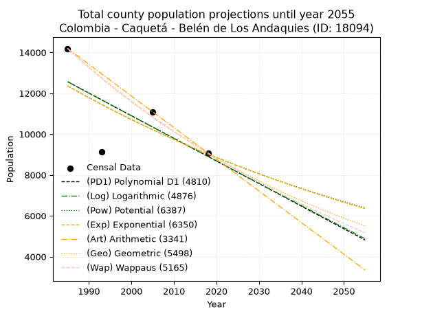
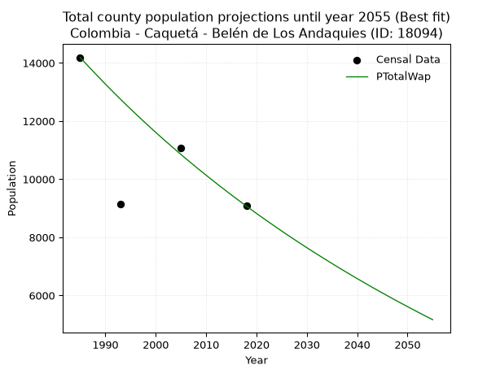
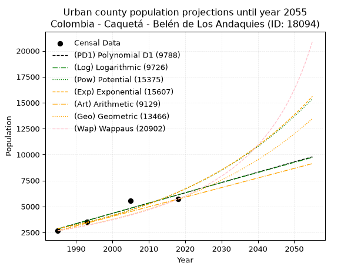
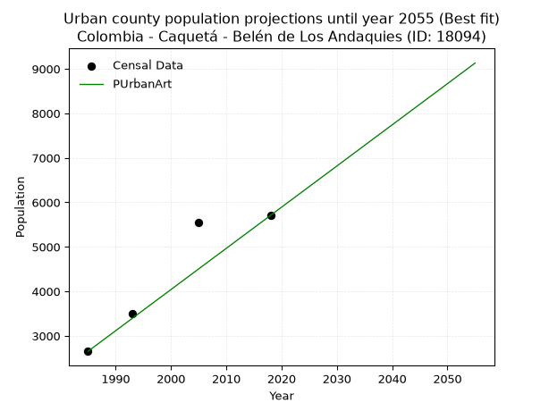
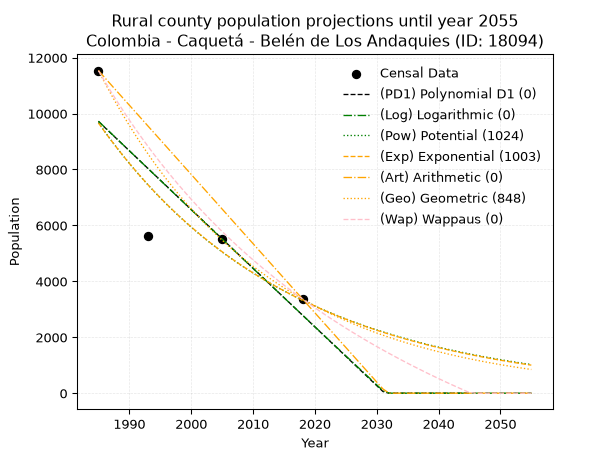
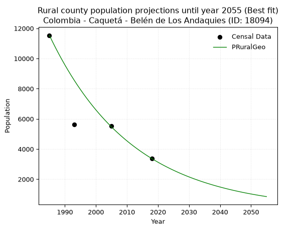

<div align="center">


</div>

# 📜 _“Population and Public Services Demand Projections (PPSD) until Year 2050 for Colombia - Caquetá - Belén de Los Andaquies (ID: 18094)”_
Keywords: `population` `public-service` `projection` `lineal` `polynomial` `logarithmic` `potential` `exponential` `arithmetic` `geometric` `wappaus` `dane` `colombia` `south-america`

PPSD are analytical estimates used by governments and planners to anticipate future changes in population size, age distribution, and the resulting community needs for utilities, healthcare, education, and infrastructure as sizing future water treatment facilities, electrical grids, and road networks based on spatial growth.

<div align="center">

</img>

</div>


> **General running parameters**: • app_version: _v20260806_. • Python version: _3.14.7_. • Pandas version: _3.0.5_. • NumPy version: _2.5.1_. • Creates, save and include plots into reports (create_plot): _False_. • Projection until year: _2050_. • Process polynomial degree 2 and up: _False_. • Process Wappaus: _True_. • Process Wappaus: _True_. • Set negative values to zero: _True_. • Set infinite values to zero: _True_. • Drop dataset notes: _True_. 
<div align="center">

Dynamic map: [:earth_americas:Google](http://maps.google.com/maps?q=1.415812047,-75.8724054) [:earth_americas:OSM](https://www.openstreetmap.org/#map=18/1.415812047/-75.8724054&layers=P) [:earth_americas:Bing](https://www.bing.com/maps?cp=1.415812047~-75.8724054&lvl=18) [:earth_americas:Apple](https://maps.apple.com/frame?center=1.415812047%2C-75.8724054&span=0.003%2C0.006)

</div>


<div align="center">

```geojson
{
  "type": "Feature",
  "geometry": {
    "type": "Point", 
    "coordinates": [-75.8724054, 1.415812047]
  }, 
  "properties": {
    "Name": "Colombia - Caquetá - Belén de Los Andaquies (ID: 18094)"
  }
}
```

</div>


## 0. Census Data (4 records)

Census data are official statistics collected by a government about the people and housing in a country. They usually include counts of total population, age, sex, race, income, education, and jobs.

📅Global census file: [Population.xlsx](../data/Population.xlsx)

| Source   |   Year |   CountryID | CountryName   |   StateID | StateName   |   CountyID | CountyName             |   PTotal |   PUrban |   PRural |
|:---------|-------:|------------:|:--------------|----------:|:------------|-----------:|:-----------------------|---------:|---------:|---------:|
| DANE     |   1985 |          57 | Colombia      |        18 | Caquetá     |      18094 | Belén de Los Andaquies |    14189 |     2653 |    11536 |
| DANE     |   1993 |          57 | Colombia      |        18 | Caquetá     |      18094 | Belén de Los Andaquies |     9143 |     3506 |     5637 |
| DANE     |   2005 |          57 | Colombia      |        18 | Caquetá     |      18094 | Belén de Los Andaquies |    11081 |     5556 |     5525 |
| DANE     |   2018 |          57 | Colombia      |        18 | Caquetá     |      18094 | Belén de Los Andaquies |     9075 |     5706 |     3369 |

> 🔥Some records could had specific notes about the registered values or the corresponding urban or rural distribution.

📅[SUI-RUPS](https://www.datos.gov.co/Hacienda-y-Cr-dito-P-blico/Registro-nico-de-Prestadores-de-Servicios-P-blicos/4qkq-csdn/about_data) - Local public utility companies: [RUPS.csv](../data/RUPS.csv)

 | SERVICIO       | ESTADO    | NOMBRE                   | NIT         | DEPARTAMENTO_DOMICILIO   | MUNICIPIO_DOMICILIO    | DIRECCION                    |   TELEFONO | EMAIL                        | TIPO_PRESTADOR                             | CLASIFICACION                 |
|:---------------|:----------|:-------------------------|:------------|:-------------------------|:-----------------------|:-----------------------------|-----------:|:-----------------------------|:-------------------------------------------|:------------------------------|
| ACUEDUCTO      | OPERATIVA | AGUAS ANDAKI S.A. E.S.P. | 900252778-7 | CAQUETA                  | BELEN DE LOS ANDAQUIES | CALLE 4 4-55BARRIO EL CENTRO |    4316334 | sergioparrazuluaga@gmail.com | SOCIEDADES (EMPRESA DE SERVICIOS PUBLICOS) | MENOR O IGUAL A 2500 USUARIOS |
| ALCANTARILLADO | OPERATIVA | AGUAS ANDAKI S.A. E.S.P. | 900252778-7 | CAQUETA                  | BELEN DE LOS ANDAQUIES | CALLE 4 4-55BARRIO EL CENTRO |    4316334 | sergioparrazuluaga@gmail.com | SOCIEDADES (EMPRESA DE SERVICIOS PUBLICOS) | MENOR O IGUAL A 2500 USUARIOS |

## 1. Total

### 1.1. Coefficients and Parameters

* (PD1) Polynomial Deg 1: -110.72340425531794, 232346.48936169976 (lineal)
* (Log) Logarithmic: -221880.76608810437, 1697389.4810765523
* (Pow) Potential: -19.051618735836257, 66.9197047919984
* (Exp) Exponential: -0.009508466304487142, 1944678387751.952
* (Art) Arithmetic: Year diff. 2018 - 1985 = 33, Population diff. 9075 - 14189 = -5114, Annual growth = -154.96969696969697
* (Geo) Geometric: Year diff. 2018 - 1985 = 33, Population diff. 9075 - 14189 = -5114, Annual growth % = -0.013452442685037203
* (Wap) Wappaus: i = -1.3322704347463632, Condition values only valid for < 200)

<sub>
Wappaus condition values: ['-0.00', '-1.33', '-2.66', '-4.00', '-5.33', '-6.66', '-7.99', '-9.33', '-10.66', '-11.99', '-13.32', '-14.65', '-15.99', '-17.32', '-18.65', '-19.98', '-21.32', '-22.65', '-23.98', '-25.31', '-26.65', '-27.98', '-29.31', '-30.64', '-31.97', '-33.31', '-34.64', '-35.97', '-37.30', '-38.64', '-39.97', '-41.30', '-42.63', '-43.96', '-45.30', '-46.63', '-47.96', '-49.29', '-50.63', '-51.96', '-53.29', '-54.62', '-55.96', '-57.29', '-58.62', '-59.95', '-61.28', '-62.62', '-63.95', '-65.28', '-66.61', '-67.95', '-69.28', '-70.61', '-71.94', '-73.27', '-74.61', '-75.94', '-77.27', '-78.60', '-79.94', '-81.27', '-82.60', '-83.93', '-85.27', '-86.60']
</sub>


### 1.2. Projected Dataset

|   Year |   CountyID |   PTotalPD1 |   PTotalLog |   PTotalPow |   PTotalExp |   PTotalArt |   PTotalGeo |   PTotalWap |
|-------:|-----------:|------------:|------------:|------------:|------------:|------------:|------------:|------------:|
|   1985 |      18094 |       12561 |       12566 |       12360 |       12355 |       14189 |       14189 |       14189 |
|   1986 |      18094 |       12450 |       12454 |       12242 |       12238 |       14034 |       13998 |       14001 |
|   1987 |      18094 |       12339 |       12342 |       12125 |       12122 |       13879 |       13810 |       13816 |
|   1988 |      18094 |       12228 |       12231 |       12010 |       12007 |       13724 |       13624 |       13633 |
|   1989 |      18094 |       12118 |       12119 |       11895 |       11894 |       13569 |       13441 |       13452 |
|   1990 |      18094 |       12007 |       12008 |       11782 |       11781 |       13414 |       13260 |       13274 |
|   1991 |      18094 |       11896 |       11896 |       11670 |       11670 |       13259 |       13082 |       13098 |
|   1992 |      18094 |       11785 |       11785 |       11559 |       11559 |       13104 |       12906 |       12925 |
|   1993 |      18094 |       11675 |       11673 |       11449 |       11450 |       12949 |       12732 |       12753 |
|   1994 |      18094 |       11564 |       11562 |       11340 |       11342 |       12794 |       12561 |       12584 |
|   1995 |      18094 |       11453 |       11451 |       11232 |       11234 |       12639 |       12392 |       12417 |
|   1996 |      18094 |       11343 |       11340 |       11125 |       11128 |       12484 |       12225 |       12252 |
|   1997 |      18094 |       11232 |       11228 |       11019 |       11023 |       12329 |       12061 |       12088 |
|   1998 |      18094 |       11121 |       11117 |       10915 |       10918 |       12174 |       11898 |       11927 |
|   1999 |      18094 |       11010 |       11006 |       10811 |       10815 |       12019 |       11738 |       11768 |
|   2000 |      18094 |       10900 |       10895 |       10709 |       10713 |       11864 |       11580 |       11611 |
|   2001 |      18094 |       10789 |       10785 |       10607 |       10611 |       11709 |       11425 |       11456 |
|   2002 |      18094 |       10678 |       10674 |       10507 |       10511 |       11555 |       11271 |       11302 |
|   2003 |      18094 |       10568 |       10563 |       10407 |       10411 |       11400 |       11119 |       11151 |
|   2004 |      18094 |       10457 |       10452 |       10309 |       10313 |       11245 |       10970 |       11001 |
|   2005 |      18094 |       10346 |       10341 |       10211 |       10215 |       11090 |       10822 |       10853 |
|   2006 |      18094 |       10235 |       10231 |       10115 |       10119 |       10935 |       10677 |       10706 |
|   2007 |      18094 |       10125 |       10120 |       10019 |       10023 |       10780 |       10533 |       10562 |
|   2008 |      18094 |       10014 |       10010 |        9925 |        9928 |       10625 |       10391 |       10419 |
|   2009 |      18094 |        9903 |        9899 |        9831 |        9834 |       10470 |       10251 |       10277 |
|   2010 |      18094 |        9792 |        9789 |        9738 |        9741 |       10315 |       10114 |       10138 |
|   2011 |      18094 |        9682 |        9678 |        9646 |        9649 |       10160 |        9977 |       10000 |
|   2012 |      18094 |        9571 |        9568 |        9555 |        9558 |       10005 |        9843 |        9863 |
|   2013 |      18094 |        9460 |        9458 |        9465 |        9467 |        9850 |        9711 |        9728 |
|   2014 |      18094 |        9350 |        9348 |        9376 |        9377 |        9695 |        9580 |        9595 |
|   2015 |      18094 |        9239 |        9238 |        9288 |        9289 |        9540 |        9451 |        9462 |
|   2016 |      18094 |        9128 |        9127 |        9200 |        9201 |        9385 |        9324 |        9332 |
|   2017 |      18094 |        9017 |        9017 |        9114 |        9114 |        9230 |        9199 |        9203 |
|   2018 |      18094 |        8907 |        8907 |        9028 |        9028 |        9075 |        9075 |        9075 |
|   2019 |      18094 |        8796 |        8798 |        8944 |        8942 |        8920 |        8953 |        8949 |
|   2020 |      18094 |        8685 |        8688 |        8860 |        8857 |        8765 |        8832 |        8824 |
|   2021 |      18094 |        8574 |        8578 |        8776 |        8774 |        8610 |        8714 |        8700 |
|   2022 |      18094 |        8464 |        8468 |        8694 |        8691 |        8455 |        8596 |        8578 |
|   2023 |      18094 |        8353 |        8358 |        8613 |        8608 |        8300 |        8481 |        8457 |
|   2024 |      18094 |        8242 |        8249 |        8532 |        8527 |        8145 |        8367 |        8337 |
|   2025 |      18094 |        8132 |        8139 |        8452 |        8446 |        7990 |        8254 |        8218 |
|   2026 |      18094 |        8021 |        8030 |        8373 |        8366 |        7835 |        8143 |        8101 |
|   2027 |      18094 |        7910 |        7920 |        8294 |        8287 |        7680 |        8034 |        7985 |
|   2028 |      18094 |        7799 |        7811 |        8217 |        8209 |        7525 |        7926 |        7870 |
|   2029 |      18094 |        7689 |        7701 |        8140 |        8131 |        7370 |        7819 |        7757 |
|   2030 |      18094 |        7578 |        7592 |        8064 |        8054 |        7215 |        7714 |        7644 |
|   2031 |      18094 |        7467 |        7483 |        7989 |        7978 |        7060 |        7610 |        7533 |
|   2032 |      18094 |        7357 |        7373 |        7914 |        7902 |        6905 |        7508 |        7423 |
|   2033 |      18094 |        7246 |        7264 |        7840 |        7828 |        6750 |        7407 |        7314 |
|   2034 |      18094 |        7135 |        7155 |        7767 |        7753 |        6595 |        7307 |        7206 |
|   2035 |      18094 |        7024 |        7046 |        7695 |        7680 |        6441 |        7209 |        7099 |
|   2036 |      18094 |        6914 |        6937 |        7623 |        7607 |        6286 |        7112 |        6993 |
|   2037 |      18094 |        6803 |        6828 |        7552 |        7535 |        6131 |        7016 |        6888 |
|   2038 |      18094 |        6692 |        6719 |        7482 |        7464 |        5976 |        6922 |        6784 |
|   2039 |      18094 |        6581 |        6610 |        7412 |        7393 |        5821 |        6828 |        6682 |
|   2040 |      18094 |        6471 |        6502 |        7343 |        7324 |        5666 |        6737 |        6580 |
|   2041 |      18094 |        6360 |        6393 |        7275 |        7254 |        5511 |        6646 |        6479 |
|   2042 |      18094 |        6249 |        6284 |        7208 |        7186 |        5356 |        6557 |        6379 |
|   2043 |      18094 |        6139 |        6176 |        7141 |        7118 |        5201 |        6468 |        6280 |
|   2044 |      18094 |        6028 |        6067 |        7074 |        7050 |        5046 |        6381 |        6183 |
|   2045 |      18094 |        5917 |        5958 |        7009 |        6983 |        4891 |        6296 |        6086 |
|   2046 |      18094 |        5806 |        5850 |        6944 |        6917 |        4736 |        6211 |        5990 |
|   2047 |      18094 |        5696 |        5742 |        6879 |        6852 |        4581 |        6127 |        5894 |
|   2048 |      18094 |        5585 |        5633 |        6816 |        6787 |        4426 |        6045 |        5800 |
|   2049 |      18094 |        5474 |        5525 |        6753 |        6723 |        4271 |        5964 |        5707 |
|   2050 |      18094 |        5364 |        5417 |        6690 |        6659 |        4116 |        5883 |        5614 |
<div align="center">

</img>

</div>


### 1.3. Best fit with absolute and relative error (%)

Relative error puts that difference into context by dividing the absolute error by the true value, creating a unitless ratio or percentage that shows the scale of the mistake.

Absolute and relative error

|   Year | Source   |   CountryID | CountryName   |   StateID | StateName   |   CountyID_x | CountyName             |   PTotal |   PUrban |   PRural |   CountyID_y |   PTotalPD1 |   PTotalLog |   PTotalPow |   PTotalExp |   PTotalArt |   PTotalGeo |   PTotalWap |   PTotalPD1AbsError |   PTotalLogAbsError |   PTotalPowAbsError |   PTotalExpAbsError |   PTotalArtAbsError |   PTotalGeoAbsError |   PTotalWapAbsError |   PTotalPD1RelError |   PTotalLogRelError |   PTotalPowRelError |   PTotalExpRelError |   PTotalArtRelError |   PTotalGeoRelError |   PTotalWapRelError |
|-------:|:---------|------------:|:--------------|----------:|:------------|-------------:|:-----------------------|---------:|---------:|---------:|-------------:|------------:|------------:|------------:|------------:|------------:|------------:|------------:|--------------------:|--------------------:|--------------------:|--------------------:|--------------------:|--------------------:|--------------------:|--------------------:|--------------------:|--------------------:|--------------------:|--------------------:|--------------------:|--------------------:|
|   1985 | DANE     |          57 | Colombia      |        18 | Caquetá     |        18094 | Belén de Los Andaquies |    14189 |     2653 |    11536 |        18094 |       12561 |       12566 |       12360 |       12355 |       14189 |       14189 |       14189 |                1628 |                1623 |                1829 |                1834 |                   0 |                   0 |                   0 |            11.4737  |            11.4384  |           12.8903   |           12.9255   |           0         |             0       |             0       |
|   1993 | DANE     |          57 | Colombia      |        18 | Caquetá     |        18094 | Belén de Los Andaquies |     9143 |     3506 |     5637 |        18094 |       11675 |       11673 |       11449 |       11450 |       12949 |       12732 |       12753 |                2532 |                2530 |                2306 |                2307 |                3806 |                3589 |                3610 |            27.6933  |            27.6714  |           25.2215   |           25.2324   |          41.6275    |            39.2541  |            39.4838  |
|   2005 | DANE     |          57 | Colombia      |        18 | Caquetá     |        18094 | Belén de Los Andaquies |    11081 |     5556 |     5525 |        18094 |       10346 |       10341 |       10211 |       10215 |       11090 |       10822 |       10853 |                 735 |                 740 |                 870 |                 866 |                   9 |                 259 |                 228 |             6.63298 |             6.6781  |            7.85128  |            7.81518  |           0.0812201 |             2.33733 |             2.05758 |
|   2018 | DANE     |          57 | Colombia      |        18 | Caquetá     |        18094 | Belén de Los Andaquies |     9075 |     5706 |     3369 |        18094 |        8907 |        8907 |        9028 |        9028 |        9075 |        9075 |        9075 |                 168 |                 168 |                  47 |                  47 |                   0 |                   0 |                   0 |             1.85124 |             1.85124 |            0.517906 |            0.517906 |           0         |             0       |             0       |

Relative error mean

| Method    |   RelError | Best   |
|:----------|-----------:|:-------|
| PTotalPD1 |    11.9128 |        |
| PTotalLog |    11.9098 |        |
| PTotalPow |    11.6202 |        |
| PTotalExp |    11.6228 |        |
| PTotalArt |    10.4272 |        |
| PTotalGeo |    10.3979 |        |
| PTotalWap |    10.3853 | True   |

💙Best method: _**PTotalWap**_
<div align="center">

</img>

</div>


### 1.4. Fresh water supply demand in liters per capita per day (lpcd)

The fresh water supply demand typically ranges from 100 to 300 liters per capita per day (lpcd) for standard domestic and municipal planning, though absolute survival minimums set by the World Health Organization are as low as 7.5 to 20 liters per day, and total consumption in high-income nations can exceed 400 liters.

> `CZ`: Level in meters above the sea level (masl)<br> `WS`: Fresh water supply demand in liters per capita per day (lpcd or l/h/d)<br> `WSAll`: Zonal fresh water supply demand in liters per second (l/s)<br> `A`: Zonal area in square meters<br> `DP`: Population density (people/hectare or p/ha)

Reference values (RAS Colombia)

|    CZ |   WS |
|------:|-----:|
|  1000 |  120 |
|  2000 |  130 |
| 99999 |  140 |

County shapefile geometry properties and water supply values

|   CountyID |      ATotal |   CZTotal |   WSTotal |
|-----------:|------------:|----------:|----------:|
|      18094 | 1.19155e+09 |   792.598 |       120 |

Projected values for best method: PTotalWap

|   CountyID |   Year |   PTotalWap |   DPTotal |   WSTotal |   WSTotalAll |
|-----------:|-------:|------------:|----------:|----------:|-------------:|
|      18094 |   1985 |       14189 |      0.12 |       120 |     19.7069  |
|      18094 |   1986 |       14001 |      0.12 |       120 |     19.4458  |
|      18094 |   1987 |       13816 |      0.12 |       120 |     19.1889  |
|      18094 |   1988 |       13633 |      0.11 |       120 |     18.9347  |
|      18094 |   1989 |       13452 |      0.11 |       120 |     18.6833  |
|      18094 |   1990 |       13274 |      0.11 |       120 |     18.4361  |
|      18094 |   1991 |       13098 |      0.11 |       120 |     18.1917  |
|      18094 |   1992 |       12925 |      0.11 |       120 |     17.9514  |
|      18094 |   1993 |       12753 |      0.11 |       120 |     17.7125  |
|      18094 |   1994 |       12584 |      0.11 |       120 |     17.4778  |
|      18094 |   1995 |       12417 |      0.1  |       120 |     17.2458  |
|      18094 |   1996 |       12252 |      0.1  |       120 |     17.0167  |
|      18094 |   1997 |       12088 |      0.1  |       120 |     16.7889  |
|      18094 |   1998 |       11927 |      0.1  |       120 |     16.5653  |
|      18094 |   1999 |       11768 |      0.1  |       120 |     16.3444  |
|      18094 |   2000 |       11611 |      0.1  |       120 |     16.1264  |
|      18094 |   2001 |       11456 |      0.1  |       120 |     15.9111  |
|      18094 |   2002 |       11302 |      0.09 |       120 |     15.6972  |
|      18094 |   2003 |       11151 |      0.09 |       120 |     15.4875  |
|      18094 |   2004 |       11001 |      0.09 |       120 |     15.2792  |
|      18094 |   2005 |       10853 |      0.09 |       120 |     15.0736  |
|      18094 |   2006 |       10706 |      0.09 |       120 |     14.8694  |
|      18094 |   2007 |       10562 |      0.09 |       120 |     14.6694  |
|      18094 |   2008 |       10419 |      0.09 |       120 |     14.4708  |
|      18094 |   2009 |       10277 |      0.09 |       120 |     14.2736  |
|      18094 |   2010 |       10138 |      0.09 |       120 |     14.0806  |
|      18094 |   2011 |       10000 |      0.08 |       120 |     13.8889  |
|      18094 |   2012 |        9863 |      0.08 |       120 |     13.6986  |
|      18094 |   2013 |        9728 |      0.08 |       120 |     13.5111  |
|      18094 |   2014 |        9595 |      0.08 |       120 |     13.3264  |
|      18094 |   2015 |        9462 |      0.08 |       120 |     13.1417  |
|      18094 |   2016 |        9332 |      0.08 |       120 |     12.9611  |
|      18094 |   2017 |        9203 |      0.08 |       120 |     12.7819  |
|      18094 |   2018 |        9075 |      0.08 |       120 |     12.6042  |
|      18094 |   2019 |        8949 |      0.08 |       120 |     12.4292  |
|      18094 |   2020 |        8824 |      0.07 |       120 |     12.2556  |
|      18094 |   2021 |        8700 |      0.07 |       120 |     12.0833  |
|      18094 |   2022 |        8578 |      0.07 |       120 |     11.9139  |
|      18094 |   2023 |        8457 |      0.07 |       120 |     11.7458  |
|      18094 |   2024 |        8337 |      0.07 |       120 |     11.5792  |
|      18094 |   2025 |        8218 |      0.07 |       120 |     11.4139  |
|      18094 |   2026 |        8101 |      0.07 |       120 |     11.2514  |
|      18094 |   2027 |        7985 |      0.07 |       120 |     11.0903  |
|      18094 |   2028 |        7870 |      0.07 |       120 |     10.9306  |
|      18094 |   2029 |        7757 |      0.07 |       120 |     10.7736  |
|      18094 |   2030 |        7644 |      0.06 |       120 |     10.6167  |
|      18094 |   2031 |        7533 |      0.06 |       120 |     10.4625  |
|      18094 |   2032 |        7423 |      0.06 |       120 |     10.3097  |
|      18094 |   2033 |        7314 |      0.06 |       120 |     10.1583  |
|      18094 |   2034 |        7206 |      0.06 |       120 |     10.0083  |
|      18094 |   2035 |        7099 |      0.06 |       120 |      9.85972 |
|      18094 |   2036 |        6993 |      0.06 |       120 |      9.7125  |
|      18094 |   2037 |        6888 |      0.06 |       120 |      9.56667 |
|      18094 |   2038 |        6784 |      0.06 |       120 |      9.42222 |
|      18094 |   2039 |        6682 |      0.06 |       120 |      9.28056 |
|      18094 |   2040 |        6580 |      0.06 |       120 |      9.13889 |
|      18094 |   2041 |        6479 |      0.05 |       120 |      8.99861 |
|      18094 |   2042 |        6379 |      0.05 |       120 |      8.85972 |
|      18094 |   2043 |        6280 |      0.05 |       120 |      8.72222 |
|      18094 |   2044 |        6183 |      0.05 |       120 |      8.5875  |
|      18094 |   2045 |        6086 |      0.05 |       120 |      8.45278 |
|      18094 |   2046 |        5990 |      0.05 |       120 |      8.31944 |
|      18094 |   2047 |        5894 |      0.05 |       120 |      8.18611 |
|      18094 |   2048 |        5800 |      0.05 |       120 |      8.05556 |
|      18094 |   2049 |        5707 |      0.05 |       120 |      7.92639 |
|      18094 |   2050 |        5614 |      0.05 |       120 |      7.79722 |

## 2. Urban

### 2.1. Coefficients and Parameters

* (PD1) Polynomial Deg 1: 99.23042954636668, -194130.41670011994 (lineal)
* (Log) Logarithmic: 198752.89243661021, -1506367.0781163974
* (Pow) Potential: 48.51898952130342, -156.547453160865
* (Exp) Exponential: 0.024220607237321883, 3.7759734282799755e-18
* (Art) Arithmetic: Year diff. 2018 - 1985 = 33, Population diff. 5706 - 2653 = 3053, Annual growth = 92.51515151515152
* (Geo) Geometric: Year diff. 2018 - 1985 = 33, Population diff. 5706 - 2653 = 3053, Annual growth % = 0.02347825909669421
* (Wap) Wappaus: i = 2.213545914945604, Condition values only valid for < 200)

<sub>
Wappaus condition values: ['0.00', '2.21', '4.43', '6.64', '8.85', '11.07', '13.28', '15.49', '17.71', '19.92', '22.14', '24.35', '26.56', '28.78', '30.99', '33.20', '35.42', '37.63', '39.84', '42.06', '44.27', '46.48', '48.70', '50.91', '53.13', '55.34', '57.55', '59.77', '61.98', '64.19', '66.41', '68.62', '70.83', '73.05', '75.26', '77.47', '79.69', '81.90', '84.11', '86.33', '88.54', '90.76', '92.97', '95.18', '97.40', '99.61', '101.82', '104.04', '106.25', '108.46', '110.68', '112.89', '115.10', '117.32', '119.53', '121.75', '123.96', '126.17', '128.39', '130.60', '132.81', '135.03', '137.24', '139.45', '141.67', '143.88']
</sub>


### 2.2. Projected Dataset

|   Year |   CountyID |   PUrbanPD1 |   PUrbanLog |   PUrbanPow |   PUrbanExp |   PUrbanArt |   PUrbanGeo |   PUrbanWap |
|-------:|-----------:|------------:|------------:|------------:|------------:|------------:|------------:|------------:|
|   1985 |      18094 |        2842 |        2838 |        2861 |        2864 |        2653 |        2653 |        2653 |
|   1986 |      18094 |        2941 |        2938 |        2932 |        2934 |        2746 |        2715 |        2712 |
|   1987 |      18094 |        3040 |        3038 |        3005 |        3006 |        2838 |        2779 |        2773 |
|   1988 |      18094 |        3140 |        3138 |        3079 |        3080 |        2931 |        2844 |        2835 |
|   1989 |      18094 |        3239 |        3238 |        3155 |        3156 |        3023 |        2911 |        2899 |
|   1990 |      18094 |        3338 |        3338 |        3233 |        3233 |        3116 |        2979 |        2964 |
|   1991 |      18094 |        3437 |        3438 |        3312 |        3312 |        3208 |        3049 |        3030 |
|   1992 |      18094 |        3537 |        3538 |        3394 |        3393 |        3301 |        3121 |        3099 |
|   1993 |      18094 |        3636 |        3637 |        3478 |        3477 |        3393 |        3194 |        3168 |
|   1994 |      18094 |        3735 |        3737 |        3564 |        3562 |        3486 |        3269 |        3240 |
|   1995 |      18094 |        3834 |        3837 |        3651 |        3649 |        3578 |        3346 |        3313 |
|   1996 |      18094 |        3934 |        3936 |        3741 |        3739 |        3671 |        3425 |        3389 |
|   1997 |      18094 |        4033 |        4036 |        3833 |        3830 |        3763 |        3505 |        3466 |
|   1998 |      18094 |        4132 |        4135 |        3927 |        3924 |        3856 |        3587 |        3545 |
|   1999 |      18094 |        4231 |        4235 |        4024 |        4020 |        3948 |        3671 |        3626 |
|   2000 |      18094 |        4330 |        4334 |        4123 |        4119 |        4041 |        3758 |        3709 |
|   2001 |      18094 |        4430 |        4434 |        4224 |        4220 |        4133 |        3846 |        3795 |
|   2002 |      18094 |        4529 |        4533 |        4328 |        4323 |        4226 |        3936 |        3883 |
|   2003 |      18094 |        4628 |        4632 |        4434 |        4429 |        4318 |        4029 |        3973 |
|   2004 |      18094 |        4727 |        4731 |        4542 |        4538 |        4411 |        4123 |        4066 |
|   2005 |      18094 |        4827 |        4831 |        4654 |        4649 |        4503 |        4220 |        4161 |
|   2006 |      18094 |        4926 |        4930 |        4768 |        4763 |        4596 |        4319 |        4260 |
|   2007 |      18094 |        5025 |        5029 |        4884 |        4880 |        4688 |        4420 |        4361 |
|   2008 |      18094 |        5124 |        5128 |        5004 |        5000 |        4781 |        4524 |        4465 |
|   2009 |      18094 |        5224 |        5227 |        5126 |        5122 |        4873 |        4630 |        4572 |
|   2010 |      18094 |        5323 |        5326 |        5251 |        5248 |        4966 |        4739 |        4683 |
|   2011 |      18094 |        5422 |        5424 |        5380 |        5376 |        5058 |        4850 |        4797 |
|   2012 |      18094 |        5521 |        5523 |        5511 |        5508 |        5151 |        4964 |        4914 |
|   2013 |      18094 |        5620 |        5622 |        5646 |        5643 |        5243 |        5081 |        5036 |
|   2014 |      18094 |        5720 |        5721 |        5783 |        5782 |        5336 |        5200 |        5161 |
|   2015 |      18094 |        5819 |        5819 |        5924 |        5923 |        5428 |        5322 |        5290 |
|   2016 |      18094 |        5918 |        5918 |        6069 |        6069 |        5521 |        5447 |        5424 |
|   2017 |      18094 |        6017 |        6017 |        6216 |        6217 |        5613 |        5575 |        5563 |
|   2018 |      18094 |        6117 |        6115 |        6368 |        6370 |        5706 |        5706 |        5706 |
|   2019 |      18094 |        6216 |        6214 |        6523 |        6526 |        5799 |        5840 |        5854 |
|   2020 |      18094 |        6315 |        6312 |        6681 |        6686 |        5891 |        5977 |        6008 |
|   2021 |      18094 |        6414 |        6410 |        6844 |        6850 |        5984 |        6117 |        6167 |
|   2022 |      18094 |        6514 |        6509 |        7010 |        7018 |        6076 |        6261 |        6333 |
|   2023 |      18094 |        6613 |        6607 |        7180 |        7190 |        6169 |        6408 |        6504 |
|   2024 |      18094 |        6712 |        6705 |        7354 |        7366 |        6261 |        6558 |        6683 |
|   2025 |      18094 |        6811 |        6803 |        7533 |        7547 |        6354 |        6712 |        6868 |
|   2026 |      18094 |        6910 |        6901 |        7715 |        7732 |        6446 |        6870 |        7061 |
|   2027 |      18094 |        7010 |        6999 |        7902 |        7921 |        6539 |        7031 |        7262 |
|   2028 |      18094 |        7109 |        7098 |        8094 |        8115 |        6631 |        7196 |        7471 |
|   2029 |      18094 |        7208 |        7195 |        8290 |        8314 |        6724 |        7365 |        7690 |
|   2030 |      18094 |        7307 |        7293 |        8490 |        8518 |        6816 |        7538 |        7918 |
|   2031 |      18094 |        7407 |        7391 |        8695 |        8727 |        6909 |        7715 |        8156 |
|   2032 |      18094 |        7506 |        7489 |        8906 |        8941 |        7001 |        7896 |        8405 |
|   2033 |      18094 |        7605 |        7587 |        9121 |        9160 |        7094 |        8082 |        8666 |
|   2034 |      18094 |        7704 |        7685 |        9341 |        9385 |        7186 |        8272 |        8940 |
|   2035 |      18094 |        7804 |        7782 |        9566 |        9615 |        7279 |        8466 |        9228 |
|   2036 |      18094 |        7903 |        7880 |        9797 |        9851 |        7371 |        8665 |        9529 |
|   2037 |      18094 |        8002 |        7978 |       10033 |       10092 |        7464 |        8868 |        9847 |
|   2038 |      18094 |        8101 |        8075 |       10275 |       10339 |        7556 |        9076 |       10182 |
|   2039 |      18094 |        8200 |        8173 |       10523 |       10593 |        7649 |        9289 |       10535 |
|   2040 |      18094 |        8300 |        8270 |       10776 |       10853 |        7741 |        9507 |       10908 |
|   2041 |      18094 |        8399 |        8368 |       11035 |       11119 |        7834 |        9731 |       11303 |
|   2042 |      18094 |        8498 |        8465 |       11301 |       11391 |        7926 |        9959 |       11721 |
|   2043 |      18094 |        8597 |        8562 |       11572 |       11671 |        8019 |       10193 |       12165 |
|   2044 |      18094 |        8697 |        8659 |       11850 |       11957 |        8111 |       10432 |       12638 |
|   2045 |      18094 |        8796 |        8757 |       12135 |       12250 |        8204 |       10677 |       13142 |
|   2046 |      18094 |        8895 |        8854 |       12426 |       12550 |        8296 |       10928 |       13680 |
|   2047 |      18094 |        8994 |        8951 |       12724 |       12858 |        8389 |       11184 |       14256 |
|   2048 |      18094 |        9094 |        9048 |       13030 |       13173 |        8481 |       11447 |       14874 |
|   2049 |      18094 |        9193 |        9145 |       13342 |       13496 |        8574 |       11716 |       15539 |
|   2050 |      18094 |        9292 |        9242 |       13661 |       13827 |        8666 |       11991 |       16257 |
<div align="center">

</img>

</div>


### 2.3. Best fit with absolute and relative error (%)

Relative error puts that difference into context by dividing the absolute error by the true value, creating a unitless ratio or percentage that shows the scale of the mistake.

Absolute and relative error

|   Year | Source   |   CountryID | CountryName   |   StateID | StateName   |   CountyID_x | CountyName             |   PTotal |   PUrban |   PRural |   CountyID_y |   PUrbanPD1 |   PUrbanLog |   PUrbanPow |   PUrbanExp |   PUrbanArt |   PUrbanGeo |   PUrbanWap |   PUrbanPD1AbsError |   PUrbanLogAbsError |   PUrbanPowAbsError |   PUrbanExpAbsError |   PUrbanArtAbsError |   PUrbanGeoAbsError |   PUrbanWapAbsError |   PUrbanPD1RelError |   PUrbanLogRelError |   PUrbanPowRelError |   PUrbanExpRelError |   PUrbanArtRelError |   PUrbanGeoRelError |   PUrbanWapRelError |
|-------:|:---------|------------:|:--------------|----------:|:------------|-------------:|:-----------------------|---------:|---------:|---------:|-------------:|------------:|------------:|------------:|------------:|------------:|------------:|------------:|--------------------:|--------------------:|--------------------:|--------------------:|--------------------:|--------------------:|--------------------:|--------------------:|--------------------:|--------------------:|--------------------:|--------------------:|--------------------:|--------------------:|
|   1985 | DANE     |          57 | Colombia      |        18 | Caquetá     |        18094 | Belén de Los Andaquies |    14189 |     2653 |    11536 |        18094 |        2842 |        2838 |        2861 |        2864 |        2653 |        2653 |        2653 |                 189 |                 185 |                 208 |                 211 |                   0 |                   0 |                   0 |             7.12401 |             6.97324 |            7.84018  |            7.95326  |             0       |             0       |             0       |
|   1993 | DANE     |          57 | Colombia      |        18 | Caquetá     |        18094 | Belén de Los Andaquies |     9143 |     3506 |     5637 |        18094 |        3636 |        3637 |        3478 |        3477 |        3393 |        3194 |        3168 |                 130 |                 131 |                  28 |                  29 |                 113 |                 312 |                 338 |             3.70793 |             3.73645 |            0.798631 |            0.827153 |             3.22305 |             8.89903 |             9.64062 |
|   2005 | DANE     |          57 | Colombia      |        18 | Caquetá     |        18094 | Belén de Los Andaquies |    11081 |     5556 |     5525 |        18094 |        4827 |        4831 |        4654 |        4649 |        4503 |        4220 |        4161 |                 729 |                 725 |                 902 |                 907 |                1053 |                1336 |                1395 |            13.121   |            13.049   |           16.2347   |           16.3247   |            18.9525  |            24.0461  |            25.108   |
|   2018 | DANE     |          57 | Colombia      |        18 | Caquetá     |        18094 | Belén de Los Andaquies |     9075 |     5706 |     3369 |        18094 |        6117 |        6115 |        6368 |        6370 |        5706 |        5706 |        5706 |                 411 |                 409 |                 662 |                 664 |                   0 |                   0 |                   0 |             7.20294 |             7.16789 |           11.6018   |           11.6369   |             0       |             0       |             0       |

Relative error mean

| Method    |   RelError | Best   |
|:----------|-----------:|:-------|
| PUrbanPD1 |    7.78896 |        |
| PUrbanLog |    7.73163 |        |
| PUrbanPow |    9.11883 |        |
| PUrbanExp |    9.1855  |        |
| PUrbanArt |    5.54388 | True   |
| PUrbanGeo |    8.23628 |        |
| PUrbanWap |    8.68715 |        |

💙Best method: _**PUrbanArt**_
<div align="center">

</img>

</div>


### 2.4. Fresh water supply demand in liters per capita per day (lpcd)

The fresh water supply demand typically ranges from 100 to 300 liters per capita per day (lpcd) for standard domestic and municipal planning, though absolute survival minimums set by the World Health Organization are as low as 7.5 to 20 liters per day, and total consumption in high-income nations can exceed 400 liters.

> `CZ`: Level in meters above the sea level (masl)<br> `WS`: Fresh water supply demand in liters per capita per day (lpcd or l/h/d)<br> `WSAll`: Zonal fresh water supply demand in liters per second (l/s)<br> `A`: Zonal area in square meters<br> `DP`: Population density (people/hectare or p/ha)

Reference values (RAS Colombia)

|    CZ |   WS |
|------:|-----:|
|  1000 |  120 |
|  2000 |  130 |
| 99999 |  140 |

County shapefile geometry properties and water supply values

|   CountyID |   AUrban |   CZUrban |   WSUrban |
|-----------:|---------:|----------:|----------:|
|      18094 |   932978 |   308.377 |       120 |

Projected values for best method: PUrbanArt

|   CountyID |   Year |   PUrbanArt |   DPUrban |   WSUrban |   WSUrbanAll |
|-----------:|-------:|------------:|----------:|----------:|-------------:|
|      18094 |   1985 |        2653 |     28.44 |       120 |      3.68472 |
|      18094 |   1986 |        2746 |     29.43 |       120 |      3.81389 |
|      18094 |   1987 |        2838 |     30.42 |       120 |      3.94167 |
|      18094 |   1988 |        2931 |     31.42 |       120 |      4.07083 |
|      18094 |   1989 |        3023 |     32.4  |       120 |      4.19861 |
|      18094 |   1990 |        3116 |     33.4  |       120 |      4.32778 |
|      18094 |   1991 |        3208 |     34.38 |       120 |      4.45556 |
|      18094 |   1992 |        3301 |     35.38 |       120 |      4.58472 |
|      18094 |   1993 |        3393 |     36.37 |       120 |      4.7125  |
|      18094 |   1994 |        3486 |     37.36 |       120 |      4.84167 |
|      18094 |   1995 |        3578 |     38.35 |       120 |      4.96944 |
|      18094 |   1996 |        3671 |     39.35 |       120 |      5.09861 |
|      18094 |   1997 |        3763 |     40.33 |       120 |      5.22639 |
|      18094 |   1998 |        3856 |     41.33 |       120 |      5.35556 |
|      18094 |   1999 |        3948 |     42.32 |       120 |      5.48333 |
|      18094 |   2000 |        4041 |     43.31 |       120 |      5.6125  |
|      18094 |   2001 |        4133 |     44.3  |       120 |      5.74028 |
|      18094 |   2002 |        4226 |     45.3  |       120 |      5.86944 |
|      18094 |   2003 |        4318 |     46.28 |       120 |      5.99722 |
|      18094 |   2004 |        4411 |     47.28 |       120 |      6.12639 |
|      18094 |   2005 |        4503 |     48.26 |       120 |      6.25417 |
|      18094 |   2006 |        4596 |     49.26 |       120 |      6.38333 |
|      18094 |   2007 |        4688 |     50.25 |       120 |      6.51111 |
|      18094 |   2008 |        4781 |     51.24 |       120 |      6.64028 |
|      18094 |   2009 |        4873 |     52.23 |       120 |      6.76806 |
|      18094 |   2010 |        4966 |     53.23 |       120 |      6.89722 |
|      18094 |   2011 |        5058 |     54.21 |       120 |      7.025   |
|      18094 |   2012 |        5151 |     55.21 |       120 |      7.15417 |
|      18094 |   2013 |        5243 |     56.2  |       120 |      7.28194 |
|      18094 |   2014 |        5336 |     57.19 |       120 |      7.41111 |
|      18094 |   2015 |        5428 |     58.18 |       120 |      7.53889 |
|      18094 |   2016 |        5521 |     59.18 |       120 |      7.66806 |
|      18094 |   2017 |        5613 |     60.16 |       120 |      7.79583 |
|      18094 |   2018 |        5706 |     61.16 |       120 |      7.925   |
|      18094 |   2019 |        5799 |     62.16 |       120 |      8.05417 |
|      18094 |   2020 |        5891 |     63.14 |       120 |      8.18194 |
|      18094 |   2021 |        5984 |     64.14 |       120 |      8.31111 |
|      18094 |   2022 |        6076 |     65.12 |       120 |      8.43889 |
|      18094 |   2023 |        6169 |     66.12 |       120 |      8.56806 |
|      18094 |   2024 |        6261 |     67.11 |       120 |      8.69583 |
|      18094 |   2025 |        6354 |     68.1  |       120 |      8.825   |
|      18094 |   2026 |        6446 |     69.09 |       120 |      8.95278 |
|      18094 |   2027 |        6539 |     70.09 |       120 |      9.08194 |
|      18094 |   2028 |        6631 |     71.07 |       120 |      9.20972 |
|      18094 |   2029 |        6724 |     72.07 |       120 |      9.33889 |
|      18094 |   2030 |        6816 |     73.06 |       120 |      9.46667 |
|      18094 |   2031 |        6909 |     74.05 |       120 |      9.59583 |
|      18094 |   2032 |        7001 |     75.04 |       120 |      9.72361 |
|      18094 |   2033 |        7094 |     76.04 |       120 |      9.85278 |
|      18094 |   2034 |        7186 |     77.02 |       120 |      9.98056 |
|      18094 |   2035 |        7279 |     78.02 |       120 |     10.1097  |
|      18094 |   2036 |        7371 |     79.01 |       120 |     10.2375  |
|      18094 |   2037 |        7464 |     80    |       120 |     10.3667  |
|      18094 |   2038 |        7556 |     80.99 |       120 |     10.4944  |
|      18094 |   2039 |        7649 |     81.98 |       120 |     10.6236  |
|      18094 |   2040 |        7741 |     82.97 |       120 |     10.7514  |
|      18094 |   2041 |        7834 |     83.97 |       120 |     10.8806  |
|      18094 |   2042 |        7926 |     84.95 |       120 |     11.0083  |
|      18094 |   2043 |        8019 |     85.95 |       120 |     11.1375  |
|      18094 |   2044 |        8111 |     86.94 |       120 |     11.2653  |
|      18094 |   2045 |        8204 |     87.93 |       120 |     11.3944  |
|      18094 |   2046 |        8296 |     88.92 |       120 |     11.5222  |
|      18094 |   2047 |        8389 |     89.92 |       120 |     11.6514  |
|      18094 |   2048 |        8481 |     90.9  |       120 |     11.7792  |
|      18094 |   2049 |        8574 |     91.9  |       120 |     11.9083  |
|      18094 |   2050 |        8666 |     92.89 |       120 |     12.0361  |

## 3. Rural

### 3.1. Coefficients and Parameters

* (PD1) Polynomial Deg 1: -209.95383380168462, 426476.9060618197 (lineal)
* (Log) Logarithmic: -420633.6585247146, 3203756.5591929494
* (Pow) Potential: -64.80085524542586, 217.68327162213242
* (Exp) Exponential: -0.03236086732323364, 7.630269836181076e+31
* (Art) Arithmetic: Year diff. 2018 - 1985 = 33, Population diff. 3369 - 11536 = -8167, Annual growth = -247.4848484848485
* (Geo) Geometric: Year diff. 2018 - 1985 = 33, Population diff. 3369 - 11536 = -8167, Annual growth % = -0.03661165760020313
* (Wap) Wappaus: i = -3.320829902513901, Condition values only valid for < 200)

<sub>
Wappaus condition values: ['-0.00', '-3.32', '-6.64', '-9.96', '-13.28', '-16.60', '-19.92', '-23.25', '-26.57', '-29.89', '-33.21', '-36.53', '-39.85', '-43.17', '-46.49', '-49.81', '-53.13', '-56.45', '-59.77', '-63.10', '-66.42', '-69.74', '-73.06', '-76.38', '-79.70', '-83.02', '-86.34', '-89.66', '-92.98', '-96.30', '-99.62', '-102.95', '-106.27', '-109.59', '-112.91', '-116.23', '-119.55', '-122.87', '-126.19', '-129.51', '-132.83', '-136.15', '-139.47', '-142.80', '-146.12', '-149.44', '-152.76', '-156.08', '-159.40', '-162.72', '-166.04', '-169.36', '-172.68', '-176.00', '-179.32', '-182.65', '-185.97', '-189.29', '-192.61', '-195.93', '-199.25', '-202.57', '-205.89', '-209.21', '-212.53', '-215.85']
</sub>


### 3.2. Projected Dataset

|   Year |   CountyID |   PRuralPD1 |   PRuralLog |   PRuralPow |   PRuralExp |   PRuralArt |   PRuralGeo |   PRuralWap |
|-------:|-----------:|------------:|------------:|------------:|------------:|------------:|------------:|------------:|
|   1985 |      18094 |        9719 |        9728 |        9673 |        9662 |       11536 |       11536 |       11536 |
|   1986 |      18094 |        9509 |        9516 |        9363 |        9354 |       11289 |       11114 |       11159 |
|   1987 |      18094 |        9299 |        9304 |        9062 |        9056 |       11041 |       10707 |       10794 |
|   1988 |      18094 |        9089 |        9093 |        8771 |        8768 |       10794 |       10315 |       10441 |
|   1989 |      18094 |        8879 |        8881 |        8490 |        8489 |       10546 |        9937 |       10099 |
|   1990 |      18094 |        8669 |        8670 |        8218 |        8218 |       10299 |        9573 |        9767 |
|   1991 |      18094 |        8459 |        8458 |        7955 |        7957 |       10051 |        9223 |        9446 |
|   1992 |      18094 |        8249 |        8247 |        7700 |        7703 |        9804 |        8885 |        9134 |
|   1993 |      18094 |        8039 |        8036 |        7454 |        7458 |        9556 |        8560 |        8831 |
|   1994 |      18094 |        7829 |        7825 |        7215 |        7221 |        9309 |        8246 |        8536 |
|   1995 |      18094 |        7619 |        7614 |        6985 |        6991 |        9061 |        7945 |        8251 |
|   1996 |      18094 |        7409 |        7403 |        6762 |        6768 |        8814 |        7654 |        7973 |
|   1997 |      18094 |        7199 |        7193 |        6546 |        6553 |        8566 |        7373 |        7703 |
|   1998 |      18094 |        6989 |        6982 |        6337 |        6344 |        8319 |        7104 |        7440 |
|   1999 |      18094 |        6779 |        6772 |        6135 |        6142 |        8071 |        6843 |        7184 |
|   2000 |      18094 |        6569 |        6561 |        5939 |        5946 |        7824 |        6593 |        6935 |
|   2001 |      18094 |        6359 |        6351 |        5750 |        5757 |        7576 |        6352 |        6693 |
|   2002 |      18094 |        6149 |        6141 |        5566 |        5574 |        7329 |        6119 |        6457 |
|   2003 |      18094 |        5939 |        5931 |        5389 |        5396 |        7081 |        5895 |        6227 |
|   2004 |      18094 |        5729 |        5721 |        5218 |        5224 |        6834 |        5679 |        6003 |
|   2005 |      18094 |        5519 |        5511 |        5052 |        5058 |        6586 |        5471 |        5784 |
|   2006 |      18094 |        5310 |        5301 |        4891 |        4897 |        6339 |        5271 |        5571 |
|   2007 |      18094 |        5100 |        5092 |        4736 |        4741 |        6091 |        5078 |        5363 |
|   2008 |      18094 |        4890 |        4882 |        4585 |        4590 |        5844 |        4892 |        5160 |
|   2009 |      18094 |        4680 |        4673 |        4440 |        4444 |        5596 |        4713 |        4962 |
|   2010 |      18094 |        4470 |        4463 |        4299 |        4302 |        5349 |        4540 |        4768 |
|   2011 |      18094 |        4260 |        4254 |        4162 |        4165 |        5101 |        4374 |        4579 |
|   2012 |      18094 |        4050 |        4045 |        4030 |        4033 |        4854 |        4214 |        4394 |
|   2013 |      18094 |        3840 |        3836 |        3903 |        3904 |        4606 |        4060 |        4214 |
|   2014 |      18094 |        3630 |        3627 |        3779 |        3780 |        4359 |        3911 |        4037 |
|   2015 |      18094 |        3420 |        3418 |        3660 |        3660 |        4111 |        3768 |        3865 |
|   2016 |      18094 |        3210 |        3209 |        3544 |        3543 |        3864 |        3630 |        3696 |
|   2017 |      18094 |        3000 |        3001 |        3432 |        3430 |        3616 |        3497 |        3531 |
|   2018 |      18094 |        2790 |        2792 |        3323 |        3321 |        3369 |        3369 |        3369 |
|   2019 |      18094 |        2580 |        2584 |        3218 |        3215 |        3122 |        3246 |        3211 |
|   2020 |      18094 |        2370 |        2376 |        3117 |        3113 |        2874 |        3127 |        3056 |
|   2021 |      18094 |        2160 |        2168 |        3018 |        3014 |        2627 |        3012 |        2904 |
|   2022 |      18094 |        1950 |        1959 |        2923 |        2918 |        2379 |        2902 |        2756 |
|   2023 |      18094 |        1740 |        1751 |        2831 |        2825 |        2132 |        2796 |        2610 |
|   2024 |      18094 |        1530 |        1544 |        2742 |        2735 |        1884 |        2693 |        2468 |
|   2025 |      18094 |        1320 |        1336 |        2655 |        2648 |        1637 |        2595 |        2328 |
|   2026 |      18094 |        1110 |        1128 |        2572 |        2564 |        1389 |        2500 |        2191 |
|   2027 |      18094 |         900 |         921 |        2491 |        2482 |        1142 |        2408 |        2057 |
|   2028 |      18094 |         691 |         713 |        2412 |        2403 |         894 |        2320 |        1925 |
|   2029 |      18094 |         481 |         506 |        2337 |        2326 |         647 |        2235 |        1796 |
|   2030 |      18094 |         271 |         298 |        2263 |        2252 |         399 |        2153 |        1669 |
|   2031 |      18094 |          61 |          91 |        2192 |        2181 |         152 |        2075 |        1545 |
|   2032 |      18094 |           0 |           0 |        2123 |        2111 |           0 |        1999 |        1423 |
|   2033 |      18094 |           0 |           0 |        2057 |        2044 |           0 |        1925 |        1303 |
|   2034 |      18094 |           0 |           0 |        1992 |        1979 |           0 |        1855 |        1186 |
|   2035 |      18094 |           0 |           0 |        1930 |        1916 |           0 |        1787 |        1070 |
|   2036 |      18094 |           0 |           0 |        1869 |        1855 |           0 |        1722 |         957 |
|   2037 |      18094 |           0 |           0 |        1811 |        1796 |           0 |        1659 |         846 |
|   2038 |      18094 |           0 |           0 |        1754 |        1739 |           0 |        1598 |         736 |
|   2039 |      18094 |           0 |           0 |        1699 |        1683 |           0 |        1539 |         629 |
|   2040 |      18094 |           0 |           0 |        1646 |        1630 |           0 |        1483 |         523 |
|   2041 |      18094 |           0 |           0 |        1594 |        1578 |           0 |        1429 |         419 |
|   2042 |      18094 |           0 |           0 |        1545 |        1527 |           0 |        1376 |         317 |
|   2043 |      18094 |           0 |           0 |        1496 |        1479 |           0 |        1326 |         217 |
|   2044 |      18094 |           0 |           0 |        1450 |        1432 |           0 |        1277 |         119 |
|   2045 |      18094 |           0 |           0 |        1404 |        1386 |           0 |        1231 |          22 |
|   2046 |      18094 |           0 |           0 |        1361 |        1342 |           0 |        1186 |           0 |
|   2047 |      18094 |           0 |           0 |        1318 |        1299 |           0 |        1142 |           0 |
|   2048 |      18094 |           0 |           0 |        1277 |        1258 |           0 |        1100 |           0 |
|   2049 |      18094 |           0 |           0 |        1237 |        1218 |           0 |        1060 |           0 |
|   2050 |      18094 |           0 |           0 |        1199 |        1179 |           0 |        1021 |           0 |
<div align="center">

</img>

</div>


### 3.3. Best fit with absolute and relative error (%)

Relative error puts that difference into context by dividing the absolute error by the true value, creating a unitless ratio or percentage that shows the scale of the mistake.

Absolute and relative error

|   Year | Source   |   CountryID | CountryName   |   StateID | StateName   |   CountyID_x | CountyName             |   PTotal |   PUrban |   PRural |   CountyID_y |   PRuralPD1 |   PRuralLog |   PRuralPow |   PRuralExp |   PRuralArt |   PRuralGeo |   PRuralWap |   PRuralPD1AbsError |   PRuralLogAbsError |   PRuralPowAbsError |   PRuralExpAbsError |   PRuralArtAbsError |   PRuralGeoAbsError |   PRuralWapAbsError |   PRuralPD1RelError |   PRuralLogRelError |   PRuralPowRelError |   PRuralExpRelError |   PRuralArtRelError |   PRuralGeoRelError |   PRuralWapRelError |
|-------:|:---------|------------:|:--------------|----------:|:------------|-------------:|:-----------------------|---------:|---------:|---------:|-------------:|------------:|------------:|------------:|------------:|------------:|------------:|------------:|--------------------:|--------------------:|--------------------:|--------------------:|--------------------:|--------------------:|--------------------:|--------------------:|--------------------:|--------------------:|--------------------:|--------------------:|--------------------:|--------------------:|
|   1985 | DANE     |          57 | Colombia      |        18 | Caquetá     |        18094 | Belén de Los Andaquies |    14189 |     2653 |    11536 |        18094 |        9719 |        9728 |        9673 |        9662 |       11536 |       11536 |       11536 |                1817 |                1808 |                1863 |                1874 |                   0 |                   0 |                   0 |           15.7507   |           15.6727   |            16.1494  |            16.2448  |              0      |            0        |             0       |
|   1993 | DANE     |          57 | Colombia      |        18 | Caquetá     |        18094 | Belén de Los Andaquies |     9143 |     3506 |     5637 |        18094 |        8039 |        8036 |        7454 |        7458 |        9556 |        8560 |        8831 |                2402 |                2399 |                1817 |                1821 |                3919 |                2923 |                3194 |           42.6113   |           42.5581   |            32.2335  |            32.3044  |             69.5228 |           51.8538   |            56.6613  |
|   2005 | DANE     |          57 | Colombia      |        18 | Caquetá     |        18094 | Belén de Los Andaquies |    11081 |     5556 |     5525 |        18094 |        5519 |        5511 |        5052 |        5058 |        6586 |        5471 |        5784 |                   6 |                  14 |                 473 |                 467 |                1061 |                  54 |                 259 |            0.108597 |            0.253394 |             8.56109 |             8.45249 |             19.2036 |            0.977376 |             4.68778 |
|   2018 | DANE     |          57 | Colombia      |        18 | Caquetá     |        18094 | Belén de Los Andaquies |     9075 |     5706 |     3369 |        18094 |        2790 |        2792 |        3323 |        3321 |        3369 |        3369 |        3369 |                 579 |                 577 |                  46 |                  48 |                   0 |                   0 |                   0 |           17.1861   |           17.1267   |             1.36539 |             1.42476 |              0      |            0        |             0       |

Relative error mean

| Method    |   RelError | Best   |
|:----------|-----------:|:-------|
| PRuralPD1 |    18.9142 |        |
| PRuralLog |    18.9027 |        |
| PRuralPow |    14.5773 |        |
| PRuralExp |    14.6066 |        |
| PRuralArt |    22.1816 |        |
| PRuralGeo |    13.2078 | True   |
| PRuralWap |    15.3373 |        |

💙Best method: _**PRuralGeo**_
<div align="center">

</img>

</div>


### 3.4. Fresh water supply demand in liters per capita per day (lpcd)

The fresh water supply demand typically ranges from 100 to 300 liters per capita per day (lpcd) for standard domestic and municipal planning, though absolute survival minimums set by the World Health Organization are as low as 7.5 to 20 liters per day, and total consumption in high-income nations can exceed 400 liters.

> `CZ`: Level in meters above the sea level (masl)<br> `WS`: Fresh water supply demand in liters per capita per day (lpcd or l/h/d)<br> `WSAll`: Zonal fresh water supply demand in liters per second (l/s)<br> `A`: Zonal area in square meters<br> `DP`: Population density (people/hectare or p/ha)

Reference values (RAS Colombia)

|    CZ |   WS |
|------:|-----:|
|  1000 |  120 |
|  2000 |  130 |
| 99999 |  140 |

County shapefile geometry properties and water supply values

|   CountyID |      ARural |   CZRural |   WSRural |
|-----------:|------------:|----------:|----------:|
|      18094 | 1.19062e+09 |   792.963 |       120 |

Projected values for best method: PRuralGeo

|   CountyID |   Year |   PRuralGeo |   DPRural |   WSRural |   WSRuralAll |
|-----------:|-------:|------------:|----------:|----------:|-------------:|
|      18094 |   1985 |       11536 |      0.1  |       120 |     16.0222  |
|      18094 |   1986 |       11114 |      0.09 |       120 |     15.4361  |
|      18094 |   1987 |       10707 |      0.09 |       120 |     14.8708  |
|      18094 |   1988 |       10315 |      0.09 |       120 |     14.3264  |
|      18094 |   1989 |        9937 |      0.08 |       120 |     13.8014  |
|      18094 |   1990 |        9573 |      0.08 |       120 |     13.2958  |
|      18094 |   1991 |        9223 |      0.08 |       120 |     12.8097  |
|      18094 |   1992 |        8885 |      0.07 |       120 |     12.3403  |
|      18094 |   1993 |        8560 |      0.07 |       120 |     11.8889  |
|      18094 |   1994 |        8246 |      0.07 |       120 |     11.4528  |
|      18094 |   1995 |        7945 |      0.07 |       120 |     11.0347  |
|      18094 |   1996 |        7654 |      0.06 |       120 |     10.6306  |
|      18094 |   1997 |        7373 |      0.06 |       120 |     10.2403  |
|      18094 |   1998 |        7104 |      0.06 |       120 |      9.86667 |
|      18094 |   1999 |        6843 |      0.06 |       120 |      9.50417 |
|      18094 |   2000 |        6593 |      0.06 |       120 |      9.15694 |
|      18094 |   2001 |        6352 |      0.05 |       120 |      8.82222 |
|      18094 |   2002 |        6119 |      0.05 |       120 |      8.49861 |
|      18094 |   2003 |        5895 |      0.05 |       120 |      8.1875  |
|      18094 |   2004 |        5679 |      0.05 |       120 |      7.8875  |
|      18094 |   2005 |        5471 |      0.05 |       120 |      7.59861 |
|      18094 |   2006 |        5271 |      0.04 |       120 |      7.32083 |
|      18094 |   2007 |        5078 |      0.04 |       120 |      7.05278 |
|      18094 |   2008 |        4892 |      0.04 |       120 |      6.79444 |
|      18094 |   2009 |        4713 |      0.04 |       120 |      6.54583 |
|      18094 |   2010 |        4540 |      0.04 |       120 |      6.30556 |
|      18094 |   2011 |        4374 |      0.04 |       120 |      6.075   |
|      18094 |   2012 |        4214 |      0.04 |       120 |      5.85278 |
|      18094 |   2013 |        4060 |      0.03 |       120 |      5.63889 |
|      18094 |   2014 |        3911 |      0.03 |       120 |      5.43194 |
|      18094 |   2015 |        3768 |      0.03 |       120 |      5.23333 |
|      18094 |   2016 |        3630 |      0.03 |       120 |      5.04167 |
|      18094 |   2017 |        3497 |      0.03 |       120 |      4.85694 |
|      18094 |   2018 |        3369 |      0.03 |       120 |      4.67917 |
|      18094 |   2019 |        3246 |      0.03 |       120 |      4.50833 |
|      18094 |   2020 |        3127 |      0.03 |       120 |      4.34306 |
|      18094 |   2021 |        3012 |      0.03 |       120 |      4.18333 |
|      18094 |   2022 |        2902 |      0.02 |       120 |      4.03056 |
|      18094 |   2023 |        2796 |      0.02 |       120 |      3.88333 |
|      18094 |   2024 |        2693 |      0.02 |       120 |      3.74028 |
|      18094 |   2025 |        2595 |      0.02 |       120 |      3.60417 |
|      18094 |   2026 |        2500 |      0.02 |       120 |      3.47222 |
|      18094 |   2027 |        2408 |      0.02 |       120 |      3.34444 |
|      18094 |   2028 |        2320 |      0.02 |       120 |      3.22222 |
|      18094 |   2029 |        2235 |      0.02 |       120 |      3.10417 |
|      18094 |   2030 |        2153 |      0.02 |       120 |      2.99028 |
|      18094 |   2031 |        2075 |      0.02 |       120 |      2.88194 |
|      18094 |   2032 |        1999 |      0.02 |       120 |      2.77639 |
|      18094 |   2033 |        1925 |      0.02 |       120 |      2.67361 |
|      18094 |   2034 |        1855 |      0.02 |       120 |      2.57639 |
|      18094 |   2035 |        1787 |      0.02 |       120 |      2.48194 |
|      18094 |   2036 |        1722 |      0.01 |       120 |      2.39167 |
|      18094 |   2037 |        1659 |      0.01 |       120 |      2.30417 |
|      18094 |   2038 |        1598 |      0.01 |       120 |      2.21944 |
|      18094 |   2039 |        1539 |      0.01 |       120 |      2.1375  |
|      18094 |   2040 |        1483 |      0.01 |       120 |      2.05972 |
|      18094 |   2041 |        1429 |      0.01 |       120 |      1.98472 |
|      18094 |   2042 |        1376 |      0.01 |       120 |      1.91111 |
|      18094 |   2043 |        1326 |      0.01 |       120 |      1.84167 |
|      18094 |   2044 |        1277 |      0.01 |       120 |      1.77361 |
|      18094 |   2045 |        1231 |      0.01 |       120 |      1.70972 |
|      18094 |   2046 |        1186 |      0.01 |       120 |      1.64722 |
|      18094 |   2047 |        1142 |      0.01 |       120 |      1.58611 |
|      18094 |   2048 |        1100 |      0.01 |       120 |      1.52778 |
|      18094 |   2049 |        1060 |      0.01 |       120 |      1.47222 |
|      18094 |   2050 |        1021 |      0.01 |       120 |      1.41806 |

#

<div align="center"><br><sub>Share this research</sub></div><br>

<sub>**APPS & TOOLS & CONTENT DISCLAIMER**: • NO WARRANTY - This content and software is provided by <a href="https://github.com/rcfdtools" target="_blank">github.com/rcfdtools</a> "as is", without any express or implied warranty, including warranties of merchantability, fitness for a particular purpose, or non-infringement. There is no guarantee that the software will be error-free or operate without interruption. • LIMITATION OF LIABILITY - Neither the authors nor copyright holders will be liable for claims or damages arising from the software or its use. You are responsible for determining if the software is appropriate for your use and assume all associated risks, including errors, legal compliance, and data loss. • NO PROFESSIONAL ADVICE - The software provides general information and does not offer professional advice. It should not replace consultation with professional advisors. [Clauses and global license for rcfdtools use.](https://github.com/rcfdtools/rcfdtools/blob/main/LICENSE.md)</sub>

| [:house: Home](Readme.md)  | [:beginner: Help / Collab](https://github.com/rcfdtools/R.HydroTools/discussions/31) |
|----------------------------|-------------------------------------------------------------------------------------------|