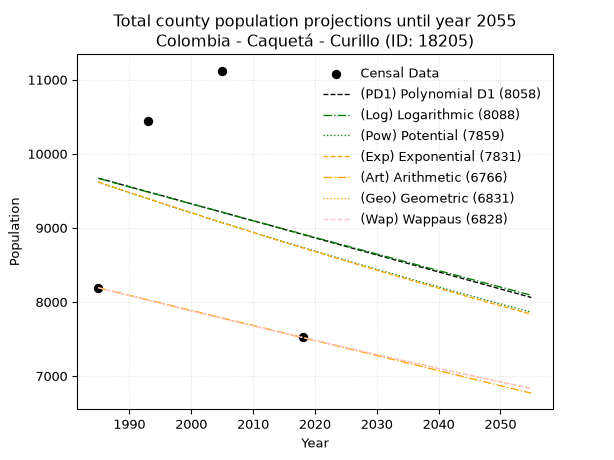
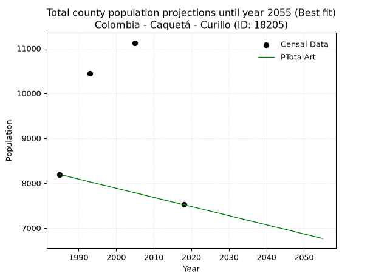
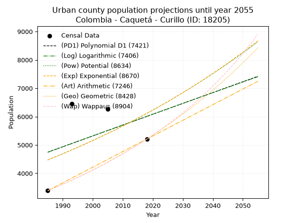
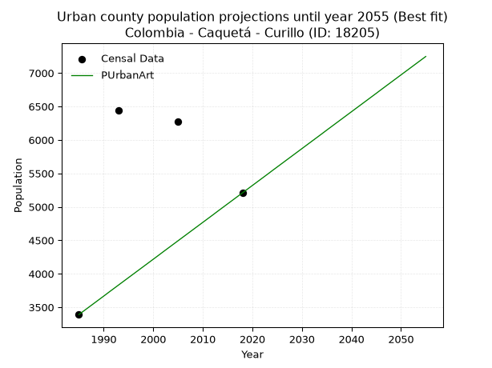
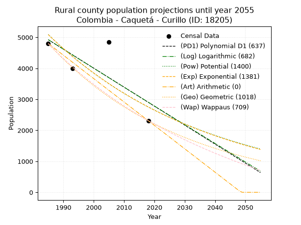
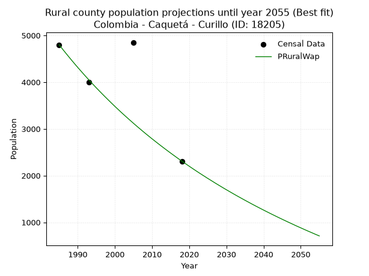

<div align="center">


</div>

# 📜 _“Population and Public Services Demand Projections (PPSD) until Year 2050 for Colombia - Caquetá - Curillo (ID: 18205)”_
Keywords: `population` `public-service` `projection` `lineal` `polynomial` `logarithmic` `potential` `exponential` `arithmetic` `geometric` `wappaus` `dane` `colombia` `south-america`

PPSD are analytical estimates used by governments and planners to anticipate future changes in population size, age distribution, and the resulting community needs for utilities, healthcare, education, and infrastructure as sizing future water treatment facilities, electrical grids, and road networks based on spatial growth.

<div align="center">

</img>

</div>


> **General running parameters**: • app_version: _v20260806_. • Python version: _3.14.7_. • Pandas version: _3.0.5_. • NumPy version: _2.5.1_. • Creates, save and include plots into reports (create_plot): _False_. • Projection until year: _2050_. • Process polynomial degree 2 and up: _False_. • Process Wappaus: _True_. • Process Wappaus: _True_. • Set negative values to zero: _True_. • Set infinite values to zero: _True_. • Drop dataset notes: _True_. 
<div align="center">

Maps & GIS Layers: [:earth_americas:Google](http://maps.google.com/maps?q=1.033473092,-75.919205) [:earth_americas:OSM](https://www.openstreetmap.org/#map=18/1.033473092/-75.919205&layers=P) [:earth_americas:Bing](https://www.bing.com/maps?cp=1.033473092~-75.919205&lvl=18) [:earth_americas:Apple](https://maps.apple.com/frame?center=1.033473092%2C-75.919205&span=0.003%2C0.006) [:earth_americas:GISMobile](https://github.com/rcfdtools/R.GISMobile/blob/main/file/gis/CountyLayer_CO/Readme.md)

</div>


<div align="center">

```geojson
{
  "type": "Feature",
  "geometry": {
    "type": "Point", 
    "coordinates": [-75.919205, 1.033473092]
  }, 
  "properties": {
    "Name": "Colombia - Caquetá - Curillo (ID: 18205)"
  }
}
```

</div>


## 0. Census Data (4 records)

Census data are official statistics collected by a government about the people and housing in a country. They usually include counts of total population, age, sex, race, income, education, and jobs.

📅Global census file: [Population.xlsx](../data/Population.xlsx)

| Source   |   Year |   CountryID | CountryName   |   StateID | StateName   |   CountyID | CountyName   |   PTotal |   PUrban |   PRural |
|:---------|-------:|------------:|:--------------|----------:|:------------|-----------:|:-------------|---------:|---------:|---------:|
| DANE     |   1985 |          57 | Colombia      |        18 | Caquetá     |      18205 | Curillo      |     8189 |     3390 |     4799 |
| DANE     |   1993 |          57 | Colombia      |        18 | Caquetá     |      18205 | Curillo      |    10444 |     6445 |     3999 |
| DANE     |   2005 |          57 | Colombia      |        18 | Caquetá     |      18205 | Curillo      |    11121 |     6270 |     4851 |
| DANE     |   2018 |          57 | Colombia      |        18 | Caquetá     |      18205 | Curillo      |     7518 |     5208 |     2310 |

> 🔥Some records could had specific notes about the registered values or the corresponding urban or rural distribution.

📅[SUI-RUPS](https://www.datos.gov.co/Hacienda-y-Cr-dito-P-blico/Registro-nico-de-Prestadores-de-Servicios-P-blicos/4qkq-csdn/about_data) - Local public utility companies: [RUPS.csv](../data/RUPS.csv)

 | SERVICIO       | ESTADO    | NOMBRE                                     | NIT         | DEPARTAMENTO_DOMICILIO   | MUNICIPIO_DOMICILIO   | DIRECCION         |   TELEFONO | EMAIL                  | TIPO_PRESTADOR                             | CLASIFICACION                 |
|:---------------|:----------|:-------------------------------------------|:------------|:-------------------------|:----------------------|:------------------|-----------:|:-----------------------|:-------------------------------------------|:------------------------------|
| ACUEDUCTO      | OPERATIVA | EMPRESA DE SERVICIOS DE CURILLO  S.A E.S.P | 828001308-1 | CAQUETA                  | CURILLO               | CALLE 6a No  5-10 |    2157108 | esercusaes@hotmail.com | SOCIEDADES (EMPRESA DE SERVICIOS PUBLICOS) | MENOR O IGUAL A 2500 USUARIOS |
| ALCANTARILLADO | OPERATIVA | EMPRESA DE SERVICIOS DE CURILLO  S.A E.S.P | 828001308-1 | CAQUETA                  | CURILLO               | CALLE 6a No  5-10 |    2157108 | esercusaes@hotmail.com | SOCIEDADES (EMPRESA DE SERVICIOS PUBLICOS) | MENOR O IGUAL A 2500 USUARIOS |

## 1. Total

### 1.1. Coefficients and Parameters

* (PD1) Polynomial Deg 1: -23.014050582093457, 55351.854676832445 (lineal)
* (Log) Logarithmic: -45512.123753516746, 355256.0173617516
* (Pow) Potential: -5.81339418969803, 23.15404106562067
* (Exp) Exponential: -0.0029341315667851323, 3254309.4000136186
* (Art) Arithmetic: Year diff. 2018 - 1985 = 33, Population diff. 7518 - 8189 = -671, Annual growth = -20.333333333333332
* (Geo) Geometric: Year diff. 2018 - 1985 = 33, Population diff. 7518 - 8189 = -671, Annual growth % = -0.0025873030604738334
* (Wap) Wappaus: i = -0.25890791791345685, Condition values only valid for < 200)

<sub>
Wappaus condition values: ['-0.00', '-0.26', '-0.52', '-0.78', '-1.04', '-1.29', '-1.55', '-1.81', '-2.07', '-2.33', '-2.59', '-2.85', '-3.11', '-3.37', '-3.62', '-3.88', '-4.14', '-4.40', '-4.66', '-4.92', '-5.18', '-5.44', '-5.70', '-5.95', '-6.21', '-6.47', '-6.73', '-6.99', '-7.25', '-7.51', '-7.77', '-8.03', '-8.29', '-8.54', '-8.80', '-9.06', '-9.32', '-9.58', '-9.84', '-10.10', '-10.36', '-10.62', '-10.87', '-11.13', '-11.39', '-11.65', '-11.91', '-12.17', '-12.43', '-12.69', '-12.95', '-13.20', '-13.46', '-13.72', '-13.98', '-14.24', '-14.50', '-14.76', '-15.02', '-15.28', '-15.53', '-15.79', '-16.05', '-16.31', '-16.57', '-16.83']
</sub>


### 1.2. Projected Dataset

|   Year |   CountyID |   PTotalPD1 |   PTotalLog |   PTotalPow |   PTotalExp |   PTotalArt |   PTotalGeo |   PTotalWap |
|-------:|-----------:|------------:|------------:|------------:|------------:|------------:|------------:|------------:|
|   1985 |      18205 |        9669 |        9665 |        9613 |        9617 |        8189 |        8189 |        8189 |
|   1986 |      18205 |        9646 |        9643 |        9585 |        9588 |        8169 |        8168 |        8168 |
|   1987 |      18205 |        9623 |        9620 |        9557 |        9560 |        8148 |        8147 |        8147 |
|   1988 |      18205 |        9600 |        9597 |        9529 |        9532 |        8128 |        8126 |        8126 |
|   1989 |      18205 |        9577 |        9574 |        9501 |        9504 |        8108 |        8105 |        8105 |
|   1990 |      18205 |        9554 |        9551 |        9473 |        9476 |        8087 |        8084 |        8084 |
|   1991 |      18205 |        9531 |        9528 |        9446 |        9449 |        8067 |        8063 |        8063 |
|   1992 |      18205 |        9508 |        9505 |        9418 |        9421 |        8047 |        8042 |        8042 |
|   1993 |      18205 |        9485 |        9482 |        9391 |        9393 |        8026 |        8021 |        8021 |
|   1994 |      18205 |        9462 |        9460 |        9363 |        9366 |        8006 |        8000 |        8000 |
|   1995 |      18205 |        9439 |        9437 |        9336 |        9338 |        7986 |        7980 |        7980 |
|   1996 |      18205 |        9416 |        9414 |        9309 |        9311 |        7965 |        7959 |        7959 |
|   1997 |      18205 |        9393 |        9391 |        9282 |        9284 |        7945 |        7938 |        7938 |
|   1998 |      18205 |        9370 |        9368 |        9255 |        9257 |        7925 |        7918 |        7918 |
|   1999 |      18205 |        9347 |        9346 |        9228 |        9230 |        7904 |        7897 |        7897 |
|   2000 |      18205 |        9324 |        9323 |        9201 |        9202 |        7884 |        7877 |        7877 |
|   2001 |      18205 |        9301 |        9300 |        9175 |        9176 |        7864 |        7857 |        7857 |
|   2002 |      18205 |        9278 |        9277 |        9148 |        9149 |        7843 |        7836 |        7836 |
|   2003 |      18205 |        9255 |        9255 |        9122 |        9122 |        7823 |        7816 |        7816 |
|   2004 |      18205 |        9232 |        9232 |        9095 |        9095 |        7803 |        7796 |        7796 |
|   2005 |      18205 |        9209 |        9209 |        9069 |        9068 |        7782 |        7776 |        7776 |
|   2006 |      18205 |        9186 |        9186 |        9043 |        9042 |        7762 |        7755 |        7756 |
|   2007 |      18205 |        9163 |        9164 |        9016 |        9015 |        7742 |        7735 |        7735 |
|   2008 |      18205 |        9140 |        9141 |        8990 |        8989 |        7721 |        7715 |        7715 |
|   2009 |      18205 |        9117 |        9118 |        8964 |        8963 |        7701 |        7695 |        7695 |
|   2010 |      18205 |        9094 |        9096 |        8938 |        8936 |        7681 |        7675 |        7676 |
|   2011 |      18205 |        9071 |        9073 |        8913 |        8910 |        7660 |        7656 |        7656 |
|   2012 |      18205 |        9048 |        9051 |        8887 |        8884 |        7640 |        7636 |        7636 |
|   2013 |      18205 |        9025 |        9028 |        8861 |        8858 |        7620 |        7616 |        7616 |
|   2014 |      18205 |        9002 |        9005 |        8836 |        8832 |        7599 |        7596 |        7596 |
|   2015 |      18205 |        8979 |        8983 |        8810 |        8806 |        7579 |        7577 |        7577 |
|   2016 |      18205 |        8956 |        8960 |        8785 |        8780 |        7559 |        7557 |        7557 |
|   2017 |      18205 |        8933 |        8938 |        8760 |        8755 |        7538 |        7538 |        7538 |
|   2018 |      18205 |        8910 |        8915 |        8734 |        8729 |        7518 |        7518 |        7518 |
|   2019 |      18205 |        8886 |        8892 |        8709 |        8703 |        7498 |        7499 |        7499 |
|   2020 |      18205 |        8863 |        8870 |        8684 |        8678 |        7477 |        7479 |        7479 |
|   2021 |      18205 |        8840 |        8847 |        8659 |        8653 |        7457 |        7460 |        7460 |
|   2022 |      18205 |        8817 |        8825 |        8634 |        8627 |        7437 |        7440 |        7440 |
|   2023 |      18205 |        8794 |        8802 |        8610 |        8602 |        7416 |        7421 |        7421 |
|   2024 |      18205 |        8771 |        8780 |        8585 |        8577 |        7396 |        7402 |        7402 |
|   2025 |      18205 |        8748 |        8757 |        8560 |        8552 |        7376 |        7383 |        7383 |
|   2026 |      18205 |        8725 |        8735 |        8536 |        8527 |        7355 |        7364 |        7364 |
|   2027 |      18205 |        8702 |        8713 |        8511 |        8502 |        7335 |        7345 |        7344 |
|   2028 |      18205 |        8679 |        8690 |        8487 |        8477 |        7315 |        7326 |        7325 |
|   2029 |      18205 |        8656 |        8668 |        8463 |        8452 |        7294 |        7307 |        7306 |
|   2030 |      18205 |        8633 |        8645 |        8438 |        8427 |        7274 |        7288 |        7287 |
|   2031 |      18205 |        8610 |        8623 |        8414 |        8402 |        7254 |        7269 |        7269 |
|   2032 |      18205 |        8587 |        8600 |        8390 |        8378 |        7233 |        7250 |        7250 |
|   2033 |      18205 |        8564 |        8578 |        8366 |        8353 |        7213 |        7231 |        7231 |
|   2034 |      18205 |        8541 |        8556 |        8342 |        8329 |        7193 |        7213 |        7212 |
|   2035 |      18205 |        8518 |        8533 |        8319 |        8304 |        7172 |        7194 |        7193 |
|   2036 |      18205 |        8495 |        8511 |        8295 |        8280 |        7152 |        7175 |        7175 |
|   2037 |      18205 |        8472 |        8489 |        8271 |        8256 |        7132 |        7157 |        7156 |
|   2038 |      18205 |        8449 |        8466 |        8248 |        8232 |        7111 |        7138 |        7137 |
|   2039 |      18205 |        8426 |        8444 |        8224 |        8207 |        7091 |        7120 |        7119 |
|   2040 |      18205 |        8403 |        8422 |        8201 |        8183 |        7071 |        7101 |        7100 |
|   2041 |      18205 |        8380 |        8399 |        8177 |        8159 |        7050 |        7083 |        7082 |
|   2042 |      18205 |        8357 |        8377 |        8154 |        8136 |        7030 |        7065 |        7064 |
|   2043 |      18205 |        8334 |        8355 |        8131 |        8112 |        7010 |        7047 |        7045 |
|   2044 |      18205 |        8311 |        8332 |        8108 |        8088 |        6989 |        7028 |        7027 |
|   2045 |      18205 |        8288 |        8310 |        8085 |        8064 |        6969 |        7010 |        7009 |
|   2046 |      18205 |        8265 |        8288 |        8062 |        8041 |        6949 |        6992 |        6990 |
|   2047 |      18205 |        8242 |        8266 |        8039 |        8017 |        6928 |        6974 |        6972 |
|   2048 |      18205 |        8219 |        8243 |        8016 |        7994 |        6908 |        6956 |        6954 |
|   2049 |      18205 |        8196 |        8221 |        7994 |        7970 |        6888 |        6938 |        6936 |
|   2050 |      18205 |        8173 |        8199 |        7971 |        7947 |        6867 |        6920 |        6918 |
<div align="center">

</img>

</div>


### 1.3. Best fit with absolute and relative error (%)

Relative error puts that difference into context by dividing the absolute error by the true value, creating a unitless ratio or percentage that shows the scale of the mistake.

Absolute and relative error

|   Year | Source   |   CountryID | CountryName   |   StateID | StateName   |   CountyID_x | CountyName   |   PTotal |   PUrban |   PRural |   CountyID_y |   PTotalPD1 |   PTotalLog |   PTotalPow |   PTotalExp |   PTotalArt |   PTotalGeo |   PTotalWap |   PTotalPD1AbsError |   PTotalLogAbsError |   PTotalPowAbsError |   PTotalExpAbsError |   PTotalArtAbsError |   PTotalGeoAbsError |   PTotalWapAbsError |   PTotalPD1RelError |   PTotalLogRelError |   PTotalPowRelError |   PTotalExpRelError |   PTotalArtRelError |   PTotalGeoRelError |   PTotalWapRelError |
|-------:|:---------|------------:|:--------------|----------:|:------------|-------------:|:-------------|---------:|---------:|---------:|-------------:|------------:|------------:|------------:|------------:|------------:|------------:|------------:|--------------------:|--------------------:|--------------------:|--------------------:|--------------------:|--------------------:|--------------------:|--------------------:|--------------------:|--------------------:|--------------------:|--------------------:|--------------------:|--------------------:|
|   1985 | DANE     |          57 | Colombia      |        18 | Caquetá     |        18205 | Curillo      |     8189 |     3390 |     4799 |        18205 |        9669 |        9665 |        9613 |        9617 |        8189 |        8189 |        8189 |                1480 |                1476 |                1424 |                1428 |                   0 |                   0 |                   0 |            18.073   |            18.0242  |             17.3892 |             17.438  |              0      |              0      |              0      |
|   1993 | DANE     |          57 | Colombia      |        18 | Caquetá     |        18205 | Curillo      |    10444 |     6445 |     3999 |        18205 |        9485 |        9482 |        9391 |        9393 |        8026 |        8021 |        8021 |                 959 |                 962 |                1053 |                1051 |                2418 |                2423 |                2423 |             9.18231 |             9.21103 |             10.0823 |             10.0632 |             23.152  |             23.1999 |             23.1999 |
|   2005 | DANE     |          57 | Colombia      |        18 | Caquetá     |        18205 | Curillo      |    11121 |     6270 |     4851 |        18205 |        9209 |        9209 |        9069 |        9068 |        7782 |        7776 |        7776 |                1912 |                1912 |                2052 |                2053 |                3339 |                3345 |                3345 |            17.1927  |            17.1927  |             18.4516 |             18.4606 |             30.0243 |             30.0782 |             30.0782 |
|   2018 | DANE     |          57 | Colombia      |        18 | Caquetá     |        18205 | Curillo      |     7518 |     5208 |     2310 |        18205 |        8910 |        8915 |        8734 |        8729 |        7518 |        7518 |        7518 |                1392 |                1397 |                1216 |                1211 |                   0 |                   0 |                   0 |            18.5156  |            18.5821  |             16.1745 |             16.108  |              0      |              0      |              0      |

Relative error mean

| Method    |   RelError | Best   |
|:----------|-----------:|:-------|
| PTotalPD1 |    15.7409 |        |
| PTotalLog |    15.7525 |        |
| PTotalPow |    15.5244 |        |
| PTotalExp |    15.5174 |        |
| PTotalArt |    13.2941 | True   |
| PTotalGeo |    13.3195 |        |
| PTotalWap |    13.3195 |        |

💙Best method: _**PTotalArt**_
<div align="center">

</img>

</div>


### 1.4. Fresh water supply demand in liters per capita per day (lpcd)

The fresh water supply demand typically ranges from 100 to 300 liters per capita per day (lpcd) for standard domestic and municipal planning, though absolute survival minimums set by the World Health Organization are as low as 7.5 to 20 liters per day, and total consumption in high-income nations can exceed 400 liters.

> `CZ`: Level in meters above the sea level (masl)<br> `WS`: Fresh water supply demand in liters per capita per day (lpcd or l/h/d)<br> `WSAll`: Zonal fresh water supply demand in liters per second (l/s)<br> `A`: Zonal area in square meters<br> `DP`: Population density (people/hectare or p/ha)

Reference values (RAS Colombia)

|    CZ |   WS |
|------:|-----:|
|  1000 |  120 |
|  2000 |  130 |
| 99999 |  140 |

County shapefile geometry properties and water supply values

|   CountyID |      ATotal |   CZTotal |   WSTotal |
|-----------:|------------:|----------:|----------:|
|      18205 | 3.99277e+08 |   234.285 |       120 |

Projected values for best method: PTotalArt

|   CountyID |   Year |   PTotalArt |   DPTotal |   WSTotal |   WSTotalAll |
|-----------:|-------:|------------:|----------:|----------:|-------------:|
|      18205 |   1985 |        8189 |      0.21 |       120 |     11.3736  |
|      18205 |   1986 |        8169 |      0.2  |       120 |     11.3458  |
|      18205 |   1987 |        8148 |      0.2  |       120 |     11.3167  |
|      18205 |   1988 |        8128 |      0.2  |       120 |     11.2889  |
|      18205 |   1989 |        8108 |      0.2  |       120 |     11.2611  |
|      18205 |   1990 |        8087 |      0.2  |       120 |     11.2319  |
|      18205 |   1991 |        8067 |      0.2  |       120 |     11.2042  |
|      18205 |   1992 |        8047 |      0.2  |       120 |     11.1764  |
|      18205 |   1993 |        8026 |      0.2  |       120 |     11.1472  |
|      18205 |   1994 |        8006 |      0.2  |       120 |     11.1194  |
|      18205 |   1995 |        7986 |      0.2  |       120 |     11.0917  |
|      18205 |   1996 |        7965 |      0.2  |       120 |     11.0625  |
|      18205 |   1997 |        7945 |      0.2  |       120 |     11.0347  |
|      18205 |   1998 |        7925 |      0.2  |       120 |     11.0069  |
|      18205 |   1999 |        7904 |      0.2  |       120 |     10.9778  |
|      18205 |   2000 |        7884 |      0.2  |       120 |     10.95    |
|      18205 |   2001 |        7864 |      0.2  |       120 |     10.9222  |
|      18205 |   2002 |        7843 |      0.2  |       120 |     10.8931  |
|      18205 |   2003 |        7823 |      0.2  |       120 |     10.8653  |
|      18205 |   2004 |        7803 |      0.2  |       120 |     10.8375  |
|      18205 |   2005 |        7782 |      0.19 |       120 |     10.8083  |
|      18205 |   2006 |        7762 |      0.19 |       120 |     10.7806  |
|      18205 |   2007 |        7742 |      0.19 |       120 |     10.7528  |
|      18205 |   2008 |        7721 |      0.19 |       120 |     10.7236  |
|      18205 |   2009 |        7701 |      0.19 |       120 |     10.6958  |
|      18205 |   2010 |        7681 |      0.19 |       120 |     10.6681  |
|      18205 |   2011 |        7660 |      0.19 |       120 |     10.6389  |
|      18205 |   2012 |        7640 |      0.19 |       120 |     10.6111  |
|      18205 |   2013 |        7620 |      0.19 |       120 |     10.5833  |
|      18205 |   2014 |        7599 |      0.19 |       120 |     10.5542  |
|      18205 |   2015 |        7579 |      0.19 |       120 |     10.5264  |
|      18205 |   2016 |        7559 |      0.19 |       120 |     10.4986  |
|      18205 |   2017 |        7538 |      0.19 |       120 |     10.4694  |
|      18205 |   2018 |        7518 |      0.19 |       120 |     10.4417  |
|      18205 |   2019 |        7498 |      0.19 |       120 |     10.4139  |
|      18205 |   2020 |        7477 |      0.19 |       120 |     10.3847  |
|      18205 |   2021 |        7457 |      0.19 |       120 |     10.3569  |
|      18205 |   2022 |        7437 |      0.19 |       120 |     10.3292  |
|      18205 |   2023 |        7416 |      0.19 |       120 |     10.3     |
|      18205 |   2024 |        7396 |      0.19 |       120 |     10.2722  |
|      18205 |   2025 |        7376 |      0.18 |       120 |     10.2444  |
|      18205 |   2026 |        7355 |      0.18 |       120 |     10.2153  |
|      18205 |   2027 |        7335 |      0.18 |       120 |     10.1875  |
|      18205 |   2028 |        7315 |      0.18 |       120 |     10.1597  |
|      18205 |   2029 |        7294 |      0.18 |       120 |     10.1306  |
|      18205 |   2030 |        7274 |      0.18 |       120 |     10.1028  |
|      18205 |   2031 |        7254 |      0.18 |       120 |     10.075   |
|      18205 |   2032 |        7233 |      0.18 |       120 |     10.0458  |
|      18205 |   2033 |        7213 |      0.18 |       120 |     10.0181  |
|      18205 |   2034 |        7193 |      0.18 |       120 |      9.99028 |
|      18205 |   2035 |        7172 |      0.18 |       120 |      9.96111 |
|      18205 |   2036 |        7152 |      0.18 |       120 |      9.93333 |
|      18205 |   2037 |        7132 |      0.18 |       120 |      9.90556 |
|      18205 |   2038 |        7111 |      0.18 |       120 |      9.87639 |
|      18205 |   2039 |        7091 |      0.18 |       120 |      9.84861 |
|      18205 |   2040 |        7071 |      0.18 |       120 |      9.82083 |
|      18205 |   2041 |        7050 |      0.18 |       120 |      9.79167 |
|      18205 |   2042 |        7030 |      0.18 |       120 |      9.76389 |
|      18205 |   2043 |        7010 |      0.18 |       120 |      9.73611 |
|      18205 |   2044 |        6989 |      0.18 |       120 |      9.70694 |
|      18205 |   2045 |        6969 |      0.17 |       120 |      9.67917 |
|      18205 |   2046 |        6949 |      0.17 |       120 |      9.65139 |
|      18205 |   2047 |        6928 |      0.17 |       120 |      9.62222 |
|      18205 |   2048 |        6908 |      0.17 |       120 |      9.59444 |
|      18205 |   2049 |        6888 |      0.17 |       120 |      9.56667 |
|      18205 |   2050 |        6867 |      0.17 |       120 |      9.5375  |

## 2. Urban

### 2.1. Coefficients and Parameters

* (PD1) Polynomial Deg 1: 38.218787635488404, -71118.87996788567 (lineal)
* (Log) Logarithmic: 76882.54702340615, -579056.6060229762
* (Pow) Potential: 18.99063965653987, -58.97620141842475
* (Exp) Exponential: 0.009448896156692034, 3.199686738716922e-05
* (Art) Arithmetic: Year diff. 2018 - 1985 = 33, Population diff. 5208 - 3390 = 1818, Annual growth = 55.09090909090909
* (Geo) Geometric: Year diff. 2018 - 1985 = 33, Population diff. 5208 - 3390 = 1818, Annual growth % = 0.013096102948162436
* (Wap) Wappaus: i = 1.2814819514051894, Condition values only valid for < 200)

<sub>
Wappaus condition values: ['0.00', '1.28', '2.56', '3.84', '5.13', '6.41', '7.69', '8.97', '10.25', '11.53', '12.81', '14.10', '15.38', '16.66', '17.94', '19.22', '20.50', '21.79', '23.07', '24.35', '25.63', '26.91', '28.19', '29.47', '30.76', '32.04', '33.32', '34.60', '35.88', '37.16', '38.44', '39.73', '41.01', '42.29', '43.57', '44.85', '46.13', '47.41', '48.70', '49.98', '51.26', '52.54', '53.82', '55.10', '56.39', '57.67', '58.95', '60.23', '61.51', '62.79', '64.07', '65.36', '66.64', '67.92', '69.20', '70.48', '71.76', '73.04', '74.33', '75.61', '76.89', '78.17', '79.45', '80.73', '82.01', '83.30']
</sub>


### 2.2. Projected Dataset

|   Year |   CountyID |   PUrbanPD1 |   PUrbanLog |   PUrbanPow |   PUrbanExp |   PUrbanArt |   PUrbanGeo |   PUrbanWap |
|-------:|-----------:|------------:|------------:|------------:|------------:|------------:|------------:|------------:|
|   1985 |      18205 |        4745 |        4741 |        4471 |        4475 |        3390 |        3390 |        3390 |
|   1986 |      18205 |        4784 |        4780 |        4514 |        4517 |        3445 |        3434 |        3434 |
|   1987 |      18205 |        4822 |        4819 |        4557 |        4560 |        3500 |        3479 |        3478 |
|   1988 |      18205 |        4860 |        4857 |        4601 |        4603 |        3555 |        3525 |        3523 |
|   1989 |      18205 |        4898 |        4896 |        4645 |        4647 |        3610 |        3571 |        3568 |
|   1990 |      18205 |        4937 |        4935 |        4690 |        4691 |        3665 |        3618 |        3614 |
|   1991 |      18205 |        4975 |        4973 |        4734 |        4736 |        3721 |        3665 |        3661 |
|   1992 |      18205 |        5013 |        5012 |        4780 |        4781 |        3776 |        3713 |        3708 |
|   1993 |      18205 |        5051 |        5051 |        4826 |        4826 |        3831 |        3762 |        3756 |
|   1994 |      18205 |        5089 |        5089 |        4872 |        4872 |        3886 |        3811 |        3805 |
|   1995 |      18205 |        5128 |        5128 |        4918 |        4918 |        3941 |        3861 |        3854 |
|   1996 |      18205 |        5166 |        5166 |        4965 |        4965 |        3996 |        3912 |        3904 |
|   1997 |      18205 |        5204 |        5205 |        5013 |        5012 |        4051 |        3963 |        3955 |
|   1998 |      18205 |        5242 |        5243 |        5061 |        5059 |        4106 |        4015 |        4006 |
|   1999 |      18205 |        5280 |        5282 |        5109 |        5108 |        4161 |        4067 |        4058 |
|   2000 |      18205 |        5319 |        5320 |        5158 |        5156 |        4216 |        4121 |        4111 |
|   2001 |      18205 |        5357 |        5359 |        5207 |        5205 |        4271 |        4175 |        4164 |
|   2002 |      18205 |        5395 |        5397 |        5257 |        5254 |        4327 |        4229 |        4219 |
|   2003 |      18205 |        5433 |        5435 |        5307 |        5304 |        4382 |        4285 |        4274 |
|   2004 |      18205 |        5472 |        5474 |        5357 |        5355 |        4437 |        4341 |        4330 |
|   2005 |      18205 |        5510 |        5512 |        5408 |        5405 |        4492 |        4398 |        4387 |
|   2006 |      18205 |        5548 |        5550 |        5460 |        5457 |        4547 |        4455 |        4444 |
|   2007 |      18205 |        5586 |        5589 |        5512 |        5509 |        4602 |        4514 |        4503 |
|   2008 |      18205 |        5624 |        5627 |        5564 |        5561 |        4657 |        4573 |        4562 |
|   2009 |      18205 |        5663 |        5665 |        5617 |        5614 |        4712 |        4632 |        4622 |
|   2010 |      18205 |        5701 |        5704 |        5670 |        5667 |        4767 |        4693 |        4683 |
|   2011 |      18205 |        5739 |        5742 |        5724 |        5721 |        4822 |        4755 |        4745 |
|   2012 |      18205 |        5777 |        5780 |        5778 |        5775 |        4877 |        4817 |        4808 |
|   2013 |      18205 |        5816 |        5818 |        5833 |        5830 |        4933 |        4880 |        4872 |
|   2014 |      18205 |        5854 |        5856 |        5888 |        5885 |        4988 |        4944 |        4937 |
|   2015 |      18205 |        5892 |        5895 |        5944 |        5941 |        5043 |        5009 |        5003 |
|   2016 |      18205 |        5930 |        5933 |        6001 |        5998 |        5098 |        5074 |        5071 |
|   2017 |      18205 |        5968 |        5971 |        6057 |        6054 |        5153 |        5141 |        5139 |
|   2018 |      18205 |        6007 |        6009 |        6115 |        6112 |        5208 |        5208 |        5208 |
|   2019 |      18205 |        6045 |        6047 |        6172 |        6170 |        5263 |        5276 |        5278 |
|   2020 |      18205 |        6083 |        6085 |        6231 |        6229 |        5318 |        5345 |        5350 |
|   2021 |      18205 |        6121 |        6123 |        6290 |        6288 |        5373 |        5415 |        5423 |
|   2022 |      18205 |        6160 |        6161 |        6349 |        6347 |        5428 |        5486 |        5497 |
|   2023 |      18205 |        6198 |        6199 |        6409 |        6408 |        5483 |        5558 |        5572 |
|   2024 |      18205 |        6236 |        6237 |        6469 |        6468 |        5539 |        5631 |        5649 |
|   2025 |      18205 |        6274 |        6275 |        6530 |        6530 |        5594 |        5705 |        5727 |
|   2026 |      18205 |        6312 |        6313 |        6592 |        6592 |        5649 |        5779 |        5806 |
|   2027 |      18205 |        6351 |        6351 |        6654 |        6654 |        5704 |        5855 |        5886 |
|   2028 |      18205 |        6389 |        6389 |        6716 |        6718 |        5759 |        5932 |        5968 |
|   2029 |      18205 |        6427 |        6427 |        6780 |        6781 |        5814 |        6009 |        6052 |
|   2030 |      18205 |        6465 |        6465 |        6843 |        6846 |        5869 |        6088 |        6137 |
|   2031 |      18205 |        6503 |        6503 |        6908 |        6911 |        5924 |        6168 |        6223 |
|   2032 |      18205 |        6542 |        6541 |        6972 |        6976 |        5979 |        6249 |        6312 |
|   2033 |      18205 |        6580 |        6578 |        7038 |        7043 |        6034 |        6330 |        6401 |
|   2034 |      18205 |        6618 |        6616 |        7104 |        7109 |        6089 |        6413 |        6493 |
|   2035 |      18205 |        6656 |        6654 |        7171 |        7177 |        6145 |        6497 |        6586 |
|   2036 |      18205 |        6695 |        6692 |        7238 |        7245 |        6200 |        6582 |        6681 |
|   2037 |      18205 |        6733 |        6729 |        7306 |        7314 |        6255 |        6669 |        6778 |
|   2038 |      18205 |        6771 |        6767 |        7374 |        7383 |        6310 |        6756 |        6876 |
|   2039 |      18205 |        6809 |        6805 |        7443 |        7453 |        6365 |        6844 |        6977 |
|   2040 |      18205 |        6847 |        6843 |        7513 |        7524 |        6420 |        6934 |        7080 |
|   2041 |      18205 |        6886 |        6880 |        7583 |        7596 |        6475 |        7025 |        7184 |
|   2042 |      18205 |        6924 |        6918 |        7654 |        7668 |        6530 |        7117 |        7291 |
|   2043 |      18205 |        6962 |        6956 |        7725 |        7741 |        6585 |        7210 |        7400 |
|   2044 |      18205 |        7000 |        6993 |        7797 |        7814 |        6640 |        7304 |        7511 |
|   2045 |      18205 |        7039 |        7031 |        7870 |        7888 |        6695 |        7400 |        7624 |
|   2046 |      18205 |        7077 |        7068 |        7944 |        7963 |        6751 |        7497 |        7740 |
|   2047 |      18205 |        7115 |        7106 |        8018 |        8039 |        6806 |        7595 |        7859 |
|   2048 |      18205 |        7153 |        7144 |        8092 |        8115 |        6861 |        7695 |        7979 |
|   2049 |      18205 |        7191 |        7181 |        8168 |        8192 |        6916 |        7795 |        8103 |
|   2050 |      18205 |        7230 |        7219 |        8244 |        8270 |        6971 |        7898 |        8229 |
<div align="center">

</img>

</div>


### 2.3. Best fit with absolute and relative error (%)

Relative error puts that difference into context by dividing the absolute error by the true value, creating a unitless ratio or percentage that shows the scale of the mistake.

Absolute and relative error

|   Year | Source   |   CountryID | CountryName   |   StateID | StateName   |   CountyID_x | CountyName   |   PTotal |   PUrban |   PRural |   CountyID_y |   PUrbanPD1 |   PUrbanLog |   PUrbanPow |   PUrbanExp |   PUrbanArt |   PUrbanGeo |   PUrbanWap |   PUrbanPD1AbsError |   PUrbanLogAbsError |   PUrbanPowAbsError |   PUrbanExpAbsError |   PUrbanArtAbsError |   PUrbanGeoAbsError |   PUrbanWapAbsError |   PUrbanPD1RelError |   PUrbanLogRelError |   PUrbanPowRelError |   PUrbanExpRelError |   PUrbanArtRelError |   PUrbanGeoRelError |   PUrbanWapRelError |
|-------:|:---------|------------:|:--------------|----------:|:------------|-------------:|:-------------|---------:|---------:|---------:|-------------:|------------:|------------:|------------:|------------:|------------:|------------:|------------:|--------------------:|--------------------:|--------------------:|--------------------:|--------------------:|--------------------:|--------------------:|--------------------:|--------------------:|--------------------:|--------------------:|--------------------:|--------------------:|--------------------:|
|   1985 | DANE     |          57 | Colombia      |        18 | Caquetá     |        18205 | Curillo      |     8189 |     3390 |     4799 |        18205 |        4745 |        4741 |        4471 |        4475 |        3390 |        3390 |        3390 |                1355 |                1351 |                1081 |                1085 |                   0 |                   0 |                   0 |             39.9705 |             39.8525 |             31.8879 |             32.0059 |              0      |              0      |              0      |
|   1993 | DANE     |          57 | Colombia      |        18 | Caquetá     |        18205 | Curillo      |    10444 |     6445 |     3999 |        18205 |        5051 |        5051 |        4826 |        4826 |        3831 |        3762 |        3756 |                1394 |                1394 |                1619 |                1619 |                2614 |                2683 |                2689 |             21.6292 |             21.6292 |             25.1202 |             25.1202 |             40.5586 |             41.6292 |             41.7223 |
|   2005 | DANE     |          57 | Colombia      |        18 | Caquetá     |        18205 | Curillo      |    11121 |     6270 |     4851 |        18205 |        5510 |        5512 |        5408 |        5405 |        4492 |        4398 |        4387 |                 760 |                 758 |                 862 |                 865 |                1778 |                1872 |                1883 |             12.1212 |             12.0893 |             13.748  |             13.7959 |             28.3573 |             29.8565 |             30.0319 |
|   2018 | DANE     |          57 | Colombia      |        18 | Caquetá     |        18205 | Curillo      |     7518 |     5208 |     2310 |        18205 |        6007 |        6009 |        6115 |        6112 |        5208 |        5208 |        5208 |                 799 |                 801 |                 907 |                 904 |                   0 |                   0 |                   0 |             15.3418 |             15.3802 |             17.4155 |             17.3579 |              0      |              0      |              0      |

Relative error mean

| Method    |   RelError | Best   |
|:----------|-----------:|:-------|
| PUrbanPD1 |    22.2657 |        |
| PUrbanLog |    22.2378 |        |
| PUrbanPow |    22.0429 |        |
| PUrbanExp |    22.07   |        |
| PUrbanArt |    17.229  | True   |
| PUrbanGeo |    17.8714 |        |
| PUrbanWap |    17.9385 |        |

💙Best method: _**PUrbanArt**_
<div align="center">

</img>

</div>


### 2.4. Fresh water supply demand in liters per capita per day (lpcd)

The fresh water supply demand typically ranges from 100 to 300 liters per capita per day (lpcd) for standard domestic and municipal planning, though absolute survival minimums set by the World Health Organization are as low as 7.5 to 20 liters per day, and total consumption in high-income nations can exceed 400 liters.

> `CZ`: Level in meters above the sea level (masl)<br> `WS`: Fresh water supply demand in liters per capita per day (lpcd or l/h/d)<br> `WSAll`: Zonal fresh water supply demand in liters per second (l/s)<br> `A`: Zonal area in square meters<br> `DP`: Population density (people/hectare or p/ha)

Reference values (RAS Colombia)

|    CZ |   WS |
|------:|-----:|
|  1000 |  120 |
|  2000 |  130 |
| 99999 |  140 |

County shapefile geometry properties and water supply values

|   CountyID |   AUrban |   CZUrban |   WSUrban |
|-----------:|---------:|----------:|----------:|
|      18205 |   773216 |   227.231 |       120 |

Projected values for best method: PUrbanArt

|   CountyID |   Year |   PUrbanArt |   DPUrban |   WSUrban |   WSUrbanAll |
|-----------:|-------:|------------:|----------:|----------:|-------------:|
|      18205 |   1985 |        3390 |     43.84 |       120 |      4.70833 |
|      18205 |   1986 |        3445 |     44.55 |       120 |      4.78472 |
|      18205 |   1987 |        3500 |     45.27 |       120 |      4.86111 |
|      18205 |   1988 |        3555 |     45.98 |       120 |      4.9375  |
|      18205 |   1989 |        3610 |     46.69 |       120 |      5.01389 |
|      18205 |   1990 |        3665 |     47.4  |       120 |      5.09028 |
|      18205 |   1991 |        3721 |     48.12 |       120 |      5.16806 |
|      18205 |   1992 |        3776 |     48.83 |       120 |      5.24444 |
|      18205 |   1993 |        3831 |     49.55 |       120 |      5.32083 |
|      18205 |   1994 |        3886 |     50.26 |       120 |      5.39722 |
|      18205 |   1995 |        3941 |     50.97 |       120 |      5.47361 |
|      18205 |   1996 |        3996 |     51.68 |       120 |      5.55    |
|      18205 |   1997 |        4051 |     52.39 |       120 |      5.62639 |
|      18205 |   1998 |        4106 |     53.1  |       120 |      5.70278 |
|      18205 |   1999 |        4161 |     53.81 |       120 |      5.77917 |
|      18205 |   2000 |        4216 |     54.53 |       120 |      5.85556 |
|      18205 |   2001 |        4271 |     55.24 |       120 |      5.93194 |
|      18205 |   2002 |        4327 |     55.96 |       120 |      6.00972 |
|      18205 |   2003 |        4382 |     56.67 |       120 |      6.08611 |
|      18205 |   2004 |        4437 |     57.38 |       120 |      6.1625  |
|      18205 |   2005 |        4492 |     58.09 |       120 |      6.23889 |
|      18205 |   2006 |        4547 |     58.81 |       120 |      6.31528 |
|      18205 |   2007 |        4602 |     59.52 |       120 |      6.39167 |
|      18205 |   2008 |        4657 |     60.23 |       120 |      6.46806 |
|      18205 |   2009 |        4712 |     60.94 |       120 |      6.54444 |
|      18205 |   2010 |        4767 |     61.65 |       120 |      6.62083 |
|      18205 |   2011 |        4822 |     62.36 |       120 |      6.69722 |
|      18205 |   2012 |        4877 |     63.07 |       120 |      6.77361 |
|      18205 |   2013 |        4933 |     63.8  |       120 |      6.85139 |
|      18205 |   2014 |        4988 |     64.51 |       120 |      6.92778 |
|      18205 |   2015 |        5043 |     65.22 |       120 |      7.00417 |
|      18205 |   2016 |        5098 |     65.93 |       120 |      7.08056 |
|      18205 |   2017 |        5153 |     66.64 |       120 |      7.15694 |
|      18205 |   2018 |        5208 |     67.36 |       120 |      7.23333 |
|      18205 |   2019 |        5263 |     68.07 |       120 |      7.30972 |
|      18205 |   2020 |        5318 |     68.78 |       120 |      7.38611 |
|      18205 |   2021 |        5373 |     69.49 |       120 |      7.4625  |
|      18205 |   2022 |        5428 |     70.2  |       120 |      7.53889 |
|      18205 |   2023 |        5483 |     70.91 |       120 |      7.61528 |
|      18205 |   2024 |        5539 |     71.64 |       120 |      7.69306 |
|      18205 |   2025 |        5594 |     72.35 |       120 |      7.76944 |
|      18205 |   2026 |        5649 |     73.06 |       120 |      7.84583 |
|      18205 |   2027 |        5704 |     73.77 |       120 |      7.92222 |
|      18205 |   2028 |        5759 |     74.48 |       120 |      7.99861 |
|      18205 |   2029 |        5814 |     75.19 |       120 |      8.075   |
|      18205 |   2030 |        5869 |     75.9  |       120 |      8.15139 |
|      18205 |   2031 |        5924 |     76.62 |       120 |      8.22778 |
|      18205 |   2032 |        5979 |     77.33 |       120 |      8.30417 |
|      18205 |   2033 |        6034 |     78.04 |       120 |      8.38056 |
|      18205 |   2034 |        6089 |     78.75 |       120 |      8.45694 |
|      18205 |   2035 |        6145 |     79.47 |       120 |      8.53472 |
|      18205 |   2036 |        6200 |     80.18 |       120 |      8.61111 |
|      18205 |   2037 |        6255 |     80.9  |       120 |      8.6875  |
|      18205 |   2038 |        6310 |     81.61 |       120 |      8.76389 |
|      18205 |   2039 |        6365 |     82.32 |       120 |      8.84028 |
|      18205 |   2040 |        6420 |     83.03 |       120 |      8.91667 |
|      18205 |   2041 |        6475 |     83.74 |       120 |      8.99306 |
|      18205 |   2042 |        6530 |     84.45 |       120 |      9.06944 |
|      18205 |   2043 |        6585 |     85.16 |       120 |      9.14583 |
|      18205 |   2044 |        6640 |     85.88 |       120 |      9.22222 |
|      18205 |   2045 |        6695 |     86.59 |       120 |      9.29861 |
|      18205 |   2046 |        6751 |     87.31 |       120 |      9.37639 |
|      18205 |   2047 |        6806 |     88.02 |       120 |      9.45278 |
|      18205 |   2048 |        6861 |     88.73 |       120 |      9.52917 |
|      18205 |   2049 |        6916 |     89.44 |       120 |      9.60556 |
|      18205 |   2050 |        6971 |     90.16 |       120 |      9.68194 |

## 3. Rural

### 3.1. Coefficients and Parameters

* (PD1) Polynomial Deg 1: -61.23283821758174, 126470.73464471787 (lineal)
* (Log) Logarithmic: -122394.67077692284, 934312.6233847274
* (Pow) Potential: -37.24663121298333, 126.53709066509042
* (Exp) Exponential: -0.018634709009885893, 5.902855877035529e+19
* (Art) Arithmetic: Year diff. 2018 - 1985 = 33, Population diff. 2310 - 4799 = -2489, Annual growth = -75.42424242424242
* (Geo) Geometric: Year diff. 2018 - 1985 = 33, Population diff. 2310 - 4799 = -2489, Annual growth % = -0.021912715327449206
* (Wap) Wappaus: i = -2.1219367681598658, Condition values only valid for < 200)

<sub>
Wappaus condition values: ['-0.00', '-2.12', '-4.24', '-6.37', '-8.49', '-10.61', '-12.73', '-14.85', '-16.98', '-19.10', '-21.22', '-23.34', '-25.46', '-27.59', '-29.71', '-31.83', '-33.95', '-36.07', '-38.19', '-40.32', '-42.44', '-44.56', '-46.68', '-48.80', '-50.93', '-53.05', '-55.17', '-57.29', '-59.41', '-61.54', '-63.66', '-65.78', '-67.90', '-70.02', '-72.15', '-74.27', '-76.39', '-78.51', '-80.63', '-82.76', '-84.88', '-87.00', '-89.12', '-91.24', '-93.37', '-95.49', '-97.61', '-99.73', '-101.85', '-103.97', '-106.10', '-108.22', '-110.34', '-112.46', '-114.58', '-116.71', '-118.83', '-120.95', '-123.07', '-125.19', '-127.32', '-129.44', '-131.56', '-133.68', '-135.80', '-137.93']
</sub>


### 3.2. Projected Dataset

|   Year |   CountyID |   PRuralPD1 |   PRuralLog |   PRuralPow |   PRuralExp |   PRuralArt |   PRuralGeo |   PRuralWap |
|-------:|-----------:|------------:|------------:|------------:|------------:|------------:|------------:|------------:|
|   1985 |      18205 |        4924 |        4924 |        5089 |        5088 |        4799 |        4799 |        4799 |
|   1986 |      18205 |        4862 |        4862 |        4994 |        4994 |        4724 |        4694 |        4698 |
|   1987 |      18205 |        4801 |        4801 |        4902 |        4902 |        4648 |        4591 |        4600 |
|   1988 |      18205 |        4740 |        4739 |        4811 |        4811 |        4573 |        4490 |        4503 |
|   1989 |      18205 |        4679 |        4678 |        4721 |        4723 |        4497 |        4392 |        4408 |
|   1990 |      18205 |        4617 |        4616 |        4634 |        4635 |        4422 |        4296 |        4315 |
|   1991 |      18205 |        4556 |        4555 |        4548 |        4550 |        4346 |        4202 |        4225 |
|   1992 |      18205 |        4495 |        4493 |        4464 |        4466 |        4271 |        4110 |        4135 |
|   1993 |      18205 |        4434 |        4432 |        4381 |        4383 |        4196 |        4019 |        4048 |
|   1994 |      18205 |        4372 |        4370 |        4300 |        4302 |        4120 |        3931 |        3962 |
|   1995 |      18205 |        4311 |        4309 |        4220 |        4223 |        4045 |        3845 |        3878 |
|   1996 |      18205 |        4250 |        4248 |        4142 |        4145 |        3969 |        3761 |        3796 |
|   1997 |      18205 |        4189 |        4186 |        4066 |        4069 |        3894 |        3679 |        3715 |
|   1998 |      18205 |        4128 |        4125 |        3991 |        3993 |        3818 |        3598 |        3636 |
|   1999 |      18205 |        4066 |        4064 |        3917 |        3920 |        3743 |        3519 |        3558 |
|   2000 |      18205 |        4005 |        4003 |        3845 |        3847 |        3668 |        3442 |        3481 |
|   2001 |      18205 |        3944 |        3941 |        3774 |        3776 |        3592 |        3367 |        3406 |
|   2002 |      18205 |        3883 |        3880 |        3704 |        3707 |        3517 |        3293 |        3332 |
|   2003 |      18205 |        3821 |        3819 |        3636 |        3638 |        3441 |        3221 |        3260 |
|   2004 |      18205 |        3760 |        3758 |        3569 |        3571 |        3366 |        3150 |        3189 |
|   2005 |      18205 |        3699 |        3697 |        3503 |        3505 |        3291 |        3081 |        3119 |
|   2006 |      18205 |        3638 |        3636 |        3439 |        3440 |        3215 |        3014 |        3050 |
|   2007 |      18205 |        3576 |        3575 |        3375 |        3377 |        3140 |        2948 |        2983 |
|   2008 |      18205 |        3515 |        3514 |        3313 |        3314 |        3064 |        2883 |        2916 |
|   2009 |      18205 |        3454 |        3453 |        3252 |        3253 |        2989 |        2820 |        2851 |
|   2010 |      18205 |        3393 |        3392 |        3193 |        3193 |        2913 |        2758 |        2787 |
|   2011 |      18205 |        3331 |        3331 |        3134 |        3134 |        2838 |        2698 |        2724 |
|   2012 |      18205 |        3270 |        3270 |        3077 |        3076 |        2763 |        2638 |        2662 |
|   2013 |      18205 |        3209 |        3210 |        3020 |        3020 |        2687 |        2581 |        2601 |
|   2014 |      18205 |        3148 |        3149 |        2965 |        2964 |        2612 |        2524 |        2541 |
|   2015 |      18205 |        3087 |        3088 |        2911 |        2909 |        2536 |        2469 |        2482 |
|   2016 |      18205 |        3025 |        3027 |        2857 |        2855 |        2461 |        2415 |        2424 |
|   2017 |      18205 |        2964 |        2967 |        2805 |        2803 |        2385 |        2362 |        2366 |
|   2018 |      18205 |        2903 |        2906 |        2754 |        2751 |        2310 |        2310 |        2310 |
|   2019 |      18205 |        2842 |        2845 |        2703 |        2700 |        2235 |        2259 |        2255 |
|   2020 |      18205 |        2780 |        2785 |        2654 |        2650 |        2159 |        2210 |        2200 |
|   2021 |      18205 |        2719 |        2724 |        2605 |        2601 |        2084 |        2161 |        2146 |
|   2022 |      18205 |        2658 |        2664 |        2558 |        2553 |        2008 |        2114 |        2093 |
|   2023 |      18205 |        2597 |        2603 |        2511 |        2506 |        1933 |        2068 |        2041 |
|   2024 |      18205 |        2535 |        2543 |        2465 |        2460 |        1857 |        2022 |        1990 |
|   2025 |      18205 |        2474 |        2482 |        2420 |        2415 |        1782 |        1978 |        1939 |
|   2026 |      18205 |        2413 |        2422 |        2376 |        2370 |        1707 |        1935 |        1890 |
|   2027 |      18205 |        2352 |        2361 |        2333 |        2326 |        1631 |        1892 |        1840 |
|   2028 |      18205 |        2291 |        2301 |        2291 |        2283 |        1556 |        1851 |        1792 |
|   2029 |      18205 |        2229 |        2241 |        2249 |        2241 |        1480 |        1810 |        1744 |
|   2030 |      18205 |        2168 |        2180 |        2208 |        2200 |        1405 |        1771 |        1697 |
|   2031 |      18205 |        2107 |        2120 |        2168 |        2159 |        1329 |        1732 |        1651 |
|   2032 |      18205 |        2046 |        2060 |        2129 |        2119 |        1254 |        1694 |        1605 |
|   2033 |      18205 |        1984 |        2000 |        2090 |        2080 |        1179 |        1657 |        1560 |
|   2034 |      18205 |        1923 |        1939 |        2052 |        2042 |        1103 |        1621 |        1516 |
|   2035 |      18205 |        1862 |        1879 |        2015 |        2004 |        1028 |        1585 |        1472 |
|   2036 |      18205 |        1801 |        1819 |        1978 |        1967 |         952 |        1550 |        1429 |
|   2037 |      18205 |        1739 |        1759 |        1942 |        1931 |         877 |        1516 |        1386 |
|   2038 |      18205 |        1678 |        1699 |        1907 |        1895 |         802 |        1483 |        1344 |
|   2039 |      18205 |        1617 |        1639 |        1873 |        1860 |         726 |        1451 |        1303 |
|   2040 |      18205 |        1556 |        1579 |        1839 |        1826 |         651 |        1419 |        1262 |
|   2041 |      18205 |        1495 |        1519 |        1805 |        1792 |         575 |        1388 |        1222 |
|   2042 |      18205 |        1433 |        1459 |        1773 |        1759 |         500 |        1357 |        1182 |
|   2043 |      18205 |        1372 |        1399 |        1741 |        1726 |         424 |        1328 |        1143 |
|   2044 |      18205 |        1311 |        1339 |        1709 |        1695 |         349 |        1298 |        1104 |
|   2045 |      18205 |        1250 |        1279 |        1678 |        1663 |         274 |        1270 |        1066 |
|   2046 |      18205 |        1188 |        1219 |        1648 |        1633 |         198 |        1242 |        1028 |
|   2047 |      18205 |        1127 |        1160 |        1618 |        1602 |         123 |        1215 |         991 |
|   2048 |      18205 |        1066 |        1100 |        1589 |        1573 |          47 |        1188 |         954 |
|   2049 |      18205 |        1005 |        1040 |        1561 |        1544 |           0 |        1162 |         917 |
|   2050 |      18205 |         943 |         980 |        1533 |        1515 |           0 |        1137 |         882 |
<div align="center">

</img>

</div>


### 3.3. Best fit with absolute and relative error (%)

Relative error puts that difference into context by dividing the absolute error by the true value, creating a unitless ratio or percentage that shows the scale of the mistake.

Absolute and relative error

|   Year | Source   |   CountryID | CountryName   |   StateID | StateName   |   CountyID_x | CountyName   |   PTotal |   PUrban |   PRural |   CountyID_y |   PRuralPD1 |   PRuralLog |   PRuralPow |   PRuralExp |   PRuralArt |   PRuralGeo |   PRuralWap |   PRuralPD1AbsError |   PRuralLogAbsError |   PRuralPowAbsError |   PRuralExpAbsError |   PRuralArtAbsError |   PRuralGeoAbsError |   PRuralWapAbsError |   PRuralPD1RelError |   PRuralLogRelError |   PRuralPowRelError |   PRuralExpRelError |   PRuralArtRelError |   PRuralGeoRelError |   PRuralWapRelError |
|-------:|:---------|------------:|:--------------|----------:|:------------|-------------:|:-------------|---------:|---------:|---------:|-------------:|------------:|------------:|------------:|------------:|------------:|------------:|------------:|--------------------:|--------------------:|--------------------:|--------------------:|--------------------:|--------------------:|--------------------:|--------------------:|--------------------:|--------------------:|--------------------:|--------------------:|--------------------:|--------------------:|
|   1985 | DANE     |          57 | Colombia      |        18 | Caquetá     |        18205 | Curillo      |     8189 |     3390 |     4799 |        18205 |        4924 |        4924 |        5089 |        5088 |        4799 |        4799 |        4799 |                 125 |                 125 |                 290 |                 289 |                   0 |                   0 |                   0 |             2.60471 |             2.60471 |             6.04293 |             6.02209 |             0       |            0        |             0       |
|   1993 | DANE     |          57 | Colombia      |        18 | Caquetá     |        18205 | Curillo      |    10444 |     6445 |     3999 |        18205 |        4434 |        4432 |        4381 |        4383 |        4196 |        4019 |        4048 |                 435 |                 433 |                 382 |                 384 |                 197 |                  20 |                  49 |            10.8777  |            10.8277  |             9.55239 |             9.6024  |             4.92623 |            0.500125 |             1.22531 |
|   2005 | DANE     |          57 | Colombia      |        18 | Caquetá     |        18205 | Curillo      |    11121 |     6270 |     4851 |        18205 |        3699 |        3697 |        3503 |        3505 |        3291 |        3081 |        3119 |                1152 |                1154 |                1348 |                1346 |                1560 |                1770 |                1732 |            23.7477  |            23.7889  |            27.7881  |            27.7469  |            32.1583  |           36.4873   |            35.704   |
|   2018 | DANE     |          57 | Colombia      |        18 | Caquetá     |        18205 | Curillo      |     7518 |     5208 |     2310 |        18205 |        2903 |        2906 |        2754 |        2751 |        2310 |        2310 |        2310 |                 593 |                 596 |                 444 |                 441 |                   0 |                   0 |                   0 |            25.671   |            25.8009  |            19.2208  |            19.0909  |             0       |            0        |             0       |

Relative error mean

| Method    |   RelError | Best   |
|:----------|-----------:|:-------|
| PRuralPD1 |   15.7253  |        |
| PRuralLog |   15.7555  |        |
| PRuralPow |   15.651   |        |
| PRuralExp |   15.6156  |        |
| PRuralArt |    9.27114 |        |
| PRuralGeo |    9.24686 |        |
| PRuralWap |    9.23232 | True   |

💙Best method: _**PRuralWap**_
<div align="center">

</img>

</div>


### 3.4. Fresh water supply demand in liters per capita per day (lpcd)

The fresh water supply demand typically ranges from 100 to 300 liters per capita per day (lpcd) for standard domestic and municipal planning, though absolute survival minimums set by the World Health Organization are as low as 7.5 to 20 liters per day, and total consumption in high-income nations can exceed 400 liters.

> `CZ`: Level in meters above the sea level (masl)<br> `WS`: Fresh water supply demand in liters per capita per day (lpcd or l/h/d)<br> `WSAll`: Zonal fresh water supply demand in liters per second (l/s)<br> `A`: Zonal area in square meters<br> `DP`: Population density (people/hectare or p/ha)

Reference values (RAS Colombia)

|    CZ |   WS |
|------:|-----:|
|  1000 |  120 |
|  2000 |  130 |
| 99999 |  140 |

County shapefile geometry properties and water supply values

|   CountyID |      ARural |   CZRural |   WSRural |
|-----------:|------------:|----------:|----------:|
|      18205 | 3.98504e+08 |   234.299 |       120 |

Projected values for best method: PRuralWap

|   CountyID |   Year |   PRuralWap |   DPRural |   WSRural |   WSRuralAll |
|-----------:|-------:|------------:|----------:|----------:|-------------:|
|      18205 |   1985 |        4799 |      0.12 |       120 |      6.66528 |
|      18205 |   1986 |        4698 |      0.12 |       120 |      6.525   |
|      18205 |   1987 |        4600 |      0.12 |       120 |      6.38889 |
|      18205 |   1988 |        4503 |      0.11 |       120 |      6.25417 |
|      18205 |   1989 |        4408 |      0.11 |       120 |      6.12222 |
|      18205 |   1990 |        4315 |      0.11 |       120 |      5.99306 |
|      18205 |   1991 |        4225 |      0.11 |       120 |      5.86806 |
|      18205 |   1992 |        4135 |      0.1  |       120 |      5.74306 |
|      18205 |   1993 |        4048 |      0.1  |       120 |      5.62222 |
|      18205 |   1994 |        3962 |      0.1  |       120 |      5.50278 |
|      18205 |   1995 |        3878 |      0.1  |       120 |      5.38611 |
|      18205 |   1996 |        3796 |      0.1  |       120 |      5.27222 |
|      18205 |   1997 |        3715 |      0.09 |       120 |      5.15972 |
|      18205 |   1998 |        3636 |      0.09 |       120 |      5.05    |
|      18205 |   1999 |        3558 |      0.09 |       120 |      4.94167 |
|      18205 |   2000 |        3481 |      0.09 |       120 |      4.83472 |
|      18205 |   2001 |        3406 |      0.09 |       120 |      4.73056 |
|      18205 |   2002 |        3332 |      0.08 |       120 |      4.62778 |
|      18205 |   2003 |        3260 |      0.08 |       120 |      4.52778 |
|      18205 |   2004 |        3189 |      0.08 |       120 |      4.42917 |
|      18205 |   2005 |        3119 |      0.08 |       120 |      4.33194 |
|      18205 |   2006 |        3050 |      0.08 |       120 |      4.23611 |
|      18205 |   2007 |        2983 |      0.07 |       120 |      4.14306 |
|      18205 |   2008 |        2916 |      0.07 |       120 |      4.05    |
|      18205 |   2009 |        2851 |      0.07 |       120 |      3.95972 |
|      18205 |   2010 |        2787 |      0.07 |       120 |      3.87083 |
|      18205 |   2011 |        2724 |      0.07 |       120 |      3.78333 |
|      18205 |   2012 |        2662 |      0.07 |       120 |      3.69722 |
|      18205 |   2013 |        2601 |      0.07 |       120 |      3.6125  |
|      18205 |   2014 |        2541 |      0.06 |       120 |      3.52917 |
|      18205 |   2015 |        2482 |      0.06 |       120 |      3.44722 |
|      18205 |   2016 |        2424 |      0.06 |       120 |      3.36667 |
|      18205 |   2017 |        2366 |      0.06 |       120 |      3.28611 |
|      18205 |   2018 |        2310 |      0.06 |       120 |      3.20833 |
|      18205 |   2019 |        2255 |      0.06 |       120 |      3.13194 |
|      18205 |   2020 |        2200 |      0.06 |       120 |      3.05556 |
|      18205 |   2021 |        2146 |      0.05 |       120 |      2.98056 |
|      18205 |   2022 |        2093 |      0.05 |       120 |      2.90694 |
|      18205 |   2023 |        2041 |      0.05 |       120 |      2.83472 |
|      18205 |   2024 |        1990 |      0.05 |       120 |      2.76389 |
|      18205 |   2025 |        1939 |      0.05 |       120 |      2.69306 |
|      18205 |   2026 |        1890 |      0.05 |       120 |      2.625   |
|      18205 |   2027 |        1840 |      0.05 |       120 |      2.55556 |
|      18205 |   2028 |        1792 |      0.04 |       120 |      2.48889 |
|      18205 |   2029 |        1744 |      0.04 |       120 |      2.42222 |
|      18205 |   2030 |        1697 |      0.04 |       120 |      2.35694 |
|      18205 |   2031 |        1651 |      0.04 |       120 |      2.29306 |
|      18205 |   2032 |        1605 |      0.04 |       120 |      2.22917 |
|      18205 |   2033 |        1560 |      0.04 |       120 |      2.16667 |
|      18205 |   2034 |        1516 |      0.04 |       120 |      2.10556 |
|      18205 |   2035 |        1472 |      0.04 |       120 |      2.04444 |
|      18205 |   2036 |        1429 |      0.04 |       120 |      1.98472 |
|      18205 |   2037 |        1386 |      0.03 |       120 |      1.925   |
|      18205 |   2038 |        1344 |      0.03 |       120 |      1.86667 |
|      18205 |   2039 |        1303 |      0.03 |       120 |      1.80972 |
|      18205 |   2040 |        1262 |      0.03 |       120 |      1.75278 |
|      18205 |   2041 |        1222 |      0.03 |       120 |      1.69722 |
|      18205 |   2042 |        1182 |      0.03 |       120 |      1.64167 |
|      18205 |   2043 |        1143 |      0.03 |       120 |      1.5875  |
|      18205 |   2044 |        1104 |      0.03 |       120 |      1.53333 |
|      18205 |   2045 |        1066 |      0.03 |       120 |      1.48056 |
|      18205 |   2046 |        1028 |      0.03 |       120 |      1.42778 |
|      18205 |   2047 |         991 |      0.02 |       120 |      1.37639 |
|      18205 |   2048 |         954 |      0.02 |       120 |      1.325   |
|      18205 |   2049 |         917 |      0.02 |       120 |      1.27361 |
|      18205 |   2050 |         882 |      0.02 |       120 |      1.225   |

#

<div align="center"><br><sub>Share this research</sub></div><br>

<sub>**APPS & TOOLS & CONTENT DISCLAIMER**: • NO WARRANTY - This content and software is provided by <a href="https://github.com/rcfdtools" target="_blank">github.com/rcfdtools</a> "as is", without any express or implied warranty, including warranties of merchantability, fitness for a particular purpose, or non-infringement. There is no guarantee that the software will be error-free or operate without interruption. • LIMITATION OF LIABILITY - Neither the authors nor copyright holders will be liable for claims or damages arising from the software or its use. You are responsible for determining if the software is appropriate for your use and assume all associated risks, including errors, legal compliance, and data loss. • NO PROFESSIONAL ADVICE - The software provides general information and does not offer professional advice. It should not replace consultation with professional advisors. [Clauses and global license for rcfdtools use.](https://github.com/rcfdtools/rcfdtools/blob/main/LICENSE.md)</sub>

| [:house: Home](Readme.md)  | [:beginner: Help / Collab](https://github.com/rcfdtools/R.HydroTools/discussions/31) |
|----------------------------|-------------------------------------------------------------------------------------------|