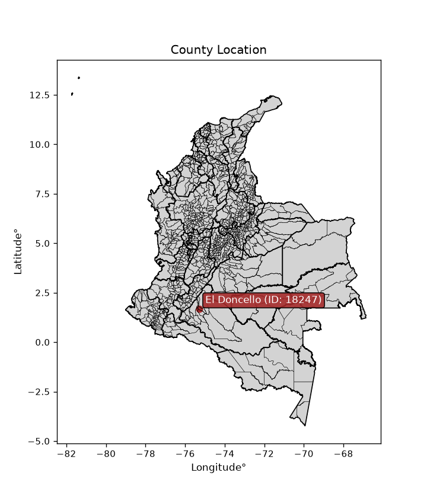
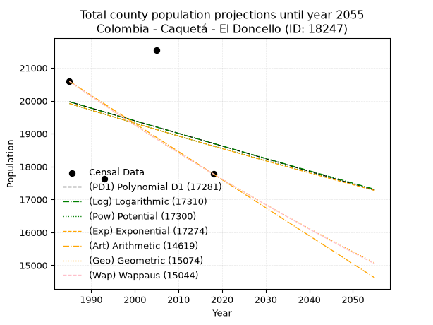
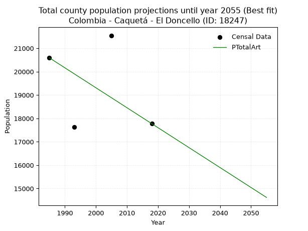
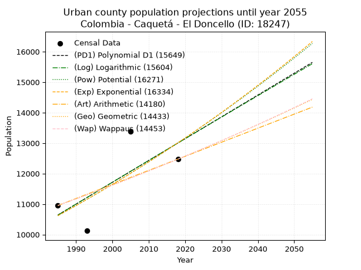
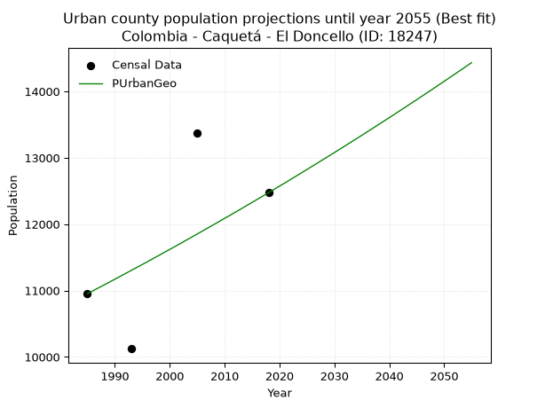
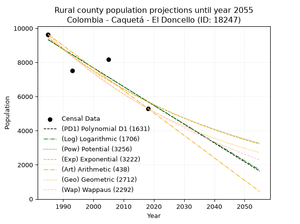
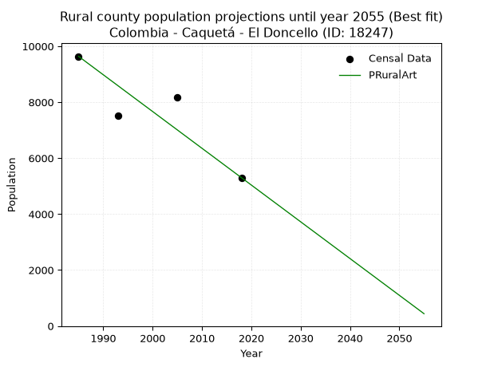

<div align="center">


</div>

# _“Population and Public Services Demand Projections (PPSD) until Year 2050 for Colombia - Caquetá - El Doncello (ID: 18247)”_
Keywords: `population` `public-service` `projection` `lineal` `polynomial` `logarithmic` `potential` `exponential` `arithmetic` `geometric` `wappaus` `dane` `colombia` `south-america`

PPSD are analytical estimates used by governments and planners to anticipate future changes in population size, age distribution, and the resulting community needs for utilities, healthcare, education, and infrastructure as sizing future water treatment facilities, electrical grids, and road networks based on spatial growth.

<div align="center">

</img>

</div>


> **General running parameters**: • app_version: _v20260806_. • Python version: _3.14.7_. • Pandas version: _3.0.5_. • NumPy version: _2.5.1_. • Creates, save and include plots into reports (create_plot): _False_. • Projection until year: _2050_. • Process polynomial degree 2 and up: _False_. • Process Wappaus: _True_. • Process Wappaus: _True_. • Set negative values to zero: _True_. • Set infinite values to zero: _True_. • Drop dataset notes: _True_. 
<div align="center">

Dynamic map: [:earth_americas:Google](http://maps.google.com/maps?q=1.679950615,-75.2836306) [:earth_americas:OSM](https://www.openstreetmap.org/#map=18/1.679950615/-75.2836306&layers=P) [:earth_americas:Bing](https://www.bing.com/maps?cp=1.679950615~-75.2836306&lvl=18) [:earth_americas:Apple](https://maps.apple.com/frame?center=1.679950615%2C-75.2836306&span=0.003%2C0.006)

</div>


<div align="center">

```geojson
{
  "type": "Feature",
  "geometry": {
    "type": "Point", 
    "coordinates": [-75.2836306, 1.679950615]
  }, 
  "properties": {
    "Name": "Colombia - Caquetá - El Doncello (ID: 18247)"
  }
}
```

</div>


## 0. Census Data (4 records)

Census data are official statistics collected by a government about the people and housing in a country. They usually include counts of total population, age, sex, race, income, education, and jobs.

📅Global census file: [Population.xlsx](../data/Population.xlsx)

| Source   |   Year |   CountryID | CountryName   |   StateID | StateName   |   CountyID | CountyName   |   PTotal |   PUrban |   PRural |
|:---------|-------:|------------:|:--------------|----------:|:------------|-----------:|:-------------|---------:|---------:|---------:|
| DANE     |   1985 |          57 | Colombia      |        18 | Caquetá     |      18247 | El Doncello  |    20590 |    10952 |     9638 |
| DANE     |   1993 |          57 | Colombia      |        18 | Caquetá     |      18247 | El Doncello  |    17626 |    10123 |     7503 |
| DANE     |   2005 |          57 | Colombia      |        18 | Caquetá     |      18247 | El Doncello  |    21547 |    13379 |     8168 |
| DANE     |   2018 |          57 | Colombia      |        18 | Caquetá     |      18247 | El Doncello  |    17775 |    12474 |     5301 |

> 🔥Some records could had specific notes about the registered values or the corresponding urban or rural distribution.

📅   [RUPS](https://www.datos.gov.co/Hacienda-y-Cr-dito-P-blico/Registro-nico-de-Prestadores-de-Servicios-P-blicos/4qkq-csdn/about_data) - Local public utility companies: [RUPS.csv](../data/RUPS.xlsx)

 | SERVICIO       | ESTADO    | NOMBRE                                        | NIT         | DEPARTAMENTO_DOMICILIO   | MUNICIPIO_DOMICILIO   | DIRECCION                                |   TELEFONO | EMAIL                        | TIPO_PRESTADOR                             | CLASIFICACION                  |
|:---------------|:----------|:----------------------------------------------|:------------|:-------------------------|:----------------------|:-----------------------------------------|-----------:|:-----------------------------|:-------------------------------------------|:-------------------------------|
| ACUEDUCTO      | OPERATIVA | JUNTA DE ACCION COMUNAL DEL BARRIO BELALCAZAR | 900292399-1 | CAQUETA                  | EL DONCELLO           | Dg 6 #1-03                               |    4310903 | SIN@CORREO.COM               | ORGANIZACION AUTORIZADA                    | HASTA 2500 SUSCRIPTORES        |
| ACUEDUCTO      | OPERATIVA | EMPRESAS PUBLICAS DE EL DONCELLO S.A.E.S.P.   | 900462062-3 | CAQUETA                  | EL DONCELLO           | CRA. 4 CALLE 3 ESQUINA PALACIO MUNICIPAL |    0000000 | sergioparrazuluaga@gmail.com | SOCIEDADES (EMPRESA DE SERVICIOS PUBLICOS) | DESDE 2501 HASTA 5000 USUARIOS |
| ALCANTARILLADO | OPERATIVA | EMPRESAS PUBLICAS DE EL DONCELLO S.A.E.S.P.   | 900462062-3 | CAQUETA                  | EL DONCELLO           | CRA. 4 CALLE 3 ESQUINA PALACIO MUNICIPAL |    0000000 | sergioparrazuluaga@gmail.com | SOCIEDADES (EMPRESA DE SERVICIOS PUBLICOS) | DESDE 2501 HASTA 5000 USUARIOS |

## 1. Total

### 1.1. Coefficients and Parameters

* (PD1) Polynomial Deg 1: -38.428743476513226, 96251.59413889558 (lineal)
* (Log) Logarithmic: -76758.83035191851, 602828.9846115955
* (Pow) Potential: -4.063889069357952, 17.70095764513952
* (Exp) Exponential: -0.002034210215338253, 1129444.8722625582
* (Art) Arithmetic: Year diff. 2018 - 1985 = 33, Population diff. 17775 - 20590 = -2815, Annual growth = -85.3030303030303
* (Geo) Geometric: Year diff. 2018 - 1985 = 33, Population diff. 17775 - 20590 = -2815, Annual growth % = -0.004445017154834474
* (Wap) Wappaus: i = -0.4446919343309282, Condition values only valid for < 200)

<sub>
Wappaus condition values: ['-0.00', '-0.44', '-0.89', '-1.33', '-1.78', '-2.22', '-2.67', '-3.11', '-3.56', '-4.00', '-4.45', '-4.89', '-5.34', '-5.78', '-6.23', '-6.67', '-7.12', '-7.56', '-8.00', '-8.45', '-8.89', '-9.34', '-9.78', '-10.23', '-10.67', '-11.12', '-11.56', '-12.01', '-12.45', '-12.90', '-13.34', '-13.79', '-14.23', '-14.67', '-15.12', '-15.56', '-16.01', '-16.45', '-16.90', '-17.34', '-17.79', '-18.23', '-18.68', '-19.12', '-19.57', '-20.01', '-20.46', '-20.90', '-21.35', '-21.79', '-22.23', '-22.68', '-23.12', '-23.57', '-24.01', '-24.46', '-24.90', '-25.35', '-25.79', '-26.24', '-26.68', '-27.13', '-27.57', '-28.02', '-28.46', '-28.90']
</sub>


### 1.2. Projected Dataset

|   Year |   CountyID |   PTotalPD1 |   PTotalLog |   PTotalPow |   PTotalExp |   PTotalArt |   PTotalGeo |   PTotalWap |
|-------:|-----------:|------------:|------------:|------------:|------------:|------------:|------------:|------------:|
|   1985 |      18247 |       19971 |       19970 |       19917 |       19917 |       20590 |       20590 |       20590 |
|   1986 |      18247 |       19932 |       19932 |       19876 |       19877 |       20505 |       20498 |       20499 |
|   1987 |      18247 |       19894 |       19893 |       19836 |       19836 |       20419 |       20407 |       20408 |
|   1988 |      18247 |       19855 |       19855 |       19795 |       19796 |       20334 |       20317 |       20317 |
|   1989 |      18247 |       19817 |       19816 |       19755 |       19756 |       20249 |       20226 |       20227 |
|   1990 |      18247 |       19778 |       19777 |       19714 |       19715 |       20163 |       20136 |       20137 |
|   1991 |      18247 |       19740 |       19739 |       19674 |       19675 |       20078 |       20047 |       20048 |
|   1992 |      18247 |       19702 |       19700 |       19634 |       19635 |       19993 |       19958 |       19959 |
|   1993 |      18247 |       19663 |       19662 |       19594 |       19596 |       19908 |       19869 |       19870 |
|   1994 |      18247 |       19625 |       19623 |       19554 |       19556 |       19822 |       19781 |       19782 |
|   1995 |      18247 |       19586 |       19585 |       19514 |       19516 |       19737 |       19693 |       19694 |
|   1996 |      18247 |       19548 |       19546 |       19475 |       19476 |       19652 |       19605 |       19607 |
|   1997 |      18247 |       19509 |       19508 |       19435 |       19437 |       19566 |       19518 |       19520 |
|   1998 |      18247 |       19471 |       19469 |       19396 |       19397 |       19481 |       19431 |       19433 |
|   1999 |      18247 |       19433 |       19431 |       19356 |       19358 |       19396 |       19345 |       19347 |
|   2000 |      18247 |       19394 |       19393 |       19317 |       19318 |       19310 |       19259 |       19261 |
|   2001 |      18247 |       19356 |       19354 |       19278 |       19279 |       19225 |       19173 |       19175 |
|   2002 |      18247 |       19317 |       19316 |       19239 |       19240 |       19140 |       19088 |       19090 |
|   2003 |      18247 |       19279 |       19278 |       19200 |       19201 |       19055 |       19003 |       19005 |
|   2004 |      18247 |       19240 |       19239 |       19161 |       19162 |       18969 |       18919 |       18921 |
|   2005 |      18247 |       19202 |       19201 |       19122 |       19123 |       18884 |       18835 |       18837 |
|   2006 |      18247 |       19164 |       19163 |       19083 |       19084 |       18799 |       18751 |       18753 |
|   2007 |      18247 |       19125 |       19124 |       19045 |       19045 |       18713 |       18668 |       18670 |
|   2008 |      18247 |       19087 |       19086 |       19006 |       19007 |       18628 |       18585 |       18587 |
|   2009 |      18247 |       19048 |       19048 |       18968 |       18968 |       18543 |       18502 |       18504 |
|   2010 |      18247 |       19010 |       19010 |       18929 |       18929 |       18457 |       18420 |       18421 |
|   2011 |      18247 |       18971 |       18972 |       18891 |       18891 |       18372 |       18338 |       18339 |
|   2012 |      18247 |       18933 |       18933 |       18853 |       18853 |       18287 |       18257 |       18258 |
|   2013 |      18247 |       18895 |       18895 |       18815 |       18814 |       18202 |       18175 |       18177 |
|   2014 |      18247 |       18856 |       18857 |       18777 |       18776 |       18116 |       18095 |       18096 |
|   2015 |      18247 |       18818 |       18819 |       18739 |       18738 |       18031 |       18014 |       18015 |
|   2016 |      18247 |       18779 |       18781 |       18701 |       18700 |       17946 |       17934 |       17935 |
|   2017 |      18247 |       18741 |       18743 |       18664 |       18662 |       17860 |       17854 |       17855 |
|   2018 |      18247 |       18702 |       18705 |       18626 |       18624 |       17775 |       17775 |       17775 |
|   2019 |      18247 |       18664 |       18667 |       18589 |       18586 |       17690 |       17696 |       17696 |
|   2020 |      18247 |       18626 |       18629 |       18551 |       18548 |       17604 |       17617 |       17617 |
|   2021 |      18247 |       18587 |       18591 |       18514 |       18511 |       17519 |       17539 |       17538 |
|   2022 |      18247 |       18549 |       18553 |       18477 |       18473 |       17434 |       17461 |       17460 |
|   2023 |      18247 |       18510 |       18515 |       18440 |       18435 |       17348 |       17383 |       17382 |
|   2024 |      18247 |       18472 |       18477 |       18403 |       18398 |       17263 |       17306 |       17304 |
|   2025 |      18247 |       18433 |       18439 |       18366 |       18361 |       17178 |       17229 |       17227 |
|   2026 |      18247 |       18395 |       18401 |       18329 |       18323 |       17093 |       17153 |       17150 |
|   2027 |      18247 |       18357 |       18363 |       18292 |       18286 |       17007 |       17076 |       17073 |
|   2028 |      18247 |       18318 |       18325 |       18256 |       18249 |       16922 |       17001 |       16996 |
|   2029 |      18247 |       18280 |       18288 |       18219 |       18212 |       16837 |       16925 |       16920 |
|   2030 |      18247 |       18241 |       18250 |       18183 |       18175 |       16751 |       16850 |       16844 |
|   2031 |      18247 |       18203 |       18212 |       18146 |       18138 |       16666 |       16775 |       16769 |
|   2032 |      18247 |       18164 |       18174 |       18110 |       18101 |       16581 |       16700 |       16694 |
|   2033 |      18247 |       18126 |       18136 |       18074 |       18064 |       16495 |       16626 |       16619 |
|   2034 |      18247 |       18088 |       18099 |       18038 |       18027 |       16410 |       16552 |       16544 |
|   2035 |      18247 |       18049 |       18061 |       18002 |       17991 |       16325 |       16479 |       16470 |
|   2036 |      18247 |       18011 |       18023 |       17966 |       17954 |       16240 |       16405 |       16396 |
|   2037 |      18247 |       17972 |       17986 |       17930 |       17918 |       16154 |       16332 |       16322 |
|   2038 |      18247 |       17934 |       17948 |       17894 |       17881 |       16069 |       16260 |       16249 |
|   2039 |      18247 |       17895 |       17910 |       17859 |       17845 |       15984 |       16188 |       16176 |
|   2040 |      18247 |       17857 |       17873 |       17823 |       17809 |       15898 |       16116 |       16103 |
|   2041 |      18247 |       17819 |       17835 |       17788 |       17773 |       15813 |       16044 |       16030 |
|   2042 |      18247 |       17780 |       17797 |       17752 |       17736 |       15728 |       15973 |       15958 |
|   2043 |      18247 |       17742 |       17760 |       17717 |       17700 |       15642 |       15902 |       15886 |
|   2044 |      18247 |       17703 |       17722 |       17682 |       17664 |       15557 |       15831 |       15814 |
|   2045 |      18247 |       17665 |       17685 |       17647 |       17629 |       15472 |       15761 |       15743 |
|   2046 |      18247 |       17626 |       17647 |       17612 |       17593 |       15387 |       15690 |       15672 |
|   2047 |      18247 |       17588 |       17610 |       17577 |       17557 |       15301 |       15621 |       15601 |
|   2048 |      18247 |       17550 |       17572 |       17542 |       17521 |       15216 |       15551 |       15530 |
|   2049 |      18247 |       17511 |       17535 |       17507 |       17486 |       15131 |       15482 |       15460 |
|   2050 |      18247 |       17473 |       17497 |       17473 |       17450 |       15045 |       15413 |       15390 |
<div align="center">

</img>

</div>


### 1.3. Best fit with absolute and relative error (%)

Relative error puts that difference into context by dividing the absolute error by the true value, creating a unitless ratio or percentage that shows the scale of the mistake.

Absolute and relative error

|   Year | Source   |   CountryID | CountryName   |   StateID | StateName   |   CountyID_x | CountyName   |   PTotal |   PUrban |   PRural |   CountyID_y |   PTotalPD1 |   PTotalLog |   PTotalPow |   PTotalExp |   PTotalArt |   PTotalGeo |   PTotalWap |   PTotalPD1AbsError |   PTotalLogAbsError |   PTotalPowAbsError |   PTotalExpAbsError |   PTotalArtAbsError |   PTotalGeoAbsError |   PTotalWapAbsError |   PTotalPD1RelError |   PTotalLogRelError |   PTotalPowRelError |   PTotalExpRelError |   PTotalArtRelError |   PTotalGeoRelError |   PTotalWapRelError |
|-------:|:---------|------------:|:--------------|----------:|:------------|-------------:|:-------------|---------:|---------:|---------:|-------------:|------------:|------------:|------------:|------------:|------------:|------------:|------------:|--------------------:|--------------------:|--------------------:|--------------------:|--------------------:|--------------------:|--------------------:|--------------------:|--------------------:|--------------------:|--------------------:|--------------------:|--------------------:|--------------------:|
|   1985 | DANE     |          57 | Colombia      |        18 | Caquetá     |        18247 | El Doncello  |    20590 |    10952 |     9638 |        18247 |       19971 |       19970 |       19917 |       19917 |       20590 |       20590 |       20590 |                 619 |                 620 |                 673 |                 673 |                   0 |                   0 |                   0 |             3.00631 |             3.01117 |             3.26858 |             3.26858 |              0      |              0      |              0      |
|   1993 | DANE     |          57 | Colombia      |        18 | Caquetá     |        18247 | El Doncello  |    17626 |    10123 |     7503 |        18247 |       19663 |       19662 |       19594 |       19596 |       19908 |       19869 |       19870 |                2037 |                2036 |                1968 |                1970 |                2282 |                2243 |                2244 |            11.5568  |            11.5511  |            11.1653  |            11.1767  |             12.9468 |             12.7255 |             12.7312 |
|   2005 | DANE     |          57 | Colombia      |        18 | Caquetá     |        18247 | El Doncello  |    21547 |    13379 |     8168 |        18247 |       19202 |       19201 |       19122 |       19123 |       18884 |       18835 |       18837 |                2345 |                2346 |                2425 |                2424 |                2663 |                2712 |                2710 |            10.8832  |            10.8878  |            11.2545  |            11.2498  |             12.359  |             12.5864 |             12.5772 |
|   2018 | DANE     |          57 | Colombia      |        18 | Caquetá     |        18247 | El Doncello  |    17775 |    12474 |     5301 |        18247 |       18702 |       18705 |       18626 |       18624 |       17775 |       17775 |       17775 |                 927 |                 930 |                 851 |                 849 |                   0 |                   0 |                   0 |             5.21519 |             5.23207 |             4.78762 |             4.77637 |              0      |              0      |              0      |

Relative error mean

| Method    |   RelError | Best   |
|:----------|-----------:|:-------|
| PTotalPD1 |    7.66537 |        |
| PTotalLog |    7.67055 |        |
| PTotalPow |    7.619   |        |
| PTotalExp |    7.61786 |        |
| PTotalArt |    6.32645 | True   |
| PTotalGeo |    6.32799 |        |
| PTotalWap |    6.32709 |        |

💙Best method: _**PTotalArt**_
<div align="center">

</img>

</div>


### 1.4. Fresh water supply demand in liters per capita per day (lpcd)

The fresh water supply demand typically ranges from 100 to 300 liters per capita per day (lpcd) for standard domestic and municipal planning, though absolute survival minimums set by the World Health Organization are as low as 7.5 to 20 liters per day, and total consumption in high-income nations can exceed 400 liters.

> `CZ`: Level in meters above the sea level (masl)<br> `WS`: Fresh water supply demand in liters per capita per day (lpcd or l/h/d)<br> `WSAll`: Zonal fresh water supply demand in liters per second (l/s)<br> `A`: Zonal area in square meters<br> `DP`: Population density (people/hectare or p/ha)

Reference values (RAS Colombia)

|    CZ |   WS |
|------:|-----:|
|  1000 |  120 |
|  2000 |  130 |
| 99999 |  140 |

County shapefile geometry properties and water supply values

|   CountyID |     ATotal |   CZTotal |   WSTotal |
|-----------:|-----------:|----------:|----------:|
|      18247 | 1.1055e+09 |   813.762 |       120 |

Projected values for best method: PTotalArt

|   CountyID |   Year |   PTotalArt |   DPTotal |   WSTotal |   WSTotalAll |
|-----------:|-------:|------------:|----------:|----------:|-------------:|
|      18247 |   1985 |       20590 |      0.19 |       120 |      28.5972 |
|      18247 |   1986 |       20505 |      0.19 |       120 |      28.4792 |
|      18247 |   1987 |       20419 |      0.18 |       120 |      28.3597 |
|      18247 |   1988 |       20334 |      0.18 |       120 |      28.2417 |
|      18247 |   1989 |       20249 |      0.18 |       120 |      28.1236 |
|      18247 |   1990 |       20163 |      0.18 |       120 |      28.0042 |
|      18247 |   1991 |       20078 |      0.18 |       120 |      27.8861 |
|      18247 |   1992 |       19993 |      0.18 |       120 |      27.7681 |
|      18247 |   1993 |       19908 |      0.18 |       120 |      27.65   |
|      18247 |   1994 |       19822 |      0.18 |       120 |      27.5306 |
|      18247 |   1995 |       19737 |      0.18 |       120 |      27.4125 |
|      18247 |   1996 |       19652 |      0.18 |       120 |      27.2944 |
|      18247 |   1997 |       19566 |      0.18 |       120 |      27.175  |
|      18247 |   1998 |       19481 |      0.18 |       120 |      27.0569 |
|      18247 |   1999 |       19396 |      0.18 |       120 |      26.9389 |
|      18247 |   2000 |       19310 |      0.17 |       120 |      26.8194 |
|      18247 |   2001 |       19225 |      0.17 |       120 |      26.7014 |
|      18247 |   2002 |       19140 |      0.17 |       120 |      26.5833 |
|      18247 |   2003 |       19055 |      0.17 |       120 |      26.4653 |
|      18247 |   2004 |       18969 |      0.17 |       120 |      26.3458 |
|      18247 |   2005 |       18884 |      0.17 |       120 |      26.2278 |
|      18247 |   2006 |       18799 |      0.17 |       120 |      26.1097 |
|      18247 |   2007 |       18713 |      0.17 |       120 |      25.9903 |
|      18247 |   2008 |       18628 |      0.17 |       120 |      25.8722 |
|      18247 |   2009 |       18543 |      0.17 |       120 |      25.7542 |
|      18247 |   2010 |       18457 |      0.17 |       120 |      25.6347 |
|      18247 |   2011 |       18372 |      0.17 |       120 |      25.5167 |
|      18247 |   2012 |       18287 |      0.17 |       120 |      25.3986 |
|      18247 |   2013 |       18202 |      0.16 |       120 |      25.2806 |
|      18247 |   2014 |       18116 |      0.16 |       120 |      25.1611 |
|      18247 |   2015 |       18031 |      0.16 |       120 |      25.0431 |
|      18247 |   2016 |       17946 |      0.16 |       120 |      24.925  |
|      18247 |   2017 |       17860 |      0.16 |       120 |      24.8056 |
|      18247 |   2018 |       17775 |      0.16 |       120 |      24.6875 |
|      18247 |   2019 |       17690 |      0.16 |       120 |      24.5694 |
|      18247 |   2020 |       17604 |      0.16 |       120 |      24.45   |
|      18247 |   2021 |       17519 |      0.16 |       120 |      24.3319 |
|      18247 |   2022 |       17434 |      0.16 |       120 |      24.2139 |
|      18247 |   2023 |       17348 |      0.16 |       120 |      24.0944 |
|      18247 |   2024 |       17263 |      0.16 |       120 |      23.9764 |
|      18247 |   2025 |       17178 |      0.16 |       120 |      23.8583 |
|      18247 |   2026 |       17093 |      0.15 |       120 |      23.7403 |
|      18247 |   2027 |       17007 |      0.15 |       120 |      23.6208 |
|      18247 |   2028 |       16922 |      0.15 |       120 |      23.5028 |
|      18247 |   2029 |       16837 |      0.15 |       120 |      23.3847 |
|      18247 |   2030 |       16751 |      0.15 |       120 |      23.2653 |
|      18247 |   2031 |       16666 |      0.15 |       120 |      23.1472 |
|      18247 |   2032 |       16581 |      0.15 |       120 |      23.0292 |
|      18247 |   2033 |       16495 |      0.15 |       120 |      22.9097 |
|      18247 |   2034 |       16410 |      0.15 |       120 |      22.7917 |
|      18247 |   2035 |       16325 |      0.15 |       120 |      22.6736 |
|      18247 |   2036 |       16240 |      0.15 |       120 |      22.5556 |
|      18247 |   2037 |       16154 |      0.15 |       120 |      22.4361 |
|      18247 |   2038 |       16069 |      0.15 |       120 |      22.3181 |
|      18247 |   2039 |       15984 |      0.14 |       120 |      22.2    |
|      18247 |   2040 |       15898 |      0.14 |       120 |      22.0806 |
|      18247 |   2041 |       15813 |      0.14 |       120 |      21.9625 |
|      18247 |   2042 |       15728 |      0.14 |       120 |      21.8444 |
|      18247 |   2043 |       15642 |      0.14 |       120 |      21.725  |
|      18247 |   2044 |       15557 |      0.14 |       120 |      21.6069 |
|      18247 |   2045 |       15472 |      0.14 |       120 |      21.4889 |
|      18247 |   2046 |       15387 |      0.14 |       120 |      21.3708 |
|      18247 |   2047 |       15301 |      0.14 |       120 |      21.2514 |
|      18247 |   2048 |       15216 |      0.14 |       120 |      21.1333 |
|      18247 |   2049 |       15131 |      0.14 |       120 |      21.0153 |
|      18247 |   2050 |       15045 |      0.14 |       120 |      20.8958 |

## 2. Urban

### 2.1. Coefficients and Parameters

* (PD1) Polynomial Deg 1: 71.54395824969923, -131373.8024889609 (lineal)
* (Log) Logarithmic: 143300.86869946643, -1077499.0513257368
* (Pow) Potential: 12.320855045660497, -36.6052688680755
* (Exp) Exponential: 0.006151987442264328, 0.05279486394039212
* (Art) Arithmetic: Year diff. 2018 - 1985 = 33, Population diff. 12474 - 10952 = 1522, Annual growth = 46.121212121212125
* (Geo) Geometric: Year diff. 2018 - 1985 = 33, Population diff. 12474 - 10952 = 1522, Annual growth % = 0.003950947833937901
* (Wap) Wappaus: i = 0.39376088210716403, Condition values only valid for < 200)

<sub>
Wappaus condition values: ['0.00', '0.39', '0.79', '1.18', '1.58', '1.97', '2.36', '2.76', '3.15', '3.54', '3.94', '4.33', '4.73', '5.12', '5.51', '5.91', '6.30', '6.69', '7.09', '7.48', '7.88', '8.27', '8.66', '9.06', '9.45', '9.84', '10.24', '10.63', '11.03', '11.42', '11.81', '12.21', '12.60', '12.99', '13.39', '13.78', '14.18', '14.57', '14.96', '15.36', '15.75', '16.14', '16.54', '16.93', '17.33', '17.72', '18.11', '18.51', '18.90', '19.29', '19.69', '20.08', '20.48', '20.87', '21.26', '21.66', '22.05', '22.44', '22.84', '23.23', '23.63', '24.02', '24.41', '24.81', '25.20', '25.59']
</sub>


### 2.2. Projected Dataset

|   Year |   CountyID |   PUrbanPD1 |   PUrbanLog |   PUrbanPow |   PUrbanExp |   PUrbanArt |   PUrbanGeo |   PUrbanWap |
|-------:|-----------:|------------:|------------:|------------:|------------:|------------:|------------:|------------:|
|   1985 |      18247 |       10641 |       10638 |       10616 |       10619 |       10952 |       10952 |       10952 |
|   1986 |      18247 |       10712 |       10710 |       10682 |       10684 |       10998 |       10995 |       10995 |
|   1987 |      18247 |       10784 |       10782 |       10749 |       10750 |       11044 |       11039 |       11039 |
|   1988 |      18247 |       10856 |       10854 |       10815 |       10816 |       11090 |       11082 |       11082 |
|   1989 |      18247 |       10927 |       10927 |       10883 |       10883 |       11136 |       11126 |       11126 |
|   1990 |      18247 |       10999 |       10999 |       10950 |       10950 |       11183 |       11170 |       11170 |
|   1991 |      18247 |       11070 |       11071 |       11018 |       11018 |       11229 |       11214 |       11214 |
|   1992 |      18247 |       11142 |       11143 |       11087 |       11086 |       11275 |       11259 |       11258 |
|   1993 |      18247 |       11213 |       11214 |       11155 |       11154 |       11321 |       11303 |       11303 |
|   1994 |      18247 |       11285 |       11286 |       11224 |       11223 |       11367 |       11348 |       11347 |
|   1995 |      18247 |       11356 |       11358 |       11294 |       11292 |       11413 |       11392 |       11392 |
|   1996 |      18247 |       11428 |       11430 |       11364 |       11362 |       11459 |       11437 |       11437 |
|   1997 |      18247 |       11499 |       11502 |       11434 |       11432 |       11505 |       11483 |       11482 |
|   1998 |      18247 |       11571 |       11574 |       11505 |       11503 |       11552 |       11528 |       11527 |
|   1999 |      18247 |       11643 |       11645 |       11576 |       11574 |       11598 |       11574 |       11573 |
|   2000 |      18247 |       11714 |       11717 |       11648 |       11645 |       11644 |       11619 |       11619 |
|   2001 |      18247 |       11786 |       11789 |       11720 |       11717 |       11690 |       11665 |       11664 |
|   2002 |      18247 |       11857 |       11860 |       11792 |       11789 |       11736 |       11711 |       11711 |
|   2003 |      18247 |       11929 |       11932 |       11865 |       11862 |       11782 |       11758 |       11757 |
|   2004 |      18247 |       12000 |       12003 |       11938 |       11935 |       11828 |       11804 |       11803 |
|   2005 |      18247 |       12072 |       12075 |       12012 |       12009 |       11874 |       11851 |       11850 |
|   2006 |      18247 |       12143 |       12146 |       12086 |       12083 |       11921 |       11898 |       11897 |
|   2007 |      18247 |       12215 |       12218 |       12160 |       12157 |       11967 |       11945 |       11944 |
|   2008 |      18247 |       12286 |       12289 |       12235 |       12232 |       12013 |       11992 |       11991 |
|   2009 |      18247 |       12358 |       12360 |       12310 |       12308 |       12059 |       12039 |       12038 |
|   2010 |      18247 |       12430 |       12432 |       12386 |       12384 |       12105 |       12087 |       12086 |
|   2011 |      18247 |       12501 |       12503 |       12462 |       12460 |       12151 |       12134 |       12134 |
|   2012 |      18247 |       12573 |       12574 |       12539 |       12537 |       12197 |       12182 |       12182 |
|   2013 |      18247 |       12644 |       12645 |       12616 |       12615 |       12243 |       12230 |       12230 |
|   2014 |      18247 |       12716 |       12716 |       12693 |       12692 |       12290 |       12279 |       12278 |
|   2015 |      18247 |       12787 |       12788 |       12771 |       12771 |       12336 |       12327 |       12327 |
|   2016 |      18247 |       12859 |       12859 |       12849 |       12850 |       12382 |       12376 |       12376 |
|   2017 |      18247 |       12930 |       12930 |       12928 |       12929 |       12428 |       12425 |       12425 |
|   2018 |      18247 |       13002 |       13001 |       13007 |       13009 |       12474 |       12474 |       12474 |
|   2019 |      18247 |       13073 |       13072 |       13087 |       13089 |       12520 |       12523 |       12523 |
|   2020 |      18247 |       13145 |       13143 |       13167 |       13170 |       12566 |       12573 |       12573 |
|   2021 |      18247 |       13217 |       13214 |       13248 |       13251 |       12612 |       12622 |       12623 |
|   2022 |      18247 |       13288 |       13285 |       13329 |       13333 |       12658 |       12672 |       12673 |
|   2023 |      18247 |       13360 |       13355 |       13410 |       13415 |       12705 |       12722 |       12723 |
|   2024 |      18247 |       13431 |       13426 |       13492 |       13498 |       12751 |       12773 |       12774 |
|   2025 |      18247 |       13503 |       13497 |       13574 |       13581 |       12797 |       12823 |       12824 |
|   2026 |      18247 |       13574 |       13568 |       13657 |       13665 |       12843 |       12874 |       12875 |
|   2027 |      18247 |       13646 |       13638 |       13740 |       13749 |       12889 |       12925 |       12927 |
|   2028 |      18247 |       13717 |       13709 |       13824 |       13834 |       12935 |       12976 |       12978 |
|   2029 |      18247 |       13789 |       13780 |       13908 |       13919 |       12981 |       13027 |       13029 |
|   2030 |      18247 |       13860 |       13850 |       13993 |       14005 |       13027 |       13078 |       13081 |
|   2031 |      18247 |       13932 |       13921 |       14078 |       14092 |       13074 |       13130 |       13133 |
|   2032 |      18247 |       14004 |       13992 |       14164 |       14179 |       13120 |       13182 |       13186 |
|   2033 |      18247 |       14075 |       14062 |       14250 |       14266 |       13166 |       13234 |       13238 |
|   2034 |      18247 |       14147 |       14133 |       14337 |       14354 |       13212 |       13286 |       13291 |
|   2035 |      18247 |       14218 |       14203 |       14424 |       14443 |       13258 |       13339 |       13344 |
|   2036 |      18247 |       14290 |       14273 |       14511 |       14532 |       13304 |       13392 |       13397 |
|   2037 |      18247 |       14361 |       14344 |       14599 |       14622 |       13350 |       13444 |       13450 |
|   2038 |      18247 |       14433 |       14414 |       14688 |       14712 |       13396 |       13498 |       13504 |
|   2039 |      18247 |       14504 |       14484 |       14777 |       14803 |       13443 |       13551 |       13558 |
|   2040 |      18247 |       14576 |       14555 |       14866 |       14894 |       13489 |       13604 |       13612 |
|   2041 |      18247 |       14647 |       14625 |       14956 |       14986 |       13535 |       13658 |       13666 |
|   2042 |      18247 |       14719 |       14695 |       15047 |       15078 |       13581 |       13712 |       13721 |
|   2043 |      18247 |       14791 |       14765 |       15138 |       15171 |       13627 |       13766 |       13776 |
|   2044 |      18247 |       14862 |       14835 |       15230 |       15265 |       13673 |       13821 |       13831 |
|   2045 |      18247 |       14934 |       14905 |       15322 |       15359 |       13719 |       13875 |       13886 |
|   2046 |      18247 |       15005 |       14975 |       15414 |       15454 |       13765 |       13930 |       13942 |
|   2047 |      18247 |       15077 |       15045 |       15507 |       15549 |       13812 |       13985 |       13997 |
|   2048 |      18247 |       15148 |       15115 |       15601 |       15645 |       13858 |       14040 |       14054 |
|   2049 |      18247 |       15220 |       15185 |       15695 |       15742 |       13904 |       14096 |       14110 |
|   2050 |      18247 |       15291 |       15255 |       15790 |       15839 |       13950 |       14152 |       14166 |
<div align="center">

</img>

</div>


### 2.3. Best fit with absolute and relative error (%)

Relative error puts that difference into context by dividing the absolute error by the true value, creating a unitless ratio or percentage that shows the scale of the mistake.

Absolute and relative error

|   Year | Source   |   CountryID | CountryName   |   StateID | StateName   |   CountyID_x | CountyName   |   PTotal |   PUrban |   PRural |   CountyID_y |   PUrbanPD1 |   PUrbanLog |   PUrbanPow |   PUrbanExp |   PUrbanArt |   PUrbanGeo |   PUrbanWap |   PUrbanPD1AbsError |   PUrbanLogAbsError |   PUrbanPowAbsError |   PUrbanExpAbsError |   PUrbanArtAbsError |   PUrbanGeoAbsError |   PUrbanWapAbsError |   PUrbanPD1RelError |   PUrbanLogRelError |   PUrbanPowRelError |   PUrbanExpRelError |   PUrbanArtRelError |   PUrbanGeoRelError |   PUrbanWapRelError |
|-------:|:---------|------------:|:--------------|----------:|:------------|-------------:|:-------------|---------:|---------:|---------:|-------------:|------------:|------------:|------------:|------------:|------------:|------------:|------------:|--------------------:|--------------------:|--------------------:|--------------------:|--------------------:|--------------------:|--------------------:|--------------------:|--------------------:|--------------------:|--------------------:|--------------------:|--------------------:|--------------------:|
|   1985 | DANE     |          57 | Colombia      |        18 | Caquetá     |        18247 | El Doncello  |    20590 |    10952 |     9638 |        18247 |       10641 |       10638 |       10616 |       10619 |       10952 |       10952 |       10952 |                 311 |                 314 |                 336 |                 333 |                   0 |                   0 |                   0 |             2.83966 |             2.86706 |             3.06793 |             3.04054 |              0      |              0      |              0      |
|   1993 | DANE     |          57 | Colombia      |        18 | Caquetá     |        18247 | El Doncello  |    17626 |    10123 |     7503 |        18247 |       11213 |       11214 |       11155 |       11154 |       11321 |       11303 |       11303 |                1090 |                1091 |                1032 |                1031 |                1198 |                1180 |                1180 |            10.7676  |            10.7774  |            10.1946  |            10.1847  |             11.8344 |             11.6566 |             11.6566 |
|   2005 | DANE     |          57 | Colombia      |        18 | Caquetá     |        18247 | El Doncello  |    21547 |    13379 |     8168 |        18247 |       12072 |       12075 |       12012 |       12009 |       11874 |       11851 |       11850 |                1307 |                1304 |                1367 |                1370 |                1505 |                1528 |                1529 |             9.76904 |             9.74662 |            10.2175  |            10.2399  |             11.249  |             11.4209 |             11.4284 |
|   2018 | DANE     |          57 | Colombia      |        18 | Caquetá     |        18247 | El Doncello  |    17775 |    12474 |     5301 |        18247 |       13002 |       13001 |       13007 |       13009 |       12474 |       12474 |       12474 |                 528 |                 527 |                 533 |                 535 |                   0 |                   0 |                   0 |             4.2328  |             4.22479 |             4.27289 |             4.28892 |              0      |              0      |              0      |

Relative error mean

| Method    |   RelError | Best   |
|:----------|-----------:|:-------|
| PUrbanPD1 |    6.90227 |        |
| PUrbanLog |    6.90397 |        |
| PUrbanPow |    6.93823 |        |
| PUrbanExp |    6.93853 |        |
| PUrbanArt |    5.77085 |        |
| PUrbanGeo |    5.76938 | True   |
| PUrbanWap |    5.77125 |        |

💙Best method: _**PUrbanGeo**_
<div align="center">

</img>

</div>


### 2.4. Fresh water supply demand in liters per capita per day (lpcd)

The fresh water supply demand typically ranges from 100 to 300 liters per capita per day (lpcd) for standard domestic and municipal planning, though absolute survival minimums set by the World Health Organization are as low as 7.5 to 20 liters per day, and total consumption in high-income nations can exceed 400 liters.

> `CZ`: Level in meters above the sea level (masl)<br> `WS`: Fresh water supply demand in liters per capita per day (lpcd or l/h/d)<br> `WSAll`: Zonal fresh water supply demand in liters per second (l/s)<br> `A`: Zonal area in square meters<br> `DP`: Population density (people/hectare or p/ha)

Reference values (RAS Colombia)

|    CZ |   WS |
|------:|-----:|
|  1000 |  120 |
|  2000 |  130 |
| 99999 |  140 |

County shapefile geometry properties and water supply values

|   CountyID |     AUrban |   CZUrban |   WSUrban |
|-----------:|-----------:|----------:|----------:|
|      18247 | 2.1532e+06 |   355.154 |       120 |

Projected values for best method: PUrbanGeo

|   CountyID |   Year |   PUrbanGeo |   DPUrban |   WSUrban |   WSUrbanAll |
|-----------:|-------:|------------:|----------:|----------:|-------------:|
|      18247 |   1985 |       10952 |     50.86 |       120 |      15.2111 |
|      18247 |   1986 |       10995 |     51.06 |       120 |      15.2708 |
|      18247 |   1987 |       11039 |     51.27 |       120 |      15.3319 |
|      18247 |   1988 |       11082 |     51.47 |       120 |      15.3917 |
|      18247 |   1989 |       11126 |     51.67 |       120 |      15.4528 |
|      18247 |   1990 |       11170 |     51.88 |       120 |      15.5139 |
|      18247 |   1991 |       11214 |     52.08 |       120 |      15.575  |
|      18247 |   1992 |       11259 |     52.29 |       120 |      15.6375 |
|      18247 |   1993 |       11303 |     52.49 |       120 |      15.6986 |
|      18247 |   1994 |       11348 |     52.7  |       120 |      15.7611 |
|      18247 |   1995 |       11392 |     52.91 |       120 |      15.8222 |
|      18247 |   1996 |       11437 |     53.12 |       120 |      15.8847 |
|      18247 |   1997 |       11483 |     53.33 |       120 |      15.9486 |
|      18247 |   1998 |       11528 |     53.54 |       120 |      16.0111 |
|      18247 |   1999 |       11574 |     53.75 |       120 |      16.075  |
|      18247 |   2000 |       11619 |     53.96 |       120 |      16.1375 |
|      18247 |   2001 |       11665 |     54.18 |       120 |      16.2014 |
|      18247 |   2002 |       11711 |     54.39 |       120 |      16.2653 |
|      18247 |   2003 |       11758 |     54.61 |       120 |      16.3306 |
|      18247 |   2004 |       11804 |     54.82 |       120 |      16.3944 |
|      18247 |   2005 |       11851 |     55.04 |       120 |      16.4597 |
|      18247 |   2006 |       11898 |     55.26 |       120 |      16.525  |
|      18247 |   2007 |       11945 |     55.48 |       120 |      16.5903 |
|      18247 |   2008 |       11992 |     55.69 |       120 |      16.6556 |
|      18247 |   2009 |       12039 |     55.91 |       120 |      16.7208 |
|      18247 |   2010 |       12087 |     56.14 |       120 |      16.7875 |
|      18247 |   2011 |       12134 |     56.35 |       120 |      16.8528 |
|      18247 |   2012 |       12182 |     56.58 |       120 |      16.9194 |
|      18247 |   2013 |       12230 |     56.8  |       120 |      16.9861 |
|      18247 |   2014 |       12279 |     57.03 |       120 |      17.0542 |
|      18247 |   2015 |       12327 |     57.25 |       120 |      17.1208 |
|      18247 |   2016 |       12376 |     57.48 |       120 |      17.1889 |
|      18247 |   2017 |       12425 |     57.7  |       120 |      17.2569 |
|      18247 |   2018 |       12474 |     57.93 |       120 |      17.325  |
|      18247 |   2019 |       12523 |     58.16 |       120 |      17.3931 |
|      18247 |   2020 |       12573 |     58.39 |       120 |      17.4625 |
|      18247 |   2021 |       12622 |     58.62 |       120 |      17.5306 |
|      18247 |   2022 |       12672 |     58.85 |       120 |      17.6    |
|      18247 |   2023 |       12722 |     59.08 |       120 |      17.6694 |
|      18247 |   2024 |       12773 |     59.32 |       120 |      17.7403 |
|      18247 |   2025 |       12823 |     59.55 |       120 |      17.8097 |
|      18247 |   2026 |       12874 |     59.79 |       120 |      17.8806 |
|      18247 |   2027 |       12925 |     60.03 |       120 |      17.9514 |
|      18247 |   2028 |       12976 |     60.26 |       120 |      18.0222 |
|      18247 |   2029 |       13027 |     60.5  |       120 |      18.0931 |
|      18247 |   2030 |       13078 |     60.74 |       120 |      18.1639 |
|      18247 |   2031 |       13130 |     60.98 |       120 |      18.2361 |
|      18247 |   2032 |       13182 |     61.22 |       120 |      18.3083 |
|      18247 |   2033 |       13234 |     61.46 |       120 |      18.3806 |
|      18247 |   2034 |       13286 |     61.7  |       120 |      18.4528 |
|      18247 |   2035 |       13339 |     61.95 |       120 |      18.5264 |
|      18247 |   2036 |       13392 |     62.2  |       120 |      18.6    |
|      18247 |   2037 |       13444 |     62.44 |       120 |      18.6722 |
|      18247 |   2038 |       13498 |     62.69 |       120 |      18.7472 |
|      18247 |   2039 |       13551 |     62.93 |       120 |      18.8208 |
|      18247 |   2040 |       13604 |     63.18 |       120 |      18.8944 |
|      18247 |   2041 |       13658 |     63.43 |       120 |      18.9694 |
|      18247 |   2042 |       13712 |     63.68 |       120 |      19.0444 |
|      18247 |   2043 |       13766 |     63.93 |       120 |      19.1194 |
|      18247 |   2044 |       13821 |     64.19 |       120 |      19.1958 |
|      18247 |   2045 |       13875 |     64.44 |       120 |      19.2708 |
|      18247 |   2046 |       13930 |     64.69 |       120 |      19.3472 |
|      18247 |   2047 |       13985 |     64.95 |       120 |      19.4236 |
|      18247 |   2048 |       14040 |     65.21 |       120 |      19.5    |
|      18247 |   2049 |       14096 |     65.47 |       120 |      19.5778 |
|      18247 |   2050 |       14152 |     65.73 |       120 |      19.6556 |

## 3. Rural

### 3.1. Coefficients and Parameters

* (PD1) Polynomial Deg 1: -109.97270172621258, 227625.3966278567 (lineal)
* (Log) Logarithmic: -220059.69905138513, 1680328.035937334
* (Pow) Potential: -30.781603184509287, 105.4863303519897
* (Exp) Exponential: -0.015386382669154004, 1.7379472275224858e+17
* (Art) Arithmetic: Year diff. 2018 - 1985 = 33, Population diff. 5301 - 9638 = -4337, Annual growth = -131.42424242424244
* (Geo) Geometric: Year diff. 2018 - 1985 = 33, Population diff. 5301 - 9638 = -4337, Annual growth % = -0.01795259817719963
* (Wap) Wappaus: i = -1.7594784446648695, Condition values only valid for < 200)

<sub>
Wappaus condition values: ['-0.00', '-1.76', '-3.52', '-5.28', '-7.04', '-8.80', '-10.56', '-12.32', '-14.08', '-15.84', '-17.59', '-19.35', '-21.11', '-22.87', '-24.63', '-26.39', '-28.15', '-29.91', '-31.67', '-33.43', '-35.19', '-36.95', '-38.71', '-40.47', '-42.23', '-43.99', '-45.75', '-47.51', '-49.27', '-51.02', '-52.78', '-54.54', '-56.30', '-58.06', '-59.82', '-61.58', '-63.34', '-65.10', '-66.86', '-68.62', '-70.38', '-72.14', '-73.90', '-75.66', '-77.42', '-79.18', '-80.94', '-82.70', '-84.45', '-86.21', '-87.97', '-89.73', '-91.49', '-93.25', '-95.01', '-96.77', '-98.53', '-100.29', '-102.05', '-103.81', '-105.57', '-107.33', '-109.09', '-110.85', '-112.61', '-114.37']
</sub>


### 3.2. Projected Dataset

|   Year |   CountyID |   PRuralPD1 |   PRuralLog |   PRuralPow |   PRuralExp |   PRuralArt |   PRuralGeo |   PRuralWap |
|-------:|-----------:|------------:|------------:|------------:|------------:|------------:|------------:|------------:|
|   1985 |      18247 |        9330 |        9332 |        9462 |        9459 |        9638 |        9638 |        9638 |
|   1986 |      18247 |        9220 |        9222 |        9316 |        9314 |        9507 |        9465 |        9470 |
|   1987 |      18247 |        9110 |        9111 |        9173 |        9172 |        9375 |        9295 |        9305 |
|   1988 |      18247 |        9000 |        9000 |        9032 |        9032 |        9244 |        9128 |        9142 |
|   1989 |      18247 |        8890 |        8889 |        8893 |        8894 |        9112 |        8964 |        8983 |
|   1990 |      18247 |        8780 |        8779 |        8757 |        8758 |        8981 |        8803 |        8826 |
|   1991 |      18247 |        8670 |        8668 |        8622 |        8625 |        8849 |        8645 |        8672 |
|   1992 |      18247 |        8560 |        8558 |        8490 |        8493 |        8718 |        8490 |        8520 |
|   1993 |      18247 |        8450 |        8447 |        8360 |        8363 |        8587 |        8338 |        8371 |
|   1994 |      18247 |        8340 |        8337 |        8232 |        8235 |        8455 |        8188 |        8224 |
|   1995 |      18247 |        8230 |        8227 |        8106 |        8110 |        8324 |        8041 |        8079 |
|   1996 |      18247 |        8120 |        8116 |        7982 |        7986 |        8192 |        7897 |        7937 |
|   1997 |      18247 |        8010 |        8006 |        7860 |        7864 |        8061 |        7755 |        7797 |
|   1998 |      18247 |        7900 |        7896 |        7739 |        7744 |        7929 |        7616 |        7660 |
|   1999 |      18247 |        7790 |        7786 |        7621 |        7626 |        7798 |        7479 |        7524 |
|   2000 |      18247 |        7680 |        7676 |        7505 |        7509 |        7667 |        7345 |        7391 |
|   2001 |      18247 |        7570 |        7566 |        7390 |        7395 |        7535 |        7213 |        7260 |
|   2002 |      18247 |        7460 |        7456 |        7277 |        7282 |        7404 |        7083 |        7130 |
|   2003 |      18247 |        7350 |        7346 |        7166 |        7170 |        7272 |        6956 |        7003 |
|   2004 |      18247 |        7240 |        7236 |        7057 |        7061 |        7141 |        6831 |        6877 |
|   2005 |      18247 |        7130 |        7126 |        6950 |        6953 |        7010 |        6709 |        6754 |
|   2006 |      18247 |        7020 |        7017 |        6844 |        6847 |        6878 |        6588 |        6632 |
|   2007 |      18247 |        6910 |        6907 |        6739 |        6742 |        6747 |        6470 |        6512 |
|   2008 |      18247 |        6800 |        6797 |        6637 |        6640 |        6615 |        6354 |        6394 |
|   2009 |      18247 |        6690 |        6688 |        6536 |        6538 |        6484 |        6240 |        6278 |
|   2010 |      18247 |        6580 |        6578 |        6437 |        6438 |        6352 |        6128 |        6163 |
|   2011 |      18247 |        6470 |        6469 |        6339 |        6340 |        6221 |        6018 |        6050 |
|   2012 |      18247 |        6360 |        6359 |        6243 |        6243 |        6090 |        5910 |        5938 |
|   2013 |      18247 |        6250 |        6250 |        6148 |        6148 |        5958 |        5804 |        5828 |
|   2014 |      18247 |        6140 |        6141 |        6055 |        6054 |        5827 |        5699 |        5720 |
|   2015 |      18247 |        6030 |        6031 |        5963 |        5962 |        5695 |        5597 |        5613 |
|   2016 |      18247 |        5920 |        5922 |        5872 |        5871 |        5564 |        5497 |        5508 |
|   2017 |      18247 |        5810 |        5813 |        5783 |        5781 |        5432 |        5398 |        5404 |
|   2018 |      18247 |        5700 |        5704 |        5696 |        5693 |        5301 |        5301 |        5301 |
|   2019 |      18247 |        5591 |        5595 |        5610 |        5606 |        5170 |        5206 |        5200 |
|   2020 |      18247 |        5481 |        5486 |        5525 |        5520 |        5038 |        5112 |        5100 |
|   2021 |      18247 |        5371 |        5377 |        5441 |        5436 |        4907 |        5021 |        5002 |
|   2022 |      18247 |        5261 |        5268 |        5359 |        5353 |        4775 |        4930 |        4904 |
|   2023 |      18247 |        5151 |        5159 |        5278 |        5271 |        4644 |        4842 |        4809 |
|   2024 |      18247 |        5041 |        5051 |        5198 |        5191 |        4512 |        4755 |        4714 |
|   2025 |      18247 |        4931 |        4942 |        5120 |        5111 |        4381 |        4670 |        4620 |
|   2026 |      18247 |        4821 |        4833 |        5043 |        5033 |        4250 |        4586 |        4528 |
|   2027 |      18247 |        4711 |        4725 |        4967 |        4956 |        4118 |        4503 |        4437 |
|   2028 |      18247 |        4601 |        4616 |        4892 |        4881 |        3987 |        4423 |        4347 |
|   2029 |      18247 |        4491 |        4508 |        4818 |        4806 |        3855 |        4343 |        4259 |
|   2030 |      18247 |        4381 |        4399 |        4746 |        4733 |        3724 |        4265 |        4171 |
|   2031 |      18247 |        4271 |        4291 |        4674 |        4661 |        3592 |        4189 |        4085 |
|   2032 |      18247 |        4161 |        4183 |        4604 |        4589 |        3461 |        4114 |        3999 |
|   2033 |      18247 |        4051 |        4074 |        4535 |        4519 |        3330 |        4040 |        3915 |
|   2034 |      18247 |        3941 |        3966 |        4467 |        4450 |        3198 |        3967 |        3832 |
|   2035 |      18247 |        3831 |        3858 |        4400 |        4382 |        3067 |        3896 |        3749 |
|   2036 |      18247 |        3721 |        3750 |        4334 |        4316 |        2935 |        3826 |        3668 |
|   2037 |      18247 |        3611 |        3642 |        4269 |        4250 |        2804 |        3757 |        3588 |
|   2038 |      18247 |        3501 |        3534 |        4205 |        4185 |        2673 |        3690 |        3508 |
|   2039 |      18247 |        3391 |        3426 |        4142 |        4121 |        2541 |        3624 |        3430 |
|   2040 |      18247 |        3281 |        3318 |        4080 |        4058 |        2410 |        3559 |        3352 |
|   2041 |      18247 |        3171 |        3210 |        4018 |        3996 |        2278 |        3495 |        3276 |
|   2042 |      18247 |        3061 |        3102 |        3958 |        3935 |        2147 |        3432 |        3200 |
|   2043 |      18247 |        2951 |        2995 |        3899 |        3875 |        2015 |        3370 |        3125 |
|   2044 |      18247 |        2841 |        2887 |        3841 |        3816 |        1884 |        3310 |        3052 |
|   2045 |      18247 |        2731 |        2779 |        3783 |        3757 |        1753 |        3250 |        2978 |
|   2046 |      18247 |        2621 |        2672 |        3727 |        3700 |        1621 |        3192 |        2906 |
|   2047 |      18247 |        2511 |        2564 |        3671 |        3644 |        1490 |        3135 |        2835 |
|   2048 |      18247 |        2401 |        2457 |        3616 |        3588 |        1358 |        3078 |        2764 |
|   2049 |      18247 |        2291 |        2349 |        3563 |        3533 |        1227 |        3023 |        2694 |
|   2050 |      18247 |        2181 |        2242 |        3509 |        3479 |        1095 |        2969 |        2625 |
<div align="center">

</img>

</div>


### 3.3. Best fit with absolute and relative error (%)

Relative error puts that difference into context by dividing the absolute error by the true value, creating a unitless ratio or percentage that shows the scale of the mistake.

Absolute and relative error

|   Year | Source   |   CountryID | CountryName   |   StateID | StateName   |   CountyID_x | CountyName   |   PTotal |   PUrban |   PRural |   CountyID_y |   PRuralPD1 |   PRuralLog |   PRuralPow |   PRuralExp |   PRuralArt |   PRuralGeo |   PRuralWap |   PRuralPD1AbsError |   PRuralLogAbsError |   PRuralPowAbsError |   PRuralExpAbsError |   PRuralArtAbsError |   PRuralGeoAbsError |   PRuralWapAbsError |   PRuralPD1RelError |   PRuralLogRelError |   PRuralPowRelError |   PRuralExpRelError |   PRuralArtRelError |   PRuralGeoRelError |   PRuralWapRelError |
|-------:|:---------|------------:|:--------------|----------:|:------------|-------------:|:-------------|---------:|---------:|---------:|-------------:|------------:|------------:|------------:|------------:|------------:|------------:|------------:|--------------------:|--------------------:|--------------------:|--------------------:|--------------------:|--------------------:|--------------------:|--------------------:|--------------------:|--------------------:|--------------------:|--------------------:|--------------------:|--------------------:|
|   1985 | DANE     |          57 | Colombia      |        18 | Caquetá     |        18247 | El Doncello  |    20590 |    10952 |     9638 |        18247 |        9330 |        9332 |        9462 |        9459 |        9638 |        9638 |        9638 |                 308 |                 306 |                 176 |                 179 |                   0 |                   0 |                   0 |             3.19568 |             3.17493 |             1.82611 |             1.85723 |              0      |              0      |              0      |
|   1993 | DANE     |          57 | Colombia      |        18 | Caquetá     |        18247 | El Doncello  |    17626 |    10123 |     7503 |        18247 |        8450 |        8447 |        8360 |        8363 |        8587 |        8338 |        8371 |                 947 |                 944 |                 857 |                 860 |                1084 |                 835 |                 868 |            12.6216  |            12.5816  |            11.4221  |            11.4621  |             14.4476 |             11.1289 |             11.5687 |
|   2005 | DANE     |          57 | Colombia      |        18 | Caquetá     |        18247 | El Doncello  |    21547 |    13379 |     8168 |        18247 |        7130 |        7126 |        6950 |        6953 |        7010 |        6709 |        6754 |                1038 |                1042 |                1218 |                1215 |                1158 |                1459 |                1414 |            12.7081  |            12.7571  |            14.9119  |            14.8751  |             14.1773 |             17.8624 |             17.3115 |
|   2018 | DANE     |          57 | Colombia      |        18 | Caquetá     |        18247 | El Doncello  |    17775 |    12474 |     5301 |        18247 |        5700 |        5704 |        5696 |        5693 |        5301 |        5301 |        5301 |                 399 |                 403 |                 395 |                 392 |                   0 |                   0 |                   0 |             7.52688 |             7.60234 |             7.45142 |             7.39483 |              0      |              0      |              0      |

Relative error mean

| Method    |   RelError | Best   |
|:----------|-----------:|:-------|
| PRuralPD1 |    9.01308 |        |
| PRuralLog |    9.029   |        |
| PRuralPow |    8.90287 |        |
| PRuralExp |    8.89732 |        |
| PRuralArt |    7.15621 | True   |
| PRuralGeo |    7.24782 |        |
| PRuralWap |    7.22004 |        |

💙Best method: _**PRuralArt**_
<div align="center">

</img>

</div>


### 3.4. Fresh water supply demand in liters per capita per day (lpcd)

The fresh water supply demand typically ranges from 100 to 300 liters per capita per day (lpcd) for standard domestic and municipal planning, though absolute survival minimums set by the World Health Organization are as low as 7.5 to 20 liters per day, and total consumption in high-income nations can exceed 400 liters.

> `CZ`: Level in meters above the sea level (masl)<br> `WS`: Fresh water supply demand in liters per capita per day (lpcd or l/h/d)<br> `WSAll`: Zonal fresh water supply demand in liters per second (l/s)<br> `A`: Zonal area in square meters<br> `DP`: Population density (people/hectare or p/ha)

Reference values (RAS Colombia)

|    CZ |   WS |
|------:|-----:|
|  1000 |  120 |
|  2000 |  130 |
| 99999 |  140 |

County shapefile geometry properties and water supply values

|   CountyID |      ARural |   CZRural |   WSRural |
|-----------:|------------:|----------:|----------:|
|      18247 | 1.10334e+09 |   814.671 |       120 |

Projected values for best method: PRuralArt

|   CountyID |   Year |   PRuralArt |   DPRural |   WSRural |   WSRuralAll |
|-----------:|-------:|------------:|----------:|----------:|-------------:|
|      18247 |   1985 |        9638 |      0.09 |       120 |     13.3861  |
|      18247 |   1986 |        9507 |      0.09 |       120 |     13.2042  |
|      18247 |   1987 |        9375 |      0.08 |       120 |     13.0208  |
|      18247 |   1988 |        9244 |      0.08 |       120 |     12.8389  |
|      18247 |   1989 |        9112 |      0.08 |       120 |     12.6556  |
|      18247 |   1990 |        8981 |      0.08 |       120 |     12.4736  |
|      18247 |   1991 |        8849 |      0.08 |       120 |     12.2903  |
|      18247 |   1992 |        8718 |      0.08 |       120 |     12.1083  |
|      18247 |   1993 |        8587 |      0.08 |       120 |     11.9264  |
|      18247 |   1994 |        8455 |      0.08 |       120 |     11.7431  |
|      18247 |   1995 |        8324 |      0.08 |       120 |     11.5611  |
|      18247 |   1996 |        8192 |      0.07 |       120 |     11.3778  |
|      18247 |   1997 |        8061 |      0.07 |       120 |     11.1958  |
|      18247 |   1998 |        7929 |      0.07 |       120 |     11.0125  |
|      18247 |   1999 |        7798 |      0.07 |       120 |     10.8306  |
|      18247 |   2000 |        7667 |      0.07 |       120 |     10.6486  |
|      18247 |   2001 |        7535 |      0.07 |       120 |     10.4653  |
|      18247 |   2002 |        7404 |      0.07 |       120 |     10.2833  |
|      18247 |   2003 |        7272 |      0.07 |       120 |     10.1     |
|      18247 |   2004 |        7141 |      0.06 |       120 |      9.91806 |
|      18247 |   2005 |        7010 |      0.06 |       120 |      9.73611 |
|      18247 |   2006 |        6878 |      0.06 |       120 |      9.55278 |
|      18247 |   2007 |        6747 |      0.06 |       120 |      9.37083 |
|      18247 |   2008 |        6615 |      0.06 |       120 |      9.1875  |
|      18247 |   2009 |        6484 |      0.06 |       120 |      9.00556 |
|      18247 |   2010 |        6352 |      0.06 |       120 |      8.82222 |
|      18247 |   2011 |        6221 |      0.06 |       120 |      8.64028 |
|      18247 |   2012 |        6090 |      0.06 |       120 |      8.45833 |
|      18247 |   2013 |        5958 |      0.05 |       120 |      8.275   |
|      18247 |   2014 |        5827 |      0.05 |       120 |      8.09306 |
|      18247 |   2015 |        5695 |      0.05 |       120 |      7.90972 |
|      18247 |   2016 |        5564 |      0.05 |       120 |      7.72778 |
|      18247 |   2017 |        5432 |      0.05 |       120 |      7.54444 |
|      18247 |   2018 |        5301 |      0.05 |       120 |      7.3625  |
|      18247 |   2019 |        5170 |      0.05 |       120 |      7.18056 |
|      18247 |   2020 |        5038 |      0.05 |       120 |      6.99722 |
|      18247 |   2021 |        4907 |      0.04 |       120 |      6.81528 |
|      18247 |   2022 |        4775 |      0.04 |       120 |      6.63194 |
|      18247 |   2023 |        4644 |      0.04 |       120 |      6.45    |
|      18247 |   2024 |        4512 |      0.04 |       120 |      6.26667 |
|      18247 |   2025 |        4381 |      0.04 |       120 |      6.08472 |
|      18247 |   2026 |        4250 |      0.04 |       120 |      5.90278 |
|      18247 |   2027 |        4118 |      0.04 |       120 |      5.71944 |
|      18247 |   2028 |        3987 |      0.04 |       120 |      5.5375  |
|      18247 |   2029 |        3855 |      0.03 |       120 |      5.35417 |
|      18247 |   2030 |        3724 |      0.03 |       120 |      5.17222 |
|      18247 |   2031 |        3592 |      0.03 |       120 |      4.98889 |
|      18247 |   2032 |        3461 |      0.03 |       120 |      4.80694 |
|      18247 |   2033 |        3330 |      0.03 |       120 |      4.625   |
|      18247 |   2034 |        3198 |      0.03 |       120 |      4.44167 |
|      18247 |   2035 |        3067 |      0.03 |       120 |      4.25972 |
|      18247 |   2036 |        2935 |      0.03 |       120 |      4.07639 |
|      18247 |   2037 |        2804 |      0.03 |       120 |      3.89444 |
|      18247 |   2038 |        2673 |      0.02 |       120 |      3.7125  |
|      18247 |   2039 |        2541 |      0.02 |       120 |      3.52917 |
|      18247 |   2040 |        2410 |      0.02 |       120 |      3.34722 |
|      18247 |   2041 |        2278 |      0.02 |       120 |      3.16389 |
|      18247 |   2042 |        2147 |      0.02 |       120 |      2.98194 |
|      18247 |   2043 |        2015 |      0.02 |       120 |      2.79861 |
|      18247 |   2044 |        1884 |      0.02 |       120 |      2.61667 |
|      18247 |   2045 |        1753 |      0.02 |       120 |      2.43472 |
|      18247 |   2046 |        1621 |      0.01 |       120 |      2.25139 |
|      18247 |   2047 |        1490 |      0.01 |       120 |      2.06944 |
|      18247 |   2048 |        1358 |      0.01 |       120 |      1.88611 |
|      18247 |   2049 |        1227 |      0.01 |       120 |      1.70417 |
|      18247 |   2050 |        1095 |      0.01 |       120 |      1.52083 |

<div align="center"><br><sub>Share this research</sub></div><br>

<sub>**APPS & TOOLS & CONTENT DISCLAIMER**: • NO WARRANTY - This content and software is provided by <a href="https://github.com/rcfdtools" target="_blank">github.com/rcfdtools</a> "as is", without any express or implied warranty, including warranties of merchantability, fitness for a particular purpose, or non-infringement. There is no guarantee that the software will be error-free or operate without interruption. • LIMITATION OF LIABILITY - Neither the authors nor copyright holders will be liable for claims or damages arising from the software or its use. You are responsible for determining if the software is appropriate for your use and assume all associated risks, including errors, legal compliance, and data loss. • NO PROFESSIONAL ADVICE - The software provides general information and does not offer professional advice. It should not replace consultation with professional advisors. [Clauses and global license for rcfdtools use.](https://github.com/rcfdtools/rcfdtools/blob/main/LICENSE.md)</sub>

| [:house: Home](Readme.md)  | [:beginner: Help / Collab](https://github.com/rcfdtools/R.HydroTools/discussions/31) |
|----------------------------|-------------------------------------------------------------------------------------------|