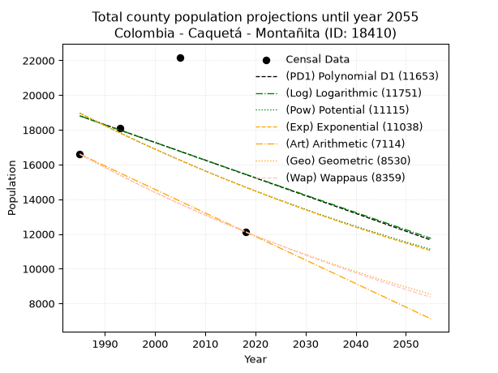
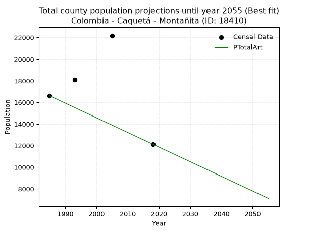
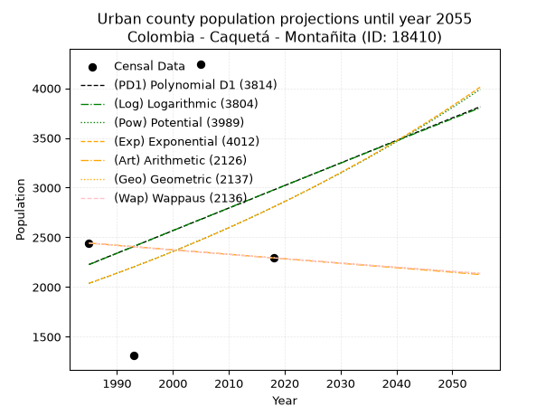
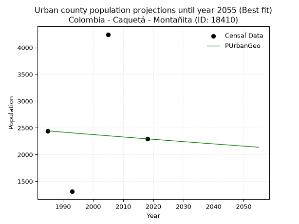
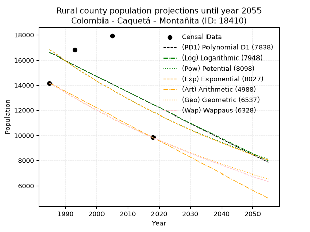
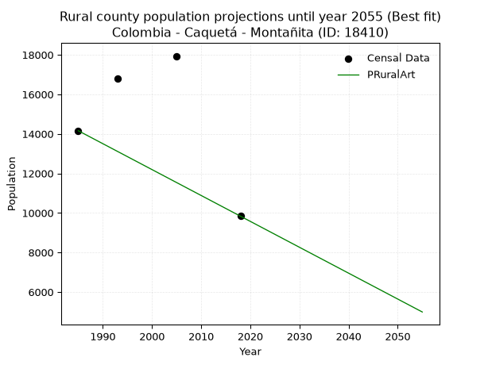

<div align="center">


</div>

# _“Population and Public Services Demand Projections (PPSD) until Year 2050 for Colombia - Caquetá - Montañita (ID: 18410)”_
Keywords: `population` `public-service` `projection` `lineal` `polynomial` `logarithmic` `potential` `exponential` `arithmetic` `geometric` `wappaus` `dane` `colombia` `south-america`

PPSD are analytical estimates used by governments and planners to anticipate future changes in population size, age distribution, and the resulting community needs for utilities, healthcare, education, and infrastructure as sizing future water treatment facilities, electrical grids, and road networks based on spatial growth.

> **General running parameters**: • app_version: _v20260806_. • Python version: _3.14.7_. • Pandas version: _3.0.5_. • NumPy version: _2.5.1_. • Creates, save and include plots into reports (create_plot): _False_. • Projection until year: _2050_. • Process polynomial degree 2 and up: _False_. • Process Wappaus: _True_. • Process Wappaus: _True_. • Set negative values to zero: _True_. • Set infinite values to zero: _True_. • Drop dataset notes: _True_. 
<div align="center">

Dynamic map: [:earth_americas:Google](http://maps.google.com/maps?q=1.479172635,-75.4364077) [:earth_americas:OSM](https://www.openstreetmap.org/#map=18/1.479172635/-75.4364077&layers=P) [:earth_americas:Bing](https://www.bing.com/maps?cp=1.479172635~-75.4364077&lvl=18) [:earth_americas:Apple](https://maps.apple.com/frame?center=1.479172635%2C-75.4364077&span=0.003%2C0.006)

</div>


<div align="center">

```geojson
{
  "type": "Feature",
  "geometry": {
    "type": "Point", 
    "coordinates": [-75.4364077, 1.479172635]
  }, 
  "properties": {
    "Name": "Colombia - Caquetá - Montañita (ID: 18410)"
  }
}
```

</div>


## 0. Census Data (4 records)

Census data are official statistics collected by a government about the people and housing in a country. They usually include counts of total population, age, sex, race, income, education, and jobs.

📅Global census file: [Population.xlsx](../data/Population.xlsx)

| Source   |   Year |   CountryID | CountryName   |   StateID | StateName   |   CountyID | CountyName   |   PTotal |   PUrban |   PRural |
|:---------|-------:|------------:|:--------------|----------:|:------------|-----------:|:-------------|---------:|---------:|---------:|
| DANE     |   1985 |          57 | Colombia      |        18 | Caquetá     |      18410 | Montañita    |    16600 |     2442 |    14158 |
| DANE     |   1993 |          57 | Colombia      |        18 | Caquetá     |      18410 | Montañita    |    18088 |     1310 |    16778 |
| DANE     |   2005 |          57 | Colombia      |        18 | Caquetá     |      18410 | Montañita    |    22181 |     4245 |    17936 |
| DANE     |   2018 |          57 | Colombia      |        18 | Caquetá     |      18410 | Montañita    |    12128 |     2293 |     9835 |

> 🔥Some records could had specific notes about the registered values or the corresponding urban or rural distribution.

📅   [RUPS](https://www.datos.gov.co/Hacienda-y-Cr-dito-P-blico/Registro-nico-de-Prestadores-de-Servicios-P-blicos/4qkq-csdn/about_data) - Local public utility companies: [RUPS.csv](../data/RUPS.xlsx)

 | SERVICIO   | ESTADO   | NOMBRE   | NIT   | DEPARTAMENTO_DOMICILIO   | MUNICIPIO_DOMICILIO   | DIRECCION   | TELEFONO   | EMAIL   | TIPO_INSCRIPCION   | REPRESENTANTE_LEGAL   | TIPO_PRESTADOR   | CLASIFICACION   |
|------------|----------|----------|-------|--------------------------|-----------------------|-------------|------------|---------|--------------------|-----------------------|------------------|-----------------|

## 1. Total

### 1.1. Coefficients and Parameters

* (PD1) Polynomial Deg 1: -102.21798474507636, 221710.773986339 (lineal)
* (Log) Logarithmic: -203456.18235777726, 1563721.322496988
* (Pow) Potential: -15.415920462526842, 55.115939783365086
* (Exp) Exponential: -0.00773528607575286, 88397748203.85501
* (Art) Arithmetic: Year diff. 2018 - 1985 = 33, Population diff. 12128 - 16600 = -4472, Annual growth = -135.5151515151515
* (Geo) Geometric: Year diff. 2018 - 1985 = 33, Population diff. 12128 - 16600 = -4472, Annual growth % = -0.0094665998556962
* (Wap) Wappaus: i = -0.9434360311553294, Condition values only valid for < 200)

<sub>
Wappaus condition values: ['-0.00', '-0.94', '-1.89', '-2.83', '-3.77', '-4.72', '-5.66', '-6.60', '-7.55', '-8.49', '-9.43', '-10.38', '-11.32', '-12.26', '-13.21', '-14.15', '-15.09', '-16.04', '-16.98', '-17.93', '-18.87', '-19.81', '-20.76', '-21.70', '-22.64', '-23.59', '-24.53', '-25.47', '-26.42', '-27.36', '-28.30', '-29.25', '-30.19', '-31.13', '-32.08', '-33.02', '-33.96', '-34.91', '-35.85', '-36.79', '-37.74', '-38.68', '-39.62', '-40.57', '-41.51', '-42.45', '-43.40', '-44.34', '-45.28', '-46.23', '-47.17', '-48.12', '-49.06', '-50.00', '-50.95', '-51.89', '-52.83', '-53.78', '-54.72', '-55.66', '-56.61', '-57.55', '-58.49', '-59.44', '-60.38', '-61.32']
</sub>


### 1.2. Projected Dataset

|   Year |   CountyID |   PTotalPD1 |   PTotalLog |   PTotalPow |   PTotalExp |   PTotalArt |   PTotalGeo |   PTotalWap |
|-------:|-----------:|------------:|------------:|------------:|------------:|------------:|------------:|------------:|
|   1985 |      18410 |       18808 |       18802 |       18964 |       18969 |       16600 |       16600 |       16600 |
|   1986 |      18410 |       18706 |       18700 |       18817 |       18823 |       16464 |       16443 |       16444 |
|   1987 |      18410 |       18604 |       18598 |       18672 |       18678 |       16329 |       16287 |       16290 |
|   1988 |      18410 |       18501 |       18495 |       18527 |       18534 |       16193 |       16133 |       16137 |
|   1989 |      18410 |       18399 |       18393 |       18384 |       18391 |       16058 |       15980 |       15985 |
|   1990 |      18410 |       18297 |       18291 |       18242 |       18250 |       15922 |       15829 |       15835 |
|   1991 |      18410 |       18195 |       18188 |       18102 |       18109 |       15787 |       15679 |       15686 |
|   1992 |      18410 |       18093 |       18086 |       17962 |       17969 |       15651 |       15531 |       15539 |
|   1993 |      18410 |       17990 |       17984 |       17824 |       17831 |       15516 |       15384 |       15393 |
|   1994 |      18410 |       17888 |       17882 |       17686 |       17693 |       15380 |       15238 |       15248 |
|   1995 |      18410 |       17786 |       17780 |       17550 |       17557 |       15245 |       15094 |       15104 |
|   1996 |      18410 |       17684 |       17678 |       17415 |       17422 |       15109 |       14951 |       14962 |
|   1997 |      18410 |       17581 |       17576 |       17281 |       17288 |       14974 |       14809 |       14821 |
|   1998 |      18410 |       17479 |       17474 |       17148 |       17154 |       14838 |       14669 |       14682 |
|   1999 |      18410 |       17377 |       17372 |       17017 |       17022 |       14703 |       14530 |       14543 |
|   2000 |      18410 |       17275 |       17271 |       16886 |       16891 |       14567 |       14393 |       14406 |
|   2001 |      18410 |       17173 |       17169 |       16756 |       16761 |       14432 |       14257 |       14270 |
|   2002 |      18410 |       17070 |       17067 |       16628 |       16632 |       14296 |       14122 |       14135 |
|   2003 |      18410 |       16968 |       16966 |       16500 |       16504 |       14161 |       13988 |       14002 |
|   2004 |      18410 |       16866 |       16864 |       16374 |       16376 |       14025 |       13855 |       13869 |
|   2005 |      18410 |       16764 |       16763 |       16248 |       16250 |       13890 |       13724 |       13738 |
|   2006 |      18410 |       16661 |       16661 |       16124 |       16125 |       13754 |       13594 |       13608 |
|   2007 |      18410 |       16559 |       16560 |       16000 |       16001 |       13619 |       13466 |       13479 |
|   2008 |      18410 |       16457 |       16459 |       15878 |       15877 |       13483 |       13338 |       13351 |
|   2009 |      18410 |       16355 |       16357 |       15757 |       15755 |       13348 |       13212 |       13224 |
|   2010 |      18410 |       16253 |       16256 |       15636 |       15634 |       13212 |       13087 |       13098 |
|   2011 |      18410 |       16150 |       16155 |       15517 |       15513 |       13077 |       12963 |       12973 |
|   2012 |      18410 |       16048 |       16054 |       15398 |       15394 |       12941 |       12840 |       12849 |
|   2013 |      18410 |       15946 |       15953 |       15281 |       15275 |       12806 |       12719 |       12727 |
|   2014 |      18410 |       15844 |       15851 |       15164 |       15157 |       12670 |       12598 |       12605 |
|   2015 |      18410 |       15742 |       15750 |       15049 |       15041 |       12535 |       12479 |       12484 |
|   2016 |      18410 |       15639 |       15650 |       14934 |       14925 |       12399 |       12361 |       12364 |
|   2017 |      18410 |       15537 |       15549 |       14820 |       14810 |       12264 |       12244 |       12246 |
|   2018 |      18410 |       15435 |       15448 |       14707 |       14696 |       12128 |       12128 |       12128 |
|   2019 |      18410 |       15333 |       15347 |       14596 |       14582 |       11992 |       12013 |       12011 |
|   2020 |      18410 |       15230 |       15246 |       14485 |       14470 |       11857 |       11899 |       11895 |
|   2021 |      18410 |       15128 |       15146 |       14374 |       14359 |       11721 |       11787 |       11780 |
|   2022 |      18410 |       15026 |       15045 |       14265 |       14248 |       11586 |       11675 |       11666 |
|   2023 |      18410 |       14924 |       14944 |       14157 |       14138 |       11450 |       11565 |       11553 |
|   2024 |      18410 |       14822 |       14844 |       14050 |       14029 |       11315 |       11455 |       11441 |
|   2025 |      18410 |       14719 |       14743 |       13943 |       13921 |       11179 |       11347 |       11330 |
|   2026 |      18410 |       14617 |       14643 |       13837 |       13814 |       11044 |       11239 |       11220 |
|   2027 |      18410 |       14515 |       14542 |       13732 |       13707 |       10908 |       11133 |       11110 |
|   2028 |      18410 |       14413 |       14442 |       13628 |       13602 |       10773 |       11028 |       11001 |
|   2029 |      18410 |       14310 |       14342 |       13525 |       13497 |       10637 |       10923 |       10894 |
|   2030 |      18410 |       14208 |       14242 |       13423 |       13393 |       10502 |       10820 |       10787 |
|   2031 |      18410 |       14106 |       14141 |       13321 |       13290 |       10366 |       10717 |       10680 |
|   2032 |      18410 |       14004 |       14041 |       13221 |       13187 |       10231 |       10616 |       10575 |
|   2033 |      18410 |       13902 |       13941 |       13121 |       13086 |       10095 |       10515 |       10471 |
|   2034 |      18410 |       13799 |       13841 |       13022 |       12985 |        9960 |       10416 |       10367 |
|   2035 |      18410 |       13697 |       13741 |       12923 |       12885 |        9824 |       10317 |       10264 |
|   2036 |      18410 |       13595 |       13641 |       12826 |       12786 |        9689 |       10220 |       10162 |
|   2037 |      18410 |       13493 |       13541 |       12729 |       12687 |        9553 |       10123 |       10060 |
|   2038 |      18410 |       13391 |       13441 |       12633 |       12589 |        9418 |       10027 |        9960 |
|   2039 |      18410 |       13288 |       13342 |       12538 |       12492 |        9282 |        9932 |        9860 |
|   2040 |      18410 |       13186 |       13242 |       12444 |       12396 |        9147 |        9838 |        9761 |
|   2041 |      18410 |       13084 |       13142 |       12350 |       12300 |        9011 |        9745 |        9662 |
|   2042 |      18410 |       12982 |       13042 |       12257 |       12206 |        8876 |        9653 |        9565 |
|   2043 |      18410 |       12879 |       12943 |       12165 |       12112 |        8740 |        9561 |        9468 |
|   2044 |      18410 |       12777 |       12843 |       12073 |       12018 |        8605 |        9471 |        9372 |
|   2045 |      18410 |       12675 |       12744 |       11983 |       11926 |        8469 |        9381 |        9276 |
|   2046 |      18410 |       12573 |       12644 |       11893 |       11834 |        8334 |        9292 |        9181 |
|   2047 |      18410 |       12471 |       12545 |       11803 |       11743 |        8198 |        9204 |        9087 |
|   2048 |      18410 |       12368 |       12445 |       11715 |       11652 |        8063 |        9117 |        8994 |
|   2049 |      18410 |       12266 |       12346 |       11627 |       11562 |        7927 |        9031 |        8901 |
|   2050 |      18410 |       12164 |       12247 |       11540 |       11473 |        7792 |        8945 |        8809 |
<div align="center">

</img>

</div>


### 1.3. Best fit with absolute and relative error (%)

Relative error puts that difference into context by dividing the absolute error by the true value, creating a unitless ratio or percentage that shows the scale of the mistake.

Absolute and relative error

|   Year | Source   |   CountryID | CountryName   |   StateID | StateName   |   CountyID_x | CountyName   |   PTotal |   PUrban |   PRural |   CountyID_y |   PTotalPD1 |   PTotalLog |   PTotalPow |   PTotalExp |   PTotalArt |   PTotalGeo |   PTotalWap |   PTotalPD1AbsError |   PTotalLogAbsError |   PTotalPowAbsError |   PTotalExpAbsError |   PTotalArtAbsError |   PTotalGeoAbsError |   PTotalWapAbsError |   PTotalPD1RelError |   PTotalLogRelError |   PTotalPowRelError |   PTotalExpRelError |   PTotalArtRelError |   PTotalGeoRelError |   PTotalWapRelError |
|-------:|:---------|------------:|:--------------|----------:|:------------|-------------:|:-------------|---------:|---------:|---------:|-------------:|------------:|------------:|------------:|------------:|------------:|------------:|------------:|--------------------:|--------------------:|--------------------:|--------------------:|--------------------:|--------------------:|--------------------:|--------------------:|--------------------:|--------------------:|--------------------:|--------------------:|--------------------:|--------------------:|
|   1985 | DANE     |          57 | Colombia      |        18 | Caquetá     |        18410 | Montañita    |    16600 |     2442 |    14158 |        18410 |       18808 |       18802 |       18964 |       18969 |       16600 |       16600 |       16600 |                2208 |                2202 |                2364 |                2369 |                   0 |                   0 |                   0 |           13.3012   |           13.2651   |            14.241   |            14.2711  |              0      |              0      |              0      |
|   1993 | DANE     |          57 | Colombia      |        18 | Caquetá     |        18410 | Montañita    |    18088 |     1310 |    16778 |        18410 |       17990 |       17984 |       17824 |       17831 |       15516 |       15384 |       15393 |                  98 |                 104 |                 264 |                 257 |                2572 |                2704 |                2695 |            0.541796 |            0.574967 |             1.45953 |             1.42083 |             14.2194 |             14.9491 |             14.8994 |
|   2005 | DANE     |          57 | Colombia      |        18 | Caquetá     |        18410 | Montañita    |    22181 |     4245 |    17936 |        18410 |       16764 |       16763 |       16248 |       16250 |       13890 |       13724 |       13738 |                5417 |                5418 |                5933 |                5931 |                8291 |                8457 |                8443 |           24.4218   |           24.4263   |            26.7481  |            26.7391  |             37.3788 |             38.1272 |             38.0641 |
|   2018 | DANE     |          57 | Colombia      |        18 | Caquetá     |        18410 | Montañita    |    12128 |     2293 |     9835 |        18410 |       15435 |       15448 |       14707 |       14696 |       12128 |       12128 |       12128 |                3307 |                3320 |                2579 |                2568 |                   0 |                   0 |                   0 |           27.2675   |           27.3747   |            21.2648  |            21.1741  |              0      |              0      |              0      |

Relative error mean

| Method    |   RelError | Best   |
|:----------|-----------:|:-------|
| PTotalPD1 |    16.3831 |        |
| PTotalLog |    16.4103 |        |
| PTotalPow |    15.9284 |        |
| PTotalExp |    15.9013 |        |
| PTotalArt |    12.8996 | True   |
| PTotalGeo |    13.2691 |        |
| PTotalWap |    13.2409 |        |

💙Best method: _**PTotalArt**_
<div align="center">

</img>

</div>


### 1.4. Fresh water supply demand in liters per capita per day (lpcd)

The fresh water supply demand typically ranges from 100 to 300 liters per capita per day (lpcd) for standard domestic and municipal planning, though absolute survival minimums set by the World Health Organization are as low as 7.5 to 20 liters per day, and total consumption in high-income nations can exceed 400 liters.

> `CZ`: Level in meters above the sea level (masl)<br> `WS`: Fresh water supply demand in liters per capita per day (lpcd or l/h/d)<br> `WSAll`: Zonal fresh water supply demand in liters per second (l/s)<br> `A`: Zonal area in square meters<br> `DP`: Population density (people/hectare or p/ha)

Reference values (RAS Colombia)

|    CZ |   WS |
|------:|-----:|
|  1000 |  120 |
|  2000 |  130 |
| 99999 |  140 |

County shapefile geometry properties and water supply values

|   CountyID |      ATotal |   CZTotal |   WSTotal |
|-----------:|------------:|----------:|----------:|
|      18410 | 1.70024e+09 |   335.676 |       120 |

Projected values for best method: PTotalArt

|   CountyID |   Year |   PTotalArt |   DPTotal |   WSTotal |   WSTotalAll |
|-----------:|-------:|------------:|----------:|----------:|-------------:|
|      18410 |   1985 |       16600 |      0.1  |       120 |      23.0556 |
|      18410 |   1986 |       16464 |      0.1  |       120 |      22.8667 |
|      18410 |   1987 |       16329 |      0.1  |       120 |      22.6792 |
|      18410 |   1988 |       16193 |      0.1  |       120 |      22.4903 |
|      18410 |   1989 |       16058 |      0.09 |       120 |      22.3028 |
|      18410 |   1990 |       15922 |      0.09 |       120 |      22.1139 |
|      18410 |   1991 |       15787 |      0.09 |       120 |      21.9264 |
|      18410 |   1992 |       15651 |      0.09 |       120 |      21.7375 |
|      18410 |   1993 |       15516 |      0.09 |       120 |      21.55   |
|      18410 |   1994 |       15380 |      0.09 |       120 |      21.3611 |
|      18410 |   1995 |       15245 |      0.09 |       120 |      21.1736 |
|      18410 |   1996 |       15109 |      0.09 |       120 |      20.9847 |
|      18410 |   1997 |       14974 |      0.09 |       120 |      20.7972 |
|      18410 |   1998 |       14838 |      0.09 |       120 |      20.6083 |
|      18410 |   1999 |       14703 |      0.09 |       120 |      20.4208 |
|      18410 |   2000 |       14567 |      0.09 |       120 |      20.2319 |
|      18410 |   2001 |       14432 |      0.08 |       120 |      20.0444 |
|      18410 |   2002 |       14296 |      0.08 |       120 |      19.8556 |
|      18410 |   2003 |       14161 |      0.08 |       120 |      19.6681 |
|      18410 |   2004 |       14025 |      0.08 |       120 |      19.4792 |
|      18410 |   2005 |       13890 |      0.08 |       120 |      19.2917 |
|      18410 |   2006 |       13754 |      0.08 |       120 |      19.1028 |
|      18410 |   2007 |       13619 |      0.08 |       120 |      18.9153 |
|      18410 |   2008 |       13483 |      0.08 |       120 |      18.7264 |
|      18410 |   2009 |       13348 |      0.08 |       120 |      18.5389 |
|      18410 |   2010 |       13212 |      0.08 |       120 |      18.35   |
|      18410 |   2011 |       13077 |      0.08 |       120 |      18.1625 |
|      18410 |   2012 |       12941 |      0.08 |       120 |      17.9736 |
|      18410 |   2013 |       12806 |      0.08 |       120 |      17.7861 |
|      18410 |   2014 |       12670 |      0.07 |       120 |      17.5972 |
|      18410 |   2015 |       12535 |      0.07 |       120 |      17.4097 |
|      18410 |   2016 |       12399 |      0.07 |       120 |      17.2208 |
|      18410 |   2017 |       12264 |      0.07 |       120 |      17.0333 |
|      18410 |   2018 |       12128 |      0.07 |       120 |      16.8444 |
|      18410 |   2019 |       11992 |      0.07 |       120 |      16.6556 |
|      18410 |   2020 |       11857 |      0.07 |       120 |      16.4681 |
|      18410 |   2021 |       11721 |      0.07 |       120 |      16.2792 |
|      18410 |   2022 |       11586 |      0.07 |       120 |      16.0917 |
|      18410 |   2023 |       11450 |      0.07 |       120 |      15.9028 |
|      18410 |   2024 |       11315 |      0.07 |       120 |      15.7153 |
|      18410 |   2025 |       11179 |      0.07 |       120 |      15.5264 |
|      18410 |   2026 |       11044 |      0.06 |       120 |      15.3389 |
|      18410 |   2027 |       10908 |      0.06 |       120 |      15.15   |
|      18410 |   2028 |       10773 |      0.06 |       120 |      14.9625 |
|      18410 |   2029 |       10637 |      0.06 |       120 |      14.7736 |
|      18410 |   2030 |       10502 |      0.06 |       120 |      14.5861 |
|      18410 |   2031 |       10366 |      0.06 |       120 |      14.3972 |
|      18410 |   2032 |       10231 |      0.06 |       120 |      14.2097 |
|      18410 |   2033 |       10095 |      0.06 |       120 |      14.0208 |
|      18410 |   2034 |        9960 |      0.06 |       120 |      13.8333 |
|      18410 |   2035 |        9824 |      0.06 |       120 |      13.6444 |
|      18410 |   2036 |        9689 |      0.06 |       120 |      13.4569 |
|      18410 |   2037 |        9553 |      0.06 |       120 |      13.2681 |
|      18410 |   2038 |        9418 |      0.06 |       120 |      13.0806 |
|      18410 |   2039 |        9282 |      0.05 |       120 |      12.8917 |
|      18410 |   2040 |        9147 |      0.05 |       120 |      12.7042 |
|      18410 |   2041 |        9011 |      0.05 |       120 |      12.5153 |
|      18410 |   2042 |        8876 |      0.05 |       120 |      12.3278 |
|      18410 |   2043 |        8740 |      0.05 |       120 |      12.1389 |
|      18410 |   2044 |        8605 |      0.05 |       120 |      11.9514 |
|      18410 |   2045 |        8469 |      0.05 |       120 |      11.7625 |
|      18410 |   2046 |        8334 |      0.05 |       120 |      11.575  |
|      18410 |   2047 |        8198 |      0.05 |       120 |      11.3861 |
|      18410 |   2048 |        8063 |      0.05 |       120 |      11.1986 |
|      18410 |   2049 |        7927 |      0.05 |       120 |      11.0097 |
|      18410 |   2050 |        7792 |      0.05 |       120 |      10.8222 |

## 2. Urban

### 2.1. Coefficients and Parameters

* (PD1) Polynomial Deg 1: 22.684062625452665, -42801.2962665617 (lineal)
* (Log) Logarithmic: 45554.357097233835, -343686.53334578197
* (Pow) Potential: 19.39157814985525, -60.63974539882437
* (Exp) Exponential: 0.00967345602348659, 9.332913702991006e-06
* (Art) Arithmetic: Year diff. 2018 - 1985 = 33, Population diff. 2293 - 2442 = -149, Annual growth = -4.515151515151516
* (Geo) Geometric: Year diff. 2018 - 1985 = 33, Population diff. 2293 - 2442 = -149, Annual growth % = -0.0019059502085267965
* (Wap) Wappaus: i = -0.19071389715529102, Condition values only valid for < 200)

<sub>
Wappaus condition values: ['-0.00', '-0.19', '-0.38', '-0.57', '-0.76', '-0.95', '-1.14', '-1.33', '-1.53', '-1.72', '-1.91', '-2.10', '-2.29', '-2.48', '-2.67', '-2.86', '-3.05', '-3.24', '-3.43', '-3.62', '-3.81', '-4.00', '-4.20', '-4.39', '-4.58', '-4.77', '-4.96', '-5.15', '-5.34', '-5.53', '-5.72', '-5.91', '-6.10', '-6.29', '-6.48', '-6.67', '-6.87', '-7.06', '-7.25', '-7.44', '-7.63', '-7.82', '-8.01', '-8.20', '-8.39', '-8.58', '-8.77', '-8.96', '-9.15', '-9.34', '-9.54', '-9.73', '-9.92', '-10.11', '-10.30', '-10.49', '-10.68', '-10.87', '-11.06', '-11.25', '-11.44', '-11.63', '-11.82', '-12.01', '-12.21', '-12.40']
</sub>


### 2.2. Projected Dataset

|   Year |   CountyID |   PUrbanPD1 |   PUrbanLog |   PUrbanPow |   PUrbanExp |   PUrbanArt |   PUrbanGeo |   PUrbanWap |
|-------:|-----------:|------------:|------------:|------------:|------------:|------------:|------------:|------------:|
|   1985 |      18410 |        2227 |        2225 |        2037 |        2038 |        2442 |        2442 |        2442 |
|   1986 |      18410 |        2249 |        2248 |        2057 |        2058 |        2437 |        2437 |        2437 |
|   1987 |      18410 |        2272 |        2271 |        2077 |        2078 |        2433 |        2433 |        2433 |
|   1988 |      18410 |        2295 |        2294 |        2098 |        2098 |        2428 |        2428 |        2428 |
|   1989 |      18410 |        2317 |        2316 |        2118 |        2119 |        2424 |        2423 |        2423 |
|   1990 |      18410 |        2340 |        2339 |        2139 |        2139 |        2419 |        2419 |        2419 |
|   1991 |      18410 |        2363 |        2362 |        2160 |        2160 |        2415 |        2414 |        2414 |
|   1992 |      18410 |        2385 |        2385 |        2181 |        2181 |        2410 |        2410 |        2410 |
|   1993 |      18410 |        2408 |        2408 |        2202 |        2202 |        2406 |        2405 |        2405 |
|   1994 |      18410 |        2431 |        2431 |        2224 |        2224 |        2401 |        2400 |        2400 |
|   1995 |      18410 |        2453 |        2454 |        2246 |        2245 |        2397 |        2396 |        2396 |
|   1996 |      18410 |        2476 |        2476 |        2268 |        2267 |        2392 |        2391 |        2391 |
|   1997 |      18410 |        2499 |        2499 |        2290 |        2289 |        2388 |        2387 |        2387 |
|   1998 |      18410 |        2521 |        2522 |        2312 |        2311 |        2383 |        2382 |        2382 |
|   1999 |      18410 |        2544 |        2545 |        2335 |        2334 |        2379 |        2378 |        2378 |
|   2000 |      18410 |        2567 |        2568 |        2357 |        2357 |        2374 |        2373 |        2373 |
|   2001 |      18410 |        2590 |        2590 |        2380 |        2379 |        2370 |        2369 |        2369 |
|   2002 |      18410 |        2612 |        2613 |        2404 |        2403 |        2365 |        2364 |        2364 |
|   2003 |      18410 |        2635 |        2636 |        2427 |        2426 |        2361 |        2360 |        2360 |
|   2004 |      18410 |        2658 |        2659 |        2451 |        2450 |        2356 |        2355 |        2355 |
|   2005 |      18410 |        2680 |        2681 |        2474 |        2473 |        2352 |        2351 |        2351 |
|   2006 |      18410 |        2703 |        2704 |        2498 |        2497 |        2347 |        2346 |        2346 |
|   2007 |      18410 |        2726 |        2727 |        2523 |        2522 |        2343 |        2342 |        2342 |
|   2008 |      18410 |        2748 |        2750 |        2547 |        2546 |        2338 |        2337 |        2337 |
|   2009 |      18410 |        2771 |        2772 |        2572 |        2571 |        2334 |        2333 |        2333 |
|   2010 |      18410 |        2794 |        2795 |        2597 |        2596 |        2329 |        2328 |        2328 |
|   2011 |      18410 |        2816 |        2818 |        2622 |        2621 |        2325 |        2324 |        2324 |
|   2012 |      18410 |        2839 |        2840 |        2647 |        2647 |        2320 |        2319 |        2319 |
|   2013 |      18410 |        2862 |        2863 |        2673 |        2672 |        2316 |        2315 |        2315 |
|   2014 |      18410 |        2884 |        2885 |        2699 |        2698 |        2311 |        2311 |        2311 |
|   2015 |      18410 |        2907 |        2908 |        2725 |        2725 |        2307 |        2306 |        2306 |
|   2016 |      18410 |        2930 |        2931 |        2751 |        2751 |        2302 |        2302 |        2302 |
|   2017 |      18410 |        2952 |        2953 |        2778 |        2778 |        2298 |        2297 |        2297 |
|   2018 |      18410 |        2975 |        2976 |        2805 |        2805 |        2293 |        2293 |        2293 |
|   2019 |      18410 |        2998 |        2998 |        2832 |        2832 |        2288 |        2289 |        2289 |
|   2020 |      18410 |        3021 |        3021 |        2859 |        2860 |        2284 |        2284 |        2284 |
|   2021 |      18410 |        3043 |        3044 |        2887 |        2887 |        2279 |        2280 |        2280 |
|   2022 |      18410 |        3066 |        3066 |        2915 |        2915 |        2275 |        2276 |        2276 |
|   2023 |      18410 |        3089 |        3089 |        2943 |        2944 |        2270 |        2271 |        2271 |
|   2024 |      18410 |        3111 |        3111 |        2971 |        2972 |        2266 |        2267 |        2267 |
|   2025 |      18410 |        3134 |        3134 |        3000 |        3001 |        2261 |        2263 |        2263 |
|   2026 |      18410 |        3157 |        3156 |        3028 |        3030 |        2257 |        2258 |        2258 |
|   2027 |      18410 |        3179 |        3179 |        3058 |        3060 |        2252 |        2254 |        2254 |
|   2028 |      18410 |        3202 |        3201 |        3087 |        3090 |        2248 |        2250 |        2250 |
|   2029 |      18410 |        3225 |        3223 |        3117 |        3120 |        2243 |        2245 |        2245 |
|   2030 |      18410 |        3247 |        3246 |        3146 |        3150 |        2239 |        2241 |        2241 |
|   2031 |      18410 |        3270 |        3268 |        3177 |        3181 |        2234 |        2237 |        2237 |
|   2032 |      18410 |        3293 |        3291 |        3207 |        3212 |        2230 |        2233 |        2232 |
|   2033 |      18410 |        3315 |        3313 |        3238 |        3243 |        2225 |        2228 |        2228 |
|   2034 |      18410 |        3338 |        3336 |        3269 |        3274 |        2221 |        2224 |        2224 |
|   2035 |      18410 |        3361 |        3358 |        3300 |        3306 |        2216 |        2220 |        2220 |
|   2036 |      18410 |        3383 |        3380 |        3332 |        3338 |        2212 |        2216 |        2215 |
|   2037 |      18410 |        3406 |        3403 |        3364 |        3371 |        2207 |        2211 |        2211 |
|   2038 |      18410 |        3429 |        3425 |        3396 |        3403 |        2203 |        2207 |        2207 |
|   2039 |      18410 |        3452 |        3447 |        3428 |        3437 |        2198 |        2203 |        2203 |
|   2040 |      18410 |        3474 |        3470 |        3461 |        3470 |        2194 |        2199 |        2199 |
|   2041 |      18410 |        3497 |        3492 |        3494 |        3504 |        2189 |        2195 |        2194 |
|   2042 |      18410 |        3520 |        3514 |        3527 |        3538 |        2185 |        2190 |        2190 |
|   2043 |      18410 |        3542 |        3537 |        3561 |        3572 |        2180 |        2186 |        2186 |
|   2044 |      18410 |        3565 |        3559 |        3595 |        3607 |        2176 |        2182 |        2182 |
|   2045 |      18410 |        3588 |        3581 |        3629 |        3642 |        2171 |        2178 |        2178 |
|   2046 |      18410 |        3610 |        3604 |        3664 |        3677 |        2167 |        2174 |        2174 |
|   2047 |      18410 |        3633 |        3626 |        3699 |        3713 |        2162 |        2170 |        2169 |
|   2048 |      18410 |        3656 |        3648 |        3734 |        3749 |        2158 |        2165 |        2165 |
|   2049 |      18410 |        3678 |        3670 |        3769 |        3786 |        2153 |        2161 |        2161 |
|   2050 |      18410 |        3701 |        3693 |        3805 |        3822 |        2149 |        2157 |        2157 |
<div align="center">

</img>

</div>


### 2.3. Best fit with absolute and relative error (%)

Relative error puts that difference into context by dividing the absolute error by the true value, creating a unitless ratio or percentage that shows the scale of the mistake.

Absolute and relative error

|   Year | Source   |   CountryID | CountryName   |   StateID | StateName   |   CountyID_x | CountyName   |   PTotal |   PUrban |   PRural |   CountyID_y |   PUrbanPD1 |   PUrbanLog |   PUrbanPow |   PUrbanExp |   PUrbanArt |   PUrbanGeo |   PUrbanWap |   PUrbanPD1AbsError |   PUrbanLogAbsError |   PUrbanPowAbsError |   PUrbanExpAbsError |   PUrbanArtAbsError |   PUrbanGeoAbsError |   PUrbanWapAbsError |   PUrbanPD1RelError |   PUrbanLogRelError |   PUrbanPowRelError |   PUrbanExpRelError |   PUrbanArtRelError |   PUrbanGeoRelError |   PUrbanWapRelError |
|-------:|:---------|------------:|:--------------|----------:|:------------|-------------:|:-------------|---------:|---------:|---------:|-------------:|------------:|------------:|------------:|------------:|------------:|------------:|------------:|--------------------:|--------------------:|--------------------:|--------------------:|--------------------:|--------------------:|--------------------:|--------------------:|--------------------:|--------------------:|--------------------:|--------------------:|--------------------:|--------------------:|
|   1985 | DANE     |          57 | Colombia      |        18 | Caquetá     |        18410 | Montañita    |    16600 |     2442 |    14158 |        18410 |        2227 |        2225 |        2037 |        2038 |        2442 |        2442 |        2442 |                 215 |                 217 |                 405 |                 404 |                   0 |                   0 |                   0 |             8.80426 |             8.88616 |             16.5848 |             16.5438 |              0      |              0      |              0      |
|   1993 | DANE     |          57 | Colombia      |        18 | Caquetá     |        18410 | Montañita    |    18088 |     1310 |    16778 |        18410 |        2408 |        2408 |        2202 |        2202 |        2406 |        2405 |        2405 |                1098 |                1098 |                 892 |                 892 |                1096 |                1095 |                1095 |            83.8168  |            83.8168  |             68.0916 |             68.0916 |             83.6641 |             83.5878 |             83.5878 |
|   2005 | DANE     |          57 | Colombia      |        18 | Caquetá     |        18410 | Montañita    |    22181 |     4245 |    17936 |        18410 |        2680 |        2681 |        2474 |        2473 |        2352 |        2351 |        2351 |                1565 |                1564 |                1771 |                1772 |                1893 |                1894 |                1894 |            36.8669  |            36.8433  |             41.7197 |             41.7432 |             44.5936 |             44.6172 |             44.6172 |
|   2018 | DANE     |          57 | Colombia      |        18 | Caquetá     |        18410 | Montañita    |    12128 |     2293 |     9835 |        18410 |        2975 |        2976 |        2805 |        2805 |        2293 |        2293 |        2293 |                 682 |                 683 |                 512 |                 512 |                   0 |                   0 |                   0 |            29.7427  |            29.7863  |             22.3288 |             22.3288 |              0      |              0      |              0      |

Relative error mean

| Method    |   RelError | Best   |
|:----------|-----------:|:-------|
| PUrbanPD1 |    39.8077 |        |
| PUrbanLog |    39.8332 |        |
| PUrbanPow |    37.1812 |        |
| PUrbanExp |    37.1769 |        |
| PUrbanArt |    32.0644 |        |
| PUrbanGeo |    32.0512 | True   |
| PUrbanWap |    32.0512 | True   |

💙Best method: _**PUrbanGeo**_
<div align="center">

</img>

</div>


### 2.4. Fresh water supply demand in liters per capita per day (lpcd)

The fresh water supply demand typically ranges from 100 to 300 liters per capita per day (lpcd) for standard domestic and municipal planning, though absolute survival minimums set by the World Health Organization are as low as 7.5 to 20 liters per day, and total consumption in high-income nations can exceed 400 liters.

> `CZ`: Level in meters above the sea level (masl)<br> `WS`: Fresh water supply demand in liters per capita per day (lpcd or l/h/d)<br> `WSAll`: Zonal fresh water supply demand in liters per second (l/s)<br> `A`: Zonal area in square meters<br> `DP`: Population density (people/hectare or p/ha)

Reference values (RAS Colombia)

|    CZ |   WS |
|------:|-----:|
|  1000 |  120 |
|  2000 |  130 |
| 99999 |  140 |

County shapefile geometry properties and water supply values

|   CountyID |   AUrban |   CZUrban |   WSUrban |
|-----------:|---------:|----------:|----------:|
|      18410 |   416573 |   241.804 |       120 |

Projected values for best method: PUrbanGeo

|   CountyID |   Year |   PUrbanGeo |   DPUrban |   WSUrban |   WSUrbanAll |
|-----------:|-------:|------------:|----------:|----------:|-------------:|
|      18410 |   1985 |        2442 |     58.62 |       120 |      3.39167 |
|      18410 |   1986 |        2437 |     58.5  |       120 |      3.38472 |
|      18410 |   1987 |        2433 |     58.41 |       120 |      3.37917 |
|      18410 |   1988 |        2428 |     58.29 |       120 |      3.37222 |
|      18410 |   1989 |        2423 |     58.17 |       120 |      3.36528 |
|      18410 |   1990 |        2419 |     58.07 |       120 |      3.35972 |
|      18410 |   1991 |        2414 |     57.95 |       120 |      3.35278 |
|      18410 |   1992 |        2410 |     57.85 |       120 |      3.34722 |
|      18410 |   1993 |        2405 |     57.73 |       120 |      3.34028 |
|      18410 |   1994 |        2400 |     57.61 |       120 |      3.33333 |
|      18410 |   1995 |        2396 |     57.52 |       120 |      3.32778 |
|      18410 |   1996 |        2391 |     57.4  |       120 |      3.32083 |
|      18410 |   1997 |        2387 |     57.3  |       120 |      3.31528 |
|      18410 |   1998 |        2382 |     57.18 |       120 |      3.30833 |
|      18410 |   1999 |        2378 |     57.08 |       120 |      3.30278 |
|      18410 |   2000 |        2373 |     56.96 |       120 |      3.29583 |
|      18410 |   2001 |        2369 |     56.87 |       120 |      3.29028 |
|      18410 |   2002 |        2364 |     56.75 |       120 |      3.28333 |
|      18410 |   2003 |        2360 |     56.65 |       120 |      3.27778 |
|      18410 |   2004 |        2355 |     56.53 |       120 |      3.27083 |
|      18410 |   2005 |        2351 |     56.44 |       120 |      3.26528 |
|      18410 |   2006 |        2346 |     56.32 |       120 |      3.25833 |
|      18410 |   2007 |        2342 |     56.22 |       120 |      3.25278 |
|      18410 |   2008 |        2337 |     56.1  |       120 |      3.24583 |
|      18410 |   2009 |        2333 |     56    |       120 |      3.24028 |
|      18410 |   2010 |        2328 |     55.88 |       120 |      3.23333 |
|      18410 |   2011 |        2324 |     55.79 |       120 |      3.22778 |
|      18410 |   2012 |        2319 |     55.67 |       120 |      3.22083 |
|      18410 |   2013 |        2315 |     55.57 |       120 |      3.21528 |
|      18410 |   2014 |        2311 |     55.48 |       120 |      3.20972 |
|      18410 |   2015 |        2306 |     55.36 |       120 |      3.20278 |
|      18410 |   2016 |        2302 |     55.26 |       120 |      3.19722 |
|      18410 |   2017 |        2297 |     55.14 |       120 |      3.19028 |
|      18410 |   2018 |        2293 |     55.04 |       120 |      3.18472 |
|      18410 |   2019 |        2289 |     54.95 |       120 |      3.17917 |
|      18410 |   2020 |        2284 |     54.83 |       120 |      3.17222 |
|      18410 |   2021 |        2280 |     54.73 |       120 |      3.16667 |
|      18410 |   2022 |        2276 |     54.64 |       120 |      3.16111 |
|      18410 |   2023 |        2271 |     54.52 |       120 |      3.15417 |
|      18410 |   2024 |        2267 |     54.42 |       120 |      3.14861 |
|      18410 |   2025 |        2263 |     54.32 |       120 |      3.14306 |
|      18410 |   2026 |        2258 |     54.2  |       120 |      3.13611 |
|      18410 |   2027 |        2254 |     54.11 |       120 |      3.13056 |
|      18410 |   2028 |        2250 |     54.01 |       120 |      3.125   |
|      18410 |   2029 |        2245 |     53.89 |       120 |      3.11806 |
|      18410 |   2030 |        2241 |     53.8  |       120 |      3.1125  |
|      18410 |   2031 |        2237 |     53.7  |       120 |      3.10694 |
|      18410 |   2032 |        2233 |     53.6  |       120 |      3.10139 |
|      18410 |   2033 |        2228 |     53.48 |       120 |      3.09444 |
|      18410 |   2034 |        2224 |     53.39 |       120 |      3.08889 |
|      18410 |   2035 |        2220 |     53.29 |       120 |      3.08333 |
|      18410 |   2036 |        2216 |     53.2  |       120 |      3.07778 |
|      18410 |   2037 |        2211 |     53.08 |       120 |      3.07083 |
|      18410 |   2038 |        2207 |     52.98 |       120 |      3.06528 |
|      18410 |   2039 |        2203 |     52.88 |       120 |      3.05972 |
|      18410 |   2040 |        2199 |     52.79 |       120 |      3.05417 |
|      18410 |   2041 |        2195 |     52.69 |       120 |      3.04861 |
|      18410 |   2042 |        2190 |     52.57 |       120 |      3.04167 |
|      18410 |   2043 |        2186 |     52.48 |       120 |      3.03611 |
|      18410 |   2044 |        2182 |     52.38 |       120 |      3.03056 |
|      18410 |   2045 |        2178 |     52.28 |       120 |      3.025   |
|      18410 |   2046 |        2174 |     52.19 |       120 |      3.01944 |
|      18410 |   2047 |        2170 |     52.09 |       120 |      3.01389 |
|      18410 |   2048 |        2165 |     51.97 |       120 |      3.00694 |
|      18410 |   2049 |        2161 |     51.88 |       120 |      3.00139 |
|      18410 |   2050 |        2157 |     51.78 |       120 |      2.99583 |

## 3. Rural

### 3.1. Coefficients and Parameters

* (PD1) Polynomial Deg 1: -124.90204737052898, 264512.0702529006 (lineal)
* (Log) Logarithmic: -249010.53945501155, 1907407.8558427733
* (Pow) Potential: -21.06011758954451, 73.67660581707159
* (Exp) Exponential: -0.010556965091847, 21201671067438.1
* (Art) Arithmetic: Year diff. 2018 - 1985 = 33, Population diff. 9835 - 14158 = -4323, Annual growth = -131.0
* (Geo) Geometric: Year diff. 2018 - 1985 = 33, Population diff. 9835 - 14158 = -4323, Annual growth % = -0.010979653982320592
* (Wap) Wappaus: i = -1.0919851623390155, Condition values only valid for < 200)

<sub>
Wappaus condition values: ['-0.00', '-1.09', '-2.18', '-3.28', '-4.37', '-5.46', '-6.55', '-7.64', '-8.74', '-9.83', '-10.92', '-12.01', '-13.10', '-14.20', '-15.29', '-16.38', '-17.47', '-18.56', '-19.66', '-20.75', '-21.84', '-22.93', '-24.02', '-25.12', '-26.21', '-27.30', '-28.39', '-29.48', '-30.58', '-31.67', '-32.76', '-33.85', '-34.94', '-36.04', '-37.13', '-38.22', '-39.31', '-40.40', '-41.50', '-42.59', '-43.68', '-44.77', '-45.86', '-46.96', '-48.05', '-49.14', '-50.23', '-51.32', '-52.42', '-53.51', '-54.60', '-55.69', '-56.78', '-57.88', '-58.97', '-60.06', '-61.15', '-62.24', '-63.34', '-64.43', '-65.52', '-66.61', '-67.70', '-68.80', '-69.89', '-70.98']
</sub>


### 3.2. Projected Dataset

|   Year |   CountyID |   PRuralPD1 |   PRuralLog |   PRuralPow |   PRuralExp |   PRuralArt |   PRuralGeo |   PRuralWap |
|-------:|-----------:|------------:|------------:|------------:|------------:|------------:|------------:|------------:|
|   1985 |      18410 |       16582 |       16578 |       16803 |       16807 |       14158 |       14158 |       14158 |
|   1986 |      18410 |       16457 |       16452 |       16626 |       16630 |       14027 |       14003 |       14004 |
|   1987 |      18410 |       16332 |       16327 |       16450 |       16455 |       13896 |       13849 |       13852 |
|   1988 |      18410 |       16207 |       16202 |       16277 |       16283 |       13765 |       13697 |       13702 |
|   1989 |      18410 |       16082 |       16076 |       16105 |       16112 |       13634 |       13546 |       13553 |
|   1990 |      18410 |       15957 |       15951 |       15936 |       15942 |       13503 |       13398 |       13406 |
|   1991 |      18410 |       15832 |       15826 |       15768 |       15775 |       13372 |       13251 |       13260 |
|   1992 |      18410 |       15707 |       15701 |       15602 |       15609 |       13241 |       13105 |       13116 |
|   1993 |      18410 |       15582 |       15576 |       15438 |       15445 |       13110 |       12961 |       12973 |
|   1994 |      18410 |       15457 |       15451 |       15276 |       15283 |       12979 |       12819 |       12832 |
|   1995 |      18410 |       15332 |       15326 |       15115 |       15123 |       12848 |       12678 |       12692 |
|   1996 |      18410 |       15208 |       15202 |       14957 |       14964 |       12717 |       12539 |       12554 |
|   1997 |      18410 |       15083 |       15077 |       14800 |       14807 |       12586 |       12401 |       12417 |
|   1998 |      18410 |       14958 |       14952 |       14645 |       14651 |       12455 |       12265 |       12281 |
|   1999 |      18410 |       14833 |       14828 |       14491 |       14497 |       12324 |       12130 |       12147 |
|   2000 |      18410 |       14708 |       14703 |       14339 |       14345 |       12193 |       11997 |       12015 |
|   2001 |      18410 |       14583 |       14579 |       14189 |       14195 |       12062 |       11865 |       11883 |
|   2002 |      18410 |       14458 |       14454 |       14041 |       14045 |       11931 |       11735 |       11753 |
|   2003 |      18410 |       14333 |       14330 |       13894 |       13898 |       11800 |       11606 |       11624 |
|   2004 |      18410 |       14208 |       14206 |       13748 |       13752 |       11669 |       11479 |       11497 |
|   2005 |      18410 |       14083 |       14081 |       13605 |       13608 |       11538 |       11353 |       11370 |
|   2006 |      18410 |       13959 |       13957 |       13463 |       13465 |       11407 |       11228 |       11245 |
|   2007 |      18410 |       13834 |       13833 |       13322 |       13323 |       11276 |       11105 |       11121 |
|   2008 |      18410 |       13709 |       13709 |       13183 |       13183 |       11145 |       10983 |       10999 |
|   2009 |      18410 |       13584 |       13585 |       13045 |       13045 |       11014 |       10862 |       10877 |
|   2010 |      18410 |       13459 |       13461 |       12909 |       12908 |       10883 |       10743 |       10757 |
|   2011 |      18410 |       13334 |       13337 |       12775 |       12772 |       10752 |       10625 |       10638 |
|   2012 |      18410 |       13209 |       13213 |       12642 |       12638 |       10621 |       10509 |       10520 |
|   2013 |      18410 |       13084 |       13090 |       12510 |       12506 |       10490 |       10393 |       10403 |
|   2014 |      18410 |       12959 |       12966 |       12380 |       12374 |       10359 |       10279 |       10287 |
|   2015 |      18410 |       12834 |       12842 |       12251 |       12244 |       10228 |       10166 |       10173 |
|   2016 |      18410 |       12710 |       12719 |       12124 |       12116 |       10097 |       10055 |       10059 |
|   2017 |      18410 |       12585 |       12595 |       11998 |       11988 |        9966 |        9944 |        9947 |
|   2018 |      18410 |       12460 |       12472 |       11873 |       11863 |        9835 |        9835 |        9835 |
|   2019 |      18410 |       12335 |       12349 |       11750 |       11738 |        9704 |        9727 |        9725 |
|   2020 |      18410 |       12210 |       12225 |       11628 |       11615 |        9573 |        9620 |        9615 |
|   2021 |      18410 |       12085 |       12102 |       11508 |       11493 |        9442 |        9515 |        9507 |
|   2022 |      18410 |       11960 |       11979 |       11388 |       11372 |        9311 |        9410 |        9399 |
|   2023 |      18410 |       11835 |       11856 |       11271 |       11253 |        9180 |        9307 |        9293 |
|   2024 |      18410 |       11710 |       11733 |       11154 |       11135 |        9049 |        9205 |        9187 |
|   2025 |      18410 |       11585 |       11610 |       11038 |       11018 |        8918 |        9104 |        9082 |
|   2026 |      18410 |       11461 |       11487 |       10924 |       10902 |        8787 |        9004 |        8979 |
|   2027 |      18410 |       11336 |       11364 |       10811 |       10787 |        8656 |        8905 |        8876 |
|   2028 |      18410 |       11211 |       11241 |       10700 |       10674 |        8525 |        8807 |        8774 |
|   2029 |      18410 |       11086 |       11118 |       10589 |       10562 |        8394 |        8710 |        8673 |
|   2030 |      18410 |       10961 |       10996 |       10480 |       10451 |        8263 |        8615 |        8573 |
|   2031 |      18410 |       10836 |       10873 |       10372 |       10341 |        8132 |        8520 |        8474 |
|   2032 |      18410 |       10711 |       10750 |       10265 |       10233 |        8001 |        8427 |        8376 |
|   2033 |      18410 |       10586 |       10628 |       10159 |       10125 |        7870 |        8334 |        8278 |
|   2034 |      18410 |       10461 |       10505 |       10054 |       10019 |        7739 |        8242 |        8181 |
|   2035 |      18410 |       10336 |       10383 |        9951 |        9914 |        7608 |        8152 |        8086 |
|   2036 |      18410 |       10212 |       10261 |        9848 |        9810 |        7477 |        8062 |        7991 |
|   2037 |      18410 |       10087 |       10138 |        9747 |        9707 |        7346 |        7974 |        7896 |
|   2038 |      18410 |        9962 |       10016 |        9647 |        9605 |        7215 |        7886 |        7803 |
|   2039 |      18410 |        9837 |        9894 |        9548 |        9504 |        7084 |        7800 |        7710 |
|   2040 |      18410 |        9712 |        9772 |        9449 |        9404 |        6953 |        7714 |        7619 |
|   2041 |      18410 |        9587 |        9650 |        9352 |        9305 |        6822 |        7629 |        7528 |
|   2042 |      18410 |        9462 |        9528 |        9256 |        9208 |        6691 |        7546 |        7437 |
|   2043 |      18410 |        9337 |        9406 |        9161 |        9111 |        6560 |        7463 |        7348 |
|   2044 |      18410 |        9212 |        9284 |        9068 |        9015 |        6429 |        7381 |        7259 |
|   2045 |      18410 |        9087 |        9162 |        8975 |        8921 |        6298 |        7300 |        7171 |
|   2046 |      18410 |        8962 |        9041 |        8883 |        8827 |        6167 |        7220 |        7083 |
|   2047 |      18410 |        8838 |        8919 |        8792 |        8734 |        6036 |        7140 |        6997 |
|   2048 |      18410 |        8713 |        8797 |        8702 |        8642 |        5905 |        7062 |        6911 |
|   2049 |      18410 |        8588 |        8676 |        8613 |        8552 |        5774 |        6985 |        6826 |
|   2050 |      18410 |        8463 |        8554 |        8525 |        8462 |        5643 |        6908 |        6741 |
<div align="center">

</img>

</div>


### 3.3. Best fit with absolute and relative error (%)

Relative error puts that difference into context by dividing the absolute error by the true value, creating a unitless ratio or percentage that shows the scale of the mistake.

Absolute and relative error

|   Year | Source   |   CountryID | CountryName   |   StateID | StateName   |   CountyID_x | CountyName   |   PTotal |   PUrban |   PRural |   CountyID_y |   PRuralPD1 |   PRuralLog |   PRuralPow |   PRuralExp |   PRuralArt |   PRuralGeo |   PRuralWap |   PRuralPD1AbsError |   PRuralLogAbsError |   PRuralPowAbsError |   PRuralExpAbsError |   PRuralArtAbsError |   PRuralGeoAbsError |   PRuralWapAbsError |   PRuralPD1RelError |   PRuralLogRelError |   PRuralPowRelError |   PRuralExpRelError |   PRuralArtRelError |   PRuralGeoRelError |   PRuralWapRelError |
|-------:|:---------|------------:|:--------------|----------:|:------------|-------------:|:-------------|---------:|---------:|---------:|-------------:|------------:|------------:|------------:|------------:|------------:|------------:|------------:|--------------------:|--------------------:|--------------------:|--------------------:|--------------------:|--------------------:|--------------------:|--------------------:|--------------------:|--------------------:|--------------------:|--------------------:|--------------------:|--------------------:|
|   1985 | DANE     |          57 | Colombia      |        18 | Caquetá     |        18410 | Montañita    |    16600 |     2442 |    14158 |        18410 |       16582 |       16578 |       16803 |       16807 |       14158 |       14158 |       14158 |                2424 |                2420 |                2645 |                2649 |                   0 |                   0 |                   0 |            17.1211  |            17.0928  |            18.682   |            18.7103  |              0      |              0      |              0      |
|   1993 | DANE     |          57 | Colombia      |        18 | Caquetá     |        18410 | Montañita    |    18088 |     1310 |    16778 |        18410 |       15582 |       15576 |       15438 |       15445 |       13110 |       12961 |       12973 |                1196 |                1202 |                1340 |                1333 |                3668 |                3817 |                3805 |             7.12838 |             7.16414 |             7.98665 |             7.94493 |             21.862  |             22.75   |             22.6785 |
|   2005 | DANE     |          57 | Colombia      |        18 | Caquetá     |        18410 | Montañita    |    22181 |     4245 |    17936 |        18410 |       14083 |       14081 |       13605 |       13608 |       11538 |       11353 |       11370 |                3853 |                3855 |                4331 |                4328 |                6398 |                6583 |                6566 |            21.4819  |            21.4931  |            24.147   |            24.1302  |             35.6713 |             36.7027 |             36.6079 |
|   2018 | DANE     |          57 | Colombia      |        18 | Caquetá     |        18410 | Montañita    |    12128 |     2293 |     9835 |        18410 |       12460 |       12472 |       11873 |       11863 |        9835 |        9835 |        9835 |                2625 |                2637 |                2038 |                2028 |                   0 |                   0 |                   0 |            26.6904  |            26.8124  |            20.7219  |            20.6202  |              0      |              0      |              0      |

Relative error mean

| Method    |   RelError | Best   |
|:----------|-----------:|:-------|
| PRuralPD1 |    18.1054 |        |
| PRuralLog |    18.1406 |        |
| PRuralPow |    17.8844 |        |
| PRuralExp |    17.8514 |        |
| PRuralArt |    14.3833 | True   |
| PRuralGeo |    14.8632 |        |
| PRuralWap |    14.8216 |        |

💙Best method: _**PRuralArt**_
<div align="center">

</img>

</div>


### 3.4. Fresh water supply demand in liters per capita per day (lpcd)

The fresh water supply demand typically ranges from 100 to 300 liters per capita per day (lpcd) for standard domestic and municipal planning, though absolute survival minimums set by the World Health Organization are as low as 7.5 to 20 liters per day, and total consumption in high-income nations can exceed 400 liters.

> `CZ`: Level in meters above the sea level (masl)<br> `WS`: Fresh water supply demand in liters per capita per day (lpcd or l/h/d)<br> `WSAll`: Zonal fresh water supply demand in liters per second (l/s)<br> `A`: Zonal area in square meters<br> `DP`: Population density (people/hectare or p/ha)

Reference values (RAS Colombia)

|    CZ |   WS |
|------:|-----:|
|  1000 |  120 |
|  2000 |  130 |
| 99999 |  140 |

County shapefile geometry properties and water supply values

|   CountyID |      ARural |   CZRural |   WSRural |
|-----------:|------------:|----------:|----------:|
|      18410 | 1.69982e+09 |   335.699 |       120 |

Projected values for best method: PRuralArt

|   CountyID |   Year |   PRuralArt |   DPRural |   WSRural |   WSRuralAll |
|-----------:|-------:|------------:|----------:|----------:|-------------:|
|      18410 |   1985 |       14158 |      0.08 |       120 |     19.6639  |
|      18410 |   1986 |       14027 |      0.08 |       120 |     19.4819  |
|      18410 |   1987 |       13896 |      0.08 |       120 |     19.3     |
|      18410 |   1988 |       13765 |      0.08 |       120 |     19.1181  |
|      18410 |   1989 |       13634 |      0.08 |       120 |     18.9361  |
|      18410 |   1990 |       13503 |      0.08 |       120 |     18.7542  |
|      18410 |   1991 |       13372 |      0.08 |       120 |     18.5722  |
|      18410 |   1992 |       13241 |      0.08 |       120 |     18.3903  |
|      18410 |   1993 |       13110 |      0.08 |       120 |     18.2083  |
|      18410 |   1994 |       12979 |      0.08 |       120 |     18.0264  |
|      18410 |   1995 |       12848 |      0.08 |       120 |     17.8444  |
|      18410 |   1996 |       12717 |      0.07 |       120 |     17.6625  |
|      18410 |   1997 |       12586 |      0.07 |       120 |     17.4806  |
|      18410 |   1998 |       12455 |      0.07 |       120 |     17.2986  |
|      18410 |   1999 |       12324 |      0.07 |       120 |     17.1167  |
|      18410 |   2000 |       12193 |      0.07 |       120 |     16.9347  |
|      18410 |   2001 |       12062 |      0.07 |       120 |     16.7528  |
|      18410 |   2002 |       11931 |      0.07 |       120 |     16.5708  |
|      18410 |   2003 |       11800 |      0.07 |       120 |     16.3889  |
|      18410 |   2004 |       11669 |      0.07 |       120 |     16.2069  |
|      18410 |   2005 |       11538 |      0.07 |       120 |     16.025   |
|      18410 |   2006 |       11407 |      0.07 |       120 |     15.8431  |
|      18410 |   2007 |       11276 |      0.07 |       120 |     15.6611  |
|      18410 |   2008 |       11145 |      0.07 |       120 |     15.4792  |
|      18410 |   2009 |       11014 |      0.06 |       120 |     15.2972  |
|      18410 |   2010 |       10883 |      0.06 |       120 |     15.1153  |
|      18410 |   2011 |       10752 |      0.06 |       120 |     14.9333  |
|      18410 |   2012 |       10621 |      0.06 |       120 |     14.7514  |
|      18410 |   2013 |       10490 |      0.06 |       120 |     14.5694  |
|      18410 |   2014 |       10359 |      0.06 |       120 |     14.3875  |
|      18410 |   2015 |       10228 |      0.06 |       120 |     14.2056  |
|      18410 |   2016 |       10097 |      0.06 |       120 |     14.0236  |
|      18410 |   2017 |        9966 |      0.06 |       120 |     13.8417  |
|      18410 |   2018 |        9835 |      0.06 |       120 |     13.6597  |
|      18410 |   2019 |        9704 |      0.06 |       120 |     13.4778  |
|      18410 |   2020 |        9573 |      0.06 |       120 |     13.2958  |
|      18410 |   2021 |        9442 |      0.06 |       120 |     13.1139  |
|      18410 |   2022 |        9311 |      0.05 |       120 |     12.9319  |
|      18410 |   2023 |        9180 |      0.05 |       120 |     12.75    |
|      18410 |   2024 |        9049 |      0.05 |       120 |     12.5681  |
|      18410 |   2025 |        8918 |      0.05 |       120 |     12.3861  |
|      18410 |   2026 |        8787 |      0.05 |       120 |     12.2042  |
|      18410 |   2027 |        8656 |      0.05 |       120 |     12.0222  |
|      18410 |   2028 |        8525 |      0.05 |       120 |     11.8403  |
|      18410 |   2029 |        8394 |      0.05 |       120 |     11.6583  |
|      18410 |   2030 |        8263 |      0.05 |       120 |     11.4764  |
|      18410 |   2031 |        8132 |      0.05 |       120 |     11.2944  |
|      18410 |   2032 |        8001 |      0.05 |       120 |     11.1125  |
|      18410 |   2033 |        7870 |      0.05 |       120 |     10.9306  |
|      18410 |   2034 |        7739 |      0.05 |       120 |     10.7486  |
|      18410 |   2035 |        7608 |      0.04 |       120 |     10.5667  |
|      18410 |   2036 |        7477 |      0.04 |       120 |     10.3847  |
|      18410 |   2037 |        7346 |      0.04 |       120 |     10.2028  |
|      18410 |   2038 |        7215 |      0.04 |       120 |     10.0208  |
|      18410 |   2039 |        7084 |      0.04 |       120 |      9.83889 |
|      18410 |   2040 |        6953 |      0.04 |       120 |      9.65694 |
|      18410 |   2041 |        6822 |      0.04 |       120 |      9.475   |
|      18410 |   2042 |        6691 |      0.04 |       120 |      9.29306 |
|      18410 |   2043 |        6560 |      0.04 |       120 |      9.11111 |
|      18410 |   2044 |        6429 |      0.04 |       120 |      8.92917 |
|      18410 |   2045 |        6298 |      0.04 |       120 |      8.74722 |
|      18410 |   2046 |        6167 |      0.04 |       120 |      8.56528 |
|      18410 |   2047 |        6036 |      0.04 |       120 |      8.38333 |
|      18410 |   2048 |        5905 |      0.03 |       120 |      8.20139 |
|      18410 |   2049 |        5774 |      0.03 |       120 |      8.01944 |
|      18410 |   2050 |        5643 |      0.03 |       120 |      7.8375  |

<div align="center"><br><sub>Share this research</sub></div><br>

<sub>**APPS & TOOLS & CONTENT DISCLAIMER**: • NO WARRANTY - This content and software is provided by <a href="https://github.com/rcfdtools" target="_blank">github.com/rcfdtools</a> "as is", without any express or implied warranty, including warranties of merchantability, fitness for a particular purpose, or non-infringement. There is no guarantee that the software will be error-free or operate without interruption. • LIMITATION OF LIABILITY - Neither the authors nor copyright holders will be liable for claims or damages arising from the software or its use. You are responsible for determining if the software is appropriate for your use and assume all associated risks, including errors, legal compliance, and data loss. • NO PROFESSIONAL ADVICE - The software provides general information and does not offer professional advice. It should not replace consultation with professional advisors. [Clauses and global license for rcfdtools use.](https://github.com/rcfdtools/rcfdtools/blob/main/LICENSE.md)</sub>

| [:house: Home](Readme.md)  | [:beginner: Help / Collaborate](https://github.com/rcfdtools/R.HydroTools/discussions/31) |
|----------------------------|-------------------------------------------------------------------------------------------|