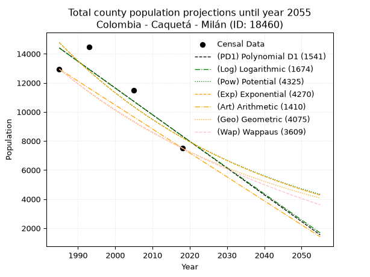
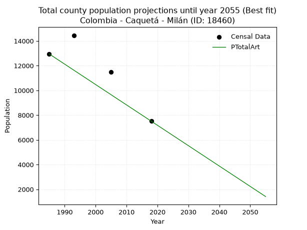
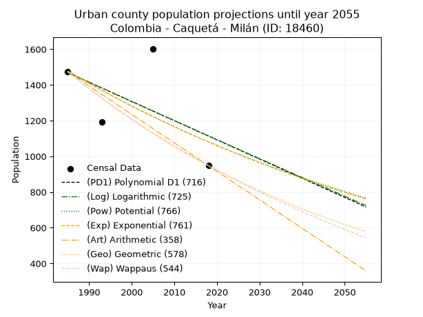
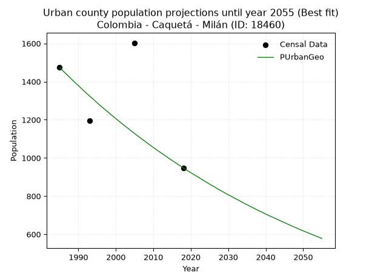
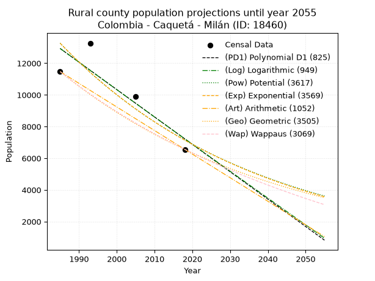
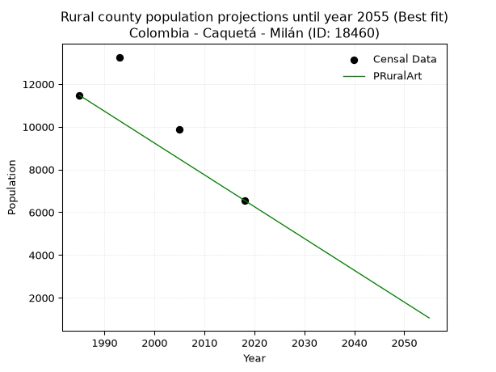

<div align="center">


</div>

# _“Population and Public Services Demand Projections (PPSD) until Year 2050 for Colombia - Caquetá - Milán (ID: 18460)”_
Keywords: `population` `public-service` `projection` `lineal` `polynomial` `logarithmic` `potential` `exponential` `arithmetic` `geometric` `wappaus` `dane` `colombia` `south-america`

PPSD are analytical estimates used by governments and planners to anticipate future changes in population size, age distribution, and the resulting community needs for utilities, healthcare, education, and infrastructure as sizing future water treatment facilities, electrical grids, and road networks based on spatial growth.

> **General running parameters**: • app_version: _v20260806_. • Python version: _3.14.7_. • Pandas version: _3.0.5_. • NumPy version: _2.5.1_. • Creates, save and include plots into reports (create_plot): _False_. • Projection until year: _2050_. • Process polynomial degree 2 and up: _False_. • Process Wappaus: _True_. • Process Wappaus: _True_. • Set negative values to zero: _True_. • Set infinite values to zero: _True_. • Drop dataset notes: _True_. 
<div align="center">

Dynamic map: [:earth_americas:Google](http://maps.google.com/maps?q=1.290209606,-75.5069262) [:earth_americas:OSM](https://www.openstreetmap.org/#map=18/1.290209606/-75.5069262&layers=P) [:earth_americas:Bing](https://www.bing.com/maps?cp=1.290209606~-75.5069262&lvl=18) [:earth_americas:Apple](https://maps.apple.com/frame?center=1.290209606%2C-75.5069262&span=0.003%2C0.006)

</div>


<div align="center">

```geojson
{
  "type": "Feature",
  "geometry": {
    "type": "Point", 
    "coordinates": [-75.5069262, 1.290209606]
  }, 
  "properties": {
    "Name": "Colombia - Caquetá - Milán (ID: 18460)"
  }
}
```

</div>


## 0. Census Data (4 records)

Census data are official statistics collected by a government about the people and housing in a country. They usually include counts of total population, age, sex, race, income, education, and jobs.

📅Global census file: [Population.xlsx](../data/Population.xlsx)

| Source   |   Year |   CountryID | CountryName   |   StateID | StateName   |   CountyID | CountyName   |   PTotal |   PUrban |   PRural |
|:---------|-------:|------------:|:--------------|----------:|:------------|-----------:|:-------------|---------:|---------:|---------:|
| DANE     |   1985 |          57 | Colombia      |        18 | Caquetá     |      18460 | Milán        |    12945 |     1474 |    11471 |
| DANE     |   1993 |          57 | Colombia      |        18 | Caquetá     |      18460 | Milán        |    14454 |     1194 |    13260 |
| DANE     |   2005 |          57 | Colombia      |        18 | Caquetá     |      18460 | Milán        |    11487 |     1603 |     9884 |
| DANE     |   2018 |          57 | Colombia      |        18 | Caquetá     |      18460 | Milán        |     7507 |      948 |     6559 |

> 🔥Some records has specific notes about the registered values or the corresponding urban or rural distribution.

## 1. Total

### 1.1. Coefficients and Parameters

* (PD1) Polynomial Deg 1: -183.68566840625988, 379015.5082296214 (lineal)
* (Log) Logarithmic: -367264.83948211797, 2803181.2379792975
* (Pow) Potential: -35.43865064931545, 121.0376141456795
* (Exp) Exponential: -0.017725410484272328, 2.8181312971704545e+19
* (Art) Arithmetic: Year diff. 2018 - 1985 = 33, Population diff. 7507 - 12945 = -5438, Annual growth = -164.78787878787878
* (Geo) Geometric: Year diff. 2018 - 1985 = 33, Population diff. 7507 - 12945 = -5438, Annual growth % = -0.01637575931117108
* (Wap) Wappaus: i = -1.6114597964783766, Condition values only valid for < 200)

<sub>
Wappaus condition values: ['-0.00', '-1.61', '-3.22', '-4.83', '-6.45', '-8.06', '-9.67', '-11.28', '-12.89', '-14.50', '-16.11', '-17.73', '-19.34', '-20.95', '-22.56', '-24.17', '-25.78', '-27.39', '-29.01', '-30.62', '-32.23', '-33.84', '-35.45', '-37.06', '-38.68', '-40.29', '-41.90', '-43.51', '-45.12', '-46.73', '-48.34', '-49.96', '-51.57', '-53.18', '-54.79', '-56.40', '-58.01', '-59.62', '-61.24', '-62.85', '-64.46', '-66.07', '-67.68', '-69.29', '-70.90', '-72.52', '-74.13', '-75.74', '-77.35', '-78.96', '-80.57', '-82.18', '-83.80', '-85.41', '-87.02', '-88.63', '-90.24', '-91.85', '-93.46', '-95.08', '-96.69', '-98.30', '-99.91', '-101.52', '-103.13', '-104.74']
</sub>


### 1.2. Projected Dataset

|   Year |   CountyID |   PTotalPD1 |   PTotalLog |   PTotalPow |   PTotalExp |   PTotalArt |   PTotalGeo |   PTotalWap |
|-------:|-----------:|------------:|------------:|------------:|------------:|------------:|------------:|------------:|
|   1985 |      18460 |       14399 |       14402 |       14772 |       14768 |       12945 |       12945 |       12945 |
|   1986 |      18460 |       14216 |       14217 |       14510 |       14509 |       12780 |       12733 |       12738 |
|   1987 |      18460 |       14032 |       14032 |       14254 |       14254 |       12615 |       12525 |       12534 |
|   1988 |      18460 |       13848 |       13847 |       14002 |       14004 |       12451 |       12319 |       12334 |
|   1989 |      18460 |       13665 |       13663 |       13755 |       13758 |       12286 |       12118 |       12137 |
|   1990 |      18460 |       13481 |       13478 |       13512 |       13516 |       12121 |       11919 |       11942 |
|   1991 |      18460 |       13297 |       13293 |       13273 |       13278 |       11956 |       11724 |       11751 |
|   1992 |      18460 |       13114 |       13109 |       13039 |       13045 |       11791 |       11532 |       11563 |
|   1993 |      18460 |       12930 |       12925 |       12809 |       12816 |       11627 |       11343 |       11377 |
|   1994 |      18460 |       12746 |       12740 |       12584 |       12591 |       11462 |       11157 |       11195 |
|   1995 |      18460 |       12563 |       12556 |       12362 |       12370 |       11297 |       10975 |       11015 |
|   1996 |      18460 |       12379 |       12372 |       12144 |       12152 |       11132 |       10795 |       10837 |
|   1997 |      18460 |       12195 |       12188 |       11931 |       11939 |       10968 |       10618 |       10662 |
|   1998 |      18460 |       12012 |       12004 |       11721 |       11729 |       10803 |       10444 |       10490 |
|   1999 |      18460 |       11828 |       11821 |       11515 |       11523 |       10638 |       10273 |       10321 |
|   2000 |      18460 |       11644 |       11637 |       11313 |       11320 |       10473 |       10105 |       10153 |
|   2001 |      18460 |       11460 |       11453 |       11114 |       11122 |       10308 |        9940 |        9988 |
|   2002 |      18460 |       11277 |       11270 |       10919 |       10926 |       10144 |        9777 |        9826 |
|   2003 |      18460 |       11093 |       11087 |       10727 |       10734 |        9979 |        9617 |        9666 |
|   2004 |      18460 |       10909 |       10903 |       10539 |       10546 |        9814 |        9459 |        9508 |
|   2005 |      18460 |       10726 |       10720 |       10355 |       10360 |        9649 |        9304 |        9352 |
|   2006 |      18460 |       10542 |       10537 |       10173 |       10178 |        9484 |        9152 |        9198 |
|   2007 |      18460 |       10358 |       10354 |        9995 |       10000 |        9320 |        9002 |        9047 |
|   2008 |      18460 |       10175 |       10171 |        9820 |        9824 |        9155 |        8855 |        8897 |
|   2009 |      18460 |        9991 |        9988 |        9649 |        9651 |        8990 |        8710 |        8750 |
|   2010 |      18460 |        9807 |        9805 |        9480 |        9482 |        8825 |        8567 |        8604 |
|   2011 |      18460 |        9624 |        9623 |        9314 |        9315 |        8661 |        8427 |        8461 |
|   2012 |      18460 |        9440 |        9440 |        9152 |        9151 |        8496 |        8289 |        8319 |
|   2013 |      18460 |        9256 |        9258 |        8992 |        8991 |        8331 |        8153 |        8179 |
|   2014 |      18460 |        9073 |        9075 |        8835 |        8833 |        8166 |        8020 |        8041 |
|   2015 |      18460 |        8889 |        8893 |        8681 |        8677 |        8001 |        7888 |        7905 |
|   2016 |      18460 |        8705 |        8711 |        8530 |        8525 |        7837 |        7759 |        7771 |
|   2017 |      18460 |        8522 |        8528 |        8381 |        8375 |        7672 |        7632 |        7638 |
|   2018 |      18460 |        8338 |        8346 |        8235 |        8228 |        7507 |        7507 |        7507 |
|   2019 |      18460 |        8154 |        8164 |        8092 |        8084 |        7342 |        7384 |        7378 |
|   2020 |      18460 |        7970 |        7983 |        7951 |        7942 |        7177 |        7263 |        7250 |
|   2021 |      18460 |        7787 |        7801 |        7813 |        7802 |        7013 |        7144 |        7124 |
|   2022 |      18460 |        7603 |        7619 |        7677 |        7665 |        6848 |        7027 |        6999 |
|   2023 |      18460 |        7419 |        7438 |        7544 |        7530 |        6683 |        6912 |        6876 |
|   2024 |      18460 |        7236 |        7256 |        7413 |        7398 |        6518 |        6799 |        6755 |
|   2025 |      18460 |        7052 |        7075 |        7284 |        7268 |        6353 |        6688 |        6635 |
|   2026 |      18460 |        6868 |        6893 |        7158 |        7140 |        6189 |        6578 |        6516 |
|   2027 |      18460 |        6685 |        6712 |        7034 |        7015 |        6024 |        6470 |        6399 |
|   2028 |      18460 |        6501 |        6531 |        6912 |        6892 |        5859 |        6364 |        6283 |
|   2029 |      18460 |        6317 |        6350 |        6792 |        6771 |        5694 |        6260 |        6169 |
|   2030 |      18460 |        6134 |        6169 |        6674 |        6652 |        5530 |        6158 |        6056 |
|   2031 |      18460 |        5950 |        5988 |        6559 |        6535 |        5365 |        6057 |        5944 |
|   2032 |      18460 |        5766 |        5807 |        6446 |        6420 |        5200 |        5958 |        5834 |
|   2033 |      18460 |        5583 |        5627 |        6334 |        6307 |        5035 |        5860 |        5725 |
|   2034 |      18460 |        5399 |        5446 |        6225 |        6196 |        4870 |        5764 |        5617 |
|   2035 |      18460 |        5215 |        5265 |        6117 |        6087 |        4706 |        5670 |        5510 |
|   2036 |      18460 |        5031 |        5085 |        6012 |        5980 |        4541 |        5577 |        5405 |
|   2037 |      18460 |        4848 |        4905 |        5908 |        5875 |        4376 |        5486 |        5301 |
|   2038 |      18460 |        4664 |        4724 |        5806 |        5772 |        4211 |        5396 |        5197 |
|   2039 |      18460 |        4480 |        4544 |        5706 |        5671 |        4046 |        5307 |        5096 |
|   2040 |      18460 |        4297 |        4364 |        5608 |        5571 |        3882 |        5220 |        4995 |
|   2041 |      18460 |        4113 |        4184 |        5511 |        5473 |        3717 |        5135 |        4895 |
|   2042 |      18460 |        3929 |        4004 |        5416 |        5377 |        3552 |        5051 |        4797 |
|   2043 |      18460 |        3746 |        3825 |        5323 |        5283 |        3387 |        4968 |        4699 |
|   2044 |      18460 |        3562 |        3645 |        5232 |        5190 |        3223 |        4887 |        4603 |
|   2045 |      18460 |        3378 |        3465 |        5142 |        5099 |        3058 |        4807 |        4508 |
|   2046 |      18460 |        3195 |        3286 |        5053 |        5009 |        2893 |        4728 |        4413 |
|   2047 |      18460 |        3011 |        3106 |        4967 |        4921 |        2728 |        4651 |        4320 |
|   2048 |      18460 |        2827 |        2927 |        4881 |        4835 |        2563 |        4574 |        4228 |
|   2049 |      18460 |        2644 |        2747 |        4798 |        4750 |        2399 |        4500 |        4137 |
|   2050 |      18460 |        2460 |        2568 |        4715 |        4666 |        2234 |        4426 |        4046 |
<div align="center">

</img>

</div>


### 1.3. Best fit with absolute error and relative error (%)

Relative error puts that difference into context by dividing the absolute error by the true value, creating a unitless ratio or percentage that shows the scale of the mistake.

Absolute and relative error

|   Year | Source   |   CountryID | CountryName   |   StateID | StateName   |   CountyID_x | CountyName   |   PTotal |   PUrban |   PRural |   CountyID_y |   PTotalPD1 |   PTotalLog |   PTotalPow |   PTotalExp |   PTotalArt |   PTotalGeo |   PTotalWap |   PTotalPD1AbsError |   PTotalLogAbsError |   PTotalPowAbsError |   PTotalExpAbsError |   PTotalArtAbsError |   PTotalGeoAbsError |   PTotalWapAbsError |   PTotalPD1RelError |   PTotalLogRelError |   PTotalPowRelError |   PTotalExpRelError |   PTotalArtRelError |   PTotalGeoRelError |   PTotalWapRelError |
|-------:|:---------|------------:|:--------------|----------:|:------------|-------------:|:-------------|---------:|---------:|---------:|-------------:|------------:|------------:|------------:|------------:|------------:|------------:|------------:|--------------------:|--------------------:|--------------------:|--------------------:|--------------------:|--------------------:|--------------------:|--------------------:|--------------------:|--------------------:|--------------------:|--------------------:|--------------------:|--------------------:|
|   1985 | DANE     |          57 | Colombia      |        18 | Caquetá     |        18460 | Milán        |    12945 |     1474 |    11471 |        18460 |       14399 |       14402 |       14772 |       14768 |       12945 |       12945 |       12945 |                1454 |                1457 |                1827 |                1823 |                   0 |                   0 |                   0 |            11.2321  |            11.2553  |            14.1136  |            14.0827  |              0      |              0      |              0      |
|   1993 | DANE     |          57 | Colombia      |        18 | Caquetá     |        18460 | Milán        |    14454 |     1194 |    13260 |        18460 |       12930 |       12925 |       12809 |       12816 |       11627 |       11343 |       11377 |                1524 |                1529 |                1645 |                1638 |                2827 |                3111 |                3077 |            10.5438  |            10.5784  |            11.3809  |            11.3325  |             19.5586 |             21.5235 |             21.2882 |
|   2005 | DANE     |          57 | Colombia      |        18 | Caquetá     |        18460 | Milán        |    11487 |     1603 |     9884 |        18460 |       10726 |       10720 |       10355 |       10360 |        9649 |        9304 |        9352 |                 761 |                 767 |                1132 |                1127 |                1838 |                2183 |                2135 |             6.62488 |             6.67711 |             9.85462 |             9.81109 |             16.0007 |             19.0041 |             18.5862 |
|   2018 | DANE     |          57 | Colombia      |        18 | Caquetá     |        18460 | Milán        |     7507 |      948 |     6559 |        18460 |        8338 |        8346 |        8235 |        8228 |        7507 |        7507 |        7507 |                 831 |                 839 |                 728 |                 721 |                   0 |                   0 |                   0 |            11.0697  |            11.1762  |             9.69762 |             9.60437 |              0      |              0      |              0      |

Relative error mean

| Method    |   RelError | Best   |
|:----------|-----------:|:-------|
| PTotalPD1 |    9.86762 |        |
| PTotalLog |    9.92176 |        |
| PTotalPow |   11.2617  |        |
| PTotalExp |   11.2077  |        |
| PTotalArt |    8.88982 | True   |
| PTotalGeo |   10.1319  |        |
| PTotalWap |    9.96861 |        |

💙Best method: _**PTotalArt**_
<div align="center">

</img>

</div>


### 1.4. Fresh water supply demand in liters per capita per day (lpcd)

The fresh water supply demand typically ranges from 100 to 300 liters per capita per day (lpcd) for standard domestic and municipal planning, though absolute survival minimums set by the World Health Organization are as low as 7.5 to 20 liters per day, and total consumption in high-income nations can exceed 400 liters.

> `CZ`: Level in meters above the sea level (masl).<br> `WS`: Fresh water supply demand in liters per capita per day (lpcd or l/h/d).<br> `WSAll`: Zonal fresh water supply demand in liters per second (l/s).<br> `A`: Zonal area in square meters.

Reference values (RAS Colombia)

|    CZ |   WS |
|------:|-----:|
|  1000 |  120 |
|  2000 |  130 |
| 99999 |  140 |

County shapefile geometry properties and water supply values

|   CountyID |      ATotal |   CZTotal |   WSTotal |
|-----------:|------------:|----------:|----------:|
|      18460 | 1.22012e+09 |   227.209 |       120 |

Projected values for best method: PTotalArt

|   CountyID |   Year |   PTotalArt |   WSTotal |   WSTotalAll |
|-----------:|-------:|------------:|----------:|-------------:|
|      18460 |   1985 |       12945 |       120 |     17.9792  |
|      18460 |   1986 |       12780 |       120 |     17.75    |
|      18460 |   1987 |       12615 |       120 |     17.5208  |
|      18460 |   1988 |       12451 |       120 |     17.2931  |
|      18460 |   1989 |       12286 |       120 |     17.0639  |
|      18460 |   1990 |       12121 |       120 |     16.8347  |
|      18460 |   1991 |       11956 |       120 |     16.6056  |
|      18460 |   1992 |       11791 |       120 |     16.3764  |
|      18460 |   1993 |       11627 |       120 |     16.1486  |
|      18460 |   1994 |       11462 |       120 |     15.9194  |
|      18460 |   1995 |       11297 |       120 |     15.6903  |
|      18460 |   1996 |       11132 |       120 |     15.4611  |
|      18460 |   1997 |       10968 |       120 |     15.2333  |
|      18460 |   1998 |       10803 |       120 |     15.0042  |
|      18460 |   1999 |       10638 |       120 |     14.775   |
|      18460 |   2000 |       10473 |       120 |     14.5458  |
|      18460 |   2001 |       10308 |       120 |     14.3167  |
|      18460 |   2002 |       10144 |       120 |     14.0889  |
|      18460 |   2003 |        9979 |       120 |     13.8597  |
|      18460 |   2004 |        9814 |       120 |     13.6306  |
|      18460 |   2005 |        9649 |       120 |     13.4014  |
|      18460 |   2006 |        9484 |       120 |     13.1722  |
|      18460 |   2007 |        9320 |       120 |     12.9444  |
|      18460 |   2008 |        9155 |       120 |     12.7153  |
|      18460 |   2009 |        8990 |       120 |     12.4861  |
|      18460 |   2010 |        8825 |       120 |     12.2569  |
|      18460 |   2011 |        8661 |       120 |     12.0292  |
|      18460 |   2012 |        8496 |       120 |     11.8     |
|      18460 |   2013 |        8331 |       120 |     11.5708  |
|      18460 |   2014 |        8166 |       120 |     11.3417  |
|      18460 |   2015 |        8001 |       120 |     11.1125  |
|      18460 |   2016 |        7837 |       120 |     10.8847  |
|      18460 |   2017 |        7672 |       120 |     10.6556  |
|      18460 |   2018 |        7507 |       120 |     10.4264  |
|      18460 |   2019 |        7342 |       120 |     10.1972  |
|      18460 |   2020 |        7177 |       120 |      9.96806 |
|      18460 |   2021 |        7013 |       120 |      9.74028 |
|      18460 |   2022 |        6848 |       120 |      9.51111 |
|      18460 |   2023 |        6683 |       120 |      9.28194 |
|      18460 |   2024 |        6518 |       120 |      9.05278 |
|      18460 |   2025 |        6353 |       120 |      8.82361 |
|      18460 |   2026 |        6189 |       120 |      8.59583 |
|      18460 |   2027 |        6024 |       120 |      8.36667 |
|      18460 |   2028 |        5859 |       120 |      8.1375  |
|      18460 |   2029 |        5694 |       120 |      7.90833 |
|      18460 |   2030 |        5530 |       120 |      7.68056 |
|      18460 |   2031 |        5365 |       120 |      7.45139 |
|      18460 |   2032 |        5200 |       120 |      7.22222 |
|      18460 |   2033 |        5035 |       120 |      6.99306 |
|      18460 |   2034 |        4870 |       120 |      6.76389 |
|      18460 |   2035 |        4706 |       120 |      6.53611 |
|      18460 |   2036 |        4541 |       120 |      6.30694 |
|      18460 |   2037 |        4376 |       120 |      6.07778 |
|      18460 |   2038 |        4211 |       120 |      5.84861 |
|      18460 |   2039 |        4046 |       120 |      5.61944 |
|      18460 |   2040 |        3882 |       120 |      5.39167 |
|      18460 |   2041 |        3717 |       120 |      5.1625  |
|      18460 |   2042 |        3552 |       120 |      4.93333 |
|      18460 |   2043 |        3387 |       120 |      4.70417 |
|      18460 |   2044 |        3223 |       120 |      4.47639 |
|      18460 |   2045 |        3058 |       120 |      4.24722 |
|      18460 |   2046 |        2893 |       120 |      4.01806 |
|      18460 |   2047 |        2728 |       120 |      3.78889 |
|      18460 |   2048 |        2563 |       120 |      3.55972 |
|      18460 |   2049 |        2399 |       120 |      3.33194 |
|      18460 |   2050 |        2234 |       120 |      3.10278 |

## 2. Urban

### 2.1. Coefficients and Parameters

* (PD1) Polynomial Deg 1: -10.748695303090742, 22804.827780007254 (lineal)
* (Log) Logarithmic: -21472.355519837874, 164516.2963749459
* (Pow) Potential: -18.95692740004459, 65.68506590466491
* (Exp) Exponential: -0.009487966038796192, 223348813958.62073
* (Art) Arithmetic: Year diff. 2018 - 1985 = 33, Population diff. 948 - 1474 = -526, Annual growth = -15.93939393939394
* (Geo) Geometric: Year diff. 2018 - 1985 = 33, Population diff. 948 - 1474 = -526, Annual growth % = -0.013286118694802118
* (Wap) Wappaus: i = -1.3162175011885995, Condition values only valid for < 200)

<sub>
Wappaus condition values: ['-0.00', '-1.32', '-2.63', '-3.95', '-5.26', '-6.58', '-7.90', '-9.21', '-10.53', '-11.85', '-13.16', '-14.48', '-15.79', '-17.11', '-18.43', '-19.74', '-21.06', '-22.38', '-23.69', '-25.01', '-26.32', '-27.64', '-28.96', '-30.27', '-31.59', '-32.91', '-34.22', '-35.54', '-36.85', '-38.17', '-39.49', '-40.80', '-42.12', '-43.44', '-44.75', '-46.07', '-47.38', '-48.70', '-50.02', '-51.33', '-52.65', '-53.96', '-55.28', '-56.60', '-57.91', '-59.23', '-60.55', '-61.86', '-63.18', '-64.49', '-65.81', '-67.13', '-68.44', '-69.76', '-71.08', '-72.39', '-73.71', '-75.02', '-76.34', '-77.66', '-78.97', '-80.29', '-81.61', '-82.92', '-84.24', '-85.55']
</sub>


### 2.2. Projected Dataset

|   Year |   CountyID |   PUrbanPD1 |   PUrbanLog |   PUrbanPow |   PUrbanExp |   PUrbanArt |   PUrbanGeo |   PUrbanWap |
|-------:|-----------:|------------:|------------:|------------:|------------:|------------:|------------:|------------:|
|   1985 |      18460 |        1469 |        1469 |        1478 |        1478 |        1474 |        1474 |        1474 |
|   1986 |      18460 |        1458 |        1458 |        1464 |        1464 |        1458 |        1454 |        1455 |
|   1987 |      18460 |        1447 |        1447 |        1450 |        1450 |        1442 |        1435 |        1436 |
|   1988 |      18460 |        1436 |        1436 |        1436 |        1436 |        1426 |        1416 |        1417 |
|   1989 |      18460 |        1426 |        1425 |        1423 |        1423 |        1410 |        1397 |        1398 |
|   1990 |      18460 |        1415 |        1415 |        1409 |        1409 |        1394 |        1379 |        1380 |
|   1991 |      18460 |        1404 |        1404 |        1396 |        1396 |        1378 |        1360 |        1362 |
|   1992 |      18460 |        1393 |        1393 |        1383 |        1383 |        1362 |        1342 |        1344 |
|   1993 |      18460 |        1383 |        1382 |        1369 |        1370 |        1346 |        1324 |        1327 |
|   1994 |      18460 |        1372 |        1372 |        1356 |        1357 |        1331 |        1307 |        1309 |
|   1995 |      18460 |        1361 |        1361 |        1344 |        1344 |        1315 |        1289 |        1292 |
|   1996 |      18460 |        1350 |        1350 |        1331 |        1331 |        1299 |        1272 |        1275 |
|   1997 |      18460 |        1340 |        1339 |        1318 |        1319 |        1283 |        1255 |        1258 |
|   1998 |      18460 |        1329 |        1328 |        1306 |        1306 |        1267 |        1239 |        1242 |
|   1999 |      18460 |        1318 |        1318 |        1294 |        1294 |        1251 |        1222 |        1225 |
|   2000 |      18460 |        1307 |        1307 |        1281 |        1282 |        1235 |        1206 |        1209 |
|   2001 |      18460 |        1297 |        1296 |        1269 |        1270 |        1219 |        1190 |        1193 |
|   2002 |      18460 |        1286 |        1286 |        1257 |        1258 |        1203 |        1174 |        1177 |
|   2003 |      18460 |        1275 |        1275 |        1245 |        1246 |        1187 |        1159 |        1162 |
|   2004 |      18460 |        1264 |        1264 |        1234 |        1234 |        1171 |        1143 |        1146 |
|   2005 |      18460 |        1254 |        1253 |        1222 |        1222 |        1155 |        1128 |        1131 |
|   2006 |      18460 |        1243 |        1243 |        1211 |        1211 |        1139 |        1113 |        1116 |
|   2007 |      18460 |        1232 |        1232 |        1199 |        1199 |        1123 |        1098 |        1101 |
|   2008 |      18460 |        1221 |        1221 |        1188 |        1188 |        1107 |        1084 |        1086 |
|   2009 |      18460 |        1211 |        1211 |        1177 |        1177 |        1091 |        1069 |        1072 |
|   2010 |      18460 |        1200 |        1200 |        1166 |        1166 |        1076 |        1055 |        1057 |
|   2011 |      18460 |        1189 |        1189 |        1155 |        1155 |        1060 |        1041 |        1043 |
|   2012 |      18460 |        1178 |        1179 |        1144 |        1144 |        1044 |        1027 |        1029 |
|   2013 |      18460 |        1168 |        1168 |        1133 |        1133 |        1028 |        1014 |        1015 |
|   2014 |      18460 |        1157 |        1157 |        1123 |        1122 |        1012 |        1000 |        1002 |
|   2015 |      18460 |        1146 |        1147 |        1112 |        1112 |         996 |         987 |         988 |
|   2016 |      18460 |        1135 |        1136 |        1102 |        1101 |         980 |         974 |         974 |
|   2017 |      18460 |        1125 |        1125 |        1091 |        1091 |         964 |         961 |         961 |
|   2018 |      18460 |        1114 |        1115 |        1081 |        1081 |         948 |         948 |         948 |
|   2019 |      18460 |        1103 |        1104 |        1071 |        1070 |         932 |         935 |         935 |
|   2020 |      18460 |        1092 |        1093 |        1061 |        1060 |         916 |         923 |         922 |
|   2021 |      18460 |        1082 |        1083 |        1051 |        1050 |         900 |         911 |         909 |
|   2022 |      18460 |        1071 |        1072 |        1041 |        1040 |         884 |         899 |         897 |
|   2023 |      18460 |        1060 |        1061 |        1032 |        1031 |         868 |         887 |         884 |
|   2024 |      18460 |        1049 |        1051 |        1022 |        1021 |         852 |         875 |         872 |
|   2025 |      18460 |        1039 |        1040 |        1013 |        1011 |         836 |         863 |         860 |
|   2026 |      18460 |        1028 |        1030 |        1003 |        1002 |         820 |         852 |         848 |
|   2027 |      18460 |        1017 |        1019 |         994 |         992 |         805 |         840 |         836 |
|   2028 |      18460 |        1006 |        1008 |         985 |         983 |         789 |         829 |         824 |
|   2029 |      18460 |         996 |         998 |         975 |         974 |         773 |         818 |         812 |
|   2030 |      18460 |         985 |         987 |         966 |         964 |         757 |         807 |         800 |
|   2031 |      18460 |         974 |         977 |         957 |         955 |         741 |         797 |         789 |
|   2032 |      18460 |         963 |         966 |         948 |         946 |         725 |         786 |         778 |
|   2033 |      18460 |         953 |         956 |         940 |         937 |         709 |         776 |         766 |
|   2034 |      18460 |         942 |         945 |         931 |         928 |         693 |         765 |         755 |
|   2035 |      18460 |         931 |         935 |         922 |         920 |         677 |         755 |         744 |
|   2036 |      18460 |         920 |         924 |         914 |         911 |         661 |         745 |         733 |
|   2037 |      18460 |         910 |         913 |         905 |         902 |         645 |         735 |         722 |
|   2038 |      18460 |         899 |         903 |         897 |         894 |         629 |         725 |         712 |
|   2039 |      18460 |         888 |         892 |         889 |         885 |         613 |         716 |         701 |
|   2040 |      18460 |         877 |         882 |         880 |         877 |         597 |         706 |         691 |
|   2041 |      18460 |         867 |         871 |         872 |         869 |         581 |         697 |         680 |
|   2042 |      18460 |         856 |         861 |         864 |         861 |         565 |         688 |         670 |
|   2043 |      18460 |         845 |         850 |         856 |         852 |         550 |         679 |         660 |
|   2044 |      18460 |         834 |         840 |         848 |         844 |         534 |         670 |         649 |
|   2045 |      18460 |         824 |         829 |         840 |         836 |         518 |         661 |         639 |
|   2046 |      18460 |         813 |         819 |         833 |         829 |         502 |         652 |         630 |
|   2047 |      18460 |         802 |         808 |         825 |         821 |         486 |         643 |         620 |
|   2048 |      18460 |         791 |         798 |         817 |         813 |         470 |         635 |         610 |
|   2049 |      18460 |         781 |         787 |         810 |         805 |         454 |         626 |         600 |
|   2050 |      18460 |         770 |         777 |         802 |         798 |         438 |         618 |         591 |
<div align="center">

</img>

</div>


### 2.3. Best fit with absolute error and relative error (%)

Relative error puts that difference into context by dividing the absolute error by the true value, creating a unitless ratio or percentage that shows the scale of the mistake.

Absolute and relative error

|   Year | Source   |   CountryID | CountryName   |   StateID | StateName   |   CountyID_x | CountyName   |   PTotal |   PUrban |   PRural |   CountyID_y |   PUrbanPD1 |   PUrbanLog |   PUrbanPow |   PUrbanExp |   PUrbanArt |   PUrbanGeo |   PUrbanWap |   PUrbanPD1AbsError |   PUrbanLogAbsError |   PUrbanPowAbsError |   PUrbanExpAbsError |   PUrbanArtAbsError |   PUrbanGeoAbsError |   PUrbanWapAbsError |   PUrbanPD1RelError |   PUrbanLogRelError |   PUrbanPowRelError |   PUrbanExpRelError |   PUrbanArtRelError |   PUrbanGeoRelError |   PUrbanWapRelError |
|-------:|:---------|------------:|:--------------|----------:|:------------|-------------:|:-------------|---------:|---------:|---------:|-------------:|------------:|------------:|------------:|------------:|------------:|------------:|------------:|--------------------:|--------------------:|--------------------:|--------------------:|--------------------:|--------------------:|--------------------:|--------------------:|--------------------:|--------------------:|--------------------:|--------------------:|--------------------:|--------------------:|
|   1985 | DANE     |          57 | Colombia      |        18 | Caquetá     |        18460 | Milán        |    12945 |     1474 |    11471 |        18460 |        1469 |        1469 |        1478 |        1478 |        1474 |        1474 |        1474 |                   5 |                   5 |                   4 |                   4 |                   0 |                   0 |                   0 |            0.339213 |            0.339213 |             0.27137 |             0.27137 |              0      |              0      |              0      |
|   1993 | DANE     |          57 | Colombia      |        18 | Caquetá     |        18460 | Milán        |    14454 |     1194 |    13260 |        18460 |        1383 |        1382 |        1369 |        1370 |        1346 |        1324 |        1327 |                 189 |                 188 |                 175 |                 176 |                 152 |                 130 |                 133 |           15.8291   |           15.7454   |            14.6566  |            14.7404  |             12.7303 |             10.8878 |             11.139  |
|   2005 | DANE     |          57 | Colombia      |        18 | Caquetá     |        18460 | Milán        |    11487 |     1603 |     9884 |        18460 |        1254 |        1253 |        1222 |        1222 |        1155 |        1128 |        1131 |                 349 |                 350 |                 381 |                 381 |                 448 |                 475 |                 472 |           21.7717   |           21.8341   |            23.7679  |            23.7679  |             27.9476 |             29.6319 |             29.4448 |
|   2018 | DANE     |          57 | Colombia      |        18 | Caquetá     |        18460 | Milán        |     7507 |      948 |     6559 |        18460 |        1114 |        1115 |        1081 |        1081 |         948 |         948 |         948 |                 166 |                 167 |                 133 |                 133 |                   0 |                   0 |                   0 |           17.5105   |           17.616    |            14.0295  |            14.0295  |              0      |              0      |              0      |

Relative error mean

| Method    |   RelError | Best   |
|:----------|-----------:|:-------|
| PUrbanPD1 |    13.8626 |        |
| PUrbanLog |    13.8837 |        |
| PUrbanPow |    13.1814 |        |
| PUrbanExp |    13.2023 |        |
| PUrbanArt |    10.1695 |        |
| PUrbanGeo |    10.1299 | True   |
| PUrbanWap |    10.146  |        |

💙Best method: _**PUrbanGeo**_
<div align="center">

</img>

</div>


### 2.4. Fresh water supply demand in liters per capita per day (lpcd)

The fresh water supply demand typically ranges from 100 to 300 liters per capita per day (lpcd) for standard domestic and municipal planning, though absolute survival minimums set by the World Health Organization are as low as 7.5 to 20 liters per day, and total consumption in high-income nations can exceed 400 liters.

> `CZ`: Level in meters above the sea level (masl).<br> `WS`: Fresh water supply demand in liters per capita per day (lpcd or l/h/d).<br> `WSAll`: Zonal fresh water supply demand in liters per second (l/s).<br> `A`: Zonal area in square meters.

Reference values (RAS Colombia)

|    CZ |   WS |
|------:|-----:|
|  1000 |  120 |
|  2000 |  130 |
| 99999 |  140 |

County shapefile geometry properties and water supply values

|   CountyID |   AUrban |   CZUrban |   WSUrban |
|-----------:|---------:|----------:|----------:|
|      18460 |   361927 |   219.063 |       120 |

Projected values for best method: PUrbanGeo

|   CountyID |   Year |   PUrbanGeo |   WSUrban |   WSUrbanAll |
|-----------:|-------:|------------:|----------:|-------------:|
|      18460 |   1985 |        1474 |       120 |     2.04722  |
|      18460 |   1986 |        1454 |       120 |     2.01944  |
|      18460 |   1987 |        1435 |       120 |     1.99306  |
|      18460 |   1988 |        1416 |       120 |     1.96667  |
|      18460 |   1989 |        1397 |       120 |     1.94028  |
|      18460 |   1990 |        1379 |       120 |     1.91528  |
|      18460 |   1991 |        1360 |       120 |     1.88889  |
|      18460 |   1992 |        1342 |       120 |     1.86389  |
|      18460 |   1993 |        1324 |       120 |     1.83889  |
|      18460 |   1994 |        1307 |       120 |     1.81528  |
|      18460 |   1995 |        1289 |       120 |     1.79028  |
|      18460 |   1996 |        1272 |       120 |     1.76667  |
|      18460 |   1997 |        1255 |       120 |     1.74306  |
|      18460 |   1998 |        1239 |       120 |     1.72083  |
|      18460 |   1999 |        1222 |       120 |     1.69722  |
|      18460 |   2000 |        1206 |       120 |     1.675    |
|      18460 |   2001 |        1190 |       120 |     1.65278  |
|      18460 |   2002 |        1174 |       120 |     1.63056  |
|      18460 |   2003 |        1159 |       120 |     1.60972  |
|      18460 |   2004 |        1143 |       120 |     1.5875   |
|      18460 |   2005 |        1128 |       120 |     1.56667  |
|      18460 |   2006 |        1113 |       120 |     1.54583  |
|      18460 |   2007 |        1098 |       120 |     1.525    |
|      18460 |   2008 |        1084 |       120 |     1.50556  |
|      18460 |   2009 |        1069 |       120 |     1.48472  |
|      18460 |   2010 |        1055 |       120 |     1.46528  |
|      18460 |   2011 |        1041 |       120 |     1.44583  |
|      18460 |   2012 |        1027 |       120 |     1.42639  |
|      18460 |   2013 |        1014 |       120 |     1.40833  |
|      18460 |   2014 |        1000 |       120 |     1.38889  |
|      18460 |   2015 |         987 |       120 |     1.37083  |
|      18460 |   2016 |         974 |       120 |     1.35278  |
|      18460 |   2017 |         961 |       120 |     1.33472  |
|      18460 |   2018 |         948 |       120 |     1.31667  |
|      18460 |   2019 |         935 |       120 |     1.29861  |
|      18460 |   2020 |         923 |       120 |     1.28194  |
|      18460 |   2021 |         911 |       120 |     1.26528  |
|      18460 |   2022 |         899 |       120 |     1.24861  |
|      18460 |   2023 |         887 |       120 |     1.23194  |
|      18460 |   2024 |         875 |       120 |     1.21528  |
|      18460 |   2025 |         863 |       120 |     1.19861  |
|      18460 |   2026 |         852 |       120 |     1.18333  |
|      18460 |   2027 |         840 |       120 |     1.16667  |
|      18460 |   2028 |         829 |       120 |     1.15139  |
|      18460 |   2029 |         818 |       120 |     1.13611  |
|      18460 |   2030 |         807 |       120 |     1.12083  |
|      18460 |   2031 |         797 |       120 |     1.10694  |
|      18460 |   2032 |         786 |       120 |     1.09167  |
|      18460 |   2033 |         776 |       120 |     1.07778  |
|      18460 |   2034 |         765 |       120 |     1.0625   |
|      18460 |   2035 |         755 |       120 |     1.04861  |
|      18460 |   2036 |         745 |       120 |     1.03472  |
|      18460 |   2037 |         735 |       120 |     1.02083  |
|      18460 |   2038 |         725 |       120 |     1.00694  |
|      18460 |   2039 |         716 |       120 |     0.994444 |
|      18460 |   2040 |         706 |       120 |     0.980556 |
|      18460 |   2041 |         697 |       120 |     0.968056 |
|      18460 |   2042 |         688 |       120 |     0.955556 |
|      18460 |   2043 |         679 |       120 |     0.943056 |
|      18460 |   2044 |         670 |       120 |     0.930556 |
|      18460 |   2045 |         661 |       120 |     0.918056 |
|      18460 |   2046 |         652 |       120 |     0.905556 |
|      18460 |   2047 |         643 |       120 |     0.893056 |
|      18460 |   2048 |         635 |       120 |     0.881944 |
|      18460 |   2049 |         626 |       120 |     0.869444 |
|      18460 |   2050 |         618 |       120 |     0.858333 |

## 3. Rural

### 3.1. Coefficients and Parameters

* (PD1) Polynomial Deg 1: -172.93697310316915, 356210.6804496142 (lineal)
* (Log) Logarithmic: -345792.48396228027, 2638664.941604353
* (Pow) Potential: -37.500468530337876, 127.79036934069993
* (Exp) Exponential: -0.018755527522559472, 1.9559572787114013e+20
* (Art) Arithmetic: Year diff. 2018 - 1985 = 33, Population diff. 6559 - 11471 = -4912, Annual growth = -148.84848484848484
* (Geo) Geometric: Year diff. 2018 - 1985 = 33, Population diff. 6559 - 11471 = -4912, Annual growth % = -0.016796251167069176
* (Wap) Wappaus: i = -1.6511201868938974, Condition values only valid for < 200)

<sub>
Wappaus condition values: ['-0.00', '-1.65', '-3.30', '-4.95', '-6.60', '-8.26', '-9.91', '-11.56', '-13.21', '-14.86', '-16.51', '-18.16', '-19.81', '-21.46', '-23.12', '-24.77', '-26.42', '-28.07', '-29.72', '-31.37', '-33.02', '-34.67', '-36.32', '-37.98', '-39.63', '-41.28', '-42.93', '-44.58', '-46.23', '-47.88', '-49.53', '-51.18', '-52.84', '-54.49', '-56.14', '-57.79', '-59.44', '-61.09', '-62.74', '-64.39', '-66.04', '-67.70', '-69.35', '-71.00', '-72.65', '-74.30', '-75.95', '-77.60', '-79.25', '-80.90', '-82.56', '-84.21', '-85.86', '-87.51', '-89.16', '-90.81', '-92.46', '-94.11', '-95.76', '-97.42', '-99.07', '-100.72', '-102.37', '-104.02', '-105.67', '-107.32']
</sub>


### 3.2. Projected Dataset

|   Year |   CountyID |   PRuralPD1 |   PRuralLog |   PRuralPow |   PRuralExp |   PRuralArt |   PRuralGeo |   PRuralWap |
|-------:|-----------:|------------:|------------:|------------:|------------:|------------:|------------:|------------:|
|   1985 |      18460 |       12931 |       12933 |       13268 |       13265 |       11471 |       11471 |       11471 |
|   1986 |      18460 |       12758 |       12759 |       13020 |       13018 |       11322 |       11278 |       11283 |
|   1987 |      18460 |       12585 |       12585 |       12776 |       12776 |       11173 |       11089 |       11098 |
|   1988 |      18460 |       12412 |       12411 |       12537 |       12539 |       11024 |       10903 |       10917 |
|   1989 |      18460 |       12239 |       12237 |       12303 |       12306 |       10876 |       10720 |       10738 |
|   1990 |      18460 |       12066 |       12063 |       12074 |       12077 |       10727 |       10539 |       10562 |
|   1991 |      18460 |       11893 |       11890 |       11848 |       11853 |       10578 |       10362 |       10388 |
|   1992 |      18460 |       11720 |       11716 |       11627 |       11633 |       10429 |       10188 |       10218 |
|   1993 |      18460 |       11547 |       11542 |       11410 |       11417 |       10280 |       10017 |       10050 |
|   1994 |      18460 |       11374 |       11369 |       11198 |       11204 |       10131 |        9849 |        9884 |
|   1995 |      18460 |       11201 |       11196 |       10989 |       10996 |        9983 |        9684 |        9721 |
|   1996 |      18460 |       11028 |       11022 |       10785 |       10792 |        9834 |        9521 |        9561 |
|   1997 |      18460 |       10856 |       10849 |       10584 |       10591 |        9685 |        9361 |        9403 |
|   1998 |      18460 |       10683 |       10676 |       10387 |       10395 |        9536 |        9204 |        9247 |
|   1999 |      18460 |       10510 |       10503 |       10194 |       10201 |        9387 |        9049 |        9094 |
|   2000 |      18460 |       10337 |       10330 |       10005 |       10012 |        9238 |        8897 |        8943 |
|   2001 |      18460 |       10164 |       10157 |        9819 |        9826 |        9089 |        8748 |        8794 |
|   2002 |      18460 |        9991 |        9984 |        9637 |        9643 |        8941 |        8601 |        8647 |
|   2003 |      18460 |        9818 |        9812 |        9458 |        9464 |        8792 |        8456 |        8503 |
|   2004 |      18460 |        9645 |        9639 |        9282 |        9288 |        8643 |        8314 |        8360 |
|   2005 |      18460 |        9472 |        9467 |        9110 |        9116 |        8494 |        8175 |        8220 |
|   2006 |      18460 |        9299 |        9294 |        8942 |        8946 |        8345 |        8037 |        8081 |
|   2007 |      18460 |        9126 |        9122 |        8776 |        8780 |        8196 |        7902 |        7945 |
|   2008 |      18460 |        8953 |        8950 |        8614 |        8617 |        8047 |        7770 |        7810 |
|   2009 |      18460 |        8780 |        8777 |        8454 |        8457 |        7899 |        7639 |        7677 |
|   2010 |      18460 |        8607 |        8605 |        8298 |        8300 |        7750 |        7511 |        7546 |
|   2011 |      18460 |        8434 |        8433 |        8145 |        8145 |        7601 |        7385 |        7417 |
|   2012 |      18460 |        8261 |        8261 |        7994 |        7994 |        7452 |        7261 |        7289 |
|   2013 |      18460 |        8089 |        8090 |        7847 |        7846 |        7303 |        7139 |        7164 |
|   2014 |      18460 |        7916 |        7918 |        7702 |        7700 |        7154 |        7019 |        7039 |
|   2015 |      18460 |        7743 |        7746 |        7560 |        7557 |        7006 |        6901 |        6917 |
|   2016 |      18460 |        7570 |        7575 |        7420 |        7416 |        6857 |        6785 |        6796 |
|   2017 |      18460 |        7397 |        7403 |        7284 |        7279 |        6708 |        6671 |        6677 |
|   2018 |      18460 |        7224 |        7232 |        7150 |        7143 |        6559 |        6559 |        6559 |
|   2019 |      18460 |        7051 |        7060 |        7018 |        7011 |        6410 |        6449 |        6443 |
|   2020 |      18460 |        6878 |        6889 |        6889 |        6880 |        6261 |        6341 |        6328 |
|   2021 |      18460 |        6705 |        6718 |        6762 |        6752 |        6112 |        6234 |        6215 |
|   2022 |      18460 |        6532 |        6547 |        6638 |        6627 |        5964 |        6129 |        6103 |
|   2023 |      18460 |        6359 |        6376 |        6516 |        6504 |        5815 |        6026 |        5992 |
|   2024 |      18460 |        6186 |        6205 |        6396 |        6383 |        5666 |        5925 |        5883 |
|   2025 |      18460 |        6013 |        6034 |        6279 |        6264 |        5517 |        5826 |        5776 |
|   2026 |      18460 |        5840 |        5864 |        6164 |        6148 |        5368 |        5728 |        5669 |
|   2027 |      18460 |        5667 |        5693 |        6051 |        6034 |        5219 |        5632 |        5564 |
|   2028 |      18460 |        5494 |        5522 |        5940 |        5922 |        5071 |        5537 |        5460 |
|   2029 |      18460 |        5322 |        5352 |        5831 |        5812 |        4922 |        5444 |        5358 |
|   2030 |      18460 |        5149 |        5182 |        5724 |        5704 |        4773 |        5353 |        5257 |
|   2031 |      18460 |        4976 |        5011 |        5619 |        5598 |        4624 |        5263 |        5157 |
|   2032 |      18460 |        4803 |        4841 |        5517 |        5494 |        4475 |        5174 |        5058 |
|   2033 |      18460 |        4630 |        4671 |        5416 |        5392 |        4326 |        5087 |        4960 |
|   2034 |      18460 |        4457 |        4501 |        5317 |        5291 |        4177 |        5002 |        4863 |
|   2035 |      18460 |        4284 |        4331 |        5220 |        5193 |        4029 |        4918 |        4768 |
|   2036 |      18460 |        4111 |        4161 |        5125 |        5097 |        3880 |        4835 |        4674 |
|   2037 |      18460 |        3938 |        3991 |        5031 |        5002 |        3731 |        4754 |        4580 |
|   2038 |      18460 |        3765 |        3822 |        4939 |        4909 |        3582 |        4674 |        4488 |
|   2039 |      18460 |        3592 |        3652 |        4849 |        4818 |        3433 |        4596 |        4397 |
|   2040 |      18460 |        3419 |        3482 |        4761 |        4728 |        3284 |        4519 |        4307 |
|   2041 |      18460 |        3246 |        3313 |        4674 |        4640 |        3135 |        4443 |        4218 |
|   2042 |      18460 |        3073 |        3144 |        4589 |        4554 |        2987 |        4368 |        4130 |
|   2043 |      18460 |        2900 |        2974 |        4506 |        4470 |        2838 |        4295 |        4043 |
|   2044 |      18460 |        2728 |        2805 |        4424 |        4386 |        2689 |        4222 |        3957 |
|   2045 |      18460 |        2555 |        2636 |        4343 |        4305 |        2540 |        4152 |        3871 |
|   2046 |      18460 |        2382 |        2467 |        4264 |        4225 |        2391 |        4082 |        3787 |
|   2047 |      18460 |        2209 |        2298 |        4187 |        4146 |        2242 |        4013 |        3704 |
|   2048 |      18460 |        2036 |        2129 |        4111 |        4069 |        2094 |        3946 |        3621 |
|   2049 |      18460 |        1863 |        1960 |        4036 |        3994 |        1945 |        3880 |        3540 |
|   2050 |      18460 |        1690 |        1791 |        3963 |        3920 |        1796 |        3814 |        3459 |
<div align="center">

</img>

</div>


### 3.3. Best fit with absolute error and relative error (%)

Relative error puts that difference into context by dividing the absolute error by the true value, creating a unitless ratio or percentage that shows the scale of the mistake.

Absolute and relative error

|   Year | Source   |   CountryID | CountryName   |   StateID | StateName   |   CountyID_x | CountyName   |   PTotal |   PUrban |   PRural |   CountyID_y |   PRuralPD1 |   PRuralLog |   PRuralPow |   PRuralExp |   PRuralArt |   PRuralGeo |   PRuralWap |   PRuralPD1AbsError |   PRuralLogAbsError |   PRuralPowAbsError |   PRuralExpAbsError |   PRuralArtAbsError |   PRuralGeoAbsError |   PRuralWapAbsError |   PRuralPD1RelError |   PRuralLogRelError |   PRuralPowRelError |   PRuralExpRelError |   PRuralArtRelError |   PRuralGeoRelError |   PRuralWapRelError |
|-------:|:---------|------------:|:--------------|----------:|:------------|-------------:|:-------------|---------:|---------:|---------:|-------------:|------------:|------------:|------------:|------------:|------------:|------------:|------------:|--------------------:|--------------------:|--------------------:|--------------------:|--------------------:|--------------------:|--------------------:|--------------------:|--------------------:|--------------------:|--------------------:|--------------------:|--------------------:|--------------------:|
|   1985 | DANE     |          57 | Colombia      |        18 | Caquetá     |        18460 | Milán        |    12945 |     1474 |    11471 |        18460 |       12931 |       12933 |       13268 |       13265 |       11471 |       11471 |       11471 |                1460 |                1462 |                1797 |                1794 |                   0 |                   0 |                   0 |            12.7277  |            12.7452  |            15.6656  |            15.6394  |              0      |              0      |              0      |
|   1993 | DANE     |          57 | Colombia      |        18 | Caquetá     |        18460 | Milán        |    14454 |     1194 |    13260 |        18460 |       11547 |       11542 |       11410 |       11417 |       10280 |       10017 |       10050 |                1713 |                1718 |                1850 |                1843 |                2980 |                3243 |                3210 |            12.9186  |            12.9563  |            13.9517  |            13.8989  |             22.4736 |             24.457  |             24.2081 |
|   2005 | DANE     |          57 | Colombia      |        18 | Caquetá     |        18460 | Milán        |    11487 |     1603 |     9884 |        18460 |        9472 |        9467 |        9110 |        9116 |        8494 |        8175 |        8220 |                 412 |                 417 |                 774 |                 768 |                1390 |                1709 |                1664 |             4.16835 |             4.21894 |             7.83084 |             7.77013 |             14.0631 |             17.2906 |             16.8353 |
|   2018 | DANE     |          57 | Colombia      |        18 | Caquetá     |        18460 | Milán        |     7507 |      948 |     6559 |        18460 |        7224 |        7232 |        7150 |        7143 |        6559 |        6559 |        6559 |                 665 |                 673 |                 591 |                 584 |                   0 |                   0 |                   0 |            10.1387  |            10.2607  |             9.01052 |             8.9038  |              0      |              0      |              0      |

Relative error mean

| Method    |   RelError | Best   |
|:----------|-----------:|:-------|
| PRuralPD1 |    9.98835 |        |
| PRuralLog |   10.0453  |        |
| PRuralPow |   11.6147  |        |
| PRuralExp |   11.5531  |        |
| PRuralArt |    9.13418 | True   |
| PRuralGeo |   10.4369  |        |
| PRuralWap |   10.2609  |        |

💙Best method: _**PRuralArt**_
<div align="center">

</img>

</div>


### 3.4. Fresh water supply demand in liters per capita per day (lpcd)

The fresh water supply demand typically ranges from 100 to 300 liters per capita per day (lpcd) for standard domestic and municipal planning, though absolute survival minimums set by the World Health Organization are as low as 7.5 to 20 liters per day, and total consumption in high-income nations can exceed 400 liters.

> `CZ`: Level in meters above the sea level (masl).<br> `WS`: Fresh water supply demand in liters per capita per day (lpcd or l/h/d).<br> `WSAll`: Zonal fresh water supply demand in liters per second (l/s).<br> `A`: Zonal area in square meters.

Reference values (RAS Colombia)

|    CZ |   WS |
|------:|-----:|
|  1000 |  120 |
|  2000 |  130 |
| 99999 |  140 |

County shapefile geometry properties and water supply values

|   CountyID |      ARural |   CZRural |   WSRural |
|-----------:|------------:|----------:|----------:|
|      18460 | 1.21976e+09 |   227.212 |       120 |

Projected values for best method: PRuralArt

|   CountyID |   Year |   PRuralArt |   WSRural |   WSRuralAll |
|-----------:|-------:|------------:|----------:|-------------:|
|      18460 |   1985 |       11471 |       120 |     15.9319  |
|      18460 |   1986 |       11322 |       120 |     15.725   |
|      18460 |   1987 |       11173 |       120 |     15.5181  |
|      18460 |   1988 |       11024 |       120 |     15.3111  |
|      18460 |   1989 |       10876 |       120 |     15.1056  |
|      18460 |   1990 |       10727 |       120 |     14.8986  |
|      18460 |   1991 |       10578 |       120 |     14.6917  |
|      18460 |   1992 |       10429 |       120 |     14.4847  |
|      18460 |   1993 |       10280 |       120 |     14.2778  |
|      18460 |   1994 |       10131 |       120 |     14.0708  |
|      18460 |   1995 |        9983 |       120 |     13.8653  |
|      18460 |   1996 |        9834 |       120 |     13.6583  |
|      18460 |   1997 |        9685 |       120 |     13.4514  |
|      18460 |   1998 |        9536 |       120 |     13.2444  |
|      18460 |   1999 |        9387 |       120 |     13.0375  |
|      18460 |   2000 |        9238 |       120 |     12.8306  |
|      18460 |   2001 |        9089 |       120 |     12.6236  |
|      18460 |   2002 |        8941 |       120 |     12.4181  |
|      18460 |   2003 |        8792 |       120 |     12.2111  |
|      18460 |   2004 |        8643 |       120 |     12.0042  |
|      18460 |   2005 |        8494 |       120 |     11.7972  |
|      18460 |   2006 |        8345 |       120 |     11.5903  |
|      18460 |   2007 |        8196 |       120 |     11.3833  |
|      18460 |   2008 |        8047 |       120 |     11.1764  |
|      18460 |   2009 |        7899 |       120 |     10.9708  |
|      18460 |   2010 |        7750 |       120 |     10.7639  |
|      18460 |   2011 |        7601 |       120 |     10.5569  |
|      18460 |   2012 |        7452 |       120 |     10.35    |
|      18460 |   2013 |        7303 |       120 |     10.1431  |
|      18460 |   2014 |        7154 |       120 |      9.93611 |
|      18460 |   2015 |        7006 |       120 |      9.73056 |
|      18460 |   2016 |        6857 |       120 |      9.52361 |
|      18460 |   2017 |        6708 |       120 |      9.31667 |
|      18460 |   2018 |        6559 |       120 |      9.10972 |
|      18460 |   2019 |        6410 |       120 |      8.90278 |
|      18460 |   2020 |        6261 |       120 |      8.69583 |
|      18460 |   2021 |        6112 |       120 |      8.48889 |
|      18460 |   2022 |        5964 |       120 |      8.28333 |
|      18460 |   2023 |        5815 |       120 |      8.07639 |
|      18460 |   2024 |        5666 |       120 |      7.86944 |
|      18460 |   2025 |        5517 |       120 |      7.6625  |
|      18460 |   2026 |        5368 |       120 |      7.45556 |
|      18460 |   2027 |        5219 |       120 |      7.24861 |
|      18460 |   2028 |        5071 |       120 |      7.04306 |
|      18460 |   2029 |        4922 |       120 |      6.83611 |
|      18460 |   2030 |        4773 |       120 |      6.62917 |
|      18460 |   2031 |        4624 |       120 |      6.42222 |
|      18460 |   2032 |        4475 |       120 |      6.21528 |
|      18460 |   2033 |        4326 |       120 |      6.00833 |
|      18460 |   2034 |        4177 |       120 |      5.80139 |
|      18460 |   2035 |        4029 |       120 |      5.59583 |
|      18460 |   2036 |        3880 |       120 |      5.38889 |
|      18460 |   2037 |        3731 |       120 |      5.18194 |
|      18460 |   2038 |        3582 |       120 |      4.975   |
|      18460 |   2039 |        3433 |       120 |      4.76806 |
|      18460 |   2040 |        3284 |       120 |      4.56111 |
|      18460 |   2041 |        3135 |       120 |      4.35417 |
|      18460 |   2042 |        2987 |       120 |      4.14861 |
|      18460 |   2043 |        2838 |       120 |      3.94167 |
|      18460 |   2044 |        2689 |       120 |      3.73472 |
|      18460 |   2045 |        2540 |       120 |      3.52778 |
|      18460 |   2046 |        2391 |       120 |      3.32083 |
|      18460 |   2047 |        2242 |       120 |      3.11389 |
|      18460 |   2048 |        2094 |       120 |      2.90833 |
|      18460 |   2049 |        1945 |       120 |      2.70139 |
|      18460 |   2050 |        1796 |       120 |      2.49444 |

<div align="center"><br><sub>Share this research</sub></div><br>

<sub>**APPS & TOOLS & CONTENT DISCLAIMER**: • NO WARRANTY - This content and software is provided by <a href="https://github.com/rcfdtools" target="_blank">github.com/rcfdtools</a> "as is", without any express or implied warranty, including warranties of merchantability, fitness for a particular purpose, or non-infringement. There is no guarantee that the software will be error-free or operate without interruption. • LIMITATION OF LIABILITY - Neither the authors nor copyright holders will be liable for claims or damages arising from the software or its use. You are responsible for determining if the software is appropriate for your use and assume all associated risks, including errors, legal compliance, and data loss. • NO PROFESSIONAL ADVICE - The software provides general information and does not offer professional advice. It should not replace consultation with professional advisors. [Clauses and global license for rcfdtools use.](https://github.com/rcfdtools/rcfdtools/blob/main/LICENSE.md)</sub>