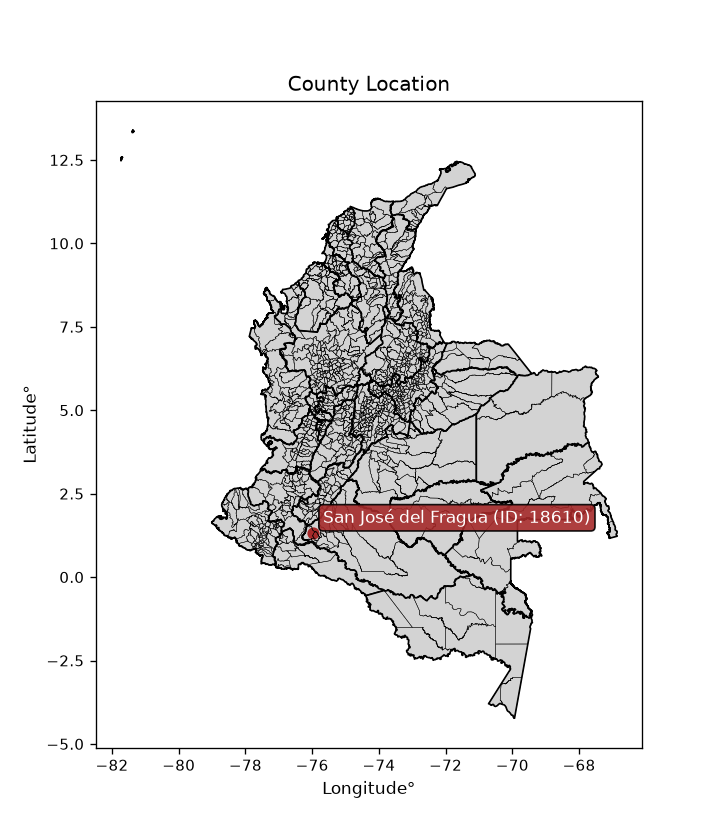
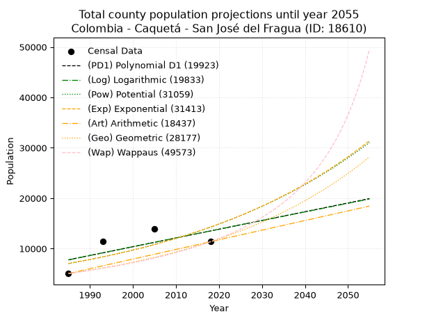
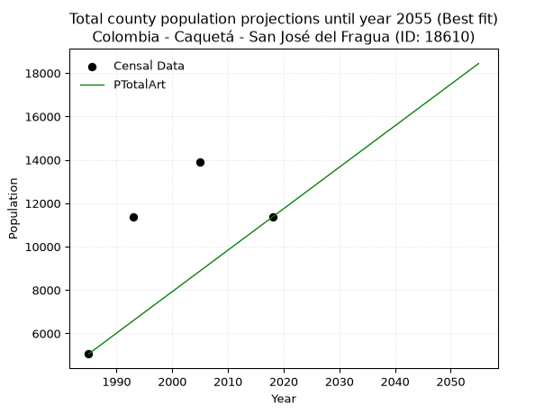
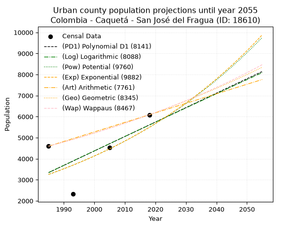
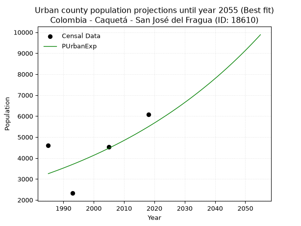
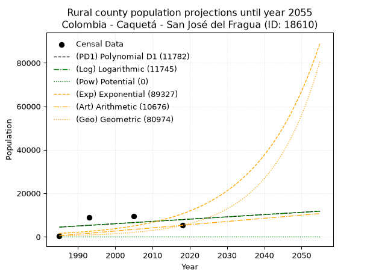
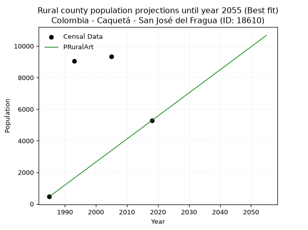

<div align="center">


</div>

# _“Population and Public Services Demand Projections (PPSD) until Year 2050 for Colombia - Caquetá - San José del Fragua (ID: 18610)”_
Keywords: `population` `public-service` `projection` `lineal` `polynomial` `logarithmic` `potential` `exponential` `arithmetic` `geometric` `wappaus` `dane` `colombia` `south-america`

PPSD are analytical estimates used by governments and planners to anticipate future changes in population size, age distribution, and the resulting community needs for utilities, healthcare, education, and infrastructure as sizing future water treatment facilities, electrical grids, and road networks based on spatial growth.

<div align="center">

</img>

</div>


> **General running parameters**: • app_version: _v20260806_. • Python version: _3.14.7_. • Pandas version: _3.0.5_. • NumPy version: _2.5.1_. • Creates, save and include plots into reports (create_plot): _False_. • Projection until year: _2050_. • Process polynomial degree 2 and up: _False_. • Process Wappaus: _True_. • Process Wappaus: _True_. • Set negative values to zero: _True_. • Set infinite values to zero: _True_. • Drop dataset notes: _True_. 
<div align="center">

Dynamic map: [:earth_americas:Google](http://maps.google.com/maps?q=1.330265589,-75.9737963) [:earth_americas:OSM](https://www.openstreetmap.org/#map=18/1.330265589/-75.9737963&layers=P) [:earth_americas:Bing](https://www.bing.com/maps?cp=1.330265589~-75.9737963&lvl=18) [:earth_americas:Apple](https://maps.apple.com/frame?center=1.330265589%2C-75.9737963&span=0.003%2C0.006)

</div>


<div align="center">

```geojson
{
  "type": "Feature",
  "geometry": {
    "type": "Point", 
    "coordinates": [-75.9737963, 1.330265589]
  }, 
  "properties": {
    "Name": "Colombia - Caquetá - San José del Fragua (ID: 18610)"
  }
}
```

</div>


## 0. Census Data (4 records)

Census data are official statistics collected by a government about the people and housing in a country. They usually include counts of total population, age, sex, race, income, education, and jobs.

📅Global census file: [Population.xlsx](../data/Population.xlsx)

| Source   |   Year |   CountryID | CountryName   |   StateID | StateName   |   CountyID | CountyName          |   PTotal |   PUrban |   PRural |
|:---------|-------:|------------:|:--------------|----------:|:------------|-----------:|:--------------------|---------:|---------:|---------:|
| DANE     |   1985 |          57 | Colombia      |        18 | Caquetá     |      18610 | San José del Fragua |     5056 |     4594 |      462 |
| DANE     |   1993 |          57 | Colombia      |        18 | Caquetá     |      18610 | San José del Fragua |    11370 |     2322 |     9048 |
| DANE     |   2005 |          57 | Colombia      |        18 | Caquetá     |      18610 | San José del Fragua |    13882 |     4540 |     9342 |
| DANE     |   2018 |          57 | Colombia      |        18 | Caquetá     |      18610 | San José del Fragua |    11364 |     6087 |     5277 |

> 🔥Some records could had specific notes about the registered values or the corresponding urban or rural distribution.

📅[SUI-RUPS](https://www.datos.gov.co/Hacienda-y-Cr-dito-P-blico/Registro-nico-de-Prestadores-de-Servicios-P-blicos/4qkq-csdn/about_data) - Local public utility companies: [RUPS.csv](../data/RUPS.xlsx)

 | SERVICIO       | ESTADO    | NOMBRE                                                         | NIT         | DEPARTAMENTO_DOMICILIO   | MUNICIPIO_DOMICILIO   | DIRECCION                         |   TELEFONO | EMAIL                        | TIPO_PRESTADOR                             | CLASIFICACION                 |
|:---------------|:----------|:---------------------------------------------------------------|:------------|:-------------------------|:----------------------|:----------------------------------|-----------:|:-----------------------------|:-------------------------------------------|:------------------------------|
| ACUEDUCTO      | OPERATIVA | UNIDAD DE SERVICIOS PUBLICOS DE SAN JOSE DE FRAGUA             | 828001680-7 | CAQUETA                  | SAN JOSE DEL FRAGUA   | CRA 5 No. 5-78                    |    4305024 | galaso@yahoo.com             | MUNICIPIO (PRESTACIÓN DIRECTA)             | HASTA 2500 SUSCRIPTORES       |
| ALCANTARILLADO | OPERATIVA | UNIDAD DE SERVICIOS PUBLICOS DE SAN JOSE DE FRAGUA             | 828001680-7 | CAQUETA                  | SAN JOSE DEL FRAGUA   | CRA 5 No. 5-78                    |    4305024 | galaso@yahoo.com             | MUNICIPIO (PRESTACIÓN DIRECTA)             | HASTA 2500 SUSCRIPTORES       |
| ACUEDUCTO      | OPERATIVA | EMPRESA DE SERVICIOS PUBLICOS DE SAN JOSE DE FRAGUA S.A. E.S.P | 900175406-2 | CAQUETA                  | SAN JOSE DEL FRAGUA   | CARRERA 5 N°3-26 BARRIO EL CENTRO |    4305056 | aguasdelfraguasa@hotmail.com | SOCIEDADES (EMPRESA DE SERVICIOS PUBLICOS) | MENOR O IGUAL A 2500 USUARIOS |
| ALCANTARILLADO | OPERATIVA | EMPRESA DE SERVICIOS PUBLICOS DE SAN JOSE DE FRAGUA S.A. E.S.P | 900175406-2 | CAQUETA                  | SAN JOSE DEL FRAGUA   | CARRERA 5 N°3-26 BARRIO EL CENTRO |    4305056 | aguasdelfraguasa@hotmail.com | SOCIEDADES (EMPRESA DE SERVICIOS PUBLICOS) | MENOR O IGUAL A 2500 USUARIOS |

## 1. Total

### 1.1. Coefficients and Parameters

* (PD1) Polynomial Deg 1: 173.60738659173154, -336840.175030111 (lineal)
* (Log) Logarithmic: 348402.62083941634, -2637793.1129237884
* (Pow) Potential: 42.842055850186156, -137.43548768271796
* (Exp) Exponential: 0.021352775853966208, 2.756029724239258e-15
* (Art) Arithmetic: Year diff. 2018 - 1985 = 33, Population diff. 11364 - 5056 = 6308, Annual growth = 191.15151515151516
* (Geo) Geometric: Year diff. 2018 - 1985 = 33, Population diff. 11364 - 5056 = 6308, Annual growth % = 0.024845286115544374
* (Wap) Wappaus: i = 2.3282766766323406, Condition values only valid for < 200)

<sub>
Wappaus condition values: ['0.00', '2.33', '4.66', '6.98', '9.31', '11.64', '13.97', '16.30', '18.63', '20.95', '23.28', '25.61', '27.94', '30.27', '32.60', '34.92', '37.25', '39.58', '41.91', '44.24', '46.57', '48.89', '51.22', '53.55', '55.88', '58.21', '60.54', '62.86', '65.19', '67.52', '69.85', '72.18', '74.50', '76.83', '79.16', '81.49', '83.82', '86.15', '88.47', '90.80', '93.13', '95.46', '97.79', '100.12', '102.44', '104.77', '107.10', '109.43', '111.76', '114.09', '116.41', '118.74', '121.07', '123.40', '125.73', '128.06', '130.38', '132.71', '135.04', '137.37', '139.70', '142.02', '144.35', '146.68', '149.01', '151.34']
</sub>


### 1.2. Projected Dataset

|   Year |   CountyID |   PTotalPD1 |   PTotalLog |   PTotalPow |   PTotalExp |   PTotalArt |   PTotalGeo |   PTotalWap |
|-------:|-----------:|------------:|------------:|------------:|------------:|------------:|------------:|------------:|
|   1985 |      18610 |        7770 |        7758 |        7036 |        7046 |        5056 |        5056 |        5056 |
|   1986 |      18610 |        7944 |        7934 |        7190 |        7198 |        5247 |        5182 |        5175 |
|   1987 |      18610 |        8118 |        8109 |        7347 |        7354 |        5438 |        5310 |        5297 |
|   1988 |      18610 |        8291 |        8285 |        7507 |        7513 |        5629 |        5442 |        5422 |
|   1989 |      18610 |        8465 |        8460 |        7670 |        7675 |        5821 |        5578 |        5550 |
|   1990 |      18610 |        8639 |        8635 |        7837 |        7840 |        6012 |        5716 |        5681 |
|   1991 |      18610 |        8812 |        8810 |        8008 |        8010 |        6203 |        5858 |        5815 |
|   1992 |      18610 |        8986 |        8985 |        8182 |        8182 |        6394 |        6004 |        5953 |
|   1993 |      18610 |        9159 |        9160 |        8360 |        8359 |        6585 |        6153 |        6094 |
|   1994 |      18610 |        9333 |        9334 |        8541 |        8539 |        6776 |        6306 |        6239 |
|   1995 |      18610 |        9507 |        9509 |        8727 |        8724 |        6968 |        6462 |        6388 |
|   1996 |      18610 |        9680 |        9684 |        8916 |        8912 |        7159 |        6623 |        6541 |
|   1997 |      18610 |        9854 |        9858 |        9109 |        9104 |        7350 |        6787 |        6698 |
|   1998 |      18610 |       10027 |       10033 |        9307 |        9301 |        7541 |        6956 |        6859 |
|   1999 |      18610 |       10201 |       10207 |        9509 |        9502 |        7732 |        7129 |        7025 |
|   2000 |      18610 |       10375 |       10381 |        9715 |        9707 |        7923 |        7306 |        7195 |
|   2001 |      18610 |       10548 |       10555 |        9925 |        9916 |        8114 |        7488 |        7371 |
|   2002 |      18610 |       10722 |       10729 |       10140 |       10130 |        8306 |        7674 |        7551 |
|   2003 |      18610 |       10895 |       10903 |       10359 |       10349 |        8497 |        7864 |        7737 |
|   2004 |      18610 |       11069 |       11077 |       10583 |       10572 |        8688 |        8060 |        7928 |
|   2005 |      18610 |       11243 |       11251 |       10811 |       10800 |        8879 |        8260 |        8125 |
|   2006 |      18610 |       11416 |       11425 |       11045 |       11033 |        9070 |        8465 |        8328 |
|   2007 |      18610 |       11590 |       11599 |       11283 |       11272 |        9261 |        8675 |        8537 |
|   2008 |      18610 |       11763 |       11772 |       11527 |       11515 |        9452 |        8891 |        8754 |
|   2009 |      18610 |       11937 |       11946 |       11775 |       11763 |        9644 |        9112 |        8977 |
|   2010 |      18610 |       12111 |       12119 |       12029 |       12017 |        9835 |        9338 |        9207 |
|   2011 |      18610 |       12284 |       12292 |       12288 |       12277 |       10026 |        9570 |        9445 |
|   2012 |      18610 |       12458 |       12465 |       12552 |       12542 |       10217 |        9808 |        9691 |
|   2013 |      18610 |       12631 |       12639 |       12822 |       12812 |       10408 |       10052 |        9946 |
|   2014 |      18610 |       12805 |       12812 |       13098 |       13089 |       10599 |       10301 |       10210 |
|   2015 |      18610 |       12979 |       12984 |       13380 |       13371 |       10791 |       10557 |       10483 |
|   2016 |      18610 |       13152 |       13157 |       13667 |       13660 |       10982 |       10820 |       10766 |
|   2017 |      18610 |       13326 |       13330 |       13961 |       13955 |       11173 |       11089 |       11059 |
|   2018 |      18610 |       13500 |       13503 |       14260 |       14256 |       11364 |       11364 |       11364 |
|   2019 |      18610 |       13673 |       13675 |       14566 |       14563 |       11555 |       11646 |       11680 |
|   2020 |      18610 |       13847 |       13848 |       14879 |       14878 |       11746 |       11936 |       12009 |
|   2021 |      18610 |       14020 |       14020 |       15197 |       15199 |       11937 |       12232 |       12351 |
|   2022 |      18610 |       14194 |       14193 |       15523 |       15527 |       12129 |       12536 |       12707 |
|   2023 |      18610 |       14368 |       14365 |       15855 |       15862 |       12320 |       12848 |       13078 |
|   2024 |      18610 |       14541 |       14537 |       16195 |       16204 |       12511 |       13167 |       13465 |
|   2025 |      18610 |       14715 |       14709 |       16541 |       16554 |       12702 |       13494 |       13868 |
|   2026 |      18610 |       14888 |       14881 |       16894 |       16911 |       12893 |       13829 |       14290 |
|   2027 |      18610 |       15062 |       15053 |       17255 |       17276 |       13084 |       14173 |       14730 |
|   2028 |      18610 |       15236 |       15225 |       17624 |       17649 |       13276 |       14525 |       15191 |
|   2029 |      18610 |       15409 |       15397 |       18000 |       18030 |       13467 |       14886 |       15675 |
|   2030 |      18610 |       15583 |       15568 |       18384 |       18419 |       13658 |       15256 |       16182 |
|   2031 |      18610 |       15756 |       15740 |       18776 |       18817 |       13849 |       15635 |       16714 |
|   2032 |      18610 |       15930 |       15912 |       19176 |       19223 |       14040 |       16023 |       17273 |
|   2033 |      18610 |       16104 |       16083 |       19585 |       19638 |       14231 |       16421 |       17863 |
|   2034 |      18610 |       16277 |       16254 |       20002 |       20062 |       14422 |       16829 |       18484 |
|   2035 |      18610 |       16451 |       16426 |       20427 |       20495 |       14614 |       17247 |       19139 |
|   2036 |      18610 |       16624 |       16597 |       20862 |       20937 |       14805 |       17676 |       19833 |
|   2037 |      18610 |       16798 |       16768 |       21305 |       21389 |       14996 |       18115 |       20567 |
|   2038 |      18610 |       16972 |       16939 |       21758 |       21850 |       15187 |       18565 |       21346 |
|   2039 |      18610 |       17145 |       17110 |       22220 |       22322 |       15378 |       19026 |       22173 |
|   2040 |      18610 |       17319 |       17281 |       22692 |       22804 |       15569 |       19499 |       23054 |
|   2041 |      18610 |       17493 |       17451 |       23173 |       23296 |       15760 |       19984 |       23995 |
|   2042 |      18610 |       17666 |       17622 |       23665 |       23799 |       15952 |       20480 |       25000 |
|   2043 |      18610 |       17840 |       17792 |       24167 |       24312 |       16143 |       20989 |       26077 |
|   2044 |      18610 |       18013 |       17963 |       24679 |       24837 |       16334 |       21510 |       27234 |
|   2045 |      18610 |       18187 |       18133 |       25201 |       25373 |       16525 |       22045 |       28481 |
|   2046 |      18610 |       18361 |       18304 |       25735 |       25921 |       16716 |       22592 |       29828 |
|   2047 |      18610 |       18534 |       18474 |       26279 |       26480 |       16907 |       23154 |       31287 |
|   2048 |      18610 |       18708 |       18644 |       26835 |       27052 |       17099 |       23729 |       32875 |
|   2049 |      18610 |       18881 |       18814 |       27402 |       27635 |       17290 |       24319 |       34606 |
|   2050 |      18610 |       19055 |       18984 |       27981 |       28232 |       17481 |       24923 |       36504 |
<div align="center">

</img>

</div>


### 1.3. Best fit with absolute and relative error (%)

Relative error puts that difference into context by dividing the absolute error by the true value, creating a unitless ratio or percentage that shows the scale of the mistake.

Absolute and relative error

|   Year | Source   |   CountryID | CountryName   |   StateID | StateName   |   CountyID_x | CountyName          |   PTotal |   PUrban |   PRural |   CountyID_y |   PTotalPD1 |   PTotalLog |   PTotalPow |   PTotalExp |   PTotalArt |   PTotalGeo |   PTotalWap |   PTotalPD1AbsError |   PTotalLogAbsError |   PTotalPowAbsError |   PTotalExpAbsError |   PTotalArtAbsError |   PTotalGeoAbsError |   PTotalWapAbsError |   PTotalPD1RelError |   PTotalLogRelError |   PTotalPowRelError |   PTotalExpRelError |   PTotalArtRelError |   PTotalGeoRelError |   PTotalWapRelError |
|-------:|:---------|------------:|:--------------|----------:|:------------|-------------:|:--------------------|---------:|---------:|---------:|-------------:|------------:|------------:|------------:|------------:|------------:|------------:|------------:|--------------------:|--------------------:|--------------------:|--------------------:|--------------------:|--------------------:|--------------------:|--------------------:|--------------------:|--------------------:|--------------------:|--------------------:|--------------------:|--------------------:|
|   1985 | DANE     |          57 | Colombia      |        18 | Caquetá     |        18610 | San José del Fragua |     5056 |     4594 |      462 |        18610 |        7770 |        7758 |        7036 |        7046 |        5056 |        5056 |        5056 |                2714 |                2702 |                1980 |                1990 |                   0 |                   0 |                   0 |             53.6788 |             53.4415 |             39.1614 |             39.3592 |              0      |              0      |              0      |
|   1993 | DANE     |          57 | Colombia      |        18 | Caquetá     |        18610 | San José del Fragua |    11370 |     2322 |     9048 |        18610 |        9159 |        9160 |        8360 |        8359 |        6585 |        6153 |        6094 |                2211 |                2210 |                3010 |                3011 |                4785 |                5217 |                5276 |             19.4459 |             19.4371 |             26.4732 |             26.482  |             42.0844 |             45.8839 |             46.4028 |
|   2005 | DANE     |          57 | Colombia      |        18 | Caquetá     |        18610 | San José del Fragua |    13882 |     4540 |     9342 |        18610 |       11243 |       11251 |       10811 |       10800 |        8879 |        8260 |        8125 |                2639 |                2631 |                3071 |                3082 |                5003 |                5622 |                5757 |             19.0102 |             18.9526 |             22.1222 |             22.2014 |             36.0395 |             40.4985 |             41.471  |
|   2018 | DANE     |          57 | Colombia      |        18 | Caquetá     |        18610 | San José del Fragua |    11364 |     6087 |     5277 |        18610 |       13500 |       13503 |       14260 |       14256 |       11364 |       11364 |       11364 |                2136 |                2139 |                2896 |                2892 |                   0 |                   0 |                   0 |             18.7962 |             18.8226 |             25.484  |             25.4488 |              0      |              0      |              0      |

Relative error mean

| Method    |   RelError | Best   |
|:----------|-----------:|:-------|
| PTotalPD1 |    27.7328 |        |
| PTotalLog |    27.6634 |        |
| PTotalPow |    28.3102 |        |
| PTotalExp |    28.3728 |        |
| PTotalArt |    19.531  | True   |
| PTotalGeo |    21.5956 |        |
| PTotalWap |    21.9684 |        |

💙Best method: _**PTotalArt**_
<div align="center">

</img>

</div>


### 1.4. Fresh water supply demand in liters per capita per day (lpcd)

The fresh water supply demand typically ranges from 100 to 300 liters per capita per day (lpcd) for standard domestic and municipal planning, though absolute survival minimums set by the World Health Organization are as low as 7.5 to 20 liters per day, and total consumption in high-income nations can exceed 400 liters.

> `CZ`: Level in meters above the sea level (masl)<br> `WS`: Fresh water supply demand in liters per capita per day (lpcd or l/h/d)<br> `WSAll`: Zonal fresh water supply demand in liters per second (l/s)<br> `A`: Zonal area in square meters<br> `DP`: Population density (people/hectare or p/ha)

Reference values (RAS Colombia)

|    CZ |   WS |
|------:|-----:|
|  1000 |  120 |
|  2000 |  130 |
| 99999 |  140 |

County shapefile geometry properties and water supply values

|   CountyID |      ATotal |   CZTotal |   WSTotal |
|-----------:|------------:|----------:|----------:|
|      18610 | 1.31025e+09 |   940.838 |       120 |

Projected values for best method: PTotalArt

|   CountyID |   Year |   PTotalArt |   DPTotal |   WSTotal |   WSTotalAll |
|-----------:|-------:|------------:|----------:|----------:|-------------:|
|      18610 |   1985 |        5056 |      0.04 |       120 |      7.02222 |
|      18610 |   1986 |        5247 |      0.04 |       120 |      7.2875  |
|      18610 |   1987 |        5438 |      0.04 |       120 |      7.55278 |
|      18610 |   1988 |        5629 |      0.04 |       120 |      7.81806 |
|      18610 |   1989 |        5821 |      0.04 |       120 |      8.08472 |
|      18610 |   1990 |        6012 |      0.05 |       120 |      8.35    |
|      18610 |   1991 |        6203 |      0.05 |       120 |      8.61528 |
|      18610 |   1992 |        6394 |      0.05 |       120 |      8.88056 |
|      18610 |   1993 |        6585 |      0.05 |       120 |      9.14583 |
|      18610 |   1994 |        6776 |      0.05 |       120 |      9.41111 |
|      18610 |   1995 |        6968 |      0.05 |       120 |      9.67778 |
|      18610 |   1996 |        7159 |      0.05 |       120 |      9.94306 |
|      18610 |   1997 |        7350 |      0.06 |       120 |     10.2083  |
|      18610 |   1998 |        7541 |      0.06 |       120 |     10.4736  |
|      18610 |   1999 |        7732 |      0.06 |       120 |     10.7389  |
|      18610 |   2000 |        7923 |      0.06 |       120 |     11.0042  |
|      18610 |   2001 |        8114 |      0.06 |       120 |     11.2694  |
|      18610 |   2002 |        8306 |      0.06 |       120 |     11.5361  |
|      18610 |   2003 |        8497 |      0.06 |       120 |     11.8014  |
|      18610 |   2004 |        8688 |      0.07 |       120 |     12.0667  |
|      18610 |   2005 |        8879 |      0.07 |       120 |     12.3319  |
|      18610 |   2006 |        9070 |      0.07 |       120 |     12.5972  |
|      18610 |   2007 |        9261 |      0.07 |       120 |     12.8625  |
|      18610 |   2008 |        9452 |      0.07 |       120 |     13.1278  |
|      18610 |   2009 |        9644 |      0.07 |       120 |     13.3944  |
|      18610 |   2010 |        9835 |      0.08 |       120 |     13.6597  |
|      18610 |   2011 |       10026 |      0.08 |       120 |     13.925   |
|      18610 |   2012 |       10217 |      0.08 |       120 |     14.1903  |
|      18610 |   2013 |       10408 |      0.08 |       120 |     14.4556  |
|      18610 |   2014 |       10599 |      0.08 |       120 |     14.7208  |
|      18610 |   2015 |       10791 |      0.08 |       120 |     14.9875  |
|      18610 |   2016 |       10982 |      0.08 |       120 |     15.2528  |
|      18610 |   2017 |       11173 |      0.09 |       120 |     15.5181  |
|      18610 |   2018 |       11364 |      0.09 |       120 |     15.7833  |
|      18610 |   2019 |       11555 |      0.09 |       120 |     16.0486  |
|      18610 |   2020 |       11746 |      0.09 |       120 |     16.3139  |
|      18610 |   2021 |       11937 |      0.09 |       120 |     16.5792  |
|      18610 |   2022 |       12129 |      0.09 |       120 |     16.8458  |
|      18610 |   2023 |       12320 |      0.09 |       120 |     17.1111  |
|      18610 |   2024 |       12511 |      0.1  |       120 |     17.3764  |
|      18610 |   2025 |       12702 |      0.1  |       120 |     17.6417  |
|      18610 |   2026 |       12893 |      0.1  |       120 |     17.9069  |
|      18610 |   2027 |       13084 |      0.1  |       120 |     18.1722  |
|      18610 |   2028 |       13276 |      0.1  |       120 |     18.4389  |
|      18610 |   2029 |       13467 |      0.1  |       120 |     18.7042  |
|      18610 |   2030 |       13658 |      0.1  |       120 |     18.9694  |
|      18610 |   2031 |       13849 |      0.11 |       120 |     19.2347  |
|      18610 |   2032 |       14040 |      0.11 |       120 |     19.5     |
|      18610 |   2033 |       14231 |      0.11 |       120 |     19.7653  |
|      18610 |   2034 |       14422 |      0.11 |       120 |     20.0306  |
|      18610 |   2035 |       14614 |      0.11 |       120 |     20.2972  |
|      18610 |   2036 |       14805 |      0.11 |       120 |     20.5625  |
|      18610 |   2037 |       14996 |      0.11 |       120 |     20.8278  |
|      18610 |   2038 |       15187 |      0.12 |       120 |     21.0931  |
|      18610 |   2039 |       15378 |      0.12 |       120 |     21.3583  |
|      18610 |   2040 |       15569 |      0.12 |       120 |     21.6236  |
|      18610 |   2041 |       15760 |      0.12 |       120 |     21.8889  |
|      18610 |   2042 |       15952 |      0.12 |       120 |     22.1556  |
|      18610 |   2043 |       16143 |      0.12 |       120 |     22.4208  |
|      18610 |   2044 |       16334 |      0.12 |       120 |     22.6861  |
|      18610 |   2045 |       16525 |      0.13 |       120 |     22.9514  |
|      18610 |   2046 |       16716 |      0.13 |       120 |     23.2167  |
|      18610 |   2047 |       16907 |      0.13 |       120 |     23.4819  |
|      18610 |   2048 |       17099 |      0.13 |       120 |     23.7486  |
|      18610 |   2049 |       17290 |      0.13 |       120 |     24.0139  |
|      18610 |   2050 |       17481 |      0.13 |       120 |     24.2792  |

## 2. Urban

### 2.1. Coefficients and Parameters

* (PD1) Polynomial Deg 1: 68.5929345644309, -132817.26736250293 (lineal)
* (Log) Logarithmic: 137008.97279299665, -1037020.550120571
* (Pow) Potential: 31.702521062683953, -101.0350481669965
* (Exp) Exponential: 0.015874101994809948, 6.723335422790662e-11
* (Art) Arithmetic: Year diff. 2018 - 1985 = 33, Population diff. 6087 - 4594 = 1493, Annual growth = 45.24242424242424
* (Geo) Geometric: Year diff. 2018 - 1985 = 33, Population diff. 6087 - 4594 = 1493, Annual growth % = 0.008563863226061397
* (Wap) Wappaus: i = 0.8471570872095168, Condition values only valid for < 200)

<sub>
Wappaus condition values: ['0.00', '0.85', '1.69', '2.54', '3.39', '4.24', '5.08', '5.93', '6.78', '7.62', '8.47', '9.32', '10.17', '11.01', '11.86', '12.71', '13.55', '14.40', '15.25', '16.10', '16.94', '17.79', '18.64', '19.48', '20.33', '21.18', '22.03', '22.87', '23.72', '24.57', '25.41', '26.26', '27.11', '27.96', '28.80', '29.65', '30.50', '31.34', '32.19', '33.04', '33.89', '34.73', '35.58', '36.43', '37.27', '38.12', '38.97', '39.82', '40.66', '41.51', '42.36', '43.21', '44.05', '44.90', '45.75', '46.59', '47.44', '48.29', '49.14', '49.98', '50.83', '51.68', '52.52', '53.37', '54.22', '55.07']
</sub>


### 2.2. Projected Dataset

|   Year |   CountyID |   PUrbanPD1 |   PUrbanLog |   PUrbanPow |   PUrbanExp |   PUrbanArt |   PUrbanGeo |   PUrbanWap |
|-------:|-----------:|------------:|------------:|------------:|------------:|------------:|------------:|------------:|
|   1985 |      18610 |        3340 |        3340 |        3253 |        3253 |        4594 |        4594 |        4594 |
|   1986 |      18610 |        3408 |        3409 |        3305 |        3305 |        4639 |        4633 |        4633 |
|   1987 |      18610 |        3477 |        3478 |        3358 |        3358 |        4684 |        4673 |        4673 |
|   1988 |      18610 |        3545 |        3547 |        3412 |        3411 |        4730 |        4713 |        4712 |
|   1989 |      18610 |        3614 |        3616 |        3467 |        3466 |        4775 |        4753 |        4752 |
|   1990 |      18610 |        3683 |        3685 |        3523 |        3521 |        4820 |        4794 |        4793 |
|   1991 |      18610 |        3751 |        3753 |        3580 |        3578 |        4865 |        4835 |        4834 |
|   1992 |      18610 |        3820 |        3822 |        3637 |        3635 |        4911 |        4877 |        4875 |
|   1993 |      18610 |        3888 |        3891 |        3695 |        3693 |        4956 |        4918 |        4916 |
|   1994 |      18610 |        3957 |        3960 |        3755 |        3752 |        5001 |        4960 |        4958 |
|   1995 |      18610 |        4026 |        4028 |        3815 |        3812 |        5046 |        5003 |        5000 |
|   1996 |      18610 |        4094 |        4097 |        3876 |        3873 |        5092 |        5046 |        5043 |
|   1997 |      18610 |        4163 |        4166 |        3938 |        3935 |        5137 |        5089 |        5086 |
|   1998 |      18610 |        4231 |        4234 |        4001 |        3998 |        5182 |        5133 |        5129 |
|   1999 |      18610 |        4300 |        4303 |        4065 |        4062 |        5227 |        5177 |        5173 |
|   2000 |      18610 |        4369 |        4371 |        4130 |        4127 |        5273 |        5221 |        5217 |
|   2001 |      18610 |        4437 |        4440 |        4196 |        4193 |        5318 |        5266 |        5262 |
|   2002 |      18610 |        4506 |        4508 |        4263 |        4260 |        5363 |        5311 |        5307 |
|   2003 |      18610 |        4574 |        4577 |        4331 |        4328 |        5408 |        5356 |        5352 |
|   2004 |      18610 |        4643 |        4645 |        4400 |        4398 |        5454 |        5402 |        5398 |
|   2005 |      18610 |        4712 |        4713 |        4470 |        4468 |        5499 |        5448 |        5444 |
|   2006 |      18610 |        4780 |        4782 |        4541 |        4540 |        5544 |        5495 |        5491 |
|   2007 |      18610 |        4849 |        4850 |        4613 |        4612 |        5589 |        5542 |        5538 |
|   2008 |      18610 |        4917 |        4918 |        4687 |        4686 |        5635 |        5589 |        5586 |
|   2009 |      18610 |        4986 |        4986 |        4761 |        4761 |        5680 |        5637 |        5634 |
|   2010 |      18610 |        5055 |        5055 |        4837 |        4837 |        5725 |        5686 |        5682 |
|   2011 |      18610 |        5123 |        5123 |        4914 |        4915 |        5770 |        5734 |        5731 |
|   2012 |      18610 |        5192 |        5191 |        4992 |        4993 |        5816 |        5783 |        5780 |
|   2013 |      18610 |        5260 |        5259 |        5071 |        5073 |        5861 |        5833 |        5830 |
|   2014 |      18610 |        5329 |        5327 |        5152 |        5154 |        5906 |        5883 |        5881 |
|   2015 |      18610 |        5397 |        5395 |        5234 |        5237 |        5951 |        5933 |        5932 |
|   2016 |      18610 |        5466 |        5463 |        5317 |        5321 |        5997 |        5984 |        5983 |
|   2017 |      18610 |        5535 |        5531 |        5401 |        5406 |        6042 |        6035 |        6035 |
|   2018 |      18610 |        5603 |        5599 |        5486 |        5492 |        6087 |        6087 |        6087 |
|   2019 |      18610 |        5672 |        5667 |        5573 |        5580 |        6132 |        6139 |        6140 |
|   2020 |      18610 |        5740 |        5735 |        5661 |        5669 |        6177 |        6192 |        6193 |
|   2021 |      18610 |        5809 |        5802 |        5751 |        5760 |        6223 |        6245 |        6247 |
|   2022 |      18610 |        5878 |        5870 |        5842 |        5852 |        6268 |        6298 |        6302 |
|   2023 |      18610 |        5946 |        5938 |        5934 |        5946 |        6313 |        6352 |        6357 |
|   2024 |      18610 |        6015 |        6006 |        6028 |        6041 |        6358 |        6407 |        6412 |
|   2025 |      18610 |        6083 |        6073 |        6123 |        6138 |        6404 |        6461 |        6468 |
|   2026 |      18610 |        6152 |        6141 |        6220 |        6236 |        6449 |        6517 |        6525 |
|   2027 |      18610 |        6221 |        6209 |        6318 |        6336 |        6494 |        6573 |        6582 |
|   2028 |      18610 |        6289 |        6276 |        6417 |        6437 |        6539 |        6629 |        6640 |
|   2029 |      18610 |        6358 |        6344 |        6518 |        6540 |        6585 |        6686 |        6699 |
|   2030 |      18610 |        6426 |        6411 |        6621 |        6645 |        6630 |        6743 |        6758 |
|   2031 |      18610 |        6495 |        6479 |        6725 |        6751 |        6675 |        6801 |        6817 |
|   2032 |      18610 |        6564 |        6546 |        6831 |        6859 |        6720 |        6859 |        6878 |
|   2033 |      18610 |        6632 |        6613 |        6938 |        6969 |        6766 |        6918 |        6939 |
|   2034 |      18610 |        6701 |        6681 |        7047 |        7080 |        6811 |        6977 |        7000 |
|   2035 |      18610 |        6769 |        6748 |        7158 |        7194 |        6856 |        7037 |        7063 |
|   2036 |      18610 |        6838 |        6816 |        7270 |        7309 |        6901 |        7097 |        7126 |
|   2037 |      18610 |        6907 |        6883 |        7384 |        7426 |        6947 |        7158 |        7189 |
|   2038 |      18610 |        6975 |        6950 |        7500 |        7544 |        6992 |        7219 |        7254 |
|   2039 |      18610 |        7044 |        7017 |        7618 |        7665 |        7037 |        7281 |        7319 |
|   2040 |      18610 |        7112 |        7084 |        7737 |        7788 |        7082 |        7343 |        7385 |
|   2041 |      18610 |        7181 |        7152 |        7858 |        7912 |        7128 |        7406 |        7451 |
|   2042 |      18610 |        7250 |        7219 |        7981 |        8039 |        7173 |        7469 |        7518 |
|   2043 |      18610 |        7318 |        7286 |        8106 |        8168 |        7218 |        7533 |        7586 |
|   2044 |      18610 |        7387 |        7353 |        8233 |        8298 |        7263 |        7598 |        7655 |
|   2045 |      18610 |        7455 |        7420 |        8361 |        8431 |        7309 |        7663 |        7725 |
|   2046 |      18610 |        7524 |        7487 |        8492 |        8566 |        7354 |        7729 |        7795 |
|   2047 |      18610 |        7592 |        7554 |        8625 |        8703 |        7399 |        7795 |        7866 |
|   2048 |      18610 |        7661 |        7621 |        8759 |        8842 |        7444 |        7861 |        7938 |
|   2049 |      18610 |        7730 |        7688 |        8896 |        8984 |        7490 |        7929 |        8011 |
|   2050 |      18610 |        7798 |        7754 |        9034 |        9128 |        7535 |        7997 |        8085 |
<div align="center">

</img>

</div>


### 2.3. Best fit with absolute and relative error (%)

Relative error puts that difference into context by dividing the absolute error by the true value, creating a unitless ratio or percentage that shows the scale of the mistake.

Absolute and relative error

|   Year | Source   |   CountryID | CountryName   |   StateID | StateName   |   CountyID_x | CountyName          |   PTotal |   PUrban |   PRural |   CountyID_y |   PUrbanPD1 |   PUrbanLog |   PUrbanPow |   PUrbanExp |   PUrbanArt |   PUrbanGeo |   PUrbanWap |   PUrbanPD1AbsError |   PUrbanLogAbsError |   PUrbanPowAbsError |   PUrbanExpAbsError |   PUrbanArtAbsError |   PUrbanGeoAbsError |   PUrbanWapAbsError |   PUrbanPD1RelError |   PUrbanLogRelError |   PUrbanPowRelError |   PUrbanExpRelError |   PUrbanArtRelError |   PUrbanGeoRelError |   PUrbanWapRelError |
|-------:|:---------|------------:|:--------------|----------:|:------------|-------------:|:--------------------|---------:|---------:|---------:|-------------:|------------:|------------:|------------:|------------:|------------:|------------:|------------:|--------------------:|--------------------:|--------------------:|--------------------:|--------------------:|--------------------:|--------------------:|--------------------:|--------------------:|--------------------:|--------------------:|--------------------:|--------------------:|--------------------:|
|   1985 | DANE     |          57 | Colombia      |        18 | Caquetá     |        18610 | San José del Fragua |     5056 |     4594 |      462 |        18610 |        3340 |        3340 |        3253 |        3253 |        4594 |        4594 |        4594 |                1254 |                1254 |                1341 |                1341 |                   0 |                   0 |                   0 |            27.2965  |            27.2965  |            29.1902  |            29.1902  |              0      |                 0   |              0      |
|   1993 | DANE     |          57 | Colombia      |        18 | Caquetá     |        18610 | San José del Fragua |    11370 |     2322 |     9048 |        18610 |        3888 |        3891 |        3695 |        3693 |        4956 |        4918 |        4916 |                1566 |                1569 |                1373 |                1371 |                2634 |                2596 |                2594 |            67.4419  |            67.5711  |            59.1301  |            59.0439  |            113.437  |               111.8 |            111.714  |
|   2005 | DANE     |          57 | Colombia      |        18 | Caquetá     |        18610 | San José del Fragua |    13882 |     4540 |     9342 |        18610 |        4712 |        4713 |        4470 |        4468 |        5499 |        5448 |        5444 |                 172 |                 173 |                  70 |                  72 |                 959 |                 908 |                 904 |             3.78855 |             3.81057 |             1.54185 |             1.5859  |             21.1233 |                20   |             19.9119 |
|   2018 | DANE     |          57 | Colombia      |        18 | Caquetá     |        18610 | San José del Fragua |    11364 |     6087 |     5277 |        18610 |        5603 |        5599 |        5486 |        5492 |        6087 |        6087 |        6087 |                 484 |                 488 |                 601 |                 595 |                   0 |                   0 |                   0 |             7.95137 |             8.01709 |             9.8735  |             9.77493 |              0      |                 0   |              0      |

Relative error mean

| Method    |   RelError | Best   |
|:----------|-----------:|:-------|
| PUrbanPD1 |    26.6196 |        |
| PUrbanLog |    26.6738 |        |
| PUrbanPow |    24.9339 |        |
| PUrbanExp |    24.8988 | True   |
| PUrbanArt |    33.64   |        |
| PUrbanGeo |    32.95   |        |
| PUrbanWap |    32.9065 |        |

💙Best method: _**PUrbanExp**_
<div align="center">

</img>

</div>


### 2.4. Fresh water supply demand in liters per capita per day (lpcd)

The fresh water supply demand typically ranges from 100 to 300 liters per capita per day (lpcd) for standard domestic and municipal planning, though absolute survival minimums set by the World Health Organization are as low as 7.5 to 20 liters per day, and total consumption in high-income nations can exceed 400 liters.

> `CZ`: Level in meters above the sea level (masl)<br> `WS`: Fresh water supply demand in liters per capita per day (lpcd or l/h/d)<br> `WSAll`: Zonal fresh water supply demand in liters per second (l/s)<br> `A`: Zonal area in square meters<br> `DP`: Population density (people/hectare or p/ha)

Reference values (RAS Colombia)

|    CZ |   WS |
|------:|-----:|
|  1000 |  120 |
|  2000 |  130 |
| 99999 |  140 |

County shapefile geometry properties and water supply values

|   CountyID |   AUrban |   CZUrban |   WSUrban |
|-----------:|---------:|----------:|----------:|
|      18610 |   576700 |   379.076 |       120 |

Projected values for best method: PUrbanExp

|   CountyID |   Year |   PUrbanExp |   DPUrban |   WSUrban |   WSUrbanAll |
|-----------:|-------:|------------:|----------:|----------:|-------------:|
|      18610 |   1985 |        3253 |     56.41 |       120 |      4.51806 |
|      18610 |   1986 |        3305 |     57.31 |       120 |      4.59028 |
|      18610 |   1987 |        3358 |     58.23 |       120 |      4.66389 |
|      18610 |   1988 |        3411 |     59.15 |       120 |      4.7375  |
|      18610 |   1989 |        3466 |     60.1  |       120 |      4.81389 |
|      18610 |   1990 |        3521 |     61.05 |       120 |      4.89028 |
|      18610 |   1991 |        3578 |     62.04 |       120 |      4.96944 |
|      18610 |   1992 |        3635 |     63.03 |       120 |      5.04861 |
|      18610 |   1993 |        3693 |     64.04 |       120 |      5.12917 |
|      18610 |   1994 |        3752 |     65.06 |       120 |      5.21111 |
|      18610 |   1995 |        3812 |     66.1  |       120 |      5.29444 |
|      18610 |   1996 |        3873 |     67.16 |       120 |      5.37917 |
|      18610 |   1997 |        3935 |     68.23 |       120 |      5.46528 |
|      18610 |   1998 |        3998 |     69.33 |       120 |      5.55278 |
|      18610 |   1999 |        4062 |     70.44 |       120 |      5.64167 |
|      18610 |   2000 |        4127 |     71.56 |       120 |      5.73194 |
|      18610 |   2001 |        4193 |     72.71 |       120 |      5.82361 |
|      18610 |   2002 |        4260 |     73.87 |       120 |      5.91667 |
|      18610 |   2003 |        4328 |     75.05 |       120 |      6.01111 |
|      18610 |   2004 |        4398 |     76.26 |       120 |      6.10833 |
|      18610 |   2005 |        4468 |     77.48 |       120 |      6.20556 |
|      18610 |   2006 |        4540 |     78.72 |       120 |      6.30556 |
|      18610 |   2007 |        4612 |     79.97 |       120 |      6.40556 |
|      18610 |   2008 |        4686 |     81.26 |       120 |      6.50833 |
|      18610 |   2009 |        4761 |     82.56 |       120 |      6.6125  |
|      18610 |   2010 |        4837 |     83.87 |       120 |      6.71806 |
|      18610 |   2011 |        4915 |     85.23 |       120 |      6.82639 |
|      18610 |   2012 |        4993 |     86.58 |       120 |      6.93472 |
|      18610 |   2013 |        5073 |     87.97 |       120 |      7.04583 |
|      18610 |   2014 |        5154 |     89.37 |       120 |      7.15833 |
|      18610 |   2015 |        5237 |     90.81 |       120 |      7.27361 |
|      18610 |   2016 |        5321 |     92.27 |       120 |      7.39028 |
|      18610 |   2017 |        5406 |     93.74 |       120 |      7.50833 |
|      18610 |   2018 |        5492 |     95.23 |       120 |      7.62778 |
|      18610 |   2019 |        5580 |     96.76 |       120 |      7.75    |
|      18610 |   2020 |        5669 |     98.3  |       120 |      7.87361 |
|      18610 |   2021 |        5760 |     99.88 |       120 |      8       |
|      18610 |   2022 |        5852 |    101.47 |       120 |      8.12778 |
|      18610 |   2023 |        5946 |    103.1  |       120 |      8.25833 |
|      18610 |   2024 |        6041 |    104.75 |       120 |      8.39028 |
|      18610 |   2025 |        6138 |    106.43 |       120 |      8.525   |
|      18610 |   2026 |        6236 |    108.13 |       120 |      8.66111 |
|      18610 |   2027 |        6336 |    109.87 |       120 |      8.8     |
|      18610 |   2028 |        6437 |    111.62 |       120 |      8.94028 |
|      18610 |   2029 |        6540 |    113.4  |       120 |      9.08333 |
|      18610 |   2030 |        6645 |    115.22 |       120 |      9.22917 |
|      18610 |   2031 |        6751 |    117.06 |       120 |      9.37639 |
|      18610 |   2032 |        6859 |    118.94 |       120 |      9.52639 |
|      18610 |   2033 |        6969 |    120.84 |       120 |      9.67917 |
|      18610 |   2034 |        7080 |    122.77 |       120 |      9.83333 |
|      18610 |   2035 |        7194 |    124.74 |       120 |      9.99167 |
|      18610 |   2036 |        7309 |    126.74 |       120 |     10.1514  |
|      18610 |   2037 |        7426 |    128.77 |       120 |     10.3139  |
|      18610 |   2038 |        7544 |    130.81 |       120 |     10.4778  |
|      18610 |   2039 |        7665 |    132.91 |       120 |     10.6458  |
|      18610 |   2040 |        7788 |    135.04 |       120 |     10.8167  |
|      18610 |   2041 |        7912 |    137.19 |       120 |     10.9889  |
|      18610 |   2042 |        8039 |    139.4  |       120 |     11.1653  |
|      18610 |   2043 |        8168 |    141.63 |       120 |     11.3444  |
|      18610 |   2044 |        8298 |    143.89 |       120 |     11.525   |
|      18610 |   2045 |        8431 |    146.19 |       120 |     11.7097  |
|      18610 |   2046 |        8566 |    148.53 |       120 |     11.8972  |
|      18610 |   2047 |        8703 |    150.91 |       120 |     12.0875  |
|      18610 |   2048 |        8842 |    153.32 |       120 |     12.2806  |
|      18610 |   2049 |        8984 |    155.78 |       120 |     12.4778  |
|      18610 |   2050 |        9128 |    158.28 |       120 |     12.6778  |

## 3. Rural

### 3.1. Coefficients and Parameters

* (PD1) Polynomial Deg 1: 105.01445202730075, -204022.90766760835 (lineal)
* (Log) Logarithmic: 211393.6480464195, -1600772.5628032156
* (Pow) Potential: 115.87507989195387, -378.9339209796471
* (Exp) Exponential: 0.05772145029302023, 2.72912642717351e-47
* (Art) Arithmetic: Year diff. 2018 - 1985 = 33, Population diff. 5277 - 462 = 4815, Annual growth = 145.9090909090909
* (Geo) Geometric: Year diff. 2018 - 1985 = 33, Population diff. 5277 - 462 = 4815, Annual growth % = 0.0765962986734463
* (Wap) Wappaus: i = 5.084826308035926, Condition values only valid for < 200)

<sub>
Wappaus condition values: ['0.00', '5.08', '10.17', '15.25', '20.34', '25.42', '30.51', '35.59', '40.68', '45.76', '50.85', '55.93', '61.02', '66.10', '71.19', '76.27', '81.36', '86.44', '91.53', '96.61', '101.70', '106.78', '111.87', '116.95', '122.04', '127.12', '132.21', '137.29', '142.38', '147.46', '152.54', '157.63', '162.71', '167.80', '172.88', '177.97', '183.05', '188.14', '193.22', '198.31', '203.39', '208.48', '213.56', '218.65', '223.73', '228.82', '233.90', '238.99', '244.07', '249.16', '254.24', '259.33', '264.41', '269.50', '274.58', '279.67', '284.75', '289.84', '294.92', '300.00', '305.09', '310.17', '315.26', '320.34', '325.43', '330.51']
</sub>


### 3.2. Projected Dataset

|   Year |   CountyID |   PRuralPD1 |   PRuralLog |   PRuralPow |   PRuralExp |   PRuralArt |   PRuralGeo |
|-------:|-----------:|------------:|------------:|------------:|------------:|------------:|------------:|
|   1985 |      18610 |        4431 |        4419 |           0 |        1571 |         462 |         462 |
|   1986 |      18610 |        4536 |        4525 |           0 |        1665 |         608 |         497 |
|   1987 |      18610 |        4641 |        4631 |           0 |        1763 |         754 |         535 |
|   1988 |      18610 |        4746 |        4738 |           0 |        1868 |         900 |         577 |
|   1989 |      18610 |        4851 |        4844 |           0 |        1979 |        1046 |         621 |
|   1990 |      18610 |        4956 |        4950 |           0 |        2097 |        1192 |         668 |
|   1991 |      18610 |        5061 |        5057 |           0 |        2221 |        1337 |         719 |
|   1992 |      18610 |        5166 |        5163 |           0 |        2353 |        1483 |         774 |
|   1993 |      18610 |        5271 |        5269 |           0 |        2493 |        1629 |         834 |
|   1994 |      18610 |        5376 |        5375 |           0 |        2641 |        1775 |         898 |
|   1995 |      18610 |        5481 |        5481 |           0 |        2798 |        1921 |         966 |
|   1996 |      18610 |        5586 |        5587 |           0 |        2965 |        2067 |        1040 |
|   1997 |      18610 |        5691 |        5693 |           0 |        3141 |        2213 |        1120 |
|   1998 |      18610 |        5796 |        5798 |           0 |        3327 |        2359 |        1206 |
|   1999 |      18610 |        5901 |        5904 |           0 |        3525 |        2505 |        1298 |
|   2000 |      18610 |        6006 |        6010 |           0 |        3735 |        2651 |        1398 |
|   2001 |      18610 |        6111 |        6116 |           0 |        3956 |        2797 |        1505 |
|   2002 |      18610 |        6216 |        6221 |           0 |        4192 |        2942 |        1620 |
|   2003 |      18610 |        6321 |        6327 |           0 |        4441 |        3088 |        1744 |
|   2004 |      18610 |        6426 |        6432 |           0 |        4704 |        3234 |        1878 |
|   2005 |      18610 |        6531 |        6538 |           0 |        4984 |        3380 |        2022 |
|   2006 |      18610 |        6636 |        6643 |           0 |        5280 |        3526 |        2176 |
|   2007 |      18610 |        6741 |        6749 |           0 |        5594 |        3672 |        2343 |
|   2008 |      18610 |        6846 |        6854 |           0 |        5926 |        3818 |        2523 |
|   2009 |      18610 |        6951 |        6959 |           0 |        6278 |        3964 |        2716 |
|   2010 |      18610 |        7056 |        7064 |           0 |        6651 |        4110 |        2924 |
|   2011 |      18610 |        7161 |        7169 |           0 |        7047 |        4256 |        3148 |
|   2012 |      18610 |        7266 |        7275 |           0 |        7465 |        4402 |        3389 |
|   2013 |      18610 |        7371 |        7380 |           0 |        7909 |        4547 |        3649 |
|   2014 |      18610 |        7476 |        7485 |           0 |        8379 |        4693 |        3928 |
|   2015 |      18610 |        7581 |        7589 |           0 |        8877 |        4839 |        4229 |
|   2016 |      18610 |        7686 |        7694 |           0 |        9404 |        4985 |        4553 |
|   2017 |      18610 |        7791 |        7799 |           0 |        9963 |        5131 |        4902 |
|   2018 |      18610 |        7896 |        7904 |           0 |       10555 |        5277 |        5277 |
|   2019 |      18610 |        8001 |        8009 |           0 |       11182 |        5423 |        5681 |
|   2020 |      18610 |        8106 |        8113 |           0 |       11847 |        5569 |        6116 |
|   2021 |      18610 |        8211 |        8218 |           0 |       12551 |        5715 |        6585 |
|   2022 |      18610 |        8316 |        8323 |           0 |       13296 |        5861 |        7089 |
|   2023 |      18610 |        8421 |        8427 |           0 |       14087 |        6007 |        7632 |
|   2024 |      18610 |        8526 |        8532 |           0 |       14924 |        6152 |        8217 |
|   2025 |      18610 |        8631 |        8636 |           0 |       15810 |        6298 |        8846 |
|   2026 |      18610 |        8736 |        8740 |           0 |       16750 |        6444 |        9524 |
|   2027 |      18610 |        8841 |        8845 |           0 |       17745 |        6590 |       10253 |
|   2028 |      18610 |        8946 |        8949 |           0 |       18799 |        6736 |       11039 |
|   2029 |      18610 |        9051 |        9053 |           0 |       19917 |        6882 |       11884 |
|   2030 |      18610 |        9156 |        9157 |           0 |       21100 |        7028 |       12794 |
|   2031 |      18610 |        9261 |        9261 |           0 |       22354 |        7174 |       13774 |
|   2032 |      18610 |        9366 |        9365 |           0 |       23682 |        7320 |       14830 |
|   2033 |      18610 |        9471 |        9469 |           0 |       25089 |        7466 |       15965 |
|   2034 |      18610 |        9576 |        9573 |           0 |       26580 |        7612 |       17188 |
|   2035 |      18610 |        9682 |        9677 |           0 |       28159 |        7757 |       18505 |
|   2036 |      18610 |        9787 |        9781 |           0 |       29833 |        7903 |       19922 |
|   2037 |      18610 |        9892 |        9885 |           0 |       31605 |        8049 |       21448 |
|   2038 |      18610 |        9997 |        9989 |           0 |       33483 |        8195 |       23091 |
|   2039 |      18610 |       10102 |       10092 |           0 |       35473 |        8341 |       24860 |
|   2040 |      18610 |       10207 |       10196 |           0 |       37581 |        8487 |       26764 |
|   2041 |      18610 |       10312 |       10300 |           0 |       39814 |        8633 |       28814 |
|   2042 |      18610 |       10417 |       10403 |           0 |       42179 |        8779 |       31021 |
|   2043 |      18610 |       10522 |       10507 |           0 |       44686 |        8925 |       33397 |
|   2044 |      18610 |       10627 |       10610 |           0 |       47341 |        9071 |       35955 |
|   2045 |      18610 |       10732 |       10714 |           0 |       50154 |        9217 |       38709 |
|   2046 |      18610 |       10837 |       10817 |           0 |       53134 |        9362 |       41674 |
|   2047 |      18610 |       10942 |       10920 |           0 |       56291 |        9508 |       44866 |
|   2048 |      18610 |       11047 |       11023 |           0 |       59636 |        9654 |       48303 |
|   2049 |      18610 |       11152 |       11127 |           0 |       63179 |        9800 |       52003 |
|   2050 |      18610 |       11257 |       11230 |           0 |       66934 |        9946 |       55986 |
<div align="center">

</img>

</div>


### 3.3. Best fit with absolute and relative error (%)

Relative error puts that difference into context by dividing the absolute error by the true value, creating a unitless ratio or percentage that shows the scale of the mistake.

Absolute and relative error

|   Year | Source   |   CountryID | CountryName   |   StateID | StateName   |   CountyID_x | CountyName          |   PTotal |   PUrban |   PRural |   CountyID_y |   PRuralPD1 |   PRuralLog |   PRuralPow |   PRuralExp |   PRuralArt |   PRuralGeo |   PRuralPD1AbsError |   PRuralLogAbsError |   PRuralPowAbsError |   PRuralExpAbsError |   PRuralArtAbsError |   PRuralGeoAbsError |   PRuralPD1RelError |   PRuralLogRelError |   PRuralPowRelError |   PRuralExpRelError |   PRuralArtRelError |   PRuralGeoRelError |
|-------:|:---------|------------:|:--------------|----------:|:------------|-------------:|:--------------------|---------:|---------:|---------:|-------------:|------------:|------------:|------------:|------------:|------------:|------------:|--------------------:|--------------------:|--------------------:|--------------------:|--------------------:|--------------------:|--------------------:|--------------------:|--------------------:|--------------------:|--------------------:|--------------------:|
|   1985 | DANE     |          57 | Colombia      |        18 | Caquetá     |        18610 | San José del Fragua |     5056 |     4594 |      462 |        18610 |        4431 |        4419 |           0 |        1571 |         462 |         462 |                3969 |                3957 |                 462 |                1109 |                   0 |                   0 |            859.091  |            856.494  |                 100 |            240.043  |              0      |              0      |
|   1993 | DANE     |          57 | Colombia      |        18 | Caquetá     |        18610 | San José del Fragua |    11370 |     2322 |     9048 |        18610 |        5271 |        5269 |           0 |        2493 |        1629 |         834 |                3777 |                3779 |                9048 |                6555 |                7419 |                8214 |             41.744  |             41.7661 |                 100 |             72.4469 |             81.996  |             90.7825 |
|   2005 | DANE     |          57 | Colombia      |        18 | Caquetá     |        18610 | San José del Fragua |    13882 |     4540 |     9342 |        18610 |        6531 |        6538 |           0 |        4984 |        3380 |        2022 |                2811 |                2804 |                9342 |                4358 |                5962 |                7320 |             30.0899 |             30.015  |                 100 |             46.6495 |             63.8193 |             78.3558 |
|   2018 | DANE     |          57 | Colombia      |        18 | Caquetá     |        18610 | San José del Fragua |    11364 |     6087 |     5277 |        18610 |        7896 |        7904 |           0 |       10555 |        5277 |        5277 |                2619 |                2627 |                5277 |                5278 |                   0 |                   0 |             49.6305 |             49.7821 |                 100 |            100.019  |              0      |              0      |

Relative error mean

| Method    |   RelError | Best   |
|:----------|-----------:|:-------|
| PRuralPD1 |   245.139  |        |
| PRuralLog |   244.514  |        |
| PRuralPow |   100      |        |
| PRuralExp |   114.79   |        |
| PRuralArt |    36.4538 | True   |
| PRuralGeo |    42.2846 |        |

💙Best method: _**PRuralArt**_
<div align="center">

</img>

</div>


### 3.4. Fresh water supply demand in liters per capita per day (lpcd)

The fresh water supply demand typically ranges from 100 to 300 liters per capita per day (lpcd) for standard domestic and municipal planning, though absolute survival minimums set by the World Health Organization are as low as 7.5 to 20 liters per day, and total consumption in high-income nations can exceed 400 liters.

> `CZ`: Level in meters above the sea level (masl)<br> `WS`: Fresh water supply demand in liters per capita per day (lpcd or l/h/d)<br> `WSAll`: Zonal fresh water supply demand in liters per second (l/s)<br> `A`: Zonal area in square meters<br> `DP`: Population density (people/hectare or p/ha)

Reference values (RAS Colombia)

|    CZ |   WS |
|------:|-----:|
|  1000 |  120 |
|  2000 |  130 |
| 99999 |  140 |

County shapefile geometry properties and water supply values

|   CountyID |      ARural |   CZRural |   WSRural |
|-----------:|------------:|----------:|----------:|
|      18610 | 1.30967e+09 |   941.091 |       120 |

Projected values for best method: PRuralArt

|   CountyID |   Year |   PRuralArt |   DPRural |   WSRural |   WSRuralAll |
|-----------:|-------:|------------:|----------:|----------:|-------------:|
|      18610 |   1985 |         462 |      0    |       120 |     0.641667 |
|      18610 |   1986 |         608 |      0    |       120 |     0.844444 |
|      18610 |   1987 |         754 |      0.01 |       120 |     1.04722  |
|      18610 |   1988 |         900 |      0.01 |       120 |     1.25     |
|      18610 |   1989 |        1046 |      0.01 |       120 |     1.45278  |
|      18610 |   1990 |        1192 |      0.01 |       120 |     1.65556  |
|      18610 |   1991 |        1337 |      0.01 |       120 |     1.85694  |
|      18610 |   1992 |        1483 |      0.01 |       120 |     2.05972  |
|      18610 |   1993 |        1629 |      0.01 |       120 |     2.2625   |
|      18610 |   1994 |        1775 |      0.01 |       120 |     2.46528  |
|      18610 |   1995 |        1921 |      0.01 |       120 |     2.66806  |
|      18610 |   1996 |        2067 |      0.02 |       120 |     2.87083  |
|      18610 |   1997 |        2213 |      0.02 |       120 |     3.07361  |
|      18610 |   1998 |        2359 |      0.02 |       120 |     3.27639  |
|      18610 |   1999 |        2505 |      0.02 |       120 |     3.47917  |
|      18610 |   2000 |        2651 |      0.02 |       120 |     3.68194  |
|      18610 |   2001 |        2797 |      0.02 |       120 |     3.88472  |
|      18610 |   2002 |        2942 |      0.02 |       120 |     4.08611  |
|      18610 |   2003 |        3088 |      0.02 |       120 |     4.28889  |
|      18610 |   2004 |        3234 |      0.02 |       120 |     4.49167  |
|      18610 |   2005 |        3380 |      0.03 |       120 |     4.69444  |
|      18610 |   2006 |        3526 |      0.03 |       120 |     4.89722  |
|      18610 |   2007 |        3672 |      0.03 |       120 |     5.1      |
|      18610 |   2008 |        3818 |      0.03 |       120 |     5.30278  |
|      18610 |   2009 |        3964 |      0.03 |       120 |     5.50556  |
|      18610 |   2010 |        4110 |      0.03 |       120 |     5.70833  |
|      18610 |   2011 |        4256 |      0.03 |       120 |     5.91111  |
|      18610 |   2012 |        4402 |      0.03 |       120 |     6.11389  |
|      18610 |   2013 |        4547 |      0.03 |       120 |     6.31528  |
|      18610 |   2014 |        4693 |      0.04 |       120 |     6.51806  |
|      18610 |   2015 |        4839 |      0.04 |       120 |     6.72083  |
|      18610 |   2016 |        4985 |      0.04 |       120 |     6.92361  |
|      18610 |   2017 |        5131 |      0.04 |       120 |     7.12639  |
|      18610 |   2018 |        5277 |      0.04 |       120 |     7.32917  |
|      18610 |   2019 |        5423 |      0.04 |       120 |     7.53194  |
|      18610 |   2020 |        5569 |      0.04 |       120 |     7.73472  |
|      18610 |   2021 |        5715 |      0.04 |       120 |     7.9375   |
|      18610 |   2022 |        5861 |      0.04 |       120 |     8.14028  |
|      18610 |   2023 |        6007 |      0.05 |       120 |     8.34306  |
|      18610 |   2024 |        6152 |      0.05 |       120 |     8.54444  |
|      18610 |   2025 |        6298 |      0.05 |       120 |     8.74722  |
|      18610 |   2026 |        6444 |      0.05 |       120 |     8.95     |
|      18610 |   2027 |        6590 |      0.05 |       120 |     9.15278  |
|      18610 |   2028 |        6736 |      0.05 |       120 |     9.35556  |
|      18610 |   2029 |        6882 |      0.05 |       120 |     9.55833  |
|      18610 |   2030 |        7028 |      0.05 |       120 |     9.76111  |
|      18610 |   2031 |        7174 |      0.05 |       120 |     9.96389  |
|      18610 |   2032 |        7320 |      0.06 |       120 |    10.1667   |
|      18610 |   2033 |        7466 |      0.06 |       120 |    10.3694   |
|      18610 |   2034 |        7612 |      0.06 |       120 |    10.5722   |
|      18610 |   2035 |        7757 |      0.06 |       120 |    10.7736   |
|      18610 |   2036 |        7903 |      0.06 |       120 |    10.9764   |
|      18610 |   2037 |        8049 |      0.06 |       120 |    11.1792   |
|      18610 |   2038 |        8195 |      0.06 |       120 |    11.3819   |
|      18610 |   2039 |        8341 |      0.06 |       120 |    11.5847   |
|      18610 |   2040 |        8487 |      0.06 |       120 |    11.7875   |
|      18610 |   2041 |        8633 |      0.07 |       120 |    11.9903   |
|      18610 |   2042 |        8779 |      0.07 |       120 |    12.1931   |
|      18610 |   2043 |        8925 |      0.07 |       120 |    12.3958   |
|      18610 |   2044 |        9071 |      0.07 |       120 |    12.5986   |
|      18610 |   2045 |        9217 |      0.07 |       120 |    12.8014   |
|      18610 |   2046 |        9362 |      0.07 |       120 |    13.0028   |
|      18610 |   2047 |        9508 |      0.07 |       120 |    13.2056   |
|      18610 |   2048 |        9654 |      0.07 |       120 |    13.4083   |
|      18610 |   2049 |        9800 |      0.07 |       120 |    13.6111   |
|      18610 |   2050 |        9946 |      0.08 |       120 |    13.8139   |

<div align="center"><br><sub>Share this research</sub></div><br>

<sub>**APPS & TOOLS & CONTENT DISCLAIMER**: • NO WARRANTY - This content and software is provided by <a href="https://github.com/rcfdtools" target="_blank">github.com/rcfdtools</a> "as is", without any express or implied warranty, including warranties of merchantability, fitness for a particular purpose, or non-infringement. There is no guarantee that the software will be error-free or operate without interruption. • LIMITATION OF LIABILITY - Neither the authors nor copyright holders will be liable for claims or damages arising from the software or its use. You are responsible for determining if the software is appropriate for your use and assume all associated risks, including errors, legal compliance, and data loss. • NO PROFESSIONAL ADVICE - The software provides general information and does not offer professional advice. It should not replace consultation with professional advisors. [Clauses and global license for rcfdtools use.](https://github.com/rcfdtools/rcfdtools/blob/main/LICENSE.md)</sub>

| [:house: Home](Readme.md)  | [:beginner: Help / Collab](https://github.com/rcfdtools/R.HydroTools/discussions/31) |
|----------------------------|-------------------------------------------------------------------------------------------|