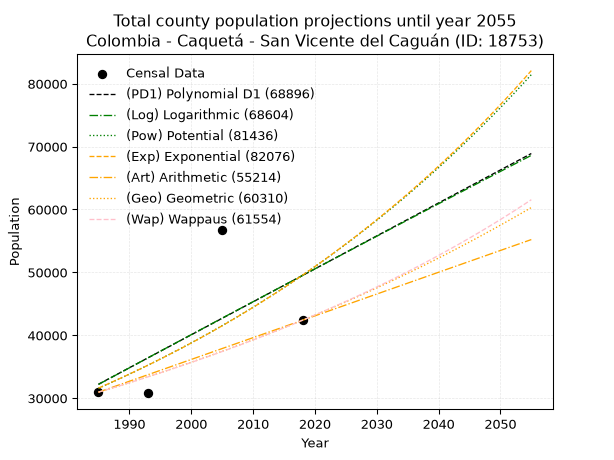
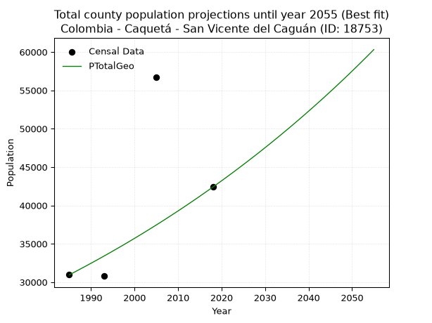
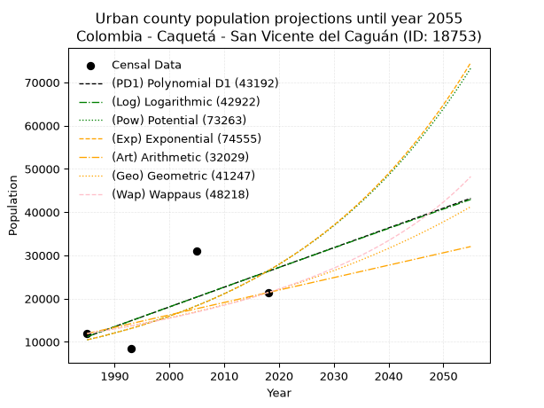
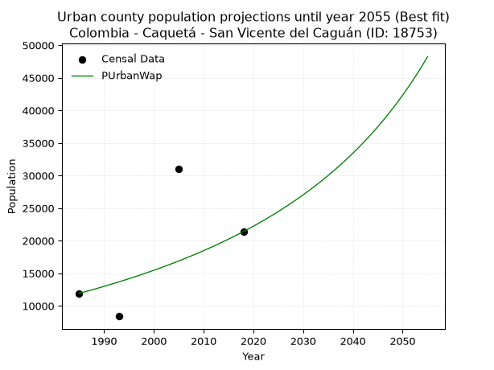
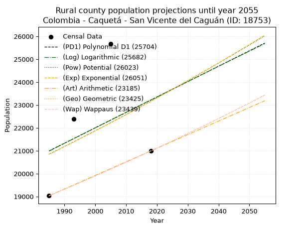
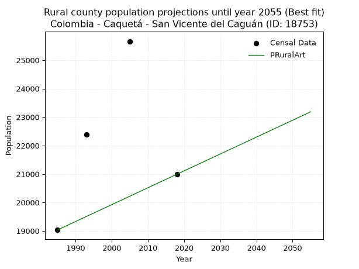

<div align="center">


</div>

# 📜 _“Population and Public Services Demand Projections (PPSD) until Year 2050 for Colombia - Caquetá - San Vicente del Caguán (ID: 18753)”_
Keywords: `population` `public-service` `projection` `lineal` `polynomial` `logarithmic` `potential` `exponential` `arithmetic` `geometric` `wappaus` `dane` `colombia` `south-america`

PPSD are analytical estimates used by governments and planners to anticipate future changes in population size, age distribution, and the resulting community needs for utilities, healthcare, education, and infrastructure as sizing future water treatment facilities, electrical grids, and road networks based on spatial growth.

<div align="center">

</img>

</div>


> **General running parameters**: • app_version: _v20260806_. • Python version: _3.14.7_. • Pandas version: _3.0.5_. • NumPy version: _2.5.1_. • Creates, save and include plots into reports (create_plot): _False_. • Projection until year: _2050_. • Process polynomial degree 2 and up: _False_. • Process Wappaus: _True_. • Process Wappaus: _True_. • Set negative values to zero: _True_. • Set infinite values to zero: _True_. • Drop dataset notes: _True_. 
<div align="center">

Maps & GIS Layers: [:earth_americas:Google](http://maps.google.com/maps?q=2.119413004,-74.7678943) [:earth_americas:OSM](https://www.openstreetmap.org/#map=18/2.119413004/-74.7678943&layers=P) [:earth_americas:Bing](https://www.bing.com/maps?cp=2.119413004~-74.7678943&lvl=18) [:earth_americas:Apple](https://maps.apple.com/frame?center=2.119413004%2C-74.7678943&span=0.003%2C0.006) [:earth_americas:GISMobile](https://github.com/rcfdtools/R.GISMobile/blob/main/file/gis/CountyLayer_CO/Readme.md)

</div>


<div align="center">

```geojson
{
  "type": "Feature",
  "geometry": {
    "type": "Point", 
    "coordinates": [-74.7678943, 2.119413004]
  }, 
  "properties": {
    "Name": "Colombia - Caquetá - San Vicente del Caguán (ID: 18753)"
  }
}
```

</div>


## 0. Census Data (4 records)

Census data are official statistics collected by a government about the people and housing in a country. They usually include counts of total population, age, sex, race, income, education, and jobs.

📅Global census file: [Population.xlsx](../data/Population.xlsx)

| Source   |   Year |   CountryID | CountryName   |   StateID | StateName   |   CountyID | CountyName             |   PTotal |   PUrban |   PRural |
|:---------|-------:|------------:|:--------------|----------:|:------------|-----------:|:-----------------------|---------:|---------:|---------:|
| DANE     |   1985 |          57 | Colombia      |        18 | Caquetá     |      18753 | San Vicente del Caguán |    30952 |    11918 |    19034 |
| DANE     |   1993 |          57 | Colombia      |        18 | Caquetá     |      18753 | San Vicente del Caguán |    30790 |     8403 |    22387 |
| DANE     |   2005 |          57 | Colombia      |        18 | Caquetá     |      18753 | San Vicente del Caguán |    56674 |    31011 |    25663 |
| DANE     |   2018 |          57 | Colombia      |        18 | Caquetá     |      18753 | San Vicente del Caguán |    42390 |    21399 |    20991 |

> 🔥Some records could had specific notes about the registered values or the corresponding urban or rural distribution.

📅[SUI-RUPS](https://www.datos.gov.co/Hacienda-y-Cr-dito-P-blico/Registro-nico-de-Prestadores-de-Servicios-P-blicos/4qkq-csdn/about_data) - Local public utility companies: [RUPS.csv](../data/RUPS.csv)

 | SERVICIO       | ESTADO    | NOMBRE                                                                                  | NIT         | DEPARTAMENTO_DOMICILIO   | MUNICIPIO_DOMICILIO    | DIRECCION                      |   TELEFONO | EMAIL                 | TIPO_PRESTADOR                             | CLASIFICACION                  |
|:---------------|:----------|:----------------------------------------------------------------------------------------|:------------|:-------------------------|:-----------------------|:-------------------------------|-----------:|:----------------------|:-------------------------------------------|:-------------------------------|
| ALCANTARILLADO | OPERATIVA | EMPRESA MUNICIPAL DE SERVICIOS PUBLICOS DOMICILIARIOS "AGUAS DEL CAGUAN S.A. ESP MIXTA" | 900123974-1 | CAQUETA                  | SAN VICENTE DEL CAGUAN | Carrera 4 No. 3 - 30           |    4644698 | MARI20095@HOTMAIL.COM | SOCIEDADES (EMPRESA DE SERVICIOS PUBLICOS) | DESDE 2501 HASTA 5000 USUARIOS |
| ACUEDUCTO      | OPERATIVA | EMPRESA MUNICIPAL DE SERVICIOS PUBLICOS DOMICILIARIOS "AGUAS DEL CAGUAN S.A. ESP MIXTA" | 900123974-1 | CAQUETA                  | SAN VICENTE DEL CAGUAN | Carrera 4 No. 3 - 30           |    4644698 | MARI20095@HOTMAIL.COM | SOCIEDADES (EMPRESA DE SERVICIOS PUBLICOS) | MAYOR O IGUAL A 5001 USUARIOS  |
| ACUEDUCTO      | OPERATIVA | ASOCIACION DE USUARIOS DE LOS SERVICIOS PUBLICOS DOMICILIARIOS DE GUACAMAYAS            | 901259622-2 | CAQUETA                  | SAN VICENTE DEL CAGUAN | CALLE PRINCIPAL INM GUACAMAYAS |    4358798 | alzave2020@gmail.com  | ORGANIZACION AUTORIZADA                    | MENOR O IGUAL A 2500 USUARIOS  |

## 1. Total

### 1.1. Coefficients and Parameters

* (PD1) Polynomial Deg 1: 524.0923323966349, -1008114.187876369 (lineal)
* (Log) Logarithmic: 1051046.322928123, -7948810.023133301
* (Pow) Potential: 27.341610744624784, -85.66679415622382
* (Exp) Exponential: 0.013638128617880387, 5.527486321599417e-08
* (Art) Arithmetic: Year diff. 2018 - 1985 = 33, Population diff. 42390 - 30952 = 11438, Annual growth = 346.6060606060606
* (Geo) Geometric: Year diff. 2018 - 1985 = 33, Population diff. 42390 - 30952 = 11438, Annual growth % = 0.009575092110998273
* (Wap) Wappaus: i = 0.945177553396582, Condition values only valid for < 200)

<sub>
Wappaus condition values: ['0.00', '0.95', '1.89', '2.84', '3.78', '4.73', '5.67', '6.62', '7.56', '8.51', '9.45', '10.40', '11.34', '12.29', '13.23', '14.18', '15.12', '16.07', '17.01', '17.96', '18.90', '19.85', '20.79', '21.74', '22.68', '23.63', '24.57', '25.52', '26.46', '27.41', '28.36', '29.30', '30.25', '31.19', '32.14', '33.08', '34.03', '34.97', '35.92', '36.86', '37.81', '38.75', '39.70', '40.64', '41.59', '42.53', '43.48', '44.42', '45.37', '46.31', '47.26', '48.20', '49.15', '50.09', '51.04', '51.98', '52.93', '53.88', '54.82', '55.77', '56.71', '57.66', '58.60', '59.55', '60.49', '61.44']
</sub>


### 1.2. Projected Dataset

|   Year |   CountyID |   PTotalPD1 |   PTotalLog |   PTotalPow |   PTotalExp |   PTotalArt |   PTotalGeo |   PTotalWap |
|-------:|-----------:|------------:|------------:|------------:|------------:|------------:|------------:|------------:|
|   1985 |      18753 |       32209 |       32178 |       31571 |       31594 |       30952 |       30952 |       30952 |
|   1986 |      18753 |       32733 |       32707 |       32009 |       32028 |       31299 |       31248 |       31246 |
|   1987 |      18753 |       33257 |       33236 |       32452 |       32468 |       31645 |       31548 |       31543 |
|   1988 |      18753 |       33781 |       33765 |       32902 |       32914 |       31992 |       31850 |       31842 |
|   1989 |      18753 |       34305 |       34294 |       33358 |       33366 |       32338 |       32155 |       32145 |
|   1990 |      18753 |       34830 |       34822 |       33819 |       33824 |       32685 |       32462 |       32450 |
|   1991 |      18753 |       35354 |       35350 |       34287 |       34289 |       33032 |       32773 |       32759 |
|   1992 |      18753 |       35878 |       35878 |       34761 |       34759 |       33378 |       33087 |       33070 |
|   1993 |      18753 |       36402 |       36405 |       35241 |       35237 |       33725 |       33404 |       33384 |
|   1994 |      18753 |       36926 |       36933 |       35728 |       35721 |       34071 |       33724 |       33702 |
|   1995 |      18753 |       37450 |       37460 |       36221 |       36211 |       34418 |       34047 |       34023 |
|   1996 |      18753 |       37974 |       37986 |       36721 |       36708 |       34765 |       34373 |       34347 |
|   1997 |      18753 |       38498 |       38513 |       37227 |       37212 |       35111 |       34702 |       34674 |
|   1998 |      18753 |       39022 |       39039 |       37740 |       37723 |       35458 |       35034 |       35004 |
|   1999 |      18753 |       39546 |       39565 |       38260 |       38241 |       35804 |       35370 |       35338 |
|   2000 |      18753 |       40070 |       40091 |       38787 |       38766 |       36151 |       35708 |       35675 |
|   2001 |      18753 |       40595 |       40616 |       39320 |       39299 |       36498 |       36050 |       36016 |
|   2002 |      18753 |       41119 |       41141 |       39861 |       39838 |       36844 |       36395 |       36360 |
|   2003 |      18753 |       41643 |       41666 |       40409 |       40385 |       37191 |       36744 |       36708 |
|   2004 |      18753 |       42167 |       42191 |       40965 |       40940 |       37538 |       37096 |       37059 |
|   2005 |      18753 |       42691 |       42715 |       41527 |       41502 |       37884 |       37451 |       37414 |
|   2006 |      18753 |       43215 |       43239 |       42097 |       42072 |       38231 |       37809 |       37772 |
|   2007 |      18753 |       43739 |       43763 |       42675 |       42650 |       38577 |       38171 |       38135 |
|   2008 |      18753 |       44263 |       44286 |       43260 |       43235 |       38924 |       38537 |       38501 |
|   2009 |      18753 |       44787 |       44810 |       43853 |       43829 |       39271 |       38906 |       38871 |
|   2010 |      18753 |       45311 |       45333 |       44454 |       44431 |       39617 |       39278 |       39246 |
|   2011 |      18753 |       45835 |       45855 |       45062 |       45041 |       39964 |       39655 |       39624 |
|   2012 |      18753 |       46360 |       46378 |       45679 |       45660 |       40310 |       40034 |       40006 |
|   2013 |      18753 |       46884 |       46900 |       46304 |       46286 |       40657 |       40418 |       40393 |
|   2014 |      18753 |       47408 |       47422 |       46937 |       46922 |       41004 |       40805 |       40783 |
|   2015 |      18753 |       47932 |       47944 |       47578 |       47566 |       41350 |       41195 |       41178 |
|   2016 |      18753 |       48456 |       48465 |       48228 |       48220 |       41697 |       41590 |       41578 |
|   2017 |      18753 |       48980 |       48987 |       48886 |       48882 |       42043 |       41988 |       41982 |
|   2018 |      18753 |       49504 |       49508 |       49553 |       49553 |       42390 |       42390 |       42390 |
|   2019 |      18753 |       50028 |       50028 |       50229 |       50233 |       42737 |       42796 |       42803 |
|   2020 |      18753 |       50552 |       50549 |       50914 |       50923 |       43083 |       43206 |       43221 |
|   2021 |      18753 |       51076 |       51069 |       51608 |       51622 |       43430 |       43619 |       43643 |
|   2022 |      18753 |       51601 |       51589 |       52310 |       52331 |       43776 |       44037 |       44070 |
|   2023 |      18753 |       52125 |       52109 |       53022 |       53050 |       44123 |       44459 |       44502 |
|   2024 |      18753 |       52649 |       52628 |       53744 |       53778 |       44470 |       44884 |       44940 |
|   2025 |      18753 |       53173 |       53147 |       54474 |       54517 |       44816 |       45314 |       45382 |
|   2026 |      18753 |       53697 |       53666 |       55215 |       55265 |       45163 |       45748 |       45829 |
|   2027 |      18753 |       54221 |       54185 |       55965 |       56024 |       45509 |       46186 |       46282 |
|   2028 |      18753 |       54745 |       54703 |       56724 |       56794 |       45856 |       46628 |       46740 |
|   2029 |      18753 |       55269 |       55221 |       57494 |       57573 |       46203 |       47075 |       47204 |
|   2030 |      18753 |       55793 |       55739 |       58274 |       58364 |       46549 |       47526 |       47673 |
|   2031 |      18753 |       56317 |       56257 |       59064 |       59165 |       46896 |       47981 |       48148 |
|   2032 |      18753 |       56841 |       56774 |       59864 |       59978 |       47242 |       48440 |       48628 |
|   2033 |      18753 |       57366 |       57291 |       60675 |       60801 |       47589 |       48904 |       49114 |
|   2034 |      18753 |       57890 |       57808 |       61496 |       61636 |       47936 |       49372 |       49607 |
|   2035 |      18753 |       58414 |       58325 |       62328 |       62483 |       48282 |       49845 |       50105 |
|   2036 |      18753 |       58938 |       58841 |       63171 |       63341 |       48629 |       50322 |       50610 |
|   2037 |      18753 |       59462 |       59357 |       64025 |       64210 |       48976 |       50804 |       51121 |
|   2038 |      18753 |       59986 |       59873 |       64890 |       65092 |       49322 |       51290 |       51639 |
|   2039 |      18753 |       60510 |       60389 |       65766 |       65986 |       49669 |       51781 |       52163 |
|   2040 |      18753 |       61034 |       60904 |       66654 |       66892 |       50015 |       52277 |       52693 |
|   2041 |      18753 |       61558 |       61419 |       67553 |       67811 |       50362 |       52778 |       53231 |
|   2042 |      18753 |       62082 |       61934 |       68464 |       68742 |       50709 |       53283 |       53776 |
|   2043 |      18753 |       62606 |       62449 |       69387 |       69686 |       51055 |       53793 |       54327 |
|   2044 |      18753 |       63131 |       62963 |       70321 |       70643 |       51402 |       54308 |       54886 |
|   2045 |      18753 |       63655 |       63477 |       71268 |       71613 |       51748 |       54828 |       55452 |
|   2046 |      18753 |       64179 |       63991 |       72227 |       72596 |       52095 |       55353 |       56026 |
|   2047 |      18753 |       64703 |       64504 |       73198 |       73593 |       52442 |       55884 |       56607 |
|   2048 |      18753 |       65227 |       65018 |       74182 |       74603 |       52788 |       56419 |       57197 |
|   2049 |      18753 |       65751 |       65531 |       75179 |       75628 |       53135 |       56959 |       57794 |
|   2050 |      18753 |       66275 |       66044 |       76189 |       76666 |       53481 |       57504 |       58399 |
<div align="center">

</img>

</div>


### 1.3. Best fit with absolute and relative error (%)

Relative error puts that difference into context by dividing the absolute error by the true value, creating a unitless ratio or percentage that shows the scale of the mistake.

Absolute and relative error

|   Year | Source   |   CountryID | CountryName   |   StateID | StateName   |   CountyID_x | CountyName             |   PTotal |   PUrban |   PRural |   CountyID_y |   PTotalPD1 |   PTotalLog |   PTotalPow |   PTotalExp |   PTotalArt |   PTotalGeo |   PTotalWap |   PTotalPD1AbsError |   PTotalLogAbsError |   PTotalPowAbsError |   PTotalExpAbsError |   PTotalArtAbsError |   PTotalGeoAbsError |   PTotalWapAbsError |   PTotalPD1RelError |   PTotalLogRelError |   PTotalPowRelError |   PTotalExpRelError |   PTotalArtRelError |   PTotalGeoRelError |   PTotalWapRelError |
|-------:|:---------|------------:|:--------------|----------:|:------------|-------------:|:-----------------------|---------:|---------:|---------:|-------------:|------------:|------------:|------------:|------------:|------------:|------------:|------------:|--------------------:|--------------------:|--------------------:|--------------------:|--------------------:|--------------------:|--------------------:|--------------------:|--------------------:|--------------------:|--------------------:|--------------------:|--------------------:|--------------------:|
|   1985 | DANE     |          57 | Colombia      |        18 | Caquetá     |        18753 | San Vicente del Caguán |    30952 |    11918 |    19034 |        18753 |       32209 |       32178 |       31571 |       31594 |       30952 |       30952 |       30952 |                1257 |                1226 |                 619 |                 642 |                   0 |                   0 |                   0 |             4.06113 |             3.96097 |             1.99987 |             2.07418 |             0       |             0       |             0       |
|   1993 | DANE     |          57 | Colombia      |        18 | Caquetá     |        18753 | San Vicente del Caguán |    30790 |     8403 |    22387 |        18753 |       36402 |       36405 |       35241 |       35237 |       33725 |       33404 |       33384 |                5612 |                5615 |                4451 |                4447 |                2935 |                2614 |                2594 |            18.2267  |            18.2364  |            14.456   |            14.443   |             9.53232 |             8.48977 |             8.42481 |
|   2005 | DANE     |          57 | Colombia      |        18 | Caquetá     |        18753 | San Vicente del Caguán |    56674 |    31011 |    25663 |        18753 |       42691 |       42715 |       41527 |       41502 |       37884 |       37451 |       37414 |               13983 |               13959 |               15147 |               15172 |               18790 |               19223 |               19260 |            24.6727  |            24.6303  |            26.7265  |            26.7707  |            33.1545  |            33.9186  |            33.9838  |
|   2018 | DANE     |          57 | Colombia      |        18 | Caquetá     |        18753 | San Vicente del Caguán |    42390 |    21399 |    20991 |        18753 |       49504 |       49508 |       49553 |       49553 |       42390 |       42390 |       42390 |                7114 |                7118 |                7163 |                7163 |                   0 |                   0 |                   0 |            16.7823  |            16.7917  |            16.8979  |            16.8979  |             0       |             0       |             0       |

Relative error mean

| Method    |   RelError | Best   |
|:----------|-----------:|:-------|
| PTotalPD1 |    15.9357 |        |
| PTotalLog |    15.9049 |        |
| PTotalPow |    15.0201 |        |
| PTotalExp |    15.0464 |        |
| PTotalArt |    10.6717 |        |
| PTotalGeo |    10.6021 | True   |
| PTotalWap |    10.6022 |        |

💙Best method: _**PTotalGeo**_
<div align="center">

</img>

</div>


### 1.4. Fresh water supply demand in liters per capita per day (lpcd)

The fresh water supply demand typically ranges from 100 to 300 liters per capita per day (lpcd) for standard domestic and municipal planning, though absolute survival minimums set by the World Health Organization are as low as 7.5 to 20 liters per day, and total consumption in high-income nations can exceed 400 liters.

> `CZ`: Level in meters above the sea level (masl)<br> `WS`: Fresh water supply demand in liters per capita per day (lpcd or l/h/d)<br> `WSAll`: Zonal fresh water supply demand in liters per second (l/s)<br> `A`: Zonal area in square meters<br> `DP`: Population density (people/hectare or p/ha)

Reference values (RAS Colombia)

|    CZ |   WS |
|------:|-----:|
|  1000 |  120 |
|  2000 |  130 |
| 99999 |  140 |

County shapefile geometry properties and water supply values

|   CountyID |      ATotal |   CZTotal |   WSTotal |
|-----------:|------------:|----------:|----------:|
|      18753 | 2.01703e+10 |   442.609 |       120 |

Projected values for best method: PTotalGeo

|   CountyID |   Year |   PTotalGeo |   DPTotal |   WSTotal |   WSTotalAll |
|-----------:|-------:|------------:|----------:|----------:|-------------:|
|      18753 |   1985 |       30952 |      0.02 |       120 |      42.9889 |
|      18753 |   1986 |       31248 |      0.02 |       120 |      43.4    |
|      18753 |   1987 |       31548 |      0.02 |       120 |      43.8167 |
|      18753 |   1988 |       31850 |      0.02 |       120 |      44.2361 |
|      18753 |   1989 |       32155 |      0.02 |       120 |      44.6597 |
|      18753 |   1990 |       32462 |      0.02 |       120 |      45.0861 |
|      18753 |   1991 |       32773 |      0.02 |       120 |      45.5181 |
|      18753 |   1992 |       33087 |      0.02 |       120 |      45.9542 |
|      18753 |   1993 |       33404 |      0.02 |       120 |      46.3944 |
|      18753 |   1994 |       33724 |      0.02 |       120 |      46.8389 |
|      18753 |   1995 |       34047 |      0.02 |       120 |      47.2875 |
|      18753 |   1996 |       34373 |      0.02 |       120 |      47.7403 |
|      18753 |   1997 |       34702 |      0.02 |       120 |      48.1972 |
|      18753 |   1998 |       35034 |      0.02 |       120 |      48.6583 |
|      18753 |   1999 |       35370 |      0.02 |       120 |      49.125  |
|      18753 |   2000 |       35708 |      0.02 |       120 |      49.5944 |
|      18753 |   2001 |       36050 |      0.02 |       120 |      50.0694 |
|      18753 |   2002 |       36395 |      0.02 |       120 |      50.5486 |
|      18753 |   2003 |       36744 |      0.02 |       120 |      51.0333 |
|      18753 |   2004 |       37096 |      0.02 |       120 |      51.5222 |
|      18753 |   2005 |       37451 |      0.02 |       120 |      52.0153 |
|      18753 |   2006 |       37809 |      0.02 |       120 |      52.5125 |
|      18753 |   2007 |       38171 |      0.02 |       120 |      53.0153 |
|      18753 |   2008 |       38537 |      0.02 |       120 |      53.5236 |
|      18753 |   2009 |       38906 |      0.02 |       120 |      54.0361 |
|      18753 |   2010 |       39278 |      0.02 |       120 |      54.5528 |
|      18753 |   2011 |       39655 |      0.02 |       120 |      55.0764 |
|      18753 |   2012 |       40034 |      0.02 |       120 |      55.6028 |
|      18753 |   2013 |       40418 |      0.02 |       120 |      56.1361 |
|      18753 |   2014 |       40805 |      0.02 |       120 |      56.6736 |
|      18753 |   2015 |       41195 |      0.02 |       120 |      57.2153 |
|      18753 |   2016 |       41590 |      0.02 |       120 |      57.7639 |
|      18753 |   2017 |       41988 |      0.02 |       120 |      58.3167 |
|      18753 |   2018 |       42390 |      0.02 |       120 |      58.875  |
|      18753 |   2019 |       42796 |      0.02 |       120 |      59.4389 |
|      18753 |   2020 |       43206 |      0.02 |       120 |      60.0083 |
|      18753 |   2021 |       43619 |      0.02 |       120 |      60.5819 |
|      18753 |   2022 |       44037 |      0.02 |       120 |      61.1625 |
|      18753 |   2023 |       44459 |      0.02 |       120 |      61.7486 |
|      18753 |   2024 |       44884 |      0.02 |       120 |      62.3389 |
|      18753 |   2025 |       45314 |      0.02 |       120 |      62.9361 |
|      18753 |   2026 |       45748 |      0.02 |       120 |      63.5389 |
|      18753 |   2027 |       46186 |      0.02 |       120 |      64.1472 |
|      18753 |   2028 |       46628 |      0.02 |       120 |      64.7611 |
|      18753 |   2029 |       47075 |      0.02 |       120 |      65.3819 |
|      18753 |   2030 |       47526 |      0.02 |       120 |      66.0083 |
|      18753 |   2031 |       47981 |      0.02 |       120 |      66.6403 |
|      18753 |   2032 |       48440 |      0.02 |       120 |      67.2778 |
|      18753 |   2033 |       48904 |      0.02 |       120 |      67.9222 |
|      18753 |   2034 |       49372 |      0.02 |       120 |      68.5722 |
|      18753 |   2035 |       49845 |      0.02 |       120 |      69.2292 |
|      18753 |   2036 |       50322 |      0.02 |       120 |      69.8917 |
|      18753 |   2037 |       50804 |      0.03 |       120 |      70.5611 |
|      18753 |   2038 |       51290 |      0.03 |       120 |      71.2361 |
|      18753 |   2039 |       51781 |      0.03 |       120 |      71.9181 |
|      18753 |   2040 |       52277 |      0.03 |       120 |      72.6069 |
|      18753 |   2041 |       52778 |      0.03 |       120 |      73.3028 |
|      18753 |   2042 |       53283 |      0.03 |       120 |      74.0042 |
|      18753 |   2043 |       53793 |      0.03 |       120 |      74.7125 |
|      18753 |   2044 |       54308 |      0.03 |       120 |      75.4278 |
|      18753 |   2045 |       54828 |      0.03 |       120 |      76.15   |
|      18753 |   2046 |       55353 |      0.03 |       120 |      76.8792 |
|      18753 |   2047 |       55884 |      0.03 |       120 |      77.6167 |
|      18753 |   2048 |       56419 |      0.03 |       120 |      78.3597 |
|      18753 |   2049 |       56959 |      0.03 |       120 |      79.1097 |
|      18753 |   2050 |       57504 |      0.03 |       120 |      79.8667 |

## 2. Urban

### 2.1. Coefficients and Parameters

* (PD1) Polynomial Deg 1: 456.7856282617469, -895502.7029305594 (lineal)
* (Log) Logarithmic: 915492.614605517, -6940483.949913928
* (Pow) Potential: 56.17319017965213, -181.2263240498864
* (Exp) Exponential: 0.028044889156576294, 6.968039451098573e-21
* (Art) Arithmetic: Year diff. 2018 - 1985 = 33, Population diff. 21399 - 11918 = 9481, Annual growth = 287.3030303030303
* (Geo) Geometric: Year diff. 2018 - 1985 = 33, Population diff. 21399 - 11918 = 9481, Annual growth % = 0.01789441208135667
* (Wap) Wappaus: i = 1.724663266818923, Condition values only valid for < 200)

<sub>
Wappaus condition values: ['0.00', '1.72', '3.45', '5.17', '6.90', '8.62', '10.35', '12.07', '13.80', '15.52', '17.25', '18.97', '20.70', '22.42', '24.15', '25.87', '27.59', '29.32', '31.04', '32.77', '34.49', '36.22', '37.94', '39.67', '41.39', '43.12', '44.84', '46.57', '48.29', '50.02', '51.74', '53.46', '55.19', '56.91', '58.64', '60.36', '62.09', '63.81', '65.54', '67.26', '68.99', '70.71', '72.44', '74.16', '75.89', '77.61', '79.33', '81.06', '82.78', '84.51', '86.23', '87.96', '89.68', '91.41', '93.13', '94.86', '96.58', '98.31', '100.03', '101.76', '103.48', '105.20', '106.93', '108.65', '110.38', '112.10']
</sub>


### 2.2. Projected Dataset

|   Year |   CountyID |   PUrbanPD1 |   PUrbanLog |   PUrbanPow |   PUrbanExp |   PUrbanArt |   PUrbanGeo |   PUrbanWap |
|-------:|-----------:|------------:|------------:|------------:|------------:|------------:|------------:|------------:|
|   1985 |      18753 |       11217 |       11194 |       10457 |       10469 |       11918 |       11918 |       11918 |
|   1986 |      18753 |       11674 |       11655 |       10757 |       10767 |       12205 |       12131 |       12125 |
|   1987 |      18753 |       12130 |       12116 |       11066 |       11073 |       12493 |       12348 |       12336 |
|   1988 |      18753 |       12587 |       12577 |       11383 |       11388 |       12780 |       12569 |       12551 |
|   1989 |      18753 |       13044 |       13037 |       11709 |       11712 |       13067 |       12794 |       12770 |
|   1990 |      18753 |       13501 |       13497 |       12044 |       12045 |       13355 |       13023 |       12992 |
|   1991 |      18753 |       13957 |       13957 |       12389 |       12387 |       13642 |       13256 |       13219 |
|   1992 |      18753 |       14414 |       14417 |       12743 |       12740 |       13929 |       13493 |       13449 |
|   1993 |      18753 |       14871 |       14876 |       13108 |       13102 |       14216 |       13735 |       13684 |
|   1994 |      18753 |       15328 |       15336 |       13482 |       13475 |       14504 |       13981 |       13924 |
|   1995 |      18753 |       15785 |       15795 |       13867 |       13858 |       14791 |       14231 |       14167 |
|   1996 |      18753 |       16241 |       16253 |       14263 |       14252 |       15078 |       14485 |       14416 |
|   1997 |      18753 |       16698 |       16712 |       14670 |       14657 |       15366 |       14745 |       14669 |
|   1998 |      18753 |       17155 |       17170 |       15089 |       15074 |       15653 |       15009 |       14927 |
|   1999 |      18753 |       17612 |       17628 |       15519 |       15503 |       15940 |       15277 |       15191 |
|   2000 |      18753 |       18069 |       18086 |       15961 |       15944 |       16228 |       15550 |       15459 |
|   2001 |      18753 |       18525 |       18544 |       16416 |       16397 |       16515 |       15829 |       15733 |
|   2002 |      18753 |       18982 |       19001 |       16883 |       16864 |       16802 |       16112 |       16013 |
|   2003 |      18753 |       19439 |       19458 |       17363 |       17343 |       17089 |       16400 |       16298 |
|   2004 |      18753 |       19896 |       19915 |       17857 |       17837 |       17377 |       16694 |       16589 |
|   2005 |      18753 |       20352 |       20372 |       18364 |       18344 |       17664 |       16993 |       16886 |
|   2006 |      18753 |       20809 |       20828 |       18886 |       18866 |       17951 |       17297 |       17189 |
|   2007 |      18753 |       21266 |       21285 |       19422 |       19402 |       18239 |       17606 |       17499 |
|   2008 |      18753 |       21723 |       21741 |       19973 |       19954 |       18526 |       17921 |       17815 |
|   2009 |      18753 |       22180 |       22197 |       20540 |       20522 |       18813 |       18242 |       18138 |
|   2010 |      18753 |       22636 |       22652 |       21122 |       21105 |       19101 |       18568 |       18469 |
|   2011 |      18753 |       23093 |       23108 |       21721 |       21705 |       19388 |       18901 |       18807 |
|   2012 |      18753 |       23550 |       23563 |       22336 |       22323 |       19675 |       19239 |       19152 |
|   2013 |      18753 |       24007 |       24018 |       22968 |       22958 |       19962 |       19583 |       19505 |
|   2014 |      18753 |       24464 |       24472 |       23618 |       23611 |       20250 |       19933 |       19867 |
|   2015 |      18753 |       24920 |       24927 |       24285 |       24282 |       20537 |       20290 |       20236 |
|   2016 |      18753 |       25377 |       25381 |       24972 |       24973 |       20824 |       20653 |       20615 |
|   2017 |      18753 |       25834 |       25835 |       25677 |       25683 |       21112 |       21023 |       21002 |
|   2018 |      18753 |       26291 |       26289 |       26402 |       26414 |       21399 |       21399 |       21399 |
|   2019 |      18753 |       26747 |       26742 |       27147 |       27165 |       21686 |       21782 |       21805 |
|   2020 |      18753 |       27204 |       27196 |       27913 |       27937 |       21974 |       22172 |       22222 |
|   2021 |      18753 |       27661 |       27649 |       28700 |       28732 |       22261 |       22568 |       22649 |
|   2022 |      18753 |       28118 |       28102 |       29509 |       29549 |       22548 |       22972 |       23087 |
|   2023 |      18753 |       28575 |       28554 |       30340 |       30390 |       22836 |       23383 |       23536 |
|   2024 |      18753 |       29031 |       29007 |       31194 |       31254 |       23123 |       23802 |       23996 |
|   2025 |      18753 |       29488 |       29459 |       32071 |       32143 |       23410 |       24228 |       24469 |
|   2026 |      18753 |       29945 |       29911 |       32973 |       33057 |       23697 |       24661 |       24954 |
|   2027 |      18753 |       30402 |       30363 |       33900 |       33997 |       23985 |       25103 |       25453 |
|   2028 |      18753 |       30859 |       30814 |       34852 |       34964 |       24272 |       25552 |       25965 |
|   2029 |      18753 |       31315 |       31265 |       35831 |       35959 |       24559 |       26009 |       26492 |
|   2030 |      18753 |       31772 |       31717 |       36837 |       36981 |       24847 |       26474 |       27033 |
|   2031 |      18753 |       32229 |       32167 |       37870 |       38033 |       25134 |       26948 |       27590 |
|   2032 |      18753 |       32686 |       32618 |       38932 |       39115 |       25421 |       27430 |       28162 |
|   2033 |      18753 |       33142 |       33068 |       40023 |       40228 |       25709 |       27921 |       28752 |
|   2034 |      18753 |       33599 |       33519 |       41144 |       41372 |       25996 |       28421 |       29359 |
|   2035 |      18753 |       34056 |       33969 |       42295 |       42548 |       26283 |       28929 |       29985 |
|   2036 |      18753 |       34513 |       34418 |       43479 |       43759 |       26570 |       29447 |       30630 |
|   2037 |      18753 |       34970 |       34868 |       44695 |       45003 |       26858 |       29974 |       31295 |
|   2038 |      18753 |       35426 |       35317 |       45944 |       46283 |       27145 |       30510 |       31982 |
|   2039 |      18753 |       35883 |       35766 |       47228 |       47599 |       27432 |       31056 |       32690 |
|   2040 |      18753 |       36340 |       36215 |       48547 |       48953 |       27720 |       31612 |       33422 |
|   2041 |      18753 |       36797 |       36664 |       49902 |       50346 |       28007 |       32178 |       34178 |
|   2042 |      18753 |       37254 |       37112 |       51294 |       51777 |       28294 |       32754 |       34960 |
|   2043 |      18753 |       37710 |       37561 |       52724 |       53250 |       28582 |       33340 |       35769 |
|   2044 |      18753 |       38167 |       38009 |       54194 |       54765 |       28869 |       33936 |       36606 |
|   2045 |      18753 |       38624 |       38456 |       55703 |       56322 |       29156 |       34544 |       37473 |
|   2046 |      18753 |       39081 |       38904 |       57254 |       57924 |       29443 |       35162 |       38371 |
|   2047 |      18753 |       39537 |       39351 |       58848 |       59572 |       29731 |       35791 |       39303 |
|   2048 |      18753 |       39994 |       39798 |       60484 |       61266 |       30018 |       36431 |       40270 |
|   2049 |      18753 |       40451 |       40245 |       62166 |       63008 |       30305 |       37083 |       41275 |
|   2050 |      18753 |       40908 |       40692 |       63893 |       64801 |       30593 |       37747 |       42318 |
<div align="center">

</img>

</div>


### 2.3. Best fit with absolute and relative error (%)

Relative error puts that difference into context by dividing the absolute error by the true value, creating a unitless ratio or percentage that shows the scale of the mistake.

Absolute and relative error

|   Year | Source   |   CountryID | CountryName   |   StateID | StateName   |   CountyID_x | CountyName             |   PTotal |   PUrban |   PRural |   CountyID_y |   PUrbanPD1 |   PUrbanLog |   PUrbanPow |   PUrbanExp |   PUrbanArt |   PUrbanGeo |   PUrbanWap |   PUrbanPD1AbsError |   PUrbanLogAbsError |   PUrbanPowAbsError |   PUrbanExpAbsError |   PUrbanArtAbsError |   PUrbanGeoAbsError |   PUrbanWapAbsError |   PUrbanPD1RelError |   PUrbanLogRelError |   PUrbanPowRelError |   PUrbanExpRelError |   PUrbanArtRelError |   PUrbanGeoRelError |   PUrbanWapRelError |
|-------:|:---------|------------:|:--------------|----------:|:------------|-------------:|:-----------------------|---------:|---------:|---------:|-------------:|------------:|------------:|------------:|------------:|------------:|------------:|------------:|--------------------:|--------------------:|--------------------:|--------------------:|--------------------:|--------------------:|--------------------:|--------------------:|--------------------:|--------------------:|--------------------:|--------------------:|--------------------:|--------------------:|
|   1985 | DANE     |          57 | Colombia      |        18 | Caquetá     |        18753 | San Vicente del Caguán |    30952 |    11918 |    19034 |        18753 |       11217 |       11194 |       10457 |       10469 |       11918 |       11918 |       11918 |                 701 |                 724 |                1461 |                1449 |                   0 |                   0 |                   0 |             5.88186 |             6.07484 |             12.2588 |             12.1581 |              0      |              0      |              0      |
|   1993 | DANE     |          57 | Colombia      |        18 | Caquetá     |        18753 | San Vicente del Caguán |    30790 |     8403 |    22387 |        18753 |       14871 |       14876 |       13108 |       13102 |       14216 |       13735 |       13684 |                6468 |                6473 |                4705 |                4699 |                5813 |                5332 |                5281 |            76.9725  |            77.032   |             55.9919 |             55.9205 |             69.1777 |             63.4535 |             62.8466 |
|   2005 | DANE     |          57 | Colombia      |        18 | Caquetá     |        18753 | San Vicente del Caguán |    56674 |    31011 |    25663 |        18753 |       20352 |       20372 |       18364 |       18344 |       17664 |       16993 |       16886 |               10659 |               10639 |               12647 |               12667 |               13347 |               14018 |               14125 |            34.3717  |            34.3072  |             40.7823 |             40.8468 |             43.0396 |             45.2033 |             45.5484 |
|   2018 | DANE     |          57 | Colombia      |        18 | Caquetá     |        18753 | San Vicente del Caguán |    42390 |    21399 |    20991 |        18753 |       26291 |       26289 |       26402 |       26414 |       21399 |       21399 |       21399 |                4892 |                4890 |                5003 |                5015 |                   0 |                   0 |                   0 |            22.8609  |            22.8515  |             23.3796 |             23.4357 |              0      |              0      |              0      |

Relative error mean

| Method    |   RelError | Best   |
|:----------|-----------:|:-------|
| PUrbanPD1 |    35.0217 |        |
| PUrbanLog |    35.0664 |        |
| PUrbanPow |    33.1031 |        |
| PUrbanExp |    33.0903 |        |
| PUrbanArt |    28.0543 |        |
| PUrbanGeo |    27.1642 |        |
| PUrbanWap |    27.0987 | True   |

💙Best method: _**PUrbanWap**_
<div align="center">

</img>

</div>


### 2.4. Fresh water supply demand in liters per capita per day (lpcd)

The fresh water supply demand typically ranges from 100 to 300 liters per capita per day (lpcd) for standard domestic and municipal planning, though absolute survival minimums set by the World Health Organization are as low as 7.5 to 20 liters per day, and total consumption in high-income nations can exceed 400 liters.

> `CZ`: Level in meters above the sea level (masl)<br> `WS`: Fresh water supply demand in liters per capita per day (lpcd or l/h/d)<br> `WSAll`: Zonal fresh water supply demand in liters per second (l/s)<br> `A`: Zonal area in square meters<br> `DP`: Population density (people/hectare or p/ha)

Reference values (RAS Colombia)

|    CZ |   WS |
|------:|-----:|
|  1000 |  120 |
|  2000 |  130 |
| 99999 |  140 |

County shapefile geometry properties and water supply values

|   CountyID |      AUrban |   CZUrban |   WSUrban |
|-----------:|------------:|----------:|----------:|
|      18753 | 4.87912e+06 |   271.969 |       120 |

Projected values for best method: PUrbanWap

|   CountyID |   Year |   PUrbanWap |   DPUrban |   WSUrban |   WSUrbanAll |
|-----------:|-------:|------------:|----------:|----------:|-------------:|
|      18753 |   1985 |       11918 |     24.43 |       120 |      16.5528 |
|      18753 |   1986 |       12125 |     24.85 |       120 |      16.8403 |
|      18753 |   1987 |       12336 |     25.28 |       120 |      17.1333 |
|      18753 |   1988 |       12551 |     25.72 |       120 |      17.4319 |
|      18753 |   1989 |       12770 |     26.17 |       120 |      17.7361 |
|      18753 |   1990 |       12992 |     26.63 |       120 |      18.0444 |
|      18753 |   1991 |       13219 |     27.09 |       120 |      18.3597 |
|      18753 |   1992 |       13449 |     27.56 |       120 |      18.6792 |
|      18753 |   1993 |       13684 |     28.05 |       120 |      19.0056 |
|      18753 |   1994 |       13924 |     28.54 |       120 |      19.3389 |
|      18753 |   1995 |       14167 |     29.04 |       120 |      19.6764 |
|      18753 |   1996 |       14416 |     29.55 |       120 |      20.0222 |
|      18753 |   1997 |       14669 |     30.06 |       120 |      20.3736 |
|      18753 |   1998 |       14927 |     30.59 |       120 |      20.7319 |
|      18753 |   1999 |       15191 |     31.13 |       120 |      21.0986 |
|      18753 |   2000 |       15459 |     31.68 |       120 |      21.4708 |
|      18753 |   2001 |       15733 |     32.25 |       120 |      21.8514 |
|      18753 |   2002 |       16013 |     32.82 |       120 |      22.2403 |
|      18753 |   2003 |       16298 |     33.4  |       120 |      22.6361 |
|      18753 |   2004 |       16589 |     34    |       120 |      23.0403 |
|      18753 |   2005 |       16886 |     34.61 |       120 |      23.4528 |
|      18753 |   2006 |       17189 |     35.23 |       120 |      23.8736 |
|      18753 |   2007 |       17499 |     35.87 |       120 |      24.3042 |
|      18753 |   2008 |       17815 |     36.51 |       120 |      24.7431 |
|      18753 |   2009 |       18138 |     37.17 |       120 |      25.1917 |
|      18753 |   2010 |       18469 |     37.85 |       120 |      25.6514 |
|      18753 |   2011 |       18807 |     38.55 |       120 |      26.1208 |
|      18753 |   2012 |       19152 |     39.25 |       120 |      26.6    |
|      18753 |   2013 |       19505 |     39.98 |       120 |      27.0903 |
|      18753 |   2014 |       19867 |     40.72 |       120 |      27.5931 |
|      18753 |   2015 |       20236 |     41.47 |       120 |      28.1056 |
|      18753 |   2016 |       20615 |     42.25 |       120 |      28.6319 |
|      18753 |   2017 |       21002 |     43.04 |       120 |      29.1694 |
|      18753 |   2018 |       21399 |     43.86 |       120 |      29.7208 |
|      18753 |   2019 |       21805 |     44.69 |       120 |      30.2847 |
|      18753 |   2020 |       22222 |     45.55 |       120 |      30.8639 |
|      18753 |   2021 |       22649 |     46.42 |       120 |      31.4569 |
|      18753 |   2022 |       23087 |     47.32 |       120 |      32.0653 |
|      18753 |   2023 |       23536 |     48.24 |       120 |      32.6889 |
|      18753 |   2024 |       23996 |     49.18 |       120 |      33.3278 |
|      18753 |   2025 |       24469 |     50.15 |       120 |      33.9847 |
|      18753 |   2026 |       24954 |     51.14 |       120 |      34.6583 |
|      18753 |   2027 |       25453 |     52.17 |       120 |      35.3514 |
|      18753 |   2028 |       25965 |     53.22 |       120 |      36.0625 |
|      18753 |   2029 |       26492 |     54.3  |       120 |      36.7944 |
|      18753 |   2030 |       27033 |     55.41 |       120 |      37.5458 |
|      18753 |   2031 |       27590 |     56.55 |       120 |      38.3194 |
|      18753 |   2032 |       28162 |     57.72 |       120 |      39.1139 |
|      18753 |   2033 |       28752 |     58.93 |       120 |      39.9333 |
|      18753 |   2034 |       29359 |     60.17 |       120 |      40.7764 |
|      18753 |   2035 |       29985 |     61.46 |       120 |      41.6458 |
|      18753 |   2036 |       30630 |     62.78 |       120 |      42.5417 |
|      18753 |   2037 |       31295 |     64.14 |       120 |      43.4653 |
|      18753 |   2038 |       31982 |     65.55 |       120 |      44.4194 |
|      18753 |   2039 |       32690 |     67    |       120 |      45.4028 |
|      18753 |   2040 |       33422 |     68.5  |       120 |      46.4194 |
|      18753 |   2041 |       34178 |     70.05 |       120 |      47.4694 |
|      18753 |   2042 |       34960 |     71.65 |       120 |      48.5556 |
|      18753 |   2043 |       35769 |     73.31 |       120 |      49.6792 |
|      18753 |   2044 |       36606 |     75.03 |       120 |      50.8417 |
|      18753 |   2045 |       37473 |     76.8  |       120 |      52.0458 |
|      18753 |   2046 |       38371 |     78.64 |       120 |      53.2931 |
|      18753 |   2047 |       39303 |     80.55 |       120 |      54.5875 |
|      18753 |   2048 |       40270 |     82.54 |       120 |      55.9306 |
|      18753 |   2049 |       41275 |     84.6  |       120 |      57.3264 |
|      18753 |   2050 |       42318 |     86.73 |       120 |      58.775  |

## 3. Rural

### 3.1. Coefficients and Parameters

* (PD1) Polynomial Deg 1: 67.30670413488829, -112611.4849458103 (lineal)
* (Log) Logarithmic: 135553.7083226061, -1008326.0732193748
* (Pow) Potential: 6.402088387940138, -16.79356265561304
* (Exp) Exponential: 0.003179784182574465, 37.83954801885535
* (Art) Arithmetic: Year diff. 2018 - 1985 = 33, Population diff. 20991 - 19034 = 1957, Annual growth = 59.303030303030305
* (Geo) Geometric: Year diff. 2018 - 1985 = 33, Population diff. 20991 - 19034 = 1957, Annual growth % = 0.002970066198858312
* (Wap) Wappaus: i = 0.2963299452993394, Condition values only valid for < 200)

<sub>
Wappaus condition values: ['0.00', '0.30', '0.59', '0.89', '1.19', '1.48', '1.78', '2.07', '2.37', '2.67', '2.96', '3.26', '3.56', '3.85', '4.15', '4.44', '4.74', '5.04', '5.33', '5.63', '5.93', '6.22', '6.52', '6.82', '7.11', '7.41', '7.70', '8.00', '8.30', '8.59', '8.89', '9.19', '9.48', '9.78', '10.08', '10.37', '10.67', '10.96', '11.26', '11.56', '11.85', '12.15', '12.45', '12.74', '13.04', '13.33', '13.63', '13.93', '14.22', '14.52', '14.82', '15.11', '15.41', '15.71', '16.00', '16.30', '16.59', '16.89', '17.19', '17.48', '17.78', '18.08', '18.37', '18.67', '18.97', '19.26']
</sub>


### 3.2. Projected Dataset

|   Year |   CountyID |   PRuralPD1 |   PRuralLog |   PRuralPow |   PRuralExp |   PRuralArt |   PRuralGeo |   PRuralWap |
|-------:|-----------:|------------:|------------:|------------:|------------:|------------:|------------:|------------:|
|   1985 |      18753 |       20992 |       20984 |       20845 |       20852 |       19034 |       19034 |       19034 |
|   1986 |      18753 |       21060 |       21052 |       20912 |       20919 |       19093 |       19091 |       19090 |
|   1987 |      18753 |       21127 |       21120 |       20979 |       20985 |       19153 |       19147 |       19147 |
|   1988 |      18753 |       21194 |       21189 |       21047 |       21052 |       19212 |       19204 |       19204 |
|   1989 |      18753 |       21262 |       21257 |       21115 |       21119 |       19271 |       19261 |       19261 |
|   1990 |      18753 |       21329 |       21325 |       21183 |       21187 |       19331 |       19318 |       19318 |
|   1991 |      18753 |       21396 |       21393 |       21251 |       21254 |       19390 |       19376 |       19375 |
|   1992 |      18753 |       21463 |       21461 |       21320 |       21322 |       19449 |       19433 |       19433 |
|   1993 |      18753 |       21531 |       21529 |       21388 |       21390 |       19508 |       19491 |       19491 |
|   1994 |      18753 |       21598 |       21597 |       21457 |       21458 |       19568 |       19549 |       19548 |
|   1995 |      18753 |       21665 |       21665 |       21526 |       21526 |       19627 |       19607 |       19607 |
|   1996 |      18753 |       21733 |       21733 |       21595 |       21595 |       19686 |       19665 |       19665 |
|   1997 |      18753 |       21800 |       21801 |       21665 |       21663 |       19746 |       19724 |       19723 |
|   1998 |      18753 |       21867 |       21869 |       21734 |       21732 |       19805 |       19782 |       19782 |
|   1999 |      18753 |       21935 |       21937 |       21804 |       21802 |       19864 |       19841 |       19840 |
|   2000 |      18753 |       22002 |       22004 |       21874 |       21871 |       19924 |       19900 |       19899 |
|   2001 |      18753 |       22069 |       22072 |       21944 |       21941 |       19983 |       19959 |       19958 |
|   2002 |      18753 |       22137 |       22140 |       22014 |       22011 |       20042 |       20018 |       20018 |
|   2003 |      18753 |       22204 |       22208 |       22085 |       22081 |       20101 |       20078 |       20077 |
|   2004 |      18753 |       22271 |       22275 |       22155 |       22151 |       20161 |       20137 |       20137 |
|   2005 |      18753 |       22338 |       22343 |       22226 |       22222 |       20220 |       20197 |       20197 |
|   2006 |      18753 |       22406 |       22410 |       22297 |       22292 |       20279 |       20257 |       20257 |
|   2007 |      18753 |       22473 |       22478 |       22369 |       22363 |       20339 |       20317 |       20317 |
|   2008 |      18753 |       22540 |       22546 |       22440 |       22435 |       20398 |       20378 |       20377 |
|   2009 |      18753 |       22608 |       22613 |       22512 |       22506 |       20457 |       20438 |       20438 |
|   2010 |      18753 |       22675 |       22681 |       22583 |       22578 |       20517 |       20499 |       20498 |
|   2011 |      18753 |       22742 |       22748 |       22655 |       22650 |       20576 |       20560 |       20559 |
|   2012 |      18753 |       22810 |       22815 |       22728 |       22722 |       20635 |       20621 |       20620 |
|   2013 |      18753 |       22877 |       22883 |       22800 |       22794 |       20694 |       20682 |       20682 |
|   2014 |      18753 |       22944 |       22950 |       22873 |       22867 |       20754 |       20743 |       20743 |
|   2015 |      18753 |       23012 |       23017 |       22946 |       22940 |       20813 |       20805 |       20805 |
|   2016 |      18753 |       23079 |       23085 |       23019 |       23013 |       20872 |       20867 |       20867 |
|   2017 |      18753 |       23146 |       23152 |       23092 |       23086 |       20932 |       20929 |       20929 |
|   2018 |      18753 |       23213 |       23219 |       23165 |       23159 |       20991 |       20991 |       20991 |
|   2019 |      18753 |       23281 |       23286 |       23239 |       23233 |       21050 |       21053 |       21053 |
|   2020 |      18753 |       23348 |       23353 |       23313 |       23307 |       21110 |       21116 |       21116 |
|   2021 |      18753 |       23415 |       23420 |       23386 |       23381 |       21169 |       21179 |       21179 |
|   2022 |      18753 |       23483 |       23487 |       23461 |       23456 |       21228 |       21241 |       21242 |
|   2023 |      18753 |       23550 |       23554 |       23535 |       23531 |       21288 |       21305 |       21305 |
|   2024 |      18753 |       23617 |       23621 |       23610 |       23606 |       21347 |       21368 |       21369 |
|   2025 |      18753 |       23685 |       23688 |       23684 |       23681 |       21406 |       21431 |       21432 |
|   2026 |      18753 |       23752 |       23755 |       23759 |       23756 |       21465 |       21495 |       21496 |
|   2027 |      18753 |       23819 |       23822 |       23835 |       23832 |       21525 |       21559 |       21560 |
|   2028 |      18753 |       23887 |       23889 |       23910 |       23908 |       21584 |       21623 |       21624 |
|   2029 |      18753 |       23954 |       23956 |       23986 |       23984 |       21643 |       21687 |       21689 |
|   2030 |      18753 |       24021 |       24023 |       24061 |       24060 |       21703 |       21751 |       21753 |
|   2031 |      18753 |       24088 |       24089 |       24137 |       24137 |       21762 |       21816 |       21818 |
|   2032 |      18753 |       24156 |       24156 |       24213 |       24214 |       21821 |       21881 |       21883 |
|   2033 |      18753 |       24223 |       24223 |       24290 |       24291 |       21881 |       21946 |       21949 |
|   2034 |      18753 |       24290 |       24289 |       24366 |       24368 |       21940 |       22011 |       22014 |
|   2035 |      18753 |       24358 |       24356 |       24443 |       24446 |       21999 |       22076 |       22080 |
|   2036 |      18753 |       24425 |       24423 |       24520 |       24524 |       22058 |       22142 |       22146 |
|   2037 |      18753 |       24492 |       24489 |       24597 |       24602 |       22118 |       22208 |       22212 |
|   2038 |      18753 |       24560 |       24556 |       24675 |       24680 |       22177 |       22274 |       22278 |
|   2039 |      18753 |       24627 |       24622 |       24752 |       24759 |       22236 |       22340 |       22345 |
|   2040 |      18753 |       24694 |       24689 |       24830 |       24838 |       22296 |       22406 |       22411 |
|   2041 |      18753 |       24761 |       24755 |       24908 |       24917 |       22355 |       22473 |       22478 |
|   2042 |      18753 |       24829 |       24822 |       24987 |       24996 |       22414 |       22540 |       22546 |
|   2043 |      18753 |       24896 |       24888 |       25065 |       25076 |       22474 |       22606 |       22613 |
|   2044 |      18753 |       24963 |       24954 |       25144 |       25156 |       22533 |       22674 |       22681 |
|   2045 |      18753 |       25031 |       25021 |       25223 |       25236 |       22592 |       22741 |       22748 |
|   2046 |      18753 |       25098 |       25087 |       25302 |       25316 |       22651 |       22808 |       22816 |
|   2047 |      18753 |       25165 |       25153 |       25381 |       25397 |       22711 |       22876 |       22885 |
|   2048 |      18753 |       25233 |       25219 |       25460 |       25478 |       22770 |       22944 |       22953 |
|   2049 |      18753 |       25300 |       25285 |       25540 |       25559 |       22829 |       23012 |       23022 |
|   2050 |      18753 |       25367 |       25352 |       25620 |       25640 |       22889 |       23081 |       23091 |
<div align="center">

</img>

</div>


### 3.3. Best fit with absolute and relative error (%)

Relative error puts that difference into context by dividing the absolute error by the true value, creating a unitless ratio or percentage that shows the scale of the mistake.

Absolute and relative error

|   Year | Source   |   CountryID | CountryName   |   StateID | StateName   |   CountyID_x | CountyName             |   PTotal |   PUrban |   PRural |   CountyID_y |   PRuralPD1 |   PRuralLog |   PRuralPow |   PRuralExp |   PRuralArt |   PRuralGeo |   PRuralWap |   PRuralPD1AbsError |   PRuralLogAbsError |   PRuralPowAbsError |   PRuralExpAbsError |   PRuralArtAbsError |   PRuralGeoAbsError |   PRuralWapAbsError |   PRuralPD1RelError |   PRuralLogRelError |   PRuralPowRelError |   PRuralExpRelError |   PRuralArtRelError |   PRuralGeoRelError |   PRuralWapRelError |
|-------:|:---------|------------:|:--------------|----------:|:------------|-------------:|:-----------------------|---------:|---------:|---------:|-------------:|------------:|------------:|------------:|------------:|------------:|------------:|------------:|--------------------:|--------------------:|--------------------:|--------------------:|--------------------:|--------------------:|--------------------:|--------------------:|--------------------:|--------------------:|--------------------:|--------------------:|--------------------:|--------------------:|
|   1985 | DANE     |          57 | Colombia      |        18 | Caquetá     |        18753 | San Vicente del Caguán |    30952 |    11918 |    19034 |        18753 |       20992 |       20984 |       20845 |       20852 |       19034 |       19034 |       19034 |                1958 |                1950 |                1811 |                1818 |                   0 |                   0 |                   0 |            10.2869  |            10.2448  |             9.51455 |             9.55133 |              0      |              0      |              0      |
|   1993 | DANE     |          57 | Colombia      |        18 | Caquetá     |        18753 | San Vicente del Caguán |    30790 |     8403 |    22387 |        18753 |       21531 |       21529 |       21388 |       21390 |       19508 |       19491 |       19491 |                 856 |                 858 |                 999 |                 997 |                2879 |                2896 |                2896 |             3.82365 |             3.83258 |             4.46241 |             4.45348 |             12.8601 |             12.9361 |             12.9361 |
|   2005 | DANE     |          57 | Colombia      |        18 | Caquetá     |        18753 | San Vicente del Caguán |    56674 |    31011 |    25663 |        18753 |       22338 |       22343 |       22226 |       22222 |       20220 |       20197 |       20197 |                3325 |                3320 |                3437 |                3441 |                5443 |                5466 |                5466 |            12.9564  |            12.9369  |            13.3928  |            13.4084  |             21.2095 |             21.2991 |             21.2991 |
|   2018 | DANE     |          57 | Colombia      |        18 | Caquetá     |        18753 | San Vicente del Caguán |    42390 |    21399 |    20991 |        18753 |       23213 |       23219 |       23165 |       23159 |       20991 |       20991 |       20991 |                2222 |                2228 |                2174 |                2168 |                   0 |                   0 |                   0 |            10.5855  |            10.6141  |            10.3568  |            10.3282  |              0      |              0      |              0      |

Relative error mean

| Method    |   RelError | Best   |
|:----------|-----------:|:-------|
| PRuralPD1 |    9.4131  |        |
| PRuralLog |    9.4071  |        |
| PRuralPow |    9.43165 |        |
| PRuralExp |    9.43536 |        |
| PRuralArt |    8.51742 | True   |
| PRuralGeo |    8.55881 |        |
| PRuralWap |    8.55881 |        |

💙Best method: _**PRuralArt**_
<div align="center">

</img>

</div>


### 3.4. Fresh water supply demand in liters per capita per day (lpcd)

The fresh water supply demand typically ranges from 100 to 300 liters per capita per day (lpcd) for standard domestic and municipal planning, though absolute survival minimums set by the World Health Organization are as low as 7.5 to 20 liters per day, and total consumption in high-income nations can exceed 400 liters.

> `CZ`: Level in meters above the sea level (masl)<br> `WS`: Fresh water supply demand in liters per capita per day (lpcd or l/h/d)<br> `WSAll`: Zonal fresh water supply demand in liters per second (l/s)<br> `A`: Zonal area in square meters<br> `DP`: Population density (people/hectare or p/ha)

Reference values (RAS Colombia)

|    CZ |   WS |
|------:|-----:|
|  1000 |  120 |
|  2000 |  130 |
| 99999 |  140 |

County shapefile geometry properties and water supply values

|   CountyID |      ARural |   CZRural |   WSRural |
|-----------:|------------:|----------:|----------:|
|      18753 | 2.01654e+10 |   442.652 |       120 |

Projected values for best method: PRuralArt

|   CountyID |   Year |   PRuralArt |   DPRural |   WSRural |   WSRuralAll |
|-----------:|-------:|------------:|----------:|----------:|-------------:|
|      18753 |   1985 |       19034 |      0.01 |       120 |      26.4361 |
|      18753 |   1986 |       19093 |      0.01 |       120 |      26.5181 |
|      18753 |   1987 |       19153 |      0.01 |       120 |      26.6014 |
|      18753 |   1988 |       19212 |      0.01 |       120 |      26.6833 |
|      18753 |   1989 |       19271 |      0.01 |       120 |      26.7653 |
|      18753 |   1990 |       19331 |      0.01 |       120 |      26.8486 |
|      18753 |   1991 |       19390 |      0.01 |       120 |      26.9306 |
|      18753 |   1992 |       19449 |      0.01 |       120 |      27.0125 |
|      18753 |   1993 |       19508 |      0.01 |       120 |      27.0944 |
|      18753 |   1994 |       19568 |      0.01 |       120 |      27.1778 |
|      18753 |   1995 |       19627 |      0.01 |       120 |      27.2597 |
|      18753 |   1996 |       19686 |      0.01 |       120 |      27.3417 |
|      18753 |   1997 |       19746 |      0.01 |       120 |      27.425  |
|      18753 |   1998 |       19805 |      0.01 |       120 |      27.5069 |
|      18753 |   1999 |       19864 |      0.01 |       120 |      27.5889 |
|      18753 |   2000 |       19924 |      0.01 |       120 |      27.6722 |
|      18753 |   2001 |       19983 |      0.01 |       120 |      27.7542 |
|      18753 |   2002 |       20042 |      0.01 |       120 |      27.8361 |
|      18753 |   2003 |       20101 |      0.01 |       120 |      27.9181 |
|      18753 |   2004 |       20161 |      0.01 |       120 |      28.0014 |
|      18753 |   2005 |       20220 |      0.01 |       120 |      28.0833 |
|      18753 |   2006 |       20279 |      0.01 |       120 |      28.1653 |
|      18753 |   2007 |       20339 |      0.01 |       120 |      28.2486 |
|      18753 |   2008 |       20398 |      0.01 |       120 |      28.3306 |
|      18753 |   2009 |       20457 |      0.01 |       120 |      28.4125 |
|      18753 |   2010 |       20517 |      0.01 |       120 |      28.4958 |
|      18753 |   2011 |       20576 |      0.01 |       120 |      28.5778 |
|      18753 |   2012 |       20635 |      0.01 |       120 |      28.6597 |
|      18753 |   2013 |       20694 |      0.01 |       120 |      28.7417 |
|      18753 |   2014 |       20754 |      0.01 |       120 |      28.825  |
|      18753 |   2015 |       20813 |      0.01 |       120 |      28.9069 |
|      18753 |   2016 |       20872 |      0.01 |       120 |      28.9889 |
|      18753 |   2017 |       20932 |      0.01 |       120 |      29.0722 |
|      18753 |   2018 |       20991 |      0.01 |       120 |      29.1542 |
|      18753 |   2019 |       21050 |      0.01 |       120 |      29.2361 |
|      18753 |   2020 |       21110 |      0.01 |       120 |      29.3194 |
|      18753 |   2021 |       21169 |      0.01 |       120 |      29.4014 |
|      18753 |   2022 |       21228 |      0.01 |       120 |      29.4833 |
|      18753 |   2023 |       21288 |      0.01 |       120 |      29.5667 |
|      18753 |   2024 |       21347 |      0.01 |       120 |      29.6486 |
|      18753 |   2025 |       21406 |      0.01 |       120 |      29.7306 |
|      18753 |   2026 |       21465 |      0.01 |       120 |      29.8125 |
|      18753 |   2027 |       21525 |      0.01 |       120 |      29.8958 |
|      18753 |   2028 |       21584 |      0.01 |       120 |      29.9778 |
|      18753 |   2029 |       21643 |      0.01 |       120 |      30.0597 |
|      18753 |   2030 |       21703 |      0.01 |       120 |      30.1431 |
|      18753 |   2031 |       21762 |      0.01 |       120 |      30.225  |
|      18753 |   2032 |       21821 |      0.01 |       120 |      30.3069 |
|      18753 |   2033 |       21881 |      0.01 |       120 |      30.3903 |
|      18753 |   2034 |       21940 |      0.01 |       120 |      30.4722 |
|      18753 |   2035 |       21999 |      0.01 |       120 |      30.5542 |
|      18753 |   2036 |       22058 |      0.01 |       120 |      30.6361 |
|      18753 |   2037 |       22118 |      0.01 |       120 |      30.7194 |
|      18753 |   2038 |       22177 |      0.01 |       120 |      30.8014 |
|      18753 |   2039 |       22236 |      0.01 |       120 |      30.8833 |
|      18753 |   2040 |       22296 |      0.01 |       120 |      30.9667 |
|      18753 |   2041 |       22355 |      0.01 |       120 |      31.0486 |
|      18753 |   2042 |       22414 |      0.01 |       120 |      31.1306 |
|      18753 |   2043 |       22474 |      0.01 |       120 |      31.2139 |
|      18753 |   2044 |       22533 |      0.01 |       120 |      31.2958 |
|      18753 |   2045 |       22592 |      0.01 |       120 |      31.3778 |
|      18753 |   2046 |       22651 |      0.01 |       120 |      31.4597 |
|      18753 |   2047 |       22711 |      0.01 |       120 |      31.5431 |
|      18753 |   2048 |       22770 |      0.01 |       120 |      31.625  |
|      18753 |   2049 |       22829 |      0.01 |       120 |      31.7069 |
|      18753 |   2050 |       22889 |      0.01 |       120 |      31.7903 |

#

<div align="center"><br><sub>Share this research</sub></div><br>

<sub>**APPS & TOOLS & CONTENT DISCLAIMER**: • NO WARRANTY - This content and software is provided by <a href="https://github.com/rcfdtools" target="_blank">github.com/rcfdtools</a> "as is", without any express or implied warranty, including warranties of merchantability, fitness for a particular purpose, or non-infringement. There is no guarantee that the software will be error-free or operate without interruption. • LIMITATION OF LIABILITY - Neither the authors nor copyright holders will be liable for claims or damages arising from the software or its use. You are responsible for determining if the software is appropriate for your use and assume all associated risks, including errors, legal compliance, and data loss. • NO PROFESSIONAL ADVICE - The software provides general information and does not offer professional advice. It should not replace consultation with professional advisors. [Clauses and global license for rcfdtools use.](https://github.com/rcfdtools/rcfdtools/blob/main/LICENSE.md)</sub>

| [:house: Home](Readme.md)  | [:beginner: Help / Collab](https://github.com/rcfdtools/R.HydroTools/discussions/31) |
|----------------------------|-------------------------------------------------------------------------------------------|