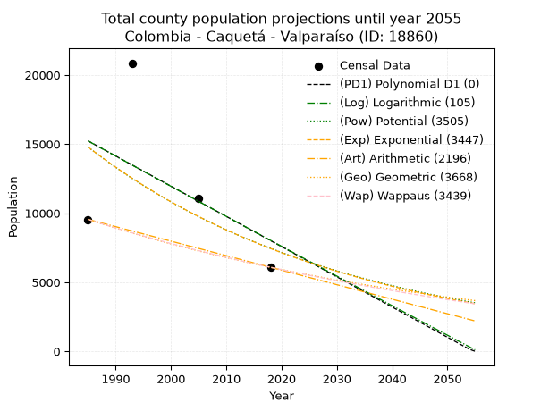
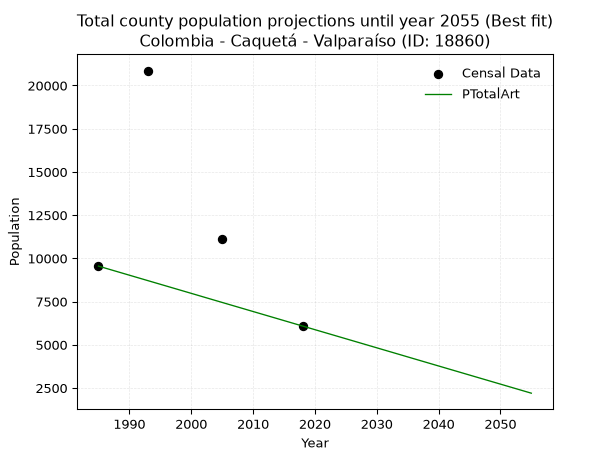
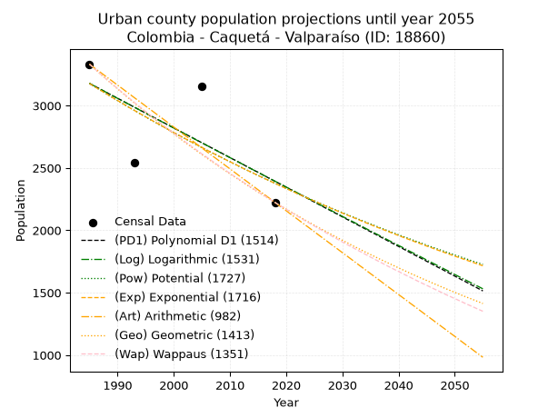
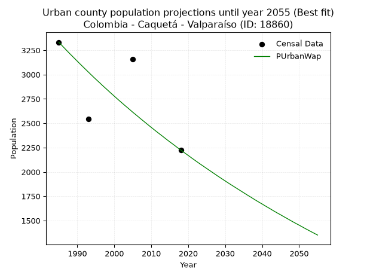
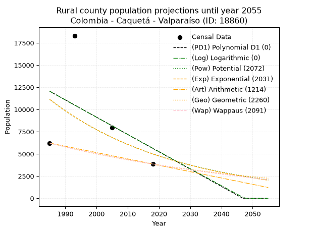
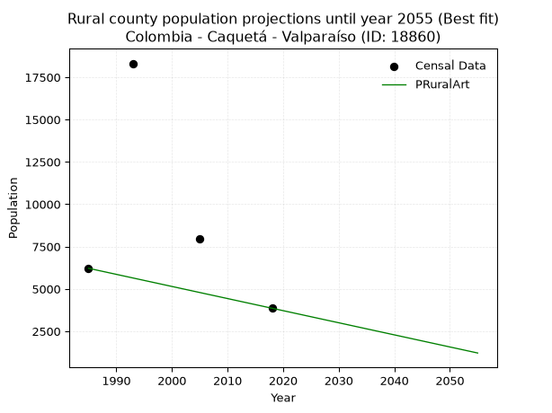

<div align="center">


</div>

# 📜 _“Population and Public Services Demand Projections (PPSD) until Year 2050 for Colombia - Caquetá - Valparaíso (ID: 18860)”_
Keywords: `population` `public-service` `projection` `lineal` `polynomial` `logarithmic` `potential` `exponential` `arithmetic` `geometric` `wappaus` `dane` `colombia` `south-america`

PPSD are analytical estimates used by governments and planners to anticipate future changes in population size, age distribution, and the resulting community needs for utilities, healthcare, education, and infrastructure as sizing future water treatment facilities, electrical grids, and road networks based on spatial growth.

<div align="center">

</img>

</div>


> **General running parameters**: • app_version: _v20260806_. • Python version: _3.14.7_. • Pandas version: _3.0.5_. • NumPy version: _2.5.1_. • Creates, save and include plots into reports (create_plot): _False_. • Projection until year: _2050_. • Process polynomial degree 2 and up: _False_. • Process Wappaus: _True_. • Process Wappaus: _True_. • Set negative values to zero: _True_. • Set infinite values to zero: _True_. • Drop dataset notes: _True_. 
<div align="center">

Maps & GIS Layers: [:earth_americas:Google](http://maps.google.com/maps?q=1.194618724,-75.7067096) [:earth_americas:OSM](https://www.openstreetmap.org/#map=18/1.194618724/-75.7067096&layers=P) [:earth_americas:Bing](https://www.bing.com/maps?cp=1.194618724~-75.7067096&lvl=18) [:earth_americas:Apple](https://maps.apple.com/frame?center=1.194618724%2C-75.7067096&span=0.003%2C0.006) [:earth_americas:GISMobile](https://github.com/rcfdtools/R.GISMobile/blob/main/file/gis/CountyLayer_CO/Readme.md)

</div>


<div align="center">

```geojson
{
  "type": "Feature",
  "geometry": {
    "type": "Point", 
    "coordinates": [-75.7067096, 1.194618724]
  }, 
  "properties": {
    "Name": "Colombia - Caquetá - Valparaíso (ID: 18860)"
  }
}
```

</div>


## 0. Census Data (4 records)

Census data are official statistics collected by a government about the people and housing in a country. They usually include counts of total population, age, sex, race, income, education, and jobs.

📅Global census file: [Population.xlsx](../data/Population.xlsx)

| Source   |   Year |   CountryID | CountryName   |   StateID | StateName   |   CountyID | CountyName   |   PTotal |   PUrban |   PRural |
|:---------|-------:|------------:|:--------------|----------:|:------------|-----------:|:-------------|---------:|---------:|---------:|
| DANE     |   1985 |          57 | Colombia      |        18 | Caquetá     |      18860 | Valparaíso   |     9548 |     3332 |     6216 |
| DANE     |   1993 |          57 | Colombia      |        18 | Caquetá     |      18860 | Valparaíso   |    20859 |     2546 |    18313 |
| DANE     |   2005 |          57 | Colombia      |        18 | Caquetá     |      18860 | Valparaíso   |    11100 |     3158 |     7942 |
| DANE     |   2018 |          57 | Colombia      |        18 | Caquetá     |      18860 | Valparaíso   |     6082 |     2224 |     3858 |

> 🔥Some records could had specific notes about the registered values or the corresponding urban or rural distribution.

📅[SUI-RUPS](https://www.datos.gov.co/Hacienda-y-Cr-dito-P-blico/Registro-nico-de-Prestadores-de-Servicios-P-blicos/4qkq-csdn/about_data) - Local public utility companies: [RUPS.csv](../data/RUPS.csv)

 | SERVICIO       | ESTADO    | NOMBRE                                                                                                                                   | NIT         | DEPARTAMENTO_DOMICILIO   | MUNICIPIO_DOMICILIO   | DIRECCION                        |   TELEFONO | EMAIL                    | TIPO_PRESTADOR                             | CLASIFICACION                 |
|:---------------|:----------|:-----------------------------------------------------------------------------------------------------------------------------------------|:------------|:-------------------------|:----------------------|:---------------------------------|-----------:|:-------------------------|:-------------------------------------------|:------------------------------|
| ACUEDUCTO      | OPERATIVA | EMPRESA DE SERVICIOS PUBLICOS DE VALPARAISO CAQUETA                                                                                      | 828001600-8 | CAQUETA                  | VALPARAISO            | antigua instalaciones del incora |    4304052 | lirugil@yahho.es         | SOCIEDADES (EMPRESA DE SERVICIOS PUBLICOS) | HASTA 2500 SUSCRIPTORES       |
| ALCANTARILLADO | OPERATIVA | EMPRESA DE SERVICIOS PUBLICOS DE VALPARAISO CAQUETA                                                                                      | 828001600-8 | CAQUETA                  | VALPARAISO            | antigua instalaciones del incora |    4304052 | lirugil@yahho.es         | SOCIEDADES (EMPRESA DE SERVICIOS PUBLICOS) | HASTA 2500 SUSCRIPTORES       |
| ACUEDUCTO      | OPERATIVA | EMPRESA PRESTADORA DE LOS SERVICIOS PÚBLICOS DOMICILIARIOS DE ACUEDUCTO, ALCANTARILLADO Y ASEO DEL MUNICIPIO DE VALPARAÍSO S.A.S. E.S.P. | 900579232-2 | CAQUETA                  | VALPARAISO            | CALLE 12 NO. 3-59                |    4347134 | aguasvalpsas@hotmail.com | SOCIEDADES (EMPRESA DE SERVICIOS PUBLICOS) | MENOR O IGUAL A 2500 USUARIOS |
| ALCANTARILLADO | OPERATIVA | EMPRESA PRESTADORA DE LOS SERVICIOS PÚBLICOS DOMICILIARIOS DE ACUEDUCTO, ALCANTARILLADO Y ASEO DEL MUNICIPIO DE VALPARAÍSO S.A.S. E.S.P. | 900579232-2 | CAQUETA                  | VALPARAISO            | CALLE 12 NO. 3-59                |    4347134 | aguasvalpsas@hotmail.com | SOCIEDADES (EMPRESA DE SERVICIOS PUBLICOS) | MENOR O IGUAL A 2500 USUARIOS |

## 1. Total

### 1.1. Coefficients and Parameters

* (PD1) Polynomial Deg 1: -218.63388197510676, 449219.6724207073 (lineal)
* (Log) Logarithmic: -436383.72778309893, 3328853.4618390636
* (Pow) Potential: -41.5314659564311, 141.13066257304004
* (Exp) Exponential: -0.02080344123069874, 1.2706969554683276e+22
* (Art) Arithmetic: Year diff. 2018 - 1985 = 33, Population diff. 6082 - 9548 = -3466, Annual growth = -105.03030303030303
* (Geo) Geometric: Year diff. 2018 - 1985 = 33, Population diff. 6082 - 9548 = -3466, Annual growth % = -0.013573645546750446
* (Wap) Wappaus: i = -1.3439578122879468, Condition values only valid for < 200)

<sub>
Wappaus condition values: ['-0.00', '-1.34', '-2.69', '-4.03', '-5.38', '-6.72', '-8.06', '-9.41', '-10.75', '-12.10', '-13.44', '-14.78', '-16.13', '-17.47', '-18.82', '-20.16', '-21.50', '-22.85', '-24.19', '-25.54', '-26.88', '-28.22', '-29.57', '-30.91', '-32.25', '-33.60', '-34.94', '-36.29', '-37.63', '-38.97', '-40.32', '-41.66', '-43.01', '-44.35', '-45.69', '-47.04', '-48.38', '-49.73', '-51.07', '-52.41', '-53.76', '-55.10', '-56.45', '-57.79', '-59.13', '-60.48', '-61.82', '-63.17', '-64.51', '-65.85', '-67.20', '-68.54', '-69.89', '-71.23', '-72.57', '-73.92', '-75.26', '-76.61', '-77.95', '-79.29', '-80.64', '-81.98', '-83.33', '-84.67', '-86.01', '-87.36']
</sub>


### 1.2. Projected Dataset

|   Year |   CountyID |   PTotalPD1 |   PTotalLog |   PTotalPow |   PTotalExp |   PTotalArt |   PTotalGeo |   PTotalWap |
|-------:|-----------:|------------:|------------:|------------:|------------:|------------:|------------:|------------:|
|   1985 |      18860 |       15231 |       15229 |       14785 |       14789 |        9548 |        9548 |        9548 |
|   1986 |      18860 |       15013 |       15009 |       14479 |       14484 |        9443 |        9418 |        9421 |
|   1987 |      18860 |       14794 |       14789 |       14180 |       14186 |        9338 |        9291 |        9295 |
|   1988 |      18860 |       14576 |       14570 |       13887 |       13894 |        9233 |        9164 |        9171 |
|   1989 |      18860 |       14357 |       14350 |       13600 |       13608 |        9128 |        9040 |        9048 |
|   1990 |      18860 |       14138 |       14131 |       13319 |       13328 |        9023 |        8917 |        8927 |
|   1991 |      18860 |       13920 |       13911 |       13044 |       13053 |        8918 |        8796 |        8808 |
|   1992 |      18860 |       13701 |       13692 |       12774 |       12784 |        8813 |        8677 |        8690 |
|   1993 |      18860 |       13482 |       13473 |       12511 |       12521 |        8708 |        8559 |        8574 |
|   1994 |      18860 |       13264 |       13254 |       12253 |       12263 |        8603 |        8443 |        8459 |
|   1995 |      18860 |       13045 |       13036 |       12000 |       12011 |        8498 |        8328 |        8346 |
|   1996 |      18860 |       12826 |       12817 |       11753 |       11764 |        8393 |        8215 |        8234 |
|   1997 |      18860 |       12608 |       12598 |       11511 |       11521 |        8288 |        8104 |        8123 |
|   1998 |      18860 |       12389 |       12380 |       11274 |       11284 |        8183 |        7994 |        8014 |
|   1999 |      18860 |       12171 |       12162 |       11043 |       11052 |        8078 |        7885 |        7906 |
|   2000 |      18860 |       11952 |       11943 |       10816 |       10824 |        7973 |        7778 |        7799 |
|   2001 |      18860 |       11733 |       11725 |       10593 |       10602 |        7868 |        7673 |        7694 |
|   2002 |      18860 |       11515 |       11507 |       10376 |       10383 |        7762 |        7569 |        7590 |
|   2003 |      18860 |       11296 |       11289 |       10163 |       10169 |        7657 |        7466 |        7487 |
|   2004 |      18860 |       11077 |       11071 |        9954 |        9960 |        7552 |        7364 |        7386 |
|   2005 |      18860 |       10859 |       10854 |        9750 |        9755 |        7447 |        7265 |        7286 |
|   2006 |      18860 |       10640 |       10636 |        9550 |        9554 |        7342 |        7166 |        7187 |
|   2007 |      18860 |       10421 |       10419 |        9355 |        9357 |        7237 |        7069 |        7089 |
|   2008 |      18860 |       10203 |       10201 |        9163 |        9165 |        7132 |        6973 |        6992 |
|   2009 |      18860 |        9984 |        9984 |        8976 |        8976 |        7027 |        6878 |        6896 |
|   2010 |      18860 |        9766 |        9767 |        8792 |        8791 |        6922 |        6785 |        6801 |
|   2011 |      18860 |        9547 |        9550 |        8612 |        8610 |        6817 |        6693 |        6708 |
|   2012 |      18860 |        9328 |        9333 |        8436 |        8433 |        6712 |        6602 |        6615 |
|   2013 |      18860 |        9110 |        9116 |        8264 |        8259 |        6607 |        6512 |        6524 |
|   2014 |      18860 |        8891 |        8899 |        8095 |        8089 |        6502 |        6424 |        6434 |
|   2015 |      18860 |        8672 |        8683 |        7930 |        7923 |        6397 |        6337 |        6344 |
|   2016 |      18860 |        8454 |        8466 |        7768 |        7760 |        6292 |        6251 |        6256 |
|   2017 |      18860 |        8235 |        8250 |        7610 |        7600 |        6187 |        6166 |        6168 |
|   2018 |      18860 |        8016 |        8033 |        7455 |        7443 |        6082 |        6082 |        6082 |
|   2019 |      18860 |        7798 |        7817 |        7303 |        7290 |        5977 |        5999 |        5997 |
|   2020 |      18860 |        7579 |        7601 |        7154 |        7140 |        5872 |        5918 |        5912 |
|   2021 |      18860 |        7361 |        7385 |        7009 |        6993 |        5767 |        5838 |        5828 |
|   2022 |      18860 |        7142 |        7169 |        6866 |        6849 |        5662 |        5758 |        5746 |
|   2023 |      18860 |        6923 |        6954 |        6727 |        6708 |        5557 |        5680 |        5664 |
|   2024 |      18860 |        6705 |        6738 |        6590 |        6570 |        5452 |        5603 |        5583 |
|   2025 |      18860 |        6486 |        6522 |        6456 |        6435 |        5347 |        5527 |        5503 |
|   2026 |      18860 |        6267 |        6307 |        6325 |        6302 |        5242 |        5452 |        5423 |
|   2027 |      18860 |        6049 |        6092 |        6197 |        6173 |        5137 |        5378 |        5345 |
|   2028 |      18860 |        5830 |        5876 |        6071 |        6045 |        5032 |        5305 |        5267 |
|   2029 |      18860 |        5612 |        5661 |        5948 |        5921 |        4927 |        5233 |        5190 |
|   2030 |      18860 |        5393 |        5446 |        5828 |        5799 |        4822 |        5162 |        5114 |
|   2031 |      18860 |        5174 |        5231 |        5710 |        5680 |        4717 |        5092 |        5039 |
|   2032 |      18860 |        4956 |        5016 |        5594 |        5563 |        4612 |        5023 |        4965 |
|   2033 |      18860 |        4737 |        4802 |        5481 |        5448 |        4507 |        4955 |        4891 |
|   2034 |      18860 |        4518 |        4587 |        5370 |        5336 |        4402 |        4887 |        4818 |
|   2035 |      18860 |        4300 |        4373 |        5262 |        5226 |        4296 |        4821 |        4746 |
|   2036 |      18860 |        4081 |        4158 |        5156 |        5119 |        4191 |        4756 |        4674 |
|   2037 |      18860 |        3862 |        3944 |        5051 |        5013 |        4086 |        4691 |        4603 |
|   2038 |      18860 |        3644 |        3730 |        4950 |        4910 |        3981 |        4627 |        4533 |
|   2039 |      18860 |        3425 |        3516 |        4850 |        4809 |        3876 |        4565 |        4464 |
|   2040 |      18860 |        3207 |        3302 |        4752 |        4710 |        3771 |        4503 |        4395 |
|   2041 |      18860 |        2988 |        3088 |        4656 |        4613 |        3666 |        4442 |        4327 |
|   2042 |      18860 |        2769 |        2874 |        4562 |        4518 |        3561 |        4381 |        4259 |
|   2043 |      18860 |        2551 |        2660 |        4471 |        4425 |        3456 |        4322 |        4193 |
|   2044 |      18860 |        2332 |        2447 |        4381 |        4334 |        3351 |        4263 |        4127 |
|   2045 |      18860 |        2113 |        2234 |        4293 |        4245 |        3246 |        4205 |        4061 |
|   2046 |      18860 |        1895 |        2020 |        4206 |        4157 |        3141 |        4148 |        3996 |
|   2047 |      18860 |        1676 |        1807 |        4122 |        4072 |        3036 |        4092 |        3932 |
|   2048 |      18860 |        1457 |        1594 |        4039 |        3988 |        2931 |        4036 |        3868 |
|   2049 |      18860 |        1239 |        1381 |        3958 |        3906 |        2826 |        3982 |        3805 |
|   2050 |      18860 |        1020 |        1168 |        3879 |        3825 |        2721 |        3927 |        3743 |
<div align="center">

</img>

</div>


### 1.3. Best fit with absolute and relative error (%)

Relative error puts that difference into context by dividing the absolute error by the true value, creating a unitless ratio or percentage that shows the scale of the mistake.

Absolute and relative error

|   Year | Source   |   CountryID | CountryName   |   StateID | StateName   |   CountyID_x | CountyName   |   PTotal |   PUrban |   PRural |   CountyID_y |   PTotalPD1 |   PTotalLog |   PTotalPow |   PTotalExp |   PTotalArt |   PTotalGeo |   PTotalWap |   PTotalPD1AbsError |   PTotalLogAbsError |   PTotalPowAbsError |   PTotalExpAbsError |   PTotalArtAbsError |   PTotalGeoAbsError |   PTotalWapAbsError |   PTotalPD1RelError |   PTotalLogRelError |   PTotalPowRelError |   PTotalExpRelError |   PTotalArtRelError |   PTotalGeoRelError |   PTotalWapRelError |
|-------:|:---------|------------:|:--------------|----------:|:------------|-------------:|:-------------|---------:|---------:|---------:|-------------:|------------:|------------:|------------:|------------:|------------:|------------:|------------:|--------------------:|--------------------:|--------------------:|--------------------:|--------------------:|--------------------:|--------------------:|--------------------:|--------------------:|--------------------:|--------------------:|--------------------:|--------------------:|--------------------:|
|   1985 | DANE     |          57 | Colombia      |        18 | Caquetá     |        18860 | Valparaíso   |     9548 |     3332 |     6216 |        18860 |       15231 |       15229 |       14785 |       14789 |        9548 |        9548 |        9548 |                5683 |                5681 |                5237 |                5241 |                   0 |                   0 |                   0 |            59.5203  |            59.4994  |             54.8492 |             54.8911 |              0      |              0      |              0      |
|   1993 | DANE     |          57 | Colombia      |        18 | Caquetá     |        18860 | Valparaíso   |    20859 |     2546 |    18313 |        18860 |       13482 |       13473 |       12511 |       12521 |        8708 |        8559 |        8574 |                7377 |                7386 |                8348 |                8338 |               12151 |               12300 |               12285 |            35.366   |            35.4092  |             40.0211 |             39.9732 |             58.253  |             58.9674 |             58.8954 |
|   2005 | DANE     |          57 | Colombia      |        18 | Caquetá     |        18860 | Valparaíso   |    11100 |     3158 |     7942 |        18860 |       10859 |       10854 |        9750 |        9755 |        7447 |        7265 |        7286 |                 241 |                 246 |                1350 |                1345 |                3653 |                3835 |                3814 |             2.17117 |             2.21622 |             12.1622 |             12.1171 |             32.9099 |             34.5495 |             34.3604 |
|   2018 | DANE     |          57 | Colombia      |        18 | Caquetá     |        18860 | Valparaíso   |     6082 |     2224 |     3858 |        18860 |        8016 |        8033 |        7455 |        7443 |        6082 |        6082 |        6082 |                1934 |                1951 |                1373 |                1361 |                   0 |                   0 |                   0 |            31.7988  |            32.0783  |             22.5748 |             22.3775 |              0      |              0      |              0      |

Relative error mean

| Method    |   RelError | Best   |
|:----------|-----------:|:-------|
| PTotalPD1 |    32.2141 |        |
| PTotalLog |    32.3008 |        |
| PTotalPow |    32.4018 |        |
| PTotalExp |    32.3397 |        |
| PTotalArt |    22.7907 | True   |
| PTotalGeo |    23.3792 |        |
| PTotalWap |    23.314  |        |

💙Best method: _**PTotalArt**_
<div align="center">

</img>

</div>


### 1.4. Fresh water supply demand in liters per capita per day (lpcd)

The fresh water supply demand typically ranges from 100 to 300 liters per capita per day (lpcd) for standard domestic and municipal planning, though absolute survival minimums set by the World Health Organization are as low as 7.5 to 20 liters per day, and total consumption in high-income nations can exceed 400 liters.

> `CZ`: Level in meters above the sea level (masl)<br> `WS`: Fresh water supply demand in liters per capita per day (lpcd or l/h/d)<br> `WSAll`: Zonal fresh water supply demand in liters per second (l/s)<br> `A`: Zonal area in square meters<br> `DP`: Population density (people/hectare or p/ha)

Reference values (RAS Colombia)

|    CZ |   WS |
|------:|-----:|
|  1000 |  120 |
|  2000 |  130 |
| 99999 |  140 |

County shapefile geometry properties and water supply values

|   CountyID |      ATotal |   CZTotal |   WSTotal |
|-----------:|------------:|----------:|----------:|
|      18860 | 1.32992e+09 |   234.783 |       120 |

Projected values for best method: PTotalArt

|   CountyID |   Year |   PTotalArt |   DPTotal |   WSTotal |   WSTotalAll |
|-----------:|-------:|------------:|----------:|----------:|-------------:|
|      18860 |   1985 |        9548 |      0.07 |       120 |     13.2611  |
|      18860 |   1986 |        9443 |      0.07 |       120 |     13.1153  |
|      18860 |   1987 |        9338 |      0.07 |       120 |     12.9694  |
|      18860 |   1988 |        9233 |      0.07 |       120 |     12.8236  |
|      18860 |   1989 |        9128 |      0.07 |       120 |     12.6778  |
|      18860 |   1990 |        9023 |      0.07 |       120 |     12.5319  |
|      18860 |   1991 |        8918 |      0.07 |       120 |     12.3861  |
|      18860 |   1992 |        8813 |      0.07 |       120 |     12.2403  |
|      18860 |   1993 |        8708 |      0.07 |       120 |     12.0944  |
|      18860 |   1994 |        8603 |      0.06 |       120 |     11.9486  |
|      18860 |   1995 |        8498 |      0.06 |       120 |     11.8028  |
|      18860 |   1996 |        8393 |      0.06 |       120 |     11.6569  |
|      18860 |   1997 |        8288 |      0.06 |       120 |     11.5111  |
|      18860 |   1998 |        8183 |      0.06 |       120 |     11.3653  |
|      18860 |   1999 |        8078 |      0.06 |       120 |     11.2194  |
|      18860 |   2000 |        7973 |      0.06 |       120 |     11.0736  |
|      18860 |   2001 |        7868 |      0.06 |       120 |     10.9278  |
|      18860 |   2002 |        7762 |      0.06 |       120 |     10.7806  |
|      18860 |   2003 |        7657 |      0.06 |       120 |     10.6347  |
|      18860 |   2004 |        7552 |      0.06 |       120 |     10.4889  |
|      18860 |   2005 |        7447 |      0.06 |       120 |     10.3431  |
|      18860 |   2006 |        7342 |      0.06 |       120 |     10.1972  |
|      18860 |   2007 |        7237 |      0.05 |       120 |     10.0514  |
|      18860 |   2008 |        7132 |      0.05 |       120 |      9.90556 |
|      18860 |   2009 |        7027 |      0.05 |       120 |      9.75972 |
|      18860 |   2010 |        6922 |      0.05 |       120 |      9.61389 |
|      18860 |   2011 |        6817 |      0.05 |       120 |      9.46806 |
|      18860 |   2012 |        6712 |      0.05 |       120 |      9.32222 |
|      18860 |   2013 |        6607 |      0.05 |       120 |      9.17639 |
|      18860 |   2014 |        6502 |      0.05 |       120 |      9.03056 |
|      18860 |   2015 |        6397 |      0.05 |       120 |      8.88472 |
|      18860 |   2016 |        6292 |      0.05 |       120 |      8.73889 |
|      18860 |   2017 |        6187 |      0.05 |       120 |      8.59306 |
|      18860 |   2018 |        6082 |      0.05 |       120 |      8.44722 |
|      18860 |   2019 |        5977 |      0.04 |       120 |      8.30139 |
|      18860 |   2020 |        5872 |      0.04 |       120 |      8.15556 |
|      18860 |   2021 |        5767 |      0.04 |       120 |      8.00972 |
|      18860 |   2022 |        5662 |      0.04 |       120 |      7.86389 |
|      18860 |   2023 |        5557 |      0.04 |       120 |      7.71806 |
|      18860 |   2024 |        5452 |      0.04 |       120 |      7.57222 |
|      18860 |   2025 |        5347 |      0.04 |       120 |      7.42639 |
|      18860 |   2026 |        5242 |      0.04 |       120 |      7.28056 |
|      18860 |   2027 |        5137 |      0.04 |       120 |      7.13472 |
|      18860 |   2028 |        5032 |      0.04 |       120 |      6.98889 |
|      18860 |   2029 |        4927 |      0.04 |       120 |      6.84306 |
|      18860 |   2030 |        4822 |      0.04 |       120 |      6.69722 |
|      18860 |   2031 |        4717 |      0.04 |       120 |      6.55139 |
|      18860 |   2032 |        4612 |      0.03 |       120 |      6.40556 |
|      18860 |   2033 |        4507 |      0.03 |       120 |      6.25972 |
|      18860 |   2034 |        4402 |      0.03 |       120 |      6.11389 |
|      18860 |   2035 |        4296 |      0.03 |       120 |      5.96667 |
|      18860 |   2036 |        4191 |      0.03 |       120 |      5.82083 |
|      18860 |   2037 |        4086 |      0.03 |       120 |      5.675   |
|      18860 |   2038 |        3981 |      0.03 |       120 |      5.52917 |
|      18860 |   2039 |        3876 |      0.03 |       120 |      5.38333 |
|      18860 |   2040 |        3771 |      0.03 |       120 |      5.2375  |
|      18860 |   2041 |        3666 |      0.03 |       120 |      5.09167 |
|      18860 |   2042 |        3561 |      0.03 |       120 |      4.94583 |
|      18860 |   2043 |        3456 |      0.03 |       120 |      4.8     |
|      18860 |   2044 |        3351 |      0.03 |       120 |      4.65417 |
|      18860 |   2045 |        3246 |      0.02 |       120 |      4.50833 |
|      18860 |   2046 |        3141 |      0.02 |       120 |      4.3625  |
|      18860 |   2047 |        3036 |      0.02 |       120 |      4.21667 |
|      18860 |   2048 |        2931 |      0.02 |       120 |      4.07083 |
|      18860 |   2049 |        2826 |      0.02 |       120 |      3.925   |
|      18860 |   2050 |        2721 |      0.02 |       120 |      3.77917 |

## 2. Urban

### 2.1. Coefficients and Parameters

* (PD1) Polynomial Deg 1: -23.757527097550643, 50335.993576875684 (lineal)
* (Log) Logarithmic: -47529.563242150536, 364087.5910816025
* (Pow) Potential: -17.602087943704834, 61.54960476976161
* (Exp) Exponential: -0.008799459880406929, 122418401396.478
* (Art) Arithmetic: Year diff. 2018 - 1985 = 33, Population diff. 2224 - 3332 = -1108, Annual growth = -33.57575757575758
* (Geo) Geometric: Year diff. 2018 - 1985 = 33, Population diff. 2224 - 3332 = -1108, Annual growth % = -0.012175733617303064
* (Wap) Wappaus: i = -1.2086305822806902, Condition values only valid for < 200)

<sub>
Wappaus condition values: ['-0.00', '-1.21', '-2.42', '-3.63', '-4.83', '-6.04', '-7.25', '-8.46', '-9.67', '-10.88', '-12.09', '-13.29', '-14.50', '-15.71', '-16.92', '-18.13', '-19.34', '-20.55', '-21.76', '-22.96', '-24.17', '-25.38', '-26.59', '-27.80', '-29.01', '-30.22', '-31.42', '-32.63', '-33.84', '-35.05', '-36.26', '-37.47', '-38.68', '-39.88', '-41.09', '-42.30', '-43.51', '-44.72', '-45.93', '-47.14', '-48.35', '-49.55', '-50.76', '-51.97', '-53.18', '-54.39', '-55.60', '-56.81', '-58.01', '-59.22', '-60.43', '-61.64', '-62.85', '-64.06', '-65.27', '-66.47', '-67.68', '-68.89', '-70.10', '-71.31', '-72.52', '-73.73', '-74.94', '-76.14', '-77.35', '-78.56']
</sub>


### 2.2. Projected Dataset

|   Year |   CountyID |   PUrbanPD1 |   PUrbanLog |   PUrbanPow |   PUrbanExp |   PUrbanArt |   PUrbanGeo |   PUrbanWap |
|-------:|-----------:|------------:|------------:|------------:|------------:|------------:|------------:|------------:|
|   1985 |      18860 |        3177 |        3178 |        3178 |        3177 |        3332 |        3332 |        3332 |
|   1986 |      18860 |        3154 |        3154 |        3150 |        3149 |        3298 |        3291 |        3292 |
|   1987 |      18860 |        3130 |        3130 |        3122 |        3122 |        3265 |        3251 |        3252 |
|   1988 |      18860 |        3106 |        3106 |        3094 |        3095 |        3231 |        3212 |        3213 |
|   1989 |      18860 |        3082 |        3082 |        3067 |        3067 |        3198 |        3173 |        3175 |
|   1990 |      18860 |        3059 |        3058 |        3040 |        3041 |        3164 |        3134 |        3137 |
|   1991 |      18860 |        3035 |        3034 |        3013 |        3014 |        3131 |        3096 |        3099 |
|   1992 |      18860 |        3011 |        3011 |        2987 |        2987 |        3097 |        3058 |        3062 |
|   1993 |      18860 |        2987 |        2987 |        2961 |        2961 |        3063 |        3021 |        3025 |
|   1994 |      18860 |        2963 |        2963 |        2935 |        2935 |        3030 |        2984 |        2988 |
|   1995 |      18860 |        2940 |        2939 |        2909 |        2910 |        2996 |        2948 |        2952 |
|   1996 |      18860 |        2916 |        2915 |        2883 |        2884 |        2963 |        2912 |        2917 |
|   1997 |      18860 |        2892 |        2891 |        2858 |        2859 |        2929 |        2876 |        2881 |
|   1998 |      18860 |        2868 |        2868 |        2833 |        2834 |        2896 |        2841 |        2847 |
|   1999 |      18860 |        2845 |        2844 |        2808 |        2809 |        2862 |        2807 |        2812 |
|   2000 |      18860 |        2821 |        2820 |        2783 |        2784 |        2828 |        2773 |        2778 |
|   2001 |      18860 |        2797 |        2796 |        2759 |        2760 |        2795 |        2739 |        2744 |
|   2002 |      18860 |        2773 |        2773 |        2735 |        2736 |        2761 |        2706 |        2711 |
|   2003 |      18860 |        2750 |        2749 |        2711 |        2712 |        2728 |        2673 |        2678 |
|   2004 |      18860 |        2726 |        2725 |        2687 |        2688 |        2694 |        2640 |        2646 |
|   2005 |      18860 |        2702 |        2701 |        2664 |        2665 |        2660 |        2608 |        2613 |
|   2006 |      18860 |        2678 |        2678 |        2640 |        2641 |        2627 |        2576 |        2582 |
|   2007 |      18860 |        2655 |        2654 |        2617 |        2618 |        2593 |        2545 |        2550 |
|   2008 |      18860 |        2631 |        2630 |        2595 |        2595 |        2560 |        2514 |        2519 |
|   2009 |      18860 |        2607 |        2607 |        2572 |        2572 |        2526 |        2483 |        2488 |
|   2010 |      18860 |        2583 |        2583 |        2550 |        2550 |        2493 |        2453 |        2457 |
|   2011 |      18860 |        2560 |        2559 |        2527 |        2528 |        2459 |        2423 |        2427 |
|   2012 |      18860 |        2536 |        2536 |        2505 |        2505 |        2425 |        2394 |        2397 |
|   2013 |      18860 |        2512 |        2512 |        2483 |        2483 |        2392 |        2364 |        2368 |
|   2014 |      18860 |        2488 |        2488 |        2462 |        2462 |        2358 |        2336 |        2338 |
|   2015 |      18860 |        2465 |        2465 |        2440 |        2440 |        2325 |        2307 |        2309 |
|   2016 |      18860 |        2441 |        2441 |        2419 |        2419 |        2291 |        2279 |        2281 |
|   2017 |      18860 |        2417 |        2418 |        2398 |        2398 |        2258 |        2251 |        2252 |
|   2018 |      18860 |        2393 |        2394 |        2377 |        2377 |        2224 |        2224 |        2224 |
|   2019 |      18860 |        2370 |        2371 |        2357 |        2356 |        2190 |        2197 |        2196 |
|   2020 |      18860 |        2346 |        2347 |        2336 |        2335 |        2157 |        2170 |        2169 |
|   2021 |      18860 |        2322 |        2324 |        2316 |        2315 |        2123 |        2144 |        2141 |
|   2022 |      18860 |        2298 |        2300 |        2296 |        2294 |        2090 |        2118 |        2114 |
|   2023 |      18860 |        2275 |        2277 |        2276 |        2274 |        2056 |        2092 |        2087 |
|   2024 |      18860 |        2251 |        2253 |        2256 |        2254 |        2023 |        2066 |        2061 |
|   2025 |      18860 |        2227 |        2230 |        2237 |        2235 |        1989 |        2041 |        2035 |
|   2026 |      18860 |        2203 |        2206 |        2217 |        2215 |        1955 |        2016 |        2009 |
|   2027 |      18860 |        2179 |        2183 |        2198 |        2196 |        1922 |        1992 |        1983 |
|   2028 |      18860 |        2156 |        2159 |        2179 |        2176 |        1888 |        1968 |        1957 |
|   2029 |      18860 |        2132 |        2136 |        2160 |        2157 |        1855 |        1944 |        1932 |
|   2030 |      18860 |        2108 |        2112 |        2142 |        2138 |        1821 |        1920 |        1907 |
|   2031 |      18860 |        2084 |        2089 |        2123 |        2120 |        1788 |        1897 |        1882 |
|   2032 |      18860 |        2061 |        2066 |        2105 |        2101 |        1754 |        1873 |        1858 |
|   2033 |      18860 |        2037 |        2042 |        2087 |        2083 |        1720 |        1851 |        1834 |
|   2034 |      18860 |        2013 |        2019 |        2069 |        2064 |        1687 |        1828 |        1810 |
|   2035 |      18860 |        1989 |        1995 |        2051 |        2046 |        1653 |        1806 |        1786 |
|   2036 |      18860 |        1966 |        1972 |        2033 |        2028 |        1620 |        1784 |        1762 |
|   2037 |      18860 |        1942 |        1949 |        2016 |        2011 |        1586 |        1762 |        1739 |
|   2038 |      18860 |        1918 |        1925 |        1998 |        1993 |        1552 |        1741 |        1715 |
|   2039 |      18860 |        1894 |        1902 |        1981 |        1976 |        1519 |        1720 |        1692 |
|   2040 |      18860 |        1871 |        1879 |        1964 |        1958 |        1485 |        1699 |        1670 |
|   2041 |      18860 |        1847 |        1856 |        1947 |        1941 |        1452 |        1678 |        1647 |
|   2042 |      18860 |        1823 |        1832 |        1931 |        1924 |        1418 |        1657 |        1625 |
|   2043 |      18860 |        1799 |        1809 |        1914 |        1907 |        1385 |        1637 |        1602 |
|   2044 |      18860 |        1776 |        1786 |        1898 |        1891 |        1351 |        1617 |        1580 |
|   2045 |      18860 |        1752 |        1762 |        1881 |        1874 |        1317 |        1598 |        1559 |
|   2046 |      18860 |        1728 |        1739 |        1865 |        1858 |        1284 |        1578 |        1537 |
|   2047 |      18860 |        1704 |        1716 |        1849 |        1841 |        1250 |        1559 |        1516 |
|   2048 |      18860 |        1681 |        1693 |        1834 |        1825 |        1217 |        1540 |        1494 |
|   2049 |      18860 |        1657 |        1670 |        1818 |        1809 |        1183 |        1521 |        1473 |
|   2050 |      18860 |        1633 |        1646 |        1802 |        1793 |        1150 |        1503 |        1453 |
<div align="center">

</img>

</div>


### 2.3. Best fit with absolute and relative error (%)

Relative error puts that difference into context by dividing the absolute error by the true value, creating a unitless ratio or percentage that shows the scale of the mistake.

Absolute and relative error

|   Year | Source   |   CountryID | CountryName   |   StateID | StateName   |   CountyID_x | CountyName   |   PTotal |   PUrban |   PRural |   CountyID_y |   PUrbanPD1 |   PUrbanLog |   PUrbanPow |   PUrbanExp |   PUrbanArt |   PUrbanGeo |   PUrbanWap |   PUrbanPD1AbsError |   PUrbanLogAbsError |   PUrbanPowAbsError |   PUrbanExpAbsError |   PUrbanArtAbsError |   PUrbanGeoAbsError |   PUrbanWapAbsError |   PUrbanPD1RelError |   PUrbanLogRelError |   PUrbanPowRelError |   PUrbanExpRelError |   PUrbanArtRelError |   PUrbanGeoRelError |   PUrbanWapRelError |
|-------:|:---------|------------:|:--------------|----------:|:------------|-------------:|:-------------|---------:|---------:|---------:|-------------:|------------:|------------:|------------:|------------:|------------:|------------:|------------:|--------------------:|--------------------:|--------------------:|--------------------:|--------------------:|--------------------:|--------------------:|--------------------:|--------------------:|--------------------:|--------------------:|--------------------:|--------------------:|--------------------:|
|   1985 | DANE     |          57 | Colombia      |        18 | Caquetá     |        18860 | Valparaíso   |     9548 |     3332 |     6216 |        18860 |        3177 |        3178 |        3178 |        3177 |        3332 |        3332 |        3332 |                 155 |                 154 |                 154 |                 155 |                   0 |                   0 |                   0 |             4.65186 |             4.62185 |             4.62185 |             4.65186 |              0      |              0      |              0      |
|   1993 | DANE     |          57 | Colombia      |        18 | Caquetá     |        18860 | Valparaíso   |    20859 |     2546 |    18313 |        18860 |        2987 |        2987 |        2961 |        2961 |        3063 |        3021 |        3025 |                 441 |                 441 |                 415 |                 415 |                 517 |                 475 |                 479 |            17.3213  |            17.3213  |            16.3001  |            16.3001  |             20.3064 |             18.6567 |             18.8138 |
|   2005 | DANE     |          57 | Colombia      |        18 | Caquetá     |        18860 | Valparaíso   |    11100 |     3158 |     7942 |        18860 |        2702 |        2701 |        2664 |        2665 |        2660 |        2608 |        2613 |                 456 |                 457 |                 494 |                 493 |                 498 |                 550 |                 545 |            14.4395  |            14.4712  |            15.6428  |            15.6111  |             15.7695 |             17.4161 |             17.2578 |
|   2018 | DANE     |          57 | Colombia      |        18 | Caquetá     |        18860 | Valparaíso   |     6082 |     2224 |     3858 |        18860 |        2393 |        2394 |        2377 |        2377 |        2224 |        2224 |        2224 |                 169 |                 170 |                 153 |                 153 |                   0 |                   0 |                   0 |             7.59892 |             7.64388 |             6.8795  |             6.8795  |              0      |              0      |              0      |

Relative error mean

| Method    |   RelError | Best   |
|:----------|-----------:|:-------|
| PUrbanPD1 |   11.0029  |        |
| PUrbanLog |   11.0146  |        |
| PUrbanPow |   10.8611  |        |
| PUrbanExp |   10.8606  |        |
| PUrbanArt |    9.01896 |        |
| PUrbanGeo |    9.0182  |        |
| PUrbanWap |    9.0179  | True   |

💙Best method: _**PUrbanWap**_
<div align="center">

</img>

</div>


### 2.4. Fresh water supply demand in liters per capita per day (lpcd)

The fresh water supply demand typically ranges from 100 to 300 liters per capita per day (lpcd) for standard domestic and municipal planning, though absolute survival minimums set by the World Health Organization are as low as 7.5 to 20 liters per day, and total consumption in high-income nations can exceed 400 liters.

> `CZ`: Level in meters above the sea level (masl)<br> `WS`: Fresh water supply demand in liters per capita per day (lpcd or l/h/d)<br> `WSAll`: Zonal fresh water supply demand in liters per second (l/s)<br> `A`: Zonal area in square meters<br> `DP`: Population density (people/hectare or p/ha)

Reference values (RAS Colombia)

|    CZ |   WS |
|------:|-----:|
|  1000 |  120 |
|  2000 |  130 |
| 99999 |  140 |

County shapefile geometry properties and water supply values

|   CountyID |   AUrban |   CZUrban |   WSUrban |
|-----------:|---------:|----------:|----------:|
|      18860 |   600197 |     228.1 |       120 |

Projected values for best method: PUrbanWap

|   CountyID |   Year |   PUrbanWap |   DPUrban |   WSUrban |   WSUrbanAll |
|-----------:|-------:|------------:|----------:|----------:|-------------:|
|      18860 |   1985 |        3332 |     55.52 |       120 |      4.62778 |
|      18860 |   1986 |        3292 |     54.85 |       120 |      4.57222 |
|      18860 |   1987 |        3252 |     54.18 |       120 |      4.51667 |
|      18860 |   1988 |        3213 |     53.53 |       120 |      4.4625  |
|      18860 |   1989 |        3175 |     52.9  |       120 |      4.40972 |
|      18860 |   1990 |        3137 |     52.27 |       120 |      4.35694 |
|      18860 |   1991 |        3099 |     51.63 |       120 |      4.30417 |
|      18860 |   1992 |        3062 |     51.02 |       120 |      4.25278 |
|      18860 |   1993 |        3025 |     50.4  |       120 |      4.20139 |
|      18860 |   1994 |        2988 |     49.78 |       120 |      4.15    |
|      18860 |   1995 |        2952 |     49.18 |       120 |      4.1     |
|      18860 |   1996 |        2917 |     48.6  |       120 |      4.05139 |
|      18860 |   1997 |        2881 |     48    |       120 |      4.00139 |
|      18860 |   1998 |        2847 |     47.43 |       120 |      3.95417 |
|      18860 |   1999 |        2812 |     46.85 |       120 |      3.90556 |
|      18860 |   2000 |        2778 |     46.28 |       120 |      3.85833 |
|      18860 |   2001 |        2744 |     45.72 |       120 |      3.81111 |
|      18860 |   2002 |        2711 |     45.17 |       120 |      3.76528 |
|      18860 |   2003 |        2678 |     44.62 |       120 |      3.71944 |
|      18860 |   2004 |        2646 |     44.09 |       120 |      3.675   |
|      18860 |   2005 |        2613 |     43.54 |       120 |      3.62917 |
|      18860 |   2006 |        2582 |     43.02 |       120 |      3.58611 |
|      18860 |   2007 |        2550 |     42.49 |       120 |      3.54167 |
|      18860 |   2008 |        2519 |     41.97 |       120 |      3.49861 |
|      18860 |   2009 |        2488 |     41.45 |       120 |      3.45556 |
|      18860 |   2010 |        2457 |     40.94 |       120 |      3.4125  |
|      18860 |   2011 |        2427 |     40.44 |       120 |      3.37083 |
|      18860 |   2012 |        2397 |     39.94 |       120 |      3.32917 |
|      18860 |   2013 |        2368 |     39.45 |       120 |      3.28889 |
|      18860 |   2014 |        2338 |     38.95 |       120 |      3.24722 |
|      18860 |   2015 |        2309 |     38.47 |       120 |      3.20694 |
|      18860 |   2016 |        2281 |     38    |       120 |      3.16806 |
|      18860 |   2017 |        2252 |     37.52 |       120 |      3.12778 |
|      18860 |   2018 |        2224 |     37.05 |       120 |      3.08889 |
|      18860 |   2019 |        2196 |     36.59 |       120 |      3.05    |
|      18860 |   2020 |        2169 |     36.14 |       120 |      3.0125  |
|      18860 |   2021 |        2141 |     35.67 |       120 |      2.97361 |
|      18860 |   2022 |        2114 |     35.22 |       120 |      2.93611 |
|      18860 |   2023 |        2087 |     34.77 |       120 |      2.89861 |
|      18860 |   2024 |        2061 |     34.34 |       120 |      2.8625  |
|      18860 |   2025 |        2035 |     33.91 |       120 |      2.82639 |
|      18860 |   2026 |        2009 |     33.47 |       120 |      2.79028 |
|      18860 |   2027 |        1983 |     33.04 |       120 |      2.75417 |
|      18860 |   2028 |        1957 |     32.61 |       120 |      2.71806 |
|      18860 |   2029 |        1932 |     32.19 |       120 |      2.68333 |
|      18860 |   2030 |        1907 |     31.77 |       120 |      2.64861 |
|      18860 |   2031 |        1882 |     31.36 |       120 |      2.61389 |
|      18860 |   2032 |        1858 |     30.96 |       120 |      2.58056 |
|      18860 |   2033 |        1834 |     30.56 |       120 |      2.54722 |
|      18860 |   2034 |        1810 |     30.16 |       120 |      2.51389 |
|      18860 |   2035 |        1786 |     29.76 |       120 |      2.48056 |
|      18860 |   2036 |        1762 |     29.36 |       120 |      2.44722 |
|      18860 |   2037 |        1739 |     28.97 |       120 |      2.41528 |
|      18860 |   2038 |        1715 |     28.57 |       120 |      2.38194 |
|      18860 |   2039 |        1692 |     28.19 |       120 |      2.35    |
|      18860 |   2040 |        1670 |     27.82 |       120 |      2.31944 |
|      18860 |   2041 |        1647 |     27.44 |       120 |      2.2875  |
|      18860 |   2042 |        1625 |     27.07 |       120 |      2.25694 |
|      18860 |   2043 |        1602 |     26.69 |       120 |      2.225   |
|      18860 |   2044 |        1580 |     26.32 |       120 |      2.19444 |
|      18860 |   2045 |        1559 |     25.97 |       120 |      2.16528 |
|      18860 |   2046 |        1537 |     25.61 |       120 |      2.13472 |
|      18860 |   2047 |        1516 |     25.26 |       120 |      2.10556 |
|      18860 |   2048 |        1494 |     24.89 |       120 |      2.075   |
|      18860 |   2049 |        1473 |     24.54 |       120 |      2.04583 |
|      18860 |   2050 |        1453 |     24.21 |       120 |      2.01806 |

## 3. Rural

### 3.1. Coefficients and Parameters

* (PD1) Polynomial Deg 1: -194.87635487755608, 398883.6788438316 (lineal)
* (Log) Logarithmic: -388854.1645409487, 2964765.8707574634
* (Pow) Potential: -48.506966374772816, 164.01081528570654
* (Exp) Exponential: -0.024304992959368565, 9.9845427957045e+24
* (Art) Arithmetic: Year diff. 2018 - 1985 = 33, Population diff. 3858 - 6216 = -2358, Annual growth = -71.45454545454545
* (Geo) Geometric: Year diff. 2018 - 1985 = 33, Population diff. 3858 - 6216 = -2358, Annual growth % = -0.01434991393682683
* (Wap) Wappaus: i = -1.4185933185337594, Condition values only valid for < 200)

<sub>
Wappaus condition values: ['-0.00', '-1.42', '-2.84', '-4.26', '-5.67', '-7.09', '-8.51', '-9.93', '-11.35', '-12.77', '-14.19', '-15.60', '-17.02', '-18.44', '-19.86', '-21.28', '-22.70', '-24.12', '-25.53', '-26.95', '-28.37', '-29.79', '-31.21', '-32.63', '-34.05', '-35.46', '-36.88', '-38.30', '-39.72', '-41.14', '-42.56', '-43.98', '-45.39', '-46.81', '-48.23', '-49.65', '-51.07', '-52.49', '-53.91', '-55.33', '-56.74', '-58.16', '-59.58', '-61.00', '-62.42', '-63.84', '-65.26', '-66.67', '-68.09', '-69.51', '-70.93', '-72.35', '-73.77', '-75.19', '-76.60', '-78.02', '-79.44', '-80.86', '-82.28', '-83.70', '-85.12', '-86.53', '-87.95', '-89.37', '-90.79', '-92.21']
</sub>


### 3.2. Projected Dataset

|   Year |   CountyID |   PRuralPD1 |   PRuralLog |   PRuralPow |   PRuralExp |   PRuralArt |   PRuralGeo |   PRuralWap |
|-------:|-----------:|------------:|------------:|------------:|------------:|------------:|------------:|------------:|
|   1985 |      18860 |       12054 |       12051 |       11129 |       11133 |        6216 |        6216 |        6216 |
|   1986 |      18860 |       11859 |       11855 |       10860 |       10866 |        6145 |        6127 |        6128 |
|   1987 |      18860 |       11664 |       11659 |       10598 |       10605 |        6073 |        6039 |        6042 |
|   1988 |      18860 |       11469 |       11463 |       10343 |       10350 |        6002 |        5952 |        5957 |
|   1989 |      18860 |       11275 |       11268 |       10094 |       10102 |        5930 |        5867 |        5873 |
|   1990 |      18860 |       11080 |       11072 |        9851 |        9859 |        5859 |        5783 |        5790 |
|   1991 |      18860 |       10885 |       10877 |        9613 |        9622 |        5787 |        5700 |        5709 |
|   1992 |      18860 |       10690 |       10682 |        9382 |        9391 |        5716 |        5618 |        5628 |
|   1993 |      18860 |       10495 |       10487 |        9156 |        9166 |        5644 |        5537 |        5548 |
|   1994 |      18860 |       10300 |       10292 |        8936 |        8946 |        5573 |        5458 |        5470 |
|   1995 |      18860 |       10105 |       10097 |        8722 |        8731 |        5501 |        5379 |        5393 |
|   1996 |      18860 |        9910 |        9902 |        8512 |        8521 |        5430 |        5302 |        5316 |
|   1997 |      18860 |        9716 |        9707 |        8308 |        8317 |        5359 |        5226 |        5241 |
|   1998 |      18860 |        9521 |        9512 |        8109 |        8117 |        5287 |        5151 |        5166 |
|   1999 |      18860 |        9326 |        9318 |        7914 |        7922 |        5216 |        5077 |        5093 |
|   2000 |      18860 |        9131 |        9123 |        7724 |        7732 |        5144 |        5004 |        5020 |
|   2001 |      18860 |        8936 |        8929 |        7539 |        7546 |        5073 |        4933 |        4949 |
|   2002 |      18860 |        8741 |        8735 |        7359 |        7365 |        5001 |        4862 |        4878 |
|   2003 |      18860 |        8546 |        8540 |        7183 |        7188 |        4930 |        4792 |        4808 |
|   2004 |      18860 |        8351 |        8346 |        7011 |        7015 |        4858 |        4723 |        4740 |
|   2005 |      18860 |        8157 |        8152 |        6843 |        6847 |        4787 |        4655 |        4672 |
|   2006 |      18860 |        7962 |        7958 |        6680 |        6683 |        4715 |        4589 |        4604 |
|   2007 |      18860 |        7767 |        7765 |        6520 |        6522 |        4644 |        4523 |        4538 |
|   2008 |      18860 |        7572 |        7571 |        6365 |        6366 |        4573 |        4458 |        4472 |
|   2009 |      18860 |        7377 |        7377 |        6213 |        6213 |        4501 |        4394 |        4408 |
|   2010 |      18860 |        7182 |        7184 |        6065 |        6064 |        4430 |        4331 |        4344 |
|   2011 |      18860 |        6987 |        6990 |        5920 |        5918 |        4358 |        4269 |        4280 |
|   2012 |      18860 |        6792 |        6797 |        5779 |        5776 |        4287 |        4208 |        4218 |
|   2013 |      18860 |        6598 |        6604 |        5641 |        5637 |        4215 |        4147 |        4156 |
|   2014 |      18860 |        6403 |        6411 |        5507 |        5502 |        4144 |        4088 |        4095 |
|   2015 |      18860 |        6208 |        6218 |        5376 |        5370 |        4072 |        4029 |        4035 |
|   2016 |      18860 |        6013 |        6025 |        5248 |        5241 |        4001 |        3971 |        3975 |
|   2017 |      18860 |        5818 |        5832 |        5123 |        5115 |        3929 |        3914 |        3916 |
|   2018 |      18860 |        5623 |        5639 |        5002 |        4992 |        3858 |        3858 |        3858 |
|   2019 |      18860 |        5428 |        5447 |        4883 |        4872 |        3787 |        3803 |        3800 |
|   2020 |      18860 |        5233 |        5254 |        4767 |        4755 |        3715 |        3748 |        3744 |
|   2021 |      18860 |        5039 |        5062 |        4654 |        4641 |        3644 |        3694 |        3687 |
|   2022 |      18860 |        4844 |        4869 |        4544 |        4530 |        3572 |        3641 |        3632 |
|   2023 |      18860 |        4649 |        4677 |        4436 |        4421 |        3501 |        3589 |        3577 |
|   2024 |      18860 |        4454 |        4485 |        4331 |        4315 |        3429 |        3538 |        3522 |
|   2025 |      18860 |        4259 |        4293 |        4228 |        4211 |        3358 |        3487 |        3468 |
|   2026 |      18860 |        4064 |        4101 |        4128 |        4110 |        3286 |        3437 |        3415 |
|   2027 |      18860 |        3869 |        3909 |        4031 |        4011 |        3215 |        3387 |        3363 |
|   2028 |      18860 |        3674 |        3717 |        3935 |        3915 |        3143 |        3339 |        3310 |
|   2029 |      18860 |        3480 |        3525 |        3842 |        3821 |        3072 |        3291 |        3259 |
|   2030 |      18860 |        3285 |        3334 |        3752 |        3729 |        3001 |        3244 |        3208 |
|   2031 |      18860 |        3090 |        3142 |        3663 |        3640 |        2929 |        3197 |        3158 |
|   2032 |      18860 |        2895 |        2951 |        3577 |        3552 |        2858 |        3151 |        3108 |
|   2033 |      18860 |        2700 |        2760 |        3492 |        3467 |        2786 |        3106 |        3058 |
|   2034 |      18860 |        2505 |        2568 |        3410 |        3384 |        2715 |        3061 |        3010 |
|   2035 |      18860 |        2310 |        2377 |        3330 |        3302 |        2643 |        3018 |        2961 |
|   2036 |      18860 |        2115 |        2186 |        3251 |        3223 |        2572 |        2974 |        2913 |
|   2037 |      18860 |        1921 |        1995 |        3175 |        3146 |        2500 |        2932 |        2866 |
|   2038 |      18860 |        1726 |        1804 |        3100 |        3070 |        2429 |        2889 |        2819 |
|   2039 |      18860 |        1531 |        1614 |        3027 |        2996 |        2357 |        2848 |        2773 |
|   2040 |      18860 |        1336 |        1423 |        2956 |        2925 |        2286 |        2807 |        2727 |
|   2041 |      18860 |        1141 |        1232 |        2887 |        2854 |        2215 |        2767 |        2682 |
|   2042 |      18860 |         946 |        1042 |        2819 |        2786 |        2143 |        2727 |        2637 |
|   2043 |      18860 |         751 |         852 |        2753 |        2719 |        2072 |        2688 |        2592 |
|   2044 |      18860 |         556 |         661 |        2688 |        2654 |        2000 |        2649 |        2548 |
|   2045 |      18860 |         362 |         471 |        2625 |        2590 |        1929 |        2611 |        2505 |
|   2046 |      18860 |         167 |         281 |        2563 |        2528 |        1857 |        2574 |        2461 |
|   2047 |      18860 |           0 |          91 |        2503 |        2467 |        1786 |        2537 |        2419 |
|   2048 |      18860 |           0 |           0 |        2445 |        2408 |        1714 |        2501 |        2376 |
|   2049 |      18860 |           0 |           0 |        2388 |        2350 |        1643 |        2465 |        2335 |
|   2050 |      18860 |           0 |           0 |        2332 |        2294 |        1571 |        2429 |        2293 |
<div align="center">

</img>

</div>


### 3.3. Best fit with absolute and relative error (%)

Relative error puts that difference into context by dividing the absolute error by the true value, creating a unitless ratio or percentage that shows the scale of the mistake.

Absolute and relative error

|   Year | Source   |   CountryID | CountryName   |   StateID | StateName   |   CountyID_x | CountyName   |   PTotal |   PUrban |   PRural |   CountyID_y |   PRuralPD1 |   PRuralLog |   PRuralPow |   PRuralExp |   PRuralArt |   PRuralGeo |   PRuralWap |   PRuralPD1AbsError |   PRuralLogAbsError |   PRuralPowAbsError |   PRuralExpAbsError |   PRuralArtAbsError |   PRuralGeoAbsError |   PRuralWapAbsError |   PRuralPD1RelError |   PRuralLogRelError |   PRuralPowRelError |   PRuralExpRelError |   PRuralArtRelError |   PRuralGeoRelError |   PRuralWapRelError |
|-------:|:---------|------------:|:--------------|----------:|:------------|-------------:|:-------------|---------:|---------:|---------:|-------------:|------------:|------------:|------------:|------------:|------------:|------------:|------------:|--------------------:|--------------------:|--------------------:|--------------------:|--------------------:|--------------------:|--------------------:|--------------------:|--------------------:|--------------------:|--------------------:|--------------------:|--------------------:|--------------------:|
|   1985 | DANE     |          57 | Colombia      |        18 | Caquetá     |        18860 | Valparaíso   |     9548 |     3332 |     6216 |        18860 |       12054 |       12051 |       11129 |       11133 |        6216 |        6216 |        6216 |                5838 |                5835 |                4913 |                4917 |                   0 |                   0 |                   0 |            93.9189  |            93.8707  |             79.038  |             79.1023 |              0      |              0      |              0      |
|   1993 | DANE     |          57 | Colombia      |        18 | Caquetá     |        18860 | Valparaíso   |    20859 |     2546 |    18313 |        18860 |       10495 |       10487 |        9156 |        9166 |        5644 |        5537 |        5548 |                7818 |                7826 |                9157 |                9147 |               12669 |               12776 |               12765 |            42.691   |            42.7347  |             50.0027 |             49.9481 |             69.1804 |             69.7646 |             69.7046 |
|   2005 | DANE     |          57 | Colombia      |        18 | Caquetá     |        18860 | Valparaíso   |    11100 |     3158 |     7942 |        18860 |        8157 |        8152 |        6843 |        6847 |        4787 |        4655 |        4672 |                 215 |                 210 |                1099 |                1095 |                3155 |                3287 |                3270 |             2.70713 |             2.64417 |             13.8378 |             13.7875 |             39.7255 |             41.3876 |             41.1735 |
|   2018 | DANE     |          57 | Colombia      |        18 | Caquetá     |        18860 | Valparaíso   |     6082 |     2224 |     3858 |        18860 |        5623 |        5639 |        5002 |        4992 |        3858 |        3858 |        3858 |                1765 |                1781 |                1144 |                1134 |                   0 |                   0 |                   0 |            45.7491  |            46.1638  |             29.6527 |             29.3935 |              0      |              0      |              0      |

Relative error mean

| Method    |   RelError | Best   |
|:----------|-----------:|:-------|
| PRuralPD1 |    46.2665 |        |
| PRuralLog |    46.3533 |        |
| PRuralPow |    43.1328 |        |
| PRuralExp |    43.0578 |        |
| PRuralArt |    27.2265 | True   |
| PRuralGeo |    27.7881 |        |
| PRuralWap |    27.7195 |        |

💙Best method: _**PRuralArt**_
<div align="center">

</img>

</div>


### 3.4. Fresh water supply demand in liters per capita per day (lpcd)

The fresh water supply demand typically ranges from 100 to 300 liters per capita per day (lpcd) for standard domestic and municipal planning, though absolute survival minimums set by the World Health Organization are as low as 7.5 to 20 liters per day, and total consumption in high-income nations can exceed 400 liters.

> `CZ`: Level in meters above the sea level (masl)<br> `WS`: Fresh water supply demand in liters per capita per day (lpcd or l/h/d)<br> `WSAll`: Zonal fresh water supply demand in liters per second (l/s)<br> `A`: Zonal area in square meters<br> `DP`: Population density (people/hectare or p/ha)

Reference values (RAS Colombia)

|    CZ |   WS |
|------:|-----:|
|  1000 |  120 |
|  2000 |  130 |
| 99999 |  140 |

County shapefile geometry properties and water supply values

|   CountyID |      ARural |   CZRural |   WSRural |
|-----------:|------------:|----------:|----------:|
|      18860 | 1.32932e+09 |   234.786 |       120 |

Projected values for best method: PRuralArt

|   CountyID |   Year |   PRuralArt |   DPRural |   WSRural |   WSRuralAll |
|-----------:|-------:|------------:|----------:|----------:|-------------:|
|      18860 |   1985 |        6216 |      0.05 |       120 |      8.63333 |
|      18860 |   1986 |        6145 |      0.05 |       120 |      8.53472 |
|      18860 |   1987 |        6073 |      0.05 |       120 |      8.43472 |
|      18860 |   1988 |        6002 |      0.05 |       120 |      8.33611 |
|      18860 |   1989 |        5930 |      0.04 |       120 |      8.23611 |
|      18860 |   1990 |        5859 |      0.04 |       120 |      8.1375  |
|      18860 |   1991 |        5787 |      0.04 |       120 |      8.0375  |
|      18860 |   1992 |        5716 |      0.04 |       120 |      7.93889 |
|      18860 |   1993 |        5644 |      0.04 |       120 |      7.83889 |
|      18860 |   1994 |        5573 |      0.04 |       120 |      7.74028 |
|      18860 |   1995 |        5501 |      0.04 |       120 |      7.64028 |
|      18860 |   1996 |        5430 |      0.04 |       120 |      7.54167 |
|      18860 |   1997 |        5359 |      0.04 |       120 |      7.44306 |
|      18860 |   1998 |        5287 |      0.04 |       120 |      7.34306 |
|      18860 |   1999 |        5216 |      0.04 |       120 |      7.24444 |
|      18860 |   2000 |        5144 |      0.04 |       120 |      7.14444 |
|      18860 |   2001 |        5073 |      0.04 |       120 |      7.04583 |
|      18860 |   2002 |        5001 |      0.04 |       120 |      6.94583 |
|      18860 |   2003 |        4930 |      0.04 |       120 |      6.84722 |
|      18860 |   2004 |        4858 |      0.04 |       120 |      6.74722 |
|      18860 |   2005 |        4787 |      0.04 |       120 |      6.64861 |
|      18860 |   2006 |        4715 |      0.04 |       120 |      6.54861 |
|      18860 |   2007 |        4644 |      0.03 |       120 |      6.45    |
|      18860 |   2008 |        4573 |      0.03 |       120 |      6.35139 |
|      18860 |   2009 |        4501 |      0.03 |       120 |      6.25139 |
|      18860 |   2010 |        4430 |      0.03 |       120 |      6.15278 |
|      18860 |   2011 |        4358 |      0.03 |       120 |      6.05278 |
|      18860 |   2012 |        4287 |      0.03 |       120 |      5.95417 |
|      18860 |   2013 |        4215 |      0.03 |       120 |      5.85417 |
|      18860 |   2014 |        4144 |      0.03 |       120 |      5.75556 |
|      18860 |   2015 |        4072 |      0.03 |       120 |      5.65556 |
|      18860 |   2016 |        4001 |      0.03 |       120 |      5.55694 |
|      18860 |   2017 |        3929 |      0.03 |       120 |      5.45694 |
|      18860 |   2018 |        3858 |      0.03 |       120 |      5.35833 |
|      18860 |   2019 |        3787 |      0.03 |       120 |      5.25972 |
|      18860 |   2020 |        3715 |      0.03 |       120 |      5.15972 |
|      18860 |   2021 |        3644 |      0.03 |       120 |      5.06111 |
|      18860 |   2022 |        3572 |      0.03 |       120 |      4.96111 |
|      18860 |   2023 |        3501 |      0.03 |       120 |      4.8625  |
|      18860 |   2024 |        3429 |      0.03 |       120 |      4.7625  |
|      18860 |   2025 |        3358 |      0.03 |       120 |      4.66389 |
|      18860 |   2026 |        3286 |      0.02 |       120 |      4.56389 |
|      18860 |   2027 |        3215 |      0.02 |       120 |      4.46528 |
|      18860 |   2028 |        3143 |      0.02 |       120 |      4.36528 |
|      18860 |   2029 |        3072 |      0.02 |       120 |      4.26667 |
|      18860 |   2030 |        3001 |      0.02 |       120 |      4.16806 |
|      18860 |   2031 |        2929 |      0.02 |       120 |      4.06806 |
|      18860 |   2032 |        2858 |      0.02 |       120 |      3.96944 |
|      18860 |   2033 |        2786 |      0.02 |       120 |      3.86944 |
|      18860 |   2034 |        2715 |      0.02 |       120 |      3.77083 |
|      18860 |   2035 |        2643 |      0.02 |       120 |      3.67083 |
|      18860 |   2036 |        2572 |      0.02 |       120 |      3.57222 |
|      18860 |   2037 |        2500 |      0.02 |       120 |      3.47222 |
|      18860 |   2038 |        2429 |      0.02 |       120 |      3.37361 |
|      18860 |   2039 |        2357 |      0.02 |       120 |      3.27361 |
|      18860 |   2040 |        2286 |      0.02 |       120 |      3.175   |
|      18860 |   2041 |        2215 |      0.02 |       120 |      3.07639 |
|      18860 |   2042 |        2143 |      0.02 |       120 |      2.97639 |
|      18860 |   2043 |        2072 |      0.02 |       120 |      2.87778 |
|      18860 |   2044 |        2000 |      0.02 |       120 |      2.77778 |
|      18860 |   2045 |        1929 |      0.01 |       120 |      2.67917 |
|      18860 |   2046 |        1857 |      0.01 |       120 |      2.57917 |
|      18860 |   2047 |        1786 |      0.01 |       120 |      2.48056 |
|      18860 |   2048 |        1714 |      0.01 |       120 |      2.38056 |
|      18860 |   2049 |        1643 |      0.01 |       120 |      2.28194 |
|      18860 |   2050 |        1571 |      0.01 |       120 |      2.18194 |

#

<div align="center"><br><sub>Share this research</sub></div><br>

<sub>**APPS & TOOLS & CONTENT DISCLAIMER**: • NO WARRANTY - This content and software is provided by <a href="https://github.com/rcfdtools" target="_blank">github.com/rcfdtools</a> "as is", without any express or implied warranty, including warranties of merchantability, fitness for a particular purpose, or non-infringement. There is no guarantee that the software will be error-free or operate without interruption. • LIMITATION OF LIABILITY - Neither the authors nor copyright holders will be liable for claims or damages arising from the software or its use. You are responsible for determining if the software is appropriate for your use and assume all associated risks, including errors, legal compliance, and data loss. • NO PROFESSIONAL ADVICE - The software provides general information and does not offer professional advice. It should not replace consultation with professional advisors. [Clauses and global license for rcfdtools use.](https://github.com/rcfdtools/rcfdtools/blob/main/LICENSE.md)</sub>

| [:house: Home](Readme.md)  | [:beginner: Help / Collab](https://github.com/rcfdtools/R.HydroTools/discussions/31) |
|----------------------------|-------------------------------------------------------------------------------------------|