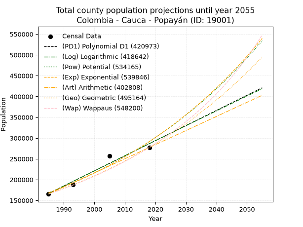
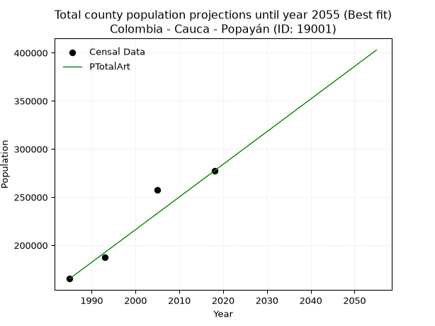
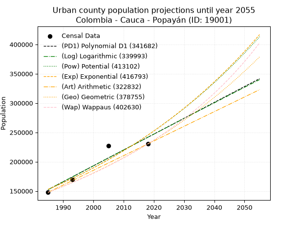
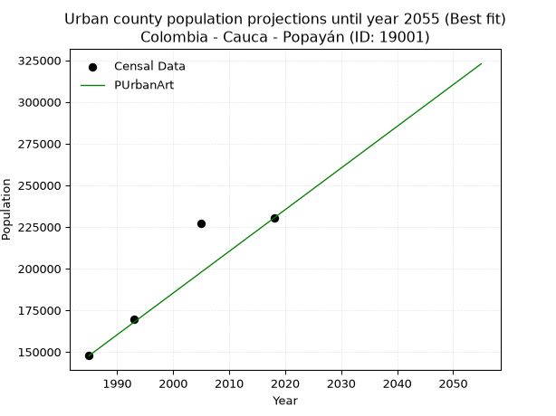
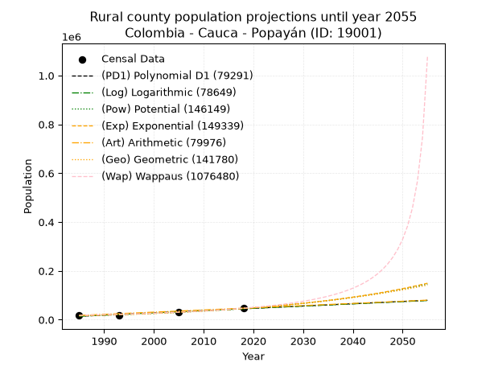
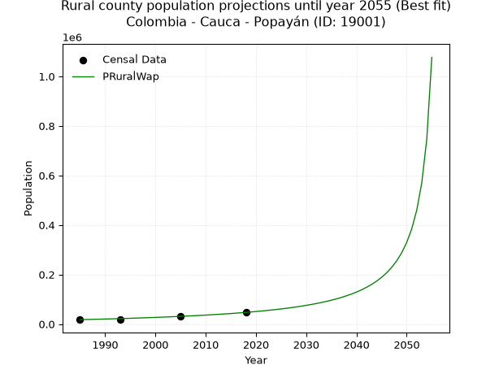

<div align="center">


</div>

# 📜 _“Population and Public Services Demand Projections (PPSD) until Year 2050 for Colombia - Cauca - Popayán (ID: 19001)”_
Keywords: `population` `public-service` `projection` `lineal` `polynomial` `logarithmic` `potential` `exponential` `arithmetic` `geometric` `wappaus` `dane` `colombia` `south-america`

PPSD are analytical estimates used by governments and planners to anticipate future changes in population size, age distribution, and the resulting community needs for utilities, healthcare, education, and infrastructure as sizing future water treatment facilities, electrical grids, and road networks based on spatial growth.

<div align="center">

</img>

</div>


> **General running parameters**: • app_version: _v20260806_. • Python version: _3.14.7_. • Pandas version: _3.0.5_. • NumPy version: _2.5.1_. • Creates, save and include plots into reports (create_plot): _False_. • Projection until year: _2050_. • Process polynomial degree 2 and up: _False_. • Process Wappaus: _True_. • Process Wappaus: _True_. • Set negative values to zero: _True_. • Set infinite values to zero: _True_. • Drop dataset notes: _True_. 
<div align="center">

Maps & GIS Layers: [:earth_americas:Google](http://maps.google.com/maps?q=2.459641117,-76.5993765) [:earth_americas:OSM](https://www.openstreetmap.org/#map=18/2.459641117/-76.5993765&layers=P) [:earth_americas:Bing](https://www.bing.com/maps?cp=2.459641117~-76.5993765&lvl=18) [:earth_americas:Apple](https://maps.apple.com/frame?center=2.459641117%2C-76.5993765&span=0.003%2C0.006) [:earth_americas:GISMobile](https://github.com/rcfdtools/R.GISMobile/blob/main/file/gis/CountyLayer_CO/Readme.md)

</div>


<div align="center">

```geojson
{
  "type": "Feature",
  "geometry": {
    "type": "Point", 
    "coordinates": [-76.5993765, 2.459641117]
  }, 
  "properties": {
    "Name": "Colombia - Cauca - Popayán (ID: 19001)"
  }
}
```

</div>


## 0. Census Data (4 records)

Census data are official statistics collected by a government about the people and housing in a country. They usually include counts of total population, age, sex, race, income, education, and jobs.

📅Global census file: [Population.xlsx](../data/Population.xlsx)

| Source   |   Year |   CountryID | CountryName   |   StateID | StateName   |   CountyID | CountyName   |   PTotal |   PUrban |   PRural |
|:---------|-------:|------------:|:--------------|----------:|:------------|-----------:|:-------------|---------:|---------:|---------:|
| DANE     |   1985 |          57 | Colombia      |        19 | Cauca       |      19001 | Popayán      |   165304 |   147768 |    17536 |
| DANE     |   1993 |          57 | Colombia      |        19 | Cauca       |      19001 | Popayán      |   187519 |   169423 |    18096 |
| DANE     |   2005 |          57 | Colombia      |        19 | Cauca       |      19001 | Popayán      |   257512 |   226978 |    30534 |
| DANE     |   2018 |          57 | Colombia      |        19 | Cauca       |      19001 | Popayán      |   277270 |   230298 |    46972 |

> 🔥Some records could had specific notes about the registered values or the corresponding urban or rural distribution.

📅[SUI-RUPS](https://www.datos.gov.co/Hacienda-y-Cr-dito-P-blico/Registro-nico-de-Prestadores-de-Servicios-P-blicos/4qkq-csdn/about_data) - Local public utility companies: [RUPS.csv](../data/RUPS.csv)

 | SERVICIO       | ESTADO    | NOMBRE                                            | NIT         | DEPARTAMENTO_DOMICILIO   | MUNICIPIO_DOMICILIO   | DIRECCION                      |   TELEFONO | EMAIL                 | TIPO_PRESTADOR                             | CLASIFICACION                 |
|:---------------|:----------|:--------------------------------------------------|:------------|:-------------------------|:----------------------|:-------------------------------|-----------:|:----------------------|:-------------------------------------------|:------------------------------|
| ACUEDUCTO      | OPERATIVA | ACUEDUCTO Y ALCANTARILLADO DE POPAYAN S.A.  E.S.P | 891500117-1 | CAUCA                    | POPAYAN               | Calle  3  No 4 - 21            |    8321000 | sgeneral@aapsa.com.co | SOCIEDADES (EMPRESA DE SERVICIOS PUBLICOS) | MAYOR O IGUAL A 5001 USUARIOS |
| ALCANTARILLADO | OPERATIVA | ACUEDUCTO Y ALCANTARILLADO DE POPAYAN S.A.  E.S.P | 891500117-1 | CAUCA                    | POPAYAN               | Calle  3  No 4 - 21            |    8321000 | sgeneral@aapsa.com.co | SOCIEDADES (EMPRESA DE SERVICIOS PUBLICOS) | MAYOR O IGUAL A 5001 USUARIOS |
| ACUEDUCTO      | OPERATIVA | ASOCIACION ACUEDUCTO RURAL DE RIONEGRO            | 817000975-1 | CAUCA                    | POPAYAN               | Centro Múltiple- salón comunal |    0000000 | aarrpopayan@yahoo.com | ORGANIZACION AUTORIZADA                    | MENOR O IGUAL A 2500 USUARIOS |

## 1. Total

### 1.1. Coefficients and Parameters

* (PD1) Polynomial Deg 1: 3636.0108390204573, -7051029.43075067 (lineal)
* (Log) Logarithmic: 7280447.608026327, -55116839.360453755
* (Pow) Potential: 33.35196266331628, -104.7611008210453
* (Exp) Exponential: 0.01665483407942016, 7.383187501347167e-10
* (Art) Arithmetic: Year diff. 2018 - 1985 = 33, Population diff. 277270 - 165304 = 111966, Annual growth = 3392.909090909091
* (Geo) Geometric: Year diff. 2018 - 1985 = 33, Population diff. 277270 - 165304 = 111966, Annual growth % = 0.015796359687836325
* (Wap) Wappaus: i = 1.5332618232924171, Condition values only valid for < 200)

<sub>
Wappaus condition values: ['0.00', '1.53', '3.07', '4.60', '6.13', '7.67', '9.20', '10.73', '12.27', '13.80', '15.33', '16.87', '18.40', '19.93', '21.47', '23.00', '24.53', '26.07', '27.60', '29.13', '30.67', '32.20', '33.73', '35.27', '36.80', '38.33', '39.86', '41.40', '42.93', '44.46', '46.00', '47.53', '49.06', '50.60', '52.13', '53.66', '55.20', '56.73', '58.26', '59.80', '61.33', '62.86', '64.40', '65.93', '67.46', '69.00', '70.53', '72.06', '73.60', '75.13', '76.66', '78.20', '79.73', '81.26', '82.80', '84.33', '85.86', '87.40', '88.93', '90.46', '92.00', '93.53', '95.06', '96.60', '98.13', '99.66']
</sub>


### 1.2. Projected Dataset

|   Year |   CountyID |   PTotalPD1 |   PTotalLog |   PTotalPow |   PTotalExp |   PTotalArt |   PTotalGeo |   PTotalWap |
|-------:|-----------:|------------:|------------:|------------:|------------:|------------:|------------:|------------:|
|   1985 |      19001 |      166452 |      166324 |      168145 |      168249 |      165304 |      165304 |      165304 |
|   1986 |      19001 |      170088 |      169990 |      170994 |      171075 |      168697 |      167915 |      167858 |
|   1987 |      19001 |      173724 |      173655 |      173889 |      173948 |      172090 |      170568 |      170452 |
|   1988 |      19001 |      177360 |      177319 |      176831 |      176869 |      175483 |      173262 |      173087 |
|   1989 |      19001 |      180996 |      180980 |      179822 |      179839 |      178876 |      175999 |      175763 |
|   1990 |      19001 |      184632 |      184639 |      182862 |      182860 |      182269 |      178779 |      178482 |
|   1991 |      19001 |      188268 |      188297 |      185952 |      185931 |      185661 |      181603 |      181244 |
|   1992 |      19001 |      191904 |      191953 |      189092 |      189053 |      189054 |      184472 |      184052 |
|   1993 |      19001 |      195540 |      195607 |      192284 |      192228 |      192447 |      187386 |      186905 |
|   1994 |      19001 |      199176 |      199259 |      195528 |      195457 |      195840 |      190346 |      189805 |
|   1995 |      19001 |      202812 |      202909 |      198825 |      198739 |      199233 |      193353 |      192754 |
|   1996 |      19001 |      206448 |      206557 |      202176 |      202077 |      202626 |      196407 |      195752 |
|   1997 |      19001 |      210084 |      210204 |      205582 |      205471 |      206019 |      199509 |      198800 |
|   1998 |      19001 |      213720 |      213849 |      209043 |      208921 |      209412 |      202661 |      201900 |
|   1999 |      19001 |      217356 |      217492 |      212561 |      212430 |      212805 |      205862 |      205054 |
|   2000 |      19001 |      220992 |      221133 |      216137 |      215998 |      216198 |      209114 |      208262 |
|   2001 |      19001 |      224628 |      224772 |      219770 |      219625 |      219591 |      212417 |      211526 |
|   2002 |      19001 |      228264 |      228410 |      223463 |      223314 |      222983 |      215773 |      214848 |
|   2003 |      19001 |      231900 |      232045 |      227216 |      227064 |      226376 |      219181 |      218229 |
|   2004 |      19001 |      235536 |      235679 |      231030 |      230877 |      229769 |      222643 |      221671 |
|   2005 |      19001 |      239172 |      239311 |      234906 |      234755 |      233162 |      226160 |      225175 |
|   2006 |      19001 |      242808 |      242941 |      238845 |      238697 |      236555 |      229733 |      228743 |
|   2007 |      19001 |      246444 |      246570 |      242849 |      242706 |      239948 |      233362 |      232376 |
|   2008 |      19001 |      250080 |      250196 |      246917 |      246782 |      243341 |      237048 |      236078 |
|   2009 |      19001 |      253716 |      253821 |      251051 |      250927 |      246734 |      240793 |      239849 |
|   2010 |      19001 |      257352 |      257444 |      255253 |      255141 |      250127 |      244596 |      243691 |
|   2011 |      19001 |      260988 |      261066 |      259523 |      259426 |      253520 |      248460 |      247607 |
|   2012 |      19001 |      264624 |      264685 |      263862 |      263783 |      256913 |      252385 |      251599 |
|   2013 |      19001 |      268260 |      268303 |      268271 |      268213 |      260305 |      256371 |      255669 |
|   2014 |      19001 |      271896 |      271918 |      272751 |      272717 |      263698 |      260421 |      259818 |
|   2015 |      19001 |      275532 |      275532 |      277305 |      277297 |      267091 |      264535 |      264051 |
|   2016 |      19001 |      279168 |      279145 |      281932 |      281954 |      270484 |      268714 |      268369 |
|   2017 |      19001 |      282804 |      282755 |      286633 |      286689 |      273877 |      272958 |      272774 |
|   2018 |      19001 |      286440 |      286364 |      291411 |      291504 |      277270 |      277270 |      277270 |
|   2019 |      19001 |      290076 |      289971 |      296266 |      296400 |      280663 |      281650 |      281859 |
|   2020 |      19001 |      293712 |      293576 |      301200 |      301378 |      284056 |      286099 |      286544 |
|   2021 |      19001 |      297348 |      297179 |      306213 |      306439 |      287449 |      290618 |      291329 |
|   2022 |      19001 |      300984 |      300780 |      311307 |      311585 |      290842 |      295209 |      296216 |
|   2023 |      19001 |      304620 |      304380 |      316483 |      316818 |      294235 |      299872 |      301208 |
|   2024 |      19001 |      308257 |      307978 |      321743 |      322139 |      297627 |      304609 |      306310 |
|   2025 |      19001 |      311893 |      311574 |      327087 |      327549 |      301020 |      309421 |      311525 |
|   2026 |      19001 |      315529 |      315169 |      332517 |      333050 |      304413 |      314308 |      316856 |
|   2027 |      19001 |      319165 |      318761 |      338035 |      338643 |      307806 |      319273 |      322308 |
|   2028 |      19001 |      322801 |      322352 |      343642 |      344331 |      311199 |      324317 |      327884 |
|   2029 |      19001 |      326437 |      325941 |      349339 |      350114 |      314592 |      329440 |      333590 |
|   2030 |      19001 |      330073 |      329529 |      355127 |      355993 |      317985 |      334644 |      339429 |
|   2031 |      19001 |      333709 |      333114 |      361008 |      361972 |      321378 |      339930 |      345406 |
|   2032 |      19001 |      337345 |      336698 |      366984 |      368051 |      324771 |      345300 |      351527 |
|   2033 |      19001 |      340981 |      340280 |      373056 |      374232 |      328164 |      350754 |      357796 |
|   2034 |      19001 |      344617 |      343860 |      379225 |      380517 |      331557 |      356295 |      364219 |
|   2035 |      19001 |      348253 |      347439 |      385493 |      386908 |      334949 |      361923 |      370802 |
|   2036 |      19001 |      351889 |      351015 |      391861 |      393406 |      338342 |      367640 |      377550 |
|   2037 |      19001 |      355525 |      354590 |      398331 |      400013 |      341735 |      373447 |      384471 |
|   2038 |      19001 |      359161 |      358164 |      404905 |      406731 |      345128 |      379346 |      391570 |
|   2039 |      19001 |      362797 |      361735 |      411584 |      413561 |      348521 |      385339 |      398855 |
|   2040 |      19001 |      366433 |      365305 |      418370 |      420507 |      351914 |      391426 |      406333 |
|   2041 |      19001 |      370069 |      368873 |      425265 |      427569 |      355307 |      397609 |      414012 |
|   2042 |      19001 |      373705 |      372439 |      432269 |      434750 |      358700 |      403889 |      421900 |
|   2043 |      19001 |      377341 |      376003 |      439386 |      442051 |      362093 |      410269 |      430006 |
|   2044 |      19001 |      380977 |      379566 |      446616 |      449475 |      365486 |      416750 |      438339 |
|   2045 |      19001 |      384613 |      383127 |      453961 |      457024 |      368879 |      423333 |      446909 |
|   2046 |      19001 |      388249 |      386686 |      461424 |      464699 |      372271 |      430020 |      455725 |
|   2047 |      19001 |      391885 |      390244 |      469005 |      472503 |      375664 |      436813 |      464799 |
|   2048 |      19001 |      395521 |      393800 |      476708 |      480439 |      379057 |      443713 |      474142 |
|   2049 |      19001 |      399157 |      397354 |      484533 |      488507 |      382450 |      450722 |      483766 |
|   2050 |      19001 |      402793 |      400906 |      492482 |      496711 |      385843 |      457842 |      493685 |
<div align="center">

</img>

</div>


### 1.3. Best fit with absolute and relative error (%)

Relative error puts that difference into context by dividing the absolute error by the true value, creating a unitless ratio or percentage that shows the scale of the mistake.

Absolute and relative error

|   Year | Source   |   CountryID | CountryName   |   StateID | StateName   |   CountyID_x | CountyName   |   PTotal |   PUrban |   PRural |   CountyID_y |   PTotalPD1 |   PTotalLog |   PTotalPow |   PTotalExp |   PTotalArt |   PTotalGeo |   PTotalWap |   PTotalPD1AbsError |   PTotalLogAbsError |   PTotalPowAbsError |   PTotalExpAbsError |   PTotalArtAbsError |   PTotalGeoAbsError |   PTotalWapAbsError |   PTotalPD1RelError |   PTotalLogRelError |   PTotalPowRelError |   PTotalExpRelError |   PTotalArtRelError |   PTotalGeoRelError |   PTotalWapRelError |
|-------:|:---------|------------:|:--------------|----------:|:------------|-------------:|:-------------|---------:|---------:|---------:|-------------:|------------:|------------:|------------:|------------:|------------:|------------:|------------:|--------------------:|--------------------:|--------------------:|--------------------:|--------------------:|--------------------:|--------------------:|--------------------:|--------------------:|--------------------:|--------------------:|--------------------:|--------------------:|--------------------:|
|   1985 | DANE     |          57 | Colombia      |        19 | Cauca       |        19001 | Popayán      |   165304 |   147768 |    17536 |        19001 |      166452 |      166324 |      168145 |      168249 |      165304 |      165304 |      165304 |                1148 |                1020 |                2841 |                2945 |                   0 |                   0 |                   0 |            0.694478 |            0.617045 |             1.71865 |             1.78157 |             0       |           0         |            0        |
|   1993 | DANE     |          57 | Colombia      |        19 | Cauca       |        19001 | Popayán      |   187519 |   169423 |    18096 |        19001 |      195540 |      195607 |      192284 |      192228 |      192447 |      187386 |      186905 |                8021 |                8088 |                4765 |                4709 |                4928 |                 133 |                 614 |            4.27743  |            4.31316  |             2.54108 |             2.51121 |             2.628   |           0.0709261 |            0.327433 |
|   2005 | DANE     |          57 | Colombia      |        19 | Cauca       |        19001 | Popayán      |   257512 |   226978 |    30534 |        19001 |      239172 |      239311 |      234906 |      234755 |      233162 |      226160 |      225175 |               18340 |               18201 |               22606 |               22757 |               24350 |               31352 |               32337 |            7.122    |            7.06802  |             8.77862 |             8.83726 |             9.45587 |          12.175     |           12.5575   |
|   2018 | DANE     |          57 | Colombia      |        19 | Cauca       |        19001 | Popayán      |   277270 |   230298 |    46972 |        19001 |      286440 |      286364 |      291411 |      291504 |      277270 |      277270 |      277270 |                9170 |                9094 |               14141 |               14234 |                   0 |                   0 |                   0 |            3.30725  |            3.27984  |             5.10008 |             5.13362 |             0       |           0         |            0        |

Relative error mean

| Method    |   RelError | Best   |
|:----------|-----------:|:-------|
| PTotalPD1 |    3.85029 |        |
| PTotalLog |    3.81952 |        |
| PTotalPow |    4.53461 |        |
| PTotalExp |    4.56592 |        |
| PTotalArt |    3.02097 | True   |
| PTotalGeo |    3.06147 |        |
| PTotalWap |    3.22123 |        |

💙Best method: _**PTotalArt**_
<div align="center">

</img>

</div>


### 1.4. Fresh water supply demand in liters per capita per day (lpcd)

The fresh water supply demand typically ranges from 100 to 300 liters per capita per day (lpcd) for standard domestic and municipal planning, though absolute survival minimums set by the World Health Organization are as low as 7.5 to 20 liters per day, and total consumption in high-income nations can exceed 400 liters.

> `CZ`: Level in meters above the sea level (masl)<br> `WS`: Fresh water supply demand in liters per capita per day (lpcd or l/h/d)<br> `WSAll`: Zonal fresh water supply demand in liters per second (l/s)<br> `A`: Zonal area in square meters<br> `DP`: Population density (people/hectare or p/ha)

Reference values (RAS Colombia)

|    CZ |   WS |
|------:|-----:|
|  1000 |  120 |
|  2000 |  130 |
| 99999 |  140 |

County shapefile geometry properties and water supply values

|   CountyID |      ATotal |   CZTotal |   WSTotal |
|-----------:|------------:|----------:|----------:|
|      19001 | 4.80374e+08 |   1955.64 |       130 |

Projected values for best method: PTotalArt

|   CountyID |   Year |   PTotalArt |   DPTotal |   WSTotal |   WSTotalAll |
|-----------:|-------:|------------:|----------:|----------:|-------------:|
|      19001 |   1985 |      165304 |      3.44 |       130 |      248.721 |
|      19001 |   1986 |      168697 |      3.51 |       130 |      253.827 |
|      19001 |   1987 |      172090 |      3.58 |       130 |      258.932 |
|      19001 |   1988 |      175483 |      3.65 |       130 |      264.037 |
|      19001 |   1989 |      178876 |      3.72 |       130 |      269.142 |
|      19001 |   1990 |      182269 |      3.79 |       130 |      274.247 |
|      19001 |   1991 |      185661 |      3.86 |       130 |      279.351 |
|      19001 |   1992 |      189054 |      3.94 |       130 |      284.456 |
|      19001 |   1993 |      192447 |      4.01 |       130 |      289.561 |
|      19001 |   1994 |      195840 |      4.08 |       130 |      294.667 |
|      19001 |   1995 |      199233 |      4.15 |       130 |      299.772 |
|      19001 |   1996 |      202626 |      4.22 |       130 |      304.877 |
|      19001 |   1997 |      206019 |      4.29 |       130 |      309.982 |
|      19001 |   1998 |      209412 |      4.36 |       130 |      315.087 |
|      19001 |   1999 |      212805 |      4.43 |       130 |      320.193 |
|      19001 |   2000 |      216198 |      4.5  |       130 |      325.298 |
|      19001 |   2001 |      219591 |      4.57 |       130 |      330.403 |
|      19001 |   2002 |      222983 |      4.64 |       130 |      335.507 |
|      19001 |   2003 |      226376 |      4.71 |       130 |      340.612 |
|      19001 |   2004 |      229769 |      4.78 |       130 |      345.717 |
|      19001 |   2005 |      233162 |      4.85 |       130 |      350.822 |
|      19001 |   2006 |      236555 |      4.92 |       130 |      355.928 |
|      19001 |   2007 |      239948 |      5    |       130 |      361.033 |
|      19001 |   2008 |      243341 |      5.07 |       130 |      366.138 |
|      19001 |   2009 |      246734 |      5.14 |       130 |      371.243 |
|      19001 |   2010 |      250127 |      5.21 |       130 |      376.348 |
|      19001 |   2011 |      253520 |      5.28 |       130 |      381.454 |
|      19001 |   2012 |      256913 |      5.35 |       130 |      386.559 |
|      19001 |   2013 |      260305 |      5.42 |       130 |      391.663 |
|      19001 |   2014 |      263698 |      5.49 |       130 |      396.768 |
|      19001 |   2015 |      267091 |      5.56 |       130 |      401.873 |
|      19001 |   2016 |      270484 |      5.63 |       130 |      406.978 |
|      19001 |   2017 |      273877 |      5.7  |       130 |      412.083 |
|      19001 |   2018 |      277270 |      5.77 |       130 |      417.189 |
|      19001 |   2019 |      280663 |      5.84 |       130 |      422.294 |
|      19001 |   2020 |      284056 |      5.91 |       130 |      427.399 |
|      19001 |   2021 |      287449 |      5.98 |       130 |      432.504 |
|      19001 |   2022 |      290842 |      6.05 |       130 |      437.609 |
|      19001 |   2023 |      294235 |      6.13 |       130 |      442.715 |
|      19001 |   2024 |      297627 |      6.2  |       130 |      447.818 |
|      19001 |   2025 |      301020 |      6.27 |       130 |      452.924 |
|      19001 |   2026 |      304413 |      6.34 |       130 |      458.029 |
|      19001 |   2027 |      307806 |      6.41 |       130 |      463.134 |
|      19001 |   2028 |      311199 |      6.48 |       130 |      468.239 |
|      19001 |   2029 |      314592 |      6.55 |       130 |      473.344 |
|      19001 |   2030 |      317985 |      6.62 |       130 |      478.45  |
|      19001 |   2031 |      321378 |      6.69 |       130 |      483.555 |
|      19001 |   2032 |      324771 |      6.76 |       130 |      488.66  |
|      19001 |   2033 |      328164 |      6.83 |       130 |      493.765 |
|      19001 |   2034 |      331557 |      6.9  |       130 |      498.87  |
|      19001 |   2035 |      334949 |      6.97 |       130 |      503.974 |
|      19001 |   2036 |      338342 |      7.04 |       130 |      509.079 |
|      19001 |   2037 |      341735 |      7.11 |       130 |      514.185 |
|      19001 |   2038 |      345128 |      7.18 |       130 |      519.29  |
|      19001 |   2039 |      348521 |      7.26 |       130 |      524.395 |
|      19001 |   2040 |      351914 |      7.33 |       130 |      529.5   |
|      19001 |   2041 |      355307 |      7.4  |       130 |      534.605 |
|      19001 |   2042 |      358700 |      7.47 |       130 |      539.711 |
|      19001 |   2043 |      362093 |      7.54 |       130 |      544.816 |
|      19001 |   2044 |      365486 |      7.61 |       130 |      549.921 |
|      19001 |   2045 |      368879 |      7.68 |       130 |      555.026 |
|      19001 |   2046 |      372271 |      7.75 |       130 |      560.13  |
|      19001 |   2047 |      375664 |      7.82 |       130 |      565.235 |
|      19001 |   2048 |      379057 |      7.89 |       130 |      570.34  |
|      19001 |   2049 |      382450 |      7.96 |       130 |      575.446 |
|      19001 |   2050 |      385843 |      8.03 |       130 |      580.551 |

## 2. Urban

### 2.1. Coefficients and Parameters

* (PD1) Polynomial Deg 1: 2704.385788839818, -5215830.924126846 (lineal)
* (Log) Logarithmic: 5416694.37888654, -40978720.63058117
* (Pow) Potential: 28.702339441823483, -89.46939252793024
* (Exp) Exponential: 0.01432916966359583, 6.784100507222193e-08
* (Art) Arithmetic: Year diff. 2018 - 1985 = 33, Population diff. 230298 - 147768 = 82530, Annual growth = 2500.909090909091
* (Geo) Geometric: Year diff. 2018 - 1985 = 33, Population diff. 230298 - 147768 = 82530, Annual growth % = 0.013537192390437713
* (Wap) Wappaus: i = 1.323001323001323, Condition values only valid for < 200)

<sub>
Wappaus condition values: ['0.00', '1.32', '2.65', '3.97', '5.29', '6.62', '7.94', '9.26', '10.58', '11.91', '13.23', '14.55', '15.88', '17.20', '18.52', '19.85', '21.17', '22.49', '23.81', '25.14', '26.46', '27.78', '29.11', '30.43', '31.75', '33.08', '34.40', '35.72', '37.04', '38.37', '39.69', '41.01', '42.34', '43.66', '44.98', '46.31', '47.63', '48.95', '50.27', '51.60', '52.92', '54.24', '55.57', '56.89', '58.21', '59.54', '60.86', '62.18', '63.50', '64.83', '66.15', '67.47', '68.80', '70.12', '71.44', '72.77', '74.09', '75.41', '76.73', '78.06', '79.38', '80.70', '82.03', '83.35', '84.67', '86.00']
</sub>


### 2.2. Projected Dataset

|   Year |   CountyID |   PUrbanPD1 |   PUrbanLog |   PUrbanPow |   PUrbanExp |   PUrbanArt |   PUrbanGeo |   PUrbanWap |
|-------:|-----------:|------------:|------------:|------------:|------------:|------------:|------------:|------------:|
|   1985 |      19001 |      152375 |      152267 |      152774 |      152864 |      147768 |      147768 |      147768 |
|   1986 |      19001 |      155079 |      154995 |      154998 |      155070 |      150269 |      149768 |      149736 |
|   1987 |      19001 |      157784 |      157722 |      157254 |      157308 |      152770 |      151796 |      151730 |
|   1988 |      19001 |      160488 |      160447 |      159542 |      159578 |      155271 |      153851 |      153752 |
|   1989 |      19001 |      163192 |      163171 |      161861 |      161881 |      157772 |      155933 |      155800 |
|   1990 |      19001 |      165897 |      165894 |      164213 |      164218 |      160273 |      158044 |      157877 |
|   1991 |      19001 |      168601 |      168615 |      166598 |      166588 |      162773 |      160184 |      159983 |
|   1992 |      19001 |      171306 |      171335 |      169017 |      168992 |      165274 |      162352 |      162117 |
|   1993 |      19001 |      174010 |      174053 |      171469 |      171431 |      167775 |      164550 |      164282 |
|   1994 |      19001 |      176714 |      176770 |      173956 |      173905 |      170276 |      166778 |      166477 |
|   1995 |      19001 |      179419 |      179486 |      176477 |      176415 |      172777 |      169035 |      168703 |
|   1996 |      19001 |      182123 |      182201 |      179034 |      178961 |      175278 |      171324 |      170960 |
|   1997 |      19001 |      184827 |      184914 |      181626 |      181544 |      177779 |      173643 |      173250 |
|   1998 |      19001 |      187532 |      187626 |      184255 |      184164 |      180280 |      175993 |      175574 |
|   1999 |      19001 |      190236 |      190336 |      186920 |      186822 |      182781 |      178376 |      177931 |
|   2000 |      19001 |      192941 |      193045 |      189623 |      189518 |      185282 |      180791 |      180323 |
|   2001 |      19001 |      195645 |      195753 |      192363 |      192253 |      187783 |      183238 |      182750 |
|   2002 |      19001 |      198349 |      198459 |      195142 |      195028 |      190283 |      185718 |      185213 |
|   2003 |      19001 |      201054 |      201164 |      197959 |      197843 |      192784 |      188233 |      187714 |
|   2004 |      19001 |      203758 |      203868 |      200815 |      200698 |      195285 |      190781 |      190252 |
|   2005 |      19001 |      206463 |      206570 |      203711 |      203595 |      197786 |      193363 |      192829 |
|   2006 |      19001 |      209167 |      209271 |      206648 |      206533 |      200287 |      195981 |      195446 |
|   2007 |      19001 |      211871 |      211970 |      209625 |      209514 |      202788 |      198634 |      198103 |
|   2008 |      19001 |      214576 |      214669 |      212644 |      212537 |      205289 |      201323 |      200801 |
|   2009 |      19001 |      217280 |      217365 |      215704 |      215605 |      207790 |      204048 |      203542 |
|   2010 |      19001 |      219985 |      220061 |      218807 |      218717 |      210291 |      206811 |      206326 |
|   2011 |      19001 |      222689 |      222755 |      221954 |      221873 |      212792 |      209610 |      209155 |
|   2012 |      19001 |      225393 |      225448 |      225143 |      225075 |      215293 |      212448 |      212030 |
|   2013 |      19001 |      228098 |      228140 |      228377 |      228324 |      217793 |      215324 |      214951 |
|   2014 |      19001 |      230802 |      230830 |      231656 |      231619 |      220294 |      218239 |      217920 |
|   2015 |      19001 |      233506 |      233519 |      234980 |      234962 |      222795 |      221193 |      220938 |
|   2016 |      19001 |      236211 |      236206 |      238351 |      238353 |      225296 |      224187 |      224006 |
|   2017 |      19001 |      238915 |      238892 |      241767 |      241793 |      227797 |      227222 |      227126 |
|   2018 |      19001 |      241620 |      241577 |      245232 |      245282 |      230298 |      230298 |      230298 |
|   2019 |      19001 |      244324 |      244261 |      248744 |      248822 |      232799 |      233416 |      233525 |
|   2020 |      19001 |      247028 |      246943 |      252304 |      252413 |      235300 |      236575 |      236807 |
|   2021 |      19001 |      249733 |      249624 |      255914 |      256056 |      237801 |      239778 |      240146 |
|   2022 |      19001 |      252437 |      252303 |      259573 |      259752 |      240302 |      243024 |      243544 |
|   2023 |      19001 |      255142 |      254982 |      263283 |      263501 |      242803 |      246314 |      247001 |
|   2024 |      19001 |      257846 |      257658 |      267045 |      267304 |      245303 |      249648 |      250521 |
|   2025 |      19001 |      260550 |      260334 |      270858 |      271161 |      247804 |      253028 |      254103 |
|   2026 |      19001 |      263255 |      263008 |      274723 |      275075 |      250305 |      256453 |      257751 |
|   2027 |      19001 |      265959 |      265681 |      278642 |      279045 |      252806 |      259925 |      261465 |
|   2028 |      19001 |      268663 |      268353 |      282614 |      283072 |      255307 |      263443 |      265249 |
|   2029 |      19001 |      271368 |      271023 |      286642 |      287158 |      257808 |      267010 |      269102 |
|   2030 |      19001 |      274072 |      273692 |      290724 |      291302 |      260309 |      270624 |      273029 |
|   2031 |      19001 |      276777 |      276360 |      294863 |      295506 |      262810 |      274288 |      277030 |
|   2032 |      19001 |      279481 |      279026 |      299059 |      299771 |      265311 |      278001 |      281108 |
|   2033 |      19001 |      282185 |      281691 |      303312 |      304097 |      267812 |      281764 |      285265 |
|   2034 |      19001 |      284890 |      284355 |      307623 |      308486 |      270313 |      285578 |      289503 |
|   2035 |      19001 |      287594 |      287017 |      311994 |      312938 |      272813 |      289444 |      293825 |
|   2036 |      19001 |      290299 |      289678 |      316425 |      317455 |      275314 |      293362 |      298233 |
|   2037 |      19001 |      293003 |      292338 |      320916 |      322036 |      277815 |      297334 |      302731 |
|   2038 |      19001 |      295707 |      294997 |      325469 |      326684 |      280316 |      301359 |      307320 |
|   2039 |      19001 |      298412 |      297654 |      330084 |      331399 |      282817 |      305438 |      312003 |
|   2040 |      19001 |      301116 |      300310 |      334762 |      336182 |      285318 |      309573 |      316784 |
|   2041 |      19001 |      303820 |      302964 |      339504 |      341034 |      287819 |      313764 |      321665 |
|   2042 |      19001 |      306525 |      305618 |      344311 |      345955 |      290320 |      318011 |      326650 |
|   2043 |      19001 |      309229 |      308270 |      349184 |      350948 |      292821 |      322316 |      331742 |
|   2044 |      19001 |      311934 |      310920 |      354123 |      356013 |      295322 |      326680 |      336944 |
|   2045 |      19001 |      314638 |      313570 |      359129 |      361152 |      297823 |      331102 |      342261 |
|   2046 |      19001 |      317342 |      316218 |      364204 |      366364 |      300323 |      335584 |      347695 |
|   2047 |      19001 |      320047 |      318865 |      369348 |      371651 |      302824 |      340127 |      353251 |
|   2048 |      19001 |      322751 |      321510 |      374562 |      377015 |      305325 |      344731 |      358934 |
|   2049 |      19001 |      325456 |      324154 |      379847 |      382456 |      307826 |      349398 |      364746 |
|   2050 |      19001 |      328160 |      326797 |      385204 |      387976 |      310327 |      354128 |      370694 |
<div align="center">

</img>

</div>


### 2.3. Best fit with absolute and relative error (%)

Relative error puts that difference into context by dividing the absolute error by the true value, creating a unitless ratio or percentage that shows the scale of the mistake.

Absolute and relative error

|   Year | Source   |   CountryID | CountryName   |   StateID | StateName   |   CountyID_x | CountyName   |   PTotal |   PUrban |   PRural |   CountyID_y |   PUrbanPD1 |   PUrbanLog |   PUrbanPow |   PUrbanExp |   PUrbanArt |   PUrbanGeo |   PUrbanWap |   PUrbanPD1AbsError |   PUrbanLogAbsError |   PUrbanPowAbsError |   PUrbanExpAbsError |   PUrbanArtAbsError |   PUrbanGeoAbsError |   PUrbanWapAbsError |   PUrbanPD1RelError |   PUrbanLogRelError |   PUrbanPowRelError |   PUrbanExpRelError |   PUrbanArtRelError |   PUrbanGeoRelError |   PUrbanWapRelError |
|-------:|:---------|------------:|:--------------|----------:|:------------|-------------:|:-------------|---------:|---------:|---------:|-------------:|------------:|------------:|------------:|------------:|------------:|------------:|------------:|--------------------:|--------------------:|--------------------:|--------------------:|--------------------:|--------------------:|--------------------:|--------------------:|--------------------:|--------------------:|--------------------:|--------------------:|--------------------:|--------------------:|
|   1985 | DANE     |          57 | Colombia      |        19 | Cauca       |        19001 | Popayán      |   165304 |   147768 |    17536 |        19001 |      152375 |      152267 |      152774 |      152864 |      147768 |      147768 |      147768 |                4607 |                4499 |                5006 |                5096 |                   0 |                   0 |                   0 |             3.11773 |             3.04464 |             3.38774 |             3.44865 |            0        |             0       |             0       |
|   1993 | DANE     |          57 | Colombia      |        19 | Cauca       |        19001 | Popayán      |   187519 |   169423 |    18096 |        19001 |      174010 |      174053 |      171469 |      171431 |      167775 |      164550 |      164282 |                4587 |                4630 |                2046 |                2008 |                1648 |                4873 |                5141 |             2.70742 |             2.7328  |             1.20763 |             1.1852  |            0.972713 |             2.87623 |             3.03442 |
|   2005 | DANE     |          57 | Colombia      |        19 | Cauca       |        19001 | Popayán      |   257512 |   226978 |    30534 |        19001 |      206463 |      206570 |      203711 |      203595 |      197786 |      193363 |      192829 |               20515 |               20408 |               23267 |               23383 |               29192 |               33615 |               34149 |             9.03832 |             8.99118 |            10.2508  |            10.3019  |           12.8612   |            14.8098  |            15.0451  |
|   2018 | DANE     |          57 | Colombia      |        19 | Cauca       |        19001 | Popayán      |   277270 |   230298 |    46972 |        19001 |      241620 |      241577 |      245232 |      245282 |      230298 |      230298 |      230298 |               11322 |               11279 |               14934 |               14984 |                   0 |                   0 |                   0 |             4.91624 |             4.89757 |             6.48464 |             6.50635 |            0        |             0       |             0       |

Relative error mean

| Method    |   RelError | Best   |
|:----------|-----------:|:-------|
| PUrbanPD1 |    4.94493 |        |
| PUrbanLog |    4.91655 |        |
| PUrbanPow |    5.3327  |        |
| PUrbanExp |    5.36052 |        |
| PUrbanArt |    3.45847 | True   |
| PUrbanGeo |    4.42151 |        |
| PUrbanWap |    4.51987 |        |

💙Best method: _**PUrbanArt**_
<div align="center">

</img>

</div>


### 2.4. Fresh water supply demand in liters per capita per day (lpcd)

The fresh water supply demand typically ranges from 100 to 300 liters per capita per day (lpcd) for standard domestic and municipal planning, though absolute survival minimums set by the World Health Organization are as low as 7.5 to 20 liters per day, and total consumption in high-income nations can exceed 400 liters.

> `CZ`: Level in meters above the sea level (masl)<br> `WS`: Fresh water supply demand in liters per capita per day (lpcd or l/h/d)<br> `WSAll`: Zonal fresh water supply demand in liters per second (l/s)<br> `A`: Zonal area in square meters<br> `DP`: Population density (people/hectare or p/ha)

Reference values (RAS Colombia)

|    CZ |   WS |
|------:|-----:|
|  1000 |  120 |
|  2000 |  130 |
| 99999 |  140 |

County shapefile geometry properties and water supply values

|   CountyID |      AUrban |   CZUrban |   WSUrban |
|-----------:|------------:|----------:|----------:|
|      19001 | 3.30543e+07 |   1756.16 |       130 |

Projected values for best method: PUrbanArt

|   CountyID |   Year |   PUrbanArt |   DPUrban |   WSUrban |   WSUrbanAll |
|-----------:|-------:|------------:|----------:|----------:|-------------:|
|      19001 |   1985 |      147768 |     44.7  |       130 |      222.336 |
|      19001 |   1986 |      150269 |     45.46 |       130 |      226.099 |
|      19001 |   1987 |      152770 |     46.22 |       130 |      229.862 |
|      19001 |   1988 |      155271 |     46.97 |       130 |      233.625 |
|      19001 |   1989 |      157772 |     47.73 |       130 |      237.388 |
|      19001 |   1990 |      160273 |     48.49 |       130 |      241.152 |
|      19001 |   1991 |      162773 |     49.24 |       130 |      244.913 |
|      19001 |   1992 |      165274 |     50    |       130 |      248.676 |
|      19001 |   1993 |      167775 |     50.76 |       130 |      252.439 |
|      19001 |   1994 |      170276 |     51.51 |       130 |      256.202 |
|      19001 |   1995 |      172777 |     52.27 |       130 |      259.965 |
|      19001 |   1996 |      175278 |     53.03 |       130 |      263.728 |
|      19001 |   1997 |      177779 |     53.78 |       130 |      267.492 |
|      19001 |   1998 |      180280 |     54.54 |       130 |      271.255 |
|      19001 |   1999 |      182781 |     55.3  |       130 |      275.018 |
|      19001 |   2000 |      185282 |     56.05 |       130 |      278.781 |
|      19001 |   2001 |      187783 |     56.81 |       130 |      282.544 |
|      19001 |   2002 |      190283 |     57.57 |       130 |      286.305 |
|      19001 |   2003 |      192784 |     58.32 |       130 |      290.069 |
|      19001 |   2004 |      195285 |     59.08 |       130 |      293.832 |
|      19001 |   2005 |      197786 |     59.84 |       130 |      297.595 |
|      19001 |   2006 |      200287 |     60.59 |       130 |      301.358 |
|      19001 |   2007 |      202788 |     61.35 |       130 |      305.121 |
|      19001 |   2008 |      205289 |     62.11 |       130 |      308.884 |
|      19001 |   2009 |      207790 |     62.86 |       130 |      312.647 |
|      19001 |   2010 |      210291 |     63.62 |       130 |      316.41  |
|      19001 |   2011 |      212792 |     64.38 |       130 |      320.173 |
|      19001 |   2012 |      215293 |     65.13 |       130 |      323.936 |
|      19001 |   2013 |      217793 |     65.89 |       130 |      327.698 |
|      19001 |   2014 |      220294 |     66.65 |       130 |      331.461 |
|      19001 |   2015 |      222795 |     67.4  |       130 |      335.224 |
|      19001 |   2016 |      225296 |     68.16 |       130 |      338.987 |
|      19001 |   2017 |      227797 |     68.92 |       130 |      342.75  |
|      19001 |   2018 |      230298 |     69.67 |       130 |      346.513 |
|      19001 |   2019 |      232799 |     70.43 |       130 |      350.276 |
|      19001 |   2020 |      235300 |     71.19 |       130 |      354.039 |
|      19001 |   2021 |      237801 |     71.94 |       130 |      357.802 |
|      19001 |   2022 |      240302 |     72.7  |       130 |      361.566 |
|      19001 |   2023 |      242803 |     73.46 |       130 |      365.329 |
|      19001 |   2024 |      245303 |     74.21 |       130 |      369.09  |
|      19001 |   2025 |      247804 |     74.97 |       130 |      372.853 |
|      19001 |   2026 |      250305 |     75.73 |       130 |      376.616 |
|      19001 |   2027 |      252806 |     76.48 |       130 |      380.379 |
|      19001 |   2028 |      255307 |     77.24 |       130 |      384.142 |
|      19001 |   2029 |      257808 |     78    |       130 |      387.906 |
|      19001 |   2030 |      260309 |     78.75 |       130 |      391.669 |
|      19001 |   2031 |      262810 |     79.51 |       130 |      395.432 |
|      19001 |   2032 |      265311 |     80.27 |       130 |      399.195 |
|      19001 |   2033 |      267812 |     81.02 |       130 |      402.958 |
|      19001 |   2034 |      270313 |     81.78 |       130 |      406.721 |
|      19001 |   2035 |      272813 |     82.53 |       130 |      410.483 |
|      19001 |   2036 |      275314 |     83.29 |       130 |      414.246 |
|      19001 |   2037 |      277815 |     84.05 |       130 |      418.009 |
|      19001 |   2038 |      280316 |     84.8  |       130 |      421.772 |
|      19001 |   2039 |      282817 |     85.56 |       130 |      425.535 |
|      19001 |   2040 |      285318 |     86.32 |       130 |      429.298 |
|      19001 |   2041 |      287819 |     87.07 |       130 |      433.061 |
|      19001 |   2042 |      290320 |     87.83 |       130 |      436.824 |
|      19001 |   2043 |      292821 |     88.59 |       130 |      440.587 |
|      19001 |   2044 |      295322 |     89.34 |       130 |      444.35  |
|      19001 |   2045 |      297823 |     90.1  |       130 |      448.113 |
|      19001 |   2046 |      300323 |     90.86 |       130 |      451.875 |
|      19001 |   2047 |      302824 |     91.61 |       130 |      455.638 |
|      19001 |   2048 |      305325 |     92.37 |       130 |      459.401 |
|      19001 |   2049 |      307826 |     93.13 |       130 |      463.164 |
|      19001 |   2050 |      310327 |     93.88 |       130 |      466.927 |

## 3. Rural

### 3.1. Coefficients and Parameters

* (PD1) Polynomial Deg 1: 931.6250501806393, -1835198.506623824 (lineal)
* (Log) Logarithmic: 1863753.2291397837, -14138118.729872555
* (Pow) Potential: 63.928186402772965, -206.6172574784584
* (Exp) Exponential: 0.031947610415905055, 4.589057237263757e-24
* (Art) Arithmetic: Year diff. 2018 - 1985 = 33, Population diff. 46972 - 17536 = 29436, Annual growth = 892.0
* (Geo) Geometric: Year diff. 2018 - 1985 = 33, Population diff. 46972 - 17536 = 29436, Annual growth % = 0.030307650591740343
* (Wap) Wappaus: i = 2.7655484591058475, Condition values only valid for < 200)

<sub>
Wappaus condition values: ['0.00', '2.77', '5.53', '8.30', '11.06', '13.83', '16.59', '19.36', '22.12', '24.89', '27.66', '30.42', '33.19', '35.95', '38.72', '41.48', '44.25', '47.01', '49.78', '52.55', '55.31', '58.08', '60.84', '63.61', '66.37', '69.14', '71.90', '74.67', '77.44', '80.20', '82.97', '85.73', '88.50', '91.26', '94.03', '96.79', '99.56', '102.33', '105.09', '107.86', '110.62', '113.39', '116.15', '118.92', '121.68', '124.45', '127.22', '129.98', '132.75', '135.51', '138.28', '141.04', '143.81', '146.57', '149.34', '152.11', '154.87', '157.64', '160.40', '163.17', '165.93', '168.70', '171.46', '174.23', '177.00', '179.76']
</sub>


### 3.2. Projected Dataset

|   Year |   CountyID |   PRuralPD1 |   PRuralLog |   PRuralPow |   PRuralExp |   PRuralArt |   PRuralGeo |   PRuralWap |
|-------:|-----------:|------------:|------------:|------------:|------------:|------------:|------------:|------------:|
|   1985 |      19001 |       14077 |       14057 |       15944 |       15957 |       17536 |       17536 |       17536 |
|   1986 |      19001 |       15009 |       14996 |       16465 |       16475 |       18428 |       18067 |       18028 |
|   1987 |      19001 |       15940 |       15934 |       17004 |       17010 |       19320 |       18615 |       18534 |
|   1988 |      19001 |       16872 |       16872 |       17560 |       17562 |       20212 |       19179 |       19054 |
|   1989 |      19001 |       17804 |       17809 |       18134 |       18132 |       21104 |       19761 |       19589 |
|   1990 |      19001 |       18735 |       18746 |       18726 |       18721 |       21996 |       20359 |       20141 |
|   1991 |      19001 |       19667 |       19682 |       19337 |       19328 |       22888 |       20976 |       20709 |
|   1992 |      19001 |       20599 |       20618 |       19968 |       19956 |       23780 |       21612 |       21295 |
|   1993 |      19001 |       21530 |       21553 |       20619 |       20604 |       24672 |       22267 |       21898 |
|   1994 |      19001 |       22462 |       22488 |       21291 |       21272 |       25564 |       22942 |       22521 |
|   1995 |      19001 |       23393 |       23423 |       21984 |       21963 |       26456 |       23637 |       23164 |
|   1996 |      19001 |       24325 |       24357 |       22700 |       22676 |       27348 |       24354 |       23828 |
|   1997 |      19001 |       25257 |       25290 |       23438 |       23412 |       28240 |       25092 |       24513 |
|   1998 |      19001 |       26188 |       26223 |       24201 |       24172 |       29132 |       25852 |       25222 |
|   1999 |      19001 |       27120 |       27156 |       24987 |       24957 |       30024 |       26636 |       25955 |
|   2000 |      19001 |       28052 |       28088 |       25799 |       25767 |       30916 |       27443 |       26714 |
|   2001 |      19001 |       28983 |       29019 |       26637 |       26604 |       31808 |       28275 |       27500 |
|   2002 |      19001 |       29915 |       29951 |       27501 |       27467 |       32700 |       29132 |       28314 |
|   2003 |      19001 |       30846 |       30881 |       28393 |       28359 |       33592 |       30015 |       29158 |
|   2004 |      19001 |       31778 |       31812 |       29314 |       29280 |       34484 |       30924 |       30034 |
|   2005 |      19001 |       32710 |       32741 |       30264 |       30230 |       35376 |       31862 |       30943 |
|   2006 |      19001 |       33641 |       33671 |       31244 |       31211 |       36268 |       32827 |       31888 |
|   2007 |      19001 |       34573 |       34600 |       32256 |       32225 |       37160 |       33822 |       32870 |
|   2008 |      19001 |       35505 |       35528 |       33299 |       33271 |       38052 |       34847 |       33892 |
|   2009 |      19001 |       36436 |       36456 |       34376 |       34351 |       38944 |       35903 |       34956 |
|   2010 |      19001 |       37368 |       37383 |       35488 |       35466 |       39836 |       36992 |       36066 |
|   2011 |      19001 |       38299 |       38310 |       36634 |       36617 |       40728 |       38113 |       37223 |
|   2012 |      19001 |       39231 |       39237 |       37817 |       37806 |       41620 |       39268 |       38431 |
|   2013 |      19001 |       40163 |       40163 |       39038 |       39033 |       42512 |       40458 |       39694 |
|   2014 |      19001 |       41094 |       41089 |       40297 |       40301 |       43404 |       41684 |       41015 |
|   2015 |      19001 |       42026 |       42014 |       41596 |       41609 |       44296 |       42948 |       42399 |
|   2016 |      19001 |       42958 |       42938 |       42937 |       42960 |       45188 |       44249 |       43850 |
|   2017 |      19001 |       43889 |       43863 |       44320 |       44354 |       46080 |       45590 |       45372 |
|   2018 |      19001 |       44821 |       44787 |       45747 |       45794 |       46972 |       46972 |       46972 |
|   2019 |      19001 |       45752 |       45710 |       47219 |       47281 |       47864 |       48396 |       48655 |
|   2020 |      19001 |       46684 |       46633 |       48737 |       48816 |       48756 |       49862 |       50429 |
|   2021 |      19001 |       47616 |       47555 |       50304 |       50400 |       49648 |       51374 |       52301 |
|   2022 |      19001 |       48547 |       48477 |       51920 |       52036 |       50540 |       52931 |       54278 |
|   2023 |      19001 |       49479 |       49399 |       53588 |       53726 |       51432 |       54535 |       56370 |
|   2024 |      19001 |       50411 |       50320 |       55308 |       55470 |       52324 |       56188 |       58589 |
|   2025 |      19001 |       51342 |       51240 |       57082 |       57271 |       53216 |       57891 |       60944 |
|   2026 |      19001 |       52274 |       52160 |       58912 |       59130 |       54108 |       59645 |       63450 |
|   2027 |      19001 |       53205 |       53080 |       60800 |       61049 |       55000 |       61453 |       66121 |
|   2028 |      19001 |       54137 |       53999 |       62748 |       63031 |       55892 |       63315 |       68975 |
|   2029 |      19001 |       55069 |       54918 |       64757 |       65077 |       56784 |       65234 |       72030 |
|   2030 |      19001 |       56000 |       55836 |       66829 |       67190 |       57676 |       67211 |       75308 |
|   2031 |      19001 |       56932 |       56754 |       68967 |       69371 |       58568 |       69248 |       78836 |
|   2032 |      19001 |       57864 |       57672 |       71171 |       71623 |       59460 |       71347 |       82642 |
|   2033 |      19001 |       58795 |       58589 |       73446 |       73949 |       60352 |       73509 |       86762 |
|   2034 |      19001 |       59727 |       59505 |       75791 |       76349 |       61244 |       75737 |       91234 |
|   2035 |      19001 |       60658 |       60421 |       78211 |       78828 |       62136 |       78033 |       96108 |
|   2036 |      19001 |       61590 |       61337 |       80706 |       81387 |       63028 |       80398 |      101439 |
|   2037 |      19001 |       62522 |       62252 |       83279 |       84029 |       63920 |       82834 |      107294 |
|   2038 |      19001 |       63453 |       63167 |       85934 |       86757 |       64812 |       85345 |      113756 |
|   2039 |      19001 |       64385 |       64081 |       88671 |       89573 |       65704 |       87931 |      120923 |
|   2040 |      19001 |       65317 |       64995 |       91495 |       92481 |       66596 |       90596 |      128918 |
|   2041 |      19001 |       66248 |       65908 |       94407 |       95483 |       67488 |       93342 |      137893 |
|   2042 |      19001 |       67180 |       66821 |       97410 |       98583 |       68380 |       96171 |      148040 |
|   2043 |      19001 |       68111 |       67734 |      100507 |      101783 |       69272 |       99086 |      159603 |
|   2044 |      19001 |       69043 |       68646 |      103701 |      105087 |       70164 |      102089 |      172904 |
|   2045 |      19001 |       69975 |       69557 |      106995 |      108499 |       71056 |      105183 |      188364 |
|   2046 |      19001 |       70906 |       70469 |      110391 |      112021 |       71948 |      108371 |      206555 |
|   2047 |      19001 |       71838 |       71379 |      113894 |      115658 |       72840 |      111655 |      228273 |
|   2048 |      19001 |       72770 |       72290 |      117506 |      119412 |       73732 |      115039 |      254652 |
|   2049 |      19001 |       73701 |       73199 |      121231 |      123289 |       74624 |      118526 |      287373 |
|   2050 |      19001 |       74633 |       74109 |      125072 |      127291 |       75516 |      122118 |      329036 |
<div align="center">

</img>

</div>


### 3.3. Best fit with absolute and relative error (%)

Relative error puts that difference into context by dividing the absolute error by the true value, creating a unitless ratio or percentage that shows the scale of the mistake.

Absolute and relative error

|   Year | Source   |   CountryID | CountryName   |   StateID | StateName   |   CountyID_x | CountyName   |   PTotal |   PUrban |   PRural |   CountyID_y |   PRuralPD1 |   PRuralLog |   PRuralPow |   PRuralExp |   PRuralArt |   PRuralGeo |   PRuralWap |   PRuralPD1AbsError |   PRuralLogAbsError |   PRuralPowAbsError |   PRuralExpAbsError |   PRuralArtAbsError |   PRuralGeoAbsError |   PRuralWapAbsError |   PRuralPD1RelError |   PRuralLogRelError |   PRuralPowRelError |   PRuralExpRelError |   PRuralArtRelError |   PRuralGeoRelError |   PRuralWapRelError |
|-------:|:---------|------------:|:--------------|----------:|:------------|-------------:|:-------------|---------:|---------:|---------:|-------------:|------------:|------------:|------------:|------------:|------------:|------------:|------------:|--------------------:|--------------------:|--------------------:|--------------------:|--------------------:|--------------------:|--------------------:|--------------------:|--------------------:|--------------------:|--------------------:|--------------------:|--------------------:|--------------------:|
|   1985 | DANE     |          57 | Colombia      |        19 | Cauca       |        19001 | Popayán      |   165304 |   147768 |    17536 |        19001 |       14077 |       14057 |       15944 |       15957 |       17536 |       17536 |       17536 |                3459 |                3479 |                1592 |                1579 |                   0 |                   0 |                   0 |            19.7251  |            19.8392  |             9.07847 |            9.00433  |              0      |             0       |             0       |
|   1993 | DANE     |          57 | Colombia      |        19 | Cauca       |        19001 | Popayán      |   187519 |   169423 |    18096 |        19001 |       21530 |       21553 |       20619 |       20604 |       24672 |       22267 |       21898 |                3434 |                3457 |                2523 |                2508 |                6576 |                4171 |                3802 |            18.9766  |            19.1037  |            13.9423  |           13.8594   |             36.3395 |            23.0493  |            21.0102  |
|   2005 | DANE     |          57 | Colombia      |        19 | Cauca       |        19001 | Popayán      |   257512 |   226978 |    30534 |        19001 |       32710 |       32741 |       30264 |       30230 |       35376 |       31862 |       30943 |                2176 |                2207 |                 270 |                 304 |                4842 |                1328 |                 409 |             7.12648 |             7.22801 |             0.88426 |            0.995611 |             15.8577 |             4.34925 |             1.33949 |
|   2018 | DANE     |          57 | Colombia      |        19 | Cauca       |        19001 | Popayán      |   277270 |   230298 |    46972 |        19001 |       44821 |       44787 |       45747 |       45794 |       46972 |       46972 |       46972 |                2151 |                2185 |                1225 |                1178 |                   0 |                   0 |                   0 |             4.57932 |             4.65171 |             2.60794 |            2.50788  |              0      |             0       |             0       |

Relative error mean

| Method    |   RelError | Best   |
|:----------|-----------:|:-------|
| PRuralPD1 |   12.6019  |        |
| PRuralLog |   12.7056  |        |
| PRuralPow |    6.62824 |        |
| PRuralExp |    6.59181 |        |
| PRuralArt |   13.0493  |        |
| PRuralGeo |    6.84964 |        |
| PRuralWap |    5.58741 | True   |

💙Best method: _**PRuralWap**_
<div align="center">

</img>

</div>


### 3.4. Fresh water supply demand in liters per capita per day (lpcd)

The fresh water supply demand typically ranges from 100 to 300 liters per capita per day (lpcd) for standard domestic and municipal planning, though absolute survival minimums set by the World Health Organization are as low as 7.5 to 20 liters per day, and total consumption in high-income nations can exceed 400 liters.

> `CZ`: Level in meters above the sea level (masl)<br> `WS`: Fresh water supply demand in liters per capita per day (lpcd or l/h/d)<br> `WSAll`: Zonal fresh water supply demand in liters per second (l/s)<br> `A`: Zonal area in square meters<br> `DP`: Population density (people/hectare or p/ha)

Reference values (RAS Colombia)

|    CZ |   WS |
|------:|-----:|
|  1000 |  120 |
|  2000 |  130 |
| 99999 |  140 |

County shapefile geometry properties and water supply values

|   CountyID |      ARural |   CZRural |   WSRural |
|-----------:|------------:|----------:|----------:|
|      19001 | 4.47319e+08 |   1970.32 |       130 |

Projected values for best method: PRuralWap

|   CountyID |   Year |   PRuralWap |   DPRural |   WSRural |   WSRuralAll |
|-----------:|-------:|------------:|----------:|----------:|-------------:|
|      19001 |   1985 |       17536 |      0.39 |       130 |      26.3852 |
|      19001 |   1986 |       18028 |      0.4  |       130 |      27.1255 |
|      19001 |   1987 |       18534 |      0.41 |       130 |      27.8868 |
|      19001 |   1988 |       19054 |      0.43 |       130 |      28.6692 |
|      19001 |   1989 |       19589 |      0.44 |       130 |      29.4742 |
|      19001 |   1990 |       20141 |      0.45 |       130 |      30.3047 |
|      19001 |   1991 |       20709 |      0.46 |       130 |      31.1594 |
|      19001 |   1992 |       21295 |      0.48 |       130 |      32.0411 |
|      19001 |   1993 |       21898 |      0.49 |       130 |      32.9484 |
|      19001 |   1994 |       22521 |      0.5  |       130 |      33.8858 |
|      19001 |   1995 |       23164 |      0.52 |       130 |      34.8532 |
|      19001 |   1996 |       23828 |      0.53 |       130 |      35.8523 |
|      19001 |   1997 |       24513 |      0.55 |       130 |      36.883  |
|      19001 |   1998 |       25222 |      0.56 |       130 |      37.9498 |
|      19001 |   1999 |       25955 |      0.58 |       130 |      39.0527 |
|      19001 |   2000 |       26714 |      0.6  |       130 |      40.1947 |
|      19001 |   2001 |       27500 |      0.61 |       130 |      41.3773 |
|      19001 |   2002 |       28314 |      0.63 |       130 |      42.6021 |
|      19001 |   2003 |       29158 |      0.65 |       130 |      43.872  |
|      19001 |   2004 |       30034 |      0.67 |       130 |      45.19   |
|      19001 |   2005 |       30943 |      0.69 |       130 |      46.5578 |
|      19001 |   2006 |       31888 |      0.71 |       130 |      47.9796 |
|      19001 |   2007 |       32870 |      0.73 |       130 |      49.4572 |
|      19001 |   2008 |       33892 |      0.76 |       130 |      50.9949 |
|      19001 |   2009 |       34956 |      0.78 |       130 |      52.5958 |
|      19001 |   2010 |       36066 |      0.81 |       130 |      54.266  |
|      19001 |   2011 |       37223 |      0.83 |       130 |      56.0068 |
|      19001 |   2012 |       38431 |      0.86 |       130 |      57.8244 |
|      19001 |   2013 |       39694 |      0.89 |       130 |      59.7248 |
|      19001 |   2014 |       41015 |      0.92 |       130 |      61.7124 |
|      19001 |   2015 |       42399 |      0.95 |       130 |      63.7948 |
|      19001 |   2016 |       43850 |      0.98 |       130 |      65.978  |
|      19001 |   2017 |       45372 |      1.01 |       130 |      68.2681 |
|      19001 |   2018 |       46972 |      1.05 |       130 |      70.6755 |
|      19001 |   2019 |       48655 |      1.09 |       130 |      73.2078 |
|      19001 |   2020 |       50429 |      1.13 |       130 |      75.877  |
|      19001 |   2021 |       52301 |      1.17 |       130 |      78.6936 |
|      19001 |   2022 |       54278 |      1.21 |       130 |      81.6683 |
|      19001 |   2023 |       56370 |      1.26 |       130 |      84.816  |
|      19001 |   2024 |       58589 |      1.31 |       130 |      88.1547 |
|      19001 |   2025 |       60944 |      1.36 |       130 |      91.6981 |
|      19001 |   2026 |       63450 |      1.42 |       130 |      95.4688 |
|      19001 |   2027 |       66121 |      1.48 |       130 |      99.4876 |
|      19001 |   2028 |       68975 |      1.54 |       130 |     103.782  |
|      19001 |   2029 |       72030 |      1.61 |       130 |     108.378  |
|      19001 |   2030 |       75308 |      1.68 |       130 |     113.311  |
|      19001 |   2031 |       78836 |      1.76 |       130 |     118.619  |
|      19001 |   2032 |       82642 |      1.85 |       130 |     124.346  |
|      19001 |   2033 |       86762 |      1.94 |       130 |     130.545  |
|      19001 |   2034 |       91234 |      2.04 |       130 |     137.273  |
|      19001 |   2035 |       96108 |      2.15 |       130 |     144.607  |
|      19001 |   2036 |      101439 |      2.27 |       130 |     152.628  |
|      19001 |   2037 |      107294 |      2.4  |       130 |     161.438  |
|      19001 |   2038 |      113756 |      2.54 |       130 |     171.161  |
|      19001 |   2039 |      120923 |      2.7  |       130 |     181.944  |
|      19001 |   2040 |      128918 |      2.88 |       130 |     193.974  |
|      19001 |   2041 |      137893 |      3.08 |       130 |     207.478  |
|      19001 |   2042 |      148040 |      3.31 |       130 |     222.745  |
|      19001 |   2043 |      159603 |      3.57 |       130 |     240.143  |
|      19001 |   2044 |      172904 |      3.87 |       130 |     260.156  |
|      19001 |   2045 |      188364 |      4.21 |       130 |     283.418  |
|      19001 |   2046 |      206555 |      4.62 |       130 |     310.789  |
|      19001 |   2047 |      228273 |      5.1  |       130 |     343.466  |
|      19001 |   2048 |      254652 |      5.69 |       130 |     383.157  |
|      19001 |   2049 |      287373 |      6.42 |       130 |     432.39   |
|      19001 |   2050 |      329036 |      7.36 |       130 |     495.077  |

#

<div align="center"><br><sub>Share this research</sub></div><br>

<sub>**APPS & TOOLS & CONTENT DISCLAIMER**: • NO WARRANTY - This content and software is provided by <a href="https://github.com/rcfdtools" target="_blank">github.com/rcfdtools</a> "as is", without any express or implied warranty, including warranties of merchantability, fitness for a particular purpose, or non-infringement. There is no guarantee that the software will be error-free or operate without interruption. • LIMITATION OF LIABILITY - Neither the authors nor copyright holders will be liable for claims or damages arising from the software or its use. You are responsible for determining if the software is appropriate for your use and assume all associated risks, including errors, legal compliance, and data loss. • NO PROFESSIONAL ADVICE - The software provides general information and does not offer professional advice. It should not replace consultation with professional advisors. [Clauses and global license for rcfdtools use.](https://github.com/rcfdtools/rcfdtools/blob/main/LICENSE.md)</sub>

| [:house: Home](Readme.md)  | [:beginner: Help / Collab](https://github.com/rcfdtools/R.HydroTools/discussions/31) |
|----------------------------|-------------------------------------------------------------------------------------------|