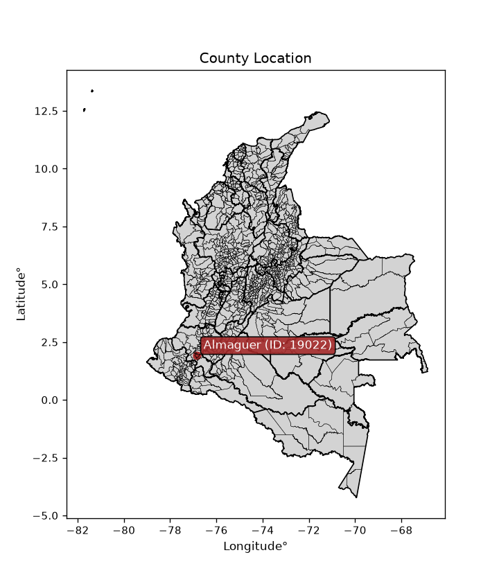
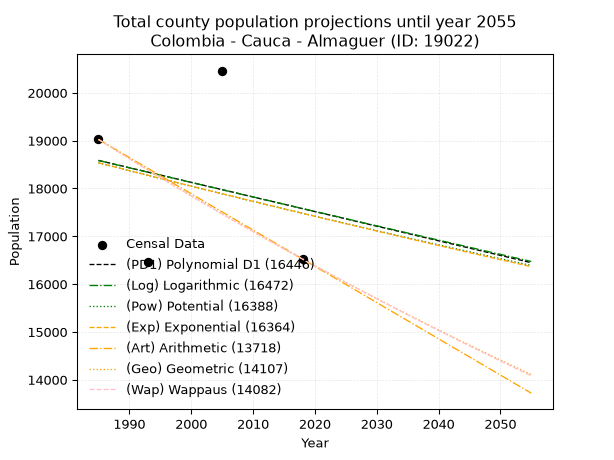
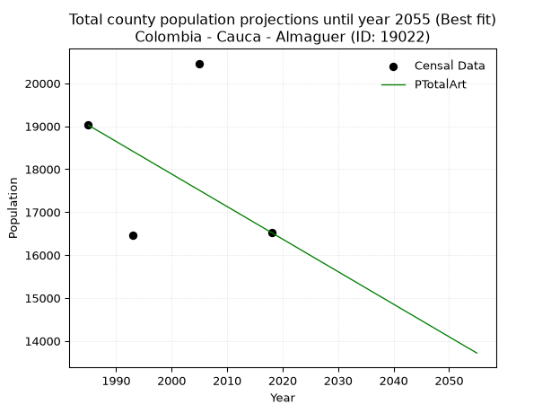
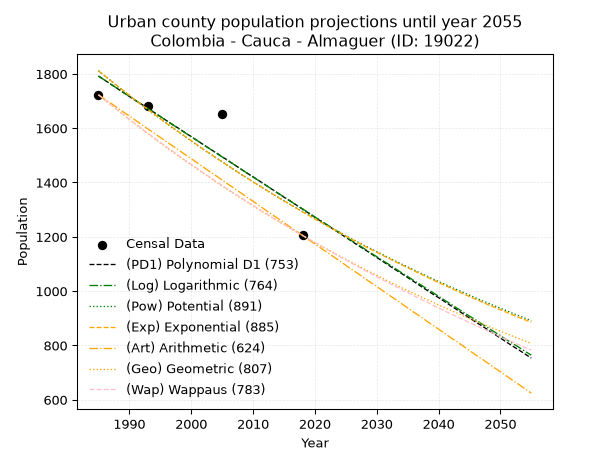
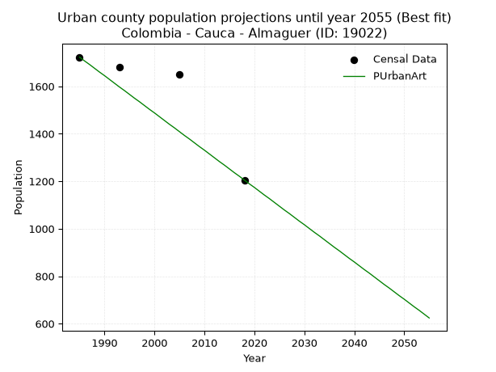
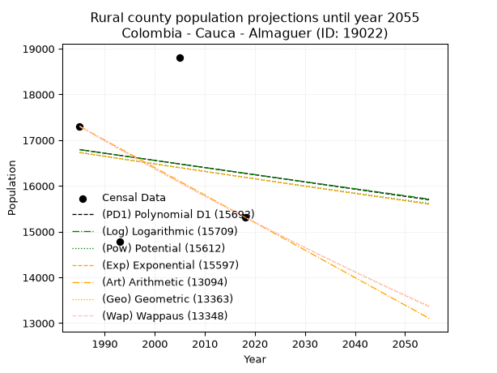
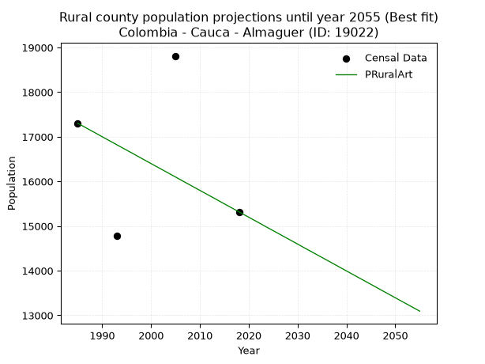

<div align="center">


</div>

# _“Population and Public Services Demand Projections (PPSD) until Year 2050 for Colombia - Cauca - Almaguer (ID: 19022)”_
Keywords: `population` `public-service` `projection` `lineal` `polynomial` `logarithmic` `potential` `exponential` `arithmetic` `geometric` `wappaus` `dane` `colombia` `south-america`

PPSD are analytical estimates used by governments and planners to anticipate future changes in population size, age distribution, and the resulting community needs for utilities, healthcare, education, and infrastructure as sizing future water treatment facilities, electrical grids, and road networks based on spatial growth.

<div align="center">

</img>

</div>


> **General running parameters**: • app_version: _v20260806_. • Python version: _3.14.7_. • Pandas version: _3.0.5_. • NumPy version: _2.5.1_. • Creates, save and include plots into reports (create_plot): _False_. • Projection until year: _2050_. • Process polynomial degree 2 and up: _False_. • Process Wappaus: _True_. • Process Wappaus: _True_. • Set negative values to zero: _True_. • Set infinite values to zero: _True_. • Drop dataset notes: _True_. 
<div align="center">

Dynamic map: [:earth_americas:Google](http://maps.google.com/maps?q=1.913429102,-76.8560696) [:earth_americas:OSM](https://www.openstreetmap.org/#map=18/1.913429102/-76.8560696&layers=P) [:earth_americas:Bing](https://www.bing.com/maps?cp=1.913429102~-76.8560696&lvl=18) [:earth_americas:Apple](https://maps.apple.com/frame?center=1.913429102%2C-76.8560696&span=0.003%2C0.006)

</div>


<div align="center">

```geojson
{
  "type": "Feature",
  "geometry": {
    "type": "Point", 
    "coordinates": [-76.8560696, 1.913429102]
  }, 
  "properties": {
    "Name": "Colombia - Cauca - Almaguer (ID: 19022)"
  }
}
```

</div>


## 0. Census Data (4 records)

Census data are official statistics collected by a government about the people and housing in a country. They usually include counts of total population, age, sex, race, income, education, and jobs.

📅Global census file: [Population.xlsx](../data/Population.xlsx)

| Source   |   Year |   CountryID | CountryName   |   StateID | StateName   |   CountyID | CountyName   |   PTotal |   PUrban |   PRural |
|:---------|-------:|------------:|:--------------|----------:|:------------|-----------:|:-------------|---------:|---------:|---------:|
| DANE     |   1985 |          57 | Colombia      |        19 | Cauca       |      19022 | Almaguer     |    19025 |     1723 |    17302 |
| DANE     |   1993 |          57 | Colombia      |        19 | Cauca       |      19022 | Almaguer     |    16466 |     1682 |    14784 |
| DANE     |   2005 |          57 | Colombia      |        19 | Cauca       |      19022 | Almaguer     |    20463 |     1651 |    18812 |
| DANE     |   2018 |          57 | Colombia      |        19 | Cauca       |      19022 | Almaguer     |    16523 |     1205 |    15318 |

> 🔥Some records could had specific notes about the registered values or the corresponding urban or rural distribution.

📅[SUI-RUPS](https://www.datos.gov.co/Hacienda-y-Cr-dito-P-blico/Registro-nico-de-Prestadores-de-Servicios-P-blicos/4qkq-csdn/about_data) - Local public utility companies: [RUPS.csv](../data/RUPS.xlsx)

 | SERVICIO       | ESTADO    | NOMBRE                                                                                    | NIT         | DEPARTAMENTO_DOMICILIO   | MUNICIPIO_DOMICILIO   | DIRECCION                       |   TELEFONO | EMAIL                       | TIPO_PRESTADOR                 | CLASIFICACION                 |
|:---------------|:----------|:------------------------------------------------------------------------------------------|:------------|:-------------------------|:----------------------|:--------------------------------|-----------:|:----------------------------|:-------------------------------|:------------------------------|
| ACUEDUCTO      | OPERATIVA | MUNICIPIO DE ALMAGUER                                                                     | 891502664-8 | CAUCA                    | ALMAGUER              | CENTRO ADMINISTRATIVO MUNICIPAL |    8267750 | fabianhurtadogomes@yahoo.es | MUNICIPIO (PRESTACIÓN DIRECTA) | HASTA 2500 SUSCRIPTORES       |
| ALCANTARILLADO | OPERATIVA | MUNICIPIO DE ALMAGUER                                                                     | 891502664-8 | CAUCA                    | ALMAGUER              | CENTRO ADMINISTRATIVO MUNICIPAL |    8267750 | fabianhurtadogomes@yahoo.es | MUNICIPIO (PRESTACIÓN DIRECTA) | HASTA 2500 SUSCRIPTORES       |
| ACUEDUCTO      | OPERATIVA | ADMINISTRACION PUBLICA COOPERATIVA DE AGUA POTABLE Y SANEAMIENTO BASICO DE ALMAGUER CAUCA | 900407896-5 | CAUCA                    | ALMAGUER              | Calle  3 # 4  - 31              |    8267750 | apcalmaguer@gmail.com       | ORGANIZACION AUTORIZADA        | MENOR O IGUAL A 2500 USUARIOS |
| ALCANTARILLADO | OPERATIVA | ADMINISTRACION PUBLICA COOPERATIVA DE AGUA POTABLE Y SANEAMIENTO BASICO DE ALMAGUER CAUCA | 900407896-5 | CAUCA                    | ALMAGUER              | Calle  3 # 4  - 31              |    8267750 | apcalmaguer@gmail.com       | ORGANIZACION AUTORIZADA        | MENOR O IGUAL A 2500 USUARIOS |

## 1. Total

### 1.1. Coefficients and Parameters

* (PD1) Polynomial Deg 1: -30.553592934562033, 79234.0742673577 (lineal)
* (Log) Logarithmic: -60939.62072338302, 481321.795457907
* (Pow) Potential: -3.55436212034463, 15.989461657908736
* (Exp) Exponential: -0.0017813660979773417, 636372.0377863102
* (Art) Arithmetic: Year diff. 2018 - 1985 = 33, Population diff. 16523 - 19025 = -2502, Annual growth = -75.81818181818181
* (Geo) Geometric: Year diff. 2018 - 1985 = 33, Population diff. 16523 - 19025 = -2502, Annual growth % = -0.004263628878986903
* (Wap) Wappaus: i = -0.42656791840993485, Condition values only valid for < 200)

<sub>
Wappaus condition values: ['-0.00', '-0.43', '-0.85', '-1.28', '-1.71', '-2.13', '-2.56', '-2.99', '-3.41', '-3.84', '-4.27', '-4.69', '-5.12', '-5.55', '-5.97', '-6.40', '-6.83', '-7.25', '-7.68', '-8.10', '-8.53', '-8.96', '-9.38', '-9.81', '-10.24', '-10.66', '-11.09', '-11.52', '-11.94', '-12.37', '-12.80', '-13.22', '-13.65', '-14.08', '-14.50', '-14.93', '-15.36', '-15.78', '-16.21', '-16.64', '-17.06', '-17.49', '-17.92', '-18.34', '-18.77', '-19.20', '-19.62', '-20.05', '-20.48', '-20.90', '-21.33', '-21.75', '-22.18', '-22.61', '-23.03', '-23.46', '-23.89', '-24.31', '-24.74', '-25.17', '-25.59', '-26.02', '-26.45', '-26.87', '-27.30', '-27.73']
</sub>


### 1.2. Projected Dataset

|   Year |   CountyID |   PTotalPD1 |   PTotalLog |   PTotalPow |   PTotalExp |   PTotalArt |   PTotalGeo |   PTotalWap |
|-------:|-----------:|------------:|------------:|------------:|------------:|------------:|------------:|------------:|
|   1985 |      19022 |       18585 |       18584 |       18536 |       18537 |       19025 |       19025 |       19025 |
|   1986 |      19022 |       18555 |       18554 |       18503 |       18504 |       18949 |       18944 |       18944 |
|   1987 |      19022 |       18524 |       18523 |       18470 |       18471 |       18873 |       18863 |       18863 |
|   1988 |      19022 |       18494 |       18492 |       18437 |       18438 |       18798 |       18783 |       18783 |
|   1989 |      19022 |       18463 |       18462 |       18404 |       18405 |       18722 |       18703 |       18703 |
|   1990 |      19022 |       18432 |       18431 |       18371 |       18373 |       18646 |       18623 |       18624 |
|   1991 |      19022 |       18402 |       18401 |       18339 |       18340 |       18570 |       18543 |       18544 |
|   1992 |      19022 |       18371 |       18370 |       18306 |       18307 |       18494 |       18464 |       18465 |
|   1993 |      19022 |       18341 |       18339 |       18273 |       18275 |       18418 |       18386 |       18387 |
|   1994 |      19022 |       18310 |       18309 |       18241 |       18242 |       18343 |       18307 |       18308 |
|   1995 |      19022 |       18280 |       18278 |       18208 |       18210 |       18267 |       18229 |       18230 |
|   1996 |      19022 |       18249 |       18248 |       18176 |       18177 |       18191 |       18152 |       18153 |
|   1997 |      19022 |       18219 |       18217 |       18144 |       18145 |       18115 |       18074 |       18075 |
|   1998 |      19022 |       18188 |       18187 |       18111 |       18113 |       18039 |       17997 |       17998 |
|   1999 |      19022 |       18157 |       18156 |       18079 |       18080 |       17964 |       17920 |       17922 |
|   2000 |      19022 |       18127 |       18126 |       18047 |       18048 |       17888 |       17844 |       17845 |
|   2001 |      19022 |       18096 |       18095 |       18015 |       18016 |       17812 |       17768 |       17769 |
|   2002 |      19022 |       18066 |       18065 |       17983 |       17984 |       17736 |       17692 |       17694 |
|   2003 |      19022 |       18035 |       18034 |       17951 |       17952 |       17660 |       17617 |       17618 |
|   2004 |      19022 |       18005 |       18004 |       17919 |       17920 |       17584 |       17542 |       17543 |
|   2005 |      19022 |       17974 |       17974 |       17888 |       17888 |       17509 |       17467 |       17468 |
|   2006 |      19022 |       17944 |       17943 |       17856 |       17856 |       17433 |       17392 |       17394 |
|   2007 |      19022 |       17913 |       17913 |       17824 |       17825 |       17357 |       17318 |       17320 |
|   2008 |      19022 |       17882 |       17882 |       17793 |       17793 |       17281 |       17244 |       17246 |
|   2009 |      19022 |       17852 |       17852 |       17761 |       17761 |       17205 |       17171 |       17172 |
|   2010 |      19022 |       17821 |       17822 |       17730 |       17730 |       17130 |       17098 |       17099 |
|   2011 |      19022 |       17791 |       17791 |       17699 |       17698 |       17054 |       17025 |       17026 |
|   2012 |      19022 |       17760 |       17761 |       17667 |       17667 |       16978 |       16952 |       16953 |
|   2013 |      19022 |       17730 |       17731 |       17636 |       17635 |       16902 |       16880 |       16881 |
|   2014 |      19022 |       17699 |       17701 |       17605 |       17604 |       16826 |       16808 |       16809 |
|   2015 |      19022 |       17669 |       17670 |       17574 |       17572 |       16750 |       16736 |       16737 |
|   2016 |      19022 |       17638 |       17640 |       17543 |       17541 |       16675 |       16665 |       16665 |
|   2017 |      19022 |       17607 |       17610 |       17512 |       17510 |       16599 |       16594 |       16594 |
|   2018 |      19022 |       17577 |       17580 |       17481 |       17479 |       16523 |       16523 |       16523 |
|   2019 |      19022 |       17546 |       17549 |       17451 |       17448 |       16447 |       16453 |       16452 |
|   2020 |      19022 |       17516 |       17519 |       17420 |       17417 |       16371 |       16382 |       16382 |
|   2021 |      19022 |       17485 |       17489 |       17389 |       17386 |       16296 |       16313 |       16312 |
|   2022 |      19022 |       17455 |       17459 |       17359 |       17355 |       16220 |       16243 |       16242 |
|   2023 |      19022 |       17424 |       17429 |       17328 |       17324 |       16144 |       16174 |       16172 |
|   2024 |      19022 |       17394 |       17399 |       17298 |       17293 |       16068 |       16105 |       16103 |
|   2025 |      19022 |       17363 |       17369 |       17268 |       17262 |       15992 |       16036 |       16034 |
|   2026 |      19022 |       17332 |       17339 |       17237 |       17231 |       15916 |       15968 |       15965 |
|   2027 |      19022 |       17302 |       17309 |       17207 |       17201 |       15841 |       15900 |       15897 |
|   2028 |      19022 |       17271 |       17278 |       17177 |       17170 |       15765 |       15832 |       15829 |
|   2029 |      19022 |       17241 |       17248 |       17147 |       17140 |       15689 |       15764 |       15761 |
|   2030 |      19022 |       17210 |       17218 |       17117 |       17109 |       15613 |       15697 |       15693 |
|   2031 |      19022 |       17180 |       17188 |       17087 |       17079 |       15537 |       15630 |       15625 |
|   2032 |      19022 |       17149 |       17158 |       17057 |       17048 |       15462 |       15564 |       15558 |
|   2033 |      19022 |       17119 |       17128 |       17027 |       17018 |       15386 |       15497 |       15491 |
|   2034 |      19022 |       17088 |       17098 |       16997 |       16988 |       15310 |       15431 |       15425 |
|   2035 |      19022 |       17058 |       17068 |       16968 |       16957 |       15234 |       15365 |       15358 |
|   2036 |      19022 |       17027 |       17039 |       16938 |       16927 |       15158 |       15300 |       15292 |
|   2037 |      19022 |       16996 |       17009 |       16909 |       16897 |       15082 |       15235 |       15226 |
|   2038 |      19022 |       16966 |       16979 |       16879 |       16867 |       15007 |       15170 |       15161 |
|   2039 |      19022 |       16935 |       16949 |       16850 |       16837 |       14931 |       15105 |       15095 |
|   2040 |      19022 |       16905 |       16919 |       16820 |       16807 |       14855 |       15041 |       15030 |
|   2041 |      19022 |       16874 |       16889 |       16791 |       16777 |       14779 |       14976 |       14965 |
|   2042 |      19022 |       16844 |       16859 |       16762 |       16747 |       14703 |       14913 |       14901 |
|   2043 |      19022 |       16813 |       16829 |       16733 |       16717 |       14628 |       14849 |       14836 |
|   2044 |      19022 |       16783 |       16800 |       16704 |       16688 |       14552 |       14786 |       14772 |
|   2045 |      19022 |       16752 |       16770 |       16675 |       16658 |       14476 |       14723 |       14708 |
|   2046 |      19022 |       16721 |       16740 |       16646 |       16628 |       14400 |       14660 |       14644 |
|   2047 |      19022 |       16691 |       16710 |       16617 |       16599 |       14324 |       14597 |       14581 |
|   2048 |      19022 |       16660 |       16680 |       16588 |       16569 |       14248 |       14535 |       14518 |
|   2049 |      19022 |       16630 |       16651 |       16559 |       16540 |       14173 |       14473 |       14455 |
|   2050 |      19022 |       16599 |       16621 |       16531 |       16510 |       14097 |       14411 |       14392 |
<div align="center">

</img>

</div>


### 1.3. Best fit with absolute and relative error (%)

Relative error puts that difference into context by dividing the absolute error by the true value, creating a unitless ratio or percentage that shows the scale of the mistake.

Absolute and relative error

|   Year | Source   |   CountryID | CountryName   |   StateID | StateName   |   CountyID_x | CountyName   |   PTotal |   PUrban |   PRural |   CountyID_y |   PTotalPD1 |   PTotalLog |   PTotalPow |   PTotalExp |   PTotalArt |   PTotalGeo |   PTotalWap |   PTotalPD1AbsError |   PTotalLogAbsError |   PTotalPowAbsError |   PTotalExpAbsError |   PTotalArtAbsError |   PTotalGeoAbsError |   PTotalWapAbsError |   PTotalPD1RelError |   PTotalLogRelError |   PTotalPowRelError |   PTotalExpRelError |   PTotalArtRelError |   PTotalGeoRelError |   PTotalWapRelError |
|-------:|:---------|------------:|:--------------|----------:|:------------|-------------:|:-------------|---------:|---------:|---------:|-------------:|------------:|------------:|------------:|------------:|------------:|------------:|------------:|--------------------:|--------------------:|--------------------:|--------------------:|--------------------:|--------------------:|--------------------:|--------------------:|--------------------:|--------------------:|--------------------:|--------------------:|--------------------:|--------------------:|
|   1985 | DANE     |          57 | Colombia      |        19 | Cauca       |        19022 | Almaguer     |    19025 |     1723 |    17302 |        19022 |       18585 |       18584 |       18536 |       18537 |       19025 |       19025 |       19025 |                 440 |                 441 |                 489 |                 488 |                   0 |                   0 |                   0 |             2.31275 |             2.318   |             2.5703  |             2.56505 |              0      |              0      |              0      |
|   1993 | DANE     |          57 | Colombia      |        19 | Cauca       |        19022 | Almaguer     |    16466 |     1682 |    14784 |        19022 |       18341 |       18339 |       18273 |       18275 |       18418 |       18386 |       18387 |                1875 |                1873 |                1807 |                1809 |                1952 |                1920 |                1921 |            11.3871  |            11.375   |            10.9741  |            10.9863  |             11.8547 |             11.6604 |             11.6665 |
|   2005 | DANE     |          57 | Colombia      |        19 | Cauca       |        19022 | Almaguer     |    20463 |     1651 |    18812 |        19022 |       17974 |       17974 |       17888 |       17888 |       17509 |       17467 |       17468 |                2489 |                2489 |                2575 |                2575 |                2954 |                2996 |                2995 |            12.1634  |            12.1634  |            12.5837  |            12.5837  |             14.4358 |             14.6411 |             14.6362 |
|   2018 | DANE     |          57 | Colombia      |        19 | Cauca       |        19022 | Almaguer     |    16523 |     1205 |    15318 |        19022 |       17577 |       17580 |       17481 |       17479 |       16523 |       16523 |       16523 |                1054 |                1057 |                 958 |                 956 |                   0 |                   0 |                   0 |             6.37899 |             6.39714 |             5.79798 |             5.78587 |              0      |              0      |              0      |

Relative error mean

| Method    |   RelError | Best   |
|:----------|-----------:|:-------|
| PTotalPD1 |    8.06056 |        |
| PTotalLog |    8.06338 |        |
| PTotalPow |    7.98152 |        |
| PTotalExp |    7.98022 |        |
| PTotalArt |    6.57264 | True   |
| PTotalGeo |    6.57536 |        |
| PTotalWap |    6.57566 |        |

💙Best method: _**PTotalArt**_
<div align="center">

</img>

</div>


### 1.4. Fresh water supply demand in liters per capita per day (lpcd)

The fresh water supply demand typically ranges from 100 to 300 liters per capita per day (lpcd) for standard domestic and municipal planning, though absolute survival minimums set by the World Health Organization are as low as 7.5 to 20 liters per day, and total consumption in high-income nations can exceed 400 liters.

> `CZ`: Level in meters above the sea level (masl)<br> `WS`: Fresh water supply demand in liters per capita per day (lpcd or l/h/d)<br> `WSAll`: Zonal fresh water supply demand in liters per second (l/s)<br> `A`: Zonal area in square meters<br> `DP`: Population density (people/hectare or p/ha)

Reference values (RAS Colombia)

|    CZ |   WS |
|------:|-----:|
|  1000 |  120 |
|  2000 |  130 |
| 99999 |  140 |

County shapefile geometry properties and water supply values

|   CountyID |      ATotal |   CZTotal |   WSTotal |
|-----------:|------------:|----------:|----------:|
|      19022 | 2.36852e+08 |   2212.82 |       140 |

Projected values for best method: PTotalArt

|   CountyID |   Year |   PTotalArt |   DPTotal |   WSTotal |   WSTotalAll |
|-----------:|-------:|------------:|----------:|----------:|-------------:|
|      19022 |   1985 |       19025 |      0.8  |       140 |      30.8275 |
|      19022 |   1986 |       18949 |      0.8  |       140 |      30.7044 |
|      19022 |   1987 |       18873 |      0.8  |       140 |      30.5813 |
|      19022 |   1988 |       18798 |      0.79 |       140 |      30.4597 |
|      19022 |   1989 |       18722 |      0.79 |       140 |      30.3366 |
|      19022 |   1990 |       18646 |      0.79 |       140 |      30.2134 |
|      19022 |   1991 |       18570 |      0.78 |       140 |      30.0903 |
|      19022 |   1992 |       18494 |      0.78 |       140 |      29.9671 |
|      19022 |   1993 |       18418 |      0.78 |       140 |      29.844  |
|      19022 |   1994 |       18343 |      0.77 |       140 |      29.7225 |
|      19022 |   1995 |       18267 |      0.77 |       140 |      29.5993 |
|      19022 |   1996 |       18191 |      0.77 |       140 |      29.4762 |
|      19022 |   1997 |       18115 |      0.76 |       140 |      29.353  |
|      19022 |   1998 |       18039 |      0.76 |       140 |      29.2299 |
|      19022 |   1999 |       17964 |      0.76 |       140 |      29.1083 |
|      19022 |   2000 |       17888 |      0.76 |       140 |      28.9852 |
|      19022 |   2001 |       17812 |      0.75 |       140 |      28.862  |
|      19022 |   2002 |       17736 |      0.75 |       140 |      28.7389 |
|      19022 |   2003 |       17660 |      0.75 |       140 |      28.6157 |
|      19022 |   2004 |       17584 |      0.74 |       140 |      28.4926 |
|      19022 |   2005 |       17509 |      0.74 |       140 |      28.3711 |
|      19022 |   2006 |       17433 |      0.74 |       140 |      28.2479 |
|      19022 |   2007 |       17357 |      0.73 |       140 |      28.1248 |
|      19022 |   2008 |       17281 |      0.73 |       140 |      28.0016 |
|      19022 |   2009 |       17205 |      0.73 |       140 |      27.8785 |
|      19022 |   2010 |       17130 |      0.72 |       140 |      27.7569 |
|      19022 |   2011 |       17054 |      0.72 |       140 |      27.6338 |
|      19022 |   2012 |       16978 |      0.72 |       140 |      27.5106 |
|      19022 |   2013 |       16902 |      0.71 |       140 |      27.3875 |
|      19022 |   2014 |       16826 |      0.71 |       140 |      27.2644 |
|      19022 |   2015 |       16750 |      0.71 |       140 |      27.1412 |
|      19022 |   2016 |       16675 |      0.7  |       140 |      27.0197 |
|      19022 |   2017 |       16599 |      0.7  |       140 |      26.8965 |
|      19022 |   2018 |       16523 |      0.7  |       140 |      26.7734 |
|      19022 |   2019 |       16447 |      0.69 |       140 |      26.6502 |
|      19022 |   2020 |       16371 |      0.69 |       140 |      26.5271 |
|      19022 |   2021 |       16296 |      0.69 |       140 |      26.4056 |
|      19022 |   2022 |       16220 |      0.68 |       140 |      26.2824 |
|      19022 |   2023 |       16144 |      0.68 |       140 |      26.1593 |
|      19022 |   2024 |       16068 |      0.68 |       140 |      26.0361 |
|      19022 |   2025 |       15992 |      0.68 |       140 |      25.913  |
|      19022 |   2026 |       15916 |      0.67 |       140 |      25.7898 |
|      19022 |   2027 |       15841 |      0.67 |       140 |      25.6683 |
|      19022 |   2028 |       15765 |      0.67 |       140 |      25.5451 |
|      19022 |   2029 |       15689 |      0.66 |       140 |      25.422  |
|      19022 |   2030 |       15613 |      0.66 |       140 |      25.2988 |
|      19022 |   2031 |       15537 |      0.66 |       140 |      25.1757 |
|      19022 |   2032 |       15462 |      0.65 |       140 |      25.0542 |
|      19022 |   2033 |       15386 |      0.65 |       140 |      24.931  |
|      19022 |   2034 |       15310 |      0.65 |       140 |      24.8079 |
|      19022 |   2035 |       15234 |      0.64 |       140 |      24.6847 |
|      19022 |   2036 |       15158 |      0.64 |       140 |      24.5616 |
|      19022 |   2037 |       15082 |      0.64 |       140 |      24.4384 |
|      19022 |   2038 |       15007 |      0.63 |       140 |      24.3169 |
|      19022 |   2039 |       14931 |      0.63 |       140 |      24.1938 |
|      19022 |   2040 |       14855 |      0.63 |       140 |      24.0706 |
|      19022 |   2041 |       14779 |      0.62 |       140 |      23.9475 |
|      19022 |   2042 |       14703 |      0.62 |       140 |      23.8243 |
|      19022 |   2043 |       14628 |      0.62 |       140 |      23.7028 |
|      19022 |   2044 |       14552 |      0.61 |       140 |      23.5796 |
|      19022 |   2045 |       14476 |      0.61 |       140 |      23.4565 |
|      19022 |   2046 |       14400 |      0.61 |       140 |      23.3333 |
|      19022 |   2047 |       14324 |      0.6  |       140 |      23.2102 |
|      19022 |   2048 |       14248 |      0.6  |       140 |      23.087  |
|      19022 |   2049 |       14173 |      0.6  |       140 |      22.9655 |
|      19022 |   2050 |       14097 |      0.6  |       140 |      22.8424 |

## 2. Urban

### 2.1. Coefficients and Parameters

* (PD1) Polynomial Deg 1: -14.836210357285958, 31241.37976716124 (lineal)
* (Log) Logarithmic: -29662.408595646975, 227029.4554351373
* (Pow) Potential: -20.466737933134795, 70.75246540391369
* (Exp) Exponential: -0.010237381095350112, 1211711122871.3132
* (Art) Arithmetic: Year diff. 2018 - 1985 = 33, Population diff. 1205 - 1723 = -518, Annual growth = -15.696969696969697
* (Geo) Geometric: Year diff. 2018 - 1985 = 33, Population diff. 1205 - 1723 = -518, Annual growth % = -0.01077748376975518
* (Wap) Wappaus: i = -1.0721973836727936, Condition values only valid for < 200)

<sub>
Wappaus condition values: ['-0.00', '-1.07', '-2.14', '-3.22', '-4.29', '-5.36', '-6.43', '-7.51', '-8.58', '-9.65', '-10.72', '-11.79', '-12.87', '-13.94', '-15.01', '-16.08', '-17.16', '-18.23', '-19.30', '-20.37', '-21.44', '-22.52', '-23.59', '-24.66', '-25.73', '-26.80', '-27.88', '-28.95', '-30.02', '-31.09', '-32.17', '-33.24', '-34.31', '-35.38', '-36.45', '-37.53', '-38.60', '-39.67', '-40.74', '-41.82', '-42.89', '-43.96', '-45.03', '-46.10', '-47.18', '-48.25', '-49.32', '-50.39', '-51.47', '-52.54', '-53.61', '-54.68', '-55.75', '-56.83', '-57.90', '-58.97', '-60.04', '-61.12', '-62.19', '-63.26', '-64.33', '-65.40', '-66.48', '-67.55', '-68.62', '-69.69']
</sub>


### 2.2. Projected Dataset

|   Year |   CountyID |   PUrbanPD1 |   PUrbanLog |   PUrbanPow |   PUrbanExp |   PUrbanArt |   PUrbanGeo |   PUrbanWap |
|-------:|-----------:|------------:|------------:|------------:|------------:|------------:|------------:|------------:|
|   1985 |      19022 |        1792 |        1792 |        1812 |        1811 |        1723 |        1723 |        1723 |
|   1986 |      19022 |        1777 |        1777 |        1793 |        1793 |        1707 |        1704 |        1705 |
|   1987 |      19022 |        1762 |        1762 |        1775 |        1775 |        1692 |        1686 |        1686 |
|   1988 |      19022 |        1747 |        1747 |        1756 |        1757 |        1676 |        1668 |        1668 |
|   1989 |      19022 |        1732 |        1732 |        1738 |        1739 |        1660 |        1650 |        1651 |
|   1990 |      19022 |        1717 |        1717 |        1721 |        1721 |        1645 |        1632 |        1633 |
|   1991 |      19022 |        1702 |        1702 |        1703 |        1703 |        1629 |        1615 |        1616 |
|   1992 |      19022 |        1688 |        1687 |        1686 |        1686 |        1613 |        1597 |        1598 |
|   1993 |      19022 |        1673 |        1672 |        1668 |        1669 |        1597 |        1580 |        1581 |
|   1994 |      19022 |        1658 |        1658 |        1651 |        1652 |        1582 |        1563 |        1564 |
|   1995 |      19022 |        1643 |        1643 |        1635 |        1635 |        1566 |        1546 |        1548 |
|   1996 |      19022 |        1628 |        1628 |        1618 |        1618 |        1550 |        1529 |        1531 |
|   1997 |      19022 |        1613 |        1613 |        1601 |        1602 |        1535 |        1513 |        1515 |
|   1998 |      19022 |        1599 |        1598 |        1585 |        1586 |        1519 |        1497 |        1498 |
|   1999 |      19022 |        1584 |        1583 |        1569 |        1570 |        1503 |        1480 |        1482 |
|   2000 |      19022 |        1569 |        1568 |        1553 |        1554 |        1488 |        1465 |        1467 |
|   2001 |      19022 |        1554 |        1554 |        1537 |        1538 |        1472 |        1449 |        1451 |
|   2002 |      19022 |        1539 |        1539 |        1521 |        1522 |        1456 |        1433 |        1435 |
|   2003 |      19022 |        1524 |        1524 |        1506 |        1507 |        1440 |        1418 |        1420 |
|   2004 |      19022 |        1510 |        1509 |        1491 |        1491 |        1425 |        1402 |        1404 |
|   2005 |      19022 |        1495 |        1494 |        1476 |        1476 |        1409 |        1387 |        1389 |
|   2006 |      19022 |        1480 |        1480 |        1461 |        1461 |        1393 |        1372 |        1374 |
|   2007 |      19022 |        1465 |        1465 |        1446 |        1446 |        1378 |        1358 |        1359 |
|   2008 |      19022 |        1450 |        1450 |        1431 |        1431 |        1362 |        1343 |        1345 |
|   2009 |      19022 |        1435 |        1435 |        1417 |        1417 |        1346 |        1328 |        1330 |
|   2010 |      19022 |        1421 |        1420 |        1402 |        1402 |        1331 |        1314 |        1316 |
|   2011 |      19022 |        1406 |        1406 |        1388 |        1388 |        1315 |        1300 |        1301 |
|   2012 |      19022 |        1391 |        1391 |        1374 |        1374 |        1299 |        1286 |        1287 |
|   2013 |      19022 |        1376 |        1376 |        1360 |        1360 |        1283 |        1272 |        1273 |
|   2014 |      19022 |        1361 |        1361 |        1346 |        1346 |        1268 |        1258 |        1259 |
|   2015 |      19022 |        1346 |        1347 |        1333 |        1332 |        1252 |        1245 |        1246 |
|   2016 |      19022 |        1332 |        1332 |        1319 |        1319 |        1236 |        1231 |        1232 |
|   2017 |      19022 |        1317 |        1317 |        1306 |        1305 |        1221 |        1218 |        1218 |
|   2018 |      19022 |        1302 |        1303 |        1293 |        1292 |        1205 |        1205 |        1205 |
|   2019 |      19022 |        1287 |        1288 |        1280 |        1279 |        1189 |        1192 |        1192 |
|   2020 |      19022 |        1272 |        1273 |        1267 |        1266 |        1174 |        1179 |        1179 |
|   2021 |      19022 |        1257 |        1259 |        1254 |        1253 |        1158 |        1166 |        1166 |
|   2022 |      19022 |        1243 |        1244 |        1241 |        1240 |        1142 |        1154 |        1153 |
|   2023 |      19022 |        1228 |        1229 |        1229 |        1228 |        1127 |        1141 |        1140 |
|   2024 |      19022 |        1213 |        1215 |        1217 |        1215 |        1111 |        1129 |        1127 |
|   2025 |      19022 |        1198 |        1200 |        1204 |        1203 |        1095 |        1117 |        1115 |
|   2026 |      19022 |        1183 |        1185 |        1192 |        1190 |        1079 |        1105 |        1102 |
|   2027 |      19022 |        1168 |        1171 |        1180 |        1178 |        1064 |        1093 |        1090 |
|   2028 |      19022 |        1154 |        1156 |        1168 |        1166 |        1048 |        1081 |        1077 |
|   2029 |      19022 |        1139 |        1141 |        1157 |        1154 |        1032 |        1070 |        1065 |
|   2030 |      19022 |        1124 |        1127 |        1145 |        1143 |        1017 |        1058 |        1053 |
|   2031 |      19022 |        1109 |        1112 |        1134 |        1131 |        1001 |        1047 |        1041 |
|   2032 |      19022 |        1094 |        1098 |        1122 |        1120 |         985 |        1035 |        1029 |
|   2033 |      19022 |        1079 |        1083 |        1111 |        1108 |         970 |        1024 |        1018 |
|   2034 |      19022 |        1065 |        1068 |        1100 |        1097 |         954 |        1013 |        1006 |
|   2035 |      19022 |        1050 |        1054 |        1089 |        1086 |         938 |        1002 |         995 |
|   2036 |      19022 |        1035 |        1039 |        1078 |        1075 |         922 |         991 |         983 |
|   2037 |      19022 |        1020 |        1025 |        1067 |        1064 |         907 |         981 |         972 |
|   2038 |      19022 |        1005 |        1010 |        1056 |        1053 |         891 |         970 |         961 |
|   2039 |      19022 |         990 |         996 |        1046 |        1042 |         875 |         960 |         949 |
|   2040 |      19022 |         976 |         981 |        1035 |        1032 |         860 |         949 |         938 |
|   2041 |      19022 |         961 |         966 |        1025 |        1021 |         844 |         939 |         927 |
|   2042 |      19022 |         946 |         952 |        1015 |        1011 |         828 |         929 |         916 |
|   2043 |      19022 |         931 |         937 |        1005 |        1000 |         813 |         919 |         906 |
|   2044 |      19022 |         916 |         923 |         995 |         990 |         797 |         909 |         895 |
|   2045 |      19022 |         901 |         908 |         985 |         980 |         781 |         899 |         884 |
|   2046 |      19022 |         886 |         894 |         975 |         970 |         765 |         890 |         874 |
|   2047 |      19022 |         872 |         879 |         965 |         960 |         750 |         880 |         863 |
|   2048 |      19022 |         857 |         865 |         956 |         950 |         734 |         871 |         853 |
|   2049 |      19022 |         842 |         850 |         946 |         941 |         718 |         861 |         843 |
|   2050 |      19022 |         827 |         836 |         937 |         931 |         703 |         852 |         832 |
<div align="center">

</img>

</div>


### 2.3. Best fit with absolute and relative error (%)

Relative error puts that difference into context by dividing the absolute error by the true value, creating a unitless ratio or percentage that shows the scale of the mistake.

Absolute and relative error

|   Year | Source   |   CountryID | CountryName   |   StateID | StateName   |   CountyID_x | CountyName   |   PTotal |   PUrban |   PRural |   CountyID_y |   PUrbanPD1 |   PUrbanLog |   PUrbanPow |   PUrbanExp |   PUrbanArt |   PUrbanGeo |   PUrbanWap |   PUrbanPD1AbsError |   PUrbanLogAbsError |   PUrbanPowAbsError |   PUrbanExpAbsError |   PUrbanArtAbsError |   PUrbanGeoAbsError |   PUrbanWapAbsError |   PUrbanPD1RelError |   PUrbanLogRelError |   PUrbanPowRelError |   PUrbanExpRelError |   PUrbanArtRelError |   PUrbanGeoRelError |   PUrbanWapRelError |
|-------:|:---------|------------:|:--------------|----------:|:------------|-------------:|:-------------|---------:|---------:|---------:|-------------:|------------:|------------:|------------:|------------:|------------:|------------:|------------:|--------------------:|--------------------:|--------------------:|--------------------:|--------------------:|--------------------:|--------------------:|--------------------:|--------------------:|--------------------:|--------------------:|--------------------:|--------------------:|--------------------:|
|   1985 | DANE     |          57 | Colombia      |        19 | Cauca       |        19022 | Almaguer     |    19025 |     1723 |    17302 |        19022 |        1792 |        1792 |        1812 |        1811 |        1723 |        1723 |        1723 |                  69 |                  69 |                  89 |                  88 |                   0 |                   0 |                   0 |            4.00464  |             4.00464 |            5.16541  |            5.10737  |             0       |             0       |             0       |
|   1993 | DANE     |          57 | Colombia      |        19 | Cauca       |        19022 | Almaguer     |    16466 |     1682 |    14784 |        19022 |        1673 |        1672 |        1668 |        1669 |        1597 |        1580 |        1581 |                   9 |                  10 |                  14 |                  13 |                  85 |                 102 |                 101 |            0.535077 |             0.59453 |            0.832342 |            0.772889 |             5.05351 |             6.06421 |             6.00476 |
|   2005 | DANE     |          57 | Colombia      |        19 | Cauca       |        19022 | Almaguer     |    20463 |     1651 |    18812 |        19022 |        1495 |        1494 |        1476 |        1476 |        1409 |        1387 |        1389 |                 156 |                 157 |                 175 |                 175 |                 242 |                 264 |                 262 |            9.44882  |             9.50939 |           10.5996   |           10.5996   |            14.6578  |            15.9903  |            15.8692  |
|   2018 | DANE     |          57 | Colombia      |        19 | Cauca       |        19022 | Almaguer     |    16523 |     1205 |    15318 |        19022 |        1302 |        1303 |        1293 |        1292 |        1205 |        1205 |        1205 |                  97 |                  98 |                  88 |                  87 |                   0 |                   0 |                   0 |            8.04979  |             8.13278 |            7.3029   |            7.21992  |             0       |             0       |             0       |

Relative error mean

| Method    |   RelError | Best   |
|:----------|-----------:|:-------|
| PUrbanPD1 |    5.50958 |        |
| PUrbanLog |    5.56034 |        |
| PUrbanPow |    5.97507 |        |
| PUrbanExp |    5.92495 |        |
| PUrbanArt |    4.92782 | True   |
| PUrbanGeo |    5.51363 |        |
| PUrbanWap |    5.46848 |        |

💙Best method: _**PUrbanArt**_
<div align="center">

</img>

</div>


### 2.4. Fresh water supply demand in liters per capita per day (lpcd)

The fresh water supply demand typically ranges from 100 to 300 liters per capita per day (lpcd) for standard domestic and municipal planning, though absolute survival minimums set by the World Health Organization are as low as 7.5 to 20 liters per day, and total consumption in high-income nations can exceed 400 liters.

> `CZ`: Level in meters above the sea level (masl)<br> `WS`: Fresh water supply demand in liters per capita per day (lpcd or l/h/d)<br> `WSAll`: Zonal fresh water supply demand in liters per second (l/s)<br> `A`: Zonal area in square meters<br> `DP`: Population density (people/hectare or p/ha)

Reference values (RAS Colombia)

|    CZ |   WS |
|------:|-----:|
|  1000 |  120 |
|  2000 |  130 |
| 99999 |  140 |

County shapefile geometry properties and water supply values

|   CountyID |   AUrban |   CZUrban |   WSUrban |
|-----------:|---------:|----------:|----------:|
|      19022 |   358574 |   2190.21 |       140 |

Projected values for best method: PUrbanArt

|   CountyID |   Year |   PUrbanArt |   DPUrban |   WSUrban |   WSUrbanAll |
|-----------:|-------:|------------:|----------:|----------:|-------------:|
|      19022 |   1985 |        1723 |     48.05 |       140 |      2.7919  |
|      19022 |   1986 |        1707 |     47.61 |       140 |      2.76597 |
|      19022 |   1987 |        1692 |     47.19 |       140 |      2.74167 |
|      19022 |   1988 |        1676 |     46.74 |       140 |      2.71574 |
|      19022 |   1989 |        1660 |     46.29 |       140 |      2.68981 |
|      19022 |   1990 |        1645 |     45.88 |       140 |      2.66551 |
|      19022 |   1991 |        1629 |     45.43 |       140 |      2.63958 |
|      19022 |   1992 |        1613 |     44.98 |       140 |      2.61366 |
|      19022 |   1993 |        1597 |     44.54 |       140 |      2.58773 |
|      19022 |   1994 |        1582 |     44.12 |       140 |      2.56343 |
|      19022 |   1995 |        1566 |     43.67 |       140 |      2.5375  |
|      19022 |   1996 |        1550 |     43.23 |       140 |      2.51157 |
|      19022 |   1997 |        1535 |     42.81 |       140 |      2.48727 |
|      19022 |   1998 |        1519 |     42.36 |       140 |      2.46134 |
|      19022 |   1999 |        1503 |     41.92 |       140 |      2.43542 |
|      19022 |   2000 |        1488 |     41.5  |       140 |      2.41111 |
|      19022 |   2001 |        1472 |     41.05 |       140 |      2.38519 |
|      19022 |   2002 |        1456 |     40.61 |       140 |      2.35926 |
|      19022 |   2003 |        1440 |     40.16 |       140 |      2.33333 |
|      19022 |   2004 |        1425 |     39.74 |       140 |      2.30903 |
|      19022 |   2005 |        1409 |     39.29 |       140 |      2.2831  |
|      19022 |   2006 |        1393 |     38.85 |       140 |      2.25718 |
|      19022 |   2007 |        1378 |     38.43 |       140 |      2.23287 |
|      19022 |   2008 |        1362 |     37.98 |       140 |      2.20694 |
|      19022 |   2009 |        1346 |     37.54 |       140 |      2.18102 |
|      19022 |   2010 |        1331 |     37.12 |       140 |      2.15671 |
|      19022 |   2011 |        1315 |     36.67 |       140 |      2.13079 |
|      19022 |   2012 |        1299 |     36.23 |       140 |      2.10486 |
|      19022 |   2013 |        1283 |     35.78 |       140 |      2.07894 |
|      19022 |   2014 |        1268 |     35.36 |       140 |      2.05463 |
|      19022 |   2015 |        1252 |     34.92 |       140 |      2.0287  |
|      19022 |   2016 |        1236 |     34.47 |       140 |      2.00278 |
|      19022 |   2017 |        1221 |     34.05 |       140 |      1.97847 |
|      19022 |   2018 |        1205 |     33.61 |       140 |      1.95255 |
|      19022 |   2019 |        1189 |     33.16 |       140 |      1.92662 |
|      19022 |   2020 |        1174 |     32.74 |       140 |      1.90231 |
|      19022 |   2021 |        1158 |     32.29 |       140 |      1.87639 |
|      19022 |   2022 |        1142 |     31.85 |       140 |      1.85046 |
|      19022 |   2023 |        1127 |     31.43 |       140 |      1.82616 |
|      19022 |   2024 |        1111 |     30.98 |       140 |      1.80023 |
|      19022 |   2025 |        1095 |     30.54 |       140 |      1.77431 |
|      19022 |   2026 |        1079 |     30.09 |       140 |      1.74838 |
|      19022 |   2027 |        1064 |     29.67 |       140 |      1.72407 |
|      19022 |   2028 |        1048 |     29.23 |       140 |      1.69815 |
|      19022 |   2029 |        1032 |     28.78 |       140 |      1.67222 |
|      19022 |   2030 |        1017 |     28.36 |       140 |      1.64792 |
|      19022 |   2031 |        1001 |     27.92 |       140 |      1.62199 |
|      19022 |   2032 |         985 |     27.47 |       140 |      1.59606 |
|      19022 |   2033 |         970 |     27.05 |       140 |      1.57176 |
|      19022 |   2034 |         954 |     26.61 |       140 |      1.54583 |
|      19022 |   2035 |         938 |     26.16 |       140 |      1.51991 |
|      19022 |   2036 |         922 |     25.71 |       140 |      1.49398 |
|      19022 |   2037 |         907 |     25.29 |       140 |      1.46968 |
|      19022 |   2038 |         891 |     24.85 |       140 |      1.44375 |
|      19022 |   2039 |         875 |     24.4  |       140 |      1.41782 |
|      19022 |   2040 |         860 |     23.98 |       140 |      1.39352 |
|      19022 |   2041 |         844 |     23.54 |       140 |      1.36759 |
|      19022 |   2042 |         828 |     23.09 |       140 |      1.34167 |
|      19022 |   2043 |         813 |     22.67 |       140 |      1.31736 |
|      19022 |   2044 |         797 |     22.23 |       140 |      1.29144 |
|      19022 |   2045 |         781 |     21.78 |       140 |      1.26551 |
|      19022 |   2046 |         765 |     21.33 |       140 |      1.23958 |
|      19022 |   2047 |         750 |     20.92 |       140 |      1.21528 |
|      19022 |   2048 |         734 |     20.47 |       140 |      1.18935 |
|      19022 |   2049 |         718 |     20.02 |       140 |      1.16343 |
|      19022 |   2050 |         703 |     19.61 |       140 |      1.13912 |

## 3. Rural

### 3.1. Coefficients and Parameters

* (PD1) Polynomial Deg 1: -15.717382577276206, 47992.69450019673 (lineal)
* (Log) Logarithmic: -31277.212127736166, 254292.3400227706
* (Pow) Potential: -1.9960709168183834, 10.806062796980157
* (Exp) Exponential: -0.0010022210719190954, 122323.05003123831
* (Art) Arithmetic: Year diff. 2018 - 1985 = 33, Population diff. 15318 - 17302 = -1984, Annual growth = -60.121212121212125
* (Geo) Geometric: Year diff. 2018 - 1985 = 33, Population diff. 15318 - 17302 = -1984, Annual growth % = -0.0036839096412835115
* (Wap) Wappaus: i = -0.36861564758560467, Condition values only valid for < 200)

<sub>
Wappaus condition values: ['-0.00', '-0.37', '-0.74', '-1.11', '-1.47', '-1.84', '-2.21', '-2.58', '-2.95', '-3.32', '-3.69', '-4.05', '-4.42', '-4.79', '-5.16', '-5.53', '-5.90', '-6.27', '-6.64', '-7.00', '-7.37', '-7.74', '-8.11', '-8.48', '-8.85', '-9.22', '-9.58', '-9.95', '-10.32', '-10.69', '-11.06', '-11.43', '-11.80', '-12.16', '-12.53', '-12.90', '-13.27', '-13.64', '-14.01', '-14.38', '-14.74', '-15.11', '-15.48', '-15.85', '-16.22', '-16.59', '-16.96', '-17.32', '-17.69', '-18.06', '-18.43', '-18.80', '-19.17', '-19.54', '-19.91', '-20.27', '-20.64', '-21.01', '-21.38', '-21.75', '-22.12', '-22.49', '-22.85', '-23.22', '-23.59', '-23.96']
</sub>


### 3.2. Projected Dataset

|   Year |   CountyID |   PRuralPD1 |   PRuralLog |   PRuralPow |   PRuralExp |   PRuralArt |   PRuralGeo |   PRuralWap |
|-------:|-----------:|------------:|------------:|------------:|------------:|------------:|------------:|------------:|
|   1985 |      19022 |       16794 |       16793 |       16730 |       16731 |       17302 |       17302 |       17302 |
|   1986 |      19022 |       16778 |       16777 |       16713 |       16714 |       17242 |       17238 |       17238 |
|   1987 |      19022 |       16762 |       16761 |       16697 |       16697 |       17182 |       17175 |       17175 |
|   1988 |      19022 |       16747 |       16746 |       16680 |       16681 |       17122 |       17111 |       17112 |
|   1989 |      19022 |       16731 |       16730 |       16663 |       16664 |       17062 |       17048 |       17049 |
|   1990 |      19022 |       16715 |       16714 |       16646 |       16647 |       17001 |       16986 |       16986 |
|   1991 |      19022 |       16699 |       16698 |       16630 |       16631 |       16941 |       16923 |       16924 |
|   1992 |      19022 |       16684 |       16683 |       16613 |       16614 |       16881 |       16861 |       16861 |
|   1993 |      19022 |       16668 |       16667 |       16596 |       16597 |       16821 |       16799 |       16799 |
|   1994 |      19022 |       16652 |       16651 |       16580 |       16581 |       16761 |       16737 |       16737 |
|   1995 |      19022 |       16637 |       16636 |       16563 |       16564 |       16701 |       16675 |       16676 |
|   1996 |      19022 |       16621 |       16620 |       16547 |       16547 |       16641 |       16614 |       16614 |
|   1997 |      19022 |       16605 |       16604 |       16530 |       16531 |       16581 |       16552 |       16553 |
|   1998 |      19022 |       16589 |       16589 |       16514 |       16514 |       16520 |       16491 |       16492 |
|   1999 |      19022 |       16574 |       16573 |       16497 |       16498 |       16460 |       16431 |       16432 |
|   2000 |      19022 |       16558 |       16557 |       16481 |       16481 |       16400 |       16370 |       16371 |
|   2001 |      19022 |       16542 |       16542 |       16464 |       16465 |       16340 |       16310 |       16311 |
|   2002 |      19022 |       16526 |       16526 |       16448 |       16448 |       16280 |       16250 |       16251 |
|   2003 |      19022 |       16511 |       16510 |       16431 |       16432 |       16220 |       16190 |       16191 |
|   2004 |      19022 |       16495 |       16495 |       16415 |       16415 |       16160 |       16130 |       16131 |
|   2005 |      19022 |       16479 |       16479 |       16399 |       16399 |       16100 |       16071 |       16072 |
|   2006 |      19022 |       16464 |       16464 |       16382 |       16382 |       16039 |       16012 |       16013 |
|   2007 |      19022 |       16448 |       16448 |       16366 |       16366 |       15979 |       15953 |       15954 |
|   2008 |      19022 |       16432 |       16432 |       16350 |       16350 |       15919 |       15894 |       15895 |
|   2009 |      19022 |       16416 |       16417 |       16334 |       16333 |       15859 |       15835 |       15836 |
|   2010 |      19022 |       16401 |       16401 |       16317 |       16317 |       15799 |       15777 |       15778 |
|   2011 |      19022 |       16385 |       16386 |       16301 |       16301 |       15739 |       15719 |       15720 |
|   2012 |      19022 |       16369 |       16370 |       16285 |       16284 |       15679 |       15661 |       15662 |
|   2013 |      19022 |       16354 |       16355 |       16269 |       16268 |       15619 |       15603 |       15604 |
|   2014 |      19022 |       16338 |       16339 |       16253 |       16252 |       15558 |       15546 |       15546 |
|   2015 |      19022 |       16322 |       16324 |       16237 |       16235 |       15498 |       15489 |       15489 |
|   2016 |      19022 |       16306 |       16308 |       16221 |       16219 |       15438 |       15431 |       15432 |
|   2017 |      19022 |       16291 |       16293 |       16204 |       16203 |       15378 |       15375 |       15375 |
|   2018 |      19022 |       16275 |       16277 |       16188 |       16187 |       15318 |       15318 |       15318 |
|   2019 |      19022 |       16259 |       16262 |       16172 |       16170 |       15258 |       15262 |       15261 |
|   2020 |      19022 |       16244 |       16246 |       16156 |       16154 |       15198 |       15205 |       15205 |
|   2021 |      19022 |       16228 |       16231 |       16141 |       16138 |       15138 |       15149 |       15149 |
|   2022 |      19022 |       16212 |       16215 |       16125 |       16122 |       15078 |       15094 |       15093 |
|   2023 |      19022 |       16196 |       16200 |       16109 |       16106 |       15017 |       15038 |       15037 |
|   2024 |      19022 |       16181 |       16184 |       16093 |       16090 |       14957 |       14983 |       14981 |
|   2025 |      19022 |       16165 |       16169 |       16077 |       16073 |       14897 |       14927 |       14926 |
|   2026 |      19022 |       16149 |       16153 |       16061 |       16057 |       14837 |       14872 |       14871 |
|   2027 |      19022 |       16134 |       16138 |       16045 |       16041 |       14777 |       14818 |       14816 |
|   2028 |      19022 |       16118 |       16122 |       16030 |       16025 |       14717 |       14763 |       14761 |
|   2029 |      19022 |       16102 |       16107 |       16014 |       16009 |       14657 |       14709 |       14706 |
|   2030 |      19022 |       16086 |       16092 |       15998 |       15993 |       14597 |       14654 |       14652 |
|   2031 |      19022 |       16071 |       16076 |       15982 |       15977 |       14536 |       14600 |       14598 |
|   2032 |      19022 |       16055 |       16061 |       15967 |       15961 |       14476 |       14547 |       14543 |
|   2033 |      19022 |       16039 |       16045 |       15951 |       15945 |       14416 |       14493 |       14489 |
|   2034 |      19022 |       16024 |       16030 |       15935 |       15929 |       14356 |       14440 |       14436 |
|   2035 |      19022 |       16008 |       16015 |       15920 |       15913 |       14296 |       14386 |       14382 |
|   2036 |      19022 |       15992 |       15999 |       15904 |       15897 |       14236 |       14333 |       14329 |
|   2037 |      19022 |       15976 |       15984 |       15888 |       15881 |       14176 |       14281 |       14276 |
|   2038 |      19022 |       15961 |       15969 |       15873 |       15865 |       14116 |       14228 |       14223 |
|   2039 |      19022 |       15945 |       15953 |       15857 |       15849 |       14055 |       14176 |       14170 |
|   2040 |      19022 |       15929 |       15938 |       15842 |       15834 |       13995 |       14123 |       14117 |
|   2041 |      19022 |       15914 |       15923 |       15826 |       15818 |       13935 |       14071 |       14065 |
|   2042 |      19022 |       15898 |       15907 |       15811 |       15802 |       13875 |       14020 |       14012 |
|   2043 |      19022 |       15882 |       15892 |       15795 |       15786 |       13815 |       13968 |       13960 |
|   2044 |      19022 |       15866 |       15877 |       15780 |       15770 |       13755 |       13916 |       13908 |
|   2045 |      19022 |       15851 |       15861 |       15765 |       15754 |       13695 |       13865 |       13856 |
|   2046 |      19022 |       15835 |       15846 |       15749 |       15739 |       13635 |       13814 |       13805 |
|   2047 |      19022 |       15819 |       15831 |       15734 |       15723 |       13574 |       13763 |       13753 |
|   2048 |      19022 |       15803 |       15816 |       15719 |       15707 |       13514 |       13712 |       13702 |
|   2049 |      19022 |       15788 |       15800 |       15703 |       15691 |       13454 |       13662 |       13651 |
|   2050 |      19022 |       15772 |       15785 |       15688 |       15676 |       13394 |       13612 |       13600 |
<div align="center">

</img>

</div>


### 3.3. Best fit with absolute and relative error (%)

Relative error puts that difference into context by dividing the absolute error by the true value, creating a unitless ratio or percentage that shows the scale of the mistake.

Absolute and relative error

|   Year | Source   |   CountryID | CountryName   |   StateID | StateName   |   CountyID_x | CountyName   |   PTotal |   PUrban |   PRural |   CountyID_y |   PRuralPD1 |   PRuralLog |   PRuralPow |   PRuralExp |   PRuralArt |   PRuralGeo |   PRuralWap |   PRuralPD1AbsError |   PRuralLogAbsError |   PRuralPowAbsError |   PRuralExpAbsError |   PRuralArtAbsError |   PRuralGeoAbsError |   PRuralWapAbsError |   PRuralPD1RelError |   PRuralLogRelError |   PRuralPowRelError |   PRuralExpRelError |   PRuralArtRelError |   PRuralGeoRelError |   PRuralWapRelError |
|-------:|:---------|------------:|:--------------|----------:|:------------|-------------:|:-------------|---------:|---------:|---------:|-------------:|------------:|------------:|------------:|------------:|------------:|------------:|------------:|--------------------:|--------------------:|--------------------:|--------------------:|--------------------:|--------------------:|--------------------:|--------------------:|--------------------:|--------------------:|--------------------:|--------------------:|--------------------:|--------------------:|
|   1985 | DANE     |          57 | Colombia      |        19 | Cauca       |        19022 | Almaguer     |    19025 |     1723 |    17302 |        19022 |       16794 |       16793 |       16730 |       16731 |       17302 |       17302 |       17302 |                 508 |                 509 |                 572 |                 571 |                   0 |                   0 |                   0 |             2.93608 |             2.94186 |             3.30598 |             3.3002  |              0      |              0      |              0      |
|   1993 | DANE     |          57 | Colombia      |        19 | Cauca       |        19022 | Almaguer     |    16466 |     1682 |    14784 |        19022 |       16668 |       16667 |       16596 |       16597 |       16821 |       16799 |       16799 |                1884 |                1883 |                1812 |                1813 |                2037 |                2015 |                2015 |            12.7435  |            12.7367  |            12.2565  |            12.2633  |             13.7784 |             13.6296 |             13.6296 |
|   2005 | DANE     |          57 | Colombia      |        19 | Cauca       |        19022 | Almaguer     |    20463 |     1651 |    18812 |        19022 |       16479 |       16479 |       16399 |       16399 |       16100 |       16071 |       16072 |                2333 |                2333 |                2413 |                2413 |                2712 |                2741 |                2740 |            12.4017  |            12.4017  |            12.8269  |            12.8269  |             14.4163 |             14.5705 |             14.5652 |
|   2018 | DANE     |          57 | Colombia      |        19 | Cauca       |        19022 | Almaguer     |    16523 |     1205 |    15318 |        19022 |       16275 |       16277 |       16188 |       16187 |       15318 |       15318 |       15318 |                 957 |                 959 |                 870 |                 869 |                   0 |                   0 |                   0 |             6.24755 |             6.26061 |             5.67959 |             5.67306 |              0      |              0      |              0      |

Relative error mean

| Method    |   RelError | Best   |
|:----------|-----------:|:-------|
| PRuralPD1 |    8.5822  |        |
| PRuralLog |    8.58522 |        |
| PRuralPow |    8.51725 |        |
| PRuralExp |    8.51586 |        |
| PRuralArt |    7.04868 | True   |
| PRuralGeo |    7.05002 |        |
| PRuralWap |    7.04869 |        |

💙Best method: _**PRuralArt**_
<div align="center">

</img>

</div>


### 3.4. Fresh water supply demand in liters per capita per day (lpcd)

The fresh water supply demand typically ranges from 100 to 300 liters per capita per day (lpcd) for standard domestic and municipal planning, though absolute survival minimums set by the World Health Organization are as low as 7.5 to 20 liters per day, and total consumption in high-income nations can exceed 400 liters.

> `CZ`: Level in meters above the sea level (masl)<br> `WS`: Fresh water supply demand in liters per capita per day (lpcd or l/h/d)<br> `WSAll`: Zonal fresh water supply demand in liters per second (l/s)<br> `A`: Zonal area in square meters<br> `DP`: Population density (people/hectare or p/ha)

Reference values (RAS Colombia)

|    CZ |   WS |
|------:|-----:|
|  1000 |  120 |
|  2000 |  130 |
| 99999 |  140 |

County shapefile geometry properties and water supply values

|   CountyID |      ARural |   CZRural |   WSRural |
|-----------:|------------:|----------:|----------:|
|      19022 | 2.36493e+08 |   2212.85 |       140 |

Projected values for best method: PRuralArt

|   CountyID |   Year |   PRuralArt |   DPRural |   WSRural |   WSRuralAll |
|-----------:|-------:|------------:|----------:|----------:|-------------:|
|      19022 |   1985 |       17302 |      0.73 |       140 |      28.0356 |
|      19022 |   1986 |       17242 |      0.73 |       140 |      27.9384 |
|      19022 |   1987 |       17182 |      0.73 |       140 |      27.8412 |
|      19022 |   1988 |       17122 |      0.72 |       140 |      27.744  |
|      19022 |   1989 |       17062 |      0.72 |       140 |      27.6468 |
|      19022 |   1990 |       17001 |      0.72 |       140 |      27.5479 |
|      19022 |   1991 |       16941 |      0.72 |       140 |      27.4507 |
|      19022 |   1992 |       16881 |      0.71 |       140 |      27.3535 |
|      19022 |   1993 |       16821 |      0.71 |       140 |      27.2563 |
|      19022 |   1994 |       16761 |      0.71 |       140 |      27.159  |
|      19022 |   1995 |       16701 |      0.71 |       140 |      27.0618 |
|      19022 |   1996 |       16641 |      0.7  |       140 |      26.9646 |
|      19022 |   1997 |       16581 |      0.7  |       140 |      26.8674 |
|      19022 |   1998 |       16520 |      0.7  |       140 |      26.7685 |
|      19022 |   1999 |       16460 |      0.7  |       140 |      26.6713 |
|      19022 |   2000 |       16400 |      0.69 |       140 |      26.5741 |
|      19022 |   2001 |       16340 |      0.69 |       140 |      26.4769 |
|      19022 |   2002 |       16280 |      0.69 |       140 |      26.3796 |
|      19022 |   2003 |       16220 |      0.69 |       140 |      26.2824 |
|      19022 |   2004 |       16160 |      0.68 |       140 |      26.1852 |
|      19022 |   2005 |       16100 |      0.68 |       140 |      26.088  |
|      19022 |   2006 |       16039 |      0.68 |       140 |      25.9891 |
|      19022 |   2007 |       15979 |      0.68 |       140 |      25.8919 |
|      19022 |   2008 |       15919 |      0.67 |       140 |      25.7947 |
|      19022 |   2009 |       15859 |      0.67 |       140 |      25.6975 |
|      19022 |   2010 |       15799 |      0.67 |       140 |      25.6002 |
|      19022 |   2011 |       15739 |      0.67 |       140 |      25.503  |
|      19022 |   2012 |       15679 |      0.66 |       140 |      25.4058 |
|      19022 |   2013 |       15619 |      0.66 |       140 |      25.3086 |
|      19022 |   2014 |       15558 |      0.66 |       140 |      25.2097 |
|      19022 |   2015 |       15498 |      0.66 |       140 |      25.1125 |
|      19022 |   2016 |       15438 |      0.65 |       140 |      25.0153 |
|      19022 |   2017 |       15378 |      0.65 |       140 |      24.9181 |
|      19022 |   2018 |       15318 |      0.65 |       140 |      24.8208 |
|      19022 |   2019 |       15258 |      0.65 |       140 |      24.7236 |
|      19022 |   2020 |       15198 |      0.64 |       140 |      24.6264 |
|      19022 |   2021 |       15138 |      0.64 |       140 |      24.5292 |
|      19022 |   2022 |       15078 |      0.64 |       140 |      24.4319 |
|      19022 |   2023 |       15017 |      0.63 |       140 |      24.3331 |
|      19022 |   2024 |       14957 |      0.63 |       140 |      24.2359 |
|      19022 |   2025 |       14897 |      0.63 |       140 |      24.1387 |
|      19022 |   2026 |       14837 |      0.63 |       140 |      24.0414 |
|      19022 |   2027 |       14777 |      0.62 |       140 |      23.9442 |
|      19022 |   2028 |       14717 |      0.62 |       140 |      23.847  |
|      19022 |   2029 |       14657 |      0.62 |       140 |      23.7498 |
|      19022 |   2030 |       14597 |      0.62 |       140 |      23.6525 |
|      19022 |   2031 |       14536 |      0.61 |       140 |      23.5537 |
|      19022 |   2032 |       14476 |      0.61 |       140 |      23.4565 |
|      19022 |   2033 |       14416 |      0.61 |       140 |      23.3593 |
|      19022 |   2034 |       14356 |      0.61 |       140 |      23.262  |
|      19022 |   2035 |       14296 |      0.6  |       140 |      23.1648 |
|      19022 |   2036 |       14236 |      0.6  |       140 |      23.0676 |
|      19022 |   2037 |       14176 |      0.6  |       140 |      22.9704 |
|      19022 |   2038 |       14116 |      0.6  |       140 |      22.8731 |
|      19022 |   2039 |       14055 |      0.59 |       140 |      22.7743 |
|      19022 |   2040 |       13995 |      0.59 |       140 |      22.6771 |
|      19022 |   2041 |       13935 |      0.59 |       140 |      22.5799 |
|      19022 |   2042 |       13875 |      0.59 |       140 |      22.4826 |
|      19022 |   2043 |       13815 |      0.58 |       140 |      22.3854 |
|      19022 |   2044 |       13755 |      0.58 |       140 |      22.2882 |
|      19022 |   2045 |       13695 |      0.58 |       140 |      22.191  |
|      19022 |   2046 |       13635 |      0.58 |       140 |      22.0938 |
|      19022 |   2047 |       13574 |      0.57 |       140 |      21.9949 |
|      19022 |   2048 |       13514 |      0.57 |       140 |      21.8977 |
|      19022 |   2049 |       13454 |      0.57 |       140 |      21.8005 |
|      19022 |   2050 |       13394 |      0.57 |       140 |      21.7032 |

<div align="center"><br><sub>Share this research</sub></div><br>

<sub>**APPS & TOOLS & CONTENT DISCLAIMER**: • NO WARRANTY - This content and software is provided by <a href="https://github.com/rcfdtools" target="_blank">github.com/rcfdtools</a> "as is", without any express or implied warranty, including warranties of merchantability, fitness for a particular purpose, or non-infringement. There is no guarantee that the software will be error-free or operate without interruption. • LIMITATION OF LIABILITY - Neither the authors nor copyright holders will be liable for claims or damages arising from the software or its use. You are responsible for determining if the software is appropriate for your use and assume all associated risks, including errors, legal compliance, and data loss. • NO PROFESSIONAL ADVICE - The software provides general information and does not offer professional advice. It should not replace consultation with professional advisors. [Clauses and global license for rcfdtools use.](https://github.com/rcfdtools/rcfdtools/blob/main/LICENSE.md)</sub>

| [:house: Home](Readme.md)  | [:beginner: Help / Collab](https://github.com/rcfdtools/R.HydroTools/discussions/31) |
|----------------------------|-------------------------------------------------------------------------------------------|