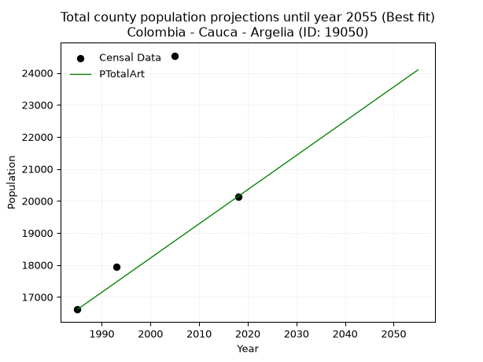
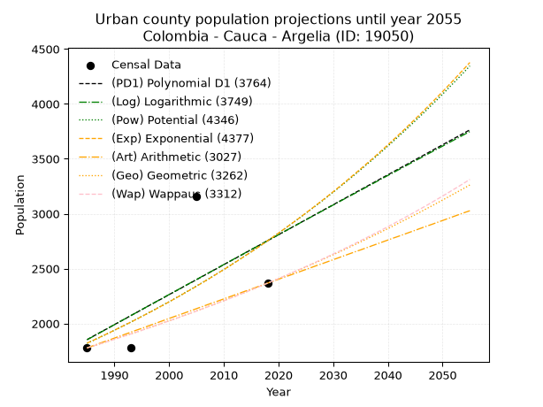
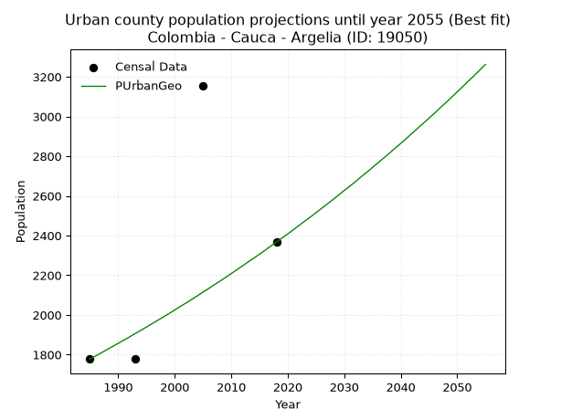
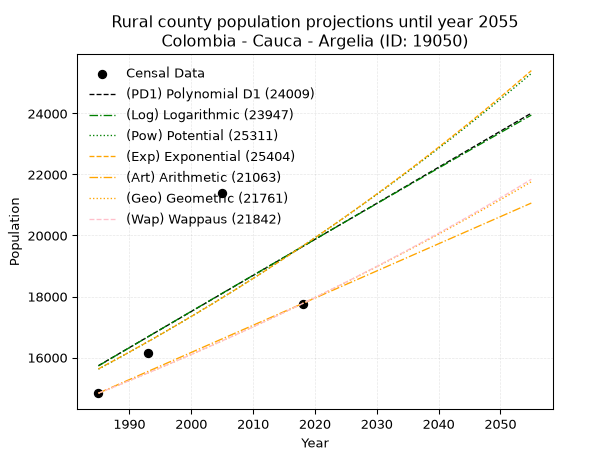

<div align="center">


</div>

# _“Population and Public Services Demand Projections (PPSD) until Year 2050 for Colombia - Cauca - Argelia (ID: 19050)”_
Keywords: `population` `public-service` `projection` `lineal` `polynomial` `logarithmic` `potential` `exponential` `arithmetic` `geometric` `wappaus` `dane` `colombia` `south-america`

PPSD are analytical estimates used by governments and planners to anticipate future changes in population size, age distribution, and the resulting community needs for utilities, healthcare, education, and infrastructure as sizing future water treatment facilities, electrical grids, and road networks based on spatial growth.

> **General running parameters**: • app_version: _v20260806_. • Python version: _3.14.7_. • Pandas version: _3.0.5_. • NumPy version: _2.5.1_. • Creates, save and include plots into reports (create_plot): _False_. • Projection until year: _2050_. • Process polynomial degree 2 and up: _False_. • Process Wappaus: _True_. • Process Wappaus: _True_. • Set negative values to zero: _True_. • Set infinite values to zero: _True_. • Drop dataset notes: _True_. 
<div align="center">

Dynamic map: [:earth_americas:Google](http://maps.google.com/maps?q=2.25742721,-77.2490499) [:earth_americas:OSM](https://www.openstreetmap.org/#map=18/2.25742721/-77.2490499&layers=P) [:earth_americas:Bing](https://www.bing.com/maps?cp=2.25742721~-77.2490499&lvl=18) [:earth_americas:Apple](https://maps.apple.com/frame?center=2.25742721%2C-77.2490499&span=0.003%2C0.006)

</div>


<div align="center">

```geojson
{
  "type": "Feature",
  "geometry": {
    "type": "Point", 
    "coordinates": [-77.2490499, 2.25742721]
  }, 
  "properties": {
    "Name": "Colombia - Cauca - Argelia (ID: 19050)"
  }
}
```

</div>


## 0. Census Data (4 records)

Census data are official statistics collected by a government about the people and housing in a country. They usually include counts of total population, age, sex, race, income, education, and jobs.

📅Global census file: [Population.xlsx](../data/Population.xlsx)

| Source   |   Year |   CountryID | CountryName   |   StateID | StateName   |   CountyID | CountyName   |   PTotal |   PUrban |   PRural |
|:---------|-------:|------------:|:--------------|----------:|:------------|-----------:|:-------------|---------:|---------:|---------:|
| DANE     |   1985 |          57 | Colombia      |        19 | Cauca       |      19050 | Argelia      |    16609 |     1778 |    14831 |
| DANE     |   1993 |          57 | Colombia      |        19 | Cauca       |      19050 | Argelia      |    17940 |     1778 |    16162 |
| DANE     |   2005 |          57 | Colombia      |        19 | Cauca       |      19050 | Argelia      |    24538 |     3155 |    21383 |
| DANE     |   2018 |          57 | Colombia      |        19 | Cauca       |      19050 | Argelia      |    20136 |     2367 |    17769 |

> 🔥Some records could had specific notes about the registered values or the corresponding urban or rural distribution.

## 1. Total

### 1.1. Coefficients and Parameters

* (PD1) Polynomial Deg 1: 145.51144118828012, -271253.51023685734 (lineal)
* (Log) Logarithmic: 291970.87270259554, -2199467.193120165
* (Pow) Potential: 15.18237312308638, -45.826170495313626
* (Exp) Exponential: 0.007567969695197896, 0.005220570134672951
* (Art) Arithmetic: Year diff. 2018 - 1985 = 33, Population diff. 20136 - 16609 = 3527, Annual growth = 106.87878787878788
* (Geo) Geometric: Year diff. 2018 - 1985 = 33, Population diff. 20136 - 16609 = 3527, Annual growth % = 0.005852347576339456
* (Wap) Wappaus: i = 0.5817324146348504, Condition values only valid for < 200)

<sub>
Wappaus condition values: ['0.00', '0.58', '1.16', '1.75', '2.33', '2.91', '3.49', '4.07', '4.65', '5.24', '5.82', '6.40', '6.98', '7.56', '8.14', '8.73', '9.31', '9.89', '10.47', '11.05', '11.63', '12.22', '12.80', '13.38', '13.96', '14.54', '15.13', '15.71', '16.29', '16.87', '17.45', '18.03', '18.62', '19.20', '19.78', '20.36', '20.94', '21.52', '22.11', '22.69', '23.27', '23.85', '24.43', '25.01', '25.60', '26.18', '26.76', '27.34', '27.92', '28.50', '29.09', '29.67', '30.25', '30.83', '31.41', '32.00', '32.58', '33.16', '33.74', '34.32', '34.90', '35.49', '36.07', '36.65', '37.23', '37.81']
</sub>


### 1.2. Projected Dataset

|   Year |   CountyID |   PTotalPD1 |   PTotalLog |   PTotalPow |   PTotalExp |   PTotalArt |   PTotalGeo |   PTotalWap |
|-------:|-----------:|------------:|------------:|------------:|------------:|------------:|------------:|------------:|
|   1985 |      19050 |       17587 |       17577 |       17445 |       17453 |       16609 |       16609 |       16609 |
|   1986 |      19050 |       17732 |       17724 |       17578 |       17586 |       16716 |       16706 |       16706 |
|   1987 |      19050 |       17878 |       17871 |       17713 |       17719 |       16823 |       16804 |       16803 |
|   1988 |      19050 |       18023 |       18018 |       17849 |       17854 |       16930 |       16902 |       16901 |
|   1989 |      19050 |       18169 |       18165 |       17986 |       17989 |       17037 |       17001 |       17000 |
|   1990 |      19050 |       18314 |       18311 |       18124 |       18126 |       17143 |       17101 |       17099 |
|   1991 |      19050 |       18460 |       18458 |       18263 |       18264 |       17250 |       17201 |       17199 |
|   1992 |      19050 |       18605 |       18605 |       18402 |       18403 |       17357 |       17301 |       17299 |
|   1993 |      19050 |       18751 |       18751 |       18543 |       18542 |       17464 |       17403 |       17400 |
|   1994 |      19050 |       18896 |       18898 |       18685 |       18683 |       17571 |       17505 |       17502 |
|   1995 |      19050 |       19042 |       19044 |       18828 |       18825 |       17678 |       17607 |       17604 |
|   1996 |      19050 |       19187 |       19190 |       18971 |       18968 |       17785 |       17710 |       17707 |
|   1997 |      19050 |       19333 |       19337 |       19116 |       19112 |       17892 |       17814 |       17810 |
|   1998 |      19050 |       19478 |       19483 |       19262 |       19257 |       17998 |       17918 |       17914 |
|   1999 |      19050 |       19624 |       19629 |       19409 |       19404 |       18105 |       18023 |       18019 |
|   2000 |      19050 |       19769 |       19775 |       19557 |       19551 |       18212 |       18128 |       18124 |
|   2001 |      19050 |       19915 |       19921 |       19706 |       19700 |       18319 |       18234 |       18230 |
|   2002 |      19050 |       20060 |       20067 |       19856 |       19849 |       18426 |       18341 |       18337 |
|   2003 |      19050 |       20206 |       20213 |       20007 |       20000 |       18533 |       18448 |       18444 |
|   2004 |      19050 |       20351 |       20358 |       20159 |       20152 |       18640 |       18556 |       18552 |
|   2005 |      19050 |       20497 |       20504 |       20312 |       20305 |       18747 |       18665 |       18661 |
|   2006 |      19050 |       20642 |       20650 |       20467 |       20459 |       18853 |       18774 |       18770 |
|   2007 |      19050 |       20788 |       20795 |       20622 |       20615 |       18960 |       18884 |       18880 |
|   2008 |      19050 |       20933 |       20940 |       20779 |       20771 |       19067 |       18995 |       18991 |
|   2009 |      19050 |       21079 |       21086 |       20936 |       20929 |       19174 |       19106 |       19102 |
|   2010 |      19050 |       21224 |       21231 |       21095 |       21088 |       19281 |       19218 |       19214 |
|   2011 |      19050 |       21370 |       21376 |       21255 |       21248 |       19388 |       19330 |       19327 |
|   2012 |      19050 |       21516 |       21522 |       21416 |       21410 |       19495 |       19443 |       19440 |
|   2013 |      19050 |       21661 |       21667 |       21578 |       21572 |       19602 |       19557 |       19554 |
|   2014 |      19050 |       21807 |       21812 |       21742 |       21736 |       19708 |       19671 |       19669 |
|   2015 |      19050 |       21952 |       21957 |       21906 |       21901 |       19815 |       19787 |       19785 |
|   2016 |      19050 |       22098 |       22101 |       22072 |       22068 |       19922 |       19902 |       19901 |
|   2017 |      19050 |       22243 |       22246 |       22239 |       22236 |       20029 |       20019 |       20018 |
|   2018 |      19050 |       22389 |       22391 |       22407 |       22404 |       20136 |       20136 |       20136 |
|   2019 |      19050 |       22534 |       22536 |       22576 |       22575 |       20243 |       20254 |       20255 |
|   2020 |      19050 |       22680 |       22680 |       22746 |       22746 |       20350 |       20372 |       20374 |
|   2021 |      19050 |       22825 |       22825 |       22918 |       22919 |       20457 |       20492 |       20494 |
|   2022 |      19050 |       22971 |       22969 |       23090 |       23093 |       20564 |       20612 |       20615 |
|   2023 |      19050 |       23116 |       23113 |       23264 |       23268 |       20670 |       20732 |       20737 |
|   2024 |      19050 |       23262 |       23258 |       23440 |       23445 |       20777 |       20853 |       20859 |
|   2025 |      19050 |       23407 |       23402 |       23616 |       23623 |       20884 |       20976 |       20983 |
|   2026 |      19050 |       23553 |       23546 |       23794 |       23803 |       20991 |       21098 |       21107 |
|   2027 |      19050 |       23698 |       23690 |       23973 |       23984 |       21098 |       21222 |       21232 |
|   2028 |      19050 |       23844 |       23834 |       24153 |       24166 |       21205 |       21346 |       21358 |
|   2029 |      19050 |       23989 |       23978 |       24334 |       24349 |       21312 |       21471 |       21484 |
|   2030 |      19050 |       24135 |       24122 |       24517 |       24534 |       21419 |       21597 |       21612 |
|   2031 |      19050 |       24280 |       24266 |       24701 |       24721 |       21525 |       21723 |       21740 |
|   2032 |      19050 |       24426 |       24409 |       24886 |       24909 |       21632 |       21850 |       21869 |
|   2033 |      19050 |       24571 |       24553 |       25073 |       25098 |       21739 |       21978 |       21999 |
|   2034 |      19050 |       24717 |       24697 |       25261 |       25288 |       21846 |       22107 |       22130 |
|   2035 |      19050 |       24862 |       24840 |       25450 |       25481 |       21953 |       22236 |       22262 |
|   2036 |      19050 |       25008 |       24984 |       25641 |       25674 |       22060 |       22366 |       22395 |
|   2037 |      19050 |       25153 |       25127 |       25832 |       25869 |       22167 |       22497 |       22529 |
|   2038 |      19050 |       25299 |       25270 |       26026 |       26066 |       22274 |       22629 |       22663 |
|   2039 |      19050 |       25444 |       25414 |       26220 |       26264 |       22380 |       22761 |       22799 |
|   2040 |      19050 |       25590 |       25557 |       26416 |       26463 |       22487 |       22894 |       22935 |
|   2041 |      19050 |       25735 |       25700 |       26613 |       26664 |       22594 |       23028 |       23073 |
|   2042 |      19050 |       25881 |       25843 |       26812 |       26867 |       22701 |       23163 |       23211 |
|   2043 |      19050 |       26026 |       25986 |       27012 |       27071 |       22808 |       23299 |       23350 |
|   2044 |      19050 |       26172 |       26129 |       27214 |       27277 |       22915 |       23435 |       23491 |
|   2045 |      19050 |       26317 |       26271 |       27416 |       27484 |       23022 |       23572 |       23632 |
|   2046 |      19050 |       26463 |       26414 |       27621 |       27693 |       23129 |       23710 |       23774 |
|   2047 |      19050 |       26608 |       26557 |       27826 |       27903 |       23235 |       23849 |       23917 |
|   2048 |      19050 |       26754 |       26699 |       28033 |       28115 |       23342 |       23988 |       24062 |
|   2049 |      19050 |       26899 |       26842 |       28242 |       28328 |       23449 |       24129 |       24207 |
|   2050 |      19050 |       27045 |       26984 |       28452 |       28544 |       23556 |       24270 |       24353 |
<div align="center">

</img>

</div>


### 1.3. Best fit with absolute and relative error (%)

Relative error puts that difference into context by dividing the absolute error by the true value, creating a unitless ratio or percentage that shows the scale of the mistake.

Absolute and relative error

|   Year | Source   |   CountryID | CountryName   |   StateID | StateName   |   CountyID_x | CountyName   |   PTotal |   PUrban |   PRural |   CountyID_y |   PTotalPD1 |   PTotalLog |   PTotalPow |   PTotalExp |   PTotalArt |   PTotalGeo |   PTotalWap |   PTotalPD1AbsError |   PTotalLogAbsError |   PTotalPowAbsError |   PTotalExpAbsError |   PTotalArtAbsError |   PTotalGeoAbsError |   PTotalWapAbsError |   PTotalPD1RelError |   PTotalLogRelError |   PTotalPowRelError |   PTotalExpRelError |   PTotalArtRelError |   PTotalGeoRelError |   PTotalWapRelError |
|-------:|:---------|------------:|:--------------|----------:|:------------|-------------:|:-------------|---------:|---------:|---------:|-------------:|------------:|------------:|------------:|------------:|------------:|------------:|------------:|--------------------:|--------------------:|--------------------:|--------------------:|--------------------:|--------------------:|--------------------:|--------------------:|--------------------:|--------------------:|--------------------:|--------------------:|--------------------:|--------------------:|
|   1985 | DANE     |          57 | Colombia      |        19 | Cauca       |        19050 | Argelia      |    16609 |     1778 |    14831 |        19050 |       17587 |       17577 |       17445 |       17453 |       16609 |       16609 |       16609 |                 978 |                 968 |                 836 |                 844 |                   0 |                   0 |                   0 |             5.88837 |             5.82817 |             5.03342 |             5.08158 |             0       |             0       |             0       |
|   1993 | DANE     |          57 | Colombia      |        19 | Cauca       |        19050 | Argelia      |    17940 |     1778 |    16162 |        19050 |       18751 |       18751 |       18543 |       18542 |       17464 |       17403 |       17400 |                 811 |                 811 |                 603 |                 602 |                 476 |                 537 |                 540 |             4.52062 |             4.52062 |             3.3612  |             3.35563 |             2.65329 |             2.99331 |             3.01003 |
|   2005 | DANE     |          57 | Colombia      |        19 | Cauca       |        19050 | Argelia      |    24538 |     3155 |    21383 |        19050 |       20497 |       20504 |       20312 |       20305 |       18747 |       18665 |       18661 |                4041 |                4034 |                4226 |                4233 |                5791 |                5873 |                5877 |            16.4683  |            16.4398  |            17.2223  |            17.2508  |            23.6001  |            23.9343  |            23.9506  |
|   2018 | DANE     |          57 | Colombia      |        19 | Cauca       |        19050 | Argelia      |    20136 |     2367 |    17769 |        19050 |       22389 |       22391 |       22407 |       22404 |       20136 |       20136 |       20136 |                2253 |                2255 |                2271 |                2268 |                   0 |                   0 |                   0 |            11.1889  |            11.1988  |            11.2783  |            11.2634  |             0       |             0       |             0       |

Relative error mean

| Method    |   RelError | Best   |
|:----------|-----------:|:-------|
| PTotalPD1 |    9.51656 |        |
| PTotalLog |    9.49686 |        |
| PTotalPow |    9.2238  |        |
| PTotalExp |    9.23785 |        |
| PTotalArt |    6.56335 | True   |
| PTotalGeo |    6.7319  |        |
| PTotalWap |    6.74016 |        |

💙Best method: _**PTotalArt**_
<div align="center">

</img>

</div>


### 1.4. Fresh water supply demand in liters per capita per day (lpcd)

The fresh water supply demand typically ranges from 100 to 300 liters per capita per day (lpcd) for standard domestic and municipal planning, though absolute survival minimums set by the World Health Organization are as low as 7.5 to 20 liters per day, and total consumption in high-income nations can exceed 400 liters.

> `CZ`: Level in meters above the sea level (masl).<br> `WS`: Fresh water supply demand in liters per capita per day (lpcd or l/h/d).<br> `WSAll`: Zonal fresh water supply demand in liters per second (l/s).<br> `A`: Zonal area in square meters.

Reference values (RAS Colombia)

|    CZ |   WS |
|------:|-----:|
|  1000 |  120 |
|  2000 |  130 |
| 99999 |  140 |

County shapefile geometry properties and water supply values

|   CountyID |      ATotal |   CZTotal |   WSTotal |
|-----------:|------------:|----------:|----------:|
|      19050 | 7.76455e+08 |   2040.12 |       140 |

Projected values for best method: PTotalArt

|   CountyID |   Year |   PTotalArt |   WSTotal |   WSTotalAll |
|-----------:|-------:|------------:|----------:|-------------:|
|      19050 |   1985 |       16609 |       140 |      26.9127 |
|      19050 |   1986 |       16716 |       140 |      27.0861 |
|      19050 |   1987 |       16823 |       140 |      27.2595 |
|      19050 |   1988 |       16930 |       140 |      27.4329 |
|      19050 |   1989 |       17037 |       140 |      27.6062 |
|      19050 |   1990 |       17143 |       140 |      27.778  |
|      19050 |   1991 |       17250 |       140 |      27.9514 |
|      19050 |   1992 |       17357 |       140 |      28.1248 |
|      19050 |   1993 |       17464 |       140 |      28.2981 |
|      19050 |   1994 |       17571 |       140 |      28.4715 |
|      19050 |   1995 |       17678 |       140 |      28.6449 |
|      19050 |   1996 |       17785 |       140 |      28.8183 |
|      19050 |   1997 |       17892 |       140 |      28.9917 |
|      19050 |   1998 |       17998 |       140 |      29.1634 |
|      19050 |   1999 |       18105 |       140 |      29.3368 |
|      19050 |   2000 |       18212 |       140 |      29.5102 |
|      19050 |   2001 |       18319 |       140 |      29.6836 |
|      19050 |   2002 |       18426 |       140 |      29.8569 |
|      19050 |   2003 |       18533 |       140 |      30.0303 |
|      19050 |   2004 |       18640 |       140 |      30.2037 |
|      19050 |   2005 |       18747 |       140 |      30.3771 |
|      19050 |   2006 |       18853 |       140 |      30.5488 |
|      19050 |   2007 |       18960 |       140 |      30.7222 |
|      19050 |   2008 |       19067 |       140 |      30.8956 |
|      19050 |   2009 |       19174 |       140 |      31.069  |
|      19050 |   2010 |       19281 |       140 |      31.2424 |
|      19050 |   2011 |       19388 |       140 |      31.4157 |
|      19050 |   2012 |       19495 |       140 |      31.5891 |
|      19050 |   2013 |       19602 |       140 |      31.7625 |
|      19050 |   2014 |       19708 |       140 |      31.9343 |
|      19050 |   2015 |       19815 |       140 |      32.1076 |
|      19050 |   2016 |       19922 |       140 |      32.281  |
|      19050 |   2017 |       20029 |       140 |      32.4544 |
|      19050 |   2018 |       20136 |       140 |      32.6278 |
|      19050 |   2019 |       20243 |       140 |      32.8012 |
|      19050 |   2020 |       20350 |       140 |      32.9745 |
|      19050 |   2021 |       20457 |       140 |      33.1479 |
|      19050 |   2022 |       20564 |       140 |      33.3213 |
|      19050 |   2023 |       20670 |       140 |      33.4931 |
|      19050 |   2024 |       20777 |       140 |      33.6664 |
|      19050 |   2025 |       20884 |       140 |      33.8398 |
|      19050 |   2026 |       20991 |       140 |      34.0132 |
|      19050 |   2027 |       21098 |       140 |      34.1866 |
|      19050 |   2028 |       21205 |       140 |      34.36   |
|      19050 |   2029 |       21312 |       140 |      34.5333 |
|      19050 |   2030 |       21419 |       140 |      34.7067 |
|      19050 |   2031 |       21525 |       140 |      34.8785 |
|      19050 |   2032 |       21632 |       140 |      35.0519 |
|      19050 |   2033 |       21739 |       140 |      35.2252 |
|      19050 |   2034 |       21846 |       140 |      35.3986 |
|      19050 |   2035 |       21953 |       140 |      35.572  |
|      19050 |   2036 |       22060 |       140 |      35.7454 |
|      19050 |   2037 |       22167 |       140 |      35.9188 |
|      19050 |   2038 |       22274 |       140 |      36.0921 |
|      19050 |   2039 |       22380 |       140 |      36.2639 |
|      19050 |   2040 |       22487 |       140 |      36.4373 |
|      19050 |   2041 |       22594 |       140 |      36.6106 |
|      19050 |   2042 |       22701 |       140 |      36.784  |
|      19050 |   2043 |       22808 |       140 |      36.9574 |
|      19050 |   2044 |       22915 |       140 |      37.1308 |
|      19050 |   2045 |       23022 |       140 |      37.3042 |
|      19050 |   2046 |       23129 |       140 |      37.4775 |
|      19050 |   2047 |       23235 |       140 |      37.6493 |
|      19050 |   2048 |       23342 |       140 |      37.8227 |
|      19050 |   2049 |       23449 |       140 |      37.9961 |
|      19050 |   2050 |       23556 |       140 |      38.1694 |

## 2. Urban

### 2.1. Coefficients and Parameters

* (PD1) Polynomial Deg 1: 27.291047771979525, -52319.41830590205 (lineal)
* (Log) Logarithmic: 54736.66509844409, -413784.33004537947
* (Pow) Potential: 25.122523507881223, -79.58809003676137
* (Exp) Exponential: 0.012529913911432218, 2.8744841922714467e-08
* (Art) Arithmetic: Year diff. 2018 - 1985 = 33, Population diff. 2367 - 1778 = 589, Annual growth = 17.848484848484848
* (Geo) Geometric: Year diff. 2018 - 1985 = 33, Population diff. 2367 - 1778 = 589, Annual growth % = 0.00870843282363265
* (Wap) Wappaus: i = 0.8612055415432979, Condition values only valid for < 200)

<sub>
Wappaus condition values: ['0.00', '0.86', '1.72', '2.58', '3.44', '4.31', '5.17', '6.03', '6.89', '7.75', '8.61', '9.47', '10.33', '11.20', '12.06', '12.92', '13.78', '14.64', '15.50', '16.36', '17.22', '18.09', '18.95', '19.81', '20.67', '21.53', '22.39', '23.25', '24.11', '24.97', '25.84', '26.70', '27.56', '28.42', '29.28', '30.14', '31.00', '31.86', '32.73', '33.59', '34.45', '35.31', '36.17', '37.03', '37.89', '38.75', '39.62', '40.48', '41.34', '42.20', '43.06', '43.92', '44.78', '45.64', '46.51', '47.37', '48.23', '49.09', '49.95', '50.81', '51.67', '52.53', '53.39', '54.26', '55.12', '55.98']
</sub>


### 2.2. Projected Dataset

|   Year |   CountyID |   PUrbanPD1 |   PUrbanLog |   PUrbanPow |   PUrbanExp |   PUrbanArt |   PUrbanGeo |   PUrbanWap |
|-------:|-----------:|------------:|------------:|------------:|------------:|------------:|------------:|------------:|
|   1985 |      19050 |        1853 |        1852 |        1820 |        1821 |        1778 |        1778 |        1778 |
|   1986 |      19050 |        1881 |        1879 |        1843 |        1844 |        1796 |        1793 |        1793 |
|   1987 |      19050 |        1908 |        1907 |        1866 |        1867 |        1814 |        1809 |        1809 |
|   1988 |      19050 |        1935 |        1934 |        1890 |        1891 |        1832 |        1825 |        1825 |
|   1989 |      19050 |        1962 |        1962 |        1914 |        1914 |        1849 |        1841 |        1840 |
|   1990 |      19050 |        1990 |        1989 |        1938 |        1939 |        1867 |        1857 |        1856 |
|   1991 |      19050 |        2017 |        2017 |        1963 |        1963 |        1885 |        1873 |        1872 |
|   1992 |      19050 |        2044 |        2044 |        1988 |        1988 |        1903 |        1889 |        1889 |
|   1993 |      19050 |        2072 |        2072 |        2013 |        2013 |        1921 |        1906 |        1905 |
|   1994 |      19050 |        2099 |        2099 |        2039 |        2038 |        1939 |        1922 |        1921 |
|   1995 |      19050 |        2126 |        2127 |        2064 |        2064 |        1956 |        1939 |        1938 |
|   1996 |      19050 |        2154 |        2154 |        2091 |        2090 |        1974 |        1956 |        1955 |
|   1997 |      19050 |        2181 |        2182 |        2117 |        2116 |        1992 |        1973 |        1972 |
|   1998 |      19050 |        2208 |        2209 |        2144 |        2143 |        2010 |        1990 |        1989 |
|   1999 |      19050 |        2235 |        2236 |        2171 |        2170 |        2028 |        2007 |        2006 |
|   2000 |      19050 |        2263 |        2264 |        2198 |        2197 |        2046 |        2025 |        2024 |
|   2001 |      19050 |        2290 |        2291 |        2226 |        2225 |        2064 |        2043 |        2041 |
|   2002 |      19050 |        2317 |        2318 |        2254 |        2253 |        2081 |        2060 |        2059 |
|   2003 |      19050 |        2345 |        2346 |        2283 |        2282 |        2099 |        2078 |        2077 |
|   2004 |      19050 |        2372 |        2373 |        2312 |        2310 |        2117 |        2096 |        2095 |
|   2005 |      19050 |        2399 |        2400 |        2341 |        2339 |        2135 |        2115 |        2113 |
|   2006 |      19050 |        2426 |        2428 |        2370 |        2369 |        2153 |        2133 |        2132 |
|   2007 |      19050 |        2454 |        2455 |        2400 |        2399 |        2171 |        2152 |        2150 |
|   2008 |      19050 |        2481 |        2482 |        2430 |        2429 |        2189 |        2170 |        2169 |
|   2009 |      19050 |        2508 |        2509 |        2461 |        2460 |        2206 |        2189 |        2188 |
|   2010 |      19050 |        2536 |        2537 |        2492 |        2491 |        2224 |        2208 |        2207 |
|   2011 |      19050 |        2563 |        2564 |        2523 |        2522 |        2242 |        2228 |        2226 |
|   2012 |      19050 |        2590 |        2591 |        2555 |        2554 |        2260 |        2247 |        2246 |
|   2013 |      19050 |        2617 |        2618 |        2587 |        2586 |        2278 |        2267 |        2266 |
|   2014 |      19050 |        2645 |        2646 |        2620 |        2619 |        2296 |        2286 |        2285 |
|   2015 |      19050 |        2672 |        2673 |        2652 |        2652 |        2313 |        2306 |        2306 |
|   2016 |      19050 |        2699 |        2700 |        2686 |        2685 |        2331 |        2326 |        2326 |
|   2017 |      19050 |        2727 |        2727 |        2719 |        2719 |        2349 |        2347 |        2346 |
|   2018 |      19050 |        2754 |        2754 |        2753 |        2753 |        2367 |        2367 |        2367 |
|   2019 |      19050 |        2781 |        2781 |        2788 |        2788 |        2385 |        2388 |        2388 |
|   2020 |      19050 |        2808 |        2808 |        2823 |        2823 |        2403 |        2408 |        2409 |
|   2021 |      19050 |        2836 |        2835 |        2858 |        2859 |        2421 |        2429 |        2430 |
|   2022 |      19050 |        2863 |        2863 |        2894 |        2895 |        2438 |        2451 |        2452 |
|   2023 |      19050 |        2890 |        2890 |        2930 |        2931 |        2456 |        2472 |        2474 |
|   2024 |      19050 |        2918 |        2917 |        2967 |        2968 |        2474 |        2493 |        2496 |
|   2025 |      19050 |        2945 |        2944 |        3004 |        3006 |        2492 |        2515 |        2518 |
|   2026 |      19050 |        2972 |        2971 |        3041 |        3044 |        2510 |        2537 |        2540 |
|   2027 |      19050 |        3000 |        2998 |        3079 |        3082 |        2528 |        2559 |        2563 |
|   2028 |      19050 |        3027 |        3025 |        3117 |        3121 |        2545 |        2581 |        2586 |
|   2029 |      19050 |        3054 |        3052 |        3156 |        3160 |        2563 |        2604 |        2609 |
|   2030 |      19050 |        3081 |        3079 |        3196 |        3200 |        2581 |        2627 |        2633 |
|   2031 |      19050 |        3109 |        3106 |        3235 |        3240 |        2599 |        2649 |        2656 |
|   2032 |      19050 |        3136 |        3133 |        3276 |        3281 |        2617 |        2672 |        2680 |
|   2033 |      19050 |        3163 |        3160 |        3316 |        3323 |        2635 |        2696 |        2704 |
|   2034 |      19050 |        3191 |        3186 |        3358 |        3365 |        2653 |        2719 |        2729 |
|   2035 |      19050 |        3218 |        3213 |        3399 |        3407 |        2670 |        2743 |        2754 |
|   2036 |      19050 |        3245 |        3240 |        3442 |        3450 |        2688 |        2767 |        2779 |
|   2037 |      19050 |        3272 |        3267 |        3484 |        3493 |        2706 |        2791 |        2804 |
|   2038 |      19050 |        3300 |        3294 |        3528 |        3537 |        2724 |        2815 |        2830 |
|   2039 |      19050 |        3327 |        3321 |        3571 |        3582 |        2742 |        2840 |        2855 |
|   2040 |      19050 |        3354 |        3348 |        3616 |        3627 |        2760 |        2864 |        2882 |
|   2041 |      19050 |        3382 |        3374 |        3660 |        3673 |        2778 |        2889 |        2908 |
|   2042 |      19050 |        3409 |        3401 |        3706 |        3719 |        2795 |        2915 |        2935 |
|   2043 |      19050 |        3436 |        3428 |        3751 |        3766 |        2813 |        2940 |        2962 |
|   2044 |      19050 |        3463 |        3455 |        3798 |        3814 |        2831 |        2966 |        2989 |
|   2045 |      19050 |        3491 |        3482 |        3845 |        3862 |        2849 |        2991 |        3017 |
|   2046 |      19050 |        3518 |        3508 |        3892 |        3910 |        2867 |        3017 |        3045 |
|   2047 |      19050 |        3545 |        3535 |        3940 |        3960 |        2885 |        3044 |        3073 |
|   2048 |      19050 |        3573 |        3562 |        3989 |        4010 |        2902 |        3070 |        3102 |
|   2049 |      19050 |        3600 |        3589 |        4038 |        4060 |        2920 |        3097 |        3131 |
|   2050 |      19050 |        3627 |        3615 |        4088 |        4111 |        2938 |        3124 |        3160 |
<div align="center">

</img>

</div>


### 2.3. Best fit with absolute and relative error (%)

Relative error puts that difference into context by dividing the absolute error by the true value, creating a unitless ratio or percentage that shows the scale of the mistake.

Absolute and relative error

|   Year | Source   |   CountryID | CountryName   |   StateID | StateName   |   CountyID_x | CountyName   |   PTotal |   PUrban |   PRural |   CountyID_y |   PUrbanPD1 |   PUrbanLog |   PUrbanPow |   PUrbanExp |   PUrbanArt |   PUrbanGeo |   PUrbanWap |   PUrbanPD1AbsError |   PUrbanLogAbsError |   PUrbanPowAbsError |   PUrbanExpAbsError |   PUrbanArtAbsError |   PUrbanGeoAbsError |   PUrbanWapAbsError |   PUrbanPD1RelError |   PUrbanLogRelError |   PUrbanPowRelError |   PUrbanExpRelError |   PUrbanArtRelError |   PUrbanGeoRelError |   PUrbanWapRelError |
|-------:|:---------|------------:|:--------------|----------:|:------------|-------------:|:-------------|---------:|---------:|---------:|-------------:|------------:|------------:|------------:|------------:|------------:|------------:|------------:|--------------------:|--------------------:|--------------------:|--------------------:|--------------------:|--------------------:|--------------------:|--------------------:|--------------------:|--------------------:|--------------------:|--------------------:|--------------------:|--------------------:|
|   1985 | DANE     |          57 | Colombia      |        19 | Cauca       |        19050 | Argelia      |    16609 |     1778 |    14831 |        19050 |        1853 |        1852 |        1820 |        1821 |        1778 |        1778 |        1778 |                  75 |                  74 |                  42 |                  43 |                   0 |                   0 |                   0 |             4.21822 |             4.16198 |              2.3622 |             2.41845 |             0       |              0      |             0       |
|   1993 | DANE     |          57 | Colombia      |        19 | Cauca       |        19050 | Argelia      |    17940 |     1778 |    16162 |        19050 |        2072 |        2072 |        2013 |        2013 |        1921 |        1906 |        1905 |                 294 |                 294 |                 235 |                 235 |                 143 |                 128 |                 127 |            16.5354  |            16.5354  |             13.2171 |            13.2171  |             8.04274 |              7.1991 |             7.14286 |
|   2005 | DANE     |          57 | Colombia      |        19 | Cauca       |        19050 | Argelia      |    24538 |     3155 |    21383 |        19050 |        2399 |        2400 |        2341 |        2339 |        2135 |        2115 |        2113 |                 756 |                 755 |                 814 |                 816 |                1020 |                1040 |                1042 |            23.962   |            23.9303  |             25.8003 |            25.8637  |            32.3296  |             32.9635 |            33.0269  |
|   2018 | DANE     |          57 | Colombia      |        19 | Cauca       |        19050 | Argelia      |    20136 |     2367 |    17769 |        19050 |        2754 |        2754 |        2753 |        2753 |        2367 |        2367 |        2367 |                 387 |                 387 |                 386 |                 386 |                   0 |                   0 |                   0 |            16.3498  |            16.3498  |             16.3076 |            16.3076  |             0       |              0      |             0       |

Relative error mean

| Method    |   RelError | Best   |
|:----------|-----------:|:-------|
| PUrbanPD1 |    15.2664 |        |
| PUrbanLog |    15.2444 |        |
| PUrbanPow |    14.4218 |        |
| PUrbanExp |    14.4517 |        |
| PUrbanArt |    10.0931 |        |
| PUrbanGeo |    10.0407 | True   |
| PUrbanWap |    10.0424 |        |

💙Best method: _**PUrbanGeo**_
<div align="center">

</img>

</div>


### 2.4. Fresh water supply demand in liters per capita per day (lpcd)

The fresh water supply demand typically ranges from 100 to 300 liters per capita per day (lpcd) for standard domestic and municipal planning, though absolute survival minimums set by the World Health Organization are as low as 7.5 to 20 liters per day, and total consumption in high-income nations can exceed 400 liters.

> `CZ`: Level in meters above the sea level (masl).<br> `WS`: Fresh water supply demand in liters per capita per day (lpcd or l/h/d).<br> `WSAll`: Zonal fresh water supply demand in liters per second (l/s).<br> `A`: Zonal area in square meters.

Reference values (RAS Colombia)

|    CZ |   WS |
|------:|-----:|
|  1000 |  120 |
|  2000 |  130 |
| 99999 |  140 |

County shapefile geometry properties and water supply values

|   CountyID |   AUrban |   CZUrban |   WSUrban |
|-----------:|---------:|----------:|----------:|
|      19050 |   491459 |   1248.89 |       130 |

Projected values for best method: PUrbanGeo

|   CountyID |   Year |   PUrbanGeo |   WSUrban |   WSUrbanAll |
|-----------:|-------:|------------:|----------:|-------------:|
|      19050 |   1985 |        1778 |       130 |      2.67523 |
|      19050 |   1986 |        1793 |       130 |      2.6978  |
|      19050 |   1987 |        1809 |       130 |      2.72187 |
|      19050 |   1988 |        1825 |       130 |      2.74595 |
|      19050 |   1989 |        1841 |       130 |      2.77002 |
|      19050 |   1990 |        1857 |       130 |      2.7941  |
|      19050 |   1991 |        1873 |       130 |      2.81817 |
|      19050 |   1992 |        1889 |       130 |      2.84225 |
|      19050 |   1993 |        1906 |       130 |      2.86782 |
|      19050 |   1994 |        1922 |       130 |      2.8919  |
|      19050 |   1995 |        1939 |       130 |      2.91748 |
|      19050 |   1996 |        1956 |       130 |      2.94306 |
|      19050 |   1997 |        1973 |       130 |      2.96863 |
|      19050 |   1998 |        1990 |       130 |      2.99421 |
|      19050 |   1999 |        2007 |       130 |      3.01979 |
|      19050 |   2000 |        2025 |       130 |      3.04688 |
|      19050 |   2001 |        2043 |       130 |      3.07396 |
|      19050 |   2002 |        2060 |       130 |      3.09954 |
|      19050 |   2003 |        2078 |       130 |      3.12662 |
|      19050 |   2004 |        2096 |       130 |      3.1537  |
|      19050 |   2005 |        2115 |       130 |      3.18229 |
|      19050 |   2006 |        2133 |       130 |      3.20938 |
|      19050 |   2007 |        2152 |       130 |      3.23796 |
|      19050 |   2008 |        2170 |       130 |      3.26505 |
|      19050 |   2009 |        2189 |       130 |      3.29363 |
|      19050 |   2010 |        2208 |       130 |      3.32222 |
|      19050 |   2011 |        2228 |       130 |      3.35231 |
|      19050 |   2012 |        2247 |       130 |      3.3809  |
|      19050 |   2013 |        2267 |       130 |      3.411   |
|      19050 |   2014 |        2286 |       130 |      3.43958 |
|      19050 |   2015 |        2306 |       130 |      3.46968 |
|      19050 |   2016 |        2326 |       130 |      3.49977 |
|      19050 |   2017 |        2347 |       130 |      3.53137 |
|      19050 |   2018 |        2367 |       130 |      3.56146 |
|      19050 |   2019 |        2388 |       130 |      3.59306 |
|      19050 |   2020 |        2408 |       130 |      3.62315 |
|      19050 |   2021 |        2429 |       130 |      3.65475 |
|      19050 |   2022 |        2451 |       130 |      3.68785 |
|      19050 |   2023 |        2472 |       130 |      3.71944 |
|      19050 |   2024 |        2493 |       130 |      3.75104 |
|      19050 |   2025 |        2515 |       130 |      3.78414 |
|      19050 |   2026 |        2537 |       130 |      3.81725 |
|      19050 |   2027 |        2559 |       130 |      3.85035 |
|      19050 |   2028 |        2581 |       130 |      3.88345 |
|      19050 |   2029 |        2604 |       130 |      3.91806 |
|      19050 |   2030 |        2627 |       130 |      3.95266 |
|      19050 |   2031 |        2649 |       130 |      3.98576 |
|      19050 |   2032 |        2672 |       130 |      4.02037 |
|      19050 |   2033 |        2696 |       130 |      4.05648 |
|      19050 |   2034 |        2719 |       130 |      4.09109 |
|      19050 |   2035 |        2743 |       130 |      4.1272  |
|      19050 |   2036 |        2767 |       130 |      4.16331 |
|      19050 |   2037 |        2791 |       130 |      4.19942 |
|      19050 |   2038 |        2815 |       130 |      4.23553 |
|      19050 |   2039 |        2840 |       130 |      4.27315 |
|      19050 |   2040 |        2864 |       130 |      4.30926 |
|      19050 |   2041 |        2889 |       130 |      4.34687 |
|      19050 |   2042 |        2915 |       130 |      4.386   |
|      19050 |   2043 |        2940 |       130 |      4.42361 |
|      19050 |   2044 |        2966 |       130 |      4.46273 |
|      19050 |   2045 |        2991 |       130 |      4.50035 |
|      19050 |   2046 |        3017 |       130 |      4.53947 |
|      19050 |   2047 |        3044 |       130 |      4.58009 |
|      19050 |   2048 |        3070 |       130 |      4.61921 |
|      19050 |   2049 |        3097 |       130 |      4.65984 |
|      19050 |   2050 |        3124 |       130 |      4.70046 |

## 3. Rural

### 3.1. Coefficients and Parameters

* (PD1) Polynomial Deg 1: 118.22039341630064, -218934.09193095533 (lineal)
* (Log) Logarithmic: 237234.20760415198, -1785682.8630747888
* (Pow) Potential: 13.927388454737171, -41.735516212570616
* (Exp) Exponential: 0.006941606964606767, 0.01620661869298013
* (Art) Arithmetic: Year diff. 2018 - 1985 = 33, Population diff. 17769 - 14831 = 2938, Annual growth = 89.03030303030303
* (Geo) Geometric: Year diff. 2018 - 1985 = 33, Population diff. 17769 - 14831 = 2938, Annual growth % = 0.005491867170893228
* (Wap) Wappaus: i = 0.5461981781000186, Condition values only valid for < 200)

<sub>
Wappaus condition values: ['0.00', '0.55', '1.09', '1.64', '2.18', '2.73', '3.28', '3.82', '4.37', '4.92', '5.46', '6.01', '6.55', '7.10', '7.65', '8.19', '8.74', '9.29', '9.83', '10.38', '10.92', '11.47', '12.02', '12.56', '13.11', '13.65', '14.20', '14.75', '15.29', '15.84', '16.39', '16.93', '17.48', '18.02', '18.57', '19.12', '19.66', '20.21', '20.76', '21.30', '21.85', '22.39', '22.94', '23.49', '24.03', '24.58', '25.13', '25.67', '26.22', '26.76', '27.31', '27.86', '28.40', '28.95', '29.49', '30.04', '30.59', '31.13', '31.68', '32.23', '32.77', '33.32', '33.86', '34.41', '34.96', '35.50']
</sub>


### 3.2. Projected Dataset

|   Year |   CountyID |   PRuralPD1 |   PRuralLog |   PRuralPow |   PRuralExp |   PRuralArt |   PRuralGeo |   PRuralWap |
|-------:|-----------:|------------:|------------:|------------:|------------:|------------:|------------:|------------:|
|   1985 |      19050 |       15733 |       15725 |       15620 |       15627 |       14831 |       14831 |       14831 |
|   1986 |      19050 |       15852 |       15845 |       15730 |       15736 |       14920 |       14912 |       14912 |
|   1987 |      19050 |       15970 |       15964 |       15840 |       15845 |       15009 |       14994 |       14994 |
|   1988 |      19050 |       16088 |       16084 |       15952 |       15956 |       15098 |       15077 |       15076 |
|   1989 |      19050 |       16206 |       16203 |       16064 |       16067 |       15187 |       15159 |       15159 |
|   1990 |      19050 |       16324 |       16322 |       16177 |       16179 |       15276 |       15243 |       15242 |
|   1991 |      19050 |       16443 |       16441 |       16290 |       16292 |       15365 |       15326 |       15325 |
|   1992 |      19050 |       16561 |       16560 |       16405 |       16405 |       15454 |       15411 |       15409 |
|   1993 |      19050 |       16679 |       16679 |       16520 |       16519 |       15543 |       15495 |       15494 |
|   1994 |      19050 |       16797 |       16798 |       16636 |       16634 |       15632 |       15580 |       15578 |
|   1995 |      19050 |       16916 |       16917 |       16752 |       16750 |       15721 |       15666 |       15664 |
|   1996 |      19050 |       17034 |       17036 |       16869 |       16867 |       15810 |       15752 |       15750 |
|   1997 |      19050 |       17152 |       17155 |       16988 |       16984 |       15899 |       15838 |       15836 |
|   1998 |      19050 |       17270 |       17274 |       17106 |       17103 |       15988 |       15925 |       15923 |
|   1999 |      19050 |       17388 |       17393 |       17226 |       17222 |       16077 |       16013 |       16010 |
|   2000 |      19050 |       17507 |       17511 |       17346 |       17342 |       16166 |       16101 |       16098 |
|   2001 |      19050 |       17625 |       17630 |       17468 |       17463 |       16255 |       16189 |       16186 |
|   2002 |      19050 |       17743 |       17748 |       17590 |       17584 |       16345 |       16278 |       16275 |
|   2003 |      19050 |       17861 |       17867 |       17712 |       17707 |       16434 |       16368 |       16365 |
|   2004 |      19050 |       17980 |       17985 |       17836 |       17830 |       16523 |       16457 |       16454 |
|   2005 |      19050 |       18098 |       18104 |       17960 |       17954 |       16612 |       16548 |       16545 |
|   2006 |      19050 |       18216 |       18222 |       18085 |       18079 |       16701 |       16639 |       16636 |
|   2007 |      19050 |       18334 |       18340 |       18211 |       18205 |       16790 |       16730 |       16727 |
|   2008 |      19050 |       18452 |       18458 |       18338 |       18332 |       16879 |       16822 |       16819 |
|   2009 |      19050 |       18571 |       18576 |       18466 |       18460 |       16968 |       16914 |       16912 |
|   2010 |      19050 |       18689 |       18694 |       18594 |       18588 |       17057 |       17007 |       17005 |
|   2011 |      19050 |       18807 |       18812 |       18723 |       18718 |       17146 |       17101 |       17098 |
|   2012 |      19050 |       18925 |       18930 |       18854 |       18848 |       17235 |       17195 |       17192 |
|   2013 |      19050 |       19044 |       19048 |       18985 |       18980 |       17324 |       17289 |       17287 |
|   2014 |      19050 |       19162 |       19166 |       19116 |       19112 |       17413 |       17384 |       17382 |
|   2015 |      19050 |       19280 |       19284 |       19249 |       19245 |       17502 |       17479 |       17478 |
|   2016 |      19050 |       19398 |       19402 |       19382 |       19379 |       17591 |       17575 |       17574 |
|   2017 |      19050 |       19516 |       19519 |       19517 |       19514 |       17680 |       17672 |       17671 |
|   2018 |      19050 |       19635 |       19637 |       19652 |       19650 |       17769 |       17769 |       17769 |
|   2019 |      19050 |       19753 |       19754 |       19788 |       19787 |       17858 |       17867 |       17867 |
|   2020 |      19050 |       19871 |       19872 |       19925 |       19925 |       17947 |       17965 |       17966 |
|   2021 |      19050 |       19989 |       19989 |       20063 |       20063 |       18036 |       18063 |       18065 |
|   2022 |      19050 |       20108 |       20107 |       20201 |       20203 |       18125 |       18163 |       18165 |
|   2023 |      19050 |       20226 |       20224 |       20341 |       20344 |       18214 |       18262 |       18266 |
|   2024 |      19050 |       20344 |       20341 |       20482 |       20486 |       18303 |       18363 |       18367 |
|   2025 |      19050 |       20462 |       20458 |       20623 |       20628 |       18392 |       18463 |       18469 |
|   2026 |      19050 |       20580 |       20575 |       20765 |       20772 |       18481 |       18565 |       18571 |
|   2027 |      19050 |       20699 |       20692 |       20908 |       20917 |       18570 |       18667 |       18674 |
|   2028 |      19050 |       20817 |       20809 |       21053 |       21062 |       18659 |       18769 |       18778 |
|   2029 |      19050 |       20935 |       20926 |       21198 |       21209 |       18748 |       18872 |       18882 |
|   2030 |      19050 |       21053 |       21043 |       21344 |       21357 |       18837 |       18976 |       18987 |
|   2031 |      19050 |       21172 |       21160 |       21490 |       21506 |       18926 |       19080 |       19093 |
|   2032 |      19050 |       21290 |       21277 |       21638 |       21655 |       19015 |       19185 |       19199 |
|   2033 |      19050 |       21408 |       21394 |       21787 |       21806 |       19104 |       19290 |       19306 |
|   2034 |      19050 |       21526 |       21510 |       21937 |       21958 |       19193 |       19396 |       19414 |
|   2035 |      19050 |       21644 |       21627 |       22087 |       22111 |       19283 |       19503 |       19522 |
|   2036 |      19050 |       21763 |       21743 |       22239 |       22265 |       19372 |       19610 |       19631 |
|   2037 |      19050 |       21881 |       21860 |       22392 |       22420 |       19461 |       19718 |       19741 |
|   2038 |      19050 |       21999 |       21976 |       22545 |       22576 |       19550 |       19826 |       19851 |
|   2039 |      19050 |       22117 |       22093 |       22700 |       22734 |       19639 |       19935 |       19962 |
|   2040 |      19050 |       22236 |       22209 |       22855 |       22892 |       19728 |       20044 |       20074 |
|   2041 |      19050 |       22354 |       22325 |       23012 |       23051 |       19817 |       20154 |       20186 |
|   2042 |      19050 |       22472 |       22442 |       23169 |       23212 |       19906 |       20265 |       20300 |
|   2043 |      19050 |       22590 |       22558 |       23328 |       23374 |       19995 |       20376 |       20414 |
|   2044 |      19050 |       22708 |       22674 |       23488 |       23537 |       20084 |       20488 |       20528 |
|   2045 |      19050 |       22827 |       22790 |       23648 |       23700 |       20173 |       20601 |       20644 |
|   2046 |      19050 |       22945 |       22906 |       23810 |       23866 |       20262 |       20714 |       20760 |
|   2047 |      19050 |       23063 |       23022 |       23972 |       24032 |       20351 |       20828 |       20877 |
|   2048 |      19050 |       23181 |       23138 |       24136 |       24199 |       20440 |       20942 |       20995 |
|   2049 |      19050 |       23299 |       23253 |       24300 |       24368 |       20529 |       21057 |       21114 |
|   2050 |      19050 |       23418 |       23369 |       24466 |       24538 |       20618 |       21173 |       21233 |
<div align="center">

</img>

</div>


### 3.3. Best fit with absolute and relative error (%)

Relative error puts that difference into context by dividing the absolute error by the true value, creating a unitless ratio or percentage that shows the scale of the mistake.

Absolute and relative error

|   Year | Source   |   CountryID | CountryName   |   StateID | StateName   |   CountyID_x | CountyName   |   PTotal |   PUrban |   PRural |   CountyID_y |   PRuralPD1 |   PRuralLog |   PRuralPow |   PRuralExp |   PRuralArt |   PRuralGeo |   PRuralWap |   PRuralPD1AbsError |   PRuralLogAbsError |   PRuralPowAbsError |   PRuralExpAbsError |   PRuralArtAbsError |   PRuralGeoAbsError |   PRuralWapAbsError |   PRuralPD1RelError |   PRuralLogRelError |   PRuralPowRelError |   PRuralExpRelError |   PRuralArtRelError |   PRuralGeoRelError |   PRuralWapRelError |
|-------:|:---------|------------:|:--------------|----------:|:------------|-------------:|:-------------|---------:|---------:|---------:|-------------:|------------:|------------:|------------:|------------:|------------:|------------:|------------:|--------------------:|--------------------:|--------------------:|--------------------:|--------------------:|--------------------:|--------------------:|--------------------:|--------------------:|--------------------:|--------------------:|--------------------:|--------------------:|--------------------:|
|   1985 | DANE     |          57 | Colombia      |        19 | Cauca       |        19050 | Argelia      |    16609 |     1778 |    14831 |        19050 |       15733 |       15725 |       15620 |       15627 |       14831 |       14831 |       14831 |                 902 |                 894 |                 789 |                 796 |                   0 |                   0 |                   0 |             6.08186 |             6.02791 |             5.31994 |             5.36714 |             0       |             0       |             0       |
|   1993 | DANE     |          57 | Colombia      |        19 | Cauca       |        19050 | Argelia      |    17940 |     1778 |    16162 |        19050 |       16679 |       16679 |       16520 |       16519 |       15543 |       15495 |       15494 |                 517 |                 517 |                 358 |                 357 |                 619 |                 667 |                 668 |             3.19886 |             3.19886 |             2.21507 |             2.20889 |             3.82997 |             4.12696 |             4.13315 |
|   2005 | DANE     |          57 | Colombia      |        19 | Cauca       |        19050 | Argelia      |    24538 |     3155 |    21383 |        19050 |       18098 |       18104 |       17960 |       17954 |       16612 |       16548 |       16545 |                3285 |                3279 |                3423 |                3429 |                4771 |                4835 |                4838 |            15.3627  |            15.3346  |            16.008   |            16.0361  |            22.3121  |            22.6114  |            22.6255  |
|   2018 | DANE     |          57 | Colombia      |        19 | Cauca       |        19050 | Argelia      |    20136 |     2367 |    17769 |        19050 |       19635 |       19637 |       19652 |       19650 |       17769 |       17769 |       17769 |                1866 |                1868 |                1883 |                1881 |                   0 |                   0 |                   0 |            10.5014  |            10.5127  |            10.5971  |            10.5859  |             0       |             0       |             0       |

Relative error mean

| Method    |   RelError | Best   |
|:----------|-----------:|:-------|
| PRuralPD1 |    8.78621 |        |
| PRuralLog |    8.76852 |        |
| PRuralPow |    8.53504 |        |
| PRuralExp |    8.54949 |        |
| PRuralArt |    6.53552 | True   |
| PRuralGeo |    6.6846  |        |
| PRuralWap |    6.68965 |        |

💙Best method: _**PRuralArt**_
<div align="center">

</img>

</div>


### 3.4. Fresh water supply demand in liters per capita per day (lpcd)

The fresh water supply demand typically ranges from 100 to 300 liters per capita per day (lpcd) for standard domestic and municipal planning, though absolute survival minimums set by the World Health Organization are as low as 7.5 to 20 liters per day, and total consumption in high-income nations can exceed 400 liters.

> `CZ`: Level in meters above the sea level (masl).<br> `WS`: Fresh water supply demand in liters per capita per day (lpcd or l/h/d).<br> `WSAll`: Zonal fresh water supply demand in liters per second (l/s).<br> `A`: Zonal area in square meters.

Reference values (RAS Colombia)

|    CZ |   WS |
|------:|-----:|
|  1000 |  120 |
|  2000 |  130 |
| 99999 |  140 |

County shapefile geometry properties and water supply values

|   CountyID |      ARural |   CZRural |   WSRural |
|-----------:|------------:|----------:|----------:|
|      19050 | 7.75964e+08 |   2040.62 |       140 |

Projected values for best method: PRuralArt

|   CountyID |   Year |   PRuralArt |   WSRural |   WSRuralAll |
|-----------:|-------:|------------:|----------:|-------------:|
|      19050 |   1985 |       14831 |       140 |      24.0317 |
|      19050 |   1986 |       14920 |       140 |      24.1759 |
|      19050 |   1987 |       15009 |       140 |      24.3201 |
|      19050 |   1988 |       15098 |       140 |      24.4644 |
|      19050 |   1989 |       15187 |       140 |      24.6086 |
|      19050 |   1990 |       15276 |       140 |      24.7528 |
|      19050 |   1991 |       15365 |       140 |      24.897  |
|      19050 |   1992 |       15454 |       140 |      25.0412 |
|      19050 |   1993 |       15543 |       140 |      25.1854 |
|      19050 |   1994 |       15632 |       140 |      25.3296 |
|      19050 |   1995 |       15721 |       140 |      25.4738 |
|      19050 |   1996 |       15810 |       140 |      25.6181 |
|      19050 |   1997 |       15899 |       140 |      25.7623 |
|      19050 |   1998 |       15988 |       140 |      25.9065 |
|      19050 |   1999 |       16077 |       140 |      26.0507 |
|      19050 |   2000 |       16166 |       140 |      26.1949 |
|      19050 |   2001 |       16255 |       140 |      26.3391 |
|      19050 |   2002 |       16345 |       140 |      26.485  |
|      19050 |   2003 |       16434 |       140 |      26.6292 |
|      19050 |   2004 |       16523 |       140 |      26.7734 |
|      19050 |   2005 |       16612 |       140 |      26.9176 |
|      19050 |   2006 |       16701 |       140 |      27.0618 |
|      19050 |   2007 |       16790 |       140 |      27.206  |
|      19050 |   2008 |       16879 |       140 |      27.3502 |
|      19050 |   2009 |       16968 |       140 |      27.4944 |
|      19050 |   2010 |       17057 |       140 |      27.6387 |
|      19050 |   2011 |       17146 |       140 |      27.7829 |
|      19050 |   2012 |       17235 |       140 |      27.9271 |
|      19050 |   2013 |       17324 |       140 |      28.0713 |
|      19050 |   2014 |       17413 |       140 |      28.2155 |
|      19050 |   2015 |       17502 |       140 |      28.3597 |
|      19050 |   2016 |       17591 |       140 |      28.5039 |
|      19050 |   2017 |       17680 |       140 |      28.6481 |
|      19050 |   2018 |       17769 |       140 |      28.7924 |
|      19050 |   2019 |       17858 |       140 |      28.9366 |
|      19050 |   2020 |       17947 |       140 |      29.0808 |
|      19050 |   2021 |       18036 |       140 |      29.225  |
|      19050 |   2022 |       18125 |       140 |      29.3692 |
|      19050 |   2023 |       18214 |       140 |      29.5134 |
|      19050 |   2024 |       18303 |       140 |      29.6576 |
|      19050 |   2025 |       18392 |       140 |      29.8019 |
|      19050 |   2026 |       18481 |       140 |      29.9461 |
|      19050 |   2027 |       18570 |       140 |      30.0903 |
|      19050 |   2028 |       18659 |       140 |      30.2345 |
|      19050 |   2029 |       18748 |       140 |      30.3787 |
|      19050 |   2030 |       18837 |       140 |      30.5229 |
|      19050 |   2031 |       18926 |       140 |      30.6671 |
|      19050 |   2032 |       19015 |       140 |      30.8113 |
|      19050 |   2033 |       19104 |       140 |      30.9556 |
|      19050 |   2034 |       19193 |       140 |      31.0998 |
|      19050 |   2035 |       19283 |       140 |      31.2456 |
|      19050 |   2036 |       19372 |       140 |      31.3898 |
|      19050 |   2037 |       19461 |       140 |      31.534  |
|      19050 |   2038 |       19550 |       140 |      31.6782 |
|      19050 |   2039 |       19639 |       140 |      31.8225 |
|      19050 |   2040 |       19728 |       140 |      31.9667 |
|      19050 |   2041 |       19817 |       140 |      32.1109 |
|      19050 |   2042 |       19906 |       140 |      32.2551 |
|      19050 |   2043 |       19995 |       140 |      32.3993 |
|      19050 |   2044 |       20084 |       140 |      32.5435 |
|      19050 |   2045 |       20173 |       140 |      32.6877 |
|      19050 |   2046 |       20262 |       140 |      32.8319 |
|      19050 |   2047 |       20351 |       140 |      32.9762 |
|      19050 |   2048 |       20440 |       140 |      33.1204 |
|      19050 |   2049 |       20529 |       140 |      33.2646 |
|      19050 |   2050 |       20618 |       140 |      33.4088 |

<div align="center"><br><sub>Share this research</sub></div><br>

<sub>**APPS & TOOLS & CONTENT DISCLAIMER**: • NO WARRANTY - This content and software is provided by <a href="https://github.com/rcfdtools" target="_blank">github.com/rcfdtools</a> "as is", without any express or implied warranty, including warranties of merchantability, fitness for a particular purpose, or non-infringement. There is no guarantee that the software will be error-free or operate without interruption. • LIMITATION OF LIABILITY - Neither the authors nor copyright holders will be liable for claims or damages arising from the software or its use. You are responsible for determining if the software is appropriate for your use and assume all associated risks, including errors, legal compliance, and data loss. • NO PROFESSIONAL ADVICE - The software provides general information and does not offer professional advice. It should not replace consultation with professional advisors. [Clauses and global license for rcfdtools use.](https://github.com/rcfdtools/rcfdtools/blob/main/LICENSE.md)</sub>

| [:house: Home](Readme.md)  | [:beginner: Help / Collaborate](https://github.com/rcfdtools/R.HydroTools/discussions/31) |
|----------------------------|-------------------------------------------------------------------------------------------|