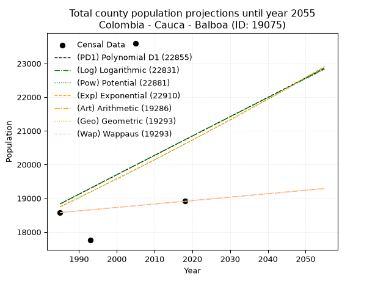
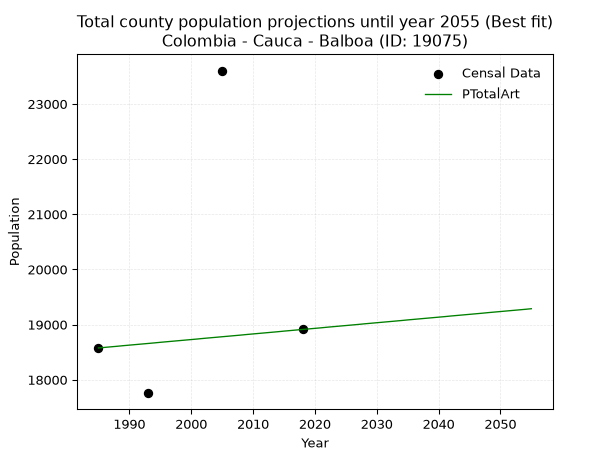
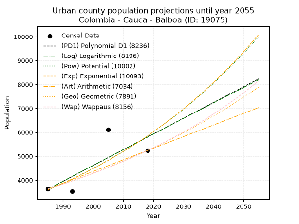
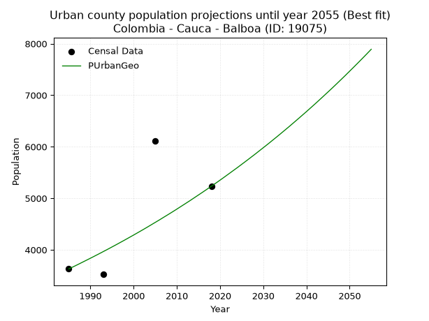
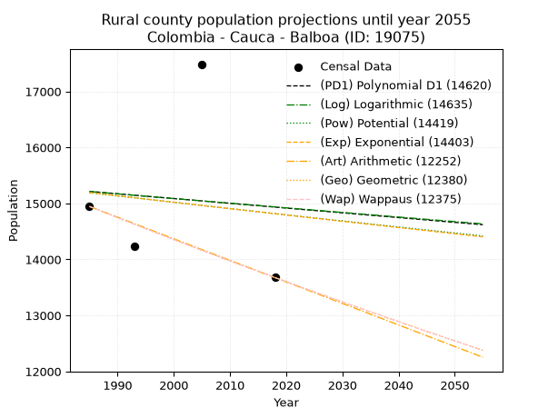
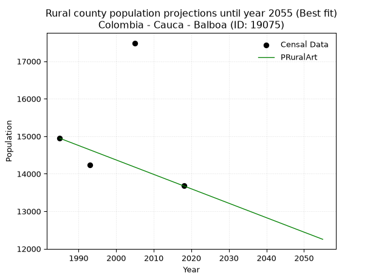

<div align="center">


</div>

# _“Population and Public Services Demand Projections (PPSD) until Year 2050 for Colombia - Cauca - Balboa (ID: 19075)”_
Keywords: `population` `public-service` `projection` `lineal` `polynomial` `logarithmic` `potential` `exponential` `arithmetic` `geometric` `wappaus` `dane` `colombia` `south-america`

PPSD are analytical estimates used by governments and planners to anticipate future changes in population size, age distribution, and the resulting community needs for utilities, healthcare, education, and infrastructure as sizing future water treatment facilities, electrical grids, and road networks based on spatial growth.

> **General running parameters**: • app_version: _v20260806_. • Python version: _3.14.7_. • Pandas version: _3.0.5_. • NumPy version: _2.5.1_. • Creates, save and include plots into reports (create_plot): _False_. • Projection until year: _2050_. • Process polynomial degree 2 and up: _False_. • Process Wappaus: _True_. • Process Wappaus: _True_. • Set negative values to zero: _True_. • Set infinite values to zero: _True_. • Drop dataset notes: _True_. 
<div align="center">

Dynamic map: [:earth_americas:Google](http://maps.google.com/maps?q=2.040998341,-77.2157732) [:earth_americas:OSM](https://www.openstreetmap.org/#map=18/2.040998341/-77.2157732&layers=P) [:earth_americas:Bing](https://www.bing.com/maps?cp=2.040998341~-77.2157732&lvl=18) [:earth_americas:Apple](https://maps.apple.com/frame?center=2.040998341%2C-77.2157732&span=0.003%2C0.006)

</div>


<div align="center">

```geojson
{
  "type": "Feature",
  "geometry": {
    "type": "Point", 
    "coordinates": [-77.2157732, 2.040998341]
  }, 
  "properties": {
    "Name": "Colombia - Cauca - Balboa (ID: 19075)"
  }
}
```

</div>


## 0. Census Data (4 records)

Census data are official statistics collected by a government about the people and housing in a country. They usually include counts of total population, age, sex, race, income, education, and jobs.

📅Global census file: [Population.xlsx](../data/Population.xlsx)

| Source   |   Year |   CountryID | CountryName   |   StateID | StateName   |   CountyID | CountyName   |   PTotal |   PUrban |   PRural |
|:---------|-------:|------------:|:--------------|----------:|:------------|-----------:|:-------------|---------:|---------:|---------:|
| DANE     |   1985 |          57 | Colombia      |        19 | Cauca       |      19075 | Balboa       |    18575 |     3629 |    14946 |
| DANE     |   1993 |          57 | Colombia      |        19 | Cauca       |      19075 | Balboa       |    17755 |     3523 |    14232 |
| DANE     |   2005 |          57 | Colombia      |        19 | Cauca       |      19075 | Balboa       |    23602 |     6115 |    17487 |
| DANE     |   2018 |          57 | Colombia      |        19 | Cauca       |      19075 | Balboa       |    18910 |     5234 |    13676 |

> 🔥Some records could had specific notes about the registered values or the corresponding urban or rural distribution.

## 1. Total

### 1.1. Coefficients and Parameters

* (PD1) Polynomial Deg 1: 57.437976716180934, -95179.81292654094 (lineal)
* (Log) Logarithmic: 115475.80934340777, -858022.0521843035
* (Pow) Potential: 5.752170238042765, -14.696377725572125
* (Exp) Exponential: 0.0028619793043654397, 63.94080278847048
* (Art) Arithmetic: Year diff. 2018 - 1985 = 33, Population diff. 18910 - 18575 = 335, Annual growth = 10.151515151515152
* (Geo) Geometric: Year diff. 2018 - 1985 = 33, Population diff. 18910 - 18575 = 335, Annual growth % = 0.0005417919303949414
* (Wap) Wappaus: i = 0.054163079373163406, Condition values only valid for < 200)

<sub>
Wappaus condition values: ['0.00', '0.05', '0.11', '0.16', '0.22', '0.27', '0.32', '0.38', '0.43', '0.49', '0.54', '0.60', '0.65', '0.70', '0.76', '0.81', '0.87', '0.92', '0.97', '1.03', '1.08', '1.14', '1.19', '1.25', '1.30', '1.35', '1.41', '1.46', '1.52', '1.57', '1.62', '1.68', '1.73', '1.79', '1.84', '1.90', '1.95', '2.00', '2.06', '2.11', '2.17', '2.22', '2.27', '2.33', '2.38', '2.44', '2.49', '2.55', '2.60', '2.65', '2.71', '2.76', '2.82', '2.87', '2.92', '2.98', '3.03', '3.09', '3.14', '3.20', '3.25', '3.30', '3.36', '3.41', '3.47', '3.52']
</sub>


### 1.2. Projected Dataset

|   Year |   CountyID |   PTotalPD1 |   PTotalLog |   PTotalPow |   PTotalExp |   PTotalArt |   PTotalGeo |   PTotalWap |
|-------:|-----------:|------------:|------------:|------------:|------------:|------------:|------------:|------------:|
|   1985 |      19075 |       18835 |       18829 |       18746 |       18751 |       18575 |       18575 |       18575 |
|   1986 |      19075 |       18892 |       18887 |       18800 |       18804 |       18585 |       18585 |       18585 |
|   1987 |      19075 |       18949 |       18945 |       18855 |       18858 |       18595 |       18595 |       18595 |
|   1988 |      19075 |       19007 |       19003 |       18909 |       18912 |       18605 |       18605 |       18605 |
|   1989 |      19075 |       19064 |       19061 |       18964 |       18967 |       18616 |       18615 |       18615 |
|   1990 |      19075 |       19122 |       19119 |       19019 |       19021 |       18626 |       18625 |       18625 |
|   1991 |      19075 |       19179 |       19177 |       19074 |       19075 |       18636 |       18635 |       18635 |
|   1992 |      19075 |       19237 |       19235 |       19129 |       19130 |       18646 |       18646 |       18646 |
|   1993 |      19075 |       19294 |       19293 |       19184 |       19185 |       18656 |       18656 |       18656 |
|   1994 |      19075 |       19352 |       19351 |       19240 |       19240 |       18666 |       18666 |       18666 |
|   1995 |      19075 |       19409 |       19409 |       19295 |       19295 |       18677 |       18676 |       18676 |
|   1996 |      19075 |       19466 |       19467 |       19351 |       19350 |       18687 |       18686 |       18686 |
|   1997 |      19075 |       19524 |       19525 |       19407 |       19406 |       18697 |       18696 |       18696 |
|   1998 |      19075 |       19581 |       19583 |       19463 |       19461 |       18707 |       18706 |       18706 |
|   1999 |      19075 |       19639 |       19641 |       19519 |       19517 |       18717 |       18716 |       18716 |
|   2000 |      19075 |       19696 |       19698 |       19575 |       19573 |       18727 |       18727 |       18727 |
|   2001 |      19075 |       19754 |       19756 |       19632 |       19629 |       18737 |       18737 |       18737 |
|   2002 |      19075 |       19811 |       19814 |       19688 |       19686 |       18748 |       18747 |       18747 |
|   2003 |      19075 |       19868 |       19871 |       19745 |       19742 |       18758 |       18757 |       18757 |
|   2004 |      19075 |       19926 |       19929 |       19802 |       19799 |       18768 |       18767 |       18767 |
|   2005 |      19075 |       19983 |       19987 |       19858 |       19855 |       18778 |       18777 |       18777 |
|   2006 |      19075 |       20041 |       20044 |       19916 |       19912 |       18788 |       18787 |       18787 |
|   2007 |      19075 |       20098 |       20102 |       19973 |       19969 |       18798 |       18798 |       18798 |
|   2008 |      19075 |       20156 |       20159 |       20030 |       20027 |       18808 |       18808 |       18808 |
|   2009 |      19075 |       20213 |       20217 |       20087 |       20084 |       18819 |       18818 |       18818 |
|   2010 |      19075 |       20271 |       20274 |       20145 |       20141 |       18829 |       18828 |       18828 |
|   2011 |      19075 |       20328 |       20332 |       20203 |       20199 |       18839 |       18838 |       18838 |
|   2012 |      19075 |       20385 |       20389 |       20261 |       20257 |       18849 |       18849 |       18849 |
|   2013 |      19075 |       20443 |       20446 |       20319 |       20315 |       18859 |       18859 |       18859 |
|   2014 |      19075 |       20500 |       20504 |       20377 |       20373 |       18869 |       18869 |       18869 |
|   2015 |      19075 |       20558 |       20561 |       20435 |       20432 |       18880 |       18879 |       18879 |
|   2016 |      19075 |       20615 |       20618 |       20493 |       20490 |       18890 |       18890 |       18890 |
|   2017 |      19075 |       20673 |       20676 |       20552 |       20549 |       18900 |       18900 |       18900 |
|   2018 |      19075 |       20730 |       20733 |       20611 |       20608 |       18910 |       18910 |       18910 |
|   2019 |      19075 |       20787 |       20790 |       20669 |       20667 |       18920 |       18920 |       18920 |
|   2020 |      19075 |       20845 |       20847 |       20728 |       20726 |       18930 |       18930 |       18930 |
|   2021 |      19075 |       20902 |       20904 |       20788 |       20786 |       18940 |       18941 |       18941 |
|   2022 |      19075 |       20960 |       20962 |       20847 |       20845 |       18951 |       18951 |       18951 |
|   2023 |      19075 |       21017 |       21019 |       20906 |       20905 |       18961 |       18961 |       18961 |
|   2024 |      19075 |       21075 |       21076 |       20966 |       20965 |       18971 |       18972 |       18972 |
|   2025 |      19075 |       21132 |       21133 |       21025 |       21025 |       18981 |       18982 |       18982 |
|   2026 |      19075 |       21190 |       21190 |       21085 |       21085 |       18991 |       18992 |       18992 |
|   2027 |      19075 |       21247 |       21247 |       21145 |       21146 |       19001 |       19002 |       19002 |
|   2028 |      19075 |       21304 |       21304 |       21205 |       21206 |       19012 |       19013 |       19013 |
|   2029 |      19075 |       21362 |       21361 |       21265 |       21267 |       19022 |       19023 |       19023 |
|   2030 |      19075 |       21419 |       21418 |       21326 |       21328 |       19032 |       19033 |       19033 |
|   2031 |      19075 |       21477 |       21474 |       21386 |       21389 |       19042 |       19044 |       19044 |
|   2032 |      19075 |       21534 |       21531 |       21447 |       21450 |       19052 |       19054 |       19054 |
|   2033 |      19075 |       21592 |       21588 |       21508 |       21512 |       19062 |       19064 |       19064 |
|   2034 |      19075 |       21649 |       21645 |       21569 |       21574 |       19072 |       19075 |       19075 |
|   2035 |      19075 |       21706 |       21702 |       21630 |       21635 |       19083 |       19085 |       19085 |
|   2036 |      19075 |       21764 |       21758 |       21691 |       21697 |       19093 |       19095 |       19095 |
|   2037 |      19075 |       21821 |       21815 |       21752 |       21760 |       19103 |       19106 |       19106 |
|   2038 |      19075 |       21879 |       21872 |       21814 |       21822 |       19113 |       19116 |       19116 |
|   2039 |      19075 |       21936 |       21928 |       21875 |       21884 |       19123 |       19126 |       19126 |
|   2040 |      19075 |       21994 |       21985 |       21937 |       21947 |       19133 |       19137 |       19137 |
|   2041 |      19075 |       22051 |       22042 |       21999 |       22010 |       19143 |       19147 |       19147 |
|   2042 |      19075 |       22109 |       22098 |       22061 |       22073 |       19154 |       19157 |       19157 |
|   2043 |      19075 |       22166 |       22155 |       22123 |       22136 |       19164 |       19168 |       19168 |
|   2044 |      19075 |       22223 |       22211 |       22186 |       22200 |       19174 |       19178 |       19178 |
|   2045 |      19075 |       22281 |       22268 |       22248 |       22264 |       19184 |       19189 |       19189 |
|   2046 |      19075 |       22338 |       22324 |       22311 |       22327 |       19194 |       19199 |       19199 |
|   2047 |      19075 |       22396 |       22381 |       22374 |       22391 |       19204 |       19209 |       19209 |
|   2048 |      19075 |       22453 |       22437 |       22437 |       22456 |       19215 |       19220 |       19220 |
|   2049 |      19075 |       22511 |       22493 |       22500 |       22520 |       19225 |       19230 |       19230 |
|   2050 |      19075 |       22568 |       22550 |       22563 |       22584 |       19235 |       19241 |       19241 |
<div align="center">

</img>

</div>


### 1.3. Best fit with absolute and relative error (%)

Relative error puts that difference into context by dividing the absolute error by the true value, creating a unitless ratio or percentage that shows the scale of the mistake.

Absolute and relative error

|   Year | Source   |   CountryID | CountryName   |   StateID | StateName   |   CountyID_x | CountyName   |   PTotal |   PUrban |   PRural |   CountyID_y |   PTotalPD1 |   PTotalLog |   PTotalPow |   PTotalExp |   PTotalArt |   PTotalGeo |   PTotalWap |   PTotalPD1AbsError |   PTotalLogAbsError |   PTotalPowAbsError |   PTotalExpAbsError |   PTotalArtAbsError |   PTotalGeoAbsError |   PTotalWapAbsError |   PTotalPD1RelError |   PTotalLogRelError |   PTotalPowRelError |   PTotalExpRelError |   PTotalArtRelError |   PTotalGeoRelError |   PTotalWapRelError |
|-------:|:---------|------------:|:--------------|----------:|:------------|-------------:|:-------------|---------:|---------:|---------:|-------------:|------------:|------------:|------------:|------------:|------------:|------------:|------------:|--------------------:|--------------------:|--------------------:|--------------------:|--------------------:|--------------------:|--------------------:|--------------------:|--------------------:|--------------------:|--------------------:|--------------------:|--------------------:|--------------------:|
|   1985 | DANE     |          57 | Colombia      |        19 | Cauca       |        19075 | Balboa       |    18575 |     3629 |    14946 |        19075 |       18835 |       18829 |       18746 |       18751 |       18575 |       18575 |       18575 |                 260 |                 254 |                 171 |                 176 |                   0 |                   0 |                   0 |             1.39973 |             1.36743 |            0.920592 |             0.94751 |             0       |             0       |             0       |
|   1993 | DANE     |          57 | Colombia      |        19 | Cauca       |        19075 | Balboa       |    17755 |     3523 |    14232 |        19075 |       19294 |       19293 |       19184 |       19185 |       18656 |       18656 |       18656 |                1539 |                1538 |                1429 |                1430 |                 901 |                 901 |                 901 |             8.66798 |             8.66235 |            8.04844  |             8.05407 |             5.07463 |             5.07463 |             5.07463 |
|   2005 | DANE     |          57 | Colombia      |        19 | Cauca       |        19075 | Balboa       |    23602 |     6115 |    17487 |        19075 |       19983 |       19987 |       19858 |       19855 |       18778 |       18777 |       18777 |                3619 |                3615 |                3744 |                3747 |                4824 |                4825 |                4825 |            15.3334  |            15.3165  |           15.8631   |            15.8758  |            20.4389  |            20.4432  |            20.4432  |
|   2018 | DANE     |          57 | Colombia      |        19 | Cauca       |        19075 | Balboa       |    18910 |     5234 |    13676 |        19075 |       20730 |       20733 |       20611 |       20608 |       18910 |       18910 |       18910 |                1820 |                1823 |                1701 |                1698 |                   0 |                   0 |                   0 |             9.62454 |             9.6404  |            8.99524  |             8.97938 |             0       |             0       |             0       |

Relative error mean

| Method    |   RelError | Best   |
|:----------|-----------:|:-------|
| PTotalPD1 |    8.75642 |        |
| PTotalLog |    8.74667 |        |
| PTotalPow |    8.45683 |        |
| PTotalExp |    8.46418 |        |
| PTotalArt |    6.37839 | True   |
| PTotalGeo |    6.37945 |        |
| PTotalWap |    6.37945 |        |

💙Best method: _**PTotalArt**_
<div align="center">

</img>

</div>


### 1.4. Fresh water supply demand in liters per capita per day (lpcd)

The fresh water supply demand typically ranges from 100 to 300 liters per capita per day (lpcd) for standard domestic and municipal planning, though absolute survival minimums set by the World Health Organization are as low as 7.5 to 20 liters per day, and total consumption in high-income nations can exceed 400 liters.

> `CZ`: Level in meters above the sea level (masl)<br> `WS`: Fresh water supply demand in liters per capita per day (lpcd or l/h/d)<br> `WSAll`: Zonal fresh water supply demand in liters per second (l/s)<br> `A`: Zonal area in square meters<br> `DP`: Population density (people/hectare)

Reference values (RAS Colombia)

|    CZ |   WS |
|------:|-----:|
|  1000 |  120 |
|  2000 |  130 |
| 99999 |  140 |

County shapefile geometry properties and water supply values

|   CountyID |      ATotal |   CZTotal |   WSTotal |
|-----------:|------------:|----------:|----------:|
|      19075 | 4.13552e+08 |   1598.53 |       130 |

Projected values for best method: PTotalArt

|   CountyID |   Year |   PTotalArt |   DPTotal |   WSTotal |   WSTotalAll |
|-----------:|-------:|------------:|----------:|----------:|-------------:|
|      19075 |   1985 |       18575 |      0.45 |       130 |      27.9485 |
|      19075 |   1986 |       18585 |      0.45 |       130 |      27.9635 |
|      19075 |   1987 |       18595 |      0.45 |       130 |      27.9786 |
|      19075 |   1988 |       18605 |      0.45 |       130 |      27.9936 |
|      19075 |   1989 |       18616 |      0.45 |       130 |      28.0102 |
|      19075 |   1990 |       18626 |      0.45 |       130 |      28.0252 |
|      19075 |   1991 |       18636 |      0.45 |       130 |      28.0403 |
|      19075 |   1992 |       18646 |      0.45 |       130 |      28.0553 |
|      19075 |   1993 |       18656 |      0.45 |       130 |      28.0704 |
|      19075 |   1994 |       18666 |      0.45 |       130 |      28.0854 |
|      19075 |   1995 |       18677 |      0.45 |       130 |      28.102  |
|      19075 |   1996 |       18687 |      0.45 |       130 |      28.117  |
|      19075 |   1997 |       18697 |      0.45 |       130 |      28.1321 |
|      19075 |   1998 |       18707 |      0.45 |       130 |      28.1471 |
|      19075 |   1999 |       18717 |      0.45 |       130 |      28.1622 |
|      19075 |   2000 |       18727 |      0.45 |       130 |      28.1772 |
|      19075 |   2001 |       18737 |      0.45 |       130 |      28.1922 |
|      19075 |   2002 |       18748 |      0.45 |       130 |      28.2088 |
|      19075 |   2003 |       18758 |      0.45 |       130 |      28.2238 |
|      19075 |   2004 |       18768 |      0.45 |       130 |      28.2389 |
|      19075 |   2005 |       18778 |      0.45 |       130 |      28.2539 |
|      19075 |   2006 |       18788 |      0.45 |       130 |      28.269  |
|      19075 |   2007 |       18798 |      0.45 |       130 |      28.284  |
|      19075 |   2008 |       18808 |      0.45 |       130 |      28.2991 |
|      19075 |   2009 |       18819 |      0.46 |       130 |      28.3156 |
|      19075 |   2010 |       18829 |      0.46 |       130 |      28.3307 |
|      19075 |   2011 |       18839 |      0.46 |       130 |      28.3457 |
|      19075 |   2012 |       18849 |      0.46 |       130 |      28.3608 |
|      19075 |   2013 |       18859 |      0.46 |       130 |      28.3758 |
|      19075 |   2014 |       18869 |      0.46 |       130 |      28.3909 |
|      19075 |   2015 |       18880 |      0.46 |       130 |      28.4074 |
|      19075 |   2016 |       18890 |      0.46 |       130 |      28.4225 |
|      19075 |   2017 |       18900 |      0.46 |       130 |      28.4375 |
|      19075 |   2018 |       18910 |      0.46 |       130 |      28.4525 |
|      19075 |   2019 |       18920 |      0.46 |       130 |      28.4676 |
|      19075 |   2020 |       18930 |      0.46 |       130 |      28.4826 |
|      19075 |   2021 |       18940 |      0.46 |       130 |      28.4977 |
|      19075 |   2022 |       18951 |      0.46 |       130 |      28.5142 |
|      19075 |   2023 |       18961 |      0.46 |       130 |      28.5293 |
|      19075 |   2024 |       18971 |      0.46 |       130 |      28.5443 |
|      19075 |   2025 |       18981 |      0.46 |       130 |      28.5594 |
|      19075 |   2026 |       18991 |      0.46 |       130 |      28.5744 |
|      19075 |   2027 |       19001 |      0.46 |       130 |      28.5895 |
|      19075 |   2028 |       19012 |      0.46 |       130 |      28.606  |
|      19075 |   2029 |       19022 |      0.46 |       130 |      28.6211 |
|      19075 |   2030 |       19032 |      0.46 |       130 |      28.6361 |
|      19075 |   2031 |       19042 |      0.46 |       130 |      28.6512 |
|      19075 |   2032 |       19052 |      0.46 |       130 |      28.6662 |
|      19075 |   2033 |       19062 |      0.46 |       130 |      28.6812 |
|      19075 |   2034 |       19072 |      0.46 |       130 |      28.6963 |
|      19075 |   2035 |       19083 |      0.46 |       130 |      28.7128 |
|      19075 |   2036 |       19093 |      0.46 |       130 |      28.7279 |
|      19075 |   2037 |       19103 |      0.46 |       130 |      28.7429 |
|      19075 |   2038 |       19113 |      0.46 |       130 |      28.758  |
|      19075 |   2039 |       19123 |      0.46 |       130 |      28.773  |
|      19075 |   2040 |       19133 |      0.46 |       130 |      28.7881 |
|      19075 |   2041 |       19143 |      0.46 |       130 |      28.8031 |
|      19075 |   2042 |       19154 |      0.46 |       130 |      28.8197 |
|      19075 |   2043 |       19164 |      0.46 |       130 |      28.8347 |
|      19075 |   2044 |       19174 |      0.46 |       130 |      28.8498 |
|      19075 |   2045 |       19184 |      0.46 |       130 |      28.8648 |
|      19075 |   2046 |       19194 |      0.46 |       130 |      28.8799 |
|      19075 |   2047 |       19204 |      0.46 |       130 |      28.8949 |
|      19075 |   2048 |       19215 |      0.46 |       130 |      28.9115 |
|      19075 |   2049 |       19225 |      0.46 |       130 |      28.9265 |
|      19075 |   2050 |       19235 |      0.47 |       130 |      28.9416 |

## 2. Urban

### 2.1. Coefficients and Parameters

* (PD1) Polynomial Deg 1: 65.94259333600999, -127276.42232035397 (lineal)
* (Log) Logarithmic: 132136.89207810114, -999748.3255642457
* (Pow) Potential: 29.57770408422261, -93.985261823455
* (Exp) Exponential: 0.01476321710229138, 6.733054138320755e-10
* (Art) Arithmetic: Year diff. 2018 - 1985 = 33, Population diff. 5234 - 3629 = 1605, Annual growth = 48.63636363636363
* (Geo) Geometric: Year diff. 2018 - 1985 = 33, Population diff. 5234 - 3629 = 1605, Annual growth % = 0.011159341701285186
* (Wap) Wappaus: i = 1.0975146933626003, Condition values only valid for < 200)

<sub>
Wappaus condition values: ['0.00', '1.10', '2.20', '3.29', '4.39', '5.49', '6.59', '7.68', '8.78', '9.88', '10.98', '12.07', '13.17', '14.27', '15.37', '16.46', '17.56', '18.66', '19.76', '20.85', '21.95', '23.05', '24.15', '25.24', '26.34', '27.44', '28.54', '29.63', '30.73', '31.83', '32.93', '34.02', '35.12', '36.22', '37.32', '38.41', '39.51', '40.61', '41.71', '42.80', '43.90', '45.00', '46.10', '47.19', '48.29', '49.39', '50.49', '51.58', '52.68', '53.78', '54.88', '55.97', '57.07', '58.17', '59.27', '60.36', '61.46', '62.56', '63.66', '64.75', '65.85', '66.95', '68.05', '69.14', '70.24', '71.34']
</sub>


### 2.2. Projected Dataset

|   Year |   CountyID |   PUrbanPD1 |   PUrbanLog |   PUrbanPow |   PUrbanExp |   PUrbanArt |   PUrbanGeo |   PUrbanWap |
|-------:|-----------:|------------:|------------:|------------:|------------:|------------:|------------:|------------:|
|   1985 |      19075 |        3620 |        3617 |        3589 |        3591 |        3629 |        3629 |        3629 |
|   1986 |      19075 |        3686 |        3683 |        3642 |        3644 |        3678 |        3669 |        3669 |
|   1987 |      19075 |        3752 |        3750 |        3697 |        3699 |        3726 |        3710 |        3710 |
|   1988 |      19075 |        3817 |        3816 |        3753 |        3754 |        3775 |        3752 |        3750 |
|   1989 |      19075 |        3883 |        3883 |        3809 |        3809 |        3824 |        3794 |        3792 |
|   1990 |      19075 |        3949 |        3949 |        3866 |        3866 |        3872 |        3836 |        3834 |
|   1991 |      19075 |        4015 |        4015 |        3924 |        3924 |        3921 |        3879 |        3876 |
|   1992 |      19075 |        4081 |        4082 |        3982 |        3982 |        3969 |        3922 |        3919 |
|   1993 |      19075 |        4147 |        4148 |        4042 |        4041 |        4018 |        3966 |        3962 |
|   1994 |      19075 |        4213 |        4214 |        4102 |        4101 |        4067 |        4010 |        4006 |
|   1995 |      19075 |        4279 |        4281 |        4164 |        4162 |        4115 |        4055 |        4050 |
|   1996 |      19075 |        4345 |        4347 |        4226 |        4224 |        4164 |        4100 |        4095 |
|   1997 |      19075 |        4411 |        4413 |        4289 |        4287 |        4213 |        4146 |        4141 |
|   1998 |      19075 |        4477 |        4479 |        4353 |        4351 |        4261 |        4192 |        4187 |
|   1999 |      19075 |        4543 |        4545 |        4418 |        4415 |        4310 |        4239 |        4233 |
|   2000 |      19075 |        4609 |        4611 |        4484 |        4481 |        4359 |        4286 |        4280 |
|   2001 |      19075 |        4675 |        4677 |        4550 |        4548 |        4407 |        4334 |        4328 |
|   2002 |      19075 |        4741 |        4743 |        4618 |        4615 |        4456 |        4382 |        4376 |
|   2003 |      19075 |        4807 |        4809 |        4687 |        4684 |        4504 |        4431 |        4424 |
|   2004 |      19075 |        4873 |        4875 |        4757 |        4754 |        4553 |        4481 |        4474 |
|   2005 |      19075 |        4938 |        4941 |        4827 |        4824 |        4602 |        4531 |        4524 |
|   2006 |      19075 |        5004 |        5007 |        4899 |        4896 |        4650 |        4581 |        4574 |
|   2007 |      19075 |        5070 |        5073 |        4972 |        4969 |        4699 |        4633 |        4626 |
|   2008 |      19075 |        5136 |        5139 |        5046 |        5043 |        4748 |        4684 |        4677 |
|   2009 |      19075 |        5202 |        5205 |        5120 |        5118 |        4796 |        4736 |        4730 |
|   2010 |      19075 |        5268 |        5270 |        5196 |        5194 |        4845 |        4789 |        4783 |
|   2011 |      19075 |        5334 |        5336 |        5273 |        5271 |        4894 |        4843 |        4837 |
|   2012 |      19075 |        5400 |        5402 |        5351 |        5350 |        4942 |        4897 |        4891 |
|   2013 |      19075 |        5466 |        5467 |        5431 |        5429 |        4991 |        4951 |        4947 |
|   2014 |      19075 |        5532 |        5533 |        5511 |        5510 |        5039 |        5007 |        5003 |
|   2015 |      19075 |        5598 |        5599 |        5593 |        5592 |        5088 |        5063 |        5059 |
|   2016 |      19075 |        5664 |        5664 |        5675 |        5675 |        5137 |        5119 |        5117 |
|   2017 |      19075 |        5730 |        5730 |        5759 |        5759 |        5185 |        5176 |        5175 |
|   2018 |      19075 |        5796 |        5795 |        5844 |        5845 |        5234 |        5234 |        5234 |
|   2019 |      19075 |        5862 |        5861 |        5930 |        5932 |        5283 |        5292 |        5294 |
|   2020 |      19075 |        5928 |        5926 |        6018 |        6020 |        5331 |        5351 |        5354 |
|   2021 |      19075 |        5994 |        5992 |        6107 |        6110 |        5380 |        5411 |        5416 |
|   2022 |      19075 |        6060 |        6057 |        6197 |        6201 |        5429 |        5472 |        5478 |
|   2023 |      19075 |        6125 |        6122 |        6288 |        6293 |        5477 |        5533 |        5541 |
|   2024 |      19075 |        6191 |        6188 |        6380 |        6386 |        5526 |        5594 |        5605 |
|   2025 |      19075 |        6257 |        6253 |        6474 |        6481 |        5574 |        5657 |        5670 |
|   2026 |      19075 |        6323 |        6318 |        6570 |        6578 |        5623 |        5720 |        5736 |
|   2027 |      19075 |        6389 |        6383 |        6666 |        6676 |        5672 |        5784 |        5803 |
|   2028 |      19075 |        6455 |        6448 |        6764 |        6775 |        5720 |        5848 |        5871 |
|   2029 |      19075 |        6521 |        6514 |        6864 |        6876 |        5769 |        5914 |        5939 |
|   2030 |      19075 |        6587 |        6579 |        6964 |        6978 |        5818 |        5980 |        6009 |
|   2031 |      19075 |        6653 |        6644 |        7066 |        7082 |        5866 |        6046 |        6080 |
|   2032 |      19075 |        6719 |        6709 |        7170 |        7187 |        5915 |        6114 |        6152 |
|   2033 |      19075 |        6785 |        6774 |        7275 |        7294 |        5964 |        6182 |        6224 |
|   2034 |      19075 |        6851 |        6839 |        7382 |        7402 |        6012 |        6251 |        6298 |
|   2035 |      19075 |        6917 |        6904 |        7490 |        7513 |        6061 |        6321 |        6373 |
|   2036 |      19075 |        6983 |        6969 |        7600 |        7624 |        6109 |        6391 |        6450 |
|   2037 |      19075 |        7049 |        7033 |        7711 |        7738 |        6158 |        6463 |        6527 |
|   2038 |      19075 |        7115 |        7098 |        7823 |        7853 |        6207 |        6535 |        6606 |
|   2039 |      19075 |        7181 |        7163 |        7938 |        7970 |        6255 |        6608 |        6685 |
|   2040 |      19075 |        7246 |        7228 |        8054 |        8088 |        6304 |        6681 |        6767 |
|   2041 |      19075 |        7312 |        7293 |        8171 |        8208 |        6353 |        6756 |        6849 |
|   2042 |      19075 |        7378 |        7357 |        8291 |        8330 |        6401 |        6831 |        6933 |
|   2043 |      19075 |        7444 |        7422 |        8412 |        8454 |        6450 |        6908 |        7018 |
|   2044 |      19075 |        7510 |        7487 |        8534 |        8580 |        6499 |        6985 |        7104 |
|   2045 |      19075 |        7576 |        7551 |        8659 |        8708 |        6547 |        7063 |        7192 |
|   2046 |      19075 |        7642 |        7616 |        8785 |        8837 |        6596 |        7141 |        7281 |
|   2047 |      19075 |        7708 |        7681 |        8913 |        8969 |        6644 |        7221 |        7372 |
|   2048 |      19075 |        7774 |        7745 |        9042 |        9102 |        6693 |        7302 |        7464 |
|   2049 |      19075 |        7840 |        7810 |        9174 |        9237 |        6742 |        7383 |        7558 |
|   2050 |      19075 |        7906 |        7874 |        9307 |        9375 |        6790 |        7466 |        7653 |
<div align="center">

</img>

</div>


### 2.3. Best fit with absolute and relative error (%)

Relative error puts that difference into context by dividing the absolute error by the true value, creating a unitless ratio or percentage that shows the scale of the mistake.

Absolute and relative error

|   Year | Source   |   CountryID | CountryName   |   StateID | StateName   |   CountyID_x | CountyName   |   PTotal |   PUrban |   PRural |   CountyID_y |   PUrbanPD1 |   PUrbanLog |   PUrbanPow |   PUrbanExp |   PUrbanArt |   PUrbanGeo |   PUrbanWap |   PUrbanPD1AbsError |   PUrbanLogAbsError |   PUrbanPowAbsError |   PUrbanExpAbsError |   PUrbanArtAbsError |   PUrbanGeoAbsError |   PUrbanWapAbsError |   PUrbanPD1RelError |   PUrbanLogRelError |   PUrbanPowRelError |   PUrbanExpRelError |   PUrbanArtRelError |   PUrbanGeoRelError |   PUrbanWapRelError |
|-------:|:---------|------------:|:--------------|----------:|:------------|-------------:|:-------------|---------:|---------:|---------:|-------------:|------------:|------------:|------------:|------------:|------------:|------------:|------------:|--------------------:|--------------------:|--------------------:|--------------------:|--------------------:|--------------------:|--------------------:|--------------------:|--------------------:|--------------------:|--------------------:|--------------------:|--------------------:|--------------------:|
|   1985 | DANE     |          57 | Colombia      |        19 | Cauca       |        19075 | Balboa       |    18575 |     3629 |    14946 |        19075 |        3620 |        3617 |        3589 |        3591 |        3629 |        3629 |        3629 |                   9 |                  12 |                  40 |                  38 |                   0 |                   0 |                   0 |            0.248002 |             0.33067 |             1.10223 |             1.04712 |              0      |              0      |               0     |
|   1993 | DANE     |          57 | Colombia      |        19 | Cauca       |        19075 | Balboa       |    17755 |     3523 |    14232 |        19075 |        4147 |        4148 |        4042 |        4041 |        4018 |        3966 |        3962 |                 624 |                 625 |                 519 |                 518 |                 495 |                 443 |                 439 |           17.7122   |            17.7406  |            14.7318  |            14.7034  |             14.0505 |             12.5745 |              12.461 |
|   2005 | DANE     |          57 | Colombia      |        19 | Cauca       |        19075 | Balboa       |    23602 |     6115 |    17487 |        19075 |        4938 |        4941 |        4827 |        4824 |        4602 |        4531 |        4524 |                1177 |                1174 |                1288 |                1291 |                1513 |                1584 |                1591 |           19.2478   |            19.1987  |            21.063   |            21.112   |             24.7424 |             25.9035 |              26.018 |
|   2018 | DANE     |          57 | Colombia      |        19 | Cauca       |        19075 | Balboa       |    18910 |     5234 |    13676 |        19075 |        5796 |        5795 |        5844 |        5845 |        5234 |        5234 |        5234 |                 562 |                 561 |                 610 |                 611 |                   0 |                   0 |                   0 |           10.7375   |            10.7184  |            11.6546  |            11.6737  |              0      |              0      |               0     |

Relative error mean

| Method    |   RelError | Best   |
|:----------|-----------:|:-------|
| PUrbanPD1 |   11.9864  |        |
| PUrbanLog |   11.9971  |        |
| PUrbanPow |   12.1379  |        |
| PUrbanExp |   12.134   |        |
| PUrbanArt |    9.69824 |        |
| PUrbanGeo |    9.61951 | True   |
| PUrbanWap |    9.61974 |        |

💙Best method: _**PUrbanGeo**_
<div align="center">

</img>

</div>


### 2.4. Fresh water supply demand in liters per capita per day (lpcd)

The fresh water supply demand typically ranges from 100 to 300 liters per capita per day (lpcd) for standard domestic and municipal planning, though absolute survival minimums set by the World Health Organization are as low as 7.5 to 20 liters per day, and total consumption in high-income nations can exceed 400 liters.

> `CZ`: Level in meters above the sea level (masl)<br> `WS`: Fresh water supply demand in liters per capita per day (lpcd or l/h/d)<br> `WSAll`: Zonal fresh water supply demand in liters per second (l/s)<br> `A`: Zonal area in square meters<br> `DP`: Population density (people/hectare)

Reference values (RAS Colombia)

|    CZ |   WS |
|------:|-----:|
|  1000 |  120 |
|  2000 |  130 |
| 99999 |  140 |

County shapefile geometry properties and water supply values

|   CountyID |   AUrban |   CZUrban |   WSUrban |
|-----------:|---------:|----------:|----------:|
|      19075 |   755857 |   1605.97 |       130 |

Projected values for best method: PUrbanGeo

|   CountyID |   Year |   PUrbanGeo |   DPUrban |   WSUrban |   WSUrbanAll |
|-----------:|-------:|------------:|----------:|----------:|-------------:|
|      19075 |   1985 |        3629 |     48.01 |       130 |      5.4603  |
|      19075 |   1986 |        3669 |     48.54 |       130 |      5.52049 |
|      19075 |   1987 |        3710 |     49.08 |       130 |      5.58218 |
|      19075 |   1988 |        3752 |     49.64 |       130 |      5.64537 |
|      19075 |   1989 |        3794 |     50.19 |       130 |      5.70856 |
|      19075 |   1990 |        3836 |     50.75 |       130 |      5.77176 |
|      19075 |   1991 |        3879 |     51.32 |       130 |      5.83646 |
|      19075 |   1992 |        3922 |     51.89 |       130 |      5.90116 |
|      19075 |   1993 |        3966 |     52.47 |       130 |      5.96736 |
|      19075 |   1994 |        4010 |     53.05 |       130 |      6.03356 |
|      19075 |   1995 |        4055 |     53.65 |       130 |      6.10127 |
|      19075 |   1996 |        4100 |     54.24 |       130 |      6.16898 |
|      19075 |   1997 |        4146 |     54.85 |       130 |      6.23819 |
|      19075 |   1998 |        4192 |     55.46 |       130 |      6.30741 |
|      19075 |   1999 |        4239 |     56.08 |       130 |      6.37812 |
|      19075 |   2000 |        4286 |     56.7  |       130 |      6.44884 |
|      19075 |   2001 |        4334 |     57.34 |       130 |      6.52106 |
|      19075 |   2002 |        4382 |     57.97 |       130 |      6.59329 |
|      19075 |   2003 |        4431 |     58.62 |       130 |      6.66701 |
|      19075 |   2004 |        4481 |     59.28 |       130 |      6.74225 |
|      19075 |   2005 |        4531 |     59.95 |       130 |      6.81748 |
|      19075 |   2006 |        4581 |     60.61 |       130 |      6.89271 |
|      19075 |   2007 |        4633 |     61.29 |       130 |      6.97095 |
|      19075 |   2008 |        4684 |     61.97 |       130 |      7.04769 |
|      19075 |   2009 |        4736 |     62.66 |       130 |      7.12593 |
|      19075 |   2010 |        4789 |     63.36 |       130 |      7.20567 |
|      19075 |   2011 |        4843 |     64.07 |       130 |      7.28692 |
|      19075 |   2012 |        4897 |     64.79 |       130 |      7.36817 |
|      19075 |   2013 |        4951 |     65.5  |       130 |      7.44942 |
|      19075 |   2014 |        5007 |     66.24 |       130 |      7.53368 |
|      19075 |   2015 |        5063 |     66.98 |       130 |      7.61794 |
|      19075 |   2016 |        5119 |     67.72 |       130 |      7.7022  |
|      19075 |   2017 |        5176 |     68.48 |       130 |      7.78796 |
|      19075 |   2018 |        5234 |     69.25 |       130 |      7.87523 |
|      19075 |   2019 |        5292 |     70.01 |       130 |      7.9625  |
|      19075 |   2020 |        5351 |     70.79 |       130 |      8.05127 |
|      19075 |   2021 |        5411 |     71.59 |       130 |      8.14155 |
|      19075 |   2022 |        5472 |     72.39 |       130 |      8.23333 |
|      19075 |   2023 |        5533 |     73.2  |       130 |      8.32512 |
|      19075 |   2024 |        5594 |     74.01 |       130 |      8.4169  |
|      19075 |   2025 |        5657 |     74.84 |       130 |      8.51169 |
|      19075 |   2026 |        5720 |     75.68 |       130 |      8.60648 |
|      19075 |   2027 |        5784 |     76.52 |       130 |      8.70278 |
|      19075 |   2028 |        5848 |     77.37 |       130 |      8.79907 |
|      19075 |   2029 |        5914 |     78.24 |       130 |      8.89838 |
|      19075 |   2030 |        5980 |     79.12 |       130 |      8.99769 |
|      19075 |   2031 |        6046 |     79.99 |       130 |      9.09699 |
|      19075 |   2032 |        6114 |     80.89 |       130 |      9.19931 |
|      19075 |   2033 |        6182 |     81.79 |       130 |      9.30162 |
|      19075 |   2034 |        6251 |     82.7  |       130 |      9.40544 |
|      19075 |   2035 |        6321 |     83.63 |       130 |      9.51076 |
|      19075 |   2036 |        6391 |     84.55 |       130 |      9.61609 |
|      19075 |   2037 |        6463 |     85.51 |       130 |      9.72442 |
|      19075 |   2038 |        6535 |     86.46 |       130 |      9.83275 |
|      19075 |   2039 |        6608 |     87.42 |       130 |      9.94259 |
|      19075 |   2040 |        6681 |     88.39 |       130 |     10.0524  |
|      19075 |   2041 |        6756 |     89.38 |       130 |     10.1653  |
|      19075 |   2042 |        6831 |     90.37 |       130 |     10.2781  |
|      19075 |   2043 |        6908 |     91.39 |       130 |     10.394   |
|      19075 |   2044 |        6985 |     92.41 |       130 |     10.5098  |
|      19075 |   2045 |        7063 |     93.44 |       130 |     10.6272  |
|      19075 |   2046 |        7141 |     94.48 |       130 |     10.7446  |
|      19075 |   2047 |        7221 |     95.53 |       130 |     10.8649  |
|      19075 |   2048 |        7302 |     96.61 |       130 |     10.9868  |
|      19075 |   2049 |        7383 |     97.68 |       130 |     11.1087  |
|      19075 |   2050 |        7466 |     98.78 |       130 |     11.2336  |

## 3. Rural

### 3.1. Coefficients and Parameters

* (PD1) Polynomial Deg 1: -8.504616619829166, 32096.609393813287 (lineal)
* (Log) Logarithmic: -16661.08273469349, 141726.27337994304
* (Pow) Potential: -1.5054294596941329, 9.146153142741348
* (Exp) Exponential: -0.0007635684036396775, 69171.36097552809
* (Art) Arithmetic: Year diff. 2018 - 1985 = 33, Population diff. 13676 - 14946 = -1270, Annual growth = -38.484848484848484
* (Geo) Geometric: Year diff. 2018 - 1985 = 33, Population diff. 13676 - 14946 = -1270, Annual growth % = -0.002687329125654836
* (Wap) Wappaus: i = -0.26891795461427215, Condition values only valid for < 200)

<sub>
Wappaus condition values: ['-0.00', '-0.27', '-0.54', '-0.81', '-1.08', '-1.34', '-1.61', '-1.88', '-2.15', '-2.42', '-2.69', '-2.96', '-3.23', '-3.50', '-3.76', '-4.03', '-4.30', '-4.57', '-4.84', '-5.11', '-5.38', '-5.65', '-5.92', '-6.19', '-6.45', '-6.72', '-6.99', '-7.26', '-7.53', '-7.80', '-8.07', '-8.34', '-8.61', '-8.87', '-9.14', '-9.41', '-9.68', '-9.95', '-10.22', '-10.49', '-10.76', '-11.03', '-11.29', '-11.56', '-11.83', '-12.10', '-12.37', '-12.64', '-12.91', '-13.18', '-13.45', '-13.71', '-13.98', '-14.25', '-14.52', '-14.79', '-15.06', '-15.33', '-15.60', '-15.87', '-16.14', '-16.40', '-16.67', '-16.94', '-17.21', '-17.48']
</sub>


### 3.2. Projected Dataset

|   Year |   CountyID |   PRuralPD1 |   PRuralLog |   PRuralPow |   PRuralExp |   PRuralArt |   PRuralGeo |   PRuralWap |
|-------:|-----------:|------------:|------------:|------------:|------------:|------------:|------------:|------------:|
|   1985 |      19075 |       15215 |       15212 |       15192 |       15194 |       14946 |       14946 |       14946 |
|   1986 |      19075 |       15206 |       15204 |       15180 |       15182 |       14908 |       14906 |       14906 |
|   1987 |      19075 |       15198 |       15196 |       15169 |       15171 |       14869 |       14866 |       14866 |
|   1988 |      19075 |       15189 |       15187 |       15157 |       15159 |       14831 |       14826 |       14826 |
|   1989 |      19075 |       15181 |       15179 |       15146 |       15148 |       14792 |       14786 |       14786 |
|   1990 |      19075 |       15172 |       15171 |       15134 |       15136 |       14754 |       14746 |       14746 |
|   1991 |      19075 |       15164 |       15162 |       15123 |       15125 |       14715 |       14707 |       14707 |
|   1992 |      19075 |       15155 |       15154 |       15111 |       15113 |       14677 |       14667 |       14667 |
|   1993 |      19075 |       15147 |       15145 |       15100 |       15102 |       14638 |       14628 |       14628 |
|   1994 |      19075 |       15138 |       15137 |       15089 |       15090 |       14600 |       14588 |       14589 |
|   1995 |      19075 |       15130 |       15129 |       15077 |       15078 |       14561 |       14549 |       14549 |
|   1996 |      19075 |       15121 |       15120 |       15066 |       15067 |       14523 |       14510 |       14510 |
|   1997 |      19075 |       15113 |       15112 |       15055 |       15055 |       14484 |       14471 |       14471 |
|   1998 |      19075 |       15104 |       15104 |       15043 |       15044 |       14446 |       14432 |       14432 |
|   1999 |      19075 |       15096 |       15095 |       15032 |       15032 |       14407 |       14393 |       14394 |
|   2000 |      19075 |       15087 |       15087 |       15021 |       15021 |       14369 |       14355 |       14355 |
|   2001 |      19075 |       15079 |       15079 |       15009 |       15010 |       14330 |       14316 |       14316 |
|   2002 |      19075 |       15070 |       15070 |       14998 |       14998 |       14292 |       14278 |       14278 |
|   2003 |      19075 |       15062 |       15062 |       14987 |       14987 |       14253 |       14239 |       14240 |
|   2004 |      19075 |       15053 |       15054 |       14975 |       14975 |       14215 |       14201 |       14201 |
|   2005 |      19075 |       15045 |       15045 |       14964 |       14964 |       14176 |       14163 |       14163 |
|   2006 |      19075 |       15036 |       15037 |       14953 |       14952 |       14138 |       14125 |       14125 |
|   2007 |      19075 |       15028 |       15029 |       14942 |       14941 |       14099 |       14087 |       14087 |
|   2008 |      19075 |       15019 |       15020 |       14931 |       14930 |       14061 |       14049 |       14049 |
|   2009 |      19075 |       15011 |       15012 |       14919 |       14918 |       14022 |       14011 |       14012 |
|   2010 |      19075 |       15002 |       15004 |       14908 |       14907 |       13984 |       13974 |       13974 |
|   2011 |      19075 |       14994 |       14996 |       14897 |       14895 |       13945 |       13936 |       13936 |
|   2012 |      19075 |       14985 |       14987 |       14886 |       14884 |       13907 |       13899 |       13899 |
|   2013 |      19075 |       14977 |       14979 |       14875 |       14873 |       13868 |       13861 |       13861 |
|   2014 |      19075 |       14968 |       14971 |       14864 |       14861 |       13830 |       13824 |       13824 |
|   2015 |      19075 |       14960 |       14963 |       14853 |       14850 |       13791 |       13787 |       13787 |
|   2016 |      19075 |       14951 |       14954 |       14841 |       14839 |       13753 |       13750 |       13750 |
|   2017 |      19075 |       14943 |       14946 |       14830 |       14827 |       13714 |       13713 |       13713 |
|   2018 |      19075 |       14934 |       14938 |       14819 |       14816 |       13676 |       13676 |       13676 |
|   2019 |      19075 |       14926 |       14929 |       14808 |       14805 |       13638 |       13639 |       13639 |
|   2020 |      19075 |       14917 |       14921 |       14797 |       14793 |       13599 |       13603 |       13602 |
|   2021 |      19075 |       14909 |       14913 |       14786 |       14782 |       13561 |       13566 |       13566 |
|   2022 |      19075 |       14900 |       14905 |       14775 |       14771 |       13522 |       13530 |       13529 |
|   2023 |      19075 |       14892 |       14896 |       14764 |       14760 |       13484 |       13493 |       13493 |
|   2024 |      19075 |       14883 |       14888 |       14753 |       14748 |       13445 |       13457 |       13457 |
|   2025 |      19075 |       14875 |       14880 |       14742 |       14737 |       13407 |       13421 |       13420 |
|   2026 |      19075 |       14866 |       14872 |       14731 |       14726 |       13368 |       13385 |       13384 |
|   2027 |      19075 |       14858 |       14864 |       14720 |       14715 |       13330 |       13349 |       13348 |
|   2028 |      19075 |       14849 |       14855 |       14709 |       14703 |       13291 |       13313 |       13312 |
|   2029 |      19075 |       14841 |       14847 |       14699 |       14692 |       13253 |       13277 |       13276 |
|   2030 |      19075 |       14832 |       14839 |       14688 |       14681 |       13214 |       13241 |       13241 |
|   2031 |      19075 |       14824 |       14831 |       14677 |       14670 |       13176 |       13206 |       13205 |
|   2032 |      19075 |       14815 |       14823 |       14666 |       14658 |       13137 |       13170 |       13169 |
|   2033 |      19075 |       14807 |       14814 |       14655 |       14647 |       13099 |       13135 |       13134 |
|   2034 |      19075 |       14798 |       14806 |       14644 |       14636 |       13060 |       13100 |       13098 |
|   2035 |      19075 |       14790 |       14798 |       14633 |       14625 |       13022 |       13064 |       13063 |
|   2036 |      19075 |       14781 |       14790 |       14622 |       14614 |       12983 |       13029 |       13028 |
|   2037 |      19075 |       14773 |       14782 |       14612 |       14603 |       12945 |       12994 |       12993 |
|   2038 |      19075 |       14764 |       14773 |       14601 |       14591 |       12906 |       12959 |       12958 |
|   2039 |      19075 |       14756 |       14765 |       14590 |       14580 |       12868 |       12925 |       12923 |
|   2040 |      19075 |       14747 |       14757 |       14579 |       14569 |       12829 |       12890 |       12888 |
|   2041 |      19075 |       14739 |       14749 |       14569 |       14558 |       12791 |       12855 |       12853 |
|   2042 |      19075 |       14730 |       14741 |       14558 |       14547 |       12752 |       12821 |       12818 |
|   2043 |      19075 |       14722 |       14733 |       14547 |       14536 |       12714 |       12786 |       12783 |
|   2044 |      19075 |       14713 |       14724 |       14536 |       14525 |       12675 |       12752 |       12749 |
|   2045 |      19075 |       14705 |       14716 |       14526 |       14514 |       12637 |       12718 |       12714 |
|   2046 |      19075 |       14696 |       14708 |       14515 |       14503 |       12598 |       12683 |       12680 |
|   2047 |      19075 |       14688 |       14700 |       14504 |       14492 |       12560 |       12649 |       12646 |
|   2048 |      19075 |       14679 |       14692 |       14494 |       14480 |       12521 |       12615 |       12612 |
|   2049 |      19075 |       14671 |       14684 |       14483 |       14469 |       12483 |       12581 |       12577 |
|   2050 |      19075 |       14662 |       14676 |       14472 |       14458 |       12444 |       12548 |       12543 |
<div align="center">

</img>

</div>


### 3.3. Best fit with absolute and relative error (%)

Relative error puts that difference into context by dividing the absolute error by the true value, creating a unitless ratio or percentage that shows the scale of the mistake.

Absolute and relative error

|   Year | Source   |   CountryID | CountryName   |   StateID | StateName   |   CountyID_x | CountyName   |   PTotal |   PUrban |   PRural |   CountyID_y |   PRuralPD1 |   PRuralLog |   PRuralPow |   PRuralExp |   PRuralArt |   PRuralGeo |   PRuralWap |   PRuralPD1AbsError |   PRuralLogAbsError |   PRuralPowAbsError |   PRuralExpAbsError |   PRuralArtAbsError |   PRuralGeoAbsError |   PRuralWapAbsError |   PRuralPD1RelError |   PRuralLogRelError |   PRuralPowRelError |   PRuralExpRelError |   PRuralArtRelError |   PRuralGeoRelError |   PRuralWapRelError |
|-------:|:---------|------------:|:--------------|----------:|:------------|-------------:|:-------------|---------:|---------:|---------:|-------------:|------------:|------------:|------------:|------------:|------------:|------------:|------------:|--------------------:|--------------------:|--------------------:|--------------------:|--------------------:|--------------------:|--------------------:|--------------------:|--------------------:|--------------------:|--------------------:|--------------------:|--------------------:|--------------------:|
|   1985 | DANE     |          57 | Colombia      |        19 | Cauca       |        19075 | Balboa       |    18575 |     3629 |    14946 |        19075 |       15215 |       15212 |       15192 |       15194 |       14946 |       14946 |       14946 |                 269 |                 266 |                 246 |                 248 |                   0 |                   0 |                   0 |             1.79981 |             1.77974 |             1.64593 |             1.65931 |             0       |             0       |             0       |
|   1993 | DANE     |          57 | Colombia      |        19 | Cauca       |        19075 | Balboa       |    17755 |     3523 |    14232 |        19075 |       15147 |       15145 |       15100 |       15102 |       14638 |       14628 |       14628 |                 915 |                 913 |                 868 |                 870 |                 406 |                 396 |                 396 |             6.42917 |             6.41512 |             6.09893 |             6.11298 |             2.85273 |             2.78246 |             2.78246 |
|   2005 | DANE     |          57 | Colombia      |        19 | Cauca       |        19075 | Balboa       |    23602 |     6115 |    17487 |        19075 |       15045 |       15045 |       14964 |       14964 |       14176 |       14163 |       14163 |                2442 |                2442 |                2523 |                2523 |                3311 |                3324 |                3324 |            13.9647  |            13.9647  |            14.4279  |            14.4279  |            18.9341  |            19.0084  |            19.0084  |
|   2018 | DANE     |          57 | Colombia      |        19 | Cauca       |        19075 | Balboa       |    18910 |     5234 |    13676 |        19075 |       14934 |       14938 |       14819 |       14816 |       13676 |       13676 |       13676 |                1258 |                1262 |                1143 |                1140 |                   0 |                   0 |                   0 |             9.1986  |             9.22784 |             8.35771 |             8.33577 |             0       |             0       |             0       |

Relative error mean

| Method    |   RelError | Best   |
|:----------|-----------:|:-------|
| PRuralPD1 |    7.84806 |        |
| PRuralLog |    7.84684 |        |
| PRuralPow |    7.63261 |        |
| PRuralExp |    7.63398 |        |
| PRuralArt |    5.4467  | True   |
| PRuralGeo |    5.44772 |        |
| PRuralWap |    5.44772 |        |

💙Best method: _**PRuralArt**_
<div align="center">

</img>

</div>


### 3.4. Fresh water supply demand in liters per capita per day (lpcd)

The fresh water supply demand typically ranges from 100 to 300 liters per capita per day (lpcd) for standard domestic and municipal planning, though absolute survival minimums set by the World Health Organization are as low as 7.5 to 20 liters per day, and total consumption in high-income nations can exceed 400 liters.

> `CZ`: Level in meters above the sea level (masl)<br> `WS`: Fresh water supply demand in liters per capita per day (lpcd or l/h/d)<br> `WSAll`: Zonal fresh water supply demand in liters per second (l/s)<br> `A`: Zonal area in square meters<br> `DP`: Population density (people/hectare)

Reference values (RAS Colombia)

|    CZ |   WS |
|------:|-----:|
|  1000 |  120 |
|  2000 |  130 |
| 99999 |  140 |

County shapefile geometry properties and water supply values

|   CountyID |      ARural |   CZRural |   WSRural |
|-----------:|------------:|----------:|----------:|
|      19075 | 4.12796e+08 |   1598.51 |       130 |

Projected values for best method: PRuralArt

|   CountyID |   Year |   PRuralArt |   DPRural |   WSRural |   WSRuralAll |
|-----------:|-------:|------------:|----------:|----------:|-------------:|
|      19075 |   1985 |       14946 |      0.36 |       130 |      22.4882 |
|      19075 |   1986 |       14908 |      0.36 |       130 |      22.431  |
|      19075 |   1987 |       14869 |      0.36 |       130 |      22.3723 |
|      19075 |   1988 |       14831 |      0.36 |       130 |      22.3152 |
|      19075 |   1989 |       14792 |      0.36 |       130 |      22.2565 |
|      19075 |   1990 |       14754 |      0.36 |       130 |      22.1993 |
|      19075 |   1991 |       14715 |      0.36 |       130 |      22.1406 |
|      19075 |   1992 |       14677 |      0.36 |       130 |      22.0834 |
|      19075 |   1993 |       14638 |      0.35 |       130 |      22.0248 |
|      19075 |   1994 |       14600 |      0.35 |       130 |      21.9676 |
|      19075 |   1995 |       14561 |      0.35 |       130 |      21.9089 |
|      19075 |   1996 |       14523 |      0.35 |       130 |      21.8517 |
|      19075 |   1997 |       14484 |      0.35 |       130 |      21.7931 |
|      19075 |   1998 |       14446 |      0.35 |       130 |      21.7359 |
|      19075 |   1999 |       14407 |      0.35 |       130 |      21.6772 |
|      19075 |   2000 |       14369 |      0.35 |       130 |      21.62   |
|      19075 |   2001 |       14330 |      0.35 |       130 |      21.5613 |
|      19075 |   2002 |       14292 |      0.35 |       130 |      21.5042 |
|      19075 |   2003 |       14253 |      0.35 |       130 |      21.4455 |
|      19075 |   2004 |       14215 |      0.34 |       130 |      21.3883 |
|      19075 |   2005 |       14176 |      0.34 |       130 |      21.3296 |
|      19075 |   2006 |       14138 |      0.34 |       130 |      21.2725 |
|      19075 |   2007 |       14099 |      0.34 |       130 |      21.2138 |
|      19075 |   2008 |       14061 |      0.34 |       130 |      21.1566 |
|      19075 |   2009 |       14022 |      0.34 |       130 |      21.0979 |
|      19075 |   2010 |       13984 |      0.34 |       130 |      21.0407 |
|      19075 |   2011 |       13945 |      0.34 |       130 |      20.9821 |
|      19075 |   2012 |       13907 |      0.34 |       130 |      20.9249 |
|      19075 |   2013 |       13868 |      0.34 |       130 |      20.8662 |
|      19075 |   2014 |       13830 |      0.34 |       130 |      20.809  |
|      19075 |   2015 |       13791 |      0.33 |       130 |      20.7503 |
|      19075 |   2016 |       13753 |      0.33 |       130 |      20.6932 |
|      19075 |   2017 |       13714 |      0.33 |       130 |      20.6345 |
|      19075 |   2018 |       13676 |      0.33 |       130 |      20.5773 |
|      19075 |   2019 |       13638 |      0.33 |       130 |      20.5201 |
|      19075 |   2020 |       13599 |      0.33 |       130 |      20.4615 |
|      19075 |   2021 |       13561 |      0.33 |       130 |      20.4043 |
|      19075 |   2022 |       13522 |      0.33 |       130 |      20.3456 |
|      19075 |   2023 |       13484 |      0.33 |       130 |      20.2884 |
|      19075 |   2024 |       13445 |      0.33 |       130 |      20.2297 |
|      19075 |   2025 |       13407 |      0.32 |       130 |      20.1726 |
|      19075 |   2026 |       13368 |      0.32 |       130 |      20.1139 |
|      19075 |   2027 |       13330 |      0.32 |       130 |      20.0567 |
|      19075 |   2028 |       13291 |      0.32 |       130 |      19.998  |
|      19075 |   2029 |       13253 |      0.32 |       130 |      19.9409 |
|      19075 |   2030 |       13214 |      0.32 |       130 |      19.8822 |
|      19075 |   2031 |       13176 |      0.32 |       130 |      19.825  |
|      19075 |   2032 |       13137 |      0.32 |       130 |      19.7663 |
|      19075 |   2033 |       13099 |      0.32 |       130 |      19.7091 |
|      19075 |   2034 |       13060 |      0.32 |       130 |      19.6505 |
|      19075 |   2035 |       13022 |      0.32 |       130 |      19.5933 |
|      19075 |   2036 |       12983 |      0.31 |       130 |      19.5346 |
|      19075 |   2037 |       12945 |      0.31 |       130 |      19.4774 |
|      19075 |   2038 |       12906 |      0.31 |       130 |      19.4187 |
|      19075 |   2039 |       12868 |      0.31 |       130 |      19.3616 |
|      19075 |   2040 |       12829 |      0.31 |       130 |      19.3029 |
|      19075 |   2041 |       12791 |      0.31 |       130 |      19.2457 |
|      19075 |   2042 |       12752 |      0.31 |       130 |      19.187  |
|      19075 |   2043 |       12714 |      0.31 |       130 |      19.1299 |
|      19075 |   2044 |       12675 |      0.31 |       130 |      19.0712 |
|      19075 |   2045 |       12637 |      0.31 |       130 |      19.014  |
|      19075 |   2046 |       12598 |      0.31 |       130 |      18.9553 |
|      19075 |   2047 |       12560 |      0.3  |       130 |      18.8981 |
|      19075 |   2048 |       12521 |      0.3  |       130 |      18.8395 |
|      19075 |   2049 |       12483 |      0.3  |       130 |      18.7823 |
|      19075 |   2050 |       12444 |      0.3  |       130 |      18.7236 |

<div align="center"><br><sub>Share this research</sub></div><br>

<sub>**APPS & TOOLS & CONTENT DISCLAIMER**: • NO WARRANTY - This content and software is provided by <a href="https://github.com/rcfdtools" target="_blank">github.com/rcfdtools</a> "as is", without any express or implied warranty, including warranties of merchantability, fitness for a particular purpose, or non-infringement. There is no guarantee that the software will be error-free or operate without interruption. • LIMITATION OF LIABILITY - Neither the authors nor copyright holders will be liable for claims or damages arising from the software or its use. You are responsible for determining if the software is appropriate for your use and assume all associated risks, including errors, legal compliance, and data loss. • NO PROFESSIONAL ADVICE - The software provides general information and does not offer professional advice. It should not replace consultation with professional advisors. [Clauses and global license for rcfdtools use.](https://github.com/rcfdtools/rcfdtools/blob/main/LICENSE.md)</sub>

| [:house: Home](Readme.md)  | [:beginner: Help / Collaborate](https://github.com/rcfdtools/R.HydroTools/discussions/31) |
|----------------------------|-------------------------------------------------------------------------------------------|