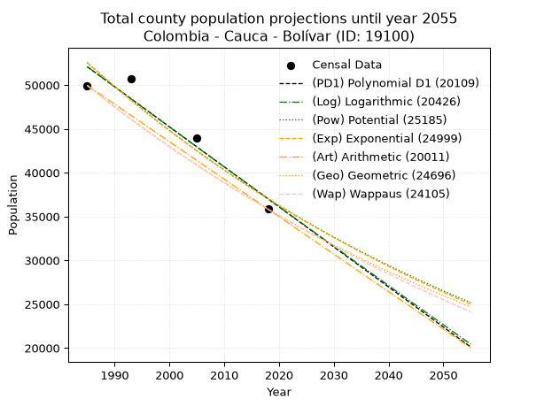
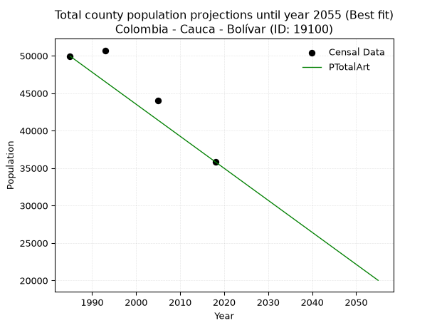
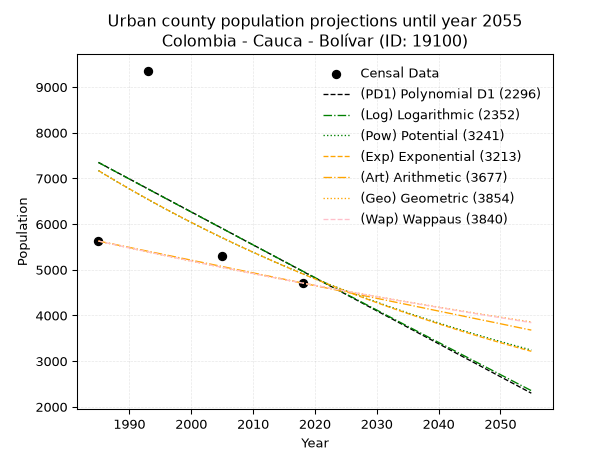
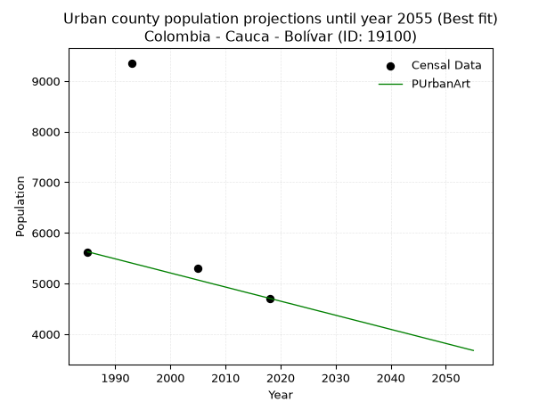
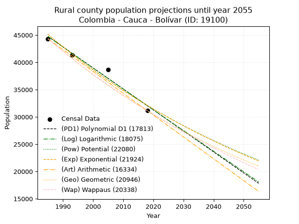
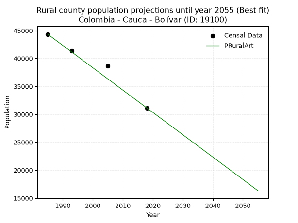

<div align="center">


</div>

# _“Population and Public Services Demand Projections (PPSD) until Year 2050 for Colombia - Cauca - Bolívar (ID: 19100)”_
Keywords: `population` `public-service` `projection` `lineal` `polynomial` `logarithmic` `potential` `exponential` `arithmetic` `geometric` `wappaus` `dane` `colombia` `south-america`

PPSD are analytical estimates used by governments and planners to anticipate future changes in population size, age distribution, and the resulting community needs for utilities, healthcare, education, and infrastructure as sizing future water treatment facilities, electrical grids, and road networks based on spatial growth.

> **General running parameters**: • app_version: _v20260806_. • Python version: _3.14.7_. • Pandas version: _3.0.5_. • NumPy version: _2.5.1_. • Creates, save and include plots into reports (create_plot): _False_. • Projection until year: _2050_. • Process polynomial degree 2 and up: _False_. • Process Wappaus: _True_. • Process Wappaus: _True_. • Set negative values to zero: _True_. • Set infinite values to zero: _True_. • Drop dataset notes: _True_. 
<div align="center">

Dynamic map: [:earth_americas:Google](http://maps.google.com/maps?q=1.837537603,-76.966215) [:earth_americas:OSM](https://www.openstreetmap.org/#map=18/1.837537603/-76.966215&layers=P) [:earth_americas:Bing](https://www.bing.com/maps?cp=1.837537603~-76.966215&lvl=18) [:earth_americas:Apple](https://maps.apple.com/frame?center=1.837537603%2C-76.966215&span=0.003%2C0.006)

</div>


<div align="center">

```geojson
{
  "type": "Feature",
  "geometry": {
    "type": "Point", 
    "coordinates": [-76.966215, 1.837537603]
  }, 
  "properties": {
    "Name": "Colombia - Cauca - Bolívar (ID: 19100)"
  }
}
```

</div>


## 0. Census Data (4 records)

Census data are official statistics collected by a government about the people and housing in a country. They usually include counts of total population, age, sex, race, income, education, and jobs.

📅Global census file: [Population.xlsx](../data/Population.xlsx)

| Source   |   Year |   CountryID | CountryName   |   StateID | StateName   |   CountyID | CountyName   |   PTotal |   PUrban |   PRural |
|:---------|-------:|------------:|:--------------|----------:|:------------|-----------:|:-------------|---------:|---------:|---------:|
| DANE     |   1985 |          57 | Colombia      |        19 | Cauca       |      19100 | Bolívar      |    49952 |     5626 |    44326 |
| DANE     |   1993 |          57 | Colombia      |        19 | Cauca       |      19100 | Bolívar      |    50724 |     9357 |    41367 |
| DANE     |   2005 |          57 | Colombia      |        19 | Cauca       |      19100 | Bolívar      |    43978 |     5296 |    38682 |
| DANE     |   2018 |          57 | Colombia      |        19 | Cauca       |      19100 | Bolívar      |    35837 |     4707 |    31130 |

> 🔥Some records could had specific notes about the registered values or the corresponding urban or rural distribution.

📅   [RUPS](https://www.datos.gov.co/Hacienda-y-Cr-dito-P-blico/Registro-nico-de-Prestadores-de-Servicios-P-blicos/4qkq-csdn/about_data) - Local public utility companies: [RUPS.csv](../data/RUPS.xlsx)

 | SERVICIO       | ESTADO    | NOMBRE                                                     | NIT         | DEPARTAMENTO_DOMICILIO   | MUNICIPIO_DOMICILIO   | DIRECCION         |   TELEFONO | EMAIL               | TIPO_PRESTADOR                             | CLASIFICACION                 |
|:---------------|:----------|:-----------------------------------------------------------|:------------|:-------------------------|:----------------------|:------------------|-----------:|:--------------------|:-------------------------------------------|:------------------------------|
| ACUEDUCTO      | OPERATIVA | ENTIDAD DESCENTRALIZADA TERRITORIAL MIXTA EMBOLIVAR SA ESP | 900177001-2 | CAUCA                    | BOLIVAR               | CARRERA 3 NO 6-04 |    8272548 | embolivar@gmail.com | SOCIEDADES (EMPRESA DE SERVICIOS PUBLICOS) | MENOR O IGUAL A 2500 USUARIOS |
| ALCANTARILLADO | OPERATIVA | ENTIDAD DESCENTRALIZADA TERRITORIAL MIXTA EMBOLIVAR SA ESP | 900177001-2 | CAUCA                    | BOLIVAR               | CARRERA 3 NO 6-04 |    8272548 | embolivar@gmail.com | SOCIEDADES (EMPRESA DE SERVICIOS PUBLICOS) | MENOR O IGUAL A 2500 USUARIOS |

## 1. Total

### 1.1. Coefficients and Parameters

* (PD1) Polynomial Deg 1: -456.8683259734991, 958973.6190284917 (lineal)
* (Log) Logarithmic: -913894.6489538794, 6991643.300190537
* (Pow) Potential: -21.232689472515027, 74.74105154995287
* (Exp) Exponential: -0.01061527421878487, 74438214456012.17
* (Art) Arithmetic: Year diff. 2018 - 1985 = 33, Population diff. 35837 - 49952 = -14115, Annual growth = -427.72727272727275
* (Geo) Geometric: Year diff. 2018 - 1985 = 33, Population diff. 35837 - 49952 = -14115, Annual growth % = -0.010012617377237465
* (Wap) Wappaus: i = -0.9971611109286103, Condition values only valid for < 200)

<sub>
Wappaus condition values: ['-0.00', '-1.00', '-1.99', '-2.99', '-3.99', '-4.99', '-5.98', '-6.98', '-7.98', '-8.97', '-9.97', '-10.97', '-11.97', '-12.96', '-13.96', '-14.96', '-15.95', '-16.95', '-17.95', '-18.95', '-19.94', '-20.94', '-21.94', '-22.93', '-23.93', '-24.93', '-25.93', '-26.92', '-27.92', '-28.92', '-29.91', '-30.91', '-31.91', '-32.91', '-33.90', '-34.90', '-35.90', '-36.89', '-37.89', '-38.89', '-39.89', '-40.88', '-41.88', '-42.88', '-43.88', '-44.87', '-45.87', '-46.87', '-47.86', '-48.86', '-49.86', '-50.86', '-51.85', '-52.85', '-53.85', '-54.84', '-55.84', '-56.84', '-57.84', '-58.83', '-59.83', '-60.83', '-61.82', '-62.82', '-63.82', '-64.82']
</sub>


### 1.2. Projected Dataset

|   Year |   CountyID |   PTotalPD1 |   PTotalLog |   PTotalPow |   PTotalExp |   PTotalArt |   PTotalGeo |   PTotalWap |
|-------:|-----------:|------------:|------------:|------------:|------------:|------------:|------------:|------------:|
|   1985 |      19100 |       52090 |       52099 |       52569 |       52558 |       49952 |       49952 |       49952 |
|   1986 |      19100 |       51633 |       51639 |       52009 |       52003 |       49524 |       49452 |       49456 |
|   1987 |      19100 |       51176 |       51179 |       51457 |       51454 |       49097 |       48957 |       48966 |
|   1988 |      19100 |       50719 |       50719 |       50910 |       50911 |       48669 |       48467 |       48480 |
|   1989 |      19100 |       50263 |       50260 |       50369 |       50373 |       48241 |       47981 |       47999 |
|   1990 |      19100 |       49806 |       49800 |       49834 |       49841 |       47813 |       47501 |       47522 |
|   1991 |      19100 |       49349 |       49341 |       49306 |       49315 |       47386 |       47025 |       47050 |
|   1992 |      19100 |       48892 |       48882 |       48783 |       48794 |       46958 |       46554 |       46583 |
|   1993 |      19100 |       48435 |       48423 |       48266 |       48279 |       46530 |       46088 |       46120 |
|   1994 |      19100 |       47978 |       47965 |       47754 |       47769 |       46102 |       45627 |       45662 |
|   1995 |      19100 |       47521 |       47507 |       47249 |       47265 |       45675 |       45170 |       45208 |
|   1996 |      19100 |       47064 |       47049 |       46748 |       46766 |       45247 |       44718 |       44758 |
|   1997 |      19100 |       46608 |       46591 |       46254 |       46272 |       44819 |       44270 |       44312 |
|   1998 |      19100 |       46151 |       46134 |       45765 |       45783 |       44392 |       43827 |       43871 |
|   1999 |      19100 |       45694 |       45676 |       45281 |       45300 |       43964 |       43388 |       43434 |
|   2000 |      19100 |       45237 |       45219 |       44803 |       44821 |       43536 |       42953 |       43000 |
|   2001 |      19100 |       44780 |       44762 |       44330 |       44348 |       43108 |       42523 |       42571 |
|   2002 |      19100 |       44323 |       44306 |       43862 |       43880 |       42681 |       42098 |       42146 |
|   2003 |      19100 |       43866 |       43849 |       43400 |       43417 |       42253 |       41676 |       41725 |
|   2004 |      19100 |       43409 |       43393 |       42942 |       42958 |       41825 |       41259 |       41307 |
|   2005 |      19100 |       42953 |       42937 |       42490 |       42505 |       41397 |       40846 |       40893 |
|   2006 |      19100 |       42496 |       42482 |       42042 |       42056 |       40970 |       40437 |       40483 |
|   2007 |      19100 |       42039 |       42026 |       41600 |       41612 |       40542 |       40032 |       40077 |
|   2008 |      19100 |       41582 |       41571 |       41162 |       41172 |       40114 |       39631 |       39674 |
|   2009 |      19100 |       41125 |       41116 |       40729 |       40738 |       39687 |       39234 |       39275 |
|   2010 |      19100 |       40668 |       40661 |       40301 |       40307 |       39259 |       38841 |       38880 |
|   2011 |      19100 |       40211 |       40207 |       39878 |       39882 |       38831 |       38452 |       38488 |
|   2012 |      19100 |       39755 |       39752 |       39459 |       39461 |       38403 |       38067 |       38099 |
|   2013 |      19100 |       39298 |       39298 |       39045 |       39044 |       37976 |       37686 |       37714 |
|   2014 |      19100 |       38841 |       38844 |       38635 |       38632 |       37548 |       37309 |       37332 |
|   2015 |      19100 |       38384 |       38391 |       38230 |       38224 |       37120 |       36935 |       36953 |
|   2016 |      19100 |       37927 |       37937 |       37829 |       37820 |       36692 |       36566 |       36578 |
|   2017 |      19100 |       37470 |       37484 |       37433 |       37421 |       36265 |       36199 |       36206 |
|   2018 |      19100 |       37013 |       37031 |       37041 |       37026 |       35837 |       35837 |       35837 |
|   2019 |      19100 |       36556 |       36578 |       36654 |       36635 |       35409 |       35478 |       35471 |
|   2020 |      19100 |       36100 |       36126 |       36270 |       36248 |       34982 |       35123 |       35109 |
|   2021 |      19100 |       35643 |       35673 |       35891 |       35865 |       34554 |       34771 |       34749 |
|   2022 |      19100 |       35186 |       35221 |       35516 |       35486 |       34126 |       34423 |       34393 |
|   2023 |      19100 |       34729 |       34769 |       35145 |       35112 |       33698 |       34078 |       34039 |
|   2024 |      19100 |       34272 |       34318 |       34778 |       34741 |       33271 |       33737 |       33688 |
|   2025 |      19100 |       33815 |       33866 |       34416 |       34374 |       32843 |       33399 |       33341 |
|   2026 |      19100 |       33358 |       33415 |       34057 |       34011 |       32415 |       33065 |       32996 |
|   2027 |      19100 |       32902 |       32964 |       33702 |       33652 |       31987 |       32734 |       32654 |
|   2028 |      19100 |       32445 |       32513 |       33351 |       33297 |       31560 |       32406 |       32315 |
|   2029 |      19100 |       31988 |       32063 |       33003 |       32945 |       31132 |       32082 |       31978 |
|   2030 |      19100 |       31531 |       31613 |       32660 |       32597 |       30704 |       31761 |       31645 |
|   2031 |      19100 |       31074 |       31163 |       32320 |       32253 |       30277 |       31443 |       31314 |
|   2032 |      19100 |       30617 |       30713 |       31984 |       31913 |       29849 |       31128 |       30986 |
|   2033 |      19100 |       30160 |       30263 |       31652 |       31576 |       29421 |       30816 |       30660 |
|   2034 |      19100 |       29703 |       29814 |       31323 |       31242 |       28993 |       30507 |       30337 |
|   2035 |      19100 |       29247 |       29364 |       30998 |       30912 |       28566 |       30202 |       30017 |
|   2036 |      19100 |       28790 |       28915 |       30676 |       30586 |       28138 |       29900 |       29699 |
|   2037 |      19100 |       28333 |       28467 |       30358 |       30263 |       27710 |       29600 |       29383 |
|   2038 |      19100 |       27876 |       28018 |       30043 |       29943 |       27282 |       29304 |       29070 |
|   2039 |      19100 |       27419 |       27570 |       29732 |       29627 |       26855 |       29010 |       28760 |
|   2040 |      19100 |       26962 |       27122 |       29424 |       29314 |       26427 |       28720 |       28452 |
|   2041 |      19100 |       26505 |       26674 |       29119 |       29005 |       25999 |       28432 |       28146 |
|   2042 |      19100 |       26048 |       26226 |       28818 |       28699 |       25572 |       28148 |       27843 |
|   2043 |      19100 |       25592 |       25779 |       28520 |       28395 |       25144 |       27866 |       27542 |
|   2044 |      19100 |       25135 |       25332 |       28225 |       28096 |       24716 |       27587 |       27244 |
|   2045 |      19100 |       24678 |       24885 |       27934 |       27799 |       24288 |       27311 |       26948 |
|   2046 |      19100 |       24221 |       24438 |       27645 |       27505 |       23861 |       27037 |       26654 |
|   2047 |      19100 |       23764 |       23991 |       27360 |       27215 |       23433 |       26767 |       26362 |
|   2048 |      19100 |       23307 |       23545 |       27078 |       26928 |       23005 |       26499 |       26072 |
|   2049 |      19100 |       22850 |       23099 |       26798 |       26643 |       22577 |       26233 |       25785 |
|   2050 |      19100 |       22394 |       22653 |       26522 |       26362 |       22150 |       25971 |       25500 |
<div align="center">

</img>

</div>


### 1.3. Best fit with absolute and relative error (%)

Relative error puts that difference into context by dividing the absolute error by the true value, creating a unitless ratio or percentage that shows the scale of the mistake.

Absolute and relative error

|   Year | Source   |   CountryID | CountryName   |   StateID | StateName   |   CountyID_x | CountyName   |   PTotal |   PUrban |   PRural |   CountyID_y |   PTotalPD1 |   PTotalLog |   PTotalPow |   PTotalExp |   PTotalArt |   PTotalGeo |   PTotalWap |   PTotalPD1AbsError |   PTotalLogAbsError |   PTotalPowAbsError |   PTotalExpAbsError |   PTotalArtAbsError |   PTotalGeoAbsError |   PTotalWapAbsError |   PTotalPD1RelError |   PTotalLogRelError |   PTotalPowRelError |   PTotalExpRelError |   PTotalArtRelError |   PTotalGeoRelError |   PTotalWapRelError |
|-------:|:---------|------------:|:--------------|----------:|:------------|-------------:|:-------------|---------:|---------:|---------:|-------------:|------------:|------------:|------------:|------------:|------------:|------------:|------------:|--------------------:|--------------------:|--------------------:|--------------------:|--------------------:|--------------------:|--------------------:|--------------------:|--------------------:|--------------------:|--------------------:|--------------------:|--------------------:|--------------------:|
|   1985 | DANE     |          57 | Colombia      |        19 | Cauca       |        19100 | Bolívar      |    49952 |     5626 |    44326 |        19100 |       52090 |       52099 |       52569 |       52558 |       49952 |       49952 |       49952 |                2138 |                2147 |                2617 |                2606 |                   0 |                   0 |                   0 |             4.28011 |             4.29813 |             5.23903 |             5.21701 |             0       |             0       |             0       |
|   1993 | DANE     |          57 | Colombia      |        19 | Cauca       |        19100 | Bolívar      |    50724 |     9357 |    41367 |        19100 |       48435 |       48423 |       48266 |       48279 |       46530 |       46088 |       46120 |                2289 |                2301 |                2458 |                2445 |                4194 |                4636 |                4604 |             4.51266 |             4.53631 |             4.84583 |             4.8202  |             8.26828 |             9.13966 |             9.07657 |
|   2005 | DANE     |          57 | Colombia      |        19 | Cauca       |        19100 | Bolívar      |    43978 |     5296 |    38682 |        19100 |       42953 |       42937 |       42490 |       42505 |       41397 |       40846 |       40893 |                1025 |                1041 |                1488 |                1473 |                2581 |                3132 |                3085 |             2.33071 |             2.36709 |             3.38351 |             3.3494  |             5.86884 |             7.12174 |             7.01487 |
|   2018 | DANE     |          57 | Colombia      |        19 | Cauca       |        19100 | Bolívar      |    35837 |     4707 |    31130 |        19100 |       37013 |       37031 |       37041 |       37026 |       35837 |       35837 |       35837 |                1176 |                1194 |                1204 |                1189 |                   0 |                   0 |                   0 |             3.28152 |             3.33175 |             3.35966 |             3.3178  |             0       |             0       |             0       |

Relative error mean

| Method    |   RelError | Best   |
|:----------|-----------:|:-------|
| PTotalPD1 |    3.60125 |        |
| PTotalLog |    3.63332 |        |
| PTotalPow |    4.20701 |        |
| PTotalExp |    4.1761  |        |
| PTotalArt |    3.53428 | True   |
| PTotalGeo |    4.06535 |        |
| PTotalWap |    4.02286 |        |

💙Best method: _**PTotalArt**_
<div align="center">

</img>

</div>


### 1.4. Fresh water supply demand in liters per capita per day (lpcd)

The fresh water supply demand typically ranges from 100 to 300 liters per capita per day (lpcd) for standard domestic and municipal planning, though absolute survival minimums set by the World Health Organization are as low as 7.5 to 20 liters per day, and total consumption in high-income nations can exceed 400 liters.

> `CZ`: Level in meters above the sea level (masl)<br> `WS`: Fresh water supply demand in liters per capita per day (lpcd or l/h/d)<br> `WSAll`: Zonal fresh water supply demand in liters per second (l/s)<br> `A`: Zonal area in square meters<br> `DP`: Population density (people/hectare or p/ha)

Reference values (RAS Colombia)

|    CZ |   WS |
|------:|-----:|
|  1000 |  120 |
|  2000 |  130 |
| 99999 |  140 |

County shapefile geometry properties and water supply values

|   CountyID |      ATotal |   CZTotal |   WSTotal |
|-----------:|------------:|----------:|----------:|
|      19100 | 7.98347e+08 |   1655.17 |       130 |

Projected values for best method: PTotalArt

|   CountyID |   Year |   PTotalArt |   DPTotal |   WSTotal |   WSTotalAll |
|-----------:|-------:|------------:|----------:|----------:|-------------:|
|      19100 |   1985 |       49952 |      0.63 |       130 |      75.1593 |
|      19100 |   1986 |       49524 |      0.62 |       130 |      74.5153 |
|      19100 |   1987 |       49097 |      0.61 |       130 |      73.8728 |
|      19100 |   1988 |       48669 |      0.61 |       130 |      73.2288 |
|      19100 |   1989 |       48241 |      0.6  |       130 |      72.5848 |
|      19100 |   1990 |       47813 |      0.6  |       130 |      71.9409 |
|      19100 |   1991 |       47386 |      0.59 |       130 |      71.2984 |
|      19100 |   1992 |       46958 |      0.59 |       130 |      70.6544 |
|      19100 |   1993 |       46530 |      0.58 |       130 |      70.0104 |
|      19100 |   1994 |       46102 |      0.58 |       130 |      69.3664 |
|      19100 |   1995 |       45675 |      0.57 |       130 |      68.724  |
|      19100 |   1996 |       45247 |      0.57 |       130 |      68.08   |
|      19100 |   1997 |       44819 |      0.56 |       130 |      67.436  |
|      19100 |   1998 |       44392 |      0.56 |       130 |      66.7935 |
|      19100 |   1999 |       43964 |      0.55 |       130 |      66.1495 |
|      19100 |   2000 |       43536 |      0.55 |       130 |      65.5056 |
|      19100 |   2001 |       43108 |      0.54 |       130 |      64.8616 |
|      19100 |   2002 |       42681 |      0.53 |       130 |      64.2191 |
|      19100 |   2003 |       42253 |      0.53 |       130 |      63.5751 |
|      19100 |   2004 |       41825 |      0.52 |       130 |      62.9311 |
|      19100 |   2005 |       41397 |      0.52 |       130 |      62.2872 |
|      19100 |   2006 |       40970 |      0.51 |       130 |      61.6447 |
|      19100 |   2007 |       40542 |      0.51 |       130 |      61.0007 |
|      19100 |   2008 |       40114 |      0.5  |       130 |      60.3567 |
|      19100 |   2009 |       39687 |      0.5  |       130 |      59.7142 |
|      19100 |   2010 |       39259 |      0.49 |       130 |      59.0703 |
|      19100 |   2011 |       38831 |      0.49 |       130 |      58.4263 |
|      19100 |   2012 |       38403 |      0.48 |       130 |      57.7823 |
|      19100 |   2013 |       37976 |      0.48 |       130 |      57.1398 |
|      19100 |   2014 |       37548 |      0.47 |       130 |      56.4958 |
|      19100 |   2015 |       37120 |      0.46 |       130 |      55.8519 |
|      19100 |   2016 |       36692 |      0.46 |       130 |      55.2079 |
|      19100 |   2017 |       36265 |      0.45 |       130 |      54.5654 |
|      19100 |   2018 |       35837 |      0.45 |       130 |      53.9214 |
|      19100 |   2019 |       35409 |      0.44 |       130 |      53.2774 |
|      19100 |   2020 |       34982 |      0.44 |       130 |      52.635  |
|      19100 |   2021 |       34554 |      0.43 |       130 |      51.991  |
|      19100 |   2022 |       34126 |      0.43 |       130 |      51.347  |
|      19100 |   2023 |       33698 |      0.42 |       130 |      50.703  |
|      19100 |   2024 |       33271 |      0.42 |       130 |      50.0605 |
|      19100 |   2025 |       32843 |      0.41 |       130 |      49.4166 |
|      19100 |   2026 |       32415 |      0.41 |       130 |      48.7726 |
|      19100 |   2027 |       31987 |      0.4  |       130 |      48.1286 |
|      19100 |   2028 |       31560 |      0.4  |       130 |      47.4861 |
|      19100 |   2029 |       31132 |      0.39 |       130 |      46.8421 |
|      19100 |   2030 |       30704 |      0.38 |       130 |      46.1981 |
|      19100 |   2031 |       30277 |      0.38 |       130 |      45.5557 |
|      19100 |   2032 |       29849 |      0.37 |       130 |      44.9117 |
|      19100 |   2033 |       29421 |      0.37 |       130 |      44.2677 |
|      19100 |   2034 |       28993 |      0.36 |       130 |      43.6237 |
|      19100 |   2035 |       28566 |      0.36 |       130 |      42.9813 |
|      19100 |   2036 |       28138 |      0.35 |       130 |      42.3373 |
|      19100 |   2037 |       27710 |      0.35 |       130 |      41.6933 |
|      19100 |   2038 |       27282 |      0.34 |       130 |      41.0493 |
|      19100 |   2039 |       26855 |      0.34 |       130 |      40.4068 |
|      19100 |   2040 |       26427 |      0.33 |       130 |      39.7628 |
|      19100 |   2041 |       25999 |      0.33 |       130 |      39.1189 |
|      19100 |   2042 |       25572 |      0.32 |       130 |      38.4764 |
|      19100 |   2043 |       25144 |      0.31 |       130 |      37.8324 |
|      19100 |   2044 |       24716 |      0.31 |       130 |      37.1884 |
|      19100 |   2045 |       24288 |      0.3  |       130 |      36.5444 |
|      19100 |   2046 |       23861 |      0.3  |       130 |      35.902  |
|      19100 |   2047 |       23433 |      0.29 |       130 |      35.258  |
|      19100 |   2048 |       23005 |      0.29 |       130 |      34.614  |
|      19100 |   2049 |       22577 |      0.28 |       130 |      33.97   |
|      19100 |   2050 |       22150 |      0.28 |       130 |      33.3275 |

## 2. Urban

### 2.1. Coefficients and Parameters

* (PD1) Polynomial Deg 1: -72.14692894419852, 150558.3946206331 (lineal)
* (Log) Logarithmic: -144120.81323787963, 1101709.9563328389
* (Pow) Potential: -22.91019063626056, 79.4077838671958
* (Exp) Exponential: -0.011466981007963907, 55061152355790.89
* (Art) Arithmetic: Year diff. 2018 - 1985 = 33, Population diff. 4707 - 5626 = -919, Annual growth = -27.848484848484848
* (Geo) Geometric: Year diff. 2018 - 1985 = 33, Population diff. 4707 - 5626 = -919, Annual growth % = -0.005389905316326993
* (Wap) Wappaus: i = -0.5390203203035875, Condition values only valid for < 200)

<sub>
Wappaus condition values: ['-0.00', '-0.54', '-1.08', '-1.62', '-2.16', '-2.70', '-3.23', '-3.77', '-4.31', '-4.85', '-5.39', '-5.93', '-6.47', '-7.01', '-7.55', '-8.09', '-8.62', '-9.16', '-9.70', '-10.24', '-10.78', '-11.32', '-11.86', '-12.40', '-12.94', '-13.48', '-14.01', '-14.55', '-15.09', '-15.63', '-16.17', '-16.71', '-17.25', '-17.79', '-18.33', '-18.87', '-19.40', '-19.94', '-20.48', '-21.02', '-21.56', '-22.10', '-22.64', '-23.18', '-23.72', '-24.26', '-24.79', '-25.33', '-25.87', '-26.41', '-26.95', '-27.49', '-28.03', '-28.57', '-29.11', '-29.65', '-30.19', '-30.72', '-31.26', '-31.80', '-32.34', '-32.88', '-33.42', '-33.96', '-34.50', '-35.04']
</sub>


### 2.2. Projected Dataset

|   Year |   CountyID |   PUrbanPD1 |   PUrbanLog |   PUrbanPow |   PUrbanExp |   PUrbanArt |   PUrbanGeo |   PUrbanWap |
|-------:|-----------:|------------:|------------:|------------:|------------:|------------:|------------:|------------:|
|   1985 |      19100 |        7347 |        7347 |        7169 |        7169 |        5626 |        5626 |        5626 |
|   1986 |      19100 |        7275 |        7274 |        7087 |        7087 |        5598 |        5596 |        5596 |
|   1987 |      19100 |        7202 |        7202 |        7006 |        7006 |        5570 |        5566 |        5566 |
|   1988 |      19100 |        7130 |        7129 |        6925 |        6926 |        5542 |        5536 |        5536 |
|   1989 |      19100 |        7058 |        7057 |        6846 |        6848 |        5515 |        5506 |        5506 |
|   1990 |      19100 |        6986 |        6984 |        6768 |        6769 |        5487 |        5476 |        5476 |
|   1991 |      19100 |        6914 |        6912 |        6690 |        6692 |        5459 |        5446 |        5447 |
|   1992 |      19100 |        6842 |        6839 |        6614 |        6616 |        5431 |        5417 |        5418 |
|   1993 |      19100 |        6770 |        6767 |        6538 |        6541 |        5403 |        5388 |        5389 |
|   1994 |      19100 |        6697 |        6695 |        6463 |        6466 |        5375 |        5359 |        5360 |
|   1995 |      19100 |        6625 |        6622 |        6389 |        6392 |        5348 |        5330 |        5331 |
|   1996 |      19100 |        6553 |        6550 |        6317 |        6319 |        5320 |        5301 |        5302 |
|   1997 |      19100 |        6481 |        6478 |        6244 |        6247 |        5292 |        5273 |        5273 |
|   1998 |      19100 |        6409 |        6406 |        6173 |        6176 |        5264 |        5244 |        5245 |
|   1999 |      19100 |        6337 |        6334 |        6103 |        6106 |        5236 |        5216 |        5217 |
|   2000 |      19100 |        6265 |        6262 |        6033 |        6036 |        5208 |        5188 |        5189 |
|   2001 |      19100 |        6192 |        6190 |        5965 |        5967 |        5180 |        5160 |        5161 |
|   2002 |      19100 |        6120 |        6118 |        5897 |        5899 |        5153 |        5132 |        5133 |
|   2003 |      19100 |        6048 |        6046 |        5830 |        5832 |        5125 |        5104 |        5105 |
|   2004 |      19100 |        5976 |        5974 |        5763 |        5765 |        5097 |        5077 |        5078 |
|   2005 |      19100 |        5904 |        5902 |        5698 |        5700 |        5069 |        5050 |        5051 |
|   2006 |      19100 |        5832 |        5830 |        5633 |        5635 |        5041 |        5022 |        5023 |
|   2007 |      19100 |        5760 |        5758 |        5569 |        5570 |        5013 |        4995 |        4996 |
|   2008 |      19100 |        5687 |        5686 |        5506 |        5507 |        4985 |        4968 |        4969 |
|   2009 |      19100 |        5615 |        5615 |        5444 |        5444 |        4958 |        4942 |        4942 |
|   2010 |      19100 |        5543 |        5543 |        5382 |        5382 |        4930 |        4915 |        4916 |
|   2011 |      19100 |        5471 |        5471 |        5321 |        5321 |        4902 |        4888 |        4889 |
|   2012 |      19100 |        5399 |        5400 |        5261 |        5260 |        4874 |        4862 |        4863 |
|   2013 |      19100 |        5327 |        5328 |        5201 |        5200 |        4846 |        4836 |        4836 |
|   2014 |      19100 |        5254 |        5256 |        5142 |        5141 |        4818 |        4810 |        4810 |
|   2015 |      19100 |        5182 |        5185 |        5084 |        5082 |        4791 |        4784 |        4784 |
|   2016 |      19100 |        5110 |        5113 |        5027 |        5024 |        4763 |        4758 |        4758 |
|   2017 |      19100 |        5038 |        5042 |        4970 |        4967 |        4735 |        4733 |        4733 |
|   2018 |      19100 |        4966 |        4970 |        4914 |        4910 |        4707 |        4707 |        4707 |
|   2019 |      19100 |        4894 |        4899 |        4858 |        4854 |        4679 |        4682 |        4681 |
|   2020 |      19100 |        4822 |        4828 |        4803 |        4799 |        4651 |        4656 |        4656 |
|   2021 |      19100 |        4749 |        4756 |        4749 |        4744 |        4623 |        4631 |        4631 |
|   2022 |      19100 |        4677 |        4685 |        4696 |        4690 |        4596 |        4606 |        4606 |
|   2023 |      19100 |        4605 |        4614 |        4643 |        4637 |        4568 |        4582 |        4581 |
|   2024 |      19100 |        4533 |        4543 |        4591 |        4584 |        4540 |        4557 |        4556 |
|   2025 |      19100 |        4461 |        4471 |        4539 |        4532 |        4512 |        4532 |        4531 |
|   2026 |      19100 |        4389 |        4400 |        4488 |        4480 |        4484 |        4508 |        4506 |
|   2027 |      19100 |        4317 |        4329 |        4437 |        4429 |        4456 |        4484 |        4482 |
|   2028 |      19100 |        4244 |        4258 |        4388 |        4378 |        4429 |        4459 |        4457 |
|   2029 |      19100 |        4172 |        4187 |        4338 |        4328 |        4401 |        4435 |        4433 |
|   2030 |      19100 |        4100 |        4116 |        4290 |        4279 |        4373 |        4411 |        4409 |
|   2031 |      19100 |        4028 |        4045 |        4241 |        4230 |        4345 |        4388 |        4385 |
|   2032 |      19100 |        3956 |        3974 |        4194 |        4182 |        4317 |        4364 |        4361 |
|   2033 |      19100 |        3884 |        3903 |        4147 |        4134 |        4289 |        4340 |        4337 |
|   2034 |      19100 |        3812 |        3832 |        4100 |        4087 |        4261 |        4317 |        4313 |
|   2035 |      19100 |        3739 |        3761 |        4055 |        4041 |        4234 |        4294 |        4290 |
|   2036 |      19100 |        3667 |        3691 |        4009 |        3995 |        4206 |        4271 |        4266 |
|   2037 |      19100 |        3595 |        3620 |        3964 |        3949 |        4178 |        4248 |        4243 |
|   2038 |      19100 |        3523 |        3549 |        3920 |        3904 |        4150 |        4225 |        4220 |
|   2039 |      19100 |        3451 |        3478 |        3876 |        3859 |        4122 |        4202 |        4196 |
|   2040 |      19100 |        3379 |        3408 |        3833 |        3815 |        4094 |        4179 |        4173 |
|   2041 |      19100 |        3307 |        3337 |        3790 |        3772 |        4066 |        4157 |        4150 |
|   2042 |      19100 |        3234 |        3267 |        3748 |        3729 |        4039 |        4134 |        4128 |
|   2043 |      19100 |        3162 |        3196 |        3706 |        3686 |        4011 |        4112 |        4105 |
|   2044 |      19100 |        3090 |        3125 |        3665 |        3644 |        3983 |        4090 |        4082 |
|   2045 |      19100 |        3018 |        3055 |        3624 |        3603 |        3955 |        4068 |        4060 |
|   2046 |      19100 |        2946 |        2984 |        3583 |        3562 |        3927 |        4046 |        4037 |
|   2047 |      19100 |        2874 |        2914 |        3544 |        3521 |        3899 |        4024 |        4015 |
|   2048 |      19100 |        2801 |        2844 |        3504 |        3481 |        3872 |        4002 |        3993 |
|   2049 |      19100 |        2729 |        2773 |        3465 |        3441 |        3844 |        3981 |        3971 |
|   2050 |      19100 |        2657 |        2703 |        3427 |        3402 |        3816 |        3959 |        3949 |
<div align="center">

</img>

</div>


### 2.3. Best fit with absolute and relative error (%)

Relative error puts that difference into context by dividing the absolute error by the true value, creating a unitless ratio or percentage that shows the scale of the mistake.

Absolute and relative error

|   Year | Source   |   CountryID | CountryName   |   StateID | StateName   |   CountyID_x | CountyName   |   PTotal |   PUrban |   PRural |   CountyID_y |   PUrbanPD1 |   PUrbanLog |   PUrbanPow |   PUrbanExp |   PUrbanArt |   PUrbanGeo |   PUrbanWap |   PUrbanPD1AbsError |   PUrbanLogAbsError |   PUrbanPowAbsError |   PUrbanExpAbsError |   PUrbanArtAbsError |   PUrbanGeoAbsError |   PUrbanWapAbsError |   PUrbanPD1RelError |   PUrbanLogRelError |   PUrbanPowRelError |   PUrbanExpRelError |   PUrbanArtRelError |   PUrbanGeoRelError |   PUrbanWapRelError |
|-------:|:---------|------------:|:--------------|----------:|:------------|-------------:|:-------------|---------:|---------:|---------:|-------------:|------------:|------------:|------------:|------------:|------------:|------------:|------------:|--------------------:|--------------------:|--------------------:|--------------------:|--------------------:|--------------------:|--------------------:|--------------------:|--------------------:|--------------------:|--------------------:|--------------------:|--------------------:|--------------------:|
|   1985 | DANE     |          57 | Colombia      |        19 | Cauca       |        19100 | Bolívar      |    49952 |     5626 |    44326 |        19100 |        7347 |        7347 |        7169 |        7169 |        5626 |        5626 |        5626 |                1721 |                1721 |                1543 |                1543 |                   0 |                   0 |                   0 |            30.5901  |            30.5901  |            27.4262  |            27.4262  |             0       |             0       |             0       |
|   1993 | DANE     |          57 | Colombia      |        19 | Cauca       |        19100 | Bolívar      |    50724 |     9357 |    41367 |        19100 |        6770 |        6767 |        6538 |        6541 |        5403 |        5388 |        5389 |                2587 |                2590 |                2819 |                2816 |                3954 |                3969 |                3968 |            27.6478  |            27.6798  |            30.1272  |            30.0951  |            42.2571  |            42.4174  |            42.4068  |
|   2005 | DANE     |          57 | Colombia      |        19 | Cauca       |        19100 | Bolívar      |    43978 |     5296 |    38682 |        19100 |        5904 |        5902 |        5698 |        5700 |        5069 |        5050 |        5051 |                 608 |                 606 |                 402 |                 404 |                 227 |                 246 |                 245 |            11.4804  |            11.4426  |             7.59063 |             7.6284  |             4.28625 |             4.64502 |             4.62613 |
|   2018 | DANE     |          57 | Colombia      |        19 | Cauca       |        19100 | Bolívar      |    35837 |     4707 |    31130 |        19100 |        4966 |        4970 |        4914 |        4910 |        4707 |        4707 |        4707 |                 259 |                 263 |                 207 |                 203 |                   0 |                   0 |                   0 |             5.50244 |             5.58742 |             4.39771 |             4.31273 |             0       |             0       |             0       |

Relative error mean

| Method    |   RelError | Best   |
|:----------|-----------:|:-------|
| PUrbanPD1 |    18.8052 |        |
| PUrbanLog |    18.825  |        |
| PUrbanPow |    17.3854 |        |
| PUrbanExp |    17.3656 |        |
| PUrbanArt |    11.6358 | True   |
| PUrbanGeo |    11.7656 |        |
| PUrbanWap |    11.7582 |        |

💙Best method: _**PUrbanArt**_
<div align="center">

</img>

</div>


### 2.4. Fresh water supply demand in liters per capita per day (lpcd)

The fresh water supply demand typically ranges from 100 to 300 liters per capita per day (lpcd) for standard domestic and municipal planning, though absolute survival minimums set by the World Health Organization are as low as 7.5 to 20 liters per day, and total consumption in high-income nations can exceed 400 liters.

> `CZ`: Level in meters above the sea level (masl)<br> `WS`: Fresh water supply demand in liters per capita per day (lpcd or l/h/d)<br> `WSAll`: Zonal fresh water supply demand in liters per second (l/s)<br> `A`: Zonal area in square meters<br> `DP`: Population density (people/hectare or p/ha)

Reference values (RAS Colombia)

|    CZ |   WS |
|------:|-----:|
|  1000 |  120 |
|  2000 |  130 |
| 99999 |  140 |

County shapefile geometry properties and water supply values

|   CountyID |   AUrban |   CZUrban |   WSUrban |
|-----------:|---------:|----------:|----------:|
|      19100 |   847858 |   1719.81 |       130 |

Projected values for best method: PUrbanArt

|   CountyID |   Year |   PUrbanArt |   DPUrban |   WSUrban |   WSUrbanAll |
|-----------:|-------:|------------:|----------:|----------:|-------------:|
|      19100 |   1985 |        5626 |     66.36 |       130 |      8.46505 |
|      19100 |   1986 |        5598 |     66.03 |       130 |      8.42292 |
|      19100 |   1987 |        5570 |     65.7  |       130 |      8.38079 |
|      19100 |   1988 |        5542 |     65.36 |       130 |      8.33866 |
|      19100 |   1989 |        5515 |     65.05 |       130 |      8.29803 |
|      19100 |   1990 |        5487 |     64.72 |       130 |      8.2559  |
|      19100 |   1991 |        5459 |     64.39 |       130 |      8.21377 |
|      19100 |   1992 |        5431 |     64.06 |       130 |      8.17164 |
|      19100 |   1993 |        5403 |     63.73 |       130 |      8.12951 |
|      19100 |   1994 |        5375 |     63.4  |       130 |      8.08738 |
|      19100 |   1995 |        5348 |     63.08 |       130 |      8.04676 |
|      19100 |   1996 |        5320 |     62.75 |       130 |      8.00463 |
|      19100 |   1997 |        5292 |     62.42 |       130 |      7.9625  |
|      19100 |   1998 |        5264 |     62.09 |       130 |      7.92037 |
|      19100 |   1999 |        5236 |     61.76 |       130 |      7.87824 |
|      19100 |   2000 |        5208 |     61.43 |       130 |      7.83611 |
|      19100 |   2001 |        5180 |     61.1  |       130 |      7.79398 |
|      19100 |   2002 |        5153 |     60.78 |       130 |      7.75336 |
|      19100 |   2003 |        5125 |     60.45 |       130 |      7.71123 |
|      19100 |   2004 |        5097 |     60.12 |       130 |      7.6691  |
|      19100 |   2005 |        5069 |     59.79 |       130 |      7.62697 |
|      19100 |   2006 |        5041 |     59.46 |       130 |      7.58484 |
|      19100 |   2007 |        5013 |     59.13 |       130 |      7.54271 |
|      19100 |   2008 |        4985 |     58.8  |       130 |      7.50058 |
|      19100 |   2009 |        4958 |     58.48 |       130 |      7.45995 |
|      19100 |   2010 |        4930 |     58.15 |       130 |      7.41782 |
|      19100 |   2011 |        4902 |     57.82 |       130 |      7.37569 |
|      19100 |   2012 |        4874 |     57.49 |       130 |      7.33356 |
|      19100 |   2013 |        4846 |     57.16 |       130 |      7.29144 |
|      19100 |   2014 |        4818 |     56.83 |       130 |      7.24931 |
|      19100 |   2015 |        4791 |     56.51 |       130 |      7.20868 |
|      19100 |   2016 |        4763 |     56.18 |       130 |      7.16655 |
|      19100 |   2017 |        4735 |     55.85 |       130 |      7.12442 |
|      19100 |   2018 |        4707 |     55.52 |       130 |      7.08229 |
|      19100 |   2019 |        4679 |     55.19 |       130 |      7.04016 |
|      19100 |   2020 |        4651 |     54.86 |       130 |      6.99803 |
|      19100 |   2021 |        4623 |     54.53 |       130 |      6.9559  |
|      19100 |   2022 |        4596 |     54.21 |       130 |      6.91528 |
|      19100 |   2023 |        4568 |     53.88 |       130 |      6.87315 |
|      19100 |   2024 |        4540 |     53.55 |       130 |      6.83102 |
|      19100 |   2025 |        4512 |     53.22 |       130 |      6.78889 |
|      19100 |   2026 |        4484 |     52.89 |       130 |      6.74676 |
|      19100 |   2027 |        4456 |     52.56 |       130 |      6.70463 |
|      19100 |   2028 |        4429 |     52.24 |       130 |      6.664   |
|      19100 |   2029 |        4401 |     51.91 |       130 |      6.62188 |
|      19100 |   2030 |        4373 |     51.58 |       130 |      6.57975 |
|      19100 |   2031 |        4345 |     51.25 |       130 |      6.53762 |
|      19100 |   2032 |        4317 |     50.92 |       130 |      6.49549 |
|      19100 |   2033 |        4289 |     50.59 |       130 |      6.45336 |
|      19100 |   2034 |        4261 |     50.26 |       130 |      6.41123 |
|      19100 |   2035 |        4234 |     49.94 |       130 |      6.3706  |
|      19100 |   2036 |        4206 |     49.61 |       130 |      6.32847 |
|      19100 |   2037 |        4178 |     49.28 |       130 |      6.28634 |
|      19100 |   2038 |        4150 |     48.95 |       130 |      6.24421 |
|      19100 |   2039 |        4122 |     48.62 |       130 |      6.20208 |
|      19100 |   2040 |        4094 |     48.29 |       130 |      6.15995 |
|      19100 |   2041 |        4066 |     47.96 |       130 |      6.11782 |
|      19100 |   2042 |        4039 |     47.64 |       130 |      6.0772  |
|      19100 |   2043 |        4011 |     47.31 |       130 |      6.03507 |
|      19100 |   2044 |        3983 |     46.98 |       130 |      5.99294 |
|      19100 |   2045 |        3955 |     46.65 |       130 |      5.95081 |
|      19100 |   2046 |        3927 |     46.32 |       130 |      5.90868 |
|      19100 |   2047 |        3899 |     45.99 |       130 |      5.86655 |
|      19100 |   2048 |        3872 |     45.67 |       130 |      5.82593 |
|      19100 |   2049 |        3844 |     45.34 |       130 |      5.7838  |
|      19100 |   2050 |        3816 |     45.01 |       130 |      5.74167 |

## 3. Rural

### 3.1. Coefficients and Parameters

* (PD1) Polynomial Deg 1: -384.7213970293004, 808415.2244078581 (lineal)
* (Log) Logarithmic: -769773.835716001, 5889933.343857707
* (Pow) Potential: -20.621093747739312, 72.65779445898833
* (Exp) Exponential: -0.010307327380616587, 34669698542325.254
* (Art) Arithmetic: Year diff. 2018 - 1985 = 33, Population diff. 31130 - 44326 = -13196, Annual growth = -399.8787878787879
* (Geo) Geometric: Year diff. 2018 - 1985 = 33, Population diff. 31130 - 44326 = -13196, Annual growth % = -0.010651935590695771
* (Wap) Wappaus: i = -1.0598992469221478, Condition values only valid for < 200)

<sub>
Wappaus condition values: ['-0.00', '-1.06', '-2.12', '-3.18', '-4.24', '-5.30', '-6.36', '-7.42', '-8.48', '-9.54', '-10.60', '-11.66', '-12.72', '-13.78', '-14.84', '-15.90', '-16.96', '-18.02', '-19.08', '-20.14', '-21.20', '-22.26', '-23.32', '-24.38', '-25.44', '-26.50', '-27.56', '-28.62', '-29.68', '-30.74', '-31.80', '-32.86', '-33.92', '-34.98', '-36.04', '-37.10', '-38.16', '-39.22', '-40.28', '-41.34', '-42.40', '-43.46', '-44.52', '-45.58', '-46.64', '-47.70', '-48.76', '-49.82', '-50.88', '-51.94', '-52.99', '-54.05', '-55.11', '-56.17', '-57.23', '-58.29', '-59.35', '-60.41', '-61.47', '-62.53', '-63.59', '-64.65', '-65.71', '-66.77', '-67.83', '-68.89']
</sub>


### 3.2. Projected Dataset

|   Year |   CountyID |   PRuralPD1 |   PRuralLog |   PRuralPow |   PRuralExp |   PRuralArt |   PRuralGeo |   PRuralWap |
|-------:|-----------:|------------:|------------:|------------:|------------:|------------:|------------:|------------:|
|   1985 |      19100 |       44743 |       44753 |       45120 |       45109 |       44326 |       44326 |       44326 |
|   1986 |      19100 |       44359 |       44365 |       44653 |       44647 |       43926 |       43854 |       43859 |
|   1987 |      19100 |       43974 |       43977 |       44192 |       44189 |       43526 |       43387 |       43396 |
|   1988 |      19100 |       43589 |       43590 |       43736 |       43736 |       43126 |       42925 |       42939 |
|   1989 |      19100 |       43204 |       43203 |       43285 |       43287 |       42726 |       42467 |       42486 |
|   1990 |      19100 |       42820 |       42816 |       42839 |       42843 |       42327 |       42015 |       42038 |
|   1991 |      19100 |       42435 |       42429 |       42397 |       42404 |       41927 |       41567 |       41594 |
|   1992 |      19100 |       42050 |       42043 |       41960 |       41969 |       41527 |       41125 |       41155 |
|   1993 |      19100 |       41665 |       41656 |       41528 |       41539 |       41127 |       40687 |       40720 |
|   1994 |      19100 |       41281 |       41270 |       41101 |       41113 |       40727 |       40253 |       40290 |
|   1995 |      19100 |       40896 |       40884 |       40678 |       40691 |       40327 |       39824 |       39864 |
|   1996 |      19100 |       40511 |       40499 |       40260 |       40274 |       39927 |       39400 |       39443 |
|   1997 |      19100 |       40127 |       40113 |       39846 |       39861 |       39527 |       38981 |       39025 |
|   1998 |      19100 |       39742 |       39728 |       39437 |       39452 |       39128 |       38565 |       38612 |
|   1999 |      19100 |       39357 |       39342 |       39032 |       39048 |       38728 |       38155 |       38203 |
|   2000 |      19100 |       38972 |       38958 |       38632 |       38647 |       38328 |       37748 |       37798 |
|   2001 |      19100 |       38588 |       38573 |       38236 |       38251 |       37928 |       37346 |       37397 |
|   2002 |      19100 |       38203 |       38188 |       37844 |       37859 |       37528 |       36948 |       36999 |
|   2003 |      19100 |       37818 |       37804 |       37456 |       37471 |       37128 |       36555 |       36606 |
|   2004 |      19100 |       37434 |       37419 |       37073 |       37086 |       36728 |       36165 |       36216 |
|   2005 |      19100 |       37049 |       37035 |       36693 |       36706 |       36328 |       35780 |       35830 |
|   2006 |      19100 |       36664 |       36652 |       36318 |       36330 |       35929 |       35399 |       35448 |
|   2007 |      19100 |       36279 |       36268 |       35946 |       35957 |       35529 |       35022 |       35069 |
|   2008 |      19100 |       35895 |       35885 |       35579 |       35588 |       35129 |       34649 |       34694 |
|   2009 |      19100 |       35510 |       35501 |       35216 |       35223 |       34729 |       34280 |       34323 |
|   2010 |      19100 |       35125 |       35118 |       34856 |       34862 |       34329 |       33915 |       33955 |
|   2011 |      19100 |       34740 |       34735 |       34500 |       34505 |       33929 |       33553 |       33590 |
|   2012 |      19100 |       34356 |       34353 |       34149 |       34151 |       33529 |       33196 |       33229 |
|   2013 |      19100 |       33971 |       33970 |       33800 |       33801 |       33129 |       32842 |       32871 |
|   2014 |      19100 |       33586 |       33588 |       33456 |       33454 |       32730 |       32492 |       32516 |
|   2015 |      19100 |       33202 |       33206 |       33115 |       33111 |       32330 |       32146 |       32165 |
|   2016 |      19100 |       32817 |       32824 |       32778 |       32772 |       31930 |       31804 |       31817 |
|   2017 |      19100 |       32432 |       32442 |       32445 |       32435 |       31530 |       31465 |       31472 |
|   2018 |      19100 |       32047 |       32061 |       32115 |       32103 |       31130 |       31130 |       31130 |
|   2019 |      19100 |       31663 |       31679 |       31788 |       31774 |       30730 |       30798 |       30791 |
|   2020 |      19100 |       31278 |       31298 |       31465 |       31448 |       30330 |       30470 |       30455 |
|   2021 |      19100 |       30893 |       30917 |       31146 |       31125 |       29930 |       30146 |       30123 |
|   2022 |      19100 |       30509 |       30536 |       30830 |       30806 |       29530 |       29825 |       29793 |
|   2023 |      19100 |       30124 |       30156 |       30517 |       30490 |       29131 |       29507 |       29466 |
|   2024 |      19100 |       29739 |       29775 |       30208 |       30178 |       28731 |       29193 |       29142 |
|   2025 |      19100 |       29354 |       29395 |       29902 |       29868 |       28331 |       28882 |       28820 |
|   2026 |      19100 |       28970 |       29015 |       29599 |       29562 |       27931 |       28574 |       28502 |
|   2027 |      19100 |       28585 |       28635 |       29299 |       29259 |       27531 |       28270 |       28186 |
|   2028 |      19100 |       28200 |       28255 |       29003 |       28959 |       27131 |       27969 |       27873 |
|   2029 |      19100 |       27816 |       27876 |       28709 |       28662 |       26731 |       27671 |       27563 |
|   2030 |      19100 |       27431 |       27497 |       28419 |       28368 |       26331 |       27376 |       27255 |
|   2031 |      19100 |       27046 |       27118 |       28132 |       28077 |       25932 |       27084 |       26950 |
|   2032 |      19100 |       26661 |       26739 |       27848 |       27789 |       25532 |       26796 |       26648 |
|   2033 |      19100 |       26277 |       26360 |       27567 |       27504 |       25132 |       26510 |       26348 |
|   2034 |      19100 |       25892 |       25981 |       27288 |       27222 |       24732 |       26228 |       26051 |
|   2035 |      19100 |       25507 |       25603 |       27013 |       26943 |       24332 |       25949 |       25756 |
|   2036 |      19100 |       25122 |       25225 |       26741 |       26667 |       23932 |       25672 |       25464 |
|   2037 |      19100 |       24738 |       24847 |       26472 |       26393 |       23532 |       25399 |       25174 |
|   2038 |      19100 |       24353 |       24469 |       26205 |       26123 |       23132 |       25128 |       24886 |
|   2039 |      19100 |       23968 |       24091 |       25941 |       25855 |       22733 |       24861 |       24601 |
|   2040 |      19100 |       23584 |       23714 |       25680 |       25590 |       22333 |       24596 |       24318 |
|   2041 |      19100 |       23199 |       23337 |       25422 |       25327 |       21933 |       24334 |       24038 |
|   2042 |      19100 |       22814 |       22960 |       25167 |       25067 |       21533 |       24075 |       23759 |
|   2043 |      19100 |       22429 |       22583 |       24914 |       24810 |       21133 |       23818 |       23483 |
|   2044 |      19100 |       22045 |       22206 |       24664 |       24556 |       20733 |       23564 |       23210 |
|   2045 |      19100 |       21660 |       21830 |       24416 |       24304 |       20333 |       23313 |       22938 |
|   2046 |      19100 |       21275 |       21453 |       24171 |       24055 |       19933 |       23065 |       22669 |
|   2047 |      19100 |       20891 |       21077 |       23929 |       23808 |       19534 |       22819 |       22401 |
|   2048 |      19100 |       20506 |       20701 |       23689 |       23564 |       19134 |       22576 |       22136 |
|   2049 |      19100 |       20121 |       20325 |       23452 |       23322 |       18734 |       22336 |       21873 |
|   2050 |      19100 |       19736 |       19950 |       23217 |       23083 |       18334 |       22098 |       21612 |
<div align="center">

</img>

</div>


### 3.3. Best fit with absolute and relative error (%)

Relative error puts that difference into context by dividing the absolute error by the true value, creating a unitless ratio or percentage that shows the scale of the mistake.

Absolute and relative error

|   Year | Source   |   CountryID | CountryName   |   StateID | StateName   |   CountyID_x | CountyName   |   PTotal |   PUrban |   PRural |   CountyID_y |   PRuralPD1 |   PRuralLog |   PRuralPow |   PRuralExp |   PRuralArt |   PRuralGeo |   PRuralWap |   PRuralPD1AbsError |   PRuralLogAbsError |   PRuralPowAbsError |   PRuralExpAbsError |   PRuralArtAbsError |   PRuralGeoAbsError |   PRuralWapAbsError |   PRuralPD1RelError |   PRuralLogRelError |   PRuralPowRelError |   PRuralExpRelError |   PRuralArtRelError |   PRuralGeoRelError |   PRuralWapRelError |
|-------:|:---------|------------:|:--------------|----------:|:------------|-------------:|:-------------|---------:|---------:|---------:|-------------:|------------:|------------:|------------:|------------:|------------:|------------:|------------:|--------------------:|--------------------:|--------------------:|--------------------:|--------------------:|--------------------:|--------------------:|--------------------:|--------------------:|--------------------:|--------------------:|--------------------:|--------------------:|--------------------:|
|   1985 | DANE     |          57 | Colombia      |        19 | Cauca       |        19100 | Bolívar      |    49952 |     5626 |    44326 |        19100 |       44743 |       44753 |       45120 |       45109 |       44326 |       44326 |       44326 |                 417 |                 427 |                 794 |                 783 |                   0 |                   0 |                   0 |            0.940757 |            0.963317 |            1.79127  |             1.76646 |            0        |             0       |             0       |
|   1993 | DANE     |          57 | Colombia      |        19 | Cauca       |        19100 | Bolívar      |    50724 |     9357 |    41367 |        19100 |       41665 |       41656 |       41528 |       41539 |       41127 |       40687 |       40720 |                 298 |                 289 |                 161 |                 172 |                 240 |                 680 |                 647 |            0.720381 |            0.698625 |            0.389199 |             0.41579 |            0.580173 |             1.64382 |             1.56405 |
|   2005 | DANE     |          57 | Colombia      |        19 | Cauca       |        19100 | Bolívar      |    43978 |     5296 |    38682 |        19100 |       37049 |       37035 |       36693 |       36706 |       36328 |       35780 |       35830 |                1633 |                1647 |                1989 |                1976 |                2354 |                2902 |                2852 |            4.2216   |            4.25779  |            5.14193  |             5.10832 |            6.08552  |             7.5022  |             7.37294 |
|   2018 | DANE     |          57 | Colombia      |        19 | Cauca       |        19100 | Bolívar      |    35837 |     4707 |    31130 |        19100 |       32047 |       32061 |       32115 |       32103 |       31130 |       31130 |       31130 |                 917 |                 931 |                 985 |                 973 |                   0 |                   0 |                   0 |            2.94571  |            2.99068  |            3.16415  |             3.1256  |            0        |             0       |             0       |

Relative error mean

| Method    |   RelError | Best   |
|:----------|-----------:|:-------|
| PRuralPD1 |    2.20711 |        |
| PRuralLog |    2.22761 |        |
| PRuralPow |    2.62164 |        |
| PRuralExp |    2.60404 |        |
| PRuralArt |    1.66642 | True   |
| PRuralGeo |    2.2865  |        |
| PRuralWap |    2.23425 |        |

💙Best method: _**PRuralArt**_
<div align="center">

</img>

</div>


### 3.4. Fresh water supply demand in liters per capita per day (lpcd)

The fresh water supply demand typically ranges from 100 to 300 liters per capita per day (lpcd) for standard domestic and municipal planning, though absolute survival minimums set by the World Health Organization are as low as 7.5 to 20 liters per day, and total consumption in high-income nations can exceed 400 liters.

> `CZ`: Level in meters above the sea level (masl)<br> `WS`: Fresh water supply demand in liters per capita per day (lpcd or l/h/d)<br> `WSAll`: Zonal fresh water supply demand in liters per second (l/s)<br> `A`: Zonal area in square meters<br> `DP`: Population density (people/hectare or p/ha)

Reference values (RAS Colombia)

|    CZ |   WS |
|------:|-----:|
|  1000 |  120 |
|  2000 |  130 |
| 99999 |  140 |

County shapefile geometry properties and water supply values

|   CountyID |      ARural |   CZRural |   WSRural |
|-----------:|------------:|----------:|----------:|
|      19100 | 7.97499e+08 |    1655.1 |       130 |

Projected values for best method: PRuralArt

|   CountyID |   Year |   PRuralArt |   DPRural |   WSRural |   WSRuralAll |
|-----------:|-------:|------------:|----------:|----------:|-------------:|
|      19100 |   1985 |       44326 |      0.56 |       130 |      66.6942 |
|      19100 |   1986 |       43926 |      0.55 |       130 |      66.0924 |
|      19100 |   1987 |       43526 |      0.55 |       130 |      65.4905 |
|      19100 |   1988 |       43126 |      0.54 |       130 |      64.8887 |
|      19100 |   1989 |       42726 |      0.54 |       130 |      64.2868 |
|      19100 |   1990 |       42327 |      0.53 |       130 |      63.6865 |
|      19100 |   1991 |       41927 |      0.53 |       130 |      63.0846 |
|      19100 |   1992 |       41527 |      0.52 |       130 |      62.4828 |
|      19100 |   1993 |       41127 |      0.52 |       130 |      61.8809 |
|      19100 |   1994 |       40727 |      0.51 |       130 |      61.2791 |
|      19100 |   1995 |       40327 |      0.51 |       130 |      60.6772 |
|      19100 |   1996 |       39927 |      0.5  |       130 |      60.0753 |
|      19100 |   1997 |       39527 |      0.5  |       130 |      59.4735 |
|      19100 |   1998 |       39128 |      0.49 |       130 |      58.8731 |
|      19100 |   1999 |       38728 |      0.49 |       130 |      58.2713 |
|      19100 |   2000 |       38328 |      0.48 |       130 |      57.6694 |
|      19100 |   2001 |       37928 |      0.48 |       130 |      57.0676 |
|      19100 |   2002 |       37528 |      0.47 |       130 |      56.4657 |
|      19100 |   2003 |       37128 |      0.47 |       130 |      55.8639 |
|      19100 |   2004 |       36728 |      0.46 |       130 |      55.262  |
|      19100 |   2005 |       36328 |      0.46 |       130 |      54.6602 |
|      19100 |   2006 |       35929 |      0.45 |       130 |      54.0598 |
|      19100 |   2007 |       35529 |      0.45 |       130 |      53.458  |
|      19100 |   2008 |       35129 |      0.44 |       130 |      52.8561 |
|      19100 |   2009 |       34729 |      0.44 |       130 |      52.2543 |
|      19100 |   2010 |       34329 |      0.43 |       130 |      51.6524 |
|      19100 |   2011 |       33929 |      0.43 |       130 |      51.0506 |
|      19100 |   2012 |       33529 |      0.42 |       130 |      50.4487 |
|      19100 |   2013 |       33129 |      0.42 |       130 |      49.8469 |
|      19100 |   2014 |       32730 |      0.41 |       130 |      49.2465 |
|      19100 |   2015 |       32330 |      0.41 |       130 |      48.6447 |
|      19100 |   2016 |       31930 |      0.4  |       130 |      48.0428 |
|      19100 |   2017 |       31530 |      0.4  |       130 |      47.441  |
|      19100 |   2018 |       31130 |      0.39 |       130 |      46.8391 |
|      19100 |   2019 |       30730 |      0.39 |       130 |      46.2373 |
|      19100 |   2020 |       30330 |      0.38 |       130 |      45.6354 |
|      19100 |   2021 |       29930 |      0.38 |       130 |      45.0336 |
|      19100 |   2022 |       29530 |      0.37 |       130 |      44.4317 |
|      19100 |   2023 |       29131 |      0.37 |       130 |      43.8314 |
|      19100 |   2024 |       28731 |      0.36 |       130 |      43.2295 |
|      19100 |   2025 |       28331 |      0.36 |       130 |      42.6277 |
|      19100 |   2026 |       27931 |      0.35 |       130 |      42.0258 |
|      19100 |   2027 |       27531 |      0.35 |       130 |      41.424  |
|      19100 |   2028 |       27131 |      0.34 |       130 |      40.8221 |
|      19100 |   2029 |       26731 |      0.34 |       130 |      40.2203 |
|      19100 |   2030 |       26331 |      0.33 |       130 |      39.6184 |
|      19100 |   2031 |       25932 |      0.33 |       130 |      39.0181 |
|      19100 |   2032 |       25532 |      0.32 |       130 |      38.4162 |
|      19100 |   2033 |       25132 |      0.32 |       130 |      37.8144 |
|      19100 |   2034 |       24732 |      0.31 |       130 |      37.2125 |
|      19100 |   2035 |       24332 |      0.31 |       130 |      36.6106 |
|      19100 |   2036 |       23932 |      0.3  |       130 |      36.0088 |
|      19100 |   2037 |       23532 |      0.3  |       130 |      35.4069 |
|      19100 |   2038 |       23132 |      0.29 |       130 |      34.8051 |
|      19100 |   2039 |       22733 |      0.29 |       130 |      34.2047 |
|      19100 |   2040 |       22333 |      0.28 |       130 |      33.6029 |
|      19100 |   2041 |       21933 |      0.28 |       130 |      33.001  |
|      19100 |   2042 |       21533 |      0.27 |       130 |      32.3992 |
|      19100 |   2043 |       21133 |      0.26 |       130 |      31.7973 |
|      19100 |   2044 |       20733 |      0.26 |       130 |      31.1955 |
|      19100 |   2045 |       20333 |      0.25 |       130 |      30.5936 |
|      19100 |   2046 |       19933 |      0.25 |       130 |      29.9918 |
|      19100 |   2047 |       19534 |      0.24 |       130 |      29.3914 |
|      19100 |   2048 |       19134 |      0.24 |       130 |      28.7896 |
|      19100 |   2049 |       18734 |      0.23 |       130 |      28.1877 |
|      19100 |   2050 |       18334 |      0.23 |       130 |      27.5859 |

<div align="center"><br><sub>Share this research</sub></div><br>

<sub>**APPS & TOOLS & CONTENT DISCLAIMER**: • NO WARRANTY - This content and software is provided by <a href="https://github.com/rcfdtools" target="_blank">github.com/rcfdtools</a> "as is", without any express or implied warranty, including warranties of merchantability, fitness for a particular purpose, or non-infringement. There is no guarantee that the software will be error-free or operate without interruption. • LIMITATION OF LIABILITY - Neither the authors nor copyright holders will be liable for claims or damages arising from the software or its use. You are responsible for determining if the software is appropriate for your use and assume all associated risks, including errors, legal compliance, and data loss. • NO PROFESSIONAL ADVICE - The software provides general information and does not offer professional advice. It should not replace consultation with professional advisors. [Clauses and global license for rcfdtools use.](https://github.com/rcfdtools/rcfdtools/blob/main/LICENSE.md)</sub>

| [:house: Home](Readme.md)  | [:beginner: Help / Collab](https://github.com/rcfdtools/R.HydroTools/discussions/31) |
|----------------------------|-------------------------------------------------------------------------------------------|