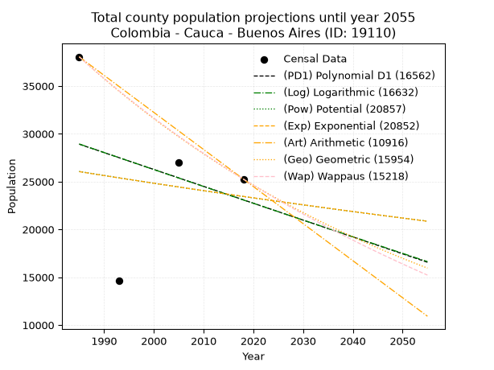
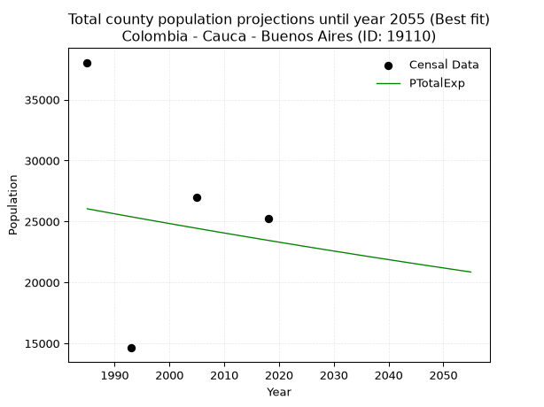
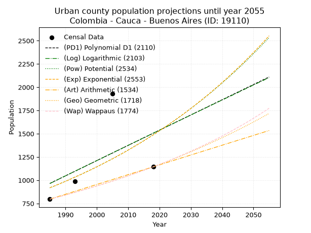
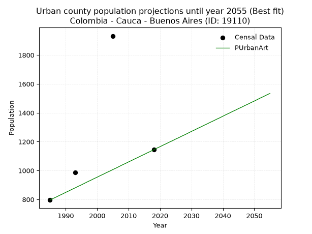
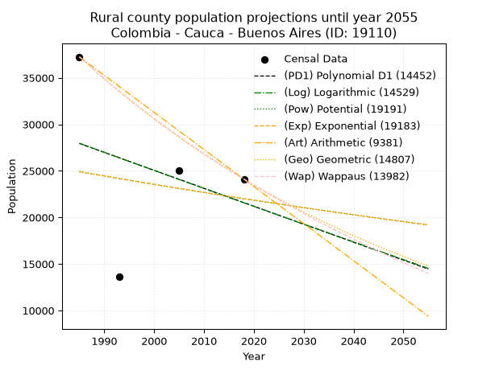
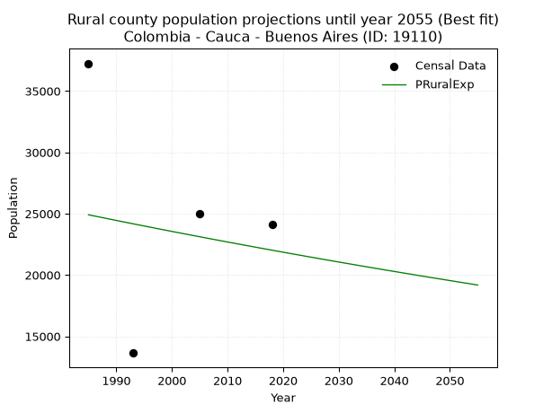

<div align="center">


</div>

# _“Population and Public Services Demand Projections (PPSD) until Year 2050 for Colombia - Cauca - Buenos Aires (ID: 19110)”_
Keywords: `population` `public-service` `projection` `lineal` `polynomial` `logarithmic` `potential` `exponential` `arithmetic` `geometric` `wappaus` `dane` `colombia` `south-america`

PPSD are analytical estimates used by governments and planners to anticipate future changes in population size, age distribution, and the resulting community needs for utilities, healthcare, education, and infrastructure as sizing future water treatment facilities, electrical grids, and road networks based on spatial growth.

> **General running parameters**: • app_version: _v20260806_. • Python version: _3.14.7_. • Pandas version: _3.0.5_. • NumPy version: _2.5.1_. • Creates, save and include plots into reports (create_plot): _False_. • Projection until year: _2050_. • Process polynomial degree 2 and up: _False_. • Process Wappaus: _True_. • Process Wappaus: _True_. • Set negative values to zero: _True_. • Set infinite values to zero: _True_. • Drop dataset notes: _True_. 
<div align="center">

Dynamic map: [:earth_americas:Google](http://maps.google.com/maps?q=3.015382353,-76.6422384) [:earth_americas:OSM](https://www.openstreetmap.org/#map=18/3.015382353/-76.6422384&layers=P) [:earth_americas:Bing](https://www.bing.com/maps?cp=3.015382353~-76.6422384&lvl=18) [:earth_americas:Apple](https://maps.apple.com/frame?center=3.015382353%2C-76.6422384&span=0.003%2C0.006)

</div>


<div align="center">

```geojson
{
  "type": "Feature",
  "geometry": {
    "type": "Point", 
    "coordinates": [-76.6422384, 3.015382353]
  }, 
  "properties": {
    "Name": "Colombia - Cauca - Buenos Aires (ID: 19110)"
  }
}
```

</div>


## 0. Census Data (4 records)

Census data are official statistics collected by a government about the people and housing in a country. They usually include counts of total population, age, sex, race, income, education, and jobs.

📅Global census file: [Population.xlsx](../data/Population.xlsx)

| Source   |   Year |   CountryID | CountryName   |   StateID | StateName   |   CountyID | CountyName   |   PTotal |   PUrban |   PRural |
|:---------|-------:|------------:|:--------------|----------:|:------------|-----------:|:-------------|---------:|---------:|---------:|
| DANE     |   1985 |          57 | Colombia      |        19 | Cauca       |      19110 | Buenos Aires |    38048 |      796 |    37252 |
| DANE     |   1993 |          57 | Colombia      |        19 | Cauca       |      19110 | Buenos Aires |    14624 |      987 |    13637 |
| DANE     |   2005 |          57 | Colombia      |        19 | Cauca       |      19110 | Buenos Aires |    26961 |     1932 |    25029 |
| DANE     |   2018 |          57 | Colombia      |        19 | Cauca       |      19110 | Buenos Aires |    25257 |     1144 |    24113 |

> 🔥Some records could had specific notes about the registered values or the corresponding urban or rural distribution.

## 1. Total

### 1.1. Coefficients and Parameters

* (PD1) Polynomial Deg 1: -176.44239261340775, 379151.3958249688 (lineal)
* (Log) Logarithmic: -354916.0576609632, 2723942.2983997725
* (Pow) Potential: -6.422152530913085, 25.5946414853744
* (Exp) Exponential: -0.0031743245730357097, 14195702.282414202
* (Art) Arithmetic: Year diff. 2018 - 1985 = 33, Population diff. 25257 - 38048 = -12791, Annual growth = -387.6060606060606
* (Geo) Geometric: Year diff. 2018 - 1985 = 33, Population diff. 25257 - 38048 = -12791, Annual growth % = -0.012339753533511133
* (Wap) Wappaus: i = -1.2245669713484262, Condition values only valid for < 200)

<sub>
Wappaus condition values: ['-0.00', '-1.22', '-2.45', '-3.67', '-4.90', '-6.12', '-7.35', '-8.57', '-9.80', '-11.02', '-12.25', '-13.47', '-14.69', '-15.92', '-17.14', '-18.37', '-19.59', '-20.82', '-22.04', '-23.27', '-24.49', '-25.72', '-26.94', '-28.17', '-29.39', '-30.61', '-31.84', '-33.06', '-34.29', '-35.51', '-36.74', '-37.96', '-39.19', '-40.41', '-41.64', '-42.86', '-44.08', '-45.31', '-46.53', '-47.76', '-48.98', '-50.21', '-51.43', '-52.66', '-53.88', '-55.11', '-56.33', '-57.55', '-58.78', '-60.00', '-61.23', '-62.45', '-63.68', '-64.90', '-66.13', '-67.35', '-68.58', '-69.80', '-71.02', '-72.25', '-73.47', '-74.70', '-75.92', '-77.15', '-78.37', '-79.60']
</sub>


### 1.2. Projected Dataset

|   Year |   CountyID |   PTotalPD1 |   PTotalLog |   PTotalPow |   PTotalExp |   PTotalArt |   PTotalGeo |   PTotalWap |
|-------:|-----------:|------------:|------------:|------------:|------------:|------------:|------------:|------------:|
|   1985 |      19110 |       28913 |       28932 |       26057 |       26041 |       38048 |       38048 |       38048 |
|   1986 |      19110 |       28737 |       28753 |       25973 |       25958 |       37660 |       37578 |       37585 |
|   1987 |      19110 |       28560 |       28574 |       25889 |       25876 |       37273 |       37115 |       37127 |
|   1988 |      19110 |       28384 |       28396 |       25805 |       25794 |       36885 |       36657 |       36675 |
|   1989 |      19110 |       28207 |       28217 |       25722 |       25712 |       36498 |       36204 |       36229 |
|   1990 |      19110 |       28031 |       28039 |       25639 |       25631 |       36110 |       35758 |       35788 |
|   1991 |      19110 |       27855 |       27861 |       25557 |       25549 |       35722 |       35316 |       35352 |
|   1992 |      19110 |       27678 |       27682 |       25474 |       25468 |       35335 |       34881 |       34921 |
|   1993 |      19110 |       27502 |       27504 |       25392 |       25388 |       34947 |       34450 |       34495 |
|   1994 |      19110 |       27325 |       27326 |       25311 |       25307 |       34560 |       34025 |       34074 |
|   1995 |      19110 |       27149 |       27148 |       25229 |       25227 |       34172 |       33605 |       33658 |
|   1996 |      19110 |       26972 |       26971 |       25148 |       25147 |       33784 |       33191 |       33246 |
|   1997 |      19110 |       26796 |       26793 |       25067 |       25067 |       33397 |       32781 |       32840 |
|   1998 |      19110 |       26619 |       26615 |       24987 |       24988 |       33009 |       32377 |       32438 |
|   1999 |      19110 |       26443 |       26437 |       24907 |       24909 |       32622 |       31977 |       32040 |
|   2000 |      19110 |       26267 |       26260 |       24827 |       24830 |       32234 |       31582 |       31647 |
|   2001 |      19110 |       26090 |       26083 |       24747 |       24751 |       31846 |       31193 |       31258 |
|   2002 |      19110 |       25914 |       25905 |       24668 |       24673 |       31459 |       30808 |       30874 |
|   2003 |      19110 |       25737 |       25728 |       24589 |       24594 |       31071 |       30428 |       30494 |
|   2004 |      19110 |       25561 |       25551 |       24510 |       24517 |       30683 |       30052 |       30118 |
|   2005 |      19110 |       25384 |       25374 |       24432 |       24439 |       30296 |       29681 |       29746 |
|   2006 |      19110 |       25208 |       25197 |       24354 |       24361 |       29908 |       29315 |       29378 |
|   2007 |      19110 |       25032 |       25020 |       24276 |       24284 |       29521 |       28953 |       29015 |
|   2008 |      19110 |       24855 |       24843 |       24199 |       24207 |       29133 |       28596 |       28655 |
|   2009 |      19110 |       24679 |       24666 |       24121 |       24130 |       28745 |       28243 |       28299 |
|   2010 |      19110 |       24502 |       24490 |       24044 |       24054 |       28358 |       27895 |       27946 |
|   2011 |      19110 |       24326 |       24313 |       23968 |       23978 |       27970 |       27550 |       27598 |
|   2012 |      19110 |       24149 |       24137 |       23891 |       23902 |       27583 |       27210 |       27253 |
|   2013 |      19110 |       23973 |       23960 |       23815 |       23826 |       27195 |       26875 |       26911 |
|   2014 |      19110 |       23796 |       23784 |       23739 |       23751 |       26807 |       26543 |       26574 |
|   2015 |      19110 |       23620 |       23608 |       23664 |       23675 |       26420 |       26216 |       26239 |
|   2016 |      19110 |       23444 |       23432 |       23588 |       23600 |       26032 |       25892 |       25909 |
|   2017 |      19110 |       23267 |       23256 |       23513 |       23525 |       25645 |       25573 |       25581 |
|   2018 |      19110 |       23091 |       23080 |       23439 |       23451 |       25257 |       25257 |       25257 |
|   2019 |      19110 |       22914 |       22904 |       23364 |       23377 |       24869 |       24945 |       24936 |
|   2020 |      19110 |       22738 |       22728 |       23290 |       23302 |       24482 |       24638 |       24619 |
|   2021 |      19110 |       22561 |       22553 |       23216 |       23229 |       24094 |       24333 |       24304 |
|   2022 |      19110 |       22385 |       22377 |       23143 |       23155 |       23707 |       24033 |       23993 |
|   2023 |      19110 |       22208 |       22202 |       23069 |       23082 |       23319 |       23737 |       23685 |
|   2024 |      19110 |       22032 |       22026 |       22996 |       23008 |       22931 |       23444 |       23380 |
|   2025 |      19110 |       21856 |       21851 |       22923 |       22936 |       22544 |       23154 |       23078 |
|   2026 |      19110 |       21679 |       21676 |       22851 |       22863 |       22156 |       22869 |       22778 |
|   2027 |      19110 |       21503 |       21501 |       22778 |       22790 |       21769 |       22587 |       22482 |
|   2028 |      19110 |       21326 |       21326 |       22706 |       22718 |       21381 |       22308 |       22189 |
|   2029 |      19110 |       21150 |       21151 |       22635 |       22646 |       20993 |       22033 |       21898 |
|   2030 |      19110 |       20973 |       20976 |       22563 |       22574 |       20606 |       21761 |       21610 |
|   2031 |      19110 |       20797 |       20801 |       22492 |       22503 |       20218 |       21492 |       21325 |
|   2032 |      19110 |       20620 |       20626 |       22421 |       22432 |       19831 |       21227 |       21043 |
|   2033 |      19110 |       20444 |       20452 |       22350 |       22360 |       19443 |       20965 |       20764 |
|   2034 |      19110 |       20268 |       20277 |       22280 |       22290 |       19055 |       20706 |       20487 |
|   2035 |      19110 |       20091 |       20103 |       22209 |       22219 |       18668 |       20451 |       20212 |
|   2036 |      19110 |       19915 |       19928 |       22139 |       22148 |       18280 |       20198 |       19940 |
|   2037 |      19110 |       19738 |       19754 |       22070 |       22078 |       17892 |       19949 |       19671 |
|   2038 |      19110 |       19562 |       19580 |       22000 |       22008 |       17505 |       19703 |       19404 |
|   2039 |      19110 |       19385 |       19406 |       21931 |       21939 |       17117 |       19460 |       19140 |
|   2040 |      19110 |       19209 |       19232 |       21862 |       21869 |       16730 |       19220 |       18878 |
|   2041 |      19110 |       19032 |       19058 |       21793 |       21800 |       16342 |       18983 |       18618 |
|   2042 |      19110 |       18856 |       18884 |       21725 |       21731 |       15954 |       18748 |       18361 |
|   2043 |      19110 |       18680 |       18710 |       21657 |       21662 |       15567 |       18517 |       18106 |
|   2044 |      19110 |       18503 |       18536 |       21589 |       21593 |       15179 |       18289 |       17854 |
|   2045 |      19110 |       18327 |       18363 |       21521 |       21525 |       14792 |       18063 |       17603 |
|   2046 |      19110 |       18150 |       18189 |       21454 |       21456 |       14404 |       17840 |       17355 |
|   2047 |      19110 |       17974 |       18016 |       21386 |       21388 |       14016 |       17620 |       17109 |
|   2048 |      19110 |       17797 |       17843 |       21319 |       21321 |       13629 |       17402 |       16866 |
|   2049 |      19110 |       17621 |       17669 |       21253 |       21253 |       13241 |       17188 |       16624 |
|   2050 |      19110 |       17444 |       17496 |       21186 |       21186 |       12854 |       16976 |       16385 |
<div align="center">

</img>

</div>


### 1.3. Best fit with absolute and relative error (%)

Relative error puts that difference into context by dividing the absolute error by the true value, creating a unitless ratio or percentage that shows the scale of the mistake.

Absolute and relative error

|   Year | Source   |   CountryID | CountryName   |   StateID | StateName   |   CountyID_x | CountyName   |   PTotal |   PUrban |   PRural |   CountyID_y |   PTotalPD1 |   PTotalLog |   PTotalPow |   PTotalExp |   PTotalArt |   PTotalGeo |   PTotalWap |   PTotalPD1AbsError |   PTotalLogAbsError |   PTotalPowAbsError |   PTotalExpAbsError |   PTotalArtAbsError |   PTotalGeoAbsError |   PTotalWapAbsError |   PTotalPD1RelError |   PTotalLogRelError |   PTotalPowRelError |   PTotalExpRelError |   PTotalArtRelError |   PTotalGeoRelError |   PTotalWapRelError |
|-------:|:---------|------------:|:--------------|----------:|:------------|-------------:|:-------------|---------:|---------:|---------:|-------------:|------------:|------------:|------------:|------------:|------------:|------------:|------------:|--------------------:|--------------------:|--------------------:|--------------------:|--------------------:|--------------------:|--------------------:|--------------------:|--------------------:|--------------------:|--------------------:|--------------------:|--------------------:|--------------------:|
|   1985 | DANE     |          57 | Colombia      |        19 | Cauca       |        19110 | Buenos Aires |    38048 |      796 |    37252 |        19110 |       28913 |       28932 |       26057 |       26041 |       38048 |       38048 |       38048 |                9135 |                9116 |               11991 |               12007 |                   0 |                   0 |                   0 |            24.0091  |            23.9592  |            31.5155  |            31.5575  |              0      |              0      |              0      |
|   1993 | DANE     |          57 | Colombia      |        19 | Cauca       |        19110 | Buenos Aires |    14624 |      987 |    13637 |        19110 |       27502 |       27504 |       25392 |       25388 |       34947 |       34450 |       34495 |               12878 |               12880 |               10768 |               10764 |               20323 |               19826 |               19871 |            88.0607  |            88.0744  |            73.6324  |            73.605   |            138.97   |            135.572  |            135.879  |
|   2005 | DANE     |          57 | Colombia      |        19 | Cauca       |        19110 | Buenos Aires |    26961 |     1932 |    25029 |        19110 |       25384 |       25374 |       24432 |       24439 |       30296 |       29681 |       29746 |                1577 |                1587 |                2529 |                2522 |                3335 |                2720 |                2785 |             5.84919 |             5.88628 |             9.38022 |             9.35425 |             12.3697 |             10.0886 |             10.3297 |
|   2018 | DANE     |          57 | Colombia      |        19 | Cauca       |        19110 | Buenos Aires |    25257 |     1144 |    24113 |        19110 |       23091 |       23080 |       23439 |       23451 |       25257 |       25257 |       25257 |                2166 |                2177 |                1818 |                1806 |                   0 |                   0 |                   0 |             8.57584 |             8.61939 |             7.198   |             7.15049 |              0      |              0      |              0      |

Relative error mean

| Method    |   RelError | Best   |
|:----------|-----------:|:-------|
| PTotalPD1 |    31.6237 |        |
| PTotalLog |    31.6348 |        |
| PTotalPow |    30.4315 |        |
| PTotalExp |    30.4168 | True   |
| PTotalArt |    37.835  |        |
| PTotalGeo |    36.4151 |        |
| PTotalWap |    36.5523 |        |

💙Best method: _**PTotalExp**_
<div align="center">

</img>

</div>


### 1.4. Fresh water supply demand in liters per capita per day (lpcd)

The fresh water supply demand typically ranges from 100 to 300 liters per capita per day (lpcd) for standard domestic and municipal planning, though absolute survival minimums set by the World Health Organization are as low as 7.5 to 20 liters per day, and total consumption in high-income nations can exceed 400 liters.

> `CZ`: Level in meters above the sea level (masl).<br> `WS`: Fresh water supply demand in liters per capita per day (lpcd or l/h/d).<br> `WSAll`: Zonal fresh water supply demand in liters per second (l/s).<br> `A`: Zonal area in square meters.

Reference values (RAS Colombia)

|    CZ |   WS |
|------:|-----:|
|  1000 |  120 |
|  2000 |  130 |
| 99999 |  140 |

County shapefile geometry properties and water supply values

|   CountyID |     ATotal |   CZTotal |   WSTotal |
|-----------:|-----------:|----------:|----------:|
|      19110 | 4.3525e+08 |    1460.4 |       130 |

Projected values for best method: PTotalExp

|   CountyID |   Year |   PTotalExp |   WSTotal |   WSTotalAll |
|-----------:|-------:|------------:|----------:|-------------:|
|      19110 |   1985 |       26041 |       130 |      39.1821 |
|      19110 |   1986 |       25958 |       130 |      39.0572 |
|      19110 |   1987 |       25876 |       130 |      38.9338 |
|      19110 |   1988 |       25794 |       130 |      38.8104 |
|      19110 |   1989 |       25712 |       130 |      38.687  |
|      19110 |   1990 |       25631 |       130 |      38.5652 |
|      19110 |   1991 |       25549 |       130 |      38.4418 |
|      19110 |   1992 |       25468 |       130 |      38.3199 |
|      19110 |   1993 |       25388 |       130 |      38.1995 |
|      19110 |   1994 |       25307 |       130 |      38.0777 |
|      19110 |   1995 |       25227 |       130 |      37.9573 |
|      19110 |   1996 |       25147 |       130 |      37.8369 |
|      19110 |   1997 |       25067 |       130 |      37.7166 |
|      19110 |   1998 |       24988 |       130 |      37.5977 |
|      19110 |   1999 |       24909 |       130 |      37.4788 |
|      19110 |   2000 |       24830 |       130 |      37.36   |
|      19110 |   2001 |       24751 |       130 |      37.2411 |
|      19110 |   2002 |       24673 |       130 |      37.1237 |
|      19110 |   2003 |       24594 |       130 |      37.0049 |
|      19110 |   2004 |       24517 |       130 |      36.889  |
|      19110 |   2005 |       24439 |       130 |      36.7716 |
|      19110 |   2006 |       24361 |       130 |      36.6543 |
|      19110 |   2007 |       24284 |       130 |      36.5384 |
|      19110 |   2008 |       24207 |       130 |      36.4226 |
|      19110 |   2009 |       24130 |       130 |      36.3067 |
|      19110 |   2010 |       24054 |       130 |      36.1924 |
|      19110 |   2011 |       23978 |       130 |      36.078  |
|      19110 |   2012 |       23902 |       130 |      35.9637 |
|      19110 |   2013 |       23826 |       130 |      35.8493 |
|      19110 |   2014 |       23751 |       130 |      35.7365 |
|      19110 |   2015 |       23675 |       130 |      35.6221 |
|      19110 |   2016 |       23600 |       130 |      35.5093 |
|      19110 |   2017 |       23525 |       130 |      35.3964 |
|      19110 |   2018 |       23451 |       130 |      35.2851 |
|      19110 |   2019 |       23377 |       130 |      35.1737 |
|      19110 |   2020 |       23302 |       130 |      35.0609 |
|      19110 |   2021 |       23229 |       130 |      34.951  |
|      19110 |   2022 |       23155 |       130 |      34.8397 |
|      19110 |   2023 |       23082 |       130 |      34.7299 |
|      19110 |   2024 |       23008 |       130 |      34.6185 |
|      19110 |   2025 |       22936 |       130 |      34.5102 |
|      19110 |   2026 |       22863 |       130 |      34.4003 |
|      19110 |   2027 |       22790 |       130 |      34.2905 |
|      19110 |   2028 |       22718 |       130 |      34.1822 |
|      19110 |   2029 |       22646 |       130 |      34.0738 |
|      19110 |   2030 |       22574 |       130 |      33.9655 |
|      19110 |   2031 |       22503 |       130 |      33.8587 |
|      19110 |   2032 |       22432 |       130 |      33.7519 |
|      19110 |   2033 |       22360 |       130 |      33.6435 |
|      19110 |   2034 |       22290 |       130 |      33.5382 |
|      19110 |   2035 |       22219 |       130 |      33.4314 |
|      19110 |   2036 |       22148 |       130 |      33.3245 |
|      19110 |   2037 |       22078 |       130 |      33.2192 |
|      19110 |   2038 |       22008 |       130 |      33.1139 |
|      19110 |   2039 |       21939 |       130 |      33.0101 |
|      19110 |   2040 |       21869 |       130 |      32.9047 |
|      19110 |   2041 |       21800 |       130 |      32.8009 |
|      19110 |   2042 |       21731 |       130 |      32.6971 |
|      19110 |   2043 |       21662 |       130 |      32.5933 |
|      19110 |   2044 |       21593 |       130 |      32.4895 |
|      19110 |   2045 |       21525 |       130 |      32.3872 |
|      19110 |   2046 |       21456 |       130 |      32.2833 |
|      19110 |   2047 |       21388 |       130 |      32.181  |
|      19110 |   2048 |       21321 |       130 |      32.0802 |
|      19110 |   2049 |       21253 |       130 |      31.9779 |
|      19110 |   2050 |       21186 |       130 |      31.8771 |

## 2. Urban

### 2.1. Coefficients and Parameters

* (PD1) Polynomial Deg 1: 16.360096346849083, -31509.53271778488 (lineal)
* (Log) Logarithmic: 32862.50183354636, -248573.3897803483
* (Pow) Potential: 29.304577827374292, -93.67671794250647
* (Exp) Exponential: 0.014597047775319524, 2.396052808666098e-10
* (Art) Arithmetic: Year diff. 2018 - 1985 = 33, Population diff. 1144 - 796 = 348, Annual growth = 10.545454545454545
* (Geo) Geometric: Year diff. 2018 - 1985 = 33, Population diff. 1144 - 796 = 348, Annual growth % = 0.011051132306427514
* (Wap) Wappaus: i = 1.0871602624179943, Condition values only valid for < 200)

<sub>
Wappaus condition values: ['0.00', '1.09', '2.17', '3.26', '4.35', '5.44', '6.52', '7.61', '8.70', '9.78', '10.87', '11.96', '13.05', '14.13', '15.22', '16.31', '17.39', '18.48', '19.57', '20.66', '21.74', '22.83', '23.92', '25.00', '26.09', '27.18', '28.27', '29.35', '30.44', '31.53', '32.61', '33.70', '34.79', '35.88', '36.96', '38.05', '39.14', '40.22', '41.31', '42.40', '43.49', '44.57', '45.66', '46.75', '47.84', '48.92', '50.01', '51.10', '52.18', '53.27', '54.36', '55.45', '56.53', '57.62', '58.71', '59.79', '60.88', '61.97', '63.06', '64.14', '65.23', '66.32', '67.40', '68.49', '69.58', '70.67']
</sub>


### 2.2. Projected Dataset

|   Year |   CountyID |   PUrbanPD1 |   PUrbanLog |   PUrbanPow |   PUrbanExp |   PUrbanArt |   PUrbanGeo |   PUrbanWap |
|-------:|-----------:|------------:|------------:|------------:|------------:|------------:|------------:|------------:|
|   1985 |      19110 |         965 |         964 |         918 |         919 |         796 |         796 |         796 |
|   1986 |      19110 |         982 |         980 |         931 |         932 |         807 |         805 |         805 |
|   1987 |      19110 |         998 |         997 |         945 |         946 |         817 |         814 |         813 |
|   1988 |      19110 |        1014 |        1014 |         959 |         960 |         828 |         823 |         822 |
|   1989 |      19110 |        1031 |        1030 |         974 |         974 |         838 |         832 |         831 |
|   1990 |      19110 |        1047 |        1047 |         988 |         988 |         849 |         841 |         840 |
|   1991 |      19110 |        1063 |        1063 |        1003 |        1003 |         859 |         850 |         850 |
|   1992 |      19110 |        1080 |        1080 |        1018 |        1018 |         870 |         860 |         859 |
|   1993 |      19110 |        1096 |        1096 |        1033 |        1033 |         880 |         869 |         868 |
|   1994 |      19110 |        1112 |        1113 |        1048 |        1048 |         891 |         879 |         878 |
|   1995 |      19110 |        1129 |        1129 |        1063 |        1063 |         901 |         888 |         888 |
|   1996 |      19110 |        1145 |        1145 |        1079 |        1079 |         912 |         898 |         897 |
|   1997 |      19110 |        1162 |        1162 |        1095 |        1095 |         923 |         908 |         907 |
|   1998 |      19110 |        1178 |        1178 |        1111 |        1111 |         933 |         918 |         917 |
|   1999 |      19110 |        1194 |        1195 |        1128 |        1127 |         944 |         928 |         927 |
|   2000 |      19110 |        1211 |        1211 |        1144 |        1144 |         954 |         939 |         937 |
|   2001 |      19110 |        1227 |        1228 |        1161 |        1161 |         965 |         949 |         948 |
|   2002 |      19110 |        1243 |        1244 |        1178 |        1178 |         975 |         960 |         958 |
|   2003 |      19110 |        1260 |        1261 |        1196 |        1195 |         986 |         970 |         969 |
|   2004 |      19110 |        1276 |        1277 |        1213 |        1213 |         996 |         981 |         979 |
|   2005 |      19110 |        1292 |        1293 |        1231 |        1230 |        1007 |         992 |         990 |
|   2006 |      19110 |        1309 |        1310 |        1249 |        1248 |        1017 |        1003 |        1001 |
|   2007 |      19110 |        1325 |        1326 |        1268 |        1267 |        1028 |        1014 |        1012 |
|   2008 |      19110 |        1342 |        1342 |        1286 |        1285 |        1039 |        1025 |        1023 |
|   2009 |      19110 |        1358 |        1359 |        1305 |        1304 |        1049 |        1036 |        1035 |
|   2010 |      19110 |        1374 |        1375 |        1324 |        1324 |        1060 |        1048 |        1046 |
|   2011 |      19110 |        1391 |        1392 |        1344 |        1343 |        1070 |        1059 |        1058 |
|   2012 |      19110 |        1407 |        1408 |        1364 |        1363 |        1081 |        1071 |        1070 |
|   2013 |      19110 |        1423 |        1424 |        1384 |        1383 |        1091 |        1083 |        1082 |
|   2014 |      19110 |        1440 |        1441 |        1404 |        1403 |        1102 |        1095 |        1094 |
|   2015 |      19110 |        1456 |        1457 |        1425 |        1424 |        1112 |        1107 |        1106 |
|   2016 |      19110 |        1472 |        1473 |        1445 |        1445 |        1123 |        1119 |        1119 |
|   2017 |      19110 |        1489 |        1489 |        1467 |        1466 |        1133 |        1131 |        1131 |
|   2018 |      19110 |        1505 |        1506 |        1488 |        1487 |        1144 |        1144 |        1144 |
|   2019 |      19110 |        1522 |        1522 |        1510 |        1509 |        1155 |        1157 |        1157 |
|   2020 |      19110 |        1538 |        1538 |        1532 |        1532 |        1165 |        1169 |        1170 |
|   2021 |      19110 |        1554 |        1555 |        1554 |        1554 |        1176 |        1182 |        1183 |
|   2022 |      19110 |        1571 |        1571 |        1577 |        1577 |        1186 |        1195 |        1197 |
|   2023 |      19110 |        1587 |        1587 |        1600 |        1600 |        1197 |        1209 |        1210 |
|   2024 |      19110 |        1603 |        1603 |        1623 |        1624 |        1207 |        1222 |        1224 |
|   2025 |      19110 |        1620 |        1620 |        1647 |        1647 |        1218 |        1235 |        1238 |
|   2026 |      19110 |        1636 |        1636 |        1671 |        1672 |        1228 |        1249 |        1253 |
|   2027 |      19110 |        1652 |        1652 |        1695 |        1696 |        1239 |        1263 |        1267 |
|   2028 |      19110 |        1669 |        1668 |        1720 |        1721 |        1249 |        1277 |        1282 |
|   2029 |      19110 |        1685 |        1684 |        1745 |        1747 |        1260 |        1291 |        1296 |
|   2030 |      19110 |        1701 |        1701 |        1770 |        1772 |        1271 |        1305 |        1312 |
|   2031 |      19110 |        1718 |        1717 |        1796 |        1798 |        1281 |        1320 |        1327 |
|   2032 |      19110 |        1734 |        1733 |        1822 |        1825 |        1292 |        1334 |        1342 |
|   2033 |      19110 |        1751 |        1749 |        1849 |        1852 |        1302 |        1349 |        1358 |
|   2034 |      19110 |        1767 |        1765 |        1875 |        1879 |        1313 |        1364 |        1374 |
|   2035 |      19110 |        1783 |        1781 |        1903 |        1906 |        1323 |        1379 |        1390 |
|   2036 |      19110 |        1800 |        1798 |        1930 |        1934 |        1334 |        1394 |        1407 |
|   2037 |      19110 |        1816 |        1814 |        1958 |        1963 |        1344 |        1410 |        1423 |
|   2038 |      19110 |        1832 |        1830 |        1987 |        1992 |        1355 |        1425 |        1440 |
|   2039 |      19110 |        1849 |        1846 |        2015 |        2021 |        1365 |        1441 |        1457 |
|   2040 |      19110 |        1865 |        1862 |        2045 |        2051 |        1376 |        1457 |        1475 |
|   2041 |      19110 |        1881 |        1878 |        2074 |        2081 |        1387 |        1473 |        1493 |
|   2042 |      19110 |        1898 |        1894 |        2104 |        2111 |        1397 |        1489 |        1511 |
|   2043 |      19110 |        1914 |        1910 |        2135 |        2143 |        1408 |        1506 |        1529 |
|   2044 |      19110 |        1931 |        1926 |        2165 |        2174 |        1418 |        1522 |        1548 |
|   2045 |      19110 |        1947 |        1942 |        2197 |        2206 |        1429 |        1539 |        1567 |
|   2046 |      19110 |        1963 |        1959 |        2228 |        2238 |        1439 |        1556 |        1586 |
|   2047 |      19110 |        1980 |        1975 |        2260 |        2271 |        1450 |        1573 |        1605 |
|   2048 |      19110 |        1996 |        1991 |        2293 |        2305 |        1460 |        1591 |        1625 |
|   2049 |      19110 |        2012 |        2007 |        2326 |        2339 |        1471 |        1608 |        1645 |
|   2050 |      19110 |        2029 |        2023 |        2360 |        2373 |        1481 |        1626 |        1666 |
<div align="center">

</img>

</div>


### 2.3. Best fit with absolute and relative error (%)

Relative error puts that difference into context by dividing the absolute error by the true value, creating a unitless ratio or percentage that shows the scale of the mistake.

Absolute and relative error

|   Year | Source   |   CountryID | CountryName   |   StateID | StateName   |   CountyID_x | CountyName   |   PTotal |   PUrban |   PRural |   CountyID_y |   PUrbanPD1 |   PUrbanLog |   PUrbanPow |   PUrbanExp |   PUrbanArt |   PUrbanGeo |   PUrbanWap |   PUrbanPD1AbsError |   PUrbanLogAbsError |   PUrbanPowAbsError |   PUrbanExpAbsError |   PUrbanArtAbsError |   PUrbanGeoAbsError |   PUrbanWapAbsError |   PUrbanPD1RelError |   PUrbanLogRelError |   PUrbanPowRelError |   PUrbanExpRelError |   PUrbanArtRelError |   PUrbanGeoRelError |   PUrbanWapRelError |
|-------:|:---------|------------:|:--------------|----------:|:------------|-------------:|:-------------|---------:|---------:|---------:|-------------:|------------:|------------:|------------:|------------:|------------:|------------:|------------:|--------------------:|--------------------:|--------------------:|--------------------:|--------------------:|--------------------:|--------------------:|--------------------:|--------------------:|--------------------:|--------------------:|--------------------:|--------------------:|--------------------:|
|   1985 | DANE     |          57 | Colombia      |        19 | Cauca       |        19110 | Buenos Aires |    38048 |      796 |    37252 |        19110 |         965 |         964 |         918 |         919 |         796 |         796 |         796 |                 169 |                 168 |                 122 |                 123 |                   0 |                   0 |                   0 |             21.2312 |             21.1055 |            15.3266  |            15.4523  |              0      |              0      |              0      |
|   1993 | DANE     |          57 | Colombia      |        19 | Cauca       |        19110 | Buenos Aires |    14624 |      987 |    13637 |        19110 |        1096 |        1096 |        1033 |        1033 |         880 |         869 |         868 |                 109 |                 109 |                  46 |                  46 |                 107 |                 118 |                 119 |             11.0436 |             11.0436 |             4.66059 |             4.66059 |             10.8409 |             11.9554 |             12.0567 |
|   2005 | DANE     |          57 | Colombia      |        19 | Cauca       |        19110 | Buenos Aires |    26961 |     1932 |    25029 |        19110 |        1292 |        1293 |        1231 |        1230 |        1007 |         992 |         990 |                 640 |                 639 |                 701 |                 702 |                 925 |                 940 |                 942 |             33.1263 |             33.0745 |            36.2836  |            36.3354  |             47.8778 |             48.6542 |             48.7578 |
|   2018 | DANE     |          57 | Colombia      |        19 | Cauca       |        19110 | Buenos Aires |    25257 |     1144 |    24113 |        19110 |        1505 |        1506 |        1488 |        1487 |        1144 |        1144 |        1144 |                 361 |                 362 |                 344 |                 343 |                   0 |                   0 |                   0 |             31.5559 |             31.6434 |            30.0699  |            29.9825  |              0      |              0      |              0      |

Relative error mean

| Method    |   RelError | Best   |
|:----------|-----------:|:-------|
| PUrbanPD1 |    24.2392 |        |
| PUrbanLog |    24.2167 |        |
| PUrbanPow |    21.5852 |        |
| PUrbanExp |    21.6077 |        |
| PUrbanArt |    14.6797 | True   |
| PUrbanGeo |    15.1524 |        |
| PUrbanWap |    15.2036 |        |

💙Best method: _**PUrbanArt**_
<div align="center">

</img>

</div>


### 2.4. Fresh water supply demand in liters per capita per day (lpcd)

The fresh water supply demand typically ranges from 100 to 300 liters per capita per day (lpcd) for standard domestic and municipal planning, though absolute survival minimums set by the World Health Organization are as low as 7.5 to 20 liters per day, and total consumption in high-income nations can exceed 400 liters.

> `CZ`: Level in meters above the sea level (masl).<br> `WS`: Fresh water supply demand in liters per capita per day (lpcd or l/h/d).<br> `WSAll`: Zonal fresh water supply demand in liters per second (l/s).<br> `A`: Zonal area in square meters.

Reference values (RAS Colombia)

|    CZ |   WS |
|------:|-----:|
|  1000 |  120 |
|  2000 |  130 |
| 99999 |  140 |

County shapefile geometry properties and water supply values

|   CountyID |   AUrban |   CZUrban |   WSUrban |
|-----------:|---------:|----------:|----------:|
|      19110 |   553591 |   1214.24 |       130 |

Projected values for best method: PUrbanArt

|   CountyID |   Year |   PUrbanArt |   WSUrban |   WSUrbanAll |
|-----------:|-------:|------------:|----------:|-------------:|
|      19110 |   1985 |         796 |       130 |      1.19769 |
|      19110 |   1986 |         807 |       130 |      1.21424 |
|      19110 |   1987 |         817 |       130 |      1.22928 |
|      19110 |   1988 |         828 |       130 |      1.24583 |
|      19110 |   1989 |         838 |       130 |      1.26088 |
|      19110 |   1990 |         849 |       130 |      1.27743 |
|      19110 |   1991 |         859 |       130 |      1.29248 |
|      19110 |   1992 |         870 |       130 |      1.30903 |
|      19110 |   1993 |         880 |       130 |      1.32407 |
|      19110 |   1994 |         891 |       130 |      1.34062 |
|      19110 |   1995 |         901 |       130 |      1.35567 |
|      19110 |   1996 |         912 |       130 |      1.37222 |
|      19110 |   1997 |         923 |       130 |      1.38877 |
|      19110 |   1998 |         933 |       130 |      1.40382 |
|      19110 |   1999 |         944 |       130 |      1.42037 |
|      19110 |   2000 |         954 |       130 |      1.43542 |
|      19110 |   2001 |         965 |       130 |      1.45197 |
|      19110 |   2002 |         975 |       130 |      1.46701 |
|      19110 |   2003 |         986 |       130 |      1.48356 |
|      19110 |   2004 |         996 |       130 |      1.49861 |
|      19110 |   2005 |        1007 |       130 |      1.51516 |
|      19110 |   2006 |        1017 |       130 |      1.53021 |
|      19110 |   2007 |        1028 |       130 |      1.54676 |
|      19110 |   2008 |        1039 |       130 |      1.56331 |
|      19110 |   2009 |        1049 |       130 |      1.57836 |
|      19110 |   2010 |        1060 |       130 |      1.59491 |
|      19110 |   2011 |        1070 |       130 |      1.60995 |
|      19110 |   2012 |        1081 |       130 |      1.6265  |
|      19110 |   2013 |        1091 |       130 |      1.64155 |
|      19110 |   2014 |        1102 |       130 |      1.6581  |
|      19110 |   2015 |        1112 |       130 |      1.67315 |
|      19110 |   2016 |        1123 |       130 |      1.6897  |
|      19110 |   2017 |        1133 |       130 |      1.70475 |
|      19110 |   2018 |        1144 |       130 |      1.7213  |
|      19110 |   2019 |        1155 |       130 |      1.73785 |
|      19110 |   2020 |        1165 |       130 |      1.75289 |
|      19110 |   2021 |        1176 |       130 |      1.76944 |
|      19110 |   2022 |        1186 |       130 |      1.78449 |
|      19110 |   2023 |        1197 |       130 |      1.80104 |
|      19110 |   2024 |        1207 |       130 |      1.81609 |
|      19110 |   2025 |        1218 |       130 |      1.83264 |
|      19110 |   2026 |        1228 |       130 |      1.84769 |
|      19110 |   2027 |        1239 |       130 |      1.86424 |
|      19110 |   2028 |        1249 |       130 |      1.87928 |
|      19110 |   2029 |        1260 |       130 |      1.89583 |
|      19110 |   2030 |        1271 |       130 |      1.91238 |
|      19110 |   2031 |        1281 |       130 |      1.92743 |
|      19110 |   2032 |        1292 |       130 |      1.94398 |
|      19110 |   2033 |        1302 |       130 |      1.95903 |
|      19110 |   2034 |        1313 |       130 |      1.97558 |
|      19110 |   2035 |        1323 |       130 |      1.99063 |
|      19110 |   2036 |        1334 |       130 |      2.00718 |
|      19110 |   2037 |        1344 |       130 |      2.02222 |
|      19110 |   2038 |        1355 |       130 |      2.03877 |
|      19110 |   2039 |        1365 |       130 |      2.05382 |
|      19110 |   2040 |        1376 |       130 |      2.07037 |
|      19110 |   2041 |        1387 |       130 |      2.08692 |
|      19110 |   2042 |        1397 |       130 |      2.10197 |
|      19110 |   2043 |        1408 |       130 |      2.11852 |
|      19110 |   2044 |        1418 |       130 |      2.13356 |
|      19110 |   2045 |        1429 |       130 |      2.15012 |
|      19110 |   2046 |        1439 |       130 |      2.16516 |
|      19110 |   2047 |        1450 |       130 |      2.18171 |
|      19110 |   2048 |        1460 |       130 |      2.19676 |
|      19110 |   2049 |        1471 |       130 |      2.21331 |
|      19110 |   2050 |        1481 |       130 |      2.22836 |

## 3. Rural

### 3.1. Coefficients and Parameters

* (PD1) Polynomial Deg 1: -192.80248896025685, 410660.92854275374 (lineal)
* (Log) Logarithmic: -387778.55949450954, 2972515.688180121
* (Pow) Potential: -7.544456331923998, 29.27646329666294
* (Exp) Exponential: -0.0037313772098864686, 41027871.65297662
* (Art) Arithmetic: Year diff. 2018 - 1985 = 33, Population diff. 24113 - 37252 = -13139, Annual growth = -398.1515151515151
* (Geo) Geometric: Year diff. 2018 - 1985 = 33, Population diff. 24113 - 37252 = -13139, Annual growth % = -0.013093958388213811
* (Wap) Wappaus: i = -1.2976501756751084, Condition values only valid for < 200)

<sub>
Wappaus condition values: ['-0.00', '-1.30', '-2.60', '-3.89', '-5.19', '-6.49', '-7.79', '-9.08', '-10.38', '-11.68', '-12.98', '-14.27', '-15.57', '-16.87', '-18.17', '-19.46', '-20.76', '-22.06', '-23.36', '-24.66', '-25.95', '-27.25', '-28.55', '-29.85', '-31.14', '-32.44', '-33.74', '-35.04', '-36.33', '-37.63', '-38.93', '-40.23', '-41.52', '-42.82', '-44.12', '-45.42', '-46.72', '-48.01', '-49.31', '-50.61', '-51.91', '-53.20', '-54.50', '-55.80', '-57.10', '-58.39', '-59.69', '-60.99', '-62.29', '-63.58', '-64.88', '-66.18', '-67.48', '-68.78', '-70.07', '-71.37', '-72.67', '-73.97', '-75.26', '-76.56', '-77.86', '-79.16', '-80.45', '-81.75', '-83.05', '-84.35']
</sub>


### 3.2. Projected Dataset

|   Year |   CountyID |   PRuralPD1 |   PRuralLog |   PRuralPow |   PRuralExp |   PRuralArt |   PRuralGeo |   PRuralWap |
|-------:|-----------:|------------:|------------:|------------:|------------:|------------:|------------:|------------:|
|   1985 |      19110 |       27948 |       27968 |       24926 |       24909 |       37252 |       37252 |       37252 |
|   1986 |      19110 |       27755 |       27773 |       24831 |       24816 |       36854 |       36764 |       36772 |
|   1987 |      19110 |       27562 |       27577 |       24737 |       24724 |       36456 |       36283 |       36298 |
|   1988 |      19110 |       27370 |       27382 |       24644 |       24632 |       36058 |       35808 |       35829 |
|   1989 |      19110 |       27177 |       27187 |       24550 |       24540 |       35659 |       35339 |       35367 |
|   1990 |      19110 |       26984 |       26992 |       24457 |       24448 |       35261 |       34876 |       34911 |
|   1991 |      19110 |       26791 |       26798 |       24365 |       24357 |       34863 |       34419 |       34460 |
|   1992 |      19110 |       26598 |       26603 |       24273 |       24267 |       34465 |       33969 |       34015 |
|   1993 |      19110 |       26406 |       26408 |       24181 |       24176 |       34067 |       33524 |       33576 |
|   1994 |      19110 |       26213 |       26214 |       24090 |       24086 |       33669 |       33085 |       33141 |
|   1995 |      19110 |       26020 |       26019 |       23999 |       23997 |       33270 |       32652 |       32713 |
|   1996 |      19110 |       25827 |       25825 |       23908 |       23907 |       32872 |       32224 |       32289 |
|   1997 |      19110 |       25634 |       25631 |       23818 |       23818 |       32474 |       31802 |       31870 |
|   1998 |      19110 |       25442 |       25437 |       23728 |       23729 |       32076 |       31386 |       31457 |
|   1999 |      19110 |       25249 |       25243 |       23639 |       23641 |       31678 |       30975 |       31048 |
|   2000 |      19110 |       25056 |       25049 |       23550 |       23553 |       31280 |       30569 |       30644 |
|   2001 |      19110 |       24863 |       24855 |       23461 |       23465 |       30882 |       30169 |       30245 |
|   2002 |      19110 |       24670 |       24661 |       23373 |       23378 |       30483 |       29774 |       29851 |
|   2003 |      19110 |       24478 |       24467 |       23285 |       23291 |       30085 |       29384 |       29461 |
|   2004 |      19110 |       24285 |       24274 |       23197 |       23204 |       29687 |       28999 |       29075 |
|   2005 |      19110 |       24092 |       24080 |       23110 |       23118 |       29289 |       28620 |       28694 |
|   2006 |      19110 |       23899 |       23887 |       23024 |       23032 |       28891 |       28245 |       28318 |
|   2007 |      19110 |       23706 |       23694 |       22937 |       22946 |       28493 |       27875 |       27946 |
|   2008 |      19110 |       23514 |       23501 |       22851 |       22860 |       28095 |       27510 |       27578 |
|   2009 |      19110 |       23321 |       23308 |       22765 |       22775 |       27696 |       27150 |       27214 |
|   2010 |      19110 |       23128 |       23115 |       22680 |       22690 |       27298 |       26794 |       26854 |
|   2011 |      19110 |       22935 |       22922 |       22595 |       22606 |       26900 |       26444 |       26498 |
|   2012 |      19110 |       22742 |       22729 |       22511 |       22522 |       26502 |       26097 |       26146 |
|   2013 |      19110 |       22550 |       22536 |       22426 |       22438 |       26104 |       25756 |       25798 |
|   2014 |      19110 |       22357 |       22344 |       22342 |       22354 |       25706 |       25418 |       25453 |
|   2015 |      19110 |       22164 |       22151 |       22259 |       22271 |       25307 |       25086 |       25113 |
|   2016 |      19110 |       21971 |       21959 |       22176 |       22188 |       24909 |       24757 |       24776 |
|   2017 |      19110 |       21778 |       21766 |       22093 |       22105 |       24511 |       24433 |       24443 |
|   2018 |      19110 |       21586 |       21574 |       22011 |       22023 |       24113 |       24113 |       24113 |
|   2019 |      19110 |       21393 |       21382 |       21928 |       21941 |       23715 |       23797 |       23787 |
|   2020 |      19110 |       21200 |       21190 |       21847 |       21859 |       23317 |       23486 |       23464 |
|   2021 |      19110 |       21007 |       20998 |       21765 |       21778 |       22919 |       23178 |       23145 |
|   2022 |      19110 |       20814 |       20806 |       21684 |       21697 |       22520 |       22875 |       22829 |
|   2023 |      19110 |       20621 |       20615 |       21603 |       21616 |       22122 |       22575 |       22516 |
|   2024 |      19110 |       20429 |       20423 |       21523 |       21535 |       21724 |       22280 |       22207 |
|   2025 |      19110 |       20236 |       20231 |       21443 |       21455 |       21326 |       21988 |       21900 |
|   2026 |      19110 |       20043 |       20040 |       21363 |       21375 |       20928 |       21700 |       21597 |
|   2027 |      19110 |       19850 |       19849 |       21284 |       21296 |       20530 |       21416 |       21297 |
|   2028 |      19110 |       19657 |       19657 |       21205 |       21216 |       20131 |       21135 |       21000 |
|   2029 |      19110 |       19465 |       19466 |       21126 |       21137 |       19733 |       20859 |       20706 |
|   2030 |      19110 |       19272 |       19275 |       21048 |       21059 |       19335 |       20585 |       20415 |
|   2031 |      19110 |       19079 |       19084 |       20970 |       20980 |       18937 |       20316 |       20127 |
|   2032 |      19110 |       18886 |       18893 |       20892 |       20902 |       18539 |       20050 |       19841 |
|   2033 |      19110 |       18693 |       18703 |       20814 |       20824 |       18141 |       19787 |       19559 |
|   2034 |      19110 |       18501 |       18512 |       20737 |       20747 |       17743 |       19528 |       19279 |
|   2035 |      19110 |       18308 |       18321 |       20661 |       20669 |       17344 |       19273 |       19002 |
|   2036 |      19110 |       18115 |       18131 |       20584 |       20592 |       16946 |       19020 |       18728 |
|   2037 |      19110 |       17922 |       17940 |       20508 |       20516 |       16548 |       18771 |       18457 |
|   2038 |      19110 |       17729 |       17750 |       20432 |       20439 |       16150 |       18525 |       18188 |
|   2039 |      19110 |       17537 |       17560 |       20357 |       20363 |       15752 |       18283 |       17921 |
|   2040 |      19110 |       17344 |       17370 |       20282 |       20287 |       15354 |       18043 |       17657 |
|   2041 |      19110 |       17151 |       17180 |       20207 |       20212 |       14956 |       17807 |       17396 |
|   2042 |      19110 |       16958 |       16990 |       20132 |       20137 |       14557 |       17574 |       17137 |
|   2043 |      19110 |       16765 |       16800 |       20058 |       20062 |       14159 |       17344 |       16881 |
|   2044 |      19110 |       16573 |       16610 |       19984 |       19987 |       13761 |       17117 |       16627 |
|   2045 |      19110 |       16380 |       16420 |       19911 |       19912 |       13363 |       16893 |       16375 |
|   2046 |      19110 |       16187 |       16231 |       19837 |       19838 |       12965 |       16671 |       16126 |
|   2047 |      19110 |       15994 |       16041 |       19764 |       19764 |       12567 |       16453 |       15879 |
|   2048 |      19110 |       15801 |       15852 |       19692 |       19691 |       12168 |       16238 |       15634 |
|   2049 |      19110 |       15609 |       15663 |       19619 |       19617 |       11770 |       16025 |       15392 |
|   2050 |      19110 |       15416 |       15473 |       19547 |       19544 |       11372 |       15815 |       15152 |
<div align="center">

</img>

</div>


### 3.3. Best fit with absolute and relative error (%)

Relative error puts that difference into context by dividing the absolute error by the true value, creating a unitless ratio or percentage that shows the scale of the mistake.

Absolute and relative error

|   Year | Source   |   CountryID | CountryName   |   StateID | StateName   |   CountyID_x | CountyName   |   PTotal |   PUrban |   PRural |   CountyID_y |   PRuralPD1 |   PRuralLog |   PRuralPow |   PRuralExp |   PRuralArt |   PRuralGeo |   PRuralWap |   PRuralPD1AbsError |   PRuralLogAbsError |   PRuralPowAbsError |   PRuralExpAbsError |   PRuralArtAbsError |   PRuralGeoAbsError |   PRuralWapAbsError |   PRuralPD1RelError |   PRuralLogRelError |   PRuralPowRelError |   PRuralExpRelError |   PRuralArtRelError |   PRuralGeoRelError |   PRuralWapRelError |
|-------:|:---------|------------:|:--------------|----------:|:------------|-------------:|:-------------|---------:|---------:|---------:|-------------:|------------:|------------:|------------:|------------:|------------:|------------:|------------:|--------------------:|--------------------:|--------------------:|--------------------:|--------------------:|--------------------:|--------------------:|--------------------:|--------------------:|--------------------:|--------------------:|--------------------:|--------------------:|--------------------:|
|   1985 | DANE     |          57 | Colombia      |        19 | Cauca       |        19110 | Buenos Aires |    38048 |      796 |    37252 |        19110 |       27948 |       27968 |       24926 |       24909 |       37252 |       37252 |       37252 |                9304 |                9284 |               12326 |               12343 |                   0 |                   0 |                   0 |            24.9758  |             24.9222 |            33.0882  |            33.1338  |              0      |              0      |               0     |
|   1993 | DANE     |          57 | Colombia      |        19 | Cauca       |        19110 | Buenos Aires |    14624 |      987 |    13637 |        19110 |       26406 |       26408 |       24181 |       24176 |       34067 |       33524 |       33576 |               12769 |               12771 |               10544 |               10539 |               20430 |               19887 |               19939 |            93.635   |             93.6496 |            77.3191  |            77.2824  |            149.813  |            145.831  |             146.213 |
|   2005 | DANE     |          57 | Colombia      |        19 | Cauca       |        19110 | Buenos Aires |    26961 |     1932 |    25029 |        19110 |       24092 |       24080 |       23110 |       23118 |       29289 |       28620 |       28694 |                 937 |                 949 |                1919 |                1911 |                4260 |                3591 |                3665 |             3.74366 |              3.7916 |             7.66711 |             7.63514 |             17.0203 |             14.3474 |              14.643 |
|   2018 | DANE     |          57 | Colombia      |        19 | Cauca       |        19110 | Buenos Aires |    25257 |     1144 |    24113 |        19110 |       21586 |       21574 |       22011 |       22023 |       24113 |       24113 |       24113 |                2527 |                2539 |                2102 |                2090 |                   0 |                   0 |                   0 |            10.4798  |             10.5296 |             8.71729 |             8.66752 |              0      |              0      |               0     |

Relative error mean

| Method    |   RelError | Best   |
|:----------|-----------:|:-------|
| PRuralPD1 |    33.2086 |        |
| PRuralLog |    33.2232 |        |
| PRuralPow |    31.6979 |        |
| PRuralExp |    31.6797 | True   |
| PRuralArt |    41.7083 |        |
| PRuralGeo |    40.0446 |        |
| PRuralWap |    40.2139 |        |

💙Best method: _**PRuralExp**_
<div align="center">

</img>

</div>


### 3.4. Fresh water supply demand in liters per capita per day (lpcd)

The fresh water supply demand typically ranges from 100 to 300 liters per capita per day (lpcd) for standard domestic and municipal planning, though absolute survival minimums set by the World Health Organization are as low as 7.5 to 20 liters per day, and total consumption in high-income nations can exceed 400 liters.

> `CZ`: Level in meters above the sea level (masl).<br> `WS`: Fresh water supply demand in liters per capita per day (lpcd or l/h/d).<br> `WSAll`: Zonal fresh water supply demand in liters per second (l/s).<br> `A`: Zonal area in square meters.

Reference values (RAS Colombia)

|    CZ |   WS |
|------:|-----:|
|  1000 |  120 |
|  2000 |  130 |
| 99999 |  140 |

County shapefile geometry properties and water supply values

|   CountyID |      ARural |   CZRural |   WSRural |
|-----------:|------------:|----------:|----------:|
|      19110 | 4.34697e+08 |   1460.73 |       130 |

Projected values for best method: PRuralExp

|   CountyID |   Year |   PRuralExp |   WSRural |   WSRuralAll |
|-----------:|-------:|------------:|----------:|-------------:|
|      19110 |   1985 |       24909 |       130 |      37.4788 |
|      19110 |   1986 |       24816 |       130 |      37.3389 |
|      19110 |   1987 |       24724 |       130 |      37.2005 |
|      19110 |   1988 |       24632 |       130 |      37.062  |
|      19110 |   1989 |       24540 |       130 |      36.9236 |
|      19110 |   1990 |       24448 |       130 |      36.7852 |
|      19110 |   1991 |       24357 |       130 |      36.6483 |
|      19110 |   1992 |       24267 |       130 |      36.5128 |
|      19110 |   1993 |       24176 |       130 |      36.3759 |
|      19110 |   1994 |       24086 |       130 |      36.2405 |
|      19110 |   1995 |       23997 |       130 |      36.1066 |
|      19110 |   1996 |       23907 |       130 |      35.9712 |
|      19110 |   1997 |       23818 |       130 |      35.8373 |
|      19110 |   1998 |       23729 |       130 |      35.7034 |
|      19110 |   1999 |       23641 |       130 |      35.5709 |
|      19110 |   2000 |       23553 |       130 |      35.4385 |
|      19110 |   2001 |       23465 |       130 |      35.3061 |
|      19110 |   2002 |       23378 |       130 |      35.1752 |
|      19110 |   2003 |       23291 |       130 |      35.0443 |
|      19110 |   2004 |       23204 |       130 |      34.9134 |
|      19110 |   2005 |       23118 |       130 |      34.784  |
|      19110 |   2006 |       23032 |       130 |      34.6546 |
|      19110 |   2007 |       22946 |       130 |      34.5252 |
|      19110 |   2008 |       22860 |       130 |      34.3958 |
|      19110 |   2009 |       22775 |       130 |      34.2679 |
|      19110 |   2010 |       22690 |       130 |      34.14   |
|      19110 |   2011 |       22606 |       130 |      34.0137 |
|      19110 |   2012 |       22522 |       130 |      33.8873 |
|      19110 |   2013 |       22438 |       130 |      33.7609 |
|      19110 |   2014 |       22354 |       130 |      33.6345 |
|      19110 |   2015 |       22271 |       130 |      33.5096 |
|      19110 |   2016 |       22188 |       130 |      33.3847 |
|      19110 |   2017 |       22105 |       130 |      33.2598 |
|      19110 |   2018 |       22023 |       130 |      33.1365 |
|      19110 |   2019 |       21941 |       130 |      33.0131 |
|      19110 |   2020 |       21859 |       130 |      32.8897 |
|      19110 |   2021 |       21778 |       130 |      32.7678 |
|      19110 |   2022 |       21697 |       130 |      32.6459 |
|      19110 |   2023 |       21616 |       130 |      32.5241 |
|      19110 |   2024 |       21535 |       130 |      32.4022 |
|      19110 |   2025 |       21455 |       130 |      32.2818 |
|      19110 |   2026 |       21375 |       130 |      32.1615 |
|      19110 |   2027 |       21296 |       130 |      32.0426 |
|      19110 |   2028 |       21216 |       130 |      31.9222 |
|      19110 |   2029 |       21137 |       130 |      31.8034 |
|      19110 |   2030 |       21059 |       130 |      31.686  |
|      19110 |   2031 |       20980 |       130 |      31.5671 |
|      19110 |   2032 |       20902 |       130 |      31.4498 |
|      19110 |   2033 |       20824 |       130 |      31.3324 |
|      19110 |   2034 |       20747 |       130 |      31.2166 |
|      19110 |   2035 |       20669 |       130 |      31.0992 |
|      19110 |   2036 |       20592 |       130 |      30.9833 |
|      19110 |   2037 |       20516 |       130 |      30.869  |
|      19110 |   2038 |       20439 |       130 |      30.7531 |
|      19110 |   2039 |       20363 |       130 |      30.6388 |
|      19110 |   2040 |       20287 |       130 |      30.5244 |
|      19110 |   2041 |       20212 |       130 |      30.4116 |
|      19110 |   2042 |       20137 |       130 |      30.2987 |
|      19110 |   2043 |       20062 |       130 |      30.1859 |
|      19110 |   2044 |       19987 |       130 |      30.073  |
|      19110 |   2045 |       19912 |       130 |      29.9602 |
|      19110 |   2046 |       19838 |       130 |      29.8488 |
|      19110 |   2047 |       19764 |       130 |      29.7375 |
|      19110 |   2048 |       19691 |       130 |      29.6277 |
|      19110 |   2049 |       19617 |       130 |      29.5163 |
|      19110 |   2050 |       19544 |       130 |      29.4065 |

<div align="center"><br><sub>Share this research</sub></div><br>

<sub>**APPS & TOOLS & CONTENT DISCLAIMER**: • NO WARRANTY - This content and software is provided by <a href="https://github.com/rcfdtools" target="_blank">github.com/rcfdtools</a> "as is", without any express or implied warranty, including warranties of merchantability, fitness for a particular purpose, or non-infringement. There is no guarantee that the software will be error-free or operate without interruption. • LIMITATION OF LIABILITY - Neither the authors nor copyright holders will be liable for claims or damages arising from the software or its use. You are responsible for determining if the software is appropriate for your use and assume all associated risks, including errors, legal compliance, and data loss. • NO PROFESSIONAL ADVICE - The software provides general information and does not offer professional advice. It should not replace consultation with professional advisors. [Clauses and global license for rcfdtools use.](https://github.com/rcfdtools/rcfdtools/blob/main/LICENSE.md)</sub>

| [:house: Home](Readme.md)  | [:beginner: Help / Collaborate](https://github.com/rcfdtools/R.HydroTools/discussions/31) |
|----------------------------|-------------------------------------------------------------------------------------------|