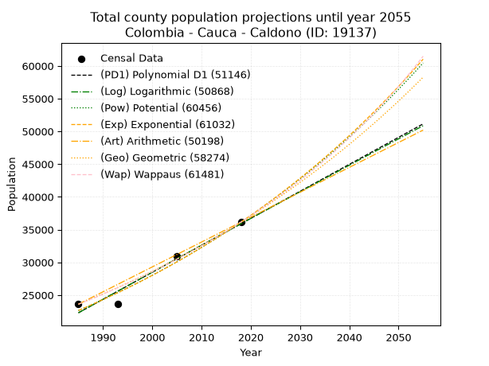
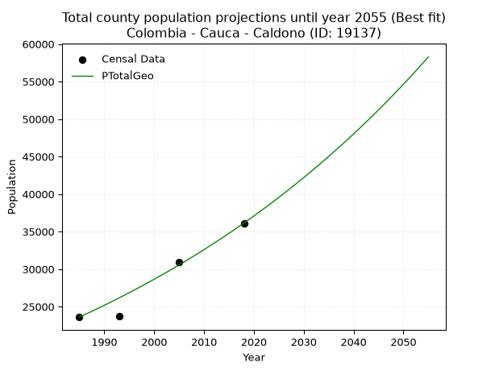
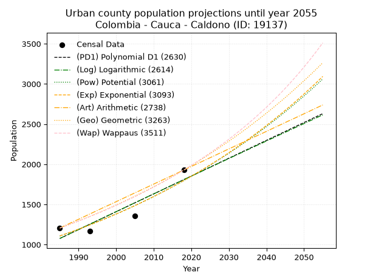
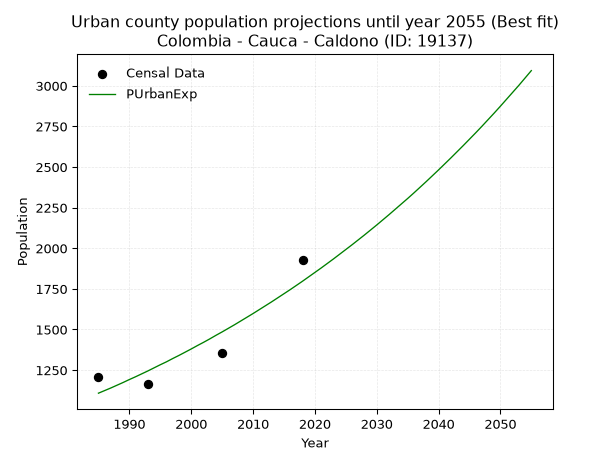
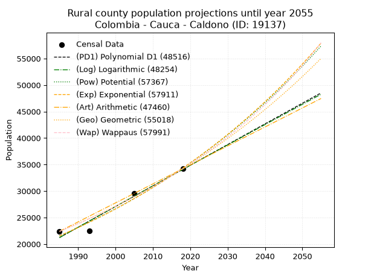
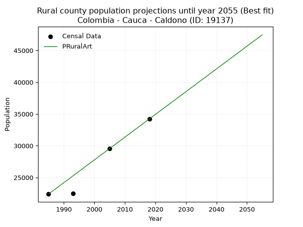

<div align="center">


</div>

# _“Population and Public Services Demand Projections (PPSD) until Year 2050 for Colombia - Cauca - Caldono (ID: 19137)”_
Keywords: `population` `public-service` `projection` `lineal` `polynomial` `logarithmic` `potential` `exponential` `arithmetic` `geometric` `wappaus` `dane` `colombia` `south-america`

PPSD are analytical estimates used by governments and planners to anticipate future changes in population size, age distribution, and the resulting community needs for utilities, healthcare, education, and infrastructure as sizing future water treatment facilities, electrical grids, and road networks based on spatial growth.

> **General running parameters**: • app_version: _v20260806_. • Python version: _3.14.7_. • Pandas version: _3.0.5_. • NumPy version: _2.5.1_. • Creates, save and include plots into reports (create_plot): _False_. • Projection until year: _2050_. • Process polynomial degree 2 and up: _False_. • Process Wappaus: _True_. • Process Wappaus: _True_. • Set negative values to zero: _True_. • Set infinite values to zero: _True_. • Drop dataset notes: _True_. 
<div align="center">

Dynamic map: [:earth_americas:Google](http://maps.google.com/maps?q=2.798058618,-76.4843186) [:earth_americas:OSM](https://www.openstreetmap.org/#map=18/2.798058618/-76.4843186&layers=P) [:earth_americas:Bing](https://www.bing.com/maps?cp=2.798058618~-76.4843186&lvl=18) [:earth_americas:Apple](https://maps.apple.com/frame?center=2.798058618%2C-76.4843186&span=0.003%2C0.006)

</div>


<div align="center">

```geojson
{
  "type": "Feature",
  "geometry": {
    "type": "Point", 
    "coordinates": [-76.4843186, 2.798058618]
  }, 
  "properties": {
    "Name": "Colombia - Cauca - Caldono (ID: 19137)"
  }
}
```

</div>


## 0. Census Data (4 records)

Census data are official statistics collected by a government about the people and housing in a country. They usually include counts of total population, age, sex, race, income, education, and jobs.

📅Global census file: [Population.xlsx](../data/Population.xlsx)

| Source   |   Year |   CountryID | CountryName   |   StateID | StateName   |   CountyID | CountyName   |   PTotal |   PUrban |   PRural |
|:---------|-------:|------------:|:--------------|----------:|:------------|-----------:|:-------------|---------:|---------:|---------:|
| DANE     |   1985 |          57 | Colombia      |        19 | Cauca       |      19137 | Caldono      |    23600 |     1206 |    22394 |
| DANE     |   1993 |          57 | Colombia      |        19 | Cauca       |      19137 | Caldono      |    23686 |     1166 |    22520 |
| DANE     |   2005 |          57 | Colombia      |        19 | Cauca       |      19137 | Caldono      |    30906 |     1358 |    29548 |
| DANE     |   2018 |          57 | Colombia      |        19 | Cauca       |      19137 | Caldono      |    36139 |     1928 |    34211 |

> 🔥Some records could had specific notes about the registered values or the corresponding urban or rural distribution.

## 1. Total

### 1.1. Coefficients and Parameters

* (PD1) Polynomial Deg 1: 412.1192292252072, -795758.7382577206 (lineal)
* (Log) Logarithmic: 824675.2341575148, -6239780.313363851
* (Pow) Potential: 28.338671870439356, -89.09924930402306
* (Exp) Exponential: 0.01416050667487022, 1.4049419738941177e-08
* (Art) Arithmetic: Year diff. 2018 - 1985 = 33, Population diff. 36139 - 23600 = 12539, Annual growth = 379.969696969697
* (Geo) Geometric: Year diff. 2018 - 1985 = 33, Population diff. 36139 - 23600 = 12539, Annual growth % = 0.01299663772910331
* (Wap) Wappaus: i = 1.2720992884705034, Condition values only valid for < 200)

<sub>
Wappaus condition values: ['0.00', '1.27', '2.54', '3.82', '5.09', '6.36', '7.63', '8.90', '10.18', '11.45', '12.72', '13.99', '15.27', '16.54', '17.81', '19.08', '20.35', '21.63', '22.90', '24.17', '25.44', '26.71', '27.99', '29.26', '30.53', '31.80', '33.07', '34.35', '35.62', '36.89', '38.16', '39.44', '40.71', '41.98', '43.25', '44.52', '45.80', '47.07', '48.34', '49.61', '50.88', '52.16', '53.43', '54.70', '55.97', '57.24', '58.52', '59.79', '61.06', '62.33', '63.60', '64.88', '66.15', '67.42', '68.69', '69.97', '71.24', '72.51', '73.78', '75.05', '76.33', '77.60', '78.87', '80.14', '81.41', '82.69']
</sub>


### 1.2. Projected Dataset

|   Year |   CountyID |   PTotalPD1 |   PTotalLog |   PTotalPow |   PTotalExp |   PTotalArt |   PTotalGeo |   PTotalWap |
|-------:|-----------:|------------:|------------:|------------:|------------:|------------:|------------:|------------:|
|   1985 |      19137 |       22298 |       22287 |       22641 |       22650 |       23600 |       23600 |       23600 |
|   1986 |      19137 |       22710 |       22703 |       22967 |       22973 |       23980 |       23907 |       23902 |
|   1987 |      19137 |       23122 |       23118 |       23297 |       23301 |       24360 |       24217 |       24208 |
|   1988 |      19137 |       23534 |       23533 |       23631 |       23633 |       24740 |       24532 |       24518 |
|   1989 |      19137 |       23946 |       23947 |       23971 |       23970 |       25120 |       24851 |       24832 |
|   1990 |      19137 |       24359 |       24362 |       24315 |       24312 |       25500 |       25174 |       25150 |
|   1991 |      19137 |       24771 |       24776 |       24663 |       24659 |       25880 |       25501 |       25473 |
|   1992 |      19137 |       25183 |       25190 |       25017 |       25010 |       26260 |       25833 |       25799 |
|   1993 |      19137 |       25595 |       25604 |       25375 |       25367 |       26640 |       26168 |       26130 |
|   1994 |      19137 |       26007 |       26018 |       25738 |       25729 |       27020 |       26508 |       26466 |
|   1995 |      19137 |       26419 |       26431 |       26107 |       26096 |       27400 |       26853 |       26806 |
|   1996 |      19137 |       26831 |       26845 |       26480 |       26468 |       27780 |       27202 |       27151 |
|   1997 |      19137 |       27243 |       27258 |       26858 |       26845 |       28160 |       27555 |       27500 |
|   1998 |      19137 |       27655 |       27671 |       27242 |       27228 |       28540 |       27914 |       27855 |
|   1999 |      19137 |       28068 |       28083 |       27631 |       27616 |       28920 |       28276 |       28214 |
|   2000 |      19137 |       28480 |       28496 |       28026 |       28010 |       29300 |       28644 |       28578 |
|   2001 |      19137 |       28892 |       28908 |       28426 |       28410 |       29680 |       29016 |       28948 |
|   2002 |      19137 |       29304 |       29320 |       28831 |       28815 |       30059 |       29393 |       29322 |
|   2003 |      19137 |       29716 |       29732 |       29242 |       29226 |       30439 |       29775 |       29703 |
|   2004 |      19137 |       30128 |       30143 |       29658 |       29643 |       30819 |       30162 |       30088 |
|   2005 |      19137 |       30540 |       30555 |       30081 |       30065 |       31199 |       30554 |       30479 |
|   2006 |      19137 |       30952 |       30966 |       30509 |       30494 |       31579 |       30951 |       30876 |
|   2007 |      19137 |       31365 |       31377 |       30943 |       30929 |       31959 |       31354 |       31279 |
|   2008 |      19137 |       31777 |       31788 |       31383 |       31370 |       32339 |       31761 |       31688 |
|   2009 |      19137 |       32189 |       32198 |       31828 |       31818 |       32719 |       32174 |       32103 |
|   2010 |      19137 |       32601 |       32609 |       32280 |       32271 |       33099 |       32592 |       32524 |
|   2011 |      19137 |       33013 |       33019 |       32739 |       32732 |       33479 |       33016 |       32952 |
|   2012 |      19137 |       33425 |       33429 |       33203 |       33198 |       33859 |       33445 |       33386 |
|   2013 |      19137 |       33837 |       33839 |       33674 |       33672 |       34239 |       33879 |       33827 |
|   2014 |      19137 |       34249 |       34248 |       34151 |       34152 |       34619 |       34320 |       34275 |
|   2015 |      19137 |       34662 |       34658 |       34635 |       34639 |       34999 |       34766 |       34730 |
|   2016 |      19137 |       35074 |       35067 |       35126 |       35133 |       35379 |       35218 |       35192 |
|   2017 |      19137 |       35486 |       35476 |       35623 |       35634 |       35759 |       35675 |       35662 |
|   2018 |      19137 |       35898 |       35885 |       36127 |       36142 |       36139 |       36139 |       36139 |
|   2019 |      19137 |       36310 |       36293 |       36637 |       36658 |       36519 |       36609 |       36624 |
|   2020 |      19137 |       36722 |       36701 |       37155 |       37180 |       36899 |       37084 |       37117 |
|   2021 |      19137 |       37134 |       37110 |       37680 |       37711 |       37279 |       37566 |       37617 |
|   2022 |      19137 |       37546 |       37518 |       38212 |       38249 |       37659 |       38055 |       38127 |
|   2023 |      19137 |       37958 |       37925 |       38751 |       38794 |       38039 |       38549 |       38644 |
|   2024 |      19137 |       38371 |       38333 |       39298 |       39347 |       38419 |       39050 |       39171 |
|   2025 |      19137 |       38783 |       38740 |       39851 |       39908 |       38799 |       39558 |       39706 |
|   2026 |      19137 |       39195 |       39147 |       40413 |       40478 |       39179 |       40072 |       40251 |
|   2027 |      19137 |       39607 |       39554 |       40982 |       41055 |       39559 |       40593 |       40805 |
|   2028 |      19137 |       40019 |       39961 |       41559 |       41640 |       39939 |       41120 |       41369 |
|   2029 |      19137 |       40431 |       40368 |       42144 |       42234 |       40319 |       41655 |       41943 |
|   2030 |      19137 |       40843 |       40774 |       42736 |       42836 |       40699 |       42196 |       42527 |
|   2031 |      19137 |       41255 |       41180 |       43337 |       43447 |       41079 |       42744 |       43122 |
|   2032 |      19137 |       41668 |       41586 |       43946 |       44067 |       41459 |       43300 |       43727 |
|   2033 |      19137 |       42080 |       41992 |       44563 |       44695 |       41839 |       43863 |       44343 |
|   2034 |      19137 |       42492 |       42397 |       45188 |       45333 |       42219 |       44433 |       44971 |
|   2035 |      19137 |       42904 |       42803 |       45822 |       45979 |       42598 |       45010 |       45611 |
|   2036 |      19137 |       43316 |       43208 |       46464 |       46635 |       42978 |       45595 |       46262 |
|   2037 |      19137 |       43728 |       43613 |       47115 |       47300 |       43358 |       46188 |       46926 |
|   2038 |      19137 |       44140 |       44018 |       47775 |       47975 |       43738 |       46788 |       47603 |
|   2039 |      19137 |       44552 |       44422 |       48444 |       48659 |       44118 |       47396 |       48293 |
|   2040 |      19137 |       44964 |       44826 |       49122 |       49353 |       44498 |       48012 |       48996 |
|   2041 |      19137 |       45377 |       45231 |       49809 |       50057 |       44878 |       48636 |       49713 |
|   2042 |      19137 |       45789 |       45635 |       50505 |       50770 |       45258 |       49268 |       50445 |
|   2043 |      19137 |       46201 |       46038 |       51211 |       51495 |       45638 |       49909 |       51191 |
|   2044 |      19137 |       46613 |       46442 |       51926 |       52229 |       46018 |       50557 |       51953 |
|   2045 |      19137 |       47025 |       46845 |       52650 |       52974 |       46398 |       51214 |       52730 |
|   2046 |      19137 |       47437 |       47248 |       53385 |       53729 |       46778 |       51880 |       53523 |
|   2047 |      19137 |       47849 |       47651 |       54129 |       54495 |       47158 |       52554 |       54333 |
|   2048 |      19137 |       48261 |       48054 |       54884 |       55273 |       47538 |       53237 |       55160 |
|   2049 |      19137 |       48674 |       48457 |       55648 |       56061 |       47918 |       53929 |       56005 |
|   2050 |      19137 |       49086 |       48859 |       56423 |       56860 |       48298 |       54630 |       56868 |
<div align="center">

</img>

</div>


### 1.3. Best fit with absolute and relative error (%)

Relative error puts that difference into context by dividing the absolute error by the true value, creating a unitless ratio or percentage that shows the scale of the mistake.

Absolute and relative error

|   Year | Source   |   CountryID | CountryName   |   StateID | StateName   |   CountyID_x | CountyName   |   PTotal |   PUrban |   PRural |   CountyID_y |   PTotalPD1 |   PTotalLog |   PTotalPow |   PTotalExp |   PTotalArt |   PTotalGeo |   PTotalWap |   PTotalPD1AbsError |   PTotalLogAbsError |   PTotalPowAbsError |   PTotalExpAbsError |   PTotalArtAbsError |   PTotalGeoAbsError |   PTotalWapAbsError |   PTotalPD1RelError |   PTotalLogRelError |   PTotalPowRelError |   PTotalExpRelError |   PTotalArtRelError |   PTotalGeoRelError |   PTotalWapRelError |
|-------:|:---------|------------:|:--------------|----------:|:------------|-------------:|:-------------|---------:|---------:|---------:|-------------:|------------:|------------:|------------:|------------:|------------:|------------:|------------:|--------------------:|--------------------:|--------------------:|--------------------:|--------------------:|--------------------:|--------------------:|--------------------:|--------------------:|--------------------:|--------------------:|--------------------:|--------------------:|--------------------:|
|   1985 | DANE     |          57 | Colombia      |        19 | Cauca       |        19137 | Caldono      |    23600 |     1206 |    22394 |        19137 |       22298 |       22287 |       22641 |       22650 |       23600 |       23600 |       23600 |                1302 |                1313 |                 959 |                 950 |                   0 |                   0 |                   0 |             5.51695 |            5.56356  |           4.06356   |          4.02542    |            0        |             0       |             0       |
|   1993 | DANE     |          57 | Colombia      |        19 | Cauca       |        19137 | Caldono      |    23686 |     1166 |    22520 |        19137 |       25595 |       25604 |       25375 |       25367 |       26640 |       26168 |       26130 |                1909 |                1918 |                1689 |                1681 |                2954 |                2482 |                2444 |             8.05961 |            8.09761  |           7.13079   |          7.09702    |           12.4715   |            10.4788  |            10.3183  |
|   2005 | DANE     |          57 | Colombia      |        19 | Cauca       |        19137 | Caldono      |    30906 |     1358 |    29548 |        19137 |       30540 |       30555 |       30081 |       30065 |       31199 |       30554 |       30479 |                 366 |                 351 |                 825 |                 841 |                 293 |                 352 |                 427 |             1.18424 |            1.1357   |           2.66938   |          2.72115    |            0.948036 |             1.13894 |             1.38161 |
|   2018 | DANE     |          57 | Colombia      |        19 | Cauca       |        19137 | Caldono      |    36139 |     1928 |    34211 |        19137 |       35898 |       35885 |       36127 |       36142 |       36139 |       36139 |       36139 |                 241 |                 254 |                  12 |                   3 |                   0 |                   0 |                   0 |             0.66687 |            0.702842 |           0.0332051 |          0.00830128 |            0        |             0       |             0       |

Relative error mean

| Method    |   RelError | Best   |
|:----------|-----------:|:-------|
| PTotalPD1 |    3.85692 |        |
| PTotalLog |    3.87493 |        |
| PTotalPow |    3.47424 |        |
| PTotalExp |    3.46297 |        |
| PTotalArt |    3.35488 |        |
| PTotalGeo |    2.90443 | True   |
| PTotalWap |    2.92499 |        |

💙Best method: _**PTotalGeo**_
<div align="center">

</img>

</div>


### 1.4. Fresh water supply demand in liters per capita per day (lpcd)

The fresh water supply demand typically ranges from 100 to 300 liters per capita per day (lpcd) for standard domestic and municipal planning, though absolute survival minimums set by the World Health Organization are as low as 7.5 to 20 liters per day, and total consumption in high-income nations can exceed 400 liters.

> `CZ`: Level in meters above the sea level (masl).<br> `WS`: Fresh water supply demand in liters per capita per day (lpcd or l/h/d).<br> `WSAll`: Zonal fresh water supply demand in liters per second (l/s).<br> `A`: Zonal area in square meters.

Reference values (RAS Colombia)

|    CZ |   WS |
|------:|-----:|
|  1000 |  120 |
|  2000 |  130 |
| 99999 |  140 |

County shapefile geometry properties and water supply values

|   CountyID |      ATotal |   CZTotal |   WSTotal |
|-----------:|------------:|----------:|----------:|
|      19137 | 3.54856e+08 |   1948.62 |       130 |

Projected values for best method: PTotalGeo

|   CountyID |   Year |   PTotalGeo |   WSTotal |   WSTotalAll |
|-----------:|-------:|------------:|----------:|-------------:|
|      19137 |   1985 |       23600 |       130 |      35.5093 |
|      19137 |   1986 |       23907 |       130 |      35.9712 |
|      19137 |   1987 |       24217 |       130 |      36.4376 |
|      19137 |   1988 |       24532 |       130 |      36.9116 |
|      19137 |   1989 |       24851 |       130 |      37.3916 |
|      19137 |   1990 |       25174 |       130 |      37.8775 |
|      19137 |   1991 |       25501 |       130 |      38.3696 |
|      19137 |   1992 |       25833 |       130 |      38.8691 |
|      19137 |   1993 |       26168 |       130 |      39.3731 |
|      19137 |   1994 |       26508 |       130 |      39.8847 |
|      19137 |   1995 |       26853 |       130 |      40.4038 |
|      19137 |   1996 |       27202 |       130 |      40.9289 |
|      19137 |   1997 |       27555 |       130 |      41.4601 |
|      19137 |   1998 |       27914 |       130 |      42.0002 |
|      19137 |   1999 |       28276 |       130 |      42.5449 |
|      19137 |   2000 |       28644 |       130 |      43.0986 |
|      19137 |   2001 |       29016 |       130 |      43.6583 |
|      19137 |   2002 |       29393 |       130 |      44.2256 |
|      19137 |   2003 |       29775 |       130 |      44.8003 |
|      19137 |   2004 |       30162 |       130 |      45.3826 |
|      19137 |   2005 |       30554 |       130 |      45.9725 |
|      19137 |   2006 |       30951 |       130 |      46.5698 |
|      19137 |   2007 |       31354 |       130 |      47.1762 |
|      19137 |   2008 |       31761 |       130 |      47.7885 |
|      19137 |   2009 |       32174 |       130 |      48.41   |
|      19137 |   2010 |       32592 |       130 |      49.0389 |
|      19137 |   2011 |       33016 |       130 |      49.6769 |
|      19137 |   2012 |       33445 |       130 |      50.3223 |
|      19137 |   2013 |       33879 |       130 |      50.9753 |
|      19137 |   2014 |       34320 |       130 |      51.6389 |
|      19137 |   2015 |       34766 |       130 |      52.31   |
|      19137 |   2016 |       35218 |       130 |      52.99   |
|      19137 |   2017 |       35675 |       130 |      53.6777 |
|      19137 |   2018 |       36139 |       130 |      54.3758 |
|      19137 |   2019 |       36609 |       130 |      55.083  |
|      19137 |   2020 |       37084 |       130 |      55.7977 |
|      19137 |   2021 |       37566 |       130 |      56.5229 |
|      19137 |   2022 |       38055 |       130 |      57.2587 |
|      19137 |   2023 |       38549 |       130 |      58.002  |
|      19137 |   2024 |       39050 |       130 |      58.7558 |
|      19137 |   2025 |       39558 |       130 |      59.5201 |
|      19137 |   2026 |       40072 |       130 |      60.2935 |
|      19137 |   2027 |       40593 |       130 |      61.0774 |
|      19137 |   2028 |       41120 |       130 |      61.8704 |
|      19137 |   2029 |       41655 |       130 |      62.6753 |
|      19137 |   2030 |       42196 |       130 |      63.4894 |
|      19137 |   2031 |       42744 |       130 |      64.3139 |
|      19137 |   2032 |       43300 |       130 |      65.1505 |
|      19137 |   2033 |       43863 |       130 |      65.9976 |
|      19137 |   2034 |       44433 |       130 |      66.8552 |
|      19137 |   2035 |       45010 |       130 |      67.7234 |
|      19137 |   2036 |       45595 |       130 |      68.6036 |
|      19137 |   2037 |       46188 |       130 |      69.4958 |
|      19137 |   2038 |       46788 |       130 |      70.3986 |
|      19137 |   2039 |       47396 |       130 |      71.3134 |
|      19137 |   2040 |       48012 |       130 |      72.2403 |
|      19137 |   2041 |       48636 |       130 |      73.1792 |
|      19137 |   2042 |       49268 |       130 |      74.1301 |
|      19137 |   2043 |       49909 |       130 |      75.0946 |
|      19137 |   2044 |       50557 |       130 |      76.0696 |
|      19137 |   2045 |       51214 |       130 |      77.0581 |
|      19137 |   2046 |       51880 |       130 |      78.0602 |
|      19137 |   2047 |       52554 |       130 |      79.0743 |
|      19137 |   2048 |       53237 |       130 |      80.102  |
|      19137 |   2049 |       53929 |       130 |      81.1432 |
|      19137 |   2050 |       54630 |       130 |      82.1979 |

## 2. Urban

### 2.1. Coefficients and Parameters

* (PD1) Polynomial Deg 1: 22.203934162986393, -42998.919309513534 (lineal)
* (Log) Logarithmic: 44395.98287361608, -336039.7215894349
* (Pow) Potential: 29.336049662799144, -93.69901153528001
* (Exp) Exponential: 0.01467077717239696, 2.4948541553492936e-10
* (Art) Arithmetic: Year diff. 2018 - 1985 = 33, Population diff. 1928 - 1206 = 722, Annual growth = 21.87878787878788
* (Geo) Geometric: Year diff. 2018 - 1985 = 33, Population diff. 1928 - 1206 = 722, Annual growth % = 0.01431894477099549
* (Wap) Wappaus: i = 1.3962213068786138, Condition values only valid for < 200)

<sub>
Wappaus condition values: ['0.00', '1.40', '2.79', '4.19', '5.58', '6.98', '8.38', '9.77', '11.17', '12.57', '13.96', '15.36', '16.75', '18.15', '19.55', '20.94', '22.34', '23.74', '25.13', '26.53', '27.92', '29.32', '30.72', '32.11', '33.51', '34.91', '36.30', '37.70', '39.09', '40.49', '41.89', '43.28', '44.68', '46.08', '47.47', '48.87', '50.26', '51.66', '53.06', '54.45', '55.85', '57.25', '58.64', '60.04', '61.43', '62.83', '64.23', '65.62', '67.02', '68.41', '69.81', '71.21', '72.60', '74.00', '75.40', '76.79', '78.19', '79.58', '80.98', '82.38', '83.77', '85.17', '86.57', '87.96', '89.36', '90.75']
</sub>


### 2.2. Projected Dataset

|   Year |   CountyID |   PUrbanPD1 |   PUrbanLog |   PUrbanPow |   PUrbanExp |   PUrbanArt |   PUrbanGeo |   PUrbanWap |
|-------:|-----------:|------------:|------------:|------------:|------------:|------------:|------------:|------------:|
|   1985 |      19137 |        1076 |        1076 |        1107 |        1108 |        1206 |        1206 |        1206 |
|   1986 |      19137 |        1098 |        1098 |        1124 |        1124 |        1228 |        1223 |        1223 |
|   1987 |      19137 |        1120 |        1120 |        1140 |        1140 |        1250 |        1241 |        1240 |
|   1988 |      19137 |        1143 |        1143 |        1157 |        1157 |        1272 |        1259 |        1258 |
|   1989 |      19137 |        1165 |        1165 |        1175 |        1174 |        1294 |        1277 |        1275 |
|   1990 |      19137 |        1187 |        1187 |        1192 |        1192 |        1315 |        1295 |        1293 |
|   1991 |      19137 |        1209 |        1210 |        1210 |        1209 |        1337 |        1313 |        1311 |
|   1992 |      19137 |        1231 |        1232 |        1228 |        1227 |        1359 |        1332 |        1330 |
|   1993 |      19137 |        1254 |        1254 |        1246 |        1245 |        1381 |        1351 |        1349 |
|   1994 |      19137 |        1276 |        1276 |        1264 |        1264 |        1403 |        1371 |        1368 |
|   1995 |      19137 |        1298 |        1299 |        1283 |        1283 |        1425 |        1390 |        1387 |
|   1996 |      19137 |        1320 |        1321 |        1302 |        1301 |        1447 |        1410 |        1407 |
|   1997 |      19137 |        1342 |        1343 |        1321 |        1321 |        1469 |        1430 |        1427 |
|   1998 |      19137 |        1365 |        1365 |        1341 |        1340 |        1490 |        1451 |        1447 |
|   1999 |      19137 |        1387 |        1388 |        1361 |        1360 |        1512 |        1472 |        1467 |
|   2000 |      19137 |        1409 |        1410 |        1381 |        1380 |        1534 |        1493 |        1488 |
|   2001 |      19137 |        1431 |        1432 |        1401 |        1401 |        1556 |        1514 |        1509 |
|   2002 |      19137 |        1453 |        1454 |        1422 |        1421 |        1578 |        1536 |        1531 |
|   2003 |      19137 |        1476 |        1476 |        1443 |        1442 |        1600 |        1558 |        1553 |
|   2004 |      19137 |        1498 |        1499 |        1464 |        1464 |        1622 |        1580 |        1575 |
|   2005 |      19137 |        1520 |        1521 |        1486 |        1485 |        1644 |        1603 |        1597 |
|   2006 |      19137 |        1542 |        1543 |        1508 |        1507 |        1665 |        1626 |        1620 |
|   2007 |      19137 |        1564 |        1565 |        1530 |        1529 |        1687 |        1649 |        1644 |
|   2008 |      19137 |        1587 |        1587 |        1552 |        1552 |        1709 |        1672 |        1667 |
|   2009 |      19137 |        1609 |        1609 |        1575 |        1575 |        1731 |        1696 |        1691 |
|   2010 |      19137 |        1631 |        1631 |        1598 |        1598 |        1753 |        1721 |        1716 |
|   2011 |      19137 |        1653 |        1653 |        1622 |        1622 |        1775 |        1745 |        1741 |
|   2012 |      19137 |        1675 |        1675 |        1646 |        1646 |        1797 |        1770 |        1766 |
|   2013 |      19137 |        1698 |        1697 |        1670 |        1670 |        1819 |        1796 |        1792 |
|   2014 |      19137 |        1720 |        1720 |        1694 |        1695 |        1840 |        1821 |        1818 |
|   2015 |      19137 |        1742 |        1742 |        1719 |        1720 |        1862 |        1847 |        1845 |
|   2016 |      19137 |        1764 |        1764 |        1745 |        1745 |        1884 |        1874 |        1872 |
|   2017 |      19137 |        1786 |        1786 |        1770 |        1771 |        1906 |        1901 |        1900 |
|   2018 |      19137 |        1809 |        1808 |        1796 |        1797 |        1928 |        1928 |        1928 |
|   2019 |      19137 |        1831 |        1830 |        1822 |        1824 |        1950 |        1956 |        1957 |
|   2020 |      19137 |        1853 |        1852 |        1849 |        1851 |        1972 |        1984 |        1986 |
|   2021 |      19137 |        1875 |        1874 |        1876 |        1878 |        1994 |        2012 |        2016 |
|   2022 |      19137 |        1897 |        1896 |        1903 |        1906 |        2016 |        2041 |        2046 |
|   2023 |      19137 |        1920 |        1917 |        1931 |        1934 |        2037 |        2070 |        2077 |
|   2024 |      19137 |        1942 |        1939 |        1959 |        1963 |        2059 |        2100 |        2108 |
|   2025 |      19137 |        1964 |        1961 |        1988 |        1992 |        2081 |        2130 |        2140 |
|   2026 |      19137 |        1986 |        1983 |        2017 |        2021 |        2103 |        2160 |        2173 |
|   2027 |      19137 |        2008 |        2005 |        2047 |        2051 |        2125 |        2191 |        2207 |
|   2028 |      19137 |        2031 |        2027 |        2076 |        2081 |        2147 |        2223 |        2241 |
|   2029 |      19137 |        2053 |        2049 |        2107 |        2112 |        2169 |        2254 |        2275 |
|   2030 |      19137 |        2075 |        2071 |        2137 |        2143 |        2191 |        2287 |        2311 |
|   2031 |      19137 |        2097 |        2093 |        2168 |        2175 |        2212 |        2319 |        2347 |
|   2032 |      19137 |        2119 |        2115 |        2200 |        2207 |        2234 |        2353 |        2384 |
|   2033 |      19137 |        2142 |        2136 |        2232 |        2240 |        2256 |        2386 |        2422 |
|   2034 |      19137 |        2164 |        2158 |        2264 |        2273 |        2278 |        2420 |        2460 |
|   2035 |      19137 |        2186 |        2180 |        2297 |        2306 |        2300 |        2455 |        2499 |
|   2036 |      19137 |        2208 |        2202 |        2331 |        2340 |        2322 |        2490 |        2540 |
|   2037 |      19137 |        2230 |        2224 |        2364 |        2375 |        2344 |        2526 |        2581 |
|   2038 |      19137 |        2253 |        2245 |        2399 |        2410 |        2366 |        2562 |        2623 |
|   2039 |      19137 |        2275 |        2267 |        2433 |        2446 |        2387 |        2599 |        2665 |
|   2040 |      19137 |        2297 |        2289 |        2469 |        2482 |        2409 |        2636 |        2709 |
|   2041 |      19137 |        2319 |        2311 |        2504 |        2519 |        2431 |        2674 |        2754 |
|   2042 |      19137 |        2342 |        2332 |        2541 |        2556 |        2453 |        2712 |        2800 |
|   2043 |      19137 |        2364 |        2354 |        2577 |        2594 |        2475 |        2751 |        2847 |
|   2044 |      19137 |        2386 |        2376 |        2615 |        2632 |        2497 |        2790 |        2895 |
|   2045 |      19137 |        2408 |        2398 |        2652 |        2671 |        2519 |        2830 |        2945 |
|   2046 |      19137 |        2430 |        2419 |        2691 |        2710 |        2541 |        2871 |        2995 |
|   2047 |      19137 |        2453 |        2441 |        2730 |        2750 |        2562 |        2912 |        3047 |
|   2048 |      19137 |        2475 |        2463 |        2769 |        2791 |        2584 |        2954 |        3100 |
|   2049 |      19137 |        2497 |        2484 |        2809 |        2832 |        2606 |        2996 |        3154 |
|   2050 |      19137 |        2519 |        2506 |        2849 |        2874 |        2628 |        3039 |        3210 |
<div align="center">

</img>

</div>


### 2.3. Best fit with absolute and relative error (%)

Relative error puts that difference into context by dividing the absolute error by the true value, creating a unitless ratio or percentage that shows the scale of the mistake.

Absolute and relative error

|   Year | Source   |   CountryID | CountryName   |   StateID | StateName   |   CountyID_x | CountyName   |   PTotal |   PUrban |   PRural |   CountyID_y |   PUrbanPD1 |   PUrbanLog |   PUrbanPow |   PUrbanExp |   PUrbanArt |   PUrbanGeo |   PUrbanWap |   PUrbanPD1AbsError |   PUrbanLogAbsError |   PUrbanPowAbsError |   PUrbanExpAbsError |   PUrbanArtAbsError |   PUrbanGeoAbsError |   PUrbanWapAbsError |   PUrbanPD1RelError |   PUrbanLogRelError |   PUrbanPowRelError |   PUrbanExpRelError |   PUrbanArtRelError |   PUrbanGeoRelError |   PUrbanWapRelError |
|-------:|:---------|------------:|:--------------|----------:|:------------|-------------:|:-------------|---------:|---------:|---------:|-------------:|------------:|------------:|------------:|------------:|------------:|------------:|------------:|--------------------:|--------------------:|--------------------:|--------------------:|--------------------:|--------------------:|--------------------:|--------------------:|--------------------:|--------------------:|--------------------:|--------------------:|--------------------:|--------------------:|
|   1985 | DANE     |          57 | Colombia      |        19 | Cauca       |        19137 | Caldono      |    23600 |     1206 |    22394 |        19137 |        1076 |        1076 |        1107 |        1108 |        1206 |        1206 |        1206 |                 130 |                 130 |                  99 |                  98 |                   0 |                   0 |                   0 |            10.7794  |            10.7794  |             8.20896 |             8.12604 |              0      |              0      |              0      |
|   1993 | DANE     |          57 | Colombia      |        19 | Cauca       |        19137 | Caldono      |    23686 |     1166 |    22520 |        19137 |        1254 |        1254 |        1246 |        1245 |        1381 |        1351 |        1349 |                  88 |                  88 |                  80 |                  79 |                 215 |                 185 |                 183 |             7.54717 |             7.54717 |             6.86106 |             6.7753  |             18.4391 |             15.8662 |             15.6947 |
|   2005 | DANE     |          57 | Colombia      |        19 | Cauca       |        19137 | Caldono      |    30906 |     1358 |    29548 |        19137 |        1520 |        1521 |        1486 |        1485 |        1644 |        1603 |        1597 |                 162 |                 163 |                 128 |                 127 |                 286 |                 245 |                 239 |            11.9293  |            12.0029  |             9.42563 |             9.35199 |             21.0604 |             18.0412 |             17.5994 |
|   2018 | DANE     |          57 | Colombia      |        19 | Cauca       |        19137 | Caldono      |    36139 |     1928 |    34211 |        19137 |        1809 |        1808 |        1796 |        1797 |        1928 |        1928 |        1928 |                 119 |                 120 |                 132 |                 131 |                   0 |                   0 |                   0 |             6.1722  |             6.22407 |             6.84647 |             6.79461 |              0      |              0      |              0      |

Relative error mean

| Method    |   RelError | Best   |
|:----------|-----------:|:-------|
| PUrbanPD1 |    9.10703 |        |
| PUrbanLog |    9.1384  |        |
| PUrbanPow |    7.83553 |        |
| PUrbanExp |    7.76198 | True   |
| PUrbanArt |    9.87487 |        |
| PUrbanGeo |    8.47686 |        |
| PUrbanWap |    8.32352 |        |

💙Best method: _**PUrbanExp**_
<div align="center">

</img>

</div>


### 2.4. Fresh water supply demand in liters per capita per day (lpcd)

The fresh water supply demand typically ranges from 100 to 300 liters per capita per day (lpcd) for standard domestic and municipal planning, though absolute survival minimums set by the World Health Organization are as low as 7.5 to 20 liters per day, and total consumption in high-income nations can exceed 400 liters.

> `CZ`: Level in meters above the sea level (masl).<br> `WS`: Fresh water supply demand in liters per capita per day (lpcd or l/h/d).<br> `WSAll`: Zonal fresh water supply demand in liters per second (l/s).<br> `A`: Zonal area in square meters.

Reference values (RAS Colombia)

|    CZ |   WS |
|------:|-----:|
|  1000 |  120 |
|  2000 |  130 |
| 99999 |  140 |

County shapefile geometry properties and water supply values

|   CountyID |   AUrban |   CZUrban |   WSUrban |
|-----------:|---------:|----------:|----------:|
|      19137 |   689756 |   1673.69 |       130 |

Projected values for best method: PUrbanExp

|   CountyID |   Year |   PUrbanExp |   WSUrban |   WSUrbanAll |
|-----------:|-------:|------------:|----------:|-------------:|
|      19137 |   1985 |        1108 |       130 |      1.66713 |
|      19137 |   1986 |        1124 |       130 |      1.6912  |
|      19137 |   1987 |        1140 |       130 |      1.71528 |
|      19137 |   1988 |        1157 |       130 |      1.74086 |
|      19137 |   1989 |        1174 |       130 |      1.76644 |
|      19137 |   1990 |        1192 |       130 |      1.79352 |
|      19137 |   1991 |        1209 |       130 |      1.8191  |
|      19137 |   1992 |        1227 |       130 |      1.84618 |
|      19137 |   1993 |        1245 |       130 |      1.87326 |
|      19137 |   1994 |        1264 |       130 |      1.90185 |
|      19137 |   1995 |        1283 |       130 |      1.93044 |
|      19137 |   1996 |        1301 |       130 |      1.95752 |
|      19137 |   1997 |        1321 |       130 |      1.98762 |
|      19137 |   1998 |        1340 |       130 |      2.0162  |
|      19137 |   1999 |        1360 |       130 |      2.0463  |
|      19137 |   2000 |        1380 |       130 |      2.07639 |
|      19137 |   2001 |        1401 |       130 |      2.10799 |
|      19137 |   2002 |        1421 |       130 |      2.13808 |
|      19137 |   2003 |        1442 |       130 |      2.16968 |
|      19137 |   2004 |        1464 |       130 |      2.20278 |
|      19137 |   2005 |        1485 |       130 |      2.23438 |
|      19137 |   2006 |        1507 |       130 |      2.26748 |
|      19137 |   2007 |        1529 |       130 |      2.30058 |
|      19137 |   2008 |        1552 |       130 |      2.33519 |
|      19137 |   2009 |        1575 |       130 |      2.36979 |
|      19137 |   2010 |        1598 |       130 |      2.4044  |
|      19137 |   2011 |        1622 |       130 |      2.44051 |
|      19137 |   2012 |        1646 |       130 |      2.47662 |
|      19137 |   2013 |        1670 |       130 |      2.51273 |
|      19137 |   2014 |        1695 |       130 |      2.55035 |
|      19137 |   2015 |        1720 |       130 |      2.58796 |
|      19137 |   2016 |        1745 |       130 |      2.62558 |
|      19137 |   2017 |        1771 |       130 |      2.6647  |
|      19137 |   2018 |        1797 |       130 |      2.70382 |
|      19137 |   2019 |        1824 |       130 |      2.74444 |
|      19137 |   2020 |        1851 |       130 |      2.78507 |
|      19137 |   2021 |        1878 |       130 |      2.82569 |
|      19137 |   2022 |        1906 |       130 |      2.86782 |
|      19137 |   2023 |        1934 |       130 |      2.90995 |
|      19137 |   2024 |        1963 |       130 |      2.95359 |
|      19137 |   2025 |        1992 |       130 |      2.99722 |
|      19137 |   2026 |        2021 |       130 |      3.04086 |
|      19137 |   2027 |        2051 |       130 |      3.086   |
|      19137 |   2028 |        2081 |       130 |      3.13113 |
|      19137 |   2029 |        2112 |       130 |      3.17778 |
|      19137 |   2030 |        2143 |       130 |      3.22442 |
|      19137 |   2031 |        2175 |       130 |      3.27257 |
|      19137 |   2032 |        2207 |       130 |      3.32072 |
|      19137 |   2033 |        2240 |       130 |      3.37037 |
|      19137 |   2034 |        2273 |       130 |      3.42002 |
|      19137 |   2035 |        2306 |       130 |      3.46968 |
|      19137 |   2036 |        2340 |       130 |      3.52083 |
|      19137 |   2037 |        2375 |       130 |      3.5735  |
|      19137 |   2038 |        2410 |       130 |      3.62616 |
|      19137 |   2039 |        2446 |       130 |      3.68032 |
|      19137 |   2040 |        2482 |       130 |      3.73449 |
|      19137 |   2041 |        2519 |       130 |      3.79016 |
|      19137 |   2042 |        2556 |       130 |      3.84583 |
|      19137 |   2043 |        2594 |       130 |      3.90301 |
|      19137 |   2044 |        2632 |       130 |      3.96019 |
|      19137 |   2045 |        2671 |       130 |      4.01887 |
|      19137 |   2046 |        2710 |       130 |      4.07755 |
|      19137 |   2047 |        2750 |       130 |      4.13773 |
|      19137 |   2048 |        2791 |       130 |      4.19942 |
|      19137 |   2049 |        2832 |       130 |      4.26111 |
|      19137 |   2050 |        2874 |       130 |      4.32431 |

## 3. Rural

### 3.1. Coefficients and Parameters

* (PD1) Polynomial Deg 1: 389.9152950622206, -752759.8189482067 (lineal)
* (Log) Logarithmic: 780279.251283899, -5903740.591774418
* (Pow) Potential: 28.27340011296463, -88.90578946754316
* (Exp) Exponential: 0.0141272866869285, 1.4272804738010336e-08
* (Art) Arithmetic: Year diff. 2018 - 1985 = 33, Population diff. 34211 - 22394 = 11817, Annual growth = 358.09090909090907
* (Geo) Geometric: Year diff. 2018 - 1985 = 33, Population diff. 34211 - 22394 = 11817, Annual growth % = 0.01292383539796238
* (Wap) Wappaus: i = 1.2652271322000144, Condition values only valid for < 200)

<sub>
Wappaus condition values: ['0.00', '1.27', '2.53', '3.80', '5.06', '6.33', '7.59', '8.86', '10.12', '11.39', '12.65', '13.92', '15.18', '16.45', '17.71', '18.98', '20.24', '21.51', '22.77', '24.04', '25.30', '26.57', '27.83', '29.10', '30.37', '31.63', '32.90', '34.16', '35.43', '36.69', '37.96', '39.22', '40.49', '41.75', '43.02', '44.28', '45.55', '46.81', '48.08', '49.34', '50.61', '51.87', '53.14', '54.40', '55.67', '56.94', '58.20', '59.47', '60.73', '62.00', '63.26', '64.53', '65.79', '67.06', '68.32', '69.59', '70.85', '72.12', '73.38', '74.65', '75.91', '77.18', '78.44', '79.71', '80.97', '82.24']
</sub>


### 3.2. Projected Dataset

|   Year |   CountyID |   PRuralPD1 |   PRuralLog |   PRuralPow |   PRuralExp |   PRuralArt |   PRuralGeo |   PRuralWap |
|-------:|-----------:|------------:|------------:|------------:|------------:|------------:|------------:|------------:|
|   1985 |      19137 |       21222 |       21212 |       21533 |       21542 |       22394 |       22394 |       22394 |
|   1986 |      19137 |       21612 |       21605 |       21842 |       21848 |       22752 |       22683 |       22679 |
|   1987 |      19137 |       22002 |       21998 |       22155 |       22159 |       23110 |       22977 |       22968 |
|   1988 |      19137 |       22392 |       22390 |       22473 |       22474 |       23468 |       23274 |       23260 |
|   1989 |      19137 |       22782 |       22783 |       22795 |       22794 |       23826 |       23574 |       23557 |
|   1990 |      19137 |       23172 |       23175 |       23121 |       23119 |       24184 |       23879 |       23857 |
|   1991 |      19137 |       23562 |       23567 |       23452 |       23447 |       24543 |       24188 |       24161 |
|   1992 |      19137 |       23951 |       23959 |       23787 |       23781 |       24901 |       24500 |       24469 |
|   1993 |      19137 |       24341 |       24350 |       24127 |       24119 |       25259 |       24817 |       24782 |
|   1994 |      19137 |       24731 |       24742 |       24471 |       24463 |       25617 |       25138 |       25098 |
|   1995 |      19137 |       25121 |       25133 |       24821 |       24811 |       25975 |       25462 |       25419 |
|   1996 |      19137 |       25511 |       25524 |       25175 |       25164 |       26333 |       25791 |       25744 |
|   1997 |      19137 |       25901 |       25915 |       25534 |       25522 |       26691 |       26125 |       26073 |
|   1998 |      19137 |       26291 |       26305 |       25898 |       25885 |       27049 |       26462 |       26407 |
|   1999 |      19137 |       26681 |       26696 |       26267 |       26253 |       27407 |       26804 |       26746 |
|   2000 |      19137 |       27071 |       27086 |       26641 |       26627 |       27765 |       27151 |       27090 |
|   2001 |      19137 |       27461 |       27476 |       27020 |       27005 |       28123 |       27502 |       27438 |
|   2002 |      19137 |       27851 |       27866 |       27405 |       27390 |       28482 |       27857 |       27791 |
|   2003 |      19137 |       28241 |       28255 |       27794 |       27779 |       28840 |       28217 |       28149 |
|   2004 |      19137 |       28630 |       28645 |       28189 |       28175 |       29198 |       28582 |       28513 |
|   2005 |      19137 |       29020 |       29034 |       28590 |       28575 |       29556 |       28951 |       28882 |
|   2006 |      19137 |       29410 |       29423 |       28996 |       28982 |       29914 |       29325 |       29256 |
|   2007 |      19137 |       29800 |       29812 |       29407 |       29394 |       30272 |       29704 |       29635 |
|   2008 |      19137 |       30190 |       30201 |       29824 |       29812 |       30630 |       30088 |       30020 |
|   2009 |      19137 |       30580 |       30589 |       30247 |       30237 |       30988 |       30477 |       30411 |
|   2010 |      19137 |       30970 |       30978 |       30676 |       30667 |       31346 |       30871 |       30808 |
|   2011 |      19137 |       31360 |       31366 |       31110 |       31103 |       31704 |       31270 |       31211 |
|   2012 |      19137 |       31750 |       31754 |       31550 |       31546 |       32062 |       31674 |       31620 |
|   2013 |      19137 |       32140 |       32141 |       31997 |       31994 |       32421 |       32084 |       32035 |
|   2014 |      19137 |       32530 |       32529 |       32449 |       32450 |       32779 |       32498 |       32457 |
|   2015 |      19137 |       32920 |       32916 |       32908 |       32911 |       33137 |       32918 |       32885 |
|   2016 |      19137 |       33309 |       33303 |       33373 |       33380 |       33495 |       33344 |       33320 |
|   2017 |      19137 |       33699 |       33690 |       33844 |       33855 |       33853 |       33775 |       33762 |
|   2018 |      19137 |       34089 |       34077 |       34322 |       34336 |       34211 |       34211 |       34211 |
|   2019 |      19137 |       34479 |       34464 |       34806 |       34825 |       34569 |       34653 |       34667 |
|   2020 |      19137 |       34869 |       34850 |       35297 |       35320 |       34927 |       35101 |       35131 |
|   2021 |      19137 |       35259 |       35236 |       35794 |       35823 |       35285 |       35555 |       35602 |
|   2022 |      19137 |       35649 |       35622 |       36298 |       36332 |       35643 |       36014 |       36081 |
|   2023 |      19137 |       36039 |       36008 |       36809 |       36849 |       36001 |       36480 |       36568 |
|   2024 |      19137 |       36429 |       36394 |       37327 |       37374 |       36360 |       36951 |       37063 |
|   2025 |      19137 |       36819 |       36779 |       37852 |       37905 |       36718 |       37429 |       37567 |
|   2026 |      19137 |       37209 |       37164 |       38384 |       38445 |       37076 |       37912 |       38079 |
|   2027 |      19137 |       37598 |       37549 |       38923 |       38992 |       37434 |       38402 |       38600 |
|   2028 |      19137 |       37988 |       37934 |       39470 |       39546 |       37792 |       38899 |       39130 |
|   2029 |      19137 |       38378 |       38319 |       40024 |       40109 |       38150 |       39401 |       39669 |
|   2030 |      19137 |       38768 |       38703 |       40585 |       40680 |       38508 |       39911 |       40218 |
|   2031 |      19137 |       39158 |       39087 |       41154 |       41258 |       38866 |       40426 |       40777 |
|   2032 |      19137 |       39548 |       39472 |       41731 |       41845 |       39224 |       40949 |       41346 |
|   2033 |      19137 |       39938 |       39855 |       42316 |       42441 |       39582 |       41478 |       41925 |
|   2034 |      19137 |       40328 |       40239 |       42908 |       43045 |       39940 |       42014 |       42514 |
|   2035 |      19137 |       40718 |       40623 |       43509 |       43657 |       40299 |       42557 |       43115 |
|   2036 |      19137 |       41108 |       41006 |       44117 |       44278 |       40657 |       43107 |       43727 |
|   2037 |      19137 |       41498 |       41389 |       44734 |       44908 |       41015 |       43664 |       44350 |
|   2038 |      19137 |       41888 |       41772 |       45359 |       45547 |       41373 |       44228 |       44985 |
|   2039 |      19137 |       42277 |       42155 |       45993 |       46195 |       41731 |       44800 |       45633 |
|   2040 |      19137 |       42667 |       42537 |       46635 |       46852 |       42089 |       45379 |       46293 |
|   2041 |      19137 |       43057 |       42920 |       47285 |       47519 |       42447 |       45965 |       46966 |
|   2042 |      19137 |       43447 |       43302 |       47945 |       48195 |       42805 |       46560 |       47652 |
|   2043 |      19137 |       43837 |       43684 |       48613 |       48881 |       43163 |       47161 |       48352 |
|   2044 |      19137 |       44227 |       44066 |       49290 |       49576 |       43521 |       47771 |       49066 |
|   2045 |      19137 |       44617 |       44448 |       49977 |       50281 |       43879 |       48388 |       49794 |
|   2046 |      19137 |       45007 |       44829 |       50672 |       50997 |       44238 |       49014 |       50538 |
|   2047 |      19137 |       45397 |       45210 |       51377 |       51722 |       44596 |       49647 |       51297 |
|   2048 |      19137 |       45787 |       45591 |       52092 |       52458 |       44954 |       50289 |       52072 |
|   2049 |      19137 |       46177 |       45972 |       52815 |       53205 |       45312 |       50939 |       52864 |
|   2050 |      19137 |       46567 |       46353 |       53549 |       53962 |       45670 |       51597 |       53672 |
<div align="center">

</img>

</div>


### 3.3. Best fit with absolute and relative error (%)

Relative error puts that difference into context by dividing the absolute error by the true value, creating a unitless ratio or percentage that shows the scale of the mistake.

Absolute and relative error

|   Year | Source   |   CountryID | CountryName   |   StateID | StateName   |   CountyID_x | CountyName   |   PTotal |   PUrban |   PRural |   CountyID_y |   PRuralPD1 |   PRuralLog |   PRuralPow |   PRuralExp |   PRuralArt |   PRuralGeo |   PRuralWap |   PRuralPD1AbsError |   PRuralLogAbsError |   PRuralPowAbsError |   PRuralExpAbsError |   PRuralArtAbsError |   PRuralGeoAbsError |   PRuralWapAbsError |   PRuralPD1RelError |   PRuralLogRelError |   PRuralPowRelError |   PRuralExpRelError |   PRuralArtRelError |   PRuralGeoRelError |   PRuralWapRelError |
|-------:|:---------|------------:|:--------------|----------:|:------------|-------------:|:-------------|---------:|---------:|---------:|-------------:|------------:|------------:|------------:|------------:|------------:|------------:|------------:|--------------------:|--------------------:|--------------------:|--------------------:|--------------------:|--------------------:|--------------------:|--------------------:|--------------------:|--------------------:|--------------------:|--------------------:|--------------------:|--------------------:|
|   1985 | DANE     |          57 | Colombia      |        19 | Cauca       |        19137 | Caldono      |    23600 |     1206 |    22394 |        19137 |       21222 |       21212 |       21533 |       21542 |       22394 |       22394 |       22394 |                1172 |                1182 |                 861 |                 852 |                   0 |                   0 |                   0 |             5.23354 |            5.2782   |            3.84478  |             3.80459 |           0         |             0       |             0       |
|   1993 | DANE     |          57 | Colombia      |        19 | Cauca       |        19137 | Caldono      |    23686 |     1166 |    22520 |        19137 |       24341 |       24350 |       24127 |       24119 |       25259 |       24817 |       24782 |                1821 |                1830 |                1607 |                1599 |                2739 |                2297 |                2262 |             8.08615 |            8.12611  |            7.13588  |             7.10036 |          12.1625    |            10.1998  |            10.0444  |
|   2005 | DANE     |          57 | Colombia      |        19 | Cauca       |        19137 | Caldono      |    30906 |     1358 |    29548 |        19137 |       29020 |       29034 |       28590 |       28575 |       29556 |       28951 |       28882 |                 528 |                 514 |                 958 |                 973 |                   8 |                 597 |                 666 |             1.78692 |            1.73954  |            3.24218  |             3.29295 |           0.0270746 |             2.02044 |             2.25396 |
|   2018 | DANE     |          57 | Colombia      |        19 | Cauca       |        19137 | Caldono      |    36139 |     1928 |    34211 |        19137 |       34089 |       34077 |       34322 |       34336 |       34211 |       34211 |       34211 |                 122 |                 134 |                 111 |                 125 |                   0 |                   0 |                   0 |             0.35661 |            0.391687 |            0.324457 |             0.36538 |           0         |             0       |             0       |

Relative error mean

| Method    |   RelError | Best   |
|:----------|-----------:|:-------|
| PRuralPD1 |    3.86581 |        |
| PRuralLog |    3.88388 |        |
| PRuralPow |    3.63682 |        |
| PRuralExp |    3.64082 |        |
| PRuralArt |    3.0474  | True   |
| PRuralGeo |    3.05507 |        |
| PRuralWap |    3.07459 |        |

💙Best method: _**PRuralArt**_
<div align="center">

</img>

</div>


### 3.4. Fresh water supply demand in liters per capita per day (lpcd)

The fresh water supply demand typically ranges from 100 to 300 liters per capita per day (lpcd) for standard domestic and municipal planning, though absolute survival minimums set by the World Health Organization are as low as 7.5 to 20 liters per day, and total consumption in high-income nations can exceed 400 liters.

> `CZ`: Level in meters above the sea level (masl).<br> `WS`: Fresh water supply demand in liters per capita per day (lpcd or l/h/d).<br> `WSAll`: Zonal fresh water supply demand in liters per second (l/s).<br> `A`: Zonal area in square meters.

Reference values (RAS Colombia)

|    CZ |   WS |
|------:|-----:|
|  1000 |  120 |
|  2000 |  130 |
| 99999 |  140 |

County shapefile geometry properties and water supply values

|   CountyID |      ARural |   CZRural |   WSRural |
|-----------:|------------:|----------:|----------:|
|      19137 | 3.54166e+08 |   1949.18 |       130 |

Projected values for best method: PRuralArt

|   CountyID |   Year |   PRuralArt |   WSRural |   WSRuralAll |
|-----------:|-------:|------------:|----------:|-------------:|
|      19137 |   1985 |       22394 |       130 |      33.6947 |
|      19137 |   1986 |       22752 |       130 |      34.2333 |
|      19137 |   1987 |       23110 |       130 |      34.772  |
|      19137 |   1988 |       23468 |       130 |      35.3106 |
|      19137 |   1989 |       23826 |       130 |      35.8493 |
|      19137 |   1990 |       24184 |       130 |      36.388  |
|      19137 |   1991 |       24543 |       130 |      36.9281 |
|      19137 |   1992 |       24901 |       130 |      37.4668 |
|      19137 |   1993 |       25259 |       130 |      38.0054 |
|      19137 |   1994 |       25617 |       130 |      38.5441 |
|      19137 |   1995 |       25975 |       130 |      39.0828 |
|      19137 |   1996 |       26333 |       130 |      39.6214 |
|      19137 |   1997 |       26691 |       130 |      40.1601 |
|      19137 |   1998 |       27049 |       130 |      40.6987 |
|      19137 |   1999 |       27407 |       130 |      41.2374 |
|      19137 |   2000 |       27765 |       130 |      41.776  |
|      19137 |   2001 |       28123 |       130 |      42.3147 |
|      19137 |   2002 |       28482 |       130 |      42.8549 |
|      19137 |   2003 |       28840 |       130 |      43.3935 |
|      19137 |   2004 |       29198 |       130 |      43.9322 |
|      19137 |   2005 |       29556 |       130 |      44.4708 |
|      19137 |   2006 |       29914 |       130 |      45.0095 |
|      19137 |   2007 |       30272 |       130 |      45.5481 |
|      19137 |   2008 |       30630 |       130 |      46.0868 |
|      19137 |   2009 |       30988 |       130 |      46.6255 |
|      19137 |   2010 |       31346 |       130 |      47.1641 |
|      19137 |   2011 |       31704 |       130 |      47.7028 |
|      19137 |   2012 |       32062 |       130 |      48.2414 |
|      19137 |   2013 |       32421 |       130 |      48.7816 |
|      19137 |   2014 |       32779 |       130 |      49.3203 |
|      19137 |   2015 |       33137 |       130 |      49.8589 |
|      19137 |   2016 |       33495 |       130 |      50.3976 |
|      19137 |   2017 |       33853 |       130 |      50.9362 |
|      19137 |   2018 |       34211 |       130 |      51.4749 |
|      19137 |   2019 |       34569 |       130 |      52.0135 |
|      19137 |   2020 |       34927 |       130 |      52.5522 |
|      19137 |   2021 |       35285 |       130 |      53.0909 |
|      19137 |   2022 |       35643 |       130 |      53.6295 |
|      19137 |   2023 |       36001 |       130 |      54.1682 |
|      19137 |   2024 |       36360 |       130 |      54.7083 |
|      19137 |   2025 |       36718 |       130 |      55.247  |
|      19137 |   2026 |       37076 |       130 |      55.7856 |
|      19137 |   2027 |       37434 |       130 |      56.3243 |
|      19137 |   2028 |       37792 |       130 |      56.863  |
|      19137 |   2029 |       38150 |       130 |      57.4016 |
|      19137 |   2030 |       38508 |       130 |      57.9403 |
|      19137 |   2031 |       38866 |       130 |      58.4789 |
|      19137 |   2032 |       39224 |       130 |      59.0176 |
|      19137 |   2033 |       39582 |       130 |      59.5562 |
|      19137 |   2034 |       39940 |       130 |      60.0949 |
|      19137 |   2035 |       40299 |       130 |      60.6351 |
|      19137 |   2036 |       40657 |       130 |      61.1737 |
|      19137 |   2037 |       41015 |       130 |      61.7124 |
|      19137 |   2038 |       41373 |       130 |      62.251  |
|      19137 |   2039 |       41731 |       130 |      62.7897 |
|      19137 |   2040 |       42089 |       130 |      63.3284 |
|      19137 |   2041 |       42447 |       130 |      63.867  |
|      19137 |   2042 |       42805 |       130 |      64.4057 |
|      19137 |   2043 |       43163 |       130 |      64.9443 |
|      19137 |   2044 |       43521 |       130 |      65.483  |
|      19137 |   2045 |       43879 |       130 |      66.0216 |
|      19137 |   2046 |       44238 |       130 |      66.5618 |
|      19137 |   2047 |       44596 |       130 |      67.1005 |
|      19137 |   2048 |       44954 |       130 |      67.6391 |
|      19137 |   2049 |       45312 |       130 |      68.1778 |
|      19137 |   2050 |       45670 |       130 |      68.7164 |

<div align="center"><br><sub>Share this research</sub></div><br>

<sub>**APPS & TOOLS & CONTENT DISCLAIMER**: • NO WARRANTY - This content and software is provided by <a href="https://github.com/rcfdtools" target="_blank">github.com/rcfdtools</a> "as is", without any express or implied warranty, including warranties of merchantability, fitness for a particular purpose, or non-infringement. There is no guarantee that the software will be error-free or operate without interruption. • LIMITATION OF LIABILITY - Neither the authors nor copyright holders will be liable for claims or damages arising from the software or its use. You are responsible for determining if the software is appropriate for your use and assume all associated risks, including errors, legal compliance, and data loss. • NO PROFESSIONAL ADVICE - The software provides general information and does not offer professional advice. It should not replace consultation with professional advisors. [Clauses and global license for rcfdtools use.](https://github.com/rcfdtools/rcfdtools/blob/main/LICENSE.md)</sub>