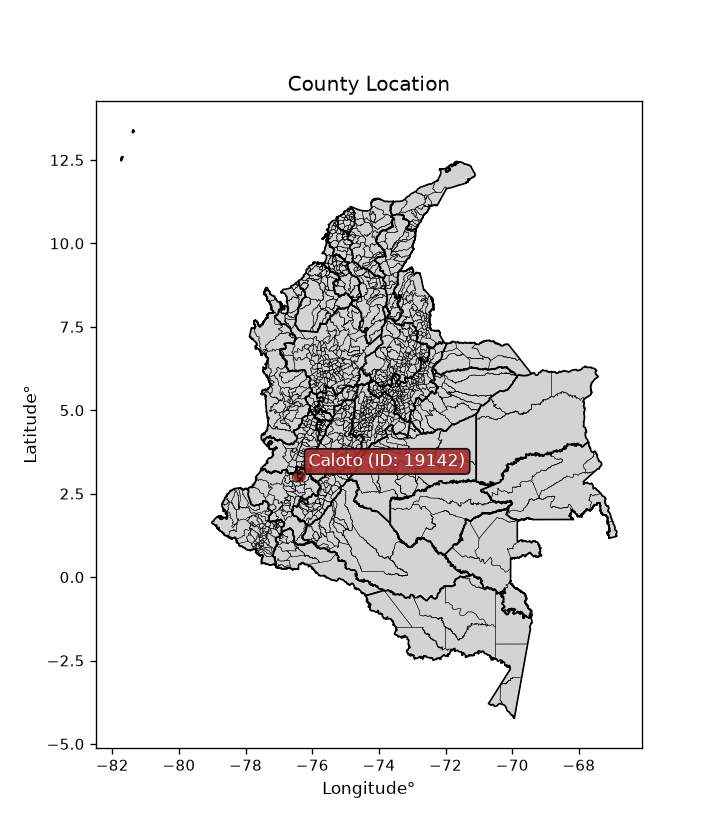
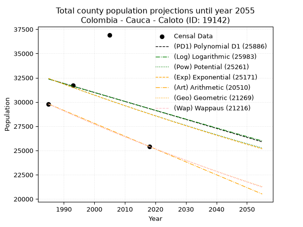
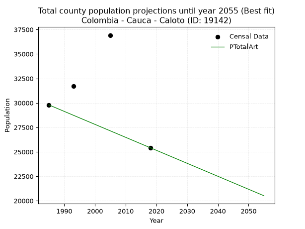
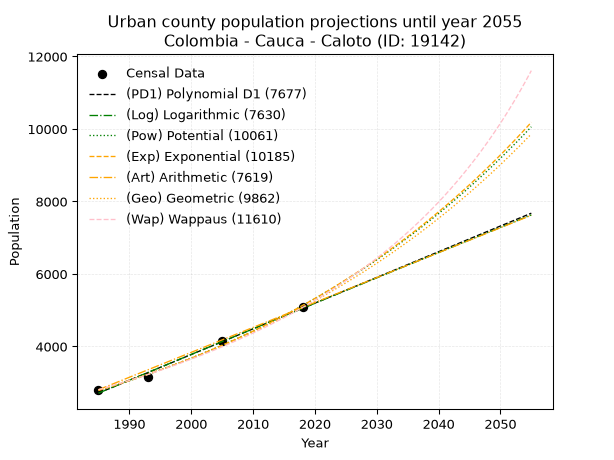
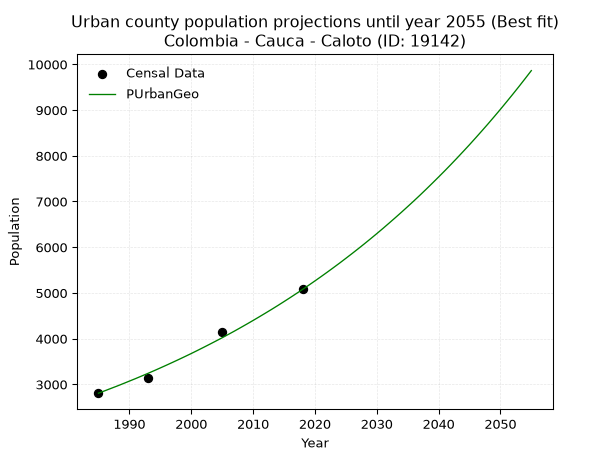
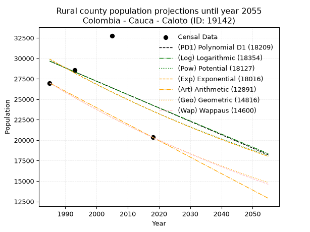
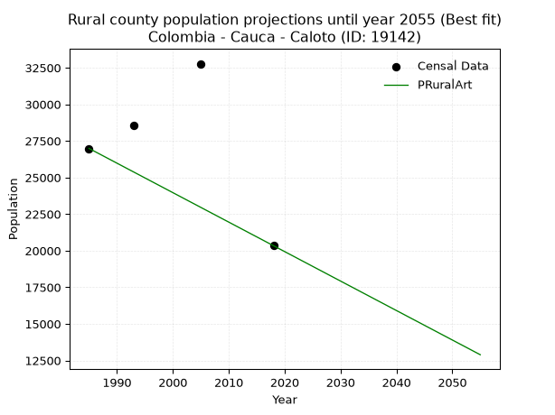

<div align="center">


</div>

# _“Population and Public Services Demand Projections (PPSD) until Year 2050 for Colombia - Cauca - Caloto (ID: 19142)”_
Keywords: `population` `public-service` `projection` `lineal` `polynomial` `logarithmic` `potential` `exponential` `arithmetic` `geometric` `wappaus` `dane` `colombia` `south-america`

PPSD are analytical estimates used by governments and planners to anticipate future changes in population size, age distribution, and the resulting community needs for utilities, healthcare, education, and infrastructure as sizing future water treatment facilities, electrical grids, and road networks based on spatial growth.

<div align="center">

</img>

</div>


> **General running parameters**: • app_version: _v20260806_. • Python version: _3.14.7_. • Pandas version: _3.0.5_. • NumPy version: _2.5.1_. • Creates, save and include plots into reports (create_plot): _False_. • Projection until year: _2050_. • Process polynomial degree 2 and up: _False_. • Process Wappaus: _True_. • Process Wappaus: _True_. • Set negative values to zero: _True_. • Set infinite values to zero: _True_. • Drop dataset notes: _True_. 
<div align="center">

Dynamic map: [:earth_americas:Google](http://maps.google.com/maps?q=3.03453107,-76.4089406) [:earth_americas:OSM](https://www.openstreetmap.org/#map=18/3.03453107/-76.4089406&layers=P) [:earth_americas:Bing](https://www.bing.com/maps?cp=3.03453107~-76.4089406&lvl=18) [:earth_americas:Apple](https://maps.apple.com/frame?center=3.03453107%2C-76.4089406&span=0.003%2C0.006)

</div>


<div align="center">

```geojson
{
  "type": "Feature",
  "geometry": {
    "type": "Point", 
    "coordinates": [-76.4089406, 3.03453107]
  }, 
  "properties": {
    "Name": "Colombia - Cauca - Caloto (ID: 19142)"
  }
}
```

</div>


## 0. Census Data (4 records)

Census data are official statistics collected by a government about the people and housing in a country. They usually include counts of total population, age, sex, race, income, education, and jobs.

📅Global census file: [Population.xlsx](../data/Population.xlsx)

| Source   |   Year |   CountryID | CountryName   |   StateID | StateName   |   CountyID | CountyName   |   PTotal |   PUrban |   PRural |
|:---------|-------:|------------:|:--------------|----------:|:------------|-----------:|:-------------|---------:|---------:|---------:|
| DANE     |   1985 |          57 | Colombia      |        19 | Cauca       |      19142 | Caloto       |    29792 |     2806 |    26986 |
| DANE     |   1993 |          57 | Colombia      |        19 | Cauca       |      19142 | Caloto       |    31709 |     3149 |    28560 |
| DANE     |   2005 |          57 | Colombia      |        19 | Cauca       |      19142 | Caloto       |    36921 |     4148 |    32773 |
| DANE     |   2018 |          57 | Colombia      |        19 | Cauca       |      19142 | Caloto       |    25416 |     5075 |    20341 |

> 🔥Some records could had specific notes about the registered values or the corresponding urban or rural distribution.

📅[SUI-RUPS](https://www.datos.gov.co/Hacienda-y-Cr-dito-P-blico/Registro-nico-de-Prestadores-de-Servicios-P-blicos/4qkq-csdn/about_data) - Local public utility companies: [RUPS.csv](../data/RUPS.xlsx)

 | SERVICIO       | ESTADO                    | NOMBRE                                                                                               | NIT         | DEPARTAMENTO_DOMICILIO   | MUNICIPIO_DOMICILIO   | DIRECCION                                             |   TELEFONO | EMAIL                    | TIPO_PRESTADOR                             | CLASIFICACION                 |
|:---------------|:--------------------------|:-----------------------------------------------------------------------------------------------------|:------------|:-------------------------|:----------------------|:------------------------------------------------------|-----------:|:-------------------------|:-------------------------------------------|:------------------------------|
| ACUEDUCTO      | OPERATIVA                 | EMPRESA DE SERVICIOS PUBLICOS DE CALOTO                                                              | 817000100-2 | CAUCA                    | CALOTO                | Calle 11 No. 5  60                                    |    8258284 | empocaloto@yahoo.com     | EMPRESA INDUSTRIAL Y COMERCIAL DEL ESTADO  | MENOR O IGUAL A 2500 USUARIOS |
| ALCANTARILLADO | OPERATIVA                 | EMPRESA DE SERVICIOS PUBLICOS DE CALOTO                                                              | 817000100-2 | CAUCA                    | CALOTO                | Calle 11 No. 5  60                                    |    8258284 | empocaloto@yahoo.com     | EMPRESA INDUSTRIAL Y COMERCIAL DEL ESTADO  | MENOR O IGUAL A 2500 USUARIOS |
| ACUEDUCTO      | EN PROCESO DE LIQUIDACION | EMPRESA DE ACUEDUCTO Y ALCANTARILLADO DEL RIO PALO SOCIEDAD POR ACCIONES E.S.P. EN LIQUIDACION       | 800155877-1 | CAUCA                    | VILLA RICA            | CALLE 2 1 139                                         |    8486421 | miltonvel@hotmail.com    | SOCIEDADES (EMPRESA DE SERVICIOS PUBLICOS) | MAYOR O IGUAL A 5001 USUARIOS |
| ACUEDUCTO      | OPERATIVA                 | ASOCIACION DE USUARIOS DEL ACUEDUCTO INTERVEREDAL CRUCERO DE GUALI                                   | 800145084-3 | CAUCA                    | CALOTO                | VEREDA GUALI                                          |    8258284 | acueductoguali@gmail.com | ORGANIZACION AUTORIZADA                    | MENOR O IGUAL A 2500 USUARIOS |
| ACUEDUCTO      | OPERATIVA                 | ACUAPAEZ S.A. E.S.P.                                                                                 | 817002471-9 | CAUCA                    | CALOTO                | PARQUE INDUSTRIAL Y CCIAL DEL CAUCA ET 4 LOTE 14      |    8259375 | jmena@acuapaez.com       | SOCIEDADES (EMPRESA DE SERVICIOS PUBLICOS) | MENOR O IGUAL A 2500 USUARIOS |
| ALCANTARILLADO | OPERATIVA                 | ACUAPAEZ S.A. E.S.P.                                                                                 | 817002471-9 | CAUCA                    | CALOTO                | PARQUE INDUSTRIAL Y CCIAL DEL CAUCA ET 4 LOTE 14      |    8259375 | jmena@acuapaez.com       | SOCIEDADES (EMPRESA DE SERVICIOS PUBLICOS) | MENOR O IGUAL A 2500 USUARIOS |
| ACUEDUCTO      | OPERATIVA                 | Asociacion de Usuarios del Acueducto Inter-Veredal El Alba,Marañon,Caicedo, San Nicolas y Santa Rosa | 900224131-3 | CAUCA                    | CALOTO                | kl 1 salida via santander quilichao vereda santa rosa |    3174716 | asoalma1@gmail.com       | ORGANIZACION AUTORIZADA                    | MENOR O IGUAL A 2500 USUARIOS |

## 1. Total

### 1.1. Coefficients and Parameters

* (PD1) Polynomial Deg 1: -92.66880770774081, 216320.28261740852 (lineal)
* (Log) Logarithmic: -184140.28839346964, 1430611.307686426
* (Pow) Potential: -7.197727967728151, 28.247161592355123
* (Exp) Exponential: -0.003617550740798703, 42606232.76434907
* (Art) Arithmetic: Year diff. 2018 - 1985 = 33, Population diff. 25416 - 29792 = -4376, Annual growth = -132.6060606060606
* (Geo) Geometric: Year diff. 2018 - 1985 = 33, Population diff. 25416 - 29792 = -4376, Annual growth % = -0.0048024012403655725
* (Wap) Wappaus: i = -0.48038712000456674, Condition values only valid for < 200)

<sub>
Wappaus condition values: ['-0.00', '-0.48', '-0.96', '-1.44', '-1.92', '-2.40', '-2.88', '-3.36', '-3.84', '-4.32', '-4.80', '-5.28', '-5.76', '-6.25', '-6.73', '-7.21', '-7.69', '-8.17', '-8.65', '-9.13', '-9.61', '-10.09', '-10.57', '-11.05', '-11.53', '-12.01', '-12.49', '-12.97', '-13.45', '-13.93', '-14.41', '-14.89', '-15.37', '-15.85', '-16.33', '-16.81', '-17.29', '-17.77', '-18.25', '-18.74', '-19.22', '-19.70', '-20.18', '-20.66', '-21.14', '-21.62', '-22.10', '-22.58', '-23.06', '-23.54', '-24.02', '-24.50', '-24.98', '-25.46', '-25.94', '-26.42', '-26.90', '-27.38', '-27.86', '-28.34', '-28.82', '-29.30', '-29.78', '-30.26', '-30.74', '-31.23']
</sub>


### 1.2. Projected Dataset

|   Year |   CountyID |   PTotalPD1 |   PTotalLog |   PTotalPow |   PTotalExp |   PTotalArt |   PTotalGeo |   PTotalWap |
|-------:|-----------:|------------:|------------:|------------:|------------:|------------:|------------:|------------:|
|   1985 |      19142 |       32373 |       32365 |       32417 |       32425 |       29792 |       29792 |       29792 |
|   1986 |      19142 |       32280 |       32272 |       32300 |       32308 |       29659 |       29649 |       29649 |
|   1987 |      19142 |       32187 |       32180 |       32183 |       32191 |       29527 |       29507 |       29507 |
|   1988 |      19142 |       32095 |       32087 |       32067 |       32075 |       29394 |       29365 |       29366 |
|   1989 |      19142 |       32002 |       31995 |       31951 |       31959 |       29262 |       29224 |       29225 |
|   1990 |      19142 |       31909 |       31902 |       31836 |       31843 |       29129 |       29083 |       29085 |
|   1991 |      19142 |       31817 |       31809 |       31721 |       31728 |       28996 |       28944 |       28945 |
|   1992 |      19142 |       31724 |       31717 |       31606 |       31614 |       28864 |       28805 |       28807 |
|   1993 |      19142 |       31631 |       31625 |       31492 |       31500 |       28731 |       28666 |       28669 |
|   1994 |      19142 |       31539 |       31532 |       31379 |       31386 |       28599 |       28529 |       28531 |
|   1995 |      19142 |       31446 |       31440 |       31266 |       31273 |       28466 |       28392 |       28394 |
|   1996 |      19142 |       31353 |       31348 |       31153 |       31160 |       28333 |       28255 |       28258 |
|   1997 |      19142 |       31261 |       31255 |       31041 |       31047 |       28201 |       28120 |       28123 |
|   1998 |      19142 |       31168 |       31163 |       30930 |       30935 |       28068 |       27985 |       27988 |
|   1999 |      19142 |       31075 |       31071 |       30818 |       30823 |       27936 |       27850 |       27854 |
|   2000 |      19142 |       30983 |       30979 |       30708 |       30712 |       27803 |       27717 |       27720 |
|   2001 |      19142 |       30890 |       30887 |       30597 |       30601 |       27670 |       27583 |       27587 |
|   2002 |      19142 |       30797 |       30795 |       30487 |       30491 |       27538 |       27451 |       27454 |
|   2003 |      19142 |       30705 |       30703 |       30378 |       30381 |       27405 |       27319 |       27323 |
|   2004 |      19142 |       30612 |       30611 |       30269 |       30271 |       27272 |       27188 |       27191 |
|   2005 |      19142 |       30519 |       30519 |       30161 |       30162 |       27140 |       27057 |       27061 |
|   2006 |      19142 |       30427 |       30427 |       30053 |       30053 |       27007 |       26927 |       26931 |
|   2007 |      19142 |       30334 |       30336 |       29945 |       29944 |       26875 |       26798 |       26801 |
|   2008 |      19142 |       30241 |       30244 |       29838 |       29836 |       26742 |       26669 |       26673 |
|   2009 |      19142 |       30149 |       30152 |       29731 |       29728 |       26609 |       26541 |       26544 |
|   2010 |      19142 |       30056 |       30061 |       29625 |       29621 |       26477 |       26414 |       26417 |
|   2011 |      19142 |       29963 |       29969 |       29519 |       29514 |       26344 |       26287 |       26290 |
|   2012 |      19142 |       29871 |       29877 |       29413 |       29407 |       26212 |       26161 |       26163 |
|   2013 |      19142 |       29778 |       29786 |       29308 |       29301 |       26079 |       26035 |       26037 |
|   2014 |      19142 |       29685 |       29694 |       29204 |       29195 |       25946 |       25910 |       25912 |
|   2015 |      19142 |       29593 |       29603 |       29100 |       29090 |       25814 |       25786 |       25787 |
|   2016 |      19142 |       29500 |       29512 |       28996 |       28985 |       25681 |       25662 |       25663 |
|   2017 |      19142 |       29407 |       29420 |       28893 |       28880 |       25549 |       25539 |       25539 |
|   2018 |      19142 |       29315 |       29329 |       28790 |       28776 |       25416 |       25416 |       25416 |
|   2019 |      19142 |       29222 |       29238 |       28687 |       28672 |       25283 |       25294 |       25293 |
|   2020 |      19142 |       29129 |       29147 |       28585 |       28568 |       25151 |       25172 |       25171 |
|   2021 |      19142 |       29037 |       29056 |       28484 |       28465 |       25018 |       25052 |       25050 |
|   2022 |      19142 |       28944 |       28964 |       28382 |       28363 |       24886 |       24931 |       24929 |
|   2023 |      19142 |       28851 |       28873 |       28282 |       28260 |       24753 |       24812 |       24808 |
|   2024 |      19142 |       28759 |       28782 |       28181 |       28158 |       24620 |       24692 |       24689 |
|   2025 |      19142 |       28666 |       28691 |       28081 |       28056 |       24488 |       24574 |       24569 |
|   2026 |      19142 |       28573 |       28601 |       27981 |       27955 |       24355 |       24456 |       24450 |
|   2027 |      19142 |       28481 |       28510 |       27882 |       27854 |       24223 |       24338 |       24332 |
|   2028 |      19142 |       28388 |       28419 |       27783 |       27754 |       24090 |       24221 |       24214 |
|   2029 |      19142 |       28295 |       28328 |       27685 |       27653 |       23957 |       24105 |       24097 |
|   2030 |      19142 |       28203 |       28237 |       27587 |       27553 |       23825 |       23989 |       23980 |
|   2031 |      19142 |       28110 |       28147 |       27489 |       27454 |       23692 |       23874 |       23864 |
|   2032 |      19142 |       28017 |       28056 |       27392 |       27355 |       23560 |       23760 |       23748 |
|   2033 |      19142 |       27925 |       27965 |       27295 |       27256 |       23427 |       23645 |       23633 |
|   2034 |      19142 |       27832 |       27875 |       27199 |       27158 |       23294 |       23532 |       23518 |
|   2035 |      19142 |       27739 |       27784 |       27103 |       27060 |       23162 |       23419 |       23403 |
|   2036 |      19142 |       27647 |       27694 |       27007 |       26962 |       23029 |       23306 |       23290 |
|   2037 |      19142 |       27554 |       27603 |       26912 |       26864 |       22896 |       23194 |       23176 |
|   2038 |      19142 |       27461 |       27513 |       26817 |       26767 |       22764 |       23083 |       23063 |
|   2039 |      19142 |       27369 |       27423 |       26722 |       26671 |       22631 |       22972 |       22951 |
|   2040 |      19142 |       27276 |       27332 |       26628 |       26575 |       22499 |       22862 |       22839 |
|   2041 |      19142 |       27183 |       27242 |       26535 |       26479 |       22366 |       22752 |       22728 |
|   2042 |      19142 |       27091 |       27152 |       26441 |       26383 |       22233 |       22643 |       22617 |
|   2043 |      19142 |       26998 |       27062 |       26348 |       26288 |       22101 |       22534 |       22506 |
|   2044 |      19142 |       26905 |       26972 |       26256 |       26193 |       21968 |       22426 |       22396 |
|   2045 |      19142 |       26813 |       26882 |       26163 |       26098 |       21836 |       22318 |       22287 |
|   2046 |      19142 |       26720 |       26792 |       26071 |       26004 |       21703 |       22211 |       22178 |
|   2047 |      19142 |       26627 |       26702 |       25980 |       25910 |       21570 |       22104 |       22069 |
|   2048 |      19142 |       26535 |       26612 |       25889 |       25816 |       21438 |       21998 |       21961 |
|   2049 |      19142 |       26442 |       26522 |       25798 |       25723 |       21305 |       21893 |       21853 |
|   2050 |      19142 |       26349 |       26432 |       25707 |       25630 |       21173 |       21787 |       21746 |
<div align="center">

</img>

</div>


### 1.3. Best fit with absolute and relative error (%)

Relative error puts that difference into context by dividing the absolute error by the true value, creating a unitless ratio or percentage that shows the scale of the mistake.

Absolute and relative error

|   Year | Source   |   CountryID | CountryName   |   StateID | StateName   |   CountyID_x | CountyName   |   PTotal |   PUrban |   PRural |   CountyID_y |   PTotalPD1 |   PTotalLog |   PTotalPow |   PTotalExp |   PTotalArt |   PTotalGeo |   PTotalWap |   PTotalPD1AbsError |   PTotalLogAbsError |   PTotalPowAbsError |   PTotalExpAbsError |   PTotalArtAbsError |   PTotalGeoAbsError |   PTotalWapAbsError |   PTotalPD1RelError |   PTotalLogRelError |   PTotalPowRelError |   PTotalExpRelError |   PTotalArtRelError |   PTotalGeoRelError |   PTotalWapRelError |
|-------:|:---------|------------:|:--------------|----------:|:------------|-------------:|:-------------|---------:|---------:|---------:|-------------:|------------:|------------:|------------:|------------:|------------:|------------:|------------:|--------------------:|--------------------:|--------------------:|--------------------:|--------------------:|--------------------:|--------------------:|--------------------:|--------------------:|--------------------:|--------------------:|--------------------:|--------------------:|--------------------:|
|   1985 | DANE     |          57 | Colombia      |        19 | Cauca       |        19142 | Caloto       |    29792 |     2806 |    26986 |        19142 |       32373 |       32365 |       32417 |       32425 |       29792 |       29792 |       29792 |                2581 |                2573 |                2625 |                2633 |                   0 |                   0 |                   0 |            8.6634   |            8.63655  |            8.81109  |            8.83794  |             0       |             0       |             0       |
|   1993 | DANE     |          57 | Colombia      |        19 | Cauca       |        19142 | Caloto       |    31709 |     3149 |    28560 |        19142 |       31631 |       31625 |       31492 |       31500 |       28731 |       28666 |       28669 |                  78 |                  84 |                 217 |                 209 |                2978 |                3043 |                3040 |            0.245987 |            0.264909 |            0.684348 |            0.659119 |             9.39166 |             9.59664 |             9.58718 |
|   2005 | DANE     |          57 | Colombia      |        19 | Cauca       |        19142 | Caloto       |    36921 |     4148 |    32773 |        19142 |       30519 |       30519 |       30161 |       30162 |       27140 |       27057 |       27061 |                6402 |                6402 |                6760 |                6759 |                9781 |                9864 |                9860 |           17.3397   |           17.3397   |           18.3094   |           18.3067   |            26.4917  |            26.7165  |            26.7057  |
|   2018 | DANE     |          57 | Colombia      |        19 | Cauca       |        19142 | Caloto       |    25416 |     5075 |    20341 |        19142 |       29315 |       29329 |       28790 |       28776 |       25416 |       25416 |       25416 |                3899 |                3913 |                3374 |                3360 |                   0 |                   0 |                   0 |           15.3407   |           15.3958   |           13.2751   |           13.22     |             0       |             0       |             0       |

Relative error mean

| Method    |   RelError | Best   |
|:----------|-----------:|:-------|
| PTotalPD1 |   10.3975  |        |
| PTotalLog |   10.4092  |        |
| PTotalPow |   10.27    |        |
| PTotalExp |   10.2559  |        |
| PTotalArt |    8.97084 | True   |
| PTotalGeo |    9.07829 |        |
| PTotalWap |    9.07321 |        |

💙Best method: _**PTotalArt**_
<div align="center">

</img>

</div>


### 1.4. Fresh water supply demand in liters per capita per day (lpcd)

The fresh water supply demand typically ranges from 100 to 300 liters per capita per day (lpcd) for standard domestic and municipal planning, though absolute survival minimums set by the World Health Organization are as low as 7.5 to 20 liters per day, and total consumption in high-income nations can exceed 400 liters.

> `CZ`: Level in meters above the sea level (masl)<br> `WS`: Fresh water supply demand in liters per capita per day (lpcd or l/h/d)<br> `WSAll`: Zonal fresh water supply demand in liters per second (l/s)<br> `A`: Zonal area in square meters<br> `DP`: Population density (people/hectare or p/ha)

Reference values (RAS Colombia)

|    CZ |   WS |
|------:|-----:|
|  1000 |  120 |
|  2000 |  130 |
| 99999 |  140 |

County shapefile geometry properties and water supply values

|   CountyID |      ATotal |   CZTotal |   WSTotal |
|-----------:|------------:|----------:|----------:|
|      19142 | 2.65022e+08 |   1390.73 |       130 |

Projected values for best method: PTotalArt

|   CountyID |   Year |   PTotalArt |   DPTotal |   WSTotal |   WSTotalAll |
|-----------:|-------:|------------:|----------:|----------:|-------------:|
|      19142 |   1985 |       29792 |      1.12 |       130 |      44.8259 |
|      19142 |   1986 |       29659 |      1.12 |       130 |      44.6258 |
|      19142 |   1987 |       29527 |      1.11 |       130 |      44.4272 |
|      19142 |   1988 |       29394 |      1.11 |       130 |      44.2271 |
|      19142 |   1989 |       29262 |      1.1  |       130 |      44.0285 |
|      19142 |   1990 |       29129 |      1.1  |       130 |      43.8284 |
|      19142 |   1991 |       28996 |      1.09 |       130 |      43.6282 |
|      19142 |   1992 |       28864 |      1.09 |       130 |      43.4296 |
|      19142 |   1993 |       28731 |      1.08 |       130 |      43.2295 |
|      19142 |   1994 |       28599 |      1.08 |       130 |      43.0309 |
|      19142 |   1995 |       28466 |      1.07 |       130 |      42.8308 |
|      19142 |   1996 |       28333 |      1.07 |       130 |      42.6307 |
|      19142 |   1997 |       28201 |      1.06 |       130 |      42.4321 |
|      19142 |   1998 |       28068 |      1.06 |       130 |      42.2319 |
|      19142 |   1999 |       27936 |      1.05 |       130 |      42.0333 |
|      19142 |   2000 |       27803 |      1.05 |       130 |      41.8332 |
|      19142 |   2001 |       27670 |      1.04 |       130 |      41.6331 |
|      19142 |   2002 |       27538 |      1.04 |       130 |      41.4345 |
|      19142 |   2003 |       27405 |      1.03 |       130 |      41.2344 |
|      19142 |   2004 |       27272 |      1.03 |       130 |      41.0343 |
|      19142 |   2005 |       27140 |      1.02 |       130 |      40.8356 |
|      19142 |   2006 |       27007 |      1.02 |       130 |      40.6355 |
|      19142 |   2007 |       26875 |      1.01 |       130 |      40.4369 |
|      19142 |   2008 |       26742 |      1.01 |       130 |      40.2368 |
|      19142 |   2009 |       26609 |      1    |       130 |      40.0367 |
|      19142 |   2010 |       26477 |      1    |       130 |      39.8381 |
|      19142 |   2011 |       26344 |      0.99 |       130 |      39.638  |
|      19142 |   2012 |       26212 |      0.99 |       130 |      39.4394 |
|      19142 |   2013 |       26079 |      0.98 |       130 |      39.2392 |
|      19142 |   2014 |       25946 |      0.98 |       130 |      39.0391 |
|      19142 |   2015 |       25814 |      0.97 |       130 |      38.8405 |
|      19142 |   2016 |       25681 |      0.97 |       130 |      38.6404 |
|      19142 |   2017 |       25549 |      0.96 |       130 |      38.4418 |
|      19142 |   2018 |       25416 |      0.96 |       130 |      38.2417 |
|      19142 |   2019 |       25283 |      0.95 |       130 |      38.0416 |
|      19142 |   2020 |       25151 |      0.95 |       130 |      37.8429 |
|      19142 |   2021 |       25018 |      0.94 |       130 |      37.6428 |
|      19142 |   2022 |       24886 |      0.94 |       130 |      37.4442 |
|      19142 |   2023 |       24753 |      0.93 |       130 |      37.2441 |
|      19142 |   2024 |       24620 |      0.93 |       130 |      37.044  |
|      19142 |   2025 |       24488 |      0.92 |       130 |      36.8454 |
|      19142 |   2026 |       24355 |      0.92 |       130 |      36.6453 |
|      19142 |   2027 |       24223 |      0.91 |       130 |      36.4466 |
|      19142 |   2028 |       24090 |      0.91 |       130 |      36.2465 |
|      19142 |   2029 |       23957 |      0.9  |       130 |      36.0464 |
|      19142 |   2030 |       23825 |      0.9  |       130 |      35.8478 |
|      19142 |   2031 |       23692 |      0.89 |       130 |      35.6477 |
|      19142 |   2032 |       23560 |      0.89 |       130 |      35.4491 |
|      19142 |   2033 |       23427 |      0.88 |       130 |      35.249  |
|      19142 |   2034 |       23294 |      0.88 |       130 |      35.0488 |
|      19142 |   2035 |       23162 |      0.87 |       130 |      34.8502 |
|      19142 |   2036 |       23029 |      0.87 |       130 |      34.6501 |
|      19142 |   2037 |       22896 |      0.86 |       130 |      34.45   |
|      19142 |   2038 |       22764 |      0.86 |       130 |      34.2514 |
|      19142 |   2039 |       22631 |      0.85 |       130 |      34.0513 |
|      19142 |   2040 |       22499 |      0.85 |       130 |      33.8527 |
|      19142 |   2041 |       22366 |      0.84 |       130 |      33.6525 |
|      19142 |   2042 |       22233 |      0.84 |       130 |      33.4524 |
|      19142 |   2043 |       22101 |      0.83 |       130 |      33.2538 |
|      19142 |   2044 |       21968 |      0.83 |       130 |      33.0537 |
|      19142 |   2045 |       21836 |      0.82 |       130 |      32.8551 |
|      19142 |   2046 |       21703 |      0.82 |       130 |      32.655  |
|      19142 |   2047 |       21570 |      0.81 |       130 |      32.4549 |
|      19142 |   2048 |       21438 |      0.81 |       130 |      32.2563 |
|      19142 |   2049 |       21305 |      0.8  |       130 |      32.0561 |
|      19142 |   2050 |       21173 |      0.8  |       130 |      31.8575 |

## 2. Urban

### 2.1. Coefficients and Parameters

* (PD1) Polynomial Deg 1: 70.91529506222335, -138053.81894821228 (lineal)
* (Log) Logarithmic: 141927.84442581618, -1075000.1828189956
* (Pow) Potential: 37.08868580504357, -118.8651807627956
* (Exp) Exponential: 0.018528406496552054, 2.963484666014359e-13
* (Art) Arithmetic: Year diff. 2018 - 1985 = 33, Population diff. 5075 - 2806 = 2269, Annual growth = 68.75757575757575
* (Geo) Geometric: Year diff. 2018 - 1985 = 33, Population diff. 5075 - 2806 = 2269, Annual growth % = 0.018118750302059006
* (Wap) Wappaus: i = 1.7448947026411814, Condition values only valid for < 200)

<sub>
Wappaus condition values: ['0.00', '1.74', '3.49', '5.23', '6.98', '8.72', '10.47', '12.21', '13.96', '15.70', '17.45', '19.19', '20.94', '22.68', '24.43', '26.17', '27.92', '29.66', '31.41', '33.15', '34.90', '36.64', '38.39', '40.13', '41.88', '43.62', '45.37', '47.11', '48.86', '50.60', '52.35', '54.09', '55.84', '57.58', '59.33', '61.07', '62.82', '64.56', '66.31', '68.05', '69.80', '71.54', '73.29', '75.03', '76.78', '78.52', '80.27', '82.01', '83.75', '85.50', '87.24', '88.99', '90.73', '92.48', '94.22', '95.97', '97.71', '99.46', '101.20', '102.95', '104.69', '106.44', '108.18', '109.93', '111.67', '113.42']
</sub>


### 2.2. Projected Dataset

|   Year |   CountyID |   PUrbanPD1 |   PUrbanLog |   PUrbanPow |   PUrbanExp |   PUrbanArt |   PUrbanGeo |   PUrbanWap |
|-------:|-----------:|------------:|------------:|------------:|------------:|------------:|------------:|------------:|
|   1985 |      19142 |        2713 |        2711 |        2782 |        2784 |        2806 |        2806 |        2806 |
|   1986 |      19142 |        2784 |        2783 |        2835 |        2836 |        2875 |        2857 |        2855 |
|   1987 |      19142 |        2855 |        2854 |        2888 |        2889 |        2944 |        2909 |        2906 |
|   1988 |      19142 |        2926 |        2925 |        2943 |        2943 |        3012 |        2961 |        2957 |
|   1989 |      19142 |        2997 |        2997 |        2998 |        2998 |        3081 |        3015 |        3009 |
|   1990 |      19142 |        3068 |        3068 |        3055 |        3054 |        3150 |        3070 |        3062 |
|   1991 |      19142 |        3139 |        3139 |        3112 |        3111 |        3219 |        3125 |        3116 |
|   1992 |      19142 |        3209 |        3211 |        3170 |        3170 |        3287 |        3182 |        3171 |
|   1993 |      19142 |        3280 |        3282 |        3230 |        3229 |        3356 |        3239 |        3227 |
|   1994 |      19142 |        3351 |        3353 |        3291 |        3289 |        3425 |        3298 |        3284 |
|   1995 |      19142 |        3422 |        3424 |        3352 |        3351 |        3494 |        3358 |        3342 |
|   1996 |      19142 |        3493 |        3495 |        3415 |        3413 |        3562 |        3419 |        3402 |
|   1997 |      19142 |        3564 |        3566 |        3479 |        3477 |        3631 |        3481 |        3462 |
|   1998 |      19142 |        3635 |        3638 |        3545 |        3542 |        3700 |        3544 |        3524 |
|   1999 |      19142 |        3706 |        3709 |        3611 |        3608 |        3769 |        3608 |        3587 |
|   2000 |      19142 |        3777 |        3780 |        3679 |        3676 |        3837 |        3673 |        3651 |
|   2001 |      19142 |        3848 |        3850 |        3747 |        3745 |        3906 |        3740 |        3716 |
|   2002 |      19142 |        3919 |        3921 |        3818 |        3815 |        3975 |        3808 |        3783 |
|   2003 |      19142 |        3990 |        3992 |        3889 |        3886 |        4044 |        3877 |        3851 |
|   2004 |      19142 |        4060 |        4063 |        3962 |        3959 |        4112 |        3947 |        3921 |
|   2005 |      19142 |        4131 |        4134 |        4036 |        4033 |        4181 |        4018 |        3992 |
|   2006 |      19142 |        4202 |        4205 |        4111 |        4108 |        4250 |        4091 |        4065 |
|   2007 |      19142 |        4273 |        4275 |        4188 |        4185 |        4319 |        4165 |        4139 |
|   2008 |      19142 |        4344 |        4346 |        4266 |        4263 |        4387 |        4241 |        4215 |
|   2009 |      19142 |        4415 |        4417 |        4345 |        4343 |        4456 |        4318 |        4292 |
|   2010 |      19142 |        4486 |        4487 |        4426 |        4424 |        4525 |        4396 |        4371 |
|   2011 |      19142 |        4557 |        4558 |        4508 |        4507 |        4594 |        4476 |        4452 |
|   2012 |      19142 |        4628 |        4629 |        4592 |        4591 |        4662 |        4557 |        4535 |
|   2013 |      19142 |        4699 |        4699 |        4678 |        4677 |        4731 |        4639 |        4620 |
|   2014 |      19142 |        4770 |        4770 |        4765 |        4765 |        4800 |        4723 |        4707 |
|   2015 |      19142 |        4841 |        4840 |        4853 |        4854 |        4869 |        4809 |        4796 |
|   2016 |      19142 |        4911 |        4910 |        4943 |        4944 |        4937 |        4896 |        4887 |
|   2017 |      19142 |        4982 |        4981 |        5035 |        5037 |        5006 |        4985 |        4980 |
|   2018 |      19142 |        5053 |        5051 |        5129 |        5131 |        5075 |        5075 |        5075 |
|   2019 |      19142 |        5124 |        5121 |        5224 |        5227 |        5144 |        5167 |        5173 |
|   2020 |      19142 |        5195 |        5192 |        5321 |        5325 |        5213 |        5261 |        5273 |
|   2021 |      19142 |        5266 |        5262 |        5419 |        5424 |        5281 |        5356 |        5376 |
|   2022 |      19142 |        5337 |        5332 |        5519 |        5526 |        5350 |        5453 |        5481 |
|   2023 |      19142 |        5408 |        5402 |        5622 |        5629 |        5419 |        5552 |        5589 |
|   2024 |      19142 |        5479 |        5473 |        5726 |        5734 |        5488 |        5652 |        5700 |
|   2025 |      19142 |        5550 |        5543 |        5831 |        5842 |        5556 |        5755 |        5814 |
|   2026 |      19142 |        5621 |        5613 |        5939 |        5951 |        5625 |        5859 |        5931 |
|   2027 |      19142 |        5691 |        5683 |        6049 |        6062 |        5694 |        5965 |        6052 |
|   2028 |      19142 |        5762 |        5753 |        6161 |        6176 |        5763 |        6073 |        6175 |
|   2029 |      19142 |        5833 |        5823 |        6274 |        6291 |        5831 |        6183 |        6303 |
|   2030 |      19142 |        5904 |        5893 |        6390 |        6409 |        5900 |        6295 |        6433 |
|   2031 |      19142 |        5975 |        5963 |        6508 |        6529 |        5969 |        6409 |        6568 |
|   2032 |      19142 |        6046 |        6032 |        6628 |        6651 |        6038 |        6526 |        6707 |
|   2033 |      19142 |        6117 |        6102 |        6750 |        6775 |        6106 |        6644 |        6849 |
|   2034 |      19142 |        6188 |        6172 |        6874 |        6902 |        6175 |        6764 |        6997 |
|   2035 |      19142 |        6259 |        6242 |        7000 |        7031 |        6244 |        6887 |        7148 |
|   2036 |      19142 |        6330 |        6312 |        7129 |        7162 |        6313 |        7011 |        7305 |
|   2037 |      19142 |        6401 |        6381 |        7260 |        7296 |        6381 |        7138 |        7466 |
|   2038 |      19142 |        6472 |        6451 |        7394 |        7433 |        6450 |        7268 |        7633 |
|   2039 |      19142 |        6542 |        6520 |        7529 |        7572 |        6519 |        7400 |        7805 |
|   2040 |      19142 |        6613 |        6590 |        7667 |        7713 |        6588 |        7534 |        7983 |
|   2041 |      19142 |        6684 |        6660 |        7808 |        7858 |        6656 |        7670 |        8167 |
|   2042 |      19142 |        6755 |        6729 |        7951 |        8005 |        6725 |        7809 |        8358 |
|   2043 |      19142 |        6826 |        6799 |        8097 |        8154 |        6794 |        7951 |        8555 |
|   2044 |      19142 |        6897 |        6868 |        8245 |        8307 |        6863 |        8095 |        8759 |
|   2045 |      19142 |        6968 |        6937 |        8396 |        8462 |        6931 |        8241 |        8971 |
|   2046 |      19142 |        7039 |        7007 |        8550 |        8620 |        7000 |        8391 |        9190 |
|   2047 |      19142 |        7110 |        7076 |        8706 |        8782 |        7069 |        8543 |        9418 |
|   2048 |      19142 |        7181 |        7146 |        8865 |        8946 |        7138 |        8697 |        9655 |
|   2049 |      19142 |        7252 |        7215 |        9027 |        9113 |        7206 |        8855 |        9901 |
|   2050 |      19142 |        7323 |        7284 |        9192 |        9283 |        7275 |        9015 |       10157 |
<div align="center">

</img>

</div>


### 2.3. Best fit with absolute and relative error (%)

Relative error puts that difference into context by dividing the absolute error by the true value, creating a unitless ratio or percentage that shows the scale of the mistake.

Absolute and relative error

|   Year | Source   |   CountryID | CountryName   |   StateID | StateName   |   CountyID_x | CountyName   |   PTotal |   PUrban |   PRural |   CountyID_y |   PUrbanPD1 |   PUrbanLog |   PUrbanPow |   PUrbanExp |   PUrbanArt |   PUrbanGeo |   PUrbanWap |   PUrbanPD1AbsError |   PUrbanLogAbsError |   PUrbanPowAbsError |   PUrbanExpAbsError |   PUrbanArtAbsError |   PUrbanGeoAbsError |   PUrbanWapAbsError |   PUrbanPD1RelError |   PUrbanLogRelError |   PUrbanPowRelError |   PUrbanExpRelError |   PUrbanArtRelError |   PUrbanGeoRelError |   PUrbanWapRelError |
|-------:|:---------|------------:|:--------------|----------:|:------------|-------------:|:-------------|---------:|---------:|---------:|-------------:|------------:|------------:|------------:|------------:|------------:|------------:|------------:|--------------------:|--------------------:|--------------------:|--------------------:|--------------------:|--------------------:|--------------------:|--------------------:|--------------------:|--------------------:|--------------------:|--------------------:|--------------------:|--------------------:|
|   1985 | DANE     |          57 | Colombia      |        19 | Cauca       |        19142 | Caloto       |    29792 |     2806 |    26986 |        19142 |        2713 |        2711 |        2782 |        2784 |        2806 |        2806 |        2806 |                  93 |                  95 |                  24 |                  22 |                   0 |                   0 |                   0 |            3.31433  |            3.3856   |             0.85531 |            0.784034 |            0        |             0       |             0       |
|   1993 | DANE     |          57 | Colombia      |        19 | Cauca       |        19142 | Caloto       |    31709 |     3149 |    28560 |        19142 |        3280 |        3282 |        3230 |        3229 |        3356 |        3239 |        3227 |                 131 |                 133 |                  81 |                  80 |                 207 |                  90 |                  78 |            4.16005  |            4.22356  |             2.57225 |            2.54049  |            6.57352  |             2.85805 |             2.47698 |
|   2005 | DANE     |          57 | Colombia      |        19 | Cauca       |        19142 | Caloto       |    36921 |     4148 |    32773 |        19142 |        4131 |        4134 |        4036 |        4033 |        4181 |        4018 |        3992 |                  17 |                  14 |                 112 |                 115 |                  33 |                 130 |                 156 |            0.409836 |            0.337512 |             2.7001  |            2.77242  |            0.795564 |             3.13404 |             3.76085 |
|   2018 | DANE     |          57 | Colombia      |        19 | Cauca       |        19142 | Caloto       |    25416 |     5075 |    20341 |        19142 |        5053 |        5051 |        5129 |        5131 |        5075 |        5075 |        5075 |                  22 |                  24 |                  54 |                  56 |                   0 |                   0 |                   0 |            0.433498 |            0.472906 |             1.06404 |            1.10345  |            0        |             0       |             0       |

Relative error mean

| Method    |   RelError | Best   |
|:----------|-----------:|:-------|
| PUrbanPD1 |    2.07943 |        |
| PUrbanLog |    2.1049  |        |
| PUrbanPow |    1.79792 |        |
| PUrbanExp |    1.8001  |        |
| PUrbanArt |    1.84227 |        |
| PUrbanGeo |    1.49802 | True   |
| PUrbanWap |    1.55946 |        |

💙Best method: _**PUrbanGeo**_
<div align="center">

</img>

</div>


### 2.4. Fresh water supply demand in liters per capita per day (lpcd)

The fresh water supply demand typically ranges from 100 to 300 liters per capita per day (lpcd) for standard domestic and municipal planning, though absolute survival minimums set by the World Health Organization are as low as 7.5 to 20 liters per day, and total consumption in high-income nations can exceed 400 liters.

> `CZ`: Level in meters above the sea level (masl)<br> `WS`: Fresh water supply demand in liters per capita per day (lpcd or l/h/d)<br> `WSAll`: Zonal fresh water supply demand in liters per second (l/s)<br> `A`: Zonal area in square meters<br> `DP`: Population density (people/hectare or p/ha)

Reference values (RAS Colombia)

|    CZ |   WS |
|------:|-----:|
|  1000 |  120 |
|  2000 |  130 |
| 99999 |  140 |

County shapefile geometry properties and water supply values

|   CountyID |     AUrban |   CZUrban |   WSUrban |
|-----------:|-----------:|----------:|----------:|
|      19142 | 1.8651e+06 |   1108.74 |       130 |

Projected values for best method: PUrbanGeo

|   CountyID |   Year |   PUrbanGeo |   DPUrban |   WSUrban |   WSUrbanAll |
|-----------:|-------:|------------:|----------:|----------:|-------------:|
|      19142 |   1985 |        2806 |     15.04 |       130 |      4.22199 |
|      19142 |   1986 |        2857 |     15.32 |       130 |      4.29873 |
|      19142 |   1987 |        2909 |     15.6  |       130 |      4.37697 |
|      19142 |   1988 |        2961 |     15.88 |       130 |      4.45521 |
|      19142 |   1989 |        3015 |     16.17 |       130 |      4.53646 |
|      19142 |   1990 |        3070 |     16.46 |       130 |      4.61921 |
|      19142 |   1991 |        3125 |     16.76 |       130 |      4.70197 |
|      19142 |   1992 |        3182 |     17.06 |       130 |      4.78773 |
|      19142 |   1993 |        3239 |     17.37 |       130 |      4.8735  |
|      19142 |   1994 |        3298 |     17.68 |       130 |      4.96227 |
|      19142 |   1995 |        3358 |     18    |       130 |      5.05255 |
|      19142 |   1996 |        3419 |     18.33 |       130 |      5.14433 |
|      19142 |   1997 |        3481 |     18.66 |       130 |      5.23762 |
|      19142 |   1998 |        3544 |     19    |       130 |      5.33241 |
|      19142 |   1999 |        3608 |     19.34 |       130 |      5.4287  |
|      19142 |   2000 |        3673 |     19.69 |       130 |      5.5265  |
|      19142 |   2001 |        3740 |     20.05 |       130 |      5.62731 |
|      19142 |   2002 |        3808 |     20.42 |       130 |      5.72963 |
|      19142 |   2003 |        3877 |     20.79 |       130 |      5.83345 |
|      19142 |   2004 |        3947 |     21.16 |       130 |      5.93877 |
|      19142 |   2005 |        4018 |     21.54 |       130 |      6.0456  |
|      19142 |   2006 |        4091 |     21.93 |       130 |      6.15544 |
|      19142 |   2007 |        4165 |     22.33 |       130 |      6.26678 |
|      19142 |   2008 |        4241 |     22.74 |       130 |      6.38113 |
|      19142 |   2009 |        4318 |     23.15 |       130 |      6.49699 |
|      19142 |   2010 |        4396 |     23.57 |       130 |      6.61435 |
|      19142 |   2011 |        4476 |     24    |       130 |      6.73472 |
|      19142 |   2012 |        4557 |     24.43 |       130 |      6.8566  |
|      19142 |   2013 |        4639 |     24.87 |       130 |      6.97998 |
|      19142 |   2014 |        4723 |     25.32 |       130 |      7.10637 |
|      19142 |   2015 |        4809 |     25.78 |       130 |      7.23576 |
|      19142 |   2016 |        4896 |     26.25 |       130 |      7.36667 |
|      19142 |   2017 |        4985 |     26.73 |       130 |      7.50058 |
|      19142 |   2018 |        5075 |     27.21 |       130 |      7.636   |
|      19142 |   2019 |        5167 |     27.7  |       130 |      7.77442 |
|      19142 |   2020 |        5261 |     28.21 |       130 |      7.91586 |
|      19142 |   2021 |        5356 |     28.72 |       130 |      8.0588  |
|      19142 |   2022 |        5453 |     29.24 |       130 |      8.20475 |
|      19142 |   2023 |        5552 |     29.77 |       130 |      8.3537  |
|      19142 |   2024 |        5652 |     30.3  |       130 |      8.50417 |
|      19142 |   2025 |        5755 |     30.86 |       130 |      8.65914 |
|      19142 |   2026 |        5859 |     31.41 |       130 |      8.81563 |
|      19142 |   2027 |        5965 |     31.98 |       130 |      8.97512 |
|      19142 |   2028 |        6073 |     32.56 |       130 |      9.13762 |
|      19142 |   2029 |        6183 |     33.15 |       130 |      9.30312 |
|      19142 |   2030 |        6295 |     33.75 |       130 |      9.47164 |
|      19142 |   2031 |        6409 |     34.36 |       130 |      9.64317 |
|      19142 |   2032 |        6526 |     34.99 |       130 |      9.81921 |
|      19142 |   2033 |        6644 |     35.62 |       130 |      9.99676 |
|      19142 |   2034 |        6764 |     36.27 |       130 |     10.1773  |
|      19142 |   2035 |        6887 |     36.93 |       130 |     10.3624  |
|      19142 |   2036 |        7011 |     37.59 |       130 |     10.549   |
|      19142 |   2037 |        7138 |     38.27 |       130 |     10.74    |
|      19142 |   2038 |        7268 |     38.97 |       130 |     10.9356  |
|      19142 |   2039 |        7400 |     39.68 |       130 |     11.1343  |
|      19142 |   2040 |        7534 |     40.39 |       130 |     11.3359  |
|      19142 |   2041 |        7670 |     41.12 |       130 |     11.5405  |
|      19142 |   2042 |        7809 |     41.87 |       130 |     11.7497  |
|      19142 |   2043 |        7951 |     42.63 |       130 |     11.9633  |
|      19142 |   2044 |        8095 |     43.4  |       130 |     12.18    |
|      19142 |   2045 |        8241 |     44.19 |       130 |     12.3997  |
|      19142 |   2046 |        8391 |     44.99 |       130 |     12.6253  |
|      19142 |   2047 |        8543 |     45.8  |       130 |     12.8541  |
|      19142 |   2048 |        8697 |     46.63 |       130 |     13.0858  |
|      19142 |   2049 |        8855 |     47.48 |       130 |     13.3235  |
|      19142 |   2050 |        9015 |     48.34 |       130 |     13.5642  |

## 3. Rural

### 3.1. Coefficients and Parameters

* (PD1) Polynomial Deg 1: -163.58410276996437, 354374.1015656213 (lineal)
* (Log) Logarithmic: -326068.13281928614, 2505611.4905054234
* (Pow) Potential: -14.430753038084026, 52.0647064703324
* (Exp) Exponential: -0.007235160805086211, 51625310709.61823
* (Art) Arithmetic: Year diff. 2018 - 1985 = 33, Population diff. 20341 - 26986 = -6645, Annual growth = -201.36363636363637
* (Geo) Geometric: Year diff. 2018 - 1985 = 33, Population diff. 20341 - 26986 = -6645, Annual growth % = -0.008529466210618009
* (Wap) Wappaus: i = -0.8509461253138224, Condition values only valid for < 200)

<sub>
Wappaus condition values: ['-0.00', '-0.85', '-1.70', '-2.55', '-3.40', '-4.25', '-5.11', '-5.96', '-6.81', '-7.66', '-8.51', '-9.36', '-10.21', '-11.06', '-11.91', '-12.76', '-13.62', '-14.47', '-15.32', '-16.17', '-17.02', '-17.87', '-18.72', '-19.57', '-20.42', '-21.27', '-22.12', '-22.98', '-23.83', '-24.68', '-25.53', '-26.38', '-27.23', '-28.08', '-28.93', '-29.78', '-30.63', '-31.49', '-32.34', '-33.19', '-34.04', '-34.89', '-35.74', '-36.59', '-37.44', '-38.29', '-39.14', '-39.99', '-40.85', '-41.70', '-42.55', '-43.40', '-44.25', '-45.10', '-45.95', '-46.80', '-47.65', '-48.50', '-49.35', '-50.21', '-51.06', '-51.91', '-52.76', '-53.61', '-54.46', '-55.31']
</sub>


### 3.2. Projected Dataset

|   Year |   CountyID |   PRuralPD1 |   PRuralLog |   PRuralPow |   PRuralExp |   PRuralArt |   PRuralGeo |   PRuralWap |
|-------:|-----------:|------------:|------------:|------------:|------------:|------------:|------------:|------------:|
|   1985 |      19142 |       29660 |       29654 |       29891 |       29896 |       26986 |       26986 |       26986 |
|   1986 |      19142 |       29496 |       29490 |       29674 |       29681 |       26785 |       26756 |       26757 |
|   1987 |      19142 |       29332 |       29326 |       29460 |       29467 |       26583 |       26528 |       26531 |
|   1988 |      19142 |       29169 |       29162 |       29247 |       29254 |       26382 |       26301 |       26306 |
|   1989 |      19142 |       29005 |       28998 |       29035 |       29043 |       26181 |       26077 |       26083 |
|   1990 |      19142 |       28842 |       28834 |       28825 |       28834 |       25979 |       25855 |       25862 |
|   1991 |      19142 |       28678 |       28670 |       28617 |       28626 |       25778 |       25634 |       25642 |
|   1992 |      19142 |       28515 |       28506 |       28410 |       28420 |       25576 |       25415 |       25425 |
|   1993 |      19142 |       28351 |       28343 |       28205 |       28215 |       25375 |       25199 |       25209 |
|   1994 |      19142 |       28187 |       28179 |       28002 |       28011 |       25174 |       24984 |       24995 |
|   1995 |      19142 |       28024 |       28016 |       27800 |       27809 |       24972 |       24771 |       24783 |
|   1996 |      19142 |       27860 |       27852 |       27600 |       27609 |       24771 |       24559 |       24573 |
|   1997 |      19142 |       27697 |       27689 |       27401 |       27410 |       24570 |       24350 |       24364 |
|   1998 |      19142 |       27533 |       27526 |       27204 |       27212 |       24368 |       24142 |       24157 |
|   1999 |      19142 |       27369 |       27362 |       27008 |       27016 |       24167 |       23936 |       23952 |
|   2000 |      19142 |       27206 |       27199 |       26814 |       26821 |       23966 |       23732 |       23748 |
|   2001 |      19142 |       27042 |       27036 |       26621 |       26628 |       23764 |       23530 |       23546 |
|   2002 |      19142 |       26879 |       26874 |       26430 |       26436 |       23563 |       23329 |       23346 |
|   2003 |      19142 |       26715 |       26711 |       26240 |       26246 |       23361 |       23130 |       23147 |
|   2004 |      19142 |       26552 |       26548 |       26052 |       26056 |       23160 |       22933 |       22949 |
|   2005 |      19142 |       26388 |       26385 |       25865 |       25868 |       22959 |       22737 |       22753 |
|   2006 |      19142 |       26224 |       26223 |       25679 |       25682 |       22757 |       22543 |       22559 |
|   2007 |      19142 |       26061 |       26060 |       25495 |       25497 |       22556 |       22351 |       22366 |
|   2008 |      19142 |       25897 |       25898 |       25313 |       25313 |       22355 |       22160 |       22175 |
|   2009 |      19142 |       25734 |       25735 |       25132 |       25131 |       22153 |       21971 |       21985 |
|   2010 |      19142 |       25570 |       25573 |       24952 |       24949 |       21952 |       21784 |       21797 |
|   2011 |      19142 |       25406 |       25411 |       24773 |       24770 |       21751 |       21598 |       21610 |
|   2012 |      19142 |       25243 |       25249 |       24596 |       24591 |       21549 |       21414 |       21425 |
|   2013 |      19142 |       25079 |       25087 |       24420 |       24414 |       21348 |       21231 |       21241 |
|   2014 |      19142 |       24916 |       24925 |       24246 |       24238 |       21146 |       21050 |       21058 |
|   2015 |      19142 |       24752 |       24763 |       24073 |       24063 |       20945 |       20871 |       20877 |
|   2016 |      19142 |       24589 |       24601 |       23901 |       23889 |       20744 |       20692 |       20697 |
|   2017 |      19142 |       24425 |       24440 |       23731 |       23717 |       20542 |       20516 |       20518 |
|   2018 |      19142 |       24261 |       24278 |       23562 |       23546 |       20341 |       20341 |       20341 |
|   2019 |      19142 |       24098 |       24116 |       23394 |       23377 |       20140 |       20168 |       20165 |
|   2020 |      19142 |       23934 |       23955 |       23227 |       23208 |       19938 |       19995 |       19990 |
|   2021 |      19142 |       23771 |       23794 |       23062 |       23041 |       19737 |       19825 |       19817 |
|   2022 |      19142 |       23607 |       23632 |       22898 |       22875 |       19536 |       19656 |       19645 |
|   2023 |      19142 |       23443 |       23471 |       22735 |       22710 |       19334 |       19488 |       19474 |
|   2024 |      19142 |       23280 |       23310 |       22574 |       22546 |       19133 |       19322 |       19305 |
|   2025 |      19142 |       23116 |       23149 |       22413 |       22383 |       18931 |       19157 |       19136 |
|   2026 |      19142 |       22953 |       22988 |       22254 |       22222 |       18730 |       18994 |       18969 |
|   2027 |      19142 |       22789 |       22827 |       22096 |       22062 |       18529 |       18832 |       18803 |
|   2028 |      19142 |       22626 |       22666 |       21939 |       21903 |       18327 |       18671 |       18639 |
|   2029 |      19142 |       22462 |       22505 |       21784 |       21745 |       18126 |       18512 |       18475 |
|   2030 |      19142 |       22298 |       22345 |       21630 |       21588 |       17925 |       18354 |       18313 |
|   2031 |      19142 |       22135 |       22184 |       21476 |       21433 |       17723 |       18197 |       18152 |
|   2032 |      19142 |       21971 |       22024 |       21324 |       21278 |       17522 |       18042 |       17992 |
|   2033 |      19142 |       21808 |       21863 |       21174 |       21125 |       17321 |       17888 |       17833 |
|   2034 |      19142 |       21644 |       21703 |       21024 |       20972 |       17119 |       17736 |       17675 |
|   2035 |      19142 |       21480 |       21543 |       20875 |       20821 |       16918 |       17584 |       17518 |
|   2036 |      19142 |       21317 |       21382 |       20728 |       20671 |       16716 |       17434 |       17363 |
|   2037 |      19142 |       21153 |       21222 |       20581 |       20522 |       16515 |       17286 |       17208 |
|   2038 |      19142 |       20990 |       21062 |       20436 |       20374 |       16314 |       17138 |       17055 |
|   2039 |      19142 |       20826 |       20902 |       20292 |       20227 |       16112 |       16992 |       16902 |
|   2040 |      19142 |       20663 |       20742 |       20149 |       20081 |       15911 |       16847 |       16751 |
|   2041 |      19142 |       20499 |       20583 |       20007 |       19937 |       15710 |       16704 |       16601 |
|   2042 |      19142 |       20335 |       20423 |       19866 |       19793 |       15508 |       16561 |       16452 |
|   2043 |      19142 |       20172 |       20263 |       19726 |       19650 |       15307 |       16420 |       16303 |
|   2044 |      19142 |       20008 |       20104 |       19587 |       19509 |       15106 |       16280 |       16156 |
|   2045 |      19142 |       19845 |       19944 |       19450 |       19368 |       14904 |       16141 |       16010 |
|   2046 |      19142 |       19681 |       19785 |       19313 |       19228 |       14703 |       16003 |       15865 |
|   2047 |      19142 |       19517 |       19625 |       19177 |       19090 |       14501 |       15867 |       15720 |
|   2048 |      19142 |       19354 |       19466 |       19042 |       18952 |       14300 |       15731 |       15577 |
|   2049 |      19142 |       19190 |       19307 |       18909 |       18815 |       14099 |       15597 |       15435 |
|   2050 |      19142 |       19027 |       19148 |       18776 |       18680 |       13897 |       15464 |       15293 |
<div align="center">

</img>

</div>


### 3.3. Best fit with absolute and relative error (%)

Relative error puts that difference into context by dividing the absolute error by the true value, creating a unitless ratio or percentage that shows the scale of the mistake.

Absolute and relative error

|   Year | Source   |   CountryID | CountryName   |   StateID | StateName   |   CountyID_x | CountyName   |   PTotal |   PUrban |   PRural |   CountyID_y |   PRuralPD1 |   PRuralLog |   PRuralPow |   PRuralExp |   PRuralArt |   PRuralGeo |   PRuralWap |   PRuralPD1AbsError |   PRuralLogAbsError |   PRuralPowAbsError |   PRuralExpAbsError |   PRuralArtAbsError |   PRuralGeoAbsError |   PRuralWapAbsError |   PRuralPD1RelError |   PRuralLogRelError |   PRuralPowRelError |   PRuralExpRelError |   PRuralArtRelError |   PRuralGeoRelError |   PRuralWapRelError |
|-------:|:---------|------------:|:--------------|----------:|:------------|-------------:|:-------------|---------:|---------:|---------:|-------------:|------------:|------------:|------------:|------------:|------------:|------------:|------------:|--------------------:|--------------------:|--------------------:|--------------------:|--------------------:|--------------------:|--------------------:|--------------------:|--------------------:|--------------------:|--------------------:|--------------------:|--------------------:|--------------------:|
|   1985 | DANE     |          57 | Colombia      |        19 | Cauca       |        19142 | Caloto       |    29792 |     2806 |    26986 |        19142 |       29660 |       29654 |       29891 |       29896 |       26986 |       26986 |       26986 |                2674 |                2668 |                2905 |                2910 |                   0 |                   0 |                   0 |            9.90884  |            9.88661  |             10.7648 |            10.7834  |              0      |              0      |              0      |
|   1993 | DANE     |          57 | Colombia      |        19 | Cauca       |        19142 | Caloto       |    31709 |     3149 |    28560 |        19142 |       28351 |       28343 |       28205 |       28215 |       25375 |       25199 |       25209 |                 209 |                 217 |                 355 |                 345 |                3185 |                3361 |                3351 |            0.731793 |            0.759804 |              1.243  |             1.20798 |             11.152  |             11.7682 |             11.7332 |
|   2005 | DANE     |          57 | Colombia      |        19 | Cauca       |        19142 | Caloto       |    36921 |     4148 |    32773 |        19142 |       26388 |       26385 |       25865 |       25868 |       22959 |       22737 |       22753 |                6385 |                6388 |                6908 |                6905 |                9814 |               10036 |               10020 |           19.4825   |           19.4917   |             21.0783 |            21.0692  |             29.9454 |             30.6228 |             30.5739 |
|   2018 | DANE     |          57 | Colombia      |        19 | Cauca       |        19142 | Caloto       |    25416 |     5075 |    20341 |        19142 |       24261 |       24278 |       23562 |       23546 |       20341 |       20341 |       20341 |                3920 |                3937 |                3221 |                3205 |                   0 |                   0 |                   0 |           19.2714   |           19.355    |             15.835  |            15.7564  |              0      |              0      |              0      |

Relative error mean

| Method    |   RelError | Best   |
|:----------|-----------:|:-------|
| PRuralPD1 |    12.3486 |        |
| PRuralLog |    12.3733 |        |
| PRuralPow |    12.2303 |        |
| PRuralExp |    12.2042 |        |
| PRuralArt |    10.2743 | True   |
| PRuralGeo |    10.5977 |        |
| PRuralWap |    10.5768 |        |

💙Best method: _**PRuralArt**_
<div align="center">

</img>

</div>


### 3.4. Fresh water supply demand in liters per capita per day (lpcd)

The fresh water supply demand typically ranges from 100 to 300 liters per capita per day (lpcd) for standard domestic and municipal planning, though absolute survival minimums set by the World Health Organization are as low as 7.5 to 20 liters per day, and total consumption in high-income nations can exceed 400 liters.

> `CZ`: Level in meters above the sea level (masl)<br> `WS`: Fresh water supply demand in liters per capita per day (lpcd or l/h/d)<br> `WSAll`: Zonal fresh water supply demand in liters per second (l/s)<br> `A`: Zonal area in square meters<br> `DP`: Population density (people/hectare or p/ha)

Reference values (RAS Colombia)

|    CZ |   WS |
|------:|-----:|
|  1000 |  120 |
|  2000 |  130 |
| 99999 |  140 |

County shapefile geometry properties and water supply values

|   CountyID |      ARural |   CZRural |   WSRural |
|-----------:|------------:|----------:|----------:|
|      19142 | 2.63157e+08 |   1392.74 |       130 |

Projected values for best method: PRuralArt

|   CountyID |   Year |   PRuralArt |   DPRural |   WSRural |   WSRuralAll |
|-----------:|-------:|------------:|----------:|----------:|-------------:|
|      19142 |   1985 |       26986 |      1.03 |       130 |      40.6039 |
|      19142 |   1986 |       26785 |      1.02 |       130 |      40.3015 |
|      19142 |   1987 |       26583 |      1.01 |       130 |      39.9976 |
|      19142 |   1988 |       26382 |      1    |       130 |      39.6951 |
|      19142 |   1989 |       26181 |      0.99 |       130 |      39.3927 |
|      19142 |   1990 |       25979 |      0.99 |       130 |      39.0888 |
|      19142 |   1991 |       25778 |      0.98 |       130 |      38.7863 |
|      19142 |   1992 |       25576 |      0.97 |       130 |      38.4824 |
|      19142 |   1993 |       25375 |      0.96 |       130 |      38.18   |
|      19142 |   1994 |       25174 |      0.96 |       130 |      37.8775 |
|      19142 |   1995 |       24972 |      0.95 |       130 |      37.5736 |
|      19142 |   1996 |       24771 |      0.94 |       130 |      37.2712 |
|      19142 |   1997 |       24570 |      0.93 |       130 |      36.9688 |
|      19142 |   1998 |       24368 |      0.93 |       130 |      36.6648 |
|      19142 |   1999 |       24167 |      0.92 |       130 |      36.3624 |
|      19142 |   2000 |       23966 |      0.91 |       130 |      36.06   |
|      19142 |   2001 |       23764 |      0.9  |       130 |      35.756  |
|      19142 |   2002 |       23563 |      0.9  |       130 |      35.4536 |
|      19142 |   2003 |       23361 |      0.89 |       130 |      35.1497 |
|      19142 |   2004 |       23160 |      0.88 |       130 |      34.8472 |
|      19142 |   2005 |       22959 |      0.87 |       130 |      34.5448 |
|      19142 |   2006 |       22757 |      0.86 |       130 |      34.2409 |
|      19142 |   2007 |       22556 |      0.86 |       130 |      33.9384 |
|      19142 |   2008 |       22355 |      0.85 |       130 |      33.636  |
|      19142 |   2009 |       22153 |      0.84 |       130 |      33.3321 |
|      19142 |   2010 |       21952 |      0.83 |       130 |      33.0296 |
|      19142 |   2011 |       21751 |      0.83 |       130 |      32.7272 |
|      19142 |   2012 |       21549 |      0.82 |       130 |      32.4233 |
|      19142 |   2013 |       21348 |      0.81 |       130 |      32.1208 |
|      19142 |   2014 |       21146 |      0.8  |       130 |      31.8169 |
|      19142 |   2015 |       20945 |      0.8  |       130 |      31.5145 |
|      19142 |   2016 |       20744 |      0.79 |       130 |      31.212  |
|      19142 |   2017 |       20542 |      0.78 |       130 |      30.9081 |
|      19142 |   2018 |       20341 |      0.77 |       130 |      30.6057 |
|      19142 |   2019 |       20140 |      0.77 |       130 |      30.3032 |
|      19142 |   2020 |       19938 |      0.76 |       130 |      29.9993 |
|      19142 |   2021 |       19737 |      0.75 |       130 |      29.6969 |
|      19142 |   2022 |       19536 |      0.74 |       130 |      29.3944 |
|      19142 |   2023 |       19334 |      0.73 |       130 |      29.0905 |
|      19142 |   2024 |       19133 |      0.73 |       130 |      28.7881 |
|      19142 |   2025 |       18931 |      0.72 |       130 |      28.4841 |
|      19142 |   2026 |       18730 |      0.71 |       130 |      28.1817 |
|      19142 |   2027 |       18529 |      0.7  |       130 |      27.8793 |
|      19142 |   2028 |       18327 |      0.7  |       130 |      27.5753 |
|      19142 |   2029 |       18126 |      0.69 |       130 |      27.2729 |
|      19142 |   2030 |       17925 |      0.68 |       130 |      26.9705 |
|      19142 |   2031 |       17723 |      0.67 |       130 |      26.6666 |
|      19142 |   2032 |       17522 |      0.67 |       130 |      26.3641 |
|      19142 |   2033 |       17321 |      0.66 |       130 |      26.0617 |
|      19142 |   2034 |       17119 |      0.65 |       130 |      25.7578 |
|      19142 |   2035 |       16918 |      0.64 |       130 |      25.4553 |
|      19142 |   2036 |       16716 |      0.64 |       130 |      25.1514 |
|      19142 |   2037 |       16515 |      0.63 |       130 |      24.849  |
|      19142 |   2038 |       16314 |      0.62 |       130 |      24.5465 |
|      19142 |   2039 |       16112 |      0.61 |       130 |      24.2426 |
|      19142 |   2040 |       15911 |      0.6  |       130 |      23.9402 |
|      19142 |   2041 |       15710 |      0.6  |       130 |      23.6377 |
|      19142 |   2042 |       15508 |      0.59 |       130 |      23.3338 |
|      19142 |   2043 |       15307 |      0.58 |       130 |      23.0314 |
|      19142 |   2044 |       15106 |      0.57 |       130 |      22.7289 |
|      19142 |   2045 |       14904 |      0.57 |       130 |      22.425  |
|      19142 |   2046 |       14703 |      0.56 |       130 |      22.1226 |
|      19142 |   2047 |       14501 |      0.55 |       130 |      21.8186 |
|      19142 |   2048 |       14300 |      0.54 |       130 |      21.5162 |
|      19142 |   2049 |       14099 |      0.54 |       130 |      21.2138 |
|      19142 |   2050 |       13897 |      0.53 |       130 |      20.9098 |

<div align="center"><br><sub>Share this research</sub></div><br>

<sub>**APPS & TOOLS & CONTENT DISCLAIMER**: • NO WARRANTY - This content and software is provided by <a href="https://github.com/rcfdtools" target="_blank">github.com/rcfdtools</a> "as is", without any express or implied warranty, including warranties of merchantability, fitness for a particular purpose, or non-infringement. There is no guarantee that the software will be error-free or operate without interruption. • LIMITATION OF LIABILITY - Neither the authors nor copyright holders will be liable for claims or damages arising from the software or its use. You are responsible for determining if the software is appropriate for your use and assume all associated risks, including errors, legal compliance, and data loss. • NO PROFESSIONAL ADVICE - The software provides general information and does not offer professional advice. It should not replace consultation with professional advisors. [Clauses and global license for rcfdtools use.](https://github.com/rcfdtools/rcfdtools/blob/main/LICENSE.md)</sub>

| [:house: Home](Readme.md)  | [:beginner: Help / Collab](https://github.com/rcfdtools/R.HydroTools/discussions/31) |
|----------------------------|-------------------------------------------------------------------------------------------|