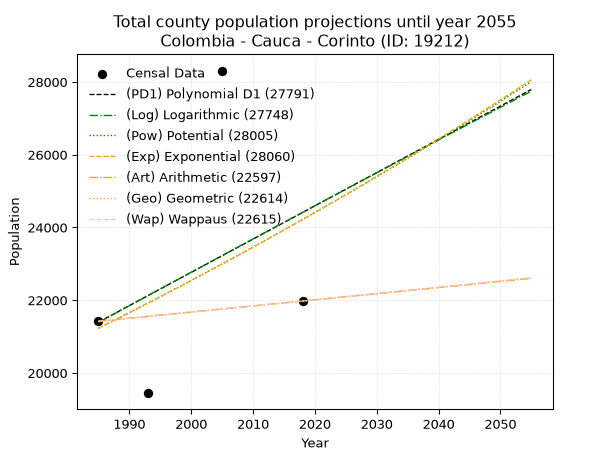
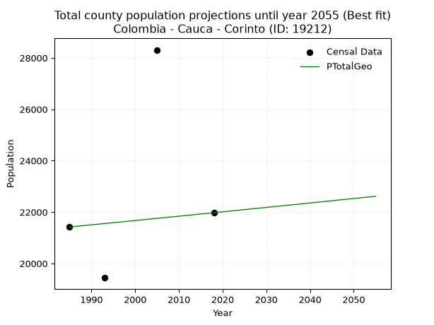
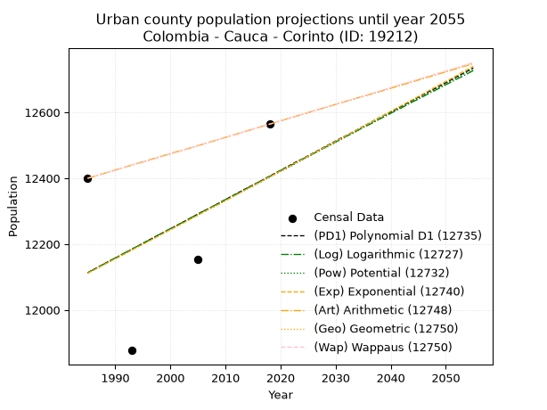
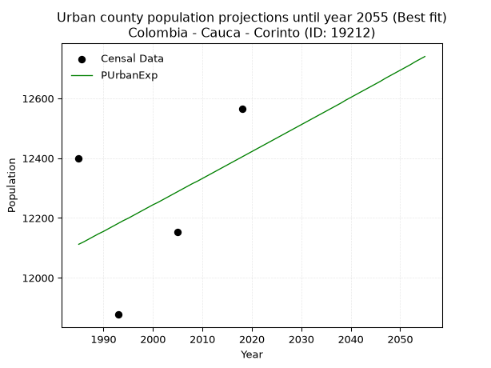
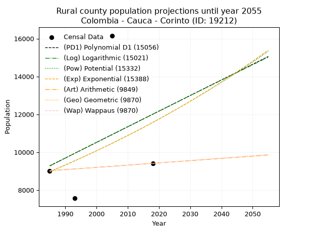
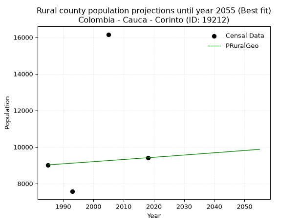

<div align="center">


</div>

# _“Population and Public Services Demand Projections (PPSD) until Year 2050 for Colombia - Cauca - Corinto (ID: 19212)”_
Keywords: `population` `public-service` `projection` `lineal` `polynomial` `logarithmic` `potential` `exponential` `arithmetic` `geometric` `wappaus` `dane` `colombia` `south-america`

PPSD are analytical estimates used by governments and planners to anticipate future changes in population size, age distribution, and the resulting community needs for utilities, healthcare, education, and infrastructure as sizing future water treatment facilities, electrical grids, and road networks based on spatial growth.

> **General running parameters**: • app_version: _v20260806_. • Python version: _3.14.7_. • Pandas version: _3.0.5_. • NumPy version: _2.5.1_. • Creates, save and include plots into reports (create_plot): _False_. • Projection until year: _2050_. • Process polynomial degree 2 and up: _False_. • Process Wappaus: _True_. • Process Wappaus: _True_. • Set negative values to zero: _True_. • Set infinite values to zero: _True_. • Drop dataset notes: _True_. 
<div align="center">

Dynamic map: [:earth_americas:Google](http://maps.google.com/maps?q=3.17385449,-76.2618664) [:earth_americas:OSM](https://www.openstreetmap.org/#map=18/3.17385449/-76.2618664&layers=P) [:earth_americas:Bing](https://www.bing.com/maps?cp=3.17385449~-76.2618664&lvl=18) [:earth_americas:Apple](https://maps.apple.com/frame?center=3.17385449%2C-76.2618664&span=0.003%2C0.006)

</div>


<div align="center">

```geojson
{
  "type": "Feature",
  "geometry": {
    "type": "Point", 
    "coordinates": [-76.2618664, 3.17385449]
  }, 
  "properties": {
    "Name": "Colombia - Cauca - Corinto (ID: 19212)"
  }
}
```

</div>


## 0. Census Data (4 records)

Census data are official statistics collected by a government about the people and housing in a country. They usually include counts of total population, age, sex, race, income, education, and jobs.

📅Global census file: [Population.xlsx](../data/Population.xlsx)

| Source   |   Year |   CountryID | CountryName   |   StateID | StateName   |   CountyID | CountyName   |   PTotal |   PUrban |   PRural |
|:---------|-------:|------------:|:--------------|----------:|:------------|-----------:|:-------------|---------:|---------:|---------:|
| DANE     |   1985 |          57 | Colombia      |        19 | Cauca       |      19212 | Corinto      |    21420 |    12400 |     9020 |
| DANE     |   1993 |          57 | Colombia      |        19 | Cauca       |      19212 | Corinto      |    19442 |    11877 |     7565 |
| DANE     |   2005 |          57 | Colombia      |        19 | Cauca       |      19212 | Corinto      |    28310 |    12153 |    16157 |
| DANE     |   2018 |          57 | Colombia      |        19 | Cauca       |      19212 | Corinto      |    21975 |    12564 |     9411 |

> 🔥Some records could had specific notes about the registered values or the corresponding urban or rural distribution.

## 1. Total

### 1.1. Coefficients and Parameters

* (PD1) Polynomial Deg 1: 91.39983942192232, -160035.77880370012 (lineal)
* (Log) Logarithmic: 183577.1305829274, -1372584.490655631
* (Pow) Potential: 7.999152965926525, -22.052453283999967
* (Exp) Exponential: 0.003984307448072129, 7.801879190240451
* (Art) Arithmetic: Year diff. 2018 - 1985 = 33, Population diff. 21975 - 21420 = 555, Annual growth = 16.818181818181817
* (Geo) Geometric: Year diff. 2018 - 1985 = 33, Population diff. 21975 - 21420 = 555, Annual growth % = 0.0007754635028858203
* (Wap) Wappaus: i = 0.0775120719814809, Condition values only valid for < 200)

<sub>
Wappaus condition values: ['0.00', '0.08', '0.16', '0.23', '0.31', '0.39', '0.47', '0.54', '0.62', '0.70', '0.78', '0.85', '0.93', '1.01', '1.09', '1.16', '1.24', '1.32', '1.40', '1.47', '1.55', '1.63', '1.71', '1.78', '1.86', '1.94', '2.02', '2.09', '2.17', '2.25', '2.33', '2.40', '2.48', '2.56', '2.64', '2.71', '2.79', '2.87', '2.95', '3.02', '3.10', '3.18', '3.26', '3.33', '3.41', '3.49', '3.57', '3.64', '3.72', '3.80', '3.88', '3.95', '4.03', '4.11', '4.19', '4.26', '4.34', '4.42', '4.50', '4.57', '4.65', '4.73', '4.81', '4.88', '4.96', '5.04']
</sub>


### 1.2. Projected Dataset

|   Year |   CountyID |   PTotalPD1 |   PTotalLog |   PTotalPow |   PTotalExp |   PTotalArt |   PTotalGeo |   PTotalWap |
|-------:|-----------:|------------:|------------:|------------:|------------:|------------:|------------:|------------:|
|   1985 |      19212 |       21393 |       21385 |       21225 |       21231 |       21420 |       21420 |       21420 |
|   1986 |      19212 |       21484 |       21478 |       21310 |       21316 |       21437 |       21437 |       21437 |
|   1987 |      19212 |       21576 |       21570 |       21396 |       21401 |       21454 |       21453 |       21453 |
|   1988 |      19212 |       21667 |       21663 |       21482 |       21486 |       21470 |       21470 |       21470 |
|   1989 |      19212 |       21759 |       21755 |       21569 |       21572 |       21487 |       21487 |       21487 |
|   1990 |      19212 |       21850 |       21847 |       21656 |       21658 |       21504 |       21503 |       21503 |
|   1991 |      19212 |       21941 |       21939 |       21743 |       21745 |       21521 |       21520 |       21520 |
|   1992 |      19212 |       22033 |       22032 |       21831 |       21831 |       21538 |       21537 |       21537 |
|   1993 |      19212 |       22124 |       22124 |       21918 |       21919 |       21555 |       21553 |       21553 |
|   1994 |      19212 |       22216 |       22216 |       22007 |       22006 |       21571 |       21570 |       21570 |
|   1995 |      19212 |       22307 |       22308 |       22095 |       22094 |       21588 |       21587 |       21587 |
|   1996 |      19212 |       22398 |       22400 |       22184 |       22182 |       21605 |       21603 |       21603 |
|   1997 |      19212 |       22490 |       22492 |       22273 |       22271 |       21622 |       21620 |       21620 |
|   1998 |      19212 |       22581 |       22584 |       22362 |       22360 |       21639 |       21637 |       21637 |
|   1999 |      19212 |       22673 |       22676 |       22452 |       22449 |       21655 |       21654 |       21654 |
|   2000 |      19212 |       22764 |       22767 |       22542 |       22538 |       21672 |       21671 |       21671 |
|   2001 |      19212 |       22855 |       22859 |       22632 |       22628 |       21689 |       21687 |       21687 |
|   2002 |      19212 |       22947 |       22951 |       22723 |       22719 |       21706 |       21704 |       21704 |
|   2003 |      19212 |       23038 |       23043 |       22814 |       22810 |       21723 |       21721 |       21721 |
|   2004 |      19212 |       23129 |       23134 |       22905 |       22901 |       21740 |       21738 |       21738 |
|   2005 |      19212 |       23221 |       23226 |       22997 |       22992 |       21756 |       21755 |       21755 |
|   2006 |      19212 |       23312 |       23317 |       23089 |       23084 |       21773 |       21772 |       21772 |
|   2007 |      19212 |       23404 |       23409 |       23181 |       23176 |       21790 |       21788 |       21788 |
|   2008 |      19212 |       23495 |       23500 |       23273 |       23268 |       21807 |       21805 |       21805 |
|   2009 |      19212 |       23586 |       23592 |       23366 |       23361 |       21824 |       21822 |       21822 |
|   2010 |      19212 |       23678 |       23683 |       23459 |       23455 |       21840 |       21839 |       21839 |
|   2011 |      19212 |       23769 |       23774 |       23553 |       23548 |       21857 |       21856 |       21856 |
|   2012 |      19212 |       23861 |       23866 |       23647 |       23642 |       21874 |       21873 |       21873 |
|   2013 |      19212 |       23952 |       23957 |       23741 |       23737 |       21891 |       21890 |       21890 |
|   2014 |      19212 |       24043 |       24048 |       23835 |       23831 |       21908 |       21907 |       21907 |
|   2015 |      19212 |       24135 |       24139 |       23930 |       23927 |       21925 |       21924 |       21924 |
|   2016 |      19212 |       24226 |       24230 |       24025 |       24022 |       21941 |       21941 |       21941 |
|   2017 |      19212 |       24318 |       24321 |       24121 |       24118 |       21958 |       21958 |       21958 |
|   2018 |      19212 |       24409 |       24412 |       24217 |       24214 |       21975 |       21975 |       21975 |
|   2019 |      19212 |       24500 |       24503 |       24313 |       24311 |       21992 |       21992 |       21992 |
|   2020 |      19212 |       24592 |       24594 |       24409 |       24408 |       22009 |       22009 |       22009 |
|   2021 |      19212 |       24683 |       24685 |       24506 |       24505 |       22025 |       22026 |       22026 |
|   2022 |      19212 |       24775 |       24776 |       24603 |       24603 |       22042 |       22043 |       22043 |
|   2023 |      19212 |       24866 |       24866 |       24701 |       24701 |       22059 |       22060 |       22060 |
|   2024 |      19212 |       24957 |       24957 |       24799 |       24800 |       22076 |       22077 |       22077 |
|   2025 |      19212 |       25049 |       25048 |       24897 |       24899 |       22093 |       22095 |       22095 |
|   2026 |      19212 |       25140 |       25138 |       24995 |       24999 |       22110 |       22112 |       22112 |
|   2027 |      19212 |       25232 |       25229 |       25094 |       25098 |       22126 |       22129 |       22129 |
|   2028 |      19212 |       25323 |       25320 |       25194 |       25199 |       22143 |       22146 |       22146 |
|   2029 |      19212 |       25414 |       25410 |       25293 |       25299 |       22160 |       22163 |       22163 |
|   2030 |      19212 |       25506 |       25501 |       25393 |       25400 |       22177 |       22180 |       22180 |
|   2031 |      19212 |       25597 |       25591 |       25493 |       25502 |       22194 |       22198 |       22198 |
|   2032 |      19212 |       25689 |       25681 |       25594 |       25603 |       22210 |       22215 |       22215 |
|   2033 |      19212 |       25780 |       25772 |       25695 |       25706 |       22227 |       22232 |       22232 |
|   2034 |      19212 |       25871 |       25862 |       25796 |       25808 |       22244 |       22249 |       22249 |
|   2035 |      19212 |       25963 |       25952 |       25898 |       25911 |       22261 |       22266 |       22267 |
|   2036 |      19212 |       26054 |       26042 |       26000 |       26015 |       22278 |       22284 |       22284 |
|   2037 |      19212 |       26146 |       26133 |       26102 |       26118 |       22295 |       22301 |       22301 |
|   2038 |      19212 |       26237 |       26223 |       26205 |       26223 |       22311 |       22318 |       22318 |
|   2039 |      19212 |       26328 |       26313 |       26308 |       26327 |       22328 |       22336 |       22336 |
|   2040 |      19212 |       26420 |       26403 |       26411 |       26433 |       22345 |       22353 |       22353 |
|   2041 |      19212 |       26511 |       26493 |       26515 |       26538 |       22362 |       22370 |       22370 |
|   2042 |      19212 |       26603 |       26583 |       26619 |       26644 |       22379 |       22388 |       22388 |
|   2043 |      19212 |       26694 |       26672 |       26723 |       26750 |       22395 |       22405 |       22405 |
|   2044 |      19212 |       26785 |       26762 |       26828 |       26857 |       22412 |       22422 |       22423 |
|   2045 |      19212 |       26877 |       26852 |       26933 |       26964 |       22429 |       22440 |       22440 |
|   2046 |      19212 |       26968 |       26942 |       27039 |       27072 |       22446 |       22457 |       22457 |
|   2047 |      19212 |       27060 |       27032 |       27145 |       27180 |       22463 |       22475 |       22475 |
|   2048 |      19212 |       27151 |       27121 |       27251 |       27289 |       22480 |       22492 |       22492 |
|   2049 |      19212 |       27242 |       27211 |       27358 |       27398 |       22496 |       22509 |       22510 |
|   2050 |      19212 |       27334 |       27300 |       27465 |       27507 |       22513 |       22527 |       22527 |
<div align="center">

</img>

</div>


### 1.3. Best fit with absolute and relative error (%)

Relative error puts that difference into context by dividing the absolute error by the true value, creating a unitless ratio or percentage that shows the scale of the mistake.

Absolute and relative error

|   Year | Source   |   CountryID | CountryName   |   StateID | StateName   |   CountyID_x | CountyName   |   PTotal |   PUrban |   PRural |   CountyID_y |   PTotalPD1 |   PTotalLog |   PTotalPow |   PTotalExp |   PTotalArt |   PTotalGeo |   PTotalWap |   PTotalPD1AbsError |   PTotalLogAbsError |   PTotalPowAbsError |   PTotalExpAbsError |   PTotalArtAbsError |   PTotalGeoAbsError |   PTotalWapAbsError |   PTotalPD1RelError |   PTotalLogRelError |   PTotalPowRelError |   PTotalExpRelError |   PTotalArtRelError |   PTotalGeoRelError |   PTotalWapRelError |
|-------:|:---------|------------:|:--------------|----------:|:------------|-------------:|:-------------|---------:|---------:|---------:|-------------:|------------:|------------:|------------:|------------:|------------:|------------:|------------:|--------------------:|--------------------:|--------------------:|--------------------:|--------------------:|--------------------:|--------------------:|--------------------:|--------------------:|--------------------:|--------------------:|--------------------:|--------------------:|--------------------:|
|   1985 | DANE     |          57 | Colombia      |        19 | Cauca       |        19212 | Corinto      |    21420 |    12400 |     9020 |        19212 |       21393 |       21385 |       21225 |       21231 |       21420 |       21420 |       21420 |                  27 |                  35 |                 195 |                 189 |                   0 |                   0 |                   0 |             0.12605 |            0.163399 |            0.910364 |            0.882353 |              0      |              0      |              0      |
|   1993 | DANE     |          57 | Colombia      |        19 | Cauca       |        19212 | Corinto      |    19442 |    11877 |     7565 |        19212 |       22124 |       22124 |       21918 |       21919 |       21555 |       21553 |       21553 |                2682 |                2682 |                2476 |                2477 |                2113 |                2111 |                2111 |            13.7949  |           13.7949   |           12.7353   |           12.7405   |             10.8682 |             10.8579 |             10.8579 |
|   2005 | DANE     |          57 | Colombia      |        19 | Cauca       |        19212 | Corinto      |    28310 |    12153 |    16157 |        19212 |       23221 |       23226 |       22997 |       22992 |       21756 |       21755 |       21755 |                5089 |                5084 |                5313 |                5318 |                6554 |                6555 |                6555 |            17.976   |           17.9583   |           18.7672   |           18.7849   |             23.1508 |             23.1544 |             23.1544 |
|   2018 | DANE     |          57 | Colombia      |        19 | Cauca       |        19212 | Corinto      |    21975 |    12564 |     9411 |        19212 |       24409 |       24412 |       24217 |       24214 |       21975 |       21975 |       21975 |                2434 |                2437 |                2242 |                2239 |                   0 |                   0 |                   0 |            11.0762  |           11.0899   |           10.2025   |           10.1889   |              0      |              0      |              0      |

Relative error mean

| Method    |   RelError | Best   |
|:----------|-----------:|:-------|
| PTotalPD1 |   10.7433  |        |
| PTotalLog |   10.7516  |        |
| PTotalPow |   10.6539  |        |
| PTotalExp |   10.6491  |        |
| PTotalArt |    8.50476 |        |
| PTotalGeo |    8.50307 | True   |
| PTotalWap |    8.50307 | True   |

💙Best method: _**PTotalGeo**_
<div align="center">

</img>

</div>


### 1.4. Fresh water supply demand in liters per capita per day (lpcd)

The fresh water supply demand typically ranges from 100 to 300 liters per capita per day (lpcd) for standard domestic and municipal planning, though absolute survival minimums set by the World Health Organization are as low as 7.5 to 20 liters per day, and total consumption in high-income nations can exceed 400 liters.

> `CZ`: Level in meters above the sea level (masl)<br> `WS`: Fresh water supply demand in liters per capita per day (lpcd or l/h/d)<br> `WSAll`: Zonal fresh water supply demand in liters per second (l/s)<br> `A`: Zonal area in square meters<br> `DP`: Population density (people/hectare)

Reference values (RAS Colombia)

|    CZ |   WS |
|------:|-----:|
|  1000 |  120 |
|  2000 |  130 |
| 99999 |  140 |

County shapefile geometry properties and water supply values

|   CountyID |      ATotal |   CZTotal |   WSTotal |
|-----------:|------------:|----------:|----------:|
|      19212 | 3.25968e+08 |   2060.65 |       140 |

Projected values for best method: PTotalGeo

|   CountyID |   Year |   PTotalGeo |   DPTotal |   WSTotal |   WSTotalAll |
|-----------:|-------:|------------:|----------:|----------:|-------------:|
|      19212 |   1985 |       21420 |      0.66 |       140 |      34.7083 |
|      19212 |   1986 |       21437 |      0.66 |       140 |      34.7359 |
|      19212 |   1987 |       21453 |      0.66 |       140 |      34.7618 |
|      19212 |   1988 |       21470 |      0.66 |       140 |      34.7894 |
|      19212 |   1989 |       21487 |      0.66 |       140 |      34.8169 |
|      19212 |   1990 |       21503 |      0.66 |       140 |      34.8428 |
|      19212 |   1991 |       21520 |      0.66 |       140 |      34.8704 |
|      19212 |   1992 |       21537 |      0.66 |       140 |      34.8979 |
|      19212 |   1993 |       21553 |      0.66 |       140 |      34.9238 |
|      19212 |   1994 |       21570 |      0.66 |       140 |      34.9514 |
|      19212 |   1995 |       21587 |      0.66 |       140 |      34.9789 |
|      19212 |   1996 |       21603 |      0.66 |       140 |      35.0049 |
|      19212 |   1997 |       21620 |      0.66 |       140 |      35.0324 |
|      19212 |   1998 |       21637 |      0.66 |       140 |      35.06   |
|      19212 |   1999 |       21654 |      0.66 |       140 |      35.0875 |
|      19212 |   2000 |       21671 |      0.66 |       140 |      35.115  |
|      19212 |   2001 |       21687 |      0.67 |       140 |      35.141  |
|      19212 |   2002 |       21704 |      0.67 |       140 |      35.1685 |
|      19212 |   2003 |       21721 |      0.67 |       140 |      35.1961 |
|      19212 |   2004 |       21738 |      0.67 |       140 |      35.2236 |
|      19212 |   2005 |       21755 |      0.67 |       140 |      35.2512 |
|      19212 |   2006 |       21772 |      0.67 |       140 |      35.2787 |
|      19212 |   2007 |       21788 |      0.67 |       140 |      35.3046 |
|      19212 |   2008 |       21805 |      0.67 |       140 |      35.3322 |
|      19212 |   2009 |       21822 |      0.67 |       140 |      35.3597 |
|      19212 |   2010 |       21839 |      0.67 |       140 |      35.3873 |
|      19212 |   2011 |       21856 |      0.67 |       140 |      35.4148 |
|      19212 |   2012 |       21873 |      0.67 |       140 |      35.4424 |
|      19212 |   2013 |       21890 |      0.67 |       140 |      35.4699 |
|      19212 |   2014 |       21907 |      0.67 |       140 |      35.4975 |
|      19212 |   2015 |       21924 |      0.67 |       140 |      35.525  |
|      19212 |   2016 |       21941 |      0.67 |       140 |      35.5525 |
|      19212 |   2017 |       21958 |      0.67 |       140 |      35.5801 |
|      19212 |   2018 |       21975 |      0.67 |       140 |      35.6076 |
|      19212 |   2019 |       21992 |      0.67 |       140 |      35.6352 |
|      19212 |   2020 |       22009 |      0.68 |       140 |      35.6627 |
|      19212 |   2021 |       22026 |      0.68 |       140 |      35.6903 |
|      19212 |   2022 |       22043 |      0.68 |       140 |      35.7178 |
|      19212 |   2023 |       22060 |      0.68 |       140 |      35.7454 |
|      19212 |   2024 |       22077 |      0.68 |       140 |      35.7729 |
|      19212 |   2025 |       22095 |      0.68 |       140 |      35.8021 |
|      19212 |   2026 |       22112 |      0.68 |       140 |      35.8296 |
|      19212 |   2027 |       22129 |      0.68 |       140 |      35.8572 |
|      19212 |   2028 |       22146 |      0.68 |       140 |      35.8847 |
|      19212 |   2029 |       22163 |      0.68 |       140 |      35.9123 |
|      19212 |   2030 |       22180 |      0.68 |       140 |      35.9398 |
|      19212 |   2031 |       22198 |      0.68 |       140 |      35.969  |
|      19212 |   2032 |       22215 |      0.68 |       140 |      35.9965 |
|      19212 |   2033 |       22232 |      0.68 |       140 |      36.0241 |
|      19212 |   2034 |       22249 |      0.68 |       140 |      36.0516 |
|      19212 |   2035 |       22266 |      0.68 |       140 |      36.0792 |
|      19212 |   2036 |       22284 |      0.68 |       140 |      36.1083 |
|      19212 |   2037 |       22301 |      0.68 |       140 |      36.1359 |
|      19212 |   2038 |       22318 |      0.68 |       140 |      36.1634 |
|      19212 |   2039 |       22336 |      0.69 |       140 |      36.1926 |
|      19212 |   2040 |       22353 |      0.69 |       140 |      36.2201 |
|      19212 |   2041 |       22370 |      0.69 |       140 |      36.2477 |
|      19212 |   2042 |       22388 |      0.69 |       140 |      36.2769 |
|      19212 |   2043 |       22405 |      0.69 |       140 |      36.3044 |
|      19212 |   2044 |       22422 |      0.69 |       140 |      36.3319 |
|      19212 |   2045 |       22440 |      0.69 |       140 |      36.3611 |
|      19212 |   2046 |       22457 |      0.69 |       140 |      36.3887 |
|      19212 |   2047 |       22475 |      0.69 |       140 |      36.4178 |
|      19212 |   2048 |       22492 |      0.69 |       140 |      36.4454 |
|      19212 |   2049 |       22509 |      0.69 |       140 |      36.4729 |
|      19212 |   2050 |       22527 |      0.69 |       140 |      36.5021 |

## 2. Urban

### 2.1. Coefficients and Parameters

* (PD1) Polynomial Deg 1: 8.879164993978062, -5512.049779204619 (lineal)
* (Log) Logarithmic: 17694.544359806994, -122247.87347407253
* (Pow) Potential: 1.4402153249924583, -0.6662750428302054
* (Exp) Exponential: 0.0007227127770644241, 2885.1351184140995
* (Art) Arithmetic: Year diff. 2018 - 1985 = 33, Population diff. 12564 - 12400 = 164, Annual growth = 4.96969696969697
* (Geo) Geometric: Year diff. 2018 - 1985 = 33, Population diff. 12564 - 12400 = 164, Annual growth % = 0.0003982340943151641
* (Wap) Wappaus: i = 0.03981490922686244, Condition values only valid for < 200)

<sub>
Wappaus condition values: ['0.00', '0.04', '0.08', '0.12', '0.16', '0.20', '0.24', '0.28', '0.32', '0.36', '0.40', '0.44', '0.48', '0.52', '0.56', '0.60', '0.64', '0.68', '0.72', '0.76', '0.80', '0.84', '0.88', '0.92', '0.96', '1.00', '1.04', '1.08', '1.11', '1.15', '1.19', '1.23', '1.27', '1.31', '1.35', '1.39', '1.43', '1.47', '1.51', '1.55', '1.59', '1.63', '1.67', '1.71', '1.75', '1.79', '1.83', '1.87', '1.91', '1.95', '1.99', '2.03', '2.07', '2.11', '2.15', '2.19', '2.23', '2.27', '2.31', '2.35', '2.39', '2.43', '2.47', '2.51', '2.55', '2.59']
</sub>


### 2.2. Projected Dataset

|   Year |   CountyID |   PUrbanPD1 |   PUrbanLog |   PUrbanPow |   PUrbanExp |   PUrbanArt |   PUrbanGeo |   PUrbanWap |
|-------:|-----------:|------------:|------------:|------------:|------------:|------------:|------------:|------------:|
|   1985 |      19212 |       12113 |       12113 |       12112 |       12112 |       12400 |       12400 |       12400 |
|   1986 |      19212 |       12122 |       12122 |       12121 |       12120 |       12405 |       12405 |       12405 |
|   1987 |      19212 |       12131 |       12131 |       12129 |       12129 |       12410 |       12410 |       12410 |
|   1988 |      19212 |       12140 |       12140 |       12138 |       12138 |       12415 |       12415 |       12415 |
|   1989 |      19212 |       12149 |       12149 |       12147 |       12147 |       12420 |       12420 |       12420 |
|   1990 |      19212 |       12157 |       12158 |       12156 |       12155 |       12425 |       12425 |       12425 |
|   1991 |      19212 |       12166 |       12167 |       12165 |       12164 |       12430 |       12430 |       12430 |
|   1992 |      19212 |       12175 |       12176 |       12173 |       12173 |       12435 |       12435 |       12435 |
|   1993 |      19212 |       12184 |       12185 |       12182 |       12182 |       12440 |       12440 |       12440 |
|   1994 |      19212 |       12193 |       12193 |       12191 |       12191 |       12445 |       12445 |       12445 |
|   1995 |      19212 |       12202 |       12202 |       12200 |       12199 |       12450 |       12449 |       12449 |
|   1996 |      19212 |       12211 |       12211 |       12209 |       12208 |       12455 |       12454 |       12454 |
|   1997 |      19212 |       12220 |       12220 |       12217 |       12217 |       12460 |       12459 |       12459 |
|   1998 |      19212 |       12229 |       12229 |       12226 |       12226 |       12465 |       12464 |       12464 |
|   1999 |      19212 |       12237 |       12238 |       12235 |       12235 |       12470 |       12469 |       12469 |
|   2000 |      19212 |       12246 |       12247 |       12244 |       12244 |       12475 |       12474 |       12474 |
|   2001 |      19212 |       12255 |       12255 |       12253 |       12252 |       12480 |       12479 |       12479 |
|   2002 |      19212 |       12264 |       12264 |       12262 |       12261 |       12484 |       12484 |       12484 |
|   2003 |      19212 |       12273 |       12273 |       12270 |       12270 |       12489 |       12489 |       12489 |
|   2004 |      19212 |       12282 |       12282 |       12279 |       12279 |       12494 |       12494 |       12494 |
|   2005 |      19212 |       12291 |       12291 |       12288 |       12288 |       12499 |       12499 |       12499 |
|   2006 |      19212 |       12300 |       12300 |       12297 |       12297 |       12504 |       12504 |       12504 |
|   2007 |      19212 |       12308 |       12308 |       12306 |       12306 |       12509 |       12509 |       12509 |
|   2008 |      19212 |       12317 |       12317 |       12314 |       12315 |       12514 |       12514 |       12514 |
|   2009 |      19212 |       12326 |       12326 |       12323 |       12323 |       12519 |       12519 |       12519 |
|   2010 |      19212 |       12335 |       12335 |       12332 |       12332 |       12524 |       12524 |       12524 |
|   2011 |      19212 |       12344 |       12344 |       12341 |       12341 |       12529 |       12529 |       12529 |
|   2012 |      19212 |       12353 |       12352 |       12350 |       12350 |       12534 |       12534 |       12534 |
|   2013 |      19212 |       12362 |       12361 |       12359 |       12359 |       12539 |       12539 |       12539 |
|   2014 |      19212 |       12371 |       12370 |       12368 |       12368 |       12544 |       12544 |       12544 |
|   2015 |      19212 |       12379 |       12379 |       12376 |       12377 |       12549 |       12549 |       12549 |
|   2016 |      19212 |       12388 |       12388 |       12385 |       12386 |       12554 |       12554 |       12554 |
|   2017 |      19212 |       12397 |       12396 |       12394 |       12395 |       12559 |       12559 |       12559 |
|   2018 |      19212 |       12406 |       12405 |       12403 |       12404 |       12564 |       12564 |       12564 |
|   2019 |      19212 |       12415 |       12414 |       12412 |       12413 |       12569 |       12569 |       12569 |
|   2020 |      19212 |       12424 |       12423 |       12421 |       12422 |       12574 |       12574 |       12574 |
|   2021 |      19212 |       12433 |       12431 |       12429 |       12431 |       12579 |       12579 |       12579 |
|   2022 |      19212 |       12442 |       12440 |       12438 |       12440 |       12584 |       12584 |       12584 |
|   2023 |      19212 |       12451 |       12449 |       12447 |       12449 |       12589 |       12589 |       12589 |
|   2024 |      19212 |       12459 |       12458 |       12456 |       12458 |       12594 |       12594 |       12594 |
|   2025 |      19212 |       12468 |       12466 |       12465 |       12467 |       12599 |       12599 |       12599 |
|   2026 |      19212 |       12477 |       12475 |       12474 |       12476 |       12604 |       12604 |       12604 |
|   2027 |      19212 |       12486 |       12484 |       12483 |       12485 |       12609 |       12609 |       12609 |
|   2028 |      19212 |       12495 |       12493 |       12492 |       12494 |       12614 |       12614 |       12614 |
|   2029 |      19212 |       12504 |       12501 |       12500 |       12503 |       12619 |       12619 |       12619 |
|   2030 |      19212 |       12513 |       12510 |       12509 |       12512 |       12624 |       12624 |       12624 |
|   2031 |      19212 |       12522 |       12519 |       12518 |       12521 |       12629 |       12629 |       12629 |
|   2032 |      19212 |       12530 |       12528 |       12527 |       12530 |       12634 |       12634 |       12634 |
|   2033 |      19212 |       12539 |       12536 |       12536 |       12539 |       12639 |       12639 |       12639 |
|   2034 |      19212 |       12548 |       12545 |       12545 |       12548 |       12644 |       12644 |       12644 |
|   2035 |      19212 |       12557 |       12554 |       12554 |       12557 |       12648 |       12649 |       12649 |
|   2036 |      19212 |       12566 |       12562 |       12563 |       12566 |       12653 |       12654 |       12654 |
|   2037 |      19212 |       12575 |       12571 |       12571 |       12575 |       12658 |       12659 |       12659 |
|   2038 |      19212 |       12584 |       12580 |       12580 |       12584 |       12663 |       12664 |       12664 |
|   2039 |      19212 |       12593 |       12588 |       12589 |       12594 |       12668 |       12669 |       12669 |
|   2040 |      19212 |       12601 |       12597 |       12598 |       12603 |       12673 |       12675 |       12675 |
|   2041 |      19212 |       12610 |       12606 |       12607 |       12612 |       12678 |       12680 |       12680 |
|   2042 |      19212 |       12619 |       12614 |       12616 |       12621 |       12683 |       12685 |       12685 |
|   2043 |      19212 |       12628 |       12623 |       12625 |       12630 |       12688 |       12690 |       12690 |
|   2044 |      19212 |       12637 |       12632 |       12634 |       12639 |       12693 |       12695 |       12695 |
|   2045 |      19212 |       12646 |       12640 |       12643 |       12648 |       12698 |       12700 |       12700 |
|   2046 |      19212 |       12655 |       12649 |       12651 |       12657 |       12703 |       12705 |       12705 |
|   2047 |      19212 |       12664 |       12658 |       12660 |       12667 |       12708 |       12710 |       12710 |
|   2048 |      19212 |       12672 |       12666 |       12669 |       12676 |       12713 |       12715 |       12715 |
|   2049 |      19212 |       12681 |       12675 |       12678 |       12685 |       12718 |       12720 |       12720 |
|   2050 |      19212 |       12690 |       12684 |       12687 |       12694 |       12723 |       12725 |       12725 |
<div align="center">

</img>

</div>


### 2.3. Best fit with absolute and relative error (%)

Relative error puts that difference into context by dividing the absolute error by the true value, creating a unitless ratio or percentage that shows the scale of the mistake.

Absolute and relative error

|   Year | Source   |   CountryID | CountryName   |   StateID | StateName   |   CountyID_x | CountyName   |   PTotal |   PUrban |   PRural |   CountyID_y |   PUrbanPD1 |   PUrbanLog |   PUrbanPow |   PUrbanExp |   PUrbanArt |   PUrbanGeo |   PUrbanWap |   PUrbanPD1AbsError |   PUrbanLogAbsError |   PUrbanPowAbsError |   PUrbanExpAbsError |   PUrbanArtAbsError |   PUrbanGeoAbsError |   PUrbanWapAbsError |   PUrbanPD1RelError |   PUrbanLogRelError |   PUrbanPowRelError |   PUrbanExpRelError |   PUrbanArtRelError |   PUrbanGeoRelError |   PUrbanWapRelError |
|-------:|:---------|------------:|:--------------|----------:|:------------|-------------:|:-------------|---------:|---------:|---------:|-------------:|------------:|------------:|------------:|------------:|------------:|------------:|------------:|--------------------:|--------------------:|--------------------:|--------------------:|--------------------:|--------------------:|--------------------:|--------------------:|--------------------:|--------------------:|--------------------:|--------------------:|--------------------:|--------------------:|
|   1985 | DANE     |          57 | Colombia      |        19 | Cauca       |        19212 | Corinto      |    21420 |    12400 |     9020 |        19212 |       12113 |       12113 |       12112 |       12112 |       12400 |       12400 |       12400 |                 287 |                 287 |                 288 |                 288 |                   0 |                   0 |                   0 |             2.31452 |             2.31452 |             2.32258 |             2.32258 |             0       |             0       |             0       |
|   1993 | DANE     |          57 | Colombia      |        19 | Cauca       |        19212 | Corinto      |    19442 |    11877 |     7565 |        19212 |       12184 |       12185 |       12182 |       12182 |       12440 |       12440 |       12440 |                 307 |                 308 |                 305 |                 305 |                 563 |                 563 |                 563 |             2.58483 |             2.59325 |             2.56799 |             2.56799 |             4.74025 |             4.74025 |             4.74025 |
|   2005 | DANE     |          57 | Colombia      |        19 | Cauca       |        19212 | Corinto      |    28310 |    12153 |    16157 |        19212 |       12291 |       12291 |       12288 |       12288 |       12499 |       12499 |       12499 |                 138 |                 138 |                 135 |                 135 |                 346 |                 346 |                 346 |             1.13552 |             1.13552 |             1.11084 |             1.11084 |             2.84703 |             2.84703 |             2.84703 |
|   2018 | DANE     |          57 | Colombia      |        19 | Cauca       |        19212 | Corinto      |    21975 |    12564 |     9411 |        19212 |       12406 |       12405 |       12403 |       12404 |       12564 |       12564 |       12564 |                 158 |                 159 |                 161 |                 160 |                   0 |                   0 |                   0 |             1.25756 |             1.26552 |             1.28144 |             1.27348 |             0       |             0       |             0       |

Relative error mean

| Method    |   RelError | Best   |
|:----------|-----------:|:-------|
| PUrbanPD1 |    1.82311 |        |
| PUrbanLog |    1.8272  |        |
| PUrbanPow |    1.82071 |        |
| PUrbanExp |    1.81872 | True   |
| PUrbanArt |    1.89682 |        |
| PUrbanGeo |    1.89682 |        |
| PUrbanWap |    1.89682 |        |

💙Best method: _**PUrbanExp**_
<div align="center">

</img>

</div>


### 2.4. Fresh water supply demand in liters per capita per day (lpcd)

The fresh water supply demand typically ranges from 100 to 300 liters per capita per day (lpcd) for standard domestic and municipal planning, though absolute survival minimums set by the World Health Organization are as low as 7.5 to 20 liters per day, and total consumption in high-income nations can exceed 400 liters.

> `CZ`: Level in meters above the sea level (masl)<br> `WS`: Fresh water supply demand in liters per capita per day (lpcd or l/h/d)<br> `WSAll`: Zonal fresh water supply demand in liters per second (l/s)<br> `A`: Zonal area in square meters<br> `DP`: Population density (people/hectare)

Reference values (RAS Colombia)

|    CZ |   WS |
|------:|-----:|
|  1000 |  120 |
|  2000 |  130 |
| 99999 |  140 |

County shapefile geometry properties and water supply values

|   CountyID |      AUrban |   CZUrban |   WSUrban |
|-----------:|------------:|----------:|----------:|
|      19212 | 1.63608e+06 |   1058.44 |       130 |

Projected values for best method: PUrbanExp

|   CountyID |   Year |   PUrbanExp |   DPUrban |   WSUrban |   WSUrbanAll |
|-----------:|-------:|------------:|----------:|----------:|-------------:|
|      19212 |   1985 |       12112 |     74.03 |       130 |      18.2241 |
|      19212 |   1986 |       12120 |     74.08 |       130 |      18.2361 |
|      19212 |   1987 |       12129 |     74.13 |       130 |      18.2497 |
|      19212 |   1988 |       12138 |     74.19 |       130 |      18.2632 |
|      19212 |   1989 |       12147 |     74.24 |       130 |      18.2767 |
|      19212 |   1990 |       12155 |     74.29 |       130 |      18.2888 |
|      19212 |   1991 |       12164 |     74.35 |       130 |      18.3023 |
|      19212 |   1992 |       12173 |     74.4  |       130 |      18.3159 |
|      19212 |   1993 |       12182 |     74.46 |       130 |      18.3294 |
|      19212 |   1994 |       12191 |     74.51 |       130 |      18.3429 |
|      19212 |   1995 |       12199 |     74.56 |       130 |      18.355  |
|      19212 |   1996 |       12208 |     74.62 |       130 |      18.3685 |
|      19212 |   1997 |       12217 |     74.67 |       130 |      18.3821 |
|      19212 |   1998 |       12226 |     74.73 |       130 |      18.3956 |
|      19212 |   1999 |       12235 |     74.78 |       130 |      18.4091 |
|      19212 |   2000 |       12244 |     74.84 |       130 |      18.4227 |
|      19212 |   2001 |       12252 |     74.89 |       130 |      18.4347 |
|      19212 |   2002 |       12261 |     74.94 |       130 |      18.4483 |
|      19212 |   2003 |       12270 |     75    |       130 |      18.4618 |
|      19212 |   2004 |       12279 |     75.05 |       130 |      18.4753 |
|      19212 |   2005 |       12288 |     75.11 |       130 |      18.4889 |
|      19212 |   2006 |       12297 |     75.16 |       130 |      18.5024 |
|      19212 |   2007 |       12306 |     75.22 |       130 |      18.516  |
|      19212 |   2008 |       12315 |     75.27 |       130 |      18.5295 |
|      19212 |   2009 |       12323 |     75.32 |       130 |      18.5416 |
|      19212 |   2010 |       12332 |     75.38 |       130 |      18.5551 |
|      19212 |   2011 |       12341 |     75.43 |       130 |      18.5686 |
|      19212 |   2012 |       12350 |     75.49 |       130 |      18.5822 |
|      19212 |   2013 |       12359 |     75.54 |       130 |      18.5957 |
|      19212 |   2014 |       12368 |     75.6  |       130 |      18.6093 |
|      19212 |   2015 |       12377 |     75.65 |       130 |      18.6228 |
|      19212 |   2016 |       12386 |     75.71 |       130 |      18.6363 |
|      19212 |   2017 |       12395 |     75.76 |       130 |      18.6499 |
|      19212 |   2018 |       12404 |     75.82 |       130 |      18.6634 |
|      19212 |   2019 |       12413 |     75.87 |       130 |      18.677  |
|      19212 |   2020 |       12422 |     75.93 |       130 |      18.6905 |
|      19212 |   2021 |       12431 |     75.98 |       130 |      18.7041 |
|      19212 |   2022 |       12440 |     76.04 |       130 |      18.7176 |
|      19212 |   2023 |       12449 |     76.09 |       130 |      18.7311 |
|      19212 |   2024 |       12458 |     76.15 |       130 |      18.7447 |
|      19212 |   2025 |       12467 |     76.2  |       130 |      18.7582 |
|      19212 |   2026 |       12476 |     76.26 |       130 |      18.7718 |
|      19212 |   2027 |       12485 |     76.31 |       130 |      18.7853 |
|      19212 |   2028 |       12494 |     76.37 |       130 |      18.7988 |
|      19212 |   2029 |       12503 |     76.42 |       130 |      18.8124 |
|      19212 |   2030 |       12512 |     76.48 |       130 |      18.8259 |
|      19212 |   2031 |       12521 |     76.53 |       130 |      18.8395 |
|      19212 |   2032 |       12530 |     76.59 |       130 |      18.853  |
|      19212 |   2033 |       12539 |     76.64 |       130 |      18.8666 |
|      19212 |   2034 |       12548 |     76.7  |       130 |      18.8801 |
|      19212 |   2035 |       12557 |     76.75 |       130 |      18.8936 |
|      19212 |   2036 |       12566 |     76.81 |       130 |      18.9072 |
|      19212 |   2037 |       12575 |     76.86 |       130 |      18.9207 |
|      19212 |   2038 |       12584 |     76.92 |       130 |      18.9343 |
|      19212 |   2039 |       12594 |     76.98 |       130 |      18.9493 |
|      19212 |   2040 |       12603 |     77.03 |       130 |      18.9628 |
|      19212 |   2041 |       12612 |     77.09 |       130 |      18.9764 |
|      19212 |   2042 |       12621 |     77.14 |       130 |      18.9899 |
|      19212 |   2043 |       12630 |     77.2  |       130 |      19.0035 |
|      19212 |   2044 |       12639 |     77.25 |       130 |      19.017  |
|      19212 |   2045 |       12648 |     77.31 |       130 |      19.0306 |
|      19212 |   2046 |       12657 |     77.36 |       130 |      19.0441 |
|      19212 |   2047 |       12667 |     77.42 |       130 |      19.0591 |
|      19212 |   2048 |       12676 |     77.48 |       130 |      19.0727 |
|      19212 |   2049 |       12685 |     77.53 |       130 |      19.0862 |
|      19212 |   2050 |       12694 |     77.59 |       130 |      19.0998 |

## 3. Rural

### 3.1. Coefficients and Parameters

* (PD1) Polynomial Deg 1: 82.52067442794423, -154523.72902449543 (lineal)
* (Log) Logarithmic: 165882.58622312057, -1250336.6171815598
* (Pow) Potential: 15.472694026622776, -47.07253339504473
* (Exp) Exponential: 0.00770357144693949, 0.0020508289845051417
* (Art) Arithmetic: Year diff. 2018 - 1985 = 33, Population diff. 9411 - 9020 = 391, Annual growth = 11.848484848484848
* (Geo) Geometric: Year diff. 2018 - 1985 = 33, Population diff. 9411 - 9020 = 391, Annual growth % = 0.0012867327008279084
* (Wap) Wappaus: i = 0.1285712641580473, Condition values only valid for < 200)

<sub>
Wappaus condition values: ['0.00', '0.13', '0.26', '0.39', '0.51', '0.64', '0.77', '0.90', '1.03', '1.16', '1.29', '1.41', '1.54', '1.67', '1.80', '1.93', '2.06', '2.19', '2.31', '2.44', '2.57', '2.70', '2.83', '2.96', '3.09', '3.21', '3.34', '3.47', '3.60', '3.73', '3.86', '3.99', '4.11', '4.24', '4.37', '4.50', '4.63', '4.76', '4.89', '5.01', '5.14', '5.27', '5.40', '5.53', '5.66', '5.79', '5.91', '6.04', '6.17', '6.30', '6.43', '6.56', '6.69', '6.81', '6.94', '7.07', '7.20', '7.33', '7.46', '7.59', '7.71', '7.84', '7.97', '8.10', '8.23', '8.36']
</sub>


### 3.2. Projected Dataset

|   Year |   CountyID |   PRuralPD1 |   PRuralLog |   PRuralPow |   PRuralExp |   PRuralArt |   PRuralGeo |   PRuralWap |
|-------:|-----------:|------------:|------------:|------------:|------------:|------------:|------------:|------------:|
|   1985 |      19212 |        9280 |        9272 |        8968 |        8974 |        9020 |        9020 |        9020 |
|   1986 |      19212 |        9362 |        9355 |        9038 |        9043 |        9032 |        9032 |        9032 |
|   1987 |      19212 |        9445 |        9439 |        9109 |        9113 |        9044 |        9043 |        9043 |
|   1988 |      19212 |        9527 |        9522 |        9180 |        9184 |        9056 |        9055 |        9055 |
|   1989 |      19212 |        9610 |        9606 |        9252 |        9255 |        9067 |        9067 |        9067 |
|   1990 |      19212 |        9692 |        9689 |        9324 |        9326 |        9079 |        9078 |        9078 |
|   1991 |      19212 |        9775 |        9773 |        9397 |        9398 |        9091 |        9090 |        9090 |
|   1992 |      19212 |        9857 |        9856 |        9470 |        9471 |        9103 |        9102 |        9102 |
|   1993 |      19212 |        9940 |        9939 |        9544 |        9544 |        9115 |        9113 |        9113 |
|   1994 |      19212 |       10022 |       10022 |        9618 |        9618 |        9127 |        9125 |        9125 |
|   1995 |      19212 |       10105 |       10106 |        9693 |        9693 |        9138 |        9137 |        9137 |
|   1996 |      19212 |       10188 |       10189 |        9769 |        9768 |        9150 |        9148 |        9148 |
|   1997 |      19212 |       10270 |       10272 |        9845 |        9843 |        9162 |        9160 |        9160 |
|   1998 |      19212 |       10353 |       10355 |        9921 |        9919 |        9174 |        9172 |        9172 |
|   1999 |      19212 |       10435 |       10438 |        9998 |        9996 |        9186 |        9184 |        9184 |
|   2000 |      19212 |       10518 |       10521 |       10076 |       10073 |        9198 |        9196 |        9196 |
|   2001 |      19212 |       10600 |       10604 |       10154 |       10151 |        9210 |        9208 |        9207 |
|   2002 |      19212 |       10683 |       10687 |       10233 |       10230 |        9221 |        9219 |        9219 |
|   2003 |      19212 |       10765 |       10769 |       10313 |       10309 |        9233 |        9231 |        9231 |
|   2004 |      19212 |       10848 |       10852 |       10392 |       10388 |        9245 |        9243 |        9243 |
|   2005 |      19212 |       10930 |       10935 |       10473 |       10469 |        9257 |        9255 |        9255 |
|   2006 |      19212 |       11013 |       11018 |       10554 |       10550 |        9269 |        9267 |        9267 |
|   2007 |      19212 |       11095 |       11100 |       10636 |       10631 |        9281 |        9279 |        9279 |
|   2008 |      19212 |       11178 |       11183 |       10718 |       10714 |        9293 |        9291 |        9291 |
|   2009 |      19212 |       11260 |       11266 |       10801 |       10796 |        9304 |        9303 |        9303 |
|   2010 |      19212 |       11343 |       11348 |       10885 |       10880 |        9316 |        9315 |        9315 |
|   2011 |      19212 |       11425 |       11431 |       10969 |       10964 |        9328 |        9327 |        9327 |
|   2012 |      19212 |       11508 |       11513 |       11053 |       11049 |        9340 |        9339 |        9339 |
|   2013 |      19212 |       11590 |       11595 |       11139 |       11134 |        9352 |        9351 |        9351 |
|   2014 |      19212 |       11673 |       11678 |       11225 |       11220 |        9364 |        9363 |        9363 |
|   2015 |      19212 |       11755 |       11760 |       11311 |       11307 |        9375 |        9375 |        9375 |
|   2016 |      19212 |       11838 |       11843 |       11398 |       11395 |        9387 |        9387 |        9387 |
|   2017 |      19212 |       11920 |       11925 |       11486 |       11483 |        9399 |        9399 |        9399 |
|   2018 |      19212 |       12003 |       12007 |       11574 |       11571 |        9411 |        9411 |        9411 |
|   2019 |      19212 |       12086 |       12089 |       11664 |       11661 |        9423 |        9423 |        9423 |
|   2020 |      19212 |       12168 |       12171 |       11753 |       11751 |        9435 |        9435 |        9435 |
|   2021 |      19212 |       12251 |       12253 |       11844 |       11842 |        9447 |        9447 |        9447 |
|   2022 |      19212 |       12333 |       12335 |       11935 |       11934 |        9458 |        9460 |        9460 |
|   2023 |      19212 |       12416 |       12418 |       12026 |       12026 |        9470 |        9472 |        9472 |
|   2024 |      19212 |       12498 |       12499 |       12119 |       12119 |        9482 |        9484 |        9484 |
|   2025 |      19212 |       12581 |       12581 |       12212 |       12213 |        9494 |        9496 |        9496 |
|   2026 |      19212 |       12663 |       12663 |       12305 |       12307 |        9506 |        9508 |        9508 |
|   2027 |      19212 |       12746 |       12745 |       12399 |       12402 |        9518 |        9521 |        9521 |
|   2028 |      19212 |       12828 |       12827 |       12494 |       12498 |        9529 |        9533 |        9533 |
|   2029 |      19212 |       12911 |       12909 |       12590 |       12595 |        9541 |        9545 |        9545 |
|   2030 |      19212 |       12993 |       12991 |       12686 |       12692 |        9553 |        9557 |        9557 |
|   2031 |      19212 |       13076 |       13072 |       12784 |       12790 |        9565 |        9570 |        9570 |
|   2032 |      19212 |       13158 |       13154 |       12881 |       12889 |        9577 |        9582 |        9582 |
|   2033 |      19212 |       13241 |       13235 |       12980 |       12989 |        9589 |        9594 |        9594 |
|   2034 |      19212 |       13323 |       13317 |       13079 |       13089 |        9601 |        9607 |        9607 |
|   2035 |      19212 |       13406 |       13399 |       13179 |       13191 |        9612 |        9619 |        9619 |
|   2036 |      19212 |       13488 |       13480 |       13279 |       13293 |        9624 |        9631 |        9632 |
|   2037 |      19212 |       13571 |       13562 |       13380 |       13395 |        9636 |        9644 |        9644 |
|   2038 |      19212 |       13653 |       13643 |       13482 |       13499 |        9648 |        9656 |        9656 |
|   2039 |      19212 |       13736 |       13724 |       13585 |       13603 |        9660 |        9669 |        9669 |
|   2040 |      19212 |       13818 |       13806 |       13689 |       13709 |        9672 |        9681 |        9681 |
|   2041 |      19212 |       13901 |       13887 |       13793 |       13815 |        9684 |        9693 |        9694 |
|   2042 |      19212 |       13983 |       13968 |       13898 |       13921 |        9695 |        9706 |        9706 |
|   2043 |      19212 |       14066 |       14049 |       14003 |       14029 |        9707 |        9718 |        9719 |
|   2044 |      19212 |       14149 |       14131 |       14110 |       14138 |        9719 |        9731 |        9731 |
|   2045 |      19212 |       14231 |       14212 |       14217 |       14247 |        9731 |        9743 |        9744 |
|   2046 |      19212 |       14314 |       14293 |       14325 |       14357 |        9743 |        9756 |        9756 |
|   2047 |      19212 |       14396 |       14374 |       14434 |       14468 |        9755 |        9769 |        9769 |
|   2048 |      19212 |       14479 |       14455 |       14543 |       14580 |        9766 |        9781 |        9781 |
|   2049 |      19212 |       14561 |       14536 |       14654 |       14693 |        9778 |        9794 |        9794 |
|   2050 |      19212 |       14644 |       14617 |       14765 |       14806 |        9790 |        9806 |        9807 |
<div align="center">

</img>

</div>


### 3.3. Best fit with absolute and relative error (%)

Relative error puts that difference into context by dividing the absolute error by the true value, creating a unitless ratio or percentage that shows the scale of the mistake.

Absolute and relative error

|   Year | Source   |   CountryID | CountryName   |   StateID | StateName   |   CountyID_x | CountyName   |   PTotal |   PUrban |   PRural |   CountyID_y |   PRuralPD1 |   PRuralLog |   PRuralPow |   PRuralExp |   PRuralArt |   PRuralGeo |   PRuralWap |   PRuralPD1AbsError |   PRuralLogAbsError |   PRuralPowAbsError |   PRuralExpAbsError |   PRuralArtAbsError |   PRuralGeoAbsError |   PRuralWapAbsError |   PRuralPD1RelError |   PRuralLogRelError |   PRuralPowRelError |   PRuralExpRelError |   PRuralArtRelError |   PRuralGeoRelError |   PRuralWapRelError |
|-------:|:---------|------------:|:--------------|----------:|:------------|-------------:|:-------------|---------:|---------:|---------:|-------------:|------------:|------------:|------------:|------------:|------------:|------------:|------------:|--------------------:|--------------------:|--------------------:|--------------------:|--------------------:|--------------------:|--------------------:|--------------------:|--------------------:|--------------------:|--------------------:|--------------------:|--------------------:|--------------------:|
|   1985 | DANE     |          57 | Colombia      |        19 | Cauca       |        19212 | Corinto      |    21420 |    12400 |     9020 |        19212 |        9280 |        9272 |        8968 |        8974 |        9020 |        9020 |        9020 |                 260 |                 252 |                  52 |                  46 |                   0 |                   0 |                   0 |             2.88248 |             2.79379 |            0.576497 |            0.509978 |              0      |              0      |              0      |
|   1993 | DANE     |          57 | Colombia      |        19 | Cauca       |        19212 | Corinto      |    19442 |    11877 |     7565 |        19212 |        9940 |        9939 |        9544 |        9544 |        9115 |        9113 |        9113 |                2375 |                2374 |                1979 |                1979 |                1550 |                1548 |                1548 |            31.3946  |            31.3814  |           26.1599   |           26.1599   |             20.4891 |             20.4627 |             20.4627 |
|   2005 | DANE     |          57 | Colombia      |        19 | Cauca       |        19212 | Corinto      |    28310 |    12153 |    16157 |        19212 |       10930 |       10935 |       10473 |       10469 |        9257 |        9255 |        9255 |                5227 |                5222 |                5684 |                5688 |                6900 |                6902 |                6902 |            32.3513  |            32.3204  |           35.1798   |           35.2046   |             42.7059 |             42.7183 |             42.7183 |
|   2018 | DANE     |          57 | Colombia      |        19 | Cauca       |        19212 | Corinto      |    21975 |    12564 |     9411 |        19212 |       12003 |       12007 |       11574 |       11571 |        9411 |        9411 |        9411 |                2592 |                2596 |                2163 |                2160 |                   0 |                   0 |                   0 |            27.5422  |            27.5847  |           22.9837   |           22.9519   |              0      |              0      |              0      |

Relative error mean

| Method    |   RelError | Best   |
|:----------|-----------:|:-------|
| PRuralPD1 |    23.5427 |        |
| PRuralLog |    23.5201 |        |
| PRuralPow |    21.225  |        |
| PRuralExp |    21.2066 |        |
| PRuralArt |    15.7988 |        |
| PRuralGeo |    15.7952 | True   |
| PRuralWap |    15.7952 | True   |

💙Best method: _**PRuralGeo**_
<div align="center">

</img>

</div>


### 3.4. Fresh water supply demand in liters per capita per day (lpcd)

The fresh water supply demand typically ranges from 100 to 300 liters per capita per day (lpcd) for standard domestic and municipal planning, though absolute survival minimums set by the World Health Organization are as low as 7.5 to 20 liters per day, and total consumption in high-income nations can exceed 400 liters.

> `CZ`: Level in meters above the sea level (masl)<br> `WS`: Fresh water supply demand in liters per capita per day (lpcd or l/h/d)<br> `WSAll`: Zonal fresh water supply demand in liters per second (l/s)<br> `A`: Zonal area in square meters<br> `DP`: Population density (people/hectare)

Reference values (RAS Colombia)

|    CZ |   WS |
|------:|-----:|
|  1000 |  120 |
|  2000 |  130 |
| 99999 |  140 |

County shapefile geometry properties and water supply values

|   CountyID |      ARural |   CZRural |   WSRural |
|-----------:|------------:|----------:|----------:|
|      19212 | 3.24332e+08 |   2065.69 |       140 |

Projected values for best method: PRuralGeo

|   CountyID |   Year |   PRuralGeo |   DPRural |   WSRural |   WSRuralAll |
|-----------:|-------:|------------:|----------:|----------:|-------------:|
|      19212 |   1985 |        9020 |      0.28 |       140 |      14.6157 |
|      19212 |   1986 |        9032 |      0.28 |       140 |      14.6352 |
|      19212 |   1987 |        9043 |      0.28 |       140 |      14.653  |
|      19212 |   1988 |        9055 |      0.28 |       140 |      14.6725 |
|      19212 |   1989 |        9067 |      0.28 |       140 |      14.6919 |
|      19212 |   1990 |        9078 |      0.28 |       140 |      14.7097 |
|      19212 |   1991 |        9090 |      0.28 |       140 |      14.7292 |
|      19212 |   1992 |        9102 |      0.28 |       140 |      14.7486 |
|      19212 |   1993 |        9113 |      0.28 |       140 |      14.7664 |
|      19212 |   1994 |        9125 |      0.28 |       140 |      14.7859 |
|      19212 |   1995 |        9137 |      0.28 |       140 |      14.8053 |
|      19212 |   1996 |        9148 |      0.28 |       140 |      14.8231 |
|      19212 |   1997 |        9160 |      0.28 |       140 |      14.8426 |
|      19212 |   1998 |        9172 |      0.28 |       140 |      14.862  |
|      19212 |   1999 |        9184 |      0.28 |       140 |      14.8815 |
|      19212 |   2000 |        9196 |      0.28 |       140 |      14.9009 |
|      19212 |   2001 |        9208 |      0.28 |       140 |      14.9204 |
|      19212 |   2002 |        9219 |      0.28 |       140 |      14.9382 |
|      19212 |   2003 |        9231 |      0.28 |       140 |      14.9576 |
|      19212 |   2004 |        9243 |      0.28 |       140 |      14.9771 |
|      19212 |   2005 |        9255 |      0.29 |       140 |      14.9965 |
|      19212 |   2006 |        9267 |      0.29 |       140 |      15.016  |
|      19212 |   2007 |        9279 |      0.29 |       140 |      15.0354 |
|      19212 |   2008 |        9291 |      0.29 |       140 |      15.0549 |
|      19212 |   2009 |        9303 |      0.29 |       140 |      15.0743 |
|      19212 |   2010 |        9315 |      0.29 |       140 |      15.0938 |
|      19212 |   2011 |        9327 |      0.29 |       140 |      15.1132 |
|      19212 |   2012 |        9339 |      0.29 |       140 |      15.1326 |
|      19212 |   2013 |        9351 |      0.29 |       140 |      15.1521 |
|      19212 |   2014 |        9363 |      0.29 |       140 |      15.1715 |
|      19212 |   2015 |        9375 |      0.29 |       140 |      15.191  |
|      19212 |   2016 |        9387 |      0.29 |       140 |      15.2104 |
|      19212 |   2017 |        9399 |      0.29 |       140 |      15.2299 |
|      19212 |   2018 |        9411 |      0.29 |       140 |      15.2493 |
|      19212 |   2019 |        9423 |      0.29 |       140 |      15.2688 |
|      19212 |   2020 |        9435 |      0.29 |       140 |      15.2882 |
|      19212 |   2021 |        9447 |      0.29 |       140 |      15.3076 |
|      19212 |   2022 |        9460 |      0.29 |       140 |      15.3287 |
|      19212 |   2023 |        9472 |      0.29 |       140 |      15.3481 |
|      19212 |   2024 |        9484 |      0.29 |       140 |      15.3676 |
|      19212 |   2025 |        9496 |      0.29 |       140 |      15.387  |
|      19212 |   2026 |        9508 |      0.29 |       140 |      15.4065 |
|      19212 |   2027 |        9521 |      0.29 |       140 |      15.4275 |
|      19212 |   2028 |        9533 |      0.29 |       140 |      15.447  |
|      19212 |   2029 |        9545 |      0.29 |       140 |      15.4664 |
|      19212 |   2030 |        9557 |      0.29 |       140 |      15.4859 |
|      19212 |   2031 |        9570 |      0.3  |       140 |      15.5069 |
|      19212 |   2032 |        9582 |      0.3  |       140 |      15.5264 |
|      19212 |   2033 |        9594 |      0.3  |       140 |      15.5458 |
|      19212 |   2034 |        9607 |      0.3  |       140 |      15.5669 |
|      19212 |   2035 |        9619 |      0.3  |       140 |      15.5863 |
|      19212 |   2036 |        9631 |      0.3  |       140 |      15.6058 |
|      19212 |   2037 |        9644 |      0.3  |       140 |      15.6269 |
|      19212 |   2038 |        9656 |      0.3  |       140 |      15.6463 |
|      19212 |   2039 |        9669 |      0.3  |       140 |      15.6674 |
|      19212 |   2040 |        9681 |      0.3  |       140 |      15.6868 |
|      19212 |   2041 |        9693 |      0.3  |       140 |      15.7063 |
|      19212 |   2042 |        9706 |      0.3  |       140 |      15.7273 |
|      19212 |   2043 |        9718 |      0.3  |       140 |      15.7468 |
|      19212 |   2044 |        9731 |      0.3  |       140 |      15.7678 |
|      19212 |   2045 |        9743 |      0.3  |       140 |      15.7873 |
|      19212 |   2046 |        9756 |      0.3  |       140 |      15.8083 |
|      19212 |   2047 |        9769 |      0.3  |       140 |      15.8294 |
|      19212 |   2048 |        9781 |      0.3  |       140 |      15.8488 |
|      19212 |   2049 |        9794 |      0.3  |       140 |      15.8699 |
|      19212 |   2050 |        9806 |      0.3  |       140 |      15.8894 |

<div align="center"><br><sub>Share this research</sub></div><br>

<sub>**APPS & TOOLS & CONTENT DISCLAIMER**: • NO WARRANTY - This content and software is provided by <a href="https://github.com/rcfdtools" target="_blank">github.com/rcfdtools</a> "as is", without any express or implied warranty, including warranties of merchantability, fitness for a particular purpose, or non-infringement. There is no guarantee that the software will be error-free or operate without interruption. • LIMITATION OF LIABILITY - Neither the authors nor copyright holders will be liable for claims or damages arising from the software or its use. You are responsible for determining if the software is appropriate for your use and assume all associated risks, including errors, legal compliance, and data loss. • NO PROFESSIONAL ADVICE - The software provides general information and does not offer professional advice. It should not replace consultation with professional advisors. [Clauses and global license for rcfdtools use.](https://github.com/rcfdtools/rcfdtools/blob/main/LICENSE.md)</sub>

| [:house: Home](Readme.md)  | [:beginner: Help / Collaborate](https://github.com/rcfdtools/R.HydroTools/discussions/31) |
|----------------------------|-------------------------------------------------------------------------------------------|