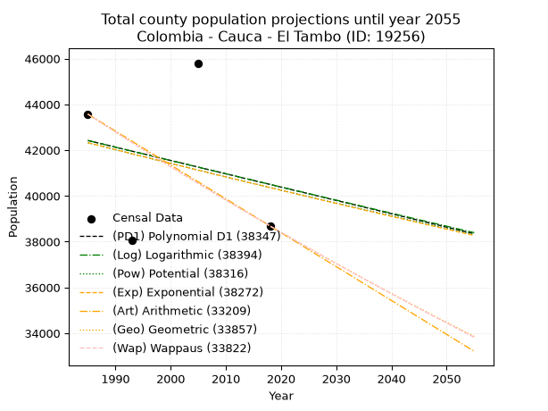
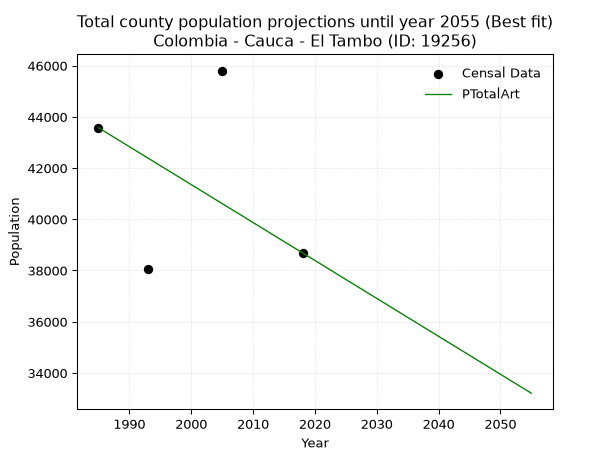
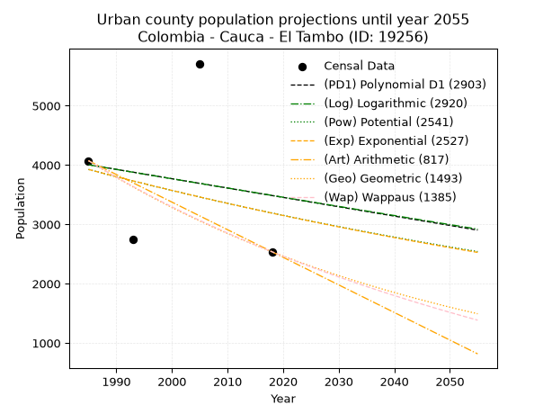
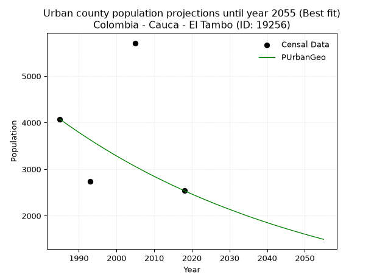
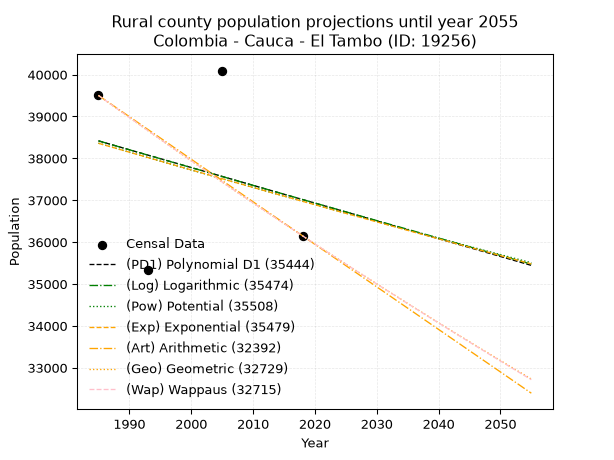
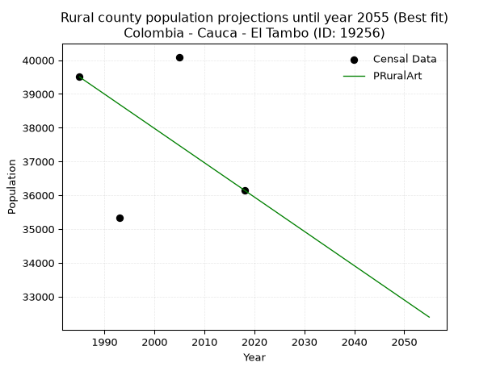

<div align="center">


</div>

# _“Population and Public Services Demand Projections (PPSD) until Year 2050 for Colombia - Cauca - El Tambo (ID: 19256)”_
Keywords: `population` `public-service` `projection` `lineal` `polynomial` `logarithmic` `potential` `exponential` `arithmetic` `geometric` `wappaus` `dane` `colombia` `south-america`

PPSD are analytical estimates used by governments and planners to anticipate future changes in population size, age distribution, and the resulting community needs for utilities, healthcare, education, and infrastructure as sizing future water treatment facilities, electrical grids, and road networks based on spatial growth.

> **General running parameters**: • app_version: _v20260806_. • Python version: _3.14.7_. • Pandas version: _3.0.5_. • NumPy version: _2.5.1_. • Creates, save and include plots into reports (create_plot): _False_. • Projection until year: _2050_. • Process polynomial degree 2 and up: _False_. • Process Wappaus: _True_. • Process Wappaus: _True_. • Set negative values to zero: _True_. • Set infinite values to zero: _True_. • Drop dataset notes: _True_. 
<div align="center">

Dynamic map: [:earth_americas:Google](http://maps.google.com/maps?q=2.451408838,-76.810911) [:earth_americas:OSM](https://www.openstreetmap.org/#map=18/2.451408838/-76.810911&layers=P) [:earth_americas:Bing](https://www.bing.com/maps?cp=2.451408838~-76.810911&lvl=18) [:earth_americas:Apple](https://maps.apple.com/frame?center=2.451408838%2C-76.810911&span=0.003%2C0.006)

</div>


<div align="center">

```geojson
{
  "type": "Feature",
  "geometry": {
    "type": "Point", 
    "coordinates": [-76.810911, 2.451408838]
  }, 
  "properties": {
    "Name": "Colombia - Cauca - El Tambo (ID: 19256)"
  }
}
```

</div>


## 0. Census Data (4 records)

Census data are official statistics collected by a government about the people and housing in a country. They usually include counts of total population, age, sex, race, income, education, and jobs.

📅Global census file: [Population.xlsx](../data/Population.xlsx)

| Source   |   Year |   CountryID | CountryName   |   StateID | StateName   |   CountyID | CountyName   |   PTotal |   PUrban |   PRural |
|:---------|-------:|------------:|:--------------|----------:|:------------|-----------:|:-------------|---------:|---------:|---------:|
| DANE     |   1985 |          57 | Colombia      |        19 | Cauca       |      19256 | El Tambo     |    43575 |     4073 |    39502 |
| DANE     |   1993 |          57 | Colombia      |        19 | Cauca       |      19256 | El Tambo     |    38073 |     2741 |    35332 |
| DANE     |   2005 |          57 | Colombia      |        19 | Cauca       |      19256 | El Tambo     |    45804 |     5710 |    40094 |
| DANE     |   2018 |          57 | Colombia      |        19 | Cauca       |      19256 | El Tambo     |    38688 |     2538 |    36150 |

> 🔥Some records could had specific notes about the registered values or the corresponding urban or rural distribution.

📅   [RUPS](https://www.datos.gov.co/Hacienda-y-Cr-dito-P-blico/Registro-nico-de-Prestadores-de-Servicios-P-blicos/4qkq-csdn/about_data) - Local public utility companies: [RUPS.csv](../data/RUPS.xlsx)

 | SERVICIO       | ESTADO    | NOMBRE                                                                            | NIT         | DEPARTAMENTO_DOMICILIO   | MUNICIPIO_DOMICILIO   | DIRECCION                                            |   TELEFONO | EMAIL                         | TIPO_PRESTADOR                            | CLASIFICACION                  |
|:---------------|:----------|:----------------------------------------------------------------------------------|:------------|:-------------------------|:----------------------|:-----------------------------------------------------|-----------:|:------------------------------|:------------------------------------------|:-------------------------------|
| ACUEDUCTO      | OPERATIVA | ASOCIACION REGIONAL DEL ACUEDUCTO SACHACOCO                                       | 800206064-9 | CAUCA                    | TIMBIO                | CARRERA 22 No. 19-31 BARRIO SAN JUDAS                |    8278538 | sachacocotimbio@hotmail.com   | ORGANIZACION AUTORIZADA                   | DESDE 2501 HASTA 5000 USUARIOS |
| ACUEDUCTO      | OPERATIVA | EMPRESA DE SEVICIOS PUBLICOS DE ACUEDUCTO, ALCANTARILLADO Y ASEO - EMTAMBO E.S.P. | 817002111-2 | CAUCA                    | EL TAMBO              | Calle 3 No. 3 - 45 Barrio Las Flores                 |    8276396 | emtamboaaa@gmail.com          | EMPRESA INDUSTRIAL Y COMERCIAL DEL ESTADO | MENOR O IGUAL A 2500 USUARIOS  |
| ALCANTARILLADO | OPERATIVA | EMPRESA DE SEVICIOS PUBLICOS DE ACUEDUCTO, ALCANTARILLADO Y ASEO - EMTAMBO E.S.P. | 817002111-2 | CAUCA                    | EL TAMBO              | Calle 3 No. 3 - 45 Barrio Las Flores                 |    8276396 | emtamboaaa@gmail.com          | EMPRESA INDUSTRIAL Y COMERCIAL DEL ESTADO | MENOR O IGUAL A 2500 USUARIOS  |
| ACUEDUCTO      | OPERATIVA | ASOCIACION DE USUARIOS DEL ACUEDUCTO GUELEITO ANAYES SEGUENGUE                    | 817007670-0 | CAUCA                    | EL TAMBO              | Corregimiento Los Anayes Municipio de El Tambo Cauca |    3173510 | orcarlos_027@hotmail.com      | ORGANIZACION AUTORIZADA                   | MENOR O IGUAL A 2500 USUARIOS  |
| ACUEDUCTO      | OPERATIVA | COOPERATIVA DE SERVICIOS PUBLICOS PANDIGUANDO PIAGUA                              | 817002965-5 | CAUCA                    | EL TAMBO              | CALLE 2  3-34                                        |    8276302 | coopserp24@yahoo.com.co       | ORGANIZACION AUTORIZADA                   | MENOR O IGUAL A 2500 USUARIOS  |
| ACUEDUCTO      | OPERATIVA | COOPERATIVA DE ACUEDUCTO LOS CEDROS TAMBO                                         | 817003286-7 | CAUCA                    | EL TAMBO              | Calle 2 Nro 3-35 B/ LAS FLORES                       |    8276377 | coocedrost@gmail.com          | ORGANIZACION AUTORIZADA                   | HASTA 2500 SUSCRIPTORES        |
| ACUEDUCTO      | OPERATIVA | ASOCIACION DE USUARIOS DEL ACUEDUCTO CHISQUIO MONTERREDONDO DE EL TAMBO CAUCA     | 817005330-2 | CAUCA                    | EL TAMBO              | carrera 9 numero 4-92                                |    8276234 | acueductochisquio@hotmail.com | ORGANIZACION AUTORIZADA                   | MENOR O IGUAL A 2500 USUARIOS  |

## 1. Total

### 1.1. Coefficients and Parameters

* (PD1) Polynomial Deg 1: -58.23685266960644, 158023.2645523803 (lineal)
* (Log) Logarithmic: -116245.73405302834, 925119.7560719188
* (Pow) Potential: -2.872230342141022, 14.098533726158742
* (Exp) Exponential: -0.001438580914889232, 735826.1927814223
* (Art) Arithmetic: Year diff. 2018 - 1985 = 33, Population diff. 38688 - 43575 = -4887, Annual growth = -148.0909090909091
* (Geo) Geometric: Year diff. 2018 - 1985 = 33, Population diff. 38688 - 43575 = -4887, Annual growth % = -0.0035981811869306712
* (Wap) Wappaus: i = -0.3600425685688805, Condition values only valid for < 200)

<sub>
Wappaus condition values: ['-0.00', '-0.36', '-0.72', '-1.08', '-1.44', '-1.80', '-2.16', '-2.52', '-2.88', '-3.24', '-3.60', '-3.96', '-4.32', '-4.68', '-5.04', '-5.40', '-5.76', '-6.12', '-6.48', '-6.84', '-7.20', '-7.56', '-7.92', '-8.28', '-8.64', '-9.00', '-9.36', '-9.72', '-10.08', '-10.44', '-10.80', '-11.16', '-11.52', '-11.88', '-12.24', '-12.60', '-12.96', '-13.32', '-13.68', '-14.04', '-14.40', '-14.76', '-15.12', '-15.48', '-15.84', '-16.20', '-16.56', '-16.92', '-17.28', '-17.64', '-18.00', '-18.36', '-18.72', '-19.08', '-19.44', '-19.80', '-20.16', '-20.52', '-20.88', '-21.24', '-21.60', '-21.96', '-22.32', '-22.68', '-23.04', '-23.40']
</sub>


### 1.2. Projected Dataset

|   Year |   CountyID |   PTotalPD1 |   PTotalLog |   PTotalPow |   PTotalExp |   PTotalArt |   PTotalGeo |   PTotalWap |
|-------:|-----------:|------------:|------------:|------------:|------------:|------------:|------------:|------------:|
|   1985 |      19256 |       42423 |       42422 |       42326 |       42326 |       43575 |       43575 |       43575 |
|   1986 |      19256 |       42365 |       42364 |       42265 |       42266 |       43427 |       43418 |       43418 |
|   1987 |      19256 |       42307 |       42305 |       42204 |       42205 |       43279 |       43262 |       43262 |
|   1988 |      19256 |       42248 |       42247 |       42143 |       42144 |       43131 |       43106 |       43107 |
|   1989 |      19256 |       42190 |       42188 |       42082 |       42084 |       42983 |       42951 |       42952 |
|   1990 |      19256 |       42132 |       42130 |       42021 |       42023 |       42835 |       42797 |       42798 |
|   1991 |      19256 |       42074 |       42072 |       41961 |       41963 |       42686 |       42643 |       42644 |
|   1992 |      19256 |       42015 |       42013 |       41900 |       41902 |       42538 |       42489 |       42490 |
|   1993 |      19256 |       41957 |       41955 |       41840 |       41842 |       42390 |       42336 |       42338 |
|   1994 |      19256 |       41899 |       41897 |       41779 |       41782 |       42242 |       42184 |       42186 |
|   1995 |      19256 |       41841 |       41838 |       41719 |       41722 |       42094 |       42032 |       42034 |
|   1996 |      19256 |       41783 |       41780 |       41659 |       41662 |       41946 |       41881 |       41883 |
|   1997 |      19256 |       41724 |       41722 |       41599 |       41602 |       41798 |       41730 |       41732 |
|   1998 |      19256 |       41666 |       41664 |       41540 |       41542 |       41650 |       41580 |       41582 |
|   1999 |      19256 |       41608 |       41605 |       41480 |       41482 |       41502 |       41431 |       41433 |
|   2000 |      19256 |       41550 |       41547 |       41420 |       41423 |       41354 |       41281 |       41284 |
|   2001 |      19256 |       41491 |       41489 |       41361 |       41363 |       41206 |       41133 |       41135 |
|   2002 |      19256 |       41433 |       41431 |       41302 |       41304 |       41057 |       40985 |       40987 |
|   2003 |      19256 |       41375 |       41373 |       41243 |       41244 |       40909 |       40837 |       40840 |
|   2004 |      19256 |       41317 |       41315 |       41183 |       41185 |       40761 |       40691 |       40693 |
|   2005 |      19256 |       41258 |       41257 |       41124 |       41126 |       40613 |       40544 |       40546 |
|   2006 |      19256 |       41200 |       41199 |       41066 |       41067 |       40465 |       40398 |       40400 |
|   2007 |      19256 |       41142 |       41141 |       41007 |       41008 |       40317 |       40253 |       40255 |
|   2008 |      19256 |       41084 |       41083 |       40948 |       40949 |       40169 |       40108 |       40110 |
|   2009 |      19256 |       41025 |       41025 |       40890 |       40890 |       40021 |       39964 |       39966 |
|   2010 |      19256 |       40967 |       40967 |       40831 |       40831 |       39873 |       39820 |       39822 |
|   2011 |      19256 |       40909 |       40910 |       40773 |       40772 |       39725 |       39677 |       39678 |
|   2012 |      19256 |       40851 |       40852 |       40715 |       40714 |       39577 |       39534 |       39535 |
|   2013 |      19256 |       40792 |       40794 |       40657 |       40655 |       39428 |       39392 |       39393 |
|   2014 |      19256 |       40734 |       40736 |       40599 |       40597 |       39280 |       39250 |       39251 |
|   2015 |      19256 |       40676 |       40679 |       40541 |       40539 |       39132 |       39109 |       39110 |
|   2016 |      19256 |       40618 |       40621 |       40483 |       40480 |       38984 |       38968 |       38969 |
|   2017 |      19256 |       40560 |       40563 |       40426 |       40422 |       38836 |       38828 |       38828 |
|   2018 |      19256 |       40501 |       40506 |       40368 |       40364 |       38688 |       38688 |       38688 |
|   2019 |      19256 |       40443 |       40448 |       40311 |       40306 |       38540 |       38549 |       38548 |
|   2020 |      19256 |       40385 |       40391 |       40253 |       40248 |       38392 |       38410 |       38409 |
|   2021 |      19256 |       40327 |       40333 |       40196 |       40190 |       38244 |       38272 |       38271 |
|   2022 |      19256 |       40268 |       40276 |       40139 |       40132 |       38096 |       38134 |       38133 |
|   2023 |      19256 |       40210 |       40218 |       40082 |       40075 |       37948 |       37997 |       37995 |
|   2024 |      19256 |       40152 |       40161 |       40025 |       40017 |       37799 |       37860 |       37858 |
|   2025 |      19256 |       40094 |       40103 |       39969 |       39960 |       37651 |       37724 |       37721 |
|   2026 |      19256 |       40035 |       40046 |       39912 |       39902 |       37503 |       37588 |       37585 |
|   2027 |      19256 |       39977 |       39988 |       39855 |       39845 |       37355 |       37453 |       37449 |
|   2028 |      19256 |       39919 |       39931 |       39799 |       39787 |       37207 |       37318 |       37313 |
|   2029 |      19256 |       39861 |       39874 |       39743 |       39730 |       37059 |       37184 |       37179 |
|   2030 |      19256 |       39802 |       39817 |       39687 |       39673 |       36911 |       37050 |       37044 |
|   2031 |      19256 |       39744 |       39759 |       39630 |       39616 |       36763 |       36917 |       36910 |
|   2032 |      19256 |       39686 |       39702 |       39574 |       39559 |       36615 |       36784 |       36776 |
|   2033 |      19256 |       39628 |       39645 |       39519 |       39502 |       36467 |       36652 |       36643 |
|   2034 |      19256 |       39570 |       39588 |       39463 |       39446 |       36319 |       36520 |       36511 |
|   2035 |      19256 |       39511 |       39531 |       39407 |       39389 |       36170 |       36388 |       36378 |
|   2036 |      19256 |       39453 |       39473 |       39352 |       39332 |       36022 |       36257 |       36247 |
|   2037 |      19256 |       39395 |       39416 |       39296 |       39276 |       35874 |       36127 |       36115 |
|   2038 |      19256 |       39337 |       39359 |       39241 |       39219 |       35726 |       35997 |       35984 |
|   2039 |      19256 |       39278 |       39302 |       39185 |       39163 |       35578 |       35867 |       35854 |
|   2040 |      19256 |       39220 |       39245 |       39130 |       39107 |       35430 |       35738 |       35724 |
|   2041 |      19256 |       39162 |       39188 |       39075 |       39050 |       35282 |       35610 |       35594 |
|   2042 |      19256 |       39104 |       39131 |       39020 |       38994 |       35134 |       35482 |       35465 |
|   2043 |      19256 |       39045 |       39074 |       38966 |       38938 |       34986 |       35354 |       35336 |
|   2044 |      19256 |       38987 |       39018 |       38911 |       38882 |       34838 |       35227 |       35207 |
|   2045 |      19256 |       38929 |       38961 |       38856 |       38826 |       34690 |       35100 |       35079 |
|   2046 |      19256 |       38871 |       38904 |       38802 |       38770 |       34541 |       34974 |       34952 |
|   2047 |      19256 |       38812 |       38847 |       38747 |       38715 |       34393 |       34848 |       34825 |
|   2048 |      19256 |       38754 |       38790 |       38693 |       38659 |       34245 |       34723 |       34698 |
|   2049 |      19256 |       38696 |       38734 |       38639 |       38603 |       34097 |       34598 |       34571 |
|   2050 |      19256 |       38638 |       38677 |       38585 |       38548 |       33949 |       34473 |       34446 |
<div align="center">

</img>

</div>


### 1.3. Best fit with absolute and relative error (%)

Relative error puts that difference into context by dividing the absolute error by the true value, creating a unitless ratio or percentage that shows the scale of the mistake.

Absolute and relative error

|   Year | Source   |   CountryID | CountryName   |   StateID | StateName   |   CountyID_x | CountyName   |   PTotal |   PUrban |   PRural |   CountyID_y |   PTotalPD1 |   PTotalLog |   PTotalPow |   PTotalExp |   PTotalArt |   PTotalGeo |   PTotalWap |   PTotalPD1AbsError |   PTotalLogAbsError |   PTotalPowAbsError |   PTotalExpAbsError |   PTotalArtAbsError |   PTotalGeoAbsError |   PTotalWapAbsError |   PTotalPD1RelError |   PTotalLogRelError |   PTotalPowRelError |   PTotalExpRelError |   PTotalArtRelError |   PTotalGeoRelError |   PTotalWapRelError |
|-------:|:---------|------------:|:--------------|----------:|:------------|-------------:|:-------------|---------:|---------:|---------:|-------------:|------------:|------------:|------------:|------------:|------------:|------------:|------------:|--------------------:|--------------------:|--------------------:|--------------------:|--------------------:|--------------------:|--------------------:|--------------------:|--------------------:|--------------------:|--------------------:|--------------------:|--------------------:|--------------------:|
|   1985 | DANE     |          57 | Colombia      |        19 | Cauca       |        19256 | El Tambo     |    43575 |     4073 |    39502 |        19256 |       42423 |       42422 |       42326 |       42326 |       43575 |       43575 |       43575 |                1152 |                1153 |                1249 |                1249 |                   0 |                   0 |                   0 |             2.64372 |             2.64601 |             2.86632 |             2.86632 |              0      |              0      |              0      |
|   1993 | DANE     |          57 | Colombia      |        19 | Cauca       |        19256 | El Tambo     |    38073 |     2741 |    35332 |        19256 |       41957 |       41955 |       41840 |       41842 |       42390 |       42336 |       42338 |                3884 |                3882 |                3767 |                3769 |                4317 |                4263 |                4265 |            10.2015  |            10.1962  |             9.89415 |             9.8994  |             11.3387 |             11.1969 |             11.2022 |
|   2005 | DANE     |          57 | Colombia      |        19 | Cauca       |        19256 | El Tambo     |    45804 |     5710 |    40094 |        19256 |       41258 |       41257 |       41124 |       41126 |       40613 |       40544 |       40546 |                4546 |                4547 |                4680 |                4678 |                5191 |                5260 |                5258 |             9.9249  |             9.92708 |            10.2174  |            10.2131  |             11.3331 |             11.4837 |             11.4793 |
|   2018 | DANE     |          57 | Colombia      |        19 | Cauca       |        19256 | El Tambo     |    38688 |     2538 |    36150 |        19256 |       40501 |       40506 |       40368 |       40364 |       38688 |       38688 |       38688 |                1813 |                1818 |                1680 |                1676 |                   0 |                   0 |                   0 |             4.68621 |             4.69913 |             4.34243 |             4.33209 |              0      |              0      |              0      |

Relative error mean

| Method    |   RelError | Best   |
|:----------|-----------:|:-------|
| PTotalPD1 |    6.86407 |        |
| PTotalLog |    6.86711 |        |
| PTotalPow |    6.83009 |        |
| PTotalExp |    6.82773 |        |
| PTotalArt |    5.66795 | True   |
| PTotalGeo |    5.67016 |        |
| PTotalWap |    5.67038 |        |

💙Best method: _**PTotalArt**_
<div align="center">

</img>

</div>


### 1.4. Fresh water supply demand in liters per capita per day (lpcd)

The fresh water supply demand typically ranges from 100 to 300 liters per capita per day (lpcd) for standard domestic and municipal planning, though absolute survival minimums set by the World Health Organization are as low as 7.5 to 20 liters per day, and total consumption in high-income nations can exceed 400 liters.

> `CZ`: Level in meters above the sea level (masl)<br> `WS`: Fresh water supply demand in liters per capita per day (lpcd or l/h/d)<br> `WSAll`: Zonal fresh water supply demand in liters per second (l/s)<br> `A`: Zonal area in square meters<br> `DP`: Population density (people/hectare or p/ha)

Reference values (RAS Colombia)

|    CZ |   WS |
|------:|-----:|
|  1000 |  120 |
|  2000 |  130 |
| 99999 |  140 |

County shapefile geometry properties and water supply values

|   CountyID |      ATotal |   CZTotal |   WSTotal |
|-----------:|------------:|----------:|----------:|
|      19256 | 2.74149e+09 |   1360.92 |       130 |

Projected values for best method: PTotalArt

|   CountyID |   Year |   PTotalArt |   DPTotal |   WSTotal |   WSTotalAll |
|-----------:|-------:|------------:|----------:|----------:|-------------:|
|      19256 |   1985 |       43575 |      0.16 |       130 |      65.5642 |
|      19256 |   1986 |       43427 |      0.16 |       130 |      65.3416 |
|      19256 |   1987 |       43279 |      0.16 |       130 |      65.1189 |
|      19256 |   1988 |       43131 |      0.16 |       130 |      64.8962 |
|      19256 |   1989 |       42983 |      0.16 |       130 |      64.6735 |
|      19256 |   1990 |       42835 |      0.16 |       130 |      64.4508 |
|      19256 |   1991 |       42686 |      0.16 |       130 |      64.2266 |
|      19256 |   1992 |       42538 |      0.16 |       130 |      64.0039 |
|      19256 |   1993 |       42390 |      0.15 |       130 |      63.7812 |
|      19256 |   1994 |       42242 |      0.15 |       130 |      63.5586 |
|      19256 |   1995 |       42094 |      0.15 |       130 |      63.3359 |
|      19256 |   1996 |       41946 |      0.15 |       130 |      63.1132 |
|      19256 |   1997 |       41798 |      0.15 |       130 |      62.8905 |
|      19256 |   1998 |       41650 |      0.15 |       130 |      62.6678 |
|      19256 |   1999 |       41502 |      0.15 |       130 |      62.4451 |
|      19256 |   2000 |       41354 |      0.15 |       130 |      62.2225 |
|      19256 |   2001 |       41206 |      0.15 |       130 |      61.9998 |
|      19256 |   2002 |       41057 |      0.15 |       130 |      61.7756 |
|      19256 |   2003 |       40909 |      0.15 |       130 |      61.5529 |
|      19256 |   2004 |       40761 |      0.15 |       130 |      61.3302 |
|      19256 |   2005 |       40613 |      0.15 |       130 |      61.1075 |
|      19256 |   2006 |       40465 |      0.15 |       130 |      60.8848 |
|      19256 |   2007 |       40317 |      0.15 |       130 |      60.6622 |
|      19256 |   2008 |       40169 |      0.15 |       130 |      60.4395 |
|      19256 |   2009 |       40021 |      0.15 |       130 |      60.2168 |
|      19256 |   2010 |       39873 |      0.15 |       130 |      59.9941 |
|      19256 |   2011 |       39725 |      0.14 |       130 |      59.7714 |
|      19256 |   2012 |       39577 |      0.14 |       130 |      59.5487 |
|      19256 |   2013 |       39428 |      0.14 |       130 |      59.3245 |
|      19256 |   2014 |       39280 |      0.14 |       130 |      59.1019 |
|      19256 |   2015 |       39132 |      0.14 |       130 |      58.8792 |
|      19256 |   2016 |       38984 |      0.14 |       130 |      58.6565 |
|      19256 |   2017 |       38836 |      0.14 |       130 |      58.4338 |
|      19256 |   2018 |       38688 |      0.14 |       130 |      58.2111 |
|      19256 |   2019 |       38540 |      0.14 |       130 |      57.9884 |
|      19256 |   2020 |       38392 |      0.14 |       130 |      57.7657 |
|      19256 |   2021 |       38244 |      0.14 |       130 |      57.5431 |
|      19256 |   2022 |       38096 |      0.14 |       130 |      57.3204 |
|      19256 |   2023 |       37948 |      0.14 |       130 |      57.0977 |
|      19256 |   2024 |       37799 |      0.14 |       130 |      56.8735 |
|      19256 |   2025 |       37651 |      0.14 |       130 |      56.6508 |
|      19256 |   2026 |       37503 |      0.14 |       130 |      56.4281 |
|      19256 |   2027 |       37355 |      0.14 |       130 |      56.2054 |
|      19256 |   2028 |       37207 |      0.14 |       130 |      55.9828 |
|      19256 |   2029 |       37059 |      0.14 |       130 |      55.7601 |
|      19256 |   2030 |       36911 |      0.13 |       130 |      55.5374 |
|      19256 |   2031 |       36763 |      0.13 |       130 |      55.3147 |
|      19256 |   2032 |       36615 |      0.13 |       130 |      55.092  |
|      19256 |   2033 |       36467 |      0.13 |       130 |      54.8693 |
|      19256 |   2034 |       36319 |      0.13 |       130 |      54.6466 |
|      19256 |   2035 |       36170 |      0.13 |       130 |      54.4225 |
|      19256 |   2036 |       36022 |      0.13 |       130 |      54.1998 |
|      19256 |   2037 |       35874 |      0.13 |       130 |      53.9771 |
|      19256 |   2038 |       35726 |      0.13 |       130 |      53.7544 |
|      19256 |   2039 |       35578 |      0.13 |       130 |      53.5317 |
|      19256 |   2040 |       35430 |      0.13 |       130 |      53.309  |
|      19256 |   2041 |       35282 |      0.13 |       130 |      53.0863 |
|      19256 |   2042 |       35134 |      0.13 |       130 |      52.8637 |
|      19256 |   2043 |       34986 |      0.13 |       130 |      52.641  |
|      19256 |   2044 |       34838 |      0.13 |       130 |      52.4183 |
|      19256 |   2045 |       34690 |      0.13 |       130 |      52.1956 |
|      19256 |   2046 |       34541 |      0.13 |       130 |      51.9714 |
|      19256 |   2047 |       34393 |      0.13 |       130 |      51.7487 |
|      19256 |   2048 |       34245 |      0.12 |       130 |      51.526  |
|      19256 |   2049 |       34097 |      0.12 |       130 |      51.3034 |
|      19256 |   2050 |       33949 |      0.12 |       130 |      51.0807 |

## 2. Urban

### 2.1. Coefficients and Parameters

* (PD1) Polynomial Deg 1: -15.75832998795487, 35286.09955840673 (lineal)
* (Log) Logarithmic: -31304.488240884566, 241711.16597738868
* (Pow) Potential: -12.543802164878889, 44.960280025556926
* (Exp) Exponential: -0.00629411785688642, 1046941645.1141164
* (Art) Arithmetic: Year diff. 2018 - 1985 = 33, Population diff. 2538 - 4073 = -1535, Annual growth = -46.515151515151516
* (Geo) Geometric: Year diff. 2018 - 1985 = 33, Population diff. 2538 - 4073 = -1535, Annual growth % = -0.014231203479121435
* (Wap) Wappaus: i = -1.4072047047391172, Condition values only valid for < 200)

<sub>
Wappaus condition values: ['-0.00', '-1.41', '-2.81', '-4.22', '-5.63', '-7.04', '-8.44', '-9.85', '-11.26', '-12.66', '-14.07', '-15.48', '-16.89', '-18.29', '-19.70', '-21.11', '-22.52', '-23.92', '-25.33', '-26.74', '-28.14', '-29.55', '-30.96', '-32.37', '-33.77', '-35.18', '-36.59', '-37.99', '-39.40', '-40.81', '-42.22', '-43.62', '-45.03', '-46.44', '-47.84', '-49.25', '-50.66', '-52.07', '-53.47', '-54.88', '-56.29', '-57.70', '-59.10', '-60.51', '-61.92', '-63.32', '-64.73', '-66.14', '-67.55', '-68.95', '-70.36', '-71.77', '-73.17', '-74.58', '-75.99', '-77.40', '-78.80', '-80.21', '-81.62', '-83.03', '-84.43', '-85.84', '-87.25', '-88.65', '-90.06', '-91.47']
</sub>


### 2.2. Projected Dataset

|   Year |   CountyID |   PUrbanPD1 |   PUrbanLog |   PUrbanPow |   PUrbanExp |   PUrbanArt |   PUrbanGeo |   PUrbanWap |
|-------:|-----------:|------------:|------------:|------------:|------------:|------------:|------------:|------------:|
|   1985 |      19256 |        4006 |        4004 |        3925 |        3926 |        4073 |        4073 |        4073 |
|   1986 |      19256 |        3990 |        3989 |        3900 |        3901 |        4026 |        4015 |        4016 |
|   1987 |      19256 |        3974 |        3973 |        3876 |        3877 |        3980 |        3958 |        3960 |
|   1988 |      19256 |        3959 |        3957 |        3851 |        3852 |        3933 |        3902 |        3905 |
|   1989 |      19256 |        3943 |        3941 |        3827 |        3828 |        3887 |        3846 |        3850 |
|   1990 |      19256 |        3927 |        3926 |        3803 |        3804 |        3840 |        3791 |        3796 |
|   1991 |      19256 |        3911 |        3910 |        3779 |        3780 |        3794 |        3737 |        3743 |
|   1992 |      19256 |        3896 |        3894 |        3755 |        3757 |        3747 |        3684 |        3691 |
|   1993 |      19256 |        3880 |        3879 |        3732 |        3733 |        3701 |        3632 |        3639 |
|   1994 |      19256 |        3864 |        3863 |        3708 |        3710 |        3654 |        3580 |        3588 |
|   1995 |      19256 |        3848 |        3847 |        3685 |        3686 |        3608 |        3529 |        3538 |
|   1996 |      19256 |        3832 |        3831 |        3662 |        3663 |        3561 |        3479 |        3488 |
|   1997 |      19256 |        3817 |        3816 |        3639 |        3640 |        3515 |        3429 |        3439 |
|   1998 |      19256 |        3801 |        3800 |        3616 |        3617 |        3468 |        3381 |        3390 |
|   1999 |      19256 |        3785 |        3784 |        3594 |        3595 |        3422 |        3332 |        3343 |
|   2000 |      19256 |        3769 |        3769 |        3571 |        3572 |        3375 |        3285 |        3295 |
|   2001 |      19256 |        3754 |        3753 |        3549 |        3550 |        3329 |        3238 |        3249 |
|   2002 |      19256 |        3738 |        3738 |        3527 |        3527 |        3282 |        3192 |        3203 |
|   2003 |      19256 |        3722 |        3722 |        3505 |        3505 |        3236 |        3147 |        3157 |
|   2004 |      19256 |        3706 |        3706 |        3483 |        3483 |        3189 |        3102 |        3112 |
|   2005 |      19256 |        3691 |        3691 |        3461 |        3461 |        3143 |        3058 |        3068 |
|   2006 |      19256 |        3675 |        3675 |        3439 |        3440 |        3096 |        3014 |        3024 |
|   2007 |      19256 |        3659 |        3659 |        3418 |        3418 |        3050 |        2971 |        2981 |
|   2008 |      19256 |        3643 |        3644 |        3397 |        3397 |        3003 |        2929 |        2938 |
|   2009 |      19256 |        3628 |        3628 |        3376 |        3375 |        2957 |        2887 |        2896 |
|   2010 |      19256 |        3612 |        3613 |        3355 |        3354 |        2910 |        2846 |        2854 |
|   2011 |      19256 |        3596 |        3597 |        3334 |        3333 |        2864 |        2806 |        2813 |
|   2012 |      19256 |        3580 |        3582 |        3313 |        3312 |        2817 |        2766 |        2773 |
|   2013 |      19256 |        3565 |        3566 |        3292 |        3291 |        2771 |        2727 |        2732 |
|   2014 |      19256 |        3549 |        3550 |        3272 |        3271 |        2724 |        2688 |        2693 |
|   2015 |      19256 |        3533 |        3535 |        3252 |        3250 |        2678 |        2650 |        2653 |
|   2016 |      19256 |        3517 |        3519 |        3232 |        3230 |        2631 |        2612 |        2614 |
|   2017 |      19256 |        3502 |        3504 |        3211 |        3210 |        2585 |        2575 |        2576 |
|   2018 |      19256 |        3486 |        3488 |        3192 |        3189 |        2538 |        2538 |        2538 |
|   2019 |      19256 |        3470 |        3473 |        3172 |        3169 |        2491 |        2502 |        2500 |
|   2020 |      19256 |        3454 |        3457 |        3152 |        3150 |        2445 |        2466 |        2463 |
|   2021 |      19256 |        3439 |        3442 |        3133 |        3130 |        2398 |        2431 |        2427 |
|   2022 |      19256 |        3423 |        3426 |        3113 |        3110 |        2352 |        2397 |        2390 |
|   2023 |      19256 |        3407 |        3411 |        3094 |        3091 |        2305 |        2362 |        2354 |
|   2024 |      19256 |        3391 |        3395 |        3075 |        3071 |        2259 |        2329 |        2319 |
|   2025 |      19256 |        3375 |        3380 |        3056 |        3052 |        2212 |        2296 |        2284 |
|   2026 |      19256 |        3360 |        3364 |        3037 |        3033 |        2166 |        2263 |        2249 |
|   2027 |      19256 |        3344 |        3349 |        3018 |        3014 |        2119 |        2231 |        2215 |
|   2028 |      19256 |        3328 |        3334 |        3000 |        2995 |        2073 |        2199 |        2181 |
|   2029 |      19256 |        3312 |        3318 |        2981 |        2976 |        2026 |        2168 |        2147 |
|   2030 |      19256 |        3297 |        3303 |        2963 |        2957 |        1980 |        2137 |        2114 |
|   2031 |      19256 |        3281 |        3287 |        2945 |        2939 |        1933 |        2107 |        2081 |
|   2032 |      19256 |        3265 |        3272 |        2926 |        2920 |        1887 |        2077 |        2049 |
|   2033 |      19256 |        3249 |        3256 |        2908 |        2902 |        1840 |        2047 |        2016 |
|   2034 |      19256 |        3234 |        3241 |        2891 |        2884 |        1794 |        2018 |        1985 |
|   2035 |      19256 |        3218 |        3226 |        2873 |        2866 |        1747 |        1989 |        1953 |
|   2036 |      19256 |        3202 |        3210 |        2855 |        2848 |        1701 |        1961 |        1922 |
|   2037 |      19256 |        3186 |        3195 |        2838 |        2830 |        1654 |        1933 |        1891 |
|   2038 |      19256 |        3171 |        3180 |        2820 |        2812 |        1608 |        1905 |        1860 |
|   2039 |      19256 |        3155 |        3164 |        2803 |        2795 |        1561 |        1878 |        1830 |
|   2040 |      19256 |        3139 |        3149 |        2786 |        2777 |        1515 |        1852 |        1800 |
|   2041 |      19256 |        3123 |        3134 |        2769 |        2760 |        1468 |        1825 |        1771 |
|   2042 |      19256 |        3108 |        3118 |        2752 |        2742 |        1422 |        1799 |        1741 |
|   2043 |      19256 |        3092 |        3103 |        2735 |        2725 |        1375 |        1774 |        1712 |
|   2044 |      19256 |        3076 |        3088 |        2718 |        2708 |        1329 |        1748 |        1683 |
|   2045 |      19256 |        3060 |        3072 |        2701 |        2691 |        1282 |        1724 |        1655 |
|   2046 |      19256 |        3045 |        3057 |        2685 |        2674 |        1236 |        1699 |        1627 |
|   2047 |      19256 |        3029 |        3042 |        2669 |        2657 |        1189 |        1675 |        1599 |
|   2048 |      19256 |        3013 |        3026 |        2652 |        2641 |        1143 |        1651 |        1571 |
|   2049 |      19256 |        2997 |        3011 |        2636 |        2624 |        1096 |        1627 |        1544 |
|   2050 |      19256 |        2982 |        2996 |        2620 |        2608 |        1050 |        1604 |        1517 |
<div align="center">

</img>

</div>


### 2.3. Best fit with absolute and relative error (%)

Relative error puts that difference into context by dividing the absolute error by the true value, creating a unitless ratio or percentage that shows the scale of the mistake.

Absolute and relative error

|   Year | Source   |   CountryID | CountryName   |   StateID | StateName   |   CountyID_x | CountyName   |   PTotal |   PUrban |   PRural |   CountyID_y |   PUrbanPD1 |   PUrbanLog |   PUrbanPow |   PUrbanExp |   PUrbanArt |   PUrbanGeo |   PUrbanWap |   PUrbanPD1AbsError |   PUrbanLogAbsError |   PUrbanPowAbsError |   PUrbanExpAbsError |   PUrbanArtAbsError |   PUrbanGeoAbsError |   PUrbanWapAbsError |   PUrbanPD1RelError |   PUrbanLogRelError |   PUrbanPowRelError |   PUrbanExpRelError |   PUrbanArtRelError |   PUrbanGeoRelError |   PUrbanWapRelError |
|-------:|:---------|------------:|:--------------|----------:|:------------|-------------:|:-------------|---------:|---------:|---------:|-------------:|------------:|------------:|------------:|------------:|------------:|------------:|------------:|--------------------:|--------------------:|--------------------:|--------------------:|--------------------:|--------------------:|--------------------:|--------------------:|--------------------:|--------------------:|--------------------:|--------------------:|--------------------:|--------------------:|
|   1985 | DANE     |          57 | Colombia      |        19 | Cauca       |        19256 | El Tambo     |    43575 |     4073 |    39502 |        19256 |        4006 |        4004 |        3925 |        3926 |        4073 |        4073 |        4073 |                  67 |                  69 |                 148 |                 147 |                   0 |                   0 |                   0 |             1.64498 |             1.69408 |             3.63369 |             3.60913 |              0      |              0      |              0      |
|   1993 | DANE     |          57 | Colombia      |        19 | Cauca       |        19256 | El Tambo     |    38073 |     2741 |    35332 |        19256 |        3880 |        3879 |        3732 |        3733 |        3701 |        3632 |        3639 |                1139 |                1138 |                 991 |                 992 |                 960 |                 891 |                 898 |            41.5542  |            41.5177  |            36.1547  |            36.1912  |             35.0237 |             32.5064 |             32.7618 |
|   2005 | DANE     |          57 | Colombia      |        19 | Cauca       |        19256 | El Tambo     |    45804 |     5710 |    40094 |        19256 |        3691 |        3691 |        3461 |        3461 |        3143 |        3058 |        3068 |                2019 |                2019 |                2249 |                2249 |                2567 |                2652 |                2642 |            35.359   |            35.359   |            39.387   |            39.387   |             44.9562 |             46.4448 |             46.2697 |
|   2018 | DANE     |          57 | Colombia      |        19 | Cauca       |        19256 | El Tambo     |    38688 |     2538 |    36150 |        19256 |        3486 |        3488 |        3192 |        3189 |        2538 |        2538 |        2538 |                 948 |                 950 |                 654 |                 651 |                   0 |                   0 |                   0 |            37.3522  |            37.431   |            25.7683  |            25.6501  |              0      |              0      |              0      |

Relative error mean

| Method    |   RelError | Best   |
|:----------|-----------:|:-------|
| PUrbanPD1 |    28.9776 |        |
| PUrbanLog |    29.0005 |        |
| PUrbanPow |    26.2359 |        |
| PUrbanExp |    26.2094 |        |
| PUrbanArt |    19.995  |        |
| PUrbanGeo |    19.7378 | True   |
| PUrbanWap |    19.7579 |        |

💙Best method: _**PUrbanGeo**_
<div align="center">

</img>

</div>


### 2.4. Fresh water supply demand in liters per capita per day (lpcd)

The fresh water supply demand typically ranges from 100 to 300 liters per capita per day (lpcd) for standard domestic and municipal planning, though absolute survival minimums set by the World Health Organization are as low as 7.5 to 20 liters per day, and total consumption in high-income nations can exceed 400 liters.

> `CZ`: Level in meters above the sea level (masl)<br> `WS`: Fresh water supply demand in liters per capita per day (lpcd or l/h/d)<br> `WSAll`: Zonal fresh water supply demand in liters per second (l/s)<br> `A`: Zonal area in square meters<br> `DP`: Population density (people/hectare or p/ha)

Reference values (RAS Colombia)

|    CZ |   WS |
|------:|-----:|
|  1000 |  120 |
|  2000 |  130 |
| 99999 |  140 |

County shapefile geometry properties and water supply values

|   CountyID |      AUrban |   CZUrban |   WSUrban |
|-----------:|------------:|----------:|----------:|
|      19256 | 1.19342e+06 |    1723.2 |       130 |

Projected values for best method: PUrbanGeo

|   CountyID |   Year |   PUrbanGeo |   DPUrban |   WSUrban |   WSUrbanAll |
|-----------:|-------:|------------:|----------:|----------:|-------------:|
|      19256 |   1985 |        4073 |     34.13 |       130 |      6.12836 |
|      19256 |   1986 |        4015 |     33.64 |       130 |      6.04109 |
|      19256 |   1987 |        3958 |     33.17 |       130 |      5.95532 |
|      19256 |   1988 |        3902 |     32.7  |       130 |      5.87106 |
|      19256 |   1989 |        3846 |     32.23 |       130 |      5.78681 |
|      19256 |   1990 |        3791 |     31.77 |       130 |      5.70405 |
|      19256 |   1991 |        3737 |     31.31 |       130 |      5.6228  |
|      19256 |   1992 |        3684 |     30.87 |       130 |      5.54306 |
|      19256 |   1993 |        3632 |     30.43 |       130 |      5.46481 |
|      19256 |   1994 |        3580 |     30    |       130 |      5.38657 |
|      19256 |   1995 |        3529 |     29.57 |       130 |      5.30984 |
|      19256 |   1996 |        3479 |     29.15 |       130 |      5.23461 |
|      19256 |   1997 |        3429 |     28.73 |       130 |      5.15937 |
|      19256 |   1998 |        3381 |     28.33 |       130 |      5.08715 |
|      19256 |   1999 |        3332 |     27.92 |       130 |      5.01343 |
|      19256 |   2000 |        3285 |     27.53 |       130 |      4.94271 |
|      19256 |   2001 |        3238 |     27.13 |       130 |      4.87199 |
|      19256 |   2002 |        3192 |     26.75 |       130 |      4.80278 |
|      19256 |   2003 |        3147 |     26.37 |       130 |      4.73507 |
|      19256 |   2004 |        3102 |     25.99 |       130 |      4.66736 |
|      19256 |   2005 |        3058 |     25.62 |       130 |      4.60116 |
|      19256 |   2006 |        3014 |     25.26 |       130 |      4.53495 |
|      19256 |   2007 |        2971 |     24.89 |       130 |      4.47025 |
|      19256 |   2008 |        2929 |     24.54 |       130 |      4.40706 |
|      19256 |   2009 |        2887 |     24.19 |       130 |      4.34387 |
|      19256 |   2010 |        2846 |     23.85 |       130 |      4.28218 |
|      19256 |   2011 |        2806 |     23.51 |       130 |      4.22199 |
|      19256 |   2012 |        2766 |     23.18 |       130 |      4.16181 |
|      19256 |   2013 |        2727 |     22.85 |       130 |      4.10313 |
|      19256 |   2014 |        2688 |     22.52 |       130 |      4.04444 |
|      19256 |   2015 |        2650 |     22.21 |       130 |      3.98727 |
|      19256 |   2016 |        2612 |     21.89 |       130 |      3.93009 |
|      19256 |   2017 |        2575 |     21.58 |       130 |      3.87442 |
|      19256 |   2018 |        2538 |     21.27 |       130 |      3.81875 |
|      19256 |   2019 |        2502 |     20.96 |       130 |      3.76458 |
|      19256 |   2020 |        2466 |     20.66 |       130 |      3.71042 |
|      19256 |   2021 |        2431 |     20.37 |       130 |      3.65775 |
|      19256 |   2022 |        2397 |     20.09 |       130 |      3.6066  |
|      19256 |   2023 |        2362 |     19.79 |       130 |      3.55394 |
|      19256 |   2024 |        2329 |     19.52 |       130 |      3.50428 |
|      19256 |   2025 |        2296 |     19.24 |       130 |      3.45463 |
|      19256 |   2026 |        2263 |     18.96 |       130 |      3.40498 |
|      19256 |   2027 |        2231 |     18.69 |       130 |      3.35683 |
|      19256 |   2028 |        2199 |     18.43 |       130 |      3.30868 |
|      19256 |   2029 |        2168 |     18.17 |       130 |      3.26204 |
|      19256 |   2030 |        2137 |     17.91 |       130 |      3.21539 |
|      19256 |   2031 |        2107 |     17.66 |       130 |      3.17025 |
|      19256 |   2032 |        2077 |     17.4  |       130 |      3.12512 |
|      19256 |   2033 |        2047 |     17.15 |       130 |      3.07998 |
|      19256 |   2034 |        2018 |     16.91 |       130 |      3.03634 |
|      19256 |   2035 |        1989 |     16.67 |       130 |      2.99271 |
|      19256 |   2036 |        1961 |     16.43 |       130 |      2.95058 |
|      19256 |   2037 |        1933 |     16.2  |       130 |      2.90845 |
|      19256 |   2038 |        1905 |     15.96 |       130 |      2.86632 |
|      19256 |   2039 |        1878 |     15.74 |       130 |      2.82569 |
|      19256 |   2040 |        1852 |     15.52 |       130 |      2.78657 |
|      19256 |   2041 |        1825 |     15.29 |       130 |      2.74595 |
|      19256 |   2042 |        1799 |     15.07 |       130 |      2.70683 |
|      19256 |   2043 |        1774 |     14.86 |       130 |      2.66921 |
|      19256 |   2044 |        1748 |     14.65 |       130 |      2.63009 |
|      19256 |   2045 |        1724 |     14.45 |       130 |      2.59398 |
|      19256 |   2046 |        1699 |     14.24 |       130 |      2.55637 |
|      19256 |   2047 |        1675 |     14.04 |       130 |      2.52025 |
|      19256 |   2048 |        1651 |     13.83 |       130 |      2.48414 |
|      19256 |   2049 |        1627 |     13.63 |       130 |      2.44803 |
|      19256 |   2050 |        1604 |     13.44 |       130 |      2.41343 |

## 3. Rural

### 3.1. Coefficients and Parameters

* (PD1) Polynomial Deg 1: -42.47852268165201, 122737.16499397445 (lineal)
* (Log) Logarithmic: -84941.24581214343, 683408.5900945276
* (Pow) Potential: -2.2301265275142437, 11.938310542320986
* (Exp) Exponential: -0.0011151914556153364, 350960.16031444806
* (Art) Arithmetic: Year diff. 2018 - 1985 = 33, Population diff. 36150 - 39502 = -3352, Annual growth = -101.57575757575758
* (Geo) Geometric: Year diff. 2018 - 1985 = 33, Population diff. 36150 - 39502 = -3352, Annual growth % = -0.0026834946384635128
* (Wap) Wappaus: i = -0.2685342293019552, Condition values only valid for < 200)

<sub>
Wappaus condition values: ['-0.00', '-0.27', '-0.54', '-0.81', '-1.07', '-1.34', '-1.61', '-1.88', '-2.15', '-2.42', '-2.69', '-2.95', '-3.22', '-3.49', '-3.76', '-4.03', '-4.30', '-4.57', '-4.83', '-5.10', '-5.37', '-5.64', '-5.91', '-6.18', '-6.44', '-6.71', '-6.98', '-7.25', '-7.52', '-7.79', '-8.06', '-8.32', '-8.59', '-8.86', '-9.13', '-9.40', '-9.67', '-9.94', '-10.20', '-10.47', '-10.74', '-11.01', '-11.28', '-11.55', '-11.82', '-12.08', '-12.35', '-12.62', '-12.89', '-13.16', '-13.43', '-13.70', '-13.96', '-14.23', '-14.50', '-14.77', '-15.04', '-15.31', '-15.57', '-15.84', '-16.11', '-16.38', '-16.65', '-16.92', '-17.19', '-17.45']
</sub>


### 3.2. Projected Dataset

|   Year |   CountyID |   PRuralPD1 |   PRuralLog |   PRuralPow |   PRuralExp |   PRuralArt |   PRuralGeo |   PRuralWap |
|-------:|-----------:|------------:|------------:|------------:|------------:|------------:|------------:|------------:|
|   1985 |      19256 |       38417 |       38418 |       38361 |       38360 |       39502 |       39502 |       39502 |
|   1986 |      19256 |       38375 |       38375 |       38318 |       38317 |       39400 |       39396 |       39396 |
|   1987 |      19256 |       38332 |       38332 |       38275 |       38275 |       39299 |       39290 |       39290 |
|   1988 |      19256 |       38290 |       38290 |       38232 |       38232 |       39197 |       39185 |       39185 |
|   1989 |      19256 |       38247 |       38247 |       38189 |       38189 |       39096 |       39080 |       39080 |
|   1990 |      19256 |       38205 |       38204 |       38146 |       38147 |       38994 |       38975 |       38975 |
|   1991 |      19256 |       38162 |       38162 |       38103 |       38104 |       38893 |       38870 |       38871 |
|   1992 |      19256 |       38120 |       38119 |       38061 |       38062 |       38791 |       38766 |       38766 |
|   1993 |      19256 |       38077 |       38076 |       38018 |       38019 |       38689 |       38662 |       38662 |
|   1994 |      19256 |       38035 |       38034 |       37976 |       37977 |       38588 |       38558 |       38559 |
|   1995 |      19256 |       37993 |       37991 |       37933 |       37935 |       38486 |       38455 |       38455 |
|   1996 |      19256 |       37950 |       37949 |       37891 |       37892 |       38385 |       38351 |       38352 |
|   1997 |      19256 |       37908 |       37906 |       37849 |       37850 |       38283 |       38249 |       38249 |
|   1998 |      19256 |       37865 |       37863 |       37806 |       37808 |       38182 |       38146 |       38147 |
|   1999 |      19256 |       37823 |       37821 |       37764 |       37766 |       38080 |       38044 |       38044 |
|   2000 |      19256 |       37780 |       37778 |       37722 |       37724 |       37978 |       37941 |       37942 |
|   2001 |      19256 |       37738 |       37736 |       37680 |       37682 |       37877 |       37840 |       37840 |
|   2002 |      19256 |       37695 |       37694 |       37638 |       37640 |       37775 |       37738 |       37739 |
|   2003 |      19256 |       37653 |       37651 |       37596 |       37598 |       37674 |       37637 |       37638 |
|   2004 |      19256 |       37610 |       37609 |       37554 |       37556 |       37572 |       37536 |       37537 |
|   2005 |      19256 |       37568 |       37566 |       37513 |       37514 |       37470 |       37435 |       37436 |
|   2006 |      19256 |       37525 |       37524 |       37471 |       37472 |       37369 |       37335 |       37335 |
|   2007 |      19256 |       37483 |       37482 |       37429 |       37430 |       37267 |       37234 |       37235 |
|   2008 |      19256 |       37440 |       37439 |       37388 |       37389 |       37166 |       37135 |       37135 |
|   2009 |      19256 |       37398 |       37397 |       37346 |       37347 |       37064 |       37035 |       37036 |
|   2010 |      19256 |       37355 |       37355 |       37305 |       37305 |       36963 |       36936 |       36936 |
|   2011 |      19256 |       37313 |       37313 |       37264 |       37264 |       36861 |       36836 |       36837 |
|   2012 |      19256 |       37270 |       37270 |       37222 |       37222 |       36759 |       36738 |       36738 |
|   2013 |      19256 |       37228 |       37228 |       37181 |       37181 |       36658 |       36639 |       36639 |
|   2014 |      19256 |       37185 |       37186 |       37140 |       37139 |       36556 |       36541 |       36541 |
|   2015 |      19256 |       37143 |       37144 |       37099 |       37098 |       36455 |       36443 |       36443 |
|   2016 |      19256 |       37100 |       37102 |       37058 |       37057 |       36353 |       36345 |       36345 |
|   2017 |      19256 |       37058 |       37060 |       37017 |       37015 |       36252 |       36247 |       36247 |
|   2018 |      19256 |       37016 |       37017 |       36976 |       36974 |       36150 |       36150 |       36150 |
|   2019 |      19256 |       36973 |       36975 |       36935 |       36933 |       36048 |       36053 |       36053 |
|   2020 |      19256 |       36931 |       36933 |       36894 |       36892 |       35947 |       35956 |       35956 |
|   2021 |      19256 |       36888 |       36891 |       36854 |       36851 |       35845 |       35860 |       35859 |
|   2022 |      19256 |       36846 |       36849 |       36813 |       36809 |       35744 |       35764 |       35763 |
|   2023 |      19256 |       36803 |       36807 |       36772 |       36768 |       35642 |       35668 |       35667 |
|   2024 |      19256 |       36761 |       36765 |       36732 |       36727 |       35541 |       35572 |       35571 |
|   2025 |      19256 |       36718 |       36723 |       36691 |       36687 |       35439 |       35476 |       35475 |
|   2026 |      19256 |       36676 |       36681 |       36651 |       36646 |       35337 |       35381 |       35380 |
|   2027 |      19256 |       36633 |       36639 |       36611 |       36605 |       35236 |       35286 |       35285 |
|   2028 |      19256 |       36591 |       36598 |       36570 |       36564 |       35134 |       35192 |       35190 |
|   2029 |      19256 |       36548 |       36556 |       36530 |       36523 |       35033 |       35097 |       35095 |
|   2030 |      19256 |       36506 |       36514 |       36490 |       36483 |       34931 |       35003 |       35001 |
|   2031 |      19256 |       36463 |       36472 |       36450 |       36442 |       34830 |       34909 |       34906 |
|   2032 |      19256 |       36421 |       36430 |       36410 |       36401 |       34728 |       34815 |       34812 |
|   2033 |      19256 |       36378 |       36388 |       36370 |       36361 |       34626 |       34722 |       34719 |
|   2034 |      19256 |       36336 |       36347 |       36330 |       36320 |       34525 |       34629 |       34625 |
|   2035 |      19256 |       36293 |       36305 |       36291 |       36280 |       34423 |       34536 |       34532 |
|   2036 |      19256 |       36251 |       36263 |       36251 |       36239 |       34322 |       34443 |       34439 |
|   2037 |      19256 |       36208 |       36221 |       36211 |       36199 |       34220 |       34351 |       34346 |
|   2038 |      19256 |       36166 |       36180 |       36171 |       36159 |       34118 |       34259 |       34253 |
|   2039 |      19256 |       36123 |       36138 |       36132 |       36118 |       34017 |       34167 |       34161 |
|   2040 |      19256 |       36081 |       36096 |       36092 |       36078 |       33915 |       34075 |       34069 |
|   2041 |      19256 |       36039 |       36055 |       36053 |       36038 |       33814 |       33983 |       33977 |
|   2042 |      19256 |       35996 |       36013 |       36014 |       35998 |       33712 |       33892 |       33885 |
|   2043 |      19256 |       35954 |       35972 |       35974 |       35957 |       33611 |       33801 |       33794 |
|   2044 |      19256 |       35911 |       35930 |       35935 |       35917 |       33509 |       33711 |       33703 |
|   2045 |      19256 |       35869 |       35888 |       35896 |       35877 |       33407 |       33620 |       33612 |
|   2046 |      19256 |       35826 |       35847 |       35857 |       35837 |       33306 |       33530 |       33521 |
|   2047 |      19256 |       35784 |       35805 |       35818 |       35797 |       33204 |       33440 |       33431 |
|   2048 |      19256 |       35741 |       35764 |       35779 |       35758 |       33103 |       33350 |       33340 |
|   2049 |      19256 |       35699 |       35722 |       35740 |       35718 |       33001 |       33261 |       33250 |
|   2050 |      19256 |       35656 |       35681 |       35701 |       35678 |       32900 |       33171 |       33160 |
<div align="center">

</img>

</div>


### 3.3. Best fit with absolute and relative error (%)

Relative error puts that difference into context by dividing the absolute error by the true value, creating a unitless ratio or percentage that shows the scale of the mistake.

Absolute and relative error

|   Year | Source   |   CountryID | CountryName   |   StateID | StateName   |   CountyID_x | CountyName   |   PTotal |   PUrban |   PRural |   CountyID_y |   PRuralPD1 |   PRuralLog |   PRuralPow |   PRuralExp |   PRuralArt |   PRuralGeo |   PRuralWap |   PRuralPD1AbsError |   PRuralLogAbsError |   PRuralPowAbsError |   PRuralExpAbsError |   PRuralArtAbsError |   PRuralGeoAbsError |   PRuralWapAbsError |   PRuralPD1RelError |   PRuralLogRelError |   PRuralPowRelError |   PRuralExpRelError |   PRuralArtRelError |   PRuralGeoRelError |   PRuralWapRelError |
|-------:|:---------|------------:|:--------------|----------:|:------------|-------------:|:-------------|---------:|---------:|---------:|-------------:|------------:|------------:|------------:|------------:|------------:|------------:|------------:|--------------------:|--------------------:|--------------------:|--------------------:|--------------------:|--------------------:|--------------------:|--------------------:|--------------------:|--------------------:|--------------------:|--------------------:|--------------------:|--------------------:|
|   1985 | DANE     |          57 | Colombia      |        19 | Cauca       |        19256 | El Tambo     |    43575 |     4073 |    39502 |        19256 |       38417 |       38418 |       38361 |       38360 |       39502 |       39502 |       39502 |                1085 |                1084 |                1141 |                1142 |                   0 |                   0 |                   0 |             2.7467  |             2.74416 |             2.88846 |             2.89099 |             0       |             0       |             0       |
|   1993 | DANE     |          57 | Colombia      |        19 | Cauca       |        19256 | El Tambo     |    38073 |     2741 |    35332 |        19256 |       38077 |       38076 |       38018 |       38019 |       38689 |       38662 |       38662 |                2745 |                2744 |                2686 |                2687 |                3357 |                3330 |                3330 |             7.76916 |             7.76633 |             7.60217 |             7.605   |             9.5013  |             9.42488 |             9.42488 |
|   2005 | DANE     |          57 | Colombia      |        19 | Cauca       |        19256 | El Tambo     |    45804 |     5710 |    40094 |        19256 |       37568 |       37566 |       37513 |       37514 |       37470 |       37435 |       37436 |                2526 |                2528 |                2581 |                2580 |                2624 |                2659 |                2658 |             6.30019 |             6.30518 |             6.43737 |             6.43488 |             6.54462 |             6.63191 |             6.62942 |
|   2018 | DANE     |          57 | Colombia      |        19 | Cauca       |        19256 | El Tambo     |    38688 |     2538 |    36150 |        19256 |       37016 |       37017 |       36976 |       36974 |       36150 |       36150 |       36150 |                 866 |                 867 |                 826 |                 824 |                   0 |                   0 |                   0 |             2.39557 |             2.39834 |             2.28492 |             2.27939 |             0       |             0       |             0       |

Relative error mean

| Method    |   RelError | Best   |
|:----------|-----------:|:-------|
| PRuralPD1 |    4.80291 |        |
| PRuralLog |    4.8035  |        |
| PRuralPow |    4.80323 |        |
| PRuralExp |    4.80257 |        |
| PRuralArt |    4.01148 | True   |
| PRuralGeo |    4.0142  |        |
| PRuralWap |    4.01358 |        |

💙Best method: _**PRuralArt**_
<div align="center">

</img>

</div>


### 3.4. Fresh water supply demand in liters per capita per day (lpcd)

The fresh water supply demand typically ranges from 100 to 300 liters per capita per day (lpcd) for standard domestic and municipal planning, though absolute survival minimums set by the World Health Organization are as low as 7.5 to 20 liters per day, and total consumption in high-income nations can exceed 400 liters.

> `CZ`: Level in meters above the sea level (masl)<br> `WS`: Fresh water supply demand in liters per capita per day (lpcd or l/h/d)<br> `WSAll`: Zonal fresh water supply demand in liters per second (l/s)<br> `A`: Zonal area in square meters<br> `DP`: Population density (people/hectare or p/ha)

Reference values (RAS Colombia)

|    CZ |   WS |
|------:|-----:|
|  1000 |  120 |
|  2000 |  130 |
| 99999 |  140 |

County shapefile geometry properties and water supply values

|   CountyID |     ARural |   CZRural |   WSRural |
|-----------:|-----------:|----------:|----------:|
|      19256 | 2.7403e+09 |   1360.76 |       130 |

Projected values for best method: PRuralArt

|   CountyID |   Year |   PRuralArt |   DPRural |   WSRural |   WSRuralAll |
|-----------:|-------:|------------:|----------:|----------:|-------------:|
|      19256 |   1985 |       39502 |      0.14 |       130 |      59.4359 |
|      19256 |   1986 |       39400 |      0.14 |       130 |      59.2824 |
|      19256 |   1987 |       39299 |      0.14 |       130 |      59.1304 |
|      19256 |   1988 |       39197 |      0.14 |       130 |      58.977  |
|      19256 |   1989 |       39096 |      0.14 |       130 |      58.825  |
|      19256 |   1990 |       38994 |      0.14 |       130 |      58.6715 |
|      19256 |   1991 |       38893 |      0.14 |       130 |      58.5196 |
|      19256 |   1992 |       38791 |      0.14 |       130 |      58.3661 |
|      19256 |   1993 |       38689 |      0.14 |       130 |      58.2126 |
|      19256 |   1994 |       38588 |      0.14 |       130 |      58.0606 |
|      19256 |   1995 |       38486 |      0.14 |       130 |      57.9072 |
|      19256 |   1996 |       38385 |      0.14 |       130 |      57.7552 |
|      19256 |   1997 |       38283 |      0.14 |       130 |      57.6017 |
|      19256 |   1998 |       38182 |      0.14 |       130 |      57.4498 |
|      19256 |   1999 |       38080 |      0.14 |       130 |      57.2963 |
|      19256 |   2000 |       37978 |      0.14 |       130 |      57.1428 |
|      19256 |   2001 |       37877 |      0.14 |       130 |      56.9909 |
|      19256 |   2002 |       37775 |      0.14 |       130 |      56.8374 |
|      19256 |   2003 |       37674 |      0.14 |       130 |      56.6854 |
|      19256 |   2004 |       37572 |      0.14 |       130 |      56.5319 |
|      19256 |   2005 |       37470 |      0.14 |       130 |      56.3785 |
|      19256 |   2006 |       37369 |      0.14 |       130 |      56.2265 |
|      19256 |   2007 |       37267 |      0.14 |       130 |      56.073  |
|      19256 |   2008 |       37166 |      0.14 |       130 |      55.9211 |
|      19256 |   2009 |       37064 |      0.14 |       130 |      55.7676 |
|      19256 |   2010 |       36963 |      0.13 |       130 |      55.6156 |
|      19256 |   2011 |       36861 |      0.13 |       130 |      55.4622 |
|      19256 |   2012 |       36759 |      0.13 |       130 |      55.3087 |
|      19256 |   2013 |       36658 |      0.13 |       130 |      55.1567 |
|      19256 |   2014 |       36556 |      0.13 |       130 |      55.0032 |
|      19256 |   2015 |       36455 |      0.13 |       130 |      54.8513 |
|      19256 |   2016 |       36353 |      0.13 |       130 |      54.6978 |
|      19256 |   2017 |       36252 |      0.13 |       130 |      54.5458 |
|      19256 |   2018 |       36150 |      0.13 |       130 |      54.3924 |
|      19256 |   2019 |       36048 |      0.13 |       130 |      54.2389 |
|      19256 |   2020 |       35947 |      0.13 |       130 |      54.0869 |
|      19256 |   2021 |       35845 |      0.13 |       130 |      53.9334 |
|      19256 |   2022 |       35744 |      0.13 |       130 |      53.7815 |
|      19256 |   2023 |       35642 |      0.13 |       130 |      53.628  |
|      19256 |   2024 |       35541 |      0.13 |       130 |      53.476  |
|      19256 |   2025 |       35439 |      0.13 |       130 |      53.3226 |
|      19256 |   2026 |       35337 |      0.13 |       130 |      53.1691 |
|      19256 |   2027 |       35236 |      0.13 |       130 |      53.0171 |
|      19256 |   2028 |       35134 |      0.13 |       130 |      52.8637 |
|      19256 |   2029 |       35033 |      0.13 |       130 |      52.7117 |
|      19256 |   2030 |       34931 |      0.13 |       130 |      52.5582 |
|      19256 |   2031 |       34830 |      0.13 |       130 |      52.4062 |
|      19256 |   2032 |       34728 |      0.13 |       130 |      52.2528 |
|      19256 |   2033 |       34626 |      0.13 |       130 |      52.0993 |
|      19256 |   2034 |       34525 |      0.13 |       130 |      51.9473 |
|      19256 |   2035 |       34423 |      0.13 |       130 |      51.7939 |
|      19256 |   2036 |       34322 |      0.13 |       130 |      51.6419 |
|      19256 |   2037 |       34220 |      0.12 |       130 |      51.4884 |
|      19256 |   2038 |       34118 |      0.12 |       130 |      51.335  |
|      19256 |   2039 |       34017 |      0.12 |       130 |      51.183  |
|      19256 |   2040 |       33915 |      0.12 |       130 |      51.0295 |
|      19256 |   2041 |       33814 |      0.12 |       130 |      50.8775 |
|      19256 |   2042 |       33712 |      0.12 |       130 |      50.7241 |
|      19256 |   2043 |       33611 |      0.12 |       130 |      50.5721 |
|      19256 |   2044 |       33509 |      0.12 |       130 |      50.4186 |
|      19256 |   2045 |       33407 |      0.12 |       130 |      50.2652 |
|      19256 |   2046 |       33306 |      0.12 |       130 |      50.1132 |
|      19256 |   2047 |       33204 |      0.12 |       130 |      49.9597 |
|      19256 |   2048 |       33103 |      0.12 |       130 |      49.8078 |
|      19256 |   2049 |       33001 |      0.12 |       130 |      49.6543 |
|      19256 |   2050 |       32900 |      0.12 |       130 |      49.5023 |

<div align="center"><br><sub>Share this research</sub></div><br>

<sub>**APPS & TOOLS & CONTENT DISCLAIMER**: • NO WARRANTY - This content and software is provided by <a href="https://github.com/rcfdtools" target="_blank">github.com/rcfdtools</a> "as is", without any express or implied warranty, including warranties of merchantability, fitness for a particular purpose, or non-infringement. There is no guarantee that the software will be error-free or operate without interruption. • LIMITATION OF LIABILITY - Neither the authors nor copyright holders will be liable for claims or damages arising from the software or its use. You are responsible for determining if the software is appropriate for your use and assume all associated risks, including errors, legal compliance, and data loss. • NO PROFESSIONAL ADVICE - The software provides general information and does not offer professional advice. It should not replace consultation with professional advisors. [Clauses and global license for rcfdtools use.](https://github.com/rcfdtools/rcfdtools/blob/main/LICENSE.md)</sub>

| [:house: Home](Readme.md)  | [:beginner: Help / Collab](https://github.com/rcfdtools/R.HydroTools/discussions/31) |
|----------------------------|-------------------------------------------------------------------------------------------|