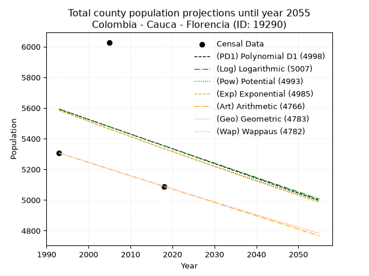
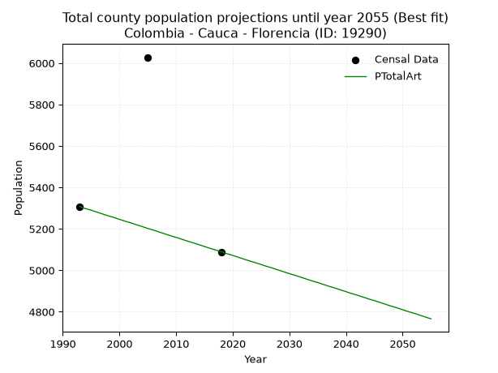
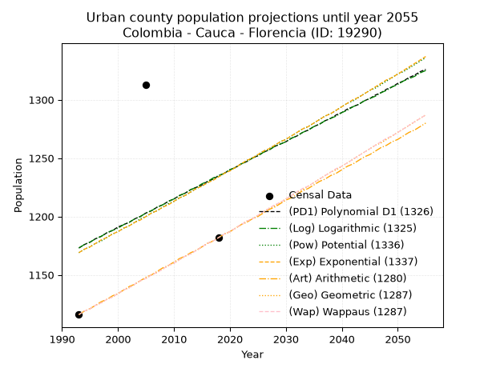
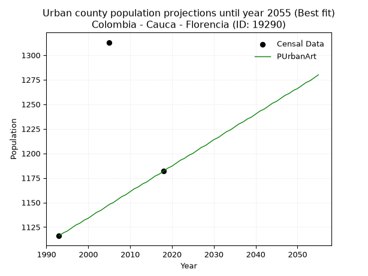
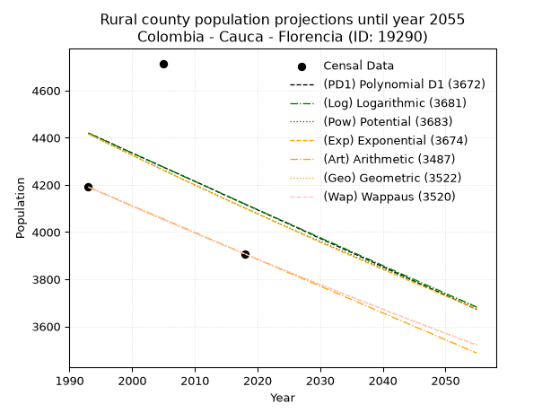
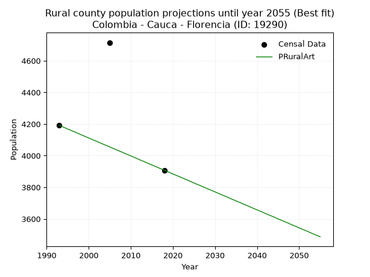

<div align="center">


</div>

# _“Population and Public Services Demand Projections (PPSD) until Year 2050 for Colombia - Cauca - Florencia (ID: 19290)”_
Keywords: `population` `public-service` `projection` `lineal` `polynomial` `logarithmic` `potential` `exponential` `arithmetic` `geometric` `wappaus` `dane` `colombia` `south-america`

PPSD are analytical estimates used by governments and planners to anticipate future changes in population size, age distribution, and the resulting community needs for utilities, healthcare, education, and infrastructure as sizing future water treatment facilities, electrical grids, and road networks based on spatial growth.

> **General running parameters**: • app_version: _v20260806_. • Python version: _3.14.7_. • Pandas version: _3.0.5_. • NumPy version: _2.5.1_. • Creates, save and include plots into reports (create_plot): _False_. • Projection until year: _2050_. • Process polynomial degree 2 and up: _False_. • Process Wappaus: _True_. • Process Wappaus: _True_. • Set negative values to zero: _True_. • Set infinite values to zero: _True_. • Drop dataset notes: _True_. 
<div align="center">

Dynamic map: [:earth_americas:Google](http://maps.google.com/maps?q=1.682534957,-77.0725473) [:earth_americas:OSM](https://www.openstreetmap.org/#map=18/1.682534957/-77.0725473&layers=P) [:earth_americas:Bing](https://www.bing.com/maps?cp=1.682534957~-77.0725473&lvl=18) [:earth_americas:Apple](https://maps.apple.com/frame?center=1.682534957%2C-77.0725473&span=0.003%2C0.006)

</div>


<div align="center">

```geojson
{
  "type": "Feature",
  "geometry": {
    "type": "Point", 
    "coordinates": [-77.0725473, 1.682534957]
  }, 
  "properties": {
    "Name": "Colombia - Cauca - Florencia (ID: 19290)"
  }
}
```

</div>


## 0. Census Data (3 records)

Census data are official statistics collected by a government about the people and housing in a country. They usually include counts of total population, age, sex, race, income, education, and jobs.

📅Global census file: [Population.xlsx](../data/Population.xlsx)

| Source   |   Year |   CountryID | CountryName   |   StateID | StateName   |   CountyID | CountyName   |   PTotal |   PUrban |   PRural |
|:---------|-------:|------------:|:--------------|----------:|:------------|-----------:|:-------------|---------:|---------:|---------:|
| DANE     |   1993 |          57 | Colombia      |        19 | Cauca       |      19290 | Florencia    |     5307 |     1116 |     4191 |
| DANE     |   2005 |          57 | Colombia      |        19 | Cauca       |      19290 | Florencia    |     6028 |     1313 |     4715 |
| DANE     |   2018 |          57 | Colombia      |        19 | Cauca       |      19290 | Florencia    |     5089 |     1182 |     3907 |

> 🔥Some records could had specific notes about the registered values or the corresponding urban or rural distribution.

## 1. Total

### 1.1. Coefficients and Parameters

* (PD1) Polynomial Deg 1: -9.600213219616633, 24726.29424307122 (lineal)
* (Log) Logarithmic: -19116.441732867374, 150827.53729521245
* (Pow) Potential: -3.6558337377200107, 15.809442770618933
* (Exp) Exponential: -0.0018350875415809958, 216473.90177938997
* (Art) Arithmetic: Year diff. 2018 - 1993 = 25, Population diff. 5089 - 5307 = -218, Annual growth = -8.72
* (Geo) Geometric: Year diff. 2018 - 1993 = 25, Population diff. 5089 - 5307 = -218, Annual growth % = -0.0016764075060958783
* (Wap) Wappaus: i = -0.16775682954982685, Condition values only valid for < 200)

<sub>
Wappaus condition values: ['-0.00', '-0.17', '-0.34', '-0.50', '-0.67', '-0.84', '-1.01', '-1.17', '-1.34', '-1.51', '-1.68', '-1.85', '-2.01', '-2.18', '-2.35', '-2.52', '-2.68', '-2.85', '-3.02', '-3.19', '-3.36', '-3.52', '-3.69', '-3.86', '-4.03', '-4.19', '-4.36', '-4.53', '-4.70', '-4.86', '-5.03', '-5.20', '-5.37', '-5.54', '-5.70', '-5.87', '-6.04', '-6.21', '-6.37', '-6.54', '-6.71', '-6.88', '-7.05', '-7.21', '-7.38', '-7.55', '-7.72', '-7.88', '-8.05', '-8.22', '-8.39', '-8.56', '-8.72', '-8.89', '-9.06', '-9.23', '-9.39', '-9.56']
</sub>


### 1.2. Projected Dataset

|   Year |   CountyID |   PTotalPD1 |   PTotalLog |   PTotalPow |   PTotalExp |   PTotalArt |   PTotalGeo |   PTotalWap |
|-------:|-----------:|------------:|------------:|------------:|------------:|------------:|------------:|------------:|
|   1993 |      19290 |        5593 |        5592 |        5585 |        5585 |        5307 |        5307 |        5307 |
|   1994 |      19290 |        5583 |        5583 |        5574 |        5575 |        5298 |        5298 |        5298 |
|   1995 |      19290 |        5574 |        5573 |        5564 |        5565 |        5290 |        5289 |        5289 |
|   1996 |      19290 |        5564 |        5564 |        5554 |        5555 |        5281 |        5280 |        5280 |
|   1997 |      19290 |        5555 |        5554 |        5544 |        5544 |        5272 |        5272 |        5272 |
|   1998 |      19290 |        5545 |        5544 |        5534 |        5534 |        5263 |        5263 |        5263 |
|   1999 |      19290 |        5535 |        5535 |        5524 |        5524 |        5255 |        5254 |        5254 |
|   2000 |      19290 |        5526 |        5525 |        5513 |        5514 |        5246 |        5245 |        5245 |
|   2001 |      19290 |        5516 |        5516 |        5503 |        5504 |        5237 |        5236 |        5236 |
|   2002 |      19290 |        5507 |        5506 |        5493 |        5494 |        5229 |        5227 |        5227 |
|   2003 |      19290 |        5497 |        5497 |        5483 |        5484 |        5220 |        5219 |        5219 |
|   2004 |      19290 |        5487 |        5487 |        5473 |        5474 |        5211 |        5210 |        5210 |
|   2005 |      19290 |        5478 |        5478 |        5463 |        5464 |        5202 |        5201 |        5201 |
|   2006 |      19290 |        5468 |        5468 |        5453 |        5454 |        5194 |        5192 |        5193 |
|   2007 |      19290 |        5459 |        5459 |        5444 |        5444 |        5185 |        5184 |        5184 |
|   2008 |      19290 |        5449 |        5449 |        5434 |        5434 |        5176 |        5175 |        5175 |
|   2009 |      19290 |        5439 |        5439 |        5424 |        5424 |        5167 |        5166 |        5166 |
|   2010 |      19290 |        5430 |        5430 |        5414 |        5414 |        5159 |        5158 |        5158 |
|   2011 |      19290 |        5420 |        5420 |        5404 |        5404 |        5150 |        5149 |        5149 |
|   2012 |      19290 |        5411 |        5411 |        5394 |        5394 |        5141 |        5140 |        5140 |
|   2013 |      19290 |        5401 |        5401 |        5384 |        5384 |        5133 |        5132 |        5132 |
|   2014 |      19290 |        5391 |        5392 |        5375 |        5374 |        5124 |        5123 |        5123 |
|   2015 |      19290 |        5382 |        5382 |        5365 |        5364 |        5115 |        5115 |        5115 |
|   2016 |      19290 |        5372 |        5373 |        5355 |        5354 |        5106 |        5106 |        5106 |
|   2017 |      19290 |        5363 |        5364 |        5345 |        5345 |        5098 |        5098 |        5098 |
|   2018 |      19290 |        5353 |        5354 |        5336 |        5335 |        5089 |        5089 |        5089 |
|   2019 |      19290 |        5343 |        5345 |        5326 |        5325 |        5080 |        5080 |        5080 |
|   2020 |      19290 |        5334 |        5335 |        5317 |        5315 |        5072 |        5072 |        5072 |
|   2021 |      19290 |        5324 |        5326 |        5307 |        5306 |        5063 |        5063 |        5063 |
|   2022 |      19290 |        5315 |        5316 |        5297 |        5296 |        5054 |        5055 |        5055 |
|   2023 |      19290 |        5305 |        5307 |        5288 |        5286 |        5045 |        5046 |        5046 |
|   2024 |      19290 |        5295 |        5297 |        5278 |        5276 |        5037 |        5038 |        5038 |
|   2025 |      19290 |        5286 |        5288 |        5269 |        5267 |        5028 |        5030 |        5030 |
|   2026 |      19290 |        5276 |        5278 |        5259 |        5257 |        5019 |        5021 |        5021 |
|   2027 |      19290 |        5267 |        5269 |        5250 |        5247 |        5011 |        5013 |        5013 |
|   2028 |      19290 |        5257 |        5260 |        5240 |        5238 |        5002 |        5004 |        5004 |
|   2029 |      19290 |        5247 |        5250 |        5231 |        5228 |        4993 |        4996 |        4996 |
|   2030 |      19290 |        5238 |        5241 |        5221 |        5219 |        4984 |        4988 |        4988 |
|   2031 |      19290 |        5228 |        5231 |        5212 |        5209 |        4976 |        4979 |        4979 |
|   2032 |      19290 |        5219 |        5222 |        5203 |        5200 |        4967 |        4971 |        4971 |
|   2033 |      19290 |        5209 |        5212 |        5193 |        5190 |        4958 |        4963 |        4962 |
|   2034 |      19290 |        5199 |        5203 |        5184 |        5181 |        4949 |        4954 |        4954 |
|   2035 |      19290 |        5190 |        5194 |        5175 |        5171 |        4941 |        4946 |        4946 |
|   2036 |      19290 |        5180 |        5184 |        5165 |        5162 |        4932 |        4938 |        4938 |
|   2037 |      19290 |        5171 |        5175 |        5156 |        5152 |        4923 |        4929 |        4929 |
|   2038 |      19290 |        5161 |        5166 |        5147 |        5143 |        4915 |        4921 |        4921 |
|   2039 |      19290 |        5151 |        5156 |        5138 |        5133 |        4906 |        4913 |        4913 |
|   2040 |      19290 |        5142 |        5147 |        5128 |        5124 |        4897 |        4905 |        4904 |
|   2041 |      19290 |        5132 |        5137 |        5119 |        5114 |        4888 |        4896 |        4896 |
|   2042 |      19290 |        5123 |        5128 |        5110 |        5105 |        4880 |        4888 |        4888 |
|   2043 |      19290 |        5113 |        5119 |        5101 |        5096 |        4871 |        4880 |        4880 |
|   2044 |      19290 |        5103 |        5109 |        5092 |        5086 |        4862 |        4872 |        4872 |
|   2045 |      19290 |        5094 |        5100 |        5083 |        5077 |        4854 |        4864 |        4863 |
|   2046 |      19290 |        5084 |        5091 |        5074 |        5068 |        4845 |        4855 |        4855 |
|   2047 |      19290 |        5075 |        5081 |        5065 |        5058 |        4836 |        4847 |        4847 |
|   2048 |      19290 |        5065 |        5072 |        5056 |        5049 |        4827 |        4839 |        4839 |
|   2049 |      19290 |        5055 |        5063 |        5047 |        5040 |        4819 |        4831 |        4831 |
|   2050 |      19290 |        5046 |        5053 |        5038 |        5031 |        4810 |        4823 |        4823 |
<div align="center">

</img>

</div>


### 1.3. Best fit with absolute and relative error (%)

Relative error puts that difference into context by dividing the absolute error by the true value, creating a unitless ratio or percentage that shows the scale of the mistake.

Absolute and relative error

|   Year | Source   |   CountryID | CountryName   |   StateID | StateName   |   CountyID_x | CountyName   |   PTotal |   PUrban |   PRural |   CountyID_y |   PTotalPD1 |   PTotalLog |   PTotalPow |   PTotalExp |   PTotalArt |   PTotalGeo |   PTotalWap |   PTotalPD1AbsError |   PTotalLogAbsError |   PTotalPowAbsError |   PTotalExpAbsError |   PTotalArtAbsError |   PTotalGeoAbsError |   PTotalWapAbsError |   PTotalPD1RelError |   PTotalLogRelError |   PTotalPowRelError |   PTotalExpRelError |   PTotalArtRelError |   PTotalGeoRelError |   PTotalWapRelError |
|-------:|:---------|------------:|:--------------|----------:|:------------|-------------:|:-------------|---------:|---------:|---------:|-------------:|------------:|------------:|------------:|------------:|------------:|------------:|------------:|--------------------:|--------------------:|--------------------:|--------------------:|--------------------:|--------------------:|--------------------:|--------------------:|--------------------:|--------------------:|--------------------:|--------------------:|--------------------:|--------------------:|
|   1993 | DANE     |          57 | Colombia      |        19 | Cauca       |        19290 | Florencia    |     5307 |     1116 |     4191 |        19290 |        5593 |        5592 |        5585 |        5585 |        5307 |        5307 |        5307 |                 286 |                 285 |                 278 |                 278 |                   0 |                   0 |                   0 |             5.38911 |             5.37027 |             5.23836 |             5.23836 |              0      |              0      |              0      |
|   2005 | DANE     |          57 | Colombia      |        19 | Cauca       |        19290 | Florencia    |     6028 |     1313 |     4715 |        19290 |        5478 |        5478 |        5463 |        5464 |        5202 |        5201 |        5201 |                 550 |                 550 |                 565 |                 564 |                 826 |                 827 |                 827 |             9.12409 |             9.12409 |             9.37293 |             9.35634 |             13.7027 |             13.7193 |             13.7193 |
|   2018 | DANE     |          57 | Colombia      |        19 | Cauca       |        19290 | Florencia    |     5089 |     1182 |     3907 |        19290 |        5353 |        5354 |        5336 |        5335 |        5089 |        5089 |        5089 |                 264 |                 265 |                 247 |                 246 |                   0 |                   0 |                   0 |             5.18766 |             5.20731 |             4.85361 |             4.83396 |              0      |              0      |              0      |

Relative error mean

| Method    |   RelError | Best   |
|:----------|-----------:|:-------|
| PTotalPD1 |    6.56695 |        |
| PTotalLog |    6.56722 |        |
| PTotalPow |    6.4883  |        |
| PTotalExp |    6.47622 |        |
| PTotalArt |    4.56757 | True   |
| PTotalGeo |    4.5731  |        |
| PTotalWap |    4.5731  |        |

💙Best method: _**PTotalArt**_
<div align="center">

</img>

</div>


### 1.4. Fresh water supply demand in liters per capita per day (lpcd)

The fresh water supply demand typically ranges from 100 to 300 liters per capita per day (lpcd) for standard domestic and municipal planning, though absolute survival minimums set by the World Health Organization are as low as 7.5 to 20 liters per day, and total consumption in high-income nations can exceed 400 liters.

> `CZ`: Level in meters above the sea level (masl)<br> `WS`: Fresh water supply demand in liters per capita per day (lpcd or l/h/d)<br> `WSAll`: Zonal fresh water supply demand in liters per second (l/s)<br> `A`: Zonal area in square meters<br> `DP`: Population density (people/hectare)

Reference values (RAS Colombia)

|    CZ |   WS |
|------:|-----:|
|  1000 |  120 |
|  2000 |  130 |
| 99999 |  140 |

County shapefile geometry properties and water supply values

|   CountyID |      ATotal |   CZTotal |   WSTotal |
|-----------:|------------:|----------:|----------:|
|      19290 | 5.66949e+07 |   1609.19 |       130 |

Projected values for best method: PTotalArt

|   CountyID |   Year |   PTotalArt |   DPTotal |   WSTotal |   WSTotalAll |
|-----------:|-------:|------------:|----------:|----------:|-------------:|
|      19290 |   1993 |        5307 |      0.94 |       130 |      7.98507 |
|      19290 |   1994 |        5298 |      0.93 |       130 |      7.97153 |
|      19290 |   1995 |        5290 |      0.93 |       130 |      7.95949 |
|      19290 |   1996 |        5281 |      0.93 |       130 |      7.94595 |
|      19290 |   1997 |        5272 |      0.93 |       130 |      7.93241 |
|      19290 |   1998 |        5263 |      0.93 |       130 |      7.91887 |
|      19290 |   1999 |        5255 |      0.93 |       130 |      7.90683 |
|      19290 |   2000 |        5246 |      0.93 |       130 |      7.89329 |
|      19290 |   2001 |        5237 |      0.92 |       130 |      7.87975 |
|      19290 |   2002 |        5229 |      0.92 |       130 |      7.86771 |
|      19290 |   2003 |        5220 |      0.92 |       130 |      7.85417 |
|      19290 |   2004 |        5211 |      0.92 |       130 |      7.84063 |
|      19290 |   2005 |        5202 |      0.92 |       130 |      7.82708 |
|      19290 |   2006 |        5194 |      0.92 |       130 |      7.81505 |
|      19290 |   2007 |        5185 |      0.91 |       130 |      7.8015  |
|      19290 |   2008 |        5176 |      0.91 |       130 |      7.78796 |
|      19290 |   2009 |        5167 |      0.91 |       130 |      7.77442 |
|      19290 |   2010 |        5159 |      0.91 |       130 |      7.76238 |
|      19290 |   2011 |        5150 |      0.91 |       130 |      7.74884 |
|      19290 |   2012 |        5141 |      0.91 |       130 |      7.7353  |
|      19290 |   2013 |        5133 |      0.91 |       130 |      7.72326 |
|      19290 |   2014 |        5124 |      0.9  |       130 |      7.70972 |
|      19290 |   2015 |        5115 |      0.9  |       130 |      7.69618 |
|      19290 |   2016 |        5106 |      0.9  |       130 |      7.68264 |
|      19290 |   2017 |        5098 |      0.9  |       130 |      7.6706  |
|      19290 |   2018 |        5089 |      0.9  |       130 |      7.65706 |
|      19290 |   2019 |        5080 |      0.9  |       130 |      7.64352 |
|      19290 |   2020 |        5072 |      0.89 |       130 |      7.63148 |
|      19290 |   2021 |        5063 |      0.89 |       130 |      7.61794 |
|      19290 |   2022 |        5054 |      0.89 |       130 |      7.6044  |
|      19290 |   2023 |        5045 |      0.89 |       130 |      7.59086 |
|      19290 |   2024 |        5037 |      0.89 |       130 |      7.57882 |
|      19290 |   2025 |        5028 |      0.89 |       130 |      7.56528 |
|      19290 |   2026 |        5019 |      0.89 |       130 |      7.55174 |
|      19290 |   2027 |        5011 |      0.88 |       130 |      7.5397  |
|      19290 |   2028 |        5002 |      0.88 |       130 |      7.52616 |
|      19290 |   2029 |        4993 |      0.88 |       130 |      7.51262 |
|      19290 |   2030 |        4984 |      0.88 |       130 |      7.49907 |
|      19290 |   2031 |        4976 |      0.88 |       130 |      7.48704 |
|      19290 |   2032 |        4967 |      0.88 |       130 |      7.4735  |
|      19290 |   2033 |        4958 |      0.87 |       130 |      7.45995 |
|      19290 |   2034 |        4949 |      0.87 |       130 |      7.44641 |
|      19290 |   2035 |        4941 |      0.87 |       130 |      7.43438 |
|      19290 |   2036 |        4932 |      0.87 |       130 |      7.42083 |
|      19290 |   2037 |        4923 |      0.87 |       130 |      7.40729 |
|      19290 |   2038 |        4915 |      0.87 |       130 |      7.39525 |
|      19290 |   2039 |        4906 |      0.87 |       130 |      7.38171 |
|      19290 |   2040 |        4897 |      0.86 |       130 |      7.36817 |
|      19290 |   2041 |        4888 |      0.86 |       130 |      7.35463 |
|      19290 |   2042 |        4880 |      0.86 |       130 |      7.34259 |
|      19290 |   2043 |        4871 |      0.86 |       130 |      7.32905 |
|      19290 |   2044 |        4862 |      0.86 |       130 |      7.31551 |
|      19290 |   2045 |        4854 |      0.86 |       130 |      7.30347 |
|      19290 |   2046 |        4845 |      0.85 |       130 |      7.28993 |
|      19290 |   2047 |        4836 |      0.85 |       130 |      7.27639 |
|      19290 |   2048 |        4827 |      0.85 |       130 |      7.26285 |
|      19290 |   2049 |        4819 |      0.85 |       130 |      7.25081 |
|      19290 |   2050 |        4810 |      0.85 |       130 |      7.23727 |

## 2. Urban

### 2.1. Coefficients and Parameters

* (PD1) Polynomial Deg 1: 2.4637526652452295, -3736.978678038432 (lineal)
* (Log) Logarithmic: 4968.667475952562, -36575.85793945719
* (Pow) Potential: 4.343152495078766, -11.262359948435533
* (Exp) Exponential: 0.002154375649872373, 15.968293531107717
* (Art) Arithmetic: Year diff. 2018 - 1993 = 25, Population diff. 1182 - 1116 = 66, Annual growth = 2.64
* (Geo) Geometric: Year diff. 2018 - 1993 = 25, Population diff. 1182 - 1116 = 66, Annual growth % = 0.002300925275985355
* (Wap) Wappaus: i = 0.2297650130548303, Condition values only valid for < 200)

<sub>
Wappaus condition values: ['0.00', '0.23', '0.46', '0.69', '0.92', '1.15', '1.38', '1.61', '1.84', '2.07', '2.30', '2.53', '2.76', '2.99', '3.22', '3.45', '3.68', '3.91', '4.14', '4.37', '4.60', '4.83', '5.05', '5.28', '5.51', '5.74', '5.97', '6.20', '6.43', '6.66', '6.89', '7.12', '7.35', '7.58', '7.81', '8.04', '8.27', '8.50', '8.73', '8.96', '9.19', '9.42', '9.65', '9.88', '10.11', '10.34', '10.57', '10.80', '11.03', '11.26', '11.49', '11.72', '11.95', '12.18', '12.41', '12.64', '12.87', '13.10']
</sub>


### 2.2. Projected Dataset

|   Year |   CountyID |   PUrbanPD1 |   PUrbanLog |   PUrbanPow |   PUrbanExp |   PUrbanArt |   PUrbanGeo |   PUrbanWap |
|-------:|-----------:|------------:|------------:|------------:|------------:|------------:|------------:|------------:|
|   1993 |      19290 |        1173 |        1173 |        1169 |        1169 |        1116 |        1116 |        1116 |
|   1994 |      19290 |        1176 |        1176 |        1172 |        1172 |        1119 |        1119 |        1119 |
|   1995 |      19290 |        1178 |        1178 |        1174 |        1174 |        1121 |        1121 |        1121 |
|   1996 |      19290 |        1181 |        1181 |        1177 |        1177 |        1124 |        1124 |        1124 |
|   1997 |      19290 |        1183 |        1183 |        1179 |        1180 |        1127 |        1126 |        1126 |
|   1998 |      19290 |        1186 |        1186 |        1182 |        1182 |        1129 |        1129 |        1129 |
|   1999 |      19290 |        1188 |        1188 |        1185 |        1185 |        1132 |        1131 |        1131 |
|   2000 |      19290 |        1191 |        1190 |        1187 |        1187 |        1134 |        1134 |        1134 |
|   2001 |      19290 |        1193 |        1193 |        1190 |        1190 |        1137 |        1137 |        1137 |
|   2002 |      19290 |        1195 |        1195 |        1192 |        1192 |        1140 |        1139 |        1139 |
|   2003 |      19290 |        1198 |        1198 |        1195 |        1195 |        1142 |        1142 |        1142 |
|   2004 |      19290 |        1200 |        1200 |        1198 |        1197 |        1145 |        1145 |        1145 |
|   2005 |      19290 |        1203 |        1203 |        1200 |        1200 |        1148 |        1147 |        1147 |
|   2006 |      19290 |        1205 |        1205 |        1203 |        1203 |        1150 |        1150 |        1150 |
|   2007 |      19290 |        1208 |        1208 |        1205 |        1205 |        1153 |        1152 |        1152 |
|   2008 |      19290 |        1210 |        1210 |        1208 |        1208 |        1156 |        1155 |        1155 |
|   2009 |      19290 |        1213 |        1213 |        1211 |        1210 |        1158 |        1158 |        1158 |
|   2010 |      19290 |        1215 |        1215 |        1213 |        1213 |        1161 |        1160 |        1160 |
|   2011 |      19290 |        1218 |        1218 |        1216 |        1216 |        1164 |        1163 |        1163 |
|   2012 |      19290 |        1220 |        1220 |        1218 |        1218 |        1166 |        1166 |        1166 |
|   2013 |      19290 |        1223 |        1223 |        1221 |        1221 |        1169 |        1168 |        1168 |
|   2014 |      19290 |        1225 |        1225 |        1224 |        1224 |        1171 |        1171 |        1171 |
|   2015 |      19290 |        1227 |        1228 |        1226 |        1226 |        1174 |        1174 |        1174 |
|   2016 |      19290 |        1230 |        1230 |        1229 |        1229 |        1177 |        1177 |        1177 |
|   2017 |      19290 |        1232 |        1233 |        1232 |        1231 |        1179 |        1179 |        1179 |
|   2018 |      19290 |        1235 |        1235 |        1234 |        1234 |        1182 |        1182 |        1182 |
|   2019 |      19290 |        1237 |        1237 |        1237 |        1237 |        1185 |        1185 |        1185 |
|   2020 |      19290 |        1240 |        1240 |        1240 |        1239 |        1187 |        1187 |        1187 |
|   2021 |      19290 |        1242 |        1242 |        1242 |        1242 |        1190 |        1190 |        1190 |
|   2022 |      19290 |        1245 |        1245 |        1245 |        1245 |        1193 |        1193 |        1193 |
|   2023 |      19290 |        1247 |        1247 |        1248 |        1248 |        1195 |        1196 |        1196 |
|   2024 |      19290 |        1250 |        1250 |        1250 |        1250 |        1198 |        1198 |        1198 |
|   2025 |      19290 |        1252 |        1252 |        1253 |        1253 |        1200 |        1201 |        1201 |
|   2026 |      19290 |        1255 |        1255 |        1256 |        1256 |        1203 |        1204 |        1204 |
|   2027 |      19290 |        1257 |        1257 |        1258 |        1258 |        1206 |        1207 |        1207 |
|   2028 |      19290 |        1260 |        1260 |        1261 |        1261 |        1208 |        1209 |        1210 |
|   2029 |      19290 |        1262 |        1262 |        1264 |        1264 |        1211 |        1212 |        1212 |
|   2030 |      19290 |        1264 |        1264 |        1266 |        1266 |        1214 |        1215 |        1215 |
|   2031 |      19290 |        1267 |        1267 |        1269 |        1269 |        1216 |        1218 |        1218 |
|   2032 |      19290 |        1269 |        1269 |        1272 |        1272 |        1219 |        1221 |        1221 |
|   2033 |      19290 |        1272 |        1272 |        1275 |        1275 |        1222 |        1223 |        1224 |
|   2034 |      19290 |        1274 |        1274 |        1277 |        1277 |        1224 |        1226 |        1226 |
|   2035 |      19290 |        1277 |        1277 |        1280 |        1280 |        1227 |        1229 |        1229 |
|   2036 |      19290 |        1279 |        1279 |        1283 |        1283 |        1230 |        1232 |        1232 |
|   2037 |      19290 |        1282 |        1282 |        1286 |        1286 |        1232 |        1235 |        1235 |
|   2038 |      19290 |        1284 |        1284 |        1288 |        1288 |        1235 |        1238 |        1238 |
|   2039 |      19290 |        1287 |        1286 |        1291 |        1291 |        1237 |        1240 |        1241 |
|   2040 |      19290 |        1289 |        1289 |        1294 |        1294 |        1240 |        1243 |        1243 |
|   2041 |      19290 |        1292 |        1291 |        1297 |        1297 |        1243 |        1246 |        1246 |
|   2042 |      19290 |        1294 |        1294 |        1299 |        1300 |        1245 |        1249 |        1249 |
|   2043 |      19290 |        1296 |        1296 |        1302 |        1302 |        1248 |        1252 |        1252 |
|   2044 |      19290 |        1299 |        1299 |        1305 |        1305 |        1251 |        1255 |        1255 |
|   2045 |      19290 |        1301 |        1301 |        1308 |        1308 |        1253 |        1258 |        1258 |
|   2046 |      19290 |        1304 |        1303 |        1310 |        1311 |        1256 |        1261 |        1261 |
|   2047 |      19290 |        1306 |        1306 |        1313 |        1314 |        1259 |        1263 |        1264 |
|   2048 |      19290 |        1309 |        1308 |        1316 |        1317 |        1261 |        1266 |        1267 |
|   2049 |      19290 |        1311 |        1311 |        1319 |        1319 |        1264 |        1269 |        1269 |
|   2050 |      19290 |        1314 |        1313 |        1322 |        1322 |        1266 |        1272 |        1272 |
<div align="center">

</img>

</div>


### 2.3. Best fit with absolute and relative error (%)

Relative error puts that difference into context by dividing the absolute error by the true value, creating a unitless ratio or percentage that shows the scale of the mistake.

Absolute and relative error

|   Year | Source   |   CountryID | CountryName   |   StateID | StateName   |   CountyID_x | CountyName   |   PTotal |   PUrban |   PRural |   CountyID_y |   PUrbanPD1 |   PUrbanLog |   PUrbanPow |   PUrbanExp |   PUrbanArt |   PUrbanGeo |   PUrbanWap |   PUrbanPD1AbsError |   PUrbanLogAbsError |   PUrbanPowAbsError |   PUrbanExpAbsError |   PUrbanArtAbsError |   PUrbanGeoAbsError |   PUrbanWapAbsError |   PUrbanPD1RelError |   PUrbanLogRelError |   PUrbanPowRelError |   PUrbanExpRelError |   PUrbanArtRelError |   PUrbanGeoRelError |   PUrbanWapRelError |
|-------:|:---------|------------:|:--------------|----------:|:------------|-------------:|:-------------|---------:|---------:|---------:|-------------:|------------:|------------:|------------:|------------:|------------:|------------:|------------:|--------------------:|--------------------:|--------------------:|--------------------:|--------------------:|--------------------:|--------------------:|--------------------:|--------------------:|--------------------:|--------------------:|--------------------:|--------------------:|--------------------:|
|   1993 | DANE     |          57 | Colombia      |        19 | Cauca       |        19290 | Florencia    |     5307 |     1116 |     4191 |        19290 |        1173 |        1173 |        1169 |        1169 |        1116 |        1116 |        1116 |                  57 |                  57 |                  53 |                  53 |                   0 |                   0 |                   0 |             5.10753 |             5.10753 |             4.7491  |             4.7491  |              0      |              0      |              0      |
|   2005 | DANE     |          57 | Colombia      |        19 | Cauca       |        19290 | Florencia    |     6028 |     1313 |     4715 |        19290 |        1203 |        1203 |        1200 |        1200 |        1148 |        1147 |        1147 |                 110 |                 110 |                 113 |                 113 |                 165 |                 166 |                 166 |             8.37776 |             8.37776 |             8.60625 |             8.60625 |             12.5666 |             12.6428 |             12.6428 |
|   2018 | DANE     |          57 | Colombia      |        19 | Cauca       |        19290 | Florencia    |     5089 |     1182 |     3907 |        19290 |        1235 |        1235 |        1234 |        1234 |        1182 |        1182 |        1182 |                  53 |                  53 |                  52 |                  52 |                   0 |                   0 |                   0 |             4.48393 |             4.48393 |             4.39932 |             4.39932 |              0      |              0      |              0      |

Relative error mean

| Method    |   RelError | Best   |
|:----------|-----------:|:-------|
| PUrbanPD1 |    5.98974 |        |
| PUrbanLog |    5.98974 |        |
| PUrbanPow |    5.91822 |        |
| PUrbanExp |    5.91822 |        |
| PUrbanArt |    4.18888 | True   |
| PUrbanGeo |    4.21427 |        |
| PUrbanWap |    4.21427 |        |

💙Best method: _**PUrbanArt**_
<div align="center">

</img>

</div>


### 2.4. Fresh water supply demand in liters per capita per day (lpcd)

The fresh water supply demand typically ranges from 100 to 300 liters per capita per day (lpcd) for standard domestic and municipal planning, though absolute survival minimums set by the World Health Organization are as low as 7.5 to 20 liters per day, and total consumption in high-income nations can exceed 400 liters.

> `CZ`: Level in meters above the sea level (masl)<br> `WS`: Fresh water supply demand in liters per capita per day (lpcd or l/h/d)<br> `WSAll`: Zonal fresh water supply demand in liters per second (l/s)<br> `A`: Zonal area in square meters<br> `DP`: Population density (people/hectare)

Reference values (RAS Colombia)

|    CZ |   WS |
|------:|-----:|
|  1000 |  120 |
|  2000 |  130 |
| 99999 |  140 |

County shapefile geometry properties and water supply values

|   CountyID |   AUrban |   CZUrban |   WSUrban |
|-----------:|---------:|----------:|----------:|
|      19290 |   128586 |   1591.11 |       130 |

Projected values for best method: PUrbanArt

|   CountyID |   Year |   PUrbanArt |   DPUrban |   WSUrban |   WSUrbanAll |
|-----------:|-------:|------------:|----------:|----------:|-------------:|
|      19290 |   1993 |        1116 |     86.79 |       130 |      1.67917 |
|      19290 |   1994 |        1119 |     87.02 |       130 |      1.68368 |
|      19290 |   1995 |        1121 |     87.18 |       130 |      1.68669 |
|      19290 |   1996 |        1124 |     87.41 |       130 |      1.6912  |
|      19290 |   1997 |        1127 |     87.65 |       130 |      1.69572 |
|      19290 |   1998 |        1129 |     87.8  |       130 |      1.69873 |
|      19290 |   1999 |        1132 |     88.03 |       130 |      1.70324 |
|      19290 |   2000 |        1134 |     88.19 |       130 |      1.70625 |
|      19290 |   2001 |        1137 |     88.42 |       130 |      1.71076 |
|      19290 |   2002 |        1140 |     88.66 |       130 |      1.71528 |
|      19290 |   2003 |        1142 |     88.81 |       130 |      1.71829 |
|      19290 |   2004 |        1145 |     89.05 |       130 |      1.7228  |
|      19290 |   2005 |        1148 |     89.28 |       130 |      1.72731 |
|      19290 |   2006 |        1150 |     89.43 |       130 |      1.73032 |
|      19290 |   2007 |        1153 |     89.67 |       130 |      1.73484 |
|      19290 |   2008 |        1156 |     89.9  |       130 |      1.73935 |
|      19290 |   2009 |        1158 |     90.06 |       130 |      1.74236 |
|      19290 |   2010 |        1161 |     90.29 |       130 |      1.74687 |
|      19290 |   2011 |        1164 |     90.52 |       130 |      1.75139 |
|      19290 |   2012 |        1166 |     90.68 |       130 |      1.7544  |
|      19290 |   2013 |        1169 |     90.91 |       130 |      1.75891 |
|      19290 |   2014 |        1171 |     91.07 |       130 |      1.76192 |
|      19290 |   2015 |        1174 |     91.3  |       130 |      1.76644 |
|      19290 |   2016 |        1177 |     91.53 |       130 |      1.77095 |
|      19290 |   2017 |        1179 |     91.69 |       130 |      1.77396 |
|      19290 |   2018 |        1182 |     91.92 |       130 |      1.77847 |
|      19290 |   2019 |        1185 |     92.16 |       130 |      1.78299 |
|      19290 |   2020 |        1187 |     92.31 |       130 |      1.786   |
|      19290 |   2021 |        1190 |     92.54 |       130 |      1.79051 |
|      19290 |   2022 |        1193 |     92.78 |       130 |      1.79502 |
|      19290 |   2023 |        1195 |     92.93 |       130 |      1.79803 |
|      19290 |   2024 |        1198 |     93.17 |       130 |      1.80255 |
|      19290 |   2025 |        1200 |     93.32 |       130 |      1.80556 |
|      19290 |   2026 |        1203 |     93.56 |       130 |      1.81007 |
|      19290 |   2027 |        1206 |     93.79 |       130 |      1.81458 |
|      19290 |   2028 |        1208 |     93.94 |       130 |      1.81759 |
|      19290 |   2029 |        1211 |     94.18 |       130 |      1.82211 |
|      19290 |   2030 |        1214 |     94.41 |       130 |      1.82662 |
|      19290 |   2031 |        1216 |     94.57 |       130 |      1.82963 |
|      19290 |   2032 |        1219 |     94.8  |       130 |      1.83414 |
|      19290 |   2033 |        1222 |     95.03 |       130 |      1.83866 |
|      19290 |   2034 |        1224 |     95.19 |       130 |      1.84167 |
|      19290 |   2035 |        1227 |     95.42 |       130 |      1.84618 |
|      19290 |   2036 |        1230 |     95.66 |       130 |      1.85069 |
|      19290 |   2037 |        1232 |     95.81 |       130 |      1.8537  |
|      19290 |   2038 |        1235 |     96.04 |       130 |      1.85822 |
|      19290 |   2039 |        1237 |     96.2  |       130 |      1.86123 |
|      19290 |   2040 |        1240 |     96.43 |       130 |      1.86574 |
|      19290 |   2041 |        1243 |     96.67 |       130 |      1.87025 |
|      19290 |   2042 |        1245 |     96.82 |       130 |      1.87326 |
|      19290 |   2043 |        1248 |     97.06 |       130 |      1.87778 |
|      19290 |   2044 |        1251 |     97.29 |       130 |      1.88229 |
|      19290 |   2045 |        1253 |     97.44 |       130 |      1.8853  |
|      19290 |   2046 |        1256 |     97.68 |       130 |      1.88981 |
|      19290 |   2047 |        1259 |     97.91 |       130 |      1.89433 |
|      19290 |   2048 |        1261 |     98.07 |       130 |      1.89734 |
|      19290 |   2049 |        1264 |     98.3  |       130 |      1.90185 |
|      19290 |   2050 |        1266 |     98.46 |       130 |      1.90486 |

## 3. Rural

### 3.1. Coefficients and Parameters

* (PD1) Polynomial Deg 1: -12.063965884861835, 28463.27292110959 (lineal)
* (Log) Logarithmic: -24085.109208819846, 187403.39523466895
* (Pow) Potential: -5.927861527377731, 23.204085641736324
* (Exp) Exponential: -0.0029682863072523413, 1637986.203889709
* (Art) Arithmetic: Year diff. 2018 - 1993 = 25, Population diff. 3907 - 4191 = -284, Annual growth = -11.36
* (Geo) Geometric: Year diff. 2018 - 1993 = 25, Population diff. 3907 - 4191 = -284, Annual growth % = -0.0028028467846125116
* (Wap) Wappaus: i = -0.28056310200049395, Condition values only valid for < 200)

<sub>
Wappaus condition values: ['-0.00', '-0.28', '-0.56', '-0.84', '-1.12', '-1.40', '-1.68', '-1.96', '-2.24', '-2.53', '-2.81', '-3.09', '-3.37', '-3.65', '-3.93', '-4.21', '-4.49', '-4.77', '-5.05', '-5.33', '-5.61', '-5.89', '-6.17', '-6.45', '-6.73', '-7.01', '-7.29', '-7.58', '-7.86', '-8.14', '-8.42', '-8.70', '-8.98', '-9.26', '-9.54', '-9.82', '-10.10', '-10.38', '-10.66', '-10.94', '-11.22', '-11.50', '-11.78', '-12.06', '-12.34', '-12.63', '-12.91', '-13.19', '-13.47', '-13.75', '-14.03', '-14.31', '-14.59', '-14.87', '-15.15', '-15.43', '-15.71', '-15.99']
</sub>


### 3.2. Projected Dataset

|   Year |   CountyID |   PRuralPD1 |   PRuralLog |   PRuralPow |   PRuralExp |   PRuralArt |   PRuralGeo |   PRuralWap |
|-------:|-----------:|------------:|------------:|------------:|------------:|------------:|------------:|------------:|
|   1993 |      19290 |        4420 |        4419 |        4416 |        4417 |        4191 |        4191 |        4191 |
|   1994 |      19290 |        4408 |        4407 |        4403 |        4404 |        4180 |        4179 |        4179 |
|   1995 |      19290 |        4396 |        4395 |        4390 |        4391 |        4168 |        4168 |        4168 |
|   1996 |      19290 |        4384 |        4383 |        4377 |        4378 |        4157 |        4156 |        4156 |
|   1997 |      19290 |        4372 |        4371 |        4364 |        4365 |        4146 |        4144 |        4144 |
|   1998 |      19290 |        4359 |        4359 |        4351 |        4352 |        4134 |        4133 |        4133 |
|   1999 |      19290 |        4347 |        4347 |        4338 |        4339 |        4123 |        4121 |        4121 |
|   2000 |      19290 |        4335 |        4335 |        4326 |        4326 |        4111 |        4109 |        4109 |
|   2001 |      19290 |        4323 |        4323 |        4313 |        4313 |        4100 |        4098 |        4098 |
|   2002 |      19290 |        4311 |        4311 |        4300 |        4300 |        4089 |        4086 |        4086 |
|   2003 |      19290 |        4299 |        4299 |        4287 |        4288 |        4077 |        4075 |        4075 |
|   2004 |      19290 |        4287 |        4287 |        4275 |        4275 |        4066 |        4064 |        4064 |
|   2005 |      19290 |        4275 |        4275 |        4262 |        4262 |        4055 |        4052 |        4052 |
|   2006 |      19290 |        4263 |        4263 |        4249 |        4250 |        4043 |        4041 |        4041 |
|   2007 |      19290 |        4251 |        4251 |        4237 |        4237 |        4032 |        4030 |        4030 |
|   2008 |      19290 |        4239 |        4239 |        4224 |        4225 |        4021 |        4018 |        4018 |
|   2009 |      19290 |        4227 |        4227 |        4212 |        4212 |        4009 |        4007 |        4007 |
|   2010 |      19290 |        4215 |        4215 |        4199 |        4200 |        3998 |        3996 |        3996 |
|   2011 |      19290 |        4203 |        4203 |        4187 |        4187 |        3987 |        3985 |        3985 |
|   2012 |      19290 |        4191 |        4191 |        4175 |        4175 |        3975 |        3973 |        3973 |
|   2013 |      19290 |        4179 |        4179 |        4163 |        4162 |        3964 |        3962 |        3962 |
|   2014 |      19290 |        4166 |        4167 |        4150 |        4150 |        3952 |        3951 |        3951 |
|   2015 |      19290 |        4154 |        4155 |        4138 |        4138 |        3941 |        3940 |        3940 |
|   2016 |      19290 |        4142 |        4143 |        4126 |        4125 |        3930 |        3929 |        3929 |
|   2017 |      19290 |        4130 |        4131 |        4114 |        4113 |        3918 |        3918 |        3918 |
|   2018 |      19290 |        4118 |        4119 |        4102 |        4101 |        3907 |        3907 |        3907 |
|   2019 |      19290 |        4106 |        4107 |        4090 |        4089 |        3896 |        3896 |        3896 |
|   2020 |      19290 |        4094 |        4095 |        4078 |        4077 |        3884 |        3885 |        3885 |
|   2021 |      19290 |        4082 |        4083 |        4066 |        4065 |        3873 |        3874 |        3874 |
|   2022 |      19290 |        4070 |        4071 |        4054 |        4053 |        3862 |        3863 |        3863 |
|   2023 |      19290 |        4058 |        4059 |        4042 |        4041 |        3850 |        3853 |        3852 |
|   2024 |      19290 |        4046 |        4048 |        4030 |        4029 |        3839 |        3842 |        3842 |
|   2025 |      19290 |        4034 |        4036 |        4018 |        4017 |        3827 |        3831 |        3831 |
|   2026 |      19290 |        4022 |        4024 |        4007 |        4005 |        3816 |        3820 |        3820 |
|   2027 |      19290 |        4010 |        4012 |        3995 |        3993 |        3805 |        3810 |        3809 |
|   2028 |      19290 |        3998 |        4000 |        3983 |        3981 |        3793 |        3799 |        3799 |
|   2029 |      19290 |        3985 |        3988 |        3972 |        3969 |        3782 |        3788 |        3788 |
|   2030 |      19290 |        3973 |        3976 |        3960 |        3957 |        3771 |        3778 |        3777 |
|   2031 |      19290 |        3961 |        3964 |        3949 |        3946 |        3759 |        3767 |        3767 |
|   2032 |      19290 |        3949 |        3953 |        3937 |        3934 |        3748 |        3756 |        3756 |
|   2033 |      19290 |        3937 |        3941 |        3926 |        3922 |        3737 |        3746 |        3746 |
|   2034 |      19290 |        3925 |        3929 |        3914 |        3911 |        3725 |        3735 |        3735 |
|   2035 |      19290 |        3913 |        3917 |        3903 |        3899 |        3714 |        3725 |        3725 |
|   2036 |      19290 |        3901 |        3905 |        3891 |        3888 |        3703 |        3715 |        3714 |
|   2037 |      19290 |        3889 |        3893 |        3880 |        3876 |        3691 |        3704 |        3704 |
|   2038 |      19290 |        3877 |        3882 |        3869 |        3865 |        3680 |        3694 |        3693 |
|   2039 |      19290 |        3865 |        3870 |        3858 |        3853 |        3668 |        3683 |        3683 |
|   2040 |      19290 |        3853 |        3858 |        3846 |        3842 |        3657 |        3673 |        3673 |
|   2041 |      19290 |        3841 |        3846 |        3835 |        3830 |        3646 |        3663 |        3662 |
|   2042 |      19290 |        3829 |        3834 |        3824 |        3819 |        3634 |        3652 |        3652 |
|   2043 |      19290 |        3817 |        3822 |        3813 |        3808 |        3623 |        3642 |        3642 |
|   2044 |      19290 |        3805 |        3811 |        3802 |        3796 |        3612 |        3632 |        3631 |
|   2045 |      19290 |        3792 |        3799 |        3791 |        3785 |        3600 |        3622 |        3621 |
|   2046 |      19290 |        3780 |        3787 |        3780 |        3774 |        3589 |        3612 |        3611 |
|   2047 |      19290 |        3768 |        3775 |        3769 |        3763 |        3578 |        3602 |        3601 |
|   2048 |      19290 |        3756 |        3764 |        3758 |        3752 |        3566 |        3591 |        3591 |
|   2049 |      19290 |        3744 |        3752 |        3747 |        3740 |        3555 |        3581 |        3580 |
|   2050 |      19290 |        3732 |        3740 |        3737 |        3729 |        3543 |        3571 |        3570 |
<div align="center">

</img>

</div>


### 3.3. Best fit with absolute and relative error (%)

Relative error puts that difference into context by dividing the absolute error by the true value, creating a unitless ratio or percentage that shows the scale of the mistake.

Absolute and relative error

|   Year | Source   |   CountryID | CountryName   |   StateID | StateName   |   CountyID_x | CountyName   |   PTotal |   PUrban |   PRural |   CountyID_y |   PRuralPD1 |   PRuralLog |   PRuralPow |   PRuralExp |   PRuralArt |   PRuralGeo |   PRuralWap |   PRuralPD1AbsError |   PRuralLogAbsError |   PRuralPowAbsError |   PRuralExpAbsError |   PRuralArtAbsError |   PRuralGeoAbsError |   PRuralWapAbsError |   PRuralPD1RelError |   PRuralLogRelError |   PRuralPowRelError |   PRuralExpRelError |   PRuralArtRelError |   PRuralGeoRelError |   PRuralWapRelError |
|-------:|:---------|------------:|:--------------|----------:|:------------|-------------:|:-------------|---------:|---------:|---------:|-------------:|------------:|------------:|------------:|------------:|------------:|------------:|------------:|--------------------:|--------------------:|--------------------:|--------------------:|--------------------:|--------------------:|--------------------:|--------------------:|--------------------:|--------------------:|--------------------:|--------------------:|--------------------:|--------------------:|
|   1993 | DANE     |          57 | Colombia      |        19 | Cauca       |        19290 | Florencia    |     5307 |     1116 |     4191 |        19290 |        4420 |        4419 |        4416 |        4417 |        4191 |        4191 |        4191 |                 229 |                 228 |                 225 |                 226 |                   0 |                   0 |                   0 |             5.46409 |             5.44023 |             5.36865 |             5.39251 |              0      |              0      |              0      |
|   2005 | DANE     |          57 | Colombia      |        19 | Cauca       |        19290 | Florencia    |     6028 |     1313 |     4715 |        19290 |        4275 |        4275 |        4262 |        4262 |        4055 |        4052 |        4052 |                 440 |                 440 |                 453 |                 453 |                 660 |                 663 |                 663 |             9.33192 |             9.33192 |             9.60764 |             9.60764 |             13.9979 |             14.0615 |             14.0615 |
|   2018 | DANE     |          57 | Colombia      |        19 | Cauca       |        19290 | Florencia    |     5089 |     1182 |     3907 |        19290 |        4118 |        4119 |        4102 |        4101 |        3907 |        3907 |        3907 |                 211 |                 212 |                 195 |                 194 |                   0 |                   0 |                   0 |             5.40056 |             5.42616 |             4.99104 |             4.96545 |              0      |              0      |              0      |

Relative error mean

| Method    |   RelError | Best   |
|:----------|-----------:|:-------|
| PRuralPD1 |    6.73219 |        |
| PRuralLog |    6.73277 |        |
| PRuralPow |    6.65577 |        |
| PRuralExp |    6.6552  |        |
| PRuralArt |    4.66596 | True   |
| PRuralGeo |    4.68717 |        |
| PRuralWap |    4.68717 |        |

💙Best method: _**PRuralArt**_
<div align="center">

</img>

</div>


### 3.4. Fresh water supply demand in liters per capita per day (lpcd)

The fresh water supply demand typically ranges from 100 to 300 liters per capita per day (lpcd) for standard domestic and municipal planning, though absolute survival minimums set by the World Health Organization are as low as 7.5 to 20 liters per day, and total consumption in high-income nations can exceed 400 liters.

> `CZ`: Level in meters above the sea level (masl)<br> `WS`: Fresh water supply demand in liters per capita per day (lpcd or l/h/d)<br> `WSAll`: Zonal fresh water supply demand in liters per second (l/s)<br> `A`: Zonal area in square meters<br> `DP`: Population density (people/hectare)

Reference values (RAS Colombia)

|    CZ |   WS |
|------:|-----:|
|  1000 |  120 |
|  2000 |  130 |
| 99999 |  140 |

County shapefile geometry properties and water supply values

|   CountyID |      ARural |   CZRural |   WSRural |
|-----------:|------------:|----------:|----------:|
|      19290 | 5.65663e+07 |   1609.24 |       130 |

Projected values for best method: PRuralArt

|   CountyID |   Year |   PRuralArt |   DPRural |   WSRural |   WSRuralAll |
|-----------:|-------:|------------:|----------:|----------:|-------------:|
|      19290 |   1993 |        4191 |      0.74 |       130 |      6.3059  |
|      19290 |   1994 |        4180 |      0.74 |       130 |      6.28935 |
|      19290 |   1995 |        4168 |      0.74 |       130 |      6.2713  |
|      19290 |   1996 |        4157 |      0.73 |       130 |      6.25475 |
|      19290 |   1997 |        4146 |      0.73 |       130 |      6.23819 |
|      19290 |   1998 |        4134 |      0.73 |       130 |      6.22014 |
|      19290 |   1999 |        4123 |      0.73 |       130 |      6.20359 |
|      19290 |   2000 |        4111 |      0.73 |       130 |      6.18553 |
|      19290 |   2001 |        4100 |      0.72 |       130 |      6.16898 |
|      19290 |   2002 |        4089 |      0.72 |       130 |      6.15243 |
|      19290 |   2003 |        4077 |      0.72 |       130 |      6.13438 |
|      19290 |   2004 |        4066 |      0.72 |       130 |      6.11782 |
|      19290 |   2005 |        4055 |      0.72 |       130 |      6.10127 |
|      19290 |   2006 |        4043 |      0.71 |       130 |      6.08322 |
|      19290 |   2007 |        4032 |      0.71 |       130 |      6.06667 |
|      19290 |   2008 |        4021 |      0.71 |       130 |      6.05012 |
|      19290 |   2009 |        4009 |      0.71 |       130 |      6.03206 |
|      19290 |   2010 |        3998 |      0.71 |       130 |      6.01551 |
|      19290 |   2011 |        3987 |      0.7  |       130 |      5.99896 |
|      19290 |   2012 |        3975 |      0.7  |       130 |      5.9809  |
|      19290 |   2013 |        3964 |      0.7  |       130 |      5.96435 |
|      19290 |   2014 |        3952 |      0.7  |       130 |      5.9463  |
|      19290 |   2015 |        3941 |      0.7  |       130 |      5.92975 |
|      19290 |   2016 |        3930 |      0.69 |       130 |      5.91319 |
|      19290 |   2017 |        3918 |      0.69 |       130 |      5.89514 |
|      19290 |   2018 |        3907 |      0.69 |       130 |      5.87859 |
|      19290 |   2019 |        3896 |      0.69 |       130 |      5.86204 |
|      19290 |   2020 |        3884 |      0.69 |       130 |      5.84398 |
|      19290 |   2021 |        3873 |      0.68 |       130 |      5.82743 |
|      19290 |   2022 |        3862 |      0.68 |       130 |      5.81088 |
|      19290 |   2023 |        3850 |      0.68 |       130 |      5.79282 |
|      19290 |   2024 |        3839 |      0.68 |       130 |      5.77627 |
|      19290 |   2025 |        3827 |      0.68 |       130 |      5.75822 |
|      19290 |   2026 |        3816 |      0.67 |       130 |      5.74167 |
|      19290 |   2027 |        3805 |      0.67 |       130 |      5.72512 |
|      19290 |   2028 |        3793 |      0.67 |       130 |      5.70706 |
|      19290 |   2029 |        3782 |      0.67 |       130 |      5.69051 |
|      19290 |   2030 |        3771 |      0.67 |       130 |      5.67396 |
|      19290 |   2031 |        3759 |      0.66 |       130 |      5.6559  |
|      19290 |   2032 |        3748 |      0.66 |       130 |      5.63935 |
|      19290 |   2033 |        3737 |      0.66 |       130 |      5.6228  |
|      19290 |   2034 |        3725 |      0.66 |       130 |      5.60475 |
|      19290 |   2035 |        3714 |      0.66 |       130 |      5.58819 |
|      19290 |   2036 |        3703 |      0.65 |       130 |      5.57164 |
|      19290 |   2037 |        3691 |      0.65 |       130 |      5.55359 |
|      19290 |   2038 |        3680 |      0.65 |       130 |      5.53704 |
|      19290 |   2039 |        3668 |      0.65 |       130 |      5.51898 |
|      19290 |   2040 |        3657 |      0.65 |       130 |      5.50243 |
|      19290 |   2041 |        3646 |      0.64 |       130 |      5.48588 |
|      19290 |   2042 |        3634 |      0.64 |       130 |      5.46782 |
|      19290 |   2043 |        3623 |      0.64 |       130 |      5.45127 |
|      19290 |   2044 |        3612 |      0.64 |       130 |      5.43472 |
|      19290 |   2045 |        3600 |      0.64 |       130 |      5.41667 |
|      19290 |   2046 |        3589 |      0.63 |       130 |      5.40012 |
|      19290 |   2047 |        3578 |      0.63 |       130 |      5.38356 |
|      19290 |   2048 |        3566 |      0.63 |       130 |      5.36551 |
|      19290 |   2049 |        3555 |      0.63 |       130 |      5.34896 |
|      19290 |   2050 |        3543 |      0.63 |       130 |      5.3309  |

<div align="center"><br><sub>Share this research</sub></div><br>

<sub>**APPS & TOOLS & CONTENT DISCLAIMER**: • NO WARRANTY - This content and software is provided by <a href="https://github.com/rcfdtools" target="_blank">github.com/rcfdtools</a> "as is", without any express or implied warranty, including warranties of merchantability, fitness for a particular purpose, or non-infringement. There is no guarantee that the software will be error-free or operate without interruption. • LIMITATION OF LIABILITY - Neither the authors nor copyright holders will be liable for claims or damages arising from the software or its use. You are responsible for determining if the software is appropriate for your use and assume all associated risks, including errors, legal compliance, and data loss. • NO PROFESSIONAL ADVICE - The software provides general information and does not offer professional advice. It should not replace consultation with professional advisors. [Clauses and global license for rcfdtools use.](https://github.com/rcfdtools/rcfdtools/blob/main/LICENSE.md)</sub>

| [:house: Home](Readme.md)  | [:beginner: Help / Collaborate](https://github.com/rcfdtools/R.HydroTools/discussions/31) |
|----------------------------|-------------------------------------------------------------------------------------------|