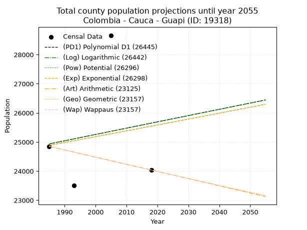
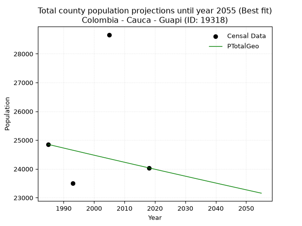
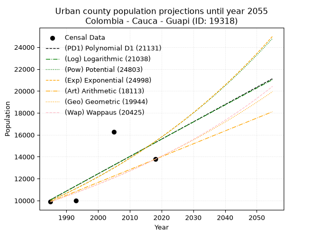
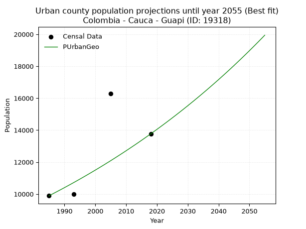
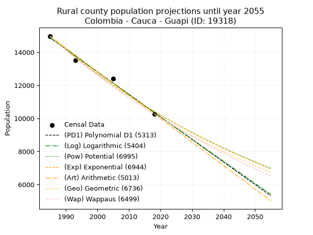
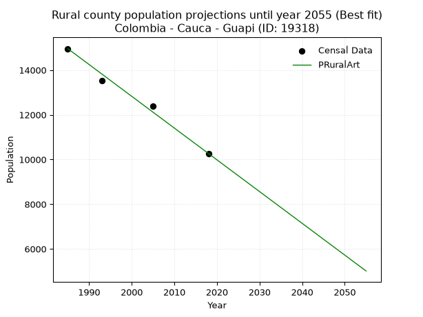

<div align="center">


</div>

# _“Population and Public Services Demand Projections (PPSD) until Year 2050 for Colombia - Cauca - Guapi (ID: 19318)”_
Keywords: `population` `public-service` `projection` `lineal` `polynomial` `logarithmic` `potential` `exponential` `arithmetic` `geometric` `wappaus` `dane` `colombia` `south-america`

PPSD are analytical estimates used by governments and planners to anticipate future changes in population size, age distribution, and the resulting community needs for utilities, healthcare, education, and infrastructure as sizing future water treatment facilities, electrical grids, and road networks based on spatial growth.

> **General running parameters**: • app_version: _v20260806_. • Python version: _3.14.7_. • Pandas version: _3.0.5_. • NumPy version: _2.5.1_. • Creates, save and include plots into reports (create_plot): _False_. • Projection until year: _2050_. • Process polynomial degree 2 and up: _False_. • Process Wappaus: _True_. • Process Wappaus: _True_. • Set negative values to zero: _True_. • Set infinite values to zero: _True_. • Drop dataset notes: _True_. 
<div align="center">

Dynamic map: [:earth_americas:Google](http://maps.google.com/maps?q=2.571337361,-77.8879703) [:earth_americas:OSM](https://www.openstreetmap.org/#map=18/2.571337361/-77.8879703&layers=P) [:earth_americas:Bing](https://www.bing.com/maps?cp=2.571337361~-77.8879703&lvl=18) [:earth_americas:Apple](https://maps.apple.com/frame?center=2.571337361%2C-77.8879703&span=0.003%2C0.006)

</div>


<div align="center">

```geojson
{
  "type": "Feature",
  "geometry": {
    "type": "Point", 
    "coordinates": [-77.8879703, 2.571337361]
  }, 
  "properties": {
    "Name": "Colombia - Cauca - Guapi (ID: 19318)"
  }
}
```

</div>


## 0. Census Data (4 records)

Census data are official statistics collected by a government about the people and housing in a country. They usually include counts of total population, age, sex, race, income, education, and jobs.

📅Global census file: [Population.xlsx](../data/Population.xlsx)

| Source   |   Year |   CountryID | CountryName   |   StateID | StateName   |   CountyID | CountyName   |   PTotal |   PUrban |   PRural |
|:---------|-------:|------------:|:--------------|----------:|:------------|-----------:|:-------------|---------:|---------:|---------:|
| DANE     |   1985 |          57 | Colombia      |        19 | Cauca       |      19318 | Guapi        |    24850 |     9893 |    14957 |
| DANE     |   1993 |          57 | Colombia      |        19 | Cauca       |      19318 | Guapi        |    23505 |     9988 |    13517 |
| DANE     |   2005 |          57 | Colombia      |        19 | Cauca       |      19318 | Guapi        |    28663 |    16273 |    12390 |
| DANE     |   2018 |          57 | Colombia      |        19 | Cauca       |      19318 | Guapi        |    24037 |    13768 |    10269 |

> 🔥Some records could had specific notes about the registered values or the corresponding urban or rural distribution.

📅   [RUPS](https://www.datos.gov.co/Hacienda-y-Cr-dito-P-blico/Registro-nico-de-Prestadores-de-Servicios-P-blicos/4qkq-csdn/about_data) - Local public utility companies: [RUPS.csv](../data/RUPS.xlsx)

 | SERVICIO       | ESTADO      | NOMBRE                                                                                                                     | NIT         | DEPARTAMENTO_DOMICILIO   | MUNICIPIO_DOMICILIO   | DIRECCION                              |   TELEFONO | EMAIL                              | TIPO_INSCRIPCION    | REPRESENTANTE_LEGAL            | TIPO_PRESTADOR                             | CLASIFICACION                  |
|:---------------|:------------|:---------------------------------------------------------------------------------------------------------------------------|:------------|:-------------------------|:----------------------|:---------------------------------------|-----------:|:-----------------------------------|:--------------------|:-------------------------------|:-------------------------------------------|:-------------------------------|
| ACUEDUCTO      | CANCELACION | UNIDAD PRESTADORA DE LOS SERVICIOS PUBLICOS DOMICILIARIOS DE ACUEDUCTO, ALCANTARILLADO Y ASEO DEL MUNICIPIO DE GUAPI CAUCA | 800084378-0 | CAUCA                    | GUAPI                 | CARRERA 2ª # 5 -73 Barrio la Esperanza |    8400488 | despachoalcalde@guapi-cauca.gov.co | Registro por la ESP | CARMENZA PALACIOS CUERO        | nan                                        | nan                            |
| ALCANTARILLADO | CANCELACION | UNIDAD PRESTADORA DE LOS SERVICIOS PUBLICOS DOMICILIARIOS DE ACUEDUCTO, ALCANTARILLADO Y ASEO DEL MUNICIPIO DE GUAPI CAUCA | 800084378-0 | CAUCA                    | GUAPI                 | CARRERA 2ª # 5 -73 Barrio la Esperanza |    8400488 | despachoalcalde@guapi-cauca.gov.co | Registro por la ESP | CARMENZA PALACIOS CUERO        | nan                                        | nan                            |
| ALCANTARILLADO | OPERATIVA   | EMPRESA MUNICIPAL OFICIAL DE SERVICIOS PÚBLICOS DOMICILIARIOS DE ACUEDUCTO, ALCANTARILLADO Y ASEO DE GUAPI CAUCA SAS ESP   | 901119046-1 | CAUCA                    | GUAPI                 | CARRERA 2 # 5-73                       |    0000000 | yiduar222@hotmail.com              | Registro por la ESP | YIDUAR ADRIAN CUENU HINESTROZA | SOCIEDADES (EMPRESA DE SERVICIOS PUBLICOS) | DESDE 2501 HASTA 5000 USUARIOS |
| ACUEDUCTO      | OPERATIVA   | EMPRESA MUNICIPAL OFICIAL DE SERVICIOS PÚBLICOS DOMICILIARIOS DE ACUEDUCTO, ALCANTARILLADO Y ASEO DE GUAPI CAUCA SAS ESP   | 901119046-1 | CAUCA                    | GUAPI                 | CARRERA 2 # 5-73                       |    0000000 | yiduar222@hotmail.com              | Registro por la ESP | YIDUAR ADRIAN CUENU HINESTROZA | SOCIEDADES (EMPRESA DE SERVICIOS PUBLICOS) | MENOR O IGUAL A 2500 USUARIOS  |

## 1. Total

### 1.1. Coefficients and Parameters

* (PD1) Polynomial Deg 1: 21.569249297473494, -17880.140907271358 (lineal)
* (Log) Logarithmic: 43602.89976146817, -306162.24049862946
* (Pow) Potential: 1.5943081116424818, -0.8617598454037307
* (Exp) Exponential: 0.00078852913759343, 5202.101467719153
* (Art) Arithmetic: Year diff. 2018 - 1985 = 33, Population diff. 24037 - 24850 = -813, Annual growth = -24.636363636363637
* (Geo) Geometric: Year diff. 2018 - 1985 = 33, Population diff. 24037 - 24850 = -813, Annual growth % = -0.0010074752670681253
* (Wap) Wappaus: i = -0.10078901808809555, Condition values only valid for < 200)

<sub>
Wappaus condition values: ['-0.00', '-0.10', '-0.20', '-0.30', '-0.40', '-0.50', '-0.60', '-0.71', '-0.81', '-0.91', '-1.01', '-1.11', '-1.21', '-1.31', '-1.41', '-1.51', '-1.61', '-1.71', '-1.81', '-1.91', '-2.02', '-2.12', '-2.22', '-2.32', '-2.42', '-2.52', '-2.62', '-2.72', '-2.82', '-2.92', '-3.02', '-3.12', '-3.23', '-3.33', '-3.43', '-3.53', '-3.63', '-3.73', '-3.83', '-3.93', '-4.03', '-4.13', '-4.23', '-4.33', '-4.43', '-4.54', '-4.64', '-4.74', '-4.84', '-4.94', '-5.04', '-5.14', '-5.24', '-5.34', '-5.44', '-5.54', '-5.64', '-5.74', '-5.85', '-5.95', '-6.05', '-6.15', '-6.25', '-6.35', '-6.45', '-6.55']
</sub>


### 1.2. Projected Dataset

|   Year |   CountyID |   PTotalPD1 |   PTotalLog |   PTotalPow |   PTotalExp |   PTotalArt |   PTotalGeo |   PTotalWap |
|-------:|-----------:|------------:|------------:|------------:|------------:|------------:|------------:|------------:|
|   1985 |      19318 |       24935 |       24931 |       24882 |       24886 |       24850 |       24850 |       24850 |
|   1986 |      19318 |       24956 |       24953 |       24902 |       24905 |       24825 |       24825 |       24825 |
|   1987 |      19318 |       24978 |       24975 |       24922 |       24925 |       24801 |       24800 |       24800 |
|   1988 |      19318 |       25000 |       24997 |       24942 |       24945 |       24776 |       24775 |       24775 |
|   1989 |      19318 |       25021 |       25019 |       24962 |       24964 |       24751 |       24750 |       24750 |
|   1990 |      19318 |       25043 |       25041 |       24982 |       24984 |       24727 |       24725 |       24725 |
|   1991 |      19318 |       25064 |       25062 |       25002 |       25004 |       24702 |       24700 |       24700 |
|   1992 |      19318 |       25086 |       25084 |       25022 |       25023 |       24678 |       24675 |       24675 |
|   1993 |      19318 |       25107 |       25106 |       25042 |       25043 |       24653 |       24650 |       24650 |
|   1994 |      19318 |       25129 |       25128 |       25062 |       25063 |       24628 |       24626 |       24626 |
|   1995 |      19318 |       25151 |       25150 |       25082 |       25083 |       24604 |       24601 |       24601 |
|   1996 |      19318 |       25172 |       25172 |       25102 |       25102 |       24579 |       24576 |       24576 |
|   1997 |      19318 |       25194 |       25194 |       25122 |       25122 |       24554 |       24551 |       24551 |
|   1998 |      19318 |       25215 |       25216 |       25142 |       25142 |       24530 |       24526 |       24527 |
|   1999 |      19318 |       25237 |       25237 |       25162 |       25162 |       24505 |       24502 |       24502 |
|   2000 |      19318 |       25258 |       25259 |       25183 |       25182 |       24480 |       24477 |       24477 |
|   2001 |      19318 |       25280 |       25281 |       25203 |       25202 |       24456 |       24452 |       24452 |
|   2002 |      19318 |       25301 |       25303 |       25223 |       25222 |       24431 |       24428 |       24428 |
|   2003 |      19318 |       25323 |       25325 |       25243 |       25241 |       24407 |       24403 |       24403 |
|   2004 |      19318 |       25345 |       25346 |       25263 |       25261 |       24382 |       24379 |       24379 |
|   2005 |      19318 |       25366 |       25368 |       25283 |       25281 |       24357 |       24354 |       24354 |
|   2006 |      19318 |       25388 |       25390 |       25303 |       25301 |       24333 |       24330 |       24330 |
|   2007 |      19318 |       25409 |       25411 |       25323 |       25321 |       24308 |       24305 |       24305 |
|   2008 |      19318 |       25431 |       25433 |       25343 |       25341 |       24283 |       24281 |       24281 |
|   2009 |      19318 |       25452 |       25455 |       25363 |       25361 |       24259 |       24256 |       24256 |
|   2010 |      19318 |       25474 |       25477 |       25384 |       25381 |       24234 |       24232 |       24232 |
|   2011 |      19318 |       25496 |       25498 |       25404 |       25401 |       24209 |       24207 |       24207 |
|   2012 |      19318 |       25517 |       25520 |       25424 |       25421 |       24185 |       24183 |       24183 |
|   2013 |      19318 |       25539 |       25542 |       25444 |       25441 |       24160 |       24158 |       24158 |
|   2014 |      19318 |       25560 |       25563 |       25464 |       25461 |       24136 |       24134 |       24134 |
|   2015 |      19318 |       25582 |       25585 |       25484 |       25481 |       24111 |       24110 |       24110 |
|   2016 |      19318 |       25603 |       25607 |       25504 |       25502 |       24086 |       24086 |       24086 |
|   2017 |      19318 |       25625 |       25628 |       25525 |       25522 |       24062 |       24061 |       24061 |
|   2018 |      19318 |       25647 |       25650 |       25545 |       25542 |       24037 |       24037 |       24037 |
|   2019 |      19318 |       25668 |       25671 |       25565 |       25562 |       24012 |       24013 |       24013 |
|   2020 |      19318 |       25690 |       25693 |       25585 |       25582 |       23988 |       23989 |       23989 |
|   2021 |      19318 |       25711 |       25715 |       25605 |       25602 |       23963 |       23964 |       23964 |
|   2022 |      19318 |       25733 |       25736 |       25626 |       25622 |       23938 |       23940 |       23940 |
|   2023 |      19318 |       25754 |       25758 |       25646 |       25643 |       23914 |       23916 |       23916 |
|   2024 |      19318 |       25776 |       25779 |       25666 |       25663 |       23889 |       23892 |       23892 |
|   2025 |      19318 |       25798 |       25801 |       25686 |       25683 |       23865 |       23868 |       23868 |
|   2026 |      19318 |       25819 |       25822 |       25706 |       25703 |       23840 |       23844 |       23844 |
|   2027 |      19318 |       25841 |       25844 |       25727 |       25724 |       23815 |       23820 |       23820 |
|   2028 |      19318 |       25862 |       25865 |       25747 |       25744 |       23791 |       23796 |       23796 |
|   2029 |      19318 |       25884 |       25887 |       25767 |       25764 |       23766 |       23772 |       23772 |
|   2030 |      19318 |       25905 |       25908 |       25787 |       25785 |       23741 |       23748 |       23748 |
|   2031 |      19318 |       25927 |       25930 |       25808 |       25805 |       23717 |       23724 |       23724 |
|   2032 |      19318 |       25949 |       25951 |       25828 |       25825 |       23692 |       23700 |       23700 |
|   2033 |      19318 |       25970 |       25973 |       25848 |       25846 |       23667 |       23676 |       23676 |
|   2034 |      19318 |       25992 |       25994 |       25868 |       25866 |       23643 |       23652 |       23652 |
|   2035 |      19318 |       26013 |       26016 |       25889 |       25886 |       23618 |       23629 |       23628 |
|   2036 |      19318 |       26035 |       26037 |       25909 |       25907 |       23594 |       23605 |       23605 |
|   2037 |      19318 |       26056 |       26058 |       25929 |       25927 |       23569 |       23581 |       23581 |
|   2038 |      19318 |       26078 |       26080 |       25950 |       25948 |       23544 |       23557 |       23557 |
|   2039 |      19318 |       26100 |       26101 |       25970 |       25968 |       23520 |       23534 |       23533 |
|   2040 |      19318 |       26121 |       26123 |       25990 |       25989 |       23495 |       23510 |       23510 |
|   2041 |      19318 |       26143 |       26144 |       26011 |       26009 |       23470 |       23486 |       23486 |
|   2042 |      19318 |       26164 |       26165 |       26031 |       26030 |       23446 |       23462 |       23462 |
|   2043 |      19318 |       26186 |       26187 |       26051 |       26050 |       23421 |       23439 |       23439 |
|   2044 |      19318 |       26207 |       26208 |       26072 |       26071 |       23396 |       23415 |       23415 |
|   2045 |      19318 |       26229 |       26229 |       26092 |       26091 |       23372 |       23392 |       23391 |
|   2046 |      19318 |       26251 |       26251 |       26112 |       26112 |       23347 |       23368 |       23368 |
|   2047 |      19318 |       26272 |       26272 |       26133 |       26133 |       23323 |       23345 |       23344 |
|   2048 |      19318 |       26294 |       26293 |       26153 |       26153 |       23298 |       23321 |       23321 |
|   2049 |      19318 |       26315 |       26315 |       26173 |       26174 |       23273 |       23298 |       23297 |
|   2050 |      19318 |       26337 |       26336 |       26194 |       26194 |       23249 |       23274 |       23274 |
<div align="center">

</img>

</div>


### 1.3. Best fit with absolute and relative error (%)

Relative error puts that difference into context by dividing the absolute error by the true value, creating a unitless ratio or percentage that shows the scale of the mistake.

Absolute and relative error

|   Year | Source   |   CountryID | CountryName   |   StateID | StateName   |   CountyID_x | CountyName   |   PTotal |   PUrban |   PRural |   CountyID_y |   PTotalPD1 |   PTotalLog |   PTotalPow |   PTotalExp |   PTotalArt |   PTotalGeo |   PTotalWap |   PTotalPD1AbsError |   PTotalLogAbsError |   PTotalPowAbsError |   PTotalExpAbsError |   PTotalArtAbsError |   PTotalGeoAbsError |   PTotalWapAbsError |   PTotalPD1RelError |   PTotalLogRelError |   PTotalPowRelError |   PTotalExpRelError |   PTotalArtRelError |   PTotalGeoRelError |   PTotalWapRelError |
|-------:|:---------|------------:|:--------------|----------:|:------------|-------------:|:-------------|---------:|---------:|---------:|-------------:|------------:|------------:|------------:|------------:|------------:|------------:|------------:|--------------------:|--------------------:|--------------------:|--------------------:|--------------------:|--------------------:|--------------------:|--------------------:|--------------------:|--------------------:|--------------------:|--------------------:|--------------------:|--------------------:|
|   1985 | DANE     |          57 | Colombia      |        19 | Cauca       |        19318 | Guapi        |    24850 |     9893 |    14957 |        19318 |       24935 |       24931 |       24882 |       24886 |       24850 |       24850 |       24850 |                  85 |                  81 |                  32 |                  36 |                   0 |                   0 |                   0 |            0.342052 |            0.325956 |            0.128773 |            0.144869 |             0       |              0      |              0      |
|   1993 | DANE     |          57 | Colombia      |        19 | Cauca       |        19318 | Guapi        |    23505 |     9988 |    13517 |        19318 |       25107 |       25106 |       25042 |       25043 |       24653 |       24650 |       24650 |                1602 |                1601 |                1537 |                1538 |                1148 |                1145 |                1145 |            6.81557  |            6.81132  |            6.53903  |            6.54329  |             4.88407 |              4.8713 |              4.8713 |
|   2005 | DANE     |          57 | Colombia      |        19 | Cauca       |        19318 | Guapi        |    28663 |    16273 |    12390 |        19318 |       25366 |       25368 |       25283 |       25281 |       24357 |       24354 |       24354 |                3297 |                3295 |                3380 |                3382 |                4306 |                4309 |                4309 |           11.5026   |           11.4957   |           11.7922   |           11.7992   |            15.0229  |             15.0333 |             15.0333 |
|   2018 | DANE     |          57 | Colombia      |        19 | Cauca       |        19318 | Guapi        |    24037 |    13768 |    10269 |        19318 |       25647 |       25650 |       25545 |       25542 |       24037 |       24037 |       24037 |                1610 |                1613 |                1508 |                1505 |                   0 |                   0 |                   0 |            6.69801  |            6.71049  |            6.27366  |            6.26118  |             0       |              0      |              0      |

Relative error mean

| Method    |   RelError | Best   |
|:----------|-----------:|:-------|
| PTotalPD1 |    6.33957 |        |
| PTotalLog |    6.33585 |        |
| PTotalPow |    6.18342 |        |
| PTotalExp |    6.18713 |        |
| PTotalArt |    4.97673 |        |
| PTotalGeo |    4.97616 | True   |
| PTotalWap |    4.97616 | True   |

💙Best method: _**PTotalGeo**_
<div align="center">

</img>

</div>


### 1.4. Fresh water supply demand in liters per capita per day (lpcd)

The fresh water supply demand typically ranges from 100 to 300 liters per capita per day (lpcd) for standard domestic and municipal planning, though absolute survival minimums set by the World Health Organization are as low as 7.5 to 20 liters per day, and total consumption in high-income nations can exceed 400 liters.

> `CZ`: Level in meters above the sea level (masl)<br> `WS`: Fresh water supply demand in liters per capita per day (lpcd or l/h/d)<br> `WSAll`: Zonal fresh water supply demand in liters per second (l/s)<br> `A`: Zonal area in square meters<br> `DP`: Population density (people/hectare or p/ha)

Reference values (RAS Colombia)

|    CZ |   WS |
|------:|-----:|
|  1000 |  120 |
|  2000 |  130 |
| 99999 |  140 |

County shapefile geometry properties and water supply values

|   CountyID |      ATotal |   CZTotal |   WSTotal |
|-----------:|------------:|----------:|----------:|
|      19318 | 2.57089e+09 |   390.704 |       120 |

Projected values for best method: PTotalGeo

|   CountyID |   Year |   PTotalGeo |   DPTotal |   WSTotal |   WSTotalAll |
|-----------:|-------:|------------:|----------:|----------:|-------------:|
|      19318 |   1985 |       24850 |      0.1  |       120 |      34.5139 |
|      19318 |   1986 |       24825 |      0.1  |       120 |      34.4792 |
|      19318 |   1987 |       24800 |      0.1  |       120 |      34.4444 |
|      19318 |   1988 |       24775 |      0.1  |       120 |      34.4097 |
|      19318 |   1989 |       24750 |      0.1  |       120 |      34.375  |
|      19318 |   1990 |       24725 |      0.1  |       120 |      34.3403 |
|      19318 |   1991 |       24700 |      0.1  |       120 |      34.3056 |
|      19318 |   1992 |       24675 |      0.1  |       120 |      34.2708 |
|      19318 |   1993 |       24650 |      0.1  |       120 |      34.2361 |
|      19318 |   1994 |       24626 |      0.1  |       120 |      34.2028 |
|      19318 |   1995 |       24601 |      0.1  |       120 |      34.1681 |
|      19318 |   1996 |       24576 |      0.1  |       120 |      34.1333 |
|      19318 |   1997 |       24551 |      0.1  |       120 |      34.0986 |
|      19318 |   1998 |       24526 |      0.1  |       120 |      34.0639 |
|      19318 |   1999 |       24502 |      0.1  |       120 |      34.0306 |
|      19318 |   2000 |       24477 |      0.1  |       120 |      33.9958 |
|      19318 |   2001 |       24452 |      0.1  |       120 |      33.9611 |
|      19318 |   2002 |       24428 |      0.1  |       120 |      33.9278 |
|      19318 |   2003 |       24403 |      0.09 |       120 |      33.8931 |
|      19318 |   2004 |       24379 |      0.09 |       120 |      33.8597 |
|      19318 |   2005 |       24354 |      0.09 |       120 |      33.825  |
|      19318 |   2006 |       24330 |      0.09 |       120 |      33.7917 |
|      19318 |   2007 |       24305 |      0.09 |       120 |      33.7569 |
|      19318 |   2008 |       24281 |      0.09 |       120 |      33.7236 |
|      19318 |   2009 |       24256 |      0.09 |       120 |      33.6889 |
|      19318 |   2010 |       24232 |      0.09 |       120 |      33.6556 |
|      19318 |   2011 |       24207 |      0.09 |       120 |      33.6208 |
|      19318 |   2012 |       24183 |      0.09 |       120 |      33.5875 |
|      19318 |   2013 |       24158 |      0.09 |       120 |      33.5528 |
|      19318 |   2014 |       24134 |      0.09 |       120 |      33.5194 |
|      19318 |   2015 |       24110 |      0.09 |       120 |      33.4861 |
|      19318 |   2016 |       24086 |      0.09 |       120 |      33.4528 |
|      19318 |   2017 |       24061 |      0.09 |       120 |      33.4181 |
|      19318 |   2018 |       24037 |      0.09 |       120 |      33.3847 |
|      19318 |   2019 |       24013 |      0.09 |       120 |      33.3514 |
|      19318 |   2020 |       23989 |      0.09 |       120 |      33.3181 |
|      19318 |   2021 |       23964 |      0.09 |       120 |      33.2833 |
|      19318 |   2022 |       23940 |      0.09 |       120 |      33.25   |
|      19318 |   2023 |       23916 |      0.09 |       120 |      33.2167 |
|      19318 |   2024 |       23892 |      0.09 |       120 |      33.1833 |
|      19318 |   2025 |       23868 |      0.09 |       120 |      33.15   |
|      19318 |   2026 |       23844 |      0.09 |       120 |      33.1167 |
|      19318 |   2027 |       23820 |      0.09 |       120 |      33.0833 |
|      19318 |   2028 |       23796 |      0.09 |       120 |      33.05   |
|      19318 |   2029 |       23772 |      0.09 |       120 |      33.0167 |
|      19318 |   2030 |       23748 |      0.09 |       120 |      32.9833 |
|      19318 |   2031 |       23724 |      0.09 |       120 |      32.95   |
|      19318 |   2032 |       23700 |      0.09 |       120 |      32.9167 |
|      19318 |   2033 |       23676 |      0.09 |       120 |      32.8833 |
|      19318 |   2034 |       23652 |      0.09 |       120 |      32.85   |
|      19318 |   2035 |       23629 |      0.09 |       120 |      32.8181 |
|      19318 |   2036 |       23605 |      0.09 |       120 |      32.7847 |
|      19318 |   2037 |       23581 |      0.09 |       120 |      32.7514 |
|      19318 |   2038 |       23557 |      0.09 |       120 |      32.7181 |
|      19318 |   2039 |       23534 |      0.09 |       120 |      32.6861 |
|      19318 |   2040 |       23510 |      0.09 |       120 |      32.6528 |
|      19318 |   2041 |       23486 |      0.09 |       120 |      32.6194 |
|      19318 |   2042 |       23462 |      0.09 |       120 |      32.5861 |
|      19318 |   2043 |       23439 |      0.09 |       120 |      32.5542 |
|      19318 |   2044 |       23415 |      0.09 |       120 |      32.5208 |
|      19318 |   2045 |       23392 |      0.09 |       120 |      32.4889 |
|      19318 |   2046 |       23368 |      0.09 |       120 |      32.4556 |
|      19318 |   2047 |       23345 |      0.09 |       120 |      32.4236 |
|      19318 |   2048 |       23321 |      0.09 |       120 |      32.3903 |
|      19318 |   2049 |       23298 |      0.09 |       120 |      32.3583 |
|      19318 |   2050 |       23274 |      0.09 |       120 |      32.325  |

## 2. Urban

### 2.1. Coefficients and Parameters

* (PD1) Polynomial Deg 1: 158.00481734243385, -303568.63588920335 (lineal)
* (Log) Logarithmic: 316683.1653721062, -2394630.777733001
* (Pow) Potential: 26.262366242589422, -82.6077763740393
* (Exp) Exponential: 0.013105443326588744, 5.030601447403806e-08
* (Art) Arithmetic: Year diff. 2018 - 1985 = 33, Population diff. 13768 - 9893 = 3875, Annual growth = 117.42424242424242
* (Geo) Geometric: Year diff. 2018 - 1985 = 33, Population diff. 13768 - 9893 = 3875, Annual growth % = 0.010066071599136084
* (Wap) Wappaus: i = 0.9925551956742523, Condition values only valid for < 200)

<sub>
Wappaus condition values: ['0.00', '0.99', '1.99', '2.98', '3.97', '4.96', '5.96', '6.95', '7.94', '8.93', '9.93', '10.92', '11.91', '12.90', '13.90', '14.89', '15.88', '16.87', '17.87', '18.86', '19.85', '20.84', '21.84', '22.83', '23.82', '24.81', '25.81', '26.80', '27.79', '28.78', '29.78', '30.77', '31.76', '32.75', '33.75', '34.74', '35.73', '36.72', '37.72', '38.71', '39.70', '40.69', '41.69', '42.68', '43.67', '44.66', '45.66', '46.65', '47.64', '48.64', '49.63', '50.62', '51.61', '52.61', '53.60', '54.59', '55.58', '56.58', '57.57', '58.56', '59.55', '60.55', '61.54', '62.53', '63.52', '64.52']
</sub>


### 2.2. Projected Dataset

|   Year |   CountyID |   PUrbanPD1 |   PUrbanLog |   PUrbanPow |   PUrbanExp |   PUrbanArt |   PUrbanGeo |   PUrbanWap |
|-------:|-----------:|------------:|------------:|------------:|------------:|------------:|------------:|------------:|
|   1985 |      19318 |       10071 |       10063 |        9982 |        9988 |        9893 |        9893 |        9893 |
|   1986 |      19318 |       10229 |       10222 |       10115 |       10120 |       10010 |        9993 |        9992 |
|   1987 |      19318 |       10387 |       10382 |       10250 |       10254 |       10128 |       10093 |       10091 |
|   1988 |      19318 |       10545 |       10541 |       10386 |       10389 |       10245 |       10195 |       10192 |
|   1989 |      19318 |       10703 |       10701 |       10524 |       10526 |       10363 |       10297 |       10294 |
|   1990 |      19318 |       10861 |       10860 |       10664 |       10665 |       10480 |       10401 |       10396 |
|   1991 |      19318 |       11019 |       11019 |       10805 |       10805 |       10598 |       10506 |       10500 |
|   1992 |      19318 |       11177 |       11178 |       10949 |       10948 |       10715 |       10611 |       10605 |
|   1993 |      19318 |       11335 |       11337 |       11094 |       11092 |       10832 |       10718 |       10711 |
|   1994 |      19318 |       11493 |       11496 |       11241 |       11239 |       10950 |       10826 |       10818 |
|   1995 |      19318 |       11651 |       11654 |       11390 |       11387 |       11067 |       10935 |       10926 |
|   1996 |      19318 |       11809 |       11813 |       11541 |       11537 |       11185 |       11045 |       11035 |
|   1997 |      19318 |       11967 |       11972 |       11694 |       11689 |       11302 |       11156 |       11146 |
|   1998 |      19318 |       12125 |       12130 |       11849 |       11844 |       11420 |       11269 |       11258 |
|   1999 |      19318 |       12283 |       12289 |       12005 |       12000 |       11537 |       11382 |       11370 |
|   2000 |      19318 |       12441 |       12447 |       12164 |       12158 |       11654 |       11497 |       11484 |
|   2001 |      19318 |       12599 |       12605 |       12325 |       12318 |       11772 |       11612 |       11600 |
|   2002 |      19318 |       12757 |       12764 |       12488 |       12481 |       11889 |       11729 |       11716 |
|   2003 |      19318 |       12915 |       12922 |       12653 |       12646 |       12007 |       11847 |       11834 |
|   2004 |      19318 |       13073 |       13080 |       12819 |       12812 |       12124 |       11967 |       11953 |
|   2005 |      19318 |       13231 |       13238 |       12989 |       12981 |       12241 |       12087 |       12073 |
|   2006 |      19318 |       13389 |       13396 |       13160 |       13153 |       12359 |       12209 |       12195 |
|   2007 |      19318 |       13547 |       13554 |       13333 |       13326 |       12476 |       12332 |       12318 |
|   2008 |      19318 |       13705 |       13711 |       13509 |       13502 |       12594 |       12456 |       12442 |
|   2009 |      19318 |       13863 |       13869 |       13687 |       13680 |       12711 |       12581 |       12568 |
|   2010 |      19318 |       14021 |       14027 |       13867 |       13861 |       12829 |       12708 |       12696 |
|   2011 |      19318 |       14179 |       14184 |       14049 |       14043 |       12946 |       12836 |       12824 |
|   2012 |      19318 |       14337 |       14341 |       14233 |       14229 |       13063 |       12965 |       12954 |
|   2013 |      19318 |       14495 |       14499 |       14420 |       14416 |       13181 |       13095 |       13086 |
|   2014 |      19318 |       14653 |       14656 |       14610 |       14606 |       13298 |       13227 |       13219 |
|   2015 |      19318 |       14811 |       14813 |       14801 |       14799 |       13416 |       13360 |       13354 |
|   2016 |      19318 |       14969 |       14970 |       14996 |       14994 |       13533 |       13495 |       13490 |
|   2017 |      19318 |       15127 |       15128 |       15192 |       15192 |       13651 |       13631 |       13628 |
|   2018 |      19318 |       15285 |       15284 |       15391 |       15393 |       13768 |       13768 |       13768 |
|   2019 |      19318 |       15443 |       15441 |       15593 |       15596 |       13885 |       13907 |       13909 |
|   2020 |      19318 |       15601 |       15598 |       15797 |       15801 |       14003 |       14047 |       14052 |
|   2021 |      19318 |       15759 |       15755 |       16004 |       16010 |       14120 |       14188 |       14197 |
|   2022 |      19318 |       15917 |       15912 |       16213 |       16221 |       14238 |       14331 |       14343 |
|   2023 |      19318 |       16075 |       16068 |       16425 |       16435 |       14355 |       14475 |       14492 |
|   2024 |      19318 |       16233 |       16225 |       16639 |       16652 |       14473 |       14621 |       14642 |
|   2025 |      19318 |       16391 |       16381 |       16857 |       16872 |       14590 |       14768 |       14794 |
|   2026 |      19318 |       16549 |       16537 |       17077 |       17094 |       14707 |       14917 |       14947 |
|   2027 |      19318 |       16707 |       16694 |       17299 |       17320 |       14825 |       15067 |       15103 |
|   2028 |      19318 |       16865 |       16850 |       17525 |       17548 |       14942 |       15218 |       15261 |
|   2029 |      19318 |       17023 |       17006 |       17753 |       17780 |       15060 |       15372 |       15421 |
|   2030 |      19318 |       17181 |       17162 |       17984 |       18014 |       15177 |       15526 |       15582 |
|   2031 |      19318 |       17339 |       17318 |       18219 |       18252 |       15295 |       15683 |       15746 |
|   2032 |      19318 |       17497 |       17474 |       18456 |       18492 |       15412 |       15840 |       15912 |
|   2033 |      19318 |       17655 |       17630 |       18696 |       18736 |       15529 |       16000 |       16080 |
|   2034 |      19318 |       17813 |       17785 |       18939 |       18984 |       15647 |       16161 |       16250 |
|   2035 |      19318 |       17971 |       17941 |       19185 |       19234 |       15764 |       16324 |       16423 |
|   2036 |      19318 |       18129 |       18097 |       19434 |       19488 |       15882 |       16488 |       16598 |
|   2037 |      19318 |       18287 |       18252 |       19686 |       19745 |       15999 |       16654 |       16775 |
|   2038 |      19318 |       18445 |       18408 |       19941 |       20005 |       16116 |       16822 |       16955 |
|   2039 |      19318 |       18603 |       18563 |       20200 |       20269 |       16234 |       16991 |       17137 |
|   2040 |      19318 |       18761 |       18718 |       20462 |       20537 |       16351 |       17162 |       17321 |
|   2041 |      19318 |       18919 |       18873 |       20727 |       20807 |       16469 |       17335 |       17508 |
|   2042 |      19318 |       19077 |       19029 |       20995 |       21082 |       16586 |       17509 |       17698 |
|   2043 |      19318 |       19235 |       19184 |       21267 |       21360 |       16704 |       17685 |       17890 |
|   2044 |      19318 |       19393 |       19339 |       21542 |       21642 |       16821 |       17863 |       18085 |
|   2045 |      19318 |       19551 |       19493 |       21820 |       21927 |       16938 |       18043 |       18283 |
|   2046 |      19318 |       19709 |       19648 |       22102 |       22217 |       17056 |       18225 |       18483 |
|   2047 |      19318 |       19867 |       19803 |       22388 |       22510 |       17173 |       18408 |       18687 |
|   2048 |      19318 |       20025 |       19958 |       22677 |       22807 |       17291 |       18594 |       18893 |
|   2049 |      19318 |       20183 |       20112 |       22969 |       23107 |       17408 |       18781 |       19102 |
|   2050 |      19318 |       20341 |       20267 |       23266 |       23412 |       17526 |       18970 |       19315 |
<div align="center">

</img>

</div>


### 2.3. Best fit with absolute and relative error (%)

Relative error puts that difference into context by dividing the absolute error by the true value, creating a unitless ratio or percentage that shows the scale of the mistake.

Absolute and relative error

|   Year | Source   |   CountryID | CountryName   |   StateID | StateName   |   CountyID_x | CountyName   |   PTotal |   PUrban |   PRural |   CountyID_y |   PUrbanPD1 |   PUrbanLog |   PUrbanPow |   PUrbanExp |   PUrbanArt |   PUrbanGeo |   PUrbanWap |   PUrbanPD1AbsError |   PUrbanLogAbsError |   PUrbanPowAbsError |   PUrbanExpAbsError |   PUrbanArtAbsError |   PUrbanGeoAbsError |   PUrbanWapAbsError |   PUrbanPD1RelError |   PUrbanLogRelError |   PUrbanPowRelError |   PUrbanExpRelError |   PUrbanArtRelError |   PUrbanGeoRelError |   PUrbanWapRelError |
|-------:|:---------|------------:|:--------------|----------:|:------------|-------------:|:-------------|---------:|---------:|---------:|-------------:|------------:|------------:|------------:|------------:|------------:|------------:|------------:|--------------------:|--------------------:|--------------------:|--------------------:|--------------------:|--------------------:|--------------------:|--------------------:|--------------------:|--------------------:|--------------------:|--------------------:|--------------------:|--------------------:|
|   1985 | DANE     |          57 | Colombia      |        19 | Cauca       |        19318 | Guapi        |    24850 |     9893 |    14957 |        19318 |       10071 |       10063 |        9982 |        9988 |        9893 |        9893 |        9893 |                 178 |                 170 |                  89 |                  95 |                   0 |                   0 |                   0 |             1.79925 |             1.71839 |            0.899626 |            0.960275 |             0       |             0       |             0       |
|   1993 | DANE     |          57 | Colombia      |        19 | Cauca       |        19318 | Guapi        |    23505 |     9988 |    13517 |        19318 |       11335 |       11337 |       11094 |       11092 |       10832 |       10718 |       10711 |                1347 |                1349 |                1106 |                1104 |                 844 |                 730 |                 723 |            13.4862  |            13.5062  |           11.0733   |           11.0533   |             8.45014 |             7.30877 |             7.23869 |
|   2005 | DANE     |          57 | Colombia      |        19 | Cauca       |        19318 | Guapi        |    28663 |    16273 |    12390 |        19318 |       13231 |       13238 |       12989 |       12981 |       12241 |       12087 |       12073 |                3042 |                3035 |                3284 |                3292 |                4032 |                4186 |                4200 |            18.6935  |            18.6505  |           20.1807   |           20.2298   |            24.7772  |            25.7236  |            25.8096  |
|   2018 | DANE     |          57 | Colombia      |        19 | Cauca       |        19318 | Guapi        |    24037 |    13768 |    10269 |        19318 |       15285 |       15284 |       15391 |       15393 |       13768 |       13768 |       13768 |                1517 |                1516 |                1623 |                1625 |                   0 |                   0 |                   0 |            11.0183  |            11.011   |           11.7882   |           11.8027   |             0       |             0       |             0       |

Relative error mean

| Method    |   RelError | Best   |
|:----------|-----------:|:-------|
| PUrbanPD1 |   11.2493  |        |
| PUrbanLog |   11.2215  |        |
| PUrbanPow |   10.9854  |        |
| PUrbanExp |   11.0115  |        |
| PUrbanArt |    8.30684 |        |
| PUrbanGeo |    8.25809 | True   |
| PUrbanWap |    8.26208 |        |

💙Best method: _**PUrbanGeo**_
<div align="center">

</img>

</div>


### 2.4. Fresh water supply demand in liters per capita per day (lpcd)

The fresh water supply demand typically ranges from 100 to 300 liters per capita per day (lpcd) for standard domestic and municipal planning, though absolute survival minimums set by the World Health Organization are as low as 7.5 to 20 liters per day, and total consumption in high-income nations can exceed 400 liters.

> `CZ`: Level in meters above the sea level (masl)<br> `WS`: Fresh water supply demand in liters per capita per day (lpcd or l/h/d)<br> `WSAll`: Zonal fresh water supply demand in liters per second (l/s)<br> `A`: Zonal area in square meters<br> `DP`: Population density (people/hectare or p/ha)

Reference values (RAS Colombia)

|    CZ |   WS |
|------:|-----:|
|  1000 |  120 |
|  2000 |  130 |
| 99999 |  140 |

County shapefile geometry properties and water supply values

|   CountyID |      AUrban |   CZUrban |   WSUrban |
|-----------:|------------:|----------:|----------:|
|      19318 | 2.53639e+06 |   4.33295 |       120 |

Projected values for best method: PUrbanGeo

|   CountyID |   Year |   PUrbanGeo |   DPUrban |   WSUrban |   WSUrbanAll |
|-----------:|-------:|------------:|----------:|----------:|-------------:|
|      19318 |   1985 |        9893 |     39    |       120 |      13.7403 |
|      19318 |   1986 |        9993 |     39.4  |       120 |      13.8792 |
|      19318 |   1987 |       10093 |     39.79 |       120 |      14.0181 |
|      19318 |   1988 |       10195 |     40.19 |       120 |      14.1597 |
|      19318 |   1989 |       10297 |     40.6  |       120 |      14.3014 |
|      19318 |   1990 |       10401 |     41.01 |       120 |      14.4458 |
|      19318 |   1991 |       10506 |     41.42 |       120 |      14.5917 |
|      19318 |   1992 |       10611 |     41.84 |       120 |      14.7375 |
|      19318 |   1993 |       10718 |     42.26 |       120 |      14.8861 |
|      19318 |   1994 |       10826 |     42.68 |       120 |      15.0361 |
|      19318 |   1995 |       10935 |     43.11 |       120 |      15.1875 |
|      19318 |   1996 |       11045 |     43.55 |       120 |      15.3403 |
|      19318 |   1997 |       11156 |     43.98 |       120 |      15.4944 |
|      19318 |   1998 |       11269 |     44.43 |       120 |      15.6514 |
|      19318 |   1999 |       11382 |     44.87 |       120 |      15.8083 |
|      19318 |   2000 |       11497 |     45.33 |       120 |      15.9681 |
|      19318 |   2001 |       11612 |     45.78 |       120 |      16.1278 |
|      19318 |   2002 |       11729 |     46.24 |       120 |      16.2903 |
|      19318 |   2003 |       11847 |     46.71 |       120 |      16.4542 |
|      19318 |   2004 |       11967 |     47.18 |       120 |      16.6208 |
|      19318 |   2005 |       12087 |     47.65 |       120 |      16.7875 |
|      19318 |   2006 |       12209 |     48.14 |       120 |      16.9569 |
|      19318 |   2007 |       12332 |     48.62 |       120 |      17.1278 |
|      19318 |   2008 |       12456 |     49.11 |       120 |      17.3    |
|      19318 |   2009 |       12581 |     49.6  |       120 |      17.4736 |
|      19318 |   2010 |       12708 |     50.1  |       120 |      17.65   |
|      19318 |   2011 |       12836 |     50.61 |       120 |      17.8278 |
|      19318 |   2012 |       12965 |     51.12 |       120 |      18.0069 |
|      19318 |   2013 |       13095 |     51.63 |       120 |      18.1875 |
|      19318 |   2014 |       13227 |     52.15 |       120 |      18.3708 |
|      19318 |   2015 |       13360 |     52.67 |       120 |      18.5556 |
|      19318 |   2016 |       13495 |     53.21 |       120 |      18.7431 |
|      19318 |   2017 |       13631 |     53.74 |       120 |      18.9319 |
|      19318 |   2018 |       13768 |     54.28 |       120 |      19.1222 |
|      19318 |   2019 |       13907 |     54.83 |       120 |      19.3153 |
|      19318 |   2020 |       14047 |     55.38 |       120 |      19.5097 |
|      19318 |   2021 |       14188 |     55.94 |       120 |      19.7056 |
|      19318 |   2022 |       14331 |     56.5  |       120 |      19.9042 |
|      19318 |   2023 |       14475 |     57.07 |       120 |      20.1042 |
|      19318 |   2024 |       14621 |     57.64 |       120 |      20.3069 |
|      19318 |   2025 |       14768 |     58.22 |       120 |      20.5111 |
|      19318 |   2026 |       14917 |     58.81 |       120 |      20.7181 |
|      19318 |   2027 |       15067 |     59.4  |       120 |      20.9264 |
|      19318 |   2028 |       15218 |     60    |       120 |      21.1361 |
|      19318 |   2029 |       15372 |     60.61 |       120 |      21.35   |
|      19318 |   2030 |       15526 |     61.21 |       120 |      21.5639 |
|      19318 |   2031 |       15683 |     61.83 |       120 |      21.7819 |
|      19318 |   2032 |       15840 |     62.45 |       120 |      22      |
|      19318 |   2033 |       16000 |     63.08 |       120 |      22.2222 |
|      19318 |   2034 |       16161 |     63.72 |       120 |      22.4458 |
|      19318 |   2035 |       16324 |     64.36 |       120 |      22.6722 |
|      19318 |   2036 |       16488 |     65.01 |       120 |      22.9    |
|      19318 |   2037 |       16654 |     65.66 |       120 |      23.1306 |
|      19318 |   2038 |       16822 |     66.32 |       120 |      23.3639 |
|      19318 |   2039 |       16991 |     66.99 |       120 |      23.5986 |
|      19318 |   2040 |       17162 |     67.66 |       120 |      23.8361 |
|      19318 |   2041 |       17335 |     68.35 |       120 |      24.0764 |
|      19318 |   2042 |       17509 |     69.03 |       120 |      24.3181 |
|      19318 |   2043 |       17685 |     69.73 |       120 |      24.5625 |
|      19318 |   2044 |       17863 |     70.43 |       120 |      24.8097 |
|      19318 |   2045 |       18043 |     71.14 |       120 |      25.0597 |
|      19318 |   2046 |       18225 |     71.85 |       120 |      25.3125 |
|      19318 |   2047 |       18408 |     72.58 |       120 |      25.5667 |
|      19318 |   2048 |       18594 |     73.31 |       120 |      25.825  |
|      19318 |   2049 |       18781 |     74.05 |       120 |      26.0847 |
|      19318 |   2050 |       18970 |     74.79 |       120 |      26.3472 |

## 3. Rural

### 3.1. Coefficients and Parameters

* (PD1) Polynomial Deg 1: -136.4355680449605, 285688.4949819322 (lineal)
* (Log) Logarithmic: -273080.2656106382, 2088468.5372343718
* (Pow) Potential: -21.96589830215521, 76.6136771937709
* (Exp) Exponential: -0.010976046431284612, 43395587513409.49
* (Art) Arithmetic: Year diff. 2018 - 1985 = 33, Population diff. 10269 - 14957 = -4688, Annual growth = -142.06060606060606
* (Geo) Geometric: Year diff. 2018 - 1985 = 33, Population diff. 10269 - 14957 = -4688, Annual growth % = -0.011330765374174212
* (Wap) Wappaus: i = -1.1263030687434081, Condition values only valid for < 200)

<sub>
Wappaus condition values: ['-0.00', '-1.13', '-2.25', '-3.38', '-4.51', '-5.63', '-6.76', '-7.88', '-9.01', '-10.14', '-11.26', '-12.39', '-13.52', '-14.64', '-15.77', '-16.89', '-18.02', '-19.15', '-20.27', '-21.40', '-22.53', '-23.65', '-24.78', '-25.90', '-27.03', '-28.16', '-29.28', '-30.41', '-31.54', '-32.66', '-33.79', '-34.92', '-36.04', '-37.17', '-38.29', '-39.42', '-40.55', '-41.67', '-42.80', '-43.93', '-45.05', '-46.18', '-47.30', '-48.43', '-49.56', '-50.68', '-51.81', '-52.94', '-54.06', '-55.19', '-56.32', '-57.44', '-58.57', '-59.69', '-60.82', '-61.95', '-63.07', '-64.20', '-65.33', '-66.45', '-67.58', '-68.70', '-69.83', '-70.96', '-72.08', '-73.21']
</sub>


### 3.2. Projected Dataset

|   Year |   CountyID |   PRuralPD1 |   PRuralLog |   PRuralPow |   PRuralExp |   PRuralArt |   PRuralGeo |   PRuralWap |
|-------:|-----------:|------------:|------------:|------------:|------------:|------------:|------------:|------------:|
|   1985 |      19318 |       14864 |       14868 |       14976 |       14972 |       14957 |       14957 |       14957 |
|   1986 |      19318 |       14727 |       14730 |       14812 |       14808 |       14815 |       14788 |       14789 |
|   1987 |      19318 |       14591 |       14593 |       14649 |       14647 |       14673 |       14620 |       14624 |
|   1988 |      19318 |       14455 |       14455 |       14488 |       14487 |       14531 |       14454 |       14460 |
|   1989 |      19318 |       14318 |       14318 |       14329 |       14329 |       14389 |       14291 |       14298 |
|   1990 |      19318 |       14182 |       14181 |       14171 |       14172 |       14247 |       14129 |       14138 |
|   1991 |      19318 |       14045 |       14044 |       14016 |       14018 |       14105 |       13969 |       13979 |
|   1992 |      19318 |       13909 |       13907 |       13862 |       13865 |       13963 |       13810 |       13822 |
|   1993 |      19318 |       13772 |       13770 |       13710 |       13713 |       13821 |       13654 |       13667 |
|   1994 |      19318 |       13636 |       13633 |       13560 |       13564 |       13678 |       13499 |       13514 |
|   1995 |      19318 |       13500 |       13496 |       13411 |       13416 |       13536 |       13346 |       13362 |
|   1996 |      19318 |       13363 |       13359 |       13264 |       13269 |       13394 |       13195 |       13212 |
|   1997 |      19318 |       13227 |       13222 |       13119 |       13124 |       13252 |       13045 |       13063 |
|   1998 |      19318 |       13090 |       13085 |       12976 |       12981 |       13110 |       12898 |       12916 |
|   1999 |      19318 |       12954 |       12949 |       12834 |       12839 |       12968 |       12751 |       12771 |
|   2000 |      19318 |       12817 |       12812 |       12694 |       12699 |       12826 |       12607 |       12627 |
|   2001 |      19318 |       12681 |       12676 |       12555 |       12560 |       12684 |       12464 |       12484 |
|   2002 |      19318 |       12544 |       12539 |       12418 |       12423 |       12542 |       12323 |       12343 |
|   2003 |      19318 |       12408 |       12403 |       12283 |       12288 |       12400 |       12183 |       12204 |
|   2004 |      19318 |       12272 |       12266 |       12149 |       12154 |       12258 |       12045 |       12066 |
|   2005 |      19318 |       12135 |       12130 |       12016 |       12021 |       12116 |       11909 |       11929 |
|   2006 |      19318 |       11999 |       11994 |       11885 |       11890 |       11974 |       11774 |       11793 |
|   2007 |      19318 |       11862 |       11858 |       11756 |       11760 |       11832 |       11640 |       11659 |
|   2008 |      19318 |       11726 |       11722 |       11628 |       11632 |       11690 |       11508 |       11527 |
|   2009 |      19318 |       11589 |       11586 |       11502 |       11505 |       11548 |       11378 |       11395 |
|   2010 |      19318 |       11453 |       11450 |       11376 |       11379 |       11405 |       11249 |       11265 |
|   2011 |      19318 |       11317 |       11314 |       11253 |       11255 |       11263 |       11122 |       11136 |
|   2012 |      19318 |       11180 |       11178 |       11131 |       11132 |       11121 |       10996 |       11009 |
|   2013 |      19318 |       11044 |       11043 |       11010 |       11010 |       10979 |       10871 |       10883 |
|   2014 |      19318 |       10907 |       10907 |       10890 |       10890 |       10837 |       10748 |       10757 |
|   2015 |      19318 |       10771 |       10772 |       10772 |       10771 |       10695 |       10626 |       10634 |
|   2016 |      19318 |       10634 |       10636 |       10656 |       10654 |       10553 |       10506 |       10511 |
|   2017 |      19318 |       10498 |       10501 |       10540 |       10537 |       10411 |       10387 |       10389 |
|   2018 |      19318 |       10362 |       10365 |       10426 |       10422 |       10269 |       10269 |       10269 |
|   2019 |      19318 |       10225 |       10230 |       10313 |       10309 |       10127 |       10153 |       10150 |
|   2020 |      19318 |       10089 |       10095 |       10202 |       10196 |        9985 |       10038 |       10032 |
|   2021 |      19318 |        9952 |        9960 |       10091 |       10085 |        9843 |        9924 |        9915 |
|   2022 |      19318 |        9816 |        9825 |        9982 |        9975 |        9701 |        9811 |        9799 |
|   2023 |      19318 |        9679 |        9690 |        9874 |        9866 |        9559 |        9700 |        9684 |
|   2024 |      19318 |        9543 |        9555 |        9768 |        9758 |        9417 |        9590 |        9570 |
|   2025 |      19318 |        9406 |        9420 |        9662 |        9652 |        9275 |        9482 |        9457 |
|   2026 |      19318 |        9270 |        9285 |        9558 |        9546 |        9133 |        9374 |        9346 |
|   2027 |      19318 |        9134 |        9150 |        9455 |        9442 |        8990 |        9268 |        9235 |
|   2028 |      19318 |        8997 |        9015 |        9353 |        9339 |        8848 |        9163 |        9125 |
|   2029 |      19318 |        8861 |        8881 |        9252 |        9237 |        8706 |        9059 |        9017 |
|   2030 |      19318 |        8724 |        8746 |        9153 |        9136 |        8564 |        8957 |        8909 |
|   2031 |      19318 |        8588 |        8612 |        9054 |        9037 |        8422 |        8855 |        8802 |
|   2032 |      19318 |        8451 |        8477 |        8957 |        8938 |        8280 |        8755 |        8696 |
|   2033 |      19318 |        8315 |        8343 |        8861 |        8840 |        8138 |        8656 |        8592 |
|   2034 |      19318 |        8179 |        8209 |        8766 |        8744 |        7996 |        8557 |        8488 |
|   2035 |      19318 |        8042 |        8075 |        8671 |        8648 |        7854 |        8460 |        8385 |
|   2036 |      19318 |        7906 |        7940 |        8578 |        8554 |        7712 |        8365 |        8282 |
|   2037 |      19318 |        7769 |        7806 |        8486 |        8461 |        7570 |        8270 |        8181 |
|   2038 |      19318 |        7633 |        7672 |        8395 |        8368 |        7428 |        8176 |        8081 |
|   2039 |      19318 |        7496 |        7538 |        8305 |        8277 |        7286 |        8084 |        7981 |
|   2040 |      19318 |        7360 |        7404 |        8216 |        8187 |        7144 |        7992 |        7883 |
|   2041 |      19318 |        7224 |        7271 |        8128 |        8097 |        7002 |        7901 |        7785 |
|   2042 |      19318 |        7087 |        7137 |        8041 |        8009 |        6860 |        7812 |        7688 |
|   2043 |      19318 |        6951 |        7003 |        7955 |        7921 |        6717 |        7723 |        7592 |
|   2044 |      19318 |        6814 |        6869 |        7870 |        7835 |        6575 |        7636 |        7497 |
|   2045 |      19318 |        6678 |        6736 |        7786 |        7749 |        6433 |        7549 |        7402 |
|   2046 |      19318 |        6541 |        6602 |        7703 |        7665 |        6291 |        7464 |        7308 |
|   2047 |      19318 |        6405 |        6469 |        7621 |        7581 |        6149 |        7379 |        7215 |
|   2048 |      19318 |        6268 |        6336 |        7539 |        7498 |        6007 |        7296 |        7123 |
|   2049 |      19318 |        6132 |        6202 |        7459 |        7416 |        5865 |        7213 |        7032 |
|   2050 |      19318 |        5996 |        6069 |        7380 |        7336 |        5723 |        7131 |        6941 |
<div align="center">

</img>

</div>


### 3.3. Best fit with absolute and relative error (%)

Relative error puts that difference into context by dividing the absolute error by the true value, creating a unitless ratio or percentage that shows the scale of the mistake.

Absolute and relative error

|   Year | Source   |   CountryID | CountryName   |   StateID | StateName   |   CountyID_x | CountyName   |   PTotal |   PUrban |   PRural |   CountyID_y |   PRuralPD1 |   PRuralLog |   PRuralPow |   PRuralExp |   PRuralArt |   PRuralGeo |   PRuralWap |   PRuralPD1AbsError |   PRuralLogAbsError |   PRuralPowAbsError |   PRuralExpAbsError |   PRuralArtAbsError |   PRuralGeoAbsError |   PRuralWapAbsError |   PRuralPD1RelError |   PRuralLogRelError |   PRuralPowRelError |   PRuralExpRelError |   PRuralArtRelError |   PRuralGeoRelError |   PRuralWapRelError |
|-------:|:---------|------------:|:--------------|----------:|:------------|-------------:|:-------------|---------:|---------:|---------:|-------------:|------------:|------------:|------------:|------------:|------------:|------------:|------------:|--------------------:|--------------------:|--------------------:|--------------------:|--------------------:|--------------------:|--------------------:|--------------------:|--------------------:|--------------------:|--------------------:|--------------------:|--------------------:|--------------------:|
|   1985 | DANE     |          57 | Colombia      |        19 | Cauca       |        19318 | Guapi        |    24850 |     9893 |    14957 |        19318 |       14864 |       14868 |       14976 |       14972 |       14957 |       14957 |       14957 |                  93 |                  89 |                  19 |                  15 |                   0 |                   0 |                   0 |            0.621782 |            0.595039 |            0.127031 |            0.100287 |             0       |             0       |             0       |
|   1993 | DANE     |          57 | Colombia      |        19 | Cauca       |        19318 | Guapi        |    23505 |     9988 |    13517 |        19318 |       13772 |       13770 |       13710 |       13713 |       13821 |       13654 |       13667 |                 255 |                 253 |                 193 |                 196 |                 304 |                 137 |                 150 |            1.88651  |            1.87172  |            1.42783  |            1.45003  |             2.24902 |             1.01354 |             1.10971 |
|   2005 | DANE     |          57 | Colombia      |        19 | Cauca       |        19318 | Guapi        |    28663 |    16273 |    12390 |        19318 |       12135 |       12130 |       12016 |       12021 |       12116 |       11909 |       11929 |                 255 |                 260 |                 374 |                 369 |                 274 |                 481 |                 461 |            2.05811  |            2.09847  |            3.01856  |            2.97821  |             2.21146 |             3.88216 |             3.72074 |
|   2018 | DANE     |          57 | Colombia      |        19 | Cauca       |        19318 | Guapi        |    24037 |    13768 |    10269 |        19318 |       10362 |       10365 |       10426 |       10422 |       10269 |       10269 |       10269 |                  93 |                  96 |                 157 |                 153 |                   0 |                   0 |                   0 |            0.905638 |            0.934852 |            1.52887  |            1.48992  |             0       |             0       |             0       |

Relative error mean

| Method    |   RelError | Best   |
|:----------|-----------:|:-------|
| PRuralPD1 |    1.36801 |        |
| PRuralLog |    1.37502 |        |
| PRuralPow |    1.52557 |        |
| PRuralExp |    1.50461 |        |
| PRuralArt |    1.11512 | True   |
| PRuralGeo |    1.22393 |        |
| PRuralWap |    1.20761 |        |

💙Best method: _**PRuralArt**_
<div align="center">

</img>

</div>


### 3.4. Fresh water supply demand in liters per capita per day (lpcd)

The fresh water supply demand typically ranges from 100 to 300 liters per capita per day (lpcd) for standard domestic and municipal planning, though absolute survival minimums set by the World Health Organization are as low as 7.5 to 20 liters per day, and total consumption in high-income nations can exceed 400 liters.

> `CZ`: Level in meters above the sea level (masl)<br> `WS`: Fresh water supply demand in liters per capita per day (lpcd or l/h/d)<br> `WSAll`: Zonal fresh water supply demand in liters per second (l/s)<br> `A`: Zonal area in square meters<br> `DP`: Population density (people/hectare or p/ha)

Reference values (RAS Colombia)

|    CZ |   WS |
|------:|-----:|
|  1000 |  120 |
|  2000 |  130 |
| 99999 |  140 |

County shapefile geometry properties and water supply values

|   CountyID |      ARural |   CZRural |   WSRural |
|-----------:|------------:|----------:|----------:|
|      19318 | 2.56835e+09 |   391.081 |       120 |

Projected values for best method: PRuralArt

|   CountyID |   Year |   PRuralArt |   DPRural |   WSRural |   WSRuralAll |
|-----------:|-------:|------------:|----------:|----------:|-------------:|
|      19318 |   1985 |       14957 |      0.06 |       120 |     20.7736  |
|      19318 |   1986 |       14815 |      0.06 |       120 |     20.5764  |
|      19318 |   1987 |       14673 |      0.06 |       120 |     20.3792  |
|      19318 |   1988 |       14531 |      0.06 |       120 |     20.1819  |
|      19318 |   1989 |       14389 |      0.06 |       120 |     19.9847  |
|      19318 |   1990 |       14247 |      0.06 |       120 |     19.7875  |
|      19318 |   1991 |       14105 |      0.05 |       120 |     19.5903  |
|      19318 |   1992 |       13963 |      0.05 |       120 |     19.3931  |
|      19318 |   1993 |       13821 |      0.05 |       120 |     19.1958  |
|      19318 |   1994 |       13678 |      0.05 |       120 |     18.9972  |
|      19318 |   1995 |       13536 |      0.05 |       120 |     18.8     |
|      19318 |   1996 |       13394 |      0.05 |       120 |     18.6028  |
|      19318 |   1997 |       13252 |      0.05 |       120 |     18.4056  |
|      19318 |   1998 |       13110 |      0.05 |       120 |     18.2083  |
|      19318 |   1999 |       12968 |      0.05 |       120 |     18.0111  |
|      19318 |   2000 |       12826 |      0.05 |       120 |     17.8139  |
|      19318 |   2001 |       12684 |      0.05 |       120 |     17.6167  |
|      19318 |   2002 |       12542 |      0.05 |       120 |     17.4194  |
|      19318 |   2003 |       12400 |      0.05 |       120 |     17.2222  |
|      19318 |   2004 |       12258 |      0.05 |       120 |     17.025   |
|      19318 |   2005 |       12116 |      0.05 |       120 |     16.8278  |
|      19318 |   2006 |       11974 |      0.05 |       120 |     16.6306  |
|      19318 |   2007 |       11832 |      0.05 |       120 |     16.4333  |
|      19318 |   2008 |       11690 |      0.05 |       120 |     16.2361  |
|      19318 |   2009 |       11548 |      0.04 |       120 |     16.0389  |
|      19318 |   2010 |       11405 |      0.04 |       120 |     15.8403  |
|      19318 |   2011 |       11263 |      0.04 |       120 |     15.6431  |
|      19318 |   2012 |       11121 |      0.04 |       120 |     15.4458  |
|      19318 |   2013 |       10979 |      0.04 |       120 |     15.2486  |
|      19318 |   2014 |       10837 |      0.04 |       120 |     15.0514  |
|      19318 |   2015 |       10695 |      0.04 |       120 |     14.8542  |
|      19318 |   2016 |       10553 |      0.04 |       120 |     14.6569  |
|      19318 |   2017 |       10411 |      0.04 |       120 |     14.4597  |
|      19318 |   2018 |       10269 |      0.04 |       120 |     14.2625  |
|      19318 |   2019 |       10127 |      0.04 |       120 |     14.0653  |
|      19318 |   2020 |        9985 |      0.04 |       120 |     13.8681  |
|      19318 |   2021 |        9843 |      0.04 |       120 |     13.6708  |
|      19318 |   2022 |        9701 |      0.04 |       120 |     13.4736  |
|      19318 |   2023 |        9559 |      0.04 |       120 |     13.2764  |
|      19318 |   2024 |        9417 |      0.04 |       120 |     13.0792  |
|      19318 |   2025 |        9275 |      0.04 |       120 |     12.8819  |
|      19318 |   2026 |        9133 |      0.04 |       120 |     12.6847  |
|      19318 |   2027 |        8990 |      0.04 |       120 |     12.4861  |
|      19318 |   2028 |        8848 |      0.03 |       120 |     12.2889  |
|      19318 |   2029 |        8706 |      0.03 |       120 |     12.0917  |
|      19318 |   2030 |        8564 |      0.03 |       120 |     11.8944  |
|      19318 |   2031 |        8422 |      0.03 |       120 |     11.6972  |
|      19318 |   2032 |        8280 |      0.03 |       120 |     11.5     |
|      19318 |   2033 |        8138 |      0.03 |       120 |     11.3028  |
|      19318 |   2034 |        7996 |      0.03 |       120 |     11.1056  |
|      19318 |   2035 |        7854 |      0.03 |       120 |     10.9083  |
|      19318 |   2036 |        7712 |      0.03 |       120 |     10.7111  |
|      19318 |   2037 |        7570 |      0.03 |       120 |     10.5139  |
|      19318 |   2038 |        7428 |      0.03 |       120 |     10.3167  |
|      19318 |   2039 |        7286 |      0.03 |       120 |     10.1194  |
|      19318 |   2040 |        7144 |      0.03 |       120 |      9.92222 |
|      19318 |   2041 |        7002 |      0.03 |       120 |      9.725   |
|      19318 |   2042 |        6860 |      0.03 |       120 |      9.52778 |
|      19318 |   2043 |        6717 |      0.03 |       120 |      9.32917 |
|      19318 |   2044 |        6575 |      0.03 |       120 |      9.13194 |
|      19318 |   2045 |        6433 |      0.03 |       120 |      8.93472 |
|      19318 |   2046 |        6291 |      0.02 |       120 |      8.7375  |
|      19318 |   2047 |        6149 |      0.02 |       120 |      8.54028 |
|      19318 |   2048 |        6007 |      0.02 |       120 |      8.34306 |
|      19318 |   2049 |        5865 |      0.02 |       120 |      8.14583 |
|      19318 |   2050 |        5723 |      0.02 |       120 |      7.94861 |

<div align="center"><br><sub>Share this research</sub></div><br>

<sub>**APPS & TOOLS & CONTENT DISCLAIMER**: • NO WARRANTY - This content and software is provided by <a href="https://github.com/rcfdtools" target="_blank">github.com/rcfdtools</a> "as is", without any express or implied warranty, including warranties of merchantability, fitness for a particular purpose, or non-infringement. There is no guarantee that the software will be error-free or operate without interruption. • LIMITATION OF LIABILITY - Neither the authors nor copyright holders will be liable for claims or damages arising from the software or its use. You are responsible for determining if the software is appropriate for your use and assume all associated risks, including errors, legal compliance, and data loss. • NO PROFESSIONAL ADVICE - The software provides general information and does not offer professional advice. It should not replace consultation with professional advisors. [Clauses and global license for rcfdtools use.](https://github.com/rcfdtools/rcfdtools/blob/main/LICENSE.md)</sub>

| [:house: Home](Readme.md)  | [:beginner: Help / Collaborate](https://github.com/rcfdtools/R.HydroTools/discussions/31) |
|----------------------------|-------------------------------------------------------------------------------------------|