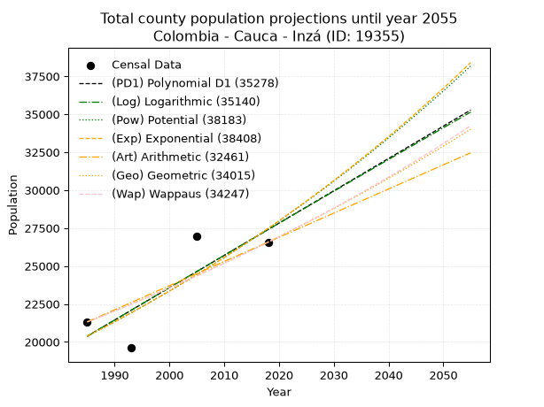
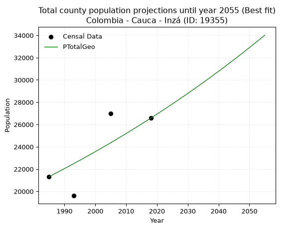
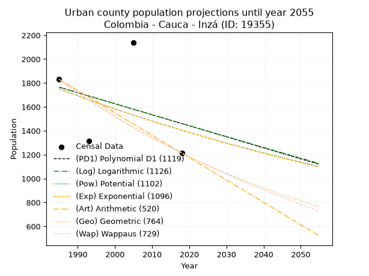
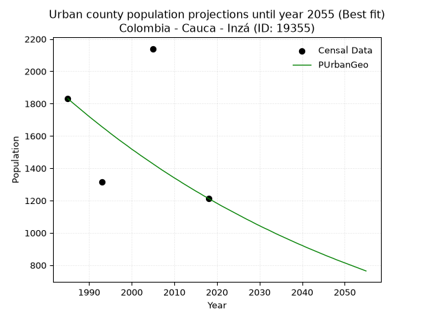
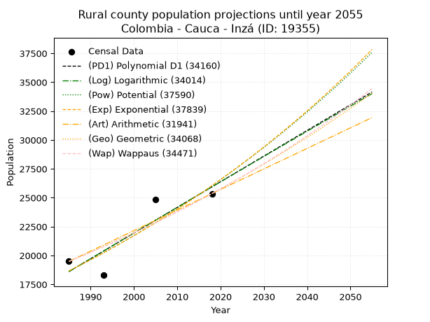
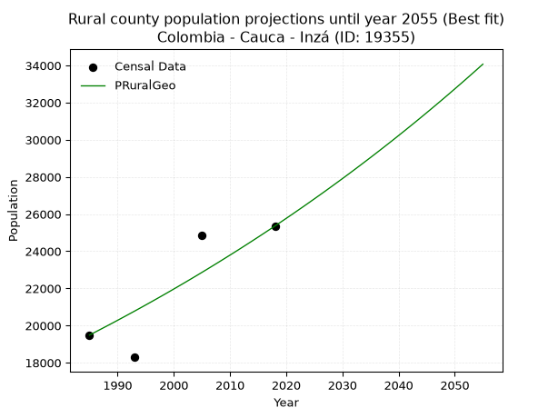

<div align="center">


</div>

# 📜 _“Population and Public Services Demand Projections (PPSD) until Year 2050 for Colombia - Cauca - Inzá (ID: 19355)”_
Keywords: `population` `public-service` `projection` `lineal` `polynomial` `logarithmic` `potential` `exponential` `arithmetic` `geometric` `wappaus` `dane` `colombia` `south-america`

PPSD are analytical estimates used by governments and planners to anticipate future changes in population size, age distribution, and the resulting community needs for utilities, healthcare, education, and infrastructure as sizing future water treatment facilities, electrical grids, and road networks based on spatial growth.

<div align="center">

</img>

</div>


> **General running parameters**: • app_version: _v20260806_. • Python version: _3.14.7_. • Pandas version: _3.0.5_. • NumPy version: _2.5.1_. • Creates, save and include plots into reports (create_plot): _False_. • Projection until year: _2050_. • Process polynomial degree 2 and up: _False_. • Process Wappaus: _True_. • Process Wappaus: _True_. • Set negative values to zero: _True_. • Set infinite values to zero: _True_. • Drop dataset notes: _True_. 
<div align="center">

Maps & GIS Layers: [:earth_americas:Google](http://maps.google.com/maps?q=2.549182984,-76.0635027) [:earth_americas:OSM](https://www.openstreetmap.org/#map=18/2.549182984/-76.0635027&layers=P) [:earth_americas:Bing](https://www.bing.com/maps?cp=2.549182984~-76.0635027&lvl=18) [:earth_americas:Apple](https://maps.apple.com/frame?center=2.549182984%2C-76.0635027&span=0.003%2C0.006) [:earth_americas:GISMobile](https://github.com/rcfdtools/R.GISMobile/blob/main/file/gis/CountyLayer_CO/Readme.md)

</div>


<div align="center">

```geojson
{
  "type": "Feature",
  "geometry": {
    "type": "Point", 
    "coordinates": [-76.0635027, 2.549182984]
  }, 
  "properties": {
    "Name": "Colombia - Cauca - Inzá (ID: 19355)"
  }
}
```

</div>


## 0. Census Data (4 records)

Census data are official statistics collected by a government about the people and housing in a country. They usually include counts of total population, age, sex, race, income, education, and jobs.

📅Global census file: [Population.xlsx](../data/Population.xlsx)

| Source   |   Year |   CountryID | CountryName   |   StateID | StateName   |   CountyID | CountyName   |   PTotal |   PUrban |   PRural |
|:---------|-------:|------------:|:--------------|----------:|:------------|-----------:|:-------------|---------:|---------:|---------:|
| DANE     |   1985 |          57 | Colombia      |        19 | Cauca       |      19355 | Inzá         |    21318 |     1831 |    19487 |
| DANE     |   1993 |          57 | Colombia      |        19 | Cauca       |      19355 | Inzá         |    19605 |     1314 |    18291 |
| DANE     |   2005 |          57 | Colombia      |        19 | Cauca       |      19355 | Inzá         |    26989 |     2140 |    24849 |
| DANE     |   2018 |          57 | Colombia      |        19 | Cauca       |      19355 | Inzá         |    26571 |     1213 |    25358 |

> 🔥Some records could had specific notes about the registered values or the corresponding urban or rural distribution.

📅[SUI-RUPS](https://www.datos.gov.co/Hacienda-y-Cr-dito-P-blico/Registro-nico-de-Prestadores-de-Servicios-P-blicos/4qkq-csdn/about_data) - Local public utility companies: [RUPS.csv](../data/RUPS.csv)

 | SERVICIO       | ESTADO    | NOMBRE                                                                                                | NIT         | DEPARTAMENTO_DOMICILIO   | MUNICIPIO_DOMICILIO   | DIRECCION        |   TELEFONO | EMAIL                 | TIPO_PRESTADOR          | CLASIFICACION                 |
|:---------------|:----------|:------------------------------------------------------------------------------------------------------|:------------|:-------------------------|:----------------------|:-----------------|-----------:|:----------------------|:------------------------|:------------------------------|
| ACUEDUCTO      | OPERATIVA | ADMINISTRACIÓN PÚBLICA COOPERATIVA DE ACUEDUCTO, ALCANTARILLADO Y ASEO DEl MUNICIPIO DE  INZA - CAUCA | 900042367-2 | CAUCA                    | INZA                  | CARRERA 5 3 - 21 |    8700629 | ESPINZA01@HOTMAIL.COM | ORGANIZACION AUTORIZADA | MENOR O IGUAL A 2500 USUARIOS |
| ALCANTARILLADO | OPERATIVA | ADMINISTRACIÓN PÚBLICA COOPERATIVA DE ACUEDUCTO, ALCANTARILLADO Y ASEO DEl MUNICIPIO DE  INZA - CAUCA | 900042367-2 | CAUCA                    | INZA                  | CARRERA 5 3 - 21 |    8700629 | ESPINZA01@HOTMAIL.COM | ORGANIZACION AUTORIZADA | MENOR O IGUAL A 2500 USUARIOS |

## 1. Total

### 1.1. Coefficients and Parameters

* (PD1) Polynomial Deg 1: 212.92211963067018, -402276.71979124803 (lineal)
* (Log) Logarithmic: 426282.69756945636, -3216557.45024059
* (Pow) Potential: 18.122739389638255, -55.45536010305218
* (Exp) Exponential: 0.00905258643814195, 0.0003200497211526094
* (Art) Arithmetic: Year diff. 2018 - 1985 = 33, Population diff. 26571 - 21318 = 5253, Annual growth = 159.1818181818182
* (Geo) Geometric: Year diff. 2018 - 1985 = 33, Population diff. 26571 - 21318 = 5253, Annual growth % = 0.006697132506737313
* (Wap) Wappaus: i = 0.664794913996192, Condition values only valid for < 200)

<sub>
Wappaus condition values: ['0.00', '0.66', '1.33', '1.99', '2.66', '3.32', '3.99', '4.65', '5.32', '5.98', '6.65', '7.31', '7.98', '8.64', '9.31', '9.97', '10.64', '11.30', '11.97', '12.63', '13.30', '13.96', '14.63', '15.29', '15.96', '16.62', '17.28', '17.95', '18.61', '19.28', '19.94', '20.61', '21.27', '21.94', '22.60', '23.27', '23.93', '24.60', '25.26', '25.93', '26.59', '27.26', '27.92', '28.59', '29.25', '29.92', '30.58', '31.25', '31.91', '32.57', '33.24', '33.90', '34.57', '35.23', '35.90', '36.56', '37.23', '37.89', '38.56', '39.22', '39.89', '40.55', '41.22', '41.88', '42.55', '43.21']
</sub>


### 1.2. Projected Dataset

|   Year |   CountyID |   PTotalPD1 |   PTotalLog |   PTotalPow |   PTotalExp |   PTotalArt |   PTotalGeo |   PTotalWap |
|-------:|-----------:|------------:|------------:|------------:|------------:|------------:|------------:|------------:|
|   1985 |      19355 |       20374 |       20367 |       20375 |       20381 |       21318 |       21318 |       21318 |
|   1986 |      19355 |       20587 |       20581 |       20562 |       20566 |       21477 |       21461 |       21460 |
|   1987 |      19355 |       20800 |       20796 |       20750 |       20753 |       21636 |       21604 |       21603 |
|   1988 |      19355 |       21012 |       21010 |       20940 |       20942 |       21796 |       21749 |       21747 |
|   1989 |      19355 |       21225 |       21225 |       21132 |       21132 |       21955 |       21895 |       21893 |
|   1990 |      19355 |       21438 |       21439 |       21325 |       21325 |       22114 |       22041 |       22039 |
|   1991 |      19355 |       21651 |       21653 |       21520 |       21518 |       22273 |       22189 |       22186 |
|   1992 |      19355 |       21864 |       21867 |       21717 |       21714 |       22432 |       22338 |       22334 |
|   1993 |      19355 |       22077 |       22081 |       21915 |       21912 |       22591 |       22487 |       22483 |
|   1994 |      19355 |       22290 |       22295 |       22116 |       22111 |       22751 |       22638 |       22633 |
|   1995 |      19355 |       22503 |       22509 |       22317 |       22312 |       22910 |       22789 |       22784 |
|   1996 |      19355 |       22716 |       22722 |       22521 |       22515 |       23069 |       22942 |       22936 |
|   1997 |      19355 |       22929 |       22936 |       22726 |       22720 |       23228 |       23096 |       23089 |
|   1998 |      19355 |       23142 |       23149 |       22934 |       22926 |       23387 |       23250 |       23244 |
|   1999 |      19355 |       23355 |       23363 |       23142 |       23135 |       23547 |       23406 |       23399 |
|   2000 |      19355 |       23568 |       23576 |       23353 |       23345 |       23706 |       23563 |       23555 |
|   2001 |      19355 |       23780 |       23789 |       23566 |       23557 |       23865 |       23721 |       23713 |
|   2002 |      19355 |       23993 |       24002 |       23780 |       23772 |       24024 |       23880 |       23872 |
|   2003 |      19355 |       24206 |       24215 |       23996 |       23988 |       24183 |       24039 |       24031 |
|   2004 |      19355 |       24419 |       24427 |       24214 |       24206 |       24342 |       24200 |       24192 |
|   2005 |      19355 |       24632 |       24640 |       24434 |       24426 |       24502 |       24363 |       24354 |
|   2006 |      19355 |       24845 |       24853 |       24656 |       24648 |       24661 |       24526 |       24517 |
|   2007 |      19355 |       25058 |       25065 |       24880 |       24872 |       24820 |       24690 |       24682 |
|   2008 |      19355 |       25271 |       25277 |       25105 |       25098 |       24979 |       24855 |       24847 |
|   2009 |      19355 |       25484 |       25490 |       25333 |       25327 |       25138 |       25022 |       25014 |
|   2010 |      19355 |       25697 |       25702 |       25562 |       25557 |       25298 |       25189 |       25182 |
|   2011 |      19355 |       25910 |       25914 |       25794 |       25789 |       25457 |       25358 |       25351 |
|   2012 |      19355 |       26123 |       26126 |       26027 |       26024 |       25616 |       25528 |       25522 |
|   2013 |      19355 |       26336 |       26338 |       26263 |       26261 |       25775 |       25699 |       25693 |
|   2014 |      19355 |       26548 |       26549 |       26500 |       26499 |       25934 |       25871 |       25866 |
|   2015 |      19355 |       26761 |       26761 |       26740 |       26740 |       26093 |       26044 |       26041 |
|   2016 |      19355 |       26974 |       26972 |       26981 |       26983 |       26253 |       26219 |       26216 |
|   2017 |      19355 |       27187 |       27184 |       27225 |       27229 |       26412 |       26394 |       26393 |
|   2018 |      19355 |       27400 |       27395 |       27470 |       27476 |       26571 |       26571 |       26571 |
|   2019 |      19355 |       27613 |       27606 |       27718 |       27726 |       26730 |       26749 |       26750 |
|   2020 |      19355 |       27826 |       27817 |       27968 |       27978 |       26889 |       26928 |       26931 |
|   2021 |      19355 |       28039 |       28028 |       28220 |       28233 |       27049 |       27108 |       27113 |
|   2022 |      19355 |       28252 |       28239 |       28474 |       28490 |       27208 |       27290 |       27297 |
|   2023 |      19355 |       28465 |       28450 |       28730 |       28749 |       27367 |       27473 |       27482 |
|   2024 |      19355 |       28678 |       28661 |       28989 |       29010 |       27526 |       27657 |       27668 |
|   2025 |      19355 |       28891 |       28871 |       29250 |       29274 |       27685 |       27842 |       27856 |
|   2026 |      19355 |       29103 |       29082 |       29512 |       29540 |       27844 |       28028 |       28045 |
|   2027 |      19355 |       29316 |       29292 |       29778 |       29809 |       28004 |       28216 |       28236 |
|   2028 |      19355 |       29529 |       29502 |       30045 |       30080 |       28163 |       28405 |       28428 |
|   2029 |      19355 |       29742 |       29712 |       30315 |       30353 |       28322 |       28595 |       28622 |
|   2030 |      19355 |       29955 |       29923 |       30586 |       30629 |       28481 |       28787 |       28817 |
|   2031 |      19355 |       30168 |       30132 |       30861 |       30908 |       28640 |       28980 |       29014 |
|   2032 |      19355 |       30381 |       30342 |       31137 |       31189 |       28800 |       29174 |       29212 |
|   2033 |      19355 |       30594 |       30552 |       31416 |       31473 |       28959 |       29369 |       29412 |
|   2034 |      19355 |       30807 |       30762 |       31697 |       31759 |       29118 |       29566 |       29613 |
|   2035 |      19355 |       31020 |       30971 |       31981 |       32048 |       29277 |       29764 |       29816 |
|   2036 |      19355 |       31233 |       31181 |       32267 |       32339 |       29436 |       29963 |       30021 |
|   2037 |      19355 |       31446 |       31390 |       32555 |       32633 |       29595 |       30164 |       30227 |
|   2038 |      19355 |       31659 |       31599 |       32846 |       32930 |       29755 |       30366 |       30435 |
|   2039 |      19355 |       31871 |       31808 |       33139 |       33229 |       29914 |       30569 |       30645 |
|   2040 |      19355 |       32084 |       32017 |       33435 |       33532 |       30073 |       30774 |       30856 |
|   2041 |      19355 |       32297 |       32226 |       33734 |       33836 |       30232 |       30980 |       31070 |
|   2042 |      19355 |       32510 |       32435 |       34034 |       34144 |       30391 |       31187 |       31284 |
|   2043 |      19355 |       32723 |       32644 |       34338 |       34455 |       30551 |       31396 |       31501 |
|   2044 |      19355 |       32936 |       32852 |       34644 |       34768 |       30710 |       31607 |       31719 |
|   2045 |      19355 |       33149 |       33061 |       34952 |       35084 |       30869 |       31818 |       31940 |
|   2046 |      19355 |       33362 |       33269 |       35263 |       35403 |       31028 |       32031 |       32162 |
|   2047 |      19355 |       33575 |       33478 |       35577 |       35725 |       31187 |       32246 |       32386 |
|   2048 |      19355 |       33788 |       33686 |       35893 |       36050 |       31346 |       32462 |       32611 |
|   2049 |      19355 |       34001 |       33894 |       36212 |       36378 |       31506 |       32679 |       32839 |
|   2050 |      19355 |       34214 |       34102 |       36534 |       36709 |       31665 |       32898 |       33069 |
<div align="center">

</img>

</div>


### 1.3. Best fit with absolute and relative error (%)

Relative error puts that difference into context by dividing the absolute error by the true value, creating a unitless ratio or percentage that shows the scale of the mistake.

Absolute and relative error

|   Year | Source   |   CountryID | CountryName   |   StateID | StateName   |   CountyID_x | CountyName   |   PTotal |   PUrban |   PRural |   CountyID_y |   PTotalPD1 |   PTotalLog |   PTotalPow |   PTotalExp |   PTotalArt |   PTotalGeo |   PTotalWap |   PTotalPD1AbsError |   PTotalLogAbsError |   PTotalPowAbsError |   PTotalExpAbsError |   PTotalArtAbsError |   PTotalGeoAbsError |   PTotalWapAbsError |   PTotalPD1RelError |   PTotalLogRelError |   PTotalPowRelError |   PTotalExpRelError |   PTotalArtRelError |   PTotalGeoRelError |   PTotalWapRelError |
|-------:|:---------|------------:|:--------------|----------:|:------------|-------------:|:-------------|---------:|---------:|---------:|-------------:|------------:|------------:|------------:|------------:|------------:|------------:|------------:|--------------------:|--------------------:|--------------------:|--------------------:|--------------------:|--------------------:|--------------------:|--------------------:|--------------------:|--------------------:|--------------------:|--------------------:|--------------------:|--------------------:|
|   1985 | DANE     |          57 | Colombia      |        19 | Cauca       |        19355 | Inzá         |    21318 |     1831 |    19487 |        19355 |       20374 |       20367 |       20375 |       20381 |       21318 |       21318 |       21318 |                 944 |                 951 |                 943 |                 937 |                   0 |                   0 |                   0 |             4.42818 |             4.46102 |             4.42349 |             4.39535 |             0       |             0       |             0       |
|   1993 | DANE     |          57 | Colombia      |        19 | Cauca       |        19355 | Inzá         |    19605 |     1314 |    18291 |        19355 |       22077 |       22081 |       21915 |       21912 |       22591 |       22487 |       22483 |                2472 |                2476 |                2310 |                2307 |                2986 |                2882 |                2878 |            12.609   |            12.6294  |            11.7827  |            11.7674  |            15.2308  |            14.7003  |            14.6799  |
|   2005 | DANE     |          57 | Colombia      |        19 | Cauca       |        19355 | Inzá         |    26989 |     2140 |    24849 |        19355 |       24632 |       24640 |       24434 |       24426 |       24502 |       24363 |       24354 |                2357 |                2349 |                2555 |                2563 |                2487 |                2626 |                2635 |             8.73319 |             8.70355 |             9.46682 |             9.49646 |             9.21487 |             9.72989 |             9.76324 |
|   2018 | DANE     |          57 | Colombia      |        19 | Cauca       |        19355 | Inzá         |    26571 |     1213 |    25358 |        19355 |       27400 |       27395 |       27470 |       27476 |       26571 |       26571 |       26571 |                 829 |                 824 |                 899 |                 905 |                   0 |                   0 |                   0 |             3.11994 |             3.10113 |             3.38339 |             3.40597 |             0       |             0       |             0       |

Relative error mean

| Method    |   RelError | Best   |
|:----------|-----------:|:-------|
| PTotalPD1 |    7.22259 |        |
| PTotalLog |    7.22378 |        |
| PTotalPow |    7.2641  |        |
| PTotalExp |    7.2663  |        |
| PTotalArt |    6.11142 |        |
| PTotalGeo |    6.10756 | True   |
| PTotalWap |    6.11079 |        |

💙Best method: _**PTotalGeo**_
<div align="center">

</img>

</div>


### 1.4. Fresh water supply demand in liters per capita per day (lpcd)

The fresh water supply demand typically ranges from 100 to 300 liters per capita per day (lpcd) for standard domestic and municipal planning, though absolute survival minimums set by the World Health Organization are as low as 7.5 to 20 liters per day, and total consumption in high-income nations can exceed 400 liters.

> `CZ`: Level in meters above the sea level (masl)<br> `WS`: Fresh water supply demand in liters per capita per day (lpcd or l/h/d)<br> `WSAll`: Zonal fresh water supply demand in liters per second (l/s)<br> `A`: Zonal area in square meters<br> `DP`: Population density (people/hectare or p/ha)

Reference values (RAS Colombia)

|    CZ |   WS |
|------:|-----:|
|  1000 |  120 |
|  2000 |  130 |
| 99999 |  140 |

County shapefile geometry properties and water supply values

|   CountyID |      ATotal |   CZTotal |   WSTotal |
|-----------:|------------:|----------:|----------:|
|      19355 | 8.66412e+08 |   2715.05 |       140 |

Projected values for best method: PTotalGeo

|   CountyID |   Year |   PTotalGeo |   DPTotal |   WSTotal |   WSTotalAll |
|-----------:|-------:|------------:|----------:|----------:|-------------:|
|      19355 |   1985 |       21318 |      0.25 |       140 |      34.5431 |
|      19355 |   1986 |       21461 |      0.25 |       140 |      34.7748 |
|      19355 |   1987 |       21604 |      0.25 |       140 |      35.0065 |
|      19355 |   1988 |       21749 |      0.25 |       140 |      35.2414 |
|      19355 |   1989 |       21895 |      0.25 |       140 |      35.478  |
|      19355 |   1990 |       22041 |      0.25 |       140 |      35.7146 |
|      19355 |   1991 |       22189 |      0.26 |       140 |      35.9544 |
|      19355 |   1992 |       22338 |      0.26 |       140 |      36.1958 |
|      19355 |   1993 |       22487 |      0.26 |       140 |      36.4373 |
|      19355 |   1994 |       22638 |      0.26 |       140 |      36.6819 |
|      19355 |   1995 |       22789 |      0.26 |       140 |      36.9266 |
|      19355 |   1996 |       22942 |      0.26 |       140 |      37.1745 |
|      19355 |   1997 |       23096 |      0.27 |       140 |      37.4241 |
|      19355 |   1998 |       23250 |      0.27 |       140 |      37.6736 |
|      19355 |   1999 |       23406 |      0.27 |       140 |      37.9264 |
|      19355 |   2000 |       23563 |      0.27 |       140 |      38.1808 |
|      19355 |   2001 |       23721 |      0.27 |       140 |      38.4368 |
|      19355 |   2002 |       23880 |      0.28 |       140 |      38.6944 |
|      19355 |   2003 |       24039 |      0.28 |       140 |      38.9521 |
|      19355 |   2004 |       24200 |      0.28 |       140 |      39.213  |
|      19355 |   2005 |       24363 |      0.28 |       140 |      39.4771 |
|      19355 |   2006 |       24526 |      0.28 |       140 |      39.7412 |
|      19355 |   2007 |       24690 |      0.28 |       140 |      40.0069 |
|      19355 |   2008 |       24855 |      0.29 |       140 |      40.2743 |
|      19355 |   2009 |       25022 |      0.29 |       140 |      40.5449 |
|      19355 |   2010 |       25189 |      0.29 |       140 |      40.8155 |
|      19355 |   2011 |       25358 |      0.29 |       140 |      41.0894 |
|      19355 |   2012 |       25528 |      0.29 |       140 |      41.3648 |
|      19355 |   2013 |       25699 |      0.3  |       140 |      41.6419 |
|      19355 |   2014 |       25871 |      0.3  |       140 |      41.9206 |
|      19355 |   2015 |       26044 |      0.3  |       140 |      42.2009 |
|      19355 |   2016 |       26219 |      0.3  |       140 |      42.4845 |
|      19355 |   2017 |       26394 |      0.3  |       140 |      42.7681 |
|      19355 |   2018 |       26571 |      0.31 |       140 |      43.0549 |
|      19355 |   2019 |       26749 |      0.31 |       140 |      43.3433 |
|      19355 |   2020 |       26928 |      0.31 |       140 |      43.6333 |
|      19355 |   2021 |       27108 |      0.31 |       140 |      43.925  |
|      19355 |   2022 |       27290 |      0.31 |       140 |      44.2199 |
|      19355 |   2023 |       27473 |      0.32 |       140 |      44.5164 |
|      19355 |   2024 |       27657 |      0.32 |       140 |      44.8146 |
|      19355 |   2025 |       27842 |      0.32 |       140 |      45.1144 |
|      19355 |   2026 |       28028 |      0.32 |       140 |      45.4157 |
|      19355 |   2027 |       28216 |      0.33 |       140 |      45.7204 |
|      19355 |   2028 |       28405 |      0.33 |       140 |      46.0266 |
|      19355 |   2029 |       28595 |      0.33 |       140 |      46.3345 |
|      19355 |   2030 |       28787 |      0.33 |       140 |      46.6456 |
|      19355 |   2031 |       28980 |      0.33 |       140 |      46.9583 |
|      19355 |   2032 |       29174 |      0.34 |       140 |      47.2727 |
|      19355 |   2033 |       29369 |      0.34 |       140 |      47.5887 |
|      19355 |   2034 |       29566 |      0.34 |       140 |      47.9079 |
|      19355 |   2035 |       29764 |      0.34 |       140 |      48.2287 |
|      19355 |   2036 |       29963 |      0.35 |       140 |      48.5512 |
|      19355 |   2037 |       30164 |      0.35 |       140 |      48.8769 |
|      19355 |   2038 |       30366 |      0.35 |       140 |      49.2042 |
|      19355 |   2039 |       30569 |      0.35 |       140 |      49.5331 |
|      19355 |   2040 |       30774 |      0.36 |       140 |      49.8653 |
|      19355 |   2041 |       30980 |      0.36 |       140 |      50.1991 |
|      19355 |   2042 |       31187 |      0.36 |       140 |      50.5345 |
|      19355 |   2043 |       31396 |      0.36 |       140 |      50.8731 |
|      19355 |   2044 |       31607 |      0.36 |       140 |      51.215  |
|      19355 |   2045 |       31818 |      0.37 |       140 |      51.5569 |
|      19355 |   2046 |       32031 |      0.37 |       140 |      51.9021 |
|      19355 |   2047 |       32246 |      0.37 |       140 |      52.2505 |
|      19355 |   2048 |       32462 |      0.37 |       140 |      52.6005 |
|      19355 |   2049 |       32679 |      0.38 |       140 |      52.9521 |
|      19355 |   2050 |       32898 |      0.38 |       140 |      53.3069 |

## 2. Urban

### 2.1. Coefficients and Parameters

* (PD1) Polynomial Deg 1: -9.238859895623717, 20104.52950622134 (lineal)
* (Log) Logarithmic: -18436.83617271332, 141763.03949232673
* (Pow) Potential: -13.347269008237555, 47.25923678615858
* (Exp) Exponential: -0.006684314897674368, 1012832111.2203386
* (Art) Arithmetic: Year diff. 2018 - 1985 = 33, Population diff. 1213 - 1831 = -618, Annual growth = -18.727272727272727
* (Geo) Geometric: Year diff. 2018 - 1985 = 33, Population diff. 1213 - 1831 = -618, Annual growth % = -0.012400222235824487
* (Wap) Wappaus: i = -1.2304384183490622, Condition values only valid for < 200)

<sub>
Wappaus condition values: ['-0.00', '-1.23', '-2.46', '-3.69', '-4.92', '-6.15', '-7.38', '-8.61', '-9.84', '-11.07', '-12.30', '-13.53', '-14.77', '-16.00', '-17.23', '-18.46', '-19.69', '-20.92', '-22.15', '-23.38', '-24.61', '-25.84', '-27.07', '-28.30', '-29.53', '-30.76', '-31.99', '-33.22', '-34.45', '-35.68', '-36.91', '-38.14', '-39.37', '-40.60', '-41.83', '-43.07', '-44.30', '-45.53', '-46.76', '-47.99', '-49.22', '-50.45', '-51.68', '-52.91', '-54.14', '-55.37', '-56.60', '-57.83', '-59.06', '-60.29', '-61.52', '-62.75', '-63.98', '-65.21', '-66.44', '-67.67', '-68.90', '-70.13', '-71.37', '-72.60', '-73.83', '-75.06', '-76.29', '-77.52', '-78.75', '-79.98']
</sub>


### 2.2. Projected Dataset

|   Year |   CountyID |   PUrbanPD1 |   PUrbanLog |   PUrbanPow |   PUrbanExp |   PUrbanArt |   PUrbanGeo |   PUrbanWap |
|-------:|-----------:|------------:|------------:|------------:|------------:|------------:|------------:|------------:|
|   1985 |      19355 |        1765 |        1765 |        1750 |        1750 |        1831 |        1831 |        1831 |
|   1986 |      19355 |        1756 |        1756 |        1739 |        1739 |        1812 |        1808 |        1809 |
|   1987 |      19355 |        1747 |        1747 |        1727 |        1727 |        1794 |        1786 |        1786 |
|   1988 |      19355 |        1738 |        1737 |        1715 |        1716 |        1775 |        1764 |        1765 |
|   1989 |      19355 |        1728 |        1728 |        1704 |        1704 |        1756 |        1742 |        1743 |
|   1990 |      19355 |        1719 |        1719 |        1693 |        1693 |        1737 |        1720 |        1722 |
|   1991 |      19355 |        1710 |        1710 |        1681 |        1682 |        1719 |        1699 |        1701 |
|   1992 |      19355 |        1701 |        1700 |        1670 |        1670 |        1700 |        1678 |        1680 |
|   1993 |      19355 |        1691 |        1691 |        1659 |        1659 |        1681 |        1657 |        1659 |
|   1994 |      19355 |        1682 |        1682 |        1648 |        1648 |        1662 |        1637 |        1639 |
|   1995 |      19355 |        1673 |        1673 |        1637 |        1637 |        1644 |        1616 |        1619 |
|   1996 |      19355 |        1664 |        1663 |        1626 |        1626 |        1625 |        1596 |        1599 |
|   1997 |      19355 |        1655 |        1654 |        1615 |        1616 |        1606 |        1576 |        1579 |
|   1998 |      19355 |        1645 |        1645 |        1604 |        1605 |        1588 |        1557 |        1560 |
|   1999 |      19355 |        1636 |        1636 |        1594 |        1594 |        1569 |        1538 |        1541 |
|   2000 |      19355 |        1627 |        1626 |        1583 |        1583 |        1550 |        1518 |        1522 |
|   2001 |      19355 |        1618 |        1617 |        1573 |        1573 |        1531 |        1500 |        1503 |
|   2002 |      19355 |        1608 |        1608 |        1562 |        1562 |        1513 |        1481 |        1484 |
|   2003 |      19355 |        1599 |        1599 |        1552 |        1552 |        1494 |        1463 |        1466 |
|   2004 |      19355 |        1590 |        1590 |        1541 |        1542 |        1475 |        1445 |        1448 |
|   2005 |      19355 |        1581 |        1580 |        1531 |        1531 |        1456 |        1427 |        1430 |
|   2006 |      19355 |        1571 |        1571 |        1521 |        1521 |        1438 |        1409 |        1412 |
|   2007 |      19355 |        1562 |        1562 |        1511 |        1511 |        1419 |        1391 |        1394 |
|   2008 |      19355 |        1553 |        1553 |        1501 |        1501 |        1400 |        1374 |        1377 |
|   2009 |      19355 |        1544 |        1544 |        1491 |        1491 |        1382 |        1357 |        1360 |
|   2010 |      19355 |        1534 |        1534 |        1481 |        1481 |        1363 |        1340 |        1343 |
|   2011 |      19355 |        1525 |        1525 |        1471 |        1471 |        1344 |        1324 |        1326 |
|   2012 |      19355 |        1516 |        1516 |        1462 |        1461 |        1325 |        1307 |        1309 |
|   2013 |      19355 |        1507 |        1507 |        1452 |        1452 |        1307 |        1291 |        1293 |
|   2014 |      19355 |        1497 |        1498 |        1442 |        1442 |        1288 |        1275 |        1277 |
|   2015 |      19355 |        1488 |        1489 |        1433 |        1432 |        1269 |        1259 |        1260 |
|   2016 |      19355 |        1479 |        1480 |        1423 |        1423 |        1250 |        1244 |        1244 |
|   2017 |      19355 |        1470 |        1470 |        1414 |        1413 |        1232 |        1228 |        1229 |
|   2018 |      19355 |        1461 |        1461 |        1405 |        1404 |        1213 |        1213 |        1213 |
|   2019 |      19355 |        1451 |        1452 |        1395 |        1395 |        1194 |        1198 |        1198 |
|   2020 |      19355 |        1442 |        1443 |        1386 |        1385 |        1176 |        1183 |        1182 |
|   2021 |      19355 |        1433 |        1434 |        1377 |        1376 |        1157 |        1168 |        1167 |
|   2022 |      19355 |        1424 |        1425 |        1368 |        1367 |        1138 |        1154 |        1152 |
|   2023 |      19355 |        1414 |        1416 |        1359 |        1358 |        1119 |        1140 |        1137 |
|   2024 |      19355 |        1405 |        1407 |        1350 |        1349 |        1101 |        1126 |        1122 |
|   2025 |      19355 |        1396 |        1397 |        1341 |        1340 |        1082 |        1112 |        1108 |
|   2026 |      19355 |        1387 |        1388 |        1332 |        1331 |        1063 |        1098 |        1093 |
|   2027 |      19355 |        1377 |        1379 |        1324 |        1322 |        1044 |        1084 |        1079 |
|   2028 |      19355 |        1368 |        1370 |        1315 |        1313 |        1026 |        1071 |        1065 |
|   2029 |      19355 |        1359 |        1361 |        1306 |        1304 |        1007 |        1057 |        1051 |
|   2030 |      19355 |        1350 |        1352 |        1298 |        1296 |         988 |        1044 |        1037 |
|   2031 |      19355 |        1340 |        1343 |        1289 |        1287 |         970 |        1031 |        1023 |
|   2032 |      19355 |        1331 |        1334 |        1281 |        1279 |         951 |        1019 |        1010 |
|   2033 |      19355 |        1322 |        1325 |        1272 |        1270 |         932 |        1006 |         996 |
|   2034 |      19355 |        1313 |        1316 |        1264 |        1262 |         913 |         993 |         983 |
|   2035 |      19355 |        1303 |        1307 |        1256 |        1253 |         895 |         981 |         970 |
|   2036 |      19355 |        1294 |        1298 |        1248 |        1245 |         876 |         969 |         956 |
|   2037 |      19355 |        1285 |        1288 |        1239 |        1237 |         857 |         957 |         943 |
|   2038 |      19355 |        1276 |        1279 |        1231 |        1228 |         838 |         945 |         931 |
|   2039 |      19355 |        1266 |        1270 |        1223 |        1220 |         820 |         933 |         918 |
|   2040 |      19355 |        1257 |        1261 |        1215 |        1212 |         801 |         922 |         905 |
|   2041 |      19355 |        1248 |        1252 |        1207 |        1204 |         782 |         910 |         893 |
|   2042 |      19355 |        1239 |        1243 |        1200 |        1196 |         764 |         899 |         880 |
|   2043 |      19355 |        1230 |        1234 |        1192 |        1188 |         745 |         888 |         868 |
|   2044 |      19355 |        1220 |        1225 |        1184 |        1180 |         726 |         877 |         856 |
|   2045 |      19355 |        1211 |        1216 |        1176 |        1172 |         707 |         866 |         844 |
|   2046 |      19355 |        1202 |        1207 |        1169 |        1164 |         689 |         855 |         832 |
|   2047 |      19355 |        1193 |        1198 |        1161 |        1157 |         670 |         845 |         820 |
|   2048 |      19355 |        1183 |        1189 |        1154 |        1149 |         651 |         834 |         808 |
|   2049 |      19355 |        1174 |        1180 |        1146 |        1141 |         632 |         824 |         796 |
|   2050 |      19355 |        1165 |        1171 |        1139 |        1134 |         614 |         814 |         785 |
<div align="center">

</img>

</div>


### 2.3. Best fit with absolute and relative error (%)

Relative error puts that difference into context by dividing the absolute error by the true value, creating a unitless ratio or percentage that shows the scale of the mistake.

Absolute and relative error

|   Year | Source   |   CountryID | CountryName   |   StateID | StateName   |   CountyID_x | CountyName   |   PTotal |   PUrban |   PRural |   CountyID_y |   PUrbanPD1 |   PUrbanLog |   PUrbanPow |   PUrbanExp |   PUrbanArt |   PUrbanGeo |   PUrbanWap |   PUrbanPD1AbsError |   PUrbanLogAbsError |   PUrbanPowAbsError |   PUrbanExpAbsError |   PUrbanArtAbsError |   PUrbanGeoAbsError |   PUrbanWapAbsError |   PUrbanPD1RelError |   PUrbanLogRelError |   PUrbanPowRelError |   PUrbanExpRelError |   PUrbanArtRelError |   PUrbanGeoRelError |   PUrbanWapRelError |
|-------:|:---------|------------:|:--------------|----------:|:------------|-------------:|:-------------|---------:|---------:|---------:|-------------:|------------:|------------:|------------:|------------:|------------:|------------:|------------:|--------------------:|--------------------:|--------------------:|--------------------:|--------------------:|--------------------:|--------------------:|--------------------:|--------------------:|--------------------:|--------------------:|--------------------:|--------------------:|--------------------:|
|   1985 | DANE     |          57 | Colombia      |        19 | Cauca       |        19355 | Inzá         |    21318 |     1831 |    19487 |        19355 |        1765 |        1765 |        1750 |        1750 |        1831 |        1831 |        1831 |                  66 |                  66 |                  81 |                  81 |                   0 |                   0 |                   0 |             3.60459 |             3.60459 |             4.42381 |             4.42381 |              0      |              0      |              0      |
|   1993 | DANE     |          57 | Colombia      |        19 | Cauca       |        19355 | Inzá         |    19605 |     1314 |    18291 |        19355 |        1691 |        1691 |        1659 |        1659 |        1681 |        1657 |        1659 |                 377 |                 377 |                 345 |                 345 |                 367 |                 343 |                 345 |            28.691   |            28.691   |            26.2557  |            26.2557  |             27.93   |             26.1035 |             26.2557 |
|   2005 | DANE     |          57 | Colombia      |        19 | Cauca       |        19355 | Inzá         |    26989 |     2140 |    24849 |        19355 |        1581 |        1580 |        1531 |        1531 |        1456 |        1427 |        1430 |                 559 |                 560 |                 609 |                 609 |                 684 |                 713 |                 710 |            26.1215  |            26.1682  |            28.4579  |            28.4579  |             31.9626 |             33.3178 |             33.1776 |
|   2018 | DANE     |          57 | Colombia      |        19 | Cauca       |        19355 | Inzá         |    26571 |     1213 |    25358 |        19355 |        1461 |        1461 |        1405 |        1404 |        1213 |        1213 |        1213 |                 248 |                 248 |                 192 |                 191 |                   0 |                   0 |                   0 |            20.4452  |            20.4452  |            15.8285  |            15.7461  |              0      |              0      |              0      |

Relative error mean

| Method    |   RelError | Best   |
|:----------|-----------:|:-------|
| PUrbanPD1 |    19.7156 |        |
| PUrbanLog |    19.7273 |        |
| PUrbanPow |    18.7415 |        |
| PUrbanExp |    18.7209 |        |
| PUrbanArt |    14.9732 |        |
| PUrbanGeo |    14.8553 | True   |
| PUrbanWap |    14.8583 |        |

💙Best method: _**PUrbanGeo**_
<div align="center">

</img>

</div>


### 2.4. Fresh water supply demand in liters per capita per day (lpcd)

The fresh water supply demand typically ranges from 100 to 300 liters per capita per day (lpcd) for standard domestic and municipal planning, though absolute survival minimums set by the World Health Organization are as low as 7.5 to 20 liters per day, and total consumption in high-income nations can exceed 400 liters.

> `CZ`: Level in meters above the sea level (masl)<br> `WS`: Fresh water supply demand in liters per capita per day (lpcd or l/h/d)<br> `WSAll`: Zonal fresh water supply demand in liters per second (l/s)<br> `A`: Zonal area in square meters<br> `DP`: Population density (people/hectare or p/ha)

Reference values (RAS Colombia)

|    CZ |   WS |
|------:|-----:|
|  1000 |  120 |
|  2000 |  130 |
| 99999 |  140 |

County shapefile geometry properties and water supply values

|   CountyID |   AUrban |   CZUrban |   WSUrban |
|-----------:|---------:|----------:|----------:|
|      19355 |   309556 |   1816.91 |       130 |

Projected values for best method: PUrbanGeo

|   CountyID |   Year |   PUrbanGeo |   DPUrban |   WSUrban |   WSUrbanAll |
|-----------:|-------:|------------:|----------:|----------:|-------------:|
|      19355 |   1985 |        1831 |     59.15 |       130 |      2.75498 |
|      19355 |   1986 |        1808 |     58.41 |       130 |      2.72037 |
|      19355 |   1987 |        1786 |     57.7  |       130 |      2.68727 |
|      19355 |   1988 |        1764 |     56.98 |       130 |      2.65417 |
|      19355 |   1989 |        1742 |     56.27 |       130 |      2.62106 |
|      19355 |   1990 |        1720 |     55.56 |       130 |      2.58796 |
|      19355 |   1991 |        1699 |     54.89 |       130 |      2.55637 |
|      19355 |   1992 |        1678 |     54.21 |       130 |      2.52477 |
|      19355 |   1993 |        1657 |     53.53 |       130 |      2.49317 |
|      19355 |   1994 |        1637 |     52.88 |       130 |      2.46308 |
|      19355 |   1995 |        1616 |     52.2  |       130 |      2.43148 |
|      19355 |   1996 |        1596 |     51.56 |       130 |      2.40139 |
|      19355 |   1997 |        1576 |     50.91 |       130 |      2.3713  |
|      19355 |   1998 |        1557 |     50.3  |       130 |      2.34271 |
|      19355 |   1999 |        1538 |     49.68 |       130 |      2.31412 |
|      19355 |   2000 |        1518 |     49.04 |       130 |      2.28403 |
|      19355 |   2001 |        1500 |     48.46 |       130 |      2.25694 |
|      19355 |   2002 |        1481 |     47.84 |       130 |      2.22836 |
|      19355 |   2003 |        1463 |     47.26 |       130 |      2.20127 |
|      19355 |   2004 |        1445 |     46.68 |       130 |      2.17419 |
|      19355 |   2005 |        1427 |     46.1  |       130 |      2.14711 |
|      19355 |   2006 |        1409 |     45.52 |       130 |      2.12002 |
|      19355 |   2007 |        1391 |     44.94 |       130 |      2.09294 |
|      19355 |   2008 |        1374 |     44.39 |       130 |      2.06736 |
|      19355 |   2009 |        1357 |     43.84 |       130 |      2.04178 |
|      19355 |   2010 |        1340 |     43.29 |       130 |      2.0162  |
|      19355 |   2011 |        1324 |     42.77 |       130 |      1.99213 |
|      19355 |   2012 |        1307 |     42.22 |       130 |      1.96655 |
|      19355 |   2013 |        1291 |     41.7  |       130 |      1.94248 |
|      19355 |   2014 |        1275 |     41.19 |       130 |      1.9184  |
|      19355 |   2015 |        1259 |     40.67 |       130 |      1.89433 |
|      19355 |   2016 |        1244 |     40.19 |       130 |      1.87176 |
|      19355 |   2017 |        1228 |     39.67 |       130 |      1.84769 |
|      19355 |   2018 |        1213 |     39.19 |       130 |      1.82512 |
|      19355 |   2019 |        1198 |     38.7  |       130 |      1.80255 |
|      19355 |   2020 |        1183 |     38.22 |       130 |      1.77998 |
|      19355 |   2021 |        1168 |     37.73 |       130 |      1.75741 |
|      19355 |   2022 |        1154 |     37.28 |       130 |      1.73634 |
|      19355 |   2023 |        1140 |     36.83 |       130 |      1.71528 |
|      19355 |   2024 |        1126 |     36.37 |       130 |      1.69421 |
|      19355 |   2025 |        1112 |     35.92 |       130 |      1.67315 |
|      19355 |   2026 |        1098 |     35.47 |       130 |      1.65208 |
|      19355 |   2027 |        1084 |     35.02 |       130 |      1.63102 |
|      19355 |   2028 |        1071 |     34.6  |       130 |      1.61146 |
|      19355 |   2029 |        1057 |     34.15 |       130 |      1.59039 |
|      19355 |   2030 |        1044 |     33.73 |       130 |      1.57083 |
|      19355 |   2031 |        1031 |     33.31 |       130 |      1.55127 |
|      19355 |   2032 |        1019 |     32.92 |       130 |      1.53322 |
|      19355 |   2033 |        1006 |     32.5  |       130 |      1.51366 |
|      19355 |   2034 |         993 |     32.08 |       130 |      1.4941  |
|      19355 |   2035 |         981 |     31.69 |       130 |      1.47604 |
|      19355 |   2036 |         969 |     31.3  |       130 |      1.45799 |
|      19355 |   2037 |         957 |     30.92 |       130 |      1.43993 |
|      19355 |   2038 |         945 |     30.53 |       130 |      1.42188 |
|      19355 |   2039 |         933 |     30.14 |       130 |      1.40382 |
|      19355 |   2040 |         922 |     29.78 |       130 |      1.38727 |
|      19355 |   2041 |         910 |     29.4  |       130 |      1.36921 |
|      19355 |   2042 |         899 |     29.04 |       130 |      1.35266 |
|      19355 |   2043 |         888 |     28.69 |       130 |      1.33611 |
|      19355 |   2044 |         877 |     28.33 |       130 |      1.31956 |
|      19355 |   2045 |         866 |     27.98 |       130 |      1.30301 |
|      19355 |   2046 |         855 |     27.62 |       130 |      1.28646 |
|      19355 |   2047 |         845 |     27.3  |       130 |      1.27141 |
|      19355 |   2048 |         834 |     26.94 |       130 |      1.25486 |
|      19355 |   2049 |         824 |     26.62 |       130 |      1.23981 |
|      19355 |   2050 |         814 |     26.3  |       130 |      1.22477 |

## 3. Rural

### 3.1. Coefficients and Parameters

* (PD1) Polynomial Deg 1: 222.16097952629386, -422381.24929746933 (lineal)
* (Log) Logarithmic: 444719.5337421696, -3358320.4897329165
* (Pow) Potential: 20.212610836919122, -62.385509652636316
* (Exp) Exponential: 0.010097454115290066, 3.683138606869363e-05
* (Art) Arithmetic: Year diff. 2018 - 1985 = 33, Population diff. 25358 - 19487 = 5871, Annual growth = 177.9090909090909
* (Geo) Geometric: Year diff. 2018 - 1985 = 33, Population diff. 25358 - 19487 = 5871, Annual growth % = 0.008012129278967217
* (Wap) Wappaus: i = 0.7934400308132051, Condition values only valid for < 200)

<sub>
Wappaus condition values: ['0.00', '0.79', '1.59', '2.38', '3.17', '3.97', '4.76', '5.55', '6.35', '7.14', '7.93', '8.73', '9.52', '10.31', '11.11', '11.90', '12.70', '13.49', '14.28', '15.08', '15.87', '16.66', '17.46', '18.25', '19.04', '19.84', '20.63', '21.42', '22.22', '23.01', '23.80', '24.60', '25.39', '26.18', '26.98', '27.77', '28.56', '29.36', '30.15', '30.94', '31.74', '32.53', '33.32', '34.12', '34.91', '35.70', '36.50', '37.29', '38.09', '38.88', '39.67', '40.47', '41.26', '42.05', '42.85', '43.64', '44.43', '45.23', '46.02', '46.81', '47.61', '48.40', '49.19', '49.99', '50.78', '51.57']
</sub>


### 3.2. Projected Dataset

|   Year |   CountyID |   PRuralPD1 |   PRuralLog |   PRuralPow |   PRuralExp |   PRuralArt |   PRuralGeo |   PRuralWap |
|-------:|-----------:|------------:|------------:|------------:|------------:|------------:|------------:|------------:|
|   1985 |      19355 |       18608 |       18601 |       18657 |       18663 |       19487 |       19487 |       19487 |
|   1986 |      19355 |       18830 |       18825 |       18848 |       18852 |       19665 |       19643 |       19642 |
|   1987 |      19355 |       19053 |       19049 |       19041 |       19044 |       19843 |       19801 |       19799 |
|   1988 |      19355 |       19275 |       19273 |       19235 |       19237 |       20021 |       19959 |       19956 |
|   1989 |      19355 |       19497 |       19497 |       19432 |       19432 |       20199 |       20119 |       20115 |
|   1990 |      19355 |       19719 |       19720 |       19630 |       19629 |       20377 |       20280 |       20276 |
|   1991 |      19355 |       19941 |       19944 |       19831 |       19828 |       20554 |       20443 |       20437 |
|   1992 |      19355 |       20163 |       20167 |       20033 |       20030 |       20732 |       20607 |       20600 |
|   1993 |      19355 |       20386 |       20390 |       20237 |       20233 |       20910 |       20772 |       20764 |
|   1994 |      19355 |       20608 |       20613 |       20443 |       20438 |       21088 |       20938 |       20930 |
|   1995 |      19355 |       20830 |       20836 |       20652 |       20646 |       21266 |       21106 |       21097 |
|   1996 |      19355 |       21052 |       21059 |       20862 |       20855 |       21444 |       21275 |       21265 |
|   1997 |      19355 |       21274 |       21282 |       21074 |       21067 |       21622 |       21445 |       21435 |
|   1998 |      19355 |       21496 |       21504 |       21288 |       21281 |       21800 |       21617 |       21606 |
|   1999 |      19355 |       21719 |       21727 |       21505 |       21497 |       21978 |       21790 |       21779 |
|   2000 |      19355 |       21941 |       21949 |       21723 |       21715 |       22156 |       21965 |       21953 |
|   2001 |      19355 |       22163 |       22172 |       21944 |       21935 |       22334 |       22141 |       22129 |
|   2002 |      19355 |       22385 |       22394 |       22167 |       22158 |       22511 |       22318 |       22306 |
|   2003 |      19355 |       22607 |       22616 |       22391 |       22383 |       22689 |       22497 |       22484 |
|   2004 |      19355 |       22829 |       22838 |       22619 |       22610 |       22867 |       22677 |       22664 |
|   2005 |      19355 |       23052 |       23060 |       22848 |       22839 |       23045 |       22859 |       22846 |
|   2006 |      19355 |       23274 |       23281 |       23079 |       23071 |       23223 |       23042 |       23029 |
|   2007 |      19355 |       23496 |       23503 |       23313 |       23305 |       23401 |       23227 |       23214 |
|   2008 |      19355 |       23718 |       23725 |       23549 |       23542 |       23579 |       23413 |       23400 |
|   2009 |      19355 |       23940 |       23946 |       23787 |       23781 |       23757 |       23601 |       23588 |
|   2010 |      19355 |       24162 |       24167 |       24027 |       24022 |       23935 |       23790 |       23778 |
|   2011 |      19355 |       24384 |       24389 |       24270 |       24266 |       24113 |       23980 |       23969 |
|   2012 |      19355 |       24607 |       24610 |       24515 |       24512 |       24291 |       24172 |       24162 |
|   2013 |      19355 |       24829 |       24831 |       24763 |       24761 |       24468 |       24366 |       24357 |
|   2014 |      19355 |       25051 |       25051 |       25013 |       25012 |       24646 |       24561 |       24554 |
|   2015 |      19355 |       25273 |       25272 |       25265 |       25266 |       24824 |       24758 |       24752 |
|   2016 |      19355 |       25495 |       25493 |       25519 |       25522 |       25002 |       24956 |       24952 |
|   2017 |      19355 |       25717 |       25713 |       25777 |       25781 |       25180 |       25156 |       25154 |
|   2018 |      19355 |       25940 |       25934 |       26036 |       26043 |       25358 |       25358 |       25358 |
|   2019 |      19355 |       26162 |       26154 |       26298 |       26307 |       25536 |       25561 |       25564 |
|   2020 |      19355 |       26384 |       26374 |       26563 |       26574 |       25714 |       25766 |       25771 |
|   2021 |      19355 |       26606 |       26595 |       26830 |       26844 |       25892 |       25972 |       25981 |
|   2022 |      19355 |       26828 |       26815 |       27099 |       27116 |       26070 |       26181 |       26192 |
|   2023 |      19355 |       27050 |       27034 |       27371 |       27392 |       26248 |       26390 |       26405 |
|   2024 |      19355 |       27273 |       27254 |       27646 |       27670 |       26425 |       26602 |       26621 |
|   2025 |      19355 |       27495 |       27474 |       27924 |       27950 |       26603 |       26815 |       26838 |
|   2026 |      19355 |       27717 |       27693 |       28204 |       28234 |       26781 |       27030 |       27058 |
|   2027 |      19355 |       27939 |       27913 |       28486 |       28521 |       26959 |       27246 |       27279 |
|   2028 |      19355 |       28161 |       28132 |       28772 |       28810 |       27137 |       27465 |       27503 |
|   2029 |      19355 |       28383 |       28351 |       29060 |       29102 |       27315 |       27685 |       27729 |
|   2030 |      19355 |       28606 |       28571 |       29351 |       29398 |       27493 |       27906 |       27957 |
|   2031 |      19355 |       28828 |       28790 |       29644 |       29696 |       27671 |       28130 |       28187 |
|   2032 |      19355 |       29050 |       29008 |       29941 |       29997 |       27849 |       28355 |       28420 |
|   2033 |      19355 |       29272 |       29227 |       30240 |       30302 |       28027 |       28583 |       28654 |
|   2034 |      19355 |       29494 |       29446 |       30542 |       30609 |       28205 |       28812 |       28891 |
|   2035 |      19355 |       29716 |       29665 |       30847 |       30920 |       28382 |       29042 |       29131 |
|   2036 |      19355 |       29939 |       29883 |       31155 |       31234 |       28560 |       29275 |       29373 |
|   2037 |      19355 |       30161 |       30101 |       31466 |       31551 |       28738 |       29510 |       29617 |
|   2038 |      19355 |       30383 |       30320 |       31779 |       31871 |       28916 |       29746 |       29864 |
|   2039 |      19355 |       30605 |       30538 |       32096 |       32194 |       29094 |       29984 |       30113 |
|   2040 |      19355 |       30827 |       30756 |       32416 |       32521 |       29272 |       30225 |       30364 |
|   2041 |      19355 |       31049 |       30974 |       32739 |       32851 |       29450 |       30467 |       30619 |
|   2042 |      19355 |       31271 |       31192 |       33064 |       33185 |       29628 |       30711 |       30875 |
|   2043 |      19355 |       31494 |       31409 |       33393 |       33521 |       29806 |       30957 |       31135 |
|   2044 |      19355 |       31716 |       31627 |       33725 |       33862 |       29984 |       31205 |       31397 |
|   2045 |      19355 |       31938 |       31845 |       34060 |       34205 |       30162 |       31455 |       31662 |
|   2046 |      19355 |       32160 |       32062 |       34398 |       34552 |       30339 |       31707 |       31930 |
|   2047 |      19355 |       32382 |       32279 |       34740 |       34903 |       30517 |       31961 |       32200 |
|   2048 |      19355 |       32604 |       32497 |       35084 |       35257 |       30695 |       32217 |       32474 |
|   2049 |      19355 |       32827 |       32714 |       35432 |       35615 |       30873 |       32475 |       32750 |
|   2050 |      19355 |       33049 |       32931 |       35783 |       35976 |       31051 |       32736 |       33029 |
<div align="center">

</img>

</div>


### 3.3. Best fit with absolute and relative error (%)

Relative error puts that difference into context by dividing the absolute error by the true value, creating a unitless ratio or percentage that shows the scale of the mistake.

Absolute and relative error

|   Year | Source   |   CountryID | CountryName   |   StateID | StateName   |   CountyID_x | CountyName   |   PTotal |   PUrban |   PRural |   CountyID_y |   PRuralPD1 |   PRuralLog |   PRuralPow |   PRuralExp |   PRuralArt |   PRuralGeo |   PRuralWap |   PRuralPD1AbsError |   PRuralLogAbsError |   PRuralPowAbsError |   PRuralExpAbsError |   PRuralArtAbsError |   PRuralGeoAbsError |   PRuralWapAbsError |   PRuralPD1RelError |   PRuralLogRelError |   PRuralPowRelError |   PRuralExpRelError |   PRuralArtRelError |   PRuralGeoRelError |   PRuralWapRelError |
|-------:|:---------|------------:|:--------------|----------:|:------------|-------------:|:-------------|---------:|---------:|---------:|-------------:|------------:|------------:|------------:|------------:|------------:|------------:|------------:|--------------------:|--------------------:|--------------------:|--------------------:|--------------------:|--------------------:|--------------------:|--------------------:|--------------------:|--------------------:|--------------------:|--------------------:|--------------------:|--------------------:|
|   1985 | DANE     |          57 | Colombia      |        19 | Cauca       |        19355 | Inzá         |    21318 |     1831 |    19487 |        19355 |       18608 |       18601 |       18657 |       18663 |       19487 |       19487 |       19487 |                 879 |                 886 |                 830 |                 824 |                   0 |                   0 |                   0 |             4.5107  |             4.54662 |             4.25925 |             4.22846 |             0       |             0       |             0       |
|   1993 | DANE     |          57 | Colombia      |        19 | Cauca       |        19355 | Inzá         |    19605 |     1314 |    18291 |        19355 |       20386 |       20390 |       20237 |       20233 |       20910 |       20772 |       20764 |                2095 |                2099 |                1946 |                1942 |                2619 |                2481 |                2473 |            11.4537  |            11.4756  |            10.6391  |            10.6172  |            14.3185  |            13.564   |            13.5203  |
|   2005 | DANE     |          57 | Colombia      |        19 | Cauca       |        19355 | Inzá         |    26989 |     2140 |    24849 |        19355 |       23052 |       23060 |       22848 |       22839 |       23045 |       22859 |       22846 |                1797 |                1789 |                2001 |                2010 |                1804 |                1990 |                2003 |             7.23168 |             7.19948 |             8.05264 |             8.08886 |             7.25985 |             8.00837 |             8.06069 |
|   2018 | DANE     |          57 | Colombia      |        19 | Cauca       |        19355 | Inzá         |    26571 |     1213 |    25358 |        19355 |       25940 |       25934 |       26036 |       26043 |       25358 |       25358 |       25358 |                 582 |                 576 |                 678 |                 685 |                   0 |                   0 |                   0 |             2.29513 |             2.27147 |             2.67371 |             2.70132 |             0       |             0       |             0       |

Relative error mean

| Method    |   RelError | Best   |
|:----------|-----------:|:-------|
| PRuralPD1 |    6.37281 |        |
| PRuralLog |    6.37329 |        |
| PRuralPow |    6.40618 |        |
| PRuralExp |    6.40897 |        |
| PRuralArt |    5.39459 |        |
| PRuralGeo |    5.3931  | True   |
| PRuralWap |    5.39525 |        |

💙Best method: _**PRuralGeo**_
<div align="center">

</img>

</div>


### 3.4. Fresh water supply demand in liters per capita per day (lpcd)

The fresh water supply demand typically ranges from 100 to 300 liters per capita per day (lpcd) for standard domestic and municipal planning, though absolute survival minimums set by the World Health Organization are as low as 7.5 to 20 liters per day, and total consumption in high-income nations can exceed 400 liters.

> `CZ`: Level in meters above the sea level (masl)<br> `WS`: Fresh water supply demand in liters per capita per day (lpcd or l/h/d)<br> `WSAll`: Zonal fresh water supply demand in liters per second (l/s)<br> `A`: Zonal area in square meters<br> `DP`: Population density (people/hectare or p/ha)

Reference values (RAS Colombia)

|    CZ |   WS |
|------:|-----:|
|  1000 |  120 |
|  2000 |  130 |
| 99999 |  140 |

County shapefile geometry properties and water supply values

|   CountyID |      ARural |   CZRural |   WSRural |
|-----------:|------------:|----------:|----------:|
|      19355 | 8.66102e+08 |   2715.33 |       140 |

Projected values for best method: PRuralGeo

|   CountyID |   Year |   PRuralGeo |   DPRural |   WSRural |   WSRuralAll |
|-----------:|-------:|------------:|----------:|----------:|-------------:|
|      19355 |   1985 |       19487 |      0.22 |       140 |      31.5762 |
|      19355 |   1986 |       19643 |      0.23 |       140 |      31.8289 |
|      19355 |   1987 |       19801 |      0.23 |       140 |      32.085  |
|      19355 |   1988 |       19959 |      0.23 |       140 |      32.341  |
|      19355 |   1989 |       20119 |      0.23 |       140 |      32.6002 |
|      19355 |   1990 |       20280 |      0.23 |       140 |      32.8611 |
|      19355 |   1991 |       20443 |      0.24 |       140 |      33.1252 |
|      19355 |   1992 |       20607 |      0.24 |       140 |      33.391  |
|      19355 |   1993 |       20772 |      0.24 |       140 |      33.6583 |
|      19355 |   1994 |       20938 |      0.24 |       140 |      33.9273 |
|      19355 |   1995 |       21106 |      0.24 |       140 |      34.1995 |
|      19355 |   1996 |       21275 |      0.25 |       140 |      34.4734 |
|      19355 |   1997 |       21445 |      0.25 |       140 |      34.7488 |
|      19355 |   1998 |       21617 |      0.25 |       140 |      35.0275 |
|      19355 |   1999 |       21790 |      0.25 |       140 |      35.3079 |
|      19355 |   2000 |       21965 |      0.25 |       140 |      35.5914 |
|      19355 |   2001 |       22141 |      0.26 |       140 |      35.8766 |
|      19355 |   2002 |       22318 |      0.26 |       140 |      36.1634 |
|      19355 |   2003 |       22497 |      0.26 |       140 |      36.4535 |
|      19355 |   2004 |       22677 |      0.26 |       140 |      36.7451 |
|      19355 |   2005 |       22859 |      0.26 |       140 |      37.04   |
|      19355 |   2006 |       23042 |      0.27 |       140 |      37.3366 |
|      19355 |   2007 |       23227 |      0.27 |       140 |      37.6363 |
|      19355 |   2008 |       23413 |      0.27 |       140 |      37.9377 |
|      19355 |   2009 |       23601 |      0.27 |       140 |      38.2424 |
|      19355 |   2010 |       23790 |      0.27 |       140 |      38.5486 |
|      19355 |   2011 |       23980 |      0.28 |       140 |      38.8565 |
|      19355 |   2012 |       24172 |      0.28 |       140 |      39.1676 |
|      19355 |   2013 |       24366 |      0.28 |       140 |      39.4819 |
|      19355 |   2014 |       24561 |      0.28 |       140 |      39.7979 |
|      19355 |   2015 |       24758 |      0.29 |       140 |      40.1171 |
|      19355 |   2016 |       24956 |      0.29 |       140 |      40.438  |
|      19355 |   2017 |       25156 |      0.29 |       140 |      40.762  |
|      19355 |   2018 |       25358 |      0.29 |       140 |      41.0894 |
|      19355 |   2019 |       25561 |      0.3  |       140 |      41.4183 |
|      19355 |   2020 |       25766 |      0.3  |       140 |      41.7505 |
|      19355 |   2021 |       25972 |      0.3  |       140 |      42.0843 |
|      19355 |   2022 |       26181 |      0.3  |       140 |      42.4229 |
|      19355 |   2023 |       26390 |      0.3  |       140 |      42.7616 |
|      19355 |   2024 |       26602 |      0.31 |       140 |      43.1051 |
|      19355 |   2025 |       26815 |      0.31 |       140 |      43.4502 |
|      19355 |   2026 |       27030 |      0.31 |       140 |      43.7986 |
|      19355 |   2027 |       27246 |      0.31 |       140 |      44.1486 |
|      19355 |   2028 |       27465 |      0.32 |       140 |      44.5035 |
|      19355 |   2029 |       27685 |      0.32 |       140 |      44.86   |
|      19355 |   2030 |       27906 |      0.32 |       140 |      45.2181 |
|      19355 |   2031 |       28130 |      0.32 |       140 |      45.581  |
|      19355 |   2032 |       28355 |      0.33 |       140 |      45.9456 |
|      19355 |   2033 |       28583 |      0.33 |       140 |      46.315  |
|      19355 |   2034 |       28812 |      0.33 |       140 |      46.6861 |
|      19355 |   2035 |       29042 |      0.34 |       140 |      47.0588 |
|      19355 |   2036 |       29275 |      0.34 |       140 |      47.4363 |
|      19355 |   2037 |       29510 |      0.34 |       140 |      47.8171 |
|      19355 |   2038 |       29746 |      0.34 |       140 |      48.1995 |
|      19355 |   2039 |       29984 |      0.35 |       140 |      48.5852 |
|      19355 |   2040 |       30225 |      0.35 |       140 |      48.9757 |
|      19355 |   2041 |       30467 |      0.35 |       140 |      49.3678 |
|      19355 |   2042 |       30711 |      0.35 |       140 |      49.7632 |
|      19355 |   2043 |       30957 |      0.36 |       140 |      50.1618 |
|      19355 |   2044 |       31205 |      0.36 |       140 |      50.5637 |
|      19355 |   2045 |       31455 |      0.36 |       140 |      50.9688 |
|      19355 |   2046 |       31707 |      0.37 |       140 |      51.3771 |
|      19355 |   2047 |       31961 |      0.37 |       140 |      51.7887 |
|      19355 |   2048 |       32217 |      0.37 |       140 |      52.2035 |
|      19355 |   2049 |       32475 |      0.37 |       140 |      52.6215 |
|      19355 |   2050 |       32736 |      0.38 |       140 |      53.0444 |

#

<div align="center"><br><sub>Share this research</sub></div><br>

<sub>**APPS & TOOLS & CONTENT DISCLAIMER**: • NO WARRANTY - This content and software is provided by <a href="https://github.com/rcfdtools" target="_blank">github.com/rcfdtools</a> "as is", without any express or implied warranty, including warranties of merchantability, fitness for a particular purpose, or non-infringement. There is no guarantee that the software will be error-free or operate without interruption. • LIMITATION OF LIABILITY - Neither the authors nor copyright holders will be liable for claims or damages arising from the software or its use. You are responsible for determining if the software is appropriate for your use and assume all associated risks, including errors, legal compliance, and data loss. • NO PROFESSIONAL ADVICE - The software provides general information and does not offer professional advice. It should not replace consultation with professional advisors. [Clauses and global license for rcfdtools use.](https://github.com/rcfdtools/rcfdtools/blob/main/LICENSE.md)</sub>

| [:house: Home](Readme.md)  | [:beginner: Help / Collab](https://github.com/rcfdtools/R.HydroTools/discussions/31) |
|----------------------------|-------------------------------------------------------------------------------------------|