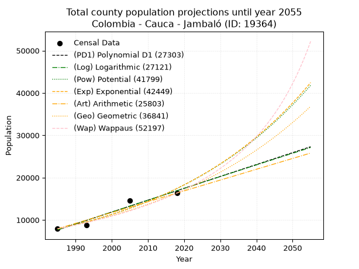
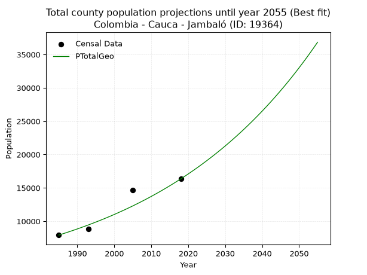
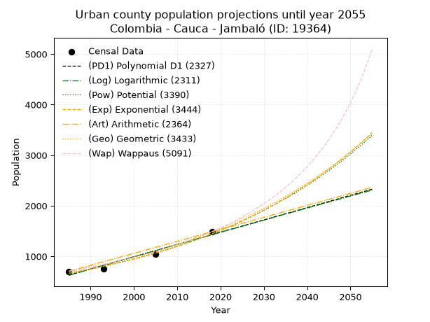
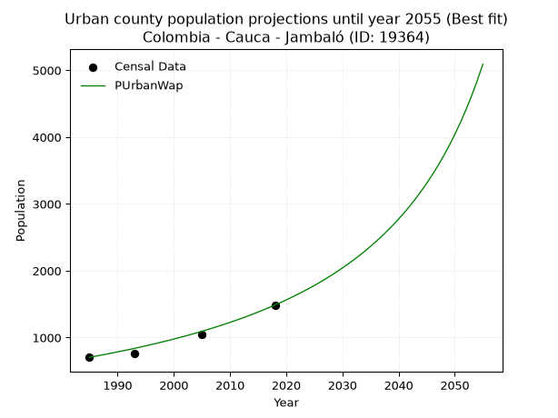
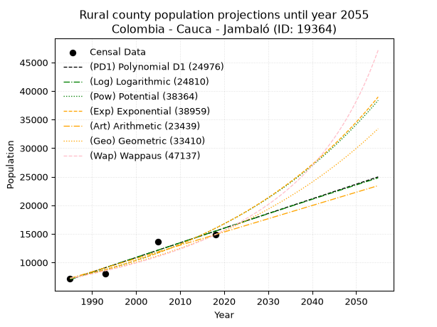

<div align="center">


</div>

# 📜 _“Population and Public Services Demand Projections (PPSD) until Year 2050 for Colombia - Cauca - Jambaló (ID: 19364)”_
Keywords: `population` `public-service` `projection` `lineal` `polynomial` `logarithmic` `potential` `exponential` `arithmetic` `geometric` `wappaus` `dane` `colombia` `south-america`

PPSD are analytical estimates used by governments and planners to anticipate future changes in population size, age distribution, and the resulting community needs for utilities, healthcare, education, and infrastructure as sizing future water treatment facilities, electrical grids, and road networks based on spatial growth.

<div align="center">

</img>

</div>


> **General running parameters**: • app_version: _v20260806_. • Python version: _3.14.7_. • Pandas version: _3.0.5_. • NumPy version: _2.5.1_. • Creates, save and include plots into reports (create_plot): _False_. • Projection until year: _2050_. • Process polynomial degree 2 and up: _False_. • Process Wappaus: _True_. • Process Wappaus: _True_. • Set negative values to zero: _True_. • Set infinite values to zero: _True_. • Drop dataset notes: _True_. 
<div align="center">

Maps & GIS Layers: [:earth_americas:Google](http://maps.google.com/maps?q=2.777834099,-76.3238773) [:earth_americas:OSM](https://www.openstreetmap.org/#map=18/2.777834099/-76.3238773&layers=P) [:earth_americas:Bing](https://www.bing.com/maps?cp=2.777834099~-76.3238773&lvl=18) [:earth_americas:Apple](https://maps.apple.com/frame?center=2.777834099%2C-76.3238773&span=0.003%2C0.006) [:earth_americas:GISMobile](https://github.com/rcfdtools/R.GISMobile/blob/main/file/gis/CountyLayer_CO/Readme.md)

</div>


<div align="center">

```geojson
{
  "type": "Feature",
  "geometry": {
    "type": "Point", 
    "coordinates": [-76.3238773, 2.777834099]
  }, 
  "properties": {
    "Name": "Colombia - Cauca - Jambaló (ID: 19364)"
  }
}
```

</div>


## 0. Census Data (4 records)

Census data are official statistics collected by a government about the people and housing in a country. They usually include counts of total population, age, sex, race, income, education, and jobs.

📅Global census file: [Population.xlsx](../data/Population.xlsx)

| Source   |   Year |   CountryID | CountryName   |   StateID | StateName   |   CountyID | CountyName   |   PTotal |   PUrban |   PRural |
|:---------|-------:|------------:|:--------------|----------:|:------------|-----------:|:-------------|---------:|---------:|---------:|
| DANE     |   1985 |          57 | Colombia      |        19 | Cauca       |      19364 | Jambaló      |     7925 |      705 |     7220 |
| DANE     |   1993 |          57 | Colombia      |        19 | Cauca       |      19364 | Jambaló      |     8839 |      756 |     8083 |
| DANE     |   2005 |          57 | Colombia      |        19 | Cauca       |      19364 | Jambaló      |    14625 |     1044 |    13581 |
| DANE     |   2018 |          57 | Colombia      |        19 | Cauca       |      19364 | Jambaló      |    16353 |     1487 |    14866 |

> 🔥Some records could had specific notes about the registered values or the corresponding urban or rural distribution.

📅[SUI-RUPS](https://www.datos.gov.co/Hacienda-y-Cr-dito-P-blico/Registro-nico-de-Prestadores-de-Servicios-P-blicos/4qkq-csdn/about_data) - Local public utility companies: [RUPS.csv](../data/RUPS.csv)

 | SERVICIO       | ESTADO    | NOMBRE                                                                                               | NIT         | DEPARTAMENTO_DOMICILIO   | MUNICIPIO_DOMICILIO   | DIRECCION                 |   TELEFONO | EMAIL                  | TIPO_PRESTADOR          | CLASIFICACION                 |
|:---------------|:----------|:-----------------------------------------------------------------------------------------------------|:------------|:-------------------------|:----------------------|:--------------------------|-----------:|:-----------------------|:------------------------|:------------------------------|
| ACUEDUCTO      | OPERATIVA | ASOCIACION DE USUARIOS ACUEDUCTO VEREDA ZUMBICO                                                      | 900206865-4 | CAUCA                    | JAMBALO               | vereda zumbico            |    8252738 | luish_450@hotmail.com  | ORGANIZACION AUTORIZADA | HASTA 2500 SUSCRIPTORES       |
| ACUEDUCTO      | OPERATIVA | ASOCIACION DE USUARIOS DE SERVICIO DE ALCANTARILLADO Y ACUEDUCTO DE LA VEREDA LA ODISEA              | 900203016-4 | CAUCA                    | JAMBALO               | VEREDA LA ODISEA          |    8252738 | campo2007@yahoo.com    | ORGANIZACION AUTORIZADA | HASTA 2500 SUSCRIPTORES       |
| ACUEDUCTO      | OPERATIVA | ADMINISTRACION PUBLICA COOPERATIVA DE ACUEDUCTO ALCANTARILLADO Y ASEO DEL MUNICIPIO DE JAMBALO CAUCA | 900381942-1 | CAUCA                    | JAMBALO               | CARRERA PRINCIPAL JAMBALO |    8375362 | apcjambalo@hotmail.com | ORGANIZACION AUTORIZADA | MENOR O IGUAL A 2500 USUARIOS |
| ALCANTARILLADO | OPERATIVA | ADMINISTRACION PUBLICA COOPERATIVA DE ACUEDUCTO ALCANTARILLADO Y ASEO DEL MUNICIPIO DE JAMBALO CAUCA | 900381942-1 | CAUCA                    | JAMBALO               | CARRERA PRINCIPAL JAMBALO |    8375362 | apcjambalo@hotmail.com | ORGANIZACION AUTORIZADA | MENOR O IGUAL A 2500 USUARIOS |

## 1. Total

### 1.1. Coefficients and Parameters

* (PD1) Polynomial Deg 1: 280.68325973504466, -549501.1902850232 (lineal)
* (Log) Logarithmic: 561933.3124483263, -4259324.110970686
* (Pow) Potential: 48.15429588458929, -154.90495867119952
* (Exp) Exponential: 0.024049667727281707, 1.459273844648439e-17
* (Art) Arithmetic: Year diff. 2018 - 1985 = 33, Population diff. 16353 - 7925 = 8428, Annual growth = 255.3939393939394
* (Geo) Geometric: Year diff. 2018 - 1985 = 33, Population diff. 16353 - 7925 = 8428, Annual growth % = 0.022193883061045305
* (Wap) Wappaus: i = 2.103912508393932, Condition values only valid for < 200)

<sub>
Wappaus condition values: ['0.00', '2.10', '4.21', '6.31', '8.42', '10.52', '12.62', '14.73', '16.83', '18.94', '21.04', '23.14', '25.25', '27.35', '29.45', '31.56', '33.66', '35.77', '37.87', '39.97', '42.08', '44.18', '46.29', '48.39', '50.49', '52.60', '54.70', '56.81', '58.91', '61.01', '63.12', '65.22', '67.33', '69.43', '71.53', '73.64', '75.74', '77.84', '79.95', '82.05', '84.16', '86.26', '88.36', '90.47', '92.57', '94.68', '96.78', '98.88', '100.99', '103.09', '105.20', '107.30', '109.40', '111.51', '113.61', '115.72', '117.82', '119.92', '122.03', '124.13', '126.23', '128.34', '130.44', '132.55', '134.65', '136.75']
</sub>


### 1.2. Projected Dataset

|   Year |   CountyID |   PTotalPD1 |   PTotalLog |   PTotalPow |   PTotalExp |   PTotalArt |   PTotalGeo |   PTotalWap |
|-------:|-----------:|------------:|------------:|------------:|------------:|------------:|------------:|------------:|
|   1985 |      19364 |        7655 |        7646 |        7877 |        7884 |        7925 |        7925 |        7925 |
|   1986 |      19364 |        7936 |        7929 |        8071 |        8076 |        8180 |        8101 |        8094 |
|   1987 |      19364 |        8216 |        8212 |        8269 |        8272 |        8436 |        8281 |        8266 |
|   1988 |      19364 |        8497 |        8494 |        8471 |        8474 |        8691 |        8464 |        8442 |
|   1989 |      19364 |        8778 |        8777 |        8679 |        8680 |        8947 |        8652 |        8621 |
|   1990 |      19364 |        9058 |        9059 |        8892 |        8891 |        9202 |        8844 |        8805 |
|   1991 |      19364 |        9339 |        9342 |        9110 |        9108 |        9457 |        9041 |        8993 |
|   1992 |      19364 |        9620 |        9624 |        9332 |        9329 |        9713 |        9241 |        9185 |
|   1993 |      19364 |        9901 |        9906 |        9561 |        9557 |        9968 |        9446 |        9381 |
|   1994 |      19364 |       10181 |       10188 |        9795 |        9789 |       10224 |        9656 |        9583 |
|   1995 |      19364 |       10462 |       10470 |       10034 |       10027 |       10479 |        9870 |        9788 |
|   1996 |      19364 |       10743 |       10751 |       10279 |       10272 |       10734 |       10089 |        9999 |
|   1997 |      19364 |       11023 |       11033 |       10530 |       10522 |       10990 |       10313 |       10215 |
|   1998 |      19364 |       11304 |       11314 |       10787 |       10778 |       11245 |       10542 |       10436 |
|   1999 |      19364 |       11585 |       11595 |       11050 |       11040 |       11501 |       10776 |       10662 |
|   2000 |      19364 |       11865 |       11876 |       11319 |       11309 |       11756 |       11015 |       10895 |
|   2001 |      19364 |       12146 |       12157 |       11595 |       11584 |       12011 |       11260 |       11133 |
|   2002 |      19364 |       12427 |       12438 |       11877 |       11866 |       12267 |       11510 |       11377 |
|   2003 |      19364 |       12707 |       12718 |       12166 |       12155 |       12522 |       11765 |       11627 |
|   2004 |      19364 |       12988 |       12999 |       12462 |       12451 |       12777 |       12026 |       11884 |
|   2005 |      19364 |       13269 |       13279 |       12765 |       12754 |       13033 |       12293 |       12148 |
|   2006 |      19364 |       13549 |       13559 |       13076 |       13064 |       13288 |       12566 |       12419 |
|   2007 |      19364 |       13830 |       13840 |       13393 |       13382 |       13544 |       12845 |       12698 |
|   2008 |      19364 |       14111 |       14119 |       13718 |       13708 |       13799 |       13130 |       12984 |
|   2009 |      19364 |       14391 |       14399 |       14051 |       14042 |       14054 |       13421 |       13278 |
|   2010 |      19364 |       14672 |       14679 |       14392 |       14383 |       14310 |       13719 |       13581 |
|   2011 |      19364 |       14953 |       14958 |       14741 |       14733 |       14565 |       14024 |       13892 |
|   2012 |      19364 |       15234 |       15238 |       15098 |       15092 |       14821 |       14335 |       14213 |
|   2013 |      19364 |       15514 |       15517 |       15464 |       15459 |       15076 |       14653 |       14543 |
|   2014 |      19364 |       15795 |       15796 |       15838 |       15836 |       15331 |       14978 |       14883 |
|   2015 |      19364 |       16076 |       16075 |       16221 |       16221 |       15587 |       15311 |       15234 |
|   2016 |      19364 |       16356 |       16354 |       16613 |       16616 |       15842 |       15651 |       15595 |
|   2017 |      19364 |       16637 |       16632 |       17015 |       17020 |       16098 |       15998 |       15968 |
|   2018 |      19364 |       16918 |       16911 |       17426 |       17435 |       16353 |       16353 |       16353 |
|   2019 |      19364 |       17198 |       17189 |       17847 |       17859 |       16608 |       16716 |       16751 |
|   2020 |      19364 |       17479 |       17468 |       18277 |       18294 |       16864 |       17087 |       17161 |
|   2021 |      19364 |       17760 |       17746 |       18718 |       18739 |       17119 |       17466 |       17586 |
|   2022 |      19364 |       18040 |       18024 |       19169 |       19195 |       17375 |       17854 |       18026 |
|   2023 |      19364 |       18321 |       18302 |       19631 |       19663 |       17630 |       18250 |       18480 |
|   2024 |      19364 |       18602 |       18579 |       20104 |       20141 |       17885 |       18655 |       18951 |
|   2025 |      19364 |       18882 |       18857 |       20588 |       20631 |       18141 |       19069 |       19440 |
|   2026 |      19364 |       19163 |       19134 |       21083 |       21134 |       18396 |       19492 |       19946 |
|   2027 |      19364 |       19444 |       19412 |       21590 |       21648 |       18652 |       19925 |       20471 |
|   2028 |      19364 |       19724 |       19689 |       22109 |       22175 |       18907 |       20367 |       21016 |
|   2029 |      19364 |       20005 |       19966 |       22640 |       22715 |       19162 |       20819 |       21583 |
|   2030 |      19364 |       20286 |       20243 |       23184 |       23268 |       19418 |       21281 |       22173 |
|   2031 |      19364 |       20567 |       20519 |       23740 |       23834 |       19673 |       21754 |       22786 |
|   2032 |      19364 |       20847 |       20796 |       24310 |       24414 |       19929 |       22236 |       23425 |
|   2033 |      19364 |       21128 |       21072 |       24892 |       25008 |       20184 |       22730 |       24091 |
|   2034 |      19364 |       21409 |       21349 |       25489 |       25617 |       20439 |       23234 |       24786 |
|   2035 |      19364 |       21689 |       21625 |       26099 |       26241 |       20695 |       23750 |       25512 |
|   2036 |      19364 |       21970 |       21901 |       26724 |       26879 |       20950 |       24277 |       26271 |
|   2037 |      19364 |       22251 |       22177 |       27364 |       27534 |       21205 |       24816 |       27065 |
|   2038 |      19364 |       22531 |       22453 |       28018 |       28204 |       21461 |       25367 |       27897 |
|   2039 |      19364 |       22812 |       22728 |       28688 |       28890 |       21716 |       25930 |       28770 |
|   2040 |      19364 |       23093 |       23004 |       29373 |       29594 |       21972 |       26505 |       29686 |
|   2041 |      19364 |       23373 |       23279 |       30075 |       30314 |       22227 |       27093 |       30648 |
|   2042 |      19364 |       23654 |       23555 |       30792 |       31052 |       22482 |       27695 |       31662 |
|   2043 |      19364 |       23935 |       23830 |       31527 |       31808 |       22738 |       28309 |       32730 |
|   2044 |      19364 |       24215 |       24105 |       32279 |       32582 |       22993 |       28938 |       33857 |
|   2045 |      19364 |       24496 |       24380 |       33048 |       33375 |       23249 |       29580 |       35049 |
|   2046 |      19364 |       24777 |       24654 |       33835 |       34187 |       23504 |       30236 |       36311 |
|   2047 |      19364 |       25057 |       24929 |       34641 |       35020 |       23759 |       30907 |       37649 |
|   2048 |      19364 |       25338 |       25203 |       35465 |       35872 |       24015 |       31593 |       39070 |
|   2049 |      19364 |       25619 |       25478 |       36309 |       36745 |       24270 |       32295 |       40583 |
|   2050 |      19364 |       25899 |       25752 |       37172 |       37640 |       24526 |       33011 |       42197 |
<div align="center">

</img>

</div>


### 1.3. Best fit with absolute and relative error (%)

Relative error puts that difference into context by dividing the absolute error by the true value, creating a unitless ratio or percentage that shows the scale of the mistake.

Absolute and relative error

|   Year | Source   |   CountryID | CountryName   |   StateID | StateName   |   CountyID_x | CountyName   |   PTotal |   PUrban |   PRural |   CountyID_y |   PTotalPD1 |   PTotalLog |   PTotalPow |   PTotalExp |   PTotalArt |   PTotalGeo |   PTotalWap |   PTotalPD1AbsError |   PTotalLogAbsError |   PTotalPowAbsError |   PTotalExpAbsError |   PTotalArtAbsError |   PTotalGeoAbsError |   PTotalWapAbsError |   PTotalPD1RelError |   PTotalLogRelError |   PTotalPowRelError |   PTotalExpRelError |   PTotalArtRelError |   PTotalGeoRelError |   PTotalWapRelError |
|-------:|:---------|------------:|:--------------|----------:|:------------|-------------:|:-------------|---------:|---------:|---------:|-------------:|------------:|------------:|------------:|------------:|------------:|------------:|------------:|--------------------:|--------------------:|--------------------:|--------------------:|--------------------:|--------------------:|--------------------:|--------------------:|--------------------:|--------------------:|--------------------:|--------------------:|--------------------:|--------------------:|
|   1985 | DANE     |          57 | Colombia      |        19 | Cauca       |        19364 | Jambaló      |     7925 |      705 |     7220 |        19364 |        7655 |        7646 |        7877 |        7884 |        7925 |        7925 |        7925 |                 270 |                 279 |                  48 |                  41 |                   0 |                   0 |                   0 |             3.40694 |             3.5205  |            0.605678 |             0.51735 |              0      |             0       |             0       |
|   1993 | DANE     |          57 | Colombia      |        19 | Cauca       |        19364 | Jambaló      |     8839 |      756 |     8083 |        19364 |        9901 |        9906 |        9561 |        9557 |        9968 |        9446 |        9381 |                1062 |                1067 |                 722 |                 718 |                1129 |                 607 |                 542 |            12.0149  |            12.0715  |            8.16834  |             8.12309 |             12.7729 |             6.86729 |             6.13192 |
|   2005 | DANE     |          57 | Colombia      |        19 | Cauca       |        19364 | Jambaló      |    14625 |     1044 |    13581 |        19364 |       13269 |       13279 |       12765 |       12754 |       13033 |       12293 |       12148 |                1356 |                1346 |                1860 |                1871 |                1592 |                2332 |                2477 |             9.27179 |             9.20342 |           12.7179   |            12.7932  |             10.8855 |            15.9453  |            16.9368  |
|   2018 | DANE     |          57 | Colombia      |        19 | Cauca       |        19364 | Jambaló      |    16353 |     1487 |    14866 |        19364 |       16918 |       16911 |       17426 |       17435 |       16353 |       16353 |       16353 |                 565 |                 558 |                1073 |                1082 |                   0 |                   0 |                   0 |             3.45502 |             3.41222 |            6.56149  |             6.61652 |              0      |             0       |             0       |

Relative error mean

| Method    |   RelError | Best   |
|:----------|-----------:|:-------|
| PTotalPD1 |    7.03717 |        |
| PTotalLog |    7.05191 |        |
| PTotalPow |    7.01336 |        |
| PTotalExp |    7.01253 |        |
| PTotalArt |    5.9146  |        |
| PTotalGeo |    5.70315 | True   |
| PTotalWap |    5.76717 |        |

💙Best method: _**PTotalGeo**_
<div align="center">

</img>

</div>


### 1.4. Fresh water supply demand in liters per capita per day (lpcd)

The fresh water supply demand typically ranges from 100 to 300 liters per capita per day (lpcd) for standard domestic and municipal planning, though absolute survival minimums set by the World Health Organization are as low as 7.5 to 20 liters per day, and total consumption in high-income nations can exceed 400 liters.

> `CZ`: Level in meters above the sea level (masl)<br> `WS`: Fresh water supply demand in liters per capita per day (lpcd or l/h/d)<br> `WSAll`: Zonal fresh water supply demand in liters per second (l/s)<br> `A`: Zonal area in square meters<br> `DP`: Population density (people/hectare or p/ha)

Reference values (RAS Colombia)

|    CZ |   WS |
|------:|-----:|
|  1000 |  120 |
|  2000 |  130 |
| 99999 |  140 |

County shapefile geometry properties and water supply values

|   CountyID |    ATotal |   CZTotal |   WSTotal |
|-----------:|----------:|----------:|----------:|
|      19364 | 2.345e+08 |   2512.31 |       140 |

Projected values for best method: PTotalGeo

|   CountyID |   Year |   PTotalGeo |   DPTotal |   WSTotal |   WSTotalAll |
|-----------:|-------:|------------:|----------:|----------:|-------------:|
|      19364 |   1985 |        7925 |      0.34 |       140 |      12.8414 |
|      19364 |   1986 |        8101 |      0.35 |       140 |      13.1266 |
|      19364 |   1987 |        8281 |      0.35 |       140 |      13.4183 |
|      19364 |   1988 |        8464 |      0.36 |       140 |      13.7148 |
|      19364 |   1989 |        8652 |      0.37 |       140 |      14.0194 |
|      19364 |   1990 |        8844 |      0.38 |       140 |      14.3306 |
|      19364 |   1991 |        9041 |      0.39 |       140 |      14.6498 |
|      19364 |   1992 |        9241 |      0.39 |       140 |      14.9738 |
|      19364 |   1993 |        9446 |      0.4  |       140 |      15.306  |
|      19364 |   1994 |        9656 |      0.41 |       140 |      15.6463 |
|      19364 |   1995 |        9870 |      0.42 |       140 |      15.9931 |
|      19364 |   1996 |       10089 |      0.43 |       140 |      16.3479 |
|      19364 |   1997 |       10313 |      0.44 |       140 |      16.7109 |
|      19364 |   1998 |       10542 |      0.45 |       140 |      17.0819 |
|      19364 |   1999 |       10776 |      0.46 |       140 |      17.4611 |
|      19364 |   2000 |       11015 |      0.47 |       140 |      17.8484 |
|      19364 |   2001 |       11260 |      0.48 |       140 |      18.2454 |
|      19364 |   2002 |       11510 |      0.49 |       140 |      18.6505 |
|      19364 |   2003 |       11765 |      0.5  |       140 |      19.0637 |
|      19364 |   2004 |       12026 |      0.51 |       140 |      19.4866 |
|      19364 |   2005 |       12293 |      0.52 |       140 |      19.9192 |
|      19364 |   2006 |       12566 |      0.54 |       140 |      20.3616 |
|      19364 |   2007 |       12845 |      0.55 |       140 |      20.8137 |
|      19364 |   2008 |       13130 |      0.56 |       140 |      21.2755 |
|      19364 |   2009 |       13421 |      0.57 |       140 |      21.747  |
|      19364 |   2010 |       13719 |      0.59 |       140 |      22.2299 |
|      19364 |   2011 |       14024 |      0.6  |       140 |      22.7241 |
|      19364 |   2012 |       14335 |      0.61 |       140 |      23.228  |
|      19364 |   2013 |       14653 |      0.62 |       140 |      23.7433 |
|      19364 |   2014 |       14978 |      0.64 |       140 |      24.2699 |
|      19364 |   2015 |       15311 |      0.65 |       140 |      24.8095 |
|      19364 |   2016 |       15651 |      0.67 |       140 |      25.3604 |
|      19364 |   2017 |       15998 |      0.68 |       140 |      25.9227 |
|      19364 |   2018 |       16353 |      0.7  |       140 |      26.4979 |
|      19364 |   2019 |       16716 |      0.71 |       140 |      27.0861 |
|      19364 |   2020 |       17087 |      0.73 |       140 |      27.6873 |
|      19364 |   2021 |       17466 |      0.74 |       140 |      28.3014 |
|      19364 |   2022 |       17854 |      0.76 |       140 |      28.9301 |
|      19364 |   2023 |       18250 |      0.78 |       140 |      29.5718 |
|      19364 |   2024 |       18655 |      0.8  |       140 |      30.228  |
|      19364 |   2025 |       19069 |      0.81 |       140 |      30.8988 |
|      19364 |   2026 |       19492 |      0.83 |       140 |      31.5843 |
|      19364 |   2027 |       19925 |      0.85 |       140 |      32.2859 |
|      19364 |   2028 |       20367 |      0.87 |       140 |      33.0021 |
|      19364 |   2029 |       20819 |      0.89 |       140 |      33.7345 |
|      19364 |   2030 |       21281 |      0.91 |       140 |      34.4831 |
|      19364 |   2031 |       21754 |      0.93 |       140 |      35.2495 |
|      19364 |   2032 |       22236 |      0.95 |       140 |      36.0306 |
|      19364 |   2033 |       22730 |      0.97 |       140 |      36.831  |
|      19364 |   2034 |       23234 |      0.99 |       140 |      37.6477 |
|      19364 |   2035 |       23750 |      1.01 |       140 |      38.4838 |
|      19364 |   2036 |       24277 |      1.04 |       140 |      39.3377 |
|      19364 |   2037 |       24816 |      1.06 |       140 |      40.2111 |
|      19364 |   2038 |       25367 |      1.08 |       140 |      41.1039 |
|      19364 |   2039 |       25930 |      1.11 |       140 |      42.0162 |
|      19364 |   2040 |       26505 |      1.13 |       140 |      42.9479 |
|      19364 |   2041 |       27093 |      1.16 |       140 |      43.9007 |
|      19364 |   2042 |       27695 |      1.18 |       140 |      44.8762 |
|      19364 |   2043 |       28309 |      1.21 |       140 |      45.8711 |
|      19364 |   2044 |       28938 |      1.23 |       140 |      46.8903 |
|      19364 |   2045 |       29580 |      1.26 |       140 |      47.9306 |
|      19364 |   2046 |       30236 |      1.29 |       140 |      48.9935 |
|      19364 |   2047 |       30907 |      1.32 |       140 |      50.0808 |
|      19364 |   2048 |       31593 |      1.35 |       140 |      51.1924 |
|      19364 |   2049 |       32295 |      1.38 |       140 |      52.3299 |
|      19364 |   2050 |       33011 |      1.41 |       140 |      53.49   |

## 2. Urban

### 2.1. Coefficients and Parameters

* (PD1) Polynomial Deg 1: 24.281011641910585, -47570.09353673165 (lineal)
* (Log) Logarithmic: 48576.294649526586, -368230.80489704694
* (Pow) Potential: 46.93074491740497, -151.94251747204092
* (Exp) Exponential: 0.023453571625180483, 4.030609092430972e-18
* (Art) Arithmetic: Year diff. 2018 - 1985 = 33, Population diff. 1487 - 705 = 782, Annual growth = 23.696969696969695
* (Geo) Geometric: Year diff. 2018 - 1985 = 33, Population diff. 1487 - 705 = 782, Annual growth % = 0.022873375120629813
* (Wap) Wappaus: i = 2.162132271621323, Condition values only valid for < 200)

<sub>
Wappaus condition values: ['0.00', '2.16', '4.32', '6.49', '8.65', '10.81', '12.97', '15.13', '17.30', '19.46', '21.62', '23.78', '25.95', '28.11', '30.27', '32.43', '34.59', '36.76', '38.92', '41.08', '43.24', '45.40', '47.57', '49.73', '51.89', '54.05', '56.22', '58.38', '60.54', '62.70', '64.86', '67.03', '69.19', '71.35', '73.51', '75.67', '77.84', '80.00', '82.16', '84.32', '86.49', '88.65', '90.81', '92.97', '95.13', '97.30', '99.46', '101.62', '103.78', '105.94', '108.11', '110.27', '112.43', '114.59', '116.76', '118.92', '121.08', '123.24', '125.40', '127.57', '129.73', '131.89', '134.05', '136.21', '138.38', '140.54']
</sub>


### 2.2. Projected Dataset

|   Year |   CountyID |   PUrbanPD1 |   PUrbanLog |   PUrbanPow |   PUrbanExp |   PUrbanArt |   PUrbanGeo |   PUrbanWap |
|-------:|-----------:|------------:|------------:|------------:|------------:|------------:|------------:|------------:|
|   1985 |      19364 |         628 |         627 |         667 |         667 |         705 |         705 |         705 |
|   1986 |      19364 |         652 |         652 |         683 |         683 |         729 |         721 |         720 |
|   1987 |      19364 |         676 |         676 |         699 |         699 |         752 |         738 |         736 |
|   1988 |      19364 |         701 |         701 |         716 |         716 |         776 |         754 |         752 |
|   1989 |      19364 |         725 |         725 |         733 |         733 |         800 |         772 |         769 |
|   1990 |      19364 |         749 |         749 |         750 |         750 |         823 |         789 |         786 |
|   1991 |      19364 |         773 |         774 |         768 |         768 |         847 |         807 |         803 |
|   1992 |      19364 |         798 |         798 |         786 |         786 |         871 |         826 |         820 |
|   1993 |      19364 |         822 |         823 |         805 |         805 |         895 |         845 |         838 |
|   1994 |      19364 |         846 |         847 |         824 |         824 |         918 |         864 |         857 |
|   1995 |      19364 |         871 |         871 |         844 |         843 |         942 |         884 |         876 |
|   1996 |      19364 |         895 |         896 |         864 |         863 |         966 |         904 |         895 |
|   1997 |      19364 |         919 |         920 |         884 |         884 |         989 |         925 |         915 |
|   1998 |      19364 |         943 |         944 |         905 |         905 |        1013 |         946 |         936 |
|   1999 |      19364 |         968 |         969 |         927 |         926 |        1037 |         968 |         956 |
|   2000 |      19364 |         992 |         993 |         949 |         948 |        1060 |         990 |         978 |
|   2001 |      19364 |        1016 |        1017 |         972 |         971 |        1084 |        1012 |        1000 |
|   2002 |      19364 |        1040 |        1041 |         995 |         994 |        1108 |        1036 |        1022 |
|   2003 |      19364 |        1065 |        1066 |        1018 |        1017 |        1132 |        1059 |        1046 |
|   2004 |      19364 |        1089 |        1090 |        1042 |        1041 |        1155 |        1083 |        1069 |
|   2005 |      19364 |        1113 |        1114 |        1067 |        1066 |        1179 |        1108 |        1094 |
|   2006 |      19364 |        1138 |        1138 |        1092 |        1091 |        1203 |        1134 |        1119 |
|   2007 |      19364 |        1162 |        1163 |        1118 |        1117 |        1226 |        1159 |        1145 |
|   2008 |      19364 |        1186 |        1187 |        1145 |        1144 |        1250 |        1186 |        1172 |
|   2009 |      19364 |        1210 |        1211 |        1172 |        1171 |        1274 |        1213 |        1199 |
|   2010 |      19364 |        1235 |        1235 |        1199 |        1199 |        1297 |        1241 |        1227 |
|   2011 |      19364 |        1259 |        1259 |        1228 |        1227 |        1321 |        1269 |        1256 |
|   2012 |      19364 |        1283 |        1283 |        1257 |        1256 |        1345 |        1298 |        1286 |
|   2013 |      19364 |        1308 |        1308 |        1286 |        1286 |        1369 |        1328 |        1317 |
|   2014 |      19364 |        1332 |        1332 |        1317 |        1317 |        1392 |        1358 |        1349 |
|   2015 |      19364 |        1356 |        1356 |        1348 |        1348 |        1416 |        1389 |        1382 |
|   2016 |      19364 |        1380 |        1380 |        1379 |        1380 |        1440 |        1421 |        1416 |
|   2017 |      19364 |        1405 |        1404 |        1412 |        1413 |        1463 |        1454 |        1451 |
|   2018 |      19364 |        1429 |        1428 |        1445 |        1446 |        1487 |        1487 |        1487 |
|   2019 |      19364 |        1453 |        1452 |        1479 |        1481 |        1511 |        1521 |        1524 |
|   2020 |      19364 |        1478 |        1476 |        1514 |        1516 |        1534 |        1556 |        1563 |
|   2021 |      19364 |        1502 |        1500 |        1549 |        1552 |        1558 |        1591 |        1603 |
|   2022 |      19364 |        1526 |        1524 |        1586 |        1588 |        1582 |        1628 |        1645 |
|   2023 |      19364 |        1550 |        1548 |        1623 |        1626 |        1605 |        1665 |        1688 |
|   2024 |      19364 |        1575 |        1572 |        1661 |        1665 |        1629 |        1703 |        1733 |
|   2025 |      19364 |        1599 |        1596 |        1700 |        1704 |        1653 |        1742 |        1779 |
|   2026 |      19364 |        1623 |        1620 |        1740 |        1745 |        1677 |        1782 |        1827 |
|   2027 |      19364 |        1648 |        1644 |        1781 |        1786 |        1700 |        1823 |        1878 |
|   2028 |      19364 |        1672 |        1668 |        1822 |        1828 |        1724 |        1864 |        1930 |
|   2029 |      19364 |        1696 |        1692 |        1865 |        1872 |        1748 |        1907 |        1984 |
|   2030 |      19364 |        1720 |        1716 |        1909 |        1916 |        1771 |        1951 |        2041 |
|   2031 |      19364 |        1745 |        1740 |        1953 |        1962 |        1795 |        1995 |        2100 |
|   2032 |      19364 |        1769 |        1764 |        1999 |        2008 |        1819 |        2041 |        2161 |
|   2033 |      19364 |        1793 |        1788 |        2046 |        2056 |        1842 |        2088 |        2226 |
|   2034 |      19364 |        1817 |        1812 |        2093 |        2105 |        1866 |        2135 |        2293 |
|   2035 |      19364 |        1842 |        1836 |        2142 |        2155 |        1890 |        2184 |        2364 |
|   2036 |      19364 |        1866 |        1859 |        2192 |        2206 |        1914 |        2234 |        2438 |
|   2037 |      19364 |        1890 |        1883 |        2243 |        2258 |        1937 |        2285 |        2515 |
|   2038 |      19364 |        1915 |        1907 |        2296 |        2312 |        1961 |        2337 |        2597 |
|   2039 |      19364 |        1939 |        1931 |        2349 |        2367 |        1985 |        2391 |        2683 |
|   2040 |      19364 |        1963 |        1955 |        2404 |        2423 |        2008 |        2446 |        2773 |
|   2041 |      19364 |        1987 |        1979 |        2460 |        2480 |        2032 |        2502 |        2868 |
|   2042 |      19364 |        2012 |        2002 |        2517 |        2539 |        2056 |        2559 |        2969 |
|   2043 |      19364 |        2036 |        2026 |        2575 |        2599 |        2079 |        2617 |        3075 |
|   2044 |      19364 |        2060 |        2050 |        2635 |        2661 |        2103 |        2677 |        3188 |
|   2045 |      19364 |        2085 |        2074 |        2696 |        2724 |        2127 |        2738 |        3308 |
|   2046 |      19364 |        2109 |        2097 |        2759 |        2789 |        2151 |        2801 |        3435 |
|   2047 |      19364 |        2133 |        2121 |        2823 |        2855 |        2174 |        2865 |        3571 |
|   2048 |      19364 |        2157 |        2145 |        2888 |        2923 |        2198 |        2931 |        3716 |
|   2049 |      19364 |        2182 |        2169 |        2955 |        2992 |        2222 |        2998 |        3871 |
|   2050 |      19364 |        2206 |        2192 |        3024 |        3063 |        2245 |        3066 |        4038 |
<div align="center">

</img>

</div>


### 2.3. Best fit with absolute and relative error (%)

Relative error puts that difference into context by dividing the absolute error by the true value, creating a unitless ratio or percentage that shows the scale of the mistake.

Absolute and relative error

|   Year | Source   |   CountryID | CountryName   |   StateID | StateName   |   CountyID_x | CountyName   |   PTotal |   PUrban |   PRural |   CountyID_y |   PUrbanPD1 |   PUrbanLog |   PUrbanPow |   PUrbanExp |   PUrbanArt |   PUrbanGeo |   PUrbanWap |   PUrbanPD1AbsError |   PUrbanLogAbsError |   PUrbanPowAbsError |   PUrbanExpAbsError |   PUrbanArtAbsError |   PUrbanGeoAbsError |   PUrbanWapAbsError |   PUrbanPD1RelError |   PUrbanLogRelError |   PUrbanPowRelError |   PUrbanExpRelError |   PUrbanArtRelError |   PUrbanGeoRelError |   PUrbanWapRelError |
|-------:|:---------|------------:|:--------------|----------:|:------------|-------------:|:-------------|---------:|---------:|---------:|-------------:|------------:|------------:|------------:|------------:|------------:|------------:|------------:|--------------------:|--------------------:|--------------------:|--------------------:|--------------------:|--------------------:|--------------------:|--------------------:|--------------------:|--------------------:|--------------------:|--------------------:|--------------------:|--------------------:|
|   1985 | DANE     |          57 | Colombia      |        19 | Cauca       |        19364 | Jambaló      |     7925 |      705 |     7220 |        19364 |         628 |         627 |         667 |         667 |         705 |         705 |         705 |                  77 |                  78 |                  38 |                  38 |                   0 |                   0 |                   0 |            10.922   |            11.0638  |             5.39007 |             5.39007 |              0      |             0       |             0       |
|   1993 | DANE     |          57 | Colombia      |        19 | Cauca       |        19364 | Jambaló      |     8839 |      756 |     8083 |        19364 |         822 |         823 |         805 |         805 |         895 |         845 |         838 |                  66 |                  67 |                  49 |                  49 |                 139 |                  89 |                  82 |             8.73016 |             8.86243 |             6.48148 |             6.48148 |             18.3862 |            11.7725  |            10.8466  |
|   2005 | DANE     |          57 | Colombia      |        19 | Cauca       |        19364 | Jambaló      |    14625 |     1044 |    13581 |        19364 |        1113 |        1114 |        1067 |        1066 |        1179 |        1108 |        1094 |                  69 |                  70 |                  23 |                  22 |                 135 |                  64 |                  50 |             6.6092  |             6.70498 |             2.20307 |             2.10728 |             12.931  |             6.13027 |             4.78927 |
|   2018 | DANE     |          57 | Colombia      |        19 | Cauca       |        19364 | Jambaló      |    16353 |     1487 |    14866 |        19364 |        1429 |        1428 |        1445 |        1446 |        1487 |        1487 |        1487 |                  58 |                  59 |                  42 |                  41 |                   0 |                   0 |                   0 |             3.90047 |             3.96772 |             2.82448 |             2.75723 |              0      |             0       |             0       |

Relative error mean

| Method    |   RelError | Best   |
|:----------|-----------:|:-------|
| PUrbanPD1 |    7.54045 |        |
| PUrbanLog |    7.64974 |        |
| PUrbanPow |    4.22477 |        |
| PUrbanExp |    4.18402 |        |
| PUrbanArt |    7.82932 |        |
| PUrbanGeo |    4.47569 |        |
| PUrbanWap |    3.90896 | True   |

💙Best method: _**PUrbanWap**_
<div align="center">

</img>

</div>


### 2.4. Fresh water supply demand in liters per capita per day (lpcd)

The fresh water supply demand typically ranges from 100 to 300 liters per capita per day (lpcd) for standard domestic and municipal planning, though absolute survival minimums set by the World Health Organization are as low as 7.5 to 20 liters per day, and total consumption in high-income nations can exceed 400 liters.

> `CZ`: Level in meters above the sea level (masl)<br> `WS`: Fresh water supply demand in liters per capita per day (lpcd or l/h/d)<br> `WSAll`: Zonal fresh water supply demand in liters per second (l/s)<br> `A`: Zonal area in square meters<br> `DP`: Population density (people/hectare or p/ha)

Reference values (RAS Colombia)

|    CZ |   WS |
|------:|-----:|
|  1000 |  120 |
|  2000 |  130 |
| 99999 |  140 |

County shapefile geometry properties and water supply values

|   CountyID |   AUrban |   CZUrban |   WSUrban |
|-----------:|---------:|----------:|----------:|
|      19364 |   477023 |   2307.36 |       140 |

Projected values for best method: PUrbanWap

|   CountyID |   Year |   PUrbanWap |   DPUrban |   WSUrban |   WSUrbanAll |
|-----------:|-------:|------------:|----------:|----------:|-------------:|
|      19364 |   1985 |         705 |     14.78 |       140 |      1.14236 |
|      19364 |   1986 |         720 |     15.09 |       140 |      1.16667 |
|      19364 |   1987 |         736 |     15.43 |       140 |      1.19259 |
|      19364 |   1988 |         752 |     15.76 |       140 |      1.21852 |
|      19364 |   1989 |         769 |     16.12 |       140 |      1.24606 |
|      19364 |   1990 |         786 |     16.48 |       140 |      1.27361 |
|      19364 |   1991 |         803 |     16.83 |       140 |      1.30116 |
|      19364 |   1992 |         820 |     17.19 |       140 |      1.3287  |
|      19364 |   1993 |         838 |     17.57 |       140 |      1.35787 |
|      19364 |   1994 |         857 |     17.97 |       140 |      1.38866 |
|      19364 |   1995 |         876 |     18.36 |       140 |      1.41944 |
|      19364 |   1996 |         895 |     18.76 |       140 |      1.45023 |
|      19364 |   1997 |         915 |     19.18 |       140 |      1.48264 |
|      19364 |   1998 |         936 |     19.62 |       140 |      1.51667 |
|      19364 |   1999 |         956 |     20.04 |       140 |      1.54907 |
|      19364 |   2000 |         978 |     20.5  |       140 |      1.58472 |
|      19364 |   2001 |        1000 |     20.96 |       140 |      1.62037 |
|      19364 |   2002 |        1022 |     21.42 |       140 |      1.65602 |
|      19364 |   2003 |        1046 |     21.93 |       140 |      1.69491 |
|      19364 |   2004 |        1069 |     22.41 |       140 |      1.73218 |
|      19364 |   2005 |        1094 |     22.93 |       140 |      1.77269 |
|      19364 |   2006 |        1119 |     23.46 |       140 |      1.81319 |
|      19364 |   2007 |        1145 |     24    |       140 |      1.85532 |
|      19364 |   2008 |        1172 |     24.57 |       140 |      1.89907 |
|      19364 |   2009 |        1199 |     25.14 |       140 |      1.94282 |
|      19364 |   2010 |        1227 |     25.72 |       140 |      1.98819 |
|      19364 |   2011 |        1256 |     26.33 |       140 |      2.03519 |
|      19364 |   2012 |        1286 |     26.96 |       140 |      2.0838  |
|      19364 |   2013 |        1317 |     27.61 |       140 |      2.13403 |
|      19364 |   2014 |        1349 |     28.28 |       140 |      2.18588 |
|      19364 |   2015 |        1382 |     28.97 |       140 |      2.23935 |
|      19364 |   2016 |        1416 |     29.68 |       140 |      2.29444 |
|      19364 |   2017 |        1451 |     30.42 |       140 |      2.35116 |
|      19364 |   2018 |        1487 |     31.17 |       140 |      2.40949 |
|      19364 |   2019 |        1524 |     31.95 |       140 |      2.46944 |
|      19364 |   2020 |        1563 |     32.77 |       140 |      2.53264 |
|      19364 |   2021 |        1603 |     33.6  |       140 |      2.59745 |
|      19364 |   2022 |        1645 |     34.48 |       140 |      2.66551 |
|      19364 |   2023 |        1688 |     35.39 |       140 |      2.73519 |
|      19364 |   2024 |        1733 |     36.33 |       140 |      2.8081  |
|      19364 |   2025 |        1779 |     37.29 |       140 |      2.88264 |
|      19364 |   2026 |        1827 |     38.3  |       140 |      2.96042 |
|      19364 |   2027 |        1878 |     39.37 |       140 |      3.04306 |
|      19364 |   2028 |        1930 |     40.46 |       140 |      3.12731 |
|      19364 |   2029 |        1984 |     41.59 |       140 |      3.21481 |
|      19364 |   2030 |        2041 |     42.79 |       140 |      3.30718 |
|      19364 |   2031 |        2100 |     44.02 |       140 |      3.40278 |
|      19364 |   2032 |        2161 |     45.3  |       140 |      3.50162 |
|      19364 |   2033 |        2226 |     46.66 |       140 |      3.60694 |
|      19364 |   2034 |        2293 |     48.07 |       140 |      3.71551 |
|      19364 |   2035 |        2364 |     49.56 |       140 |      3.83056 |
|      19364 |   2036 |        2438 |     51.11 |       140 |      3.95046 |
|      19364 |   2037 |        2515 |     52.72 |       140 |      4.07523 |
|      19364 |   2038 |        2597 |     54.44 |       140 |      4.2081  |
|      19364 |   2039 |        2683 |     56.24 |       140 |      4.34745 |
|      19364 |   2040 |        2773 |     58.13 |       140 |      4.49329 |
|      19364 |   2041 |        2868 |     60.12 |       140 |      4.64722 |
|      19364 |   2042 |        2969 |     62.24 |       140 |      4.81088 |
|      19364 |   2043 |        3075 |     64.46 |       140 |      4.98264 |
|      19364 |   2044 |        3188 |     66.83 |       140 |      5.16574 |
|      19364 |   2045 |        3308 |     69.35 |       140 |      5.36019 |
|      19364 |   2046 |        3435 |     72.01 |       140 |      5.56597 |
|      19364 |   2047 |        3571 |     74.86 |       140 |      5.78634 |
|      19364 |   2048 |        3716 |     77.9  |       140 |      6.0213  |
|      19364 |   2049 |        3871 |     81.15 |       140 |      6.27245 |
|      19364 |   2050 |        4038 |     84.65 |       140 |      6.54306 |

## 3. Rural

### 3.1. Coefficients and Parameters

* (PD1) Polynomial Deg 1: 256.4022480931342, -501931.09674829163 (lineal)
* (Log) Logarithmic: 513357.0177987997, -3891093.306073639
* (Pow) Potential: 48.23750063004755, -155.21783886152932
* (Exp) Exponential: 0.02408989530062161, 1.2330372277920558e-17
* (Art) Arithmetic: Year diff. 2018 - 1985 = 33, Population diff. 14866 - 7220 = 7646, Annual growth = 231.6969696969697
* (Geo) Geometric: Year diff. 2018 - 1985 = 33, Population diff. 14866 - 7220 = 7646, Annual growth % = 0.022126752725911025
* (Wap) Wappaus: i = 2.098134290473329, Condition values only valid for < 200)

<sub>
Wappaus condition values: ['0.00', '2.10', '4.20', '6.29', '8.39', '10.49', '12.59', '14.69', '16.79', '18.88', '20.98', '23.08', '25.18', '27.28', '29.37', '31.47', '33.57', '35.67', '37.77', '39.86', '41.96', '44.06', '46.16', '48.26', '50.36', '52.45', '54.55', '56.65', '58.75', '60.85', '62.94', '65.04', '67.14', '69.24', '71.34', '73.43', '75.53', '77.63', '79.73', '81.83', '83.93', '86.02', '88.12', '90.22', '92.32', '94.42', '96.51', '98.61', '100.71', '102.81', '104.91', '107.00', '109.10', '111.20', '113.30', '115.40', '117.50', '119.59', '121.69', '123.79', '125.89', '127.99', '130.08', '132.18', '134.28', '136.38']
</sub>


### 3.2. Projected Dataset

|   Year |   CountyID |   PRuralPD1 |   PRuralLog |   PRuralPow |   PRuralExp |   PRuralArt |   PRuralGeo |   PRuralWap |
|-------:|-----------:|------------:|------------:|------------:|------------:|------------:|------------:|------------:|
|   1985 |      19364 |        7027 |        7019 |        7209 |        7215 |        7220 |        7220 |        7220 |
|   1986 |      19364 |        7284 |        7277 |        7386 |        7391 |        7452 |        7380 |        7373 |
|   1987 |      19364 |        7540 |        7536 |        7568 |        7572 |        7683 |        7543 |        7529 |
|   1988 |      19364 |        7797 |        7794 |        7754 |        7756 |        7915 |        7710 |        7689 |
|   1989 |      19364 |        8053 |        8052 |        7944 |        7945 |        8147 |        7881 |        7852 |
|   1990 |      19364 |        8309 |        8310 |        8139 |        8139 |        8378 |        8055 |        8019 |
|   1991 |      19364 |        8566 |        8568 |        8339 |        8337 |        8610 |        8233 |        8190 |
|   1992 |      19364 |        8822 |        8826 |        8543 |        8541 |        8842 |        8415 |        8364 |
|   1993 |      19364 |        9079 |        9083 |        8753 |        8749 |        9074 |        8602 |        8543 |
|   1994 |      19364 |        9335 |        9341 |        8967 |        8962 |        9305 |        8792 |        8726 |
|   1995 |      19364 |        9591 |        9598 |        9187 |        9181 |        9537 |        8986 |        8912 |
|   1996 |      19364 |        9848 |        9856 |        9411 |        9405 |        9769 |        9185 |        9104 |
|   1997 |      19364 |       10104 |       10113 |        9642 |        9634 |       10000 |        9388 |        9300 |
|   1998 |      19364 |       10361 |       10370 |        9877 |        9869 |       10232 |        9596 |        9500 |
|   1999 |      19364 |       10617 |       10627 |       10119 |       10110 |       10464 |        9809 |        9706 |
|   2000 |      19364 |       10873 |       10883 |       10366 |       10356 |       10695 |       10026 |        9917 |
|   2001 |      19364 |       11130 |       11140 |       10619 |       10609 |       10927 |       10247 |       10133 |
|   2002 |      19364 |       11386 |       11396 |       10878 |       10867 |       11159 |       10474 |       10354 |
|   2003 |      19364 |       11643 |       11653 |       11143 |       11132 |       11391 |       10706 |       10581 |
|   2004 |      19364 |       11899 |       11909 |       11414 |       11404 |       11622 |       10943 |       10815 |
|   2005 |      19364 |       12155 |       12165 |       11692 |       11682 |       11854 |       11185 |       11054 |
|   2006 |      19364 |       12412 |       12421 |       11977 |       11966 |       12086 |       11432 |       11300 |
|   2007 |      19364 |       12668 |       12677 |       12269 |       12258 |       12317 |       11685 |       11553 |
|   2008 |      19364 |       12925 |       12933 |       12567 |       12557 |       12549 |       11944 |       11812 |
|   2009 |      19364 |       13181 |       13188 |       12872 |       12863 |       12781 |       12208 |       12079 |
|   2010 |      19364 |       13437 |       13444 |       13185 |       13177 |       13012 |       12478 |       12353 |
|   2011 |      19364 |       13694 |       13699 |       13505 |       13498 |       13244 |       12754 |       12636 |
|   2012 |      19364 |       13950 |       13954 |       13833 |       13827 |       13476 |       13037 |       12926 |
|   2013 |      19364 |       14207 |       14209 |       14169 |       14164 |       13708 |       13325 |       13226 |
|   2014 |      19364 |       14463 |       14464 |       14512 |       14510 |       13939 |       13620 |       13534 |
|   2015 |      19364 |       14719 |       14719 |       14864 |       14864 |       14171 |       13921 |       13852 |
|   2016 |      19364 |       14976 |       14974 |       15224 |       15226 |       14403 |       14229 |       14179 |
|   2017 |      19364 |       15232 |       15228 |       15592 |       15597 |       14634 |       14544 |       14517 |
|   2018 |      19364 |       15489 |       15483 |       15970 |       15978 |       14866 |       14866 |       14866 |
|   2019 |      19364 |       15745 |       15737 |       16356 |       16367 |       15098 |       15195 |       15226 |
|   2020 |      19364 |       16001 |       15991 |       16751 |       16766 |       15329 |       15531 |       15598 |
|   2021 |      19364 |       16258 |       16245 |       17156 |       17175 |       15561 |       15875 |       15983 |
|   2022 |      19364 |       16514 |       16499 |       17570 |       17594 |       15793 |       16226 |       16381 |
|   2023 |      19364 |       16771 |       16753 |       17994 |       18023 |       16024 |       16585 |       16792 |
|   2024 |      19364 |       17027 |       17007 |       18429 |       18462 |       16256 |       16952 |       17219 |
|   2025 |      19364 |       17283 |       17261 |       18873 |       18912 |       16488 |       17327 |       17661 |
|   2026 |      19364 |       17540 |       17514 |       19328 |       19374 |       16720 |       17711 |       18119 |
|   2027 |      19364 |       17796 |       17767 |       19793 |       19846 |       16951 |       18102 |       18594 |
|   2028 |      19364 |       18053 |       18020 |       20270 |       20330 |       17183 |       18503 |       19087 |
|   2029 |      19364 |       18309 |       18274 |       20758 |       20825 |       17415 |       18912 |       19600 |
|   2030 |      19364 |       18565 |       18526 |       21257 |       21333 |       17646 |       19331 |       20133 |
|   2031 |      19364 |       18822 |       18779 |       21768 |       21853 |       17878 |       19759 |       20687 |
|   2032 |      19364 |       19078 |       19032 |       22291 |       22386 |       18110 |       20196 |       21265 |
|   2033 |      19364 |       19335 |       19285 |       22827 |       22932 |       18341 |       20643 |       21867 |
|   2034 |      19364 |       19591 |       19537 |       23374 |       23491 |       18573 |       21099 |       22495 |
|   2035 |      19364 |       19847 |       19789 |       23935 |       24064 |       18805 |       21566 |       23150 |
|   2036 |      19364 |       20104 |       20042 |       24509 |       24651 |       19037 |       22043 |       23835 |
|   2037 |      19364 |       20360 |       20294 |       25097 |       25252 |       19268 |       22531 |       24552 |
|   2038 |      19364 |       20617 |       20546 |       25698 |       25867 |       19500 |       23030 |       25303 |
|   2039 |      19364 |       20873 |       20797 |       26313 |       26498 |       19732 |       23539 |       26090 |
|   2040 |      19364 |       21129 |       21049 |       26943 |       27144 |       19963 |       24060 |       26916 |
|   2041 |      19364 |       21386 |       21301 |       27588 |       27806 |       20195 |       24593 |       27784 |
|   2042 |      19364 |       21642 |       21552 |       28247 |       28484 |       20427 |       25137 |       28698 |
|   2043 |      19364 |       21899 |       21804 |       28922 |       29179 |       20658 |       25693 |       29660 |
|   2044 |      19364 |       22155 |       22055 |       29613 |       29890 |       20890 |       26261 |       30675 |
|   2045 |      19364 |       22412 |       22306 |       30320 |       30619 |       21122 |       26842 |       31748 |
|   2046 |      19364 |       22668 |       22557 |       31044 |       31365 |       21354 |       27436 |       32883 |
|   2047 |      19364 |       22924 |       22808 |       31784 |       32130 |       21585 |       28043 |       34087 |
|   2048 |      19364 |       23181 |       23058 |       32542 |       32914 |       21817 |       28664 |       35365 |
|   2049 |      19364 |       23437 |       23309 |       33317 |       33716 |       22049 |       29298 |       36724 |
|   2050 |      19364 |       23694 |       23559 |       34111 |       34538 |       22280 |       29947 |       38174 |
<div align="center">

</img>

</div>


### 3.3. Best fit with absolute and relative error (%)

Relative error puts that difference into context by dividing the absolute error by the true value, creating a unitless ratio or percentage that shows the scale of the mistake.

Absolute and relative error

|   Year | Source   |   CountryID | CountryName   |   StateID | StateName   |   CountyID_x | CountyName   |   PTotal |   PUrban |   PRural |   CountyID_y |   PRuralPD1 |   PRuralLog |   PRuralPow |   PRuralExp |   PRuralArt |   PRuralGeo |   PRuralWap |   PRuralPD1AbsError |   PRuralLogAbsError |   PRuralPowAbsError |   PRuralExpAbsError |   PRuralArtAbsError |   PRuralGeoAbsError |   PRuralWapAbsError |   PRuralPD1RelError |   PRuralLogRelError |   PRuralPowRelError |   PRuralExpRelError |   PRuralArtRelError |   PRuralGeoRelError |   PRuralWapRelError |
|-------:|:---------|------------:|:--------------|----------:|:------------|-------------:|:-------------|---------:|---------:|---------:|-------------:|------------:|------------:|------------:|------------:|------------:|------------:|------------:|--------------------:|--------------------:|--------------------:|--------------------:|--------------------:|--------------------:|--------------------:|--------------------:|--------------------:|--------------------:|--------------------:|--------------------:|--------------------:|--------------------:|
|   1985 | DANE     |          57 | Colombia      |        19 | Cauca       |        19364 | Jambaló      |     7925 |      705 |     7220 |        19364 |        7027 |        7019 |        7209 |        7215 |        7220 |        7220 |        7220 |                 193 |                 201 |                  11 |                   5 |                   0 |                   0 |                   0 |             2.67313 |             2.78393 |            0.152355 |           0.0692521 |              0      |             0       |             0       |
|   1993 | DANE     |          57 | Colombia      |        19 | Cauca       |        19364 | Jambaló      |     8839 |      756 |     8083 |        19364 |        9079 |        9083 |        8753 |        8749 |        9074 |        8602 |        8543 |                 996 |                1000 |                 670 |                 666 |                 991 |                 519 |                 460 |            12.3222  |            12.3716  |            8.289    |           8.23952   |             12.2603 |             6.42088 |             5.69096 |
|   2005 | DANE     |          57 | Colombia      |        19 | Cauca       |        19364 | Jambaló      |    14625 |     1044 |    13581 |        19364 |       12155 |       12165 |       11692 |       11682 |       11854 |       11185 |       11054 |                1426 |                1416 |                1889 |                1899 |                1727 |                2396 |                2527 |            10.5     |            10.4263  |           13.9091   |          13.9828    |             12.7163 |            17.6423  |            18.6069  |
|   2018 | DANE     |          57 | Colombia      |        19 | Cauca       |        19364 | Jambaló      |    16353 |     1487 |    14866 |        19364 |       15489 |       15483 |       15970 |       15978 |       14866 |       14866 |       14866 |                 623 |                 617 |                1104 |                1112 |                   0 |                   0 |                   0 |             4.19077 |             4.15041 |            7.42634  |           7.48016   |              0      |             0       |             0       |

Relative error mean

| Method    |   RelError | Best   |
|:----------|-----------:|:-------|
| PRuralPD1 |    7.42151 |        |
| PRuralLog |    7.43308 |        |
| PRuralPow |    7.44421 |        |
| PRuralExp |    7.44292 |        |
| PRuralArt |    6.24415 |        |
| PRuralGeo |    6.01579 | True   |
| PRuralWap |    6.07446 |        |

💙Best method: _**PRuralGeo**_
<div align="center">

</img>

</div>


### 3.4. Fresh water supply demand in liters per capita per day (lpcd)

The fresh water supply demand typically ranges from 100 to 300 liters per capita per day (lpcd) for standard domestic and municipal planning, though absolute survival minimums set by the World Health Organization are as low as 7.5 to 20 liters per day, and total consumption in high-income nations can exceed 400 liters.

> `CZ`: Level in meters above the sea level (masl)<br> `WS`: Fresh water supply demand in liters per capita per day (lpcd or l/h/d)<br> `WSAll`: Zonal fresh water supply demand in liters per second (l/s)<br> `A`: Zonal area in square meters<br> `DP`: Population density (people/hectare or p/ha)

Reference values (RAS Colombia)

|    CZ |   WS |
|------:|-----:|
|  1000 |  120 |
|  2000 |  130 |
| 99999 |  140 |

County shapefile geometry properties and water supply values

|   CountyID |      ARural |   CZRural |   WSRural |
|-----------:|------------:|----------:|----------:|
|      19364 | 2.34023e+08 |   2512.71 |       140 |

Projected values for best method: PRuralGeo

|   CountyID |   Year |   PRuralGeo |   DPRural |   WSRural |   WSRuralAll |
|-----------:|-------:|------------:|----------:|----------:|-------------:|
|      19364 |   1985 |        7220 |      0.31 |       140 |      11.6991 |
|      19364 |   1986 |        7380 |      0.32 |       140 |      11.9583 |
|      19364 |   1987 |        7543 |      0.32 |       140 |      12.2225 |
|      19364 |   1988 |        7710 |      0.33 |       140 |      12.4931 |
|      19364 |   1989 |        7881 |      0.34 |       140 |      12.7701 |
|      19364 |   1990 |        8055 |      0.34 |       140 |      13.0521 |
|      19364 |   1991 |        8233 |      0.35 |       140 |      13.3405 |
|      19364 |   1992 |        8415 |      0.36 |       140 |      13.6354 |
|      19364 |   1993 |        8602 |      0.37 |       140 |      13.9384 |
|      19364 |   1994 |        8792 |      0.38 |       140 |      14.2463 |
|      19364 |   1995 |        8986 |      0.38 |       140 |      14.5606 |
|      19364 |   1996 |        9185 |      0.39 |       140 |      14.8831 |
|      19364 |   1997 |        9388 |      0.4  |       140 |      15.212  |
|      19364 |   1998 |        9596 |      0.41 |       140 |      15.5491 |
|      19364 |   1999 |        9809 |      0.42 |       140 |      15.8942 |
|      19364 |   2000 |       10026 |      0.43 |       140 |      16.2458 |
|      19364 |   2001 |       10247 |      0.44 |       140 |      16.6039 |
|      19364 |   2002 |       10474 |      0.45 |       140 |      16.9718 |
|      19364 |   2003 |       10706 |      0.46 |       140 |      17.3477 |
|      19364 |   2004 |       10943 |      0.47 |       140 |      17.7317 |
|      19364 |   2005 |       11185 |      0.48 |       140 |      18.1238 |
|      19364 |   2006 |       11432 |      0.49 |       140 |      18.5241 |
|      19364 |   2007 |       11685 |      0.5  |       140 |      18.934  |
|      19364 |   2008 |       11944 |      0.51 |       140 |      19.3537 |
|      19364 |   2009 |       12208 |      0.52 |       140 |      19.7815 |
|      19364 |   2010 |       12478 |      0.53 |       140 |      20.219  |
|      19364 |   2011 |       12754 |      0.54 |       140 |      20.6662 |
|      19364 |   2012 |       13037 |      0.56 |       140 |      21.1248 |
|      19364 |   2013 |       13325 |      0.57 |       140 |      21.5914 |
|      19364 |   2014 |       13620 |      0.58 |       140 |      22.0694 |
|      19364 |   2015 |       13921 |      0.59 |       140 |      22.5572 |
|      19364 |   2016 |       14229 |      0.61 |       140 |      23.0562 |
|      19364 |   2017 |       14544 |      0.62 |       140 |      23.5667 |
|      19364 |   2018 |       14866 |      0.64 |       140 |      24.0884 |
|      19364 |   2019 |       15195 |      0.65 |       140 |      24.6215 |
|      19364 |   2020 |       15531 |      0.66 |       140 |      25.166  |
|      19364 |   2021 |       15875 |      0.68 |       140 |      25.7234 |
|      19364 |   2022 |       16226 |      0.69 |       140 |      26.2921 |
|      19364 |   2023 |       16585 |      0.71 |       140 |      26.8738 |
|      19364 |   2024 |       16952 |      0.72 |       140 |      27.4685 |
|      19364 |   2025 |       17327 |      0.74 |       140 |      28.0762 |
|      19364 |   2026 |       17711 |      0.76 |       140 |      28.6984 |
|      19364 |   2027 |       18102 |      0.77 |       140 |      29.3319 |
|      19364 |   2028 |       18503 |      0.79 |       140 |      29.9817 |
|      19364 |   2029 |       18912 |      0.81 |       140 |      30.6444 |
|      19364 |   2030 |       19331 |      0.83 |       140 |      31.3234 |
|      19364 |   2031 |       19759 |      0.84 |       140 |      32.0169 |
|      19364 |   2032 |       20196 |      0.86 |       140 |      32.725  |
|      19364 |   2033 |       20643 |      0.88 |       140 |      33.4493 |
|      19364 |   2034 |       21099 |      0.9  |       140 |      34.1882 |
|      19364 |   2035 |       21566 |      0.92 |       140 |      34.9449 |
|      19364 |   2036 |       22043 |      0.94 |       140 |      35.7178 |
|      19364 |   2037 |       22531 |      0.96 |       140 |      36.5086 |
|      19364 |   2038 |       23030 |      0.98 |       140 |      37.3171 |
|      19364 |   2039 |       23539 |      1.01 |       140 |      38.1419 |
|      19364 |   2040 |       24060 |      1.03 |       140 |      38.9861 |
|      19364 |   2041 |       24593 |      1.05 |       140 |      39.8498 |
|      19364 |   2042 |       25137 |      1.07 |       140 |      40.7313 |
|      19364 |   2043 |       25693 |      1.1  |       140 |      41.6322 |
|      19364 |   2044 |       26261 |      1.12 |       140 |      42.5525 |
|      19364 |   2045 |       26842 |      1.15 |       140 |      43.494  |
|      19364 |   2046 |       27436 |      1.17 |       140 |      44.4565 |
|      19364 |   2047 |       28043 |      1.2  |       140 |      45.44   |
|      19364 |   2048 |       28664 |      1.22 |       140 |      46.4463 |
|      19364 |   2049 |       29298 |      1.25 |       140 |      47.4736 |
|      19364 |   2050 |       29947 |      1.28 |       140 |      48.5252 |

#

<div align="center"><br><sub>Share this research</sub></div><br>

<sub>**APPS & TOOLS & CONTENT DISCLAIMER**: • NO WARRANTY - This content and software is provided by <a href="https://github.com/rcfdtools" target="_blank">github.com/rcfdtools</a> "as is", without any express or implied warranty, including warranties of merchantability, fitness for a particular purpose, or non-infringement. There is no guarantee that the software will be error-free or operate without interruption. • LIMITATION OF LIABILITY - Neither the authors nor copyright holders will be liable for claims or damages arising from the software or its use. You are responsible for determining if the software is appropriate for your use and assume all associated risks, including errors, legal compliance, and data loss. • NO PROFESSIONAL ADVICE - The software provides general information and does not offer professional advice. It should not replace consultation with professional advisors. [Clauses and global license for rcfdtools use.](https://github.com/rcfdtools/rcfdtools/blob/main/LICENSE.md)</sub>

| [:house: Home](Readme.md)  | [:beginner: Help / Collab](https://github.com/rcfdtools/R.HydroTools/discussions/31) |
|----------------------------|-------------------------------------------------------------------------------------------|