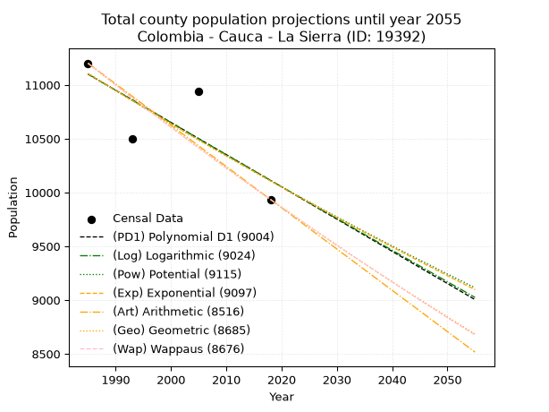
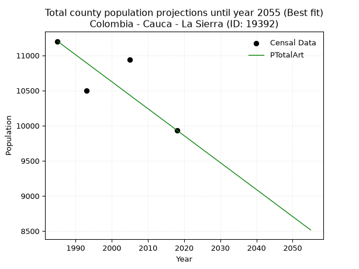
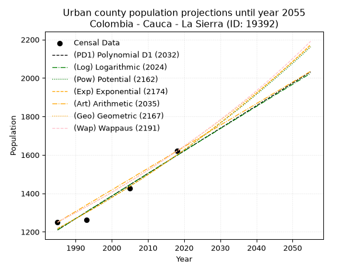
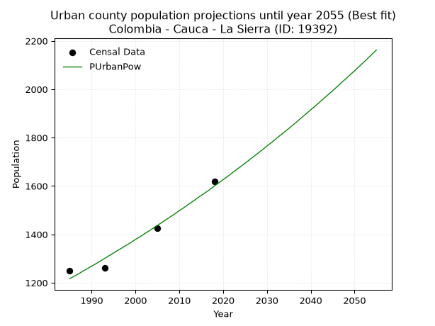
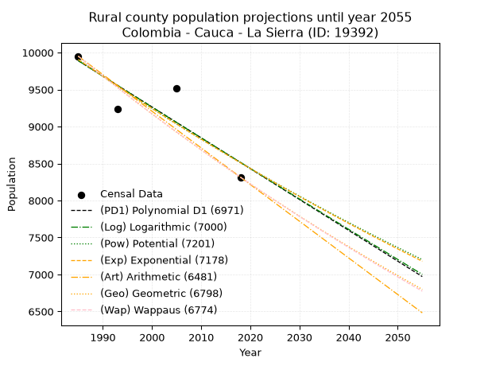
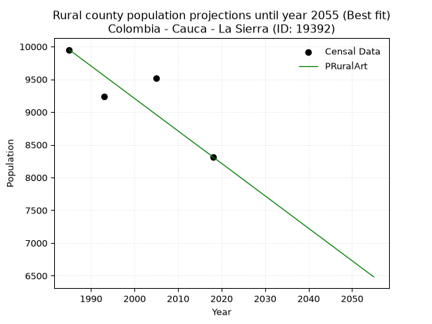

<div align="center">


</div>

# 📜 _“Population and Public Services Demand Projections (PPSD) until Year 2050 for Colombia - Cauca - La Sierra (ID: 19392)”_
Keywords: `population` `public-service` `projection` `lineal` `polynomial` `logarithmic` `potential` `exponential` `arithmetic` `geometric` `wappaus` `dane` `colombia` `south-america`

PPSD are analytical estimates used by governments and planners to anticipate future changes in population size, age distribution, and the resulting community needs for utilities, healthcare, education, and infrastructure as sizing future water treatment facilities, electrical grids, and road networks based on spatial growth.

<div align="center">

</img>

</div>


> **General running parameters**: • app_version: _v20260806_. • Python version: _3.14.7_. • Pandas version: _3.0.5_. • NumPy version: _2.5.1_. • Creates, save and include plots into reports (create_plot): _False_. • Projection until year: _2050_. • Process polynomial degree 2 and up: _False_. • Process Wappaus: _True_. • Process Wappaus: _True_. • Set negative values to zero: _True_. • Set infinite values to zero: _True_. • Drop dataset notes: _True_. 
<div align="center">

Maps & GIS Layers: [:earth_americas:Google](http://maps.google.com/maps?q=2.179382685,-76.7632782) [:earth_americas:OSM](https://www.openstreetmap.org/#map=18/2.179382685/-76.7632782&layers=P) [:earth_americas:Bing](https://www.bing.com/maps?cp=2.179382685~-76.7632782&lvl=18) [:earth_americas:Apple](https://maps.apple.com/frame?center=2.179382685%2C-76.7632782&span=0.003%2C0.006) [:earth_americas:GISMobile](https://github.com/rcfdtools/R.GISMobile/blob/main/file/gis/CountyLayer_CO/Readme.md)

</div>


<div align="center">

```geojson
{
  "type": "Feature",
  "geometry": {
    "type": "Point", 
    "coordinates": [-76.7632782, 2.179382685]
  }, 
  "properties": {
    "Name": "Colombia - Cauca - La Sierra (ID: 19392)"
  }
}
```

</div>


## 0. Census Data (4 records)

Census data are official statistics collected by a government about the people and housing in a country. They usually include counts of total population, age, sex, race, income, education, and jobs.

📅Global census file: [Population.xlsx](../data/Population.xlsx)

| Source   |   Year |   CountryID | CountryName   |   StateID | StateName   |   CountyID | CountyName   |   PTotal |   PUrban |   PRural |
|:---------|-------:|------------:|:--------------|----------:|:------------|-----------:|:-------------|---------:|---------:|---------:|
| DANE     |   1985 |          57 | Colombia      |        19 | Cauca       |      19392 | La Sierra    |    11201 |     1250 |     9951 |
| DANE     |   1993 |          57 | Colombia      |        19 | Cauca       |      19392 | La Sierra    |    10501 |     1261 |     9240 |
| DANE     |   2005 |          57 | Colombia      |        19 | Cauca       |      19392 | La Sierra    |    10937 |     1425 |     9512 |
| DANE     |   2018 |          57 | Colombia      |        19 | Cauca       |      19392 | La Sierra    |     9935 |     1620 |     8315 |

> 🔥Some records could had specific notes about the registered values or the corresponding urban or rural distribution.

📅[SUI-RUPS](https://www.datos.gov.co/Hacienda-y-Cr-dito-P-blico/Registro-nico-de-Prestadores-de-Servicios-P-blicos/4qkq-csdn/about_data) - Local public utility companies: [RUPS.csv](../data/RUPS.csv)

 | SERVICIO       | ESTADO    | NOMBRE                                                                                   | NIT         | DEPARTAMENTO_DOMICILIO   | MUNICIPIO_DOMICILIO   | DIRECCION                            |   TELEFONO | EMAIL                   | TIPO_PRESTADOR          | CLASIFICACION                 |
|:---------------|:----------|:-----------------------------------------------------------------------------------------|:------------|:-------------------------|:----------------------|:-------------------------------------|-----------:|:------------------------|:------------------------|:------------------------------|
| ACUEDUCTO      | OPERATIVA | ADMINISTRACION PUBLICA COOPERATIVA DE ACUEDUCTO, ALCANTARILLADO Y ASEO DE LA SIERRA      | 900039787-1 | CAUCA                    | LA SIERRA             | CALLE 3 NO. 3- 51EDIFICIO APROAGROSI |    8255014 | acuasierra5@yahoo.es    | ORGANIZACION AUTORIZADA | HASTA 2500 SUSCRIPTORES       |
| ALCANTARILLADO | OPERATIVA | ADMINISTRACION PUBLICA COOPERATIVA DE ACUEDUCTO, ALCANTARILLADO Y ASEO DE LA SIERRA      | 900039787-1 | CAUCA                    | LA SIERRA             | CALLE 3 NO. 3- 51EDIFICIO APROAGROSI |    8255014 | acuasierra5@yahoo.es    | ORGANIZACION AUTORIZADA | HASTA 2500 SUSCRIPTORES       |
| ACUEDUCTO      | OPERATIVA | ADMINISTRACION PUBLICA COOPERATIVA DE ACUEDUCTO ALCANTARILLADO Y ASEO DE LA SIERRA CAUCA | 900664903-1 | CAUCA                    | LA SIERRA             | aaalasierra@hotmail.com              |    8255014 | aaalasierra@hotmail.com | ORGANIZACION AUTORIZADA | MENOR O IGUAL A 2500 USUARIOS |
| ALCANTARILLADO | OPERATIVA | ADMINISTRACION PUBLICA COOPERATIVA DE ACUEDUCTO ALCANTARILLADO Y ASEO DE LA SIERRA CAUCA | 900664903-1 | CAUCA                    | LA SIERRA             | aaalasierra@hotmail.com              |    8255014 | aaalasierra@hotmail.com | ORGANIZACION AUTORIZADA | MENOR O IGUAL A 2500 USUARIOS |

## 1. Total

### 1.1. Coefficients and Parameters

* (PD1) Polynomial Deg 1: -29.948615014049974, 70548.21718185347 (lineal)
* (Log) Logarithmic: -59912.8187996705, 466041.315807494
* (Pow) Potential: -5.699688738222115, 22.841743157919883
* (Exp) Exponential: -0.0028492238080371365, 3175061.1240280713
* (Art) Arithmetic: Year diff. 2018 - 1985 = 33, Population diff. 9935 - 11201 = -1266, Annual growth = -38.36363636363637
* (Geo) Geometric: Year diff. 2018 - 1985 = 33, Population diff. 9935 - 11201 = -1266, Annual growth % = -0.003627923852174697
* (Wap) Wappaus: i = -0.3630169981419035, Condition values only valid for < 200)

<sub>
Wappaus condition values: ['-0.00', '-0.36', '-0.73', '-1.09', '-1.45', '-1.82', '-2.18', '-2.54', '-2.90', '-3.27', '-3.63', '-3.99', '-4.36', '-4.72', '-5.08', '-5.45', '-5.81', '-6.17', '-6.53', '-6.90', '-7.26', '-7.62', '-7.99', '-8.35', '-8.71', '-9.08', '-9.44', '-9.80', '-10.16', '-10.53', '-10.89', '-11.25', '-11.62', '-11.98', '-12.34', '-12.71', '-13.07', '-13.43', '-13.79', '-14.16', '-14.52', '-14.88', '-15.25', '-15.61', '-15.97', '-16.34', '-16.70', '-17.06', '-17.42', '-17.79', '-18.15', '-18.51', '-18.88', '-19.24', '-19.60', '-19.97', '-20.33', '-20.69', '-21.05', '-21.42', '-21.78', '-22.14', '-22.51', '-22.87', '-23.23', '-23.60']
</sub>


### 1.2. Projected Dataset

|   Year |   CountyID |   PTotalPD1 |   PTotalLog |   PTotalPow |   PTotalExp |   PTotalArt |   PTotalGeo |   PTotalWap |
|-------:|-----------:|------------:|------------:|------------:|------------:|------------:|------------:|------------:|
|   1985 |      19392 |       11100 |       11101 |       11105 |       11105 |       11201 |       11201 |       11201 |
|   1986 |      19392 |       11070 |       11071 |       11074 |       11073 |       11163 |       11160 |       11160 |
|   1987 |      19392 |       11040 |       11041 |       11042 |       11042 |       11124 |       11120 |       11120 |
|   1988 |      19392 |       11010 |       11010 |       11010 |       11010 |       11086 |       11080 |       11080 |
|   1989 |      19392 |       10980 |       10980 |       10979 |       10979 |       11048 |       11039 |       11040 |
|   1990 |      19392 |       10950 |       10950 |       10947 |       10948 |       11009 |       10999 |       11000 |
|   1991 |      19392 |       10921 |       10920 |       10916 |       10917 |       10971 |       10959 |       10960 |
|   1992 |      19392 |       10891 |       10890 |       10885 |       10885 |       10932 |       10920 |       10920 |
|   1993 |      19392 |       10861 |       10860 |       10854 |       10854 |       10894 |       10880 |       10880 |
|   1994 |      19392 |       10831 |       10830 |       10823 |       10824 |       10856 |       10841 |       10841 |
|   1995 |      19392 |       10801 |       10800 |       10792 |       10793 |       10817 |       10801 |       10802 |
|   1996 |      19392 |       10771 |       10770 |       10761 |       10762 |       10779 |       10762 |       10762 |
|   1997 |      19392 |       10741 |       10740 |       10730 |       10731 |       10741 |       10723 |       10723 |
|   1998 |      19392 |       10711 |       10710 |       10700 |       10701 |       10702 |       10684 |       10685 |
|   1999 |      19392 |       10681 |       10680 |       10669 |       10671 |       10664 |       10645 |       10646 |
|   2000 |      19392 |       10651 |       10650 |       10639 |       10640 |       10626 |       10607 |       10607 |
|   2001 |      19392 |       10621 |       10620 |       10609 |       10610 |       10587 |       10568 |       10569 |
|   2002 |      19392 |       10591 |       10590 |       10579 |       10580 |       10549 |       10530 |       10530 |
|   2003 |      19392 |       10561 |       10560 |       10548 |       10550 |       10510 |       10492 |       10492 |
|   2004 |      19392 |       10531 |       10530 |       10519 |       10520 |       10472 |       10454 |       10454 |
|   2005 |      19392 |       10501 |       10500 |       10489 |       10490 |       10434 |       10416 |       10416 |
|   2006 |      19392 |       10471 |       10470 |       10459 |       10460 |       10395 |       10378 |       10378 |
|   2007 |      19392 |       10441 |       10440 |       10429 |       10430 |       10357 |       10340 |       10341 |
|   2008 |      19392 |       10411 |       10411 |       10400 |       10400 |       10319 |       10303 |       10303 |
|   2009 |      19392 |       10381 |       10381 |       10370 |       10371 |       10280 |       10265 |       10266 |
|   2010 |      19392 |       10352 |       10351 |       10341 |       10341 |       10242 |       10228 |       10229 |
|   2011 |      19392 |       10322 |       10321 |       10312 |       10312 |       10204 |       10191 |       10191 |
|   2012 |      19392 |       10292 |       10291 |       10282 |       10283 |       10165 |       10154 |       10154 |
|   2013 |      19392 |       10262 |       10262 |       10253 |       10253 |       10127 |       10117 |       10118 |
|   2014 |      19392 |       10232 |       10232 |       10224 |       10224 |       10088 |       10080 |       10081 |
|   2015 |      19392 |       10202 |       10202 |       10195 |       10195 |       10050 |       10044 |       10044 |
|   2016 |      19392 |       10172 |       10172 |       10167 |       10166 |       10012 |       10007 |       10008 |
|   2017 |      19392 |       10142 |       10143 |       10138 |       10137 |        9973 |        9971 |        9971 |
|   2018 |      19392 |       10112 |       10113 |       10109 |       10108 |        9935 |        9935 |        9935 |
|   2019 |      19392 |       10082 |       10083 |       10081 |       10079 |        9897 |        9899 |        9899 |
|   2020 |      19392 |       10052 |       10054 |       10052 |       10051 |        9858 |        9863 |        9863 |
|   2021 |      19392 |       10022 |       10024 |       10024 |       10022 |        9820 |        9827 |        9827 |
|   2022 |      19392 |        9992 |        9994 |        9996 |        9994 |        9782 |        9792 |        9791 |
|   2023 |      19392 |        9962 |        9965 |        9968 |        9965 |        9743 |        9756 |        9756 |
|   2024 |      19392 |        9932 |        9935 |        9940 |        9937 |        9705 |        9721 |        9720 |
|   2025 |      19392 |        9902 |        9906 |        9912 |        9909 |        9666 |        9685 |        9685 |
|   2026 |      19392 |        9872 |        9876 |        9884 |        9880 |        9628 |        9650 |        9649 |
|   2027 |      19392 |        9842 |        9846 |        9856 |        9852 |        9590 |        9615 |        9614 |
|   2028 |      19392 |        9812 |        9817 |        9828 |        9824 |        9551 |        9580 |        9579 |
|   2029 |      19392 |        9782 |        9787 |        9801 |        9796 |        9513 |        9546 |        9544 |
|   2030 |      19392 |        9753 |        9758 |        9773 |        9768 |        9475 |        9511 |        9509 |
|   2031 |      19392 |        9723 |        9728 |        9746 |        9741 |        9436 |        9477 |        9475 |
|   2032 |      19392 |        9693 |        9699 |        9719 |        9713 |        9398 |        9442 |        9440 |
|   2033 |      19392 |        9663 |        9669 |        9691 |        9685 |        9360 |        9408 |        9406 |
|   2034 |      19392 |        9633 |        9640 |        9664 |        9658 |        9321 |        9374 |        9371 |
|   2035 |      19392 |        9603 |        9610 |        9637 |        9630 |        9283 |        9340 |        9337 |
|   2036 |      19392 |        9573 |        9581 |        9610 |        9603 |        9244 |        9306 |        9303 |
|   2037 |      19392 |        9543 |        9552 |        9584 |        9576 |        9206 |        9272 |        9269 |
|   2038 |      19392 |        9513 |        9522 |        9557 |        9548 |        9168 |        9238 |        9235 |
|   2039 |      19392 |        9483 |        9493 |        9530 |        9521 |        9129 |        9205 |        9201 |
|   2040 |      19392 |        9453 |        9463 |        9503 |        9494 |        9091 |        9172 |        9168 |
|   2041 |      19392 |        9423 |        9434 |        9477 |        9467 |        9053 |        9138 |        9134 |
|   2042 |      19392 |        9393 |        9405 |        9451 |        9440 |        9014 |        9105 |        9101 |
|   2043 |      19392 |        9363 |        9375 |        9424 |        9413 |        8976 |        9072 |        9067 |
|   2044 |      19392 |        9333 |        9346 |        9398 |        9386 |        8938 |        9039 |        9034 |
|   2045 |      19392 |        9303 |        9317 |        9372 |        9360 |        8899 |        9006 |        9001 |
|   2046 |      19392 |        9273 |        9287 |        9346 |        9333 |        8861 |        8974 |        8968 |
|   2047 |      19392 |        9243 |        9258 |        9320 |        9307 |        8822 |        8941 |        8935 |
|   2048 |      19392 |        9213 |        9229 |        9294 |        9280 |        8784 |        8909 |        8902 |
|   2049 |      19392 |        9184 |        9200 |        9268 |        9254 |        8746 |        8876 |        8870 |
|   2050 |      19392 |        9154 |        9170 |        9242 |        9227 |        8707 |        8844 |        8837 |
<div align="center">

</img>

</div>


### 1.3. Best fit with absolute and relative error (%)

Relative error puts that difference into context by dividing the absolute error by the true value, creating a unitless ratio or percentage that shows the scale of the mistake.

Absolute and relative error

|   Year | Source   |   CountryID | CountryName   |   StateID | StateName   |   CountyID_x | CountyName   |   PTotal |   PUrban |   PRural |   CountyID_y |   PTotalPD1 |   PTotalLog |   PTotalPow |   PTotalExp |   PTotalArt |   PTotalGeo |   PTotalWap |   PTotalPD1AbsError |   PTotalLogAbsError |   PTotalPowAbsError |   PTotalExpAbsError |   PTotalArtAbsError |   PTotalGeoAbsError |   PTotalWapAbsError |   PTotalPD1RelError |   PTotalLogRelError |   PTotalPowRelError |   PTotalExpRelError |   PTotalArtRelError |   PTotalGeoRelError |   PTotalWapRelError |
|-------:|:---------|------------:|:--------------|----------:|:------------|-------------:|:-------------|---------:|---------:|---------:|-------------:|------------:|------------:|------------:|------------:|------------:|------------:|------------:|--------------------:|--------------------:|--------------------:|--------------------:|--------------------:|--------------------:|--------------------:|--------------------:|--------------------:|--------------------:|--------------------:|--------------------:|--------------------:|--------------------:|
|   1985 | DANE     |          57 | Colombia      |        19 | Cauca       |        19392 | La Sierra    |    11201 |     1250 |     9951 |        19392 |       11100 |       11101 |       11105 |       11105 |       11201 |       11201 |       11201 |                 101 |                 100 |                  96 |                  96 |                   0 |                   0 |                   0 |            0.901705 |            0.892777 |            0.857066 |            0.857066 |             0       |             0       |             0       |
|   1993 | DANE     |          57 | Colombia      |        19 | Cauca       |        19392 | La Sierra    |    10501 |     1261 |     9240 |        19392 |       10861 |       10860 |       10854 |       10854 |       10894 |       10880 |       10880 |                 360 |                 359 |                 353 |                 353 |                 393 |                 379 |                 379 |            3.42824  |            3.41872  |            3.36158  |            3.36158  |             3.7425  |             3.60918 |             3.60918 |
|   2005 | DANE     |          57 | Colombia      |        19 | Cauca       |        19392 | La Sierra    |    10937 |     1425 |     9512 |        19392 |       10501 |       10500 |       10489 |       10490 |       10434 |       10416 |       10416 |                 436 |                 437 |                 448 |                 447 |                 503 |                 521 |                 521 |            3.98647  |            3.99561  |            4.09619  |            4.08704  |             4.59907 |             4.76365 |             4.76365 |
|   2018 | DANE     |          57 | Colombia      |        19 | Cauca       |        19392 | La Sierra    |     9935 |     1620 |     8315 |        19392 |       10112 |       10113 |       10109 |       10108 |        9935 |        9935 |        9935 |                 177 |                 178 |                 174 |                 173 |                   0 |                   0 |                   0 |            1.78158  |            1.79165  |            1.75138  |            1.74132  |             0       |             0       |             0       |

Relative error mean

| Method    |   RelError | Best   |
|:----------|-----------:|:-------|
| PTotalPD1 |    2.5245  |        |
| PTotalLog |    2.52469 |        |
| PTotalPow |    2.51656 |        |
| PTotalExp |    2.51175 |        |
| PTotalArt |    2.08539 | True   |
| PTotalGeo |    2.09321 |        |
| PTotalWap |    2.09321 |        |

💙Best method: _**PTotalArt**_
<div align="center">

</img>

</div>


### 1.4. Fresh water supply demand in liters per capita per day (lpcd)

The fresh water supply demand typically ranges from 100 to 300 liters per capita per day (lpcd) for standard domestic and municipal planning, though absolute survival minimums set by the World Health Organization are as low as 7.5 to 20 liters per day, and total consumption in high-income nations can exceed 400 liters.

> `CZ`: Level in meters above the sea level (masl)<br> `WS`: Fresh water supply demand in liters per capita per day (lpcd or l/h/d)<br> `WSAll`: Zonal fresh water supply demand in liters per second (l/s)<br> `A`: Zonal area in square meters<br> `DP`: Population density (people/hectare or p/ha)

Reference values (RAS Colombia)

|    CZ |   WS |
|------:|-----:|
|  1000 |  120 |
|  2000 |  130 |
| 99999 |  140 |

County shapefile geometry properties and water supply values

|   CountyID |      ATotal |   CZTotal |   WSTotal |
|-----------:|------------:|----------:|----------:|
|      19392 | 2.08467e+08 |   1576.96 |       130 |

Projected values for best method: PTotalArt

|   CountyID |   Year |   PTotalArt |   DPTotal |   WSTotal |   WSTotalAll |
|-----------:|-------:|------------:|----------:|----------:|-------------:|
|      19392 |   1985 |       11201 |      0.54 |       130 |      16.8534 |
|      19392 |   1986 |       11163 |      0.54 |       130 |      16.7962 |
|      19392 |   1987 |       11124 |      0.53 |       130 |      16.7375 |
|      19392 |   1988 |       11086 |      0.53 |       130 |      16.6803 |
|      19392 |   1989 |       11048 |      0.53 |       130 |      16.6231 |
|      19392 |   1990 |       11009 |      0.53 |       130 |      16.5645 |
|      19392 |   1991 |       10971 |      0.53 |       130 |      16.5073 |
|      19392 |   1992 |       10932 |      0.52 |       130 |      16.4486 |
|      19392 |   1993 |       10894 |      0.52 |       130 |      16.3914 |
|      19392 |   1994 |       10856 |      0.52 |       130 |      16.3343 |
|      19392 |   1995 |       10817 |      0.52 |       130 |      16.2756 |
|      19392 |   1996 |       10779 |      0.52 |       130 |      16.2184 |
|      19392 |   1997 |       10741 |      0.52 |       130 |      16.1612 |
|      19392 |   1998 |       10702 |      0.51 |       130 |      16.1025 |
|      19392 |   1999 |       10664 |      0.51 |       130 |      16.0454 |
|      19392 |   2000 |       10626 |      0.51 |       130 |      15.9882 |
|      19392 |   2001 |       10587 |      0.51 |       130 |      15.9295 |
|      19392 |   2002 |       10549 |      0.51 |       130 |      15.8723 |
|      19392 |   2003 |       10510 |      0.5  |       130 |      15.8137 |
|      19392 |   2004 |       10472 |      0.5  |       130 |      15.7565 |
|      19392 |   2005 |       10434 |      0.5  |       130 |      15.6993 |
|      19392 |   2006 |       10395 |      0.5  |       130 |      15.6406 |
|      19392 |   2007 |       10357 |      0.5  |       130 |      15.5834 |
|      19392 |   2008 |       10319 |      0.49 |       130 |      15.5263 |
|      19392 |   2009 |       10280 |      0.49 |       130 |      15.4676 |
|      19392 |   2010 |       10242 |      0.49 |       130 |      15.4104 |
|      19392 |   2011 |       10204 |      0.49 |       130 |      15.3532 |
|      19392 |   2012 |       10165 |      0.49 |       130 |      15.2946 |
|      19392 |   2013 |       10127 |      0.49 |       130 |      15.2374 |
|      19392 |   2014 |       10088 |      0.48 |       130 |      15.1787 |
|      19392 |   2015 |       10050 |      0.48 |       130 |      15.1215 |
|      19392 |   2016 |       10012 |      0.48 |       130 |      15.0644 |
|      19392 |   2017 |        9973 |      0.48 |       130 |      15.0057 |
|      19392 |   2018 |        9935 |      0.48 |       130 |      14.9485 |
|      19392 |   2019 |        9897 |      0.47 |       130 |      14.8913 |
|      19392 |   2020 |        9858 |      0.47 |       130 |      14.8326 |
|      19392 |   2021 |        9820 |      0.47 |       130 |      14.7755 |
|      19392 |   2022 |        9782 |      0.47 |       130 |      14.7183 |
|      19392 |   2023 |        9743 |      0.47 |       130 |      14.6596 |
|      19392 |   2024 |        9705 |      0.47 |       130 |      14.6024 |
|      19392 |   2025 |        9666 |      0.46 |       130 |      14.5437 |
|      19392 |   2026 |        9628 |      0.46 |       130 |      14.4866 |
|      19392 |   2027 |        9590 |      0.46 |       130 |      14.4294 |
|      19392 |   2028 |        9551 |      0.46 |       130 |      14.3707 |
|      19392 |   2029 |        9513 |      0.46 |       130 |      14.3135 |
|      19392 |   2030 |        9475 |      0.45 |       130 |      14.2564 |
|      19392 |   2031 |        9436 |      0.45 |       130 |      14.1977 |
|      19392 |   2032 |        9398 |      0.45 |       130 |      14.1405 |
|      19392 |   2033 |        9360 |      0.45 |       130 |      14.0833 |
|      19392 |   2034 |        9321 |      0.45 |       130 |      14.0247 |
|      19392 |   2035 |        9283 |      0.45 |       130 |      13.9675 |
|      19392 |   2036 |        9244 |      0.44 |       130 |      13.9088 |
|      19392 |   2037 |        9206 |      0.44 |       130 |      13.8516 |
|      19392 |   2038 |        9168 |      0.44 |       130 |      13.7944 |
|      19392 |   2039 |        9129 |      0.44 |       130 |      13.7358 |
|      19392 |   2040 |        9091 |      0.44 |       130 |      13.6786 |
|      19392 |   2041 |        9053 |      0.43 |       130 |      13.6214 |
|      19392 |   2042 |        9014 |      0.43 |       130 |      13.5627 |
|      19392 |   2043 |        8976 |      0.43 |       130 |      13.5056 |
|      19392 |   2044 |        8938 |      0.43 |       130 |      13.4484 |
|      19392 |   2045 |        8899 |      0.43 |       130 |      13.3897 |
|      19392 |   2046 |        8861 |      0.43 |       130 |      13.3325 |
|      19392 |   2047 |        8822 |      0.42 |       130 |      13.2738 |
|      19392 |   2048 |        8784 |      0.42 |       130 |      13.2167 |
|      19392 |   2049 |        8746 |      0.42 |       130 |      13.1595 |
|      19392 |   2050 |        8707 |      0.42 |       130 |      13.1008 |

## 2. Urban

### 2.1. Coefficients and Parameters

* (PD1) Polynomial Deg 1: 11.752709755118296, -22119.357687675372 (lineal)
* (Log) Logarithmic: 23513.441597066256, -177336.85800419617
* (Pow) Potential: 16.58204717696915, -51.59835652199228
* (Exp) Exponential: 0.008287642623191005, 8.725373103299633e-05
* (Art) Arithmetic: Year diff. 2018 - 1985 = 33, Population diff. 1620 - 1250 = 370, Annual growth = 11.212121212121213
* (Geo) Geometric: Year diff. 2018 - 1985 = 33, Population diff. 1620 - 1250 = 370, Annual growth % = 0.007887996026255228
* (Wap) Wappaus: i = 0.7813324886495618, Condition values only valid for < 200)

<sub>
Wappaus condition values: ['0.00', '0.78', '1.56', '2.34', '3.13', '3.91', '4.69', '5.47', '6.25', '7.03', '7.81', '8.59', '9.38', '10.16', '10.94', '11.72', '12.50', '13.28', '14.06', '14.85', '15.63', '16.41', '17.19', '17.97', '18.75', '19.53', '20.31', '21.10', '21.88', '22.66', '23.44', '24.22', '25.00', '25.78', '26.57', '27.35', '28.13', '28.91', '29.69', '30.47', '31.25', '32.03', '32.82', '33.60', '34.38', '35.16', '35.94', '36.72', '37.50', '38.29', '39.07', '39.85', '40.63', '41.41', '42.19', '42.97', '43.75', '44.54', '45.32', '46.10', '46.88', '47.66', '48.44', '49.22', '50.01', '50.79']
</sub>


### 2.2. Projected Dataset

|   Year |   CountyID |   PUrbanPD1 |   PUrbanLog |   PUrbanPow |   PUrbanExp |   PUrbanArt |   PUrbanGeo |   PUrbanWap |
|-------:|-----------:|------------:|------------:|------------:|------------:|------------:|------------:|------------:|
|   1985 |      19392 |        1210 |        1210 |        1217 |        1217 |        1250 |        1250 |        1250 |
|   1986 |      19392 |        1222 |        1221 |        1227 |        1227 |        1261 |        1260 |        1260 |
|   1987 |      19392 |        1233 |        1233 |        1237 |        1238 |        1272 |        1270 |        1270 |
|   1988 |      19392 |        1245 |        1245 |        1248 |        1248 |        1284 |        1280 |        1280 |
|   1989 |      19392 |        1257 |        1257 |        1258 |        1258 |        1295 |        1290 |        1290 |
|   1990 |      19392 |        1269 |        1269 |        1269 |        1269 |        1306 |        1300 |        1300 |
|   1991 |      19392 |        1280 |        1280 |        1279 |        1279 |        1317 |        1310 |        1310 |
|   1992 |      19392 |        1292 |        1292 |        1290 |        1290 |        1328 |        1321 |        1320 |
|   1993 |      19392 |        1304 |        1304 |        1301 |        1301 |        1340 |        1331 |        1331 |
|   1994 |      19392 |        1316 |        1316 |        1312 |        1311 |        1351 |        1342 |        1341 |
|   1995 |      19392 |        1327 |        1328 |        1323 |        1322 |        1362 |        1352 |        1352 |
|   1996 |      19392 |        1339 |        1339 |        1334 |        1333 |        1373 |        1363 |        1362 |
|   1997 |      19392 |        1351 |        1351 |        1345 |        1344 |        1385 |        1374 |        1373 |
|   1998 |      19392 |        1363 |        1363 |        1356 |        1356 |        1396 |        1384 |        1384 |
|   1999 |      19392 |        1374 |        1375 |        1367 |        1367 |        1407 |        1395 |        1395 |
|   2000 |      19392 |        1386 |        1387 |        1379 |        1378 |        1418 |        1406 |        1406 |
|   2001 |      19392 |        1398 |        1398 |        1390 |        1390 |        1429 |        1417 |        1417 |
|   2002 |      19392 |        1410 |        1410 |        1402 |        1401 |        1441 |        1429 |        1428 |
|   2003 |      19392 |        1421 |        1422 |        1413 |        1413 |        1452 |        1440 |        1439 |
|   2004 |      19392 |        1433 |        1433 |        1425 |        1425 |        1463 |        1451 |        1450 |
|   2005 |      19392 |        1445 |        1445 |        1437 |        1437 |        1474 |        1463 |        1462 |
|   2006 |      19392 |        1457 |        1457 |        1449 |        1449 |        1485 |        1474 |        1473 |
|   2007 |      19392 |        1468 |        1469 |        1461 |        1461 |        1497 |        1486 |        1485 |
|   2008 |      19392 |        1480 |        1480 |        1473 |        1473 |        1508 |        1498 |        1497 |
|   2009 |      19392 |        1492 |        1492 |        1485 |        1485 |        1519 |        1509 |        1509 |
|   2010 |      19392 |        1504 |        1504 |        1498 |        1497 |        1530 |        1521 |        1521 |
|   2011 |      19392 |        1515 |        1515 |        1510 |        1510 |        1542 |        1533 |        1533 |
|   2012 |      19392 |        1527 |        1527 |        1523 |        1522 |        1553 |        1545 |        1545 |
|   2013 |      19392 |        1539 |        1539 |        1535 |        1535 |        1564 |        1558 |        1557 |
|   2014 |      19392 |        1551 |        1551 |        1548 |        1548 |        1575 |        1570 |        1569 |
|   2015 |      19392 |        1562 |        1562 |        1561 |        1561 |        1586 |        1582 |        1582 |
|   2016 |      19392 |        1574 |        1574 |        1573 |        1574 |        1598 |        1595 |        1594 |
|   2017 |      19392 |        1586 |        1586 |        1586 |        1587 |        1609 |        1607 |        1607 |
|   2018 |      19392 |        1598 |        1597 |        1600 |        1600 |        1620 |        1620 |        1620 |
|   2019 |      19392 |        1609 |        1609 |        1613 |        1613 |        1631 |        1633 |        1633 |
|   2020 |      19392 |        1621 |        1620 |        1626 |        1627 |        1642 |        1646 |        1646 |
|   2021 |      19392 |        1633 |        1632 |        1639 |        1640 |        1654 |        1659 |        1659 |
|   2022 |      19392 |        1645 |        1644 |        1653 |        1654 |        1665 |        1672 |        1672 |
|   2023 |      19392 |        1656 |        1655 |        1667 |        1668 |        1676 |        1685 |        1686 |
|   2024 |      19392 |        1668 |        1667 |        1680 |        1682 |        1687 |        1698 |        1699 |
|   2025 |      19392 |        1680 |        1679 |        1694 |        1696 |        1698 |        1712 |        1713 |
|   2026 |      19392 |        1692 |        1690 |        1708 |        1710 |        1710 |        1725 |        1727 |
|   2027 |      19392 |        1703 |        1702 |        1722 |        1724 |        1721 |        1739 |        1741 |
|   2028 |      19392 |        1715 |        1713 |        1736 |        1738 |        1732 |        1752 |        1755 |
|   2029 |      19392 |        1727 |        1725 |        1750 |        1753 |        1743 |        1766 |        1769 |
|   2030 |      19392 |        1739 |        1737 |        1765 |        1767 |        1755 |        1780 |        1783 |
|   2031 |      19392 |        1750 |        1748 |        1779 |        1782 |        1766 |        1794 |        1798 |
|   2032 |      19392 |        1762 |        1760 |        1794 |        1797 |        1777 |        1808 |        1812 |
|   2033 |      19392 |        1774 |        1771 |        1809 |        1812 |        1788 |        1823 |        1827 |
|   2034 |      19392 |        1786 |        1783 |        1823 |        1827 |        1799 |        1837 |        1842 |
|   2035 |      19392 |        1797 |        1794 |        1838 |        1842 |        1811 |        1851 |        1857 |
|   2036 |      19392 |        1809 |        1806 |        1853 |        1857 |        1822 |        1866 |        1872 |
|   2037 |      19392 |        1821 |        1818 |        1868 |        1873 |        1833 |        1881 |        1887 |
|   2038 |      19392 |        1833 |        1829 |        1884 |        1888 |        1844 |        1896 |        1903 |
|   2039 |      19392 |        1844 |        1841 |        1899 |        1904 |        1855 |        1911 |        1918 |
|   2040 |      19392 |        1856 |        1852 |        1915 |        1920 |        1867 |        1926 |        1934 |
|   2041 |      19392 |        1868 |        1864 |        1930 |        1936 |        1878 |        1941 |        1950 |
|   2042 |      19392 |        1880 |        1875 |        1946 |        1952 |        1889 |        1956 |        1966 |
|   2043 |      19392 |        1891 |        1887 |        1962 |        1968 |        1900 |        1972 |        1982 |
|   2044 |      19392 |        1903 |        1898 |        1978 |        1985 |        1912 |        1987 |        1999 |
|   2045 |      19392 |        1915 |        1910 |        1994 |        2001 |        1923 |        2003 |        2015 |
|   2046 |      19392 |        1927 |        1921 |        2010 |        2018 |        1934 |        2019 |        2032 |
|   2047 |      19392 |        1938 |        1933 |        2027 |        2035 |        1945 |        2035 |        2049 |
|   2048 |      19392 |        1950 |        1944 |        2043 |        2052 |        1956 |        2051 |        2066 |
|   2049 |      19392 |        1962 |        1956 |        2060 |        2069 |        1968 |        2067 |        2083 |
|   2050 |      19392 |        1974 |        1967 |        2076 |        2086 |        1979 |        2083 |        2101 |
<div align="center">

</img>

</div>


### 2.3. Best fit with absolute and relative error (%)

Relative error puts that difference into context by dividing the absolute error by the true value, creating a unitless ratio or percentage that shows the scale of the mistake.

Absolute and relative error

|   Year | Source   |   CountryID | CountryName   |   StateID | StateName   |   CountyID_x | CountyName   |   PTotal |   PUrban |   PRural |   CountyID_y |   PUrbanPD1 |   PUrbanLog |   PUrbanPow |   PUrbanExp |   PUrbanArt |   PUrbanGeo |   PUrbanWap |   PUrbanPD1AbsError |   PUrbanLogAbsError |   PUrbanPowAbsError |   PUrbanExpAbsError |   PUrbanArtAbsError |   PUrbanGeoAbsError |   PUrbanWapAbsError |   PUrbanPD1RelError |   PUrbanLogRelError |   PUrbanPowRelError |   PUrbanExpRelError |   PUrbanArtRelError |   PUrbanGeoRelError |   PUrbanWapRelError |
|-------:|:---------|------------:|:--------------|----------:|:------------|-------------:|:-------------|---------:|---------:|---------:|-------------:|------------:|------------:|------------:|------------:|------------:|------------:|------------:|--------------------:|--------------------:|--------------------:|--------------------:|--------------------:|--------------------:|--------------------:|--------------------:|--------------------:|--------------------:|--------------------:|--------------------:|--------------------:|--------------------:|
|   1985 | DANE     |          57 | Colombia      |        19 | Cauca       |        19392 | La Sierra    |    11201 |     1250 |     9951 |        19392 |        1210 |        1210 |        1217 |        1217 |        1250 |        1250 |        1250 |                  40 |                  40 |                  33 |                  33 |                   0 |                   0 |                   0 |             3.2     |             3.2     |            2.64     |            2.64     |             0       |             0       |             0       |
|   1993 | DANE     |          57 | Colombia      |        19 | Cauca       |        19392 | La Sierra    |    10501 |     1261 |     9240 |        19392 |        1304 |        1304 |        1301 |        1301 |        1340 |        1331 |        1331 |                  43 |                  43 |                  40 |                  40 |                  79 |                  70 |                  70 |             3.40999 |             3.40999 |            3.17209  |            3.17209  |             6.26487 |             5.55115 |             5.55115 |
|   2005 | DANE     |          57 | Colombia      |        19 | Cauca       |        19392 | La Sierra    |    10937 |     1425 |     9512 |        19392 |        1445 |        1445 |        1437 |        1437 |        1474 |        1463 |        1462 |                  20 |                  20 |                  12 |                  12 |                  49 |                  38 |                  37 |             1.40351 |             1.40351 |            0.842105 |            0.842105 |             3.4386  |             2.66667 |             2.59649 |
|   2018 | DANE     |          57 | Colombia      |        19 | Cauca       |        19392 | La Sierra    |     9935 |     1620 |     8315 |        19392 |        1598 |        1597 |        1600 |        1600 |        1620 |        1620 |        1620 |                  22 |                  23 |                  20 |                  20 |                   0 |                   0 |                   0 |             1.35802 |             1.41975 |            1.23457  |            1.23457  |             0       |             0       |             0       |

Relative error mean

| Method    |   RelError | Best   |
|:----------|-----------:|:-------|
| PUrbanPD1 |    2.34288 |        |
| PUrbanLog |    2.35831 |        |
| PUrbanPow |    1.97219 | True   |
| PUrbanExp |    1.97219 | True   |
| PUrbanArt |    2.42587 |        |
| PUrbanGeo |    2.05445 |        |
| PUrbanWap |    2.03691 |        |

💙Best method: _**PUrbanPow**_
<div align="center">

</img>

</div>


### 2.4. Fresh water supply demand in liters per capita per day (lpcd)

The fresh water supply demand typically ranges from 100 to 300 liters per capita per day (lpcd) for standard domestic and municipal planning, though absolute survival minimums set by the World Health Organization are as low as 7.5 to 20 liters per day, and total consumption in high-income nations can exceed 400 liters.

> `CZ`: Level in meters above the sea level (masl)<br> `WS`: Fresh water supply demand in liters per capita per day (lpcd or l/h/d)<br> `WSAll`: Zonal fresh water supply demand in liters per second (l/s)<br> `A`: Zonal area in square meters<br> `DP`: Population density (people/hectare or p/ha)

Reference values (RAS Colombia)

|    CZ |   WS |
|------:|-----:|
|  1000 |  120 |
|  2000 |  130 |
| 99999 |  140 |

County shapefile geometry properties and water supply values

|   CountyID |   AUrban |   CZUrban |   WSUrban |
|-----------:|---------:|----------:|----------:|
|      19392 |   609077 |   1768.14 |       130 |

Projected values for best method: PUrbanPow

|   CountyID |   Year |   PUrbanPow |   DPUrban |   WSUrban |   WSUrbanAll |
|-----------:|-------:|------------:|----------:|----------:|-------------:|
|      19392 |   1985 |        1217 |     19.98 |       130 |      1.83113 |
|      19392 |   1986 |        1227 |     20.15 |       130 |      1.84618 |
|      19392 |   1987 |        1237 |     20.31 |       130 |      1.86123 |
|      19392 |   1988 |        1248 |     20.49 |       130 |      1.87778 |
|      19392 |   1989 |        1258 |     20.65 |       130 |      1.89282 |
|      19392 |   1990 |        1269 |     20.83 |       130 |      1.90938 |
|      19392 |   1991 |        1279 |     21    |       130 |      1.92442 |
|      19392 |   1992 |        1290 |     21.18 |       130 |      1.94097 |
|      19392 |   1993 |        1301 |     21.36 |       130 |      1.95752 |
|      19392 |   1994 |        1312 |     21.54 |       130 |      1.97407 |
|      19392 |   1995 |        1323 |     21.72 |       130 |      1.99063 |
|      19392 |   1996 |        1334 |     21.9  |       130 |      2.00718 |
|      19392 |   1997 |        1345 |     22.08 |       130 |      2.02373 |
|      19392 |   1998 |        1356 |     22.26 |       130 |      2.04028 |
|      19392 |   1999 |        1367 |     22.44 |       130 |      2.05683 |
|      19392 |   2000 |        1379 |     22.64 |       130 |      2.07488 |
|      19392 |   2001 |        1390 |     22.82 |       130 |      2.09144 |
|      19392 |   2002 |        1402 |     23.02 |       130 |      2.10949 |
|      19392 |   2003 |        1413 |     23.2  |       130 |      2.12604 |
|      19392 |   2004 |        1425 |     23.4  |       130 |      2.1441  |
|      19392 |   2005 |        1437 |     23.59 |       130 |      2.16215 |
|      19392 |   2006 |        1449 |     23.79 |       130 |      2.18021 |
|      19392 |   2007 |        1461 |     23.99 |       130 |      2.19826 |
|      19392 |   2008 |        1473 |     24.18 |       130 |      2.21632 |
|      19392 |   2009 |        1485 |     24.38 |       130 |      2.23438 |
|      19392 |   2010 |        1498 |     24.59 |       130 |      2.25394 |
|      19392 |   2011 |        1510 |     24.79 |       130 |      2.27199 |
|      19392 |   2012 |        1523 |     25.01 |       130 |      2.29155 |
|      19392 |   2013 |        1535 |     25.2  |       130 |      2.30961 |
|      19392 |   2014 |        1548 |     25.42 |       130 |      2.32917 |
|      19392 |   2015 |        1561 |     25.63 |       130 |      2.34873 |
|      19392 |   2016 |        1573 |     25.83 |       130 |      2.36678 |
|      19392 |   2017 |        1586 |     26.04 |       130 |      2.38634 |
|      19392 |   2018 |        1600 |     26.27 |       130 |      2.40741 |
|      19392 |   2019 |        1613 |     26.48 |       130 |      2.42697 |
|      19392 |   2020 |        1626 |     26.7  |       130 |      2.44653 |
|      19392 |   2021 |        1639 |     26.91 |       130 |      2.46609 |
|      19392 |   2022 |        1653 |     27.14 |       130 |      2.48715 |
|      19392 |   2023 |        1667 |     27.37 |       130 |      2.50822 |
|      19392 |   2024 |        1680 |     27.58 |       130 |      2.52778 |
|      19392 |   2025 |        1694 |     27.81 |       130 |      2.54884 |
|      19392 |   2026 |        1708 |     28.04 |       130 |      2.56991 |
|      19392 |   2027 |        1722 |     28.27 |       130 |      2.59097 |
|      19392 |   2028 |        1736 |     28.5  |       130 |      2.61204 |
|      19392 |   2029 |        1750 |     28.73 |       130 |      2.6331  |
|      19392 |   2030 |        1765 |     28.98 |       130 |      2.65567 |
|      19392 |   2031 |        1779 |     29.21 |       130 |      2.67674 |
|      19392 |   2032 |        1794 |     29.45 |       130 |      2.69931 |
|      19392 |   2033 |        1809 |     29.7  |       130 |      2.72187 |
|      19392 |   2034 |        1823 |     29.93 |       130 |      2.74294 |
|      19392 |   2035 |        1838 |     30.18 |       130 |      2.76551 |
|      19392 |   2036 |        1853 |     30.42 |       130 |      2.78808 |
|      19392 |   2037 |        1868 |     30.67 |       130 |      2.81065 |
|      19392 |   2038 |        1884 |     30.93 |       130 |      2.83472 |
|      19392 |   2039 |        1899 |     31.18 |       130 |      2.85729 |
|      19392 |   2040 |        1915 |     31.44 |       130 |      2.88137 |
|      19392 |   2041 |        1930 |     31.69 |       130 |      2.90394 |
|      19392 |   2042 |        1946 |     31.95 |       130 |      2.92801 |
|      19392 |   2043 |        1962 |     32.21 |       130 |      2.95208 |
|      19392 |   2044 |        1978 |     32.48 |       130 |      2.97616 |
|      19392 |   2045 |        1994 |     32.74 |       130 |      3.00023 |
|      19392 |   2046 |        2010 |     33    |       130 |      3.02431 |
|      19392 |   2047 |        2027 |     33.28 |       130 |      3.04988 |
|      19392 |   2048 |        2043 |     33.54 |       130 |      3.07396 |
|      19392 |   2049 |        2060 |     33.82 |       130 |      3.09954 |
|      19392 |   2050 |        2076 |     34.08 |       130 |      3.12361 |

## 3. Rural

### 3.1. Coefficients and Parameters

* (PD1) Polynomial Deg 1: -41.70132476916823, 92667.57486952876 (lineal)
* (Log) Logarithmic: -83426.26039673667, 643378.1738116895
* (Pow) Potential: -9.203050923089103, 34.345387228557286
* (Exp) Exponential: -0.004600522932316331, 91596976.90945683
* (Art) Arithmetic: Year diff. 2018 - 1985 = 33, Population diff. 8315 - 9951 = -1636, Annual growth = -49.57575757575758
* (Geo) Geometric: Year diff. 2018 - 1985 = 33, Population diff. 8315 - 9951 = -1636, Annual growth % = -0.005428000815894118
* (Wap) Wappaus: i = -0.5428200763796953, Condition values only valid for < 200)

<sub>
Wappaus condition values: ['-0.00', '-0.54', '-1.09', '-1.63', '-2.17', '-2.71', '-3.26', '-3.80', '-4.34', '-4.89', '-5.43', '-5.97', '-6.51', '-7.06', '-7.60', '-8.14', '-8.69', '-9.23', '-9.77', '-10.31', '-10.86', '-11.40', '-11.94', '-12.48', '-13.03', '-13.57', '-14.11', '-14.66', '-15.20', '-15.74', '-16.28', '-16.83', '-17.37', '-17.91', '-18.46', '-19.00', '-19.54', '-20.08', '-20.63', '-21.17', '-21.71', '-22.26', '-22.80', '-23.34', '-23.88', '-24.43', '-24.97', '-25.51', '-26.06', '-26.60', '-27.14', '-27.68', '-28.23', '-28.77', '-29.31', '-29.86', '-30.40', '-30.94', '-31.48', '-32.03', '-32.57', '-33.11', '-33.65', '-34.20', '-34.74', '-35.28']
</sub>


### 3.2. Projected Dataset

|   Year |   CountyID |   PRuralPD1 |   PRuralLog |   PRuralPow |   PRuralExp |   PRuralArt |   PRuralGeo |   PRuralWap |
|-------:|-----------:|------------:|------------:|------------:|------------:|------------:|------------:|------------:|
|   1985 |      19392 |        9890 |        9891 |        9907 |        9906 |        9951 |        9951 |        9951 |
|   1986 |      19392 |        9849 |        9849 |        9861 |        9860 |        9901 |        9897 |        9897 |
|   1987 |      19392 |        9807 |        9807 |        9815 |        9815 |        9852 |        9843 |        9844 |
|   1988 |      19392 |        9765 |        9765 |        9770 |        9770 |        9802 |        9790 |        9790 |
|   1989 |      19392 |        9724 |        9723 |        9725 |        9725 |        9753 |        9737 |        9737 |
|   1990 |      19392 |        9682 |        9681 |        9680 |        9680 |        9703 |        9684 |        9685 |
|   1991 |      19392 |        9640 |        9640 |        9635 |        9636 |        9654 |        9631 |        9632 |
|   1992 |      19392 |        9599 |        9598 |        9591 |        9592 |        9604 |        9579 |        9580 |
|   1993 |      19392 |        9557 |        9556 |        9547 |        9548 |        9554 |        9527 |        9528 |
|   1994 |      19392 |        9515 |        9514 |        9503 |        9504 |        9505 |        9475 |        9476 |
|   1995 |      19392 |        9473 |        9472 |        9459 |        9460 |        9455 |        9424 |        9425 |
|   1996 |      19392 |        9432 |        9430 |        9415 |        9417 |        9406 |        9373 |        9374 |
|   1997 |      19392 |        9390 |        9389 |        9372 |        9374 |        9356 |        9322 |        9323 |
|   1998 |      19392 |        9348 |        9347 |        9329 |        9331 |        9307 |        9271 |        9273 |
|   1999 |      19392 |        9307 |        9305 |        9286 |        9288 |        9257 |        9221 |        9222 |
|   2000 |      19392 |        9265 |        9263 |        9244 |        9245 |        9207 |        9171 |        9172 |
|   2001 |      19392 |        9223 |        9222 |        9201 |        9203 |        9158 |        9121 |        9123 |
|   2002 |      19392 |        9182 |        9180 |        9159 |        9161 |        9108 |        9072 |        9073 |
|   2003 |      19392 |        9140 |        9138 |        9117 |        9119 |        9059 |        9022 |        9024 |
|   2004 |      19392 |        9098 |        9097 |        9075 |        9077 |        9009 |        8973 |        8975 |
|   2005 |      19392 |        9056 |        9055 |        9034 |        9035 |        8959 |        8925 |        8926 |
|   2006 |      19392 |        9015 |        9013 |        8992 |        8994 |        8910 |        8876 |        8878 |
|   2007 |      19392 |        8973 |        8972 |        8951 |        8952 |        8860 |        8828 |        8830 |
|   2008 |      19392 |        8931 |        8930 |        8910 |        8911 |        8811 |        8780 |        8782 |
|   2009 |      19392 |        8890 |        8889 |        8869 |        8870 |        8761 |        8732 |        8734 |
|   2010 |      19392 |        8848 |        8847 |        8829 |        8830 |        8712 |        8685 |        8686 |
|   2011 |      19392 |        8806 |        8806 |        8789 |        8789 |        8662 |        8638 |        8639 |
|   2012 |      19392 |        8765 |        8764 |        8748 |        8749 |        8612 |        8591 |        8592 |
|   2013 |      19392 |        8723 |        8723 |        8709 |        8709 |        8563 |        8544 |        8545 |
|   2014 |      19392 |        8681 |        8681 |        8669 |        8669 |        8513 |        8498 |        8499 |
|   2015 |      19392 |        8639 |        8640 |        8629 |        8629 |        8464 |        8452 |        8453 |
|   2016 |      19392 |        8598 |        8599 |        8590 |        8589 |        8414 |        8406 |        8406 |
|   2017 |      19392 |        8556 |        8557 |        8551 |        8550 |        8365 |        8360 |        8361 |
|   2018 |      19392 |        8514 |        8516 |        8512 |        8510 |        8315 |        8315 |        8315 |
|   2019 |      19392 |        8473 |        8474 |        8473 |        8471 |        8265 |        8270 |        8270 |
|   2020 |      19392 |        8431 |        8433 |        8435 |        8433 |        8216 |        8225 |        8224 |
|   2021 |      19392 |        8389 |        8392 |        8396 |        8394 |        8166 |        8180 |        8180 |
|   2022 |      19392 |        8347 |        8351 |        8358 |        8355 |        8117 |        8136 |        8135 |
|   2023 |      19392 |        8306 |        8309 |        8320 |        8317 |        8067 |        8092 |        8090 |
|   2024 |      19392 |        8264 |        8268 |        8283 |        8279 |        8018 |        8048 |        8046 |
|   2025 |      19392 |        8222 |        8227 |        8245 |        8241 |        7968 |        8004 |        8002 |
|   2026 |      19392 |        8181 |        8186 |        8208 |        8203 |        7918 |        7961 |        7958 |
|   2027 |      19392 |        8139 |        8145 |        8170 |        8165 |        7869 |        7918 |        7914 |
|   2028 |      19392 |        8097 |        8103 |        8133 |        8128 |        7819 |        7875 |        7871 |
|   2029 |      19392 |        8056 |        8062 |        8097 |        8091 |        7770 |        7832 |        7828 |
|   2030 |      19392 |        8014 |        8021 |        8060 |        8053 |        7720 |        7789 |        7785 |
|   2031 |      19392 |        7972 |        7980 |        8024 |        8016 |        7671 |        7747 |        7742 |
|   2032 |      19392 |        7930 |        7939 |        7987 |        7980 |        7621 |        7705 |        7699 |
|   2033 |      19392 |        7889 |        7898 |        7951 |        7943 |        7571 |        7663 |        7657 |
|   2034 |      19392 |        7847 |        7857 |        7915 |        7907 |        7522 |        7622 |        7615 |
|   2035 |      19392 |        7805 |        7816 |        7880 |        7870 |        7472 |        7580 |        7573 |
|   2036 |      19392 |        7764 |        7775 |        7844 |        7834 |        7423 |        7539 |        7531 |
|   2037 |      19392 |        7722 |        7734 |        7809 |        7798 |        7373 |        7498 |        7490 |
|   2038 |      19392 |        7680 |        7693 |        7773 |        7762 |        7323 |        7457 |        7448 |
|   2039 |      19392 |        7639 |        7652 |        7738 |        7727 |        7274 |        7417 |        7407 |
|   2040 |      19392 |        7597 |        7611 |        7704 |        7691 |        7224 |        7377 |        7366 |
|   2041 |      19392 |        7555 |        7570 |        7669 |        7656 |        7175 |        7337 |        7325 |
|   2042 |      19392 |        7513 |        7529 |        7634 |        7621 |        7125 |        7297 |        7285 |
|   2043 |      19392 |        7472 |        7489 |        7600 |        7586 |        7076 |        7257 |        7244 |
|   2044 |      19392 |        7430 |        7448 |        7566 |        7551 |        7026 |        7218 |        7204 |
|   2045 |      19392 |        7388 |        7407 |        7532 |        7516 |        6976 |        7179 |        7164 |
|   2046 |      19392 |        7347 |        7366 |        7498 |        7482 |        6927 |        7140 |        7124 |
|   2047 |      19392 |        7305 |        7325 |        7465 |        7448 |        6877 |        7101 |        7084 |
|   2048 |      19392 |        7263 |        7285 |        7431 |        7413 |        6828 |        7062 |        7045 |
|   2049 |      19392 |        7222 |        7244 |        7398 |        7379 |        6778 |        7024 |        7006 |
|   2050 |      19392 |        7180 |        7203 |        7365 |        7345 |        6729 |        6986 |        6966 |
<div align="center">

</img>

</div>


### 3.3. Best fit with absolute and relative error (%)

Relative error puts that difference into context by dividing the absolute error by the true value, creating a unitless ratio or percentage that shows the scale of the mistake.

Absolute and relative error

|   Year | Source   |   CountryID | CountryName   |   StateID | StateName   |   CountyID_x | CountyName   |   PTotal |   PUrban |   PRural |   CountyID_y |   PRuralPD1 |   PRuralLog |   PRuralPow |   PRuralExp |   PRuralArt |   PRuralGeo |   PRuralWap |   PRuralPD1AbsError |   PRuralLogAbsError |   PRuralPowAbsError |   PRuralExpAbsError |   PRuralArtAbsError |   PRuralGeoAbsError |   PRuralWapAbsError |   PRuralPD1RelError |   PRuralLogRelError |   PRuralPowRelError |   PRuralExpRelError |   PRuralArtRelError |   PRuralGeoRelError |   PRuralWapRelError |
|-------:|:---------|------------:|:--------------|----------:|:------------|-------------:|:-------------|---------:|---------:|---------:|-------------:|------------:|------------:|------------:|------------:|------------:|------------:|------------:|--------------------:|--------------------:|--------------------:|--------------------:|--------------------:|--------------------:|--------------------:|--------------------:|--------------------:|--------------------:|--------------------:|--------------------:|--------------------:|--------------------:|
|   1985 | DANE     |          57 | Colombia      |        19 | Cauca       |        19392 | La Sierra    |    11201 |     1250 |     9951 |        19392 |        9890 |        9891 |        9907 |        9906 |        9951 |        9951 |        9951 |                  61 |                  60 |                  44 |                  45 |                   0 |                   0 |                   0 |            0.613004 |            0.602954 |            0.442167 |            0.452216 |             0       |             0       |             0       |
|   1993 | DANE     |          57 | Colombia      |        19 | Cauca       |        19392 | La Sierra    |    10501 |     1261 |     9240 |        19392 |        9557 |        9556 |        9547 |        9548 |        9554 |        9527 |        9528 |                 317 |                 316 |                 307 |                 308 |                 314 |                 287 |                 288 |            3.43074  |            3.41991  |            3.32251  |            3.33333  |             3.39827 |             3.10606 |             3.11688 |
|   2005 | DANE     |          57 | Colombia      |        19 | Cauca       |        19392 | La Sierra    |    10937 |     1425 |     9512 |        19392 |        9056 |        9055 |        9034 |        9035 |        8959 |        8925 |        8926 |                 456 |                 457 |                 478 |                 477 |                 553 |                 587 |                 586 |            4.79394  |            4.80446  |            5.02523  |            5.01472  |             5.81371 |             6.17115 |             6.16064 |
|   2018 | DANE     |          57 | Colombia      |        19 | Cauca       |        19392 | La Sierra    |     9935 |     1620 |     8315 |        19392 |        8514 |        8516 |        8512 |        8510 |        8315 |        8315 |        8315 |                 199 |                 201 |                 197 |                 195 |                   0 |                   0 |                   0 |            2.39327  |            2.41732  |            2.36921  |            2.34516  |             0       |             0       |             0       |

Relative error mean

| Method    |   RelError | Best   |
|:----------|-----------:|:-------|
| PRuralPD1 |    2.80774 |        |
| PRuralLog |    2.81116 |        |
| PRuralPow |    2.78978 |        |
| PRuralExp |    2.78636 |        |
| PRuralArt |    2.30299 | True   |
| PRuralGeo |    2.3193  |        |
| PRuralWap |    2.31938 |        |

💙Best method: _**PRuralArt**_
<div align="center">

</img>

</div>


### 3.4. Fresh water supply demand in liters per capita per day (lpcd)

The fresh water supply demand typically ranges from 100 to 300 liters per capita per day (lpcd) for standard domestic and municipal planning, though absolute survival minimums set by the World Health Organization are as low as 7.5 to 20 liters per day, and total consumption in high-income nations can exceed 400 liters.

> `CZ`: Level in meters above the sea level (masl)<br> `WS`: Fresh water supply demand in liters per capita per day (lpcd or l/h/d)<br> `WSAll`: Zonal fresh water supply demand in liters per second (l/s)<br> `A`: Zonal area in square meters<br> `DP`: Population density (people/hectare or p/ha)

Reference values (RAS Colombia)

|    CZ |   WS |
|------:|-----:|
|  1000 |  120 |
|  2000 |  130 |
| 99999 |  140 |

County shapefile geometry properties and water supply values

|   CountyID |      ARural |   CZRural |   WSRural |
|-----------:|------------:|----------:|----------:|
|      19392 | 2.07858e+08 |   1576.42 |       130 |

Projected values for best method: PRuralArt

|   CountyID |   Year |   PRuralArt |   DPRural |   WSRural |   WSRuralAll |
|-----------:|-------:|------------:|----------:|----------:|-------------:|
|      19392 |   1985 |        9951 |      0.48 |       130 |      14.9726 |
|      19392 |   1986 |        9901 |      0.48 |       130 |      14.8973 |
|      19392 |   1987 |        9852 |      0.47 |       130 |      14.8236 |
|      19392 |   1988 |        9802 |      0.47 |       130 |      14.7484 |
|      19392 |   1989 |        9753 |      0.47 |       130 |      14.6747 |
|      19392 |   1990 |        9703 |      0.47 |       130 |      14.5994 |
|      19392 |   1991 |        9654 |      0.46 |       130 |      14.5257 |
|      19392 |   1992 |        9604 |      0.46 |       130 |      14.4505 |
|      19392 |   1993 |        9554 |      0.46 |       130 |      14.3752 |
|      19392 |   1994 |        9505 |      0.46 |       130 |      14.3015 |
|      19392 |   1995 |        9455 |      0.45 |       130 |      14.2263 |
|      19392 |   1996 |        9406 |      0.45 |       130 |      14.1525 |
|      19392 |   1997 |        9356 |      0.45 |       130 |      14.0773 |
|      19392 |   1998 |        9307 |      0.45 |       130 |      14.0036 |
|      19392 |   1999 |        9257 |      0.45 |       130 |      13.9284 |
|      19392 |   2000 |        9207 |      0.44 |       130 |      13.8531 |
|      19392 |   2001 |        9158 |      0.44 |       130 |      13.7794 |
|      19392 |   2002 |        9108 |      0.44 |       130 |      13.7042 |
|      19392 |   2003 |        9059 |      0.44 |       130 |      13.6304 |
|      19392 |   2004 |        9009 |      0.43 |       130 |      13.5552 |
|      19392 |   2005 |        8959 |      0.43 |       130 |      13.48   |
|      19392 |   2006 |        8910 |      0.43 |       130 |      13.4062 |
|      19392 |   2007 |        8860 |      0.43 |       130 |      13.331  |
|      19392 |   2008 |        8811 |      0.42 |       130 |      13.2573 |
|      19392 |   2009 |        8761 |      0.42 |       130 |      13.1821 |
|      19392 |   2010 |        8712 |      0.42 |       130 |      13.1083 |
|      19392 |   2011 |        8662 |      0.42 |       130 |      13.0331 |
|      19392 |   2012 |        8612 |      0.41 |       130 |      12.9579 |
|      19392 |   2013 |        8563 |      0.41 |       130 |      12.8841 |
|      19392 |   2014 |        8513 |      0.41 |       130 |      12.8089 |
|      19392 |   2015 |        8464 |      0.41 |       130 |      12.7352 |
|      19392 |   2016 |        8414 |      0.4  |       130 |      12.66   |
|      19392 |   2017 |        8365 |      0.4  |       130 |      12.5862 |
|      19392 |   2018 |        8315 |      0.4  |       130 |      12.511  |
|      19392 |   2019 |        8265 |      0.4  |       130 |      12.4358 |
|      19392 |   2020 |        8216 |      0.4  |       130 |      12.362  |
|      19392 |   2021 |        8166 |      0.39 |       130 |      12.2868 |
|      19392 |   2022 |        8117 |      0.39 |       130 |      12.2131 |
|      19392 |   2023 |        8067 |      0.39 |       130 |      12.1378 |
|      19392 |   2024 |        8018 |      0.39 |       130 |      12.0641 |
|      19392 |   2025 |        7968 |      0.38 |       130 |      11.9889 |
|      19392 |   2026 |        7918 |      0.38 |       130 |      11.9137 |
|      19392 |   2027 |        7869 |      0.38 |       130 |      11.8399 |
|      19392 |   2028 |        7819 |      0.38 |       130 |      11.7647 |
|      19392 |   2029 |        7770 |      0.37 |       130 |      11.691  |
|      19392 |   2030 |        7720 |      0.37 |       130 |      11.6157 |
|      19392 |   2031 |        7671 |      0.37 |       130 |      11.542  |
|      19392 |   2032 |        7621 |      0.37 |       130 |      11.4668 |
|      19392 |   2033 |        7571 |      0.36 |       130 |      11.3916 |
|      19392 |   2034 |        7522 |      0.36 |       130 |      11.3178 |
|      19392 |   2035 |        7472 |      0.36 |       130 |      11.2426 |
|      19392 |   2036 |        7423 |      0.36 |       130 |      11.1689 |
|      19392 |   2037 |        7373 |      0.35 |       130 |      11.0936 |
|      19392 |   2038 |        7323 |      0.35 |       130 |      11.0184 |
|      19392 |   2039 |        7274 |      0.35 |       130 |      10.9447 |
|      19392 |   2040 |        7224 |      0.35 |       130 |      10.8694 |
|      19392 |   2041 |        7175 |      0.35 |       130 |      10.7957 |
|      19392 |   2042 |        7125 |      0.34 |       130 |      10.7205 |
|      19392 |   2043 |        7076 |      0.34 |       130 |      10.6468 |
|      19392 |   2044 |        7026 |      0.34 |       130 |      10.5715 |
|      19392 |   2045 |        6976 |      0.34 |       130 |      10.4963 |
|      19392 |   2046 |        6927 |      0.33 |       130 |      10.4226 |
|      19392 |   2047 |        6877 |      0.33 |       130 |      10.3473 |
|      19392 |   2048 |        6828 |      0.33 |       130 |      10.2736 |
|      19392 |   2049 |        6778 |      0.33 |       130 |      10.1984 |
|      19392 |   2050 |        6729 |      0.32 |       130 |      10.1247 |

#

<div align="center"><br><sub>Share this research</sub></div><br>

<sub>**APPS & TOOLS & CONTENT DISCLAIMER**: • NO WARRANTY - This content and software is provided by <a href="https://github.com/rcfdtools" target="_blank">github.com/rcfdtools</a> "as is", without any express or implied warranty, including warranties of merchantability, fitness for a particular purpose, or non-infringement. There is no guarantee that the software will be error-free or operate without interruption. • LIMITATION OF LIABILITY - Neither the authors nor copyright holders will be liable for claims or damages arising from the software or its use. You are responsible for determining if the software is appropriate for your use and assume all associated risks, including errors, legal compliance, and data loss. • NO PROFESSIONAL ADVICE - The software provides general information and does not offer professional advice. It should not replace consultation with professional advisors. [Clauses and global license for rcfdtools use.](https://github.com/rcfdtools/rcfdtools/blob/main/LICENSE.md)</sub>

| [:house: Home](Readme.md)  | [:beginner: Help / Collab](https://github.com/rcfdtools/R.HydroTools/discussions/31) |
|----------------------------|-------------------------------------------------------------------------------------------|