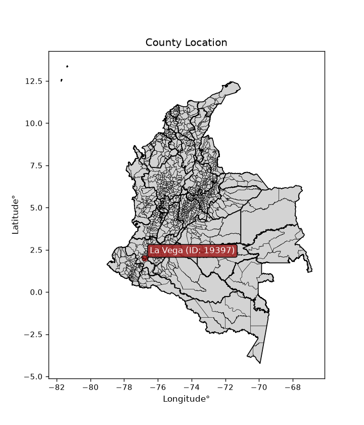
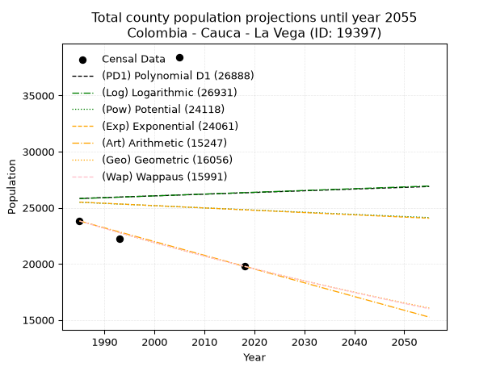
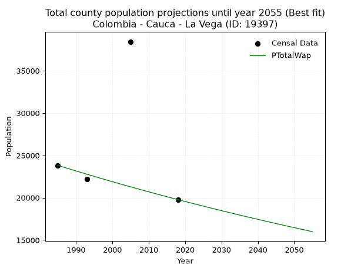
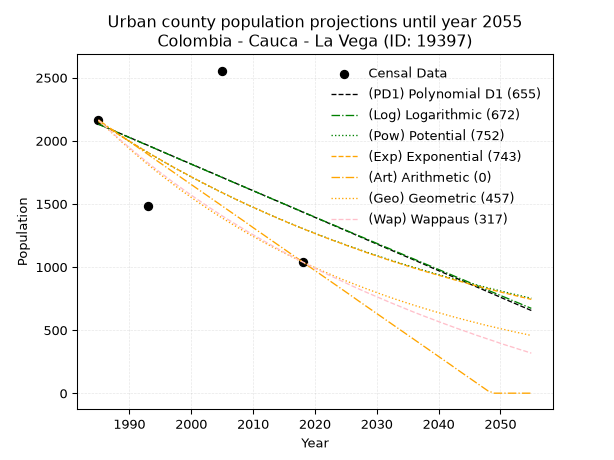
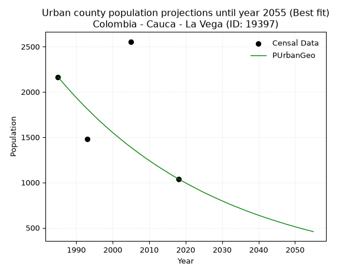
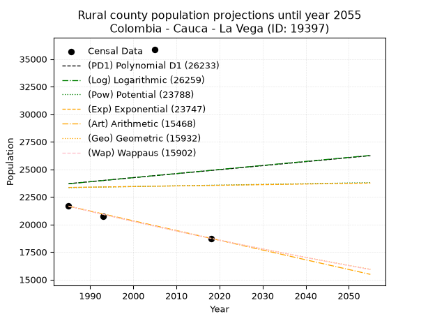
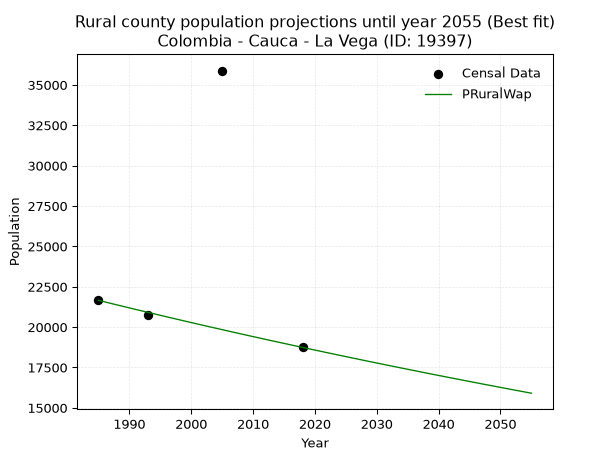

<div align="center">


</div>

# _“Population and Public Services Demand Projections (PPSD) until Year 2050 for Colombia - Cauca - La Vega (ID: 19397)”_
Keywords: `population` `public-service` `projection` `lineal` `polynomial` `logarithmic` `potential` `exponential` `arithmetic` `geometric` `wappaus` `dane` `colombia` `south-america`

PPSD are analytical estimates used by governments and planners to anticipate future changes in population size, age distribution, and the resulting community needs for utilities, healthcare, education, and infrastructure as sizing future water treatment facilities, electrical grids, and road networks based on spatial growth.

<div align="center">

</img>

</div>


> **General running parameters**: • app_version: _v20260806_. • Python version: _3.14.7_. • Pandas version: _3.0.5_. • NumPy version: _2.5.1_. • Creates, save and include plots into reports (create_plot): _False_. • Projection until year: _2050_. • Process polynomial degree 2 and up: _False_. • Process Wappaus: _True_. • Process Wappaus: _True_. • Set negative values to zero: _True_. • Set infinite values to zero: _True_. • Drop dataset notes: _True_. 
<div align="center">

Dynamic map: [:earth_americas:Google](http://maps.google.com/maps?q=2.001803164,-76.7787712) [:earth_americas:OSM](https://www.openstreetmap.org/#map=18/2.001803164/-76.7787712&layers=P) [:earth_americas:Bing](https://www.bing.com/maps?cp=2.001803164~-76.7787712&lvl=18) [:earth_americas:Apple](https://maps.apple.com/frame?center=2.001803164%2C-76.7787712&span=0.003%2C0.006)

</div>


<div align="center">

```geojson
{
  "type": "Feature",
  "geometry": {
    "type": "Point", 
    "coordinates": [-76.7787712, 2.001803164]
  }, 
  "properties": {
    "Name": "Colombia - Cauca - La Vega (ID: 19397)"
  }
}
```

</div>


## 0. Census Data (4 records)

Census data are official statistics collected by a government about the people and housing in a country. They usually include counts of total population, age, sex, race, income, education, and jobs.

📅Global census file: [Population.xlsx](../data/Population.xlsx)

| Source   |   Year |   CountryID | CountryName   |   StateID | StateName   |   CountyID | CountyName   |   PTotal |   PUrban |   PRural |
|:---------|-------:|------------:|:--------------|----------:|:------------|-----------:|:-------------|---------:|---------:|---------:|
| DANE     |   1985 |          57 | Colombia      |        19 | Cauca       |      19397 | La Vega      |    23817 |     2164 |    21653 |
| DANE     |   1993 |          57 | Colombia      |        19 | Cauca       |      19397 | La Vega      |    22201 |     1480 |    20721 |
| DANE     |   2005 |          57 | Colombia      |        19 | Cauca       |      19397 | La Vega      |    38435 |     2555 |    35880 |
| DANE     |   2018 |          57 | Colombia      |        19 | Cauca       |      19397 | La Vega      |    19777 |     1040 |    18737 |

> 🔥Some records could had specific notes about the registered values or the corresponding urban or rural distribution.

📅[SUI-RUPS](https://www.datos.gov.co/Hacienda-y-Cr-dito-P-blico/Registro-nico-de-Prestadores-de-Servicios-P-blicos/4qkq-csdn/about_data) - Local public utility companies: [RUPS.csv](../data/RUPS.xlsx)

 | SERVICIO       | ESTADO      | NOMBRE                                                                                                       | NIT         | DEPARTAMENTO_DOMICILIO   | MUNICIPIO_DOMICILIO   | DIRECCION                    |   TELEFONO | EMAIL                      | TIPO_PRESTADOR          | CLASIFICACION                 |
|:---------------|:------------|:-------------------------------------------------------------------------------------------------------------|:------------|:-------------------------|:----------------------|:-----------------------------|-----------:|:---------------------------|:------------------------|:------------------------------|
| ACUEDUCTO      | CANCELACION | ASOCIACIÓN DE USUARIOS DE LOS SERVICIOS DE AGUA POTABLE Y ALCANTARILLADO DE LA CABECERA MUNICIPAL DE LA VEGA | 817006096-8 | CAUCA                    | LA VEGA               | CARRERA 7 #2A BARRIO LOURDES |    8269754 | nestorsandoval20@gmail.com | nan                     | nan                           |
| ALCANTARILLADO | CANCELACION | ASOCIACIÓN DE USUARIOS DE LOS SERVICIOS DE AGUA POTABLE Y ALCANTARILLADO DE LA CABECERA MUNICIPAL DE LA VEGA | 817006096-8 | CAUCA                    | LA VEGA               | CARRERA 7 #2A BARRIO LOURDES |    8269754 | nestorsandoval20@gmail.com | nan                     | nan                           |
| ACUEDUCTO      | OPERATIVA   | ADMINISTRACIÓN PUBLICA COOPERATIVA CORAZÓN DEL MACIZO                                                        | 901134075-6 | CAUCA                    | LA VEGA               | CARRERA 7 # 2A               |    8269754 | oapino@unicauca.edu.co     | ORGANIZACION AUTORIZADA | MENOR O IGUAL A 2500 USUARIOS |
| ALCANTARILLADO | OPERATIVA   | ADMINISTRACIÓN PUBLICA COOPERATIVA CORAZÓN DEL MACIZO                                                        | 901134075-6 | CAUCA                    | LA VEGA               | CARRERA 7 # 2A               |    8269754 | oapino@unicauca.edu.co     | ORGANIZACION AUTORIZADA | MENOR O IGUAL A 2500 USUARIOS |

## 1. Total

### 1.1. Coefficients and Parameters

* (PD1) Polynomial Deg 1: 15.160979526305324, -4268.249297492225 (lineal)
* (Log) Logarithmic: 32309.316167099765, -219525.87109673605
* (Pow) Potential: -1.5931836953115721, 9.660256923864752
* (Exp) Exponential: -0.0008298123272088019, 132401.42163432288
* (Art) Arithmetic: Year diff. 2018 - 1985 = 33, Population diff. 19777 - 23817 = -4040, Annual growth = -122.42424242424242
* (Geo) Geometric: Year diff. 2018 - 1985 = 33, Population diff. 19777 - 23817 = -4040, Annual growth % = -0.005616892155565045
* (Wap) Wappaus: i = -0.5616563858523761, Condition values only valid for < 200)

<sub>
Wappaus condition values: ['-0.00', '-0.56', '-1.12', '-1.68', '-2.25', '-2.81', '-3.37', '-3.93', '-4.49', '-5.05', '-5.62', '-6.18', '-6.74', '-7.30', '-7.86', '-8.42', '-8.99', '-9.55', '-10.11', '-10.67', '-11.23', '-11.79', '-12.36', '-12.92', '-13.48', '-14.04', '-14.60', '-15.16', '-15.73', '-16.29', '-16.85', '-17.41', '-17.97', '-18.53', '-19.10', '-19.66', '-20.22', '-20.78', '-21.34', '-21.90', '-22.47', '-23.03', '-23.59', '-24.15', '-24.71', '-25.27', '-25.84', '-26.40', '-26.96', '-27.52', '-28.08', '-28.64', '-29.21', '-29.77', '-30.33', '-30.89', '-31.45', '-32.01', '-32.58', '-33.14', '-33.70', '-34.26', '-34.82', '-35.38', '-35.95', '-36.51']
</sub>


### 1.2. Projected Dataset

|   Year |   CountyID |   PTotalPD1 |   PTotalLog |   PTotalPow |   PTotalExp |   PTotalArt |   PTotalGeo |   PTotalWap |
|-------:|-----------:|------------:|------------:|------------:|------------:|------------:|------------:|------------:|
|   1985 |      19397 |       25826 |       25811 |       25487 |       25500 |       23817 |       23817 |       23817 |
|   1986 |      19397 |       25841 |       25827 |       25467 |       25478 |       23695 |       23683 |       23684 |
|   1987 |      19397 |       25857 |       25843 |       25446 |       25457 |       23572 |       23550 |       23551 |
|   1988 |      19397 |       25872 |       25860 |       25426 |       25436 |       23450 |       23418 |       23419 |
|   1989 |      19397 |       25887 |       25876 |       25405 |       25415 |       23327 |       23286 |       23288 |
|   1990 |      19397 |       25902 |       25892 |       25385 |       25394 |       23205 |       23156 |       23157 |
|   1991 |      19397 |       25917 |       25908 |       25365 |       25373 |       23082 |       23026 |       23028 |
|   1992 |      19397 |       25932 |       25925 |       25344 |       25352 |       22960 |       22896 |       22899 |
|   1993 |      19397 |       25948 |       25941 |       25324 |       25331 |       22838 |       22768 |       22770 |
|   1994 |      19397 |       25963 |       25957 |       25304 |       25310 |       22715 |       22640 |       22643 |
|   1995 |      19397 |       25978 |       25973 |       25284 |       25289 |       22593 |       22513 |       22516 |
|   1996 |      19397 |       25993 |       25989 |       25264 |       25268 |       22470 |       22386 |       22390 |
|   1997 |      19397 |       26008 |       26006 |       25243 |       25247 |       22348 |       22260 |       22264 |
|   1998 |      19397 |       26023 |       26022 |       25223 |       25226 |       22225 |       22135 |       22139 |
|   1999 |      19397 |       26039 |       26038 |       25203 |       25205 |       22103 |       22011 |       22015 |
|   2000 |      19397 |       26054 |       26054 |       25183 |       25184 |       21981 |       21887 |       21892 |
|   2001 |      19397 |       26069 |       26070 |       25163 |       25163 |       21858 |       21764 |       21769 |
|   2002 |      19397 |       26084 |       26086 |       25143 |       25142 |       21736 |       21642 |       21647 |
|   2003 |      19397 |       26099 |       26103 |       25123 |       25122 |       21613 |       21521 |       21525 |
|   2004 |      19397 |       26114 |       26119 |       25103 |       25101 |       21491 |       21400 |       21404 |
|   2005 |      19397 |       26130 |       26135 |       25083 |       25080 |       21369 |       21280 |       21284 |
|   2006 |      19397 |       26145 |       26151 |       25063 |       25059 |       21246 |       21160 |       21164 |
|   2007 |      19397 |       26160 |       26167 |       25043 |       25038 |       21124 |       21041 |       21045 |
|   2008 |      19397 |       26175 |       26183 |       25023 |       25017 |       21001 |       20923 |       20927 |
|   2009 |      19397 |       26190 |       26199 |       25004 |       24997 |       20879 |       20805 |       20809 |
|   2010 |      19397 |       26205 |       26215 |       24984 |       24976 |       20756 |       20689 |       20692 |
|   2011 |      19397 |       26220 |       26231 |       24964 |       24955 |       20634 |       20572 |       20576 |
|   2012 |      19397 |       26236 |       26247 |       24944 |       24935 |       20512 |       20457 |       20460 |
|   2013 |      19397 |       26251 |       26263 |       24925 |       24914 |       20389 |       20342 |       20344 |
|   2014 |      19397 |       26266 |       26279 |       24905 |       24893 |       20267 |       20228 |       20230 |
|   2015 |      19397 |       26281 |       26296 |       24885 |       24873 |       20144 |       20114 |       20116 |
|   2016 |      19397 |       26296 |       26312 |       24865 |       24852 |       20022 |       20001 |       20002 |
|   2017 |      19397 |       26311 |       26328 |       24846 |       24831 |       19899 |       19889 |       19889 |
|   2018 |      19397 |       26327 |       26344 |       24826 |       24811 |       19777 |       19777 |       19777 |
|   2019 |      19397 |       26342 |       26360 |       24807 |       24790 |       19655 |       19666 |       19665 |
|   2020 |      19397 |       26357 |       26376 |       24787 |       24770 |       19532 |       19555 |       19554 |
|   2021 |      19397 |       26372 |       26392 |       24768 |       24749 |       19410 |       19446 |       19443 |
|   2022 |      19397 |       26387 |       26408 |       24748 |       24729 |       19287 |       19336 |       19333 |
|   2023 |      19397 |       26402 |       26424 |       24729 |       24708 |       19165 |       19228 |       19224 |
|   2024 |      19397 |       26418 |       26439 |       24709 |       24688 |       19042 |       19120 |       19115 |
|   2025 |      19397 |       26433 |       26455 |       24690 |       24667 |       18920 |       19012 |       19007 |
|   2026 |      19397 |       26448 |       26471 |       24670 |       24647 |       18798 |       18906 |       18899 |
|   2027 |      19397 |       26463 |       26487 |       24651 |       24626 |       18675 |       18799 |       18791 |
|   2028 |      19397 |       26478 |       26503 |       24631 |       24606 |       18553 |       18694 |       18685 |
|   2029 |      19397 |       26493 |       26519 |       24612 |       24585 |       18430 |       18589 |       18578 |
|   2030 |      19397 |       26509 |       26535 |       24593 |       24565 |       18308 |       18484 |       18473 |
|   2031 |      19397 |       26524 |       26551 |       24574 |       24545 |       18185 |       18381 |       18368 |
|   2032 |      19397 |       26539 |       26567 |       24554 |       24524 |       18063 |       18277 |       18263 |
|   2033 |      19397 |       26554 |       26583 |       24535 |       24504 |       17941 |       18175 |       18159 |
|   2034 |      19397 |       26569 |       26599 |       24516 |       24484 |       17818 |       18073 |       18055 |
|   2035 |      19397 |       26584 |       26615 |       24497 |       24463 |       17696 |       17971 |       17952 |
|   2036 |      19397 |       26600 |       26630 |       24477 |       24443 |       17573 |       17870 |       17849 |
|   2037 |      19397 |       26615 |       26646 |       24458 |       24423 |       17451 |       17770 |       17747 |
|   2038 |      19397 |       26630 |       26662 |       24439 |       24402 |       17329 |       17670 |       17646 |
|   2039 |      19397 |       26645 |       26678 |       24420 |       24382 |       17206 |       17571 |       17545 |
|   2040 |      19397 |       26660 |       26694 |       24401 |       24362 |       17084 |       17472 |       17444 |
|   2041 |      19397 |       26675 |       26710 |       24382 |       24342 |       16961 |       17374 |       17344 |
|   2042 |      19397 |       26690 |       26726 |       24363 |       24322 |       16839 |       17276 |       17244 |
|   2043 |      19397 |       26706 |       26741 |       24344 |       24301 |       16716 |       17179 |       17145 |
|   2044 |      19397 |       26721 |       26757 |       24325 |       24281 |       16594 |       17083 |       17046 |
|   2045 |      19397 |       26736 |       26773 |       24306 |       24261 |       16472 |       16987 |       16948 |
|   2046 |      19397 |       26751 |       26789 |       24287 |       24241 |       16349 |       16891 |       16850 |
|   2047 |      19397 |       26766 |       26805 |       24268 |       24221 |       16227 |       16797 |       16753 |
|   2048 |      19397 |       26781 |       26820 |       24249 |       24201 |       16104 |       16702 |       16656 |
|   2049 |      19397 |       26797 |       26836 |       24230 |       24181 |       15982 |       16608 |       16560 |
|   2050 |      19397 |       26812 |       26852 |       24212 |       24161 |       15859 |       16515 |       16464 |
<div align="center">

</img>

</div>


### 1.3. Best fit with absolute and relative error (%)

Relative error puts that difference into context by dividing the absolute error by the true value, creating a unitless ratio or percentage that shows the scale of the mistake.

Absolute and relative error

|   Year | Source   |   CountryID | CountryName   |   StateID | StateName   |   CountyID_x | CountyName   |   PTotal |   PUrban |   PRural |   CountyID_y |   PTotalPD1 |   PTotalLog |   PTotalPow |   PTotalExp |   PTotalArt |   PTotalGeo |   PTotalWap |   PTotalPD1AbsError |   PTotalLogAbsError |   PTotalPowAbsError |   PTotalExpAbsError |   PTotalArtAbsError |   PTotalGeoAbsError |   PTotalWapAbsError |   PTotalPD1RelError |   PTotalLogRelError |   PTotalPowRelError |   PTotalExpRelError |   PTotalArtRelError |   PTotalGeoRelError |   PTotalWapRelError |
|-------:|:---------|------------:|:--------------|----------:|:------------|-------------:|:-------------|---------:|---------:|---------:|-------------:|------------:|------------:|------------:|------------:|------------:|------------:|------------:|--------------------:|--------------------:|--------------------:|--------------------:|--------------------:|--------------------:|--------------------:|--------------------:|--------------------:|--------------------:|--------------------:|--------------------:|--------------------:|--------------------:|
|   1985 | DANE     |          57 | Colombia      |        19 | Cauca       |        19397 | La Vega      |    23817 |     2164 |    21653 |        19397 |       25826 |       25811 |       25487 |       25500 |       23817 |       23817 |       23817 |                2009 |                1994 |                1670 |                1683 |                   0 |                   0 |                   0 |             8.43515 |             8.37217 |              7.0118 |             7.06638 |             0       |             0       |             0       |
|   1993 | DANE     |          57 | Colombia      |        19 | Cauca       |        19397 | La Vega      |    22201 |     1480 |    20721 |        19397 |       25948 |       25941 |       25324 |       25331 |       22838 |       22768 |       22770 |                3747 |                3740 |                3123 |                3130 |                 637 |                 567 |                 569 |            16.8776  |            16.8461  |             14.0669 |            14.0985  |             2.86924 |             2.55394 |             2.56295 |
|   2005 | DANE     |          57 | Colombia      |        19 | Cauca       |        19397 | La Vega      |    38435 |     2555 |    35880 |        19397 |       26130 |       26135 |       25083 |       25080 |       21369 |       21280 |       21284 |               12305 |               12300 |               13352 |               13355 |               17066 |               17155 |               17151 |            32.0151  |            32.0021  |             34.7392 |            34.747   |            44.4022  |            44.6338  |            44.6234  |
|   2018 | DANE     |          57 | Colombia      |        19 | Cauca       |        19397 | La Vega      |    19777 |     1040 |    18737 |        19397 |       26327 |       26344 |       24826 |       24811 |       19777 |       19777 |       19777 |                6550 |                6567 |                5049 |                5034 |                   0 |                   0 |                   0 |            33.1193  |            33.2052  |             25.5297 |            25.4538  |             0       |             0       |             0       |

Relative error mean

| Method    |   RelError | Best   |
|:----------|-----------:|:-------|
| PTotalPD1 |    22.6118 |        |
| PTotalLog |    22.6064 |        |
| PTotalPow |    20.3369 |        |
| PTotalExp |    20.3414 |        |
| PTotalArt |    11.8179 |        |
| PTotalGeo |    11.7969 |        |
| PTotalWap |    11.7966 | True   |

💙Best method: _**PTotalWap**_
<div align="center">

</img>

</div>


### 1.4. Fresh water supply demand in liters per capita per day (lpcd)

The fresh water supply demand typically ranges from 100 to 300 liters per capita per day (lpcd) for standard domestic and municipal planning, though absolute survival minimums set by the World Health Organization are as low as 7.5 to 20 liters per day, and total consumption in high-income nations can exceed 400 liters.

> `CZ`: Level in meters above the sea level (masl)<br> `WS`: Fresh water supply demand in liters per capita per day (lpcd or l/h/d)<br> `WSAll`: Zonal fresh water supply demand in liters per second (l/s)<br> `A`: Zonal area in square meters<br> `DP`: Population density (people/hectare or p/ha)

Reference values (RAS Colombia)

|    CZ |   WS |
|------:|-----:|
|  1000 |  120 |
|  2000 |  130 |
| 99999 |  140 |

County shapefile geometry properties and water supply values

|   CountyID |      ATotal |   CZTotal |   WSTotal |
|-----------:|------------:|----------:|----------:|
|      19397 | 5.16347e+08 |   2425.03 |       140 |

Projected values for best method: PTotalWap

|   CountyID |   Year |   PTotalWap |   DPTotal |   WSTotal |   WSTotalAll |
|-----------:|-------:|------------:|----------:|----------:|-------------:|
|      19397 |   1985 |       23817 |      0.46 |       140 |      38.5924 |
|      19397 |   1986 |       23684 |      0.46 |       140 |      38.3769 |
|      19397 |   1987 |       23551 |      0.46 |       140 |      38.1613 |
|      19397 |   1988 |       23419 |      0.45 |       140 |      37.9475 |
|      19397 |   1989 |       23288 |      0.45 |       140 |      37.7352 |
|      19397 |   1990 |       23157 |      0.45 |       140 |      37.5229 |
|      19397 |   1991 |       23028 |      0.45 |       140 |      37.3139 |
|      19397 |   1992 |       22899 |      0.44 |       140 |      37.1049 |
|      19397 |   1993 |       22770 |      0.44 |       140 |      36.8958 |
|      19397 |   1994 |       22643 |      0.44 |       140 |      36.69   |
|      19397 |   1995 |       22516 |      0.44 |       140 |      36.4843 |
|      19397 |   1996 |       22390 |      0.43 |       140 |      36.2801 |
|      19397 |   1997 |       22264 |      0.43 |       140 |      36.0759 |
|      19397 |   1998 |       22139 |      0.43 |       140 |      35.8734 |
|      19397 |   1999 |       22015 |      0.43 |       140 |      35.6725 |
|      19397 |   2000 |       21892 |      0.42 |       140 |      35.4731 |
|      19397 |   2001 |       21769 |      0.42 |       140 |      35.2738 |
|      19397 |   2002 |       21647 |      0.42 |       140 |      35.0762 |
|      19397 |   2003 |       21525 |      0.42 |       140 |      34.8785 |
|      19397 |   2004 |       21404 |      0.41 |       140 |      34.6824 |
|      19397 |   2005 |       21284 |      0.41 |       140 |      34.488  |
|      19397 |   2006 |       21164 |      0.41 |       140 |      34.2935 |
|      19397 |   2007 |       21045 |      0.41 |       140 |      34.1007 |
|      19397 |   2008 |       20927 |      0.41 |       140 |      33.9095 |
|      19397 |   2009 |       20809 |      0.4  |       140 |      33.7183 |
|      19397 |   2010 |       20692 |      0.4  |       140 |      33.5287 |
|      19397 |   2011 |       20576 |      0.4  |       140 |      33.3407 |
|      19397 |   2012 |       20460 |      0.4  |       140 |      33.1528 |
|      19397 |   2013 |       20344 |      0.39 |       140 |      32.9648 |
|      19397 |   2014 |       20230 |      0.39 |       140 |      32.7801 |
|      19397 |   2015 |       20116 |      0.39 |       140 |      32.5954 |
|      19397 |   2016 |       20002 |      0.39 |       140 |      32.4106 |
|      19397 |   2017 |       19889 |      0.39 |       140 |      32.2275 |
|      19397 |   2018 |       19777 |      0.38 |       140 |      32.0461 |
|      19397 |   2019 |       19665 |      0.38 |       140 |      31.8646 |
|      19397 |   2020 |       19554 |      0.38 |       140 |      31.6847 |
|      19397 |   2021 |       19443 |      0.38 |       140 |      31.5049 |
|      19397 |   2022 |       19333 |      0.37 |       140 |      31.3266 |
|      19397 |   2023 |       19224 |      0.37 |       140 |      31.15   |
|      19397 |   2024 |       19115 |      0.37 |       140 |      30.9734 |
|      19397 |   2025 |       19007 |      0.37 |       140 |      30.7984 |
|      19397 |   2026 |       18899 |      0.37 |       140 |      30.6234 |
|      19397 |   2027 |       18791 |      0.36 |       140 |      30.4484 |
|      19397 |   2028 |       18685 |      0.36 |       140 |      30.2766 |
|      19397 |   2029 |       18578 |      0.36 |       140 |      30.1032 |
|      19397 |   2030 |       18473 |      0.36 |       140 |      29.9331 |
|      19397 |   2031 |       18368 |      0.36 |       140 |      29.763  |
|      19397 |   2032 |       18263 |      0.35 |       140 |      29.5928 |
|      19397 |   2033 |       18159 |      0.35 |       140 |      29.4243 |
|      19397 |   2034 |       18055 |      0.35 |       140 |      29.2558 |
|      19397 |   2035 |       17952 |      0.35 |       140 |      29.0889 |
|      19397 |   2036 |       17849 |      0.35 |       140 |      28.922  |
|      19397 |   2037 |       17747 |      0.34 |       140 |      28.7567 |
|      19397 |   2038 |       17646 |      0.34 |       140 |      28.5931 |
|      19397 |   2039 |       17545 |      0.34 |       140 |      28.4294 |
|      19397 |   2040 |       17444 |      0.34 |       140 |      28.2657 |
|      19397 |   2041 |       17344 |      0.34 |       140 |      28.1037 |
|      19397 |   2042 |       17244 |      0.33 |       140 |      27.9417 |
|      19397 |   2043 |       17145 |      0.33 |       140 |      27.7812 |
|      19397 |   2044 |       17046 |      0.33 |       140 |      27.6208 |
|      19397 |   2045 |       16948 |      0.33 |       140 |      27.462  |
|      19397 |   2046 |       16850 |      0.33 |       140 |      27.3032 |
|      19397 |   2047 |       16753 |      0.32 |       140 |      27.1461 |
|      19397 |   2048 |       16656 |      0.32 |       140 |      26.9889 |
|      19397 |   2049 |       16560 |      0.32 |       140 |      26.8333 |
|      19397 |   2050 |       16464 |      0.32 |       140 |      26.6778 |

## 2. Urban

### 2.1. Coefficients and Parameters

* (PD1) Polynomial Deg 1: -21.09152950622152, 43998.08189481959 (lineal)
* (Log) Logarithmic: -42118.673279352435, 321954.1231142232
* (Pow) Potential: -30.35662749352221, 103.4420153205597
* (Exp) Exponential: -0.015195109466961464, 2.7066991015348964e+16
* (Art) Arithmetic: Year diff. 2018 - 1985 = 33, Population diff. 1040 - 2164 = -1124, Annual growth = -34.06060606060606
* (Geo) Geometric: Year diff. 2018 - 1985 = 33, Population diff. 1040 - 2164 = -1124, Annual growth % = -0.021959472991023965
* (Wap) Wappaus: i = -2.1261302160178563, Condition values only valid for < 200)

<sub>
Wappaus condition values: ['-0.00', '-2.13', '-4.25', '-6.38', '-8.50', '-10.63', '-12.76', '-14.88', '-17.01', '-19.14', '-21.26', '-23.39', '-25.51', '-27.64', '-29.77', '-31.89', '-34.02', '-36.14', '-38.27', '-40.40', '-42.52', '-44.65', '-46.77', '-48.90', '-51.03', '-53.15', '-55.28', '-57.41', '-59.53', '-61.66', '-63.78', '-65.91', '-68.04', '-70.16', '-72.29', '-74.41', '-76.54', '-78.67', '-80.79', '-82.92', '-85.05', '-87.17', '-89.30', '-91.42', '-93.55', '-95.68', '-97.80', '-99.93', '-102.05', '-104.18', '-106.31', '-108.43', '-110.56', '-112.68', '-114.81', '-116.94', '-119.06', '-121.19', '-123.32', '-125.44', '-127.57', '-129.69', '-131.82', '-133.95', '-136.07', '-138.20']
</sub>


### 2.2. Projected Dataset

|   Year |   CountyID |   PUrbanPD1 |   PUrbanLog |   PUrbanPow |   PUrbanExp |   PUrbanArt |   PUrbanGeo |   PUrbanWap |
|-------:|-----------:|------------:|------------:|------------:|------------:|------------:|------------:|------------:|
|   1985 |      19397 |        2131 |        2131 |        2153 |        2153 |        2164 |        2164 |        2164 |
|   1986 |      19397 |        2110 |        2110 |        2121 |        2121 |        2130 |        2116 |        2118 |
|   1987 |      19397 |        2089 |        2089 |        2089 |        2089 |        2096 |        2070 |        2074 |
|   1988 |      19397 |        2068 |        2068 |        2057 |        2057 |        2062 |        2025 |        2030 |
|   1989 |      19397 |        2047 |        2046 |        2026 |        2026 |        2028 |        1980 |        1987 |
|   1990 |      19397 |        2026 |        2025 |        1995 |        1996 |        1994 |        1937 |        1946 |
|   1991 |      19397 |        2005 |        2004 |        1965 |        1966 |        1960 |        1894 |        1904 |
|   1992 |      19397 |        1984 |        1983 |        1935 |        1936 |        1926 |        1852 |        1864 |
|   1993 |      19397 |        1963 |        1962 |        1906 |        1907 |        1892 |        1812 |        1825 |
|   1994 |      19397 |        1942 |        1941 |        1877 |        1878 |        1857 |        1772 |        1786 |
|   1995 |      19397 |        1920 |        1920 |        1849 |        1850 |        1823 |        1733 |        1748 |
|   1996 |      19397 |        1899 |        1899 |        1821 |        1822 |        1789 |        1695 |        1711 |
|   1997 |      19397 |        1878 |        1877 |        1793 |        1794 |        1755 |        1658 |        1674 |
|   1998 |      19397 |        1857 |        1856 |        1766 |        1767 |        1721 |        1621 |        1639 |
|   1999 |      19397 |        1836 |        1835 |        1740 |        1741 |        1687 |        1586 |        1603 |
|   2000 |      19397 |        1815 |        1814 |        1713 |        1714 |        1653 |        1551 |        1569 |
|   2001 |      19397 |        1794 |        1793 |        1688 |        1689 |        1619 |        1517 |        1535 |
|   2002 |      19397 |        1773 |        1772 |        1662 |        1663 |        1585 |        1484 |        1502 |
|   2003 |      19397 |        1752 |        1751 |        1637 |        1638 |        1551 |        1451 |        1469 |
|   2004 |      19397 |        1731 |        1730 |        1613 |        1613 |        1517 |        1419 |        1437 |
|   2005 |      19397 |        1710 |        1709 |        1588 |        1589 |        1483 |        1388 |        1405 |
|   2006 |      19397 |        1688 |        1688 |        1565 |        1565 |        1449 |        1358 |        1374 |
|   2007 |      19397 |        1667 |        1667 |        1541 |        1541 |        1415 |        1328 |        1344 |
|   2008 |      19397 |        1646 |        1646 |        1518 |        1518 |        1381 |        1299 |        1314 |
|   2009 |      19397 |        1625 |        1625 |        1495 |        1495 |        1347 |        1270 |        1284 |
|   2010 |      19397 |        1604 |        1604 |        1473 |        1473 |        1312 |        1242 |        1255 |
|   2011 |      19397 |        1583 |        1583 |        1451 |        1451 |        1278 |        1215 |        1227 |
|   2012 |      19397 |        1562 |        1562 |        1429 |        1429 |        1244 |        1188 |        1199 |
|   2013 |      19397 |        1541 |        1541 |        1408 |        1407 |        1210 |        1162 |        1171 |
|   2014 |      19397 |        1520 |        1520 |        1386 |        1386 |        1176 |        1137 |        1144 |
|   2015 |      19397 |        1499 |        1499 |        1366 |        1365 |        1142 |        1112 |        1117 |
|   2016 |      19397 |        1478 |        1479 |        1345 |        1344 |        1108 |        1087 |        1091 |
|   2017 |      19397 |        1456 |        1458 |        1325 |        1324 |        1074 |        1063 |        1065 |
|   2018 |      19397 |        1435 |        1437 |        1305 |        1304 |        1040 |        1040 |        1040 |
|   2019 |      19397 |        1414 |        1416 |        1286 |        1285 |        1006 |        1017 |        1015 |
|   2020 |      19397 |        1393 |        1395 |        1267 |        1265 |         972 |         995 |         990 |
|   2021 |      19397 |        1372 |        1374 |        1248 |        1246 |         938 |         973 |         966 |
|   2022 |      19397 |        1351 |        1353 |        1229 |        1227 |         904 |         952 |         942 |
|   2023 |      19397 |        1330 |        1333 |        1211 |        1209 |         870 |         931 |         919 |
|   2024 |      19397 |        1309 |        1312 |        1193 |        1191 |         836 |         910 |         896 |
|   2025 |      19397 |        1288 |        1291 |        1175 |        1173 |         802 |         890 |         873 |
|   2026 |      19397 |        1267 |        1270 |        1158 |        1155 |         768 |         871 |         850 |
|   2027 |      19397 |        1246 |        1249 |        1140 |        1138 |         733 |         852 |         828 |
|   2028 |      19397 |        1224 |        1229 |        1124 |        1120 |         699 |         833 |         806 |
|   2029 |      19397 |        1203 |        1208 |        1107 |        1103 |         665 |         815 |         785 |
|   2030 |      19397 |        1182 |        1187 |        1090 |        1087 |         631 |         797 |         764 |
|   2031 |      19397 |        1161 |        1166 |        1074 |        1070 |         597 |         779 |         743 |
|   2032 |      19397 |        1140 |        1146 |        1058 |        1054 |         563 |         762 |         722 |
|   2033 |      19397 |        1119 |        1125 |        1043 |        1038 |         529 |         745 |         702 |
|   2034 |      19397 |        1098 |        1104 |        1027 |        1023 |         495 |         729 |         682 |
|   2035 |      19397 |        1077 |        1083 |        1012 |        1007 |         461 |         713 |         662 |
|   2036 |      19397 |        1056 |        1063 |         997 |         992 |         427 |         697 |         642 |
|   2037 |      19397 |        1035 |        1042 |         982 |         977 |         393 |         682 |         623 |
|   2038 |      19397 |        1014 |        1021 |         968 |         962 |         359 |         667 |         604 |
|   2039 |      19397 |         992 |        1001 |         953 |         948 |         325 |         652 |         586 |
|   2040 |      19397 |         971 |         980 |         939 |         934 |         291 |         638 |         567 |
|   2041 |      19397 |         950 |         959 |         925 |         920 |         257 |         624 |         549 |
|   2042 |      19397 |         929 |         939 |         912 |         906 |         223 |         610 |         531 |
|   2043 |      19397 |         908 |         918 |         898 |         892 |         188 |         597 |         513 |
|   2044 |      19397 |         887 |         898 |         885 |         879 |         154 |         584 |         496 |
|   2045 |      19397 |         866 |         877 |         872 |         865 |         120 |         571 |         479 |
|   2046 |      19397 |         845 |         856 |         859 |         852 |          86 |         559 |         461 |
|   2047 |      19397 |         824 |         836 |         847 |         839 |          52 |         546 |         445 |
|   2048 |      19397 |         803 |         815 |         834 |         827 |          18 |         534 |         428 |
|   2049 |      19397 |         782 |         795 |         822 |         814 |           0 |         523 |         412 |
|   2050 |      19397 |         760 |         774 |         810 |         802 |           0 |         511 |         395 |
<div align="center">

</img>

</div>


### 2.3. Best fit with absolute and relative error (%)

Relative error puts that difference into context by dividing the absolute error by the true value, creating a unitless ratio or percentage that shows the scale of the mistake.

Absolute and relative error

|   Year | Source   |   CountryID | CountryName   |   StateID | StateName   |   CountyID_x | CountyName   |   PTotal |   PUrban |   PRural |   CountyID_y |   PUrbanPD1 |   PUrbanLog |   PUrbanPow |   PUrbanExp |   PUrbanArt |   PUrbanGeo |   PUrbanWap |   PUrbanPD1AbsError |   PUrbanLogAbsError |   PUrbanPowAbsError |   PUrbanExpAbsError |   PUrbanArtAbsError |   PUrbanGeoAbsError |   PUrbanWapAbsError |   PUrbanPD1RelError |   PUrbanLogRelError |   PUrbanPowRelError |   PUrbanExpRelError |   PUrbanArtRelError |   PUrbanGeoRelError |   PUrbanWapRelError |
|-------:|:---------|------------:|:--------------|----------:|:------------|-------------:|:-------------|---------:|---------:|---------:|-------------:|------------:|------------:|------------:|------------:|------------:|------------:|------------:|--------------------:|--------------------:|--------------------:|--------------------:|--------------------:|--------------------:|--------------------:|--------------------:|--------------------:|--------------------:|--------------------:|--------------------:|--------------------:|--------------------:|
|   1985 | DANE     |          57 | Colombia      |        19 | Cauca       |        19397 | La Vega      |    23817 |     2164 |    21653 |        19397 |        2131 |        2131 |        2153 |        2153 |        2164 |        2164 |        2164 |                  33 |                  33 |                  11 |                  11 |                   0 |                   0 |                   0 |             1.52495 |             1.52495 |            0.508318 |            0.508318 |              0      |              0      |              0      |
|   1993 | DANE     |          57 | Colombia      |        19 | Cauca       |        19397 | La Vega      |    22201 |     1480 |    20721 |        19397 |        1963 |        1962 |        1906 |        1907 |        1892 |        1812 |        1825 |                 483 |                 482 |                 426 |                 427 |                 412 |                 332 |                 345 |            32.6351  |            32.5676  |           28.7838   |           28.8514   |             27.8378 |             22.4324 |             23.3108 |
|   2005 | DANE     |          57 | Colombia      |        19 | Cauca       |        19397 | La Vega      |    38435 |     2555 |    35880 |        19397 |        1710 |        1709 |        1588 |        1589 |        1483 |        1388 |        1405 |                 845 |                 846 |                 967 |                 966 |                1072 |                1167 |                1150 |            33.0724  |            33.1115  |           37.8474   |           37.8082   |             41.9569 |             45.6751 |             45.0098 |
|   2018 | DANE     |          57 | Colombia      |        19 | Cauca       |        19397 | La Vega      |    19777 |     1040 |    18737 |        19397 |        1435 |        1437 |        1305 |        1304 |        1040 |        1040 |        1040 |                 395 |                 397 |                 265 |                 264 |                   0 |                   0 |                   0 |            37.9808  |            38.1731  |           25.4808   |           25.3846   |              0      |              0      |              0      |

Relative error mean

| Method    |   RelError | Best   |
|:----------|-----------:|:-------|
| PUrbanPD1 |    26.3033 |        |
| PUrbanLog |    26.3443 |        |
| PUrbanPow |    23.1551 |        |
| PUrbanExp |    23.1381 |        |
| PUrbanArt |    17.4487 |        |
| PUrbanGeo |    17.0269 | True   |
| PUrbanWap |    17.0801 |        |

💙Best method: _**PUrbanGeo**_
<div align="center">

</img>

</div>


### 2.4. Fresh water supply demand in liters per capita per day (lpcd)

The fresh water supply demand typically ranges from 100 to 300 liters per capita per day (lpcd) for standard domestic and municipal planning, though absolute survival minimums set by the World Health Organization are as low as 7.5 to 20 liters per day, and total consumption in high-income nations can exceed 400 liters.

> `CZ`: Level in meters above the sea level (masl)<br> `WS`: Fresh water supply demand in liters per capita per day (lpcd or l/h/d)<br> `WSAll`: Zonal fresh water supply demand in liters per second (l/s)<br> `A`: Zonal area in square meters<br> `DP`: Population density (people/hectare or p/ha)

Reference values (RAS Colombia)

|    CZ |   WS |
|------:|-----:|
|  1000 |  120 |
|  2000 |  130 |
| 99999 |  140 |

County shapefile geometry properties and water supply values

|   CountyID |   AUrban |   CZUrban |   WSUrban |
|-----------:|---------:|----------:|----------:|
|      19397 |   492163 |   2198.86 |       140 |

Projected values for best method: PUrbanGeo

|   CountyID |   Year |   PUrbanGeo |   DPUrban |   WSUrban |   WSUrbanAll |
|-----------:|-------:|------------:|----------:|----------:|-------------:|
|      19397 |   1985 |        2164 |     43.97 |       140 |     3.50648  |
|      19397 |   1986 |        2116 |     42.99 |       140 |     3.4287   |
|      19397 |   1987 |        2070 |     42.06 |       140 |     3.35417  |
|      19397 |   1988 |        2025 |     41.14 |       140 |     3.28125  |
|      19397 |   1989 |        1980 |     40.23 |       140 |     3.20833  |
|      19397 |   1990 |        1937 |     39.36 |       140 |     3.13866  |
|      19397 |   1991 |        1894 |     38.48 |       140 |     3.06898  |
|      19397 |   1992 |        1852 |     37.63 |       140 |     3.00093  |
|      19397 |   1993 |        1812 |     36.82 |       140 |     2.93611  |
|      19397 |   1994 |        1772 |     36    |       140 |     2.8713   |
|      19397 |   1995 |        1733 |     35.21 |       140 |     2.8081   |
|      19397 |   1996 |        1695 |     34.44 |       140 |     2.74653  |
|      19397 |   1997 |        1658 |     33.69 |       140 |     2.68657  |
|      19397 |   1998 |        1621 |     32.94 |       140 |     2.62662  |
|      19397 |   1999 |        1586 |     32.23 |       140 |     2.56991  |
|      19397 |   2000 |        1551 |     31.51 |       140 |     2.51319  |
|      19397 |   2001 |        1517 |     30.82 |       140 |     2.4581   |
|      19397 |   2002 |        1484 |     30.15 |       140 |     2.40463  |
|      19397 |   2003 |        1451 |     29.48 |       140 |     2.35116  |
|      19397 |   2004 |        1419 |     28.83 |       140 |     2.29931  |
|      19397 |   2005 |        1388 |     28.2  |       140 |     2.24907  |
|      19397 |   2006 |        1358 |     27.59 |       140 |     2.20046  |
|      19397 |   2007 |        1328 |     26.98 |       140 |     2.15185  |
|      19397 |   2008 |        1299 |     26.39 |       140 |     2.10486  |
|      19397 |   2009 |        1270 |     25.8  |       140 |     2.05787  |
|      19397 |   2010 |        1242 |     25.24 |       140 |     2.0125   |
|      19397 |   2011 |        1215 |     24.69 |       140 |     1.96875  |
|      19397 |   2012 |        1188 |     24.14 |       140 |     1.925    |
|      19397 |   2013 |        1162 |     23.61 |       140 |     1.88287  |
|      19397 |   2014 |        1137 |     23.1  |       140 |     1.84236  |
|      19397 |   2015 |        1112 |     22.59 |       140 |     1.80185  |
|      19397 |   2016 |        1087 |     22.09 |       140 |     1.76134  |
|      19397 |   2017 |        1063 |     21.6  |       140 |     1.72245  |
|      19397 |   2018 |        1040 |     21.13 |       140 |     1.68519  |
|      19397 |   2019 |        1017 |     20.66 |       140 |     1.64792  |
|      19397 |   2020 |         995 |     20.22 |       140 |     1.61227  |
|      19397 |   2021 |         973 |     19.77 |       140 |     1.57662  |
|      19397 |   2022 |         952 |     19.34 |       140 |     1.54259  |
|      19397 |   2023 |         931 |     18.92 |       140 |     1.50856  |
|      19397 |   2024 |         910 |     18.49 |       140 |     1.47454  |
|      19397 |   2025 |         890 |     18.08 |       140 |     1.44213  |
|      19397 |   2026 |         871 |     17.7  |       140 |     1.41134  |
|      19397 |   2027 |         852 |     17.31 |       140 |     1.38056  |
|      19397 |   2028 |         833 |     16.93 |       140 |     1.34977  |
|      19397 |   2029 |         815 |     16.56 |       140 |     1.3206   |
|      19397 |   2030 |         797 |     16.19 |       140 |     1.29144  |
|      19397 |   2031 |         779 |     15.83 |       140 |     1.26227  |
|      19397 |   2032 |         762 |     15.48 |       140 |     1.23472  |
|      19397 |   2033 |         745 |     15.14 |       140 |     1.20718  |
|      19397 |   2034 |         729 |     14.81 |       140 |     1.18125  |
|      19397 |   2035 |         713 |     14.49 |       140 |     1.15532  |
|      19397 |   2036 |         697 |     14.16 |       140 |     1.1294   |
|      19397 |   2037 |         682 |     13.86 |       140 |     1.10509  |
|      19397 |   2038 |         667 |     13.55 |       140 |     1.08079  |
|      19397 |   2039 |         652 |     13.25 |       140 |     1.05648  |
|      19397 |   2040 |         638 |     12.96 |       140 |     1.0338   |
|      19397 |   2041 |         624 |     12.68 |       140 |     1.01111  |
|      19397 |   2042 |         610 |     12.39 |       140 |     0.988426 |
|      19397 |   2043 |         597 |     12.13 |       140 |     0.967361 |
|      19397 |   2044 |         584 |     11.87 |       140 |     0.946296 |
|      19397 |   2045 |         571 |     11.6  |       140 |     0.925231 |
|      19397 |   2046 |         559 |     11.36 |       140 |     0.905787 |
|      19397 |   2047 |         546 |     11.09 |       140 |     0.884722 |
|      19397 |   2048 |         534 |     10.85 |       140 |     0.865278 |
|      19397 |   2049 |         523 |     10.63 |       140 |     0.847454 |
|      19397 |   2050 |         511 |     10.38 |       140 |     0.828009 |

## 3. Rural

### 3.1. Coefficients and Parameters

* (PD1) Polynomial Deg 1: 36.25250903252684, -48266.33119231181 (lineal)
* (Log) Logarithmic: 74427.98944645225, -541479.9942109595
* (Pow) Potential: 0.5526667515053766, 2.545475460047002
* (Exp) Exponential: 0.00024161618315709745, 14453.696666758162
* (Art) Arithmetic: Year diff. 2018 - 1985 = 33, Population diff. 18737 - 21653 = -2916, Annual growth = -88.36363636363636
* (Geo) Geometric: Year diff. 2018 - 1985 = 33, Population diff. 18737 - 21653 = -2916, Annual growth % = -0.004373554528659396
* (Wap) Wappaus: i = -0.43755204933714464, Condition values only valid for < 200)

<sub>
Wappaus condition values: ['-0.00', '-0.44', '-0.88', '-1.31', '-1.75', '-2.19', '-2.63', '-3.06', '-3.50', '-3.94', '-4.38', '-4.81', '-5.25', '-5.69', '-6.13', '-6.56', '-7.00', '-7.44', '-7.88', '-8.31', '-8.75', '-9.19', '-9.63', '-10.06', '-10.50', '-10.94', '-11.38', '-11.81', '-12.25', '-12.69', '-13.13', '-13.56', '-14.00', '-14.44', '-14.88', '-15.31', '-15.75', '-16.19', '-16.63', '-17.06', '-17.50', '-17.94', '-18.38', '-18.81', '-19.25', '-19.69', '-20.13', '-20.56', '-21.00', '-21.44', '-21.88', '-22.32', '-22.75', '-23.19', '-23.63', '-24.07', '-24.50', '-24.94', '-25.38', '-25.82', '-26.25', '-26.69', '-27.13', '-27.57', '-28.00', '-28.44']
</sub>


### 3.2. Projected Dataset

|   Year |   CountyID |   PRuralPD1 |   PRuralLog |   PRuralPow |   PRuralExp |   PRuralArt |   PRuralGeo |   PRuralWap |
|-------:|-----------:|------------:|------------:|------------:|------------:|------------:|------------:|------------:|
|   1985 |      19397 |       23695 |       23680 |       23337 |       23349 |       21653 |       21653 |       21653 |
|   1986 |      19397 |       23731 |       23717 |       23343 |       23355 |       21565 |       21558 |       21558 |
|   1987 |      19397 |       23767 |       23755 |       23350 |       23360 |       21476 |       21464 |       21464 |
|   1988 |      19397 |       23804 |       23792 |       23356 |       23366 |       21388 |       21370 |       21371 |
|   1989 |      19397 |       23840 |       23829 |       23363 |       23372 |       21300 |       21277 |       21277 |
|   1990 |      19397 |       23876 |       23867 |       23369 |       23377 |       21211 |       21184 |       21184 |
|   1991 |      19397 |       23912 |       23904 |       23376 |       23383 |       21123 |       21091 |       21092 |
|   1992 |      19397 |       23949 |       23942 |       23382 |       23389 |       21034 |       20999 |       21000 |
|   1993 |      19397 |       23985 |       23979 |       23389 |       23394 |       20946 |       20907 |       20908 |
|   1994 |      19397 |       24021 |       24016 |       23395 |       23400 |       20858 |       20815 |       20817 |
|   1995 |      19397 |       24057 |       24054 |       23402 |       23406 |       20769 |       20724 |       20726 |
|   1996 |      19397 |       24094 |       24091 |       23408 |       23411 |       20681 |       20634 |       20635 |
|   1997 |      19397 |       24130 |       24128 |       23414 |       23417 |       20593 |       20544 |       20545 |
|   1998 |      19397 |       24166 |       24165 |       23421 |       23423 |       20504 |       20454 |       20455 |
|   1999 |      19397 |       24202 |       24203 |       23427 |       23428 |       20416 |       20364 |       20366 |
|   2000 |      19397 |       24239 |       24240 |       23434 |       23434 |       20328 |       20275 |       20277 |
|   2001 |      19397 |       24275 |       24277 |       23440 |       23440 |       20239 |       20186 |       20188 |
|   2002 |      19397 |       24311 |       24314 |       23447 |       23445 |       20151 |       20098 |       20100 |
|   2003 |      19397 |       24347 |       24351 |       23453 |       23451 |       20062 |       20010 |       20012 |
|   2004 |      19397 |       24384 |       24389 |       23460 |       23457 |       19974 |       19923 |       19925 |
|   2005 |      19397 |       24420 |       24426 |       23466 |       23462 |       19886 |       19836 |       19838 |
|   2006 |      19397 |       24456 |       24463 |       23473 |       23468 |       19797 |       19749 |       19751 |
|   2007 |      19397 |       24492 |       24500 |       23479 |       23474 |       19709 |       19663 |       19664 |
|   2008 |      19397 |       24529 |       24537 |       23486 |       23479 |       19621 |       19577 |       19578 |
|   2009 |      19397 |       24565 |       24574 |       23492 |       23485 |       19532 |       19491 |       19493 |
|   2010 |      19397 |       24601 |       24611 |       23499 |       23491 |       19444 |       19406 |       19407 |
|   2011 |      19397 |       24637 |       24648 |       23505 |       23496 |       19356 |       19321 |       19322 |
|   2012 |      19397 |       24674 |       24685 |       23512 |       23502 |       19267 |       19236 |       19238 |
|   2013 |      19397 |       24710 |       24722 |       23518 |       23508 |       19179 |       19152 |       19153 |
|   2014 |      19397 |       24746 |       24759 |       23524 |       23513 |       19090 |       19068 |       19069 |
|   2015 |      19397 |       24782 |       24796 |       23531 |       23519 |       19002 |       18985 |       18986 |
|   2016 |      19397 |       24819 |       24833 |       23537 |       23525 |       18914 |       18902 |       18903 |
|   2017 |      19397 |       24855 |       24870 |       23544 |       23530 |       18825 |       18819 |       18820 |
|   2018 |      19397 |       24891 |       24907 |       23550 |       23536 |       18737 |       18737 |       18737 |
|   2019 |      19397 |       24927 |       24944 |       23557 |       23542 |       18649 |       18655 |       18655 |
|   2020 |      19397 |       24964 |       24980 |       23563 |       23547 |       18560 |       18573 |       18573 |
|   2021 |      19397 |       25000 |       25017 |       23570 |       23553 |       18472 |       18492 |       18491 |
|   2022 |      19397 |       25036 |       25054 |       23576 |       23559 |       18384 |       18411 |       18410 |
|   2023 |      19397 |       25072 |       25091 |       23582 |       23564 |       18295 |       18331 |       18329 |
|   2024 |      19397 |       25109 |       25128 |       23589 |       23570 |       18207 |       18251 |       18248 |
|   2025 |      19397 |       25145 |       25164 |       23595 |       23576 |       18118 |       18171 |       18168 |
|   2026 |      19397 |       25181 |       25201 |       23602 |       23582 |       18030 |       18091 |       18088 |
|   2027 |      19397 |       25218 |       25238 |       23608 |       23587 |       17942 |       18012 |       18009 |
|   2028 |      19397 |       25254 |       25275 |       23615 |       23593 |       17853 |       17933 |       17929 |
|   2029 |      19397 |       25290 |       25311 |       23621 |       23599 |       17765 |       17855 |       17850 |
|   2030 |      19397 |       25326 |       25348 |       23628 |       23604 |       17677 |       17777 |       17772 |
|   2031 |      19397 |       25363 |       25385 |       23634 |       23610 |       17588 |       17699 |       17693 |
|   2032 |      19397 |       25399 |       25421 |       23640 |       23616 |       17500 |       17622 |       17615 |
|   2033 |      19397 |       25435 |       25458 |       23647 |       23621 |       17412 |       17545 |       17538 |
|   2034 |      19397 |       25471 |       25495 |       23653 |       23627 |       17323 |       17468 |       17460 |
|   2035 |      19397 |       25508 |       25531 |       23660 |       23633 |       17235 |       17392 |       17383 |
|   2036 |      19397 |       25544 |       25568 |       23666 |       23639 |       17146 |       17316 |       17306 |
|   2037 |      19397 |       25580 |       25604 |       23673 |       23644 |       17058 |       17240 |       17230 |
|   2038 |      19397 |       25616 |       25641 |       23679 |       23650 |       16970 |       17164 |       17153 |
|   2039 |      19397 |       25653 |       25677 |       23685 |       23656 |       16881 |       17089 |       17077 |
|   2040 |      19397 |       25689 |       25714 |       23692 |       23661 |       16793 |       17015 |       17002 |
|   2041 |      19397 |       25725 |       25750 |       23698 |       23667 |       16705 |       16940 |       16926 |
|   2042 |      19397 |       25761 |       25787 |       23705 |       23673 |       16616 |       16866 |       16851 |
|   2043 |      19397 |       25798 |       25823 |       23711 |       23679 |       16528 |       16792 |       16777 |
|   2044 |      19397 |       25834 |       25860 |       23717 |       23684 |       16440 |       16719 |       16702 |
|   2045 |      19397 |       25870 |       25896 |       23724 |       23690 |       16351 |       16646 |       16628 |
|   2046 |      19397 |       25906 |       25932 |       23730 |       23696 |       16263 |       16573 |       16554 |
|   2047 |      19397 |       25943 |       25969 |       23737 |       23702 |       16174 |       16500 |       16481 |
|   2048 |      19397 |       25979 |       26005 |       23743 |       23707 |       16086 |       16428 |       16407 |
|   2049 |      19397 |       26015 |       26041 |       23750 |       23713 |       15998 |       16356 |       16334 |
|   2050 |      19397 |       26051 |       26078 |       23756 |       23719 |       15909 |       16285 |       16261 |
<div align="center">

</img>

</div>


### 3.3. Best fit with absolute and relative error (%)

Relative error puts that difference into context by dividing the absolute error by the true value, creating a unitless ratio or percentage that shows the scale of the mistake.

Absolute and relative error

|   Year | Source   |   CountryID | CountryName   |   StateID | StateName   |   CountyID_x | CountyName   |   PTotal |   PUrban |   PRural |   CountyID_y |   PRuralPD1 |   PRuralLog |   PRuralPow |   PRuralExp |   PRuralArt |   PRuralGeo |   PRuralWap |   PRuralPD1AbsError |   PRuralLogAbsError |   PRuralPowAbsError |   PRuralExpAbsError |   PRuralArtAbsError |   PRuralGeoAbsError |   PRuralWapAbsError |   PRuralPD1RelError |   PRuralLogRelError |   PRuralPowRelError |   PRuralExpRelError |   PRuralArtRelError |   PRuralGeoRelError |   PRuralWapRelError |
|-------:|:---------|------------:|:--------------|----------:|:------------|-------------:|:-------------|---------:|---------:|---------:|-------------:|------------:|------------:|------------:|------------:|------------:|------------:|------------:|--------------------:|--------------------:|--------------------:|--------------------:|--------------------:|--------------------:|--------------------:|--------------------:|--------------------:|--------------------:|--------------------:|--------------------:|--------------------:|--------------------:|
|   1985 | DANE     |          57 | Colombia      |        19 | Cauca       |        19397 | La Vega      |    23817 |     2164 |    21653 |        19397 |       23695 |       23680 |       23337 |       23349 |       21653 |       21653 |       21653 |                2042 |                2027 |                1684 |                1696 |                   0 |                   0 |                   0 |             9.43056 |             9.36129 |             7.77721 |             7.83263 |             0       |             0       |            0        |
|   1993 | DANE     |          57 | Colombia      |        19 | Cauca       |        19397 | La Vega      |    22201 |     1480 |    20721 |        19397 |       23985 |       23979 |       23389 |       23394 |       20946 |       20907 |       20908 |                3264 |                3258 |                2668 |                2673 |                 225 |                 186 |                 187 |            15.7521  |            15.7232  |            12.8758  |            12.9     |             1.08585 |             0.89764 |            0.902466 |
|   2005 | DANE     |          57 | Colombia      |        19 | Cauca       |        19397 | La Vega      |    38435 |     2555 |    35880 |        19397 |       24420 |       24426 |       23466 |       23462 |       19886 |       19836 |       19838 |               11460 |               11454 |               12414 |               12418 |               15994 |               16044 |               16042 |            31.9398  |            31.9231  |            34.5987  |            34.6098  |            44.5764  |            44.7157  |           44.7101   |
|   2018 | DANE     |          57 | Colombia      |        19 | Cauca       |        19397 | La Vega      |    19777 |     1040 |    18737 |        19397 |       24891 |       24907 |       23550 |       23536 |       18737 |       18737 |       18737 |                6154 |                6170 |                4813 |                4799 |                   0 |                   0 |                   0 |            32.8441  |            32.9295  |            25.6871  |            25.6124  |             0       |             0       |            0        |

Relative error mean

| Method    |   RelError | Best   |
|:----------|-----------:|:-------|
| PRuralPD1 |    22.4917 |        |
| PRuralLog |    22.4843 |        |
| PRuralPow |    20.2347 |        |
| PRuralExp |    20.2387 |        |
| PRuralArt |    11.4156 |        |
| PRuralGeo |    11.4033 |        |
| PRuralWap |    11.4032 | True   |

💙Best method: _**PRuralWap**_
<div align="center">

</img>

</div>


### 3.4. Fresh water supply demand in liters per capita per day (lpcd)

The fresh water supply demand typically ranges from 100 to 300 liters per capita per day (lpcd) for standard domestic and municipal planning, though absolute survival minimums set by the World Health Organization are as low as 7.5 to 20 liters per day, and total consumption in high-income nations can exceed 400 liters.

> `CZ`: Level in meters above the sea level (masl)<br> `WS`: Fresh water supply demand in liters per capita per day (lpcd or l/h/d)<br> `WSAll`: Zonal fresh water supply demand in liters per second (l/s)<br> `A`: Zonal area in square meters<br> `DP`: Population density (people/hectare or p/ha)

Reference values (RAS Colombia)

|    CZ |   WS |
|------:|-----:|
|  1000 |  120 |
|  2000 |  130 |
| 99999 |  140 |

County shapefile geometry properties and water supply values

|   CountyID |      ARural |   CZRural |   WSRural |
|-----------:|------------:|----------:|----------:|
|      19397 | 5.15855e+08 |   2425.24 |       140 |

Projected values for best method: PRuralWap

|   CountyID |   Year |   PRuralWap |   DPRural |   WSRural |   WSRuralAll |
|-----------:|-------:|------------:|----------:|----------:|-------------:|
|      19397 |   1985 |       21653 |      0.42 |       140 |      35.0859 |
|      19397 |   1986 |       21558 |      0.42 |       140 |      34.9319 |
|      19397 |   1987 |       21464 |      0.42 |       140 |      34.7796 |
|      19397 |   1988 |       21371 |      0.41 |       140 |      34.6289 |
|      19397 |   1989 |       21277 |      0.41 |       140 |      34.4766 |
|      19397 |   1990 |       21184 |      0.41 |       140 |      34.3259 |
|      19397 |   1991 |       21092 |      0.41 |       140 |      34.1769 |
|      19397 |   1992 |       21000 |      0.41 |       140 |      34.0278 |
|      19397 |   1993 |       20908 |      0.41 |       140 |      33.8787 |
|      19397 |   1994 |       20817 |      0.4  |       140 |      33.7313 |
|      19397 |   1995 |       20726 |      0.4  |       140 |      33.5838 |
|      19397 |   1996 |       20635 |      0.4  |       140 |      33.4363 |
|      19397 |   1997 |       20545 |      0.4  |       140 |      33.2905 |
|      19397 |   1998 |       20455 |      0.4  |       140 |      33.1447 |
|      19397 |   1999 |       20366 |      0.39 |       140 |      33.0005 |
|      19397 |   2000 |       20277 |      0.39 |       140 |      32.8563 |
|      19397 |   2001 |       20188 |      0.39 |       140 |      32.712  |
|      19397 |   2002 |       20100 |      0.39 |       140 |      32.5694 |
|      19397 |   2003 |       20012 |      0.39 |       140 |      32.4269 |
|      19397 |   2004 |       19925 |      0.39 |       140 |      32.2859 |
|      19397 |   2005 |       19838 |      0.38 |       140 |      32.1449 |
|      19397 |   2006 |       19751 |      0.38 |       140 |      32.0039 |
|      19397 |   2007 |       19664 |      0.38 |       140 |      31.863  |
|      19397 |   2008 |       19578 |      0.38 |       140 |      31.7236 |
|      19397 |   2009 |       19493 |      0.38 |       140 |      31.5859 |
|      19397 |   2010 |       19407 |      0.38 |       140 |      31.4465 |
|      19397 |   2011 |       19322 |      0.37 |       140 |      31.3088 |
|      19397 |   2012 |       19238 |      0.37 |       140 |      31.1727 |
|      19397 |   2013 |       19153 |      0.37 |       140 |      31.035  |
|      19397 |   2014 |       19069 |      0.37 |       140 |      30.8988 |
|      19397 |   2015 |       18986 |      0.37 |       140 |      30.7644 |
|      19397 |   2016 |       18903 |      0.37 |       140 |      30.6299 |
|      19397 |   2017 |       18820 |      0.36 |       140 |      30.4954 |
|      19397 |   2018 |       18737 |      0.36 |       140 |      30.3609 |
|      19397 |   2019 |       18655 |      0.36 |       140 |      30.228  |
|      19397 |   2020 |       18573 |      0.36 |       140 |      30.0951 |
|      19397 |   2021 |       18491 |      0.36 |       140 |      29.9623 |
|      19397 |   2022 |       18410 |      0.36 |       140 |      29.831  |
|      19397 |   2023 |       18329 |      0.36 |       140 |      29.6998 |
|      19397 |   2024 |       18248 |      0.35 |       140 |      29.5685 |
|      19397 |   2025 |       18168 |      0.35 |       140 |      29.4389 |
|      19397 |   2026 |       18088 |      0.35 |       140 |      29.3093 |
|      19397 |   2027 |       18009 |      0.35 |       140 |      29.1812 |
|      19397 |   2028 |       17929 |      0.35 |       140 |      29.0516 |
|      19397 |   2029 |       17850 |      0.35 |       140 |      28.9236 |
|      19397 |   2030 |       17772 |      0.34 |       140 |      28.7972 |
|      19397 |   2031 |       17693 |      0.34 |       140 |      28.6692 |
|      19397 |   2032 |       17615 |      0.34 |       140 |      28.5428 |
|      19397 |   2033 |       17538 |      0.34 |       140 |      28.4181 |
|      19397 |   2034 |       17460 |      0.34 |       140 |      28.2917 |
|      19397 |   2035 |       17383 |      0.34 |       140 |      28.1669 |
|      19397 |   2036 |       17306 |      0.34 |       140 |      28.0421 |
|      19397 |   2037 |       17230 |      0.33 |       140 |      27.919  |
|      19397 |   2038 |       17153 |      0.33 |       140 |      27.7942 |
|      19397 |   2039 |       17077 |      0.33 |       140 |      27.6711 |
|      19397 |   2040 |       17002 |      0.33 |       140 |      27.5495 |
|      19397 |   2041 |       16926 |      0.33 |       140 |      27.4264 |
|      19397 |   2042 |       16851 |      0.33 |       140 |      27.3049 |
|      19397 |   2043 |       16777 |      0.33 |       140 |      27.185  |
|      19397 |   2044 |       16702 |      0.32 |       140 |      27.0634 |
|      19397 |   2045 |       16628 |      0.32 |       140 |      26.9435 |
|      19397 |   2046 |       16554 |      0.32 |       140 |      26.8236 |
|      19397 |   2047 |       16481 |      0.32 |       140 |      26.7053 |
|      19397 |   2048 |       16407 |      0.32 |       140 |      26.5854 |
|      19397 |   2049 |       16334 |      0.32 |       140 |      26.4671 |
|      19397 |   2050 |       16261 |      0.32 |       140 |      26.3488 |

#

<div align="center"><br><sub>Share this research</sub></div><br>

<sub>**APPS & TOOLS & CONTENT DISCLAIMER**: • NO WARRANTY - This content and software is provided by <a href="https://github.com/rcfdtools" target="_blank">github.com/rcfdtools</a> "as is", without any express or implied warranty, including warranties of merchantability, fitness for a particular purpose, or non-infringement. There is no guarantee that the software will be error-free or operate without interruption. • LIMITATION OF LIABILITY - Neither the authors nor copyright holders will be liable for claims or damages arising from the software or its use. You are responsible for determining if the software is appropriate for your use and assume all associated risks, including errors, legal compliance, and data loss. • NO PROFESSIONAL ADVICE - The software provides general information and does not offer professional advice. It should not replace consultation with professional advisors. [Clauses and global license for rcfdtools use.](https://github.com/rcfdtools/rcfdtools/blob/main/LICENSE.md)</sub>

| [:house: Home](Readme.md)  | [:beginner: Help / Collab](https://github.com/rcfdtools/R.HydroTools/discussions/31) |
|----------------------------|-------------------------------------------------------------------------------------------|