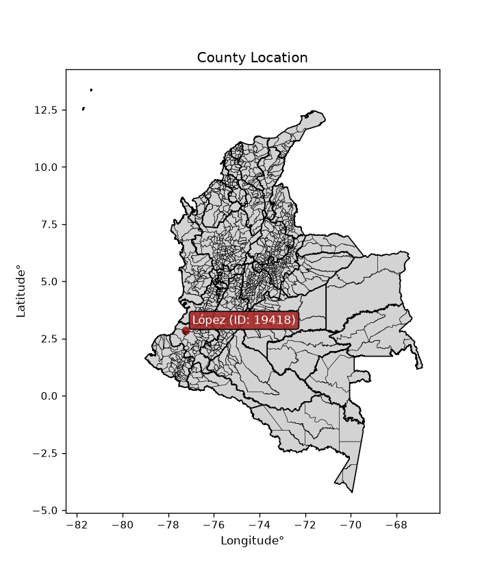
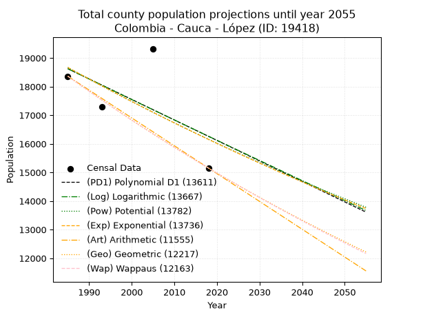
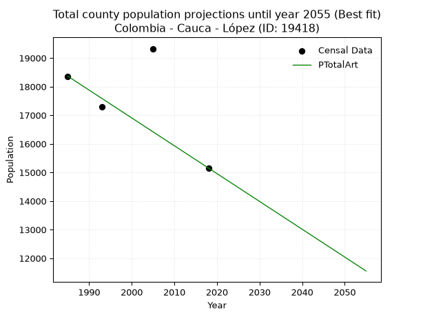
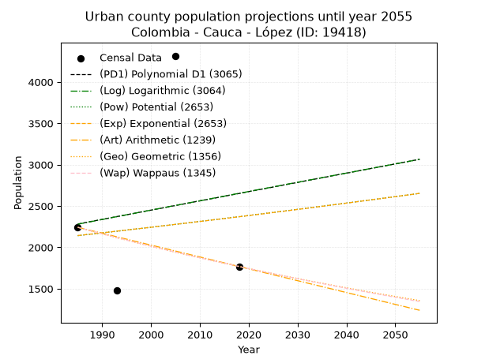
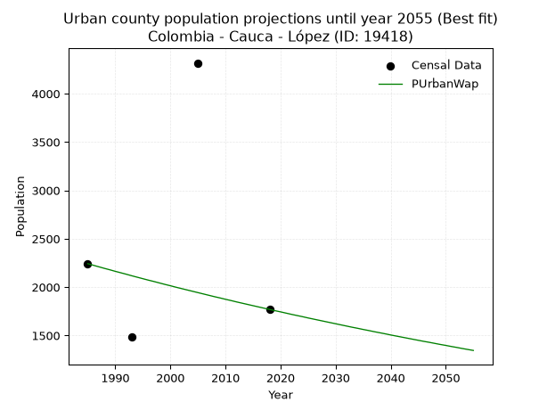
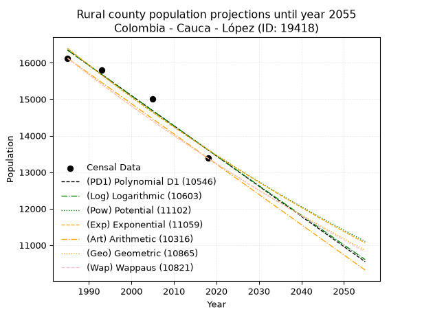
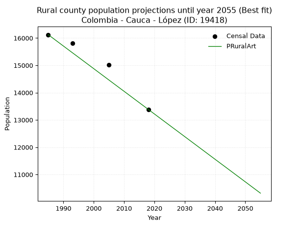

<div align="center">


</div>

# _“Population and Public Services Demand Projections (PPSD) until Year 2050 for Colombia - Cauca - López (ID: 19418)”_
Keywords: `population` `public-service` `projection` `lineal` `polynomial` `logarithmic` `potential` `exponential` `arithmetic` `geometric` `wappaus` `dane` `colombia` `south-america`

PPSD are analytical estimates used by governments and planners to anticipate future changes in population size, age distribution, and the resulting community needs for utilities, healthcare, education, and infrastructure as sizing future water treatment facilities, electrical grids, and road networks based on spatial growth.

<div align="center">

</img>

</div>


> **General running parameters**: • app_version: _v20260806_. • Python version: _3.14.7_. • Pandas version: _3.0.5_. • NumPy version: _2.5.1_. • Creates, save and include plots into reports (create_plot): _False_. • Projection until year: _2050_. • Process polynomial degree 2 and up: _False_. • Process Wappaus: _True_. • Process Wappaus: _True_. • Set negative values to zero: _True_. • Set infinite values to zero: _True_. • Drop dataset notes: _True_. 
<div align="center">

Dynamic map: [:earth_americas:Google](http://maps.google.com/maps?q=2.846787642,-77.2478034) [:earth_americas:OSM](https://www.openstreetmap.org/#map=18/2.846787642/-77.2478034&layers=P) [:earth_americas:Bing](https://www.bing.com/maps?cp=2.846787642~-77.2478034&lvl=18) [:earth_americas:Apple](https://maps.apple.com/frame?center=2.846787642%2C-77.2478034&span=0.003%2C0.006)

</div>


<div align="center">

```geojson
{
  "type": "Feature",
  "geometry": {
    "type": "Point", 
    "coordinates": [-77.2478034, 2.846787642]
  }, 
  "properties": {
    "Name": "Colombia - Cauca - López (ID: 19418)"
  }
}
```

</div>


## 0. Census Data (4 records)

Census data are official statistics collected by a government about the people and housing in a country. They usually include counts of total population, age, sex, race, income, education, and jobs.

📅Global census file: [Population.xlsx](../data/Population.xlsx)

| Source   |   Year |   CountryID | CountryName   |   StateID | StateName   |   CountyID | CountyName   |   PTotal |   PUrban |   PRural |
|:---------|-------:|------------:|:--------------|----------:|:------------|-----------:|:-------------|---------:|---------:|---------:|
| DANE     |   1985 |          57 | Colombia      |        19 | Cauca       |      19418 | López        |    18364 |     2242 |    16122 |
| DANE     |   1993 |          57 | Colombia      |        19 | Cauca       |      19418 | López        |    17289 |     1483 |    15806 |
| DANE     |   2005 |          57 | Colombia      |        19 | Cauca       |      19418 | López        |    19326 |     4317 |    15009 |
| DANE     |   2018 |          57 | Colombia      |        19 | Cauca       |      19418 | López        |    15154 |     1769 |    13385 |

> 🔥Some records could had specific notes about the registered values or the corresponding urban or rural distribution.

## 1. Total

### 1.1. Coefficients and Parameters

* (PD1) Polynomial Deg 1: -71.64070654355429, 160832.57326374447 (lineal)
* (Log) Logarithmic: -143075.6917455694, 1105052.7294947112
* (Pow) Potential: -8.757199622287196, 33.150281678483466
* (Exp) Exponential: -0.004384428968705128, 112420173.77282612
* (Art) Arithmetic: Year diff. 2018 - 1985 = 33, Population diff. 15154 - 18364 = -3210, Annual growth = -97.27272727272727
* (Geo) Geometric: Year diff. 2018 - 1985 = 33, Population diff. 15154 - 18364 = -3210, Annual growth % = -0.005805136303096203
* (Wap) Wappaus: i = -0.5804208322258325, Condition values only valid for < 200)

<sub>
Wappaus condition values: ['-0.00', '-0.58', '-1.16', '-1.74', '-2.32', '-2.90', '-3.48', '-4.06', '-4.64', '-5.22', '-5.80', '-6.38', '-6.97', '-7.55', '-8.13', '-8.71', '-9.29', '-9.87', '-10.45', '-11.03', '-11.61', '-12.19', '-12.77', '-13.35', '-13.93', '-14.51', '-15.09', '-15.67', '-16.25', '-16.83', '-17.41', '-17.99', '-18.57', '-19.15', '-19.73', '-20.31', '-20.90', '-21.48', '-22.06', '-22.64', '-23.22', '-23.80', '-24.38', '-24.96', '-25.54', '-26.12', '-26.70', '-27.28', '-27.86', '-28.44', '-29.02', '-29.60', '-30.18', '-30.76', '-31.34', '-31.92', '-32.50', '-33.08', '-33.66', '-34.24', '-34.83', '-35.41', '-35.99', '-36.57', '-37.15', '-37.73']
</sub>


### 1.2. Projected Dataset

|   Year |   CountyID |   PTotalPD1 |   PTotalLog |   PTotalPow |   PTotalExp |   PTotalArt |   PTotalGeo |   PTotalWap |
|-------:|-----------:|------------:|------------:|------------:|------------:|------------:|------------:|------------:|
|   1985 |      19418 |       18626 |       18625 |       18670 |       18670 |       18364 |       18364 |       18364 |
|   1986 |      19418 |       18554 |       18553 |       18587 |       18588 |       18267 |       18257 |       18258 |
|   1987 |      19418 |       18482 |       18481 |       18506 |       18507 |       18169 |       18151 |       18152 |
|   1988 |      19418 |       18411 |       18409 |       18424 |       18426 |       18072 |       18046 |       18047 |
|   1989 |      19418 |       18339 |       18337 |       18343 |       18345 |       17975 |       17941 |       17943 |
|   1990 |      19418 |       18268 |       18266 |       18263 |       18265 |       17878 |       17837 |       17839 |
|   1991 |      19418 |       18196 |       18194 |       18183 |       18185 |       17780 |       17734 |       17735 |
|   1992 |      19418 |       18124 |       18122 |       18103 |       18106 |       17683 |       17631 |       17633 |
|   1993 |      19418 |       18053 |       18050 |       18023 |       18026 |       17586 |       17528 |       17531 |
|   1994 |      19418 |       17981 |       17978 |       17944 |       17947 |       17489 |       17427 |       17429 |
|   1995 |      19418 |       17909 |       17906 |       17866 |       17869 |       17391 |       17325 |       17328 |
|   1996 |      19418 |       17838 |       17835 |       17788 |       17791 |       17294 |       17225 |       17228 |
|   1997 |      19418 |       17766 |       17763 |       17710 |       17713 |       17197 |       17125 |       17128 |
|   1998 |      19418 |       17694 |       17691 |       17632 |       17635 |       17099 |       17025 |       17029 |
|   1999 |      19418 |       17623 |       17620 |       17555 |       17558 |       17002 |       16927 |       16930 |
|   2000 |      19418 |       17551 |       17548 |       17478 |       17481 |       16905 |       16828 |       16832 |
|   2001 |      19418 |       17480 |       17477 |       17402 |       17405 |       16808 |       16731 |       16734 |
|   2002 |      19418 |       17408 |       17405 |       17326 |       17329 |       16710 |       16633 |       16637 |
|   2003 |      19418 |       17336 |       17334 |       17251 |       17253 |       16613 |       16537 |       16541 |
|   2004 |      19418 |       17265 |       17262 |       17175 |       17178 |       16516 |       16441 |       16445 |
|   2005 |      19418 |       17193 |       17191 |       17100 |       17102 |       16419 |       16345 |       16349 |
|   2006 |      19418 |       17121 |       17120 |       17026 |       17028 |       16321 |       16251 |       16254 |
|   2007 |      19418 |       17050 |       17048 |       16952 |       16953 |       16224 |       16156 |       16160 |
|   2008 |      19418 |       16978 |       16977 |       16878 |       16879 |       16127 |       16062 |       16066 |
|   2009 |      19418 |       16906 |       16906 |       16805 |       16805 |       16029 |       15969 |       15972 |
|   2010 |      19418 |       16835 |       16835 |       16731 |       16732 |       15932 |       15877 |       15880 |
|   2011 |      19418 |       16763 |       16764 |       16659 |       16658 |       15835 |       15784 |       15787 |
|   2012 |      19418 |       16691 |       16692 |       16586 |       16585 |       15738 |       15693 |       15695 |
|   2013 |      19418 |       16620 |       16621 |       16514 |       16513 |       15640 |       15602 |       15604 |
|   2014 |      19418 |       16548 |       16550 |       16443 |       16441 |       15543 |       15511 |       15513 |
|   2015 |      19418 |       16477 |       16479 |       16371 |       16369 |       15446 |       15421 |       15422 |
|   2016 |      19418 |       16405 |       16408 |       16300 |       16297 |       15349 |       15331 |       15332 |
|   2017 |      19418 |       16333 |       16337 |       16230 |       16226 |       15251 |       15242 |       15243 |
|   2018 |      19418 |       16262 |       16266 |       16159 |       16155 |       15154 |       15154 |       15154 |
|   2019 |      19418 |       16190 |       16196 |       16090 |       16084 |       15057 |       15066 |       15065 |
|   2020 |      19418 |       16118 |       16125 |       16020 |       16014 |       14959 |       14979 |       14977 |
|   2021 |      19418 |       16047 |       16054 |       15951 |       15944 |       14862 |       14892 |       14890 |
|   2022 |      19418 |       15975 |       15983 |       15882 |       15874 |       14765 |       14805 |       14803 |
|   2023 |      19418 |       15903 |       15912 |       15813 |       15805 |       14668 |       14719 |       14716 |
|   2024 |      19418 |       15832 |       15842 |       15745 |       15735 |       14570 |       14634 |       14630 |
|   2025 |      19418 |       15760 |       15771 |       15677 |       15667 |       14473 |       14549 |       14544 |
|   2026 |      19418 |       15689 |       15700 |       15609 |       15598 |       14376 |       14464 |       14459 |
|   2027 |      19418 |       15617 |       15630 |       15542 |       15530 |       14279 |       14380 |       14374 |
|   2028 |      19418 |       15545 |       15559 |       15475 |       15462 |       14181 |       14297 |       14289 |
|   2029 |      19418 |       15474 |       15489 |       15408 |       15394 |       14084 |       14214 |       14205 |
|   2030 |      19418 |       15402 |       15418 |       15342 |       15327 |       13987 |       14131 |       14122 |
|   2031 |      19418 |       15330 |       15348 |       15276 |       15260 |       13889 |       14049 |       14038 |
|   2032 |      19418 |       15259 |       15277 |       15210 |       15193 |       13792 |       13968 |       13956 |
|   2033 |      19418 |       15187 |       15207 |       15145 |       15127 |       13695 |       13887 |       13873 |
|   2034 |      19418 |       15115 |       15137 |       15080 |       15060 |       13598 |       13806 |       13791 |
|   2035 |      19418 |       15044 |       15066 |       15015 |       14995 |       13500 |       13726 |       13710 |
|   2036 |      19418 |       14972 |       14996 |       14950 |       14929 |       13403 |       13646 |       13629 |
|   2037 |      19418 |       14900 |       14926 |       14886 |       14864 |       13306 |       13567 |       13548 |
|   2038 |      19418 |       14829 |       14855 |       14822 |       14799 |       13209 |       13488 |       13468 |
|   2039 |      19418 |       14757 |       14785 |       14759 |       14734 |       13111 |       13410 |       13388 |
|   2040 |      19418 |       14686 |       14715 |       14696 |       14669 |       13014 |       13332 |       13309 |
|   2041 |      19418 |       14614 |       14645 |       14633 |       14605 |       12917 |       13255 |       13229 |
|   2042 |      19418 |       14542 |       14575 |       14570 |       14541 |       12819 |       13178 |       13151 |
|   2043 |      19418 |       14471 |       14505 |       14508 |       14478 |       12722 |       13101 |       13073 |
|   2044 |      19418 |       14399 |       14435 |       14446 |       14414 |       12625 |       13025 |       12995 |
|   2045 |      19418 |       14327 |       14365 |       14384 |       14351 |       12528 |       12950 |       12917 |
|   2046 |      19418 |       14256 |       14295 |       14323 |       14289 |       12430 |       12874 |       12840 |
|   2047 |      19418 |       14184 |       14225 |       14261 |       14226 |       12333 |       12800 |       12763 |
|   2048 |      19418 |       14112 |       14155 |       14201 |       14164 |       12236 |       12725 |       12687 |
|   2049 |      19418 |       14041 |       14085 |       14140 |       14102 |       12139 |       12652 |       12611 |
|   2050 |      19418 |       13969 |       14015 |       14080 |       14040 |       12041 |       12578 |       12535 |
<div align="center">

</img>

</div>


### 1.3. Best fit with absolute and relative error (%)

Relative error puts that difference into context by dividing the absolute error by the true value, creating a unitless ratio or percentage that shows the scale of the mistake.

Absolute and relative error

|   Year | Source   |   CountryID | CountryName   |   StateID | StateName   |   CountyID_x | CountyName   |   PTotal |   PUrban |   PRural |   CountyID_y |   PTotalPD1 |   PTotalLog |   PTotalPow |   PTotalExp |   PTotalArt |   PTotalGeo |   PTotalWap |   PTotalPD1AbsError |   PTotalLogAbsError |   PTotalPowAbsError |   PTotalExpAbsError |   PTotalArtAbsError |   PTotalGeoAbsError |   PTotalWapAbsError |   PTotalPD1RelError |   PTotalLogRelError |   PTotalPowRelError |   PTotalExpRelError |   PTotalArtRelError |   PTotalGeoRelError |   PTotalWapRelError |
|-------:|:---------|------------:|:--------------|----------:|:------------|-------------:|:-------------|---------:|---------:|---------:|-------------:|------------:|------------:|------------:|------------:|------------:|------------:|------------:|--------------------:|--------------------:|--------------------:|--------------------:|--------------------:|--------------------:|--------------------:|--------------------:|--------------------:|--------------------:|--------------------:|--------------------:|--------------------:|--------------------:|
|   1985 | DANE     |          57 | Colombia      |        19 | Cauca       |        19418 | López        |    18364 |     2242 |    16122 |        19418 |       18626 |       18625 |       18670 |       18670 |       18364 |       18364 |       18364 |                 262 |                 261 |                 306 |                 306 |                   0 |                   0 |                   0 |             1.4267  |             1.42126 |             1.6663  |             1.6663  |             0       |             0       |             0       |
|   1993 | DANE     |          57 | Colombia      |        19 | Cauca       |        19418 | López        |    17289 |     1483 |    15806 |        19418 |       18053 |       18050 |       18023 |       18026 |       17586 |       17528 |       17531 |                 764 |                 761 |                 734 |                 737 |                 297 |                 239 |                 242 |             4.41899 |             4.40164 |             4.24547 |             4.26283 |             1.71786 |             1.38238 |             1.39973 |
|   2005 | DANE     |          57 | Colombia      |        19 | Cauca       |        19418 | López        |    19326 |     4317 |    15009 |        19418 |       17193 |       17191 |       17100 |       17102 |       16419 |       16345 |       16349 |                2133 |                2135 |                2226 |                2224 |                2907 |                2981 |                2977 |            11.0369  |            11.0473  |            11.5182  |            11.5078  |            15.0419  |            15.4248  |            15.4041  |
|   2018 | DANE     |          57 | Colombia      |        19 | Cauca       |        19418 | López        |    15154 |     1769 |    13385 |        19418 |       16262 |       16266 |       16159 |       16155 |       15154 |       15154 |       15154 |                1108 |                1112 |                1005 |                1001 |                   0 |                   0 |                   0 |             7.3116  |             7.338   |             6.63191 |             6.60552 |             0       |             0       |             0       |

Relative error mean

| Method    |   RelError | Best   |
|:----------|-----------:|:-------|
| PTotalPD1 |    6.04856 |        |
| PTotalLog |    6.05205 |        |
| PTotalPow |    6.01546 |        |
| PTotalExp |    6.01061 |        |
| PTotalArt |    4.18994 | True   |
| PTotalGeo |    4.2018  |        |
| PTotalWap |    4.20096 |        |

💙Best method: _**PTotalArt**_
<div align="center">

</img>

</div>


### 1.4. Fresh water supply demand in liters per capita per day (lpcd)

The fresh water supply demand typically ranges from 100 to 300 liters per capita per day (lpcd) for standard domestic and municipal planning, though absolute survival minimums set by the World Health Organization are as low as 7.5 to 20 liters per day, and total consumption in high-income nations can exceed 400 liters.

> `CZ`: Level in meters above the sea level (masl)<br> `WS`: Fresh water supply demand in liters per capita per day (lpcd or l/h/d)<br> `WSAll`: Zonal fresh water supply demand in liters per second (l/s)<br> `A`: Zonal area in square meters<br> `DP`: Population density (people/hectare or p/ha)

Reference values (RAS Colombia)

|    CZ |   WS |
|------:|-----:|
|  1000 |  120 |
|  2000 |  130 |
| 99999 |  140 |

County shapefile geometry properties and water supply values

|   CountyID |      ATotal |   CZTotal |   WSTotal |
|-----------:|------------:|----------:|----------:|
|      19418 | 3.37043e+09 |    489.97 |       120 |

Projected values for best method: PTotalArt

|   CountyID |   Year |   PTotalArt |   DPTotal |   WSTotal |   WSTotalAll |
|-----------:|-------:|------------:|----------:|----------:|-------------:|
|      19418 |   1985 |       18364 |      0.05 |       120 |      25.5056 |
|      19418 |   1986 |       18267 |      0.05 |       120 |      25.3708 |
|      19418 |   1987 |       18169 |      0.05 |       120 |      25.2347 |
|      19418 |   1988 |       18072 |      0.05 |       120 |      25.1    |
|      19418 |   1989 |       17975 |      0.05 |       120 |      24.9653 |
|      19418 |   1990 |       17878 |      0.05 |       120 |      24.8306 |
|      19418 |   1991 |       17780 |      0.05 |       120 |      24.6944 |
|      19418 |   1992 |       17683 |      0.05 |       120 |      24.5597 |
|      19418 |   1993 |       17586 |      0.05 |       120 |      24.425  |
|      19418 |   1994 |       17489 |      0.05 |       120 |      24.2903 |
|      19418 |   1995 |       17391 |      0.05 |       120 |      24.1542 |
|      19418 |   1996 |       17294 |      0.05 |       120 |      24.0194 |
|      19418 |   1997 |       17197 |      0.05 |       120 |      23.8847 |
|      19418 |   1998 |       17099 |      0.05 |       120 |      23.7486 |
|      19418 |   1999 |       17002 |      0.05 |       120 |      23.6139 |
|      19418 |   2000 |       16905 |      0.05 |       120 |      23.4792 |
|      19418 |   2001 |       16808 |      0.05 |       120 |      23.3444 |
|      19418 |   2002 |       16710 |      0.05 |       120 |      23.2083 |
|      19418 |   2003 |       16613 |      0.05 |       120 |      23.0736 |
|      19418 |   2004 |       16516 |      0.05 |       120 |      22.9389 |
|      19418 |   2005 |       16419 |      0.05 |       120 |      22.8042 |
|      19418 |   2006 |       16321 |      0.05 |       120 |      22.6681 |
|      19418 |   2007 |       16224 |      0.05 |       120 |      22.5333 |
|      19418 |   2008 |       16127 |      0.05 |       120 |      22.3986 |
|      19418 |   2009 |       16029 |      0.05 |       120 |      22.2625 |
|      19418 |   2010 |       15932 |      0.05 |       120 |      22.1278 |
|      19418 |   2011 |       15835 |      0.05 |       120 |      21.9931 |
|      19418 |   2012 |       15738 |      0.05 |       120 |      21.8583 |
|      19418 |   2013 |       15640 |      0.05 |       120 |      21.7222 |
|      19418 |   2014 |       15543 |      0.05 |       120 |      21.5875 |
|      19418 |   2015 |       15446 |      0.05 |       120 |      21.4528 |
|      19418 |   2016 |       15349 |      0.05 |       120 |      21.3181 |
|      19418 |   2017 |       15251 |      0.05 |       120 |      21.1819 |
|      19418 |   2018 |       15154 |      0.04 |       120 |      21.0472 |
|      19418 |   2019 |       15057 |      0.04 |       120 |      20.9125 |
|      19418 |   2020 |       14959 |      0.04 |       120 |      20.7764 |
|      19418 |   2021 |       14862 |      0.04 |       120 |      20.6417 |
|      19418 |   2022 |       14765 |      0.04 |       120 |      20.5069 |
|      19418 |   2023 |       14668 |      0.04 |       120 |      20.3722 |
|      19418 |   2024 |       14570 |      0.04 |       120 |      20.2361 |
|      19418 |   2025 |       14473 |      0.04 |       120 |      20.1014 |
|      19418 |   2026 |       14376 |      0.04 |       120 |      19.9667 |
|      19418 |   2027 |       14279 |      0.04 |       120 |      19.8319 |
|      19418 |   2028 |       14181 |      0.04 |       120 |      19.6958 |
|      19418 |   2029 |       14084 |      0.04 |       120 |      19.5611 |
|      19418 |   2030 |       13987 |      0.04 |       120 |      19.4264 |
|      19418 |   2031 |       13889 |      0.04 |       120 |      19.2903 |
|      19418 |   2032 |       13792 |      0.04 |       120 |      19.1556 |
|      19418 |   2033 |       13695 |      0.04 |       120 |      19.0208 |
|      19418 |   2034 |       13598 |      0.04 |       120 |      18.8861 |
|      19418 |   2035 |       13500 |      0.04 |       120 |      18.75   |
|      19418 |   2036 |       13403 |      0.04 |       120 |      18.6153 |
|      19418 |   2037 |       13306 |      0.04 |       120 |      18.4806 |
|      19418 |   2038 |       13209 |      0.04 |       120 |      18.3458 |
|      19418 |   2039 |       13111 |      0.04 |       120 |      18.2097 |
|      19418 |   2040 |       13014 |      0.04 |       120 |      18.075  |
|      19418 |   2041 |       12917 |      0.04 |       120 |      17.9403 |
|      19418 |   2042 |       12819 |      0.04 |       120 |      17.8042 |
|      19418 |   2043 |       12722 |      0.04 |       120 |      17.6694 |
|      19418 |   2044 |       12625 |      0.04 |       120 |      17.5347 |
|      19418 |   2045 |       12528 |      0.04 |       120 |      17.4    |
|      19418 |   2046 |       12430 |      0.04 |       120 |      17.2639 |
|      19418 |   2047 |       12333 |      0.04 |       120 |      17.1292 |
|      19418 |   2048 |       12236 |      0.04 |       120 |      16.9944 |
|      19418 |   2049 |       12139 |      0.04 |       120 |      16.8597 |
|      19418 |   2050 |       12041 |      0.04 |       120 |      16.7236 |

## 2. Urban

### 2.1. Coefficients and Parameters

* (PD1) Polynomial Deg 1: 11.181453231635306, -19912.951826578523 (lineal)
* (Log) Logarithmic: 22615.59591611712, -169448.57578841806
* (Pow) Potential: 6.185635100281344, -17.068078906840032
* (Exp) Exponential: 0.0030552647359862023, 4.978181285979598
* (Art) Arithmetic: Year diff. 2018 - 1985 = 33, Population diff. 1769 - 2242 = -473, Annual growth = -14.333333333333334
* (Geo) Geometric: Year diff. 2018 - 1985 = 33, Population diff. 1769 - 2242 = -473, Annual growth % = -0.007154703864009848
* (Wap) Wappaus: i = -0.7147012382614477, Condition values only valid for < 200)

<sub>
Wappaus condition values: ['-0.00', '-0.71', '-1.43', '-2.14', '-2.86', '-3.57', '-4.29', '-5.00', '-5.72', '-6.43', '-7.15', '-7.86', '-8.58', '-9.29', '-10.01', '-10.72', '-11.44', '-12.15', '-12.86', '-13.58', '-14.29', '-15.01', '-15.72', '-16.44', '-17.15', '-17.87', '-18.58', '-19.30', '-20.01', '-20.73', '-21.44', '-22.16', '-22.87', '-23.59', '-24.30', '-25.01', '-25.73', '-26.44', '-27.16', '-27.87', '-28.59', '-29.30', '-30.02', '-30.73', '-31.45', '-32.16', '-32.88', '-33.59', '-34.31', '-35.02', '-35.74', '-36.45', '-37.16', '-37.88', '-38.59', '-39.31', '-40.02', '-40.74', '-41.45', '-42.17', '-42.88', '-43.60', '-44.31', '-45.03', '-45.74', '-46.46']
</sub>


### 2.2. Projected Dataset

|   Year |   CountyID |   PUrbanPD1 |   PUrbanLog |   PUrbanPow |   PUrbanExp |   PUrbanArt |   PUrbanGeo |   PUrbanWap |
|-------:|-----------:|------------:|------------:|------------:|------------:|------------:|------------:|------------:|
|   1985 |      19418 |        2282 |        2280 |        2141 |        2143 |        2242 |        2242 |        2242 |
|   1986 |      19418 |        2293 |        2291 |        2148 |        2149 |        2228 |        2226 |        2226 |
|   1987 |      19418 |        2305 |        2303 |        2155 |        2156 |        2213 |        2210 |        2210 |
|   1988 |      19418 |        2316 |        2314 |        2161 |        2162 |        2199 |        2194 |        2194 |
|   1989 |      19418 |        2327 |        2326 |        2168 |        2169 |        2185 |        2179 |        2179 |
|   1990 |      19418 |        2338 |        2337 |        2175 |        2176 |        2170 |        2163 |        2163 |
|   1991 |      19418 |        2349 |        2348 |        2182 |        2182 |        2156 |        2147 |        2148 |
|   1992 |      19418 |        2361 |        2360 |        2188 |        2189 |        2142 |        2132 |        2133 |
|   1993 |      19418 |        2372 |        2371 |        2195 |        2196 |        2127 |        2117 |        2117 |
|   1994 |      19418 |        2383 |        2382 |        2202 |        2202 |        2113 |        2102 |        2102 |
|   1995 |      19418 |        2394 |        2394 |        2209 |        2209 |        2099 |        2087 |        2087 |
|   1996 |      19418 |        2405 |        2405 |        2216 |        2216 |        2084 |        2072 |        2072 |
|   1997 |      19418 |        2416 |        2416 |        2223 |        2223 |        2070 |        2057 |        2058 |
|   1998 |      19418 |        2428 |        2428 |        2229 |        2229 |        2056 |        2042 |        2043 |
|   1999 |      19418 |        2439 |        2439 |        2236 |        2236 |        2041 |        2028 |        2028 |
|   2000 |      19418 |        2450 |        2450 |        2243 |        2243 |        2027 |        2013 |        2014 |
|   2001 |      19418 |        2461 |        2462 |        2250 |        2250 |        2013 |        1999 |        1999 |
|   2002 |      19418 |        2472 |        2473 |        2257 |        2257 |        1998 |        1984 |        1985 |
|   2003 |      19418 |        2483 |        2484 |        2264 |        2264 |        1984 |        1970 |        1971 |
|   2004 |      19418 |        2495 |        2496 |        2271 |        2271 |        1970 |        1956 |        1957 |
|   2005 |      19418 |        2506 |        2507 |        2278 |        2278 |        1955 |        1942 |        1943 |
|   2006 |      19418 |        2517 |        2518 |        2285 |        2285 |        1941 |        1928 |        1929 |
|   2007 |      19418 |        2528 |        2529 |        2292 |        2292 |        1927 |        1914 |        1915 |
|   2008 |      19418 |        2539 |        2541 |        2299 |        2299 |        1912 |        1901 |        1901 |
|   2009 |      19418 |        2551 |        2552 |        2306 |        2306 |        1898 |        1887 |        1888 |
|   2010 |      19418 |        2562 |        2563 |        2314 |        2313 |        1884 |        1874 |        1874 |
|   2011 |      19418 |        2573 |        2574 |        2321 |        2320 |        1869 |        1860 |        1861 |
|   2012 |      19418 |        2584 |        2586 |        2328 |        2327 |        1855 |        1847 |        1847 |
|   2013 |      19418 |        2595 |        2597 |        2335 |        2334 |        1841 |        1834 |        1834 |
|   2014 |      19418 |        2606 |        2608 |        2342 |        2341 |        1826 |        1821 |        1821 |
|   2015 |      19418 |        2618 |        2619 |        2349 |        2348 |        1812 |        1808 |        1808 |
|   2016 |      19418 |        2629 |        2631 |        2357 |        2355 |        1798 |        1795 |        1795 |
|   2017 |      19418 |        2640 |        2642 |        2364 |        2363 |        1783 |        1782 |        1782 |
|   2018 |      19418 |        2651 |        2653 |        2371 |        2370 |        1769 |        1769 |        1769 |
|   2019 |      19418 |        2662 |        2664 |        2378 |        2377 |        1755 |        1756 |        1756 |
|   2020 |      19418 |        2674 |        2675 |        2386 |        2384 |        1740 |        1744 |        1744 |
|   2021 |      19418 |        2685 |        2687 |        2393 |        2392 |        1726 |        1731 |        1731 |
|   2022 |      19418 |        2696 |        2698 |        2400 |        2399 |        1712 |        1719 |        1718 |
|   2023 |      19418 |        2707 |        2709 |        2408 |        2406 |        1697 |        1707 |        1706 |
|   2024 |      19418 |        2718 |        2720 |        2415 |        2414 |        1683 |        1694 |        1694 |
|   2025 |      19418 |        2729 |        2731 |        2422 |        2421 |        1669 |        1682 |        1681 |
|   2026 |      19418 |        2741 |        2742 |        2430 |        2429 |        1654 |        1670 |        1669 |
|   2027 |      19418 |        2752 |        2754 |        2437 |        2436 |        1640 |        1658 |        1657 |
|   2028 |      19418 |        2763 |        2765 |        2445 |        2443 |        1626 |        1646 |        1645 |
|   2029 |      19418 |        2774 |        2776 |        2452 |        2451 |        1611 |        1635 |        1633 |
|   2030 |      19418 |        2785 |        2787 |        2460 |        2458 |        1597 |        1623 |        1621 |
|   2031 |      19418 |        2797 |        2798 |        2467 |        2466 |        1583 |        1611 |        1609 |
|   2032 |      19418 |        2808 |        2809 |        2475 |        2473 |        1568 |        1600 |        1597 |
|   2033 |      19418 |        2819 |        2820 |        2482 |        2481 |        1554 |        1588 |        1585 |
|   2034 |      19418 |        2830 |        2832 |        2490 |        2489 |        1540 |        1577 |        1574 |
|   2035 |      19418 |        2841 |        2843 |        2497 |        2496 |        1525 |        1566 |        1562 |
|   2036 |      19418 |        2852 |        2854 |        2505 |        2504 |        1511 |        1555 |        1551 |
|   2037 |      19418 |        2864 |        2865 |        2513 |        2512 |        1497 |        1543 |        1539 |
|   2038 |      19418 |        2875 |        2876 |        2520 |        2519 |        1482 |        1532 |        1528 |
|   2039 |      19418 |        2886 |        2887 |        2528 |        2527 |        1468 |        1521 |        1517 |
|   2040 |      19418 |        2897 |        2898 |        2536 |        2535 |        1454 |        1511 |        1505 |
|   2041 |      19418 |        2908 |        2909 |        2543 |        2542 |        1439 |        1500 |        1494 |
|   2042 |      19418 |        2920 |        2920 |        2551 |        2550 |        1425 |        1489 |        1483 |
|   2043 |      19418 |        2931 |        2931 |        2559 |        2558 |        1411 |        1478 |        1472 |
|   2044 |      19418 |        2942 |        2943 |        2567 |        2566 |        1396 |        1468 |        1461 |
|   2045 |      19418 |        2953 |        2954 |        2574 |        2574 |        1382 |        1457 |        1450 |
|   2046 |      19418 |        2964 |        2965 |        2582 |        2582 |        1368 |        1447 |        1439 |
|   2047 |      19418 |        2975 |        2976 |        2590 |        2589 |        1353 |        1436 |        1429 |
|   2048 |      19418 |        2987 |        2987 |        2598 |        2597 |        1339 |        1426 |        1418 |
|   2049 |      19418 |        2998 |        2998 |        2606 |        2605 |        1325 |        1416 |        1407 |
|   2050 |      19418 |        3009 |        3009 |        2613 |        2613 |        1310 |        1406 |        1397 |
<div align="center">

</img>

</div>


### 2.3. Best fit with absolute and relative error (%)

Relative error puts that difference into context by dividing the absolute error by the true value, creating a unitless ratio or percentage that shows the scale of the mistake.

Absolute and relative error

|   Year | Source   |   CountryID | CountryName   |   StateID | StateName   |   CountyID_x | CountyName   |   PTotal |   PUrban |   PRural |   CountyID_y |   PUrbanPD1 |   PUrbanLog |   PUrbanPow |   PUrbanExp |   PUrbanArt |   PUrbanGeo |   PUrbanWap |   PUrbanPD1AbsError |   PUrbanLogAbsError |   PUrbanPowAbsError |   PUrbanExpAbsError |   PUrbanArtAbsError |   PUrbanGeoAbsError |   PUrbanWapAbsError |   PUrbanPD1RelError |   PUrbanLogRelError |   PUrbanPowRelError |   PUrbanExpRelError |   PUrbanArtRelError |   PUrbanGeoRelError |   PUrbanWapRelError |
|-------:|:---------|------------:|:--------------|----------:|:------------|-------------:|:-------------|---------:|---------:|---------:|-------------:|------------:|------------:|------------:|------------:|------------:|------------:|------------:|--------------------:|--------------------:|--------------------:|--------------------:|--------------------:|--------------------:|--------------------:|--------------------:|--------------------:|--------------------:|--------------------:|--------------------:|--------------------:|--------------------:|
|   1985 | DANE     |          57 | Colombia      |        19 | Cauca       |        19418 | López        |    18364 |     2242 |    16122 |        19418 |        2282 |        2280 |        2141 |        2143 |        2242 |        2242 |        2242 |                  40 |                  38 |                 101 |                  99 |                   0 |                   0 |                   0 |             1.78412 |             1.69492 |             4.50491 |              4.4157 |              0      |              0      |              0      |
|   1993 | DANE     |          57 | Colombia      |        19 | Cauca       |        19418 | López        |    17289 |     1483 |    15806 |        19418 |        2372 |        2371 |        2195 |        2196 |        2127 |        2117 |        2117 |                 889 |                 888 |                 712 |                 713 |                 644 |                 634 |                 634 |            59.9461  |            59.8786  |            48.0108  |             48.0782 |             43.4255 |             42.7512 |             42.7512 |
|   2005 | DANE     |          57 | Colombia      |        19 | Cauca       |        19418 | López        |    19326 |     4317 |    15009 |        19418 |        2506 |        2507 |        2278 |        2278 |        1955 |        1942 |        1943 |                1811 |                1810 |                2039 |                2039 |                2362 |                2375 |                2374 |            41.9504  |            41.9273  |            47.2319  |             47.2319 |             54.7139 |             55.0151 |             54.9919 |
|   2018 | DANE     |          57 | Colombia      |        19 | Cauca       |        19418 | López        |    15154 |     1769 |    13385 |        19418 |        2651 |        2653 |        2371 |        2370 |        1769 |        1769 |        1769 |                 882 |                 884 |                 602 |                 601 |                   0 |                   0 |                   0 |            49.8587  |            49.9717  |            34.0305  |             33.974  |              0      |              0      |              0      |

Relative error mean

| Method    |   RelError | Best   |
|:----------|-----------:|:-------|
| PUrbanPD1 |    38.3848 |        |
| PUrbanLog |    38.3681 |        |
| PUrbanPow |    33.4445 |        |
| PUrbanExp |    33.4249 |        |
| PUrbanArt |    24.5349 |        |
| PUrbanGeo |    24.4416 |        |
| PUrbanWap |    24.4358 | True   |

💙Best method: _**PUrbanWap**_
<div align="center">

</img>

</div>


### 2.4. Fresh water supply demand in liters per capita per day (lpcd)

The fresh water supply demand typically ranges from 100 to 300 liters per capita per day (lpcd) for standard domestic and municipal planning, though absolute survival minimums set by the World Health Organization are as low as 7.5 to 20 liters per day, and total consumption in high-income nations can exceed 400 liters.

> `CZ`: Level in meters above the sea level (masl)<br> `WS`: Fresh water supply demand in liters per capita per day (lpcd or l/h/d)<br> `WSAll`: Zonal fresh water supply demand in liters per second (l/s)<br> `A`: Zonal area in square meters<br> `DP`: Population density (people/hectare or p/ha)

Reference values (RAS Colombia)

|    CZ |   WS |
|------:|-----:|
|  1000 |  120 |
|  2000 |  130 |
| 99999 |  140 |

County shapefile geometry properties and water supply values

|   CountyID |   AUrban |   CZUrban |   WSUrban |
|-----------:|---------:|----------:|----------:|
|      19418 |   346752 |   32.4162 |       120 |

Projected values for best method: PUrbanWap

|   CountyID |   Year |   PUrbanWap |   DPUrban |   WSUrban |   WSUrbanAll |
|-----------:|-------:|------------:|----------:|----------:|-------------:|
|      19418 |   1985 |        2242 |     64.66 |       120 |      3.11389 |
|      19418 |   1986 |        2226 |     64.2  |       120 |      3.09167 |
|      19418 |   1987 |        2210 |     63.73 |       120 |      3.06944 |
|      19418 |   1988 |        2194 |     63.27 |       120 |      3.04722 |
|      19418 |   1989 |        2179 |     62.84 |       120 |      3.02639 |
|      19418 |   1990 |        2163 |     62.38 |       120 |      3.00417 |
|      19418 |   1991 |        2148 |     61.95 |       120 |      2.98333 |
|      19418 |   1992 |        2133 |     61.51 |       120 |      2.9625  |
|      19418 |   1993 |        2117 |     61.05 |       120 |      2.94028 |
|      19418 |   1994 |        2102 |     60.62 |       120 |      2.91944 |
|      19418 |   1995 |        2087 |     60.19 |       120 |      2.89861 |
|      19418 |   1996 |        2072 |     59.75 |       120 |      2.87778 |
|      19418 |   1997 |        2058 |     59.35 |       120 |      2.85833 |
|      19418 |   1998 |        2043 |     58.92 |       120 |      2.8375  |
|      19418 |   1999 |        2028 |     58.49 |       120 |      2.81667 |
|      19418 |   2000 |        2014 |     58.08 |       120 |      2.79722 |
|      19418 |   2001 |        1999 |     57.65 |       120 |      2.77639 |
|      19418 |   2002 |        1985 |     57.25 |       120 |      2.75694 |
|      19418 |   2003 |        1971 |     56.84 |       120 |      2.7375  |
|      19418 |   2004 |        1957 |     56.44 |       120 |      2.71806 |
|      19418 |   2005 |        1943 |     56.03 |       120 |      2.69861 |
|      19418 |   2006 |        1929 |     55.63 |       120 |      2.67917 |
|      19418 |   2007 |        1915 |     55.23 |       120 |      2.65972 |
|      19418 |   2008 |        1901 |     54.82 |       120 |      2.64028 |
|      19418 |   2009 |        1888 |     54.45 |       120 |      2.62222 |
|      19418 |   2010 |        1874 |     54.04 |       120 |      2.60278 |
|      19418 |   2011 |        1861 |     53.67 |       120 |      2.58472 |
|      19418 |   2012 |        1847 |     53.27 |       120 |      2.56528 |
|      19418 |   2013 |        1834 |     52.89 |       120 |      2.54722 |
|      19418 |   2014 |        1821 |     52.52 |       120 |      2.52917 |
|      19418 |   2015 |        1808 |     52.14 |       120 |      2.51111 |
|      19418 |   2016 |        1795 |     51.77 |       120 |      2.49306 |
|      19418 |   2017 |        1782 |     51.39 |       120 |      2.475   |
|      19418 |   2018 |        1769 |     51.02 |       120 |      2.45694 |
|      19418 |   2019 |        1756 |     50.64 |       120 |      2.43889 |
|      19418 |   2020 |        1744 |     50.3  |       120 |      2.42222 |
|      19418 |   2021 |        1731 |     49.92 |       120 |      2.40417 |
|      19418 |   2022 |        1718 |     49.55 |       120 |      2.38611 |
|      19418 |   2023 |        1706 |     49.2  |       120 |      2.36944 |
|      19418 |   2024 |        1694 |     48.85 |       120 |      2.35278 |
|      19418 |   2025 |        1681 |     48.48 |       120 |      2.33472 |
|      19418 |   2026 |        1669 |     48.13 |       120 |      2.31806 |
|      19418 |   2027 |        1657 |     47.79 |       120 |      2.30139 |
|      19418 |   2028 |        1645 |     47.44 |       120 |      2.28472 |
|      19418 |   2029 |        1633 |     47.09 |       120 |      2.26806 |
|      19418 |   2030 |        1621 |     46.75 |       120 |      2.25139 |
|      19418 |   2031 |        1609 |     46.4  |       120 |      2.23472 |
|      19418 |   2032 |        1597 |     46.06 |       120 |      2.21806 |
|      19418 |   2033 |        1585 |     45.71 |       120 |      2.20139 |
|      19418 |   2034 |        1574 |     45.39 |       120 |      2.18611 |
|      19418 |   2035 |        1562 |     45.05 |       120 |      2.16944 |
|      19418 |   2036 |        1551 |     44.73 |       120 |      2.15417 |
|      19418 |   2037 |        1539 |     44.38 |       120 |      2.1375  |
|      19418 |   2038 |        1528 |     44.07 |       120 |      2.12222 |
|      19418 |   2039 |        1517 |     43.75 |       120 |      2.10694 |
|      19418 |   2040 |        1505 |     43.4  |       120 |      2.09028 |
|      19418 |   2041 |        1494 |     43.09 |       120 |      2.075   |
|      19418 |   2042 |        1483 |     42.77 |       120 |      2.05972 |
|      19418 |   2043 |        1472 |     42.45 |       120 |      2.04444 |
|      19418 |   2044 |        1461 |     42.13 |       120 |      2.02917 |
|      19418 |   2045 |        1450 |     41.82 |       120 |      2.01389 |
|      19418 |   2046 |        1439 |     41.5  |       120 |      1.99861 |
|      19418 |   2047 |        1429 |     41.21 |       120 |      1.98472 |
|      19418 |   2048 |        1418 |     40.89 |       120 |      1.96944 |
|      19418 |   2049 |        1407 |     40.58 |       120 |      1.95417 |
|      19418 |   2050 |        1397 |     40.29 |       120 |      1.94028 |

## 3. Rural

### 3.1. Coefficients and Parameters

* (PD1) Polynomial Deg 1: -82.82215977518966, 180745.52509032312 (lineal)
* (Log) Logarithmic: -165691.28766168654, 1274501.3052831292
* (Pow) Potential: -11.238754463250032, 41.27728355534226
* (Exp) Exponential: -0.005618088756283706, 1142148633.5555625
* (Art) Arithmetic: Year diff. 2018 - 1985 = 33, Population diff. 13385 - 16122 = -2737, Annual growth = -82.93939393939394
* (Geo) Geometric: Year diff. 2018 - 1985 = 33, Population diff. 13385 - 16122 = -2737, Annual growth % = -0.005622019447358295
* (Wap) Wappaus: i = -0.56216758016331, Condition values only valid for < 200)

<sub>
Wappaus condition values: ['-0.00', '-0.56', '-1.12', '-1.69', '-2.25', '-2.81', '-3.37', '-3.94', '-4.50', '-5.06', '-5.62', '-6.18', '-6.75', '-7.31', '-7.87', '-8.43', '-8.99', '-9.56', '-10.12', '-10.68', '-11.24', '-11.81', '-12.37', '-12.93', '-13.49', '-14.05', '-14.62', '-15.18', '-15.74', '-16.30', '-16.87', '-17.43', '-17.99', '-18.55', '-19.11', '-19.68', '-20.24', '-20.80', '-21.36', '-21.92', '-22.49', '-23.05', '-23.61', '-24.17', '-24.74', '-25.30', '-25.86', '-26.42', '-26.98', '-27.55', '-28.11', '-28.67', '-29.23', '-29.79', '-30.36', '-30.92', '-31.48', '-32.04', '-32.61', '-33.17', '-33.73', '-34.29', '-34.85', '-35.42', '-35.98', '-36.54']
</sub>


### 3.2. Projected Dataset

|   Year |   CountyID |   PRuralPD1 |   PRuralLog |   PRuralPow |   PRuralExp |   PRuralArt |   PRuralGeo |   PRuralWap |
|-------:|-----------:|------------:|------------:|------------:|------------:|------------:|------------:|------------:|
|   1985 |      19418 |       16344 |       16345 |       16389 |       16387 |       16122 |       16122 |       16122 |
|   1986 |      19418 |       16261 |       16262 |       16297 |       16296 |       16039 |       16031 |       16032 |
|   1987 |      19418 |       16178 |       16178 |       16205 |       16204 |       15956 |       15941 |       15942 |
|   1988 |      19418 |       16095 |       16095 |       16114 |       16114 |       15873 |       15852 |       15852 |
|   1989 |      19418 |       16012 |       16012 |       16023 |       16023 |       15790 |       15762 |       15764 |
|   1990 |      19418 |       15929 |       15929 |       15932 |       15934 |       15707 |       15674 |       15675 |
|   1991 |      19418 |       15847 |       15845 |       15843 |       15844 |       15624 |       15586 |       15587 |
|   1992 |      19418 |       15764 |       15762 |       15754 |       15755 |       15541 |       15498 |       15500 |
|   1993 |      19418 |       15681 |       15679 |       15665 |       15667 |       15458 |       15411 |       15413 |
|   1994 |      19418 |       15598 |       15596 |       15577 |       15579 |       15376 |       15324 |       15326 |
|   1995 |      19418 |       15515 |       15513 |       15489 |       15492 |       15293 |       15238 |       15240 |
|   1996 |      19418 |       15432 |       15430 |       15402 |       15405 |       15210 |       15153 |       15155 |
|   1997 |      19418 |       15350 |       15347 |       15316 |       15319 |       15127 |       15067 |       15070 |
|   1998 |      19418 |       15267 |       15264 |       15230 |       15233 |       15044 |       14983 |       14985 |
|   1999 |      19418 |       15184 |       15181 |       15145 |       15148 |       14961 |       14898 |       14901 |
|   2000 |      19418 |       15101 |       15098 |       15060 |       15063 |       14878 |       14815 |       14818 |
|   2001 |      19418 |       15018 |       15015 |       14975 |       14979 |       14795 |       14731 |       14734 |
|   2002 |      19418 |       14936 |       14932 |       14892 |       14895 |       14712 |       14649 |       14652 |
|   2003 |      19418 |       14853 |       14850 |       14808 |       14811 |       14629 |       14566 |       14569 |
|   2004 |      19418 |       14770 |       14767 |       14725 |       14728 |       14546 |       14484 |       14487 |
|   2005 |      19418 |       14687 |       14684 |       14643 |       14646 |       14463 |       14403 |       14406 |
|   2006 |      19418 |       14604 |       14602 |       14561 |       14564 |       14380 |       14322 |       14325 |
|   2007 |      19418 |       14521 |       14519 |       14480 |       14482 |       14297 |       14241 |       14244 |
|   2008 |      19418 |       14439 |       14437 |       14399 |       14401 |       14214 |       14161 |       14164 |
|   2009 |      19418 |       14356 |       14354 |       14319 |       14320 |       14131 |       14082 |       14084 |
|   2010 |      19418 |       14273 |       14272 |       14239 |       14240 |       14049 |       14003 |       14005 |
|   2011 |      19418 |       14190 |       14189 |       14159 |       14160 |       13966 |       13924 |       13926 |
|   2012 |      19418 |       14107 |       14107 |       14081 |       14081 |       13883 |       13846 |       13848 |
|   2013 |      19418 |       14025 |       14024 |       14002 |       14002 |       13800 |       13768 |       13769 |
|   2014 |      19418 |       13942 |       13942 |       13924 |       13924 |       13717 |       13690 |       13692 |
|   2015 |      19418 |       13859 |       13860 |       13847 |       13846 |       13634 |       13613 |       13614 |
|   2016 |      19418 |       13776 |       13778 |       13770 |       13768 |       13551 |       13537 |       13538 |
|   2017 |      19418 |       13693 |       13696 |       13693 |       13691 |       13468 |       13461 |       13461 |
|   2018 |      19418 |       13610 |       13613 |       13617 |       13614 |       13385 |       13385 |       13385 |
|   2019 |      19418 |       13528 |       13531 |       13542 |       13538 |       13302 |       13310 |       13309 |
|   2020 |      19418 |       13445 |       13449 |       13466 |       13462 |       13219 |       13235 |       13234 |
|   2021 |      19418 |       13362 |       13367 |       13392 |       13387 |       13136 |       13161 |       13159 |
|   2022 |      19418 |       13279 |       13285 |       13317 |       13312 |       13053 |       13087 |       13084 |
|   2023 |      19418 |       13196 |       13203 |       13244 |       13237 |       12970 |       13013 |       13010 |
|   2024 |      19418 |       13113 |       13122 |       13170 |       13163 |       12887 |       12940 |       12937 |
|   2025 |      19418 |       13031 |       13040 |       13097 |       13089 |       12804 |       12867 |       12863 |
|   2026 |      19418 |       12948 |       12958 |       13025 |       13016 |       12721 |       12795 |       12790 |
|   2027 |      19418 |       12865 |       12876 |       12953 |       12943 |       12639 |       12723 |       12717 |
|   2028 |      19418 |       12782 |       12794 |       12881 |       12870 |       12556 |       12651 |       12645 |
|   2029 |      19418 |       12699 |       12713 |       12810 |       12798 |       12473 |       12580 |       12573 |
|   2030 |      19418 |       12617 |       12631 |       12739 |       12727 |       12390 |       12509 |       12501 |
|   2031 |      19418 |       12534 |       12549 |       12669 |       12655 |       12307 |       12439 |       12430 |
|   2032 |      19418 |       12451 |       12468 |       12599 |       12584 |       12224 |       12369 |       12359 |
|   2033 |      19418 |       12368 |       12386 |       12530 |       12514 |       12141 |       12300 |       12289 |
|   2034 |      19418 |       12285 |       12305 |       12461 |       12444 |       12058 |       12230 |       12219 |
|   2035 |      19418 |       12202 |       12223 |       12392 |       12374 |       11975 |       12162 |       12149 |
|   2036 |      19418 |       12120 |       12142 |       12324 |       12305 |       11892 |       12093 |       12079 |
|   2037 |      19418 |       12037 |       12061 |       12256 |       12236 |       11809 |       12025 |       12010 |
|   2038 |      19418 |       11954 |       11979 |       12189 |       12167 |       11726 |       11958 |       11941 |
|   2039 |      19418 |       11871 |       11898 |       12121 |       12099 |       11643 |       11890 |       11873 |
|   2040 |      19418 |       11788 |       11817 |       12055 |       12031 |       11560 |       11824 |       11805 |
|   2041 |      19418 |       11705 |       11736 |       11989 |       11964 |       11477 |       11757 |       11737 |
|   2042 |      19418 |       11623 |       11655 |       11923 |       11897 |       11394 |       11691 |       11669 |
|   2043 |      19418 |       11540 |       11573 |       11857 |       11830 |       11312 |       11625 |       11602 |
|   2044 |      19418 |       11457 |       11492 |       11792 |       11764 |       11229 |       11560 |       11535 |
|   2045 |      19418 |       11374 |       11411 |       11728 |       11698 |       11146 |       11495 |       11469 |
|   2046 |      19418 |       11291 |       11330 |       11663 |       11633 |       11063 |       11430 |       11403 |
|   2047 |      19418 |       11209 |       11249 |       11600 |       11567 |       10980 |       11366 |       11337 |
|   2048 |      19418 |       11126 |       11168 |       11536 |       11503 |       10897 |       11302 |       11271 |
|   2049 |      19418 |       11043 |       11087 |       11473 |       11438 |       10814 |       11239 |       11206 |
|   2050 |      19418 |       10960 |       11007 |       11410 |       11374 |       10731 |       11175 |       11141 |
<div align="center">

</img>

</div>


### 3.3. Best fit with absolute and relative error (%)

Relative error puts that difference into context by dividing the absolute error by the true value, creating a unitless ratio or percentage that shows the scale of the mistake.

Absolute and relative error

|   Year | Source   |   CountryID | CountryName   |   StateID | StateName   |   CountyID_x | CountyName   |   PTotal |   PUrban |   PRural |   CountyID_y |   PRuralPD1 |   PRuralLog |   PRuralPow |   PRuralExp |   PRuralArt |   PRuralGeo |   PRuralWap |   PRuralPD1AbsError |   PRuralLogAbsError |   PRuralPowAbsError |   PRuralExpAbsError |   PRuralArtAbsError |   PRuralGeoAbsError |   PRuralWapAbsError |   PRuralPD1RelError |   PRuralLogRelError |   PRuralPowRelError |   PRuralExpRelError |   PRuralArtRelError |   PRuralGeoRelError |   PRuralWapRelError |
|-------:|:---------|------------:|:--------------|----------:|:------------|-------------:|:-------------|---------:|---------:|---------:|-------------:|------------:|------------:|------------:|------------:|------------:|------------:|------------:|--------------------:|--------------------:|--------------------:|--------------------:|--------------------:|--------------------:|--------------------:|--------------------:|--------------------:|--------------------:|--------------------:|--------------------:|--------------------:|--------------------:|
|   1985 | DANE     |          57 | Colombia      |        19 | Cauca       |        19418 | López        |    18364 |     2242 |    16122 |        19418 |       16344 |       16345 |       16389 |       16387 |       16122 |       16122 |       16122 |                 222 |                 223 |                 267 |                 265 |                   0 |                   0 |                   0 |            1.377    |            1.3832   |            1.65612  |            1.64372  |             0       |             0       |             0       |
|   1993 | DANE     |          57 | Colombia      |        19 | Cauca       |        19418 | López        |    17289 |     1483 |    15806 |        19418 |       15681 |       15679 |       15665 |       15667 |       15458 |       15411 |       15413 |                 125 |                 127 |                 141 |                 139 |                 348 |                 395 |                 393 |            0.790839 |            0.803492 |            0.892066 |            0.879413 |             2.2017  |             2.49905 |             2.4864  |
|   2005 | DANE     |          57 | Colombia      |        19 | Cauca       |        19418 | López        |    19326 |     4317 |    15009 |        19418 |       14687 |       14684 |       14643 |       14646 |       14463 |       14403 |       14406 |                 322 |                 325 |                 366 |                 363 |                 546 |                 606 |                 603 |            2.14538  |            2.16537  |            2.43854  |            2.41855  |             3.63782 |             4.03758 |             4.01759 |
|   2018 | DANE     |          57 | Colombia      |        19 | Cauca       |        19418 | López        |    15154 |     1769 |    13385 |        19418 |       13610 |       13613 |       13617 |       13614 |       13385 |       13385 |       13385 |                 225 |                 228 |                 232 |                 229 |                   0 |                   0 |                   0 |            1.68099  |            1.7034   |            1.73328  |            1.71087  |             0       |             0       |             0       |

Relative error mean

| Method    |   RelError | Best   |
|:----------|-----------:|:-------|
| PRuralPD1 |    1.49855 |        |
| PRuralLog |    1.51387 |        |
| PRuralPow |    1.68    |        |
| PRuralExp |    1.66314 |        |
| PRuralArt |    1.45988 | True   |
| PRuralGeo |    1.63416 |        |
| PRuralWap |    1.626   |        |

💙Best method: _**PRuralArt**_
<div align="center">

</img>

</div>


### 3.4. Fresh water supply demand in liters per capita per day (lpcd)

The fresh water supply demand typically ranges from 100 to 300 liters per capita per day (lpcd) for standard domestic and municipal planning, though absolute survival minimums set by the World Health Organization are as low as 7.5 to 20 liters per day, and total consumption in high-income nations can exceed 400 liters.

> `CZ`: Level in meters above the sea level (masl)<br> `WS`: Fresh water supply demand in liters per capita per day (lpcd or l/h/d)<br> `WSAll`: Zonal fresh water supply demand in liters per second (l/s)<br> `A`: Zonal area in square meters<br> `DP`: Population density (people/hectare or p/ha)

Reference values (RAS Colombia)

|    CZ |   WS |
|------:|-----:|
|  1000 |  120 |
|  2000 |  130 |
| 99999 |  140 |

County shapefile geometry properties and water supply values

|   CountyID |      ARural |   CZRural |   WSRural |
|-----------:|------------:|----------:|----------:|
|      19418 | 3.37008e+09 |   490.015 |       120 |

Projected values for best method: PRuralArt

|   CountyID |   Year |   PRuralArt |   DPRural |   WSRural |   WSRuralAll |
|-----------:|-------:|------------:|----------:|----------:|-------------:|
|      19418 |   1985 |       16122 |      0.05 |       120 |      22.3917 |
|      19418 |   1986 |       16039 |      0.05 |       120 |      22.2764 |
|      19418 |   1987 |       15956 |      0.05 |       120 |      22.1611 |
|      19418 |   1988 |       15873 |      0.05 |       120 |      22.0458 |
|      19418 |   1989 |       15790 |      0.05 |       120 |      21.9306 |
|      19418 |   1990 |       15707 |      0.05 |       120 |      21.8153 |
|      19418 |   1991 |       15624 |      0.05 |       120 |      21.7    |
|      19418 |   1992 |       15541 |      0.05 |       120 |      21.5847 |
|      19418 |   1993 |       15458 |      0.05 |       120 |      21.4694 |
|      19418 |   1994 |       15376 |      0.05 |       120 |      21.3556 |
|      19418 |   1995 |       15293 |      0.05 |       120 |      21.2403 |
|      19418 |   1996 |       15210 |      0.05 |       120 |      21.125  |
|      19418 |   1997 |       15127 |      0.04 |       120 |      21.0097 |
|      19418 |   1998 |       15044 |      0.04 |       120 |      20.8944 |
|      19418 |   1999 |       14961 |      0.04 |       120 |      20.7792 |
|      19418 |   2000 |       14878 |      0.04 |       120 |      20.6639 |
|      19418 |   2001 |       14795 |      0.04 |       120 |      20.5486 |
|      19418 |   2002 |       14712 |      0.04 |       120 |      20.4333 |
|      19418 |   2003 |       14629 |      0.04 |       120 |      20.3181 |
|      19418 |   2004 |       14546 |      0.04 |       120 |      20.2028 |
|      19418 |   2005 |       14463 |      0.04 |       120 |      20.0875 |
|      19418 |   2006 |       14380 |      0.04 |       120 |      19.9722 |
|      19418 |   2007 |       14297 |      0.04 |       120 |      19.8569 |
|      19418 |   2008 |       14214 |      0.04 |       120 |      19.7417 |
|      19418 |   2009 |       14131 |      0.04 |       120 |      19.6264 |
|      19418 |   2010 |       14049 |      0.04 |       120 |      19.5125 |
|      19418 |   2011 |       13966 |      0.04 |       120 |      19.3972 |
|      19418 |   2012 |       13883 |      0.04 |       120 |      19.2819 |
|      19418 |   2013 |       13800 |      0.04 |       120 |      19.1667 |
|      19418 |   2014 |       13717 |      0.04 |       120 |      19.0514 |
|      19418 |   2015 |       13634 |      0.04 |       120 |      18.9361 |
|      19418 |   2016 |       13551 |      0.04 |       120 |      18.8208 |
|      19418 |   2017 |       13468 |      0.04 |       120 |      18.7056 |
|      19418 |   2018 |       13385 |      0.04 |       120 |      18.5903 |
|      19418 |   2019 |       13302 |      0.04 |       120 |      18.475  |
|      19418 |   2020 |       13219 |      0.04 |       120 |      18.3597 |
|      19418 |   2021 |       13136 |      0.04 |       120 |      18.2444 |
|      19418 |   2022 |       13053 |      0.04 |       120 |      18.1292 |
|      19418 |   2023 |       12970 |      0.04 |       120 |      18.0139 |
|      19418 |   2024 |       12887 |      0.04 |       120 |      17.8986 |
|      19418 |   2025 |       12804 |      0.04 |       120 |      17.7833 |
|      19418 |   2026 |       12721 |      0.04 |       120 |      17.6681 |
|      19418 |   2027 |       12639 |      0.04 |       120 |      17.5542 |
|      19418 |   2028 |       12556 |      0.04 |       120 |      17.4389 |
|      19418 |   2029 |       12473 |      0.04 |       120 |      17.3236 |
|      19418 |   2030 |       12390 |      0.04 |       120 |      17.2083 |
|      19418 |   2031 |       12307 |      0.04 |       120 |      17.0931 |
|      19418 |   2032 |       12224 |      0.04 |       120 |      16.9778 |
|      19418 |   2033 |       12141 |      0.04 |       120 |      16.8625 |
|      19418 |   2034 |       12058 |      0.04 |       120 |      16.7472 |
|      19418 |   2035 |       11975 |      0.04 |       120 |      16.6319 |
|      19418 |   2036 |       11892 |      0.04 |       120 |      16.5167 |
|      19418 |   2037 |       11809 |      0.04 |       120 |      16.4014 |
|      19418 |   2038 |       11726 |      0.03 |       120 |      16.2861 |
|      19418 |   2039 |       11643 |      0.03 |       120 |      16.1708 |
|      19418 |   2040 |       11560 |      0.03 |       120 |      16.0556 |
|      19418 |   2041 |       11477 |      0.03 |       120 |      15.9403 |
|      19418 |   2042 |       11394 |      0.03 |       120 |      15.825  |
|      19418 |   2043 |       11312 |      0.03 |       120 |      15.7111 |
|      19418 |   2044 |       11229 |      0.03 |       120 |      15.5958 |
|      19418 |   2045 |       11146 |      0.03 |       120 |      15.4806 |
|      19418 |   2046 |       11063 |      0.03 |       120 |      15.3653 |
|      19418 |   2047 |       10980 |      0.03 |       120 |      15.25   |
|      19418 |   2048 |       10897 |      0.03 |       120 |      15.1347 |
|      19418 |   2049 |       10814 |      0.03 |       120 |      15.0194 |
|      19418 |   2050 |       10731 |      0.03 |       120 |      14.9042 |

#

<div align="center"><br><sub>Share this research</sub></div><br>

<sub>**APPS & TOOLS & CONTENT DISCLAIMER**: • NO WARRANTY - This content and software is provided by <a href="https://github.com/rcfdtools" target="_blank">github.com/rcfdtools</a> "as is", without any express or implied warranty, including warranties of merchantability, fitness for a particular purpose, or non-infringement. There is no guarantee that the software will be error-free or operate without interruption. • LIMITATION OF LIABILITY - Neither the authors nor copyright holders will be liable for claims or damages arising from the software or its use. You are responsible for determining if the software is appropriate for your use and assume all associated risks, including errors, legal compliance, and data loss. • NO PROFESSIONAL ADVICE - The software provides general information and does not offer professional advice. It should not replace consultation with professional advisors. [Clauses and global license for rcfdtools use.](https://github.com/rcfdtools/rcfdtools/blob/main/LICENSE.md)</sub>

| [:house: Home](Readme.md)  | [:beginner: Help / Collab](https://github.com/rcfdtools/R.HydroTools/discussions/31) |
|----------------------------|-------------------------------------------------------------------------------------------|